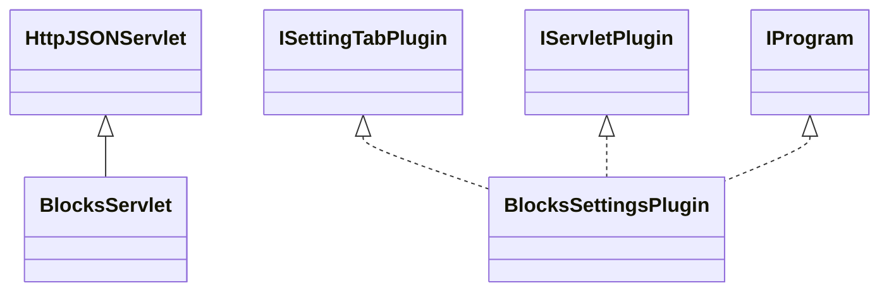

# SettingsBlocks.jar

[Group index](README.md) | [All archives](../README.md)

## Scope and provenance

- **Donor:** `SQX_145_REFERENCE_ROOT/internal/plugins/SettingsBlocks/SettingsBlocks.jar`.
- **SHA-256:** `3fab494fec49c6d86e898f1c0e2dfe359496b41f79b607ef071bd9a8fdf1640b`; accessed 2026-10-06; captured `2026-10-06T18:54:51.906614+00:00`.
- **Classes:** 2 raw entries; 2 unique entry names. Duplicate occurrence indices are zero-based.
- **Inspection:** read-only ZIP hashing and class-file structural parsing; signatures/descriptors, modifiers, hierarchy and references only. Bytecode bodies are hashed, not published.
- **Allocation:** proposed `FEAT-STRATEGY-SETTINGS-BLOCKS`, P05; [roadmap](../../sqx-full-application-roadmap.md). Domain README registration remains required.
- **Repository:** `01067f00031428613c6394064ca1bcadc1ba00ee`; review state unreviewed. Download label 145-dev1; installed build/activation and runtime equivalence unverified.
- **Limit:** every class/member is inventoried; declaration coverage does not establish consumed calls, defaults, formulas, failure semantics or algorithm parity.
- **Archive/resource index:** [242.json](../../../evidence/sqx145/archives/145/242.json).

## Complete member declarations

Member shards contain exact JVM names/descriptors, access flags, generic signatures, throws types, declared fields/methods, superclass/interfaces and referenced class names. All classes, nested/synthetic members and overloads are retained. Code length/hash is structural evidence, not a normalized algorithm comparison.

- [001.json](../../../evidence/sqx145/members/242/001.json) — SHA-256 `09cb8c870fd7ecd3480e157d0fe06c4ad3d326a2d4171a91c5102db2e5b0e554`.

## Focused structural diagram

Up to twelve non-nested classes; arrows show declared inheritance/interfaces only. External type names are not evidence of an available body or an executed dependency.

## Class inventory

| Archive entry | Occurrence | Class SHA-256 | Fields | Methods |
| --- | ---: | --- | ---: | ---: |
| `com/strategyquant/plugin/Settings/impl/Blocks/BlocksServlet.class` | 0 | `0ab2794b8838d36af0322df04379cd276537bdae2d8e30708f95893c3f5301ce` | 2 | 17 |
| `com/strategyquant/plugin/Settings/impl/Blocks/BlocksSettingsPlugin.class` | 0 | `e0d851ad6282eb7d548d1cee154c8bf98269151ecd3c06e12fc714d01cf85273` | 4 | 17 |
