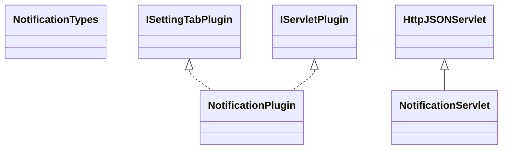

# SettingsNotification.jar

[Group index](README.md) | [All archives](../README.md)

## Scope and provenance

- **Donor:** `SQX_145_REFERENCE_ROOT/internal/plugins/SettingsNotification/SettingsNotification.jar`.
- **SHA-256:** `24c1973db874306ab3b8fa40ae1c64dde32ae7c2de0f22f51536f13ca655b148`; accessed 2026-10-06; captured `2026-10-06T18:54:51.906614+00:00`.
- **Classes:** 3 raw entries; 3 unique entry names. Duplicate occurrence indices are zero-based.
- **Inspection:** read-only ZIP hashing and class-file structural parsing; signatures/descriptors, modifiers, hierarchy and references only. Bytecode bodies are hashed, not published.
- **Allocation:** proposed `FEAT-PROJECT-SETTINGS-NOTIFICATION`, P13; [roadmap](../../sqx-full-application-roadmap.md). Domain README registration remains required.
- **Repository:** `01067f00031428613c6394064ca1bcadc1ba00ee`; review state unreviewed. Download label 145-dev1; installed build/activation and runtime equivalence unverified.
- **Limit:** every class/member is inventoried; declaration coverage does not establish consumed calls, defaults, formulas, failure semantics or algorithm parity.
- **Archive/resource index:** [256.json](../../../evidence/sqx145/archives/145/256.json).

## Complete member declarations

Member shards contain exact JVM names/descriptors, access flags, generic signatures, throws types, declared fields/methods, superclass/interfaces and referenced class names. All classes, nested/synthetic members and overloads are retained. Code length/hash is structural evidence, not a normalized algorithm comparison.

- [001.json](../../../evidence/sqx145/members/256/001.json) — SHA-256 `8f032929e28644e9e4a515dd76ed4676bfc4fb71d53af498aef5aea1ba5ae42d`.

## Focused structural diagram

Up to twelve non-nested classes; arrows show declared inheritance/interfaces only. External type names are not evidence of an available body or an executed dependency.

## Class inventory

| Archive entry | Occurrence | Class SHA-256 | Fields | Methods |
| --- | ---: | --- | ---: | ---: |
| `com/strategyquant/plugin/Settings/impl/Notification/NotificationPlugin.class` | 0 | `d400ca353bc23b2b1501a8c15425bce585a723fb79c7ac50a2c0ba1dcd14edf5` | 2 | 10 |
| `com/strategyquant/plugin/Settings/impl/Notification/NotificationServlet.class` | 0 | `a0b5f6adbef2b8fe0042c5a6cd23322d5a53e7e68f5155c816dc806fd5b4d7d0` | 1 | 4 |
| `com/strategyquant/plugin/Settings/impl/Notification/NotificationTypes.class` | 0 | `467c91c7c2bb2cd8c22543dd13be2e300581efce02352f4c9eff8e0df1109a52` | 2 | 1 |
