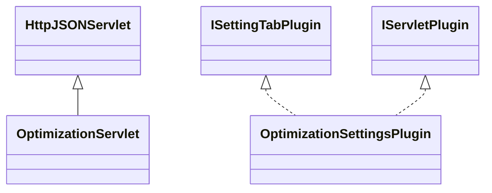

# SettingsOptimization.jar

[Group index](README.md) | [All archives](../README.md)

## Scope and provenance

- **Donor:** `SQX_145_REFERENCE_ROOT/internal/plugins/SettingsOptimization/SettingsOptimization.jar`.
- **SHA-256:** `396caaa71a8de45400cba27e8aa6810341088c077a56be9b0411adff13a9ea05`; accessed 2026-10-06; captured `2026-10-06T18:54:51.906614+00:00`.
- **Classes:** 2 raw entries; 2 unique entry names. Duplicate occurrence indices are zero-based.
- **Inspection:** read-only ZIP hashing and class-file structural parsing; signatures/descriptors, modifiers, hierarchy and references only. Bytecode bodies are hashed, not published.
- **Allocation:** proposed `FEAT-OPTIMIZER-SETTINGS-OPTIMIZATION`, P10; [roadmap](../../sqx-full-application-roadmap.md). Domain README registration remains required.
- **Repository:** `01067f00031428613c6394064ca1bcadc1ba00ee`; review state unreviewed. Download label 145-dev1; installed build/activation and runtime equivalence unverified.
- **Limit:** every class/member is inventoried; declaration coverage does not establish consumed calls, defaults, formulas, failure semantics or algorithm parity.
- **Archive/resource index:** [257.json](../../../evidence/sqx145/archives/145/257.json).

## Complete member declarations

Member shards contain exact JVM names/descriptors, access flags, generic signatures, throws types, declared fields/methods, superclass/interfaces and referenced class names. All classes, nested/synthetic members and overloads are retained. Code length/hash is structural evidence, not a normalized algorithm comparison.

- [001.json](../../../evidence/sqx145/members/257/001.json) — SHA-256 `8f7e5ca2e9ecfd539a1806343a073d068edc1e6bee5cee52fdc8305b22a11341`.

## Focused structural diagram

Up to twelve non-nested classes; arrows show declared inheritance/interfaces only. External type names are not evidence of an available body or an executed dependency.

## Class inventory

| Archive entry | Occurrence | Class SHA-256 | Fields | Methods |
| --- | ---: | --- | ---: | ---: |
| `com/strategyquant/plugin/Settings/impl/Optimization/OptimizationServlet.class` | 0 | `c0dce89b0693ba72e2d92e20ab02cc3c12027465aefe3915eae3860fb35fa0a9` | 3 | 12 |
| `com/strategyquant/plugin/Settings/impl/Optimization/OptimizationSettingsPlugin.class` | 0 | `f099814332e547269ddb987833626b1277b2b4a98531f019ba7a3826bde4ecc8` | 2 | 13 |
