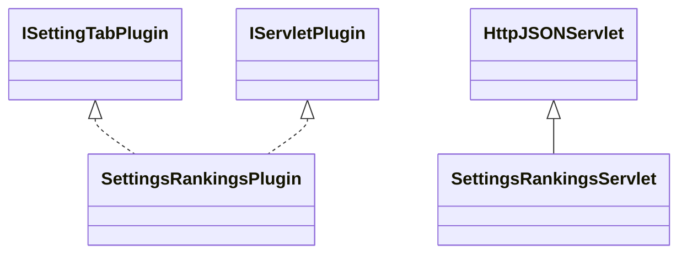

# SettingsRankings.jar

[Group index](README.md) | [All archives](../README.md)

## Scope and provenance

- **Donor:** `SQX_145_REFERENCE_ROOT/internal/plugins/SettingsRankings/SettingsRankings.jar`.
- **SHA-256:** `abbe6504b602945607a4f412bf247fe5710481d7726056398957ac6f5886da06`; accessed 2026-10-06; captured `2026-10-06T18:54:51.906614+00:00`.
- **Classes:** 2 raw entries; 2 unique entry names. Duplicate occurrence indices are zero-based.
- **Inspection:** read-only ZIP hashing and class-file structural parsing; signatures/descriptors, modifiers, hierarchy and references only. Bytecode bodies are hashed, not published.
- **Allocation:** proposed `FEAT-BUILDER-SETTINGS-RANKINGS`, P09; [roadmap](../../sqx-full-application-roadmap.md). Domain README registration remains required.
- **Repository:** `01067f00031428613c6394064ca1bcadc1ba00ee`; review state unreviewed. Download label 145-dev1; installed build/activation and runtime equivalence unverified.
- **Limit:** every class/member is inventoried; declaration coverage does not establish consumed calls, defaults, formulas, failure semantics or algorithm parity.
- **Archive/resource index:** [260.json](../../../evidence/sqx145/archives/145/260.json).

## Complete member declarations

Member shards contain exact JVM names/descriptors, access flags, generic signatures, throws types, declared fields/methods, superclass/interfaces and referenced class names. All classes, nested/synthetic members and overloads are retained. Code length/hash is structural evidence, not a normalized algorithm comparison.

- [001.json](../../../evidence/sqx145/members/260/001.json) — SHA-256 `443fcc44129d17a47ef7353640288399a7d4c92c8942aa2f52225d278d411c50`.

## Focused structural diagram

Up to twelve non-nested classes; arrows show declared inheritance/interfaces only. External type names are not evidence of an available body or an executed dependency.

## Class inventory

| Archive entry | Occurrence | Class SHA-256 | Fields | Methods |
| --- | ---: | --- | ---: | ---: |
| `com/strategyquant/plugin/Settings/impl/Rankings/SettingsRankingsPlugin.class` | 0 | `e7da59853301ada7910e9f46f76fe303426916a91866dcb30b2ea3498fc32cc2` | 3 | 12 |
| `com/strategyquant/plugin/Settings/impl/Rankings/SettingsRankingsServlet.class` | 0 | `a48fd7d14651c1d6e917ae728580a7eae689e067f7fa03f1f8a423033ae43482` | 1 | 5 |
