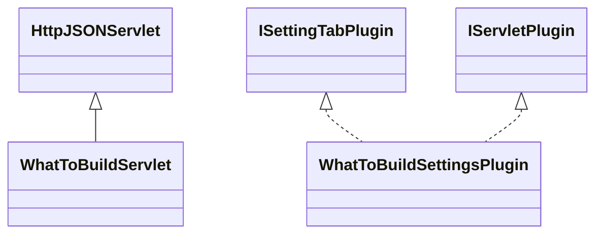

# SettingsWhatToBuild.jar

[Group index](README.md) | [All archives](../README.md)

## Scope and provenance

- **Donor:** `SQX_145_REFERENCE_ROOT/internal/plugins/SettingsWhatToBuild/SettingsWhatToBuild.jar`.
- **SHA-256:** `b836d5729770602d51b99f1b73edeaaa370518e003fc45bd54fcc4cfd8217518`; accessed 2026-10-06; captured `2026-10-06T18:54:51.906614+00:00`.
- **Classes:** 2 raw entries; 2 unique entry names. Duplicate occurrence indices are zero-based.
- **Inspection:** read-only ZIP hashing and class-file structural parsing; signatures/descriptors, modifiers, hierarchy and references only. Bytecode bodies are hashed, not published.
- **Allocation:** proposed `FEAT-BUILDER-SETTINGS-WHAT-TO-BUILD`, P09; [roadmap](../../sqx-full-application-roadmap.md). Domain README registration remains required.
- **Repository:** `01067f00031428613c6394064ca1bcadc1ba00ee`; review state unreviewed. Download label 145-dev1; installed build/activation and runtime equivalence unverified.
- **Limit:** every class/member is inventoried; declaration coverage does not establish consumed calls, defaults, formulas, failure semantics or algorithm parity.
- **Archive/resource index:** [265.json](../../../evidence/sqx145/archives/145/265.json).

## Complete member declarations

Member shards contain exact JVM names/descriptors, access flags, generic signatures, throws types, declared fields/methods, superclass/interfaces and referenced class names. All classes, nested/synthetic members and overloads are retained. Code length/hash is structural evidence, not a normalized algorithm comparison.

- [001.json](../../../evidence/sqx145/members/265/001.json) — SHA-256 `5c322ca67626ef62467ea9d7e47e5374008855a3974d3134e08b7c23a0f7d862`.

## Focused structural diagram

Up to twelve non-nested classes; arrows show declared inheritance/interfaces only. External type names are not evidence of an available body or an executed dependency.

## Class inventory

| Archive entry | Occurrence | Class SHA-256 | Fields | Methods |
| --- | ---: | --- | ---: | ---: |
| `com/strategyquant/plugin/Settings/impl/WhatToBuild/WhatToBuildServlet.class` | 0 | `1588d81d9caeb7c3d9dee6e217d868f2e446509248727d4e51b40114f64e5eb4` | 1 | 6 |
| `com/strategyquant/plugin/Settings/impl/WhatToBuild/WhatToBuildSettingsPlugin.class` | 0 | `4c2d4bb6c34920f7f5c558880f082b31c1e78f064c4eb390a6dbd93cf25e9639` | 4 | 22 |
