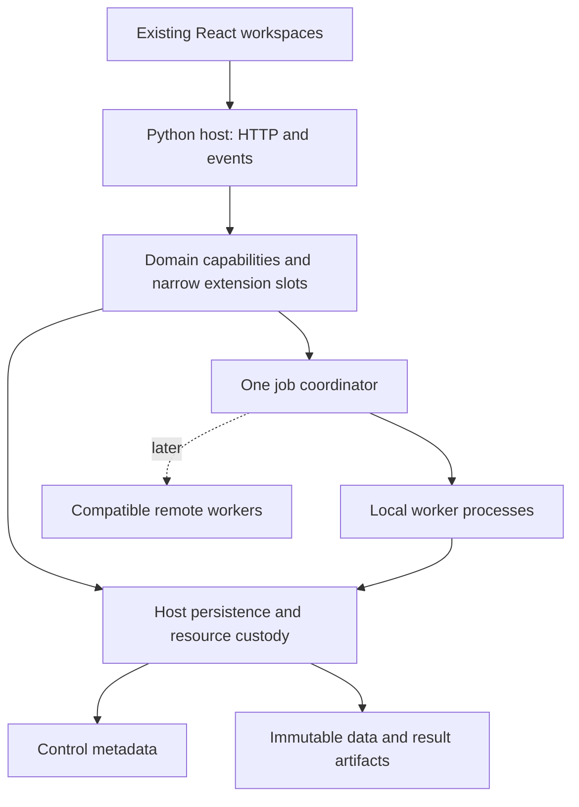

# V2 architecture

Proposed target. See [V2 scope](README.md) and the ratified
[structural constraints](../../ARCHITECTURE.md).

## Small deployment

Run one local Python application serving a versioned API and the built React UI.
Use bounded worker processes for CPU work, with the host coordinating persistence,
progress and cancellation. Use asynchronous I/O for downloads and event streams.
Keep numerical work off the web request loop.

Workers submit outputs through the host boundary; the diagram does not grant them
raw database handles. There is no Redis, broker, distributed actor system, separate
microservice fleet or second frontend required for the initial local product.

## Ownership without a large framework

Keep the existing host/workspace/plugin organization. A feature group is a planning
boundary, not a demand for one package or one file. AlgoWizard and CodeEditor can
remain separate workspaces while consuming the same strategy semantics. Optimizer
and Retester can remain separate views while consuming the same analysis methods.

| Owner | Contains | Collaborates through |
| --- | --- | --- |
| Host | Lifecycle, discovery, transport, sessions, logging, jobs and storage custody | Small typed service interfaces injected at startup |
| Workspace | Its workflow, routes, settings and presentation | Declared capabilities and immutable documents |
| Concept/plugin | Its calculation, schema, defaults, units, tests and optional export hooks | The workspace's typed extension slot |
| Universal primitives | Pure shared helpers | Ordinary explicit Python imports |

No peer business imports, import-time I/O or ambient settings/registry singleton.
Manifest discovery validates identity, versions, required slots and containment
before invoking an explicit factory. The host's mounted runtime index is derived
from manifests; it is not a hand-maintained catalog of domain concepts. Known
package locations are bounded, rather than recursively importing arbitrary code.

Use an extension when a concept/provider/format is independently replaceable.
Ordinary functions suffice for internal implementation details. Pair a settings
schema with its operation; a settings panel does not need a second backend plugin.
Derive catalog/configuration metadata from the owner, using custom UI where a
generic form would hide meaningful choices.

Disable/unmount contributions through explicit lifecycle hooks. Remove routes,
subscriptions and handles; stop affected jobs; preserve published artifacts and
unrelated work. Already retained bytes remain inspectable without importing their
producer. Missing producers yield a precise unavailable state.

## Shared documents

Keep these few document boundaries; fields below describe roles, not ratified APIs.
Each domain owns the actual schema and version. Avoid a universal document model
with every workspace's fields.

| Document | Semantic owner | Essential contents |
| --- | --- | --- |
| Dataset revision | F02 | Instrument/timeframe, columns/units, timezone/session, source and immutable data reference |
| Strategy revision | F03 | Typed rule tree, parameters, block versions and platform compatibility |
| Run specification | F04 | Strategy/data revisions, execution profile, costs, sizing, clocks, seed and numerical policy |
| Run result | F04 ledger; F05 derived analysis | Trades/equity, completion state, input lineage and output references |
| Analysis/project specification | Its F07/F08/F09 owner | Method/configuration, child inputs, budget and retained output relationships |
| Job record | F01 | IDs/owner, status/attempt, progress, cancellation and outcome references |
| Resource descriptor | F01 custody; domain schema owner | ID/revision, media type, checksum, producer/version and size |

The flow is strategy + dataset -> run -> immutable result -> analysis/portfolio.
Generators propose strategy documents; optimizers propose parameter changes;
retesters propose scenarios; all call the qualified F04 capability through typed
slots. They do not implement their own fill or accounting rules. F05 owns metrics
and correlations that consumers share; optimizers/portfolios own their selection
objectives and decisions. Per-concept calculation stays with its semantic owner.

## Storage with two clear roles

Retain the approved P01 preferences contract: validated `preferences.json`, revision
checks, atomic writes and a new explicitly owned data root. V2 does not replace it.

For later operational metadata, propose **one host-owned SQLite store** for job,
catalog, project and resource records, with domain-owned schemas behind narrow
repository interfaces. Use immutable JSON documents and Arrow/Parquet files for
large data, ledgers and series. DuckDB may query these artifacts for analytics;
it need not become a second operational writer. This is a future persistence
decision requiring ratification, not an activated schema, path or migration.

Stage files, validate/hash them, then publish references transactionally. Define
recovery for files staged without committed metadata and metadata whose file is
missing; a database commit and file rename are not a single atomic transaction.
The host owns transactions/migrations/leases/retention. Consumers get typed methods
and scoped resource access, never ad-hoc SQL. Start with the tables needed by the
current journey instead of a generic ORM or arbitrary query capability.

## Jobs and Python execution

One coordinator admits bounded jobs and manages attempts. Domain operations define
inputs and outputs; the coordinator defines queued/running/terminal transitions.
An optimizer/retester/project can own child jobs without duplicating a scheduler.
Cancellation propagates to children. Persist attempts and outcomes; after a crash,
report interruption and reconcile artifacts before deciding whether a retry is safe.

Use chunked work and cooperative cancellation for trusted numerical operations.
On Windows, spawned workers use inert imports, explicit worker initialization and
versioned validated inputs. Derive seeds from stable candidate/attempt identities,
and collect outputs in specified order so process count does not change results.
Do not serialize live services, closures, Java objects or arbitrary Python objects
as public/persistent job payloads. A method may support checkpointed resume; the
host does not promise arbitrary process-state resurrection or exactly-once effects.

User code and AI Python analysis need separate execution restrictions. A process
pool is not a security sandbox. Define filesystem/network permissions, deadlines,
output limits and enforceable isolation before enabling those execution modes.

## Reuse the declared stack

| Need | Initial candidate already available |
| --- | --- |
| Typed documents, API and web serving | Pydantic, FastAPI, Uvicorn |
| Logging, correlation and runtime utilities | `logging`, `contextvars`, `pathlib`, `hashlib`, `json`, `zipfile`, `tomllib` |
| I/O, clocks and process coordination | `asyncio`, `datetime`/`zoneinfo`, `concurrent.futures`, explicit spawned processes |
| Diagnostics | psutil and read-only OS probes |
| Provider HTTP | httpx with one explicit bounded request policy |
| Numerical arrays and tabular artifacts | NumPy, Polars, PyArrow; pandas where an actual consumer requires it |
| Analytical queries | DuckDB |
| Control metadata proposal | Standard-library `sqlite3` behind the host persistence owner |
| UI, tables and charts | Existing React/TypeScript, table/virtualization and chart packages |

These are reuse candidates from the repository, not fresh package evaluations.
Python 3.14/runtime compatibility and numerical behavior still need scoped checks.
PDF/spreadsheet generation, native compilation, neural training and MCP/provider
adapters may need additional packages; decide once at the owning milestone.

Profile before adding compilation/JIT, GPU execution, a message broker, distributed
cache, elaborate plugin hot reload or multiuser cloud deployment. These can be
future choices if evidence demands them; they are not foundation prerequisites.
Use the retained authenticated SSE path for browser notifications where sufficient,
with HTTP commands/snapshots. Add a domain channel only for a demonstrated need.

## Compatibility and precision

Python utility replacements need to satisfy the accepted product contract, not
mirror every Java method. External formats/protocols, indicator warm-up, fill order,
rounding, missing-value policy and platform timing remain precise obligations.
NumPy or another package cannot establish equivalence by name alone.

Research only the bodies/callers/resources needed by the next capability, using the
existing inventory to locate evidence. Reuse reference validation. Missing evidence
blocks the affected donor claim; independent target behavior must be identified
and approved as such. The existing exception for three unavailable host services
does not authorize guessed numerical, neural, trading or AI algorithms.
