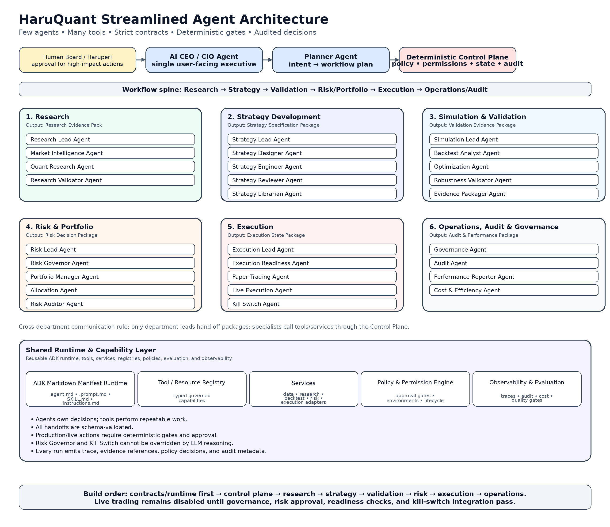

# HaruQuant Streamlined Agent Architecture

Status: proposed canonical architecture  
Scope: new-build streamlined forecast trading agent system  
Target runtime: Google ADK with Markdown Manifest Runtime  
Design goal: reduce agent bloat while preserving all critical trading, research, validation, risk, execution, governance, and audit capabilities  

---

## 1. Executive Summary

This architecture compresses the previous large multi-agent trading firm into a lean system organized around **decision ownership** instead of task names.

The core design rule is:

> An agent should exist only when it owns a decision, review, interpretation, escalation, approval recommendation, or specialist reasoning step. If it only fetches data, computes metrics, validates a schema, stores an artifact, runs a backtest, or sends an order to a connector, it should be a tool or service.

The final system uses:

- 7 operational departments.
- 30 to 31 core agents.
- Strict department-level handoffs.
- Deterministic control gates.
- Google ADK agents built from `.agent.md` manifests.
- Python-enforced schemas, tools, permissions, policies, audit, and tests.
- A capability layer for reusable services and tools.

The intended mental model is:

```text
Few agents.
Many tools.
Strict contracts.
Deterministic gates.
Audited decisions.
Human approval for high-impact actions.
```

---

## 2. New Architecture Diagram



---

## 3. Core Architecture Principles

### 3.1 Agent vs Tool Rule

Keep an item as an agent only if it owns one or more of:

- interpretation
- diagnosis
- planning
- review
- approval recommendation
- rejection
- escalation
- conflict resolution
- user-facing explanation
- cross-evidence synthesis

Convert an item into a tool or service if it only:

- fetches data
- parses a page
- calculates a metric
- runs a backtest
- runs an optimizer
- validates a schema
- writes logs
- stores files
- sends broker requests
- checks permissions
- formats reports

### 3.2 Department Boundary Rule

Each department has one outward-facing lead agent. Specialist agents inside a department should not freely communicate with all other departments.

Allowed main handoff chain:

```text
AI CEO / CIO
→ Planner
→ Control Plane
→ Research Lead
→ Strategy Lead
→ Simulation Lead
→ Risk Lead
→ Execution Lead
→ Governance / Audit / Monitoring
```

Blocked examples:

```text
Market Intelligence Agent → Live Execution Agent
Strategy Engineer Agent → Broker Adapter
Backtest Analyst Agent → Risk Limits
Optimization Agent → Live Deployment
```

### 3.3 Deterministic Gate Rule

LLM agents may reason, explain, rank, interpret, and propose. Deterministic Python policy must enforce:

- permissions
- environment mode
- lifecycle stage
- risk limits
- approval requirements
- output schemas
- tool access
- production action blocking
- kill-switch behavior

---

## 4. Top-Level System Layers

```text
Human Board / Haruperi
  ↓
AI CEO / CIO Agent
  ↓
Planner Agent
  ↓
Deterministic Control Plane
  ↓
Department Leads
  ↓
Specialist Agents
  ↓
Tools / Services / Resources
  ↓
Data, Brokers, Backtest Engine, Risk Engine, Registries, Audit Stores
```

### 4.1 Interface and Executive Layer

The user should interact primarily with the AI CEO / CIO Agent. This avoids letting users accidentally trigger specialist agents out of workflow order.

### 4.2 Planning and Control Layer

The Planner classifies intent. The Control Plane enforces deterministic routing, policy, permissions, audit, and workflow state.

### 4.3 Department Layer

Departments own coherent business capabilities: research, strategy, validation, risk, execution, operations.

### 4.4 Capability Layer

Tools, services, resources, prompts, adapters, and data providers live below agents. They are governed capabilities, not independent decision-makers.

### 4.5 Observability and Audit Layer

Every important run produces trace, audit metadata, evidence references, tool call records, policy decisions, and output artifacts.

---

## 5. Department Overview

| Department | Mission | Primary Output |
| --- | --- | --- |
| Executive & Control | Own the user-facing intent, planning, deterministic routing, permissions, workflow state, and cross-department governance. | Workflow Plan, Control Decision, Approval Packet, Audit Context |
| Research | Convert market questions and trading ideas into evidence-backed hypotheses. | Research Evidence Pack |
| Strategy Development | Convert approved hypotheses into deterministic, testable, versioned strategy specifications and code packages. | Strategy Specification Package |
| Simulation & Validation | Backtest, optimize, stress, and validate strategy candidates before portfolio admission. | Validation Evidence Package |
| Risk & Portfolio | Decide whether a validated strategy can enter the portfolio and under what constraints. | Risk Decision Package |
| Execution | Execute only approved paper/live actions through broker adapters with readiness checks and kill-switch protection. | Execution State Package |
| Operations, Audit & Governance | Operate the system safely through approvals, logs, performance monitoring, cost governance, audits, and quality gates. | Audit & Performance Package |
| Shared Runtime & Capability Layer | Provide reusable ADK runtime, tools, services, schemas, adapters, registries, observability, and evaluation. | Runtime Contracts, Tool Results, Service Results, Trace Records |

---

## 6. Agent Catalog

| Department | Agent | Compressed Responsibility |
| --- | --- | --- |
| Executive & Control | AI CEO / CIO Agent | single user-facing executive; routes final decisions |
| Executive & Control | Planner Agent | classifies intent and creates workflow plan |
| Executive & Control | Control Plane | deterministic policy, permissions, state, registry |
| Research | Research Lead Agent | owns evidence pack and department handoff |
| Research | Market Intelligence Agent | news, calendar, sentiment, macro, seasonality |
| Research | Quant Research Agent | technical/statistical edge discovery |
| Research | Research Validator Agent | sample, bias, evidence sufficiency gate |
| Strategy Development | Strategy Lead Agent | owns strategy package and handoff |
| Strategy Development | Strategy Designer Agent | turns hypothesis into rules/spec |
| Strategy Development | Strategy Engineer Agent | implements code + tests |
| Strategy Development | Strategy Reviewer Agent | reviews spec/code/risk assumptions |
| Strategy Development | Strategy Librarian Agent | versioning, registry, storage |
| Simulation & Validation | Simulation Lead Agent | owns test suite and validation workflow |
| Simulation & Validation | Backtest Analyst Agent | metrics, behavior, diagnostics |
| Simulation & Validation | Optimization Agent | parameter search, WFO/WFM, sensitivity |
| Simulation & Validation | Robustness Validator Agent | Monte Carlo, spread/slippage/cross tests |
| Simulation & Validation | Evidence Packager Agent | validation evidence package |
| Risk & Portfolio | Risk Lead Agent | final risk review and risk decision package |
| Risk & Portfolio | Risk Governor Agent | deterministic hard limits and gates |
| Risk & Portfolio | Portfolio Manager Agent | strategy lifecycle and portfolio composition |
| Risk & Portfolio | Allocation Agent | position sizing and capital allocation |
| Risk & Portfolio | Risk Auditor Agent | verifies risk evidence and approvals |
| Execution | Execution Lead Agent | coordinates approved execution workflow |
| Execution | Execution Readiness Agent | broker/session/spread/margin readiness |
| Execution | Paper Trading Agent | paper deployment and graduation report |
| Execution | Live Execution Agent | permissioned live actions only |
| Execution | Kill Switch Agent | deterministic safe-stop authority |
| Operations, Audit & Governance | Governance Agent | policy, approval, lifecycle authority |
| Operations, Audit & Governance | Audit Agent | immutable logs and traceability |
| Operations, Audit & Governance | Performance Reporter Agent | performance and degradation monitoring |
| Operations, Audit & Governance | Cost & Efficiency Agent | LLM, compute, broker, data, friction cost |
| Shared Runtime & Capability Layer | ADK Markdown Manifest Runtime | .agent.md, .prompt.md, SKILL.md, .instructions.md |
| Shared Runtime & Capability Layer | Tool / Resource Registry | typed governed capabilities |
| Shared Runtime & Capability Layer | Services | data, research, backtest, risk, execution adapters |
| Shared Runtime & Capability Layer | Observability / Evaluation | traces, audits, quality gates, tests |

---

## 7. Department Specifications


## 7.1. Executive & Control

### Mission

Own the user-facing intent, planning, deterministic routing, permissions, workflow state, and cross-department governance.

### Primary Output

```text
Workflow Plan, Control Decision, Approval Packet, Audit Context
```

### Department Rules

- No specialist agent is called directly by the UI unless explicitly allowed.
- Planner can route but cannot approve live trading.
- Control Plane is deterministic and is the final authority for permissions, environment checks, and lifecycle gates.

### Agents

#### AI CEO / CIO Agent

**Purpose:** single user-facing executive; routes final decisions.  
**Execution mode:** hybrid.  
**Risk class:** medium.  
**Default state mutation:** mostly read-only/advisory until handoff.  
**Primary consumers:** downstream department lead, audit layer, and workflow state manager.  
**Minimum outputs:** status, evidence references, decision/recommendation, blocked actions, assumptions, warnings, next action, audit metadata.

**Must not:**

- Bypass the Control Plane.
- Use tools outside the manifest allowlist.
- Hide missing evidence or stale data.
- Mutate production-impacting state without required policy/approval checks.
- Treat model reasoning as final authority for safety-critical decisions.

#### Planner Agent

**Purpose:** classifies intent and creates workflow plan.  
**Execution mode:** hybrid.  
**Risk class:** medium.  
**Default state mutation:** mostly read-only/advisory until handoff.  
**Primary consumers:** downstream department lead, audit layer, and workflow state manager.  
**Minimum outputs:** status, evidence references, decision/recommendation, blocked actions, assumptions, warnings, next action, audit metadata.

**Must not:**

- Bypass the Control Plane.
- Use tools outside the manifest allowlist.
- Hide missing evidence or stale data.
- Mutate production-impacting state without required policy/approval checks.
- Treat model reasoning as final authority for safety-critical decisions.

#### Control Plane

**Purpose:** deterministic policy, permissions, state, registry.  
**Execution mode:** deterministic.  
**Risk class:** critical.  
**Default state mutation:** mostly read-only/advisory until handoff.  
**Primary consumers:** downstream department lead, audit layer, and workflow state manager.  
**Minimum outputs:** status, evidence references, decision/recommendation, blocked actions, assumptions, warnings, next action, audit metadata.

**Must not:**

- Bypass the Control Plane.
- Use tools outside the manifest allowlist.
- Hide missing evidence or stale data.
- Mutate production-impacting state without required policy/approval checks.
- Treat model reasoning as final authority for safety-critical decisions.


## 7.2. Research

### Mission

Convert market questions and trading ideas into evidence-backed hypotheses.

### Primary Output

```text
Research Evidence Pack
```

### Department Rules

- Research can propose ideas but cannot code, backtest, allocate capital, or execute trades.
- Research must label data freshness and contradictory evidence.
- Research must identify whether an idea is testable before passing it forward.

### Agents

#### Research Lead Agent

**Purpose:** owns evidence pack and department handoff.  
**Execution mode:** hybrid.  
**Risk class:** medium.  
**Default state mutation:** mostly read-only/advisory until handoff.  
**Primary consumers:** downstream department lead, audit layer, and workflow state manager.  
**Minimum outputs:** status, evidence references, decision/recommendation, blocked actions, assumptions, warnings, next action, audit metadata.

**Must not:**

- Bypass the Control Plane.
- Use tools outside the manifest allowlist.
- Hide missing evidence or stale data.
- Mutate production-impacting state without required policy/approval checks.
- Treat model reasoning as final authority for safety-critical decisions.

#### Market Intelligence Agent

**Purpose:** news, calendar, sentiment, macro, seasonality.  
**Execution mode:** hybrid.  
**Risk class:** medium.  
**Default state mutation:** mostly read-only/advisory until handoff.  
**Primary consumers:** downstream department lead, audit layer, and workflow state manager.  
**Minimum outputs:** status, evidence references, decision/recommendation, blocked actions, assumptions, warnings, next action, audit metadata.

**Must not:**

- Bypass the Control Plane.
- Use tools outside the manifest allowlist.
- Hide missing evidence or stale data.
- Mutate production-impacting state without required policy/approval checks.
- Treat model reasoning as final authority for safety-critical decisions.

#### Quant Research Agent

**Purpose:** technical/statistical edge discovery.  
**Execution mode:** hybrid.  
**Risk class:** medium.  
**Default state mutation:** mostly read-only/advisory until handoff.  
**Primary consumers:** downstream department lead, audit layer, and workflow state manager.  
**Minimum outputs:** status, evidence references, decision/recommendation, blocked actions, assumptions, warnings, next action, audit metadata.

**Must not:**

- Bypass the Control Plane.
- Use tools outside the manifest allowlist.
- Hide missing evidence or stale data.
- Mutate production-impacting state without required policy/approval checks.
- Treat model reasoning as final authority for safety-critical decisions.

#### Research Validator Agent

**Purpose:** sample, bias, evidence sufficiency gate.  
**Execution mode:** hybrid.  
**Risk class:** medium.  
**Default state mutation:** mostly read-only/advisory until handoff.  
**Primary consumers:** downstream department lead, audit layer, and workflow state manager.  
**Minimum outputs:** status, evidence references, decision/recommendation, blocked actions, assumptions, warnings, next action, audit metadata.

**Must not:**

- Bypass the Control Plane.
- Use tools outside the manifest allowlist.
- Hide missing evidence or stale data.
- Mutate production-impacting state without required policy/approval checks.
- Treat model reasoning as final authority for safety-critical decisions.


## 7.3. Strategy Development

### Mission

Convert approved hypotheses into deterministic, testable, versioned strategy specifications and code packages.

### Primary Output

```text
Strategy Specification Package
```

### Department Rules

- Strategy Development cannot claim profitability.
- Strategy Engineer cannot bypass reviewer or risk gates.
- Strategy Librarian records versions but cannot promote to paper/live alone.

### Agents

#### Strategy Lead Agent

**Purpose:** owns strategy package and handoff.  
**Execution mode:** hybrid.  
**Risk class:** medium.  
**Default state mutation:** mostly read-only/advisory until handoff.  
**Primary consumers:** downstream department lead, audit layer, and workflow state manager.  
**Minimum outputs:** status, evidence references, decision/recommendation, blocked actions, assumptions, warnings, next action, audit metadata.

**Must not:**

- Bypass the Control Plane.
- Use tools outside the manifest allowlist.
- Hide missing evidence or stale data.
- Mutate production-impacting state without required policy/approval checks.
- Treat model reasoning as final authority for safety-critical decisions.

#### Strategy Designer Agent

**Purpose:** turns hypothesis into rules/spec.  
**Execution mode:** hybrid.  
**Risk class:** medium.  
**Default state mutation:** mostly read-only/advisory until handoff.  
**Primary consumers:** downstream department lead, audit layer, and workflow state manager.  
**Minimum outputs:** status, evidence references, decision/recommendation, blocked actions, assumptions, warnings, next action, audit metadata.

**Must not:**

- Bypass the Control Plane.
- Use tools outside the manifest allowlist.
- Hide missing evidence or stale data.
- Mutate production-impacting state without required policy/approval checks.
- Treat model reasoning as final authority for safety-critical decisions.

#### Strategy Engineer Agent

**Purpose:** implements code + tests.  
**Execution mode:** hybrid.  
**Risk class:** medium.  
**Default state mutation:** mostly read-only/advisory until handoff.  
**Primary consumers:** downstream department lead, audit layer, and workflow state manager.  
**Minimum outputs:** status, evidence references, decision/recommendation, blocked actions, assumptions, warnings, next action, audit metadata.

**Must not:**

- Bypass the Control Plane.
- Use tools outside the manifest allowlist.
- Hide missing evidence or stale data.
- Mutate production-impacting state without required policy/approval checks.
- Treat model reasoning as final authority for safety-critical decisions.

#### Strategy Reviewer Agent

**Purpose:** reviews spec/code/risk assumptions.  
**Execution mode:** hybrid.  
**Risk class:** medium.  
**Default state mutation:** mostly read-only/advisory until handoff.  
**Primary consumers:** downstream department lead, audit layer, and workflow state manager.  
**Minimum outputs:** status, evidence references, decision/recommendation, blocked actions, assumptions, warnings, next action, audit metadata.

**Must not:**

- Bypass the Control Plane.
- Use tools outside the manifest allowlist.
- Hide missing evidence or stale data.
- Mutate production-impacting state without required policy/approval checks.
- Treat model reasoning as final authority for safety-critical decisions.

#### Strategy Librarian Agent

**Purpose:** versioning, registry, storage.  
**Execution mode:** hybrid.  
**Risk class:** medium.  
**Default state mutation:** mostly read-only/advisory until handoff.  
**Primary consumers:** downstream department lead, audit layer, and workflow state manager.  
**Minimum outputs:** status, evidence references, decision/recommendation, blocked actions, assumptions, warnings, next action, audit metadata.

**Must not:**

- Bypass the Control Plane.
- Use tools outside the manifest allowlist.
- Hide missing evidence or stale data.
- Mutate production-impacting state without required policy/approval checks.
- Treat model reasoning as final authority for safety-critical decisions.


## 7.4. Simulation & Validation

### Mission

Backtest, optimize, stress, and validate strategy candidates before portfolio admission.

### Primary Output

```text
Validation Evidence Package
```

### Department Rules

- Simulation results must be reproducible and tied to data snapshots.
- Optimization is advisory, not approval.
- Robustness Validator can reject or conditionally pass but cannot allocate capital.

### Agents

#### Simulation Lead Agent

**Purpose:** owns test suite and validation workflow.  
**Execution mode:** hybrid.  
**Risk class:** medium.  
**Default state mutation:** mostly read-only/advisory until handoff.  
**Primary consumers:** downstream department lead, audit layer, and workflow state manager.  
**Minimum outputs:** status, evidence references, decision/recommendation, blocked actions, assumptions, warnings, next action, audit metadata.

**Must not:**

- Bypass the Control Plane.
- Use tools outside the manifest allowlist.
- Hide missing evidence or stale data.
- Mutate production-impacting state without required policy/approval checks.
- Treat model reasoning as final authority for safety-critical decisions.

#### Backtest Analyst Agent

**Purpose:** metrics, behavior, diagnostics.  
**Execution mode:** hybrid.  
**Risk class:** medium.  
**Default state mutation:** mostly read-only/advisory until handoff.  
**Primary consumers:** downstream department lead, audit layer, and workflow state manager.  
**Minimum outputs:** status, evidence references, decision/recommendation, blocked actions, assumptions, warnings, next action, audit metadata.

**Must not:**

- Bypass the Control Plane.
- Use tools outside the manifest allowlist.
- Hide missing evidence or stale data.
- Mutate production-impacting state without required policy/approval checks.
- Treat model reasoning as final authority for safety-critical decisions.

#### Optimization Agent

**Purpose:** parameter search, WFO/WFM, sensitivity.  
**Execution mode:** hybrid.  
**Risk class:** medium.  
**Default state mutation:** mostly read-only/advisory until handoff.  
**Primary consumers:** downstream department lead, audit layer, and workflow state manager.  
**Minimum outputs:** status, evidence references, decision/recommendation, blocked actions, assumptions, warnings, next action, audit metadata.

**Must not:**

- Bypass the Control Plane.
- Use tools outside the manifest allowlist.
- Hide missing evidence or stale data.
- Mutate production-impacting state without required policy/approval checks.
- Treat model reasoning as final authority for safety-critical decisions.

#### Robustness Validator Agent

**Purpose:** Monte Carlo, spread/slippage/cross tests.  
**Execution mode:** hybrid.  
**Risk class:** medium.  
**Default state mutation:** mostly read-only/advisory until handoff.  
**Primary consumers:** downstream department lead, audit layer, and workflow state manager.  
**Minimum outputs:** status, evidence references, decision/recommendation, blocked actions, assumptions, warnings, next action, audit metadata.

**Must not:**

- Bypass the Control Plane.
- Use tools outside the manifest allowlist.
- Hide missing evidence or stale data.
- Mutate production-impacting state without required policy/approval checks.
- Treat model reasoning as final authority for safety-critical decisions.

#### Evidence Packager Agent

**Purpose:** validation evidence package.  
**Execution mode:** hybrid.  
**Risk class:** medium.  
**Default state mutation:** mostly read-only/advisory until handoff.  
**Primary consumers:** downstream department lead, audit layer, and workflow state manager.  
**Minimum outputs:** status, evidence references, decision/recommendation, blocked actions, assumptions, warnings, next action, audit metadata.

**Must not:**

- Bypass the Control Plane.
- Use tools outside the manifest allowlist.
- Hide missing evidence or stale data.
- Mutate production-impacting state without required policy/approval checks.
- Treat model reasoning as final authority for safety-critical decisions.


## 7.5. Risk & Portfolio

### Mission

Decide whether a validated strategy can enter the portfolio and under what constraints.

### Primary Output

```text
Risk Decision Package
```

### Department Rules

- Risk Governor hard limits are deterministic.
- LLM reasoning may explain risk but not override hard limits.
- Portfolio changes require full evidence and audit trail.

### Agents

#### Risk Lead Agent

**Purpose:** final risk review and risk decision package.  
**Execution mode:** hybrid.  
**Risk class:** high.  
**Default state mutation:** mostly read-only/advisory until handoff.  
**Primary consumers:** downstream department lead, audit layer, and workflow state manager.  
**Minimum outputs:** status, evidence references, decision/recommendation, blocked actions, assumptions, warnings, next action, audit metadata.

**Must not:**

- Bypass the Control Plane.
- Use tools outside the manifest allowlist.
- Hide missing evidence or stale data.
- Mutate production-impacting state without required policy/approval checks.
- Treat model reasoning as final authority for safety-critical decisions.

#### Risk Governor Agent

**Purpose:** deterministic hard limits and gates.  
**Execution mode:** deterministic.  
**Risk class:** critical.  
**Default state mutation:** mostly read-only/advisory until handoff.  
**Primary consumers:** downstream department lead, audit layer, and workflow state manager.  
**Minimum outputs:** status, evidence references, decision/recommendation, blocked actions, assumptions, warnings, next action, audit metadata.

**Must not:**

- Bypass the Control Plane.
- Use tools outside the manifest allowlist.
- Hide missing evidence or stale data.
- Mutate production-impacting state without required policy/approval checks.
- Treat model reasoning as final authority for safety-critical decisions.

#### Portfolio Manager Agent

**Purpose:** strategy lifecycle and portfolio composition.  
**Execution mode:** hybrid.  
**Risk class:** high.  
**Default state mutation:** mostly read-only/advisory until handoff.  
**Primary consumers:** downstream department lead, audit layer, and workflow state manager.  
**Minimum outputs:** status, evidence references, decision/recommendation, blocked actions, assumptions, warnings, next action, audit metadata.

**Must not:**

- Bypass the Control Plane.
- Use tools outside the manifest allowlist.
- Hide missing evidence or stale data.
- Mutate production-impacting state without required policy/approval checks.
- Treat model reasoning as final authority for safety-critical decisions.

#### Allocation Agent

**Purpose:** position sizing and capital allocation.  
**Execution mode:** hybrid.  
**Risk class:** high.  
**Default state mutation:** mostly read-only/advisory until handoff.  
**Primary consumers:** downstream department lead, audit layer, and workflow state manager.  
**Minimum outputs:** status, evidence references, decision/recommendation, blocked actions, assumptions, warnings, next action, audit metadata.

**Must not:**

- Bypass the Control Plane.
- Use tools outside the manifest allowlist.
- Hide missing evidence or stale data.
- Mutate production-impacting state without required policy/approval checks.
- Treat model reasoning as final authority for safety-critical decisions.

#### Risk Auditor Agent

**Purpose:** verifies risk evidence and approvals.  
**Execution mode:** hybrid.  
**Risk class:** high.  
**Default state mutation:** mostly read-only/advisory until handoff.  
**Primary consumers:** downstream department lead, audit layer, and workflow state manager.  
**Minimum outputs:** status, evidence references, decision/recommendation, blocked actions, assumptions, warnings, next action, audit metadata.

**Must not:**

- Bypass the Control Plane.
- Use tools outside the manifest allowlist.
- Hide missing evidence or stale data.
- Mutate production-impacting state without required policy/approval checks.
- Treat model reasoning as final authority for safety-critical decisions.


## 7.6. Execution

### Mission

Execute only approved paper/live actions through broker adapters with readiness checks and kill-switch protection.

### Primary Output

```text
Execution State Package
```

### Department Rules

- Execution cannot accept raw strategy requests directly.
- Live Execution requires Risk approval, Governance approval when applicable, and readiness pass.
- Kill Switch can stop trading without waiting for LLM approval.

### Agents

#### Execution Lead Agent

**Purpose:** coordinates approved execution workflow.  
**Execution mode:** hybrid.  
**Risk class:** high.  
**Default state mutation:** write-capable with strict approvals.  
**Primary consumers:** downstream department lead, audit layer, and workflow state manager.  
**Minimum outputs:** status, evidence references, decision/recommendation, blocked actions, assumptions, warnings, next action, audit metadata.

**Must not:**

- Bypass the Control Plane.
- Use tools outside the manifest allowlist.
- Hide missing evidence or stale data.
- Mutate production-impacting state without required policy/approval checks.
- Treat model reasoning as final authority for safety-critical decisions.

#### Execution Readiness Agent

**Purpose:** broker/session/spread/margin readiness.  
**Execution mode:** hybrid.  
**Risk class:** high.  
**Default state mutation:** write-capable with strict approvals.  
**Primary consumers:** downstream department lead, audit layer, and workflow state manager.  
**Minimum outputs:** status, evidence references, decision/recommendation, blocked actions, assumptions, warnings, next action, audit metadata.

**Must not:**

- Bypass the Control Plane.
- Use tools outside the manifest allowlist.
- Hide missing evidence or stale data.
- Mutate production-impacting state without required policy/approval checks.
- Treat model reasoning as final authority for safety-critical decisions.

#### Paper Trading Agent

**Purpose:** paper deployment and graduation report.  
**Execution mode:** hybrid.  
**Risk class:** high.  
**Default state mutation:** write-capable with strict approvals.  
**Primary consumers:** downstream department lead, audit layer, and workflow state manager.  
**Minimum outputs:** status, evidence references, decision/recommendation, blocked actions, assumptions, warnings, next action, audit metadata.

**Must not:**

- Bypass the Control Plane.
- Use tools outside the manifest allowlist.
- Hide missing evidence or stale data.
- Mutate production-impacting state without required policy/approval checks.
- Treat model reasoning as final authority for safety-critical decisions.

#### Live Execution Agent

**Purpose:** permissioned live actions only.  
**Execution mode:** hybrid.  
**Risk class:** critical.  
**Default state mutation:** write-capable with strict approvals.  
**Primary consumers:** downstream department lead, audit layer, and workflow state manager.  
**Minimum outputs:** status, evidence references, decision/recommendation, blocked actions, assumptions, warnings, next action, audit metadata.

**Must not:**

- Bypass the Control Plane.
- Use tools outside the manifest allowlist.
- Hide missing evidence or stale data.
- Mutate production-impacting state without required policy/approval checks.
- Treat model reasoning as final authority for safety-critical decisions.

#### Kill Switch Agent

**Purpose:** deterministic safe-stop authority.  
**Execution mode:** deterministic.  
**Risk class:** critical.  
**Default state mutation:** write-capable with strict approvals.  
**Primary consumers:** downstream department lead, audit layer, and workflow state manager.  
**Minimum outputs:** status, evidence references, decision/recommendation, blocked actions, assumptions, warnings, next action, audit metadata.

**Must not:**

- Bypass the Control Plane.
- Use tools outside the manifest allowlist.
- Hide missing evidence or stale data.
- Mutate production-impacting state without required policy/approval checks.
- Treat model reasoning as final authority for safety-critical decisions.


## 7.7. Operations, Audit & Governance

### Mission

Operate the system safely through approvals, logs, performance monitoring, cost governance, audits, and quality gates.

### Primary Output

```text
Audit & Performance Package
```

### Department Rules

- Governance gates are not advisory.
- Audit records must be immutable or append-only.
- Cost and performance telemetry feed back into workflow optimization.

### Agents

#### Governance Agent

**Purpose:** policy, approval, lifecycle authority.  
**Execution mode:** hybrid.  
**Risk class:** medium.  
**Default state mutation:** write-capable with strict approvals.  
**Primary consumers:** downstream department lead, audit layer, and workflow state manager.  
**Minimum outputs:** status, evidence references, decision/recommendation, blocked actions, assumptions, warnings, next action, audit metadata.

**Must not:**

- Bypass the Control Plane.
- Use tools outside the manifest allowlist.
- Hide missing evidence or stale data.
- Mutate production-impacting state without required policy/approval checks.
- Treat model reasoning as final authority for safety-critical decisions.

#### Audit Agent

**Purpose:** immutable logs and traceability.  
**Execution mode:** hybrid.  
**Risk class:** medium.  
**Default state mutation:** write-capable with strict approvals.  
**Primary consumers:** downstream department lead, audit layer, and workflow state manager.  
**Minimum outputs:** status, evidence references, decision/recommendation, blocked actions, assumptions, warnings, next action, audit metadata.

**Must not:**

- Bypass the Control Plane.
- Use tools outside the manifest allowlist.
- Hide missing evidence or stale data.
- Mutate production-impacting state without required policy/approval checks.
- Treat model reasoning as final authority for safety-critical decisions.

#### Performance Reporter Agent

**Purpose:** performance and degradation monitoring.  
**Execution mode:** hybrid.  
**Risk class:** medium.  
**Default state mutation:** write-capable with strict approvals.  
**Primary consumers:** downstream department lead, audit layer, and workflow state manager.  
**Minimum outputs:** status, evidence references, decision/recommendation, blocked actions, assumptions, warnings, next action, audit metadata.

**Must not:**

- Bypass the Control Plane.
- Use tools outside the manifest allowlist.
- Hide missing evidence or stale data.
- Mutate production-impacting state without required policy/approval checks.
- Treat model reasoning as final authority for safety-critical decisions.

#### Cost & Efficiency Agent

**Purpose:** LLM, compute, broker, data, friction cost.  
**Execution mode:** hybrid.  
**Risk class:** medium.  
**Default state mutation:** write-capable with strict approvals.  
**Primary consumers:** downstream department lead, audit layer, and workflow state manager.  
**Minimum outputs:** status, evidence references, decision/recommendation, blocked actions, assumptions, warnings, next action, audit metadata.

**Must not:**

- Bypass the Control Plane.
- Use tools outside the manifest allowlist.
- Hide missing evidence or stale data.
- Mutate production-impacting state without required policy/approval checks.
- Treat model reasoning as final authority for safety-critical decisions.


## 7.8. Shared Runtime & Capability Layer

### Mission

Provide reusable ADK runtime, tools, services, schemas, adapters, registries, observability, and evaluation.

### Primary Output

```text
Runtime Contracts, Tool Results, Service Results, Trace Records
```

### Department Rules

- Tools perform work; agents own decisions.
- Side-effecting tools require permission gates.
- Schemas are mandatory at agent, workflow, and tool boundaries.

### Agents

#### ADK Markdown Manifest Runtime

**Purpose:** .agent.md, .prompt.md, SKILL.md, .instructions.md.  
**Execution mode:** hybrid.  
**Risk class:** medium.  
**Default state mutation:** write-capable with strict approvals.  
**Primary consumers:** downstream department lead, audit layer, and workflow state manager.  
**Minimum outputs:** status, evidence references, decision/recommendation, blocked actions, assumptions, warnings, next action, audit metadata.

**Must not:**

- Bypass the Control Plane.
- Use tools outside the manifest allowlist.
- Hide missing evidence or stale data.
- Mutate production-impacting state without required policy/approval checks.
- Treat model reasoning as final authority for safety-critical decisions.

#### Tool / Resource Registry

**Purpose:** typed governed capabilities.  
**Execution mode:** hybrid.  
**Risk class:** medium.  
**Default state mutation:** write-capable with strict approvals.  
**Primary consumers:** downstream department lead, audit layer, and workflow state manager.  
**Minimum outputs:** status, evidence references, decision/recommendation, blocked actions, assumptions, warnings, next action, audit metadata.

**Must not:**

- Bypass the Control Plane.
- Use tools outside the manifest allowlist.
- Hide missing evidence or stale data.
- Mutate production-impacting state without required policy/approval checks.
- Treat model reasoning as final authority for safety-critical decisions.

#### Services

**Purpose:** data, research, backtest, risk, execution adapters.  
**Execution mode:** hybrid.  
**Risk class:** medium.  
**Default state mutation:** write-capable with strict approvals.  
**Primary consumers:** downstream department lead, audit layer, and workflow state manager.  
**Minimum outputs:** status, evidence references, decision/recommendation, blocked actions, assumptions, warnings, next action, audit metadata.

**Must not:**

- Bypass the Control Plane.
- Use tools outside the manifest allowlist.
- Hide missing evidence or stale data.
- Mutate production-impacting state without required policy/approval checks.
- Treat model reasoning as final authority for safety-critical decisions.

#### Observability / Evaluation

**Purpose:** traces, audits, quality gates, tests.  
**Execution mode:** hybrid.  
**Risk class:** medium.  
**Default state mutation:** write-capable with strict approvals.  
**Primary consumers:** downstream department lead, audit layer, and workflow state manager.  
**Minimum outputs:** status, evidence references, decision/recommendation, blocked actions, assumptions, warnings, next action, audit metadata.

**Must not:**

- Bypass the Control Plane.
- Use tools outside the manifest allowlist.
- Hide missing evidence or stale data.
- Mutate production-impacting state without required policy/approval checks.
- Treat model reasoning as final authority for safety-critical decisions.


---

## 8. Standard Department Output Contracts

### 8.1 Research Evidence Pack

```yaml
artifact_type: research_evidence_pack
schema_version: 1.0.0
hypothesis: string
market_context: object
technical_context: object
macro_context: object
sentiment_context: object
seasonality_context: object
supporting_evidence: list
contradictory_evidence: list
data_freshness: object
bias_checks: list
research_decision: proceed | reject | needs_more_evidence
audit_refs: list
```

### 8.2 Strategy Specification Package

```yaml
artifact_type: strategy_specification_package
schema_version: 1.0.0
strategy_spec: object
strategy_code_refs: list
config_refs: list
assumptions: list
risk_flags: list
required_data: list
unit_tests: list
backtest_plan: object
handoff_status: ready_for_validation | needs_revision | rejected
audit_refs: list
```

### 8.3 Validation Evidence Package

```yaml
artifact_type: validation_evidence_package
schema_version: 1.0.0
backtest_results: object
optimization_results: object
robustness_results: object
statistical_validation: object
cost_sensitivity: object
known_weaknesses: list
validation_decision: pass | fail | conditional_pass
required_constraints: list
audit_refs: list
```

### 8.4 Risk Decision Package

```yaml
artifact_type: risk_decision_package
schema_version: 1.0.0
portfolio_impact: object
correlation_impact: object
var_cvar_impact: object
margin_impact: object
allocation_proposal: object
risk_constraints: list
risk_decision: approved | rejected | approved_with_constraints | requires_human_board
approval_requirements: list
audit_refs: list
```

### 8.5 Execution State Package

```yaml
artifact_type: execution_state_package
schema_version: 1.0.0
execution_mode: paper | live | disabled
broker: mt5 | ctrader | simulated
readiness_checks: object
orders: list
fills: list
slippage: object
errors: list
kill_switch_status: active | inactive | triggered
audit_refs: list
```

### 8.6 Audit & Performance Package

```yaml
artifact_type: audit_performance_package
schema_version: 1.0.0
trace_id: string
workflow_id: string
agent_runs: list
tool_calls: list
policy_decisions: list
approval_records: list
performance_metrics: object
cost_metrics: object
incidents: list
audit_decision: clean | warning | failed
```

---

## 9. Capability and Service Placement

### 9.1 Tools and Services That Should Not Be Agents

| Capability | Placement |
|---|---|
| ForexFactory news reader | `agentic/capabilities/tools/forexfactory/news_tool.py` |
| ForexFactory calendar reader | `agentic/capabilities/tools/forexfactory/calendar_tool.py` |
| ForexFactory sentiment reader | `agentic/capabilities/tools/forexfactory/sentiment_tool.py` |
| Seasonality calculator | `agentic/capabilities/tools/research/seasonality_tool.py` |
| Technical indicator calculator | `services/analytics/indicators/` |
| Backtest runner | `services/backtesting/runner.py` |
| Optimization runner | `services/optimization/runner.py` |
| Monte Carlo runner | `services/robustness/monte_carlo.py` |
| VaR/CVaR calculator | `services/risk/var.py` |
| Portfolio exposure calculator | `services/portfolio/exposure.py` |
| MT5 connector | `services/execution/mt5_bridge.py` |
| cTrader connector | `services/execution/ctrader_bridge.py` |
| Audit writer | `agentic/observability/audit_logger.py` |
| Permission checker | `agentic/policy/permissions.py` |
| Kill-switch trigger engine | `services/execution/kill_switch.py` |

### 9.2 Capability Risk Classes

| Class | Meaning | Default Rule |
|---|---|---|
| A | read-only | auto-allowed if manifest permits |
| B | low-risk reversible write | policy gate |
| C | material write | human approval |
| D | financially material or live trading | strict approval + audit |
| E | prohibited or irreversible | deny unless special governance path exists |

---

## 10. Recommended Repository Structure

```text
haruquant/
├── docs/
│   ├── architecture/
│   │   ├── Streamlined_Agent_Architecture.md
│   │   └── Streamlined_Agent_Architecture.png
│   ├── agents/
│   ├── workflows/
│   ├── governance/
│   ├── runbooks/
│   └── adr/
│
├── agentic/
│   ├── host/
│   │   ├── app.py
│   │   ├── router.py
│   │   ├── orchestrator.py
│   │   └── session_manager.py
│   │
│   ├── agents/
│   │   ├── runtime/
│   │   ├── shared/
│   │   ├── executive/
│   │   ├── research/
│   │   ├── strategy/
│   │   ├── validation/
│   │   ├── risk_portfolio/
│   │   ├── execution/
│   │   └── operations/
│   │
│   ├── workflows/
│   ├── capabilities/
│   ├── policy/
│   ├── approvals/
│   ├── evaluation/
│   ├── observability/
│   ├── registry/
│   └── audit/
│
├── services/
│   ├── data/
│   ├── research/
│   ├── strategy/
│   ├── backtesting/
│   ├── optimization/
│   ├── robustness/
│   ├── risk/
│   ├── portfolio/
│   ├── execution/
│   └── reporting/
│
├── tests/
│   ├── integration/
│   ├── agentic/
│   ├── contracts/
│   ├── security/
│   ├── failure/
│   └── evaluation/
│
└── scripts/
    ├── validate_agent_manifest.py
    ├── validate_markdown_agents.py
    ├── agent_registry_quality_gate.py
    ├── workflow_quality_gate.py
    ├── run_agent_audit.py
    └── generate_audit_report.py
```

---

## 11. Agent Package Standard

Every agent folder should follow this shape:

```text
agentic/agents/<department>/<agent_name>/
├── <agent_name>.agent.md
├── README.md
├── agent.py
├── service.py
├── policy.py
├── permissions.py
├── evaluator.py
├── schemas/
│   ├── input_schema.py
│   └── output_schema.py
├── prompts/
│   └── <task>.prompt.md
├── instructions/
│   └── <agent_name>.instructions.md
├── skills/
│   └── <skill_name>/
│       └── SKILL.md
├── tools/
│   └── local_tools.py
├── resources/
│   └── local_resources.py
├── examples/
├── fixtures/
└── tests/
    ├── test_manifest.py
    ├── test_schemas.py
    ├── test_agent.py
    ├── test_policy.py
    ├── test_permissions.py
    ├── test_evaluator.py
    └── test_smoke.py
```

Minimum viable agent package:

```text
<agent_name>.agent.md
README.md
schemas/input_schema.py
schemas/output_schema.py
tests/test_manifest.py
tests/test_smoke.py
```

---

## 12. Workflow Patterns

### 12.1 Strategy Creation Workflow

```text
User → AI CEO/CIO → Planner → Control Plane
→ Research Lead
→ Strategy Lead
→ Strategy Designer
→ Strategy Reviewer
→ Strategy Engineer
→ Strategy Librarian
→ Simulation Lead
```

### 12.2 Backtest and Validation Workflow

```text
Simulation Lead
→ Backtest Analyst
→ Optimization Agent, if allowed
→ Robustness Validator
→ Evidence Packager
→ Risk Lead
```

### 12.3 Paper Trading Admission Workflow

```text
Risk Lead
→ Risk Governor
→ Portfolio Manager
→ Allocation Agent
→ Risk Auditor
→ Execution Lead
→ Execution Readiness
→ Paper Trading Agent
```

### 12.4 Live Activation Workflow

```text
Paper Trading Agent
→ Performance Reporter
→ Risk Lead
→ Risk Governor
→ Governance Agent
→ Human Board, if required
→ Execution Lead
→ Execution Readiness
→ Live Execution Agent
→ Audit Agent
```

### 12.5 Kill-Switch Workflow

```text
Monitoring / Risk Governor / Execution Readiness
→ Kill Switch Agent
→ Live Execution Agent closes or disables permitted actions
→ Audit Agent
→ Governance Agent
→ Human Board notification
```

---

## 13. Build-Time Quality Gates

A workflow or agent cannot be promoted unless:

- manifest is valid
- required schemas exist
- allowed and forbidden tools are declared
- blocked actions are explicit
- output schema validates
- policy tests pass
- permission tests pass
- smoke tests pass
- failure-path tests exist for high-impact actions
- audit metadata is emitted
- registry entry exists
- audit checklist is completed before staging/production

---

## 14. Final Architecture Decision

The compressed system preserves all major trading-firm capabilities while reducing communication overhead by enforcing:

1. one department lead per department,
2. specialist agents only where reasoning/review is needed,
3. tools/services for repeatable deterministic tasks,
4. deterministic control gates for safety,
5. audit-first handoffs,
6. strict Google ADK manifest-driven packaging.

This should be the new baseline architecture for building HaruQuant agents from scratch.
