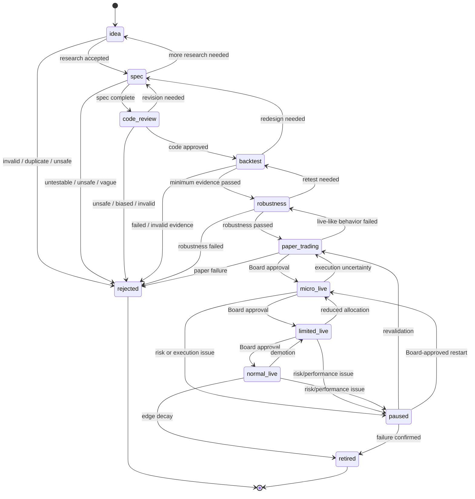

# HaruQuant Streamlined Strategy Lifecycle Policy

**Document:** `strategy_lifecycle.md`  
**Recommended path:** `docs/agentic_firm/strategy_lifecycle.md`  
**Owner:** Human Board / Haruperi  
**Version:** 2.0.0  
**Status:** Streamlined lifecycle baseline  
**Last Updated:** 2026-05-24  

---

## 1. Purpose

This document defines the official lifecycle policy for every trading strategy inside HaruQuant.

The goal is to keep implementation simple while preventing any strategy from jumping from idea to live capital without evidence, review, risk checks, paper trading, and Human Board approval.

---

## 2. Core Lifecycle Law

No strategy may trade live capital unless it has passed the required lifecycle states, produced the required evidence, passed RiskGovernor checks, and received Human Board approval.

Standard lifecycle:

```text
idea
→ spec
→ code_review
→ backtest
→ robustness
→ paper_trading
→ micro_live
→ limited_live
→ normal_live
```

Other states:

```text
paused
retired
rejected
```

---

## 3. Lifecycle State Machine



---

## 4. State Definitions

| State | Meaning | Capital allowed | Human approval |
|---|---|---:|---:|
| `idea` | Raw hypothesis or concept | No | No |
| `spec` | Formal testable strategy specification | No | No |
| `code_review` | Code exists and is under review | No | No |
| `backtest` | Historical testing underway or complete | No | No |
| `robustness` | Stress/OOS/Monte Carlo validation | No | No |
| `paper_trading` | Simulated live-like execution | No live capital | Usually no |
| `micro_live` | Smallest live deployment | Minimal | Yes |
| `limited_live` | Restricted live allocation | Limited | Yes |
| `normal_live` | Approved live allocation | Approved | Yes |
| `paused` | Temporarily disabled | No new entries | Yes if live resume |
| `retired` | Permanently inactive | No | Yes if live |
| `rejected` | Failed before deployment | No | No |

---

## 5. Required Evidence by Stage

### `idea` → `spec`

Required:

- research brief
- clear hypothesis
- market/symbol/timeframe
- strategy class
- data availability
- risk concerns
- duplicate-strategy check
- testability review

### `spec` → `code_review`

Required:

- complete strategy specification
- objective entry/exit rules
- position sizing
- cost assumptions
- spread/slippage assumptions
- session/news/weekend/overnight rules
- prop-firm compatibility
- Strategy Reviewer marks spec as code-ready

### `code_review` → `backtest`

Required:

- source file
- spec reference
- code version hash
- parameter manifest
- unit tests pass
- no lookahead bias
- no data leakage
- no repainting logic
- review approval
- audit entry

### `backtest` → `robustness`

Required:

- reproducible backtest
- data snapshot
- code hash
- backtest config
- trades/deals/orders
- equity and drawdown curves
- metrics JSON
- cost-aware results
- out-of-sample review
- prop-firm daily/total loss checks
- Backtest Analyst recommends robustness

### `robustness` → `paper_trading`

Required:

- OOS validation
- spread stress
- slippage stress
- commission/swap stress where relevant
- Monte Carlo survival
- parameter sensitivity/stability
- drawdown inside policy
- Risk Reviewer approval
- Portfolio Manager duplication check
- audit entry

### `paper_trading` → `micro_live`

Required:

- minimum paper period
- minimum paper trades
- paper performance within expected range
- no critical execution anomalies
- prop-firm checks passed
- Best Day Rule acceptable
- Risk Reviewer approval
- Portfolio Manager recommendation
- Human Board approval
- live execution readiness check

### `micro_live` → `limited_live`

Required:

- minimum micro-live period
- minimum live trade count
- slippage within expectation
- drawdown within threshold
- no critical audit findings
- Risk Reviewer approval
- Portfolio Manager approval
- Human Board approval

### `limited_live` → `normal_live`

Required:

- minimum limited-live period
- stable live performance
- controlled drawdown
- acceptable Best Day Rule
- diversification benefit
- acceptable correlation/concentration
- Risk Reviewer approval
- Portfolio Manager approval
- Human Board approval

---

## 6. Promotion Authority Matrix

| Promotion | Agent recommendation | Risk review | Portfolio review | RiskGovernor | Human Board |
|---|---:|---:|---:|---:|---:|
| `idea` → `spec` | Yes | No | No | No | No |
| `spec` → `code_review` | Yes | No | No | No | No |
| `code_review` → `backtest` | Yes | No | No | No | No |
| `backtest` → `robustness` | Yes | Optional | Optional | No | No |
| `robustness` → `paper_trading` | Yes | Yes | Yes | Paper check | No |
| `paper_trading` → `micro_live` | Yes | Yes | Yes | Yes | Yes |
| `micro_live` → `limited_live` | Yes | Yes | Yes | Yes | Yes |
| `limited_live` → `normal_live` | Yes | Yes | Yes | Yes | Yes |
| Allocation increase | Yes | Yes | Yes | Yes | Yes |
| Resume from live pause | Yes | Yes | Yes | Yes | Yes |
| Retire live strategy | Yes | Yes | Yes | Optional | Yes |

---

## 7. Invalid Transitions

The following transitions are forbidden:

- `idea` → `backtest`
- `idea` → `paper_trading`
- `idea` → `micro_live`
- `spec` → `backtest` without `code_review`
- `code_review` → `robustness` without `backtest`
- `backtest` → `paper_trading` without `robustness`
- `robustness` → `micro_live` without `paper_trading`
- `paper_trading` → `limited_live` without `micro_live`
- `paper_trading` → `normal_live`
- `micro_live` → `normal_live` without `limited_live`
- `rejected` → active state without new version
- `retired` → active state without new version
- any state → live state without Human Board approval
- any live state without RiskGovernor path

---

## 8. Strategy Version Change Rules

A new version or restart is required when any of the following change:

- entry logic
- exit logic
- symbol or symbol universe
- timeframe
- position sizing
- stop-loss logic
- take-profit logic
- session filter
- news filter
- weekend/overnight behavior
- indicator parameters
- optimization parameters
- risk assumptions
- execution model
- broker venue

Minor non-trading changes may restart from `code_review`. Moderate parameter changes restart from `backtest`. Major logic changes restart from `spec`.

---

## 9. Monthly Lifecycle Review

Every active paper/live strategy must have periodic review.

Review inputs:

- lifecycle state
- allocation
- monthly return
- monthly drawdown
- trade count
- win/loss behavior
- Best Day Rule score
- prop-firm compliance status
- RiskGovernor rejection rate
- correlation report
- execution quality report
- incident history

Possible decisions:

- keep current state
- promote
- demote
- pause
- retire
- create new version
- reduce allocation
- request increased allocation

---

## 10. Audit Requirement

Every lifecycle transition must write an audit record containing:

- strategy ID
- strategy version
- previous state
- new state
- transition reason
- agent recommendation
- human approval if required
- evidence references
- risk review reference
- portfolio review reference
- RiskGovernor reference
- timestamp
- actor
- configuration hash
- policy version

---

## 11. Minimal Implementation Rule

For the simple implementation, lifecycle enforcement may start in:

```text
runtime/permissions.py
tools/audit_tools.py
workflows/strategy_lifecycle.py
tests/test_strategy_lifecycle.py
```

Do not create a large lifecycle service folder until the simple workflow file becomes too large.
