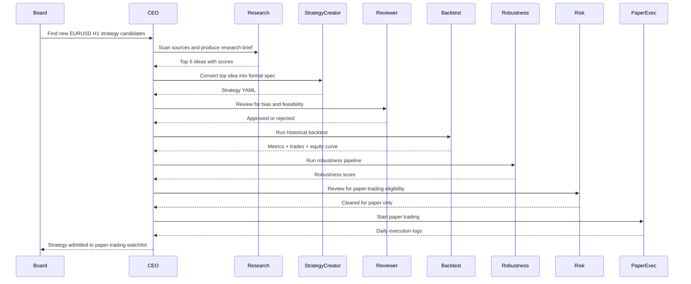
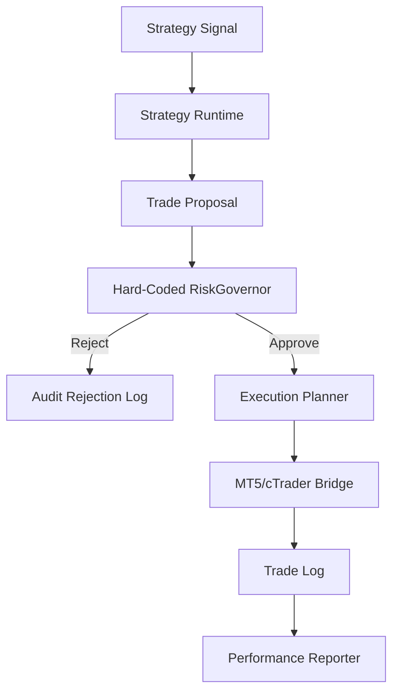

Below is the HaruQuant version of a **“Zero Human Trading Firm”** plan.

The key adaptation: do **not** make it literally zero-human for live capital. Make it **zero-human for research, strategy generation, backtesting, reporting, monitoring, and paper trading**, but **human-governed for live capital activation and risk-threshold changes**. This matches the strongest safety pattern in the Paperclip setup: paper trading by default, live trading only after explicit Board/human approval, and only the human can change the risk thresholds. ([GitHub][1])

---

# HaruQuant Multi-Agent Trading Firm Plan

## 1. Source patterns to reuse

From the Paperclip “Zero Human Trading Firm” repo, the useful pattern is a company-style org with a **CEO**, **Research Agent**, **Backtest Agent**, **Risk Management Agent**, **Execution Agent**, and **Cost Optimizer**. The setup also creates folders for agents, strategies, logs, institutional memory, performance memory, and config. ([GitHub][1])

From the Windows onboarding prompt, the strongest engineering idea is that every agent has a **task contract**: checkout the task, do the work, update status, log outputs, and never silently finish without reporting. It also defines concrete role mandates for research, backtesting, risk review, execution, and cost control. ([GitHub][2])

From TradingAgents, the useful pattern is not just “one trading bot,” but a structured decision pipeline: **fundamental analyst, sentiment analyst, news analyst, technical analyst, bull/bear researchers, trader, risk team, and portfolio manager**. The Portfolio Manager approves or rejects transaction proposals before simulated execution. ([GitHub][3])

From the TradingAgents paper, the key research insight is that LLM trading systems should imitate a real trading firm: specialized agents debate, synthesize evidence, monitor risk, and use historical data before decisions are made. ([arXiv][4])

---

## 2. Final target architecture

Your HaruQuant agentic trading firm should have this structure:

```mermaid
flowchart TD
    Board[Human Board / Haruperi] --> CEO[CEO Agent / Chief Investment Officer]

    CEO --> Planner[Planner / Orchestrator]
    Planner --> ResearchDept[Research Department]
    Planner --> StrategyDept[Strategy Development Department]
    Planner --> ValidationDept[Validation & Backtesting Department]
    Planner --> RiskDept[Risk & Portfolio Department]
    Planner --> ExecutionDept[Execution Department]
    Planner --> OpsDept[Operations & Audit Department]

    ResearchDept --> MarketIntel[Market Intelligence Agent]
    ResearchDept --> StrategyScout[Strategy Scout Agent]
    ResearchDept --> NewsSentiment[News & Sentiment Agent]
    ResearchDept --> TechnicalAnalyst[Technical Analyst Agent]

    StrategyDept --> StrategyCreator[Strategy Creator Agent]
    StrategyDept --> CodeGen[Strategy Codegen Agent]
    StrategyDept --> StrategyReviewer[Strategy Reviewer Agent]

    ValidationDept --> BacktestAgent[Backtest Agent]
    ValidationDept --> OptimizationAgent[Optimization Comparator]
    ValidationDept --> RobustnessAgent[Robustness / Monte Carlo Agent]
    ValidationDept --> StatisticsAgent[Statistical Validation Agent]

    RiskDept --> RiskReviewer[Risk Reviewer]
    RiskDept --> RiskGovernor[Hard-Coded Risk Governor]
    RiskDept --> PortfolioManager[Portfolio Manager Agent]

    ExecutionDept --> ExecutionPlanner[Execution Planner]
    ExecutionDept --> BrokerBridge[MT5 / cTrader Execution Bridge]
    ExecutionDept --> KillSwitch[Kill Switch Service]

    OpsDept --> PerformanceReporter[Performance Reporter]
    OpsDept --> CostOptimizer[Cost Optimizer]
    OpsDept --> AuditAgent[Audit & Compliance Agent]

    BrokerBridge --> Markets[Broker / Exchange]
    RiskGovernor --> BrokerBridge
    KillSwitch --> BrokerBridge
```



The important rule: **LLMs propose, explain, compare, and document. Hard-coded services enforce risk, execution permissions, kill switches, and portfolio constraints.**

---

## 3. The agent hierarchy for HaruQuant

### A. Board / Human Owner

This is you.

The Board is the only authority allowed to:

| Authority                             |         Allowed? |
| ------------------------------------- | ---------------: |
| Change risk thresholds                |              Yes |
| Activate live trading                 |              Yes |
| Approve new strategy for live capital |              Yes |
| Override Risk Governor                | No, not directly |
| Delete historical backtest evidence   |               No |
| Disable audit logs                    |               No |

The Paperclip setup correctly treats the human as the only party allowed to modify risk thresholds, and the Execution Agent defaults to paper mode unless live trading is explicitly activated. ([GitHub][2])

---

### B. CEO Agent / Chief Investment Officer

This is the only agent you usually talk to.

**Purpose:** receive your command, turn it into a structured plan, delegate to specialists, collect results, and present a final investment memo.

**Responsibilities:**

| Responsibility   | Description                                                                                                          |
| ---------------- | -------------------------------------------------------------------------------------------------------------------- |
| Triage           | Decide whether a request is research, strategy creation, diagnosis, risk review, page action, or execution proposal. |
| Delegation       | Assign child tasks to specialist agents.                                                                             |
| Evidence control | Ensure every decision links to source data, backtest result, risk report, and logs.                                  |
| Board reporting  | Produce weekly and monthly Board reports.                                                                            |
| Escalation       | Ask you for approval only when capital, risk thresholds, or live deployment are involved.                            |

This maps directly to the Paperclip CEO pattern: the CEO manages the firm, delegates specialist work, and reports to the human Board. ([GitHub][2])

---

### C. Planner / Orchestrator Agent

You already started this by replacing keyword routing with a structured planner.

This should become the **central HaruQuant routing brain**.

**Planner output schema:**

```json
{
  "intent": "strategy_creation | backtest_diagnosis | optimization_comparison | risk_review | execution_proposal | research | reporting | page_action | clarification",
  "missing_inputs": [],
  "context_needed": [],
  "backend_tools_to_run": [],
  "attached_tools": [],
  "page_actions_to_plan": [],
  "artifact_expected": false,
  "risk_level": "low | medium | high | critical",
  "requires_board_approval": false,
  "requires_risk_governor": false,
  "requires_audit_log": true
}
```

This is the right foundation. Do not remove it. Expand it into the control plane for all agents.

---

## 4. HaruQuant departments and agents

### Department 1: Research Department

#### 1. Market Intelligence Agent

**Purpose:** scan markets, symbols, macro events, volatility regimes, and liquidity conditions.

**Inputs:**

| Source             | Tool                   |
| ------------------ | ---------------------- |
| OHLCV data         | HaruQuant data service |
| Economic calendar  | External data API      |
| Volatility regimes | Analytics module       |
| Symbol universe    | HaruQuant database     |

**Outputs:**

```text
research/market_intelligence/YYYY-MM-DD.md
```

**Should answer:**

* What symbols are active?
* What regimes are we in?
* Are spreads/liquidity normal?
* Which pairs/markets should be avoided?
* Which strategies are likely suitable today?

---

#### 2. Strategy Scout Agent

**Purpose:** discover strategy ideas from YouTube, papers, GitHub, TradingView ideas, forums, and your own old results.

The Paperclip Research Agent scans YouTube, arXiv, TradingView ideas, Reddit, and scores each idea by novelty, feasibility, and estimated edge. ([GitHub][2])

**HaruQuant version should score ideas using:**

| Score               | Meaning                                                       |
| ------------------- | ------------------------------------------------------------- |
| Novelty             | Is this meaningfully different from your existing strategies? |
| Feasibility         | Can it be coded and tested with your available data?          |
| Edge plausibility   | Is there a believable market reason?                          |
| Data availability   | Do you have the needed OHLCV/tick/news/sentiment data?        |
| Risk compatibility  | Does it fit your RiskGovernor rules?                          |
| Implementation cost | How hard is it to build?                                      |

**Output:**

```text
memory/institutional/research_briefs/YYYY-MM-DD_strategy_ideas.md
```

---

#### 3. Technical Analyst Agent

This is inspired by TradingAgents’ Technical Analyst, which uses indicators such as MACD and RSI to detect patterns and forecast movement. ([GitHub][3])

For HaruQuant, this agent should not “trade.” It should generate structured technical context.

**Outputs:**

```json
{
  "symbol": "EURUSD",
  "timeframe": "H1",
  "trend_state": "uptrend | downtrend | range | transition",
  "volatility_state": "low | normal | high",
  "key_levels": [],
  "indicator_context": {},
  "strategy_fit": ["mean_reversion", "breakout", "trend_following"]
}
```

---

#### 4. News & Sentiment Agent

TradingAgents includes news and sentiment analysts for public sentiment and global news interpretation. ([GitHub][3])

For HaruQuant, this should be optional for Forex/index/commodity systems, but valuable for:

* gold,
* oil,
* indices,
* crypto,
* macro-sensitive FX pairs,
* event-driven filters.

**Important:** this agent should produce **risk filters**, not direct trades.

Example:

```json
{
  "symbol": "XAUUSD",
  "event_risk": "high",
  "reason": "FOMC decision within 6 hours",
  "recommended_action": "block_new_entries_or_reduce_size"
}
```

---

#### 5. Strategy Creator Agent

You already have a Strategy Creator concept. This agent should turn natural language into a formal strategy specification.

Example user request:

> Create me a mean reversion strategy for EURUSD H1.

Output:

```yaml
strategy_name: eurusd_h1_mean_reversion_v1
market: forex
symbol: EURUSD
timeframe: H1
entry_logic:
  long:
    - RSI(14) < 30
    - Close below lower Bollinger Band
    - Spread <= max_allowed_spread
  short:
    - RSI(14) > 70
    - Close above upper Bollinger Band
exit_logic:
  take_profit: 0.33 * ADR(10)
  stop_loss: optional
  time_exit: 24 bars
risk:
  initial_risk_per_trade: 0.25%
  max_concurrent_positions: 1
data_requirements:
  min_history: 5 years
  execution_model: bar_close
```

---

#### 6. Strategy Codegen Agent

**Purpose:** convert a formal strategy spec into HaruQuant-compatible Python code.

It should produce:

```text
strategies/generated/<strategy_name>.py
tests/strategies/test_<strategy_name>.py
docs/strategies/<strategy_name>.md
```

Rules:

* Must inherit from your `BaseStrategy`.
* Must support `on_init`, `on_bar`, `on_tick` where applicable.
* Must generate static `EntrySignal` / `ExitSignal` columns when needed.
* Must include tests.
* Must not modify RiskGovernor or broker execution code.

---

#### 7. Strategy Reviewer Agent

**Purpose:** review strategy code before any backtest.

Checks:

| Check                       | Reason                            |
| --------------------------- | --------------------------------- |
| Lookahead bias              | Prevent future data leakage       |
| Repainting logic            | Prevent impossible live behavior  |
| Spread/slippage assumptions | Avoid fake profitability          |
| Timezone handling           | Avoid session errors              |
| Indicator warmup            | Avoid invalid early signals       |
| Position sizing             | Ensure RiskGovernor compatibility |
| Overfitting risk            | Flag too many parameters          |

This agent should be strict. It should frequently reject.

---

### Department 3: Validation & Backtesting Department

#### 8. Backtest Agent

The Paperclip Backtest Agent validates research ideas using historical data and records entry rule, exit rule, timeframe, asset, backtest window, Sharpe, drawdown, win rate, EV per trade, and total trades. ([GitHub][2])

Your HaruQuant Backtest Agent should run your own engine and produce a full result package:

```text
backtests/runs/<run_id>/
  config.yaml
  trades.parquet
  orders.parquet
  deals.parquet
  equity_curve.parquet
  metrics.json
  report.md
  charts/
```

Minimum outputs:

| Category         | Metrics                                             |
| ---------------- | --------------------------------------------------- |
| Returns          | CAGR, total return, monthly return, rolling returns |
| Risk             | max DD, DD duration, VaR, CVaR, volatility          |
| Trade quality    | PF, win rate, avg win/loss, expectancy, R-multiple  |
| Ratios           | Sharpe, Sortino, Omega, Calmar                      |
| Robustness       | parameter stability, OOS degradation, Monte Carlo   |
| Cost sensitivity | spread, commission, slippage, swap sensitivity      |

---

#### 9. Optimization Comparator Agent

**Purpose:** compare optimization runs without choosing overfit settings.

Inputs:

```text
optimization/runs/<optimization_id>/
```

Responsibilities:

* Compare parameter clusters.
* Prefer stable regions over best single result.
* Detect cliff edges.
* Compare IS vs OOS.
* Recommend candidate parameter sets.
* Reject unstable optimizations.

Output:

```text
reports/optimization/<strategy_name>_comparison.md
```

---

#### 10. Robustness Agent

This should implement your StrategyQuant-style robustness pipeline.

Order:

1. Second OOS.
2. Spread stress test.
3. Slippage stress test.
4. Cross-market test.
5. Cross-timeframe test.
6. Monte Carlo trade-order randomization.
7. Monte Carlo skipped trades.
8. Monte Carlo parameter randomization.
9. Monte Carlo randomized history.
10. Combined Monte Carlo.
11. Third OOS.
12. WFM fixed-parameter validation.
13. WFO adaptability validation.
14. WFM-on-WFO final validation.
15. Full-period final test.

Output:

```json
{
  "strategy_id": "xauusd_h1_breakout_v3",
  "robustness_score": 82.4,
  "status": "pass | fail | needs_review",
  "failed_tests": [],
  "deployment_recommendation": "paper_trade_only"
}
```

---

#### 11. Statistical Validation Agent

**Purpose:** tell you whether the results are statistically meaningful.

Checks:

| Check                | Purpose                           |
| -------------------- | --------------------------------- |
| Minimum trade count  | Avoid tiny sample deception       |
| Bootstrap CI         | Estimate metric uncertainty       |
| Permutation test     | Detect randomness                 |
| Regime split         | See if edge exists across regimes |
| Long/short split     | Detect one-sided dependency       |
| Monthly stability    | Avoid one lucky month             |
| Benchmark comparison | Ensure strategy adds value        |

This agent should frequently say:

> “This strategy is profitable, but evidence quality is weak.”

That is valuable.

---

### Department 4: Risk & Portfolio Department

#### 12. Risk Reviewer Agent

This is the LLM-facing risk analyst.

It reviews:

* strategy risk report,
* backtest evidence,
* paper trading evidence,
* open portfolio exposure,
* correlation with current positions,
* drawdown contribution,
* VaR/CVaR impact,
* margin impact,
* regime compatibility.

It produces a written risk memo.

But it does **not** enforce risk.

---

#### 13. RiskGovernor Service

This is not an LLM agent.

This is hard-coded Python.

The video summary explicitly warns that LLMs can fail to follow risk constraints, so critical constraints should be hard-coded rather than left to the model. ([Video Highlight | AI Video Summarizer][5])

Your RiskGovernor should enforce:

| Rule                       | Example                                      |
| -------------------------- | -------------------------------------------- |
| Max account risk per trade | 0.25% or 0.5%                                |
| Max daily loss             | 1%                                           |
| Max weekly loss            | 3%                                           |
| Max total drawdown         | 10% or 15%                                   |
| Max correlated exposure    | reject if correlation > 0.5                  |
| Max symbol exposure        | e.g. no more than 2 positions on same symbol |
| Max USD cluster exposure   | limit aggregate USD risk                     |
| Volatility-adjusted sizing | equalize risk contribution                   |
| VaR limit                  | reject if portfolio VaR exceeds threshold    |
| News/event block           | block around high-impact events              |
| Spread/slippage block      | reject if live spread exceeds threshold      |
| Kill switch                | flatten or pause after anomaly               |

This is the most important part of the whole system.

---

#### 14. Portfolio Manager Agent

TradingAgents uses a Portfolio Manager that approves or rejects proposals after the risk management team evaluates them. ([GitHub][3])

HaruQuant’s Portfolio Manager Agent should decide:

* Should this strategy enter the portfolio?
* Should it remain in paper trading?
* Should capital allocation increase/decrease?
* Should a strategy be paused?
* Does the strategy diversify the portfolio?
* Is it redundant with an existing strategy?

It should not execute trades directly.

---

### Department 5: Execution Department

#### 15. Execution Planner Agent

This agent turns an approved trade proposal into an execution plan.

Example:

```json
{
  "symbol": "EURUSD",
  "side": "buy",
  "entry_type": "market",
  "size": 0.10,
  "max_spread_points": 15,
  "slippage_limit_points": 5,
  "risk_governor_check_required": true,
  "mode": "paper"
}
```

It sends the plan to RiskGovernor first.

---

#### 16. Broker Execution Bridge

This is your MT5/cTrader execution bridge.

It should expose tools like:

```python
get_account_info()
get_positions()
get_symbol_info(symbol)
get_latest_tick(symbol)
place_order(order_request)
close_position(position_id)
cancel_order(order_id)
```

But the bridge should reject any order that does not include a valid RiskGovernor approval token.

---

#### 17. Execution Agent

Paperclip’s Execution Agent defaults to paper trading, logs every trade, writes daily P&L, and reverts to paper mode on anomalies. ([GitHub][2])

HaruQuant’s Execution Agent should do the same.

Hard rules:

* Default mode is paper.
* Live mode requires Board approval.
* Every order must pass RiskGovernor.
* Every trade must be logged.
* Any anomaly pauses live execution.
* It cannot edit risk config.
* It cannot increase position size on its own.
* It cannot retry failed orders infinitely.

---

#### 18. Kill Switch Service

Not an LLM.

Triggers:

| Trigger                  | Action                 |
| ------------------------ | ---------------------- |
| Daily loss hit           | Stop new trades        |
| Max drawdown hit         | Disable all strategies |
| Broker disconnect        | Stop trading           |
| Spread abnormal          | Block new orders       |
| Slippage abnormal        | Reduce/stop            |
| Repeated order error     | Pause execution        |
| RiskGovernor unavailable | Block all live orders  |
| Audit logger unavailable | Block all live orders  |

---

### Department 6: Operations & Audit Department

#### 19. Performance Reporter Agent

Creates:

```text
reports/daily/YYYY-MM-DD.md
reports/weekly/YYYY-WW.md
reports/monthly/YYYY-MM.md
```

Includes:

* P&L,
* drawdown,
* exposure,
* best/worst strategies,
* open risks,
* rule violations,
* strategy promotions/demotions,
* recommended next actions.

---

#### 20. Cost Optimizer Agent

Paperclip includes a Cost Optimizer that monitors token usage, identifies where cheaper models are enough, and avoids reducing risk/execution logging fidelity. ([GitHub][2])

For HaruQuant:

| Task                           | Suggested model tier       |
| ------------------------------ | -------------------------- |
| CEO summary                    | strong reasoning model     |
| Risk review                    | strong reasoning model     |
| Strategy code generation       | strong coding model        |
| Simple report formatting       | cheaper model              |
| Log summarization              | cheaper/local model        |
| Repetitive metric explanations | local model                |
| Execution approval             | no LLM; hard-coded service |

---

#### 21. Audit & Compliance Agent

Purpose:

* verify every decision has evidence,
* verify every live order had RiskGovernor approval,
* verify no agent changed risk thresholds,
* verify all strategy versions are traceable,
* verify backtests are reproducible,
* flag suspicious behavior.

Output:

```text
audit/YYYY-MM-DD_audit_report.md
```

---

## 5. HaruQuant agent tool layer

Use MCP-style tool boundaries because MCP standardizes **tools, resources, and prompts** as capabilities exposed by servers to clients. ([Model Context Protocol][6])

Recommended HaruQuant MCP/tool servers:

| Tool server                 | Exposes                                             |
| --------------------------- | --------------------------------------------------- |
| `haruquant-data-mcp`      | OHLCV, ticks, spreads, symbol metadata              |
| `haruquant-backtest-mcp`  | run backtest, fetch results, compare runs           |
| `haruquant-analytics-mcp` | metrics, ratios, drawdowns, distributions           |
| `haruquant-risk-mcp`      | VaR, CVaR, exposure, correlation, risk contribution |
| `haruquant-execution-mcp` | paper/live order bridge, MT5/cTrader                |
| `haruquant-strategy-mcp`  | create strategy, validate strategy, list strategies |
| `haruquant-docs-mcp`      | retrieve SRS, design docs, playbooks                |
| `haruquant-audit-mcp`     | append audit log, query decisions                   |
| `haruquant-reporting-mcp` | generate reports and dashboard summaries            |

Important: expose tools with **least privilege**.

Example:

| Agent           | Allowed tools                                           |
| --------------- | ------------------------------------------------------- |
| Research Agent  | web/search, docs, data read-only                        |
| Backtest Agent  | data read-only, backtest, analytics                     |
| Risk Reviewer   | risk read-only, portfolio read-only, backtest read-only |
| Execution Agent | execution paper/live, but only through RiskGovernor     |
| Cost Optimizer  | logs read-only, no trading                              |
| Audit Agent     | logs read-only, audit write-only                        |
| CEO             | task delegation, reports, no direct execution           |

---

## 6. Core workflow 1: strategy discovery to paper trading



Promotion rule:

```text
Research idea → formal strategy → code review → backtest → robustness → risk review → paper trading → live review → Board approval → live deployment
```

No shortcut.

---

## 7. Core workflow 2: live trade proposal



The LLM does not “decide” the final live trade. The strategy emits a signal, the RiskGovernor approves/rejects, and the execution bridge performs the order.

---

## 8. Core workflow 3: weekly Board meeting

Every week, the CEO should generate a Board pack.

```text
reports/board/weekly_board_pack_YYYY-WW.md
```

Sections:

1. Executive summary.
2. Portfolio performance.
3. Strategy ranking.
4. New research ideas.
5. Backtests completed.
6. Robustness results.
7. Paper trading candidates.
8. Live strategy health.
9. Risk limit usage.
10. Incidents/anomalies.
11. Cost report.
12. Decisions requested from Board.

Only this report should ask you for approval.

---

## 9. Institutional memory design

TradingAgents added persistent decision logs and checkpoint resume so that completed runs append decisions to memory and future runs can use prior lessons. ([GitHub][3])

HaruQuant should have four memory layers.

### A. Immutable evidence memory

Never overwrite.

```text
memory/evidence/
  backtests/
  robustness/
  risk_reports/
  trade_logs/
  audit_logs/
```

### B. Strategy memory

```text
memory/strategies/
  active/
  archived/
  rejected/
  paper_trading/
  live/
```

Each strategy should have:

```yaml
strategy_id:
version:
status:
created_by:
approved_by:
data_used:
backtest_ids:
robustness_ids:
risk_report_ids:
paper_trading_start:
live_start:
current_allocation:
reason_for_status:
```

### C. Lessons memory

```text
memory/lessons/
  strategy_lessons.md
  execution_lessons.md
  risk_lessons.md
  data_quality_lessons.md
```

### D. Vector/search memory

Use Qdrant or Postgres pgvector for retrieval, but keep the source of truth in SQL/Parquet/Markdown.

---

## 10. Database schema additions

You likely already have backtest tables. Add these agentic tables.

### `agent_tasks`

| Column         | Type                                 |
| -------------- | ------------------------------------ |
| id             | UUID                                 |
| parent_id      | UUID/null                            |
| agent_name     | text                                 |
| task_type      | text                                 |
| status         | todo/in_progress/blocked/done/failed |
| input_payload  | json                                 |
| output_payload | json                                 |
| risk_level     | text                                 |
| created_at     | datetime                             |
| completed_at   | datetime                             |

### `agent_decisions`

| Column         | Type      |
| -------------- | --------- |
| id             | UUID      |
| task_id        | UUID      |
| decision_type  | text      |
| recommendation | text      |
| confidence     | float     |
| evidence_refs  | json      |
| approved_by    | text/null |
| created_at     | datetime  |

### `strategy_lifecycle`

| Column           | Type                                                                    |
| ---------------- | ----------------------------------------------------------------------- |
| strategy_id      | text                                                                    |
| version          | text                                                                    |
| status           | research/spec/code_review/backtest/robustness/paper/live/paused/retired |
| promotion_reason | text                                                                    |
| demotion_reason  | text                                                                    |
| active_from      | datetime                                                                |
| active_to        | datetime/null                                                           |

### `risk_approvals`

| Column       | Type     |
| ------------ | -------- |
| approval_id  | UUID     |
| proposal_id  | UUID     |
| approved     | bool     |
| reason       | text     |
| risk_metrics | json     |
| expires_at   | datetime |

### `execution_audit`

| Column           | Type     |
| ---------------- | -------- |
| order_id         | text     |
| strategy_id      | text     |
| risk_approval_id | UUID     |
| symbol           | text     |
| side             | text     |
| size             | float    |
| requested_price  | float    |
| executed_price   | float    |
| slippage         | float    |
| status           | text     |
| created_at       | datetime |

---

## 11. Risk promotion ladder

A strategy must move through these stages:

| Stage         |   Capital | Requirements                           |
| ------------- | --------: | -------------------------------------- |
| Research      |         0 | Idea brief only                        |
| Backtest      |         0 | Reproducible code and clean data       |
| Robustness    |         0 | Stress tests and OOS validation        |
| Paper trading |         0 | Risk review passed                     |
| Micro live    |      Tiny | 30+ paper days, Board approval         |
| Limited live  |     Small | Stable micro-live results              |
| Normal live   | Allocated | Portfolio Manager + Board approval     |
| Reduced       |   Smaller | Drawdown or degradation                |
| Paused        |         0 | Rule violation, anomaly, or edge decay |
| Retired       |         0 | Evidence no longer supports edge       |

This is how you avoid “AI got excited and deployed a bad strategy.”

---

## 12. Hard gates that must never be controlled by LLMs

These should be pure Python services.

| Gate                 | Enforced by             |
| -------------------- | ----------------------- |
| Max risk per trade   | RiskGovernor            |
| Max daily loss       | Kill Switch             |
| Max drawdown         | RiskGovernor            |
| Max open positions   | Broker/Risk service     |
| Correlation limit    | Portfolio risk engine   |
| VaR/CVaR limit       | RiskGovernor            |
| Live trading mode    | Human-controlled config |
| Risk threshold edits | Human-only config       |
| Broker credentials   | Secret manager          |
| Order placement      | Execution bridge        |
| Audit logging        | Append-only service     |

The Paperclip material also states that the risk-threshold file is “the law” and only the human should change it. ([GitHub][1])

---

## 13. Implementation roadmap

### Phase 0 — Define the firm constitution

Create:

```text
docs/agentic_firm/constitution.md
docs/agentic_firm/risk_policy.md
docs/agentic_firm/agent_permissions.md
docs/agentic_firm/strategy_lifecycle.md
```

The constitution should define:

* HaruQuant mission.
* Allowed markets.
* Forbidden actions.
* Risk thresholds.
* Approval process.
* Agent hierarchy.
* Audit requirements.
* Paper/live mode rules.

---

### Phase 1 — Agent control plane

Build the control plane around your existing planner.

Files:

```text
backend/app/agents/
  orchestrator.py
  planner.py
  task_manager.py
  agent_registry.py
  permissions.py
  audit_logger.py
  schemas.py
```

Minimum features:

* structured planner output,
* task creation,
* task status,
* child task delegation,
* agent permissions,
* audit logging,
* tool routing,
* evidence references.

This is your internal Paperclip-like layer, but native to HaruQuant.

---

### Phase 2 — Tool/MCP layer

Build tools before building too many agents.

```text
backend/app/tools/
  data_tools.py
  backtest_tools.py
  analytics_tools.py
  risk_tools.py
  execution_tools.py
  strategy_tools.py
  reporting_tools.py
```

Each tool should have:

```python
name
description
input_schema
output_schema
permission_level
risk_level
requires_approval
```

Example:

```python
Tool(
    name="run_backtest",
    permission_level="backtest_write",
    risk_level="medium",
    requires_approval=False
)
```

Example:

```python
Tool(
    name="place_live_order",
    permission_level="execution_live",
    risk_level="critical",
    requires_approval=True,
    requires_risk_governor=True
)
```

---

### Phase 3 — Build the first 6 production agents

Start with the Paperclip six, but HaruQuant-native:

1. CEO Agent.
2. Research Agent.
3. Strategy Creator Agent.
4. Backtest Agent.
5. Risk Reviewer Agent.
6. Performance Reporter Agent.

Do **not** start with 25 agents. The video summary itself highlights the importance of starting small with research, backtesting, execution, and risk before expanding. ([Video Highlight | AI Video Summarizer][5])

---

### Phase 4 — Add TradingAgents-style debate

Once the basic system works, add:

1. Technical Analyst.
2. News Analyst.
3. Sentiment Analyst.
4. Bull Researcher.
5. Bear Researcher.
6. Trader/Synthesis Agent.
7. Portfolio Manager.

This gives you the TradingAgents-style committee workflow inside HaruQuant.

---

### Phase 5 — Paper trading automation

Enable:

* automatic signal detection,
* paper execution,
* daily paper P&L,
* strategy health reports,
* paper-to-live candidate queue.

No live orders yet.

---

### Phase 6 — Live trading with hard gating

Enable live mode only after:

| Requirement            | Must pass |
| ---------------------- | --------: |
| Backtest               |       Yes |
| Robustness             |       Yes |
| Paper trading 30+ days |       Yes |
| Risk review            |       Yes |
| Portfolio review       |       Yes |
| Human Board approval   |       Yes |
| RiskGovernor approval  |       Yes |
| Kill switch active     |       Yes |
| Audit logger active    |       Yes |

---

### Phase 7 — Full hedge-fund operating loop

Final loop:

```text
Research nightly
→ Strategy specs weekly
→ Backtests daily
→ Robustness queue
→ Paper-trading promotion
→ Risk review
→ Portfolio allocation
→ Live execution
→ Daily performance review
→ Weekly Board meeting
→ Monthly strategy pruning
```

---

## 14. Recommended HaruQuant folder structure

```text
haruquant/
  backend/
    app/
      agents/
        ceo/
        research/
        strategy_creator/
        strategy_reviewer/
        backtest/
        optimization/
        robustness/
        risk_reviewer/
        portfolio_manager/
        execution/
        performance_reporter/
        cost_optimizer/
        audit/
      tools/
        data_tools.py
        backtest_tools.py
        analytics_tools.py
        risk_tools.py
        execution_tools.py
        reporting_tools.py
      risk/
        governor.py
        kill_switch.py
        approvals.py
      execution/
        mt5_bridge.py
        ctrader_bridge.py
        paper_broker.py
      memory/
        memory_service.py
        retrieval.py
      audit/
        audit_logger.py
  frontend/
    app/
      ai-ceo/
      agents/
      strategy-lab/
      backtests/
      risk-center/
      execution-center/
      board-room/
  memory/
    institutional/
    performance/
    evidence/
    lessons/
  reports/
    daily/
    weekly/
    monthly/
    board/
  configs/
    risk_thresholds.yaml
    agent_permissions.yaml
    live_trading.yaml
```

---

## 15. The first version you should build

Do not build the whole hedge fund immediately.

Build **HaruQuant Agentic Firm v0.1**:

### Agents

| Agent                        | Build now? |
| ---------------------------- | ---------: |
| CEO Agent                    |        Yes |
| Planner Agent                |        Yes |
| Research Agent               |        Yes |
| Strategy Creator Agent       |        Yes |
| Backtest Agent               |        Yes |
| Risk Reviewer Agent          |        Yes |
| Execution Agent              | Paper only |
| Performance Reporter         |        Yes |
| Cost Optimizer               |      Later |
| Bull/Bear debate agents      |      Later |
| Fundamental/Sentiment agents |      Later |

### Tools

| Tool                       | Build now? |
| -------------------------- | ---------: |
| `create_strategy_spec`   |        Yes |
| `generate_strategy_code` |        Yes |
| `run_backtest`           |        Yes |
| `calculate_metrics`      |        Yes |
| `run_risk_review`        |        Yes |
| `start_paper_trading`    |        Yes |
| `place_live_order`       |         No |
| `activate_live_trading`  |         No |

### UI pages

| Page               | Purpose                           |
| ------------------ | --------------------------------- |
| `/ai-ceo`        | Chat with CEO                     |
| `/agents`        | Agent task board                  |
| `/strategy-lab`  | Strategy ideas/specs/code         |
| `/backtests`     | Backtest results                  |
| `/risk-center`   | Risk reports and approvals        |
| `/paper-trading` | Paper execution logs              |
| `/board-room`    | Weekly reports and approval queue |

---

## 16. My recommended first production workflow

Start with this single workflow:

> “CEO, create and validate a new EURUSD H1 mean-reversion strategy.”

Expected flow:

1. CEO receives request.
2. Planner classifies as `strategy_creation`.
3. Strategy Creator creates YAML spec.
4. Strategy Reviewer checks for bias.
5. Codegen creates Python strategy.
6. Backtest Agent runs HaruQuant backtest.
7. Analytics tools calculate metrics.
8. Risk Reviewer writes risk memo.
9. CEO returns final recommendation:

   * reject,
   * revise,
   * run robustness,
   * or admit to paper trading.

This single workflow proves the whole architecture.

---

## 17. Non-negotiable design rules

1. **No LLM places live trades directly.**
2. **No LLM edits risk thresholds.**
3. **No strategy goes live from backtest alone.**
4. **Paper trading is the default.**
5. **RiskGovernor is hard-coded.**
6. **Every decision has evidence.**
7. **Every trade has an audit trail.**
8. **Every strategy has a lifecycle status.**
9. **Backtest results are immutable.**
10. **Live activation requires explicit Board approval.**

---

## 18. What your “Zero Human Trading Firm” really becomes

The correct HaruQuant version is:

> **A human-governed, multi-agent quantitative trading firm where agents autonomously research, design, test, compare, monitor, and report strategies, while hard-coded risk systems and human approval control live capital.**

That gives you the leverage of a hedge-fund research team without giving an LLM unrestricted control over money.

[1]: https://github.com/jackson-video-resources/paperclip-zero-human-trading-firm
[2]: https://github.com/jackson-video-resources/paperclip-zero-human-trading-firm/blob/main/prompts/windows.md
[3]: https://github.com/TauricResearch/TradingAgents/tree/main
[4]: https://arxiv.org/abs/2412.20138
[5]: https://videohighlight.com/v/T6jdfZ317Vw
[6]: https://modelcontextprotocol.io/specification/2025-11-25?utm_source=chatgpt.com
