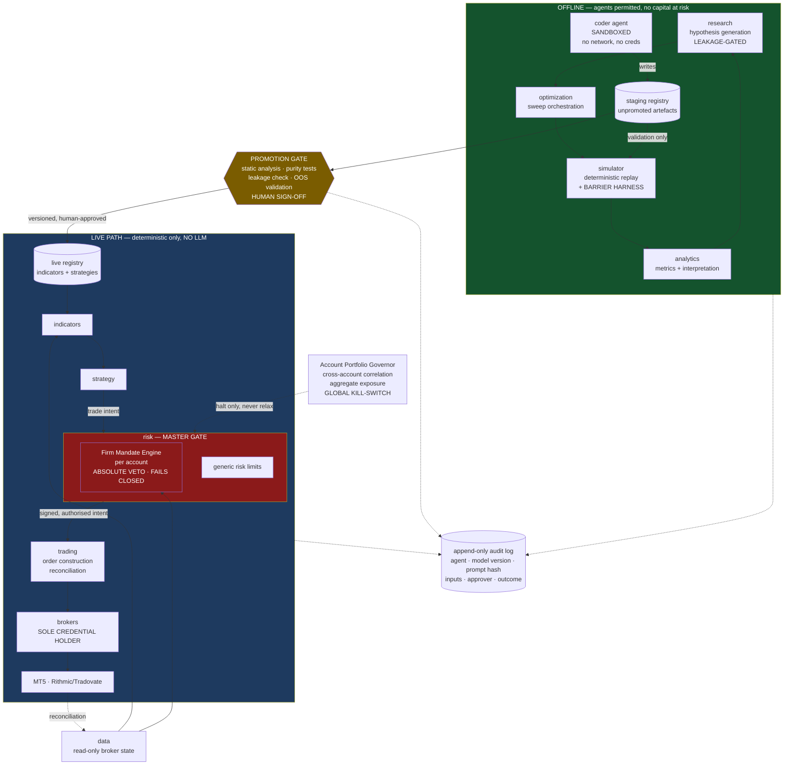

# Building an AI Trading Agents Firm for Prop-Funded Deployment

## A Research Report and Build Blueprint

**Prepared for:** Haruperi
**Date:** 28 July 2026
**Status:** Deep research report — literature review, adversarial appraisal, and brownfield build blueprint

---

### Scope and limitations of this report

This report answers one question: given everything currently known about LLM-powered multi-agent trading systems, what should you add to your existing Python trading system in order to pass and survive proprietary-firm funded accounts, and what is the honest expected outcome.

It is built on primary sources where they could be reached — papers, arXiv abstracts and full texts, prop firm rule documentation, and quantitative simulation run for this report. Where a source could not be verified, it is marked. Where the evidence is thin, that is stated rather than papered over.

**Three limitations you should hold in mind while reading.**

First, prop firm rules change frequently and are enforced discretionarily. Every rule cited here carries an access date of 27–28 July 2026. Before acting on any specific rule, re-read the firm's own terms. Several of the aggregator sources used for the rule survey are affiliate-compensated and were cross-checked against firm-published material where possible; where they could not be, they are flagged.

Second, the quantitative results in Chapter 7 are simulations run for this report under stated assumptions, not empirical measurements of your system. They are calibrated illustrations of the shape of your problem. The whole point of the Phase 1 recommendation is to replace them with measurements of your actual strategy.

Third, this report contains no legal advice. The regulatory material in Chapter 15 is descriptive.

---

## 1. Executive Summary

**The verdict: build the agentic layer, but not the system you described. Confine agents to your offline research loop — `research`, `optimization`, `simulator`, `analytics`, and a sandboxed code generator — and leave the live decision path deterministic. The evidence does not support putting LLM agents in the live trade decision under prop-firm barrier constraints, and the specific evidence that would justify it does not exist in the literature.**

That is the answer. The reasoning below is why, and the rest of the report is the detail.

**The most valuable thing you can build in the next month is not an agent.** It is two deterministic components you do not currently appear to have: a per-account **firm mandate engine** inside your existing `risk` domain that encodes each firm's actual rules and holds an absolute veto, and a **barrier-aware evaluation harness** in `simulator` that reports probability of breach rather than Sharpe ratio. You have five challenges live right now. These two components protect capital that is at risk today. Everything agentic can wait behind them.

**Five findings drive the verdict.**

**One — the literature cannot answer your question, and this is measurable rather than merely asserted.** A systematic survey of the field ([arXiv:2605.19337](https://arxiv.org/abs/2605.19337), screened through March 2026) examined 77 studies of LLM trading agents. Of the 19 that met a minimum bar of producing tradable actions with closed-loop evaluation, **only 2 of 19 reported extractable time-consistent split protocols, only 1 of 19 reported an explicit transaction-cost model, only 1 of 19 documented survivorship handling, and none achieved reproducibility.** You are not choosing between well-evidenced architectures. You are choosing among demonstrations.

**Two — the headline results that do exist are inflated by a mechanism the field cannot escape.** TradingAgents, the most-cited framework in this space and the one your brief describes, reports Sharpe ratios of 8.21, 6.39 and 5.60 on AAPL, GOOGL and AMZN, with a 0.91% maximum drawdown on AAPL, over a June–November 2024 window ([arXiv:2412.20138](https://arxiv.org/abs/2412.20138)). Those numbers are not credible as evidence of edge. A Sharpe above 5 sustained on single equities exceeds what the best-documented quantitative funds achieve, and the evaluation window sits inside the pretraining data of the models used. The published critique is blunt: the model was pretrained on the very window it is "predicting", so the look-ahead bias is in the weights, not the prompt. Look-Ahead-Bench ([arXiv:2601.13770](https://arxiv.org/abs/2601.13770)) confirms significant look-ahead bias in standard LLMs empirically, measured through alpha decay across temporally distinct regimes.

**Three — where leakage is properly controlled, the performance largely disappears.** Your own attached paper is the cleanest demonstration available. Emmanoulopoulos et al. (Barclays and Simudyne, [arXiv:2507.08584](https://arxiv.org/abs/2507.08584)) evaluate LLM trading agents twice: once in a conventional backtest on real history, and once inside a market simulator generating synthetic but causally plausible price paths specifically to defeat training-data memorisation. In the conventional backtest, average Sharpe is 0.88 on news context alone, rising to 1.40 with their model-discovery loop. **In the leakage-controlled simulator, ten of the thirteen reported agent configurations lose money outright, and the best result is a Sharpe of 0.47.** The paper is honest about this. The gap between the two tables is the size of the leakage problem.

**Four — the drawdowns reported across this literature would end a prop account.** This is the finding that should govern your decisions. Emmanoulopoulos et al. report maximum drawdowns ranging from 3% to 39%, with NVDA drawdowns of 23–39% across *every* configuration tested. Your second attached paper (Nunna & Samala, IJACSA 16:11) reports that its agentic agents achieved higher returns than rule-based agents — 139.1% versus 64.8% — **but also higher drawdowns, 10.4–15.2% versus 6.8–9.1%.** Under a 10% maximum drawdown rule, the traditional agents survive and the agentic agents are terminated. That paper also does not test LLMs at all; its "agentic" agents are heuristic modules with memory and planning, and its headline difference is not statistically significant (p = 0.19 and p = 0.16, n = 20 per group).

**Five — your existing architecture is a genuine asset, and the correct move is to extend it rather than adopt a framework.** Your domain separation — `risk` as master gate, `strategy` unable to self-execute, `brokers` as a thin credential-holding passthrough, `research` explicitly leakage-gated — already implements the governance properties that the open-source agentic frameworks conspicuously lack. Adopting TradingAgents or a similar framework would mean importing a demo-grade permission model into a system that is currently better designed than it is.

**On the prop deployment specifically, three quantified findings.**

The industry base rates are worse than commonly advertised. Roughly 14% of traders pass a challenge and about 7% of all challenge buyers ever receive a payout, on a 300,000-account dataset. **Around 70% of failures come from loss limits rather than from failing to reach the profit target — 50% breaching maximum drawdown and 20% hitting the daily cap.** Your binding constraint is the barrier, not the target. Design for the barrier.

Simulation run for this report (Chapter 7, methodology and code in Appendix D) shows that **position sizing dominates skill in determining evaluation outcomes.** A zero-skill strategy run at 30% annualised volatility passes a 60-day, 10%-target, 10%-drawdown evaluation 35.5% of the time. A genuinely skilled strategy at Sharpe 1.5 run at 8% volatility passes only 5.6% of the time. If your objective is narrowly to pass challenges, volatility targeting matters more than any agent you could build.

But — and this is the trap — **the volatility that maximises pass probability nearly guarantees failure once funded.** At 25–30% volatility, twelve-month survival probability on a funded account with a 10% trailing drawdown is roughly 3–6% even at Sharpe 3.0. At 8% volatility it is 86% at Sharpe 1.0. The evaluation phase and the funded phase have directly opposed optimal risk profiles, and consistency rules exist precisely to punish the aggressive path. This is the central strategic tension of prop trading, and it is a risk-management problem, not an intelligence problem.

**On automation permissibility — the gating question — the news is good.** FTMO permits Expert Advisors on both challenge and funded accounts across MT4, MT5 and cTrader, with no pre-approval and no source-code submission. Topstep and Apex permit bots and copy trading on their connected platforms. Copying your own trades across your own accounts is permitted at almost every futures firm. **You are not building something prohibited.** There are real constraints — FTMO caps a single strategy at $400K across all its accounts, bans latency arbitrage and tick scalping, restricts trading within two minutes of major news, and limits server requests — and there is a detection regime for cross-firm correlated activity using IP fingerprinting and millisecond timestamp matching. But the deployment is viable. Chapter 3 has the detail.

**Where the agentic layer earns its place.** Your instinct — automating research, backtesting and optimization rather than live decisions — is supported by the evidence, and the report tests it rather than merely agreeing with it. The offline research loop is where LLMs do what they are demonstrably good at (synthesis, code generation, hypothesis exploration), where failures are cheap and reversible, and where non-determinism is a nuisance rather than a solvency event. The live decision path is where every failure mode in Chapter 7 becomes terminal within one session.

**The one live-path exception worth testing later** is a trade/no-trade context filter: an agent that can veto or reduce a deterministic signal but never originate or enlarge one. Under a barrier constraint, the highest-value decision is often not to trade, and synthesising calendar, news, regime and positioning into a "stand down" gate is plausibly the one thing an LLM does better than your existing indicators. That is Phase 6, and only if Phases 2–4 have earned it.

**The honest risk.** The single most expensive mistake available to you is building an impressive multi-agent system, watching it produce good backtests, and scaling it across five funded accounts — where correlated breach means one bad session ends everything simultaneously. Simulation in Chapter 7 quantifies this: with five accounts driven by one engine at correlation 1.0, the probability that *zero* accounts pass is 57.2%. Decorrelate them to ρ = 0.3 and that falls to 16.1%, with **identical expected value**. Decorrelation buys you nothing in expectation and everything in survival.

---

## 2. Introduction and Problem Definition

### 2.1 What you are actually solving

The framing in your original brief — a multi-agent firm with fundamental analysts, sentiment experts, technical analysts, traders and a risk committee, debating their way to a decision — is the framing of the dominant literature. It is also, for your deployment, the wrong objective function.

A conventional trading system is optimised for risk-adjusted growth: maximise expected return per unit of volatility over a long horizon, and treat drawdowns as recoverable. A prop-funded system is solving a **first-passage problem with an absorbing barrier**. You must reach a bounded profit target (typically 8–10%) before your equity path touches a daily loss limit (typically 5%) or a maximum drawdown (typically 10%, often trailing on a high-water mark), inside a rule envelope that includes minimum trading days, consistency requirements, news blackouts, and in the futures case a flat-by-close obligation.

The two are not variations on each other. Under a barrier, survival is governed by the **left tail of the daily return distribution** and by the **serial correlation of losses**. The mean is nearly irrelevant. A strategy with a superb Sharpe ratio that occasionally has a 6% day is not "a good strategy with a bad day" — it is a total loss of a $200,000 account and the fee that bought it.

This distinction runs through every chapter. When Chapter 5 reports that a framework achieved a Sharpe ratio of 8.21, the relevant question is not whether that is real. It is: what was the worst single day, and how often did it happen? The literature almost never says.

### 2.2 Your specific position

- **Five prop challenges purchased and being traded now** by your existing deterministic system. None passed. All early.
- **Target: five-plus firms at $200,000 each**, spanning FX/CFD (FTMO-style, MT5) and futures (Topstep-style).
- **An existing production system** with thirteen domain modules and clean separation of duties.
- **Solo**, strong software engineering, light on quantitative methodology, with AI coding assistance available.

The last point shapes the recommendations more than it might appear. Where this report relies on quantitative reasoning, it explains it fully rather than gesturing at it, because you need to be able to defend these decisions to yourself in six months when a strategy is losing and the temptation to override the risk gate is at its highest.

### 2.3 What "agentic" means here

Following Singh (attached, *The Agentic ETF*), **agentic trading** is a process in which an autonomous software agent — typically LLM-driven with tool access — perceives market state, reasons over heterogeneous data, forms a decision, and executes it, on a recurring schedule, **without a human approving each trade**. The defining property is the delegation of *judgment*, not merely execution.

This is a useful definition because it makes the key distinction sharp. Your existing system already automates execution. The question is whether to delegate judgment. Those are separable, and this report recommends delegating judgment in the research loop and withholding it from the live path.

---

## 3. Gating Constraints: Prop Firm Rules, Automation Policy and Counterparty Risk

*This chapter comes before the literature review because it can invalidate everything after it.*

### 3.1 Automation permissibility — the existential question

**Finding: automated and algorithmic trading is permitted at the major firms in both segments you target. The plan is not prohibited.**

**FTMO (FX/CFD).** FTMO explicitly allows Expert Advisors on both the FTMO Challenge and funded accounts, across MT4, MT5 and cTrader. There is no pre-approval process and no requirement to submit source code ([EAFunded rule summary](https://www.eafunded.com/blog/ftmo-ea-rules), accessed 28 July 2026; corroborated by [TradingFinder](https://tradingfinder.com/props/ftmo/rules/)).

The governing principle is that the EA must trade like a normal market participant and must not exploit platform inefficiencies. Prohibited:

| Prohibition | Detail |
|---|---|
| Exploitative trading | Strategies profiting from platform/price-feed weaknesses, requotes, spread manipulation |
| High-frequency trading | Dozens of trades per minute; anything faster than a human could plausibly execute |
| Tick scalping / latency arbitrage | Explicitly banned — exploiting feed delays between brokers |
| News trading | No opening or closing within 2 minutes of a major news event |
| Server overload | More than ~2,000 server requests per day on individual trades or pending orders |
| Capital concentration | **The same strategy may not exceed $400K total capital across all FTMO accounts combined** |

Martingale and grid strategies are not explicitly banned but attract closer review.

**Topstep and Apex (futures).** Both permit EAs, bots and copy trading on their connected platforms (Project X / TradingView integrations), with restrictions on news trading and high-frequency activity. Topstep's Trading Combine can be passed by an automated system configured to respect the daily loss limit, maximum loss limit and minimum trading days ([ClearEdge](https://clearedge.trading/post/topstep-combine-automation-rules-bot-trading-guide); [Sentinel bot-policy guide](https://sentinel.redclawey.com/blog/automated-trading-allowed-prop-firms-policy-guide-2026), accessed 28 July 2026).

**The caveat that matters more than the rules.** These are aggregator sources. Firm terms are revised frequently and enforcement is discretionary, historically tightening at payout time rather than at signup. Before you rely on any of this, read the firm's own current terms and keep a dated copy. A rule that is permissive on paper and enforced arbitrarily when you request a withdrawal is worse than a clear prohibition, because the loss arrives after the work is done.

### 3.2 The multi-account and copy-trading problem

**Finding: copying your own trades across your own accounts is permitted at almost every firm. Copying anyone else's is prohibited everywhere. Your plan sits on the permitted side of that line.**

Internal copying across accounts you personally own is allowed at nearly every futures prop firm — the firms built their multi-account limit structures around it. Apex allows up to 20 accounts, Topstep 10, Tradeify 5. What is prohibited is copying an *external* signal or another trader's account, which is classified as group trading regardless of the software used, and selling your trades to others ([Apex resource page](https://apextraderfunding.com/resources/prop-trading/can-you-copy-trade-different-prop-firms/); [PickMyTrade](https://blog.pickmytrade.trade/how-to-copy-trades-across-multiple-prop-firm-accounts-2026/), accessed 28 July 2026).

**Two operational constraints follow.**

*Detection.* Firms use IP fingerprinting and millisecond-level timestamp matching to identify identical entries across accounts. Orders at different firms sharing an IP and filling within ten milliseconds of each other get flagged. This does not make your setup non-compliant, but it means you should expect scrutiny and should be able to evidence that the accounts are yours and self-directed. Practically: keep the audit trail described in Chapter 10, and introduce deliberate execution jitter and per-account parameter divergence (Section 10.5).

*Capital concentration.* FTMO's $400K same-strategy cap across its accounts is a hard constraint on your $200K × 5 plan *within FTMO*. Two $200K FTMO accounts on one strategy exhausts it. This is one of several reasons the plan requires five different firms rather than five accounts at one firm — which you had already concluded for counterparty reasons.

### 3.3 Rule taxonomy — the two constraint geometries

The two segments differ enough that they are separate deployment profiles, not parameter variants.

| Dimension | FX/CFD (FTMO-style) | Futures (Topstep/Apex-style) |
|---|---|---|
| Execution | MT4 / MT5 / cTrader | Rithmic, Tradovate, Project X, NinjaTrader |
| Evaluation | Commonly 2-phase (10% then 5% target) | Commonly 1-phase Combine |
| Daily loss limit | ~5% of initial balance, reset at server midnight | Fixed dollar (e.g. $1,000 on a $50K account) |
| Max drawdown | 10%, static or trailing depending on firm/product | **Trailing on end-of-day balance**, stops trailing once it reaches starting balance (Topstep); Apex runs EOD trailing across the whole funded lifecycle |
| Overnight/weekend | Often restricted or prohibited on some products | Flat-by-close typically required |
| News | 2-minute blackout around high-impact releases | Restrictions vary; generally present |
| Profit split | Commonly 80–90% | Topstep 90/10 post-Jan 2026; Apex 100% on first $10K |

**The trailing drawdown mechanic is the single most important rule to model correctly**, and it is where most homebuilt risk systems get it wrong. Topstep's version trails the *highest end-of-day balance*, not intraday equity spikes — which is materially more forgiving than an intraday-equity trailing rule, and materially different from a static drawdown. Apex applies EOD trailing across the entire funded lifecycle. Your mandate engine must encode which variant each account uses, because the same strategy can pass comfortably under one and fail reliably under another.

### 3.4 Machine-readable constraint specification

Do not hard-code any of the above into strategy logic. Encode it as a declarative **firm mandate object** that `risk` loads per account. A minimal schema:

```yaml
firm_mandate:
  account_id: "ftmo-200k-01"
  firm: "FTMO"
  model: "fx_cfd"
  phase: "evaluation_p1"          # evaluation_p1 | evaluation_p2 | funded
  initial_balance: 200000
  currency: "USD"

  profit_target:
    type: "percent_of_initial"
    value: 0.10

  daily_loss:
    basis: "initial_balance"       # initial_balance | current_balance | equity
    value: 0.05
    includes_unrealised: true      # critical: floating loss counts
    reset_time: "00:00"
    reset_tz: "Europe/Prague"      # server tz, NOT local

  max_drawdown:
    mode: "static"                 # static | trailing_eod | trailing_intraday
    basis: "initial_balance"
    value: 0.10
    trail_stops_at_initial: false  # Topstep-style ratchet ceiling

  min_trading_days: 4
  consistency_rule:
    type: "max_single_day_share_of_profit"
    value: 0.40                    # null if firm has none
    evaluated: "retrospective"     # only checkable at payout

  news_blackout:
    enabled: true
    window_seconds_before: 120
    window_seconds_after: 120
    impact_levels: ["high"]
    calendar_source: "economic_calendar_v1"

  session:
    flat_by_close: false
    weekend_hold: false

  instruments:
    allow: ["EURUSD","GBPUSD","XAUUSD"]
    deny: []
  max_lots_per_position: 5.0

  strategy_capital_cap:
    scope: "firm"                  # FTMO $400k same-strategy cap
    value: 400000

  operational:
    max_server_requests_per_day: 2000
    min_order_interval_ms: 250
```

Two rules are structurally awkward and deserve explicit design attention.

**Trailing drawdown on unrealised equity** means your headroom changes while a position is open, without any action from you. The mandate engine must re-evaluate continuously, not per-order.

**Consistency rules are only evaluable retrospectively** — whether one day contributed more than 40% of total profit cannot be known until the profit is final. The engine must therefore track a *running projection* and constrain position size when a large winning day would push the projected share over the limit. This is the rule most likely to be discovered at payout, and the one most likely to cost you a payout you thought you had earned.

### 3.5 Firm counterparty risk

Prop firms are lightly regulated counterparties whose business model is in tension with your success.

**The MyForexFunds case is the defining episode, and its outcome is not what most summaries suggest.** The CFTC charged Traders Global Group in August 2023 alleging fraud exceeding $300 million. On 13 May 2025 the case was **dismissed with prejudice**, with more than $3 million in Rule 11 sanctions imposed on the CFTC after it mischaracterised a CAD $31.55 million tax payment and failed to promptly correct inaccuracies in its declaration. Assets were unfrozen and trader payouts began going out in April 2026 ([Finance Magnates](https://www.financemagnates.com/forex/my-forex-funds-parent-defeats-cftc-in-court-as-judge-imposes-sanctions/); [De Silva Law Offices](https://www.desilvalawoffices.com/articles/blog/2025/may/cftc-case-dismissed-my-forex-funds-controversy-h/), accessed 28 July 2026).

The lesson is not "prop firms are fine". It is that **the US now lacks the regulatory precedent it sought**, while European and Australian regulators tighten through leverage caps and marketing rules ([The Industry Spread](https://theindustryspread.com/retail-prop-trading-regulation-2026-my-forex-funds-cftc/)). Traders in that episode had funds frozen for roughly 20 months through no fault of their own. Your counterparty risk is real, it is not primarily fraud risk, and it is not diversifiable by trading skill — only by spreading across firms, which you are already doing.

**Due-diligence checklist for firm selection:**

1. How long has the firm operated, and through what market stress?
2. Is it B-book simulated throughout, or does it route any flow to real liquidity? (Most are simulated. This means your profit is their cost.)
3. What is the documented payout history — not the marketing figure, but third-party-verified records?
4. What entity and jurisdiction is on the contract, and what dispute recourse exists?
5. Has the firm retroactively changed terms? Search for the specific phrase "terms updated" alongside the firm name and "payout denied".
6. Does the firm publish pass and payout rates, and are they audited? (Almost universally: no.)
7. What is the stated policy on automation, in the firm's own words, dated?

### 3.6 The economics of the funding pipeline

**Base rates, from the best-sourced data available:**

| Metric | Figure | Source |
|---|---|---|
| FTMO 2-step challenge pass rate | ~9–10% | Firm-cited, historical |
| Apex first-attempt pass rate | 15–20% | Firm-reported |
| Topstep Combines completed, Jan–Dec 2025 | 16.8% | Firm-disclosed |
| Take Profit Trader one-step pass rate | 20.37% | Firm-reported |
| **Pass rate, 300,000-account dataset** | **14%** | FPFX Tech |
| **Of funded traders, share ever receiving a payout** | **~45%** | FPFX Tech |
| **Of all challenge buyers, share ever receiving a payout** | **~7%** | FPFX Tech |
| Typical payout size | ~4% of account size | FPFX Tech |
| **Failures caused by loss limits** | **~70%** (50% max DD, 20% daily cap) | Aggregated industry data |

Sources: [Prop Firm Statistics 2026 (QuantVPS)](https://www.quantvps.com/blog/prop-firm-statistics); [Damn Prop Firms pass-rate analysis](https://damnpropfirms.com/trading-guides/prop-firm-evaluation-pass-rates-statistics-reality-check/); [Responsible Trading](https://responsibletrading.com/prop-firm-pass-rate-what-percentage-of-traders-actually-get-funded/). All firm-reported figures are unaudited and all have a marketing incentive to be favourable. Treat them as upper bounds.

**The single most important number in this table is the last one.** Seventy percent of failures are barrier breaches, not target misses. The industry's failure mode is risk management, not signal quality. This is the strongest available argument that your engineering effort belongs in the mandate engine rather than in agents.

**Forward economics from your position.** Five challenge fees are sunk. The decision you actually face repeatedly is: on failure, reset, re-buy, switch firm, or stop. Model it as follows, and populate it with your own fees:

```
E[value of one more attempt]
  = P(pass) × P(reach payout | funded) × E[payout | payout]
  − fee
  − (opportunity cost of the evaluation period)
```

Using the FPFX base rates unadjusted (14% pass, 45% of funded reach payout, payout ~4% of account) on a $200K account with an 80% split and a $1,000-order fee:

```
0.14 × 0.45 × (200,000 × 0.04 × 0.80)  −  1,000
= 0.063 × 6,400 − 1,000
= 403 − 1,000
= −597 per attempt
```

**At industry base rates, the expected value of a challenge attempt is negative.** That is the honest arithmetic, and it is the arithmetic that makes the whole project conditional: the project is only rational if your system's pass and survival probabilities are materially above base rate. **You do not currently know whether they are.** Phase 1 exists to find out, and it is the cheapest information you can buy.

### 3.7 In-flight triage — the five live challenges

Capital is at risk today. This section has a deadline; the rest of the report does not.

**(a) Are the five accounts one position?** If one engine trades all five on the same signals with the same sizing, then yes — functionally you hold one position at five times the size, and one bad session ends all five simultaneously. Chapter 7 quantifies exactly what this costs. The immediate mitigations that require no rewrite:

- **Stagger instruments.** Assign each account a different instrument or a different subset. This is the single highest-impact change available and it is a configuration edit.
- **Stagger timeframes or entry timing.** Introduce a per-account offset (minutes to hours) on signal evaluation.
- **Diverge parameters.** Different stop distances, different position sizes, different entry thresholds per account.
- **Add per-account execution jitter** of a few hundred milliseconds to a few seconds. This also addresses the cross-firm timestamp-matching flag risk from Section 3.2.

None of these improve expected return. All of them reduce the probability of simultaneous total loss, which under a barrier is the thing that matters.

**(b) Instrumentation to add this week.** Before anything else, you need to be able to see, per account, continuously:

1. Current equity, current balance, and the firm's own reported figures for both, reconciled.
2. Distance to daily loss limit, in currency and in percent, including floating P&L.
3. Distance to maximum drawdown, computed under that account's exact mechanic (static, EOD-trailing, or intraday-trailing).
4. Worst-case loss if every open position gapped to its stop, plus a slippage allowance.
5. **Aggregate worst-case across all five accounts simultaneously** — the number that tells you whether one session can end everything.
6. Realised correlation of daily returns across the five accounts over the last 20 sessions.

Item 5 is the one most systems lack and the one that would most change your behaviour today.

**(c) Does `risk` already enforce the firm rules?** From your description, `risk` enforces "safety limits, exposure, and governance policy" — which is the right architecture, but generic risk limits are not the same as firm mandates. Specifically, verify whether `risk` currently knows: each account's daily reset time *in the broker's server timezone*; whether floating losses count toward the daily limit at that firm; the exact trailing-drawdown variant; the news calendar; and the consistency-rule projection. If any is missing, that gap is your Phase 0.

**(d) Compliance exposure right now.** Based on Section 3.1, running an automated system on FTMO-style and Topstep-style accounts is permitted. Two things to check today: that your order rate stays inside per-firm request limits, and that you are not trading inside news blackout windows. Both are silent violations that are typically discovered at payout review.

**(e) Keep trading all five, or reduce?**

**Recommendation: keep all five running, but decorrelate them this week, and do not buy a sixth until you have Phase 1 numbers.**

The reasoning: the fees are sunk, so the marginal decision is about the *forward* value of continuing versus stopping, and five decorrelated attempts have materially higher probability of producing at least one funded account than five correlated ones — at identical expected value and identical cost. Chapter 7 shows P(at least one passes) rising from 42.8% to 83.9% purely from decorrelation. Pausing forfeits the option value of fees you have already paid. Buying more before you have measured your breach probability is buying lottery tickets at negative expected value.

---

## 4. Academic Literature Review

### 4.1 The state of the evidence base

The most important paper for your purposes is not a framework paper. It is the systematic survey, **"Agentic Trading: When LLM Agents Meet Financial Markets"** ([arXiv:2605.19337](https://arxiv.org/abs/2605.19337)), which reframes LLM trading agents as expert-system decision pipelines and produces an audit-oriented evidence map of 77 studies screened through 9 March 2026.

Its central finding is **protocol incomparability**. Of the 19 studies meeting the minimum bar of producing tradable actions with closed-loop evaluation:

| Evidentiary property | Studies satisfying it |
|---|---|
| Extractable time-consistent split protocol | **2 / 19** |
| Explicit transaction-cost model | **1 / 19** |
| Documented universe or survivorship handling | **1 / 19** |
| Full reproducibility (R3) | **0 / 19** |

The authors' conclusion: architectural experimentation is expanding rapidly, while comparable evaluation protocols, execution semantics and reproducible artifacts remain the field's immediate bottleneck.

This is the single most useful citation in the report, because it converts "the evidence is weak" from an opinion into a count. When a framework claims superiority, the prior should be that its evaluation protocol is not time-consistent, does not model transaction costs, and cannot be reproduced.

### 4.2 The canonical multi-agent trading frameworks

**TradingAgents** (Xiao, Sun, Luo, Wang; [arXiv:2412.20138](https://arxiv.org/abs/2412.20138), v7 June 2025) is the paper your original brief describes almost exactly: LLM agents as fundamental, sentiment and technical analysts; Bull and Bear researchers debating; a risk management team; traders synthesising. It is the most influential work in the space and the reference point for most that followed.

Reported results, June–November 2024, on AAPL, GOOGL, AMZN:

| Metric | AAPL | GOOGL | AMZN |
|---|---|---|---|
| Cumulative return | 26.62% | 24.36% | 23.21% |
| Best baseline | 2.05% | 7.78% (B&H) | 17.1% (B&H) |
| Sharpe ratio | 8.21 | 6.39 | 5.60 |
| Max drawdown | 0.91% | — | — |

**Strongest methodological objection:** the reported Sharpe ratios are not plausible as measurements of edge. Sustained Sharpe above 3 is exceptional at the very top of the quantitative industry; 8.21 on a single equity over six months is either extraordinary luck in a short sample or an artefact. The evaluation window sits inside the pretraining data of the models used, and the published critique states the problem precisely: the model was pretrained on the window it is "predicting", so the look-ahead bias is baked into the weights rather than the prompt. The paper's own defence — that agents only receive data available up to each trading day — addresses *pipeline* leakage while leaving *pretraining* leakage entirely untouched. A 0.91% maximum drawdown over six months on a single stock compounds the implausibility.

**Orchestration Framework for Financial Agents** (Li, Grover, Alpuerto, Cao, Liu; SecureFinAI Lab, Columbia; [arXiv:2512.02227](https://arxiv.org/abs/2512.02227)) maps traditional algorithmic-trading components onto agents — planner, orchestrator, alpha, risk, portfolio, backtest, execution, audit, and memory — using MCP for control messages and A2A for inter-agent communication. Code at [Open-Finance-Lab/AgenticTrading](https://github.com/Open-Finance-Lab/AgenticTrading).

Reported: stock task (hourly, 04/2024–01/2025) 20.42% return, Sharpe 2.63, max drawdown −3.59%, against S&P 500 at 15.97%. BTC task (minute, 27/07/2025–13/08/2025) 8.39% return, Sharpe 0.378, max drawdown −2.80%, against BTC at 3.80%.

**Strongest methodological objection — and this one is instructive.** The abstract compares to the S&P 500 at 15.97%. Buried in the introduction is a second baseline: **an equally weighted portfolio with weekly rebalancing returned 47.46%** — more than double the agentic system. The system underperformed a baseline requiring no intelligence whatsoever, and that comparison does not appear in the abstract. The BTC evaluation covers **seventeen days**, which is not a sample.

To the authors' credit, the paper contains an explicit *Leakage Prevention Summary* (Appendix G): LLM agents never receive evaluation-window returns, prices or labels; optimisation and backtesting are deterministic tools behind the orchestration layer with filtered outputs; UUID-based memory records store only summaries that cannot be inverted to raw test data. **This is the best pipeline-leakage discipline described in the literature, and it should be your model for the `research` domain.** It still does not touch pretraining leakage, and the 2024 evaluation window sits inside the training data.

**TradeLens / "Can Agentic Trading Systems Pay for Their Own Intelligence?"** (Duan et al., HKUST-GZ, Paradoox AI, E Fund, MBZUAI, University of Tokyo; [arXiv:2607.10286](https://arxiv.org/abs/2607.10286), July 2026) asks the question your cost model needs: whether LLM-mediated decisions convert their induced costs into measurable incremental profit — what the authors call **agentic viability**. It introduces a trace-grounded diagnostic that reconstructs trading trajectories and attributes profit and cost to interpretable evidence.

Its findings are diagnostic rather than affirmative: viability hinges on intelligence-to-profit conversion, models show distinct failure patterns (poor asset selection in DeepSeek-V3.2, negative timing in GLM-4.7), and **capital scale, trading frequency and architecture matter only by amplifying or degrading decision-attributed timing value.** That last clause deserves emphasis: architecture is a multiplier on decision quality, not a source of it. A better-organised set of agents does not create edge; it scales whatever edge or anti-edge the underlying decisions have.

### 4.3 The leakage literature — the most decision-relevant strand

Two papers here matter more to your build than any framework paper.

**Look-Ahead-Bench** ([arXiv:2601.13770](https://arxiv.org/abs/2601.13770); code at [benstaf/lookaheadbench](https://github.com/benstaf/lookaheadbench)) is a standardised benchmark of look-ahead bias in point-in-time LLMs. Rather than testing memorisation through Q&A, it evaluates behaviour in practical workflows and distinguishes genuine prediction from memorisation by **analysing performance decay across temporally distinct market regimes**, with quantitative baselines establishing thresholds. Evaluating Llama 3.1 (8B, 70B) and DeepSeek 3.2 against purpose-built point-in-time models, it finds **significant look-ahead bias in standard LLMs, measured through alpha decay.**

This is the empirical confirmation that the critique of TradingAgents is not merely theoretical.

**Look-Ahead-Freedom as Temporal Non-Interference** (Fonseca, Breda University of Applied Sciences; [arXiv:2607.04958](https://arxiv.org/abs/2607.04958), July 2026) is the most directly implementable paper in this report. It shows that look-ahead-freedom is a formal property in disguise: fixing a decision epoch, the demand that the future not influence the present is **temporal non-interference over a time-indexed information lattice**. The authors develop a pipeline calculus separating a datum's *availability time* from its *reference time*, and provide a type-and-effect system that is **sound and decidable in linear time** over the value-independent fragment — covering windowing, resampling, joins, point-in-time and vintage reads, and agentic retrieval. Their artifact detects every planted leak that differential and tiling detectors miss.

**Recommendation: adopt this as the formal basis of your `research` domain's leakage gate, and as a mandatory static check in the coder agent's promotion pipeline (Section 10.6).** An LLM writing indicator code can reintroduce look-ahead bias in a single line; a linear-time decidable checker is exactly the right defence.

### 4.4 The enabling multi-agent literature

The trading frameworks borrow their mechanisms from a general agent literature: reason-and-act (ReAct), tool-use self-teaching (Toolformer), generative agents with memory (Park et al.), reflection and verbal reinforcement (Reflexion), and role-play coordination (CAMEL). These are cited by essentially every framework above.

**The transfer question is where the trouble lies.** Multi-agent debate was shown to improve factuality on tasks with a verifiable ground truth, where a correct answer exists and disagreement surfaces it. Markets have no ground truth available at decision time, and a debate among agents drawing on the same pretraining distribution and the same context produces **correlated opinions**, not independent estimates. The apparent confidence produced by consensus is therefore not evidence of correctness — it is evidence of shared priors. **TrustTrade** ([arXiv:2603.22567](https://arxiv.org/pdf/2603.22567)) attacks this directly with human-inspired *selective* consensus to reduce decision uncertainty, which is an implicit acknowledgement that naive consensus is a problem.

The most consequential mechanism for you comes from your own attached paper. Emmanoulopoulos et al. use a **builder–critic loop** for model discovery, tracing to Box's classical work on iterative model building. The builder proposes a stochastic differential equation, the critic implements, calibrates, simulates, scores and refines it. This is a debate structure with a **verifiable ground truth** — the model either reproduces the statistical features of the historical price path or it does not. That is why it works where trading debates do not, and it is the pattern worth importing into your `research` domain.

### 4.5 What the pre-LLM baseline says

Any honest reading of the quantitative finance literature sets a sober prior. Documented, persistent, capacity-constrained edges are rare; published anomalies decay after publication (McLean & Pontiff); the cross-section of claimed factors is riddled with multiple-testing artefacts (Harvey, Liu & Zhu, "…and the Cross-Section of Expected Returns"); and backtest overfitting is pervasive enough to have generated its own corrective literature — the Deflated Sharpe Ratio and the Probability of Backtest Overfitting (Bailey & López de Prado), and "Pseudo-Mathematics and Financial Charlatanism" (Bailey et al.). López de Prado's *Advances in Financial Machine Learning* supplies the operational tooling: purged cross-validation, embargo periods, and the observation that the number of trials run before a reported result is the most important missing statistic in nearly every backtest.

These are cited from established knowledge rather than freshly verified for this report; treat the specific claims as robust but check page references before quoting them.

**Why this matters for a coder agent.** If a human researcher trying a hundred strategy variants produces spurious winners at a rate requiring statistical correction, an agent that can try ten thousand produces them at a rate that guarantees self-deception. Section 10.6 treats this as the primary design constraint on the strategy generator.

---

## 5. Open-Source Landscape

### 5.1 The frameworks

| Repository | What it is | Governance posture | Verdict for you |
|---|---|---|---|
| [TauricResearch/TradingAgents](https://github.com/TauricResearch/TradingAgents) | Reference implementation of the analyst/researcher/trader/risk architecture | Demo-grade. Agents produce decisions; no enforced separation between analysis and execution credentials | **Read the prompts, not the plumbing.** The role decomposition and debate prompts are the valuable artefact |
| [Open-Finance-Lab/AgenticTrading](https://github.com/Open-Finance-Lab/AgenticTrading) | Orchestration framework mapping AT components to agents; MCP + A2A protocols | Better than most — explicit audit agent, deterministic tools behind the orchestration layer, documented leakage prevention | **Study the orchestration and leakage design.** Closest to a defensible architecture |
| [kweinmeister/agentic-trading](https://github.com/kweinmeister/agentic-trading) | Individual/vendor demo of agentic trading patterns | Demo-grade | Reference only |
| [DaviddTech/ai-trading-agent](https://github.com/DaviddTech/ai-trading-agent) | Individual project | Demo-grade | Reference only |
| [benstaf/lookaheadbench](https://github.com/benstaf/lookaheadbench) | Code for Look-Ahead-Bench | Research artifact | **Use it.** Directly applicable as an eval for any model you deploy |

**Access note:** repository contents were not read at source level for this report — the findings above are drawn from the associated papers and published descriptions. Reading the TradingAgents prompt definitions and the AgenticTrading orchestration entry point at source level is a worthwhile half-day and is listed in Appendix G as a known gap.

### 5.2 The de facto permission model of the field

The pattern across the open frameworks is consistent and is the specification for what you must build:

1. **Analysis and execution share a process and, usually, credentials.** The separation is conceptual — expressed in prompts and role names — rather than enforced by the runtime.
2. **The "risk agent" is an LLM.** It is a participant in the conversation, not a gate. It can be argued with, and in some designs it can be overruled by a manager agent. This is the inverse of the correct design.
3. **Audit trails are logs, not evidence.** They record what was said, rarely the model version, prompt hash, and input data snapshot needed to reconstruct why.
4. **No firm-mandate or hard-limit layer exists**, because the frameworks were built to demonstrate architecture on unconstrained simulated capital.

Your `risk` domain — a deterministic master gate that every proposal must pass — is already better than every framework surveyed. **This is the single strongest argument for extending your system rather than adopting theirs.**

### 5.3 Infrastructure worth borrowing rather than building

You already have `simulator`, `data`, `brokers` and `optimization`, so the build-versus-buy question is narrow. Two areas are worth attention:

**Backtest fidelity.** The critical question for your harness is not features but whether it correctly models the specific things that kill prop accounts: spread widening at session open and around news, gap-through-stop, requote and rejection, partial fills, and swap or funding costs. Vectorised engines generally cannot express these; event-driven engines can. Your `simulator` replays "deterministically over historical data through the core trading path", which is the right architecture — the question is whether its fill model includes the above. Chapter 12 lists this as a Phase 1 requirement.

**Orchestration.** For an offline research loop, graph-based orchestration with explicit state (LangGraph-style) fits your needs better than conversational multi-agent frameworks, because your agents are pipeline stages with schemas rather than conversationalists. Given that your agents will be advisory and offline, the simplest thing that works — direct function calls with structured outputs and a persisted run record — is likely sufficient for Phases 2 and 3. Do not adopt a framework before you have two agents that earn their keep.

---

## 6. Architectural Pattern Synthesis

### 6.1 The recurring patterns, and what each is worth

| Pattern | Problem it solves | Evidence it helps | Failure mode | Cost |
|---|---|---|---|---|
| **Role decomposition** (analyst/trader/risk) | Decomposes a complex judgment into tractable sub-judgments; improves interpretability | Weak. No surveyed study ablates roles under a controlled protocol | Roles are narrative rather than functional; agents duplicate each other's reasoning | Linear in agent count |
| **Adversarial debate** (bull/bear) | Surfaces counter-evidence, reduces one-sided reasoning | **Contested.** Transfers from tasks with verifiable ground truth; markets have none at decision time | Correlated priors produce confident consensus, not accuracy. Sycophancy cascade | 2–5× tokens per decision |
| **Builder–critic loop** (model discovery) | Iteratively refines a hypothesis against an objective score | **Good** — the one debate structure with a ground truth. Emmanoulopoulos et al. show +37% average Sharpe from the discovered risk metrics | Expensive; requires a well-posed scoring function | High (~1,100 GPU-hours in the source paper) |
| **Layered memory** | Retains salient events across sessions | Weak-to-moderate; cited widely, ablated rarely | Contaminated retrieval; unbounded growth; memory of a regime that has ended | Storage + retrieval latency |
| **Reflection on realised P&L** | Learns from outcomes | Weak in trading. In a low signal-to-noise environment, reflecting on outcomes teaches the agent noise | Overfitting to recent randomness; a losing streak triggers strategy abandonment at the worst time | Moderate |
| **Structured output contracts** | Makes agent output machine-parseable | **Strong, uncontested.** Necessary for any production use | Schema drift on model updates | Negligible |
| **Deterministic tools behind orchestration** | Keeps numerical computation out of the LLM | **Strong.** Explicitly adopted by the Orchestration Framework paper | None material | Negative — reduces cost |
| **Human-in-the-loop gates** | Catches catastrophic errors before capital effect | **Strong** by construction | Latency; alert fatigue; the human rubber-stamps | Human time |

### 6.2 Where the LLM is decorative

The pattern table produces a clear separation.

**LLMs are justified where** the input is unstructured text or code, the output is a hypothesis or an artefact to be validated downstream, and the cost of being wrong is a wasted research cycle. Reading filings and news, generating candidate indicator implementations, interpreting a sweep of optimisation results, summarising why a strategy degraded, proposing hypotheses to test.

**LLMs are decorative or harmful where** the input is numeric, the computation is well-specified, and the output feeds directly into a capital decision. Position sizing, risk limit checking, indicator computation, order construction, portfolio weight arithmetic. Every one of these is better served by the deterministic code you already have. An LLM performing arithmetic that a function can perform introduces non-determinism, latency, cost and error for no gain.

The TradeLens finding sharpens this: architecture matters "only by amplifying or degrading decision-attributed timing value." If the underlying decision is a computation, wrapping it in an agent amplifies nothing.

### 6.3 Does debate improve decisions?

**On the evidence: not in trading, and the mechanism explains why.**

Multi-agent debate improves factual accuracy on tasks where a ground truth exists and can be reasoned toward. A market direction call at time *t* has no such property — the ground truth arrives later and is dominated by noise. Debating agents share a pretraining distribution and typically share context, so their errors are correlated. Averaging correlated estimates does not reduce variance the way averaging independent ones does, but it *does* increase the confidence expressed in the output. **The result is a system that is more confident without being more accurate — which under a barrier constraint is strictly worse than an uncertain system**, because confidence drives size.

The builder–critic loop is the exception that proves the rule: it works because the critic scores against an objective function (does this SDE reproduce the historical statistics?), not because two agents talked.

**Implication for your design: import the builder–critic pattern into `research`, and do not build a bull/bear debate for live decisions.**

### 6.4 Authority partitioning — where the field is weakest

The ML literature on agentic trading is nearly silent on separation of duties, least privilege, signed intents and auditability. The practitioner and regulatory literature is far ahead.

Arias-Barrera (attached) supplies the conceptual frame. Her argument is that OTC derivatives regulation rests on an assumption that has "silently expired" — that every consequential market decision is made by a human or corporate principal capable of bearing rights, giving consent and answering for its conduct. The resulting void is tripartite: **legal capacity, liability allocation, and systemic risk governance.** Her proposed remedy is **accountability anchoring**: assigning legal and regulatory responsibility to identifiable human or institutional principals **at each decisional layer of the agentic architecture, calibrated to the degree of autonomy exercised at that layer.**

That is a governance principle with a direct technical reading, and it is the conceptual backbone of Chapter 10. A permission matrix in which every decisional layer has a named accountable principal, an enforced authority boundary, and an audit record sufficient to reconstruct the decision **is** accountability anchoring implemented in code.

Singh's six-layer stack (attached) supplies the complementary infrastructure view: data, reasoning/model, orchestration/compute, execution/venue connectivity, risk/reconciliation/settlement, and distribution/wrapper. His observation that generic agent infrastructure **ignores the risk/reconciliation/settlement layer entirely** matches exactly what Section 5.2 found in the open-source frameworks. Note the commercial interest — the paper presents ScalarField.io as the reference implementation and projects $0.21–2.10 trillion of agentic ETF AUM by 2030 from illustrative penetration assumptions. Use the taxonomy; discount the sizing.

Mapping his six layers onto your system: `data` and `brokers` cover data and venue connectivity; `risk`, `trading` and `portfolio` cover risk/reconciliation/settlement; you have no reasoning layer yet, which is precisely what this project adds; and the distribution layer is irrelevant to you. **Your architecture already covers five of six layers, including the one the field neglects.**

---

## 7. Adversarial Due Diligence

*This is the chapter that should change your decisions.*

### 7.1 Pretraining leakage — the field's foundational problem

An LLM asked to analyse AAPL in September 2024 may already know what AAPL did in October 2024. This is not a pipeline bug that careful engineering fixes; it is a property of the model weights.

**What the field does about it, ranked:**

| Mitigation | Who does it | Does it work? |
|---|---|---|
| Assert that agents only see data up to the decision date | TradingAgents and most frameworks | **No.** Addresses pipeline leakage only. The published critique is that the bias is in the weights |
| Formal pipeline isolation, deterministic tools, filtered feedback, UUID-scoped memory | Orchestration Framework, Appendix G | **Partially.** Best-in-class for pipeline leakage. Silent on pretraining |
| Evaluate on synthetic but causally plausible paths | Emmanoulopoulos et al. (Simudyne Horizon) | **Yes, largely** — and the results collapse, which is the point |
| Purpose-built point-in-time models | Look-Ahead-Bench (Pitinf family) | **Yes**, and shows standard LLMs exhibit significant bias |
| Post-cutoff holdout only | Rare | Works but is slow and single-use |

**Conclusion, stated bluntly: no published performance result for an LLM multi-agent trading system survives strict scrutiny on pretraining leakage, with the partial exception of Emmanoulopoulos et al. — and their leakage-controlled results are mostly negative.**

**For your build this has one non-negotiable implication.** Your evaluation of any agent that touches market judgment must be conducted on data after the model's training cutoff, or on synthetic paths, or both. Backtesting an LLM agent on 2023–2025 history and believing the result is the single most likely way this project fools you.

### 7.2 The leakage-controlled evidence

Emmanoulopoulos et al. deserve close reading because they ran the experiment the field avoids.

**Conventional backtest (real history, four equities, seven LLMs).** Average Sharpe 0.88 with news context; 1.40 adding model-derived risk and trend metrics — a 37% improvement, which is the paper's headline.

**What the headline omits.** Buy-and-hold beat the agents on two of four symbols. On AAPL, buy-and-hold returned $372 on $1,000 (Sharpe 3.53) while the best agent configuration managed $384 (Sharpe 3.87) — a rounding error for a great deal of machinery. On NVDA, buy-and-hold returned $593 and **every single agent configuration on news context underperformed it**; adding model metrics, three of six still did. Variance across models and symbols is extreme: Sonnet 3.7 on Ford scored Sharpe −2.26 with news context and −1.86 with metrics, while the same model on NVDA with metrics scored +4.03.

**The leakage-controlled test (Simudyne Horizon).** Synthetic price paths matching the statistical properties of history, with per-day shocks tied to synthetic macro events — explicitly designed so that training data cannot help.

| Model | PnL (news) | PnL (news + metrics) |
|---|---|---|
| DeepSeek R1 | −62 | −88 |
| Sonnet 3.7 | −12 | +53 |
| Sonnet 3.5v2 | −22 | +45 |
| GPT-4o-mini | −71 | +1 |
| o1-mini | −13 | −66 |
| o3-mini | −113 | −55 |
| Llama 3.3 | −28 | — |
| **Buy & hold** | **−99** | **−99** |

*(PnL in dollars on a $1,000 portfolio. Source: Table 3, arXiv:2507.08584.)*

Every configuration lost money on news context alone. With model-derived metrics, three of six turned marginally positive, the best being +$53 on $1,000. **The model-discovery loop is doing real work — it is the difference between losing and roughly breaking even — but the absolute performance in a leakage-controlled environment is not a trading business.**

This table is, in my assessment, the most honest piece of evidence in the entire literature, and it comes from a bank's research group with no product to sell you.

### 7.3 Drawdowns that end prop accounts

Now apply your constraint.

**From Emmanoulopoulos et al.**, maximum drawdowns range from 0.03 to 0.39. NVDA drawdowns were 0.23–0.39 across every model and configuration. Ford reached 0.33. **Under a 10% maximum drawdown rule, the majority of these configurations terminate the account.** The paper reports MDD as an outcome; under prop rules, MDD above the limit is not a worse outcome, it is a zero.

**From Nunna & Samala** (attached, IJACSA 16:11 2025): traditional agent drawdowns 6.8–9.1%; agentic agent drawdowns **10.4–15.2%**. The paper frames this as "volatility amplification". Under prop rules it means: **the traditional agents survive and the agentic agents are terminated.** The paper's headline is that agentic agents returned 139.1% versus 64.8%. For your purposes the relevant reading is that the agentic agents bought return with drawdown you cannot spend.

That paper carries three further caveats you should hold: it does **not test LLMs** (three mentions of "LLM" in the whole text; the agents are heuristic modules with memory, planning and goal-setting); its headline differences are **not statistically significant** (t = 1.32, p = 0.19 for natural gas; t = 1.41, p = 0.16 for crude, n = 20 per group, with the authors appropriately falling back on effect sizes); and its environment is frictionless by default, with outperformance falling ~16% once costs and slippage are enabled.

### 7.4 Barrier-constrained re-analysis — simulation

Because the literature does not report the statistics you need, I ran them. Full methodology and code in Appendix D; results are from 200,000 Monte Carlo paths per cell using Student-t (df = 4) innovations to produce realistic fat tails, under FTMO-style rules: 60 trading days, 10% profit target, 5% daily loss limit on initial balance, 10% trailing maximum drawdown.

**Evaluation pass probability by skill and volatility:**

| Ann. Sharpe | Ann. vol 10% | 20% | 40% |
|---|---|---|---|
| 0.0 | 3.9% | 25.6% | 36.1% |
| 0.5 | 6.2% | 33.2% | 41.9% |
| 1.0 | 9.6% | 41.3% | 47.4% |
| 1.5 | 14.0% | 50.1% | 53.1% |
| 2.0 | 20.1% | 58.8% | 57.8% |
| 3.0 | 36.0% | 74.4% | 67.4% |

**Read that table carefully, because it is the most important one in the report.** A completely skill-free strategy (Sharpe 0.0) run at 20% volatility passes 25.6% of the time — better than the industry average pass rate. A genuinely skilled strategy (Sharpe 1.5) run at 10% volatility passes 14.0% of the time. **Position sizing dominates skill in determining evaluation outcomes.**

This is not a quirk of my parameters; it is the geometry of the problem. A bounded target with an absorbing barrier and a time limit rewards variance up to the point where the barrier bites. Extending across the volatility range:

| Ann. Sharpe | 5% | 8% | 10% | 13% | 16% | 20% | 25% | 30% | Best |
|---|---|---|---|---|---|---|---|---|---|
| 0.0 | 0.0% | 1.3% | 3.9% | 10.3% | 17.0% | 25.7% | 32.3% | 35.5% | 30% |
| 0.5 | 0.0% | 2.0% | 6.2% | 15.0% | 23.8% | 33.3% | 40.0% | 42.4% | 30% |
| 1.0 | 0.1% | 3.5% | 9.5% | 20.6% | 31.3% | 41.6% | 47.6% | 49.6% | 30% |
| 1.5 | 0.2% | 5.6% | 14.3% | 28.1% | 40.0% | 50.2% | 55.7% | 56.5% | 30% |
| 2.0 | 0.3% | 8.7% | 20.3% | 36.4% | 48.8% | 59.1% | 63.4% | 63.1% | 25% |
| 3.0 | 1.0% | 18.7% | 36.1% | 55.4% | 67.1% | 73.8% | 76.0% | 73.7% | 25% |

**Now the trap.** Run the same strategies as funded accounts for twelve months with no profit target — the objective is simply not to breach:

| Ann. Sharpe | vol 8% | 12% | 16% | 20% |
|---|---|---|---|---|
| 0.5 | 77.0% | 37.6% | 11.7% | 2.1% |
| 1.0 | 85.8% | 49.4% | 17.6% | 3.1% |
| 1.5 | 91.2% | 59.0% | 22.6% | 4.5% |
| 2.0 | 94.1% | 66.2% | 27.0% | 5.2% |
| 3.0 | 96.1% | 73.0% | 31.7% | 5.7% |

**The volatility that maximises pass probability (25–30%) gives you a 3–6% chance of surviving a year funded, even at Sharpe 3.0.** The volatility that lets you survive funded (8%) gives you a 2–19% pass rate.

**This is the central strategic tension of prop trading, and it is quantified here.** The two phases have opposed optimal risk profiles. The rational structure is: run higher volatility during evaluation, then cut it sharply on funding. Consistency rules exist precisely to make the aggressive path harder — which is why Section 3.4 insists the mandate engine track the consistency projection.

It also explains the FPFX statistic from Section 3.6 with uncomfortable clarity: 14% pass, but only 45% of those ever get a payout. The passing population is disproportionately the lucky high-variance population, and high variance is fatal in the funded phase.

**None of this is an argument for or against agents.** It is an argument that risk configuration is where the decisions are made — and that is a deterministic engineering problem in `risk`, not an intelligence problem.

### 7.5 Correlated breach across five accounts

Five accounts, one decision engine, Sharpe 1.0, 20% volatility, same evaluation rules, 20,000 paths:

| Correlation ρ | E[accounts passed] | P(zero pass) | P(≥1 passes) | P(all 5 pass) | SD |
|---|---|---|---|---|---|
| 1.00 | 2.06 | **57.2%** | 42.8% | 39.6% | 2.43 |
| 0.90 | 2.08 | 42.8% | 57.2% | 26.8% | 2.14 |
| 0.70 | 2.06 | 31.6% | 68.4% | 16.5% | 1.87 |
| 0.50 | 2.06 | 23.2% | 76.8% | 10.3% | 1.65 |
| 0.30 | 2.07 | **16.1%** | 83.9% | 5.7% | 1.44 |
| 0.00 | 2.07 | 6.8% | 93.2% | 1.3% | 1.10 |

**Expected value is identical across every row — 2.06 to 2.08 accounts.** Decorrelation creates no return whatsoever. What it does is move probability mass out of the tails: the chance of a complete wipeout falls from 57.2% to 16.1% going from perfect correlation to ρ = 0.30, and standard deviation falls by 41%.

**This settles the decorrelation question.** Decorrelating your five accounts costs you nothing in expectation and roughly quarters your probability of losing everything. It is close to a free lunch, and it should be implemented this week (Section 3.7a) rather than scheduled.

The corollary matters too: **if you run five accounts at ρ = 1.0, you do not have five attempts. You have one attempt with five times the fee.**

### 7.6 Standard backtest pathologies

Under prop rules, several conventional concerns change character:

**Timestamp alignment and reset timing.** The daily loss limit resets at the *broker's server midnight*, in the broker's timezone, not yours. A backtest that resets at 00:00 UTC while the account resets at 00:00 CET mis-measures every daily breach. Your `data` domain must carry the server timezone per account.

**Floating versus realised P&L.** Most firms count floating loss toward the daily limit. A backtest that only marks realised P&L understates breach probability, sometimes dramatically.

**Gap-through-stop.** A stop-loss is not a guaranteed exit price. Weekend gaps in FX and limit moves in futures both produce fills materially worse than the stop. A backtest assuming stops fill at the stop price systematically understates left-tail risk — which under a barrier is the only risk that matters.

**Spread widening.** Spreads widen at session open, around news, and at rollover. If your simulator uses average spread, it understates cost precisely when your worst trades happen.

**Multiple testing.** How many strategy variants did you try before the one you are running on five accounts? That number belongs in your evaluation and almost certainly is not there. It becomes existential in Section 10.6.

### 7.7 LLM-specific failure modes

| Failure mode | Consequence in an unconstrained account | Consequence under prop rules |
|---|---|---|
| Hallucinated figure | One bad trade | Possible breach if sized on it |
| Sycophancy / consensus cascade | Overconfident position | Oversized position → daily limit |
| **Indirect prompt injection via news** | Attacker influences a trade | **Attacker controls your position and can breach you deliberately** |
| Numerical reasoning error | Wrong size | Breach |
| Non-determinism | Unreproducible results | Cannot diagnose a breach after the fact |
| Silent model-update degradation | Gradual decay | Sudden breach with no code change |
| Provider outage mid-session | Missed trades | Open position with no decision-maker, no flat-by-close |

**Prompt injection deserves particular weight because it is an active, growing attack surface, not a theoretical one.** Any agent with web or news read access is attacker-reachable: an instruction embedded in retrieved content can steer the agent. The literature documents this specifically for agents with financial capability — [InjecAgent](https://arxiv.org/pdf/2403.02691) benchmarks indirect injection in tool-integrated agents, and ["Adversarial Feeds Steer LLM Agent Decisions Against Their Defaults"](https://arxiv.org/pdf/2606.00914) shows the mechanism working on feeds specifically. Security researchers report weaponised payloads targeting agents with payment capability ([Forcepoint X-Labs](https://www.forcepoint.com/blog/x-labs/indirect-prompt-injection-payloads)). Standard defence is least-privilege and zero-trust architecture — which is precisely the permission matrix in Chapter 10.

**This alone is close to decisive for keeping agents out of the live path.** An offline research agent that gets injected produces a bad hypothesis, which your validation pipeline rejects. A live decision agent that gets injected takes a position.

### 7.8 Publication and incentive bias

Negative results in trading are not published. Profitable systems are not open-sourced. The frameworks that exist are public because they are academic contributions or commercial demonstrations, not because they made money and their authors chose to share.

Note also the incentive gradient in your own source list. Emmanoulopoulos et al. (Barclays/Simudyne) is the most cautious and the most negative — a bank research group evaluating rigorously. Singh's Agentic ETF paper projects trillions in AUM and presents the author's own platform as the reference implementation. The correlation between commercial interest and optimism runs through this literature and is worth tracking as you read further.

### 7.9 The steelman against this entire project

Stated at full strength:

> *LLM multi-agent trading firms are an expensive re-derivation of signals obtainable more cheaply and more reliably by classical means. Every published performance claim is contaminated by pretraining leakage; where leakage is controlled, the results collapse to roughly break-even. The multi-agent layer adds cost, latency, non-determinism and a novel attack surface without adding measurable edge — TradeLens finds architecture only amplifies or degrades decision-attributed value rather than creating it. Under prop constraints the case is worse still: the reported drawdowns of these systems would terminate a funded account, the one paper that isolates agentic cognition finds it increases drawdown relative to rule-based agents, and simulation shows position sizing dominates skill in determining outcomes. You already have a working deterministic system. Adding agents to it is a way of converting engineering time and API spend into variance.*

**Response.** The argument is correct about the live decision path and I have accepted it there. It is too strong in two places.

First, it conflates the research loop with the decision loop. The evidence that LLM agents cannot reliably pick trades is not evidence that they cannot generate hypotheses, write indicator code, interpret optimisation sweeps, or read a hundred filings. Those tasks have verifiable outputs, cheap failure, and no capital at risk. The builder–critic result in Emmanoulopoulos et al. is direct positive evidence for exactly this: the agentic *model-discovery* loop measurably improved the risk estimates, and that improvement survived into the leakage-controlled environment as the difference between losing and breaking even.

Second, it ignores that the binding constraint in prop trading is behavioural and operational, not predictive. Seventy percent of failures are barrier breaches. A system that reliably does not trade when it should not trade is worth more here than a system that predicts slightly better — and trade/no-trade gating on heterogeneous context is a plausible LLM strength. That hypothesis is not yet demonstrated, which is why it is Phase 6 rather than Phase 1.

---

## 8. Where the Edge Plausibly Lies

### 8.1 Ranked by evidence strength

| Source of edge | Evidence | Assessment for you |
|---|---|---|
| **Research productivity** — LLM as strategy factory and code generator | Strong analogy from software engineering; builder–critic result in Emmanoulopoulos et al. | **Best available.** Cheap failures, verifiable outputs, compounding benefit |
| **Risk discipline / trade-no-trade gating** | Indirect but strong: 70% of prop failures are barrier breaches | **Promising, untested.** The prop-specific hypothesis |
| **Reduction of human behavioural error** | Strong from behavioural finance | Already captured — your system is deterministic |
| **Unstructured-text alpha** (news, filings, sentiment) | Moderate but heavily leakage-contaminated | Weak for FX/futures, where fundamentals are macro and slow |
| **Breadth across many instruments** | Moderate | Limited value — prop rules cap instruments and concentration |
| **Speed of synthesis** | Weak in this context | Irrelevant at your frequency |
| **Execution quality** | Not an LLM problem | Deterministic; already yours |

### 8.2 The two deployment surfaces

**Surface A — the offline research loop.** Agents generate and screen hypotheses, run and interpret simulations, drive optimisation sweeps, read analytics, and write candidate indicator and strategy code. No live capital is at risk from any agent output until a human promotes it. Failures are cheap, slow and reversible. Non-determinism is a nuisance. Prompt injection produces a bad hypothesis that validation rejects. The LLM is doing what it is demonstrably good at.

**Surface B — the live decision path.** Agents participate in or determine what is traded, when, and at what size. Failures are expensive, fast and irreversible. Non-determinism means you cannot reproduce the decision that broke your account. Prompt injection means an attacker can take a position. Every failure mode in Section 7.7 becomes terminal within a session.

| | Surface A | Surface B |
|---|---|---|
| Failure cost | Wasted research cycle | Account termination |
| Reversibility | Full | None |
| Latency sensitivity | None | High |
| Non-determinism | Nuisance | Undiagnosable breach |
| Injection exposure | Rejected by validation | Attacker takes position |
| Evidence base | Moderate (code, synthesis) | Weak and leakage-contaminated |
| Cost per unit value | Low | High |

**Recommendation: build Surface A. Test one narrow piece of Surface B only after Surface A has demonstrably paid for itself, and only as a veto-or-reduce filter.**

**Your instinct was right, and this is a test rather than an endorsement.** I looked for evidence that Surface B adds edge under barrier constraints and did not find it: the leakage-controlled results are around break-even, the reported drawdowns are prop-fatal, the one paper isolating agentic cognition finds it *raises* drawdown, and no study in the 19-study primary subset evaluates under barrier constraints at all.

### 8.3 Where a solo operator has an advantage — and where not

**Advantages.** Capacity-constrained opportunities institutions cannot touch. Willingness to trade instruments and sessions that are uneconomic at scale. No career risk driving decisions. Speed of iteration — you can change your entire system in a day. And, specific to your position, **an already-built system with clean domain boundaries**, which is a genuine multi-month head start over anyone starting from a framework.

**Disadvantages.** No data budget for institutional feeds. No latency infrastructure. No ability to diversify across many uncorrelated strategies. And the one that matters most: **no capital buffer** — the prop structure means a 10% drawdown is terminal, where a fund would simply have a bad quarter.

**Do not attempt:** anything latency-sensitive (explicitly banned anyway), anything requiring expensive alternative data, anything requiring many uncorrelated strategies to work, and anything where your edge depends on out-predicting institutions on the same public information.

---

## 9. Recommended Architecture

### 9.1 Brownfield attachment map

Default answer: **no agent here.** Every "yes" is argued for.

| Domain | Current responsibility | Agent attaches? | What the agent does | Why an LLM rather than code | Must remain LLM-free? |
|---|---|---|---|---|---|
| `utils` | Shared infrastructure | **No** | — | — | **Yes** — no decisions made here |
| `brokers` | Thin passthrough, holds credentials | **No** | — | — | **Yes, absolutely.** Sole holder of live credentials. An LLM must never execute in this process |
| `data` | Acquire, normalize, serve; read-only broker state | **No** (advisory only, later) | Possibly: anomaly commentary on data quality | Marginal | **Effectively yes** for the ingest path |
| `indicators` | Deterministic pure-function computation | **Write-time only** | Coder agent *authors* indicators; never computes them | Code generation is a genuine LLM strength | **Yes at runtime.** Generated code, once promoted, is ordinary deterministic code |
| `strategy` | Signals and trade intents | **Write-time only** | Coder agent authors strategies into a staging registry | Same | **Yes at runtime** for Phases 0–5 |
| `risk` | Master gate | **No** | — | — | **Yes, absolutely and permanently.** This is your firewall |
| `trading` | Orchestrate, convert, execute, reconcile | **No** | — | — | **Yes** for the execution path |
| `simulator` | Backtest loop, deterministic replay | **Orchestrating** | Design and queue experiments; never alter fill logic | Experiment design is judgment over a large space | No — but the replay engine itself stays deterministic |
| `analytics` | Metrics and reports, advisory | **Advisory** | Interpret results, explain degradation, flag anomalies | Synthesis over heterogeneous outputs | No |
| `optimization` | Parameter search, never trades | **Orchestrating** | Propose search spaces, interpret robustness, prune | Judgment over what to search and when to stop | No |
| `research` | Sandboxed, leakage-gated, advisory | **Proposing** | Hypothesis generation, literature and data exploration, feature ideas | The core LLM strength | No — already gated |
| `portfolio` | Multi-strategy allocation, validated | **Advisory** | Propose allocations; simulation validates | Weak case; deterministic optimisers are better | Recommend LLM-free |
| `ui/api` | Gateway and frontend | **Advisory** | Natural-language query over your own system state | Genuinely useful, zero risk | No |

**Two components are missing from your architecture and both are deterministic:**

1. **Firm Mandate Engine** — per-account, inside `risk`, holding absolute veto. Section 10.3.
2. **Account Portfolio Governor** — above `portfolio`, managing cross-account correlation, aggregate exposure and the global kill-switch. Section 10.5.

**The smallest viable first integration**, named specifically: **an analytics interpretation agent, read-only, that reads completed simulator runs and writes a plain-language explanation of what happened and what changed since the last run.** It has no write access to anything, cannot affect capital, is trivially evaluable against runs whose answers you already know, and it teaches you your own tooling for prompts, schemas, cost tracking and evaluation before anything is at stake.

### 9.2 Target architecture



The essential property: **there is no path from an agent to a venue that does not pass through a human sign-off and then a deterministic mandate engine.** Agents write artefacts; humans promote them; deterministic code executes them.

---

## 10. Governance: Roles, Permissions, Risk Controls

### 10.1 Non-negotiable invariants

1. **No agent that proposes a trade may execute it.** Structurally, not by instruction.
2. **No agent that analyses market data holds live execution credentials.** `brokers` is the sole credential holder and contains no LLM.
3. **Risk approval is a separate process boundary** from strategy generation and cannot be overridden by any agent.
4. **Deterministic non-LLM code performs the final pre-trade check.** The LLM never has the last word before the venue.
5. **Every state-changing action is logged append-only** with proposing component, approver, inputs, model version and prompt hash.
6. **A named human principal is accountable at each decisional layer** — accountability anchoring, per Arias-Barrera. For a solo operator that principal is you at every layer, and the value is that the audit trail can *demonstrate* it.
7. **Kill-switch authority sits outside the agent graph** and works without agent cooperation.
8. **The Firm Mandate Engine holds absolute veto and fails closed.** If it cannot verify current account state, it refuses to authorise trades.
9. **Per-account isolation.** Separate mandate engine, credentials and kill-switch per account. The portfolio governor may halt all accounts but may never relax an individual account's limits.

**Enforcement, not instruction.** A prompt saying "do not place orders" is not a control. An agent process with no broker credential is a control. Concretely: agents run as a separate OS user with no access to the credential store; the `brokers` interface is reachable only from `trading`; `trading` accepts only payloads carrying a valid mandate-engine authorisation token; the staging registry is a separate filesystem path from the live registry with different write permissions.

### 10.2 Agent role matrix

| Agent | Purpose | Inputs | Tools | Output schema | Decision rights | Prohibited | Escalates to | Model tier | Cost/latency | Phase |
|---|---|---|---|---|---|---|---|---|---|---|
| **Analytics Interpreter** | Explain what happened in a completed run | Run records, metrics, prior run summaries | Read-only analytics queries | `RunInterpretation{summary, notable_changes[], flags[], confidence}` | None — advisory text only | Any write; any live data access | Human | Small/cheap. Summarisation over structured input | ~$0.01, seconds | **2 (MVP)** |
| **Research Hypothesis Agent** | Propose testable hypotheses | Leakage-gated historical data, prior results, literature notes | `research` sandbox tools, web read | `Hypothesis{statement, rationale, test_design, data_required, falsification_criterion}` | Propose only; consumes search budget | Access to live accounts; any data past the gate | Human | Frontier. Genuine reasoning | ~$0.10–0.50 | **3** |
| **Optimization Orchestrator** | Design sweeps, interpret robustness, prune | Parameter spaces, prior sweeps | `optimization` API, `simulator` queue | `SweepPlan{space, budget, stop_criteria}` / `SweepVerdict{robust, evidence[], recommendation}` | Queue simulations within a compute budget | Promote anything; alter fill logic | Human | Mid-tier | ~$0.05/sweep | **3** |
| **Simulator Experiment Designer** | Turn a hypothesis into a rigorous experiment | Hypothesis, data availability, prior protocols | `simulator` API | `ExperimentSpec{train, validate, test, embargo, costs, barrier_params}` | Queue experiments | Modify the replay engine or fill model | Human | Mid-tier | ~$0.05 | **3** |
| **Coder Agent** | Author indicators and strategies as code | Spec, existing code conventions, test harness | Sandboxed FS (no network, no creds), test runner | `CodeArtifact{files[], tests[], rationale, spec_ref}` | Write to **staging only** | Network; credentials; write to live registry; hot-load | Promotion pipeline → human | Frontier for authoring; cheap for tests | ~$0.20–2.00/artefact | **4** |
| **Portfolio Advisor** | Propose allocation changes | Strategy performance, correlations, mandates | Read-only portfolio + analytics | `AllocationProposal{weights, rationale, risk_delta}` | Propose only | Activate an allocation | Human | Mid-tier | ~$0.05 | **5, optional** |
| **Context/Regime Filter** *(Surface B, conditional)* | Veto or reduce a deterministic signal | Calendar, news, regime features, account headroom | Read-only market + calendar | `TradeGate{action: PROCEED\|REDUCE\|VETO, factor∈[0,1], reason, confidence}` | **May only reduce or veto.** Never originate, never enlarge | Increasing size; originating a signal; overriding the mandate engine | Mandate engine (which can still veto) | Mid-tier, low latency, **cached** | ~$0.02, <2s | **6, only if earned** |

**Note the Context/Regime Filter's output type.** `factor ∈ [0,1]` is a multiplier that can only shrink. This makes "never enlarge" a property of the type system rather than a rule the agent is asked to follow.

### 10.3 Agent permission matrix

**Scale:** N = no access · R = read-only · P = may propose, cannot effect · X = may effect

| Agent | Account scope | Market data | News/web | Research tools | Portfolio read | Balance/headroom read | Strategy propose | Risk approve | Order propose | Order modify | Order execute | Position close | Kill-switch | Policy veto | **Firm-mandate override** | Memory write | Config write |
|---|---|---|---|---|---|---|---|---|---|---|---|---|---|---|---|---|---|
| Analytics Interpreter | none | R | N | R | R | N | N | N | N | N | N | N | N | N | **N** | P | N |
| Research Hypothesis | none | R¹ | R | X² | N | N | P | N | N | N | N | N | N | N | **N** | X² | N |
| Optimization Orchestrator | none | R¹ | N | X² | N | N | P | N | N | N | N | N | N | N | **N** | X² | N |
| Simulator Designer | none | R¹ | N | X² | N | N | N | N | N | N | N | N | N | N | **N** | X² | N |
| Coder Agent | none | N | N | N | N | N | P³ | N | N | N | N | N | N | N | **N** | N | N |
| Portfolio Advisor | read-only, all | R | N | R | R | R | P | N | N | N | N | N | N | N | **N** | P | N |
| Context/Regime Filter | one at a time | R | R⁴ | N | R | R | N | N | **P⁵** | N | N | N | N | N | **N** | N | N |
| — | | | | | | | | | | | | | | | | | |
| **Firm Mandate Engine** *(not an agent)* | one account | R | N | N | R | X | N | **X** | N | N | N | X⁶ | X | **X** | n/a | N | N |
| **Portfolio Governor** *(not an agent)* | all | R | N | N | R | R | N | N | N | N | N | X⁷ | **X** | X | **N** | N | N |
| **`trading` execution path** *(not an agent)* | one account | R | N | N | R | R | N | N | N | X | **X** | X | N | N | **N** | N | N |
| **Human (you)** | all | R | R | X | R | R | X | X | X | X | X | X | X | X | **N** | X | X |

*Footnotes:* ¹ historical only, behind the leakage gate. ² within the sandbox. ³ writes code artefacts to staging; no runtime effect. ⁴ **attacker-reachable — see 10.4.** ⁵ may only *reduce or veto* an existing proposal. ⁶ emergency flatten. ⁷ global flatten only.

**The Firm-Mandate Override column reads N for every row, including yours.** You can change a mandate configuration — deliberately, in version control, with a commit — but no runtime path exists to bypass the engine. This is the most important property in the table, because the moment you are most likely to want an override is the moment you are most likely to be wrong.

### 10.4 Prompt injection reachability

Two agents have web/news read access and are therefore attacker-reachable.

**Research Hypothesis Agent (R on news/web).** Attacker path: poisoned content → injected instruction → agent proposes a hypothesis designed to be harmful. **Reachable damage: a bad hypothesis.** It must pass experiment design, simulation, out-of-sample validation, and human sign-off. Blast radius: wasted compute. **Acceptable.**

**Context/Regime Filter (R on news, live path, Phase 6).** Attacker path: poisoned news → injected instruction → filter emits `PROCEED` when it should veto, or `VETO` when it should proceed. **Reachable damage: bounded by construction** — the agent can only reduce or veto, so the worst case is that it fails to protect you (leaving you at the deterministic system's baseline risk) or it stops you trading (an availability problem, not a solvency one). It cannot open, enlarge, or reverse a position.

**This is why the veto-only output type matters.** It converts a potentially catastrophic injection surface into a bounded one. Mitigations regardless: treat retrieved content as untrusted data and never as instructions; use a structured extraction step before reasoning; constrain output to the enum; monitor for anomalous rates of `PROCEED` after `VETO`; maintain an allow-list of news sources.

**And the standing rule: no agent with web access ever gains an execution permission.** If you later want a research agent to read the web *and* influence live trades, split it into two agents with a validated schema between them.

### 10.5 Risk-control matrix

Impact denominated in **accounts lost**, because that is the natural unit here.

| ID | Category | Failure scenario | Lhd | Impact | Preventive control | Detective control (threshold) | Recovery (RTO) | Component | Owner | Residual | Test |
|---|---|---|---|---|---|---|---|---|---|---|---|
| R1 | Market | Daily loss limit breached | Med | 1 acct | Mandate engine sizes on live headroom; halt at 60% of limit | Continuous headroom monitor; alert at 50% | Flatten + halt for the session (<10s) | FME | You | Gap risk | Adversarial order suite |
| R2 | Market | Trailing DD breached on unrealised equity | Med | 1 acct | Continuous re-evaluation while positions open; buffer for slippage | Distance-to-DD, per tick | Auto-flatten at buffer (<10s) | FME | You | Gap | Replay of historical gaps |
| R3 | **Correlation** | **One decision breaches ≥3 accounts** | **Med** | **3–5 accts** | **Per-account instrument/timing/parameter divergence; aggregate exposure cap** | **Rolling 20-day cross-account return correlation; alert if ρ>0.6** | **Governor global flatten (<30s)** | **Governor** | **You** | **Systematic shocks** | **Joint Monte Carlo (§7.5)** |
| R4 | Rules | Consistency rule violated, found at payout | Med | 1 payout | Running projection of single-day profit share; size down when projection nears limit | Daily projected-share report | None post-hoc — prevention only | FME | You | Firm interpretation | Replay against firm examples |
| R5 | Rules | Trade inside news blackout | Med | 1 acct | Calendar dependency; hard block ±120s on high-impact | Blackout-window audit log | Manual disclosure if breached | FME | You | Calendar accuracy | Synthetic calendar tests |
| R6 | Rules | Futures position held through close | Low | 1 acct | Scheduled flatten with margin before close | Open-position-at-close alarm | Immediate flatten | FME + `trading` | You | Venue halt | Session-boundary tests |
| R7 | Data | Stale/desynced equity → wrong sizing | Med | 1–5 accts | **Fail closed** — no trade without fresh verified state | Staleness timer; reconciliation diff | Halt until reconciled | FME + `data` | You | Broker feed error | Fault injection |
| R8 | Execution | Duplicate order | Low | 1 acct | Idempotent order intents keyed by ID; broker-side dedupe | Position vs intent reconciliation each cycle | Auto-flatten excess | `trading` | You | Broker ack loss | Chaos test on ack loss |
| R9 | Execution | Disconnect mid-position | Med | 1 acct | Server-side stops on every position, always | Heartbeat monitor | Reconnect + reconcile; flatten if ambiguous | `trading`/`brokers` | You | Server stop slippage | Kill connection under load |
| R10 | Execution | Clock skew misdates a session | Low | 1 acct | NTP sync; server-time from broker not local | Skew alarm >1s | Halt | `utils` | You | — | Skew injection |
| R11 | **Governance** | **Automation policy or correlated-account violation → termination/voided payout** | **Low** | **1–5 accts + payouts** | **Rate limits below firm caps; no external signals; documented self-direction; per-account jitter** | **Request-rate counter; cross-firm timestamp proximity check** | **None — prevention only** | **`trading` + Governor** | **You** | **Discretionary enforcement** | **Rate-limit + jitter tests** |
| R12 | Counterparty | Firm insolvency or refusal to pay | Low-Med | 1 acct + payouts | Diversify across ≥5 firms; withdraw promptly at every eligible window | Payout-latency tracking per firm | Cease trading that firm; document | You | You | Irreducible | Firm due diligence (§3.5) |
| R13 | **LLM** | **Coder agent introduces look-ahead bias** | **Med** | **All strategies** | **Temporal non-interference static check (arXiv:2607.04958); frozen reference replay** | **Performance decay across regimes (Look-Ahead-Bench)** | **Quarantine artefact; re-validate lineage** | **Promotion gate** | **You** | **Subtle semantic leaks** | **Planted-leak corpus** |
| R14 | **LLM** | **Multiple testing → spurious strategy promoted** | **High** | **All strategies** | **Pre-registered lifetime search budget; deflated metrics; OOS set retired on use** | **Trial counter; deflated Sharpe on every promotion** | **Demote; reset OOS** | **Promotion gate** | **You** | **Irreducible without discipline** | **Null-data control: agent must find nothing** |
| R15 | LLM | Prompt injection via news | Med | Bounded (§10.4) | Veto-only output type; structured extraction; source allow-list | Anomalous PROCEED-after-VETO rate | Disable filter; fall back to deterministic | Filter | You | Novel vectors | Injection test suite |
| R16 | LLM | Model update silently degrades behaviour | Med | Research quality | Pin model versions; log version on every call | Regression evals on every version change | Roll back pin | Orchestration | You | Provider deprecation | Version-change eval gate |
| R17 | Infra | LLM provider outage | Med | Research downtime | Live path has no LLM dependency (Phases 0–5) | Health check | Continue deterministically | Orchestration | You | — | Simulated outage |
| R18 | Infra | LLM cost blowout | Med | Budget | Hard monthly cap; per-run token budgets; cheap models where sufficient | Daily spend alert at 70% | Auto-disable non-essential agents | Orchestration | You | — | Load test |
| R19 | **Governance** | **Generated code hot-loaded into live** | **Low** | **All accounts** | **Separate filesystem paths and permissions; live registry immutable at runtime** | **Registry integrity hash check each cycle** | **Halt all; restore from version control** | **Promotion gate** | **You** | **—** | **Attempt hot-load; must fail** |

**R14 deserves emphasis.** It is the highest-likelihood risk in the table, it is caused by the feature you most want (the coder agent), and it has no technical fix — only discipline. Section 10.6 addresses it.

### 10.6 Code-generating agent governance

The coder agent is your highest-leverage and highest-risk component, because its output outlives the conversation and eventually runs against live accounts.

**The promotion pipeline. No gate may be skipped.**

```mermaid
flowchart LR
    A["1 · Spec<br/>human-approved"] --> B["2 · Generation<br/>SANDBOX<br/>no network, no creds"]
    B --> C["3 · Static analysis<br/>dependency allow-list<br/>no I/O, no globals"]
    C --> D["4 · Purity + property tests<br/>determinism, no side effects<br/>same input → same output"]
    D --> E["5 · TEMPORAL NON-INTERFERENCE<br/>type-and-effect leakage check<br/>arXiv:2607.04958"]
    E --> F["6 · Frozen reference replay<br/>known-answer dataset"]
    F --> G["7 · Constrained simulation<br/>full prop rules<br/>BARRIER METRICS"]
    G --> H["8 · Walk-forward OOS<br/>purged + embargoed<br/>DEFLATED metrics"]
    H --> I["9 · SEARCH BUDGET CHECK<br/>trials consumed?<br/>OOS set already used?"]
    I --> J["10 · HUMAN REVIEW<br/>read the code<br/>explicit sign-off"]
    J --> K["11 · Versioned registration<br/>full provenance"]
    K --> L["12 · Activation<br/>paper → single account → scale"]
    style B fill:#7a5c00,color:#fff
    style E fill:#8b1a1a,color:#fff
    style I fill:#8b1a1a,color:#fff
    style J fill:#14532d,color:#fff
```



**No generated code is ever hot-loaded into a running live process.** Enforcement: the live registry is a versioned, content-addressed store that `strategy` and `indicators` read at process start only; the staging registry is a different path with different write permissions; a registry integrity hash is verified each cycle (R19); activation requires a deliberate deployment, not a file write.

**Leakage protection.** An LLM writing indicator code can reintroduce look-ahead bias in one line — a window that reaches forward, a join on reference time rather than availability time, a resample that peeks. This is why gate 5 exists and why the temporal non-interference formalism matters: it makes the check sound, automatic, and linear-time rather than dependent on your code review catching a subtle index.

**The multiple-testing problem — the strongest argument against this agent.**

An agent that can propose a thousand strategies will find spurious winners at a rate that guarantees self-deception. Under a plain 5% significance threshold, a thousand independent random strategies yield ~50 that look significant. Your coder agent's throughput is precisely the problem: it converts a human constraint (you can only try so many things) into an unbounded search, while your evaluation infrastructure stays the same size.

**Required regime, all of it, from day one of Phase 4:**

1. **A pre-registered lifetime search budget.** Write down, before starting, how many strategy hypotheses you will test in total. Track the running count in version control. This number goes into every deflated metric you compute.
2. **Deflated performance metrics** on every promotion candidate — Deflated Sharpe Ratio incorporating the trial count, not the raw Sharpe.
3. **The out-of-sample set is consumed and retired on use.** Once a strategy has been evaluated on a holdout, that holdout is burned for that strategy family. Maintain a register of which data has been used for what.
4. **A null-data control.** Periodically run the coder agent against synthetic data with no signal in it. **If it "finds" profitable strategies — and it will — that rate is your false-discovery baseline**, and any real result must clear it. This is the cheapest and most sobering test in the whole pipeline, and I would run it in the first week of Phase 4.
5. **Full provenance.** Every artefact traceable to the prompt, model version, input data snapshot, and validation results.

**Honest assessment: this issue may defeat the strategy-generating agent, and you should decide that empirically.** The null-data control in item 4 is the decisive experiment. If the agent generates apparently profitable strategies from pure noise at a high rate — which is the expected outcome — then its value is confined to *implementing* strategies you specify, not *discovering* them. That is still valuable: an agent that reliably turns "implement a Donchian breakout with ATR-scaled stops and this specific session filter" into correct, tested, leakage-free code is a genuine productivity multiplier with none of the epistemics problem. **I would scope the coder agent to implementation first and treat discovery as a separate, later, evidence-gated question.**

---

## 11. Technology Decisions

| Decision | Recommendation | Reasoning | Rejected |
|---|---|---|---|
| **Framework** | **Extend your own system. Adopt nothing.** | Your domain separation is better than every surveyed framework. Adopting one would import a demo-grade permission model | TradingAgents (governance), AgenticTrading (worth studying, not adopting) |
| **Orchestration** | Direct function calls with typed schemas and a persisted run record for Phases 2–3. Reassess at Phase 5 | Your agents are pipeline stages with contracts, not conversationalists. Do not adopt a framework before two agents have earned their keep | LangGraph (revisit at Phase 5), AutoGen/CrewAI (conversational model is a poor fit) |
| **Model — interpretation/summarisation** | Small, cheap, pinned version | Summarising structured input is not a frontier task | Frontier models here waste money |
| **Model — hypothesis generation** | Frontier, pinned | Genuine reasoning over a large space | — |
| **Model — code generation** | Frontier for authoring, cheap for test generation and repair loops | Code quality directly determines pipeline pass rate | — |
| **Model — live context filter (Ph. 6)** | Mid-tier, low latency, aggressively cached | Latency budget; the decision is coarse (proceed/reduce/veto) | Frontier — latency and cost unjustified for a 3-way output |
| **Model versioning** | **Pin every version. Log it on every call. Gate upgrades behind regression evals** | R16: silent degradation with no code change | Floating "latest" aliases — never |
| **Structured output** | Strict JSON schema validation, reject-and-retry, no free text into any downstream system | Schema drift is the most common production agent failure | Prose parsing |
| **Backtest engine** | **Keep `simulator`. Extend with barrier metrics and a hostile fill model** | You already have deterministic replay through the core trading path — the right architecture | Rewriting on vectorbt/backtrader — vectorised engines cannot express gap-through-stop or intraday barrier checks |
| **Execution — FX/CFD** | Existing MT5 adapter | Already built | — |
| **Execution — futures** | New `BrokerAdapter` implementation for Rithmic or Tradovate | Your `brokers` abstraction is designed for exactly this | — |
| **Data — economic calendar** | **New dependency, required for Phase 0** | R5: news blackout enforcement is not optional | — |
| **Leakage checking** | Implement the temporal non-interference check (arXiv:2607.04958) in `research` and the promotion gate | Sound, decidable, linear-time; catches leaks that differential detectors miss | Manual review alone |
| **Model evaluation** | Adopt [Look-Ahead-Bench](https://github.com/benstaf/lookaheadbench) as a gate on any model touching market judgment | Directly measures the failure mode that invalidates the field | Trusting a cutoff date |
| **Observability** | Structured run records: model, prompt hash, tokens, cost, latency, outcome. Cost dashboard from day one | You cannot answer "does this pay for itself" without it — the TradeLens question | Ad-hoc logging |
| **Secrets** | Credential store reachable only from the `brokers` process; agents run as a separate OS user | Invariant 2, enforced by the OS | Environment variables shared across processes |

---

## 12. Phased Build Plan

Sequenced by dependency and risk, not by calendar. Durations are rough effort estimates for a solo builder with AI assistance; **do not compress the gates.**

### Phase 0 — Protect what is at risk today `IMMEDIATE`

**Scope.** Firm Mandate Engine inside `risk`, per-account, encoding every rule of the five firms currently trading. Live breach-exposure instrumentation (§3.7b). Cross-account correlation monitor. Economic calendar dependency. Per-account decorrelation configuration.

**Deliverables.** Mandate schema (§3.4) with all five accounts populated. Engine with absolute veto, failing closed. Headroom dashboard. Correlation report. Adversarial test suite.

**Gate.** The engine rejects every rule-violating order in the adversarial suite, **including under stale-state conditions**, before it is trusted with a live account. Specifically: it must refuse to authorise when account state is older than a threshold, when the calendar is unreachable, and when reconciliation shows a discrepancy.

**Effort.** 2–4 weeks. **Permissions granted: none to agents.**

> This phase contains no AI. It is the highest-value work in the plan.

### Phase 1 — Measure your baseline `THE MOST IMPORTANT NUMBER`

**Scope.** Barrier-aware evaluation harness in `simulator` and `analytics`. Monte Carlo over the full evaluation process. Five-account joint simulation. Hostile fill model (gap-through-stop, spread widening at open and news, requotes, partial fills, swap/funding).

**Deliverables.** Breach probability as a primary reported metric alongside existing statistics. Distribution of accounts surviving at 6 and 12 months. Rule-variant sensitivity (static vs trailing, balance vs equity). Stress tests. **A measured pass probability and breach probability for your current live strategy.**

**Gate.** You know your existing strategy's numbers. **This baseline is what every later phase must beat, and it may be the single most valuable output of the entire project.**

**Effort.** 3–5 weeks. **Permissions granted: none to agents.**

> If Phase 1 shows your current strategy has a breach probability near base rate, that is decisive information — and it arrives before you have spent anything on agents.

### Phase 2 — First agent, offline, minimal

**Scope.** Analytics Interpreter (§9.1). Read-only. No write access anywhere.

**Deliverables.** The agent, its schema, its evaluation set (past runs whose answers you know), cost tracking, prompt versioning.

**Gate.** It produces conclusions a competent analyst would agree with on a held-out set of past runs, at a cost you would pay.

**Effort.** 1–2 weeks. **Permissions: R on analytics only.**

### Phase 3 — Research and optimization agents

**Scope.** Hypothesis Agent, Optimization Orchestrator, Simulator Experiment Designer. All advisory. All inside the existing leakage-gated `research` and `optimization` domains. Temporal non-interference checking implemented.

**Deliverables.** Agents plus schemas. Search-budget tracking from day one. Builder–critic loop for hypothesis refinement (§4.4).

**Gate.** Measurable improvement in research throughput **and** no degradation in out-of-sample quality. Both conditions. Throughput alone is not success — generating more bad hypotheses faster is negative value.

**Effort.** 4–6 weeks. **Permissions: R on historical data behind the gate; X within sandbox.**

### Phase 4 — Coder agent, implementation-scoped

**Scope.** Coder agent writing to staging only, behind the full promotion pipeline (§10.6). **Scope to implementation of specified strategies, not discovery**, per §10.6.

**Deliverables.** Sandbox, promotion pipeline with all twelve gates, staging registry, provenance records, search budget, **null-data control**.

**Gate.** A generated indicator or strategy survives the complete pipeline **and** beats the Phase 1 baseline out of sample on barrier metrics. Plus: the null-data control has been run and its false-discovery rate documented.

**Effort.** 4–8 weeks. **Permissions: P (staging write) only. No network, no credentials.**

> Run the null-data control in week one. It is the cheapest way to calibrate how much to trust anything this agent produces.

### Phase 5 — Multi-agent structure, only if earned

**Scope.** Only if Phases 2–4 showed single agents paying for themselves. Coordination between research agents; portfolio advisor.

**Gate.** Ablate every agent. **Delete any that does not pay for itself.** This is a subtractive phase as much as an additive one.

**Effort.** 3–4 weeks.

### Phase 6 — Live-path context filter, conditional

**Scope.** **Only if Chapter 8 still holds after your own evidence.** Context/Regime Filter as a veto-or-reduce gate. `sim` route first, then paper, then a single account.

**Gate.** Demonstrated reduction in breach probability on live data, measured against the Phase 1 baseline, over a sample long enough to mean something.

**Effort.** 4–6 weeks. **Permissions: P (may reduce/veto only), one account at a time.**

> This is the only phase that puts an LLM anywhere near live capital, and it is gated on everything before it.

### Phase 7 — Scale across accounts

**Scope.** Sequential extension across firms. Never simultaneous. Decorrelation measures verified empirically, not assumed.

**Gate.** Each account added only after the previous one has completed a full payout cycle.

**Concurrency for a solo builder.** Phase 0 and Phase 1 can overlap partially (the harness can be built while the engine is tested). Phases 2 and 3 can overlap. **Phase 4 must not overlap with anything** — the promotion pipeline needs your full attention or it will be built with skippable gates. Phase 6 must not begin while Phase 4 is incomplete.

---

## 13. Evaluation Methodology and Risk Management

### 13.1 Primary metric set — replacing Sharpe ratio

Report these instead of, not alongside, conventional performance statistics:

1. **P(pass evaluation)** — Monte Carlo over the full process, thousands of paths.
2. **P(breach daily limit)** and **P(breach max drawdown)**, separately. They have different causes and different fixes.
3. **Distribution of worst single-day loss** — the statistic that actually determines survival.
4. **P(k of 5 accounts pass)**, joint, not five marginals.
5. **P(surviving 6 and 12 months funded)**.
6. **Consistency-rule compliance** under the realised profit distribution.
7. **Sensitivity to rule variant** — the same strategy under static vs trailing drawdown.
8. **Expected value in dollars paid out after split**, not percentage return.

### 13.2 Statistical discipline

Walk-forward with purged, embargoed cross-validation. Out-of-sample sets consumed on use and registered. Deflated performance metrics incorporating the lifetime trial count. Ablation for every agent — an agent that cannot be shown to improve a metric is deleted.

### 13.3 LLM-specific evals

- **Determinism**: same input, same model version, same seed — measure output variance. Non-zero variance in the live path is disqualifying.
- **Schema compliance**: rate of valid structured output. Below ~99.5% needs a repair loop.
- **Hallucination**: rate of fabricated figures on inputs with known ground truth.
- **Injection resistance**: a test suite of poisoned inputs; the agent must not follow embedded instructions.
- **Look-ahead**: [Look-Ahead-Bench](https://github.com/benstaf/lookaheadbench) on any model touching market judgment.
- **Cost per decision**, tracked continuously against value delivered — the TradeLens question, asked of your own system.

### 13.4 Permission-enforcement test suite

Adversarial tests that must **fail closed**:

1. A research agent attempts to place an order → must fail with no credential available.
2. An agent attempts to write to the live registry → permission denied at the filesystem.
3. An order arrives at `trading` without a mandate authorisation token → rejected.
4. The mandate engine cannot reach account state → refuses all authorisation.
5. A strategy attempts to exceed remaining headroom → rejected, with the arithmetic logged.
6. Generated code attempts a network call in the sandbox → blocked.
7. An attempt is made to hot-load code into a live process → fails (R19).
8. An injected instruction in retrieved news attempts to trigger an order → no path exists.

**Run these in CI.** A governance property that is not tested is a governance property you do not have.

### 13.5 Risk management design

Every item cross-references a row in §10.5.

**Position sizing from live headroom, not fixed fractional (R1, R2).** Size from the *minimum* of: remaining daily headroom, remaining drawdown headroom, and the consistency-rule projection — each reduced by a slippage and gap buffer. The buffer is not optional; it is what stands between a stop-loss and a gap.

**Layered governors (R1).** Warn at 50% of the daily limit. De-risk at 60% (halve size). Halt at 75%. Never approach the firm's actual number — the firm's number is where you die, not where you stop.

**Kill-switches outside the agent graph (R3).** Per-account and global. Exercisable without any agent or strategy cooperation. Test monthly.

**Continuous reconciliation (R7, R8).** The mandate engine's view of equity versus the broker's. Any discrepancy halts trading on that account. This is the control that Singh identifies as the one generic agent infrastructure ignores entirely, and he is right that it is what turns an autonomous system into something you can rely on.

**Server-side stops on every position, always (R9).** Your process can die. The broker's stop cannot.

**Cross-account correlation monitoring (R3).** Rolling 20-day correlation of daily returns. Alert above 0.6. This is the leading indicator for the failure mode that ends everything at once.

---

## 14. Cost Model and Break-Even

### 14.1 Monthly run-rate

Estimates for a solo operator; replace with measured figures once Phase 2 gives you cost tracking.

| Item | Phases 0–1 | Phases 2–3 | Phases 4–5 | Notes |
|---|---|---|---|---|
| LLM inference | $0 | $50–200 | $200–800 | Coder agent dominates; frontier authoring is expensive |
| Market data | existing | existing | existing | Already covered |
| Economic calendar | $0–50 | $0–50 | $0–50 | New, required Phase 0 |
| Compute (sim/optimisation) | $50–150 | $100–300 | $200–600 | Monte Carlo and sweeps |
| VPS / hosting | existing | existing | existing | |
| Observability | $0–30 | $0–50 | $0–50 | |
| **Total/month** | **$50–230** | **$150–600** | **$400–1,500** | |

The dominant *cost* is not money — it is your time. At Phase 4 the LLM spend is roughly $600/month at the midpoint, which against $1,000,000 of allocated capital is 0.07% annually. **The economics of the agentic layer are not the constraint. The economics of the funding pipeline are.**

### 14.2 Break-even arithmetic

Assume five funded $200,000 accounts, 80% profit split, $600/month run-rate.

```
Annual run-rate                    = $7,200
Allocated capital                  = $1,000,000
Gross trading return required
  to cover costs                   = 7,200 / (1,000,000 × 0.80)
                                   = 0.90% per year
```

**Trivially low, and misleading.** The real hurdle is the pipeline, not the run-rate. From §3.6, at industry base rates a challenge attempt has expected value of roughly **−$597**. To make the pipeline break even at a $1,000 fee:

```
required P(pass) × P(payout | funded) × E[payout]  ≥  fee
With E[payout] = $6,400 and P(payout | funded) = 0.45:
   P(pass) ≥ 1,000 / (0.45 × 6,400) = 34.7%
```

**You need a pass rate of roughly 35% — two and a half times the industry base rate of 14% — merely to break even on challenge fees**, before your time is worth anything. If you can improve the funded-phase survival rate above 45%, the required pass rate falls proportionally; raising P(payout | funded) from 45% to 72.5% brings the break-even pass rate down to about 22%.

### 14.3 Comparing this against the surveyed systems

Does the literature suggest a 35% pass rate is achievable? **The literature does not address the question at all** — no study in the 19-paper primary subset evaluates under barrier constraints. What can be said from Chapter 7:

- From the simulation, 35% pass probability requires roughly **Sharpe 1.0 at 20–25% volatility**, or **Sharpe 2.0 at 13–16%**.
- Sharpe 1.0 is a real but attainable target for a well-built systematic strategy.
- **But** Sharpe 1.0 at 20–25% volatility gives you roughly a 3% chance of surviving twelve months funded. The pass rate and the survival rate cannot both be optimised by one configuration.

**The resolution is phase-dependent risk configuration**: higher volatility during evaluation, sharply lower once funded, subject to consistency rules. This is a mandate-engine feature (§10.3, evaluation vs funded permissions), not an agent feature. **It is, on this analysis, the highest-expected-value single change available to you** — and it costs nothing but the discipline to implement it.

---

## 15. Regulatory, Liability and Operational Considerations

*Descriptive only. Not legal advice. Everything here is jurisdiction-dependent and you should take advice specific to yours.*

**The nature of the relationship.** A prop firm agreement is a commercial contract, generally with a simulated-account provider, not a regulated brokerage or employment relationship. Your recourse if a firm declines to pay is contractual and practical rather than regulatory in most jurisdictions. The MyForexFunds episode (§3.5) illustrates that even active regulatory intervention can leave traders' funds frozen for extended periods — and that the intervention itself may fail.

**Regulatory trajectory.** The dismissal of the CFTC case leaves the US without the precedent it sought, while European and Australian regulators tighten through leverage caps and marketing rules. Expect the regulatory position to keep moving.

**Autonomous action and accountability.** Arias-Barrera's analysis (attached) is the best available framing: where consequential decisions are made by systems rather than persons, the void spans legal capacity, liability allocation, and systemic risk governance, and the remedy is anchoring responsibility to identifiable principals at each decisional layer calibrated to that layer's autonomy.

For you as a solo operator this has a concrete and slightly counter-intuitive benefit. **The audit trail specified in §10.1 is not bureaucracy — it is your evidence.** If a firm alleges prohibited automation, copy trading, or group trading, the ability to produce a complete, timestamped, per-account record showing which component proposed each order, which deterministic gate authorised it, what inputs produced it, and that no external signal was involved, is the difference between a dispute you can substantiate and one you cannot. Build it in Phase 0 and you will have it before you need it.

**Data licensing.** Check whether your market-data agreements permit transmitting data to third-party LLM APIs. Many vendor licences restrict redistribution in ways that were not drafted with LLM inference in mind. This is a real and commonly overlooked exposure, and it is one more argument for keeping numeric market data out of prompts entirely — which your architecture already does by keeping computation in deterministic tools.

**Tax and licensing.** Income from funded accounts may be characterised differently from trading your own capital. Jurisdiction-specific; take advice.

---

## 16. Verdict, Failure Modes, and the 30-Day Experiment

### 16.1 The direct answer

**Build the agentic layer in the research loop. Do not put agents in the live decision path. Build the firm mandate engine and the barrier-aware harness first, before any of it.**

Specifically:

- **Yes** to agents in `research`, `optimization`, `simulator` and `analytics` — hypothesis generation, experiment design, sweep interpretation, results analysis.
- **Yes** to a coder agent, **scoped to implementing strategies you specify**, behind the full promotion pipeline, with the multiple-testing regime enforced from day one and the null-data control run in the first week.
- **Not yet** to a strategy-*discovery* agent. Let the null-data control decide.
- **No** to agents in `risk`, `brokers`, or the execution path of `trading` — permanently.
- **Conditionally, later** to a live-path context filter that may only veto or reduce.
- **No** to adopting TradingAgents or any surveyed framework. Your architecture is better than theirs.

**And the admission the report is obliged to make:** the most valuable output of this project is likely to be the firm mandate engine and the barrier-aware evaluation harness — neither of which contains any AI. If you build only those two things and never write an agent, you will have improved your expected outcome more than any agentic architecture in the literature has been shown to.

### 16.2 The prop-specific question

**Would a simpler, deterministic, lower-variance system pass more reliably for far less?**

**For passing evaluations: yes, almost certainly.** Chapter 7 shows position sizing dominates skill. A well-configured deterministic strategy with correct barrier-aware sizing will outperform an agentic system with poor sizing, by a wide margin, at a fraction of the cost and complexity.

**Where the agentic layer still earns its place:** in the research loop, where it compounds. Better hypotheses tested faster, correctly implemented, rigorously validated, produce a better deterministic strategy over time. **The agents make the strategy; they do not make the trades.** That is the shape of the answer, and it aligns with your original instinct.

### 16.3 Prop-funded versus the alternatives

| Route | Expected value | Key risk | Assessment |
|---|---|---|---|
| **Prop-funded (current plan)** | Negative at base rates; positive only if pass rate ≥ ~35% | Barrier breach; counterparty | Viable **only** with the mandate engine and phase-dependent sizing |
| **Own capital, smaller** | Lower absolute; no artificial barrier | Slower compounding | **Materially safer.** No 10% drawdown terminates you. A good long-horizon strategy never needs to respect that limit |
| **System as product/service** | Different business entirely | Distribution, support | Worth considering — your architecture is genuinely good, and the market of prop traders needing exactly this mandate engine is large |

The honest observation: **prop rules impose an artificial and severe drawdown constraint that a good long-horizon strategy would never otherwise need to respect.** You are paying — in fees, in constrained sizing, in the survival probabilities of Chapter 7 — for leverage on capital you do not have. That can be a rational trade. It is worth knowing that it is the trade you are making.

### 16.4 The three most likely failure modes

**1. Correlated breach across accounts.** *(Most likely, most costly.)* One engine, five accounts, one bad session. P(zero pass) is 57.2% at ρ = 1.0. **Leading indicators:** cross-account return correlation above 0.6; identical positions across accounts; accounts moving together intraday. **Prevention:** §3.7a this week.

**2. Passing by luck and scaling prematurely.** An account passes, you conclude the system works, you scale. But Chapter 7 shows a zero-skill strategy at 30% volatility passes 35% of the time — **passing is weak evidence of edge**. **Leading indicators:** a pass whose realised equity path does not resemble the modelled distribution; a pass driven by one or two large days; inability to state your breach probability. **Prevention:** the Phase 5 gate — pass *consistently with the simulated distribution*, not merely pass.

**3. Breach through software fault rather than trading decision.** Stale state, duplicate order, disconnect mid-position, clock skew, failed reconciliation. This is R7–R10, and it is the failure mode that feels least likely and happens most. **Leading indicators:** any reconciliation discrepancy, however small; any unexplained position; any stale-state event that did not halt trading. **Prevention:** fail-closed design in Phase 0.

### 16.5 The cheapest decisive experiment — next 30 days

**Do not test strategy performance. Test the binding constraint.**

**Experiment: measure the breach probability of your existing live strategy, and decorrelate your five accounts.**

Week 1
1. Instrument all five accounts for live headroom (§3.7b, items 1–6). Read-only, no changes to trading logic.
2. Record daily returns per account. Compute the realised cross-account correlation matrix.
3. Apply per-account divergence: different instruments or timing offsets or parameters, plus execution jitter.

Weeks 2–3
4. Extract 2+ years of daily returns for your current strategy from `simulator`.
5. Run the barrier Monte Carlo in Appendix D against those returns, using each account's exact rules.
6. Output: P(pass), P(daily breach), P(DD breach), worst-day distribution, and P(k of 5 pass) at your *measured* correlation.

Week 4
7. Compare P(pass) against the ~35% break-even from §14.2.
8. Compute P(pass) under alternative volatility scalings — find the sizing that maximises it.
9. Decide.

**Cost:** roughly two to three weeks of your time, no money, no new dependencies.

**Decision rule:**

- **P(pass) ≥ 35%** at a volatility whose funded survival is also acceptable → the pipeline is positive-EV. Proceed with Phase 0 and the full plan.
- **P(pass) between 15% and 35%** → the strategy needs work before agents. Phase 0 and Phase 1, then reassess. Do not buy more challenges.
- **P(pass) < 15%** → you are at or below base rate. **Stop buying challenges.** The problem is the strategy or the sizing, and no agentic architecture will fix it.

That single number reorganises everything downstream, and you can have it in a month without writing a line of AI code.

### 16.6 Open research questions

1. **No published work evaluates LLM trading agents under prop-firm-style barrier constraints.** Not one of the 19 primary studies. Every reported result uses full-period metrics that are silent on the statistic that determines survival. **This gap is the central finding of this report** — the evidence you need does not exist, and you will have to generate it yourself. Chapter 7 and Appendix D are a start.
2. **No study reports the daily return distribution or intraday equity path** needed to estimate breach probability from published results. Reporting these should be standard and is not.
3. **The frequency of catastrophic single decisions by LLM agents is unmeasured.** In an unconstrained account it is a bad day. Under a trailing drawdown it is terminal. Nobody has quantified the tail.
4. **Whether debate improves or degrades decisions in no-ground-truth domains is unresolved.** The mechanism argues for degradation via correlated priors and inflated confidence; TrustTrade's selective consensus is an implicit acknowledgement; no clean ablation exists.
5. **The false-discovery rate of LLM strategy generators is unmeasured.** The null-data control in §10.6 would produce the first datapoint I am aware of. If you run it, you will know something the literature does not.

---

## Appendix A — Annotated Bibliography

**Attached papers**

| Source | Assessment |
|---|---|
| Emmanoulopoulos, Olby, Lyon, Stillman (2025), *To Trade or Not to Trade*, [arXiv:2507.08584](https://arxiv.org/abs/2507.08584) | **The most valuable paper here.** Barclays/Simudyne. Only work evaluating both conventionally and in a leakage-controlled simulator. Results collapse in the latter. Builder–critic model discovery is the one debate pattern with a ground truth. No product to sell |
| Nunna & Samala (2025), *Agentic AI in Commodity Trading*, IJACSA 16(11) | **Does not test LLMs.** Heuristic agents with memory/planning. Headline +114.7% return but p = 0.19/0.16, n = 20. **Agentic drawdowns 10.4–15.2% vs traditional 6.8–9.1% — prop-fatal.** Synthetic, near-frictionless |
| Arias-Barrera, *Agentic AI in Derivatives Markets*, SSRN | Legal scholarship, not empirical. **"Accountability anchoring" is the conceptual backbone of Chapter 10.** Tripartite void: capacity, liability, systemic governance |
| Singh, *The Agentic ETF*, SSRN | Six-layer stack taxonomy is useful and used in §6.4. **Commercial interest — presents ScalarField.io as reference implementation; $0.21–2.10T sizing is illustrative advocacy.** Correct that generic agent infra ignores risk/reconciliation |

**Core literature**

| Source | Assessment |
|---|---|
| *Agentic Trading: When LLM Agents Meet Financial Markets*, [arXiv:2605.19337](https://arxiv.org/abs/2605.19337) | **Most important citation in the report.** 77 studies, 19 primary: 2/19 time-consistent splits, 1/19 costs, 1/19 survivorship, 0/19 reproducible |
| Xiao, Sun, Luo, Wang, *TradingAgents*, [arXiv:2412.20138](https://arxiv.org/abs/2412.20138) | Most influential; the architecture in your brief. Sharpe 8.21/6.39/5.60 not credible. Window inside pretraining data. Published leakage critique |
| Li et al., *Orchestration Framework for Financial Agents*, [arXiv:2512.02227](https://arxiv.org/abs/2512.02227) | Best-documented leakage prevention (App. G). **Selective baseline: equal-weight returned 47.46% vs their 20.42%, omitted from abstract.** BTC test = 17 days |
| Duan et al., *Can Agentic Trading Systems Pay for Their Own Intelligence?*, [arXiv:2607.10286](https://arxiv.org/abs/2607.10286) | Asks the right question. **"Architecture matters only by amplifying or degrading decision-attributed timing value."** |
| *Look-Ahead-Bench*, [arXiv:2601.13770](https://arxiv.org/abs/2601.13770), [code](https://github.com/benstaf/lookaheadbench) | Empirical confirmation of look-ahead bias in standard LLMs via alpha decay. **Adopt as a gate** |
| Fonseca, *Look-Ahead-Freedom as Temporal Non-Interference*, [arXiv:2607.04958](https://arxiv.org/abs/2607.04958) | **Most implementable paper here.** Sound, linear-time-decidable leakage checking. Adopt in `research` and the promotion gate |
| *TrustTrade*, [arXiv:2603.22567](https://arxiv.org/pdf/2603.22567) | Selective consensus — implicit acknowledgement that naive consensus is a problem. Not read in full |
| *Execution Assumptions and Reproducibility in LLM-Based Trading*, [arXiv:2606.08285](https://arxiv.org/pdf/2606.08285) | Identified, not read. Listed in Appendix G as a gap |
| *InjecAgent*, [arXiv:2403.02691](https://arxiv.org/pdf/2403.02691) | Indirect injection benchmark for tool-integrated agents |
| *Adversarial Feeds Steer LLM Agent Decisions*, [arXiv:2606.00914](https://arxiv.org/pdf/2606.00914) | Injection via feeds specifically — directly applicable to a news-reading agent |

**Methodology (cited from established knowledge; verify page references before quoting)**

López de Prado, *Advances in Financial Machine Learning* — purged CV, embargo, PBO · Bailey & López de Prado, Deflated Sharpe Ratio · Harvey, Liu & Zhu, *…and the Cross-Section of Expected Returns* · Bailey et al., *Pseudo-Mathematics and Financial Charlatanism* · McLean & Pontiff, post-publication alpha decay.

**Prop firm sources** — all accessed 27–28 July 2026; several are affiliate-compensated aggregators and are flagged as such in-text: [EAFunded FTMO EA rules](https://www.eafunded.com/blog/ftmo-ea-rules) · [TradingFinder FTMO rules](https://tradingfinder.com/props/ftmo/rules/) · [ClearEdge Topstep automation](https://clearedge.trading/post/topstep-combine-automation-rules-bot-trading-guide) · [Sentinel bot policies](https://sentinel.redclawey.com/blog/automated-trading-allowed-prop-firms-policy-guide-2026) · [Apex copy-trading resource](https://apextraderfunding.com/resources/prop-trading/can-you-copy-trade-different-prop-firms/) · [PickMyTrade multi-account](https://blog.pickmytrade.trade/how-to-copy-trades-across-multiple-prop-firm-accounts-2026/) · [QuantVPS statistics](https://www.quantvps.com/blog/prop-firm-statistics) · [Damn Prop Firms pass rates](https://damnpropfirms.com/trading-guides/prop-firm-evaluation-pass-rates-statistics-reality-check/) · [Responsible Trading](https://responsibletrading.com/prop-firm-pass-rate-what-percentage-of-traders-actually-get-funded/) · [Finance Magnates MFF ruling](https://www.financemagnates.com/forex/my-forex-funds-parent-defeats-cftc-in-court-as-judge-imposes-sanctions/) · [De Silva Law Offices](https://www.desilvalawoffices.com/articles/blog/2025/may/cftc-case-dismissed-my-forex-funds-controversy-h/) · [The Industry Spread](https://theindustryspread.com/retail-prop-trading-regulation-2026-my-forex-funds-cftc/).

---

## Appendix B — Firm-Mandate Schema

See §3.4 for the full YAML schema and §3.3 for the rule taxonomy driving it.

**Worked example — futures variant** (differences from the FX example in §3.4):

```yaml
firm_mandate:
  account_id: "topstep-combine-01"
  firm: "Topstep"
  model: "futures"
  phase: "combine"
  initial_balance: 50000

  daily_loss:
    basis: "initial_balance"
    value_absolute: 1000          # dollar, not percent
    includes_unrealised: true
    reset_time: "17:00"
    reset_tz: "America/Chicago"   # CME session boundary

  max_drawdown:
    mode: "trailing_eod"          # trails highest END-OF-DAY balance
    value_absolute: 2000
    trail_stops_at_initial: true  # ratchet ceiling — stops trailing at start balance

  session:
    flat_by_close: true
    flatten_before_close_minutes: 15
    weekend_hold: false

  instruments:
    allow: ["ES","NQ","CL"]
  max_contracts: 3
```

The two differences that matter most: **dollar-denominated limits** rather than percentage, and **`trail_stops_at_initial: true`** — the Topstep ratchet ceiling, which materially changes the risk profile once you are in profit and which a percentage-based engine will get wrong.

---

## Appendix C — Repository Comparison

See §5.1. **Known gap:** repositories were assessed from associated papers and published descriptions, not read at source level. Reading TradingAgents' prompt definitions and AgenticTrading's orchestration entry point is recommended and is listed in Appendix G.

---

## Appendix D — Simulation Methodology and Code

All results in Chapter 7 come from the following. Student-t innovations with df = 4 produce realistic fat tails (kurtosis materially above normal), which matters because barrier problems are driven by tails.

```python
import numpy as np
rng = np.random.default_rng(7)

def sim(ann_sharpe, ann_vol, days=60, n=200_000, target=0.10,
        daily_limit=0.05, max_dd=0.10, fat_tail_df=4):
    """FTMO-style evaluation. Returns (pass, daily_breach, dd_breach, timeout)."""
    dvol = ann_vol / np.sqrt(252)
    dmu  = ann_sharpe * ann_vol / 252
    t = rng.standard_t(fat_tail_df, size=(n, days))
    t = t / np.sqrt(fat_tail_df / (fat_tail_df - 2))   # unit variance
    r = dmu + dvol * t

    eq = np.ones(n); hwm = np.ones(n)
    passed = np.zeros(n, bool)
    fail_daily = np.zeros(n, bool); fail_dd = np.zeros(n, bool)
    alive = np.ones(n, bool)
    for d in range(days):
        newe = eq * (1 + r[:, d])
        hit_daily = alive & ((eq - newe) >= daily_limit)
        eq = np.where(alive, newe, eq)
        hit_dd = alive & ~hit_daily & ((hwm - eq) >= max_dd)
        hit_tg = alive & ~hit_daily & ~hit_dd & (eq >= 1 + target)
        fail_daily |= hit_daily; fail_dd |= hit_dd; passed |= hit_tg
        alive &= ~(hit_daily | hit_dd | hit_tg)
        hwm = np.maximum(hwm, eq)
        if not alive.any(): break
    return passed.mean(), fail_daily.mean(), fail_dd.mean(), alive.mean()
```

The five-account correlated simulation applies a Cholesky factor to correlated normals with a shared chi-square mixing variable (producing a multivariate Student-t), then runs the same barrier logic per account.

**Stated assumptions and their limitations.** Returns are i.i.d. — real strategies have volatility clustering and serial correlation in losses, both of which make breach *more* likely, so these figures are optimistic. No transaction costs. No gap-through-stop. Daily limit measured on initial balance (FTMO convention); futures firms differ. Trailing drawdown on daily closes. Minimum trading days and consistency rules not modelled. **These are calibrated illustrations of problem shape, not predictions.** Phase 1 replaces them with measurements of your actual return distribution.

---

## Appendix E — Governance Matrices

Presented inline in Chapter 10 (§10.2 roles, §10.3 permissions, §10.5 risk controls).

---

## Appendix F — Glossary

**Absorbing barrier** — a level which, once touched, ends the process. A prop drawdown limit is absorbing: there is no recovery.

**Accountability anchoring** — Arias-Barrera's principle of assigning legal and regulatory responsibility to identifiable human principals at each decisional layer, calibrated to that layer's autonomy.

**Deflated Sharpe Ratio** — a Sharpe ratio adjusted for the number of trials conducted before the reported result.

**Firm mandate** — the complete, machine-readable rule set governing one prop account.

**First-passage problem** — the probability that a stochastic process reaches one boundary before another.

**Look-ahead bias** — using information from after a decision epoch to make that decision. *Pipeline leakage* is engineering; *pretraining leakage* is in the model weights and cannot be engineered away.

**Temporal non-interference** — the formal property that future information does not influence a present decision; Fonseca's framing of look-ahead-freedom.

**Trailing drawdown** — a maximum loss limit measured from a high-water mark rather than from the starting balance. May trail on intraday equity or end-of-day balance; the difference is material.

---

## Appendix G — Research Log and Known Blind Spots

**Method.** Track 0 was completed first, per instruction. Four attached PDFs were extracted and read in full, including result tables. Web search and fetch used for the literature and prop-firm material. Monte Carlo simulation run in a Python sandbox for Chapter 7.

**Sources consulted and used:** ~30 distinct sources, listed in Appendix A.

**Known gaps and blind spots — read these before acting on the report.**

1. **Repositories were not read at source level.** Findings in §5.1 and §5.2 come from associated papers and published descriptions. The permission-model characterisation in §5.2 is inference from architecture descriptions, not verified code reading. **Highest-priority gap.**
2. **Prop firm rules come substantially from aggregator sites**, several affiliate-compensated. Firm terms of service were not read directly. **Verify every rule against the firm's own current terms before encoding it in the mandate engine.**
3. **Several arXiv papers were read at abstract level only** — 2605.19337 (survey), 2607.10286 (TradeLens), 2601.13770 (Look-Ahead-Bench), 2607.04958 (temporal non-interference), 2603.22567, 2606.08285, 2606.00914. The findings quoted are from abstracts and search summaries. The full texts of the survey and the temporal non-interference paper are worth reading before Phase 3.
4. **arXiv:2607.04958 could not be fetched** (PDF returned no machine-readable text). Its description comes from search results.
5. **Practitioner articles and the video in your source list were not retrieved.** Low evidentiary weight, but they may contain implementation detail worth having.
6. **Methodology citations** (López de Prado, Bailey, Harvey et al., McLean & Pontiff) are from established knowledge, not freshly verified. Robust, but check page references before quoting.
7. **The commodity paper's full results tables** were read via targeted extraction rather than complete reading; figures quoted are from the results section and abstract.
8. **Simulation assumes i.i.d. returns.** Real strategies have volatility clustering and serially correlated losses, both of which increase breach probability. **Chapter 7's figures are therefore optimistic.**
9. **No futures prop firm terms were read directly** — Topstep and Apex rules come from third-party summaries.
10. **The $400K FTMO same-strategy cap** comes from a single aggregator source and was not corroborated against FTMO's own terms. It materially affects your account structure. **Verify first.**

---

*End of report.*
