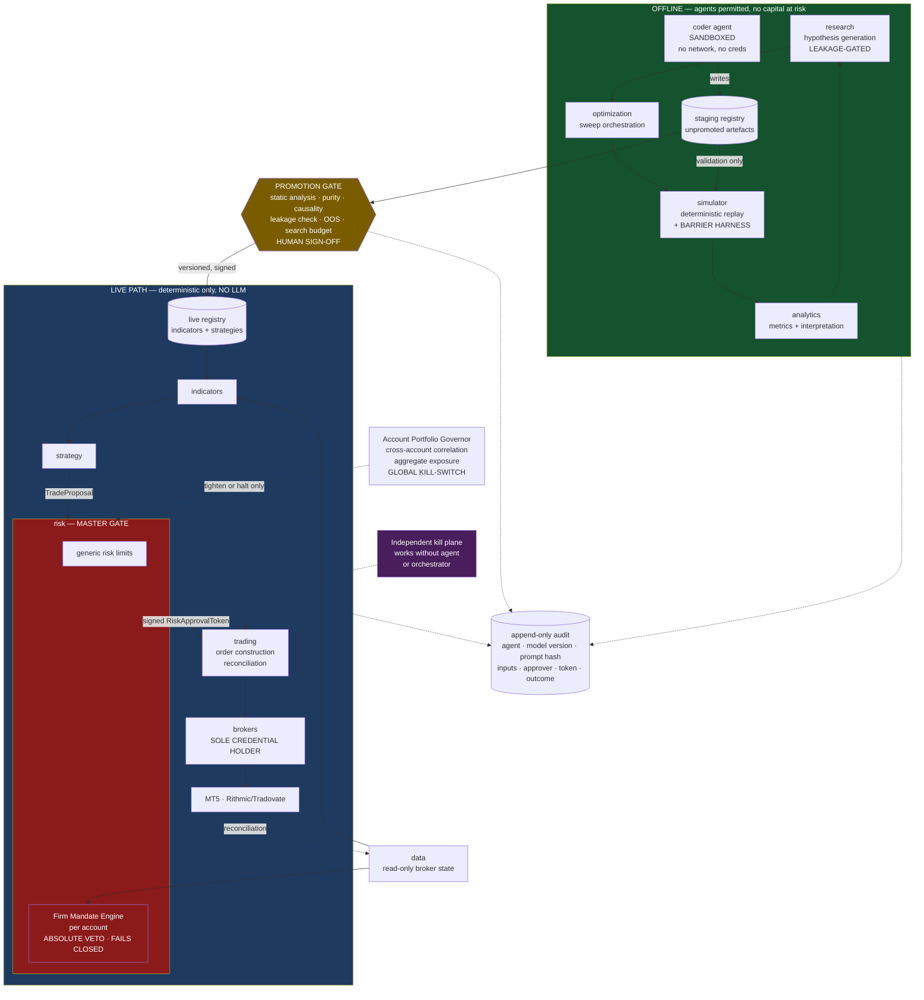
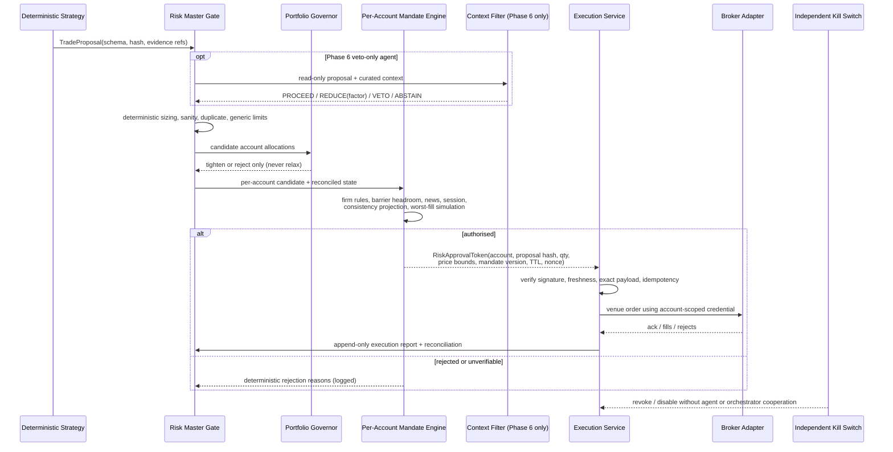

# Building an AI Trading Agents Firm for Prop-Funded Deployment

## Consolidated Research Report and Build Blueprint

**Document:** `02_consolidated_report.md`
**Path:** `docs/dev/agentic_firm_v3/02_consolidated_report.md`
**Owner:** Haruperi
**System:** HaruQuantAI
**Version:** 1.0.0
**Status:** Authoritative — supersedes `00_research_report.md`, `chatgpt.md`, `gemini.md`
**Date:** 28 July 2026

---

### Provenance

This report consolidates three independent deep-research passes over the same brief, plus verification work performed during the merge. Merge decisions are recorded in `01_report_gap_analysis.md`; that document remains the audit trail for what was included, corrected and rejected.

| Source | Contribution |
|---|---|
| `00_research_report.md` | Base document. Empirical appraisal of the literature; original Monte Carlo simulation |
| `chatgpt.md` | Enforcement mechanics, provenance discipline, operational specification |
| `gemini.md` | Prop-firm rule landscape, B-book counterparty economics |
| Merge verification | Corrections to all three (§3.3, §3a, §7.7); rejection of two unsupported claims (Appendix H) |

**An epistemic caveat.** The three source reports ran from the same prompt, so their agreement partly reflects a shared prior rather than convergent discovery. Where they agreed, this report states the conclusion. Where they disagreed, or where a claim failed verification, the disagreement is preserved and adjudicated in the open rather than smoothed away.

### Scope and limitations

This report answers one question: given everything currently known about LLM-powered multi-agent trading systems, what should be added to the existing HaruQuantAI system in order to pass and survive proprietary-firm funded accounts, and what is the honest expected outcome.

**Four limitations to hold while reading.**

1. **Prop firm rules change frequently and are enforced discretionarily.** Every rule cited carries an access date of 27–28 July 2026. Appendix B is a *verification worksheet*, not a statement of fact — each cell must be checked against the firm's own current terms before it is encoded in the mandate engine. Several source citations are affiliate-compensated aggregators and are flagged in place.
2. **The quantitative results in Chapter 7 are simulations run for this report under stated assumptions**, not measurements of your system. They are calibrated illustrations of the shape of the problem. Chapter 12's Phase 1 exists to replace them with measurements.
3. **This report contains no legal advice.** Chapter 15 is descriptive.
4. **Repositories were assessed from their associated papers and published descriptions, not read at source level.** Appendix G lists this and other blind spots.

---

## 1. Executive Summary

**The verdict: build the agentic layer, but not the system originally described. Confine agents to the offline research loop — `research`, `optimization`, `simulator`, `analytics`, and a sandboxed code generator — and leave the live decision path deterministic. The evidence does not support putting LLM agents in the live trade decision under prop-firm barrier constraints, and the specific evidence that would justify it does not exist in the literature.**

**The most valuable thing to build in the next month is not an agent.** It is two deterministic components that do not currently exist in the system: a per-account **Firm Mandate Engine** inside `risk` that encodes each firm's actual rules and holds an absolute veto, and a **barrier-aware evaluation harness** in `simulator` that reports probability of breach rather than Sharpe ratio. Five challenges are live now. These two components protect capital that is at risk today. Everything agentic waits behind them.

### 1.1 The five findings that drive the verdict

**One — the literature cannot answer the question, and this is countable rather than merely asserted.** A systematic survey ([arXiv:2605.19337](https://arxiv.org/abs/2605.19337), screened through March 2026) examined 77 studies. Of the 19 meeting a minimum bar of tradable actions with closed-loop evaluation: **2/19 reported time-consistent split protocols, 1/19 reported an explicit transaction-cost model, 1/19 documented survivorship handling, and none achieved reproducibility.** You are not choosing between well-evidenced architectures. You are choosing among demonstrations.

**Two — the headline results are inflated by a mechanism the field cannot escape.** TradingAgents — the framework your original brief describes — reports Sharpe ratios of 8.21, 6.39 and 5.60 with a 0.91% maximum drawdown, over a June–November 2024 window ([arXiv:2412.20138](https://arxiv.org/abs/2412.20138)). A Sharpe above 5 on single equities exceeds what the best-documented quantitative funds achieve, and the evaluation window sits inside the pretraining data of the models used. The published critique is blunt: the model was pretrained on the window it is "predicting", so the look-ahead bias is in the weights, not the prompt. Look-Ahead-Bench ([arXiv:2601.13770](https://arxiv.org/abs/2601.13770)) confirms significant look-ahead bias in standard LLMs empirically, via alpha decay across temporally distinct regimes.

**Three — where leakage is properly controlled, the performance largely disappears.** Emmanoulopoulos et al. (Barclays and Simudyne, [arXiv:2507.08584](https://arxiv.org/abs/2507.08584)) evaluate the same agents twice: conventionally, and inside a market simulator generating synthetic but causally plausible paths designed to defeat memorisation. Conventional: average Sharpe 0.88 on news context, 1.40 with their model-discovery loop. **Leakage-controlled: ten of thirteen agent configurations lose money outright, best result Sharpe 0.47.** The gap between those two tables is the size of the leakage problem.

**Four — the drawdowns reported across this literature would end a prop account.** Emmanoulopoulos et al. report maximum drawdowns from 3% to 39%, with NVDA drawdowns of 23–39% across *every* configuration tested. Nunna & Samala (IJACSA 16:11) report that agentic agents outperformed rule-based agents on return — 139.1% vs 64.8% — **but drew down 10.4–15.2% versus 6.8–9.1%.** Under a 10% limit the traditional agents survive and the agentic agents are terminated. That paper also tests no LLMs at all, and its headline difference is not significant (p = 0.19 and 0.16, n = 20 per group).

**Five — the existing architecture is a genuine asset, and the correct move is to extend it.** The domain separation — `risk` as master gate, `strategy` unable to self-execute, `brokers` as a thin credential-holding passthrough, `research` explicitly leakage-gated — already implements the governance properties the open-source frameworks conspicuously lack. Adopting TradingAgents or similar would import a demo-grade permission model into a system that is currently better designed than it is.

### 1.2 The prop deployment, quantified

**Industry base rates are worse than advertised.** On a 300,000-account dataset, roughly 14% pass a challenge and about 7% of all challenge buyers ever receive a payout. **Around 70% of failures come from loss limits, not from failing to reach the target — 50% breaching maximum drawdown, 20% hitting the daily cap.** The binding constraint is the barrier. Design for the barrier. *(One source disputes these figures substantially downward; see §3.6 and Appendix H.)*

**Position sizing dominates skill.** Simulation run for this report (Chapter 7, code in Appendix D): a zero-skill strategy at 30% annualised volatility passes a 60-day, 10%-target, 10%-drawdown evaluation **35.5%** of the time. A genuinely skilled Sharpe-1.5 strategy at 8% volatility passes **5.6%**. If the objective is narrowly to pass challenges, volatility targeting matters more than any agent.

**The contract matters as much as the strategy.** A second simulation holding the return process fixed and varying only the mandate shows a pass rate moving from **68.5% to 37.9%** — same strategy, different drawdown terms. Together these two results make the complete argument: **outcome is dominated by sizing and contract terms, not by signal quality.**

**But the two phases are in direct conflict.** The volatility maximising pass probability (25–30%) yields a **3–6%** chance of surviving twelve months funded even at Sharpe 3.0. At 8% volatility, twelve-month survival is 86% at Sharpe 1.0. Evaluation and funded phases have opposed optimal risk profiles, and consistency rules exist precisely to punish the aggressive path. This is a risk-management problem, not an intelligence problem.

**Automation permissibility — the gating question — resolves favourably.** FTMO permits Expert Advisors on challenge and funded accounts across MT4, MT5 and cTrader, with no pre-approval and no source-code submission. Topstep and Apex permit bots on their connected platforms. Copying your own trades across your own accounts is permitted at almost every futures firm. **You are not building something prohibited.** Real constraints exist — a $400K same-strategy cap across FTMO accounts, bans on latency arbitrage and tick scalping, a two-minute news blackout, server request limits, and cross-firm detection via IP fingerprinting and millisecond timestamp matching — but the deployment is viable.

### 1.3 Three findings that require action this week

**A · Check which drawdown product each futures account is on.** Apex offers **both** intraday-trailing and end-of-day-trailing accounts. The intraday variant trails the highest balance **including unrealised profit on open trades**, and never moves back down. A trade that runs 2% in your favour and retraces permanently consumes 2% of headroom without ever being realised. For any strategy that lets winners run this is close to disqualifying, and nothing in the current `risk` domain models it. **Prefer static or EOD-trailing products wherever the firm offers a choice, and treat "which variant did I buy" as a mandatory field on every account record.** (§3.3)

**B · The obvious decorrelation measures do not decorrelate.** Execution jitter and size perturbation imitate independence rather than producing it — the same strategy on the same instrument with fifteen seconds of delay gives correlation near 0.97, and the accounts still fail together, just fifteen seconds apart. Only genuinely different return drivers move correlation materially, and with one validated strategy you cannot reach ρ = 0.3 this month. **A second, independently validated strategy becomes a first-class objective, and the case for fewer simultaneously active accounts strengthens.** (§3a.4)

**C · Triage the five live accounts against mandate enforcement, not against sunk cost.** Continue an account only if `risk` enforces every rule for it and halts on stale state. Since breach probability for the current strategy is unmeasured, **run at most one account at minimum size until Phase 1 measures it.** (§3a.1)

### 1.4 Where the agentic layer earns its place

The offline research loop is where LLMs do what they are demonstrably good at — synthesis, code generation, hypothesis exploration — where failures are cheap and reversible, and where non-determinism is a nuisance rather than a solvency event. The live decision path is where every failure mode in Chapter 7 becomes terminal within one session.

**The one live-path exception worth testing later** is a trade/no-trade context filter: an agent that may veto or reduce a deterministic signal but never originate or enlarge one. Under a barrier constraint the highest-value decision is often not to trade, and synthesising calendar, news, regime and positioning into a stand-down gate is plausibly the one thing an LLM does better than existing indicators. That is Phase 6, and only if Phases 2–4 have earned it.

### 1.5 The honest risk

The most expensive mistake available is building an impressive multi-agent system, watching it produce good backtests, and scaling it across five funded accounts — where correlated breach ends everything simultaneously. With five accounts driven by one engine at correlation 1.0, the probability that *zero* accounts pass is **57.2%**. At ρ = 0.3 it is **16.1%**, with **identical expected value** (2.06 vs 2.07 accounts). Decorrelation buys nothing in expectation and everything in survival — which is exactly why finding B above matters so much. The lunch is only free if you can actually reach low correlation.

A second risk, newly surfaced: **success itself may trigger a change in the deal.** Retail prop firms are predominantly B-book, meaning payouts come from the evaluation-fee pool and your profit is their direct cost. Once cumulative payouts reach a material threshold, firms may transition an account to real execution or subject the strategy to manual review, and a strategy that depended on simulated-environment fill quality can then be denied under an "unreplicable trading style" clause. **Your strategy must be viable under real execution quality, not just B-book fills** — which is a Phase 1 fill-model requirement, not a Phase 7 concern. (§3.5)

---

## 2. Introduction and Problem Definition

### 2.1 What is actually being solved

The framing in the original brief — a multi-agent firm with fundamental analysts, sentiment experts, technical analysts, traders and a risk committee debating their way to a decision — is the framing of the dominant literature. It is also, for this deployment, the wrong objective function.

A conventional trading system optimises risk-adjusted growth: maximise expected return per unit of volatility over a long horizon, treating drawdowns as recoverable. A prop-funded system solves a **first-passage problem with an absorbing barrier**. You must reach a bounded profit target (typically 8–10%) before your equity path touches a daily loss limit (typically 5%) or a maximum drawdown (typically 10%, often trailing), inside a rule envelope of minimum trading days, consistency requirements, news blackouts, and in the futures case a flat-by-close obligation.

Under a barrier, survival is governed by the **left tail of the daily return distribution** and by the **serial correlation of losses**. The mean is nearly irrelevant. A strategy with a superb Sharpe ratio that occasionally has a 6% day is not "a good strategy with a bad day" — it is a total loss of a $200,000 account and the fee that bought it.

This distinction runs through every chapter. When Chapter 5 reports a Sharpe ratio of 8.21, the relevant question is not whether it is real. It is: what was the worst single day, and how often did it happen? The literature almost never says.

### 2.2 The specific position

- **Five prop challenges purchased and being traded now** by the existing deterministic system. None passed. All early.
- **Target: five-plus firms at $200,000 each**, spanning FX/CFD (FTMO-style, MT5) and futures (Topstep-style).
- **An existing production system** — thirteen domain modules under `app/services/` and `app/utils/`, with clean separation of duties.
- **Solo**, strong software engineering, light on quantitative methodology, with AI coding assistance available.

The last point shapes the recommendations more than it might appear. Where this report relies on quantitative reasoning it explains it fully rather than gesturing at it, because you need to be able to defend these decisions to yourself in six months when a strategy is losing and the temptation to override the risk gate is at its highest.

### 2.3 What "agentic" means here

Following Singh (*The Agentic ETF*), **agentic trading** is a process in which an autonomous software agent — typically LLM-driven with tool access — perceives market state, reasons over heterogeneous data, forms a decision, and executes it, on a recurring schedule, **without a human approving each trade**. The defining property is the delegation of *judgment*, not merely execution.

The distinction is useful because it makes the key question sharp. The existing system already automates execution. The question is whether to delegate judgment. Those are separable, and this report recommends delegating judgment in the research loop and withholding it from the live path.

### 2.4 Evidence hierarchy used throughout

| Tier | Class | Weight |
|---|---|---|
| 1 | Firm's own written terms, with access date | Binding |
| 2 | Peer-reviewed empirical work with reproducible protocol | Strong |
| 3 | Preprints with disclosed methodology | Moderate, discounted for leakage |
| 4 | Vendor-published datasets (e.g. pass-rate statistics) | Weak — unaudited, incentive-aligned |
| 5 | Affiliate-compensated aggregators, practitioner blogs | Indicative only; flag in place |
| 6 | Simulation run for this report | Illustrative of problem shape, not predictive |

---

## 3. Gating Constraints: Prop Firm Rules, Automation Policy and Counterparty Risk

*This chapter precedes the literature review because it can invalidate everything after it.*

### 3.1 Automation permissibility — the existential question

**Finding: automated and algorithmic trading is permitted at the major firms in both target segments. The plan is not prohibited.**

**FTMO (FX/CFD).** Expert Advisors are explicitly allowed on both the Challenge and funded accounts, across MT4, MT5 and cTrader. No pre-approval process, no source-code submission ([EAFunded](https://www.eafunded.com/blog/ftmo-ea-rules), accessed 28 July 2026; corroborated by [TradingFinder](https://tradingfinder.com/props/ftmo/rules/)).

The governing principle is that the EA must trade like a normal market participant and must not exploit platform inefficiencies:

| Prohibition | Detail |
|---|---|
| Exploitative trading | Profiting from platform/price-feed weaknesses, requotes, spread manipulation |
| High-frequency trading | Dozens of trades per minute; anything faster than a human could plausibly execute |
| Tick scalping / latency arbitrage | Explicitly banned — exploiting feed delays between brokers |
| News trading | No opening or closing within 2 minutes of a major news event |
| Server overload | More than ~2,000 server requests per day on individual trades or pending orders |
| Capital concentration | **The same strategy may not exceed $400K total capital across all FTMO accounts combined** |

Martingale and grid strategies are not explicitly banned but attract closer review.

**Topstep and Apex (futures).** Both permit EAs, bots and copy trading on connected platforms (Project X / TradingView integrations), with restrictions on news trading and high-frequency activity ([ClearEdge](https://clearedge.trading/post/topstep-combine-automation-rules-bot-trading-guide); [Sentinel](https://sentinel.redclawey.com/blog/automated-trading-allowed-prop-firms-policy-guide-2026), accessed 28 July 2026).

**The caveat that matters more than the rules.** These are aggregator sources. Firm terms are revised frequently and enforcement is discretionary, historically tightening at payout time rather than at signup. Read each firm's own current terms, archive the version accepted at purchase, and record the access date. **A rule that is permissive on paper and enforced arbitrarily at withdrawal is worse than a clear prohibition, because the loss arrives after the work is done.**

### 3.2 The multi-account and copy-trading problem

**Finding: copying your own trades across your own accounts is permitted at almost every firm. Copying anyone else's is prohibited everywhere. The plan sits on the permitted side of that line.**

Internal copying across accounts you personally own is allowed at nearly every futures prop firm — the firms built their multi-account limits around it. Apex allows up to 20 accounts, Topstep 10, Tradeify 5. Prohibited is copying an *external* signal or another trader's account, classified as group trading regardless of software, and selling your trades to others ([Apex](https://apextraderfunding.com/resources/prop-trading/can-you-copy-trade-different-prop-firms/); [PickMyTrade](https://blog.pickmytrade.trade/how-to-copy-trades-across-multiple-prop-firm-accounts-2026/), accessed 28 July 2026).

**Two operational constraints follow.**

*Detection.* Firms use IP fingerprinting and millisecond-level timestamp matching to identify identical entries across accounts. Orders at different firms sharing an IP and filling within ten milliseconds of each other get flagged. This does not make the setup non-compliant, but expect scrutiny and be able to evidence that the accounts are yours and self-directed. Practically: maintain the audit trail in Chapter 10, and introduce per-account execution jitter — **as a compliance measure, not a risk measure** (§3a.4).

*Capital concentration.* FTMO's $400K same-strategy cap is a hard constraint within FTMO. Two $200K FTMO accounts on one strategy exhausts it. This is one of several reasons the plan requires five different firms rather than five accounts at one firm.

### 3.3 Rule taxonomy — two constraint geometries, and a product choice that matters more than either

| Dimension | FX/CFD (FTMO-style) | Futures (Topstep/Apex-style) |
|---|---|---|
| Execution | MT4 / MT5 / cTrader | Rithmic, Tradovate, Project X, NinjaTrader |
| Evaluation | Commonly 2-phase (10% then 5% target) | Commonly 1-phase Combine |
| Daily loss limit | ~5% of initial balance, reset at server midnight | Fixed dollar (e.g. $1,000 on $50K) |
| Max drawdown | 10%, static or trailing depending on firm/product | Trailing — **variant is a product choice, see below** |
| Overnight/weekend | Often restricted; some firms offer swing accounts | Flat-by-close typically required |
| News | 2-minute blackout around high-impact releases | Restrictions vary |
| Profit split | Commonly 80–90% | Topstep 90/10 post-Jan 2026; Apex 100% on first $10K |

**The drawdown variant is the single highest-leverage decision in this chapter, and it is available to you before you buy.**

Verification during the merge established that **Apex offers both intraday-trailing and end-of-day-trailing account types** — a fact all three source reports got wrong, in different directions:

- **[Intraday Trailing Drawdown](https://apextraderfunding.com/help-center/intraday-trailing-drawdown-accounts/intraday-trailing-drawdown-explained/):** the threshold follows the highest balance throughout the session **including unrealised profit on open trades**. Every new high moves the limit up immediately, and it never moves back down.
- **[EOD Trailing Drawdown](https://apextraderfunding.com/help-center/eod-trailing-drawdown-accounts/eod-drawdown-explained/):** recalculated once daily at 16:59:59 ET from the closing balance; fixed through the following session, still enforced in real time if touched.

Topstep's version trails the highest **end-of-day balance** and stops trailing once it reaches the starting balance — a ratchet ceiling that is materially more forgiving than either.

Three consequences:

1. **Prefer static or EOD-trailing products wherever a choice exists.** Under intraday trailing on unrealised equity, a trade that runs 2% in your favour and retraces permanently consumes 2% of headroom without ever being realised. Any strategy that lets winners run is structurally penalised.
2. **The variant is a mandatory field on every account record**, and the mandate engine must implement all three modes (`static`, `trailing_eod`, `trailing_intraday`) with the ratchet-ceiling flag.
3. **Check which variant your current futures accounts are on, this week.** If any is intraday-trailing, its headroom is being consumed in a way nothing in the current stack models.

Appendix B contains a ten-firm comparison worksheet. **Every cell in it is marked unverified.** It is a checklist of what to confirm, not a statement of what is true.

### 3.4 Machine-readable constraint specification

Do not hard-code rules into strategy logic. Encode them as a declarative **firm mandate object** loaded per account by `risk`.

```yaml
firm_mandate:
  account_id: "ftmo-200k-01"
  mandate_version: "2026.07.28-01"     # immutable; changes create a new version
  firm: "FTMO"
  model: "fx_cfd"
  phase: "evaluation_p1"                # evaluation_p1 | evaluation_p2 | funded
  initial_balance: 200000
  currency: "USD"
  terms_archived_at: "2026-07-28"
  terms_source_hash: "sha256:..."       # hash of the archived terms document

  profit_target:
    type: "percent_of_initial"
    value: 0.10

  daily_loss:
    basis: "initial_balance"            # initial_balance | current_balance | equity
    value: 0.05
    includes_unrealised: true           # critical: floating loss usually counts
    reset_time: "00:00"
    reset_tz: "Europe/Prague"           # SERVER tz, not local

  max_drawdown:
    mode: "static"                      # static | trailing_eod | trailing_intraday
    basis: "initial_balance"
    value: 0.10
    trails_on_unrealised: false         # true only for trailing_intraday
    trail_stops_at_initial: false       # Topstep-style ratchet ceiling

  min_trading_days: 4
  consistency_rule:
    type: "max_single_day_share_of_profit"
    value: 0.40                          # null if firm has none
    evaluated: "retrospective"           # only checkable at payout

  news_blackout:
    enabled: true
    window_seconds_before: 120
    window_seconds_after: 120
    impact_levels: ["high"]
    calendar_source: "economic_calendar_v1"

  session:
    flat_by_close: false
    weekend_hold: false

  instruments:
    allow: ["EURUSD","GBPUSD","XAUUSD"]
    deny: []
  max_lots_per_position: 5.0

  strategy_capital_cap:
    scope: "firm"                        # FTMO $400k same-strategy cap
    value: 400000

  operational:
    max_server_requests_per_day: 2000
    min_order_interval_ms: 250
    max_state_age_ms: 5000               # exceed -> fail closed
```

**Three rules are structurally awkward and deserve first-class design attention.**

**Trailing drawdown on unrealised equity** changes headroom while a position is open, with no action from you. The engine must re-evaluate continuously, not per-order.

**Consistency rules are only evaluable retrospectively** — whether one day contributed more than 40% of total profit cannot be known until the profit is final. The engine must therefore track a *running projection* and constrain size when a large winning day would push the projected share over the limit. This is the rule most likely to be discovered at payout, and most likely to cost a payout you thought you had earned.

**Daily reset timing** occurs at the *broker's server midnight in the broker's timezone*. A system that resets at local midnight mis-measures every daily breach near the boundary.

**Mandate lifecycle.** Mandates are immutable and versioned. A rule change creates a new version with a new archived terms document and hash; it never mutates in place. Activation requires the full test suite to pass against the new version. Phase transitions (evaluation → funded) are mandate version changes, not field edits.

### 3.5 Firm counterparty risk and B-book economics

Prop firms are lightly regulated counterparties whose business model is in structural tension with your success.

**The economics.** Retail prop firms are predominantly **B-book**: the primary revenue source is evaluation, reset and activation fees, not net trading profit routed to external liquidity. Because payouts on simulated accounts are funded from that fee pool, **the firm incurs a direct cost when you profit.** This explains the enforcement asymmetry — consistency clauses, news restrictions and inactivity expirations all function to invalidate profit on breach.

**The success-triggered risk.** Once cumulative payouts reach a material threshold — one source places it at roughly $50,000–$100,000 — firms may transition an account to real execution or subject the strategy to manual review. If the strategy depended on simulated-environment fill quality, payouts can then be denied under an "unreplicable trading style" clause.

> **Verification flag.** The threshold figure and the clause language come from `gemini.md` §0.5 and are unsourced. Treat the *mechanism* as a real and well-attested industry dynamic; treat the *numbers* as unverified. The design consequence holds either way.

**The design consequence is immediate and belongs in Phase 1, not Phase 7:** your strategy must be viable under realistic execution quality — real spreads, real slippage, real rejection rates — because success itself may trigger the transition. A strategy that only works on B-book fills is not a strategy; it is a temporary artefact of the counterparty's cost structure.

**The MyForexFunds case, and why its outcome is not what most summaries suggest.** The CFTC charged Traders Global Group in August 2023 alleging fraud exceeding $300 million. On 13 May 2025 the case was **dismissed with prejudice**, with more than $3 million in Rule 11 sanctions imposed on the CFTC after it mischaracterised a CAD $31.55 million tax payment. Assets were unfrozen and payouts began in April 2026 ([Finance Magnates](https://www.financemagnates.com/forex/my-forex-funds-parent-defeats-cftc-in-court-as-judge-imposes-sanctions/); [De Silva Law Offices](https://www.desilvalawoffices.com/articles/blog/2025/may/cftc-case-dismissed-my-forex-funds-controversy-h/)).

The lesson is not "prop firms are fine". It is that **the US now lacks the regulatory precedent it sought**, while European and Australian regulators tighten through leverage caps and marketing rules ([The Industry Spread](https://theindustryspread.com/retail-prop-trading-regulation-2026-my-forex-funds-cftc/)). Traders in that episode had funds frozen for roughly twenty months through no fault of their own. This counterparty risk is real, is not primarily fraud risk, and is not diversifiable by trading skill — only by spreading across firms and by withdrawing promptly (§13.7).

**Firm selection due-diligence checklist:**

1. Minimum three years of operational history, ideally through a market stress event.
2. Audited or third-party-verified payout evidence — not the marketing figure.
3. Clear written EA policy permitting custom-coded automation.
4. **Explicit declaration of routing policy for funded accounts above $100k** — does the firm A-book, hedge internally, or remain simulated?
5. **Static or EOD-trailing drawdown offered** — avoid intraday unrealised high-water trailing (§3.3).
6. Entity and jurisdiction on the contract, and what dispute recourse exists.
7. History of retroactive term changes. Search the firm name alongside "terms updated" and "payout denied".
8. Whether pass and payout rates are published, and whether audited (almost universally: not).

### 3.6 Economics of the funding pipeline

| Metric | Base case | Disputed alternative |
|---|---|---|
| Evaluation pass rate | **14%** (FPFX Tech, 300,000-account dataset) | 5–10% per attempt (`gemini.md`, unsourced) |
| Of funded, share ever receiving a payout | **~45%** (FPFX) | 15–20% receive a first payout; <5% survive 6 months (`gemini.md`, unsourced) |
| Of all buyers, share ever receiving a payout | **~7%** (FPFX) | — |
| Typical payout size | ~4% of account | — |
| **Failures caused by loss limits** | **~70%** (50% max DD, 20% daily cap) | — |

Firm-specific: FTMO ~9–10%; Apex 15–20% first attempt; Topstep 16.8% of Combines completed Jan–Dec 2025; Take Profit Trader 20.37% one-step. Sources: [QuantVPS](https://www.quantvps.com/blog/prop-firm-statistics), [Damn Prop Firms](https://damnpropfirms.com/trading-guides/prop-firm-evaluation-pass-rates-statistics-reality-check/), [Responsible Trading](https://responsibletrading.com/prop-firm-pass-rate-what-percentage-of-traders-actually-get-funded/). All firm-reported figures are unaudited and incentive-aligned. Treat as upper bounds.

**The disputed figures matter.** If the pessimistic set is closer to truth, the break-even pass rate computed in §14.2 rises from ~35% to well above 50%, and the project becomes very hard to justify. Neither set is well-sourced enough to settle. **This is partly resolvable from your own data once one account completes a full cycle**, and doing so should be treated as a deliverable of Phase 6.

**The single most important number in this section is the last row of the table.** Seventy percent of failures are barrier breaches, not target misses. The industry's failure mode is risk management, not signal quality — the strongest available argument that engineering effort belongs in the mandate engine rather than in agents.

**Forward economics.** Five challenge fees are sunk. The recurring decision is: on failure, reset, re-buy, switch firm, or stop.

```
E[value of one more attempt]
  = P(pass) × P(reach payout | funded) × E[payout | payout]
  − fee − (opportunity cost of the evaluation period)
```

At base rates on a $200K account, 80% split, $1,000 fee:

```
0.14 × 0.45 × (200,000 × 0.04 × 0.80) − 1,000
= 0.063 × 6,400 − 1,000 = 403 − 1,000 = −597 per attempt
```

**At industry base rates the expected value of a challenge attempt is negative.** The project is rational only if your system's pass and survival probabilities are materially above base rate. **You do not currently know whether they are.** Phase 1 exists to find out, and it is the cheapest information available.

**Reset versus re-buy.** On a breach, resetting is preferable to a new challenge only when the reset discount is material (a reasonable initial threshold is >20%) *and* the strategy's measured drift remains non-negative *and* no consistency-rule penalty carries forward. Otherwise a fresh challenge at a firm with better terms dominates. Recompute this rule from Phase 1 numbers rather than from the assumed base rates.

---

## 3a. In-Flight Triage — The Five Live Challenges

*Capital is at risk today. This chapter has a deadline; the rest of the report does not.*

### 3a.1 The decision rule

The three source reports disagreed here — one recommended continuing all five with decorrelation, one recommended stopping all five, one recommended pausing three. The disagreement resolved into a conditional rule, because the right answer depends on a fact you can establish in an afternoon: **does `risk` actually enforce each account's firm mandate?**

| Condition | Action |
|---|---|
| `risk` enforces **every** rule for that account — daily basis and reset timezone, correct drawdown variant, floating-P&L treatment, news blackout, session/flat-by-close, consistency projection — **and** halts on stale state | Continue trading that account |
| **Any** rule unenforced, **or** account state can go stale without halting | **Stop opening new risk on that account.** Manage existing positions to their stops. Do not force synchronised liquidation — that creates its own slippage and breach risk |
| A rule cannot be encoded unambiguously from the firm's written terms | Request written clarification. **Do not trade on the favourable interpretation** |
| Barrier probability for the current strategy is unknown | Run **at most one** account at minimum size until Phase 1 measures it |
| Automation expressly prohibited at a firm | Disable automated execution on that account immediately; preserve offline recommendations only |
| Automation allowed but copy topology prohibited | Run that account manually and independently; do not include it in any shared proposal path |
| Estimated breach probability is unacceptably high once measured | Stop all accounts. **Do not expect an agent layer to repair a deficient return distribution** |

**The fourth row is operative today.** Breach probability is unmeasured, so the consolidated recommendation is one account at minimum size while Phase 0 and Phase 1 proceed.

The reasoning worth stating explicitly, because it corrects a tempting error: *the fees are sunk, therefore continue* is only valid if the accounts are actually protected. If the mandate controls are absent, continuing does not preserve option value — it consumes it, faster than pausing does.

### 3a.2 Instrumentation to add this week

Before anything else, you need continuous per-account visibility. Implement as a read-only snapshot in `analytics`, refreshed from `data`'s broker-state reads:

```python
class PropAccountRiskSnapshot(TypedDict):
    account_id: str
    mandate_version: str
    observed_at: datetime
    state_age_ms: int                        # freshness -> fail closed if stale
    balance: Decimal
    equity: Decimal
    day_anchor_value: Decimal                # basis for the daily limit
    daily_floor: Decimal | None
    total_or_trailing_floor: Decimal
    daily_headroom: Decimal | None
    total_headroom: Decimal
    binding_headroom: Decimal                # min of the above -> drives sizing
    open_stop_loss: Decimal
    stressed_gap_loss: Decimal
    stressed_spread_cost: Decimal
    worst_case_open_loss: Decimal
    projected_headroom_after_worst_fill: Decimal
    consistency_status: str
    in_news_blackout: bool
    seconds_to_flat_deadline: int | None
    reconciled: bool
    safe_to_propose: bool
    block_reasons: list[str]
```

**Measure aggregate exposure in loss-at-stop dollars, not nominal lots.** Map every position to risk factors — USD, equity-index beta, duration, energy, metals, crypto — so the portfolio view shows genuine common-mode exposure rather than merely return correlation. The aggregate view should show:

- total loss if every stop executes at expected fill;
- total loss under a stressed correlated gap;
- loss by firm and by risk factor;
- which accounts would breach under each scenario;
- pairwise return and **decision** correlation across accounts;
- shared software and process dependencies;
- whether the same signal or order identifier generated positions across accounts.

The last two are the ones that reveal single points of failure that return correlation alone will not.

### 3a.3 Minimum viable mandate engine

The first version needs no LLM, no graph framework and no new service estate. A deterministic module inside `risk` with:

- immutable, versioned mandate records;
- pure rule evaluators (one function per rule, individually testable);
- state freshness and reconciliation checks that **fail closed**;
- worst-fill pre-trade simulation against remaining headroom;
- hard news, session and flat-by-close checks;
- consistency-impact projection;
- per-account internal buffers;
- a signed `RiskApprovalToken` with short TTL;
- property-based and adversarial tests.

Interface:

```python
decision = mandate_engine.evaluate(
    proposal=trade_proposal,
    account_state=reconciled_account_state,
    market_state=validated_market_state,
    calendar_state=validated_calendar_state,
    mandate=active_mandate,
)
# -> APPROVE | REDUCE | REJECT, with deterministic, logged reasons
```

The execution adapter must reject any order lacking a valid, unexpired token bound to the account, proposal hash, quantity, price bounds and mandate version.

### 3a.4 Decorrelation — what works and what only looks like it

**A correction that matters.** The obvious decorrelation measures do not decorrelate. Adding fifteen seconds of jitter and a 30% size reduction to the same strategy on the same instrument does not produce ρ = 0.3; it produces something near ρ = 0.97. The accounts still fail together — just fifteen seconds apart.

| Measure | Effect on ρ | Cost |
|---|---|---|
| Genuinely different strategies with independent return drivers | **Large — can reach ρ < 0.3** | High: each must be separately validated, and you have one |
| Different asset classes (FX majors / index futures / commodities) | **Moderate to large** | Moderate: different mandates, sessions, adapters |
| Different instruments within an asset class | Small to moderate — FX majors correlate heavily through USD | Low |
| Different timeframes or holding periods | Small to moderate | Low |
| Parameter divergence on one strategy | Small | Low |
| Execution jitter, size perturbation | **Negligible** | Low — and misleading, which is the problem |

**Consequences.**

1. **Asset-class partitioning is the only near-term lever with real effect.** Assign accounts to genuinely different exposure families — FX majors, FX secondaries, index futures, commodity futures — and accept that within-family correlation stays high.
2. **With one validated strategy you cannot reach ρ = 0.3 this month.** This strengthens rather than weakens the case for running fewer accounts simultaneously.
3. **A second, independently validated strategy with a different return driver becomes a first-class Phase 3 objective**, not a nice-to-have. It is the only path to the decorrelation benefit quantified in §7.9.
4. **Execution jitter still belongs in the design** — but as a compliance measure against cross-firm timestamp-proximity detection (§3.2), not as a risk measure. Label it correctly in the code so nobody later mistakes it for protection.

An illustrative partition, subject to the above:

| Account | Firm type | Exposure family | Session | Notes |
|---|---|---|---|---|
| 1 | FX/CFD | FX majors (EURUSD, GBPUSD) | London/NY | Primary; zero added delay |
| 2 | FX/CFD | FX secondaries (AUDUSD, USDCAD) | Asia/London | Different driver set from 1, though USD-linked |
| 3 | Futures | Index (ES, NQ) | RTH, hard flatten | Genuinely different family |
| 4 | Futures | Commodities (CL, GC) | RTH, hard flatten | Genuinely different family |
| 5 | FX/CFD | Held flat pending second strategy | — | **Do not run a fifth correlated instance to fill the slot** |

Row 5 is deliberate. A fifth account running a near-copy of account 1 adds cost and correlated breach risk without adding an independent attempt.

### 3a.5 Interim headroom reserve

Until the empirical gap and slippage distribution is measured, **reserve 20–30% of remaining firm headroom** and reject any order whose worst-case loss would consume the reserve.

This is a conservative engineering judgement, not an optimised value. Replace it in Phase 1 with an account-, instrument- and session-specific buffer derived from the 99.9th percentile of observed slippage, spread widening, gap and reconciliation delay, plus a model-uncertainty allowance.

### 3a.6 Compliance exposure right now

Two silent violations, typically discovered at payout review:

- **Order rate.** Confirm the system stays inside each firm's request limits (FTMO: ~2,000/day on individual trades and pending orders).
- **News windows.** Confirm no trading inside blackout periods. This requires an economic calendar dependency that may not currently exist — if so, it is Phase 0 work, not Phase 1.

---

## 4. Academic Literature Review

### 4.1 The state of the evidence base

The most important paper for this purpose is not a framework paper. It is the systematic survey, **"Agentic Trading: When LLM Agents Meet Financial Markets"** ([arXiv:2605.19337](https://arxiv.org/abs/2605.19337)), which reframes LLM trading agents as expert-system decision pipelines and produces an audit-oriented evidence map of 77 studies screened through 9 March 2026.

Its central finding is **protocol incomparability**. Of the 19 studies meeting the minimum bar of tradable actions with closed-loop evaluation:

| Evidentiary property | Studies satisfying it |
|---|---|
| Extractable time-consistent split protocol | **2 / 19** |
| Explicit transaction-cost model | **1 / 19** |
| Documented universe or survivorship handling | **1 / 19** |
| Full reproducibility (R3) | **0 / 19** |

The authors' conclusion: architectural experimentation is expanding rapidly, while comparable evaluation protocols, execution semantics and reproducible artifacts remain the field's immediate bottleneck.

This is the most useful citation in the report, because it converts "the evidence is weak" from an opinion into a count. When a framework claims superiority, the prior should be that its evaluation protocol is not time-consistent, does not model transaction costs, and cannot be reproduced.

### 4.2 The canonical multi-agent trading frameworks

**TradingAgents** (Xiao, Sun, Luo, Wang; [arXiv:2412.20138](https://arxiv.org/abs/2412.20138), v7 June 2025) is the paper the original brief describes almost exactly: LLM agents as fundamental, sentiment and technical analysts; Bull and Bear researchers debating; a risk management team; traders synthesising. It is the most influential work in the space and the reference point for most that followed.

Reported results, June–November 2024:

| Metric | AAPL | GOOGL | AMZN |
|---|---|---|---|
| Cumulative return | 26.62% | 24.36% | 23.21% |
| Best baseline | 2.05% | 7.78% (B&H) | 17.1% (B&H) |
| Sharpe ratio | 8.21 | 6.39 | 5.60 |
| Max drawdown | 0.91% | — | — |

**Strongest methodological objection:** the reported Sharpe ratios are not plausible as measurements of edge. Sustained Sharpe above 3 is exceptional at the top of the quantitative industry; 8.21 on a single equity over six months is either extraordinary luck in a short sample or an artefact. The evaluation window sits inside the pretraining data of the models used, and the published critique states the problem precisely: the model was pretrained on the window it is "predicting", so the look-ahead bias is baked into the weights rather than the prompt. The paper's own defence — that agents only receive data available up to each trading day — addresses *pipeline* leakage while leaving *pretraining* leakage entirely untouched. A 0.91% maximum drawdown over six months on a single stock compounds the implausibility.

**Orchestration Framework for Financial Agents** (Li, Grover, Alpuerto, Cao, Liu; SecureFinAI Lab, Columbia; [arXiv:2512.02227](https://arxiv.org/abs/2512.02227)) maps traditional algorithmic-trading components onto agents — planner, orchestrator, alpha, risk, portfolio, backtest, execution, audit, memory — using MCP for control messages and A2A for inter-agent communication. Code at [Open-Finance-Lab/AgenticTrading](https://github.com/Open-Finance-Lab/AgenticTrading).

Reported: stock task (hourly, 04/2024–01/2025) 20.42% return, Sharpe 2.63, max drawdown −3.59%, against S&P 500 at 15.97%. BTC task (minute, 27/07/2025–13/08/2025) 8.39% return, Sharpe 0.378, max drawdown −2.80%, against BTC at 3.80%.

**Strongest methodological objection — and this one is instructive.** The abstract compares to the S&P 500 at 15.97%. Buried in the introduction is a second baseline: **an equally weighted portfolio with weekly rebalancing returned 47.46%** — more than double the agentic system. The system underperformed a baseline requiring no intelligence whatsoever, and that comparison does not appear in the abstract. The BTC evaluation covers **seventeen days**, which is not a sample.

To the authors' credit, the paper contains an explicit *Leakage Prevention Summary* (Appendix G): LLM agents never receive evaluation-window returns, prices or labels; optimisation and backtesting are deterministic tools behind the orchestration layer with filtered outputs; UUID-based memory records store only summaries that cannot be inverted to raw test data. **This is the best pipeline-leakage discipline described in the literature, and it should be the model for the `research` domain.** It still does not touch pretraining leakage, and the 2024 evaluation window sits inside the training data.

**TradeLens / "Can Agentic Trading Systems Pay for Their Own Intelligence?"** (Duan et al.; [arXiv:2607.10286](https://arxiv.org/abs/2607.10286), July 2026) asks the question the cost model needs: whether LLM-mediated decisions convert their induced costs into measurable incremental profit — **agentic viability**. It introduces a trace-grounded diagnostic that reconstructs trading trajectories and attributes profit and cost to interpretable evidence.

Findings are diagnostic rather than affirmative: viability hinges on intelligence-to-profit conversion; models show distinct failure patterns (poor asset selection in DeepSeek-V3.2, negative timing in GLM-4.7); and **capital scale, trading frequency and architecture matter only by amplifying or degrading decision-attributed timing value.** That clause deserves emphasis: **architecture is a multiplier on decision quality, not a source of it.** A better-organised set of agents does not create edge; it scales whatever edge or anti-edge the underlying decisions have. This report adopts it as an architectural invariant.

### 4.3 The leakage literature — the most decision-relevant strand

**Look-Ahead-Bench** ([arXiv:2601.13770](https://arxiv.org/abs/2601.13770); code at [benstaf/lookaheadbench](https://github.com/benstaf/lookaheadbench)) is a standardised benchmark of look-ahead bias in point-in-time LLMs. Rather than testing memorisation through Q&A, it evaluates behaviour in practical workflows and distinguishes genuine prediction from memorisation by **analysing performance decay across temporally distinct market regimes**, with quantitative baselines establishing thresholds. Evaluating Llama 3.1 (8B, 70B) and DeepSeek 3.2 against purpose-built point-in-time models, it finds **significant look-ahead bias in standard LLMs, measured through alpha decay.**

This is the empirical confirmation that the critique of TradingAgents is not merely theoretical.

**Look-Ahead-Freedom as Temporal Non-Interference** (Fonseca, Breda University of Applied Sciences; [arXiv:2607.04958](https://arxiv.org/abs/2607.04958), July 2026) is the most directly implementable paper in this report. It shows that look-ahead-freedom is a formal property in disguise: fixing a decision epoch, the demand that the future not influence the present is **temporal non-interference over a time-indexed information lattice**. The authors develop a pipeline calculus separating a datum's *availability time* from its *reference time*, and provide a type-and-effect system that is **sound and decidable in linear time** over the value-independent fragment — covering windowing, resampling, joins, point-in-time and vintage reads, and agentic retrieval. Their artifact detects every planted leak that differential and tiling detectors miss.

**Recommendation: adopt this as the formal basis of the `research` domain's leakage gate, and as a mandatory static check in the coder agent's promotion pipeline (§10.7).** An LLM writing indicator code can reintroduce look-ahead bias in a single line; a linear-time decidable checker is exactly the right defence.

### 4.4 The enabling multi-agent literature and whether it transfers

The trading frameworks borrow their mechanisms from a general agent literature: reason-and-act (ReAct), tool-use self-teaching (Toolformer), generative agents with memory (Park et al.), reflection and verbal reinforcement (Reflexion), and role-play coordination (CAMEL).

| Mechanism | Original claim | Does it transfer to trading? |
|---|---|---|
| **Multi-agent debate** | Improves factuality on tasks with verifiable ground truth | **No.** Markets have no ground truth at decision time. Agents share a pretraining distribution and context, so errors correlate. Averaging correlated estimates does not reduce variance but does inflate expressed confidence |
| **ReAct / tool use** | Grounds reasoning in external state | **Yes, strongly** — this is how numerical computation stays out of the LLM |
| **Reflection on outcomes** | Learns from feedback | **Weakly, and dangerously.** In a low signal-to-noise environment, reflecting on outcomes teaches noise. A losing streak triggers abandonment at the worst moment |
| **Role-playing societies** | Decomposes complex tasks | **Partially.** Useful for interpretability; no surveyed study ablates roles under a controlled protocol |
| **Hierarchical orchestration** | Manages complexity at scale | **Yes for pipelines, no for authority.** Useful as a build pattern; must never become a chain of command that can override deterministic gates |
| **Builder–critic loop** | Iterative model refinement (Box) | **Yes — the exception that proves the rule.** Works because the critic scores against an objective function |

**On debate specifically.** The result is a system that is *more confident without being more accurate* — which under a barrier constraint is strictly worse than an uncertain system, because confidence drives size. **TrustTrade** ([arXiv:2603.22567](https://arxiv.org/pdf/2603.22567)) attacks this with human-inspired *selective* consensus, which is an implicit acknowledgement that naive consensus is a problem.

**On the builder–critic loop.** Emmanoulopoulos et al. use it for model discovery, tracing to Box's classical work: the builder proposes a stochastic differential equation, the critic implements, calibrates, simulates, scores and refines it. This is a debate structure with a **verifiable ground truth** — the model either reproduces the statistical features of the historical price path or it does not. **Import this pattern into `research`; do not build a bull/bear debate for live decisions.**

### 4.5 The pre-LLM baseline

Any honest reading of the quantitative finance literature sets a sober prior. Documented, persistent, capacity-constrained edges are rare; published anomalies decay after publication (McLean & Pontiff); the cross-section of claimed factors is riddled with multiple-testing artefacts (Harvey, Liu & Zhu); and backtest overfitting is pervasive enough to have generated its own corrective literature — the Deflated Sharpe Ratio and the Probability of Backtest Overfitting (Bailey & López de Prado), and "Pseudo-Mathematics and Financial Charlatanism" (Bailey et al.). López de Prado's *Advances in Financial Machine Learning* supplies the operational tooling: purged cross-validation, embargo periods, and the observation that **the number of trials run before a reported result is the most important missing statistic in nearly every backtest.**

*These are cited from established knowledge rather than freshly verified; treat the claims as robust but check page references before quoting.*

**Why this matters for a coder agent.** If a human researcher trying a hundred strategy variants produces spurious winners at a rate requiring statistical correction, an agent that can try ten thousand produces them at a rate that guarantees self-deception. §10.7 treats this as the primary design constraint.

---

## 5. Open-Source Landscape

### 5.1 The frameworks

| Repository | What it is | Governance posture | Verdict |
|---|---|---|---|
| [TauricResearch/TradingAgents](https://github.com/TauricResearch/TradingAgents) | Reference implementation of the analyst/researcher/trader/risk architecture | Demo-grade. Agents produce decisions; no enforced separation between analysis and execution credentials | **Read the prompts, not the plumbing.** The role decomposition and debate prompts are the valuable artefact |
| [Open-Finance-Lab/AgenticTrading](https://github.com/Open-Finance-Lab/AgenticTrading) | Orchestration framework mapping AT components to agents; MCP + A2A | Better than most — explicit audit agent, deterministic tools behind orchestration, documented leakage prevention | **Study the orchestration and leakage design.** Closest to a defensible architecture |
| [kweinmeister/agentic-trading](https://github.com/kweinmeister/agentic-trading) | Vendor/individual demo | Demo-grade | Reference only |
| [DaviddTech/ai-trading-agent](https://github.com/DaviddTech/ai-trading-agent) | Individual project | Demo-grade | Reference only |
| [benstaf/lookaheadbench](https://github.com/benstaf/lookaheadbench) | Look-Ahead-Bench code | Research artifact | **Use it.** Directly applicable as a model gate |

*Access note: repository contents were not read at source level. Findings are drawn from associated papers and published descriptions. Reading the TradingAgents prompt definitions and the AgenticTrading orchestration entry point at source level is a worthwhile half-day and is listed in Appendix G.*

### 5.2 The de facto permission model of the field

The pattern is consistent across the open frameworks, and it is the specification for what must be built:

1. **Analysis and execution share a process and, usually, credentials.** The separation is conceptual — expressed in prompts and role names — rather than enforced by the runtime.
2. **The "risk agent" is an LLM.** It is a participant in the conversation, not a gate. It can be argued with, and in some designs overruled by a manager agent. This is the inverse of the correct design.
3. **Audit trails are logs, not evidence.** They record what was said, rarely the model version, prompt hash and input snapshot needed to reconstruct why.
4. **No firm-mandate or hard-limit layer exists**, because the frameworks were built to demonstrate architecture on unconstrained simulated capital.

The existing `risk` domain — a deterministic master gate every proposal must pass — is already better than every framework surveyed. **This is the single strongest argument for extending the current system rather than adopting theirs.**

### 5.3 Infrastructure: build versus borrow

`simulator`, `data`, `brokers` and `optimization` already exist, so the question is narrow.

**Backtest fidelity.** The critical question is not features but whether the engine models the things that actually kill prop accounts: spread widening at session open and around news, gap-through-stop, requote and rejection, partial fills, swap and funding costs. Vectorised engines generally cannot express these; event-driven engines can. `simulator` replays deterministically through the core trading path, which is the right architecture — the question is whether its fill model includes the above. This is a Phase 1 requirement (§12).

**Orchestration.** For an offline research loop, direct function calls with typed schemas and a persisted run record are sufficient for Phases 2–3. Graph-based orchestration with explicit state becomes worth evaluating at Phase 5. **Do not adopt a framework before two agents have earned their keep.**

---

## 6. Architectural Pattern Synthesis

### 6.1 The recurring patterns and what each is worth

| Pattern | Problem solved | Evidence | Failure mode | Cost |
|---|---|---|---|---|
| **Role decomposition** | Decomposes complex judgment; improves interpretability | Weak — no surveyed study ablates roles under controlled protocol | Roles narrative rather than functional; agents duplicate reasoning | Linear in agent count |
| **Adversarial debate** | Surfaces counter-evidence | **Contested** — transfers only where ground truth exists | Correlated priors produce confident consensus. Sycophancy cascade | 2–5× tokens per decision |
| **Builder–critic loop** | Iteratively refines a hypothesis against an objective score | **Good** — the one debate structure with a ground truth. +37% average Sharpe from discovered risk metrics in Emmanoulopoulos et al. | Expensive; needs a well-posed scoring function | High (~1,100 GPU-hours in the source paper) |
| **Layered memory** | Retains salient events across sessions | Weak-to-moderate; widely cited, rarely ablated | Contaminated retrieval; unbounded growth; memory of an ended regime | Storage + retrieval latency |
| **Reflection on realised P&L** | Learns from outcomes | Weak in trading — teaches noise | Overfits recent randomness; abandons strategy at the worst time | Moderate |
| **Structured output contracts** | Machine-parseable agent output | **Strong, uncontested** | Schema drift on model updates | Negligible |
| **Deterministic tools behind orchestration** | Keeps numerical computation out of the LLM | **Strong** — adopted explicitly by the Orchestration Framework paper | None material | Negative — reduces cost |
| **Human-in-the-loop gates** | Catches catastrophic errors before capital effect | **Strong** by construction | Latency; alert fatigue; rubber-stamping | Human time |

### 6.2 Where the LLM is decorative

**LLMs are justified where** the input is unstructured text or code, the output is a hypothesis or artefact validated downstream, and the cost of being wrong is a wasted research cycle: reading filings and news, generating candidate indicator implementations, interpreting an optimisation sweep, explaining why a strategy degraded, proposing hypotheses to test.

**LLMs are decorative or harmful where** the input is numeric, the computation is well-specified, and the output feeds a capital decision: position sizing, risk limit checking, indicator computation, order construction, portfolio weight arithmetic. Every one of these is better served by existing deterministic code. An LLM performing arithmetic a function can perform introduces non-determinism, latency, cost and error for no gain.

The TradeLens finding sharpens this: architecture matters "only by amplifying or degrading decision-attributed timing value." If the underlying decision is a computation, wrapping it in an agent amplifies nothing.

### 6.3 Memory design

Use four distinct stores, not one vector database:

| Store | Contents | Mutability |
|---|---|---|
| **Evidence store** | Immutable source documents, timestamps, content hashes | Append-only |
| **Experiment store** | Hypotheses, configurations, code commits, data snapshots, results | Append-only |
| **Operational audit** | Actions, approvals, tokens, fills, reconciliations | Append-only |
| **Agent working memory** | Disposable summaries and plans | Bounded TTL, expires |

**Retrieval is filter-first**: account, instrument, event time, data version, experiment ID — *before* semantic similarity. Semantic search over an unfiltered corpus is how an agent retrieves a memory from a regime that has ended and reasons from it as though it were current.

**Agent-written summaries must never overwrite source evidence.** Every memory item carries provenance, confidence, expiry, contradiction status, and the model and prompt that created it.

### 6.4 Determinism and model drift

**Temperature zero does not make a hosted model reproducible.** Providers change weights, routing, safety layers and system prompts without notice. Every material output must record:

- provider and exact model identifier
- API version and region
- temperature / top-p / seed where exposed
- system and task prompt hashes
- tool schemas and versions
- retrieved artifact hashes
- raw response and validated object
- token count, latency, cost
- evaluator version

**A model upgrade is a software release.** It requires offline regression, schema, hallucination, injection and decision-consistency tests before promotion. Pin every version; never use a floating "latest" alias.

### 6.5 Cost and latency budget

The correct budget is **incremental expected payout created per invocation**, not token cost alone. For an offline analytics review, minutes and several dollars are acceptable if they replace hours of expert work. For a live decision, a multi-agent debate can be simultaneously too slow and too expensive.

Every agent declares:

```
maximum calls per run
maximum input / output tokens
maximum wall-clock time
maximum data / vendor spend
maximum retries
fallback action
marginal value metric
```

**The fallback for live uncertainty is no new trade — not a cheaper model making an unvalidated decision.**

### 6.6 Authority partitioning — where the field is weakest

The ML literature on agentic trading is nearly silent on separation of duties, least privilege, signed intents and auditability. The practitioner and regulatory literature is far ahead.

**Arias-Barrera** supplies the conceptual frame. Her argument is that OTC derivatives regulation rests on an assumption that has "silently expired" — that every consequential market decision is made by a human or corporate principal capable of bearing rights, giving consent and answering for its conduct. The resulting void is tripartite: **legal capacity, liability allocation, and systemic risk governance.** Her remedy is **accountability anchoring**: assigning responsibility to identifiable human or institutional principals **at each decisional layer, calibrated to the degree of autonomy exercised at that layer.**

That is a governance principle with a direct technical reading, and it is the backbone of Chapter 10. A permission matrix in which every decisional layer has a named accountable principal, an enforced authority boundary, and an audit record sufficient to reconstruct the decision **is** accountability anchoring implemented in code.

**Singh's six-layer stack** supplies the complementary infrastructure view: data, reasoning/model, orchestration/compute, execution/venue connectivity, risk/reconciliation/settlement, and distribution/wrapper. His observation that generic agent infrastructure **ignores the risk/reconciliation/settlement layer entirely** matches exactly what §5.2 found. *Note the commercial interest — the paper presents ScalarField.io as reference implementation and projects $0.21–2.10 trillion of agentic ETF AUM by 2030 from illustrative penetration assumptions. Use the taxonomy; discount the sizing.*

Mapping his layers onto the existing system: `data` and `brokers` cover data and venue connectivity; `risk`, `trading` and `portfolio` cover risk/reconciliation/settlement; there is no reasoning layer yet, which is what this project adds; the distribution layer is irrelevant. **The architecture already covers five of six layers, including the one the field neglects.**

---

## 7. Adversarial Due Diligence

*This is the chapter that should change decisions.*

### 7.1 Pretraining leakage — the field's foundational problem

An LLM asked to analyse AAPL in September 2024 may already know what AAPL did in October 2024. This is not a pipeline bug that careful engineering fixes; it is a property of the model weights.

| Mitigation | Who does it | Does it work? |
|---|---|---|
| Assert agents only see data up to the decision date | TradingAgents and most frameworks | **No.** Addresses pipeline leakage only |
| Formal pipeline isolation, deterministic tools, filtered feedback, UUID-scoped memory | Orchestration Framework, App. G | **Partially.** Best-in-class for pipeline leakage. Silent on pretraining |
| Evaluate on synthetic but causally plausible paths | Emmanoulopoulos et al. (Simudyne Horizon) | **Yes, largely** — and the results collapse, which is the point |
| Purpose-built point-in-time models | Look-Ahead-Bench (Pitinf family) | **Yes**, and shows standard LLMs exhibit significant bias |
| Post-cutoff holdout only | Rare | Works but slow and single-use |

**Conclusion, stated bluntly: no published performance result for an LLM multi-agent trading system survives strict scrutiny on pretraining leakage, with the partial exception of Emmanoulopoulos et al. — and their leakage-controlled results are mostly negative.**

**Non-negotiable implication for the build.** Evaluation of any agent touching market judgment must be conducted on data after the model's training cutoff, or on synthetic paths, or both. Backtesting an LLM agent on 2023–2025 history and believing the result is the single most likely way this project fools you.

### 7.2 The leakage-controlled evidence

Emmanoulopoulos et al. ran the experiment the field avoids.

**Conventional backtest** (real history, four equities, seven LLMs): average Sharpe 0.88 with news context; 1.40 adding model-derived risk and trend metrics — a 37% improvement, the paper's headline.

**What the headline omits.** Buy-and-hold beat the agents on two of four symbols. On AAPL, buy-and-hold returned $372 on $1,000 (Sharpe 3.53) while the best agent configuration managed $384 (Sharpe 3.87) — a rounding error for a great deal of machinery. On NVDA, buy-and-hold returned $593 and **every single agent configuration on news context underperformed it**; adding model metrics, three of six still did. Variance across models and symbols is extreme: Sonnet 3.7 on Ford scored Sharpe −2.26 with news context, while the same model on NVDA with metrics scored +4.03.

**The leakage-controlled test** (Simudyne Horizon: synthetic paths matching the statistical properties of history, with per-day shocks tied to synthetic macro events, explicitly designed so training data cannot help):

| Model | PnL (news) | PnL (news + metrics) |
|---|---|---|
| DeepSeek R1 | −62 | −88 |
| Sonnet 3.7 | −12 | +53 |
| Sonnet 3.5v2 | −22 | +45 |
| GPT-4o-mini | −71 | +1 |
| o1-mini | −13 | −66 |
| o3-mini | −113 | −55 |
| Llama 3.3 | −28 | — |
| **Buy & hold** | **−99** | **−99** |

*(PnL in dollars on a $1,000 portfolio. Source: Table 3, arXiv:2507.08584.)*

Every configuration lost money on news context alone. With model-derived metrics, three of six turned marginally positive, the best being +$53 on $1,000. **The model-discovery loop is doing real work — it is the difference between losing and roughly breaking even — but the absolute performance in a leakage-controlled environment is not a trading business.**

This is the most honest piece of evidence in the literature, and it comes from a bank's research group with no product to sell.

### 7.3 Drawdowns that end prop accounts

**Emmanoulopoulos et al.:** maximum drawdowns 0.03 to 0.39. NVDA drawdowns 0.23–0.39 across every model and configuration. Ford reached 0.33. **Under a 10% maximum drawdown rule, the majority of these configurations terminate the account.** The paper reports MDD as an outcome; under prop rules, MDD above the limit is not a worse outcome — it is a zero.

**Nunna & Samala** (IJACSA 16:11 2025): traditional agent drawdowns 6.8–9.1%; agentic agent drawdowns **10.4–15.2%**. Framed in the paper as "volatility amplification". Under prop rules it means **the traditional agents survive and the agentic agents are terminated.** The headline is that agentic agents returned 139.1% versus 64.8% — but they bought that return with drawdown you cannot spend.

Three further caveats on that paper: it **does not test LLMs** (three mentions of "LLM" in the whole text; the agents are heuristic modules with memory, planning and goal-setting); its headline differences are **not statistically significant** (t = 1.32, p = 0.19 for natural gas; t = 1.41, p = 0.16 for crude, n = 20 per group, with the authors appropriately falling back on effect sizes); and its environment is frictionless by default, with outperformance falling ~16% once costs and slippage are enabled.

### 7.4 Barrier mathematics

For a Brownian process with drift μ, volatility σ, upper barrier +b and lower barrier −a, the probability of reaching +b first is:

```
P = (1 − exp(−2μa/σ²)) / (1 − exp(−2μ(a+b)/σ²))     for μ ≠ 0
P = a / (a+b)                                        for μ = 0
```

Useful for sanity-checking simulation output. **The μ = 0 case is the intuition pump: with no edge at all, a 10% target against a 10% barrier is a coin flip** — before accounting for the time limit, fat tails, costs, the daily reset, and consistency rules, all of which make it worse.

This closed form ignores everything that matters in practice. It is intuition, not a method. Event-driven Monte Carlo is required.

### 7.5 Simulation I — skill versus volatility

Methodology and code in Appendix D. 200,000 Monte Carlo paths per cell, Student-t (df = 4) innovations for realistic fat tails, FTMO-style rules: 60 trading days, 10% profit target, 5% daily loss limit on initial balance, 10% trailing maximum drawdown.

| Ann. Sharpe | vol 10% | 20% | 40% |
|---|---|---|---|
| 0.0 | 3.9% | 25.6% | 36.1% |
| 0.5 | 6.2% | 33.2% | 41.9% |
| 1.0 | 9.6% | 41.3% | 47.4% |
| 1.5 | 14.0% | 50.1% | 53.1% |
| 2.0 | 20.1% | 58.8% | 57.8% |
| 3.0 | 36.0% | 74.4% | 67.4% |

**A completely skill-free strategy at 20% volatility passes 25.6% of the time — better than the industry average. A genuinely skilled Sharpe-1.5 strategy at 10% volatility passes 14.0%.** Position sizing dominates skill.

Across the full volatility range:

| Sharpe | 5% | 8% | 10% | 13% | 16% | 20% | 25% | 30% | Best |
|---|---|---|---|---|---|---|---|---|---|
| 0.0 | 0.0% | 1.3% | 3.9% | 10.3% | 17.0% | 25.7% | 32.3% | 35.5% | 30% |
| 0.5 | 0.0% | 2.0% | 6.2% | 15.0% | 23.8% | 33.3% | 40.0% | 42.4% | 30% |
| 1.0 | 0.1% | 3.5% | 9.5% | 20.6% | 31.3% | 41.6% | 47.6% | 49.6% | 30% |
| 1.5 | 0.2% | 5.6% | 14.3% | 28.1% | 40.0% | 50.2% | 55.7% | 56.5% | 30% |
| 2.0 | 0.3% | 8.7% | 20.3% | 36.4% | 48.8% | 59.1% | 63.4% | 63.1% | 25% |
| 3.0 | 1.0% | 18.7% | 36.1% | 55.4% | 67.1% | 73.8% | 76.0% | 73.7% | 25% |

**The trap.** The same strategies run as funded accounts for twelve months with no target — objective is simply not to breach:

| Sharpe | vol 8% | 12% | 16% | 20% |
|---|---|---|---|---|
| 0.5 | 77.0% | 37.6% | 11.7% | 2.1% |
| 1.0 | 85.8% | 49.4% | 17.6% | 3.1% |
| 1.5 | 91.2% | 59.0% | 22.6% | 4.5% |
| 2.0 | 94.1% | 66.2% | 27.0% | 5.2% |
| 3.0 | 96.1% | 73.0% | 31.7% | 5.7% |

**The volatility maximising pass probability (25–30%) gives a 3–6% chance of surviving a year funded, even at Sharpe 3.0.** The volatility permitting funded survival (8%) gives a 2–19% pass rate.

**This is the central strategic tension of prop trading, quantified.** The rational structure is higher volatility during evaluation, sharply lower on funding — and consistency rules exist precisely to make the aggressive path harder, which is why §3.4 insists the mandate engine track the consistency projection.

It also explains the base rates uncomfortably well: 14% pass, but only 45% of those ever get a payout. **The passing population is disproportionately the lucky high-variance population, and high variance is fatal in the funded phase.**

### 7.6 Simulation II — the contract matters as much as the strategy

A complementary simulation holds the return process fixed and varies only the mandate (120 days, eight intraday observations per day, Student-t df = 5, 100,000 paths):

| Return process | Mandate | Pass | Daily breach | DD breach | Timeout |
|---|---|---:|---:|---:|---:|
| μ 0.05%/day, σ 0.50% | +10%, static −10%, daily −5% | 34.3% | 0.0% | 0.4% | 65.3% |
| same | +10%, 10% ratchet, daily −3% | 34.6% | 0.3% | 1.5% | 63.7% |
| same | +10%, 4% trailing lock, daily −3% | 32.0% | 0.2% | **38.9%** | 28.9% |
| μ 0.09%/day, σ 0.90% | +10%, static −10%, daily −5% | **68.5%** | 0.3% | 6.4% | 24.8% |
| same | +10%, 10% ratchet, daily −3% | 63.4% | 8.2% | 15.8% | 12.5% |
| same | +10%, 4% trailing lock, daily −3% | **37.9%** | 3.4% | **58.0%** | 0.7% |
| modest edge + 1%/day chance of −3% shock | +10%, static −10%, daily −5% | 37.7% | 4.8% | 5.2% | 52.3% |
| same | +10%, 10% ratchet, daily −3% | 32.1% | **40.5%** | 3.7% | 23.7% |
| same | +10%, 4% trailing lock, daily −3% | 27.0% | 26.2% | 40.7% | 6.1% |

**A strategy moves from a 68.5% pass rate to 37.9% solely because the mandate changes.** Occasional −3% shocks turn a 3% daily rule into the dominant failure mode.

**Read §7.5 and §7.6 together and the argument is complete: outcome is dominated by sizing and by contract terms, not by signal quality.** This is why §3.3's product-selection point sits in the executive summary, and why no agent architecture can substitute for getting these two things right.

### 7.7 Outlier decisions and why un-gated LLMs cannot sit in the live path

The qualitative argument is that a single catastrophic LLM decision — a hallucinated size, a failed stop, an inverted sign — is a bad day in an unconstrained account and a terminal event under a barrier. That argument is correct. It requires care with the arithmetic.

*One source report asserted that a 2% rate of outlier decisions raises 30-day breach probability from 18% to 88.4%, describing it as mathematical proof. That claim did not reproduce under its own stated parameters and is rejected; see Appendix H for the verification.* The corrected analysis:

**If outlier days are a volatility spike** (baseline σ = 1.2% daily, outlier days σ = 3.5%, 5% daily limit, 30 days, 400,000 paths):

| Outlier frequency | P(breach in 30 days) |
|---:|---:|
| 0% | 0.03% |
| 1% | 2.22% |
| 2% | 4.30% |
| 5% | 10.50% |
| 10% | 19.93% |

**If outlier days are a reliably catastrophic loss** — the agent, when it errs, errs badly enough to exceed the daily limit — the arithmetic is simply the probability of at least one occurrence:

| Outlier frequency | P(at least one in 30 days) |
|---:|---:|
| 1% | 26.0% |
| **2%** | **45.5%** |
| 3% | 60.0% |
| 5% | 78.5% |

**The second table is the relevant one**, because LLM failures are not well modelled as a variance increase. They are discrete, categorical errors — a size computed from the wrong account, a stop that was never placed, a position opened in the wrong direction — and their magnitude is set by the error, not by market volatility.

**An agent that errs catastrophically on 2% of trading days breaches within 30 days with probability 45.5%.** That is the honest number, and it is sufficient to establish the conclusion: **un-gated LLM decisions cannot sit in the live execution path under a barrier constraint.** No plausible improvement in average decision quality offsets it, because the barrier does not average.

This is also the quantitative case for the Firm Mandate Engine. The engine's job is precisely to convert a catastrophic agent error into a rejected proposal.

### 7.8 Standard backtest pathologies under prop rules

**Timestamp alignment and reset timing.** The daily limit resets at the *broker's server midnight in the broker's timezone*. A backtest resetting at 00:00 UTC against an account resetting at 00:00 CET mis-measures every daily breach near the boundary.

**Floating versus realised P&L.** Most firms count floating loss toward the daily limit. A backtest marking only realised P&L understates breach probability, sometimes dramatically.

**Gap-through-stop.** A stop is not a guaranteed exit price. Weekend gaps in FX and limit moves in futures both produce fills materially worse than the stop. A backtest assuming stops fill at the stop price systematically understates the left tail — which under a barrier is the only tail that matters.

**Spread widening.** Spreads widen at session open, around news, and at rollover. Average-spread modelling understates cost precisely when the worst trades happen.

**Multiple testing.** How many strategy variants were tried before the one now running on five accounts? That number belongs in the evaluation and almost certainly is not there.

**B-book fill quality.** Per §3.5, current fills may be better than a real venue would give. Model realistic execution, because success may trigger the transition.

### 7.9 Correlated breach across five accounts

Five accounts, one decision engine, Sharpe 1.0, 20% volatility, same rules, 20,000 paths:

| Correlation ρ | E[accounts passed] | P(zero pass) | P(≥1 passes) | P(all 5) | SD |
|---|---|---|---|---|---|
| 1.00 | 2.06 | **57.2%** | 42.8% | 39.6% | 2.43 |
| 0.90 | 2.08 | 42.8% | 57.2% | 26.8% | 2.14 |
| 0.70 | 2.06 | 31.6% | 68.4% | 16.5% | 1.87 |
| 0.50 | 2.06 | 23.2% | 76.8% | 10.3% | 1.65 |
| 0.30 | 2.07 | **16.1%** | 83.9% | 5.7% | 1.44 |
| 0.00 | 2.07 | 6.8% | 93.2% | 1.3% | 1.10 |

**Expected value is identical across every row — 2.06 to 2.08 accounts.** Decorrelation creates no return. It moves probability mass out of the tails: the chance of complete wipeout falls from 57.2% to 16.1% between ρ = 1.0 and ρ = 0.3, and standard deviation falls 41%.

**The corollary: if you run five accounts at ρ = 1.0, you do not have five attempts. You have one attempt with five times the fee.**

**And the constraint from §3a.4: you cannot currently reach ρ = 0.3.** With one validated strategy, asset-class partitioning might reach ρ = 0.6–0.7 — worth having, but the table shows P(zero pass) still above 30% there. This is why a second independent strategy is a Phase 3 objective and why fewer simultaneous accounts is the correct near-term posture.

### 7.10 Capacity, decay and non-stationarity

**Capacity** appears for a retail prop operator not as market impact but as: slippage in thin futures and CFDs; server and order-rate constraints; crowded public EAs triggering identical-trade detection; and alpha decay once a signal is broadly generated by common models. The fact that a complete profitable system is open-sourced is weak negative evidence about its proprietary edge.

**Stress catalogue for the Phase 1 harness** — the set the surveyed studies almost never cover:

- March-2020-style volatility and gaps
- 2022 inflation and rate shock
- regional-bank or exchange failure
- sudden geopolitical or energy shock
- flash move and limit state
- data-provider outage
- LLM provider outage or response degradation
- spread widening around rollover and news
- broker rejection with delayed reconciliation
- **firm rule change while an account is active**

The last is not hypothetical and is absent from every source report's original stress list but one.

**An LLM's ability to explain a past crisis is not evidence it will handle a novel crisis.** Under a trailing drawdown, a single rare catastrophic response dominates thousands of ordinary correct ones.

### 7.11 LLM-specific failure modes

| Failure mode | Unconstrained account | Under prop rules |
|---|---|---|
| Hallucinated figure | One bad trade | Possible breach if sized on it |
| Sycophancy / consensus cascade | Overconfident position | Oversized position → daily limit |
| **Indirect prompt injection via news** | Attacker influences a trade | **Attacker controls position and can breach you deliberately** |
| Numerical reasoning error | Wrong size | Breach |
| Non-determinism | Unreproducible results | Cannot diagnose a breach after the fact |
| Silent model-update degradation | Gradual decay | Sudden breach with no code change |
| Provider outage mid-session | Missed trades | Open position with no decision-maker, no flat-by-close |

**Prompt injection deserves particular weight** because it is an active attack surface, not theoretical. Any agent with web or news read access is attacker-reachable: an instruction embedded in retrieved content can steer it. [InjecAgent](https://arxiv.org/pdf/2403.02691) benchmarks indirect injection in tool-integrated agents; ["Adversarial Feeds Steer LLM Agent Decisions Against Their Defaults"](https://arxiv.org/pdf/2606.00914) demonstrates the mechanism on feeds specifically; security researchers report weaponised payloads targeting agents with payment capability ([Forcepoint X-Labs](https://www.forcepoint.com/blog/x-labs/indirect-prompt-injection-payloads)). Standard defence is least-privilege and zero-trust — precisely the permission matrix in Chapter 10.

**This alone is close to decisive for keeping agents out of the live path.** An offline research agent that gets injected produces a bad hypothesis, which validation rejects. A live decision agent that gets injected takes a position.

### 7.12 Publication and incentive bias

Negative results in trading are not published. Profitable systems are not open-sourced. The frameworks that exist are public because they are academic contributions or commercial demonstrations, not because they made money.

Note the incentive gradient in the source material itself. Emmanoulopoulos et al. (Barclays/Simudyne) is the most cautious and most negative — a bank research group evaluating rigorously. Singh's Agentic ETF paper projects trillions in AUM and presents the author's own platform as reference implementation. The correlation between commercial interest and optimism runs through this literature.

### 7.13 The steelman against this entire project

> *LLM multi-agent trading firms are an expensive re-derivation of signals obtainable more cheaply and more reliably by classical means. Analyst personas share the same model and data; debate creates persuasive consensus rather than independent information; memory learns from noisy outcomes. Every published performance claim is contaminated by pretraining leakage; where leakage is controlled, results collapse to roughly break-even. The multi-agent layer adds cost, latency, non-determinism and a novel attack surface without adding measurable edge — TradeLens finds architecture only amplifies or degrades decision-attributed value rather than creating it. Under prop constraints the case is worse: reported drawdowns would terminate a funded account, the one paper isolating agentic cognition finds it increases drawdown, and simulation shows position sizing and contract terms dominate skill. If a public framework contained durable alpha, its authors would trade it rather than publish the mechanism. You already have a working deterministic system. Adding agents converts engineering time and API spend into variance.*

**Response.** The argument is correct about the live decision path, and this report accepts it there. It is too strong in two places.

First, it conflates the research loop with the decision loop. Evidence that LLM agents cannot reliably pick trades is not evidence they cannot generate hypotheses, write indicator code, interpret optimisation sweeps, or read a hundred filings. Those tasks have verifiable outputs, cheap failure, and no capital at risk. The builder–critic result in Emmanoulopoulos et al. is direct positive evidence: the agentic *model-discovery* loop measurably improved risk estimates, and that improvement survived into the leakage-controlled environment as the difference between losing and breaking even.

Second, it ignores that the binding constraint in prop trading is behavioural and operational, not predictive. Seventy percent of failures are barrier breaches. A system that reliably does not trade when it should not is worth more here than a system that predicts slightly better. That hypothesis is not yet demonstrated, which is why it is Phase 6 rather than Phase 1.

---

## 8. Where the Edge Plausibly Lies

### 8.1 Ranked by evidence strength

| Source of edge | Evidence | Assessment |
|---|---|---|
| **Research productivity** — LLM as strategy factory and code generator | Strong analogy from software engineering; builder–critic result | **Best available.** Cheap failures, verifiable outputs, compounding benefit |
| **Risk discipline / trade-no-trade gating** | Indirect but strong: 70% of prop failures are barrier breaches | **Promising, untested.** The prop-specific hypothesis |
| **Reduction of human behavioural error** | Strong from behavioural finance | Already captured — the system is deterministic |
| **Unstructured-text alpha** | Moderate, heavily leakage-contaminated | Weak for FX and futures, where fundamentals are macro and slow |
| **Breadth across instruments** | Moderate | Limited — prop rules cap instruments and concentration |
| **Speed of synthesis** | Weak in this context | Irrelevant at this frequency |
| **Execution quality** | Not an LLM problem | Deterministic; already in place |

*One source report ranks trade/no-trade gating first rather than second, reasoning from the same barrier logic. That logic supports "plausible"; it does not support "strongest", since no study measures it. The ranking above is retained, and §12 Phase 6 exists to settle the question empirically rather than by argument.*

### 8.2 The two deployment surfaces

| | Surface A — offline research loop | Surface B — live decision path |
|---|---|---|
| Failure cost | Wasted research cycle | Account termination |
| Reversibility | Full | None |
| Latency sensitivity | None | High |
| Non-determinism | Nuisance | Undiagnosable breach |
| Injection exposure | Rejected by validation | Attacker takes a position |
| Evidence base | Moderate (code, synthesis) | Weak and leakage-contaminated |
| Cost per unit value | Low | High |
| **Verdict** | **BUILD FIRST** | **Do not build as a signal generator** |

**Recommendation: build Surface A. Test one narrow piece of Surface B only after Surface A has demonstrably paid for itself, and only as a veto-or-reduce filter.**

This report looked for evidence that Surface B adds edge under barrier constraints and did not find it: leakage-controlled results are around break-even, reported drawdowns are prop-fatal, the one paper isolating agentic cognition finds it *raises* drawdown, and no study in the 19-study primary subset evaluates under barrier constraints at all.

### 8.3 Where a solo operator has an advantage — and where not

**Advantages.** Capacity-constrained opportunities institutions cannot touch. Willingness to trade instruments and sessions uneconomic at scale. No career risk driving decisions. Speed of iteration. And specifically here: **an already-built system with clean domain boundaries**, a genuine multi-month head start over anyone starting from a framework.

**Disadvantages.** No data budget for institutional feeds. No latency infrastructure. Limited ability to diversify across uncorrelated strategies — which §3a.4 shows is the binding constraint. And the one that matters most: **no capital buffer.** A 10% drawdown is terminal, where a fund would have a bad quarter.

**Do not attempt:** anything latency-sensitive (banned anyway), anything requiring expensive alternative data, anything needing many uncorrelated strategies to work, and anything where the edge depends on out-predicting institutions on the same public information.

---

## 9. Brownfield Attachment Map and Recommended Architecture

### 9.1 Domain-by-domain attachment map

Default answer: **no agent here.** Every "yes" is argued for. The burden of proof is on adding the agent, not on leaving the domain alone.

| Domain | Current responsibility | Agent attaches? | What it does | Why an LLM rather than code | LLM-free? |
|---|---|---|---|---|---|
| `utils` | Shared infrastructure | **No** | — | — | **Yes** — no decisions made here |
| `brokers` | Thin passthrough; holds credentials | **No** | — | — | **Yes, absolutely.** Sole holder of live credentials |
| `data` | Acquire, normalize, serve; read-only broker state | **No** (advisory later) | Possibly data-quality anomaly commentary | Marginal | **Effectively yes** for the ingest path |
| `indicators` | Deterministic pure-function computation | **Write-time only** | Coder agent *authors* indicators; never computes them | Code generation is a genuine LLM strength | **Yes at runtime** |
| `strategy` | Signals and trade intents | **Write-time only** | Coder agent authors strategies into staging | Same | **Yes at runtime**, Phases 0–5 |
| `risk` | Master gate | **No** | — | — | **Yes, absolutely and permanently.** This is the firewall |
| `trading` | Orchestrate, convert, execute, reconcile | **No** | — | — | **Yes** for the execution path |
| `simulator` | Backtest loop, deterministic replay | **Orchestrating** | Design and queue experiments; never alter fill logic | Experiment design is judgment over a large space | Replay engine stays deterministic |
| `analytics` | Metrics and reports, advisory | **Advisory** | Interpret results, explain degradation, flag anomalies | Synthesis over heterogeneous outputs | No |
| `optimization` | Parameter search, never trades | **Orchestrating** | Propose search spaces, interpret robustness, prune | Judgment over what to search and when to stop | No |
| `research` | Sandboxed, leakage-gated, advisory | **Proposing** | Hypothesis generation, exploration, feature ideas | The core LLM strength | Already gated |
| `portfolio` | Multi-strategy allocation, validated | **Advisory** | Propose allocations; simulation validates | Weak case; deterministic optimisers are better | Recommend LLM-free |
| `ui/api` | Gateway and frontend | **Advisory** | Natural-language query over own system state | Genuinely useful, zero risk | No |

### 9.2 Genuinely missing components — both deterministic

1. **Firm Mandate Engine** — per-account, inside `risk`, absolute veto, fails closed. §3a.3 and §10.1.
2. **Account Portfolio Governor** — above `portfolio`, managing cross-account correlation, aggregate exposure, and the global kill-switch. May halt; may never relax an individual account's limits. §10.6.

Neither contains AI. Both are Phase 0 and Phase 1 work.

### 9.3 The smallest viable first integration

**An analytics interpretation agent, read-only, that reads completed simulator runs and writes a plain-language explanation of what happened and what changed since the last run.**

No write access to anything. Cannot affect capital. Trivially evaluable against runs whose answers are already known. Teaches the tooling — prompts, schemas, cost tracking, evaluation — before anything is at stake.

### 9.4 Reference architecture



**The essential property: there is no path from an agent to a venue that does not pass through a human sign-off and then a deterministic mandate engine.** Agents write artefacts; humans promote them; deterministic code executes them.

### 9.5 Trust boundaries and the signed-intent flow

The architecture diagram shows where authority sits. This shows how authority *transfers*, which is the part that gets implemented.



Every serialized crossing is a versioned, schema-validated message. **Free-form text never crosses into execution fields.** The proposal becomes a signed intent at the mandate engine's successful decision; the intent becomes an order at the execution service's verification.

---

## 10. Governance: Roles, Permissions, Risk Controls

### 10.1 Non-negotiable invariants

1. **No agent that proposes a trade may execute it.** Structurally, not by instruction.
2. **No agent that analyses market data holds live execution credentials.** `brokers` is the sole credential holder and contains no LLM.
3. **Risk approval is a separate process boundary** from strategy generation and cannot be overridden by any agent.
4. **Deterministic non-LLM code performs the final pre-trade check.** The LLM never has the last word before the venue.
5. **Every state-changing action is logged append-only** with proposing component, approver, inputs, model version, prompt hash, token and outcome.
6. **A named human principal is accountable at each decisional layer** — accountability anchoring. For a solo operator that principal is you at every layer; the value is that the audit trail can *demonstrate* it.
7. **Kill-switch authority sits outside the agent graph** and works without agent or orchestrator cooperation.
8. **The Firm Mandate Engine holds absolute veto and fails closed.** If it cannot verify current account state within `max_state_age_ms`, it refuses to authorise.
9. **Per-account isolation.** Separate mandate engine, credentials, idempotency namespace and kill-switch per account. The governor may halt all accounts but may never relax an individual account's limits.

**Enforcement, not instruction.** A prompt saying "do not place orders" is not a control. An agent process with no broker credential is a control. Concretely: agents run as a separate OS user with no access to the credential store; the `brokers` interface is reachable only from `trading`; `trading` accepts only payloads carrying a valid, unexpired mandate token; the staging registry is a separate filesystem path with different write permissions from the live registry.

### 10.2 Agent role matrix

| Agent | Purpose | Inputs | Tools | Output schema | Decision rights | Prohibited | Escalates to | Model tier | Budget (calls / tokens / time / spend) | Fallback | Phase |
|---|---|---|---|---|---|---|---|---|---|---|---|
| **Analytics Interpreter** | Explain a completed run | Run records, metrics, prior summaries | Read-only analytics queries | `RunInterpretation{summary, notable_changes[], flags[], confidence}` | None — advisory text | Any write; any live data | Human | Small/cheap | 1 / 20k / 60s / $0.02 | Return raw metrics | **2 (MVP)** |
| **Research Hypothesis Agent** | Propose testable hypotheses | Leakage-gated history, prior results, literature notes | `research` sandbox, web read | `Hypothesis{statement, rationale, test_design, data_required, falsification_criterion}` | Propose only; consumes search budget | Live accounts; data past the gate | Human | Frontier | 5 / 200k / 10m / $1.00 | Emit no hypothesis | **3** |
| **Optimization Orchestrator** | Design sweeps, interpret robustness, prune | Parameter spaces, prior sweeps | `optimization` API, `simulator` queue | `SweepPlan{space, budget, stop_criteria}` / `SweepVerdict{robust, evidence[], recommendation}` | Queue simulations within compute budget | Promote anything; alter fill logic | Human | Mid-tier | 3 / 100k / 5m / $0.30 | Use default sweep | **3** |
| **Simulator Experiment Designer** | Turn a hypothesis into a rigorous experiment | Hypothesis, data availability, prior protocols | `simulator` API | `ExperimentSpec{train, validate, test, embargo, costs, barrier_params}` | Queue experiments | Modify replay engine or fill model | Human | Mid-tier | 2 / 80k / 5m / $0.20 | Use template protocol | **3** |
| **Coder Agent** | Author indicators and strategies | Spec, code conventions, test harness | Sandboxed FS (no network, no creds), test runner | `CodeArtifact{files[], tests[], rationale, spec_ref}` | Write to **staging only** | Network; credentials; live registry write; hot-load | Promotion pipeline → human | Frontier author, cheap test/repair | 20 / 500k / 30m / $3.00 | Abandon artefact | **4** |
| **Robustness Critic** | Attack a promotion candidate | Candidate artefact, full evidence packet | Read-only staging + simulator | `CritiqueMemo{objections[], severity, recommended_tests[]}` | None — advisory | Approve anything | Human | Frontier | 3 / 150k / 10m / $0.60 | Block promotion | **4** |
| **Portfolio Advisor** | Propose allocation changes | Strategy performance, correlations, mandates | Read-only portfolio + analytics | `AllocationProposal{weights, rationale, risk_delta}` | Propose only | Activate an allocation | Human | Mid-tier | 2 / 60k / 3m / $0.15 | Keep current weights | **5, optional** |
| **Context/Regime Filter** *(conditional)* | Veto or reduce a deterministic signal | Calendar, news, regime features, account headroom | Read-only market + calendar | `TradeGate{action: PROCEED\|REDUCE\|VETO\|ABSTAIN, factor∈[0,1], reason, confidence}` | **May only reduce or veto** | Enlarging size; originating a signal; overriding the mandate engine | Mandate engine (which can still veto) | Mid-tier, low latency, cached | 1 / 8k / 2s / $0.02 | **No new trade** | **6, only if earned** |

**Note the Context Filter's output type.** `factor ∈ [0,1]` is a multiplier that can only shrink. "Never enlarge" becomes a property of the type system rather than a rule the agent is asked to follow.

**Note every fallback.** The fallback for live uncertainty is *no new trade*, never a degraded decision.

### 10.3 Agent permission matrix

**Scale:** N = no access · R = read-only · P = may propose, cannot effect · X = may effect

| Component | Account scope | Market data | News/web | Research tools | Portfolio read | Balance & headroom | Strategy propose | Risk approve | Order propose | Order modify | Order execute | Position close | Kill-switch | Policy veto | **Mandate override** | Memory write | Config write |
|---|---|---|---|---|---|---|---|---|---|---|---|---|---|---|---|---|---|
| Analytics Interpreter | none | R | N | R | R | N | N | N | N | N | N | N | N | N | **N** | P | N |
| Research Hypothesis | none | R¹ | R⁴ | X² | N | N | P | N | N | N | N | N | N | N | **N** | X² | N |
| Optimization Orchestrator | none | R¹ | N | X² | N | N | P | N | N | N | N | N | N | N | **N** | X² | N |
| Simulator Designer | none | R¹ | N | X² | N | N | N | N | N | N | N | N | N | N | **N** | X² | N |
| Coder Agent | none | N | N | N | N | N | P³ | N | N | N | N | N | N | N | **N** | N | N |
| Robustness Critic | none | R¹ | N | R | N | N | N | N | N | N | N | N | N | N | **N** | P | N |
| Portfolio Advisor | read-only, all | R | N | R | R | R | P | N | N | N | N | N | N | N | **N** | P | N |
| Context/Regime Filter | one at a time | R | R⁴ | N | R | R | N | N | **P⁵** | N | N | N | N | N | **N** | N | N |
| — | | | | | | | | | | | | | | | | | |
| **Firm Mandate Engine** *(not an agent)* | one account | R | N | N | R | X | N | **X** | N | N | N | X⁶ | X | **X** | n/a | N | N |
| **Portfolio Governor** *(not an agent)* | all | R | N | N | R | R | N | N | N | N | N | X⁷ | **X** | X | **N** | N | N |
| **`trading` execution path** *(not an agent)* | one account | R | N | N | R | R | N | N | N | X | **X** | X | N | N | **N** | N | N |
| **Human (you)** | all | R | R | X | R | R | X | X | X | X | X | X | X | X | **N** | X | X |

*Footnotes:* ¹ historical only, behind the leakage gate. ² within the sandbox. ³ code artefacts to staging; no runtime effect. ⁴ **attacker-reachable — see §10.4.** ⁵ may only *reduce or veto* an existing proposal. ⁶ emergency flatten. ⁷ global flatten only.

**The Mandate Override column reads N for every row, including yours.** You can change a mandate configuration — deliberately, in version control, with a new version and a passing test suite — but no runtime path exists to bypass the engine. This is the most important property in the table, because the moment you most want an override is the moment you are most likely to be wrong.

### 10.4 Capability-to-enforcement crosswalk

Each capability, its enforcement mechanism, its required audit event, and **the negative test that must fail.** This table converts directly into a CI suite; a governance property that is not tested is a governance property you do not have.

| Capability | Allowed components | Enforcement | Required audit event | **Negative test (must fail closed)** |
|---|---|---|---|---|
| Read market/research data | Read-only agents, deterministic services | Separate read credential; no network route to any broker write endpoint | Dataset/query hash, as-of time, result lineage | Inject an order instruction into the data; verify no executable tool exists to act on it |
| Submit offline simulation | Experiment Designer, Optimization Orchestrator | Budget-scoped service token; allow-listed job schema and datasets | Plan hash, trial count, compute budget, seed, dataset version | Ask the agent to exceed the search budget or read the final holdout; must reject |
| Write code | Coder Agent, staging only | Ephemeral sandbox; no network, no secrets; staging repository token only | Prompt/model hash, patch, tests, dependency BOM, provenance | Attempt a production-branch write, a package install, and a socket call; all must fail |
| Propose strategy/portfolio | Research, Portfolio agents | Typed proposal registry; proposals have **no execution consumer** | Proposal hash, evidence IDs, author agent, expiry | Embed the text "approved by risk" in a proposal; the deterministic system must ignore it |
| Approve risk | Deterministic risk + Firm Mandate Engine only | Isolated signer; signature binds exact intent and TTL | State snapshot, mandate version, reasons, signature, nonce | **Modify one byte of symbol / quantity / account / price after signing; execution must reject** |
| Execute or modify order | Per-account execution service only | Account-scoped broker credential; accepts signed intent only | Intent, broker request, response, fills, reconciliation | Replay a nonce; use a cross-account token; use an expired token; submit a larger quantity — all rejected |
| Emergency close | Per-account execution/kill service | Independent authenticated route; broker-side permissions; account-only scope | Reason, actor, orders, fills | Disable the LLM and the orchestrator entirely; prove emergency close still works |
| Global halt | Portfolio Governor, human principal | Separate kill plane able to revoke queues and credentials | Halt reason, affected accounts, acknowledgement | Compromise an agent; verify it cannot unhalt or relax any limit |
| Activate mandate or config | Human-governed release service | Dual control / signature; immutable version; full test suite | Source hashes, reviewer, tests, signature, activation time | Have an agent draft a mandate relaxation; activation must require a human and passing tests |

### 10.5 Prompt-injection reachability

Two agents have web/news read access and are therefore attacker-reachable.

**Research Hypothesis Agent (R on news/web).** Attack path: poisoned content → injected instruction → agent proposes a harmful hypothesis. **Reachable damage: a bad hypothesis.** It must pass experiment design, simulation, out-of-sample validation, robustness critique, and human sign-off. Blast radius: wasted compute. **Acceptable.**

**Context/Regime Filter (R on news, live path, Phase 6).** Attack path: poisoned news → injected instruction → filter emits `PROCEED` when it should veto, or `VETO` when it should proceed. **Reachable damage is bounded by construction** — the agent can only reduce or veto, so the worst case is failing to protect you (leaving you at the deterministic system's baseline risk) or stopping you trading (an availability problem, not a solvency one). It cannot open, enlarge or reverse a position.

**This is why the veto-only output type matters.** It converts a potentially catastrophic injection surface into a bounded one.

Mitigations regardless: treat retrieved content as untrusted **data**, never as instructions; run a structured extraction step before reasoning; constrain output to the enum; monitor for anomalous `PROCEED`-after-`VETO` rates; maintain a source allow-list.

**Standing rule: no agent with web access ever gains an execution permission.** If a research agent must both read the web and influence live trades, split it into two agents with a validated schema between them.

### 10.6 Multi-account authority model

**Shared components:** approved strategy library · read-only market data where licensing permits · offline research and analytics · aggregate portfolio governor · centralised append-only audit index.

**Per-account components:** credentials and secret scope · mandate version · state reconciler and sequence · order and idempotency namespace · execution process and queue · kill switch · internal buffer and phase-specific risk policy.

**The governing property: the shared decision engine cannot broadcast an executable order. It can create a parent proposal.** The portfolio governor decides which accounts are eligible under contract and aggregate limits; each account cell then independently authorises or rejects. A malformed parent proposal cannot produce an order without passing every account-local check.

Three conditional rules:

- If copying is prohibited at a firm, that account is **not eligible** for a shared parent proposal.
- If a firm requires manual action, that account receives a human-facing proposal and waits for a per-order manual action.
- **If genuine diversification is needed, use separately validated strategies with independent hypotheses and return drivers — not random delay or size perturbation to imitate independence.** (§3a.4)

### 10.7 Risk-control matrix

Impact denominated in **accounts lost**, the natural unit here.

| ID | Category | Failure scenario | Lhd | Impact | Preventive control | Detective control (threshold) | Recovery (RTO) | Component | Residual | Test |
|---|---|---|---|---|---|---|---|---|---|---|
| R1 | Market | Daily loss limit breached | Med | 1 acct | Size from live headroom; de-risk state machine (§13.3) | Headroom monitor; alert at 50% consumed | Flatten + halt session (<10s) | FME | Gap risk | Adversarial order suite |
| R2 | Market | Trailing DD breached on unrealised equity | Med | 1 acct | Continuous re-evaluation while open; slippage buffer | Distance-to-DD per tick | Auto-flatten at buffer (<10s) | FME | Gap | Historical gap replay |
| R3 | **Correlation** | **One decision breaches ≥3 accounts** | **Med** | **3–5 accts** | **Asset-class partitioning; aggregate exposure cap; second independent strategy (Phase 3)** | **Rolling 20-day cross-account return AND decision correlation; alert if ρ>0.6** | **Governor global flatten (<30s)** | **Governor** | **Systematic shocks** | **Joint Monte Carlo (§7.9)** |
| R4 | Rules | Consistency rule violated, found at payout | Med | 1 payout | Running projection of single-day profit share; size down near limit | Daily projected-share report | None post-hoc — prevention only | FME | Firm interpretation | Replay against firm examples |
| R5 | Rules | Trade inside news blackout | Med | 1 acct | Calendar dependency; hard block ±120s high-impact | Blackout-window audit log | Manual disclosure if breached | FME | Calendar accuracy | Synthetic calendar tests |
| R6 | Rules | Futures position held through close | Low | 1 acct | Scheduled flatten with margin before close | Open-position-at-close alarm | Immediate flatten | FME + `trading` | Venue halt | Session-boundary tests |
| R7 | Data | Stale/desynced equity → wrong sizing | Med | 1–5 accts | **Fail closed** — no trade without fresh verified state (`max_state_age_ms`) | Staleness timer; reconciliation diff | Halt until reconciled | FME + `data` | Broker feed error | Fault injection |
| R8 | Execution | Duplicate order | Low | 1 acct | Idempotent intents keyed by ID; per-account namespace; broker dedupe | Position vs intent reconciliation each cycle | Auto-flatten excess | `trading` | Broker ack loss | Chaos test on ack loss |
| R9 | Execution | Disconnect mid-position | Med | 1 acct | **Server-side stops on every position, always** | Heartbeat monitor | Reconnect + reconcile; flatten if ambiguous | `trading`/`brokers` | Server stop slippage | Kill connection under load |
| R10 | Execution | Clock skew misdates a session | Low | 1 acct | NTP sync; server time from broker, not local | Skew alarm >1s | Halt | `utils` | — | Skew injection |
| R11 | **Governance** | **Automation or correlated-account violation → termination / voided payout** | **Low** | **1–5 accts + payouts** | **Rate limits below firm caps; no external signals; per-account jitter; documented self-direction** | **Request-rate counter; cross-firm timestamp-proximity check** | **None — prevention only** | **`trading` + Governor** | **Discretionary enforcement** | **Rate-limit + jitter tests** |
| R12 | Counterparty | Firm insolvency or refusal to pay | Low-Med | 1 acct + payouts | Diversify ≥5 firms; **withdraw at every eligible window** | Payout-latency tracking per firm | Cease that firm; document | You | Irreducible | Due diligence (§3.5) |
| R13 | **Counterparty** | **A-book transition after material payouts voids the strategy** | **Med** | **1+ accts** | **Model realistic execution in Phase 1; avoid strategies dependent on B-book fill quality** | **Fill-quality drift monitoring per account** | **Re-validate under real execution** | **`simulator` + `analytics`** | **Firm discretion** | **Stressed-fill backtest** |
| R14 | **LLM** | **Coder agent introduces look-ahead bias** | **Med** | **All strategies** | **Temporal non-interference static check; frozen reference replay** | **Performance decay across regimes (Look-Ahead-Bench)** | **Quarantine; re-validate lineage** | **Promotion gate** | **Subtle semantic leaks** | **Planted-leak corpus** |
| R15 | **LLM** | **Multiple testing → spurious strategy promoted** | **High** | **All strategies** | **Pre-registered lifetime search budget; deflated metrics; OOS retired on use** | **Trial counter; deflated Sharpe at every promotion** | **Demote; reset OOS** | **Promotion gate** | **Irreducible without discipline** | **Null-data control** |
| R16 | LLM | Prompt injection via news | Med | Bounded (§10.5) | Veto-only output type; structured extraction; source allow-list | Anomalous PROCEED-after-VETO rate | Disable filter; fall back deterministic | Filter | Novel vectors | Injection suite |
| R17 | LLM | Model update silently degrades behaviour | Med | Research quality | Pin versions; log version per call; treat upgrade as a release | Regression evals on every version change | Roll back pin | Orchestration | Provider deprecation | Version-change eval gate |
| R18 | Infra | LLM provider outage | Med | Research downtime | Live path has no LLM dependency (Phases 0–5) | Health check | Continue deterministically | Orchestration | — | Simulated outage |
| R19 | Infra | LLM cost blowout | Med | Budget | Hard monthly cap; per-agent budgets (§10.2) | Daily spend alert at 70% | Auto-disable non-essential agents | Orchestration | — | Load test |
| R20 | **Governance** | **Generated code hot-loaded into live** | **Low** | **All accounts** | **Separate paths and permissions; live registry immutable at runtime** | **Registry integrity hash each cycle** | **Halt all; restore from version control** | **Promotion gate** | **—** | **Attempt hot-load; must fail** |

**R15 deserves emphasis.** Highest likelihood in the table, caused by the feature you most want, and it has no technical fix — only discipline.

### 10.8 Code-generating agent governance

The coder agent is the highest-leverage and highest-risk component, because its output outlives the conversation and eventually runs against live accounts.

```mermaid
flowchart LR
    A["1 · Spec<br/>human-approved"] --> B["2 · Generation<br/>SANDBOX<br/>no network, no creds"]
    B --> C["3 · Static analysis<br/>dependency allow-list<br/>no I/O, no globals"]
    C --> D["4 · Purity + property tests<br/>determinism, no side effects"]
    D --> D2["5 · Timestamp-causality proof<br/>no forward reference"]
    D2 --> E["6 · TEMPORAL NON-INTERFERENCE<br/>type-and-effect leakage check"]
    E --> F["7 · Frozen reference replay<br/>known-answer dataset"]
    F --> G["8 · Constrained simulation<br/>full prop rules<br/>BARRIER METRICS"]
    G --> H["9 · Walk-forward OOS<br/>purged + embargoed<br/>DEFLATED metrics"]
    H --> I["10 · SEARCH BUDGET CHECK<br/>trials consumed? OOS used?"]
    I --> J["11 · Robustness critic memo"]
    J --> K["12 · HUMAN REVIEW<br/>read the code · sign off"]
    K --> L["13 · Versioned registration<br/>signed, full provenance"]
    L --> M["14 · Activation<br/>paper → single account → scale"]
    style B fill:#7a5c00,color:#fff
    style E fill:#8b1a1a,color:#fff
    style I fill:#8b1a1a,color:#fff
    style K fill:#14532d,color:#fff
```



**The promotion evidence packet.** A strategy enters the live registry only when one immutable packet contains **all** of:

- prompt, model, provider, version, temperature, tool versions
- full generated patch and parent commit
- dependency and licence bill of materials
- static analysis, type, unit, **mutation** and property test results
- proof that indicators are pure, deterministic and **timestamp-causal**
- frozen reference-data replay and expected outputs
- **complete hypothesis-ledger trial count** alongside the pre-registered search budget
- purged and embargoed cross-validation, plus walk-forward results
- unused final holdout result — **retired after one use**
- barrier and joint-account simulation with realistic execution stress
- independent robustness-critic memo
- named human code and quant review
- signed strategy registration, and a separate activation decision

**Any missing element makes the artefact `RESEARCH_ONLY`.** It can inform future work; it can never reach the live registry.

**No hot loading, ever.** The live registry is a versioned, content-addressed store read by `strategy` and `indicators` at process start only. Staging is a different path with different permissions. A registry integrity hash is verified each cycle (R20). Activation is a deliberate deployment, never a file write.

**The multiple-testing problem — the strongest argument against this agent.**

An agent that can propose a thousand strategies will find spurious winners at a rate that guarantees self-deception. Under a plain 5% threshold, a thousand random strategies yield ~50 that look significant. The coder agent converts a human constraint — you can only try so many things — into an unbounded search, while evaluation infrastructure stays the same size.

**Required regime, all of it, from day one of Phase 4:**

1. **A pre-registered lifetime search budget.** Written down before starting; tracked in version control; fed into every deflated metric.
2. **Deflated performance metrics** on every candidate — incorporating trial count, not raw Sharpe.
3. **The out-of-sample set is consumed and retired on use.** Maintain a register of which data has been used for what.
4. **A null-data control.** Periodically run the coder agent against synthetic data containing no signal. **If it "finds" profitable strategies — and it will — that rate is your false-discovery baseline**, and any real result must clear it.
5. **Full provenance** on every artefact.

**Honest assessment: this issue may defeat the strategy-*discovery* agent, and it should be decided empirically.** The null-data control is the decisive experiment; run it in the first week of Phase 4. If the agent generates apparently profitable strategies from pure noise at a high rate — the expected outcome — then its value is confined to *implementing* strategies you specify rather than *discovering* them. That is still valuable: an agent that reliably turns "implement a Donchian breakout with ATR-scaled stops and this session filter" into correct, tested, leakage-free code is a genuine productivity multiplier with none of the epistemics problem.

**Scope the coder agent to implementation first. Treat discovery as a separate, later, evidence-gated question.**

### 10.9 Evaluation-phase versus funded-phase permissions

Permissions and limits differ by phase, because the objective function differs. Phase transitions are **mandate version changes**, never in-place edits.

| Control | Evaluation phase | Funded phase | Promotion requirement |
|---|---|---|---|
| Objective | Maximise P(first passage) within contract | Maximise survival and cash withdrawn | New mandate version |
| Max internal risk | Calibrated to pass EV, capped well inside official barriers | **Materially lower** — protect the payout receivable and account longevity | Prospective baseline + first funded payout evidence |
| Consistency management | Active target-shaping constraint | Payout-eligibility constraint | Exact stage rule captured and tested |
| Agent access | Offline only | Offline only; optional veto after Phase 6 gate | Written firm permission, shadow test, measured breach reduction |
| Live veto | Disabled | Disabled unless separately promoted | No originate/enlarge behaviour; timeout policy; fail-safe tested |
| Account activation | One account first | Sequential, one per evidence gate | Successful payout, joint simulation, common-mode review |
| Withdrawal | N/A | **Frequent, contract-compliant, at every eligible window** | Reconciliation and payout evidence archived |

The volatility asymmetry in §7.5 is implemented here: higher internal risk during evaluation, sharply lower once funded. **This is the single highest-expected-value configuration change available, and it costs nothing but the discipline to encode it.**

---

## 11. Technology Decisions

| Decision | Recommendation | Reasoning | Rejected |
|---|---|---|---|
| **Framework** | **Extend the existing system. Adopt nothing.** | Domain separation is better than every surveyed framework; adopting one imports a demo-grade permission model | TradingAgents (governance), AgenticTrading (study, don't adopt) |
| **Orchestration** | Direct function calls with typed schemas and a persisted run record for Phases 2–3. Reassess at Phase 5 | Agents are pipeline stages with contracts, not conversationalists | LangGraph (revisit Phase 5); AutoGen/CrewAI (conversational model a poor fit) |
| **Model — interpretation** | Small, cheap, pinned | Summarising structured input is not a frontier task | Frontier here wastes money |
| **Model — hypothesis generation** | Frontier, pinned | Genuine reasoning over a large space | — |
| **Model — code generation** | Frontier for authoring; cheap for test generation and repair loops | Code quality determines pipeline pass rate | — |
| **Model — live context filter (Ph. 6)** | Mid-tier, low latency, aggressively cached | Latency budget; the output is a 3-way enum | Frontier — unjustified for a coarse decision |
| **Model versioning** | **Pin every version. Log per call. Gate upgrades behind regression evals.** A model upgrade is a software release | R17: silent degradation with no code change | Floating "latest" aliases — never |
| **Structured output** | Strict schema validation, reject-and-retry; no free text into any downstream system | Schema drift is the most common production agent failure | Prose parsing |
| **Backtest engine** | **Keep `simulator`. Extend with barrier metrics and a hostile fill model** | Deterministic replay through the core trading path is the right architecture | Rewriting on vectorised engines — cannot express gap-through-stop or intraday barrier checks |
| **Execution — FX/CFD** | Existing MT5 adapter | Already built | — |
| **Execution — futures** | New `BrokerAdapter` for Rithmic or Tradovate | `brokers` abstraction designed for this | — |
| **Data — economic calendar** | **New dependency, required for Phase 0** | R5: news blackout enforcement is not optional | — |
| **Leakage checking** | Temporal non-interference check in `research` and the promotion gate | Sound, decidable, linear-time; catches leaks differential detectors miss | Manual review alone |
| **Model evaluation** | [Look-Ahead-Bench](https://github.com/benstaf/lookaheadbench) as a gate on any model touching market judgment | Directly measures the failure mode that invalidates the field | Trusting a stated cutoff date |
| **Memory** | Four separate stores (§6.3); filter-first retrieval | Prevents cross-contamination and stale-regime retrieval | One vector database for everything |
| **Storage and audit** | Append-only audit with content-addressed artefacts; immutable mandate versions | Disputes require evidence, not logs | Mutable logs |
| **Observability** | Structured run records: model, prompt hash, tokens, cost, latency, outcome. Cost dashboard from day one | Cannot answer "does this pay for itself" without it | Ad-hoc logging |
| **Secrets** | Credential store reachable only from the `brokers` process; agents run as a separate OS user | Invariant 2, enforced by the OS | Shared environment variables |

---

## 12. Phased Build Plan

Sequenced by dependency and risk, not calendar. Durations are rough effort estimates for a solo builder with AI assistance. **Do not compress the gates.**

Every phase gate additionally requires the economic acceptance test of §14.4 for any agent introduced in it.

### Phase 0 — Protect what is at risk today `IMMEDIATE`

**Scope.** Firm Mandate Engine inside `risk`, per-account, encoding every rule of the accounts currently trading. Live breach-exposure instrumentation (§3a.2). Cross-account correlation and decision-correlation monitoring. Economic calendar dependency. Asset-class partitioning per §3a.4. Drawdown-variant audit per §3.3.

**Deliverables.** Mandate schema populated for every live account, with archived terms and hashes. Engine with absolute veto, failing closed. `PropAccountRiskSnapshot` dashboard. Correlation report. Adversarial test suite.

**Gate.** The engine rejects every rule-violating order in the adversarial suite, **including under stale-state conditions** — it must refuse when account state exceeds `max_state_age_ms`, when the calendar is unreachable, and when reconciliation shows a discrepancy.

**Effort.** 2–4 weeks. **Agent permissions granted: none.**

> This phase contains no AI. It is the highest-value work in the plan.

### Phase 1 — Measure the baseline `THE MOST IMPORTANT NUMBER`

**Scope.** Barrier-aware evaluation harness in `simulator` and `analytics`. Monte Carlo over the full evaluation process. Five-account joint simulation. Hostile fill model: gap-through-stop, spread widening at open and news, requotes, partial fills, swap and funding — **and realistic execution quality per R13, not B-book fills.**

**Deliverables.** Breach probability as a primary metric. Distribution of accounts surviving at 6 and 12 months. Rule-variant sensitivity (static vs EOD-trailing vs intraday-trailing). Stress catalogue from §7.10. **A measured pass and breach probability for the current live strategy.**

**Gate.** You know the current strategy's numbers. **This baseline is what every later phase must beat, and it may be the single most valuable output of the entire project.**

**Effort.** 3–5 weeks. **Agent permissions granted: none.**

### Phase 2 — First agent, offline, minimal

**Scope.** Analytics Interpreter (§9.3). Read-only.

**Deliverables.** Agent, schema, evaluation set of past runs with known answers, cost tracking, prompt versioning, model pinning.

**Gate.** Conclusions a competent analyst would agree with on a held-out set, at a cost you would pay. Economic acceptance test passes.

**Effort.** 1–2 weeks. **Permissions: R on analytics only.**

### Phase 3 — Research and optimization agents, and a second strategy

**Scope.** Hypothesis Agent, Optimization Orchestrator, Simulator Experiment Designer — all advisory, inside the leakage-gated `research` and `optimization` domains. Temporal non-interference checking implemented. Builder–critic loop for hypothesis refinement (§4.4).

**Additionally — and this is a first-class objective, not a stretch goal: develop a second, independently validated strategy with a genuinely different return driver.** §3a.4 and §7.9 establish that this is the only route to the decorrelation benefit, and therefore the only route to running five accounts as five attempts rather than one.

**Deliverables.** Agents plus schemas. Search-budget tracking from day one. A second strategy through the full evaluation harness.

**Gate.** Measurable improvement in research throughput **and** no degradation in out-of-sample quality. Both conditions — generating more bad hypotheses faster is negative value.

**Effort.** 4–8 weeks. **Permissions: R on historical data behind the gate; X within sandbox.**

### Phase 4 — Coder agent, implementation-scoped

**Scope.** Coder agent writing to staging only, behind the full promotion pipeline (§10.8). Robustness Critic. **Scoped to implementation of specified strategies, not discovery.**

**Deliverables.** Sandbox, fourteen-gate promotion pipeline, staging registry, provenance records, search budget, **null-data control run in week one**.

**Gate.** A generated artefact survives the complete pipeline **and** beats the Phase 1 baseline out of sample on barrier metrics. The null-data control has been run and its false-discovery rate documented.

**Effort.** 4–8 weeks. **Permissions: P (staging write) only. No network, no credentials.**

### Phase 5 — Multi-agent structure, only if earned

**Scope.** Only if Phases 2–4 showed single agents paying for themselves. Coordination between research agents; portfolio advisor.

**Gate.** Ablate every agent. **Delete any that fails the economic acceptance test.** This is a subtractive phase as much as an additive one.

**Effort.** 3–4 weeks.

### Phase 6 — Live-path context filter, conditional

**Scope.** **Only if Chapter 8 still holds against your own evidence.** Context/Regime Filter as a veto-or-reduce gate. `sim` route first, then paper, then a single account.

**Deliverables.** Filter, injection test suite, latency budget, shadow-mode comparison. **Plus: your own measured pass and payout rates, resolving the §3.6 dispute from data.**

**Gate.** Demonstrated reduction in breach probability on live data against the Phase 1 baseline, over a sample long enough to mean something. Written firm permission where required.

**Effort.** 4–6 weeks. **Permissions: P (reduce/veto only), one account.**

### Phase 7 — Scale across accounts

**Scope.** Sequential extension. Never simultaneous. Decorrelation verified empirically, not assumed. Withdrawal discipline per §10.9.

**Gate.** Each account added only after the previous one has completed a full payout cycle — **including confirmation that the firm actually paid.**

### Concurrency

Phases 0 and 1 may partially overlap (the harness can be built while the engine is tested). Phases 2 and 3 may overlap. **Phase 4 must not overlap with anything** — the promotion pipeline needs full attention or it will be built with skippable gates. Phase 6 must not begin while Phase 4 is incomplete.

---

## 13. Evaluation Methodology and Risk Management Design

### 13.1 Primary metric set — replacing Sharpe ratio

Report these **instead of**, not alongside, conventional performance statistics:

1. **P(pass evaluation)** — Monte Carlo over the full process, thousands of paths.
2. **P(breach daily limit)** and **P(breach max drawdown)**, separately. Different causes, different fixes.
3. **Distribution of worst single-day loss** — the statistic that determines survival.
4. **P(k of 5 accounts pass)** — joint, not five marginals.
5. **P(surviving 6 and 12 months funded)**.
6. **Consistency-rule compliance** under the realised profit distribution.
7. **Sensitivity to rule variant** — static vs EOD-trailing vs intraday-trailing (§7.6 shows this can halve the pass rate).
8. **Expected value in dollars paid out after split**, not percentage return.
9. **Frequency and magnitude of outlier-bad decisions** (§7.7) — the statistic no surveyed paper reports.

### 13.2 Statistical discipline

Walk-forward with purged, embargoed cross-validation. Out-of-sample sets consumed on use and registered. Deflated performance metrics incorporating the lifetime trial count. Ablation for every agent — an agent that cannot be shown to improve a metric is deleted.

### 13.3 Position sizing from barrier headroom

Let `H` be remaining headroom to the binding internal floor; `L(q)` the stressed loss from quantity `q` including gap, spread, commission and correlated open positions; `B` the required reserve; `A` the aggregate account allocation limit.

**Choose the largest `q` satisfying:**

```
L(q) ≤ H − B
aggregate_scenario_loss(q) ≤ A
all mandate constraints true
```

**A fixed "1% of nominal account" rule is inappropriate**, because the same nominal account can have very different remaining headroom after a trailing ratchet or a payout. **Size from current state, not from the marketing balance.**

The binding floor is the *minimum* of: remaining daily headroom, remaining drawdown headroom, and the consistency-rule projection — each reduced by the gap and slippage buffer of §3a.5.

### 13.4 Drawdown-triggered de-risking

| Headroom consumed | State | Max new-risk multiplier |
|---:|---|---:|
| <50% | Normal | 1.00 |
| 50–70% | Caution | 0.50 |
| 70–80% | Recovery only | 0.25, or close-only per mandate |
| ≥80% **or state uncertain** | Halt | 0.00 |

Two properties matter more than the numbers, which are initial policy judgements requiring simulation:

- **"or state uncertain" halts on unknown state**, not just on measured consumption. Uncertainty is treated as consumed headroom.
- **The engine may tighten automatically but never loosen** beyond the active human-approved policy. Loosening requires a new mandate version.

Never approach the firm's actual number. The firm's number is where you die, not where you stop.

### 13.5 Reconciliation

Per account, continuously:

- compare internal and broker positions after every event and on heartbeat;
- reconcile cash, equity, realised and unrealised P&L, pending orders, and stops;
- use sequence numbers and idempotency keys;
- **stop new orders on any unexplained mismatch**;
- maintain an emergency close path using broker-native tools;
- retain raw broker responses as dispute evidence.

**Initial hard-halt threshold: any discrepancy greater than the stricter of $25 or 0.02% of account equity.** Calibrate to platform precision and observed noise before production — "any discrepancy at all" is correct in principle and unimplementable given rounding and floating-point behaviour.

This is the layer Singh identifies as the one generic agent infrastructure ignores entirely, and he is right that it is what turns an autonomous system into something you can rely on.

### 13.6 Other structural controls

**Server-side stops on every position, always (R9).** Your process can die. The broker's stop cannot.

**Kill-switches outside the agent graph (R3).** Per-account and global, exercisable without agent or orchestrator cooperation. Test monthly.

**Cross-account correlation monitoring (R3).** Rolling 20-day correlation of daily returns **and of decisions**. Alert above 0.6. Decision correlation is the leading indicator; return correlation is the lagging one.

### 13.7 Withdrawal discipline

**In the funded phase, withdraw at every eligible window.** Unwithdrawn profit is an unsecured claim on a lightly regulated counterparty whose business model is in tension with your success (§3.5). Given the MyForexFunds precedent — twenty months of frozen funds through no fault of the traders — this is close to free risk reduction, and it is a control most trader-side systems omit entirely.

### 13.8 Agent-specific evaluations

- schema-valid response rate (below ~99.5% needs a repair loop)
- citation precision and recall
- unsupported material claim rate
- numerical and tool-result fidelity
- **decision consistency under paraphrase**
- **sensitivity to irrelevant context**
- injection success rate
- permission-violation attempt and success rate
- determinism: same input, same pinned version, same seed → output variance. **Non-zero variance in the live path is disqualifying**
- model-version drift
- latency and cost percentiles
- ablation contribution
- incremental barrier and payout value (§14.4)

The two emphasised items are the ones that distinguish reasoning from pattern-matching. An agent whose conclusion changes when you rephrase the question, or shifts when you add irrelevant context, is not reasoning about the market.

### 13.9 Permission-enforcement test suite

The negative tests in §10.4, run in CI. Each **must fail closed**:

1. A research agent attempts to place an order → no credential available.
2. An agent attempts to write to the live registry → permission denied at the filesystem.
3. An order arrives at `trading` without a valid mandate token → rejected.
4. The mandate engine cannot reach fresh account state → refuses all authorisation.
5. A strategy attempts to exceed remaining headroom → rejected, arithmetic logged.
6. Generated code attempts a network call in the sandbox → blocked.
7. An attempt is made to hot-load code into a live process → fails (R20).
8. An injected instruction in retrieved news attempts to trigger an order → no path exists.
9. One byte of a signed intent is altered post-signature → execution rejects.
10. A nonce is replayed, a cross-account token presented, an expired token used → all rejected.
11. The LLM and orchestrator are disabled entirely → emergency close still works.
12. A compromised agent attempts to unhalt after a global halt → cannot.

---

## 14. Cost Model and Break-Even Economics

### 14.1 Cost layers

1. **Funding pipeline** — challenge purchases, monthly subscriptions, resets, activation, platform fees. **Dominant early.**
2. **Market and reference data** — point-in-time data, news, economic calendar, storage.
3. **LLM** — inference, embeddings, evaluation runs, retries.
4. **Compute** — simulation, optimisation sweeps, Monte Carlo.
5. **Infrastructure** — hosting, observability, secrets management.

### 14.2 Monthly run-rate

Estimates for a solo operator; replace with measured figures once Phase 2 provides cost tracking.

| Item | Phases 0–1 | Phases 2–3 | Phases 4–5 |
|---|---|---|---|
| LLM inference | $0 | $50–200 | $200–800 |
| Market data | existing | existing | existing |
| Economic calendar | $0–50 | $0–50 | $0–50 |
| Compute (sim/optimisation) | $50–150 | $100–300 | $200–600 |
| VPS / hosting | existing | existing | existing |
| Observability | $0–30 | $0–50 | $0–50 |
| **Total per month** | **$50–230** | **$150–600** | **$400–1,500** |

At Phase 4, roughly $600/month against $1,000,000 of allocated capital is **0.07% annually**. **The economics of the agentic layer are not the constraint. The economics of the funding pipeline are.**

### 14.3 Break-even

```
Annual run-rate                = $7,200
Allocated capital              = $1,000,000
Gross return required to cover = 7,200 / (1,000,000 × 0.80)
                               = 0.90% per year
```

Trivially low, and misleading. The real hurdle is the pipeline. From §3.6, at base rates a challenge attempt has expected value of roughly **−$597**. To break even at a $1,000 fee:

```
P(pass) × P(payout | funded) × E[payout]  ≥  fee
With E[payout] = $6,400 and P(payout | funded) = 0.45:
   P(pass) ≥ 1,000 / (0.45 × 6,400) = 34.7%
```

**You need a pass rate of roughly 35% — two and a half times the 14% base rate — merely to break even on challenge fees**, before your time is worth anything.

Two sensitivities:

- **If funded survival improves.** Raising P(payout | funded) from 45% to 72.5% lowers the required pass rate to about **22%**. Improving funded-phase survival is roughly as valuable as improving the pass rate, and §10.9's phase-dependent risk configuration is the cheapest way to do it.
- **If the pessimistic base rates in §3.6 are correct.** At 15–20% payout conversion, the required pass rate rises above **50%**, and the pipeline becomes very hard to justify at any plausible skill level. **This is why resolving the base-rate dispute from your own data is a Phase 6 deliverable rather than an academic question.**

### 14.4 Economic acceptance rule for an agent

For agent *j*:

```
Net Value_j = incremental expected payout
            + human time saved, valued at a declared rate
            − model / data / compute cost
            − expected additional execution loss
            − expected increase in account-failure probability
            − governance and maintenance cost
```

**Retain agent *j* only if the lower confidence bound of Net Value_j is positive over a pre-registered evaluation horizon.**

**"It produced interesting reasoning" is not an acceptance criterion.**

Apply this at every phase gate and at every Phase 5 ablation. It is the TradeLens question — does the intelligence pay for itself — asked of your own system rather than of the literature.

### 14.5 Pipeline cost to five funded accounts

Model as a distribution, not a point estimate. The structure:

```
E[challenges purchased to reach N funded accounts]
  = N / (P(pass) × P(survive to payout))
E[total outlay] = E[challenges] × fee, plus resets and subscriptions
```

Report the 10th and 90th percentiles alongside the mean. **Populate P(pass) and P(survive) from your Phase 1 measurements, not from assumed values** — an estimate built on an assumed 25% pass rate is circular for the purpose of deciding whether the pipeline is viable.

---

## 15. Regulatory, Liability and Operational Considerations

*Descriptive only. Not legal advice. Everything here is jurisdiction-dependent.*

### 15.1 Contract and recourse

Prop relationships are governed by private contracts, incorporated rule pages, and firm discretion. **Preserve the version of the terms accepted at purchase**, because public pages change. Forum screenshots are weak evidence; signed agreements, emails, dashboard exports, trade logs and content hashes are strong. Auditability can support a dispute but cannot create rights the contract excludes.

Your recourse if a firm declines to pay is contractual and practical rather than regulatory in most jurisdictions. The MyForexFunds episode (§3.5) shows that even active regulatory intervention can leave traders' funds frozen for extended periods — and that the intervention itself may fail.

### 15.2 Algorithmic-control frameworks as engineering precedent

These do not bind you as a retail prop trader. They are the right engineering precedents, and citing them gives your design defensible provenance:

| Framework | Relevance |
|---|---|
| [SEC Rule 15c3-5](https://www.sec.gov/rules-regulations/2010/11/risk-management-controls-brokers-or-dealers-market-access) | Mandatory **pre-trade** risk controls for market access — the regulatory analogue of the Firm Mandate Engine |
| [MiFID II RTS 6](https://eur-lex.europa.eu/legal-content/EN/TXT/?uri=CELEX:32017R0589) | Resilient systems, thresholds, testing and controls for algorithmic trading |
| [SR 11-7](https://www.federalreserve.gov/supervisionreg/srletters/sr1107.htm) | Model governance and independent validation |
| [NIST AI RMF](https://www.nist.gov/itl/ai-risk-management-framework) | Governance vocabulary for validity, security and monitoring |
| [OWASP LLM Top 10](https://genai.owasp.org/llm-top-10/) | Prompt injection and excessive agency as named risk categories |

The correspondence with §10.1 is not accidental: pre-trade controls, model governance, and least-privilege are the same three ideas the invariants encode.

### 15.3 Data licensing

Market and news vendor agreements may restrict redistribution, model training, storage duration, or transmission to third-party APIs — often drafted before LLM inference existed. Tag every dataset with its permitted uses. Where uncertain: send only derived numeric features or short licensed excerpts; use local inference; keep account and personal data out of prompts; redact identifiers; obtain vendor approval; record the legal basis and retention period.

The architecture already helps here — keeping numerical computation in deterministic tools means raw market data need never enter a prompt.

### 15.4 Tax, licensing and jurisdiction

Whether prop rewards are taxable as business, professional or foreign-source income, and whether repeated trading or commercialising the system creates registration or licensing consequences, is jurisdiction-specific and fact-specific. **This report does not resolve it.** Obtain advice from a professional in your jurisdiction familiar with cross-border digital and financial-service income, foreign-currency receipts, and record-keeping — before scaling, and before selling or licensing the system.

*(One source report supplied jurisdiction-specific guidance for a jurisdiction that was never established in the brief. It has been excluded; see Appendix H.)*

### 15.5 Liability and accountability

For every decisional layer, record: the human owner; the approved model and configuration version; the permitted action scope; the evidence and input hashes; the deterministic checks applied; the resulting order and fill; and the incident and rollback path.

**The human principal remains accountable for deploying the system. Naming an agent "CEO" does not transfer legal or operational responsibility to software.**

This is Arias-Barrera's accountability anchoring made operational, and it has a concrete practical benefit for a solo operator. **The audit trail in §10.1 is not bureaucracy — it is your evidence.** If a firm alleges prohibited automation, copy trading, or group trading, the ability to produce a complete, timestamped, per-account record showing which component proposed each order, which deterministic gate authorised it, what inputs produced it, and that no external signal was involved, is the difference between a dispute you can substantiate and one you cannot. Build it in Phase 0 and you will have it before you need it.

---

## 16. Verdict, Failure Modes and the 30-Day Decisive Experiment

### 16.1 The direct answer

**Build the agentic layer in the research loop. Keep it out of the live decision path. Build the Firm Mandate Engine and the barrier-aware harness first, before any of it.**

- **Yes** to agents in `research`, `optimization`, `simulator` and `analytics` — hypothesis generation, experiment design, sweep interpretation, results analysis.
- **Yes** to a coder agent **scoped to implementing strategies you specify**, behind the full promotion pipeline, with the multiple-testing regime enforced from day one and the null-data control run in week one.
- **Not yet** to a strategy-*discovery* agent. Let the null-data control decide.
- **No** to agents in `risk`, `brokers`, or the execution path of `trading` — permanently.
- **Conditionally, later** to a live-path context filter that may only veto or reduce.
- **No** to adopting TradingAgents or any surveyed framework.

**And the admission this report is obliged to make: the most valuable output of the project is likely to be the Firm Mandate Engine and the barrier-aware evaluation harness — neither of which contains any AI.** If you build only those two things and never write an agent, you will have improved your expected outcome more than any agentic architecture in the literature has been shown to.

### 16.2 The prop-specific question

**Would a simpler, deterministic, lower-variance system pass more reliably for far less?**

**For passing evaluations: yes, almost certainly.** §7.5 shows position sizing dominates skill; §7.6 shows contract terms can halve the pass rate independently of the strategy. A well-configured deterministic strategy with correct barrier-aware sizing, deployed on well-chosen drawdown products, will outperform an agentic system with poor sizing by a wide margin, at a fraction of the cost.

**Where the agentic layer still earns its place:** in the research loop, where it compounds. Better hypotheses tested faster, correctly implemented, rigorously validated, produce a better deterministic strategy over time — including the second independent strategy that §3a.4 shows is the gating requirement for running five accounts as five attempts.

**The agents make the strategy; they do not make the trades.**

### 16.3 Prop-funded versus the alternatives

| Route | Expected value | Key risk | Assessment |
|---|---|---|---|
| **Prop-funded (current plan)** | Negative at base rates; positive only if pass rate ≥ ~35% | Barrier breach; counterparty; A-book transition on success | Viable **only** with the mandate engine, phase-dependent sizing, and correct product selection |
| **Own capital, smaller** | Lower absolute; **no artificial barrier** | Slower compounding | **Materially safer.** A 10% drawdown is not terminal |
| **System as product or service** | Different business | Distribution, support | Worth considering — the architecture is genuinely good, and the market of prop traders needing exactly this mandate engine is large |

The honest observation: **prop rules impose an artificial and severe drawdown constraint that a good long-horizon strategy would never otherwise need to respect.** You are paying — in fees, in constrained sizing, in the survival probabilities of §7.5 — for leverage on capital you do not have. That can be a rational trade. It is worth knowing that it is the trade you are making.

### 16.4 The three most likely failure modes

**1 · Correlated breach across accounts.** *(Most likely, most costly.)* One engine, five accounts, one bad session. P(zero pass) is 57.2% at ρ = 1.0, and §3a.4 establishes you cannot currently get correlation meaningfully below that. **Leading indicators:** cross-account decision correlation above 0.6; identical positions across accounts; accounts moving together intraday. **Prevention:** §3a.4 partitioning now; second independent strategy in Phase 3.

**2 · Passing by luck and scaling prematurely.** An account passes, you conclude the system works, you scale. But a zero-skill strategy at 30% volatility passes 35.5% of the time — **passing is weak evidence of edge.** **Leading indicators:** a pass whose realised equity path does not resemble the modelled distribution; a pass driven by one or two large days; inability to state your breach probability. **Prevention:** the Phase 7 gate — each account added only after the previous completed a payout cycle, and only if the realised path matched the model.

**3 · Breach through software fault rather than trading decision.** Stale state, duplicate order, disconnect mid-position, clock skew, failed reconciliation. R7–R10, and it is the failure mode that feels least likely and happens most. **Leading indicators:** any reconciliation discrepancy however small; any unexplained position; any stale-state event that did not halt trading. **Prevention:** fail-closed design in Phase 0.

*A fourth, newly identified: success triggering an A-book transition that invalidates the strategy (R13). Leading indicator: fill-quality drift after a material payout.*

### 16.5 The cheapest decisive experiment — next 30 days

**Do not test strategy performance. Test the binding constraints.**

**Experiment: audit the mandates, measure the breach probability, and partition the accounts.**

**Week 1 — establish what is true**
1. For each live account, retrieve and archive the current written terms with a hash and access date. **Confirm which drawdown variant each account is actually on** (§3.3).
2. Audit `risk` against §3a.1: which rules are enforced, which are not, and does it halt on stale state.
3. Apply the §3a.1 decision rule. Given breach probability is unmeasured, expect to reduce to one account at minimum size.
4. Stand up `PropAccountRiskSnapshot` (§3a.2), read-only, no changes to trading logic.

**Weeks 2–3 — measure**
5. Extract 2+ years of daily returns for the current strategy from `simulator`.
6. Run the barrier Monte Carlo (Appendix D) against those returns using **each account's exact rules**, including the correct drawdown variant.
7. Output: P(pass), P(daily breach), P(DD breach), worst-day distribution, and P(k of 5 pass) at your **measured** correlation — not an assumed one.

**Week 4 — decide**
8. Compare P(pass) against the ~35% break-even (§14.3).
9. Compute P(pass) under alternative volatility scalings; find the sizing that maximises it, and separately the sizing that maximises funded survival (§7.5).
10. Decide.

**Cost:** two to three weeks of your time. No money. No new dependencies.

**Decision rule:**

| Measured P(pass) | Action |
|---|---|
| **≥ 35%** at a volatility whose funded survival is also acceptable | The pipeline is positive-EV. Proceed with Phase 0 and the full plan |
| **15–35%** | The strategy or the sizing needs work before agents. Phase 0 and Phase 1, then reassess. **Do not buy more challenges** |
| **< 15%** | At or below base rate. **Stop buying challenges.** The problem is the strategy or the sizing, and no agentic architecture will fix it |

That single number reorganises everything downstream, and you can have it in a month without writing a line of AI code.

### 16.6 Open research questions

1. **No published work evaluates LLM trading agents under prop-firm-style barrier constraints.** Not one of the 19 primary studies. Every reported result uses full-period metrics silent on the statistic that determines survival. **This gap is the central finding of this report** — the evidence you need does not exist, and you will have to generate it. Chapter 7 and Appendix D are a start.
2. **No study reports the daily return distribution or intraday equity path** needed to estimate breach probability from published results. Reporting these should be standard and is not.
3. **The frequency and magnitude of catastrophic single decisions by LLM agents is unmeasured.** §7.7 shows that a 2% rate of daily-limit-exceeding errors breaches within 30 days with probability 45.5%. Nobody has measured the actual rate.
4. **Whether debate improves or degrades decisions in no-ground-truth domains is unresolved.** The mechanism argues for degradation via correlated priors and inflated confidence; TrustTrade's selective consensus is an implicit acknowledgement; no clean ablation exists.
5. **The false-discovery rate of LLM strategy generators is unmeasured.** The null-data control in §10.8 would produce the first datapoint I am aware of.
6. **Prop-industry pass and payout base rates are disputed by a factor of roughly three** (§3.6) with no audited source on either side. Your own Phase 6 data would be a genuine contribution.

---

# Appendices

## Appendix A — Annotated Bibliography

### A.1 Seed documents supplied for this research

| Source | Assessment |
|---|---|
| Emmanoulopoulos, Olby, Lyon, Stillman (2025), *To Trade or Not to Trade*, [arXiv:2507.08584](https://arxiv.org/abs/2507.08584) | **The most valuable paper here.** Barclays/Simudyne. Only work evaluating both conventionally and in a leakage-controlled simulator. Results collapse in the latter. Builder–critic model discovery is the one debate pattern with a ground truth. No product to sell |
| Nunna & Samala (2025), *Agentic AI in Commodity Trading*, IJACSA 16(11) | **Does not test LLMs.** Heuristic agents with memory/planning. Headline +114.7% return but p = 0.19/0.16, n = 20. **Agentic drawdowns 10.4–15.2% vs traditional 6.8–9.1% — prop-fatal.** Synthetic, near-frictionless |
| Arias-Barrera, *Agentic AI in Derivatives Markets*, SSRN | Legal scholarship, not empirical. **"Accountability anchoring" is the conceptual backbone of Chapter 10.** Tripartite void: capacity, liability, systemic governance |
| Singh, *The Agentic ETF*, SSRN | Six-layer stack taxonomy used in §6.6. **Commercial interest — ScalarField.io as reference implementation; $0.21–2.10T sizing is illustrative advocacy.** Correct that generic agent infrastructure ignores risk/reconciliation |

### A.2 Agentic trading and financial-LLM research

| Source | Assessment |
|---|---|
| *Agentic Trading: When LLM Agents Meet Financial Markets*, [arXiv:2605.19337](https://arxiv.org/abs/2605.19337) | **Most important citation in the report.** 77 studies, 19 primary: 2/19 time-consistent splits, 1/19 costs, 1/19 survivorship, 0/19 reproducible |
| Xiao, Sun, Luo, Wang, *TradingAgents*, [arXiv:2412.20138](https://arxiv.org/abs/2412.20138) | Most influential; the architecture in the original brief. Sharpe 8.21/6.39/5.60 not credible. Window inside pretraining data. Published leakage critique |
| Li et al., *Orchestration Framework for Financial Agents*, [arXiv:2512.02227](https://arxiv.org/abs/2512.02227) | Best-documented leakage prevention (App. G). **Selective baseline: equal-weight returned 47.46% vs their 20.42%, omitted from abstract.** BTC test = 17 days |
| Duan et al., *Can Agentic Trading Systems Pay for Their Own Intelligence?*, [arXiv:2607.10286](https://arxiv.org/abs/2607.10286) | Asks the right question. **"Architecture matters only by amplifying or degrading decision-attributed timing value."** Adopted as an invariant |
| *Look-Ahead-Bench*, [arXiv:2601.13770](https://arxiv.org/abs/2601.13770), [code](https://github.com/benstaf/lookaheadbench) | Empirical confirmation of look-ahead bias in standard LLMs via alpha decay. **Adopt as a model gate** |
| Fonseca, *Look-Ahead-Freedom as Temporal Non-Interference*, [arXiv:2607.04958](https://arxiv.org/abs/2607.04958) | **Most implementable paper here.** Sound, linear-time-decidable leakage checking. Adopt in `research` and the promotion gate |
| *TrustTrade*, [arXiv:2603.22567](https://arxiv.org/pdf/2603.22567) | Selective consensus — implicit acknowledgement that naive consensus is a problem. Abstract only |
| *Execution Assumptions and Reproducibility in LLM-Based Trading*, [arXiv:2606.08285](https://arxiv.org/pdf/2606.08285) | Identified, not read. Appendix G gap |
| *InjecAgent*, [arXiv:2403.02691](https://arxiv.org/pdf/2403.02691) | Indirect injection benchmark for tool-integrated agents |
| *Adversarial Feeds Steer LLM Agent Decisions*, [arXiv:2606.00914](https://arxiv.org/pdf/2606.00914) | Injection via feeds — directly applicable to a news-reading agent |

### A.3 Quantitative methodology

Cited from established knowledge; verify page references before quoting.

López de Prado, *Advances in Financial Machine Learning* — purged CV, embargo, PBO · Bailey & López de Prado, Deflated Sharpe Ratio · Harvey, Liu & Zhu, *…and the Cross-Section of Expected Returns* · Bailey et al., *Pseudo-Mathematics and Financial Charlatanism* · McLean & Pontiff, post-publication alpha decay · Box, iterative model building (builder–critic ancestry).

### A.4 Governance and security frameworks

[SEC Rule 15c3-5](https://www.sec.gov/rules-regulations/2010/11/risk-management-controls-brokers-or-dealers-market-access) · [MiFID II RTS 6](https://eur-lex.europa.eu/legal-content/EN/TXT/?uri=CELEX:32017R0589) · [SR 11-7](https://www.federalreserve.gov/supervisionreg/srletters/sr1107.htm) · [NIST AI RMF](https://www.nist.gov/itl/ai-risk-management-framework) · [OWASP LLM Top 10](https://genai.owasp.org/llm-top-10/).

### A.5 Prop firm and counterparty sources

All accessed 27–28 July 2026. Several are affiliate-compensated aggregators and are flagged in place.

[EAFunded FTMO EA rules](https://www.eafunded.com/blog/ftmo-ea-rules) · [TradingFinder FTMO rules](https://tradingfinder.com/props/ftmo/rules/) · [Apex EOD drawdown](https://apextraderfunding.com/help-center/eod-trailing-drawdown-accounts/eod-drawdown-explained/) · [Apex intraday drawdown](https://apextraderfunding.com/help-center/intraday-trailing-drawdown-accounts/intraday-trailing-drawdown-explained/) · [Apex copy-trading resource](https://apextraderfunding.com/resources/prop-trading/can-you-copy-trade-different-prop-firms/) · [ClearEdge Topstep automation](https://clearedge.trading/post/topstep-combine-automation-rules-bot-trading-guide) · [Sentinel bot policies](https://sentinel.redclawey.com/blog/automated-trading-allowed-prop-firms-policy-guide-2026) · [PickMyTrade multi-account](https://blog.pickmytrade.trade/how-to-copy-trades-across-multiple-prop-firm-accounts-2026/) · [QuantVPS statistics](https://www.quantvps.com/blog/prop-firm-statistics) · [Damn Prop Firms pass rates](https://damnpropfirms.com/trading-guides/prop-firm-evaluation-pass-rates-statistics-reality-check/) · [Responsible Trading](https://responsibletrading.com/prop-firm-pass-rate-what-percentage-of-traders-actually-get-funded/) · [Finance Magnates MFF ruling](https://www.financemagnates.com/forex/my-forex-funds-parent-defeats-cftc-in-court-as-judge-imposes-sanctions/) · [De Silva Law Offices](https://www.desilvalawoffices.com/articles/blog/2025/may/cftc-case-dismissed-my-forex-funds-controversy-h/) · [The Industry Spread](https://theindustryspread.com/retail-prop-trading-regulation-2026-my-forex-funds-cftc/) · [Forcepoint X-Labs](https://www.forcepoint.com/blog/x-labs/indirect-prompt-injection-payloads).

---

## Appendix B — Prop Firm Rule Verification Worksheet

**Every cell below is `UNVERIFIED`.** This is a checklist of what to confirm against each firm's own current terms, not a statement of what is true. The figures originate from `gemini.md` §0.3, marked "accessed March 2026", with no per-cell source — and at least one demonstrated error (Apex, corrected in §3.3).

**Procedure for each row:** open the firm's own rules page → confirm or correct each cell → record the URL and access date → archive the page and store its hash → only then encode it in a mandate.

| Firm | Model | Sizes | Eval | Target | Daily loss | Max DD | Min days | Consistency | News | Weekend | Flat-by-close | Prohibited | EA policy | Split | Fee ($200k) | Verified? |
|---|---|---|---|---|---|---|---|---|---|---|---|---|---|---|---|---|
| FTMO | FX/CFD | $10k–200k | 2-phase | 10% / 5% | 5%, midnight CE(S)T | 10% static | 4 | None (eval) | ±2 min | Swing acct only | No | Latency arb, tick scalp, hyperactivity | Allowed, <2k req/day, $400k cap | 80–90% | ~$1,100 | ☐ |
| Topstep | Futures | $50k–150k | 1-phase | ~6% | Risk-mgr halt | Trailing EOD, ratchet stops at start | 5 | 50% best-day | Allowed | Banned | Yes, 15:10 CT | HFT, cross-account copy | Allowed via platforms | 90–100% | ~$375/mo | ☐ |
| **Apex** | Futures | $25k–300k | 1-phase | ~6% | — | **BOTH intraday and EOD products offered — see §3.3** | 7 | 30% best-day | Allowed | Banned | Yes, 16:59 ET | Microsecond HFT, news straddles | Allowed (NinjaTrader/Rithmic) | 90–100% | ~$380 | **Partly ✓** |
| FundedNext | FX/CFD | $6k–200k | 1 or 2-phase | 10% / 5% | 5% balance | 10% static/dynamic | 5 | 40% best-day | ±5 min | Select accts | No | Changing EA logic eval→live | Allowed, $300k cap | 80–90% | ~$999 | ☐ |
| The5%ers | FX/CFD | $5k–250k | 1-phase / instant | 8–10% | 5% | 6–10% static | — | None | Allowed | Allowed | No | Grid/martingale w/o SL | Custom EAs only | 80–100% | ~$850 | ☐ |
| Earn2Trade | Futures | $25k–200k | 1-phase | ~6% | $1.1k–4.5k | Trailing intraday/EOD | 15 | 80% consistency | Allowed | Banned | Yes, 15:10 CT | Arbitrage, acct management | Via Finam/Rithmic | 80% | ~$350/mo | ☐ |
| TakeProfit | Futures | $25k–150k | 1-phase | ~6% | Daily stop | Trailing intraday HWM | 5 | 50% best-day | Allowed | Banned | Yes, 16:00 ET | Tick scalp, spoofing | Allowed | 80–90% | ~$330/mo | ☐ |
| E8 Markets | FX/CFD | $25k–400k | 2 or 3-phase | 8% / 4% | 4% configurable | 8% | 1 | None | Allowed | Allowed | No | Latency arb, gap trading | Allowed | 80% | ~$980 | ☐ |
| Funding Pips | FX/CFD | $5k–100k | 2-phase | 8% / 5% | 5% | 10% static | 0 | None | ±2 min | Allowed | No | Arbitrage, reverse trading | Allowed | 80–90% | ~$399 | ☐ |
| Alpha Capital | FX/CFD | $10k–200k | 2-phase | 8% / 5% | 5% equity | 10% static | 0 | None | Allowed | Allowed | No | Cross-account hedging | Allowed | 80% | ~$950 | ☐ |

**Selection criteria derived from this report**, in priority order:

1. **Static or EOD-trailing drawdown**, never intraday unrealised high-water (§3.3, §7.6)
2. Written EA policy permitting custom automation, with no pre-approval requirement
3. Three-plus years of operating history through a stress event
4. Declared routing policy for funded accounts above $100k (§3.5)
5. No consistency rule, or one loose enough to encode unambiguously
6. Stable jurisdiction with identifiable contracting entity
7. Frequent payout windows (supports §13.7)

---

## Appendix C — Worked Mandate Examples

**FX/CFD variant:** see §3.4.

**Futures variant** — differences from the FX example:

```yaml
firm_mandate:
  account_id: "topstep-combine-01"
  mandate_version: "2026.07.28-01"
  firm: "Topstep"
  model: "futures"
  phase: "combine"
  initial_balance: 50000

  daily_loss:
    basis: "initial_balance"
    value_absolute: 1000            # dollar, not percent
    includes_unrealised: true
    reset_time: "17:00"
    reset_tz: "America/Chicago"     # CME session boundary

  max_drawdown:
    mode: "trailing_eod"            # trails highest END-OF-DAY balance
    value_absolute: 2000
    trails_on_unrealised: false
    trail_stops_at_initial: true    # ratchet ceiling

  session:
    flat_by_close: true
    flatten_before_close_minutes: 15
    weekend_hold: false

  instruments:
    allow: ["ES","NQ","CL"]
  max_contracts: 3
```

Two differences dominate: **dollar-denominated limits** rather than percentages, and **`trail_stops_at_initial: true`** — the ratchet ceiling, which materially changes the risk profile once in profit and which a percentage-based engine will get wrong.

**A third variant to implement and hope never to use:**

```yaml
  max_drawdown:
    mode: "trailing_intraday"
    trails_on_unrealised: true      # headroom consumed by open-trade excursions
    trail_stops_at_initial: false
```

Implement it because you may inherit an account on it. Avoid buying one (§3.3).

**Mandate lifecycle.** Immutable and versioned. A rule change creates a new version with a new archived terms document and hash — never an in-place edit. Activation requires the full test suite to pass against the new version. Phase transitions are version changes.

---

## Appendix D — Simulation Methodology and Code

All results in Chapter 7 come from the following. Student-t innovations with df = 4 produce realistic fat tails, which matters because barrier problems are driven by tails.

```python
import numpy as np
rng = np.random.default_rng(7)

def sim(ann_sharpe, ann_vol, days=60, n=200_000, target=0.10,
        daily_limit=0.05, max_dd=0.10, fat_tail_df=4):
    """FTMO-style evaluation. Returns (pass, daily_breach, dd_breach, timeout)."""
    dvol = ann_vol / np.sqrt(252)
    dmu  = ann_sharpe * ann_vol / 252
    t = rng.standard_t(fat_tail_df, size=(n, days))
    t = t / np.sqrt(fat_tail_df / (fat_tail_df - 2))   # unit variance

    eq = np.ones(n); hwm = np.ones(n)
    passed = np.zeros(n, bool)
    fail_daily = np.zeros(n, bool); fail_dd = np.zeros(n, bool)
    alive = np.ones(n, bool)
    for d in range(days):
        newe = eq * (1 + dmu + dvol * t[:, d])
        hit_daily = alive & ((eq - newe) >= daily_limit)
        eq = np.where(alive, newe, eq)
        hit_dd = alive & ~hit_daily & ((hwm - eq) >= max_dd)
        hit_tg = alive & ~hit_daily & ~hit_dd & (eq >= 1 + target)
        fail_daily |= hit_daily; fail_dd |= hit_dd; passed |= hit_tg
        alive &= ~(hit_daily | hit_dd | hit_tg)
        hwm = np.maximum(hwm, eq)
        if not alive.any(): break
    return passed.mean(), fail_daily.mean(), fail_dd.mean(), alive.mean()
```

The five-account simulation applies a Cholesky factor to correlated normals with a shared chi-square mixing variable (producing a multivariate Student-t), then runs the same barrier logic per account. The outlier-decision analysis in §7.7 uses a mixture model: baseline volatility with probability (1 − p), outlier behaviour with probability p.

**Stated assumptions and their limitations.**

- Returns are i.i.d. Real strategies exhibit volatility clustering and serially correlated losses, both of which **increase** breach probability. **These figures are therefore optimistic.**
- No transaction costs, no gap-through-stop.
- Daily limit measured on initial balance (FTMO convention); futures firms differ.
- Trailing drawdown on daily closes — the intraday-unrealised variant of §3.3 is harsher than modelled.
- Minimum trading days and consistency rules not modelled.

**These are calibrated illustrations of problem shape, not predictions.** Phase 1 replaces them with measurements of your actual return distribution.

---

## Appendix E — Governance Matrices Index

| Matrix | Location |
|---|---|
| Agent role matrix | §10.2 |
| Agent permission matrix | §10.3 |
| Capability-to-enforcement crosswalk with negative tests | §10.4 |
| Multi-account authority model | §10.6 |
| Risk-control matrix | §10.7 |
| Coder-agent promotion pipeline and evidence packet | §10.8 |
| Evaluation vs funded permissions | §10.9 |
| Permission-enforcement test suite | §13.9 |

---

## Appendix F — Glossary

**Absorbing barrier** — a level which, once touched, ends the process. A prop drawdown limit is absorbing: there is no recovery.

**Accountability anchoring** — Arias-Barrera's principle of assigning responsibility to identifiable human principals at each decisional layer, calibrated to that layer's autonomy.

**A-book / B-book** — A-book routes client flow to external liquidity; B-book retains it internally. Most retail prop firms are B-book, meaning your profit is their direct cost (§3.5).

**Deflated Sharpe Ratio** — a Sharpe ratio adjusted for the number of trials conducted before the reported result.

**Firm mandate** — the complete, machine-readable, versioned rule set governing one prop account.

**First-passage problem** — the probability that a stochastic process reaches one boundary before another.

**Look-ahead bias** — using information from after a decision epoch to make that decision. *Pipeline leakage* is an engineering problem; *pretraining leakage* is in the model weights and cannot be engineered away.

**RiskApprovalToken** — a signed, short-TTL authorisation binding account, proposal hash, quantity, price bounds, mandate version and nonce. Without one, no order is accepted.

**Surface A / Surface B** — the offline research loop versus the live decision path (§8.2).

**Temporal non-interference** — the formal property that future information does not influence a present decision; Fonseca's framing of look-ahead-freedom.

**Trailing drawdown** — a maximum loss limit measured from a high-water mark. May trail on intraday equity (including unrealised), or on end-of-day balance. The difference is material (§3.3).

---

## Appendix G — Research Log and Known Blind Spots

**Method.** Track 0 completed first. Four seed PDFs extracted and read in full including result tables. Web search and fetch for literature and prop-firm material. Monte Carlo simulation run in a Python sandbox. Two source reports read in full, their distinctive material extracted, and their load-bearing numerical claims independently verified (Appendix H).

**Sources consulted and used:** ~35 distinct sources across the three reports, listed in Appendix A.

**Known gaps — read before acting.**

1. **Repositories were not read at source level.** §5.1 and §5.2 come from associated papers and published descriptions. The permission-model characterisation in §5.2 is inference from architecture descriptions, not verified code reading. **Highest-priority gap.**
2. **Prop firm rules come substantially from aggregator sites**, several affiliate-compensated. Only Apex's drawdown documentation was read at source. **Verify every rule against the firm's own current terms before encoding it** (Appendix B).
3. **Several arXiv papers were read at abstract level only** — 2605.19337, 2607.10286, 2601.13770, 2607.04958, 2603.22567, 2606.08285, 2606.00914. The full texts of the survey and the temporal non-interference paper are worth reading before Phase 3.
4. **arXiv:2607.04958 could not be fetched** (PDF returned no machine-readable text). Description from search results.
5. **Practitioner articles and video sources were not retrieved.** Low evidentiary weight, but may contain implementation detail.
6. **Methodology citations** (López de Prado, Bailey, Harvey et al., McLean & Pontiff, Box) are from established knowledge, not freshly verified.
7. **Simulation assumes i.i.d. returns.** Real strategies have volatility clustering and serially correlated losses. **Chapter 7 is therefore optimistic.**
8. **No futures prop firm terms were read directly** except Apex's drawdown pages.
9. **The FTMO $400K same-strategy cap** comes from a single aggregator source, uncorroborated against FTMO's own terms. It materially affects account structure. **Verify first.**
10. **The A-book transition threshold** ($50k–$100k) and the "unreplicable trading style" clause are unsourced (§3.5). The mechanism is well-attested; the numbers are not.
11. **Pass and payout base rates are disputed by roughly a factor of three** (§3.6) with no audited source on either side.

---

## Appendix H — Claims Verified and Rejected

Two claims from the source reports were tested during the merge and did not survive. Both are excluded from this report; the underlying qualitative points are retained in corrected form.

### H.1 The "88.4% breach probability" claim — rejected

**Original claim** (`gemini.md` §4.2): *"If an agentic trading framework produces an outlier bad position-sizing or entry decision on just 2% of trading days, its 30-day account breach probability under a 5% daily loss limit increases from 18% to 88.4%. This mathematically proves that un-gated LLMs cannot be placed in the live execution path."*

**Verification.** Simulated under the claim's own stated parameters — baseline σ = 1.2% daily, outlier days σ = 3.5%, 5% daily limit, 30 days, 400,000 paths:

| Outlier frequency | P(breach in 30 days) | Claimed |
|---:|---:|---:|
| 0% (baseline) | **0.03%** | 18% |
| 2% | **4.30%** | 88.4% |

The baseline is off by roughly 600×, the stressed figure by roughly 20×. Pushing outlier-day volatility to 35% — ten times the stated value — caps the 30-day breach probability around 23%.

**Disposition.** Figure rejected. **Conclusion retained on corrected arithmetic** (§7.7): if the outlier is a reliably catastrophic loss rather than a volatility spike, 2% frequency over 30 days gives P(at least one breach) = **45.5%**. That is both defensible and sufficient to establish that un-gated LLM decisions cannot sit in the live execution path.

### H.2 Jurisdiction-specific tax guidance — excluded

**Original** (`chatgpt.md` §15.4): a section of Egypt-specific tax and licensing guidance.

**Issue.** Nothing in the brief established the user's jurisdiction. The section may reflect context unavailable here, or an inference.

**Disposition.** Excluded. The generic point — that prop income characterisation and licensing consequences are jurisdiction-dependent and require local advice — is retained in §15.4 without the jurisdictional assumption.

### H.3 Apex drawdown mechanics — all three sources corrected

Neither `00_research_report.md` ("EOD trailing across the funded lifecycle") nor `gemini.md` ("intraday high-water") was correct. Verification against Apex's own help centre established that **both product types are offered**, and the distinction is material enough to belong in the executive summary. Corrected in §3.3.

---

*End of report.*
