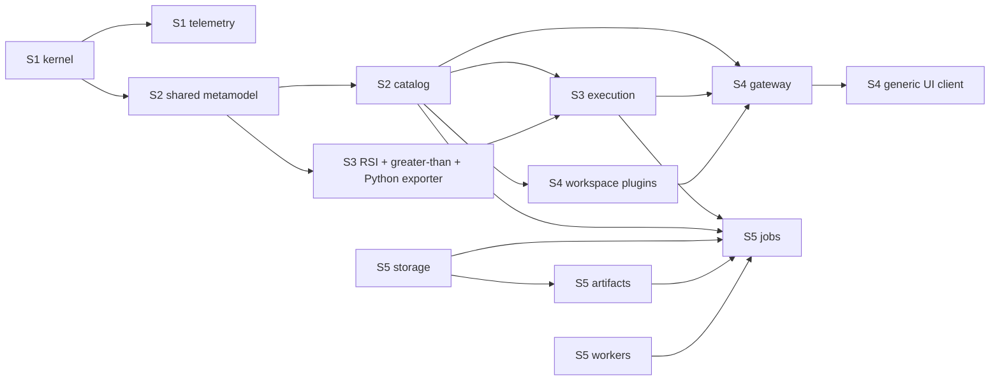

# Backend Implementation Handoff: Stages S2–S5

> **Status:** Implementation specification; no S2–S5 source is implemented by
> this document.
> **Baseline:** `d56d6c98b3aa4917d08696c8351e2a0c93ed8af9`
> (`feat: establish kernel and telemetry host foundation`)
> **Prepared:** 2026-09-22
> **Audience:** The agent implementing the replacement HaruQuantAI backend.

This handoff defines what must be built in:

1. S2 — shared plugin metamodel and `app/host/catalog.py`;
2. S3 — the first cohesive quantitative slice and `app/host/execution.py`;
3. S4 — versioned UI transport, workspace declarations, and
   `app/host/gateway.py`;
4. S5 — durable jobs, workers, storage, and artifacts.

It converts the ratified architecture into an ordered implementation
specification. It does not authorize implementation. Each stage still requires
its own audit, exact-path plan, owner response `APPROVED: EXECUTE`, focused
verification, walkthrough, and separate commit authorization under
[`AGENTS.md`](../../AGENTS.md).

## 1. Authority and current truth

Read these files before planning any stage:

1. [`AGENTS.md`](../../AGENTS.md) — workflow, verification, ownership, and Git
   authority.
2. [`PROJECT.md`](../PROJECT.md) — product scope, stage order, and current status.
3. [`ARCHITECTURE.md`](../ARCHITECTURE.md) — normative paths, import matrix,
   lifecycle, metamodel, discovery, graph, wire, and reproducibility rules.
4. [`feature_implementation_pipeline.md`](feature_implementation_pipeline.md) —
   plugin construction and evidence standard.
5. [`domain_implementation_audit.md`](domain_implementation_audit.md) — required
   plugin audit procedure.

At the baseline commit, only these backend foundations exist:

```text
app/
  kernel/
    capability.py
    feature.py
    context.py
    bootstrapper.py
  host/
    bootstrap.py
    telemetry.py
  ui/                    # retained prototype
```

S1 is verified. The shared plugin vocabulary, catalog, execution, gateway,
durability, and quantitative plugins do not exist yet. Do not treat types or
behaviors in this document as implemented evidence.

StrategyQuant X was inspected only as secondary design evidence. Its compiled
plugin, job, data, and trading libraries support separating responsibilities,
and its snippet annotations demonstrate colocated component metadata. Its static
singleton managers and initialization hooks are incompatible with HaruQuantAI's
explicit scoped capabilities and must not be copied.

## 2. Non-negotiable system rules

Every stage must preserve these rules:

- There is no `app/api`, `app/contracts`, `app/services`, root registry, or
  `app/main.py`.
- A concrete quantitative plugin is one cohesive Python file. Its behavior,
  parameter schema, bounds, ports, numerical policy, lookback/warm-up, lowering,
  and presentation hints stay in that file.
- Universal vocabulary lives only in `app/plugins/schema.py`, `spec.py`,
  `algebra.py`, `lowering.py`, and `wire.py`.
- Each host owner is one `app/host/<owner>.py` file containing its public
  protocol/token/values, private implementation, and composition-only lifecycle
  constructor.
- All `__init__.py` files are empty or docstring-only.
- Imports have no registration, I/O, environment access, logging configuration,
  provider construction, tasks, threads, or resource acquisition.
- Plugins import shared plugin vocabulary, the kernel `Capability` primitive,
  and designated public host contracts only. They do not import the kernel
  runtime/context, host implementations/lifecycle constructors, live catalog
  objects, UI code, or sibling plugins.
- Discovery is bounded, explicit, canonical, and atomic. There is no central
  concrete plugin list.
- Availability, enablement, authorization, and admission are separate states.
- Graphs, wire values, snapshots, requests, results, and persistent records are
  recursively immutable and versioned. Do not use arbitrary dictionaries,
  pickle, Python's built-in hash, or JSON `NaN`/infinity.
- Existing admitted work pins exact plugin versions, source hashes, catalog
  identity, data identity, settings, and numerical policies. Refresh never
  silently rebinds it.
- No live trading or irreversible external integration belongs in S2–S5.

## 3. Cross-stage dependency map



Implement and commit stages in order. Do not create empty files for later
stages. Within a stage, define the shared contracts before the host consumer.

Keep these version axes independent from their first release:

| Axis | Initial version | Breaking-change trigger |
|---|---:|---|
| Metamodel compatibility | `1` | Incompatible descriptor or operation contract |
| Graph document schema | `1` | Incompatible graph/node/edge semantics |
| Wire schema | `1` | Incompatible JSON representation |
| Semantic IR schema | `1` | Incompatible lowering semantics |
| Catalog capability | `host.catalog@1` | Breaking public catalog contract |
| Execution capability | `host.execution@1` | Breaking execution request/result contract |
| Gateway capability | `host.gateway@1` | Breaking gateway lifecycle/resource contract |
| Jobs capability | `host.jobs@1` | Breaking job lifecycle contract |
| Workers capability | `host.workers@1` | Breaking process execution contract |
| Storage capability | `host.storage@1` | Breaking transaction/record contract |
| Artifacts capability | `host.artifacts@1` | Breaking artifact identity/access contract |
| Artifact record schema | `1` | Incompatible artifact metadata/content contract |

## 4. S2 — shared plugin metamodel and catalog

### 4.1 Outcome

S2 is complete when approved local plugin files can be discovered from explicit
family roots, validated against one immutable metamodel, published as an atomic
catalog snapshot, selected explicitly, and admitted by exact version and source
identity. No production quantitative plugin is required in S2; use a test-only
cohesive probe.

### 4.2 Required production files

```text
app/plugins/
  __init__.py
  README.md
  schema.py
  lowering.py
  spec.py
  algebra.py
  wire.py
app/host/
  catalog.py
  bootstrap.py              # modified to compose catalog
```

The shared-module import DAG must remain acyclic:

```text
schema
  ^
  |
lowering
  ^
  |
spec --------> app.kernel.capability only
  ^
  |
algebra
  ^
  |
wire
```

`wire.py` may import all four shared owners. No shared module imports `app.host`.

### 4.3 `schema.py`

Implement a bounded immutable value and descriptor vocabulary. Required concepts:

- portable scalar values: `None`, `bool`, bounded `int`, finite `float`, and
  bounded `str`;
- explicit immutable array and object wrappers using tuples;
- explicit `MissingValue` and reason, distinct from JSON `null`;
- recursive freeze/validation with maximum depth, collection count, key length,
  string length, and total element limits;
- stable parameter and port keys;
- value/port kinds for boolean, integer, number, text, enum, object, and aligned
  series values;
- unit and alignment descriptors;
- numeric validity constraints independent of optimization domains;
- enum choices, text constraints, defaults, and required values;
- optimization domain, scale, step/distribution, and eligibility;
- bounded safe presentation hints such as numeric/text/boolean/enum control,
  group, order, and help text;
- `ParameterSpec`, `ParameterSchema`, `PortSpec`, `NumericalPolicy`,
  `ValidationIssue`, and a parameter-binding result.

Constructors must reject:

- mutable or unsupported nested leaves;
- duplicate object keys, parameter keys, port keys, or enum values;
- non-finite values;
- defaults outside validity constraints;
- optimization bounds outside validity constraints;
- zero/negative steps or incompatible scale/distribution combinations;
- inappropriate constraints for the declared value kind;
- unsupported renderer hints;
- values exceeding explicit bounds.

Do not put RSI's period, range, title, optimizer bounds, or missing-data behavior
in this module.

### 4.4 `lowering.py`

Define semantic lowering mechanics without concrete plugin formulas:

- stable semantic operator IDs using a reserved universal namespace;
- typed program inputs, immutable node IDs, value references, nodes, and outputs;
- bounded `SemanticProgram` with IR schema version 1;
- exact lowering target ID/version;
- attributed lowering issue and success/failure result;
- a lowering protocol used by operation contributions.

The IR can represent universal arithmetic, comparison, conditional, aligned
series, lag/delta, missing propagation, and explicitly named stateful recurrence
semantics needed by S3. It must not contain `rsi`, a concrete plugin ID, or a
registry of installed plugins. Adding a new IR primitive later is metamodel
evolution and requires review.

### 4.5 `spec.py`

Define:

- validated lowercase dot-namespaced plugin ID;
- semantic version `(major, minor, patch)` and exact `PluginRef`;
- plugin kind as a stable validated identifier, not a Python enum that must be
  edited for every future family;
- operation effect identifiers and explicit permissions;
- required and optional capability requirements;
- `OperationSpec` with parameters, typed inputs/outputs, determinism,
  numerical policy, effects, capability slots, permissions, and exact lowering
  targets;
- a non-enumerable `OperationBindings` protocol whose typed `require`/`optional`
  calls accept capability tokens and are restricted to the operation declaration;
- operation implementation/contribution protocols for parameter binding,
  dynamic warm-up/lookback, execution, and lowering;
- `PluginSpec`, `WorkspaceCommand`, `WorkspaceView`, `WorkspaceSpec`, and
  `PluginContribution`;
- wire-safe immutable `CatalogEntryView` and `CatalogView`.

`PluginContribution` validates that implementation IDs exactly match the
descriptor's operation IDs. Descriptor views contain no implementation objects,
provider instances, exceptions, or callables.

### 4.6 `algebra.py`

Implement graph schema version 1:

- stable `NodeId`;
- exact plugin ref and operation ID per node;
- immutable normalized parameters and extension data;
- named source/target `PortRef` and typed edges;
- bounded `GraphSpec` with nodes, edges, designated roots, and optional nested
  subgraphs;
- `GraphDocument` for supported versions;
- `OpaqueGraphDocument` containing the complete decoded object for unsupported
  document versions.

Validation must check:

- document, node, edge, and hierarchy bounds;
- unique IDs and valid references;
- installed exact plugin and operation availability against an immutable
  `CatalogView` supplied by the caller;
- declarative parameter binding against the wire-safe schema; plugin-owned
  cross-field validation occurs only after exact operation admission in S3;
- named input/output ports;
- value kind, unit, alignment, and domain compatibility;
- cycles; recurrence must be explicit node behavior, never a graph cycle;
- designated roots.

Unknown or removed plugin nodes remain readable and structurally intact, receive
an attributed unavailability issue, and cannot execute. Unsupported whole
versions remain opaque and cannot be automatically rewritten.

### 4.7 `wire.py`

Own every HaruQuantAI JSON projection for shared S2 types:

- immutable values and explicit missing markers;
- schemas and plugin specs;
- catalog views;
- semantic IR;
- supported and opaque graph documents.

Required behavior:

- strict UTF-8 JSON;
- duplicate-key rejection during parse;
- no non-finite numeric encoding/decoding;
- maximum byte size, nesting depth, object/array size, and string length;
- sorted-key, whitespace-free canonical JSON;
- SHA-256 over canonical UTF-8 bytes;
- deterministic round trips;
- known extension and unknown node preservation;
- complete raw decoded object retention for an unsupported graph version.

Do not serialize capabilities, implementation objects, callables, exceptions,
paths, open resources, or Python-specific representations.

### 4.8 `host/catalog.py`

Keep all public and private catalog behavior in this file.

Public surface:

- `Catalog` protocol;
- `HOST_CATALOG` capability;
- bounded `CatalogRoot` configuration with logical family name, filesystem path,
  accepted kind identifiers, maximum files, and maximum source bytes;
- readiness, issue, refresh result, and immutable snapshot values;
- explicit selection request/result and per-operation availability reason;
- exact `AdmittedOperation` runtime value.

Private behavior:

- scan only immediate `.py` children of explicit family roots;
- resolve paths and reject symlink/root escape;
- exclude `__init__.py`, underscore-prefixed files, tests, caches, shared support
  modules, non-Python files, and oversized/excess candidates before import;
- sort candidates by logical family/module identity;
- read each candidate once into bounded bytes and hash those exact bytes;
- load under a path-and-content-addressed module name;
- call the zero-argument `plugin()` factory;
- validate factory purity by contract/tests and contribution shape;
- reject duplicate IDs globally, even across kinds;
- reject family/kind mismatch, incompatible metamodel major, duplicate operation
  IDs, and invalid schemas;
- build the entire candidate registry before atomic publication.

Refresh semantics:

- a successful empty scan publishes a ready empty snapshot;
- initial failure leaves no snapshot and exposes immutable diagnostics;
- later failure preserves the last valid snapshot and implementations;
- successful addition/removal publishes a new snapshot;
- no per-plugin quarantine is silently introduced;
- no operation starts during discovery or factory construction.

Fingerprint semantics:

- source digest: SHA-256 of exact imported source bytes;
- entry fingerprint: SHA-256 of canonical descriptor JSON plus source digest;
- whole fingerprint: SHA-256 of ordered entry fingerprints;
- dependency fingerprint: SHA-256 of only the exact admitted entries.

A membership change changes the whole fingerprint. It does not change unrelated
entry fingerprints or dependency fingerprints that do not reference the changed
entry.

Selection and admission:

- installed availability does not imply selection;
- the default enabled set is empty;
- selection names exact refs and can restrict kinds, operation IDs, allowed
  effects, available capabilities, permissions, and lowering targets;
- an unsafe/effectful operation is unavailable unless explicitly allowed;
- selection never starts an operation;
- admission pins exact ref, operation implementation, source digest, entry
  fingerprint, dependency fingerprint, and snapshot fingerprint;
- an admitted value remains bound after later refresh/removal; future admission
  of the removed ref fails explicitly.

The private `_catalog_feature(...)` is imported only by `host/bootstrap.py`.
Default host construction passes an empty root tuple and exposes a ready empty
catalog. It never searches the filesystem or environment implicitly.

### 4.9 S2 tests and exit evidence

Required test areas:

- schema validity/default/search-bound tests;
- nested immutability and mutable-leaf rejection;
- descriptor identity/version/capability/effect tests;
- graph structural, port, unit, alignment, cycle, hierarchy, and bound tests;
- known graph, unknown-node, and unsupported-version round trips;
- duplicate JSON key, non-finite number, malformed marker, and payload-bound
  rejection;
- canonical JSON and repeated fingerprint equality;
- pre-import candidate exclusion with excluded files that raise on import;
- import/factory purity with I/O, environment, logging setup, tasks, and threads
  patched to fail;
- canonical ordering independent of directory enumeration order;
- duplicate/family/compatibility failure;
- initial failure and last-good refresh retention;
- add/remove without registry edit;
- whole/entry/dependency fingerprint behavior;
- availability versus explicit enablement;
- exact admission retained after removal;
- host startup/shutdown and catalog import purity.

S2 is not complete until `scripts/architecture_check.py` enforces the new
topology/import rules, the deterministic catalog example passes, UI regression
typecheck/test/build pass, and `scripts/ci_check.py` passes with at least 80%
branch-aware Python coverage.

## 5. S3 — first cohesive quantitative slice and execution

### 5.1 Outcome

S3 is complete when the same immutable graph and descriptors drive generic
validation, RSI calculation, greater-than comparison, repeated parameter trials,
and Python export with semantic parity. No UI, durable jobs, database, or worker
process is required.

### 5.2 Required production files

```text
app/host/execution.py
app/host/bootstrap.py                    # compose execution after catalog
app/plugins/indicators/__init__.py
app/plugins/indicators/README.md
app/plugins/indicators/rsi.py
app/plugins/comparisons/__init__.py
app/plugins/comparisons/README.md
app/plugins/comparisons/greater_than.py
app/plugins/exporters/__init__.py
app/plugins/exporters/README.md
app/plugins/exporters/python.py
```

If the S2 family-root configuration does not already include these approved
families, add the family roots in host composition. Do not import these plugin
modules by name.

### 5.3 `host/execution.py`

Public surface:

- `Execution` protocol and `HOST_EXECUTION` capability;
- immutable `ExecutionBudget` with maximum nodes, samples, output values, trials,
  elapsed time, and cancellation policy;
- single-run and explicit bounded batch request/result values;
- validation, planning, execution, lowering/export, cancellation, and attributed
  error values;
- reproducibility record containing graph identity, catalog/dependency
  fingerprints, exact plugin/source versions, normalized parameters, input hash,
  seed, numerical policy, engine version, output hash, and timing/status.

Private implementation:

1. Reject opaque/unsupported documents.
2. Validate the graph against the supplied/pinned catalog view.
3. Admit every referenced exact operation and compute the dependency fingerprint.
4. Invoke the admitted implementation's parameter binding/cross-field validation
   and dynamic warm-up policy; do not reconstruct these in the executor.
5. Build a canonical topological plan from graph edges.
6. Resolve required/optional operation capabilities into a restricted immutable
   binding object; undeclared lookup fails.
7. Freeze/copy caller inputs according to declared ownership before execution.
8. Allocate fresh operation/run state for every run and every batch trial.
9. Execute nodes in canonical order with explicit missing-value propagation.
10. Enforce budgets and caller cancellation; always clean run-owned resources.
11. Return immutable outputs and reproducibility evidence.

The executor contains no RSI, comparison, or exporter-specific branch. It
dispatches admitted operation implementations generically.

Batch execution is the S3 optimization-consumer surface. The request contains an
explicit bounded tuple of graph/parameter revisions. The host evaluates all
trials through the same single-run path and returns ordered results; it does not
invent an optimization objective or duplicate plugin search bounds.

Export asks every referenced operation for lowering to one exact target, combines
the semantic programs, then admits a generic exporter plugin for target emission.
Unsupported nodes/targets fail with node/plugin attribution. Export persistence
is out of scope until S5 artifacts.

### 5.4 `rsi.py`

Stable identity: `indicator.rsi`, version `1.0.0`.

The file owns:

- title/description/kind/compatibility;
- input port `values`: aligned numeric series;
- output port `rsi`: aligned numeric series with unit `percent`;
- integer `period` parameter;
- validity range `2..1000`;
- default `14`;
- optimization range `2..100`, integer step `1`, linear scale;
- dynamic lookback/warm-up equal to `period` price changes;
- missing, non-finite, precision, and error policies;
- scalar reference implementation;
- semantic lowering;
- side-effect-free `plugin()` factory.

Numerical semantics:

1. Convert each consecutive pair into gain `max(delta, 0)` and loss
   `max(-delta, 0)`.
2. Seed average gain/loss with the arithmetic means of the first `period`
   consecutive finite deltas.
3. Thereafter use Wilder smoothing:
   `(previous * (period - 1) + current) / period`.
4. If average gain and loss are both zero, output `50`.
5. If loss is zero and gain is positive, output `100`.
6. If gain is zero and loss is positive, output `0`.
7. Otherwise output `100 - 100 / (1 + average_gain / average_loss)`.
8. Output length equals input length. Values before a complete seed are explicit
   missing values.
9. An explicit missing sample produces missing output and resets the seed; a new
   output requires `period` consecutive finite deltas after the gap.
10. Non-finite Python numbers are rejected before calculation, never converted to
    missing values.

Inputs are copied/frozen; runs do not share accumulator state. Use Python
double-precision floats and document comparison tolerances in tests.

### 5.5 `greater_than.py`

Stable identity: `comparison.greater_than`, version `1.0.0`.

The file owns two aligned numeric-series inputs, one aligned boolean-series
output, missing propagation, exact alignment rules, behavior, lowering, metadata,
and `plugin()`. It performs elementwise `left > right`. There is no implicit
scalar broadcasting or unit conversion. A missing input at an index yields a
missing output at that index.

Do not add a central comparison enum or an executor branch.

### 5.6 `exporters/python.py`

Stable identity: `exporter.python`, version `1.0.0`.

The plugin consumes supported semantic IR version 1 and emits deterministic,
formatted Python source plus an immutable export manifest. It handles only the
universal primitives actually implemented and tested in S3. Unknown primitives
fail with attributed unsupported reasons. It does not contain an RSI plugin ID or
copy RSI metadata.

The generated program must reproduce execution semantics for warm-up, Wilder
smoothing, missing recovery, flat series, monotonic series, alignment, and
comparison. Execute generated code only in isolated tests with fixed inputs; do
not advertise arbitrary-code execution as a product feature.

### 5.7 S3 tests and exit evidence

Required RSI goldens:

- empty and one-value input;
- shorter than, equal to, and longer than the warm-up;
- hand-calculated mixed series;
- flat series (`50` after warm-up);
- strictly rising (`100`) and falling (`0`) series;
- missing gap and reseeding;
- invalid period and non-finite input;
- input mutation after submission;
- concurrent independent runs and deterministic repeats.

Required slice evidence:

- discover RSI, greater-than, and Python exporter without a registry edit;
- add a temporary independent indicator and comparison within existing families
  without editing shared schema/algebra/execution/UI source;
- graph validation and execution through declared ports only;
- removed/unknown plugin document remains readable but not executable;
- explicit batch trials vary RSI period using the descriptor's optimization
  domain and use the same execution path;
- lowering plus generated Python output matches native execution on every golden;
- unsupported target and unsupported semantic primitive fail with attribution;
- repeated/concurrent runs retain no shared mutable state;
- cancellation and budget failure release run-owned resources;
- disabling/removing an unrelated plugin changes the whole catalog fingerprint
  but leaves slice dependency fingerprint and results unchanged.

S3 is complete only after the offline end-to-end example, architecture checks,
UI regression commands, and full CI pass.

## 6. S4 — versioned UI transport, workspaces, and gateway

### 6.1 Selected transport

Use:

- `starlette` for the ASGI application and request/response lifecycle;
- `uvicorn` for the explicitly started local server;
- versioned JSON over HTTP under `/api/v1`;
- same-origin production access and an explicit allowlist of loopback development
  origins; never wildcard credentialed CORS;
- no WebSocket/SSE until a demonstrated streaming use case requires it.

Do not use FastAPI/Pydantic as a second schema truth. Validate payloads through
`app/plugins/wire.py` and gateway-owned envelopes.

Dependency versions must be bounded in the S4 plan and lockfile. The gateway
owner imports optional server libraries only inside explicit construction/start,
so importing its public contract succeeds when those libraries are unavailable.

### 6.2 Required production files

```text
app/host/gateway.py
app/host/bootstrap.py
app/plugins/workspaces/__init__.py
app/plugins/workspaces/README.md
app/plugins/workspaces/builder.py
app/plugins/workspaces/results.py
scripts/generate_ui_contracts.py
app/ui/src/api/contracts.generated.ts
app/ui/src/api/client.ts
app/ui/src/api/catalogStore.ts
app/ui/src/components/plugin/ParameterForm.tsx
app/ui/src/components/plugin/GraphEditor.tsx
app/ui/src/components/plugin/ExecutionResult.tsx
```

Adapt exact UI integration paths to the active UI structure during the S4 audit.
Do not replace unrelated prototype screens.

### 6.3 `host/gateway.py`

Public surface:

- `Gateway` protocol and `HOST_GATEWAY` capability;
- versioned request, response, resource, error, and pagination envelopes;
- explicit server configuration with bind host, port, allowed origins, payload
  bounds, request timeout, and shutdown timeout;
- readiness and bound-address values.

Private implementation owns route dispatch, ASGI construction, server lifecycle,
JSON decode/encode, request IDs, timeouts, error mapping, and telemetry events.
It depends on public `Catalog` and `Execution` contracts through required kernel
capabilities. It does not inspect private provider state.

Initial routes:

| Method | Route | Behavior |
|---|---|---|
| `GET` | `/api/v1/health` | Versioned readiness for gateway/catalog/execution |
| `GET` | `/api/v1/catalog` | Current wire-safe `CatalogView` |
| `POST` | `/api/v1/catalog/select` | Explicit enablement/availability evaluation |
| `POST` | `/api/v1/graphs/validate` | Decode and validate supported/unknown graph |
| `POST` | `/api/v1/executions/evaluate` | Bounded synchronous in-process S3 run |
| `POST` | `/api/v1/executions/batch` | Bounded explicit S3 trial batch |
| `POST` | `/api/v1/exports` | Generic exact-target lowering/export result, not persistence |

All errors use a stable code, safe message, request ID, and attributed issue
tuple. No traceback, path, secret, provider object, or exception representation
crosses the boundary. Unknown fields/documents are preserved according to wire
rules; unsupported whole versions return read-only/unavailable status.

The server binds to loopback by default and is disabled unless explicit host
composition enables it. Import and construction do not open a socket. Shutdown
stops admission, drains bounded requests, then closes the server before catalog
or execution providers are withdrawn.

### 6.4 Workspace plugins

Implement two peer concrete plugins:

- `workspace.builder` — declares selection of indicator/comparison children,
  graph editing commands, parameter forms, validate/evaluate/batch/export
  commands, capability/permission needs, and a generic builder view descriptor;
- `workspace.results` — declares catalog/execution result inspection and a generic
  table/chart view descriptor.

Each workspace is one cohesive file with a side-effect-free `plugin()` factory.
Neither imports RSI, greater-than, exporter, another workspace, UI code, or host
implementation. Both select children by exact IDs through immutable catalog
descriptions. Opening a workspace starts no service.

Disabling/removing Builder must not uninstall shared plugins or prevent Results
from accessing still-valid shared resources. Workspace discovery uses the same
catalog mechanism as every concrete plugin family.

### 6.5 Generated/conformance-checked UI contract

`scripts/generate_ui_contracts.py` consumes checked-in wire schema descriptions
and deterministically produces `contracts.generated.ts`. Generation must be
idempotent and checked by CI (`generate`, then `git diff --exit-code` for the
generated file). Do not hand-maintain plugin-specific TypeScript metadata.

The UI client:

- sends/receives only `/api/v1` envelopes;
- caches catalog views and recoverable graph drafts locally;
- treats backend catalog, validation, execution, and authorization as truth;
- renders parameter controls from safe presentation hints;
- renders unknown plugin nodes as lossless unavailable placeholders;
- submits the same graph document edited by the user;
- does not calculate RSI, comparisons, optimizer bounds, or export semantics.

The first generic renderer supports numeric/text/boolean/enum controls, groups,
typed ports, tables, and line/boolean-series charts. Any novel interaction needs
a reviewed generic renderer or installed UI extension; a route string alone
cannot install React behavior.

### 6.6 S4 tests and exit evidence

Required backend evidence:

- contract import with Starlette/Uvicorn unavailable;
- no socket before explicit start;
- loopback default and explicit-origin policy;
- request/payload/depth/time bounds;
- every route's success and stable error envelope;
- graph unknown/opaque behavior through HTTP;
- request cancellation and shutdown drain ordering;
- no traceback/path/secret leakage;
- catalog/execution service remains available during gateway drain.

Required UI/workspace evidence:

- generated contract is deterministic and current;
- catalog fetch and cache;
- generic RSI period form from schema;
- graph construction and round trip;
- unavailable-node placeholder preserves data;
- evaluate, batch, and export use the same document;
- Builder and Results can select the same installed plugin;
- removing Builder leaves Results and shared plugins intact;
- removing a selected child marks only affected documents unavailable;
- no copied RSI formula/bounds in TypeScript.

Run backend focused/full checks plus:

```powershell
npm --prefix app/ui run typecheck
npm --prefix app/ui run test
npm --prefix app/ui run build
```

Use Playwright only for the bounded end-to-end flows added by S4. S4 is not
complete merely because route/unit tests pass.

## 7. S5 — durable jobs, workers, storage, and artifacts

### 7.1 Selected persistence and process choices

Use these choices unless the owner approves a revised S5 plan:

- **Database:** Python standard-library `sqlite3`, one local database, WAL mode,
  foreign keys enabled, bounded busy timeout, explicit transactions, and schema
  version migrations owned by `host/storage.py`.
- **Persistent model:** versioned immutable JSON records in a generic record
  table with namespaces and optimistic compare-and-swap revisions. Plugins never
  receive SQL or database connections.
- **Artifacts:** filesystem content-addressed storage using SHA-256, immutable
  files, atomic temporary-write/fsync/replace publication, metadata and retention
  state stored through `Storage`.
- **Workers:** bounded process-per-job subprocesses launched with the current
  Python interpreter. Invoke the worker mode through `app.host.bootstrap`; use
  bounded versioned JSON on stdin/stdout. Do not use pickle or pass Python
  callables/objects across the process boundary.
- **Scheduling:** one host-owned asynchronous scheduler in `jobs.py`; workers do
  not read/write the SQLite database or artifact metadata directly.
- **Recovery:** persisted leases and attempts. On restart, an expired running
  pure execution job is requeued only when its exact catalog/dependency/input
  identities are still available and attempts remain; otherwise it fails with an
  attributed recovery reason. Never silently substitute a plugin or input.

### 7.2 Required production files

```text
app/host/storage.py
app/host/artifacts.py
app/host/workers.py
app/host/jobs.py
app/host/bootstrap.py
```

Keep every owner's contract, private implementation, and lifecycle in its one
file. Worker child-mode dispatch remains in `host/bootstrap.py`, the only
composition root; do not add `worker_main.py` or `app/main.py`.

The host dependency order is:

```text
storage
  └── artifacts
catalog ─┐
execution├── jobs
storage ─┤
artifacts├── jobs
workers ─┘
```

Workers have no dependency on jobs or storage. Jobs own scheduling and durable
state transitions.

### 7.3 `host/storage.py`

Public surface:

- `Storage` protocol and `HOST_STORAGE` capability;
- versioned namespace/key/revision identities;
- immutable record, mutation, compare-and-swap, transaction, scan-page, and
  conflict/error values;
- explicit database configuration, migration/readiness status, and close
  semantics.

The public API exposes no SQL, cursor, connection, table name, or database path
outside configuration. Mutations operate on canonical bounded JSON bytes and
explicit expected revisions. Transactions are all-or-nothing and return immutable
commit results.

Private SQLite implementation:

- validates/resolves the configured local path during explicit construction;
- creates parent directories with restrictive permissions where supported;
- uses WAL, `foreign_keys=ON`, bounded `busy_timeout`, and explicit
  `BEGIN IMMEDIATE` for writes;
- owns schema version/migrations and records migration history;
- stores generic records keyed by `(namespace, key)` with revision, schema
  version, canonical payload bytes, created/updated UTC timestamps, and bounded
  index columns;
- performs writes through one owned database executor thread and never blocks the
  event loop directly;
- supports deterministic scan order and bounded pagination;
- closes/drains transactions before provider withdrawal.

Migrations are forward-only during normal startup, transactional, idempotent,
backed up before destructive shape changes, and tested on isolated temporary
stores. No active user database is deleted, reset, truncated, or repurposed.

### 7.4 `host/artifacts.py`

Public surface:

- `ArtifactStore` protocol and `HOST_ARTIFACTS` capability;
- content digest, artifact ref, media type, size, schema version, provenance,
  lineage, retention, read/put result, and typed error values;
- bounded byte and streaming interfaces with caller cancellation.

Private implementation:

1. Stream into a temporary file beneath the configured artifact root.
2. Enforce per-artifact and total quota while hashing SHA-256.
3. Flush and fsync the temporary file.
4. Atomically publish to a digest-derived path that cannot escape the root.
5. Commit metadata through `Storage` only after content publication.
6. Deduplicate identical content without mutating existing files.
7. On metadata failure, remove only the unreferenced temporary/new content owned
   by the failed operation.
8. Verify digest and size on read when policy requires.

Metadata records include media type, size, schema version, source/dependency/data
fingerprints, lineage, created time, retention state, and refcount/ownership as
needed. Never store credentials, raw provider objects, or arbitrary paths.

Retention is explicit. Deletion first marks metadata, proves no active job/ref
needs the artifact, then removes content. Tests use temporary roots only.

### 7.5 `host/workers.py`

Public surface:

- `Workers` protocol and `HOST_WORKERS` capability;
- immutable worker request/ref/status/result/error and resource budget values;
- submit, await, cancel, and shutdown/drain behavior.

Private supervisor:

- uses an explicit maximum concurrent process count;
- launches `sys.executable -m app.host.bootstrap --worker` with no shell;
- sends one bounded versioned JSON request on stdin and reads bounded JSON from
  stdout; stderr is bounded/redacted diagnostic text, never a data channel;
- passes a minimal environment allowlist and no secrets unless a later authorized
  operation explicitly requires them;
- enforces startup, execution, idle, output-size, and cancellation timeouts;
- on cancellation: close stdin, request graceful termination, wait a bounded
  grace period, terminate, then kill if still live;
- awaits process exit and pipe cleanup before reporting completion;
- rejects unknown worker protocol/task versions;
- does not accept raw command lines, module names, filesystem roots, or callables
  from plugins/users.

The initial worker task kind is the versioned S3 execution request only. Worker
mode reconstructs a minimal catalog/execution composition from explicitly
approved root configuration, verifies the requested catalog/dependency/source
fingerprints before running, and returns the standard execution result envelope.
Input series remain bounded inline JSON for this first durable slice; large data
artifact mapping is later work.

### 7.6 `host/jobs.py`

Public surface:

- `Jobs` protocol and `HOST_JOBS` capability;
- `JobRequest`, `JobRef`, `JobStatus`, state enum, progress, result, failure,
  cancellation, query/page, and idempotency values;
- submit/get/list/cancel/await APIs.

States and allowed transitions:

```text
queued -> running -> succeeded
                  -> failed
                  -> cancelling -> cancelled
queued -------------------------> cancelled
running -> recovery_pending -> queued | failed
```

Every transition is persisted with expected revision and a UTC event record.
Terminal states are immutable. Duplicate idempotency keys return the existing
compatible job; a conflicting payload fails.

Submission validates and freezes:

- request/wire version;
- exact graph and normalized settings;
- catalog and referenced dependency fingerprints;
- input hash and inline input bound;
- seed, timezone, units, numerical policy, engine version;
- job and worker budgets;
- effect/permission policy. Initial S5 permits pure execution only.

Scheduler behavior:

1. Atomically claim the next queued job using storage revision compare-and-swap.
2. Record lease owner/expiry and increment attempt.
3. Submit the frozen worker envelope.
4. Persist bounded progress/heartbeat updates.
5. On success, store large result/export output through `ArtifactStore`, then
   atomically record artifact refs and terminal success.
6. On attributed failure, cancellation, timeout, or worker crash, record the
   exact terminal/recovery state and release resources.
7. Stop new claims during shutdown, request cancellation, drain to the configured
   deadline, and keep storage/artifacts/workers available until job cleanup ends.

Recovery scans nonterminal records at startup. Expired work is requeued only for
pure jobs with available exact dependencies and remaining attempts. Otherwise it
becomes failed with a stable recovery code. Successful jobs are never rerun.

### 7.7 S5 tests and exit evidence

Storage:

- fresh migration, repeat migration, upgrade fixture, and migration rollback;
- transaction atomicity and compare-and-swap conflict;
- concurrent readers/single writer, busy timeout, pagination, and deterministic
  order;
- cancellation/close with no leaked connection/thread;
- corrupt database and unsupported schema fail closed;
- no tests use an active user store.

Artifacts:

- deterministic digest/deduplication;
- atomic publish and cleanup after injected write/metadata failures;
- traversal/symlink escape rejection;
- quota, size, media type, digest verification, and cancellation;
- retention with active-reference protection;
- no partial file reported as complete.

Workers:

- protocol/version/payload bound rejection;
- successful subprocess execution and exact fingerprint verification;
- timeout, crash, oversized output, malformed output, cancellation, terminate,
  kill fallback, and shutdown drain;
- no shell/pickle/raw command acceptance;
- no orphan processes or unclosed pipes.

Jobs:

- every legal and illegal state transition;
- idempotent submission and conflicting idempotency key;
- claim race and lease expiry;
- success with artifact publication;
- failure/cancellation at every boundary;
- restart recovery for queued, running, cancelling, and terminal jobs;
- missing/replaced dependency fails rather than rebinds;
- shutdown stops admission and keeps providers alive through cleanup;
- cleanup failures are attributed and do not skip unrelated safe cleanup.

End-to-end evidence:

1. Submit the S3 RSI/comparison graph as a durable job.
2. Run it in a subprocess worker.
3. Persist result/evidence as content-addressed artifacts.
4. Restart the host and retrieve the same terminal job/artifacts.
5. Inject a worker crash, restart, and prove bounded recovery.
6. Remove or change a required plugin and prove recovery fails with the exact
   missing dependency rather than using replacement code.

S5 is complete only after architecture checks, full Python CI, applicable UI
regression checks, recovery examples, process-leak checks, and at least 80%
branch-aware coverage pass.

## 8. Architecture enforcement that must evolve each stage

Do not weaken the existing exact-topology test. Extend it deliberately:

### After S2

- allow exactly the five shared plugin modules and `host/catalog.py`;
- shared modules cannot import host, UI, concrete plugins, kernel runtime/context;
- host cannot hard-code concrete plugin imports;
- initializers remain docstring-only;
- private host provider/lifecycle symbols remain composition-only.

### After S3

- allow approved concrete family files and `host/execution.py`;
- concrete plugins cannot import siblings or catalog/live host implementation;
- public host symbol allowlists distinguish contracts from private/provider entry
  points, including aliases and module-qualified access;
- concrete plugin files must expose a zero-argument `plugin()` factory and have no
  import-time effects.

### After S4

- allow `host/gateway.py` and workspace plugins;
- reject optional server imports at module top level;
- UI cannot import or duplicate Python/plugin behavior;
- generated UI contract must be current;
- JSON-only interchange remains enforced.

### After S5

- allow four durable host owners;
- reject plugin SQL, filesystem, subprocess, multiprocessing, socket, or raw
  storage imports;
- only storage owns SQLite, only artifacts owns artifact filesystem mutation,
  only workers owns subprocess creation, and only jobs owns scheduling/state
  transitions;
- `host/bootstrap.py` remains the only composition/worker entry point.

## 9. Stage workflow for the implementing agent

For each stage:

1. Confirm clean Git state and record baseline commit.
2. Read current authorities and every immediate consumer/test.
3. Inspect what the preceding stage actually implemented; this handoff is not
   evidence that those APIs exist.
4. Create `.agents/logs/<timestamp>_<stage>/implementation-plan.md` from the
   canonical template with exact `ALLOWED_WRITE_PATHS`.
5. State deviations from this handoff and why current repository evidence
   requires them.
6. Stop for `APPROVED: EXECUTE`.
7. Implement the smallest complete stage; do not scaffold later owners.
8. Use focused tests without coverage while editing.
9. Run architecture, Ruff, strict Mypy, deterministic examples, and applicable
   UI commands.
10. Run `uv run python scripts/ci_check.py` after the candidate is complete.
11. Create `walkthrough.md` with exact commands/results, residual risks, Git
    status, and proposed commit message.
12. Stop for explicit commit authorization.

If implementation reveals that a public contract, dependency, destructive
target, or architecture decision in the approved plan must change, record a plan
iteration and obtain renewed approval before making that change.

## 10. Completion matrix

| Stage | Observable completion |
|---|---|
| S2 | Immutable metamodel and wire types exist; bounded discovery publishes atomic snapshots; unknown graphs round-trip; add/remove requires no registry edit; last-good refresh and exact admission are proved. |
| S3 | RSI and greater-than execute from one graph; explicit trials use the same executor; Python export matches numerical goldens; no plugin-specific engine branches or shared mutable state exist. |
| S4 | Versioned loopback JSON API exposes catalog/validation/execution/export; generated UI contracts and generic controls work; Builder/Results coexist and removal is orthogonal. |
| S5 | SQLite records, content-addressed artifacts, subprocess workers, and durable jobs recover across restart; cancellation and provider lifetime are proved; exact dependencies never silently rebind. |

Passing coverage alone is insufficient. Each row requires the semantic and
failure evidence described in its stage section.
