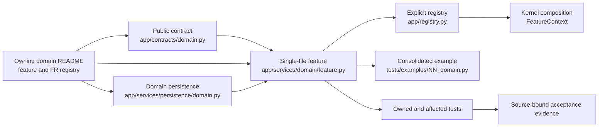

# Feature Implementation Pipeline and Architecture Guide

> **Scope:** Authoritative build-side procedure for backend features in `app/`
> and their contracts, persistence, registration, examples, tests, consumers,
> and acceptance evidence within a generic modular monolith architecture.
>
> **Reciprocal audit:**
> [`domain_implementation_audit.md`](domain_implementation_audit.md) is the
> verification-side mirror of this pipeline. The `FIP-*` controls in both files
> form one closed catalogue: neither document may add, remove, weaken, or
> reinterpret a control without updating the other in the same reviewed change.

This guide does not replace repository authority. Apply `AGENTS.md` first,
`docs/PROJECT.md` for system scope, `docs/ARCHITECTURE.md` for universal
structure, and the owning domain README for feature and requirement truth.

## 1. Delivery Model

A generic modular monolith architecture uses pure public contracts, one
single-file implementation owner per backend feature, dedicated domain
persistence, explicit registration, one composition container, and
lifecycle-owned effects.



Permanent product truth does not live in this guide. Feature identities,
functional requirements, local NFRs, dependencies, persistence declarations,
workflows, and acceptance outcomes live in the owning domain README. This guide
defines how those declarations are implemented and proved.

### 1.1 Non-negotiable boundaries

- `app/kernel/` is business-neutral and does not import domain contracts or
  services.
- `app/contracts/<domain>.py` contains public DTOs, protocols, events, errors,
  and versioned capability keys without service imports or runtime effects.
- `app/services/<domain>/<feature>.py` owns one cohesive feature. A feature never
  imports a sibling or cross-domain feature implementation.
- `app/services/persistence/<domain>.py` owns the domain's schemas,
  parameterized SQL, and transactional database operations. It does not own
  feature policy, authorization, or orchestration.
- Every `__init__.py` is empty or docstring-only. It is not a public re-export
  boundary.
- Cross-boundary collaboration uses public contracts and capabilities resolved
  through `FeatureContext`.
- Import-time I/O, registration, task creation, network/database access, and
  logging configuration are forbidden.
- Runtime effects are acquired and released through the feature's lifecycle
  scope. Background work uses `FeatureContext.spawn()`.
- Optional capability absence disables only the operation that needs it.
  Required capability absence blocks the dependent feature or operation with an
  explicit typed outcome; neither case permits silent substitution.

## 2. Canonical Feature Module Anatomy

Every new backend feature uses one module:

```text
app/services/<domain>/<feature_slug>.py
```

The default top-to-bottom order is normative. A documented exception may omit a
section that is genuinely inapplicable, but it may not create a second feature
owner or weaken contracts, lifecycle, traceability, or evidence.

### 2.1 Module header

Begin with a truthful module docstring containing:

1. Title and one coherent responsibility.
2. `Purpose:` domain scope and explicit boundaries.
3. `Key capabilities:` bounded operations and important failure semantics.
4. `Python API usage:` consumption through a public capability resolved from a
   context, never a private service import.
5. `CLI usage:` the domain's consolidated offline example command.

The snippet is documentation, not a second implementation. It must be
secret-safe and must not imply live, provider, browser, or release
qualification.

### 2.2 Imports and logger

Imports follow the Google/Ruff order:

1. `from __future__ import annotations`.
2. Python standard library.
3. Third-party packages.
4. Local public contracts and kernel facilities.
5. Type-checking-only imports under `if TYPE_CHECKING:`.

Feature implementation imports are forbidden, including sibling features.
After imports, modules that need operational logging declare:

```python
from app.kernel.logging import get_logger

logger = get_logger(__name__)
```

* Do not configure handlers or global logging.
* Log bounded structured fields at public service boundaries, state transitions,
  external interactions, important decisions, retries, side effects, and failures.
* Pure helpers and high-frequency loops do not log unless an owning
  requirement says otherwise.
* Never log credentials, personal information, complete sensitive payloads,
  workspace paths, fencing/session tokens, account data, or unbounded exception text.

### 2.3 Configuration

Define `<Feature>Config` as an immutable, slotted dataclass. It owns only true
runtime settings, uses safe bounded defaults, validates unknown and invalid
values before effects, and agrees exactly with `SPEC.config_keys`, strict
application configuration, and the owning README.

A feature with no runtime settings may use an empty immutable config to retain
the standard shape. Do not invent settings merely to populate it.
Any `from_dict()` constructor must reject unknown keys rather than silently
ignore or widen them.

### 2.4 Private implementation support

Feature-local helper functions, types, constants, and classes appear after the
configuration and before the service. Their names begin with `_` unless they are
public contract symbols, in which case they belong in `app/contracts/`.

Helpers remain inside the owning feature module. A domain-level support module
is allowed only under the exception: at least three registered features
genuinely consume the same coherent support capability, or another explicit
architecture exception applies. Support must never become a shadow feature
registry or alternate implementation owner.

### 2.5 Service class and requirement traceability

`<Feature>Service` implements the public Protocol from
`app/contracts/<domain>.py`. Its public business methods equal the Protocol's
operations. Public service methods not present in the public contract are
forbidden; internal helpers begin with `_`.

Functional requirements do **not** mechanically determine method count. Several
FRs may constrain one public operation, and one FR may apply across multiple
operations. The owning README and acceptance manifest must instead provide an
exhaustive mapping:

```text
FR / local NFR / applicable shared NFR
    -> public contract operation(s)
    -> implementation symbol(s)
    -> acceptance oracle(s)
    -> executable evidence
```

Constructors, lifecycle hooks, properties, and protocol-required support methods
are not counted as FR operations. Each class, public method, and non-obvious
private helper has a fitted Google-style docstring. Include `Args`, `Returns`,
`Raises`, and `Yields` only when applicable; empty sections are prohibited.

A service implements an async context manager only when it owns resources or
cleanup. Pure providers must not manufacture lifecycle effects. Resource-owning
services are entered with `ctx.enter_context(service)` or registered via
`ctx.on_close(...)`.

### 2.6 Feature specification

Declare one immutable `SPEC: FeatureSpec` containing the stable feature ID,
domain, provided capabilities, required capabilities, optional capabilities,
conflicts, description, state declaration, and accepted configuration keys.
Every field must agree with the domain README, public contracts, registry, and
feature class attributes.

Capability identifiers include an explicit major version such as
`auth.tokens@1`. Breaking public changes use a new major; they
do not shadow an existing contract.

### 2.7 Feature lifecycle wiring

`<Feature>Feature` implements the `Feature` protocol:

- `spec` property returns `SPEC`.
- `start(ctx)` resolves only declared dependencies, creates the service, enters
  owned resources, and publishes only declared capabilities.
- Required dependencies use fail-closed resolution (`ctx.require(...)`).
  Optional dependencies are tested at the exact operation boundary
  (`ctx.get(...)`) and never silently substituted.
- Background work uses `ctx.spawn(...)`.
- Subscriptions, callbacks, workers, leases, buffers, and context managers have
  exact lifecycle owners and idempotent cleanup via `ctx.on_close(...)`.
- Partial startup failure unwinds all acquired effects in reverse order (LIFO).

### 2.8 Factory and module exports

End with a zero-argument `feature()` factory that returns a new unmounted
feature instance, followed by module-level `__all__` containing only the
intended module symbols, normally `SPEC`, config, service, feature, and factory.

Module-level exports do not make the package `__init__.py` a public boundary.
Do not add `sys.modules`, `__path__`, import alias, or compatibility shims.

### 2.9 Reference skeleton

```python
"""<Feature title>.

Purpose:
    <Single responsibility and explicit boundary.>

Key capabilities:
    * <Bounded capability and failure behavior.>

Python API usage:
    service = ctx.require(<CAPABILITY>)
    result = await service.<operation>(<Request>(...))

CLI usage:
    uv run python tests/examples/<NN>_<domain>.py
"""

from __future__ import annotations

from dataclasses import dataclass
from typing import TYPE_CHECKING, Any

from app.contracts.<domain> import <CAPABILITY>, <Protocol>, <Request>, <Result>
from app.kernel.feature import FeatureSpec
from app.kernel.logging import get_logger

if TYPE_CHECKING:
    from app.kernel.capability import Capability
    from app.kernel.context import FeatureContext

logger = get_logger(__name__)


@dataclass(frozen=True, slots=True)
class <Feature>Config:
    """Runtime configuration for <feature>."""


class <Feature>Service(<Protocol>):
    """Implement the public <feature> capability."""

    async def <operation>(self, request: <Request>) -> <Result>:
        """Perform the public operation."""
        ...


SPEC = FeatureSpec(
    feature_id="<domain>.<feature_slug>",
    domain="<domain>",
    name="<Feature Name>",
    provides=frozenset({<CAPABILITY>}),
    requires=frozenset(),
    optional=frozenset(),
    conflicts=frozenset(),
    description="<Cohesive feature description.>",
    state="stateless",
    config_keys=frozenset(),
)


class <Feature>Feature:
    """Wire <feature> into the composition lifecycle."""

    @property
    def spec(self) -> FeatureSpec:
        """Return the immutable specification."""
        return SPEC

    async def start(self, ctx: FeatureContext) -> None:
        """Start the feature and publish its capability."""
        service = <Feature>Service()
        ctx.provide(<CAPABILITY>, service)


def feature() -> <Feature>Feature:
    """Return a new unmounted feature instance."""
    return <Feature>Feature()


__all__ = ["SPEC", "<Feature>Config", "<Feature>Feature", "<Feature>Service", "feature"]
```

The skeleton is illustrative. Actual signatures and lifecycle behavior come
from the public contract and owning feature card.

## 3. End-to-End Creation Procedure

### Phase A — Authority and design

1. Read the repository authorities and the complete owning feature card.
2. Confirm one semantic domain owner and one cohesive feature owner.
3. Assign or retain the stable `FEAT-*` identity and exact module path.
4. Freeze FR, local NFR, applicable shared NFR, workflow, dependency,
   persistence, catalogue, source, and acceptance mappings.
5. Record assumptions, boundaries, risks, rollback, and validation in the
   approved implementation plan before editing.

### Phase B — Contracts and persistence

6. Add or reuse typed public DTOs, protocols, events, errors, and versioned
   capabilities in the domain contract (`app/contracts/<domain>.py`).
7. Regenerate public schemas when contract sources change and verify generated
   output rather than editing it manually.
8. For stateful behavior, implement schema, migrations, and focused operations
   in the dedicated domain persistence module (`app/services/persistence/<domain>.py`).
   Use isolated temporary databases for every test; never mutate the active workspace database.

### Phase C — Implementation and registration

9. Implement the canonical feature-module anatomy in Section 2.
10. Register the zero-argument factory explicitly in `app/registry.py`.
11. Verify `SPEC`, the feature class, registry, contracts, configuration, and
    README have exact identity and dependency parity.
12. Prove start rollback, teardown, dependency-loss behavior, replacement, and
    physical removability where applicable.

### Phase D — Usage and tests

13. Add one realistic, offline, deterministic, secret-safe
    `example_<NN>_<feature_slug>()` function to the consolidated domain example
    (`tests/examples/<NN>_<domain>.py`).
14. Add focused owner tests for configuration, public operations, boundaries,
    failures, policy, authorization, lifecycle, persistence, idempotency,
    cancellation, and replay as applicable.
15. Add affected contract, consumer, composition, Interfaces, UI, workflow, and
    physical-removal tests under their actual owners. Do not create a legacy
    `tests/<domain>/unit` or `tests/<domain>/integration` hierarchy merely to
    satisfy a directory convention.

### Phase E — Validation and evidence

16. During editing, run explicit affected tests with `--no-cov` and the
    consolidated usage example.
17. Run changed-file formatting, lint, repository hygiene, and secret checks at
    the pre-commit boundary (`uv run ruff check .`, `uv run ruff format --check .`).
18. Run the full verification suite before candidate submission (`uv run python scripts/ci_check.py`).
19. Produce or reconcile the feature acceptance manifest only from actual,
    source-bound evidence. Missing or operation-gated evidence remains explicit.
20. Maintain one `.agents/logs/<start-date-time>_<task-run-id>/` directory for
    the task. Retain bounded journals, handoffs, sanitized state transitions, receipts,
    and fingerprints. Commit that history with the implementation; keep raw
    `*.log` streams, native session handles, secrets, and sensitive payloads ignored.
21. Complete independent Contract, Provider, Composition, Interfaces, UI, and
    End-to-end stages or justify genuine nonapplicability.
22. Perform the reciprocal audit in `docs/dev/domain_implementation_audit.md`;
    no control may be skipped because another row passed.

## 4. Reciprocal Delivery and Audit Controls

The following catalogue is the Definition of Done. The audit uses the same IDs
and meaning. A control may be `N/A` only with specific evidence that the
underlying responsibility does not apply. Status terminology uses "Completed"
rather than "Implemented".

| ID                         | Build-side obligation                                                                                                                                                                                                                                               |
| -------------------------- | ------------------------------------------------------------------------------------------------------------------------------------------------------------------------------------------------------------------------------------------------------------------- |
| `FIP-01 REG`             | Reconcile each README-registered feature to exactly one cohesive production module, `SPEC`, registry factory, test owner, example function, and evidence path; exclude only README, pure initializers, persistence, and documented support exceptions.             |
| `FIP-02 REQ`             | Map every feature status, FR, local NFR, applicable shared NFR, acceptance ID, workflow contribution, catalogue/source binding, and open decision to implementation and evidence without treating a declaration as proof.                                           |
| `FIP-03 INIT`            | Keep every `__init__.py` empty or docstring-only with no re-exports, registration, I/O, tasks, logging setup, or other runtime code.                                                                                                                               |
| `FIP-04 MOD`             | Preserve flat single-module feature ownership with no feature subpackages, split owners, shadow implementations, or undocumented shared support.                                                                                                                    |
| `FIP-05 SPEC`            | Keep module `SPEC`, capability versions, feature attributes, dependencies, conflicts, state, strict configuration, README, and registry semantics in exact parity.                                                                                                 |
| `FIP-06 IMPORT`          | Use public contracts and context-resolved capabilities; prohibit sibling/cross-domain feature implementation imports in production, examples, gateways, workflows, and integration code.                                                                            |
| `FIP-07 CONTRACT-PURITY` | Keep domain contracts typed, versioned, side-effect-free, implementation-independent, generated-schema compatible, and free of hidden orchestration or persistence.                                                                                                 |
| `FIP-08 USE`             | Supply one bounded offline primary-purpose example function per completed backend feature in the consolidated domain example, with truthful output and cleanup.                                                                                                     |
| `FIP-09 WF`              | Map every active workflow contribution to its lead, participants, handoffs, failure states, final oracle, and independently owned system evidence; do not count reading sequences as `WF-*` identities.                                                            |
| `FIP-10 TEST`            | Implement focused owner tests for applicable happy, failure, boundary, authorization, numerical/computational, lifecycle, dependency, idempotency, cancellation, replay, removal, and acceptance-traceability behavior.                                             |
| `FIP-11 INTEG`           | Add independently owned compatibility and integration evidence for contracts, composition, consumers, Interfaces, UI, persistence, workflows, removal, and qualified providers where applicable.                                                                    |
| `FIP-12 COV`             | Meet the configured source-bound coverage floor (minimum 80%), including required line and branch measurement, without hiding unmeasured feature code or treating coverage as semantic proof.                                                                       |
| `FIP-13 HYG`             | Enforce typing, fitted Google docstrings, import order, Ruff format/lint, no bare or silent exceptions, no application prints, no secrets, no import-time effects, and no service logging configuration.                                                            |
| `FIP-14 PERSIST`         | Route all stateful domain schema, parameterized SQL, and transactions through dedicated persistence with immutable migration checksums, manifest/ledger verification, write locks, transactional execution, retention policy, and isolated test databases.          |
| `FIP-15 SCHEMA`          | Reconcile README and `SPEC` state declarations, contracts, persistence schema, migrations, applied-ledger evidence, and manifests; document rather than normalize every divergence.                                                                                |
| `FIP-16 REACH`           | Trace each durable record from schema through persistence operation and production feature operation to an authorized consumer or retained-evidence purpose; prohibit orphan tables, test-only reachability, and cross-domain direct writes.                        |
| `FIP-17 CONTRACT`        | Prove producer-consumer compatibility, version handling, generated-schema parity, and explicit unavailable/blocked outcomes for absence or incompatibility.                                                                                                         |
| `FIP-18 LIFE`            | Own every runtime effect, unwind partial startup, make teardown idempotent, fence dependency loss/replacement, and prove physical removal leaves unrelated behavior and retained data intact.                                                                       |
| `FIP-19 LOG`             | Use the system structured logger at applicable operational boundaries with bounded fields and complete secret, privacy, path, token, account, and payload redaction.                                                                                                |
| `FIP-20 SAFE`            | Fail closed under uncertainty; preserve identity, scope, environment, authorization, resource-admission, receiver, and execution boundaries without silent substitution or unauthenticated mutation.                                                              |
| `FIP-21 COMP`            | Preserve computational and numerical integrity: explicit unit conversions, finite admitted search/simulation, deterministic seeded stochastic paths, checked boundary arithmetic, exact lineage, and zero fabricated results.                                         |
| `FIP-22 PERF`            | Bound work, memory, cardinality, concurrency, queues, retries, and waits; measure declared budgets on identified workloads and isolate real I/O or sleeps from unit tests exceeding roughly 100 ms.                                                                 |
| `FIP-23 DOCS`            | Reconcile repository authorities, owning README, contracts, `SPEC`, configuration, persistence, tests, examples, evidence, decisions, and source fingerprints without unsupported completion or qualification claims.                                              |
| `FIP-24 IFACE`           | Route intended external operations through an owned authenticated Interfaces feature using public contracts, bounded transport semantics, version/idempotency policy, and truthful owner-result parity.                                                             |
| `FIP-25 UI`              | Route intended interactive capability through UI -> Interfaces -> contract -> provider with truthful state, units, provenance, accessibility, cleanup, and no duplicated domain policy or implied authority.                                                        |
| `FIP-26 EVID`            | Retain source-bound acceptance manifests and the Git-linked task history mapping requirements, plans, execution iterations, symbols, fixtures, commands, exit codes, coverage, environment, usage, lifecycle, qualification, workflows, receipts, and fingerprints.     |

## 5. Validation Cadence

### Editing

Run the smallest meaningful, explicit affected selection:

```powershell
uv run pytest --no-cov tests/services/<domain>/<feature_slug>/
uv run python tests/examples/<NN>_<domain>.py
```

Add exact contract, consumer, workflow, or architecture tests when the changed
boundary affects them. Never use bare or unfiltered pytest during iteration.

### Pre-commit

Run repository hygiene, syntax, Ruff check, Ruff format check, and secret
detection for the candidate:

```powershell
uv run ruff check .
uv run ruff format --check .
uv run mypy
```

### Full verification and acceptance

Run the authoritative check suite:

```powershell
uv run python scripts/ci_check.py
```

Commands named in documentation must exist at the audited revision. A missing
script or stale command is a documentation failure, not evidence.

## 6. Acceptance Evidence

Each completed backend feature owns:

```text
docs/dev/evidence/features/<FEAT-ID>/acceptance.json
```

Every implementation task also owns its operational documentation:
- Pre-implementation plan conforming to `docs/templates/implementation-plan.md`
- Post-implementation walkthrough conforming to `docs/templates/walkthrough.md`

The containing Git commit is the terminal identity, so a tracked receipt must
not attempt to embed its own commit hash. Raw command logs stay ignored and are
referenced by hashes from bounded tracked receipts.

The manifest records exact feature and requirement identities, source/README
hashes, tested revision, implementation symbols, public capabilities,
configuration and persistence bindings, fixtures, commands and exit codes,
coverage, environment, usage transcript, lifecycle/removal results, workflow
disposition, provider qualification, and the independent Contract, Provider,
Composition, Interfaces, UI, and End-to-end stages.

Use `NOT_APPLICABLE` only with a feature-specific reason. Use
`OPERATION_NOT_QUALIFIED`, unavailable, partial, or failed states when evidence
is absent. Never infer provider, browser, performance, remote, or release
qualification from unit fixtures or documentation.

## 7. Maintenance and Reciprocity Gate

Every change to this pipeline must answer:

1. Did any `FIP-*` control change meaning?
2. Does the reciprocal audit use the identical ID and semantics?
3. Does a new delivery obligation have an audit procedure?
4. Does every audit procedure originate in a delivery obligation?
5. Are commands, paths, APIs, and evidence types real at the target revision?

The control-ID sets in both documents must be equal. Duplicate IDs,
pipeline-only controls, audit-only controls, stale links, or contradictory
verdict semantics fail the documentation gate.

This reciprocity aligns how features are built with how domains are audited. It
does not itself certify that existing features conform; only the reciprocal
audit and its actual evidence can do that.
