# Feature Implementation Pipeline and Architecture Checklist

> **Scope:** The implemented HaruQuantAI composability foundation and the permanent delivery standard for every new or changed feature in `app/`, `tests/`, `scripts/`, `pyproject.toml`, and `.importlinter`
> **Authority:** Runtime truth remains executable, but an existing feature that lacks a mandatory delivery artifact in this guide has an implementation gap; code drift does not silently remove the documented standard
> **Purpose:** Define the exact workflow for adding an in-repository or separately installed composable feature without weakening discovery, lifecycle, dependency, replacement, diagnostics, executable usage, or physical-removal guarantees

This guide describes the architecture implemented today and the mandatory completion artifacts for subsequent feature delivery. It is not a proposal for a different package model. A change to the feature model is incomplete until the runtime, checks, tests, executable usage examples, and this guide agree.

## 1. Implemented architecture at a glance

```mermaid
flowchart LR
    Contracts[1. Contracts and typed events<br/>app/contracts] --> Package[2. Feature package<br/>app/services/domain/feature]
    Package --> EntryPoint[3. Python entry point<br/>haruquantai.features]
    EntryPoint --> Discovery[4. Discovery and graph resolution]
    Discovery --> Mount[5. Staged FeatureContext.mount]
    Mount --> Commit[6. Atomic capability publication]
    Commit --> API[7. Capability-aware app/api facade]
    API --> Usage[8. Documented executable usage harness]
    Usage --> Tests[9. Feature, composition, API, and removal tests]
    Tests --> CI[10. Complete CI gate]
```



The current Python service-feature architecture consists of:

- immutable public DTOs, protocols, capability keys, and typed events under `app/contracts/`;
- one physically removable package per feature under `app/services/<domain>/<feature>/`;
- a Python `FeatureSpec` in `manifest.py` and an asynchronous `mount()` lifecycle in `feature.py`;
- discovery through the `haruquantai.features` Python entry-point group, with explicit in-memory registration available for tests and embedding;
- dependency resolution by versioned capability keys rather than service imports;
- reversible effects owned by a `FeatureScope` and accessed through `FeatureContext`;
- staged mounting and atomic capability-bundle publication;
- capability-aware public facades under `app/api/`;
- comprehensive core-module usage documentation and one executable primary-module demonstration per service feature;
- executable conformance, documentation-drift, lifecycle, replacement, and physical-removal checks.

`D-UI` follows the same contract-first ownership, feature identity, dependency, removal, and evidence principles through the TypeScript/React variant in §4.8. It does not use Python entry points or pretend that rendered production code is test evidence.

## 2. Non-negotiable architectural boundaries

These boundaries are enforced by `.importlinter`, `scripts/architecture_check.py`, and their tests.

| Rule | Implemented constraint |
| --- | --- |
| Kernel independence | `app.kernel` does not import contracts, composition, services, or API packages. |
| Contract purity | `app.contracts` does not import composition, services, or API packages. Contracts may use kernel primitives such as `CapabilityKey`. |
| API purity | `app.api` imports contracts and resolves registry capabilities; it never imports service implementations. |
| Feature independence | A service feature package never imports another feature implementation, including a sibling in the same domain. |
| Pure package initializers | Every `__init__.py` is empty or contains only a module docstring. |
| Managed tasks | Direct `asyncio.create_task()` is prohibited outside `app/kernel`; features use `context.spawn()`. |
| Logging ownership | Service packages do not call `logging.basicConfig()`. |
| Import-time safety | Feature modules perform no runtime registration, I/O, task creation, connection, or other external mutation during import. |
| UI adapter purity | `app/ui/` imports only generated/public contracts and UI-local modules; it never imports private services, accesses persistence/provider SDKs, or implements business policy. |

Logging follows the same dependency discipline. A module that needs logging declares `logger = logging.getLogger(__name__)`; there is no `app.utils.logger` or other shared logger singleton. Application logging configuration belongs to `app/composition/logging.py` and is invoked at the `app/main.py` bootstrap boundary. Composition owns handlers, structured formatting, redaction, correlation context, retention integration, and cleanup. Feature packages never call `logging.basicConfig()`, import Composition to obtain a logger, or treat operational audit records as ordinary diagnostic logs. Pure contracts, DTOs, deterministic helpers, trivial accessors, and high-frequency numerical functions do not emit logs unless an owning requirement explicitly needs them.

Cross-feature collaboration uses public contracts:

```text
consumer feature
    -> imports CapabilityKey, Protocol, and DTOs from app/contracts/<owner>/
    -> declares the key in FeatureSpec.requires or FeatureSpec.optional
    -> resolves it through FeatureContext during mount
    X never imports app/services/<owner>/<provider>/
```

When adding a registered in-repository feature, also add its package to the `modules` list in the `.importlinter` `features-independent` contract. That list is explicit; registration in `pyproject.toml` does not update it automatically.

## 3. Phase 1 — Establish ownership and public contracts

### 3.1 Choose one domain and one stable feature identity

A feature belongs to exactly one domain package. Use an existing domain when it owns the business responsibility; create new domain-level contract, service, API, and test namespaces only when ownership genuinely differs.

Registered feature IDs satisfy the generic contract-test format:

```text
FEAT-<DOMAIN_TOKEN>-<ACTION_WORDS>
```

Examples from the implementation are:

- `FEAT-BROKER-FEED_MOCK`
- `FEAT-DATA-RETRIEVE_BARS`
- `FEAT-SYS-PERSIST_STORAGE`

The manifest's `domain` is the lowercase semantic domain such as `broker`, `data`, or `system`; it need not repeat the abbreviated feature-ID token verbatim. IDs are permanent diagnostic and configuration identities. Renaming one requires an explicit configuration and compatibility migration.

### 3.2 Define the capability contract

Create or update `app/contracts/<domain>/<capability>.py`. The established contract form uses:

- frozen, slotted dataclasses for request/result records;
- `Protocol` plus `@runtime_checkable` for provider behavior;
- one `CapabilityKey[Protocol]` with a lowercase dotted or hyphenated name and positive major version;
- domain-specific exceptions only when they add meaning beyond `CapabilityUnavailableError`.

```python
from dataclasses import dataclass
from typing import Protocol, runtime_checkable

from app.kernel.capability import CapabilityKey


@dataclass(frozen=True, slots=True)
class CustomRequest:
    symbol: str


@runtime_checkable
class CustomService(Protocol):
    async def execute(self, request: CustomRequest) -> object: ...


CUSTOM_SERVICE = CapabilityKey[CustomService](
    name="data.custom-service",
    major=1,
)
```

The runtime identifier is `<name>@<major>`, for example `data.custom-service@1`. A breaking contract change receives a new major key; consumers and providers migrate explicitly.

### 3.3 Define typed events when needed

Typed event records live under `app/contracts/events/`. Event semantics are explicit because the kernel implements four different dispatch modes:

| `EventMode` | Implemented behavior |
| --- | --- |
| `PUBLISH` | Concurrent observational dispatch; handler failures are logged and isolated. |
| `SERIAL` | Registration-order dispatch; failures propagate. |
| `PARALLEL` | Concurrent dispatch; failures propagate. |
| `PIPELINE` | Registration-order transformation; returning `None` short-circuits the pipeline. |

Subscribe through `context.subscribe(...)` so the exact subscription token is removed with the feature scope. Publish facts through `await context.publish(event)` and policy pipelines through `await context.dispatch_pipeline(event)`.

## 4. Phase 2 — Create the feature package

### 4.1 Required physical shape

```text
app/services/<domain>/<feature_slug>/
├── __init__.py          # Empty or docstring only
├── README.md            # Runtime-validated feature specification
├── manifest.py          # SPEC: FeatureSpec
├── config.py            # Strict immutable configuration parser
├── feature.py           # mount() adapter and create_feature() factory
└── <use_case>.py        # One or more focused business responsibilities
```

Use-case filenames are responsibility-driven; a feature may have multiple focused implementation modules. Exactly one is designated as the feature's primary domain-logic module and owns its executable usage demonstration. Automated tests and executable usage examples are separate artifacts: tests verify behavior, while the primary module documents and demonstrates how a builder or operator uses the feature.

### 4.2 `__init__.py`

The file is empty or contains only a docstring:

```python
"""Historical-bars feature package."""
```

Do not import, re-export, discover, register, configure logging, or perform work here. `ARCH-001-INIT-PURITY` checks this rule using the Python AST.

### 4.3 `manifest.py`

Export one immutable `SPEC`:

```python
from app.contracts.broker.market_data import BROKER_MARKET_DATA
from app.contracts.data.custom_service import CUSTOM_SERVICE
from app.kernel.feature import FeatureSpec


SPEC = FeatureSpec(
    feature_id="FEAT-DATA-CUSTOM_SERVICE",
    domain="data",
    provides=frozenset({CUSTOM_SERVICE}),
    requires=frozenset({BROKER_MARKET_DATA}),
    optional=frozenset(),
    conflicts=frozenset(),
    description="Provide normalized custom data results",
    config_keys=frozenset({"batch_size", "timeout_seconds"}),
)
```

`FeatureSpec` fields and current semantics are:

| Field | Requirement |
| --- | --- |
| `feature_id` | Nonblank, globally unique, stable `FEAT-*` identity. |
| `domain` | Nonblank semantic owner. |
| `provides` | Cohesive capability bundle; registered features provide at least one capability. |
| `requires` | Required capabilities that gate eligibility and activation. |
| `optional` | Capabilities that influence ordering and cause deterministic remount when availability changes, but do not gate activation. |
| `conflicts` | Feature IDs that cannot be active together. |
| `description` | Nonblank human-readable purpose. |
| `state` | Optional `StateDeclaration` for owned durable state. |
| `config_keys` | Exact accepted feature configuration keys; must match `config.py` and `README.md`. |

A capability cannot appear in both `provides` and `requires`, or in both `requires` and `optional`. Discovery calls `spec.validate()` and records invalid or duplicate specifications without overwriting a valid feature.

### 4.4 Persistent state declaration

If the feature owns durable state, declare it in `FeatureSpec.state`:

```python
from app.kernel.state import RetentionPolicy, StateDeclaration

state=StateDeclaration(
    namespace="data.custom_service",
    schema_version=1,
    retention_policy=RetentionPolicy.RETAIN,
    description="Custom service artifacts and indexes",
)
```

Implemented retention values are `retain` and `purge_on_uninstall`. The declaration records ownership and policy; scope closure does not automatically delete durable data. The feature README and tests must state and prove actual retention, migration, export, reconciliation, and explicit purge behavior.

### 4.5 `config.py`

Use a frozen, slotted dataclass with `from_dict()` following the established features:

```python
from __future__ import annotations

from dataclasses import dataclass
from typing import Any

_ALLOWED_CONFIG_KEYS = frozenset({"batch_size"})


@dataclass(frozen=True, slots=True)
class CustomConfig:
    batch_size: int = 100

    @classmethod
    def from_dict(cls, data: dict[str, Any] | None) -> CustomConfig:
        if not data:
            return cls()
        unknown = set(data) - _ALLOWED_CONFIG_KEYS
        if unknown:
            raise ValueError(
                "Unknown Custom configuration keys: "
                + ", ".join(sorted(unknown))
            )
        batch_size = int(data.get("batch_size", 100))
        if batch_size <= 0:
            raise ValueError("batch_size must be positive")
        return cls(batch_size=batch_size)
```

Defaults, accepted keys, normalization, ranges, and cross-field rules must be deterministic. Unknown keys are rejected. `SPEC.config_keys`, the parser, README configuration table, and tests must agree exactly.

### 4.6 Use-case modules

Use-case modules implement domain behavior against contract types. They may import other modules within the same feature package, but never another feature implementation. Prefer dependency injection through constructors or function arguments.

#### A. Comprehensive module-header documentation

Every core capability module starts with an accurate header docstring containing:

- the module title and single purpose;
- its key capabilities and important boundaries;
- Python API usage examples;
- the executable CLI/module command for its usage demonstration.

The examples use public contracts, capability-aware application paths, or public symbols owned by the same feature. They use realistic, bounded, deterministic, and secret-safe inputs. They never instruct consumers to import another feature's implementation.

```python
"""Historical bar normalization.

Purpose:
    Validate and normalize provider bars into the canonical data contract.

Key capabilities:
    * Reject malformed or non-monotonic input deterministically.
    * Preserve canonical timestamp and price semantics.

Python API usage:
    request = NormalizeBarsRequest(...)
    result = normalize_bars(request)

CLI usage:
    uv run python -m app.services.data.historical_bars.normalize
"""
```

Every public module, class, and function also follows the configured Ruff/Pydoclint rules. The header is durable usage documentation, not a substitute for precise symbol docstrings.

#### B. Self-test and verification CLI block (`if __name__ == "__main__":`)

At the end of the designated primary domain-logic module, provide an executable harness that demonstrates and verifies the feature standalone:

```python
def _run_usage_example() -> None:
    """Run the bounded public usage demonstration."""
    request = build_example_request()
    result = normalize_bars(request)
    if not result.bars:
        raise RuntimeError("Usage verification produced no normalized bars")
    print(f"Normalized {len(result.bars)} bars")


if __name__ == "__main__":
    _run_usage_example()
```

The harness may print concise results because it is an explicitly executed teaching and verification path. It must fail with a nonzero exit when verification fails; close every acquired resource; avoid production mutations, live trading, unbounded downloads, credentials, and secret-bearing output; and use fakes, fixtures, sandbox/demo targets, or explicitly supplied safe inputs for external boundaries. Execute it with:

```powershell
uv run python -m app.services.<domain>.<feature_slug>.<domain_logic>
```

There is exactly one executable usage owner per service feature. Additional use-case modules document their Python API and refer to that owner rather than creating competing `__main__` demonstrations. The owning domain README maps each applicable FR to a named scenario in the harness. The `tests/` tree contains automated verification only and never owns usage examples.

### 4.7 `feature.py`

The feature object exposes `spec = SPEC`, implements asynchronous `mount()`, and provides a zero-argument factory:

```python
from __future__ import annotations

from typing import TYPE_CHECKING

from app.contracts.broker.market_data import BROKER_MARKET_DATA
from app.contracts.data.custom_service import CUSTOM_SERVICE
from app.services.data.custom_service.config import CustomConfig
from app.services.data.custom_service.manifest import SPEC
from app.services.data.custom_service.service import CustomServiceImpl

if TYPE_CHECKING:
    from app.kernel.context import FeatureContext
    from app.kernel.feature import FeatureSpec


class CustomFeature:
    spec: FeatureSpec = SPEC

    async def mount(self, context: FeatureContext, config: object) -> None:
        raw_config = config if isinstance(config, dict) else {}
        parsed = CustomConfig.from_dict(raw_config)
        dependency = context.require(BROKER_MARKET_DATA)
        service = CustomServiceImpl(dependency, parsed.batch_size)
        context.provide(CUSTOM_SERVICE, service)


def create_feature() -> CustomFeature:
    return CustomFeature()
```

There is no mandatory feature-owned `unmount()` protocol. The reconciler closes the owning `FeatureScope`; repeated `scope.close()` calls are safe. Optional `health_check()`, `quiesce()`, and `drain()` methods participate in transactional replacement.

### 4.8 D-UI TypeScript/React feature variant

UI features use this physical shape instead of the Python service package in §4.1:

```text
app/ui/src/features/<feature_slug>/
├── README.md
├── manifest.ts       # typed FEAT-UI-* identity, dependencies, contributions, and removal metadata
├── config.ts         # strict feature configuration
├── feature.tsx       # lifecycle/render adapter
└── index.ts          # deliberate public exports only
```

The complete target inventory and per-feature acceptance requirements remain authoritative in `app/ui/README.md`. UI contracts live in `app/contracts/ui/`; generated business clients and wire types are consumed rather than rewritten. A UI feature may own navigation, layouts, drafts, focus, accessibility, visual status, and confirmation behavior. It may not own business validation, authorization, authoritative domain state, storage schemas, workers, compilers, or provider transport.

UI feature dependencies are declared in typed `manifest.ts` data and resolved through the UI composition boundary. Missing required capabilities withdraw or disable only the affected contribution and render an explicit unavailable/degraded state. Each UI feature documents a bounded interactive usage workflow in its README and exposes it through the running UI; UI tests under `tests/ui/` verify that workflow but are not the usage example itself. Component, accessibility, integration/browser, contract-parity, and removal evidence remain mandatory. Frontend build and test commands must be recorded once the UI toolchain exists; this guide does not invent a package manager or command before that implementation decision is encoded in the repository.

## 5. Phase 3 — Own every runtime effect

`FeatureContext` is the only supported feature-facing path to the capability registry, managed tasks, event subscriptions, and context-managed resources.

| Operation | Use | Cleanup behavior |
| --- | --- | --- |
| `context.require(key)` | Resolve a declared required or optional dependency; raise `CapabilityUnavailableError` when absent. | Captured provider remains valid only for that mounted feature generation. |
| `context.optional(key)` | Resolve a declared dependency to a provider or `None`. | Consumer remounts when the optional provider set changes. |
| `context.provide(key, value)` | Stage a declared capability provider. | Exact generation token is revoked on scope close. |
| `context.spawn(coro, name=...)` | Create a supervised background task. | Task is cancelled and awaited on close; unexpected failure triggers runtime-failure reconciliation. |
| `context.subscribe(...)` | Register a typed event handler with one dispatch mode. | Exact subscription is removed on close. |
| `context.enter_context(...)` | Acquire a synchronous managed resource. | Context exits in LIFO order. |
| `context.enter_async_context(...)` | Acquire an asynchronous managed resource. | Async context exits in LIFO order. |
| `context.register_callback(...)` | Register another exact disposer. | Callback executes in LIFO order. |

`FeatureScope` records effect owner, type, resource name, creation time, cleanup status, and last cleanup error. Implemented effect categories are service bindings, event listeners, background tasks, context managers, cleanup callbacks, and custom effects.

For a `ContributorRegistry`, capture its returned exact disposer and register that disposer with `context.register_callback()`. Never remove contributions by broad name scanning during teardown.

Irreversible external actions and committed durable state are not reversible scope effects. They require idempotency, reconciliation, audit, and retention behavior in the feature contract and tests.

## 6. Phase 4 — Register and configure the feature

### 6.1 Register the Python entry point

Add the factory under the existing group in `pyproject.toml`:

```toml
[project.entry-points."haruquantai.features"]
data-custom-service = "app.services.data.custom_service.feature:create_feature"
```

`FeatureDiscoverer` loads installed entry points through `importlib.metadata`. It also supports `register_feature(instance_or_factory)` for tests and embedded composition. Discovery categorizes failures without crashing unrelated discovery:

- `discovered`: valid unique features;
- `missing_targets`: the entry-point target module is absent;
- `failed_imports`: a dependency import or factory execution failed;
- `failed_specs`: the object violates the `Feature` protocol, its spec is invalid, or its feature ID duplicates an accepted feature.

Separately installed packages use the same entry-point group and `Feature` protocol. Optional external distributions must not become unconditional core dependencies.

D-UI features are not registered in the Python entry-point group or `.importlinter` service-feature list. Their typed manifests are composed by the UI runtime and must retain the same stable `FEAT-UI-*` identity declared in `app/ui/README.md`.

### 6.2 Configure desired state

Application configuration has exactly three supported top-level tables: `application`, `features`, and `providers`.

```toml
[application]
profile = "research"

[features.FEAT-DATA-CUSTOM_SERVICE]
enabled = true

[features.FEAT-DATA-CUSTOM_SERVICE.config]
batch_size = 100
timeout_seconds = 5.0

[providers]
"broker.market-data@1" = "FEAT-BROKER-FEED_MOCK"
```

Supported profiles are `offline`, `research`, `backtest`, and `live`. Unknown profiles and unknown top-level sections fail validation. Feature configuration may be inline or under `.config`, but the two forms cannot be mixed. The nested `.config` form is preferred for clarity.

The `providers` table is required when multiple enabled features provide the same capability. With one candidate the provider is selected automatically; with multiple candidates and no selection, resolution fails as ambiguous. A feature providing an atomic bundle cannot be selected for only some overlapping capabilities while another provider is selected for the rest.

### 6.3 Expose a capability-aware public facade

Add or update `app/api/<domain>.py` when the capability is part of the stable application API. The facade imports contracts, never service implementations:

```python
class DataAPI:
    def __init__(self, registry: ServiceRegistry) -> None:
        self._registry = registry

    @property
    def is_custom_service_available(self) -> bool:
        return self._registry.is_available(CUSTOM_SERVICE)

    def get_custom_service(self) -> CustomService:
        return self._registry.require(CUSTOM_SERVICE)
```

Absence is observable through availability checks and `CapabilityUnavailableError`; it is not hidden by a null service or a direct implementation import. Update `HaruQuantAPI`, HTTP routing, and their tests only when the capability requires those surfaces.

`SystemAPI` already exposes active capability owner/generation metadata plus package, capability, runtime, replacement, consumer, and cleanup diagnostics. New feature behavior must remain visible through these existing diagnostic models.

## 7. Implemented composition and lifecycle semantics

### 7.1 Dependency resolution

The dependency graph:

1. selects enabled and discovered specifications;
2. blocks declared conflicts;
3. validates explicit provider selections;
4. selects the sole provider or rejects ambiguity;
5. rejects required dependency cycles;
6. blocks features whose required capabilities cannot resolve;
7. uses optional dependencies for ordering when possible;
8. falls back to required-only order for optional-only cycles;
9. starts providers before consumers and stops consumers before providers.

Removing or changing a provider remounts its transitive required and optional consumers so no active feature retains a stale provider reference.

### 7.2 Staged activation and rollback

Activation is transactional at the capability-publication boundary:

1. State becomes `PREPARING` and a new `FeatureScope` is created.
2. `mount()` resolves dependencies and stages providers in the private scope.
3. The actual provider set is checked against the complete declared `provides` bundle.
4. The registry publishes the bundle atomically.
5. The scope receives exact-generation revocation callbacks.
6. State becomes `ACTIVE` only after commit.

If mount, configuration, provider-bundle validation, or publication fails, the scope closes, partial effects unwind in reverse order, no staged capability remains published, and the feature becomes `FAILED_START`.

### 7.3 Desired-state reconciliation

Configuration reloads and replacements share one mutation lock, so concurrent composition changes never overlap feature mounts. A feature remount is triggered by enablement, configuration, or selected-provider changes, and the affected transitive consumer closure is reconciled in dependency order.

The configuration watcher can poll a TOML file and invoke serialized hot reload. Successful reloads publish `ConfigurationReloadedEvent`; successful explicit replacements publish `FeatureReconfiguredEvent`.

### 7.4 Transactional replacement

Explicit hot replacement requires the provided capability bundle to remain unchanged:

1. A fresh feature instance is discovered.
2. It mounts in a shadow scope.
3. Its provider bundle and optional `health_check()` are validated.
4. The registry atomically replaces the complete bundle with new generation tokens.
5. Transitive consumers stop and remount against the new generation.
6. The old feature may `quiesce()` and `drain()` before its old scope closes.

A pre-commit failure closes the shadow scope and retains the old generation. After commit, consumer-remount or old-scope cleanup failures produce a committed but `degraded` replacement report; they do not falsely claim rollback.

### 7.5 Runtime task failure

An unexpected exception from a `context.spawn()` task is attributed to its owning feature. The engine serializes recovery, withdraws the failed owner's capabilities, reconciles required and optional consumers, preserves unrelated branches, records `FAILED_RUNTIME`, and publishes `FeatureRuntimeFailedEvent`.

### 7.6 Feature states and diagnostic truth

`FeatureState` defines `DISCOVERED`, `DISABLED`, `MISSING`, `BLOCKED`, `PREPARING`, `ACTIVE`, `QUIESCING`, `STOPPING`, `STOPPED`, `FAILED_IMPORT`, `FAILED_CONFIG`, `FAILED_START`, and `FAILED_RUNTIME`.

The current reconciler actively assigns `DISABLED`, `MISSING`, `BLOCKED`, `PREPARING`, `ACTIVE`, `STOPPING`, `STOPPED`, `FAILED_START`, and `FAILED_RUNTIME`. `DISCOVERED`, `QUIESCING`, `FAILED_IMPORT`, and `FAILED_CONFIG` are defined vocabulary but are not assigned by current runtime paths. Discovery/import problems are carried by `DiscoveryResult` and `RuntimeStatus.package_dependency_errors`; invalid application configuration raises `ConfigurationError` before reconciliation. Do not document a state transition merely because the enum member exists.

### 7.7 Readiness and diagnostics

Runtime liveness and deployment-profile readiness are different. The `offline` profile requires no capabilities; `research`, `backtest`, and especially `live` require defined capability sets. A missing feature may therefore leave the process healthy while making the selected profile not ready.

`RuntimeStatus` reports profile readiness, missing profile capabilities, active features and capabilities, feature states, blocked reasons, package dependency errors, capability dependency errors, runtime failures, replacement reports, cleanup errors, and combined errors.

## 8. Phase 5 — Write the runtime-validated feature README

Every registered feature currently requires `README.md` beside `feature.py`. This is an executable architecture rule: `scripts/validate_feature_docs.py` imports every registered factory and compares its `FeatureSpec` with that README.

The README must contain these exact level-two sections:

```text
## Purpose
## Domain
## Provides
## Required Capabilities
## Optional Capabilities
## Configuration
## Runtime Effects
## Persistent State
## Functional Requirements
## Failure Behavior
## Removal Behavior
```

The validator requires:

- the exact feature ID somewhere in the document;
- exact domain text;
- exact provided, required, and optional capability identifier sets;
- exact configuration keys matching `FeatureSpec.config_keys`;
- nonempty purpose, runtime-effects, failure, and removal sections;
- `Persistent State` beginning with `None` when `spec.state` is absent, or containing the declared namespace when state exists.

This feature-local README requirement is part of the current codebase. Moving all feature specifications exclusively into domain READMEs would require changing the validator, architecture test, removal tooling assumptions, and documentation workflow—not documentation alone.

## 9. Phase 6 — Add tests at every applicable level

### 9.1 Feature-local tests

```text
tests/services/<domain>/<feature_slug>/
├── __init__.py
├── test_config.py       # defaults, accepted values, invalid values, unknown keys
├── test_feature.py      # mount, dependency resolution, provider publication
└── test_<use_case>.py   # behavior, boundaries, deterministic failures
```

Add persistence/durability, adapter, concurrency, or integration files when the responsibility requires them.

The `tests/` tree contains automated verification, not usage demonstrations. Feature tests may verify unit behavior, lifecycle, configuration, contracts, architecture, integration boundaries, and failure handling, but a pytest file is never the feature's public usage example. The executable usage owner is the primary domain-logic module defined in §4.6.

### 9.2 Automatically shared feature checks

Registering the feature causes the generic suites to include it. They verify:

- every entry point discovers exactly one valid feature;
- feature IDs, descriptions, provided capabilities, and capability versions are valid;
- interrupted or failed mount cleanup is safe;
- repeated scope closure is idempotent;
- feature README data matches runtime truth.

### 9.3 Composition and architecture checks

Add or extend tests for applicable behavior:

| Concern | Minimum evidence |
| --- | --- |
| Contract | DTO/protocol behavior and serialization/value invariants. |
| Required dependency | Missing provider blocks activation; provider loss stops the transitive consumer closure. |
| Optional dependency | Absence uses the declared behavior; provider arrival/removal remounts the consumer deterministically. |
| Effects | Mount/close and repeated churn leave no capabilities, tasks, listeners, contexts, or callbacks behind. |
| Activation failure | Every failure point rolls back staged effects and publishes no partial bundle. |
| Runtime failure | Failed owner and affected consumers withdraw; unrelated features remain active. |
| Provider selection | Ambiguity fails; explicit selection mounts only the selected provider. |
| Reconfiguration | Configuration/provider changes remount the exact affected closure. |
| Replacement | Success, pre-commit rollback, health failure, dependent remount, quiesce/drain, and degraded cleanup are covered. |
| API | Availability and absence behavior use the public facade and `CapabilityUnavailableError`. |
| Readiness | Relevant profiles report ready/degraded independently from process liveness. |
| External packaging | Separately installed entry-point discovery and package-vs-capability diagnostics remain distinct. |

The shared lifecycle suite currently exercises 100 enable/disable cycles, not merely a single mount/unmount pair.

### 9.4 Physical-removal verification

Run:

```powershell
uv run python scripts/verify_feature_removal.py --feature FEAT-<DOMAIN>-<ACTION>
```

The script copies the repository to an isolated temporary workspace, deletes the feature package and its feature-local tests, removes its entry point and Import Linter module, synchronizes the environment, runs the quality/test suite, and verifies:

- stale desired configuration reports the feature as `MISSING`;
- required consumers become `BLOCKED`;
- unrelated features remain `ACTIVE`;
- removed capabilities are absent;
- readiness matches the selected profile;
- shutdown leaves no active feature, capability, listener, or new task leak;
- the installed `haruquantai --status` command remains operational.

Use `--all` to verify every registered feature. `--report <path>.json` writes a machine-readable report when an artifact is desired.

### 9.5 D-UI verification

For a UI feature, document the public interactive usage workflow in the feature README and make it reachable through the running UI. Separately verify that behavior with executable tests under `tests/ui/`: component behavior and boundary states; keyboard, focus, semantics, contrast, and nonvisual alternatives where applicable; loading, empty, stale, unavailable, and error states; confirmation and recovery for consequential actions; request/response and generated-contract parity; page-level integration or browser workflows when component tests cannot prove the interaction; and removal with unrelated navigation and features still usable. Tests are verification evidence, not the usage documentation itself. Screenshots and manual observation remain supplementary evidence only.

## 10. Phase 7 — Run focused checks and the complete gate

### 10.1 Fast local iteration

```powershell
# One feature
uv run pytest --no-cov tests/services/<domain>/<feature_slug>/

# Tests affected by changed executed lines
uv run pytest --no-cov --testmon

# Previous failures only, or failures first
uv run pytest --no-cov --lf
uv run pytest --no-cov --ff

# Parallel test execution
uv run pytest --no-cov -n auto
```

`pytest-testmon` and `pytest-xdist` are project development dependencies. Timing depends on machine, cache state, and selected tests; no fixed duration is an architectural guarantee.

### 10.2 Individual verification commands

```powershell
uv run ruff format --check .
uv run ruff check .
uv run mypy
uv run lint-imports
uv run python scripts/architecture_check.py
uv run python scripts/validate_feature_docs.py
uv run pytest
```

Use `uv run ruff format .` and `uv run ruff check --fix .` only when intentionally applying formatting or safe lint repairs. They are mutating repair commands, not proof that the tree was already clean.

### 10.3 Complete repository gate

```powershell
uv run python scripts/ci_check.py
```

The current gate runs Ruff format checking, Ruff linting, strict mypy, Import Linter, AST architecture checks, feature-documentation validation, and pytest with branch coverage and an 80 percent project floor. Coverage is a floor, not a substitute for lifecycle, failure, dependency, replacement, durability, or removal assertions.

## 11. Definition of Done

A feature is complete only when every applicable item is supported by executable evidence.

### Identity, ownership, and contracts

- [ ] One stable `FEAT-<DOMAIN>-<ACTION>` ID and one nonblank semantic domain are declared.
- [ ] The feature provides one cohesive, nonempty capability bundle.
- [ ] Public DTOs, protocols, keys, exceptions, and events live under `app/contracts/`.
- [ ] Breaking contract changes use an explicit major-version migration.
- [ ] Required, optional, conflicting, and provided capabilities are complete and non-overlapping.

### Package and implementation

- [ ] The package contains pure `__init__.py`, `README.md`, `manifest.py`, `config.py`, `feature.py`, and focused use-case modules.
- [ ] Configuration rejects unknown and invalid fields, and its accepted keys match `SPEC.config_keys`.
- [ ] No feature imports another feature implementation.
- [ ] No import-time I/O, registration, task creation, connection, or logging configuration exists.
- [ ] The zero-argument entry-point factory returns an object satisfying `Feature`.
- [ ] The feature is registered in `pyproject.toml` and the `.importlinter` feature-independence list.

For D-UI, replace the six Python package items above with `README.md`, `manifest.ts`, `config.ts`, `feature.tsx`, `index.ts`, strict public-contract consumption, and the UI composition registration. Python entry-point, `__init__.py`, and `.importlinter` service-registration requirements do not apply.

### Lifecycle and state

- [ ] Every capability, listener, task, context-managed resource, and contributor disposer is owned by the feature scope.
- [ ] The actual provider bundle exactly matches `FeatureSpec.provides`.
- [ ] Partial mount failure leaves no published provider or leaked effect.
- [ ] Scope disposal is idempotent and dependency-safe.
- [ ] Unexpected managed-task failure is contained and diagnosed.
- [ ] Persistent state declares namespace, schema version, retention, and actual purge/migration behavior.
- [ ] Irreversible actions define idempotency, reconciliation, and audit behavior.

### Composition and interfaces

- [ ] Required dependency absence and loss produce `BLOCKED` behavior.
- [ ] Every optional dependency has tested absent, arrival, removal, and recovery behavior.
- [ ] Provider ambiguity and explicit selection behavior are tested when multiple providers can exist.
- [ ] Configuration changes and transactional replacement remount the correct consumer closure.
- [ ] Public API surfaces resolve contracts dynamically and handle absence with `CapabilityUnavailableError`.
- [ ] Profile readiness reflects the new capability only when the profile truly requires it.

### Documentation and verification

- [ ] The feature README matches its runtime specification and documents effects, state, failures, and removal.
- [ ] Every core capability module has comprehensive header documentation with purpose, capabilities, Python API usage, and the executable module command.
- [ ] Exactly one primary domain-logic module owns a bounded `if __name__ == "__main__":` usage and verification harness, and that harness passes.
- [ ] Feature-local unit and lifecycle tests cover success, boundaries, and stable failures.
- [ ] Every planned business FR maps to a named usage-harness scenario; D-UI maps FRs to its documented interactive usage workflow instead.
- [ ] Architecture, composition, API, durability, and external-package tests are added where applicable.
- [ ] Targeted physical-removal verification passes.
- [ ] The complete repository gate passes with coverage at or above the configured floor.

## 12. Change workflow

For every new feature or feature change:

1. Identify the owning domain, stable feature ID, public capability, consumers, state, effects, readiness impact, and removal result.
2. Update public contracts and typed events first.
3. Update the feature README and `FeatureSpec` together.
4. Update strict configuration parsing and `config_keys` together.
5. Implement or revise the smallest focused use-case modules.
6. Add or update comprehensive module-header documentation and the single primary-module `__main__` usage harness.
7. Execute the usage harness and verify every mapped FR scenario.
8. Implement `mount()` using only declared dependencies and scoped operations.
9. Register the entry point and Import Linter feature package.
10. Add or update capability-aware API surfaces only when publicly required.
11. Add feature-local, generic, composition, lifecycle, failure, replacement, readiness, and API tests as applicable.
12. Run focused tests while iterating.
13. Run targeted physical-removal verification.
14. Run the complete repository gate.
15. Mark documentation complete only after the usage harness and executable verification pass.

For D-UI, apply the §4.8 substitutions, register the typed UI contribution, and use §9.5 evidence; every ownership, contract, dependency, removal, and completion rule remains in force.
