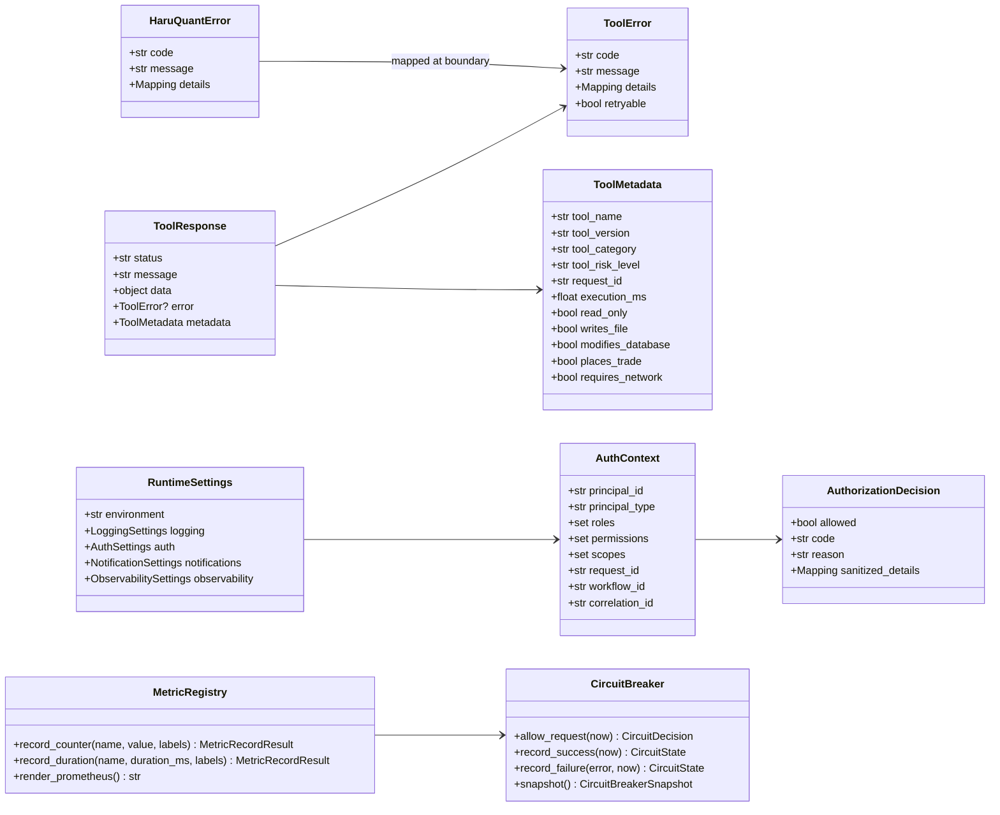
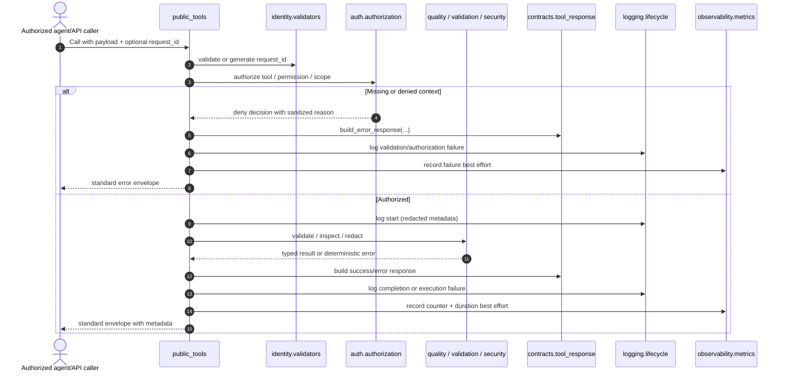
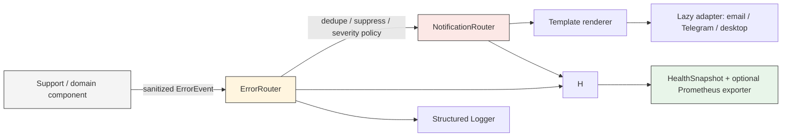

# Utils Foundation - Architecture Requirements Document

**Authoritative source:** `01-utils-foundation.md` only.
**Implementation target:** `app/utils/`
**Document type:** Architecture-to-requirements traceability specification.
**Rule:** This document defines interfaces, files, boundaries, and function contracts only. It intentionally contains no Python implementation code.

## Scope and Ownership

Utils is the shared, dependency-light foundation for deterministic technical primitives. It owns cross-cutting support capabilities: structured logging, error and envelope contracts, UTC-first time handling, collision-resistant IDs, safe path operations, read-only dataframe diagnostics, validation, security/redaction, runtime settings, authorization helpers, notification routing primitives, and observability primitives.

It does **not** own strategy logic, broker execution, trade/risk/allocation approval, portfolio decisions, application orchestration, UI, persistence repositories, backtest engines, data cleaning/repair/resampling/enrichment, external identity-provider ownership, or production broker-backed event infrastructure. Those exclusions are enforced at package-export and dependency boundaries.

## Requirement Coverage Statement

The source enumerates **154 functional requirements** (`UTIL-FR-001`–`UTIL-FR-154`), **16 non-functional requirements** (`UTIL-NFR-001`–`UTIL-NFR-016`), and **19 usage/quality requirements** (`UTIL-EX-001`–`UTIL-EX-019`). Every enumerated requirement is mapped below. Source sub-bullets are retained verbatim in the associated requirement block, so the design does not silently collapse lower-level obligations into a summary.

### Official callable-tool policy

Only the following low-risk wrappers are official agent-callable tools in the initial architecture:

| Callable | Classification | Side effects | Purpose |
|---|---|---:|---|
| `validate_ohlcv_quality` | Official AI tool | Read-only | Inspect and score OHLCV quality; never repair, persist, resample, enrich, or mutate input. |
| `validate_handoff_payload` | Official AI tool | Read-only | Validate a structured handoff/payload against bounded schemas and return the standard envelope. |
| `redact_mapping` | Conditional official AI tool | Read-only | Redact mapping payloads for approved audit/log-redaction workflows. |

All other public support functions are importable native helpers but are **not** auto-attached to agents. `encrypt_data`, `decrypt_data`, password helpers, settings loading, notification delivery, and observability administration require an explicit higher-level workflow or authorization decision.

## 1. System Boundary Diagram (file structure)

```text
app/
└── utils/                                      # Shared utility foundation; no financial-domain decisions
    ├── __init__.py                             # Public import gate and export classification
    ├── public_tools.py                         # Only approved read-only agent-callable wrappers
    ├── contracts/                              # Cross-utility stable DTOs, enums, and response schemas
    │   ├── __init__.py
    │   ├── constants.py                        # Status, environment, risk-level, schema constants
    │   ├── tool_response.py                    # ToolResponse, ToolMetadata, ToolError contracts
    │   ├── canonical_json.py                   # Deterministic JSON-safe canonicalization
    │   └── tool_boundary.py                    # Metadata construction and wrapper boundary policy
    ├── logging/                                # Logging configuration and redacted lifecycle events
    │   ├── __init__.py
    │   ├── formatters.py                       # JSON and human-console rendering
    │   ├── configuration.py                    # Explicit, idempotent logger setup and safe file sinks
    │   ├── lifecycle.py                        # Tool lifecycle event emission
    │   └── retention.py                        # Bounded rotation/retention operations
    ├── errors/                                 # Deterministic exceptions, catalog, and error routing
    │   ├── __init__.py
    │   ├── exceptions.py                       # Error hierarchy
    │   ├── catalog.py                          # Code-to-name/message resolution
    │   ├── models.py                           # Sanitized error-event and routing result DTOs
    │   └── router.py                           # Deduplication and suppression
    ├── identity/                               # Collision-resistant IDs and deterministic validation
    │   ├── __init__.py
    │   ├── generators.py
    │   └── validators.py
    ├── time/                                   # UTC normalization, timestamp validation, monotonic duration
    │   ├── __init__.py
    │   ├── utc.py
    │   ├── freshness.py
    │   └── clock.py
    ├── paths/                                  # Safe rooted path resolution and bounded directory mutation
    │   ├── __init__.py
    │   └── safe_paths.py
    ├── dataframes/                             # Lazy dataframe-only transformations/comparisons
    │   ├── __init__.py
    │   ├── alignment.py
    │   ├── comparison.py
    │   ├── serialization.py
    │   └── combinations.py
    ├── quality/                                # Stateless diagnostic-only OHLCV inspection
    │   ├── __init__.py
    │   ├── models.py
    │   ├── ohlcv.py
    │   ├── scoring.py
    │   └── public_tool.py
    ├── validation/                             # Bounded generic/domain validation helpers
    │   ├── __init__.py
    │   ├── models.py
    │   ├── primitives.py
    │   ├── schemas.py
    │   ├── domain_validators.py
    │   └── public_tool.py
    ├── security/                               # Redaction, crypto helpers, password/secret selection
    │   ├── __init__.py
    │   ├── redaction.py
    │   ├── passwords.py
    │   ├── encryption.py
    │   ├── secrets.py
    │   └── public_tool.py
    ├── settings/                               # Explicit immutable runtime configuration loading
    │   ├── __init__.py
    │   ├── models.py
    │   └── loader.py
    ├── auth/                                   # Context validation and deny-by-default authorization
    │   ├── __init__.py
    │   ├── models.py
    │   └── authorization.py
    ├── events/                                 # Thread/async-safe in-process pub/sub and adapter contracts
    │   ├── __init__.py
    │   ├── models.py
    │   ├── protocol.py
    │   ├── idempotency.py
    │   ├── in_process.py
    │   └── external_adapters.py                # Lazy optional adapter seam only
    ├── notifications/                          # Policy-driven safe notification routing
    │   ├── __init__.py
    │   ├── models.py
    │   ├── templates.py
    │   ├── routing.py
    │   ├── throttling.py
    │   └── adapters.py                         # Lazy provider adapters/protocols
    └── observability/                          # Metrics, health, circuit breaking, clock-drift visibility
        ├── __init__.py
        ├── metrics.py
        ├── health.py
        ├── circuit_breaker.py
        ├── clock_drift.py
        └── prometheus.py                       # Lazy optional exporter integration

docs/
├── planning/01-utils-foundation.md             # Authoritative source requirements
├── utils/README.md                             # Public contracts, runbooks, supported tool catalog
└── runbooks/utils/                             # Failure, notification, queue, clock-drift operating procedures

examples/
└── utils/usage.py                              # One runnable file with 12 named example functions

tests/
├── unit/utils/                                 # Isolated deterministic unit suites per utility module
├── contract/utils/                             # Official tool envelope/metadata/export contracts
├── integration/utils/                          # Notification fake-adapter integration tests
└── stress/utils/                               # Opt-in concurrency and path stress suites
```

### Execution and dependency direction

```text
Higher-level domain / agent / API boundary
  └─> app.utils.public_tools               [approved wrappers only]
       ├─> app.utils.auth                  [deny-by-default authorization]
       ├─> app.utils.validation | quality | security
       ├─> domain-local contracts           [standard response envelope]
       ├─> app.utils.logging                [redacted lifecycle logging]
       └─> app.utils.observability          [best-effort metrics/health]

Support modules may depend inward on contracts, errors, identity, time, security/redaction,
and settings. They must not depend outward on Data, Strategy, Risk, Trading, Simulation,
Live, UI/API, Research, Conversation, persistence repositories, broker SDKs, or LLM frameworks.

Optional adapter boundaries (Prometheus, SMTP, Telegram, Fernet/Argon2, dotenv, pandas)
are lazy at feature invocation time. No import path performs network I/O, secret loading,
filesystem mutation, broker-client initialization, provider-client initialization, background
worker startup, or application-wide logging configuration.
```

## 2. Interface diagrams (Mermaid diagrams)

### 2.1 Stable contract collaboration



### 2.2 Official tool wrapper flow



### 2.3 Error and notification collaboration



## 3. Functional Requirements


### 📂 Module: `app/utils`

**Boundary Role:** The package-level public gate for the Utils Foundation. It exposes intentional stable support objects and the constrained official tool registry, while ensuring import safety and preventing Utils from becoming a cross-domain dumping ground.

#### 📄 File: `__init__.py`

**File Boundary:** Imports, export descriptors, and `__all__` only. No configuration, runtime initialization, file creation, network access, secret loading, pandas import, crypto import, provider initialization, validation execution, or mutable application state.

**Requirement Title:** Package scope, public-name classification, import safety, and shared utility foundation — `UTIL-FR-019` to `UTIL-FR-022`, `UTIL-FR-031`, `UTIL-FR-032`, `UTIL-FR-062`, `UTIL-FR-116`

**Target Class/Function:**

- `__all__: tuple[str, ...]` — **Static export declaration; classifies each exported symbol as official tool or support helper and never causes runtime work.**
- `get_public_capability_catalog() -> tuple[PublicCapabilityDescriptor, ...]` — **Pure; returns explicit public API/support-tool classification without dynamic discovery.**
- `get_official_tool_catalog() -> tuple[PublicCapabilityDescriptor, ...]` — **Pure; returns only `validate_ohlcv_quality`, `validate_handoff_payload`, and conditional `redact_mapping` descriptors.**
- `logger: logging.Logger` — **Support object only; imported without configuring global logging.**

#### 📄 File: `public_tools.py`

**File Boundary:** Common official tool registry metadata; it delegates each operation to the owning capability module.

**Requirement Title:** Agent attachment restriction and standard official tool surface — `UTIL-FR-022`, `UTIL-FR-025`, `UTIL-FR-026`, `UTIL-FR-055`

**Target Class/Function:**

- `list_official_utils_tools() -> tuple[PublicCapabilityDescriptor, ...]` — **Pure; lists only approved official/conditional agent tool descriptors.**
- `resolve_official_utils_tool(name: str) -> Callable[..., ToolResponse]` — **Pure; resolves only explicitly registered safe wrapper names, never arbitrary imported functions.**


### Traceability Index

| Requirement IDs | Target module | Target primary file(s) | Primary responsibility |
|---|---|---|---|
| UTIL-FR-001–018 | `app/utils/logging/` | `formatters.py`, `configuration.py`, `lifecycle.py`, `retention.py` | Safe structured and local-console logging. |
| UTIL-FR-019–036 | `app/utils/contracts/`, `app/utils/` | `tool_response.py`, `canonical_json.py`, `tool_boundary.py`, `public_tools.py` | Shared boundaries, standard responses, public-tool policy. |
| UTIL-FR-037–050 | `app/utils/errors/` | `exceptions.py`, `catalog.py`, `models.py`, `router.py` | Deterministic error taxonomy and redacted error routing. |
| UTIL-FR-051–057 | `app/utils/identity/` | `generators.py`, `validators.py` | IDs, versions, propagation contracts. |
| UTIL-FR-058–065 | `app/utils/time/` | `utc.py`, `freshness.py`, `clock.py` | UTC normalisation, stale checks, monotonic timing. |
| UTIL-FR-066–069 | `app/utils/paths/` | `safe_paths.py` | Rooted traversal-safe paths and explicit directory creation. |
| UTIL-FR-070–074 | `app/utils/dataframes/` | `alignment.py`, `comparison.py`, `serialization.py`, `combinations.py` | Lazy dataframe manipulation and deterministic comparisons. |
| UTIL-FR-075–085 | `app/utils/quality/` | `models.py`, `ohlcv.py`, `scoring.py`, `public_tool.py` | Read-only OHLCV diagnostics and quality reporting. |
| UTIL-FR-086–096 | `app/utils/validation/` | `models.py`, `primitives.py`, `schemas.py`, `domain_validators.py`, `public_tool.py` | Bounded reusable contract validation. |
| UTIL-FR-097–107 | `app/utils/security/` | `redaction.py`, `passwords.py`, `encryption.py`, `secrets.py`, `public_tool.py` | Secret-safe redaction and restricted cryptographic helpers. |
| UTIL-FR-108–115 | `app/utils/settings/` | `models.py`, `loader.py` | Explicit immutable runtime settings. |
| UTIL-FR-116–126 | `app/utils/auth/` plus `contracts/` | `models.py`, `authorization.py`, `canonical_json.py` | Auth context and authorization boundary. |
| UTIL-FR-127–140 | `app/utils/events/` | `models.py`, `protocol.py`, `idempotency.py`, `in_process.py`, `external_adapters.py` | Thread-safe in-process event distribution. |
| UTIL-FR-141–154 | `app/utils/notifications/` | `models.py`, `templates.py`, `routing.py`, `throttling.py`, `adapters.py` | Safe policy-driven human/system notification delivery. |


### 📂 Module: `app/utils/logging`

**Boundary Role:** Configure and emit redacted project-wide logs. This module is the sole owner of log formatting, handler lifecycle, safe file sink configuration, rotation/retention coordination, and logging lifecycle events. It does not own metrics, notification policy, authorization decisions, business decisions, or domain-specific filesystem validation.

#### 📄 File: `formatters.py`

**File Boundary:** Pure transformation of a `logging.LogRecord` plus sanitized contextual fields into JSON-compatible production output or the approved human-readable local-console line.

**Requirement Title:** Project-wide structured and local-console diagnostics — `UTIL-FR-001` to `UTIL-FR-004`, `UTIL-FR-010`, `UTIL-FR-015` to `UTIL-FR-018`

Requirements (verbatim from `01-utils-foundation.md`):

- [ ] **UTIL-FR-001**: Implement exposing a project-wide `logger`, `get_logger(name: str | None = None)`, and `configure_logging(level: str | int = "INFO")`, built on Python `logging`, before any module that needs production logging.
  - The logger is exported as a support object, not an official AI tool
  - Module exposes project-wide `logger`, `get_logger`, and `configure_logging`
- [ ] **UTIL-FR-002**: Implement structured JSON-compatible logging for production runtime events, and colorized human-readable console logging for local development in the approved format.
  - Official AI tools use structured logging
  - Production logging uses a JSON-compatible structured formatter
  - Local development logging supports colorized human-readable console output
  - Human-readable console lines use format `datetime | level | module.submodule.filename:function:line | message`
  - Human-readable console timestamps use format `YYYY-MM-DD HH:MM:SS`
  - Human-readable console logging includes source line numbers where available
- [ ] **UTIL-FR-003**: Ensure logging output includes `timestamp`, `level`, `logger_name`, `message`, `event_name`, `module`, `function`, `request_id`, `workflow_id`, `correlation_id`, and `error_code` where available.
- [ ] **UTIL-FR-004**: Support child loggers per module while preserving a stable root logger name, and prevent duplicate handlers.
  - Logging supports child loggers while preserving a stable root logger name
  - Logging configuration avoids duplicate handlers
- [ ] **UTIL-FR-005**: Restrict logging configuration to an explicit configuration function, so importing logger utilities does not force application-level logging configuration.
- [ ] **UTIL-FR-006**: Implement opt-in file logging, configured explicitly through runtime settings or `configure_logging`, writing only to configured log directories normalized through safe path handling.
  - File logging is opt-in and explicitly configured
  - File logging writes only to configured, safe-path-normalized log directories
- [ ] **UTIL-FR-007**: Implement rotating log files with configurable maximum file size and maximum retained file count, plus configurable retention deletion of old rotated log files bounded to configured log directories.
  - Log rotation supports configurable maximum file size and retained file count
  - Log retention supports configurable deletion of old rotated log files
  - Retention deletion is bounded to configured log directories and must not delete arbitrary files
- [ ] **UTIL-FR-008**: Ensure log file writes, rotation, and retention deletion degrade safely if the filesystem or logging sink fails, and that logging never writes secrets.
- [ ] **UTIL-FR-009**: Make log-level configuration controllable by runtime settings.
- [ ] **UTIL-FR-010**: Log function/tool calls, validation failures, successful completions, recoverable warnings, and execution failures across production files, with lifecycle distinctions and trace identifiers for official AI tools.
  - Production files log function/tool calls, validation failures, successful completions, recoverable warnings, and execution failures where applicable
  - Official AI tool logs distinguish start, completion, validation failure, recoverable warning, and execution failure lifecycle events
  - Official AI tool logs include request and workflow trace identifiers where available
- [ ] **UTIL-FR-011**: Log audit event publish, subscribe, delivery failure, retry, dead-letter, queue-full, and dropped-event events.
- [ ] **UTIL-FR-012**: Log notification routing decisions and delivery outcomes without exposing sensitive message bodies.
- [ ] **UTIL-FR-013**: Log sanitized auth validation and authorization decisions.
- [ ] **UTIL-FR-014**: Log metrics/export/health-check failures where detectable.
- [ ] **UTIL-FR-015**: Ensure production files never log passwords, API keys, broker credentials, encryption keys, tokens, raw private payloads, full approval packets, notification provider credentials, authorization headers, or Telegram bot tokens.
- [ ] **UTIL-FR-016**: Ensure logging is thread-safe under concurrent tool execution, has minimal overhead, and degrades safely if a logging sink fails.
- [ ] **UTIL-FR-017**: Document required log fields and optional trace fields.
- [ ] **UTIL-FR-018**: Write logger tests verifying colorized console output can be enabled and disabled deterministically, human-readable formatting includes datetime/level/module path/function/line/message, duplicate handler prevention, and that output is deterministic enough for field assertions.

**Target Class/Function:**

- `JsonLogFormatter.format(record: logging.LogRecord) -> str` — **Pure rendering after redaction; no I/O, no handler mutation.**
- `HumanConsoleFormatter.format(record: logging.LogRecord) -> str` — **Pure rendering after redaction; emits `YYYY-MM-DD HH:MM:SS | level | module.submodule.filename:function:line | message`.**
- `build_log_fields(*, event_name: str | None, request_id: str | None, workflow_id: str | None, correlation_id: str | None, error_code: str | None, extra: Mapping[str, object] | None) -> dict[str, object]` — **Pure; produces the required structured fields and never retains secret values.**
- `sanitize_log_payload(payload: Mapping[str, object] | None) -> dict[str, object]` — **Pure; delegates denylist-first redaction and bounded diagnostic truncation.**
- `format_exception_for_log(error: BaseException | Error) -> dict[str, object]` — **Pure; returns deterministic sanitized code/message/details and never serializes raw exception bodies.**

#### 📄 File: `configuration.py`

**File Boundary:** Explicit idempotent logging setup, stable root/child logger construction, handler de-duplication, opt-in console/file sink activation, and sink-failure containment.

**Requirement Title:** Explicit configuration, safe file logging, and thread-safe sink behavior — `UTIL-FR-001`, `UTIL-FR-004` to `UTIL-FR-009`, `UTIL-FR-016`

**Target Class/Function:**

- `get_logger(name: str | None = None) -> logging.Logger` — **Observational/no persistent mutation; returns a stable root or child logger without configuring handlers.**
- `configure_logging(level: str | int = "INFO", *, settings: LoggingSettings | None = None, console_format: str | None = None, color_enabled: bool | None = None, log_directory: str | Path | None = None, enable_file_logging: bool | None = None, max_bytes: int | None = None, backup_count: int | None = None) -> LoggingConfigurationResult` — **State-mutating; configures bounded handlers only when explicitly called, safely normalizes configured paths, and prevents duplicate handlers.**
- `build_console_handler(*, formatter: logging.Formatter, color_enabled: bool) -> logging.Handler` — **State-mutating only for the returned handler; no global configuration.**
- `build_rotating_file_handler(log_directory: Path, *, max_bytes: int, backup_count: int) -> logging.Handler` — **Filesystem side effect at explicit configuration time; returns safe structured failure rather than breaking the application on sink failure.**
- `remove_owned_handlers(logger: logging.Logger, handler_kind: str) -> int` — **State-mutating global logging state; removes only tagged handlers to prevent duplicates.**
- `set_log_level(logger: logging.Logger, level: str | int) -> None` — **State-mutating logger configuration only.**

#### 📄 File: `lifecycle.py`

**File Boundary:** Uniform tool/function lifecycle logging only; it does not perform the action being logged.

**Requirement Title:** Official-tool lifecycle events and cross-utility event logging — `UTIL-FR-010` to `UTIL-FR-014`

**Target Class/Function:**

- `log_tool_started(tool_name: str, metadata: ToolMetadata) -> None` — **Side effect: logging sink only; metadata must already be redacted.**
- `log_tool_completed(tool_name: str, metadata: ToolMetadata, *, warning_count: int = 0) -> None` — **Side effect: logging sink only.**
- `log_tool_validation_failed(tool_name: str, error: ToolError, metadata: ToolMetadata) -> None` — **Side effect: logging sink only; records deterministic validation lifecycle event.**
- `log_tool_execution_failed(tool_name: str, error: ToolError, metadata: ToolMetadata) -> None` — **Side effect: logging sink only; records deterministic execution lifecycle event.**
- `log_component_event(event_name: str, *, context: Mapping[str, object]) -> None` — **Side effect: logging sink only; supports audit event, notification, auth, metrics, and health diagnostic events after redaction.**

#### 📄 File: `retention.py`

**File Boundary:** Bounded file rotation/retention housekeeping under an already validated log root.

**Requirement Title:** Safe rotation, bounded retention, and graceful sink degradation — `UTIL-FR-006` to `UTIL-FR-008`

**Target Class/Function:**

- `list_rotated_log_files(log_directory: Path, base_filename: str) -> tuple[Path, ...]` — **Filesystem read only; requires an approved normalized directory.**
- `prune_rotated_log_files(log_directory: Path, *, base_filename: str, retain_count: int) -> LogRetentionResult` — **Filesystem-mutating; deletes only matched rotated files within the configured safe directory.**
- `handle_logging_sink_failure(error: OSError | logging.Handler) -> LogSinkFailure` — **Side effect: emits best-effort fallback diagnostic without recursively failing or leaking secrets.**


### 📂 Module: `app/utils/contracts`

**Boundary Role:** Own the stable cross-domain response/envelope, metadata, constants, canonical JSON, and official-tool boundary contracts. It must not implement any trading, risk, broker, persistence, UI, data repair, or business algorithm.

#### 📄 File: `constants.py`

**File Boundary:** Static typed constants and non-behavioral enumerations shared by Utils contracts.

**Requirement Title:** Scope protection and public-name classification — `UTIL-FR-019` to `UTIL-FR-022`

Requirements (verbatim from `01-utils-foundation.md`):

- [ ] **UTIL-FR-019**: Scope utilities strictly as a shared utility layer: it must not own trading strategy logic, broker execution logic, risk-governor decisions, portfolio allocation decisions, application orchestration, UI, database repositories, or backtest engines, must not become a dumping ground for unrelated helpers, and must not export every internal helper as a public agent tool.
  - Does not own trading strategy, broker execution, risk-governor, portfolio allocation, or orchestration decisions
  - Does not implement UI, database repositories, or backtest engines
  - Does not become a dumping ground for unrelated helpers or export every helper as a public tool
  - Does not hide external dependency behavior behind unclear convenience functions
- [ ] **UTIL-FR-020**: Prohibit utilities from performing live trading, live account mutation, or any trading/risk/allocation/execution/strategy acceptance decision; route financial decisions to the appropriate risk, portfolio, execution, strategy, or governance domain.
  - Utilities must not approve/reject trades, recommend allocations, decide strategy promotion, approve risk changes, place/close/modify/cancel orders, activate live systems, or override kill switches
  - Modules requiring financial decisions call the appropriate governed domain
  - This is a domain-level requirements document for `docs/planning/DOMAIN.md`, not a sprint-specific requirements document
- [ ] **UTIL-FR-021**: Reserve data repair, resampling, enrichment, persistence, and cleaning workflows for data domain, which will own them; keep utilities free of UI, broker runtime, database repository, or LLM framework dependencies.
- [ ] **UTIL-FR-022**: Classify every public name as either an official AI tool or a support object/helper, and keep support helpers native unless explicitly classified as official tools or conditional tools approved for direct agent use.
- [ ] **UTIL-FR-023**: Implement defining the standard HaruQuant tool envelope with top-level keys `status`, `message`, `data`, `error`, and `metadata`.
  - `status` is `success` or `error`; `message` is a string; `error` is `None` or a mapping with `code` and `details`
  - Official success responses include `status="success"`, message, data, `error=None`, and metadata
  - Official error responses include `status="error"`, message, `data=None`, error code/details, and metadata
  - Standard response validation rejects missing top-level keys, missing metadata keys, and malformed errors
- [ ] **UTIL-FR-024**: Implement `get_execution_ms(start_time)` returning milliseconds rounded to three decimals, using a consistent calculation for official tools.
- [ ] **UTIL-FR-025**: Require official AI tools to validate inputs, never fail silently, never return unstructured `None`, and return standard error envelopes for expected validation failures, including `CIRCUIT_OPEN` or provider-specific deterministic details for circuit-open failures.
- [ ] **UTIL-FR-026**: Ensure agents may call only approved official AI tools through approved tool attachment, and that data-quality issues reported through the envelope include code, severity, message, column, row count, and samples.
- [ ] **UTIL-FR-027**: Implement canonical JSON serialization returning deterministic JSON strings, and error helpers returning deterministic names and fallback messages, with sanitized details only in error events.
- [ ] **UTIL-FR-028**: Implement domain-specific error mapping so future errors inherit from `Error` or expose a compatible `code` attribute, and standard response builders map `Error` subclasses generically without hardcoding every future domain error.
- [ ] **UTIL-FR-029**: Document every public function's purpose, usage guidance, arguments, return value, and side effects, with agent-facing docstrings for official AI tools explaining when to use the tool and what it does not do.
  - Documentation includes an operational runbook for critical utility-layer failures
  - Documentation describes safe metric-label rules and rejected-label examples
  - Documentation describes which features are support helpers vs. official AI tools, and which adapters are optional/lazy-loaded
- [ ] **UTIL-FR-030**: Implement usage examples for official AI tools and production primitives demonstrating success and error handling with realistic inputs.
- [ ] **UTIL-FR-031**: Enforce engineering baseline standards across all domains: full typing on public functions/methods, explicit input validation and output shapes, deterministic error behavior, no `print()` in production logic, concurrency-safety unless documented otherwise, no unsafe mutation of caller-owned inputs, and documented concurrency guarantees per component.
  - No mutable module-level state unless explicitly bounded, tested, and specified as a shared cache
  - Time-dependent, ID-dependent, and randomness-dependent helpers support deterministic testing where practical
- [ ] **UTIL-FR-032**: Ensure optional dependencies never break importability, and that missing optional dependencies fail only when the relevant feature is used, with explicit error messages identifying the missing dependency and required feature.
- [ ] **UTIL-FR-033**: Implement deterministic OHLC/data-quality reporting primitives: negative prices, zero prices, out-of-range OHLC values, and NaN/infinity values must be reported; symbol verification must be marked `not_available` when no symbol column exists.
- [ ] **UTIL-FR-034**: Bound diagnostic output: issue lists and issue samples truncate when limits are reached, repeated identical alerts are deduplicated or throttled, and high-cardinality metric labels are rejected or normalized.
- [ ] **UTIL-FR-035**: Implement fast-fail behavior for open circuit state.
- [ ] **UTIL-FR-036**: Achieve at least 80% line coverage for  utils, with edge-case coverage, official AI tool tests verifying metadata correctness and `execution_ms` existence, and data-quality tests covering at least 15 distinct data-quality cases.

**Target Class/Function:**

- `ToolClassification` — **Immutable enum/model; declares `official_ai_tool`, `conditional_ai_tool`, or `support_helper`.**
- `SideEffectProfile` — **Immutable model; captures read-only/file/database/trade/network flags without performing actions.**
- `VALID_RISK_LEVELS` — **Immutable constant; used by validation only.**
- `VALID_ENVIRONMENT_MODES` — **Immutable constant; used by settings/auth/validation only.**
- `classify_public_capability(name: str, classification: ToolClassification, *, agent_attachable: bool) -> PublicCapabilityDescriptor` — **Pure; prevents accidental agent attachment of support helpers.**

#### 📄 File: `tool_response.py`

**File Boundary:** Typed standard envelope construction and validation. It does not invoke tools or make decisions; it only represents their output safely.

**Requirement Title:** Standard HaruQuant response envelope and safe error translation — `UTIL-FR-023` to `UTIL-FR-028`, `UTIL-FR-055`

**Target Class/Function:**

- `ToolError(code: str, message: str, details: Mapping[str, object] | None = None, retryable: bool | None = None)` — **Immutable DTO; construction validates deterministic code and redacted bounded details.**
- `ToolMetadata(tool_name: str, tool_version: str, tool_category: str, tool_risk_level: str, request_id: str, execution_ms: float, read_only: bool, writes_file: bool, modifies_database: bool, places_trade: bool, requires_network: bool)` — **Immutable DTO; captures required official-tool metadata.**
- `ToolResponse(status: Literal["success", "error"], message: str, data: object | None, error: ToolError | None, metadata: ToolMetadata)` — **Immutable DTO; validator rejects malformed status, missing keys, or incompatible success/error combinations.**
- `build_success_response(message: str, data: object, metadata: ToolMetadata) -> ToolResponse` — **Pure; returns a schema-valid success envelope.**
- `build_error_response(error: Error | BaseException | ToolError, *, metadata: ToolMetadata, default_message: str | None = None) -> ToolResponse` — **Pure; maps compatible error code shapes generically and redacts unknown exceptions.**
- `validate_tool_response_schema(payload: Mapping[str, object] | ToolResponse) -> ValidationResult` — **Pure; validates all top-level/metadata/error fields and never raises raw errors to official callers.**
- `build_tool_metadata(*, tool_name: str, request_id: str | None, start_time: float, side_effects: SideEffectProfile, tool_version: str, tool_category: str, tool_risk_level: str) -> ToolMetadata` — **Observational clock read only; uses monotonic duration and ID validation/generation.**

#### 📄 File: `canonical_json.py`

**File Boundary:** Deterministic, JSON-safe canonicalisation for hashes, caching, audit, comparisons, and response payloads.

**Requirement Title:** Canonical JSON, generic error compatibility, enum-safe public output — `UTIL-FR-027`, `UTIL-FR-028`, `UTIL-FR-093`, `UTIL-FR-125`

**Target Class/Function:**

- `canonicalize_value(value: object, *, redact: bool = True, trusted_internal_context: bool = False) -> object` — **Pure; normalizes supported types to deterministic JSON-safe values and redacts by default.**
- `canonical_json_dumps(value: object, *, redact: bool = True, trusted_internal_context: bool = False) -> str` — **Pure; returns deterministic ordering and safe JSON serialization.**
- `normalize_enum_like(value: object) -> str | object` — **Pure; turns supported enums into canonical strings without exposing enum objects.**
- `bounded_details(value: Mapping[str, object] | None, *, max_items: int, max_depth: int) -> dict[str, object]` — **Pure; creates redacted, bounded diagnostics.**

#### 📄 File: `tool_boundary.py`

**File Boundary:** Wrapper policy that preserves a clean business function while applying input validation, authorization hooks, monotonic duration, standard envelopes, lifecycle logging, and best-effort metrics at the boundary.

**Requirement Title:** No silent failures, official-tool metadata, supported optional-dependency behavior, and engineering baseline — `UTIL-FR-024` to `UTIL-FR-036`

**Target Class/Function:**

- `get_execution_ms(start_time: float) -> float` — **Observational; reads `time.perf_counter()` and returns milliseconds rounded to three decimals; no persistent mutation.**
- `run_official_tool(tool_name: str, operation: Callable[..., T], *, request_id: str | None, authorization: AuthorizationDecision | None, side_effects: SideEffectProfile) -> ToolResponse` — **Coordinator side effect boundary; may emit logs/metrics but does not own business logic.**
- `map_tool_exception(error: BaseException) -> ToolError` — **Pure; maps typed/compatible errors to deterministic error shapes and unknown errors to safe codes.**
- `require_optional_dependency(package_name: str, feature_name: str) -> None` — **Pure apart from import attempt; raises deterministic configuration error only when the feature is invoked.**
- `validate_public_export(name: str, descriptor: PublicCapabilityDescriptor) -> ValidationResult` — **Pure; verifies an exported name has declared stability, tool class, side-effect profile, and documentation status.**

#### 📄 File: `public_tools.py`

**File Boundary:** Minimal official-agent wrapper surface; no internal helper is auto-exported here.

**Requirement Title:** Approved tools and quality-envelope integration — `UTIL-FR-022`, `UTIL-FR-025`, `UTIL-FR-026`, `UTIL-FR-029`, `UTIL-FR-030`

**Target Class/Function:**

- `validate_ohlcv_quality(data: "pandas.DataFrame", symbol: str | None = None, timeframe: str | None = None, request_id: str | None = None, *, settings: RuntimeSettings | None = None, auth_context: AuthContext | Mapping[str, object] | None = None) -> ToolResponse` — **Read-only official AI tool; validates authorization and returns a diagnostic-only quality envelope.**
- `validate_handoff_payload(payload: Mapping[str, object], schema: Mapping[str, object], request_id: str | None = None, *, schema_version: str | None = None, auth_context: AuthContext | Mapping[str, object] | None = None) -> ToolResponse` — **Read-only official AI tool; validates bounded handoff payloads and returns standard envelopes.**
- `redact_mapping(payload: Mapping[str, object], request_id: str | None = None, *, allowlist: frozenset[str] | None = None, auth_context: AuthContext | Mapping[str, object] | None = None) -> ToolResponse` — **Read-only conditional official AI tool; authorized audit/log-redaction workflow only.**


### 📂 Module: `app/utils/errors`

**Boundary Role:** Provide deterministic shared error types, code catalogs, sanitized error events, and pre-notification error routing. It never makes a trading or governance decision; it routes technical failure signals only.

#### 📄 File: `exceptions.py`

**File Boundary:** Typed error hierarchy with deterministic code/message/details behavior.

**Requirement Title:** Shared typed exceptions and controlled unexpected-error mapping — `UTIL-FR-037`, `UTIL-FR-039`, `UTIL-FR-040`

Requirements (verbatim from `01-utils-foundation.md`):

- [ ] **UTIL-FR-037**: Implement deterministic failure behavior, defining `Error`, `ValidationError`, `ConfigurationError`, `SecurityError`, `DataError`, and `ExternalServiceError`, each carrying a deterministic `code` attribute and human-readable message.
  - Module defines `Error`, `ValidationError`, `ConfigurationError`, `SecurityError`, `DataError`, `ExternalServiceError`
  - Every shared exception carries a deterministic `code` attribute and human-readable message
- [ ] **UTIL-FR-038**: Implement `error_name(code)` and `message_for(code, default)` so unknown codes resolve safely to `UNKNOWN_ERROR` or a provided default, and so future domain-specific errors inheriting from `Error` (or exposing a compatible `code: str`) map generically without hardcoding.
  - `error_name(code)` returns deterministic names; `message_for(code, default)` returns useful fallback messages
  - Unknown codes resolve safely to `UNKNOWN_ERROR` or a provided default
  - Standard response builders map `Error` subclasses generically
- [ ] **UTIL-FR-039**: Map unknown non-HaruQuant exceptions safely to `UNKNOWN_ERROR` or `TOOL_EXECUTION_FAILED` at controlled tool boundaries, and unexpected execution failures to `TOOL_EXECUTION_FAILED` or another safe deterministic error code.
- [ ] **UTIL-FR-040**: Allow support helpers to return clear native values or raise typed HaruQuant exceptions for programmer or validation errors, using deterministic codes such as `INVALID_INPUT` or `VALIDATION_FAILED` for expected validation failures; raw exception objects must never be returned in `data` or `error`.
- [ ] **UTIL-FR-041**: Define and support the deterministic error-code set: `INVALID_AUTH_CONTEXT`, `AUTHORIZATION_FAILED`, `INVALID_EVENT`, `EVENT_PUBLISH_FAILED`, `EVENT_HANDLER_FAILED`, `EVENT_DEAD_LETTER_FAILED`, `QUEUE_FULL`, `BACKPRESSURE_EXCEEDED`, `NOTIFICATION_FAILED`, `NOTIFICATION_SUPPRESSED`, `NOTIFICATION_THROTTLED`, `OBSERVABILITY_ERROR`, `METRICS_EXPORT_FAILED`, `CLOCK_DRIFT_DETECTED`, `CIRCUIT_OPEN`, `SECRET_VERSION_CONFLICT`, including `INVALID_EVENT` for event validation failures and `INVALID_INPUT` for missing mandatory OHLC columns.
- [ ] **UTIL-FR-042**: Document every public function's raised exceptions or structured error behavior, including official AI tool docstrings explaining what error codes may be returned.
- [ ] **UTIL-FR-043**: Write error tests verifying exception attributes, known codes, unknown codes, fallback messages, and official AI tool deterministic error codes.
- [ ] **UTIL-FR-044**: Implement deterministic failure behavior routing, before notification routing, so the rest of the system can report issues consistently, failing safely without exposing sensitive information.
  - audit event is intended for utility, workflow, alert, and error-routing events, not direct trading execution
- [ ] **UTIL-FR-045**: Implement the standard error event model including error code, severity, source module, source function or tool, request ID, workflow ID, correlation ID, sanitized message, sanitized details, and timestamp.
  - Expected validation failures route as warning or error events depending on severity
  - Unexpected execution failures route as error or critical events; critical system failures route to notifications
- [ ] **UTIL-FR-046**: Implement error-routing deduplication within a configurable time window, recursion/alert-storm prevention, secret redaction before publishing, and preservation of diagnostic context without exposing sensitive payloads.
  - Deduplicates repeated identical errors within a configurable window
  - Prevents recursive alert storms and recursively triggered infinite error routing
  - Redacts secrets before publishing events, logging, metrics, or notifications
  - Preserves original error code and attaches routing failure code separately when both exist
- [ ] **UTIL-FR-047**: Support severity-based routing rules, environment-specific routing rules, and suppression rules for known noisy non-critical errors; expose metrics for routed, suppressed, retried, failed, and dead-lettered error events.
- [ ] **UTIL-FR-048**: Accept sanitized exception context, deterministic error code, severity, request ID, workflow ID, and correlation ID as routing inputs, and return routed, suppressed, deduplicated, throttled, or failed status.
- [ ] **UTIL-FR-049**: Document error routing behavior, severity rules, and how alerts/error routing initialize early in the system lifecycle; include a production readiness checklist for secrets, auth, alert routing, and metrics before enabling live workflows.
- [ ] **UTIL-FR-050**: Write error-routing tests covering validation error routing, unexpected exception routing, deduplication/throttling, recursive error suppression (including under circuit-open and notification-failure scenarios), and that alert failures are logged/measured without exposing secrets.

**Target Class/Function:**

- `Error(message: str, *, code: str = "UNKNOWN_ERROR", details: Mapping[str, object] | None = None)` — **Immutable-style typed exception; carries safe deterministic metadata.**
- `ValidationError(message: str, *, code: str = "VALIDATION_FAILED", details: Mapping[str, object] | None = None)` — **Typed exception; no side effects.**
- `ConfigurationError(message: str, *, code: str = "CONFIGURATION_ERROR", details: Mapping[str, object] | None = None)` — **Typed exception; no side effects.**
- `SecurityError(message: str, *, code: str = "SECURITY_ERROR", details: Mapping[str, object] | None = None)` — **Typed exception; no side effects.**
- `DataError(message: str, *, code: str = "INVALID_INPUT", details: Mapping[str, object] | None = None)` — **Typed exception; no side effects.**
- `ExternalServiceError(message: str, *, code: str = "TOOL_EXECUTION_FAILED", details: Mapping[str, object] | None = None)` — **Typed exception; no side effects.**
- `coerce_error(error: BaseException | Error | object) -> Error` — **Pure; maps compatible `code` attributes without hard-coding future domain errors.**

#### 📄 File: `catalog.py`

**File Boundary:** Stable deterministic code/name/message resolution only.

**Requirement Title:** Error catalog and safe fallbacks — `UTIL-FR-038`, `UTIL-FR-041`, `UTIL-FR-042`, `UTIL-FR-043`

**Target Class/Function:**

- `error_name(code: str | None) -> str` — **Pure; resolves a deterministic known name or `UNKNOWN_ERROR`.**
- `message_for(code: str | None, default: str | None = None) -> str` — **Pure; returns catalog message or caller-supplied safe default.**
- `is_registered_error_code(code: str) -> bool` — **Pure; checks the deterministic shared error-code catalog.**
- `validate_error_code(code: str) -> ValidationResult` — **Pure; validates supported or safely extensible code shapes.**

#### 📄 File: `models.py`

**File Boundary:** Error-event, routing-rule, and routing-result DTOs that contain only sanitized diagnostics.

**Requirement Title:** Error event structure, severity classification, and safe context retention — `UTIL-FR-044` to `UTIL-FR-048`

**Target Class/Function:**

- `ErrorEvent(error_code: str, severity: str, source_module: str, source_function: str | None, request_id: str | None, workflow_id: str | None, correlation_id: str | None, message: str, details: Mapping[str, object], timestamp: datetime)` — **Immutable DTO; construction redacts/bounds message and details.**
- `ErrorRoutingResult(status: Literal["routed", "suppressed", "deduplicated", "throttled", "failed"], error_code: str, routing_failure_code: str | None, event_id: str | None)` — **Immutable DTO; no side effects.**
- `build_error_event(error: Error | BaseException, *, severity: str, source_module: str, source_function: str | None, request_id: str | None, workflow_id: str | None, correlation_id: str | None, now: datetime | None = None) -> ErrorEvent` — **Pure except optional injected clock read; redacts before output.**
- `error_fingerprint(event: ErrorEvent) -> str` — **Pure; deterministic sanitized deduplication key.**

#### 📄 File: `router.py`

**File Boundary:** Error-routing coordinator; it applies severity/environment/suppression/deduplication policy before optional audit event and notification dispatch.

**Requirement Title:** Deduplicated non-recursive error routing and observability — `UTIL-FR-044` to `UTIL-FR-050`

**Target Class/Function:**

- `ErrorRouter.route(error_event: ErrorEvent, *, now: datetime | None = None) -> ErrorRoutingResult` — **State-mutating bounded in-memory routing/deduplication state; may publish redacted audit event events and invoke notification routing only according to policy.**
- `ErrorRouter.should_suppress(event: ErrorEvent, now: datetime) -> bool` — **Pure relative to immutable policy and supplied bounded state snapshot.**
- `ErrorRouter.record_routing_attempt(event: ErrorEvent, result: ErrorRoutingResult, now: datetime) -> None` — **State-mutating bounded deduplication/throttling counters.**
- `ErrorRouter.prevent_recursion(event: ErrorEvent) -> bool` — **State-mutating guarded recursion depth/context; never recursively publishes raw failures.**
- `ErrorRouter.emit_metrics(result: ErrorRoutingResult) -> None` — **Best-effort metrics side effect; cannot fail the originating operation unless policy explicitly requires it.**


### 📂 Module: `app/utils/identity`

**Boundary Role:** Generate and validate safe collision-resistant identifiers and stable versions. It owns no authentication, storage, or remote lookup.

#### 📄 File: `generators.py`

**File Boundary:** Collision-resistant ID creation and strongly typed convenience generators.

**Requirement Title:** ID generation and safe propagation — `UTIL-FR-051`, `UTIL-FR-053`, `UTIL-FR-055`

Requirements (verbatim from `01-utils-foundation.md`):

- [ ] **UTIL-FR-051**: Implement deterministic collision-resistant identity and trace ID generation, providing `generate_id`, `generate_prefixed_id`, `generate_request_id`, `generate_workflow_id`, `generate_correlation_id` (or equivalent), and `generate_event_id` (or equivalent), using UUID4, ULID-like generation, or an equivalently collision-resistant approach unless deterministic IDs are explicitly required.
  - Module provides all listed ID generators
  - Generated IDs are collision-resistant and string-safe
- [ ] **UTIL-FR-052**: Implement `validate_request_id`, `validate_workflow_id`, and `ensure_version`, where `ensure_version(None)` returns the configured default; ID validation is deterministic and performs no external lookups.
- [ ] **UTIL-FR-053**: Ensure IDs are safe for logs, filenames where practical, audit records, tool metadata, events, notifications, and metrics after cardinality controls, and never contain secrets or raw user-provided text.
- [ ] **UTIL-FR-054**: Reject empty or unsafe ID prefixes during prefix validation.
- [ ] **UTIL-FR-055**: Wire official AI tools to accept optional `request_id: str | None = None` and include `tool_name`, `tool_version`, `tool_category`, `tool_risk_level`, `request_id`, `execution_ms`, `read_only`, `writes_file`, `modifies_database`, `places_trade`, and `requires_network` in `metadata`; standard response validation rejects invalid statuses.
  - Request IDs and workflow IDs are suitable for logs, audit records, tool responses, and agent handoffs
  - Usage examples use `request_id` where applicable
- [ ] **UTIL-FR-056**: Avoid avoidable circular imports and unnecessary deep copies in large data-quality validations.
- [ ] **UTIL-FR-057**: Write identity tests verifying ID uniqueness, prefix validation, version defaulting, request ID propagation through official AI tool tests, and invalid-input handling (invalid datetime inputs, invalid high-low relationships, empty/unsafe prefixes).

**Target Class/Function:**

- `generate_id() -> str` — **Observational/randomness-dependent but no external side effects; collision-resistant string-safe ID.**
- `generate_prefixed_id(prefix: str) -> str` — **Observational/randomness-dependent; validates prefix before composing safe ID.**
- `generate_request_id() -> str` — **Observational/randomness-dependent; convenience generator.**
- `generate_workflow_id() -> str` — **Observational/randomness-dependent; convenience generator.**
- `generate_correlation_id() -> str` — **Observational/randomness-dependent; convenience generator.**
- `generate_event_id() -> str` — **Observational/randomness-dependent; convenience generator.**

#### 📄 File: `validators.py`

**File Boundary:** Deterministic local ID and version validation; it never performs external lookups.

**Requirement Title:** Prefix, request/workflow ID, and version validation — `UTIL-FR-052`, `UTIL-FR-054`, `UTIL-FR-056`, `UTIL-FR-057`

**Target Class/Function:**

- `validate_prefix(prefix: str) -> ValidationResult` — **Pure; rejects empty, unsafe, secret-like, or filename/log-unsafe prefixes.**
- `validate_request_id(request_id: str | None) -> ValidationResult` — **Pure; validates safe string shape without external lookup.**
- `validate_workflow_id(workflow_id: str | None) -> ValidationResult` — **Pure; validates safe string shape without external lookup.**
- `ensure_version(version: str | None, *, default_version: str) -> str` — **Pure; returns configured default for `None` and validates supplied value.**
- `ensure_request_id(request_id: str | None) -> str` — **Observational/randomness-dependent only when absent; validates-or-generates a safe request ID.**


### 📂 Module: `app/utils/time`

**Boundary Role:** Own UTC-first parsing, formatting, sequence checks, freshness checks, and monotonic duration support. It does not infer the machine-local timezone or mutate global timezone state.

#### 📄 File: `utc.py`

**File Boundary:** Deterministic UTC datetime parsing and conversion.

**Requirement Title:** UTC normalisation and deterministic timestamp errors — `UTIL-FR-058`, `UTIL-FR-059`, `UTIL-FR-062` to `UTIL-FR-065`

Requirements (verbatim from `01-utils-foundation.md`):

- [ ] **UTIL-FR-058**: Implement timestamp and data normalization before data quality, settings, freshness checks, and event timestamp validation, defining `DEFAULT_TIMEZONE = "UTC"` and providing datetime parsing, timestamp normalization, UTC conversion, naive UTC conversion, UTC timestamp formatting with trailing `Z`, timezone normalization for pandas-like series/timestamp columns, and stale-data checks.
  - Module defines `DEFAULT_TIMEZONE = "UTC"` and provides each listed normalization capability
  - Timestamp formatting returns UTC ISO strings ending in `Z`
- [ ] **UTIL-FR-059**: Make timezone behavior explicit: naive datetimes are handled deterministically using an explicit assumed timezone, ISO strings parse consistently, helpers never use the local machine timezone implicitly, and wall-clock timestamps are UTC-aware.
- [ ] **UTIL-FR-060**: Implement execution timing using monotonic timers (`get_execution_ms(start_time)` via `time.perf_counter()`), distinguishing wall-clock timestamps from monotonic durations, with time-dependent helpers supporting injected `now` values or clock objects where practical.
- [ ] **UTIL-FR-061**: Surface clock-drift risk in distributed workflow timestamp validation where relevant; include event creation/processing time in event envelopes, created/routed/sent/failed timestamps in notification diagnostics, and clock-drift status in health checks where supported.
- [ ] **UTIL-FR-062**: Keep utils import-light and side-effect free: importing must not open network connections, initialize broker clients, run validation jobs, or mutate environment variables, and heavy dependencies import inside the specific submodule/function that needs them, so utils import stays safe in tests, CLI scripts, FastAPI startup, and agent runtime initialization.
- [ ] **UTIL-FR-063**: Document the UTC-first time policy and monotonic execution timing policy.
- [ ] **UTIL-FR-064**: Implement deterministic reporting for unparseable datetimes, non-monotonic timestamps, duplicate timestamps, and stale data, with naive datetimes normalized using the explicit assumed timezone and stale checks deterministic when `now` is injected.
- [ ] **UTIL-FR-065**: Write normalization tests verifying ISO parsing, naive timezone assumptions, UTC conversion, and stale checks.

**Target Class/Function:**

- `parse_datetime(value: datetime | str, *, assumed_timezone: str = "UTC") -> datetime` — **Pure; parses ISO-compatible values and fails deterministically on unparseable input.**
- `normalize_timestamp(value: datetime | str, *, assumed_timezone: str = "UTC") -> datetime` — **Pure; returns UTC-aware datetime and never uses local machine timezone implicitly.**
- `to_utc(value: datetime, *, assumed_timezone: str = "UTC") -> datetime` — **Pure; normalizes to aware UTC.**
- `to_naive_utc(value: datetime | str, *, assumed_timezone: str = "UTC") -> datetime` — **Pure; normalizes then removes timezone only after UTC conversion.**
- `format_utc_z(value: datetime | str, *, assumed_timezone: str = "UTC") -> str` — **Pure; returns UTC ISO-8601 string ending in `Z`.**
- `normalize_timestamp_column(data: "pandas.DataFrame", column: str | None = None, *, assumed_timezone: str = "UTC") -> "pandas.DataFrame"` — **Pure/copy-returning; lazy pandas import and no caller-input mutation.**
- `validate_timestamp_sequence(values: Sequence[datetime | str], *, assumed_timezone: str = "UTC") -> ValidationResult` — **Pure; reports duplicates/non-monotonic order deterministically.**

#### 📄 File: `freshness.py`

**File Boundary:** Staleness and distributed-workflow timestamp checks using explicit UTC references.

**Requirement Title:** Freshness, event timing, and clock-drift visibility — `UTIL-FR-058`, `UTIL-FR-061`, `UTIL-FR-064`

**Target Class/Function:**

- `is_stale(timestamp: datetime | str, *, max_age_seconds: float, now: datetime | None = None, assumed_timezone: str = "UTC") -> bool` — **Pure when `now` is supplied; observational only when it obtains current UTC time.**
- `validate_freshness(timestamp: datetime | str, *, max_age_seconds: float, now: datetime | None = None, field_name: str = "as_of") -> ValidationResult` — **Pure when `now` is supplied; returns deterministic stale/invalid context.**
- `timestamp_diagnostic(created_at: datetime, processed_at: datetime, *, drift_status: str | None = None) -> dict[str, object]` — **Pure; produces safe notification/event diagnostic timestamps.**

#### 📄 File: `clock.py`

**File Boundary:** Monotonic duration observation only; wall-clock timestamps remain the responsibility of `utc.py`.

**Requirement Title:** Monotonic execution timing — `UTIL-FR-024`, `UTIL-FR-060`, `UTIL-FR-063`

**Target Class/Function:**

- `monotonic_now() -> float` — **Observational; reads `time.perf_counter()` and performs no mutation.**
- `get_execution_ms(start_time: float) -> float` — **Observational; calculates a millisecond duration rounded to three decimals.**
- `validate_monotonic_start(start_time: float) -> ValidationResult` — **Pure; rejects malformed or future-impossible monotonic inputs deterministically.**


### 📂 Module: `app/utils/paths`

**Boundary Role:** Resolve and create only approved filesystem paths. It is the sole Utils location allowed to mutate directories, and only through explicit calls.

#### 📄 File: `safe_paths.py`

**File Boundary:** Rooted path normalisation, traversal prevention, and explicit directory/parent creation.

**Requirement Title:** Safe path traversal and directory creation — `UTIL-FR-066` to `UTIL-FR-069`

Requirements (verbatim from `01-utils-foundation.md`):

- [ ] **UTIL-FR-066**: Retired from the shared Utils surface. Domain modules that require filesystem validation own small local path helpers at their boundary.
  - Shared module-level path helpers are not part of `app.utils`
  - Path helpers accept string or `Path` values and optional `base_dir`, and return `Path` objects
- [ ] **UTIL-FR-067**: Validate path inputs, reject empty paths, and reject path traversal outside `base_dir` when a base directory is supplied; use platform-safe file/directory permission defaults.
- [ ] **UTIL-FR-068**: Ensure importing any `app.utils` module never creates files or directories as a side effect.
- [ ] **UTIL-FR-069**: Write path tests covering safe normalization, unsafe traversal rejection, directory creation, parent creation, success paths, and failure paths; include a concurrency stress test suite outside the fast unit-test path.

**Target Class/Function:**

- Domain-local path helpers — **Caller-owned filesystem-path computation and explicit directory creation at the relevant service boundary.**
- `is_within_base(path: Path, base_dir: Path) -> bool` — **Pure; verifies resolved containment.**
- `validate_path_permissions(path: Path) -> ValidationResult` — **Filesystem-read-only; validates platform-safe defaults without changing permissions unless a later explicit policy allows it.**


### 📂 Module: `app/utils/dataframes`

**Boundary Role:** Provide lazy-import, read-only dataframe utility transformations, alignment, serialization, chunking, comparison, and parameter-combination helpers. This module does not clean, repair, persist, enrich, or ingest market data.

#### 📄 File: `alignment.py`

**File Boundary:** Deterministic timestamp/index alignment and immutable-copy transformation policies.

**Requirement Title:** Dataframe alignment and caller-owned input protection — `UTIL-FR-070` to `UTIL-FR-074`

Requirements (verbatim from `01-utils-foundation.md`):

- [ ] **UTIL-FR-070**: Implement dataframe manipulations and operations, providing datetime alignment for dataframes, bar-to-record conversion, chunking for sequences, parameter-combination helpers, dataframe comparison helpers (including OHLC/OHLCV comparison with tolerance support), and dataframe-record serialization.
  - Module provides each listed dataframe helper
  - Comparisons support tolerance
- [ ] **UTIL-FR-071**: Ensure dataframe helpers return native Python objects where applicable, validate required columns, never mutate caller-owned dataframes unless explicitly documented, and document copy/view/transformed-data behavior.
  - `serialize_dataframe_records` emits UTC ISO timestamp strings ending in `Z`, and serialization is JSON-safe where practical
  - `compare_dataframes` aligns by comparable indexes or fails with a clear validation error when deterministic alignment is impossible
  - `chunked` rejects `size <= 0` with a clear validation error
  - Empty dataframes are handled deterministically
- [ ] **UTIL-FR-072**: Keep pandas import lazy: importing `app.utils` must not eagerly import pandas, dataframe helpers use lazy pandas imports or `TYPE_CHECKING` guards, and missing pandas fails only when a dataframe helper is called; importing any `app.utils` module must not execute expensive dataframe operations, and dataframe helpers avoid repeated full-dataframe scans where possible.
- [ ] **UTIL-FR-073**: Implement clear failure for missing required dataframe columns and for dataframe index mismatch when deterministic alignment is impossible.
- [ ] **UTIL-FR-074**: Write dataframe tests verifying alignment, serialization, UTC timestamp output, comparison, index mismatch behavior, missing columns, chunk-size validation, and no input mutation.

**Target Class/Function:**

- `align_dataframes(left: "pandas.DataFrame", right: "pandas.DataFrame", *, join: Literal["inner", "left", "right", "outer"] = "inner") -> tuple["pandas.DataFrame", "pandas.DataFrame"]` — **Pure/copy-returning; lazy pandas import and deterministic failure when alignment cannot be proven.**
- `require_dataframe_columns(data: "pandas.DataFrame", required_columns: Collection[str]) -> ValidationResult` — **Pure; lazy pandas import and clear missing-column diagnostics.**
- `bars_to_records(data: "pandas.DataFrame") -> list[dict[str, object]]` — **Pure/copy-returning; converts no caller data in place.**

#### 📄 File: `comparison.py`

**File Boundary:** Deterministic structural/numeric dataframe comparison with supplied tolerance.

**Requirement Title:** OHLC/OHLCV comparison and mismatch reporting — `UTIL-FR-070` to `UTIL-FR-074`

**Target Class/Function:**

- `compare_dataframes(left: "pandas.DataFrame", right: "pandas.DataFrame", *, columns: Collection[str] | None = None, absolute_tolerance: float = 0.0, relative_tolerance: float = 0.0) -> DataFrameComparisonResult` — **Pure; aligns by comparable index or returns a deterministic index-mismatch validation error.**
- `compare_ohlcv(left: "pandas.DataFrame", right: "pandas.DataFrame", *, absolute_tolerance: float = 0.0, relative_tolerance: float = 0.0) -> DataFrameComparisonResult` — **Pure; validates required OHLC/OHLCV fields before comparison.**

#### 📄 File: `serialization.py`

**File Boundary:** JSON-safe dataframe record serialization with UTC `Z` timestamp output.

**Requirement Title:** Dataframe record serialization — `UTIL-FR-070` to `UTIL-FR-074`

**Target Class/Function:**

- `serialize_dataframe_records(data: "pandas.DataFrame", *, timestamp_column: str | None = None, assumed_timezone: str = "UTC") -> list[dict[str, object]]` — **Pure/copy-returning; lazy pandas import, JSON-safe scalar conversion, UTC `Z` timestamp strings.**

#### 📄 File: `combinations.py`

**File Boundary:** Finite deterministic sequence chunking and parameter-grid construction.

**Requirement Title:** Chunking and parameter combinations — `UTIL-FR-070` to `UTIL-FR-074`

**Target Class/Function:**

- `chunked(items: Sequence[T] | Iterable[T], size: int) -> Iterator[tuple[T, ...]]` — **Pure/lazy; rejects non-positive sizes with a validation error.**
- `parameter_combinations(parameters: Mapping[str, Sequence[object]]) -> Iterator[dict[str, object]]` — **Pure/lazy; yields deterministic key-sorted Cartesian combinations without mutating input.**


### 📂 Module: `app/utils/quality`

**Boundary Role:** Inspect and report OHLCV/OHLCV-like data quality only. It is a stateless diagnostic boundary: no repair, cleaning, enrichment, resampling, persistence, or caller-input mutation is allowed.

#### 📄 File: `models.py`

**File Boundary:** Typed immutable data-quality issue/report/profile/remediation contracts.

**Requirement Title:** Deterministic OHLCV quality result contract — `UTIL-FR-075`, `UTIL-FR-080` to `UTIL-FR-083`

Requirements (verbatim from `01-utils-foundation.md`):

- [ ] **UTIL-FR-075**: Implement data quality auditing and integrity checking, providing `prepare_ohlcv_data` and `validate_ohlcv_quality` as a stateless, diagnostic-only, low-risk read-only official AI tool that inspects, profiles, scores, and reports issues with descriptive remediation recommendations — never repairing, enriching, persisting, resampling, cleaning, or mutating input data (those workflows are reserved for other phases/modules).
  - Market-calendar gap handling depends on session rules supplied by a caller or future domain module; default OHLCV scoring model applies unless a later module-specific spec replaces it
  - `validate_ohlcv_quality` is stateless, diagnostic-only, and does not repair/resample/persist/enrich/mutate input data
  - Caller-owned dataframes are never mutated
- [ ] **UTIL-FR-076**: Validate structural input: confirm input is a pandas DataFrame, confirm mandatory OHLC columns exist (producing structured `INVALID_INPUT` details when missing, and `INVALID_INPUT` for invalid OHLCV input type), ignore extra columns by default unless they create ambiguity, and confirm datetime column or datetime-compatible index availability with parseable datetimes.
- [ ] **UTIL-FR-077**: Detect and report timestamp issues: monotonicity, duplicate timestamps, duplicate OHLC/OHLCV rows, missing timestamps or inferred gaps when timeframe is known, and market-calendar gaps distinguished from unexpected gaps where session rules are supplied.
- [ ] **UTIL-FR-078**: Validate price/volume integrity: OHLC values numeric, negative prices flagged, zero prices flagged, high-low relationships validated, OHLC values within candle high/low range, zero/negative volume flagged when volume is supplied, spread numeric and non-negative when supplied, non-numeric OHLC values reported, and non-numeric or negative spread reported when supplied.
- [ ] **UTIL-FR-079**: Detect extreme spikes using configurable thresholds, flatline candles, and numeric infinities/NaN values; report timezone awareness and produce session-level statistics where possible.
- [ ] **UTIL-FR-080**: Calculate a deterministic quality score using the default penalty model (critical `-40`, error `-20`, warning `-5`, info `-1`, bounded `0`–`100`) against a default pass threshold of `90.0`, assign severity levels consistently (aggregating to `critical` > `error` > `warning` > `info`), and require `passed=True` only when there are no critical or error issues and `quality_score >= quality_pass_threshold`.
  - Warning/info issues may still produce `passed=True` only when the score remains above threshold
- [ ] **UTIL-FR-081**: Bound diagnostic output for large datasets: cap issue samples by `max_issue_samples` and issue list length by `max_issues_returned`, marking truncation explicitly through `summary["issues_truncated"]` and `summary["samples_truncated"]`, to avoid oversized tool responses.
- [ ] **UTIL-FR-082**: Report symbol and timeframe context: `SYMBOL_MISMATCH` when `symbol` is provided and a dataframe `symbol` column exists; `not_available` in summary when `symbol` is provided with no dataframe `symbol` column; `TIMEFRAME_MISMATCH` or `UNEXPECTED_TIME_GAP` when timeframe checks fail.
- [ ] **UTIL-FR-083**: Return successful validation responses including `symbol`, `timeframe`, `rows_checked`, `quality_score`, `passed`, `severity`, `issues`, `summary`, `profile`, and `remediation`, with each issue including `code`, `severity`, `message`, `column`, `row_count`, and `sample`; accept a pandas DataFrame plus optional symbol/timeframe context.
- [ ] **UTIL-FR-084**: Meet performance targets: handle 1,000 rows quickly for normal agent workflows and 100,000 rows within a practical local validation budget.
- [ ] **UTIL-FR-085**: Write data-quality tests covering clean OHLCV data, missing columns, extra columns, symbol mismatch, timeframe mismatch, duplicates, gaps, bad OHLC, zero/negative values, spread, volume, spikes, flatlines, truncation limits, schema compliance, and 10,000 bad rows returning no more than configured issue/sample limits.

**Target Class/Function:**

- `QualityIssue(code: str, severity: Literal["critical", "error", "warning", "info"], message: str, column: str | None, row_count: int, sample: tuple[Mapping[str, object], ...])` — **Immutable DTO; bounded samples only.**
- `OhlcvQualityReport(symbol: str | None, timeframe: str | None, rows_checked: int, quality_score: float, passed: bool, severity: str, issues: tuple[QualityIssue, ...], summary: Mapping[str, object], profile: Mapping[str, object], remediation: tuple[str, ...])` — **Immutable DTO; no mutation or repair semantics.**
- `QualityInspectionConfig(...)` — **Immutable configuration DTO; column names, thresholds, and diagnostic bounds only.**

#### 📄 File: `ohlcv.py`

**File Boundary:** Stateless structural, temporal, numeric, volume, spread, spike, flatline, and timezone inspection.

**Requirement Title:** OHLCV structural and integrity inspection — `UTIL-FR-075` to `UTIL-FR-079`, `UTIL-FR-082` to `UTIL-FR-085`

**Target Class/Function:**

- `prepare_ohlcv_data(data: "pandas.DataFrame", *, config: QualityInspectionConfig) -> "pandas.DataFrame"` — **Pure/copy-returning; performs only schema preparation/normalization necessary for inspection and never repairs values.**
- `inspect_ohlcv_structure(data: "pandas.DataFrame", *, config: QualityInspectionConfig) -> tuple[QualityIssue, ...]` — **Pure; verifies type, required columns, parseable datetime source, and ambiguity rules.**
- `inspect_timestamps(data: "pandas.DataFrame", *, timeframe: str | None, session_rules: Mapping[str, object] | None, config: QualityInspectionConfig) -> tuple[QualityIssue, ...]` — **Pure; detects non-monotonic, duplicate, inferred-gap, and session-aware gap problems.**
- `inspect_price_volume_spread(data: "pandas.DataFrame", *, config: QualityInspectionConfig) -> tuple[QualityIssue, ...]` — **Pure; detects bad relationships, zero/negative values, nonnumeric fields, invalid spread/volume.**
- `inspect_anomalies(data: "pandas.DataFrame", *, config: QualityInspectionConfig) -> tuple[QualityIssue, ...]` — **Pure; detects spikes, flatlines, NaN/infinity and available session statistics.**
- `validate_symbol_timeframe_context(data: "pandas.DataFrame", *, symbol: str | None, timeframe: str | None, config: QualityInspectionConfig) -> tuple[QualityIssue, ...]` — **Pure; reports `SYMBOL_MISMATCH`, `TIMEFRAME_MISMATCH`, or `not_available` exactly as applicable.**

#### 📄 File: `scoring.py`

**File Boundary:** Deterministic score, pass/fail, aggregate-severity, bounded report assembly, and remediation recommendations.

**Requirement Title:** Default penalty scoring and bounded diagnostics — `UTIL-FR-080` to `UTIL-FR-085`

**Target Class/Function:**

- `calculate_quality_score(issues: Sequence[QualityIssue], *, pass_threshold: float = 90.0) -> float` — **Pure; applies exact default penalties and clamps result to 0–100.**
- `aggregate_quality_severity(issues: Sequence[QualityIssue]) -> Literal["critical", "error", "warning", "info", "none"]` — **Pure; deterministic severity precedence.**
- `quality_passed(issues: Sequence[QualityIssue], score: float, *, pass_threshold: float) -> bool` — **Pure; requires no critical/error issues and score at threshold.**
- `bound_quality_issues(issues: Sequence[QualityIssue], *, max_issues_returned: int, max_issue_samples: int) -> tuple[tuple[QualityIssue, ...], dict[str, bool]]` — **Pure; marks explicit truncation.**
- `recommend_remediation(issues: Sequence[QualityIssue]) -> tuple[str, ...]` — **Pure; descriptive recommendation only, never executes repair.**

#### 📄 File: `public_tool.py`

**File Boundary:** Official read-only AI wrapper over the pure quality kernels.

**Requirement Title:** Read-only quality tool envelope — `UTIL-FR-075`, `UTIL-FR-081`, `UTIL-FR-083`

**Target Class/Function:**

- `validate_ohlcv_quality(data: "pandas.DataFrame", symbol: str | None = None, timeframe: str | None = None, request_id: str | None = None, *, settings: RuntimeSettings | None = None, auth_context: AuthContext | Mapping[str, object] | None = None) -> ToolResponse` — **Read-only official AI tool; coordinator boundary applies validation, authorization, logging/metrics, and standard envelope construction.**


### 📂 Module: `app/utils/validation`

**Boundary Role:** Validate payloads, schemas, numeric ranges, domain handoffs, resource limits, freshness, and contract compatibility deterministically. It neither writes state nor calls a network service.

#### 📄 File: `models.py`

**File Boundary:** Validation result, invalid-field, schema policy, and resource-limit DTOs.

**Requirement Title:** Native validation result and bounded invalid-field contract — `UTIL-FR-086`, `UTIL-FR-090`, `UTIL-FR-092`, `UTIL-FR-093`

Requirements (verbatim from `01-utils-foundation.md`):

- [ ] **UTIL-FR-086**: Implement input parameter validation helpers, providing reusable validation helpers for agent, workflow, tool, registry, evidence, approval, freshness, artifact, and payload contracts, including `validate_numeric_range` and `validate_required_fields` as support helpers returning native validation results.
  - Native validation results include at minimum `valid`, `message`, `code`, and `details`
  - Official validators may wrap native validation results in standard tool envelopes
  - `validate_handoff_payload` is implemented as a low-risk, read-only official AI tool
- [ ] **UTIL-FR-087**: Implement numeric-range validation for risk values, prices, volumes, spreads, scores, thresholds, and allocation limits: reject non-numeric values, reject `NaN`/positive infinity/negative infinity unless a future specialized function explicitly allows them, treat bounds as inclusive unless documented otherwise, and include the logical field name in messages.
  - Accepts a value, logical field name, optional minimum, optional maximum, and `allow_none`
- [ ] **UTIL-FR-088**: Implement required-field and schema validation: explicit missing-required-field errors, unknown extra fields rejected by default (unless a documented schema policy allows them), and accept payload/schema mappings with optional `schema_version`.
- [ ] **UTIL-FR-089**: Implement schema-version compatibility checks: version mismatches return `VALIDATION_FAILED` with a clear message; compatibility follows semantic-version rules requiring the same major version, may accept payload minor versions ≤ schema minor version when no breaking change is declared, and may be overridden by an explicit compatible-version allowlist.
- [ ] **UTIL-FR-090**: Return precise schema validation errors: specific path to the invalid field using a deterministic format such as JSON Pointer (dot-path strings allowed for human-readable display when documented), nearest valid parent path when the exact path cannot be determined, and bounded `invalid_fields` as a list of `{path, code, message}` objects, redacted and bounded.
- [ ] **UTIL-FR-091**: Implement domain-specific validators: evidence (source, timestamp, evidence type required), approval packets (action, reason, evidence, risk class, approval status required), registry entries (name, version, category/domain, risk level, status required), risk-level validation via the central `VALID_RISK_LEVELS` model, environment validation via `VALID_ENVIRONMENT_MODES` (or a stricter allowlist), blocked-action validation (requires `action`, fails closed when the action is in `blocked_actions`), freshness validation (requires a timestamp field defaulting to `as_of`, configurable field, comparison against injected timestamps), and artifact reference validation (requires `artifact_id`, `version`, and at least one of `storage_path`/`uri`/`content_hash`).
- [ ] **UTIL-FR-092**: Enforce configured resource limits for schema validation — maximum depth, field count, issue count, sample count, and payload size — returning bounded diagnostics that include the relevant path or validation area, without dumping entire payloads in errors.
- [ ] **UTIL-FR-093**: Normalize validator inputs to canonical, JSON-safe, deterministic forms: accept supported enum values and strings where practical and normalize to canonical strings, and ensure public responses/metadata/audit records/logs/serialized payloads never expose enum objects directly.
- [ ] **UTIL-FR-094**: Meet performance and safety constraints: low latency, no blocking I/O, no network calls, and no unbounded CPU spikes during normal market-data processing.
- [ ] **UTIL-FR-095**: Document the structured logging schema, schema-validation invalid-field path format, schema-validation resource limits and performance expectations, schema examples for evidence packs/approval packets/registry entries/freshness metadata/artifact references, and official AI tool docstrings explaining what evidence the tool produces.
- [ ] **UTIL-FR-096**: Write schema-validation tests verifying native helper results, required fields, input/output schemas, schema versioning, handoffs, evidence, approvals, registry entries, blocked actions, freshness, artifact references, invalid-field paths for flat and nested payloads, payload-size/depth/field-count/issue-count/sample-count limits, low-latency behavior with representative market-data payloads, and absence of blocking I/O or network access; verify official tools pass `validate_tool_response_schema` and standard response tests cover success envelope, error envelope, metadata, invalid schema, missing keys, execution timing, schema constants, and error code validation.

**Target Class/Function:**

- `ValidationIssue(path: str, code: str, message: str)` — **Immutable DTO; path is deterministic JSON Pointer or documented dot path.**
- `ValidationResult(valid: bool, message: str, code: str, details: Mapping[str, object], invalid_fields: tuple[ValidationIssue, ...] = ())` — **Immutable DTO; canonical JSON-safe and bounded.**
- `ValidationLimits(max_depth: int, max_fields: int, max_issues: int, max_samples: int, max_payload_bytes: int)` — **Immutable DTO; defines bounded validation resource policy.**
- `SchemaCompatibilityPolicy(schema_version: str, compatible_versions: frozenset[str] = frozenset())` — **Immutable DTO; captures semantic-version compatibility policy.**

#### 📄 File: `primitives.py`

**File Boundary:** Low-level pure field/range/payload-size/normalization validation.

**Requirement Title:** Numeric and required-field validation — `UTIL-FR-086` to `UTIL-FR-088`, `UTIL-FR-092` to `UTIL-FR-094`

**Target Class/Function:**

- `validate_numeric_range(value: object, field_name: str, *, minimum: Decimal | float | int | None = None, maximum: Decimal | float | int | None = None, allow_none: bool = False) -> ValidationResult` — **Pure; rejects nonnumeric/nonfinite values and uses inclusive bounds unless documented otherwise.**
- `validate_required_fields(payload: Mapping[str, object], required_fields: Collection[str]) -> ValidationResult` — **Pure; reports explicit missing fields.**
- `validate_payload_limits(payload: Mapping[str, object], limits: ValidationLimits) -> ValidationResult` — **Pure; enforces depth, field count, payload byte count, issue/sample caps with bounded details.**
- `normalize_validation_value(value: object) -> object` — **Pure; canonicalises supported enum/string forms without returning enum objects.**

#### 📄 File: `schemas.py`

**File Boundary:** Generic schema shape, unknown-field, nested error-path, and version compatibility validation.

**Requirement Title:** Schema validation, exact paths, and semantic-version compatibility — `UTIL-FR-088` to `UTIL-FR-090`, `UTIL-FR-096`

**Target Class/Function:**

- `validate_schema(payload: Mapping[str, object], schema: Mapping[str, object], *, schema_version: str | None = None, allow_unknown_fields: bool = False, limits: ValidationLimits | None = None) -> ValidationResult` — **Pure; returns redacted bounded field errors instead of raw exceptions.**
- `validate_schema_version(payload_version: str | None, schema_version: str, *, compatible_versions: Collection[str] = ()) -> ValidationResult` — **Pure; enforces same-major and allowed minor compatibility rules.**
- `make_invalid_field(path: str | None, code: str, message: str, *, parent_path: str | None = None) -> ValidationIssue` — **Pure; deterministic nearest-valid-path fallback.**

#### 📄 File: `domain_validators.py`

**File Boundary:** Pure domain-shaped contract validation without owning downstream domain decisions.

**Requirement Title:** Evidence, approvals, registry, risk/environment, blocked-action, freshness, and artifact validation — `UTIL-FR-091`, `UTIL-FR-095`, `UTIL-FR-096`

**Target Class/Function:**

- `validate_evidence(payload: Mapping[str, object]) -> ValidationResult` — **Pure; requires source/timestamp/evidence type.**
- `validate_approval_packet(payload: Mapping[str, object]) -> ValidationResult` — **Pure; requires action/reason/evidence/risk class/approval status.**
- `validate_registry_entry(payload: Mapping[str, object]) -> ValidationResult` — **Pure; requires name/version/category or domain/risk level/status.**
- `validate_risk_level(value: object) -> ValidationResult` — **Pure; validates central `VALID_RISK_LEVELS`.**
- `validate_environment(value: object, *, allowlist: Collection[str] | None = None) -> ValidationResult` — **Pure; validates `VALID_ENVIRONMENT_MODES` or narrower caller allowlist.**
- `validate_blocked_action(payload: Mapping[str, object], blocked_actions: Collection[str]) -> ValidationResult` — **Pure; fails closed when action is blocked or missing.**
- `validate_freshness_metadata(payload: Mapping[str, object], *, timestamp_field: str = "as_of", now: datetime | None = None, max_age_seconds: float | None = None) -> ValidationResult` — **Pure when `now` supplied; delegates UTC/freshness checks.**
- `validate_artifact_reference(payload: Mapping[str, object]) -> ValidationResult` — **Pure; requires artifact id/version plus storage path, URI, or content hash.**

#### 📄 File: `public_tool.py`

**File Boundary:** Official wrapper for low-risk handoff validation.

**Requirement Title:** Agent-facing bounded handoff validation — `UTIL-FR-086`, `UTIL-FR-095`, `UTIL-FR-096`

**Target Class/Function:**

- `validate_handoff_payload(payload: Mapping[str, object], schema: Mapping[str, object], request_id: str | None = None, *, schema_version: str | None = None, auth_context: AuthContext | Mapping[str, object] | None = None) -> ToolResponse` — **Read-only official AI tool; returns validation result/error through standard envelope and logs only redacted bounded metadata.**


### 📂 Module: `app/utils/security`

**Boundary Role:** Provide denylist-first redaction, password helper contracts, optional cryptographic operations, and deterministic active-secret version selection. It never sends secrets, logs secrets, performs live trading, or auto-attaches privileged cryptographic capabilities to agents.

#### 📄 File: `redaction.py`

**File Boundary:** Pure sensitive-key detection and nested redaction for scalar/text/list/mapping values.

**Requirement Title:** Denylist-first redaction and bounded nested payload protection — `UTIL-FR-097` to `UTIL-FR-101`, `UTIL-FR-105` to `UTIL-FR-107`

Requirements (verbatim from `01-utils-foundation.md`):

- [ ] **UTIL-FR-097**: Implement security, cryptography, and payload redaction, providing sensitive-key detection, scalar/text/mapping redaction, password hashing and verification, encryption key loading, encryption, decryption, and active secret-version selection.
  - Module provides each listed security capability
  - Agents must not call low-level helpers such as `normalize_timestamp` or `hash_password` unless a workflow explicitly approves that capability
  - `redact_mapping` is classified as a low-risk, read-only official AI tool only for approved audit/log-redaction workflows
  - `encrypt_data` remains a restricted support helper and is not attached to agents by default
- [ ] **UTIL-FR-098**: Implement denylist-first, case-insensitive secret-key detection covering password, passwd, token, secret, key, credential, authorization, auth, API key, private key, access key, login, session, cookie, bearer, broker, and encryption-related patterns, with partial-key matching for common sensitive names.
  - Secret-like keys detected case-insensitively
  - Denylist includes the listed pattern categories and supports partial-key matching
- [ ] **UTIL-FR-099**: Provide an explicit, narrow, field-specific allowlist mechanism for fields safe to log despite matching denylist patterns, with no broad wildcard exposure of secrets, audited through configuration/tests/documented approval, and failing closed on denylist/allowlist conflicts unless explicitly approved.
  - Redaction allowlist decisions are narrow, field-specific, and never grant broad wildcard exposure
  - Redaction helpers expose diagnostics showing which fields were redacted without exposing redacted values
- [ ] **UTIL-FR-100**: Implement nested redaction for dictionaries and lists, preserving non-sensitive fields, stopping safely at `MAX_REDACTION_DEPTH` and marking truncated structures, without mutating input.
- [ ] **UTIL-FR-101**: Apply redaction before sensitive values appear in logs, error responses, metadata, remediation text, tool responses, events, notifications, metrics, health checks, dead-letter diagnostics, exception text exposed to callers, or canonical JSON payloads (canonical JSON redacts by default unless a caller explicitly disables redaction in a trusted internal context, with redaction configuration exposed through documented options).
- [ ] **UTIL-FR-102**: Implement password hashing with Argon2id as the preferred production algorithm (failing clearly if unavailable unless a separately approved fallback is configured) and constant-time password verification.
- [ ] **UTIL-FR-103**: Implement Fernet-based symmetric encryption (`cryptography.fernet.Fernet`) for phase 1 when encryption is enabled: missing `cryptography` must not break module import but must fail encryption/decryption calls with a clear configuration error; encryption key loading never logs key material; environment-based keys use `ENCRYPTION_KEY` as a 32-byte URL-safe base64-encoded Fernet key; encryption/decryption failures never expose plaintext or key material.
- [ ] **UTIL-FR-104**: Implement deterministic active secret-version selection choosing the highest numeric active version, raising `SecurityError` or returning structured `SECRET_VERSION_NOT_FOUND` when no active version exists, and failing closed with `SECRET_VERSION_CONFLICT` on duplicate active versions with the same numeric version.
- [ ] **UTIL-FR-105**: Guard against expensive redaction recursion: use recursion depth protection for nested structures, and never log sensitive payloads during failure.
- [ ] **UTIL-FR-106**: Document safe examples that do not contain real secrets, and document safe redaction allowlist use.
- [ ] **UTIL-FR-107**: Write security tests verifying redaction, nested redaction, password hashing, password verification, Fernet key behavior, encryption round trip, invalid tokens, secret selection, `SECRET_VERSION_NOT_FOUND`, redaction denylist matching, audited allowlist exceptions, denylist/allowlist conflict behavior, metric labels rejecting sensitive/high-cardinality values, and meaningful branch coverage for validators and security helpers, proving common secret patterns do not leak and no secrets are logged.

**Target Class/Function:**

- `is_sensitive_key(key: str, *, allowlist: frozenset[str] | None = None) -> bool` — **Pure; case-insensitive denylist-first partial-key matching with narrow audited allowlist rules.**
- `validate_redaction_allowlist(allowlist: Collection[str]) -> ValidationResult` — **Pure; rejects broad wildcards and denylist/allowlist conflicts unless explicitly approved policy is supplied.**
- `redact_scalar(value: object, *, replacement: str = "[REDACTED]") -> object` — **Pure; replaces sensitive scalar values without logging originals.**
- `redact_text(text: str, *, patterns: Collection[str] | None = None) -> str` — **Pure; redacts configured secret patterns with bounded processing.**
- `redact_mapping(payload: Mapping[str, object], *, allowlist: frozenset[str] | None = None, max_depth: int | None = None) -> RedactionResult` — **Pure/copy-returning; recursively redacts mappings/lists, tracks redacted field paths, stops at bounded depth, never mutates input.**
- `redact_for_external_boundary(value: object, *, boundary_name: str) -> object` — **Pure; mandatory redaction policy for logs, envelopes, events, notifications, metrics, health, dead letters, and canonical JSON.**

#### 📄 File: `passwords.py`

**File Boundary:** Password hashing/verification only; no credential persistence or account management.

**Requirement Title:** Argon2id hashing and constant-time verification — `UTIL-FR-097`, `UTIL-FR-102`, `UTIL-FR-107`

**Target Class/Function:**

- `hash_password(password: str, *, algorithm: str = "argon2id") -> str` — **Computational/no persistent side effect; optional dependency invoked only at call time and fails clearly when unavailable.**
- `verify_password(password: str, password_hash: str) -> bool` — **Computational/no persistent side effect; uses constant-time-compatible verifier behavior and never exposes hash internals.**

#### 📄 File: `encryption.py`

**File Boundary:** Optional Fernet key loading, encryption, and decryption. It does not select business permissions or persist ciphertext.

**Requirement Title:** Lazy Fernet cryptography with secret-safe errors — `UTIL-FR-097`, `UTIL-FR-103`, `UTIL-FR-107`

**Target Class/Function:**

- `load_encryption_key(*, environment: Mapping[str, str] | None = None, key_name: str = "ENCRYPTION_KEY") -> bytes` — **External-read-only; accesses supplied/environment mapping at explicit call time and never logs key material.**
- `encrypt_data(plaintext: bytes | str, *, key: bytes | None = None) -> bytes` — **Computational; optional cryptographic dependency/secure randomness only; restricted support helper.**
- `decrypt_data(ciphertext: bytes | str, *, key: bytes | None = None) -> bytes` — **Computational; restricted support helper; failures never expose plaintext/key material.**

#### 📄 File: `secrets.py`

**File Boundary:** Deterministic version selection from supplied secret descriptors; no secret-store/network client ownership.

**Requirement Title:** Active secret-version selection — `UTIL-FR-097`, `UTIL-FR-104`, `UTIL-FR-107`

**Target Class/Function:**

- `select_active_secret_version(versions: Sequence[SecretVersionDescriptor]) -> SecretVersionDescriptor` — **Pure; chooses highest numeric active version, fails closed on missing/duplicate-active conflict.**
- `validate_secret_version_set(versions: Sequence[SecretVersionDescriptor]) -> ValidationResult` — **Pure; returns `SECRET_VERSION_NOT_FOUND` or `SECRET_VERSION_CONFLICT` deterministically.**

#### 📄 File: `public_tool.py`

**File Boundary:** Conditional read-only public redaction wrapper only.

**Requirement Title:** Approved audit/log-redaction tool — `UTIL-FR-097`, `UTIL-FR-101`

**Target Class/Function:**

- `redact_mapping(payload: Mapping[str, object], request_id: str | None = None, *, allowlist: frozenset[str] | None = None, auth_context: AuthContext | Mapping[str, object] | None = None) -> ToolResponse` — **Read-only conditional official AI tool; requires explicit tool allowlist/permission and returns only redacted output plus safe redaction diagnostics.**


### 📂 Module: `app/utils/settings`

**Boundary Role:** Explicitly load, validate, resolve, and inject immutable runtime settings. It does not auto-read `.env`, mutate process environment, create directories, or initialize optional providers at import time.

#### 📄 File: `models.py`

**File Boundary:** Typed immutable runtime settings and grouped configuration contracts.

**Requirement Title:** Typed RuntimeSettings and configuration sections — `UTIL-FR-108`, `UTIL-FR-111` to `UTIL-FR-114`

Requirements (verbatim from `01-utils-foundation.md`):

- [ ] **UTIL-FR-108**: Implement configuration settings and environment loading, defining immutable typed `RuntimeSettings` including environment, log level, data directory, cache directory, audit directory, timezone, strict validation, logging configuration, auth configuration, audit event configuration, notification configuration, and observability configuration.
  - `load_runtime_settings` remains a support helper and is not attached to agents by default
  - Logging configuration includes optional log directory, file logging enablement, rotation max size, retained file count, retention deletion policy, console format selection, and color enablement
- [ ] **UTIL-FR-109**: Load settings only through explicit calls, from mappings, with explicit precedence: mapping/function arguments, then environment variables, then `.env` file, then safe defaults; `.env` loading is optional and dependency-aware, and importing any utils package modules never reads `.env` files or mutates environment variables.
- [ ] **UTIL-FR-110**: Implement `inject_runtime_settings` to inject settings into an explicitly supplied mutable target mapping, mutating only that mapping and returning it.
- [ ] **UTIL-FR-111**: Validate settings deterministically: environment names validated, path settings use `Path` objects, invalid settings fail clearly with configuration errors, `strict_validation=True` escalates non-critical warnings to failures, `strict_validation=False` allows warnings to be returned/logged without failing load, and required settings have deterministic defaults where safe.
- [ ] **UTIL-FR-112**: Resolve default runtime paths under `HARUQUANT_HOME` when configured (production deployments must configure it explicitly), defaulting to `data`, `cache`, and `audit` directories under the resolved home; when `HARUQUANT_HOME` is not configured, local/test defaults resolve under a deterministic `.haruquant` directory beneath the current working directory.
- [ ] **UTIL-FR-113**: Support configurable OHLCV/validation parameters through settings: configurable datetime/open/high/low/close/volume/spread column names, configurable gap multiplier/spike threshold/issue-sample limit/returned-issue limit, resource-limit configuration for schema validators, and freshness validation accepting timestamp metadata, configurable timestamp field, injected `now`, and `max_age_seconds`.
- [ ] **UTIL-FR-114**: Ensure missing optional dependencies (including pandas) never break import and fail only when the relevant feature/dataframe helper is called, surfaced via `HaruQuantConfigurationError`, `CONFIGURATION_ERROR`, or the standard tool error envelope.
- [ ] **UTIL-FR-115**: Write settings tests verifying defaults, mapping load, invalid environments, `strict_validation`, path normalization, injection (returning the same mutated target mapping), and logger tests verifying file logging writes only to configured safe directories, log rotation by max file size, and retention deletion without deleting unrelated files.

**Target Class/Function:**

- `RuntimeSettings(environment: str, log_level: str, data_directory: Path, cache_directory: Path, audit_directory: Path, timezone: str, strict_validation: bool, logging: LoggingSettings, auth: AuthSettings, audit_events: AuditEventSettings, notifications: NotificationSettings, observability: ObservabilitySettings, quality: QualityInspectionConfig, validation_limits: ValidationLimits)` — **Immutable DTO; holds validated configuration only.**
- `LoggingSettings(...)` — **Immutable DTO; includes opt-in file logging, rotation, retention, console format, and color settings.**
- `AuthSettings(...)` — **Immutable DTO; includes tool allowlist and safe authorization policy data only.**
- `AuditEventSettings(...)` — **Immutable DTO; includes queue, retry, idempotency, and external-adapter policy only.**
- `NotificationSettings(...)` — **Immutable DTO; includes channel enablement, recipient references, templates, throttling, and circuit-breaker policy without raw credential exposure.**
- `ObservabilitySettings(...)` — **Immutable DTO; includes metrics/health/clock-drift policy without exporter initialization.**

#### 📄 File: `loader.py`

**File Boundary:** Explicit precedence-based setting acquisition, validation, safe default paths, and controlled injection into an explicitly supplied target mapping.

**Requirement Title:** Explicit settings loading, precedence, safe defaults, and deterministic validation — `UTIL-FR-108` to `UTIL-FR-115`

**Target Class/Function:**

- `load_runtime_settings(mapping: Mapping[str, object] | None = None, *, environment: Mapping[str, str] | None = None, dotenv_path: str | Path | None = None, load_dotenv: bool = False) -> RuntimeSettings` — **External-read-only at explicit call time; precedence is mapping/function args, environment, optional `.env`, then safe defaults; never mutates environment.**
- `resolve_default_runtime_paths(*, haruquant_home: str | Path | None, working_directory: Path | None = None) -> RuntimePaths` — **Pure path calculation; production policy can require explicit home while local/test uses deterministic `.haruquant` root.**
- `validate_runtime_settings(candidate: Mapping[str, object], *, strict_validation: bool) -> SettingsValidationResult` — **Pure; invalid configuration fails deterministically, noncritical warnings may be surfaced according to strictness.**
- `inject_runtime_settings(settings: RuntimeSettings, target: MutableMapping[str, object]) -> MutableMapping[str, object]` — **State-mutating only for explicitly supplied target mapping; returns that same mapping.**
- `load_dotenv_optional(path: Path | None) -> Mapping[str, str]` — **Filesystem-read-only/optional import at call time; does not mutate process environment.**


### 📂 Module: `app/utils/auth`

**Boundary Role:** Validate a supplied internal authentication context and decide whether a named utility/tool operation is authorized. It is not an identity provider and never contacts an external identity provider unless a higher-level application injects an approved adapter.

#### 📄 File: `models.py`

**File Boundary:** Actor, auth context, tool policy, and authorization-decision data contracts.

**Requirement Title:** Actor model and authenticated context — `UTIL-FR-116` to `UTIL-FR-118`

Requirements (verbatim from `01-utils-foundation.md`):

- [ ] **UTIL-FR-116**: Establish utils package as the shared utility foundation for HaruQuantAI, supporting higher-level domains (data, research, simulation, risk, portfolio, execution, analytics, governance, agentic workflows) with structured logging, standard tool envelopes, deterministic error codes, UTC-first timestamp/timezone normalization, safe path handling, dataframe/OHLCV helpers, OHLCV data-quality validation, schema/payload/risk-level/numeric-range/contract validation, security helpers, runtime settings, execution timing, tool-response schema constants, schema-version compatibility, resource-limit controls, lazy-loaded heavy optional dependencies, a stateless diagnostic-only data-quality boundary, string-serializable/enum-friendly canonicalization, and extensible domain error mapping.
- [ ] **UTIL-FR-117**: Define the actor model for this domain: Agent/tool caller, Authorized tool caller, Authenticated principal, Workflow caller, Production module developer, Higher-level domain module, Human approver, Maintainer/reviewer, and Security reviewer, with the utils module providing auth primitives and validation helpers while the application/infrastructure layer owns external identity-provider integration.
- [ ] **UTIL-FR-118**: Implement a shared authentication context model for internal tools, agents, workflows, and services, supporting principal ID, principal type, roles, permissions, scopes, tenant/environment context where applicable, request ID, workflow ID, and correlation ID, with validation helpers for authenticated principal context.
- [ ] **UTIL-FR-119**: Implement authorization and permission boundary helpers, providing authorization helper checks for required roles, permissions, scopes, and tool names, denying by default when identity, permission, role, scope, or tool context is missing or malformed.
  - Auth helpers may validate identity context, roles, scopes, and permissions, but must not become the identity provider
  - Auth helpers do not validate external identity-provider tokens unless an explicit adapter is supplied by the application layer, and never contact external identity providers at import time
  - Auth helpers avoid hidden global mutable state
- [ ] **UTIL-FR-120**: Require agents to be authorized through an explicit tool allowlist before accessing official AI tools, and require explicit permission checks before execution of side-effecting or sensitive utilities (including agent access to encryption/decryption, which requires explicit security approval, permission checks, and audit logging).
- [ ] **UTIL-FR-121**: Return deterministic validation results or standard tool error envelopes at official tool boundaries, mapping auth failures to `PERMISSION_DENIED`, `INVALID_AUTH_CONTEXT`, or `AUTHORIZATION_FAILED`; redact auth context before logging, events, metrics, or error reporting, and make authentication/authorization events observable through logs, metrics, and sanitized audit events.
- [ ] **UTIL-FR-122**: Accept sanitized auth context mappings or typed auth context objects plus required permissions/roles/scopes/tool names, returning allow/deny decisions with sanitized reason details.
- [ ] **UTIL-FR-123**: Map redaction allowlist misuse to `SECURITY_ERROR` or a more specific deterministic security code.
- [ ] **UTIL-FR-124**: Document auth context fields, authorization deny-by-default behavior, redaction denylist defaults, audited redaction allowlist configuration, and a warning against broad redaction allowlist rules.
- [ ] **UTIL-FR-125**: Provide canonical JSON serialization for audit, hashing, caching, reproducible tests, and comparison workflows.
- [ ] **UTIL-FR-126**: Write auth tests covering valid auth context, missing auth context, malformed auth context, missing role/permission/scope, denied-by-default behavior, and no token/credential leakage; write security tests verifying redaction denylist matching, audited allowlist exceptions, and denylist/allowlist conflict behavior.

**Target Class/Function:**

- `AuthContext(principal_id: str, principal_type: str, roles: frozenset[str], permissions: frozenset[str], scopes: frozenset[str], tenant: str | None, environment: str | None, request_id: str | None, workflow_id: str | None, correlation_id: str | None)` — **Immutable DTO; validates safe internal context shape.**
- `AuthorizationRequest(auth_context: AuthContext, tool_name: str, required_roles: frozenset[str], required_permissions: frozenset[str], required_scopes: frozenset[str], sensitive_operation: bool)` — **Immutable DTO; no external token semantics.**
- `AuthorizationDecision(allowed: bool, code: str, reason: str, sanitized_details: Mapping[str, object])` — **Immutable DTO; deny-by-default result contract.**
- `ToolAllowlist(entries: Mapping[str, ToolPermissionRule])` — **Immutable DTO; explicit agent access policy only.**

#### 📄 File: `authorization.py`

**File Boundary:** Pure validation and deny-by-default authorization helpers, plus safe auth context redaction.

**Requirement Title:** Explicit allowlist, roles/permissions/scopes, sensitive utility checks, audit-safe auth observability — `UTIL-FR-119` to `UTIL-FR-126`

**Target Class/Function:**

- `validate_auth_context(context: AuthContext | Mapping[str, object] | None) -> ValidationResult` — **Pure; rejects missing/malformed identity/roles/permissions/scopes deterministically.**
- `authorize(request: AuthorizationRequest, *, allowlist: ToolAllowlist) -> AuthorizationDecision` — **Pure; denies by default for missing context, role, permission, scope, or tool rule.**
- `is_tool_allowed(auth_context: AuthContext, tool_name: str, *, allowlist: ToolAllowlist) -> AuthorizationDecision` — **Pure; explicit agent/tool allowlist check.**
- `require_sensitive_utility_permission(auth_context: AuthContext, *, operation: str, permission: str = "security.sensitive_utility") -> AuthorizationDecision` — **Pure; gates encryption/decryption and other restricted helpers.**
- `redact_auth_context(context: AuthContext | Mapping[str, object]) -> dict[str, object]` — **Pure; strips/reduces sensitive fields before log/event/metric/error output.**
- `record_authorization_observation(decision: AuthorizationDecision, *, context: AuthContext | None) -> None` — **Best-effort side effect: redacted logs/metrics/audit event only.**


### 📂 Module: `app/utils/events`

**Boundary Role:** Define and implement a bounded thread-safe/async-safe in-process event distribution mechanism, event envelopes, idempotency, retry/dead-letter policy coordination, and external adapter protocol seams. It is not an application orchestrator and must not enact trading or governance decisions.

#### 📄 File: `models.py`

**File Boundary:** Stable event envelope, subscription, delivery, queue policy, and retry/dead-letter DTOs.

**Requirement Title:** Standard event envelope, bounded queue diagnostics, and correlation/idempotency fields — `UTIL-FR-127`, `UTIL-FR-128`, `UTIL-FR-131`, `UTIL-FR-132`, `UTIL-FR-135` to `UTIL-FR-138`

Requirements (verbatim from `01-utils-foundation.md`):

- [ ] **UTIL-FR-127**: Implement audit event functionality, providing request/workflow/generic ID/version/correlation ID/causation ID/idempotency helpers and audit event pub/sub primitives, with the utils module providing audit event contracts and an in-process implementation while production broker-backed adapters live in infrastructure modules or optional adapters.
  - Event publisher: a module or workflow that emits validated events
  - Event subscriber: a handler that receives events by topic or event type
  - audit event utilities route events but must not own application orchestration, place trades, approve trades, modify orders, activate live systems, or override kill switches
- [ ] **UTIL-FR-128**: Define the standard event envelope including `event_id`, `event_type`, `event_version`, `source`, `severity`, `timestamp`, `request_id`, `workflow_id`, `correlation_id`, `causation_id`, `idempotency_key`, `payload`, and `metadata`; payloads must be JSON-serializable or fail validation clearly, and must be redacted before logging, metrics labeling, notification routing, audit serialization, or dead-letter forwarding.
- [ ] **UTIL-FR-129**: Implement publish/subscribe with topic or event-type subscriptions, handler registration/unregistration, and error isolation so one failing subscriber does not silently prevent other subscribers from receiving the event; route subscriber failures to the error-routing mechanism with retry policy metadata and dead-letter routing for events that exceed retry limits.
  - Distributed broker adapters are not required to guarantee global ordering unless explicitly documented
- [ ] **UTIL-FR-130**: Implement idempotency-key support with configurable TTL and configurable maximum cache size, where the default TTL is short enough to prevent memory growth but long enough to cover expected retry windows, entries store compact metadata rather than full payloads, duplicate detection may use hashes of sanitized canonical payloads without retaining sensitive payloads, expired keys are evicted deterministically (expired-first, then oldest, observable through logs/metrics), and cache state never exposes sensitive payloads/raw event bodies/tokens/credentials/approval packets/private data.
  - Idempotency-key storage does not grow without bound in long-running processes
  - Duplicate idempotency keys with different payload hashes fail safely or emit deterministic conflict diagnostics
- [ ] **UTIL-FR-131**: Support correlation IDs across tool calls, logs, notifications, and metrics; expose bounded queue depth/handler backlog diagnostics including delivered, failed, retried, dead-lettered, dropped counts, and queue depth.
- [ ] **UTIL-FR-132**: Implement explicit queue policies (fail-fast, bounded wait, or lossy-drop), with production defaulting to fail-fast for critical workflows, returning a deterministic `QUEUE_FULL` or `BACKPRESSURE_EXCEEDED` error immediately when the queue is full (`BACKPRESSURE_EXCEEDED` when the caller can retry, `QUEUE_FULL` for lower-level diagnostics), never silently dropping events unless the caller explicitly selected a lossy policy (allowed only for low-severity telemetry), with dropped events counted in metrics and logged with sanitized metadata.
  - Queue-full diagnostics include event type, source, severity, queue name/topic, queue depth, configured limit, request ID, workflow ID, and correlation ID, never raw event payloads by default
- [ ] **UTIL-FR-133**: Keep the audit event import-light and dependency-aware: no network connections or external pub/sub client initialization at module import time; production external broker adapters are lazy-loaded, fail clearly when required optional dependencies are missing, and implement circuit breakers (a documented circuit-breaker pattern) whose diagnostics never include credentials, provider tokens, message bodies, or raw event payloads.
- [ ] **UTIL-FR-134**: Ensure publish/subscribe/unregister/retry/dead-letter/idempotency-tracking operations are thread-safe and/or async-safe, handlers don't share mutable event payloads unless copied or contractually immutable, event versioning supports forward compatibility for consumers, and delivery diagnostics remain consistent under concurrent publishing.
- [ ] **UTIL-FR-135**: Keep diagnostics and payloads bounded for large-scale use: avoid unnecessary deep copies, prefer summaries/counts/compact samples for agent-facing diagnostics, bound returned issue lists/samples, bound idempotency storage by TTL and max cache size, and bound audit event diagnostics to avoid oversized logs/metrics.
- [ ] **UTIL-FR-136**: Map audit event failures to deterministic codes: `EVENT_PUBLISH_FAILED` for publish failures, `EVENT_HANDLER_FAILED` for subscriber failures, `EVENT_DEAD_LETTER_FAILED` for dead-letter routing failures; return queue-full errors immediately to publishers; keep backpressure errors distinct from subscriber execution errors, and don't misclassify subscriber execution errors as publish failures unless publish requires synchronous all-handler success.
- [ ] **UTIL-FR-137**: Redact sensitive values before they appear in audit event payload logs or publication, ensure dead-letter event storage (if configured outside utils) receives redacted payloads by default, keep idempotency keys/event IDs/request IDs/workflow IDs/correlation IDs free of raw secrets and safe for logs/metrics, and ensure payload hashes used for idempotency conflict detection never allow reconstruction of sensitive payloads.
- [ ] **UTIL-FR-138**: Document the audit event event envelope fields, idempotency TTL and max-cache-size behavior, queue-full/backpressure behavior, delivery/retry/dead-letter behavior, concurrency guarantees, whether the implementation is synchronous/asynchronous/dual-mode, that deterministic ordered delivery applies to the in-process audit event per event type (not necessarily distributed broker adapters), circuit-breaker configuration for external adapters, and each event type's ordering/durability/retry/loss-tolerance expectations.
- [ ] **UTIL-FR-139**: Provide an in-process pub/sub mechanism suitable for local development, unit tests, and deterministic workflow tests, including disabled/no-op adapter behavior for tests/local development, guaranteed deterministic ordered handler execution per event type for reproducible test outcomes, and idempotency tracking testable with injected clocks or deterministic time controls.
- [ ] **UTIL-FR-140**: Write audit event tests covering: publish success; subscription and unsubscription; subscriber failure isolation; retry and dead-letter behavior; idempotency keys, TTL expiration, max cache size enforcement, and duplicate key handling; concurrent publish, subscribe/unsubscribe, and retry/dead-letter behavior; payload serialization failure (missing event type, unserializable payload); queue-full behavior returning `QUEUE_FULL`/`BACKPRESSURE_EXCEEDED` and deterministic backpressure with dropped-event metrics and queue limit/backlog diagnostics; external adapter circuit-breaker closed/open/half-open states with fake adapters (including outage opening the circuit after threshold and half-open recovery not creating duplicate delivery); no secret leakage in event logs; fake clock/queue implementations for deterministic time/queue behavior; and disabled/no-op adapter behavior. Verify observability tests cover audit event metrics and queue-depth metrics, and that concurrent subscriber registration/unregistration during publishing does not corrupt handler lists or produce non-deterministic behavior.

**Target Class/Function:**

- `LocalAuditEvent(event_id: str, event_type: str, event_version: str, source: str, severity: str, timestamp: datetime, request_id: str | None, workflow_id: str | None, correlation_id: str | None, causation_id: str | None, idempotency_key: str | None, payload: Mapping[str, object], metadata: Mapping[str, object])` — **Immutable DTO; validates JSON-serializable/redacted payload and UTC timestamp.**
- `Subscription(subscription_id: str, event_type: str, handler_name: str)` — **Immutable DTO; no handler payload retained.**
- `DeliveryResult(status: str, event_id: str, delivered_count: int, failed_count: int, retried_count: int, dead_lettered_count: int, dropped_count: int, queue_depth: int, error: ToolError | None)` — **Immutable DTO; bounded operational result.**
- `QueuePolicy(mode: Literal["fail_fast", "bounded_wait", "lossy_drop"], max_depth: int, wait_timeout_seconds: float | None)` — **Immutable DTO; production critical defaults must select fail-fast.**
- `RetryPolicy(max_attempts: int, backoff_seconds: float, max_backoff_seconds: float)` — **Immutable DTO; no retry work at construction.**

#### 📄 File: `protocol.py`

**File Boundary:** audit event/adapter structural contracts and event validation, separated from concrete in-process mutable state.

**Requirement Title:** Pub/sub contract, subscriber isolation, external adapter boundary, and event version compatibility — `UTIL-FR-127` to `UTIL-FR-129`, `UTIL-FR-133`, `UTIL-FR-134`, `UTIL-FR-138`

**Target Class/Function:**

- `AuditEventHandler(event: LocalAuditEvent) -> None | Awaitable[None]` — **Protocol; may have controlled delivery side effects but receives immutable/redacted event contract.**
- `AuditEventRouter.subscribe(event_type: str, handler: AuditEventHandler) -> Subscription` — **Protocol; state-mutating registration operation.**
- `AuditEventRouter.unsubscribe(subscription_id: str) -> bool` — **Protocol; state-mutating registration operation.**
- `AuditEventRouter.publish(event: LocalAuditEvent) -> DeliveryResult | Awaitable[DeliveryResult]` — **Protocol; delivery side effect subject to queue/retry policy.**
- `validate_event_envelope(event: LocalAuditEvent | Mapping[str, object]) -> ValidationResult` — **Pure; validates required fields and JSON-safe payload before publication.**

#### 📄 File: `idempotency.py`

**File Boundary:** Bounded TTL/max-size duplicate/conflict tracking using compact sanitized hashes only.

**Requirement Title:** Bounded event idempotency and deterministic eviction — `UTIL-FR-130`, `UTIL-FR-135`, `UTIL-FR-137`, `UTIL-FR-139`, `UTIL-FR-140`

**Target Class/Function:**

- `EventIdempotencyCache.check_and_record(idempotency_key: str, payload: Mapping[str, object], *, now: float) -> IdempotencyDecision` — **State-mutating bounded in-memory cache; stores compact sanitized canonical hash only.**
- `EventIdempotencyCache.evict(now: float) -> IdempotencyEvictionResult` — **State-mutating bounded cache; evicts expired entries first, then oldest entries deterministically.**
- `hash_event_payload(payload: Mapping[str, object]) -> str` — **Pure; produces non-reconstructive hash of redacted canonical payload.**
- `EventIdempotencyCache.snapshot() -> IdempotencyCacheSnapshot` — **Read-only state snapshot; excludes payloads/secrets.**

#### 📄 File: `in_process.py`

**File Boundary:** Local deterministic pub/sub implementation with safe concurrency, ordered per-event-type handler execution, queues, retries, and dead-letter coordinator hooks.

**Requirement Title:** Deterministic local audit event execution — `UTIL-FR-129` to `UTIL-FR-140`

**Target Class/Function:**

- `DomainAuditRouter.subscribe(event_type: str, handler: AuditEventHandler) -> Subscription` — **State-mutating bounded registration state; thread/async safe.**
- `DomainAuditRouter.unsubscribe(subscription_id: str) -> bool` — **State-mutating bounded registration state; thread/async safe.**
- `DomainAuditRouter.publish(event: LocalAuditEvent) -> DeliveryResult` — **State-mutating queue/idempotency state and handler side effects; preserves deterministic ordered handler execution for an event type.**
- `DomainAuditRouter.enqueue(event: LocalAuditEvent) -> QueueEnqueueResult` — **State-mutating bounded queue; emits deterministic `QUEUE_FULL`/`BACKPRESSURE_EXCEEDED` according to policy.**
- `DomainAuditRouter.deliver(event: LocalAuditEvent) -> DeliveryResult` — **Side effect: invokes registered handlers with immutable/redacted payload contract; one failure does not block unrelated handlers.**
- `DomainAuditRouter.retry_or_dead_letter(event: LocalAuditEvent, failure: Error) -> DeliveryResult` — **Side effect: controlled retry/dead-letter handoff with deterministic diagnostic code.**
- `DomainAuditRouter.snapshot_health() -> AuditEventRouterHealthSnapshot` — **Read-only state observation; bounded queue/backlog/counter diagnostic output.**

#### 📄 File: `external_adapters.py`

**File Boundary:** Optional lazy external pub/sub adapter protocol/loader and circuit-breaker seam. It does not initialize a provider at import time.

**Requirement Title:** Optional external adapter safety — `UTIL-FR-127`, `UTIL-FR-133`, `UTIL-FR-138`, `UTIL-FR-140`

**Target Class/Function:**

- `load_audit_events_adapter(adapter_name: str, *, settings: AuditEventSettings) -> AuditEventRouter` — **External side-effect boundary at explicit call time; lazy optional dependency, deterministic missing-dependency/config errors.**
- `CircuitBrokenAuditRouter.publish(event: LocalAuditEvent) -> DeliveryResult` — **Side effect: guards optional provider call behind CircuitBreaker; exposes no credentials/message body in diagnostics.**


### 📂 Module: `app/utils/notifications`

**Boundary Role:** Decide how to route a sanitized alert under explicit environment/channel policy and optionally deliver it through lazy adapters. This module can notify people/systems but never makes a business, risk, strategy, portfolio, or trade decision.

#### 📄 File: `models.py`

**File Boundary:** Notification request, channel policy, delivery status, and adapter protocol data contracts.

**Requirement Title:** Notification primitives and explicit environment/channel configuration — `UTIL-FR-141`, `UTIL-FR-142`, `UTIL-FR-147`, `UTIL-FR-149`, `UTIL-FR-150`

Requirements (verbatim from `01-utils-foundation.md`):

- [ ] **UTIL-FR-141**: Implement notification dispatching and delivery sinks, providing shared status/severity/risk-level/environment-mode/auth/event/notification/health-state constants and notification routing primitives for email, Telegram, and desktop channels, with routing contracts and adapter boundaries rather than hard-coded provider credentials.
  - Notification recipient: a configured email, Telegram, or desktop recipient for alerts
  - Security/audit consumer: relies on redacted logs, metadata, tool responses, canonical JSON, events, notifications, and secret-safe error handling
  - Notification utilities may alert humans or systems but must not make trading, portfolio, risk, or strategy decisions
  - Auth, audit event, notification, and observability primitives are support helpers by default unless explicitly promoted to official AI tools
- [ ] **UTIL-FR-142**: Disable email, Telegram, and desktop notifications unless explicitly configured for the current environment, with production desktop notifications disabled by default and no channel enabled in production without explicit per-environment configuration; configure notification recipients explicitly.
- [ ] **UTIL-FR-143**: Implement severity-based, environment-specific notification routing with per-channel enablement/disablement through runtime settings, per-channel recipient configuration, and safe templates for alert title/summary/severity/source/timestamp/request ID/workflow ID/correlation ID rendered from sanitized data transfer objects rather than raw event payloads.
  - Templates support markdown and plain-text fallbacks for readability across email/Telegram/desktop clients, degrading to plain text when a channel doesn't support markdown
  - Markdown rendering escapes/sanitizes unsafe user-controlled content where applicable
  - Template rendering failures return deterministic notification failure diagnostics without exposing raw payloads
- [ ] **UTIL-FR-144**: Redact secrets before message construction so routing never includes raw sensitive payloads; support rate limiting/throttling to avoid alert storms and deduplication of repeated alerts; produce delivery status results and publish notification success/failure events to the audit event; expose metrics for sent, failed, suppressed, throttled, and deduplicated notifications.
- [ ] **UTIL-FR-145**: Implement email notifications with configurable SMTP/provider adapter settings and Telegram notifications with bot-token/chat-recipient configuration, neither logging credentials; keep desktop notifications disabled by default in production unless explicitly enabled.
- [ ] **UTIL-FR-146**: Keep notification adapters lazy-loaded with no network client initialization at import time, implementing circuit breakers (a documented circuit-breaker pattern) for external adapters; notification delivery failures must not fail the original business operation unless the caller explicitly requires fail-closed alerting.
- [ ] **UTIL-FR-147**: Accept alert severity, channel preferences, sanitized message template data, and routing policy as inputs; accept logging/notification/audit event/auth/observability configuration via runtime settings; return sent/suppressed/throttled/deduplicated/failed/disabled status; ensure desktop notification content never includes secrets.
- [ ] **UTIL-FR-148**: Document runbook sections for audit event backpressure incidents, notification outage incidents, clock-drift incidents, and schema-validation performance regressions; expose Prometheus-compatible metrics including circuit-breaker state, queue depth, idempotency cache size, backpressure count, notification failures, and clock drift.
- [ ] **UTIL-FR-149**: Ensure production code never leaks secrets in logs, errors, events, notifications, metrics, or health snapshots; importing any utils package modules never initializes notification clients; wall-clock timestamp serialization stays UTC-first and safe for logs/events/notifications/metrics/health snapshots/audit metadata.
- [ ] **UTIL-FR-150**: Make notification routing, deduplication, throttling, rate-limit counters, and circuit-breaker state thread-safe and/or async-safe, with delivery diagnostics remaining consistent under concurrent alert bursts and routing remaining safe under repeated error bursts; keep optional notification provider dependencies lazy-loaded and isolate delivery failures from core utility functions unless explicitly configured otherwise; keep notification messages concise and actionable.
- [ ] **UTIL-FR-151**: Isolate external notification provider outages through circuit breakers and deterministic error codes, with delivery observable through logs/metrics/sanitized events; map notification routing failures to `NOTIFICATION_FAILED` and configuration failures to `CONFIGURATION_ERROR`, distinguishing configuration failure, provider timeout, provider rejection, circuit-open state, throttling, and suppression; map unknown audit event/notification provider errors safely to deterministic error codes.
- [ ] **UTIL-FR-152**: Redact sensitive values before they appear in notification templates; ensure authorization headers, email credentials, and Telegram bot tokens never appear in logs, metrics, events, or notifications; treat notification recipient lists as sensitive configuration; require explicit configuration for side-effecting notification/event adapter actions; ensure external notification/pub-sub adapters are lazy-loaded and fail closed when credentials are missing or malformed; reject metric labels containing raw IDs, arbitrary user strings, exception strings, notification recipients, provider tokens, or event payload values; exclude auth and notification provider credentials from audit event payloads by default.
- [ ] **UTIL-FR-153**: Document notification routing rules for email/Telegram/desktop channels, concurrency guarantees, whether each adapter is synchronous/asynchronous/dual-mode, throttling and deduplication behavior, markdown/plain-text fallback behavior, and circuit-breaker configuration; ensure importing utils never imports pandas, cryptography, dotenv, broker SDKs, notification clients, pub/sub clients, Prometheus exporters, or network clients unless the specific feature is used; support test mode with fake adapters.
- [ ] **UTIL-FR-154**: Write notification tests covering email/Telegram/desktop routing with fake adapters, disabled channel behavior, missing credentials, provider failure/timeout behavior, throttling and deduplication, concurrent routing and concurrent suppression/throttling/deduplication/adapter-failure behavior, thread-safe/async-safe throttling and deduplication state, markdown rendering and plain-text fallback, provider circuit-breaker closed/open/half-open states with fake adapters, and that notification content never leaks secrets after template rendering (including sensitive payloads being redacted before logging/notification routing, channel-disabled returning disabled/suppressed status without error, missing credentials failing safely without leaking configuration, provider timeout returning failed status with metrics, markdown rendering failure falling back to plain text, and unsupported formatting not failing the original operation unless fail-closed alerting is configured). Verify observability tests cover notification metrics, Grafana documentation/review checks confirm dashboards cover system health/tool health/audit event/notifications/errors/auth failures, a chaos-test profile covers notification provider failures and pub/sub adapter outages, and tests prove no sensitive values leak through logs/events/notifications/metrics/dead-letter diagnostics/schema errors/health checks.

**Target Class/Function:**

- `NotificationRequest(severity: str, title: str, summary: str, source: str, timestamp: datetime, request_id: str | None, workflow_id: str | None, correlation_id: str | None, template_data: Mapping[str, object], channel_preferences: tuple[str, ...] | None)` — **Immutable DTO; template data must be redacted before construction.**
- `NotificationChannelPolicy(channel: Literal["email", "telegram", "desktop"], enabled: bool, recipients: tuple[str, ...], allowed_environments: frozenset[str], fail_closed: bool)` — **Immutable DTO; recipient configuration treated as sensitive.**
- `NotificationDeliveryResult(status: Literal["sent", "suppressed", "throttled", "deduplicated", "failed", "disabled"], channel: str, error_code: str | None, retryable: bool | None)` — **Immutable DTO; no raw provider error/payload.**
- `NotificationAdapter.send(message: RenderedNotification, *, recipients: tuple[str, ...]) -> NotificationDeliveryResult | Awaitable[NotificationDeliveryResult]` — **Protocol; external delivery boundary only.**

#### 📄 File: `templates.py`

**File Boundary:** Redacted template rendering, Markdown sanitization, concise summaries, and plain-text fallback.

**Requirement Title:** Safe template rendering and fallback behavior — `UTIL-FR-143`, `UTIL-FR-144`, `UTIL-FR-147`, `UTIL-FR-152` to `UTIL-FR-154`

**Target Class/Function:**

- `render_notification_template(request: NotificationRequest, *, supports_markdown: bool) -> RenderedNotification` — **Pure; renders only sanitized DTO fields; escapes unsafe user-controlled content.**
- `render_plain_text_fallback(request: NotificationRequest) -> RenderedNotification` — **Pure; deterministic concise fallback when markdown/formatting fails.**
- `validate_notification_template_data(data: Mapping[str, object]) -> ValidationResult` — **Pure; confirms redacted/bounded values and rejects sensitive/raw payload structures.**

#### 📄 File: `throttling.py`

**File Boundary:** Thread/async-safe bounded deduplication, rate limit, throttle, and suppression state.

**Requirement Title:** Alert-storm protection and concurrent routing safety — `UTIL-FR-144`, `UTIL-FR-147`, `UTIL-FR-150`, `UTIL-FR-154`

**Target Class/Function:**

- `NotificationThrottle.check(request: NotificationRequest, *, now: float) -> NotificationThrottleDecision` — **State-mutating bounded in-memory counters; returns send/suppress/throttle/deduplicate decision.**
- `NotificationThrottle.record(result: NotificationDeliveryResult, *, now: float) -> None` — **State-mutating bounded counter state.**
- `notification_fingerprint(request: NotificationRequest) -> str` — **Pure; hashes sanitized stable fields only.**

#### 📄 File: `routing.py`

**File Boundary:** Coordinator that applies channel/environment/severity policy, redacts, renders, throttles, dispatches, publishes sanitized outcome events, and records best-effort observability.

**Requirement Title:** Severity/environment routing, outcome events, failure isolation, and deterministic errors — `UTIL-FR-141` to `UTIL-FR-154`

**Target Class/Function:**

- `NotificationRouter.route(request: NotificationRequest, *, settings: NotificationSettings, now: datetime | None = None) -> tuple[NotificationDeliveryResult, ...]` — **Side-effect coordinator: may invoke adapters/audit event/logging/metrics; does not fail originating work unless explicit fail-closed policy applies.**
- `NotificationRouter.select_channels(request: NotificationRequest, settings: NotificationSettings) -> tuple[NotificationChannelPolicy, ...]` — **Pure; returns explicitly configured channels only.**
- `NotificationRouter.publish_delivery_event(result: NotificationDeliveryResult, request: NotificationRequest) -> None` — **Side effect: publishes sanitized success/failure event through audit event if configured.**
- `NotificationRouter.record_delivery_metrics(result: NotificationDeliveryResult) -> None` — **Best-effort metric side effect; no effect on original operation by default.**

#### 📄 File: `adapters.py`

**File Boundary:** Optional email/Telegram/desktop adapters and lazy-loading/provider circuit breaker boundary.

**Requirement Title:** Provider integration without import-time network/client work — `UTIL-FR-145`, `UTIL-FR-146`, `UTIL-FR-151` to `UTIL-FR-154`

**Target Class/Function:**

- `load_notification_adapter(channel: str, *, settings: NotificationSettings) -> NotificationAdapter` — **External side-effect boundary at explicit use; lazy provider dependency/client initialization only.**
- `EmailNotificationAdapter.send(message: RenderedNotification, *, recipients: tuple[str, ...]) -> NotificationDeliveryResult` — **Network side effect; credentials never appear in diagnostics.**
- `TelegramNotificationAdapter.send(message: RenderedNotification, *, recipients: tuple[str, ...]) -> NotificationDeliveryResult` — **Network side effect; bot tokens/recipients never appear in diagnostics.**
- `DesktopNotificationAdapter.send(message: RenderedNotification, *, recipients: tuple[str, ...]) -> NotificationDeliveryResult` — **Local OS side effect; disabled by default in production.**
- `CircuitBrokenNotificationAdapter.send(message: RenderedNotification, *, recipients: tuple[str, ...]) -> NotificationDeliveryResult` — **Network/local side-effect guard; distinguishes configuration failure, timeout, rejection, circuit-open, throttling, and suppression safely.**


### 📂 Module: `app/utils/observability`

**Boundary Role:** Provide low-overhead operational telemetry primitives: metrics registration/recording, health snapshots, circuit-breaker state, optional Prometheus text export, and clock-drift visibility. It reports health but never makes operational/trading/governance decisions.

> Functional ownership note: this module realizes the observability requirements labelled `UTIL-NFR-*`; their full non-functional architecture mapping is in Section 4.

#### 📄 File: `metrics.py`

**File Boundary:** Bounded metric name/label validation and best-effort local registry recording.

**Target Class/Function:**

- `MetricRegistry.register(name: str, metric_type: str, *, label_names: Collection[str] = ()) -> MetricRegistrationResult` — **State-mutating bounded registry; rejects invalid/high-cardinality/sensitive labels.**
- `MetricRegistry.record_counter(name: str, value: int | float = 1, *, labels: Mapping[str, str] | None = None) -> MetricRecordResult` — **State-mutating bounded local metric state; best effort and low overhead.**
- `MetricRegistry.record_duration(name: str, duration_ms: float, *, labels: Mapping[str, str] | None = None) -> MetricRecordResult` — **State-mutating bounded local metric state; validates finite duration.**
- `validate_metric_labels(labels: Mapping[str, str], *, policy: MetricLabelPolicy) -> ValidationResult` — **Pure; rejects secrets, recipients, raw IDs, arbitrary values, raw payloads, exception strings, and prohibited cardinality.**
- `record_tool_outcome(metadata: ToolMetadata, response: ToolResponse) -> MetricRecordResult` — **Best-effort telemetry side effect; records call/success/error/latency without failing original operation.**

#### 📄 File: `health.py`

**File Boundary:** Deterministic component-state snapshots and aggregation.

**Target Class/Function:**

- `HealthSnapshot(component: str, status: Literal["healthy", "degraded", "critical", "unsupported", "not_configured"], last_error_at: datetime | None, last_success_at: datetime | None, details: Mapping[str, object])` — **Immutable DTO; details are sanitized/bounded.**
- `build_health_snapshot(component: str, *, status: str, last_error_at: datetime | None, last_success_at: datetime | None, details: Mapping[str, object] | None = None) -> HealthSnapshot` — **Pure; validates deterministic allowed health status.**
- `aggregate_health(snapshots: Sequence[HealthSnapshot]) -> HealthSnapshot` — **Pure; returns deterministic aggregate severity with bounded detail summaries.**

#### 📄 File: `circuit_breaker.py`

**File Boundary:** Local thread/async-safe circuit state machine with open/half-open/closed transition behavior.

**Target Class/Function:**

- `CircuitBreaker.allow_request(*, now: float) -> CircuitDecision` — **State-mutating only when a cooldown transition occurs; otherwise read-state fast fail.**
- `CircuitBreaker.record_success(*, now: float) -> CircuitBreakerSnapshot` — **State-mutating; closes after configured successful recovery.**
- `CircuitBreaker.record_failure(error_code: str, *, now: float) -> CircuitBreakerSnapshot` — **State-mutating; opens after configured consecutive failures/timeouts/provider errors.**
- `CircuitBreaker.snapshot() -> CircuitBreakerSnapshot` — **Read-only state snapshot; redacts provider context.**

#### 📄 File: `clock_drift.py`

**File Boundary:** Injected-offset-source drift assessment and observability status only.

**Target Class/Function:**

- `assess_clock_drift(offset_seconds: float | None, *, threshold_seconds: float, critical_multiplier: float = 2.0, now: datetime | None = None) -> ClockDriftAssessment` — **Pure when time is injected; returns healthy/degraded/critical/unsupported/not-configured state and deterministic `CLOCK_DRIFT_DETECTED` where appropriate.**
- `ClockDriftMonitor.check() -> ClockDriftAssessment` — **External-observational only; obtains offset through injected provider, publishes safe observation, never claims healthy when unsupported/not configured.**

#### 📄 File: `prometheus.py`

**File Boundary:** Lazy optional exporter rendering and optional external Prometheus integration; absence of dependency is a supported no-op except at export feature invocation.

**Target Class/Function:**

- `render_prometheus_text(registry: MetricRegistry) -> str` — **Pure/read-only registry inspection; returns Prometheus-compatible text where support is configured.**
- `export_prometheus_metrics(registry: MetricRegistry) -> PrometheusExportResult` — **Optional external/export side effect at explicit call time; maps safe errors to `OBSERVABILITY_ERROR` or `CONFIGURATION_ERROR`.**
- `load_prometheus_backend() -> object` — **Optional import only at feature invocation; deterministic missing-dependency configuration failure.**


## 4. Non-Functional Requirements (NFR) Architecture Map

The following requirements are applied at decorators, module wrappers, adapter seams, state machines, and test/documentation boundaries rather than being repeated inside pure functional kernels. The complete source wording is retained verbatim for every NFR.


### Observability primitives and ownership

**NFR-ID and verbatim requirement:**

- [ ] **UTIL-NFR-001**: Implement observability primitives for logs, metrics, health snapshots, and trace correlation, exposing Prometheus-compatible metrics for system health and defining Grafana dashboard expectations for operational health.
  - System operator: a maintainer who monitors logs, alerts, metrics, dashboards, and health status
  - Observability consumer: a developer, operator, or automated monitor that uses Prometheus/Grafana metrics
  - Observability utilities may report system health but must not decide operational actions without governance approval
  - Prometheus metrics export may be provided by application runtime while utils provides registration/recording helpers; Grafana dashboards may be maintained as version-controlled definitions
  - Metrics and logs are operational telemetry and must not contain raw market payloads, secrets, or approval-packet contents; Prometheus/Grafana metrics must include system-health visibility, not just business alerts

**Architectural Pattern:** File/Module Wrapper Boundary

**Implementation Strategy:** `app/utils/observability/` centralizes logs/metrics/health/trace support. Application runtime may expose HTTP metrics and dashboards, while Utils owns safe registration and recording contracts.

**Owned implementation locations:** `app/utils/observability/metrics.py, app/utils/observability/health.py, app/utils/logging/`


### Operational metric coverage

**NFR-ID and verbatim requirement:**

- [ ] **UTIL-NFR-002**: Cover the following with metrics: official AI tool call counts, success/error counts, and execution latency; validation failure counts by error code and source; audit event events published/delivered/failed/retried/dead-lettered/dropped/backpressured and queue depth/backlog; audit event idempotency cache size, eviction count, duplicate count, and conflict count; notification sent/failed/suppressed/throttled/deduplicated counts and delivery latency; logging error counts where detectable; settings load failures; security redaction failures; encryption/decryption failures (without exposing plaintext or key material); auth validation/authorization failures; circuit-breaker state transitions and current state; and clock-drift status where available.

**Architectural Pattern:** Decorator Boundary + Registry Boundary

**Implementation Strategy:** `contracts.tool_boundary.run_official_tool`, `events.in_process`, `notifications.routing`, `errors.router`, `auth.authorization`, and `security` emit through one bounded `MetricRegistry`; domain kernels remain metric-free.

**Owned implementation locations:** `app/utils/contracts/tool_boundary.py, app/utils/observability/metrics.py`


### Prometheus alerts and Grafana dashboards

**NFR-ID and verbatim requirement:**

- [ ] **UTIL-NFR-003**: Implement Prometheus-compatible alerting covering circuit-open state, queue saturation, dead-letter growth, notification failure rate, and clock drift where alerting is implemented; implement Grafana dashboards with panels for idempotency cache size, backpressure count, retry count, circuit-breaker state, and clock drift where dashboards are implemented, plus dashboard documentation covering system health, tool health, audit event health, notification health, error routing, auth failures, and data-quality validation health.

**Architectural Pattern:** Adapter Boundary + Documentation Boundary

**Implementation Strategy:** `observability/prometheus.py` is an optional lazy adapter. Version-controlled dashboard definitions and review checklist live under `docs/runbooks/utils/`, keeping UI/dashboard work out of business functions.

**Owned implementation locations:** `app/utils/observability/prometheus.py, docs/runbooks/utils/`


### Metric-label cardinality and sensitive-data control

**NFR-ID and verbatim requirement:**

- [ ] **UTIL-NFR-004**: Bound metric labels: no high-cardinality raw IDs unless explicitly approved, and no secrets/raw payloads/tokens/API keys/personal data/notification recipients/approval packet contents/full exception strings/user-provided arbitrary values.

**Architectural Pattern:** Validation Boundary

**Implementation Strategy:** `observability.metrics.validate_metric_labels` rejects prohibited/sensitive/high-cardinality labels before registry mutation or export.

**Owned implementation locations:** `app/utils/observability/metrics.py`


### Optional Prometheus import safety

**NFR-ID and verbatim requirement:**

- [ ] **UTIL-NFR-005**: Support no-op operation when Prometheus dependencies are not installed, failing only when Prometheus-specific export features are used; ensure observability helpers are import-safe without Prometheus dependencies and that optional Prometheus dependencies are lazy-loaded.

**Architectural Pattern:** Lazy Dependency Boundary

**Implementation Strategy:** Prometheus imports occur only in `load_prometheus_backend`/export operations. Core registry uses an internal no-op backend and remains importable without optional dependencies.

**Owned implementation locations:** `app/utils/observability/prometheus.py`


### Deterministic health snapshots

**NFR-ID and verbatim requirement:**

- [ ] **UTIL-NFR-006**: Implement health snapshots including component status, last error timestamp, last successful event timestamp, degraded status, and critical status where applicable, distinguishing healthy/degraded/critical/unsupported/not-configured states deterministically and fast.

**Architectural Pattern:** File/Module Wrapper Boundary

**Implementation Strategy:** `observability.health` owns immutable component snapshots and aggregate status. Components expose only safe state inputs; no component owns global health policy.

**Owned implementation locations:** `app/utils/observability/health.py`


### Clock-drift monitoring

**NFR-ID and verbatim requirement:**

- [ ] **UTIL-NFR-007**: Implement wall-clock drift monitoring detecting significant NTP or system-clock offset beyond a configurable, environment-specific threshold: emit clock-drift warnings as observability events, produce degraded or critical health status depending on threshold, include measured offset/threshold/timestamp/source/component status in diagnostics, and treat no-op behavior (when the runtime cannot provide an offset source) as explicit and observable as unsupported/not-configured rather than healthy. Map clock-drift health failures to `CLOCK_DRIFT_DETECTED` where the error boundary requires a deterministic code.

**Architectural Pattern:** Adapter Boundary + Health Boundary

**Implementation Strategy:** `clock_drift.py` uses an injected offset provider. Unsupported/no provider becomes explicit `unsupported`/`not_configured`, never a fabricated healthy result; sanitized assessment flows to health/logs/metrics.

**Owned implementation locations:** `app/utils/observability/clock_drift.py`


### Circuit-breaker resilience

**NFR-ID and verbatim requirement:**

- [ ] **UTIL-NFR-008**: Implement circuit breakers that open after a configurable threshold of consecutive failures/timeouts/provider errors, fail fast without repeatedly consuming threads/sockets/connection-pool capacity, support half-open recovery after a configurable cooldown, close after successful recovery, log state transitions with sanitized metadata, expose transitions through Prometheus-compatible metrics, include state in component health snapshots, and never expose credentials/tokens/message bodies/sensitive payloads in failures.

**Architectural Pattern:** Reusable State-Machine Boundary

**Implementation Strategy:** `CircuitBreaker` is a dedicated concurrency-safe component injected around external adapters. It owns open/half-open/closed transitions and reports state; callers retain their business logic.

**Owned implementation locations:** `app/utils/observability/circuit_breaker.py`


### Low-overhead metric and health results

**NFR-ID and verbatim requirement:**

- [ ] **UTIL-NFR-009**: Accept metric names, bounded labels, numeric values, durations, and component health states; return metric registration/recording status where applicable; return healthy/degraded/critical/unsupported/not-configured status with sanitized details from health checks; ensure metrics recording failures never fail the original operation unless explicitly configured to fail closed, and that metrics collection adds low overhead.

**Architectural Pattern:** Decorator Boundary + Best-Effort Failure Boundary

**Implementation Strategy:** Boundary decorators record durations/outcomes. Registry/export errors yield safe record statuses and do not fail the original work unless explicit fail-closed policy is injected.

**Owned implementation locations:** `app/utils/contracts/tool_boundary.py, app/utils/observability/`


### Dashboards, runbooks, and compatibility documentation

**NFR-ID and verbatim requirement:**

- [ ] **UTIL-NFR-010**: Document a dashboard review checklist ensuring Grafana panels cover system health (not only trading/business outcomes), circuit-breaker metrics and health states, clock-drift monitoring and environment-specific thresholds, Prometheus metric names/labels/cardinality limits, Grafana dashboard expectations, and how to run observability in no-op/local/test mode; include production readiness checklists, operational runbooks, dashboard review checklists, and compatibility review notes; version-control Grafana dashboard definitions if implemented as files.

**Architectural Pattern:** Documentation/Operations Boundary

**Implementation Strategy:** Dashboard definitions, review checklists, and production-readiness runbooks are docs artifacts. Their existence is tested/validated without being embedded in runtime calculation code.

**Owned implementation locations:** `docs/runbooks/utils/, docs/utils/`


### Safe observability failures and redaction

**NFR-ID and verbatim requirement:**

- [ ] **UTIL-NFR-011**: Map observability export failures to `OBSERVABILITY_ERROR` or `CONFIGURATION_ERROR`; make circuit-open failures observable through logs and metrics; redact sensitive values before they appear in Prometheus metrics or Grafana variables; avoid high-cardinality sensitive identifiers in Prometheus metrics; ensure Grafana dashboard variables never expose secrets; ensure clock-drift diagnostics never expose infrastructure secrets; keep logging output machine-parseable in production and human-readable enough for local development.

**Architectural Pattern:** Error Mapping Boundary + Redaction Boundary

**Implementation Strategy:** `security.redaction` is applied before metrics/Grafana values. `prometheus.py` maps exporter/config errors deterministically and `logging` preserves machine/human forms.

**Owned implementation locations:** `app/utils/security/redaction.py, app/utils/observability/prometheus.py, app/utils/errors/`


### Observability and health tests

**NFR-ID and verbatim requirement:**

- [ ] **UTIL-NFR-012**: Write observability tests covering metrics registration, tool-call counters and latency histograms, auth failure metrics, no-op behavior when Prometheus dependencies are unavailable (using fake Prometheus exporters where exporter behavior must be exercised without external services), rejection of high-cardinality or sensitive metric labels, clock-drift healthy/degraded/critical/unsupported/not-configured states, and circuit-breaker metrics; write health-check tests covering healthy/degraded/critical/unsupported/not-configured states.

**Architectural Pattern:** Test Boundary

**Implementation Strategy:** `tests/unit/utils/observability/` supplies fake exporters/offset providers, state-machine tests, label rejection tests, and health-state contract tests.

**Owned implementation locations:** `tests/unit/utils/observability/, tests/contract/utils/`


### Approved sprint-pack sequencing

**NFR-ID and verbatim requirement:**

- [ ] **UTIL-NFR-013**: Split Phase 1 implementation into approved sprint packs before editing code: 01A package/errors/standard, 01B logging/time/identity/paths, 01C settings/security/auth, 01D audit event/error routing/notifications, 01E observability/metrics, and 01F dataframe/data-quality/validators.

**Architectural Pattern:** Module Delivery Boundary

**Implementation Strategy:** The required 01A–01F packs map to cohesive module groups. Each pack is independently releasable, so incomplete later capabilities cannot leak through package exports.

**Owned implementation locations:** `docs/sprints/01A-01F/, app/utils/ module groups`


### Dry run, approval, tests, rollback, and reports

**NFR-ID and verbatim requirement:**

- [ ] **UTIL-NFR-014**: Each Phase 1 sprint pack must have its own dry run, approval, tests, rollback plan, and implementation report.

**Architectural Pattern:** Release Governance Boundary

**Implementation Strategy:** Each pack has a planning/approval artifact, targeted tests, reversible change scope, and implementation report under repository delivery documentation—not inside runtime business functions.

**Owned implementation locations:** `docs/sprints/01A-01F/, tests/`


### Phase 1.5 circular-import prevention

**NFR-ID and verbatim requirement:**

- [ ] **UTIL-NFR-015**: Ensure Utils imports do not depend on contracts that would create circular imports with Phase 1.5.

**Architectural Pattern:** Dependency Inversion Boundary

**Implementation Strategy:** Utils defines protocol/DTO seams locally and imports no Phase 1.5 contracts. Core Contracts may import only the declared light functions from `contracts`, `errors`, `identity`, `time`, `validation`, and `security.redaction`.

**Owned implementation locations:** `app/utils/contracts/, app/utils/__init__.py`


### Core Contracts light-function allowlist

**NFR-ID and verbatim requirement:**

- [ ] **UTIL-NFR-016**: Document which Utils functions are allowed to be used by Core Contracts without importing heavy optional dependencies.

**Architectural Pattern:** Public Capability Catalog Boundary

**Implementation Strategy:** `get_public_capability_catalog` carries `core_contract_safe` and optional-dependency flags. Tests prevent Core Contracts imports from pulling pandas/crypto/dotenv/network/adapters.

**Owned implementation locations:** `app/utils/contracts/constants.py, app/utils/__init__.py`


## 5. Verification, Examples, Documentation, and Acceptance Requirements

This section maps source requirements that govern testability, examples, documentation, release quality, and handoff. These are delivery requirements, not runtime business logic; they therefore live in test, example, documentation, and release-governance boundaries rather than inside utility kernels.

### 5.1 Test architecture

#### 📂 Module: `tests/unit/utils/`, `tests/contract/utils/`, `tests/integration/utils/`, and `tests/stress/utils/`

**Boundary Role:** Verify each pure kernel in isolation, each official boundary contract with deterministic envelopes, each fake-adapter interaction without a real provider, and opt-in concurrency behavior separately from fast unit tests.

**Requirements (verbatim from `01-utils-foundation.md`):**

Test coverage:

- Cover every requirement in this phase with normal, edge, invalid-input, fail-closed, logging, schema, and regression tests as applicable.
- Preserve the project gate of at least 80% coverage for each affected file and package.
- Verify standard envelopes, deterministic error codes, import behavior, and ownership boundaries.

**Required test files and representative test functions:**

| Test target | Representative test functions | Covers |
|---|---|---|
| `tests/unit/utils/logging/test_formatters.py` | `test_json_formatter_includes_required_fields`, `test_console_color_toggle_is_deterministic`, `test_human_formatter_has_source_location` | `UTIL-FR-002`, `UTIL-FR-003`, `UTIL-FR-018` |
| `tests/unit/utils/logging/test_configuration.py` | `test_configuration_is_explicit`, `test_duplicate_handlers_not_added`, `test_file_retention_stays_under_root` | `UTIL-FR-004`–`UTIL-FR-009`, `UTIL-FR-016` |
| `tests/unit/utils/contracts/test_tool_response.py` | `test_success_envelope_shape`, `test_error_envelope_shape`, `test_metadata_requires_execution_ms`, `test_invalid_status_rejected` | `UTIL-FR-023`–`UTIL-FR-028`, `UTIL-FR-055` |
| `tests/unit/utils/errors/test_catalog.py` | `test_known_and_unknown_error_codes`, `test_fallback_message`, `test_error_attributes` | `UTIL-FR-037`–`UTIL-FR-043` |
| `tests/integration/utils/test_error_router.py` | `test_validation_error_route`, `test_deduplication_and_throttle`, `test_recursive_router_failure_is_suppressed` | `UTIL-FR-044`–`UTIL-FR-050` |
| `tests/unit/utils/identity/test_ids.py` | `test_collision_resistant_ids`, `test_prefix_rejection`, `test_ensure_version_default` | `UTIL-FR-051`–`UTIL-FR-057` |
| `tests/unit/utils/time/test_utc.py` | `test_iso_and_naive_utc_rules`, `test_stale_when_now_injected`, `test_duplicate_and_non_monotonic_timestamps` | `UTIL-FR-058`–`UTIL-FR-065` |
| `tests/unit/utils/paths/test_safe_paths.py` | `test_safe_normalization`, `test_parent_traversal_rejected`, `test_parent_directory_creation` | `UTIL-FR-066`–`UTIL-FR-069` |
| `tests/stress/utils/test_paths_concurrency.py` | `test_parallel_ensure_dir_is_safe` | `UTIL-FR-069` |
| `tests/unit/utils/dataframes/test_operations.py` | `test_alignment`, `test_serialization_uses_utc_z`, `test_missing_columns_and_index_mismatch`, `test_no_mutation` | `UTIL-FR-070`–`UTIL-FR-074` |
| `tests/contract/utils/test_quality_tool.py` | `test_quality_tool_success_envelope`, `test_quality_tool_invalid_input_envelope`, `test_quality_issue_bounds` | `UTIL-FR-075`–`UTIL-FR-085` |
| `tests/unit/utils/quality/test_ohlcv.py` | `test_all_required_ohlcv_failure_cases`, `test_quality_score_precedence`, `test_ten_thousand_bad_rows_are_bounded` | `UTIL-FR-076`–`UTIL-FR-085` |
| `tests/unit/utils/validation/test_schemas.py` | `test_numeric_range_nonfinite_values`, `test_schema_paths_flat_and_nested`, `test_payload_resource_limits`, `test_schema_version_compatibility` | `UTIL-FR-086`–`UTIL-FR-096` |
| `tests/contract/utils/test_handoff_tool.py` | `test_handoff_validation_standard_envelope`, `test_unknown_fields_rejected`, `test_metadata_and_error_codes` | `UTIL-FR-086`, `UTIL-FR-096` |
| `tests/unit/utils/security/test_redaction.py` | `test_case_insensitive_denylist`, `test_nested_depth_truncation`, `test_allowlist_conflict_fails_closed` | `UTIL-FR-097`–`UTIL-FR-107` |
| `tests/unit/utils/security/test_crypto.py` | `test_argon2_optional_dependency_behavior`, `test_fernet_round_trip`, `test_invalid_ciphertext_leaks_nothing`, `test_active_secret_selection` | `UTIL-FR-102`–`UTIL-FR-107` |
| `tests/unit/utils/settings/test_loader.py` | `test_precedence`, `test_strict_validation`, `test_path_defaults`, `test_injection_mutates_same_mapping_only` | `UTIL-FR-108`–`UTIL-FR-115` |
| `tests/unit/utils/auth/test_authorization.py` | `test_missing_context_denied`, `test_role_permission_scope_required`, `test_tool_allowlist`, `test_auth_context_is_redacted` | `UTIL-FR-117`–`UTIL-FR-126` |
| `tests/integration/utils/test_audit_events.py` | `test_subscribe_unsubscribe_and_order`, `test_handler_failure_isolated`, `test_retry_dead_letter`, `test_idempotency_ttl_and_conflict`, `test_queue_full` | `UTIL-FR-127`–`UTIL-FR-140` |
| `tests/stress/utils/test_audit_events_concurrency.py` | `test_concurrent_publish_and_subscription_safety`, `test_no_handler_list_corruption` | `UTIL-FR-134`, `UTIL-FR-140` |
| `tests/integration/utils/test_notifications.py` | `test_fake_email_telegram_desktop_routing`, `test_disabled_channel`, `test_timeout_circuit_breaker`, `test_template_fallback`, `test_no_secret_leak` | `UTIL-FR-141`–`UTIL-FR-154` |
| `tests/unit/utils/observability/test_metrics.py` | `test_labels_reject_sensitive_high_cardinality_data`, `test_noop_without_prometheus`, `test_tool_counters_latency` | `UTIL-NFR-001`–`UTIL-NFR-005`, `UTIL-NFR-009`–`UTIL-NFR-012` |
| `tests/unit/utils/observability/test_health.py` | `test_all_health_states`, `test_clock_drift_states`, `test_circuit_breaker_transitions` | `UTIL-NFR-006`–`UTIL-NFR-012` |
| `tests/contract/utils/test_exports.py` | `test_only_approved_tools_attachable`, `test_import_performs_no_side_effects`, `test_core_contract_safe_allowlist` | `UTIL-FR-019`–`UTIL-FR-022`, `UTIL-NFR-015`, `UTIL-NFR-016` |

All test functions are **test-only side effects**. Fake clocks, fake queues, fake exporters, fake provider adapters, and synthetic data are mandatory for deterministic coverage. External network, real credentials, real email/Telegram, real Prometheus, and real identity-provider calls are prohibited in the test suite.

### 5.2 Runnable usage examples

#### 📂 Module: `examples/utils`

**Boundary Role:** Executable documentation only. The usage script contains focused example functions and never requires live credentials, real external providers, or mutable production data.

#### 📄 File: `usage.py`

**File Boundary:** One runnable script that delegates to the public/support contracts with safe fake/local configuration.

**Requirements (verbatim from `01-utils-foundation.md`):**

Usage examples must show:

- [ ] **UTIL-EX-001**: `example_01_logging_and_tracing`: Demonstrate `configure_logging`, logger usage, and trace context propagation.
- [ ] **UTIL-EX-002**: `example_02_standard_responses`: Demonstrate standardized success, error, validation, and exception response envelopes.
- [ ] **UTIL-EX-003**: `example_03_identities`: Demonstrate request, workflow, correlation, event, idempotency, and custom prefixed IDs.
- [ ] **UTIL-EX-004**: `example_04_datetimes_and_normalization`: Demonstrate UTC parsing, formatting, staleness checks, timestamp sequence validation, and execution timing.
- [ ] **UTIL-EX-005**: `example_05_security_and_redaction`: Demonstrate payload redaction, password hashing, verification, encryption, and decryption without leaking secrets.
- [ ] **UTIL-EX-006**: `example_06_dataframe_and_combinations`: Demonstrate dataframe alignment, record serialization, chunking, and parameter-combination helpers.
- [ ] **UTIL-EX-007**: `example_07_data_quality`: Demonstrate OHLCV diagnostics and standard-envelope quality validation for valid and invalid records.
- [ ] **UTIL-EX-008**: `example_08_validations`: Demonstrate input/output schema validation, evidence validation, registry validation, and failure envelopes.
- [ ] **UTIL-EX-009**: `example_09_audit_events`: Demonstrate event envelope creation, publish/subscribe behavior, idempotency handling, and queue failure behavior.
- [ ] **UTIL-EX-010**: `example_10_circuit_breakers_and_observability`: Demonstrate circuit-breaker states, health snapshots, metric recording, and Prometheus text export.
- [ ] **UTIL-EX-011**: `example_11_notifications`: Demonstrate fake/local notification routing, throttling, disabled channels, and redacted alert payloads.
- [ ] **UTIL-EX-012**: `example_12_paths`: Demonstrate safe path normalization, parent directory creation, traversal rejection, and approved-root checks.
- [ ] **UTIL-EX-013**: The single usage file must be runnable as a script and organize separate examples as focused functions.
- [ ] **UTIL-EX-014**: Examples must extensively cover the phase's official public capabilities, important edge cases, fail-closed paths, and standard envelope fields where applicable.

**Target example functions:**

- `example_01_logging_and_tracing() -> None` — **Demonstration-only; configures safe local logging and propagates trace context.**
- `example_02_standard_responses() -> None` — **Demonstration-only; success/error/validation/exception envelope examples.**
- `example_03_identities() -> None` — **Demonstration-only; IDs, idempotency, and prefix validation.**
- `example_04_datetimes_and_normalization() -> None` — **Demonstration-only; UTC parsing/formatting/staleness/sequence/timing.**
- `example_05_security_and_redaction() -> None` — **Demonstration-only; fake secret values only; redaction/password/crypto flow.**
- `example_06_dataframe_and_combinations() -> None` — **Demonstration-only; alignment/serialization/chunking/parameter combinations.**
- `example_07_data_quality() -> None` — **Demonstration-only; valid/invalid OHLCV diagnostics and envelope output.**
- `example_08_validations() -> None` — **Demonstration-only; schema/evidence/registry validation and failures.**
- `example_09_audit_events() -> None` — **Demonstration-only; local audit event, idempotency, queue failure.**
- `example_10_circuit_breakers_and_observability() -> None` — **Demonstration-only; state transitions, health, metrics, Prometheus text.**
- `example_11_notifications() -> None` — **Demonstration-only; fake notification adapters and redacted payloads.**
- `example_12_paths() -> None` — **Demonstration-only; approved-root normalization and traversal rejection.**

### 5.3 Documentation, quality gates, and handoff

#### 📂 Module: `docs/utils/` and `docs/runbooks/utils/`

**Boundary Role:** Document operational behavior, explicit public/support classification, safe metric-label rules, optional/lazy adapter behavior, and incident operating procedures. Runtime modules consume no documentation files for control flow.

**Requirements (verbatim from `01-utils-foundation.md`):**

- [ ] **UTIL-EX-015**: Log calls, validation failures, success, exception paths, and governed/fail-closed decisions with redacted metadata only.

### Quality and Documentation Standards

- [ ] **UTIL-EX-016**: All Python modules and public functions/classes must have appropriate file-level and Google-style docstrings.
- [ ] **UTIL-EX-017**: Implement unit tests for all modules and verify coverage is at least 80%.
- [ ] **UTIL-EX-018**: The implementation must pass all CI quality gates (Ruff format, Ruff check, mypy --strict, pytest, and coverage at least 80%).
- [ ] **UTIL-EX-019**: Update module README and active documentation for any architecture or API changes.

**Required documentation artifacts:**

| Artifact | Required content |
|---|---|
| `docs/utils/README.md` | Public API catalog, support-helper catalog, exact tool signatures, side-effect classifications, typed error behavior, UTC-first policy, optional dependency table, safe metric label rules, and examples. |
| `docs/runbooks/utils/logging.md` | Required/optional log fields, redaction and file sink recovery, format expectations. |
| `docs/runbooks/utils/error-routing.md` | Severity mapping, suppression/deduplication/recursion behavior, safe notification escalation, early startup conditions. |
| `docs/runbooks/utils/event-bus.md` | Event envelope, ordering/durability/retry/loss expectations, backpressure and dead-letter handling. |
| `docs/runbooks/utils/notifications.md` | Environment/channel enablement, recipient sensitivity, template/fallback, throttle/circuit-breaker, outage procedure. |
| `docs/runbooks/utils/observability.md` | Prometheus names/labels/cardinality, health states, circuit breaker, clock drift, no-op/test mode, Grafana review checklist. |
| `docs/runbooks/utils/validation.md` | Schema paths, resource limits, evidence/approval/registry/freshness/artifact examples and performance expectations. |
| `docs/sprints/01A-01F/` | Per-pack dry run, approval evidence, tests, rollback plan, implementation report, and deferral record. |

### 5.4 Source acceptance checklist

**Requirements (verbatim from `01-utils-foundation.md`):**

- Done criterion: All 1186 checkbox tasks are implemented or explicitly deferred with a documented reason.
- Done criterion: Scope stayed within this phase and approved dependency surfaces.
- Done criterion: Public exports match the phase registry rules and do not expose unapproved helpers.
- Done criterion: Standard envelopes, metadata, request IDs, error codes, logging, and redaction rules are satisfied where applicable.
- Done criterion: Unit tests, usage examples, static typing, linting, formatting, and coverage gates pass.
- Done criterion: Active docs and changelog are updated for any implemented project meaning changes.
- Done criterion: Rollback path and implementation report are recorded before handoff.

**Architecture enforcement:** Release acceptance is evaluated against the traceability index, official tool catalog, test-to-requirement matrix, `__all__` export tests, static type/lint gates, coverage reports, example execution, documentation update check, dry-run/approval/rollback artifacts, and explicit deferral records. A requirement cannot be considered “implicitly satisfied” by an unrelated helper.

## 6. Boundary Decisions and Non-Goals

1. **No hidden service ownership:** Utils exposes technical primitives only. Higher-level domains own business policies and decisions.
2. **No import-time work:** All optional dependencies and provider/client construction are feature-invocation gated.
3. **No raw exception boundary:** Official tools always return the standard envelope; support helpers raise typed errors or return native typed results according to their contracts.
4. **No sensitive telemetry:** Redaction precedes every logs/events/metrics/notifications/health/dead-letter/canonical-JSON boundary.
5. **No unbounded state:** Event idempotency, queues, metrics labels, diagnostic samples, error deduplication, notification counters, and circuit state use configured limits.
6. **No silent degradation:** `unsupported`, `not_configured`, circuit-open, queue-full, missing dependency, invalid config, and redaction/security conflicts are explicit deterministic outcomes.
7. **No direct optional-provider coupling:** SMTP, Telegram, Prometheus, dotenv, pandas, Argon2, Fernet, and external event adapters remain behind lazy protocol/adapter boundaries.
8. **No dependency reversal violation:** Utilities are below Phase 1.5 core contracts and all later domains; they must not import later domain contracts.

## 7. Implementation-Pack Sequencing

| Pack | Scope | Primary modules | Ready only when |
|---|---|---|---|
| 01A | Package, errors, standard envelopes | `__init__`, `contracts`, `errors` | Exports, error catalog, envelope, metadata, contract tests, rollback artifact approved. |
| 01B | Logging, time, identity, paths | `logging`, `time`, `identity`, `paths` | Import-safe logging/time/ID/path contracts and tests pass. |
| 01C | Settings, security, auth | `settings`, `security`, `auth` | Explicit config, redaction/crypto policy, deny-by-default auth tests pass. |
| 01D | audit event, error routing, notifications | `events`, `errors.router`, `notifications` | Bounded queues/idempotency, fake adapter tests, recursive alert protection pass. |
| 01E | Observability and metrics | `observability` | Health/clock/circuit/metrics no-op and optional-export tests pass. |
| 01F | Dataframes, data quality, validators | `dataframes`, `quality`, `validation` | Lazy pandas, no-mutation, bounded diagnostics, official tool contracts pass. |

Each pack requires its own dry run, approval, tests, rollback plan, implementation report, and explicit deferral record as mandated by `UTIL-NFR-013` and `UTIL-NFR-014`.
