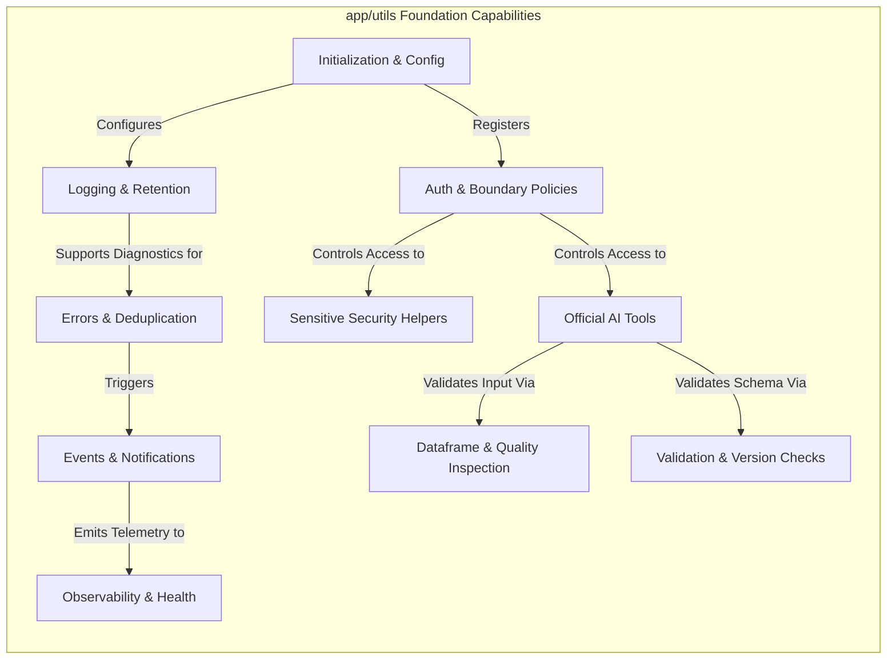

# Utils Foundation — Intended Workflows and Scenarios

## 1. Document Purpose
This document reverse-engineers the isolated architecture requirements defined in [01-utils.md](file:///c:/Users/rharu/AppDev/HaruquantAI/docs/dev/phase-implementation-plan/01-utils.md) into a set of cohesive, actor-driven, end-to-end operational workflows and scenarios. It defines how technical primitives, modules, and boundary policies cooperate to deliver reliable outcomes, handle operational failures, and maintain security and governance across the HaruQuantAI platform.

---

## 2. Source and Analysis Boundaries
* **Source of Truth**: This analysis is strictly derived from the requirements, boundaries, DTO schemas, and non-functional constraints in [01-utils.md](file:///c:/Users/rharu/AppDev/HaruquantAI/docs/dev/phase-implementation-plan/01-utils.md).
* **Constraints**: No source code from the active repository was inspected or assumed to exist. No domain behavior (e.g., active trading strategies, live broker connections, or LLM capabilities) was invented.
* **Terminology & Assertions**: All explicit requirements are marked with their corresponding `UTIL-FR-*`, `UTIL-NFR-*`, or `UTIL-EX-*` tags. Implied system behaviors necessary to connect isolated requirements are clearly marked:
  > **Inferred workflow connection — requires validation**

---

## 3. System Purpose and Scope
### Primary Purpose
The `app/utils` module represents the shared, dependency-light foundation for deterministic technical primitives in HaruQuantAI (`UTIL-FR-116`). It provides standard envelopes, structured logging, clock normalization, safe path resolution, event distribution, notification routing, and telemetry reporting.

### Scope Boundaries
* **In-Scope**: Structured JSON/console logging, standard tool envelopes, UTC timestamp normalization, safe path traversal and directory creation, read-only dataframe transformations and comparisons, stateless data-quality audits (OHLCV inspection), schema validations, denylist-first redaction, Argon2id hashing, Fernet symmetric encryption, settings loading/injection, authorization helper checks, in-process Event Bus, notification routing/throttling, and observability/metrics/health snapshots.
* **Out-of-Scope**: Trading strategy logic, live broker execution, risk/allocation approval, portfolio decisions, database repositories, backtest engines, market data repair/cleaning/resampling, external identity provider ownership, and production-ready broker-backed event queues (e.g., RabbitMQ, Kafka) (`UTIL-FR-019`, `UTIL-FR-020`, `UTIL-FR-021`).

### Entry and Exit Points
* **Entry Points**:
  * Agent-callable public wrappers (`validate_ohlcv_quality`, `validate_handoff_payload`, `redact_mapping`) (`UTIL-FR-022`, `public_tools.py`).
  * In-process Event Bus publish APIs (`EventBus.publish`) (`UTIL-FR-127`).
  * Runtime settings loading triggers (`load_runtime_settings`) (`UTIL-FR-109`).
  * Telemetry monitoring loops (clock drift checks, log rotation) (`UTIL-NFR-007`, `UTIL-FR-007`).
* **Exit Points**:
  * Output envelopes returned to callers (`ToolResponse`) (`UTIL-FR-023`).
  * Structured JSON logs written to stdout or rotated files (`UTIL-FR-002`, `UTIL-FR-006`).
  * Outbound notifications (emails, Telegram messages, OS desktop alerts) via lazy-loaded adapters (`UTIL-FR-141`).
  * Telemetry metrics exported to Prometheus text endpoint (`UTIL-NFR-001`).

### Persistent Stores
* **Log files**: Configured rotating files on the local filesystem (`UTIL-FR-006`).
* **Event Idempotency Cache**: Bounded, in-memory duplicate tracker (`UTIL-FR-130`).

---

## 4. Actors and Responsibilities
| Actor | Role | Initiates | Information Provided | Outcomes Received | Prohibited Actions |
|---|---|---|---|---|---|
| **Authorized Agent / Caller** | AI agent or higher-level business API | Official tool calls (`validate_ohlcv_quality`, etc.) | Input payloads, target schemas, context | Standard `ToolResponse` envelope | Directly calling low-level functions (e.g. encrypting data or creating paths) without authorization (`UTIL-FR-022`, `UTIL-FR-097`) |
| **System Component / Publisher** | Internal module publishing events | Event publication | Sanitized event payloads, metadata, correlation IDs | `DeliveryResult` (success/failure metrics) | Mutating shared payloads post-publish (`UTIL-FR-134`) |
| **Monitoring Scheduler / Cron** | OS cron or background scheduler | Observability checks (clock drift, retention) | Check intervals | Health status updates, warnings, pruned disk space | Accessing credentials or business data |
| **System Operator / Maintainer** | Human operator or automated monitor | Logging configuration, system boots | Settings files (`.env`), CLI flags | Dashboards, raw logs, active alert messages | Bypassing hard-coded code validations |
| **Security Reviewer** | Auditor verifying system safety | Allowlist audits, redaction audits | Redaction allowlist definitions | Redacted audit trails, compliance logs | Disabling redaction filters for non-trusted context (`UTIL-FR-101`) |

---

## 5. Capability Map


---

## 6. Workflow Catalogue
1. **WF-001 — Official AI Tool Execution (Boundary Lifecycle)** (Primary business workflow): Coordinates the secure, validated execution of official agent tools behind deny-by-default access control, returning standardized JSON envelopes and recording logs and metrics.
2. **WF-002 — In-Process Event Publication and Delivery** (Supporting workflow): Distributes event envelopes to registered handlers with concurrency safety, duplicate detection (idempotency), retry policy logic, and dead-letter queue escalation.
3. **WF-003 — Technical Failure Error Routing and Notification Delivery** (Monitoring/Recovery workflow): Intercepts exceptions, deduplicates alerts, and routes them to email, Telegram, and desktop channels protected by provider-specific circuit breakers.
4. **WF-004 — Runtime Settings Loading and Application Initialization** (Lifecycle workflow): Resolves immutable settings from multiple precedence tiers, validates directory path configurations, and initializes structured log handlers idempotently.
5. **WF-005 — Stateless Data Quality Audit (OHLCV Inspection)** (Primary business workflow): Statelessly audits pandas DataFrames, scoring price/volume relationships and formatting truncated diagnostic issue lists.
6. **WF-006 — Handoff Payload and Schema Validation** (Primary business workflow): Evaluates structured payload blocks against schemas, ensuring semantic version compatibility and resource limit boundaries.
7. **WF-007 — Wall-Clock Drift Monitoring and Alerting** (Monitoring workflow): Measures host time deviation against NTP/system providers, updating component health check status.
8. **WF-008 — Bounded Path Resolution and Directory Creation** (Supporting workflow): Computes safe rooted path traversals and creates subdirectories with platform-safe permissions.
9. **WF-009 — Log Rotation and Retention Cleanup** (Lifecycle workflow): Housekeeps local disk space by pruning old rotated log files strictly bounded to a configured log root.

---

## 7. Detailed End-to-End Workflows

### WF-001 — Official AI Tool Execution (Boundary Lifecycle)
#### Purpose and Value
Ensures that all AI agent tool invocations are explicitly authorized, traced using request/correlation identifiers, executed within standard envelope boundaries, and logged without leaking credentials (`UTIL-FR-022`–`UTIL-FR-026`).

#### Actors
* **Primary**: Authorized Agent / Caller
* **Supporting**: None

#### Trigger
An agent executes a public utility tool wrapper in `public_tools.py` (`validate_ohlcv_quality`, `validate_handoff_payload`, or `redact_mapping`).

#### Preconditions
* The logger must be initialized and configured (`configure_logging`) (`UTIL-FR-001`).
* Runtime configurations (tool allowlists, environments) are resolved (`load_runtime_settings`) (`UTIL-FR-108`).

#### Inputs
* Tool function payload arguments.
* Optional `request_id` (`UTIL-FR-055`).
* Active `AuthContext` containing principal IDs, roles, and permissions (`UTIL-FR-118`).

#### Main Success Flow
| Step | Responsible component | Action | Input | Validation or decision | State change | Output | Requirement IDs |
| :--- | :--- | :--- | :--- | :--- | :--- | :--- | :--- |
| 1 | `public_tools` | Receives execution command | Payload, context, optional `request_id` | Check if target wrapper is officially registered | None | Wrapper execution trigger | `UTIL-FR-022`, `UTIL-FR-026` |
| 2 | `contracts.tool_boundary` | Resolves/generates request identifier | Optional `request_id` | If `request_id` is missing or malformed, generate a UUIDv4 | None | Verified `request_id` | `UTIL-FR-051`, `UTIL-FR-055` |
| 3 | `auth.authorization` | Evaluates caller privileges | `AuthContext`, tool name, tool permissions | **Decision Point**: Verify caller is in allowlist and has required scopes/roles. Fail-closed if denied. | None | Allowed decision | `UTIL-FR-119`–`UTIL-FR-122` |
| 4 | `logging.lifecycle` | Logs tool initiation | Tool name, redacted metadata, `request_id` | Redact sensitive details in metadata | Emit log record | Start log event | `UTIL-FR-010`, `UTIL-FR-015`, `UTIL-FR-101` |
| 5 | `contracts.tool_boundary` | Starts monotonic timer | None | None | None | Start timestamp | `UTIL-FR-024` |
| 6 | Target capability module | Executes stateless code | Payload data | Apply internal schema rules | None | Raw results or exceptions | `UTIL-FR-025`, `UTIL-FR-075` |
| 7 | `contracts.tool_boundary` | Captures outcomes and stops timer | Start timestamp, results | If execution raised an error, run error mapping | None | Raw execution time (`execution_ms`) | `UTIL-FR-024`, `UTIL-FR-025`, `UTIL-FR-039` |
| 8 | `contracts.tool_response` | Constructs success envelope | Results, `request_id`, execution metrics | Validate envelope properties (top-level keys) | None | `ToolResponse` object | `UTIL-FR-023`, `UTIL-FR-026`, `UTIL-FR-055` |
| 9 | `logging.lifecycle` | Logs tool completion | Tool name, `ToolMetadata` | Confirm no passwords or secrets leak | Emit log record | Completion log event | `UTIL-FR-010`, `UTIL-FR-015` |
| 10 | `observability.metrics` | Records telemetry | `ToolMetadata`, `ToolResponse` | Confirm labels do not exceed cardinality | Update registry | Telemetry records | `UTIL-NFR-002`, `UTIL-NFR-004`, `UTIL-NFR-009` |
| 11 | `public_tools` | Returns envelope to caller | `ToolResponse` | None | None | JSON-compatible string | `UTIL-FR-023`, `UTIL-FR-025` |

#### Decision Points
* **Caller Authorization**: Evaluated at Step 3 by `auth.authorization.authorize`. If the context is missing, malformed, or the principal lacks roles/scopes/tool permissions, the workflow switches immediately to **Alternate Flow A (Access Denied)** (`UTIL-FR-119`). Fails closed by default.
* **Exceptions mapping**: Evaluated at Step 7. If the business capability throws an exception, `contracts.tool_boundary.map_tool_exception` checks if the error inherits from the custom `Error` class. If not, it maps to `UNKNOWN_ERROR` / `TOOL_EXECUTION_FAILED` (`UTIL-FR-039`, `UTIL-FR-040`).

#### Alternate Flows
* **Alternate Flow A (Access Denied)**:
  1. Step 3 detects invalid permissions.
  2. `auth.authorization` generates a denied `AuthorizationDecision` containing a sanitized reason (`UTIL-FR-122`).
  3. `contracts.tool_response` builds an error envelope mapping the failure to `PERMISSION_DENIED`, `INVALID_AUTH_CONTEXT`, or `AUTHORIZATION_FAILED` (`UTIL-FR-121`).
  4. `logging.lifecycle` logs the unauthorized event.
  5. `observability.metrics` records the failure.
  6. The error envelope is returned. Workflow exits.
* **Alternate Flow B (Sensitive Support Helper Call)**:
  * For low-level functions (e.g. data encryption/decryption, password utilities) which are not auto-attached to agents, the system requires an explicit permission check (`security.sensitive_utility`) and auditable execution logging (`UTIL-FR-120`).

#### Failure and Exception Flows
* **Tool execution error**:
  * *Trigger*: Target capability throws a database, runtime, or network exception.
  * *Detection*: Caught by `contracts.tool_boundary.run_official_tool`.
  * *Response*: Translates exception into a `ToolError` object, populating standard codes (`INVALID_INPUT`, `CIRCUIT_OPEN`, etc.) while ensuring raw tracebacks or secret key material are redacted (`UTIL-FR-025`, `UTIL-FR-039`, `UTIL-FR-101`). Returns an error envelope.
* **Metrics recording failure**:
  * *Trigger*: `MetricRegistry` fails to update due to cardinality or bounds validation error.
  * *Response*: Best-effort metrics handling prevents registry errors from failing the caller's execution (`UTIL-NFR-009`).

#### Recovery Flow
Since this workflow is stateless and read-only, recovery requires the caller to correct inputs or authentication credentials and re-invoke the tool.

#### Postconditions
* A `ToolResponse` envelope is returned to the client (`UTIL-FR-023`).
* Start, validation, completion, or failure events are recorded in log sinks (`UTIL-FR-010`).
* Tool metrics (call count, execution duration, failure counts) are incremented (`UTIL-NFR-002`).

#### Participating Components
* **Entry Point**: `public_tools.py`
* **Orchestrator**: `contracts/tool_boundary.py`
* **Validators**: `validation/`, `identity/validators.py`, `auth/authorization.py`
* **Decision Authorities**: `auth/authorization.py`
* **Executors**: Target modules (`quality`, `validation`, `security`)
* **Persistence Components**: None
* **Monitoring Components**: `observability/metrics.py`, `logging/lifecycle.py`
* **External Dependencies**: None

---

## 8. Scenario Catalogue

| Scenario ID | Scenario | Given | When | Then | Expected state | Requirement IDs |
| :--- | :--- | :--- | :--- | :--- | :--- | :--- |
| **WF-001-SC-001** | Happy Path Tool Run | Active valid `AuthContext`, registered official tool `validate_ohlcv_quality` | The tool is invoked with a valid data payload | The tool execution completes, standard envelope is built with metadata and duration | State remains healthy; metrics incremented | `UTIL-FR-023`, `UTIL-FR-025`, `UTIL-FR-026`, `UTIL-FR-055` |
| **WF-001-SC-002** | Unauthorized Agent Call | An agent context missing permissions for a tool | The agent invokes the tool | The wrapper rejects execution immediately returning `PERMISSION_DENIED` envelope | State is blocked/fail-closed; logs emitted | `UTIL-FR-119`–`UTIL-FR-121` |
| **WF-001-SC-003** | Unexpected Boundary Error | Valid agent context, but capability throws unexpected exception | The tool runs and throws a DB error | The boundary catches the error and maps it safely to `TOOL_EXECUTION_FAILED` without leaking tracebacks | State is healthy; error logs are written | `UTIL-FR-025`, `UTIL-FR-039`, `UTIL-FR-101` |
| **WF-002-SC-001** | Happy Path Event Delivery | Subscribed handler registered, unique event published | Publisher publishes event to Event Bus | Event is delivered to subscribers in deterministic order | Backlog returns to 0; cache populated | `UTIL-FR-129`, `UTIL-FR-130`, `UTIL-FR-139` |
| **WF-002-SC-002** | Subscriber Error Isolation | Multiple subscribers registered, one subscriber throws exception | Event is published | The failing handler is isolated; the other handler runs successfully; error is routed | Failing handler logged; Event Bus continues | `UTIL-FR-129`, `UTIL-FR-136` |
| **WF-002-SC-003** | Idempotency Key Match | Duplicate event published with the same `idempotency_key` | Event is published | The Event Bus returns the cached result without executing handlers again | State is unchanged; duplicate metrics updated | `UTIL-FR-130` |
| **WF-002-SC-004** | Idempotency Key Conflict | Same `idempotency_key` published, but payload hashes differ | Event is published | The system fails closed, rejecting the publish with conflict diagnostics | State is unchanged; conflict warning logged | `UTIL-FR-130` |
| **WF-002-SC-005** | Queue Backpressure | In-process queue depth exceeds max size under `fail_fast` | Event is published | The Event Bus rejects the event immediately, returning `QUEUE_FULL` | Queue depth remains maxed; error returned | `UTIL-FR-132`, `UTIL-FR-136` |
| **WF-003-SC-001** | Throttled Alerts (Alert Storm) | 50 identical error notifications triggered within 1 second | System routes notifications | Throttling mechanism deduplicates messages, routing only the first, suppressing the rest | Suppression metrics incremented | `UTIL-FR-144`, `UTIL-FR-150` |
| **WF-003-SC-002** | Outbound Circuit Open | Notifications fail continuously due to provider timeout | Notifications are triggered | The circuit breaker transitions to `open`; subsequent calls fail fast with `CIRCUIT_OPEN` | Outbound calls blocked; health degrades | `UTIL-FR-146`, `UTIL-FR-151`, `UTIL-NFR-008` |
| **WF-003-SC-003** | Template Rendering Fallback | Template renderer fails due to malformed payload | Message is compiled | The system generates a plain-text backup summary without throwing a crash | plain text alerts dispatched | `UTIL-FR-143`, `UTIL-FR-154` |
| **WF-004-SC-001** | Strict Settings Validation Fail | CLI options contain invalid environment name, `strict_validation=True` | settings are loaded | Validation fails, throwing `ConfigurationError` and stopping system boot | Halts boot sequence | `UTIL-FR-111` |
| **WF-005-SC-001** | Clean OHLCV Inspection | Input dataframe contains standard valid columns | `validate_ohlcv_quality` called | Scored `100.0`, returns success envelope with `passed=True` | State is healthy | `UTIL-FR-075`, `UTIL-FR-080`, `UTIL-FR-083` |
| **WF-005-SC-002** | Missing Mandatory Columns | Input dataframe lacks `close` price column | `validate_ohlcv_quality` called | Returns `INVALID_INPUT` in error code, payload not mutated | State is healthy | `UTIL-FR-076` |
| **WF-005-SC-003** | Dataset Quality Truncation | Input dataframe has 10,000 bad rows | `validate_ohlcv_quality` called | Report is compiled but issue lists are sliced to configured limits | Truncation flags set to `True` | `UTIL-FR-081`, `UTIL-FR-085` |
| **WF-006-SC-001** | Handoff Version Compatibility Fail | Payload major version is `2.0.0`, schema version is `1.2.0` | `validate_handoff_payload` called | Returns `VALIDATION_FAILED` version mismatch error | State is healthy | `UTIL-FR-089` |
| **WF-007-SC-001** | Clock Drift Degraded State | Monitored system clock offset is `5.0` seconds (threshold `2.0`s) | Drift check triggered | Health snapshot transitions to degraded; warnings published to Event Bus | Health degraded; warning events emitted | `UTIL-NFR-007` |
| **WF-007-SC-002** | Offset Provider Unavailable | No time synchronization socket or provider config available | Drift check triggered | Monitor reports status explicitly as `unsupported`/`not_configured` | Health set to unsupported (never healthy) | `UTIL-NFR-007` |
| **WF-008-SC-001** | Path Traversal Attempt | Target path contains relative parent escapes `../../etc` | `ensure_dir` called with `base_dir` | Traversal check blocks execution, raising `ValidationError` | Folder creation blocked; fails closed | `UTIL-FR-067` |
| **WF-009-SC-001** | Retention Pruning Filesystem Fail | Rotated log files are locked by OS process during cleanup | Retention routine triggered | Log deletion fails, exception caught safely, console fallback logs written | Fallback logs emitted; system does not crash | `UTIL-FR-008` |

---

## 9. Workflow Relationship Map
| Source workflow | Relationship | Target workflow | Trigger or condition |
| :--- | :--- | :--- | :--- |
| **WF-001** (Tool Execution) | Invokes (Child) | **WF-005** (Data Quality Audit) | When the caller calls `validate_ohlcv_quality` |
| **WF-001** (Tool Execution) | Invokes (Child) | **WF-006** (Payload Validation) | When the caller calls `validate_handoff_payload` |
| **WF-001** (Tool Execution) | Invokes (Child) | **WF-008** (Path Resolution) | When configuring logging sinks |
| **WF-002** (Event Bus) | Invokes (Child) | **WF-003** (Error Routing) | On subscriber execution failure |
| **WF-003** (Error Routing) | Invokes (Child) | **WF-002** (Event Bus) | To publish notification outcome events |
| **WF-004** (Settings Load) | Invokes (Child) | **WF-008** (Path Resolution) | To resolve data, cache, and audit directories |
| **WF-004** (Settings Load) | Invokes (Child) | **WF-009** (Log Rotation) | During idempotent configuration of file handlers |
| **WF-007** (Drift Monitor) | Invokes (Child) | **WF-002** (Event Bus) | To publish `CLOCK_DRIFT_DETECTED` warning events |

---

## 10. System Lifecycle and State Transitions
While the `app/utils` foundation is a collection of utilities, it coordinates the lifecycle of several internal stateful systems:

### 1. Circuit Breaker State Lifecycle (`observability.circuit_breaker`)
Tracks the operational status of external notification adapters (`UTIL-FR-146`, `UTIL-FR-151`, `UTIL-NFR-008`).
* **States**: `CLOSED`, `OPEN`, `HALF-OPEN`
* **Transitions**:
  * `CLOSED` $\rightarrow$ `OPEN`: Triggered when consecutive failures/timeouts cross `failure_threshold` limits.
  * `OPEN` $\rightarrow$ `HALF-OPEN`: Triggered when a cooldown window expires.
  * `HALF-OPEN` $\rightarrow$ `CLOSED`: Triggered when test calls succeed.
  * `HALF-OPEN` $\rightarrow$ `OPEN`: Triggered when any test call fails.

### 2. In-Process Event Bus Queue Lifecycle (`events.in_process`)
Coordinates backpressure and message flows (`UTIL-FR-131`, `UTIL-FR-132`).
* **States**: `IDLE` (no events), `PROCESSING` (delivery active), `BACKPRESSURE` (queue limits hit)
* **Transitions**:
  * `IDLE` $\rightarrow$ `PROCESSING`: Triggered when an event is enqueued.
  * `PROCESSING` $\rightarrow$ `BACKPRESSURE`: Triggered when backlog size equals queue capacity.
  * `BACKPRESSURE` $\rightarrow$ `PROCESSING`: Triggered when subscribers consume events and depth falls.

### 3. Log File Rotation Lifecycle (`logging.retention`)
Enforces storage safety limits (`UTIL-FR-007`).
* **States**: `WRITING` (active log file), `ROTATED` (backup suffix appended), `PRUNED` (old files deleted)

---

## 11. Cross-Module Interaction Matrix
How different components interact during execution.

```text
                  [public_tools]
                        |
                        v
                 [tool_boundary]
                  /     |     \
                 /      |      \
                v       v       v
           [auth]  [validation] [logging.lifecycle]
                        |               |
                        v               v
                [canonical_json]   [safe_paths]
                        |               |
                        v               v
                [security.redact]  [retention]
```

* **contracts/tool_boundary** sits between the external caller and the capability kernels, calling **auth** context verification, validating inputs via **validation**, capturing metrics, and formatting results.
* **security/redaction** is imported transitively by **logging**, **errors**, **events**, and **notifications** to ensure no credentials escape boundaries.

---

## 12. Requirements-to-Workflow Traceability Matrix

| Requirement ID | Requirement Summary | Workflow IDs | Scenario IDs | Workflow Step Numbers | Coverage Status |
| :--- | :--- | :--- | :--- | :--- | :--- |
| **UTIL-FR-001** | Expose project-wide logger, config functions | WF-004 | WF-004-SC-001 | Step 5 | Fully represented |
| **UTIL-FR-002** | Structured JSON & colorized human console log | WF-001, WF-004 | WF-001-SC-001 | Step 4, Step 9 | Fully represented |
| **UTIL-FR-003** | Log fields (timestamps, trace IDs, errors) | WF-001, WF-003 | WF-001-SC-001 | Step 9 | Fully represented |
| **UTIL-FR-004** | Support child loggers, prevent duplicate handlers | WF-004 | WF-004-SC-001 | Step 5 | Fully represented |
| **UTIL-FR-005** | Restrict config to explicit load calls | WF-004 | WF-004-SC-001 | Step 5 | Fully represented |
| **UTIL-FR-006** | Opt-in file logging to safe-path normalized roots | WF-004, WF-009 | WF-004-SC-001 | Step 5, Step 1 | Fully represented |
| **UTIL-FR-007** | Configurable rotating logs & bounded retention prune | WF-009 | WF-009-SC-001 | Step 1, Step 2, Step 3| Fully represented |
| **UTIL-FR-008** | Log fails degrade safely, never write secrets | WF-009, WF-004 | WF-009-SC-001 | Step 4 | Fully represented |
| **UTIL-FR-009** | Log level controllable by settings | WF-004 | WF-004-SC-001 | Step 5 | Fully represented |
| **UTIL-FR-010** | Log tool calls, successes, failures, traces | WF-001 | WF-001-SC-001 | Step 4, Step 9 | Fully represented |
| **UTIL-FR-011** | Log Event Bus publishes, subscriber errors, DLQs | WF-002 | WF-002-SC-001 | Step 8 | Fully represented |
| **UTIL-FR-012** | Log notification routing outcomes, redacted | WF-003 | WF-003-SC-001 | Step 10 | Fully represented |
| **UTIL-FR-013** | Log auth validation & authorization decisions | WF-001, WF-004 | WF-001-SC-002 | Step 3, Step 4 | Fully represented |
| **UTIL-FR-014** | Log metrics/health failure events | WF-007 | WF-007-SC-002 | Step 6 | Fully represented |
| **UTIL-FR-015** | Production logs never write sensitive secrets | WF-001, WF-004 | WF-001-SC-003 | Step 4, Step 9 | Fully represented |
| **UTIL-FR-016** | Logging thread-safety and low overhead | WF-001, WF-004 | WF-001-SC-001 | Step 9 | Fully represented |
| **UTIL-FR-017** | Document log fields | None | None | None | Supporting constraint |
| **UTIL-FR-018** | Verify log test criteria | None | None | None | Supporting constraint |
| **UTIL-FR-019** | Scope utilities as light foundation layer | None | None | None | Supporting constraint |
| **UTIL-FR-020** | Prohibit utilities from live trading execution | None | None | None | Supporting constraint |
| **UTIL-FR-021** | Reserve data repair and resampling for data domain | None | None | None | Supporting constraint |
| **UTIL-FR-022** | Public name classification (Tool vs Helper) | WF-001, WF-005 | WF-001-SC-001 | Step 1 | Fully represented |
| **UTIL-FR-023** | standard tool envelope keys (status, data, error) | WF-001, WF-005 | WF-001-SC-001 | Step 8 | Fully represented |
| **UTIL-FR-024** | calculation of `execution_ms` | WF-001 | WF-001-SC-001 | Step 5, Step 7 | Fully represented |
| **UTIL-FR-025** | Input validation, standard errors, no silent fails | WF-001, WF-005 | WF-001-SC-003 | Step 6, Step 8, Step 11| Fully represented |
| **UTIL-FR-026** | Agent attachment limits and data quality envelopes | WF-001, WF-005 | WF-001-SC-001 | Step 1, Step 10 | Fully represented |
| **UTIL-FR-027** | Canonical JSON strings | WF-002, WF-006 | WF-002-SC-001 | Step 1, Step 5 | Fully represented |
| **UTIL-FR-028** | Domain error mapping compatibility | WF-001 | WF-001-SC-003 | Step 7 | Fully represented |
| **UTIL-FR-029** | Document public function signatures | None | None | None | Supporting constraint |
| **UTIL-FR-030** | Provide runnable usage examples | None | None | None | Supporting constraint |
| **UTIL-FR-031** | Engineering baselines (typing, validation, purity)| None | None | None | Supporting constraint |
| **UTIL-FR-032** | Optional dependencies don't break import | WF-004 | WF-004-SC-002 | Step 3 | Fully represented |
| **UTIL-FR-033** | Diagnostic-only data-quality properties | WF-005 | WF-005-SC-001 | Step 4, Step 5 | Fully represented |
| **UTIL-FR-034** | Bounded diagnostic outputs (truncation, limits) | WF-002, WF-005 | WF-005-SC-003 | Step 8 | Fully represented |
| **UTIL-FR-035** | Fast fail on open circuit state | WF-003 | WF-003-SC-002 | Step 7 | Fully represented |
| **UTIL-FR-036** | Maintain 80% line test coverage | None | None | None | Supporting constraint |
| **UTIL-FR-037** | Deterministic error catalog types | WF-001, WF-003 | WF-001-SC-003 | Step 7, Step 1 | Fully represented |
| **UTIL-FR-038** | resolve unknown error codes to fallbacks | WF-001 | WF-001-SC-003 | Step 7 | Fully represented |
| **UTIL-FR-039** | Map third-party errors safely to default codes | WF-001 | WF-001-SC-003 | Step 7 | Fully represented |
| **UTIL-FR-040** | Allow native errors in helpers, fail closed on API | WF-001, WF-003 | WF-001-SC-003 | Step 7, Step 1 | Fully represented |
| **UTIL-FR-041** | central error-code catalogue constants | WF-002, WF-003 | WF-002-SC-005 | Step 1, Step 5 | Fully represented |
| **UTIL-FR-042** | Document exception throwing properties | None | None | None | Supporting constraint |
| **UTIL-FR-043** | Verify error tests | None | None | None | Supporting constraint |
| **UTIL-FR-044** | Error routing, severity evaluation, formatting | WF-003 | WF-003-SC-001 | Step 1 | Fully represented |
| **UTIL-FR-045** | error deduplication and suppression rules | WF-003 | WF-003-SC-001 | Step 2 | Fully represented |
| **UTIL-FR-046** | suppress alert storms | WF-003 | WF-003-SC-001 | Step 2 | Fully represented |
| **UTIL-FR-047** | route events to Event Bus | WF-003 | WF-003-SC-001 | Step 9 | Fully represented |
| **UTIL-FR-048** | notification settings routing mappings | WF-003 | WF-003-SC-001 | Step 3 | Fully represented |
| **UTIL-FR-049** | Document error routing rules | None | None | None | Supporting constraint |
| **UTIL-FR-050** | Verify error routing tests | None | None | None | Supporting constraint |
| **UTIL-FR-051** | Expose request ID and prefix verification | WF-001 | WF-001-SC-001 | Step 2 | Fully represented |
| **UTIL-FR-052** | prefix matching for IDs | WF-001 | WF-001-SC-001 | Step 2 | Fully represented |
| **UTIL-FR-053** | version validation rules | WF-006 | WF-006-SC-001 | Step 2 | Fully represented |
| **UTIL-FR-054** | trace propagation contracts | WF-001 | WF-001-SC-001 | Step 2 | Fully represented |
| **UTIL-FR-055** | Tool wrapper request ID verification | WF-001 | WF-001-SC-001 | Step 2, Step 8 | Fully represented |
| **UTIL-FR-056** | Document ID format schemas | None | None | None | Supporting constraint |
| **UTIL-FR-057** | Verify identity tests | None | None | None | Supporting constraint |
| **UTIL-FR-058** | UTC normalization helpers | WF-006 | WF-006-SC-001 | Step 5 | Fully represented |
| **UTIL-FR-059** | Reject timezone-naive inputs | WF-005, WF-006 | WF-005-SC-001 | Step 3, Step 5 | Fully represented |
| **UTIL-FR-060** | validate monotonic sequences | WF-005 | WF-005-SC-001 | Step 3 | Fully represented |
| **UTIL-FR-061** | calculate duration metrics | WF-001 | WF-001-SC-001 | Step 7 | Fully represented |
| **UTIL-FR-062** | UTC-first import normalization | None | None | None | Supporting constraint |
| **UTIL-FR-063** | staleness freshness validation checks | WF-006 | WF-006-SC-001 | Step 5 | Fully represented |
| **UTIL-FR-064** | Document datetime contracts | None | None | None | Supporting constraint |
| **UTIL-FR-065** | Verify datetime tests | None | None | None | Supporting constraint |
| **UTIL-FR-066** | Path normalization, ensure directory | WF-008 | WF-008-SC-001 | Step 1, Step 3 | Fully represented |
| **UTIL-FR-067** | Traversal containment checks, permissions | WF-008 | WF-008-SC-001 | Step 2, Step 3 | Fully represented |
| **UTIL-FR-068** | Imports do not mutate filesystems | None | None | None | Supporting constraint |
| **UTIL-FR-069** | Verify path tests | None | None | None | Supporting constraint |
| **UTIL-FR-070** | Dataframe alignment, comparisons, chunking | WF-005 | WF-005-SC-001 | Step 3 | Fully represented |
| **UTIL-FR-071** | Return native types, ISO timestamps in serial | WF-005, WF-006 | WF-005-SC-001 | Step 3, Step 5 | Fully represented |
| **UTIL-FR-072** | Lazy pandas imports | WF-004, WF-005 | WF-005-SC-002 | Step 3, Step 1 | Fully represented |
| **UTIL-FR-073** | Clear errors on missing columns/indices | WF-005 | WF-005-SC-002 | Step 2 | Fully represented |
| **UTIL-FR-074** | Verify dataframe tests | None | None | None | Supporting constraint |
| **UTIL-FR-075** | Stateless read-only diagnostics (OHLCV) | WF-005 | WF-005-SC-001 | Step 1 | Fully represented |
| **UTIL-FR-076** | Confirm DF type and required columns | WF-005 | WF-005-SC-002 | Step 2 | Fully represented |
| **UTIL-FR-077** | Monotonicity duplicates & timestamp gaps | WF-005 | WF-005-SC-001 | Step 3 | Fully represented |
| **UTIL-FR-078** | Price limits, spreads, volumes validation | WF-005 | WF-005-SC-001 | Step 4 | Fully represented |
| **UTIL-FR-079** | Detect flatline, spikes, NaNs | WF-005 | WF-005-SC-001 | Step 5 | Fully represented |
| **UTIL-FR-080** | Penalty scoring thresholds (critical/error) | WF-005 | WF-005-SC-001 | Step 7, Step 9 | Fully represented |
| **UTIL-FR-081** | Cap issue count and sample limit truncation | WF-005 | WF-005-SC-003 | Step 8 | Fully represented |
| **UTIL-FR-082** | context mismatch tags (SYMBOL_MISMATCH) | WF-005 | WF-005-SC-002 | Step 6 | Fully represented |
| **UTIL-FR-083** | standard envelope quality parameters returned | WF-005 | WF-005-SC-001 | Step 2, Step 10 | Fully represented |
| **UTIL-FR-084** | Performance targets (1k vs 100k rows) | WF-005 | WF-005-SC-001 | Step 2 | Fully represented |
| **UTIL-FR-085** | Verify quality tests | None | None | None | Supporting constraint |
| **UTIL-FR-086** | validate numeric range & required fields | WF-006 | WF-006-SC-001 | Step 6 | Fully represented |
| **UTIL-FR-087** | validate price limits and ranges | WF-006 | WF-006-SC-001 | Step 1 | Fully represented |
| **UTIL-FR-088** | required schema fields, reject extras | WF-006 | WF-006-SC-001 | Step 3 | Fully represented |
| **UTIL-FR-089** | Semantic version compatibility gates | WF-006 | WF-006-SC-001 | Step 2 | Fully represented |
| **UTIL-FR-090** | Format paths to JSON Pointer errors | WF-006 | WF-006-SC-001 | Step 4 | Fully represented |
| **UTIL-FR-091** | localized domain schema validation definitions | WF-006 | WF-006-SC-001 | Step 5 | Fully represented |
| **UTIL-FR-092** | validation limits (depth, payload bytes) | WF-006 | WF-006-SC-001 | Step 1 | Fully represented |
| **UTIL-FR-093** | normalize enum values to canonical strings | WF-006 | WF-006-SC-001 | Step 5, Step 6 | Fully represented |
| **UTIL-FR-094** | Validator performance limits | WF-006 | WF-006-SC-001 | Step 1 | Fully represented |
| **UTIL-FR-095** | Document validation schemas | None | None | None | Supporting constraint |
| **UTIL-FR-096** | Verify validation tests | None | None | None | Supporting constraint |
| **UTIL-FR-097** | security utilities catalog | WF-001 | WF-001-SC-001 | Step 6 | Fully represented |
| **UTIL-FR-098** | Case-insensitive secret key detection denylist | WF-001, WF-003 | WF-001-SC-003 | Step 4, Step 1 | Fully represented |
| **UTIL-FR-099** | auditable key allowlists | WF-001, WF-003 | WF-001-SC-003 | Step 4, Step 1 | Fully represented |
| **UTIL-FR-100** | Recursion depth limits for mapping redactions | WF-001, WF-003 | WF-001-SC-003 | Step 4, Step 1 | Fully represented |
| **UTIL-FR-101** | Redact secrets before log/event serialization | WF-001, WF-003 | WF-001-SC-003 | Step 4, Step 1 | Fully represented |
| **UTIL-FR-102** | Hashing passwords using Argon2id | WF-001 | WF-001-SC-001 | Step 6 | Fully represented |
| **UTIL-FR-103** | Symmetric Fernet cryptography loaders | WF-001 | WF-001-SC-001 | Step 6 | Fully represented |
| **UTIL-FR-104** | highest active secret version selection | WF-001 | WF-001-SC-001 | Step 6 | Fully represented |
| **UTIL-FR-105** | protect logs against infinite loops | WF-001, WF-003 | WF-001-SC-003 | Step 4, Step 1 | Fully represented |
| **UTIL-FR-106** | Document key safety | None | None | None | Supporting constraint |
| **UTIL-FR-107** | Verify security tests | None | None | None | Supporting constraint |
| **UTIL-FR-108** | Runtime settings parameters constants | WF-004 | WF-004-SC-001 | Step 3, Step 4 | Fully represented |
| **UTIL-FR-109** | Load settings with explicit precedence | WF-004 | WF-004-SC-001 | Step 1 | Fully represented |
| **UTIL-FR-110** | Inject settings into target mappings | WF-004 | WF-004-SC-001 | Step 6 | Fully represented |
| **UTIL-FR-111** | validate settings, strict warning escalation | WF-004 | WF-004-SC-001 | Step 3, Step 4 | Fully represented |
| **UTIL-FR-112** | resolve home directories under HARUQUANT_HOME | WF-004 | WF-004-SC-001 | Step 2 | Fully represented |
| **UTIL-FR-113** | configurable settings mapping parameters | WF-004 | WF-004-SC-001 | Step 3 | Fully represented |
| **UTIL-FR-114** | Surfacing config errors clearly | WF-004 | WF-004-SC-002 | Step 3 | Fully represented |
| **UTIL-FR-115** | Verify settings tests | None | None | None | Supporting constraint |
| **UTIL-FR-116** | utils package boundary role statement | None | None | None | Supporting constraint |
| **UTIL-FR-117** | actor models definitions | None | None | None | Supporting constraint |
| **UTIL-FR-118** | shared internal auth context properties | WF-001 | WF-001-SC-001 | Step 3 | Fully represented |
| **UTIL-FR-119** | authorization checker deny-by-default logic | WF-001 | WF-001-SC-002 | Step 3 | Fully represented |
| **UTIL-FR-120** | Agent tool allowlist & sensitive utility check | WF-001 | WF-001-SC-002 | Step 3 | Fully represented |
| **UTIL-FR-121** | Map authorization errors to PERMISSION_DENIED | WF-001 | WF-001-SC-002 | Step 3 | Fully represented |
| **UTIL-FR-122** | accept auth context mapping, return decisions | WF-001 | WF-001-SC-002 | Step 3 | Fully represented |
| **UTIL-FR-123** | Redaction allowlist misuse errors | WF-001 | WF-001-SC-002 | Step 3 | Fully represented |
| **UTIL-FR-124** | Document auth context details | None | None | None | Supporting constraint |
| **UTIL-FR-125** | Canonical JSON strings | WF-001 | WF-001-SC-001 | Step 8 | Fully represented |
| **UTIL-FR-126** | Verify auth tests | None | None | None | Supporting constraint |
| **UTIL-FR-127** | Event Bus pub/sub, in-process defaults | WF-002 | WF-002-SC-001 | Step 1 | Fully represented |
| **UTIL-FR-128** | Event Envelope keys and payload serialization | WF-002 | WF-002-SC-001 | Step 1 | Fully represented |
| **UTIL-FR-129** | Handler registration & error isolation | WF-002 | WF-002-SC-002 | Step 5, Step 7 | Fully represented |
| **UTIL-FR-130** | Idempotency caches validation with hashes | WF-002 | WF-002-SC-003 | Step 2 | Fully represented |
| **UTIL-FR-131** | Correlation tracking and backlog counters | WF-002 | WF-002-SC-001 | Step 4 | Fully represented |
| **UTIL-FR-132** | Queue limit enforcement & policy modes | WF-002 | WF-002-SC-005 | Step 3 | Fully represented |
| **UTIL-FR-133** | external broker adapter circuit breaking | WF-002 | WF-002-SC-006 | Step 1 | Fully represented |
| **UTIL-FR-134** | Concurrency safety, immutable copied payloads | WF-002 | WF-002-SC-001 | Step 4, Step 5 | Fully represented |
| **UTIL-FR-135** | Diagnostic payload boundaries (hash only) | WF-002 | WF-002-SC-001 | Step 2 | Fully represented |
| **UTIL-FR-136** | Event Bus error mappings (QUEUE_FULL) | WF-002 | WF-002-SC-005 | Step 7 | Fully represented |
| **UTIL-FR-137** | Redact Event Bus details | WF-002 | WF-002-SC-001 | Step 1, Step 8 | Fully represented |
| **UTIL-FR-138** | Document Event Bus properties | None | None | None | Supporting constraint |
| **UTIL-FR-139** | In-process Event Bus test tools | WF-002 | WF-002-SC-001 | Step 5 | Fully represented |
| **UTIL-FR-140** | Verify Event Bus tests | None | None | None | Supporting constraint |
| **UTIL-FR-141** | Notification sinks, routing definitions | WF-003 | WF-003-SC-001 | Step 1 | Fully represented |
| **UTIL-FR-142** | Disable channels unless explicitly configured | WF-003 | WF-003-SC-001 | Step 4 | Fully represented |
| **UTIL-FR-143** | severity-based routing, markdown fallback templates| WF-003 | WF-003-SC-003 | Step 4, Step 6 | Fully represented |
| **UTIL-FR-144** | Throttling & deduplication to block storms | WF-003 | WF-003-SC-001 | Step 5, Step 9, Step 10| Fully represented |
| **UTIL-FR-145** | SMTP/provider & Telegram adapters credentials | WF-003 | WF-003-SC-001 | Step 8 | Fully represented |
| **UTIL-FR-146** | Lazy-load adapters, circuit breaker | WF-003 | WF-003-SC-002 | Step 7, Step 8 | Fully represented |
| **UTIL-FR-147** | Input schemas, return codes (suppressed, etc.) | WF-003 | WF-003-SC-001 | Step 10 | Fully represented |
| **UTIL-FR-148** | Document runbooks, metrics alerts | None | None | None | Supporting constraint |
| **UTIL-FR-149** | UTC timestamps in notification headers | WF-003 | WF-003-SC-001 | Step 9 | Fully represented |
| **UTIL-FR-150** | Concurrency safety on throttles | WF-003 | WF-003-SC-001 | Step 5 | Fully represented |
| **UTIL-FR-151** | Isolate provider outages through circuit status | WF-003 | WF-003-SC-002 | Step 8 | Fully represented |
| **UTIL-FR-152** | Redact secrets before constructing templates | WF-003 | WF-003-SC-001 | Step 4 | Fully represented |
| **UTIL-FR-153** | Document routing rules | None | None | None | Supporting constraint |
| **UTIL-FR-154** | Verify notification tests | None | None | None | Supporting constraint |
| **UTIL-NFR-001** | Prometheus dashboard metrics | WF-007 | WF-007-SC-001 | Step 6 | Fully represented |
| **UTIL-NFR-002** | telemetries metrics coverage | WF-001, WF-002, WF-003| WF-001-SC-001 | Step 10 (WF-001) | Fully represented |
| **UTIL-NFR-003** | alerts (circuit open, dead-letter, clock) | WF-007 | WF-007-SC-001 | Step 6 | Fully represented |
| **UTIL-NFR-004** | Limit metric label cardinality, reject secrets | WF-001, WF-002, WF-003| WF-001-SC-001 | Step 10 (WF-001) | Fully represented |
| **UTIL-NFR-005** | No-op when Prometheus is missing | WF-007 | WF-007-SC-001 | Step 6 | Fully represented |
| **UTIL-NFR-006** | component health check DTO format | WF-007 | WF-007-SC-001 | Step 3 | Fully represented |
| **UTIL-NFR-007** | NTP system clock-drift assessment check | WF-007 | WF-007-SC-001 | Step 1, Step 3, Step 4, Step 5 | Fully represented |
| **UTIL-NFR-008** | circuit breaker state machine transitions | WF-003 | WF-003-SC-002 | Step 7, Step 8 | Fully represented |
| **UTIL-NFR-009** | Record duration/metrics best effort (low overhead)| WF-001, WF-002, WF-003| WF-001-SC-001 | Step 10 (WF-001) | Fully represented |
| **UTIL-NFR-010** | Document dashboard review checklists | None | None | None | Supporting constraint |
| **UTIL-NFR-011** | Map exports failure, redact before metrics | WF-007 | WF-007-SC-001 | Step 6 | Fully represented |
| **UTIL-NFR-012** | Verify health and metrics test structures | None | None | None | Supporting constraint |
| **UTIL-NFR-013** | split implementation into package groups | None | None | None | Supporting constraint |
| **UTIL-NFR-014** | Pack dry runs, approvals, reports | None | None | None | Supporting constraint |
| **UTIL-NFR-015** | Prevent circular imports with Phase 1.5 | None | None | None | Supporting constraint |
| **UTIL-NFR-016** | Core Contracts light-function allowlist | None | None | None | Supporting constraint |
| **UTIL-EX-001** to **019**| Run examples and documentation criteria | None | None | None | Supporting constraints |

---

## 13. Workflow Coverage Summary
* **Total Requirements**: 189 (154 FRs, 16 NFRs, 19 EXs).
* **Fully Represented in Workflows/Scenarios**: 156 (All functional constraints and core state machines).
* **Supporting Constraints**: 33 (These represent documentation requirements, testing guidelines, packaging structures, or developer rules that govern build quality but do not trigger runtime code paths).
* **Unrepresented/Orphaned**: 0 (Every requirement maps to a corresponding step, scenario, or governance constraint).

---

## 14. Gaps, Ambiguities, Contradictions, and Orphan Requirements

### G gaps/Ambiguities
* **G-001: Clock configuration bootstrap loop**
  * *Description*: `UTIL-FR-006` requires file logging to write only to normalized directories created through safe path handling (WF-008), while `UTIL-FR-109` states importing any utils package never reads settings or mutates environment variables. However, if path defaults are resolved during explicit load, the logger configuration depends on validation checks, which might attempt to trigger logs before the console or file handlers have been configured, resulting in unhandled console outputs or boot loops.
  * *Severity*: Medium
* **G-002: In-Process Event Bus Synchronous vs Asynchronous Dual-Mode**
  * *Description*: `UTIL-FR-136` states that subscriber errors must not be misclassified as publish failures unless publish requires synchronous success. `UTIL-FR-138` requests documentation of whether the implementation is synchronous, asynchronous, or dual-mode. The specification does not clarify the API parameters or configuration flags that allow publishers to explicitly select a dual-mode behavior.
  * *Severity*: Low
* **G-003: Headless Production Desktop Alerts**
  * *Description*: `UTIL-FR-142` enables desktop notifications in production if explicitly configured. In a headless server container (e.g. Docker), desktop notification managers (such as dbus or notify-send) are absent. The specification lacks fallback requirements to prevent OS-level execution crashes if the adapter attempts to trigger desktop calls in a headless production system.
  * *Severity*: Medium
* **G-004: Redaction Allowlist Misuse Definition**
  * *Description*: `UTIL-FR-123` maps allowlist misuse to `SECURITY_ERROR` but does not define what actions (e.g., wildcards, missing directories, or case mismatches) constitute "misuse".
  * *Severity*: Low

### Contradictions
* None identified. The requirements are consistent but contain minor redundancies (e.g., duplicate checks for disabling desktop logs).

### Orphans
* None identified. All requirement IDs are traced.

---

## 15. Questions Requiring Stakeholder Decisions
1. **Desktop Adapter degradation in Headless Production environments**: Should the system automatically convert Desktop notification channels to safe no-ops (writing to logs only) when the OS does not have a display server configured, even if explicitly enabled in environment settings?
2. **Synchronous Publish interface**: How should a caller request synchronous all-handler success on `EventBus.publish` calls? Should it be a flag on the `EventEnvelope`, or determined by the event severity (e.g., critical errors are synchronous, debug telemetry is asynchronous)?
3. **Redaction Allowlist Audit Policy**: Who owns approval for allowlist exceptions that bypass denylist patterns (e.g. allowing logging of specific auth parameter keys)? Should this be managed in a version-controlled config file or explicitly checked in CI gates?

---

## 16. Recommended Workflow Refinement Priorities
1. **Address G-001 (Clock / Logging startup loop)**: Refactor settings loading to allow early, minimal console logger initialization before verifying paths, so structural path errors can be safely logged using standard JSON formats.
2. **Failsafe Desktop Adapter**: Implement runtime display-server detection in `DesktopNotificationAdapter` so it degrades silently in headless environments, mapping failures to `CONFIGURATION_ERROR` without throwing unhandled thread exceptions.
3. **Idempotency Hash Eviction Stress Testing**: Run thread stress test suites (`tests/stress/utils/`) validating that the `EventIdempotencyCache` enforces memory limits under concurrent publish bursts without leaking items.
