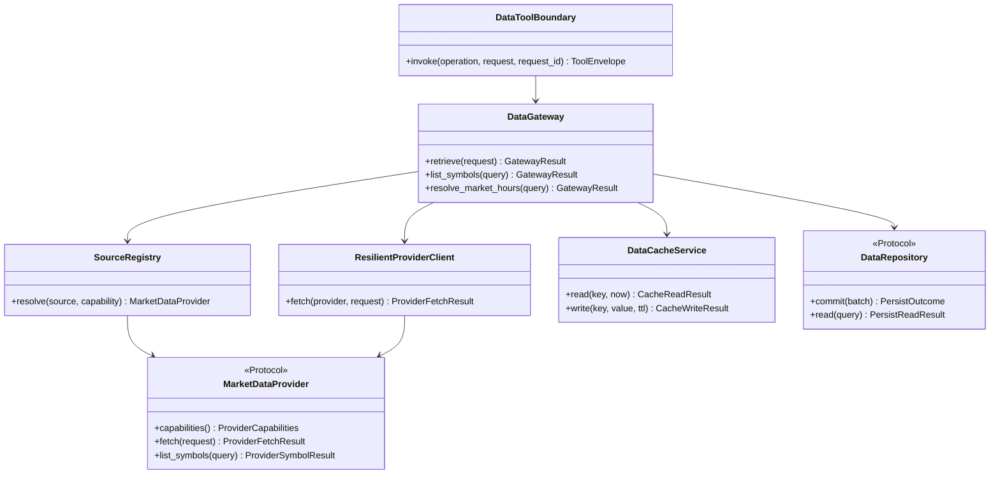
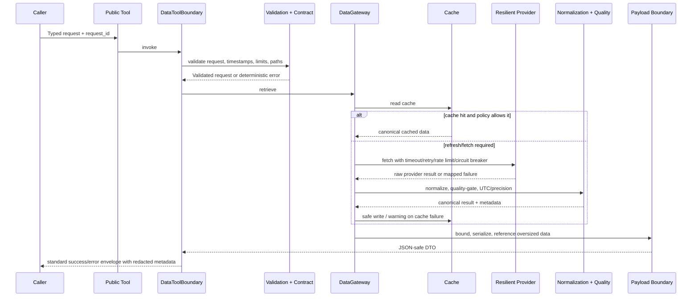
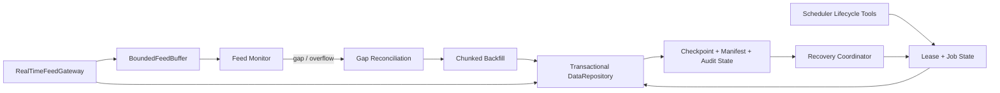

# Data Foundation - Architecture Requirements Document

## Architecture purpose and source control

This document converts every requirement in `02-data-foundation.md` into a proposed clean Python architecture. It is a design specification only: it defines modules, files, typed function contracts, and structural quality boundaries; it intentionally contains no implementation code.

The source names 701 detailed tasks. This document includes all 139 primary requirement IDs (`DATA-FR-001`–`DATA-FR-103`, `DATA-NFR-001`–`DATA-NFR-010`, `DATA-TEST-001`–`DATA-TEST-003`, `DATA-EX-001`–`DATA-EX-016`, and `DATA-BR-001`–`DATA-BR-007`) and retains every subordinate requirement bullet verbatim under its parent. Therefore, source-level subrequirements remain traceable rather than being collapsed into summaries.

### Architectural decision: export-surface tension

`DATA-FR-003` requires `app.services.data.__all__` to contain exactly `get_data`, `list_symbols`, and `get_market_hours`, while later requirements name additional official capability functions such as `get_feed_status`, scheduler lifecycle functions, storage helpers, and synthetic generators. To preserve the strict root allowlist, this architecture uses two deliberately separate boundaries:

1. **Root package export boundary:** `app.services.data.__all__` remains exactly the three functions named by `DATA-FR-003`; downstream domain imports use this boundary.
2. **Capability tool-catalog boundary:** other named functions live in explicit capability modules and are admitted to agent/API attachment only by a documented tool catalog and an explicit specification change. They must not be silently added to the root `__all__`.

This makes the conflict observable and testable rather than silently widening the root public API.

## 1. System Boundary Diagram (file structure)

```text
app/services/data/
├── __init__.py                         # strict root gate: imports + __all__ only
├── contracts/                          # canonical inbound/outbound and port contracts
│   ├── requests.py
│   ├── protocols.py
│   └── metadata.py
├── gateway/                            # public tool and orchestration boundary
│   ├── public_tools.py
│   ├── data_gateway.py
│   ├── tool_boundary.py
│   └── payload_boundary.py
├── validation/                         # path, record, UTC, and precision validation
│   ├── paths.py
│   ├── records.py
│   └── timezone_precision.py
├── errors/                             # imports/reuses Utils error taxonomy; maps data cases
│   └── mapping.py
├── providers/                          # source protocols, routing, readiness, adapters
│   ├── protocol.py
│   ├── registry.py
│   ├── resilience.py
│   ├── readiness.py
│   ├── sources.py
│   ├── credentials.py
│   ├── normalization.py
│   ├── mt5/adapter.py
│   ├── ctrader/adapter.py
│   ├── dukascopy/adapter.py
│   ├── binance/adapter.py
│   └── file/{csv_adapter.py, parquet_adapter.py}
├── feeds/                              # bounded real-time feed ingestion and status
│   ├── gateway.py
│   ├── status_tools.py
│   ├── buffer.py
│   ├── monitor.py
│   └── reconnect.py
├── persistence/                        # ports, SQLite, idempotency, manifests, recovery
│   ├── ports.py
│   ├── sqlite_store.py
│   ├── idempotency.py
│   ├── migrations.py
│   ├── recovery.py
│   └── manifests.py
├── storage/                            # local CSV/Parquet write/load and atomic files
│   ├── tools.py
│   ├── atomic_writer.py
│   └── manifests.py
├── cache/                              # TTL, stale behaviour, cache service, invalidation
│   ├── policy.py
│   ├── service.py
│   ├── invalidation.py
│   └── tools.py
├── scheduler/                          # persisted jobs, backfill, recovery, reconciliation
│   ├── contracts.py
│   ├── tools.py
│   ├── lifecycle.py
│   ├── backfill.py
│   ├── recovery.py
│   └── gap_reconciliation.py
├── transforms/                         # resampling, alignment, tick aggregation, labels
│   ├── resample.py
│   ├── alignment.py
│   ├── ticks.py
│   └── labels.py
├── calendar/                           # sessions and current market hours
│   ├── tools.py
│   └── provider.py
└── synthetic/                          # deterministic GBM bars and tick generation
    ├── tools.py
    └── generators.py

docs/planning/DOMAIN.md                 # source-of-truth operating documentation
examples/data_examples.py                # runnable capability examples
tests/services/data/                    # contract, failure, quality, performance, and regression tests
```

### Execution tree

```text
Public caller
  -> gateway/public_tools.py
  -> gateway/tool_boundary.py [validation, tracing, envelope, metrics, safe errors]
  -> contracts/requests.py + validation/*
  -> gateway/data_gateway.py
      -> cache/* [read/stale/invalidate]
      -> providers/registry.py -> providers/resilience.py -> providers/* adapter
      -> providers/normalization.py -> validation/records.py -> validation/timezone_precision.py
      -> persistence/* and/or storage/* only when an explicit write workflow is requested
  -> gateway/payload_boundary.py
  -> standard JSON-safe ToolEnvelope
```

## 2. Interfaces diagrams (Mermaid diagrams)

### 2.1 Data access and provider interface



### 2.2 Tool call sequence and clean cross-cutting boundaries



### 2.3 Persisted scheduler and feed-state collaboration



## 3. Functional Requirements

### Architecture-wide type rules

- Canonical market-domain entities such as `CanonicalBar`, `CanonicalTick`, `CanonicalSpread`, `SymbolMetadata`, `Timeframe`, and `DataSlice` are imported from the approved Phase 1.5 contracts. This module does not redefine them.
- `ToolEnvelope[T]` means the standard HaruQuant response shape with `status`, `message`, `data`, `error`, and `metadata` and does not expose raw SDK/database/dataframe objects.
- `WorkflowContext` is limited to `research`, `backtest`, `validation`, `risk`, and `execution_bound`.
- “Pure” means no mutation of persistent state, no network I/O, no filesystem I/O, no global state mutation, and deterministic output from the supplied inputs. “State-mutating” explicitly permits the named file, database, cache, scheduler, feed, or provider boundary.

### 📂 Module: documentation

Boundary Role: Data domain source-of-truth documentation, tool catalog, operational runbooks, manifests, policy references, and production sign-off evidence.

#### 📄 File: DOMAIN.md

File Path: `docs/planning/DOMAIN.md`

File Boundary: Data domain source-of-truth documentation, tool catalog, operational runbooks, manifests, policy references, and production sign-off evidence.

Target Class/Function Contracts:
- No runtime function. This file is an architecture, operations, and governance artifact.

##### Requirement Title: DATA-FR-001

Description: Scope the module as a greenfield professional production module that preserves current data-domain capabilities at the capability level (not old function names), with backward compatibility out of scope; treat the v8 specification as the authoritative baseline with this document as the production-hardening closure layer.

Requirements:
> - [ ] **DATA-FR-001**: Scope the module as a greenfield professional production module that preserves current data-domain capabilities at the capability level (not old function names), with backward compatibility out of scope; treat the v8 specification as the authoritative baseline with this document as the production-hardening closure layer.
>   - Backward compatibility remains out of scope
>   - Preserve capabilities at the capability level, not old function names
>   - v8 specification remains the authoritative baseline; this document is the production-hardening closure layer

Target Class/Function:
- `Data domain architecture and scope declaration` — Documentation/governance artifact; no runtime side effect.

##### Requirement Title: DATA-FR-002

Description: Defer public streaming subscription tools and historical market-hours reconstruction beyond Phase 1, tracking both as implementation planning issues rather than Phase 1 blockers.

Requirements:
> - [ ] **DATA-FR-002**: Defer public streaming subscription tools and historical market-hours reconstruction beyond Phase 1, tracking both as implementation planning issues rather than Phase 1 blockers.
>   - Public streaming subscription tools remain out of Phase 1; define the future tool surface before export
>   - Historical market-hours reconstruction deferred until a market-calendar provider is approved
>   - Track future-phase decisions as planning issues, not Phase 1 blockers

Target Class/Function:
- `Data domain architecture and scope declaration` — Documentation/governance artifact; no runtime side effect.

##### Requirement Title: DATA-FR-032

Description: Place this requirements document in `docs/planning/DOMAIN.md` (it covers the full data module rather than one sprint) and document: the official tool catalog; the final `__all__` export list; the environment variable reference; the crash recovery runbook; circuit breaker behavior and recovery procedure; and the production sign-off template.

Requirements:
> - [ ] **DATA-FR-032**: Place this requirements document in `docs/planning/DOMAIN.md` (it covers the full data module rather than one sprint) and document: the official tool catalog; the final `__all__` export list; the environment variable reference; the crash recovery runbook; circuit breaker behavior and recovery procedure; and the production sign-off template.

Target Class/Function:
- `Data domain documentation catalogue and production sign-off template` — Documentation/governance artifact.

##### Requirement Title: DATA-FR-043

Description: Produce a central limits manifest (maximum records, date range, cache TTL, synthetic generation size, backfill chunk size, feed buffer depth, scheduler frequency) and document: why `get_data_update_job_status` and `get_feed_status` are included; usage examples for market data, local storage, symbols, synthetic generation, labeling, scheduler, job status, feed status; troubleshooting for MT5, cTrader, Dukascopy, Binance symbol discovery, local storage, cache, database persistence, scheduler, crash recovery, feed health; response examples for OHLCV, tick, spread, market hours, trading sessions, availability, historical volume, scheduler status, feed status, error responses; ensure a production sign-off artifact is created before release.

Requirements:
> - [ ] **DATA-FR-043**: Produce a central limits manifest (maximum records, date range, cache TTL, synthetic generation size, backfill chunk size, feed buffer depth, scheduler frequency) and document: why `get_data_update_job_status` and `get_feed_status` are included; usage examples for market data, local storage, symbols, synthetic generation, labeling, scheduler, job status, feed status; troubleshooting for MT5, cTrader, Dukascopy, Binance symbol discovery, local storage, cache, database persistence, scheduler, crash recovery, feed health; response examples for OHLCV, tick, spread, market hours, trading sessions, availability, historical volume, scheduler status, feed status, error responses; ensure a production sign-off artifact is created before release.

Target Class/Function:
- `Central limits manifest and operational guide` — Documentation/governance artifact.

##### Requirement Title: DATA-FR-058

Description: Note that the HaruQuantAI Tool Function Standard, Code Quality Standard, Agent Standard, and Agentic AI Playbook exist outside this source-requirements document and may define cross-cutting details not repeated here; Phase 1 may proceed without complete external source adapter implementations when disabled/unavailable adapters fail safely and deterministically and contracts, responses, validation, timeframes, registry, exports, and tests meet Phase 1 acceptance; no blocking open questions remain for Phase 1 implementation based on current source material; cTrader and Dukascopy clients are internal.

Requirements:
> - [ ] **DATA-FR-058**: Note that the HaruQuantAI Tool Function Standard, Code Quality Standard, Agent Standard, and Agentic AI Playbook exist outside this source-requirements document and may define cross-cutting details not repeated here; Phase 1 may proceed without complete external source adapter implementations when disabled/unavailable adapters fail safely and deterministically and contracts, responses, validation, timeframes, registry, exports, and tests meet Phase 1 acceptance; no blocking open questions remain for Phase 1 implementation based on current source material; cTrader and Dukascopy clients are internal.

Target Class/Function:
- `Phase 1 execution assumptions and dependency note` — Documentation/governance artifact.

### 📂 Module: data

Boundary Role: Package gatekeeper. It exposes only the approved root agent surface and imports nothing with runtime side effects.

#### 📄 File: __init__.py

File Path: `app/services/data/__init__.py`

File Boundary: Package gatekeeper. It exposes only the approved root agent surface and imports nothing with runtime side effects.

Target Class/Function Contracts:
- `__all__: tuple[str, ...]` — Declaration-only package export gate; no side effects.
- `get_data(...)`, `list_symbols(...)`, `get_market_hours(...)` — Imported façade callables only; their implementations live behind the gateway boundary.

##### Requirement Title: DATA-FR-003

Description: Implement a __init__ containing only imports and `__all__`, exporting exactly the approved official tool surface (`get_data`, `list_symbols`, `get_market_hours`) and nothing else, with any future tool addition requiring an explicit specification update.

Requirements:
> - [ ] **DATA-FR-003**: Implement a __init__ containing only imports and `__all__`, exporting exactly the approved official tool surface (`get_data`, `list_symbols`, `get_market_hours`) and nothing else, with any future tool addition requiring an explicit specification update.
>   - Contains only imports and `__all__`
>   - Exports only the approved official tool surface in Section 1.2 unless a future specification explicitly adds more
>   - Exposes only safe, intentional, agent-callable tools
>   - Supports `get_data`, `list_symbols`, `get_market_hours`
>   - Official exports match this requirements document; downstream modules import only through `app.services.data`

Target Class/Function:
- `__all__: tuple[str, ...]` — Declaration-only package export gate; no side effect.

##### Requirement Title: DATA-FR-082

Description: Rebuild the data module as a clean, contract-driven, agent-safe, testable, maintainable domain under `app/services/data/`, with downstream modules adapting to the new contracts rather than relying on aliases.

Requirements:
> - [ ] **DATA-FR-082**: Rebuild the data module as a clean, contract-driven, agent-safe, testable, maintainable domain under `app/services/data/`, with downstream modules adapting to the new contracts rather than relying on aliases.

Target Class/Function:
- `__all__: tuple[str, ...]` — Declaration-only package export gate; no side effect.

### 📂 Module: gateway

Boundary Role: Shared tool wrapper that keeps standard envelopes, redaction, deterministic exception mapping, request propagation, logging, timing, and metrics out of business operations.

#### 📄 File: tool_boundary.py

File Path: `app/services/data/gateway/tool_boundary.py`

File Boundary: Shared tool wrapper that keeps standard envelopes, redaction, deterministic exception mapping, request propagation, logging, timing, and metrics out of business operations.

Target Class/Function Contracts:
- `DataToolBoundary.invoke(operation: DataOperation, request: PublicRequest, *, request_id: str) -> ToolEnvelope[JSONValue]` — Side-effecting boundary coordinator.
- `map_exception_to_envelope(error: Exception, context: ErrorContext) -> ToolEnvelope[None]` — Pure after safe error extraction.

##### Requirement Title: DATA-FR-004

Description: Type every official tool, require it to accept and propagate `request_id`, log structured events, and provide usage examples where applicable; never expose raw exceptions or credential loaders, and never log or expose credentials.

Requirements:
> - [ ] **DATA-FR-004**: Type every official tool, require it to accept and propagate `request_id`, log structured events, and provide usage examples where applicable; never expose raw exceptions or credential loaders, and never log or expose credentials.

Target Class/Function:
- `DataToolBoundary.invoke(operation: DataOperation, request: PublicRequest, *, request_id: str) -> ToolEnvelope[JSONValue]` — Side-effecting boundary coordinator.

##### Requirement Title: DATA-FR-005

Description: Normalize all timestamps crossing the official AI-tool boundary to UTC ISO 8601 strings, including start/end timestamps when provided; disclose the primary volume value through `volume_kind`; have `get_market_hours` return current configured hours only for Phase 1.

Requirements:
> - [ ] **DATA-FR-005**: Normalize all timestamps crossing the official AI-tool boundary to UTC ISO 8601 strings, including start/end timestamps when provided; disclose the primary volume value through `volume_kind`; have `get_market_hours` return current configured hours only for Phase 1.

Target Class/Function:
- `DataToolBoundary.invoke(operation: DataOperation, request: PublicRequest, *, request_id: str) -> ToolEnvelope[JSONValue]` — Side-effecting boundary coordinator.

##### Requirement Title: DATA-FR-056

Description: Never log or return credentials or secrets anywhere in the connector layer: passwords, access tokens, API keys, account secrets, broker secrets, and raw credential payloads are never logged or returned; official tools remain thin orchestration functions that validate inputs, call internal services/adapters, and return standard responses; either date range or limit is provided unless the source has a safe default.

Requirements:
> - [ ] **DATA-FR-056**: Never log or return credentials or secrets anywhere in the connector layer: passwords, access tokens, API keys, account secrets, broker secrets, and raw credential payloads are never logged or returned; official tools remain thin orchestration functions that validate inputs, call internal services/adapters, and return standard responses; either date range or limit is provided unless the source has a safe default.

Target Class/Function:
- `DataToolBoundary.invoke(...) -> ToolEnvelope[JSONValue]` — Side-effecting boundary coordinator.

##### Requirement Title: DATA-FR-069

Description: Have every official tool handle errors deterministically through the standard envelope: `status` is `success` or `error`; `error` is null on success or contains a deterministic code and details on failure; official data tools use deterministic error codes throughout, never falling back to `UNKNOWN_ERROR` for expected unsupported capabilities — `UNKNOWN_ERROR` is reserved only for unexpected failures after deterministic mapping is exhausted.

Requirements:
> - [ ] **DATA-FR-069**: Have every official tool handle errors deterministically through the standard envelope: `status` is `success` or `error`; `error` is null on success or contains a deterministic code and details on failure; official data tools use deterministic error codes throughout, never falling back to `UNKNOWN_ERROR` for expected unsupported capabilities — `UNKNOWN_ERROR` is reserved only for unexpected failures after deterministic mapping is exhausted.

Target Class/Function:
- `map_exception_to_envelope(error: Exception, context: ErrorContext) -> ToolEnvelope[None]` — Pure after safe error extraction.

##### Requirement Title: DATA-FR-080

Description: Keep all behavior deterministic, documented, and auditable: data validation, normalization, quality scoring, timestamp handling, cache handling, source metadata, and persistence behavior are deterministic and documented; every official tool logs call start, validation failure, source failure, cache hit/miss/stale status, persistence failure, successful completion, execution time, and error code on failure; schema migration and cache invalidation events are auditable; crash recovery never bypasses validation, path policy, license policy, cache policy, source readiness policy, precision policy, or gateway policy; generated artifacts, local credentials, notebooks, temp files, `__pycache__`, and `.pyc` files are never committed.

Requirements:
> - [ ] **DATA-FR-080**: Keep all behavior deterministic, documented, and auditable: data validation, normalization, quality scoring, timestamp handling, cache handling, source metadata, and persistence behavior are deterministic and documented; every official tool logs call start, validation failure, source failure, cache hit/miss/stale status, persistence failure, successful completion, execution time, and error code on failure; schema migration and cache invalidation events are auditable; crash recovery never bypasses validation, path policy, license policy, cache policy, source readiness policy, precision policy, or gateway policy; generated artifacts, local credentials, notebooks, temp files, `__pycache__`, and `.pyc` files are never committed.

Target Class/Function:
- `DataToolBoundary.invoke(...) -> ToolEnvelope[JSONValue]` — Side-effecting boundary coordinator.

##### Requirement Title: DATA-FR-084

Description: Return the standard HaruQuantAI response schema from every official AI tool: status, message, data, error, metadata; error responses include status, message, error code, details, request ID, metadata; every tool has metadata and side-effect flags; write tests for standard return schema and metadata correctness for every official tool.

Requirements:
> - [ ] **DATA-FR-084**: Return the standard HaruQuantAI response schema from every official AI tool: status, message, data, error, metadata; error responses include status, message, error code, details, request ID, metadata; every tool has metadata and side-effect flags; write tests for standard return schema and metadata correctness for every official tool.

Target Class/Function:
- `DataToolBoundary.invoke(...) -> ToolEnvelope[JSONValue]` — Side-effecting boundary coordinator.

### 📂 Module: validation

Boundary Role: Filesystem-input validation and approved-root enforcement for all local data and artifact paths.

#### 📄 File: paths.py

File Path: `app/services/data/validation/paths.py`

File Boundary: Filesystem-input validation and approved-root enforcement for all local data and artifact paths.

Target Class/Function Contracts:
- `validate_storage_path(path: Path | str, roots: Sequence[Path], *, allow_hidden: bool = False) -> Path` — Pure.
- `validate_extension(path: Path, allowed_extensions: frozenset[str]) -> None` — Pure.

##### Requirement Title: DATA-FR-006

Description: Reject unsafe filesystem input: parent traversal using `..`, hidden/system directories unless explicitly allowed by configuration, and unsupported extensions.

Requirements:
> - [ ] **DATA-FR-006**: Reject unsafe filesystem input: parent traversal using `..`, hidden/system directories unless explicitly allowed by configuration, and unsupported extensions.

Target Class/Function:
- `validate_storage_path(path: Path | str, roots: Sequence[Path], *, allow_hidden: bool = False) -> Path` — Pure.

##### Requirement Title: DATA-FR-060

Description: Enforce approved storage roots and path safety on every local file operation: approved storage roots configurable only through HaruQuant settings; storage paths resolve under approved roots; absolute paths outside approved roots rejected; local paths validated against approved storage roots; documentation includes the approved storage roots list.

Requirements:
> - [ ] **DATA-FR-060**: Enforce approved storage roots and path safety on every local file operation: approved storage roots configurable only through HaruQuant settings; storage paths resolve under approved roots; absolute paths outside approved roots rejected; local paths validated against approved storage roots; documentation includes the approved storage roots list.
>   - Approved storage roots configurable only through HaruQuant settings; documented
>   - Absolute paths outside approved roots rejected; storage paths resolve under approved roots
>   - Local file operations enforce approved storage roots and path validation
>   - Storage requests validate path safety, default to `overwrite=False`
>   - Unsafe path returns `PATH_NOT_ALLOWED`
>   - Write test for every official tool covering path safety where applicable

Target Class/Function:
- `validate_storage_path(...) -> Path` — Pure.

### 📂 Module: errors

Boundary Role: Data-domain deterministic error mapping that reuses `app.utils.errors` rather than redeclaring shared exceptions.

#### 📄 File: mapping.py

File Path: `app/services/data/errors/mapping.py`

File Boundary: Data-domain deterministic error mapping that reuses `app.utils.errors` rather than redeclaring shared exceptions.

Target Class/Function Contracts:
- `map_provider_failure(error: Exception, context: ProviderErrorContext) -> HaruQuantError` — Pure.
- `map_validation_failure(issue: ValidationIssue) -> HaruQuantError` — Pure.
- `redact_error_details(details: Mapping[str, object]) -> Mapping[str, JSONValue]` — Pure.

##### Requirement Title: DATA-FR-007

Description: Map deterministic failure conditions to error codes without exposing raw exceptions: `AUTHENTICATION_FAILED` on auth failure, `CIRCUIT_BREAKER_OPEN` on open circuit breaker, `PERMISSION_DENIED` on permission failure, `UNSUPPORTED_TIMEFRAME` on unsupported timeframe, `UNSUPPORTED_OPERATION` on historical market-hour reconstruction (unless an approved calendar provider supports it) and on unsupported public streaming operations, and `CREDENTIALS_MISSING` on missing credentials.

Requirements:
> - [ ] **DATA-FR-007**: Map deterministic failure conditions to error codes without exposing raw exceptions: `AUTHENTICATION_FAILED` on auth failure, `CIRCUIT_BREAKER_OPEN` on open circuit breaker, `PERMISSION_DENIED` on permission failure, `UNSUPPORTED_TIMEFRAME` on unsupported timeframe, `UNSUPPORTED_OPERATION` on historical market-hour reconstruction (unless an approved calendar provider supports it) and on unsupported public streaming operations, and `CREDENTIALS_MISSING` on missing credentials.

Target Class/Function:
- `map_provider_failure(error: Exception, context: ProviderErrorContext) -> HaruQuantError` — Pure.

##### Requirement Title: DATA-FR-016

Description: Extend the deterministic error-code list with `VALIDATION_FAILED`, `BUFFER_OVERFLOW`, `DATA_DROPPED`, `FEED_HEARTBEAT_TIMEOUT`, and `FEED_RECONCILIATION_FAILED`, returned or logged on heartbeat timeout, buffer overflow, dropped records, and failed gap reconciliation respectively.

Requirements:
> - [ ] **DATA-FR-016**: Extend the deterministic error-code list with `VALIDATION_FAILED`, `BUFFER_OVERFLOW`, `DATA_DROPPED`, `FEED_HEARTBEAT_TIMEOUT`, and `FEED_RECONCILIATION_FAILED`, returned or logged on heartbeat timeout, buffer overflow, dropped records, and failed gap reconciliation respectively.
>   - `VALIDATION_FAILED`, `BUFFER_OVERFLOW`, `DATA_DROPPED` included in the deterministic error-code list
>   - `BUFFER_OVERFLOW` and `DATA_DROPPED` added to deterministic error codes
>   - Deterministic error-code list includes `DATA_DROPPED`, `BUFFER_OVERFLOW`, `FEED_HEARTBEAT_TIMEOUT`, `FEED_RECONCILIATION_FAILED`
>   - Feed heartbeat timeout returns or logs `FEED_HEARTBEAT_TIMEOUT`
>   - Feed buffer overflow returns or logs `BUFFER_OVERFLOW`
>   - Dropped feed records return or log `DATA_DROPPED`
>   - Failed feed gap reconciliation returns `FEED_RECONCILIATION_FAILED`

Target Class/Function:
- `map_provider_failure(error: Exception, context: ProviderErrorContext) -> HaruQuantError` — Pure.

##### Requirement Title: DATA-FR-028

Description: Map persistence failures to deterministic error codes (`DATABASE_ERROR`, `DB_CONNECTION_ERROR`, `DB_WRITE_FAILED`) and ensure database state never stores plaintext secrets.

Requirements:
> - [ ] **DATA-FR-028**: Map persistence failures to deterministic error codes (`DATABASE_ERROR`, `DB_CONNECTION_ERROR`, `DB_WRITE_FAILED`) and ensure database state never stores plaintext secrets.
>   - Deterministic error-code list includes `DATABASE_ERROR`, `DB_CONNECTION_ERROR`, `DB_WRITE_FAILED`
>   - Database connection failure returns `DB_CONNECTION_ERROR`; write failure returns `DB_WRITE_FAILED`; persistence failure returns `DATABASE_ERROR`
>   - Database state does not store plaintext secrets

Target Class/Function:
- `map_provider_failure(error: Exception, context: ProviderErrorContext) -> HaruQuantError` — Pure.

##### Requirement Title: DATA-FR-068

Description: Import and reuse all standard system exceptions and error codes (`VALIDATION_FAILED`, `AUTHENTICATION_FAILED`, `PERMISSION_DENIED`, `CIRCUIT_BREAKER_OPEN`, `UNKNOWN_ERROR`, `STATE_RECOVERY_FAILED`, `CREDENTIALS_MISSING`, and the rest of the deterministic error-code list) from `app.utils.errors` to prevent duplicate declaration, with custom data exceptions inheriting from `app.utils.errors.Error` or `HaruQuantError`; document an error-code reference covering all deterministic codes.

Requirements:
> - [ ] **DATA-FR-068**: Import and reuse all standard system exceptions and error codes (`VALIDATION_FAILED`, `AUTHENTICATION_FAILED`, `PERMISSION_DENIED`, `CIRCUIT_BREAKER_OPEN`, `UNKNOWN_ERROR`, `STATE_RECOVERY_FAILED`, `CREDENTIALS_MISSING`, and the rest of the deterministic error-code list) from `app.utils.errors` to prevent duplicate declaration, with custom data exceptions inheriting from `app.utils.errors.Error` or `HaruQuantError`; document an error-code reference covering all deterministic codes.

Target Class/Function:
- `map_provider_failure(...) -> HaruQuantError` — Pure.

##### Requirement Title: DATA-FR-071

Description: Redact secret-like values from all errors and logs.

Requirements:
> - [ ] **DATA-FR-071**: Redact secret-like values from all errors and logs.

Target Class/Function:
- `redact_error_details(details: Mapping[str, object]) -> Mapping[str, JSONValue]` — Pure.

##### Requirement Title: DATA-FR-102

Description: Map validation/throttling failures to deterministic codes: `DATA_QUALITY_FAILED` for data-content validation failures, `LIMIT_EXCEEDED` for excessive request limits, `RATE_LIMIT_EXCEEDED` for rate limiting; recovery never duplicates committed chunks.

Requirements:
> - [ ] **DATA-FR-102**: Map validation/throttling failures to deterministic codes: `DATA_QUALITY_FAILED` for data-content validation failures, `LIMIT_EXCEEDED` for excessive request limits, `RATE_LIMIT_EXCEEDED` for rate limiting; recovery never duplicates committed chunks.

Target Class/Function:
- `map_validation_failure(issue: ValidationIssue) -> HaruQuantError` — Pure.

### 📂 Module: contracts

Boundary Role: Typed inbound request contracts for retrieval, storage, cache, scheduler, feed, and synthetic workflows. It imports canonical Phase 1.5 types rather than redefining them.

#### 📄 File: requests.py

File Path: `app/services/data/contracts/requests.py`

File Boundary: Typed inbound request contracts for retrieval, storage, cache, scheduler, feed, and synthetic workflows. It imports canonical Phase 1.5 types rather than redefining them.

Target Class/Function Contracts:
- `parse_workflow_context(value: str) -> WorkflowContext` — Pure.
- `validate_data_request(request: DataRequest) -> ValidatedDataRequest` — Pure.
- `validate_time_window(start: datetime | None, end: datetime | None) -> None` — Pure.
- `validate_response_limit(value: int | None, limits: LimitsManifest) -> int | None` — Pure.

##### Requirement Title: DATA-FR-008

Description: Restrict `workflow_context` to the exhaustive set `research`, `backtest`, `validation`, `risk`, and `execution_bound`, allowing exploratory backtests to opt into `float` only when explicitly marked non-validation.

Requirements:
> - [ ] **DATA-FR-008**: Restrict `workflow_context` to the exhaustive set `research`, `backtest`, `validation`, `risk`, and `execution_bound`, allowing exploratory backtests to opt into `float` only when explicitly marked non-validation.

Target Class/Function:
- `validate_data_request(request: DataRequest) -> ValidatedDataRequest` — Pure.

##### Requirement Title: DATA-FR-009

Description: Require start to precede end, returning `TIMESTAMP_OVERLAP` when overlap has no safe policy.

Requirements:
> - [ ] **DATA-FR-009**: Require start to precede end, returning `TIMESTAMP_OVERLAP` when overlap has no safe policy.

Target Class/Function:
- `validate_data_request(request: DataRequest) -> ValidatedDataRequest` — Pure.

##### Requirement Title: DATA-FR-070

Description: Route input-validation failures consistently: any unsupported or invalid `workflow_context` returns `INVALID_INPUT`; other input validation failures return `VALIDATION_FAILED` or `INVALID_INPUT` according to context; bad data is never silently normalized without visible warnings or errors.

Requirements:
> - [ ] **DATA-FR-070**: Route input-validation failures consistently: any unsupported or invalid `workflow_context` returns `INVALID_INPUT`; other input validation failures return `VALIDATION_FAILED` or `INVALID_INPUT` according to context; bad data is never silently normalized without visible warnings or errors.

Target Class/Function:
- `validate_data_request(request: DataRequest) -> ValidatedDataRequest` — Pure.

### 📂 Module: persistence

Boundary Role: Auditable stale-lock, checkpoint, crash-recovery, and durable state transition handling.

#### 📄 File: recovery.py

File Path: `app/services/data/persistence/recovery.py`

File Boundary: Auditable stale-lock, checkpoint, crash-recovery, and durable state transition handling.

Target Class/Function Contracts:
- `recover_stale_lease(lease: Lease, now: datetime) -> RecoveryDecision` — Pure.
- `recover_incomplete_state(state: DurableDataState) -> RecoveryOutcome` — State-mutating through injected repository.
- `record_circuit_breaker_transition(transition: CircuitTransition) -> None` — State-mutating audit/persistence.

##### Requirement Title: DATA-FR-010

Description: Make state writes atomic, stale-lock recovery auditable, crash recovery idempotent and auditable, and circuit-breaker transitions auditable, returning `STATE_RECOVERY_FAILED` on failed crash recovery; enforce no-silent-fallback behavior throughout the gateway.

Requirements:
> - [ ] **DATA-FR-010**: Make state writes atomic, stale-lock recovery auditable, crash recovery idempotent and auditable, and circuit-breaker transitions auditable, returning `STATE_RECOVERY_FAILED` on failed crash recovery; enforce no-silent-fallback behavior throughout the gateway.

Target Class/Function:
- `recover_incomplete_state(state: DurableDataState) -> RecoveryOutcome` — State-mutating through injected repository.

##### Requirement Title: DATA-FR-025

Description: Persist source circuit breaker state, source revision/raw-hash metadata, data license/attribution metadata, and feed state, so that on restart a source with a persisted open circuit breaker remains open or half-open for its configured cooldown and does not immediately hammer the failing external source, and a degraded state is persisted whenever an adapter trips a circuit breaker.

Requirements:
> - [ ] **DATA-FR-025**: Persist source circuit breaker state, source revision/raw-hash metadata, data license/attribution metadata, and feed state, so that on restart a source with a persisted open circuit breaker remains open or half-open for its configured cooldown and does not immediately hammer the failing external source, and a degraded state is persisted whenever an adapter trips a circuit breaker.
>   - Module persists source circuit breaker state, source revision and raw hash metadata, data license and attribution metadata, feed state
>   - Circuit breaker open state persists across restarts; degraded state persisted when adapter trips a circuit breaker
>   - On restart, persisted open circuit breaker remains open/half-open for configured cooldown, no immediate hammering
>   - Write test for circuit breaker state persistence across restart

Target Class/Function:
- `record_circuit_breaker_transition(transition: CircuitTransition) -> None` — State-mutating audit/persistence.

### 📂 Module: providers

Boundary Role: Internal-only secure credential reference resolution. It does not accept raw passwords from tool callers and never returns secret values.

#### 📄 File: credentials.py

File Path: `app/services/data/providers/credentials.py`

File Boundary: Internal-only secure credential reference resolution. It does not accept raw passwords from tool callers and never returns secret values.

Target Class/Function Contracts:
- `resolve_provider_credentials(source: str, settings: RuntimeSettings) -> CredentialHandle` — Side-effecting secret-resolution boundary.
- `validate_credential_reference(reference: str) -> None` — Pure.

##### Requirement Title: DATA-FR-011

Description: Resolve credentials internally from approved configuration or environment variables: never accept raw passwords unless a future explicit security design approves it, and never expose credential loaders.

Requirements:
> - [ ] **DATA-FR-011**: Resolve credentials internally from approved configuration or environment variables: never accept raw passwords unless a future explicit security design approves it, and never expose credential loaders.

Target Class/Function:
- `resolve_provider_credentials(source: str, settings: RuntimeSettings) -> CredentialHandle` — Side-effecting secret-resolution boundary.

### 📂 Module: transforms

Boundary Role: Deterministic OHLCV resampling with explicit source/target timeframe and spread policy.

#### 📄 File: resample.py

File Path: `app/services/data/transforms/resample.py`

File Boundary: Deterministic OHLCV resampling with explicit source/target timeframe and spread policy.

Target Class/Function Contracts:
- `resample_ohlcv(records: Sequence[CanonicalBar], target_timeframe: Timeframe, spread_policy: SpreadPolicy = SpreadPolicy.AVERAGE) -> tuple[CanonicalBar, ...]` — Pure.

##### Requirement Title: DATA-FR-012

Description: Keep production logic free of `print()`; ensure resampling 100,000 M1 bars to H1 targets under 3 seconds; ensure labels align to input timestamps.

Requirements:
> - [ ] **DATA-FR-012**: Keep production logic free of `print()`; ensure resampling 100,000 M1 bars to H1 targets under 3 seconds; ensure labels align to input timestamps.

Target Class/Function:
- `resample_ohlcv(records: Sequence[CanonicalBar], target_timeframe: Timeframe, spread_policy: SpreadPolicy = SpreadPolicy.AVERAGE) -> tuple[CanonicalBar, ...]` — Pure.

##### Requirement Title: DATA-FR-098

Description: Implement `resample_ohlcv`, `align_multitimeframe_data`, and `aggregate_ticks_to_bars` with lookahead-leakage prevention as the default: `resample_ohlcv` accepts normalized OHLCV records, validates source/target timeframe, aggregates open as first open, high as max high, low as min low, close as last close, volume as sum, and spread per explicit `spread_policy`; `align_multitimeframe_data` prevents lookahead leakage by default (`allow_lookahead=False`, `alignment_method="last_known_closed_bar"`); `aggregate_ticks_to_bars` converts normalized tick records into OHLCV bars.

Requirements:
> - [ ] **DATA-FR-098**: Implement `resample_ohlcv`, `align_multitimeframe_data`, and `aggregate_ticks_to_bars` with lookahead-leakage prevention as the default: `resample_ohlcv` accepts normalized OHLCV records, validates source/target timeframe, aggregates open as first open, high as max high, low as min low, close as last close, volume as sum, and spread per explicit `spread_policy`; `align_multitimeframe_data` prevents lookahead leakage by default (`allow_lookahead=False`, `alignment_method="last_known_closed_bar"`); `aggregate_ticks_to_bars` converts normalized tick records into OHLCV bars.
>   - Support the following: `resample_ohlcv`, `align_multitimeframe_data`, `aggregate_ticks_to_bars`

Target Class/Function:
- `resample_ohlcv(...) -> tuple[CanonicalBar, ...]` — Pure.

### 📂 Module: verification

Boundary Role: Unit, contract, property, regression, import-safety, performance, no-silent-fallback, and boundary tests for the Data Foundation.

#### 📄 File: data

File Path: `tests/services/data/`

File Boundary: Unit, contract, property, regression, import-safety, performance, no-silent-fallback, and boundary tests for the Data Foundation.

Target Class/Function Contracts:
- No production runtime function. Each test is a deterministic verification boundary.

##### Requirement Title: DATA-FR-013

Description: Achieve coverage above 80% with production sign-off commands passing, and write tests covering: connection leak detection; conflicting ingestion key behavior; invalid input, successful call, unsupported timeframe (where applicable), empty result, request ID propagation, logging footprint, and side-effect/read-only flags for every official tool; recovery from stale locks; no-silent-fallback behavior; circuit breaker open/half-open/closed transitions; raw data hash propagation; and rejection or logging of interpolation/forward-fill outside research workflows.

Requirements:
> - [ ] **DATA-FR-013**: Achieve coverage above 80% with production sign-off commands passing, and write tests covering: connection leak detection; conflicting ingestion key behavior; invalid input, successful call, unsupported timeframe (where applicable), empty result, request ID propagation, logging footprint, and side-effect/read-only flags for every official tool; recovery from stale locks; no-silent-fallback behavior; circuit breaker open/half-open/closed transitions; raw data hash propagation; and rejection or logging of interpolation/forward-fill outside research workflows.

Target Class/Function:
- `test_public_tool_contracts_and_resilience() -> None` — Verification-only.

##### Requirement Title: DATA-FR-021

Description: Write tests covering: dropped data gap creation; feed heartbeat tracking and timeout; feed buffer limit behavior; feed overflow under `halt`, `drop_and_reconcile`, and `backpressure`; feed reconnect with exponential backoff and jitter; and the `get_feed_status` schema.

Requirements:
> - [ ] **DATA-FR-021**: Write tests covering: dropped data gap creation; feed heartbeat tracking and timeout; feed buffer limit behavior; feed overflow under `halt`, `drop_and_reconcile`, and `backpressure`; feed reconnect with exponential backoff and jitter; and the `get_feed_status` schema.

Target Class/Function:
- `test_realtime_feed_contracts() -> None` — Verification-only.

##### Requirement Title: DATA-FR-031

Description: Write tests covering: persistence transactions; SQLite/default persistence backend initialization; database idempotency keys.

Requirements:
> - [ ] **DATA-FR-031**: Write tests covering: persistence transactions; SQLite/default persistence backend initialization; database idempotency keys.

Target Class/Function:
- `test_persistence_contracts() -> None` — Verification-only.

##### Requirement Title: DATA-FR-044

Description: Write tests covering: backfill chunking, idempotency, source revision handling; automatic historical backfill after dropped data where supported; backfill checkpoint resume; backfill cache invalidation; recovery from corrupted checkpoints; dry-run behavior for cache, scheduler, and file operations where applicable; license restriction enforcement for storage, scheduler exports, and backfill; scheduler create/start/stop/run-once; duplicate start and duplicate job creation behavior; missing job behavior; invalid source/symbol/timeframe/schedule; scheduler state persistence.

Requirements:
> - [ ] **DATA-FR-044**: Write tests covering: backfill chunking, idempotency, source revision handling; automatic historical backfill after dropped data where supported; backfill checkpoint resume; backfill cache invalidation; recovery from corrupted checkpoints; dry-run behavior for cache, scheduler, and file operations where applicable; license restriction enforcement for storage, scheduler exports, and backfill; scheduler create/start/stop/run-once; duplicate start and duplicate job creation behavior; missing job behavior; invalid source/symbol/timeframe/schedule; scheduler state persistence.

Target Class/Function:
- `test_scheduler_backfill_and_license_controls() -> None` — Verification-only.

##### Requirement Title: DATA-FR-057

Description: Write data quality tests covering adversarial market conditions: zero-volume bars, extreme spread widening (e.g. `>1000` pips), NaN/Inf values from source APIs, and flash-crash price anomalies; cover production tests for license restriction enforcement.

Requirements:
> - [ ] **DATA-FR-057**: Write data quality tests covering adversarial market conditions: zero-volume bars, extreme spread widening (e.g. `>1000` pips), NaN/Inf values from source APIs, and flash-crash price anomalies; cover production tests for license restriction enforcement.

Target Class/Function:
- `test_provider_quality_and_license_controls() -> None` — Verification-only.

##### Requirement Title: DATA-FR-067

Description: Write storage tests covering valid save and load, unsupported extension rejection, and unsafe path rejection.

Requirements:
> - [ ] **DATA-FR-067**: Write storage tests covering valid save and load, unsupported extension rejection, and unsafe path rejection.

Target Class/Function:
- `test_local_storage_contracts() -> None` — Verification-only.

##### Requirement Title: DATA-FR-072

Description: Write tests verifying deterministic error code mapping for every official tool, and write usage examples that show realistic workflows handling both success and error responses.

Requirements:
> - [ ] **DATA-FR-072**: Write tests verifying deterministic error code mapping for every official tool, and write usage examples that show realistic workflows handling both success and error responses.

Target Class/Function:
- `test_deterministic_error_mapping() -> None` — Verification-only.

##### Requirement Title: DATA-FR-081

Description: Write tests verifying cache hit, miss, stale, and invalidation behavior for every official tool where applicable.

Requirements:
> - [ ] **DATA-FR-081**: Write tests verifying cache hit, miss, stale, and invalidation behavior for every official tool where applicable.

Target Class/Function:
- `test_cache_lifecycle() -> None` — Verification-only.

##### Requirement Title: DATA-FR-092

Description: Write tests verifying downstream contract alignment for strategy, simulation, optimization, analytics, risk, portfolio, execution, and agentic workflows, and production tests covering downstream contract alignment; downstream contract alignment tests pass.

Requirements:
> - [ ] **DATA-FR-092**: Write tests verifying downstream contract alignment for strategy, simulation, optimization, analytics, risk, portfolio, execution, and agentic workflows, and production tests covering downstream contract alignment; downstream contract alignment tests pass.

Target Class/Function:
- `test_downstream_contract_alignment() -> None` — Verification-only.

##### Requirement Title: DATA-FR-103

Description: Write tests covering: duplicate ingestion no-op behavior; quality failure for every official tool; duplicate timestamps (warning or failure per configured policy); out-of-order timestamps; missing timestamps and inferred gaps; OHLC inconsistency; negative volume; stale data; partial data; and production tests for timestamp gap and overlap defaults.

Requirements:
> - [ ] **DATA-FR-103**: Write tests covering: duplicate ingestion no-op behavior; quality failure for every official tool; duplicate timestamps (warning or failure per configured policy); out-of-order timestamps; missing timestamps and inferred gaps; OHLC inconsistency; negative volume; stale data; partial data; and production tests for timestamp gap and overlap defaults.

Target Class/Function:
- `test_quality_and_payload_limit_contracts() -> None` — Verification-only.

### 📂 Module: realtime_feeds

Boundary Role: Internal live-capable data ingestion coordination. It accepts normalized event streams through providers and persists observable feed state.

#### 📄 File: gateway.py

File Path: `app/services/data/feeds/gateway.py`

File Boundary: Internal live-capable data ingestion coordination. It accepts normalized event streams through providers and persists observable feed state.

Target Class/Function Contracts:
- `RealTimeFeedGateway.ingest(event: RawFeedEvent, config: FeedConfig) -> FeedIngestOutcome` — State-mutating feed and persistence workflow.
- `RealTimeFeedGateway.reconcile_gap(window: GapWindow) -> ReconciliationOutcome` — Side-effecting provider/persistence workflow.

##### Requirement Title: DATA-FR-014

Description: Bring internal real-time feed support, feed state, and feed status into scope for Phase 1 production readiness wherever a source adapter declares live or streaming capability, providing reliable, normalized, auditable access alongside historical, local, synthetic, broker, and external market data.

Requirements:
> - [ ] **DATA-FR-014**: Bring internal real-time feed support, feed state, and feed status into scope for Phase 1 production readiness wherever a source adapter declares live or streaming capability, providing reliable, normalized, auditable access alongside historical, local, synthetic, broker, and external market data.
>   - Internal real-time feed support, feed state, and feed status are in scope for production readiness
>   - Internal real-time feed support in scope for Phase 1 hardening where a source declares live or streaming capability
>   - Module supports an internal real-time feed layer for live tick, spread, and bar-oriented data where source adapters declare live or streaming capability
>   - Module provides reliable, normalized, auditable access to historical, real-time, local, synthetic, broker, and external market data
>   - Document real-time feed limitations for Phase 1

Target Class/Function:
- `RealTimeFeedGateway.ingest(event: RawFeedEvent, config: FeedConfig) -> FeedIngestOutcome` — State-mutating feed and persistence workflow.

### 📂 Module: realtime_feeds

Boundary Role: Low-risk read-only feed-status public tool boundary; never returns a socket, client, stream handle, or credential-bearing endpoint.

#### 📄 File: status_tools.py

File Path: `app/services/data/feeds/status_tools.py`

File Boundary: Low-risk read-only feed-status public tool boundary; never returns a socket, client, stream handle, or credential-bearing endpoint.

Target Class/Function Contracts:
- `get_feed_status(query: FeedStatusQuery, *, request_id: str) -> ToolEnvelope[FeedStatusDTO]` — Read-only; optional source-health lookup only when required.

##### Requirement Title: DATA-FR-015

Description: Expose exactly one low-risk, read-only real-time feed observability tool, `get_feed_status`, reporting source, symbol, data kind, connection state, feed readiness, last heartbeat timestamp, last event timestamp, buffer depth, configured buffer capacity, dropped event count, gap count, reconnect count, circuit breaker state, and last error code, and never exposing raw stream handles, sockets, clients, credentials, or connection strings.

Requirements:
> - [ ] **DATA-FR-015**: Expose exactly one low-risk, read-only real-time feed observability tool, `get_feed_status`, reporting source, symbol, data kind, connection state, feed readiness, last heartbeat timestamp, last event timestamp, buffer depth, configured buffer capacity, dropped event count, gap count, reconnect count, circuit breaker state, and last error code, and never exposing raw stream handles, sockets, clients, credentials, or connection strings.
>   - `get_feed_status` is the canonical feed observability tool
>   - Module exposes one low-risk, read-only real-time feed observability tool named `get_feed_status`
>   - Feed inspection added through `get_feed_status`; internal feed state observable through it for heartbeat, buffer health, dropped data, gap reconciliation, reconnects, and circuit-breaker state
>   - Reports source, symbol, data kind, connection state, feed readiness, heartbeat/event timestamps, buffer depth/capacity, dropped/gap/reconnect counts, circuit breaker state, last error code
>   - Read-only; does not mutate state; does not expose raw connection handles, socket details, client objects, or credential-bearing connection strings
>   - Feed status requests accept feed ID, source, symbol, data kind, and request ID
>   - Feed status outputs include feed ID, state, heartbeat timestamp, last event timestamp, buffer depth, dropped count, gap count, reconnect count, circuit breaker state, last error
>   - Feed status exposes heartbeat health, buffer health, gap health, reconnect health, circuit breaker state, last error

Target Class/Function:
- `get_feed_status(query: FeedStatusQuery, *, request_id: str) -> ToolEnvelope[FeedStatusDTO]` — Read-only.

### 📂 Module: providers

Boundary Role: Source-to-canonical field normalization and source provenance capture for bars, ticks, spreads, volumes, and symbols.

#### 📄 File: normalization.py

File Path: `app/services/data/providers/normalization.py`

File Boundary: Source-to-canonical field normalization and source provenance capture for bars, ticks, spreads, volumes, and symbols.

Target Class/Function Contracts:
- `normalize_bars(raw: object, context: NormalizationContext) -> tuple[CanonicalBar, ...]` — Pure after raw input acquisition.
- `normalize_ticks(raw: object, context: NormalizationContext) -> tuple[CanonicalTick, ...]` — Pure after raw input acquisition.
- `normalize_symbol_metadata(raw: object, context: NormalizationContext) -> SymbolMetadata` — Pure.

##### Requirement Title: DATA-FR-017

Description: Normalize real-time records to the same OHLCV/tick/spread contracts and UTC timestamp normalization used by historical data, flagging missing, stale, partial, conflicting, dropped, revised, or license-restricted data, and keeping feed gaps visible to downstream consumers rather than hidden by synthetic fills.

Requirements:
> - [ ] **DATA-FR-017**: Normalize real-time records to the same OHLCV/tick/spread contracts and UTC timestamp normalization used by historical data, flagging missing, stale, partial, conflicting, dropped, revised, or license-restricted data, and keeping feed gaps visible to downstream consumers rather than hidden by synthetic fills.

Target Class/Function:
- `normalize_ticks(raw: object, context: NormalizationContext) -> tuple[CanonicalTick, ...]` — Pure after raw input acquisition.

##### Requirement Title: DATA-FR-052

Description: Normalize records consistently across all sources: OHLCV records normalize timestamp, open, high, low, close, volume, tick volume, real volume, spread, source, symbol, timeframe (preserving both tick volume and real volume when a source provides both); tick records normalize timestamp, bid, ask, last, volume, spread, source, symbol; spread records normalize timestamp, symbol, bid, ask, spread points, spread pips, source; symbol metadata normalizes asset class, base/quote currency, contract size, tick size, tick value, point, digits, lot limits, lot step, margin currency, profit currency, trading hours, source metadata; `get_historical_volume` may derive volume from OHLCV, tick records, or source-native volume data if the public response contract remains stable and tested.

Requirements:
> - [ ] **DATA-FR-052**: Normalize records consistently across all sources: OHLCV records normalize timestamp, open, high, low, close, volume, tick volume, real volume, spread, source, symbol, timeframe (preserving both tick volume and real volume when a source provides both); tick records normalize timestamp, bid, ask, last, volume, spread, source, symbol; spread records normalize timestamp, symbol, bid, ask, spread points, spread pips, source; symbol metadata normalizes asset class, base/quote currency, contract size, tick size, tick value, point, digits, lot limits, lot step, margin currency, profit currency, trading hours, source metadata; `get_historical_volume` may derive volume from OHLCV, tick records, or source-native volume data if the public response contract remains stable and tested.

Target Class/Function:
- `normalize_bars(...)`, `normalize_ticks(...)`, `normalize_symbol_metadata(...)` — Pure after raw input acquisition.

### 📂 Module: realtime_feeds

Boundary Role: Bounded feed-buffer and overflow-policy implementation.

#### 📄 File: buffer.py

File Path: `app/services/data/feeds/buffer.py`

File Boundary: Bounded feed-buffer and overflow-policy implementation.

Target Class/Function Contracts:
- `BoundedFeedBuffer.offer(event: CanonicalRecord) -> BufferOfferOutcome` — State-mutating bounded queue.
- `apply_overflow_policy(policy: OverflowPolicy, state: FeedState) -> OverflowOutcome` — State-mutating feed-state transition.

##### Requirement Title: DATA-FR-018

Description: Enforce bounded buffers and an explicit overflow policy (`halt`, `drop_and_reconcile`, or `backpressure`) for real-time ingestion, using bounded queues so ingestion never causes unbounded memory growth; `backpressure` slows ingestion without unbounded growth, `drop_and_reconcile` records a gap and attempts historical backfill if supported, and `halt` stops ingestion and requires operator/scheduler recovery.

Requirements:
> - [ ] **DATA-FR-018**: Enforce bounded buffers and an explicit overflow policy (`halt`, `drop_and_reconcile`, or `backpressure`) for real-time ingestion, using bounded queues so ingestion never causes unbounded memory growth; `backpressure` slows ingestion without unbounded growth, `drop_and_reconcile` records a gap and attempts historical backfill if supported, and `halt` stops ingestion and requires operator/scheduler recovery.
>   - Real-time feeds use bounded buffers; ingestion uses bounded queues, no unbounded memory growth
>   - Overflow policy accepts only `halt`, `drop_and_reconcile`, or `backpressure`
>   - Feed overflow with `backpressure` slows ingestion without unbounded memory growth

Target Class/Function:
- `BoundedFeedBuffer.offer(event: CanonicalRecord) -> BufferOfferOutcome` — State-mutating bounded queue.

### 📂 Module: realtime_feeds

Boundary Role: Reconnect/backoff policy for feed sessions.

#### 📄 File: reconnect.py

File Path: `app/services/data/feeds/reconnect.py`

File Boundary: Reconnect/backoff policy for feed sessions.

Target Class/Function Contracts:
- `next_reconnect_delay(attempt: int, policy: ReconnectPolicy, rng: RandomSource) -> timedelta` — Pure for an injected deterministic RNG.
- `should_reconnect(state: FeedState, policy: ReconnectPolicy) -> bool` — Pure.

##### Requirement Title: DATA-FR-019

Description: Maintain heartbeat tracking and detect timeouts; reconnect/retry using exponential backoff with randomized jitter governed by a reconnect policy (maximum retries, backoff, jitter, maximum backoff, circuit breaker cooldown); split oversized source adapters into focused client, instrument, normalization, and live-feed modules where needed.

Requirements:
> - [ ] **DATA-FR-019**: Maintain heartbeat tracking and detect timeouts; reconnect/retry using exponential backoff with randomized jitter governed by a reconnect policy (maximum retries, backoff, jitter, maximum backoff, circuit breaker cooldown); split oversized source adapters into focused client, instrument, normalization, and live-feed modules where needed.
>   - Reconnect and retry logic uses exponential backoff with randomized jitter
>   - Real-time feeds maintain heartbeat tracking and detect timeouts, returning/logging `FEED_HEARTBEAT_TIMEOUT`
>   - Real-time feed state is observable and resilient
>   - Reconnect policy includes maximum retries, exponential backoff, jitter, maximum backoff, circuit breaker cooldown
>   - Oversized source adapters split into focused client, instrument, normalization, and live-feed modules where needed

Target Class/Function:
- `next_reconnect_delay(attempt: int, policy: ReconnectPolicy, rng: RandomSource) -> timedelta` — Pure for an injected deterministic RNG.

### 📂 Module: providers

Boundary Role: Source readiness and promotion evidence. It decides whether an adapter capability is permitted before provider execution.

#### 📄 File: readiness.py

File Path: `app/services/data/providers/readiness.py`

File Boundary: Source readiness and promotion evidence. It decides whether an adapter capability is permitted before provider execution.

Target Class/Function Contracts:
- `validate_source_readiness(source: str, capability: ProviderCapability, manifest: SourceReadinessManifest) -> None` — Pure.
- `evaluate_promotion(evidence: SourcePromotionEvidence) -> PromotionAssessment` — Pure.

##### Requirement Title: DATA-FR-020

Description: Define and gate the promotion path for staging real-time sources: initial source readiness is `staging` for `real_time_feed_gateway` until buffer, heartbeat, recovery, gap reconciliation, and circuit-breaker tests pass, with the promotion process and evidence package for moving MT5, cTrader, Dukascopy, Binance symbol discovery, or the real-time feed gateway from `staging` to `production` defined.

Requirements:
> - [ ] **DATA-FR-020**: Define and gate the promotion path for staging real-time sources: initial source readiness is `staging` for `real_time_feed_gateway` until buffer, heartbeat, recovery, gap reconciliation, and circuit-breaker tests pass, with the promotion process and evidence package for moving MT5, cTrader, Dukascopy, Binance symbol discovery, or the real-time feed gateway from `staging` to `production` defined.

Target Class/Function:
- `evaluate_promotion(evidence: SourcePromotionEvidence) -> PromotionAssessment` — Pure.

##### Requirement Title: DATA-FR-093

Description: Adopt a conservative source-readiness posture across sources: local and synthetic sources may be `production` (synthetic initial readiness is `production`); external/broker sources remain `staging` until mocked and live validation passes.

Requirements:
> - [ ] **DATA-FR-093**: Adopt a conservative source-readiness posture across sources: local and synthetic sources may be `production` (synthetic initial readiness is `production`); external/broker sources remain `staging` until mocked and live validation passes.

Target Class/Function:
- `validate_source_readiness(...) -> None` — Pure.

### 📂 Module: persistence

Boundary Role: Append-oriented persistence contracts, keeping SQLite default deployment replaceable by a future TSDB without routing rewrite.

#### 📄 File: ports.py

File Path: `app/services/data/persistence/ports.py`

File Boundary: Append-oriented persistence contracts, keeping SQLite default deployment replaceable by a future TSDB without routing rewrite.

Target Class/Function Contracts:
- `DataRepository.commit(batch: PersistBatch) -> PersistOutcome` — State-mutating.
- `DataRepository.read(query: PersistQuery) -> PersistReadResult` — Read-only.
- `DataStateRepository.save_state(state: DurableDataState) -> None` — State-mutating.

##### Requirement Title: DATA-FR-022

Description: Make SQLite the default single-node ACID-capable persistence backend (sufficient for single-node local state persistence) while keeping the persistence interface append-optimized and TSDB-ready for future high-frequency tick/spread storage without rewriting gateway routing logic; document the future backend selection and migration procedure.

Requirements:
> - [ ] **DATA-FR-022**: Make SQLite the default single-node ACID-capable persistence backend (sufficient for single-node local state persistence) while keeping the persistence interface append-optimized and TSDB-ready for future high-frequency tick/spread storage without rewriting gateway routing logic; document the future backend selection and migration procedure.
>   - SQLite is sufficient for single-node local state persistence; SQLite shall be the default single-node ACID-capable persistence backend
>   - Persistence abstraction must be TSDB-ready for future high-frequency tick and spread storage; persistence interface shall be append-optimized and TSDB-ready
>   - Persistence abstraction supports append-optimized TSDB backends in future phases without rewriting gateway routing logic, and supports a future append-optimized TSDB backend
>   - Pending: select the future high-frequency tick/spread TSDB backend after the TSDB-ready persistence interface is validated
>   - TimescaleDB preferred future relational time-series backend for high-frequency tick/spread persistence when multi-node or high-throughput persistence becomes required
>   - InfluxDB or equivalent metrics-oriented TSDBs may be considered later for telemetry/observational data but shall not replace the canonical persistence abstraction
>   - Document database migration procedure

Target Class/Function:
- `DataRepository.commit(batch: PersistBatch) -> PersistOutcome` — State-mutating.

### 📂 Module: persistence

Boundary Role: Deterministic ingestion/backfill idempotency-key derivation and conflict/no-op classification.

#### 📄 File: idempotency.py

File Path: `app/services/data/persistence/idempotency.py`

File Boundary: Deterministic ingestion/backfill idempotency-key derivation and conflict/no-op classification.

Target Class/Function Contracts:
- `build_ingestion_key(parts: IngestionIdentity) -> str` — Pure.
- `classify_write(existing: PersistedIdentity | None, candidate: PersistBatch) -> WriteDisposition` — Pure.

##### Requirement Title: DATA-FR-023

Description: Derive data ingestion and backfill idempotency keys from a hash of source, symbol, data kind, timeframe, start time, end time, schema version, and normalization version, and make all database writes idempotent under retry, transactional, and able to distinguish insert, update, no-op duplicate, and conflict without silently overwriting committed data.

Requirements:
> - [ ] **DATA-FR-023**: Derive data ingestion and backfill idempotency keys from a hash of source, symbol, data kind, timeframe, start time, end time, schema version, and normalization version, and make all database writes idempotent under retry, transactional, and able to distinguish insert, update, no-op duplicate, and conflict without silently overwriting committed data.
>   - Idempotency keys derived from hash of source/symbol/data kind/timeframe/start/end/schema version/normalization version
>   - Database writes include deterministic idempotency keys and are idempotent under retry
>   - Database writes distinguish insert, update, no-op duplicate, conflict; conflicts return deterministic errors and never silently overwrite committed data
>   - Persistence writes use transactions for atomic state changes; persistence abstraction supports append-only ingestion metadata
>   - Module persists ingestion idempotency keys

Target Class/Function:
- `build_ingestion_key(parts: IngestionIdentity) -> str` — Pure.

### 📂 Module: persistence

Boundary Role: SQLite single-node ACID implementation, transaction control, bounded connection management, and leak detection.

#### 📄 File: sqlite_store.py

File Path: `app/services/data/persistence/sqlite_store.py`

File Boundary: SQLite single-node ACID implementation, transaction control, bounded connection management, and leak detection.

Target Class/Function Contracts:
- `SQLiteDataStore.commit(batch: PersistBatch) -> PersistOutcome` — State-mutating database I/O.
- `SQLiteDataStore.open_session(timeout_seconds: float) -> DatabaseSession` — State-mutating resource acquisition.
- `SQLiteDataStore.detect_leaks() -> ConnectionLeakReport` — State-observing.

##### Requirement Title: DATA-FR-024

Description: Enforce database connection pool limits, timeouts, and automatic leak detection so long-running real-time feed ingestion cannot exhaust connection pools.

Requirements:
> - [ ] **DATA-FR-024**: Enforce database connection pool limits, timeouts, and automatic leak detection so long-running real-time feed ingestion cannot exhaust connection pools.
>   - Database persistence enforces connection limits, timeouts, leak detection
>   - Persistence layer enforces connection pool limits, connection timeouts, automatic leak detection
>   - Database connection pools use strict limits and timeouts
>   - Long-running real-time feed ingestion shall not exhaust database connection pools
>   - Write tests for connection pool limit behavior and database connection timeout handling

Target Class/Function:
- `SQLiteDataStore.open_session(timeout_seconds: float) -> DatabaseSession` — State-mutating resource acquisition.

### 📂 Module: persistence

Boundary Role: Versioned migration planning, auditability, compatibility decision, rollback expectation, and read-time schema handling.

#### 📄 File: migrations.py

File Path: `app/services/data/persistence/migrations.py`

File Boundary: Versioned migration planning, auditability, compatibility decision, rollback expectation, and read-time schema handling.

Target Class/Function Contracts:
- `plan_migration(current: SchemaVersion, target: SchemaVersion) -> MigrationPlan` — Pure.
- `apply_migration(plan: MigrationPlan, repository: DataRepository) -> MigrationReceipt` — State-mutating database I/O.
- `validate_schema_compatibility(requested: SchemaVersion, stored: SchemaVersion) -> CompatibilityDecision` — Pure.

##### Requirement Title: DATA-FR-026

Description: Version, audit, and make reversible all database migrations (migration ID, source schema version, target schema version, compatibility result, rollback policy where practical), enforcing backward compatibility checks or mandatory invalidation and re-ingestion; on read, safely migrate data requested with an older `schema_version` or reject with `DATA_SCHEMA_DRIFT` and re-fetch guidance.

Requirements:
> - [ ] **DATA-FR-026**: Version, audit, and make reversible all database migrations (migration ID, source schema version, target schema version, compatibility result, rollback policy where practical), enforcing backward compatibility checks or mandatory invalidation and re-ingestion; on read, safely migrate data requested with an older `schema_version` or reject with `DATA_SCHEMA_DRIFT` and re-fetch guidance.
>   - Database migrations versioned, auditable, reversible where practical; include migration ID, source/target schema version, compatibility result, rollback policy
>   - Schema migrations enforce backward compatibility checks, or backward compatibility / mandatory invalidation and re-ingestion
>   - Older `schema_version` reads safely migrated or rejected with `DATA_SCHEMA_DRIFT` and re-fetch guidance
>   - Write test for schema migration compatibility checks

Target Class/Function:
- `apply_migration(plan: MigrationPlan, repository: DataRepository) -> MigrationReceipt` — State-mutating database I/O.

##### Requirement Title: DATA-FR-089

Description: Enforce schema evolution rules: schema evolution requires backward compatibility or explicit invalidation and re-ingestion; schema drift returns `DATA_SCHEMA_DRIFT`; `VALIDATION_FAILED` is used for input/contract/request validation failures.

Requirements:
> - [ ] **DATA-FR-089**: Enforce schema evolution rules: schema evolution requires backward compatibility or explicit invalidation and re-ingestion; schema drift returns `DATA_SCHEMA_DRIFT`; `VALIDATION_FAILED` is used for input/contract/request validation failures.

Target Class/Function:
- `validate_schema_compatibility(...) -> CompatibilityDecision` — Pure.

### 📂 Module: gateway

Boundary Role: JSON serialization and bounded public-payload construction. Raw dataframes, provider clients, sockets, and database objects never escape this boundary.

#### 📄 File: payload_boundary.py

File Path: `app/services/data/gateway/payload_boundary.py`

File Boundary: JSON serialization and bounded public-payload construction. Raw dataframes, provider clients, sockets, and database objects never escape this boundary.

Target Class/Function Contracts:
- `serialize_data_slice(slice_: CanonicalDataSlice, policy: SerializationPolicy) -> DataSliceDTO` — Pure.
- `enforce_payload_limit(records: Sequence[JSONValue], limit: int, policy: PayloadPolicy) -> PayloadPage` — Pure.
- `reference_large_dataset(reference: DatasetReference) -> DatasetReferenceDTO` — Pure.

##### Requirement Title: DATA-FR-027

Description: Keep all internal/raw objects (pandas DataFrames, NumPy arrays, broker SDK objects, HTTP/MCP clients, sockets, stream handles, database clients) strictly internal to adapters and never crossing the official AI-tool boundary; official tools never return raw pandas/NumPy/SDK objects, sockets, stream handles, database clients, `None`, or unstructured exceptions.

Requirements:
> - [ ] **DATA-FR-027**: Keep all internal/raw objects (pandas DataFrames, NumPy arrays, broker SDK objects, HTTP/MCP clients, sockets, stream handles, database clients) strictly internal to adapters and never crossing the official AI-tool boundary; official tools never return raw pandas/NumPy/SDK objects, sockets, stream handles, database clients, `None`, or unstructured exceptions.
>   - Internal adapters may use pandas, NumPy, broker SDKs, HTTP/MCP clients, sockets, database clients, file-system objects, but these never cross the official AI-tool boundary
>   - No DataFrame, NumPy array, SDK object, stream handle, socket, or database client crosses the official tool boundary
>   - Every source adapter avoids returning raw SDK, client, stream, socket, or database objects
>   - Official tools never return raw pandas objects, NumPy arrays, raw SDK objects, sockets, stream handles, database clients, `None`, or unstructured exceptions
>   - Write tests verifying raw DataFrame/NumPy/SDK/stream/socket/client/database objects do not cross the official boundary, and no such object leakage

Target Class/Function:
- `serialize_data_slice(slice_: CanonicalDataSlice, policy: SerializationPolicy) -> DataSliceDTO` — Pure.

##### Requirement Title: DATA-FR-085

Description: Ensure all market data crossing the official AI-tool boundary is JSON-serializable and contract-compliant, storing large historical data locally and referencing it through metadata where direct response payloads would be unsafe, bounded by direct-response limits: default 5,000 / maximum 50,000 records for OHLCV bars, default 10,000 / maximum 250,000 records for spread records; data availability tools never materialize more than 1,000,000 records solely for counts unless an operator explicitly enables a bounded audit mode; converting 100,000 DataFrame rows to records should target under 3 seconds.

Requirements:
> - [ ] **DATA-FR-085**: Ensure all market data crossing the official AI-tool boundary is JSON-serializable and contract-compliant, storing large historical data locally and referencing it through metadata where direct response payloads would be unsafe, bounded by direct-response limits: default 5,000 / maximum 50,000 records for OHLCV bars, default 10,000 / maximum 250,000 records for spread records; data availability tools never materialize more than 1,000,000 records solely for counts unless an operator explicitly enables a bounded audit mode; converting 100,000 DataFrame rows to records should target under 3 seconds.

Target Class/Function:
- `enforce_payload_limit(...) -> PayloadPage` — Pure.

##### Requirement Title: DATA-FR-101

Description: Bound and protect response payloads: direct official-tool responses use safe default limits to avoid large agent payloads; payload sizes are configurable and bounded; for responses approaching maximum limits, the module supports generator/yield patterns or chunked iteration to prevent out-of-memory conditions during serialization and payload construction; limits are positive and within configured maximums; any request exceeding configured limits returns `LIMIT_EXCEEDED`.

Requirements:
> - [ ] **DATA-FR-101**: Bound and protect response payloads: direct official-tool responses use safe default limits to avoid large agent payloads; payload sizes are configurable and bounded; for responses approaching maximum limits, the module supports generator/yield patterns or chunked iteration to prevent out-of-memory conditions during serialization and payload construction; limits are positive and within configured maximums; any request exceeding configured limits returns `LIMIT_EXCEEDED`.

Target Class/Function:
- `enforce_payload_limit(...) -> PayloadPage` — Pure.

### 📂 Module: persistence

Boundary Role: Data, source-revision, license, lineage, quality, retention, and artifact manifests for durable reproducibility.

#### 📄 File: manifests.py

File Path: `app/services/data/persistence/manifests.py`

File Boundary: Data, source-revision, license, lineage, quality, retention, and artifact manifests for durable reproducibility.

Target Class/Function Contracts:
- `build_persistence_manifest(input_: ManifestInput) -> DataManifest` — Pure.
- `validate_license_before_persist(license_: LicenseMetadata | None, workflow: WorkflowContext) -> None` — Pure.

##### Requirement Title: DATA-FR-029

Description: Persist large historical datasets by reference (metadata) instead of inline when response limits are exceeded, normalize all source-specific market data into canonical internal contracts before returning or persisting, prefer Parquet as the local file format for large persisted datasets in Phase 1, and cap maximum persisted synthetic generation size at 1,000,000 records unless explicitly raised by configuration and covered by performance tests.

Requirements:
> - [ ] **DATA-FR-029**: Persist large historical datasets by reference (metadata) instead of inline when response limits are exceeded, normalize all source-specific market data into canonical internal contracts before returning or persisting, prefer Parquet as the local file format for large persisted datasets in Phase 1, and cap maximum persisted synthetic generation size at 1,000,000 records unless explicitly raised by configuration and covered by performance tests.

Target Class/Function:
- `build_persistence_manifest(input_: ManifestInput) -> DataManifest` — Pure.

##### Requirement Title: DATA-FR-040

Description: Enforce license metadata before any storage, scheduler export, or artifact generation: external/vendor data sources include license metadata before data is stored, exported, scheduled, or used in validation/risk/execution-bound workflows; missing license metadata fails closed with `LICENSE_RESTRICTION` for storage, scheduler, export, validation, risk, execution-bound workflows; backfill jobs enforce the same license restriction.

Requirements:
> - [ ] **DATA-FR-040**: Enforce license metadata before any storage, scheduler export, or artifact generation: external/vendor data sources include license metadata before data is stored, exported, scheduled, or used in validation/risk/execution-bound workflows; missing license metadata fails closed with `LICENSE_RESTRICTION` for storage, scheduler, export, validation, risk, execution-bound workflows; backfill jobs enforce the same license restriction.
>   - Deterministic error-code list includes `JOB_NOT_FOUND`, `SCHEDULER_ERROR`
>   - Missing scheduler job returns `JOB_NOT_FOUND`; scheduler errors return `SCHEDULER_ERROR`

Target Class/Function:
- `validate_license_before_persist(license_: LicenseMetadata | None, workflow: WorkflowContext) -> None` — Pure.

### 📂 Module: contracts

Boundary Role: Canonical metadata, provenance, manifest, readiness, licensing, quality, and side-effect declarations for public responses and persisted artifacts.

#### 📄 File: metadata.py

File Path: `app/services/data/contracts/metadata.py`

File Boundary: Canonical metadata, provenance, manifest, readiness, licensing, quality, and side-effect declarations for public responses and persisted artifacts.

Target Class/Function Contracts:
- `build_data_metadata(context: MetadataContext) -> DataMetadata` — Pure.
- `build_lineage_metadata(lineage: LineageInput) -> DataLineage` — Pure.
- `build_side_effect_flags(operation: DataOperation) -> SideEffectFlags` — Pure.

##### Requirement Title: DATA-FR-030

Description: Define standard response/persistence metadata for every official tool and persistence request: tool name, tool version, tool category, risk level, request ID, execution time, read-only/writes-file/modifies-database/places-trade/requires-network flags, source readiness, precision policy, and persistence flags where applicable; tools that mutate persisted state set `modifies_database=True`, retrieval-only tools keep it `False`; database persistence requests include entity type, idempotency key, schema version, normalization version, transaction metadata, and request ID where applicable; no backward-compatibility aliases unless a future phase explicitly approves a temporary migration shim.

Requirements:
> - [ ] **DATA-FR-030**: Define standard response/persistence metadata for every official tool and persistence request: tool name, tool version, tool category, risk level, request ID, execution time, read-only/writes-file/modifies-database/places-trade/requires-network flags, source readiness, precision policy, and persistence flags where applicable; tools that mutate persisted state set `modifies_database=True`, retrieval-only tools keep it `False`; database persistence requests include entity type, idempotency key, schema version, normalization version, transaction metadata, and request ID where applicable; no backward-compatibility aliases unless a future phase explicitly approves a temporary migration shim.

Target Class/Function:
- `build_data_metadata(context: MetadataContext) -> DataMetadata` — Pure.

##### Requirement Title: DATA-FR-055

Description: Maintain and document a source readiness manifest and a source license manifest declaring readiness/license per source, included in source-specific response metadata and enforced by the gateway and fallback policy; historical data preserves source revision metadata where available and exposes gaps, overlaps, completeness, quality status, source readiness, license metadata, and precision policy in metadata; availability outputs include available ranges, gaps, completeness, record count, source readiness, source metadata; spread outputs include records/summaries, record count, symbol, source, start, end, quality report, source metadata, license metadata, precision metadata; a central limits manifest defines default/maximum values by data kind, source, workflow context, response mode; document a source adapter catalog alongside the readiness and license manifests.

Requirements:
> - [ ] **DATA-FR-055**: Maintain and document a source readiness manifest and a source license manifest declaring readiness/license per source, included in source-specific response metadata and enforced by the gateway and fallback policy; historical data preserves source revision metadata where available and exposes gaps, overlaps, completeness, quality status, source readiness, license metadata, and precision policy in metadata; availability outputs include available ranges, gaps, completeness, record count, source readiness, source metadata; spread outputs include records/summaries, record count, symbol, source, start, end, quality report, source metadata, license metadata, precision metadata; a central limits manifest defines default/maximum values by data kind, source, workflow context, response mode; document a source adapter catalog alongside the readiness and license manifests.

Target Class/Function:
- `build_data_metadata(context: MetadataContext) -> DataMetadata` — Pure.

### 📂 Module: scheduler

Boundary Role: Authoritative scheduler lifecycle/status tool façade. It exposes only the explicit `*_data_update_job*` names.

#### 📄 File: tools.py

File Path: `app/services/data/scheduler/tools.py`

File Boundary: Authoritative scheduler lifecycle/status tool façade. It exposes only the explicit `*_data_update_job*` names.

Target Class/Function Contracts:
- `create_data_update_job(request: DataUpdateJobRequest, *, request_id: str) -> ToolEnvelope[DataUpdateJobDTO]` — State-mutating persistence.
- `start_data_update_job(job_id: str, schedule: str | None, *, request_id: str) -> ToolEnvelope[JobStatusDTO]` — State-mutating scheduler control.
- `stop_data_update_job(job_id: str, *, request_id: str) -> ToolEnvelope[JobStatusDTO]` — State-mutating scheduler control.
- `run_data_update_job_once(request: DataUpdateRunRequest, *, request_id: str) -> ToolEnvelope[BackfillRunDTO]` — Side-effecting provider/persistence workflow.
- `get_data_update_job_status(job_id: str, *, request_id: str) -> ToolEnvelope[JobStatusDTO]` — Read-only.

##### Requirement Title: DATA-FR-033

Description: Resolve the scheduler naming conflict by exporting exactly `create_data_update_job`, `start_data_update_job`, `stop_data_update_job`, `run_data_update_job_once`, and `get_data_update_job_status` as the authoritative scheduler lifecycle/status tools, explicitly excluding `create_update_job`, `start_update_job`, `stop_update_job`, and `get_update_job_status` from official exports.

Requirements:
> - [ ] **DATA-FR-033**: Resolve the scheduler naming conflict by exporting exactly `create_data_update_job`, `start_data_update_job`, `stop_data_update_job`, `run_data_update_job_once`, and `get_data_update_job_status` as the authoritative scheduler lifecycle/status tools, explicitly excluding `create_update_job`, `start_update_job`, `stop_update_job`, and `get_update_job_status` from official exports.
>   - Scheduler naming conflict resolved by exporting only the `*_data_update_job*` names for lifecycle/status
>   - `get_data_update_job_status` is the canonical scheduler status tool; status inspection added through it
>   - `get_update_job_status`, `create_update_job`, `start_update_job`, `stop_update_job` are not official exports and shall not be exported as official tools
>   - Authoritative scheduler lifecycle tool names are `create_data_update_job`, `start_data_update_job`, `stop_data_update_job`, `run_data_update_job_once`
>   - Support the following: `create_data_update_job`, `start_data_update_job`, `stop_data_update_job`, `run_data_update_job_once`

Target Class/Function:
- `create_data_update_job(...)`, `start_data_update_job(...)`, `stop_data_update_job(...)`, `run_data_update_job_once(...)`, `get_data_update_job_status(...)` — Mixed side-effect classifications as specified.

##### Requirement Title: DATA-FR-034

Description: Implement each scheduler lifecycle tool with its specific contract: `create_data_update_job` creates persisted update job definitions; `start_data_update_job` starts recurring execution for a valid existing job or valid schedule and never behaves as a one-time run when schedule is omitted; `run_data_update_job_once` executes one immediate update run without creating a recurring schedule; `stop_data_update_job` stops or disables scheduled execution; `get_data_update_job_status` inspects job state without mutating scheduler state, is read-only, non-networked unless job metadata requires source health lookup, and is low-risk while the other scheduler tools are medium-risk.

Requirements:
> - [ ] **DATA-FR-034**: Implement each scheduler lifecycle tool with its specific contract: `create_data_update_job` creates persisted update job definitions; `start_data_update_job` starts recurring execution for a valid existing job or valid schedule and never behaves as a one-time run when schedule is omitted; `run_data_update_job_once` executes one immediate update run without creating a recurring schedule; `stop_data_update_job` stops or disables scheduled execution; `get_data_update_job_status` inspects job state without mutating scheduler state, is read-only, non-networked unless job metadata requires source health lookup, and is low-risk while the other scheduler tools are medium-risk.
>   - `create_data_update_job` creates persisted update job definitions
>   - `start_data_update_job` starts recurring execution for valid job/schedule, not a one-time run when schedule omitted
>   - `run_data_update_job_once` executes one immediate run, no recurring schedule created
>   - `stop_data_update_job` stops or disables scheduled execution
>   - `get_data_update_job_status` inspects job state without mutating scheduler state, read-only, non-networked unless source health lookup required
>   - Scheduler tools medium-risk except `get_data_update_job_status` (low-risk, read-only)
>   - Module exposes one low-risk read-only scheduler status tool named `get_data_update_job_status`

Target Class/Function:
- `create_data_update_job(...)`, `start_data_update_job(...)`, `stop_data_update_job(...)`, `run_data_update_job_once(...)`, `get_data_update_job_status(...)` — Mixed side-effect classifications as specified.

### 📂 Module: scheduler

Boundary Role: Typed scheduler job, status, schedule, checkpoint, lease, and recovery contracts.

#### 📄 File: contracts.py

File Path: `app/services/data/scheduler/contracts.py`

File Boundary: Typed scheduler job, status, schedule, checkpoint, lease, and recovery contracts.

Target Class/Function Contracts:
- `validate_job_request(request: DataUpdateJobRequest, limits: SchedulerLimits) -> ValidatedJobRequest` — Pure.
- `parse_schedule(value: str) -> ParsedSchedule` — Pure.

##### Requirement Title: DATA-FR-035

Description: Define job and request schemas: scheduler job requests include job name, source, symbol(s), optional timeframe(s), schedule, storage target, data kind, request ID; job definitions include job ID, job name, source, symbols, timeframes, data kind, storage format, storage path, optional start/end, optional schedule, enabled flag, created/updated timestamps; job status outputs include job ID, state, enabled flag, last run status, last checkpoint, last error, next scheduled run, lease status, recovery state, request ID; job names are stable, non-empty, and safe for file/database keys; scheduler state values are `created`, `running`, `stopped`, `failed`, `completed`, `recovering`; schedules are parseable and bounded; scheduler jobs default to a maximum of 500 symbols and 20 timeframes per job unless configuration/tests approve larger workloads; scheduler frequency is no more frequent than once per minute unless a dedicated live-feed ingestion mechanism is used; scheduler and cache tools include side-effect metadata.

Requirements:
> - [ ] **DATA-FR-035**: Define job and request schemas: scheduler job requests include job name, source, symbol(s), optional timeframe(s), schedule, storage target, data kind, request ID; job definitions include job ID, job name, source, symbols, timeframes, data kind, storage format, storage path, optional start/end, optional schedule, enabled flag, created/updated timestamps; job status outputs include job ID, state, enabled flag, last run status, last checkpoint, last error, next scheduled run, lease status, recovery state, request ID; job names are stable, non-empty, and safe for file/database keys; scheduler state values are `created`, `running`, `stopped`, `failed`, `completed`, `recovering`; schedules are parseable and bounded; scheduler jobs default to a maximum of 500 symbols and 20 timeframes per job unless configuration/tests approve larger workloads; scheduler frequency is no more frequent than once per minute unless a dedicated live-feed ingestion mechanism is used; scheduler and cache tools include side-effect metadata.

Target Class/Function:
- `validate_job_request(request: DataUpdateJobRequest, limits: SchedulerLimits) -> ValidatedJobRequest` — Pure.

### 📂 Module: scheduler

Boundary Role: Idempotent job transitions, lease ownership, duplicate start protection, state persistence, and safe terminal-state rules.

#### 📄 File: lifecycle.py

File Path: `app/services/data/scheduler/lifecycle.py`

File Boundary: Idempotent job transitions, lease ownership, duplicate start protection, state persistence, and safe terminal-state rules.

Target Class/Function Contracts:
- `SchedulerLifecycle.create(request: ValidatedJobRequest) -> DataUpdateJob` — State-mutating.
- `SchedulerLifecycle.start(job_id: str, schedule: ParsedSchedule) -> JobStatus` — State-mutating.
- `SchedulerLifecycle.stop(job_id: str) -> JobStatus` — State-mutating.

##### Requirement Title: DATA-FR-036

Description: Make scheduler job lifecycle explicit, idempotent, and crash-recoverable: duplicate job creation is idempotent or returns a deterministic duplicate-job error; starting an already-running job never creates duplicate workers silently; jobs left `running` after a crash idempotently transition to `recovering` or `failed` per recovery policy and never remain indefinitely `running`; recovery never marks incomplete jobs as completed; scheduler jobs use checkpointing, idempotency, lease-based locks, retry policy, cache policy, path policy, license policy, and crash recovery policy; module persists scheduler job state.

Requirements:
> - [ ] **DATA-FR-036**: Make scheduler job lifecycle explicit, idempotent, and crash-recoverable: duplicate job creation is idempotent or returns a deterministic duplicate-job error; starting an already-running job never creates duplicate workers silently; jobs left `running` after a crash idempotently transition to `recovering` or `failed` per recovery policy and never remain indefinitely `running`; recovery never marks incomplete jobs as completed; scheduler jobs use checkpointing, idempotency, lease-based locks, retry policy, cache policy, path policy, license policy, and crash recovery policy; module persists scheduler job state.

Target Class/Function:
- `SchedulerLifecycle.start(job_id: str, schedule: ParsedSchedule) -> JobStatus` — State-mutating.

### 📂 Module: scheduler

Boundary Role: Chunked, resumable, idempotent historical backfill that commits data and checkpoint evidence together.

#### 📄 File: backfill.py

File Path: `app/services/data/scheduler/backfill.py`

File Boundary: Chunked, resumable, idempotent historical backfill that commits data and checkpoint evidence together.

Target Class/Function Contracts:
- `build_backfill_chunks(request: BackfillRequest) -> tuple[BackfillChunk, ...]` — Pure.
- `run_backfill_chunk(chunk: BackfillChunk) -> BackfillChunkOutcome` — Side-effecting provider/persistence workflow.
- `commit_completed_chunk(outcome: BackfillChunkOutcome) -> CheckpointReceipt` — State-mutating transaction.

##### Requirement Title: DATA-FR-037

Description: Implement chunked, resumable, checkpointed historical backfill with default chunk sizes of 100,000 records or 30 calendar days (whichever first) for OHLCV bars and 1,000,000 records or 1 calendar day (whichever first) for ticks/spreads: backfill jobs persist progress by source, symbol, data kind, timeframe, start, end, schema version, normalization version, chunk ID, idempotency key; a chunk is not marked complete until records, metadata, quality report, source revision metadata, license metadata, and persistence manifest are committed; backfill jobs detect gaps before and after ingestion; backfill idempotency keys derive from source, symbol, data kind, timeframe, start, end, schema version, normalization version; backfill jobs include source, symbols, timeframes, data kinds, start, end, chunk policy, destination, schedule/one-time mode, recovery policy, request ID, metadata options; historical requests support chunk size, backfill mode, gap resolution policy, overlap policy, data version policy, precision policy, workflow context, persistence target where applicable.

Requirements:
> - [ ] **DATA-FR-037**: Implement chunked, resumable, checkpointed historical backfill with default chunk sizes of 100,000 records or 30 calendar days (whichever first) for OHLCV bars and 1,000,000 records or 1 calendar day (whichever first) for ticks/spreads: backfill jobs persist progress by source, symbol, data kind, timeframe, start, end, schema version, normalization version, chunk ID, idempotency key; a chunk is not marked complete until records, metadata, quality report, source revision metadata, license metadata, and persistence manifest are committed; backfill jobs detect gaps before and after ingestion; backfill idempotency keys derive from source, symbol, data kind, timeframe, start, end, schema version, normalization version; backfill jobs include source, symbols, timeframes, data kinds, start, end, chunk policy, destination, schedule/one-time mode, recovery policy, request ID, metadata options; historical requests support chunk size, backfill mode, gap resolution policy, overlap policy, data version policy, precision policy, workflow context, persistence target where applicable.

Target Class/Function:
- `run_backfill_chunk(chunk: BackfillChunk) -> BackfillChunkOutcome` — Side-effecting provider/persistence workflow.

### 📂 Module: scheduler

Boundary Role: Job/checkpoint recovery from last committed state and explicit corruption/failure outcomes.

#### 📄 File: recovery.py

File Path: `app/services/data/scheduler/recovery.py`

File Boundary: Job/checkpoint recovery from last committed state and explicit corruption/failure outcomes.

Target Class/Function Contracts:
- `recover_job(job_id: str, now: datetime) -> JobStatus` — State-mutating coordinator.
- `validate_checkpoint(checkpoint: BackfillCheckpoint) -> None` — Pure.

##### Requirement Title: DATA-FR-038

Description: Persist backfill checkpoints and recover deterministically: recovery resumes from the last committed checkpoint (not the last attempted record); stale locks expire per configured lease timeout; crash recovery logs the lease-expiration reason; backfill and recovery events are auditable; corrupted state returns `STATE_RECOVERY_FAILED` or `CHECKPOINT_CORRUPTED`, corrupted checkpoint specifically returns `CHECKPOINT_CORRUPTED`; persistence errors never mark jobs or chunks as complete; recovery never duplicates committed chunks.

Requirements:
> - [ ] **DATA-FR-038**: Persist backfill checkpoints and recover deterministically: recovery resumes from the last committed checkpoint (not the last attempted record); stale locks expire per configured lease timeout; crash recovery logs the lease-expiration reason; backfill and recovery events are auditable; corrupted state returns `STATE_RECOVERY_FAILED` or `CHECKPOINT_CORRUPTED`, corrupted checkpoint specifically returns `CHECKPOINT_CORRUPTED`; persistence errors never mark jobs or chunks as complete; recovery never duplicates committed chunks.
>   - Deterministic error-code list includes `CHECKPOINT_CORRUPTED`

Target Class/Function:
- `recover_job(job_id: str, now: datetime) -> JobStatus` — State-mutating coordinator.

### 📂 Module: scheduler

Boundary Role: Feed-gap-to-backfill orchestration for the approved `drop_and_reconcile` policy.

#### 📄 File: gap_reconciliation.py

File Path: `app/services/data/scheduler/gap_reconciliation.py`

File Boundary: Feed-gap-to-backfill orchestration for the approved `drop_and_reconcile` policy.

Target Class/Function Contracts:
- `schedule_gap_reconciliation(gap: GapWindow, config: FeedConfig) -> ReconciliationOutcome` — State-mutating scheduler/provider workflow.

##### Requirement Title: DATA-FR-039

Description: Reconcile real-time gaps through historical backfill where supported and configured: if overflow policy is `drop_and_reconcile`, immediately flag a data gap, update feed gap-count metadata, emit `DATA_DROPPED` or `BUFFER_OVERFLOW`, and trigger historical backfill for the missing window when the source supports it; real-time buffer overflow flags gaps and triggers backfill when configured and supported.

Requirements:
> - [ ] **DATA-FR-039**: Reconcile real-time gaps through historical backfill where supported and configured: if overflow policy is `drop_and_reconcile`, immediately flag a data gap, update feed gap-count metadata, emit `DATA_DROPPED` or `BUFFER_OVERFLOW`, and trigger historical backfill for the missing window when the source supports it; real-time buffer overflow flags gaps and triggers backfill when configured and supported.

Target Class/Function:
- `schedule_gap_reconciliation(gap: GapWindow, config: FeedConfig) -> ReconciliationOutcome` — State-mutating scheduler/provider workflow.

### 📂 Module: gateway

Boundary Role: Single orchestration capability for validated canonical data access. It selects providers, applies approved fallback, normalizes, quality-gates, caches, and serializes.

#### 📄 File: data_gateway.py

File Path: `app/services/data/gateway/data_gateway.py`

File Boundary: Single orchestration capability for validated canonical data access. It selects providers, applies approved fallback, normalizes, quality-gates, caches, and serializes.

Target Class/Function Contracts:
- `DataGateway.retrieve(request: ValidatedDataRequest) -> GatewayResult` — Side-effecting orchestration; can read providers and write cache/audit state through injected ports.
- `DataGateway.list_symbols(query: SymbolQuery) -> GatewayResult` — Side-effecting read orchestration.
- `DataGateway.resolve_market_hours(query: MarketHoursQuery) -> GatewayResult` — Read orchestration.

##### Requirement Title: DATA-FR-041

Description: Define the module's concurrency, rate-limiting, and observability model: use `asyncio` for real-time feed ingestion/network I/O and `multiprocessing` or chunked batch processing for heavy synthetic generation/large historical backfills to prevent event-loop blocking and GIL contention; maintain a global thread/async-safe rate-limit token bucket per source so concurrent scheduler jobs, feeds, and agent requests collectively respect external API rate limits; propagate the same `request_id` through logs, response metadata, adapter logs, cache logs, scheduler logs, feed logs, and persistence audit records where feasible; official tools convert adapter, gateway, cache, persistence, scheduler, and feed exceptions into standard error responses.

Requirements:
> - [ ] **DATA-FR-041**: Define the module's concurrency, rate-limiting, and observability model: use `asyncio` for real-time feed ingestion/network I/O and `multiprocessing` or chunked batch processing for heavy synthetic generation/large historical backfills to prevent event-loop blocking and GIL contention; maintain a global thread/async-safe rate-limit token bucket per source so concurrent scheduler jobs, feeds, and agent requests collectively respect external API rate limits; propagate the same `request_id` through logs, response metadata, adapter logs, cache logs, scheduler logs, feed logs, and persistence audit records where feasible; official tools convert adapter, gateway, cache, persistence, scheduler, and feed exceptions into standard error responses.

Target Class/Function:
- `DataGateway.retrieve(request: ValidatedDataRequest) -> GatewayResult` — Side-effecting orchestration; can read providers and write cache/audit state through injected ports.

##### Requirement Title: DATA-FR-042

Description: Define the module's internal layering and persistence/feed-state scope: internal layers for contracts, responses, validation, normalization, quality, timeframes, cache, registry, gateway routing, source adapters, storage, persistence, transforms, generators, labeling, scheduler, feed state, versioning, precision, rate limits, licensing, and audit logging; SQLite as the default ACID-capable single-node persistence backend for scheduler state, feed state, cache metadata, checkpoints, idempotency keys, audit state; a persistence abstraction for scheduler state, feed state, cache metadata, source revisions, license metadata, data manifests, checkpoints, idempotency keys, circuit breaker state, audit events; real-time feed state persists feed leases, heartbeat state, buffer metadata, last processed timestamp, last committed checkpoint, gap windows, reconnect count, circuit breaker state; live data persisted only through explicit persistence/scheduler/feed-ingestion/storage workflows; feed configuration includes source, symbol, data kind, optional timeframe, buffer capacity, overflow policy, heartbeat timeout, reconnect policy, backfill-on-gap flag, persistence target, request ID; quality reports included for fetched, loaded, generated, resampled, aggregated, and backfilled data.

Requirements:
> - [ ] **DATA-FR-042**: Define the module's internal layering and persistence/feed-state scope: internal layers for contracts, responses, validation, normalization, quality, timeframes, cache, registry, gateway routing, source adapters, storage, persistence, transforms, generators, labeling, scheduler, feed state, versioning, precision, rate limits, licensing, and audit logging; SQLite as the default ACID-capable single-node persistence backend for scheduler state, feed state, cache metadata, checkpoints, idempotency keys, audit state; a persistence abstraction for scheduler state, feed state, cache metadata, source revisions, license metadata, data manifests, checkpoints, idempotency keys, circuit breaker state, audit events; real-time feed state persists feed leases, heartbeat state, buffer metadata, last processed timestamp, last committed checkpoint, gap windows, reconnect count, circuit breaker state; live data persisted only through explicit persistence/scheduler/feed-ingestion/storage workflows; feed configuration includes source, symbol, data kind, optional timeframe, buffer capacity, overflow policy, heartbeat timeout, reconnect policy, backfill-on-gap flag, persistence target, request ID; quality reports included for fetched, loaded, generated, resampled, aggregated, and backfilled data.

Target Class/Function:
- `DataGateway.retrieve(request: ValidatedDataRequest) -> GatewayResult` — Side-effecting orchestration; can read providers and write cache/audit state through injected ports.

### 📂 Module: providers

Boundary Role: Internal provider registration, lookup, capability filtering, and readiness enforcement. It is not itself an official agent tool.

#### 📄 File: registry.py

File Path: `app/services/data/providers/registry.py`

File Boundary: Internal provider registration, lookup, capability filtering, and readiness enforcement. It is not itself an official agent tool.

Target Class/Function Contracts:
- `SourceRegistry.register(provider: MarketDataProvider) -> None` — State-mutating in-memory registry setup.
- `SourceRegistry.resolve(source: str, capability: ProviderCapability) -> MarketDataProvider` — Read-only.
- `SourceRegistry.list_capabilities() -> tuple[ProviderCapabilities, ...]` — Read-only.

##### Requirement Title: DATA-FR-045

Description: Provide one internal broker/data gateway interface that routes a single internal request contract to many external source APIs (MT5, cTrader, Dukascopy, Binance, and future approved providers), using adapter capability declarations and enforcing source readiness before execution.

Requirements:
> - [ ] **DATA-FR-045**: Provide one internal broker/data gateway interface that routes a single internal request contract to many external source APIs (MT5, cTrader, Dukascopy, Binance, and future approved providers), using adapter capability declarations and enforcing source readiness before execution.
>   - Broker/data gateway is internal and routes one internal contract to many external APIs
>   - Module provides one internal broker/data gateway interface routing one internal request contract to many external source APIs
>   - Internal gateway routes one internal request format to many source adapters
>   - Gateway uses adapter capability declarations before execution; enforces source readiness before execution
>   - Gateway enforces credential policy, source readiness, rate limits, retry policy, circuit breaker policy, license policy, source revision policy, normalization policy, quality policy, precision policy consistently across adapters
>   - Source registry provides internal adapter lookup and registration; not exported as an official AI tool unless a future requirement explicitly approves it
>   - Write tests for adapter capability declarations, adapter readiness levels, source registry lookup/registration, and source registry non-export

Target Class/Function:
- `SourceRegistry.resolve(source: str, capability: ProviderCapability) -> MarketDataProvider` — Read-only.

##### Requirement Title: DATA-FR-066

Description: Implement the source adapter protocol contract location and gateway routing for storage-backed sources: source adapters implement the common internal source protocol in base or a future explicitly versioned replacement path; the gateway routes requests to adapters for CSV, Parquet, MT5, cTrader, Dukascopy, Binance symbol discovery, synthetic generation, real-time feed providers, and future approved providers; MT5 source supports terminal path handling, connection lifecycle management, symbol listing, OHLCV bars, tick data where available, symbol metadata/details, timeframe mapping, UTC timestamp normalization, broker timezone metadata, broker-unavailable errors; `workflow_context` is an explicit input wherever precision, validation strictness, storage, or downstream risk differs; implementation files remain small and single-responsibility; module is not marked production-ready until a production sign-off artifact is produced.

Requirements:
> - [ ] **DATA-FR-066**: Implement the source adapter protocol contract location and gateway routing for storage-backed sources: source adapters implement the common internal source protocol in base or a future explicitly versioned replacement path; the gateway routes requests to adapters for CSV, Parquet, MT5, cTrader, Dukascopy, Binance symbol discovery, synthetic generation, real-time feed providers, and future approved providers; MT5 source supports terminal path handling, connection lifecycle management, symbol listing, OHLCV bars, tick data where available, symbol metadata/details, timeframe mapping, UTC timestamp normalization, broker timezone metadata, broker-unavailable errors; `workflow_context` is an explicit input wherever precision, validation strictness, storage, or downstream risk differs; implementation files remain small and single-responsibility; module is not marked production-ready until a production sign-off artifact is produced.

Target Class/Function:
- `SourceRegistry.register(provider: MarketDataProvider) -> None` — State-mutating in-memory registry setup.

### 📂 Module: providers

Boundary Role: Common internal source-adapter contract. Providers load external/local data and return normalized canonical records plus safe metadata.

#### 📄 File: protocol.py

File Path: `app/services/data/providers/protocol.py`

File Boundary: Common internal source-adapter contract. Providers load external/local data and return normalized canonical records plus safe metadata.

Target Class/Function Contracts:
- `MarketDataProvider.capabilities() -> ProviderCapabilities` — Pure/read-only.
- `MarketDataProvider.fetch(request: ProviderRequest) -> ProviderFetchResult` — Side-effecting external or local I/O.
- `MarketDataProvider.list_symbols(query: ProviderSymbolQuery) -> ProviderSymbolResult` — Side-effecting external or local I/O.

##### Requirement Title: DATA-FR-046

Description: Implement the common internal source adapter protocol: every adapter validates source-specific requirements, fetches/loads raw source data, converts raw fields into normalized records, preserves source metadata, maps source errors to deterministic internal errors, supports circuit breaker state, avoids logging secrets, and exposes no direct official AI tool functions; mark adapters `production`, `staging`, `experimental`, or `not_available`, with unavailable adapters failing safely and deterministically and preserving safe source context plus request ID in errors.

Requirements:
> - [ ] **DATA-FR-046**: Implement the common internal source adapter protocol: every adapter validates source-specific requirements, fetches/loads raw source data, converts raw fields into normalized records, preserves source metadata, maps source errors to deterministic internal errors, supports circuit breaker state, avoids logging secrets, and exposes no direct official AI tool functions; mark adapters `production`, `staging`, `experimental`, or `not_available`, with unavailable adapters failing safely and deterministically and preserving safe source context plus request ID in errors.
>   - Every source adapter implements a common internal source protocol, validates source-specific requirements, fetches/loads raw data, converts to normalized records, preserves source metadata, maps errors deterministically, avoids logging secrets
>   - Source adapters expose no direct official AI tool functions; support circuit breaker state
>   - Source adapters marked `production`/`staging`/`experimental`/`not_available`; unavailable adapters fail safely and deterministically
>   - Adapter errors preserve safe source context and request ID
>   - Naive timestamps exist only inside source adapters before normalization
>   - Write tests per adapter for source-specific normalization, deterministic error mapping, missing optional dependency behavior, mocked network/client failure, and no secret leakage

Target Class/Function:
- `MarketDataProvider.fetch(request: ProviderRequest) -> ProviderFetchResult` — Side-effecting external or local I/O.

##### Requirement Title: DATA-FR-047

Description: Keep broker-capable adapters strictly read-only in the data module: broker adapters never place trades, close positions, modify account state, modify terminal settings, or modify risk settings; MT5 adapter specifically never places orders or modifies broker state; the module overall never places trades, closes positions, modifies broker account/terminal/risk settings, or performs execution actions.

Requirements:
> - [ ] **DATA-FR-047**: Keep broker-capable adapters strictly read-only in the data module: broker adapters never place trades, close positions, modify account state, modify terminal settings, or modify risk settings; MT5 adapter specifically never places orders or modifies broker state; the module overall never places trades, closes positions, modifies broker account/terminal/risk settings, or performs execution actions.

Target Class/Function:
- `MarketDataProvider.fetch(request: ProviderRequest) -> ProviderFetchResult` — Read-only data boundary; adapter is prohibited from execution mutations.

### 📂 Module: providers

Boundary Role: Read-only MT5 data adapter. It owns MT5 client lifecycle only inside this adapter boundary and performs no trading actions.

#### 📄 File: adapter.py

File Path: `app/services/data/providers/mt5/adapter.py`

File Boundary: Read-only MT5 data adapter. It owns MT5 client lifecycle only inside this adapter boundary and performs no trading actions.

Target Class/Function Contracts:
- `MT5DataProvider.fetch(request: ProviderRequest) -> ProviderFetchResult` — Side-effecting broker-data I/O.
- `MT5DataProvider.list_symbols(query: ProviderSymbolQuery) -> ProviderSymbolResult` — Side-effecting broker-data I/O.

##### Requirement Title: DATA-FR-048

Description: Implement the MT5 adapter: initial source readiness `staging` until live credential, broker, timeout, and data validation tests pass; secure credential resolution from environment/config kept inside the adapter/client layer; symbol listing, OHLCV bars, tick data where available, symbol metadata/details, timeframe mapping, UTC timestamp normalization, broker timezone metadata, broker-unavailable error handling; write test for MT5 credential redaction.

Requirements:
> - [ ] **DATA-FR-048**: Implement the MT5 adapter: initial source readiness `staging` until live credential, broker, timeout, and data validation tests pass; secure credential resolution from environment/config kept inside the adapter/client layer; symbol listing, OHLCV bars, tick data where available, symbol metadata/details, timeframe mapping, UTC timestamp normalization, broker timezone metadata, broker-unavailable error handling; write test for MT5 credential redaction.

Target Class/Function:
- `MT5DataProvider.fetch(request: ProviderRequest) -> ProviderFetchResult` — Side-effecting broker-data I/O only.

### 📂 Module: providers

Boundary Role: Read-only cTrader data adapter behind the approved client/MCP boundary; raw client construction remains private.

#### 📄 File: adapter.py

File Path: `app/services/data/providers/ctrader/adapter.py`

File Boundary: Read-only cTrader data adapter behind the approved client/MCP boundary; raw client construction remains private.

Target Class/Function Contracts:
- `CTraderDataProvider.fetch(request: ProviderRequest) -> ProviderFetchResult` — Side-effecting network/client I/O.
- `CTraderDataProvider.list_symbols(query: ProviderSymbolQuery) -> ProviderSymbolResult` — Side-effecting network/client I/O.

##### Requirement Title: DATA-FR-049

Description: Implement the cTrader adapter using the approved cTrader adapter/MCP boundary: initial source readiness `staging` until client-boundary, network, and normalization tests pass; supports symbol listing, bar loading, cTrader bar normalization, timeframe mapping, source metadata preservation, deterministic network/client errors; raw cTrader client construction stays internal; write test for cTrader client-boundary behavior.

Requirements:
> - [ ] **DATA-FR-049**: Implement the cTrader adapter using the approved cTrader adapter/MCP boundary: initial source readiness `staging` until client-boundary, network, and normalization tests pass; supports symbol listing, bar loading, cTrader bar normalization, timeframe mapping, source metadata preservation, deterministic network/client errors; raw cTrader client construction stays internal; write test for cTrader client-boundary behavior.

Target Class/Function:
- `CTraderDataProvider.fetch(request: ProviderRequest) -> ProviderFetchResult` — Side-effecting network/client I/O only.

### 📂 Module: providers

Boundary Role: Dukascopy data adapter, decomposed into client, instruments, normalization, historical, and live-capability internals as needed.

#### 📄 File: adapter.py

File Path: `app/services/data/providers/dukascopy/adapter.py`

File Boundary: Dukascopy data adapter, decomposed into client, instruments, normalization, historical, and live-capability internals as needed.

Target Class/Function Contracts:
- `DukascopyDataProvider.fetch(request: ProviderRequest) -> ProviderFetchResult` — Side-effecting network I/O.
- `DukascopyDataProvider.capabilities() -> ProviderCapabilities` — Pure/read-only.

##### Requirement Title: DATA-FR-050

Description: Implement the Dukascopy adapter: initial source readiness `staging` until historical/live capability, rate-limit, and normalization tests pass; supports instrument discovery, internal instrument metadata lookup, historical OHLCV/tick fetch where implemented, source interval mapping, live/stream-oriented fetch where supported (represented as an internal adapter capability), normalization, HTTP/network handling, retry/timeouts, source metadata preservation; client internals stay internal; split into smaller client/instruments/normalization/source/live modules if oversized; defer public Dukascopy streaming subscription tools until a later specification explicitly approves public streaming tools; write test for Dukascopy historical/live capability representation.

Requirements:
> - [ ] **DATA-FR-050**: Implement the Dukascopy adapter: initial source readiness `staging` until historical/live capability, rate-limit, and normalization tests pass; supports instrument discovery, internal instrument metadata lookup, historical OHLCV/tick fetch where implemented, source interval mapping, live/stream-oriented fetch where supported (represented as an internal adapter capability), normalization, HTTP/network handling, retry/timeouts, source metadata preservation; client internals stay internal; split into smaller client/instruments/normalization/source/live modules if oversized; defer public Dukascopy streaming subscription tools until a later specification explicitly approves public streaming tools; write test for Dukascopy historical/live capability representation.

Target Class/Function:
- `DukascopyDataProvider.fetch(request: ProviderRequest) -> ProviderFetchResult` — Side-effecting network I/O only.

### 📂 Module: providers

Boundary Role: Binance symbol-discovery-only adapter. It is prohibited from becoming an execution adapter in this domain.

#### 📄 File: adapter.py

File Path: `app/services/data/providers/binance/adapter.py`

File Boundary: Binance symbol-discovery-only adapter. It is prohibited from becoming an execution adapter in this domain.

Target Class/Function Contracts:
- `BinanceSymbolDiscoveryProvider.list_symbols(query: ProviderSymbolQuery) -> ProviderSymbolResult` — Side-effecting network I/O.

##### Requirement Title: DATA-FR-051

Description: Implement Binance support as symbol-discovery only via `list_symbols(source="binance")`: initial source readiness `staging` for symbol discovery only, and Binance support never becomes a trading or execution adapter inside the data module; write test for Binance symbol-discovery-only behavior.

Requirements:
> - [ ] **DATA-FR-051**: Implement Binance support as symbol-discovery only via `list_symbols(source="binance")`: initial source readiness `staging` for symbol discovery only, and Binance support never becomes a trading or execution adapter inside the data module; write test for Binance symbol-discovery-only behavior.

Target Class/Function:
- `BinanceSymbolDiscoveryProvider.list_symbols(query: ProviderSymbolQuery) -> ProviderSymbolResult` — Side-effecting network I/O.

### 📂 Module: providers

Boundary Role: Single-source resolution and provider execution. It never selects an alternate source when the requested source fails.

#### 📄 File: sources.py

File Path: `app/services/data/sources.py`

File Boundary: Resolve and execute the requested data source only; source errors are surfaced to the gateway without alternate-source fallback.

Target Class/Function Contracts:
- No fallback planner is implemented. Data requests execute against the requested source only.

##### Requirement Title: DATA-FR-053

Description: Superseded by DEC-014. Remove source fallback from data retrieval. The requested `source` is authoritative, and source failures must be reported directly instead of querying alternate sources.

Requirements:
> - [X] **DATA-FR-053**: Remove data source fallback and fail closed on requested source errors. `app/services/data/gateway.py:231`

Target Class/Function:
- `execute_gateway_request(...) -> list[dict[str, Any]]` — Single-source gateway execution.

### 📂 Module: providers

Boundary Role: Provider-call fault-tolerance wrapper: timeouts, bounded retry, rate limiting, circuit breaker policy, and deterministic outcome classification.

#### 📄 File: resilience.py

File Path: `app/services/data/providers/resilience.py`

File Boundary: Provider-call fault-tolerance wrapper: timeouts, bounded retry, rate limiting, circuit breaker policy, and deterministic outcome classification.

Target Class/Function Contracts:
- `ResilientProviderClient.fetch(provider: MarketDataProvider, request: ProviderRequest) -> ProviderFetchResult` — Side-effecting external boundary.
- `RateLimiter.acquire(source: str, tokens: int = 1) -> RateLimitDecision` — State-mutating coordination.
- `CircuitBreaker.before_call(source: str) -> CircuitDecision` — State-observing/mutating circuit state.
- `CircuitBreaker.record_outcome(source: str, outcome: ProviderOutcome) -> None` — State-mutating.

##### Requirement Title: DATA-FR-054

Description: Enforce resilience policy on every external source call: explicit timeouts, bounded retries, rate limits, and circuit breakers; map network/source failures to deterministic codes — `TIMEOUT` on timeout, `NETWORK_ERROR` on network failure, `BROKER_UNAVAILABLE` when broker unavailable, `SOURCE_NOT_CONFIGURED` for disabled/unconfigured source, `UNSUPPORTED_SOURCE` for unsupported source, `UNSUPPORTED_OPERATION` for unsupported valid-source capability, `EMPTY_RESULT`/`DATA_NOT_FOUND` per context for empty result, `DATA_SOURCE_REVISION_DETECTED` on source revision mismatch — and include retry metadata when retries are exhausted; never immediately retry after throttling.

Requirements:
> - [ ] **DATA-FR-054**: Enforce resilience policy on every external source call: explicit timeouts, bounded retries, rate limits, and circuit breakers; map network/source failures to deterministic codes — `TIMEOUT` on timeout, `NETWORK_ERROR` on network failure, `BROKER_UNAVAILABLE` when broker unavailable, `SOURCE_NOT_CONFIGURED` for disabled/unconfigured source, `UNSUPPORTED_SOURCE` for unsupported source, `UNSUPPORTED_OPERATION` for unsupported valid-source capability, `EMPTY_RESULT`/`DATA_NOT_FOUND` per context for empty result, `DATA_SOURCE_REVISION_DETECTED` on source revision mismatch — and include retry metadata when retries are exhausted; never immediately retry after throttling.
>   - Write tests covering: rate-limit tracking, HTTP 429 handling, no-immediate-retry behavior; network timeout/429/retry/circuit breaker behavior with mocks; unsupported source per official tool where applicable; source failure per official tool

Target Class/Function:
- `ResilientProviderClient.fetch(provider: MarketDataProvider, request: ProviderRequest) -> ProviderFetchResult` — Side-effecting external boundary.

##### Requirement Title: DATA-FR-079

Description: Map throttling to `RATE_LIMIT_EXCEEDED` on HTTP 429 or source throttling, forbidding immediate retry after throttling, and ensure real-time reconnection avoids thundering-herd behavior after crashes, restarts, network partitions, and source throttling.

Requirements:
> - [ ] **DATA-FR-079**: Map throttling to `RATE_LIMIT_EXCEEDED` on HTTP 429 or source throttling, forbidding immediate retry after throttling, and ensure real-time reconnection avoids thundering-herd behavior after crashes, restarts, network partitions, and source throttling.

Target Class/Function:
- `RateLimiter.acquire(source: str, tokens: int = 1) -> RateLimitDecision` — State-mutating coordination.

### 📂 Module: local_storage

Boundary Role: Official local file storage façade for validated normalized CSV/Parquet records.

#### 📄 File: tools.py

File Path: `app/services/data/storage/tools.py`

File Boundary: Official local file storage façade for validated normalized CSV/Parquet records.

Target Class/Function Contracts:
- `save_market_data(request: LocalSaveRequest, *, request_id: str) -> ToolEnvelope[StorageReceiptDTO]` — State-mutating file I/O.
- `load_local_dataset(request: LocalLoadRequest, *, request_id: str) -> ToolEnvelope[DataSliceDTO]` — State-observing file I/O.

##### Requirement Title: DATA-FR-059

Description: Support `save_market_data` and `load_local_dataset` as the official local storage tools, package path `app/services/data/`: `save_market_data` saves validated normalized records to CSV or Parquet; `load_local_dataset` loads CSV or Parquet datasets into normalized records; storage requests include path, format, overwrite flag, create-parents flag, include-metadata flag, request ID.

Requirements:
> - [ ] **DATA-FR-059**: Support `save_market_data` and `load_local_dataset` as the official local storage tools, package path `app/services/data/`: `save_market_data` saves validated normalized records to CSV or Parquet; `load_local_dataset` loads CSV or Parquet datasets into normalized records; storage requests include path, format, overwrite flag, create-parents flag, include-metadata flag, request ID.
>   - Support the following: `save_market_data`, `load_local_dataset`
>   - Package path is `app/services/data/`
>   - `save_market_data` saves validated normalized records to CSV or Parquet
>   - `load_local_dataset` loads CSV or Parquet datasets into normalized records
>   - Storage requests include path, format, overwrite flag, create-parents flag, include-metadata flag, request ID

Target Class/Function:
- `save_market_data(...)`, `load_local_dataset(...)` — File I/O boundaries as specified.

### 📂 Module: local_storage

Boundary Role: Temporary-write, atomic-commit, collision, overwrite, and failed-artifact quarantine behavior.

#### 📄 File: atomic_writer.py

File Path: `app/services/data/storage/atomic_writer.py`

File Boundary: Temporary-write, atomic-commit, collision, overwrite, and failed-artifact quarantine behavior.

Target Class/Function Contracts:
- `write_atomically(target: Path, payload: bytes, overwrite: bool) -> StorageReceipt` — State-mutating file I/O.
- `quarantine_partial_artifact(path: Path, reason: str) -> Path` — State-mutating file I/O.

##### Requirement Title: DATA-FR-061

Description: Require explicit `overwrite=True` to overwrite, returning `FILE_ALREADY_EXISTS` when an existing file is hit with `overwrite=False`, and `FILE_NOT_FOUND` for missing local files.

Requirements:
> - [ ] **DATA-FR-061**: Require explicit `overwrite=True` to overwrite, returning `FILE_ALREADY_EXISTS` when an existing file is hit with `overwrite=False`, and `FILE_NOT_FOUND` for missing local files.
>   - Overwrite operations require explicit `overwrite=True`
>   - Existing local file with `overwrite=False` returns `FILE_ALREADY_EXISTS`
>   - Missing local file returns `FILE_NOT_FOUND`
>   - Write storage tests for overwrite blocked by default

Target Class/Function:
- `write_atomically(target: Path, payload: bytes, overwrite: bool) -> StorageReceipt` — State-mutating file I/O.

##### Requirement Title: DATA-FR-062

Description: Make storage writes crash-safe: write to a temp artifact then atomically commit/rename; quarantine partial artifacts from failed writes.

Requirements:
> - [ ] **DATA-FR-062**: Make storage writes crash-safe: write to a temp artifact then atomically commit/rename; quarantine partial artifacts from failed writes.
>   - Storage writes use temp artifact plus atomic final commit/rename semantics
>   - File writes use temp files plus atomic rename or equivalent safe commit semantics
>   - Storage writes quarantine partial artifacts from failed writes; partial artifacts from failed writes are quarantined
>   - Write test for quarantine of partial artifacts

Target Class/Function:
- `quarantine_partial_artifact(path: Path, reason: str) -> Path` — State-mutating file I/O.

### 📂 Module: providers

Boundary Role: CSV source adapter for safe local loading and normalization.

#### 📄 File: csv_adapter.py

File Path: `app/services/data/providers/file/csv_adapter.py`

File Boundary: CSV source adapter for safe local loading and normalization.

Target Class/Function Contracts:
- `CsvDataProvider.fetch(request: ProviderRequest) -> ProviderFetchResult` — Side-effecting file I/O.
- `CsvDataProvider.save(records: Sequence[CanonicalRecord], request: LocalSaveRequest) -> StorageReceipt` — Side-effecting file I/O.

##### Requirement Title: DATA-FR-063

Description: Implement the CSV source adapter: initial source readiness `production`; supports loading OHLCV records, loading tick records when columns allow, saving normalized records through the storage layer; supports configurable timestamp column, delimiter, column alias mapping, strict path safety, date filtering, validation after load; naive local CSV timestamps require source timezone detection or a request-level `source_timezone` override.

Requirements:
> - [ ] **DATA-FR-063**: Implement the CSV source adapter: initial source readiness `production`; supports loading OHLCV records, loading tick records when columns allow, saving normalized records through the storage layer; supports configurable timestamp column, delimiter, column alias mapping, strict path safety, date filtering, validation after load; naive local CSV timestamps require source timezone detection or a request-level `source_timezone` override.

Target Class/Function:
- `CsvDataProvider.fetch(request: ProviderRequest) -> ProviderFetchResult` — Side-effecting file I/O.

### 📂 Module: providers

Boundary Role: Parquet source adapter for large local data, schema metadata preservation, and safe local loading.

#### 📄 File: parquet_adapter.py

File Path: `app/services/data/providers/file/parquet_adapter.py`

File Boundary: Parquet source adapter for large local data, schema metadata preservation, and safe local loading.

Target Class/Function Contracts:
- `ParquetDataProvider.fetch(request: ProviderRequest) -> ProviderFetchResult` — Side-effecting file I/O.
- `ParquetDataProvider.save(records: Sequence[CanonicalRecord], request: LocalSaveRequest) -> StorageReceipt` — Side-effecting file I/O.

##### Requirement Title: DATA-FR-064

Description: Implement the Parquet source adapter as the preferred local storage format for larger datasets: initial source readiness `production`; supports loading OHLCV and tick records, saving normalized records, preserving schema metadata where possible, date filtering, safe path validation, validation after load; naive local Parquet timestamps require source timezone detection or `source_timezone` override; loading 100,000 local Parquet records should target under 2 seconds.

Requirements:
> - [ ] **DATA-FR-064**: Implement the Parquet source adapter as the preferred local storage format for larger datasets: initial source readiness `production`; supports loading OHLCV and tick records, saving normalized records, preserving schema metadata where possible, date filtering, safe path validation, validation after load; naive local Parquet timestamps require source timezone detection or `source_timezone` override; loading 100,000 local Parquet records should target under 2 seconds.

Target Class/Function:
- `ParquetDataProvider.fetch(request: ProviderRequest) -> ProviderFetchResult` — Side-effecting file I/O.

### 📂 Module: local_storage

Boundary Role: Local storage metadata manifests, immutable-file freshness checks, and redistribution constraints.

#### 📄 File: manifests.py

File Path: `app/services/data/storage/manifests.py`

File Boundary: Local storage metadata manifests, immutable-file freshness checks, and redistribution constraints.

Target Class/Function Contracts:
- `write_storage_manifest(receipt: StorageReceipt, metadata: DataMetadata) -> Path` — State-mutating file I/O.
- `is_local_dataset_fresh(path: Path, manifest: StorageManifest) -> bool` — Pure after supplied file facts.

##### Requirement Title: DATA-FR-065

Description: Implement metadata manifests and source-revision freshness for local datasets: storage writes include metadata manifests when `include_metadata=True`; optional source metadata may include source version, source update timestamp, raw data hash, vendor response time, remaining rate-limit quota, terminal path, adapter version; local immutable datasets have no time-based expiry when file hash and modified timestamp remain unchanged; redistribution-restricted data is never exported outside approved internal paths; write test for storage metadata preservation.

Requirements:
> - [ ] **DATA-FR-065**: Implement metadata manifests and source-revision freshness for local datasets: storage writes include metadata manifests when `include_metadata=True`; optional source metadata may include source version, source update timestamp, raw data hash, vendor response time, remaining rate-limit quota, terminal path, adapter version; local immutable datasets have no time-based expiry when file hash and modified timestamp remain unchanged; redistribution-restricted data is never exported outside approved internal paths; write test for storage metadata preservation.

Target Class/Function:
- `write_storage_manifest(receipt: StorageReceipt, metadata: DataMetadata) -> Path` — State-mutating file I/O.

### 📂 Module: cache

Boundary Role: Cache limits, TTLs, workflow-specific stale behavior, and cacheability policy.

#### 📄 File: policy.py

File Path: `app/services/data/cache/policy.py`

File Boundary: Cache limits, TTLs, workflow-specific stale behavior, and cacheability policy.

Target Class/Function Contracts:
- `resolve_cache_ttl(kind: DataKind, workflow: WorkflowContext, override_seconds: int | None) -> int` — Pure.
- `resolve_stale_behavior(workflow: WorkflowContext, requested: StaleDataBehavior | None) -> StaleDataBehavior` — Pure.

##### Requirement Title: DATA-FR-073

Description: Fix approved storage roots for Phase 1 to `data/raw/`, `data/processed/`, `data/cache/`, and `artifacts/data/`, and define per-data-kind cache TTL defaults: historical daily-or-higher data defaults to 86,400 seconds, intraday bar data to 3,600 seconds, tick data to 900 seconds unless the source declares a stricter freshness policy; cache TTL override is non-negative, within configured maximum, and capped at a 7-day maximum request-level override unless a source declares a stricter maximum; streaming/live data defaults to cache TTL `0` and is not persistently cached unless explicitly stored through a persistence workflow, and live data does not use persistent cache by default; document the cache TTL and invalidation policy.

Requirements:
> - [ ] **DATA-FR-073**: Fix approved storage roots for Phase 1 to `data/raw/`, `data/processed/`, `data/cache/`, and `artifacts/data/`, and define per-data-kind cache TTL defaults: historical daily-or-higher data defaults to 86,400 seconds, intraday bar data to 3,600 seconds, tick data to 900 seconds unless the source declares a stricter freshness policy; cache TTL override is non-negative, within configured maximum, and capped at a 7-day maximum request-level override unless a source declares a stricter maximum; streaming/live data defaults to cache TTL `0` and is not persistently cached unless explicitly stored through a persistence workflow, and live data does not use persistent cache by default; document the cache TTL and invalidation policy.

Target Class/Function:
- `resolve_cache_ttl(...) -> int` — Pure.

##### Requirement Title: DATA-FR-076

Description: Govern stale cache behavior through the `stale_data_behavior` input parameter (never returning stale cache silently): default `refresh_and_return` for execution-bound workflows, forcing a source refresh before return; default `return_with_warning` for research workflows, returning stale data only with explicit warning metadata; missing cache entries are treated as cache misses triggering source fetch or deterministic failure, with stale-cache behavior never applied to missing entries; cache miss returns or logs `CACHE_MISS`, cache stale returns or logs `CACHE_STALE`.

Requirements:
> - [ ] **DATA-FR-076**: Govern stale cache behavior through the `stale_data_behavior` input parameter (never returning stale cache silently): default `refresh_and_return` for execution-bound workflows, forcing a source refresh before return; default `return_with_warning` for research workflows, returning stale data only with explicit warning metadata; missing cache entries are treated as cache misses triggering source fetch or deterministic failure, with stale-cache behavior never applied to missing entries; cache miss returns or logs `CACHE_MISS`, cache stale returns or logs `CACHE_STALE`.

Target Class/Function:
- `resolve_stale_behavior(...) -> StaleDataBehavior` — Pure.

### 📂 Module: cache

Boundary Role: Cache key construction, reads, writes, stale detection, and source-fetch-safe failure behavior.

#### 📄 File: service.py

File Path: `app/services/data/cache/service.py`

File Boundary: Cache key construction, reads, writes, stale detection, and source-fetch-safe failure behavior.

Target Class/Function Contracts:
- `build_cache_key(identity: CacheIdentity) -> str` — Pure.
- `DataCacheService.read(key: str, now: datetime) -> CacheReadResult` — State-observing.
- `DataCacheService.write(key: str, value: CacheValue, ttl_seconds: int) -> CacheWriteResult` — State-mutating.

##### Requirement Title: DATA-FR-074

Description: Build the cache to support key creation, reads, writes, stale detection, source revision detection, and safe clearing, with cache keys including source, data kind, symbol, timeframe, start, end, schema version, normalization version, request flags, source revision metadata, and raw data hash where available; historical requests support source, symbol, data kind, timeframe where applicable, start, end, limit, cache policy, source timezone, workflow context, fallback sources, request ID; data retrieval tools accept source, symbol, data kind, timeframe where applicable, date range, limit, cache controls, source timezone override, stale-data behavior, quality failure behavior, workflow context, fallback sources, request ID.

Requirements:
> - [ ] **DATA-FR-074**: Build the cache to support key creation, reads, writes, stale detection, source revision detection, and safe clearing, with cache keys including source, data kind, symbol, timeframe, start, end, schema version, normalization version, request flags, source revision metadata, and raw data hash where available; historical requests support source, symbol, data kind, timeframe where applicable, start, end, limit, cache policy, source timezone, workflow context, fallback sources, request ID; data retrieval tools accept source, symbol, data kind, timeframe where applicable, date range, limit, cache controls, source timezone override, stale-data behavior, quality failure behavior, workflow context, fallback sources, request ID.

Target Class/Function:
- `build_cache_key(identity: CacheIdentity) -> str` — Pure.

##### Requirement Title: DATA-FR-077

Description: Make cache failures non-corrupting: cache write/read errors never corrupt successful source fetches; if source fetch succeeds but cache write fails, return source data with a warning and log the cache failure (cache write failure returns data with warning if source fetch succeeded); propagate request ID through cache reads, writes, misses, stale decisions, invalidation, and clear operations in logs.

Requirements:
> - [ ] **DATA-FR-077**: Make cache failures non-corrupting: cache write/read errors never corrupt successful source fetches; if source fetch succeeds but cache write fails, return source data with a warning and log the cache failure (cache write failure returns data with warning if source fetch succeeded); propagate request ID through cache reads, writes, misses, stale decisions, invalidation, and clear operations in logs.

Target Class/Function:
- `DataCacheService.write(...) -> CacheWriteResult` — State-mutating.

### 📂 Module: cache

Boundary Role: Automatic invalidation when data, normalization, schema, or source revision provenance changes.

#### 📄 File: invalidation.py

File Path: `app/services/data/cache/invalidation.py`

File Boundary: Automatic invalidation when data, normalization, schema, or source revision provenance changes.

Target Class/Function Contracts:
- `needs_invalidation(existing: CacheIdentity, incoming: CacheIdentity) -> bool` — Pure.
- `invalidate_matching(criteria: CacheInvalidationCriteria) -> InvalidationReceipt` — State-mutating.

##### Requirement Title: DATA-FR-075

Description: Invalidate cache entries automatically whenever `schema_version`, `normalization_version`, or `raw_data_hash` changes, regardless of TTL, and document that this is the invalidation trigger; historical data includes raw data hash in cache identity when available and never silently uses stale cache entries; a new `schema_version` reads data written by the previous minor version or triggers mandatory cache invalidation and re-ingestion; historical data providers that revise old data, and source revisions generally, trigger cache invalidation or strict failure according to `DataVersionPolicy`; write tests for cache invalidation on schema version change, on normalization version change, and production tests for source revision detection plus cache invalidation.

Requirements:
> - [ ] **DATA-FR-075**: Invalidate cache entries automatically whenever `schema_version`, `normalization_version`, or `raw_data_hash` changes, regardless of TTL, and document that this is the invalidation trigger; historical data includes raw data hash in cache identity when available and never silently uses stale cache entries; a new `schema_version` reads data written by the previous minor version or triggers mandatory cache invalidation and re-ingestion; historical data providers that revise old data, and source revisions generally, trigger cache invalidation or strict failure according to `DataVersionPolicy`; write tests for cache invalidation on schema version change, on normalization version change, and production tests for source revision detection plus cache invalidation.

Target Class/Function:
- `needs_invalidation(existing: CacheIdentity, incoming: CacheIdentity) -> bool` — Pure.

### 📂 Module: cache

Boundary Role: Destructive cache-clear public façade, dry-run-first and approved-root constrained.

#### 📄 File: tools.py

File Path: `app/services/data/cache/tools.py`

File Boundary: Destructive cache-clear public façade, dry-run-first and approved-root constrained.

Target Class/Function Contracts:
- `clear_data_cache(request: CacheClearRequest, *, request_id: str) -> ToolEnvelope[CacheClearResultDTO]` — State-mutating cache/filesystem operation.

##### Requirement Title: DATA-FR-078

Description: Implement `clear_data_cache` defaulting to dry-run, validating namespace, source filter, symbol filter, dry-run option, and allowed cache root before any destructive clear.

Requirements:
> - [ ] **DATA-FR-078**: Implement `clear_data_cache` defaulting to dry-run, validating namespace, source filter, symbol filter, dry-run option, and allowed cache root before any destructive clear.
>   - `clear_data_cache`
>   - Defaults to dry-run
>   - Validates namespace, source filter, symbol filter, dry-run option, allowed cache root

Target Class/Function:
- `clear_data_cache(request: CacheClearRequest, *, request_id: str) -> ToolEnvelope[CacheClearResultDTO]` — State-mutating cache/filesystem operation.

### 📂 Module: gateway

Boundary Role: Thin official callable façade. It accepts typed public inputs, delegates to the gateway, and returns only standard JSON-safe envelopes.

#### 📄 File: public_tools.py

File Path: `app/services/data/gateway/public_tools.py`

File Boundary: Thin official callable façade. It accepts typed public inputs, delegates to the gateway, and returns only standard JSON-safe envelopes.

Target Class/Function Contracts:
- `get_data(request: DataRequest, *, request_id: str) -> ToolEnvelope[DataSliceDTO]` — State-observing; may populate cache only through the gateway policy.
- `list_symbols(source: str | None = None, *, request_id: str) -> ToolEnvelope[list[SymbolDTO]]` — Read-only external/provider boundary.
- `get_market_hours(query: MarketHoursQuery, *, request_id: str) -> ToolEnvelope[MarketHoursDTO]` — Read-only.
- `get_market_data(request: HistoricalBarsRequest, *, request_id: str) -> ToolEnvelope[DataSliceDTO]` — State-observing.
- `get_tick_data(request: HistoricalTicksRequest, *, request_id: str) -> ToolEnvelope[DataSliceDTO]` — State-observing.
- `get_spread_data(request: SpreadRequest, *, request_id: str) -> ToolEnvelope[DataSliceDTO]` — State-observing.
- `get_historical_volume(request: VolumeRequest, *, request_id: str) -> ToolEnvelope[VolumeDTO]` — State-observing.
- `get_symbol_metadata(symbol: str, source: str | None, *, request_id: str) -> ToolEnvelope[SymbolMetadataDTO]` — Read-only.
- `get_data_availability(request: AvailabilityRequest, *, request_id: str) -> ToolEnvelope[AvailabilityDTO]` — Read-only.

##### Requirement Title: DATA-FR-083

Description: Implement `get_market_data`, `get_tick_data`, `get_spread_data`, and `get_historical_volume`, plus `get_symbol_metadata` and `get_data_availability`: `get_market_data` fetches normalized historical OHLCV bar data; `get_tick_data` fetches normalized historical tick data; `get_spread_data` fetches or derives normalized historical spread data; `get_historical_volume` returns volume-specific historical records or summaries and may be direct or derived from OHLCV/tick/source-native volume data if its response contract remains stable and tested; historical tick retrieval requires explicit date ranges or bounded limits and is tested; historical OHLCV and spread retrieval/derivation, and data availability/gap detection, are tested.

Requirements:
> - [ ] **DATA-FR-083**: Implement `get_market_data`, `get_tick_data`, `get_spread_data`, and `get_historical_volume`, plus `get_symbol_metadata` and `get_data_availability`: `get_market_data` fetches normalized historical OHLCV bar data; `get_tick_data` fetches normalized historical tick data; `get_spread_data` fetches or derives normalized historical spread data; `get_historical_volume` returns volume-specific historical records or summaries and may be direct or derived from OHLCV/tick/source-native volume data if its response contract remains stable and tested; historical tick retrieval requires explicit date ranges or bounded limits and is tested; historical OHLCV and spread retrieval/derivation, and data availability/gap detection, are tested.
>   - Support the following: `get_symbol_metadata`, `get_data_availability`

Target Class/Function:
- `get_market_data(...)`, `get_tick_data(...)`, `get_spread_data(...)`, `get_historical_volume(...)`, `get_symbol_metadata(...)`, `get_data_availability(...)` — State-observing tool façades.

### 📂 Module: validation

Boundary Role: Canonical record, asset-specific metadata, tick, OHLCV, sequence, gap, overlap, stale, partial, and quality-report validation.

#### 📄 File: records.py

File Path: `app/services/data/validation/records.py`

File Boundary: Canonical record, asset-specific metadata, tick, OHLCV, sequence, gap, overlap, stale, partial, and quality-report validation.

Target Class/Function Contracts:
- `validate_canonical_records(records: Sequence[CanonicalRecord], context: ValidationContext) -> DataQualityReport` — Pure.
- `validate_tick(record: CanonicalTick, metadata: SymbolMetadata | None) -> tuple[QualityIssue, ...]` — Pure.
- `validate_asset_metadata(record: CanonicalRecord, metadata: SymbolMetadata, context: WorkflowContext) -> tuple[QualityIssue, ...]` — Pure.

##### Requirement Title: DATA-FR-086

Description: Validate asset-specific and tick-specific data integrity: missing required asset-specific metadata returns/emits `MISSING_ASSET_METADATA` when the asset class and workflow require those fields (added to the deterministic error-code list); tick records validate at least one of bid/ask/last exists and `ask >= bid` when both present; symbol metadata supports asset-specific extensions for futures, options, bonds, and crypto where required; production tests cover asset-specific metadata validation, and data quality tests cover valid OHLCV pass, negative spread, and tick ask-bid violations.

Requirements:
> - [ ] **DATA-FR-086**: Validate asset-specific and tick-specific data integrity: missing required asset-specific metadata returns/emits `MISSING_ASSET_METADATA` when the asset class and workflow require those fields (added to the deterministic error-code list); tick records validate at least one of bid/ask/last exists and `ask >= bid` when both present; symbol metadata supports asset-specific extensions for futures, options, bonds, and crypto where required; production tests cover asset-specific metadata validation, and data quality tests cover valid OHLCV pass, negative spread, and tick ask-bid violations.

Target Class/Function:
- `validate_canonical_records(records: Sequence[CanonicalRecord], context: ValidationContext) -> DataQualityReport` — Pure.

##### Requirement Title: DATA-FR-087

Description: Detect data quality issues before records leave validation: duplicate timestamps, out-of-order records, missing timestamps, OHLC inconsistencies, negative volume, negative spread, stale data, partial data, and tick ask-bid violations; validation of 10,000 OHLCV records should target under 500ms; normalization, gap, overlap decisions and precision policy appear in metadata or the quality report.

Requirements:
> - [ ] **DATA-FR-087**: Detect data quality issues before records leave validation: duplicate timestamps, out-of-order records, missing timestamps, OHLC inconsistencies, negative volume, negative spread, stale data, partial data, and tick ask-bid violations; validation of 10,000 OHLCV records should target under 500ms; normalization, gap, overlap decisions and precision policy appear in metadata or the quality report.

Target Class/Function:
- `validate_canonical_records(records: Sequence[CanonicalRecord], context: ValidationContext) -> DataQualityReport` — Pure.

##### Requirement Title: DATA-FR-100

Description: Validate every official tool's inputs and run data quality validation after normalization and before returning market data to downstream workflows, never silently interpolating, forward-filling, or repairing gaps for backtest, validation, risk, or execution-bound workflows.

Requirements:
> - [ ] **DATA-FR-100**: Validate every official tool's inputs and run data quality validation after normalization and before returning market data to downstream workflows, never silently interpolating, forward-filling, or repairing gaps for backtest, validation, risk, or execution-bound workflows.

Target Class/Function:
- `validate_canonical_records(...) -> DataQualityReport` — Pure.

### 📂 Module: validation

Boundary Role: UTC normalization, source-timezone/DST handling, workflow-specific decimal policy, and precision quantization.

#### 📄 File: timezone_precision.py

File Path: `app/services/data/validation/timezone_precision.py`

File Boundary: UTC normalization, source-timezone/DST handling, workflow-specific decimal policy, and precision quantization.

Target Class/Function Contracts:
- `normalize_timestamp(value: datetime, source_timezone: str | None, *, fold: int | None = None) -> datetime` — Pure.
- `quantize_records(records: Sequence[CanonicalRecord], metadata: SymbolMetadata, policy: PrecisionPolicy) -> tuple[CanonicalRecord, ...]` — Pure.
- `serialize_numeric(value: Decimal, workflow: WorkflowContext, policy: PrecisionPolicy) -> str | float` — Pure.

##### Requirement Title: DATA-FR-088

Description: Enforce workflow-aware precision and numeric serialization policy, disclosed in metadata: numeric output defaults to `decimal_string` for `backtest`, `validation`, `risk`, `execution_bound` workflows, and may use `float` only for `research` workflows when metadata discloses the policy; precision quantization runs before records cross official boundaries when symbol metadata provides required precision; risk and execution-bound workflows fail closed on precision mismatch, returning `PRECISION_MISMATCH`; document the precision/numeric serialization policy by workflow context; write tests for precision behavior across research/backtest/validation/risk/execution-bound workflows, for `decimal_string`/`float` numeric serialization, for precision quantization, and for execution-bound precision mismatch failure.

Requirements:
> - [ ] **DATA-FR-088**: Enforce workflow-aware precision and numeric serialization policy, disclosed in metadata: numeric output defaults to `decimal_string` for `backtest`, `validation`, `risk`, `execution_bound` workflows, and may use `float` only for `research` workflows when metadata discloses the policy; precision quantization runs before records cross official boundaries when symbol metadata provides required precision; risk and execution-bound workflows fail closed on precision mismatch, returning `PRECISION_MISMATCH`; document the precision/numeric serialization policy by workflow context; write tests for precision behavior across research/backtest/validation/risk/execution-bound workflows, for `decimal_string`/`float` numeric serialization, for precision quantization, and for execution-bound precision mismatch failure.

Target Class/Function:
- `quantize_records(...) -> tuple[CanonicalRecord, ...]` — Pure.

##### Requirement Title: DATA-FR-096

Description: Normalize timezone handling across OHLCV, tick, spread, metadata, sessions, availability, and volume outputs: UTC at the official boundary; original source/broker timezone preserved in metadata when known; source timezone override must be a valid IANA timezone; adapters resolve DST ambiguities using explicit broker timezone mapping or the Python `fold` attribute before normalization to UTC; required source metadata includes source, requested source, actual source, source readiness, source capability declaration, schema version, normalization version, timestamp timezone, request ID, license metadata where applicable; OHLCV outputs include records, record count, symbol, timeframe, source, start, end, timestamp timezone, source timezone, schema version, normalization version, quality report, source metadata, license metadata, precision metadata.

Requirements:
> - [ ] **DATA-FR-096**: Normalize timezone handling across OHLCV, tick, spread, metadata, sessions, availability, and volume outputs: UTC at the official boundary; original source/broker timezone preserved in metadata when known; source timezone override must be a valid IANA timezone; adapters resolve DST ambiguities using explicit broker timezone mapping or the Python `fold` attribute before normalization to UTC; required source metadata includes source, requested source, actual source, source readiness, source capability declaration, schema version, normalization version, timestamp timezone, request ID, license metadata where applicable; OHLCV outputs include records, record count, symbol, timeframe, source, start, end, timestamp timezone, source timezone, schema version, normalization version, quality report, source metadata, license metadata, precision metadata.

Target Class/Function:
- `normalize_timestamp(...) -> datetime` — Pure.

### 📂 Module: transforms

Boundary Role: Validated, deterministic tick-to-bar aggregation.

#### 📄 File: ticks.py

File Path: `app/services/data/transforms/ticks.py`

File Boundary: Validated, deterministic tick-to-bar aggregation.

Target Class/Function Contracts:
- `aggregate_ticks_to_bars(ticks: Sequence[CanonicalTick], timeframe: Timeframe, spread_policy: SpreadPolicy = SpreadPolicy.AVERAGE, *, allow_repair: bool = False) -> tuple[CanonicalBar, ...]` — Pure.

##### Requirement Title: DATA-FR-090

Description: Apply default `spread_policy` of `average`, reject invalid or unsorted ticks during aggregation unless repair is explicitly enabled, and describe the label method and parameters in labeling metadata.

Requirements:
> - [ ] **DATA-FR-090**: Apply default `spread_policy` of `average`, reject invalid or unsorted ticks during aggregation unless repair is explicitly enabled, and describe the label method and parameters in labeling metadata.

Target Class/Function:
- `aggregate_ticks_to_bars(...) -> tuple[CanonicalBar, ...]` — Pure.

### 📂 Module: calendar

Boundary Role: Internal future `MarketCalendarProvider` extension point. In Phase 1 it reports capability absence rather than fabricating historical calendar reconstruction.

#### 📄 File: provider.py

File Path: `app/services/data/calendar/provider.py`

File Boundary: Internal future `MarketCalendarProvider` extension point. In Phase 1 it reports capability absence rather than fabricating historical calendar reconstruction.

Target Class/Function Contracts:
- `historical_hours_supported(provider: MarketCalendarProvider | None) -> bool` — Pure.
- `reject_historical_hours_request() -> HaruQuantError` — Pure.

##### Requirement Title: DATA-FR-091

Description: Disclose `historical_hours_supported=false` and return `UNSUPPORTED_OPERATION` for historical market-hour reconstruction until a historical calendar provider is approved.

Requirements:
> - [ ] **DATA-FR-091**: Disclose `historical_hours_supported=false` and return `UNSUPPORTED_OPERATION` for historical market-hour reconstruction until a historical calendar provider is approved.

Target Class/Function:
- `reject_historical_hours_request() -> HaruQuantError` — Pure.

### 📂 Module: synthetic

Boundary Role: Official deterministic synthetic data generation façade with bounded direct payloads.

#### 📄 File: tools.py

File Path: `app/services/data/synthetic/tools.py`

File Boundary: Official deterministic synthetic data generation façade with bounded direct payloads.

Target Class/Function Contracts:
- `generate_synthetic_ticks(request: SyntheticTickRequest, *, request_id: str) -> ToolEnvelope[DataSliceDTO]` — Pure computation plus optional artifact persistence only when explicitly requested.
- `generate_synthetic_bars(request: SyntheticBarRequest, *, request_id: str) -> ToolEnvelope[DataSliceDTO]` — Pure computation plus optional artifact persistence only when explicitly requested.

##### Requirement Title: DATA-FR-094

Description: Implement `generate_synthetic_ticks` and `generate_synthetic_bars` as dedicated official synthetic-generation tools (rather than a normal external adapter, unless future design requires source-like behavior): `generate_synthetic_ticks` supports symbol, start timestamp, number of ticks, start price, average spread, volatility, volume behavior, seed; `generate_synthetic_bars` supports symbol, timeframe, start timestamp, number of bars, start price, drift, volatility, spread behavior, volume behavior, method, seed, and supports GBM in Phase 1 (GBM synthetic generation is sufficient for Phase 1; `mean_reverting`, `trend`, and `seasonal` processes are Phase 2 extensions).

Requirements:
> - [ ] **DATA-FR-094**: Implement `generate_synthetic_ticks` and `generate_synthetic_bars` as dedicated official synthetic-generation tools (rather than a normal external adapter, unless future design requires source-like behavior): `generate_synthetic_ticks` supports symbol, start timestamp, number of ticks, start price, average spread, volatility, volume behavior, seed; `generate_synthetic_bars` supports symbol, timeframe, start timestamp, number of bars, start price, drift, volatility, spread behavior, volume behavior, method, seed, and supports GBM in Phase 1 (GBM synthetic generation is sufficient for Phase 1; `mean_reverting`, `trend`, and `seasonal` processes are Phase 2 extensions).
>   - Support the following: `generate_synthetic_ticks`, `generate_synthetic_bars`

Target Class/Function:
- `generate_synthetic_ticks(...)`, `generate_synthetic_bars(...)` — Pure computation plus explicit optional persistence only.

### 📂 Module: synthetic

Boundary Role: Seeded GBM Phase 1 synthetic-series generation, independent from external data sources.

#### 📄 File: generators.py

File Path: `app/services/data/synthetic/generators.py`

File Boundary: Seeded GBM Phase 1 synthetic-series generation, independent from external data sources.

Target Class/Function Contracts:
- `generate_gbm_bars(config: SyntheticBarConfig, rng: RandomSource) -> tuple[CanonicalBar, ...]` — Pure for an injected deterministic RNG.
- `generate_ticks(config: SyntheticTickConfig, rng: RandomSource) -> tuple[CanonicalTick, ...]` — Pure for an injected deterministic RNG.

##### Requirement Title: DATA-FR-095

Description: Make synthetic generation deterministic when a seed is supplied, bounded by direct-response limits of 100,000 records for synthetic bars and 250,000 records for synthetic ticks, targeting under 3 seconds to generate 100,000 synthetic ticks.

Requirements:
> - [ ] **DATA-FR-095**: Make synthetic generation deterministic when a seed is supplied, bounded by direct-response limits of 100,000 records for synthetic bars and 250,000 records for synthetic ticks, targeting under 3 seconds to generate 100,000 synthetic ticks.

Target Class/Function:
- `generate_gbm_bars(...)`, `generate_ticks(...)` — Pure for injected deterministic RNG.

### 📂 Module: calendar

Boundary Role: Current configured market-hours and normalized trading-session façade; historical reconstruction is deliberately rejected in Phase 1.

#### 📄 File: tools.py

File Path: `app/services/data/calendar/tools.py`

File Boundary: Current configured market-hours and normalized trading-session façade; historical reconstruction is deliberately rejected in Phase 1.

Target Class/Function Contracts:
- `get_market_hours(query: MarketHoursQuery, *, request_id: str) -> ToolEnvelope[MarketHoursDTO]` — Read-only.
- `get_trading_sessions(query: TradingSessionsQuery, *, request_id: str) -> ToolEnvelope[TradingSessionsDTO]` — Read-only.

##### Requirement Title: DATA-FR-097

Description: Implement `get_trading_sessions` and `get_market_hours` for Phase 1 with current configured hours only, deferring historical holiday/DST/broker-session reconstruction to a future `MarketCalendarProvider` abstraction using IANA timezones and exchange/broker calendar datasets behind an internal provider interface: `get_market_hours` returns timezone-aware market hours with session start/end as UTC ISO 8601 strings; `get_trading_sessions` returns normalized trading session windows and labels; source adapters declare capabilities for OHLCV, ticks, spread, symbol metadata, market hours, streaming, writes, credentials, network requirements.

Requirements:
> - [ ] **DATA-FR-097**: Implement `get_trading_sessions` and `get_market_hours` for Phase 1 with current configured hours only, deferring historical holiday/DST/broker-session reconstruction to a future `MarketCalendarProvider` abstraction using IANA timezones and exchange/broker calendar datasets behind an internal provider interface: `get_market_hours` returns timezone-aware market hours with session start/end as UTC ISO 8601 strings; `get_trading_sessions` returns normalized trading session windows and labels; source adapters declare capabilities for OHLCV, ticks, spread, symbol metadata, market hours, streaming, writes, credentials, network requirements.
>   - `get_trading_sessions`
>   - Pending: select the future `MarketCalendarProvider` implementation for historical holidays, daylight-saving, and broker-session reconstruction

Target Class/Function:
- `get_market_hours(...)`, `get_trading_sessions(...)` — Read-only.

### 📂 Module: transforms

Boundary Role: Deterministic historical label construction with bounded declared horizon and explicit non-predictive metadata.

#### 📄 File: labels.py

File Path: `app/services/data/transforms/labels.py`

File Boundary: Deterministic historical label construction with bounded declared horizon and explicit non-predictive metadata.

Target Class/Function Contracts:
- `label_market_data(records: Sequence[CanonicalBar], config: LabelConfig) -> LabelledData` — Pure.

##### Requirement Title: DATA-FR-099

Description: Implement `label_market_data` for deterministic historical labeling that never claims predictive value: supports LEXLB-style labels or an equivalent current deterministic labeling method, configurable lookahead horizon and threshold with input validation, and prevents lookahead leakage beyond the declared horizon.

Requirements:
> - [ ] **DATA-FR-099**: Implement `label_market_data` for deterministic historical labeling that never claims predictive value: supports LEXLB-style labels or an equivalent current deterministic labeling method, configurable lookahead horizon and threshold with input validation, and prevents lookahead leakage beyond the declared horizon.
>   - `label_market_data`

Target Class/Function:
- `label_market_data(records: Sequence[CanonicalBar], config: LabelConfig) -> LabelledData` — Pure.

## 4. Non-Functional Requirements (NFR) Architecture Map

The following boundaries deliberately prevent latency, reliability, security, retention, lineage, and operational policy from leaking into the core normalization, validation, transformation, and generation functions.

### Requirement Title: DATA-NFR-001

NFR-ID and full source requirement:
> - [ ] **DATA-NFR-001**: Adopt the Phase 1.5 canonical market data contracts instead of defining duplicate Bar, Tick, Symbol, Timeframe, or DataSlice models.

Architectural Pattern: Canonical Contract Boundary

Implementation Strategy: `contracts/requests.py`, `contracts/protocols.py`, and `contracts/metadata.py` import canonical Phase 1.5 models. No local duplicate model declarations are permitted; contract tests detect shadow types.

### Requirement Title: DATA-NFR-002

NFR-ID and full source requirement:
> - [ ] **DATA-NFR-002**: Define database migration ownership, migration naming, forward migration, rollback expectation, and schema-version recording for all persisted data stores.

Architectural Pattern: File/Module Wrapper Boundary

Implementation Strategy: `persistence/migrations.py` owns migration planning and application. Domain operations depend only on persistence ports and never embed DDL or migration logic.

### Requirement Title: DATA-NFR-003

NFR-ID and full source requirement:
> - [ ] **DATA-NFR-003**: Implement data lineage metadata for provider, provider request ID, retrieved timestamp, normalized timestamp, raw source hash, transformation hash, and quality-check result reference.

Architectural Pattern: Decorator Boundary + Manifest Builder

Implementation Strategy: `gateway/tool_boundary.py` attaches request/timing context; `contracts/metadata.py` and `persistence/manifests.py` construct immutable lineage metadata outside data transformation functions.

### Requirement Title: DATA-NFR-004

NFR-ID and full source requirement:
> - [ ] **DATA-NFR-004**: Define raw provider payload retention rules separately from canonical normalized market-data retention rules.

Architectural Pattern: File/Module Wrapper Boundary

Implementation Strategy: `persistence/manifests.py` holds retention policy identifiers and distinguishes raw-payload references from normalized records. Provider adapters do not decide retention.

### Requirement Title: DATA-NFR-005

NFR-ID and full source requirement:
> - [ ] **DATA-NFR-005**: Define symbol master ownership for canonical symbols, broker symbols, precision, lot size, tick size, asset class, sessions, and provider availability.

Architectural Pattern: Protocol Boundary

Implementation Strategy: `providers/protocol.py` requires canonical symbol metadata; provider-specific naming stays adapter-local. Symbol master ownership is documented through the provider catalog and canonical metadata layer.

### Requirement Title: DATA-NFR-006

NFR-ID and full source requirement:
> - [ ] **DATA-NFR-006**: Define market/session calendar ownership and how Data distinguishes expected session gaps from unexpected missing data.

Architectural Pattern: Provider Boundary

Implementation Strategy: `calendar/provider.py` defines the injected market-calendar interface. `calendar/tools.py` can serve current configured hours but must reject historical reconstruction until a provider is approved.

### Requirement Title: DATA-NFR-007

NFR-ID and full source requirement:
> - [ ] **DATA-NFR-007**: Define backup and restore policy for historical data, cache data, normalized datasets, data-quality reports, and provider metadata.

Architectural Pattern: File/Module Wrapper Boundary

Implementation Strategy: `persistence/recovery.py`, `storage/atomic_writer.py`, and `persistence/manifests.py` define backup/restore evidence, atomic recovery, and durable recovery hooks without contaminating read-only calculations.

### Requirement Title: DATA-NFR-008

NFR-ID and full source requirement:
> - [ ] **DATA-NFR-008**: Create golden dataset fixtures used by Data, Indicators, Strategies, Simulation, Analytics, Optimization, and Research regression tests.

Architectural Pattern: Test Fixture Boundary

Implementation Strategy: `tests/services/data/fixtures/` owns shared golden data references; production code receives immutable canonical records and never special-cases tests.

### Requirement Title: DATA-NFR-009

NFR-ID and full source requirement:
> - [ ] **DATA-NFR-009**: Implement a canonical `MarketDataProvider` interface boundary for MT5, cTrader, Binance, file, database, and simulator-backed data sources.

Architectural Pattern: Protocol Boundary

Implementation Strategy: `providers/protocol.py` declares `MarketDataProvider`; concrete MT5, cTrader, Binance, file, database, simulator, and future adapters implement it behind `providers/registry.py`.

### Requirement Title: DATA-NFR-010

NFR-ID and full source requirement:
> - [ ] **DATA-NFR-010**: Ensure provider adapters return canonical contracts and never leak raw provider SDK objects across the service boundary.

Architectural Pattern: Serialization Boundary

Implementation Strategy: `providers/normalization.py` converts raw provider payloads into canonical records; `gateway/payload_boundary.py` rejects all raw SDK/client/dataframe leakage before public response creation.

### Cross-cutting operational wrappers derived from functional requirements

| Structural boundary | Applies to | Isolated responsibility |
|---|---|---|
| `DataToolBoundary` wrapper | Public tools and scheduler/cache/storage façades | Input validation, request-id propagation, structured logging, metrics, redaction, standard envelopes, error mapping, and no raw exception leakage. |
| `ResilientProviderClient` wrapper | All external provider calls and real-time reconnection | Timeouts, bounded retries, rate limits, jitter, circuit breakers, provider-failure classification, and no-immediate-retry after throttling. |
| `DataCacheService` / `CachePolicy` wrapper | Gateway reads and fetches | TTL, source-revision invalidation, stale-data behavior, cache-safe degradation, and cache audit metadata. |
| `DataRepository` / transaction wrapper | Scheduler, feed, storage, and data persistence workflows | Atomic commits, idempotency, connection bounds, recovery, migration compatibility, and persisted state. |
| `PayloadBoundary` wrapper | Every official response | JSON-safe conversion, decimal/UTC policy, direct-response bounds, oversized dataset references, and safe metadata shaping. |
| `SafePathPolicy` wrapper | Local storage and cache clear operations | Approved roots, extension checks, traversal rejection, overwrite policy, and atomic write/quarantine behavior. |
| `FeedMonitor` + `BoundedFeedBuffer` wrapper | Real-time feed ingestion | Bounded memory, heartbeats, gap visibility, overflow behavior, reconnect state, and feed status without exposing transport internals. |
| Test / examples / documentation boundary | `tests/`, `examples/`, `docs/` | Coverage, executable examples, contract compatibility, release proof, and operator runbooks without polluting runtime modules. |

## 5. Verification, Examples, Documentation, and Acceptance Mapping

### 📂 Module: verification

Boundary Role: Test suites validate the architecture without embedding runtime business logic. Tests operate through public contracts and injected ports, not private mutable state.

#### 📄 File: tests/services/data/

File Boundary: Test modules are grouped by the production capability they verify: gateway/public tools, providers, feeds, persistence, scheduler/backfill, storage, cache, transforms, quality, and cross-domain contract compatibility.

Target Class/Function:
- `test_*() -> None` — Verification-only, deterministic, no real broker credential or external provider requirement.

##### Requirement Title: DATA-TEST-001

Requirements:
> - [ ] **DATA-TEST-001**: Cover every requirement in this phase with normal, edge, invalid-input, fail-closed, logging, schema, and regression tests as applicable.

Target Class/Function:
- `tests/services/data/test_contract_coverage.py` suite — Verification-only.

##### Requirement Title: DATA-TEST-002

Requirements:
> - [ ] **DATA-TEST-002**: Preserve the project gate of at least 80% coverage for each affected file and package.

Target Class/Function:
- `tests/services/data/test_contract_coverage.py` suite — Verification-only.

##### Requirement Title: DATA-TEST-003

Requirements:
> - [ ] **DATA-TEST-003**: Verify standard envelopes, deterministic error codes, import behavior, and ownership boundaries.

Target Class/Function:
- `tests/services/data/test_contract_coverage.py` suite — Verification-only.

### 📂 Module: examples

Boundary Role: Runnable examples demonstrate safe usage and standard envelopes without changing production state beyond explicit synthetic/local-fixture operations.

#### 📄 File: data_examples.py

File Path: `examples/data_examples.py`

File Boundary: Nine focused functions, one executable script entry point, and no implicit credentials or real trading activity.

Target Class/Function:
- `example_01_metadata_and_discovery() -> None` through `example_09_feed_status_and_readiness() -> None` — Example-only.

##### Requirement Title: DATA-EX-001

Requirements:
> - [ ] **DATA-EX-001**: `example_01_metadata_and_discovery`: Demonstrate symbol discovery, source capabilities, metadata lookup, and data availability checks.

Target Class/Function:
- `examples/data_examples.py` focused example function — Example-only.

##### Requirement Title: DATA-EX-002

Requirements:
> - [ ] **DATA-EX-002**: `example_02_historical_data_retrieval`: Demonstrate OHLCV retrieval across approved sources with standard failure handling for unavailable providers.

Target Class/Function:
- `examples/data_examples.py` focused example function — Example-only.

##### Requirement Title: DATA-EX-003

Requirements:
> - [ ] **DATA-EX-003**: `example_03_local_file_sources`: Demonstrate CSV and Parquet loading through safe paths and normalized contracts.

Target Class/Function:
- `examples/data_examples.py` focused example function — Example-only.

##### Requirement Title: DATA-EX-004

Requirements:
> - [ ] **DATA-EX-004**: `example_04_synthetic_generation`: Demonstrate reproducible synthetic bars and ticks with seeds and source manifests.

Target Class/Function:
- `examples/data_examples.py` focused example function — Example-only.

##### Requirement Title: DATA-EX-005

Requirements:
> - [ ] **DATA-EX-005**: `example_05_timeframes_sessions_and_market_hours`: Demonstrate timeframe parsing, market-hour lookup, trading sessions, and UTC normalization.

Target Class/Function:
- `examples/data_examples.py` focused example function — Example-only.

##### Requirement Title: DATA-EX-006

Requirements:
> - [ ] **DATA-EX-006**: `example_06_transformations_and_alignment`: Demonstrate resampling, tick aggregation, labeling, and lookahead-free multi-timeframe alignment.

Target Class/Function:
- `examples/data_examples.py` focused example function — Example-only.

##### Requirement Title: DATA-EX-007

Requirements:
> - [ ] **DATA-EX-007**: `example_07_cache_and_storage`: Demonstrate cache hits/misses, TTL behavior, manifests, and scoped cache clearing.

Target Class/Function:
- `examples/data_examples.py` focused example function — Example-only.

##### Requirement Title: DATA-EX-008

Requirements:
> - [ ] **DATA-EX-008**: `example_08_scheduler_jobs`: Demonstrate update-job creation, status inspection, start/stop behavior, checkpointing, and recovery surfaces.

Target Class/Function:
- `examples/data_examples.py` focused example function — Example-only.

##### Requirement Title: DATA-EX-009

Requirements:
> - [ ] **DATA-EX-009**: `example_09_feed_status_and_readiness`: Demonstrate feed heartbeat, gap/staleness status, readiness metadata, and circuit-breaker reporting.

Target Class/Function:
- `examples/data_examples.py` focused example function — Example-only.

##### Requirement Title: DATA-EX-010

Requirements:
> - [ ] **DATA-EX-010**: The single usage file must be runnable as a script and organize separate examples as focused functions.

Target Class/Function:
- `examples/data_examples.py` focused example function — Example-only.

##### Requirement Title: DATA-EX-011

Requirements:
> - [ ] **DATA-EX-011**: Examples must extensively cover the phase's official public capabilities, important edge cases, fail-closed paths, and standard envelope fields where applicable.

Target Class/Function:
- `examples/data_examples.py` focused example function — Example-only.

### 📂 Module: documentation_and_quality

Boundary Role: Architecture, operational documentation, source catalog, test commands, lint/typecheck configuration, and release acceptance records are maintained outside domain business code.

#### 📄 File: docs/planning/DOMAIN.md / pyproject.toml / implementation handoff record

File Boundary: Documents authoritative data-domain operations and quality gates; `pyproject.toml` contains the tool configuration; the implementation record preserves rollback/sign-off evidence.

Target Class/Function:
- No runtime function. These are governance and verification artifacts.

##### Requirement Title: DATA-EX-012

Requirements:
> - [ ] **DATA-EX-012**: Log calls, validation failures, success, exception paths, and governed/fail-closed decisions with redacted metadata only.

Target Class/Function:
- `DataToolBoundary.invoke(operation: DataOperation, request: PublicRequest, *, request_id: str) -> ToolEnvelope[JSONValue]` — Side-effecting cross-cutting logging boundary.

##### Requirement Title: DATA-EX-013

Requirements:
> - [ ] **DATA-EX-013**: All Python modules and public functions/classes must have appropriate file-level and Google-style docstrings.

Target Class/Function:
- `docs/planning/DOMAIN.md` and file-level docstrings — Documentation/governance artifact.

##### Requirement Title: DATA-EX-014

Requirements:
> - [ ] **DATA-EX-014**: Implement unit tests for all modules and verify coverage is at least 80%.

Target Class/Function:
- `tests/services/data/` test suite — Verification-only coverage boundary.

##### Requirement Title: DATA-EX-015

Requirements:
> - [ ] **DATA-EX-015**: The implementation must pass all CI quality gates (Ruff format, Ruff check, mypy --strict, pytest, and coverage at least 80%).

Target Class/Function:
- `pyproject.toml` quality-tool configuration and CI command surface — Configuration/governance artifact.

##### Requirement Title: DATA-EX-016

Requirements:
> - [ ] **DATA-EX-016**: Update module README and active documentation for any architecture or API changes.

Target Class/Function:
- `docs/planning/DOMAIN.md` and file-level docstrings — Documentation/governance artifact.

##### Requirement Title: DATA-BR-001

Requirements:
> - [ ] **DATA-BR-001**: Done criterion: All 701 checkbox tasks are implemented or explicitly deferred with a documented reason.

Target Class/Function:
- Release acceptance checklist and implementation handoff record — Documentation/governance artifact.

##### Requirement Title: DATA-BR-002

Requirements:
> - [ ] **DATA-BR-002**: Done criterion: Scope stayed within this phase and approved dependency surfaces.

Target Class/Function:
- Release acceptance checklist and implementation handoff record — Documentation/governance artifact.

##### Requirement Title: DATA-BR-003

Requirements:
> - [ ] **DATA-BR-003**: Done criterion: Public exports match the phase registry rules and do not expose unapproved helpers.

Target Class/Function:
- Release acceptance checklist and implementation handoff record — Documentation/governance artifact.

##### Requirement Title: DATA-BR-004

Requirements:
> - [ ] **DATA-BR-004**: Done criterion: Standard envelopes, metadata, request IDs, error codes, logging, and redaction rules are satisfied where applicable.

Target Class/Function:
- Release acceptance checklist and implementation handoff record — Documentation/governance artifact.

##### Requirement Title: DATA-BR-005

Requirements:
> - [ ] **DATA-BR-005**: Done criterion: Unit tests, usage examples, static typing, linting, formatting, and coverage gates pass.

Target Class/Function:
- Release acceptance checklist and implementation handoff record — Documentation/governance artifact.

##### Requirement Title: DATA-BR-006

Requirements:
> - [ ] **DATA-BR-006**: Done criterion: Active docs and changelog are updated for any implemented project meaning changes.

Target Class/Function:
- Release acceptance checklist and implementation handoff record — Documentation/governance artifact.

##### Requirement Title: DATA-BR-007

Requirements:
> - [ ] **DATA-BR-007**: Done criterion: Rollback path and implementation report are recorded before handoff.

Target Class/Function:
- Release acceptance checklist and implementation handoff record — Documentation/governance artifact.

## 6. Requirement Traceability Index

Every primary requirement ID from the source appears below. Functional requirements resolve to a single primary code/document target; NFRs, verification requirements, examples, and acceptance criteria resolve to their dedicated structural boundary.

| Requirement ID | Source section | Target path | Primary target |
|---|---|---|---|
| DATA-FR-001 | Data Gateway Service | `docs/planning/DOMAIN.md` | Data domain architecture and scope declaration — Documentation/governance artifact; no runtime side effect. |
| DATA-FR-002 | Data Gateway Service | `docs/planning/DOMAIN.md` | Data domain architecture and scope declaration — Documentation/governance artifact; no runtime side effect. |
| DATA-FR-003 | Data Gateway Service | `app/services/data/__init__.py` | __all__: tuple[str, ...] — Declaration-only package export gate; no side effect. |
| DATA-FR-004 | Data Gateway Service | `app/services/data/gateway/tool_boundary.py` | DataToolBoundary.invoke(operation: DataOperation, request: PublicRequest, *, request_id: str) -> ToolEnvelope[JSONValue] — Side-effecting boundary coordinator. |
| DATA-FR-005 | Data Gateway Service | `app/services/data/gateway/tool_boundary.py` | DataToolBoundary.invoke(operation: DataOperation, request: PublicRequest, *, request_id: str) -> ToolEnvelope[JSONValue] — Side-effecting boundary coordinator. |
| DATA-FR-006 | Data Gateway Service | `app/services/data/validation/paths.py` | validate_storage_path(path: Path \| str, roots: Sequence[Path], *, allow_hidden: bool = False) -> Path — Pure. |
| DATA-FR-007 | Data Gateway Service | `app/services/data/errors/mapping.py` | map_provider_failure(error: Exception, context: ProviderErrorContext) -> HaruQuantError — Pure. |
| DATA-FR-008 | Data Gateway Service | `app/services/data/contracts/requests.py` | validate_data_request(request: DataRequest) -> ValidatedDataRequest — Pure. |
| DATA-FR-009 | Data Gateway Service | `app/services/data/contracts/requests.py` | validate_data_request(request: DataRequest) -> ValidatedDataRequest — Pure. |
| DATA-FR-010 | Data Gateway Service | `app/services/data/persistence/recovery.py` | recover_incomplete_state(state: DurableDataState) -> RecoveryOutcome — State-mutating through injected repository. |
| DATA-FR-011 | Data Gateway Service | `app/services/data/providers/credentials.py` | resolve_provider_credentials(source: str, settings: RuntimeSettings) -> CredentialHandle — Side-effecting secret-resolution boundary. |
| DATA-FR-012 | Data Gateway Service | `app/services/data/transforms/resample.py` | resample_ohlcv(records: Sequence[CanonicalBar], target_timeframe: Timeframe, spread_policy: SpreadPolicy = SpreadPolicy.AVERAGE) -> tuple[CanonicalBar, ...] — Pure. |
| DATA-FR-013 | Data Gateway Service | `tests/services/data/` | test_public_tool_contracts_and_resilience() -> None — Verification-only. |
| DATA-FR-014 | Market Data Feeds Integration | `app/services/data/feeds/gateway.py` | RealTimeFeedGateway.ingest(event: RawFeedEvent, config: FeedConfig) -> FeedIngestOutcome — State-mutating feed and persistence workflow. |
| DATA-FR-015 | Market Data Feeds Integration | `app/services/data/feeds/status_tools.py` | get_feed_status(query: FeedStatusQuery, *, request_id: str) -> ToolEnvelope[FeedStatusDTO] — Read-only. |
| DATA-FR-016 | Market Data Feeds Integration | `app/services/data/errors/mapping.py` | map_provider_failure(error: Exception, context: ProviderErrorContext) -> HaruQuantError — Pure. |
| DATA-FR-017 | Market Data Feeds Integration | `app/services/data/providers/normalization.py` | normalize_ticks(raw: object, context: NormalizationContext) -> tuple[CanonicalTick, ...] — Pure after raw input acquisition. |
| DATA-FR-018 | Market Data Feeds Integration | `app/services/data/feeds/buffer.py` | BoundedFeedBuffer.offer(event: CanonicalRecord) -> BufferOfferOutcome — State-mutating bounded queue. |
| DATA-FR-019 | Market Data Feeds Integration | `app/services/data/feeds/reconnect.py` | next_reconnect_delay(attempt: int, policy: ReconnectPolicy, rng: RandomSource) -> timedelta — Pure for an injected deterministic RNG. |
| DATA-FR-020 | Market Data Feeds Integration | `app/services/data/providers/readiness.py` | evaluate_promotion(evidence: SourcePromotionEvidence) -> PromotionAssessment — Pure. |
| DATA-FR-021 | Market Data Feeds Integration | `tests/services/data/` | test_realtime_feed_contracts() -> None — Verification-only. |
| DATA-FR-022 | Data Storage and Database Persistence | `app/services/data/persistence/ports.py` | DataRepository.commit(batch: PersistBatch) -> PersistOutcome — State-mutating. |
| DATA-FR-023 | Data Storage and Database Persistence | `app/services/data/persistence/idempotency.py` | build_ingestion_key(parts: IngestionIdentity) -> str — Pure. |
| DATA-FR-024 | Data Storage and Database Persistence | `app/services/data/persistence/sqlite_store.py` | SQLiteDataStore.open_session(timeout_seconds: float) -> DatabaseSession — State-mutating resource acquisition. |
| DATA-FR-025 | Data Storage and Database Persistence | `app/services/data/persistence/recovery.py` | record_circuit_breaker_transition(transition: CircuitTransition) -> None — State-mutating audit/persistence. |
| DATA-FR-026 | Data Storage and Database Persistence | `app/services/data/persistence/migrations.py` | apply_migration(plan: MigrationPlan, repository: DataRepository) -> MigrationReceipt — State-mutating database I/O. |
| DATA-FR-027 | Data Storage and Database Persistence | `app/services/data/gateway/payload_boundary.py` | serialize_data_slice(slice_: CanonicalDataSlice, policy: SerializationPolicy) -> DataSliceDTO — Pure. |
| DATA-FR-028 | Data Storage and Database Persistence | `app/services/data/errors/mapping.py` | map_provider_failure(error: Exception, context: ProviderErrorContext) -> HaruQuantError — Pure. |
| DATA-FR-029 | Data Storage and Database Persistence | `app/services/data/persistence/manifests.py` | build_persistence_manifest(input_: ManifestInput) -> DataManifest — Pure. |
| DATA-FR-030 | Data Storage and Database Persistence | `app/services/data/contracts/metadata.py` | build_data_metadata(context: MetadataContext) -> DataMetadata — Pure. |
| DATA-FR-031 | Data Storage and Database Persistence | `tests/services/data/` | test_persistence_contracts() -> None — Verification-only. |
| DATA-FR-032 | Data Domain Documentation and Architecture Overview | `docs/planning/DOMAIN.md` | Data domain documentation catalogue and production sign-off template — Documentation/governance artifact. |
| DATA-FR-033 | Data Ingestion Scheduler and Cron Orchestrator | `app/services/data/scheduler/tools.py` | create_data_update_job(...), start_data_update_job(...), stop_data_update_job(...), run_data_update_job_once(...), get_data_update_job_status(...) — Mixed side-effect classifications as specified. |
| DATA-FR-034 | Data Ingestion Scheduler and Cron Orchestrator | `app/services/data/scheduler/tools.py` | create_data_update_job(...), start_data_update_job(...), stop_data_update_job(...), run_data_update_job_once(...), get_data_update_job_status(...) — Mixed side-effect classifications as specified. |
| DATA-FR-035 | Data Ingestion Scheduler and Cron Orchestrator | `app/services/data/scheduler/contracts.py` | validate_job_request(request: DataUpdateJobRequest, limits: SchedulerLimits) -> ValidatedJobRequest — Pure. |
| DATA-FR-036 | Data Ingestion Scheduler and Cron Orchestrator | `app/services/data/scheduler/lifecycle.py` | SchedulerLifecycle.start(job_id: str, schedule: ParsedSchedule) -> JobStatus — State-mutating. |
| DATA-FR-037 | Data Ingestion Scheduler and Cron Orchestrator | `app/services/data/scheduler/backfill.py` | run_backfill_chunk(chunk: BackfillChunk) -> BackfillChunkOutcome — Side-effecting provider/persistence workflow. |
| DATA-FR-038 | Data Ingestion Scheduler and Cron Orchestrator | `app/services/data/scheduler/recovery.py` | recover_job(job_id: str, now: datetime) -> JobStatus — State-mutating coordinator. |
| DATA-FR-039 | Data Ingestion Scheduler and Cron Orchestrator | `app/services/data/scheduler/gap_reconciliation.py` | schedule_gap_reconciliation(gap: GapWindow, config: FeedConfig) -> ReconciliationOutcome — State-mutating scheduler/provider workflow. |
| DATA-FR-040 | Data Ingestion Scheduler and Cron Orchestrator | `app/services/data/persistence/manifests.py` | validate_license_before_persist(license_: LicenseMetadata \| None, workflow: WorkflowContext) -> None — Pure. |
| DATA-FR-041 | Data Ingestion Scheduler and Cron Orchestrator | `app/services/data/gateway/data_gateway.py` | DataGateway.retrieve(request: ValidatedDataRequest) -> GatewayResult — Side-effecting orchestration; can read providers and write cache/audit state through injected ports. |
| DATA-FR-042 | Data Ingestion Scheduler and Cron Orchestrator | `app/services/data/gateway/data_gateway.py` | DataGateway.retrieve(request: ValidatedDataRequest) -> GatewayResult — Side-effecting orchestration; can read providers and write cache/audit state through injected ports. |
| DATA-FR-043 | Data Ingestion Scheduler and Cron Orchestrator | `docs/planning/DOMAIN.md` | Central limits manifest and operational guide — Documentation/governance artifact. |
| DATA-FR-044 | Data Ingestion Scheduler and Cron Orchestrator | `tests/services/data/` | test_scheduler_backfill_and_license_controls() -> None — Verification-only. |
| DATA-FR-045 | External Vendor Data Source Connectors | `app/services/data/providers/registry.py` | SourceRegistry.resolve(source: str, capability: ProviderCapability) -> MarketDataProvider — Read-only. |
| DATA-FR-046 | External Vendor Data Source Connectors | `app/services/data/providers/protocol.py` | MarketDataProvider.fetch(request: ProviderRequest) -> ProviderFetchResult — Side-effecting external or local I/O. |
| DATA-FR-047 | External Vendor Data Source Connectors | `app/services/data/providers/protocol.py` | MarketDataProvider.fetch(request: ProviderRequest) -> ProviderFetchResult — Read-only data boundary; adapter is prohibited from execution mutations. |
| DATA-FR-048 | External Vendor Data Source Connectors | `app/services/data/providers/mt5/adapter.py` | MT5DataProvider.fetch(request: ProviderRequest) -> ProviderFetchResult — Side-effecting broker-data I/O only. |
| DATA-FR-049 | External Vendor Data Source Connectors | `app/services/data/providers/ctrader/adapter.py` | CTraderDataProvider.fetch(request: ProviderRequest) -> ProviderFetchResult — Side-effecting network/client I/O only. |
| DATA-FR-050 | External Vendor Data Source Connectors | `app/services/data/providers/dukascopy/adapter.py` | DukascopyDataProvider.fetch(request: ProviderRequest) -> ProviderFetchResult — Side-effecting network I/O only. |
| DATA-FR-051 | External Vendor Data Source Connectors | `app/services/data/providers/binance/adapter.py` | BinanceSymbolDiscoveryProvider.list_symbols(query: ProviderSymbolQuery) -> ProviderSymbolResult — Side-effecting network I/O. |
| DATA-FR-052 | External Vendor Data Source Connectors | `app/services/data/providers/normalization.py` | normalize_bars(...), normalize_ticks(...), normalize_symbol_metadata(...) — Pure after raw input acquisition. |
| DATA-FR-053 | External Vendor Data Source Connectors | `app/services/data/gateway.py` | execute_gateway_request(...) -> list[dict[str, Any]] — Single-source fail-closed execution. |
| DATA-FR-054 | External Vendor Data Source Connectors | `app/services/data/providers/resilience.py` | ResilientProviderClient.fetch(provider: MarketDataProvider, request: ProviderRequest) -> ProviderFetchResult — Side-effecting external boundary. |
| DATA-FR-055 | External Vendor Data Source Connectors | `app/services/data/contracts/metadata.py` | build_data_metadata(context: MetadataContext) -> DataMetadata — Pure. |
| DATA-FR-056 | External Vendor Data Source Connectors | `app/services/data/gateway/tool_boundary.py` | DataToolBoundary.invoke(...) -> ToolEnvelope[JSONValue] — Side-effecting boundary coordinator. |
| DATA-FR-057 | External Vendor Data Source Connectors | `tests/services/data/` | test_provider_quality_and_license_controls() -> None — Verification-only. |
| DATA-FR-058 | External Vendor Data Source Connectors | `docs/planning/DOMAIN.md` | Phase 1 execution assumptions and dependency note — Documentation/governance artifact. |
| DATA-FR-059 | File Storage and Parquet I/O Helpers | `app/services/data/storage/tools.py` | save_market_data(...), load_local_dataset(...) — File I/O boundaries as specified. |
| DATA-FR-060 | File Storage and Parquet I/O Helpers | `app/services/data/validation/paths.py` | validate_storage_path(...) -> Path — Pure. |
| DATA-FR-061 | File Storage and Parquet I/O Helpers | `app/services/data/storage/atomic_writer.py` | write_atomically(target: Path, payload: bytes, overwrite: bool) -> StorageReceipt — State-mutating file I/O. |
| DATA-FR-062 | File Storage and Parquet I/O Helpers | `app/services/data/storage/atomic_writer.py` | quarantine_partial_artifact(path: Path, reason: str) -> Path — State-mutating file I/O. |
| DATA-FR-063 | File Storage and Parquet I/O Helpers | `app/services/data/providers/file/csv_adapter.py` | CsvDataProvider.fetch(request: ProviderRequest) -> ProviderFetchResult — Side-effecting file I/O. |
| DATA-FR-064 | File Storage and Parquet I/O Helpers | `app/services/data/providers/file/parquet_adapter.py` | ParquetDataProvider.fetch(request: ProviderRequest) -> ProviderFetchResult — Side-effecting file I/O. |
| DATA-FR-065 | File Storage and Parquet I/O Helpers | `app/services/data/storage/manifests.py` | write_storage_manifest(receipt: StorageReceipt, metadata: DataMetadata) -> Path — State-mutating file I/O. |
| DATA-FR-066 | File Storage and Parquet I/O Helpers | `app/services/data/providers/registry.py` | SourceRegistry.register(provider: MarketDataProvider) -> None — State-mutating in-memory registry setup. |
| DATA-FR-067 | File Storage and Parquet I/O Helpers | `tests/services/data/` | test_local_storage_contracts() -> None — Verification-only. |
| DATA-FR-068 | Domain Exception Handling and Error Routing | `app/services/data/errors/mapping.py` | map_provider_failure(...) -> HaruQuantError — Pure. |
| DATA-FR-069 | Domain Exception Handling and Error Routing | `app/services/data/gateway/tool_boundary.py` | map_exception_to_envelope(error: Exception, context: ErrorContext) -> ToolEnvelope[None] — Pure after safe error extraction. |
| DATA-FR-070 | Domain Exception Handling and Error Routing | `app/services/data/contracts/requests.py` | validate_data_request(request: DataRequest) -> ValidatedDataRequest — Pure. |
| DATA-FR-071 | Domain Exception Handling and Error Routing | `app/services/data/errors/mapping.py` | redact_error_details(details: Mapping[str, object]) -> Mapping[str, JSONValue] — Pure. |
| DATA-FR-072 | Domain Exception Handling and Error Routing | `tests/services/data/` | test_deterministic_error_mapping() -> None — Verification-only. |
| DATA-FR-073 | Data Cache Layer and TTL Manager | `app/services/data/cache/policy.py` | resolve_cache_ttl(...) -> int — Pure. |
| DATA-FR-074 | Data Cache Layer and TTL Manager | `app/services/data/cache/service.py` | build_cache_key(identity: CacheIdentity) -> str — Pure. |
| DATA-FR-075 | Data Cache Layer and TTL Manager | `app/services/data/cache/invalidation.py` | needs_invalidation(existing: CacheIdentity, incoming: CacheIdentity) -> bool — Pure. |
| DATA-FR-076 | Data Cache Layer and TTL Manager | `app/services/data/cache/policy.py` | resolve_stale_behavior(...) -> StaleDataBehavior — Pure. |
| DATA-FR-077 | Data Cache Layer and TTL Manager | `app/services/data/cache/service.py` | DataCacheService.write(...) -> CacheWriteResult — State-mutating. |
| DATA-FR-078 | Data Cache Layer and TTL Manager | `app/services/data/cache/tools.py` | clear_data_cache(request: CacheClearRequest, *, request_id: str) -> ToolEnvelope[CacheClearResultDTO] — State-mutating cache/filesystem operation. |
| DATA-FR-079 | Data Cache Layer and TTL Manager | `app/services/data/providers/resilience.py` | RateLimiter.acquire(source: str, tokens: int = 1) -> RateLimitDecision — State-mutating coordination. |
| DATA-FR-080 | Data Cache Layer and TTL Manager | `app/services/data/gateway/tool_boundary.py` | DataToolBoundary.invoke(...) -> ToolEnvelope[JSONValue] — Side-effecting boundary coordinator. |
| DATA-FR-081 | Data Cache Layer and TTL Manager | `tests/services/data/` | test_cache_lifecycle() -> None — Verification-only. |
| DATA-FR-082 | Data Domain Models and Primitives | `app/services/data/__init__.py` | __all__: tuple[str, ...] — Declaration-only package export gate; no side effect. |
| DATA-FR-083 | Data Domain Models and Primitives | `app/services/data/gateway/public_tools.py` | get_market_data(...), get_tick_data(...), get_spread_data(...), get_historical_volume(...), get_symbol_metadata(...), get_data_availability(...) — State-observing tool façades. |
| DATA-FR-084 | Data Domain Models and Primitives | `app/services/data/gateway/tool_boundary.py` | DataToolBoundary.invoke(...) -> ToolEnvelope[JSONValue] — Side-effecting boundary coordinator. |
| DATA-FR-085 | Data Domain Models and Primitives | `app/services/data/gateway/payload_boundary.py` | enforce_payload_limit(...) -> PayloadPage — Pure. |
| DATA-FR-086 | Data Domain Models and Primitives | `app/services/data/validation/records.py` | validate_canonical_records(records: Sequence[CanonicalRecord], context: ValidationContext) -> DataQualityReport — Pure. |
| DATA-FR-087 | Data Domain Models and Primitives | `app/services/data/validation/records.py` | validate_canonical_records(records: Sequence[CanonicalRecord], context: ValidationContext) -> DataQualityReport — Pure. |
| DATA-FR-088 | Data Domain Models and Primitives | `app/services/data/validation/timezone_precision.py` | quantize_records(...) -> tuple[CanonicalRecord, ...] — Pure. |
| DATA-FR-089 | Data Domain Models and Primitives | `app/services/data/persistence/migrations.py` | validate_schema_compatibility(...) -> CompatibilityDecision — Pure. |
| DATA-FR-090 | Data Domain Models and Primitives | `app/services/data/transforms/ticks.py` | aggregate_ticks_to_bars(...) -> tuple[CanonicalBar, ...] — Pure. |
| DATA-FR-091 | Data Domain Models and Primitives | `app/services/data/calendar/provider.py` | reject_historical_hours_request() -> HaruQuantError — Pure. |
| DATA-FR-092 | Data Domain Models and Primitives | `tests/services/data/` | test_downstream_contract_alignment() -> None — Verification-only. |
| DATA-FR-093 | Synthetic and Backtest Mock Data Adapters | `app/services/data/providers/readiness.py` | validate_source_readiness(...) -> None — Pure. |
| DATA-FR-094 | Synthetic and Backtest Mock Data Adapters | `app/services/data/synthetic/tools.py` | generate_synthetic_ticks(...), generate_synthetic_bars(...) — Pure computation plus explicit optional persistence only. |
| DATA-FR-095 | Synthetic and Backtest Mock Data Adapters | `app/services/data/synthetic/generators.py` | generate_gbm_bars(...), generate_ticks(...) — Pure for injected deterministic RNG. |
| DATA-FR-096 | Market Data Transformation and Resampling Utilities | `app/services/data/validation/timezone_precision.py` | normalize_timestamp(...) -> datetime — Pure. |
| DATA-FR-097 | Market Data Transformation and Resampling Utilities | `app/services/data/calendar/tools.py` | get_market_hours(...), get_trading_sessions(...) — Read-only. |
| DATA-FR-098 | Market Data Transformation and Resampling Utilities | `app/services/data/transforms/resample.py` | resample_ohlcv(...) -> tuple[CanonicalBar, ...] — Pure. |
| DATA-FR-099 | Market Data Transformation and Resampling Utilities | `app/services/data/transforms/labels.py` | label_market_data(records: Sequence[CanonicalBar], config: LabelConfig) -> LabelledData — Pure. |
| DATA-FR-100 | Input Parameter Validation Helpers | `app/services/data/validation/records.py` | validate_canonical_records(...) -> DataQualityReport — Pure. |
| DATA-FR-101 | Input Parameter Validation Helpers | `app/services/data/gateway/payload_boundary.py` | enforce_payload_limit(...) -> PayloadPage — Pure. |
| DATA-FR-102 | Input Parameter Validation Helpers | `app/services/data/errors/mapping.py` | map_validation_failure(issue: ValidationIssue) -> HaruQuantError — Pure. |
| DATA-FR-103 | Input Parameter Validation Helpers | `tests/services/data/` | test_quality_and_payload_limit_contracts() -> None — Verification-only. |
| DATA-NFR-001 | Persistence, lineage, calendars, and provider contracts | NFR architecture map | Canonical Contract Boundary |
| DATA-NFR-002 | Persistence, lineage, calendars, and provider contracts | NFR architecture map | File/Module Wrapper Boundary |
| DATA-NFR-003 | Persistence, lineage, calendars, and provider contracts | NFR architecture map | Decorator Boundary + Manifest Builder |
| DATA-NFR-004 | Persistence, lineage, calendars, and provider contracts | NFR architecture map | File/Module Wrapper Boundary |
| DATA-NFR-005 | Persistence, lineage, calendars, and provider contracts | NFR architecture map | Protocol Boundary |
| DATA-NFR-006 | Persistence, lineage, calendars, and provider contracts | NFR architecture map | Provider Boundary |
| DATA-NFR-007 | Persistence, lineage, calendars, and provider contracts | NFR architecture map | File/Module Wrapper Boundary |
| DATA-NFR-008 | Persistence, lineage, calendars, and provider contracts | NFR architecture map | Test Fixture Boundary |
| DATA-NFR-009 | Persistence, lineage, calendars, and provider contracts | NFR architecture map | Protocol Boundary |
| DATA-NFR-010 | Persistence, lineage, calendars, and provider contracts | NFR architecture map | Serialization Boundary |
| DATA-TEST-001 | Persistence, lineage, calendars, and provider contracts | `tests/services/data/` | Contract and regression verification suite |
| DATA-TEST-002 | Persistence, lineage, calendars, and provider contracts | `tests/services/data/` | Contract and regression verification suite |
| DATA-TEST-003 | Persistence, lineage, calendars, and provider contracts | `tests/services/data/` | Contract and regression verification suite |
| DATA-EX-001 | Persistence, lineage, calendars, and provider contracts | `examples/data_examples.py` | Focused runnable example |
| DATA-EX-002 | Persistence, lineage, calendars, and provider contracts | `examples/data_examples.py` | Focused runnable example |
| DATA-EX-003 | Persistence, lineage, calendars, and provider contracts | `examples/data_examples.py` | Focused runnable example |
| DATA-EX-004 | Persistence, lineage, calendars, and provider contracts | `examples/data_examples.py` | Focused runnable example |
| DATA-EX-005 | Persistence, lineage, calendars, and provider contracts | `examples/data_examples.py` | Focused runnable example |
| DATA-EX-006 | Persistence, lineage, calendars, and provider contracts | `examples/data_examples.py` | Focused runnable example |
| DATA-EX-007 | Persistence, lineage, calendars, and provider contracts | `examples/data_examples.py` | Focused runnable example |
| DATA-EX-008 | Persistence, lineage, calendars, and provider contracts | `examples/data_examples.py` | Focused runnable example |
| DATA-EX-009 | Persistence, lineage, calendars, and provider contracts | `examples/data_examples.py` | Focused runnable example |
| DATA-EX-010 | Persistence, lineage, calendars, and provider contracts | `examples/data_examples.py` | Focused runnable example |
| DATA-EX-011 | Persistence, lineage, calendars, and provider contracts | `examples/data_examples.py` | Focused runnable example |
| DATA-EX-012 | Persistence, lineage, calendars, and provider contracts | `app/services/data/gateway/tool_boundary.py` | Cross-cutting structured logging and redaction |
| DATA-EX-013 | Persistence, lineage, calendars, and provider contracts | `docs/planning/DOMAIN.md` | Documentation/governance artifact |
| DATA-EX-014 | Persistence, lineage, calendars, and provider contracts | `tests/services/data/` | Coverage verification suite |
| DATA-EX-015 | Persistence, lineage, calendars, and provider contracts | `pyproject.toml` + CI configuration | Quality gate configuration |
| DATA-EX-016 | Persistence, lineage, calendars, and provider contracts | `docs/planning/DOMAIN.md` | Documentation/governance artifact |
| DATA-BR-001 | Persistence, lineage, calendars, and provider contracts | `docs/planning/DOMAIN.md` + handoff record | Release acceptance evidence |
| DATA-BR-002 | Persistence, lineage, calendars, and provider contracts | `docs/planning/DOMAIN.md` + handoff record | Release acceptance evidence |
| DATA-BR-003 | Persistence, lineage, calendars, and provider contracts | `docs/planning/DOMAIN.md` + handoff record | Release acceptance evidence |
| DATA-BR-004 | Persistence, lineage, calendars, and provider contracts | `docs/planning/DOMAIN.md` + handoff record | Release acceptance evidence |
| DATA-BR-005 | Persistence, lineage, calendars, and provider contracts | `docs/planning/DOMAIN.md` + handoff record | Release acceptance evidence |
| DATA-BR-006 | Persistence, lineage, calendars, and provider contracts | `docs/planning/DOMAIN.md` + handoff record | Release acceptance evidence |
| DATA-BR-007 | Persistence, lineage, calendars, and provider contracts | `docs/planning/DOMAIN.md` + handoff record | Release acceptance evidence |

## 7. Pre-implementation verification checklist

- [ ] The canonical Phase 1.5 contracts exist and are imported rather than duplicated.
- [ ] `app.services.data.__all__` exposes only the root allowlist and tests prevent accidental widening.
- [ ] Every named capability has a typed request, typed result/envelope, deterministic error mapping, explicit side-effect classification, and mapped test coverage.
- [ ] Every external provider call crosses `ResilientProviderClient`; adapters never expose raw SDK objects or perform execution mutations.
- [ ] Every filesystem/database/cache/feed mutation crosses its appropriate atomic, bounded, auditable wrapper.
- [ ] Every public output crosses `PayloadBoundary` and contains UTC/precision/provenance/quality metadata required by its contract.
- [ ] Scheduler, backfill, feed, cache, and persistence state recovery is idempotent, lease-aware, and does not mislabel incomplete work as complete.
- [ ] Tests, runnable examples, documentation, quality gates, and sign-off artifacts are completed before any production-ready claim.
