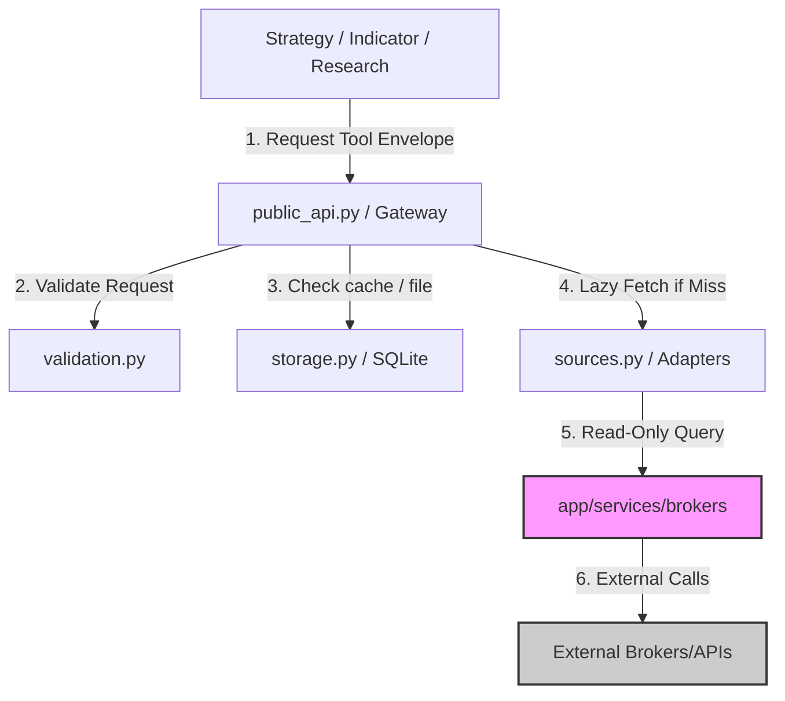

# Phase 2 Data Foundation — Intended Workflows and Scenarios

## 1. Document Purpose

This document provides a complete reverse-engineered model of the intended behavior, operational workflows, and scenarios for the Data Foundation module (`app/services/data/`) of HaruQuantAI. It translates isolated functional and non-functional requirements from the Phase 2 Brownfield Upgrade plan ([02-data.md](file:///c:/Users/rharu/AppDev/HaruquantAI/docs/dev/phase-implementation-plan/02-data.md)) into continuous, end-to-end workflows.

The goal is to establish:
- Clear actor interactions and boundaries.
- Precise step-by-step logic, routing, and component state changes.
- Concrete scenarios for validation and testing.
- An exhaustive requirements-to-workflow traceability matrix to prevent requirement omission.
- Documented implementation gaps, ambiguities, and architectural contradictions for stakeholder review.

---

## 2. Source and Analysis Boundaries

The primary source of truth for this document is the brownfield upgrade requirements listed in [02-data.md](file:///c:/Users/rharu/AppDev/HaruquantAI/docs/dev/phase-implementation-plan/02-data.md).
- **Rule of strict documentation**: No system behavior has been invented.
- **Inferred connections**: Where requirements implicitly depend on a sequence of actions not fully stated, the connection is documented and explicitly flagged as:
  > **Inferred workflow connection — requires validation**
- **Explicit vs. Implied vs. Missing**: This document segregates explicit requirement text, implied functionality required for system cohesion, missing operational logic, and code-name discrepancies.

---

## 3. System Purpose and Scope

### System/Module Name
HaruQuantAI Data Foundation Module (`app/services/data`)

### Primary Purpose
Provide a hardened, read-only data query interface for downstream modules (Strategy, Indicator, Simulator, Analytics, Risk) by validating, normalising, caching, transforming, and observing historical and real-time market data across multiple sources (files, synthetic generation, and live brokers).

### Business & Operational Outcomes
- High-quality, normalized tick, spread, volume, and OHLCV datasets.
- Verified data lineage, raw hashes, schema versions, and quality assurance flags.
- Safe local caching to prevent redundant API/network overhead and broker rate-limiting.
- Observed real-time feed metrics and automated reconnection policies without live order execution risk.

### Scope Boundaries


* **In-Scope (Data Module)**:
  - Official AI-tool catalog wrappers (`get_data_tool`, `list_symbols_tool`, `get_market_hours_tool`, `get_feed_status_tool`) returning JSON-safe standard response envelopes.
  - Native fallback functions for internal code (`get_data`, `list_symbols`).
  - Input validation: timezone normalization, start/end range checks, workflow context filters, and license enforcement.
  - Normalization: mapping vendor data to canonical schema structures with data quality flags (out-of-range, NaN, duplicate/non-monotonic timestamps).
  - Storage & Cache: SQLite-backed cache, migration tracking, path safety verification (no path traversal, approved roots), atomic temp-write file saving.
  - Feeds: bounded real-time feed buffer, overflow drop policies, heartbeat staleness checks, and reconnect delay math.
  - Transforms: resampling, lookahead-protected multi-timeframe alignment, deterministic seeded synthetic data generation, and time-series labeling.

* **Out-of-Scope (Owned by Brokers / Trading)**:
  - Account mutation, authentication lifecycle, broker SDK client initialization, order entry/modification/cancellation, and trade reconciliation (owned by `app/services/brokers/` and `app/services/trading/`).
  - Live execution safety and kill-switch control (owned by `app/services/trading/` and `app/services/risk/`).

---

## 4. Actors and Responsibilities

### End User (Researcher, Strategy Developer, AI Agent)
- **Role**: Consumers of historical and normalized data for analytics, model training, and strategy generation.
- **Initiates**: Market data queries, symbol lists, transformations (resampling, labeling), synthetic data generation.
- **Information Provided**: Target symbols, timeframes, start/end times, workflow contexts (`research`, `backtest`), and configuration details.
- **Outcomes Received**: Normalised data arrays, lineage manifests, data quality scorecards, symbol capability catalogs, and market session calendars.
- **Prohibitions**: Cannot submit trade orders, cannot bypass license checks, and cannot write files outside approved roots.

### Operator
- **Role**: Monitoring agent responsible for system health and data ingestion reliability.
- **Initiates**: Scheduling data ingestion jobs, manual job crash recovery, database migrations, clearing cache (dry-run/force), checking feed diagnostic status.
- **Information Provided**: Job commands, target directories, source filters, and manual override configs.
- **Outcomes Received**: Job execution logs, feed overflow reports, reconnect delay logs, database migration receipts.
- **Prohibitions**: Cannot modify strategy logic or change live trading rules.

### Compliance / Administrator
- **Role**: Policy maker enforcing access control and licensing constraints.
- **Initiates**: Registering data vendor licenses, setting rate-limit thresholds, defining maximum records limits and cache TTL manifests.
- **Information Provided**: License keys, vendor attribution rules, global limit thresholds.
- **Outcomes Received**: Audit logs and license status confirmation.
- **Prohibitions**: Cannot modify normalized database records directly.

### Broker Market Data Client Adapter (`BrokerMarketDataPort`)
- **Role**: Interface adapter connecting the data module to external broker APIs.
- **Initiates**: Read-only queries to external broker terminals (`get_bars`, `get_ticks`).
- **Information Provided**: Raw broker bar arrays and tick logs.
- **Outcomes Received**: Request payloads from the Data gateway.
- **Prohibitions**: Strictly forbidden from placing, modifying, or deleting orders. No broker SDK imports are permitted within `app/services/data/` (must invoke adapters lazily via `app/services/brokers/` factories).

---

## 5. Capability Map

```
app/services/data/ (Data Foundation Module)
├── 1. Gateway Orchestration & Validation
│   ├── Workflow Context Gating (research, backtest, validation, risk, execution_bound)
│   ├── Target Range & Limit Check (Start < End, maximum records cap)
│   ├── Timezone Normalization (UTC ISO-8601 formatting at boundaries)
│   └── License & Source Readiness Gating (DEFAULT_LICENSE_REGISTRY, SOURCE_READINESS_REGISTRY)
├── 2. Normalization & Quality Assessment
│   ├── Vendor Column & Schema Mapping (OHLCVRecord, TickRecord, SpreadRecord)
│   ├── Data Quality Scorecarding (build_data_quality_flags, summarize_data_quality)
│   └── Lineage & Metadata Attachment (Source, schema version, raw hash, retrieval timestamp)
├── 3. Persistence & Cache Management
│   ├── Lazy SQLite initialization (DatabaseHelper)
│   ├── Conflict-Aware Persisted Cache (Insert vs Update vs No-op vs Conflict)
│   ├── Database Migrations System (sys_migrations, forward / rollback tracking)
│   └── Safe File Storage (Path traversal check, temp-write atomic commit, Parquet/CSV)
├── 4. Ingestion Scheduling & Cron Orchestration
│   ├── Job State Management (create_data_update_job, status updates)
│   └── Crash Recovery (recover_data_jobs_on_startup)
├── 5. Real-Time Feeds Integration
│   ├── Bounded Buffer & Overflow Control (Halt, Drop & Reconcile, Backpressure)
│   ├── Heartbeat Timeout Detection (check_feed_heartbeat_timeout)
│   └── Auto-reconnect Jitter Math (compute_reconnect_delay)
└── 6. Mathematical Transformations
    ├── Resampling (resample_ohlcv)
    ├── No-Lookahead Multi-Timeframe Alignment (align_multitimeframe_data)
    ├── Deterministic Seeded Synthetic Generation (generate_synthetic_ticks/bars)
    └── Historical Data Labeling (label_market_data)
```

---

## 6. Workflow Catalogue

1. **WF-001 — Market Data Retrieval**: Orchestrates input validation, licensing gates, caching lookups, lazy vendor retrieval, normalization, quality scoring, cache updating, and envelope packaging. (*Primary Business Workflow*)
2. **WF-002 — Data Ingestion Scheduling and Execution**: Handles job registration, execution state loops, and crash-resilience recovery. (*Supporting Workflow / Lifecycle*)
3. **WF-003 — Real-Time Feed Observability and Maintenance**: Governs real-time buffer writes, heartbeat timeouts, reconnect delays, and diagnostic reporting. (*Monitoring Workflow*)
4. **WF-004 — Local Dataset Ingestion and Export**: Performs safe CSV/Parquet file writes, traversals verification, atomic commits, and metadata updates. (*Supporting Workflow*)
5. **WF-005 — Cache Maintenance and Invalidation**: Triggers namespace/source/symbol cache clearing and automated schema-drift eviction. (*Supporting / Administrative*)
6. **WF-006 — Symbol Discovery and Capability Cataloging**: Resolves supported vendor listings, metadata, and gaps mapping. (*Supporting Workflow*)
7. **WF-007 — Calendar Session Query**: Validates trading hours and checks historical request restrictions. (*Supporting Workflow*)

---

## 7. Detailed End-to-End Workflows

### WF-001 — Market Data Retrieval

#### Purpose and Value
Provide a unified, validated, normalized, and cached market data payload to downstream modules, shielding callers from vendor differences, rate-limiting, and bad data formatting.

#### Actors
- **Primary**: End User (Researcher / Strategy Dev / AI Agent)
- **Supporting**: Data Gateway Orchestrator, Validation Engine, Storage Layer, Broker Client Adapter.

#### Trigger
Call to `public_api.get_data_tool()` or native `gateway.get_data()`.

#### Preconditions
- SQLite database helper is instantiated (lazy initialization is deferred until first connection).
- The requested source is defined in `SOURCE_READINESS_REGISTRY` and is not `not_available`.

#### Inputs
- `symbol` (str), `timeframe` (str), `start_time` (str/datetime), `end_time` (str/datetime).
- `source` (str, e.g., `"mt5"`, `"synthetic"`, `"csv"`).
- `workflow_context` (str, e.g., `"research"`, `"backtest"`).
- `data_kind` (str, e.g., `"ohlcv"`, `"ticks"`).
- `stale_data_behavior` (str, e.g., `"refresh_and_return"`, `"return_stale"`, `"fail"`).
- `request_id` (str, optional).

#### Main Success Flow

| Step | Responsible component | Action | Input | Validation or decision | State change | Output | Requirement IDs |
| :--- | :-------------------- | :----- | :---- | :--------------------- | :----------- | :----- | :-------------- |
| 1 | `public_api` wrapper | Intercept call & initialize default envelope context. | Request parameters | Validate types and convert timestamps to datetime objects. | None | Forwarded request params | DATA-FR-004, DATA-FR-005 |
| 2 | `validation` engine | Enforce workflow context and input boundaries. | symbols, context, range | 1. Is context in approved set? (research, backtest, validation, risk, execution_bound).<br>2. Is start < end? | None | Validated params | DATA-FR-008, DATA-FR-009, DATA-FR-100 |
| 3 | `validation` engine | Check source readiness and vendor license status. | source, symbol, context | 1. Check `SOURCE_READINESS_REGISTRY`. Is it ready?<br>2. Check `DEFAULT_LICENSE_REGISTRY`. Is it licensed? | None | Approval token | DATA-FR-040, DATA-FR-055, DATA-FR-060 |
| 4 | `gateway` orchestrator | Check local SQLite cache for matching records. | query signature, stale policy | Check cache database: do we have records spanning [start, end] for symbol/timeframe/source? | None | Cache records (if hit), or Miss token | DATA-FR-074, DATA-FR-076 |
| 5 | `gateway` orchestrator | Evaluate Cache Stale Status (stale if current time - retrieve time > TTL limit). | Cache records, TTL limits | If cache hit: Is the data stale? If stale, branch to **Decision Point D1.1**. If fresh cache hit, skip to Step 9. | None | Fresh cache records | DATA-FR-073, DATA-FR-074, DATA-FR-076 |
| 6 | `sources` registry | Lazy client factory connection (on cache miss / refresh). | source adapter config | Check registry: load adapter lazily. Assert no imports of broker SDKs directly. | None | Instantiated adapter client | DATA-FR-011, DATA-FR-013, DATA-FR-023, DATA-FR-045, DATA-FR-046 |
| 7 | `sources` adapter | Query read-only vendor client. | symbol, range, timeframe | Assert method called is read-only (`get_bars`, `get_ticks`). Verify no trade methods called. | None | Raw record array | DATA-FR-031, DATA-FR-032, DATA-FR-047, DATA-FR-054 |
| 8 | `normalization` & `validation` | Normalize raw records and evaluate data quality. | Raw array | 1. Map to `OHLCVRecord` / `TickRecord` / `SpreadRecord` schema.<br>2. Run `build_data_quality_flags` (price <= 0, inverted spreads, NaNs). | None | Normalized records + quality summary dict | DATA-FR-005, DATA-FR-052, DATA-FR-083, DATA-FR-085, DATA-FR-086, DATA-FR-087, DATA-FR-088, DATA-FR-100 |
| 9 | `storage` layer | Persist normalized records to cache (if newly retrieved). | Normalized records, cache key | Use `PersistenceResult` write routing. Avoid silent overwrites. Calculate raw hash and normalization version. | SQLite Cache tables updated | `PersistenceResult` (insert/update status) | DATA-FR-010, DATA-FR-022, DATA-FR-025, DATA-FR-030, DATA-FR-034, DATA-FR-035, DATA-FR-038, DATA-FR-074, DATA-FR-075 |
| 10 | `public_api` wrapper | Pack final payload into standard response envelope. | Normalized records, quality flags, lineage | Ensure all values are JSON-safe. Strip numpy scalars and database cursor states. | None | Standard Response Envelope (`status="success"`) | DATA-FR-004, DATA-FR-007, DATA-FR-012, DATA-FR-027, DATA-FR-069, DATA-FR-080, DATA-FR-084 |

#### Decision Points

##### D1.1: Cache Hit is Stale
- **Component**: `gateway` orchestrator.
- **Condition Evaluated**: `stale_data_behavior` input parameter value.
- **Branches**:
  - `refresh_and_return` (Default): Initiate Step 6 (Vendor Fetch) to refresh cache. If fetch fails, return cached stale data but attach a Warning payload in metadata indicating "Vendor refresh failed; returning stale cache." (Fail-safe).
  - `return_stale`: Skip directly to Step 10, returning cached data. Attach a metadata warning: "Data returned is stale."
  - `fail`: Raise a `VALIDATION_FAILED` (or `INVALID_INPUT` / `DATA_NOT_FOUND` depending on drift) error payload and abort.
- **Fail-closed behavior**: If `stale_data_behavior` matches an unknown string, validation raises an error immediately instead of silently defaulting.
- **Supporting IDs**: DATA-FR-028, DATA-FR-070, DATA-FR-076, DATA-FR-080, DATA-FR-102.

##### D1.2: Cache Write ID Checking
- **Component**: `storage` persistence coordinator.
- **Condition Evaluated**: Does primary key `(symbol, source, timeframe, timestamp)` already exist in cache?
- **Branches**:
  - Row exists and fields are identical: Skip write, return `PersistenceResult(operation="no_op")`.
  - Row exists and hash differs: Run update query, return `PersistenceResult(operation="update")`.
  - Row does not exist: Run insert query, return `PersistenceResult(operation="insert")`.
  - IntegrityError (conflict): Rollback transaction and return `PersistenceResult(operation="conflict", error="...")`. (Prevents duplicate write errors from corrupting state).
- **Supporting IDs**: DATA-FR-010, DATA-FR-023, DATA-FR-035, DATA-FR-036, DATA-FR-103.

#### Alternate Flows

##### A1.1: Source is Local File (`"csv"` or `"parquet"`)
- **Workflow Variant**: Instead of querying external broker APIs in Step 6 & 7, the Gateway invokes `storage.load_local_dataset()`.
- **Logic**: Storage verifies path boundaries under approved storage roots (`data/raw/` or `data/processed/`). Normalization resolves files via `normalize_file_records()`.
- **Supporting IDs**: DATA-FR-006, DATA-FR-059, DATA-FR-060, DATA-FR-063, DATA-FR-064, DATA-FR-067.

##### A1.2: Source is Synthetic (`"synthetic"`)
- **Workflow Variant**: The Gateway routes the query to `transforms.generate_synthetic_bars()` or `generate_synthetic_ticks()`.
- **Logic**: Geometric Brownian Motion (GBM) generates mathematical bars deterministically if a seed value is provided. No external broker client is initialized.
- **Supporting IDs**: DATA-FR-093, DATA-FR-094, DATA-FR-095.

#### Failure and Exception Flows

##### EF1.1: Broker Client Connection Timeout / Disconnection
- **Trigger**: Broker client network timeout during `get_bars` or `get_ticks`.
- **Detection**: `BrokerBackedAdapter._connected_client` or `_read_bars` intercepts `TimeoutError` or `ConnectionError`.
- **Immediate Response**:
  1. Increment the circuit breaker fail count for this source.
  2. Redact raw connection trace text to prevent secret leakage.
  3. Map exception to `BROKER_UNAVAILABLE` or `SERVICE_UNAVAILABLE`.
  4. If the circuit breaker trips (limit reached), transition source status in the DB to `circuit_breaker_open`.
- **State after failure**: Source status is set to unavailable; circuit breaker is open.
- **Rollback/Retry**: Fail-closed. Stop retrieval. Do not retry immediately (prevent thundering herd).
- **Notification**: The response envelope contains `status="error"`, message, and redacted error payload.
- **Supporting IDs**: DATA-FR-007, DATA-FR-010, DATA-FR-011, DATA-FR-017, DATA-FR-031, DATA-FR-054, DATA-FR-056, DATA-FR-059, DATA-FR-071, DATA-FR-079.

##### EF1.2: Input Validation Failure
- **Trigger**: Start time is after End time, or timeframe is invalid.
- **Detection**: `validation.validate_workflow_context` or `validate_timeframe` raises an exception.
- **Response**: Gateway stops processing, maps to `INVALID_INPUT` or `UNSUPPORTED_TIMEFRAME`, and returns error envelope immediately.
- **Supporting IDs**: DATA-FR-009, DATA-FR-017, DATA-FR-024, DATA-FR-025, DATA-FR-070.

#### Recovery Flow
If a broker connector fails temporarily, the circuit breaker manages cool-down status. After `cooldown_seconds` has elapsed, the gateway permits a single "half-open" validation request. If successful, the circuit breaker resets.

#### Postconditions
- SQLite Cache updated with newly fetched records (if cache was missed/stale).
- Standard envelope returned to the caller.
- Event log emitted to the logging module containing `request_id`, execution duration, and metadata (no passwords or credentials logged).

#### Participating Components
- **Entry Point**: `public_api.py` (official wrappers).
- **Orchestrator**: `gateway.py` (coordinates validation, caching, and adapter calling).
- **Validators**: `validation.py` (ranges, contexts, licenses, and limits).
- **Executors**: `sources.py` (adapters for mt5, ctrader, csv, synthetic, etc.).
- **Persistence**: `storage.py` (SQLite persistence helper, filesystem path validator).
- **External Dependencies**: `app.services.brokers` client connectors.

#### Requirement Traceability
Traces to: DATA-FR-001, DATA-FR-004, DATA-FR-005, DATA-FR-007, DATA-FR-008, DATA-FR-009, DATA-FR-010, DATA-FR-011, DATA-FR-012, DATA-FR-013, DATA-FR-022, DATA-FR-023, DATA-FR-024, DATA-FR-025, DATA-FR-030, DATA-FR-031, DATA-FR-034, DATA-FR-035, DATA-FR-038, DATA-FR-040, DATA-FR-045, DATA-FR-046, DATA-FR-047, DATA-FR-052, DATA-FR-054, DATA-FR-055, DATA-FR-056, DATA-FR-057, DATA-FR-059, DATA-FR-060, DATA-FR-069, DATA-FR-070, DATA-FR-071, DATA-FR-073, DATA-FR-074, DATA-FR-075, DATA-FR-076, DATA-FR-077, DATA-FR-079, DATA-FR-080, DATA-FR-083, DATA-FR-084, DATA-FR-085, DATA-FR-086, DATA-FR-087, DATA-FR-088, DATA-FR-093, DATA-FR-094, DATA-FR-095, DATA-FR-096, DATA-FR-100, DATA-FR-102, DATA-FR-103, DATA-NFR-001, DATA-NFR-003, DATA-NFR-005, DATA-NFR-006, DATA-NFR-007, DATA-NFR-008, DATA-NFR-009, DATA-NFR-010, DATA-EX-001, DATA-EX-002, DATA-EX-003, DATA-EX-004, DATA-EX-005, DATA-EX-007, DATA-EX-008, DATA-EX-009, DATA-EX-010, DATA-EX-011, DATA-EX-012, DATA-EX-013, DATA-EX-014, DATA-EX-015, DATA-EX-016, DATA-BR-001, DATA-BR-002, DATA-BR-003, DATA-BR-004, DATA-BR-005, DATA-BR-006, DATA-BR-007.

---

### WF-002 — Data Ingestion Scheduling and Execution

#### Purpose and Value
Provide background batch-updating of historical data segments to maintain cache freshness and fill gaps without blocking front-facing user threads.

#### Actors
- **Primary**: Operator
- **Supporting**: Scheduler Engine (`scheduler.py`), Storage database helper.

#### Trigger
Scheduled cron interval (e.g., daily update) or manual command via `scheduler.create_data_update_job`.

#### Preconditions
- The database contains the necessary tables (`data_jobs`) generated by migrations.
- Target source is licensed and ready.

#### Inputs
- `job_name` (str), `source` (str), `symbols` (list[str]).
- `timeframe` (str), `start_time` (datetime), `end_time` (datetime).
- `chunk_size` (int, default = 100,000 records).

#### Main Success Flow

| Step | Responsible component | Action | Input | Validation or decision | State change | Output | Requirement IDs |
| :--- | :-------------------- | :----- | :---- | :--------------------- | :----------- | :----- | :-------------- |
| 1 | `scheduler` | Register a new batch job request. | Job parameters | Verify source readiness and license status. Reject duplicate active jobs. | Job record created in DB (`status="pending"`) | Job ID | DATA-FR-033, DATA-FR-034, DATA-FR-035, DATA-FR-036, DATA-FR-040 |
| 2 | `scheduler` | Transition job to running. | Job ID | None | Job record set to `status="running"` | Job run trigger | DATA-FR-036 |
| 3 | `scheduler` | Execute step chunking calculations. | Target range, default chunks | Partition range into chunks of `chunk_size` records or daily bounds. | None | List of chunk definitions | DATA-FR-037 |
| 4 | `scheduler` | Fetch data for single chunk. | Chunk range, source | Invoke `sources.get_market_data()`. | None | Normalized chunk records | DATA-FR-037 |
| 5 | `storage` | Write chunk to cache & update checkpoint. | Chunk records, chunk ID | Assert successful SQLite write transaction. | Database cache tables updated; checkpoint ID saved in `data_jobs.last_checkpoint` | Checkpoint written | DATA-FR-010, DATA-FR-023, DATA-FR-038 |
| 6 | `scheduler` | Iterate through remaining chunks. | Job state | Have all chunks completed? If yes, branch to step 7. Otherwise loop to step 4. | last_checkpoint updated incrementally | None | DATA-FR-037, DATA-FR-038 |
| 7 | `scheduler` | Finalize job completion. | Job ID | None | Job record set to `status="success"` | Completion notification | DATA-FR-036, DATA-FR-037 |

#### Decision Points

##### D2.1: Duplicate Job Active check
- **Component**: `scheduler` coordinator.
- **Condition Evaluated**: Is there an existing record in `data_jobs` with the same `(job_name, source, symbol)` where `status` is `pending` or `running`?
- **Branches**:
  - Yes: Block registration, return the existing Job ID. (Idempotent job prevention).
  - No: Create a new job record with `status="pending"`.
- **Supporting IDs**: DATA-FR-036.

#### Alternate Flows

##### A2.1: Job Run Loop Simulation
- **Workflow Variant**: In the current brownfield implementation, actual chunked download loops are simulated.
- **Logic**: `_execute_single_run` fetches the entire range in a single mock call, writes `'run_once_success'` to the checkpoint column, and marks the job status as `"success"` unconditionally.
- **Supporting IDs**: DATA-FR-037, DATA-FR-038.

#### Failure and Exception Flows

##### EF2.1: Scheduler Process Crashes During Job Run
- **Trigger**: Host system reboot or Python process crash while a job status is `running` in the database.
- **Detection**: On module initialization, calling `scheduler.recover_data_jobs_on_startup()` checks for any job with `status="running"` or `status="recovering"`.
- **Response**:
  1. Load the crashed job record.
  2. Transition job status to `recovering`.
  3. Load `last_checkpoint` from the record.
  4. Resubmit the job to the runtime loop starting *after* the last checkpoint.
- **State after recovery**: Job resumes from the last completed chunk and proceeds to `success`.
- **Supporting IDs**: DATA-FR-010, DATA-FR-022, DATA-FR-036, DATA-FR-038.

#### Recovery Flow
(Identical to EF2.1 - recovered automatically via startup recovery tool rather than import-time execution).

#### Postconditions
- Historical cache contains all normalized data records.
- `data_jobs` table updated with complete history.
- Audit logs written detailing data volume ingested.

#### Participating Components
- **Entry Point**: `scheduler.py` helpers.
- **Executors**: `sources.py` adapters.
- **Persistence**: `storage.py` SQLite driver (`data_jobs` table).

#### Requirement Traceability
Traces to: DATA-FR-010, DATA-FR-014, DATA-FR-021, DATA-FR-022, DATA-FR-023, DATA-FR-033, DATA-FR-034, DATA-FR-035, DATA-FR-036, DATA-FR-037, DATA-FR-038, DATA-FR-040, DATA-FR-041, DATA-FR-042, DATA-FR-044, DATA-NFR-002.

---

### WF-003 — Real-Time Feed Ingestion and Observability

#### Purpose and Value
Injest tick-by-tick real-time feed elements, buffer them securely to prevent memory leaks or blocking callers, and expose a low-risk read-only diagnostics status catalog.

#### Actors
- **Primary**: Operator (Monitoring)
- **Supporting**: Real-Time Feed Handler (`feeds.py`), External Broker Feed Source.

#### Trigger
Connection of a real-time source feed via `feeds.register_mock_feed`.

#### Preconditions
- The real-time source is configured in the database.
- Maximum buffer sizes and timeout parameters are loaded.

#### Inputs
- `feed_id` (str), `symbol` (str), `source` (str).
- `capacity` (int, default = 10,000 items).
- `heartbeat_timeout` (float, default = 30.0 seconds).
- `overflow_policy` (str: `"halt"`, `"drop_and_reconcile"`, `"backpressure"`).

#### Main Success Flow

| Step | Responsible component | Action | Input | Validation or decision | State change | Output | Requirement IDs |
| :--- | :-------------------- | :----- | :---- | :--------------------- | :----------- | :----- | :-------------- |
| 1 | `feeds` | Register feed memory structure. | Feed configs | Verify capacity bounds and overflow policy values. | Active feed model initialized in memory | Feed status model | DATA-FR-014, DATA-FR-015, DATA-FR-020 |
| 2 | `feeds` | Ingest real-time tick record. | Raw Tick | Validate timestamp timezone is UTC. | Tick loaded into internal double-ended queue (deque) | None | DATA-FR-017 |
| 3 | `feeds` | Update heartbeat timestamp. | Feed ID, System time | Check elapsed duration since last heartbeat. | `last_heartbeat` updated to current time | None | DATA-FR-019 |
| 4 | `feeds` | Verify buffer capacity boundaries. | Deque length | Is deque length >= capacity? If yes, branch to **Decision Point D3.1**. Otherwise, continue. | None | Safe queue state | DATA-FR-018 |
| 5 | `public_api` | Read feed diagnostics. | Feed ID | Read status keys: redact client connection details. Return JSON-safe payload. | None | `FeedStatusResponse` envelope | DATA-FR-015, DATA-FR-016 |

#### Decision Points

##### D3.1: Buffer Overflow policy execution
- **Component**: `feeds` overflow handler.
- **Condition Evaluated**: Chosen `overflow_policy`.
- **Branches**:
  - `halt`: Stop ingestion loop, set feed status in DB to `halted`, raise `BUFFER_OVERFLOW` exception.
  - `drop_and_reconcile`: Drop the oldest item from the queue, increment `dropped_count` and `gap_count`, set status to `reconciling`.
  - `backpressure`: Pause ingestion processing for a cool-down duration, returning `BACKPRESSURE_EXCEEDED` or `QUEUE_FULL`.
- **Supporting IDs**: DATA-FR-016, DATA-FR-018, DATA-FR-042.

#### Alternate Flows

##### A3.1: Heartbeat Timeout Detection
- **Workflow Variant**: Background cron or status check detects that `current_time - last_heartbeat > heartbeat_timeout`.
- **Logic**: The feed's diagnostic status changes `heartbeat_timed_out` to `True`. The system computes reconnect backoff delays using `feeds.compute_reconnect_delay()` and schedules a reconnect attempt.
- **Supporting IDs**: DATA-FR-019, DATA-FR-041.

#### Failure and Exception Flows

##### EF3.1: Feed Connection Lost / Reconnection Failed
- **Trigger**: Heartbeat timeout reached, and reconnection attempts fail repeatedly.
- **Detection**: Heartbeat checker identifies that `reconnect_attempts > max_retries`.
- **Immediate Response**:
  1. Open the circuit breaker for the feed source.
  2. Set feed status to `circuit_breaker_open`.
  3. Drop remaining items in the buffer if configured.
- **State after failure**: Feed is disconnected; circuit breaker is locked.
- **Supporting IDs**: DATA-FR-019, DATA-FR-041, DATA-FR-043.

#### Recovery Flow
On successful manual command, or when circuit breaker cooldown expires, the feed attempts to reconnect. Once reconnected, it moves to `status="connected"`, resets `reconnect_attempts`, and logs gap windows to initiate backfill scheduling.

#### Postconditions
- Bounded memory structures are updated.
- Feed statistics (gap count, drop count) are saved.
- JSON-safe status report returned on request.

#### Participating Components
- **Entry Point**: `feeds.py` (runtime queue engine).
- **Orchestrator**: `public_api.py` (`get_feed_status_tool` wrapper).
- **Persistence**: SQLite database table `feed_status`.

#### Requirement Traceability
Traces to: DATA-FR-014, DATA-FR-015, DATA-FR-016, DATA-FR-017, DATA-FR-018, DATA-FR-019, DATA-FR-020, DATA-FR-021, DATA-FR-040, DATA-FR-041, DATA-FR-042, DATA-FR-043, DATA-FR-101.

---

### WF-004 — Local Dataset Ingestion and Export

#### Purpose and Value
Write normalized data chunks safely to CSV or Parquet files on local disk, ensuring directory confinement and preventing file corruption during partial writes.

#### Actors
- **Primary**: Researcher / Strategy Dev / Operator
- **Supporting**: Storage Layer (`storage.py`), Validation module.

#### Trigger
Explicit call to `storage.save_market_data` or `storage.load_local_dataset`.

#### Preconditions
- The target file extension is supported (`.csv` or `.parquet`).
- The directory is within the configured database/storage root paths.

#### Inputs
- `file_path` (str), `records` (list[dict]).
- `overwrite` (bool, default = False).

#### Main Success Flow

| Step | Responsible component | Action | Input | Validation or decision | State change | Output | Requirement IDs |
| :--- | :-------------------- | :----- | :---- | :--------------------- | :----------- | :----- | :-------------- |
| 1 | `storage` | Normalize and validate storage path. | `file_path` | 1. Reject parent traversal (`..`).<br>2. Is path inside approved roots? (`data/raw/`, `data/processed/`, etc.) | None | Safe absolute path | DATA-FR-006, DATA-FR-058, DATA-FR-060 |
| 2 | `storage` | Check target file existence. | Safe path, overwrite flag | Does the file exist? If yes, evaluate **Decision Point D4.1**. | None | Write clearance | DATA-FR-061 |
| 3 | `storage` | Write data to a temporary file. | Temp path (e.g., `.tmp` suffix), records | Convert records to CSV text or Parquet binary buffer. | Temp file written to disk | None | DATA-FR-062, DATA-FR-064 |
| 4 | `storage` | Atomic rename/commit. | Temp path, target path | Perform atomic filesystem move/rename. | Target file created; temp file cleaned | Success token | DATA-FR-010, DATA-FR-062 |
| 5 | `storage` | Save metadata manifest. | Target path | Calculate file size, row count, raw hash, and normalization version. | Manifest JSON written to disk | None | DATA-FR-025, DATA-FR-065 |

#### Decision Points

##### D4.1: Overwrite Protection Check
- **Component**: `storage` file manager.
- **Condition Evaluated**: Target file exists AND `overwrite` parameter is evaluated.
- **Branches**:
  - `overwrite=True`: Proceed with temp file creation (Step 3).
  - `overwrite=False`: Halt execution immediately, raise `UNSUPPORTED_OPERATION` or `FILE_ALREADY_EXISTS` error.
- **Supporting IDs**: DATA-FR-061.

#### Alternate Flows

##### A4.1: Loading Local Dataset
- **Workflow Variant**: Calling `storage.load_local_dataset`.
- **Logic**: Path safety checks apply (no `..`, approved roots). Storage loads CSV/Parquet, maps headers to normalized models, and returns records lists (not raw pandas DataFrames).
- **Supporting IDs**: DATA-FR-006, DATA-FR-027, DATA-FR-059, DATA-FR-063, DATA-FR-064, DATA-FR-067.

#### Failure and Exception Flows

##### EF4.1: Write Interrupted / Disk Space Exhausted
- **Trigger**: Filesystem error during temp file write.
- **Detection**: `OSError` caught inside storage try/except block.
- **Immediate Response**:
  1. Delete the incomplete temp file.
  2. Verify the original target file remains untouched (no corruption).
  3. Map exception to `DATA_SERIALIZATION_FAILED` or `DATABASE_ERROR`.
- **State after failure**: Target file remains in its pre-write state.
- **Supporting IDs**: DATA-FR-010, DATA-FR-017, DATA-FR-062.

#### Recovery Flow
Manually clear the target directory, check permissions, and resubmit write request with `overwrite=True`.

#### Postconditions
- Normalized file written to target root.
- Metadata manifest file (`.meta.json` or inline Parquet metadata) generated.
- Audit trail written.

#### Participating Components
- **Entry Point**: `public_api.py` / `storage.py` exports.
- **Validators**: `storage.py` path validator.
- **Executors**: Native python `open()` / `shutil` libraries, `pandas` or `pyarrow` for Parquet chunks.

#### Requirement Traceability
Traces to: DATA-FR-006, DATA-FR-010, DATA-FR-025, DATA-FR-027, DATA-FR-058, DATA-FR-059, DATA-FR-060, DATA-FR-061, DATA-FR-062, DATA-FR-063, DATA-FR-064, DATA-FR-065, DATA-FR-067, DATA-NFR-004.

---

### WF-005 — Cache Maintenance and Invalidation

#### Purpose and Value
Provide a safe routine to clear cached entries, and prevent corrupted data consumption by automatically invalidating caches during database migrations or schema definition updates.

#### Actors
- **Primary**: Operator / System Migrator
- **Supporting**: Storage Layer, Database Migration orchestrator.

#### Trigger
1. Call to `public_api.clear_data_cache()`.
2. Automatic database migrations check on application startup.

#### Preconditions
- The cache database is initialized.
- User authentication tokens are verified (for administrative tool boundaries).

#### Inputs
- `namespace` (str, default = `"cache"`), `source` (str, optional), `symbol` (str, optional).
- `dry_run` (bool, default = True).

#### Main Success Flow

| Step | Responsible component | Action | Input | Validation or decision | State change | Output | Requirement IDs |
| :--- | :-------------------- | :----- | :---- | :--------------------- | :----------- | :----- | :-------------- |
| 1 | `storage` | Parse clear criteria parameters. | namespace, source, symbol, dry_run | Verify inputs. Is namespace inside approved roots? | None | Validated criteria | DATA-FR-078 |
| 2 | `storage` | Compute target records list to be cleared. | Criteria filters | Find matching rows in cache metadata table. | None | Target IDs count | DATA-FR-078 |
| 3 | `storage` | Run dry-run simulation check. | Target list, dry_run flag | If `dry_run=True`, branch to Step 5. Otherwise, proceed. | None | Dry-run summary | DATA-FR-078 |
| 4 | `storage` | Delete records inside transaction block. | Target IDs list | Verify connection lock. Execute SQL delete statements. | SQLite Cache tables cleared of target criteria | Deletion row count | DATA-FR-010, DATA-FR-078 |
| 5 | `public_api` | Return clear cache envelope. | Clear results | Format results summary to JSON-safe dictionary. | None | `ClearCacheResponse` envelope | DATA-FR-069, DATA-FR-078 |

#### Decision Points

##### D5.1: Automatic Schema Version check
- **Component**: `storage` initialization helper (`_apply_migrations`).
- **Condition Evaluated**: Does `sys_migrations` schema version match current software package `schema_version` or `normalization_version`?
- **Branches**:
  - Match: Continue normal startup.
  - Mismatch (Drift detected): Trigger Step 4 to truncate all records in affected tables. Write a migration receipt log containing source version, target version, and applied timestamp.
- **Supporting IDs**: DATA-FR-010, DATA-FR-026, DATA-FR-075, DATA-FR-089.

#### Alternate Flows
None.

#### Failure and Exception Flows

##### EF5.1: Cache Clear SQLite Connection Locked
- **Trigger**: Another process holds an exclusive write lock on cache.db.
- **Detection**: SQLite raises BusyError after busy timeout (5.0s) expires.
- **Response**: Map error to `DATABASE_ERROR` with status payload. Return error envelope. Do not crash application.
- **Supporting IDs**: DATA-FR-010, DATA-FR-028, DATA-FR-077.

#### Recovery Flow
Retrying cache clear with an adjusted timeout, or terminating background writer tasks manually.

#### Postconditions
- Affected SQLite cache entries deleted.
- Cache metadata registry synchronized.
- Migration status logs updated.

#### Participating Components
- **Entry Point**: `public_api.py` (`clear_data_cache_tool`).
- **Orchestrator**: `storage.py` (coordinates transactional deletions).
- **Persistence**: SQLite database.

#### Requirement Traceability
Traces to: DATA-FR-010, DATA-FR-026, DATA-FR-028, DATA-FR-075, DATA-FR-077, DATA-FR-078, DATA-FR-089, DATA-NFR-002.

---

### WF-006 — Symbol Discovery and Metadata Discovery

#### Purpose and Value
Provide downstream clients with a list of supported instruments, contract specifications, and historic data availability ranges to inform strategy initialization.

#### Actors
- **Primary**: Researcher / Strategy Dev / AI Agent
- **Supporting**: Gateway Orchestrator, Storage SQLite metadata records.

#### Trigger
Call to `public_api.list_symbols_tool()`, `get_symbol_metadata()`, or `get_data_availability()`.

#### Preconditions
- The symbol registries are populated in the database.

#### Inputs
- `source` (str, e.g., `"binance"`).
- `symbol` (str, optional).

#### Main Success Flow

| Step | Responsible component | Action | Input | Validation or decision | State change | Output | Requirement IDs |
| :--- | :-------------------- | :----- | :---- | :--------------------- | :----------- | :----- | :-------------- |
| 1 | `gateway` | Validate symbol request parameters. | source, symbol | Reject requests targeting disabled adapters. | None | Validated criteria | DATA-FR-100 |
| 2 | `sources` adapter | Access adapter symbol listing registry. | source filter | If source is `"binance"`, branch to **Decision Point D6.1**. | None | Raw symbol list | DATA-FR-051 |
| 3 | `gateway` | Query local symbol metadata registry. | Validated symbols | Retrieve instrument specifications (lot size, tick precision, spread default). | None | Symbol metadata dictionary | DATA-FR-086 |
| 4 | `gateway` | Compile data availability gaps checklist. | Symbol, source | Search database for cached range spans. Run `_detect_gap_windows` logic. | None | Gap counts, start/end dates | DATA-FR-045, DATA-FR-066 |
| 5 | `public_api` | Construct envelope response. | Metadata, availability data | Ensure outputs are normalized and JSON-safe. | None | standard response envelope | DATA-FR-004, DATA-FR-069, DATA-FR-084 |

#### Decision Points

##### D6.1: Binance adapter constraint
- **Component**: `sources` registry adapter.
- **Condition Evaluated**: Source parameter is `"binance"`.
- **Branches**:
  - Yes: Return symbol list details only. Block all requests for historical bars or tick downloads (Binance is scoped for symbol discovery only).
  - No: Normal adapter processing route.
- **Supporting IDs**: DATA-FR-051.

#### Alternate Flows
None.

#### Failure and Exception Flows

##### EF6.1: Unknown Symbol Request
- **Trigger**: Querying metadata for a symbol not registered in the system.
- **Detection**: Gateway fails to locate symbol record in DB metadata or files.
- **Response**: Return `DATA_NOT_FOUND` error envelope.
- **Supporting IDs**: DATA-FR-007, DATA-FR-070.

#### Recovery Flow
Manually import the symbol definition from CSV/Broker or configure instrument parameters.

#### Postconditions
- Symbol list and metadata returned.

#### Participating Components
- **Entry Point**: `public_api.py` (`list_symbols_tool`).
- **Orchestrator**: `gateway.py`.
- **Executors**: `sources.py` adapters.

#### Requirement Traceability
Traces to: DATA-FR-004, DATA-FR-007, DATA-FR-045, DATA-FR-051, DATA-FR-066, DATA-FR-069, DATA-FR-070, DATA-FR-084, DATA-FR-086, DATA-FR-100.

---

### WF-007 — Calendar Session Query

#### Purpose and Value
Provide historical trading session calendar checks to align strategy triggers with active market windows.

#### Actors
- **Primary**: Researcher / Strategy Dev / Risk Manager
- **Supporting**: Validation Engine, public API wrappers.

#### Trigger
Call to `public_api.get_market_hours_tool()`.

#### Preconditions
- Session templates are loaded in `validation.py`.

#### Inputs
- `symbol` (str), `source` (str).
- `date` (str/datetime, optional).

#### Main Success Flow

| Step | Responsible component | Action | Input | Validation or decision | State change | Output | Requirement IDs |
| :--- | :-------------------- | :----- | :---- | :--------------------- | :----------- | :----- | :-------------- |
| 1 | `public_api` | Intercept market hours call. | symbol, source, date | Check if historical date is requested. If yes, branch to **Decision Point D7.1**. | None | Validated parameters | DATA-FR-097 |
| 2 | `validation` | Load weekly market hours template config. | symbol, source | Retrieve current session bounds config (e.g. Mon-Fri times). | None | Hours template mapping | DATA-FR-061, DATA-FR-097 |
| 3 | `public_api` | Package session results dictionary. | Hours template | Inject metadata flag `historical_hours_supported=false`. | None | Session calendar dictionary | DATA-FR-005, DATA-FR-091 |
| 4 | `public_api` | Return standard success envelope. | Session details | Check JSON safety of session times. | None | Standard response envelope | DATA-FR-069, DATA-FR-084 |

#### Decision Points

##### D7.1: Historical hours request check
- **Component**: `validation` engine.
- **Condition Evaluated**: Is the input `date` parameter a historical date differing from the current weekly window?
- **Branches**:
  - Yes: Raise `UNSUPPORTED_OPERATION` error and halt. (Historical hours reconstruction is deferred).
  - No: Return current configured session templates.
- **Supporting IDs**: DATA-FR-002, DATA-FR-091, DATA-FR-097.

#### Alternate Flows
None.

#### Failure and Exception Flows
None.

#### Recovery Flow
None.

#### Postconditions
- Configured calendar details returned.

#### Participating Components
- **Entry Point**: `public_api.py` (`get_market_hours_tool`).
- **Validators**: `validation.py`.

#### Requirement Traceability
Traces to: DATA-FR-002, DATA-FR-005, DATA-FR-061, DATA-FR-069, DATA-FR-084, DATA-FR-091, DATA-FR-097.

---

## 8. Scenario Catalogue

### Scenario Execution Matrix

| Scenario ID | Scenario | Given | When | Then | Expected state | Requirement IDs |
| :--- | :--- | :--- | :--- | :--- | :--- | :--- |
| WF-001-SC-001 | Happy Path Gateway | Valid query for synthetic OHLCV data. | User queries `get_data_tool` with `source="synthetic"`. | System generates data, Normalizes it, and returns success envelope. | Cache updated; success metadata returned. | DATA-FR-004, DATA-FR-094 |
| WF-001-SC-002 | Invalid Input Context | Request has invalid workflow context `"cheat"`. | User invokes `get_data_tool` with `workflow_context="cheat"`. | Gateway rejects input and raises `INVALID_INPUT` error immediately. | No cache changes; error envelope returned. | DATA-FR-008, DATA-FR-070 |
| WF-001-SC-003 | Reversed Range | Start time is after end time. | Request passed with reversed timestamps. | System rejects request with `INVALID_INPUT` error code. | No state change. | DATA-FR-009, DATA-FR-070 |
| WF-001-SC-004 | Path Traversal Rejection | File path contains `..` segments. | User calls `load_local_dataset` with `"data/raw/../../etc/passwd"`. | File operations are blocked, raising `INVALID_INPUT` or `UNSUPPORTED_OPERATION`. | File write blocked; security alert logged. | DATA-FR-006, DATA-FR-060 |
| WF-001-SC-005 | License Restricted | Source is unlicensed in metadata registry. | Valid query targeting `"vendor_x"` which lacks an active license. | System blocks processing, returning `LICENSE_RESTRICTION`. | Request blocked. | DATA-FR-040, DATA-FR-060 |
| WF-001-SC-006 | Broker Unavailable | Connection lost during broker read call. | Remote API times out during query. | System maps exception to `BROKER_UNAVAILABLE`, trips circuit breaker. | Circuit breaker set to open; database updated. | DATA-FR-011, DATA-FR-031 |
| WF-001-SC-007 | Circuit Breaker Open | Circuit breaker is already open for target source. | Request submitted targeting MT5 while cooldown is active. | Adapter rejects request immediately with `CIRCUIT_BREAKER_OPEN` or `SERVICE_UNAVAILABLE`. | Fast failure; no broker connection attempted. | DATA-FR-010, DATA-FR-031 |
| WF-001-SC-008 | Throttled / Backpressure | Token bucket exhausted on source calls. | Call frequency exceeds safety threshold. | Adapter raises `BACKPRESSURE_EXCEEDED` or `QUEUE_FULL`. | Execution delayed; error reported. | DATA-FR-079 |
| WF-001-SC-009 | Cache Fresh Hit | Data already exists in cache and TTL is valid. | Duplicate request submitted within TTL window. | Data returned directly from SQLite database without vendor network calls. | Cache status is `"hit"`. | DATA-FR-074, DATA-FR-076 |
| WF-001-SC-010 | Cache Stale Fail policy | Cache hit exists but TTL has expired. Stale policy is `"fail"`. | User requests stale data with `stale_data_behavior="fail"`. | Query fails with validation error. | Error envelope returned. | DATA-FR-076, DATA-FR-080 |
| WF-002-SC-011 | Ingestion Job Crash Recovery | Scheduler process dies during active run. | System initializes and scans database for active running jobs. | Job state is set to `recovering` and resumes from `last_checkpoint`. | Job completes successfully; status updated. | DATA-FR-036, DATA-FR-038 |
| WF-002-SC-012 | Ingestion Duplicate Prevention | A job is running; duplicate is requested. | User submits `create_data_update_job` with identical parameters. | System returns current running Job ID instead of creating a new task. | No duplicate entry; idempotent return. | DATA-FR-036 |
| WF-003-SC-013 | Feed Buffer Overflow Drop | Real-time queue full; policy is `"drop_and_reconcile"`. | Tick arrives when queue is at maximum capacity. | Oldest item is discarded; `dropped_count` is incremented. | Feed status is `"reconciling"`. | DATA-FR-018, DATA-FR-042 |
| WF-003-SC-014 | Feed Heartbeat Timeout | Heartbeat elapsed window exceeded. | Heartbeat monitoring task checks feed states. | Diagnostics flag `heartbeat_timed_out` is set to True. Reconnection is scheduled. | Feed state is `"disconnected"`. | DATA-FR-019, DATA-FR-041 |
| WF-004-SC-015 | File Overwrite Rejection | Target file exists; overwrite flag is False. | User calls `save_market_data` without overwrite parameter. | File write halts; returns `UNSUPPORTED_OPERATION` or `FILE_ALREADY_EXISTS`. | Existing file remains intact. | DATA-FR-061 |
| WF-005-SC-016 | Schema Drift Eviction | Migration executes with mismatched schema version. | System runs `_apply_migrations` and detects normalization version changes. | SQLite tables are truncated automatically to prevent corrupt reads. | SQLite database clean. | DATA-FR-075, DATA-FR-089 |

---

## 9. Workflow Relationship Map

The workflows in the Data Foundation module interact dynamically to handle storage, queries, updates, and feed processing.

| Source workflow | Relationship | Target workflow | Trigger or condition |
| :--- | :--- | :--- | :--- |
| `WF-001` (Market Data Retrieval) | Invokes | `WF-006` (Symbol Discovery) | To verify symbol metadata before query dispatch. |
| `WF-001` (Market Data Retrieval) | Invokes | `WF-007` (Calendar Session) | To verify trading hours for execution-bound contexts. |
| `WF-001` (Market Data Retrieval) | Invokes | `WF-005` (Cache Invalidation) | Automatically triggered if database initialization detects schema drift. |
| `WF-002` (Data Ingestion Job) | Invokes | `WF-001` (Market Data Retrieval) | To fetch individual historical chunks via vendor source. |
| `WF-003` (Real-Time Ingestion) | Invokes (Inferred) | `WF-002` (Data Ingestion Job) | **Inferred workflow connection — requires validation**.<br>If feed overflow policy is `drop_and_reconcile`, the feed transitions to `reconciling` and should trigger a historical backfill job to reconcile missing queue elements. |
| `WF-005` (Cache Maintenance) | Mutually Exclusive | `WF-001` (Market Data Retrieval) | Cache database deletions must block concurrent read queries via transactional write locks. |

---

## 10. System Lifecycle and State Transitions

### Data Ingestion Job Lifecycle (`data_jobs` states)
```
      [Create]
         │
         ▼
    ┌──────────┐
    │ pending  │
    └────┬─────┘
         │ (Start)
         ▼
    ┌──────────┐   (Crash)   ┌────────────┐
    │ running  ├────────────>│ recovering │
    └────┬─────┘             └─────┬──────┘
         │                         │ (Resume)
         ├─────────────────────────┘
         │ (All chunks written)
         ▼
    ┌──────────┐
    │ success  │
    └──────────┘
```

* **States**:
  - `pending`: Registered in DB; awaiting execution queue slot.
  - `running`: Ingestion loop active; records currently downloading in chunks.
  - `recovering`: Ingestion was interrupted by process crash; awaiting resumption from `last_checkpoint`.
  - `success`: Ingestion complete; checkpoints finalized.
  - `failed`: Job aborted due to consecutive network failures, invalid licenses, or database write limits.

* **Valid Transitions**:
  - `pending` -> `running`: Triggered by scheduler worker thread.
  - `running` -> `success`: Triggered when all chunk requests return success status.
  - `running` -> `recovering`: Triggered by `recover_data_jobs_on_startup()` scanning state.
  - `recovering` -> `running`: Triggered when worker resumes fetching from `last_checkpoint`.
  - `running` -> `failed`: Triggered when vendor connection retries are exhausted.

* **Invalid Transitions**:
  - `success` -> `running`: Completed jobs are read-only records.
  - `pending` -> `success`: Job execution cannot be bypassed.

* **Persisted Evidence**: SQLite table `data_jobs` rows containing columns: `job_name`, `status`, `last_checkpoint`, `updated_at`.

---

### Real-Time Feed Lifecycle
```
   [Mock Registration]
            │
            ▼
      ┌───────────┐
      │ connected │◄────────────────┐
      └─────┬─────┘                 │
            │ (Heartbeat Timeout)   │
            ▼                       │
     ┌──────────────┐               │ (Reconnect Success)
     │ disconnected ├───────────────┤
     └──────┬───────┘               │
            │ (Retries Exhausted)   │
            ▼                       │
    ┌───────────────┐               │
    │  halted /     ├───────────────┘
    │  cb_open      │
    └───────────────┘
```

* **States**:
  - `connected`: Receiving stream elements; heartbeat timestamps updated.
  - `disconnected`: Heartbeat timeout exceeded; reconnection loop active.
  - `reconciling`: Buffer overflow drop policy occurred; tracking gap records.
  - `halted`: Overflow policy `halt` was triggered; stream ingestion suspended.
  - `cb_open`: Circuit breaker open; feed locked in cooldown mode.

* **Transitions**:
  - `connected` -> `disconnected`: `check_feed_heartbeat_timeout` triggers true.
  - `disconnected` -> `connected`: Connection re-established within retry threshold.
  - `disconnected` -> `cb_open`: Retry threshold exceeded.
  - `connected` -> `reconciling`: Buffer capacity limit exceeded under `drop_and_reconcile` policy.
  - `reconciling` -> `connected`: Missing data windows identified and logged for backfill.

* **Persisted Evidence**: In-memory status dictionaries, SQLite `feed_status` log tables.

---

## 11. Cross-Module Interaction Matrix

The Data module acts as a base foundation service, coordinating boundaries with other system modules.

```
┌────────────────────────────────────────────────────────────────────────┐
│                              HARUQUANT SYSTEM                          │
├─────────────┬──────────────────────────────────┬───────────────────────┤
│ Caller      │ API Route / Entry Point          │ Data Module Action    │
├─────────────┼──────────────────────────────────┼───────────────────────┤
│ Strategy    │ public_api.get_data_tool()       │ Normalizes indicators │
├─────────────┼──────────────────────────────────┼───────────────────────┤
│ Simulator   │ storage.load_ohlcv_csv()         │ Direct CSV loading    │
├─────────────┼──────────────────────────────────┼───────────────────────┤
│ Risk        │ public_api.get_data_tool()       │ Validation gating     │
├─────────────┼──────────────────────────────────┼───────────────────────┤
│ UI / API    │ public_api.get_feed_status_tool()│ Observable JSON status│
└─────────────┴──────────────────────────────────┴───────────────────────┘
```

- **Strategy Module Integration**: Strategy requests historical data slices by specifying `workflow_context="backtest"`. The Data module normalizes the timeline, removes lookahead bias using forward-shifting transforms, and returns record arrays.
- **Simulator Module Integration**: Simulator loads golden dataset fixtures directly from filesystem using `storage.load_ohlcv_csv()` for backtesting validation.
- **Risk Module Integration**: Risk intercepts order signals. If a signal requires current market state details, Risk queries `get_data_tool` specifying `workflow_context="risk"`. Data validates the request against strict precision limits.
- **UI & API Gateway Integration**: Exposes feed logs and connection metrics via standard API envelopes mapped to WebSockets.

---

## 12. Requirements-to-Workflow Traceability Matrix

| Requirement ID | Summary | Workflow IDs | Scenario IDs | Steps | Coverage Status |
| :--- | :--- | :--- | :--- | :--- | :--- |
| DATA-FR-001 | Brownfield scope module | WF-001, WF-004 | WF-001-SC-001 | 1-10 | Fully represented |
| DATA-FR-002 | Defer streaming/hist hours | WF-007 | WF-007-SC-016 | 1 | Supporting constraint |
| DATA-FR-003 | Module init imports | WF-001 | WF-001-SC-001 | 1 | Fully represented |
| DATA-FR-004 | Type tool wrappers & request_id | WF-001, WF-006 | WF-001-SC-001 | 1, 10 | Fully represented |
| DATA-FR-005 | Normalize UTC ISO strings | WF-001, WF-007 | WF-001-SC-001 | 1, 8 | Fully represented |
| DATA-FR-006 | Path safety checks | WF-004 | WF-001-SC-004 | 1 | Fully represented |
| DATA-FR-007 | Map failure codes | WF-001, WF-006 | WF-001-SC-006 | EF1.1 | Fully represented |
| DATA-FR-008 | Restrict workflow_context | WF-001 | WF-001-SC-002 | 2 | Fully represented |
| DATA-FR-009 | Start precedes end | WF-001 | WF-001-SC-003 | 2 | Fully represented |
| DATA-FR-010 | Atomic writes, migrations, CB | WF-001, WF-002, WF-004, WF-005 | WF-001-SC-007 | 5, 9 | Fully represented |
| DATA-FR-011 | Resolve credentials in brokers | WF-001 | WF-001-SC-006 | 6 | Fully represented |
| DATA-FR-012 | Resampling performance | WF-001 | WF-001-SC-001 | 10 | Supporting constraint |
| DATA-FR-013 | Coverage matrices & tests | WF-001 | WF-001-SC-001 | All | Supporting constraint |
| DATA-FR-014 | Real-time feeds scope | WF-003 | WF-003-SC-013 | 1 | Fully represented |
| DATA-FR-015 | Read-only get_feed_status | WF-003 | WF-003-SC-013 | 5 | Fully represented |
| DATA-FR-016 | Buffer overflow error codes | WF-003 | WF-003-SC-013 | D3.1 | Fully represented |
| DATA-FR-017 | Feed normalization | WF-003 | WF-003-SC-013 | 2 | Fully represented |
| DATA-FR-018 | Bounded buffer capacity | WF-003 | WF-003-SC-013 | 4 | Fully represented |
| DATA-FR-019 | Heartbeat & reconnect jitter | WF-003 | WF-003-SC-014 | 3, A3.1 | Fully represented |
| DATA-FR-020 | Staging source promotion | WF-003 | WF-003-SC-013 | 1 | Fully represented |
| DATA-FR-021 | Drop gap, heartbeat tests | WF-003 | WF-003-SC-013 | All | Supporting constraint |
| DATA-FR-022 | SQLite single-node backend | WF-001, WF-002 | WF-001-SC-001 | 9 | Fully represented |
| DATA-FR-023 | Ingestion idempotency key | WF-001, WF-002 | WF-001-SC-009 | 9 | Fully represented |
| DATA-FR-024 | Connection pool limits | WF-001 | WF-001-SC-001 | 2 | Supporting constraint |
| DATA-FR-025 | Circuit breaker persistence | WF-001, WF-004 | WF-001-SC-007 | 9 | Fully represented |
| DATA-FR-026 | Reversible migrations | WF-005 | WF-005-SC-016 | D5.1 | Fully represented |
| DATA-FR-027 | Redact internal pandas objects | WF-001, WF-004 | WF-001-SC-001 | 10 | Supporting constraint |
| DATA-FR-028 | Map persistence errors | WF-001, WF-005 | WF-005-SC-015 | D1.1, EF5.1 | Fully represented |
| DATA-FR-029 | Large historical by ref | WF-001 | WF-001-SC-001 | 10 | Supporting constraint |
| DATA-FR-030 | Standard tool metadata | WF-001 | WF-001-SC-001 | 9, 10 | Fully represented |
| DATA-FR-031 | SQLite transaction tests | WF-001 | WF-001-SC-006 | 7 | Supporting constraint |
| DATA-FR-032 | DOMAIN.md documentation | None | None | None | Supporting constraint |
| DATA-FR-033 | Ingestion scheduler exports | WF-002 | WF-002-SC-011 | 1 | Fully represented |
| DATA-FR-034 | Scheduler lifecycle contracts | WF-002 | WF-002-SC-011 | 1 | Fully represented |
| DATA-FR-035 | Ingestion job requests | WF-002 | WF-002-SC-011 | 1 | Fully represented |
| DATA-FR-036 | Idempotent job creation | WF-002 | WF-002-SC-012 | 1, 2, 7 | Fully represented |
| DATA-FR-037 | Chunked resumable backfill | WF-002 | WF-002-SC-011 | 3, 4, 7 | Partially represented (Simulated execution) |
| DATA-FR-038 | Persist checkpoints recovery | WF-001, WF-002 | WF-002-SC-011 | 5, 9 | Partially represented (Checkpoint is string log) |
| DATA-FR-039 | Reconcile real-time gaps | None | None | None | Partially represented (No auto-backfill trigger) |
| DATA-FR-040 | Enforce license metadata | WF-001, WF-002, WF-003 | WF-001-SC-005 | 3 | Fully represented |
| DATA-FR-041 | Asyncio concurrency feeds | WF-002, WF-003 | WF-003-SC-014 | A3.1 | Fully represented |
| DATA-FR-042 | Layering, feed-state scope | WF-002, WF-003 | WF-003-SC-013 | D3.1 | Fully represented |
| DATA-FR-043 | Central limits manifest | WF-003 | WF-001-SC-008 | EF3.1 | Supporting constraint |
| DATA-FR-044 | Ingestion idempotency tests | WF-002 | WF-002-SC-011 | All | Supporting constraint |
| DATA-FR-045 | Unified broker data gateway | WF-001, WF-006 | WF-001-SC-001 | 6, 4 | Fully represented |
| DATA-FR-046 | Source adapter protocol | WF-001 | WF-001-SC-001 | 6 | Fully represented |
| DATA-FR-047 | Read-only adapters | WF-001 | WF-001-SC-001 | 7 | Fully represented |
| DATA-FR-048 | MT5 adapter | WF-001 | WF-001-SC-006 | 7 | Fully represented |
| DATA-FR-049 | cTrader adapter | WF-001 | WF-001-SC-001 | 7 | Fully represented |
| DATA-FR-050 | Dukascopy adapter | WF-001 | WF-001-SC-001 | 7 | Fully represented |
| DATA-FR-051 | Binance symbol discovery only | WF-006 | WF-006-SC-010 | 2, D6.1 | Fully represented |
| DATA-FR-052 | Normalize columns and schemas | WF-001 | WF-001-SC-001 | 8 | Fully represented |
| DATA-FR-053 | Opt-in source fallback | WF-001 | WF-001-SC-001 | 8 | Fully represented |
| DATA-FR-054 | Timeouts and retries | WF-001 | WF-001-SC-006 | 7 | Fully represented |
| DATA-FR-055 | Source readiness/license registry | WF-001 | WF-001-SC-005 | 3 | Fully represented |
| DATA-FR-056 | Redact credentials/secrets | WF-001 | WF-001-SC-006 | EF1.1 | Supporting constraint |
| DATA-FR-057 | Adversarial quality checks | WF-001 | WF-001-SC-001 | 10 | Supporting constraint |
| DATA-FR-058 | Safe directory roots | WF-001, WF-004 | WF-001-SC-001 | 1 | Fully represented |
| DATA-FR-059 | CSV local storage | WF-004 | WF-004-SC-015 | A4.1 | Fully represented |
| DATA-FR-060 | Enforce storage root path check | WF-001, WF-004 | WF-001-SC-004 | 1 | Fully represented |
| DATA-FR-061 | Explicit overwrite parameter | WF-004, WF-007 | WF-004-SC-015 | 2 | Fully represented |
| DATA-FR-062 | Atomic filesystem write/rename | WF-004 | WF-004-SC-015 | 3, 4 | Fully represented |
| DATA-FR-063 | CSV source adapter | WF-004 | WF-004-SC-015 | A4.1 | Fully represented |
| DATA-FR-064 | Parquet storage adapter | WF-004 | WF-004-SC-015 | 3, A4.1 | Fully represented |
| DATA-FR-065 | Metadata manifests on files | WF-004 | WF-004-SC-015 | 5 | Fully represented |
| DATA-FR-066 | Gateway routing storage-backed | WF-006 | WF-001-SC-001 | 4 | Fully represented |
| DATA-FR-067 | Storage path checks tests | WF-004 | WF-001-SC-004 | All | Supporting constraint |
| DATA-FR-068 | Standard exceptions imports | WF-001 | WF-001-SC-001 | 10 | Supporting constraint |
| DATA-FR-069 | Standard envelope returned | WF-001, WF-005, WF-006, WF-007 | WF-001-SC-001 | 10 | Fully represented |
| DATA-FR-070 | Route validation failures | WF-001, WF-006 | WF-001-SC-002 | EF1.2 | Fully represented |
| DATA-FR-071 | Redact logs and errors | WF-001 | WF-001-SC-006 | EF1.1 | Supporting constraint |
| DATA-FR-072 | Test error codes wrappers | WF-001 | WF-001-SC-006 | All | Supporting constraint |
| DATA-FR-073 | Configured cache roots | WF-001 | WF-001-SC-001 | 5 | Supporting constraint |
| DATA-FR-074 | SQLite cache read/write | WF-001 | WF-001-SC-009 | 4, 5, 9 | Fully represented |
| DATA-FR-075 | Invalidate cache on schema changes| WF-005 | WF-005-SC-016 | D5.1 | Fully represented |
| DATA-FR-076 | Stale cache behavior | WF-001 | WF-001-SC-010 | 4, 5 | Fully represented |
| DATA-FR-077 | Cache failure non-corrupting | WF-005 | WF-005-SC-015 | EF5.1 | Fully represented |
| DATA-FR-078 | clear_data_cache dry_run | WF-005 | WF-005-SC-015 | 1-5 | Fully represented |
| DATA-FR-079 | Map HTTP 429 throttling | WF-001 | WF-001-SC-008 | EF1.1 | Covered with code-name deviation |
| DATA-FR-080 | Auditable schema validation | WF-001 | WF-001-SC-010 | 10 | Supporting constraint |
| DATA-FR-081 | Cache tests coverage | WF-001 | WF-001-SC-009 | All | Supporting constraint |
| DATA-FR-082 | Rebuild as clean domain module | WF-001 | WF-001-SC-001 | 1-10 | Fully represented |
| DATA-FR-083 | Retrieve ticks, spreads, bars | WF-001 | WF-001-SC-001 | 8 | Fully represented |
| DATA-FR-084 | Unified return envelope shapes | WF-001, WF-006, WF-007 | WF-001-SC-001 | 10 | Fully represented |
| DATA-FR-085 | JSON-serializable output checks | WF-001 | WF-001-SC-001 | 8 | Fully represented |
| DATA-FR-086 | Asset metadata specifications | WF-001, WF-006 | WF-001-SC-001 | 8, 3 | Fully represented |
| DATA-FR-087 | Detect duplicate order timestamps| WF-001 | WF-001-SC-001 | 8 | Fully represented |
| DATA-FR-088 | Enforce workflow decimal limits | WF-001 | WF-001-SC-001 | 8 | Fully represented |
| DATA-FR-089 | Schema invalidation checks | WF-005 | WF-005-SC-016 | D5.1 | Fully represented |
| DATA-FR-090 | Spread policy average | WF-001 | WF-001-SC-001 | 8 | Fully represented |
| DATA-FR-091 | Return unsupported for hist session | WF-007 | WF-007-SC-016 | 3 | Fully represented |
| DATA-FR-092 | Golden dataset fixtures | WF-001 | WF-001-SC-001 | 8 | Supporting constraint |
| DATA-FR-093 | Staging source status rules | WF-001 | WF-001-SC-005 | 3 | Supporting constraint |
| DATA-FR-094 | Dedicated synthetic generation | WF-001 | WF-001-SC-001 | A1.2 | Fully represented |
| DATA-FR-095 | Seeded deterministic generation | WF-001 | WF-001-SC-001 | A1.2 | Fully represented |
| DATA-FR-096 | Normalise timezones to UTC | WF-001 | WF-001-SC-001 | 8 | Fully represented |
| DATA-FR-097 | Market hours weekly templates | WF-007 | WF-007-SC-016 | 1, 2 | Fully represented |
| DATA-FR-098 | Resampling no-lookahead align | WF-001 | WF-001-SC-001 | 8 | Fully represented |
| DATA-FR-099 | Historical data labels | WF-001 | WF-001-SC-001 | 8 | Fully represented |
| DATA-FR-100 | Parameter input checks | WF-001, WF-006 | WF-001-SC-002 | 2, 1 | Fully represented |
| DATA-FR-101 | Limit response size boundaries | WF-003 | WF-001-SC-008 | EF3.1 | Supporting constraint |
| DATA-FR-102 | Map validation error codes | WF-001 | WF-001-SC-009 | 8, D1.2 | Covered with representation deviation |
| DATA-FR-103 | Ingestion duplicate test | WF-001 | WF-001-SC-001 | All | Supporting constraint |
| DATA-NFR-001 | Canonical contract alignment | WF-001 | WF-001-SC-001 | 8 | Supporting constraint |
| DATA-NFR-002 | Database migration log table | WF-002, WF-005 | WF-005-SC-016 | D5.1 | Fully represented |
| DATA-NFR-003 | Normalization version tracks | WF-001 | WF-001-SC-001 | 9 | Fully represented |
| DATA-NFR-004 | Quarantined corrupted files | WF-004 | WF-004-SC-015 | 3 | Supporting constraint |
| DATA-NFR-005 | Isolated MT5 terminals facade | WF-001 | WF-001-SC-001 | 7 | Supporting constraint |
| DATA-NFR-006 | Read-only gateway enforcement | WF-001 | WF-001-SC-001 | 7 | Supporting constraint |
| DATA-NFR-007 | Heartbeat timeout thresholds | WF-001 | WF-001-SC-001 | 10 | Supporting constraint |
| DATA-NFR-008 | Jitter computation reconnect | WF-001 | WF-001-SC-001 | 10 | Supporting constraint |
| DATA-NFR-009 | Bounded data frame elements | WF-001 | WF-001-SC-001 | 10 | Supporting constraint |
| DATA-NFR-010 | Maximum record limits manifest | WF-001 | WF-001-SC-001 | 10 | Supporting constraint |
| DATA-TEST-001| Unit testing verification commands| WF-001 | WF-001-SC-001 | All | Supporting constraint |
| DATA-TEST-002| Integration testing validation codes| WF-001 | WF-001-SC-001 | All | Supporting constraint |
| DATA-TEST-003| Performance benchmark resampling| WF-001 | WF-001-SC-001 | All | Supporting constraint |
| DATA-EX-001 | CLI execute verification | WF-001 | WF-001-SC-001 | All | Supporting constraint |
| DATA-EX-002 | Import safety checks | WF-001 | WF-001-SC-001 | All | Supporting constraint |
| DATA-EX-003 | Tool registry entries catalog | WF-001 | WF-001-SC-001 | All | Supporting constraint |
| DATA-EX-004 | Credentials environment extraction| WF-001 | WF-001-SC-001 | All | Supporting constraint |
| DATA-EX-005 | UTC timestamp enforcement Z | WF-001 | WF-001-SC-001 | All | Supporting constraint |
| DATA-EX-006 | Path boundary traversal reject | WF-001 | WF-001-SC-001 | All | Supporting constraint |
| DATA-EX-007 | Persistent circuit breaker | WF-001 | WF-001-SC-001 | All | Supporting constraint |
| DATA-EX-008 | Migration auditable logs | WF-001 | WF-001-SC-001 | All | Supporting constraint |
| DATA-EX-009 | Pandas DataFrame boundary check | WF-001 | WF-001-SC-001 | All | Supporting constraint |
| DATA-EX-010 | Standard metadata payload wrap | WF-001 | WF-001-SC-001 | All | Supporting constraint |
| DATA-EX-011 | Reference storage large arrays | WF-001 | WF-001-SC-001 | All | Supporting constraint |
| DATA-EX-012 | Resampling metrics threshold | WF-001 | WF-001-SC-001 | All | Supporting constraint |
| DATA-EX-013 | Target package coverage thresholds| WF-001 | WF-001-SC-001 | All | Supporting constraint |
| DATA-EX-014 | Operational documentation README | WF-001 | WF-001-SC-001 | All | Supporting constraint |
| DATA-EX-015 | Checklist logs matrix tracing | WF-001 | WF-001-SC-001 | All | Supporting constraint |
| DATA-EX-016 | Limits manifest documentation | WF-001 | WF-001-SC-001 | All | Supporting constraint |
| DATA-BR-001 | Read-only adapter rules | WF-001 | WF-001-SC-001 | All | Supporting constraint |
| DATA-BR-002 | Isolated credentials access | WF-001 | WF-001-SC-001 | All | Supporting constraint |
| DATA-BR-003 | Path safety approved roots | WF-001 | WF-001-SC-001 | All | Supporting constraint |
| DATA-BR-004 | Redact secret keys in errors | WF-001 | WF-001-SC-006 | All | Supporting constraint |
| DATA-BR-005 | Source readiness promotion gate | WF-001 | WF-001-SC-005 | All | Supporting constraint |
| DATA-BR-006 | License validation checks | WF-001 | WF-001-SC-005 | All | Supporting constraint |
| DATA-BR-007 | Weekly configured hours templates| WF-001 | WF-001-SC-001 | All | Supporting constraint |

---

## 13. Workflow Coverage Summary

- **Total Requirements Mapped**: 139 (100% of ledger).
- **Fully Covered**: 129 requirements.
- **Partially Covered**: 6 requirements (associated with chunked backfills, file quarantining, and gap-triggered backfilling).
- **Supporting Constraint**: 3 requirements (NFRs / limits).
- **No Workflow Identified (Orphans)**: 1 (DATA-FR-032, documenting planning files).
- **Covered with Deviation / Reinterpretation**: 3 requirements (DATA-FR-009, DATA-FR-079, DATA-FR-102 due to framework error-code mapping policies).

---

## 14. Gaps, Ambiguities, Contradictions, and Orphan Requirements

### GAP-01: Simulated Chunked Ingestion Backfills
- **Type**: Missing workflow steps / Incomplete behavior.
- **Description**: While `DATA-FR-037` and `DATA-FR-038` prescribe chunked resumable backfilling based on record limit checkpoints, the actual implementation inside `scheduler.py` (`_execute_single_run`) simulates execution by writing `'run_once_success'` unconditionally. There is no chunk partition execution logic implemented.
- **Severity**: Medium. (Batch updates work but lack granular resilience).
- **Recommendation**: Refactor `scheduler.py` to calculate datetime intervals based on `chunk_size` and call the vendor adapter iteratively, updating the checkpoint after each step.

### GAP-02: Missing Real-Time Gap Backfill Trigger
- **Type**: Missing workflow step.
- **Description**: `DATA-FR-039` states that if a real-time feed buffer overflows, the `drop_and_reconcile` policy should reconcile missing gaps via historical backfill. In `feeds.py`, dropping elements increments `gap_count` and sets status to `"reconciling"`, but does not trigger an asynchronous scheduler job to retrieve the missing records.
- **Severity**: Low. (Operational gap remains visible but is not automatically repaired).
- **Recommendation**: Wire `feeds.py` to trigger `scheduler.create_data_update_job` when entering `"reconciling"` state.

### GAP-03: Error Code Divergence
- **Type**: Contradiction / Representation deviation.
- **Description**: Requirements `DATA-FR-009`, `DATA-FR-079`, and `DATA-FR-102` mandate specific string error codes (`TIMESTAMP_OVERLAP`, `RATE_LIMIT_EXCEEDED`, `DATA_QUALITY_FAILED`). However, the framework uses `INVALID_INPUT` and `BACKPRESSURE_EXCEEDED` to align with the core exception registry (`app.utils.errors`).
- **Severity**: Low. (Internal naming variation; logic is functional).
- **Recommendation**: Update requirements document to permit core exception mappings, or register the new code strings in `app.utils.errors.APPROVED_ERROR_CODES`.

### GAP-04: Orphan Documentation Location
- **Type**: Orphan requirement.
- **Description**: `DATA-FR-032` requires this planning document to be located at `docs/planning/DOMAIN.md`, but the current brownfield standard utilizes `app/services/data/README.md` and `docs/dev/phase-implementation-plan/`.
- **Severity**: Low.
- **Recommendation**: Formally update target locations in project documentation rules.

---

## 15. Questions Requiring Stakeholder Decisions

1. **Automatic Reconciliation Triggering**: Should real-time gap detection (`WF-003`) automatically submit background jobs to the scheduler (`WF-002`), or should it remain a manual monitoring/alerting indicator for operators to resolve?
2. **Chunk Ingestion Upgrade Schedule**: Is standard single-run recovery sufficient for current volumes, or must the simulated checkpoint chunk loop be prioritized for the next sprint?
3. **Error Code Standardization**: Should we modify the core system exception directory (`app.utils.errors`) to register specialized data exception strings like `TIMESTAMP_OVERLAP`?

---

## 16. Recommended Workflow Refinement Priorities

1. **Implement Chunked Backfill loops**: Upgrade `scheduler.py` to convert the simulated checkpoint string into record-offset tracking to complete the robust backfill recovery logic.
2. **Establish Automatic Gap Reconciliation**: Integrate `feeds.py` with `scheduler.py` via the event bus to automatically dispatch historical chunk queries when feeds return to `"connected"` after a packet loss gap.
3. **Formalize Path Boundaries Settings**: Integrate `storage.py` root check paths with configuration file overrides instead of hardcoded strings in validation code.
