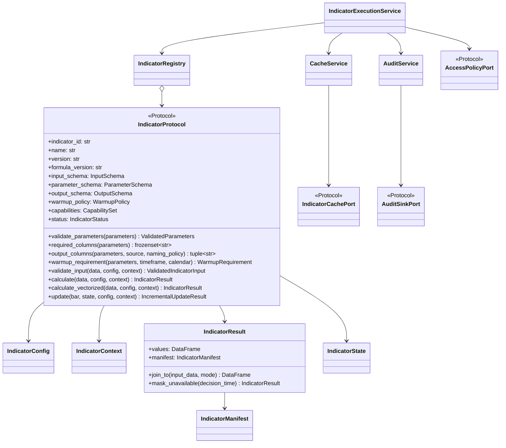
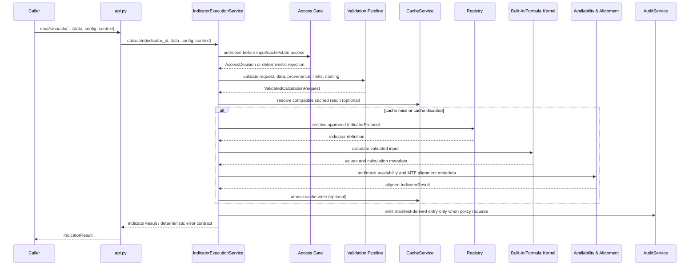
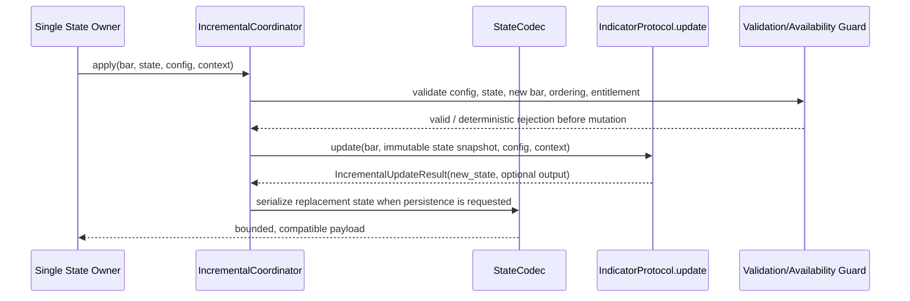

# Indicator Library - Architecture Requirements Document
**Source boundary:** This document was derived only from `03-indicator-library.md`. It does not add functional scope from other HaruQuant phases.
**Traceability rule:** Every explicit source requirement ID is mapped below to a module, file, and named architectural function or documentation/test artifact. Each functional requirement preserves its full source text, including nested clauses.
**Source inventory note:** The source declares 737 checkbox tasks. It contains 155 explicit requirement IDs used as the traceability spine in this document: 126 `IND-FR`, 6 `IND-NFR`, 3 `IND-TEST`, 5 `IND-EX`, and 15 `IND-BR` identifiers. The nested clauses under those IDs are retained verbatim in their mapped requirement entries.
**Design rule:** Core formulas remain pure. Cache I/O, audit writes, tracing, logging, access decisions, resource enforcement, and optional backend concerns are placed behind explicit adapters, decorators, or coordinator boundaries.
## 1. System Boundary Diagram (file structure)
```text
app/services/indicators/                                      # public, import-safe Indicator Library boundary
├── __init__.py                                               # explicit __all__; no initialization work
├── api.py                                                    # stable public convenience functions: ema/sma/adx/atr/adr/rolling_volatility/rsi/williams_r
├── contracts/                                                # canonical typed contracts and serializable records
│   ├── protocol.py                                           # IndicatorProtocol and data-port protocols
│   ├── models.py                                             # IndicatorConfig, IndicatorContext, policies, limits
│   ├── result.py                                             # IndicatorResult, join/inspect/serialization helpers
│   ├── manifest.py                                           # canonical hashes, checksums, IndicatorManifest
│   ├── state.py                                              # IndicatorState and state contracts
│   ├── errors.py                                             # deterministic IND_* error taxonomy
│   └── numeric_policy.py                                    # dtype, tolerance, smoothing/numeric edge rules
├── registry/                                                 # catalog, capability, deprecation, custom governance
│   ├── registry.py
│   ├── capability_matrix.py
│   ├── deprecation.py
│   └── conformance.py
├── validation/                                               # fail-fast request/data/naming/provenance safety gates
│   ├── input_frame.py
│   ├── parameters.py
│   ├── provenance.py
│   ├── microstructure.py
│   ├── mutation_guard.py
│   ├── composition.py
│   └── pipeline.py
├── timing/                                                   # availability, no-lookahead, MTF, warmup, calendar, timezone
│   ├── availability.py
│   ├── alignment.py
│   ├── warmup.py
│   └── calendar.py
├── formulas/                                                 # formula specs + pure numeric kernels
│   ├── specifications.py
│   └── core.py
├── builtins/                                                 # official EMA/SMA/ADX/ATR/ADR/volatility/RSI/Williams %R
│   ├── __init__.py
│   ├── trend.py
│   ├── volatility.py
│   └── momentum.py
├── runtime/                                                  # orchestration wrappers, not formula ownership
│   ├── executor.py
│   ├── settings.py
│   ├── resource_guard.py
│   ├── backends.py
│   ├── out_of_core.py
│   ├── observability.py
│   ├── rollout.py
│   ├── access_control.py
│   └── benchmarks.py
├── incremental/                                              # bounded state, incremental updates, state concurrency
│   ├── __init__.py
│   ├── updater.py
│   ├── state_codec.py
│   ├── accumulator.py
│   ├── symbol_mapping.py
│   └── concurrency.py
├── cache/                                                    # optional cache keys/port/service/adapter
│   ├── __init__.py
│   ├── keys.py
│   ├── service.py
│   └── adapter.py
└── audit/                                                    # optional audit-policy and injected append-only audit sink
    ├── policy.py
    └── service.py

docs/indicators/                                              # operating standards, formula tables, examples, traceability, acceptance
tests/indicators/                                             # isolated contract, formula, parity, security, performance, audit, docs tests
pyproject.toml / CI/                                          # dependency/release/supply-chain policies; not runtime logic
```
### Execution and ownership tree
```text
Public caller (strategy / research / simulator / notebook / CLI)
  -> app.services.indicators.api.<built_in>()
  -> runtime.IndicatorExecutionService.calculate(...)
  -> validation pipeline (access -> config -> schema -> provenance -> quality -> naming -> composition)
  -> timing services (warmup -> session/calendar -> availability -> higher-timeframe alignment)
  -> registry resolves approved IndicatorProtocol
  -> formulas/builtins perform pure deterministic computation
  -> contracts build IndicatorResult + IndicatorManifest
  -> optional adapter boundaries: cache read/write, audit append, logs/metrics/traces, rollout comparison
  -> IndicatorResult returned; no trade, account, broker, order, journal, or risk mutation is possible
```
### Dependency direction
- `contracts` has no dependency on cache, audit, broker, network, or strategy execution modules.
- `formulas` depends only on contracts and pure validation/timing types. It cannot call cache, audit, network, filesystem, broker, or database adapters.
- `runtime`, `cache`, and `audit` depend inward on contracts and formulas and interact outward only through injected ports.
- `api.py` and `__init__.py` are the only intended cross-domain import points. Internal modules are not public agent tools merely because they exist.
## 2. Interfaces diagrams (Mermaid diagrams)
### Core contracts and collaboration

### Standard batch calculation path

### Incremental state path

## 3. Functional Requirements
The following entries are organized by their **primary architectural home**. Where one source requirement spans multiple concerns, the `Target Class/Function` list identifies all required collaboration points while retaining one accountable file boundary.
### 📂 Module: `docs/indicators`

**Boundary Role:** Documentation and governance evidence only; it defines public contracts, scope tiers, formulas, usage, and handoff evidence without executing calculations.

#### 📄 File: `design_standards.md`

**File Boundary:** Governance documentation for scope tiers, no-lookahead, naming, fixtures, validation, and custom-indicator promotion.

**Requirement Title:** IND-FR-001 — Indicator architecture and design standard

**Description:** Primary architecture mapping for the source requirement in **Indicator Library Documentation and Design Standards**. This file owns the cohesive responsibility; collaborators listed below are contracts rather than duplicate implementations.

**Requirements (verbatim source text):**

<details>
<summary>Expand source requirement and all nested clauses</summary>

> - [ ] **IND-FR-001**: Write the indicator library design and documentation standards before implementation begins, covering Production Scope Tiers classification, no-lookahead behavior, multi-timeframe alignment, output column naming policy, debug-mode strict typing/validation, golden fixtures/reference approval workflow, the `available_at`/`label_time`/`bar_open_time`/`bar_close_time`/`computed_from_start`/`computed_from_end` contract, custom indicator conformance/promotion review, and mandatory cross-validation against industry-standard libraries.
>   - Documentation shall warn against using unshifted current-bar values for bar-open decisions.
>   - Promotion of custom indicators to official status shall require documentation, golden fixtures, conformance tests, no-lookahead tests, determinism tests, and benchmark coverage.
>   - Documentation shall include the Production Scope Tiers classification for every requirement before implementation begins.
>   - Documentation shall describe no-lookahead behavior for indicator-derived signals.
>   - Documentation shall describe multi-timeframe indicator alignment.
>   - Documentation shall describe output column naming, default source naming, non-default source naming, multi-output naming, custom output names, output column conflict policy, and generated `output_columns`.
>   - Documentation shall describe debug-mode strict typing and runtime validation behavior.
>   - Documentation shall describe golden fixtures and reference output approval workflow.
>   - Documentation shall describe the `available_at` contract, `label_time`, `bar_open_time`, `bar_close_time`, `computed_from_start`, `computed_from_end`, and strategy-facing filtering.
>   - Documentation shall describe custom indicator conformance, status values, prohibited operations, dependency declarations, and promotion review.
>   - Documentation shall describe mandatory cross-validation against industry-standard libraries, third-party formula convention differences, golden fixture approval, mutation fuzz testing, and survivorship bias testing.
>   - Public usage examples shall be executable documentation examples once implementation begins.

</details>

**Target Class/Function:**

- Documentation artifact — no runtime Python function. Verification is performed by `validate_documentation_catalog(catalog: DocumentationCatalog) -> ValidationReport` — Pure.

#### 📄 File: `usage_and_configuration.md`

**File Boundary:** Executable-facing API and configuration documentation.

**Requirement Title:** IND-FR-026 — Interface documentation and usage examples

**Description:** Primary architecture mapping for the source requirement in **Indicator Interface Protocols and Type Signatures**. This file owns the cohesive responsibility; collaborators listed below are contracts rather than duplicate implementations.

**Requirements (verbatim source text):**

<details>
<summary>Expand source requirement and all nested clauses</summary>

> - [ ] **IND-FR-026**: Write usage examples and documentation covering normal/invalid/missing-column behavior, manifest inspection, availability filtering, multi-symbol/multi-timeframe/incremental behavior, configuration reference per indicator, vectorized/immutability/notebook-representation behavior, acceleration backends, validation timing, manifest structure, data-quality flags, warmup protocol, observability, packaging, and proprietary access control.
>   - Usage examples shall include normal output, invalid parameter handling, missing-column handling, manifest inspection, availability filtering, multi-symbol input, multi-timeframe input, and incremental update behavior where supported.
>   - Documentation shall include a configuration reference for every supported indicator.
>   - Documentation shall include input schema, output schema, parameter schema, warmup policy, and missing-data behavior for every supported indicator.
>   - Documentation shall describe vectorized calculation requirements, values-only output, joined-copy output, default input immutability, official in-place mutation restrictions, and internal optimization manifest requirements.
>   - Documentation shall describe notebook result representations, including `_repr_html_`, `_repr_pretty_`, summary statistics, warmup visualization, unavailable-region visibility, and manifest summaries.
>   - Documentation shall describe optional acceleration backends, feature flags, pure fallback behavior, backend metadata, GIL-release behavior, and parallel symbol execution configuration.
>   - Documentation shall describe input validation timing and fail-fast behavior.
>   - Documentation shall describe indicator result manifest structure and every required manifest field.
>   - Documentation shall describe data quality flags, default exclusion policy, explicit inclusion policy, output quality propagation, and strategy-facing quality metadata.
>   - Documentation shall describe warmup data request protocol and warmup output marking.
>   - Documentation shall describe observability metrics, log fields, request ids, correlation ids, distributed tracing, OpenTelemetry-compatible propagation, feature flags, canary routing, output delta comparison, and rollback metadata.
>   - Documentation shall describe packaging metadata, `pyproject.toml`, dependency categories, `py.typed`, and typed package behavior.
>   - Documentation shall describe proprietary indicator access control, entitlement checks, authorized workflows, non-sensitive manifest metadata, source protection, and protected-package determinism.

</details>

**Target Class/Function:**

- Documentation artifact — no runtime Python function. Verification is performed by `validate_documentation_catalog(catalog: DocumentationCatalog) -> ValidationReport` — Pure.

#### 📄 File: `acceptance_checklist.md`

**File Boundary:** Acceptance evidence for the typed contract slice.

**Requirement Title:** IND-FR-027 — Protocol and contract done criteria

**Description:** Primary architecture mapping for the source requirement in **Indicator Interface Protocols and Type Signatures**. This file owns the cohesive responsibility; collaborators listed below are contracts rather than duplicate implementations.

**Requirements (verbatim source text):**

<details>
<summary>Expand source requirement and all nested clauses</summary>

> - [ ] **IND-FR-027**: Confirm this subsection's done-criteria: `typing.Protocol` contracts and notebook representations, the `ema`/`join_to` example, `pyproject.toml` metadata, availability-time metadata, acceleration parity, performance benchmark regression gate, manifest structure/output-contract fields, warmup and multi-timeframe protocols, and Official-Backtest-Required behavior are implemented and tested; rich notebook HTML may follow once schemas stabilize.
>   - `typing.Protocol` contracts and notebook result representations are implemented and tested.
>   - `ema(data, period=10, source="close")` produces `ema_10`, and `IndicatorResult.join_to(data)` appends `ema_10` to a copied dataframe without mutating the input by default.
>   - `pyproject.toml` metadata is present and valid.
>   - Availability-time metadata is implemented and tested.
>   - Acceleration backend parity, feature flag, fallback, and backend metadata tests pass.
>   - Performance benchmark metadata and regression gate are implemented.
>   - Machine-readable manifest structure is implemented and tested.
>   - Manifest output-contract fields are implemented and tested.
>   - Warmup data request protocol is documented and tested.
>   - Multi-timeframe alignment protocol is documented and tested.
>   - Official Backtest Required shall include no-lookahead alignment, reproducible fixtures, manifest/checksum behavior, data-quality propagation, and strategy/simulation integration contracts.
>   - Rich notebook HTML representations may be added after stable result and manifest schemas exist.

</details>

**Target Class/Function:**

- Documentation artifact — no runtime Python function. Verification is performed by `validate_documentation_catalog(catalog: DocumentationCatalog) -> ValidationReport` — Pure.
- `test_<requirement_behavior>() -> None` — Test-only verification function; may create isolated fixtures but has no production side effect.
- `assert_requirement_traceability(requirement_id: str, test_ids: Collection[str]) -> None` — Test-only validation.

**Requirement Title:** IND-FR-059 — Base calculation acceptance gate

**Description:** Primary architecture mapping for the source requirement in **Base Mathematical Calculations**. This file owns the cohesive responsibility; collaborators listed below are contracts rather than duplicate implementations.

**Requirements (verbatim source text):**

<details>
<summary>Expand source requirement and all nested clauses</summary>

> - [ ] **IND-FR-059**: Confirm Base Mathematical Calculations done-criteria: documented public API surface, approved Production Scope Tiers for every requirement, complete public API contract tables, implemented and tested vectorized/naming/values-only/joined-copy/conflict output behavior, `py.typed` distribution where applicable, formula specifications and golden fixtures for every official indicator, tested calendar/session behavior, passing composition tests, implemented and tested quality-flag handling, implemented deprecation lifecycle and `IND_DEPRECATED` behavior, passing proprietary access-control and protected-source determinism tests, passing property-based/invariant/mutation-fuzz/survivorship-bias tests, passing tracing/feature-flag/canary/SLO tests, present dependency lockfile, passing license/vulnerability checks or waivers, and supported SBOM generation.
>   - Public API surface is documented.
>   - Production Scope Tiers are assigned and approved for every requirement.
>   - Public API contract tables are complete for every public callable.
>   - Vectorized dataframe output, deterministic indicator column naming, values-only output, joined-copy output, and output column conflict behavior are implemented and tested.
>   - Typed distribution includes `py.typed` when public inline type annotations are exported.
>   - Formula specifications exist for every official indicator.
>   - Golden fixtures exist for every official indicator.
>   - Calendar and session behavior is documented and tested.
>   - Indicator composition tests pass where composition is supported.
>   - Data-quality flag handling is implemented and tested.
>   - Deprecation lifecycle and `IND_DEPRECATED` behavior are implemented.
>   - Proprietary indicator access control and protected-source determinism tests pass for every proprietary indicator.
>   - Property-based and invariant tests pass.
>   - Mutation fuzz and survivorship bias tests pass.
>   - Distributed tracing, feature flag, canary routing, and SLO measurement tests pass.
>   - Dependency lockfile or equivalent reproducibility mechanism is present for official workflows.
>   - Dependency license and vulnerability checks pass or have explicit waivers.
>   - Software bill of materials generation is supported for production releases.

</details>

**Target Class/Function:**

- Documentation artifact — no runtime Python function. Verification is performed by `validate_documentation_catalog(catalog: DocumentationCatalog) -> ValidationReport` — Pure.
- `test_<requirement_behavior>() -> None` — Test-only verification function; may create isolated fixtures but has no production side effect.
- `assert_requirement_traceability(requirement_id: str, test_ids: Collection[str]) -> None` — Test-only validation.

**Requirement Title:** IND-FR-119 — Cache adapter acceptance gate

**Description:** Primary architecture mapping for the source requirement in **Indicator Cache Adapter**. This file owns the cohesive responsibility; collaborators listed below are contracts rather than duplicate implementations.

**Requirements (verbatim source text):**

<details>
<summary>Expand source requirement and all nested clauses</summary>

> - [ ] **IND-FR-119**: Confirm cache-adapter done-criteria: UTC normalization implemented and tested; thread-safety/cache-concurrency tests pass; parallel symbol execution and cache synchronization tests pass; resource-limit/timeout/cancellation/cache-write-failure tests pass; complete documentation for formulas/APIs/schemas/dtypes/cache/observability/release controls; Production Required scope (resource limits, redacted diagnostics, documented cache behavior, API compatibility rules, acceptance gates) satisfied; and every public callable's stable contract (import path, signature, parameters, schema, return type, error behavior, side effects, cache behavior, stability, eligibility) defined.
>   - UTC normalization for internal timestamp arithmetic and cache keys is implemented and tested.
>   - Thread-safety and cache-concurrency tests pass.
>   - Parallel symbol execution configuration and cache synchronization tests pass.
>   - Resource-limit, timeout, cancellation, and cache-write failure tests pass.
>   - Indicator documentation is complete for formulas, APIs, schemas, dtypes, cache behavior, observability, and release controls.
>   - Production Required shall include resource limits, redacted structured diagnostics, documented cache behavior if caching is enabled, public API compatibility rules, and acceptance gates for official workflows.
>   - Every public callable shall define its stable import path, function signature, required parameters, optional parameters and defaults, accepted input schema, returned object type, deterministic error behavior, side effects, cache behavior, stability level, and official-workflow eligibility.

</details>

**Target Class/Function:**

- Documentation artifact — no runtime Python function. Verification is performed by `validate_documentation_catalog(catalog: DocumentationCatalog) -> ValidationReport` — Pure.
- `test_<requirement_behavior>() -> None` — Test-only verification function; may create isolated fixtures but has no production side effect.
- `assert_requirement_traceability(requirement_id: str, test_ids: Collection[str]) -> None` — Test-only validation.

#### 📄 File: `package_and_scope.md`

**File Boundary:** Ownership, dependency, typing, and package-distribution documentation.

**Requirement Title:** IND-FR-039 — Scope and package conventions

**Description:** Primary architecture mapping for the source requirement in **Base Mathematical Calculations**. This file owns the cohesive responsibility; collaborators listed below are contracts rather than duplicate implementations.

**Requirements (verbatim source text):**

<details>
<summary>Expand source requirement and all nested clauses</summary>

> - [ ] **IND-FR-039**: Document indicator scope and packaging conventions: Python-only implementation target, indicator outputs as decision-support (not execution) artifacts, data normalization/source-readiness ownership by the data module, typed/documented/deterministic/testable code, separated runtime/acceleration/dev/test dependencies, `py.typed` distribution, and maintained public type information for downstream type checkers.
>   - Indicator implementations target Python.
>   - Indicator outputs are decision support artifacts, not official execution artifacts.
>   - Data normalization and source-readiness rules are owned by the data module.
>   - Indicator code shall be typed, documented, deterministic, and testable.
>   - Runtime dependencies, optional acceleration dependencies, development dependencies, and test dependencies shall be separated.
>   - Distributed typed packages shall include `py.typed` when public inline type annotations are intended for downstream type checking.
>   - Public type information shall be maintained for downstream users when the package is published as typed.

</details>

**Target Class/Function:**

- Documentation artifact — no runtime Python function. Verification is performed by `validate_documentation_catalog(catalog: DocumentationCatalog) -> ValidationReport` — Pure.

#### 📄 File: `requirement_traceability.md`

**File Boundary:** Identifier registry for functional and non-functional traceability.

**Requirement Title:** IND-FR-057 — Requirement identifier governance

**Description:** Primary architecture mapping for the source requirement in **Base Mathematical Calculations**. This file owns the cohesive responsibility; collaborators listed below are contracts rather than duplicate implementations.

**Requirements (verbatim source text):**

<details>
<summary>Expand source requirement and all nested clauses</summary>

> - [ ] **IND-FR-057**: Assign a stable requirement id to every functional and non-functional requirement in this section before implementation begins.

</details>

**Target Class/Function:**

- Documentation artifact — no runtime Python function. Verification is performed by `validate_documentation_catalog(catalog: DocumentationCatalog) -> ValidationReport` — Pure.

**Requirement Title:** IND-FR-075 — Requirement-to-test traceability matrix

**Description:** Primary architecture mapping for the source requirement in **Batch Volatility Indicators (ATR, Bollinger Bands, etc.)**. This file owns the cohesive responsibility; collaborators listed below are contracts rather than duplicate implementations.

**Requirements (verbatim source text):**

<details>
<summary>Expand source requirement and all nested clauses</summary>

> - [ ] **IND-FR-075**: Build and document a requirement-to-test traceability matrix mapping every requirement id to unit, contract, integration, performance, security, or documentation tests (or an approved deferral), and document the ADR range convention and Williams %R degenerate-window behavior.
>   - The test plan shall include a requirement-to-test traceability matrix mapping each requirement id to one or more unit, contract, integration, performance, security, or documentation tests.
>   - Documentation shall include a requirement-to-test traceability matrix.
>   - Documentation shall describe ADR range convention and Williams %R degenerate-window behavior.
>   - Requirement-to-test traceability matrix exists and maps every requirement id to tests or approved deferral.

</details>

**Target Class/Function:**

- Documentation artifact — no runtime Python function. Verification is performed by `validate_documentation_catalog(catalog: DocumentationCatalog) -> ValidationReport` — Pure.
- `test_<requirement_behavior>() -> None` — Test-only verification function; may create isolated fixtures but has no production side effect.
- `assert_requirement_traceability(requirement_id: str, test_ids: Collection[str]) -> None` — Test-only validation.

#### 📄 File: `scope_tiers.md`

**File Boundary:** Core/optional/future decision record.

**Requirement Title:** IND-FR-060 — Production scope tier classification

**Description:** Primary architecture mapping for the source requirement in **Base Mathematical Calculations**. This file owns the cohesive responsibility; collaborators listed below are contracts rather than duplicate implementations.

**Requirements (verbatim source text):**

<details>
<summary>Expand source requirement and all nested clauses</summary>

> - [ ] **IND-FR-060**: Classify Base Mathematical Calculations scope into Core MVP, Optional Extension, and Future Improvement tiers: halt Core MVP coding until `IND-PREQ-001`–`IND-PREQ-006` are resolved or deferred; place streaming, out-of-core processing, acceleration backends, proprietary execution, distributed tracing, SLO alert routing, and canary routing in Optional Extension unless promoted; place not-yet-required capabilities in Future Improvement; ensure Core MVP is implementable without optional acceleration/proprietary/out-of-core/tracing/SLO/signing infrastructure; classify every public callable as stable/experimental/internal/optional/future before implementation; and allow GPU/SIMD acceleration as an Optional Extension only after Core MVP formula and fixture behavior is stable.
>   - Core MVP coding shall halt until `IND-PREQ-001`, `IND-PREQ-002`, `IND-PREQ-003`, `IND-PREQ-004`, `IND-PREQ-005`, and `IND-PREQ-006` are resolved or explicitly deferred.
>   - Optional Extension shall include streaming, out-of-core processing, acceleration backends, proprietary indicator execution, distributed tracing, SLO alert routing, and canary routing unless a later approved decision promotes any item.
>   - Future Improvement shall include capabilities that are useful but not required for the current approved implementation phase.
>   - Core MVP shall be implementable without optional acceleration backends, proprietary indicator controls, out-of-core execution, distributed tracing, SLO enforcement, or release-signing infrastructure.
>   - Every public callable shall be classified as stable, experimental, internal, optional, or future before implementation begins.
>   - GPU/SIMD acceleration may be added as an Optional Extension after Core MVP formula and fixture behavior is stable.

</details>

**Target Class/Function:**

- Documentation artifact — no runtime Python function. Verification is performed by `validate_documentation_catalog(catalog: DocumentationCatalog) -> ValidationReport` — Pure.

**Requirement Title:** IND-FR-120 — Cache adapter optional-extension classification

**Description:** Primary architecture mapping for the source requirement in **Indicator Cache Adapter**. This file owns the cohesive responsibility; collaborators listed below are contracts rather than duplicate implementations.

**Requirements (verbatim source text):**

<details>
<summary>Expand source requirement and all nested clauses</summary>

> - [ ] **IND-FR-120**: Classify cache-adapter scope: out-of-core processing as Optional Extension pending chunking-parity and cache-integrity approval, and canary routing/distributed tracing/SLO alerting/cryptographic signing/release attestations/SBOM generation/multi-writer cache synchronization as platform/release-engineering integrations pending ownership approval.
>   - Out-of-core processing may be added as an Optional Extension after chunking parity and cache integrity requirements are approved.
>   - Canary routing, distributed tracing, SLO alerting, cryptographic package signing, release attestations, SBOM generation, and multi-writer cache synchronization may be added through platform or release-engineering integrations after ownership is approved.
>   - No file-specific non-functional requirements defined.

</details>

**Target Class/Function:**

- Documentation artifact — no runtime Python function. Verification is performed by `validate_documentation_catalog(catalog: DocumentationCatalog) -> ValidationReport` — Pure.

#### 📄 File: `trend_indicator_guide.md`

**File Boundary:** Formula, API, session, data-integrity, and MTF usage examples.

**Requirement Title:** IND-FR-070 — Trend indicator executable documentation

**Description:** Primary architecture mapping for the source requirement in **Batch Trend Indicators (Moving Averages, MACD, etc.)**. This file owns the cohesive responsibility; collaborators listed below are contracts rather than duplicate implementations.

**Requirements (verbatim source text):**

<details>
<summary>Expand source requirement and all nested clauses</summary>

> - [ ] **IND-FR-070**: Write and maintain executable trend-indicator usage examples and documentation covering API usage (`ema(...)` + `result.join_to(data)`), versioning/migration policy, exact formulas/smoothing/alpha/seed/rolling-window/edge-case behavior, RSI/ATR/ADX smoothing conventions, calendar/session semantics, corporate-action/symbol-mapping/stub-quote/inverted-market/spread/mid-price behavior, and multi-timeframe alignment/boundary/availability semantics.
>   - Usage examples shall remain executable documentation examples once implementation begins.
>   - Documentation shall include API examples showing `ema(data, period=10, source="close")` returning an `IndicatorResult` with `ema_10` and `result.join_to(data)` returning a copied dataframe with `ema_10` appended.
>   - Documentation shall describe semantic versioning policy and migration requirements for backward-incompatible changes.
>   - Documentation shall include exact mathematical formula, smoothing convention, alpha convention, seed behavior, rolling-window inclusivity, and edge-case behavior for every supported indicator.
>   - Documentation shall describe RSI, ATR, and ADX smoothing conventions.
>   - Documentation shall describe calendar, session, weekend, holiday, half-day, daylight-saving, missing-session, pre-market, regular-session, post-market, and 24/7 market semantics.
>   - Documentation shall describe intra-bar corporate-action adjustment rejection, deterministic intra-bar adjustment policies, symbol mapping continuity, mergers, ticker replacements, vendor remaps, stub quote handling, inverted market handling, spread thresholds, and mid-price fallback behavior.
>   - Documentation shall describe detailed multi-timeframe alignment, boundary semantics, independent availability timestamps, and stale gap prevention.

</details>

**Target Class/Function:**

- Documentation artifact — no runtime Python function. Verification is performed by `validate_documentation_catalog(catalog: DocumentationCatalog) -> ValidationReport` — Pure.

#### 📄 File: `incremental_state_guide.md`

**File Boundary:** State, idempotency, ordering, and operating policy documentation.

**Requirement Title:** IND-FR-095 — Incremental behavior and concurrency documentation

**Description:** Primary architecture mapping for the source requirement in **Incremental Calculation State Tracking**. This file owns the cohesive responsibility; collaborators listed below are contracts rather than duplicate implementations.

**Requirements (verbatim source text):**

<details>
<summary>Expand source requirement and all nested clauses</summary>

> - [ ] **IND-FR-095**: Document incremental-state serialization/idempotency/late-arriving/corrected/revised/out-of-order behavior, state format/compatibility/corruption handling/bounded size, thread-safety/ownership/immutable-snapshot/cache-concurrency/parallel-symbol-execution/worker-pool/chunk-size details, and the supported batch/incremental/streaming calculation modes (including whether out-of-order incremental updates are supported).
>   - Documentation shall describe incremental state serialization, idempotency, late-arriving data, corrected data, revised data, and out-of-order update behavior.
>   - Documentation shall describe incremental state format, state compatibility validation, state corruption handling, and bounded state size.
>   - Documentation shall describe thread-safety guarantees, incremental state ownership, immutable state snapshots, cache concurrency, parallel symbol execution, worker pools, worker counts, chunk sizes, and cache synchronization.
>   - Documentation shall describe batch, incremental, and streaming calculation modes.
>   - Indicators shall define whether they support batch calculation, incremental calculation, streaming calculation, or a subset of these modes.
>   - The module shall define whether out-of-order incremental updates are supported.

</details>

**Target Class/Function:**

- Documentation artifact — no runtime Python function. Verification is performed by `validate_documentation_catalog(catalog: DocumentationCatalog) -> ValidationReport` — Pure.

#### 📄 File: `cache_and_slo_guide.md`

**File Boundary:** Stable cache/API/operating-policy documentation.

**Requirement Title:** IND-FR-118 — Cache, benchmark, and SLO documentation

**Description:** Primary architecture mapping for the source requirement in **Indicator Cache Adapter**. This file owns the cohesive responsibility; collaborators listed below are contracts rather than duplicate implementations.

**Requirements (verbatim source text):**

<details>
<summary>Expand source requirement and all nested clauses</summary>

> - [ ] **IND-FR-118**: Write and maintain documentation covering: public API contract tables (import paths, signatures, defaults, schemas, error behavior, side effects, cache behavior, stability, official-workflow eligibility); cache keys and invalidation behavior; UTC normalization and I/O-boundary local/exchange time handling; performance benchmark methodology (hardware profile, dependency versions, cached/uncached modes, warmup iterations, regression threshold); composition/`available_at`/provenance/cache-invalidation behavior; SLO thresholds and alert routing; and resource-limit/timeout/cancellation/memory-pressure/partial-result policy.
>   - Documentation shall include public API contract tables covering import paths, signatures, defaults, input schemas, output schemas, error behavior, side effects, cache behavior, stability level, and official-workflow eligibility.
>   - Documentation shall describe cache keys and invalidation behavior.
>   - Documentation shall describe UTC normalization for internal timestamp arithmetic and cache keys, and shall define local and exchange time handling at I/O boundaries.
>   - Documentation shall describe performance benchmark hardware profile, dependency versions, cached and uncached modes, warmup iterations, measurement methodology, and regression threshold.
>   - Documentation shall describe indicator composition, `available_at` preservation, provenance propagation, and downstream cache invalidation.
>   - Documentation shall describe service level objectives, latency thresholds, cache-hit thresholds, error-rate thresholds, timeout-rate thresholds, measurement windows, excluded error categories, and alert routing.
>   - Documentation shall describe resource limits, timeout behavior, cancellation behavior, memory-pressure behavior, interrupted cache-write behavior, and partial-result policy.

</details>

**Target Class/Function:**

- Documentation artifact — no runtime Python function. Verification is performed by `validate_documentation_catalog(catalog: DocumentationCatalog) -> ValidationReport` — Pure.

#### 📄 File: `audit_mode.md`

**File Boundary:** Audit entry, tamper evidence, and metadata guide.

**Requirement Title:** IND-FR-125 — Audit-mode documentation

**Description:** Primary architecture mapping for the source requirement in **Indicator Integrity Audit Trail**. This file owns the cohesive responsibility; collaborators listed below are contracts rather than duplicate implementations.

**Requirements (verbatim source text):**

<details>
<summary>Expand source requirement and all nested clauses</summary>

> - [ ] **IND-FR-125**: Document audit mode, audit entry structure, tamper-evident integrity, and audit metadata.
>   - Documentation shall describe audit mode, audit entry structure, tamper-evident integrity, and audit metadata.

</details>

**Target Class/Function:**

- Documentation artifact — no runtime Python function. Verification is performed by `validate_documentation_catalog(catalog: DocumentationCatalog) -> ValidationReport` — Pure.

### 📂 Module: `pyproject.toml / CI`

**Boundary Role:** Build and release-engineering boundary for package metadata, dependency locking, supply-chain evidence, SBOM, signing, license, and vulnerability controls.

#### 📄 File: `release_policy.md`

**File Boundary:** Build/release engineering policy outside runtime calculations.

**Requirement Title:** IND-FR-042 — Dependency and supply-chain policy

**Description:** Primary architecture mapping for the source requirement in **Base Mathematical Calculations**. This file owns the cohesive responsibility; collaborators listed below are contracts rather than duplicate implementations.

**Requirements (verbatim source text):**

<details>
<summary>Expand source requirement and all nested clauses</summary>

> - [ ] **IND-FR-042**: Define dependency, packaging, and supply-chain policy: isolate optional acceleration dependencies behind extras/feature flags, maintain a lockfile or equivalent reproducibility mechanism, support SBOM generation, require cryptographic release signing (Sigstore/PEP 740 or equivalent), and require license/vulnerability compatibility with documented waivers.
>   - Optional acceleration dependencies shall be isolated behind extras or feature flags.
>   - The project shall maintain a lockfile or equivalent reproducible dependency mechanism for official workflows.
>   - The project shall generate or support generating a software bill of materials for production releases.
>   - Distributed Python wheels, source distributions, and production packages shall be cryptographically signed by the approved CI/CD release pipeline using Sigstore, PEP 740-compatible attestations, or an equivalent approved signing mechanism.
>   - Dependency licenses shall be compatible with the intended deployment and distribution model.
>   - Known vulnerable dependencies shall not be allowed in production releases unless explicitly waived.

</details>

**Target Class/Function:**

- Documentation artifact — no runtime Python function. Verification is performed by `validate_documentation_catalog(catalog: DocumentationCatalog) -> ValidationReport` — Pure.
- `test_<requirement_behavior>() -> None` — Test-only verification function; may create isolated fixtures but has no production side effect.
- `assert_requirement_traceability(requirement_id: str, test_ids: Collection[str]) -> None` — Test-only validation.

#### 📄 File: `pyproject.toml`

**File Boundary:** Packaging and repeatable benchmark environment declaration.

**Requirement Title:** IND-FR-077 — Runtime dependency and benchmark version constraints

**Description:** Primary architecture mapping for the source requirement in **Batch Momentum Indicators (RSI, Stochastic, etc.)**. This file owns the cohesive responsibility; collaborators listed below are contracts rather than duplicate implementations.

**Requirements (verbatim source text):**

<details>
<summary>Expand source requirement and all nested clauses</summary>

> - [ ] **IND-FR-077**: Declare and version-constrain runtime dependencies, and document Python/dependency versions (NumPy, pandas, optional acceleration libraries) used in performance benchmarks.
>   - Runtime dependencies shall be explicitly declared and version-constrained.
>   - Performance benchmarks shall specify Python version and key dependency versions, including NumPy, pandas, and any optional acceleration dependencies.

</details>

**Target Class/Function:**

- Documentation artifact — no runtime Python function. Verification is performed by `validate_documentation_catalog(catalog: DocumentationCatalog) -> ValidationReport` — Pure.

### 📂 Module: `app/services/indicators`

**Boundary Role:** Public Indicator Library boundary; exposes only approved, typed, deterministic indicator capabilities and performs no work at import time.

#### 📄 File: `__init__.py`

**File Boundary:** Public gate with no additional file-specific behavior.

**Requirement Title:** IND-FR-004 — Package foundation inheritance

**Description:** Primary architecture mapping for the source requirement in **Indicator Library Package Initialization**. This file owns the cohesive responsibility; collaborators listed below are contracts rather than duplicate implementations.

**Requirements (verbatim source text):**

<details>
<summary>Expand source requirement and all nested clauses</summary>

> - [ ] **IND-FR-004**: No file-specific functional requirements defined. Foundation properties apply.

</details>

**Target Class/Function:**

- `__all__: tuple[str, ...]` — Declarative public-export gate; import-only and side-effect free.
- `assert_import_safe() -> None` — Test-only; verifies no import-time side effect.

**Requirement Title:** IND-FR-005 — Package NFR inheritance

**Description:** Primary architecture mapping for the source requirement in **Indicator Library Package Initialization**. This file owns the cohesive responsibility; collaborators listed below are contracts rather than duplicate implementations.

**Requirements (verbatim source text):**

<details>
<summary>Expand source requirement and all nested clauses</summary>

> - [ ] **IND-FR-005**: No file-specific non-functional requirements defined.

</details>

**Target Class/Function:**

- `__all__: tuple[str, ...]` — Declarative public-export gate; import-only and side-effect free.
- `assert_import_safe() -> None` — Test-only; verifies no import-time side effect.

**Requirement Title:** IND-FR-044 — Indicator ownership boundary

**Description:** Primary architecture mapping for the source requirement in **Base Mathematical Calculations**. This file owns the cohesive responsibility; collaborators listed below are contracts rather than duplicate implementations.

**Requirements (verbatim source text):**

<details>
<summary>Expand source requirement and all nested clauses</summary>

> - [ ] **IND-FR-044**: Establish the indicator module's location and ownership boundary: live under `app/services/indicators/` (DEC-029/DONE-037), provide reusable calculation primitives for strategy/research/simulation, and explicitly exclude final position sizing, margin acceptance, risk approval, and order matching, exposing only typed deterministic functions/classes for strategy and simulation consumption.
>   - The indicator module shall live under `app/services/indicators/` (relocated and approved per DEC-029/DONE-037).
>   - The indicator module shall provide reusable indicator calculation primitives for strategy, research, and simulation workflows.
>   - The indicator module shall not determine final official position size, margin acceptance, risk approval, or order matching.
>   - The indicator module shall expose typed, deterministic functions or classes that can be consumed by strategies and simulation orchestration.

</details>

**Target Class/Function:**

- `__all__: tuple[str, ...]` — Declarative public-export gate; import-only and side-effect free.
- `assert_import_safe() -> None` — Test-only; verifies no import-time side effect.

**Requirement Title:** IND-FR-085 — Fail-closed ownership boundary

**Description:** Primary architecture mapping for the source requirement in **Incremental Calculation State Tracking**. This file owns the cohesive responsibility; collaborators listed below are contracts rather than duplicate implementations.

**Requirements (verbatim source text):**

<details>
<summary>Expand source requirement and all nested clauses</summary>

> - [ ] **IND-FR-085**: Keep the indicator module's ownership boundary fail-closed: fills, orders, account state, journals, and reports remain owned by the simulation module, and the indicator module shall never execute trades, create fills, mutate account state, mutate simulation journals, or perform broker-state operations.
>   - Official fills, orders, account state, journals, and reports are produced by the simulation module.
>   - The indicator module shall not execute trades, create fills, mutate account state, mutate simulation journals, or perform broker-state operations.

</details>

**Target Class/Function:**

- `__all__: tuple[str, ...]` — Declarative public-export gate; import-only and side-effect free.
- `assert_import_safe() -> None` — Test-only; verifies no import-time side effect.

**Requirement Title:** IND-FR-114 — Import side-effect safety

**Description:** Primary architecture mapping for the source requirement in **Indicator Cache Adapter**. This file owns the cohesive responsibility; collaborators listed below are contracts rather than duplicate implementations.

**Requirements (verbatim source text):**

<details>
<summary>Expand source requirement and all nested clauses</summary>

> - [ ] **IND-FR-114**: Enforce side-effect-free import: importing `app.services.indicators` shall perform no network I/O, filesystem writes, cache writes, plugin execution, long-running computation, environment mutation, or untrusted-plugin registration.
>   - Import-time tests shall verify importing `app.services.indicators` performs no network I/O, filesystem writes, cache writes, plugin execution, long-running computation, environment mutation, or registration from untrusted plugins.

</details>

**Target Class/Function:**

- `__all__: tuple[str, ...]` — Declarative public-export gate; import-only and side-effect free.
- `assert_import_safe() -> None` — Test-only; verifies no import-time side effect.

#### 📄 File: `api.py`

**File Boundary:** Public import surface and API contract composition.

**Requirement Title:** IND-FR-008 — Stable public API surface

**Description:** Primary architecture mapping for the source requirement in **Indicator Registry and Registry Validation**. This file owns the cohesive responsibility; collaborators listed below are contracts rather than duplicate implementations.

**Requirements (verbatim source text):**

<details>
<summary>Expand source requirement and all nested clauses</summary>

> - [ ] **IND-FR-008**: Define and document the public API surface and module layout: stable import paths, function/class signatures, parameter/result/error schemas, registry contracts, `typing.Protocol` contracts, schema versions, and a deprecation policy with a machine-readable deprecation phase per indicator/parameter/schema/API, plus separation of core protocols, result types, registry code, built-in implementations, error definitions, and test fixtures.
>   - Public APIs shall include stable import paths, function and class signatures, parameter schemas, result schemas, error schemas, and registry contracts.
>   - The deprecation phase for each indicator, parameter, schema, or API shall be machine-readable through the registry.
>   - Public module layout shall separate core protocols, result types, registry code, built-in indicator implementations, error definitions, and test fixtures.
>   - Documentation shall declare the public API surface, stable import paths, `typing.Protocol` contracts, registry contracts, schema versions, and deprecation policy.
>   - Documentation shall describe indicator anatomy, required public types, required protocol attributes, required protocol methods, registry operations, built-in convenience functions, result objects, manifests, and state objects.
>   - Documentation shall describe the deprecation lifecycle, machine-readable registry phase, changelog entries, migration guide, and `IND_DEPRECATED`.
>   - Indicator anatomy, required interfaces, registry operations, built-in convenience functions, and result object methods are documented and tested.
>   - The public API contract table shall cover registry operations, built-in convenience functions, result object methods, protocol methods, state serialization functions, and manifest serialization functions.
>   - No file-specific non-functional requirements defined.

</details>

**Target Class/Function:**

- `ema(data: pd.DataFrame, period: int = 14, source: str = "close", *, config: IndicatorConfig | None = None, context: IndicatorContext | None = None) -> IndicatorResult` — Pure when no cache/audit port is enabled.
- `sma(data: pd.DataFrame, period: int = 14, source: str = "close", *, config: IndicatorConfig | None = None, context: IndicatorContext | None = None) -> IndicatorResult` — Pure when no cache/audit port is enabled.
- `adx(data: pd.DataFrame, period: int = 14, *, config: IndicatorConfig | None = None, context: IndicatorContext | None = None) -> IndicatorResult` — Pure when no cache/audit port is enabled.
- `atr(data: pd.DataFrame, period: int = 14, *, config: IndicatorConfig | None = None, context: IndicatorContext | None = None) -> IndicatorResult` — Pure when no cache/audit port is enabled.
- `adr(data: pd.DataFrame, period: int = 14, *, config: IndicatorConfig | None = None, context: IndicatorContext | None = None) -> IndicatorResult` — Pure when no cache/audit port is enabled.
- `rolling_volatility(data: pd.DataFrame, period: int = 20, *, config: IndicatorConfig | None = None, context: IndicatorContext | None = None) -> IndicatorResult` — Pure when no cache/audit port is enabled.
- `rsi(data: pd.DataFrame, period: int = 14, source: str = "close", *, config: IndicatorConfig | None = None, context: IndicatorContext | None = None) -> IndicatorResult` — Pure when no cache/audit port is enabled.
- `williams_r(data: pd.DataFrame, period: int = 14, *, config: IndicatorConfig | None = None, context: IndicatorContext | None = None) -> IndicatorResult` — Pure when no cache/audit port is enabled.
- `IndicatorProtocol.validate_parameters(parameters: Mapping[str, JsonValue]) -> ValidatedParameters` — Pure.
- `IndicatorProtocol.required_columns(parameters: ValidatedParameters) -> frozenset[str]` — Pure.
- `IndicatorProtocol.output_columns(parameters: ValidatedParameters, source: str | None = None, naming_policy: OutputNamingPolicy | None = None) -> tuple[str, ...]` — Pure.
- `IndicatorProtocol.warmup_requirement(parameters: ValidatedParameters, timeframe: Timeframe, calendar: TradingCalendar | None = None) -> WarmupRequirement` — Pure.
- `IndicatorProtocol.validate_input(data: pd.DataFrame, config: IndicatorConfig, context: IndicatorContext) -> ValidatedIndicatorInput` — Pure.
- `IndicatorProtocol.calculate(data: pd.DataFrame, config: IndicatorConfig, context: IndicatorContext) -> IndicatorResult` — Pure.
- `IndicatorProtocol.calculate_vectorized(data: pd.DataFrame, config: IndicatorConfig, context: IndicatorContext) -> IndicatorResult` — Pure; optional protocol capability.

**Requirement Title:** IND-FR-047 — Public surface and deprecation boundaries

**Description:** Primary architecture mapping for the source requirement in **Base Mathematical Calculations**. This file owns the cohesive responsibility; collaborators listed below are contracts rather than duplicate implementations.

**Requirements (verbatim source text):**

<details>
<summary>Expand source requirement and all nested clauses</summary>

> - [ ] **IND-FR-047**: Define public API surface and deprecation lifecycle: explicit declaration of the public surface, clear marking of private internal modules excluded from strategy/simulation consumption, a documented indicator anatomy for every official/custom indicator with no required private-helper integration, and a deprecation warning phase of at least two minor releases with structured warnings and changelog/migration documentation.
>   - The indicator module shall explicitly declare its public API surface.
>   - Internal modules shall be clearly marked as private and shall not be consumed directly by strategy or simulation code.
>   - The deprecation warning phase shall last at least two minor releases, emit structured warnings on every use, and continue full support.
>   - Deprecation timelines shall be documented in the changelog and migration guide.
>   - The indicator module shall expose a documented anatomy for every official and custom indicator.
>   - Private helper modules shall not be required for downstream strategy, simulation, notebook, or custom-indicator integration.

</details>

**Target Class/Function:**

- `ema(data: pd.DataFrame, period: int = 14, source: str = "close", *, config: IndicatorConfig | None = None, context: IndicatorContext | None = None) -> IndicatorResult` — Pure when no cache/audit port is enabled.
- `sma(data: pd.DataFrame, period: int = 14, source: str = "close", *, config: IndicatorConfig | None = None, context: IndicatorContext | None = None) -> IndicatorResult` — Pure when no cache/audit port is enabled.
- `adx(data: pd.DataFrame, period: int = 14, *, config: IndicatorConfig | None = None, context: IndicatorContext | None = None) -> IndicatorResult` — Pure when no cache/audit port is enabled.
- `atr(data: pd.DataFrame, period: int = 14, *, config: IndicatorConfig | None = None, context: IndicatorContext | None = None) -> IndicatorResult` — Pure when no cache/audit port is enabled.
- `adr(data: pd.DataFrame, period: int = 14, *, config: IndicatorConfig | None = None, context: IndicatorContext | None = None) -> IndicatorResult` — Pure when no cache/audit port is enabled.
- `rolling_volatility(data: pd.DataFrame, period: int = 20, *, config: IndicatorConfig | None = None, context: IndicatorContext | None = None) -> IndicatorResult` — Pure when no cache/audit port is enabled.
- `rsi(data: pd.DataFrame, period: int = 14, source: str = "close", *, config: IndicatorConfig | None = None, context: IndicatorContext | None = None) -> IndicatorResult` — Pure when no cache/audit port is enabled.
- `williams_r(data: pd.DataFrame, period: int = 14, *, config: IndicatorConfig | None = None, context: IndicatorContext | None = None) -> IndicatorResult` — Pure when no cache/audit port is enabled.
- `resolve_deprecation_status(subject: DeprecationSubject, current_version: SemanticVersion) -> DeprecationDecision` — Pure.
- `enforce_deprecation(subject: DeprecationSubject, mode: ErrorMode) -> tuple[DeprecationWarning, ...]` — Pure; raises only through the declared error-mode boundary.

**Requirement Title:** IND-FR-065 — Execution-service separation and reusable semantics

**Description:** Primary architecture mapping for the source requirement in **Batch Trend Indicators (Moving Averages, MACD, etc.)**. This file owns the cohesive responsibility; collaborators listed below are contracts rather than duplicate implementations.

**Requirements (verbatim source text):**

<details>
<summary>Expand source requirement and all nested clauses</summary>

> - [ ] **IND-FR-065**: Keep indicator APIs separate from strategy/simulation execution services, reusable across notebook/CLI/agentic/simulation workflows without semantic changes, with observability remaining optional and never altering calculation semantics.
>   - Indicator APIs shall remain separate from strategy execution and simulation execution services.
>   - Indicator implementations shall be reusable by notebook, CLI, agentic, and simulation workflows without changing semantics.
>   - Observability shall be optional and shall not change calculation semantics.

</details>

**Target Class/Function:**

- `ema(data: pd.DataFrame, period: int = 14, source: str = "close", *, config: IndicatorConfig | None = None, context: IndicatorContext | None = None) -> IndicatorResult` — Pure when no cache/audit port is enabled.
- `sma(data: pd.DataFrame, period: int = 14, source: str = "close", *, config: IndicatorConfig | None = None, context: IndicatorContext | None = None) -> IndicatorResult` — Pure when no cache/audit port is enabled.
- `adx(data: pd.DataFrame, period: int = 14, *, config: IndicatorConfig | None = None, context: IndicatorContext | None = None) -> IndicatorResult` — Pure when no cache/audit port is enabled.
- `atr(data: pd.DataFrame, period: int = 14, *, config: IndicatorConfig | None = None, context: IndicatorContext | None = None) -> IndicatorResult` — Pure when no cache/audit port is enabled.
- `adr(data: pd.DataFrame, period: int = 14, *, config: IndicatorConfig | None = None, context: IndicatorContext | None = None) -> IndicatorResult` — Pure when no cache/audit port is enabled.
- `rolling_volatility(data: pd.DataFrame, period: int = 20, *, config: IndicatorConfig | None = None, context: IndicatorContext | None = None) -> IndicatorResult` — Pure when no cache/audit port is enabled.
- `rsi(data: pd.DataFrame, period: int = 14, source: str = "close", *, config: IndicatorConfig | None = None, context: IndicatorContext | None = None) -> IndicatorResult` — Pure when no cache/audit port is enabled.
- `williams_r(data: pd.DataFrame, period: int = 14, *, config: IndicatorConfig | None = None, context: IndicatorContext | None = None) -> IndicatorResult` — Pure when no cache/audit port is enabled.

### 📂 Module: `app/services/indicators/contracts`

**Boundary Role:** Canonical type and serialization boundary for indicator requests, results, manifests, states, ports, policies, and deterministic errors.

#### 📄 File: `protocol.py`

**File Boundary:** Structural protocol and batch input/output contract.

**Requirement Title:** IND-FR-002 — Core typed calculation protocol

**Description:** Primary architecture mapping for the source requirement in **Package Initialization**. This file owns the cohesive responsibility; collaborators listed below are contracts rather than duplicate implementations.

**Requirements (verbatim source text):**

<details>
<summary>Expand source requirement and all nested clauses</summary>

> - [ ] **IND-FR-002**: Define the core `IndicatorProtocol.calculate(data, config, context)` typed input/output contract: `data` as a `pandas.DataFrame` for Core MVP batch execution (UTC-normalized `DatetimeIndex` or `symbol`/UTC-`timestamp` `MultiIndex`, stable lowercase OHLCV columns, ambiguous-duplicate rejection), `IndicatorResult.values` aligned to input keys with generated columns plus availability/quality metadata, and `IndicatorConfig`/`IndicatorContext` typed as dataclasses/`TypedDict`/Pydantic models before Builder handoff.
>   - `IndicatorProtocol.calculate(data, config, context)` shall use approved type hints before implementation begins.
>   - `data` shall be a `pandas.DataFrame` for Core MVP batch execution unless a formula table explicitly approves an alternate typed input.
>   - Core MVP `data` shall contain UTC-normalized timestamp information as either a UTC `DatetimeIndex` for single-symbol input or a `MultiIndex` containing `symbol` and UTC `timestamp` levels for multi-symbol input.
>   - Core MVP `data` shall expose required OHLCV columns through stable lowercase column names and shall reject ambiguous duplicate columns.
>   - `IndicatorResult.values` shall be a `pandas.DataFrame` aligned to the accepted input timestamp/symbol keys and containing generated indicator columns plus required availability and quality metadata.
>   - `IndicatorConfig` and `IndicatorContext` shall be typed as dataclasses, `TypedDict`, Pydantic models, or equivalent approved Python contracts before Builder handoff.
>   - Any future array-native input such as `numpy.ndarray` shall be an Optional Extension with explicit schema, shape, dtype, symbol/timestamp alignment, and conversion rules.
>   - No file-specific non-functional requirements defined.

</details>

**Target Class/Function:**

- `IndicatorProtocol.validate_parameters(parameters: Mapping[str, JsonValue]) -> ValidatedParameters` — Pure.
- `IndicatorProtocol.required_columns(parameters: ValidatedParameters) -> frozenset[str]` — Pure.
- `IndicatorProtocol.output_columns(parameters: ValidatedParameters, source: str | None = None, naming_policy: OutputNamingPolicy | None = None) -> tuple[str, ...]` — Pure.
- `IndicatorProtocol.warmup_requirement(parameters: ValidatedParameters, timeframe: Timeframe, calendar: TradingCalendar | None = None) -> WarmupRequirement` — Pure.
- `IndicatorProtocol.validate_input(data: pd.DataFrame, config: IndicatorConfig, context: IndicatorContext) -> ValidatedIndicatorInput` — Pure.
- `IndicatorProtocol.calculate(data: pd.DataFrame, config: IndicatorConfig, context: IndicatorContext) -> IndicatorResult` — Pure.
- `IndicatorProtocol.calculate_vectorized(data: pd.DataFrame, config: IndicatorConfig, context: IndicatorContext) -> IndicatorResult` — Pure; optional protocol capability.
- `IndicatorConfig.validate() -> None` — Pure.
- `IndicatorContext.redacted_metadata() -> Mapping[str, JsonValue]` — Pure.
- `WarmupRequest.to_data_contract() -> Mapping[str, JsonValue]` — Pure.
- `ResourceLimits.validate() -> None` — Pure.

**Requirement Title:** IND-FR-012 — Core behavior contract

**Description:** Primary architecture mapping for the source requirement in **Indicator Interface Protocols and Type Signatures**. This file owns the cohesive responsibility; collaborators listed below are contracts rather than duplicate implementations.

**Requirements (verbatim source text):**

<details>
<summary>Expand source requirement and all nested clauses</summary>

> - [ ] **IND-FR-012**: Implement the core indicator input/output behavioral contract: decision-input-only scope, required input column/schema declarations, multi-symbol/row-order/alignment guarantees, explicit warmup/unavailable-region exposure, and serialization in the documented precision policy.
>   - Indicator outputs shall be treated as decision inputs only; official execution remains owned by `app/services/simulation/`.
>   - Indicator implementations shall define required input columns, output column names, parameter schema, warmup length, and missing-data behavior.
>   - Indicators shall accept OHLCV inputs with explicit timestamp, symbol, timeframe, and timezone metadata.
>   - Indicators shall support multi-symbol input only when output grouping preserves symbol identity.
>   - Indicators shall preserve input row order after deterministic timestamp and symbol validation.
>   - Indicator outputs shall include timestamp and symbol alignment metadata.
>   - Indicator outputs shall expose warmup or unavailable regions explicitly rather than silently filling values.
>   - Indicator outputs shall distinguish computed values, warmup nulls, missing-input nulls, and rejected rows.
>   - Indicator outputs used by official backtests shall be serializable in the precision policy required by the downstream workflow.

</details>

**Target Class/Function:**

- `IndicatorProtocol.validate_parameters(parameters: Mapping[str, JsonValue]) -> ValidatedParameters` — Pure.
- `IndicatorProtocol.required_columns(parameters: ValidatedParameters) -> frozenset[str]` — Pure.
- `IndicatorProtocol.output_columns(parameters: ValidatedParameters, source: str | None = None, naming_policy: OutputNamingPolicy | None = None) -> tuple[str, ...]` — Pure.
- `IndicatorProtocol.warmup_requirement(parameters: ValidatedParameters, timeframe: Timeframe, calendar: TradingCalendar | None = None) -> WarmupRequirement` — Pure.
- `IndicatorProtocol.validate_input(data: pd.DataFrame, config: IndicatorConfig, context: IndicatorContext) -> ValidatedIndicatorInput` — Pure.
- `IndicatorProtocol.calculate(data: pd.DataFrame, config: IndicatorConfig, context: IndicatorContext) -> IndicatorResult` — Pure.
- `IndicatorProtocol.calculate_vectorized(data: pd.DataFrame, config: IndicatorConfig, context: IndicatorContext) -> IndicatorResult` — Pure; optional protocol capability.
- `IndicatorResult.join_to(input_data: pd.DataFrame, mode: JoinMode = "copy") -> pd.DataFrame` — Pure; always returns a newly allocated dataframe in the default mode.
- `IndicatorResult.mask_unavailable(decision_time: datetime) -> IndicatorResult` — Pure.
- `IndicatorResult.to_serializable(precision: PrecisionPolicy) -> Mapping[str, JsonValue]` — Pure.
- `IndicatorResult._repr_html_() -> str` — Pure inspection helper.
- `IndicatorResult._repr_pretty_(printer: PrettyPrinter, cycle: bool) -> None` — Side effect limited to a notebook printer.

**Requirement Title:** IND-FR-015 — Complete IndicatorProtocol surface

**Description:** Primary architecture mapping for the source requirement in **Indicator Interface Protocols and Type Signatures**. This file owns the cohesive responsibility; collaborators listed below are contracts rather than duplicate implementations.

**Requirements (verbatim source text):**

<details>
<summary>Expand source requirement and all nested clauses</summary>

> - [ ] **IND-FR-015**: Define `IndicatorProtocol` with required attributes (`indicator_id`, `name`, `version`, `formula_version`, `input_schema`, `parameter_schema`, `output_schema`, `warmup_policy`, `capabilities`, `status`) and required methods `validate_parameters`, `required_columns`, `output_columns`, `warmup_requirement`, `validate_input`, `calculate`, `calculate_vectorized`, plus the `IndicatorContext` field set (request id, correlation id, actor, workflow, environment, entitlement/tracing/observability/SLO context).
>   - `IndicatorProtocol` shall define required attributes for `indicator_id`, `name`, `version`, `formula_version`, `input_schema`, `parameter_schema`, `output_schema`, `warmup_policy`, `capabilities`, and `status`.
>   - `IndicatorProtocol` shall define `validate_parameters(parameters)`.
>   - `IndicatorProtocol` shall define `required_columns(parameters)`.
>   - `IndicatorProtocol` shall define `output_columns(parameters, source=None, naming_policy=None)`.
>   - `IndicatorProtocol` shall define `warmup_requirement(parameters, timeframe, calendar=None)`.
>   - `IndicatorProtocol` shall define `validate_input(data, config, context)`.
>   - `IndicatorProtocol` shall define `calculate(data, config, context)`.
>   - `IndicatorProtocol` shall define `calculate_vectorized(data, config, context)` when the indicator supports vectorized batch execution separately from generic calculation.
>   - `IndicatorContext` shall contain request id, correlation id, actor, workflow, environment, entitlement context, tracing context, observability context, and SLO context where applicable.

</details>

**Target Class/Function:**

- `IndicatorProtocol.validate_parameters(parameters: Mapping[str, JsonValue]) -> ValidatedParameters` — Pure.
- `IndicatorProtocol.required_columns(parameters: ValidatedParameters) -> frozenset[str]` — Pure.
- `IndicatorProtocol.output_columns(parameters: ValidatedParameters, source: str | None = None, naming_policy: OutputNamingPolicy | None = None) -> tuple[str, ...]` — Pure.
- `IndicatorProtocol.warmup_requirement(parameters: ValidatedParameters, timeframe: Timeframe, calendar: TradingCalendar | None = None) -> WarmupRequirement` — Pure.
- `IndicatorProtocol.validate_input(data: pd.DataFrame, config: IndicatorConfig, context: IndicatorContext) -> ValidatedIndicatorInput` — Pure.
- `IndicatorProtocol.calculate(data: pd.DataFrame, config: IndicatorConfig, context: IndicatorContext) -> IndicatorResult` — Pure.
- `IndicatorProtocol.calculate_vectorized(data: pd.DataFrame, config: IndicatorConfig, context: IndicatorContext) -> IndicatorResult` — Pure; optional protocol capability.

#### 📄 File: `numeric_policy.py`

**File Boundary:** Formula-neutral numeric semantics and test tolerance contract.

**Requirement Title:** IND-FR-003 — Smoothing, seed, and numeric edge-case policy

**Description:** Primary architecture mapping for the source requirement in **Package Initialization**. This file owns the cohesive responsibility; collaborators listed below are contracts rather than duplicate implementations.

**Requirements (verbatim source text):**

<details>
<summary>Expand source requirement and all nested clauses</summary>

> - [ ] **IND-FR-003**: Define smoothing/seed conventions and numeric edge-case behavior (NaN, infinity, negative zero, overflow, underflow, divide-by-zero, floating-point tolerance) for every smoothed indicator, and write numeric and mutation fuzz tests covering this behavior.
>   - Every smoothed indicator shall define smoothing method, alpha convention, and initial seed behavior.
>   - Documentation shall describe numeric dtype policy, NaN, infinity, negative zero, overflow, underflow, divide-by-zero, and floating-point tolerance behavior.
>   - Numeric tests shall cover dtype preservation, NaN, infinity, negative zero, overflow, underflow, divide-by-zero, absolute tolerance, and relative tolerance.
>   - Numeric tests shall verify NaN propagation, infinity rejection in official workflows, division-by-zero unavailable outputs, negative-zero normalization, and overflow/underflow deterministic handling.
>   - Property-based mutation fuzz tests shall inject NaN, infinity, extreme outliers, zero volume, flat prices, negative values, malformed timestamps, duplicate timestamps, and random missing intervals.

</details>

**Target Class/Function:**

- `rolling_window(values: pd.Series, window: WindowDefinition, calendar: TradingCalendar | None = None) -> RollingWindowView` — Pure.
- `normalize_negative_zero(values: pd.Series) -> pd.Series` — Pure.
- `safe_divide(numerator: pd.Series, denominator: pd.Series, policy: NumericPolicy) -> NumericResult` — Pure.
- `apply_numeric_policy(values: pd.DataFrame, policy: NumericPolicy) -> pd.DataFrame` — Pure.
- `test_<requirement_behavior>() -> None` — Test-only verification function; may create isolated fixtures but has no production side effect.
- `assert_requirement_traceability(requirement_id: str, test_ids: Collection[str]) -> None` — Test-only validation.

**Requirement Title:** IND-FR-043 — Precision, tolerance, thread-safety, and SLO conventions

**Description:** Primary architecture mapping for the source requirement in **Base Mathematical Calculations**. This file owns the cohesive responsibility; collaborators listed below are contracts rather than duplicate implementations.

**Requirements (verbatim source text):**

<details>
<summary>Expand source requirement and all nested clauses</summary>

> - [ ] **IND-FR-043**: Define numeric representation, tolerance, and SLO conventions: declared supported dtypes (`float64`, nullable floats, decimals, fixed-point), negative-zero normalization, documented absolute/relative test tolerances, documented thread-safety guarantees, and SLO measurement emitted through observability metrics and production readiness reports.
>   - Official indicator workflows shall declare supported numeric dtypes.
>   - Indicator implementations shall define whether outputs use `float64`, nullable floats, decimals, fixed-point integers, or another representation.
>   - Negative zero shall be normalized to zero for hashing, checksums, output comparison, and display.
>   - Indicator comparisons in tests shall use documented absolute and relative tolerances.
>   - Indicator implementations shall document thread-safety guarantees.
>   - SLO measurements shall be emitted through observability metrics and summarized in production readiness reports.

</details>

**Target Class/Function:**

- `rolling_window(values: pd.Series, window: WindowDefinition, calendar: TradingCalendar | None = None) -> RollingWindowView` — Pure.
- `normalize_negative_zero(values: pd.Series) -> pd.Series` — Pure.
- `safe_divide(numerator: pd.Series, denominator: pd.Series, policy: NumericPolicy) -> NumericResult` — Pure.
- `apply_numeric_policy(values: pd.DataFrame, policy: NumericPolicy) -> pd.DataFrame` — Pure.
- `observe_calculation(event: CalculationObservation) -> None` — Side effect through injected observability port only.
- `start_calculation_span(context: IndicatorContext, attributes: Mapping[str, str]) -> TraceSpan` — Side effect through injected tracing port only.
- `redact_log_fields(fields: Mapping[str, JsonValue]) -> Mapping[str, JsonValue]` — Pure.

#### 📄 File: `result.py`

**File Boundary:** Non-mutating result joining and deterministic collision behavior.

**Requirement Title:** IND-FR-013 — Immutable result and joining contract

**Description:** Primary architecture mapping for the source requirement in **Indicator Interface Protocols and Type Signatures**. This file owns the cohesive responsibility; collaborators listed below are contracts rather than duplicate implementations.

**Requirements (verbatim source text):**

<details>
<summary>Expand source requirement and all nested clauses</summary>

> - [ ] **IND-FR-013**: Implement default-immutable, non-mutating calculation with an `IndicatorResult.join_to(input_data, mode="copy")` helper, deterministic output-column-collision handling, and vectorized alignment verified by timestamp/symbol keys.
>   - Indicator calculation shall not mutate the input dataframe by default.
>   - Official workflows shall treat in-place input mutation as prohibited unless an explicitly configured internal optimization proves copy-equivalent output and records the optimization in the manifest.
>   - The default batch result shall be an `IndicatorResult` containing an aligned `values` dataframe with timestamp, symbol, generated indicator columns, availability metadata, and quality metadata.
>   - The result object shall expose a `join_to(input_data, mode="copy")` helper that returns a copy of the source dataframe with generated indicator columns appended.
>   - Output column collisions with existing input columns shall fail with a deterministic error by default.
>   - Explicit overwrite, suffix, prefix, or namespace behavior for output column collisions shall require configuration and shall be recorded in the manifest.
>   - Joined output shall preserve original input columns, row count, row ordering, timestamp alignment, symbol grouping, and index policy.
>   - Warmup and unavailable rows shall remain present in joined output with nullable indicator values and explicit metadata rather than being dropped.
>   - Vectorized output alignment shall be verified by timestamp and symbol keys rather than by positional row number alone when the input dataframe has an external index.

</details>

**Target Class/Function:**

- `IndicatorResult.join_to(input_data: pd.DataFrame, mode: JoinMode = "copy") -> pd.DataFrame` — Pure; always returns a newly allocated dataframe in the default mode.
- `IndicatorResult.mask_unavailable(decision_time: datetime) -> IndicatorResult` — Pure.
- `IndicatorResult.to_serializable(precision: PrecisionPolicy) -> Mapping[str, JsonValue]` — Pure.
- `IndicatorResult._repr_html_() -> str` — Pure inspection helper.
- `IndicatorResult._repr_pretty_(printer: PrettyPrinter, cycle: bool) -> None` — Side effect limited to a notebook printer.

**Requirement Title:** IND-FR-022 — IndicatorResult contract

**Description:** Primary architecture mapping for the source requirement in **Indicator Interface Protocols and Type Signatures**. This file owns the cohesive responsibility; collaborators listed below are contracts rather than duplicate implementations.

**Requirements (verbatim source text):**

<details>
<summary>Expand source requirement and all nested clauses</summary>

> - [ ] **IND-FR-022**: Define the `IndicatorResult` output contract to carry the indicator values dataframe, the preserved original input, `available_at`/`label_time`/`bar_open_time`/`bar_close_time`/`computed_from_start`/`computed_from_end` metadata, warmup/missing-data metadata, the result manifest, checksums, dtype metadata, provenance metadata, and optional out-of-core/acceleration/rollout/access-control/quality metadata.
>   - Indicator values dataframe containing timestamp, symbol, indicator columns, availability metadata, and quality metadata.
>   - Original input dataframe preserved without default mutation.
>   - `available_at` timestamp or deterministic availability metadata for every output row.
>   - `label_time`, `bar_open_time`, `bar_close_time`, `computed_from_start`, `computed_from_end`, and `source_timeframe` metadata where applicable.
>   - Warmup and missing-data metadata.
>   - Indicator result manifest.
>   - Input checksum.
>   - Dtype metadata.
>   - Data provenance metadata required to reproduce the calculation.
>   - Out-of-core execution metadata when out-of-core processing is enabled.
>   - Acceleration backend metadata when an accelerated or fallback backend is used.
>   - Feature flag, canary route, baseline implementation, selected implementation, and canary comparison metadata when rollout controls are enabled.
>   - Non-sensitive proprietary access-control decision metadata when proprietary indicator execution is requested.
>   - Propagated data quality metadata.

</details>

**Target Class/Function:**

- `IndicatorResult.join_to(input_data: pd.DataFrame, mode: JoinMode = "copy") -> pd.DataFrame` — Pure; always returns a newly allocated dataframe in the default mode.
- `IndicatorResult.mask_unavailable(decision_time: datetime) -> IndicatorResult` — Pure.
- `IndicatorResult.to_serializable(precision: PrecisionPolicy) -> Mapping[str, JsonValue]` — Pure.
- `IndicatorResult._repr_html_() -> str` — Pure inspection helper.
- `IndicatorResult._repr_pretty_(printer: PrettyPrinter, cycle: bool) -> None` — Side effect limited to a notebook printer.

#### 📄 File: `models.py`

**File Boundary:** Configuration model for data, precision, modes, limits, and optional extension controls.

**Requirement Title:** IND-FR-021 — IndicatorConfig contract

**Description:** Primary architecture mapping for the source requirement in **Indicator Interface Protocols and Type Signatures**. This file owns the cohesive responsibility; collaborators listed below are contracts rather than duplicate implementations.

**Requirements (verbatim source text):**

<details>
<summary>Expand source requirement and all nested clauses</summary>

> - [ ] **IND-FR-021**: Define `IndicatorConfig` to carry symbol metadata, timeframe metadata, output mode, precision policy, timezone metadata, optional microstructure quality policy, data latency configuration, optional out-of-core/acceleration/feature-flag/canary/proprietary-access/warmup-request configuration, resource limits, and optional observability/tracing context.
>   - Symbol metadata.
>   - Timeframe metadata.
>   - Output mode: values-only result, joined copy result, or explicitly configured internal optimization.
>   - Precision policy.
>   - Timezone metadata with unambiguous timestamp handling.
>   - Optional microstructure quality policy containing stub quote, inverted market, missing bid/ask, spread threshold, and mid-price fallback configuration.
>   - Data latency configuration for availability-time calculation.
>   - Optional out-of-core processing configuration containing memory budget, chunk size, storage backend, and spill directory.
>   - Optional acceleration backend configuration containing backend id, feature flag, worker pool, worker count, and fallback policy.
>   - Optional feature flag and canary routing configuration for indicator implementation rollout.
>   - Optional proprietary indicator access context containing actor, workflow, entitlement, environment, and intended use.
>   - Optional warmup data request configuration.
>   - Resource limit configuration.
>   - Optional observability context containing request id and correlation id.
>   - Optional tracing context containing trace id, parent span id, baggage, and sampling decision.

</details>

**Target Class/Function:**

- `IndicatorConfig.validate() -> None` — Pure.
- `IndicatorContext.redacted_metadata() -> Mapping[str, JsonValue]` — Pure.
- `WarmupRequest.to_data_contract() -> Mapping[str, JsonValue]` — Pure.
- `ResourceLimits.validate() -> None` — Pure.

**Requirement Title:** IND-FR-055 — Base calculation record fields

**Description:** Primary architecture mapping for the source requirement in **Base Mathematical Calculations**. This file owns the cohesive responsibility; collaborators listed below are contracts rather than duplicate implementations.

**Requirements (verbatim source text):**

<details>
<summary>Expand source requirement and all nested clauses</summary>

> - [ ] **IND-FR-055**: Define the indicator input/output/manifest record fields for Base Mathematical Calculations: normalized OHLCV (and optional tick/lower-timeframe) input data, indicator id/parameter set/source column selection, output naming and conflict policy, session/calendar policy, price adjustment status/source and optional intra-bar adjustment policy, optional composition graph and per-row quality flags, timestamp/symbol-aligned result data, generated column names, optional joined dataframe copy, parameter hash and output checksum, composition lineage, and optional observability metrics/trace ids when enabled.
>   - Normalized OHLCV market data.
>   - Optional normalized tick or lower-timeframe data when an indicator explicitly requires it.
>   - Indicator id.
>   - Indicator parameter set.
>   - Source column selection for indicators that operate on a specific price or value column.
>   - Output naming policy.
>   - Output column conflict policy.
>   - Trading calendar or session policy when an indicator is session-aware.
>   - Price adjustment status.
>   - Price source.
>   - Optional intra-bar corporate-action adjustment policy.
>   - Optional indicator composition graph.
>   - Optional per-row data quality flags from the data module.
>   - Indicator result data aligned to timestamp and symbol.
>   - Generated indicator column names.
>   - Joined dataframe copy when join output mode is requested.
>   - Parameter hash.
>   - Output checksum.
>   - Indicator composition lineage where applicable.
>   - Observability metrics when enabled.
>   - Trace ids and span ids when distributed tracing is enabled.
>   - SLO measurement fields when SLO tracking is enabled.

</details>

**Target Class/Function:**

- `IndicatorConfig.validate() -> None` — Pure.
- `IndicatorContext.redacted_metadata() -> Mapping[str, JsonValue]` — Pure.
- `WarmupRequest.to_data_contract() -> Mapping[str, JsonValue]` — Pure.
- `ResourceLimits.validate() -> None` — Pure.
- `canonical_parameter_hash(parameters: Mapping[str, JsonValue], definition: IndicatorDefinition) -> str` — Pure.
- `checksum_input_frame(data: pd.DataFrame, policy: ChecksumPolicy) -> str` — Pure.
- `checksum_output_frame(values: pd.DataFrame, policy: ChecksumPolicy) -> str` — Pure.
- `build_indicator_manifest(request: ManifestBuildRequest) -> IndicatorManifest` — Pure.
- `IndicatorManifest.to_canonical_dict() -> Mapping[str, JsonValue]` — Pure.
- `IndicatorResult.join_to(input_data: pd.DataFrame, mode: JoinMode = "copy") -> pd.DataFrame` — Pure; always returns a newly allocated dataframe in the default mode.
- `IndicatorResult.mask_unavailable(decision_time: datetime) -> IndicatorResult` — Pure.
- `IndicatorResult.to_serializable(precision: PrecisionPolicy) -> Mapping[str, JsonValue]` — Pure.
- `IndicatorResult._repr_html_() -> str` — Pure inspection helper.
- `IndicatorResult._repr_pretty_(printer: PrettyPrinter, cycle: bool) -> None` — Side effect limited to a notebook printer.

**Requirement Title:** IND-FR-108 — Cache-aware IndicatorConfig fields

**Description:** Primary architecture mapping for the source requirement in **Indicator Cache Adapter**. This file owns the cohesive responsibility; collaborators listed below are contracts rather than duplicate implementations.

**Requirements (verbatim source text):**

<details>
<summary>Expand source requirement and all nested clauses</summary>

> - [ ] **IND-FR-108**: Define `IndicatorConfig` to carry indicator id, parameters, source column, output naming policy, output mode, column conflict policy, precision policy, cache policy, calendar policy, availability policy, and execution backend configuration.
>   - `IndicatorConfig` shall contain indicator id, parameters, source column, output naming policy, output mode, column conflict policy, precision policy, cache policy, calendar policy, availability policy, and execution backend configuration.

</details>

**Target Class/Function:**

- `IndicatorConfig.validate() -> None` — Pure.
- `IndicatorContext.redacted_metadata() -> Mapping[str, JsonValue]` — Pure.
- `WarmupRequest.to_data_contract() -> Mapping[str, JsonValue]` — Pure.
- `ResourceLimits.validate() -> None` — Pure.

#### 📄 File: `manifest.py`

**File Boundary:** Canonical calculation identity and reproducibility manifest.

**Requirement Title:** IND-FR-023 — Machine-readable result manifest

**Description:** Primary architecture mapping for the source requirement in **Indicator Interface Protocols and Type Signatures**. This file owns the cohesive responsibility; collaborators listed below are contracts rather than duplicate implementations.

**Requirements (verbatim source text):**

<details>
<summary>Expand source requirement and all nested clauses</summary>

> - [ ] **IND-FR-023**: Implement the standalone machine-readable indicator manifest containing `manifest_version`, `indicator_id`, `indicator_version`, `formula_version`, `output_schema_version`, `parameter_hash`, `input_checksum`/`output_checksum` (with a defined checksum policy), `data_provenance`, `execution_backend`, `rollout`, `access_control`, `timing`, `output_shape`, `environment`, composition lineage, and quality-flag summary.
>   - Every indicator result shall include a machine-readable manifest as a standalone serializable object.
>   - The manifest shall include `manifest_version`.
>   - The manifest shall include `indicator_id`.
>   - The manifest shall include `indicator_version`.
>   - The manifest shall include `formula_version`.
>   - The manifest shall include `output_schema_version`.
>   - The manifest shall include `parameter_hash` derived from a canonical parameter representation.
>   - The manifest shall include `input_checksum` derived from input data including timestamps, symbols, and OHLCV values in canonical order.
>   - The manifest shall include `output_checksum`.
>   - The module shall define the exact input and output checksum policy, including included columns, dtype normalization, timestamp normalization, symbol ordering, row ordering, float handling, null representation, precision policy, and excluded metadata.
>   - The manifest shall include `data_provenance` with adjustment status, price source, vendor, venue, symbol normalization version, corporate-action version, and continuous contract roll method when applicable.
>   - The manifest shall include `execution_backend` with in-memory, out-of-core, accelerated, fallback, parallelism, worker count, and backend version fields where applicable.
>   - The manifest shall include `rollout` with feature flag, canary route, selected implementation, baseline implementation, and tolerance status where applicable.
>   - The manifest shall include `access_control` with non-sensitive decision metadata for proprietary indicator requests where applicable.
>   - The manifest shall include `timing` with calculation start, calculation end, and wall-clock duration.
>   - The manifest shall include `output_shape` with row count, symbol count, column list, and dtypes.
>   - The manifest shall include `environment` with Python version, key dependency versions, operating system, and optional host identifier for debugging.
>   - The manifest shall include composition lineage when the result depends on upstream indicator outputs.
>   - The manifest shall include quality-flag policy and propagated quality summary when data quality flags are present.

</details>

**Target Class/Function:**

- `canonical_parameter_hash(parameters: Mapping[str, JsonValue], definition: IndicatorDefinition) -> str` — Pure.
- `checksum_input_frame(data: pd.DataFrame, policy: ChecksumPolicy) -> str` — Pure.
- `checksum_output_frame(values: pd.DataFrame, policy: ChecksumPolicy) -> str` — Pure.
- `build_indicator_manifest(request: ManifestBuildRequest) -> IndicatorManifest` — Pure.
- `IndicatorManifest.to_canonical_dict() -> Mapping[str, JsonValue]` — Pure.

**Requirement Title:** IND-FR-080 — Canonical parameter hashing and provenance

**Description:** Primary architecture mapping for the source requirement in **Batch Momentum Indicators (RSI, Stochastic, etc.)**. This file owns the cohesive responsibility; collaborators listed below are contracts rather than duplicate implementations.

**Requirements (verbatim source text):**

<details>
<summary>Expand source requirement and all nested clauses</summary>

> - [ ] **IND-FR-080**: Define the canonical parameter-hashing representation (key ordering, defaults, omitted optional values, numeric formatting, null representation, string normalization, version material) and the provenance fields it must cover: venue/exchange/data vendor/symbol-normalization version/corporate-action-adjustment version, implementation version, and formula version.
>   - The module shall define the exact canonical representation used for parameter hashing, including key ordering, defaults, omitted optional values, numeric formatting, null representation, string normalization, and version material.
>   - Venue, exchange, data vendor, symbol normalization version, and corporate-action adjustment version where available.
>   - Implementation version.
>   - Formula version.

</details>

**Target Class/Function:**

- `canonical_parameter_hash(parameters: Mapping[str, JsonValue], definition: IndicatorDefinition) -> str` — Pure.
- `checksum_input_frame(data: pd.DataFrame, policy: ChecksumPolicy) -> str` — Pure.
- `checksum_output_frame(values: pd.DataFrame, policy: ChecksumPolicy) -> str` — Pure.
- `build_indicator_manifest(request: ManifestBuildRequest) -> IndicatorManifest` — Pure.
- `IndicatorManifest.to_canonical_dict() -> Mapping[str, JsonValue]` — Pure.

**Requirement Title:** IND-FR-122 — Audit-ready manifest contract

**Description:** Primary architecture mapping for the source requirement in **Indicator Integrity Audit Trail**. This file owns the cohesive responsibility; collaborators listed below are contracts rather than duplicate implementations.

**Requirements (verbatim source text):**

<details>
<summary>Expand source requirement and all nested clauses</summary>

> - [ ] **IND-FR-122**: Define `IndicatorManifest` to carry calculation identity, formula identity, input checksum, output checksum, parameter hash, output schema version, output column contract, data provenance, execution backend, timing, environment, and audit metadata.
>   - `IndicatorManifest` shall contain calculation identity, formula identity, input checksum, output checksum, parameter hash, output schema version, output column contract, data provenance, execution backend, timing, environment, and audit metadata.

</details>

**Target Class/Function:**

- `canonical_parameter_hash(parameters: Mapping[str, JsonValue], definition: IndicatorDefinition) -> str` — Pure.
- `checksum_input_frame(data: pd.DataFrame, policy: ChecksumPolicy) -> str` — Pure.
- `checksum_output_frame(values: pd.DataFrame, policy: ChecksumPolicy) -> str` — Pure.
- `build_indicator_manifest(request: ManifestBuildRequest) -> IndicatorManifest` — Pure.
- `IndicatorManifest.to_canonical_dict() -> Mapping[str, JsonValue]` — Pure.

#### 📄 File: `errors.py`

**File Boundary:** Typed deterministic indicator error catalog.

**Requirement Title:** IND-FR-024 — Indicator error taxonomy

**Description:** Primary architecture mapping for the source requirement in **Indicator Interface Protocols and Type Signatures**. This file owns the cohesive responsibility; collaborators listed below are contracts rather than duplicate implementations.

**Requirements (verbatim source text):**

<details>
<summary>Expand source requirement and all nested clauses</summary>

> - [ ] **IND-FR-024**: Map deterministic error codes for invalid input schema, unexpected input mutation, insufficient data, lookahead-sensitive access, unconfigured intra-bar adjustment, microstructure rejection, and deprecation-phase violations, supporting `IND_INVALID_CONFIG`, `IND_INVALID_INPUT_SCHEMA`, and `IND_INPUT_MUTATION_DETECTED`.
>   - Every invalid input schema shall return a deterministic error code.
>   - Unexpected input mutation during official calculation shall return a deterministic error code.
>   - Every insufficient-data condition shall return a deterministic error code or explicit unavailable output according to configuration.
>   - Lookahead-sensitive indicator access shall provide metadata required for `SIM_LOOKAHEAD_DETECTED`.
>   - Intra-bar corporate-action adjustment inputs without a configured deterministic policy shall return a deterministic error code.
>   - Stub quotes, inverted markets, missing bid or ask values, and spread-threshold violations shall return deterministic error codes unless an explicit fallback policy is configured.
>   - Deprecated indicator, parameter, schema, or API use in the deprecation error phase shall return a deterministic error code unless an explicit opt-in flag is configured.
>   - Support indicator codes/constants: `IND_INVALID_CONFIG`, `IND_INVALID_INPUT_SCHEMA`, `IND_INPUT_MUTATION_DETECTED`

</details>

**Target Class/Function:**

- `indicator_error(code: IndicatorErrorCode, message: str, *, field_path: str | None = None, details: Mapping[str, JsonValue] | None = None) -> IndicatorError` — Pure.
- `raise_or_collect(error: IndicatorError, mode: ErrorMode) -> IndicatorError | NoReturn` — Pure control boundary; never returns raw exceptions.
- `map_exception(error: Exception, context: ErrorContext) -> IndicatorError` — Pure and redacting.

**Requirement Title:** IND-FR-028 — Shared error reuse and result/exception modes

**Description:** Primary architecture mapping for the source requirement in **Domain Exception Handling and Error Routing**. This file owns the cohesive responsibility; collaborators listed below are contracts rather than duplicate implementations.

**Requirements (verbatim source text):**

<details>
<summary>Expand source requirement and all nested clauses</summary>

> - [ ] **IND-FR-028**: Import and reuse all standard system exceptions and error codes from `app.utils.errors` (custom indicator exceptions inherit from `app.utils.errors.Error`/`HaruQuantError`); define whether deterministic errors are raised as exceptions, returned via `IndicatorResult.errors`, or both, and document the default mode.
>   - All standard system exceptions and error codes shall be imported and reused from `app.utils.errors` to prevent duplicate declaration. Custom indicator exceptions must inherit from `app.utils.errors.Error` or `HaruQuantError`.
>   - The module shall document whether deterministic errors are raised as exceptions, returned inside `IndicatorResult.errors`, or both, and shall document the default mode.
>   - Public contracts shall define whether invalid requests raise exceptions, return `IndicatorResult(errors=...)`, or support both modes, and shall document the default mode.
>   - Indicator errors shall be safe, deterministic, and machine-readable.

</details>

**Target Class/Function:**

- `indicator_error(code: IndicatorErrorCode, message: str, *, field_path: str | None = None, details: Mapping[str, JsonValue] | None = None) -> IndicatorError` — Pure.
- `raise_or_collect(error: IndicatorError, mode: ErrorMode) -> IndicatorError | NoReturn` — Pure control boundary; never returns raw exceptions.
- `map_exception(error: Exception, context: ErrorContext) -> IndicatorError` — Pure and redacting.

**Requirement Title:** IND-FR-031 — Complete deterministic error-code mapping

**Description:** Primary architecture mapping for the source requirement in **Domain Exception Handling and Error Routing**. This file owns the cohesive responsibility; collaborators listed below are contracts rather than duplicate implementations.

**Requirements (verbatim source text):**

<details>
<summary>Expand source requirement and all nested clauses</summary>

> - [ ] **IND-FR-031**: Map every error condition to a deterministic error code or constant: invalid request/parameters, invalid/conflicting output names/modes/naming policies, unsupported indicator id/timeframe/dtype/incremental-mode, ambiguous/naive timestamps, unknown adjustment status, missing symbol mapping, formula version mismatch, custom-indicator governance rejection, unauthorized proprietary access, and SLO violations — supporting `IND_INVALID_PARAMETER`, `IND_UNSUPPORTED_INDICATOR`, `IND_UNSUPPORTED_TIMEFRAME`, `IND_UNSUPPORTED_DTYPE`, `IND_INVALID_OUTPUT_COLUMN`, `IND_INVALID_OUTPUT_MODE`, `IND_INVALID_TIMEZONE`, `IND_INVALID_OHLC`, `IND_INTRA_BAR_ADJUSTMENT_UNSUPPORTED`, `IND_UNSUPPORTED_OUT_OF_CORE`, `IND_UNSUPPORTED_INCREMENTAL_MODE`, and `IND_INTERNAL_ERROR`. Ensure parameter/schema/data-sufficiency validation runs first and fails fast.
>   - Unsupported incremental mode requests shall fail deterministically.
>   - Parameter validation, schema validation, and data sufficiency checks shall be performed as the first operation and shall fail fast with deterministic error codes.
>   - Calculation mode: batch, incremental, streaming, or explicitly unsupported.
>   - Structured error result with deterministic error code on failure.
>   - Every invalid indicator request shall return a deterministic error code.
>   - Every invalid parameter set shall return a deterministic error code.
>   - Invalid output names, invalid output modes, invalid naming policies, and output column collisions shall return deterministic error codes.
>   - Unsupported indicator ids shall return a deterministic error code.
>   - Unsupported timeframes shall return a deterministic error code.
>   - Unsupported dtypes shall return a deterministic error code.
>   - Ambiguous, nonexistent, or timezone-naive timestamps shall return deterministic error codes in official workflows.
>   - Unknown adjustment status shall return a deterministic error code unless explicitly allowed.
>   - Missing or incompatible symbol mapping for symbol changes, mergers, ticker replacements, or vendor remaps shall return a deterministic error code.
>   - Formula version mismatches shall return a deterministic error code.
>   - Custom indicators rejected by conformance, status, dependency, or governance checks shall return deterministic error codes.
>   - Unauthorized proprietary indicator requests shall return deterministic access-control error codes.
>   - SLO violations detected during production monitoring shall emit deterministic metric events and shall return deterministic error codes when the request policy requires synchronous enforcement.
>   - Support indicator codes/constants: `IND_INVALID_PARAMETER`, `IND_UNSUPPORTED_INDICATOR`, `IND_UNSUPPORTED_TIMEFRAME`, `IND_UNSUPPORTED_DTYPE`, `IND_INVALID_OUTPUT_COLUMN`, `IND_INVALID_OUTPUT_MODE`, `IND_INVALID_TIMEZONE`, `IND_INVALID_OHLC`, `IND_INTRA_BAR_ADJUSTMENT_UNSUPPORTED`, `IND_UNSUPPORTED_OUT_OF_CORE`, `IND_UNSUPPORTED_INCREMENTAL_MODE`, `IND_INTERNAL_ERROR`

</details>

**Target Class/Function:**

- `indicator_error(code: IndicatorErrorCode, message: str, *, field_path: str | None = None, details: Mapping[str, JsonValue] | None = None) -> IndicatorError` — Pure.
- `raise_or_collect(error: IndicatorError, mode: ErrorMode) -> IndicatorError | NoReturn` — Pure control boundary; never returns raw exceptions.
- `map_exception(error: Exception, context: ErrorContext) -> IndicatorError` — Pure and redacting.

**Requirement Title:** IND-FR-056 — Base calculation deterministic error catalog

**Description:** Primary architecture mapping for the source requirement in **Base Mathematical Calculations**. This file owns the cohesive responsibility; collaborators listed below are contracts rather than duplicate implementations.

**Requirements (verbatim source text):**

<details>
<summary>Expand source requirement and all nested clauses</summary>

> - [ ] **IND-FR-056**: Support the deterministic Base Mathematical Calculations error code set: `IND_MISSING_REQUIRED_COLUMN`, `IND_OUTPUT_COLUMN_CONFLICT`, `IND_DUPLICATE_TIMESTAMP`, `IND_NON_MONOTONIC_TIME`, `IND_AMBIGUOUS_TIMESTAMP`, `IND_INSUFFICIENT_DATA`, `IND_LOOKAHEAD_RISK`, `IND_UNKNOWN_ADJUSTMENT_STATUS`, `IND_SYMBOL_MAPPING_REQUIRED`, `IND_STUB_QUOTE_REJECTED`, `IND_INVERTED_MARKET`, `IND_SPREAD_THRESHOLD_EXCEEDED`, `IND_DEPRECATED`, `IND_ACCELERATION_BACKEND_UNAVAILABLE`, `IND_RESOURCE_LIMIT_EXCEEDED`, `IND_TIMEOUT`, `IND_CANCELLED`, `IND_PARTIAL_RESULT`, `IND_CUSTOM_INDICATOR_REJECTED`, `IND_ACCESS_DENIED`, `IND_PROPRIETARY_UNAUTHORIZED`, and `IND_SLO_VIOLATION`.

</details>

**Target Class/Function:**

- `indicator_error(code: IndicatorErrorCode, message: str, *, field_path: str | None = None, details: Mapping[str, JsonValue] | None = None) -> IndicatorError` — Pure.
- `raise_or_collect(error: IndicatorError, mode: ErrorMode) -> IndicatorError | NoReturn` — Pure control boundary; never returns raw exceptions.
- `map_exception(error: Exception, context: ErrorContext) -> IndicatorError` — Pure and redacting.

**Requirement Title:** IND-FR-113 — Cache and runtime deterministic errors

**Description:** Primary architecture mapping for the source requirement in **Indicator Cache Adapter**. This file owns the cohesive responsibility; collaborators listed below are contracts rather than duplicate implementations.

**Requirements (verbatim source text):**

<details>
<summary>Expand source requirement and all nested clauses</summary>

> - [ ] **IND-FR-113**: Return deterministic error codes for resource-limit, timeout, cancellation, partial-result, cache-write, unsupported-out-of-core, unavailable-acceleration-backend, and unsupported-incremental-mode conditions, supporting `IND_CACHE_INVALID` and `IND_CACHE_WRITE_FAILED`.
>   - Resource-limit, timeout, cancellation, partial-result, cache-write, unsupported out-of-core, unavailable acceleration backend, and unsupported incremental mode conditions shall return deterministic error codes.
>   - Support indicator codes/constants: `IND_CACHE_INVALID`, `IND_CACHE_WRITE_FAILED`

</details>

**Target Class/Function:**

- `indicator_error(code: IndicatorErrorCode, message: str, *, field_path: str | None = None, details: Mapping[str, JsonValue] | None = None) -> IndicatorError` — Pure.
- `raise_or_collect(error: IndicatorError, mode: ErrorMode) -> IndicatorError | NoReturn` — Pure control boundary; never returns raw exceptions.
- `map_exception(error: Exception, context: ErrorContext) -> IndicatorError` — Pure and redacting.

#### 📄 File: `state.py`

**File Boundary:** Typed state, update, and serialization protocol contract.

**Requirement Title:** IND-FR-087 — Public incremental state contract

**Description:** Primary architecture mapping for the source requirement in **Incremental Calculation State Tracking**. This file owns the cohesive responsibility; collaborators listed below are contracts rather than duplicate implementations.

**Requirements (verbatim source text):**

<details>
<summary>Expand source requirement and all nested clauses</summary>

> - [ ] **IND-FR-087**: Expose the public incremental-calculation type surface (`IndicatorProtocol`, `IndicatorConfig`, `IndicatorContext`, `IndicatorResult`, `IndicatorManifest`, `IndicatorState`, `WarmupRequirement`, `IndicatorRegistration`, `IndicatorError`) with exact approved contracts, including `IndicatorProtocol.update(bar, state, config, context)` and `serialize_state(state)`/`deserialize_state(payload)` for indicators supporting incremental or streaming execution, and an `IndicatorState` containing serializable accumulators, last-processed timestamp/symbol, warmup completion status, input checksum, and state schema version.
>   - The public package shall expose `IndicatorProtocol`, `IndicatorConfig`, `IndicatorContext`, `IndicatorResult`, `IndicatorManifest`, `IndicatorState`, `WarmupRequirement`, `IndicatorRegistration`, and `IndicatorError` with exact approved type contracts.
>   - `IndicatorProtocol` shall define `update(bar, state, config, context)` when the indicator supports incremental or streaming execution.
>   - `IndicatorProtocol` shall define `serialize_state(state)` and `deserialize_state(payload)` when the indicator supports incremental or streaming execution.
>   - `IndicatorState` shall contain serializable incremental accumulators, last processed timestamp, last processed symbol, warmup completion status, input checksum, and state schema version.

</details>

**Target Class/Function:**

- `create_initial_state(indicator: IndicatorProtocol, config: IndicatorConfig) -> IndicatorState` — Pure.
- `validate_state_compatibility(state: IndicatorState, definition: IndicatorDefinition, config: IndicatorConfig) -> None` — Pure.
- `serialize_state(state: IndicatorState) -> str` — Pure.
- `deserialize_state(payload: str, definition: IndicatorDefinition, config: IndicatorConfig) -> IndicatorState` — Pure.
- `IndicatorProtocol.validate_parameters(parameters: Mapping[str, JsonValue]) -> ValidatedParameters` — Pure.
- `IndicatorProtocol.required_columns(parameters: ValidatedParameters) -> frozenset[str]` — Pure.
- `IndicatorProtocol.output_columns(parameters: ValidatedParameters, source: str | None = None, naming_policy: OutputNamingPolicy | None = None) -> tuple[str, ...]` — Pure.
- `IndicatorProtocol.warmup_requirement(parameters: ValidatedParameters, timeframe: Timeframe, calendar: TradingCalendar | None = None) -> WarmupRequirement` — Pure.
- `IndicatorProtocol.validate_input(data: pd.DataFrame, config: IndicatorConfig, context: IndicatorContext) -> ValidatedIndicatorInput` — Pure.
- `IndicatorProtocol.calculate(data: pd.DataFrame, config: IndicatorConfig, context: IndicatorContext) -> IndicatorResult` — Pure.
- `IndicatorProtocol.calculate_vectorized(data: pd.DataFrame, config: IndicatorConfig, context: IndicatorContext) -> IndicatorResult` — Pure; optional protocol capability.

**Requirement Title:** IND-FR-097 — Approved serialized record fields

**Description:** Primary architecture mapping for the source requirement in **Incremental Calculation State Tracking**. This file owns the cohesive responsibility; collaborators listed below are contracts rather than duplicate implementations.

**Requirements (verbatim source text):**

<details>
<summary>Expand source requirement and all nested clauses</summary>

> - [ ] **IND-FR-097**: Require `IndicatorManifest`, `IndicatorState`, and `IndicatorError` to have exact serialized field contracts approved before implementation begins.
>   - `IndicatorManifest`, `IndicatorState`, and `IndicatorError` shall have exact serialized field contracts before implementation begins.
>   - No file-specific non-functional requirements defined.

</details>

**Target Class/Function:**

- `create_initial_state(indicator: IndicatorProtocol, config: IndicatorConfig) -> IndicatorState` — Pure.
- `validate_state_compatibility(state: IndicatorState, definition: IndicatorDefinition, config: IndicatorConfig) -> None` — Pure.
- `serialize_state(state: IndicatorState) -> str` — Pure.
- `deserialize_state(payload: str, definition: IndicatorDefinition, config: IndicatorConfig) -> IndicatorState` — Pure.
- `canonical_parameter_hash(parameters: Mapping[str, JsonValue], definition: IndicatorDefinition) -> str` — Pure.
- `checksum_input_frame(data: pd.DataFrame, policy: ChecksumPolicy) -> str` — Pure.
- `checksum_output_frame(values: pd.DataFrame, policy: ChecksumPolicy) -> str` — Pure.
- `build_indicator_manifest(request: ManifestBuildRequest) -> IndicatorManifest` — Pure.
- `IndicatorManifest.to_canonical_dict() -> Mapping[str, JsonValue]` — Pure.
- `indicator_error(code: IndicatorErrorCode, message: str, *, field_path: str | None = None, details: Mapping[str, JsonValue] | None = None) -> IndicatorError` — Pure.
- `raise_or_collect(error: IndicatorError, mode: ErrorMode) -> IndicatorError | NoReturn` — Pure control boundary; never returns raw exceptions.
- `map_exception(error: Exception, context: ErrorContext) -> IndicatorError` — Pure and redacting.

### 📂 Module: `app/services/indicators/registry`

**Boundary Role:** Approved-indicator catalog and lifecycle-governance boundary; owns registration, capability discovery, deprecation metadata, and custom-indicator admission.

#### 📄 File: `registry.py`

**File Boundary:** Approved indicator catalog and conformance admission.

**Requirement Title:** IND-FR-007 — Indicator registration and validation

**Description:** Primary architecture mapping for the source requirement in **Indicator Registry and Registry Validation**. This file owns the cohesive responsibility; collaborators listed below are contracts rather than duplicate implementations.

**Requirements (verbatim source text):**

<details>
<summary>Expand source requirement and all nested clauses</summary>

> - [ ] **IND-FR-007**: Implement an indicator registry exposing `register_indicator(...)`, `get_indicator(...)`, `list_indicators(...)`, `validate_indicator(...)`, and `unregister_indicator(...)` (unregistering allowed only outside official production registries), where registered indicators declare id, name, version, parameter/input/output schema, warmup policy, and deterministic behavior, and custom indicators register only through approved extension points without bypassing input validation, no-lookahead metadata, schema validation, or deterministic replay requirements.
>   - The module shall provide an indicator registry for approved indicator implementations.
>   - Registered indicators shall declare id, name, version, parameter schema, input schema, output schema, warmup policy, and deterministic behavior.
>   - Custom indicators shall be registered through approved extension points before use in official workflows.
>   - Custom indicator registration shall not bypass input validation, no-lookahead metadata, schema validation, or deterministic replay requirements.
>   - The public package shall expose registry operations for `register_indicator(...)`, `get_indicator(...)`, `list_indicators(...)`, `validate_indicator(...)`, and `unregister_indicator(...)` where unregistering is allowed outside official production registries.
>   - Convenience functions shall return `IndicatorResult` and shall use the same validation, naming, manifest, cache, availability, and no-lookahead rules as registry-driven execution.

</details>

**Target Class/Function:**

- `IndicatorRegistry.register(definition: IndicatorProtocol, registration: IndicatorRegistration) -> None` — State-mutating in-memory catalog operation; prohibited for official production registries after sealing.
- `IndicatorRegistry.get(indicator_id: str, version: VersionConstraint | None = None) -> IndicatorProtocol` — Read-only.
- `IndicatorRegistry.list(status: IndicatorStatus | None = None) -> tuple[IndicatorRegistration, ...]` — Read-only.
- `IndicatorRegistry.validate(definition: IndicatorProtocol) -> ValidationReport` — Pure.
- `IndicatorRegistry.unregister(indicator_id: str, version: str) -> None` — State-mutating; blocked for sealed production registries.

#### 📄 File: `capability_matrix.py`

**File Boundary:** Registry-derived mode and eligibility reporting.

**Requirement Title:** IND-FR-009 — Machine-readable capability matrix

**Description:** Primary architecture mapping for the source requirement in **Indicator Registry and Registry Validation**. This file owns the cohesive responsibility; collaborators listed below are contracts rather than duplicate implementations.

**Requirements (verbatim source text):**

<details>
<summary>Expand source requirement and all nested clauses</summary>

> - [ ] **IND-FR-009**: Generate a machine-readable capability matrix from the registry for every official indicator, covering id, version, tier, supported modes (batch, vectorized, incremental, streaming, out-of-core, acceleration, composition, multi-symbol, multi-timeframe), optional dependencies, unsupported-mode error codes, and official-workflow eligibility.
>   - The machine-readable capability matrix shall be generated from the registry and shall include indicator id, version, tier, supported modes, optional dependencies, unsupported-mode error codes, and official-workflow eligibility.
>   - Every official indicator shall publish a machine-readable capability matrix covering batch, vectorized, incremental, streaming, out-of-core, acceleration, composition, multi-symbol, and multi-timeframe support.

</details>

**Target Class/Function:**

- `build_capability_matrix(registrations: Iterable[IndicatorRegistration]) -> CapabilityMatrix` — Pure.
- `validate_official_eligibility(registration: IndicatorRegistration, workflow: Workflow) -> ValidationReport` — Pure.

#### 📄 File: `deprecation.py`

**File Boundary:** Versioned lifecycle decision and enforcement.

**Requirement Title:** IND-FR-032 — Three-phase deprecation lifecycle

**Description:** Primary architecture mapping for the source requirement in **Domain Exception Handling and Error Routing**. This file owns the cohesive responsibility; collaborators listed below are contracts rather than duplicate implementations.

**Requirements (verbatim source text):**

<details>
<summary>Expand source requirement and all nested clauses</summary>

> - [ ] **IND-FR-032**: Enforce the deprecation lifecycle for indicators/parameters/schemas/APIs: warning-with-opt-in error phase lasting at least two minor releases raising `IND_DEPRECATED` by default, and a removal phase confined to major versions returning `IND_UNSUPPORTED_INDICATOR` or the closest deterministic error; require the CI performance benchmark suite to fail builds on unapproved regressions greater than 20 percent.
>   - The deprecation error with opt-in phase shall last at least two minor releases, raise `IND_DEPRECATED` by default, and support an explicit opt-in flag to restore behavior with a warning.
>   - The removal phase shall occur only in a major version and shall return `IND_UNSUPPORTED_INDICATOR` or the closest deterministic unsupported-API error.
>   - The benchmark suite shall fail CI when performance regresses by more than 20 percent without explicit approval.

</details>

**Target Class/Function:**

- `resolve_deprecation_status(subject: DeprecationSubject, current_version: SemanticVersion) -> DeprecationDecision` — Pure.
- `enforce_deprecation(subject: DeprecationSubject, mode: ErrorMode) -> tuple[DeprecationWarning, ...]` — Pure; raises only through the declared error-mode boundary.

**Requirement Title:** IND-FR-067 — Trend API/schema lifecycle

**Description:** Primary architecture mapping for the source requirement in **Batch Trend Indicators (Moving Averages, MACD, etc.)**. This file owns the cohesive responsibility; collaborators listed below are contracts rather than duplicate implementations.

**Requirements (verbatim source text):**

<details>
<summary>Expand source requirement and all nested clauses</summary>

> - [ ] **IND-FR-067**: Implement API/schema versioning and deprecation lifecycle: semantic-versioned public API changes, major-version bump or migration path for backward-incompatible changes, deterministic deprecation warnings with a documented compatibility window, independently versioned result schemas, debug-mode strict typing/runtime validation before calculation, and a three-phase deprecation lifecycle for indicators/parameters/schemas/APIs. Track this via the `IND_FORMULA_VERSION_MISMATCH` error code and an explicit output schema version field.
>   - Public API changes shall follow semantic versioning.
>   - Backward-incompatible public API, schema, formula, or behavior changes shall require a major version bump or documented migration path.
>   - Deprecated APIs, indicators, parameters, or schemas shall emit deterministic deprecation warnings and remain supported for a documented compatibility window.
>   - Indicator result schema versions shall be independently versioned from implementation versions.
>   - Debug-mode APIs shall enforce strict typing and runtime validation before calculation begins, using validated schemas or equivalent runtime guards.
>   - Deprecated indicators, parameters, schemas, or APIs shall follow a three-phase lifecycle.
>   - Output schema version.
>   - `IND_FORMULA_VERSION_MISMATCH`

</details>

**Target Class/Function:**

- `resolve_deprecation_status(subject: DeprecationSubject, current_version: SemanticVersion) -> DeprecationDecision` — Pure.
- `enforce_deprecation(subject: DeprecationSubject, mode: ErrorMode) -> tuple[DeprecationWarning, ...]` — Pure; raises only through the declared error-mode boundary.
- `canonical_parameter_hash(parameters: Mapping[str, JsonValue], definition: IndicatorDefinition) -> str` — Pure.
- `checksum_input_frame(data: pd.DataFrame, policy: ChecksumPolicy) -> str` — Pure.
- `checksum_output_frame(values: pd.DataFrame, policy: ChecksumPolicy) -> str` — Pure.
- `build_indicator_manifest(request: ManifestBuildRequest) -> IndicatorManifest` — Pure.
- `IndicatorManifest.to_canonical_dict() -> Mapping[str, JsonValue]` — Pure.

#### 📄 File: `conformance.py`

**File Boundary:** Custom indicator admission, prohibited-operation checks, and promotion evidence.

**Requirement Title:** IND-FR-051 — Custom indicator governance

**Description:** Primary architecture mapping for the source requirement in **Base Mathematical Calculations**. This file owns the cohesive responsibility; collaborators listed below are contracts rather than duplicate implementations.

**Requirements (verbatim source text):**

<details>
<summary>Expand source requirement and all nested clauses</summary>

> - [ ] **IND-FR-051**: Implement custom indicator governance: a pre-registration conformance test suite, declared status (official/experimental/deprecated/research-only) with experimental indicators excluded from official simulation unless explicitly allowed, prohibition of network I/O/broker calls/filesystem writes/account mutations/nondeterministic randomness during calculation, declared external dependencies, a documented enforcement mechanism (static analysis, sandbox execution, runtime guards, process isolation, conformance tests, policy review, or combination) for prohibited-operation checks, rejection when those checks cannot run or be trusted, and mandatory review before promotion to official status.
>   - Custom indicators shall pass a conformance test suite before registration in official workflows.
>   - Custom indicators shall declare status: official, experimental, deprecated, or research-only.
>   - Experimental indicators shall not be used in official simulation workflows unless explicitly allowed.
>   - Custom indicators shall not perform network I/O, broker calls, filesystem writes, account mutations, or nondeterministic random operations during calculation.
>   - Custom indicators shall declare all external dependencies.
>   - Custom indicator conformance shall verify prohibited side effects through a documented enforcement mechanism before registration in official workflows.
>   - Official workflows shall reject custom indicators whose prohibited-operation checks cannot be executed, cannot be trusted, or return an inconclusive result.
>   - Custom indicator enforcement shall document whether validation uses static analysis, sandbox execution, runtime guards, process isolation, conformance tests, policy review, or a combination of these mechanisms.
>   - Custom indicators shall be reviewed before promotion to official status.

</details>

**Target Class/Function:**

- `validate_custom_indicator(definition: IndicatorProtocol, policy: CustomIndicatorPolicy) -> ValidationReport` — Pure.
- `run_conformance_suite(definition: IndicatorProtocol, fixtures: ConformanceFixtures) -> ConformanceReport` — Isolated test/sandbox side effect only.
- `promote_indicator(registration: IndicatorRegistration, evidence: PromotionEvidence) -> IndicatorRegistration` — State-mutating registry-governance action.

### 📂 Module: `app/services/indicators/validation`

**Boundary Role:** Fail-fast validation boundary for input shape, parameters, provenance, microstructure, naming, mutation, and composition safety.

#### 📄 File: `provenance.py`

**File Boundary:** Provenance, corporate-action, and source-policy validation.

**Requirement Title:** IND-FR-018 — Data provenance validation

**Description:** Primary architecture mapping for the source requirement in **Indicator Interface Protocols and Type Signatures**. This file owns the cohesive responsibility; collaborators listed below are contracts rather than duplicate implementations.

**Requirements (verbatim source text):**

<details>
<summary>Expand source requirement and all nested clauses</summary>

> - [ ] **IND-FR-018**: Require indicator inputs to declare data provenance (price adjustment status, price source, venue/exchange/vendor/symbol-normalization/corporate-action versions) in manifests, and reject unknown-adjustment, intra-bar-adjusted, stub-quote/extreme-spread, or inverted-market inputs unless an explicit fallback policy is configured.
>   - Indicator inputs shall declare price adjustment status: raw, split-adjusted, dividend-adjusted, total-return-adjusted, back-adjusted, or synthetic.
>   - Indicator inputs shall declare price source: trade, bid, ask, mid, mark, settlement, or vendor-derived.
>   - Indicator inputs shall declare venue, exchange, data vendor, symbol normalization version, and corporate-action adjustment version when available.
>   - Indicator manifests shall include data provenance fields required to reproduce the calculation.
>   - Official workflows shall reject inputs with unknown adjustment status unless explicitly configured to allow them.
>   - Official workflows shall reject bars affected by intra-bar corporate-action adjustments unless a deterministic intra-bar adjustment policy is configured before calculation.
>   - Official workflows shall reject stub quotes or spreads greater than the configured threshold, with a default rejection threshold of 50 percent of mid price, unless an explicit fallback policy is configured.
>   - Mid-price indicators shall deterministically reject missing or inverted bid/ask inputs unless configured to fall back to last valid mid, trade price, mark price, or unavailable output.

</details>

**Target Class/Function:**

- `validate_data_provenance(provenance: DataProvenance, policy: ProvenancePolicy) -> None` — Pure.
- `validate_symbol_mapping(mapping: SymbolMapping | None, instrument: InstrumentIdentity) -> SymbolMappingDecision` — Pure.
- `summarize_quality_flags(flags: pd.Series, policy: QualityPolicy) -> QualitySummary` — Pure.
- `validate_microstructure(data: pd.DataFrame, policy: MicrostructurePolicy) -> MicrostructureReport` — Pure.
- `resolve_mid_price(bid: Decimal | None, ask: Decimal | None, fallback: MidPriceFallback) -> Decimal | None` — Pure.

#### 📄 File: `composition.py`

**File Boundary:** Acyclic composition plus quality/provenance propagation.

**Requirement Title:** IND-FR-019 — Composition and data-quality propagation

**Description:** Primary architecture mapping for the source requirement in **Indicator Interface Protocols and Type Signatures**. This file owns the cohesive responsibility; collaborators listed below are contracts rather than duplicate implementations.

**Requirements (verbatim source text):**

<details>
<summary>Expand source requirement and all nested clauses</summary>

> - [ ] **IND-FR-019**: Implement idempotent incremental updates matching batch precision, fail-fast input validation at call time, indicator composition with provenance propagation, and data-quality flag propagation (highest-severity flag, manifest recording, strategy-facing quality metadata).
>   - Incremental updates shall be idempotent for the same input bar.
>   - Incremental and batch outputs shall match within the documented precision policy.
>   - Indicator functions shall validate all inputs at call time before any calculation begins.
>   - The module shall support indicator composition where one indicator output serves as another indicator input.
>   - Composed indicator chains shall preserve provenance metadata through the chain.
>   - Indicator inputs may include per-row data quality flags from the data module.
>   - Configured inclusion of flagged rows shall be recorded in the indicator manifest.
>   - Indicator output rows derived from flagged inputs shall propagate the highest-severity quality flag present in the source data for that calculation window.
>   - Strategy-facing outputs shall expose quality metadata so strategies can require a minimum data quality level for consumption.

</details>

**Target Class/Function:**

- `validate_composition_graph(graph: IndicatorGraph) -> TopologicallySortedIndicatorGraph` — Pure.
- `compose_results(nodes: TopologicallySortedIndicatorGraph, inputs: Mapping[str, IndicatorResult], context: IndicatorContext) -> IndicatorResult` — Pure.
- `propagate_composition_lineage(upstream: Iterable[IndicatorManifest]) -> CompositionLineage` — Pure.
- `IndicatorProtocol.update(bar: Mapping[str, JsonValue], state: IndicatorState, config: IndicatorConfig, context: IndicatorContext) -> IncrementalUpdateResult` — Pure in the contract: returns replacement state and never mutates caller-owned state.
- `apply_incremental_update(request: IncrementalUpdateRequest) -> IncrementalUpdateResult` — Pure.
- `validate_incremental_bar(bar: Mapping[str, JsonValue], state: IndicatorState, config: IndicatorConfig) -> None` — Pure.

**Requirement Title:** IND-FR-052 — Composition graph and availability safety

**Description:** Primary architecture mapping for the source requirement in **Base Mathematical Calculations**. This file owns the cohesive responsibility; collaborators listed below are contracts rather than duplicate implementations.

**Requirements (verbatim source text):**

<details>
<summary>Expand source requirement and all nested clauses</summary>

> - [ ] **IND-FR-052**: Implement indicator composition validation: accept only validated acyclic indicator graphs when composition is enabled, preserve `available_at` correctly through composed chains, and prevent any composed indicator from consuming a value before it is available.
>   - When composition is enabled, the module shall accept only validated acyclic indicator graphs.
>   - Composed indicator chains shall preserve `available_at` correctly.
>   - No composed indicator shall consume a value before it is available.

</details>

**Target Class/Function:**

- `validate_composition_graph(graph: IndicatorGraph) -> TopologicallySortedIndicatorGraph` — Pure.
- `compose_results(nodes: TopologicallySortedIndicatorGraph, inputs: Mapping[str, IndicatorResult], context: IndicatorContext) -> IndicatorResult` — Pure.
- `propagate_composition_lineage(upstream: Iterable[IndicatorManifest]) -> CompositionLineage` — Pure.
- `build_availability_metadata(data: pd.DataFrame, request: AvailabilityRequest) -> pd.DataFrame` — Pure.
- `mask_values_not_available_at(result: IndicatorResult, decision_time: datetime) -> IndicatorResult` — Pure.
- `assert_not_lookahead(available_at: datetime, decision_time: datetime, error_mode: ErrorMode) -> None` — Pure.

#### 📄 File: `pipeline.py`

**File Boundary:** Validation gate that completes before output or state replacement.

**Requirement Title:** IND-FR-036 — Validation ordering and quality-flag policy

**Description:** Primary architecture mapping for the source requirement in **Base Mathematical Calculations**. This file owns the cohesive responsibility; collaborators listed below are contracts rather than duplicate implementations.

**Requirements (verbatim source text):**

<details>
<summary>Expand source requirement and all nested clauses</summary>

> - [ ] **IND-FR-036**: Implement batch/incremental validation ordering and quality-flag handling: full input validation before batch output, state/new-bar validation before incremental state mutation, default exclusion of flagged rows, and documented per-quality-flag calculation effects for interpolated/backfilled/suspect/corrected/synthetic/auction/vendor-specific flags.
>   - For batch calculations, full input validation shall complete before any output rows are computed.
>   - For incremental calculations, state deserialization validation and new-bar validation shall complete before incremental state is updated.
>   - Flagged rows shall be excluded from official calculations by default unless explicitly configured otherwise.
>   - Optional incremental state for incremental calculations.
>   - Supported quality flags shall include interpolated, backfilled, suspect, corrected, synthetic, auction, and vendor-specific flags when provided by the data module.
>   - Indicator implementations shall document how each quality flag affects calculation.

</details>

**Target Class/Function:**

- `validate_input_frame(data: pd.DataFrame, config: IndicatorConfig) -> ValidatedIndicatorInput` — Pure.
- `normalize_utc_index(data: pd.DataFrame, index_policy: IndexPolicy) -> pd.DataFrame` — Pure; returns a copy.
- `validate_ohlcv_schema(data: pd.DataFrame, schema: InputSchema) -> None` — Pure.
- `validate_resource_limits(data: pd.DataFrame, limits: ResourceLimits) -> None` — Pure.
- `validate_data_provenance(provenance: DataProvenance, policy: ProvenancePolicy) -> None` — Pure.
- `validate_symbol_mapping(mapping: SymbolMapping | None, instrument: InstrumentIdentity) -> SymbolMappingDecision` — Pure.
- `summarize_quality_flags(flags: pd.Series, policy: QualityPolicy) -> QualitySummary` — Pure.

#### 📄 File: `mutation_guard.py`

**File Boundary:** Input identity snapshots and official mutation detection.

**Requirement Title:** IND-FR-038 — Input immutability guard

**Description:** Primary architecture mapping for the source requirement in **Base Mathematical Calculations**. This file owns the cohesive responsibility; collaborators listed below are contracts rather than duplicate implementations.

**Requirements (verbatim source text):**

<details>
<summary>Expand source requirement and all nested clauses</summary>

> - [ ] **IND-FR-038**: Write input-immutability tests verifying indicator calculations do not mutate the input dataframe by default and raise `IND_INPUT_MUTATION_DETECTED` when official calculation detects unexpected mutation.

</details>

**Target Class/Function:**

- `snapshot_input_identity(data: pd.DataFrame) -> InputMutationSnapshot` — Pure.
- `assert_input_unchanged(data: pd.DataFrame, snapshot: InputMutationSnapshot) -> None` — Pure; raises deterministic mutation error at the boundary.
- `test_<requirement_behavior>() -> None` — Test-only verification function; may create isolated fixtures but has no production side effect.
- `assert_requirement_traceability(requirement_id: str, test_ids: Collection[str]) -> None` — Test-only validation.

#### 📄 File: `parameters.py`

**File Boundary:** Formula-independent parameter/naming validation.

**Requirement Title:** IND-FR-045 — Parameter validation, output naming, and vectorized shaping

**Description:** Primary architecture mapping for the source requirement in **Base Mathematical Calculations**. This file owns the cohesive responsibility; collaborators listed below are contracts rather than duplicate implementations.

**Requirements (verbatim source text):**

<details>
<summary>Expand source requirement and all nested clauses</summary>

> - [ ] **IND-FR-045**: Implement parameter validation, vectorized batch calculation, and output-shaping behavior: validate parameter ranges before calculation, accept normalized historical data from the data module contract, calculate via vectorized dataframe/array/columnar operations where the formula permits, expose `output_columns` and `values_only` output modes, and use stable lowercase snake_case output naming derived from indicator id/source column/period/named parameters in canonical order.
>   - Indicator implementations shall validate parameter ranges before calculation.
>   - Indicators shall accept normalized historical market data from the data module contract.
>   - Batch indicators shall calculate outputs through vectorized dataframe, array, or columnar operations where the formula permits vectorized calculation.
>   - The result object shall expose generated column names through `output_columns`.
>   - The result object shall expose `values_only` output for workflows that require indicator columns without the original OHLCV columns.
>   - Output column naming shall use stable lowercase snake_case names derived from indicator id, source column, period, and named parameters in canonical parameter order.

</details>

**Target Class/Function:**

- `validate_parameters(parameters: Mapping[str, JsonValue], schema: ParameterSchema) -> ValidatedParameters` — Pure.
- `resolve_output_columns(indicator_id: str, parameters: ValidatedParameters, source: str | None, policy: OutputNamingPolicy) -> tuple[str, ...]` — Pure.
- `validate_column_conflicts(input_columns: Collection[str], output_columns: Collection[str], policy: ColumnConflictPolicy) -> None` — Pure.

**Requirement Title:** IND-FR-066 — Deterministic trend output naming

**Description:** Primary architecture mapping for the source requirement in **Batch Trend Indicators (Moving Averages, MACD, etc.)**. This file owns the cohesive responsibility; collaborators listed below are contracts rather than duplicate implementations.

**Requirements (verbatim source text):**

<details>
<summary>Expand source requirement and all nested clauses</summary>

> - [ ] **IND-FR-066**: Implement deterministic output column naming for trend indicators: default-source naming (`ema_10`), non-default-source naming (`ema_open_10`), deterministic multi-output component naming (`adx_14`, `plus_di_14`, `minus_di_14`), and custom names accepted only after schema validation, collision checks, and naming-policy checks.
>   - A call equivalent to `ema(data, period=10, source="close")` shall generate an indicator column named `ema_10` when `close` is the default source.
>   - When the source column is not the default source or when naming ambiguity exists, output column names shall include the source column, such as `ema_open_10` or `ema_close_10`.
>   - Multi-output indicators shall expose deterministic output column names for each component, such as `adx_14`, `plus_di_14`, and `minus_di_14`.
>   - Custom output column names shall be accepted only when they pass schema validation, collision checks, and deterministic naming policy checks.

</details>

**Target Class/Function:**

- `validate_parameters(parameters: Mapping[str, JsonValue], schema: ParameterSchema) -> ValidatedParameters` — Pure.
- `resolve_output_columns(indicator_id: str, parameters: ValidatedParameters, source: str | None, policy: OutputNamingPolicy) -> tuple[str, ...]` — Pure.
- `validate_column_conflicts(input_columns: Collection[str], output_columns: Collection[str], policy: ColumnConflictPolicy) -> None` — Pure.

#### 📄 File: `microstructure.py`

**File Boundary:** Quote and spread integrity gate.

**Requirement Title:** IND-FR-050 — Bid/ask/mid microstructure validation

**Description:** Primary architecture mapping for the source requirement in **Base Mathematical Calculations**. This file owns the cohesive responsibility; collaborators listed below are contracts rather than duplicate implementations.

**Requirements (verbatim source text):**

<details>
<summary>Expand source requirement and all nested clauses</summary>

> - [ ] **IND-FR-050**: Define bid/ask/mid-price indicator edge-case behavior for stub quotes, inverted markets, missing bid/ask values, and extreme spreads.

</details>

**Target Class/Function:**

- `validate_microstructure(data: pd.DataFrame, policy: MicrostructurePolicy) -> MicrostructureReport` — Pure.
- `resolve_mid_price(bid: Decimal | None, ask: Decimal | None, fallback: MidPriceFallback) -> Decimal | None` — Pure.

### 📂 Module: `app/services/indicators/timing`

**Boundary Role:** No-lookahead, UTC, calendar, warmup, symbol-alignment, and availability-time boundary.

#### 📄 File: `availability.py`

**File Boundary:** Availability metadata and strategy-facing gating.

**Requirement Title:** IND-FR-017 — Availability-time and no-lookahead enforcement

**Description:** Primary architecture mapping for the source requirement in **Indicator Interface Protocols and Type Signatures**. This file owns the cohesive responsibility; collaborators listed below are contracts rather than duplicate implementations.

**Requirements (verbatim source text):**

<details>
<summary>Expand source requirement and all nested clauses</summary>

> - [ ] **IND-FR-017**: Implement no-lookahead availability metadata (`computed_from_start`, `computed_from_end`, `source_timeframe`, `available_at`) including higher-timeframe availability timing, `IND_LOOKAHEAD_RISK` enforcement, and UTC-only internal timezone handling.
>   - Indicator output rows shall include `computed_from_start`, `computed_from_end`, and `source_timeframe` metadata where applicable.
>   - Higher-timeframe indicator values shall set `available_at` no earlier than the close of the higher-timeframe source bar plus configured data latency.
>   - If a strategy-facing consumer attempts to read a value with `available_at > decision_time`, the retrieval shall raise `IND_LOOKAHEAD_RISK` or return a masked/unavailable result according to the configured error mode.
>   - Local time or exchange time conversion shall occur only at input, output, display, or external integration boundaries.
>   - Historical indicator calculation shall not depend on host timezone database changes after inputs are normalized to UTC.

</details>

**Target Class/Function:**

- `build_availability_metadata(data: pd.DataFrame, request: AvailabilityRequest) -> pd.DataFrame` — Pure.
- `mask_values_not_available_at(result: IndicatorResult, decision_time: datetime) -> IndicatorResult` — Pure.
- `assert_not_lookahead(available_at: datetime, decision_time: datetime, error_mode: ErrorMode) -> None` — Pure.

**Requirement Title:** IND-FR-034 — No-lookahead masking and availability metadata

**Description:** Primary architecture mapping for the source requirement in **Base Mathematical Calculations**. This file owns the cohesive responsibility; collaborators listed below are contracts rather than duplicate implementations.

**Requirements (verbatim source text):**

<details>
<summary>Expand source requirement and all nested clauses</summary>

> - [ ] **IND-FR-034**: Implement no-lookahead masking and the `available_at` availability contract: previous-closed-bar-only decisions, deterministic caching by indicator id/parameter hash/input checksum/version/precision policy, the `available_at`/`label_time`/`bar_open_time`/`bar_close_time`/`computed_from_start`/`computed_from_end`/`source_timeframe`/`lookahead_prohibited` field set, bar-open masking via `.shift(1)`-style utilities, current-bar rejection at the first tick of bar `N`, multi-timeframe gating until the higher-timeframe bar closes, and strategy-facing `available_at <= decision_time` filtering.
>   - Indicator calculations shall not use current incomplete bar high, low, close, volume, or derived values for previous-closed-bar decisions.
>   - Indicator calculations may be cached by indicator id, parameter hash, input data checksum, implementation version, schema version, and precision policy.
>   - Indicator-derived trade signals shall obey no-lookahead timing.
>   - Indicators used for bar-open strategies shall expose only fully closed-bar values available before the first tick of the next bar.
>   - At the first tick of bar `N`, indicator-derived data with timestamp greater than or equal to bar `N` open time shall be masked, dropped, or rejected before strategy access.
>   - Multi-timeframe indicator alignment shall not expose higher-timeframe values until the higher-timeframe bar is fully closed.
>   - The module shall provide `available_at`, source `bar_close_time`, source `bar_open_time` when available, `computed_from_start`, `computed_from_end`, `source_timeframe`, and a `lookahead_prohibited` flag for downstream lookahead enforcement.
>   - Vectorized indicator generation shall provide explicit utilities to shift outputs, such as `.shift(1)`, to align with bar-open execution logic.
>   - Every indicator output row shall include or derive a deterministic `available_at` timestamp.
>   - `available_at` shall represent the earliest time at which the value may be consumed by a strategy without lookahead.
>   - Strategy-facing APIs shall filter by `available_at <= decision_time`, not merely by indicator timestamp.
>   - Indicator outputs shall expose `label_time`, `bar_open_time`, `bar_close_time`, and `available_at` when these differ.
>   - Late-arriving, corrected, or revised bars shall trigger deterministic recomputation or deterministic rejection.

</details>

**Target Class/Function:**

- `build_availability_metadata(data: pd.DataFrame, request: AvailabilityRequest) -> pd.DataFrame` — Pure.
- `mask_values_not_available_at(result: IndicatorResult, decision_time: datetime) -> IndicatorResult` — Pure.
- `assert_not_lookahead(available_at: datetime, decision_time: datetime, error_mode: ErrorMode) -> None` — Pure.

#### 📄 File: `warmup.py`

**File Boundary:** Data-port request contract plus alignment preconditions.

**Requirement Title:** IND-FR-020 — Warmup and higher-timeframe request protocol

**Description:** Primary architecture mapping for the source requirement in **Indicator Interface Protocols and Type Signatures**. This file owns the cohesive responsibility; collaborators listed below are contracts rather than duplicate implementations.

**Requirements (verbatim source text):**

<details>
<summary>Expand source requirement and all nested clauses</summary>

> - [ ] **IND-FR-020**: Define a warmup-data request protocol (symbol, timeframe, lookback, indicator id, parameter set, closed-bar policy) and a higher-timeframe alignment protocol (forward-fill only after bar close plus latency, weekend/holiday gap protection), both validated against the data module contract.
>   - The indicator module shall define a protocol to request minimum required warmup data from the data module before calculation.
>   - Warmup requests shall include requested symbol, timeframe, and lookback period.
>   - Warmup requests shall include indicator id and parameter set to determine exact warmup length.
>   - Warmup requests shall declare whether warmup data must be closed-bar only or may include the current incomplete bar.
>   - The indicator module shall request warmup data through the data module contract and shall validate that returned warmup data conforms to the same schema and provenance requirements as the primary input before using it.
>   - When an indicator is configured with a higher-timeframe source, the module shall request higher-timeframe bars through the data module contract alongside the primary timeframe.
>   - Higher-timeframe indicator values may be forward-filled onto the primary timeframe only after the higher-timeframe source bar is fully closed plus configured data latency.
>   - The module shall set `available_at` for each primary-timeframe row to the higher-timeframe bar close time plus configured data latency.
>   - Weekend and holiday gaps in higher-timeframe data shall not cause forward-fill of stale values across session boundaries unless explicitly configured.
>   - Proprietary indicator result manifests shall record non-sensitive access-control decision metadata, including decision id, entitlement policy version, and authorized workflow.

</details>

**Target Class/Function:**

- `build_warmup_request(indicator: IndicatorProtocol, config: IndicatorConfig, context: IndicatorContext) -> WarmupRequest` — Pure.
- `validate_warmup_response(data: pd.DataFrame, request: WarmupRequest) -> ValidatedIndicatorInput` — Pure.
- `merge_warmup_with_primary(warmup: pd.DataFrame, primary: pd.DataFrame) -> pd.DataFrame` — Pure.
- `align_higher_timeframe(primary: pd.DataFrame, higher: IndicatorResult, policy: HigherTimeframeAlignmentPolicy) -> IndicatorResult` — Pure.
- `validate_session_gap(primary_time: datetime, source_time: datetime, calendar: TradingCalendar, policy: GapPolicy) -> bool` — Pure.

#### 📄 File: `calendar.py`

**File Boundary:** Session-aware temporal normalization and gap semantics.

**Requirement Title:** IND-FR-049 — Calendar, session, and timezone policy

**Description:** Primary architecture mapping for the source requirement in **Base Mathematical Calculations**. This file owns the cohesive responsibility; collaborators listed below are contracts rather than duplicate implementations.

**Requirements (verbatim source text):**

<details>
<summary>Expand source requirement and all nested clauses</summary>

> - [ ] **IND-FR-049**: Define calendar, session, and timezone handling: explicit trading calendars for session-aware indicators, documented weekend/holiday/half-day/DST/missing-open-close behavior, overnight-gap policy for multi-session windows, separate or continuous treatment of pre-market/regular/post-market/24-7 data, explicit session resets where required, rejection of timezone-naive/ambiguous/nonexistent timestamps, UTC-aware (or documented naive-UTC) internal processing, and declared roll/adjustment method for continuous futures or synthetic instruments.
>   - Session-aware indicators shall use an explicit trading calendar.
>   - The module shall define behavior for weekends, exchange holidays, half-days, daylight-saving transitions, and missing session opens or closes.
>   - Multi-session rolling windows shall define whether overnight gaps are included.
>   - Indicators shall define whether pre-market, regular-session, post-market, and 24/7 market data are treated separately or continuously.
>   - Session resets shall be explicit for indicators that require them.
>   - Official workflows shall reject timezone-naive, ambiguous, or nonexistent local timestamps.
>   - Internal processing shall use UTC-aware timestamps or documented naive UTC representations only.
>   - Continuous futures or synthetic instruments shall declare roll method and adjustment method.

</details>

**Target Class/Function:**

- `validate_calendar_policy(policy: CalendarPolicy, timeframe: Timeframe) -> None` — Pure.
- `resolve_session_window(timestamp: datetime, calendar: TradingCalendar) -> SessionWindow` — Pure.
- `normalize_io_timezone(timestamp: datetime, conversion: TimezoneConversionPolicy) -> datetime` — Pure.

**Requirement Title:** IND-FR-078 — Timezone-database I/O boundary

**Description:** Primary architecture mapping for the source requirement in **Batch Momentum Indicators (RSI, Stochastic, etc.)**. This file owns the cohesive responsibility; collaborators listed below are contracts rather than duplicate implementations.

**Requirements (verbatim source text):**

<details>
<summary>Expand source requirement and all nested clauses</summary>

> - [ ] **IND-FR-078**: Confine timezone-database-dependent conversions to I/O boundaries, recording the timezone database version or conversion policy when available.

</details>

**Target Class/Function:**

- `validate_calendar_policy(policy: CalendarPolicy, timeframe: Timeframe) -> None` — Pure.
- `resolve_session_window(timestamp: datetime, calendar: TradingCalendar) -> SessionWindow` — Pure.
- `normalize_io_timezone(timestamp: datetime, conversion: TimezoneConversionPolicy) -> datetime` — Pure.

**Requirement Title:** IND-FR-109 — UTC cache and adjustment parity

**Description:** Primary architecture mapping for the source requirement in **Indicator Cache Adapter**. This file owns the cohesive responsibility; collaborators listed below are contracts rather than duplicate implementations.

**Requirements (verbatim source text):**

<details>
<summary>Expand source requirement and all nested clauses</summary>

> - [ ] **IND-FR-109**: Normalize all internal timestamp arithmetic and cache keys to UTC, and record deterministic intra-bar adjustment policies in the indicator manifest with parity across batch, incremental, streaming, and cached execution.
>   - All internal timestamp arithmetic and cache keys shall be normalized to UTC.
>   - Deterministic intra-bar adjustment policies shall be recorded in the indicator manifest and shall not differ across batch, incremental, streaming, or cached execution.

</details>

**Target Class/Function:**

- `validate_calendar_policy(policy: CalendarPolicy, timeframe: Timeframe) -> None` — Pure.
- `resolve_session_window(timestamp: datetime, calendar: TradingCalendar) -> SessionWindow` — Pure.
- `normalize_io_timezone(timestamp: datetime, conversion: TimezoneConversionPolicy) -> datetime` — Pure.
- `canonical_parameter_hash(parameters: Mapping[str, JsonValue], definition: IndicatorDefinition) -> str` — Pure.
- `checksum_input_frame(data: pd.DataFrame, policy: ChecksumPolicy) -> str` — Pure.
- `checksum_output_frame(values: pd.DataFrame, policy: ChecksumPolicy) -> str` — Pure.
- `build_indicator_manifest(request: ManifestBuildRequest) -> IndicatorManifest` — Pure.
- `IndicatorManifest.to_canonical_dict() -> Mapping[str, JsonValue]` — Pure.

#### 📄 File: `alignment.py`

**File Boundary:** Validated external data-port consumption and multi-source timing alignment.

**Requirement Title:** IND-FR-053 — Data ownership and MTF alignment

**Description:** Primary architecture mapping for the source requirement in **Base Mathematical Calculations**. This file owns the cohesive responsibility; collaborators listed below are contracts rather than duplicate implementations.

**Requirements (verbatim source text):**

<details>
<summary>Expand source requirement and all nested clauses</summary>

> - [ ] **IND-FR-053**: Define the indicator module's market-data ownership boundary and higher-timeframe alignment: the module shall not own market-data fetching, source readiness, vendor adapters, or normalization; higher-timeframe bars shall be validated before calculation, aligned via matching left-closed/right-closed boundaries, and the module shall support multiple higher-timeframe sources simultaneously with independent availability timestamps.
>   - The indicator module shall not directly own market-data fetching, source readiness, vendor adapters, or normalization logic.
>   - Higher-timeframe bars shall be validated before calculation and shall not make the indicator module responsible for market-data fetching, provider readiness, or normalization.
>   - Higher-timeframe bars shall be aligned using left-closed, right-closed boundaries matching the primary timeframe bar edges.
>   - The module shall support multiple higher-timeframe sources simultaneously with independent availability timestamps.

</details>

**Target Class/Function:**

- `align_higher_timeframe(primary: pd.DataFrame, higher: IndicatorResult, policy: HigherTimeframeAlignmentPolicy) -> IndicatorResult` — Pure.
- `validate_session_gap(primary_time: datetime, source_time: datetime, calendar: TradingCalendar, policy: GapPolicy) -> bool` — Pure.
- `build_warmup_request(indicator: IndicatorProtocol, config: IndicatorConfig, context: IndicatorContext) -> WarmupRequest` — Pure.
- `validate_warmup_response(data: pd.DataFrame, request: WarmupRequest) -> ValidatedIndicatorInput` — Pure.
- `merge_warmup_with_primary(warmup: pd.DataFrame, primary: pd.DataFrame) -> pd.DataFrame` — Pure.

### 📂 Module: `app/services/indicators/formulas`

**Boundary Role:** Pure formula specifications and reusable numerical kernels; it contains no cache, audit, broker, network, or persistence behavior.

#### 📄 File: `specifications.py`

**File Boundary:** Versioned formula tables and golden-fixture change policy.

**Requirement Title:** IND-FR-016 — Formula specification governance

**Description:** Primary architecture mapping for the source requirement in **Indicator Interface Protocols and Type Signatures**. This file owns the cohesive responsibility; collaborators listed below are contracts rather than duplicate implementations.

**Requirements (verbatim source text):**

<details>
<summary>Expand source requirement and all nested clauses</summary>

> - [ ] **IND-FR-016**: Require a formula specification table for every built-in indicator (defaults, parameter ranges, source/required columns, warmup length, window inclusivity, null/degenerate-window handling, output columns, precision tolerance), with any formula/seed/warmup/tolerance/default-parameter change requiring an implementation-version bump and golden fixture review.
>   - Every built-in indicator shall define default parameters, allowed parameter ranges, default source columns, required input columns, warmup length, output columns, null behavior, and degenerate-window behavior.
>   - Indicator formulas shall be documented with enough precision that an independent implementation can reproduce the same output.
>   - Each official built-in indicator shall include a formula specification table defining indicator id, required columns, default source column, parameters, default parameter values, valid parameter ranges, formula, smoothing convention, seed behavior, warmup length, window inclusivity, null handling, degenerate-window behavior, output columns, and precision tolerance.
>   - Any formula, seed, warmup, tolerance, or default-parameter change shall require an implementation version update, golden fixture review, and documented migration or changelog note.

</details>

**Target Class/Function:**

- `get_formula_spec(indicator_id: str, version: str) -> FormulaSpecification` — Read-only.
- `validate_formula_specification(spec: FormulaSpecification) -> ValidationReport` — Pure.
- `validate_formula_change(previous: FormulaSpecification, proposed: FormulaSpecification) -> VersionChangeDecision` — Pure.

**Requirement Title:** IND-FR-048 — Pre-approved formula tables

**Description:** Primary architecture mapping for the source requirement in **Base Mathematical Calculations**. This file owns the cohesive responsibility; collaborators listed below are contracts rather than duplicate implementations.

**Requirements (verbatim source text):**

<details>
<summary>Expand source requirement and all nested clauses</summary>

> - [ ] **IND-FR-048**: Require formula specification tables before implementation: a concrete formula specification per built-in indicator, explicit rolling-window inclusivity (left-closed/right-closed/current-row), and a halt on Core MVP coding for `app/services/indicators/` until formula tables using the minimum template are approved.
>   - Every built-in indicator shall provide a concrete formula specification before implementation begins.
>   - Every rolling-window indicator shall define whether windows are left-closed, right-closed, and whether the current row is included.
>   - Formula tables must be approved before any Core MVP implementation begins; their absence shall halt coding for `app/services/indicators/`.
>   - Formula specification tables shall use this minimum template:

</details>

**Target Class/Function:**

- `get_formula_spec(indicator_id: str, version: str) -> FormulaSpecification` — Read-only.
- `validate_formula_specification(spec: FormulaSpecification) -> ValidationReport` — Pure.
- `validate_formula_change(previous: FormulaSpecification, proposed: FormulaSpecification) -> VersionChangeDecision` — Pure.

**Requirement Title:** IND-FR-068 — Trend formula and symbol-mapping specification

**Description:** Primary architecture mapping for the source requirement in **Batch Trend Indicators (Moving Averages, MACD, etc.)**. This file owns the cohesive responsibility; collaborators listed below are contracts rather than duplicate implementations.

**Requirements (verbatim source text):**

<details>
<summary>Expand source requirement and all nested clauses</summary>

> - [ ] **IND-FR-068**: Require every trend indicator to define its exact mathematical formula with the HaruQuant formula specification as the source of truth over third-party library conventions, and require an explicit symbol mapping contract for symbol changes, mergers, ticker replacements, and vendor remaps.
>   - Every indicator shall define its exact mathematical formula.
>   - The HaruQuant formula specification shall remain the source of truth when third-party library conventions differ.
>   - Symbol changes, mergers, ticker replacements, and vendor remaps shall use an explicit symbol mapping contract.

</details>

**Target Class/Function:**

- `get_formula_spec(indicator_id: str, version: str) -> FormulaSpecification` — Read-only.
- `validate_formula_specification(spec: FormulaSpecification) -> ValidationReport` — Pure.
- `validate_formula_change(previous: FormulaSpecification, proposed: FormulaSpecification) -> VersionChangeDecision` — Pure.
- `validate_data_provenance(provenance: DataProvenance, policy: ProvenancePolicy) -> None` — Pure.
- `validate_symbol_mapping(mapping: SymbolMapping | None, instrument: InstrumentIdentity) -> SymbolMappingDecision` — Pure.
- `summarize_quality_flags(flags: pd.Series, policy: QualityPolicy) -> QualitySummary` — Pure.

**Requirement Title:** IND-FR-073 — Built-in formula table approval

**Description:** Primary architecture mapping for the source requirement in **Batch Volatility Indicators (ATR, Bollinger Bands, etc.)**. This file owns the cohesive responsibility; collaborators listed below are contracts rather than duplicate implementations.

**Requirements (verbatim source text):**

<details>
<summary>Expand source requirement and all nested clauses</summary>

> - [ ] **IND-FR-073**: Complete and approve formula specification tables for EMA, SMA, ADX, ATR, ADR, rolling volatility, RSI, and Williams %R before implementation begins.
>   - Formula specification tables shall be completed for EMA, SMA, ADX, ATR, ADR, rolling volatility, RSI, and Williams %R before implementation begins.
>   - No file-specific non-functional requirements defined.

</details>

**Target Class/Function:**

- `get_formula_spec(indicator_id: str, version: str) -> FormulaSpecification` — Read-only.
- `validate_formula_specification(spec: FormulaSpecification) -> ValidationReport` — Pure.
- `validate_formula_change(previous: FormulaSpecification, proposed: FormulaSpecification) -> VersionChangeDecision` — Pure.

**Requirement Title:** IND-FR-088 — Smoothing convention and scope tier metadata

**Description:** Primary architecture mapping for the source requirement in **Incremental Calculation State Tracking**. This file owns the cohesive responsibility; collaborators listed below are contracts rather than duplicate implementations.

**Requirements (verbatim source text):**

<details>
<summary>Expand source requirement and all nested clauses</summary>

> - [ ] **IND-FR-088**: Document each indicator's smoothing convention (e.g. whether RSI/ATR/ADX use Wilder smoothing) and its Production Scope Tier (Core MVP, Official Backtest Required, Production Required, Optional Extension, or Future Improvement) in the formula specification table.
>   - RSI, ATR, and ADX implementations shall explicitly state whether they use Wilder smoothing or another smoothing convention.
>   - Formula specification tables shall state whether each indicator is Core MVP, Official Backtest Required, Production Required, Optional Extension, or Future Improvement.

</details>

**Target Class/Function:**

- `get_formula_spec(indicator_id: str, version: str) -> FormulaSpecification` — Read-only.
- `validate_formula_specification(spec: FormulaSpecification) -> ValidationReport` — Pure.
- `validate_formula_change(previous: FormulaSpecification, proposed: FormulaSpecification) -> VersionChangeDecision` — Pure.

### 📂 Module: `app/services/indicators/builtins`

**Boundary Role:** Official built-in batch indicator implementations and their thin, deterministic adapters to formula kernels.

#### 📄 File: `__init__.py`

**File Boundary:** Registry-backed built-in implementation registration and public mapping.

**Requirement Title:** IND-FR-030 — Core MVP built-in indicator delivery

**Description:** Primary architecture mapping for the source requirement in **Domain Exception Handling and Error Routing**. This file owns the cohesive responsibility; collaborators listed below are contracts rather than duplicate implementations.

**Requirements (verbatim source text):**

<details>
<summary>Expand source requirement and all nested clauses</summary>

> - [ ] **IND-FR-030**: Deliver Core MVP deterministic batch calculation for EMA, SMA, ADX, ATR, ADR, rolling volatility, RSI, and Williams %R, including input validation, output naming, no-lookahead availability metadata, manifests, deterministic errors, and golden tests.
>   - Core MVP shall include deterministic batch calculation for EMA, SMA, ADX, ATR, ADR, rolling volatility, RSI, and Williams %R; input validation; output naming; no-lookahead availability metadata; manifests; deterministic errors; and golden tests.

</details>

**Target Class/Function:**

- `ema(data: pd.DataFrame, period: int = 14, source: str = "close", *, config: IndicatorConfig | None = None, context: IndicatorContext | None = None) -> IndicatorResult` — Pure when no cache/audit port is enabled.
- `sma(data: pd.DataFrame, period: int = 14, source: str = "close", *, config: IndicatorConfig | None = None, context: IndicatorContext | None = None) -> IndicatorResult` — Pure when no cache/audit port is enabled.
- `adx(data: pd.DataFrame, period: int = 14, *, config: IndicatorConfig | None = None, context: IndicatorContext | None = None) -> IndicatorResult` — Pure when no cache/audit port is enabled.
- `atr(data: pd.DataFrame, period: int = 14, *, config: IndicatorConfig | None = None, context: IndicatorContext | None = None) -> IndicatorResult` — Pure when no cache/audit port is enabled.
- `adr(data: pd.DataFrame, period: int = 14, *, config: IndicatorConfig | None = None, context: IndicatorContext | None = None) -> IndicatorResult` — Pure when no cache/audit port is enabled.
- `rolling_volatility(data: pd.DataFrame, period: int = 20, *, config: IndicatorConfig | None = None, context: IndicatorContext | None = None) -> IndicatorResult` — Pure when no cache/audit port is enabled.
- `rsi(data: pd.DataFrame, period: int = 14, source: str = "close", *, config: IndicatorConfig | None = None, context: IndicatorContext | None = None) -> IndicatorResult` — Pure when no cache/audit port is enabled.
- `williams_r(data: pd.DataFrame, period: int = 14, *, config: IndicatorConfig | None = None, context: IndicatorContext | None = None) -> IndicatorResult` — Pure when no cache/audit port is enabled.
- `calculate_sma(data: pd.DataFrame, parameters: SmaParameters, config: IndicatorConfig, context: IndicatorContext) -> IndicatorResult` — Pure.
- `calculate_ema(data: pd.DataFrame, parameters: EmaParameters, config: IndicatorConfig, context: IndicatorContext) -> IndicatorResult` — Pure.
- `calculate_adx(data: pd.DataFrame, parameters: AdxParameters, config: IndicatorConfig, context: IndicatorContext) -> IndicatorResult` — Pure.
- `calculate_atr(data: pd.DataFrame, parameters: AtrParameters, config: IndicatorConfig, context: IndicatorContext) -> IndicatorResult` — Pure.
- `calculate_adr(data: pd.DataFrame, parameters: AdrParameters, config: IndicatorConfig, context: IndicatorContext) -> IndicatorResult` — Pure.
- `calculate_rolling_volatility(data: pd.DataFrame, parameters: RollingVolatilityParameters, config: IndicatorConfig, context: IndicatorContext) -> IndicatorResult` — Pure.
- `calculate_rsi(data: pd.DataFrame, parameters: RsiParameters, config: IndicatorConfig, context: IndicatorContext) -> IndicatorResult` — Pure.
- `calculate_williams_r(data: pd.DataFrame, parameters: WilliamsRParameters, config: IndicatorConfig, context: IndicatorContext) -> IndicatorResult` — Pure.

**Requirement Title:** IND-FR-061 — Batch built-in package foundation

**Description:** Primary architecture mapping for the source requirement in **Batch Indicator Calculations Package**. This file owns the cohesive responsibility; collaborators listed below are contracts rather than duplicate implementations.

**Requirements (verbatim source text):**

<details>
<summary>Expand source requirement and all nested clauses</summary>

> - [ ] **IND-FR-061**: No file-specific functional requirements defined. Foundation properties apply.

</details>

**Target Class/Function:**

- `__all__: tuple[str, ...]` — Declarative public-export gate; import-only and side-effect free.
- `assert_import_safe() -> None` — Test-only; verifies no import-time side effect.

**Requirement Title:** IND-FR-062 — Batch built-in package NFR inheritance

**Description:** Primary architecture mapping for the source requirement in **Batch Indicator Calculations Package**. This file owns the cohesive responsibility; collaborators listed below are contracts rather than duplicate implementations.

**Requirements (verbatim source text):**

<details>
<summary>Expand source requirement and all nested clauses</summary>

> - [ ] **IND-FR-062**: No file-specific non-functional requirements defined.

</details>

**Target Class/Function:**

- `__all__: tuple[str, ...]` — Declarative public-export gate; import-only and side-effect free.
- `assert_import_safe() -> None` — Test-only; verifies no import-time side effect.

#### 📄 File: `trend.py`

**File Boundary:** Official pure trend calculations.

**Requirement Title:** IND-FR-064 — EMA, SMA, and ADX trend indicators

**Description:** Primary architecture mapping for the source requirement in **Batch Trend Indicators (Moving Averages, MACD, etc.)**. This file owns the cohesive responsibility; collaborators listed below are contracts rather than duplicate implementations.

**Requirements (verbatim source text):**

<details>
<summary>Expand source requirement and all nested clauses</summary>

> - [ ] **IND-FR-064**: Implement EMA, SMA, and ADX trend indicators with documented examples covering EMA/SMA trend signals, ATR volatility sizing inputs, RSI momentum signals, vectorized dataframe output, joined indicator columns, and multi-timeframe alignment.
>   - The module shall support trend indicators including EMA, SMA, and ADX.
>   - Documentation shall include examples for EMA/SMA trend signals, ATR volatility sizing inputs, RSI momentum signals, vectorized dataframe output, joined indicator columns, and multi-timeframe alignment.
>   - No file-specific non-functional requirements defined.
>   - No file-specific testing requirements defined.

</details>

**Target Class/Function:**

- `calculate_sma(data: pd.DataFrame, parameters: SmaParameters, config: IndicatorConfig, context: IndicatorContext) -> IndicatorResult` — Pure.
- `calculate_ema(data: pd.DataFrame, parameters: EmaParameters, config: IndicatorConfig, context: IndicatorContext) -> IndicatorResult` — Pure.
- `calculate_adx(data: pd.DataFrame, parameters: AdxParameters, config: IndicatorConfig, context: IndicatorContext) -> IndicatorResult` — Pure.
- `ema(data: pd.DataFrame, period: int = 14, source: str = "close", *, config: IndicatorConfig | None = None, context: IndicatorContext | None = None) -> IndicatorResult` — Pure when no cache/audit port is enabled.
- `sma(data: pd.DataFrame, period: int = 14, source: str = "close", *, config: IndicatorConfig | None = None, context: IndicatorContext | None = None) -> IndicatorResult` — Pure when no cache/audit port is enabled.
- `adx(data: pd.DataFrame, period: int = 14, *, config: IndicatorConfig | None = None, context: IndicatorContext | None = None) -> IndicatorResult` — Pure when no cache/audit port is enabled.
- `atr(data: pd.DataFrame, period: int = 14, *, config: IndicatorConfig | None = None, context: IndicatorContext | None = None) -> IndicatorResult` — Pure when no cache/audit port is enabled.
- `adr(data: pd.DataFrame, period: int = 14, *, config: IndicatorConfig | None = None, context: IndicatorContext | None = None) -> IndicatorResult` — Pure when no cache/audit port is enabled.
- `rolling_volatility(data: pd.DataFrame, period: int = 20, *, config: IndicatorConfig | None = None, context: IndicatorContext | None = None) -> IndicatorResult` — Pure when no cache/audit port is enabled.
- `rsi(data: pd.DataFrame, period: int = 14, source: str = "close", *, config: IndicatorConfig | None = None, context: IndicatorContext | None = None) -> IndicatorResult` — Pure when no cache/audit port is enabled.
- `williams_r(data: pd.DataFrame, period: int = 14, *, config: IndicatorConfig | None = None, context: IndicatorContext | None = None) -> IndicatorResult` — Pure when no cache/audit port is enabled.

#### 📄 File: `volatility.py`

**File Boundary:** Official pure volatility calculations and facade wrappers.

**Requirement Title:** IND-FR-072 — ATR, ADR, and rolling volatility

**Description:** Primary architecture mapping for the source requirement in **Batch Volatility Indicators (ATR, Bollinger Bands, etc.)**. This file owns the cohesive responsibility; collaborators listed below are contracts rather than duplicate implementations.

**Requirements (verbatim source text):**

<details>
<summary>Expand source requirement and all nested clauses</summary>

> - [ ] **IND-FR-072**: Implement ATR, ADR, and rolling volatility with typed convenience-function wrappers for all official built-ins (`ema`, `sma`, `adx`, `atr`, `adr`, `rolling_volatility`, `rsi`, `williams_r`), defining rolling volatility's return type, log/simple-return behavior, sample/population standard deviation, degrees of freedom, and annualization factor, and defining ADR's range convention (high-low, close-to-close, session, calendar-day, or trading-day range).
>   - The module shall support volatility indicators including ATR, ADR, and rolling volatility.
>   - Official indicator convenience functions shall expose typed wrappers for supported built-ins, including `ema(...)`, `sma(...)`, `adx(...)`, `atr(...)`, `adr(...)`, `rolling_volatility(...)`, `rsi(...)`, and `williams_r(...)`.
>   - Rolling volatility shall define return type, log-return versus simple-return behavior, sample versus population standard deviation, degrees of freedom, and annualization factor.
>   - ADR shall define whether it uses high-low range, close-to-close range, session range, calendar-day range, or trading-day range.

</details>

**Target Class/Function:**

- `calculate_atr(data: pd.DataFrame, parameters: AtrParameters, config: IndicatorConfig, context: IndicatorContext) -> IndicatorResult` — Pure.
- `calculate_adr(data: pd.DataFrame, parameters: AdrParameters, config: IndicatorConfig, context: IndicatorContext) -> IndicatorResult` — Pure.
- `calculate_rolling_volatility(data: pd.DataFrame, parameters: RollingVolatilityParameters, config: IndicatorConfig, context: IndicatorContext) -> IndicatorResult` — Pure.
- `ema(data: pd.DataFrame, period: int = 14, source: str = "close", *, config: IndicatorConfig | None = None, context: IndicatorContext | None = None) -> IndicatorResult` — Pure when no cache/audit port is enabled.
- `sma(data: pd.DataFrame, period: int = 14, source: str = "close", *, config: IndicatorConfig | None = None, context: IndicatorContext | None = None) -> IndicatorResult` — Pure when no cache/audit port is enabled.
- `adx(data: pd.DataFrame, period: int = 14, *, config: IndicatorConfig | None = None, context: IndicatorContext | None = None) -> IndicatorResult` — Pure when no cache/audit port is enabled.
- `atr(data: pd.DataFrame, period: int = 14, *, config: IndicatorConfig | None = None, context: IndicatorContext | None = None) -> IndicatorResult` — Pure when no cache/audit port is enabled.
- `adr(data: pd.DataFrame, period: int = 14, *, config: IndicatorConfig | None = None, context: IndicatorContext | None = None) -> IndicatorResult` — Pure when no cache/audit port is enabled.
- `rolling_volatility(data: pd.DataFrame, period: int = 20, *, config: IndicatorConfig | None = None, context: IndicatorContext | None = None) -> IndicatorResult` — Pure when no cache/audit port is enabled.
- `rsi(data: pd.DataFrame, period: int = 14, source: str = "close", *, config: IndicatorConfig | None = None, context: IndicatorContext | None = None) -> IndicatorResult` — Pure when no cache/audit port is enabled.
- `williams_r(data: pd.DataFrame, period: int = 14, *, config: IndicatorConfig | None = None, context: IndicatorContext | None = None) -> IndicatorResult` — Pure when no cache/audit port is enabled.

#### 📄 File: `momentum.py`

**File Boundary:** Official pure momentum calculations.

**Requirement Title:** IND-FR-076 — RSI and Williams %R momentum indicators

**Description:** Primary architecture mapping for the source requirement in **Batch Momentum Indicators (RSI, Stochastic, etc.)**. This file owns the cohesive responsibility; collaborators listed below are contracts rather than duplicate implementations.

**Requirements (verbatim source text):**

<details>
<summary>Expand source requirement and all nested clauses</summary>

> - [ ] **IND-FR-076**: Implement RSI and Williams %R momentum indicators, defining Williams %R behavior when highest high equals lowest low.
>   - The module shall support momentum indicators including RSI and Williams %R.
>   - No file-specific non-functional requirements defined.
>   - No file-specific testing requirements defined.
>   - Williams %R shall define behavior when highest high equals lowest low.

</details>

**Target Class/Function:**

- `calculate_rsi(data: pd.DataFrame, parameters: RsiParameters, config: IndicatorConfig, context: IndicatorContext) -> IndicatorResult` — Pure.
- `calculate_williams_r(data: pd.DataFrame, parameters: WilliamsRParameters, config: IndicatorConfig, context: IndicatorContext) -> IndicatorResult` — Pure.

### 📂 Module: `app/services/indicators/runtime`

**Boundary Role:** Calculation orchestration boundary; injects optional backends, resource controls, observability, rollout, and access decisions around pure computations.

#### 📄 File: `settings.py`

**File Boundary:** Validated runtime policy configuration; no calculation logic.

**Requirement Title:** IND-FR-011 — Packaging, observability, limits, and SLO foundation

**Description:** Primary architecture mapping for the source requirement in **Indicator Interface Protocols and Type Signatures**. This file owns the cohesive responsibility; collaborators listed below are contracts rather than duplicate implementations.

**Requirements (verbatim source text):**

<details>
<summary>Expand source requirement and all nested clauses</summary>

> - [ ] **IND-FR-011**: Define packaging, observability, resource-limit, and SLO foundations for the indicator module: standard Python/`pyproject.toml` packaging metadata, structured logging fields, configurable resource limits, NaN/divide-by-zero numeric policy, and configurable production error-rate/timeout SLO thresholds.
>   - No file-specific functional requirements defined. Foundation properties apply.
>   - No file-specific non-functional requirements defined.
>   - No file-specific testing requirements defined.
>   - The module shall be packageable through standard Python packaging metadata.
>   - Build-system and project metadata shall be declared in `pyproject.toml`.
>   - Logs shall include indicator id, implementation version, parameter hash, input checksum, symbol count, timeframe, and request id when available.
>   - Canary execution shall allow a configured subset of actors, workflows, symbols, or requests to receive a new implementation while comparing outputs against the baseline implementation.
>   - Distributed tracing, feature-flagged execution, canary routing, SLO alert routing, and rollback metadata shall be classified as Optional Extension unless a later approved decision promotes them.
>   - Indicator requests shall support configurable maximum rows, maximum symbols, maximum columns, memory budget, and execution timeout.
>   - Resource-limit defaults shall live in an approved configuration schema before Builder handoff and shall be overrideable only through validated configuration.
>   - Unless an indicator formula specification explicitly overrides this policy, NaN input values shall propagate to NaN outputs for affected rows or windows and shall be represented as unavailable values with quality metadata.
>   - Unless an indicator formula specification explicitly overrides this policy, division by zero shall produce NaN unavailable outputs with deterministic warning metadata rather than silently clipping or filling values.
>   - Production non-transient indicator error rate shall target less than 0.1 percent over the configured measurement window, excluding deterministic user input validation failures.
>   - Production indicator timeout rate shall target less than 0.05 percent over the configured measurement window.
>   - SLO thresholds, measurement windows, included workflows, excluded error categories, and alert routing shall be configurable.

</details>

**Target Class/Function:**

- `IndicatorConfig.validate() -> None` — Pure.
- `IndicatorContext.redacted_metadata() -> Mapping[str, JsonValue]` — Pure.
- `WarmupRequest.to_data_contract() -> Mapping[str, JsonValue]` — Pure.
- `ResourceLimits.validate() -> None` — Pure.
- `observe_calculation(event: CalculationObservation) -> None` — Side effect through injected observability port only.
- `start_calculation_span(context: IndicatorContext, attributes: Mapping[str, str]) -> TraceSpan` — Side effect through injected tracing port only.
- `redact_log_fields(fields: Mapping[str, JsonValue]) -> Mapping[str, JsonValue]` — Pure.
- `ResourceGovernor.check(request: CalculationRequest) -> ResourceDecision` — Pure.
- `Deadline.from_monotonic(timeout_seconds: float) -> Deadline` — Pure.
- `enforce_deadline(deadline: Deadline) -> None` — Pure.
- `classify_partial_result(state: CalculationState) -> IndicatorError | None` — Pure.

**Requirement Title:** IND-FR-112 — Cache, SLO, and benchmark config/manifest fields

**Description:** Primary architecture mapping for the source requirement in **Indicator Cache Adapter**. This file owns the cohesive responsibility; collaborators listed below are contracts rather than duplicate implementations.

**Requirements (verbatim source text):**

<details>
<summary>Expand source requirement and all nested clauses</summary>

> - [ ] **IND-FR-112**: Define the cache/SLO/benchmark manifest and config fields: optional cache policy; optional SLO configuration (latency/cache-hit/error-rate/timeout-rate targets, measurement window, alert routing); optional benchmark context (hardware profile, Python version, dependency versions, cache mode, warmup iterations, methodology); manifest `calculation_config` (precision policy, session calendar id, data latency config, calculation mode, resource limits, cache policy); and manifest `slo` (configured thresholds, observed latency, cache status, error classification, timeout status).
>   - Optional cache policy.
>   - Optional SLO configuration containing latency target, cache-hit target, error-rate target, timeout-rate target, measurement window, and alert routing.
>   - Optional benchmark context containing hardware profile, Python version, dependency versions, cache mode, warmup iterations, and measurement methodology.
>   - The manifest shall include `calculation_config` with precision policy, session calendar identifier, data latency config, calculation mode, resource limits, and cache policy.
>   - The manifest shall include `slo` with configured thresholds and observed latency, cache status, error classification, and timeout status where applicable.

</details>

**Target Class/Function:**

- `IndicatorConfig.validate() -> None` — Pure.
- `IndicatorContext.redacted_metadata() -> Mapping[str, JsonValue]` — Pure.
- `WarmupRequest.to_data_contract() -> Mapping[str, JsonValue]` — Pure.
- `ResourceLimits.validate() -> None` — Pure.
- `canonical_parameter_hash(parameters: Mapping[str, JsonValue], definition: IndicatorDefinition) -> str` — Pure.
- `checksum_input_frame(data: pd.DataFrame, policy: ChecksumPolicy) -> str` — Pure.
- `checksum_output_frame(values: pd.DataFrame, policy: ChecksumPolicy) -> str` — Pure.
- `build_indicator_manifest(request: ManifestBuildRequest) -> IndicatorManifest` — Pure.
- `IndicatorManifest.to_canonical_dict() -> Mapping[str, JsonValue]` — Pure.

#### 📄 File: `backends.py`

**File Boundary:** Backend-neutral parity and fallback orchestration.

**Requirement Title:** IND-FR-014 — Execution-path parity

**Description:** Primary architecture mapping for the source requirement in **Indicator Interface Protocols and Type Signatures**. This file owns the cohesive responsibility; collaborators listed below are contracts rather than duplicate implementations.

**Requirements (verbatim source text):**

<details>
<summary>Expand source requirement and all nested clauses</summary>

> - [ ] **IND-FR-014**: Enforce determinism and precision parity across batch, chunked, out-of-core, accelerated, and fallback execution paths, with manifests recording checksum/version/timestamp identity and benchmark warmup iterations.
>   - The same indicator input data, parameter set, implementation version, and precision policy shall produce the same output.
>   - Indicator implementations shall define numeric precision behavior.
>   - Indicator result manifests shall include input data checksum, parameter hash, implementation version, output schema version, and calculation timestamp.
>   - Chunked indicator output shall match full-run output within the documented precision policy.
>   - Performance benchmarks shall define warmup iterations before measurement.
>   - Out-of-core outputs shall match in-memory full-run outputs within the documented precision policy.
>   - Accelerated and fallback paths shall produce outputs that match within the documented precision policy and shall record backend metadata in the result manifest.
>   - Public indicator interfaces shall use `typing.Protocol` or equivalent structural typing contracts so custom indicators can integrate without inheriting from framework base classes.
>   - Indicator result objects shall implement rich notebook inspection methods, including `_repr_html_` and `_repr_pretty_`, with summary statistics, warmup visualization, unavailable-region visibility, and manifest summary.

</details>

**Target Class/Function:**

- `resolve_execution_backend(config: ExecutionBackendConfig) -> ExecutionBackend` — Read-only factory; lazy optional-dependency resolution.
- `execute_chunked(request: ValidatedCalculationRequest, backend: ExecutionBackend) -> IndicatorResult` — Side-effect free unless configured out-of-core spill port is used.
- `verify_backend_parity(baseline: IndicatorResult, candidate: IndicatorResult, tolerance: Tolerance) -> ParityReport` — Pure.
- `canonical_parameter_hash(parameters: Mapping[str, JsonValue], definition: IndicatorDefinition) -> str` — Pure.
- `checksum_input_frame(data: pd.DataFrame, policy: ChecksumPolicy) -> str` — Pure.
- `checksum_output_frame(values: pd.DataFrame, policy: ChecksumPolicy) -> str` — Pure.
- `build_indicator_manifest(request: ManifestBuildRequest) -> IndicatorManifest` — Pure.
- `IndicatorManifest.to_canonical_dict() -> Mapping[str, JsonValue]` — Pure.

**Requirement Title:** IND-FR-046 — Numeric tolerance and backend methodology

**Description:** Primary architecture mapping for the source requirement in **Base Mathematical Calculations**. This file owns the cohesive responsibility; collaborators listed below are contracts rather than duplicate implementations.

**Requirements (verbatim source text):**

<details>
<summary>Expand source requirement and all nested clauses</summary>

> - [ ] **IND-FR-046**: Define numeric tolerance, reproducibility, and performance-benchmark methodology: IEEE 754 `float64` outputs with default `1e-9` relative / `1e-12` absolute tolerance (overridable per approved formula table), floating-point allowance for non-official research indicators, replay-reproducible official simulation outputs, documented hardware profile and wall-clock min/median/p99 benchmark methodology tracked per release, isolated optional acceleration backends (Numba/CuPy/SIMD) with mandatory pure-Python/NumPy/pandas fallbacks of identical public API behavior, and documented GIL/multiprocessing/threading behavior per backend.
>   - Core MVP numeric behavior shall use IEEE 754 `float64` outputs with default relative tolerance `1e-9` and default absolute tolerance `1e-12` for golden and cross-validation tests unless an approved formula table overrides the tolerance.
>   - Floating-point arithmetic may be used for research indicators when outputs are not directly used for official accounting or official fill prices.
>   - Indicator outputs that feed official simulation decisions shall be reproducible across replay runs.
>   - Performance benchmarks shall specify hardware profile, including CPU model, core count, RAM, and disk type when caching is disk-backed.
>   - Performance benchmarks shall define measurement methodology, including wall-clock timing and min, median, and p99 over a documented run count.
>   - Per-indicator benchmarks shall be maintained and tracked over releases.
>   - Optional hardware acceleration backends, including Numba, CuPy, SIMD, or equivalent backends, shall be isolated behind explicit feature flags or extras.
>   - Every accelerated indicator path shall provide a pure NumPy, pandas, or standard Python fallback with identical public API behavior.
>   - The module shall document whether each accelerated or parallel backend releases the GIL, uses multiprocessing, or requires single-threaded execution.

</details>

**Target Class/Function:**

- `resolve_execution_backend(config: ExecutionBackendConfig) -> ExecutionBackend` — Read-only factory; lazy optional-dependency resolution.
- `execute_chunked(request: ValidatedCalculationRequest, backend: ExecutionBackend) -> IndicatorResult` — Side-effect free unless configured out-of-core spill port is used.
- `verify_backend_parity(baseline: IndicatorResult, candidate: IndicatorResult, tolerance: Tolerance) -> ParityReport` — Pure.
- `run_indicator_benchmark(request: BenchmarkRequest) -> BenchmarkReport` — Side effect limited to explicit benchmark telemetry/artifact sink.
- `evaluate_regression(current: BenchmarkReport, baseline: BenchmarkBaseline) -> RegressionDecision` — Pure.

#### 📄 File: `executor.py`

**File Boundary:** Controls result-or-error behavior around validated computation.

**Requirement Title:** IND-FR-029 — Deterministic execution error boundary

**Description:** Primary architecture mapping for the source requirement in **Domain Exception Handling and Error Routing**. This file owns the cohesive responsibility; collaborators listed below are contracts rather than duplicate implementations.

**Requirements (verbatim source text):**

<details>
<summary>Expand source requirement and all nested clauses</summary>

> - [ ] **IND-FR-029**: Implement deterministic error/output behavior for invalid input schema, invalid parameters, insufficient data, non-monotonic/duplicate timestamps, impossible OHLCV values, numeric edge cases (division-by-zero, all-null/constant-price/zero-volume/flat-market windows, NaN, infinity, overflow, underflow, negative zero), debug-mode type mismatches, resource-limit overruns, and missing optional dependencies, with `IndicatorResult` exposing `values`, `output_columns`, `manifest`, `availability`, `quality`, `state`, `errors`, `metrics`, and `join_to(...)`.
>   - Indicator implementations shall return deterministic errors for invalid input schema, invalid parameter values, insufficient data, non-monotonic timestamps, duplicate timestamps, or impossible OHLCV values.
>   - The module shall provide metadata required for downstream layers to raise their own lookahead errors while keeping simulation-layer errors outside indicator ownership.
>   - Out-of-core processing shall expose deterministic errors when an indicator requires full in-memory context and cannot be safely chunked.
>   - Type mismatch failures in debug mode shall fail fast with deterministic errors before any output, state mutation, cache read, or cache write occurs.
>   - `IndicatorResult` shall contain `values`, `output_columns`, `manifest`, `availability`, `quality`, `state`, `errors`, `metrics`, and `join_to(...)`.
>   - Division-by-zero, all-null windows, constant-price windows, zero-volume windows, flat-market windows, NaN inputs, infinite values, overflow, underflow, and negative zero shall produce deterministic outputs or deterministic errors.
>   - Composition shall reject cycles, missing upstream outputs, incompatible source timeframes, unavailable upstream values, and output column collisions with deterministic errors before calculation.
>   - Requests exceeding configured resource limits shall fail with deterministic machine-readable errors.
>   - Missing optional acceleration, proprietary, tracing, or audit dependencies shall produce deterministic unsupported-backend or not-configured errors without changing default built-in indicator semantics.
>   - Unless an indicator formula specification explicitly overrides this policy, positive and negative infinity inputs shall be rejected with deterministic numeric errors in official workflows before calculation.
>   - Overflow and underflow shall return deterministic errors or unavailable outputs according to the indicator formula specification and shall be recorded in result errors or warning metadata.
>   - Unsupported modes, unsupported backends, unsupported indicators, unavailable optional dependencies, and unsupported composition requests shall fail before calculation with deterministic errors.
>   - No file-specific non-functional requirements defined.

</details>

**Target Class/Function:**

- `IndicatorExecutionService.calculate(indicator_id: str, data: pd.DataFrame, config: IndicatorConfig, context: IndicatorContext) -> IndicatorResult` — Coordinates optional cache/audit ports; state-mutating only when configured ports are used.
- `CalculationPipeline.execute(request: CalculationRequest) -> IndicatorResult` — Pure computation path after dependencies have been injected.
- `CalculationPipeline.validate(request: CalculationRequest) -> ValidatedCalculationRequest` — Pure.
- `indicator_error(code: IndicatorErrorCode, message: str, *, field_path: str | None = None, details: Mapping[str, JsonValue] | None = None) -> IndicatorError` — Pure.
- `raise_or_collect(error: IndicatorError, mode: ErrorMode) -> IndicatorError | NoReturn` — Pure control boundary; never returns raw exceptions.
- `map_exception(error: Exception, context: ErrorContext) -> IndicatorError` — Pure and redacting.

**Requirement Title:** IND-FR-086 — Vectorized batch execution policy

**Description:** Primary architecture mapping for the source requirement in **Incremental Calculation State Tracking**. This file owns the cohesive responsibility; collaborators listed below are contracts rather than duplicate implementations.

**Requirements (verbatim source text):**

<details>
<summary>Expand source requirement and all nested clauses</summary>

> - [ ] **IND-FR-086**: Require vectorized official batch calculation (per-row Python loops only for documented unvectorizable stateful formulas), prohibit hidden global mutable state, and require performance benchmarks to state whether cached or uncached performance is measured.
>   - Official production batch indicators shall not rely on per-row Python loops except for formulas with documented stateful dependencies that cannot be vectorized safely.
>   - Indicator implementations shall avoid hidden global mutable state.
>   - Performance benchmarks shall state whether cached or uncached performance is being measured.

</details>

**Target Class/Function:**

- `IndicatorExecutionService.calculate(indicator_id: str, data: pd.DataFrame, config: IndicatorConfig, context: IndicatorContext) -> IndicatorResult` — Coordinates optional cache/audit ports; state-mutating only when configured ports are used.
- `CalculationPipeline.execute(request: CalculationRequest) -> IndicatorResult` — Pure computation path after dependencies have been injected.
- `CalculationPipeline.validate(request: CalculationRequest) -> ValidatedCalculationRequest` — Pure.
- `run_indicator_benchmark(request: BenchmarkRequest) -> BenchmarkReport` — Side effect limited to explicit benchmark telemetry/artifact sink.
- `evaluate_regression(current: BenchmarkReport, baseline: BenchmarkBaseline) -> RegressionDecision` — Pure.

#### 📄 File: `out_of_core.py`

**File Boundary:** Bounded-memory, warmup-continuous computation path.

**Requirement Title:** IND-FR-035 — Chunked and out-of-core execution

**Description:** Primary architecture mapping for the source requirement in **Base Mathematical Calculations**. This file owns the cohesive responsibility; collaborators listed below are contracts rather than duplicate implementations.

**Requirements (verbatim source text):**

<details>
<summary>Expand source requirement and all nested clauses</summary>

> - [ ] **IND-FR-035**: Implement chunked and out-of-core calculation support: window definition over rows/elapsed time/sessions/calendar time, warmup continuity preservation across chunks, bounded-state out-of-core processing within memory budgets, and documented backpressure behavior for chunked/parallel/out-of-core paths.
>   - Indicator calculations shall support chunked processing where mathematically valid and shall preserve warmup continuity across chunks.
>   - Indicator calculations shall support out-of-core processing for datasets that exceed configured memory budgets when the indicator formula permits bounded-state or chunked computation.
>   - Indicator calculations shall define whether windows operate over rows, elapsed time, trading sessions, or calendar time.
>   - Chunked, parallel, and out-of-core processing shall define backpressure behavior before implementation.

</details>

**Target Class/Function:**

- `resolve_execution_backend(config: ExecutionBackendConfig) -> ExecutionBackend` — Read-only factory; lazy optional-dependency resolution.
- `execute_chunked(request: ValidatedCalculationRequest, backend: ExecutionBackend) -> IndicatorResult` — Side-effect free unless configured out-of-core spill port is used.
- `verify_backend_parity(baseline: IndicatorResult, candidate: IndicatorResult, tolerance: Tolerance) -> ParityReport` — Pure.
- `ResourceGovernor.check(request: CalculationRequest) -> ResourceDecision` — Pure.
- `Deadline.from_monotonic(timeout_seconds: float) -> Deadline` — Pure.
- `enforce_deadline(deadline: Deadline) -> None` — Pure.
- `classify_partial_result(state: CalculationState) -> IndicatorError | None` — Pure.

#### 📄 File: `observability.py`

**File Boundary:** Decorator/adapter boundary for metrics, spans, feature selection, and comparisons.

**Requirement Title:** IND-FR-037 — Observability, tracing, and controlled rollout

**Description:** Primary architecture mapping for the source requirement in **Base Mathematical Calculations**. This file owns the cohesive responsibility; collaborators listed below are contracts rather than duplicate implementations.

**Requirements (verbatim source text):**

<details>
<summary>Expand source requirement and all nested clauses</summary>

> - [ ] **IND-FR-037**: Implement observability, tracing, and controlled-rollout support: structured operational metrics, correlation ids, OpenTelemetry-compatible distributed tracing across data-fetch/calculation/strategy/simulation boundaries, and feature-flagged/canary-routed execution with recorded output/performance deltas.
>   - Indicator calculations shall emit structured operational metrics where enabled.
>   - Indicator execution shall support correlation ids for strategy and simulation workflow tracing.
>   - Indicator execution shall support distributed tracing across data fetch, indicator calculation, strategy consumption, and simulation integration boundaries when tracing is enabled.
>   - The module shall support OpenTelemetry-compatible trace propagation or an equivalent vendor-neutral tracing contract.
>   - Indicator implementations shall support feature-flagged and canary-routed execution for controlled rollout of new implementations.
>   - Canary comparison shall record output deltas, tolerance status, performance deltas, and rollback decisions without changing official outputs unless the canary route is explicitly selected.

</details>

**Target Class/Function:**

- `observe_calculation(event: CalculationObservation) -> None` — Side effect through injected observability port only.
- `start_calculation_span(context: IndicatorContext, attributes: Mapping[str, str]) -> TraceSpan` — Side effect through injected tracing port only.
- `redact_log_fields(fields: Mapping[str, JsonValue]) -> Mapping[str, JsonValue]` — Pure.
- `select_implementation(indicator_id: str, context: IndicatorContext, policy: RolloutPolicy) -> ImplementationSelection` — Pure.
- `compare_canary_result(baseline: IndicatorResult, candidate: IndicatorResult, tolerance: Tolerance) -> CanaryComparison` — Pure.

**Requirement Title:** IND-FR-040 — Operational log redaction

**Description:** Primary architecture mapping for the source requirement in **Base Mathematical Calculations**. This file owns the cohesive responsibility; collaborators listed below are contracts rather than duplicate implementations.

**Requirements (verbatim source text):**

<details>
<summary>Expand source requirement and all nested clauses</summary>

> - [ ] **IND-FR-040**: Enforce log redaction by default so logs do not include full market data payloads.

</details>

**Target Class/Function:**

- `observe_calculation(event: CalculationObservation) -> None` — Side effect through injected observability port only.
- `start_calculation_span(context: IndicatorContext, attributes: Mapping[str, str]) -> TraceSpan` — Side effect through injected tracing port only.
- `redact_log_fields(fields: Mapping[str, JsonValue]) -> Mapping[str, JsonValue]` — Pure.

**Requirement Title:** IND-FR-115 — Calculation and cache metrics/traces

**Description:** Primary architecture mapping for the source requirement in **Indicator Cache Adapter**. This file owns the cohesive responsibility; collaborators listed below are contracts rather than duplicate implementations.

**Requirements (verbatim source text):**

<details>
<summary>Expand source requirement and all nested clauses</summary>

> - [ ] **IND-FR-115**: Emit observability metrics and trace spans for cache/calculation behavior: metrics covering calculation duration, row/symbol counts, cache hit/miss, memory usage estimate, rejected/warmup row counts, and error code counts; trace spans carrying request id, correlation id, indicator id, implementation version, parameter hash, input checksum, cache status, backend id, and error code.
>   - Metrics shall include calculation duration, input row count, output row count, symbol count, cache hit or miss, memory usage estimate, rejected row count, warmup row count, and error code counts.
>   - Trace spans shall carry request id, correlation id, indicator id, implementation version, parameter hash, input checksum, cache status, backend id, and error code when available.

</details>

**Target Class/Function:**

- `observe_calculation(event: CalculationObservation) -> None` — Side effect through injected observability port only.
- `start_calculation_span(context: IndicatorContext, attributes: Mapping[str, str]) -> TraceSpan` — Side effect through injected tracing port only.
- `redact_log_fields(fields: Mapping[str, JsonValue]) -> Mapping[str, JsonValue]` — Pure.

#### 📄 File: `resource_guard.py`

**File Boundary:** Monotonic deadline and quota guard; no hidden partial success.

**Requirement Title:** IND-FR-041 — Resource limits and partial-output policy

**Description:** Primary architecture mapping for the source requirement in **Base Mathematical Calculations**. This file owns the cohesive responsibility; collaborators listed below are contracts rather than duplicate implementations.

**Requirements (verbatim source text):**

<details>
<summary>Expand source requirement and all nested clauses</summary>

> - [ ] **IND-FR-041**: Define and document default resource limits and partial-output policy: maximum rows/symbols/columns, memory budget, chunk size, and timeout (proposed Core MVP defaults `default_max_rows=10_000_000`, `default_max_symbols=1_000`, `default_max_columns=256`, `default_memory_budget_bytes=4_294_967_296`, `default_chunk_rows=1_000_000`, `default_timeout_seconds=60`, pending approval), and require partial outputs to be explicitly marked rather than returned as successful official results.
>   - The module shall define default resource limits for maximum rows, symbols, columns, memory budget, chunk size, and timeout before production use.
>   - Proposed Core MVP default resource limits are `default_max_rows=10_000_000`, `default_max_symbols=1_000`, `default_max_columns=256`, `default_memory_budget_bytes=4_294_967_296`, `default_chunk_rows=1_000_000`, and `default_timeout_seconds=60`, pending owner/architect approval.
>   - Partial outputs shall not be returned as successful official results unless explicitly marked partial.

</details>

**Target Class/Function:**

- `ResourceGovernor.check(request: CalculationRequest) -> ResourceDecision` — Pure.
- `Deadline.from_monotonic(timeout_seconds: float) -> Deadline` — Pure.
- `enforce_deadline(deadline: Deadline) -> None` — Pure.
- `classify_partial_result(state: CalculationState) -> IndicatorError | None` — Pure.

#### 📄 File: `access_control.py`

**File Boundary:** Access decision gate before privileged calculation.

**Requirement Title:** IND-FR-054 — Proprietary indicator access gate

**Description:** Primary architecture mapping for the source requirement in **Base Mathematical Calculations**. This file owns the cohesive responsibility; collaborators listed below are contracts rather than duplicate implementations.

**Requirements (verbatim source text):**

<details>
<summary>Expand source requirement and all nested clauses</summary>

> - [ ] **IND-FR-054**: Require an access-control decision and approved protected packaging mechanism before executing proprietary or licensed indicator implementations.
>   - Proprietary or licensed indicator implementations shall require an access-control decision before execution.
>   - Proprietary indicator execution shall be supported only through approved protected packaging mechanisms.

</details>

**Target Class/Function:**

- `authorize_indicator_request(request: ProtectedIndicatorRequest, policy: AccessPolicyPort) -> AccessDecision` — Read-only through injected policy port; must execute before data/cache/state access.
- `enforce_access(decision: AccessDecision) -> None` — Pure gate; raises only a deterministic access error.

**Requirement Title:** IND-FR-071 — Proprietary source protection extension seam

**Description:** Primary architecture mapping for the source requirement in **Batch Trend Indicators (Moving Averages, MACD, etc.)**. This file owns the cohesive responsibility; collaborators listed below are contracts rather than duplicate implementations.

**Requirements (verbatim source text):**

<details>
<summary>Expand source requirement and all nested clauses</summary>

> - [ ] **IND-FR-071**: Allow proprietary source protection to be added through approved packaging/security controls without changing public indicator semantics.

</details>

**Target Class/Function:**

- `authorize_indicator_request(request: ProtectedIndicatorRequest, policy: AccessPolicyPort) -> AccessDecision` — Read-only through injected policy port; must execute before data/cache/state access.
- `enforce_access(decision: AccessDecision) -> None` — Pure gate; raises only a deterministic access error.

**Requirement Title:** IND-FR-079 — Request-level access authorization

**Description:** Primary architecture mapping for the source requirement in **Batch Momentum Indicators (RSI, Stochastic, etc.)**. This file owns the cohesive responsibility; collaborators listed below are contracts rather than duplicate implementations.

**Requirements (verbatim source text):**

<details>
<summary>Expand source requirement and all nested clauses</summary>

> - [ ] **IND-FR-079**: Implement access-control checks validating actor, workflow, entitlement, environment, indicator id, indicator version, and intended use before calculation begins.

</details>

**Target Class/Function:**

- `authorize_indicator_request(request: ProtectedIndicatorRequest, policy: AccessPolicyPort) -> AccessDecision` — Read-only through injected policy port; must execute before data/cache/state access.
- `enforce_access(decision: AccessDecision) -> None` — Pure gate; raises only a deterministic access error.

**Requirement Title:** IND-FR-093 — Pre-data proprietary request rejection

**Description:** Primary architecture mapping for the source requirement in **Incremental Calculation State Tracking**. This file owns the cohesive responsibility; collaborators listed below are contracts rather than duplicate implementations.

**Requirements (verbatim source text):**

<details>
<summary>Expand source requirement and all nested clauses</summary>

> - [ ] **IND-FR-093**: Require unauthorized proprietary indicator requests to fail before input data is read, state is deserialized, cache entries are read, or calculation begins.

</details>

**Target Class/Function:**

- `authorize_indicator_request(request: ProtectedIndicatorRequest, policy: AccessPolicyPort) -> AccessDecision` — Read-only through injected policy port; must execute before data/cache/state access.
- `enforce_access(decision: AccessDecision) -> None` — Pure gate; raises only a deterministic access error.

**Requirement Title:** IND-FR-111 — Protected-source semantic isolation

**Description:** Primary architecture mapping for the source requirement in **Indicator Cache Adapter**. This file owns the cohesive responsibility; collaborators listed below are contracts rather than duplicate implementations.

**Requirements (verbatim source text):**

<details>
<summary>Expand source requirement and all nested clauses</summary>

> - [ ] **IND-FR-111**: Require any proprietary-source protection mechanism to remain outside the public API contract without changing deterministic outputs, error behavior, manifest content, cache keys, or test expectations.

</details>

**Target Class/Function:**

- `authorize_indicator_request(request: ProtectedIndicatorRequest, policy: AccessPolicyPort) -> AccessDecision` — Read-only through injected policy port; must execute before data/cache/state access.
- `enforce_access(decision: AccessDecision) -> None` — Pure gate; raises only a deterministic access error.

#### 📄 File: `benchmarks.py`

**File Boundary:** Benchmark definitions and evaluation without calculation changes.

**Requirement Title:** IND-FR-106 — Latency, cache, and SLO benchmark targets

**Description:** Primary architecture mapping for the source requirement in **Indicator Cache Adapter**. This file owns the cohesive responsibility; collaborators listed below are contracts rather than duplicate implementations.

**Requirements (verbatim source text):**

<details>
<summary>Expand source requirement and all nested clauses</summary>

> - [ ] **IND-FR-106**: Define and benchmark latency/SLO targets: uncached first-run p99 ≤ 5 seconds for 10 years × 10 symbols of M1 bars, warm-cache batch p99 ≤ 250 ms for up to 10 symbols and 100,000 rows, ≥95% cache hit ratio after warmup for repeated stable-input runs, and production-defined SLOs for latency, cache hit ratio, non-transient error rate, and timeout rate, sourced from the performance benchmark specification.
>   - Default uncached first-run calculation latency for official indicator workloads shall target p99 less than or equal to 5 seconds for 10 years by 10 symbols of M1 bars on the documented benchmark hardware profile.
>   - Warm-cache batch calculation for official indicator workloads shall target p99 less than or equal to 250 milliseconds for up to 10 symbols and 100,000 input rows, aligned with the service-level objective section.
>   - Performance benchmark specifications shall be the source for the p99 uncached and warm-cache targets defined in the service-level objective section.
>   - Default warm-cache calculation latency for official indicator workloads shall target p99 less than or equal to 250 milliseconds per indicator request for up to 10 symbols and 100,000 input rows.
>   - Repeated research and simulation runs with stable inputs shall target cache hit ratio of at least 95 percent after cache warmup.
>   - Production indicator workflows shall define service level objectives for calculation latency, cache hit ratio, non-transient error rate, and timeout rate.

</details>

**Target Class/Function:**

- `run_indicator_benchmark(request: BenchmarkRequest) -> BenchmarkReport` — Side effect limited to explicit benchmark telemetry/artifact sink.
- `evaluate_regression(current: BenchmarkReport, baseline: BenchmarkBaseline) -> RegressionDecision` — Pure.
- `observe_calculation(event: CalculationObservation) -> None` — Side effect through injected observability port only.
- `start_calculation_span(context: IndicatorContext, attributes: Mapping[str, str]) -> TraceSpan` — Side effect through injected tracing port only.
- `redact_log_fields(fields: Mapping[str, JsonValue]) -> Mapping[str, JsonValue]` — Pure.

### 📂 Module: `app/services/indicators/incremental`

**Boundary Role:** Incremental and streaming state transition boundary; owns state compatibility, bounded accumulators, idempotency, and concurrency policy.

#### 📄 File: `__init__.py`

**File Boundary:** No new behavior; inherits foundational contracts.

**Requirement Title:** IND-FR-082 — Incremental package foundation

**Description:** Primary architecture mapping for the source requirement in **Incremental Indicator Calculations Package**. This file owns the cohesive responsibility; collaborators listed below are contracts rather than duplicate implementations.

**Requirements (verbatim source text):**

<details>
<summary>Expand source requirement and all nested clauses</summary>

> - [ ] **IND-FR-082**: No file-specific functional requirements defined. Foundation properties apply.

</details>

**Target Class/Function:**

- `__all__: tuple[str, ...]` — Declarative public-export gate; import-only and side-effect free.
- `assert_import_safe() -> None` — Test-only; verifies no import-time side effect.

**Requirement Title:** IND-FR-083 — Incremental package NFR inheritance

**Description:** Primary architecture mapping for the source requirement in **Incremental Indicator Calculations Package**. This file owns the cohesive responsibility; collaborators listed below are contracts rather than duplicate implementations.

**Requirements (verbatim source text):**

<details>
<summary>Expand source requirement and all nested clauses</summary>

> - [ ] **IND-FR-083**: No file-specific non-functional requirements defined.

</details>

**Target Class/Function:**

- `__all__: tuple[str, ...]` — Declarative public-export gate; import-only and side-effect free.
- `assert_import_safe() -> None` — Test-only; verifies no import-time side effect.

#### 📄 File: `symbol_mapping.py`

**File Boundary:** Mapping-aware continuity/reset decision.

**Requirement Title:** IND-FR-089 — State continuity across symbol maps

**Description:** Primary architecture mapping for the source requirement in **Incremental Calculation State Tracking**. This file owns the cohesive responsibility; collaborators listed below are contracts rather than duplicate implementations.

**Requirements (verbatim source text):**

<details>
<summary>Expand source requirement and all nested clauses</summary>

> - [ ] **IND-FR-089**: Preserve incremental indicator state continuity across symbol-mapping events (mergers, ticker replacements, vendor remaps) for equivalent instrument identities, resetting warmup only when the mapping policy marks the instrument as discontinuous.

</details>

**Target Class/Function:**

- `resolve_incremental_symbol_mapping(event: SymbolMappingEvent, state: IndicatorState) -> SymbolMappingStateDecision` — Pure.
- `reset_warmup_if_discontinuous(state: IndicatorState, decision: SymbolMappingStateDecision) -> IndicatorState` — Pure replacement-state transformation.

#### 📄 File: `state_codec.py`

**File Boundary:** Resumable state codec and bounded accumulator contract.

**Requirement Title:** IND-FR-090 — Bounded serializable incremental state

**Description:** Primary architecture mapping for the source requirement in **Incremental Calculation State Tracking**. This file owns the cohesive responsibility; collaborators listed below are contracts rather than duplicate implementations.

**Requirements (verbatim source text):**

<details>
<summary>Expand source requirement and all nested clauses</summary>

> - [ ] **IND-FR-090**: Implement the serializable incremental state contract: a documented binary or text serialization format containing indicator id, implementation version, state schema version, parameter hash, input checksum of all data processed, internal accumulator values sufficient to resume without recomputation, last-processed timestamp and symbol, and a warmup completion flag, with bounded size that does not grow proportionally to total bars processed and sufficient information to resume without recomputing full history.
>   - Incremental indicators shall expose serializable state.
>   - Incremental state shall include enough information to resume calculation without recomputing the full history.
>   - Serialized incremental state shall use a documented binary or text serialization format.
>   - Serialized incremental state shall include indicator id.
>   - Serialized incremental state shall include implementation version.
>   - Serialized incremental state shall include incremental state schema version.
>   - Serialized incremental state shall include parameter hash.
>   - Serialized incremental state shall include input checksum of all data processed so far.
>   - Serialized incremental state shall include internal accumulator values sufficient to resume without recomputation.
>   - Serialized incremental state shall include last-processed timestamp and symbol.
>   - Serialized incremental state shall include warmup completion flag.
>   - Incremental state size shall be bounded and shall not grow proportionally to the total number of bars processed.
>   - Serializable incremental state when incremental calculation is enabled.

</details>

**Target Class/Function:**

- `create_initial_state(indicator: IndicatorProtocol, config: IndicatorConfig) -> IndicatorState` — Pure.
- `validate_state_compatibility(state: IndicatorState, definition: IndicatorDefinition, config: IndicatorConfig) -> None` — Pure.
- `serialize_state(state: IndicatorState) -> str` — Pure.
- `deserialize_state(payload: str, definition: IndicatorDefinition, config: IndicatorConfig) -> IndicatorState` — Pure.

**Requirement Title:** IND-FR-091 — State deserialization compatibility gate

**Description:** Primary architecture mapping for the source requirement in **Incremental Calculation State Tracking**. This file owns the cohesive responsibility; collaborators listed below are contracts rather than duplicate implementations.

**Requirements (verbatim source text):**

<details>
<summary>Expand source requirement and all nested clauses</summary>

> - [ ] **IND-FR-091**: Implement deserialization compatibility validation returning `IND_STATE_INCOMPATIBLE` for mismatched indicator id/version/schema/parameters and `IND_STATE_CORRUPTED` for corrupted or unreadable state, with the incompatible-state error returned deterministically before state is updated.
>   - Deserialization shall validate that provided state matches current indicator id, implementation version, schema version, and parameter set.
>   - Deserialization of state from a different indicator version, schema version, or parameter set shall return `IND_STATE_INCOMPATIBLE`.
>   - Corrupted or unreadable serialized state shall return `IND_STATE_CORRUPTED`.
>   - Incompatible incremental state shall return a deterministic error code before state is updated.
>   - Support indicator codes/constants: `IND_STATE_INCOMPATIBLE`, `IND_STATE_CORRUPTED`

</details>

**Target Class/Function:**

- `create_initial_state(indicator: IndicatorProtocol, config: IndicatorConfig) -> IndicatorState` — Pure.
- `validate_state_compatibility(state: IndicatorState, definition: IndicatorDefinition, config: IndicatorConfig) -> None` — Pure.
- `serialize_state(state: IndicatorState) -> str` — Pure.
- `deserialize_state(payload: str, definition: IndicatorDefinition, config: IndicatorConfig) -> IndicatorState` — Pure.
- `indicator_error(code: IndicatorErrorCode, message: str, *, field_path: str | None = None, details: Mapping[str, JsonValue] | None = None) -> IndicatorError` — Pure.
- `raise_or_collect(error: IndicatorError, mode: ErrorMode) -> IndicatorError | NoReturn` — Pure control boundary; never returns raw exceptions.
- `map_exception(error: Exception, context: ErrorContext) -> IndicatorError` — Pure and redacting.

#### 📄 File: `updater.py`

**File Boundary:** Warmup state consumption and output visibility policy.

**Requirement Title:** IND-FR-092 — Warmup-aware incremental updates

**Description:** Primary architecture mapping for the source requirement in **Incremental Calculation State Tracking**. This file owns the cohesive responsibility; collaborators listed below are contracts rather than duplicate implementations.

**Requirements (verbatim source text):**

<details>
<summary>Expand source requirement and all nested clauses</summary>

> - [ ] **IND-FR-092**: Require indicators to consume warmup data for calculation state without emitting warmup-period output rows unless explicitly marked as warmup.

</details>

**Target Class/Function:**

- `IndicatorProtocol.update(bar: Mapping[str, JsonValue], state: IndicatorState, config: IndicatorConfig, context: IndicatorContext) -> IncrementalUpdateResult` — Pure in the contract: returns replacement state and never mutates caller-owned state.
- `apply_incremental_update(request: IncrementalUpdateRequest) -> IncrementalUpdateResult` — Pure.
- `validate_incremental_bar(bar: Mapping[str, JsonValue], state: IndicatorState, config: IndicatorConfig) -> None` — Pure.

#### 📄 File: `concurrency.py`

**File Boundary:** Single-owner mutation and immutable read snapshots.

**Requirement Title:** IND-FR-094 — Incremental ownership and concurrency policy

**Description:** Primary architecture mapping for the source requirement in **Incremental Calculation State Tracking**. This file owns the cohesive responsibility; collaborators listed below are contracts rather than duplicate implementations.

**Requirements (verbatim source text):**

<details>
<summary>Expand source requirement and all nested clauses</summary>

> - [ ] **IND-FR-094**: Define the incremental concurrency/thread-safety model: stateless functions thread-safe by default, stateful incremental indicators documented as single-owner (not safe for concurrent mutation) or lock-free (safe for concurrent reads via immutable state snapshots).
>   - Stateless indicator functions shall be thread-safe by default.
>   - Stateful incremental indicators shall be single-owner or lock-free according to their documented state model.
>   - Single-owner incremental state objects shall not be safe for concurrent mutation.
>   - Lock-free incremental state objects shall be safe for concurrent reads with immutable state snapshots.

</details>

**Target Class/Function:**

- `acquire_state_lease(key: IndicatorStateKey, owner_id: str) -> StateLease` — State-mutating coordination through injected lease port.
- `snapshot_state(state: IndicatorState) -> IndicatorState` — Pure immutable-copy helper.
- `assert_single_owner(lease: StateLease, state_key: IndicatorStateKey) -> None` — Pure gate.

#### 📄 File: `accumulator.py`

**File Boundary:** No additional file-specific functional behavior.

**Requirement Title:** IND-FR-099 — Accumulator foundation

**Description:** Primary architecture mapping for the source requirement in **Incremental Bar Accumulators**. This file owns the cohesive responsibility; collaborators listed below are contracts rather than duplicate implementations.

**Requirements (verbatim source text):**

<details>
<summary>Expand source requirement and all nested clauses</summary>

> - [ ] **IND-FR-099**: No file-specific functional requirements defined. Foundation properties apply.

</details>

**Target Class/Function:**

- `__all__: tuple[str, ...]` — Declarative public-export gate; import-only and side-effect free.
- `assert_import_safe() -> None` — Test-only; verifies no import-time side effect.

**Requirement Title:** IND-FR-100 — Accumulator NFR inheritance

**Description:** Primary architecture mapping for the source requirement in **Incremental Bar Accumulators**. This file owns the cohesive responsibility; collaborators listed below are contracts rather than duplicate implementations.

**Requirements (verbatim source text):**

<details>
<summary>Expand source requirement and all nested clauses</summary>

> - [ ] **IND-FR-100**: No file-specific non-functional requirements defined.

</details>

**Target Class/Function:**

- `__all__: tuple[str, ...]` — Declarative public-export gate; import-only and side-effect free.
- `assert_import_safe() -> None` — Test-only; verifies no import-time side effect.

### 📂 Module: `app/services/indicators/cache`

**Boundary Role:** Optional cache-port and cache-key boundary; owns compatibility decisions while adapters own physical storage and eviction.

#### 📄 File: `__init__.py`

**File Boundary:** No additional file-specific functional behavior.

**Requirement Title:** IND-FR-102 — Cache/audit integration foundation

**Description:** Primary architecture mapping for the source requirement in **Indicator Cache/Audit Integration**. This file owns the cohesive responsibility; collaborators listed below are contracts rather than duplicate implementations.

**Requirements (verbatim source text):**

<details>
<summary>Expand source requirement and all nested clauses</summary>

> - [ ] **IND-FR-102**: No file-specific functional requirements defined. Foundation properties apply.

</details>

**Target Class/Function:**

- `__all__: tuple[str, ...]` — Declarative public-export gate; import-only and side-effect free.
- `assert_import_safe() -> None` — Test-only; verifies no import-time side effect.

**Requirement Title:** IND-FR-103 — Cache/audit integration NFR inheritance

**Description:** Primary architecture mapping for the source requirement in **Indicator Cache/Audit Integration**. This file owns the cohesive responsibility; collaborators listed below are contracts rather than duplicate implementations.

**Requirements (verbatim source text):**

<details>
<summary>Expand source requirement and all nested clauses</summary>

> - [ ] **IND-FR-103**: No file-specific non-functional requirements defined.

</details>

**Target Class/Function:**

- `__all__: tuple[str, ...]` — Declarative public-export gate; import-only and side-effect free.
- `assert_import_safe() -> None` — Test-only; verifies no import-time side effect.

#### 📄 File: `service.py`

**File Boundary:** Strict/best-effort cache wrapper around pure calculations.

**Requirement Title:** IND-FR-105 — Deterministic cache hits and fault policy

**Description:** Primary architecture mapping for the source requirement in **Indicator Cache Adapter**. This file owns the cohesive responsibility; collaborators listed below are contracts rather than duplicate implementations.

**Requirements (verbatim source text):**

<details>
<summary>Expand source requirement and all nested clauses</summary>

> - [ ] **IND-FR-105**: Implement deterministic cache-hit behavior with policy-driven degradation: cache hits never reuse results across incompatible input data, parameter sets, implementation versions, or schema versions; an unreachable cache adapter degrades to uncached calculation with warning metadata under `cache_policy="best_effort"`; and the request fails before calculation with deterministic diagnostics under `cache_policy="strict"`.
>   - Cache hits shall be deterministic and shall never reuse results across incompatible input data, parameter sets, implementation versions, or schema versions.
>   - If an optional cache adapter is unreachable and `cache_policy="best_effort"`, the module shall degrade to uncached calculation with warning metadata rather than raising an unhandled exception.
>   - If an optional cache adapter is unreachable and `cache_policy="strict"`, the request shall fail before calculation with deterministic cache-unavailable diagnostics.

</details>

**Target Class/Function:**

- `IndicatorCachePort.get(key: CacheKey) -> CachedIndicatorResult | None` — Read-only I/O through an injected adapter.
- `IndicatorCachePort.put_atomic(key: CacheKey, value: CachedIndicatorResult) -> None` — State-mutating adapter operation.
- `CacheService.resolve_or_calculate(request: CalculationRequest) -> IndicatorResult` — State-mutating only for configured cache read/write operations; applies strict/best-effort fault policy.
- `CacheService.cleanup_partial_artifacts(policy: CacheCleanupPolicy) -> CacheCleanupReport` — State-mutating bounded maintenance action.

**Requirement Title:** IND-FR-107 — Cache integrity for out-of-core and parallel execution

**Description:** Primary architecture mapping for the source requirement in **Indicator Cache Adapter**. This file owns the cohesive responsibility; collaborators listed below are contracts rather than duplicate implementations.

**Requirements (verbatim source text):**

<details>
<summary>Expand source requirement and all nested clauses</summary>

> - [ ] **IND-FR-107**: Implement out-of-core and parallel-execution cache integrity: preserve warmup continuity, symbol grouping, timestamp ordering, provenance metadata, and cache-key determinism across out-of-core chunks, and make parallel symbol execution configurable by thread pool, process pool, worker count, chunk size, and cache synchronization mode.
>   - Out-of-core processing shall preserve warmup continuity, symbol grouping, timestamp ordering, provenance metadata, and cache-key determinism across chunks.
>   - Parallel execution across symbols shall be configurable by thread pool, process pool, worker count, chunk size, and cache synchronization mode.

</details>

**Target Class/Function:**

- `IndicatorCachePort.get(key: CacheKey) -> CachedIndicatorResult | None` — Read-only I/O through an injected adapter.
- `IndicatorCachePort.put_atomic(key: CacheKey, value: CachedIndicatorResult) -> None` — State-mutating adapter operation.
- `CacheService.resolve_or_calculate(request: CalculationRequest) -> IndicatorResult` — State-mutating only for configured cache read/write operations; applies strict/best-effort fault policy.
- `CacheService.cleanup_partial_artifacts(policy: CacheCleanupPolicy) -> CacheCleanupReport` — State-mutating bounded maintenance action.
- `resolve_execution_backend(config: ExecutionBackendConfig) -> ExecutionBackend` — Read-only factory; lazy optional-dependency resolution.
- `execute_chunked(request: ValidatedCalculationRequest, backend: ExecutionBackend) -> IndicatorResult` — Side-effect free unless configured out-of-core spill port is used.
- `verify_backend_parity(baseline: IndicatorResult, candidate: IndicatorResult, tolerance: Tolerance) -> ParityReport` — Pure.

#### 📄 File: `keys.py`

**File Boundary:** Canonical keys and dependency invalidation derivation.

**Requirement Title:** IND-FR-110 — Composition cache-key ownership

**Description:** Primary architecture mapping for the source requirement in **Indicator Cache Adapter**. This file owns the cohesive responsibility; collaborators listed below are contracts rather than duplicate implementations.

**Requirements (verbatim source text):**

<details>
<summary>Expand source requirement and all nested clauses</summary>

> - [ ] **IND-FR-110**: Implement cache-key ownership for composed indicators: support composition in the cache layer, with the indicator module owning cache-key derivation and downstream invalidation when upstream inputs, parameters, formulas, or implementation versions change, while external cache backends own eviction/physical invalidation/consistency/synchronization through documented adapter contracts.
>   - The cache layer shall support composition.
>   - The indicator module shall own cache-key derivation and downstream invalidation triggers for composition when upstream inputs, upstream parameters, upstream formulas, or upstream implementation versions change.
>   - External cache storage backends shall own eviction, physical invalidation, consistency, and synchronization mechanisms through documented adapter contracts.

</details>

**Target Class/Function:**

- `build_cache_key(manifest: IndicatorManifest, lineage: CompositionLineage | None = None) -> CacheKey` — Pure.
- `is_cache_compatible(entry: CachedIndicatorResult, request: CalculationRequest) -> bool` — Pure.
- `invalidate_dependent_keys(change: CacheInvalidationEvent) -> tuple[CacheKey, ...]` — Pure derivation; physical eviction remains the adapter responsibility.

#### 📄 File: `adapter.py`

**File Boundary:** Physical cache adapter coordination and safe degradation.

**Requirement Title:** IND-FR-116 — Atomic concurrent cache adapter

**Description:** Primary architecture mapping for the source requirement in **Indicator Cache Adapter**. This file owns the cohesive responsibility; collaborators listed below are contracts rather than duplicate implementations.

**Requirements (verbatim source text):**

<details>
<summary>Expand source requirement and all nested clauses</summary>

> - [ ] **IND-FR-116**: Implement atomic, thread-safe cache writes and graceful degradation under pressure: atomic writes that never corrupt existing valid entries; documented behavior under memory pressure, cancellation, timeout, and interrupted writes; a documented cleanup policy for partial cache/audit/out-of-core spill artifacts; thread-safe concurrent reads with multiple concurrent readers; single-writer or multi-writer operation with documented synchronization; preserved dtype metadata in cached outputs; and documented interaction between parallel symbol execution and the cache.
>   - Cache writes shall be atomic and shall not corrupt existing valid cache entries on failure.
>   - The module shall define behavior under memory pressure, cancellation, timeout, and interrupted cache writes.
>   - Cancellation, timeout, and memory-pressure handling shall clean up partial cache writes, audit writes, and out-of-core spill artifacts according to a documented cleanup policy.
>   - Cached outputs shall preserve dtype metadata.
>   - The cache layer shall be thread-safe for concurrent reads and atomic writes.
>   - Cache implementations shall support multiple concurrent readers.
>   - Cache implementations shall support single-writer or multi-writer operation with documented synchronization.
>   - The module shall document whether parallel symbol execution is supported and how it interacts with the cache.

</details>

**Target Class/Function:**

- `IndicatorCachePort.get(key: CacheKey) -> CachedIndicatorResult | None` — Read-only I/O through an injected adapter.
- `IndicatorCachePort.put_atomic(key: CacheKey, value: CachedIndicatorResult) -> None` — State-mutating adapter operation.
- `CacheService.resolve_or_calculate(request: CalculationRequest) -> IndicatorResult` — State-mutating only for configured cache read/write operations; applies strict/best-effort fault policy.
- `CacheService.cleanup_partial_artifacts(policy: CacheCleanupPolicy) -> CacheCleanupReport` — State-mutating bounded maintenance action.

### 📂 Module: `app/services/indicators/audit`

**Boundary Role:** Optional audit-emission boundary; creates indicator audit entries and delegates durable append-only storage to an injected sink.

#### 📄 File: `service.py`

**File Boundary:** Manifest-based audit entry creation and sink delegation.

**Requirement Title:** IND-FR-123 — Audit-mode entry emission

**Description:** Primary architecture mapping for the source requirement in **Indicator Integrity Audit Trail**. This file owns the cohesive responsibility; collaborators listed below are contracts rather than duplicate implementations.

**Requirements (verbatim source text):**

<details>
<summary>Expand source requirement and all nested clauses</summary>

> - [ ] **IND-FR-123**: Implement audit-mode entry generation: official simulation/production workflows may require audit entries; when audit mode is enabled (`audit_mode=true` or workflow policy), emit an immutable audit log entry containing the full indicator manifest, request metadata (actor, workflow, correlation id, request id, timestamp), input checksum, output checksum, and tamper-evident integrity metadata, through a documented audit sink interface rather than owning external audit storage; audit mode shall not change indicator outputs except for the added audit metadata.
>   - Official simulation and production workflows may require indicator calculation audit entries.
>   - When audit mode is enabled, the indicator module shall produce an immutable audit log entry.
>   - When `audit_mode=true` or the workflow policy requires audit, the module shall emit an immutable audit entry containing the full indicator manifest, request metadata, input checksum, output checksum, and tamper-evident integrity metadata.
>   - The module shall emit audit payloads through a documented audit sink interface rather than owning external audit storage unless a later approved architecture decision assigns that responsibility.
>   - Audit entries shall include the full indicator manifest.
>   - Audit entries shall include request metadata containing actor, workflow, correlation id, request id, and timestamp when available.
>   - Audit entries shall include input data checksum.
>   - Audit entries shall include output data checksum.
>   - Audit mode shall not change indicator outputs except for additional audit metadata.
>   - Optional audit mode.
>   - Audit log entry when audit mode is enabled.

</details>

**Target Class/Function:**

- `build_audit_entry(manifest: IndicatorManifest, context: IndicatorContext, integrity: AuditIntegrityMetadata) -> IndicatorAuditEntry` — Pure.
- `AuditSinkPort.append(entry: IndicatorAuditEntry) -> AuditReceipt` — State-mutating external persistence port.
- `AuditService.emit_if_required(result: IndicatorResult, context: IndicatorContext, policy: AuditPolicy) -> AuditReceipt | None` — State-mutating only through injected audit sink.
- `validate_audit_policy(policy: AuditPolicy) -> ValidationReport` — Pure; blocks production audit mode until approved.

#### 📄 File: `policy.py`

**File Boundary:** Fail-closed policy gate before production audit mode.

**Requirement Title:** IND-FR-124 — Production audit-policy prerequisite

**Description:** Primary architecture mapping for the source requirement in **Indicator Integrity Audit Trail**. This file owns the cohesive responsibility; collaborators listed below are contracts rather than duplicate implementations.

**Requirements (verbatim source text):**

<details>
<summary>Expand source requirement and all nested clauses</summary>

> - [ ] **IND-FR-124**: Require approval of the Audit Policy appendix (chained SHA-256 HMAC with managed signing-key handling, or a tamper-evident Merkle-tree policy) defining append-only tamper-evident audit entries before production use; halt production audit mode until `IND-PREQ-007` (audit integrity mechanism selection, signing-key custody, rotation, and verification rules) is resolved with owner/security approval.
>   - Audit entries shall be append-only and tamper-evident through the approved Audit Policy appendix, which must define either chained SHA-256 HMAC with managed signing-key handling or a tamper-evident Merkle-tree policy before production use.
>   - Pending: Audit integrity mechanism selection, signing-key custody, rotation, and verification rules require owner/security approval before production audit mode is accepted.
>   - Production audit mode shall halt until `IND-PREQ-007` is resolved.
>   - No file-specific non-functional requirements defined.

</details>

**Target Class/Function:**

- `build_audit_entry(manifest: IndicatorManifest, context: IndicatorContext, integrity: AuditIntegrityMetadata) -> IndicatorAuditEntry` — Pure.
- `AuditSinkPort.append(entry: IndicatorAuditEntry) -> AuditReceipt` — State-mutating external persistence port.
- `AuditService.emit_if_required(result: IndicatorResult, context: IndicatorContext, policy: AuditPolicy) -> AuditReceipt | None` — State-mutating only through injected audit sink.
- `validate_audit_policy(policy: AuditPolicy) -> ValidationReport` — Pure; blocks production audit mode until approved.

### 📂 Module: `tests/indicators`

**Boundary Role:** Verification boundary; provides isolated unit, integration, property, conformance, regression, performance, and documentation tests.

#### 📄 File: `test_import_safety.py`

**File Boundary:** Test location for package import and foundation behavior.

**Requirement Title:** IND-FR-006 — Package test inheritance

**Description:** Primary architecture mapping for the source requirement in **Indicator Library Package Initialization**. This file owns the cohesive responsibility; collaborators listed below are contracts rather than duplicate implementations.

**Requirements (verbatim source text):**

<details>
<summary>Expand source requirement and all nested clauses</summary>

> - [ ] **IND-FR-006**: No file-specific testing requirements defined.

</details>

**Target Class/Function:**

- `test_<requirement_behavior>() -> None` — Test-only verification function; may create isolated fixtures but has no production side effect.
- `assert_requirement_traceability(requirement_id: str, test_ids: Collection[str]) -> None` — Test-only validation.

#### 📄 File: `test_registry_contracts.py`

**File Boundary:** Verification of registry operations, lifecycle, capability claims, and public convenience wrappers.

**Requirement Title:** IND-FR-010 — Registry and custom-conformance tests

**Description:** Primary architecture mapping for the source requirement in **Indicator Registry and Registry Validation**. This file owns the cohesive responsibility; collaborators listed below are contracts rather than duplicate implementations.

**Requirements (verbatim source text):**

<details>
<summary>Expand source requirement and all nested clauses</summary>

> - [ ] **IND-FR-010**: Write tests covering registry API operations, built-in convenience function contracts, deprecation lifecycle, capability matrix accuracy, and custom indicator conformance.
>   - Registry API tests shall verify `register_indicator`, `get_indicator`, `list_indicators`, `validate_indicator`, and allowed `unregister_indicator` behavior.
>   - Built-in convenience function tests shall verify `ema`, `sma`, `adx`, `atr`, `adr`, `rolling_volatility`, `rsi`, and `williams_r` return `IndicatorResult` and follow the same validation, naming, manifest, cache, availability, and no-lookahead rules as registry execution.
>   - Deprecation lifecycle tests shall verify deprecation warning phase, deprecation error with opt-in phase, removal phase, registry machine-readable phase, `IND_DEPRECATED`, and migration-guide coverage.
>   - Capability-matrix tests shall verify every built-in indicator against its machine-readable capability matrix.
>   - Custom indicator conformance suite passes for every registered custom indicator.

</details>

**Target Class/Function:**

- `test_<requirement_behavior>() -> None` — Test-only verification function; may create isolated fixtures but has no production side effect.
- `assert_requirement_traceability(requirement_id: str, test_ids: Collection[str]) -> None` — Test-only validation.

#### 📄 File: `test_contracts.py`

**File Boundary:** Cross-cutting contract, parity, mutation, provenance, and property verification.

**Requirement Title:** IND-FR-025 — Core contract test suite

**Description:** Primary architecture mapping for the source requirement in **Indicator Interface Protocols and Type Signatures**. This file owns the cohesive responsibility; collaborators listed below are contracts rather than duplicate implementations.

**Requirements (verbatim source text):**

<details>
<summary>Expand source requirement and all nested clauses</summary>

> - [ ] **IND-FR-025**: Write the full test suite for this section: input validation, config-conflict validation, typing.Protocol compatibility, notebook representation, join helper, availability, timezone-database stability, determinism, chunking, out-of-core, acceleration parity, batch/incremental parity, data-quality propagation, manifest completeness, provenance, microstructure, survivorship bias, observability, feature-flag/canary, warmup protocol, proprietary-access secrecy, and property-based formula invariants (SMA/EMA/RSI/ATR).
>   - Input validation tests shall cover missing columns, duplicate timestamps, non-monotonic timestamps, invalid OHLC, empty data, insufficient warmup, and invalid parameters.
>   - Input validation tests shall cover malformed config payloads and invalid configuration combinations, including valid parameters that are incompatible when combined.
>   - Input validation tests shall verify simultaneous conflicting options, such as `values_only=True` with `output_mode="join"`, fail with `IND_INVALID_CONFIG`.
>   - Public API tests shall verify `typing.Protocol` compatibility for custom indicators that do not inherit from framework base classes.
>   - Notebook representation tests shall verify indicator result `_repr_html_` and `_repr_pretty_` output includes summary statistics, warmup visualization, unavailable-region visibility, and manifest summary without exposing full market data payloads.
>   - Join helper tests shall verify `IndicatorResult.join_to(input_data, mode="copy")` appends generated indicator columns while preserving original columns, row count, row order, timestamp alignment, symbol grouping, index policy, warmup rows, and unavailable rows.
>   - Availability tests shall verify higher-timeframe values are unavailable until the higher-timeframe source bar is fully closed plus configured latency.
>   - Timezone database tests shall verify historical outputs remain stable after UTC-normalized inputs are supplied and that timezone-database-dependent conversions occur only at I/O boundaries.
>   - Determinism tests shall verify identical inputs and parameters produce identical outputs and manifests.
>   - Chunking tests shall verify chunked output matches full-run output within documented precision policy.
>   - Out-of-core tests shall verify datasets exceeding memory budget produce the same output as full in-memory runs within documented precision policy.
>   - Out-of-core tests shall verify deterministic rejection for indicators that require full in-memory context and cannot be safely chunked.
>   - Acceleration backend tests shall verify feature-flag isolation, fallback behavior, backend metadata, and parity between accelerated and fallback paths within documented precision policy.
>   - Batch and incremental tests shall verify incremental output matches batch output within the documented precision policy.
>   - Market data quality tests shall verify default exclusion of flagged rows, explicit inclusion configuration, quality-flag propagation, highest-severity quality summarization, and strategy-facing quality metadata.
>   - Manifest tests shall verify every required manifest field, nested data provenance, calculation config, timing, output shape, environment, composition lineage, and quality summary.
>   - Manifest tests shall verify parameter hash canonicalization and input/output checksum policies are stable and documented.
>   - Manifest tests shall verify output contract fields for generated column names, source column, output mode, naming policy, column conflict policy, join mode, input mutation flag, and index alignment policy.
>   - Provenance tests shall cover raw, split-adjusted, dividend-adjusted, total-return-adjusted, back-adjusted, synthetic, bid, ask, mid, mark, settlement, vendor-derived, continuous futures, and unknown adjustment status inputs.
>   - Microstructure tests shall cover stub quotes, inverted markets, missing bid or ask values, spreads above the configured threshold, and mid-price fallback policies.
>   - Survivorship bias tests shall verify indicators do not silently produce misleading signals for delisted, bankrupt, merged, or inactive symbols without data-quality flags and provenance metadata.
>   - Observability tests shall verify metrics, logs, traces, canary comparison metadata, and SLO measurement fields include required fields and do not change calculation semantics.
>   - Feature flag and canary tests shall verify routed execution, baseline comparison, output delta recording, tolerance status, rollback metadata, and unchanged official outputs when canary route is not selected.
>   - Warmup protocol tests shall verify requested symbol, timeframe, lookback, indicator id, parameter set, closed-bar policy, returned provenance, data-module contract integration through a fake data-module provider, and warmup output marking.
>   - Proprietary indicator tests shall verify entitlement context and protected-package metadata do not leak secrets into logs, traces, manifests, or error messages.
>   - Property-based tests shall cover valid and invalid OHLCV inputs.
>   - Property-based tests shall verify SMA over constant price input equals the constant price after warmup.
>   - Property-based tests shall verify EMA over constant price input converges deterministically according to its seed policy.
>   - Property-based tests shall verify RSI remains within documented bounds for valid inputs.
>   - Property-based tests shall verify ATR is non-negative for valid OHLC inputs.
>   - Documentation tests shall execute usage examples, invalid-input examples, manifest-inspection examples, multi-symbol examples, multi-timeframe examples, and incremental examples where supported.

</details>

**Target Class/Function:**

- `test_<requirement_behavior>() -> None` — Test-only verification function; may create isolated fixtures but has no production side effect.
- `assert_requirement_traceability(requirement_id: str, test_ids: Collection[str]) -> None` — Test-only validation.

#### 📄 File: `test_error_contracts.py`

**File Boundary:** Error-mode, numeric, collision, composition, and integration validation.

**Requirement Title:** IND-FR-033 — Error and integration failure tests

**Description:** Primary architecture mapping for the source requirement in **Domain Exception Handling and Error Routing**. This file owns the cohesive responsibility; collaborators listed below are contracts rather than duplicate implementations.

**Requirements (verbatim source text):**

<details>
<summary>Expand source requirement and all nested clauses</summary>

> - [ ] **IND-FR-033**: Write tests covering error-mode behavior (exception vs. `IndicatorResult.errors`), output-contract naming/collision errors, simulation-layer lookahead integration, deterministic floating-point handling, composition failure modes, performance-regression gating, custom-indicator import/dependency/side-effect enforcement, out-of-core parity/rejection, and document out-of-core processing (memory budgets, chunk sizes, spill storage) with structured-error usage examples.
>   - Error-mode tests shall verify deterministic exception mode and deterministic `IndicatorResult.errors` mode if both are supported.
>   - Error-mode tests shall verify that result-error mode does not raise exceptions and instead populates `IndicatorResult.errors` with deterministic codes.
>   - Output contract tests shall verify custom output names, invalid output names, output naming policies, output modes, column conflict policies, and deterministic collision errors.
>   - Simulation integration tests shall verify simulation-layer lookahead detection uses indicator-provided availability metadata without making the indicator module own simulation errors.
>   - Floating-point warning and error handling shall be deterministic within official workflows.
>   - Composition tests shall verify cyclic graphs, missing upstream columns, incompatible source timeframes, unavailable upstream values, and output column collisions fail deterministically.
>   - Performance benchmark tests shall prove the CI regression gate fails the build when the greater-than-20-percent regression threshold is triggered without explicit approval.
>   - Custom indicator tests shall verify import failure, dependency conflict, unsupported Python version, and side-effect enforcement failure handling.
>   - Usage examples shall show deterministic structured error behavior rather than relying only on successful calls.
>   - Documentation shall describe out-of-core processing, memory budgets, chunk sizes, spill storage, unsupported out-of-core rejection, and in-memory parity requirements.
>   - Out-of-core parity and unsupported out-of-core rejection tests pass.

</details>

**Target Class/Function:**

- `test_<requirement_behavior>() -> None` — Test-only verification function; may create isolated fixtures but has no production side effect.
- `assert_requirement_traceability(requirement_id: str, test_ids: Collection[str]) -> None` — Test-only validation.

#### 📄 File: `test_base_math.py`

**File Boundary:** Formula, availability, MTF, quality, and integration tests.

**Requirement Title:** IND-FR-058 — Base calculation test suite

**Description:** Primary architecture mapping for the source requirement in **Base Mathematical Calculations**. This file owns the cohesive responsibility; collaborators listed below are contracts rather than duplicate implementations.

**Requirements (verbatim source text):**

<details>
<summary>Expand source requirement and all nested clauses</summary>

> - [ ] **IND-FR-058**: Write the Base Mathematical Calculations test suite covering default-parameter values/ranges, public API contract conformance, vectorized batch output, no-lookahead masking and availability filtering, golden-output change approval, calendar/session edge cases, resource limits, multi-timeframe alignment, custom indicator conformance, property-based output/row invariants, and strategy/simulation integration.
>   - Default-parameter tests shall verify default parameter values and valid parameter ranges for every built-in indicator.
>   - Public API contract tests shall verify every public callable against the documented API contract table.
>   - Vectorized output tests shall verify batch indicators use vectorized dataframe, array, or columnar operations where the formula permits vectorized calculation.
>   - No-lookahead tests shall cover previous-closed-bar availability, current-bar masking, multi-timeframe alignment, and vectorized signal shifting.
>   - Availability tests shall verify strategy-facing APIs filter by `available_at <= decision_time`.
>   - Changes to golden outputs shall require explicit approval and changelog entry.
>   - Calendar and session tests shall cover weekends, exchange holidays, half-days, daylight-saving transitions, session gaps, missing opens, missing closes, pre-market, regular-session, post-market, and 24/7 market data.
>   - Resource-limit tests shall cover maximum rows, symbols, columns, memory budget, execution timeout, cancellation, and partial-result handling.
>   - Multi-timeframe alignment tests shall verify higher-timeframe data requests through a fake data-module contract, forward-fill only after availability, independent availability timestamps for multiple higher-timeframe sources, boundary alignment, and stale gap prevention across weekends and holidays.
>   - Custom indicator conformance tests shall verify status, dependency declarations, no network I/O, no broker calls, no filesystem writes, no account mutations, no nondeterministic random operations, and promotion requirements.
>   - Custom indicator conformance tests shall verify rejection when prohibited-operation enforcement cannot run, cannot be trusted, or returns an inconclusive result.
>   - Property-based tests shall verify indicator output row count and symbol grouping match the documented output policy.
>   - Property-based tests shall verify adding future rows does not change previously available closed-bar outputs except when explicitly documented for revision-aware modes.
>   - Strategy integration tests shall verify indicator outputs can feed trade-signal generation without exposing prohibited current-bar data.
>   - Simulation integration tests shall verify indicator-derived signals are converted to trade intents before tick execution.

</details>

**Target Class/Function:**

- `test_<requirement_behavior>() -> None` — Test-only verification function; may create isolated fixtures but has no production side effect.
- `assert_requirement_traceability(requirement_id: str, test_ids: Collection[str]) -> None` — Test-only validation.

#### 📄 File: `test_builtins_imports.py`

**File Boundary:** Import and foundation behavior verification.

**Requirement Title:** IND-FR-063 — Batch built-in package test inheritance

**Description:** Primary architecture mapping for the source requirement in **Batch Indicator Calculations Package**. This file owns the cohesive responsibility; collaborators listed below are contracts rather than duplicate implementations.

**Requirements (verbatim source text):**

<details>
<summary>Expand source requirement and all nested clauses</summary>

> - [ ] **IND-FR-063**: No file-specific testing requirements defined.

</details>

**Target Class/Function:**

- `test_<requirement_behavior>() -> None` — Test-only verification function; may create isolated fixtures but has no production side effect.
- `assert_requirement_traceability(requirement_id: str, test_ids: Collection[str]) -> None` — Test-only validation.

#### 📄 File: `test_trend_indicators.py`

**File Boundary:** Golden, cross-library, naming, and property tests.

**Requirement Title:** IND-FR-069 — Trend naming, parity, and bounds tests

**Description:** Primary architecture mapping for the source requirement in **Batch Trend Indicators (Moving Averages, MACD, etc.)**. This file owns the cohesive responsibility; collaborators listed below are contracts rather than duplicate implementations.

**Requirements (verbatim source text):**

<details>
<summary>Expand source requirement and all nested clauses</summary>

> - [ ] **IND-FR-069**: Write trend indicator tests covering deterministic output naming (default/non-default source, multi-output components), cross-library validation of EMA/SMA/RSI/ATR/ADX against at least two industry-standard libraries (e.g. TA-Lib, pandas-ta, tulipy) on fixed golden fixtures, and property-based bounds checks for Williams %R.
>   - Vectorized output tests shall verify `ema(data, period=10, source="close")` produces `ema_10` when `close` is the default source.
>   - Vectorized output tests shall verify non-default source naming such as `ema_open_10` and deterministic multi-output names such as `adx_14`, `plus_di_14`, and `minus_di_14`.
>   - EMA, SMA, RSI, ATR, and ADX outputs shall be cross-validated against at least two industry-standard libraries, including TA-Lib and pandas-ta, tulipy, or equivalent libraries, on fixed golden fixtures.
>   - Property-based tests shall verify Williams %R remains within documented bounds for valid non-degenerate windows.
>   - Cross-library validation passes for EMA, SMA, RSI, ATR, and ADX against at least two industry-standard libraries.

</details>

**Target Class/Function:**

- `test_<requirement_behavior>() -> None` — Test-only verification function; may create isolated fixtures but has no production side effect.
- `assert_requirement_traceability(requirement_id: str, test_ids: Collection[str]) -> None` — Test-only validation.
- `load_golden_fixture(fixture_id: str) -> GoldenFixture` — Read-only test fixture loading.
- `validate_reference_output(actual: IndicatorResult, approved: GoldenFixture, tolerance: Tolerance) -> FixtureComparison` — Pure.

#### 📄 File: `test_volatility_indicators.py`

**File Boundary:** Golden, pathological-data, and non-negativity verification.

**Requirement Title:** IND-FR-074 — Volatility formula and edge-case tests

**Description:** Primary architecture mapping for the source requirement in **Batch Volatility Indicators (ATR, Bollinger Bands, etc.)**. This file owns the cohesive responsibility; collaborators listed below are contracts rather than duplicate implementations.

**Requirements (verbatim source text):**

<details>
<summary>Expand source requirement and all nested clauses</summary>

> - [ ] **IND-FR-074**: Write the volatility-indicator test suite: coverage for EMA/SMA/ADX/ATR/ADR/rolling volatility/RSI/Williams %R; golden tests for exact formula conventions, seed behavior, warmup length, rolling-window inclusivity, null handling, and degenerate-window behavior; golden fixtures spanning normal data, flat markets, gaps, missing bars, duplicated timestamps, extreme volatility, zero volume, all-null windows, and insufficient warmup; and property-based non-negativity checks for rolling volatility.
>   - Indicator tests shall cover EMA, SMA, ADX, ATR, ADR, rolling volatility, RSI, and Williams %R.
>   - Formula golden tests shall verify exact formula conventions, seed behavior, warmup length, rolling-window inclusivity, null handling, and degenerate-window behavior for EMA, SMA, ADX, ATR, ADR, rolling volatility, RSI, and Williams %R.
>   - Golden fixtures shall cover normal data, flat markets, gaps, missing bars, duplicated timestamps, extreme volatility, zero volume, all-null windows, and insufficient warmup.
>   - Property-based tests shall verify rolling volatility is non-negative.

</details>

**Target Class/Function:**

- `test_<requirement_behavior>() -> None` — Test-only verification function; may create isolated fixtures but has no production side effect.
- `assert_requirement_traceability(requirement_id: str, test_ids: Collection[str]) -> None` — Test-only validation.
- `load_golden_fixture(fixture_id: str) -> GoldenFixture` — Read-only test fixture loading.
- `validate_reference_output(actual: IndicatorResult, approved: GoldenFixture, tolerance: Tolerance) -> FixtureComparison` — Pure.

#### 📄 File: `test_reference_outputs.py`

**File Boundary:** Fixture pinning and cross-validation deviation control.

**Requirement Title:** IND-FR-081 — Reference-output review and pinning

**Description:** Primary architecture mapping for the source requirement in **Batch Momentum Indicators (RSI, Stochastic, etc.)**. This file owns the cohesive responsibility; collaborators listed below are contracts rather than duplicate implementations.

**Requirements (verbatim source text):**

<details>
<summary>Expand source requirement and all nested clauses</summary>

> - [ ] **IND-FR-081**: Review and pin reference outputs by implementation version, requiring formula justification, implementation-version pinning, golden fixture approval, and a changelog entry for any cross-validation deviation beyond documented tolerance.
>   - Reference outputs shall be reviewed and pinned by implementation version.
>   - Cross-validation deviations beyond documented tolerance shall require formula justification, implementation-version pinning, golden fixture approval, and changelog entry.

</details>

**Target Class/Function:**

- `load_golden_fixture(fixture_id: str) -> GoldenFixture` — Read-only test fixture loading.
- `validate_reference_output(actual: IndicatorResult, approved: GoldenFixture, tolerance: Tolerance) -> FixtureComparison` — Pure.
- `test_<requirement_behavior>() -> None` — Test-only verification function; may create isolated fixtures but has no production side effect.
- `assert_requirement_traceability(requirement_id: str, test_ids: Collection[str]) -> None` — Test-only validation.

#### 📄 File: `test_incremental_imports.py`

**File Boundary:** Import and package foundation verification.

**Requirement Title:** IND-FR-084 — Incremental package test inheritance

**Description:** Primary architecture mapping for the source requirement in **Incremental Indicator Calculations Package**. This file owns the cohesive responsibility; collaborators listed below are contracts rather than duplicate implementations.

**Requirements (verbatim source text):**

<details>
<summary>Expand source requirement and all nested clauses</summary>

> - [ ] **IND-FR-084**: No file-specific testing requirements defined.

</details>

**Target Class/Function:**

- `test_<requirement_behavior>() -> None` — Test-only verification function; may create isolated fixtures but has no production side effect.
- `assert_requirement_traceability(requirement_id: str, test_ids: Collection[str]) -> None` — Test-only validation.

#### 📄 File: `test_incremental_state.py`

**File Boundary:** Strict typing, compatibility, and corruption test coverage.

**Requirement Title:** IND-FR-096 — Incremental validation and codec test gate

**Description:** Primary architecture mapping for the source requirement in **Incremental Calculation State Tracking**. This file owns the cohesive responsibility; collaborators listed below are contracts rather than duplicate implementations.

**Requirements (verbatim source text):**

<details>
<summary>Expand source requirement and all nested clauses</summary>

> - [ ] **IND-FR-096**: Confirm debug-mode strict typing/runtime validation fails before calculation or state mutation, and that incremental state compatibility/corruption tests pass.
>   - Debug-mode strict typing and runtime validation fail before calculation or state mutation.
>   - Incremental state compatibility and corruption tests pass.

</details>

**Target Class/Function:**

- `test_<requirement_behavior>() -> None` — Test-only verification function; may create isolated fixtures but has no production side effect.
- `assert_requirement_traceability(requirement_id: str, test_ids: Collection[str]) -> None` — Test-only validation.

**Requirement Title:** IND-FR-098 — Incremental-state comprehensive test suite

**Description:** Primary architecture mapping for the source requirement in **Incremental Calculation State Tracking**. This file owns the cohesive responsibility; collaborators listed below are contracts rather than duplicate implementations.

**Requirements (verbatim source text):**

<details>
<summary>Expand source requirement and all nested clauses</summary>

> - [ ] **IND-FR-098**: Write the incremental-state test suite: input-validation-timing tests (parameter/schema/data-sufficiency/state-deserialization/new-bar validation failing before calculation or mutation); indicator-anatomy tests for the full type surface and required methods (`validate_parameters`, `required_columns`, `output_columns`, `warmup_requirement`, `validate_input`, `calculate`, `calculate_vectorized`, `update`, `serialize_state`, `deserialize_state`); debug-mode type-mismatch tests; incremental serialization/resume/idempotency/late-arriving/corrected/revised/out-of-order tests; full state-field and error-code tests; symbol-mapping continuity tests; concurrency tests; fuzz tests for graceful or deterministic rejection without corruption; and batch/incremental parity tests.
>   - Input validation timing tests shall verify parameter validation, schema validation, data sufficiency checks, state deserialization validation, and new-bar validation fail before calculation or state mutation.
>   - Indicator anatomy tests shall verify `IndicatorProtocol`, `IndicatorConfig`, `IndicatorContext`, `IndicatorResult`, `IndicatorManifest`, `IndicatorState`, `WarmupRequirement`, `IndicatorRegistration`, and `IndicatorError` contracts.
>   - Indicator anatomy tests shall verify required methods for `validate_parameters`, `required_columns`, `output_columns`, `warmup_requirement`, `validate_input`, `calculate`, `calculate_vectorized`, `update`, `serialize_state`, and `deserialize_state` where applicable.
>   - Debug-mode validation tests shall verify type mismatches fail before calculation, state mutation, cache reads, cache writes, or output generation.
>   - Incremental tests shall verify state serialization, resume behavior, idempotent repeated input bars, late-arriving bars, corrected bars, revised bars, and out-of-order updates.
>   - Incremental state tests shall verify state format, indicator id, implementation version, schema version, parameter hash, processed input checksum, accumulator values, last-processed timestamp, last-processed symbol, warmup completion flag, bounded state size, `IND_STATE_INCOMPATIBLE`, and `IND_STATE_CORRUPTED`.
>   - Symbol mapping tests shall cover symbol changes, mergers, ticker replacements, vendor remaps, state continuity, discontinuity markers, and warmup reset behavior.
>   - Concurrency tests shall verify stateless function thread safety, single-owner incremental-state behavior, immutable snapshot reads, parallel symbol execution, cache concurrent reads, and atomic synchronized cache writes.
>   - Fuzz tests shall verify graceful unavailable outputs or deterministic rejection for invalid mutated inputs without crashes, nondeterminism, cache corruption, or state corruption.
>   - Batch and incremental parity tests pass for indicators that support incremental mode.

</details>

**Target Class/Function:**

- `test_<requirement_behavior>() -> None` — Test-only verification function; may create isolated fixtures but has no production side effect.
- `assert_requirement_traceability(requirement_id: str, test_ids: Collection[str]) -> None` — Test-only validation.

#### 📄 File: `test_accumulators.py`

**File Boundary:** Foundation test location.

**Requirement Title:** IND-FR-101 — Accumulator test inheritance

**Description:** Primary architecture mapping for the source requirement in **Incremental Bar Accumulators**. This file owns the cohesive responsibility; collaborators listed below are contracts rather than duplicate implementations.

**Requirements (verbatim source text):**

<details>
<summary>Expand source requirement and all nested clauses</summary>

> - [ ] **IND-FR-101**: No file-specific testing requirements defined.

</details>

**Target Class/Function:**

- `test_<requirement_behavior>() -> None` — Test-only verification function; may create isolated fixtures but has no production side effect.
- `assert_requirement_traceability(requirement_id: str, test_ids: Collection[str]) -> None` — Test-only validation.

#### 📄 File: `test_cache_imports.py`

**File Boundary:** Foundation test location.

**Requirement Title:** IND-FR-104 — Cache/audit integration test inheritance

**Description:** Primary architecture mapping for the source requirement in **Indicator Cache/Audit Integration**. This file owns the cohesive responsibility; collaborators listed below are contracts rather than duplicate implementations.

**Requirements (verbatim source text):**

<details>
<summary>Expand source requirement and all nested clauses</summary>

> - [ ] **IND-FR-104**: No file-specific testing requirements defined.

</details>

**Target Class/Function:**

- `test_<requirement_behavior>() -> None` — Test-only verification function; may create isolated fixtures but has no production side effect.
- `assert_requirement_traceability(requirement_id: str, test_ids: Collection[str]) -> None` — Test-only validation.

#### 📄 File: `test_dependency_regressions.py`

**File Boundary:** Full correctness/determinism/no-lookahead/cache/benchmark gate.

**Requirement Title:** IND-FR-117 — Dependency-upgrade regression gate

**Description:** Primary architecture mapping for the source requirement in **Indicator Cache Adapter**. This file owns the cohesive responsibility; collaborators listed below are contracts rather than duplicate implementations.

**Requirements (verbatim source text):**

<details>
<summary>Expand source requirement and all nested clauses</summary>

> - [ ] **IND-FR-117**: Run the full indicator correctness, determinism, no-lookahead, cache, and benchmark regression suite on every dependency upgrade.

</details>

**Target Class/Function:**

- `test_<requirement_behavior>() -> None` — Test-only verification function; may create isolated fixtures but has no production side effect.
- `assert_requirement_traceability(requirement_id: str, test_ids: Collection[str]) -> None` — Test-only validation.
- `run_indicator_benchmark(request: BenchmarkRequest) -> BenchmarkReport` — Side effect limited to explicit benchmark telemetry/artifact sink.
- `evaluate_regression(current: BenchmarkReport, baseline: BenchmarkBaseline) -> RegressionDecision` — Pure.

#### 📄 File: `test_cache_adapter.py`

**File Boundary:** Cache key, atomicity, degrade, performance, corporate-action, SLO, and access checks.

**Requirement Title:** IND-FR-121 — Cache adapter test suite

**Description:** Primary architecture mapping for the source requirement in **Indicator Cache Adapter**. This file owns the cohesive responsibility; collaborators listed below are contracts rather than duplicate implementations.

**Requirements (verbatim source text):**

<details>
<summary>Expand source requirement and all nested clauses</summary>

> - [ ] **IND-FR-121**: Write the cache-adapter test suite: UTC-normalization tests; cache hit/miss/version/parameter/checksum-change tests; atomic-write and interrupted-write tests; degradation tests for `best_effort` vs `strict` cache policy; corrupt-manifest/stale-cache/checksum-mismatch/parameter-hash-stability tests; composition tests for `available_at`/provenance/invalidation/unavailable-upstream rejection; performance benchmark tests including CI failure on unapproved regressions above 20 percent; corporate-action parity tests; SLO threshold/alert-routing tests; and proprietary-indicator access-control/parity tests.
>   - UTC normalization tests shall verify internal timestamp arithmetic and cache keys are UTC-normalized while local and exchange time conversions occur only at I/O boundaries.
>   - Cache tests shall cover cache hits, cache misses, schema-version changes, implementation-version changes, parameter changes, and input checksum changes.
>   - Cache tests shall verify atomic cache writes and failure behavior for interrupted cache writes.
>   - Cache degradation tests shall verify cache adapter connection failures fall back to uncached calculation with warning metadata under `cache_policy="best_effort"` and fail before calculation under `cache_policy="strict"`.
>   - Cache tests shall verify corrupt manifest rejection, stale cache rejection when dependency versions or schema versions change, output checksum mismatch detection, and canonical parameter hash stability across equivalent parameter ordering.
>   - Composition tests shall verify `available_at` preservation, provenance propagation, downstream cache invalidation, and rejection of unavailable upstream values.
>   - Performance benchmark tests shall verify benchmark metadata, cached and uncached modes, warmup iterations, min/median/p99 measurement, per-indicator tracking, and CI failure on unapproved regressions above 20 percent.
>   - Corporate-action tests shall cover intra-bar adjustment rejection, deterministic intra-bar adjustment policies, manifest recording, and parity across batch, incremental, streaming, and cached execution.
>   - SLO tests shall verify latency, cache-hit ratio, non-transient error rate, timeout rate, measurement windows, excluded error categories, alert routing metadata, and synchronous enforcement behavior when configured.
>   - Proprietary indicator tests shall verify access checks before execution, unauthorized request rejection before data or cache access, non-sensitive access-control manifest metadata, and deterministic parity for protected-source packages.

</details>

**Target Class/Function:**

- `test_<requirement_behavior>() -> None` — Test-only verification function; may create isolated fixtures but has no production side effect.
- `assert_requirement_traceability(requirement_id: str, test_ids: Collection[str]) -> None` — Test-only validation.

#### 📄 File: `test_audit_trail.py`

**File Boundary:** Audit completeness, integrity, append-only, and calculation-parity tests.

**Requirement Title:** IND-FR-126 — Audit trail test suite

**Description:** Primary architecture mapping for the source requirement in **Indicator Integrity Audit Trail**. This file owns the cohesive responsibility; collaborators listed below are contracts rather than duplicate implementations.

**Requirements (verbatim source text):**

<details>
<summary>Expand source requirement and all nested clauses</summary>

> - [ ] **IND-FR-126**: Write the audit-trail test suite verifying audit entries include the full manifest, request metadata, input checksum, output checksum, append-only behavior, tamper-evident integrity, and unchanged calculation semantics when audit mode is enabled.
>   - Audit mode entries are append-only, tamper-evident, and tested when audit mode is enabled.
>   - Audit tests shall verify audit entries include full manifest, request metadata, input checksum, output checksum, append-only behavior, tamper-evident integrity, and unchanged calculation semantics.
>
> ### Hardening Amendments

</details>

**Target Class/Function:**

- `test_<requirement_behavior>() -> None` — Test-only verification function; may create isolated fixtures but has no production side effect.
- `assert_requirement_traceability(requirement_id: str, test_ids: Collection[str]) -> None` — Test-only validation.

## 4. Non-Functional Requirements (NFR) Architecture Map
The NFR design deliberately keeps operational concerns out of formula kernels. The map below covers all explicit `IND-NFR-*` requirements and the cross-cutting NFR clauses embedded in the functional source requirements.

### Verbatim source NFR requirements

#### IND-NFR-001 — Public result contract adoption

**Primary Location:** `app/services/indicators/contracts/result.py`

**Requirements (verbatim source text):**

<details>
<summary>Expand source requirement and all nested clauses</summary>

> - [ ] **IND-NFR-001**: Adopt the Phase 1.5 `IndicatorResult` contract for all public indicator outputs.

</details>

**Target Class/Function:**

- `IndicatorResult.join_to(input_data: pd.DataFrame, mode: JoinMode = "copy") -> pd.DataFrame` — Pure; always returns a newly allocated dataframe in the default mode.
- `IndicatorResult.mask_unavailable(decision_time: datetime) -> IndicatorResult` — Pure.
- `IndicatorResult.to_serializable(precision: PrecisionPolicy) -> Mapping[str, JsonValue]` — Pure.
- `IndicatorResult._repr_html_() -> str` — Pure inspection helper.
- `IndicatorResult._repr_pretty_(printer: PrettyPrinter, cycle: bool) -> None` — Side effect limited to a notebook printer.

#### IND-NFR-002 — No-lookahead contract enforcement

**Primary Location:** `app/services/indicators/timing/availability.py`

**Requirements (verbatim source text):**

<details>
<summary>Expand source requirement and all nested clauses</summary>

> - [ ] **IND-NFR-002**: Enforce a no-lookahead rule for every batch and streaming indicator.

</details>

**Target Class/Function:**

- `build_availability_metadata(data: pd.DataFrame, request: AvailabilityRequest) -> pd.DataFrame` — Pure.
- `mask_values_not_available_at(result: IndicatorResult, decision_time: datetime) -> IndicatorResult` — Pure.
- `assert_not_lookahead(available_at: datetime, decision_time: datetime, error_mode: ErrorMode) -> None` — Pure.

#### IND-NFR-003 — Mandatory indicator metadata

**Primary Location:** `app/services/indicators/contracts/manifest.py`

**Requirements (verbatim source text):**

<details>
<summary>Expand source requirement and all nested clauses</summary>

> - [ ] **IND-NFR-003**: Expose warmup period, required input columns, minimum bars, parameter hash, input hash, and output metadata for every indicator.

</details>

**Target Class/Function:**

- `canonical_parameter_hash(parameters: Mapping[str, JsonValue], definition: IndicatorDefinition) -> str` — Pure.
- `checksum_input_frame(data: pd.DataFrame, policy: ChecksumPolicy) -> str` — Pure.
- `checksum_output_frame(values: pd.DataFrame, policy: ChecksumPolicy) -> str` — Pure.
- `build_indicator_manifest(request: ManifestBuildRequest) -> IndicatorManifest` — Pure.
- `IndicatorManifest.to_canonical_dict() -> Mapping[str, JsonValue]` — Pure.

#### IND-NFR-004 — Cross-context determinism

**Primary Location:** `app/services/indicators/formulas/core.py`

**Requirements (verbatim source text):**

<details>
<summary>Expand source requirement and all nested clauses</summary>

> - [ ] **IND-NFR-004**: Ensure identical inputs and parameters produce identical outputs in research, strategy, simulation, optimization, and live contexts.

</details>

**Target Class/Function:**

- `rolling_window(values: pd.Series, window: WindowDefinition, calendar: TradingCalendar | None = None) -> RollingWindowView` — Pure.
- `normalize_negative_zero(values: pd.Series) -> pd.Series` — Pure.
- `safe_divide(numerator: pd.Series, denominator: pd.Series, policy: NumericPolicy) -> NumericResult` — Pure.
- `apply_numeric_policy(values: pd.DataFrame, policy: NumericPolicy) -> pd.DataFrame` — Pure.

#### IND-NFR-005 — Deterministic numeric and temporal policy

**Primary Location:** `app/services/indicators/contracts/numeric_policy.py`

**Requirements (verbatim source text):**

<details>
<summary>Expand source requirement and all nested clauses</summary>

> - [ ] **IND-NFR-005**: Define deterministic NaN, missing-value, timezone, duplicate-timestamp, and insufficient-history behavior for every indicator.

</details>

**Target Class/Function:**

- `rolling_window(values: pd.Series, window: WindowDefinition, calendar: TradingCalendar | None = None) -> RollingWindowView` — Pure.
- `normalize_negative_zero(values: pd.Series) -> pd.Series` — Pure.
- `safe_divide(numerator: pd.Series, denominator: pd.Series, policy: NumericPolicy) -> NumericResult` — Pure.
- `apply_numeric_policy(values: pd.DataFrame, policy: NumericPolicy) -> pd.DataFrame` — Pure.

#### IND-NFR-006 — Batch/streaming golden regression verification

**Primary Location:** `tests/indicators/test_golden_parity.py`

**Requirements (verbatim source text):**

<details>
<summary>Expand source requirement and all nested clauses</summary>

> - [ ] **IND-NFR-006**: Add shared golden-dataset regression tests proving indicator parity across batch and streaming paths where both exist.
>
> ### Unit Tests Required
>
> Test coverage:

</details>

**Target Class/Function:**

- `test_<requirement_behavior>() -> None` — Test-only verification function; may create isolated fixtures but has no production side effect.
- `assert_requirement_traceability(requirement_id: str, test_ids: Collection[str]) -> None` — Test-only validation.

### Canonical public result contract

**Requirement Title:** Canonical public result contract

**NFR-ID:** IND-NFR-001, IND-FR-002, IND-FR-012, IND-FR-022

**Architectural Pattern:** File/Module Wrapper Boundary

**Implementation Strategy:** Place all public result shape, alignment, availability, quality, serialisation, manifest, and notebook-inspection concerns in `contracts/result.py` and `contracts/manifest.py`. Pure formula functions receive validated inputs and return `IndicatorResult`; they never create ad hoc payloads.

### No-lookahead and multi-timeframe availability

**Requirement Title:** No-lookahead and multi-timeframe availability

**NFR-ID:** IND-NFR-002, IND-FR-017, IND-FR-034, IND-FR-052, IND-FR-053

**Architectural Pattern:** Validation Gate + Pure Timing Boundary

**Implementation Strategy:** Use `timing/availability.py` and `timing/alignment.py` as mandatory pre/post calculation gates. Formula kernels never decide whether a strategy may consume a value. The timing layer computes `available_at`, masks prohibited values, and returns `IND_LOOKAHEAD_RISK` through the documented error mode.

### Metadata, warmup, and reproducibility

**Requirement Title:** Metadata, warmup, and reproducibility

**NFR-ID:** IND-NFR-003, IND-FR-015, IND-FR-016, IND-FR-021–023, IND-FR-055, IND-FR-122

**Architectural Pattern:** Contracts Boundary

**Implementation Strategy:** Centralize metadata in typed immutable contracts and canonical manifest/hash builders. The result and manifest modules publish complete warmup, schema, formula, input checksum, output checksum, provenance, state, and backend facts independently of calculation code.

### Determinism, precision, and batch/incremental parity

**Requirement Title:** Determinism, precision, and batch/incremental parity

**NFR-ID:** IND-NFR-004, IND-FR-003, IND-FR-014, IND-FR-019, IND-FR-043, IND-FR-046, IND-FR-086

**Architectural Pattern:** Pure Kernel + Parity Test Boundary

**Implementation Strategy:** Put numeric policy, smoothing/seed rules, zero/NaN/overflow behavior, and tolerance in `contracts/numeric_policy.py` and formula specifications. Require formulas and incremental updates to return replacement objects, then verify parity only in test/benchmark modules.

### Deterministic error behavior

**Requirement Title:** Deterministic error behavior

**NFR-ID:** IND-NFR-005, IND-FR-024, IND-FR-028–033, IND-FR-056, IND-FR-091, IND-FR-113

**Architectural Pattern:** File/Module Wrapper Boundary

**Implementation Strategy:** Define typed IND errors and the result-vs-exception error mode once in `contracts/errors.py`. `runtime/executor.py`, cache, and audit coordinators map adapter failures to those errors; numerical kernels return no raw exceptions or ad hoc failures.

### Golden fixtures and regression proof

**Requirement Title:** Golden fixtures and regression proof

**NFR-ID:** IND-NFR-006, IND-FR-025, IND-FR-033, IND-FR-058, IND-FR-069, IND-FR-074, IND-FR-098, IND-FR-117, IND-FR-121, IND-FR-126

**Architectural Pattern:** Test Module Boundary

**Implementation Strategy:** Keep golden datasets, cross-library comparisons, mutation/property tests, caching tests, and dependency-upgrade gates under `tests/indicators/`. They validate output parity without entering production calculation paths.

### Latency, SLOs, logging, metrics, tracing

**Requirement Title:** Latency, SLOs, logging, metrics, tracing

**NFR-ID:** IND-FR-011, IND-FR-037, IND-FR-040–043, IND-FR-106, IND-FR-112, IND-FR-115

**Architectural Pattern:** Decorator Boundary

**Implementation Strategy:** Use runtime decorators/adapters around `IndicatorExecutionService.calculate`: monotonic duration timing, bounded metric emission, redacted structured logs, trace propagation, and benchmark observation. Formula functions stay unaware of logs, traces, SLO alerts, or metrics.

### Resource caps, timeout, cache degradation, and fault tolerance

**Requirement Title:** Resource caps, timeout, cache degradation, and fault tolerance

**NFR-ID:** IND-FR-035, IND-FR-041, IND-FR-105, IND-FR-107, IND-FR-113, IND-FR-116

**Architectural Pattern:** File/Module Wrapper Boundary

**Implementation Strategy:** Use `runtime/resource_guard.py` and `cache/service.py` around pure computation. Enforce limits before execution with a monotonic deadline; apply strict/best-effort cache policy only at cache-port boundaries; use atomic adapter writes to avoid corruption.

### Custom and proprietary indicator security

**Requirement Title:** Custom and proprietary indicator security

**NFR-ID:** IND-FR-051, IND-FR-054, IND-FR-071, IND-FR-079, IND-FR-093, IND-FR-111

**Architectural Pattern:** Pre-Execution Authorization / Conformance Boundary

**Implementation Strategy:** Run entitlement checks before reading inputs, state, or cache. Validate custom indicators through registry conformance/promotion evidence and isolate optional protected packaging from public result semantics.

### Import safety

**Requirement Title:** Import safety

**NFR-ID:** IND-FR-114

**Architectural Pattern:** Package Gate Boundary

**Implementation Strategy:** Keep `app.services.indicators.__init__` declarative. Optional backend/cache/audit/access adapters are resolved only when an execution request explicitly selects them.

### Audit integrity

**Requirement Title:** Audit integrity

**NFR-ID:** IND-FR-123–124

**Architectural Pattern:** Injected Audit Sink Boundary

**Implementation Strategy:** Build audit entries from manifests in `audit/service.py` and persist only via `AuditSinkPort`. Policy approval lives in `audit/policy.py`; the indicator module does not own signing-key custody, durable audit schema, or storage implementation.

### Supply chain and releases

**Requirement Title:** Supply chain and releases

**NFR-ID:** IND-FR-042, IND-BR-009–011, IND-BR-015

**Architectural Pattern:** CI/CD / Release Engineering Boundary

**Implementation Strategy:** Dependency locking, SBOM, licensing, vulnerability scanning, package signing, and release provenance are configured in `pyproject.toml` and CI/release workflows, never in calculation-time Python modules.

## 5. Verification, Examples, and Release Acceptance
This section accounts for all explicit `IND-TEST-*`, `IND-EX-*`, and `IND-BR-*` requirements.

### Test Requirements

#### IND-TEST-001 — Phase-wide test coverage and quality gate

**Primary Location:** `tests/indicators/test_requirement_coverage.py`

**Requirements (verbatim source text):**

<details>
<summary>Expand source requirement and all nested clauses</summary>

> - [ ] **IND-TEST-001**: Cover every requirement in this phase with normal, edge, invalid-input, fail-closed, logging, schema, and regression tests as applicable.

</details>

**Target Class/Function:**

- `test_<requirement_behavior>() -> None` — Test-only verification function; may create isolated fixtures but has no production side effect.
- `assert_requirement_traceability(requirement_id: str, test_ids: Collection[str]) -> None` — Test-only validation.

#### IND-TEST-002 — Phase-wide test coverage and quality gate

**Primary Location:** `tests/indicators/test_requirement_coverage.py`

**Requirements (verbatim source text):**

<details>
<summary>Expand source requirement and all nested clauses</summary>

> - [ ] **IND-TEST-002**: Preserve the project gate of at least 80% coverage for each affected file and package.

</details>

**Target Class/Function:**

- `test_<requirement_behavior>() -> None` — Test-only verification function; may create isolated fixtures but has no production side effect.
- `assert_requirement_traceability(requirement_id: str, test_ids: Collection[str]) -> None` — Test-only validation.

#### IND-TEST-003 — Phase-wide test coverage and quality gate

**Primary Location:** `tests/indicators/test_requirement_coverage.py`

**Requirements (verbatim source text):**

<details>
<summary>Expand source requirement and all nested clauses</summary>

> - [ ] **IND-TEST-003**: Verify standard envelopes, deterministic error codes, import behavior, and ownership boundaries.
>
> ### Usage Examples Required
>
> Usage examples must show:
>
> - `example_01_registry_and_capabilities`: Demonstrate indicator registration, lookup, listing, capability metadata, and unsupported-capability failures.
> - `example_02_trend_indicators`: Demonstrate SMA, EMA, and ADX calculations with warmup and availability metadata.
> - `example_03_volatility_indicators`: Demonstrate ATR, ADR, and rolling volatility calculations with precision policy metadata.
> - `example_04_momentum_indicators`: Demonstrate RSI and Williams %R calculations with deterministic outputs and invalid-input handling.
> - `example_05_incremental_state`: Demonstrate accumulator state serialization, compatibility checks, and incremental updates.
> - `example_06_composition_and_dependency_graph`: Demonstrate DAG validation, composed indicator execution, dependency ordering, and cycle rejection.
> - `example_07_caching_and_provenance`: Demonstrate cache keys, parameter hashes, implementation versions, source checksums, and provenance metadata.
> - `example_08_no_lookahead_guards`: Demonstrate incomplete-bar rejection, previous-closed-bar decisions, and lookahead diagnostics.

</details>

**Target Class/Function:**

- `test_<requirement_behavior>() -> None` — Test-only verification function; may create isolated fixtures but has no production side effect.
- `assert_requirement_traceability(requirement_id: str, test_ids: Collection[str]) -> None` — Test-only validation.

### Executable Documentation Requirements

#### IND-EX-001 — Executable examples and documentation hygiene

**Primary Location:** `docs/indicators/examples.py`

**Requirements (verbatim source text):**

<details>
<summary>Expand source requirement and all nested clauses</summary>

> - [ ] **IND-EX-001**: The single usage file must be runnable as a script and organize separate examples as focused functions.

</details>

**Target Class/Function:**

- Documentation artifact — no runtime Python function. Verification is performed by `validate_documentation_catalog(catalog: DocumentationCatalog) -> ValidationReport` — Pure.
- `test_<requirement_behavior>() -> None` — Test-only verification function; may create isolated fixtures but has no production side effect.
- `assert_requirement_traceability(requirement_id: str, test_ids: Collection[str]) -> None` — Test-only validation.

#### IND-EX-002 — Executable examples and documentation hygiene

**Primary Location:** `docs/indicators/examples.py`

**Requirements (verbatim source text):**

<details>
<summary>Expand source requirement and all nested clauses</summary>

> - [ ] **IND-EX-002**: Examples must extensively cover the phase's official public capabilities, important edge cases, fail-closed paths, and standard envelope fields where applicable.
>
> ### Documentation and Logging Requirements

</details>

**Target Class/Function:**

- Documentation artifact — no runtime Python function. Verification is performed by `validate_documentation_catalog(catalog: DocumentationCatalog) -> ValidationReport` — Pure.
- `test_<requirement_behavior>() -> None` — Test-only verification function; may create isolated fixtures but has no production side effect.
- `assert_requirement_traceability(requirement_id: str, test_ids: Collection[str]) -> None` — Test-only validation.

#### IND-EX-003 — Executable examples and documentation hygiene

**Primary Location:** `docs/indicators/examples.py`

**Requirements (verbatim source text):**

<details>
<summary>Expand source requirement and all nested clauses</summary>

> - [ ] **IND-EX-003**: Log calls, validation failures, success, exception paths, and governed/fail-closed decisions with redacted metadata only.
>
> ### Quality and Documentation Standards

</details>

**Target Class/Function:**

- Documentation artifact — no runtime Python function. Verification is performed by `validate_documentation_catalog(catalog: DocumentationCatalog) -> ValidationReport` — Pure.
- `test_<requirement_behavior>() -> None` — Test-only verification function; may create isolated fixtures but has no production side effect.
- `assert_requirement_traceability(requirement_id: str, test_ids: Collection[str]) -> None` — Test-only validation.

#### IND-EX-004 — Executable examples and documentation hygiene

**Primary Location:** `docs/indicators/examples.py`

**Requirements (verbatim source text):**

<details>
<summary>Expand source requirement and all nested clauses</summary>

> - [ ] **IND-EX-004**: All Python modules and public functions/classes must have appropriate file-level and Google-style docstrings.

</details>

**Target Class/Function:**

- Documentation artifact — no runtime Python function. Verification is performed by `validate_documentation_catalog(catalog: DocumentationCatalog) -> ValidationReport` — Pure.
- `test_<requirement_behavior>() -> None` — Test-only verification function; may create isolated fixtures but has no production side effect.
- `assert_requirement_traceability(requirement_id: str, test_ids: Collection[str]) -> None` — Test-only validation.

#### IND-EX-005 — Executable examples and documentation hygiene

**Primary Location:** `docs/indicators/examples.py`

**Requirements (verbatim source text):**

<details>
<summary>Expand source requirement and all nested clauses</summary>

> - [ ] **IND-EX-005**: Update module README and active documentation for any architecture or API changes.
>
> ### Acceptance Checklist

</details>

**Target Class/Function:**

- Documentation artifact — no runtime Python function. Verification is performed by `validate_documentation_catalog(catalog: DocumentationCatalog) -> ValidationReport` — Pure.
- `test_<requirement_behavior>() -> None` — Test-only verification function; may create isolated fixtures but has no production side effect.
- `assert_requirement_traceability(requirement_id: str, test_ids: Collection[str]) -> None` — Test-only validation.

### Business / Release Acceptance Requirements

#### IND-BR-001 — Phase acceptance and handoff gate

**Primary Location:** `docs/indicators/acceptance_checklist.md`

**Requirements (verbatim source text):**

<details>
<summary>Expand source requirement and all nested clauses</summary>

> - [ ] **IND-BR-001**: Done criterion: All 737 checkbox tasks are implemented or explicitly deferred with a documented reason.

</details>

**Target Class/Function:**

- Documentation artifact — no runtime Python function. Verification is performed by `validate_documentation_catalog(catalog: DocumentationCatalog) -> ValidationReport` — Pure.
- `test_<requirement_behavior>() -> None` — Test-only verification function; may create isolated fixtures but has no production side effect.
- `assert_requirement_traceability(requirement_id: str, test_ids: Collection[str]) -> None` — Test-only validation.

#### IND-BR-002 — Phase acceptance and handoff gate

**Primary Location:** `docs/indicators/acceptance_checklist.md`

**Requirements (verbatim source text):**

<details>
<summary>Expand source requirement and all nested clauses</summary>

> - [ ] **IND-BR-002**: Done criterion: Scope stayed within this phase and approved dependency surfaces.

</details>

**Target Class/Function:**

- Documentation artifact — no runtime Python function. Verification is performed by `validate_documentation_catalog(catalog: DocumentationCatalog) -> ValidationReport` — Pure.
- `test_<requirement_behavior>() -> None` — Test-only verification function; may create isolated fixtures but has no production side effect.
- `assert_requirement_traceability(requirement_id: str, test_ids: Collection[str]) -> None` — Test-only validation.

#### IND-BR-003 — Phase acceptance and handoff gate

**Primary Location:** `docs/indicators/acceptance_checklist.md`

**Requirements (verbatim source text):**

<details>
<summary>Expand source requirement and all nested clauses</summary>

> - [ ] **IND-BR-003**: Done criterion: Public exports match the phase registry rules and do not expose unapproved helpers.

</details>

**Target Class/Function:**

- Documentation artifact — no runtime Python function. Verification is performed by `validate_documentation_catalog(catalog: DocumentationCatalog) -> ValidationReport` — Pure.
- `test_<requirement_behavior>() -> None` — Test-only verification function; may create isolated fixtures but has no production side effect.
- `assert_requirement_traceability(requirement_id: str, test_ids: Collection[str]) -> None` — Test-only validation.

#### IND-BR-004 — Phase acceptance and handoff gate

**Primary Location:** `docs/indicators/acceptance_checklist.md`

**Requirements (verbatim source text):**

<details>
<summary>Expand source requirement and all nested clauses</summary>

> - [ ] **IND-BR-004**: Done criterion: Standard envelopes, metadata, request IDs, error codes, logging, and redaction rules are satisfied where applicable.

</details>

**Target Class/Function:**

- Documentation artifact — no runtime Python function. Verification is performed by `validate_documentation_catalog(catalog: DocumentationCatalog) -> ValidationReport` — Pure.
- `test_<requirement_behavior>() -> None` — Test-only verification function; may create isolated fixtures but has no production side effect.
- `assert_requirement_traceability(requirement_id: str, test_ids: Collection[str]) -> None` — Test-only validation.

#### IND-BR-005 — Phase acceptance and handoff gate

**Primary Location:** `docs/indicators/acceptance_checklist.md`

**Requirements (verbatim source text):**

<details>
<summary>Expand source requirement and all nested clauses</summary>

> - [ ] **IND-BR-005**: Done criterion: Unit tests, usage examples, static typing, linting, formatting, and coverage gates pass.

</details>

**Target Class/Function:**

- Documentation artifact — no runtime Python function. Verification is performed by `validate_documentation_catalog(catalog: DocumentationCatalog) -> ValidationReport` — Pure.
- `test_<requirement_behavior>() -> None` — Test-only verification function; may create isolated fixtures but has no production side effect.
- `assert_requirement_traceability(requirement_id: str, test_ids: Collection[str]) -> None` — Test-only validation.

#### IND-BR-006 — Phase acceptance and handoff gate

**Primary Location:** `docs/indicators/acceptance_checklist.md`

**Requirements (verbatim source text):**

<details>
<summary>Expand source requirement and all nested clauses</summary>

> - [ ] **IND-BR-006**: Done criterion: Active docs and changelog are updated for any implemented project meaning changes.

</details>

**Target Class/Function:**

- Documentation artifact — no runtime Python function. Verification is performed by `validate_documentation_catalog(catalog: DocumentationCatalog) -> ValidationReport` — Pure.
- `test_<requirement_behavior>() -> None` — Test-only verification function; may create isolated fixtures but has no production side effect.
- `assert_requirement_traceability(requirement_id: str, test_ids: Collection[str]) -> None` — Test-only validation.

#### IND-BR-007 — Phase acceptance and handoff gate

**Primary Location:** `docs/indicators/acceptance_checklist.md`

**Requirements (verbatim source text):**

<details>
<summary>Expand source requirement and all nested clauses</summary>

> - [ ] **IND-BR-007**: Done criterion: Rollback path and implementation report are recorded before handoff.

</details>

**Target Class/Function:**

- Documentation artifact — no runtime Python function. Verification is performed by `validate_documentation_catalog(catalog: DocumentationCatalog) -> ValidationReport` — Pure.
- `test_<requirement_behavior>() -> None` — Test-only verification function; may create isolated fixtures but has no production side effect.
- `assert_requirement_traceability(requirement_id: str, test_ids: Collection[str]) -> None` — Test-only validation.

#### IND-BR-008 — Phase acceptance and handoff gate

**Primary Location:** `docs/indicators/acceptance_checklist.md`

**Requirements (verbatim source text):**

<details>
<summary>Expand source requirement and all nested clauses</summary>

> - [ ] **IND-BR-008**: Indicator functions shall avoid production `print()` output and shall use structured logging only through approved utility logging contracts where logging is required.

</details>

**Target Class/Function:**

- Documentation artifact — no runtime Python function. Verification is performed by `validate_documentation_catalog(catalog: DocumentationCatalog) -> ValidationReport` — Pure.
- `test_<requirement_behavior>() -> None` — Test-only verification function; may create isolated fixtures but has no production side effect.
- `assert_requirement_traceability(requirement_id: str, test_ids: Collection[str]) -> None` — Test-only validation.

#### IND-BR-009 — Release and supply-chain acceptance gate

**Primary Location:** `pyproject.toml / CI/ci/release-indicator-package.yml`

**Requirements (verbatim source text):**

<details>
<summary>Expand source requirement and all nested clauses</summary>

> - [ ] **IND-BR-009**: SBOM generation, cryptographic package signing, vulnerability checks, license gates, and release provenance attestations shall be CI/CD and release-engineering responsibilities, not Python indicator module runtime responsibilities, unless explicitly assigned by a later approved architecture decision.

</details>

**Target Class/Function:**

- Documentation artifact — no runtime Python function. Verification is performed by `validate_documentation_catalog(catalog: DocumentationCatalog) -> ValidationReport` — Pure.
- `test_<requirement_behavior>() -> None` — Test-only verification function; may create isolated fixtures but has no production side effect.
- `assert_requirement_traceability(requirement_id: str, test_ids: Collection[str]) -> None` — Test-only validation.

#### IND-BR-010 — Release and supply-chain acceptance gate

**Primary Location:** `pyproject.toml / CI/ci/release-indicator-package.yml`

**Requirements (verbatim source text):**

<details>
<summary>Expand source requirement and all nested clauses</summary>

> - [ ] **IND-BR-010**: Release artifacts shall include provenance attestations that identify source revision, build workflow, build environment, package hash, and signing identity.

</details>

**Target Class/Function:**

- Documentation artifact — no runtime Python function. Verification is performed by `validate_documentation_catalog(catalog: DocumentationCatalog) -> ValidationReport` — Pure.
- `test_<requirement_behavior>() -> None` — Test-only verification function; may create isolated fixtures but has no production side effect.
- `assert_requirement_traceability(requirement_id: str, test_ids: Collection[str]) -> None` — Test-only validation.

#### IND-BR-011 — Release and supply-chain acceptance gate

**Primary Location:** `pyproject.toml / CI/ci/release-indicator-package.yml`

**Requirements (verbatim source text):**

<details>
<summary>Expand source requirement and all nested clauses</summary>

> - [ ] **IND-BR-011**: Supply-chain tests shall verify dependency declarations, lockfile or equivalent reproducibility mechanism, license compatibility checks, vulnerability checks, SBOM generation support, cryptographic package signing, and release provenance attestations.

</details>

**Target Class/Function:**

- Documentation artifact — no runtime Python function. Verification is performed by `validate_documentation_catalog(catalog: DocumentationCatalog) -> ValidationReport` — Pure.
- `test_<requirement_behavior>() -> None` — Test-only verification function; may create isolated fixtures but has no production side effect.
- `assert_requirement_traceability(requirement_id: str, test_ids: Collection[str]) -> None` — Test-only validation.

#### IND-BR-012 — Data provenance and market-integrity acceptance

**Primary Location:** `docs/indicators/data_provenance.md`

**Requirements (verbatim source text):**

<details>
<summary>Expand source requirement and all nested clauses</summary>

> - [ ] **IND-BR-012**: Documentation shall describe market-data provenance, price adjustment status, price source, venue, vendor, symbol normalization version, corporate-action adjustment version, and continuous-instrument adjustment policy.

</details>

**Target Class/Function:**

- Documentation artifact — no runtime Python function. Verification is performed by `validate_documentation_catalog(catalog: DocumentationCatalog) -> ValidationReport` — Pure.
- `test_<requirement_behavior>() -> None` — Test-only verification function; may create isolated fixtures but has no production side effect.
- `assert_requirement_traceability(requirement_id: str, test_ids: Collection[str]) -> None` — Test-only validation.

#### IND-BR-013 — Release and supply-chain acceptance gate

**Primary Location:** `pyproject.toml / CI/ci/release-indicator-package.yml`

**Requirements (verbatim source text):**

<details>
<summary>Expand source requirement and all nested clauses</summary>

> - [ ] **IND-BR-013**: Documentation shall describe dependency pinning, lockfile or equivalent reproducibility mechanism, SBOM generation, license checks, vulnerability checks, cryptographic package signing, release provenance attestations, and waiver process.

</details>

**Target Class/Function:**

- Documentation artifact — no runtime Python function. Verification is performed by `validate_documentation_catalog(catalog: DocumentationCatalog) -> ValidationReport` — Pure.
- `test_<requirement_behavior>() -> None` — Test-only verification function; may create isolated fixtures but has no production side effect.
- `assert_requirement_traceability(requirement_id: str, test_ids: Collection[str]) -> None` — Test-only validation.

#### IND-BR-014 — Data provenance and market-integrity acceptance

**Primary Location:** `docs/indicators/data_provenance.md`

**Requirements (verbatim source text):**

<details>
<summary>Expand source requirement and all nested clauses</summary>

> - [ ] **IND-BR-014**: Market-data provenance, adjustment status, intra-bar corporate actions, symbol mapping, and microstructure rules are validated.

</details>

**Target Class/Function:**

- Documentation artifact — no runtime Python function. Verification is performed by `validate_documentation_catalog(catalog: DocumentationCatalog) -> ValidationReport` — Pure.
- `test_<requirement_behavior>() -> None` — Test-only verification function; may create isolated fixtures but has no production side effect.
- `assert_requirement_traceability(requirement_id: str, test_ids: Collection[str]) -> None` — Test-only validation.

#### IND-BR-015 — Release and supply-chain acceptance gate

**Primary Location:** `pyproject.toml / CI/ci/release-indicator-package.yml`

**Requirements (verbatim source text):**

<details>
<summary>Expand source requirement and all nested clauses</summary>

> - [ ] **IND-BR-015**: Cryptographic package signing and release provenance attestation are present for production packages.

</details>

**Target Class/Function:**

- Documentation artifact — no runtime Python function. Verification is performed by `validate_documentation_catalog(catalog: DocumentationCatalog) -> ValidationReport` — Pure.
- `test_<requirement_behavior>() -> None` — Test-only verification function; may create isolated fixtures but has no production side effect.
- `assert_requirement_traceability(requirement_id: str, test_ids: Collection[str]) -> None` — Test-only validation.

## 6. Complete Requirement Traceability Index
Every explicit source ID is present here. Nested clauses remain in the corresponding detailed entry above.

| Requirement ID | Source Section | Primary Module | File | Requirement Focus |
|---|---|---|---|---|
| `IND-FR-001` | Indicator Library Documentation and Design Standards | `docs/indicators` | `design_standards.md` | Indicator architecture and design standard |
| `IND-FR-002` | Package Initialization | `app/services/indicators/contracts` | `protocol.py` | Core typed calculation protocol |
| `IND-FR-003` | Package Initialization | `app/services/indicators/contracts` | `numeric_policy.py` | Smoothing, seed, and numeric edge-case policy |
| `IND-FR-004` | Indicator Library Package Initialization | `app/services/indicators` | `__init__.py` | Package foundation inheritance |
| `IND-FR-005` | Indicator Library Package Initialization | `app/services/indicators` | `__init__.py` | Package NFR inheritance |
| `IND-FR-006` | Indicator Library Package Initialization | `tests/indicators` | `test_import_safety.py` | Package test inheritance |
| `IND-FR-007` | Indicator Registry and Registry Validation | `app/services/indicators/registry` | `registry.py` | Indicator registration and validation |
| `IND-FR-008` | Indicator Registry and Registry Validation | `app/services/indicators` | `api.py` | Stable public API surface |
| `IND-FR-009` | Indicator Registry and Registry Validation | `app/services/indicators/registry` | `capability_matrix.py` | Machine-readable capability matrix |
| `IND-FR-010` | Indicator Registry and Registry Validation | `tests/indicators` | `test_registry_contracts.py` | Registry and custom-conformance tests |
| `IND-FR-011` | Indicator Interface Protocols and Type Signatures | `app/services/indicators/runtime` | `settings.py` | Packaging, observability, limits, and SLO foundation |
| `IND-FR-012` | Indicator Interface Protocols and Type Signatures | `app/services/indicators/contracts` | `protocol.py` | Core behavior contract |
| `IND-FR-013` | Indicator Interface Protocols and Type Signatures | `app/services/indicators/contracts` | `result.py` | Immutable result and joining contract |
| `IND-FR-014` | Indicator Interface Protocols and Type Signatures | `app/services/indicators/runtime` | `backends.py` | Execution-path parity |
| `IND-FR-015` | Indicator Interface Protocols and Type Signatures | `app/services/indicators/contracts` | `protocol.py` | Complete IndicatorProtocol surface |
| `IND-FR-016` | Indicator Interface Protocols and Type Signatures | `app/services/indicators/formulas` | `specifications.py` | Formula specification governance |
| `IND-FR-017` | Indicator Interface Protocols and Type Signatures | `app/services/indicators/timing` | `availability.py` | Availability-time and no-lookahead enforcement |
| `IND-FR-018` | Indicator Interface Protocols and Type Signatures | `app/services/indicators/validation` | `provenance.py` | Data provenance validation |
| `IND-FR-019` | Indicator Interface Protocols and Type Signatures | `app/services/indicators/validation` | `composition.py` | Composition and data-quality propagation |
| `IND-FR-020` | Indicator Interface Protocols and Type Signatures | `app/services/indicators/timing` | `warmup.py` | Warmup and higher-timeframe request protocol |
| `IND-FR-021` | Indicator Interface Protocols and Type Signatures | `app/services/indicators/contracts` | `models.py` | IndicatorConfig contract |
| `IND-FR-022` | Indicator Interface Protocols and Type Signatures | `app/services/indicators/contracts` | `result.py` | IndicatorResult contract |
| `IND-FR-023` | Indicator Interface Protocols and Type Signatures | `app/services/indicators/contracts` | `manifest.py` | Machine-readable result manifest |
| `IND-FR-024` | Indicator Interface Protocols and Type Signatures | `app/services/indicators/contracts` | `errors.py` | Indicator error taxonomy |
| `IND-FR-025` | Indicator Interface Protocols and Type Signatures | `tests/indicators` | `test_contracts.py` | Core contract test suite |
| `IND-FR-026` | Indicator Interface Protocols and Type Signatures | `docs/indicators` | `usage_and_configuration.md` | Interface documentation and usage examples |
| `IND-FR-027` | Indicator Interface Protocols and Type Signatures | `docs/indicators` | `acceptance_checklist.md` | Protocol and contract done criteria |
| `IND-FR-028` | Domain Exception Handling and Error Routing | `app/services/indicators/contracts` | `errors.py` | Shared error reuse and result/exception modes |
| `IND-FR-029` | Domain Exception Handling and Error Routing | `app/services/indicators/runtime` | `executor.py` | Deterministic execution error boundary |
| `IND-FR-030` | Domain Exception Handling and Error Routing | `app/services/indicators/builtins` | `__init__.py` | Core MVP built-in indicator delivery |
| `IND-FR-031` | Domain Exception Handling and Error Routing | `app/services/indicators/contracts` | `errors.py` | Complete deterministic error-code mapping |
| `IND-FR-032` | Domain Exception Handling and Error Routing | `app/services/indicators/registry` | `deprecation.py` | Three-phase deprecation lifecycle |
| `IND-FR-033` | Domain Exception Handling and Error Routing | `tests/indicators` | `test_error_contracts.py` | Error and integration failure tests |
| `IND-FR-034` | Base Mathematical Calculations | `app/services/indicators/timing` | `availability.py` | No-lookahead masking and availability metadata |
| `IND-FR-035` | Base Mathematical Calculations | `app/services/indicators/runtime` | `out_of_core.py` | Chunked and out-of-core execution |
| `IND-FR-036` | Base Mathematical Calculations | `app/services/indicators/validation` | `pipeline.py` | Validation ordering and quality-flag policy |
| `IND-FR-037` | Base Mathematical Calculations | `app/services/indicators/runtime` | `observability.py` | Observability, tracing, and controlled rollout |
| `IND-FR-038` | Base Mathematical Calculations | `app/services/indicators/validation` | `mutation_guard.py` | Input immutability guard |
| `IND-FR-039` | Base Mathematical Calculations | `docs/indicators` | `package_and_scope.md` | Scope and package conventions |
| `IND-FR-040` | Base Mathematical Calculations | `app/services/indicators/runtime` | `observability.py` | Operational log redaction |
| `IND-FR-041` | Base Mathematical Calculations | `app/services/indicators/runtime` | `resource_guard.py` | Resource limits and partial-output policy |
| `IND-FR-042` | Base Mathematical Calculations | `pyproject.toml / CI` | `release_policy.md` | Dependency and supply-chain policy |
| `IND-FR-043` | Base Mathematical Calculations | `app/services/indicators/contracts` | `numeric_policy.py` | Precision, tolerance, thread-safety, and SLO conventions |
| `IND-FR-044` | Base Mathematical Calculations | `app/services/indicators` | `__init__.py` | Indicator ownership boundary |
| `IND-FR-045` | Base Mathematical Calculations | `app/services/indicators/validation` | `parameters.py` | Parameter validation, output naming, and vectorized shaping |
| `IND-FR-046` | Base Mathematical Calculations | `app/services/indicators/runtime` | `backends.py` | Numeric tolerance and backend methodology |
| `IND-FR-047` | Base Mathematical Calculations | `app/services/indicators` | `api.py` | Public surface and deprecation boundaries |
| `IND-FR-048` | Base Mathematical Calculations | `app/services/indicators/formulas` | `specifications.py` | Pre-approved formula tables |
| `IND-FR-049` | Base Mathematical Calculations | `app/services/indicators/timing` | `calendar.py` | Calendar, session, and timezone policy |
| `IND-FR-050` | Base Mathematical Calculations | `app/services/indicators/validation` | `microstructure.py` | Bid/ask/mid microstructure validation |
| `IND-FR-051` | Base Mathematical Calculations | `app/services/indicators/registry` | `conformance.py` | Custom indicator governance |
| `IND-FR-052` | Base Mathematical Calculations | `app/services/indicators/validation` | `composition.py` | Composition graph and availability safety |
| `IND-FR-053` | Base Mathematical Calculations | `app/services/indicators/timing` | `alignment.py` | Data ownership and MTF alignment |
| `IND-FR-054` | Base Mathematical Calculations | `app/services/indicators/runtime` | `access_control.py` | Proprietary indicator access gate |
| `IND-FR-055` | Base Mathematical Calculations | `app/services/indicators/contracts` | `models.py` | Base calculation record fields |
| `IND-FR-056` | Base Mathematical Calculations | `app/services/indicators/contracts` | `errors.py` | Base calculation deterministic error catalog |
| `IND-FR-057` | Base Mathematical Calculations | `docs/indicators` | `requirement_traceability.md` | Requirement identifier governance |
| `IND-FR-058` | Base Mathematical Calculations | `tests/indicators` | `test_base_math.py` | Base calculation test suite |
| `IND-FR-059` | Base Mathematical Calculations | `docs/indicators` | `acceptance_checklist.md` | Base calculation acceptance gate |
| `IND-FR-060` | Base Mathematical Calculations | `docs/indicators` | `scope_tiers.md` | Production scope tier classification |
| `IND-FR-061` | Batch Indicator Calculations Package | `app/services/indicators/builtins` | `__init__.py` | Batch built-in package foundation |
| `IND-FR-062` | Batch Indicator Calculations Package | `app/services/indicators/builtins` | `__init__.py` | Batch built-in package NFR inheritance |
| `IND-FR-063` | Batch Indicator Calculations Package | `tests/indicators` | `test_builtins_imports.py` | Batch built-in package test inheritance |
| `IND-FR-064` | Batch Trend Indicators (Moving Averages, MACD, etc.) | `app/services/indicators/builtins` | `trend.py` | EMA, SMA, and ADX trend indicators |
| `IND-FR-065` | Batch Trend Indicators (Moving Averages, MACD, etc.) | `app/services/indicators` | `api.py` | Execution-service separation and reusable semantics |
| `IND-FR-066` | Batch Trend Indicators (Moving Averages, MACD, etc.) | `app/services/indicators/validation` | `parameters.py` | Deterministic trend output naming |
| `IND-FR-067` | Batch Trend Indicators (Moving Averages, MACD, etc.) | `app/services/indicators/registry` | `deprecation.py` | Trend API/schema lifecycle |
| `IND-FR-068` | Batch Trend Indicators (Moving Averages, MACD, etc.) | `app/services/indicators/formulas` | `specifications.py` | Trend formula and symbol-mapping specification |
| `IND-FR-069` | Batch Trend Indicators (Moving Averages, MACD, etc.) | `tests/indicators` | `test_trend_indicators.py` | Trend naming, parity, and bounds tests |
| `IND-FR-070` | Batch Trend Indicators (Moving Averages, MACD, etc.) | `docs/indicators` | `trend_indicator_guide.md` | Trend indicator executable documentation |
| `IND-FR-071` | Batch Trend Indicators (Moving Averages, MACD, etc.) | `app/services/indicators/runtime` | `access_control.py` | Proprietary source protection extension seam |
| `IND-FR-072` | Batch Volatility Indicators (ATR, Bollinger Bands, etc.) | `app/services/indicators/builtins` | `volatility.py` | ATR, ADR, and rolling volatility |
| `IND-FR-073` | Batch Volatility Indicators (ATR, Bollinger Bands, etc.) | `app/services/indicators/formulas` | `specifications.py` | Built-in formula table approval |
| `IND-FR-074` | Batch Volatility Indicators (ATR, Bollinger Bands, etc.) | `tests/indicators` | `test_volatility_indicators.py` | Volatility formula and edge-case tests |
| `IND-FR-075` | Batch Volatility Indicators (ATR, Bollinger Bands, etc.) | `docs/indicators` | `requirement_traceability.md` | Requirement-to-test traceability matrix |
| `IND-FR-076` | Batch Momentum Indicators (RSI, Stochastic, etc.) | `app/services/indicators/builtins` | `momentum.py` | RSI and Williams %R momentum indicators |
| `IND-FR-077` | Batch Momentum Indicators (RSI, Stochastic, etc.) | `pyproject.toml / CI` | `pyproject.toml` | Runtime dependency and benchmark version constraints |
| `IND-FR-078` | Batch Momentum Indicators (RSI, Stochastic, etc.) | `app/services/indicators/timing` | `calendar.py` | Timezone-database I/O boundary |
| `IND-FR-079` | Batch Momentum Indicators (RSI, Stochastic, etc.) | `app/services/indicators/runtime` | `access_control.py` | Request-level access authorization |
| `IND-FR-080` | Batch Momentum Indicators (RSI, Stochastic, etc.) | `app/services/indicators/contracts` | `manifest.py` | Canonical parameter hashing and provenance |
| `IND-FR-081` | Batch Momentum Indicators (RSI, Stochastic, etc.) | `tests/indicators` | `test_reference_outputs.py` | Reference-output review and pinning |
| `IND-FR-082` | Incremental Indicator Calculations Package | `app/services/indicators/incremental` | `__init__.py` | Incremental package foundation |
| `IND-FR-083` | Incremental Indicator Calculations Package | `app/services/indicators/incremental` | `__init__.py` | Incremental package NFR inheritance |
| `IND-FR-084` | Incremental Indicator Calculations Package | `tests/indicators` | `test_incremental_imports.py` | Incremental package test inheritance |
| `IND-FR-085` | Incremental Calculation State Tracking | `app/services/indicators` | `__init__.py` | Fail-closed ownership boundary |
| `IND-FR-086` | Incremental Calculation State Tracking | `app/services/indicators/runtime` | `executor.py` | Vectorized batch execution policy |
| `IND-FR-087` | Incremental Calculation State Tracking | `app/services/indicators/contracts` | `state.py` | Public incremental state contract |
| `IND-FR-088` | Incremental Calculation State Tracking | `app/services/indicators/formulas` | `specifications.py` | Smoothing convention and scope tier metadata |
| `IND-FR-089` | Incremental Calculation State Tracking | `app/services/indicators/incremental` | `symbol_mapping.py` | State continuity across symbol maps |
| `IND-FR-090` | Incremental Calculation State Tracking | `app/services/indicators/incremental` | `state_codec.py` | Bounded serializable incremental state |
| `IND-FR-091` | Incremental Calculation State Tracking | `app/services/indicators/incremental` | `state_codec.py` | State deserialization compatibility gate |
| `IND-FR-092` | Incremental Calculation State Tracking | `app/services/indicators/incremental` | `updater.py` | Warmup-aware incremental updates |
| `IND-FR-093` | Incremental Calculation State Tracking | `app/services/indicators/runtime` | `access_control.py` | Pre-data proprietary request rejection |
| `IND-FR-094` | Incremental Calculation State Tracking | `app/services/indicators/incremental` | `concurrency.py` | Incremental ownership and concurrency policy |
| `IND-FR-095` | Incremental Calculation State Tracking | `docs/indicators` | `incremental_state_guide.md` | Incremental behavior and concurrency documentation |
| `IND-FR-096` | Incremental Calculation State Tracking | `tests/indicators` | `test_incremental_state.py` | Incremental validation and codec test gate |
| `IND-FR-097` | Incremental Calculation State Tracking | `app/services/indicators/contracts` | `state.py` | Approved serialized record fields |
| `IND-FR-098` | Incremental Calculation State Tracking | `tests/indicators` | `test_incremental_state.py` | Incremental-state comprehensive test suite |
| `IND-FR-099` | Incremental Bar Accumulators | `app/services/indicators/incremental` | `accumulator.py` | Accumulator foundation |
| `IND-FR-100` | Incremental Bar Accumulators | `app/services/indicators/incremental` | `accumulator.py` | Accumulator NFR inheritance |
| `IND-FR-101` | Incremental Bar Accumulators | `tests/indicators` | `test_accumulators.py` | Accumulator test inheritance |
| `IND-FR-102` | Indicator Cache/Audit Integration | `app/services/indicators/cache` | `__init__.py` | Cache/audit integration foundation |
| `IND-FR-103` | Indicator Cache/Audit Integration | `app/services/indicators/cache` | `__init__.py` | Cache/audit integration NFR inheritance |
| `IND-FR-104` | Indicator Cache/Audit Integration | `tests/indicators` | `test_cache_imports.py` | Cache/audit integration test inheritance |
| `IND-FR-105` | Indicator Cache Adapter | `app/services/indicators/cache` | `service.py` | Deterministic cache hits and fault policy |
| `IND-FR-106` | Indicator Cache Adapter | `app/services/indicators/runtime` | `benchmarks.py` | Latency, cache, and SLO benchmark targets |
| `IND-FR-107` | Indicator Cache Adapter | `app/services/indicators/cache` | `service.py` | Cache integrity for out-of-core and parallel execution |
| `IND-FR-108` | Indicator Cache Adapter | `app/services/indicators/contracts` | `models.py` | Cache-aware IndicatorConfig fields |
| `IND-FR-109` | Indicator Cache Adapter | `app/services/indicators/timing` | `calendar.py` | UTC cache and adjustment parity |
| `IND-FR-110` | Indicator Cache Adapter | `app/services/indicators/cache` | `keys.py` | Composition cache-key ownership |
| `IND-FR-111` | Indicator Cache Adapter | `app/services/indicators/runtime` | `access_control.py` | Protected-source semantic isolation |
| `IND-FR-112` | Indicator Cache Adapter | `app/services/indicators/runtime` | `settings.py` | Cache, SLO, and benchmark config/manifest fields |
| `IND-FR-113` | Indicator Cache Adapter | `app/services/indicators/contracts` | `errors.py` | Cache and runtime deterministic errors |
| `IND-FR-114` | Indicator Cache Adapter | `app/services/indicators` | `__init__.py` | Import side-effect safety |
| `IND-FR-115` | Indicator Cache Adapter | `app/services/indicators/runtime` | `observability.py` | Calculation and cache metrics/traces |
| `IND-FR-116` | Indicator Cache Adapter | `app/services/indicators/cache` | `adapter.py` | Atomic concurrent cache adapter |
| `IND-FR-117` | Indicator Cache Adapter | `tests/indicators` | `test_dependency_regressions.py` | Dependency-upgrade regression gate |
| `IND-FR-118` | Indicator Cache Adapter | `docs/indicators` | `cache_and_slo_guide.md` | Cache, benchmark, and SLO documentation |
| `IND-FR-119` | Indicator Cache Adapter | `docs/indicators` | `acceptance_checklist.md` | Cache adapter acceptance gate |
| `IND-FR-120` | Indicator Cache Adapter | `docs/indicators` | `scope_tiers.md` | Cache adapter optional-extension classification |
| `IND-FR-121` | Indicator Cache Adapter | `tests/indicators` | `test_cache_adapter.py` | Cache adapter test suite |
| `IND-FR-122` | Indicator Integrity Audit Trail | `app/services/indicators/contracts` | `manifest.py` | Audit-ready manifest contract |
| `IND-FR-123` | Indicator Integrity Audit Trail | `app/services/indicators/audit` | `service.py` | Audit-mode entry emission |
| `IND-FR-124` | Indicator Integrity Audit Trail | `app/services/indicators/audit` | `policy.py` | Production audit-policy prerequisite |
| `IND-FR-125` | Indicator Integrity Audit Trail | `docs/indicators` | `audit_mode.md` | Audit-mode documentation |
| `IND-FR-126` | Indicator Integrity Audit Trail | `tests/indicators` | `test_audit_trail.py` | Audit trail test suite |
| `IND-NFR-001` | Deterministic indicator contract | `app/services/indicators/contracts` | `result.py` | Public result contract adoption |
| `IND-NFR-002` | Deterministic indicator contract | `app/services/indicators/timing` | `availability.py` | No-lookahead contract enforcement |
| `IND-NFR-003` | Deterministic indicator contract | `app/services/indicators/contracts` | `manifest.py` | Mandatory indicator metadata |
| `IND-NFR-004` | Deterministic indicator contract | `app/services/indicators/formulas` | `core.py` | Cross-context determinism |
| `IND-NFR-005` | Deterministic indicator contract | `app/services/indicators/contracts` | `numeric_policy.py` | Deterministic numeric and temporal policy |
| `IND-NFR-006` | Deterministic indicator contract | `tests/indicators` | `test_golden_parity.py` | Batch/streaming golden regression verification |
| `IND-TEST-001` | Deterministic indicator contract | `tests/indicators` | `test_requirement_coverage.py` | Phase-wide test coverage and quality gate |
| `IND-TEST-002` | Deterministic indicator contract | `tests/indicators` | `test_requirement_coverage.py` | Phase-wide test coverage and quality gate |
| `IND-TEST-003` | Deterministic indicator contract | `tests/indicators` | `test_requirement_coverage.py` | Phase-wide test coverage and quality gate |
| `IND-EX-001` | Deterministic indicator contract | `docs/indicators` | `examples.py` | Executable examples and documentation hygiene |
| `IND-EX-002` | Deterministic indicator contract | `docs/indicators` | `examples.py` | Executable examples and documentation hygiene |
| `IND-EX-003` | Deterministic indicator contract | `docs/indicators` | `examples.py` | Executable examples and documentation hygiene |
| `IND-EX-004` | Deterministic indicator contract | `docs/indicators` | `examples.py` | Executable examples and documentation hygiene |
| `IND-EX-005` | Deterministic indicator contract | `docs/indicators` | `examples.py` | Executable examples and documentation hygiene |
| `IND-BR-001` | Deterministic indicator contract | `docs/indicators` | `acceptance_checklist.md` | Phase acceptance and handoff gate |
| `IND-BR-002` | Deterministic indicator contract | `docs/indicators` | `acceptance_checklist.md` | Phase acceptance and handoff gate |
| `IND-BR-003` | Deterministic indicator contract | `docs/indicators` | `acceptance_checklist.md` | Phase acceptance and handoff gate |
| `IND-BR-004` | Deterministic indicator contract | `docs/indicators` | `acceptance_checklist.md` | Phase acceptance and handoff gate |
| `IND-BR-005` | Deterministic indicator contract | `docs/indicators` | `acceptance_checklist.md` | Phase acceptance and handoff gate |
| `IND-BR-006` | Deterministic indicator contract | `docs/indicators` | `acceptance_checklist.md` | Phase acceptance and handoff gate |
| `IND-BR-007` | Deterministic indicator contract | `docs/indicators` | `acceptance_checklist.md` | Phase acceptance and handoff gate |
| `IND-BR-008` | Deterministic indicator contract | `docs/indicators` | `acceptance_checklist.md` | Phase acceptance and handoff gate |
| `IND-BR-009` | Deterministic indicator contract | `pyproject.toml / CI` | `ci/release-indicator-package.yml` | Release and supply-chain acceptance gate |
| `IND-BR-010` | Deterministic indicator contract | `pyproject.toml / CI` | `ci/release-indicator-package.yml` | Release and supply-chain acceptance gate |
| `IND-BR-011` | Deterministic indicator contract | `pyproject.toml / CI` | `ci/release-indicator-package.yml` | Release and supply-chain acceptance gate |
| `IND-BR-012` | Deterministic indicator contract | `docs/indicators` | `data_provenance.md` | Data provenance and market-integrity acceptance |
| `IND-BR-013` | Deterministic indicator contract | `pyproject.toml / CI` | `ci/release-indicator-package.yml` | Release and supply-chain acceptance gate |
| `IND-BR-014` | Deterministic indicator contract | `docs/indicators` | `data_provenance.md` | Data provenance and market-integrity acceptance |
| `IND-BR-015` | Deterministic indicator contract | `pyproject.toml / CI` | `ci/release-indicator-package.yml` | Release and supply-chain acceptance gate |

## 7. Coverage Statement
The architecture maps every explicit requirement ID from the source, preserves all nested clauses beneath the functional requirements, and separates formula computation from cross-cutting concerns. `IND-FR-004–006`, `IND-FR-061–063`, `IND-FR-082–084`, `IND-FR-099–104`, and similar foundation declarations are intentionally mapped as inheritance/import/test boundaries rather than invented business logic.

No indicator file in this architecture may place, modify, cancel, or close trades; mutate account, broker, risk, execution, or simulator journal state; or own external market-data normalization, provider connectivity, durable cache storage, or audit storage. Those restrictions are enforced by the package gate, pure-kernel boundaries, and injected port contracts.
