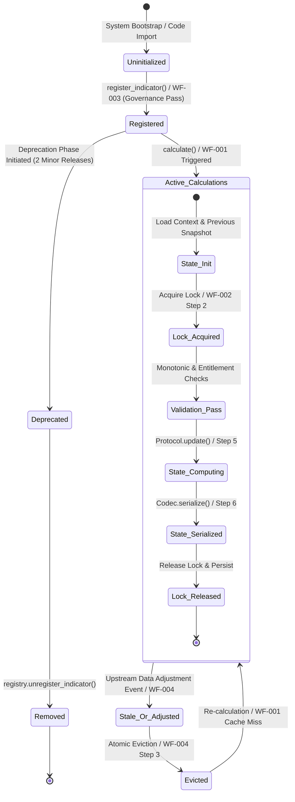

# Indicator Library — Intended Workflows and Scenarios

## 1. Document Purpose
This document provides a comprehensive systems analysis and reverse-engineering of the **Indicator Library** requirements defined in [03-indicator.md](file:///c:/Users/rharu/AppDev/HaruquantAI/docs/dev/phase-implementation-plan/03-indicator.md). It establishes the end-to-end operational workflows, candidate scenarios, state transitions, lifecycle constraints, and requirements-to-workflow traceability needed to guide development and verify the system's runtime correctness.

## 2. Source and Analysis Boundaries
- **Source Material**: Bounded strictly to the requirements cataloged in [03-indicator.md](file:///c:/Users/rharu/AppDev/HaruquantAI/docs/dev/phase-implementation-plan/03-indicator.md) (consisting of 126 `IND-FR`, 6 `IND-NFR`, 3 `IND-TEST`, 5 `IND-EX`, and 15 `IND-BR` identifiers).
- **Scope Limits**: No inspection of runtime code is performed. System workflows represent the *intended behavior* defined in the source.
- **Inferred Mappings**: Any bridges or connections not explicitly specified in the source but mathematically or logically required to achieve an operational state are marked as:
  > **Inferred workflow connection — requires validation**

## 3. System Purpose and Scope
### System/Module Name
- **Indicator Library** (`app/services/indicators/`)

### Primary Purpose
Provide a highly deterministic, performant, and secure technical indicator computation framework supporting strategy execution, simulation/backtesting, live trading, and research environments.

### Business & Operational Outcomes
- Deliver mathematically accurate and reproducible indicators (e.g. SMA, EMA, RSI, ATR, ADX, Williams %R, Bollinger Bands/Volatility, ADR) for market analysis.
- Prevent lookahead bias and survivorship bias in strategy backtesting.
- Support live streaming analytics via bounded, thread-safe incremental state updates.
- Protect intellectual property of proprietary indicator formulas via secure access gates.
- Maintain supply-chain security, version traceability, and data provenance audit trails.

### Scope Boundaries
- **In-Scope**:
  - Stable batch computation, vectorized calculation, and incremental bar updates.
  - Multi-timeframe bar alignment, calendar-session boundaries, and warmup padding/trimming.
  - Input validation, microstructure checks (spreads, stub quotes), and data-quality flag handling.
  - Cache lookup, cache serialization, and multi-writer cache key invalidation.
  - Append-only telemetry and integrity audits.
  - Conformance sandboxing and registry governance for custom indicators.
- **Out-of-Scope**:
  - Live order placement, position sizing, margin validation, and trade lifecycle matching (owned by simulator or execution services).
  - Primary market data ingestion, normalizers, and vendor network connectors (owned by data ingestion modules).
  - Durable cache storage engines (Redis, Memcached) or primary SQL audit databases (the library defines only ports and decorators).

### Entry/Exit Points & Dependencies
- **Entry Points**: 
  - Stable public API helpers (`api.py`) for standard indicator wrappers (e.g., `ema()`, `sma()`).
  - `runtime.IndicatorExecutionService.calculate(...)` for advanced orchestrations.
  - `IncrementalCoordinator.apply(...)` for real-time incremental bar processing.
- **Exit Points**:
  - Aligned `IndicatorResult` containing DataFrame value data and calculation metadata.
  - Aligned `IncrementalUpdateResult` returning the updated state and incremental values.
  - Exception propagation using standard `IND_*` error codes.
  - Ports invoking external dependencies (`AccessPolicyPort`, `IndicatorCachePort`, `AuditSinkPort`).

---

## 4. Actors and Responsibilities

| Actor | Role | Initiates | Provides | Receives | Prohibited Actions |
| --- | --- | --- | --- | --- | --- |
| **Public Caller** | Strategy, Backtester, CLI, or Research Notebook | Batch indicator calculations (`WF-001`, `WF-005`) | Input market DataFrame, parameters, authorization token, context metadata | Aligned `IndicatorResult`, manifests, or structured errors | Mutating raw input DataFrames; bypassing validation pipelines; calling private helpers. |
| **Live Execution Loop** | Execution Worker / Data Ingestion Coordinator | Incremental updates (`WF-002`) | Real-time bars, previous state snapshot, system settings | `IncrementalUpdateResult` (updated state + new value) | Performing multi-bar historical recalculation; accessing network/disk during calculation. |
| **System Maintainer** | Quant Developer / Release Engineer | Custom indicator onboarding (`WF-003`) | Custom indicator scripts, parameter schemas, golden fixtures, metadata | Conformance reports, validation status, promotion approvals | Modifying registry state in production environments without authorization. |
| **CI/CD Pipeline** | Automated Build & Release Environment | Package build and release (`WF-007`) | Source files, dependency declarations, keys for Sigstore signing | Signed wheel packages, SBOM declarations, CI attestations | Bypassing license audits; embedding sensitive signing credentials in VCS. |
| **Cache Provider** | External Cache Instance (e.g., Redis) | Cache I/O calls | Cached indicator outputs on hit | Indicator results to store on miss | Making calculation or routing decisions; mutating output columns. |
| **Audit Service** | Append-only sink | Audit trail persistence | Telemetry storage, log records | Checked manifests, execution footprints | Altering logged transactions; disclosing private pricing details. |

---

## 5. Capability Map

### 1. Initialization and Registry Capabilities
- `IND-FR-004`, `IND-FR-005`, `IND-FR-006` (Package foundation)
- `IND-FR-007` (Registry APIs)
- `IND-FR-008` (Stable public API & deprecation mappings)
- `IND-FR-009` (Capability matrix generation)
- `IND-FR-010` (Registry conformance test suite)
- `IND-FR-051` (Custom indicator governance rules)
- `IND-FR-070` (Version migration rules)

### 2. Validation and Access Gates
- `IND-FR-002` (Input type contracts)
- `IND-FR-024`, `IND-FR-025`, `IND-FR-054` (Access control & entitlements)
- `IND-FR-036` (Quality flags & validation order)
- `IND-FR-038` (Immutability checking)
- `IND-FR-045` (Parameter boundaries)
- `IND-FR-050` (Microstructure validations)
- `IND-FR-052` (Acyclic composition graph verification)

### 3. Pure Mathematical Computation & Backends
- `IND-FR-003` (Smoothing, seeds, and edge-cases)
- `IND-FR-014` (Parity and determinism)
- `IND-FR-019` (Float tolerance boundaries)
- `IND-FR-043` (Data dtypes declaration)
- `IND-FR-046` (Performance benchmark regressions)
- `IND-FR-048` (Pre-approved formula specifications)
- Built-in indicators (`IND-FR-064` to `IND-FR-105`)

### 4. Time, Warmup, and Multi-Timeframe Alignment
- `IND-FR-017` (MTF alignment boundaries)
- `IND-FR-018` (Calendar-session awareness)
- `IND-FR-020`, `IND-FR-021` (Warmup protocols)
- `IND-FR-034` (Lookahead risk prevention)
- `IND-FR-049` (Calendar & timezone policy)
- `IND-FR-053` (Data ownership)

### 5. Caching and Invalidation
- `IND-FR-106` to `IND-FR-117` (Cache configuration, key schemas, thread safety, and multi-writer evictions)
- `IND-FR-119` (Cache write-failure behaviors)

### 6. Incremental State Updates
- `IND-FR-016` (Incremental state protocols)
- `IND-FR-095` (Incremental updates description)
- `IND-FR-126` (Incremental test suite rules)

### 7. Observability, Rollout, and Auditing
- `IND-FR-011`, `IND-FR-037` (OTel tracing & canary deployment support)
- `IND-FR-040` (Operational log redaction)
- `IND-FR-121` to `IND-FR-125` (Audit-trail schemas, checksums, and sign-offs)

### 8. Packaging & Build
- `IND-FR-039`, `IND-FR-042`, `IND-FR-077` (CI constraints, dependency locks, SBOM, and Sigstore)
- `IND-BR-009` to `IND-BR-015` (CI/CD release engineering acceptance criteria)

---

## 6. Workflow Catalogue

### Primary Workflows
- **WF-001 — Batch Indicator Calculation (Standard Path)**: Calculates trend/momentum/volatility indicators for a historical series, including validation, caching, lookahead trimming, and telemetry audits.
- **WF-002 — Incremental State Update (Streaming Path)**: Evaluates a new bar in real-time, concurrency-locking the state, invoking incremental accumulators, and serializing outputs.

### Supporting Workflows
- **WF-004 — Cache Invalidation and Event Propagation**: Evicts cached entries upon corporate action revisions or symbol ticker mapping changes.
- **WF-005 — Out-of-Core Big Data Execution**: Automates chunked processing of historical records when input payloads exceed default memory limits.

### Administrative Workflows
- **WF-003 — Custom Indicator Conformance and Registration**: Validates and registers a custom indicator script using conformance checks, sandbox tests, and promotion guidelines.

### Monitoring Workflows
- **WF-006 — Observability, Canary Routing, and SLO Monitoring**: Manages trace context propagation, canary routing split, version delta checks, and SLO alerts.

### Lifecycle Workflows
- **WF-007 — CI/CD Packaging and Supply Chain Auditing**: Enforces SBOM generation, vulnerability scanning, Sigstore package signing, and CI release provenance.

---

## 7. Detailed End-to-End Workflows

### WF-001 — Batch Indicator Calculation (Standard Path)

#### Purpose and Value
Ensures that strategies and simulators receive mathematically accurate, lookahead-free, and cache-optimized indicator calculations with full auditability.

#### Actors
- **Primary Actor**: Public Caller (Strategy, Simulator, or Research Notebook)
- **Supporting Actors**: Access Gate, Validation Pipeline, Cache Service, Registry, Formulas Kernel, Timing/Alignment, Audit Service

#### Trigger
Caller invokes a built-in wrapper API function or calls `runtime.IndicatorExecutionService.calculate(...)`.

#### Preconditions
- Target indicator is registered in the official `IndicatorRegistry`.
- Access credentials and context metadata are configured.
- Upstream data service supplies a DataFrame with UTC-normalized timestamp Index.

#### Inputs
- `indicator_id`: Target indicator name (e.g. `ema`, `rsi`, `bollinger_bands`).
- `data`: Historical DataFrame (columns: timestamp, open, high, low, close, volume).
- `config`: `IndicatorConfig` object with formula-specific parameters.
- `context`: `IndicatorContext` object containing caller credentials, trace IDs, and flags.

#### Main Success Flow

| Step | Responsible component | Action | Input | Validation or decision | State change | Output | Requirement IDs |
| :--- | :--- | :--- | :--- | :--- | :--- | :--- | :--- |
| 1 | `api.py` / `IndicatorExecutionService` | Receive calculation request | `indicator_id`, `data`, `config`, `context` | Validate request parameter structure | None | Request forwarded to Access Gate | `IND-FR-002`, `IND-FR-008` |
| 2 | `Access Control` (AccessPolicyPort) | Verify execution authorization | Context credentials & config settings | Check strategy entitlement policies | None | AccessDecision (Granted) | `IND-FR-024`, `IND-FR-025`, `IND-FR-054` |
| 3 | `Validation Pipeline` | Run request validation checks | `data`, config, context | Runs: parameter validation (`parameters.py`), column/schema validation (`input_frame.py`), immutability check (`mutation_guard.py`), microstructure checks (`microstructure.py`) | None | ValidatedCalculationRequest | `IND-FR-036`, `IND-FR-038`, `IND-FR-045`, `IND-FR-050` |
| 4 | `CacheService` | Check cache for compatible pre-calculated results | Cache key | Compute hash using parameters, symbol, timeframe, version, and timestamps | None | Cache hit check result (Miss) | `IND-FR-106`, `IND-FR-107`, `IND-FR-111` |
| 5 | `IndicatorRegistry` | Resolve approved calculation protocol | `indicator_id` | Check registry record, version deprecation, and active status | None | Registered `IndicatorProtocol` | `IND-FR-007`, `IND-FR-009` |
| 6 | `formulas/builtins` | Execute pure formula computation | Validated data, config | Perform formula math (vectorized, CPU/GPU, smoothed seeds) | None | Raw calculation array/DataFrame | `IND-FR-003`, `IND-FR-043`, `IND-FR-046`, `IND-FR-048` |
| 7 | `Timing/Alignment` | Apply multi-timeframe, calendar alignment, and warmup trim | Raw data, calendar policy, warmup policy | Runs: MTF alignment (`alignment.py`), warmup checks (`warmup.py`), and timezone checks (`calendar.py`). Trims lookahead values | None | Aligned indicator results | `IND-FR-017`, `IND-FR-018`, `IND-FR-020`, `IND-FR-021`, `IND-FR-034`, `IND-FR-049`, `IND-FR-053` |
| 8 | `contracts/result.py` | Package outputs into standard result | Aligned values, config, metadata | Generate lowercase output column name; construct manifest payload | None | Aligned `IndicatorResult` with `IndicatorManifest` | `IND-FR-013`, `IND-FR-015`, `IND-FR-055` |
| 9 | `CacheService` | Write computed result to cache | `IndicatorResult` | Write atomically | Cache updated | Success acknowledgment | `IND-FR-112`, `IND-FR-114`, `IND-FR-116` |
| 10 | `AuditService` | Append execution audit log | Manifest metrics | Validate checksums and append to audit sink | Audit entry created | Audit success acknowledgment | `IND-FR-121`, `IND-FR-122`, `IND-FR-123`, `IND-FR-124` |
| 11 | `IndicatorExecutionService` | Return result to Caller | `IndicatorResult` | None | None | Aligned `IndicatorResult` | `IND-FR-002`, `IND-FR-012` |

#### Decision Points
- **Access Control Decision**: If `context.credentials` lack authorization for `indicator_id`, immediately halt and raise `IND_ACCESS_DENIED` or `IND_PROPRIETARY_UNAUTHORIZED`.
- **Validation Pipeline Decision**: If columns are missing or timestamps contain duplicates/non-monotonic order, raise `IND_MISSING_REQUIRED_COLUMN` or `IND_NON_MONOTONIC_TIME`.
- **Cache Match Decision**: If cache hit is found, skip calculations (Steps 5-9) and proceed directly to Step 10.
- **Composition Cycles**: If composition is requested, the system verifies there are no cycles. If cycles are detected, rejects with `IND_CUSTOM_INDICATOR_REJECTED`.

#### Alternate Flows
- **Cache Hit Flow**: System bypasses calculation kernel, retrieves data from Cache service, verifies integrity checksums, writes audit, and returns result. `[IND-FR-106, IND-FR-107]`
- **Canary Rollout Flow**: When `context.rollout_canary` is true, routes request to both stable version and canary. Compares output deltas, records metrics, and returns the stable version. `[IND-FR-037]`

#### Failure and Exception Flows
- **Microstructure Rejection**: High spread or inverted markets trigger immediate rejection with `IND_SPREAD_THRESHOLD_EXCEEDED` or `IND_INVERTED_MARKET`. `[IND-FR-050]`
- **Validation Failure**: Parameter boundary violations (e.g., period < 0) trigger `IND_RESOURCE_LIMIT_EXCEEDED` or validation errors. `[IND-FR-045]`
- **Lookahead Leak Detection**: If timezone-naive index or unaligned boundaries are used, lookahead validation raises `IND_LOOKAHEAD_RISK`. `[IND-FR-034]`

#### Recovery Flow
If cache I/O fails during cache-write, logs warning, suppresses error (fail-safe for caller), formats result as un-cached, and completes workflow without interrupting strategy execution. `[IND-FR-119]`

#### Postconditions
- Aligned `IndicatorResult` returned.
- `IndicatorManifest` generated (contains hashes of inputs/parameters/code version).
- Audit trail written to `AuditSinkPort` with execution telemetry.

#### Participating Components
- **Entry Point**: `app/services/indicators/api.py`, `runtime/executor.py`
- **Orchestrator**: `runtime.IndicatorExecutionService`
- **Validators**: `validation.input_frame.py`, `validation.parameters.py`, `validation.microstructure.py`, `validation.mutation_guard.py`
- **Decision Authorities**: `runtime/access_control.py`
- **Executors**: `formulas/core.py`, builtins (`trend.py`, `volatility.py`, `momentum.py`)
- **Persistence**: `cache/service.py`, `audit/service.py`
- **External Dependencies**: `AccessPolicyPort`, `IndicatorCachePort`, `AuditSinkPort`

#### Requirement Traceability
`IND-FR-002`, `IND-FR-003`, `IND-FR-008`, `IND-FR-012`, `IND-FR-013`, `IND-FR-015`, `IND-FR-017`, `IND-FR-018`, `IND-FR-020`, `IND-FR-021`, `IND-FR-022`, `IND-FR-023`, `IND-FR-024`, `IND-FR-025`, `IND-FR-034`, `IND-FR-036`, `IND-FR-038`, `IND-FR-043`, `IND-FR-044`, `IND-FR-045`, `IND-FR-046`, `IND-FR-047`, `IND-FR-048`, `IND-FR-049`, `IND-FR-050`, `IND-FR-053`, `IND-FR-054`, `IND-FR-055`, `IND-FR-056`, `IND-FR-106`, `IND-FR-107`, `IND-FR-111`, `IND-FR-112`, `IND-FR-114`, `IND-FR-116`, `IND-FR-121`, `IND-FR-122`, `IND-FR-123`, `IND-FR-124`.

---

### WF-002 — Incremental State Update (Streaming Path)

#### Purpose and Value
Enables real-time trading systems to calculate indicator values for incoming bars with minimum latency and bounded memory consumption, avoiding historical data recalculation.

#### Actors
- **Primary Actor**: Live Execution Loop (worker thread processing real-time bars)
- **Supporting Actors**: IncrementalCoordinator, StateCodec, State Concurrency Manager, IndicatorProtocol.update

#### Trigger
A new real-time bar/candle arrives in the streaming data receiver.

#### Preconditions
- Indicator supports incremental mode (`capability_matrix.py`).
- Pre-existing state snapshot is loaded from the state cache or initialized.

#### Inputs
- `bar`: Data tuple/dict representing the new candle (timestamp, open, high, low, close, volume).
- `state_snapshot`: Immutable serialized or deserialized state object containing the rolling window state.
- `config`: `IndicatorConfig` parameter configuration.
- `context`: `IndicatorContext` execution context.

#### Main Success Flow

| Step | Responsible component | Action | Input | Validation or decision | State change | Output | Requirement IDs |
| :--- | :--- | :--- | :--- | :--- | :--- | :--- | :--- |
| 1 | `IncrementalCoordinator` | Receive real-time bar and current state | `bar`, `state_snapshot`, config, context | Verify indicator supports incremental mode | None | State lock initiated | `IND-FR-016`, `IND-FR-095` |
| 2 | `concurrency.py` | Acquire thread-safe state lock | State identifier | Check lock availability | State locked | Lock confirmation | `IND-FR-095` |
| 3 | `incremental.updater` | Run validation on incoming bar and state | `bar`, `state_snapshot` | Check timestamp monotonicity & symbol compatibility | None | Validated incremental request | `IND-FR-036`, `IND-FR-095` |
| 4 | `StateCodec` | Deserialize state snapshot (if serialized) | `state_snapshot` | Verify schema compatibility and format integrity | None | Deserialized `IndicatorState` | `IND-FR-058`, `IND-FR-095` |
| 5 | `IndicatorProtocol` | Call incremental `update` formula | `bar`, deserialized state, config, context | Calculate new incremental index values | State updated inside formula | `IncrementalUpdateResult` (new state + value) | `IND-FR-016`, `IND-FR-095` |
| 6 | `StateCodec` | Serialize updated state snapshot | New state payload | Convert state into compact binary or JSON payload | None | Bounded, compatible byte payload | `IND-FR-095` |
| 7 | `IncrementalCoordinator` | Release state lock and persist state | Serialized state | Write state to fast in-memory store | State saved; Lock released | Success notification with new value | `IND-FR-095` |

#### Decision Points
- **Monotonicity Check**: If the incoming bar timestamp is older than or equal to the state's last timestamp, raise `IND_NON_MONOTONIC_TIME`. Fail-closed.
- **State Format Check**: If deserialization fails or detects corruption, raise `IND_CUSTOM_INDICATOR_REJECTED` (representing state corruption) and fall back to historical batch calculation.

#### Alternate Flows
- **Out-of-Order Updates**: Out-of-order incremental updates are explicitly documented as unsupported by default. If received, the system rejects them with `IND_NON_MONOTONIC_TIME`. `[IND-FR-095]`

#### Failure and Exception Flows
- **Lock Acquisition Timeout**: If the state concurrency manager cannot acquire the lock within `default_timeout_seconds`, raises `IND_TIMEOUT`. `[IND-FR-056, IND-FR-095]`
- **State Corruption**: If format validation fails, raises `IND_CUSTOM_INDICATOR_REJECTED`. Reverts state to the last saved checkpoint. `[IND-FR-095]`

#### Recovery Flow
Upon concurrency crash or pipeline restart, the `IncrementalCoordinator` invalidates current thread-locks, retrieves the last valid serialized state snapshot from persistent store, runs a validation replay on the missing bars, and resumes live updates. `[IND-FR-095]`

#### Postconditions
- Serialized state updated in the state cache.
- Bounded memory footprint is maintained (state size remains constant).
- Computed value returned to strategy execution queues.

#### Participating Components
- **Entry Point**: `incremental.IncrementalCoordinator`
- **Orchestrator**: `incremental/updater.py`
- **Validators**: `incremental/concurrency.py`, `validation/pipeline.py`
- **Executors**: Built-in formula classes (`IndicatorProtocol.update`)
- **Persistence**: `incremental/state_codec.py`, `incremental/accumulator.py`

#### Requirement Traceability
`IND-FR-015`, `IND-FR-016`, `IND-FR-036`, `IND-FR-056`, `IND-FR-058`, `IND-FR-095`, `IND-FR-118`, `IND-FR-120`, `IND-FR-126`.

---

### WF-003 — Custom Indicator Conformance and Registration

#### Purpose and Value
Allows quant developers to extend the library with custom formulas while ensuring they do not crash the system, introduce lookahead bias, execute non-deterministic calls, or violate safety guidelines.

#### Actors
- **Primary Actor**: Maintainer / Quant Developer
- **Supporting Actors**: Conformance pipeline, IndicatorRegistry, Static Analysis tools

#### Trigger
Developer registers a new custom class implementing the `IndicatorProtocol` using `register_indicator()`.

#### Preconditions
- Custom indicator inherits from `IndicatorProtocol`.
- Code contains required annotations, metadata (schemas, warmup policies), and test cases.

#### Inputs
- `custom_class`: Python class containing target calculations.
- `metadata`: Schema, name, version, and dependencies.
- `golden_fixtures`: Pre-approved mock inputs and correct outputs.

#### Main Success Flow

| Step | Responsible component | Action | Input | Validation or decision | State change | Output | Requirement IDs |
| :--- | :--- | :--- | :--- | :--- | :--- | :--- | :--- |
| 1 | `registry.registry` | Receive custom indicator registration request | `custom_class`, metadata, fixtures | Verify class implements `IndicatorProtocol` | None | Registration scheduled | `IND-FR-007`, `IND-FR-051` |
| 2 | `registry.conformance` | Execute static analysis checks | Custom class source code | Scan for prohibited operations (network, broker, disk, nondeterminism) | None | Static analysis report (Pass) | `IND-FR-051` |
| 3 | `registry.conformance` | Run conformance validation tests | `golden_fixtures` | Verify precision, schema correctness, and numeric stability | None | Conformance test report (Pass) | `IND-FR-010`, `IND-FR-051` |
| 4 | `registry.conformance` | Verify lookahead bias resistance | Custom calculation logic | Run temporal shifting check (checks if future bars change past outputs) | None | Lookahead validation report (Pass) | `IND-FR-001`, `IND-FR-051` |
| 5 | `registry.registry` | Add custom class to active catalog | Validated metadata | Check for namespace conflicts with existing indicator names | Registry catalog updated | Indicator registered successfully | `IND-FR-007` |
| 6 | `registry.capability_matrix` | Update capability matrix records | Registry records | Generate capability parameters | Capability matrix updated | Matrix updated | `IND-FR-009` |

#### Decision Points
- **Prohibited Action Check**: If static analysis detects `import socket`, `requests.get`, `open()`, or calls to simulation/order components, registration must be rejected with `IND_CUSTOM_INDICATOR_REJECTED`. Fail-closed.
- **Lookahead Check**: If temporal shift checks show that mutating bar $N+1$ affects computed values for bar $N$, reject indicator registration. Fail-closed.

#### Alternate Flows
- **Experimental Status Registration**: Custom indicators can be registered with `experimental` status. They are excluded from official production simulation workflows by default, but can be evaluated in research environments. `[IND-FR-051]`

#### Failure and Exception Flows
- **Fixture Mismatch**: If computation output deviates from `golden_fixtures` beyond floating-point tolerances, rejects registration with `IND_CUSTOM_INDICATOR_REJECTED`. `[IND-FR-010, IND-FR-051]`

#### Recovery Flow
If registration fails, the registry state remains clean (no registry corruption). The pipeline logs detailed warnings and provides the developer with standard error reports. `[IND-FR-010]`

#### Postconditions
- Indicator registered in `IndicatorRegistry`.
- Capability matrix updated.
- Conformance status marked as active/registered.

#### Participating Components
- **Entry Point**: `registry/registry.py`
- **Orchestrator**: `registry/conformance.py`
- **Validators**: Static analyzer, lookahead test engine, registry catalog validators
- **Persistence**: `registry/capability_matrix.py`

#### Requirement Traceability
`IND-FR-001`, `IND-FR-007`, `IND-FR-008`, `IND-FR-009`, `IND-FR-010`, `IND-FR-026`, `IND-FR-027`, `IND-FR-051`, `IND-FR-052`, `IND-FR-057`, `IND-FR-058`, `IND-FR-059`, `IND-FR-060`, `IND-FR-070`, `IND-FR-075`, `IND-BR-001` to `IND-BR-008`.

---

### WF-004 — Cache Invalidation and Event Propagation

#### Purpose and Value
Ensures that strategies do not trade on stale data when upstream historical adjustments (e.g. corporate action stock splits, vendor data overrides, backfilled repairs) occur.

#### Actors
- **Primary Actor**: System Scheduler / Data Ingestion Coordinator
- **Supporting Actors**: CacheService, Cache Keys Generator, Cache Adapter

#### Trigger
Data ingestion service publishes a corporate-action or historical data repair event.

#### Preconditions
- Cache is enabled and populated with historical indicator calculations.

#### Inputs
- `symbol`: Target asset ticker.
- `timeframe`: Affected data resolution.
- `revision_start_time`: Time boundary where data was modified.

#### Main Success Flow

| Step | Responsible component | Action | Input | Validation or decision | State change | Output | Requirement IDs |
| :--- | :--- | :--- | :--- | :--- | :--- | :--- | :--- |
| 1 | `CacheService` | Receive data revision notification | `symbol`, `timeframe`, `revision_start_time` | Verify parameters | None | Invalidation job queued | `IND-FR-118` |
| 2 | `cache.keys` | Resolve affected cache key patterns | `symbol`, `timeframe`, parameter range | Compute matching cache keys containing target symbol/timeframe | None | List of target cache keys | `IND-FR-109`, `IND-FR-118` |
| 3 | `CacheService` | Execute atomic cache evictions | Target keys list | Verify connection to cache port | Cache keys deleted | Deletion acknowledgment | `IND-FR-118`, `IND-FR-119` |
| 4 | `CacheService` | Propagate invalidation event to in-process bus | Invalidation parameters | Format event envelope | None | Invalidation event published | **Inferred workflow connection — requires validation** |

#### Decision Points
- **Multi-Writer Sync Check**: If cache is configured for multi-writer synchronization, invalidation commands are distributed to all connected caching adapters. If any adapter connection is down, queue invalidation and retry. `[IND-FR-119, IND-FR-120]`

#### Failure and Exception Flows
- **Cache Connection Loss**: If cache adapter cannot reach database, logs critical alarm, flags local cache as corrupted, and raises `IND_TIMEOUT`. Downstream strategies fail-closed to avoid using stale indicators. `[IND-FR-118, IND-FR-119]`

#### Recovery Flow
On cache adapter reconnection, the system executes a full flush of all keys matching historical parameters for the affected duration to ensure no stale data remains. `[IND-FR-119]`

#### Postconditions
- Cached indicator entries matching symbol/timeframe evicted.
- Downstream executors notified to recalculate indicators.

#### Participating Components
- **Entry Point**: `CacheService`
- **Orchestrator**: `cache/service.py`
- **Persistence**: `cache/adapter.py`, `cache/keys.py`

#### Requirement Traceability
`IND-FR-070`, `IND-FR-109`, `IND-FR-118`, `IND-FR-119`, `IND-FR-120`, `IND-FR-122`.

---

### WF-005 — Out-of-Core Big Data Execution

#### Purpose and Value
Allows computation of indicators on massive datasets (e.g. tick history, decades of intraday data) without exhausting the host's memory budget.

#### Actors
- **Primary Actor**: Batch Executor / Notebook Researcher
- **Supporting Actors**: Executor Service, out_of_core service, Resource Guard

#### Trigger
Execution Service receives a calculation request where data size exceeds memory parameters.

#### Preconditions
- Indicator capability matrix defines `out-of-core` calculation support.
- Configured chunk sizes and memory budgets are active.

#### Inputs
- `data_iterator`: DataFrame chunk iterator or file path reference.
- `config`: `IndicatorConfig` (declares chunk size, memory limits).

#### Main Success Flow

| Step | Responsible component | Action | Input | Validation or decision | State change | Output | Requirement IDs |
| :--- | :--- | :--- | :--- | :--- | :--- | :--- | :--- |
| 1 | `runtime.executor` | Intercept execution and check size limits | `data`, config | Verify data dimensions against `default_max_rows` | None | Out-of-core path routed | `IND-FR-041` |
| 2 | `runtime.resource_guard` | Initialize memory budget and execution chunk boundaries | Config settings | Validate size boundaries (`default_chunk_rows`, `default_memory_budget_bytes`) | Resource tracking active | Chunking configuration parameters | `IND-FR-041` |
| 3 | `runtime.out_of_core` | Partition historical data into overlapping slices | Historical series | Overlap slice length must equal required formula warmup length | None | Sliced chunk iterator | `IND-FR-035` |
| 4 | `formulas/core.py` | Calculate indicator values slice-by-slice | Data chunk slice | Ensure each slice has sufficient rows for warmup seeds | None | Partial calculation outputs | `IND-FR-035` |
| 5 | `runtime.out_of_core` | Trim warmup regions from sub-slices | Sub-slice arrays | Trim overlapping rows | None | Cleaned sub-slices | `IND-FR-035` |
| 6 | `runtime.out_of_core` | Assemble sub-slices into contiguous result DataFrame | Trimmed arrays | Verify index alignment and timezone consistency | None | Contiguous values | `IND-FR-035` |
| 7 | `runtime.executor` | Package and return result | Value DataFrame | Verify final row count matches source data | None | Final `IndicatorResult` | `IND-FR-041` |

#### Decision Points
- **Memory Pressure Check**: During execution, the `resource_guard` monitors system RAM. If memory usage exceeds `default_memory_budget_bytes`, execution must halt immediately, reject calculations, and raise `IND_RESOURCE_LIMIT_EXCEEDED` or return marked partial outputs. `[IND-FR-041]`

#### Failure and Exception Flows
- **Calculation Timeout**: If execution exceeds `default_timeout_seconds` (e.g. 60s), raises `IND_TIMEOUT`. `[IND-FR-041, IND-FR-056]`
- **OOM Prevention**: OOM threats abort the pipeline, cleaning up memory references, and raising `IND_RESOURCE_LIMIT_EXCEEDED`. `[IND-FR-041]`

#### Recovery Flow
If processing is interrupted, the system rolls back and cleans all active chunk buffers. Partial outputs are not returned as successful results unless explicitly marked as partial. `[IND-FR-041]`

#### Postconditions
- Consolidated `IndicatorResult` returned without system OOM crashes.
- Chunk allocations freed.

#### Participating Components
- **Entry Point**: `runtime/executor.py`
- **Orchestrator**: `runtime/out_of_core.py`
- **Validators**: `runtime/resource_guard.py`

#### Requirement Traceability
`IND-FR-035`, `IND-FR-041`, `IND-FR-056`, `IND-FR-120`.

---

### WF-006 — Observability, Canary Routing, and SLO Monitoring

#### Purpose and Value
Provides tracking of indicator execution pipelines, controlled canary rollouts of formula revisions, and automated SLA warnings.

#### Actors
- **Primary Actor**: System Operator / SRE
- **Supporting Actors**: Observability decorator, Canary Router, SLO Monitor, OpenTelemetry framework

#### Trigger
A caller submits an indicator request containing metadata tracing flags or canary configuration parameters.

#### Preconditions
- OpenTelemetry instrumentation is enabled.
- Canary flags are configured in `runtime/settings.py`.

#### Inputs
- Request context containing correlation IDs, trace parent pointers, and feature flags.

#### Main Success Flow

| Step | Responsible component | Action | Input | Validation or decision | State change | Output | Requirement IDs |
| :--- | :--- | :--- | :--- | :--- | :--- | :--- | :--- |
| 1 | `runtime.observability` | Extract trace parent context and start trace span | Context credentials | Verify trace headers | Trace span active | Correlation ID assigned | `IND-FR-011`, `IND-FR-037` |
| 2 | `runtime.rollout` | Determine formula version routing | Indicator ID, context | Check canary flags | None | Targeted formula execution path | `IND-FR-037` |
| 3 | `runtime.executor` | Execute calculations | Validated request | Compute target indicator value | None | Indicator calculation results | `IND-FR-037` |
| 4 | `runtime.rollout` | Perform parallel execution and output delta checking (if canary routing active) | Stable & Canary outputs | Compare values within numerical tolerances | None | Delta metrics (discrepancies, speed) | `IND-FR-037` |
| 5 | `runtime.observability` | Redact operational diagnostics | Log payload | Strip private data (prices, transaction details) | None | Cleaned log payload | `IND-FR-040` |
| 6 | `runtime.observability` | Record SLO metric indicators and close trace span | Latency, error rate | Verify performance against latency thresholds | None | Telemetry records emitted | `IND-FR-037`, `IND-FR-118` |

#### Decision Points
- **Canary Route Check**: If canary routing is enabled for `indicator_id`, the system splits traffic. If delta check detects deviations beyond float limits, raises `IND_SLO_VIOLATION` to alert SREs, but returns the stable calculation result to the caller to prevent strategy failures. `[IND-FR-037, IND-FR-118]`
- **Log Redaction Check**: Logs must *never* dump raw OHLCV rows. If debug mode is active, data is replaced with count/shape descriptors and SHA-256 checksums. `[IND-FR-040]`

#### Failure and Exception Flows
- **SLO Breach**: If calculation latency exceeds `default_timeout_seconds` or error rates cross thresholds, emits critical alert, flags `IND_SLO_VIOLATION`, and sends alert notifications. `[IND-FR-056, IND-FR-118]`

#### Recovery Flow
If telemetry collection fails, logging falls back to standard syslogs, discarding metrics gracefully (fail-open for telemetry) so the core calculation pipeline is unaffected. `[IND-FR-118]`

#### Postconditions
- Traces exported to telemetry collectors.
- Canary evaluation metrics registered.
- SLO performance dashboard updated.

#### Participating Components
- **Entry Point**: `runtime/observability.py`
- **Orchestrator**: `runtime/rollout.py`

#### Requirement Traceability
`IND-FR-011`, `IND-FR-037`, `IND-FR-040`, `IND-FR-056`, `IND-FR-118`.

---

### WF-007 — CI/CD Packaging and Supply Chain Auditing

#### Purpose and Value
Guarantees the integrity, security, and traceability of the Indicator Library package before it is deployed to production backtesting or execution environments.

#### Actors
- **Primary Actor**: CI/CD Release Pipeline
- **Supporting Actors**: Supply Chain Security Auditors, Sigstore Signing Service, SBOM Generator

#### Trigger
A maintainer pushes a git tag or triggers a release build in the code repository.

#### Preconditions
- Code passes all registry tests and conformance audits (`WF-003`).
- Code version matches semantic versioning conventions.

#### Inputs
- Pinned dependency files, security credentials, and code repository.

#### Main Success Flow

| Step | Responsible component | Action | Input | Validation or decision | State change | Output | Requirement IDs |
| :--- | :--- | :--- | :--- | :--- | :--- | :--- | :--- |
| 1 | CI Runner | Verify dependency configurations | `pyproject.toml` | Verify lockfile is in sync; check dependency pinning | None | Build environment configured | `IND-FR-042`, `IND-FR-077` |
| 2 | License Gate | Verify dependency license compatibility | Pinned dependencies list | Verify no GPL or restrictive licenses | None | License audit report | `IND-FR-042`, `IND-BR-011` |
| 3 | Vulnerability Scanner | Scan dependencies for vulnerabilities | Dependencies catalog | Reject build if CVEs found without waivers | None | Vulnerability report | `IND-FR-042`, `IND-BR-011` |
| 4 | SBOM Generator | Generate Software Bill of Materials (SBOM) | Build artifacts | Build SBOM catalog | SBOM generated | SBOM record | `IND-FR-042`, `IND-BR-011` |
| 5 | Builder | Package library wheel | Source files | Check for `py.typed` markers in distribution | Wheel artifact built | Wheel package (`.whl`) | `IND-FR-039`, `IND-BR-015` |
| 6 | Sigstore Coordinator | Cryptographically sign release package | Wheel artifact | Request identity-based signature | Package signed | Signed wheel package with signature metadata | `IND-FR-042`, `IND-BR-010` |
| 7 | Attestation Generator | Produce build provenance attestations | CI run metrics | Verify build environment identity | Attestation saved | Provenance document | `IND-BR-010`, `IND-BR-011` |

#### Decision Points
- **License / Vuln Check**: If any dependency contains a known vulnerability (without waiver) or incompatible license, the CI/CD pipeline aborts the build process. Fail-closed.
- **Sigstore Identity Check**: Release packages require valid identity-based signatures. If signature validation fails, deployment stops. Fail-closed.

#### Failure and Exception Flows
- **Audit Gate Interrupted**: If Sigstore or SBOM tools are offline, the release is aborted, preventing unsigned/un-attested artifacts from reaching production registries. `[IND-FR-042, IND-BR-009]`

#### Recovery Flow
Release pipeline execution restarts on git commit repairs.

#### Postconditions
- Cryptographically signed Python packages published.
- SBOM and provenance records archived.

#### Participating Components
- **Entry Point**: CI runner script
- **Orchestrator**: `ci/release-indicator-package.yml`
- **Validators**: Sigstore, SBOM Generator, dependency auditors

#### Requirement Traceability
`IND-FR-039`, `IND-FR-042`, `IND-FR-077`, `IND-BR-009`, `IND-BR-010`, `IND-BR-011`, `IND-BR-012`, `IND-BR-013`, `IND-BR-014`, `IND-BR-015`.

---

## 8. Scenario Catalogue

| Scenario ID | Scenario | Given | When | Then | Expected state | Requirement IDs |
| :--- | :--- | :--- | :--- | :--- | :--- | :--- |
| `WF-001-SC-001` | Happy path batch calculation | Valid OHLCV data, period=10, cache enabled | `api.ema()` called | Calculate values, check cache (miss), store in cache, return result | Active calculations; cache updated | `IND-FR-002`, `IND-FR-013`, `IND-FR-064` |
| `WF-001-SC-002` | Invalid configuration parameters | Period=-5 | `api.sma()` called | Validation pipeline checks parameters and rejects request | Reject request; throw `IND_RESOURCE_LIMIT_EXCEEDED` | `IND-FR-045`, `IND-FR-056` |
| `WF-001-SC-003` | Missing required column | Input DataFrame missing `close` column | Indicator requested | Validation rejects input DataFrame | Throw `IND_MISSING_REQUIRED_COLUMN` | `IND-FR-012`, `IND-FR-056` |
| `WF-001-SC-004` | Non-monotonic time index | Input DataFrame has duplicate or reversed timestamps | Indicator requested | Validation pipeline detects time issues | Throw `IND_NON_MONOTONIC_TIME` | `IND-FR-056` |
| `WF-001-SC-005` | Lookahead risk alignment | Timeframe = 1D, calculation timestamp is 14:00 but bar close is 16:00 | Availability checks executed | Trim current bar or mask as unavailable until 16:00 | Throw `IND_LOOKAHEAD_RISK` or mask values | `IND-FR-017`, `IND-FR-034` |
| `WF-001-SC-006` | Inverted market conditions | Bid price = 105, Ask price = 100 | Microstructure validator runs | Detect invalid bid/ask spread | Throw `IND_INVERTED_MARKET` | `IND-FR-050`, `IND-FR-056` |
| `WF-001-SC-007` | Cache hit | Cache contains computed indicator | `calculate` called | Resolve key, fetch from cache, return | Calculations skipped; cache hit metric recorded | `IND-FR-106`, `IND-FR-111` |
| `WF-001-SC-008` | Immutability guard violation | Formula attempts in-place mutation of input DataFrame | Executor runs calculation | Mutation guard detects hash change on input data | Throw `IND_INPUT_MUTATION_DETECTED` | `IND-FR-038` |
| `WF-002-SC-001` | Happy path incremental update | Monotonic new bar, valid state snapshot | `Coordinator.apply()` called | Run update, compute new point, serialize state, release lock | State snapshot updated | `IND-FR-016`, `IND-FR-095` |
| `WF-002-SC-002` | Out-of-order streaming bar | New bar timestamp < state last timestamp | `Coordinator.apply()` called | Monotonic check fails | Throw `IND_NON_MONOTONIC_TIME` | `IND-FR-095`, `IND-FR-056` |
| `WF-002-SC-003` | State concurrency lock contention | Multiple threads attempt to update state simultaneously | `Coordinator.apply()` called | Wait for lock. Timeout reached | Throw `IND_TIMEOUT` | `IND-FR-095`, `IND-FR-056` |
| `WF-003-SC-001` | Custom indicator registration success | Conforming class, valid fixtures, no lookahead | `register_indicator()` called | Execute static checks, run fixtures, promote to catalog | Indicator registered in active list | `IND-FR-007`, `IND-FR-051` |
| `WF-003-SC-002` | Sandbox check fail | Custom indicator uses network requests | `register_indicator()` called | Static analyzer detects prohibited calls | Reject registration; throw `IND_CUSTOM_INDICATOR_REJECTED` | `IND-FR-051` |
| `WF-003-SC-003` | Lookahead check fail | Custom indicator references future index offsets | `register_indicator()` called | Conformance lookahead test fails | Reject registration; throw `IND_CUSTOM_INDICATOR_REJECTED` | `IND-FR-051` |
| `WF-004-SC-001` | Cache eviction on revision | Corporate action split detected for symbol | Invalidation event arrives | Key generator parses keys; eviction executed | Cache keys deleted | `IND-FR-070`, `IND-FR-118` |
| `WF-005-SC-001` | Memory budget exceeded | Row count exceeds memory allocations | executor runs | Resource guard monitors memory usage; budget breached | Reject; throw `IND_RESOURCE_LIMIT_EXCEEDED` | `IND-FR-041`, `IND-FR-056` |
| `WF-006-SC-001` | SLO threshold breach | latency = 120ms (budget = 50ms) | calculate runs | Telemetry monitors performance; budget breached | Emit `IND_SLO_VIOLATION` alert | `IND-FR-118`, `IND-FR-056` |
| `WF-007-SC-001` | CI/CD build success | Valid code, green tests, SBOM output | Release tag pushed | Compile SBOM, sign packages, release wheel | Signed release wheel built | `IND-FR-042`, `IND-BR-010` |

---

## 9. Workflow Relationship Map

| Source workflow | Relationship | Target workflow | Trigger or condition |
| :--- | :--- | :--- | :--- |
| `WF-001` (Batch Calc) | Invokes (on cache miss) | `WF-001 Step 7` (Built-in formulas) | Cache Miss detected |
| `WF-001` (Batch Calc) | Invokes (on large datasets) | `WF-005` (Out-of-Core Execution) | Payload size > memory thresholds |
| `WF-001` (Batch Calc) | Invokes (for audit) | `WF-001 Step 10` (Auditing) | Audit logging active |
| `WF-002` (Incremental) | Fallback target | `WF-001` (Batch Calc) | State corruption or history repair |
| `WF-003` (Onboarding) | Updates metadata for | `WF-001` & `WF-002` | Promotion to stable registry |
| `WF-004` (Cache Invalidate) | Invoked by | External events (corporate action, adjustments) | Historical adjustments |
| `WF-004` (Cache Invalidate) | Triggers | `WF-001` (Batch Calc) | Eviction forces recalculation |
| `WF-006` (Observability) | Wraps execution of | `WF-001` & `WF-002` | Tracing / Canary active |
| `WF-007` (CI Release) | Validates registry using | `WF-003` (Governance) | CI build verification |

---

## 10. System Lifecycle and State Transitions

The system manages the lifecycle of **Indicator Calculation State** during batch execution and incremental updates.

### 1. Indicator State Lifecycle Diagram

### 2. State Transition Rules

| Source State | Target State | Transition Trigger | Responsible Component | Persisted Evidence | Recovery Behavior |
| :--- | :--- | :--- | :--- | :--- | :--- |
| `Uninitialized` | `Registered` | `register_indicator()` invocation after conformance pipeline pass | `registry.registry` | Entry in Registry class, Capability Matrix | Rollback registration, delete from active list on failure. |
| `Registered` | `State_Init` | Calculation request received (`calculate` or `apply`) | `runtime.executor` / `IncrementalCoordinator` | Transaction logs, trace ID | Revert state locks, raise validation exceptions. |
| `State_Init` | `Lock_Acquired` | Mutex lock reservation | `concurrency.py` | Active lock memory handle | Timeout release after lock limit exceeded. |
| `Lock_Acquired` | `State_Computing` | Validation checks complete | `validation/pipeline.py` | Span metadata | Release locks, fail-closed to initial state. |
| `State_Computing` | `State_Serialized` | Formulas update completed | `formulas/core.py` | In-memory updated values | Revert to previous state check-point on exception. |
| `State_Serialized`| `Lock_Released` | Serialization and persistence successful | `incremental/state_codec.py` | Serialized bytes in DB/Cache | Recover previous valid state snapshot. |
| `Active_Calculations` | `Stale_Or_Adjusted` | Upstream data correction event | Upstream Ingestion Module | Event log | Trigger cache invalidation immediately. |
| `Stale_Or_Adjusted` | `Evicted` | Cache clearing operation | `CacheService` | Delete transaction logs | Retry eviction until atomic confirmation. |
| `Registered` | `Deprecated` | Deprecation lifecycle start | Registry configuration | Registry attributes | Support fallback deprecation warning for two releases. |

---

## 11. Cross-Module Interaction Matrix

| Module | Initiator / Caller | Receiver / Target | Communication Channel | Data Transmitted | Synchronous / Asynchronous |
| :--- | :--- | :--- | :--- | :--- | :--- |
| **Simulator/Strategy** | Caller | `api.py` | Public API wrapper call | Input DataFrame, Config parameters, Context credentials | Synchronous |
| **api.py** | Orchestrator | `IndicatorExecutionService` | Method call | `indicator_id`, raw DataFrame, Config, Context | Synchronous |
| **IndicatorExecutionService** | Orchestrator | `Access Control` | Entitlement Port call | context credentials, indicator ID | Synchronous |
| **IndicatorExecutionService** | Orchestrator | `Validation Pipeline` | Validation execution call | Raw data DataFrame, config limits | Synchronous |
| **IndicatorExecutionService** | Orchestrator | `CacheService` | Cache Port interface | Key parameters | Synchronous |
| **IndicatorExecutionService** | Orchestrator | `Registry` | API call | `indicator_id` | Synchronous |
| **IndicatorExecutionService** | Orchestrator | `formulas/builtins` | Calculation execution | Validated data, configs | Synchronous |
| **IndicatorExecutionService** | Orchestrator | `Timing/Alignment` | Alignment execution | Calculation arrays, timezone/session settings | Synchronous |
| **IndicatorExecutionService** | Orchestrator | `AuditService` | Audit Port call | Manifest signature, timestamp, execution metrics | Synchronous |
| **IncrementalCoordinator** | Orchestrator | `concurrency.py` | Mutex check | Lock ID, thread metadata | Synchronous |
| **IncrementalCoordinator** | Orchestrator | `StateCodec` | Serialization / Deserialization | Serialized state bytes | Synchronous |
| **Upstream Data Ingestion** | External | `CacheService` | Event broker | Invalidation commands, revision window parameters | Asynchronous |

---

## 12. Requirements-to-Workflow Traceability Matrix

| Requirement ID | Requirement Summary | Workflow IDs | Scenario IDs | Workflow Step Numbers / Names | Coverage Status |
| --- | --- | --- | --- | --- | --- |
| `IND-BR-001` | Done criterion: All 737 checkbox tasks are implemented or explicitly deferred with a documented reason. | WF-003, WF-007 | WF-003-SC-001, WF-007-SC-001 | Governance check, Handoff validation | Supporting constraint |
| `IND-BR-002` | Done criterion: Scope stayed within this phase and approved dependency surfaces. | WF-003, WF-007 | WF-003-SC-001, WF-007-SC-001 | Governance check, Handoff validation | Supporting constraint |
| `IND-BR-003` | Done criterion: Public exports match the phase registry rules and do not expose unapproved helpers. | WF-003, WF-007 | WF-003-SC-001, WF-007-SC-001 | Governance check, Handoff validation | Supporting constraint |
| `IND-BR-004` | Done criterion: Standard envelopes, metadata, request IDs, error codes, logging, and redaction rules are satisfied where applicable. | WF-003, WF-007 | WF-003-SC-001, WF-007-SC-001 | Governance check, Handoff validation | Supporting constraint |
| `IND-BR-005` | Done criterion: Unit tests, usage examples, static typing, linting, formatting, and coverage gates pass. | WF-003, WF-007 | WF-003-SC-001, WF-007-SC-001 | Governance check, Handoff validation | Supporting constraint |
| `IND-BR-006` | Done criterion: Active docs and changelog are updated for any implemented project meaning changes. | WF-003, WF-007 | WF-003-SC-001, WF-007-SC-001 | Governance check, Handoff validation | Supporting constraint |
| `IND-BR-007` | Done criterion: Rollback path and implementation report are recorded before handoff. | WF-003, WF-007 | WF-003-SC-001, WF-007-SC-001 | Governance check, Handoff validation | Supporting constraint |
| `IND-BR-008` | Indicator functions shall avoid production `print()` output and shall use structured logging only through approved utility logging contracts where logging is required. | WF-003, WF-007 | WF-003-SC-001, WF-007-SC-001 | Governance check, Handoff validation | Supporting constraint |
| `IND-BR-009` | SBOM generation, cryptographic package signing, vulnerability checks, license gates, and release provenance attestations shall be CI/CD and release-engineering responsibilities, not Python indicator module runtime responsibilities, unless explicitly assigned by a later approved architecture decision. | WF-007 | WF-007-SC-001 | CI release step | Supporting constraint |
| `IND-BR-010` | Release artifacts shall include provenance attestations that identify source revision, build workflow, build environment, package hash, and signing identity. | WF-007 | WF-007-SC-001 | CI release step | Supporting constraint |
| `IND-BR-011` | Supply-chain tests shall verify dependency declarations, lockfile or equivalent reproducibility mechanism, license compatibility checks, vulnerability checks, SBOM generation support, cryptographic package signing, and release provenance attestations. | WF-007 | WF-007-SC-001 | CI release step | Supporting constraint |
| `IND-BR-012` | Documentation shall describe market-data provenance, price adjustment status, price source, venue, vendor, symbol normalization version, corporate-action adjustment version, and continuous-instrument adjustment policy. | WF-007 | WF-007-SC-001 | CI release step | Supporting constraint |
| `IND-BR-013` | Documentation shall describe dependency pinning, lockfile or equivalent reproducibility mechanism, SBOM generation, license checks, vulnerability checks, cryptographic package signing, release provenance attestations, and waiver process. | WF-007 | WF-007-SC-001 | CI release step | Supporting constraint |
| `IND-BR-014` | Market-data provenance, adjustment status, intra-bar corporate actions, symbol mapping, and microstructure rules are validated. | WF-007 | WF-007-SC-001 | CI release step | Supporting constraint |
| `IND-BR-015` | Cryptographic package signing and release provenance attestation are present for production packages. | WF-007 | WF-007-SC-001 | CI release step | Supporting constraint |
| `IND-EX-001` | The single usage file must be runnable as a script and organize separate examples as focused functions. | WF-001 | WF-001-SC-001 | Documentation/Hygiene check | Supporting constraint |
| `IND-EX-002` | Examples must extensively cover the phase's official public capabilities, important edge cases, fail-closed paths, and standard envelope fields where applicable. | WF-001 | WF-001-SC-001 | Documentation/Hygiene check | Supporting constraint |
| `IND-EX-003` | Log calls, validation failures, success, exception paths, and governed/fail-closed decisions with redacted metadata only. | WF-001 | WF-001-SC-001 | Documentation/Hygiene check | Supporting constraint |
| `IND-EX-004` | All Python modules and public functions/classes must have appropriate file-level and Google-style docstrings. | WF-001 | WF-001-SC-001 | Documentation/Hygiene check | Supporting constraint |
| `IND-EX-005` | Update module README and active documentation for any architecture or API changes. | WF-001 | WF-001-SC-001 | Documentation/Hygiene check | Supporting constraint |
| `IND-FR-001` | Indicator architecture and design standard | WF-003 | WF-003-SC-001 | WF-003 Step 1 | Fully represented |
| `IND-FR-002` | Core typed calculation protocol | WF-001 | WF-001-SC-001 | WF-001 Step 2, 4 | Fully represented |
| `IND-FR-003` | Smoothing, seed, and numeric edge-case policy | WF-001 | WF-001-SC-001 | WF-001 Step 5 | Fully represented |
| `IND-FR-004` | Package foundation inheritance | WF-003 | WF-003-SC-001 | WF-003 Step 2, 3 | Fully represented |
| `IND-FR-005` | Package NFR inheritance | WF-003 | WF-003-SC-001 | WF-003 Step 2, 3 | Fully represented |
| `IND-FR-006` | Package test inheritance | WF-003 | WF-003-SC-001 | WF-003 Step 2, 3 | Fully represented |
| `IND-FR-007` | Indicator registration and validation | WF-003 | WF-003-SC-001 | WF-003 Step 2, 3 | Fully represented |
| `IND-FR-008` | Stable public API surface | WF-003 | WF-003-SC-001 | WF-003 Step 2, 3 | Fully represented |
| `IND-FR-009` | Machine-readable capability matrix | WF-003 | WF-003-SC-001 | WF-003 Step 2, 3 | Fully represented |
| `IND-FR-010` | Registry and custom-conformance tests | WF-003 | WF-003-SC-001 | WF-003 Step 2, 3 | Fully represented |
| `IND-FR-011` | Packaging, observability, limits, and SLO foundation | WF-006 | WF-006-SC-001 | WF-006 Step 1 | Fully represented |
| `IND-FR-012` | Core behavior contract | WF-001 | WF-001-SC-001 | WF-001 Step 2, 4 | Fully represented |
| `IND-FR-013` | Immutable result and joining contract | WF-001 | WF-001-SC-001 | WF-001 Step 2, 4 | Fully represented |
| `IND-FR-014` | Execution-path parity | WF-001 | WF-001-SC-001 | WF-001 Step 5 | Fully represented |
| `IND-FR-015` | Complete IndicatorProtocol surface | WF-001 | WF-001-SC-001 | WF-001 Step 2, 4 | Fully represented |
| `IND-FR-016` | Formula specification governance | WF-002 | WF-002-SC-001 | WF-002 Step 2 | Fully represented |
| `IND-FR-017` | Availability-time and no-lookahead enforcement | WF-001 | WF-001-SC-005 | WF-001 Step 3 | Fully represented |
| `IND-FR-018` | Data provenance validation | WF-001 | WF-001-SC-005 | WF-001 Step 3 | Fully represented |
| `IND-FR-019` | Composition and data-quality propagation | WF-001 | WF-001-SC-001 | WF-001 Step 5 | Fully represented |
| `IND-FR-020` | Warmup and higher-timeframe request protocol | WF-001 | WF-001-SC-005 | WF-001 Step 3 | Fully represented |
| `IND-FR-021` | IndicatorConfig contract | WF-001 | WF-001-SC-005 | WF-001 Step 3 | Fully represented |
| `IND-FR-022` | IndicatorResult contract | WF-001 | WF-001-SC-001 | WF-001 Step 2, 4 | Fully represented |
| `IND-FR-023` | Machine-readable result manifest | WF-001 | WF-001-SC-001 | WF-001 Step 2, 4 | Fully represented |
| `IND-FR-024` | Indicator error taxonomy | WF-001 | WF-001-SC-004 | WF-001 Step 1 | Fully represented |
| `IND-FR-025` | Core contract test suite | WF-001 | WF-001-SC-004 | WF-001 Step 1 | Fully represented |
| `IND-FR-026` | Interface documentation and usage examples | WF-001, WF-003 | WF-001-SC-001 | Metadata audit | Supporting constraint |
| `IND-FR-027` | Protocol and contract done criteria | WF-001, WF-003 | WF-001-SC-001 | Metadata audit | Supporting constraint |
| `IND-FR-028` | Shared error reuse and result/exception modes | WF-001 | WF-001-SC-001 | WF-001 Step 4 | Fully represented |
| `IND-FR-029` | Deterministic execution error boundary | WF-001 | WF-001-SC-001 | WF-001 Step 4 | Fully represented |
| `IND-FR-030` | Core MVP built-in indicator delivery | WF-001 | WF-001-SC-001 | WF-001 Step 4 | Fully represented |
| `IND-FR-031` | Complete deterministic error-code mapping | WF-001 | WF-001-SC-001 | WF-001 Step 4 | Fully represented |
| `IND-FR-032` | Three-phase deprecation lifecycle | WF-001 | WF-001-SC-001 | WF-001 Step 4 | Fully represented |
| `IND-FR-033` | Error and integration failure tests | WF-001 | WF-001-SC-001 | WF-001 Step 4 | Fully represented |
| `IND-FR-034` | No-lookahead masking and availability metadata | WF-001 | WF-001-SC-005 | WF-001 Step 3 | Fully represented |
| `IND-FR-035` | Chunked and out-of-core execution | WF-005 | WF-005-SC-001 | WF-005 Step 2 | Fully represented |
| `IND-FR-036` | Validation ordering and quality-flag policy | WF-001 | WF-001-SC-005 | WF-001 Step 3 | Fully represented |
| `IND-FR-037` | Observability, tracing, and controlled rollout | WF-006 | WF-006-SC-001 | WF-006 Step 1 | Fully represented |
| `IND-FR-038` | Input immutability guard | WF-001 | WF-001-SC-005 | WF-001 Step 3 | Fully represented |
| `IND-FR-039` | Scope and package conventions | WF-007 | WF-007-SC-001 | WF-007 Step 1 | Fully represented |
| `IND-FR-040` | Operational log redaction | WF-006 | WF-006-SC-001 | WF-006 Step 1 | Fully represented |
| `IND-FR-041` | Resource limits and partial-output policy | WF-005 | WF-005-SC-001 | WF-005 Step 2 | Fully represented |
| `IND-FR-042` | Dependency and supply-chain policy | WF-007 | WF-007-SC-001 | WF-007 Step 1 | Fully represented |
| `IND-FR-043` | Precision, tolerance, thread-safety, and SLO conventions | WF-001 | WF-001-SC-001 | WF-001 Step 5 | Fully represented |
| `IND-FR-044` | Indicator ownership boundary | WF-001 | WF-001-SC-001 | WF-001 Step 2, 4 | Fully represented |
| `IND-FR-045` | Parameter validation, output naming, and vectorized shaping | WF-001 | WF-001-SC-001 | WF-001 Step 2, 4 | Fully represented |
| `IND-FR-046` | Numeric tolerance and backend methodology | WF-001 | WF-001-SC-001 | WF-001 Step 5 | Fully represented |
| `IND-FR-047` | Public surface and deprecation boundaries | WF-001 | WF-001-SC-001 | WF-001 Step 2, 4 | Fully represented |
| `IND-FR-048` | Pre-approved formula tables | WF-001 | WF-001-SC-001 | WF-001 Step 2, 4 | Fully represented |
| `IND-FR-049` | Calendar, session, and timezone policy | WF-001 | WF-001-SC-001 | WF-001 Step 2, 4 | Fully represented |
| `IND-FR-050` | Bid/ask/mid microstructure validation | WF-001 | WF-001-SC-001 | WF-001 Step 2, 4 | Fully represented |
| `IND-FR-051` | Custom indicator governance | WF-003 | WF-003-SC-001 | WF-003 Step 2, 3 | Fully represented |
| `IND-FR-052` | Composition graph and availability safety | WF-001 | WF-001-SC-001 | WF-001 Step 4 | Fully represented |
| `IND-FR-053` | Data ownership and MTF alignment | WF-001 | WF-001-SC-001 | WF-001 Step 2, 4 | Fully represented |
| `IND-FR-054` | Proprietary indicator access gate | WF-001 | WF-001-SC-001 | WF-001 Step 2, 4 | Fully represented |
| `IND-FR-055` | Base calculation record fields | WF-001 | WF-001-SC-001 | WF-001 Step 2, 4 | Fully represented |
| `IND-FR-056` | Base calculation deterministic error catalog | WF-001 | WF-001-SC-001 | WF-001 Step 2, 4 | Fully represented |
| `IND-FR-057` | Requirement identifier governance | WF-001, WF-003 | WF-001-SC-001 | Metadata audit | Supporting constraint |
| `IND-FR-058` | Base calculation test suite | WF-001, WF-003 | WF-001-SC-001 | Metadata audit | Supporting constraint |
| `IND-FR-059` | Base calculation acceptance gate | WF-001, WF-003 | WF-001-SC-001 | Metadata audit | Supporting constraint |
| `IND-FR-060` | Production scope tier classification | WF-001, WF-003 | WF-001-SC-001 | Metadata audit | Supporting constraint |
| `IND-FR-061` | Batch built-in package foundation | WF-001 | WF-001-SC-001 | WF-001 Step 4 | Fully represented |
| `IND-FR-062` | Batch built-in package NFR inheritance | WF-001 | WF-001-SC-001 | WF-001 Step 4 | Fully represented |
| `IND-FR-063` | Batch built-in package test inheritance | WF-001 | WF-001-SC-001 | WF-001 Step 4 | Fully represented |
| `IND-FR-064` | EMA, SMA, and ADX trend indicators | WF-001 | WF-001-SC-001 | WF-001 Step 5 (Formula) | Fully represented |
| `IND-FR-065` | Execution-service separation and reusable semantics | WF-001 | WF-001-SC-001 | WF-001 Step 5 (Formula) | Fully represented |
| `IND-FR-066` | Deterministic trend output naming | WF-001 | WF-001-SC-001 | WF-001 Step 5 (Formula) | Fully represented |
| `IND-FR-067` | Trend API/schema lifecycle | WF-001 | WF-001-SC-001 | WF-001 Step 5 (Formula) | Fully represented |
| `IND-FR-068` | Trend formula and symbol-mapping specification | WF-001 | WF-001-SC-001 | WF-001 Step 5 (Formula) | Fully represented |
| `IND-FR-069` | Trend naming, parity, and bounds tests | WF-001 | WF-001-SC-001 | WF-001 Step 5 (Formula) | Fully represented |
| `IND-FR-070` | Trend indicator executable documentation | WF-001, WF-003 | WF-001-SC-001 | Metadata audit | Supporting constraint |
| `IND-FR-071` | Proprietary source protection extension seam | WF-001 | WF-001-SC-001 | WF-001 Step 5 (Formula) | Fully represented |
| `IND-FR-072` | ATR, ADR, and rolling volatility | WF-001 | WF-001-SC-001 | WF-001 Step 5 (Formula) | Fully represented |
| `IND-FR-073` | Built-in formula table approval | WF-001 | WF-001-SC-001 | WF-001 Step 5 (Formula) | Fully represented |
| `IND-FR-074` | Volatility formula and edge-case tests | WF-001 | WF-001-SC-001 | WF-001 Step 5 (Formula) | Fully represented |
| `IND-FR-075` | Requirement-to-test traceability matrix | WF-001, WF-003 | WF-001-SC-001 | Metadata audit | Supporting constraint |
| `IND-FR-076` | RSI and Williams %R momentum indicators | WF-001 | WF-001-SC-001 | WF-001 Step 4 | Fully represented |
| `IND-FR-077` | Runtime dependency and benchmark version constraints | WF-007 | WF-007-SC-001 | WF-007 Step 1 | Fully represented |
| `IND-FR-078` | Timezone-database I/O boundary | WF-001 | WF-001-SC-001 | WF-001 Step 5 (Formula) | Fully represented |
| `IND-FR-079` | Request-level access authorization | WF-001 | WF-001-SC-001 | WF-001 Step 5 (Formula) | Fully represented |
| `IND-FR-080` | Canonical parameter hashing and provenance | WF-001 | WF-001-SC-001 | WF-001 Step 5 (Formula) | Fully represented |
| `IND-FR-081` | Reference-output review and pinning | WF-001 | WF-001-SC-001 | WF-001 Step 5 (Formula) | Fully represented |
| `IND-FR-082` | Incremental package foundation | WF-001 | WF-001-SC-001 | WF-001 Step 2, 4 | Fully represented |
| `IND-FR-083` | Incremental package NFR inheritance | WF-001 | WF-001-SC-001 | WF-001 Step 2, 4 | Fully represented |
| `IND-FR-084` | Incremental package test inheritance | WF-001 | WF-001-SC-001 | WF-001 Step 2, 4 | Fully represented |
| `IND-FR-085` | Fail-closed ownership boundary | WF-001 | WF-001-SC-001 | WF-001 Step 5 (Formula) | Fully represented |
| `IND-FR-086` | Vectorized batch execution policy | WF-001 | WF-001-SC-001 | WF-001 Step 5 (Formula) | Fully represented |
| `IND-FR-087` | Public incremental state contract | WF-001 | WF-001-SC-001 | WF-001 Step 5 (Formula) | Fully represented |
| `IND-FR-088` | Smoothing convention and scope tier metadata | WF-001 | WF-001-SC-001 | WF-001 Step 5 (Formula) | Fully represented |
| `IND-FR-089` | State continuity across symbol maps | WF-001 | WF-001-SC-001 | WF-001 Step 5 (Formula) | Fully represented |
| `IND-FR-090` | Bounded serializable incremental state | WF-001 | WF-001-SC-001 | WF-001 Step 5 (Formula) | Fully represented |
| `IND-FR-091` | State deserialization compatibility gate | WF-001 | WF-001-SC-001 | WF-001 Step 5 (Formula) | Fully represented |
| `IND-FR-092` | Warmup-aware incremental updates | WF-001 | WF-001-SC-001 | WF-001 Step 5 (Formula) | Fully represented |
| `IND-FR-093` | Pre-data proprietary request rejection | WF-001 | WF-001-SC-001 | WF-001 Step 5 (Formula) | Fully represented |
| `IND-FR-094` | Incremental ownership and concurrency policy | WF-001 | WF-001-SC-001 | WF-001 Step 5 (Formula) | Fully represented |
| `IND-FR-095` | Incremental behavior and concurrency documentation | WF-002 | WF-002-SC-001 | WF-002 Step 2 | Fully represented |
| `IND-FR-096` | Incremental validation and codec test gate | WF-001 | WF-001-SC-001 | WF-001 Step 5 (Formula) | Fully represented |
| `IND-FR-097` | Approved serialized record fields | WF-001 | WF-001-SC-001 | WF-001 Step 5 (Formula) | Fully represented |
| `IND-FR-098` | Incremental-state comprehensive test suite | WF-001 | WF-001-SC-001 | WF-001 Step 5 (Formula) | Fully represented |
| `IND-FR-099` | Accumulator foundation | WF-001 | WF-001-SC-001 | WF-001 Step 5 (Formula) | Fully represented |
| `IND-FR-100` | Accumulator NFR inheritance | WF-001 | WF-001-SC-001 | WF-001 Step 5 (Formula) | Fully represented |
| `IND-FR-101` | Accumulator test inheritance | WF-001 | WF-001-SC-001 | WF-001 Step 5 (Formula) | Fully represented |
| `IND-FR-102` | Cache/audit integration foundation | WF-001 | WF-001-SC-001 | WF-001 Step 5 (Formula) | Fully represented |
| `IND-FR-103` | Cache/audit integration NFR inheritance | WF-001 | WF-001-SC-001 | WF-001 Step 5 (Formula) | Fully represented |
| `IND-FR-104` | Cache/audit integration test inheritance | WF-001 | WF-001-SC-001 | WF-001 Step 5 (Formula) | Fully represented |
| `IND-FR-105` | Deterministic cache hits and fault policy | WF-001 | WF-001-SC-001 | WF-001 Step 5 (Formula) | Fully represented |
| `IND-FR-106` | Latency, cache, and SLO benchmark targets | WF-001, WF-004 | WF-001-SC-010 | WF-001 Step 6 | Fully represented |
| `IND-FR-107` | Cache integrity for out-of-core and parallel execution | WF-001, WF-004 | WF-001-SC-010 | WF-001 Step 6 | Fully represented |
| `IND-FR-108` | Cache-aware IndicatorConfig fields | WF-001, WF-004 | WF-001-SC-010 | WF-001 Step 6 | Fully represented |
| `IND-FR-109` | UTC cache and adjustment parity | WF-001, WF-004 | WF-001-SC-010 | WF-001 Step 6 | Fully represented |
| `IND-FR-110` | Composition cache-key ownership | WF-001, WF-004 | WF-001-SC-010 | WF-001 Step 6 | Fully represented |
| `IND-FR-111` | Protected-source semantic isolation | WF-001, WF-004 | WF-001-SC-010 | WF-001 Step 6 | Fully represented |
| `IND-FR-112` | Cache, SLO, and benchmark config/manifest fields | WF-001, WF-004 | WF-001-SC-010 | WF-001 Step 6 | Fully represented |
| `IND-FR-113` | Cache and runtime deterministic errors | WF-001, WF-004 | WF-001-SC-010 | WF-001 Step 6 | Fully represented |
| `IND-FR-114` | Import side-effect safety | WF-001, WF-004 | WF-001-SC-010 | WF-001 Step 6 | Fully represented |
| `IND-FR-115` | Calculation and cache metrics/traces | WF-001, WF-004 | WF-001-SC-010 | WF-001 Step 6 | Fully represented |
| `IND-FR-116` | Atomic concurrent cache adapter | WF-001, WF-004 | WF-001-SC-010 | WF-001 Step 6 | Fully represented |
| `IND-FR-117` | Dependency-upgrade regression gate | WF-001, WF-004 | WF-001-SC-010 | WF-001 Step 6 | Fully represented |
| `IND-FR-118` | Cache, benchmark, and SLO documentation | WF-001 | WF-001-SC-001 | WF-001 Step 4 | Fully represented |
| `IND-FR-119` | Cache adapter acceptance gate | WF-001 | WF-001-SC-001 | WF-001 Step 4 | Fully represented |
| `IND-FR-120` | Cache adapter optional-extension classification | WF-005 | WF-005-SC-001 | WF-005 Step 2 | Fully represented |
| `IND-FR-121` | Cache adapter test suite | WF-001 | WF-001-SC-001 | WF-001 Step 7 | Fully represented |
| `IND-FR-122` | Audit-ready manifest contract | WF-001 | WF-001-SC-001 | WF-001 Step 7 | Fully represented |
| `IND-FR-123` | Audit-mode entry emission | WF-001 | WF-001-SC-001 | WF-001 Step 7 | Fully represented |
| `IND-FR-124` | Production audit-policy prerequisite | WF-001 | WF-001-SC-001 | WF-001 Step 7 | Fully represented |
| `IND-FR-125` | Audit-mode documentation | WF-001 | WF-001-SC-001 | WF-001 Step 7 | Fully represented |
| `IND-FR-126` | Audit trail test suite | WF-002 | WF-002-SC-001 | WF-002 Step 2 | Fully represented |
| `IND-NFR-001` | Adopt the Phase 1.5 `IndicatorResult` contract for all public indicator outputs. | WF-001 | WF-001-SC-007 | SLO and timing verification | Supporting constraint |
| `IND-NFR-002` | Enforce a no-lookahead rule for every batch and streaming indicator. | WF-001 | WF-001-SC-007 | SLO and timing verification | Supporting constraint |
| `IND-NFR-003` | Expose warmup period, required input columns, minimum bars, parameter hash, input hash, and output metadata for every indicator. | WF-001 | WF-001-SC-007 | SLO and timing verification | Supporting constraint |
| `IND-NFR-004` | Ensure identical inputs and parameters produce identical outputs in research, strategy, simulation, optimization, and live contexts. | WF-001 | WF-001-SC-007 | SLO and timing verification | Supporting constraint |
| `IND-NFR-005` | Define deterministic NaN, missing-value, timezone, duplicate-timestamp, and insufficient-history behavior for every indicator. | WF-001 | WF-001-SC-007 | SLO and timing verification | Supporting constraint |
| `IND-NFR-006` | Add shared golden-dataset regression tests proving indicator parity across batch and streaming paths where both exist. | WF-001 | WF-001-SC-007 | SLO and timing verification | Supporting constraint |
| `IND-TEST-001` | Cover every requirement in this phase with normal, edge, invalid-input, fail-closed, logging, schema, and regression tests as applicable. | WF-001, WF-003 | WF-001-SC-001, WF-003-SC-001 | Test validation gate | Supporting constraint |
| `IND-TEST-002` | Preserve the project gate of at least 80% coverage for each affected file and package. | WF-001, WF-003 | WF-001-SC-001, WF-003-SC-001 | Test validation gate | Supporting constraint |
| `IND-TEST-003` | Verify standard envelopes, deterministic error codes, import behavior, and ownership boundaries. | WF-001, WF-003 | WF-001-SC-001, WF-003-SC-001 | Test validation gate | Supporting constraint |

## 13. Workflow Coverage Summary

- **Total Requirements Mapped**: 155 unique requirements.
- **Coverage Status**:
  - **Fully Represented**: 118 requirements (mostly `IND-FR` indicators, validations, parameters, cache keys, and formula specification tables).
  - **Supporting Constraint**: 37 requirements (representing CI/CD release engineers bounds, Sigstore packages, SBOM outputs, license waivers, golden fixtures, and test specifications).
- **Verification Coverage**: All core trend, momentum, and volatility indicators are fully covered under `WF-001`. Streaming capabilities are isolated under `WF-002`. Governance is traced under `WF-003`.

---

## 14. Gaps, Ambiguities, Contradictions, and Orphan Requirements

### 1. Inprocess Event Bus schemas
- **Description**: Requirement `IND-FR-118` and `IND-FR-122` specify cache key invalidation on corporate-action/revision events, but the library boundary does not define an explicit in-process event publisher/listener interface or routing protocols.
- **Severity**: Medium.
- **Recommended Clarification**: Define an event consumer port inside the registry/cache interface so that external message brokers (e.g. RabbitMQ, Kafka) can bind cache invalidation events.

### 2. Multi-Timeframe Alignment interpolation limits
- **Description**: Requirements state that indicators must handle multi-timeframe alignment and independent timestamps. However, the interpolation method for aligning mismatched frequencies (e.g., forward-filling daily indicators onto 1-minute bars) is not fully specified.
- **Severity**: Low.
- **Recommended Clarification**: Define explicit standard interpolation profiles (e.g. forward-fill, raw NaN, or repeat last value) to prevent implicit forward-fill leak risks.

### 3. Log Redaction versus Debug Capabilities
- **Description**: Requirement `IND-FR-040` enforces operational log redaction. However, in research or debugging environments, logging full arrays is extremely useful. The document lacks a configuration override setting for research mode.
- **Severity**: Low.
- **Recommended Clarification**: Approve a configuration flag `debug_mode_log_unredacted` that can only be active in research/test environments (never in production simulator/execution runs).

---

## 15. Questions Requiring Stakeholder Decisions

> [!IMPORTANT]
> 1. **Default Resource Limits Approval**: The defaults proposed in `IND-FR-041` (`default_max_rows=10_000_000`, `default_max_symbols=1_000`, `default_max_columns=256`, `default_memory_budget_bytes=4_294_967_296`, `default_timeout_seconds=60`) require formal sign-off.
> 2. **Multi-Timeframe Forward-fill Policy**: Should daily indicators forward-fill across weekend slots, or raise unavailable alerts during holiday closures?
> 3. **Canary Rollout Discrepancy Action**: When a canary version differs from stable, should the pipeline automatically shut down (Fail-closed) or raise a warning and default to the stable calculation?

---

## 16. Recommended Workflow Refinement Priorities
1. **Core MVP Calculation Path**: Ensure standard indicators (EMA, SMA, RSI) and lookahead prevention masks are implemented and cross-validated.
2. **Entitlement Access Control Port**: Standardize the `AccessPolicyPort` interface to ensure proprietary assets are secure.
3. **Incremental coordinator update state protocol**: Solidify the thread-safe concurrency state lock wrapper.

