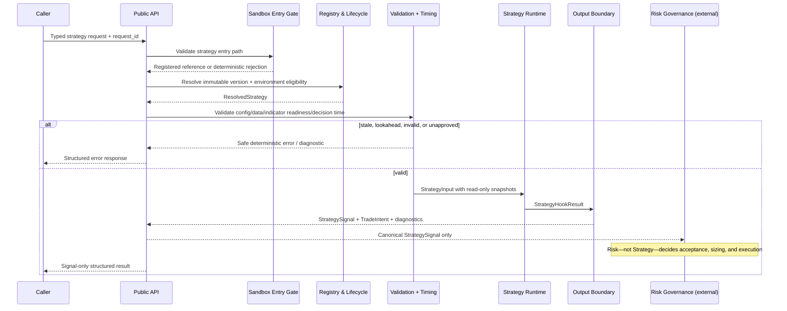

# Strategy Service - Architecture Requirements Document

## Scope, Source, and Traceability Basis

This architecture maps **only** the supplied `04-strategy-service.md` source into a clean Python design under `app/services/strategies/`. It does not introduce broker execution, risk approval, portfolio enforcement, data normalization, indicator calculation, simulation matching, UI/API routing, or live trading authority inside the Strategy domain.

### Requirement-ID audit

- **Functional requirement IDs:** `STRAT-FR-001` through `STRAT-FR-106` (**106** IDs).
- **Hardening NFR IDs:** `STRAT-NFR-001` through `STRAT-NFR-006` (**6** IDs).
- **Mapped traceability IDs:** **112 / 112**. Every subordinate source bullet is preserved under its parent requirement below.
- **Source-count inconsistency recorded, not inferred away:** the source states “463 checkbox tasks” near its beginning but “457 checkbox tasks” in its acceptance checklist. The source supplies no separate IDs for the difference, so this document maps every ID-bearing requirement and reproduces the full subordinate checklist text associated with each ID.

### Boundary rules carried into this architecture

- The Strategy Service **emits** canonical `StrategySignal`, `TradeIntent`, diagnostics, and strategy-local state updates only.
- It **does not** place broker orders, create official fills/deals, make risk or lifecycle approvals, mutate account/portfolio state, write official journals, or run simulation accounting.
- External Data, Indicator, Simulator, Risk, and read-only state interactions are explicitly typed ports. The Strategy Service never accesses those modules’ private internals.

## 1. System Boundary Diagram (file structure)

```text
app/services/strategies/
├── __init__.py                         # Explicit public gate; no import-time work
├── public_api.py                       # Typed official strategy capability wrappers
├── contracts/                          # Immutable cross-module Strategy contracts
│   ├── enums.py
│   ├── models.py
│   ├── protocols.py
│   └── declarations.py
├── registry/                           # Approved immutable strategy discovery/lifecycle
│   ├── models.py
│   ├── catalog.py
│   ├── resolver.py
│   ├── lifecycle.py
│   └── provenance.py
├── validation/                         # Fail-closed pre-execution validation
│   ├── config.py
│   ├── readiness.py
│   ├── market_data.py
│   └── signals.py
├── timing/                             # No-lookahead and point-in-time correctness
│   ├── availability.py
│   └── point_in_time.py
├── runtime/                            # Strategy-local state and bounded orchestration
│   ├── resource_policy.py
│   ├── state.py
│   ├── state_transaction.py
│   ├── lineage.py
│   ├── dependency_boundary.py
│   ├── failure_policy.py
│   ├── checkpoints.py
│   └── cancellation.py
├── execution/                          # Signal-only vectorized/event decision execution
│   ├── output_boundary.py
│   ├── vectorized.py
│   ├── worker_boundary.py
│   ├── hooks.py
│   ├── event_runtime.py
│   └── event_dispatch.py
├── errors/                             # Canonical strategy error mapping
│   ├── codes.py
│   └── mapping.py
├── sandbox/                            # Raw-code rejection and future sandbox gates
│   ├── entry_gate.py
│   ├── policy.py
│   └── security.py
├── observability/                      # Decorator boundaries, diagnostics, metrics
│   ├── diagnostics.py
│   ├── metrics.py
│   └── decorators.py
└── governance/                         # Evidence/declaration validation only
    ├── validation_artifacts.py
    ├── build_artifacts.py
    └── policies.py

docs/strategies/
├── OPERATING_MANUAL.md                 # Strategy operating knowledge/runbooks
└── TRACEABILITY_MATRIX.md              # Requirement → code/test/example/ADR ledger

tests/services/strategies/              # Unit/contract/property/fuzz/replay/security tests
```

### Execution and authority flow

```text
Caller / Simulator / API consumer
  -> public_api (typed schema boundary)
  -> sandbox.entry_gate (registered reference only; raw code rejected)
  -> registry.resolver + lifecycle (approved immutable strategy and environment)
  -> validation + timing (configuration, data, indicator, availability, point-in-time)
  -> execution.vectorized OR execution.event_runtime
  -> execution.output_boundary
  -> StrategySignal + TradeIntent + redacted diagnostics
  -> Risk Governance (external owner)
  -> OrderIntent / TradeRequest / Simulator or Trading (external owners)

Strategy domain never reaches Broker SDKs, live broker sessions, official account state, or risk approval authority.
```

## 2. Interfaces diagrams (Mermaid diagrams)

### 2.1 Core collaboration and authority boundary

```mermaid
classDiagram
    direction LR
    class PublicStrategyAPI {
      +list_strategies(request_id) StrategyCatalogResponse
      +validate_strategy_config(strategy_ref, config, request_id) StrategyConfigValidationResponse
      +run_vectorized_strategy_signals(request, request_id) StrategySignalBatchResponse
      +create_event_strategy_session(request, request_id) EventStrategySessionHandle
    }
    class StrategyRegistry {
      +resolve_strategy(reference, environment, replay) ResolvedStrategy
      +evaluate_lifecycle_eligibility(entry, environment, evidence) LifecycleDecision
    }
    class StrategyProtocol {
      <<Protocol>>
      +on_init(input) StrategyHookResult
      +on_bar(input) StrategyHookResult
      +on_tick(input) StrategyHookResult
      +on_checkpoint(input) StrategyHookResult
      +on_restore(input) StrategyHookResult
      +on_stop(input) StrategyHookResult
    }
    class StrategyInput {
      +context StrategyExecutionContext
      +market_data MarketDataSnapshot
      +indicators IndicatorSnapshot
      +read_only_state ReadOnlyExecutionStateSnapshot
    }
    class StrategySignal {
      +strategy_version_hash str
      +parameter_hash str
      +input_dataset_hash str
      +valid_from datetime
      +valid_until datetime
      +confidence_score Decimal?
      +evidence_refs EvidenceRef[]
    }
    class TradeIntent {
      +intent_id str
      +idempotency_key str
      +decision_id str
      +sequence_no int
      +parent_intent_id str?
    }
    class TimingGuard {
      +enforce_bar_open_previous_close(input) StrategyInput
      +assert_point_in_time(snapshot, decision_time) None
    }
    class OutputBoundary {
      +validate_strategy_output(output) ValidatedStrategyOutput
      +emit_trade_intents(output) TradeIntent[]
    }
    class RiskGovernance {
      <<external owner>>
      +evaluate(signal) RiskDecision
    }
    class SimulatorTrading {
      <<external owner>>
      +transform(intent, decision) TradeRequest
    }
    PublicStrategyAPI --> StrategyRegistry
    PublicStrategyAPI --> TimingGuard
    StrategyRegistry --> StrategyProtocol
    StrategyProtocol --> StrategyInput
    StrategyProtocol --> OutputBoundary
    OutputBoundary --> StrategySignal
    OutputBoundary --> TradeIntent
    TradeIntent --> RiskGovernance
    RiskGovernance --> SimulatorTrading
```



### 2.2 Signal-only sequence with no-lookahead and Risk handoff



### 2.3 Event-session state coordination

```mermaid
stateDiagram-v2
    [*] --> Created
    Created --> Ready: registry + config + dependency validation
    Ready --> Processing: deterministic event dispatch
    Processing --> Ready: local state transaction commits
    Processing --> RolledBack: local state transition fails
    RolledBack --> Ready: safe diagnostic emitted
    Ready --> Checkpointed: checkpoint requested
    Checkpointed --> Ready: restore compatible
    Ready --> Stopped: normal stop
    Processing --> HardKilled: external hard-kill
    HardKilled --> Stopped: local pending intents cancelled; safe checkpoint/diagnostic emitted
    note right of Processing
      No transition writes official orders, fills,
      account state, journals, or broker state.
    end note
```



## 3. Functional Requirements

**Reading rule:** Every source requirement is placed under one primary physical owner. A requirement may rely on other modules through typed contracts, but no other file silently becomes an owner. “Pure” means deterministic and free of I/O/state mutation. “State-mutating” is explicitly limited to strategy-local state or the named injected port.

### 📂 Module: documentation

Boundary Role: Own strategy-domain operating knowledge, mandatory documentation status, and document references; it does not make strategy, risk, or execution decisions.

#### 📄 File: `docs/strategies/OPERATING_MANUAL.md`

File Boundary: Human-readable operating manual and formal documentation checklist. This is a governed artifact, not executable strategy logic.

**Requirement Title:** STRAT-FR-001 — Write the Strategy Service operating manual covering regulatory documentation retention periods, the strategy input modes approved for `run_backtest`, and the explicit `Documentation Only`/`Future`/`Not Implemented` rationale required for any requirement without implementation scope.

**Description:** Write the Strategy Service operating manual covering regulatory documentation retention periods, the strategy input modes approved for `run_backtest`, and the explicit `Documentation Only`/`Future`/`Not Implemented` rationale required for any requirement without implementation scope.

**Requirements:**

> **STRAT-FR-001**: Write the Strategy Service operating manual covering regulatory documentation retention periods, the strategy input modes approved for `run_backtest`, and the explicit `Documentation Only`/`Future`/`Not Implemented` rationale required for any requirement without implementation scope.
> - Strategy documentation retention periods shall be defined for regulatory inquiries.
> - Documentation shall include strategy input modes approved for `run_backtest`.
> - Requirements without implementation scope shall carry an explicit `Documentation Only`, `Future`, or `Not Implemented` rationale.

**Target Class/Function:**

- `validate_documentation_manifest(manifest: DocumentationManifest) -> DocumentationValidationReport` — Pure.

- `validate_runbook(runbook: StrategyRunbook) -> DocumentationValidationReport` — Pure.


**Requirement Title:** STRAT-FR-015 — Document strategy registry and configuration schema behavior.

**Description:** Document strategy registry and configuration schema behavior.

**Requirements:**

> **STRAT-FR-015**: Document strategy registry and configuration schema behavior.
> - Documentation shall include strategy registry behavior.
> - Documentation shall include configuration schema requirements for registered strategies.

**Target Class/Function:**

- `validate_documentation_manifest(manifest: DocumentationManifest) -> DocumentationValidationReport` — Pure.

- `validate_runbook(runbook: StrategyRunbook) -> DocumentationValidationReport` — Pure.


**Requirement Title:** STRAT-FR-045 — Require a runbook for every production-eligible strategy, including turn-off and onboarding metadata.

**Description:** Require a runbook for every production-eligible strategy, including turn-off and onboarding metadata.

**Requirements:**

> **STRAT-FR-045**: Require a runbook for every production-eligible strategy, including turn-off and onboarding metadata.
> - Every production-eligible strategy shall include a runbook.
> - The runbook shall document expected behavior, configuration parameters, known failure modes, monitoring metrics, disable procedure, replay procedure, and owner escalation path.
> - Strategy turn-off and onboarding runbook metadata shall describe existing-position assumptions; official position handling shall remain owned by trading, risk, portfolio, live, or simulation modules.

**Target Class/Function:**

- `validate_documentation_manifest(manifest: DocumentationManifest) -> DocumentationValidationReport` — Pure.

- `validate_runbook(runbook: StrategyRunbook) -> DocumentationValidationReport` — Pure.


**Requirement Title:** STRAT-FR-057 — Document strategy IP classification, licensing, and regulatory-filing compliance.

**Description:** Document strategy IP classification, licensing, and regulatory-filing compliance.

**Requirements:**

> **STRAT-FR-057**: Document strategy IP classification, licensing, and regulatory-filing compliance.
> - Strategy intellectual property classification and protection measures shall be documented.
> - Third-party dependency licensing compliance shall be verified.
> - Data vendor agreement compliance checks shall be performed where applicable.
> - Strategy descriptions shall be available for regulatory filings where applicable.
> - Material change notification procedures to stakeholders shall be documented.

**Target Class/Function:**

- `validate_documentation_manifest(manifest: DocumentationManifest) -> DocumentationValidationReport` — Pure.

- `validate_runbook(runbook: StrategyRunbook) -> DocumentationValidationReport` — Pure.


**Requirement Title:** STRAT-FR-088 — Document vectorized/event-driven examples and no-lookahead strategy timing.

**Description:** Document vectorized/event-driven examples and no-lookahead strategy timing.

**Requirements:**

> **STRAT-FR-088**: Document vectorized/event-driven examples and no-lookahead strategy timing.
> - Documentation shall include examples for vectorized signal strategies and event-driven strategies.
> - Documentation shall describe no-lookahead strategy timing.

**Target Class/Function:**

- `validate_documentation_manifest(manifest: DocumentationManifest) -> DocumentationValidationReport` — Pure.

- `validate_runbook(runbook: StrategyRunbook) -> DocumentationValidationReport` — Pure.


**Requirement Title:** STRAT-FR-104 — Document sandbox and vetting requirements if code-based strategy execution is ever enabled.

**Description:** Document sandbox and vetting requirements if code-based strategy execution is ever enabled.

**Requirements:**

> **STRAT-FR-104**: Document sandbox and vetting requirements if code-based strategy execution is ever enabled.
> - Documentation shall describe sandbox and vetting requirements if code-based strategy execution is ever enabled.

**Target Class/Function:**

- `validate_documentation_manifest(manifest: DocumentationManifest) -> DocumentationValidationReport` — Pure.

- `validate_runbook(runbook: StrategyRunbook) -> DocumentationValidationReport` — Pure.


### 📂 Module: package_gateway

Boundary Role: Expose only approved Strategy Service entry points and types; perform no strategy execution, registration mutation, external I/O, or dependency initialization at import time.

#### 📄 File: `app/services/strategies/__init__.py`

File Boundary: Explicit import and `__all__` gatekeeper only. Business operations remain in dedicated files.

**Requirement Title:** STRAT-FR-003 — No file-specific functional requirements defined. Foundation properties apply.

**Description:** No file-specific functional requirements defined. Foundation properties apply.

**Requirements:**

> **STRAT-FR-003**: No file-specific functional requirements defined. Foundation properties apply.

**Target Class/Function:**

- `__all__` export declaration — Declarative package boundary; no side effects.

- `get_strategy_catalog(request_id: str) -> StrategyCatalogResponse` — Pure registry read through the public API.

- `validate_strategy_request(request: StrategyRequest, request_id: str) -> StrategyValidationResponse` — Pure public validation boundary.


**Requirement Title:** STRAT-FR-004 — No file-specific non-functional requirements defined.

**Description:** No file-specific non-functional requirements defined.

**Requirements:**

> **STRAT-FR-004**: No file-specific non-functional requirements defined.

**Target Class/Function:**

- `__all__` export declaration — Declarative package boundary; no side effects.

- `get_strategy_catalog(request_id: str) -> StrategyCatalogResponse` — Pure registry read through the public API.

- `validate_strategy_request(request: StrategyRequest, request_id: str) -> StrategyValidationResponse` — Pure public validation boundary.


**Requirement Title:** STRAT-FR-005 — No file-specific testing requirements defined.

**Description:** No file-specific testing requirements defined.

**Requirements:**

> **STRAT-FR-005**: No file-specific testing requirements defined.

**Target Class/Function:**

- `__all__` export declaration — Declarative package boundary; no side effects.

- `get_strategy_catalog(request_id: str) -> StrategyCatalogResponse` — Pure registry read through the public API.

- `validate_strategy_request(request: StrategyRequest, request_id: str) -> StrategyValidationResponse` — Pure public validation boundary.


**Requirement Title:** STRAT-FR-019 — No file-specific non-functional requirements defined.

**Description:** No file-specific non-functional requirements defined.

**Requirements:**

> **STRAT-FR-019**: No file-specific non-functional requirements defined.

**Target Class/Function:**

- `__all__` export declaration — Declarative package boundary; no side effects.

- `get_strategy_catalog(request_id: str) -> StrategyCatalogResponse` — Pure registry read through the public API.

- `validate_strategy_request(request: StrategyRequest, request_id: str) -> StrategyValidationResponse` — Pure public validation boundary.


**Requirement Title:** STRAT-FR-020 — No file-specific functional requirements defined. Foundation properties apply.

**Description:** No file-specific functional requirements defined. Foundation properties apply.

**Requirements:**

> **STRAT-FR-020**: No file-specific functional requirements defined. Foundation properties apply.

**Target Class/Function:**

- `__all__` export declaration — Declarative package boundary; no side effects.

- `get_strategy_catalog(request_id: str) -> StrategyCatalogResponse` — Pure registry read through the public API.

- `validate_strategy_request(request: StrategyRequest, request_id: str) -> StrategyValidationResponse` — Pure public validation boundary.


**Requirement Title:** STRAT-FR-021 — No file-specific non-functional requirements defined.

**Description:** No file-specific non-functional requirements defined.

**Requirements:**

> **STRAT-FR-021**: No file-specific non-functional requirements defined.

**Target Class/Function:**

- `__all__` export declaration — Declarative package boundary; no side effects.

- `get_strategy_catalog(request_id: str) -> StrategyCatalogResponse` — Pure registry read through the public API.

- `validate_strategy_request(request: StrategyRequest, request_id: str) -> StrategyValidationResponse` — Pure public validation boundary.


**Requirement Title:** STRAT-FR-022 — No file-specific testing requirements defined.

**Description:** No file-specific testing requirements defined.

**Requirements:**

> **STRAT-FR-022**: No file-specific testing requirements defined.

**Target Class/Function:**

- `__all__` export declaration — Declarative package boundary; no side effects.

- `get_strategy_catalog(request_id: str) -> StrategyCatalogResponse` — Pure registry read through the public API.

- `validate_strategy_request(request: StrategyRequest, request_id: str) -> StrategyValidationResponse` — Pure public validation boundary.


**Requirement Title:** STRAT-FR-023 — Assumption: This document remains a domain-level requirements source until the active roadmap approves Strategy implementation scope.

**Description:** Assumption: This document remains a domain-level requirements source until the active roadmap approves Strategy implementation scope.

**Requirements:**

> **STRAT-FR-023**: Assumption: This document remains a domain-level requirements source until the active roadmap approves Strategy implementation scope.

**Target Class/Function:**

- `__all__` export declaration — Declarative package boundary; no side effects.

- `get_strategy_catalog(request_id: str) -> StrategyCatalogResponse` — Pure registry read through the public API.

- `validate_strategy_request(request: StrategyRequest, request_id: str) -> StrategyValidationResponse` — Pure public validation boundary.


**Requirement Title:** STRAT-FR-024 — Define the strategy module's ownership boundary, location, and separation from simulation/indicator/data module responsibilities.

**Description:** Define the strategy module's ownership boundary, location, and separation from simulation/indicator/data module responsibilities.

**Requirements:**

> **STRAT-FR-024**: Define the strategy module's ownership boundary, location, and separation from simulation/indicator/data module responsibilities.
> - Strategy implementations target Python.
> - Official execution remains owned by the simulation module.
> - Indicator calculations are owned by the indicator module.
> - Data normalization and source-readiness rules are owned by the data module.
> - Strategy APIs shall remain separate from simulation execution services.
> - Strategies shall use indicator module contracts for indicator-derived inputs.
> - Strategies shall use data module contracts for normalized market data.
> - The strategy module shall live under `app/services/strategies/`.
> - Official execution, matching, accounting, journal, reporting, and production-realism classification shall remain owned by `app/services/simulation/`.

**Target Class/Function:**

- `__all__` export declaration — Declarative package boundary; no side effects.

- `get_strategy_catalog(request_id: str) -> StrategyCatalogResponse` — Pure registry read through the public API.

- `validate_strategy_request(request: StrategyRequest, request_id: str) -> StrategyValidationResponse` — Pure public validation boundary.


**Requirement Title:** STRAT-FR-071 — No file-specific non-functional requirements defined.

**Description:** No file-specific non-functional requirements defined.

**Requirements:**

> **STRAT-FR-071**: No file-specific non-functional requirements defined.

**Target Class/Function:**

- `__all__` export declaration — Declarative package boundary; no side effects.

- `get_strategy_catalog(request_id: str) -> StrategyCatalogResponse` — Pure registry read through the public API.

- `validate_strategy_request(request: StrategyRequest, request_id: str) -> StrategyValidationResponse` — Pure public validation boundary.


### 📂 Module: package_gateway

Boundary Role: Offer the stable, typed Strategy Service public capability surface while preventing callers from reaching internal implementation modules or external authority mutation paths.

#### 📄 File: `app/services/strategies/public_api.py`

File Boundary: Thin, typed public wrappers. They validate their public schema, invoke the dedicated coordinator, return structured Strategy-domain outputs, and never implement broker/risk/simulation algorithms.

**Requirement Title:** STRAT-FR-026 — Document each public capability's exact Python signature, callable name, stability level, intended consumers, schemas, error codes, side-effect policy, idempotency behavior, and compatibility guarantees.

**Description:** Document each public capability's exact Python signature, callable name, stability level, intended consumers, schemas, error codes, side-effect policy, idempotency behavior, and compatibility guarantees.

**Requirements:**

> **STRAT-FR-026**: Document each public capability's exact Python signature, callable name, stability level, intended consumers, schemas, error codes, side-effect policy, idempotency behavior, and compatibility guarantees.
> - Each public capability shall document an exact Python signature before implementation begins.
> - Each public capability shall define its official callable name, stability level, intended consumers, input schema, output schema, deterministic error codes, side-effect policy, idempotency behavior, and compatibility guarantees before implementation begins.
> - Public capabilities shall return structured results and shall not rely on free-form logs, unmapped exceptions, or implicit global state.
> - Strategy code shall pass the project's configured type checker, expose public interfaces with docstrings or generated API documentation, avoid nondeterministic decision inputs except simulation-provided seeded randomness, and include linked unit or contract tests for each public strategy behavior.

**Target Class/Function:**

- `list_strategies(request_id: str, include_deprecated: bool = False) -> StrategyCatalogResponse` — Pure.

- `describe_strategy(strategy_ref: StrategyReference, request_id: str) -> StrategyDescriptionResponse` — Pure.

- `validate_strategy_config(strategy_ref: StrategyReference, config: Mapping[str, JSONValue], request_id: str) -> StrategyConfigValidationResponse` — Pure.

- `run_vectorized_strategy_signals(request: VectorizedStrategyRequest, request_id: str) -> StrategySignalBatchResponse` — State-mutating only within ephemeral strategy-local state; no broker, portfolio, risk, or simulation mutation.

- `create_event_strategy_session(request: EventStrategySessionRequest, request_id: str) -> EventStrategySessionHandle` — State-mutating only within isolated strategy-local session state.


**Requirement Title:** STRAT-FR-068 — Confirm the strategy module emits only signals/diagnostics and never mutates external authority state.

**Description:** Confirm the strategy module emits only signals/diagnostics and never mutates external authority state.

**Requirements:**

> **STRAT-FR-068**: Confirm the strategy module emits only signals/diagnostics and never mutates external authority state.
> - Strategies shall emit `TradeIntent` objects and diagnostics, not broker orders, official fills, account mutations, portfolio mutations, risk approvals, or regulatory reports.
> - Risk, trading, simulation, live, portfolio, compliance, reporting, data, and indicator modules shall remain the authorities for their own enforcement responsibilities.
> - Strategy execution shall receive read-only snapshots or approved read-only handles for external state; strategy code shall not mutate official external state directly.
> - Every external-module interaction shall pass through a documented contract with deterministic error mapping, timeout behavior, and redaction behavior.
> - Strategy implementation scope shall be narrowed to an approved phase slice before Builder handoff.

**Target Class/Function:**

- `list_strategies(request_id: str, include_deprecated: bool = False) -> StrategyCatalogResponse` — Pure.

- `describe_strategy(strategy_ref: StrategyReference, request_id: str) -> StrategyDescriptionResponse` — Pure.

- `validate_strategy_config(strategy_ref: StrategyReference, config: Mapping[str, JSONValue], request_id: str) -> StrategyConfigValidationResponse` — Pure.

- `run_vectorized_strategy_signals(request: VectorizedStrategyRequest, request_id: str) -> StrategySignalBatchResponse` — State-mutating only within ephemeral strategy-local state; no broker, portfolio, risk, or simulation mutation.

- `create_event_strategy_session(request: EventStrategySessionRequest, request_id: str) -> EventStrategySessionHandle` — State-mutating only within isolated strategy-local session state.


### 📂 Module: contracts

Boundary Role: Define immutable, versioned domain contracts and declarations exchanged between Strategy and its approved consumers.

#### 📄 File: `app/services/strategies/contracts/enums.py`

File Boundary: Stable string enums for lifecycle, environment, timing, concurrency, data policy, microstructure state, and deterministic Strategy-domain error classifications.

**Requirement Title:** STRAT-FR-012 — Define the registered strategy lifecycle status enum.

**Description:** Define the registered strategy lifecycle status enum.

**Requirements:**

> **STRAT-FR-012**: Define the registered strategy lifecycle status enum.
> - Registered strategies shall have one lifecycle status: `DRAFT`, `RESEARCH`, `BACKTEST_APPROVED`, `PAPER_APPROVED`, `LIVE_ELIGIBLE`, `DEPRECATED`, or `REVOKED`.

**Target Class/Function:**

- `parse_execution_environment(value: str) -> ExecutionEnvironment` — Pure.

- `parse_signal_timing_policy(value: str) -> SignalTimingPolicy` — Pure.

- `parse_strategy_lifecycle(value: str) -> StrategyLifecycleStatus` — Pure.


**Requirement Title:** STRAT-FR-043 — Strategies shall declare permitted environments: `BACKTEST`, `REPLAY`, `PAPER`, `SHADOW`, or `LIVE`.

**Description:** Strategies shall declare permitted environments: `BACKTEST`, `REPLAY`, `PAPER`, `SHADOW`, or `LIVE`.

**Requirements:**

> **STRAT-FR-043**: Strategies shall declare permitted environments: `BACKTEST`, `REPLAY`, `PAPER`, `SHADOW`, or `LIVE`.

**Target Class/Function:**

- `parse_execution_environment(value: str) -> ExecutionEnvironment` — Pure.

- `parse_signal_timing_policy(value: str) -> SignalTimingPolicy` — Pure.

- `parse_strategy_lifecycle(value: str) -> StrategyLifecycleStatus` — Pure.


### 📂 Module: contracts

Boundary Role: Define immutable, versioned domain contracts and declarations exchanged between Strategy and its approved consumers.

#### 📄 File: `app/services/strategies/contracts/models.py`

File Boundary: Typed request, signal, intent, state, diagnostics, and manifest dataclasses/models. No broker payloads, live commands, or mutable external state objects are representable here.

**Requirement Title:** STRAT-FR-011 — Define the `TradeIntent` schema and the reproducibility/replay/audit metadata required for every strategy decision.

**Description:** Define the `TradeIntent` schema and the reproducibility/replay/audit metadata required for every strategy decision.

**Requirements:**

> **STRAT-FR-011**: Define the `TradeIntent` schema and the reproducibility/replay/audit metadata required for every strategy decision.
> - `TradeIntent` objects shall include strategy id, strategy version, symbol, side, intent type, requested sizing mode or quantity hint, optional stop loss, optional take profit, optional expiration, optional rationale, and signal timestamp.
> - Strategy replay shall use strategy id, strategy version, configuration hash, data checksum, indicator result manifest, and simulation config hash.
> - Replay tests shall verify the same strategy id, version, configuration, input data, indicator outputs, and simulation seed produce the same trade intents.
> - Strategy identifiers, configuration hashes, and version hashes must be included in replay and audit metadata.
> - `TradeIntent` schema shall define required fields, optional fields, enum values, precision rules, nullability, serialization format, and schema version.
> - Diagnostics shall include run id, strategy id, strategy version, configuration hash, data checksum, decision timestamp, signal timestamp, intent id, decision id, and error code where applicable.
> - Every strategy decision shall be reproducible from strategy id, strategy version, configuration hash, data checksum, indicator manifest, simulation config hash where applicable, interface version, timing policy, and seed material.

**Target Class/Function:**

- `build_strategy_input(context: StrategyExecutionContext, market_data: MarketDataSnapshot, indicators: IndicatorSnapshot) -> StrategyInput` — Pure.

- `build_strategy_signal(input: StrategyInput, decision: StrategyDecision, provenance: SignalProvenance) -> StrategySignal` — Pure.

- `build_trade_intent(signal: StrategySignal, instruction: IntentInstruction, lineage: IntentLineage) -> TradeIntent` — Pure.

- `serialize_strategy_contract(value: StrategyContract) -> dict[str, JSONValue]` — Pure.


**Requirement Title:** STRAT-FR-013 — Version and compatibility-test public capability input/output schemas before they are consumed downstream.

**Description:** Version and compatibility-test public capability input/output schemas before they are consumed downstream.

**Requirements:**

> **STRAT-FR-013**: Version and compatibility-test public capability input/output schemas before they are consumed downstream.
> - Each public capability shall define versioned input and output schemas using Pydantic models, `TypedDict`, dataclasses, or an approved equivalent.
> - Public capabilities shall be versioned and compatibility-tested before being consumed by orchestration, simulation, risk, portfolio, audit, reporting, or API workflows.
> - Strategy APIs shall remain backward compatible within a major interface version.
> - Public schema changes shall require a schema-version change and compatibility review.
> - Error examples and diagnostics examples shall include `schema_version`, `request_id`, and `correlation_id`.

**Target Class/Function:**

- `build_strategy_input(context: StrategyExecutionContext, market_data: MarketDataSnapshot, indicators: IndicatorSnapshot) -> StrategyInput` — Pure.

- `build_strategy_signal(input: StrategyInput, decision: StrategyDecision, provenance: SignalProvenance) -> StrategySignal` — Pure.

- `build_trade_intent(signal: StrategySignal, instruction: IntentInstruction, lineage: IntentLineage) -> TradeIntent` — Pure.

- `serialize_strategy_contract(value: StrategyContract) -> dict[str, JSONValue]` — Pure.


**Requirement Title:** STRAT-FR-034 — Define the strategy execution input/output data contract fields.

**Description:** Define the strategy execution input/output data contract fields.

**Requirements:**

> **STRAT-FR-034**: Define the strategy execution input/output data contract fields.
> - Validated strategy configuration.
> - Indicator specifications or precomputed indicator outputs.
> - Normalized market data.
> - Symbol metadata.
> - Signal timing policy.
> - Timestamped `TradeIntent` objects.
> - Strategy diagnostics.
> - Strategy rationale where provided.
> - Strategy state checkpoint where enabled.

**Target Class/Function:**

- `build_strategy_input(context: StrategyExecutionContext, market_data: MarketDataSnapshot, indicators: IndicatorSnapshot) -> StrategyInput` — Pure.

- `build_strategy_signal(input: StrategyInput, decision: StrategyDecision, provenance: SignalProvenance) -> StrategySignal` — Pure.

- `build_trade_intent(signal: StrategySignal, instruction: IntentInstruction, lineage: IntentLineage) -> TradeIntent` — Pure.

- `serialize_strategy_contract(value: StrategyContract) -> dict[str, JSONValue]` — Pure.


### 📂 Module: contracts

Boundary Role: Define immutable, versioned domain contracts and declarations exchanged between Strategy and its approved consumers.

#### 📄 File: `app/services/strategies/contracts/declarations.py`

File Boundary: Strategy-declared assumptions and metadata for liquidity, risk, execution, portfolio interaction, health, regulatory posture, data policy, ML, and microstructure behavior. Declarations never enforce an external authority policy.

**Requirement Title:** STRAT-FR-002 — Require strategies to not assume infinite liquidity at the best bid or ask.

**Description:** Require strategies to not assume infinite liquidity at the best bid or ask.

**Requirements:**

> **STRAT-FR-002**: Require strategies to not assume infinite liquidity at the best bid or ask.
> - Strategies shall not assume infinite liquidity at the best bid or ask.
> - No file-specific non-functional requirements defined.
> - No file-specific testing requirements defined.

**Target Class/Function:**

- `validate_strategy_declarations(declarations: StrategyDeclarations) -> DeclarationValidationReport` — Pure.

- `build_risk_profile(declarations: StrategyDeclarations) -> StrategyRiskProfile` — Pure.

- `build_execution_assumptions(declarations: StrategyDeclarations) -> ExecutionAssumptions` — Pure.

- `build_market_state_policy(declarations: StrategyDeclarations) -> MarketStatePolicy` — Pure.


**Requirement Title:** STRAT-FR-025 — Declare third-party dependency and capacity assumptions for production-eligible strategy execution.

**Description:** Declare third-party dependency and capacity assumptions for production-eligible strategy execution.

**Requirements:**

> **STRAT-FR-025**: Declare third-party dependency and capacity assumptions for production-eligible strategy execution.
> - Third-party service dependencies shall be declared before production-eligible strategy execution.
> - Capacity assumptions shall include maximum supported symbols and maximum concurrent strategies.

**Target Class/Function:**

- `validate_strategy_declarations(declarations: StrategyDeclarations) -> DeclarationValidationReport` — Pure.

- `build_risk_profile(declarations: StrategyDeclarations) -> StrategyRiskProfile` — Pure.

- `build_execution_assumptions(declarations: StrategyDeclarations) -> ExecutionAssumptions` — Pure.

- `build_market_state_policy(declarations: StrategyDeclarations) -> MarketStatePolicy` — Pure.


**Requirement Title:** STRAT-FR-035 — Define strategy-level risk profile fields and lifecycle-promotion evidence requirements.

**Description:** Define strategy-level risk profile fields and lifecycle-promotion evidence requirements.

**Requirements:**

> **STRAT-FR-035**: Define strategy-level risk profile fields and lifecycle-promotion evidence requirements.
> - Promotion between lifecycle states shall require recorded evidence, including test results, validation report, owner approval, and risk approval where applicable.
> - The risk profile shall include maximum gross exposure, maximum net exposure, maximum symbol exposure, maximum intent notional, maximum intent frequency, maximum concurrent positions, maximum pyramiding depth, maximum martingale level, and maximum grid depth where applicable.
> - Strategy risk declarations shall be advisory inputs to the simulation or risk engine and shall not replace official risk approval.
> - Strategies may self-suppress trade intents when strategy-local risk limits are breached.
> - Risk-limit breaches shall produce deterministic diagnostics and audit metadata.
> - Strategy risk profiles shall include concentration risk limits where applicable.
> - Strategy risk profiles shall include time-based exposure limits where applicable.
> - Strategy risk profiles shall declare gap risk assumptions.

**Target Class/Function:**

- `validate_strategy_declarations(declarations: StrategyDeclarations) -> DeclarationValidationReport` — Pure.

- `build_risk_profile(declarations: StrategyDeclarations) -> StrategyRiskProfile` — Pure.

- `build_execution_assumptions(declarations: StrategyDeclarations) -> ExecutionAssumptions` — Pure.

- `build_market_state_policy(declarations: StrategyDeclarations) -> MarketStatePolicy` — Pure.


**Requirement Title:** STRAT-FR-046 — Declare strategy execution assumptions, execution algorithms, spread/volume limits, and venue eligibility.

**Description:** Declare strategy execution assumptions, execution algorithms, spread/volume limits, and venue eligibility.

**Requirements:**

> **STRAT-FR-046**: Declare strategy execution assumptions, execution algorithms, spread/volume limits, and venue eligibility.
> - Strategies shall declare their execution assumptions, including fill model, latency model, and market impact model.
> - Trade intents shall specify acceptable execution algorithms, such as `TWAP`, `VWAP`, or `ICEBERG`, where applicable.
> - Strategies shall declare maximum permissible spread for execution.
> - Strategies shall declare minimum volume requirements and maximum volume participation rates.
> - Dark pool, auction, and alternative venue eligibility shall be explicitly declared.
> - Fill probability models shall account for queue position and adverse selection where applicable.

**Target Class/Function:**

- `validate_strategy_declarations(declarations: StrategyDeclarations) -> DeclarationValidationReport` — Pure.

- `build_risk_profile(declarations: StrategyDeclarations) -> StrategyRiskProfile` — Pure.

- `build_execution_assumptions(declarations: StrategyDeclarations) -> ExecutionAssumptions` — Pure.

- `build_market_state_policy(declarations: StrategyDeclarations) -> MarketStatePolicy` — Pure.


**Requirement Title:** STRAT-FR-047 — Declare deterministic halt-like market-state policies and surface them in diagnostics.

**Description:** Declare deterministic halt-like market-state policies and surface them in diagnostics.

**Requirements:**

> **STRAT-FR-047**: Declare deterministic halt-like market-state policies and surface them in diagnostics.
> - Strategies shall declare one deterministic policy for each halt-like market state: `SUPPRESS_NEW_INTENTS`, `ALLOW_REDUCE_ONLY`, `CLOSE_INTENTS_ONLY`, or `NO_SPECIAL_HANDLING`.
> - The selected halt-like market-state policy shall be included in strategy diagnostics when such a market state affects a decision.

**Target Class/Function:**

- `validate_strategy_declarations(declarations: StrategyDeclarations) -> DeclarationValidationReport` — Pure.

- `build_risk_profile(declarations: StrategyDeclarations) -> StrategyRiskProfile` — Pure.

- `build_execution_assumptions(declarations: StrategyDeclarations) -> ExecutionAssumptions` — Pure.

- `build_market_state_policy(declarations: StrategyDeclarations) -> MarketStatePolicy` — Pure.


**Requirement Title:** STRAT-FR-048 — Declare portfolio-interaction mode and exposure/allocation assumptions without owning portfolio-level enforcement.

**Description:** Declare portfolio-interaction mode and exposure/allocation assumptions without owning portfolio-level enforcement.

**Requirements:**

> **STRAT-FR-048**: Declare portfolio-interaction mode and exposure/allocation assumptions without owning portfolio-level enforcement.
> - Strategies shall declare interaction modes: `INDEPENDENT`, `COOPERATIVE`, or `PORTFOLIO_AWARE`.
> - Strategies shall declare portfolio-interaction assumptions and optional strategy-local exposure preferences.
> - Portfolio-level gross and net exposure enforcement shall remain owned by the portfolio or risk module.
> - Strategy-level capital allocation assumptions and position-sizing preferences shall be metadata for portfolio or risk consumers, not official allocation enforcement.
> - Strategies may declare conflict-priority hints, but cross-strategy conflict resolution shall remain owned by portfolio, risk, or orchestration modules.
> - Correlation-aware position-limit assumptions shall be declared where applicable.

**Target Class/Function:**

- `validate_strategy_declarations(declarations: StrategyDeclarations) -> DeclarationValidationReport` — Pure.

- `build_risk_profile(declarations: StrategyDeclarations) -> StrategyRiskProfile` — Pure.

- `build_execution_assumptions(declarations: StrategyDeclarations) -> ExecutionAssumptions` — Pure.

- `build_market_state_policy(declarations: StrategyDeclarations) -> MarketStatePolicy` — Pure.


**Requirement Title:** STRAT-FR-049 — Declare strategy health checks, circuit-breaker inputs, deployment/rollback metadata, performance-review bands, and drift/canary diagnostics without owning their enforcement.

**Description:** Declare strategy health checks, circuit-breaker inputs, deployment/rollback metadata, performance-review bands, and drift/canary diagnostics without owning their enforcement.

**Requirements:**

> **STRAT-FR-049**: Declare strategy health checks, circuit-breaker inputs, deployment/rollback metadata, performance-review bands, and drift/canary diagnostics without owning their enforcement.
> - Strategy health checks shall be defined for signal generation frequency, decision staleness, and data freshness.
> - Strategies shall declare circuit-breaker inputs, expected trigger diagnostics, and safe-disable behavior; circuit-breaker enforcement shall remain owned by orchestration, risk, live, or operations modules.
> - Strategies shall declare graduated-deployment eligibility metadata and rollback assumptions; deployment progression and rollback enforcement shall remain owned by deployment or operations modules.
> - Strategy performance metadata shall declare expected review bands for supplied analytics, but these bands shall not become approved risk thresholds or promotion rules until owner/governance approval records them.
> - Strategies shall emit or expose drift-detection diagnostics where applicable; alert routing remains owned by observability or operations modules.
> - Canary-analysis metadata shall describe expected paper/live consistency checks; official comparison and promotion decisions remain owned by analytics, risk, live, or governance modules.

**Target Class/Function:**

- `validate_strategy_declarations(declarations: StrategyDeclarations) -> DeclarationValidationReport` — Pure.

- `build_risk_profile(declarations: StrategyDeclarations) -> StrategyRiskProfile` — Pure.

- `build_execution_assumptions(declarations: StrategyDeclarations) -> ExecutionAssumptions` — Pure.

- `build_market_state_policy(declarations: StrategyDeclarations) -> MarketStatePolicy` — Pure.


**Requirement Title:** STRAT-FR-050 — Declare regulatory regime, reporting, and best-execution assumptions without owning regulatory enforcement.

**Description:** Declare regulatory regime, reporting, and best-execution assumptions without owning regulatory enforcement.

**Requirements:**

> **STRAT-FR-050**: Declare regulatory regime, reporting, and best-execution assumptions without owning regulatory enforcement.
> - Strategies shall declare applicable regulatory regimes, such as `SEC`, `ESMA`, or `FCA`, where applicable.
> - Position-limit and reporting assumptions by jurisdiction shall be declared where applicable; official regulatory reporting and limit enforcement remain owned by compliance, risk, portfolio, or reporting modules.
> - Market manipulation safeguards shall prohibit spoofing, layering, marking the close, and equivalent manipulative behavior.
> - Strategy audit metadata shall preserve intent creation and decision rationale references; official sizing, execution, fill, and regulatory audit records remain owned by trading, simulation, live, audit, or reporting modules.
> - Best-execution and venue-analysis assumptions shall be declared where applicable; official venue analysis remains owned by execution, compliance, or reporting modules.
> - Large-position reporting assumptions shall be documented where applicable; official reporting threshold enforcement remains external to the strategy module.

**Target Class/Function:**

- `validate_strategy_declarations(declarations: StrategyDeclarations) -> DeclarationValidationReport` — Pure.

- `build_risk_profile(declarations: StrategyDeclarations) -> StrategyRiskProfile` — Pure.

- `build_execution_assumptions(declarations: StrategyDeclarations) -> ExecutionAssumptions` — Pure.

- `build_market_state_policy(declarations: StrategyDeclarations) -> MarketStatePolicy` — Pure.


**Requirement Title:** STRAT-FR-051 — Declare data-gap, corporate-action, startup-readiness, and delisted-symbol handling assumptions.

**Description:** Declare data-gap, corporate-action, startup-readiness, and delisted-symbol handling assumptions.

**Requirements:**

> **STRAT-FR-051**: Declare data-gap, corporate-action, startup-readiness, and delisted-symbol handling assumptions.
> - Strategies shall declare maximum permissible data gaps before entering safe mode.
> - Dividend, split, and corporate action handling procedures shall be specified.
> - Strategies shall declare startup data-readiness requirements for completeness, expected ranges, and consistency checks; validation enforcement remains owned by data, orchestration, or simulation modules.
> - Strategies shall declare delisted-symbol assumptions and safe behavior; official position liquidation procedures remain owned by trading, risk, live, portfolio, or operations modules.

**Target Class/Function:**

- `validate_strategy_declarations(declarations: StrategyDeclarations) -> DeclarationValidationReport` — Pure.

- `build_risk_profile(declarations: StrategyDeclarations) -> StrategyRiskProfile` — Pure.

- `build_execution_assumptions(declarations: StrategyDeclarations) -> ExecutionAssumptions` — Pure.

- `build_market_state_policy(declarations: StrategyDeclarations) -> MarketStatePolicy` — Pure.


**Requirement Title:** STRAT-FR-055 — Declare market-closure and emergency-liquidation assumptions without owning liquidation enforcement.

**Description:** Declare market-closure and emergency-liquidation assumptions without owning liquidation enforcement.

**Requirements:**

> **STRAT-FR-055**: Declare market-closure and emergency-liquidation assumptions without owning liquidation enforcement.
> - Market closure and early close strategy behavior shall be declared.
> - Emergency position liquidation assumptions may be documented, but official liquidation procedures and responsible-party approval remain owned by trading, risk, live, portfolio, compliance, or operations modules.

**Target Class/Function:**

- `validate_strategy_declarations(declarations: StrategyDeclarations) -> DeclarationValidationReport` — Pure.

- `build_risk_profile(declarations: StrategyDeclarations) -> StrategyRiskProfile` — Pure.

- `build_execution_assumptions(declarations: StrategyDeclarations) -> ExecutionAssumptions` — Pure.

- `build_market_state_policy(declarations: StrategyDeclarations) -> MarketStatePolicy` — Pure.


**Requirement Title:** STRAT-FR-060 — Declare order-book depth support and deterministic behavior for degraded order-book data.

**Description:** Declare order-book depth support and deterministic behavior for degraded order-book data.

**Requirements:**

> **STRAT-FR-060**: Declare order-book depth support and deterministic behavior for degraded order-book data.
> - Strategies using Level 2 or Level 3 data shall declare their maximum supported order book depth.
> - Strategies may annotate intents with declared maximum volume participation assumptions for visible order book data at the decision timestamp; official sizing validation remains owned by risk, trading, simulation, or live execution modules.
> - Strategies shall define deterministic behavior when order book data is crossed, locked, stale, incomplete, or outside the declared supported depth.

**Target Class/Function:**

- `validate_strategy_declarations(declarations: StrategyDeclarations) -> DeclarationValidationReport` — Pure.

- `build_risk_profile(declarations: StrategyDeclarations) -> StrategyRiskProfile` — Pure.

- `build_execution_assumptions(declarations: StrategyDeclarations) -> ExecutionAssumptions` — Pure.

- `build_market_state_policy(declarations: StrategyDeclarations) -> MarketStatePolicy` — Pure.


**Requirement Title:** STRAT-FR-096 — Declare wash-trade prevention rules and behavior during microstructure market-state events.

**Description:** Declare wash-trade prevention rules and behavior during microstructure market-state events.

**Requirements:**

> **STRAT-FR-096**: Declare wash-trade prevention rules and behavior during microstructure market-state events.
> - Wash trade prevention rules shall be declared.
> - Strategies shall declare behavior during `AUCTION_PHASE`, `TRADING_HALT`, `CROSSING_SESSION`, and `BROKEN_MARKET` microstructure events.

**Target Class/Function:**

- `validate_strategy_declarations(declarations: StrategyDeclarations) -> DeclarationValidationReport` — Pure.

- `build_risk_profile(declarations: StrategyDeclarations) -> StrategyRiskProfile` — Pure.

- `build_execution_assumptions(declarations: StrategyDeclarations) -> ExecutionAssumptions` — Pure.

- `build_market_state_policy(declarations: StrategyDeclarations) -> MarketStatePolicy` — Pure.


### 📂 Module: registry

Boundary Role: Manage approved immutable strategy metadata, version identity, capability declarations, registration validation, deterministic resolution, and lifecycle eligibility.

#### 📄 File: `app/services/strategies/registry/models.py`

File Boundary: Registry entry, version constraint, immutable artifact, capability, approval evidence, and strategy-manifest models.

**Requirement Title:** STRAT-FR-006 — Provide the official strategy registry recording strategy id, version, module path, owner, configuration schema, supported symbols/asset classes, timing policy, required indicators/data, risk assumptions, permitted execution modes, optional alpha/cost thresholds, version hashes, and a strategy-level risk profile.

**Description:** Provide the official strategy registry recording strategy id, version, module path, owner, configuration schema, supported symbols/asset classes, timing policy, required indicators/data, risk assumptions, permitted execution modes, optional alpha/cost thresholds, version hashes, and a strategy-level risk profile.

**Requirements:**

> **STRAT-FR-006**: Provide the official strategy registry recording strategy id, version, module path, owner, configuration schema, supported symbols/asset classes, timing policy, required indicators/data, risk assumptions, permitted execution modes, optional alpha/cost thresholds, version hashes, and a strategy-level risk profile.
> - A strategy registry entry may declare `min_expected_alpha`, `max_acceptable_transaction_cost`, both, or neither.
> - The module shall provide an official strategy registry.
> - Registered strategies shall declare strategy id, version, module path, owner, configuration schema, supported symbols or asset classes, supported timing policy, required indicators, required data, risk assumptions, and permitted execution modes.
> - Strategy registry entries shall include version hashes for replay and audit.
> - Strategy registry entries shall include owner, reviewer, approver, approval timestamp, approval expiry, and linked validation artifact ids.
> - Strategy registry entries shall include source commit hash, artifact hash, package version, dependency lockfile hash, and build environment identifier.
> - Registered strategy identifier.
> - Strategy version or version constraint.
> - Strategy manifest containing strategy id, version, configuration hash, required indicators, required data, and timing policy.
> - Registered strategies shall declare a strategy-level risk profile.

**Target Class/Function:**

- `build_strategy_manifest(entry: StrategyRegistryEntry, config: ValidatedStrategyConfig) -> StrategyManifest` — Pure.

- `validate_registry_entry(entry: StrategyRegistryEntry) -> RegistryValidationReport` — Pure.

- `canonical_strategy_version_hash(entry: StrategyRegistryEntry) -> str` — Pure.


**Requirement Title:** STRAT-FR-018 — Declare explicit technology stack version constraints for production-eligible strategy execution.

**Description:** Declare explicit technology stack version constraints for production-eligible strategy execution.

**Requirements:**

> **STRAT-FR-018**: Declare explicit technology stack version constraints for production-eligible strategy execution.
> - Technology stack version constraints shall be explicit for production-eligible strategy execution.

**Target Class/Function:**

- `build_strategy_manifest(entry: StrategyRegistryEntry, config: ValidatedStrategyConfig) -> StrategyManifest` — Pure.

- `validate_registry_entry(entry: StrategyRegistryEntry) -> RegistryValidationReport` — Pure.

- `canonical_strategy_version_hash(entry: StrategyRegistryEntry) -> str` — Pure.


### 📂 Module: registry

Boundary Role: Manage approved immutable strategy metadata, version identity, capability declarations, registration validation, deterministic resolution, and lifecycle eligibility.

#### 📄 File: `app/services/strategies/registry/catalog.py`

File Boundary: Validated immutable registry catalog. Registration is allowed only in controlled build/bootstrap workflows; read paths are deterministic and side-effect free.

**Requirement Title:** STRAT-FR-008 — Reject duplicate or malformed registry entries deterministically.

**Description:** Reject duplicate or malformed registry entries deterministically.

**Requirements:**

> **STRAT-FR-008**: Reject duplicate or malformed registry entries deterministically.
> - Duplicate strategy id/version registry entries shall fail registry validation deterministically before execution.
> - Null or missing strategy configuration shall either apply schema defaults or fail according to the registry entry's configuration policy.
> - Duplicate registry entry for the same strategy id/version shall fail registry validation.
> - Malformed registry configuration schema shall fail registry validation with `STRATEGY_INVALID_CONFIG`.

**Target Class/Function:**

- `register_strategy(entry: StrategyRegistryEntry, factory: StrategyFactory) -> RegistryReceipt` — State-mutating only within the controlled registry repository.

- `get_registered_strategy(strategy_id: str, version: str) -> RegisteredStrategy` — Pure.

- `list_registered_strategies(filters: StrategyCatalogFilters) -> tuple[StrategyRegistryEntry, ...]` — Pure.

- `validate_catalog(catalog: StrategyCatalog) -> RegistryValidationReport` — Pure.


### 📂 Module: registry

Boundary Role: Manage approved immutable strategy metadata, version identity, capability declarations, registration validation, deterministic resolution, and lifecycle eligibility.

#### 📄 File: `app/services/strategies/registry/resolver.py`

File Boundary: Deterministic strategy reference, version-constraint, approved-module, and allowlisted-artifact resolution before any implementation instantiation.

**Requirement Title:** STRAT-FR-009 — Resolve strategy version constraints deterministically and enforce deprecation/lifecycle/checkpoint-compatibility gating before execution.

**Description:** Resolve strategy version constraints deterministically and enforce deprecation/lifecycle/checkpoint-compatibility gating before execution.

**Requirements:**

> **STRAT-FR-009**: Resolve strategy version constraints deterministically and enforce deprecation/lifecycle/checkpoint-compatibility gating before execution.
> - Strategy version constraints shall resolve deterministically to exactly one approved immutable version or fail with `STRATEGY_VERSION_CONSTRAINT_UNSATISFIABLE` before execution.
> - Deprecated strategies shall fail with `STRATEGY_DEPRECATED` unless explicitly run in approved historical replay mode.
> - A strategy shall not execute in an environment not declared in its registry entry.
> - Breaking changes to `TradeIntent`, strategy configuration schemas, event interfaces, or registry schemas shall require a version bump.
> - ML-based strategies shall load models exclusively from an approved, versioned model registry or approved local artifact store, not arbitrary file paths.
> - Material strategy changes shall require a new immutable strategy version.
> - Registered strategy artifacts shall be immutable after approval.
> - Strategy dependency versions shall be pinned for replayable execution.
> - Strategy state checkpoint restore shall validate strategy id, version, configuration hash, state schema version, and checkpoint checksum.
> - Strategy interface versions shall follow explicit compatibility rules.
> - Deprecated strategy APIs shall include removal version, migration guidance, and compatibility test coverage.
> - Strategy replay shall use the exact interface version active at the time of original execution unless an approved migration exists.
> - The strategy domain requirements document shall be versioned using Semantic Versioning.
> - Breaking changes to strategy interfaces shall require a major document version bump and a documented migration guide.
> - Unsupported strategy version or unsatisfiable version constraint shall fail before execution.
> - Checkpoint restore with unsupported schema version, checksum mismatch, or unauthorized source shall fail before execution.
> - STRATEGY_VERSION_CONSTRAINT_UNSATISFIABLE

**Target Class/Function:**

- `resolve_strategy(reference: StrategyReference, environment: ExecutionEnvironment, replay: ReplayContext | None = None) -> ResolvedStrategy` — Pure.

- `resolve_version_constraint(strategy_id: str, constraint: VersionConstraint, catalog: StrategyCatalog) -> StrategyRegistryEntry` — Pure.

- `validate_allowlisted_module(module_path: str, allowlist: tuple[str, ...]) -> None` — Pure.


**Requirement Title:** STRAT-FR-016 — Restrict Phase 1 strategy execution to registered strategies and validated configuration only.

**Description:** Restrict Phase 1 strategy execution to registered strategies and validated configuration only.

**Requirements:**

> **STRAT-FR-016**: Restrict Phase 1 strategy execution to registered strategies and validated configuration only.
> - Phase 1 strategy execution shall allow registered strategies and validated configuration only.

**Target Class/Function:**

- `resolve_strategy(reference: StrategyReference, environment: ExecutionEnvironment, replay: ReplayContext | None = None) -> ResolvedStrategy` — Pure.

- `resolve_version_constraint(strategy_id: str, constraint: VersionConstraint, catalog: StrategyCatalog) -> StrategyRegistryEntry` — Pure.

- `validate_allowlisted_module(module_path: str, allowlist: tuple[str, ...]) -> None` — Pure.


**Requirement Title:** STRAT-FR-017 — Resolve strategy files and module paths only through approved registries or allowlisted roots, never arbitrary user-supplied filesystem paths.

**Description:** Resolve strategy files and module paths only through approved registries or allowlisted roots, never arbitrary user-supplied filesystem paths.

**Requirements:**

> **STRAT-FR-017**: Resolve strategy files and module paths only through approved registries or allowlisted roots, never arbitrary user-supplied filesystem paths.
> - Strategy files and module paths shall resolve through approved registries or allowlisted roots, not arbitrary user-supplied filesystem paths.

**Target Class/Function:**

- `resolve_strategy(reference: StrategyReference, environment: ExecutionEnvironment, replay: ReplayContext | None = None) -> ResolvedStrategy` — Pure.

- `resolve_version_constraint(strategy_id: str, constraint: VersionConstraint, catalog: StrategyCatalog) -> StrategyRegistryEntry` — Pure.

- `validate_allowlisted_module(module_path: str, allowlist: tuple[str, ...]) -> None` — Pure.


**Requirement Title:** STRAT-FR-081 — Fail deterministically on unknown, empty, or unapproved strategy identifiers and modules.

**Description:** Fail deterministically on unknown, empty, or unapproved strategy identifiers and modules.

**Requirements:**

> **STRAT-FR-081**: Fail deterministically on unknown, empty, or unapproved strategy identifiers and modules.
> - Unknown strategy id shall fail before execution.
> - Empty strategy identifier shall fail before execution with a deterministic validation error.
> - Unapproved strategy module shall fail before execution.

**Target Class/Function:**

- `resolve_strategy(reference: StrategyReference, environment: ExecutionEnvironment, replay: ReplayContext | None = None) -> ResolvedStrategy` — Pure.

- `resolve_version_constraint(strategy_id: str, constraint: VersionConstraint, catalog: StrategyCatalog) -> StrategyRegistryEntry` — Pure.

- `validate_allowlisted_module(module_path: str, allowlist: tuple[str, ...]) -> None` — Pure.


### 📂 Module: registry

Boundary Role: Manage approved immutable strategy metadata, version identity, capability declarations, registration validation, deterministic resolution, and lifecycle eligibility.

#### 📄 File: `app/services/strategies/registry/lifecycle.py`

File Boundary: Lifecycle status and promotion-evidence eligibility checks. It consumes approvals; it does not grant risk approval, live authority, or deployment approval.

**Requirement Title:** STRAT-FR-044 — Gate paper/live execution behind validation gates, explicit approval, and deterministic-decision-input rules.

**Description:** Gate paper/live execution behind validation gates, explicit approval, and deterministic-decision-input rules.

**Requirements:**

> **STRAT-FR-044**: Gate paper/live execution behind validation gates, explicit approval, and deterministic-decision-input rules.
> - Paper or live execution eligibility shall require successful completion of configured validation gates.
> - Live execution shall require explicit approval, expiry, rollback plan, monitoring plan, and emergency disable procedure.
> - Environment-specific configuration differences shall be explicit, hash-addressed, and audit-recorded.
> - Strategies shall not use wall-clock time, system randomness, network state, filesystem state, or environment variables as decision inputs.
> - Randomized strategies shall use only simulation-provided seeded randomness.
> - Price, volume, and quantity comparisons shall follow approved precision and rounding rules.
> - Floating-point tolerance rules shall be explicit in tests.

**Target Class/Function:**

- `evaluate_lifecycle_eligibility(entry: StrategyRegistryEntry, environment: ExecutionEnvironment, evidence: PromotionEvidence) -> LifecycleDecision` — Pure.

- `validate_promotion_evidence(evidence: PromotionEvidence) -> EvidenceValidationReport` — Pure.

- `validate_deprecation_gate(entry: StrategyRegistryEntry, replay: ReplayContext | None) -> None` — Pure.


**Requirement Title:** STRAT-FR-075 — Fail deterministically on deprecated/revoked strategies and preserve the simulation/risk engine as the final risk authority.

**Description:** Fail deterministically on deprecated/revoked strategies and preserve the simulation/risk engine as the final risk authority.

**Requirements:**

> **STRAT-FR-075**: Fail deterministically on deprecated/revoked strategies and preserve the simulation/risk engine as the final risk authority.
> - Deprecated or revoked strategies shall fail deterministically before execution unless explicitly run in historical replay mode.
> - The simulation or risk engine shall remain the final authority for official risk acceptance or rejection.

**Target Class/Function:**

- `evaluate_lifecycle_eligibility(entry: StrategyRegistryEntry, environment: ExecutionEnvironment, evidence: PromotionEvidence) -> LifecycleDecision` — Pure.

- `validate_promotion_evidence(evidence: PromotionEvidence) -> EvidenceValidationReport` — Pure.

- `validate_deprecation_gate(entry: StrategyRegistryEntry, replay: ReplayContext | None) -> None` — Pure.


**Requirement Title:** STRAT-FR-100 — Gate strategy execution by approved lifecycle status.

**Description:** Gate strategy execution by approved lifecycle status.

**Requirements:**

> **STRAT-FR-100**: Gate strategy execution by approved lifecycle status.
> - A strategy shall not execute in an environment higher than its approved lifecycle status.
> - `STRATEGY_LIFECYCLE_NOT_APPROVED`

**Target Class/Function:**

- `evaluate_lifecycle_eligibility(entry: StrategyRegistryEntry, environment: ExecutionEnvironment, evidence: PromotionEvidence) -> LifecycleDecision` — Pure.

- `validate_promotion_evidence(evidence: PromotionEvidence) -> EvidenceValidationReport` — Pure.

- `validate_deprecation_gate(entry: StrategyRegistryEntry, replay: ReplayContext | None) -> None` — Pure.


### 📂 Module: registry

Boundary Role: Manage approved immutable strategy metadata, version identity, capability declarations, registration validation, deterministic resolution, and lifecycle eligibility.

#### 📄 File: `app/services/strategies/registry/provenance.py`

File Boundary: Build, artifact, dependency, configuration, model, and source-provenance hash verification for replayability and invalidation.

**Requirement Title:** STRAT-FR-078 — Invalidate strategy approval on provenance changes and define deterministic orchestration failure policies.

**Description:** Invalidate strategy approval on provenance changes and define deterministic orchestration failure policies.

**Requirements:**

> **STRAT-FR-078**: Invalidate strategy approval on provenance changes and define deterministic orchestration failure policies.
> - Strategy approval shall be invalidated if the source hash, artifact hash, dependency hash, or build provenance changes.
> - The orchestration layer shall support deterministic failure policies: `FAIL_RUN`, `DISABLE_STRATEGY`, `SKIP_DECISION`, or `QUARANTINE_INSTANCE`.

**Target Class/Function:**

- `build_provenance_manifest(entry: StrategyRegistryEntry, config: ValidatedStrategyConfig, inputs: StrategyInput) -> StrategyProvenanceManifest` — Pure.

- `verify_provenance(expected: StrategyProvenanceManifest, actual: StrategyProvenanceManifest) -> ProvenanceVerificationResult` — Pure.

- `invalidate_approval_on_provenance_change(previous: StrategyProvenanceManifest, current: StrategyProvenanceManifest) -> ApprovalInvalidation` — Pure.


### 📂 Module: validation

Boundary Role: Fail closed before strategy evaluation by validating configurations, request data, readiness, security properties, lineage, and canonical signal quality.

#### 📄 File: `app/services/strategies/validation/config.py`

File Boundary: Schema validation, defaulting, migration compatibility, payload bounds, and configuration-injection rejection. It does not instantiate arbitrary code.

**Requirement Title:** STRAT-FR-007 — Enforce strategy configuration schema validation, default/unknown-field/type-coercion policy, and rejection of configuration-injection patterns before execution.

**Description:** Enforce strategy configuration schema validation, default/unknown-field/type-coercion policy, and rejection of configuration-injection patterns before execution.

**Requirements:**

> **STRAT-FR-007**: Enforce strategy configuration schema validation, default/unknown-field/type-coercion policy, and rejection of configuration-injection patterns before execution.
> - Strategy configuration shall be schema-validated before execution.
> - Invalid strategy configuration shall fail deterministically before simulation execution.
> - Strategy configuration schemas shall define default handling, unknown-field policy, required-field policy, type-coercion policy, enum validation, and version migration behavior.
> - Strategy configuration validation shall reject configuration-injection patterns, including string fields that request evaluation, import, subprocess execution, filesystem access, network access, environment-variable access, template expansion, or dynamic attribute access unless a future approved sandbox contract explicitly permits them.
> - Strategy configuration validation shall explicitly reject `eval()`, `exec()`, dynamic `__import__`, import strings, function-object strings, and magic-method access patterns in user-provided configuration.
> - Strategy configuration validation shall enforce maximum payload size, maximum nesting depth, maximum string length, maximum collection length, and maximum schema-validation time before implementation acceptance.

**Target Class/Function:**

- `validate_strategy_config(schema: StrategyConfigSchema, raw_config: Mapping[str, JSONValue], limits: ValidationLimits) -> ValidatedStrategyConfig` — Pure.

- `reject_configuration_injection(value: JSONValue, path: JsonPath) -> None` — Pure.

- `apply_schema_defaults(schema: StrategyConfigSchema, raw_config: Mapping[str, JSONValue]) -> Mapping[str, JSONValue]` — Pure.


**Requirement Title:** STRAT-FR-063 — Fail deterministically on invalid or unknown strategy configuration fields.

**Description:** Fail deterministically on invalid or unknown strategy configuration fields.

**Requirements:**

> **STRAT-FR-063**: Fail deterministically on invalid or unknown strategy configuration fields.
> - Invalid strategy configuration schema shall fail before execution.
> - Unknown configuration fields shall be rejected or ignored according to an explicit schema policy.

**Target Class/Function:**

- `validate_strategy_config(schema: StrategyConfigSchema, raw_config: Mapping[str, JSONValue], limits: ValidationLimits) -> ValidatedStrategyConfig` — Pure.

- `reject_configuration_injection(value: JSONValue, path: JsonPath) -> None` — Pure.

- `apply_schema_defaults(schema: StrategyConfigSchema, raw_config: Mapping[str, JSONValue]) -> Mapping[str, JSONValue]` — Pure.


### 📂 Module: validation

Boundary Role: Fail closed before strategy evaluation by validating configurations, request data, readiness, security properties, lineage, and canonical signal quality.

#### 📄 File: `app/services/strategies/validation/readiness.py`

File Boundary: Strategy input, indicator warmup/readiness, declared data requirement, and lifecycle readiness validation before strategy hooks run.

**Requirement Title:** STRAT-FR-037 — Declare indicator-readiness and missing/stale-data handling policies.

**Description:** Declare indicator-readiness and missing/stale-data handling policies.

**Requirements:**

> **STRAT-FR-037**: Declare indicator-readiness and missing/stale-data handling policies.
> - Strategies shall not emit executable trade intents until required indicators are warm and ready.
> - Indicator readiness shall include warmup period, minimum sample count, NaN policy, and dependency readiness.
> - Strategies shall declare their missing-data policy: reject, forward-fill, interpolate, skip signal, or use module default.
> - Strategies shall declare their stale-data policy.
> - Strategies shall declare whether they require bid, ask, mid, last, volume, spread, session metadata, corporate-action-adjusted prices, or raw prices.
> - Multi-timeframe indicators shall be usable only when the higher-timeframe bar is fully closed as of the strategy decision timestamp.

**Target Class/Function:**

- `validate_strategy_input(input: StrategyInput, requirements: StrategyDataRequirements) -> InputReadinessReport` — Pure.

- `validate_indicator_readiness(indicators: IndicatorSnapshot, requirements: IndicatorRequirements) -> IndicatorReadinessReport` — Pure.

- `validate_environment_permission(entry: StrategyRegistryEntry, environment: ExecutionEnvironment) -> None` — Pure.


### 📂 Module: validation

Boundary Role: Fail closed before strategy evaluation by validating configurations, request data, readiness, security properties, lineage, and canonical signal quality.

#### 📄 File: `app/services/strategies/validation/market_data.py`

File Boundary: Market-data schema, freshness, point-in-time, timezone, sequencing, duplication, revision, clock-drift, and declared missing-data policy validation.

**Requirement Title:** STRAT-FR-077 — Fail deterministically on malformed, missing, timezone-inconsistent market data, or clock drift beyond tolerance.

**Description:** Fail deterministically on malformed, missing, timezone-inconsistent market data, or clock drift beyond tolerance.

**Requirements:**

> **STRAT-FR-077**: Fail deterministically on malformed, missing, timezone-inconsistent market data, or clock drift beyond tolerance.
> - Strategy execution shall fail deterministically if required market data fields are missing, stale, out of order, duplicated, or timezone-inconsistent unless an explicit approved policy handles them.
> - Empty market-data input shall produce `STRATEGY_DATA_NOT_READY` or a more specific deterministic error.
> - Indicator module timeout, unavailable dependency, broken connection, or unhandled indicator exception shall map to `INDICATOR_MODULE_ERROR` with original exception details redacted.
> - Timezone-naive, DST-ambiguous, or timezone-inconsistent data shall fail unless an approved normalization policy exists.
> - Clock drift beyond the approved tolerance between strategy runtime, data feed, indicator outputs, or simulation clock shall fail closed with `STRATEGY_STALE_DATA`, checkpoint abort, or a more specific approved error code.

**Target Class/Function:**

- `validate_market_data_snapshot(snapshot: MarketDataSnapshot, policy: DataHandlingPolicy, decision_time: datetime) -> MarketDataValidationReport` — Pure.

- `validate_clock_drift(clock_set: ClockSet, tolerance: timedelta) -> ClockDriftReport` — Pure.

- `apply_missing_data_policy(snapshot: MarketDataSnapshot, policy: MissingDataPolicy) -> MarketDataDecision` — Pure.


### 📂 Module: timing

Boundary Role: Enforce no-lookahead, bar-availability, signal-timing, and point-in-time decision constraints before a signal becomes a TradeIntent.

#### 📄 File: `app/services/strategies/timing/availability.py`

File Boundary: Closed-bar timing policy, availability filtering, higher-timeframe closure, and deterministic signal alignment.

**Requirement Title:** STRAT-FR-030 — Enforce the default `BAR_OPEN_PREVIOUS_CLOSE` signal timing policy and previous-closed-bar-only data access at bar open.

**Description:** Enforce the default `BAR_OPEN_PREVIOUS_CLOSE` signal timing policy and previous-closed-bar-only data access at bar open.

**Requirements:**

> **STRAT-FR-030**: Enforce the default `BAR_OPEN_PREVIOUS_CLOSE` signal timing policy and previous-closed-bar-only data access at bar open.
> - The default strategy signal timing policy shall be `BAR_OPEN_PREVIOUS_CLOSE`.
> - At the first tick of bar `N`, strategies may use only bars up to and including fully closed bar `N-1`.
> - At the first tick of bar `N`, strategies shall not use current incomplete bar `N` high, low, close, volume, indicator-derived values, multi-timeframe values, or metadata derived from unavailable current-bar data.
> - Strategies shall enter at the first valid tick of bar `N` only when a valid trade intent is emitted from previous-closed-bar data.
> - Strategy tests shall cover previous-close-only behavior, shifted signals, no current-bar leakage, and first tick of new bar activation.
> - Bar-open trading must use previous closed-bar data by default.

**Target Class/Function:**

- `enforce_bar_open_previous_close(input: StrategyInput) -> StrategyInput` — Pure.

- `align_signal_to_execution(signal: StrategySignal, policy: SignalTimingPolicy) -> StrategySignal` — Pure.

- `filter_available_indicators(indicators: IndicatorSnapshot, decision_time: datetime) -> IndicatorSnapshot` — Pure.


### 📂 Module: timing

Boundary Role: Enforce no-lookahead, bar-availability, signal-timing, and point-in-time decision constraints before a signal becomes a TradeIntent.

#### 📄 File: `app/services/strategies/timing/point_in_time.py`

File Boundary: Point-in-time snapshots, data-latency tolerance, revision exclusion, stable decision clocks, and atomic lookahead rejection.

**Requirement Title:** STRAT-FR-031 — Enforce point-in-time correctness for feature/indicator lookups and declare data-latency tolerance.

**Description:** Enforce point-in-time correctness for feature/indicator lookups and declare data-latency tolerance.

**Requirements:**

> **STRAT-FR-031**: Enforce point-in-time correctness for feature/indicator lookups and declare data-latency tolerance.
> - Strategies shall enforce point-in-time correctness for all feature and indicator lookups.
> - A query for data at timestamp `T` shall return only the state of the data as it was known at `T`, excluding subsequent revisions, restatements, or late-arriving ticks.
> - Strategies shall declare `max_data_latency_tolerance`.
> - Data arriving outside the declared latency tolerance shall cause the strategy to skip the decision or emit `STRATEGY_STALE_DATA`.

**Target Class/Function:**

- `assert_point_in_time(snapshot: MarketDataSnapshot, decision_time: datetime) -> None` — Pure.

- `validate_data_latency(received_at: datetime, observed_at: datetime, tolerance: timedelta) -> DataLatencyDecision` — Pure.

- `assert_vectorized_batch_lookahead_free(batch: VectorizedSignalBatch, decision_time: datetime) -> None` — Pure.


### 📂 Module: runtime

Boundary Role: Coordinate bounded strategy-local state, intent lineage, read-only dependency interaction, failure policy, cancellation, checkpoints, and reproducibility without owning official trading state.

#### 📄 File: `app/services/strategies/runtime/resource_policy.py`

File Boundary: Validated strategy profile limits and declarations for latency, CPU, memory, queues, checkpoint size, diagnostics, dependency calls, and graceful degradation.

**Requirement Title:** STRAT-FR-010 — Define provisional v1.0 performance and resource baselines for strategy execution, including the reference environment used to measure them.

**Description:** Define provisional v1.0 performance and resource baselines for strategy execution, including the reference environment used to measure them.

**Requirements:**

> **STRAT-FR-010**: Define provisional v1.0 performance and resource baselines for strategy execution, including the reference environment used to measure them.
> - Provisional v1.0 baseline: event-driven strategy decision latency shall target P99 <= 10 ms per event on the approved reference environment unless a stricter registry profile is approved.
> - Provisional v1.0 baseline: vectorized batch strategy execution shall target P99 <= 500 ms for the approved benchmark batch profile unless a stricter registry profile is approved.
> - Provisional v1.0 baseline: each strategy instance shall target memory usage <= 256 MB, checkpoint size <= 10 MB, diagnostic payload <= 64 KB per decision, configuration payload <= 64 KB, and dependency call timeout <= 2 seconds unless an approved registry profile overrides the value.
> - Provisional v1.0 baseline: performance tests shall define reference hardware, operating system, Python version, dependency versions, dataset size, strategy type, and measurement method before targets are accepted in CI.
> - Performance tests shall state the exact hardware/software environment, dataset size, strategy type, dependency versions, measurement method, and target thresholds used.

**Target Class/Function:**

- `validate_resource_profile(profile: StrategyResourceProfile) -> ResourceProfileValidationReport` — Pure.

- `evaluate_resource_budget(usage: ResourceUsage, profile: StrategyResourceProfile) -> ResourceBudgetDecision` — Pure.

- `select_backpressure_action(queue: QueueSnapshot, policy: BackpressurePolicy) -> BackpressureDecision` — Pure.


**Requirement Title:** STRAT-FR-040 — Declare strategy computational complexity, concurrency model, and resource budgets.

**Description:** Declare strategy computational complexity, concurrency model, and resource budgets.

**Requirements:**

> **STRAT-FR-040**: Declare strategy computational complexity, concurrency model, and resource budgets.
> - Strategies shall declare expected computational complexity or supported maximum input size where applicable.
> - Strategies shall declare their concurrency model: `SYNC_BLOCKING`, `ASYNC_AWAIT`, or `MULTIPROCESS_ISOLATED`.
> - Strategy execution shall have configurable per-decision latency budgets.
> - Strategy execution shall have configurable memory limits.
> - Strategy state checkpoint size shall be bounded and monitored.
> - Strategies shall not instantiate unbounded caches, memoization dictionaries, or rolling window arrays without explicit maximum size limits and eviction behavior.
> - Strategy behavior under timeout shall be deterministic.
> - Performance regression tests shall verify strategy latency and memory remain within approved budgets.

**Target Class/Function:**

- `validate_resource_profile(profile: StrategyResourceProfile) -> ResourceProfileValidationReport` — Pure.

- `evaluate_resource_budget(usage: ResourceUsage, profile: StrategyResourceProfile) -> ResourceBudgetDecision` — Pure.

- `select_backpressure_action(queue: QueueSnapshot, policy: BackpressurePolicy) -> BackpressureDecision` — Pure.


**Requirement Title:** STRAT-FR-052 — Define strategy latency, throughput, recovery, and resource SLOs.

**Description:** Define strategy latency, throughput, recovery, and resource SLOs.

**Requirements:**

> **STRAT-FR-052**: Define strategy latency, throughput, recovery, and resource SLOs.
> - Strategy decision latency SLOs shall be defined by environment, including P50, P95, and P99 targets.
> - Signal generation throughput minimums shall be defined for expected market conditions.
> - Recovery point objectives shall be defined for strategy state.
> - Resource utilization limits shall include CPU, memory, and network bandwidth budgets.
> - Graceful degradation procedures shall be defined for overload conditions.

**Target Class/Function:**

- `validate_resource_profile(profile: StrategyResourceProfile) -> ResourceProfileValidationReport` — Pure.

- `evaluate_resource_budget(usage: ResourceUsage, profile: StrategyResourceProfile) -> ResourceBudgetDecision` — Pure.

- `select_backpressure_action(queue: QueueSnapshot, policy: BackpressurePolicy) -> BackpressureDecision` — Pure.


### 📂 Module: runtime

Boundary Role: Coordinate bounded strategy-local state, intent lineage, read-only dependency interaction, failure policy, cancellation, checkpoints, and reproducibility without owning official trading state.

#### 📄 File: `app/services/strategies/runtime/state.py`

File Boundary: Strategy-local decision-state model, serialization, isolation, and checkpoint-safe state transitions.

**Requirement Title:** STRAT-FR-033 — Define strategy decision-state management, serialization, and isolation rules.

**Description:** Define strategy decision-state management, serialization, and isolation rules.

**Requirements:**

> **STRAT-FR-033**: Define strategy decision-state management, serialization, and isolation rules.
> - Strategies may maintain decision state only.
> - Strategy decision state shall be serializable when checkpoint or replay workflows require it.
> - Strategy state checkpoints shall not include secrets or unrestricted raw proprietary strategy source.
> - Concurrent strategy instances shall not share mutable strategy-local state unless an approved synchronization contract exists.
> - Strategies may maintain decision state but shall not mutate official trading state.
> - Advanced stateful strategies and agent-generated strategies shall provide decision rationale when required by compliance configuration.

**Target Class/Function:**

- `load_strategy_state(checkpoint: StrategyCheckpoint, compatibility: CheckpointCompatibility) -> StrategyState` — State-mutating only within strategy-local state.

- `serialize_strategy_state(state: StrategyState) -> StrategyStateSnapshot` — Pure.

- `apply_state_update(state: StrategyState, update: StrategyStateUpdate) -> StrategyState` — Pure.


### 📂 Module: runtime

Boundary Role: Coordinate bounded strategy-local state, intent lineage, read-only dependency interaction, failure policy, cancellation, checkpoints, and reproducibility without owning official trading state.

#### 📄 File: `app/services/strategies/runtime/state_transaction.py`

File Boundary: Atomic per-event strategy-local state transition and deterministic rollback coordination.

**Requirement Title:** STRAT-FR-092 — Apply atomic per-decision-event state updates with deterministic rollback on failure.

**Description:** Apply atomic per-decision-event state updates with deterministic rollback on failure.

**Requirements:**

> **STRAT-FR-092**: Apply atomic per-decision-event state updates with deterministic rollback on failure.
> - Strategy-local state updates shall be atomic per decision event or shall fail with a deterministic rollback diagnostic.

**Target Class/Function:**

- `begin_decision_transaction(state: StrategyState, event: StrategyEvent) -> StrategyStateTransaction` — State-mutating only in isolated local state.

- `commit_decision_transaction(transaction: StrategyStateTransaction) -> StrategyState` — State-mutating only in isolated local state.

- `rollback_decision_transaction(transaction: StrategyStateTransaction, reason: StrategyErrorCode) -> StrategyStateRollbackResult` — State-mutating only in isolated local state.


### 📂 Module: runtime

Boundary Role: Coordinate bounded strategy-local state, intent lineage, read-only dependency interaction, failure policy, cancellation, checkpoints, and reproducibility without owning official trading state.

#### 📄 File: `app/services/strategies/runtime/lineage.py`

File Boundary: Deterministic decision IDs, intent IDs, idempotency keys, monotonic sequence allocation, parent-child lineage, and immutable provenance attachment.

**Requirement Title:** STRAT-FR-029 — Define the `TradeIntent` emission contract, including alpha/cost threshold suppression, partial-fill guidance, and timing/sizing handoff to the simulation engine.

**Description:** Define the `TradeIntent` emission contract, including alpha/cost threshold suppression, partial-fill guidance, and timing/sizing handoff to the simulation engine.

**Requirements:**

> **STRAT-FR-029**: Define the `TradeIntent` emission contract, including alpha/cost threshold suppression, partial-fill guidance, and timing/sizing handoff to the simulation engine.
> - When `min_expected_alpha` or `max_acceptable_transaction_cost` is declared, the strategy shall evaluate the declared threshold before emitting a trade intent and shall emit a deterministic suppression diagnostic when the threshold blocks the decision.
> - Strategies shall emit `TradeIntent` objects instead of official orders.
> - `TradeIntent` objects shall include an explicit `allow_partial_fills` boolean and `min_fill_size` parameter to guide the simulation or execution engine.
> - Bar-based signals shall be aligned using the configured signal timing policy before becoming executable trade intents.
> - The simulation engine shall transform `TradeIntent` into a sized `TradeRequest`.
> - The simulation engine shall execute `TradeIntent` objects only when the canonical tick loop reaches an eligible tick.
> - Strategies may request a sizing mode but shall not directly finalize official volume.
> - Strategy-generated rationales shall be preserved for compliance or audit records when provided.

**Target Class/Function:**

- `derive_decision_id(input: StrategyInput, sequence: int) -> str` — Pure.

- `derive_intent_id(signal: StrategySignal, sequence: int) -> str` — Pure.

- `derive_intent_idempotency_key(intent: TradeIntent) -> str` — Pure.

- `validate_monotonic_sequence(previous: int, next_value: int) -> None` — Pure.


**Requirement Title:** STRAT-FR-036 — Define `TradeIntent` idempotency and lineage fields.

**Description:** Define `TradeIntent` idempotency and lineage fields.

**Requirements:**

> **STRAT-FR-036**: Define `TradeIntent` idempotency and lineage fields.
> - Every `TradeIntent` shall include a deterministic `intent_id`.
> - Every `TradeIntent` shall include an idempotency key.
> - Child intents shall include `parent_intent_id` when created from decomposition, scale-in, scale-out, recovery, or basket logic.
> - Trade intents shall include a monotonically increasing strategy-local sequence number.
> - Superseded, cancelled, expired, or replaced intents shall preserve lineage to the original intent.

**Target Class/Function:**

- `derive_decision_id(input: StrategyInput, sequence: int) -> str` — Pure.

- `derive_intent_id(signal: StrategySignal, sequence: int) -> str` — Pure.

- `derive_intent_idempotency_key(intent: TradeIntent) -> str` — Pure.

- `validate_monotonic_sequence(previous: int, next_value: int) -> None` — Pure.


**Requirement Title:** STRAT-FR-076 — Fail deterministically on duplicate intent/idempotency collisions or non-monotonic sequence numbers.

**Description:** Fail deterministically on duplicate intent/idempotency collisions or non-monotonic sequence numbers.

**Requirements:**

> **STRAT-FR-076**: Fail deterministically on duplicate intent/idempotency collisions or non-monotonic sequence numbers.
> - Duplicate `intent_id` or idempotency key collisions shall fail deterministically.
> - Duplicate `intent_id`, duplicate idempotency key, or non-monotonic strategy-local sequence number shall fail deterministically.

**Target Class/Function:**

- `derive_decision_id(input: StrategyInput, sequence: int) -> str` — Pure.

- `derive_intent_id(signal: StrategySignal, sequence: int) -> str` — Pure.

- `derive_intent_idempotency_key(intent: TradeIntent) -> str` — Pure.

- `validate_monotonic_sequence(previous: int, next_value: int) -> None` — Pure.


**Requirement Title:** STRAT-FR-093 — Declare strategy risk/correlation assumptions during stress events and link every `TradeIntent` to its originating decision event.

**Description:** Declare strategy risk/correlation assumptions during stress events and link every `TradeIntent` to its originating decision event.

**Requirements:**

> **STRAT-FR-093**: Declare strategy risk/correlation assumptions during stress events and link every `TradeIntent` to its originating decision event.
> - Strategy risk profiles shall declare correlation assumptions during stress events.
> - Every `TradeIntent` shall include a `decision_id` linking it to the strategy decision event that created it.

**Target Class/Function:**

- `derive_decision_id(input: StrategyInput, sequence: int) -> str` — Pure.

- `derive_intent_id(signal: StrategySignal, sequence: int) -> str` — Pure.

- `derive_intent_idempotency_key(intent: TradeIntent) -> str` — Pure.

- `validate_monotonic_sequence(previous: int, next_value: int) -> None` — Pure.


### 📂 Module: runtime

Boundary Role: Coordinate bounded strategy-local state, intent lineage, read-only dependency interaction, failure policy, cancellation, checkpoints, and reproducibility without owning official trading state.

#### 📄 File: `app/services/strategies/runtime/dependency_boundary.py`

File Boundary: Coordination wrapper for injected read-only data, indicator, simulation, and state ports. It applies timeout/error mapping and never contains dependency business algorithms.

**Requirement Title:** STRAT-FR-064 — Define deterministic error behavior for data-dependency failures and concurrent read-only state access.

**Description:** Define deterministic error behavior for data-dependency failures and concurrent read-only state access.

**Requirements:**

> **STRAT-FR-064**: Define deterministic error behavior for data-dependency failures and concurrent read-only state access.
> - Data-service timeout, unavailable dependency, broken connection, or network partition shall produce `STRATEGY_DATA_NOT_READY` after the approved retry/no-retry policy is exhausted.
> - Partial data degradation shall follow the strategy's declared missing-data policy: `reject` suppresses all intents, `skip signal` suppresses affected symbols, and any degraded subset execution shall emit `STRATEGY_DATA_QUALITY_GATE_FAILED` diagnostics naming omitted symbols without exposing private payloads.
> - Duplicate, out-of-order, stale, revised, or late-arriving ticks shall follow the declared data policy.
> - Strategy hook timeout shall return `STRATEGY_TIMEOUT` and follow the configured failure policy.
> - Concurrent read-only state snapshots across multiple strategies shall define isolation level, snapshot timestamp, and behavior when official state updates during decision traversal.

**Target Class/Function:**

- `read_market_snapshot(port: MarketDataPort, request: MarketDataRequest, timeout: timedelta) -> MarketDataSnapshot` — Side-effect free external read through an injected port.

- `read_indicator_snapshot(port: IndicatorPort, request: IndicatorRequest, timeout: timedelta) -> IndicatorSnapshot` — Side-effect free external read through an injected port.

- `read_execution_snapshot(port: ReadOnlyExecutionStateQuery, request: ExecutionStateQuery, timeout: timedelta) -> ReadOnlyExecutionStateSnapshot` — Side-effect free external read through an injected port.


### 📂 Module: runtime

Boundary Role: Coordinate bounded strategy-local state, intent lineage, read-only dependency interaction, failure policy, cancellation, checkpoints, and reproducibility without owning official trading state.

#### 📄 File: `app/services/strategies/runtime/failure_policy.py`

File Boundary: Deterministic escalation, disablement, retry/no-retry, timeout, quarantine, skip-decision, and fail-run classification. It does not notify, execute orders, or mutate external state.

**Requirement Title:** STRAT-FR-027 — Enforce strategy determinism, diagnostic redaction, multiprocess isolation, and dependency-call timeout/retry behavior.

**Description:** Enforce strategy determinism, diagnostic redaction, multiprocess isolation, and dependency-call timeout/retry behavior.

**Requirements:**

> **STRAT-FR-027**: Enforce strategy determinism, diagnostic redaction, multiprocess isolation, and dependency-call timeout/retry behavior.
> - Strategies shall not perform production `print()` output.
> - Strategy diagnostics shall enforce redaction, maximum payload size, and structured schema validation.
> - Strategy modules shall be deterministic under repeated execution with the same seed, inputs, configuration, indicator outputs, and environment policy.
> - `MULTIPROCESS_ISOLATED` strategies shall define serialization, timeout, cancellation, restart, and resource-limit behavior.
> - Randomized strategies shall use only the approved simulation-provided seeded randomness interface; direct use of process-global randomness is prohibited unless explicitly wrapped by that interface.
> - Strategy dependency calls to data, indicator, simulation, or read-only state providers shall define timeout, retry/no-retry, stale result, partial failure, and exception mapping behavior.

**Target Class/Function:**

- `evaluate_failure_policy(event: StrategyFailureEvent, policy: StrategyFailurePolicy) -> FailurePolicyDecision` — Pure.

- `classify_dependency_failure(error: Exception, dependency: DependencyKind) -> StrategyErrorCode` — Pure.

- `classify_resource_exhaustion(usage: ResourceUsage, limits: ResourceLimits) -> StrategyErrorCode | None` — Pure.


**Requirement Title:** STRAT-FR-070 — Apply deterministic disablement/escalation policy and return safe, structured errors for invalid strategy input.

**Description:** Apply deterministic disablement/escalation policy and return safe, structured errors for invalid strategy input.

**Requirements:**

> **STRAT-FR-070**: Apply deterministic disablement/escalation policy and return safe, structured errors for invalid strategy input.
> - Repeated strategy errors shall trigger deterministic disablement or escalation according to configuration.
> - Strategies shall return safe, deterministic errors for invalid configuration or unsupported inputs.
> - Structured error result with deterministic error code on failure.

**Target Class/Function:**

- `evaluate_failure_policy(event: StrategyFailureEvent, policy: StrategyFailurePolicy) -> FailurePolicyDecision` — Pure.

- `classify_dependency_failure(error: Exception, dependency: DependencyKind) -> StrategyErrorCode` — Pure.

- `classify_resource_exhaustion(usage: ResourceUsage, limits: ResourceLimits) -> StrategyErrorCode | None` — Pure.


### 📂 Module: runtime

Boundary Role: Coordinate bounded strategy-local state, intent lineage, read-only dependency interaction, failure policy, cancellation, checkpoints, and reproducibility without owning official trading state.

#### 📄 File: `app/services/strategies/runtime/checkpoints.py`

File Boundary: Strategy-local checkpoint creation and compatibility validation; persistence is performed only through an injected checkpoint store port.

**Requirement Title:** STRAT-FR-054 — Define strategy-local checkpoint/restore assumptions and degradation communication metadata.

**Description:** Define strategy-local checkpoint/restore assumptions and degradation communication metadata.

**Requirements:**

> **STRAT-FR-054**: Define strategy-local checkpoint/restore assumptions and degradation communication metadata.
> - Strategy-local state checkpoint and restore assumptions shall be defined for primary and backup instances.
> - Maximum tolerable strategy-local state loss and decision staleness shall be declared.
> - Communication metadata for strategy degradation shall identify owner escalation paths; incident communications remain owned by operations.

**Target Class/Function:**

- `build_strategy_checkpoint(state: StrategyState, manifest: StrategyProvenanceManifest) -> StrategyCheckpoint` — Pure.

- `validate_checkpoint_compatibility(checkpoint: StrategyCheckpoint, expected: CheckpointCompatibility) -> CheckpointValidationReport` — Pure.

- `save_checkpoint(store: StrategyCheckpointStore, checkpoint: StrategyCheckpoint) -> CheckpointReceipt` — State-mutating through an injected persistence port.


**Requirement Title:** STRAT-FR-079 — Fail deterministically on corrupt, incompatible, or unauthorized checkpoints before execution.

**Description:** Fail deterministically on corrupt, incompatible, or unauthorized checkpoints before execution.

**Requirements:**

> **STRAT-FR-079**: Fail deterministically on corrupt, incompatible, or unauthorized checkpoints before execution.
> - Corrupt, incompatible, or unauthorized checkpoints shall fail deterministically before execution.

**Target Class/Function:**

- `build_strategy_checkpoint(state: StrategyState, manifest: StrategyProvenanceManifest) -> StrategyCheckpoint` — Pure.

- `validate_checkpoint_compatibility(checkpoint: StrategyCheckpoint, expected: CheckpointCompatibility) -> CheckpointValidationReport` — Pure.

- `save_checkpoint(store: StrategyCheckpointStore, checkpoint: StrategyCheckpoint) -> CheckpointReceipt` — State-mutating through an injected persistence port.


### 📂 Module: runtime

Boundary Role: Coordinate bounded strategy-local state, intent lineage, read-only dependency interaction, failure policy, cancellation, checkpoints, and reproducibility without owning official trading state.

#### 📄 File: `app/services/strategies/runtime/cancellation.py`

File Boundary: External hard-kill acceptance, isolated strategy-session stop request, local pending-intent cancellation, and final safe diagnostic construction.

**Requirement Title:** STRAT-FR-042 — Isolate strategy failures and support an external hard-kill signal.

**Description:** Isolate strategy failures and support an external hard-kill signal.

**Requirements:**

> **STRAT-FR-042**: Isolate strategy failures and support an external hard-kill signal.
> - A strategy failure shall not corrupt official simulation state.
> - Strategy failures shall be isolated to the failing strategy instance unless configured fail-fast behavior requires run termination.
> - Strategies shall support an external asynchronous hard kill signal from the orchestration layer.
> - A hard kill signal shall immediately halt execution, cancel pending intents, and dump state according to the approved emergency policy.
> - Upon receiving a hard kill signal, the strategy shall emit a final `STRATEGY_HARD_KILLED` diagnostic with the last known safe state checkpoint.

**Target Class/Function:**

- `handle_hard_kill(session: StrategySession, signal: HardKillSignal) -> HardKillResult` — State-mutating only within strategy-local session state.

- `cancel_local_pending_intents(session: StrategySession, reason: StrategyErrorCode) -> tuple[TradeIntent, ...]` — State-mutating only within strategy-local session state.

- `build_hard_kill_diagnostic(session: StrategySession) -> StrategyDiagnostic` — Pure.


### 📂 Module: execution

Boundary Role: Execute registered strategy decision logic in vectorized or event-driven modes, emitting only canonical signals, local diagnostics, state updates, and TradeIntents.

#### 📄 File: `app/services/strategies/execution/output_boundary.py`

File Boundary: The final Strategy Service output guard. It permits only StrategySignal, TradeIntent, diagnostics, and local state updates; it blocks broker commands, raw broker payloads, official orders, fills, and risk approval artifacts.

**Requirement Title:** STRAT-FR-028 — Restrict strategies to producing decisions, signals, trade intents, or state updates without mutating or finalizing official trading state.

**Description:** Restrict strategies to producing decisions, signals, trade intents, or state updates without mutating or finalizing official trading state.

**Requirements:**

> **STRAT-FR-028**: Restrict strategies to producing decisions, signals, trade intents, or state updates without mutating or finalizing official trading state.
> - Strategies shall produce decisions, signals, trade intents, or strategy state updates.
> - Strategies shall not directly mutate official account, order, deal, position, pending-order, margin, equity, journal, or execution timestamp state.
> - Strategies shall not finalize official order volume, margin acceptance, execution price, fill status, or risk approval.
> - Martingale, grid, pyramiding, basket recovery, and trade-decomposition strategies shall execute through the canonical simulation tick engine.
> - Advanced strategies shall query the simulation engine for actual fills, remaining volume, average price, and open exposure through approved read-only interfaces.
> - Advanced strategies that need fills or open positions shall use `ReadOnlyExecutionStateQuery` and `ReadOnlyExecutionStateSnapshot`; direct access to official simulation, execution, account, or position state is prohibited.
> - Martingale level progression shall be based on confirmed deals or official position state, not submitted requests.

**Target Class/Function:**

- `validate_strategy_output(output: StrategyHookResult) -> ValidatedStrategyOutput` — Pure.

- `emit_trade_intents(output: ValidatedStrategyOutput) -> tuple[TradeIntent, ...]` — Pure.

- `reject_external_authority_mutation(output: StrategyHookResult) -> None` — Pure.


### 📂 Module: execution

Boundary Role: Execute registered strategy decision logic in vectorized or event-driven modes, emitting only canonical signals, local diagnostics, state updates, and TradeIntents.

#### 📄 File: `app/services/strategies/execution/vectorized.py`

File Boundary: Batch-only vectorized indicator and signal generation with closed-bar shifting, fixed decision clock, atomic lookahead rejection, and no execution/accounting/risk/journal activity.

**Requirement Title:** STRAT-FR-084 — Define the vectorized signal-strategy processing contract: indicator/signal computation, current-bar shifting, output batching, and exclusion of execution/accounting/risk/journal steps.

**Description:** Define the vectorized signal-strategy processing contract: indicator/signal computation, current-bar shifting, output batching, and exclusion of execution/accounting/risk/journal steps.

**Requirements:**

> **STRAT-FR-084**: Define the vectorized signal-strategy processing contract: indicator/signal computation, current-bar shifting, output batching, and exclusion of execution/accounting/risk/journal steps.
> - Each public capability shall define whether results are returned as a single batch, iterator, stream, or async stream; `run_vectorized_strategy_signals` shall be treated as batch output until a streaming contract is explicitly approved.
> - The module shall support vectorized signal strategies.
> - Vectorized signal strategies shall compute indicators, generate signals, and convert signals to timestamped `TradeIntent` objects before simulation execution.
> - Vectorized signal generation shall shift current-bar conditions so that bar-open entries are based on previous closed-bar values.
> - Vectorized processing is allowed only for indicator and signal generation.
> - Vectorized strategies shall calculate indicators in a vectorized manner where supported by the indicator module.
> - Vectorized strategies shall generate signals in a vectorized manner before conversion to timestamped `TradeIntent` objects.
> - Vectorized processing shall not bypass tick-accurate simulation execution, fill modeling, accounting, margin checks, risk checks, or journal generation.

**Target Class/Function:**

- `run_vectorized_strategy_signals(request: VectorizedStrategyRequest, resolved: ResolvedStrategy) -> VectorizedStrategyResult` — State-mutating only within ephemeral strategy-local state.

- `shift_current_bar_conditions(frame: StrategyFeatureFrame, policy: SignalTimingPolicy) -> StrategyFeatureFrame` — Pure.

- `convert_signals_to_intents(signals: VectorizedSignalBatch, context: StrategyExecutionContext) -> tuple[TradeIntent, ...]` — Pure.

- `abort_batch_on_lookahead(batch: VectorizedSignalBatch, first_failure: datetime) -> StrategyBatchFailure` — Pure.


**Requirement Title:** STRAT-FR-085 — Enforce atomic lookahead detection and a stable decision clock for vectorized batches.

**Description:** Enforce atomic lookahead detection and a stable decision clock for vectorized batches.

**Requirements:**

> **STRAT-FR-085**: Enforce atomic lookahead detection and a stable decision clock for vectorized batches.
> - If a vectorized batch detects lookahead at any element, the entire batch shall fail atomically, emit `STRATEGY_LOOKAHEAD_DETECTED`, discard intents produced by that batch, and preserve a diagnostic identifying the first failing timestamp.
> - A vectorized batch decision clock shall be anchored to the supplied `StrategyExecutionContext.decision_timestamp`; wall-clock elapsed time during long-running batches shall not advance decision-time semantics.
> - Clock drift detected during a long-running vectorized batch shall not change the batch decision timestamp; the batch shall either complete under the original timestamp or fail atomically according to the configured clock-drift policy.

**Target Class/Function:**

- `run_vectorized_strategy_signals(request: VectorizedStrategyRequest, resolved: ResolvedStrategy) -> VectorizedStrategyResult` — State-mutating only within ephemeral strategy-local state.

- `shift_current_bar_conditions(frame: StrategyFeatureFrame, policy: SignalTimingPolicy) -> StrategyFeatureFrame` — Pure.

- `convert_signals_to_intents(signals: VectorizedSignalBatch, context: StrategyExecutionContext) -> tuple[TradeIntent, ...]` — Pure.

- `abort_batch_on_lookahead(batch: VectorizedSignalBatch, first_failure: datetime) -> StrategyBatchFailure` — Pure.


**Requirement Title:** STRAT-FR-089 — No file-specific non-functional requirements defined.

**Description:** No file-specific non-functional requirements defined.

**Requirements:**

> **STRAT-FR-089**: No file-specific non-functional requirements defined.

**Target Class/Function:**

- `run_vectorized_strategy_signals(request: VectorizedStrategyRequest, resolved: ResolvedStrategy) -> VectorizedStrategyResult` — State-mutating only within ephemeral strategy-local state.

- `shift_current_bar_conditions(frame: StrategyFeatureFrame, policy: SignalTimingPolicy) -> StrategyFeatureFrame` — Pure.

- `convert_signals_to_intents(signals: VectorizedSignalBatch, context: StrategyExecutionContext) -> tuple[TradeIntent, ...]` — Pure.

- `abort_batch_on_lookahead(batch: VectorizedSignalBatch, first_failure: datetime) -> StrategyBatchFailure` — Pure.


### 📂 Module: execution

Boundary Role: Execute registered strategy decision logic in vectorized or event-driven modes, emitting only canonical signals, local diagnostics, state updates, and TradeIntents.

#### 📄 File: `app/services/strategies/execution/worker_boundary.py`

File Boundary: Typed boundary for orchestration-provided isolated worker execution. Strategy owns request/response serialization contracts; worker process lifecycle remains an injected orchestration concern.

**Requirement Title:** STRAT-FR-086 — Run CPU-bound vectorized strategies in isolated worker processes per their declared execution profile.

**Description:** Run CPU-bound vectorized strategies in isolated worker processes per their declared execution profile.

**Requirements:**

> **STRAT-FR-086**: Run CPU-bound vectorized strategies in isolated worker processes per their declared execution profile.
> - CPU-bound vectorized strategies shall run in isolated worker processes when their declared execution profile is `MULTIPROCESS_ISOLATED`, when configured by orchestration, or when measured event-loop latency exceeds the approved threshold for the target environment.

**Target Class/Function:**

- `build_isolated_worker_request(request: VectorizedStrategyRequest, profile: StrategyExecutionProfile) -> IsolatedWorkerRequest` — Pure.

- `run_in_isolated_worker(port: StrategyWorkerPort, request: IsolatedWorkerRequest) -> VectorizedStrategyResult` — Side-effecting only through an injected worker port.


### 📂 Module: execution

Boundary Role: Execute registered strategy decision logic in vectorized or event-driven modes, emitting only canonical signals, local diagnostics, state updates, and TradeIntents.

#### 📄 File: `app/services/strategies/execution/hooks.py`

File Boundary: Typed hook dispatch table and deterministic hook ordering for initialization, event processing, checkpoint/restore, errors, and shutdown.

**Requirement Title:** STRAT-FR-062 — Define the standard strategy processing anatomy and hook contract.

**Description:** Define the standard strategy processing anatomy and hook contract.

**Requirements:**

> **STRAT-FR-062**: Define the standard strategy processing anatomy and hook contract.
> - Strategies shall follow a standard processing anatomy: data input, indicator calculation, signal generation, timing alignment, trade intent creation, and simulation execution.
> - Hook inputs and outputs shall be typed and schema-documented.
> - Strategy hooks shall return only approved strategy outputs, including decisions, diagnostics, state updates, or `TradeIntent` objects.
> - Strategy hooks shall not mutate official simulation, execution, account, order, position, journal, or reporting state directly.
> - Required and optional hooks shall be explicitly declared by strategy type.
> - Unsupported hooks for a strategy type shall fail deterministically or be ignored according to the approved interface contract.

**Target Class/Function:**

- `resolve_hook_order(mode: StrategyRunMode, event: StrategyEvent) -> tuple[HookName, ...]` — Pure.

- `invoke_hook(strategy: StrategyProtocol, hook: HookName, input: StrategyInput) -> StrategyHookResult` — State-mutating only within strategy-local state.

- `validate_supported_hook(strategy: StrategyProtocol, hook: HookName) -> HookSupportDecision` — Pure.


**Requirement Title:** STRAT-FR-087 — Define deterministic hook execution order across vectorized, event-driven, replay, checkpoint-restore, and shutdown runs.

**Description:** Define deterministic hook execution order across vectorized, event-driven, replay, checkpoint-restore, and shutdown runs.

**Requirements:**

> **STRAT-FR-087**: Define deterministic hook execution order across vectorized, event-driven, replay, checkpoint-restore, and shutdown runs.
> - Hook execution order shall be deterministic and documented for vectorized runs, event-driven runs, replay, checkpoint restore, and shutdown.

**Target Class/Function:**

- `resolve_hook_order(mode: StrategyRunMode, event: StrategyEvent) -> tuple[HookName, ...]` — Pure.

- `invoke_hook(strategy: StrategyProtocol, hook: HookName, input: StrategyInput) -> StrategyHookResult` — State-mutating only within strategy-local state.

- `validate_supported_hook(strategy: StrategyProtocol, hook: HookName) -> HookSupportDecision` — Pure.


**Requirement Title:** STRAT-FR-097 — Define the standard event-strategy lifecycle hook interface.

**Description:** Define the standard event-strategy lifecycle hook interface.

**Requirements:**

> **STRAT-FR-097**: Define the standard event-strategy lifecycle hook interface.
> - Event strategies shall implement a standard lifecycle interface where applicable.
> - The standard event strategy lifecycle interface shall include hooks such as `on_init`, `on_start`, `on_bar`, `on_tick`, `on_fill_update`, `on_partial_fill`, `on_order_update`, `on_timer`, `on_error`, `on_checkpoint`, `on_restore`, and `on_stop`.

**Target Class/Function:**

- `resolve_hook_order(mode: StrategyRunMode, event: StrategyEvent) -> tuple[HookName, ...]` — Pure.

- `invoke_hook(strategy: StrategyProtocol, hook: HookName, input: StrategyInput) -> StrategyHookResult` — State-mutating only within strategy-local state.

- `validate_supported_hook(strategy: StrategyProtocol, hook: HookName) -> HookSupportDecision` — Pure.


### 📂 Module: execution

Boundary Role: Execute registered strategy decision logic in vectorized or event-driven modes, emitting only canonical signals, local diagnostics, state updates, and TradeIntents.

#### 📄 File: `app/services/strategies/execution/event_runtime.py`

File Boundary: Stateful event-strategy session that accepts only approved event inputs and immutable/read-only external snapshots; it never creates official fills, deals, reports, or journals.

**Requirement Title:** STRAT-FR-091 — Support stateful event strategies that respond to lifecycle events only through controlled, read-only interfaces.

**Description:** Support stateful event strategies that respond to lifecycle events only through controlled, read-only interfaces.

**Requirements:**

> **STRAT-FR-091**: Support stateful event strategies that respond to lifecycle events only through controlled, read-only interfaces.
> - Strategies shall not directly create official fills, deals, journal events, or reports.
> - The module shall support stateful event strategies.
> - Event strategies shall respond to initialization, bar-open, tick, and trade-transaction events through controlled interfaces.
> - `INTRABAR_EVENT` strategies may use current tick data only through approved event interfaces.
> - Event strategies shall support `FILL_UPDATE` or `PARTIAL_FILL` events to react to incomplete executions through approved read-only execution-state interfaces.
> - Read-only external state supplied to a strategy shall be an immutable snapshot or shall carry a documented consistency model preventing races with concurrent simulation, risk, portfolio, or data updates.
> - Optional read-only simulation state for event strategies.

**Target Class/Function:**

- `create_event_session(resolved: ResolvedStrategy, context: StrategyExecutionContext) -> StrategySession` — State-mutating only within an isolated session.

- `dispatch_strategy_event(session: StrategySession, event: StrategyEvent) -> StrategyEventResult` — State-mutating only within an isolated session.

- `attach_read_only_snapshot(session: StrategySession, snapshot: ReadOnlyExecutionStateSnapshot) -> StrategySession` — State-mutating only within an isolated session.


### 📂 Module: execution

Boundary Role: Execute registered strategy decision logic in vectorized or event-driven modes, emitting only canonical signals, local diagnostics, state updates, and TradeIntents.

#### 📄 File: `app/services/strategies/execution/event_dispatch.py`

File Boundary: Bounded event queue, deterministic sequence ordering, explicit reentrancy/single-thread declarations, asynchronous compatibility checks, timeout behavior, and backpressure decisions.

**Requirement Title:** STRAT-FR-095 — Enforce bounded execution, reentrancy/thread-safety declarations, and a stable deterministic event-ordering policy.

**Description:** Enforce bounded execution, reentrancy/thread-safety declarations, and a stable deterministic event-ordering policy.

**Requirements:**

> **STRAT-FR-095**: Enforce bounded execution, reentrancy/thread-safety declarations, and a stable deterministic event-ordering policy.
> - Strategies shall not perform unbounded loops, unbounded recursion, unbounded memory growth, or unbounded history scans during event execution.
> - Event strategies shall be reentrant or explicitly marked single-threaded.
> - Simultaneous events shall be processed using a stable deterministic ordering policy.
> - Simultaneous events for a single strategy instance shall be processed in a stable documented order, such as timestamp, event type priority, then deterministic sequence number.

**Target Class/Function:**

- `order_strategy_events(events: Sequence[StrategyEvent]) -> tuple[StrategyEvent, ...]` — Pure.

- `validate_event_dispatch_profile(profile: StrategyExecutionProfile) -> DispatchProfileValidationReport` — Pure.

- `enqueue_event(queue: StrategyEventQueue, event: StrategyEvent) -> EnqueueDecision` — State-mutating only within the bounded local queue.

- `apply_event_backpressure(queue: StrategyEventQueue, policy: BackpressurePolicy) -> BackpressureDecision` — State-mutating only within the bounded local queue.


**Requirement Title:** STRAT-FR-098 — Define measurable resource limits, backpressure behavior, and async/sync compatibility contracts per environment.

**Description:** Define measurable resource limits, backpressure behavior, and async/sync compatibility contracts per environment.

**Requirements:**

> **STRAT-FR-098**: Define measurable resource limits, backpressure behavior, and async/sync compatibility contracts per environment.
> - Strategy execution shall define measurable latency, memory, checkpoint-size, diagnostic-payload-size, event-queue, timeout, and retry-exhaustion limits per supported environment before implementation acceptance.
> - Strategy execution shall define deterministic backpressure behavior when event volume exceeds configured capacity.
> - `ASYNC_AWAIT` strategies shall define an approved async compatibility contract and shall not block the event loop.
> - `SYNC_BLOCKING` strategies shall define maximum call duration and isolation expectations before being used in shared event loops.

**Target Class/Function:**

- `order_strategy_events(events: Sequence[StrategyEvent]) -> tuple[StrategyEvent, ...]` — Pure.

- `validate_event_dispatch_profile(profile: StrategyExecutionProfile) -> DispatchProfileValidationReport` — Pure.

- `enqueue_event(queue: StrategyEventQueue, event: StrategyEvent) -> EnqueueDecision` — State-mutating only within the bounded local queue.

- `apply_event_backpressure(queue: StrategyEventQueue, policy: BackpressurePolicy) -> BackpressureDecision` — State-mutating only within the bounded local queue.


**Requirement Title:** STRAT-FR-099 — No file-specific non-functional requirements defined.

**Description:** No file-specific non-functional requirements defined.

**Requirements:**

> **STRAT-FR-099**: No file-specific non-functional requirements defined.

**Target Class/Function:**

- `order_strategy_events(events: Sequence[StrategyEvent]) -> tuple[StrategyEvent, ...]` — Pure.

- `validate_event_dispatch_profile(profile: StrategyExecutionProfile) -> DispatchProfileValidationReport` — Pure.

- `enqueue_event(queue: StrategyEventQueue, event: StrategyEvent) -> EnqueueDecision` — State-mutating only within the bounded local queue.

- `apply_event_backpressure(queue: StrategyEventQueue, policy: BackpressurePolicy) -> BackpressureDecision` — State-mutating only within the bounded local queue.


### 📂 Module: errors

Boundary Role: Translate Strategy-domain validation, dependency, timing, lifecycle, resource, sandbox, and internal failures into deterministic safe errors without duplicating shared utility error definitions.

#### 📄 File: `app/services/strategies/errors/codes.py`

File Boundary: Strategy error-code catalog references and validation only. Canonical shared errors are imported from `app.utils.errors` rather than re-declared.

**Requirement Title:** STRAT-FR-065 — Support strategy codes/constants: `STRATEGY_INVALID_CONFIG`, `STRATEGY_NOT_FOUND`, `STRATEGY_DEPRECATED`, `STRATEGY_UNAPPROVED_MODULE`, `STRATEGY_SCHEMA_VALIDATION_FAILED`, `STRATEGY_UNSUPPORTED_TIMING_POLICY`, `STRATEGY_ENVIRONMENT_NOT_PERMITTED`, `STRATEGY_ARTIFACT_HASH_MISMATCH`, `STRATEGY_DEPENDENCY_HASH_MISMATCH`, `STRATEGY_CHECKPOINT_INCOMPATIBLE`, `STRATEGY_DATA_NOT_READY`, `STRATEGY_INDICATOR_NOT_READY`, `STRATEGY_MISSING_REQUIRED_DATA`, `STRATEGY_STALE_DATA`, `STRATEGY_DUPLICATE_INTENT`, `STRATEGY_RESOURCE_LIMIT_EXCEEDED`, `STRATEGY_TIMEOUT`, `STRATEGY_VALIDATION_ARTIFACT_REQUIRED`, `STRATEGY_RISK_PROFILE_REQUIRED`, `STRATEGY_CIRCUIT_BREAKER_TRIGGERED`, `STRATEGY_POSITION_LIMIT_EXCEEDED`, `STRATEGY_VOLUME_PARTICIPATION_EXCEEDED`, `STRATEGY_PERFORMANCE_DEGRADED`, `STRATEGY_DRIFT_DETECTED`, `STRATEGY_REGULATORY_LIMIT_BREACHED`, `STRATEGY_MARKET_ACCESS_REVOKED`, `STRATEGY_HARD_KILLED`

**Description:** Support strategy codes/constants: `STRATEGY_INVALID_CONFIG`, `STRATEGY_NOT_FOUND`, `STRATEGY_DEPRECATED`, `STRATEGY_UNAPPROVED_MODULE`, `STRATEGY_SCHEMA_VALIDATION_FAILED`, `STRATEGY_UNSUPPORTED_TIMING_POLICY`, `STRATEGY_ENVIRONMENT_NOT_PERMITTED`, `STRATEGY_ARTIFACT_HASH_MISMATCH`, `STRATEGY_DEPENDENCY_HASH_MISMATCH`, `STRATEGY_CHECKPOINT_INCOMPATIBLE`, `STRATEGY_DATA_NOT_READY`, `STRATEGY_INDICATOR_NOT_READY`, `STRATEGY_MISSING_REQUIRED_DATA`, `STRATEGY_STALE_DATA`, `STRATEGY_DUPLICATE_INTENT`, `STRATEGY_RESOURCE_LIMIT_EXCEEDED`, `STRATEGY_TIMEOUT`, `STRATEGY_VALIDATION_ARTIFACT_REQUIRED`, `STRATEGY_RISK_PROFILE_REQUIRED`, `STRATEGY_CIRCUIT_BREAKER_TRIGGERED`, `STRATEGY_POSITION_LIMIT_EXCEEDED`, `STRATEGY_VOLUME_PARTICIPATION_EXCEEDED`, `STRATEGY_PERFORMANCE_DEGRADED`, `STRATEGY_DRIFT_DETECTED`, `STRATEGY_REGULATORY_LIMIT_BREACHED`, `STRATEGY_MARKET_ACCESS_REVOKED`, `STRATEGY_HARD_KILLED`

**Requirements:**

> **STRAT-FR-065**: Support strategy codes/constants: `STRATEGY_INVALID_CONFIG`, `STRATEGY_NOT_FOUND`, `STRATEGY_DEPRECATED`, `STRATEGY_UNAPPROVED_MODULE`, `STRATEGY_SCHEMA_VALIDATION_FAILED`, `STRATEGY_UNSUPPORTED_TIMING_POLICY`, `STRATEGY_ENVIRONMENT_NOT_PERMITTED`, `STRATEGY_ARTIFACT_HASH_MISMATCH`, `STRATEGY_DEPENDENCY_HASH_MISMATCH`, `STRATEGY_CHECKPOINT_INCOMPATIBLE`, `STRATEGY_DATA_NOT_READY`, `STRATEGY_INDICATOR_NOT_READY`, `STRATEGY_MISSING_REQUIRED_DATA`, `STRATEGY_STALE_DATA`, `STRATEGY_DUPLICATE_INTENT`, `STRATEGY_RESOURCE_LIMIT_EXCEEDED`, `STRATEGY_TIMEOUT`, `STRATEGY_VALIDATION_ARTIFACT_REQUIRED`, `STRATEGY_RISK_PROFILE_REQUIRED`, `STRATEGY_CIRCUIT_BREAKER_TRIGGERED`, `STRATEGY_POSITION_LIMIT_EXCEEDED`, `STRATEGY_VOLUME_PARTICIPATION_EXCEEDED`, `STRATEGY_PERFORMANCE_DEGRADED`, `STRATEGY_DRIFT_DETECTED`, `STRATEGY_REGULATORY_LIMIT_BREACHED`, `STRATEGY_MARKET_ACCESS_REVOKED`, `STRATEGY_HARD_KILLED`

**Target Class/Function:**

- `strategy_error_code(value: str) -> StrategyErrorCode` — Pure.

- `validate_supported_strategy_error_code(code: str) -> None` — Pure.


**Requirement Title:** STRAT-FR-082 — Support the following: `SIM_ARBITRARY_CODE_REJECTED`, `STRATEGY_INTERNAL_ERROR`, `INDICATOR_MODULE_ERROR`, `STRATEGY_CHECKPOINT_INVALID`, `STRATEGY_DATA_QUALITY_GATE_FAILED`

**Description:** Support the following: `SIM_ARBITRARY_CODE_REJECTED`, `STRATEGY_INTERNAL_ERROR`, `INDICATOR_MODULE_ERROR`, `STRATEGY_CHECKPOINT_INVALID`, `STRATEGY_DATA_QUALITY_GATE_FAILED`

**Requirements:**

> **STRAT-FR-082**: Support the following: `SIM_ARBITRARY_CODE_REJECTED`, `STRATEGY_INTERNAL_ERROR`, `INDICATOR_MODULE_ERROR`, `STRATEGY_CHECKPOINT_INVALID`, `STRATEGY_DATA_QUALITY_GATE_FAILED`

**Target Class/Function:**

- `strategy_error_code(value: str) -> StrategyErrorCode` — Pure.

- `validate_supported_strategy_error_code(code: str) -> None` — Pure.


**Requirement Title:** STRAT-FR-106 — `STRATEGY_SANDBOX_REQUIRED`

**Description:** `STRATEGY_SANDBOX_REQUIRED`

**Requirements:**

> **STRAT-FR-106**: `STRATEGY_SANDBOX_REQUIRED`

**Target Class/Function:**

- `strategy_error_code(value: str) -> StrategyErrorCode` — Pure.

- `validate_supported_strategy_error_code(code: str) -> None` — Pure.


### 📂 Module: errors

Boundary Role: Translate Strategy-domain validation, dependency, timing, lifecycle, resource, sandbox, and internal failures into deterministic safe errors without duplicating shared utility error definitions.

#### 📄 File: `app/services/strategies/errors/mapping.py`

File Boundary: Boundary-level mapping from lower-level Data, Indicator, Simulator, and sandbox failures to safe, deterministic Strategy-domain diagnostics.

**Requirement Title:** STRAT-FR-069 — Reuse canonical error codes from `app.utils.errors` and map lower-level lookahead errors to the canonical strategy-domain code.

**Description:** Reuse canonical error codes from `app.utils.errors` and map lower-level lookahead errors to the canonical strategy-domain code.

**Requirements:**

> **STRAT-FR-069**: Reuse canonical error codes from `app.utils.errors` and map lower-level lookahead errors to the canonical strategy-domain code.
> - All standard system exceptions and error codes shall be imported and reused from `app.utils.errors` to prevent duplicate declaration. Custom strategy exceptions must inherit from `app.utils.errors.Error` or `HaruQuantError`.
> - Strategy access to prohibited current-bar or future data shall fail with the canonical strategy-domain error code `STRATEGY_LOOKAHEAD_DETECTED`; lower-level simulation lookahead errors, if any, shall be mapped to this code before returning strategy diagnostics.

**Target Class/Function:**

- `map_exception_to_strategy_error(error: Exception, context: ErrorMappingContext) -> StrategyDomainError` — Pure.

- `map_lookahead_error(error: Exception) -> StrategyDomainError` — Pure.

- `build_safe_error_response(error: StrategyDomainError, request_id: str) -> StrategyErrorResponse` — Pure.


### 📂 Module: sandbox

Boundary Role: Fail closed on arbitrary code and unsafe runtime capabilities, while defining the future contract for explicitly approved sandboxed execution.

#### 📄 File: `app/services/strategies/sandbox/entry_gate.py`

File Boundary: Early strategy input gate that rejects raw Python/source-code payloads and accepts only registry references, validated configurations, or an approved sandbox reference.

**Requirement Title:** STRAT-FR-032 — Prohibit arbitrary code execution through `run_backtest` and enforce resource controls on approved strategy code.

**Description:** Prohibit arbitrary code execution through `run_backtest` and enforce resource controls on approved strategy code.

**Requirements:**

> **STRAT-FR-032**: Prohibit arbitrary code execution through `run_backtest` and enforce resource controls on approved strategy code.
> - `run_backtest` shall not execute arbitrary user-provided Python code strings.
> - Approved strategy code shall still be protected by resource controls for CPU time, recursion depth, loop iterations where measurable, memory growth, checkpoint size, diagnostic size, and dependency call timeouts.

**Target Class/Function:**

- `reject_raw_strategy_code(request: StrategyRequest) -> None` — Pure.

- `validate_strategy_entry_path(request: StrategyRequest) -> StrategyEntryPath` — Pure.

- `build_rejected_code_diagnostic(request: StrategyRequest) -> StrategyDiagnostic` — Pure.


**Requirement Title:** STRAT-FR-073 — Reject raw strategy-code injection attempts deterministically with safe journaling and diagnostics.

**Description:** Reject raw strategy-code injection attempts deterministically with safe journaling and diagnostics.

**Requirements:**

> **STRAT-FR-073**: Reject raw strategy-code injection attempts deterministically with safe journaling and diagnostics.
> - Raw strategy-code injection attempts shall be rejected before execution.
> - Rejected raw strategy-code input shall return `SIM_ARBITRARY_CODE_REJECTED`.
> - Rejected strategy-injection attempts shall be journaled without logging unsafe code bodies in full.
> - Rejected strategy-input diagnostics shall include request id, strategy identifier when present, rejection reason, and deterministic error code.
> - Raw arbitrary Python strategy code strings shall be rejected before execution.
> - Unsafe rejected code bodies shall not be logged in full.

**Target Class/Function:**

- `reject_raw_strategy_code(request: StrategyRequest) -> None` — Pure.

- `validate_strategy_entry_path(request: StrategyRequest) -> StrategyEntryPath` — Pure.

- `build_rejected_code_diagnostic(request: StrategyRequest) -> StrategyDiagnostic` — Pure.


### 📂 Module: sandbox

Boundary Role: Fail closed on arbitrary code and unsafe runtime capabilities, while defining the future contract for explicitly approved sandboxed execution.

#### 📄 File: `app/services/strategies/sandbox/policy.py`

File Boundary: Future-enabled sandbox metadata validation: approvals, expiry, allowed capabilities/imports, denied capabilities, resource limits, and environment-variable allowlist. It does not itself run untrusted code.

**Requirement Title:** STRAT-FR-102 — Restrict strategy code execution to registered, validated, or explicitly sandboxed/vetted-and-approved paths.

**Description:** Restrict strategy code execution to registered, validated, or explicitly sandboxed/vetted-and-approved paths.

**Requirements:**

> **STRAT-FR-102**: Restrict strategy code execution to registered, validated, or explicitly sandboxed/vetted-and-approved paths.
> - The strategy input path shall accept only registered strategy identifiers, validated strategy configuration schemas, or code explicitly vetted and sandboxed by the orchestration layer.
> - Code-based strategy execution shall remain disabled until sandbox policy, approval workflow, and prohibited-operation lists are approved.
> - Sandboxed code-based strategy execution, if enabled later, shall require `simulation.admin` approval, strategy owner approval, sandbox profile id, vetting artifact hash, allowed capability list, audit record, and approval expiry.
> - Sandbox policy shall define allowed imports, denied imports, filesystem access, network access, subprocess access, environment-variable access, timeouts, memory limits, and prohibited operations.
> - Strategy execution shall occur only through registered strategies, validated schemas, or explicitly sandboxed and vetted orchestration paths.
> - Sandbox and vetting metadata only when code-based strategy execution is explicitly permitted.

**Target Class/Function:**

- `validate_sandbox_metadata(metadata: SandboxMetadata, at: datetime) -> SandboxValidationReport` — Pure.

- `validate_environment_access(name: str, profile: SandboxProfile) -> None` — Pure.

- `validate_sandbox_profile(profile: SandboxProfile) -> SandboxValidationReport` — Pure.


**Requirement Title:** STRAT-FR-103 — Fail deterministically on disallowed environment-variable access, missing sandbox metadata, or expired sandbox approval.

**Description:** Fail deterministically on disallowed environment-variable access, missing sandbox metadata, or expired sandbox approval.

**Requirements:**

> **STRAT-FR-103**: Fail deterministically on disallowed environment-variable access, missing sandbox metadata, or expired sandbox approval.
> - Any attempt by a strategy to read environment variables not explicitly allowlisted in the sandbox profile shall emit `STRATEGY_ENVIRONMENT_NOT_PERMITTED`.
> - Missing sandbox or vetting metadata for a code-based strategy path shall fail before execution.
> - Sandbox approval expiry shall cause code-based strategy execution to fail before execution.

**Target Class/Function:**

- `validate_sandbox_metadata(metadata: SandboxMetadata, at: datetime) -> SandboxValidationReport` — Pure.

- `validate_environment_access(name: str, profile: SandboxProfile) -> None` — Pure.

- `validate_sandbox_profile(profile: SandboxProfile) -> SandboxValidationReport` — Pure.


**Requirement Title:** STRAT-FR-105 — No file-specific non-functional requirements defined.

**Description:** No file-specific non-functional requirements defined.

**Requirements:**

> **STRAT-FR-105**: No file-specific non-functional requirements defined.

**Target Class/Function:**

- `validate_sandbox_metadata(metadata: SandboxMetadata, at: datetime) -> SandboxValidationReport` — Pure.

- `validate_environment_access(name: str, profile: SandboxProfile) -> None` — Pure.

- `validate_sandbox_profile(profile: SandboxProfile) -> SandboxValidationReport` — Pure.


### 📂 Module: sandbox

Boundary Role: Fail closed on arbitrary code and unsafe runtime capabilities, while defining the future contract for explicitly approved sandboxed execution.

#### 📄 File: `app/services/strategies/sandbox/security.py`

File Boundary: Secret prohibition, rationale/checkpoint/diagnostic redaction validation, debug payload bounds, and safe security-rejection journal event construction.

**Requirement Title:** STRAT-FR-059 — Prohibit hardcoded secrets and enforce secrets-manager-only access.

**Description:** Prohibit hardcoded secrets and enforce secrets-manager-only access.

**Requirements:**

> **STRAT-FR-059**: Prohibit hardcoded secrets and enforce secrets-manager-only access.
> - Strategies shall be prohibited from containing hardcoded secrets, API keys, or credentials.
> - Strategies requiring external configuration secrets shall request them through an approved read-only secrets manager interface injected at runtime by the orchestration layer.
> - Strategies shall not log, serialize, checkpoint, or expose secrets in diagnostics, rationale, manifests, or state snapshots.

**Target Class/Function:**

- `assert_no_secret_material(value: JSONValue, location: SecretBearingLocation) -> None` — Pure.

- `redact_strategy_diagnostic(diagnostic: StrategyDiagnostic) -> StrategyDiagnostic` — Pure.

- `build_security_rejection_event(reason: StrategyErrorCode, context: SecurityContext) -> StrategySecurityEvent` — Pure.


**Requirement Title:** STRAT-FR-074 — Fail deterministically on resource exhaustion and secret exposure, journaling security rejections with redaction.

**Description:** Fail deterministically on resource exhaustion and secret exposure, journaling security rejections with redaction.

**Requirements:**

> **STRAT-FR-074**: Fail deterministically on resource exhaustion and secret exposure, journaling security rejections with redaction.
> - Resource exhaustion by sanctioned strategy code, sanctioned indicator calls, or sanctioned data access shall fail deterministically with `STRATEGY_RESOURCE_LIMIT_EXCEEDED` or a more specific approved error code.
> - Strategy security rejections must be journaled with safe redaction.
> - Attempted secret exposure in diagnostics, checkpoints, manifests, or rationale shall fail redaction validation.
> - Strategy diagnostics shall support debug mode without exposing secrets, proprietary source, unsafe code bodies, or excessive market-data payloads.

**Target Class/Function:**

- `assert_no_secret_material(value: JSONValue, location: SecretBearingLocation) -> None` — Pure.

- `redact_strategy_diagnostic(diagnostic: StrategyDiagnostic) -> StrategyDiagnostic` — Pure.

- `build_security_rejection_event(reason: StrategyErrorCode, context: SecurityContext) -> StrategySecurityEvent` — Pure.


### 📂 Module: observability

Boundary Role: Attach redacted, structured evidence, tracing, metrics, and performance data at boundaries without contaminating signal-generation rules.

#### 📄 File: `app/services/strategies/observability/diagnostics.py`

File Boundary: Structured diagnostic schemas and builders with request/correlation/run/strategy identifiers, safe payload bounds, and governed/fail-closed annotations.

**Requirement Title:** STRAT-FR-038 — Emit structured diagnostics with cross-module trace correlation.

**Description:** Emit structured diagnostics with cross-module trace correlation.

**Requirements:**

> **STRAT-FR-038**: Emit structured diagnostics with cross-module trace correlation.
> - Strategy execution shall emit structured diagnostics, not free-form logs.
> - Strategy execution shall support trace correlation across data, indicator, strategy, simulation, and reporting modules.

**Target Class/Function:**

- `build_strategy_diagnostic(event: DiagnosticEvent, context: DiagnosticContext) -> StrategyDiagnostic` — Pure.

- `attach_trace_context(diagnostic: StrategyDiagnostic, trace: TraceContext) -> StrategyDiagnostic` — Pure.

- `validate_diagnostic_size(diagnostic: StrategyDiagnostic, maximum_bytes: int) -> None` — Pure.


### 📂 Module: observability

Boundary Role: Attach redacted, structured evidence, tracing, metrics, and performance data at boundaries without contaminating signal-generation rules.

#### 📄 File: `app/services/strategies/observability/metrics.py`

File Boundary: Metric definition and emission adapters for decision counts, intent outcomes, data quality, lookahead, validation, checkpoint size, and latency. Metric transport is injected.

**Requirement Title:** STRAT-FR-094 — Emit strategy execution metrics covering intents, decisions, data quality, and latency.

**Description:** Emit strategy execution metrics covering intents, decisions, data quality, and latency.

**Requirements:**

> **STRAT-FR-094**: Emit strategy execution metrics covering intents, decisions, data quality, and latency.
> - Strategy metrics shall include intents emitted, intents suppressed, no-signal decisions, rejected decisions, invalid data events, lookahead detections, configuration validation failures, state checkpoint size, and per-event decision latency.

**Target Class/Function:**

- `build_strategy_metric_set(event: StrategyEventResult) -> tuple[StrategyMetric, ...]` — Pure.

- `emit_strategy_metrics(port: MetricsPort, metrics: Sequence[StrategyMetric]) -> None` — Side-effecting through an injected metrics port.


### 📂 Module: governance

Boundary Role: Represent strategy governance evidence and declarations for consumption by approved Risk, Simulation, Analytics, Live, Compliance, and Operations owners without implementing their enforcement algorithms.

#### 📄 File: `app/services/strategies/governance/validation_artifacts.py`

File Boundary: Immutable validation/optimization evidence package model and reproducibility validation; it does not perform optimization or promotion decisions.

**Requirement Title:** STRAT-FR-039 — Produce and validate parameter-optimization validation artifacts.

**Description:** Produce and validate parameter-optimization validation artifacts.

**Requirements:**

> **STRAT-FR-039**: Produce and validate parameter-optimization validation artifacts.
> - Parameter optimization shall produce a validation artifact.
> - Validation artifacts shall include parameter search space, objective function, training period, validation period, test period, data checksum, transaction-cost assumptions, slippage assumptions, and random seed.
> - Strategy validation shall include in-sample and out-of-sample results.
> - Strategy validation shall include walk-forward or rolling-window analysis where applicable.
> - Strategy validation shall include transaction-cost sensitivity and slippage sensitivity.
> - Strategy validation shall include market-regime analysis where applicable.
> - Strategy validation shall reject or flag configurations whose performance depends on future data, unclosed bars, unapproved survivorship-biased data, or unapproved parameter leakage.
> - Optimized configurations shall be immutable and hash-addressed before simulation or production replay.

**Target Class/Function:**

- `build_strategy_validation_artifact(request: StrategyValidationArtifactRequest) -> StrategyValidationArtifact` — Pure.

- `validate_strategy_validation_artifact(artifact: StrategyValidationArtifact) -> ArtifactValidationReport` — Pure.

- `hash_optimized_configuration(config: ValidatedStrategyConfig) -> str` — Pure.


### 📂 Module: governance

Boundary Role: Represent strategy governance evidence and declarations for consumption by approved Risk, Simulation, Analytics, Live, Compliance, and Operations owners without implementing their enforcement algorithms.

#### 📄 File: `app/services/strategies/governance/build_artifacts.py`

File Boundary: Build pipeline evidence, typed quality-gate outcome, dependency/SBOM metadata, and immutable artifact verification contracts.

**Requirement Title:** STRAT-FR-041 — Produce strategy artifacts through an approved build pipeline with security and SBOM gates.

**Description:** Produce strategy artifacts through an approved build pipeline with security and SBOM gates.

**Requirements:**

> **STRAT-FR-041**: Produce strategy artifacts through an approved build pipeline with security and SBOM gates.
> - Strategy artifacts shall be produced by an approved build pipeline.
> - Strategy artifacts shall pass type checking, linting, unit tests, contract tests, security scans, and dependency vulnerability checks before approval.
> - Strategy artifacts shall include an SBOM where production packaging requires it.

**Target Class/Function:**

- `validate_build_artifact(artifact: StrategyBuildArtifact) -> BuildArtifactValidationReport` — Pure.

- `validate_quality_gate_evidence(evidence: QualityGateEvidence) -> QualityGateValidationReport` — Pure.


### 📂 Module: governance

Boundary Role: Represent strategy governance evidence and declarations for consumption by approved Risk, Simulation, Analytics, Live, Compliance, and Operations owners without implementing their enforcement algorithms.

#### 📄 File: `app/services/strategies/governance/policies.py`

File Boundary: Declarative calibration, performance review, shadow/A-B/canary, kill, recovery, regulatory, data failover, documentation retention, and production-sign-off evidence policies.

**Requirement Title:** STRAT-FR-053 — Define strategy calibration, parameter-stability, and overfitting-control policies.

**Description:** Define strategy calibration, parameter-stability, and overfitting-control policies.

**Requirements:**

> **STRAT-FR-053**: Define strategy calibration, parameter-stability, and overfitting-control policies.
> - Strategies shall define calibration frequency and trigger conditions.
> - Parameter stability analysis shall cover different market regimes.
> - Sensitivity analysis shall include approved parameter perturbation bands, including plus or minus 10% and plus or minus 20% where applicable.
> - Minimum training data period requirements and regime representation shall be defined.
> - Overfitting detection criteria and automated strategy retirement procedures shall be defined.
> - Ensemble and model averaging policies shall be defined for production strategies where applicable.

**Target Class/Function:**

- `validate_calibration_policy(policy: CalibrationPolicy) -> PolicyValidationReport` — Pure.

- `validate_review_policy(policy: PerformanceReviewPolicy) -> PolicyValidationReport` — Pure.

- `validate_production_signoff(evidence: ProductionReadinessEvidence) -> ProductionReadinessReport` — Pure.

- `build_recovery_assumptions(declarations: StrategyDeclarations) -> RecoveryAssumptions` — Pure.


**Requirement Title:** STRAT-FR-056 — Define strategy performance-review cadence, A/B testing, shadow testing, and kill criteria.

**Description:** Define strategy performance-review cadence, A/B testing, shadow testing, and kill criteria.

**Requirements:**

> **STRAT-FR-056**: Define strategy performance-review cadence, A/B testing, shadow testing, and kill criteria.
> - Strategy performance review cadence and responsible parties shall be defined.
> - Automated performance attribution shall distinguish alpha, market exposure, and style factor contributions where applicable.
> - Strategy improvements shall support an A/B testing framework where applicable.
> - Shadow testing requirements shall be satisfied before production promotion.
> - Kill criteria shall define objective rules for permanent strategy decommissioning.

**Target Class/Function:**

- `validate_calibration_policy(policy: CalibrationPolicy) -> PolicyValidationReport` — Pure.

- `validate_review_policy(policy: PerformanceReviewPolicy) -> PolicyValidationReport` — Pure.

- `validate_production_signoff(evidence: ProductionReadinessEvidence) -> ProductionReadinessReport` — Pure.

- `build_recovery_assumptions(declarations: StrategyDeclarations) -> RecoveryAssumptions` — Pure.


**Requirement Title:** STRAT-FR-058 — Define ML model-artifact serialization, feature-store dependency, and drift-detection requirements.

**Description:** Define ML model-artifact serialization, feature-store dependency, and drift-detection requirements.

**Requirements:**

> **STRAT-FR-058**: Define ML model-artifact serialization, feature-store dependency, and drift-detection requirements.
> - Model artifacts shall be serialized in standardized, language-agnostic formats such as `ONNX` or `PMML` where possible.
> - Strategies shall declare any dependency on a feature store.
> - Feature lookups shall be validated against the strategy's declared point-in-time correctness policy.
> - ML-based strategies shall implement concept drift and data drift detection where applicable.
> - Strategies shall emit `STRATEGY_DRIFT_DETECTED` when input feature distributions or model prediction confidence deviate beyond approved statistical thresholds.

**Target Class/Function:**

- `validate_calibration_policy(policy: CalibrationPolicy) -> PolicyValidationReport` — Pure.

- `validate_review_policy(policy: PerformanceReviewPolicy) -> PolicyValidationReport` — Pure.

- `validate_production_signoff(evidence: ProductionReadinessEvidence) -> ProductionReadinessReport` — Pure.

- `build_recovery_assumptions(declarations: StrategyDeclarations) -> RecoveryAssumptions` — Pure.


**Requirement Title:** STRAT-FR-061 — Require traceability and sign-off before a strategy is considered production-ready.

**Description:** Require traceability and sign-off before a strategy is considered production-ready.

**Requirements:**

> **STRAT-FR-061**: Require traceability and sign-off before a strategy is considered production-ready.
> - Each requirement shall be traceable to a specific test case id where implementation is required.
> - Major design-choice requirements shall be traceable to an Architecture Decision Record.
> - A strategy shall not be considered production-ready until it passes applicable testing, validation, and runbook requirements.
> - Production-ready strategy approval shall require sign-off from the Quant Research Lead and Engineering Lead, or their approved delegates.

**Target Class/Function:**

- `validate_calibration_policy(policy: CalibrationPolicy) -> PolicyValidationReport` — Pure.

- `validate_review_policy(policy: PerformanceReviewPolicy) -> PolicyValidationReport` — Pure.

- `validate_production_signoff(evidence: ProductionReadinessEvidence) -> ProductionReadinessReport` — Pure.

- `build_recovery_assumptions(declarations: StrategyDeclarations) -> RecoveryAssumptions` — Pure.


**Requirement Title:** STRAT-FR-080 — Declare data-failover, backup-venue, and recovery assumptions, and require post-mortem documentation for strategy failures.

**Description:** Declare data-failover, backup-venue, and recovery assumptions, and require post-mortem documentation for strategy failures.

**Requirements:**

> **STRAT-FR-080**: Declare data-failover, backup-venue, and recovery assumptions, and require post-mortem documentation for strategy failures.
> - Strategies shall declare behavior when the data layer reports cross-venue price deviation, degraded data quality, failover, or unavailable data.
> - Data vendor failover orchestration shall remain owned by the data or operations module.
> - Recovery time objectives shall be defined for strategy restarts and failovers.
> - Strategies shall declare assumptions for backup execution venues where applicable; backup venue failover enforcement remains owned by execution, live, or operations modules.
> - Post-mortem documentation shall be required for strategy failures.

**Target Class/Function:**

- `validate_calibration_policy(policy: CalibrationPolicy) -> PolicyValidationReport` — Pure.

- `validate_review_policy(policy: PerformanceReviewPolicy) -> PolicyValidationReport` — Pure.

- `validate_production_signoff(evidence: ProductionReadinessEvidence) -> ProductionReadinessReport` — Pure.

- `build_recovery_assumptions(declarations: StrategyDeclarations) -> RecoveryAssumptions` — Pure.


### 📂 Module: verification

Boundary Role: Prove every Strategy requirement, public contract, boundary, deterministic error, lifecycle, no-lookahead, performance, security, and risk-consumability claim.

#### 📄 File: `tests/services/strategies/`

File Boundary: Requirement-mapped unit, contract, property, fuzz, replay, snapshot, mutation, performance, stress, chaos, memory, concurrency, and documentation tests.

**Requirement Title:** STRAT-FR-014 — Write strategy registry validation tests covering resolution, rejection, and contract coverage.

**Description:** Write strategy registry validation tests covering resolution, rejection, and contract coverage.

**Requirements:**

> **STRAT-FR-014**: Write strategy registry validation tests covering resolution, rejection, and contract coverage.
> - Strategy registry tests shall verify registered strategy identifiers resolve to approved modules.
> - Strategy registry tests shall verify unregistered strategy identifiers are rejected.
> - Strategy registry tests shall verify unapproved modules are rejected.
> - Strategy tests shall include contract tests against data, indicator, simulation, and registry interfaces.
> - Replay tests shall verify historical interface versions are used unless an approved migration exists.

**Target Class/Function:**

- `test_registry_resolution_and_rejection() -> None` — Test-only; no production side effects.

- `test_public_contract_decision_tables() -> None` — Test-only; no production side effects.

- `test_vectorized_no_lookahead_properties() -> None` — Test-only; no production side effects.

- `test_event_runtime_stress_chaos_and_ordering() -> None` — Test-only; no production side effects.

- `test_strategy_signal_is_risk_consumable_without_broker_adapter() -> None` — Test-only; no production side effects.


**Requirement Title:** STRAT-FR-067 — Write the full strategy test suite covering built-ins, timing, fuzz, performance, snapshot, mutation, boundary, security, and clock-drift cases.

**Description:** Write the full strategy test suite covering built-ins, timing, fuzz, performance, snapshot, mutation, boundary, security, and clock-drift cases.

**Requirements:**

> **STRAT-FR-067**: Write the full strategy test suite covering built-ins, timing, fuzz, performance, snapshot, mutation, boundary, security, and clock-drift cases.
> - Public capability tests shall verify exact Python signatures, input schema validation, output schema validation, error decision tables, side-effect rules, and batch/stream behavior.
> - Strategy tests shall cover EMA trend intents, martingale recovery, decomposition child orders, and partial-fill handling.
> - Strategy tests shall cover previous-closed-bar signal timing and no-lookahead behavior.
> - Strategy tests shall verify indicator-derived signals cannot access prohibited current-bar values.
> - Strategy configuration tests shall verify valid schemas pass and invalid schemas fail deterministically.
> - Strategy tests shall include golden-file replay tests for emitted `TradeIntent` manifests.
> - Strategy tests shall include fuzz tests for invalid configuration, malformed data, missing fields, duplicate ticks, out-of-order ticks, NaN indicators, and extreme prices.
> - Strategy tests shall include performance regression tests with approved latency and memory thresholds.
> - Strategy tests shall include snapshot tests verifying stable intent ids, decision ids, configuration hashes, and replay manifests.
> - Strategy tests shall include mutation testing to verify that deliberate subtle corruptions to strategy logic or data inputs are caught by the test suite.
> - Boundary tests shall verify strategies cannot mutate official account, order, deal, position, margin, equity, journal, reporting, or execution timestamp state.
> - Boundary tests shall verify portfolio, compliance, disaster-recovery, deployment, and venue requirements are exposed only as declarations or metadata, not enforced inside the strategy module.
> - Security tests shall cover configuration-injection payloads, oversized configuration payloads, excessive nesting, excessive string lengths, and resource exhaustion through sanctioned strategy and indicator paths.
> - Clock-drift tests shall verify behavior when strategy, data, indicator, or simulation timestamps exceed approved tolerance.

**Target Class/Function:**

- `test_registry_resolution_and_rejection() -> None` — Test-only; no production side effects.

- `test_public_contract_decision_tables() -> None` — Test-only; no production side effects.

- `test_vectorized_no_lookahead_properties() -> None` — Test-only; no production side effects.

- `test_event_runtime_stress_chaos_and_ordering() -> None` — Test-only; no production side effects.

- `test_strategy_signal_is_risk_consumable_without_broker_adapter() -> None` — Test-only; no production side effects.


**Requirement Title:** STRAT-FR-072 — Write contract, error-code-mapping, and dependency-failure tests with a decision table for every public capability.

**Description:** Write contract, error-code-mapping, and dependency-failure tests with a decision table for every public capability.

**Requirements:**

> **STRAT-FR-072**: Write contract, error-code-mapping, and dependency-failure tests with a decision table for every public capability.
> - Every public capability shall have contract tests for valid input, invalid input, deterministic errors, idempotency, and side effects.
> - Error-code tests shall verify lower-level lookahead errors map to `STRATEGY_LOOKAHEAD_DETECTED` at strategy-module boundaries.
> - Dependency-failure tests shall verify data-layer failures map to `STRATEGY_DATA_NOT_READY` or approved data errors and indicator-layer failures map to `INDICATOR_MODULE_ERROR`.
> - Each public capability shall include a decision table mapping every validation condition, dependency condition, lifecycle condition, timeout condition, and security condition to one deterministic error code.

**Target Class/Function:**

- `test_registry_resolution_and_rejection() -> None` — Test-only; no production side effects.

- `test_public_contract_decision_tables() -> None` — Test-only; no production side effects.

- `test_vectorized_no_lookahead_properties() -> None` — Test-only; no production side effects.

- `test_event_runtime_stress_chaos_and_ordering() -> None` — Test-only; no production side effects.

- `test_strategy_signal_is_risk_consumable_without_broker_adapter() -> None` — Test-only; no production side effects.


**Requirement Title:** STRAT-FR-083 — Write failure-path, scenario, and security tests for every confirmed error code.

**Description:** Write failure-path, scenario, and security tests for every confirmed error code.

**Requirements:**

> **STRAT-FR-083**: Write failure-path, scenario, and security tests for every confirmed error code.
> - Every confirmed error code shall have at least one focused failure-path test that triggers the code and verifies the full response or diagnostic shape.
> - AI Tool strategy security tests shall verify `run_backtest` rejects raw arbitrary Python strategy code, returns `SIM_ARBITRARY_CODE_REJECTED`, does not execute rejected code, and does not log rejected code in full.
> - Strategy tests shall include scenario tests for session boundaries, holidays, weekend gaps, DST transitions, spread spikes, partial fills, rejected fills, and multi-timeframe bar closure.
> - Each confirmed error code shall have at least one triggering scenario and a stable diagnostic shape before implementation acceptance.

**Target Class/Function:**

- `test_registry_resolution_and_rejection() -> None` — Test-only; no production side effects.

- `test_public_contract_decision_tables() -> None` — Test-only; no production side effects.

- `test_vectorized_no_lookahead_properties() -> None` — Test-only; no production side effects.

- `test_event_runtime_stress_chaos_and_ordering() -> None` — Test-only; no production side effects.

- `test_strategy_signal_is_risk_consumable_without_broker_adapter() -> None` — Test-only; no production side effects.


**Requirement Title:** STRAT-FR-090 — Write vectorized-strategy and no-lookahead property-based test coverage.

**Description:** Write vectorized-strategy and no-lookahead property-based test coverage.

**Requirements:**

> **STRAT-FR-090**: Write vectorized-strategy and no-lookahead property-based test coverage.
> - Strategy tests shall cover vectorized signal strategies.
> - `STRATEGY_LOOKAHEAD_DETECTED`
> - Strategy tests shall include property-based tests for no-lookahead, deterministic replay, and risk-envelope invariants.
> - Property-based no-lookahead tests shall cover timezone offsets, DST gaps, DST overlaps, session boundaries, late-arriving data, revised bars, and multi-timeframe closure boundaries.

**Target Class/Function:**

- `test_registry_resolution_and_rejection() -> None` — Test-only; no production side effects.

- `test_public_contract_decision_tables() -> None` — Test-only; no production side effects.

- `test_vectorized_no_lookahead_properties() -> None` — Test-only; no production side effects.

- `test_event_runtime_stress_chaos_and_ordering() -> None` — Test-only; no production side effects.

- `test_strategy_signal_is_risk_consumable_without_broker_adapter() -> None` — Test-only; no production side effects.


**Requirement Title:** STRAT-FR-101 — Write the event-driven test suite covering stress, chaos, memory-leak, boundary, and concurrency cases.

**Description:** Write the event-driven test suite covering stress, chaos, memory-leak, boundary, and concurrency cases.

**Requirements:**

> **STRAT-FR-101**: Write the event-driven test suite covering stress, chaos, memory-leak, boundary, and concurrency cases.
> - Strategy tests shall cover stateful event strategies.
> - Strategy tests shall include stress tests for large histories, many symbols, dense tick streams, and high-frequency event dispatch.
> - Strategy tests shall include chaos engineering scenarios, including simulated data-feed disconnections, sudden latency spikes, and out-of-order message injection during event processing.
> - Strategy tests shall verify memory leak detection over extended event-loop iterations and assert stable memory usage within approved thresholds.
> - Boundary tests shall verify strategies cannot create fills, deals, official orders, reports, or journal events directly.
> - Concurrency tests shall verify read-only state snapshot isolation and stable event ordering for simultaneous events.

**Target Class/Function:**

- `test_registry_resolution_and_rejection() -> None` — Test-only; no production side effects.

- `test_public_contract_decision_tables() -> None` — Test-only; no production side effects.

- `test_vectorized_no_lookahead_properties() -> None` — Test-only; no production side effects.

- `test_event_runtime_stress_chaos_and_ordering() -> None` — Test-only; no production side effects.

- `test_strategy_signal_is_risk_consumable_without_broker_adapter() -> None` — Test-only; no production side effects.


### 📂 Module: verification

Boundary Role: Prove every Strategy requirement, public contract, boundary, deterministic error, lifecycle, no-lookahead, performance, security, and risk-consumability claim.

#### 📄 File: `docs/strategies/TRACEABILITY_MATRIX.md`

File Boundary: Builder-handoff coverage ledger mapping requirements to modules, tests, examples, ADRs, applicability, acceptance criteria, and approved rationale when not implemented.

**Requirement Title:** STRAT-FR-066 — Require traceability, executable usage examples, and Builder-handoff documentation for every requirement.

**Description:** Require traceability, executable usage examples, and Builder-handoff documentation for every requirement.

**Requirements:**

> **STRAT-FR-066**: Require traceability, executable usage examples, and Builder-handoff documentation for every requirement.
> - Every requirement id shall have at least one linked test id or a documented non-implementation rationale.
> - Every usage example shall be executable or schema-validatable as documentation test coverage.
> - The traceability matrix shall be tested or reviewed as an explicit pre-implementation deliverable.
> - Documentation shall state that raw arbitrary Python strategy code is not accepted by `run_backtest`.
> - Documentation shall describe strategy replay metadata.
> - Documentation shall include public capability contracts, requirement IDs, applicability tags, acceptance criteria, and linked test IDs before Builder handoff.
> - Before Builder handoff, each requirement shall include a stable requirement id, priority, phase, applicability tags, owning module, acceptance criteria, and at least one linked test case id where implementation is required.
> - Applicability tags shall identify whether a requirement applies to `BACKTEST_CORE`, `REPLAY`, `PAPER`, `SHADOW`, `LIVE`, `ML_ONLY`, `L2_L3_ONLY`, `REGULATED_MARKET_ONLY`, or `FUTURE`.
> - A traceability matrix shall be a required deliverable before implementation begins, not a future improvement.
> - Stable requirement IDs, acceptance criteria, applicability tags, and linked test IDs are required for v1.0 Builder handoff.

**Target Class/Function:**

- `validate_traceability_matrix(matrix: TraceabilityMatrix) -> TraceabilityValidationReport` — Pure.

- `validate_requirement_coverage(requirements: Sequence[RequirementRecord], matrix: TraceabilityMatrix) -> RequirementCoverageReport` — Pure.


## 3. Non-Functional Requirements (NFR) Architecture Map

The NFR pattern allocation below keeps cross-cutting concerns outside signal-generation formulas and strategy decision rules. Each NFR remains subject to the same source text preserved in the traceability ledger.

### STRAT-NFR-001 — Adopt the Phase 1.5 `StrategyInput` and `StrategySignal` contracts for all strategy service inputs and outputs.

**NFR-ID / actual requirement text:**

> **STRAT-NFR-001**: Adopt the Phase 1.5 `StrategyInput` and `StrategySignal` contracts for all strategy service inputs and outputs.

**Architectural Pattern:** File/Module Wrapper Boundary


**Implementation Strategy:** Place canonical `StrategyInput` and `StrategySignal` models in `contracts/models.py`. Public API, runtime, and output boundary accept/return these types rather than creating local variants.


### STRAT-NFR-002 — Enforce the canonical flow `StrategyInput -> StrategySignal -> RiskDecision -> OrderIntent -> TradeRequest`.

**NFR-ID / actual requirement text:**

> **STRAT-NFR-002**: Enforce the canonical flow `StrategyInput -> StrategySignal -> RiskDecision -> OrderIntent -> TradeRequest`.

**Architectural Pattern:** File/Module Wrapper Boundary


**Implementation Strategy:** Enforce one outbound handoff in `public_api.py` and `execution/output_boundary.py`: `StrategyInput → StrategySignal`; later `RiskDecision → OrderIntent → TradeRequest` are external module responsibilities. The Strategy layer cannot skip stages.


### STRAT-NFR-003 — Prohibit strategies from returning broker-specific order requests, raw broker payloads, execution commands, or live mutation instructions.

**NFR-ID / actual requirement text:**

> **STRAT-NFR-003**: Prohibit strategies from returning broker-specific order requests, raw broker payloads, execution commands, or live mutation instructions.

**Architectural Pattern:** File/Module Wrapper Boundary


**Implementation Strategy:** Use `execution/output_boundary.py` as a schema allowlist. Any broker request, raw provider payload, execution command, or live mutation instruction is rejected before a result leaves the module.


### STRAT-NFR-004 — Add strategy version hash, parameter hash, input dataset hash, signal validity window, optional confidence score, and evidence references to every emitted signal.

**NFR-ID / actual requirement text:**

> **STRAT-NFR-004**: Add strategy version hash, parameter hash, input dataset hash, signal validity window, optional confidence score, and evidence references to every emitted signal.

**Architectural Pattern:** Decorator Boundary + Pure Lineage Kernel


**Implementation Strategy:** Attach version hash, parameter hash, input dataset hash, validity window, confidence, and evidence using pure `runtime/lineage.py` builders; decorators add correlation and audit metadata without changing strategy decisions.


### STRAT-NFR-005 — Reject expired, malformed, unsupported, or insufficient-evidence signals before they reach Risk Governance.

**NFR-ID / actual requirement text:**

> **STRAT-NFR-005**: Reject expired, malformed, unsupported, or insufficient-evidence signals before they reach Risk Governance.

**Architectural Pattern:** File/Module Wrapper Boundary


**Implementation Strategy:** Run `validation/signals.py` immediately before handoff to Risk. It validates shape, validity time, evidence, supported semantics, and provenance. Invalid signals cannot be packaged for Risk.


### STRAT-NFR-006 — Add tests proving strategy outputs can be consumed by Risk without broker-specific adapter knowledge.

**NFR-ID / actual requirement text:**

> **STRAT-NFR-006**: Add tests proving strategy outputs can be consumed by Risk without broker-specific adapter knowledge.

**Architectural Pattern:** Contract-Test Boundary


**Implementation Strategy:** Keep broker adapters out of Strategy contracts. `tests/services/strategies/` verifies that Risk can consume signals using only canonical Strategy models and no broker-specific dependency.


## 4. Cross-Cutting NFR Boundary Allocation

| Concern | Isolated boundary | Core strategy logic remains free of |
|---|---|---|
| Logging, tracing, metrics, latency | `observability/decorators.py`, `diagnostics.py`, `metrics.py` | logging calls, timer bookkeeping, transport details |
| Error conversion and safe diagnostics | `errors/mapping.py`, `runtime/failure_policy.py` | sprawling `try/except`, raw exceptions, retry policy branches |
| Input/schema/security validation | `validation/*`, `sandbox/*` | unsafe parsing, secret scanning, code-injection handling |
| No-lookahead / point-in-time policy | `timing/*` | timestamp arithmetic and historical revision logic |
| Resource limits / isolation / backpressure | `runtime/resource_policy.py`, `execution/worker_boundary.py`, `execution/event_dispatch.py` | CPU/memory/queue implementation details |
| Lifecycle, evidence, approvals | `registry/lifecycle.py`, `governance/*` | risk approval, production promotion, deployment decisions |
| External dependency reads | `runtime/dependency_boundary.py` + injected ports | network/broker/data/indicator implementation details |

## 5. Requirement Coverage Ledger

This compact ledger proves that every ID-bearing source requirement is assigned to a physical owner. The detailed source wording and target functions appear in Section 3.

| Requirement | Primary owner | Target file |
|---|---|---|

| `STRAT-FR-001` | documentation | `docs/strategies/OPERATING_MANUAL.md` |

| `STRAT-FR-002` | contracts | `app/services/strategies/contracts/declarations.py` |

| `STRAT-FR-003` | package_gateway | `app/services/strategies/__init__.py` |

| `STRAT-FR-004` | package_gateway | `app/services/strategies/__init__.py` |

| `STRAT-FR-005` | package_gateway | `app/services/strategies/__init__.py` |

| `STRAT-FR-006` | registry | `app/services/strategies/registry/models.py` |

| `STRAT-FR-007` | validation | `app/services/strategies/validation/config.py` |

| `STRAT-FR-008` | registry | `app/services/strategies/registry/catalog.py` |

| `STRAT-FR-009` | registry | `app/services/strategies/registry/resolver.py` |

| `STRAT-FR-010` | runtime | `app/services/strategies/runtime/resource_policy.py` |

| `STRAT-FR-011` | contracts | `app/services/strategies/contracts/models.py` |

| `STRAT-FR-012` | contracts | `app/services/strategies/contracts/enums.py` |

| `STRAT-FR-013` | contracts | `app/services/strategies/contracts/models.py` |

| `STRAT-FR-014` | verification | `tests/services/strategies/` |

| `STRAT-FR-015` | documentation | `docs/strategies/OPERATING_MANUAL.md` |

| `STRAT-FR-016` | registry | `app/services/strategies/registry/resolver.py` |

| `STRAT-FR-017` | registry | `app/services/strategies/registry/resolver.py` |

| `STRAT-FR-018` | registry | `app/services/strategies/registry/models.py` |

| `STRAT-FR-019` | package_gateway | `app/services/strategies/__init__.py` |

| `STRAT-FR-020` | package_gateway | `app/services/strategies/__init__.py` |

| `STRAT-FR-021` | package_gateway | `app/services/strategies/__init__.py` |

| `STRAT-FR-022` | package_gateway | `app/services/strategies/__init__.py` |

| `STRAT-FR-023` | package_gateway | `app/services/strategies/__init__.py` |

| `STRAT-FR-024` | package_gateway | `app/services/strategies/__init__.py` |

| `STRAT-FR-025` | contracts | `app/services/strategies/contracts/declarations.py` |

| `STRAT-FR-026` | package_gateway | `app/services/strategies/public_api.py` |

| `STRAT-FR-027` | runtime | `app/services/strategies/runtime/failure_policy.py` |

| `STRAT-FR-028` | execution | `app/services/strategies/execution/output_boundary.py` |

| `STRAT-FR-029` | runtime | `app/services/strategies/runtime/lineage.py` |

| `STRAT-FR-030` | timing | `app/services/strategies/timing/availability.py` |

| `STRAT-FR-031` | timing | `app/services/strategies/timing/point_in_time.py` |

| `STRAT-FR-032` | sandbox | `app/services/strategies/sandbox/entry_gate.py` |

| `STRAT-FR-033` | runtime | `app/services/strategies/runtime/state.py` |

| `STRAT-FR-034` | contracts | `app/services/strategies/contracts/models.py` |

| `STRAT-FR-035` | contracts | `app/services/strategies/contracts/declarations.py` |

| `STRAT-FR-036` | runtime | `app/services/strategies/runtime/lineage.py` |

| `STRAT-FR-037` | validation | `app/services/strategies/validation/readiness.py` |

| `STRAT-FR-038` | observability | `app/services/strategies/observability/diagnostics.py` |

| `STRAT-FR-039` | governance | `app/services/strategies/governance/validation_artifacts.py` |

| `STRAT-FR-040` | runtime | `app/services/strategies/runtime/resource_policy.py` |

| `STRAT-FR-041` | governance | `app/services/strategies/governance/build_artifacts.py` |

| `STRAT-FR-042` | runtime | `app/services/strategies/runtime/cancellation.py` |

| `STRAT-FR-043` | contracts | `app/services/strategies/contracts/enums.py` |

| `STRAT-FR-044` | registry | `app/services/strategies/registry/lifecycle.py` |

| `STRAT-FR-045` | documentation | `docs/strategies/OPERATING_MANUAL.md` |

| `STRAT-FR-046` | contracts | `app/services/strategies/contracts/declarations.py` |

| `STRAT-FR-047` | contracts | `app/services/strategies/contracts/declarations.py` |

| `STRAT-FR-048` | contracts | `app/services/strategies/contracts/declarations.py` |

| `STRAT-FR-049` | contracts | `app/services/strategies/contracts/declarations.py` |

| `STRAT-FR-050` | contracts | `app/services/strategies/contracts/declarations.py` |

| `STRAT-FR-051` | contracts | `app/services/strategies/contracts/declarations.py` |

| `STRAT-FR-052` | runtime | `app/services/strategies/runtime/resource_policy.py` |

| `STRAT-FR-053` | governance | `app/services/strategies/governance/policies.py` |

| `STRAT-FR-054` | runtime | `app/services/strategies/runtime/checkpoints.py` |

| `STRAT-FR-055` | contracts | `app/services/strategies/contracts/declarations.py` |

| `STRAT-FR-056` | governance | `app/services/strategies/governance/policies.py` |

| `STRAT-FR-057` | documentation | `docs/strategies/OPERATING_MANUAL.md` |

| `STRAT-FR-058` | governance | `app/services/strategies/governance/policies.py` |

| `STRAT-FR-059` | sandbox | `app/services/strategies/sandbox/security.py` |

| `STRAT-FR-060` | contracts | `app/services/strategies/contracts/declarations.py` |

| `STRAT-FR-061` | governance | `app/services/strategies/governance/policies.py` |

| `STRAT-FR-062` | execution | `app/services/strategies/execution/hooks.py` |

| `STRAT-FR-063` | validation | `app/services/strategies/validation/config.py` |

| `STRAT-FR-064` | runtime | `app/services/strategies/runtime/dependency_boundary.py` |

| `STRAT-FR-065` | errors | `app/services/strategies/errors/codes.py` |

| `STRAT-FR-066` | verification | `docs/strategies/TRACEABILITY_MATRIX.md` |

| `STRAT-FR-067` | verification | `tests/services/strategies/` |

| `STRAT-FR-068` | package_gateway | `app/services/strategies/public_api.py` |

| `STRAT-FR-069` | errors | `app/services/strategies/errors/mapping.py` |

| `STRAT-FR-070` | runtime | `app/services/strategies/runtime/failure_policy.py` |

| `STRAT-FR-071` | package_gateway | `app/services/strategies/__init__.py` |

| `STRAT-FR-072` | verification | `tests/services/strategies/` |

| `STRAT-FR-073` | sandbox | `app/services/strategies/sandbox/entry_gate.py` |

| `STRAT-FR-074` | sandbox | `app/services/strategies/sandbox/security.py` |

| `STRAT-FR-075` | registry | `app/services/strategies/registry/lifecycle.py` |

| `STRAT-FR-076` | runtime | `app/services/strategies/runtime/lineage.py` |

| `STRAT-FR-077` | validation | `app/services/strategies/validation/market_data.py` |

| `STRAT-FR-078` | registry | `app/services/strategies/registry/provenance.py` |

| `STRAT-FR-079` | runtime | `app/services/strategies/runtime/checkpoints.py` |

| `STRAT-FR-080` | governance | `app/services/strategies/governance/policies.py` |

| `STRAT-FR-081` | registry | `app/services/strategies/registry/resolver.py` |

| `STRAT-FR-082` | errors | `app/services/strategies/errors/codes.py` |

| `STRAT-FR-083` | verification | `tests/services/strategies/` |

| `STRAT-FR-084` | execution | `app/services/strategies/execution/vectorized.py` |

| `STRAT-FR-085` | execution | `app/services/strategies/execution/vectorized.py` |

| `STRAT-FR-086` | execution | `app/services/strategies/execution/worker_boundary.py` |

| `STRAT-FR-087` | execution | `app/services/strategies/execution/hooks.py` |

| `STRAT-FR-088` | documentation | `docs/strategies/OPERATING_MANUAL.md` |

| `STRAT-FR-089` | execution | `app/services/strategies/execution/vectorized.py` |

| `STRAT-FR-090` | verification | `tests/services/strategies/` |

| `STRAT-FR-091` | execution | `app/services/strategies/execution/event_runtime.py` |

| `STRAT-FR-092` | runtime | `app/services/strategies/runtime/state_transaction.py` |

| `STRAT-FR-093` | runtime | `app/services/strategies/runtime/lineage.py` |

| `STRAT-FR-094` | observability | `app/services/strategies/observability/metrics.py` |

| `STRAT-FR-095` | execution | `app/services/strategies/execution/event_dispatch.py` |

| `STRAT-FR-096` | contracts | `app/services/strategies/contracts/declarations.py` |

| `STRAT-FR-097` | execution | `app/services/strategies/execution/hooks.py` |

| `STRAT-FR-098` | execution | `app/services/strategies/execution/event_dispatch.py` |

| `STRAT-FR-099` | execution | `app/services/strategies/execution/event_dispatch.py` |

| `STRAT-FR-100` | registry | `app/services/strategies/registry/lifecycle.py` |

| `STRAT-FR-101` | verification | `tests/services/strategies/` |

| `STRAT-FR-102` | sandbox | `app/services/strategies/sandbox/policy.py` |

| `STRAT-FR-103` | sandbox | `app/services/strategies/sandbox/policy.py` |

| `STRAT-FR-104` | documentation | `docs/strategies/OPERATING_MANUAL.md` |

| `STRAT-FR-105` | sandbox | `app/services/strategies/sandbox/policy.py` |

| `STRAT-FR-106` | errors | `app/services/strategies/errors/codes.py` |

| `STRAT-NFR-001` | contracts | `app/services/strategies/contracts/models.py` |

| `STRAT-NFR-002` | package_gateway | `app/services/strategies/public_api.py` |

| `STRAT-NFR-003` | execution | `app/services/strategies/execution/output_boundary.py` |

| `STRAT-NFR-004` | runtime | `app/services/strategies/runtime/lineage.py` |

| `STRAT-NFR-005` | validation | `app/services/strategies/validation/signals.py` |

| `STRAT-NFR-006` | verification | `tests/services/strategies/` |


## 6. Builder-Handoff Invariants

1. `app/services/strategies/__init__.py` is an explicit gatekeeper and performs no I/O, registry mutation, resource initialization, or strategy execution at import time.
2. Every public callable has an exact typed signature, a versioned schema, a deterministic failure model, a side-effect declaration, a Google-style docstring, and a mapped test.
3. Strategy output is strictly canonical and signal-only: no broker payloads, official order requests, risk approvals, live mutation instructions, official account state, fills, deals, journals, or reporting records.
4. The default bar-open timing policy is `BAR_OPEN_PREVIOUS_CLOSE`; point-in-time and availability checks execute before strategy logic.
5. All state mutation is limited to isolated strategy-local session/state containers. Storage, process isolation, metrics transport, Data, Indicator, Simulator, and read-only external state are injected ports.
6. Error mapping, redaction, timing, resource enforcement, diagnostics, and metrics occur in decorator/file-wrapper boundaries—not in core signal-generation functions.
7. The formal traceability matrix must map every requirement to code, tests, usage example(s), acceptance criteria, applicability tags, and either an ADR or explicit rationale when not implemented.
