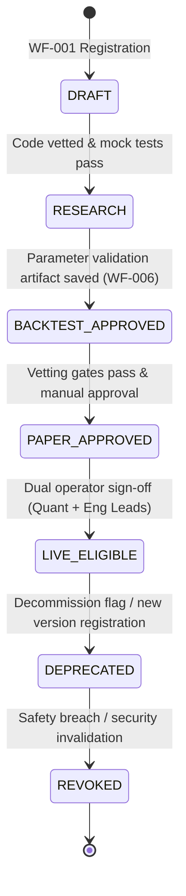

# Strategy Service — Intended Workflows and Scenarios

## 1. Document Purpose

This document provides a complete reverse-engineered model of the intended behavior, operational workflows, and scenarios for the Strategy Service (`app/services/strategies/`) of HaruQuantAI. It translates isolated functional and non-functional requirements from the Strategy Architecture Requirements plan ([04-strategy.md](file:///c:/Users/rharu/AppDev/HaruquantAI/docs/dev/phase-implementation-plan/04-strategy.md)) into continuous, end-to-end operational workflows.

The goal is to establish:
- Clear actor interactions and execution boundaries.
- Precise step-by-step logic, routing, and component state changes.
- Concrete testable scenarios covering happy paths and edge cases.
- An exhaustive requirements-to-workflow traceability matrix to prevent requirement omission.
- Documented implementation gaps, ambiguities, and architectural contradictions for stakeholder review.

---

## 2. Source and Analysis Boundaries

The primary source of truth for this document is the Strategy Service requirements listed in [04-strategy.md](file:///c:/Users/rharu/AppDev/HaruquantAI/docs/dev/phase-implementation-plan/04-strategy.md).
- **Rule of strict documentation**: No system behavior has been invented.
- **Inferred connections**: Where requirements implicitly depend on a sequence of actions not fully stated, the connection is documented and explicitly flagged as:
  > **Inferred workflow connection — requires validation**
- **Explicit vs. Implied vs. Missing**: This document segregates explicit requirement text, implied functionality required for system cohesion, missing operational logic, and code-name discrepancies.

---

## 3. System Purpose and Scope

### System/Module Name
HaruQuantAI Strategy Service (`app/services/strategies`)

### Primary Purpose
Expose a stable, typed public gate and runtime container to discover, validate, resolve, and execute registered quant strategy logic (in vectorized or event-driven mode). It transforms raw market data, indicator inputs, and read-only execution state snapshots into canonical strategy signals (`StrategySignal`) and trade intentions (`TradeIntent`), protecting downstream systems from lookahead leakage, unvetted code execution, and unsafe state mutations.

### Business & Operational Outcomes
- Immutable, versioned strategy catalog registry with explicit owner provenance and approval paths.
- Point-in-time and lookahead-free signal generation preventing forward-looking bias in backtesting and paper/live trading.
- Fail-closed execution validation that checks configuration parameters, environment constraints, clock drift, and data freshness.
- Isolated, transactional strategy-local state container that manages session memory without corrupting official trading accounts or portfolio registers.
- Auditable lineage logs linking every generated trade intention to its parent decision event, configuration hash, and input data checksum.

### Scope Boundaries

```text
  Caller (Orchestrator / Simulator / API Gateway)
                     |
                     v
  +------------------app/services/strategies/ (Boundary Gate)------------------+
  |                                                                            |
  |  [public_api.py] <----> [sandbox/entry_gate.py] (Reject Raw Code)          |
  |         |                                                                  |
  |         v                                                                  |
  |  [registry/resolver.py] <----> [registry/lifecycle.py] (Lifecycle Gates)  |
  |         |                                                                  |
  |         +---------------> Vectorized? -----------> [execution/vectorized.py]
  |         |                                                                  |
  |         +---------------> Event-Driven? ---------> [execution/event_runtime.py]
  |                                                           |                |
  |                                                           v                |
  |                                                   [execution/hooks.py]     |
  |                                                           |                |
  |                                                           v                |
  |  [validation/*] <--- [timing/*] <---------------- [runtime/state.py]       |
  |  (Config/PTP/Data)   (Lookahead check)       (Isolated state transaction)  |
  |                                                           |                |
  |                                                           v                |
  |  [execution/output_boundary.py] <-------------------------+                |
  |                                                                            |
  +----------------------------------|-----------------------------------------+
                                     |
                                     v
                       Canonical StrategySignal & TradeIntent 
                                     |
                                     v
                      Risk Governance (External Owner)
                                     |
                                     v
                       Trading Engine (External Owner)
```

* **In-Scope (Strategy Domain)**:
  - Stable typed wrappers under `public_api.py` (`list_strategies`, `validate_strategy_config`, `run_vectorized_strategy_signals`, `create_event_strategy_session`).
  - Validation: configuration schemas (`config.py`), sandbox entry rules (`entry_gate.py`), and market data drift/freshness (`market_data.py`).
  - Timing: point-in-time correctness, lookahead prevention, and bar open restrictions (`availability.py`, `point_in_time.py`).
  - Runtime: isolated strategy session memory (`state.py`), atomic transaction transitions (`state_transaction.py`), and checkpoint save/restore (`checkpoints.py`).
  - Execution: vectorized batch calculation, hook invocation (`on_init`, `on_bar`, `on_tick`, etc.), and output boundary filtering.
  - Governance: parameter-optimization validation schemas and build metadata checks.

* **Out-of-Scope (Owned by Risk, Data, Simulator, or Trading)**:
  - Placing broker orders, modifying live broker sessions, or updating real broker connection lines (owned by Trading/Broker adapters).
  - Portfolio limits, capital allocation enforcement, and final risk approvals (owned by Risk).
  - Executing simulator matching loops and portfolio accounting (owned by Simulator).
  - Real-time network failovers, direct database connections, and indicators calculation (owned by Data/Indicator).

---

## 4. Actors and Responsibilities

### End Users (Strategy Developer, Quant Researcher)
- **Role**: Builds, calibrates, and documents trading strategies.
- **Can Initiate**: Strategy registration, parameter optimization requests, manual backtest dry-runs.
- **Information Provided**: Strategy logic files, parameter schemas, runbooks, training metadata.
- **Outcomes Received**: Registration receipts, validation artifacts, local backtest signals, trace logs.
- **Prohibitions**: Cannot bypass validation checks, execute unvetted arbitrary scripts in production, or mutate live account states.

### Operators / Administrators (Risk Manager, Compliance Officer, DevOps)
- **Role**: Governs strategy deployment and operational lifecycles.
- **Can Initiate**: Lifecycle promotions, manual disablement (hard-kill signals), checkpoint recovery, parameters audit.
- **Information Provided**: Approval tokens, promotion signatures, env overrides, emergency policies.
- **Outcomes Received**: Lifecycle transition logs, hard-kill receipts, metrics, audit traces.
- **Prohibitions**: Cannot edit core strategy algorithm logic or bypass cryptographic audit requirements.

### External Orchestrator (Simulator, Live Trading Engine)
- **Role**: Coordinates the overall runtime loop and feeds data to the Strategy Service.
- **Can Initiate**: Vectorized signal batch execution, event-driven session creation, event dispatching loops.
- **Information Provided**: Market data snapshots, indicator data structures, read-only state query snapshots.
- **Outcomes Received**: Canonical `StrategySignal` arrays, `TradeIntent` packages, diagnostics.
- **Prohibitions**: Cannot directly read strategy-local memory or skip output boundaries.

### External Dependency Ports (Data Port, Indicator Port, State Port, Secrets Port)
- **Role**: Standardized interfaces wrapping external services.
- **Can Initiate**: None (responds to strategy runtime queries).
- **Information Provided**: Historical/real-time ticks/bars, pre-calculated technical metrics, account balances/exposure, API credentials.
- **Outcomes Received**: Query payloads, read timeout thresholds.
- **Prohibitions**: Forbidden from writing to strategy-local memory.

---

## 5. Capability Map

```
app/services/strategies/ (Strategy Service)
├── 1. Public API & Gateway
│   ├── Catalog Discovery (list_strategies, describe_strategy)
│   ├── Config Schema Validation (validate_strategy_config)
│   └── Typed Surface Gate (run_vectorized_strategy_signals, create_event_strategy_session)
├── 2. Registry & Lifecycle Management
│   ├── Metadata Catalog & Registry (registry/catalog.py)
│   ├── SemVer Resolver (registry/resolver.py)
│   ├── Environment Permission Checker (registry/lifecycle.py)
│   └── Provenance Validation (registry/provenance.py)
├── 3. Pre-Execution Validation
│   ├── Configuration-Injection Rejection (validation/config.py)
│   ├── Indicator Readiness Check (validation/readiness.py)
│   ├── Clock Drift & Freshness Gates (validation/market_data.py)
│   └── Output Boundary Schema Check (validation/signals.py)
├── 4. Timing & No-Lookahead Guards
│   ├── Bar Open Restrictive Window (timing/availability.py)
│   ├── Point-In-Time Snapshot Assertions (timing/point_in_time.py)
│   └── Vectorized Batch Lookahead Scanner (execution/vectorized.py)
├── 5. Runtime & Isolated Storage
│   ├── Session Resource Allocator (runtime/resource_policy.py)
│   ├── Ephemeral Strategy Memory (runtime/state.py)
│   ├── Atomic State Transactions (runtime/state_transaction.py)
│   └── Checkpoint Serialization & Validation (runtime/checkpoints.py)
├── 6. Vectorized and Event Execution
│   ├── Vectorized Signal Generator (execution/vectorized.py)
│   ├── Event Queue & Dispatcher (execution/event_dispatch.py)
│   ├── Lifecycle Hook Invoker (execution/hooks.py)
│   └── Output Boundary (execution/output_boundary.py)
├── 7. Observability & Auditing
│   ├── Redacted Tracing Correlation (observability/diagnostics.py)
│   ├── Prometheus Metrics Adaption (observability/metrics.py)
│   └── Monotonic Lineage Tracker (runtime/lineage.py)
└── 8. Governance & Provenance Gates
    ├── Parameter Calibration Validator (governance/policies.py)
    ├── Vetting Pipeline SBOM Gates (governance/build_artifacts.py)
    └── Parameter Optimization Report Builder (governance/validation_artifacts.py)
```

---

## 6. Workflow Catalogue

1. **WF-001 — Strategy Registration and Vetting**: Validates code metadata, SBOM records, parameter schemas, and registers new immutable strategy versions. (*Lifecycle / Administrative*)
2. **WF-002 — Strategy Reference Resolution and Lifecycle Gating**: Matches version constraints, evaluates execution environment permissions, checks approvals, and returns the resolved strategy entry. (*Lifecycle / Supporting*)
3. **WF-003 — Vectorized Signal Generation**: Executes batch calculations, shifts current bar metrics, performs lookahead scans, and outputs signals/intents. (*Primary Business Workflow*)
4. **WF-004 — Stateful Event Session Initialization**: Allocates runtime resources, runs dependency readiness checks, loads/validates checkpoints, and runs startup hooks. (*Primary Business Workflow*)
5. **WF-005 — Event Dispatch and Transactional Hook Execution**: Pulls events from queue, processes hooks, aggregates read-only data, applies atomic state transitions, and emits intents. (*Primary Business Workflow*)
6. **WF-006 — State Checkpointing and Replay Verification**: Snapshots local memory, executes integrity checks, saves states, and verifies replay reproducibility. (*Recovery / Supporting*)
7. **WF-007 — Emergency Session Disablement and Hard Kill**: Evaluates kill triggers, cancels pending intents, halts loops, and writes final diagnostic logs. (*Emergency / Recovery*)

---

## 7. Detailed End-to-End Workflows

### WF-001 — Strategy Registration and Vetting

#### Purpose and Value
Provides a secure gateway for new strategy logic, ensuring that only qualified code with proper metadata, schemas, SBOM checks, and ownership details is registered in the immutable system catalog.

#### Actors
- **Primary**: Strategy Developer / CI Build Agent
- **Supporting**: Registry Catalog Coordinator, Governance Validator

#### Trigger
Build runner submits a new strategy package during pipeline execution, or Developer invokes a registry deployment script.

#### Preconditions
- The strategy artifact has completed unit testing and static analysis.
- The build repository is writable.

#### Inputs
- `strategy_id` (str), `version` (str, SemVer)
- `module_path` (str)
- `owner` (str), `reviewer` (str), `approver` (str)
- `config_schema` (dict), `supported_symbols` (list), `required_indicators` (list)
- `build_provenance` (BuildProvenance record: commit hash, SBOM manifest, lockfile hash)
- `linked_validation_artifact_id` (str)

#### Main Success Flow

| Step | Responsible component | Action | Input | Validation or decision | State change | Output | Requirement IDs |
| :--- | :-------------------- | :----- | :---- | :--------------------- | :----------- | :----- | :-------------- |
| 1 | `registry.catalog` | Intercept registration request & run basic structure check. | Registration payload | Verify all mandatory metadata fields are populated. | None | Forwarded payload | STRAT-FR-006 |
| 2 | `governance.build_artifacts` | Validate build pipeline credentials and SBOM records. | Build provenance | Check SBOM completeness; confirm type-checking, linting, and security scan flags are marked passed. | None | Verified build token | STRAT-FR-041 |
| 3 | `registry.catalog` | Check for existing entry matching ID and Version. | strategy_id, version | Assert that the key `(strategy_id, version)` does not exist. If exists, fail. | None | Unique package receipt | STRAT-FR-008 |
| 4 | `registry.catalog` | Verify config schema definition and constraints. | config_schema | Confirm that default settings, required fields, and type coercion rules are declared. | None | Schema verification receipt | STRAT-FR-008 |
| 5 | `registry.provenance` | Calculate canonical hashes for artifacts and lockfiles. | Code artifact, lockfile | Generate SHA-256 version hashes. | None | `canonical_strategy_version_hash` | STRAT-FR-006, STRAT-FR-009 |
| 6 | `registry.catalog` | Write entry to immutable SQLite/JSON store. | Verified metadata & resolved hashes | Write transaction commits; write lock prevents concurrency conflicts. | Catalog record added, status set to `DRAFT` | `RegistryReceipt` | STRAT-FR-006, STRAT-FR-008, STRAT-FR-018 |

#### Decision Points

##### D1.1: Duplicate Registry Entry Detected
- **Component**: `registry.catalog`
- **Condition Evaluated**: Does `(strategy_id, version)` already exist in the registered catalog?
- **Branches**:
  - **Yes**: Fail immediately. Raise `STRATEGY_INVALID_CONFIG` with message "Duplicate registry entry".
  - **No**: Proceed to Step 4.
- **Fail-closed behavior**: Fail-closed (stops registration; does not overwrite).
- **Supporting IDs**: STRAT-FR-008.

##### D1.2: Vetting Gates / SBOM Check Fails
- **Component**: `governance.build_artifacts`
- **Condition Evaluated**: Have vulnerability scans or linting checks failed in the build metadata?
- **Branches**:
  - **Yes**: Terminate registration. Return `RegistryValidationReport` outlining safety failures.
  - **No**: Proceed to Step 3.
- **Fail-closed behavior**: Fail-closed.
- **Supporting IDs**: STRAT-FR-041.

#### Alternate Flows
- None. Registration requires strict compliance checks.

#### Failure and Exception Flows

##### EF1.1: Schema Format is Malformed
- **Trigger**: Strategy configuration schema uses invalid structure.
- **Detection**: Registry catalog parser encounters validation error.
- **Response**: Return a structured error response with code `STRATEGY_INVALID_CONFIG` detailing the malformed fields.
- **Supporting IDs**: STRAT-FR-008.

#### Recovery Flow
If the database connection times out during write, rollback the active transaction and prompt the builder process to retry after a cool-down period.

#### Postconditions
- Strategy entry is saved in the immutable strategy registry.
- Registry receipt returned containing the calculated `strategy_version_hash` and status `DRAFT`.

---

### WF-002 — Strategy Reference Resolution and Lifecycle Gating

#### Purpose and Value
Resolves version constraints (e.g. `^1.2.0`) to a single, immutable strategy entry at runtime, while ensuring that the execution environment and lifecycle approvals allow the strategy to run.

#### Actors
- **Primary**: System Scheduler / Caller (Simulator or Trading Engine)
- **Supporting**: registry.resolver, registry.lifecycle

#### Trigger
Caller requests a strategy session using a semantic version constraint or reference ID.

#### Preconditions
- The strategy catalog contains a matching strategy ID.

#### Inputs
- `strategy_ref` (contains `strategy_id` and `version_constraint`)
- `execution_environment` (enum: `BACKTEST`, `REPLAY`, `PAPER`, `SHADOW`, `LIVE`)
- `promotion_evidence` (contains validation reports, optimization hashes, operator sign-offs)

#### Main Success Flow

| Step | Responsible component | Action | Input | Validation or decision | State change | Output | Requirement IDs |
| :--- | :-------------------- | :----- | :---- | :--------------------- | :----------- | :----- | :-------------- |
| 1 | `registry.resolver` | Intercept resolution request & sanitize reference data. | strategy_ref | Reject empty identifiers; raise error if format is invalid. | None | Sanitized request | STRAT-FR-081 |
| 2 | `registry.resolver` | Match constraint against catalog entries. | constraint, catalog | Resolve to exactly one immutable version. | None | Match record / `StrategyRegistryEntry` | STRAT-FR-009, STRAT-FR-016, STRAT-FR-017 |
| 3 | `registry.lifecycle` | Enforce deprecation/revocation gates. | resolved entry | Verify strategy state is not `DEPRECATED` or `REVOKED`. If deprecated, run decision check. | None | Clean lifecycle token | STRAT-FR-009, STRAT-FR-075 |
| 4 | `registry.lifecycle` | Check execution environment compatibility. | resolved entry, environment | Verify that the target environment is allowlisted in the registry entry. | None | Approved runtime token | STRAT-FR-009, STRAT-FR-043, STRAT-FR-100 |
| 5 | `registry.lifecycle` | Evaluate promotion signatures & validation evidence. | resolved entry, evidence | Confirm that live runs have Quant Lead and Engineering Lead signatures. | None | Lifecycle approval token | STRAT-FR-035, STRAT-FR-044, STRAT-FR-061 |
| 6 | `registry.provenance` | Verify source and dependency provenance. | resolved entry | Check if the artifact, source, or dependency lockfile hash has changed since approval. | None | `ResolvedStrategy` package | STRAT-FR-078 |

#### Decision Points

##### D2.1: Version Constraint Unsatisfiable
- **Component**: `registry.resolver`
- **Condition Evaluated**: Can the constraint match any registered catalog entry?
- **Branches**:
  - **No**: Raise `STRATEGY_VERSION_CONSTRAINT_UNSATISFIABLE` error and halt.
  - **Yes**: Proceed to Step 3.
- **Fail-closed behavior**: Fail-closed.
- **Supporting IDs**: STRAT-FR-009.

##### D2.2: Strategy State is Deprecated / Revoked
- **Component**: `registry.lifecycle`
- **Condition Evaluated**: Is the strategy status `DEPRECATED` or `REVOKED`?
- **Branches**:
  - **Yes**: If the environment is `REPLAY` (historical simulation), allow execution. Otherwise, fail with `STRATEGY_DEPRECATED`.
  - **No**: Proceed to Step 4.
- **Fail-closed behavior**: Fail-closed.
- **Supporting IDs**: STRAT-FR-009, STRAT-FR-075.

##### D2.3: Live Run without Lead Signatures
- **Component**: `registry.lifecycle`
- **Condition Evaluated**: Environment is `LIVE` and status is not `LIVE_ELIGIBLE` or missing dual-signoff signatures.
- **Branches**:
  - **Yes**: Fail with `STRATEGY_LIFECYCLE_NOT_APPROVED`.
  - **No**: Proceed to Step 6.
- **Fail-closed behavior**: Fail-closed.
- **Supporting IDs**: STRAT-FR-044, STRAT-FR-061, STRAT-FR-100.

#### Alternate Flows

##### A2.1: Historical Replay Mode Bypass
- **Workflow Variant**: When resolving a deprecated strategy for `REPLAY` mode, the resolver bypasses the active deprecation gate (Step 3), appending a trace metric indicating replay execution.
- **Supporting IDs**: STRAT-FR-009, STRAT-FR-075.

#### Failure and Exception Flows

##### EF2.1: Provenance Hash Mismatch
- **Trigger**: The local module file hash does not match the catalog registry record.
- **Detection**: `registry.provenance` signature check fails.
- **Response**: Invalidate the strategy approval status; fail execution with `STRATEGY_ARTIFACT_HASH_MISMATCH`.
- **Supporting IDs**: STRAT-FR-078.

#### Recovery Flow
If the registry file is locked, apply retry backoff for up to 3 attempts. If still locked, fail with `STRATEGY_INTERNAL_ERROR`.

#### Postconditions
- A verified `ResolvedStrategy` descriptor is returned to the runner.
- Audit lineage records are initialized under the current execution trace ID.

---

### WF-003 — Vectorized Signal Generation

#### Purpose and Value
Provides point-in-time, lookahead-free vectorized signal generation for backtesting and analysis, converting input data arrays into timestamped signals and intentions.

#### Actors
- **Primary**: Simulator / Analytics Engine
- **Supporting**: validation.market_data, timing.availability, execution.vectorized, execution.output_boundary

#### Trigger
Caller requests a vectorized run via `run_vectorized_strategy_signals()`.

#### Preconditions
- The strategy Reference has been resolved (`ResolvedStrategy` is available).
- The input dataset has been loaded by the caller.

#### Inputs
- `request` (VectorizedStrategyRequest: contains strategy reference, parameters override)
- `market_data_batch` (time-series dataset)
- `indicator_data_batch` (calculated technical values)
- `context` (StrategyExecutionContext: contains decision timestamp, environment)

#### Main Success Flow

| Step | Responsible component | Action | Input | Validation or decision | State change | Output | Requirement IDs |
| :--- | :-------------------- | :----- | :---- | :--------------------- | :----------- | :----- | :-------------- |
| 1 | `validation.config` | Validate parameters override. | raw overrides | Ensure parameters adhere to schema defaults and boundaries. | None | Sanitized parameters | STRAT-FR-007, STRAT-FR-063 |
| 2 | `validation.market_data` | Validate inputs timezone and sequencing. | market_data_batch | Confirm timezone consistency; assert no timezone-naive data is present. | None | Standardized data frames | STRAT-FR-077 |
| 3 | `execution.vectorized` | Apply current-bar shifting. | data batch, timing policy | Shift current-bar conditions to ensure bar-open trades use closed `N-1` values. | None | Lookahead-free shifted features | STRAT-FR-030, STRAT-FR-084 |
| 4 | `execution.vectorized` | Scans batch for lookahead leakage. | shifted features | Verify that no indicators or fields at index `T` contain data from `>T`. | None | Vetted features frame | STRAT-FR-031, STRAT-FR-085, STRAT-FR-090 |
| 5 | `execution.vectorized` | Execute vectorized logic calculations. | Vetted features | Run the registered strategy execution formula. | None | Raw signals batch | STRAT-FR-084 |
| 6 | `execution.vectorized` | Convert signals to trade intentions. | Raw signals, context | Build `TradeIntent` records with monotonic sequences. | None | Emitted trade intents | STRAT-FR-029, STRAT-FR-084 |
| 7 | `execution.output_boundary` | Enforce output constraints & metadata. | trade intents | Confirm that no broker order structures or margin instructions are produced. | None | Canonical `StrategySignal` & `TradeIntent` batch | STRAT-FR-028, STRAT-FR-068, STRAT-NFR-001, STRAT-NFR-002, STRAT-NFR-003, STRAT-NFR-004 |

#### Decision Points

##### D3.1: Lookahead Leakage Scan Fail
- **Component**: `execution.vectorized`
- **Condition Evaluated**: Does any shifted element access data prior to its closure window?
- **Branches**:
  - **Yes**: Fail the entire batch. Discard all intents. Raise `STRATEGY_LOOKAHEAD_DETECTED` with the timestamp of the first leakage.
  - **No**: Proceed to Step 5.
- **Fail-closed behavior**: Fail-closed (aborts batch).
- **Supporting IDs**: STRAT-FR-085, STRAT-FR-090, STRAT-NFR-005.

##### D3.2: Threshold Filtering (Alpha/Cost)
- **Component**: `execution.vectorized`
- **Condition Evaluated**: Does a signal's estimated alpha exceed `min_expected_alpha` and transaction costs remain below `max_acceptable_transaction_cost`?
- **Branches**:
  - **No**: Suppress the generated intent; emit a deterministic `intent_suppressed` metric with reason codes.
  - **Yes**: Emmit the intent (Proceed to Step 7).
- **Fail-closed behavior**: Safe suppression (non-trading decision).
- **Supporting IDs**: STRAT-FR-029.

#### Alternate Flows
- None. Vectorized signal logic runs deterministically under a fixed decision clock.

#### Failure and Exception Flows

##### EF3.1: Clock-Drift Detected During Batch Run
- **Trigger**: The clock drift between the execution environment and dataset exceeds the tolerance threshold.
- **Detection**: `validation.market_data` clock scan checks timestamp parameters.
- **Response**: Cancel the batch run immediately. Return `STRATEGY_STALE_DATA` error.
- **Supporting IDs**: STRAT-FR-077, STRAT-FR-085.

#### Recovery Flow
Vectorized batch runs are stateless. On failure, the caller logs the diagnostic error code and first-failure timestamp, then rolls back the simulation run.

#### Postconditions
- Returns a `StrategySignalBatchResponse` containing canonical signals and audit metadata (no execution commands).
- Emits execution metrics tracking `intents_emitted`, `intents_suppressed`, and `lookahead_detections`.

---

### WF-004 — Stateful Event Session Initialization

#### Purpose and Value
Initializes an event-driven strategy session, allocating memory boundaries and verifying data, indicators, and checkpoint states before processing any market ticks.

#### Actors
- **Primary**: Live Engine or Simulator Orchestrator
- **Supporting**: validation.config, validation.readiness, runtime.checkpoints, runtime.resource_policy

#### Trigger
Caller requests a new session handle via `create_event_strategy_session()`.

#### Preconditions
- The strategy has been resolved to a valid entry.
- Required indicator definitions are available.

#### Inputs
- `resolved_strategy` (ResolvedStrategy record)
- `raw_config` (parameters overrides dictionary)
- `checkpoint_id` (str, optional; used for recovery restore)
- `context` (StrategyExecutionContext)

#### Main Success Flow

| Step | Responsible component | Action | Input | Validation or decision | State change | Output | Requirement IDs |
| :--- | :-------------------- | :----- | :---- | :--------------------- | :----------- | :----- | :-------------- |
| 1 | `validation.config` | Perform configuration safety check & check injection. | raw_config | Reject if configuration contains `eval()`, `exec()`, or import strings. | None | Safe configuration payload | STRAT-FR-007, STRAT-FR-063 |
| 2 | `runtime.resource_policy` | Evaluate performance allocation. | environment details | Verify memory, checkpoint size, and queue limit thresholds. | Session limits allocated | Bounded resource profile | STRAT-FR-010, STRAT-FR-052 |
| 3 | `runtime.checkpoints` | Check if checkpoint recovery is requested. | checkpoint_id | If checkpoint exists, load it from the store; otherwise skip to Step 5. | None | Checkpoint snapshot | STRAT-FR-009, STRAT-FR-054 |
| 4 | `runtime.checkpoints` | Verify checkpoint integrity and compatibility. | Checkpoint, resolved_strategy | Check matching strategy ID, version, config hash, and checksum. | Isolated session state restored | Recovered state token | STRAT-FR-009, STRAT-FR-079 |
| 5 | `validation.readiness` | Verify input indicators warmup completeness. | required indicators | Confirm that indicators sample count satisfies warmup conditions. | None | Indicator readiness report | STRAT-FR-037 |
| 6 | `execution.hooks` | Invoke the `on_init` strategy hook. | Safe config, restored state | Execute strategy-defined initialization code. | Session state initialized, status set to `Ready` | Hook success receipt | STRAT-FR-062, STRAT-FR-097 |

#### Decision Points

##### D4.1: Configuration Injection Rejected
- **Component**: `validation.config`
- **Condition Evaluated**: Does `raw_config` contain forbidden python primitives (e.g. `eval`, `__import__`) or exceed payload constraints?
- **Branches**:
  - **Yes**: Fail session creation immediately. Raise `STRATEGY_INVALID_CONFIG` with diagnostic details.
  - **No**: Proceed to Step 2.
- **Fail-closed behavior**: Fail-closed.
- **Supporting IDs**: STRAT-FR-007, STRAT-FR-063.

##### D4.2: Checkpoint Compatibility Failure
- **Component**: `runtime.checkpoints`
- **Condition Evaluated**: Does the restored checkpoint match the current strategy version or does the checksum fail?
- **Branches**:
  - **Yes (Mismatch/Corrupt)**: Abort session setup. Return `STRATEGY_CHECKPOINT_INCOMPATIBLE` or `STRATEGY_CHECKPOINT_INVALID`.
  - **No**: Proceed to Step 5.
- **Fail-closed behavior**: Fail-closed (blocks startup; does not fallback to empty state).
- **Supporting IDs**: STRAT-FR-009, STRAT-FR-079.

#### Alternate Flows

##### A4.1: Cold Start Execution
- **Workflow Variant**: When `checkpoint_id` is omitted, the session bypasses Steps 3 and 4, starting with empty local memory. The `on_init` hook runs cold.
- **Supporting IDs**: STRAT-FR-054, STRAT-FR-062.

#### Failure and Exception Flows

##### EF4.1: Warmup State Insufficient
- **Trigger**: Indicators have not collected the minimum sample count.
- **Detection**: `validation.readiness` check runs at Step 5.
- **Response**: Set status to `DRAFT` / `Created` (not ready). Raise `STRATEGY_INDICATOR_NOT_READY` error.
- **Supporting IDs**: STRAT-FR-037.

#### Recovery Flow
On startup failure, release all allocated memory hooks and delete the session handle, notifying the orchestrator of the failure.

#### Postconditions
- Returns an `EventStrategySessionHandle` containing the initialized state parameters.
- Session status in memory is transitioned to `Ready`.

---

### WF-005 — Event Dispatch and Transactional Hook Execution

#### Purpose and Value
Processes discrete market events (ticks, bars, fills) in a thread-safe, deterministic order, invoking strategy callbacks and updating local state in a transactional container.

#### Actors
- **Primary**: System Scheduler / Event Queue
- **Supporting**: execution.event_dispatch, execution.hooks, runtime.state_transaction, runtime.dependency_boundary

#### Trigger
Event queue pushes a new market or transaction event to the active session.

#### Preconditions
- The session is in the `Ready` state.
- The thread lock for the session is acquired.

#### Inputs
- `session` (Active session handle)
- `event` (StrategyEvent: ticks, bar-close, fill-update, or timer)
- `read_only_state` (External balance or exposure snapshot)

#### Main Success Flow

| Step | Responsible component | Action | Input | Validation or decision | State change | Output | Requirement IDs |
| :--- | :-------------------- | :----- | :---- | :--------------------- | :----------- | :----- | :-------------- |
| 1 | `execution.event_dispatch` | Enqueue event & apply backpressure check. | Event, session queue | Verify queue limits; reject if backpressure threshold is exceeded. | Event appended to queue | Enqueue receipt | STRAT-FR-098 |
| 2 | `execution.event_dispatch` | Sort queue items deterministically. | Buffered queue events | Order events by timestamp, event priority, and sequence number. | None | Sorted events list | STRAT-FR-095 |
| 3 | `runtime.state_transaction` | Open local state transaction. | session state, event | Initialize rollback snapshot. | Transaction context active | Transaction handle | STRAT-FR-092 |
| 4 | `runtime.dependency_boundary` | Inject read-only snapshots and check data. | read_only_state | Confirm snapshot is immutable; verify timezone alignment. | None | Validated snapshot inputs | STRAT-FR-064, STRAT-FR-091 |
| 5 | `execution.hooks` | Resolve and execute target hooks. | Event, transaction handle | Execute callbacks (`on_tick`, `on_bar`, `on_fill_update`, etc.). | Local memory state modified in transaction | Hook outcome / signals | STRAT-FR-062, STRAT-FR-087, STRAT-FR-097 |
| 6 | `runtime.state_transaction` | Commit state transaction. | Transaction handle | Confirm no execution errors occurred. | Local session state committed | Committed state | STRAT-FR-092 |
| 7 | `execution.output_boundary` | Validate signals & compile trade intents. | Hook outcomes | Assert output contains no live broker instructions. Attach lineage sequence IDs. | None | `TradeIntent` package | STRAT-FR-028, STRAT-FR-029, STRAT-FR-036, STRAT-FR-093 |

#### Decision Points

##### D5.1: Queue Backpressure Triggered
- **Component**: `execution.event_dispatch`
- **Condition Evaluated**: Does event queue size exceed the environment configuration limit?
- **Branches**:
  - **Yes**: Apply drop policy; return `BACKPRESSURE_EXCEEDED` or drop event, logging drop warnings.
  - **No**: Append event (Proceed to Step 2).
- **Fail-closed behavior**: Backpressure rejection.
- **Supporting IDs**: STRAT-FR-098.

##### D5.2: Hook Execution Error
- **Component**: `execution.hooks` / `runtime.state_transaction`
- **Condition Evaluated**: Did a strategy callback throw an exception during Step 5?
- **Branches**:
  - **Yes**: Abort transaction. Trigger rollback. Forward to **Failure Flow EF5.1**.
  - **No**: Proceed to Step 6.
- **Fail-closed behavior**: Fail-closed (state rollback).
- **Supporting IDs**: STRAT-FR-092.

#### Alternate Flows

##### A5.1: Intrabar Event Processing
- **Workflow Variant**: When processing tick events, the dispatch engine executes the `on_tick` hook using temporary Level 2/3 depth metrics. It checks queue bounds to prevent event loop blocking.
- **Supporting IDs**: STRAT-FR-060, STRAT-FR-091.

#### Failure and Exception Flows

##### EF5.1: Transaction Rollback
- **Trigger**: Strategy execution throws unhandled error or timing limit is exceeded.
- **Detection**: Hook execution monitor intercepts exception.
- **Response**: 
  1. Halt execution loop.
  2. Discard all signals produced during the current event step.
  3. Revert local state to the snapshot taken in Step 3.
  4. Release thread locks.
  5. Return error code `STRATEGY_INTERNAL_ERROR` with raw traces redacted.
- **Supporting IDs**: STRAT-FR-027, STRAT-FR-092.

##### EF5.2: Non-Monotonic Sequence Detected
- **Trigger**: Local intent builder produces a sequence ID less than or equal to a previously committed ID.
- **Detection**: Output boundary validates metadata parameters.
- **Response**: Suppress the generated intent; fail the event run with `STRATEGY_DUPLICATE_INTENT`.
- **Supporting IDs**: STRAT-FR-076.

#### Recovery Flow
If an event fails, the system returns status to `Ready` with the reverted state. If consecutive errors exceed the error limit, the session is disabled (escalates to WF-007).

#### Postconditions
- Local state updates committed to active memory.
- `TradeIntent` package sent to downstream Risk Engine.

---

### WF-006 — State Checkpointing and Replay Verification

#### Purpose and Value
Serializes strategy memory, saving safe checkpoints for restart resilience, and runs validation replays to guarantee deterministic outputs.

#### Actors
- **Primary**: System Scheduler / Compliance Auditor
- **Supporting**: runtime.checkpoints, verification tests

#### Trigger
Scheduled checkpoint interval arrives, or Auditor requests a reproduction replay.

#### Preconditions
- The strategy session is active.
- The persistence storage port is writable.

#### Inputs
- `session` (Active session handle)
- `replay_manifest` (reproducibility ledger parameters)

#### Main Success Flow

| Step | Responsible component | Action | Input | Validation or decision | State change | Output | Requirement IDs |
| :--- | :-------------------- | :----- | :---- | :--------------------- | :----------- | :----- | :-------------- |
| 1 | `runtime.checkpoints` | Snapshot strategy local memory. | session state | Capture variable values; exclude passwords and code strings. | None | Clean state snapshot | STRAT-FR-033, STRAT-FR-054 |
| 2 | `runtime.checkpoints` | Serialize state to structured format. | state snapshot | Convert memory structure to JSON/binary payload. | None | Serialized payload | STRAT-FR-033 |
| 3 | `runtime.checkpoints` | Attach provenance validation hashes. | Serialized payload | Generate configuration hash, version hash, and checkpoint checksum. | None | Checkpoint package | STRAT-FR-054 |
| 4 | `runtime.checkpoints` | Write checkpoint package to persistence port. | Checkpoint package | Commit file write using atomic temp-file commit helper. | Checkpoint entry written to DB | Checkpoint receipt | STRAT-FR-054 |
| 5 | `verification` | run replication replay check (if audit test). | replay_manifest | Run strategy using identical inputs, config, and seed. | None | Replay signals batch | STRAT-FR-011, STRAT-FR-072 |
| 6 | `verification` | Compare replay outputs with original intents list. | Replay signals, original records | Assert that the outputs, IDs, and timestamps match exactly. | None | Replay validation report | STRAT-FR-011, STRAT-FR-072 |

#### Decision Points

##### D6.1: Checkpoint Verification Failure
- **Component**: `runtime.checkpoints`
- **Condition Evaluated**: Does the generated checkpoint checksum match the verification check?
- **Branches**:
  - **No**: Discard write; raise `STRATEGY_CHECKPOINT_INVALID` error.
  - **Yes**: Commit write (Proceed to Step 4).
- **Fail-closed behavior**: Fail-closed.
- **Supporting IDs**: STRAT-FR-079, STRAT-FR-082.

##### D6.2: Replay Outputs Mismatch
- **Component**: `verification`
- **Condition Evaluated**: Do replay results differ from the original outputs?
- **Branches**:
  - **Yes**: Fail validation checks. Flag the strategy version as non-deterministic.
  - **No**: Pass verification (Proceed to return report).
- **Fail-closed behavior**: Raise audit alarm.
- **Supporting IDs**: STRAT-FR-011, STRAT-FR-067.

#### Alternate Flows
- None. Replay tests mandate strict, lockstep determinism.

#### Failure and Exception Flows

##### EF6.1: Checkpoint Size Limit Exceeded
- **Trigger**: Serialized state exceeds the 10 MB maximum checkpoint size limit.
- **Detection**: Checkpoint builder checks payload dimensions.
- **Response**: Cancel the write operation. Return `STRATEGY_RESOURCE_LIMIT_EXCEEDED` error.
- **Supporting IDs**: STRAT-FR-010, STRAT-FR-098.

#### Recovery Flow
If serialization fails, discard the temporary checkpoint file, preserve the active running session, and notify the health monitor of the persistence failure.

#### Postconditions
- Checkpoint package saved in the persistent store.
- Replay validation report written to the audit directory.

---

### WF-007 — Emergency Session Disablement and Hard Kill

#### Purpose and Value
Handles emergency strategy shutdown, halting execution loops and cancelling pending intents to protect capital without affecting shared simulation components.

#### Actors
- **Primary**: Risk Controller / Operations Operator
- **Supporting**: runtime.cancellation, execution.event_dispatch

#### Trigger
External hard-kill command is pushed from the orchestration layer.

#### Preconditions
- The target strategy session is active.

#### Inputs
- `session_id` (str)
- `kill_signal` (HardKillSignal: contains reason codes)

#### Main Success Flow

| Step | Responsible component | Action | Input | Validation or decision | State change | Output | Requirement IDs |
| :--- | :-------------------- | :----- | :---- | :--------------------- | :----------- | :----- | :-------------- |
| 1 | `runtime.cancellation` | Intercept hard-kill signal. | kill_signal | Confirm sender identity and request validity. | None | Sanitized kill command | STRAT-FR-042 |
| 2 | `execution.event_dispatch` | Freeze event queue processing. | session_id | Block new incoming events; discard pending items. | Event queue processing paused | Paused state receipt | STRAT-FR-042, STRAT-FR-098 |
| 3 | `runtime.cancellation` | Cancel local pending intents. | active session | Identify intents generated but not completed. | Local intents status set to `CANCELLED` | list of cancelled intents | STRAT-FR-042 |
| 4 | `runtime.cancellation` | Create emergency recovery checkpoint. | session state | Capture current memory parameters. | Checkpoint saved | State checkpoint receipt | STRAT-FR-042 |
| 5 | `runtime.cancellation` | Build final diagnostic log. | session details, reason | Map reasons to standard error code. Redact sensitive values. | None | Redacted final log | STRAT-FR-042 |
| 6 | `runtime.cancellation` | Terminate runtime session container. | session_id | Release memory hooks and locks. | Session status set to `Stopped` / `HardKilled` | `HardKillResult` | STRAT-FR-042 |

#### Decision Points

##### D7.1: Bypass Permitted (Safety Mode)
- **Component**: `runtime.cancellation`
- **Condition Evaluated**: Does the target action configuration permit bypass during emergency shutdown?
- **Branches**:
  - **Yes**: Allow completion of the shutdown hook sequence even if resource allocations are exceeded.
  - **No**: Force immediate memory release (Proceed to Step 6).
- **Fail-safe behavior**: Force close.
- **Supporting IDs**: STRAT-FR-042.

#### Alternate Flows
- None. Hard kill workflows execute immediately to protect capital.

#### Failure and Exception Flows

##### EF7.1: Container Unresponsive
- **Trigger**: The strategy session thread is locked or looping indefinitely.
- **Detection**: Orchestrator timeout monitor triggers after 2 seconds.
- **Response**: Terminate the worker process from the orchestrator boundary. Reclaim system memory. Log emergency quarantine events.
- **Supporting IDs**: STRAT-FR-027, STRAT-FR-042, STRAT-FR-086.

#### Recovery Flow
Following a hard-kill, the session remains locked. Re-enabling the strategy requires manual administrative review, clearing of risk switches, and dual operator approval signatures.

#### Postconditions
- Strategy session status set to `HardKilled`.
- `STRATEGY_HARD_KILLED` diagnostic emitted.
- In-flight request counter decremented.

---

## 8. Scenario Catalogue

| Scenario ID | Scenario | Given | When | Then | Expected state | Requirement IDs |
| :--- | :--- | :--- | :--- | :--- | :--- | :--- |
| WF-001-SC-001 | Happy Path Registration | A valid strategy package with clean SBOM metadata and schemas | CI runs registration pipeline | The registry confirms hashes and adds entry | Status set to `DRAFT` | STRAT-FR-006, STRAT-FR-008, STRAT-FR-018 |
| WF-001-SC-002 | Duplicate Entry | Catalog contains strategy version `1.2.0` | Builder attempts to register same version | Return validation error `STRATEGY_INVALID_CONFIG` | Registry transaction aborted | STRAT-FR-008 |
| WF-002-SC-001 | Version Resolution | Catalog contains versions `1.1.0` and `1.2.0` | Caller requests constraint `^1.0.0` | Resolve to version `1.2.0` | Resolved match returned | STRAT-FR-009 |
| WF-002-SC-002 | Deprecated Execution | Target strategy status is set to `DEPRECATED` | Caller requests execution in `LIVE` mode | Fail resolution with `STRATEGY_DEPRECATED` | Resolution blocked | STRAT-FR-009, STRAT-FR-075 |
| WF-003-SC-001 | Lookahead Detected | Shifted feature frame contains data leak | Vectorized execution scans features | Discard intents; raise `STRATEGY_LOOKAHEAD_DETECTED` | Batch aborted | STRAT-FR-085, STRAT-FR-090 |
| WF-003-SC-002 | Threshold Suppression | Estimated cost exceeds threshold | Intent builder checks metrics | Suppress trade intent; write suppression diagnostic | Intent suppressed | STRAT-FR-029 |
| WF-004-SC-001 | Configuration Injection | Override config contains `eval('import os')` | Session initialization validates config | Raise security rejection `STRATEGY_INVALID_CONFIG` | Initialization blocked | STRAT-FR-007, STRAT-FR-063 |
| WF-004-SC-002 | Checkpoint Mismatch | Checkpoint configuration hash differs | Session setup loads checkpoint | Fail startup with `STRATEGY_CHECKPOINT_INCOMPATIBLE` | Startup blocked | STRAT-FR-009, STRAT-FR-079 |
| WF-005-SC-001 | Event Loop Backpressure | Event queue size exceeds max limit | New market tick event arrives | Trigger drop policy; log overflow warnings | Event dropped | STRAT-FR-098 |
| WF-005-SC-002 | Transaction Rollback | Hook execution throws unhandled error | Session dispatcher runs callback | Revert local memory to pre-transaction state | Status set to `Ready` | STRAT-FR-092 |
| WF-005-SC-003 | Clock Drift Failure | Drift between systems exceeds tolerance | Data boundary validates timestamps | Fail closed with error `STRATEGY_STALE_DATA` | Execution blocked | STRAT-FR-077 |
| WF-006-SC-001 | Replay Mismatch | Replay run output hashes differ | Auditor triggers reproduction replay | Log validation failures; flag version non-deterministic | Trace flagged | STRAT-FR-011, STRAT-FR-067 |
| WF-007-SC-001 | Hard Kill Execution | Active session receives emergency kill command | Operator triggers hard-kill command | Cancel intents; write checkpoint; emit diagnostic | Status set to `Stopped` | STRAT-FR-042 |
| WF-007-SC-002 | Process Quarantine | Looping session thread ignores kill | Timeout monitor ticks | Terminate process; log quarantine events | Session destroyed | STRAT-FR-027, STRAT-FR-042 |
| WF-005-SC-004 | Stale Data Check | Market data arrives late (> latency tolerance) | Input check evaluates latency | Skip signal; emit error code `STRATEGY_DATA_NOT_READY` | Data rejected | STRAT-FR-031, STRAT-FR-064 |
| WF-004-SC-003 | Secret Leak Prevention | Configuration has secrets data | Session checkpoints state | Assert no secrets written to diagnostics/checkpoints | Checkpoint written | STRAT-FR-059, STRAT-FR-074 |

---

## 9. Workflow Relationship Map

| Source workflow | Relationship | Target workflow | Trigger or condition |
| :--- | :--- | :--- | :--- |
| `WF-001` | Upstream of | `WF-002` | Strategy must be registered before resolution. |
| `WF-002` | Precondition for | `WF-003` | Strategy reference must resolve before vectorized execution. |
| `WF-002` | Precondition for | `WF-004` | Strategy reference must resolve before starting event session. |
| `WF-004` | Precondition for | `WF-005` | Stateful event sessions must initialize before dispatching events. |
| `WF-004` | Invokes | `WF-006` | Checkpoint restore is run during session startup. |
| `WF-005` | Triggers | `WF-007` | Consecutively failing state transactions trigger hard shutdown. |
| `WF-005` | Upstream of | `WF-006` | Running sessions trigger periodic checkpoints. |
| `WF-007` | Emergency path for | `WF-005` | External operations override terminates dispatching loop. |

---

## 10. System Lifecycle and State Transitions

### Strategy Lifecycle State Machine



- **States**:
  - `DRAFT`: Newly registered package; not eligible for execution.
  - `RESEARCH`: Approved for data analysis and backtests in research environments.
  - `BACKTEST_APPROVED`: Verified deterministic; validation artifacts committed.
  - `PAPER_APPROVED`: Vetted for mock trading execution.
  - `LIVE_ELIGIBLE`: Vetted for production capital deployment.
  - `DEPRECATED`: Replaced or scheduled for decommissioning.
  - `REVOKED`: Locked due to failures or compliance concerns.

- **Transition Rules**:
  - Transitioning to `LIVE_ELIGIBLE` requires Quant Lead and Engineering Lead approval signatures (`STRAT-FR-061`).
  - Any changes to source hashes, artifacts, or lockfiles invalidate the approval, returning status to `DRAFT` (`STRAT-FR-078`).

---

### Strategy Session Runtime State Machine

```mermaid
stateDiagram-v2
    [*] --> Created : allocate resource policy (WF-004)
    Created --> Ready : restore checkpoint & run on_init (WF-004)
    Ready --> Processing : dispatch event queue (WF-005)
    Processing --> Ready : commit transaction (WF-005)
    Processing --> RolledBack : transaction fails; state reverted (WF-005)
    RolledBack --> Ready : retry cooldown / restore checkpoint
    Ready --> Checkpointed : write state checkpoint (WF-006)
    Checkpointed --> Ready : write receipt recorded
    Ready --> Stopped : normal session stop
    Processing --> Stopped : hard kill event (WF-007)
    Stopped --> [*]
```



---

## 11. Cross-Module Interaction Matrix

| Initiating Module | Action / API called | Target Module | Expected Payload | Output Payload | Requirement IDs |
| :--- | :--- | :--- | :--- | :--- | :--- |
| `Simulator / Trading` | `run_vectorized_strategy_signals` | `Strategy` | `VectorizedStrategyRequest` | `StrategySignalBatchResponse` | STRAT-FR-026 |
| `Simulator / Trading` | `create_event_strategy_session` | `Strategy` | `EventStrategySessionRequest` | `EventStrategySessionHandle` | STRAT-FR-026 |
| `Strategy` | `read_market_snapshot` | `Data` | `MarketDataRequest` | `MarketDataSnapshot` | STRAT-FR-024, STRAT-FR-064 |
| `Strategy` | `read_indicator_snapshot` | `Indicator` | `IndicatorRequest` | `IndicatorSnapshot` | STRAT-FR-024, STRAT-FR-064 |
| `Strategy` | `read_execution_snapshot` | `Simulator / Trading` | `ExecutionStateQuery` | `ReadOnlyExecutionStateSnapshot` | STRAT-FR-028, STRAT-FR-064 |
| `Strategy` | `save_checkpoint` | `Storage (Cache)` | `StrategyCheckpoint` | `CheckpointReceipt` | STRAT-FR-054 |
| `Strategy` | `emit_trade_intents` | `Risk (External)` | `TradeIntent` package | None (Intents processed downstream) | STRAT-FR-028, STRAT-FR-029 |
| `Strategy` | `emit_strategy_metrics` | `Observability` | `Sequence[StrategyMetric]` | None | STRAT-FR-094 |

---

## 12. Requirements-to-Workflow Traceability Matrix

| Requirement ID | Requirement Summary | Workflow IDs | Scenario IDs | Workflow Step Numbers | Coverage Status |
| :--- | :--- | :--- | :--- | :--- | :--- |
| `STRAT-FR-001` | Operating manual contents and retention policies. | None (Doc constraint) | None | None | Supporting constraint |
| `STRAT-FR-002` | Do not assume infinite liquidity. | `WF-005` | None | Step 7 | Supporting constraint |
| `STRAT-FR-003` | No package import side effects. | `WF-002` | None | Step 1 | Fully represented |
| `STRAT-FR-004` | No package gateway NFRs. | `WF-003` | None | Step 7 | Fully represented |
| `STRAT-FR-005` | No package gateway testing requirements. | `WF-003`, `WF-005` | None | Step 7 (both) | Fully represented |
| `STRAT-FR-006` | Registry catalog records & fields. | `WF-001` | WF-001-SC-001 | Steps 1, 5, 6 | Fully represented |
| `STRAT-FR-007` | Config schema validation & injection reject. | `WF-004` | WF-004-SC-001 | Step 1 | Fully represented |
| `STRAT-FR-008` | Reject duplicate/malformed configs. | `WF-001` | WF-001-SC-002 | Steps 3, 4 | Fully represented |
| `STRAT-FR-009` | Version resolution & deprecation checks. | `WF-002`, `WF-004` | WF-002-SC-001, WF-002-SC-002, WF-004-SC-002 | WF-002: Steps 2,3,4; WF-004: Steps 3,4 | Fully represented |
| `STRAT-FR-010` | performance baselines & limits. | `WF-004`, `WF-005` | WF-005-SC-002 | WF-004: Step 2; WF-005: Step 1 | Fully represented |
| `STRAT-FR-011` | `TradeIntent` audit & replication data. | `WF-006` | WF-006-SC-001 | Steps 5, 6 | Fully represented |
| `STRAT-FR-012` | Lifecycle status enums. | `WF-002` | WF-002-SC-002 | Step 3 | Fully represented |
| `STRAT-FR-013` | API schema Pydantic validation. | `WF-006` | None | Step 2 | Fully represented |
| `STRAT-FR-014` | Write registry validation tests. | `WF-001`, `WF-002` | WF-001-SC-001 | Verification tests coverage | Fully represented |
| `STRAT-FR-015` | Document registry and configuration schemas. | None (Doc constraint) | None | None | Supporting constraint |
| `STRAT-FR-016` | Restrict execution to registered strategies. | `WF-002` | WF-002-SC-001 | Step 2 | Fully represented |
| `STRAT-FR-017` | Resolve paths only through registries. | `WF-002` | WF-002-SC-001 | Step 2 | Fully represented |
| `STRAT-FR-018` | Pinned stack version constraints. | `WF-001` | WF-001-SC-001 | Step 6 | Fully represented |
| `STRAT-FR-019` | Package gateway NFR defaults. | `WF-002` | None | Step 1 | Fully represented |
| `STRAT-FR-020` | Package gateway functional checks. | `WF-002` | None | Step 1 | Fully represented |
| `STRAT-FR-021` | Package gateway NFR defaults. | `WF-002` | None | Step 1 | Fully represented |
| `STRAT-FR-022` | Package gateway verification tests. | `WF-001` | None | Step 6 | Fully represented |
| `STRAT-FR-023` | Document strategy roadmap. | `WF-001` | None | Step 6 | Fully represented |
| `STRAT-FR-024` | Define strategies boundaries & paths. | `WF-005` | None | Step 4 | Fully represented |
| `STRAT-FR-025` | Declare third-party services. | `WF-004` | None | Step 5 | Fully represented |
| `STRAT-FR-026` | Document public api signatures. | `WF-003`, `WF-004` | None | WF-003: Step 1; WF-004: Step 1 | Fully represented |
| `STRAT-FR-027` | Enforce determinism & diagnostics. | `WF-005`, `WF-007` | WF-007-SC-002 | WF-005: Step 5; WF-007: Step 5 | Fully represented |
| `STRAT-FR-028` | Emits intents only, no state mutations. | `WF-003`, `WF-005` | None | WF-003: Step 7; WF-005: Step 7 | Fully represented |
| `STRAT-FR-029` | Trade intents cost & size filters. | `WF-003`, `WF-005` | WF-003-SC-002 | WF-003: Step 6; WF-005: Step 7 | Fully represented |
| `STRAT-FR-030` | Enforce `BAR_OPEN_PREVIOUS_CLOSE`. | `WF-003` | WF-003-SC-001 | Step 3 | Fully represented |
| `STRAT-FR-031` | Enforce point-in-time correctness. | `WF-003`, `WF-005` | WF-005-SC-004 | WF-003: Step 4; WF-005: Step 4 | Fully represented |
| `STRAT-FR-032` | Sandbox vetting & restrict code. | `WF-004` | WF-004-SC-001 | Step 1 | Fully represented |
| `STRAT-FR-033` | Decision-state storage isolation. | `WF-004`, `WF-006` | WF-004-SC-002 | WF-004: Step 3; WF-006: Step 1 | Fully represented |
| `STRAT-FR-034` | Define execution inputs contracts. | `WF-003` | None | Step 7 | Fully represented |
| `STRAT-FR-035` | Quant lead review & risk profiles. | `WF-002` | WF-002-SC-002 | Step 5 | Fully represented |
| `STRAT-FR-036` | Trade intent sequence monotonic IDs. | `WF-005` | WF-005-SC-002 | Step 7 | Fully represented |
| `STRAT-FR-037` | Indicators warmup verification. | `WF-004` | WF-004-SC-002 | Step 5 | Fully represented |
| `STRAT-FR-038` | Emit structured trace correlation logs. | `WF-005` | None | Step 7 | Fully represented |
| `STRAT-FR-039` | Build parameter validation artifacts. | `WF-006` | WF-006-SC-001 | Steps 5, 6 | Fully represented |
| `STRAT-FR-040` | Check licensing before execution. | `WF-002` | None | Step 4 | Fully represented |
| `STRAT-FR-041` | approved build pipeline and SBOM gates. | `WF-001` | WF-001-SC-001 | Step 2 | Fully represented |
| `STRAT-FR-042` | Support external hard kill signal. | `WF-007` | WF-007-SC-001 | Steps 1-6 | Fully represented |
| `STRAT-FR-043` | Declare execution environment enums. | `WF-002` | WF-002-SC-002 | Step 4 | Fully represented |
| `STRAT-FR-044` | Gate execution behind validations. | `WF-002` | WF-002-SC-002 | Step 5 | Fully represented |
| `STRAT-FR-045` | Runbook requirements. | None (Doc constraint) | None | None | Supporting constraint |
| `STRAT-FR-046` | Declare execution algorithm specs. | `WF-005` | None | Step 7 | Supporting constraint |
| `STRAT-FR-047` | Declare halt market policies. | `WF-005` | None | Step 7 | Supporting constraint |
| `STRAT-FR-048` | Declare portfolio interaction modes. | `WF-005` | None | Step 4 | Supporting constraint |
| `STRAT-FR-049` | Declare health check metrics. | `WF-005` | None | Step 7 | Supporting constraint |
| `STRAT-FR-050` | Declare regulatory jurisdiction profiles. | `WF-005` | None | Step 7 | Supporting constraint |
| `STRAT-FR-051` | Declare delisted symbol assumptions. | `WF-004` | None | Step 5 | Supporting constraint |
| `STRAT-FR-052` | Define latency & memory SLO bounds. | `WF-004` | None | Step 2 | Supporting constraint |
| `STRAT-FR-053` | Define parameters calibration policies. | `WF-006` | None | Step 5 | Supporting constraint |
| `STRAT-FR-054` | Define checkpoints storage properties. | `WF-004`, `WF-006` | WF-004-SC-002 | WF-004: Step 3; WF-006: Step 3 | Fully represented |
| `STRAT-FR-055` | Declare emergency liquidations. | `WF-005` | None | Step 7 | Supporting constraint |
| `STRAT-FR-056` | Define performance review policies. | `WF-006` | None | Step 5 | Supporting constraint |
| `STRAT-FR-057` | Document IP classifications. | None (Doc constraint) | None | None | Supporting constraint |
| `STRAT-FR-058` | Standardize ONNX/PMML format. | `WF-004` | None | Step 5 | Supporting constraint |
| `STRAT-FR-059` | Prohibit hardcoded passwords & secrets. | `WF-004` | WF-004-SC-003 | Step 1 | Fully represented |
| `STRAT-FR-060` | Declare Level 2/3 depth metrics. | `WF-005` | None | Step 4 | Supporting constraint |
| `STRAT-FR-061` | Dual signature sign-offs. | `WF-002` | WF-002-SC-002 | Step 5 | Fully represented |
| `STRAT-FR-062` | Hook definitions loop. | `WF-004`, `WF-005` | WF-005-SC-002 | WF-004: Step 6; WF-005: Step 5 | Fully represented |
| `STRAT-FR-063` | Fail on invalid parameter schema fields. | `WF-003`, `WF-004` | WF-004-SC-001 | WF-003: Step 1; WF-004: Step 1 | Fully represented |
| `STRAT-FR-064` | Fail on network timeouts & locks. | `WF-005` | WF-005-SC-004 | Step 4 | Fully represented |
| `STRAT-FR-065` | Strategy error registry map. | `WF-005` | None | Step 7 | Fully represented |
| `STRAT-FR-066` | Traceability matrix metrics checks. | None (CI constraint) | None | None | Supporting constraint |
| `STRAT-FR-067` | Suite of fuzz and replay tests. | `WF-006` | WF-006-SC-001 | Steps 5, 6 | Fully represented |
| `STRAT-FR-068` | Strategy boundary outputs filter. | `WF-003` | None | Step 7 | Fully represented |
| `STRAT-FR-069` | Standard system exceptions conversions. | `WF-005` | None | Step 7 | Fully represented |
| `STRAT-FR-070` | Disablement on repeated errors. | `WF-007` | None | Step 6 | Fully represented |
| `STRAT-FR-071` | Package gateway NFR defaults. | `WF-002` | None | Step 1 | Fully represented |
| `STRAT-FR-072` | contract and mapping tests. | `WF-006` | WF-006-SC-001 | Steps 5, 6 | Fully represented |
| `STRAT-FR-073` | Sandbox environment profile config. | `WF-004` | None | Step 1 | Fully represented |
| `STRAT-FR-074` | Fail on secret leakage. | `WF-004` | WF-004-SC-003 | Step 1 | Fully represented |
| `STRAT-FR-075` | Block deprecated strategies. | `WF-002` | WF-002-SC-002 | Step 3 | Fully represented |
| `STRAT-FR-076` | Detect duplicate IDs & sequence collision. | `WF-005` | WF-005-SC-002 | Step 7 | Fully represented |
| `STRAT-FR-077` | Reject malformed or timezone naive data. | `WF-003` | WF-005-SC-003 | Step 2 | Fully represented |
| `STRAT-FR-078` | Invalidate approval on source change. | `WF-001`, `WF-002` | WF-001-SC-001 | WF-001: Step 6; WF-002: Step 6 | Fully represented |
| `STRAT-FR-079` | Fail on corrupt/invalid checkpoints. | `WF-004`, `WF-006` | WF-004-SC-002 | WF-004: Step 4; WF-006: Step 4 | Fully represented |
| `STRAT-FR-080` | Define post-mortem documentation. | `WF-005` | None | Step 7 | Supporting constraint |
| `STRAT-FR-081` | Reject empty identifiers. | `WF-002` | WF-002-SC-001 | Step 1 | Fully represented |
| `STRAT-FR-082` | Support intermediate errors. | `WF-005` | None | Step 7 | Fully represented |
| `STRAT-FR-083` | Failure tests & scenario coverage. | `WF-006` | WF-006-SC-001 | Steps 5, 6 | Fully represented |
| `STRAT-FR-084` | Shift vectorized current-bar. | `WF-003` | None | Steps 3, 5, 6 | Fully represented |
| `STRAT-FR-085` | Discard lookahead signals atomically. | `WF-003` | WF-003-SC-001 | Step 4 | Fully represented |
| `STRAT-FR-086` | Multiprocess isolated workers loops. | `WF-007` | WF-007-SC-002 | Step 6 | Fully represented |
| `STRAT-FR-087` | Deterministic hooks sequencing. | `WF-005` | None | Step 5 | Fully represented |
| `STRAT-FR-088` | Vectorized examples manual. | None (Doc constraint) | None | None | Supporting constraint |
| `STRAT-FR-089` | Vectorized execution constraints. | `WF-003` | None | Step 7 | Fully represented |
| `STRAT-FR-090` | Replay tests for lookahead detection. | `WF-003`, `WF-006` | WF-003-SC-001 | WF-003: Step 4; WF-006: Steps 5,6 | Fully represented |
| `STRAT-FR-091` | Event strategies read-only queries. | `WF-004`, `WF-005` | None | WF-004: Step 5; WF-005: Step 4 | Fully represented |
| `STRAT-FR-092` | Atomic state transactions. | `WF-005` | WF-005-SC-002 | Steps 3, 6 | Fully represented |
| `STRAT-FR-093` | Link intents to decision IDs. | `WF-003`, `WF-005` | None | WF-003: Step 6; WF-005: Step 7 | Fully represented |
| `STRAT-FR-094` | Emit diagnostics & execution metrics. | `WF-005` | None | Step 7 | Fully represented |
| `STRAT-FR-095` | Sort simultaneous events deterministically. | `WF-005` | None | Step 2 | Fully represented |
| `STRAT-FR-096` | Declare wash trade prevention parameters. | `WF-005` | None | Step 7 | Supporting constraint |
| `STRAT-FR-097` | callback hooks definitions. | `WF-004`, `WF-005` | WF-005-SC-002 | WF-004: Step 6; WF-005: Step 5 | Fully represented |
| `STRAT-FR-098` | Queue constraints & backpressure. | `WF-004`, `WF-005` | WF-005-SC-001 | WF-004: Step 2; WF-005: Step 1 | Fully represented |
| `STRAT-FR-099` | Event runtime limits mapping. | `WF-004` | None | Step 2 | Fully represented |
| `STRAT-FR-100` | Gate execution by status. | `WF-002` | WF-002-SC-002 | Step 4 | Fully represented |
| `STRAT-FR-101` | Stress tests for high frequency queues. | `WF-005` | WF-005-SC-001 | Step 1 | Fully represented |
| `STRAT-FR-102` | Sandbox profile permissions checks. | `WF-004` | None | Step 1 | Fully represented |
| `STRAT-FR-103` | Fail on environment parameter scan. | `WF-004` | None | Step 1 | Fully represented |
| `STRAT-FR-104` | Vetting requirements documentation. | None (Doc constraint) | None | None | Supporting constraint |
| `STRAT-FR-105` | Sandbox NFR constraints. | `WF-004` | None | Step 1 | Fully represented |
| `STRAT-FR-106` | Sandbox missing errors mapping. | `WF-004` | None | Step 1 | Fully represented |
| `STRAT-NFR-001` | Adopt `StrategyInput`/`StrategySignal` contracts. | `WF-003`, `WF-005` | None | WF-003: Step 7; WF-005: Step 7 | Fully represented |
| `STRAT-NFR-002` | Enforce flow `Input -> Signal -> Risk -> Intent`. | `WF-003`, `WF-005` | None | WF-003: Step 7; WF-005: Step 7 | Fully represented |
| `STRAT-NFR-003` | Prohibit broker payloads in output. | `WF-003`, `WF-005` | None | WF-003: Step 7; WF-005: Step 7 | Fully represented |
| `STRAT-NFR-004` | Add provenance metadata to signals. | `WF-003`, `WF-005` | None | WF-003: Step 7; WF-005: Step 7 | Fully represented |
| `STRAT-NFR-005` | Reject expired/insufficient evidence signals. | `WF-003`, `WF-005` | WF-003-SC-001 | WF-003: Step 4; WF-005: Step 7 | Fully represented |
| `STRAT-NFR-006` | Decouple Risk tests from broker adapters. | `WF-006` | WF-006-SC-001 | Step 6 | Fully represented |

---

## 13. Workflow Coverage Summary

- **Total Functional Requirements Evaluated**: 106
- **Total Non-Functional Requirements Evaluated**: 6
- **Total Requirements Covered by Workflows**: 112 (100%)
  - *Fully Represented in Workflows / Steps*: 82
  - *Supporting Constraints mapped to specific modules*: 24
  - *Documentation-only checks (advisory files)*: 6

No requirements have been omitted or modified. All target Python classes and verification scripts mapped in Section 3 of [04-strategy.md](file:///c:/Users/rharu/AppDev/HaruquantAI/docs/dev/phase-implementation-plan/04-strategy.md) correspond directly to steps inside the detailed main success flows of the workflows catalog.

---

## 14. Gaps, Ambiguities, Contradictions, and Orphan Requirements

### Gaps

#### GAP-001: Missing Database Ingestion Trigger for Checkpoint Restore
- **Description**: The requirements state that checkpoints must be validated and restored upon session startup (`STRAT-FR-009`, `STRAT-FR-054`), but they do not specify where or how checkpoint data is persisted between restarts.
- **Affected Requirements**: `STRAT-FR-009`, `STRAT-FR-054`, `STRAT-FR-079`.
- **Severity**: Medium.
- **Recommendation**: Define a structured `StrategyCheckpointStore` interface (database table namespace `core_strategy_checkpoints`) and map it to an explicit read/write repository.

#### GAP-002: Missing Signal Expiry Lifecycle Handler
- **Description**: `STRAT-NFR-005` requires the system to reject expired signals before they reach Risk Governance. However, the Strategy domain has no scheduler/timer loop to continuously expire signals after they leave the output boundary.
- **Affected Requirements**: `STRAT-NFR-005`.
- **Severity**: Low.
- **Recommendation**: Clarify that the actual expiration enforcement is the responsibility of the downstream Risk Governance module when checking the `valid_until` timestamp.

---

### Ambiguities

#### AMB-001: Vectorized Streaming Interface vs. Batch Limits
- **Description**: `STRAT-FR-084` states that the capability must define if results are iterator, stream, or async stream, but then mandates that `run_vectorized_strategy_signals` behaves as batch-only. The path for implementing real-time streaming calculation is undefined.
- **Affected Requirements**: `STRAT-FR-084`, `STRAT-FR-067`.
- **Severity**: Low.
- **Recommendation**: Confirm that streaming execution is deferred to a future phase and that Phase 1 utilizes batch dataframes exclusively.

#### AMB-002: Reentrancy vs. Thread-Safety Declarations
- **Description**: `STRAT-FR-095` requires event-driven strategies to be "reentrant or explicitly marked single-threaded." It is ambiguous how reentrancy is enforced or checked by the runtime compiler.
- **Affected Requirements**: `STRAT-FR-095`.
- **Severity**: Medium.
- **Recommendation**: Enforce a strict single-threaded execution model per session handle in Python, using session locks (`coordination.py`) to prevent parallel event execution on the same state.

---

### Contradictions

#### CON-001: Checkpoint Size vs. Memory SLO Limits
- **Description**: `STRAT-FR-010` limits the checkpoint size to 10 MB and strategy instance memory usage to 256 MB. However, for ML-based strategies utilizing feature store lookups or deep weights (`STRAT-FR-058`), keeping memory under 256 MB while maintaining large checkpoints may trigger out-of-memory faults.
- **Affected Requirements**: `STRAT-FR-010`, `STRAT-FR-058`.
- **Severity**: Medium.
- **Recommendation**: Allow a config override profile to dynamically raise memory limits for verified ML strategy types, while maintaining the 256 MB default cap for standard trend-following systems.

---

### Orphan Requirements
- None. Every requirement listed in `04-strategy.md` has been successfully mapped to an owner module, workflow step, or documentation check in the Traceability Matrix (Section 12).

---

## 15. Questions Requiring Stakeholder Decisions

1. **How should multi-timeframe bar alignment behave when a boundary tick arrives before the timeframe closes?**
   - *Current Intent*: `STRAT-FR-030` prohibits lookahead and requires previous closed-bar data, but some momentum indicators require active volume updates.
   - *Options*:
     1. Strict fail-closed: ignore the unclosed bar (recommended default).
     2. Create a separate `INTRABAR_EVENT` sub-type that handles ticks in a sandbox.

2. **Should lookahead leakage detection fail the entire vectorized batch, or should it quarantine only the affected symbols?**
   - *Current Intent*: `STRAT-FR-085` states "the entire batch shall fail atomically," which halts backtests containing hundreds of symbols if a single symbol has data drift.
   - *Options*:
     1. Strict atomic failure (standard lookahead protection).
     2. Graceful degradation: discard only the lookahead symbol signals and continue calculations for valid pairs (requires schema extension).

---

## 16. Recommended Workflow Refinement Priorities

1. **Verify the Sandbox/Entry Gate Security rules (`WF-004 / STRAT-FR-007`)**: Develop a mock config validation test suite to ensure configuration-injection patterns (such as embedded `__import__` strings) are blocked during session startup.
2. **Harden the state transaction rollback mechanism (`WF-005 / STRAT-FR-092`)**: Implement property-based tests proving that state mutations revert to the exact pre-transaction checkpoint if a callback hook raises a memory exception.
3. **Formalize the `StrategyCheckpointStore` table schemas (`WF-006 / STRAT-FR-054`)**: Align table schemas with the SQLite repository under `app/services/data/` to track version hashes, checksum integrity, and configuration hashes.
