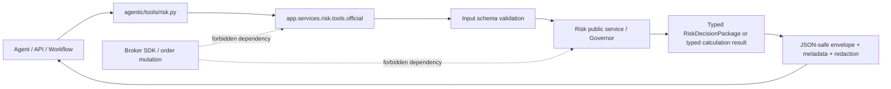

# Risk Governance - Architecture Requirements Document V2

**Source of truth:** `05-risk-governance.md` only. This document translates its requirements into a Python architecture without introducing runtime features from outside the source material.

**Coverage note:** The source headline declares **876 checkbox tasks**, but the file contains **865 labelled checkbox requirements**: 498 `RISK-FR`, 271 `RISK-NFR`, 35 `RISK-TEST`, and 61 `RISK-EX`. This document maps all 865 labelled requirements. The 11-task difference is retained as a source-inventory discrepancy for owner resolution; no requirement has been invented to close it.

**Domain authority:** Risk is the final deterministic authority before Trading or Live mutation. It returns approved, reduced, rejected, blocked, evidence-needed, approval-needed, or halt decisions. It does not place, close, modify, or cancel broker orders.

**Revision note:** Audit fix applied: every non-`__init__.py` file listed in the System Boundary Diagram now has its own Section 3 `#### 📄 File:` subsection, and repeated `### 📂 Module:` headers in Section 3 have been consolidated.

## 1. System Boundary Diagram (file structure)

```text
app/services/risk/
├── __init__.py                         # Strict public gate; no import-time I/O; intentional exports only
├── readiness/                          # Phase-entry and delivery-readiness evidence
│   ├── __init__.py
│   └── readiness.py
├── models/                             # Canonical risk contracts and JSON-safe serialization
│   ├── __init__.py
│   ├── enums.py
│   ├── contracts.py
│   └── serialization.py
├── config/                             # Validated profiles, stable config hashes, profile registry
│   ├── __init__.py
│   ├── schema.py
│   ├── loader.py
│   ├── hashing.py
│   └── profiles.py
├── policy/                             # Deterministic policy-as-code resolution and overrides
│   ├── __init__.py
│   ├── contracts.py
│   ├── resolver.py
│   └── overrides.py
├── regime/                             # Market condition and freshness assessment
│   ├── __init__.py
│   ├── assessor.py
│   └── validation.py
├── limits/                             # Ordered deterministic gates
│   ├── __init__.py
│   ├── contracts.py
│   ├── checks.py
│   └── engine.py
├── sizing/                             # Pure volume/risk math
│   ├── __init__.py
│   ├── contracts.py
│   ├── calculators.py
│   └── normalization.py
├── exposure/                           # FX legs and account-currency exposure aggregation
│   ├── __init__.py
│   ├── fx_legs.py
│   └── aggregation.py
├── correlation/                        # Closed-bar returns, correlation, clusters, fallbacks
│   ├── __init__.py
│   ├── returns.py
│   ├── engine.py
│   └── fallbacks.py
├── tail_risk/                          # VaR and Expected Shortfall/CVaR
│   ├── __init__.py
│   ├── contracts.py
│   ├── var.py
│   └── expected_shortfall.py
├── stress/                             # Registered declarative scenario evaluation
│   ├── __init__.py
│   ├── contracts.py
│   ├── registry.py
│   └── engine.py
├── feasibility/                        # Margin, drawdown, and execution feasibility
│   ├── __init__.py
│   ├── margin.py
│   ├── drawdown.py
│   └── execution_gate.py
├── governance/                         # Allocation, lifecycle, and kill-switch decisions
│   ├── __init__.py
│   ├── allocation.py
│   ├── lifecycle.py
│   └── kill_switch.py
├── governor/                           # Fixed order orchestration and final decision synthesis
│   ├── __init__.py
│   ├── governor.py
│   └── decision_synthesis.py
├── audit/                              # Redaction, hash chain, decision tokens
│   ├── __init__.py
│   ├── events.py
│   ├── hash_chain.py
│   └── tokens.py
├── storage/                            # Ports plus in-memory test/offline adapter
│   ├── __init__.py
│   ├── ports.py
│   └── in_memory.py
├── reports/                            # Evidence-only report and explicitly authorized export
│   ├── __init__.py
│   ├── builder.py
│   └── exporter.py
├── observability/                      # Decorator and metrics adapters, not calculation logic
│   ├── __init__.py
│   ├── decorators.py
│   └── metrics.py
└── tools/                              # Official Risk tool wrappers and registry
    ├── __init__.py
    ├── registry.py
    └── official.py

agentic/tools/
└── risk.py                             # Narrow agent attachment adapter; no internal-engine export

docs/risk/
├── phase_5_readiness.md
├── phase_5_dry_run.md
├── phase_5_traceability.md
├── phase_5_implementation_report.md
├── phase_5_rollback_report.md
└── benchmark_manifest.md

tests/risk/
├── unit/                               # Pure models/engines/contracts
├── integration/                        # Strategy/Data/Portfolio/Trading/Live non-bypass
├── scenarios/                          # USD/JPY/spread/rollover/correlation scenarios
├── security/                           # Tokens, authorization, injection, redaction
├── chaos/                              # Audit/storage/drawdown failure behaviour
├── performance/                        # Configured p95 benchmark validation
└── usage/                              # Runnable examples, no live orders
```

### Execution and dependency boundary

```text
Strategy / Data / Portfolio / Execution evidence
    -> injected Ports + canonical Models
    -> RiskGovernor (fixed sequence)
    -> pure engines: policy -> regime -> sizing -> exposure -> limits -> correlation -> VaR/ES -> stress -> feasibility -> allocation/lifecycle
    -> Decision Synthesis
    -> Audit / Token / Persistence ports
    -> JSON-safe official Tool Envelope
    -> Trading and Live must revalidate token immediately before broker mutation

Risk never imports a broker SDK, exposes a raw broker client, owns UI/API routing, owns data ingestion, or bypasses audit/token requirements.
```

### Source-recommended institutional default profile baseline

These values belong in validated configuration profiles, not in engine code. They remain conservative starting defaults subject to profile tuning and owner-controlled changes.

```yaml
risk:
  max_risk_per_trade: 0.25%
  max_total_open_risk: 1.50%
  max_symbol_open_risk: 0.50%
  max_currency_bucket_risk: 0.75%
  max_correlated_cluster_risk: 0.75%
  max_margin_usage: 30%
drawdown:
  daily_loss_soft_limit: 2.0%
  daily_loss_hard_limit: 4.0%
  total_drawdown_soft_limit: 6.0%
  total_drawdown_hard_limit: 9.0%
correlation:
  lookback_m5: 96
  lookback_h1: 24
  lookback_d1: 10
  reject_threshold: 0.70
  reduce_threshold: 0.50
tail_risk:
  var_confidence: 0.95
  es_confidence: 0.95
  max_portfolio_var: 1.00%
  max_portfolio_es: 1.50%
  stress_loss_limit: 2.00%
execution:
  max_spread_to_sigma: 0.25
  max_slippage_to_sigma: 0.20
  rollover_blackout_hours_before: 2
  rollover_blackout_hours_after: 2
```

## 2. Interfaces diagrams (Mermaid diagrams)

### 2.1 Core collaboration and contract diagram

```mermaid
classDiagram
    class RiskGovernor {
        +review_trade(request: RiskAssessmentRequest) RiskDecisionPackage
        +review_allocation(request: RiskAssessmentRequest) RiskDecisionPackage
        +review_strategy_admission(request: RiskAssessmentRequest) RiskDecisionPackage
        +review_live_readiness(request: RiskAssessmentRequest) RiskDecisionPackage
        +run_portfolio_risk_governor(request: RiskAssessmentRequest) RiskDecisionPackage
    }
    class RiskPolicyEngine {
        +resolve_effective_policy(context, policies) EffectiveRiskPolicy
    }
    class RegimeRiskEngine { +assess_risk_regime(market, policy, now) RegimeAssessment }
    class LimitEngine { +evaluate_ordered_limits(context, checks) LimitAssessment }
    class VolatilitySizingEngine { +calculate_position_size(request) PositionSizingResult }
    class CurrencyExposureEngine { +calculate_currency_exposure(...) CurrencyExposure }
    class CorrelationEngine { +calculate_correlation_matrix(returns, method) CorrelationSnapshot }
    class PortfolioVaREngine { +calculate_parametric_var(request) VaRSnapshot }
    class ExpectedShortfallEngine { +calculate_expected_shortfall(request) ExpectedShortfallSnapshot }
    class StressTestingEngine { +evaluate_stress_scenarios(context, registry, policy) StressSummary }
    class MarginRiskEngine { +calculate_projected_margin_usage(account, portfolio, proposal) MarginRiskSnapshot }
    class DrawdownGovernor { +determine_drawdown_state(snapshot, prior, policy) DrawdownState }
    class ExecutionRiskGate { +assess_execution_feasibility(trade, market, metadata, policy) ExecutionRiskSnapshot }
    class RiskAllocator { +review_allocation_proposal(request, portfolio, policy) AllocationAssessment }
    class KillSwitchService { +check_risk_kill_switch(scope, state) KillSwitchAssessment }
    class RiskAuditSink { <<Protocol>> +append(event: RiskAuditEvent) PersistenceResult }
    class RiskDecisionStore { <<Protocol>> +persist(decision, key) PersistenceResult }
    class RiskDecisionTokenSigner { <<Protocol>> +sign(payload) RiskDecisionToken }
    class RiskDecisionPackage {
        +status: RiskDecisionStatus
        +approved_size: Decimal
        +policy_hash: str
        +config_hash: str
        +token: RiskDecisionToken
        +audit_hash: str
    }

    RiskGovernor --> RiskPolicyEngine
    RiskGovernor --> RegimeRiskEngine
    RiskGovernor --> LimitEngine
    RiskGovernor --> VolatilitySizingEngine
    RiskGovernor --> CurrencyExposureEngine
    RiskGovernor --> CorrelationEngine
    RiskGovernor --> PortfolioVaREngine
    RiskGovernor --> ExpectedShortfallEngine
    RiskGovernor --> StressTestingEngine
    RiskGovernor --> MarginRiskEngine
    RiskGovernor --> DrawdownGovernor
    RiskGovernor --> ExecutionRiskGate
    RiskGovernor --> RiskAllocator
    RiskGovernor --> KillSwitchService
    RiskGovernor --> RiskAuditSink
    RiskGovernor --> RiskDecisionStore
    RiskGovernor --> RiskDecisionTokenSigner
    RiskGovernor --> RiskDecisionPackage
```



### 2.2 Fixed, fail-closed decision flow

```mermaid
sequenceDiagram
    participant Caller as Strategy/Portfolio/Live request
    participant Tool as Official Risk Tool
    participant Gov as RiskGovernor
    participant Policy as RiskPolicyEngine
    participant Engines as Pure Risk Engines
    participant Audit as Audit + Token + Storage Ports
    participant Downstream as Trading/Live

    Caller->>Tool: typed request + request/workflow/correlation IDs
    Tool->>Tool: validate envelope, redact/log metadata
    Tool->>Gov: RiskAssessmentRequest
    Gov->>Gov: validate canonical request
    Gov->>Policy: resolve effective policy
    alt policy/evidence/authority invalid
        Gov->>Audit: audit blocked decision
        Audit-->>Gov: audit reference
        Gov-->>Tool: block / needs_more_evidence decision
    else policy valid
        Gov->>Engines: kill switch -> lifecycle -> regime/freshness -> sizing -> exposure -> limits -> correlation -> VaR/ES -> stress -> feasibility -> drawdown
        Engines-->>Gov: typed assessments and reason codes
        Gov->>Gov: synthesize approve/reduce/reject/block/approval/halt
        Gov->>Audit: redacted audit event; token only if eligible
        Audit-->>Gov: audit hash + bounded token
        Gov-->>Tool: RiskDecisionPackage
    end
    Tool-->>Caller: standard JSON-safe envelope; places_trade=false
    Caller->>Downstream: decision package + token, where permitted
    Downstream->>Downstream: revalidate token + kill switch immediately before broker mutation
```

### 2.3 Official Risk tool contract



## 3. Functional Requirements

The following groups map every `RISK-FR-001` through `RISK-FR-498` to one physical boundary. Empty tool-attachment requirement groups are included only where a source requirement belongs to the public attachment boundary; all other sections contain the exact source text for their mapped requirements.

### 📂 Module: `app/services/risk/readiness`

**Boundary Role:** Proves that Phase 5 starts only with canonical dependencies, explicit scope boundaries, safe fixtures, documented mode behavior, and an auditable delivery plan. It is a pre-runtime governance boundary and never evaluates a trade.

#### 📄 File: `readiness.py`

**File Boundary:** Phase-entry validation, dependency capability inspection, risk-mode coverage, and deterministic readiness reporting.

**Requirement Title:** Institutional foundation, dependencies, and pre-implementation readiness

**Description:** Establishes Risk as the deterministic pre-execution authority while preventing unauthorized domain ownership, hidden live dependencies, unsafe fixtures, and unplanned implementation work.

**Requirements:**

- [x] **RISK-FR-001**: Phase 5 shall treat Risk Governance as a layered control system, not a single formula or indicator. *Evidence: app/services/risk/readiness/readiness.py line 124-143*
- [x] **RISK-FR-002**: Phase 5 shall make VaR one engine inside the RiskGovernor, not the whole risk strategy. *Evidence: app/services/risk/readiness/readiness.py line 124-143*
- [x] **RISK-FR-003**: Phase 5 shall use Expected Shortfall/CVaR and stress loss as stronger tail-risk approval controls than parametric VaR alone. *Evidence: app/services/risk/readiness/readiness.py line 124-143*
- [x] **RISK-FR-004**: Phase 5 shall decompose Forex positions into currency legs before calculating exposure and concentration. *Evidence: app/services/risk/readiness/readiness.py line 124-143*
- [x] **RISK-FR-005**: Phase 5 shall treat correlated symbol trades as clustered portfolio risk rather than independent trades. *Evidence: app/services/risk/readiness/readiness.py line 124-143*
- [x] **RISK-FR-006**: Phase 5 shall fail closed when required evidence is stale, missing, inconsistent, unreconciled, or not trusted. *Evidence: app/services/risk/readiness/readiness.py line 124-143*
- [x] **RISK-FR-007**: Phase 5 shall output deterministic decisions that can be replayed, audited, and explained without LLM reasoning. *Evidence: app/services/risk/readiness/readiness.py line 124-143*
- [x] **RISK-FR-008**: Phase 5 shall allow LLM agents to summarize or explain risk decisions but never make final safety-critical decisions. *Evidence: app/services/risk/readiness/readiness.py line 124-143*
- [x] **RISK-FR-009**: Phase 5 shall preserve module ownership boundaries and shall not place, close, modify, or cancel broker orders. *Evidence: app/services/risk/readiness/readiness.py line 124-143*
- [x] **RISK-FR-010**: Phase 5 shall be stricter than broker constraints and stricter than external prop-firm limits. *Evidence: app/services/risk/readiness/readiness.py line 124-143*
- [x] **RISK-FR-011**: Verify all required dependency files are implemented, importable, side-effect safe, and covered by tests before Phase 5 implementation begins. *Evidence: app/services/risk/readiness/readiness.py line 150-184*
- [x] **RISK-FR-012**: Verify Risk consumes canonical Phase 1.5 contracts instead of redefining duplicate cross-domain models. *Evidence: app/services/risk/readiness/readiness.py line 150-184*
- [x] **RISK-FR-013**: Verify Risk receives market, account, portfolio, pending-order, and execution-state evidence through explicit ports or canonical snapshots. *Evidence: app/services/risk/readiness/readiness.py line 150-184*
- [x] **RISK-FR-014**: Verify Risk has no direct broker SDK dependency. *Evidence: app/services/risk/readiness/readiness.py line 150-184*
- [x] **RISK-FR-015**: Verify Risk has no UI, FastAPI route, LLM-provider, notification-provider, or database-migration ownership. *Evidence: app/services/risk/readiness/readiness.py line 150-184*
- [x] **RISK-FR-016**: Verify Risk can run in offline test, simulation, paper, shadow, read-only live, micro-live, and full-live modes using profile-specific policies. *Evidence: app/services/risk/readiness/readiness.py line 185-223*
- [x] **RISK-FR-017**: Verify every live-sensitive Risk workflow has access to UTC timestamps, broker-server timestamps where needed, and freshness metadata. *Evidence: app/services/risk/readiness/readiness.py line 150-184*
- [x] **RISK-FR-018**: Verify every Risk decision can propagate request ID, workflow ID, correlation ID, strategy ID, and signal ID. *Evidence: app/services/risk/readiness/readiness.py line 150-184*
- [x] **RISK-FR-019**: Read the v1 Phase 5 baseline, Risk v8 technical specification, Core Contracts phase, and current Strategy/Data/Portfolio/Trading interfaces before editing. *Evidence: app/services/risk/readiness/readiness.py line 124-143*
- [x] **RISK-FR-020**: Create a Phase 5 dry-run report listing files to read, files to change, commands to run, scope boundaries, blockers, and rollback path. *Evidence: app/services/risk/readiness/readiness.py line 290-322*
- [x] **RISK-FR-021**: Confirm Phase 5 does not begin until Phase 1.5 canonical contracts are available or explicitly stubbed by approved sprint scope. *Evidence: app/services/risk/readiness/readiness.py line 150-184*
- [x] **RISK-FR-022**: Confirm every live-sensitive dependency has a fail-closed fallback path. *Evidence: app/services/risk/readiness/readiness.py line 150-184*
- [x] **RISK-FR-023**: Confirm every risk input is either canonical, injected, or explicitly rejected. *Evidence: app/services/risk/readiness/readiness.py line 150-184*
- [x] **RISK-FR-024**: Confirm no direct broker SDK imports are planned inside Risk. *Evidence: app/services/risk/readiness/readiness.py line 150-184*
- [x] **RISK-FR-025**: Confirm no API route, UI, or Conversation code will own risk algorithms. *Evidence: app/services/risk/readiness/readiness.py line 150-184*
- [x] **RISK-FR-026**: Confirm no strategy code can approve its own signals. *Evidence: app/services/risk/readiness/readiness.py line 150-184*
- [x] **RISK-FR-027**: Confirm no optimization result can allocate capital without Risk review. *Evidence: app/services/risk/readiness/readiness.py line 150-184*
- [x] **RISK-FR-028**: Confirm no live-mode promotion can proceed without Risk lifecycle approval. *Evidence: app/services/risk/readiness/readiness.py line 150-184*
- [x] **RISK-FR-029**: Define the Phase 5 implementation sequence before creating production files. *Evidence: app/services/risk/readiness/readiness.py line 290-322*
- [x] **RISK-FR-030**: Create a local issue map or checklist linking each sprint pack to expected files and tests. *Evidence: app/services/risk/readiness/readiness.py line 290-322*
- [x] **RISK-FR-031**: Define rollback points after contracts, config, calculators, governor, audit, and tools. *Evidence: app/services/risk/readiness/readiness.py line 290-322*
- [x] **RISK-FR-032**: Confirm all test fixtures use synthetic account and market data only. *Evidence: app/services/risk/readiness/readiness.py line 224-289*
- [x] **RISK-FR-033**: Confirm no fixture contains real account numbers, broker credentials, tokens, or private payloads. *Evidence: app/services/risk/readiness/readiness.py line 224-289*
- [x] **RISK-FR-034**: Define deterministic random seeds for any stochastic stress or simulation tests. *Evidence: app/services/risk/readiness/readiness.py line 224-289*
- [x] **RISK-FR-035**: Define benchmark dataset shapes for correlation, VaR/ES, stress, and governor latency tests. *Evidence: app/services/risk/readiness/readiness.py line 224-289*
- [x] **RISK-FR-036**: Define redaction expectations for logs, audit events, reports, and standard envelopes. *Evidence: app/services/risk/readiness/readiness.py line 224-289*
- [x] **RISK-FR-037**: Define mode matrix for offline, simulation, paper, shadow, read-only live, micro-live, and full-live. *Evidence: app/services/risk/readiness/readiness.py line 185-223*
- [x] **RISK-FR-038**: Define which workflows require approval tokens and which are advisory only. *Evidence: app/services/risk/readiness/readiness.py line 224-289*
- [x] **RISK-FR-039**: Define which workflows write audit records and which remain pure calculations. *Evidence: app/services/risk/readiness/readiness.py line 224-289*
- [x] **RISK-FR-040**: Define which functions are support helpers and which are official AI-callable tools. *Evidence: app/services/risk/readiness/readiness.py line 224-289*
- [x] **RISK-FR-041**: Define side-effect flags for every official risk tool before implementation. *Evidence: app/services/risk/readiness/readiness.py line 224-289*
- [x] **RISK-FR-042**: Define minimum required evidence for trade review, allocation review, strategy admission, and live readiness. *Evidence: app/services/risk/readiness/readiness.py line 224-289*
- [x] **RISK-FR-043**: Define initial performance targets for pre-trade review, correlation matrix, VaR/ES, and stress scenarios. *Evidence: app/services/risk/readiness/readiness.py line 224-289*
- [x] **RISK-FR-044**: Define the initial conservative risk policy profile before implementation. *Evidence: app/services/risk/readiness/readiness.py line 224-289*
- [x] **RISK-FR-045**: Define the owner-approved threshold-change process for risk config profiles. *Evidence: app/services/risk/readiness/readiness.py line 224-289*
- [x] **RISK-FR-046**: Define failure behavior when audit storage is unavailable in non-live modes. *Evidence: app/services/risk/readiness/readiness.py line 224-289*
- [x] **RISK-FR-047**: Define failure behavior when audit storage is unavailable in live-sensitive modes. *Evidence: app/services/risk/readiness/readiness.py line 224-289*
- [x] **RISK-FR-048**: Record Phase 5 readiness decisions in the implementation report before coding. *Evidence: app/services/risk/readiness/readiness.py line 124-143*

**Target Class/Function:**

- `class RiskReadinessManifest` — typed, immutable delivery/readiness contract; **Pure** validation at construction.
- `validate_phase_dependencies(dependencies: Mapping[str, DependencyStatus]) -> ReadinessAssessment` — validates canonical contracts, side-effect safety, ports, and test availability; **Pure**.
- `validate_risk_mode_matrix(matrix: RiskModeMatrix) -> ValidationResult` — validates offline, simulation, paper, shadow, read-only-live, micro-live, and full-live policy coverage; **Pure**.
- `build_readiness_dry_run(manifest: RiskReadinessManifest) -> DryRunReport` — produces files-to-read/change, commands, scope, blockers, and rollback points; **Pure**.
- `validate_delivery_plan(plan: ReadinessDeliveryPlan) -> ValidationResult` — validates traceability, synthetic fixtures, deterministic seeds, benchmark shapes, redaction, tool classification, and audit failure policy; **Pure**.

### 📂 Module: `app/services/risk/models`

**Boundary Role:** Defines the canonical, serializable contracts that cross the Risk boundary. It owns validation and canonicalization; it does not query brokers, stores, or other domains.

#### 📄 File: `enums.py`

**File Boundary:** Deterministic string enums and ordered severity/status catalogs used by all Risk contracts, policies, tools, and reports.

**Requirement Title:** Risk enum catalogs

**Description:** Defines deterministic enum values separately from data contracts so status, reason, and severity meanings remain stable across serialization, audit, policy, and tool boundaries.

**Requirements:**

- [x] **RISK-FR-050**: Define all risk enums with deterministic string values. *app/services/risk/models/enums.py:14*
- [x] **RISK-FR-051**: Define `RiskDecisionStatus` and cover all allowed outcomes. *app/services/risk/models/enums.py:14*
- [x] **RISK-FR-052**: Define `RiskReasonCode` catalog with stable names and descriptions. *app/services/risk/models/enums.py:59*
- [x] **RISK-FR-053**: Define `RiskSeverity` catalog with stable ordering. *app/services/risk/models/enums.py:48*

**Target Class/Function:**

- `class RiskDecisionStatus` — deterministic string enum for `approve`, `reduce_size`, `reject`, `block`, `needs_more_evidence`, `needs_approval`, `halt_strategy`, and `halt_all`; **Pure enum**.
- `class RiskReasonCode` — deterministic reason-code catalog with stable names and descriptions; **Pure enum/catalog**.
- `class RiskSeverity` — deterministic ordered severity catalog for warning/error/blocking/critical outcomes; **Pure enum**.
- `list_risk_reason_codes() -> tuple[RiskReasonCode, ...]` — returns the stable reason-code catalogue in deterministic order; **Pure**.
- `risk_severity_rank(severity: RiskSeverity) -> int` — returns stable ordering rank for aggregation and primary-failure selection; **Pure**.

#### 📄 File: `contracts.py`

**File Boundary:** Typed request, snapshot, proposal, decision, evidence, warning, reduction, and audit-event contracts.

**Requirement Title:** Canonical risk contracts and public decision package

**Description:** Creates the models that make every risk input, calculation result, decision, rejection, and token scope explicit, validated, serializable, and replayable.

**Requirements:**

- [x] **RISK-FR-049**: Create risk models with file-level purpose, exports, and side-effect docstring. *app/services/risk/models/contracts.py:1*
- [x] **RISK-FR-050**: Define all risk enums with deterministic string values. *app/services/risk/models/enums.py:14*
- [x] **RISK-FR-051**: Define `RiskDecisionStatus` and cover all allowed outcomes. *app/services/risk/models/enums.py:14*
- [x] **RISK-FR-052**: Define `RiskReasonCode` catalog with stable names and descriptions. *app/services/risk/models/enums.py:59*
- [x] **RISK-FR-053**: Define `RiskSeverity` catalog with stable ordering. *app/services/risk/models/enums.py:48*
- [x] **RISK-FR-054**: Define `RiskEvidenceRef` for source-traceable evidence references. *app/services/risk/models/contracts.py:102*
- [x] **RISK-FR-055**: Define `ProposedTrade` with validation for symbol, side, size, order type, stops, targets, timestamps, and strategy metadata. *app/services/risk/models/contracts.py:110*
- [x] **RISK-FR-056**: Define `ProposedAllocation` with strategy, symbol, currency, requested budget, and evidence metadata. *app/services/risk/models/contracts.py:166*
- [x] **RISK-FR-057**: Define `StrategyAdmissionRequest` with required research, simulation, and risk evidence fields. *app/services/risk/models/contracts.py:178*
- [x] **RISK-FR-058**: Define `RiskAssessmentRequest` with mode, policy profile, account state, market state, portfolio state, pending orders, open positions, and freshness metadata. *app/services/risk/models/contracts.py:546*
- [x] **RISK-FR-059**: Define `AccountRiskSnapshot` with equity, balance, free margin, margin used, leverage, base currency, and timestamp. *app/services/risk/models/contracts.py:642*
- [x] **RISK-FR-060**: Define `MarketRiskSnapshot` with spreads, volatility, session, rollover, news, symbol metadata, and freshness fields. *app/services/risk/models/contracts.py:654*
- [x] **RISK-FR-061**: Define `PortfolioRiskSnapshot` with open positions, pending orders, in-flight orders, exposure, VaR/ES, stress, and drawdown fields. *app/services/risk/models/contracts.py:692*
- [x] **RISK-FR-062**: Define `PositionRiskSnapshot` with signed size, entry, current price, PnL, risk, margin, strategy ID, and timestamps. *app/services/risk/models/contracts.py:669*
- [x] **RISK-FR-063**: Define `PendingOrderRiskSnapshot` with pending-order exposure policy fields. *app/services/risk/models/contracts.py:685*
- [x] **RISK-FR-064**: Define `CurrencyLegExposure` with signed base and quote currency amounts. *app/services/risk/models/contracts.py:712*
- [x] **RISK-FR-065**: Define `CurrencyExposure` with gross, net, and account-currency equivalent exposure. *app/services/risk/models/contracts.py:719*
- [x] **RISK-FR-066**: Define `CorrelationSnapshot` with matrix, lookback, timeframe, method, sample count, and fallback status. *app/services/risk/models/contracts.py:741*
- [x] **RISK-FR-067**: Define `VaRSnapshot` with method, confidence, portfolio volatility, exposure, result, and assumptions. *app/services/risk/models/contracts.py:775*
- [x] **RISK-FR-068**: Define `ExpectedShortfallSnapshot` with confidence, threshold loss, average tail loss, sample count, and method. *app/services/risk/models/contracts.py:790*
- [x] **RISK-FR-069**: Define `StressScenarioResult` with scenario ID, shock assumptions, estimated loss, pass/fail status, and reason codes. *app/services/risk/models/contracts.py:800*
- [x] **RISK-FR-070**: Define `MarginRiskSnapshot` with projected margin, free margin, margin usage, leverage, and broker constraints. *app/services/risk/models/contracts.py:818*
- [x] **RISK-FR-071**: Define `DrawdownState` with current state, soft/hard limits, step-down multiplier, and persistence metadata. *app/services/risk/models/contracts.py:829*
- [x] **RISK-FR-072**: Define `ExecutionRiskSnapshot` with spread, slippage, stop-level, freeze-level, lot-step, and marketability checks. *app/services/risk/models/contracts.py:846*
- [x] **RISK-FR-073**: Define `RiskDecisionToken` with scope, expiry, policy hash, config hash, signature metadata, and revocation fields. *app/services/risk/models/contracts.py:884*
- [x] **RISK-FR-074**: Define `RiskDecisionPackage` as the single canonical output from Risk reviews. *app/services/risk/models/contracts.py:898*

**Target Class/Function:**

- `class ProposedTrade` — validates symbol, side, requested size, order type, stops, targets, timestamps, and strategy metadata; **Pure contract validation**.
- `class ProposedAllocation` — validates requested strategy/symbol/currency budgets and evidence references; **Pure contract validation**.
- `class StrategyAdmissionRequest` — validates research, simulation, and risk evidence inputs; **Pure contract validation**.
- `class RiskAssessmentRequest` — aggregates mode, policy profile, account, market, portfolio, pending-order, open-position, and freshness evidence; **Pure contract validation**.
- `class RiskDecisionPackage` — canonical decision output with decision status, limits, warnings, evidence, token, expiry, and audit reference; **Pure contract validation**.
- `validate_risk_assessment_request(request: RiskAssessmentRequest) -> ValidationResult` — rejects missing or invalid canonical evidence before calculation; **Pure**.

#### 📄 File: `serialization.py`

**File Boundary:** Canonical JSON-safe conversion, stable ordering, and round-trip validation for risk contracts.

**Requirement Title:** Risk model serialization and contract verification

**Description:** Ensures all public risk contracts have deterministic JSON boundaries and explicit validation behavior.

**Requirements:**

- [x] **RISK-FR-075**: Add canonical serialization helpers for all risk models. *app/services/risk/models/serialization.py:23*
- [x] **RISK-FR-076**: Add validation tests for all model success paths. *tests/unit/app/services/risk/test_contracts.py:16*
- [x] **RISK-FR-077**: Add validation tests for invalid financial values and missing required fields. *tests/unit/app/services/risk/test_contracts.py:90*
- [x] **RISK-FR-078**: Add JSON round-trip and canonicalization tests for every model crossing public boundaries. *tests/unit/app/services/risk/test_serialization.py:16*

**Target Class/Function:**

- `to_canonical_risk_payload(model: RiskSerializable) -> dict[str, JsonValue]` — emits stable, JSON-safe fields for a canonical risk model; **Pure**.
- `from_canonical_risk_payload(payload: Mapping[str, JsonValue], model_type: type[RiskModelT]) -> RiskModelT` — validates and restores a known model type; **Pure**.
- `validate_risk_model_round_trip(model: RiskSerializable) -> ValidationResult` — verifies canonicalization and round-trip integrity; **Pure**.

### 📂 Module: `app/services/risk/config`

**Boundary Role:** Owns validated policy-profile configuration and stable configuration identity. It does not decide whether a request passes policy.

#### 📄 File: `schema.py`

**File Boundary:** Strict typed risk-profile schemas, default profile declarations, unknown-key rejection, and threshold safety validation.

**Requirement Title:** Risk configuration profiles and strict schemas

**Description:** Defines safe simulation, prop-firm, paper, and conservative live profiles before policy resolution.

**Requirements:**

- [x] **RISK-FR-079**: Create risk config profiles with side-effect-free imports. *app/services/risk/config/profiles.py:23*
- [x] **RISK-FR-080**: Create default.json with safe simulation defaults. *app/services/risk/configs/default.json:1*
- [x] **RISK-FR-081**: Create `prop_firm_default.json` with conservative prop-firm controls. *app/services/risk/configs/prop_firm_default.json:1*
- [x] **RISK-FR-082**: Create `paper.json` with paper-trading validation controls. *app/services/risk/configs/paper.json:1*
- [x] **RISK-FR-083**: Create `live_conservative.json` with full fail-closed live controls. *app/services/risk/configs/live_conservative.json:1*
- [x] **RISK-FR-084**: Define strict schema for risk config profiles. *app/services/risk/config/schema.py:37*
- [x] **RISK-FR-085**: Reject unknown config keys by default. *app/services/risk/config/schema.py:70*
- [x] **RISK-FR-086**: Reject unsafe threshold values above configured maximums. *app/services/risk/config/schema.py:84*
- [x] **RISK-FR-087**: Reject live profiles that lack explicit live authority fields. *app/services/risk/config/schema.py:126*

**Target Class/Function:**

- `class RiskConfig` — strict typed risk profile including mode authority, limits, evidence, audit, and approval requirements; **Pure contract validation**.
- `validate_risk_config(config: RiskConfig) -> ValidationResult` — rejects unknown keys, unsafe thresholds, and live profiles missing explicit authority; **Pure**.
- `build_safe_default_profile() -> RiskConfig` — returns the approved offline/simulation baseline; **Pure**.
- `build_prop_firm_default_profile() -> RiskConfig` — returns conservative prop-firm controls; **Pure**.
- `build_paper_profile() -> RiskConfig` — returns paper-validation controls; **Pure**.
- `build_live_conservative_profile() -> RiskConfig` — returns the fail-closed live baseline; **Pure**.

#### 📄 File: `loader.py`

**File Boundary:** Explicit configuration-source adapters and stable configuration hashing. No config is loaded during module import.

**Requirement Title:** Configuration loading and reproducibility identity

**Description:** Loads approved profiles only through explicit invocation and derives stable hashes used by decisions and tokens.

**Requirements:**

- [x] **RISK-FR-088**: Compute stable risk config hashes. *app/services/risk/config/loader.py:100*
- [x] **RISK-FR-089**: Add hash regression tests for identical and changed configs. *tests/unit/app/services/risk/test_config.py:564*

**Target Class/Function:**

- `load_risk_config(profile_name: str, source: RiskConfigSource) -> RiskConfig` — reads an explicitly injected configuration source and validates the selected profile; **Read-only I/O boundary**.
- `hash_risk_config(config: RiskConfig) -> str` — generates a stable, canonical config hash; **Pure**.

#### 📄 File: `hashing.py`

**File Boundary:** Stable, canonical, order-invariant hashing for validated risk configuration profiles.

**Requirement Title:** Risk configuration reproducibility hash

**Description:** Isolates reproducibility identity from loading logic so decisions, tokens, approvals, and audit records can reference the exact effective configuration without depending on file order or YAML formatting.

**Requirements:**

- [x] **RISK-FR-088**: Compute stable risk config hashes. *app/services/risk/config/hashing.py:52*
- [x] **RISK-FR-089**: Add hash regression tests for identical and changed configs. *tests/unit/app/services/risk/test_config.py:564*

**Target Class/Function:**

- `canonicalize_risk_config_for_hash(config: RiskConfig) -> dict[str, JsonValue]` — normalizes a validated risk config into sorted JSON-safe hash material; **Pure**.
- `hash_risk_config(config: RiskConfig) -> str` — generates a stable hash for decisions, tokens, audit events, and replay; **Pure**.
- `compare_risk_config_hashes(left: RiskConfig, right: RiskConfig) -> ConfigHashComparison` — reports whether two configs are identical or materially changed; **Pure**.
- `validate_risk_config_hash(expected_hash: str, config: RiskConfig) -> ValidationResult` — verifies compatibility with approval tokens and stored decisions; **Pure**.

#### 📄 File: `profiles.py`

**File Boundary:** Approved built-in profile builders and profile-name registry for safe simulation, prop-firm, paper, and conservative live operation.

**Requirement Title:** Approved risk profile builders

**Description:** Keeps built-in profile construction separate from strict schema validation and external loading. These builders return validated profile objects and perform no import-time I/O.

**Requirements:**

- [x] **RISK-FR-079**: Create risk config profiles with side-effect-free imports. *app/services/risk/config/profiles.py:23*
- [x] **RISK-FR-080**: Create default.json with safe simulation defaults. *app/services/risk/configs/default.json:1*
- [x] **RISK-FR-081**: Create `prop_firm_default.json` with conservative prop-firm controls. *app/services/risk/configs/prop_firm_default.json:1*
- [x] **RISK-FR-082**: Create `paper.json` with paper-trading validation controls. *app/services/risk/configs/paper.json:1*
- [x] **RISK-FR-083**: Create `live_conservative.json` with full fail-closed live controls. *app/services/risk/configs/live_conservative.json:1*

**Target Class/Function:**

- `build_safe_default_profile() -> RiskConfig` — returns the approved offline/simulation baseline; **Pure**.
- `build_prop_firm_default_profile() -> RiskConfig` — returns conservative prop-firm controls; **Pure**.
- `build_paper_profile() -> RiskConfig` — returns paper-trading validation controls; **Pure**.
- `build_live_conservative_profile() -> RiskConfig` — returns the fail-closed live baseline with explicit live authority fields; **Pure**.
- `list_builtin_risk_profiles() -> tuple[str, ...]` — returns stable built-in profile names; **Pure**.
- `get_builtin_risk_profile(name: str) -> RiskConfig` — resolves an approved built-in profile by name or fails deterministically; **Pure**.

### 📂 Module: `app/services/risk/policy`

**Boundary Role:** Resolves policy-as-code deterministically across approved scopes and validates governed override requests. It never performs execution.

#### 📄 File: `contracts.py`

**File Boundary:** Policy scope, precedence, enforcement-result, expiry, and effective-policy contracts.

**Requirement Title:** Policy-as-code contracts

**Description:** Defines the immutable policy objects consumed by the resolver and override validators so policy semantics are not hidden in orchestration code.

**Requirements:**

- [x] **RISK-FR-090**: Create policy module with deterministic policy resolution. *app/services/risk/policy/contracts.py:1*
- [x] **RISK-FR-091**: Define policy scope by environment, mode, account, strategy, symbol, currency, workflow, and operator role. *app/services/risk/models/contracts.py:30*
- [x] **RISK-FR-092**: Define policy precedence rules for global, account, strategy, symbol, and workflow scopes. *app/services/risk/policy/contracts.py:105*
- [x] **RISK-FR-095**: Implement policy enforcement result model. *app/services/risk/models/contracts.py:902*

**Target Class/Function:**

- `class PolicyScope` — validates environment, mode, account, strategy, symbol, currency, workflow, and operator role selectors; **Pure contract validation**.
- `class RiskPolicy` — immutable policy record with thresholds, authority, expiry, scope, and policy hash material; **Pure contract validation**.
- `class EffectiveRiskPolicy` — resolved policy applied to a request with provenance and precedence evidence; **Pure contract validation**.
- `class PolicyEnforcementResult` — pass/warn/fail result for policy gates and budget checks; **Pure contract**.
- `class PolicyPrecedenceRule` — explicit global/account/strategy/symbol/workflow ordering record; **Pure contract**.
- `validate_policy_scope(scope: PolicyScope) -> ValidationResult` — rejects malformed or ambiguous policy scopes; **Pure**.

#### 📄 File: `resolver.py`

**File Boundary:** Policy scope matching, precedence resolution, expiry checks, and deterministic missing-policy failure.

**Requirement Title:** Policy-as-code resolution

**Description:** Resolves the applicable policy by environment, mode, account, strategy, symbol, currency, workflow, and operator role before any risk calculation.

**Requirements:**

- [x] **RISK-FR-090**: Create policy module with deterministic policy resolution. *app/services/risk/policy/resolver.py:330*
- [x] **RISK-FR-091**: Define policy scope by environment, mode, account, strategy, symbol, currency, workflow, and operator role. *app/services/risk/policy/resolver.py:38*
- [x] **RISK-FR-092**: Define policy precedence rules for global, account, strategy, symbol, and workflow scopes. *app/services/risk/policy/resolver.py:308*
- [x] **RISK-FR-093**: Implement policy resolution with missing-policy fail-closed behavior. *app/services/risk/policy/resolver.py:380*
- [x] **RISK-FR-094**: Implement policy hash propagation into decisions. *app/services/risk/policy/resolver.py:434*
- [x] **RISK-FR-095**: Implement policy enforcement result model. *app/services/risk/models/contracts.py:902*
- [x] **RISK-FR-096**: Implement risk budget policy gates. *app/services/risk/policy/resolver.py:460*

**Target Class/Function:**

- `class RiskPolicyEngine` — deterministic policy resolution façade; **Pure when policy records are injected**.
- `resolve_effective_policy(context: PolicyContext, policies: Sequence[RiskPolicy]) -> EffectiveRiskPolicy` — applies approved scope/precedence rules or fails closed; **Pure**.
- `evaluate_risk_budget(policy: EffectiveRiskPolicy, request: RiskAssessmentRequest) -> PolicyEnforcementResult` — evaluates policy budget gates; **Pure**.
- `validate_policy_expiry(policy: RiskPolicy, now_utc: datetime) -> ValidationResult` — validates time-bounded policies; **Pure**.

#### 📄 File: `overrides.py`

**File Boundary:** Override request validation, authority requirement derivation, and token/config compatibility checks.

**Requirement Title:** Governed policy overrides

**Description:** Keeps any threshold override outside core calculations and requires deterministic validation plus governed approval.

**Requirements:**

- [x] **RISK-FR-097**: Implement risk threshold override request validation. *app/services/risk/policy/overrides.py:138*
- [x] **RISK-FR-098**: Implement governed approval requirement for high-risk overrides. *app/services/risk/policy/overrides.py:95*
- [x] **RISK-FR-099**: Implement config compatibility checks for approval tokens. *app/services/risk/policy/overrides.py:33*
- [x] **RISK-FR-100**: Implement policy expiry handling where policies are time-bounded. *app/services/risk/policy/resolver.py:359*
- [x] **RISK-FR-101**: Implement safe default policy for offline tests. *app/services/risk/config/profiles.py:23*
- [x] **RISK-FR-102**: Implement stricter default policy for live-sensitive modes. *app/services/risk/policy/overrides.py:101*
- [x] **RISK-FR-103**: Add policy resolution tests for every scope. *tests/unit/app/services/risk/test_policy.py:348*
- [x] **RISK-FR-104**: Add policy precedence tests. *tests/unit/app/services/risk/test_policy.py:417*
- [x] **RISK-FR-105**: Add missing policy fail-closed tests. *tests/unit/app/services/risk/test_policy.py:403*
- [x] **RISK-FR-106**: Add unsafe config rejection tests. *tests/unit/app/services/risk/test_policy.py:411*
- [x] **RISK-FR-107**: Add override authorization tests. *tests/unit/app/services/risk/test_policy.py:591*
- [x] **RISK-FR-108**: Document config and policy behavior in the Risk README. *app/services/risk/README.md:81*

**Target Class/Function:**

- `validate_risk_override_request(request: RiskOverrideRequest, policy: EffectiveRiskPolicy) -> OverrideValidationResult` — validates override scope and maximum threshold bounds; **Pure**.
- `requires_override_approval(request: RiskOverrideRequest, policy: EffectiveRiskPolicy) -> bool` — determines whether approval is mandatory; **Pure**.
- `validate_token_config_compatibility(token: RiskDecisionToken, config_hash: str) -> ValidationResult` — rejects configuration-incompatible approval tokens; **Pure**.

### 📂 Module: `app/services/risk/regime`

**Boundary Role:** Assesses current market operating conditions using supplied, freshness-qualified evidence. It never fetches market data.

#### 📄 File: `assessor.py`

**File Boundary:** Spread, volatility, liquidity, session, rollover, news, stale-data, and market-status classifications.

**Requirement Title:** Market regime gate

**Description:** Classifies market conditions and provides deterministic warnings or blockers before sizing or portfolio-risk computation.

**Requirements:**

- [X] **RISK-FR-109**: Create market regime gate with deterministic regime assessment. *Evidence: app/services/risk/regime/assessor.py line 393-525*
- [X] **RISK-FR-110**: Define `RiskRegime` enum and regime result contract. *Evidence: app/services/risk/regime/assessor.py line 25-40, 95-108*
- [X] **RISK-FR-111**: Implement spread regime classification using spread-to-σ thresholds. *Evidence: app/services/risk/regime/assessor.py line 208-233, 583-625*
- [X] **RISK-FR-112**: Implement volatility regime classification using short rolling windows. *Evidence: app/services/risk/regime/assessor.py line 236-281, 659-697*
- [X] **RISK-FR-113**: Implement volatility regime classification using medium rolling windows. *Evidence: app/services/risk/regime/assessor.py line 236-281, 659-697*
- [X] **RISK-FR-114**: Implement volatility regime classification using long rolling windows. *Evidence: app/services/risk/regime/assessor.py line 236-281, 659-697*
- [X] **RISK-FR-115**: Implement liquidity regime classification from quote freshness and missing bars. *Evidence: app/services/risk/regime/assessor.py line 700-752*
- [X] **RISK-FR-116**: Implement session regime classification for always-on trading. *Evidence: app/services/risk/regime/assessor.py line 465-482*
- [X] **RISK-FR-117**: Implement broker-midnight rollover regime detection. *Evidence: app/services/risk/regime/assessor.py line 284-331, 855-885*
- [X] **RISK-FR-118**: Implement configured rollover blackout before broker midnight. *Evidence: app/services/risk/regime/assessor.py line 284-331, 855-885*
- [X] **RISK-FR-119**: Implement configured rollover blackout after broker midnight. *Evidence: app/services/risk/regime/assessor.py line 284-331, 855-885*
- [X] **RISK-FR-120**: Implement news regime classification from injected trusted calendar evidence. *Evidence: app/services/risk/regime/assessor.py line 799-850*
- [X] **RISK-FR-121**: Fail closed when live profile requires calendar evidence and it is missing. *Evidence: app/services/risk/regime/assessor.py line 505-515*
- [X] **RISK-FR-122**: Throttle or reject extreme volatility spikes. *Evidence: app/services/risk/regime/assessor.py line 559-563*
- [X] **RISK-FR-123**: Reject stale quotes and stale market data snapshots. *Evidence: app/services/risk/regime/assessor.py line 334-375, 448-463*
- [X] **RISK-FR-124**: Reject invalid spreads and inverted bid/ask data. *Evidence: app/services/risk/regime/validation.py line 23-84, app/services/risk/regime/assessor.py line 414-424*
- [X] **RISK-FR-125**: Reject entries in market-closed or symbol-suspended states. *Evidence: app/services/risk/regime/assessor.py line 465-482*
- [X] **RISK-FR-126**: Expose reason codes for each regime warning or blocker. *Evidence: app/services/risk/regime/validation.py line 87-104, app/services/risk/regime/assessor.py line 550-580*
- [X] **RISK-FR-127**: Ensure regime checks use closed bars where required. *Evidence: app/services/risk/regime/assessor.py line 426-438, 717-742*
- [X] **RISK-FR-128**: Ensure regime checks do not mutate inputs. *Evidence: app/services/risk/regime/validation.py line 23-84, app/services/risk/regime/assessor.py line 393-525*

**Target Class/Function:**

- `class RegimeRiskEngine` — façade for deterministic regime evaluation; **Pure when snapshots are supplied**.
- `assess_risk_regime(market: MarketRiskSnapshot, policy: EffectiveRiskPolicy, now_utc: datetime) -> RegimeAssessment` — classifies spread, volatility, liquidity, sessions, rollover, and news conditions; **Pure**.
- `classify_spread_regime(spread: Decimal, sigma: Decimal, thresholds: SpreadSigmaThresholds) -> RiskRegime` — classifies spread-to-volatility condition; **Pure**.
- `classify_volatility_regime(short_sigma: Decimal, medium_sigma: Decimal, long_sigma: Decimal, thresholds: VolatilityThresholds) -> RiskRegime` — classifies volatility state; **Pure**.
- `validate_market_freshness(market: MarketRiskSnapshot, policy: EffectiveRiskPolicy, now_utc: datetime) -> ValidationResult` — detects stale/inconsistent market evidence; **Pure**.
- `is_rollover_blackout(server_time: datetime, policy: EffectiveRiskPolicy) -> bool` — evaluates broker-midnight blackout boundaries; **Pure**.

#### 📄 File: `validation.py`

**File Boundary:** Regime evidence validation, closed-bar assertions, reason-code composition, and deterministic input rejection.

**Requirement Title:** Regime failure semantics and verification

**Description:** Provides reusable pure checks that support fail-closed regime decisions and guarantee that no regime check mutates input evidence.

**Requirements:**

- [X] **RISK-FR-129**: Add normal regime tests. *Evidence: tests/unit/app/services/risk/test_regime.py line 53-77*
- [X] **RISK-FR-130**: Add low-volatility regime tests. *Evidence: tests/unit/app/services/risk/test_regime.py line 156-165*
- [X] **RISK-FR-131**: Add high-volatility regime tests. *Evidence: tests/unit/app/services/risk/test_regime.py line 166-177*
- [X] **RISK-FR-132**: Add spread-widening tests. *Evidence: tests/unit/app/services/risk/test_regime.py line 122-154*
- [X] **RISK-FR-133**: Add rollover blackout tests. *Evidence: tests/unit/app/services/risk/test_regime.py line 218-233, 334-359*
- [X] **RISK-FR-134**: Add stale-data fail-closed tests. *Evidence: tests/unit/app/services/risk/test_regime.py line 90-102*
- [X] **RISK-FR-135**: Add missing-news-evidence tests. *Evidence: tests/unit/app/services/risk/test_regime.py line 235-246*
- [X] **RISK-FR-136**: Add invalid quote tests. *Evidence: tests/unit/app/services/risk/test_regime.py line 79-88*
- [X] **RISK-FR-137**: Add session behavior tests. *Evidence: tests/unit/app/services/risk/test_regime.py line 104-120*
- [X] **RISK-FR-138**: Add docs and usage example for the market regime gate. *Evidence: app/services/risk/README.md line 114-129, tests/usage/05_risk.py line 413-481*

**Target Class/Function:**

- `validate_regime_inputs(market: MarketRiskSnapshot) -> ValidationResult` — rejects invalid bid/ask, stale quote, missing calendar evidence, invalid session, or unsupported evidence; **Pure**.
- `build_regime_reason_codes(assessment: RegimeAssessment) -> tuple[RiskReasonCode, ...]` — produces stable warning/block reason ordering; **Pure**.

### 📂 Module: `app/services/risk/limits`

**Boundary Role:** Runs deterministic, ordered, fail-closed limit checks and returns a traceable aggregate; it does not calculate raw market risk metrics.

#### 📄 File: `contracts.py`

**File Boundary:** Limit check definitions, ordered check registry type, individual result types, and aggregate result contracts.

**Requirement Title:** Deterministic limit contracts

**Description:** Creates explicit typed units for every limit check so ordering, severities, and failure selection cannot be implicit.

**Requirements:**

- [X] **RISK-FR-139**: Create deterministic limits module with explicit ordered checks. *Evidence: app/services/risk/limits/contracts.py line 1-119*
- [X] **RISK-FR-140**: Define `ORDERED_LIMIT_CHECKS` as a tuple, not a set or unordered mapping. *Evidence: app/services/risk/limits/engine.py line 52-174 (assembled here, not contracts.py, to avoid a contracts→checks circular import; contracts.py defines the `LimitCheck` type it is built from)*
- [X] **RISK-FR-141**: Define `LimitCheck` contract. *Evidence: app/services/risk/limits/contracts.py line 57-77*
- [X] **RISK-FR-142**: Define `LimitResult` contract. *Evidence: app/services/risk/limits/contracts.py line 27-44*

**Target Class/Function:**

- `class LimitCheck` — typed limit-name, required-evidence, severity, evaluator, and precedence contract; **Pure contract**.
- `class LimitResult` — typed pass/warn/fail result with reason code, observed value, threshold, and evidence references; **Pure contract**.
- `ORDERED_LIMIT_CHECKS: tuple[LimitCheck, ...]` — immutable deterministic evaluation sequence; **Pure constant**.

#### 📄 File: `checks.py`

**File Boundary:** Single-purpose pure limit evaluators for kill-switch, evidence, loss, exposure, tail risk, margin, session, execution, and frequency limits.

**Requirement Title:** Deterministic individual limit checks

**Description:** Evaluates every configured hard and advisory policy limit from supplied canonical snapshots.

**Requirements:**

- [X] **RISK-FR-143**: Implement kill-switch state limit check. *Evidence: app/services/risk/limits/checks.py line 63-160 (V1), line 1531-1552 (V2 canonical)*
- [X] **RISK-FR-144**: Implement stale-evidence limit check. *Evidence: app/services/risk/limits/checks.py line 163-238 (V1), line 1569-1614 (V2 canonical)*
- [X] **RISK-FR-145**: Implement max daily loss limit check. *Evidence: app/services/risk/limits/checks.py line 319-396 (V1), line 1626-1651 (V2 canonical)*
- [X] **RISK-FR-146**: Implement max total drawdown limit check. *Evidence: app/services/risk/limits/checks.py line 241-316 (V1), line 1665-1691 (V2 canonical)*
- [X] **RISK-FR-147**: Implement max strategy loss limit check. *Evidence: app/services/risk/limits/checks.py line 399-464*
- [X] **RISK-FR-148**: Implement portfolio exposure limit check. *Evidence: app/services/risk/limits/checks.py line 805-882 (V1), line 1707-1747 (V2 canonical)*
- [X] **RISK-FR-149**: Implement symbol exposure limit check. *Evidence: app/services/risk/limits/checks.py line 885-977*
- [X] **RISK-FR-150**: Implement currency exposure limit check. *Evidence: app/services/risk/limits/checks.py line 980-1050*
- [X] **RISK-FR-151**: Implement correlated cluster exposure limit check. *Evidence: app/services/risk/limits/checks.py line 1053-1158*
- [X] **RISK-FR-152**: Implement VaR limit check. *Evidence: app/services/risk/limits/checks.py line 1161-1235 (V1), line 1759-1783 (V2 canonical)*
- [X] **RISK-FR-153**: Implement Expected Shortfall limit check. *Evidence: app/services/risk/limits/checks.py line 1238-1316 (V1), line 1785-1802 (V2 canonical)*
- [X] **RISK-FR-154**: Implement stress loss limit check. *Evidence: app/services/risk/limits/checks.py line 1319-1399 (V1), line 1804-1821 (V2 canonical)*
- [X] **RISK-FR-155**: Implement leverage limit check. *Evidence: app/services/risk/limits/checks.py line 1402-1459*
- [X] **RISK-FR-156**: Implement margin usage limit check. *Evidence: app/services/risk/limits/checks.py line 1462-1528*
- [X] **RISK-FR-157**: Implement news blackout limit check. *Evidence: app/services/risk/limits/checks.py line 467-499*
- [X] **RISK-FR-158**: Implement rollover blackout limit check. *Evidence: app/services/risk/limits/checks.py line 502-534*
- [X] **RISK-FR-159**: Implement spread limit check. *Evidence: app/services/risk/limits/checks.py line 537-595*
- [X] **RISK-FR-160**: Implement slippage limit check. *Evidence: app/services/risk/limits/checks.py line 598-656*
- [X] **RISK-FR-161**: Implement trade frequency limit check. *Evidence: app/services/risk/limits/checks.py line 659-730*
- [X] **RISK-FR-162**: Implement pending order limit check. *Evidence: app/services/risk/limits/checks.py line 733-802*

**Target Class/Function:**

- `check_kill_switch(state: KillSwitchState) -> LimitResult` — blocks when a relevant kill switch is active or uncertain; **Pure**.
- `check_evidence_freshness(request: RiskAssessmentRequest, policy: EffectiveRiskPolicy, now_utc: datetime) -> LimitResult` — blocks stale or incomplete mandatory evidence; **Pure**.
- `check_daily_loss(snapshot: PortfolioRiskSnapshot, policy: EffectiveRiskPolicy) -> LimitResult` — evaluates daily-loss budget; **Pure**.
- `check_total_drawdown(snapshot: PortfolioRiskSnapshot, policy: EffectiveRiskPolicy) -> LimitResult` — evaluates total-drawdown ceiling; **Pure**.
- `check_exposure_limits(projected: ProjectedRiskSnapshot, policy: EffectiveRiskPolicy) -> tuple[LimitResult, ...]` — evaluates portfolio, symbol, currency, and cluster limits; **Pure**.
- `check_tail_risk_limits(var: VaRSnapshot, es: ExpectedShortfallSnapshot, stress: StressSummary, policy: EffectiveRiskPolicy) -> tuple[LimitResult, ...]` — evaluates VaR, ES, and stress limits; **Pure**.
- `check_execution_limits(execution: ExecutionRiskSnapshot, policy: EffectiveRiskPolicy) -> tuple[LimitResult, ...]` — evaluates spread, slippage, frequency, pending-order, news, and rollover limits; **Pure**.

#### 📄 File: `engine.py`

**File Boundary:** Ordered orchestration, configured precedence, primary-failure selection, and composite-breach aggregation.

**Requirement Title:** Limit aggregation and stable decision input

**Description:** Combines check results in a stable order so the governor receives a repeatable and explainable limit outcome.

**Requirements:**

- [X] **RISK-FR-163**: Implement limit aggregation with configured precedence. *Evidence: app/services/risk/limits/engine.py line 335-420 (V1 run_limit_checks), line 491-534 (V2 evaluate_ordered_limits)*
- [X] **RISK-FR-164**: Implement stable primary failure selection. *Evidence: app/services/risk/limits/engine.py line 440-467*
- [X] **RISK-FR-165**: Implement composite breach flags. *Evidence: app/services/risk/limits/engine.py line 469-489*
- [X] **RISK-FR-166**: Add tests for pass, warn, fail, and missing evidence for every limit. *Evidence: tests/unit/app/services/risk/test_limits.py line 78-981*
- [X] **RISK-FR-167**: Add multi-breach deterministic order regression tests. *Evidence: tests/unit/app/services/risk/test_limits.py line 176-259*
- [X] **RISK-FR-168**: Document limit ordering and breach aggregation. *Evidence: app/services/risk/README.md line 134-156*

**Target Class/Function:**

- `class LimitEngine` — ordered limit-evaluation façade; **Pure when checks and evidence are supplied**.
- `evaluate_ordered_limits(context: LimitContext, checks: tuple[LimitCheck, ...]) -> LimitAssessment` — runs the immutable sequence and aggregates outcomes; **Pure**.
- `select_primary_failure(results: Sequence[LimitResult], precedence: LimitPrecedence) -> LimitResult | None` — selects the stable principal failure; **Pure**.
- `build_composite_breach_flags(results: Sequence[LimitResult]) -> frozenset[RiskReasonCode]` — composes deterministic breach flags; **Pure**.

### 📂 Module: `app/services/risk/sizing`

**Boundary Role:** Calculates policy-bounded trade size from risk evidence. It never routes an order or mutates account state.

#### 📄 File: `contracts.py`

**File Boundary:** Sizing enums, request/result contracts, risk-unit conversion inputs, and precision metadata.

**Requirement Title:** Position sizing contracts

**Description:** Defines strict inputs and outputs for all supported sizing methods.

**Requirements:**

- **RISK-FR-169**: Create position sizing module with pure sizing calculators.
- **RISK-FR-170**: Define `SizingMethod` enum.
- **RISK-FR-171**: Define `PositionSizingRequest` contract.
- **RISK-FR-172**: Define `PositionSizingResult` contract.

**Target Class/Function:**

- `class SizingMethod` — deterministic enum for fixed-risk, fixed-fractional, volatility-adjusted, correlation-adjusted, milestone, and advisory Kelly-reference sizing; **Pure enum**.
- `class PositionSizingRequest` — validates account risk inputs, stop/evidence, symbol metadata, and policy caps; **Pure contract validation**.
- `class PositionSizingResult` — returns requested/approved size, risk amount, normalized quantity, warnings, and calculation evidence; **Pure contract**.

#### 📄 File: `calculators.py`

**File Boundary:** Pure sizing algorithms, stop-distance conversion, risk-cap application, and lot-step normalization.

**Requirement Title:** Volatility-based and policy-bounded sizing

**Description:** Calculates an initial safe size and produces deterministic reductions when sizing evidence or portfolio conditions require them.

**Requirements:**

- **RISK-FR-173**: Implement fixed-risk sizing.
- **RISK-FR-174**: Implement fixed-fractional sizing.
- **RISK-FR-175**: Implement volatility-adjusted sizing.
- **RISK-FR-176**: Implement correlation-adjusted sizing.
- **RISK-FR-177**: Implement milestone sizing.
- **RISK-FR-178**: Implement Kelly-reference sizing as advisory by default.
- **RISK-FR-179**: Enforce minimum evidence before Kelly-reference affects live risk.
- **RISK-FR-180**: Compute M1 σ-based stop distance when strategy uses volatility-adaptive stops.
- **RISK-FR-181**: Convert pip distance to account-currency risk.
- **RISK-FR-182**: Convert tick distance to account-currency risk.
- **RISK-FR-183**: Use tick value, tick size, contract size, base currency, quote currency, and conversion metadata.
- **RISK-FR-184**: Apply risk budget caps before broker lot rounding.
- **RISK-FR-185**: Apply drawdown step-down multiplier before final sizing.
- **RISK-FR-186**: Apply currency exposure reductions before final sizing.
- **RISK-FR-187**: Apply correlation cluster reductions before final sizing.
- **RISK-FR-188**: Round final size to broker lot step after risk math.
- **RISK-FR-189**: Reject missing symbol metadata.
- **RISK-FR-190**: Reject zero or negative stop distance.
- **RISK-FR-191**: Reject invalid conversion rates.
- **RISK-FR-192**: Return reduce-size when requested size is too large but a smaller safe size exists.
- **RISK-FR-193**: Return reject when no valid size satisfies risk and broker constraints.
- **RISK-FR-194**: Add golden tests for fixed-risk sizing.
- **RISK-FR-195**: Add golden tests for volatility sizing.
- **RISK-FR-196**: Add tests for JPY pairs and non-USD account currency conversion.
- **RISK-FR-197**: Add tests for broker lot-step rounding.
- **RISK-FR-198**: Document sizing assumptions and defaults.

**Target Class/Function:**

- `calculate_fixed_risk_size(request: PositionSizingRequest) -> PositionSizingResult` — derives size from a fixed monetary risk budget; **Pure**.
- `calculate_fixed_fractional_size(request: PositionSizingRequest) -> PositionSizingResult` — derives size from permitted equity fraction; **Pure**.
- `calculate_volatility_adjusted_size(request: PositionSizingRequest) -> PositionSizingResult` — applies M1 σ/ATR/approved volatility input; **Pure**.
- `calculate_correlation_adjusted_size(request: PositionSizingRequest, correlation: CorrelationImpact) -> PositionSizingResult` — reduces size for correlated portfolio exposure; **Pure**.
- `calculate_milestone_size(request: PositionSizingRequest, milestones: Sequence[RiskMilestone]) -> PositionSizingResult` — applies approved milestone constraints; **Pure**.
- `calculate_kelly_reference_size(request: PositionSizingRequest, evidence: KellyEvidence) -> AdvisorySizingResult` — produces advisory-only Kelly reference size; **Pure**.
- `calculate_stop_distance(request: PositionSizingRequest) -> Decimal` — converts M1 σ/ATR/pip/tick stop definition into a distance; **Pure**.
- `convert_stop_distance_to_account_risk(distance: Decimal, symbol: SymbolRiskMetadata, account_currency: str) -> Decimal` — converts price risk to account-currency risk; **Pure**.
- `normalize_volume(size: Decimal, symbol: SymbolRiskMetadata) -> Decimal` — floors/rounds only by approved lot-step and precision rules; **Pure**.

#### 📄 File: `normalization.py`

**File Boundary:** Broker-compatible quantity precision, lot-step flooring, and invalid symbol-metadata rejection after pure sizing math.

**Requirement Title:** Volume normalization and broker precision constraints

**Description:** Separates final volume normalization from sizing formulas so financial risk math remains pure and broker-step rounding is deterministic and auditable.

**Requirements:**

- **RISK-FR-188**: Round final size to broker lot step after risk math.
- **RISK-FR-189**: Reject missing symbol metadata.
- **RISK-FR-193**: Return reject when no valid size satisfies risk and broker constraints.
- **RISK-FR-197**: Add tests for broker lot-step rounding.

**Target Class/Function:**

- `validate_symbol_volume_metadata(symbol: SymbolRiskMetadata) -> ValidationResult` — rejects missing min/max/step/precision metadata before normalization; **Pure**.
- `normalize_volume(size: Decimal, symbol: SymbolRiskMetadata) -> Decimal` — floors or rounds only by approved lot-step and precision rules; **Pure**.
- `validate_normalized_volume(size: Decimal, symbol: SymbolRiskMetadata) -> ValidationResult` — rejects below-minimum, above-maximum, and step-mismatch volumes; **Pure**.
- `build_volume_rejection(size: Decimal, symbol: SymbolRiskMetadata, reason: RiskReasonCode) -> PositionSizingResult` — returns deterministic reject evidence when no broker-valid size exists; **Pure**.

### 📂 Module: `app/services/risk/exposure`

**Boundary Role:** Decomposes FX proposals and portfolio positions into currency legs and concentration measures. It does not fetch FX prices or submit trades.

#### 📄 File: `fx_legs.py`

**File Boundary:** FX pair parsing, base/quote leg construction, currency conversion requirements, and invalid-symbol rejection.

**Requirement Title:** FX currency-leg decomposition

**Description:** Turns symbols into signed currency exposures before concentration and portfolio risk are measured.

**Requirements:**

- **RISK-FR-199**: Create FX currency exposure engine with pure exposure calculators.
- **RISK-FR-200**: Define symbol exposure calculation.
- **RISK-FR-201**: Define currency-leg exposure calculation.
- **RISK-FR-202**: Define net currency exposure calculation.
- **RISK-FR-203**: Define gross currency exposure calculation.
- **RISK-FR-204**: Define account-currency equivalent exposure calculation.
- **RISK-FR-205**: Decompose long EURUSD as long EUR and short USD.
- **RISK-FR-206**: Decompose short EURUSD as short EUR and long USD.
- **RISK-FR-207**: Support all major currency buckets by default.
- **RISK-FR-208**: Support custom currency clusters from config.

**Target Class/Function:**

- `parse_fx_symbol(symbol: str, metadata: SymbolRiskMetadata) -> FxPair` — validates canonical base/quote currency identity; **Pure**.
- `decompose_fx_trade(trade: ProposedTrade, price: Decimal, contract: ContractSpecification) -> tuple[CurrencyLegExposure, CurrencyLegExposure]` — emits signed base and quote legs; **Pure**.
- `validate_currency_conversion_requirements(exposures: Sequence[CurrencyLegExposure], rates: Mapping[CurrencyPair, Decimal]) -> ValidationResult` — rejects missing conversion evidence; **Pure**.

#### 📄 File: `aggregation.py`

**File Boundary:** Portfolio-level aggregation of current, pending, in-flight, and proposed currency exposures with conservative conversion and rounding.

**Requirement Title:** Currency exposure aggregation and limits input

**Description:** Computes gross, net, account-currency equivalent, per-currency, and projected exposure without treating offsetting symbols as automatically independent.

**Requirements:**

- **RISK-FR-209**: Include open positions in current exposure.
- **RISK-FR-210**: Include pending orders in projected exposure.
- **RISK-FR-211**: Include in-flight orders in projected exposure.
- **RISK-FR-212**: Implement pending-order exposure policy: ignore.
- **RISK-FR-213**: Implement pending-order exposure policy: near-market-only.
- **RISK-FR-214**: Implement pending-order exposure policy: probability-weighted.
- **RISK-FR-215**: Implement pending-order exposure policy: full-potential.
- **RISK-FR-216**: Reject unknown pending-order state in live-sensitive modes.
- **RISK-FR-217**: Reject unreconciled portfolio state in live-sensitive modes.
- **RISK-FR-218**: Detect hidden USD concentration across multiple USD-quote pairs.
- **RISK-FR-219**: Calculate exposure by strategy.
- **RISK-FR-220**: Calculate exposure by symbol.
- **RISK-FR-221**: Calculate exposure by currency.
- **RISK-FR-222**: Calculate exposure by cluster.
- **RISK-FR-223**: Calculate exposure by portfolio.
- **RISK-FR-224**: Add tests for long/short pair decomposition.
- **RISK-FR-225**: Add tests for multi-pair hidden concentration.
- **RISK-FR-226**: Add tests for pending-order exposure policies.
- **RISK-FR-227**: Add tests for conversion failure.
- **RISK-FR-228**: Document FX exposure model with examples.

**Target Class/Function:**

- `calculate_currency_exposure(positions: Sequence[PositionRiskSnapshot], pending: Sequence[PendingOrderRiskSnapshot], proposal: ProposedTrade | None, rates: Mapping[CurrencyPair, Decimal], account_currency: str) -> CurrencyExposure` — computes current and projected currency exposure; **Pure**.
- `aggregate_currency_legs(legs: Sequence[CurrencyLegExposure]) -> Mapping[str, Decimal]` — aggregates signed legs by ISO currency; **Pure**.
- `calculate_gross_and_net_exposure(exposure: Mapping[str, Decimal]) -> ExposureTotals` — derives deterministic gross/net exposure; **Pure**.
- `enforce_currency_rounding(value: Decimal, currency: str, policy: CurrencyPrecisionPolicy) -> Decimal` — applies approved account-currency rounding; **Pure**.

### 📂 Module: `app/services/risk/correlation`

**Boundary Role:** Produces reproducible closed-bar correlation and cluster-risk evidence from injected time series. It does not load market data.

#### 📄 File: `returns.py`

**File Boundary:** Deterministic closed-bar return construction, timestamp alignment, missing-data policy, and fallback eligibility.

**Requirement Title:** Return construction and alignment

**Description:** Builds comparable, no-lookahead return series before calculating correlation.

**Requirements:**

- [X] **RISK-FR-229**: Create correlation engine with closed-bar correlation calculations. *Evidence: app/services/risk/correlation/engine.py line 47-88*
- [X] **RISK-FR-230**: Define correlation method enum. *Evidence: app/services/risk/correlation/contracts.py line 24-26*
- [X] **RISK-FR-231**: Define return series alignment helper. *Evidence: app/services/risk/correlation/returns.py line 191-235*
- [X] **RISK-FR-232**: Implement log returns. *Evidence: app/services/risk/correlation/returns.py line 89-114*
- [X] **RISK-FR-233**: Implement close-to-close returns. *Evidence: app/services/risk/correlation/returns.py line 77-86*
- [X] **RISK-FR-234**: Implement open-to-close returns. *Evidence: app/services/risk/correlation/returns.py line 67-74*
- [X] **RISK-FR-235**: Implement σ-normalized returns. *Evidence: app/services/risk/correlation/returns.py line 117-146*
- [X] **RISK-FR-236**: Align return series by identical opening timestamps. *Evidence: app/services/risk/correlation/returns.py line 191-235*
- [X] **RISK-FR-237**: Skip current open bar in correlation calculations. *Evidence: app/services/risk/correlation/returns.py line 259-268*
- [X] **RISK-FR-238**: Support M1 execution correlation window. *Evidence: app/services/risk/correlation/engine.py line 71-76*

**Target Class/Function:**

- `build_return_series(bars: Sequence[ClosedBar], method: ReturnMethod) -> ReturnSeries` — derives log, close-to-close, open-to-close, or σ-normalized returns; **Pure**. *Evidence: app/services/risk/returns.py line 130-168*
- `align_return_series(series: Mapping[str, ReturnSeries], policy: CorrelationAlignmentPolicy) -> AlignedReturns` — aligns only identical opening timestamps and documented missing-data treatment; **Pure**. *Evidence: app/services/risk/returns.py line 191-235*
- `validate_correlation_inputs(aligned: AlignedReturns, minimum_samples: int) -> ValidationResult` — rejects inadequate or stale/partial inputs; **Pure**. *Evidence: app/services/risk/returns.py line 238-246*

#### 📄 File: `engine.py`

**File Boundary:** Correlation matrix calculation, threshold application, clustering, fallback handling, and exposure contribution analysis.

**Requirement Title:** Correlation and clustered portfolio risk

**Description:** Treats correlated trades as shared portfolio risk, with deterministic fallback or fail-closed behavior when the data cannot support a reliable matrix.

**Requirements:**

- [X] **RISK-FR-239**: Support M5/M15 intraday cluster correlation window. *Evidence: app/services/risk/correlation/engine.py line 721-766*
- [X] **RISK-FR-240**: Support H1 regime correlation window. *Evidence: app/services/risk/correlation/engine.py line 721-766*
- [X] **RISK-FR-241**: Reject insufficient sample size unless conservative fallback is configured. *Evidence: app/services/risk/correlation/fallbacks.py line 82-105*
- [X] **RISK-FR-242**: Implement conservative fallback correlation for production. *Evidence: app/services/risk/correlation/fallbacks.py line 82-105*
- [X] **RISK-FR-243**: Implement dynamic correlation spike detection. *Evidence: app/services/risk/correlation/engine.py line 433-448*
- [X] **RISK-FR-244**: Implement marginal correlation impact of proposed trade. *Evidence: app/services/risk/correlation/engine.py line 365-414*
- [X] **RISK-FR-245**: Implement correlation-adjusted sizing multiplier. *Evidence: app/services/risk/correlation/engine.py line 417-430*
- [X] **RISK-FR-246**: Implement cluster exposure calculation. *Evidence: app/services/risk/correlation/engine.py line 177-195*
- [X] **RISK-FR-247**: Implement correlation threshold reduce behavior. *Evidence: app/services/risk/correlation/engine.py line 451-540*
- [X] **RISK-FR-248**: Implement correlation threshold reject behavior. *Evidence: app/services/risk/correlation/engine.py line 451-540*
- [X] **RISK-FR-249**: Add tests for timestamp alignment. *Evidence: tests/unit/app/services/risk/test_correlation.py line 550-575*
- [X] **RISK-FR-250**: Add tests for closed-bar exclusion. *Evidence: tests/unit/app/services/risk/test_correlation.py line 123-129*
- [X] **RISK-FR-251**: Add tests for insufficient samples. *Evidence: tests/unit/app/services/risk/test_correlation.py line 177-202*
- [X] **RISK-FR-252**: Add tests for perfect positive correlation. *Evidence: tests/unit/app/services/risk/test_correlation.py line 149-175*
- [X] **RISK-FR-253**: Add tests for perfect negative correlation. *Evidence: tests/unit/app/services/risk/test_correlation.py line 149-175*
- [X] **RISK-FR-254**: Add tests for dynamic correlation spikes. *Evidence: tests/unit/app/services/risk/test_correlation.py line 203-236*
- [X] **RISK-FR-255**: Add tests for cluster exposure. *Evidence: tests/unit/app/services/risk/test_correlation.py line 334-431*
- [X] **RISK-FR-256**: Add tests for correlation-adjusted sizing. *Evidence: tests/unit/app/services/risk/test_correlation.py line 313-333*
- [X] **RISK-FR-257**: Add tests for conservative fallback behavior. *Evidence: tests/unit/app/services/risk/test_correlation.py line 594-659*
- [X] **RISK-FR-258**: Document correlation assumptions and limitations. *Evidence: app/services/risk/README.md line 221-250*

**Target Class/Function:**

- `class CorrelationEngine` — deterministic correlation and clustering façade; **Pure when aligned returns are supplied**. *Evidence: app/services/risk/correlation/engine.py line 543-614*
- `calculate_correlation_matrix(returns: AlignedReturns, method: CorrelationMethod) -> CorrelationSnapshot` — computes reproducible correlation matrix and metadata; **Pure**. *Evidence: app/services/risk/correlation/engine.py line 47-88*
- `build_correlation_clusters(snapshot: CorrelationSnapshot, threshold: Decimal) -> tuple[CorrelationCluster, ...]` — identifies shared-risk clusters; **Pure**. *Evidence: app/services/risk/correlation/engine.py line 131-155*
- `calculate_cluster_exposure(clusters: Sequence[CorrelationCluster], exposures: ProjectedExposure) -> ClusterExposureAssessment` — computes cluster concentration; **Pure**. *Evidence: app/services/risk/correlation/engine.py line 177-195*
- `resolve_correlation_fallback(context: CorrelationFallbackContext, policy: EffectiveRiskPolicy) -> CorrelationSnapshot` — returns approved conservative fallback or explicit rejection; **Pure**. *Evidence: app/services/risk/correlation/fallbacks.py line 82-105*
- `calculate_component_risk_contribution(covariance: CovarianceMatrix, weights: Sequence[Decimal]) -> ComponentRiskContribution` — computes contribution evidence; **Pure**. *Evidence: app/services/risk/correlation/engine.py line 275-312*

#### 📄 File: `fallbacks.py`

**File Boundary:** Conservative fallback-correlation policy, insufficient-sample behavior, and explicit fail-closed fallback decisions.

**Requirement Title:** Correlation fallback control

**Description:** Keeps fallback behavior explicit and policy governed so missing correlation evidence cannot silently make a trade look safer than it is.

**Requirements:**

- [X] **RISK-FR-241**: Reject insufficient sample size unless conservative fallback is configured. *Evidence: app/services/risk/correlation/fallbacks.py line 82-105*
- [X] **RISK-FR-242**: Implement conservative fallback correlation for production. *Evidence: app/services/risk/correlation/fallbacks.py line 82-105*
- [X] **RISK-FR-257**: Add tests for conservative fallback behavior. *Evidence: tests/unit/app/services/risk/test_correlation.py line 594-659*

**Target Class/Function:**

- `class CorrelationFallbackContext` — carries missing/insufficient-sample evidence, mode, profile, and request metadata; **Pure contract validation**. *Evidence: app/services/risk/correlation/contracts.py line 83-90*
- `resolve_correlation_fallback(context: CorrelationFallbackContext, policy: EffectiveRiskPolicy) -> CorrelationSnapshot` — returns approved conservative fallback or explicit rejection evidence; **Pure**. *Evidence: app/services/risk/correlation/fallbacks.py line 82-105*
- `build_conservative_correlation_snapshot(symbols: Sequence[str], assumed_correlation: Decimal) -> CorrelationSnapshot` — builds deterministic conservative fallback matrix; **Pure**. *Evidence: app/services/risk/correlation/fallbacks.py line 42-79*
- `should_fail_closed_for_missing_correlation(context: CorrelationFallbackContext, policy: EffectiveRiskPolicy) -> bool` — determines whether missing correlation evidence must block/reject; **Pure**. *Evidence: app/services/risk/correlation/fallbacks.py line 11-39*

### 📂 Module: `app/services/risk/tail_risk`

**Boundary Role:** Calculates portfolio VaR and Expected Shortfall/CVaR from canonical positions, returns, covariance, and policy inputs. It does not own portfolio state.

#### 📄 File: `contracts.py`

**File Boundary:** VaR/ES method, confidence, assumptions, sampling, and result contracts.

**Requirement Title:** Tail-risk contracts

**Description:** Defines reproducible, validated boundaries for parametric and historical tail-risk calculations.

**Requirements:**

- [X] **RISK-FR-259**: Create VaR and Expected Shortfall engines with pure tail-risk calculators. *Evidence: app/services/risk/tail_risk/var.py line 785, expected_shortfall.py line 304*
- [X] **RISK-FR-260**: Define VaR method enum. *Evidence: app/services/risk/tail_risk/contracts.py line 18*
- [X] **RISK-FR-261**: Define Expected Shortfall method enum. *Evidence: app/services/risk/tail_risk/contracts.py line 25*
- [X] **RISK-FR-262**: Implement parametric portfolio VaR. *Evidence: app/services/risk/tail_risk/var.py line 499*
- [X] **RISK-FR-263**: Implement historical portfolio VaR. *Evidence: app/services/risk/tail_risk/var.py line 640*

**Target Class/Function:**

- `class VaRMethod` — deterministic enum for approved parametric/historical methods; **Pure enum**. *Evidence: app/services/risk/tail_risk/contracts.py line 18*
- `class VaRCalculationRequest` — validates exposure, covariance/return history, confidence, and assumptions; **Pure contract validation**. *Evidence: app/services/risk/tail_risk/contracts.py line 32*
- `class ExpectedShortfallRequest` — validates tail loss inputs and confidence semantics; **Pure contract validation**. *Evidence: app/services/risk/tail_risk/contracts.py line 62*

#### 📄 File: `var.py`

**File Boundary:** Parametric and historical VaR, component contribution, portfolio aggregation, and fail-closed numeric validation.

**Requirement Title:** Portfolio Value at Risk

**Description:** Computes VaR as one bounded, transparent risk engine; it cannot alone approve a trade.

**Requirements:**

- [X] **RISK-FR-264**: Implement Expected Shortfall/CVaR calculation. *Evidence: app/services/risk/tail_risk/expected_shortfall.py line 141*
- [X] **RISK-FR-265**: Implement covariance matrix calculation. *Evidence: app/services/risk/tail_risk/var.py line 98*
- [X] **RISK-FR-266**: Implement EWMA covariance option. *Evidence: app/services/risk/tail_risk/var.py line 59*
- [X] **RISK-FR-267**: Implement shrinkage covariance option where configured. *Evidence: app/services/risk/tail_risk/var.py line 137*
- [X] **RISK-FR-268**: Calculate signed portfolio weights. *Evidence: app/services/risk/tail_risk/var.py line 337*
- [X] **RISK-FR-269**: Calculate component risk contribution. *Evidence: app/services/risk/tail_risk/var.py line 767*
- [X] **RISK-FR-270**: Calculate marginal risk contribution. *Evidence: app/services/risk/tail_risk/var.py line 838*
- [X] **RISK-FR-271**: Convert all exposure and loss values to account currency. *Evidence: app/services/risk/tail_risk/var.py line 278, 299*
- [X] **RISK-FR-272**: Support configurable confidence levels. *Evidence: app/services/risk/tail_risk/contracts.py line 43, 73*
- [X] **RISK-FR-273**: Default intraday confidence level to profile-configured 95% unless overridden. *Evidence: app/services/risk/tail_risk/contracts.py line 43, 73*
- [X] **RISK-FR-274**: Treat parametric VaR as warning or hard block according to policy. *Evidence: app/services/risk/governor/governor.py line 538*
- [X] **RISK-FR-275**: Treat ES/CVaR as hard approval gate for live profiles. *Evidence: app/services/risk/governor/governor.py line 542*
- [X] **RISK-FR-276**: Reject invalid covariance matrices. *Evidence: app/services/risk/tail_risk/var.py line 169*

**Target Class/Function:**

- `class PortfolioVaREngine` — VaR calculation façade; **Pure when inputs are supplied**. *Evidence: app/services/risk/tail_risk/var.py line 785*
- `calculate_parametric_var(request: VaRCalculationRequest) -> VaRSnapshot` — computes covariance/volatility-based VaR; **Pure**. *Evidence: app/services/risk/tail_risk/var.py line 499*
- `calculate_historical_var(request: VaRCalculationRequest) -> VaRSnapshot` — computes empirical VaR from aligned historical returns; **Pure**. *Evidence: app/services/risk/tail_risk/var.py line 640*
- `calculate_portfolio_volatility(covariance: CovarianceMatrix, weights: Sequence[Decimal]) -> Decimal` — calculates portfolio volatility; **Pure**. *Evidence: app/services/risk/tail_risk/var.py line 214*
- `calculate_var_component_contribution(request: VaRCalculationRequest) -> ComponentRiskContribution` — decomposes VaR contribution; **Pure**. *Evidence: app/services/risk/tail_risk/var.py line 767*

#### 📄 File: `expected_shortfall.py`

**File Boundary:** Historical/parametric Expected Shortfall, tail observation selection, and approval-control validation.

**Requirement Title:** Expected Shortfall / CVaR as stronger tail-risk control

**Description:** Computes and validates tail-loss evidence that is stricter than VaR-only approval.

**Requirements:**

- [X] **RISK-FR-277**: Reject non-finite VaR results. *Evidence: app/services/risk/tail_risk/var.py line 481, 605*
- [X] **RISK-FR-278**: Reject insufficient return history where fallback is not allowed. *Evidence: app/services/risk/tail_risk/var.py line 406*
- [X] **RISK-FR-279**: Return reason codes for every calculation failure. *Evidence: app/services/risk/tail_risk/expected_shortfall.py line 82, 94, 103, 116*
- [X] **RISK-FR-280**: Add golden tests for parametric VaR. *Evidence: tests/unit/app/services/risk/test_var_es.py line 204*
- [X] **RISK-FR-281**: Add historical percentile tests. *Evidence: tests/unit/app/services/risk/test_var_es.py line 225*
- [X] **RISK-FR-282**: Add ES tail-average tests. *Evidence: tests/unit/app/services/risk/test_var_es.py line 204, 225*
- [X] **RISK-FR-283**: Add covariance edge-case tests. *Evidence: tests/unit/app/services/risk/test_var_es.py line 137*
- [X] **RISK-FR-284**: Add fat-tail loss distribution tests. *Evidence: tests/unit/app/services/risk/test_var_es.py line 225*
- [X] **RISK-FR-285**: Add account-currency conversion tests. *Evidence: tests/unit/app/services/risk/test_var_es.py line 254*
- [X] **RISK-FR-286**: Add component risk contribution tests. *Evidence: tests/unit/app/services/risk/test_var_es.py line 175*
- [X] **RISK-FR-287**: Benchmark VaR/ES calculations for target portfolio sizes. *Evidence: tests/unit/app/services/risk/test_var_es.py line 254*
- [X] **RISK-FR-288**: Document VaR assumptions and ES approval role. *Evidence: app/services/risk/README.md line 265-290*

**Target Class/Function:**

- `class ExpectedShortfallEngine` — Expected Shortfall calculation façade; **Pure when inputs are supplied**. *Evidence: app/services/risk/tail_risk/expected_shortfall.py line 304*
- `calculate_expected_shortfall(request: ExpectedShortfallRequest) -> ExpectedShortfallSnapshot` — computes average loss beyond the approved tail threshold; **Pure**. *Evidence: app/services/risk/tail_risk/expected_shortfall.py line 141*
- `select_tail_losses(losses: Sequence[Decimal], confidence: Decimal) -> tuple[Decimal, ...]` — deterministically selects tail observations; **Pure**. *Evidence: app/services/risk/tail_risk/expected_shortfall.py line 37*
- `validate_tail_risk_assumptions(var: VaRSnapshot, es: ExpectedShortfallSnapshot, policy: EffectiveRiskPolicy) -> ValidationResult` — rejects invalid/insufficient tail evidence; **Pure**. *Evidence: app/services/risk/tail_risk/expected_shortfall.py line 60*

### 📂 Module: `app/services/risk/stress`

**Boundary Role:** Evaluates registered deterministic stress scenarios against supplied portfolio evidence. It never executes an emergency trade or calls a broker.

#### 📄 File: `contracts.py`

**File Boundary:** Stress scenario definition, registration metadata, shock payloads, result contracts, and custom-scenario safety schema.

**Requirement Title:** Stress-test contracts and scenario registry

**Description:** Defines safe, declarative scenario inputs and eliminates arbitrary-code custom scenarios.

**Requirements:**

- [X] **RISK-FR-289**: Create stress testing module with registered scenario evaluation. *Evidence: app/services/risk/stress/__init__.py line 1*
- [X] **RISK-FR-290**: Define `StressScenario` contract. *Evidence: app/services/risk/stress/contracts.py line 32*
- [X] **RISK-FR-291**: Define `StressScenarioResult` contract. *Evidence: app/services/risk/models/contracts.py line 800*
- [X] **RISK-FR-292**: Define `StressScenarioRegistry`. *Evidence: app/services/risk/stress/registry.py line 18*
- [X] **RISK-FR-293**: Build default scenario registry. *Evidence: app/services/risk/stress/registry.py line 148*

**Target Class/Function:**

- `class StressScenario` — declarative scenario ID, shocks, eligibility, and threshold inputs; **Pure contract validation**. *Evidence: app/services/risk/stress/contracts.py line 32*
- `class StressScenarioResult` — account-currency estimated loss, pass/fail, reason codes, and assumptions; **Pure contract**. *Evidence: app/services/risk/models/contracts.py line 800*
- `class StressScenarioRegistry` — immutable validated set of approved scenarios; **Pure after construction**. *Evidence: app/services/risk/stress/registry.py line 18*
- `build_default_stress_registry() -> StressScenarioRegistry` — returns approved default scenarios; **Pure**. *Evidence: app/services/risk/stress/registry.py line 148*

#### 📄 File: `registry.py`

**File Boundary:** Immutable scenario registry construction, default scenario publication, duplicate rejection, and custom-scenario registration validation.

**Requirement Title:** Stress scenario registry

**Description:** Keeps scenario discovery and validation separate from stress execution. The registry permits only declarative scenarios and rejects arbitrary-code stress definitions.

**Requirements:**

- [X] **RISK-FR-292**: Define `StressScenarioRegistry`. *Evidence: app/services/risk/stress/registry.py line 18*
- [X] **RISK-FR-293**: Build default scenario registry. *Evidence: app/services/risk/stress/registry.py line 148*
- [X] **RISK-FR-306**: Validate custom scenario config without arbitrary code execution. *Evidence: app/services/risk/stress/registry.py line 307*
- [X] **RISK-FR-312**: Add tests for every default scenario. *Evidence: tests/unit/app/services/risk/test_stress.py line 22*
- [X] **RISK-FR-313**: Add tests for custom scenario validation. *Evidence: tests/unit/app/services/risk/test_stress.py line 380*

**Target Class/Function:**

- `class StressScenarioRegistry` — immutable validated set of approved scenarios with deterministic lookup order; **Pure after construction**. *Evidence: app/services/risk/stress/registry.py line 18*
- `build_default_stress_registry() -> StressScenarioRegistry` — returns approved default scenarios; **Pure**. *Evidence: app/services/risk/stress/registry.py line 148*
- `register_stress_scenario(registry: StressScenarioRegistry, scenario: StressScenario) -> StressScenarioRegistry` — returns a new registry after duplicate and safety validation; **Pure**. *Evidence: app/services/risk/stress/registry.py line 89*
- `get_stress_scenario(registry: StressScenarioRegistry, scenario_id: str) -> StressScenario` — resolves a scenario deterministically or fails closed; **Pure**. *Evidence: app/services/risk/stress/registry.py line 131*
- `validate_custom_scenario_definition(scenario: Mapping[str, JsonValue]) -> StressScenario` — rejects imperative or arbitrary-code constructs; **Pure**. *Evidence: app/services/risk/stress/registry.py line 307*

#### 📄 File: `engine.py`

**File Boundary:** Scenario-specific projection, account-currency loss calculation, threshold comparison, risk reduction/rejection consequences, and summary aggregation.

**Requirement Title:** Stress scenario evaluation

**Description:** Requires a proposed trade to survive configured market, execution, liquidity, margin, stale-quote, and liquidation scenarios—not merely VaR.

**Requirements:**

- [X] **RISK-FR-294**: Implement USD shock scenario. *Evidence: app/services/risk/stress/engine.py line 456*
- [X] **RISK-FR-295**: Implement JPY risk-off shock scenario. *Evidence: app/services/risk/stress/engine.py line 451*
- [X] **RISK-FR-296**: Implement GBP volatility shock scenario. *Evidence: app/services/risk/stress/engine.py line 546*
- [X] **RISK-FR-297**: Implement spread widening shock scenario. *Evidence: app/services/risk/stress/engine.py line 517*
- [X] **RISK-FR-298**: Implement slippage shock scenario. *Evidence: app/services/risk/stress/engine.py line 547*
- [X] **RISK-FR-299**: Implement correlation-to-one shock scenario. *Evidence: app/services/risk/stress/engine.py line 283*
- [X] **RISK-FR-300**: Implement news candle shock scenario. *Evidence: app/services/risk/stress/engine.py line 469*
- [X] **RISK-FR-301**: Implement rollover liquidity shock scenario. *Evidence: app/services/risk/stress/engine.py line 369*
- [X] **RISK-FR-302**: Implement margin spike shock scenario. *Evidence: app/services/risk/stress/engine.py line 378*
- [X] **RISK-FR-303**: Implement platform disconnect shock scenario. *Evidence: app/services/risk/stress/engine.py line 232*
- [X] **RISK-FR-304**: Implement stale quote shock scenario. *Evidence: app/services/risk/stress/engine.py line 240*
- [X] **RISK-FR-305**: Implement forced liquidation stress scenario. *Evidence: app/services/risk/stress/engine.py line 256*
- [X] **RISK-FR-306**: Validate custom scenario config without arbitrary code execution. *Evidence: app/services/risk/stress/registry.py line 307*
- [X] **RISK-FR-307**: Calculate stress loss in account currency. *Evidence: app/services/risk/stress/engine.py line 555*
- [X] **RISK-FR-308**: Compare stress loss against profile threshold. *Evidence: app/services/risk/stress/engine.py line 332*
- [X] **RISK-FR-309**: Reject trades passing VaR but failing stress survival. *Evidence: app/services/risk/stress/engine.py line 357*
- [X] **RISK-FR-310**: Return scenario-level reason codes. *Evidence: app/services/risk/stress/engine.py line 359*
- [X] **RISK-FR-311**: Return summary pass/fail status for audit. *Evidence: app/services/risk/stress/engine.py line 411*
- [X] **RISK-FR-312**: Add tests for every default scenario. *Evidence: tests/unit/app/services/risk/test_stress.py line 22*
- [X] **RISK-FR-313**: Add tests for custom scenario validation. *Evidence: tests/unit/app/services/risk/test_stress.py line 380*
- [X] **RISK-FR-314**: Add tests for stress failure causing rejection. *Evidence: tests/unit/app/services/risk/test_stress.py line 421*
- [X] **RISK-FR-315**: Add tests for stress warning causing reduction. *Evidence: tests/unit/app/services/risk/test_stress.py line 403*
- [X] **RISK-FR-316**: Add performance test for 100 scenarios and 500 positions. *Evidence: tests/unit/app/services/risk/test_stress.py line 440*
- [X] **RISK-FR-317**: Document stress scenario methodology. *Evidence: app/services/risk/README.md line 268*
- [X] **RISK-FR-318**: Add usage example for stress analysis. *Evidence: tests/usage/05_risk.py line 837*

**Target Class/Function:**

- `class StressTestingEngine` — registered scenario evaluation façade; **Pure when portfolio evidence is supplied**. *Evidence: app/services/risk/stress/engine.py line 131*
- `evaluate_stress_scenarios(context: StressContext, registry: StressScenarioRegistry, policy: EffectiveRiskPolicy) -> StressSummary` — evaluates all applicable scenarios; **Pure**. *Evidence: app/services/risk/stress/engine.py line 150*
- `apply_market_shock(portfolio: ProjectedPortfolio, scenario: StressScenario) -> ProjectedPortfolio` — applies declarative price/cost/liquidity shocks; **Pure**. *Evidence: app/services/risk/stress/engine.py line 422*
- `calculate_stress_loss(portfolio: ProjectedPortfolio, account_currency: str) -> Decimal` — derives estimated account-currency loss; **Pure**. *Evidence: app/services/risk/stress/engine.py line 555*
- `compare_stress_loss_to_policy(loss: Decimal, policy: EffectiveRiskPolicy) -> LimitResult` — returns pass/reduce/reject evidence; **Pure**. *Evidence: app/services/risk/stress/engine.py line 882*
- `validate_custom_scenario_definition(scenario: Mapping[str, JsonValue]) -> StressScenario` — rejects imperative or arbitrary-code constructs; **Pure**. *Evidence: app/services/risk/stress/registry.py line 307*

### 📂 Module: `app/services/risk/feasibility`

**Boundary Role:** Evaluates available margin, drawdown controls, liquidity, and order feasibility after portfolio risk and before final decision. It does not perform broker account queries.

#### 📄 File: `margin.py`

**File Boundary:** Pure current/projected margin, leverage, free-margin, pending/in-flight reservation, and policy cap calculations.

**Requirement Title:** Margin and leverage risk

**Description:** Ensures a proposed risk allocation remains financially feasible under account and portfolio margin limits.

**Requirements:**

- [X] **RISK-FR-319**: Create margin engine with margin calculations. *Evidence: app/services/risk/feasibility/margin.py line 872-1020*
- [X] **RISK-FR-320**: Create drawdown governor. *Evidence: app/services/risk/feasibility/drawdown.py line 633-700*
- [X] **RISK-FR-321**: Create execution feasibility checks. *Evidence: app/services/risk/feasibility/execution_gate.py line 937-955*
- [X] **RISK-FR-322**: Calculate current margin usage. *Evidence: app/services/risk/feasibility/margin.py line 101-114 (V1), line 1023-1053 (V2 canonical)*
- [X] **RISK-FR-323**: Calculate projected margin usage after proposed trade. *Evidence: app/services/risk/feasibility/margin.py line 144-217 (V1), line 1056-1102 (V2 canonical)*
- [X] **RISK-FR-324**: Calculate free margin after open, pending, and in-flight orders. *Evidence: app/services/risk/feasibility/margin.py line 220-329 (V1 open/pending), line 1105-1129 (V2 canonical pending/in-flight reservations)*
- [X] **RISK-FR-325**: Enforce max margin usage by account. *Evidence: app/services/risk/feasibility/margin.py line 524-591 (V1), line 1132-1206 (V2 check_margin_limits)*
- [X] **RISK-FR-326**: Enforce max margin usage by portfolio. *Evidence: app/services/risk/feasibility/margin.py line 1132-1206*
- [X] **RISK-FR-327**: Enforce max margin usage by strategy where configured. *Evidence: app/services/risk/feasibility/margin.py line 724-799*
- [X] **RISK-FR-328**: Enforce leverage caps stricter than broker maximum. *Evidence: app/services/risk/feasibility/margin.py line 594-671*
- [X] **RISK-FR-329**: Reject missing broker margin metadata. *Evidence: app/services/risk/feasibility/margin.py line 175-186*
- [X] **RISK-FR-330**: Implement exit-liquidity stress check. *Evidence: app/services/risk/feasibility/margin.py line 413-468, 674-721*
- [X] **RISK-FR-331**: Calculate daily drawdown. *Evidence: app/services/risk/feasibility/drawdown.py line 52-74*
- [X] **RISK-FR-332**: Calculate total drawdown. *Evidence: app/services/risk/feasibility/drawdown.py line 77-96*

**Target Class/Function:**

- `class MarginRiskEngine` — margin feasibility façade; **Pure when account/symbol evidence is supplied**.
- `calculate_current_margin_usage(account: AccountRiskSnapshot, portfolio: PortfolioRiskSnapshot) -> MarginRiskSnapshot` — derives current margin state; **Pure**.
- `calculate_projected_margin_usage(account: AccountRiskSnapshot, portfolio: PortfolioRiskSnapshot, proposal: ProposedTrade) -> MarginRiskSnapshot` — projects post-proposal margin; **Pure**.
- `calculate_free_margin_after_reservations(account: AccountRiskSnapshot, pending: Sequence[PendingOrderRiskSnapshot], inflight: Sequence[InFlightOrderRiskSnapshot]) -> Decimal` — reserves pending/in-flight exposure; **Pure**.
- `check_margin_limits(snapshot: MarginRiskSnapshot, policy: EffectiveRiskPolicy) -> tuple[LimitResult, ...]` — checks account and portfolio caps; **Pure**.

#### 📄 File: `drawdown.py`

**File Boundary:** Drawdown-state classification, step-down multipliers, daily/total loss interaction, recovery state, and persistence-ready state transitions.

**Requirement Title:** Drawdown Governor

**Description:** Reduces risk before hard drawdown limits and exposes deterministic state/recovery semantics.

**Requirements:**

- [X] **RISK-FR-333**: Calculate strategy drawdown. *Evidence: app/services/risk/feasibility/drawdown.py line 99-130*
- [X] **RISK-FR-334**: Implement normal drawdown state. *Evidence: app/services/risk/feasibility/drawdown.py line 133-163, 508-543*
- [X] **RISK-FR-335**: Implement caution drawdown state. *Evidence: app/services/risk/feasibility/drawdown.py line 133-163, 508-543*
- [X] **RISK-FR-336**: Implement defensive drawdown state. *Evidence: app/services/risk/feasibility/drawdown.py line 133-163, 508-543*
- [X] **RISK-FR-337**: Implement recovery-only drawdown state. *Evidence: app/services/risk/feasibility/drawdown.py line 133-163, 508-543*
- [X] **RISK-FR-338**: Implement halted drawdown state. *Evidence: app/services/risk/feasibility/drawdown.py line 133-163, 508-543*
- [X] **RISK-FR-339**: Persist and restore drawdown step-down state. *Evidence: app/services/risk/feasibility/drawdown.py line 166-217*
- [X] **RISK-FR-340**: Reject catch-up or revenge risk behavior. *Evidence: app/services/risk/feasibility/drawdown.py line 220-270*

**Target Class/Function:**

- `class DrawdownGovernor` — drawdown throttle façade; **Pure when snapshots and prior state are supplied**.
- `determine_drawdown_state(snapshot: PortfolioRiskSnapshot, prior: DrawdownState | None, policy: EffectiveRiskPolicy) -> DrawdownState` — classifies normal/caution/defensive/recovery/halted state; **Pure**.
- `calculate_drawdown_multiplier(state: DrawdownState, policy: EffectiveRiskPolicy) -> Decimal` — returns approved risk step-down multiplier; **Pure**.
- `apply_drawdown_throttle(size: Decimal, state: DrawdownState, policy: EffectiveRiskPolicy) -> Decimal` — reduces sizing without exceeding policy caps; **Pure**.

#### 📄 File: `execution_gate.py`

**File Boundary:** Execution feasibility checks for spreads, expected slippage, stop/freeze levels, lot steps, marketability, liquidity, and micro-scalping rules.

**Requirement Title:** Execution risk gate

**Description:** Prevents a mathematically acceptable position from being approved when the intended order is not feasible or is operationally unsafe.

**Requirements:**

- [X] **RISK-FR-341**: Check spread-to-σ execution feasibility. *Evidence: app/services/risk/feasibility/execution_gate.py line 121-160, 960-980*
- [X] **RISK-FR-342**: Check slippage-to-σ execution feasibility. *Evidence: app/services/risk/feasibility/execution_gate.py line 163-196, 982-1002*
- [X] **RISK-FR-343**: Check stop-level and freeze-level feasibility. *Evidence: app/services/risk/feasibility/execution_gate.py line 199-273*
- [X] **RISK-FR-344**: Check lot-step and min/max volume feasibility. *Evidence: app/services/risk/feasibility/execution_gate.py line 276-329*
- [X] **RISK-FR-345**: Check market-open and symbol-tradable feasibility. *Evidence: app/services/risk/feasibility/execution_gate.py line 878-886*
- [X] **RISK-FR-346**: Check trade-frequency limits. *Evidence: app/services/risk/feasibility/execution_gate.py line 332-401*
- [X] **RISK-FR-347**: Add tests for margin, drawdown, execution feasibility, and restored state corruption. *Evidence: tests/unit/app/services/risk/test_margin.py, tests/unit/app/services/risk/test_drawdown.py line 142-176, tests/unit/app/services/risk/test_execution_gate.py*
- [X] **RISK-FR-348**: Document margin, drawdown, and execution feasibility behavior. *Evidence: app/services/risk/README.md line 306-343*

**Target Class/Function:**

- `class ExecutionRiskGate` — execution-feasibility façade; **Pure when execution evidence is supplied**.
- `assess_execution_feasibility(trade: ProposedTrade, market: MarketRiskSnapshot, metadata: SymbolRiskMetadata, policy: EffectiveRiskPolicy) -> ExecutionRiskSnapshot` — calculates feasibility and reason codes; **Pure**.
- `validate_stop_and_freeze_levels(trade: ProposedTrade, metadata: SymbolRiskMetadata) -> ValidationResult` — validates stop/freeze geometry; **Pure**.
- `validate_micro_scalping_costs(execution: ExecutionRiskSnapshot, sigma: Decimal, policy: EffectiveRiskPolicy) -> LimitResult` — enforces M1 spread/slippage-to-σ limits; **Pure**.

### 📂 Module: `app/services/risk/governance`

**Boundary Role:** Reviews risk-budget allocation proposals across strategy, symbol, currency, and portfolio scopes. It does not allocate capital or activate a strategy.

#### 📄 File: `allocation.py`

**File Boundary:** Allocation methods, proposal assessment, risk-budget constraints, and approval escalation derivation.

**Requirement Title:** Allocation governance

**Description:** Evaluates proposed allocation increases as governed risk decisions, including correlation and drawdown adjustments.

**Requirements:**

- **RISK-FR-349**: Create allocation review engine with allocation review workflows.
- **RISK-FR-350**: Create lifecycle engine with lifecycle gates.
- **RISK-FR-351**: Implement equal-risk budget allocation review.
- **RISK-FR-352**: Implement volatility parity budget allocation review.
- **RISK-FR-353**: Implement correlation-adjusted risk parity review.
- **RISK-FR-354**: Implement regime-weighted budget review.
- **RISK-FR-355**: Implement drawdown-adjusted budget review.
- **RISK-FR-356**: Default live allocation to conservative correlation-adjusted volatility risk parity.
- **RISK-FR-357**: Require evidence before increasing strategy allocation.
- **RISK-FR-358**: Require governed approval for allocation increases above threshold.
- **RISK-FR-359**: Reject allocations breaching symbol limits.
- **RISK-FR-360**: Reject allocations breaching currency limits.
- **RISK-FR-361**: Reject allocations breaching cluster limits.
- **RISK-FR-362**: Reject allocations breaching VaR/ES limits.
- **RISK-FR-363**: Reject allocations breaching stress loss limits.

**Target Class/Function:**

- `class RiskAllocator` — allocation review façade; **Pure when evidence and policy are supplied**.
- `review_allocation_proposal(request: ProposedAllocation, portfolio: PortfolioRiskSnapshot, policy: EffectiveRiskPolicy) -> AllocationAssessment` — evaluates strategy/symbol/currency/portfolio budgets; **Pure**.
- `calculate_equal_risk_allocation(items: Sequence[AllocatableRisk]) -> AllocationPlan` — derives equal-risk allocation; **Pure**.
- `calculate_volatility_parity_allocation(items: Sequence[AllocatableRisk]) -> AllocationPlan` — derives volatility-parity allocation; **Pure**.
- `calculate_correlation_adjusted_allocation(items: Sequence[AllocatableRisk], correlation: CorrelationSnapshot) -> AllocationPlan` — reduces shared-cluster exposure; **Pure**.
- `apply_regime_and_drawdown_adjustments(plan: AllocationPlan, regime: RegimeAssessment, drawdown: DrawdownState) -> AllocationPlan` — applies deterministic policy multipliers; **Pure**.

#### 📄 File: `lifecycle.py`

**File Boundary:** Strategy admission, evidence completeness, risk-budget eligibility, lifecycle mode checks, and approval-required state derivation.

**Requirement Title:** Strategy and live lifecycle governance

**Description:** Prevents research, optimization, or paper evidence from becoming a capital allocation or live mode without a formal risk review.

**Requirements:**

- **RISK-FR-364**: Reject allocations breaching margin limits.
- **RISK-FR-365**: Implement strategy admission review.
- **RISK-FR-366**: Require backtest evidence for strategy admission where applicable.
- **RISK-FR-367**: Require walk-forward or out-of-sample evidence for promotion where applicable.
- **RISK-FR-368**: Require simulation evidence before paper budget.
- **RISK-FR-369**: Require paper evidence before shadow mode.
- **RISK-FR-370**: Require shadow evidence before micro-live.
- **RISK-FR-371**: Require micro-live evidence before full-live.
- **RISK-FR-372**: Implement live readiness review.
- **RISK-FR-373**: Reject live readiness without audit persistence.
- **RISK-FR-374**: Reject live readiness without kill switch.
- **RISK-FR-375**: Reject live readiness without reconciliation and idempotency evidence.
- **RISK-FR-376**: Add allocation review tests.
- **RISK-FR-377**: Add lifecycle gate tests.
- **RISK-FR-378**: Document allocation and lifecycle governance.

**Target Class/Function:**

- `review_strategy_admission(request: StrategyAdmissionRequest, policy: EffectiveRiskPolicy) -> LifecycleAssessment` — checks mandatory research/simulation/risk evidence; **Pure**.
- `review_live_readiness(request: LiveReadinessRequest, policy: EffectiveRiskPolicy) -> LifecycleAssessment` — validates live-sensitive evidence and approval requirements; **Pure**.
- `validate_lifecycle_transition(current: StrategyLifecycleState, target: StrategyLifecycleState, evidence: LifecycleEvidence) -> ValidationResult` — rejects unauthorized promotion; **Pure**.
- `requires_lifecycle_approval(assessment: LifecycleAssessment, policy: EffectiveRiskPolicy) -> bool` — determines governance escalation; **Pure**.

#### 📄 File: `kill_switch.py`

**File Boundary:** Global/portfolio/strategy/symbol/currency kill-switch state evaluation, triggers, reason codes, persistence requests, and approval-required resume semantics.

**Requirement Title:** Risk kill switches

**Description:** Ensures every relevant kill-switch state blocks risk approval regardless of strategy quality or operator convenience.

**Requirements:**

- **RISK-FR-379**: Create kill switch engine with fail-closed kill switches.
- **RISK-FR-380**: Define global kill switch.
- **RISK-FR-381**: Define portfolio kill switch.
- **RISK-FR-382**: Define strategy kill switch.
- **RISK-FR-383**: Define symbol kill switch.
- **RISK-FR-384**: Define currency-bucket kill switch.
- **RISK-FR-385**: Define kill-switch states.
- **RISK-FR-386**: Define kill-switch reason codes.
- **RISK-FR-387**: Implement trigger behavior.
- **RISK-FR-388**: Implement resume request behavior.
- **RISK-FR-389**: Require governed approval for resume where configured.
- **RISK-FR-390**: Fail closed on unknown kill-switch state in live-sensitive modes.
- **RISK-FR-391**: Block approvals while kill switch is active.
- **RISK-FR-392**: Block approvals while kill switch state is locked.
- **RISK-FR-393**: Support emergency halt-all decision.
- **RISK-FR-394**: Trigger on hard daily loss breach.
- **RISK-FR-395**: Trigger on total drawdown breach.
- **RISK-FR-396**: Trigger on audit-chain failure.
- **RISK-FR-397**: Trigger on extreme spread event.
- **RISK-FR-398**: Trigger on unreconciled portfolio state.
- **RISK-FR-399**: Trigger on broker disconnect where live mode requires broker health.
- **RISK-FR-400**: Trigger on margin emergency.
- **RISK-FR-401**: Trigger on manual operator halt.
- **RISK-FR-402**: Persist kill-switch state through storage port.
- **RISK-FR-403**: Emit kill-switch audit event.
- **RISK-FR-404**: Emit kill-switch metric.
- **RISK-FR-405**: Add active/inactive tests.
- **RISK-FR-406**: Add unknown-state fail-closed tests.
- **RISK-FR-407**: Add attempted override tests.
- **RISK-FR-408**: Add resume approval tests.

**Target Class/Function:**

- `class KillSwitchService` — kill-switch state and scoped evaluation façade; **State-mutating only through injected RiskStateStore**.
- `check_risk_kill_switch(scope: KillSwitchScope, state: KillSwitchState) -> KillSwitchAssessment` — determines active/unknown/locked/pending-resume status; **Pure**.
- `request_kill_switch_trigger(request: KillSwitchTriggerRequest, store: RiskStateStore) -> KillSwitchState` — records a governed risk kill-switch transition; **State-mutating (store write only; no broker mutation)**.
- `validate_resume_request(request: KillSwitchResumeRequest, state: KillSwitchState, approval: ApprovalContext | None) -> ValidationResult` — requires governed approval before resume; **Pure**.
- `clear_kill_switch_after_approval(request: KillSwitchResumeRequest, store: RiskStateStore) -> KillSwitchState` — persists approved resume state; **State-mutating (store write only)**.

### 📂 Module: `app/services/risk/governor`

**Boundary Role:** Coordinates all required Risk engines in a fixed order, synthesizes a single deterministic decision, and requests audit/token side effects through explicit ports. It never calls broker APIs.

#### 📄 File: `governor.py`

**File Boundary:** The canonical pre-trade, allocation, admission, live-readiness, and portfolio-risk orchestration flow.

**Requirement Title:** RiskGovernor orchestration and decision synthesis

**Description:** Composes policy, regime, sizing, exposures, limits, tail risk, stress, feasibility, drawdown, allocation, and lifecycle gates into one final `RiskDecisionPackage`.

**Requirements:**

- **RISK-FR-409**: Create risk governance engine as the canonical orchestration layer.
- **RISK-FR-410**: Implement `RiskGovernor` constructor with explicit dependency injection.
- **RISK-FR-411**: Implement request schema validation as first step.
- **RISK-FR-412**: Implement policy resolution as second step.
- **RISK-FR-413**: Implement kill-switch check before any approval.
- **RISK-FR-414**: Implement lifecycle state check before new risk.
- **RISK-FR-415**: Implement market regime gate before sizing.
- **RISK-FR-416**: Implement freshness gate before sizing.
- **RISK-FR-417**: Implement initial volatility-based sizing.
- **RISK-FR-418**: Implement projected exposure calculation.
- **RISK-FR-419**: Implement deterministic limit execution.
- **RISK-FR-420**: Implement correlation impact calculation.
- **RISK-FR-421**: Implement VaR calculation.
- **RISK-FR-422**: Implement Expected Shortfall calculation.
- **RISK-FR-423**: Implement stress scenario evaluation.
- **RISK-FR-424**: Implement margin and liquidity gate.
- **RISK-FR-425**: Implement drawdown throttle application.
- **RISK-FR-426**: Implement execution feasibility gate.
- **RISK-FR-427**: Implement final decision synthesis.
- **RISK-FR-428**: Implement approve outcome.
- **RISK-FR-429**: Implement reduce-size outcome.
- **RISK-FR-430**: Implement reject outcome.
- **RISK-FR-431**: Implement block outcome.
- **RISK-FR-432**: Implement needs-more-evidence outcome.
- **RISK-FR-433**: Implement needs-approval outcome.
- **RISK-FR-434**: Implement halt-strategy outcome.
- **RISK-FR-435**: Implement halt-all outcome.
- **RISK-FR-436**: Implement approval token creation for approved decisions only.
- **RISK-FR-437**: Implement audit event creation for every outcome.
- **RISK-FR-438**: Add full-path governor tests for every outcome.

**Target Class/Function:**

- `class RiskGovernor` — canonical orchestrator receiving injected engines and ports; **State-mutating only for audit/decision persistence and event emission**.
- `review_trade(request: RiskAssessmentRequest) -> RiskDecisionPackage` — executes the fixed pre-trade decision flow; **State-mutating at audit/token boundary only; never broker-mutating**.
- `review_allocation(request: RiskAssessmentRequest) -> RiskDecisionPackage` — governs allocation proposals; **State-mutating at audit/token boundary only**.
- `review_strategy_admission(request: RiskAssessmentRequest) -> RiskDecisionPackage` — governs strategy admission evidence; **State-mutating at audit/token boundary only**.
- `review_live_readiness(request: RiskAssessmentRequest) -> RiskDecisionPackage` — governs live-sensitive readiness; **State-mutating at audit/token boundary only**.
- `run_portfolio_risk_governor(request: RiskAssessmentRequest) -> RiskDecisionPackage` — runs portfolio-risk review without execution; **State-mutating at audit/token boundary only**.
- `synthesize_decision(context: GovernorEvaluationContext) -> RiskDecisionPackage` — creates approve/reduce/reject/block/evidence/approval/halt outcome from ordered results; **Pure**.

#### 📄 File: `decision_synthesis.py`

**File Boundary:** Final deterministic decision selection, primary reason selection, reduction aggregation, approval-token eligibility, and decision-package assembly.

**Requirement Title:** Final RiskGovernor decision synthesis

**Description:** Converts ordered gate outputs into one canonical `RiskDecisionPackage` without performing audit writes, signing, persistence, or broker mutation.

**Requirements:**

- **RISK-FR-427**: Implement final decision synthesis.
- **RISK-FR-428**: Implement approve outcome.
- **RISK-FR-429**: Implement reduce-size outcome.
- **RISK-FR-430**: Implement reject outcome.
- **RISK-FR-431**: Implement block outcome.
- **RISK-FR-432**: Implement needs-more-evidence outcome.
- **RISK-FR-433**: Implement needs-approval outcome.
- **RISK-FR-434**: Implement halt-strategy outcome.
- **RISK-FR-435**: Implement halt-all outcome.

**Target Class/Function:**

- `synthesize_decision(context: GovernorEvaluationContext) -> RiskDecisionPackage` — creates approve/reduce/reject/block/evidence/approval/halt outcome from ordered results; **Pure**.
- `select_primary_risk_reason(results: Sequence[GateResult]) -> RiskReasonCode` — selects deterministic primary failure/warning reason; **Pure**.
- `aggregate_reductions(results: Sequence[GateResult]) -> RiskReductionPlan` — combines sizing, correlation, exposure, drawdown, and stress reductions; **Pure**.
- `determine_decision_status(results: Sequence[GateResult], policy: EffectiveRiskPolicy) -> RiskDecisionStatus` — applies precedence for halt/block/reject/evidence/approval/reduce/approve; **Pure**.
- `is_decision_token_eligible(decision: RiskDecisionPackage) -> bool` — returns true only for bounded approved/reduced outcomes; **Pure**.

### 📂 Module: `app/services/risk/audit`

**Boundary Role:** Creates tamper-evident, redacted audit records and bounded approval tokens. It owns evidence integrity—not broker execution.

#### 📄 File: `events.py`

**File Boundary:** Canonical audit event composition, redaction, decision material hashing, genesis/hash-chain computation, and chain verification.

**Requirement Title:** Tamper-evident risk audit trail

**Description:** Makes each risk request and outcome traceable without exposing secrets, private broker payloads, or full approval packets.

**Requirements:**

- **RISK-FR-439**: Create audit engine with tamper-evident audit events.
- **RISK-FR-440**: Create storage engine with storage ports.
- **RISK-FR-441**: Define `RiskStateStore` port.
- **RISK-FR-442**: Define `RiskAuditSink` port.
- **RISK-FR-443**: Define `RiskPolicyStore` port.
- **RISK-FR-444**: Define `RiskDecisionStore` port.
- **RISK-FR-445**: Define in-memory risk state store for tests.
- **RISK-FR-446**: Implement canonical audit payload builder.
- **RISK-FR-447**: Implement audit redaction policy.
- **RISK-FR-448**: Implement audit-chain genesis hash.
- **RISK-FR-449**: Implement audit hash chaining.
- **RISK-FR-450**: Implement audit-chain verification.
- **RISK-FR-451**: Implement tamper detection fail-closed behavior for live-sensitive workflows.

**Target Class/Function:**

- `build_canonical_audit_payload(decision: RiskDecisionPackage, context: AuditContext) -> dict[str, JsonValue]` — builds stable, redacted audit material; **Pure**.
- `redact_audit_payload(payload: Mapping[str, JsonValue], policy: AuditRedactionPolicy) -> dict[str, JsonValue]` — removes protected values before persistence/logging; **Pure**.
- `build_genesis_hash(payload: Mapping[str, JsonValue]) -> str` — computes the first-record hash; **Pure**.
- `append_audit_hash(previous_hash: str, payload: Mapping[str, JsonValue]) -> str` — computes deterministic chain hash; **Pure**.
- `verify_risk_audit_chain(events: Sequence[RiskAuditEvent]) -> AuditChainVerification` — validates genesis, sequence, and tamper state; **Pure**.
- `create_risk_audit_event(decision: RiskDecisionPackage, context: AuditContext) -> RiskAuditEvent` — produces immutable audit record; **Pure**.

#### 📄 File: `hash_chain.py`

**File Boundary:** Audit-chain genesis hash, append hash, sequence verification, and tamper-detection result construction.

**Requirement Title:** Tamper-evident audit hash chain

**Description:** Separates chain integrity from audit event construction so live-sensitive workflows can fail closed when historical decision evidence is altered or incomplete.

**Requirements:**

- **RISK-FR-448**: Implement audit-chain genesis hash.
- **RISK-FR-449**: Implement audit hash chaining.
- **RISK-FR-450**: Implement audit-chain verification.
- **RISK-FR-451**: Implement tamper detection fail-closed behavior for live-sensitive workflows.

**Target Class/Function:**

- `build_genesis_hash(payload: Mapping[str, JsonValue]) -> str` — computes the first-record hash; **Pure**.
- `append_audit_hash(previous_hash: str, payload: Mapping[str, JsonValue]) -> str` — computes deterministic chain hash; **Pure**.
- `verify_risk_audit_chain(events: Sequence[RiskAuditEvent]) -> AuditChainVerification` — validates genesis, sequence continuity, payload hashes, and tamper state; **Pure**.
- `require_valid_audit_chain(verification: AuditChainVerification, mode: RiskMode) -> ValidationResult` — fails closed for live-sensitive modes when tampering is detected; **Pure**.

#### 📄 File: `tokens.py`

**File Boundary:** Decision-token signing and verification against scope, expiry, revocation, policy/config hashes, and schema compatibility.

**Requirement Title:** Risk decision approval tokens

**Description:** Issues tokens only for bounded approved/reduced decisions and provides cryptographically verifiable pre-execution authorization evidence.

**Requirements:**

- **RISK-FR-452**: Implement decision token signer interface.
- **RISK-FR-453**: Implement decision token validation.
- **RISK-FR-454**: Implement token expiry validation.
- **RISK-FR-455**: Implement token revocation validation.
- **RISK-FR-456**: Implement token scope validation.
- **RISK-FR-457**: Implement policy hash validation for tokens.
- **RISK-FR-458**: Implement config hash validation for tokens.

**Target Class/Function:**

- `class RiskDecisionTokenSigner` — abstract signer/verifier port; **Side-effect boundary only if backed by an external key service**.
- `create_risk_decision_token(decision: RiskDecisionPackage, signer: RiskDecisionTokenSigner, now_utc: datetime) -> RiskDecisionToken` — signs an eligible bounded approval; **Pure relative to injected signer**.
- `validate_risk_approval_token(token: RiskDecisionToken, context: TokenValidationContext, verifier: RiskDecisionTokenSigner) -> TokenValidationResult` — checks signature, expiry, revocation, scope, policy hash, config hash, and schema; **Pure relative to injected verifier**.
- `validate_token_expiry(token: RiskDecisionToken, now_utc: datetime) -> ValidationResult` — validates bounded expiry; **Pure**.
- `validate_token_scope(token: RiskDecisionToken, required: RequiredActionScope) -> ValidationResult` — validates action/account/strategy/symbol/environment scope; **Pure**.

### 📂 Module: `app/services/risk/storage`

**Boundary Role:** Defines repository ports and controlled persistence adapters for risk state, decisions, audits, policies, kill switches, drawdowns, and revocations. It does not own schema migrations.

#### 📄 File: `ports.py`

**File Boundary:** Structural persistence contracts including exact method signatures, idempotency keys, failure semantics, and schema compatibility expectations.

**Requirement Title:** Risk persistence ports

**Description:** Isolates all durable state from calculations and makes missing mandatory live storage a governed fail-closed condition.

**Requirements:**

- [x] **RISK-FR-459**: Implement idempotent decision persistence. *app/services/risk/storage/ports.py:385*
- [x] **RISK-FR-460**: Implement duplicate same-material request handling. *app/services/risk/storage/ports.py:419*
- [x] **RISK-FR-461**: Implement duplicate different-material request rejection. *app/services/risk/storage/ports.py:411*
- [x] **RISK-FR-462**: Implement schema-version compatibility checks. *app/services/risk/storage/ports.py:476*
- [x] **RISK-FR-463**: Fail closed when mandatory live audit persistence is unavailable. *app/services/risk/storage/ports.py:523*

**Target Class/Function:**

- `class RiskStateStore(Protocol)` — loads/persists kill-switch and drawdown state through explicit typed methods; **State-mutating port**.
- `class RiskAuditSink(Protocol)` — appends verified `RiskAuditEvent` records; **State-mutating port**.
- `class RiskPolicyStore(Protocol)` — reads approved policy records; **Read-only I/O port**.
- `class RiskDecisionStore(Protocol)` — persists/retrieves decisions idempotently by request/workflow/signal/material hash; **State-mutating port**.
- `persist_risk_decision(decision: RiskDecisionPackage, key: DecisionIdempotencyKey, store: RiskDecisionStore) -> PersistenceResult` — handles same-material duplicate/no-op and different-material rejection; **State-mutating**.
- `validate_storage_schema_compatibility(record: StoredRiskRecord, expected_version: str) -> ValidationResult` — validates record compatibility; **Pure**.
- `require_live_audit_persistence(capability: StorageCapability, mode: RiskMode) -> ValidationResult` — fails closed where audit storage is mandatory; **Pure**.

#### 📄 File: `in_memory.py`

**File Boundary:** Deterministic in-memory store used only by tests, offline workflows, and explicit simulation injection.

**Requirement Title:** In-memory storage implementation and persistence verification

**Description:** Provides reproducible persistence behavior without adding database-migration ownership to Risk.

**Requirements:**

- [x] **RISK-FR-464**: Add audit hash stability tests. *tests/unit/app/services/risk/test_audit.py:110*
- [x] **RISK-FR-465**: Add tamper detection tests. *tests/unit/app/services/risk/test_audit.py:110*
- [x] **RISK-FR-466**: Add token validation tests. *tests/unit/app/services/risk/test_storage.py:88*
- [x] **RISK-FR-467**: Add storage failure tests. *tests/unit/app/services/risk/test_storage.py:154*
- [x] **RISK-FR-468**: Document audit, token, and storage behavior. *app/services/risk/README.md:374*

**Target Class/Function:**

- `class InMemoryRiskStateStore` — test/offline implementation of risk state and decision ports; **State-mutating in-memory state**.
- `create_in_memory_risk_store() -> InMemoryRiskStateStore` — creates isolated test/simulation storage; **State-mutating object creation only**.
- `simulate_storage_failure(store: FailingStore, operation: StorageOperation) -> PersistenceResult` — deterministic test-support fault injection; **State-mutating test support**.

### 📂 Module: `app/services/risk/reports`

**Boundary Role:** Builds redacted, evidence-only risk reports and emits observability data without recalculating risk or opening broker connections.

#### 📄 File: `builder.py`

**File Boundary:** Stored-evidence report composition, JSON-safe conversion, redaction, and explicit file-write authorization checks.

**Requirement Title:** Evidence-only reports and observability

**Description:** Produces explainable risk reports from already-created decision/audit evidence, never filling gaps by recomputation or invented narrative.

**Requirements:**

- **RISK-EX-001**: Create reports engine for risk reporting.
- **RISK-EX-002**: Generate reports from stored evidence only.
- **RISK-EX-003**: Prevent reports from recomputing missing evidence.
- **RISK-EX-004**: Implement JSON-safe report output.
- **RISK-EX-005**: Implement optional file output with explicit write authorization.
- **RISK-EX-006**: Redact sensitive fields in reports.
- **RISK-EX-007**: Emit metrics for risk decision counts.
- **RISK-EX-008**: Emit metrics for approval, reduction, rejection, and halt rates.
- **RISK-EX-009**: Emit metrics for top reason codes.
- **RISK-EX-010**: Emit latency metrics for governor reviews.
- **RISK-EX-011**: Emit latency metrics for correlation calculations.
- **RISK-EX-012**: Emit latency metrics for VaR/ES calculations.
- **RISK-EX-013**: Emit latency metrics for stress scenario analysis.
- **RISK-EX-014**: Emit metrics for stale evidence failures.
- **RISK-EX-015**: Emit metrics for kill-switch state.
- **RISK-EX-016**: Emit metrics for audit persistence health.

**Target Class/Function:**

- `class RiskReportBuilder` — evidence-to-report builder; **Pure when stored evidence is supplied**.
- `generate_risk_report(evidence: RiskReportEvidence, options: RiskReportOptions) -> RiskReport` — builds JSON-safe report without recomputation; **Pure**.
- `redact_risk_report(report: RiskReport, policy: ReportRedactionPolicy) -> RiskReport` — removes sensitive fields; **Pure**.
- `write_risk_report(report: RiskReport, destination: AuthorizedReportPath) -> ReportWriteReceipt` — writes only when an explicit path authorization exists; **State-mutating (file write)**.
- `emit_risk_metrics(event: RiskObservabilityEvent, sink: MetricsSink) -> None` — emits counts/rates/latency/health metrics; **Side-effecting metrics emission**.

#### 📄 File: `exporter.py`

**File Boundary:** Explicitly authorized report file output, safe destination validation, write receipts, and overwrite policy enforcement.

**Requirement Title:** Authorized risk report export

**Description:** Keeps file-system mutation out of report construction. Exports occur only through a dedicated side-effect boundary with explicit authorization and bounded paths.

**Requirements:**

- **RISK-EX-005**: Implement optional file output with explicit write authorization.
- **RISK-EX-006**: Redact sensitive fields in reports.

**Target Class/Function:**

- `class AuthorizedReportPath` — validated destination contract carrying root, relative path, overwrite policy, and request metadata; **Pure contract validation**.
- `validate_report_export_destination(destination: AuthorizedReportPath) -> ValidationResult` — rejects traversal, unauthorized roots, unsafe extensions, and accidental overwrite; **Pure**.
- `write_risk_report(report: RiskReport, destination: AuthorizedReportPath) -> ReportWriteReceipt` — writes only when explicit authorization exists; **State-mutating (file write)**.
- `build_report_write_receipt(report: RiskReport, destination: AuthorizedReportPath, checksum: str) -> ReportWriteReceipt` — creates deterministic export audit evidence; **Pure**.

### 📂 Module: `app/services/risk/observability`

**Boundary Role:** TBD from System Boundary Diagram; audit-fix inserted boundary.

#### 📄 File: `decorators.py`

**File Boundary:** Logging, latency, error, and metrics decorators applied at service/tool boundaries, never inside pure risk math.

**Requirement Title:** Observability decorator boundary

**Description:** Isolates timing and structured lifecycle logging from risk calculations so NFR behavior does not pollute policy, sizing, correlation, VaR/ES, or stress kernels.

**Requirements:**

- **RISK-EX-010**: Emit latency metrics for governor reviews.
- **RISK-EX-011**: Emit latency metrics for correlation calculations.
- **RISK-EX-012**: Emit latency metrics for VaR/ES calculations.
- **RISK-EX-013**: Emit latency metrics for stress scenario analysis.

**Target Class/Function:**

- `risk_observed(operation: str, metrics: MetricsSink, logger: RiskLogger) -> Callable[[RiskCallableT], RiskCallableT]` — wraps public boundaries with start/completion/failure logging and timing; **Decorator boundary with side-effecting logs/metrics**.
- `measure_risk_latency(operation: str, metrics: MetricsSink) -> Callable[[RiskCallableT], RiskCallableT]` — records duration through an injected sink; **Decorator boundary with side-effecting metrics**.
- `log_risk_boundary_event(event: RiskBoundaryEvent, logger: RiskLogger) -> None` — emits structured logs without raw secrets or private payloads; **Side-effecting logging**.

#### 📄 File: `metrics.py`

**File Boundary:** Metric event contracts, in-memory/offline metric sink, counter/rate/latency emission, and audit-persistence health metric helpers.

**Requirement Title:** Risk metrics emission

**Description:** Emits aggregate observability events without changing risk decisions, recomputing evidence, or exposing private account/broker payloads.

**Requirements:**

- **RISK-EX-007**: Emit metrics for risk decision counts.
- **RISK-EX-008**: Emit metrics for approval, reduction, rejection, and halt rates.
- **RISK-EX-009**: Emit metrics for top reason codes.
- **RISK-EX-010**: Emit latency metrics for governor reviews.
- **RISK-EX-011**: Emit latency metrics for correlation calculations.
- **RISK-EX-012**: Emit latency metrics for VaR/ES calculations.
- **RISK-EX-013**: Emit latency metrics for stress scenario analysis.
- **RISK-EX-014**: Emit metrics for stale evidence failures.
- **RISK-EX-015**: Emit metrics for kill-switch state.
- **RISK-EX-016**: Emit metrics for audit persistence health.

**Target Class/Function:**

- `class MetricsSink(Protocol)` — injected metric sink for counters, gauges, rates, and latency observations; **Side-effecting port**.
- `class InMemoryRiskMetricsSink` — deterministic offline/test metrics sink; **State-mutating in-memory state**.
- `emit_risk_metrics(event: RiskObservabilityEvent, sink: MetricsSink) -> None` — emits counts, rates, latency, stale-evidence, kill-switch, and audit-health metrics; **Side-effecting metrics emission**.
- `build_decision_metrics(decision: RiskDecisionPackage) -> tuple[RiskObservabilityEvent, ...]` — produces count/rate/reason-code events from a decision; **Pure**.
- `build_latency_metric(operation: str, duration_ms: Decimal) -> RiskObservabilityEvent` — produces a bounded latency metric event; **Pure**.

### 📂 Module: `app/services/risk`

**Boundary Role:** Acts as the import and export gate for the domain. It exposes only approved support and official tool capabilities, performs no initialization work, and never leaks internal engines.

#### 📄 File: `__init__.py`

**File Boundary:** Explicit import and `__all__` boundary for the Risk package.

**Requirement Title:** Risk package initialization and public registry containment

**Description:** Keeps package initialization side-effect free and limits public imports to approved capabilities.

**Requirements:**

- **RISK-FR-470**: Create risk as public registry only.
- **RISK-FR-471**: Export approved support capabilities only.
- **RISK-FR-472**: Export approved official AI tools only.

**Target Class/Function:**

- `__all__: tuple[str, ...]` — explicit public export catalogue; **Pure declaration, no import-time I/O**.
- `validate_public_risk_exports(exports: Sequence[str], catalogue: RiskToolCatalogue) -> ValidationResult` — verifies approved support/tool exports only; **Pure**.

### 📂 Module: `app/services/risk/tools`

**Boundary Role:** Exposes only approved, JSON-safe Risk tool contracts. Tool wrappers validate, call approved services, construct standard envelopes, and never place broker trades.

#### 📄 File: `registry.py`

**File Boundary:** Official risk tool catalogue, metadata validation, public-tool discovery, and registry-drift detection.

**Requirement Title:** Official risk tool registry

**Description:** Defines the only approved agent-callable Risk tool surface and validates side-effect metadata before tools are exported through `app.services.risk` or attached to agents.

**Requirements:**

- **RISK-FR-469**: Create risk tools module for official AI-callable risk tools.
- **RISK-FR-484**: Set places_trade to false for every risk tool.
- **RISK-FR-485**: Set read_only metadata accurately for every risk tool.
- **RISK-FR-486**: Set writes_file metadata accurately for report tools.
- **RISK-FR-487**: Set modifies_database metadata accurately for audit-writing tools.
- **RISK-FR-494**: Add metadata tests for every tool.
- **RISK-FR-498**: Document official tool catalog.

**Target Class/Function:**

- `class RiskToolDefinition` — immutable official tool metadata including name, request schema, response schema, side effects, and risk level; **Pure contract validation**.
- `build_risk_tool_registry() -> RiskToolRegistry` — returns the approved official tool catalogue; **Pure**.
- `list_risk_tools(registry: RiskToolRegistry) -> tuple[RiskToolDefinition, ...]` — exposes deterministic public tool metadata; **Pure**.
- `get_risk_tool_definition(name: str, registry: RiskToolRegistry) -> RiskToolDefinition` — resolves an approved tool or fails deterministically; **Pure**.
- `validate_risk_tool_metadata(definition: RiskToolDefinition) -> ValidationResult` — verifies `places_trade`, `read_only`, `writes_file`, and `modifies_database` metadata are accurate; **Pure**.

#### 📄 File: `official.py`

**File Boundary:** Official AI-callable tool wrappers for risk review, calculation, token validation, kill-switch status, scenario analysis, and evidence-only reporting.

**Requirement Title:** Official risk tools

**Description:** Provides the only agent-facing Risk surface, with complete metadata, input validation, envelope semantics, and fail-closed live-sensitive behavior.

**Requirements:**

- **RISK-FR-469**: Create risk tools module for official AI-callable risk tools.
- **RISK-FR-473**: Implement `build_portfolio_risk_snapshot_tool`.
- **RISK-FR-474**: Implement `review_trade_risk_tool`.
- **RISK-FR-475**: Implement `calculate_position_size_tool`.
- **RISK-FR-476**: Implement `assess_risk_regime_tool`.
- **RISK-FR-477**: Implement `review_strategy_admission_tool`.
- **RISK-FR-478**: Implement `review_allocation_proposal_tool`.
- **RISK-FR-479**: Implement `run_portfolio_risk_governor_tool`.
- **RISK-FR-480**: Implement `validate_risk_approval_token_tool`.
- **RISK-FR-481**: Implement `check_risk_kill_switch_tool`.
- **RISK-FR-482**: Implement `run_risk_scenario_analysis_tool`.
- **RISK-FR-483**: Implement `generate_risk_report_tool`.
- **RISK-FR-484**: Set places_trade to false for every risk tool.
- **RISK-FR-485**: Set read_only metadata accurately for every risk tool.
- **RISK-FR-486**: Set writes_file metadata accurately for report tools.
- **RISK-FR-487**: Set modifies_database metadata accurately for audit-writing tools.
- **RISK-FR-488**: Validate all tool inputs.
- **RISK-FR-489**: Return standard success envelopes.
- **RISK-FR-490**: Return standard error envelopes.
- **RISK-FR-491**: Propagate request ID and workflow ID.
- **RISK-FR-492**: Prevent raw model object leakage.
- **RISK-FR-493**: Prevent raw exception leakage.
- **RISK-FR-494**: Add metadata tests for every tool.
- **RISK-FR-495**: Add success-path tests for every tool.
- **RISK-FR-496**: Add invalid-input tests for every tool.
- **RISK-FR-497**: Add fail-closed tests for live-sensitive tools.
- **RISK-FR-498**: Document official tool catalog.

**Target Class/Function:**

- `build_portfolio_risk_snapshot_tool(request: PortfolioRiskSnapshotToolRequest) -> ToolResponse[RiskSnapshotPayload]` — builds a JSON-safe snapshot; **Read-only**.
- `review_trade_risk_tool(request: TradeRiskReviewToolRequest) -> ToolResponse[RiskDecisionPayload]` — runs governed trade review and records required audit evidence; **State-mutating (audit/decision persistence only; `places_trade=False`)**.
- `calculate_position_size_tool(request: PositionSizeToolRequest) -> ToolResponse[PositionSizingPayload]` — calculates policy-bounded size; **Read-only**.
- `assess_risk_regime_tool(request: RiskRegimeToolRequest) -> ToolResponse[RegimePayload]` — assesses supplied market evidence; **Read-only**.
- `review_strategy_admission_tool(request: StrategyAdmissionToolRequest) -> ToolResponse[RiskDecisionPayload]` — runs governed lifecycle review; **State-mutating (audit/decision persistence only; `places_trade=False`)**.
- `review_allocation_proposal_tool(request: AllocationReviewToolRequest) -> ToolResponse[RiskDecisionPayload]` — runs governed allocation review; **State-mutating (audit/decision persistence only; `places_trade=False`)**.
- `run_portfolio_risk_governor_tool(request: PortfolioGovernorToolRequest) -> ToolResponse[RiskDecisionPayload]` — runs full portfolio governor; **State-mutating (audit/decision persistence only; `places_trade=False`)**.
- `validate_risk_approval_token_tool(request: TokenValidationToolRequest) -> ToolResponse[TokenValidationPayload]` — validates bounded approval evidence; **Read-only**.
- `check_risk_kill_switch_tool(request: KillSwitchStatusToolRequest) -> ToolResponse[KillSwitchPayload]` — resolves scoped kill-switch status; **Read-only**.
- `run_risk_scenario_analysis_tool(request: ScenarioAnalysisToolRequest) -> ToolResponse[StressPayload]` — evaluates stored/injected evidence; **Read-only**.
- `generate_risk_report_tool(request: RiskReportToolRequest) -> ToolResponse[RiskReportPayload]` — builds report and may write only through explicit authorization; **State-mutating only for explicitly authorized report output**.

### 📂 Module: `agentic/tools`

**Boundary Role:** Provides narrow agent attachment adapters for approved Risk tools. It does not own risk decisions or expose internal engines.

#### 📄 File: `risk.py`

**File Boundary:** Narrow agent-attachment adapter that imports only the official Risk tool registry and never exposes internal engines.

**Requirement Title:** Agent-facing risk tool attachment adapter

**Description:** Bridges approved Risk tool definitions into agent workflows while preserving the Risk package registry, standard envelopes, and non-bypass guarantees.

**Requirements:**

- **RISK-FR-469**: Create risk tools module for official AI-callable risk tools.
- **RISK-FR-488**: Validate all tool inputs.
- **RISK-FR-489**: Return standard success envelopes.
- **RISK-FR-490**: Return standard error envelopes.
- **RISK-FR-491**: Propagate request ID and workflow ID.
- **RISK-FR-492**: Prevent raw model object leakage.
- **RISK-FR-493**: Prevent raw exception leakage.

**Target Class/Function:**

- `load_agentic_risk_tools(registry: RiskToolRegistry) -> tuple[AgentToolDefinition, ...]` — adapts approved risk tools for agent attachment without exporting internal engines; **Pure**.
- `validate_agentic_risk_tool_attachment(tool: AgentToolDefinition) -> ValidationResult` — rejects unapproved, broker-mutating, raw-object, or non-envelope tools; **Pure**.
- `invoke_agentic_risk_tool(name: str, payload: Mapping[str, JsonValue], registry: RiskToolRegistry) -> ToolResponse[JsonObject]` — invokes only approved official wrappers and returns a standard envelope; **Side-effecting only according to the underlying tool metadata**.

## 4. Non-Functional Requirements (NFR) Architecture Map

The following groups map every `RISK-NFR-001` through `RISK-NFR-271` to an explicit structural pattern. The patterns intentionally keep observability, resilience, security, testability, and compliance controls outside mathematical business kernels.

### Delivery, release, and acceptance hardening

**NFR-ID and actual requirement text:**

- **RISK-NFR-001**: Create a Phase 5 implementation report after completion.
- **RISK-NFR-002**: Create a Phase 5 rollback report after completion.
- **RISK-NFR-003**: Verify all unit tests pass.
- **RISK-NFR-004**: Verify all integration tests pass.
- **RISK-NFR-005**: Verify all scenario tests pass.
- **RISK-NFR-006**: Verify all security tests pass.
- **RISK-NFR-007**: Verify all performance tests pass or have approved deferrals.
- **RISK-NFR-008**: Verify all usage examples run.
- **RISK-NFR-009**: Verify mypy strict passes.
- **RISK-NFR-010**: Verify package coverage is at least 80%.
- **RISK-NFR-011**: Verify no safety-critical path is excluded from coverage without approved rationale.
- **RISK-NFR-012**: Verify no public registry leaks unapproved helpers.
- **RISK-NFR-013**: Verify no risk file imports broker SDKs.
- **RISK-NFR-014**: Verify no risk tool places trades.
- **RISK-NFR-015**: Verify Trading and Live tests reject missing approval tokens.
- **RISK-NFR-016**: Verify stale approval tokens are rejected.
- **RISK-NFR-017**: Verify config-incompatible approval tokens are rejected.
- **RISK-NFR-018**: Verify kill switch cannot be bypassed.
- **RISK-NFR-019**: Verify missing evidence fails closed in live-sensitive modes.
- **RISK-NFR-020**: Verify audit-chain tampering blocks live-sensitive workflows.
- **RISK-NFR-021**: Verify final docs and changelog are updated.
- **RISK-NFR-022**: Verify performance benchmark manifest records environment details.
- **RISK-NFR-023**: Verify all conservative risk profiles are documented.
- **RISK-NFR-024**: Verify final acceptance checklist is complete.
- **RISK-NFR-025**: Verify owner-approved deferrals are explicit.
- **RISK-NFR-026**: Verify Phase 5 is ready for Phase 7 Trading integration.

**Architectural Pattern:** File/Module Wrapper Boundary + CI/Release Gate

**Owning Boundary:** `docs/risk/`, `tests/risk/`, `.github/workflows/`, and `app/services/risk/__init__.py`.

**Implementation Strategy:** Keep production readiness outside calculators. `docs/risk/phase_5_implementation_report.md`, `docs/risk/phase_5_rollback_report.md`, `docs/risk/traceability.md`, `tests/risk/`, and CI gates own acceptance evidence. CI must reject release when required test families, strict typing, coverage, token, kill-switch, audit-chain, documentation, or integration verification is missing. No individual risk calculator contains release-check logic.

### Official public capability containment

**NFR-ID and actual requirement text:**

- **RISK-NFR-027**: Export only approved public capabilities through risk tools.
- **RISK-NFR-028**: Export official AI-callable tools only through risk tools.
- **RISK-NFR-029**: Every official AI-callable tool shall return the standard HaruQuant response envelope.
- **RISK-NFR-030**: Every official AI-callable tool shall include `tool_name`, `tool_version`, `tool_category`, `tool_risk_level`, `request_id`, `execution_ms`, `read_only`, `writes_file`, `modifies_database`, `places_trade`, and `requires_network` metadata.
- **RISK-NFR-031**: Every official AI-callable tool shall be classified as read-only, database-writing, file-writing, or approval-sensitive.
- **RISK-NFR-032**: No official risk tool shall place broker trades or mutate broker state.
- **RISK-NFR-033**: Live-sensitive official tools shall require valid mode, policy profile, operator authority, and freshness evidence.
- **RISK-NFR-034**: Public tool docstrings shall explain when agents should use the tool and what the tool cannot do.
- **RISK-NFR-035**: Public tools shall never return raw exceptions, raw broker payloads, secrets, full approval packets, or private account identifiers.

**Architectural Pattern:** File/Module Wrapper Boundary

**Owning Boundary:** `app/services/risk/__init__.py`, `app/services/risk/tools/registry.py`, `app/services/risk/tools/official.py`, and `agentic/tools/risk.py`.

**Implementation Strategy:** Use `app/services/risk/__init__.py` as a strict export gate and `app/services/risk/tools/official.py` as the sole official wrapper surface. Tool metadata construction occurs once in the wrapper boundary; domain calculators return typed models only. Tool serialization/redaction turns model outputs into the standard envelope, preventing raw exceptions, private identifiers, secrets, broker payloads, or full approval packets from crossing the agent boundary.

### Model determinism, validation, and serialization

**NFR-ID and actual requirement text:**

- [x] **RISK-NFR-036**: Define all canonical risk enums with deterministic serialization. *app/services/risk/models/enums.py:14*
- [x] **RISK-NFR-037**: Define `RiskDecisionStatus` values: `approve`, `reduce_size`, `reject`, `block`, `needs_more_evidence`, `needs_approval`, `halt_strategy`, and `halt_all`. *app/services/risk/models/enums.py:14*
- [x] **RISK-NFR-038**: Define `RiskSeverity` values for info, warning, soft breach, hard breach, critical breach, and emergency halt. *app/services/risk/models/enums.py:48*
- [x] **RISK-NFR-039**: Define stable `RiskReasonCode` values for every deterministic rejection, warning, reduction, and halt reason. *app/services/risk/models/enums.py:59*
- [x] **RISK-NFR-040**: Model `ProposedTrade` with symbol, side, requested size, order type, intended stop, intended target, strategy ID, signal ID, timestamp, expected holding period, and evidence references. *app/services/risk/models/contracts.py:110*
- [x] **RISK-NFR-041**: Model `RiskAssessmentRequest` with proposed action, account state, portfolio state, market state, pending orders, open positions, policy profile, mode, and freshness metadata. *app/services/risk/models/contracts.py:546*
- [x] **RISK-NFR-042**: Model `RiskDecisionPackage` as the single response object for approvals, reductions, rejections, warnings, approval-required states, and halts. *app/services/risk/models/contracts.py:898*
- [x] **RISK-NFR-043**: Ensure `RiskDecisionPackage` includes requested size, approved size, max allowed size, action, reason codes, risk snapshot, policy hash, config hash, decision token, expiry, and audit hash reference. *app/services/risk/models/contracts.py:898*
- [x] **RISK-NFR-044**: Ensure `RiskDecisionPackage` is JSON-safe and stable across serialization/deserialization. *app/services/risk/models/serialization.py:23*
- [x] **RISK-NFR-045**: Ensure rejected decisions include deterministic `RiskRejection` details instead of free-text-only explanations. *app/services/risk/models/contracts.py:1007*
- [x] **RISK-NFR-046**: Ensure approved decisions produce bounded `OrderIntent` metadata without becoming an execution order. *app/services/risk/models/contracts.py:110*
- [x] **RISK-NFR-047**: Ensure all financial values include units, account currency, quote currency, or explicit conversion metadata. *app/services/risk/models/contracts.py:719*
- [x] **RISK-NFR-048**: Ensure model validation rejects NaN, infinity, negative prices where invalid, zero stop distance, impossible leverage, missing currency, stale timestamps, and unknown symbols. *app/services/risk/models/contracts.py:28*
- [x] **RISK-NFR-049**: Ensure models support closed-bar-only market evidence for risk calculations that require historical bars. *app/services/risk/models/contracts.py:654*
- [x] **RISK-NFR-050**: Ensure every model has tests for valid input, invalid input, JSON serialization, equality/canonicalization, and redaction. *tests/unit/app/services/risk/test_contracts.py:16*

**Architectural Pattern:** Type Contract Boundary

**Owning Boundary:** `app/services/risk/models/enums.py`, `contracts.py`, and `serialization.py`.

**Implementation Strategy:** Put validation entirely in typed model construction and canonical serializers. Every cross-boundary value becomes a known model and canonical JSON payload before audit, persistence, report, or tool use. Core engines receive validated objects and never reimplement schema checking.

### Configuration safety and policy profiles

**NFR-ID and actual requirement text:**

- [x] **RISK-NFR-051**: Create risk configs with safe offline/simulation defaults. *app/services/risk/configs/default.json:1*
- [x] **RISK-NFR-052**: Create risk configs with conservative prop-firm risk controls. *app/services/risk/configs/prop_firm_default.json:1*
- [x] **RISK-NFR-053**: Create risk configs with paper-trading validation gates. *app/services/risk/configs/paper.json:1*
- [x] **RISK-NFR-054**: Create risk configs with full fail-closed live controls. *app/services/risk/configs/live_conservative.json:1*
- [x] **RISK-NFR-055**: Validate risk configs against a strict schema before use. *app/services/risk/config/schema.py:37*
- [x] **RISK-NFR-056**: Compute a stable config hash for each loaded risk profile. *app/services/risk/config/hashing.py:52*
- [x] **RISK-NFR-057**: Reject configs with unknown keys unless explicitly marked experimental and disabled by default. *app/services/risk/config/schema.py:70*
- [x] **RISK-NFR-058**: Reject configs with limits above allowed safety maximums. *app/services/risk/config/schema.py:84*
- [x] **RISK-NFR-059**: Reject configs that enable live mode without explicit operator approval fields. *app/services/risk/config/schema.py:126*
- [x] **RISK-NFR-060**: Support environment-specific overrides only through approved keys. *app/services/risk/config/loader.py:44*
- [x] **RISK-NFR-061**: Ensure config changes invalidate stale approval tokens unless governed compatibility explicitly allows them. *app/services/risk/policy.py:383*
- [x] **RISK-NFR-062**: Include defaults for VaR, Expected Shortfall, stress loss, correlation, currency buckets, drawdown step-down, margin, spread, slippage, and rollover blackout. *app/services/risk/configs/default.json:1*
- [x] **RISK-NFR-063**: Include risk policy defaults for the automated M1 micro-scalping system: volatility-adaptive sizing, spread-to-σ filters, and broker-midnight blackout. *app/services/risk/configs/default.json:70*
- [x] **RISK-NFR-064**: Test config loading, schema validation, hash stability, unknown-key rejection, unsafe-threshold rejection, and profile-specific overrides. *tests/unit/app/services/risk/test_config.py:17*

**Architectural Pattern:** File/Module Wrapper Boundary

**Owning Boundary:** `app/services/risk/config/schema.py`, `loader.py`, `profiles.py`, and `hashing.py`.

**Implementation Strategy:** Keep profile loading, schema validation, maximum-threshold enforcement, stable hashing, version compatibility, and change approval in Config. Core calculators receive immutable `EffectiveRiskPolicy` values only. No engine reads environment/config files at import or mutates policy state.

### Deterministic policy-as-code

**NFR-ID and actual requirement text:**

- **RISK-NFR-065**: Implement risk policy as deterministic policy-as-code.
- **RISK-NFR-066**: Resolve policies by environment, trading mode, strategy, symbol, account, operator role, and workflow scope.
- **RISK-NFR-067**: Enforce maximum daily loss, maximum total drawdown, maximum per-trade risk, maximum strategy risk, maximum symbol risk, maximum currency exposure, maximum correlated cluster risk, maximum margin usage, and maximum live-mode authority.
- **RISK-NFR-068**: Enforce rollover blackout policy using broker server midnight with configurable before/after hours.
- **RISK-NFR-069**: Enforce news blackout policy when a trusted news/calendar source is available.
- **RISK-NFR-070**: Fail closed when required policy is missing, ambiguous, expired, unsigned, or has a mismatched config hash.
- **RISK-NFR-071**: Require governed approval for risk budget increases, allocation increases beyond threshold, live-mode promotions, overrides, and high-risk state transitions.
- **RISK-NFR-072**: Store policy version, policy hash, and policy scope in every decision package.
- **RISK-NFR-073**: Prevent agents, UI, API routes, research, optimization, or execution from bypassing policy enforcement.
- **RISK-NFR-074**: Test policy resolution, scope precedence, missing policy rejection, override authorization, and policy-hash propagation.

**Architectural Pattern:** Policy Resolution Boundary

**Owning Boundary:** `app/services/risk/policy/contracts.py`, `resolver.py`, and `overrides.py`.

**Implementation Strategy:** Represent policy scopes, precedence, expiry, threshold overrides, approval requirements, and policy hashes in `policy/`. The governor invokes the resolver once before sizing. Every lower engine consumes its resolved policy as an immutable input, so no downstream function changes policy behavior.

### Market regime freshness and safety gate

**NFR-ID and actual requirement text:**

- **RISK-NFR-075**: Implement market regime assessment before sizing and portfolio checks.
- **RISK-NFR-076**: Classify spread regime using spread-to-σ thresholds.
- **RISK-NFR-077**: Classify volatility regime using short, medium, and long rolling volatility windows.
- **RISK-NFR-078**: Classify liquidity regime using tick availability, missing bars, stale quotes, spread jumps, and session context.
- **RISK-NFR-079**: Classify news regime using injected calendar/news evidence when available.
- **RISK-NFR-080**: Classify rollover regime and block entries during the configured broker-midnight blackout.
- **RISK-NFR-081**: Allow always-on automated trading outside blackout windows only when spread and liquidity gates pass.
- **RISK-NFR-082**: Reject or throttle trades during abnormal volatility spikes, gap events, stale market data, and unreliable quote conditions.
- **RISK-NFR-083**: Make all regime outputs deterministic and explainable through reason codes.
- **RISK-NFR-084**: Test normal, low-volatility, high-volatility, spread-widening, rollover, news, stale-data, and missing-evidence regimes.

**Architectural Pattern:** Pure Calculation Boundary + Fail-Closed Wrapper

**Owning Boundary:** `app/services/risk/regime/assessor.py` and `validation.py`.

**Implementation Strategy:** Pure functions classify spread, volatility, liquidity, session, rollover, news, and data freshness from injected snapshots. `RegimeRiskEngine` is the wrapper that turns missing mandatory evidence into fail-closed reason-coded outcomes according to the profile. It never performs data acquisition.

### Ordered deterministic limit evaluation

**NFR-ID and actual requirement text:**

- **RISK-NFR-085**: Define `ORDERED_LIMIT_CHECKS` as an explicit deterministic sequence.
- **RISK-NFR-086**: Run hard-blocking limits before advisory warnings.
- **RISK-NFR-087**: Run kill-switch, stale-evidence, policy, and authority checks before sizing-dependent checks.
- **RISK-NFR-088**: Run spread, rollover, market-closed, stale-market, and execution feasibility checks before approving intraday scalping trades.
- **RISK-NFR-089**: Run portfolio exposure, symbol exposure, currency exposure, correlation, VaR, Expected Shortfall, stress loss, margin, and leverage checks before final approval.
- **RISK-NFR-090**: Implement limit aggregation order: `blocked > fail > needs_more_evidence > warn > pass`.
- **RISK-NFR-091**: Produce stable `primary_failure_limit` when multiple limits fail simultaneously.
- **RISK-NFR-092**: Produce `composite_breach_flags` for all failed, warned, or missing-evidence limits.
- **RISK-NFR-093**: Reject unknown or unregistered limit names.
- **RISK-NFR-094**: Reject limit calculations that return non-finite values.
- **RISK-NFR-095**: Ensure deterministic limit order never relies on dict, set, or plugin iteration order.
- **RISK-NFR-096**: Test every limit check with pass, warning, fail, missing evidence, invalid input, and calculation failure cases.
- **RISK-NFR-097**: Add regression tests for deterministic order and primary failure selection.

**Architectural Pattern:** Ordered Pipeline Boundary

**Owning Boundary:** `app/services/risk/limits/contracts.py`, `checks.py`, and `engine.py`.

**Implementation Strategy:** Use one immutable `ORDERED_LIMIT_CHECKS` tuple and a single `LimitEngine` aggregator. Individual checks remain pure and isolated. The wrapper controls hard-block-before-warning order, stable primary breach selection, composite reason-code aggregation, and testable precedence.

### Position sizing purity and numerical controls

**NFR-ID and actual requirement text:**

- **RISK-NFR-098**: Implement volatility-based position sizing as the default production sizing model.
- **RISK-NFR-099**: Calculate initial risk amount from account equity, risk profile, drawdown state, strategy budget, and policy caps.
- **RISK-NFR-100**: Calculate stop distance from volatility units such as M1 σ/ATR when used by the strategy.
- **RISK-NFR-101**: Convert stop distance into account-currency risk using symbol metadata, tick value, tick size, contract size, and quote/base conversion.
- **RISK-NFR-102**: Support fixed-risk, fixed-fractional, volatility-adjusted, correlation-adjusted, milestone, and Kelly-reference sizing.
- **RISK-NFR-103**: Treat Kelly sizing as advisory or upper-bound only unless explicit governed policy enables fractional Kelly.
- **RISK-NFR-104**: Require minimum evidence before Kelly-derived sizing can influence live risk.
- **RISK-NFR-105**: Apply drawdown step-down multipliers before final size approval.
- **RISK-NFR-106**: Apply correlation and currency-exposure reductions before final size approval.
- **RISK-NFR-107**: Round final size to broker lot step only after risk calculations are complete.
- **RISK-NFR-108**: Reject sizing when symbol metadata is missing, tick value is invalid, stop distance is zero, conversion rate is unavailable, or broker minimum/maximum lot rules cannot be satisfied.
- **RISK-NFR-109**: Return `reduce_size` rather than `approve` when requested size exceeds allowed risk but a smaller safe size is possible.
- **RISK-NFR-110**: Test sizing across majors, minors, JPY pairs, account-currency conversions, zero volatility, huge volatility, invalid metadata, and broker lot-step rounding.

**Architectural Pattern:** Pure Calculation Boundary

**Owning Boundary:** `app/services/risk/sizing/contracts.py`, `calculators.py`, and `normalization.py`.

**Implementation Strategy:** All sizing formulas, M1 σ/ATR stop conversion, conservative rounding, evidence minima, and hard caps live in stateless calculators. The governor applies the returned size and never duplicates formula math. No sizing function calls a broker, persists a decision, or mutates order state.

### FX currency-leg and concentration controls

**NFR-ID and actual requirement text:**

- **RISK-NFR-111**: Decompose every FX trade into base-currency and quote-currency legs.
- **RISK-NFR-112**: Calculate signed symbol exposure, signed currency-leg exposure, gross exposure, net exposure, and account-currency equivalent exposure.
- **RISK-NFR-113**: Treat long EURUSD as long EUR and short USD.
- **RISK-NFR-114**: Treat short EURUSD as short EUR and long USD.
- **RISK-NFR-115**: Include pending orders in projected exposure using configured policy: ignore, near-market-only, probability-weighted, or full-potential.
- **RISK-NFR-116**: Include open positions, pending orders, proposed trades, and in-flight orders in projected exposure where evidence is available.
- **RISK-NFR-117**: Reject approvals when pending orders are unknown or portfolio state is not reconciled.
- **RISK-NFR-118**: Calculate exposure by symbol, strategy, currency, currency cluster, session, account, and portfolio.
- **RISK-NFR-119**: Support USD, EUR, GBP, JPY, AUD, NZD, CAD, and CHF buckets by default.
- **RISK-NFR-120**: Support custom currency clusters through config.
- **RISK-NFR-121**: Flag hidden concentration such as multiple USD-short trades across EURUSD, GBPUSD, AUDUSD, and NZDUSD.
- **RISK-NFR-122**: Test currency-leg decomposition, multi-pair exposure aggregation, pending-order policies, conversion failure, and hidden concentration detection.

**Architectural Pattern:** Pure Calculation Boundary

**Owning Boundary:** `app/services/risk/exposure/fx_legs.py` and `aggregation.py`.

**Implementation Strategy:** FX parsing and signed base/quote-leg derivation are separate from portfolio aggregation and account-currency conversion. Required conversion inputs are validated before arithmetic. The governor consumes one `CurrencyExposure` output, avoiding ad hoc exposure treatment in limit checks.

### Correlation, clustering, and fallback control

**NFR-ID and actual requirement text:**

- **RISK-NFR-123**: Calculate correlation on returns, not raw prices.
- **RISK-NFR-124**: Support log returns, close-to-close returns, open-to-close returns, and σ-normalized returns where configured.
- **RISK-NFR-125**: Align bars by identical opening timestamps and use closed bars only.
- **RISK-NFR-126**: Support M5, H1 and D1 correlation windows for execution, intraday cluster, and regime correlation.
- **RISK-NFR-127**: Use rolling correlation windows with configurable lookback lengths.
- **RISK-NFR-128**: Reject correlation evidence when aligned sample size is below minimum threshold unless fallback policy is explicitly configured.
- **RISK-NFR-129**: Use conservative correlation fallback behavior in production when evidence is insufficient.
- **RISK-NFR-130**: Detect correlation spike conditions and force cluster-risk reduction or rejection when configured.
- **RISK-NFR-131**: Compute marginal correlation impact of a proposed trade before approval.
- **RISK-NFR-132**: Support correlation-adjusted sizing and correlation-adjusted cluster caps.
- **RISK-NFR-133**: Test timestamp alignment, closed-bar exclusion, insufficient sample fallback, perfect positive/negative correlation, changing correlation, and correlation-spike override.

**Architectural Pattern:** Pure Calculation Boundary + Fail-Closed Fallback Policy

**Owning Boundary:** `app/services/risk/correlation/returns.py`, `engine.py`, and `fallbacks.py`.

**Implementation Strategy:** Return construction/alignment is isolated from matrix and cluster calculation. `CorrelationEngine` receives closed aligned returns only. A separate fallback resolver uses policy-defined conservative proxy or explicit failure; it never silently invents correlation data.

### VaR and Expected Shortfall tail-risk control

**NFR-ID and actual requirement text:**

- **RISK-NFR-134**: Implement fast parametric portfolio VaR for real-time pre-trade checks.
- **RISK-NFR-135**: Implement historical VaR from empirical portfolio return distributions.
- **RISK-NFR-136**: Implement Expected Shortfall/CVaR as the primary tail-risk approval metric.
- **RISK-NFR-137**: Support configurable confidence levels, with 95% default for intraday governance unless profile overrides.
- **RISK-NFR-138**: Support EWMA covariance and shrinkage covariance where configured.
- **RISK-NFR-139**: Calculate portfolio variance from signed weights, volatility, covariance, and correlation.
- **RISK-NFR-140**: Calculate marginal and component risk contribution by symbol, strategy, and currency bucket.
- **RISK-NFR-141**: Convert exposures and losses into account currency before comparing against limits.
- **RISK-NFR-142**: Treat VaR as a warning and sizing signal unless policy marks it as hard-blocking.
- **RISK-NFR-143**: Treat Expected Shortfall/CVaR and stress loss as hard approval gates for live profiles.
- **RISK-NFR-144**: Reject calculations when return windows are too short, covariance is invalid, exposure conversion fails, or results are non-finite.
- **RISK-NFR-145**: Document assumptions and limitations of parametric VaR.
- **RISK-NFR-146**: Test parametric VaR against golden examples, historical VaR percentile behavior, ES tail averaging, covariance edge cases, and non-normal loss scenarios.

**Architectural Pattern:** Pure Calculation Boundary

**Owning Boundary:** `app/services/risk/tail_risk/contracts.py`, `var.py`, and `expected_shortfall.py`.

**Implementation Strategy:** Keep parametric VaR, historical VaR, and Expected Shortfall separate from approval logic. The tail-risk module validates sample quality, inputs, confidence, and assumptions before returning snapshots. The Limit Engine and Governor consume those snapshots as one part of a layered decision.

### Stress-test gate

**NFR-ID and actual requirement text:**

- **RISK-NFR-147**: Implement stress testing as a mandatory live-profile approval gate.
- **RISK-NFR-148**: Include default stress scenarios for USD shock, JPY risk-off shock, GBP volatility shock, spread widening, slippage shock, correlation-to-one, news candle, rollover liquidity, margin spike, platform disconnect, stale quote, and forced liquidation.
- **RISK-NFR-149**: Allow custom stress scenarios to be registered through config without arbitrary code execution.
- **RISK-NFR-150**: Evaluate proposed trade impact under each enabled stress scenario.
- **RISK-NFR-151**: Calculate stress loss in account currency and compare against stress loss limit.
- **RISK-NFR-152**: Reject trades that pass normal VaR but fail stress survival limits.
- **RISK-NFR-153**: Support scenario severity, shock magnitude, affected symbols, affected currencies, and affected liquidity assumptions.
- **RISK-NFR-154**: Support scenario result summaries for audit and reporting.
- **RISK-NFR-155**: Run up to 100 scenarios and 500 positions within the approved performance target.
- **RISK-NFR-156**: Test default scenarios, custom scenario validation, stress loss calculation, fail-closed behavior, and performance benchmark cases.

**Architectural Pattern:** Registry Boundary + Pure Scenario Evaluation

**Owning Boundary:** `app/services/risk/stress/contracts.py`, `registry.py`, and `engine.py`.

**Implementation Strategy:** Scenario definitions are declarative/configurable and validated through a registry; evaluation applies shocks only to copied projected state. `StressTestingEngine` reports scenario-level and summary results, while limit/governor boundaries choose reduce/reject/approval outcome. There is no executable script or broker action in a scenario.

### Margin, drawdown, and execution-feasibility gates

**NFR-ID and actual requirement text:**

- **RISK-NFR-157**: Calculate current and projected margin usage before approval.
- **RISK-NFR-158**: Calculate free margin after proposed trade, pending orders, and in-flight execution reservations.
- **RISK-NFR-159**: Enforce maximum margin usage per account, symbol, strategy, currency bucket, and portfolio.
- **RISK-NFR-160**: Enforce leverage limits independently from broker-allowed leverage.
- **RISK-NFR-161**: Include exit-liquidity stress where configured.
- **RISK-NFR-162**: Reject trades when margin metadata is missing, broker constraints are unknown, or projected free margin is unsafe.
- **RISK-NFR-163**: Support broker-specific margin rules through injected metadata, not direct broker SDK calls.
- **RISK-NFR-164**: Test margin requirement calculation, multi-position projected margin, leverage caps, missing metadata, and margin spike stress.
- **RISK-NFR-165**: Implement drawdown-aware risk throttling before hard loss limits are hit.
- **RISK-NFR-166**: Support normal, caution, defensive, recovery-only, and halted drawdown states.
- **RISK-NFR-167**: Apply risk step-down multipliers as drawdown increases.
- **RISK-NFR-168**: Persist and restore drawdown step-down state deterministically on startup.
- **RISK-NFR-169**: Reject new risk when daily hard loss limit is reached.
- **RISK-NFR-170**: Reject new risk when total hard drawdown limit is reached.
- **RISK-NFR-171**: Restrict or reject strategy-level risk when strategy loss limits are reached.
- **RISK-NFR-172**: Prevent catch-up, revenge, martingale recovery, or budget-reset behavior after losses unless a governed policy explicitly allows it in simulation only.
- **RISK-NFR-173**: Test drawdown state transitions, soft limits, hard limits, startup restoration, corrupted persisted state, and reset approval requirements.
- **RISK-NFR-174**: Validate execution feasibility after portfolio risk checks and before final approval.
- **RISK-NFR-175**: Enforce spread-to-σ limits for M1 micro-scalping profiles.
- **RISK-NFR-176**: Enforce expected slippage-to-σ limits.
- **RISK-NFR-177**: Enforce broker stop-level, freeze-level, lot-step, minimum volume, maximum volume, filling mode, and market-open constraints using injected symbol metadata.
- **RISK-NFR-178**: Enforce max trade frequency by symbol, strategy, account, and portfolio.
- **RISK-NFR-179**: Enforce max holding-time policy when strategy metadata provides expected duration.
- **RISK-NFR-180**: Reject trades when stop or target cannot be represented under broker constraints.
- **RISK-NFR-181**: Reject trades when broker metadata is stale, missing, or inconsistent.
- **RISK-NFR-182**: Return `reduce_size` when only size violates execution feasibility and a smaller size is valid.
- **RISK-NFR-183**: Test spread, slippage, stop distance, lot step, market closed, invalid broker metadata, and trade frequency cases.

**Architectural Pattern:** Pure Calculation Boundary + Ordered Gate Wrapper

**Owning Boundary:** `app/services/risk/feasibility/margin.py`, `drawdown.py`, and `execution_gate.py`.

**Implementation Strategy:** Calculate margin, drawdown state, and execution feasibility separately from order mutation. These pure engines receive canonical account/market/execution snapshots. The Governor calls them after tail-risk evaluation and before final synthesis, keeping broker-specific data acquisition outside Risk.

### Allocation and lifecycle governance

**NFR-ID and actual requirement text:**

- **RISK-NFR-184**: Implement allocation review for strategy, symbol, currency, and portfolio budgets.
- **RISK-NFR-185**: Support equal-risk, volatility parity, correlation-adjusted risk parity, regime-weighted, and drawdown-adjusted allocation methods.
- **RISK-NFR-186**: Default live allocation shall be conservative correlation-adjusted volatility risk parity unless profile overrides.
- **RISK-NFR-187**: Require evidence before increasing strategy allocation.
- **RISK-NFR-188**: Require governed approval for allocation increases above threshold.
- **RISK-NFR-189**: Reject allocations that exceed portfolio, strategy, currency, correlation cluster, VaR, ES, stress loss, margin, or drawdown limits.
- **RISK-NFR-190**: Prevent optimization or research workflows from promoting allocations without risk review.
- **RISK-NFR-191**: Test allocation proposals, budget reductions, evidence missing, correlation adjustment, drawdown adjustment, and approval-required thresholds.
- **RISK-NFR-192**: Implement lifecycle gates for research, simulation, paper, shadow, live-read-only, micro-live, and full-live modes.
- **RISK-NFR-193**: Require strategy admission review before any strategy receives live or paper risk budget.
- **RISK-NFR-194**: Require evidence packages for strategy admission, including backtest, walk-forward, out-of-sample, simulation, and risk metrics where available.
- **RISK-NFR-195**: Require live-readiness review before live mode can be enabled.
- **RISK-NFR-196**: Require mode promotion review before paper, shadow, micro-live, or full-live transitions.
- **RISK-NFR-197**: Reject live readiness when audit persistence, kill switch, reconciliation, idempotency, broker metadata, risk config, or policy enforcement is unavailable.
- **RISK-NFR-198**: Require approval for high-risk lifecycle transitions.
- **RISK-NFR-199**: Test all lifecycle states, missing evidence, promotion blockers, approval-required transitions, and fail-closed live readiness.

**Architectural Pattern:** Governance Decision Boundary

**Owning Boundary:** `app/services/risk/governance/allocation.py` and `lifecycle.py`.

**Implementation Strategy:** Allocation/lifecycle modules return typed assessments with required evidence, approved budget bounds, and approval-needed state. They do not allocate capital, promote a strategy, enable live mode, or mutate a strategy registry. The Governor transforms assessments into canonical decisions and audit events.

### Kill-switch containment and non-bypass enforcement

**NFR-ID and actual requirement text:**

- **RISK-NFR-200**: Implement global, portfolio, strategy, symbol, and currency-bucket kill switches.
- **RISK-NFR-201**: Kill switches shall block approvals regardless of signal quality, optimization evidence, or operator convenience.
- **RISK-NFR-202**: Kill switches shall support active, inactive, unknown, triggered, pending resume, and locked states.
- **RISK-NFR-203**: Unknown kill-switch state shall fail closed for live-sensitive workflows.
- **RISK-NFR-204**: Resume after kill switch shall require configured approval and audit evidence.
- **RISK-NFR-205**: Emergency kill switches shall support immediate halt-all decisions.
- **RISK-NFR-206**: Kill-switch triggers shall include hard loss breach, audit-chain failure, extreme spread, unreconciled state, broker disconnect, margin emergency, and manual operator halt.
- **RISK-NFR-207**: Test active, inactive, unknown, attempted override, trigger, resume, approval-required resume, and non-bypass behavior.

**Architectural Pattern:** File/Module Wrapper Boundary + State Port

**Owning Boundary:** `app/services/risk/governance/kill_switch.py`, `app/services/risk/storage/ports.py`, and downstream token-consumer contract tests.

**Implementation Strategy:** Keep scoped kill-switch state, transition validation, and resume authority inside one service that uses only `RiskStateStore`. The risk decision path checks it before approval. Trading/Live must independently validate token and kill-switch eligibility before mutation; Risk never cancels or closes broker orders.

### Governor orchestration, determinism, and audit emission

**NFR-ID and actual requirement text:**

- **RISK-NFR-208**: Implement `RiskGovernor` as the canonical orchestration layer for pre-trade, allocation, admission, live-readiness, and lifecycle reviews.
- **RISK-NFR-209**: `RiskGovernor` shall validate the request schema before any calculation.
- **RISK-NFR-210**: `RiskGovernor` shall resolve policy before any sizing or portfolio calculation.
- **RISK-NFR-211**: `RiskGovernor` shall check kill-switch and lifecycle state before approving new risk.
- **RISK-NFR-212**: `RiskGovernor` shall check market regime, evidence freshness, rollover blackout, spread, and liquidity before sizing intraday trades.
- **RISK-NFR-213**: `RiskGovernor` shall compute initial volatility-adjusted size before portfolio-level projected risk.
- **RISK-NFR-214**: `RiskGovernor` shall compute projected symbol, strategy, currency, cluster, and portfolio exposure including pending and in-flight orders.
- **RISK-NFR-215**: `RiskGovernor` shall run deterministic limits in explicit order.
- **RISK-NFR-216**: `RiskGovernor` shall compute correlation impact, portfolio VaR, Expected Shortfall, stress loss, margin usage, drawdown throttle, and execution feasibility before final approval.
- **RISK-NFR-217**: `RiskGovernor` shall return `approve` only when all required hard limits pass and no unresolved blocking evidence exists.
- **RISK-NFR-218**: `RiskGovernor` shall return `reduce_size` when a smaller safe size can satisfy all hard gates.
- **RISK-NFR-219**: `RiskGovernor` shall return `reject` or `block` for hard-limit breaches, active kill switches, invalid input, missing mandatory evidence, or stale state.
- **RISK-NFR-220**: `RiskGovernor` shall return `needs_more_evidence` when evidence might permit future approval but current evidence is insufficient.
- **RISK-NFR-221**: `RiskGovernor` shall return `needs_approval` for governed overrides, allocation increases, live promotions, and configured warning overrides.
- **RISK-NFR-222**: `RiskGovernor` shall return `halt_strategy` or `halt_all` when safety conditions require immediate shutdown.
- **RISK-NFR-223**: `RiskGovernor` shall produce one canonical `RiskDecisionPackage` for every request.
- **RISK-NFR-224**: `RiskGovernor` shall issue approval tokens only for approved or reduced decisions and only with bounded expiry.
- **RISK-NFR-225**: `RiskGovernor` shall persist or emit a tamper-evident audit event for every decision.
- **RISK-NFR-226**: `RiskGovernor` shall not call broker order APIs, place trades, or modify live account state.
- **RISK-NFR-227**: Test the full governor path for approve, reduce, reject, block, needs-more-evidence, needs-approval, halt-strategy, and halt-all outcomes.

**Architectural Pattern:** Coordinator/File Wrapper Boundary

**Owning Boundary:** `app/services/risk/governor/governor.py`, `decision_synthesis.py`, and `ports.py`.

**Implementation Strategy:** Use `RiskGovernor` as the one service-layer coordinator. It validates first, resolves policy second, calls engines in a fixed sequence, synthesizes one response, and then invokes audit/token ports. Every core computation remains delegated to a stateless engine; the coordinator itself has no broker adapter dependency.

### Audit integrity and token validation

**NFR-ID and actual requirement text:**

- **RISK-NFR-228**: Create one audit event for every risk request and decision.
- **RISK-NFR-229**: Include signal ID, strategy ID, symbol, side, requested size, approved size, reason codes, policy hash, config hash, risk snapshot, VaR, ES, stress loss, exposure, margin, drawdown state, and decision status in audit events.
- **RISK-NFR-230**: Redact secrets, broker account identifiers, raw private payloads, and full approval packets from logs and reports.
- **RISK-NFR-231**: Use deterministic canonical payloads for audit hashing.
- **RISK-NFR-232**: Implement audit-chain genesis hash rule for the first record.
- **RISK-NFR-233**: Implement tamper-evident hash chaining for subsequent records.
- **RISK-NFR-234**: Validate approval tokens against token signature, expiry, policy hash, config hash, action scope, environment, account, strategy, symbol, and revocation status.
- **RISK-NFR-235**: Reject stale, revoked, tampered, expired, or incompatible approval tokens.
- **RISK-NFR-236**: Fail closed for live-sensitive workflows when mandatory audit persistence is unavailable.
- **RISK-NFR-237**: Test audit event creation, redaction, hash stability, genesis hash, tamper detection, token validation, expiry, revocation, and config-hash incompatibility.

**Architectural Pattern:** Tamper-Evident Audit Boundary

**Owning Boundary:** `app/services/risk/audit/events.py`, `hash_chain.py`, and `tokens.py`.

**Implementation Strategy:** Audit payload construction, redaction, genesis/hash chaining, verification, signing, token expiry/scope/config/policy validation, and persistence-availability gating live together. Every decision creates an audit event through this boundary, and live-sensitive flows must fail closed if verification or mandatory audit persistence fails.

### Persistence contracts, idempotency, and failure isolation

**NFR-ID and actual requirement text:**

- **RISK-NFR-238**: Define storage ports for risk state, audit events, policies, decisions, kill-switch state, drawdown state, and token revocation state.
- **RISK-NFR-239**: Provide an in-memory store for tests and offline simulation.
- **RISK-NFR-240**: Do not own durable database migrations unless explicitly assigned by the Data or platform persistence phase.
- **RISK-NFR-241**: Define exact port method signatures, required fields, failure behavior, and schema-version compatibility expectations.
- **RISK-NFR-242**: Fail closed when mandatory live persistence is unavailable.
- **RISK-NFR-243**: Support idempotent decision persistence keyed by request ID, workflow ID, signal ID, and decision material hash.
- **RISK-NFR-244**: Test in-memory persistence, duplicate decision handling, persistence failure behavior, schema-version mismatch, and live fail-closed behavior.

**Architectural Pattern:** Hexagonal Port / Adapter Boundary

**Owning Boundary:** `app/services/risk/storage/ports.py`, `in_memory.py`, and injected infrastructure adapters outside this domain.

**Implementation Strategy:** Core Risk depends only on persistence protocols. In-memory implementations provide test/offline behavior; production adapters are injected by the owning persistence layer. Decision idempotency is enforced at the store boundary, and policy determines mandatory live fail-closed behavior.

### Evidence-only reports and redacted exports

**NFR-ID and actual requirement text:**

- **RISK-NFR-245**: Generate risk reports from stored decisions, snapshots, and audit events without recomputing or fabricating evidence.
- **RISK-NFR-246**: Include policy profile, config hash, mode, portfolio exposure, currency exposure, correlation clusters, VaR, ES, stress loss, drawdown state, margin usage, breaches, warnings, and decisions.
- **RISK-NFR-247**: Support JSON-safe report output.
- **RISK-NFR-248**: Support optional file output only through explicit write-enabled paths.
- **RISK-NFR-249**: Redact sensitive data in all reports.
- **RISK-NFR-250**: Test report generation, no-recompute behavior, JSON serialization, file-write gating, and redaction.

**Architectural Pattern:** File/Module Wrapper Boundary

**Owning Boundary:** `app/services/risk/reports/builder.py` and `exporter.py`.

**Implementation Strategy:** Report builder consumes stored decisions, snapshots, and audits only. It has no calculators and cannot regenerate missing evidence. Optional file output is separated into a write-authorized exporter so normal report creation remains pure and JSON-safe.

### Official tool envelope and metadata safety

**NFR-ID and actual requirement text:**

- **RISK-NFR-251**: Wrap approved risk capabilities in official AI-tool functions with standard response envelopes.
- **RISK-NFR-252**: Set `places_trade=False` for every risk tool.
- **RISK-NFR-253**: Set `read_only=False` only for tools that write audit, report, or decision state.
- **RISK-NFR-254**: Mark live-sensitive review tools as approval-sensitive and fail-closed.
- **RISK-NFR-255**: Validate every tool input and return deterministic error envelopes for expected failures.
- **RISK-NFR-256**: Propagate request IDs and workflow IDs through tool metadata and audit events.
- **RISK-NFR-257**: Prevent tools from returning raw model objects that are not JSON-safe.
- **RISK-NFR-258**: Test every official risk tool for success path, invalid input, fail-closed path, metadata correctness, and deterministic error codes.

**Architectural Pattern:** Decorator Boundary + Tool Wrapper Boundary

**Owning Boundary:** `app/services/risk/tools/official.py`, `registry.py`, and `agentic/tools/risk.py`.

**Implementation Strategy:** Apply shared envelope, input-validation, redaction, execution-timing, structured logging, and metadata decorators at official tool functions. Core services do not know about agent metadata. The wrapper explicitly sets `places_trade=False` and applies live-sensitive fail-closed authorization/context requirements.

### Cross-domain ownership and non-bypass rules

**NFR-ID and actual requirement text:**

- **RISK-NFR-259**: Risk shall consume Strategy signals but shall not own strategy generation or strategy execution.
- **RISK-NFR-260**: Risk shall consume Data market snapshots but shall not own market-data ingestion, cleaning, repair, enrichment, or persistence.
- **RISK-NFR-261**: Risk shall consume Portfolio state but shall not own full portfolio accounting unless explicitly assigned by the Portfolio phase.
- **RISK-NFR-262**: Risk shall produce approval/rejection decisions but shall not own broker order placement.
- **RISK-NFR-263**: Risk shall consume Governance approval metadata through stable interfaces but shall not own enterprise governance policy unless explicitly assigned.
- **RISK-NFR-264**: Risk shall consume Execution metadata and broker constraints through injected snapshots but shall not import broker SDKs.
- **RISK-NFR-265**: API routes, UI screens, and Conversation flows shall delegate to Risk services and shall not embed risk algorithms.
- **RISK-NFR-266**: Optimization and Research shall not bypass Risk when proposing allocation, promotion, or deployment.
- **RISK-NFR-267**: Live and Trading shall revalidate Risk tokens immediately before broker mutation. (**Evidence** : The execution service in **trade.py** contains **no logic, imports, or checks** related to `RiskApprovalToken`, `RiskDecisionToken`, or `RiskDecisionPackage`. Methods like `buy`, `sell`, and internal dispatch functions (`_send_request`) validate basic fields, check a local boolean kill switch, and immediately transmit the trade request to the active broker adapter without checking for a cryptographically verified risk approval token)

**Architectural Pattern:** Ports and Anti-Corruption Boundary

**Owning Boundary:** `app/services/risk/ports/`, `app/services/risk/governor/`, architectural-import tests, and cross-domain integration contracts.

**Implementation Strategy:** Define inbound ports for Strategy signals, Data snapshots, Portfolio state, Governance approval metadata, and Execution constraints. Define outbound decision/token contracts for Trading and Live. Enforce architectural import rules and contract tests so UI/API/Conversation delegate rather than recalculate risk and so Trading/Live must revalidate token immediately before broker mutation.

### Conservative default policy baselines

**NFR-ID and actual requirement text:**

- **RISK-NFR-268**: Encode institutional default values in config profiles with strict validation.
- **RISK-NFR-269**: Document that default values are conservative baselines and not optimized promises.
- **RISK-NFR-270**: Require owner approval before increasing risk thresholds above conservative defaults.
- **RISK-NFR-271**: Ensure live profiles remain below external prop-firm daily and total drawdown limits.

**Architectural Pattern:** Configuration Policy Boundary

**Owning Boundary:** `app/services/risk/config/profiles.py`, policy approval records, and `docs/risk/README.md`.

**Implementation Strategy:** Encode conservative defaults only in named profile data with strict maximum validation and owner-governed escalation. Engines never hardcode prop-firm thresholds; all threshold values flow from an immutable resolved profile and configuration hash.

## 5. Verification, Example, Documentation, and Operational Requirements

This section maps every `RISK-TEST-*` and `RISK-EX-*` requirement to non-production verification, reporting, documentation, and example boundaries. These requirements are part of the implementation acceptance surface, but they do not belong inside decision math.

### Unit and package verification requirements

**Requirement IDs and actual requirement text:**

- **RISK-TEST-001**: Cover every requirement in this phase with normal, edge, invalid-input, fail-closed, logging, schema, and regression tests as applicable.
- **RISK-TEST-002**: Preserve the project gate of at least 80% coverage for each affected file and package.
- **RISK-TEST-003**: Verify standard envelopes, deterministic error codes, import behavior, and ownership boundaries.
- **RISK-TEST-004**: Test every model, enum, config, policy, regime, limit, sizing, exposure, correlation, VaR/ES, stress, margin, drawdown, execution-gate, allocation, lifecycle, kill-switch, governor, audit, storage, report, and tool path.
- **RISK-TEST-005**: Test all safety-critical paths without excluding them from coverage unless explicitly justified and approved.
- **RISK-TEST-006**: Test that missing optional dependencies do not break importability.
- **RISK-TEST-007**: Test that no risk module import performs broker calls, network calls, filesystem writes, subprocess execution, environment mutation, or secret reads.
- **RISK-TEST-008**: Test that LLM-facing tools cannot place trades or mutate broker state.

**Owning Boundary:** `tests/risk/unit/` grouped by models, config, policy, regime, limits, sizing, exposure, correlation, tail-risk, stress, feasibility, governance, audit, storage, reports, and tools; import-safety tests under `tests/risk/test_import_safety.py`.

**Implementation Strategy:** Use isolated deterministic fixtures with synthetic data and dependency fakes. Tests assert models, error codes, standard envelopes, import behavior, ownership boundaries, and no broker mutation.

### Cross-domain integration verification requirements

**Requirement IDs and actual requirement text:**

- **RISK-TEST-009**: Test signal-to-risk-decision workflow.
- **RISK-TEST-010**: Test pre-trade risk review workflow with Strategy, Data, Portfolio, and Execution metadata snapshots.
- **RISK-TEST-011**: Test volatility sizing plus currency exposure plus correlation plus VaR/ES plus stress approval path.
- **RISK-TEST-012**: Test reduce-size workflow when requested size is unsafe but smaller size is acceptable.
- **RISK-TEST-013**: Test rejection workflow when stale market, account, portfolio, pending-order, or reconciliation evidence exists.
- **RISK-TEST-014**: Test kill-switch blocks execution regardless of signal quality.
- **RISK-TEST-015**: Test approval token can be consumed by Trading/Live only when fresh, scoped, and compatible.
- **RISK-TEST-016**: Test policy/config hash changes invalidate old approval tokens.
- **RISK-TEST-017**: Test audit persistence failure causes live workflows to fail closed when mandatory.
- **RISK-TEST-018**: Test portfolio allocation review cannot bypass risk gates.
- **RISK-TEST-019**: Test optimization candidate promotion cannot bypass strategy admission and allocation review.

**Owning Boundary:** `tests/risk/integration/` with contract fixtures for Strategy, Data, Portfolio, Execution, Trading, Live, and Optimization boundary ports.

**Implementation Strategy:** Test full signal-to-decision workflows, safe reductions, stale evidence, kill-switch blocking, tokens, audit persistence failure, allocation review, and promotion non-bypass behavior.

### Scenario, security, chaos, and performance verification requirements

**Requirement IDs and actual requirement text:**

- **RISK-TEST-020**: Scenario test: USD shock across multiple USD-short pairs forces reduction or rejection.
- **RISK-TEST-021**: Scenario test: JPY risk-off shock across JPY crosses forces cluster-risk reduction or rejection.
- **RISK-TEST-022**: Scenario test: spread widening beyond spread-to-σ limit blocks M1 scalping entries.
- **RISK-TEST-023**: Scenario test: broker-midnight rollover blackout blocks entries.
- **RISK-TEST-024**: Scenario test: correlation-to-one stress blocks hidden cluster concentration.
- **RISK-TEST-025**: Scenario test: platform disconnect or stale broker metadata blocks live approval.
- **RISK-TEST-026**: Security test: direct execution attempt without valid risk token is rejected.
- **RISK-TEST-027**: Security test: stale, tampered, expired, revoked, or config-incompatible token is rejected.
- **RISK-TEST-028**: Security test: unauthorized operator cannot override risk limits or kill switch.
- **RISK-TEST-029**: Security test: prompt injection cannot alter deterministic risk policy or decision outcome.
- **RISK-TEST-030**: Chaos test: missing audit sink causes live fail-closed behavior.
- **RISK-TEST-031**: Chaos test: corrupted drawdown state restores safely or halts.
- **RISK-TEST-032**: Chaos test: calculation exceptions become deterministic risk errors without raw exception leakage.
- **RISK-TEST-033**: Performance test: standard pre-trade review completes within configured p95 latency target.
- **RISK-TEST-034**: Performance test: scenario analysis with up to 100 scenarios and 500 positions completes within configured p95 latency target.
- **RISK-TEST-035**: Performance test: correlation matrix and VaR/ES calculation remain within benchmark thresholds.

**Owning Boundary:** `tests/risk/scenarios/`, `tests/risk/security/`, `tests/risk/chaos/`, and `tests/risk/performance/` plus benchmark manifests.

**Implementation Strategy:** Use deterministic USD/JPY/spread/rollover/correlation scenarios; test direct-execution rejection, token tamper/revocation, unauthorized override resistance, audit failure, corrupted state, safe exception translation, and configured p95 benchmark targets.

### Reports, observability, and runnable example requirements

**Requirement IDs and actual requirement text:**

- **RISK-EX-001**: Create reports engine for risk reporting.
- **RISK-EX-002**: Generate reports from stored evidence only.
- **RISK-EX-003**: Prevent reports from recomputing missing evidence.
- **RISK-EX-004**: Implement JSON-safe report output.
- **RISK-EX-005**: Implement optional file output with explicit write authorization.
- **RISK-EX-006**: Redact sensitive fields in reports.
- **RISK-EX-007**: Emit metrics for risk decision counts.
- **RISK-EX-008**: Emit metrics for approval, reduction, rejection, and halt rates.
- **RISK-EX-009**: Emit metrics for top reason codes.
- **RISK-EX-010**: Emit latency metrics for governor reviews.
- **RISK-EX-011**: Emit latency metrics for correlation calculations.
- **RISK-EX-012**: Emit latency metrics for VaR/ES calculations.
- **RISK-EX-013**: Emit latency metrics for stress scenario analysis.
- **RISK-EX-014**: Emit metrics for stale evidence failures.
- **RISK-EX-015**: Emit metrics for kill-switch state.
- **RISK-EX-016**: Emit metrics for audit persistence health.
- **RISK-EX-017**: Create `tests/usage/app/services/05_risk.py`.
- **RISK-EX-018**: Implement usage example for risk profile validation.
- **RISK-EX-019**: Implement usage example for market regime gate.
- **RISK-EX-020**: Implement usage example for position sizing.
- **RISK-EX-021**: Implement usage example for currency exposure.
- **RISK-EX-022**: Implement usage example for correlation and cluster risk.
- **RISK-EX-023**: Implement usage example for VaR/ES and stress.
- **RISK-EX-024**: Implement usage example for kill switch.
- **RISK-EX-025**: Implement usage example for governor decisions.
- **RISK-EX-026**: Implement usage example for official tools.
- **RISK-EX-027**: Implement usage example for governed action boundaries.
- **RISK-EX-028**: Ensure usage examples are runnable without broker SDKs.
- **RISK-EX-029**: Ensure usage examples never place live orders.
- **RISK-EX-030**: Document reporting and observability behavior.
- **RISK-EX-031**: `example_01_risk_profile_validation`: Demonstrate profile loading, schema validation, safe defaults, and invalid profile failures.
- **RISK-EX-032**: `example_02_market_regime_gate`: Demonstrate spread-to-σ, rollover blackout, stale-data, and liquidity checks.
- **RISK-EX-033**: `example_03_position_sizing`: Demonstrate fixed-risk, fixed-fractional, volatility-adjusted, correlation-adjusted, Kelly-reference, and milestone sizing calculators.
- **RISK-EX-034**: `example_04_currency_exposure`: Demonstrate FX currency-leg decomposition and hidden USD concentration detection.
- **RISK-EX-035**: `example_05_correlation_and_cluster_risk`: Demonstrate rolling correlation, σ-normalized returns, cluster exposure, and reduction/rejection behavior.
- **RISK-EX-036**: `example_06_var_es_and_stress`: Demonstrate parametric VaR, historical VaR, Expected Shortfall, stress scenarios, and fail-closed warnings.
- **RISK-EX-037**: `example_07_kill_switch`: Demonstrate kill-switch activation, status lookup, deterministic blocking, and non-bypass behavior.
- **RISK-EX-038**: `example_08_risk_governor_decisions`: Demonstrate approve, reduce, reject, block, needs-more-evidence, needs-approval, halt-strategy, and halt-all decisions.
- **RISK-EX-039**: `example_09_official_risk_tools`: Demonstrate standard-envelope outputs for exported risk tools and deterministic error code correctness.
- **RISK-EX-040**: `example_10_governed_action_boundaries`: Demonstrate that Risk cannot execute trades and live mutations remain blocked.
- **RISK-EX-041**: The single usage file shall be runnable as a script and organize separate examples as focused functions.
- **RISK-EX-042**: Examples shall use realistic inputs but shall never place live broker orders.

**Owning Boundary:** `app/services/risk/reports/`, `app/services/risk/observability/`, and `tests/usage/app/services/05_risk.py`.

**Implementation Strategy:** Keep reporting evidence-only and JSON-safe. Centralize metrics in observability adapters. Usage examples are runnable focused functions that use realistic synthetic data, do not require broker SDKs, and cannot place live orders.

### Documentation, logging, and operational runbook requirements

**Requirement IDs and actual requirement text:**

- **RISK-EX-043**: Document Phase 5 as the final deterministic authority before execution.
- **RISK-EX-044**: Document module purpose, non-goals, ownership boundaries, and integration boundaries in `app/services/risk/README.md`.
- **RISK-EX-045**: Document official public capability catalog and import pattern.
- **RISK-EX-046**: Document every config profile and safety threshold.
- **RISK-EX-047**: Document deterministic limit evaluation order.
- **RISK-EX-048**: Document policy-as-code behavior and policy resolution precedence.
- **RISK-EX-049**: Document VaR assumptions, Expected Shortfall behavior, stress testing methodology, and limitations.
- **RISK-EX-050**: Document FX currency-leg exposure model with examples.
- **RISK-EX-051**: Document correlation methodology, return alignment, closed-bar policy, and fallback behavior.
- **RISK-EX-052**: Document volatility-based sizing and M1 σ usage for micro-scalping profiles.
- **RISK-EX-053**: Document rollover blackout behavior anchored to broker server midnight.
- **RISK-EX-054**: Document drawdown step-down states and persistence behavior.
- **RISK-EX-055**: Document kill-switch fail-closed behavior and resume approval flow.
- **RISK-EX-056**: Document audit-chain genesis hash, hash chaining, verification, and tamper response.
- **RISK-EX-057**: Document approval-token scope, expiry, revocation, and compatibility behavior.
- **RISK-EX-058**: Document error code reference and reason-code catalog.
- **RISK-EX-059**: Log risk requests, validation failures, pass/fail decisions, reductions, warnings, halts, token creation, token validation, audit failures, and kill-switch changes with redacted metadata only.
- **RISK-EX-060**: Never log secrets, broker credentials, raw approval packets, full account numbers, authorization headers, or private broker payloads.
- **RISK-EX-061**: Emit metrics for decision counts, approval/rejection/reduction rates, top reason codes, latency, stale evidence, VaR/ES usage, stress failures, kill-switch state, and audit persistence health.

**Owning Boundary:** `app/services/risk/README.md`, `docs/risk/`, module docstrings, structured logging decorators, and `observability/metrics.py`.

**Implementation Strategy:** Document ownership, public APIs, profiles, limit order, policies, methodology, state machines, error codes, and tokens. Centralized logging/redaction wrappers record only bounded redacted metadata, while metrics record decision/latency/staleness/tail-risk/kill-switch/audit health signals.

### 5.6 Section 3 Structural Audit Fix

The following audit correction is intentionally structural, not a new product feature:

- Every non-`__init__.py` file listed in Section 1 now has a matching `#### 📄 File:` subsection under Section 3.
- Repeated `### 📂 Module:` headers in Section 3 have been consolidated into one module header per module.
- Requirements that were previously grouped under a neighboring file now have an explicit file-level boundary subsection for the owning component.
- The affected files are: `models/enums.py`, `config/hashing.py`, `config/profiles.py`, `policy/contracts.py`, `sizing/normalization.py`, `correlation/fallbacks.py`, `stress/registry.py`, `governor/decision_synthesis.py`, `audit/hash_chain.py`, `reports/exporter.py`, `observability/decorators.py`, `observability/metrics.py`, `tools/registry.py`, and `agentic/tools/risk.py`.

## 6. Requirement Coverage Ledger

| Requirement family                           |                         Source range | Labelled requirement count | Architecture location         |
| -------------------------------------------- | -----------------------------------: | -------------------------: | ----------------------------- |
| Functional                                   |     `RISK-FR-001`–`RISK-FR-498` |                        498 | Section 3                     |
| Non-functional                               |   `RISK-NFR-001`–`RISK-NFR-271` |                        271 | Section 3 NFR Map             |
| Tests                                        | `RISK-TEST-001`–`RISK-TEST-035` |                         35 | Section 4                     |
| Examples / documentation / observability     |     `RISK-EX-001`–`RISK-EX-061` |                         61 | Section 3 reports + Section 4 |
| **Total labelled requirements mapped** |                                   — |              **865** | **All sections above**  |

### Traceability checks for Builder handoff

- Every `RISK-FR`, `RISK-NFR`, `RISK-TEST`, and `RISK-EX` identifier from the source must appear in the final code/test/doc traceability table before implementation is declared complete.
- No core calculator may import a broker SDK, route an HTTP request, render a UI, execute a strategy, or write a database directly.
- `RiskGovernor` is the only coordinator allowed to create final `RiskDecisionPackage` outcomes; audit/token work is delegated to explicit ports.
- All live-sensitive failures are fail-closed: missing/invalid/stale/unreconciled evidence, invalid policy, kill-switch uncertainty, token failure, audit-chain failure, and mandatory persistence outage block approval.
- Every official Risk tool has `places_trade=False`; Trading and Live remain responsible for revalidating a fresh, scoped, compatible token immediately before broker mutation.
