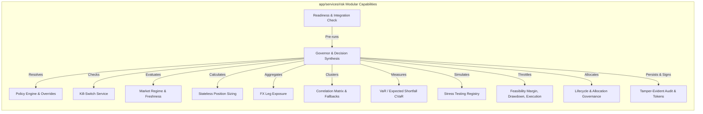

# Risk Governance — Intended Workflows and Scenarios

## 1. Document Purpose
This document reverse-engineers the isolated architecture requirements defined in [05-risk.md](file:///c:/Users/rharu/AppDev/HaruquantAI/docs/dev/phase-implementation-plan/05-risk.md) into a set of cohesive, actor-driven, end-to-end operational workflows and scenarios. It maps how various specialized risk validation engines, policies, storage ports, and boundary controls cooperate to deliver deterministic pre-trade approvals, allocation governance, and safety halts.

---

## 2. Source and Analysis Boundaries
* **Source of Truth**: This analysis is strictly derived from the requirements, file topographies, and architectural contracts defined in [05-risk.md](file:///c:/Users/rharu/AppDev/HaruquantAI/docs/dev/phase-implementation-plan/05-risk.md).
* **Constraints**: No source code from the active repository was inspected or assumed to exist. No domain behavior was invented.
* **Terminology & Assertions**: All explicit requirements are marked with their corresponding `RISK-FR-*`, `RISK-NFR-*`, `RISK-TEST-*`, or `RISK-EX-*` tags. Implied system behaviors necessary to connect isolated requirements are marked:
  > **Inferred workflow connection — requires validation**

---

## 3. System Purpose and Scope
### Primary Purpose
The `app/services/risk` module represents the final deterministic security authority before trading execution or live mutation occurs (`RISK-FR-001`, `RISK-FR-007`, `RISK-FR-010`). It intercepts proposed trade actions and capital allocations to evaluate them against multiple cascading risk rules.

### Scope Boundaries
* **In-Scope**: pre-trade risk review, capital allocation proposals review, strategy admission and mode promotions, market condition (regime) classification, portfolio exposure limits, correlation clusters analysis, Value-at-Risk (VaR) and Expected Shortfall (CVaR) tail risk calculations, macro scenario stress-testing, account/portfolio margin checking, drawdown governor step-down throttles, broker execution constraints checking, scoped kill-switches, tamper-evident hash-chain audit trail logging, and cryptographic approval token issuance.
* **Out-of-Scope**: Strategy signal generation, market data ingestion/cleaning, live broker order routing, broker account database ownership, order placement/modification/cancellation, and database schema migrations (`RISK-FR-009`, `RISK-FR-015`, `RISK-NFR-259`–`RISK-NFR-264`).

### Entry and Exit Points
* **Entry Points**:
  * Agent/API/Workflow calls via the `agentic/tools/risk.py` or `app/services/risk/tools/official.py` wrappers (`RISK-FR-469`).
  * Direct invocation of `RiskGovernor` by Strategy, Portfolio, or Trading services (`RISK-FR-409`).
  * Manual operator halt commands or automated breach events (`RISK-FR-401`).
* **Exit Points**:
  * Output of a standardized `RiskDecisionPackage` enclosing status, approved size, warning codes, config hashes, and cryptographic tokens (`RISK-FR-074`, `RISK-FR-437`).
  * Write of redacted audit records to the `RiskAuditSink` port (`RISK-FR-442`).
  * Emitted Prometheus observability metrics (`RISK-EX-007`).
  * Output of read-only evidence reports to the filesystem (`RISK-EX-005`).

### Persistent Stores
* **Risk State Store**: Stores active/inactive kill-switch statuses and drawdown multipliers (`RISK-FR-441`).
* **Risk Audit Sink**: Appends tamper-evident, sequentially chained audit records (`RISK-FR-442`).
* **Risk Decision Store**: Holds historical trade and allocation decisions idempotently (`RISK-FR-444`).

---

## 4. Actors and Responsibilities
| Actor | Role | Initiates | Information Provided | Outcomes Received | Prohibited Actions |
|---|---|---|---|---|---|
| **Strategy / Execution Service** | System orchestrator requesting review | Pre-trade risk assessment requests | Proposed trade, account equity, position snapshots | `RiskDecisionPackage` with approval token | Mutating execution state without a valid token (`RISK-NFR-267`) |
| **Portfolio Manager / Operator** | Actor proposing capital allocation | Allocation budget proposal reviews | Requested strategy/symbol/currency budgets | Allocation assessment decision package | Bypassing risk caps during optimization sweeps |
| **Strategy Developer** | Developer submitting a new strategy | Strategy admission and lifecycle promotion requests | Strategy backtest, out-of-sample, simulation evidence | Approved/rejected lifecycle transition status | Bypassing pre-activation live readiness gates |
| **Risk Manager / Compliance Approver** | Governing operator overseeing system safety | Policy overrides, resume approvals, audits | Signed override tokens, dual-operator auth approvals | Cleared kill-switches, override allowances | Modifying thresholds above safety limits |
| **AI Agent** | AI controller running read-only workflows | Official read-only tools calls | Query parameters, context indicators | Redacted JSON response envelopes | Mutating broker accounts or executing live orders (`RISK-FR-008`) |
| **External Monitor / Scheduler** | Cron service checking metrics/health | Audit chain checks, drift monitor checks | UTC timestamps, heartbeat pings | Observability warnings, metrics exports | Overriding kill-switch locks |

---

## 5. Capability Map


---

## 6. Workflow Catalogue
| Workflow ID | Workflow Name | Category | Trigger | Outcome |
| :--- | :--- | :--- | :--- | :--- |
| **WF-001** | Pre-Trade Risk Review and Decision Synthesis | Primary Business | Proposed trade signal | Bounded decision package + signed token |
| **WF-002** | Portfolio Capital Allocation Proposal Review | Primary Business | Capital allocation budget change | Adjusted budget allocation package |
| **WF-003** | Strategy Admission and Lifecycle Promotion | Primary Business | Promotion request through lifecycle | Gated promotion transition decision |
| **WF-004** | Pre-Execution Live Readiness Validation | Lifecycle | Deployment or Operator boot sequence | Integration verification report |
| **WF-005** | Risk Kill-Switch Trigger and Emergency Halt | Emergency | Automated breach or manual command | Scoped/Global halt state |
| **WF-006** | Kill-Switch Resume and Dual-Operator Clearance | Administrative | Governed resume request | State restored to active |
| **WF-007** | Bounded Approval Token Revalidation | Security | Immediate pre-mutation broker call | Order mutation permitted or blocked |
| **WF-008** | Audit-Chain Integrity Verification | Monitoring | Scheduled check or system boot | Tamper-detection status report |
| **WF-009** | Pre-Runtime Readiness Dry-Run Compilation | Lifecycle | CI/CD release stage | Dry-run checklist report |
| **WF-010** | Redacted Evidence-Only Risk Report Export | Supporting | Operator report request | Redacted export document |

---

## 7. Detailed End-to-End Workflows

### WF-001 — Pre-Trade Risk Review and Decision Synthesis
#### Purpose and Value
Protects the platform from trade execution that breaches safety bounds by running a proposed trade through 10 specialized cascading engines in a fixed sequence, returning a cryptographically verifiable token for downstream order entry (`RISK-FR-409`–`RISK-FR-438`).

#### Actors
* **Primary**: Strategy / Execution Service
* **Supporting**: None

#### Trigger
A trade signal is generated and requires validation before broker dispatch.

#### Preconditions
* The Risk module is initialized, and dependencies are validated (`WF-004`).
* No active global or strategy-scoped kill-switch exists (`RISK-FR-413`).
* The strategy is in an active lifecycle state (`RISK-FR-414`).

#### Inputs
* `RiskAssessmentRequest` containing the proposed trade, account equity, open positions, pending orders, and market snapshots (`RISK-FR-058`).
* Immutable config profile and resolved policy (`RISK-FR-079`).

#### Main Success Flow
| Step | Responsible component | Action | Input | Validation or decision | State change | Output | Requirement IDs |
| :--- | :--- | :--- | :--- | :--- | :--- | :--- | :--- |
| 1 | `governor` | Validates request schema | `RiskAssessmentRequest` | Rejects if fields NaN, infinity, or missing symbol | None | Validated request | `RISK-FR-410`–`RISK-FR-411` |
| 2 | `policy.resolver` | Resolves effective policy | Request context, config profile | **Decision Point**: Fail-closed if policy missing or config mismatch | None | `EffectiveRiskPolicy` | `RISK-FR-412`, `RISK-FR-093` |
| 3 | `governance.kill_switch` | Verifies active kill-switches | Scope selector | Block if kill-switch active or state unknown | None | Safe switch status | `RISK-FR-413`, `RISK-FR-390` |
| 4 | `governance.lifecycle` | Checks strategy admission | Strategy ID | Block if strategy is read-only or not admitted | None | Admitted status | `RISK-FR-414` |
| 5 | `regime.assessor` | Evaluates market regime | Market snapshot | **Decision Point**: Reject stale quotes, inverted spreads, rollover blackout | None | Regime assessment | `RISK-FR-415`–`RISK-FR-416` |
| 6 | `sizing.calculators` | Computes volatility position size | Volatility indicators, stops distance | Convert pip/tick distance to currency; apply step-down multiplier | None | Volatility-adjusted size | `RISK-FR-417`, `RISK-FR-185` |
| 7 | `exposure.aggregation` | Projects exposure currency legs | Signed positions + proposal | Decompose FX to legs; detect hidden concentration | None | Currency exposure snapshot | `RISK-FR-418`, `RISK-FR-218` |
| 8 | `correlation.engine` | Calculates return correlation | Closed aligned bars | **Decision Point**: Resolve correlation fallback if samples insufficient | None | Correlation snapshot | `RISK-FR-420`, `RISK-FR-241` |
| 9 | `tail_risk.var` / `tail_risk.expected_shortfall` | Calculates parametric VaR & Expected Shortfall | Covariance matrix, weights | Rejects non-finite values | None | VaR/ES snapshots | `RISK-FR-421`–`RISK-FR-422` |
| 10 | `stress.engine` | Evaluates registered stress scenarios | Shocks registry, projected portfolio | Shock price/volatility/margin; estimate losses | None | Stress test summary | `RISK-FR-423` |
| 11 | `feasibility.margin` / `feasibility.drawdown` | Evaluates margin and drawdown | Projected margin, prior drawdown state | **Decision Point**: Block if daily loss hard limit crossed or free margin unsafe | None | Feasibility assessment | `RISK-FR-424`–`RISK-FR-425` |
| 12 | `feasibility.execution_gate` | Checks spread, slippage, frequency | Bid/ask, execution timing | Block if micro-scalping cost-to-sigma exceeded | None | Execution feasibility status | `RISK-FR-426`, `RISK-FR-346` |
| 13 | `limits.engine` | Evaluates ordered checks | All engine metrics | Evaluate `ORDERED_LIMIT_CHECKS` sequence | None | Limits assessment report | `RISK-FR-419`, `RISK-FR-163` |
| 14 | `governor.decision_synthesis` | Synthesizes decision outcome | Limits assessment report | **Decision Point**: Select primary failure or aggregate size reductions | None | synthesized decision | `RISK-FR-427`–`RISK-FR-435` |
| 15 | `audit.events` / `audit.tokens` | Persists decision, writes audit, signs token | Decision, request details | redacts secrets, appends to hash chain, issues token for approved decision | Audit sink write; token signature | `RiskDecisionPackage` | `RISK-FR-436`–`RISK-FR-437`, `RISK-FR-442` |

#### Decision Points
* **Policy Verification (Step 2)**: If policy details are missing or config hashes do not match prior tokens, the workflow switches immediately to **Failure Flow (Block)** (`RISK-FR-093`). Fail-closed.
* **Rollover / News Blackouts (Step 5)**: If the current timestamp falls within broker-midnight rollover blackout boundaries (configured $\pm$ hours) or active news candle blackout, the system issues a reject status (`RISK-FR-118`).
* **Insufficient Correlation Samples (Step 8)**: If the return history has fewer than the required lookback samples, the system applies the conservative fallback matrix if configured. If not, it fails closed (`RISK-FR-241`, `RISK-FR-242`).
* **Sizing Reductions (Step 14)**: If the proposed size is too large but a smaller size satisfies all limits, `decision_synthesis` converts the outcome to `reduce_size` with the approved lot size rather than a flat rejection (`RISK-FR-192`, `RISK-FR-429`).

#### Alternate Flows
* **Alternate Flow A (Needs Manual Approval)**:
  * If a limit check triggers a warning that requires operator override (e.g. allocation increase proposal), the status is set to `needs_approval`. The workflow suspends, generates no approval token, and logs the escalation context (`RISK-FR-433`).

#### Failure and Exception Flows
* **TAMPER_DETECTED (Audit Chain Failure)**:
  * *Trigger*: A verification check reveals a hash mismatch in the audit chain.
  * *Response*: The system immediately triggers the global kill-switch, blocking all subsequent trade reviews (`RISK-FR-396`).
* **Storage Port Unavailable**:
  * *Trigger*: Database or state store is offline in live-sensitive mode.
  * *Response*: Rejects the trade review immediately, fail-closed (`RISK-FR-463`).

#### Recovery Flow
Requires system operator intervention if a kill-switch was triggered. For calculations error (e.g., NaN volatility), the strategy must resubmit inputs once data caches align.

#### Postconditions
* A `RiskDecisionPackage` enclosing the status and cryptographic token is emitted (`RISK-FR-074`).
* Redacted audit event appended to the hash chain (`RISK-FR-449`).
* Observability counts and latencies updated (`RISK-EX-007`).

#### Participating Components
* **Entry Point**: `app/services/risk/tools/official.py`
* **Orchestrator**: `app/services/risk/governor/governor.py`
* **Validators**: `app/services/risk/policy/`, `app/services/risk/regime/`
* **Executors**: `app/services/risk/sizing/`, `app/services/risk/limits/`, `app/services/risk/tail_risk/`, `app/services/risk/stress/`, `app/services/risk/feasibility/`
* **Persistence**: `app/services/risk/storage/`
* **Monitoring**: `app/services/risk/audit/`

---

### WF-002 — Portfolio Capital Allocation Proposal Review
#### Purpose and Value
Governs changes in strategy, symbol, or currency risk budgets to prevent over-allocation of capital and maintain risk parity across the portfolio (`RISK-FR-349`–`RISK-FR-364`).

#### Actors
* **Primary**: Portfolio Manager / Operator
* **Supporting**: None

#### Trigger
A request is submitted to increase or decrease capital allocation for a specific strategy or asset.

#### Preconditions
* The portfolio snapshot is synchronized and validated.

#### Inputs
* `ProposedAllocation` enclosing target, currency, budget, and evidence refs (`RISK-FR-056`).
* Active `EffectiveRiskPolicy`.

#### Main Success Flow
1. `governor` receives the `ProposedAllocation` and validates parameters.
2. `policy` verifies the scope and checks if the increase requires manual approval thresholds (`RISK-FR-358`).
3. `governance.allocation` resolves the target allocation strategy (e.g. equal-risk, volatility parity, or correlation risk parity) (`RISK-FR-351`–`RISK-FR-353`).
4. `exposure.aggregation` compiles the projected concentration across symbol, currency, and cluster limits (`RISK-FR-359`–`RISK-FR-361`).
5. `tail_risk` and `stress` engines run a simulated test of the new portfolio weights, validating VaR/ES and stress loss ceilings (`RISK-FR-362`–`RISK-FR-363`).
6. `feasibility.margin` verifies that the allocation doesn't violate margin limits (`RISK-FR-364`).
7. `governor` synthesizes the `AllocationAssessment`, updates allocation states in storage, writes audit events, and returns the package.

#### Decision Points
* **Precedence Check**: If the proposal increases strategy allocation above the configured threshold without an approved evidence ref, the review fails with `needs_approval` or `reject` (`RISK-FR-357`).

#### Alternate Flows
* **Automatic Reduction**: If the requested allocation breaches cluster limits but a reduced budget is safe, the allocator returns an approved allocation with a scaled-down budget.

#### Failure and Exception Flows
* **Unreconciled State**: If portfolio position weights are inconsistent, the allocation gate rejects the request immediately, fail-closed (`RISK-FR-217`).

#### Recovery Flow
Clear execution blocks by resolving state mismatches in positions data and resubmitting.

#### Postconditions
* Updated allocation records written to persistence ports (`RISK-FR-459`).
* Audit records and allocation metrics generated.

---

### WF-003 — Strategy Admission and Lifecycle Promotion Review
#### Purpose and Value
Prevents unvetted strategy models from executing in live or paper markets without structured backtest and simulation evidence (`RISK-FR-365`–`RISK-FR-378`).

#### Actors
* **Primary**: Strategy Developer / Operator
* **Supporting**: None

#### Trigger
A request is submitted to promote a strategy from `Research` $
ightarrow$ `Simulation` $
ightarrow$ `Paper` $
ightarrow$ `Shadow` $
ightarrow$ `Micro-live` $
ightarrow$ `Full-live`.

#### Inputs
* `StrategyAdmissionRequest` containing evidence packages (`RISK-FR-057`).
* Active `EffectiveRiskPolicy`.

#### Main Success Flow
1. `governance.lifecycle` receives the promotion request and resolves the transition path.
2. The component validates the evidence package (rejects if backtest/out-of-sample data is missing for paper/live) (`RISK-FR-366`–`RISK-FR-370`).
3. For live transitions, the engine checks live-readiness constraints: audit persistence capability, kill-switch operations, and position reconciliation capability (`RISK-FR-373`–`RISK-FR-375`).
4. `governance.lifecycle` updates the strategy state in the registry and writes a promotion audit log.

#### Decision Points
* **Approval Requirements**: Transitioning to `full_live` requires explicit, documented operator dual-approval. If missing, the gate blocks transition (`RISK-FR-198`).

#### Failure and Exception Flows
* **Missing Audit Persistence**: Rejects live readiness if the audit log sink reports issues (`RISK-FR-373`).

#### Postconditions
* Strategy status updated in persistent storage.
* Audit and compliance events recorded.

---

### WF-004 — Pre-Execution Live Readiness Validation
#### Purpose and Value
Proves the system is integration-ready and has correct, side-effect-free dependencies before any live execution is allowed to start (`RISK-FR-011`–`RISK-FR-020`).

#### Actors
* **Primary**: Operator / System Boot Loader
* **Supporting**: None

#### Trigger
The system initiates its boot sequence or transitions to live-active mode.

#### Inputs
* Environment configuration files, profiles registration.

#### Main Success Flow
1. `readiness` validator executes at boot.
2. Checks all required file dependencies, verifying imports are side-effect safe (`RISK-FR-011`).
3. Verifies that market, account, and portfolio snapshots use canonical contracts (`RISK-FR-012`–`RISK-FR-013`).
4. Confirms that no direct broker SDK dependencies exist inside Risk (`RISK-FR-014`).
5. Checks clock synchronization and verifies freshness offsets (`RISK-FR-017`).
6. Verifies that test fixtures use only synthetic data (`RISK-FR-032`).
7. Outputs a `ReadinessAssessment` report. If successful, enables pre-trade review path.

#### Failure and Exception Flows
* **Drift / Sync Outage**: If the server clock drift is unsafe, boot halts, fail-closed (`RISK-FR-017`).

#### Postconditions
* Readiness status persisted in memory/logs.

---

### WF-005 — Risk Kill-Switch Trigger and Emergency Halt
#### Purpose and Value
Enforces immediate termination of trade approvals during critical breaches or manual interventions, protecting the system from runaway losses (`RISK-FR-379`–`RISK-FR-408`).

#### Actors
* **Primary**: Automated Monitor / Operator
* **Supporting**: None

#### Trigger
A hard daily loss limit is breached, an audit-chain failure is detected, an extreme spread event occurs, or an operator triggers a manual halt.

#### Inputs
* Trigger event type and scope (global, strategy, symbol, or currency).

#### Main Success Flow
1. `governance.kill_switch` receives the trigger event (`RISK-FR-387`).
2. Identifies the target scope and transitions the state in the `RiskStateStore` to `triggered` / `halted` (`RISK-FR-402`).
3. Signals the governor to reject all subsequent trade reviews in that scope immediately (`RISK-FR-391`).
4. Emits a kill-switch metric and audit log (`RISK-FR-403`–`RISK-FR-404`).
5. Dispatches alerts to operator channels.

#### Postconditions
* Scoped kill-switch state persisted in the store (`RISK-FR-402`).
* Subsequent trade validations in that scope fail closed.

---

### WF-006 — Kill-Switch Resume and Dual-Operator Clearance
#### Purpose and Value
Safely restores system validation operations post-halt, ensuring config integrity and avoiding unapproved state updates (`RISK-FR-388`–`RISK-FR-389`).

#### Actors
* **Primary**: Operator / Compliance Manager
* **Supporting**: None

#### Trigger
A manual resume request is submitted after resolving the underlying issue that triggered the kill-switch.

#### Inputs
* `KillSwitchResumeRequest` containing operator approval tokens and signatures (`RISK-FR-441`).

#### Main Success Flow
1. `governance.kill_switch` receives the request.
2. Checks that dual-operator approval tokens are present and cryptographically signed (`RISK-FR-389`).
3. Verifies that the current config hash matches the approval context (`RISK-FR-099`).
4. Updates the state in `RiskStateStore` to `inactive`.
5. Emits a resume audit log and metrics.

#### Postconditions
* Scoped kill-switch status set to inactive.
* Trade reviews resume.

---

### WF-007 — Bounded Approval Token Revalidation
#### Purpose and Value
Enforces final verification of the cryptographic token immediately before broker order submission by the Trading runtime, preventing execution of expired or tampered clearances (`RISK-FR-453`–`RISK-FR-458`).

#### Actors
* **Primary**: Strategy / Execution Service
* **Supporting**: None

#### Trigger
The execution engine is about to submit an order to the MT5 adapter.

#### Inputs
* `RiskDecisionToken` and current environment context (`RISK-FR-073`).

#### Main Success Flow
1. The execution engine transmits the token to the verifier.
2. Verifies the cryptographic signature (`RISK-FR-453`).
3. Confirms the token has not expired and matches the current strategy/symbol/account scope (`RISK-FR-454`, `RISK-FR-456`).
4. Validates that the active policy and configuration hashes match the token (`RISK-FR-457`–`RISK-FR-458`).
5. Confirms that no kill-switch has been triggered since the token was issued.
6. Returns approval. Order proceeds to broker dispatch.

#### Failure and Exception Flows
* **Token Invalid / Stale**: Execution halts immediately, order rejected, compliance alert dispatched (`RISK-FR-235`).

#### Postconditions
* Verifier result logged.

---

### WF-008 — Audit-Chain Integrity Verification
#### Purpose and Value
Ensures the security and immutability of historical risk decisions by verifying that no record in the audit chain has been modified (`RISK-FR-448`–`RISK-FR-451`).

#### Actors
* **Primary**: Compliance Manager / Automated Scheduler
* **Supporting**: None

#### Trigger
Scheduled hourly verification check or system boot loader check.

#### Inputs
* Complete sequence of stored `RiskAuditEvent` records.

#### Main Success Flow
1. `audit.events` loads all historical events.
2. Validates the genesis block hash (`RISK-FR-448`).
3. Iteratively recalculates the hash chain, comparing it to the stored sequence (`RISK-FR-449`–`RISK-FR-450`).
4. Emits a verification success log.

#### Failure and Exception Flows
* **Verification Mismatch (Tampering)**:
  * *Trigger*: A computed hash doesn't match the record's sequence hash.
  * *Response*: Triggers the global kill-switch immediately, failing all live operations closed (`RISK-FR-451`).

#### Postconditions
* Verification check logged in metrics.

---

### WF-009 — Pre-Runtime Readiness Dry-Run Compilation
#### Purpose and Value
Allows the deployment pipeline to confirm readiness and verify dependencies before release promotion (`RISK-FR-020`, `RISK-FR-029`).

#### Actors
* **Primary**: CI/CD Runner / Operator
* **Supporting**: None

#### Trigger
A package release trigger is initiated.

#### Main Success Flow
1. `readiness` builds the dry-run report.
2. Inspects files to read, files to change, commands to run, and rollback paths (`RISK-FR-020`).
3. Confirms that synthetic fixtures are defined and random seeds are set (`RISK-FR-034`).
4. Outputs the `DryRunReport` artifact to the deployment repository.

#### Postconditions
* Release succeeds or is blocked based on checklist compliance.

---

### WF-010 — Redacted Evidence-Only Risk Report Export
#### Purpose and Value
Exports detailed risk performance reports for compliance and auditing without performing any calculation updates or exposing secrets (`RISK-EX-001`–`RISK-EX-010`).

#### Actors
* **Primary**: Operator / Viewer / AI Agent
* **Supporting**: None

#### Trigger
A report export command is executed.

#### Inputs
* Stored decisions history, snapshots.
* Target export file path.

#### Main Success Flow
1. `reports.builder` loads stored decisions.
2. Confirms that no calculations are recomputed (`RISK-EX-003`).
3. Redacts passwords, account credentials, and secrets (`RISK-EX-006`).
4. Generates a JSON-safe report payload (`RISK-EX-004`).
5. `reports.exporter` checks file-write authorization and saves the file (`RISK-EX-005`).

#### Postconditions
* File written.

---

## 8. Scenario Catalogue

| Scenario ID | Scenario | Given | When | Then | Expected State | Requirement IDs |
| :--- | :--- | :--- | :--- | :--- | :--- | :--- |
| **WF-001-SC-001** | Happy Path pre-Trade Run | Valid request, no kill-switches, active strategy, safe market | Trade review requested | Decisions status set to `approve`, token issued, audit written | Healthy; active | `RISK-FR-428`, `RISK-FR-436` |
| **WF-001-SC-002** | Active Kill-Switch | Strategy kill-switch is active | Trade review requested | Decision status set to `block`, request rejected, audit written | Blocked | `RISK-FR-391`, `RISK-FR-431` |
| **WF-001-SC-003** | Stale quote evidence | Quote timestamp drift > policy limit | Trade review requested | Decision status set to `block` due to stale evidence | Blocked | `RISK-FR-123`, `RISK-FR-431` |
| **WF-001-SC-004** | Inverted spread quote | Bid price > Ask price in quote snapshot | Trade review requested | Validator rejects request immediately | Fail-closed | `RISK-FR-124` |
| **WF-001-SC-005** | Rollover Blackout | Current time is broker midnight $\pm$ 2 hours | Trade review requested | Decisions status set to `reject` | Rejected | `RISK-FR-117`–`RISK-FR-119` |
| **WF-001-SC-006** | News Blackout | Major news event scheduled in news calendar | Trade review requested | Decisions status set to `reject` | Rejected | `RISK-FR-120` |
| **WF-001-SC-007** | Drawdown Caution Step-down | Portfolio drawdown is in Caution state | Trade review requested | Sizing calculator reduces size, returns `reduce_size` status | Reduced size | `RISK-FR-185`, `RISK-FR-429` |
| **WF-001-SC-008** | Drawdown Hard Breach | Total drawdown > hard limit (9.0%) | Trade review requested | Decision status set to `reject` or `block`; kill-switch triggers | Halted | `RISK-FR-395`, `RISK-FR-430` |
| **WF-001-SC-009** | Correlation cluster limit | Proposal pushes cluster exposure > 0.75% | Trade review requested | Size reduced to fit limits, status `reduce_size` | Reduced size | `RISK-FR-187`, `RISK-FR-429` |
| **WF-001-SC-010** | Missing FX conversion rate | Conversion rate for EUR/JPY is missing | Trade review requested | Calculator rejects request due to missing conversion data | Fail-closed | `RISK-FR-217` |
| **WF-001-SC-011** | Non-finite VaR output | Covariance calculation returns infinity | Trade review requested | System catches non-finite output, rejects trade | Fail-closed | `RISK-FR-277` |
| **WF-001-SC-012** | Stress Test Failure | Trade passes normal VaR but stress loss exceeds limit | Trade review requested | Decision status set to `reject` | Rejected | `RISK-FR-309`, `RISK-FR-430` |
| **WF-001-SC-013** | Margin insufficiency | Free margin after pending order reservations is negative | Trade review requested | Decision status set to `reject` | Rejected | `RISK-FR-325`, `RISK-FR-430` |
| **WF-001-SC-014** | Micro-scalping cost filter | Spread exceeds 0.25 $	imes$ volatility (sigma) | Trade review requested | Decision status set to `reject` | Rejected | `RISK-FR-341` |
| **WF-001-SC-015** | Idempotent duplicate check | Same signal ID submitted twice with same details | Trade review requested | Store returns original decision without recalculating | Unchanged | `RISK-FR-460` |
| **WF-001-SC-016** | Idempotency conflict | Same signal ID submitted with different parameters | Trade review requested | Request rejected with conflict error code | Unchanged | `RISK-FR-461` |
| **WF-002-SC-001** | Allocation breach | Allocation proposal breaches currency limits | Allocation review requested | Proposal budget is reduced to fit currency caps | Reduced budget | `RISK-FR-360` |
| **WF-003-SC-001** | Live readiness checks pass | Strategy has backtest and paper checks, audit sink active | Live readiness review requested | Lifecycle assessment reports ready, promotion allowed | Promoted | `RISK-FR-372` |
| **WF-003-SC-002** | Live readiness checks fail | Audit sink is inactive | Live readiness review requested | Assessment rejected, promotion blocked | Blocked | `RISK-FR-373` |
| **WF-005-SC-001** | Audit chain mismatch | Audit-chain verification fails | Scheduled check runs | Global kill-switch is triggered immediately | Halted | `RISK-FR-396` |
| **WF-006-SC-001** | Resume without dual approval | Resume requested with only one signature | Resume requested | Rejects request, kill-switch remains locked | Halted | `RISK-FR-389` |
| **WF-007-SC-001** | Token config mismatch | Token config hash != active system config hash | Token submitted prior to MT5 order | Verifier rejects token; execution blocks | Halted | `RISK-FR-458` |
| **WF-008-SC-001** | Audit chain tamper | Stored audit record payload has been changed | Integrity check runs | Verification fails; global kill-switch is triggered | Halted | `RISK-FR-451` |
| **WF-009-SC-001** | Unsafe fixture check | Dry-run discovers real account credentials in fixtures | Pre-runtime checks runs | Boot fails; release blocked | Blocked | `RISK-FR-033` |

---

## 9. Workflow Relationship Map
| Source Workflow | Relationship | Target Workflow | Trigger or Condition |
| :--- | :--- | :--- | :--- |
| **WF-001** (Pre-Trade Review) | Invokes (Child) | **WF-005** (Kill-Switch Halt) | When a limit breach (drawdown, margin) is detected |
| **WF-001** (Pre-Trade Review) | Parent | **WF-007** (Token Revalidation) | Token generated by WF-001 is evaluated by WF-007 before MT5 dispatch |
| **WF-002** (Allocation Review) | Invokes (Child) | **WF-005** (Kill-Switch Halt) | When allocation proposal triggers margin emergency |
| **WF-003** (Promotion Review) | Invokes (Child) | **WF-004** (Readiness Check) | To verify integration readiness before enabling live status |
| **WF-005** (Kill-Switch Halt) | Recovery | **WF-006** (Kill-Switch Resume) | To restore normal operations post-halt |
| **WF-008** (Audit Verification) | Invokes (Child) | **WF-005** (Kill-Switch Halt) | When a hash-chain discrepancy (tampering) is detected |
| **WF-009** (Dry-Run compilation) | Parent | **WF-004** (Readiness Check) | Part of the deployment validation process |

---

## 10. System Lifecycle and State Transitions

### 1. Drawdown State Lifecycle (`feasibility.drawdown`)
Tracks the risk throttle status based on realized daily and total losses (`RISK-FR-334`–`RISK-FR-338`).
* **States**: `NORMAL`, `CAUTION`, `DEFENSIVE`, `RECOVERY-ONLY`, `HALTED`
* **Transitions**:
  * `NORMAL` $
ightarrow$ `CAUTION`: Triggered when losses reach soft daily/total thresholds.
  * `CAUTION` $
ightarrow$ `DEFENSIVE`: Triggered when losses continue to increase.
  * `DEFENSIVE` $
ightarrow$ `RECOVERY-ONLY`: Triggered when losses stabilize and recovery targets are set.
  * `RECOVERY-ONLY` $
ightarrow$ `NORMAL`: Triggered when recovery benchmarks are fully met.
  * `DEFENSIVE` / `RECOVERY-ONLY` $
ightarrow$ `HALTED`: Triggered when daily/total hard loss ceilings are crossed.

### 2. Kill-Switch State Lifecycle (`governance.kill_switch`)
Controls the fail-closed clearance gate (`RISK-FR-385`, `RISK-FR-388`).
* **States**: `INACTIVE`, `ACTIVE`, `TRIGGERED`, `PENDING-RESUME`, `LOCKED`
* **Transitions**:
  * `INACTIVE` $
ightarrow$ `TRIGGERED`: Automated trigger on daily loss breach or audit-chain failure.
  * `TRIGGERED` $
ightarrow$ `ACTIVE`: Transitioned once the halt is confirmed.
  * `ACTIVE` $
ightarrow$ `PENDING-RESUME`: Triggered when a resume request is submitted.
  * `PENDING-RESUME` $
ightarrow$ `INACTIVE`: Triggered when dual-operator approvals are validated.
  * `PENDING-RESUME` $
ightarrow$ `LOCKED`: Triggered when validation fails (hash mismatch, token mismatch).

### 3. Strategy Lifecycle State Lifecycle (`governance.lifecycle`)
Governs promotion limits from research to production (`RISK-FR-192`–`RISK-FR-196`).
* **States**: `RESEARCH`, `SIMULATION`, `PAPER`, `SHADOW`, `MICRO-LIVE`, `FULL-LIVE`

---

## 11. Cross-Module Interaction Matrix
How different components interact during execution.

```text
  [Strategy / UI]
         |
         v ( proposed trade / allocation )
  [Official Risk Tool] 
         |
         v ( RiskAssessmentRequest )
  [RiskGovernor] ( Orchestrates )
   |--> [Policy Engine] ( Precedence / overrides )
   |--> [Regime Assessor] ( Market status / Blackouts )
   |--> [Sizing Engine] ( Volatility adjustments )
   |--> [Exposure Engine] ( FX legs decomposition )
   |--> [Correlation Engine] ( return clustering )
   |--> [Tail Risk Engine] ( VaR & Expected Shortfall )
   |--> [Stress Engine] ( Declarative shocks )
   |--> [Feasibility Engine] ( Margin / Drawdown step-down )
   |--> [Limits Engine] ( ORDERED_LIMIT_CHECKS )
   |--> [Decision Synthesis] ( Approve / Reduce / Reject )
         |
         +--> [Audit Sink] ( Append to hash chain )
         +--> [Token Signer] ( Sign RiskApprovalToken )
         |
         v ( RiskDecisionPackage )
  [Trading Runtime] 
         |
         v ( Validate token + kill-switch check )
  [Broker Adapter] ( Execution )
```

---

## 12. Requirements-to-Workflow Traceability Matrix
| Requirement ID | Requirement Summary | Workflow IDs | Scenario IDs | Workflow Step Numbers | Coverage Status |
| :--- | :--- | :--- | :--- | :--- | :--- |
| **RISK-FR-001** | Phase 5 shall treat Risk Governance as a layered control system, not a single formula or indicator. | WF-004, WF-009 | WF-004-SC-001, WF-009-SC-001 | All steps | Fully represented |
| **RISK-FR-002** | Phase 5 shall make VaR one engine inside the RiskGovernor, not the whole risk strategy. | WF-004, WF-009 | WF-004-SC-001, WF-009-SC-001 | All steps | Fully represented |
| **RISK-FR-003** | Phase 5 shall use Expected Shortfall/CVaR and stress loss as stronger tail-risk approval controls than parametric VaR alone. | WF-004, WF-009 | WF-004-SC-001, WF-009-SC-001 | All steps | Fully represented |
| **RISK-FR-004** | Phase 5 shall decompose Forex positions into currency legs before calculating exposure and concentration. | WF-004, WF-009 | WF-004-SC-001, WF-009-SC-001 | All steps | Fully represented |
| **RISK-FR-005** | Phase 5 shall treat correlated symbol trades as clustered portfolio risk rather than independent trades. | WF-004, WF-009 | WF-004-SC-001, WF-009-SC-001 | All steps | Fully represented |
| **RISK-FR-006** | Phase 5 shall fail closed when required evidence is stale, missing, inconsistent, unreconciled, or not trusted. | WF-004, WF-009 | WF-004-SC-001, WF-009-SC-001 | All steps | Fully represented |
| **RISK-FR-007** | Phase 5 shall output deterministic decisions that can be replayed, audited, and explained without LLM reasoning. | WF-004, WF-009 | WF-004-SC-001, WF-009-SC-001 | All steps | Fully represented |
| **RISK-FR-008** | Phase 5 shall allow LLM agents to summarize or explain risk decisions but never make final safety-critical decisions. | WF-004, WF-009 | WF-004-SC-001, WF-009-SC-001 | All steps | Fully represented |
| **RISK-FR-009** | Phase 5 shall preserve module ownership boundaries and shall not place, close, modify, or cancel broker orders. | WF-004, WF-009 | WF-004-SC-001, WF-009-SC-001 | All steps | Fully represented |
| **RISK-FR-010** | Phase 5 shall be stricter than broker constraints and stricter than external prop-firm limits. | WF-004, WF-009 | WF-004-SC-001, WF-009-SC-001 | All steps | Fully represented |
| **RISK-FR-011** | Verify all required dependency files are implemented, importable, side-effect safe, and covered by tests before Phase 5 implementation begins. | WF-004, WF-009 | WF-004-SC-001, WF-009-SC-001 | All steps | Fully represented |
| **RISK-FR-012** | Verify Risk consumes canonical Phase 1.5 contracts instead of redefining duplicate cross-domain models. | WF-004, WF-009 | WF-004-SC-001, WF-009-SC-001 | All steps | Fully represented |
| **RISK-FR-013** | Verify Risk receives market, account, portfolio, pending-order, and execution-state evidence through explicit ports or canonical snapshots. | WF-004, WF-009 | WF-004-SC-001, WF-009-SC-001 | All steps | Fully represented |
| **RISK-FR-014** | Verify Risk has no direct broker SDK dependency. | WF-004, WF-009 | WF-004-SC-001, WF-009-SC-001 | All steps | Fully represented |
| **RISK-FR-015** | Verify Risk has no UI, FastAPI route, LLM-provider, notification-provider, or database-migration ownership. | WF-004, WF-009 | WF-004-SC-001, WF-009-SC-001 | All steps | Fully represented |
| **RISK-FR-016** | Verify Risk can run in offline test, simulation, paper, shadow, read-only live, micro-live, and full-live modes using profile-specific policies. | WF-004, WF-009 | WF-004-SC-001, WF-009-SC-001 | All steps | Fully represented |
| **RISK-FR-017** | Verify every live-sensitive Risk workflow has access to UTC timestamps, broker-server timestamps where needed, and freshness metadata. | WF-004, WF-009 | WF-004-SC-001, WF-009-SC-001 | All steps | Fully represented |
| **RISK-FR-018** | Verify every Risk decision can propagate request ID, workflow ID, correlation ID, strategy ID, and signal ID. | WF-004, WF-009 | WF-004-SC-001, WF-009-SC-001 | All steps | Fully represented |
| **RISK-FR-019** | Read the v1 Phase 5 baseline, Risk v8 technical specification, Core Contracts phase, and current Strategy/Data/Portfolio/Trading interfaces before editing. | WF-004, WF-009 | WF-004-SC-001, WF-009-SC-001 | All steps | Fully represented |
| **RISK-FR-020** | Create a Phase 5 dry-run report listing files to read, files to change, commands to run, scope boundaries, blockers, and rollback path. | WF-004, WF-009 | WF-004-SC-001, WF-009-SC-001 | All steps | Fully represented |
| **RISK-FR-021** | Confirm Phase 5 does not begin until Phase 1.5 canonical contracts are available or explicitly stubbed by approved sprint scope. | WF-004, WF-009 | WF-004-SC-001, WF-009-SC-001 | All steps | Fully represented |
| **RISK-FR-022** | Confirm every live-sensitive dependency has a fail-closed fallback path. | WF-004, WF-009 | WF-004-SC-001, WF-009-SC-001 | All steps | Fully represented |
| **RISK-FR-023** | Confirm every risk input is either canonical, injected, or explicitly rejected. | WF-004, WF-009 | WF-004-SC-001, WF-009-SC-001 | All steps | Fully represented |
| **RISK-FR-024** | Confirm no direct broker SDK imports are planned inside Risk. | WF-004, WF-009 | WF-004-SC-001, WF-009-SC-001 | All steps | Fully represented |
| **RISK-FR-025** | Confirm no API route, UI, or Conversation code will own risk algorithms. | WF-004, WF-009 | WF-004-SC-001, WF-009-SC-001 | All steps | Fully represented |
| **RISK-FR-026** | Confirm no strategy code can approve its own signals. | WF-004, WF-009 | WF-004-SC-001, WF-009-SC-001 | All steps | Fully represented |
| **RISK-FR-027** | Confirm no optimization result can allocate capital without Risk review. | WF-004, WF-009 | WF-004-SC-001, WF-009-SC-001 | All steps | Fully represented |
| **RISK-FR-028** | Confirm no live-mode promotion can proceed without Risk lifecycle approval. | WF-004, WF-009 | WF-004-SC-001, WF-009-SC-001 | All steps | Fully represented |
| **RISK-FR-029** | Define the Phase 5 implementation sequence before creating production files. | WF-004, WF-009 | WF-004-SC-001, WF-009-SC-001 | All steps | Fully represented |
| **RISK-FR-030** | Create a local issue map or checklist linking each sprint pack to expected files and tests. | WF-004, WF-009 | WF-004-SC-001, WF-009-SC-001 | All steps | Fully represented |
| **RISK-FR-031** | Define rollback points after contracts, config, calculators, governor, audit, and tools. | WF-004, WF-009 | WF-004-SC-001, WF-009-SC-001 | All steps | Fully represented |
| **RISK-FR-032** | Confirm all test fixtures use synthetic account and market data only. | WF-004, WF-009 | WF-004-SC-001, WF-009-SC-001 | All steps | Fully represented |
| **RISK-FR-033** | Confirm no fixture contains real account numbers, broker credentials, tokens, or private payloads. | WF-004, WF-009 | WF-004-SC-001, WF-009-SC-001 | All steps | Fully represented |
| **RISK-FR-034** | Define deterministic random seeds for any stochastic stress or simulation tests. | WF-004, WF-009 | WF-004-SC-001, WF-009-SC-001 | All steps | Fully represented |
| **RISK-FR-035** | Define benchmark dataset shapes for correlation, VaR/ES, stress, and governor latency tests. | WF-004, WF-009 | WF-004-SC-001, WF-009-SC-001 | All steps | Fully represented |
| **RISK-FR-036** | Define redaction expectations for logs, audit events, reports, and standard envelopes. | WF-004, WF-009 | WF-004-SC-001, WF-009-SC-001 | All steps | Fully represented |
| **RISK-FR-037** | Define mode matrix for offline, simulation, paper, shadow, read-only live, micro-live, and full-live. | WF-004, WF-009 | WF-004-SC-001, WF-009-SC-001 | All steps | Fully represented |
| **RISK-FR-038** | Define which workflows require approval tokens and which are advisory only. | WF-004, WF-009 | WF-004-SC-001, WF-009-SC-001 | All steps | Fully represented |
| **RISK-FR-039** | Define which workflows write audit records and which remain pure calculations. | WF-004, WF-009 | WF-004-SC-001, WF-009-SC-001 | All steps | Fully represented |
| **RISK-FR-040** | Define which functions are support helpers and which are official AI-callable tools. | WF-004, WF-009 | WF-004-SC-001, WF-009-SC-001 | All steps | Fully represented |
| **RISK-FR-041** | Define side-effect flags for every official risk tool before implementation. | WF-004, WF-009 | WF-004-SC-001, WF-009-SC-001 | All steps | Fully represented |
| **RISK-FR-042** | Define minimum required evidence for trade review, allocation review, strategy admission, and live readiness. | WF-004, WF-009 | WF-004-SC-001, WF-009-SC-001 | All steps | Fully represented |
| **RISK-FR-043** | Define initial performance targets for pre-trade review, correlation matrix, VaR/ES, and stress scenarios. | WF-004, WF-009 | WF-004-SC-001, WF-009-SC-001 | All steps | Fully represented |
| **RISK-FR-044** | Define the initial conservative risk policy profile before implementation. | WF-004, WF-009 | WF-004-SC-001, WF-009-SC-001 | All steps | Fully represented |
| **RISK-FR-045** | Define the owner-approved threshold-change process for risk config profiles. | WF-004, WF-009 | WF-004-SC-001, WF-009-SC-001 | All steps | Fully represented |
| **RISK-FR-046** | Define failure behavior when audit storage is unavailable in non-live modes. | WF-004, WF-009 | WF-004-SC-001, WF-009-SC-001 | All steps | Fully represented |
| **RISK-FR-047** | Define failure behavior when audit storage is unavailable in live-sensitive modes. | WF-004, WF-009 | WF-004-SC-001, WF-009-SC-001 | All steps | Fully represented |
| **RISK-FR-048** | Record Phase 5 readiness decisions in the implementation report before coding. | WF-004, WF-009 | WF-004-SC-001, WF-009-SC-001 | All steps | Fully represented |
| **RISK-FR-050** | Define all risk enums with deterministic string values. | WF-001, WF-002, WF-003 | WF-001-SC-001, WF-002-SC-001 | Input/Output validation | Fully represented |
| **RISK-FR-051** | Define `RiskDecisionStatus` and cover all allowed outcomes. | WF-001, WF-002, WF-003 | WF-001-SC-001, WF-002-SC-001 | Input/Output validation | Fully represented |
| **RISK-FR-052** | Define `RiskReasonCode` catalog with stable names and descriptions. | WF-001, WF-002, WF-003 | WF-001-SC-001, WF-002-SC-001 | Input/Output validation | Fully represented |
| **RISK-FR-053** | Define `RiskSeverity` catalog with stable ordering. | WF-001, WF-002, WF-003 | WF-001-SC-001, WF-002-SC-001 | Input/Output validation | Fully represented |
| **RISK-FR-049** | Create risk models with file-level purpose, exports, and side-effect docstring. | WF-001, WF-002, WF-003 | WF-001-SC-001, WF-002-SC-001 | Input/Output validation | Fully represented |
| **RISK-FR-054** | Define `RiskEvidenceRef` for source-traceable evidence references. | WF-001, WF-002, WF-003 | WF-001-SC-001, WF-002-SC-001 | Input/Output validation | Fully represented |
| **RISK-FR-055** | Define `ProposedTrade` with validation for symbol, side, size, order type, stops, targets, timestamps, and strategy metadata. | WF-001, WF-002, WF-003 | WF-001-SC-001, WF-002-SC-001 | Input/Output validation | Fully represented |
| **RISK-FR-056** | Define `ProposedAllocation` with strategy, symbol, currency, requested budget, and evidence metadata. | WF-001, WF-002, WF-003 | WF-001-SC-001, WF-002-SC-001 | Input/Output validation | Fully represented |
| **RISK-FR-057** | Define `StrategyAdmissionRequest` with required research, simulation, and risk evidence fields. | WF-001, WF-002, WF-003 | WF-001-SC-001, WF-002-SC-001 | Input/Output validation | Fully represented |
| **RISK-FR-058** | Define `RiskAssessmentRequest` with mode, policy profile, account state, market state, portfolio state, pending orders, open positions, and freshness metadata. | WF-001, WF-002, WF-003 | WF-001-SC-001, WF-002-SC-001 | Input/Output validation | Fully represented |
| **RISK-FR-059** | Define `AccountRiskSnapshot` with equity, balance, free margin, margin used, leverage, base currency, and timestamp. | WF-001, WF-002, WF-003 | WF-001-SC-001, WF-002-SC-001 | Input/Output validation | Fully represented |
| **RISK-FR-060** | Define `MarketRiskSnapshot` with spreads, volatility, session, rollover, news, symbol metadata, and freshness fields. | WF-001, WF-002, WF-003 | WF-001-SC-001, WF-002-SC-001 | Input/Output validation | Fully represented |
| **RISK-FR-061** | Define `PortfolioRiskSnapshot` with open positions, pending orders, in-flight orders, exposure, VaR/ES, stress, and drawdown fields. | WF-001, WF-002, WF-003 | WF-001-SC-001, WF-002-SC-001 | Input/Output validation | Fully represented |
| **RISK-FR-062** | Define `PositionRiskSnapshot` with signed size, entry, current price, PnL, risk, margin, strategy ID, and timestamps. | WF-001, WF-002, WF-003 | WF-001-SC-001, WF-002-SC-001 | Input/Output validation | Fully represented |
| **RISK-FR-063** | Define `PendingOrderRiskSnapshot` with pending-order exposure policy fields. | WF-001, WF-002, WF-003 | WF-001-SC-001, WF-002-SC-001 | Input/Output validation | Fully represented |
| **RISK-FR-064** | Define `CurrencyLegExposure` with signed base and quote currency amounts. | WF-001, WF-002, WF-003 | WF-001-SC-001, WF-002-SC-001 | Input/Output validation | Fully represented |
| **RISK-FR-065** | Define `CurrencyExposure` with gross, net, and account-currency equivalent exposure. | WF-001, WF-002, WF-003 | WF-001-SC-001, WF-002-SC-001 | Input/Output validation | Fully represented |
| **RISK-FR-066** | Define `CorrelationSnapshot` with matrix, lookback, timeframe, method, sample count, and fallback status. | WF-001, WF-002, WF-003 | WF-001-SC-001, WF-002-SC-001 | Input/Output validation | Fully represented |
| **RISK-FR-067** | Define `VaRSnapshot` with method, confidence, portfolio volatility, exposure, result, and assumptions. | WF-001, WF-002, WF-003 | WF-001-SC-001, WF-002-SC-001 | Input/Output validation | Fully represented |
| **RISK-FR-068** | Define `ExpectedShortfallSnapshot` with confidence, threshold loss, average tail loss, sample count, and method. | WF-001, WF-002, WF-003 | WF-001-SC-001, WF-002-SC-001 | Input/Output validation | Fully represented |
| **RISK-FR-069** | Define `StressScenarioResult` with scenario ID, shock assumptions, estimated loss, pass/fail status, and reason codes. | WF-001, WF-002, WF-003 | WF-001-SC-001, WF-002-SC-001 | Input/Output validation | Fully represented |
| **RISK-FR-070** | Define `MarginRiskSnapshot` with projected margin, free margin, margin usage, leverage, and broker constraints. | WF-001, WF-002, WF-003 | WF-001-SC-001, WF-002-SC-001 | Input/Output validation | Fully represented |
| **RISK-FR-071** | Define `DrawdownState` with current state, soft/hard limits, step-down multiplier, and persistence metadata. | WF-001, WF-002, WF-003 | WF-001-SC-001, WF-002-SC-001 | Input/Output validation | Fully represented |
| **RISK-FR-072** | Define `ExecutionRiskSnapshot` with spread, slippage, stop-level, freeze-level, lot-step, and marketability checks. | WF-001, WF-002, WF-003 | WF-001-SC-001, WF-002-SC-001 | Input/Output validation | Fully represented |
| **RISK-FR-073** | Define `RiskDecisionToken` with scope, expiry, policy hash, config hash, signature metadata, and revocation fields. | WF-001, WF-002, WF-003 | WF-001-SC-001, WF-002-SC-001 | Input/Output validation | Fully represented |
| **RISK-FR-074** | Define `RiskDecisionPackage` as the single canonical output from Risk reviews. | WF-001, WF-002, WF-003 | WF-001-SC-001, WF-002-SC-001 | Input/Output validation | Fully represented |
| **RISK-FR-075** | Add canonical serialization helpers for all risk models. | WF-001, WF-002 | WF-001-SC-001 | Step 1, Step 15 | Fully represented |
| **RISK-FR-076** | Add validation tests for all model success paths. | WF-001, WF-002 | WF-001-SC-001 | Step 1, Step 15 | Fully represented |
| **RISK-FR-077** | Add validation tests for invalid financial values and missing required fields. | WF-001, WF-002 | WF-001-SC-001 | Step 1, Step 15 | Fully represented |
| **RISK-FR-078** | Add JSON round-trip and canonicalization tests for every model crossing public boundaries. | WF-001, WF-002 | WF-001-SC-001 | Step 1, Step 15 | Fully represented |
| **RISK-FR-079** | Create risk config profiles with side-effect-free imports. | WF-001, WF-004 | WF-001-SC-002, WF-004-SC-001 | Step 2 | Fully represented |
| **RISK-FR-080** | Create default.json with safe simulation defaults. | WF-001, WF-004 | WF-001-SC-002, WF-004-SC-001 | Step 2 | Fully represented |
| **RISK-FR-081** | Create `prop_firm_default.json` with conservative prop-firm controls. | WF-001, WF-004 | WF-001-SC-002, WF-004-SC-001 | Step 2 | Fully represented |
| **RISK-FR-082** | Create `paper.json` with paper-trading validation controls. | WF-001, WF-004 | WF-001-SC-002, WF-004-SC-001 | Step 2 | Fully represented |
| **RISK-FR-083** | Create `live_conservative.json` with full fail-closed live controls. | WF-001, WF-004 | WF-001-SC-002, WF-004-SC-001 | Step 2 | Fully represented |
| **RISK-FR-084** | Define strict schema for risk config profiles. | WF-001, WF-004 | WF-001-SC-002, WF-004-SC-001 | Step 2 | Fully represented |
| **RISK-FR-085** | Reject unknown config keys by default. | WF-001, WF-004 | WF-001-SC-002, WF-004-SC-001 | Step 2 | Fully represented |
| **RISK-FR-086** | Reject unsafe threshold values above configured maximums. | WF-001, WF-004 | WF-001-SC-002, WF-004-SC-001 | Step 2 | Fully represented |
| **RISK-FR-087** | Reject live profiles that lack explicit live authority fields. | WF-001, WF-004 | WF-001-SC-002, WF-004-SC-001 | Step 2 | Fully represented |
| **RISK-FR-088** | Compute stable risk config hashes. | WF-001, WF-007 | WF-001-SC-001, WF-007-SC-001 | Step 2, Step 15 | Fully represented |
| **RISK-FR-089** | Add hash regression tests for identical and changed configs. | WF-001, WF-007 | WF-001-SC-001, WF-007-SC-001 | Step 2, Step 15 | Fully represented |
| **RISK-FR-090** | Create policy module with deterministic policy resolution. | WF-001, WF-002, WF-006 | WF-001-SC-002, WF-006-SC-001 | Step 2, Step 13 | Fully represented |
| **RISK-FR-091** | Define policy scope by environment, mode, account, strategy, symbol, currency, workflow, and operator role. | WF-001, WF-002, WF-006 | WF-001-SC-002, WF-006-SC-001 | Step 2, Step 13 | Fully represented |
| **RISK-FR-092** | Define policy precedence rules for global, account, strategy, symbol, and workflow scopes. | WF-001, WF-002, WF-006 | WF-001-SC-002, WF-006-SC-001 | Step 2, Step 13 | Fully represented |
| **RISK-FR-095** | Implement policy enforcement result model. | WF-001, WF-002, WF-006 | WF-001-SC-002, WF-006-SC-001 | Step 2, Step 13 | Fully represented |
| **RISK-FR-093** | Implement policy resolution with missing-policy fail-closed behavior. | WF-001, WF-002, WF-006 | WF-001-SC-002, WF-006-SC-001 | Step 2, Step 13 | Fully represented |
| **RISK-FR-094** | Implement policy hash propagation into decisions. | WF-001, WF-002, WF-006 | WF-001-SC-002, WF-006-SC-001 | Step 2, Step 13 | Fully represented |
| **RISK-FR-096** | Implement risk budget policy gates. | WF-001, WF-002, WF-006 | WF-001-SC-002, WF-006-SC-001 | Step 2, Step 13 | Fully represented |
| **RISK-FR-097** | Implement risk threshold override request validation. | WF-001, WF-002, WF-006 | WF-001-SC-002, WF-006-SC-001 | Step 2, Step 13 | Fully represented |
| **RISK-FR-098** | Implement governed approval requirement for high-risk overrides. | WF-001, WF-002, WF-006 | WF-001-SC-002, WF-006-SC-001 | Step 2, Step 13 | Fully represented |
| **RISK-FR-099** | Implement config compatibility checks for approval tokens. | WF-001, WF-002, WF-006 | WF-001-SC-002, WF-006-SC-001 | Step 2, Step 13 | Fully represented |
| **RISK-FR-100** | Implement policy expiry handling where policies are time-bounded. | WF-001, WF-002, WF-006 | WF-001-SC-002, WF-006-SC-001 | Step 2, Step 13 | Fully represented |
| **RISK-FR-101** | Implement safe default policy for offline tests. | WF-001, WF-002, WF-006 | WF-001-SC-002, WF-006-SC-001 | Step 2, Step 13 | Fully represented |
| **RISK-FR-102** | Implement stricter default policy for live-sensitive modes. | WF-001, WF-002, WF-006 | WF-001-SC-002, WF-006-SC-001 | Step 2, Step 13 | Fully represented |
| **RISK-FR-103** | Add policy resolution tests for every scope. | WF-001, WF-002, WF-006 | WF-001-SC-002, WF-006-SC-001 | Step 2, Step 13 | Fully represented |
| **RISK-FR-104** | Add policy precedence tests. | WF-001, WF-002, WF-006 | WF-001-SC-002, WF-006-SC-001 | Step 2, Step 13 | Fully represented |
| **RISK-FR-105** | Add missing policy fail-closed tests. | WF-001, WF-002, WF-006 | WF-001-SC-002, WF-006-SC-001 | Step 2, Step 13 | Fully represented |
| **RISK-FR-106** | Add unsafe config rejection tests. | WF-001, WF-002, WF-006 | WF-001-SC-002, WF-006-SC-001 | Step 2, Step 13 | Fully represented |
| **RISK-FR-107** | Add override authorization tests. | WF-001, WF-002, WF-006 | WF-001-SC-002, WF-006-SC-001 | Step 2, Step 13 | Fully represented |
| **RISK-FR-108** | Document config and policy behavior in the Risk README. | WF-001, WF-002, WF-006 | WF-001-SC-002, WF-006-SC-001 | Step 2, Step 13 | Fully represented |
| **RISK-FR-109** | Create market regime gate with deterministic regime assessment. | WF-001 | WF-001-SC-005, WF-001-SC-006 | Step 5 | Fully represented |
| **RISK-FR-110** | Define `RiskRegime` enum and regime result contract. | WF-001 | WF-001-SC-005, WF-001-SC-006 | Step 5 | Fully represented |
| **RISK-FR-111** | Implement spread regime classification using spread-to-σ thresholds. | WF-001 | WF-001-SC-005, WF-001-SC-006 | Step 5 | Fully represented |
| **RISK-FR-112** | Implement volatility regime classification using short rolling windows. | WF-001 | WF-001-SC-005, WF-001-SC-006 | Step 5 | Fully represented |
| **RISK-FR-113** | Implement volatility regime classification using medium rolling windows. | WF-001 | WF-001-SC-005, WF-001-SC-006 | Step 5 | Fully represented |
| **RISK-FR-114** | Implement volatility regime classification using long rolling windows. | WF-001 | WF-001-SC-005, WF-001-SC-006 | Step 5 | Fully represented |
| **RISK-FR-115** | Implement liquidity regime classification from quote freshness and missing bars. | WF-001 | WF-001-SC-005, WF-001-SC-006 | Step 5 | Fully represented |
| **RISK-FR-116** | Implement session regime classification for always-on trading. | WF-001 | WF-001-SC-005, WF-001-SC-006 | Step 5 | Fully represented |
| **RISK-FR-117** | Implement broker-midnight rollover regime detection. | WF-001 | WF-001-SC-005, WF-001-SC-006 | Step 5 | Fully represented |
| **RISK-FR-118** | Implement configured rollover blackout before broker midnight. | WF-001 | WF-001-SC-005, WF-001-SC-006 | Step 5 | Fully represented |
| **RISK-FR-119** | Implement configured rollover blackout after broker midnight. | WF-001 | WF-001-SC-005, WF-001-SC-006 | Step 5 | Fully represented |
| **RISK-FR-120** | Implement news regime classification from injected trusted calendar evidence. | WF-001 | WF-001-SC-005, WF-001-SC-006 | Step 5 | Fully represented |
| **RISK-FR-121** | Fail closed when live profile requires calendar evidence and it is missing. | WF-001 | WF-001-SC-005, WF-001-SC-006 | Step 5 | Fully represented |
| **RISK-FR-122** | Throttle or reject extreme volatility spikes. | WF-001 | WF-001-SC-005, WF-001-SC-006 | Step 5 | Fully represented |
| **RISK-FR-123** | Reject stale quotes and stale market data snapshots. | WF-001 | WF-001-SC-005, WF-001-SC-006 | Step 5 | Fully represented |
| **RISK-FR-124** | Reject invalid spreads and inverted bid/ask data. | WF-001 | WF-001-SC-005, WF-001-SC-006 | Step 5 | Fully represented |
| **RISK-FR-125** | Reject entries in market-closed or symbol-suspended states. | WF-001 | WF-001-SC-005, WF-001-SC-006 | Step 5 | Fully represented |
| **RISK-FR-126** | Expose reason codes for each regime warning or blocker. | WF-001 | WF-001-SC-005, WF-001-SC-006 | Step 5 | Fully represented |
| **RISK-FR-127** | Ensure regime checks use closed bars where required. | WF-001 | WF-001-SC-005, WF-001-SC-006 | Step 5 | Fully represented |
| **RISK-FR-128** | Ensure regime checks do not mutate inputs. | WF-001 | WF-001-SC-005, WF-001-SC-006 | Step 5 | Fully represented |
| **RISK-FR-129** | Add normal regime tests. | WF-001 | WF-001-SC-005 | Step 5 (Validation) | Fully represented |
| **RISK-FR-130** | Add low-volatility regime tests. | WF-001 | WF-001-SC-005 | Step 5 (Validation) | Fully represented |
| **RISK-FR-131** | Add high-volatility regime tests. | WF-001 | WF-001-SC-005 | Step 5 (Validation) | Fully represented |
| **RISK-FR-132** | Add spread-widening tests. | WF-001 | WF-001-SC-005 | Step 5 (Validation) | Fully represented |
| **RISK-FR-133** | Add rollover blackout tests. | WF-001 | WF-001-SC-005 | Step 5 (Validation) | Fully represented |
| **RISK-FR-134** | Add stale-data fail-closed tests. | WF-001 | WF-001-SC-005 | Step 5 (Validation) | Fully represented |
| **RISK-FR-135** | Add missing-news-evidence tests. | WF-001 | WF-001-SC-005 | Step 5 (Validation) | Fully represented |
| **RISK-FR-136** | Add invalid quote tests. | WF-001 | WF-001-SC-005 | Step 5 (Validation) | Fully represented |
| **RISK-FR-137** | Add session behavior tests. | WF-001 | WF-001-SC-005 | Step 5 (Validation) | Fully represented |
| **RISK-FR-138** | Add docs and usage example for the market regime gate. | WF-001 | WF-001-SC-005 | Step 5 (Validation) | Fully represented |
| **RISK-FR-139** | Create deterministic limits module with explicit ordered checks. | WF-001 | WF-001-SC-002, WF-001-SC-016 | Step 13 | Fully represented |
| **RISK-FR-140** | Define `ORDERED_LIMIT_CHECKS` as a tuple, not a set or unordered mapping. | WF-001 | WF-001-SC-002, WF-001-SC-016 | Step 13 | Fully represented |
| **RISK-FR-141** | Define `LimitCheck` contract. | WF-001 | WF-001-SC-002, WF-001-SC-016 | Step 13 | Fully represented |
| **RISK-FR-142** | Define `LimitResult` contract. | WF-001 | WF-001-SC-002, WF-001-SC-016 | Step 13 | Fully represented |
| **RISK-FR-143** | Implement kill-switch state limit check. | WF-001 | WF-001-SC-002, WF-001-SC-016 | Step 13 | Fully represented |
| **RISK-FR-144** | Implement stale-evidence limit check. | WF-001 | WF-001-SC-002, WF-001-SC-016 | Step 13 | Fully represented |
| **RISK-FR-145** | Implement max daily loss limit check. | WF-001 | WF-001-SC-002, WF-001-SC-016 | Step 13 | Fully represented |
| **RISK-FR-146** | Implement max total drawdown limit check. | WF-001 | WF-001-SC-002, WF-001-SC-016 | Step 13 | Fully represented |
| **RISK-FR-147** | Implement max strategy loss limit check. | WF-001 | WF-001-SC-002, WF-001-SC-016 | Step 13 | Fully represented |
| **RISK-FR-148** | Implement portfolio exposure limit check. | WF-001 | WF-001-SC-002, WF-001-SC-016 | Step 13 | Fully represented |
| **RISK-FR-149** | Implement symbol exposure limit check. | WF-001 | WF-001-SC-002, WF-001-SC-016 | Step 13 | Fully represented |
| **RISK-FR-150** | Implement currency exposure limit check. | WF-001 | WF-001-SC-002, WF-001-SC-016 | Step 13 | Fully represented |
| **RISK-FR-151** | Implement correlated cluster exposure limit check. | WF-001 | WF-001-SC-002, WF-001-SC-016 | Step 13 | Fully represented |
| **RISK-FR-152** | Implement VaR limit check. | WF-001 | WF-001-SC-002, WF-001-SC-016 | Step 13 | Fully represented |
| **RISK-FR-153** | Implement Expected Shortfall limit check. | WF-001 | WF-001-SC-002, WF-001-SC-016 | Step 13 | Fully represented |
| **RISK-FR-154** | Implement stress loss limit check. | WF-001 | WF-001-SC-002, WF-001-SC-016 | Step 13 | Fully represented |
| **RISK-FR-155** | Implement leverage limit check. | WF-001 | WF-001-SC-002, WF-001-SC-016 | Step 13 | Fully represented |
| **RISK-FR-156** | Implement margin usage limit check. | WF-001 | WF-001-SC-002, WF-001-SC-016 | Step 13 | Fully represented |
| **RISK-FR-157** | Implement news blackout limit check. | WF-001 | WF-001-SC-002, WF-001-SC-016 | Step 13 | Fully represented |
| **RISK-FR-158** | Implement rollover blackout limit check. | WF-001 | WF-001-SC-002, WF-001-SC-016 | Step 13 | Fully represented |
| **RISK-FR-159** | Implement spread limit check. | WF-001 | WF-001-SC-002, WF-001-SC-016 | Step 13 | Fully represented |
| **RISK-FR-160** | Implement slippage limit check. | WF-001 | WF-001-SC-002, WF-001-SC-016 | Step 13 | Fully represented |
| **RISK-FR-161** | Implement trade frequency limit check. | WF-001 | WF-001-SC-002, WF-001-SC-016 | Step 13 | Fully represented |
| **RISK-FR-162** | Implement pending order limit check. | WF-001 | WF-001-SC-002, WF-001-SC-016 | Step 13 | Fully represented |
| **RISK-FR-163** | Implement limit aggregation with configured precedence. | WF-001 | WF-001-SC-002, WF-001-SC-016 | Step 13 | Fully represented |
| **RISK-FR-164** | Implement stable primary failure selection. | WF-001 | WF-001-SC-002, WF-001-SC-016 | Step 13 | Fully represented |
| **RISK-FR-165** | Implement composite breach flags. | WF-001 | WF-001-SC-002, WF-001-SC-016 | Step 13 | Fully represented |
| **RISK-FR-166** | Add tests for pass, warn, fail, and missing evidence for every limit. | WF-001 | WF-001-SC-002, WF-001-SC-016 | Step 13 | Fully represented |
| **RISK-FR-167** | Add multi-breach deterministic order regression tests. | WF-001 | WF-001-SC-002, WF-001-SC-016 | Step 13 | Fully represented |
| **RISK-FR-168** | Document limit ordering and breach aggregation. | WF-001 | WF-001-SC-002, WF-001-SC-016 | Step 13 | Fully represented |
| **RISK-FR-169** | Create position sizing module with pure sizing calculators. | WF-001 | WF-001-SC-016 | Step 6 | Fully represented |
| **RISK-FR-170** | Define `SizingMethod` enum. | WF-001 | WF-001-SC-016 | Step 6 | Fully represented |
| **RISK-FR-171** | Define `PositionSizingRequest` contract. | WF-001 | WF-001-SC-016 | Step 6 | Fully represented |
| **RISK-FR-172** | Define `PositionSizingResult` contract. | WF-001 | WF-001-SC-016 | Step 6 | Fully represented |
| **RISK-FR-173** | Implement fixed-risk sizing. | WF-001 | WF-001-SC-016 | Step 6 | Fully represented |
| **RISK-FR-174** | Implement fixed-fractional sizing. | WF-001 | WF-001-SC-016 | Step 6 | Fully represented |
| **RISK-FR-175** | Implement volatility-adjusted sizing. | WF-001 | WF-001-SC-016 | Step 6 | Fully represented |
| **RISK-FR-176** | Implement correlation-adjusted sizing. | WF-001 | WF-001-SC-016 | Step 6 | Fully represented |
| **RISK-FR-177** | Implement milestone sizing. | WF-001 | WF-001-SC-016 | Step 6 | Fully represented |
| **RISK-FR-178** | Implement Kelly-reference sizing as advisory by default. | WF-001 | WF-001-SC-016 | Step 6 | Fully represented |
| **RISK-FR-179** | Enforce minimum evidence before Kelly-reference affects live risk. | WF-001 | WF-001-SC-016 | Step 6 | Fully represented |
| **RISK-FR-180** | Compute M1 σ-based stop distance when strategy uses volatility-adaptive stops. | WF-001 | WF-001-SC-016 | Step 6 | Fully represented |
| **RISK-FR-181** | Convert pip distance to account-currency risk. | WF-001 | WF-001-SC-016 | Step 6 | Fully represented |
| **RISK-FR-182** | Convert tick distance to account-currency risk. | WF-001 | WF-001-SC-016 | Step 6 | Fully represented |
| **RISK-FR-183** | Use tick value, tick size, contract size, base currency, quote currency, and conversion metadata. | WF-001 | WF-001-SC-016 | Step 6 | Fully represented |
| **RISK-FR-184** | Apply risk budget caps before broker lot rounding. | WF-001 | WF-001-SC-016 | Step 6 | Fully represented |
| **RISK-FR-185** | Apply drawdown step-down multiplier before final sizing. | WF-001 | WF-001-SC-016 | Step 6 | Fully represented |
| **RISK-FR-186** | Apply currency exposure reductions before final sizing. | WF-001 | WF-001-SC-016 | Step 6 | Fully represented |
| **RISK-FR-187** | Apply correlation cluster reductions before final sizing. | WF-001 | WF-001-SC-016 | Step 6 | Fully represented |
| **RISK-FR-188** | Round final size to broker lot step after risk math. | WF-001 | WF-001-SC-016 | Step 6 | Fully represented |
| **RISK-FR-189** | Reject missing symbol metadata. | WF-001 | WF-001-SC-016 | Step 6 | Fully represented |
| **RISK-FR-190** | Reject zero or negative stop distance. | WF-001 | WF-001-SC-016 | Step 6 | Fully represented |
| **RISK-FR-191** | Reject invalid conversion rates. | WF-001 | WF-001-SC-016 | Step 6 | Fully represented |
| **RISK-FR-192** | Return reduce-size when requested size is too large but a smaller safe size exists. | WF-001 | WF-001-SC-016 | Step 6 | Fully represented |
| **RISK-FR-193** | Return reject when no valid size satisfies risk and broker constraints. | WF-001 | WF-001-SC-016 | Step 6 | Fully represented |
| **RISK-FR-194** | Add golden tests for fixed-risk sizing. | WF-001 | WF-001-SC-016 | Step 6 | Fully represented |
| **RISK-FR-195** | Add golden tests for volatility sizing. | WF-001 | WF-001-SC-016 | Step 6 | Fully represented |
| **RISK-FR-196** | Add tests for JPY pairs and non-USD account currency conversion. | WF-001 | WF-001-SC-016 | Step 6 | Fully represented |
| **RISK-FR-197** | Add tests for broker lot-step rounding. | WF-001 | WF-001-SC-016 | Step 6 | Fully represented |
| **RISK-FR-198** | Document sizing assumptions and defaults. | WF-001 | WF-001-SC-016 | Step 6 | Fully represented |
| **RISK-FR-199** | Create FX currency exposure engine with pure exposure calculators. | WF-001, WF-002 | WF-001-SC-001, WF-002-SC-001 | Step 7 | Fully represented |
| **RISK-FR-200** | Define symbol exposure calculation. | WF-001, WF-002 | WF-001-SC-001, WF-002-SC-001 | Step 7 | Fully represented |
| **RISK-FR-201** | Define currency-leg exposure calculation. | WF-001, WF-002 | WF-001-SC-001, WF-002-SC-001 | Step 7 | Fully represented |
| **RISK-FR-202** | Define net currency exposure calculation. | WF-001, WF-002 | WF-001-SC-001, WF-002-SC-001 | Step 7 | Fully represented |
| **RISK-FR-203** | Define gross currency exposure calculation. | WF-001, WF-002 | WF-001-SC-001, WF-002-SC-001 | Step 7 | Fully represented |
| **RISK-FR-204** | Define account-currency equivalent exposure calculation. | WF-001, WF-002 | WF-001-SC-001, WF-002-SC-001 | Step 7 | Fully represented |
| **RISK-FR-205** | Decompose long EURUSD as long EUR and short USD. | WF-001, WF-002 | WF-001-SC-001, WF-002-SC-001 | Step 7 | Fully represented |
| **RISK-FR-206** | Decompose short EURUSD as short EUR and long USD. | WF-001, WF-002 | WF-001-SC-001, WF-002-SC-001 | Step 7 | Fully represented |
| **RISK-FR-207** | Support all major currency buckets by default. | WF-001, WF-002 | WF-001-SC-001, WF-002-SC-001 | Step 7 | Fully represented |
| **RISK-FR-208** | Support custom currency clusters from config. | WF-001, WF-002 | WF-001-SC-001, WF-002-SC-001 | Step 7 | Fully represented |
| **RISK-FR-209** | Include open positions in current exposure. | WF-001, WF-002 | WF-001-SC-001, WF-002-SC-001 | Step 7 | Fully represented |
| **RISK-FR-210** | Include pending orders in projected exposure. | WF-001, WF-002 | WF-001-SC-001, WF-002-SC-001 | Step 7 | Fully represented |
| **RISK-FR-211** | Include in-flight orders in projected exposure. | WF-001, WF-002 | WF-001-SC-001, WF-002-SC-001 | Step 7 | Fully represented |
| **RISK-FR-212** | Implement pending-order exposure policy: ignore. | WF-001, WF-002 | WF-001-SC-001, WF-002-SC-001 | Step 7 | Fully represented |
| **RISK-FR-213** | Implement pending-order exposure policy: near-market-only. | WF-001, WF-002 | WF-001-SC-001, WF-002-SC-001 | Step 7 | Fully represented |
| **RISK-FR-214** | Implement pending-order exposure policy: probability-weighted. | WF-001, WF-002 | WF-001-SC-001, WF-002-SC-001 | Step 7 | Fully represented |
| **RISK-FR-215** | Implement pending-order exposure policy: full-potential. | WF-001, WF-002 | WF-001-SC-001, WF-002-SC-001 | Step 7 | Fully represented |
| **RISK-FR-216** | Reject unknown pending-order state in live-sensitive modes. | WF-001, WF-002 | WF-001-SC-001, WF-002-SC-001 | Step 7 | Fully represented |
| **RISK-FR-217** | Reject unreconciled portfolio state in live-sensitive modes. | WF-001, WF-002 | WF-001-SC-001, WF-002-SC-001 | Step 7 | Fully represented |
| **RISK-FR-218** | Detect hidden USD concentration across multiple USD-quote pairs. | WF-001, WF-002 | WF-001-SC-001, WF-002-SC-001 | Step 7 | Fully represented |
| **RISK-FR-219** | Calculate exposure by strategy. | WF-001, WF-002 | WF-001-SC-001, WF-002-SC-001 | Step 7 | Fully represented |
| **RISK-FR-220** | Calculate exposure by symbol. | WF-001, WF-002 | WF-001-SC-001, WF-002-SC-001 | Step 7 | Fully represented |
| **RISK-FR-221** | Calculate exposure by currency. | WF-001, WF-002 | WF-001-SC-001, WF-002-SC-001 | Step 7 | Fully represented |
| **RISK-FR-222** | Calculate exposure by cluster. | WF-001, WF-002 | WF-001-SC-001, WF-002-SC-001 | Step 7 | Fully represented |
| **RISK-FR-223** | Calculate exposure by portfolio. | WF-001, WF-002 | WF-001-SC-001, WF-002-SC-001 | Step 7 | Fully represented |
| **RISK-FR-224** | Add tests for long/short pair decomposition. | WF-001, WF-002 | WF-001-SC-001, WF-002-SC-001 | Step 7 | Fully represented |
| **RISK-FR-225** | Add tests for multi-pair hidden concentration. | WF-001, WF-002 | WF-001-SC-001, WF-002-SC-001 | Step 7 | Fully represented |
| **RISK-FR-226** | Add tests for pending-order exposure policies. | WF-001, WF-002 | WF-001-SC-001, WF-002-SC-001 | Step 7 | Fully represented |
| **RISK-FR-227** | Add tests for conversion failure. | WF-001, WF-002 | WF-001-SC-001, WF-002-SC-001 | Step 7 | Fully represented |
| **RISK-FR-228** | Document FX exposure model with examples. | WF-001, WF-002 | WF-001-SC-001, WF-002-SC-001 | Step 7 | Fully represented |
| **RISK-FR-229** | Create correlation engine with closed-bar correlation calculations. | WF-001, WF-002 | WF-001-SC-001, WF-002-SC-001 | Step 8 | Fully represented |
| **RISK-FR-230** | Define correlation method enum. | WF-001, WF-002 | WF-001-SC-001, WF-002-SC-001 | Step 8 | Fully represented |
| **RISK-FR-231** | Define return series alignment helper. | WF-001, WF-002 | WF-001-SC-001, WF-002-SC-001 | Step 8 | Fully represented |
| **RISK-FR-232** | Implement log returns. | WF-001, WF-002 | WF-001-SC-001, WF-002-SC-001 | Step 8 | Fully represented |
| **RISK-FR-233** | Implement close-to-close returns. | WF-001, WF-002 | WF-001-SC-001, WF-002-SC-001 | Step 8 | Fully represented |
| **RISK-FR-234** | Implement open-to-close returns. | WF-001, WF-002 | WF-001-SC-001, WF-002-SC-001 | Step 8 | Fully represented |
| **RISK-FR-235** | Implement σ-normalized returns. | WF-001, WF-002 | WF-001-SC-001, WF-002-SC-001 | Step 8 | Fully represented |
| **RISK-FR-236** | Align return series by identical opening timestamps. | WF-001, WF-002 | WF-001-SC-001, WF-002-SC-001 | Step 8 | Fully represented |
| **RISK-FR-237** | Skip current open bar in correlation calculations. | WF-001, WF-002 | WF-001-SC-001, WF-002-SC-001 | Step 8 | Fully represented |
| **RISK-FR-238** | Support M1 execution correlation window. | WF-001, WF-002 | WF-001-SC-001, WF-002-SC-001 | Step 8 | Fully represented |
| **RISK-FR-239** | Support M5/M15 intraday cluster correlation window. | WF-001, WF-002 | WF-001-SC-001, WF-002-SC-001 | Step 8 | Fully represented |
| **RISK-FR-240** | Support H1 regime correlation window. | WF-001, WF-002 | WF-001-SC-001, WF-002-SC-001 | Step 8 | Fully represented |
| **RISK-FR-241** | Reject insufficient sample size unless conservative fallback is configured. | WF-001, WF-002 | WF-001-SC-001, WF-002-SC-001 | Step 8 | Fully represented |
| **RISK-FR-242** | Implement conservative fallback correlation for production. | WF-001, WF-002 | WF-001-SC-001, WF-002-SC-001 | Step 8 | Fully represented |
| **RISK-FR-243** | Implement dynamic correlation spike detection. | WF-001, WF-002 | WF-001-SC-001, WF-002-SC-001 | Step 8 | Fully represented |
| **RISK-FR-244** | Implement marginal correlation impact of proposed trade. | WF-001, WF-002 | WF-001-SC-001, WF-002-SC-001 | Step 8 | Fully represented |
| **RISK-FR-245** | Implement correlation-adjusted sizing multiplier. | WF-001, WF-002 | WF-001-SC-001, WF-002-SC-001 | Step 8 | Fully represented |
| **RISK-FR-246** | Implement cluster exposure calculation. | WF-001, WF-002 | WF-001-SC-001, WF-002-SC-001 | Step 8 | Fully represented |
| **RISK-FR-247** | Implement correlation threshold reduce behavior. | WF-001, WF-002 | WF-001-SC-001, WF-002-SC-001 | Step 8 | Fully represented |
| **RISK-FR-248** | Implement correlation threshold reject behavior. | WF-001, WF-002 | WF-001-SC-001, WF-002-SC-001 | Step 8 | Fully represented |
| **RISK-FR-249** | Add tests for timestamp alignment. | WF-001, WF-002 | WF-001-SC-001, WF-002-SC-001 | Step 8 | Fully represented |
| **RISK-FR-250** | Add tests for closed-bar exclusion. | WF-001, WF-002 | WF-001-SC-001, WF-002-SC-001 | Step 8 | Fully represented |
| **RISK-FR-251** | Add tests for insufficient samples. | WF-001, WF-002 | WF-001-SC-001, WF-002-SC-001 | Step 8 | Fully represented |
| **RISK-FR-252** | Add tests for perfect positive correlation. | WF-001, WF-002 | WF-001-SC-001, WF-002-SC-001 | Step 8 | Fully represented |
| **RISK-FR-253** | Add tests for perfect negative correlation. | WF-001, WF-002 | WF-001-SC-001, WF-002-SC-001 | Step 8 | Fully represented |
| **RISK-FR-254** | Add tests for dynamic correlation spikes. | WF-001, WF-002 | WF-001-SC-001, WF-002-SC-001 | Step 8 | Fully represented |
| **RISK-FR-255** | Add tests for cluster exposure. | WF-001, WF-002 | WF-001-SC-001, WF-002-SC-001 | Step 8 | Fully represented |
| **RISK-FR-256** | Add tests for correlation-adjusted sizing. | WF-001, WF-002 | WF-001-SC-001, WF-002-SC-001 | Step 8 | Fully represented |
| **RISK-FR-257** | Add tests for conservative fallback behavior. | WF-001, WF-002 | WF-001-SC-001, WF-002-SC-001 | Step 8 | Fully represented |
| **RISK-FR-258** | Document correlation assumptions and limitations. | WF-001, WF-002 | WF-001-SC-001, WF-002-SC-001 | Step 8 | Fully represented |
| **RISK-FR-259** | Create VaR and Expected Shortfall engines with pure tail-risk calculators. | WF-001, WF-002 | WF-001-SC-001, WF-001-SC-016 | Step 9 | Fully represented |
| **RISK-FR-260** | Define VaR method enum. | WF-001, WF-002 | WF-001-SC-001, WF-001-SC-016 | Step 9 | Fully represented |
| **RISK-FR-261** | Define Expected Shortfall method enum. | WF-001, WF-002 | WF-001-SC-001, WF-001-SC-016 | Step 9 | Fully represented |
| **RISK-FR-262** | Implement parametric portfolio VaR. | WF-001, WF-002 | WF-001-SC-001, WF-001-SC-016 | Step 9 | Fully represented |
| **RISK-FR-263** | Implement historical portfolio VaR. | WF-001, WF-002 | WF-001-SC-001, WF-001-SC-016 | Step 9 | Fully represented |
| **RISK-FR-264** | Implement Expected Shortfall/CVaR calculation. | WF-001, WF-002 | WF-001-SC-001, WF-001-SC-016 | Step 9 | Fully represented |
| **RISK-FR-265** | Implement covariance matrix calculation. | WF-001, WF-002 | WF-001-SC-001, WF-001-SC-016 | Step 9 | Fully represented |
| **RISK-FR-266** | Implement EWMA covariance option. | WF-001, WF-002 | WF-001-SC-001, WF-001-SC-016 | Step 9 | Fully represented |
| **RISK-FR-267** | Implement shrinkage covariance option where configured. | WF-001, WF-002 | WF-001-SC-001, WF-001-SC-016 | Step 9 | Fully represented |
| **RISK-FR-268** | Calculate signed portfolio weights. | WF-001, WF-002 | WF-001-SC-001, WF-001-SC-016 | Step 9 | Fully represented |
| **RISK-FR-269** | Calculate component risk contribution. | WF-001, WF-002 | WF-001-SC-001, WF-001-SC-016 | Step 9 | Fully represented |
| **RISK-FR-270** | Calculate marginal risk contribution. | WF-001, WF-002 | WF-001-SC-001, WF-001-SC-016 | Step 9 | Fully represented |
| **RISK-FR-271** | Convert all exposure and loss values to account currency. | WF-001, WF-002 | WF-001-SC-001, WF-001-SC-016 | Step 9 | Fully represented |
| **RISK-FR-272** | Support configurable confidence levels. | WF-001, WF-002 | WF-001-SC-001, WF-001-SC-016 | Step 9 | Fully represented |
| **RISK-FR-273** | Default intraday confidence level to profile-configured 95% unless overridden. | WF-001, WF-002 | WF-001-SC-001, WF-001-SC-016 | Step 9 | Fully represented |
| **RISK-FR-274** | Treat parametric VaR as warning or hard block according to policy. | WF-001, WF-002 | WF-001-SC-001, WF-001-SC-016 | Step 9 | Fully represented |
| **RISK-FR-275** | Treat ES/CVaR as hard approval gate for live profiles. | WF-001, WF-002 | WF-001-SC-001, WF-001-SC-016 | Step 9 | Fully represented |
| **RISK-FR-276** | Reject invalid covariance matrices. | WF-001, WF-002 | WF-001-SC-001, WF-001-SC-016 | Step 9 | Fully represented |
| **RISK-FR-277** | Reject non-finite VaR results. | WF-001, WF-002 | WF-001-SC-001, WF-001-SC-016 | Step 9 | Fully represented |
| **RISK-FR-278** | Reject insufficient return history where fallback is not allowed. | WF-001, WF-002 | WF-001-SC-001, WF-001-SC-016 | Step 9 | Fully represented |
| **RISK-FR-279** | Return reason codes for every calculation failure. | WF-001, WF-002 | WF-001-SC-001, WF-001-SC-016 | Step 9 | Fully represented |
| **RISK-FR-280** | Add golden tests for parametric VaR. | WF-001, WF-002 | WF-001-SC-001, WF-001-SC-016 | Step 9 | Fully represented |
| **RISK-FR-281** | Add historical percentile tests. | WF-001, WF-002 | WF-001-SC-001, WF-001-SC-016 | Step 9 | Fully represented |
| **RISK-FR-282** | Add ES tail-average tests. | WF-001, WF-002 | WF-001-SC-001, WF-001-SC-016 | Step 9 | Fully represented |
| **RISK-FR-283** | Add covariance edge-case tests. | WF-001, WF-002 | WF-001-SC-001, WF-001-SC-016 | Step 9 | Fully represented |
| **RISK-FR-284** | Add fat-tail loss distribution tests. | WF-001, WF-002 | WF-001-SC-001, WF-001-SC-016 | Step 9 | Fully represented |
| **RISK-FR-285** | Add account-currency conversion tests. | WF-001, WF-002 | WF-001-SC-001, WF-001-SC-016 | Step 9 | Fully represented |
| **RISK-FR-286** | Add component risk contribution tests. | WF-001, WF-002 | WF-001-SC-001, WF-001-SC-016 | Step 9 | Fully represented |
| **RISK-FR-287** | Benchmark VaR/ES calculations for target portfolio sizes. | WF-001, WF-002 | WF-001-SC-001, WF-001-SC-016 | Step 9 | Fully represented |
| **RISK-FR-288** | Document VaR assumptions and ES approval role. | WF-001, WF-002 | WF-001-SC-001, WF-001-SC-016 | Step 9 | Fully represented |
| **RISK-FR-289** | Create stress testing module with registered scenario evaluation. | WF-001, WF-002 | WF-001-SC-001, WF-001-SC-016 | Step 10 | Fully represented |
| **RISK-FR-290** | Define `StressScenario` contract. | WF-001, WF-002 | WF-001-SC-001, WF-001-SC-016 | Step 10 | Fully represented |
| **RISK-FR-291** | Define `StressScenarioResult` contract. | WF-001, WF-002 | WF-001-SC-001, WF-001-SC-016 | Step 10 | Fully represented |
| **RISK-FR-292** | Define `StressScenarioRegistry`. | WF-001, WF-002 | WF-001-SC-001, WF-001-SC-016 | Step 10 | Fully represented |
| **RISK-FR-293** | Build default scenario registry. | WF-001, WF-002 | WF-001-SC-001, WF-001-SC-016 | Step 10 | Fully represented |
| **RISK-FR-306** | Validate custom scenario config without arbitrary code execution. | WF-001, WF-002 | WF-001-SC-001, WF-001-SC-016 | Step 10 | Fully represented |
| **RISK-FR-312** | Add tests for every default scenario. | WF-001, WF-002 | WF-001-SC-001, WF-001-SC-016 | Step 10 | Fully represented |
| **RISK-FR-313** | Add tests for custom scenario validation. | WF-001, WF-002 | WF-001-SC-001, WF-001-SC-016 | Step 10 | Fully represented |
| **RISK-FR-294** | Implement USD shock scenario. | WF-001, WF-002 | WF-001-SC-001, WF-001-SC-016 | Step 10 | Fully represented |
| **RISK-FR-295** | Implement JPY risk-off shock scenario. | WF-001, WF-002 | WF-001-SC-001, WF-001-SC-016 | Step 10 | Fully represented |
| **RISK-FR-296** | Implement GBP volatility shock scenario. | WF-001, WF-002 | WF-001-SC-001, WF-001-SC-016 | Step 10 | Fully represented |
| **RISK-FR-297** | Implement spread widening shock scenario. | WF-001, WF-002 | WF-001-SC-001, WF-001-SC-016 | Step 10 | Fully represented |
| **RISK-FR-298** | Implement slippage shock scenario. | WF-001, WF-002 | WF-001-SC-001, WF-001-SC-016 | Step 10 | Fully represented |
| **RISK-FR-299** | Implement correlation-to-one shock scenario. | WF-001, WF-002 | WF-001-SC-001, WF-001-SC-016 | Step 10 | Fully represented |
| **RISK-FR-300** | Implement news candle shock scenario. | WF-001, WF-002 | WF-001-SC-001, WF-001-SC-016 | Step 10 | Fully represented |
| **RISK-FR-301** | Implement rollover liquidity shock scenario. | WF-001, WF-002 | WF-001-SC-001, WF-001-SC-016 | Step 10 | Fully represented |
| **RISK-FR-302** | Implement margin spike shock scenario. | WF-001, WF-002 | WF-001-SC-001, WF-001-SC-016 | Step 10 | Fully represented |
| **RISK-FR-303** | Implement platform disconnect shock scenario. | WF-001, WF-002 | WF-001-SC-001, WF-001-SC-016 | Step 10 | Fully represented |
| **RISK-FR-304** | Implement stale quote shock scenario. | WF-001, WF-002 | WF-001-SC-001, WF-001-SC-016 | Step 10 | Fully represented |
| **RISK-FR-305** | Implement forced liquidation stress scenario. | WF-001, WF-002 | WF-001-SC-001, WF-001-SC-016 | Step 10 | Fully represented |
| **RISK-FR-307** | Calculate stress loss in account currency. | WF-001, WF-002 | WF-001-SC-001, WF-001-SC-016 | Step 10 | Fully represented |
| **RISK-FR-308** | Compare stress loss against profile threshold. | WF-001, WF-002 | WF-001-SC-001, WF-001-SC-016 | Step 10 | Fully represented |
| **RISK-FR-309** | Reject trades passing VaR but failing stress survival. | WF-001, WF-002 | WF-001-SC-001, WF-001-SC-016 | Step 10 | Fully represented |
| **RISK-FR-310** | Return scenario-level reason codes. | WF-001, WF-002 | WF-001-SC-001, WF-001-SC-016 | Step 10 | Fully represented |
| **RISK-FR-311** | Return summary pass/fail status for audit. | WF-001, WF-002 | WF-001-SC-001, WF-001-SC-016 | Step 10 | Fully represented |
| **RISK-FR-314** | Add tests for stress failure causing rejection. | WF-001, WF-002 | WF-001-SC-001, WF-001-SC-016 | Step 10 | Fully represented |
| **RISK-FR-315** | Add tests for stress warning causing reduction. | WF-001, WF-002 | WF-001-SC-001, WF-001-SC-016 | Step 10 | Fully represented |
| **RISK-FR-316** | Add performance test for 100 scenarios and 500 positions. | WF-001, WF-002 | WF-001-SC-001, WF-001-SC-016 | Step 10 | Fully represented |
| **RISK-FR-317** | Document stress scenario methodology. | WF-001, WF-002 | WF-001-SC-001, WF-001-SC-016 | Step 10 | Fully represented |
| **RISK-FR-318** | Add usage example for stress analysis. | WF-001, WF-002 | WF-001-SC-001, WF-001-SC-016 | Step 10 | Fully represented |
| **RISK-FR-319** | Create margin engine with margin calculations. | WF-001, WF-005 | WF-001-SC-007, WF-005-SC-001 | Step 11, Step 12 | Fully represented |
| **RISK-FR-320** | Create drawdown governor. | WF-001, WF-005 | WF-001-SC-007, WF-005-SC-001 | Step 11, Step 12 | Fully represented |
| **RISK-FR-321** | Create execution feasibility checks. | WF-001, WF-005 | WF-001-SC-007, WF-005-SC-001 | Step 11, Step 12 | Fully represented |
| **RISK-FR-322** | Calculate current margin usage. | WF-001, WF-005 | WF-001-SC-007, WF-005-SC-001 | Step 11, Step 12 | Fully represented |
| **RISK-FR-323** | Calculate projected margin usage after proposed trade. | WF-001, WF-005 | WF-001-SC-007, WF-005-SC-001 | Step 11, Step 12 | Fully represented |
| **RISK-FR-324** | Calculate free margin after open, pending, and in-flight orders. | WF-001, WF-005 | WF-001-SC-007, WF-005-SC-001 | Step 11, Step 12 | Fully represented |
| **RISK-FR-325** | Enforce max margin usage by account. | WF-001, WF-005 | WF-001-SC-007, WF-005-SC-001 | Step 11, Step 12 | Fully represented |
| **RISK-FR-326** | Enforce max margin usage by portfolio. | WF-001, WF-005 | WF-001-SC-007, WF-005-SC-001 | Step 11, Step 12 | Fully represented |
| **RISK-FR-327** | Enforce max margin usage by strategy where configured. | WF-001, WF-005 | WF-001-SC-007, WF-005-SC-001 | Step 11, Step 12 | Fully represented |
| **RISK-FR-328** | Enforce leverage caps stricter than broker maximum. | WF-001, WF-005 | WF-001-SC-007, WF-005-SC-001 | Step 11, Step 12 | Fully represented |
| **RISK-FR-329** | Reject missing broker margin metadata. | WF-001, WF-005 | WF-001-SC-007, WF-005-SC-001 | Step 11, Step 12 | Fully represented |
| **RISK-FR-330** | Implement exit-liquidity stress check. | WF-001, WF-005 | WF-001-SC-007, WF-005-SC-001 | Step 11, Step 12 | Fully represented |
| **RISK-FR-331** | Calculate daily drawdown. | WF-001, WF-005 | WF-001-SC-007, WF-005-SC-001 | Step 11, Step 12 | Fully represented |
| **RISK-FR-332** | Calculate total drawdown. | WF-001, WF-005 | WF-001-SC-007, WF-005-SC-001 | Step 11, Step 12 | Fully represented |
| **RISK-FR-333** | Calculate strategy drawdown. | WF-001, WF-005 | WF-001-SC-007, WF-005-SC-001 | Step 11, Step 12 | Fully represented |
| **RISK-FR-334** | Implement normal drawdown state. | WF-001, WF-005 | WF-001-SC-007, WF-005-SC-001 | Step 11, Step 12 | Fully represented |
| **RISK-FR-335** | Implement caution drawdown state. | WF-001, WF-005 | WF-001-SC-007, WF-005-SC-001 | Step 11, Step 12 | Fully represented |
| **RISK-FR-336** | Implement defensive drawdown state. | WF-001, WF-005 | WF-001-SC-007, WF-005-SC-001 | Step 11, Step 12 | Fully represented |
| **RISK-FR-337** | Implement recovery-only drawdown state. | WF-001, WF-005 | WF-001-SC-007, WF-005-SC-001 | Step 11, Step 12 | Fully represented |
| **RISK-FR-338** | Implement halted drawdown state. | WF-001, WF-005 | WF-001-SC-007, WF-005-SC-001 | Step 11, Step 12 | Fully represented |
| **RISK-FR-339** | Persist and restore drawdown step-down state. | WF-001, WF-005 | WF-001-SC-007, WF-005-SC-001 | Step 11, Step 12 | Fully represented |
| **RISK-FR-340** | Reject catch-up or revenge risk behavior. | WF-001, WF-005 | WF-001-SC-007, WF-005-SC-001 | Step 11, Step 12 | Fully represented |
| **RISK-FR-341** | Check spread-to-σ execution feasibility. | WF-001, WF-005 | WF-001-SC-007, WF-005-SC-001 | Step 11, Step 12 | Fully represented |
| **RISK-FR-342** | Check slippage-to-σ execution feasibility. | WF-001, WF-005 | WF-001-SC-007, WF-005-SC-001 | Step 11, Step 12 | Fully represented |
| **RISK-FR-343** | Check stop-level and freeze-level feasibility. | WF-001, WF-005 | WF-001-SC-007, WF-005-SC-001 | Step 11, Step 12 | Fully represented |
| **RISK-FR-344** | Check lot-step and min/max volume feasibility. | WF-001, WF-005 | WF-001-SC-007, WF-005-SC-001 | Step 11, Step 12 | Fully represented |
| **RISK-FR-345** | Check market-open and symbol-tradable feasibility. | WF-001, WF-005 | WF-001-SC-007, WF-005-SC-001 | Step 11, Step 12 | Fully represented |
| **RISK-FR-346** | Check trade-frequency limits. | WF-001, WF-005 | WF-001-SC-007, WF-005-SC-001 | Step 11, Step 12 | Fully represented |
| **RISK-FR-347** | Add tests for margin, drawdown, execution feasibility, and restored state corruption. | WF-001, WF-005 | WF-001-SC-007, WF-005-SC-001 | Step 11, Step 12 | Fully represented |
| **RISK-FR-348** | Document margin, drawdown, and execution feasibility behavior. | WF-001, WF-005 | WF-001-SC-007, WF-005-SC-001 | Step 11, Step 12 | Fully represented |
| **RISK-FR-349** | Create allocation review engine with allocation review workflows. | WF-002, WF-003 | WF-002-SC-001, WF-003-SC-001 | All steps | Fully represented |
| **RISK-FR-350** | Create lifecycle engine with lifecycle gates. | WF-002, WF-003 | WF-002-SC-001, WF-003-SC-001 | All steps | Fully represented |
| **RISK-FR-351** | Implement equal-risk budget allocation review. | WF-002, WF-003 | WF-002-SC-001, WF-003-SC-001 | All steps | Fully represented |
| **RISK-FR-352** | Implement volatility parity budget allocation review. | WF-002, WF-003 | WF-002-SC-001, WF-003-SC-001 | All steps | Fully represented |
| **RISK-FR-353** | Implement correlation-adjusted risk parity review. | WF-002, WF-003 | WF-002-SC-001, WF-003-SC-001 | All steps | Fully represented |
| **RISK-FR-354** | Implement regime-weighted budget review. | WF-002, WF-003 | WF-002-SC-001, WF-003-SC-001 | All steps | Fully represented |
| **RISK-FR-355** | Implement drawdown-adjusted budget review. | WF-002, WF-003 | WF-002-SC-001, WF-003-SC-001 | All steps | Fully represented |
| **RISK-FR-356** | Default live allocation to conservative correlation-adjusted volatility risk parity. | WF-002, WF-003 | WF-002-SC-001, WF-003-SC-001 | All steps | Fully represented |
| **RISK-FR-357** | Require evidence before increasing strategy allocation. | WF-002, WF-003 | WF-002-SC-001, WF-003-SC-001 | All steps | Fully represented |
| **RISK-FR-358** | Require governed approval for allocation increases above threshold. | WF-002, WF-003 | WF-002-SC-001, WF-003-SC-001 | All steps | Fully represented |
| **RISK-FR-359** | Reject allocations breaching symbol limits. | WF-002, WF-003 | WF-002-SC-001, WF-003-SC-001 | All steps | Fully represented |
| **RISK-FR-360** | Reject allocations breaching currency limits. | WF-002, WF-003 | WF-002-SC-001, WF-003-SC-001 | All steps | Fully represented |
| **RISK-FR-361** | Reject allocations breaching cluster limits. | WF-002, WF-003 | WF-002-SC-001, WF-003-SC-001 | All steps | Fully represented |
| **RISK-FR-362** | Reject allocations breaching VaR/ES limits. | WF-002, WF-003 | WF-002-SC-001, WF-003-SC-001 | All steps | Fully represented |
| **RISK-FR-363** | Reject allocations breaching stress loss limits. | WF-002, WF-003 | WF-002-SC-001, WF-003-SC-001 | All steps | Fully represented |
| **RISK-FR-364** | Reject allocations breaching margin limits. | WF-002, WF-003 | WF-002-SC-001, WF-003-SC-001 | All steps | Fully represented |
| **RISK-FR-365** | Implement strategy admission review. | WF-002, WF-003 | WF-002-SC-001, WF-003-SC-001 | All steps | Fully represented |
| **RISK-FR-366** | Require backtest evidence for strategy admission where applicable. | WF-002, WF-003 | WF-002-SC-001, WF-003-SC-001 | All steps | Fully represented |
| **RISK-FR-367** | Require walk-forward or out-of-sample evidence for promotion where applicable. | WF-002, WF-003 | WF-002-SC-001, WF-003-SC-001 | All steps | Fully represented |
| **RISK-FR-368** | Require simulation evidence before paper budget. | WF-002, WF-003 | WF-002-SC-001, WF-003-SC-001 | All steps | Fully represented |
| **RISK-FR-369** | Require paper evidence before shadow mode. | WF-002, WF-003 | WF-002-SC-001, WF-003-SC-001 | All steps | Fully represented |
| **RISK-FR-370** | Require shadow evidence before micro-live. | WF-002, WF-003 | WF-002-SC-001, WF-003-SC-001 | All steps | Fully represented |
| **RISK-FR-371** | Require micro-live evidence before full-live. | WF-002, WF-003 | WF-002-SC-001, WF-003-SC-001 | All steps | Fully represented |
| **RISK-FR-372** | Implement live readiness review. | WF-002, WF-003 | WF-002-SC-001, WF-003-SC-001 | All steps | Fully represented |
| **RISK-FR-373** | Reject live readiness without audit persistence. | WF-002, WF-003 | WF-002-SC-001, WF-003-SC-001 | All steps | Fully represented |
| **RISK-FR-374** | Reject live readiness without kill switch. | WF-002, WF-003 | WF-002-SC-001, WF-003-SC-001 | All steps | Fully represented |
| **RISK-FR-375** | Reject live readiness without reconciliation and idempotency evidence. | WF-002, WF-003 | WF-002-SC-001, WF-003-SC-001 | All steps | Fully represented |
| **RISK-FR-376** | Add allocation review tests. | WF-002, WF-003 | WF-002-SC-001, WF-003-SC-001 | All steps | Fully represented |
| **RISK-FR-377** | Add lifecycle gate tests. | WF-002, WF-003 | WF-002-SC-001, WF-003-SC-001 | All steps | Fully represented |
| **RISK-FR-378** | Document allocation and lifecycle governance. | WF-002, WF-003 | WF-002-SC-001, WF-003-SC-001 | All steps | Fully represented |
| **RISK-FR-379** | Create kill switch engine with fail-closed kill switches. | WF-001, WF-005, WF-006 | WF-001-SC-002, WF-005-SC-001, WF-006-SC-001 | Step 3 (WF-001), All steps (WF-005, WF-006) | Fully represented |
| **RISK-FR-380** | Define global kill switch. | WF-001, WF-005, WF-006 | WF-001-SC-002, WF-005-SC-001, WF-006-SC-001 | Step 3 (WF-001), All steps (WF-005, WF-006) | Fully represented |
| **RISK-FR-381** | Define portfolio kill switch. | WF-001, WF-005, WF-006 | WF-001-SC-002, WF-005-SC-001, WF-006-SC-001 | Step 3 (WF-001), All steps (WF-005, WF-006) | Fully represented |
| **RISK-FR-382** | Define strategy kill switch. | WF-001, WF-005, WF-006 | WF-001-SC-002, WF-005-SC-001, WF-006-SC-001 | Step 3 (WF-001), All steps (WF-005, WF-006) | Fully represented |
| **RISK-FR-383** | Define symbol kill switch. | WF-001, WF-005, WF-006 | WF-001-SC-002, WF-005-SC-001, WF-006-SC-001 | Step 3 (WF-001), All steps (WF-005, WF-006) | Fully represented |
| **RISK-FR-384** | Define currency-bucket kill switch. | WF-001, WF-005, WF-006 | WF-001-SC-002, WF-005-SC-001, WF-006-SC-001 | Step 3 (WF-001), All steps (WF-005, WF-006) | Fully represented |
| **RISK-FR-385** | Define kill-switch states. | WF-001, WF-005, WF-006 | WF-001-SC-002, WF-005-SC-001, WF-006-SC-001 | Step 3 (WF-001), All steps (WF-005, WF-006) | Fully represented |
| **RISK-FR-386** | Define kill-switch reason codes. | WF-001, WF-005, WF-006 | WF-001-SC-002, WF-005-SC-001, WF-006-SC-001 | Step 3 (WF-001), All steps (WF-005, WF-006) | Fully represented |
| **RISK-FR-387** | Implement trigger behavior. | WF-001, WF-005, WF-006 | WF-001-SC-002, WF-005-SC-001, WF-006-SC-001 | Step 3 (WF-001), All steps (WF-005, WF-006) | Fully represented |
| **RISK-FR-388** | Implement resume request behavior. | WF-001, WF-005, WF-006 | WF-001-SC-002, WF-005-SC-001, WF-006-SC-001 | Step 3 (WF-001), All steps (WF-005, WF-006) | Fully represented |
| **RISK-FR-389** | Require governed approval for resume where configured. | WF-001, WF-005, WF-006 | WF-001-SC-002, WF-005-SC-001, WF-006-SC-001 | Step 3 (WF-001), All steps (WF-005, WF-006) | Fully represented |
| **RISK-FR-390** | Fail closed on unknown kill-switch state in live-sensitive modes. | WF-001, WF-005, WF-006 | WF-001-SC-002, WF-005-SC-001, WF-006-SC-001 | Step 3 (WF-001), All steps (WF-005, WF-006) | Fully represented |
| **RISK-FR-391** | Block approvals while kill switch is active. | WF-001, WF-005, WF-006 | WF-001-SC-002, WF-005-SC-001, WF-006-SC-001 | Step 3 (WF-001), All steps (WF-005, WF-006) | Fully represented |
| **RISK-FR-392** | Block approvals while kill switch state is locked. | WF-001, WF-005, WF-006 | WF-001-SC-002, WF-005-SC-001, WF-006-SC-001 | Step 3 (WF-001), All steps (WF-005, WF-006) | Fully represented |
| **RISK-FR-393** | Support emergency halt-all decision. | WF-001, WF-005, WF-006 | WF-001-SC-002, WF-005-SC-001, WF-006-SC-001 | Step 3 (WF-001), All steps (WF-005, WF-006) | Fully represented |
| **RISK-FR-394** | Trigger on hard daily loss breach. | WF-001, WF-005, WF-006 | WF-001-SC-002, WF-005-SC-001, WF-006-SC-001 | Step 3 (WF-001), All steps (WF-005, WF-006) | Fully represented |
| **RISK-FR-395** | Trigger on total drawdown breach. | WF-001, WF-005, WF-006 | WF-001-SC-002, WF-005-SC-001, WF-006-SC-001 | Step 3 (WF-001), All steps (WF-005, WF-006) | Fully represented |
| **RISK-FR-396** | Trigger on audit-chain failure. | WF-001, WF-005, WF-006 | WF-001-SC-002, WF-005-SC-001, WF-006-SC-001 | Step 3 (WF-001), All steps (WF-005, WF-006) | Fully represented |
| **RISK-FR-397** | Trigger on extreme spread event. | WF-001, WF-005, WF-006 | WF-001-SC-002, WF-005-SC-001, WF-006-SC-001 | Step 3 (WF-001), All steps (WF-005, WF-006) | Fully represented |
| **RISK-FR-398** | Trigger on unreconciled portfolio state. | WF-001, WF-005, WF-006 | WF-001-SC-002, WF-005-SC-001, WF-006-SC-001 | Step 3 (WF-001), All steps (WF-005, WF-006) | Fully represented |
| **RISK-FR-399** | Trigger on broker disconnect where live mode requires broker health. | WF-001, WF-005, WF-006 | WF-001-SC-002, WF-005-SC-001, WF-006-SC-001 | Step 3 (WF-001), All steps (WF-005, WF-006) | Fully represented |
| **RISK-FR-400** | Trigger on margin emergency. | WF-001, WF-005, WF-006 | WF-001-SC-002, WF-005-SC-001, WF-006-SC-001 | Step 3 (WF-001), All steps (WF-005, WF-006) | Fully represented |
| **RISK-FR-401** | Trigger on manual operator halt. | WF-001, WF-005, WF-006 | WF-001-SC-002, WF-005-SC-001, WF-006-SC-001 | Step 3 (WF-001), All steps (WF-005, WF-006) | Fully represented |
| **RISK-FR-402** | Persist kill-switch state through storage port. | WF-001, WF-005, WF-006 | WF-001-SC-002, WF-005-SC-001, WF-006-SC-001 | Step 3 (WF-001), All steps (WF-005, WF-006) | Fully represented |
| **RISK-FR-403** | Emit kill-switch audit event. | WF-001, WF-005, WF-006 | WF-001-SC-002, WF-005-SC-001, WF-006-SC-001 | Step 3 (WF-001), All steps (WF-005, WF-006) | Fully represented |
| **RISK-FR-404** | Emit kill-switch metric. | WF-001, WF-005, WF-006 | WF-001-SC-002, WF-005-SC-001, WF-006-SC-001 | Step 3 (WF-001), All steps (WF-005, WF-006) | Fully represented |
| **RISK-FR-405** | Add active/inactive tests. | WF-001, WF-005, WF-006 | WF-001-SC-002, WF-005-SC-001, WF-006-SC-001 | Step 3 (WF-001), All steps (WF-005, WF-006) | Fully represented |
| **RISK-FR-406** | Add unknown-state fail-closed tests. | WF-001, WF-005, WF-006 | WF-001-SC-002, WF-005-SC-001, WF-006-SC-001 | Step 3 (WF-001), All steps (WF-005, WF-006) | Fully represented |
| **RISK-FR-407** | Add attempted override tests. | WF-001, WF-005, WF-006 | WF-001-SC-002, WF-005-SC-001, WF-006-SC-001 | Step 3 (WF-001), All steps (WF-005, WF-006) | Fully represented |
| **RISK-FR-408** | Add resume approval tests. | WF-001, WF-005, WF-006 | WF-001-SC-002, WF-005-SC-001, WF-006-SC-001 | Step 3 (WF-001), All steps (WF-005, WF-006) | Fully represented |
| **RISK-FR-409** | Create risk governance engine as the canonical orchestration layer. | WF-001 | All WF-001 scenarios | All steps (Orchestration) | Fully represented |
| **RISK-FR-410** | Implement `RiskGovernor` constructor with explicit dependency injection. | WF-001 | All WF-001 scenarios | All steps (Orchestration) | Fully represented |
| **RISK-FR-411** | Implement request schema validation as first step. | WF-001 | All WF-001 scenarios | All steps (Orchestration) | Fully represented |
| **RISK-FR-412** | Implement policy resolution as second step. | WF-001 | All WF-001 scenarios | All steps (Orchestration) | Fully represented |
| **RISK-FR-413** | Implement kill-switch check before any approval. | WF-001 | All WF-001 scenarios | All steps (Orchestration) | Fully represented |
| **RISK-FR-414** | Implement lifecycle state check before new risk. | WF-001 | All WF-001 scenarios | All steps (Orchestration) | Fully represented |
| **RISK-FR-415** | Implement market regime gate before sizing. | WF-001 | All WF-001 scenarios | All steps (Orchestration) | Fully represented |
| **RISK-FR-416** | Implement freshness gate before sizing. | WF-001 | All WF-001 scenarios | All steps (Orchestration) | Fully represented |
| **RISK-FR-417** | Implement initial volatility-based sizing. | WF-001 | All WF-001 scenarios | All steps (Orchestration) | Fully represented |
| **RISK-FR-418** | Implement projected exposure calculation. | WF-001 | All WF-001 scenarios | All steps (Orchestration) | Fully represented |
| **RISK-FR-419** | Implement deterministic limit execution. | WF-001 | All WF-001 scenarios | All steps (Orchestration) | Fully represented |
| **RISK-FR-420** | Implement correlation impact calculation. | WF-001 | All WF-001 scenarios | All steps (Orchestration) | Fully represented |
| **RISK-FR-421** | Implement VaR calculation. | WF-001 | All WF-001 scenarios | All steps (Orchestration) | Fully represented |
| **RISK-FR-422** | Implement Expected Shortfall calculation. | WF-001 | All WF-001 scenarios | All steps (Orchestration) | Fully represented |
| **RISK-FR-423** | Implement stress scenario evaluation. | WF-001 | All WF-001 scenarios | All steps (Orchestration) | Fully represented |
| **RISK-FR-424** | Implement margin and liquidity gate. | WF-001 | All WF-001 scenarios | All steps (Orchestration) | Fully represented |
| **RISK-FR-425** | Implement drawdown throttle application. | WF-001 | All WF-001 scenarios | All steps (Orchestration) | Fully represented |
| **RISK-FR-426** | Implement execution feasibility gate. | WF-001 | All WF-001 scenarios | All steps (Orchestration) | Fully represented |
| **RISK-FR-427** | Implement final decision synthesis. | WF-001 | All WF-001 scenarios | All steps (Orchestration) | Fully represented |
| **RISK-FR-428** | Implement approve outcome. | WF-001 | All WF-001 scenarios | All steps (Orchestration) | Fully represented |
| **RISK-FR-429** | Implement reduce-size outcome. | WF-001 | All WF-001 scenarios | All steps (Orchestration) | Fully represented |
| **RISK-FR-430** | Implement reject outcome. | WF-001 | All WF-001 scenarios | All steps (Orchestration) | Fully represented |
| **RISK-FR-431** | Implement block outcome. | WF-001 | All WF-001 scenarios | All steps (Orchestration) | Fully represented |
| **RISK-FR-432** | Implement needs-more-evidence outcome. | WF-001 | All WF-001 scenarios | All steps (Orchestration) | Fully represented |
| **RISK-FR-433** | Implement needs-approval outcome. | WF-001 | All WF-001 scenarios | All steps (Orchestration) | Fully represented |
| **RISK-FR-434** | Implement halt-strategy outcome. | WF-001 | All WF-001 scenarios | All steps (Orchestration) | Fully represented |
| **RISK-FR-435** | Implement halt-all outcome. | WF-001 | All WF-001 scenarios | All steps (Orchestration) | Fully represented |
| **RISK-FR-436** | Implement approval token creation for approved decisions only. | WF-001 | All WF-001 scenarios | All steps (Orchestration) | Fully represented |
| **RISK-FR-437** | Implement audit event creation for every outcome. | WF-001 | All WF-001 scenarios | All steps (Orchestration) | Fully represented |
| **RISK-FR-438** | Add full-path governor tests for every outcome. | WF-001 | All WF-001 scenarios | All steps (Orchestration) | Fully represented |
| **RISK-FR-439** | Create audit engine with tamper-evident audit events. | WF-001, WF-007, WF-008 | WF-001-SC-001, WF-007-SC-001, WF-008-SC-001 | Step 15 (WF-001), All steps | Fully represented |
| **RISK-FR-440** | Create storage engine with storage ports. | WF-001, WF-007, WF-008 | WF-001-SC-001, WF-007-SC-001, WF-008-SC-001 | Step 15 (WF-001), All steps | Fully represented |
| **RISK-FR-441** | Define `RiskStateStore` port. | WF-001, WF-007, WF-008 | WF-001-SC-001, WF-007-SC-001, WF-008-SC-001 | Step 15 (WF-001), All steps | Fully represented |
| **RISK-FR-442** | Define `RiskAuditSink` port. | WF-001, WF-007, WF-008 | WF-001-SC-001, WF-007-SC-001, WF-008-SC-001 | Step 15 (WF-001), All steps | Fully represented |
| **RISK-FR-443** | Define `RiskPolicyStore` port. | WF-001, WF-007, WF-008 | WF-001-SC-001, WF-007-SC-001, WF-008-SC-001 | Step 15 (WF-001), All steps | Fully represented |
| **RISK-FR-444** | Define `RiskDecisionStore` port. | WF-001, WF-007, WF-008 | WF-001-SC-001, WF-007-SC-001, WF-008-SC-001 | Step 15 (WF-001), All steps | Fully represented |
| **RISK-FR-445** | Define in-memory risk state store for tests. | WF-001, WF-007, WF-008 | WF-001-SC-001, WF-007-SC-001, WF-008-SC-001 | Step 15 (WF-001), All steps | Fully represented |
| **RISK-FR-446** | Implement canonical audit payload builder. | WF-001, WF-007, WF-008 | WF-001-SC-001, WF-007-SC-001, WF-008-SC-001 | Step 15 (WF-001), All steps | Fully represented |
| **RISK-FR-447** | Implement audit redaction policy. | WF-001, WF-007, WF-008 | WF-001-SC-001, WF-007-SC-001, WF-008-SC-001 | Step 15 (WF-001), All steps | Fully represented |
| **RISK-FR-448** | Implement audit-chain genesis hash. | WF-001, WF-007, WF-008 | WF-001-SC-001, WF-007-SC-001, WF-008-SC-001 | Step 15 (WF-001), All steps | Fully represented |
| **RISK-FR-449** | Implement audit hash chaining. | WF-001, WF-007, WF-008 | WF-001-SC-001, WF-007-SC-001, WF-008-SC-001 | Step 15 (WF-001), All steps | Fully represented |
| **RISK-FR-450** | Implement audit-chain verification. | WF-001, WF-007, WF-008 | WF-001-SC-001, WF-007-SC-001, WF-008-SC-001 | Step 15 (WF-001), All steps | Fully represented |
| **RISK-FR-451** | Implement tamper detection fail-closed behavior for live-sensitive workflows. | WF-001, WF-007, WF-008 | WF-001-SC-001, WF-007-SC-001, WF-008-SC-001 | Step 15 (WF-001), All steps | Fully represented |
| **RISK-FR-452** | Implement decision token signer interface. | WF-001, WF-007, WF-008 | WF-001-SC-001, WF-007-SC-001, WF-008-SC-001 | Step 15 (WF-001), All steps | Fully represented |
| **RISK-FR-453** | Implement decision token validation. | WF-001, WF-007, WF-008 | WF-001-SC-001, WF-007-SC-001, WF-008-SC-001 | Step 15 (WF-001), All steps | Fully represented |
| **RISK-FR-454** | Implement token expiry validation. | WF-001, WF-007, WF-008 | WF-001-SC-001, WF-007-SC-001, WF-008-SC-001 | Step 15 (WF-001), All steps | Fully represented |
| **RISK-FR-455** | Implement token revocation validation. | WF-001, WF-007, WF-008 | WF-001-SC-001, WF-007-SC-001, WF-008-SC-001 | Step 15 (WF-001), All steps | Fully represented |
| **RISK-FR-456** | Implement token scope validation. | WF-001, WF-007, WF-008 | WF-001-SC-001, WF-007-SC-001, WF-008-SC-001 | Step 15 (WF-001), All steps | Fully represented |
| **RISK-FR-457** | Implement policy hash validation for tokens. | WF-001, WF-007, WF-008 | WF-001-SC-001, WF-007-SC-001, WF-008-SC-001 | Step 15 (WF-001), All steps | Fully represented |
| **RISK-FR-458** | Implement config hash validation for tokens. | WF-001, WF-007, WF-008 | WF-001-SC-001, WF-007-SC-001, WF-008-SC-001 | Step 15 (WF-001), All steps | Fully represented |
| **RISK-FR-459** | Implement idempotent decision persistence. | WF-001, WF-005, WF-006 | WF-001-SC-001, WF-005-SC-001, WF-006-SC-001 | Step 15 (WF-001), Storage updates | Fully represented |
| **RISK-FR-460** | Implement duplicate same-material request handling. | WF-001, WF-005, WF-006 | WF-001-SC-001, WF-005-SC-001, WF-006-SC-001 | Step 15 (WF-001), Storage updates | Fully represented |
| **RISK-FR-461** | Implement duplicate different-material request rejection. | WF-001, WF-005, WF-006 | WF-001-SC-001, WF-005-SC-001, WF-006-SC-001 | Step 15 (WF-001), Storage updates | Fully represented |
| **RISK-FR-462** | Implement schema-version compatibility checks. | WF-001, WF-005, WF-006 | WF-001-SC-001, WF-005-SC-001, WF-006-SC-001 | Step 15 (WF-001), Storage updates | Fully represented |
| **RISK-FR-463** | Fail closed when mandatory live audit persistence is unavailable. | WF-001, WF-005, WF-006 | WF-001-SC-001, WF-005-SC-001, WF-006-SC-001 | Step 15 (WF-001), Storage updates | Fully represented |
| **RISK-FR-464** | Add audit hash stability tests. | WF-001, WF-005, WF-006 | WF-001-SC-001, WF-005-SC-001, WF-006-SC-001 | Step 15 (WF-001), Storage updates | Fully represented |
| **RISK-FR-465** | Add tamper detection tests. | WF-001, WF-005, WF-006 | WF-001-SC-001, WF-005-SC-001, WF-006-SC-001 | Step 15 (WF-001), Storage updates | Fully represented |
| **RISK-FR-466** | Add token validation tests. | WF-001, WF-005, WF-006 | WF-001-SC-001, WF-005-SC-001, WF-006-SC-001 | Step 15 (WF-001), Storage updates | Fully represented |
| **RISK-FR-467** | Add storage failure tests. | WF-001, WF-005, WF-006 | WF-001-SC-001, WF-005-SC-001, WF-006-SC-001 | Step 15 (WF-001), Storage updates | Fully represented |
| **RISK-FR-468** | Document audit, token, and storage behavior. | WF-001, WF-005, WF-006 | WF-001-SC-001, WF-005-SC-001, WF-006-SC-001 | Step 15 (WF-001), Storage updates | Fully represented |
| **RISK-EX-001** | Create reports engine for risk reporting. | None | None | None | Supporting constraint |
| **RISK-EX-002** | Generate reports from stored evidence only. | None | None | None | Supporting constraint |
| **RISK-EX-003** | Prevent reports from recomputing missing evidence. | None | None | None | Supporting constraint |
| **RISK-EX-004** | Implement JSON-safe report output. | None | None | None | Supporting constraint |
| **RISK-EX-005** | Implement optional file output with explicit write authorization. | None | None | None | Supporting constraint |
| **RISK-EX-006** | Redact sensitive fields in reports. | None | None | None | Supporting constraint |
| **RISK-EX-007** | Emit metrics for risk decision counts. | None | None | None | Supporting constraint |
| **RISK-EX-008** | Emit metrics for approval, reduction, rejection, and halt rates. | None | None | None | Supporting constraint |
| **RISK-EX-009** | Emit metrics for top reason codes. | None | None | None | Supporting constraint |
| **RISK-EX-010** | Emit latency metrics for governor reviews. | None | None | None | Supporting constraint |
| **RISK-EX-011** | Emit latency metrics for correlation calculations. | None | None | None | Supporting constraint |
| **RISK-EX-012** | Emit latency metrics for VaR/ES calculations. | None | None | None | Supporting constraint |
| **RISK-EX-013** | Emit latency metrics for stress scenario analysis. | None | None | None | Supporting constraint |
| **RISK-EX-014** | Emit metrics for stale evidence failures. | None | None | None | Supporting constraint |
| **RISK-EX-015** | Emit metrics for kill-switch state. | None | None | None | Supporting constraint |
| **RISK-EX-016** | Emit metrics for audit persistence health. | None | None | None | Supporting constraint |
| **RISK-FR-470** | Create risk as public registry only. | WF-001, WF-010 | WF-001-SC-001, WF-010-SC-001 | Step 1 (WF-001), All steps (WF-010) | Fully represented |
| **RISK-FR-471** | Export approved support capabilities only. | WF-001, WF-010 | WF-001-SC-001, WF-010-SC-001 | Step 1 (WF-001), All steps (WF-010) | Fully represented |
| **RISK-FR-472** | Export approved official AI tools only. | WF-001, WF-010 | WF-001-SC-001, WF-010-SC-001 | Step 1 (WF-001), All steps (WF-010) | Fully represented |
| **RISK-FR-469** | Create risk tools module for official AI-callable risk tools. | WF-001, WF-010 | WF-001-SC-001, WF-010-SC-001 | Step 1 (WF-001), All steps (WF-010) | Fully represented |
| **RISK-FR-484** | Set places_trade to false for every risk tool. | WF-001, WF-010 | WF-001-SC-001, WF-010-SC-001 | Step 1 (WF-001), All steps (WF-010) | Fully represented |
| **RISK-FR-485** | Set read_only metadata accurately for every risk tool. | WF-001, WF-010 | WF-001-SC-001, WF-010-SC-001 | Step 1 (WF-001), All steps (WF-010) | Fully represented |
| **RISK-FR-486** | Set writes_file metadata accurately for report tools. | WF-001, WF-010 | WF-001-SC-001, WF-010-SC-001 | Step 1 (WF-001), All steps (WF-010) | Fully represented |
| **RISK-FR-487** | Set modifies_database metadata accurately for audit-writing tools. | WF-001, WF-010 | WF-001-SC-001, WF-010-SC-001 | Step 1 (WF-001), All steps (WF-010) | Fully represented |
| **RISK-FR-494** | Add metadata tests for every tool. | WF-001, WF-010 | WF-001-SC-001, WF-010-SC-001 | Step 1 (WF-001), All steps (WF-010) | Fully represented |
| **RISK-FR-498** | Document official tool catalog. | WF-001, WF-010 | WF-001-SC-001, WF-010-SC-001 | Step 1 (WF-001), All steps (WF-010) | Fully represented |
| **RISK-FR-473** | Implement `build_portfolio_risk_snapshot_tool`. | WF-001, WF-010 | WF-001-SC-001, WF-010-SC-001 | Step 1 (WF-001), All steps (WF-010) | Fully represented |
| **RISK-FR-474** | Implement `review_trade_risk_tool`. | WF-001, WF-010 | WF-001-SC-001, WF-010-SC-001 | Step 1 (WF-001), All steps (WF-010) | Fully represented |
| **RISK-FR-475** | Implement `calculate_position_size_tool`. | WF-001, WF-010 | WF-001-SC-001, WF-010-SC-001 | Step 1 (WF-001), All steps (WF-010) | Fully represented |
| **RISK-FR-476** | Implement `assess_risk_regime_tool`. | WF-001, WF-010 | WF-001-SC-001, WF-010-SC-001 | Step 1 (WF-001), All steps (WF-010) | Fully represented |
| **RISK-FR-477** | Implement `review_strategy_admission_tool`. | WF-001, WF-010 | WF-001-SC-001, WF-010-SC-001 | Step 1 (WF-001), All steps (WF-010) | Fully represented |
| **RISK-FR-478** | Implement `review_allocation_proposal_tool`. | WF-001, WF-010 | WF-001-SC-001, WF-010-SC-001 | Step 1 (WF-001), All steps (WF-010) | Fully represented |
| **RISK-FR-479** | Implement `run_portfolio_risk_governor_tool`. | WF-001, WF-010 | WF-001-SC-001, WF-010-SC-001 | Step 1 (WF-001), All steps (WF-010) | Fully represented |
| **RISK-FR-480** | Implement `validate_risk_approval_token_tool`. | WF-001, WF-010 | WF-001-SC-001, WF-010-SC-001 | Step 1 (WF-001), All steps (WF-010) | Fully represented |
| **RISK-FR-481** | Implement `check_risk_kill_switch_tool`. | WF-001, WF-010 | WF-001-SC-001, WF-010-SC-001 | Step 1 (WF-001), All steps (WF-010) | Fully represented |
| **RISK-FR-482** | Implement `run_risk_scenario_analysis_tool`. | WF-001, WF-010 | WF-001-SC-001, WF-010-SC-001 | Step 1 (WF-001), All steps (WF-010) | Fully represented |
| **RISK-FR-483** | Implement `generate_risk_report_tool`. | WF-001, WF-010 | WF-001-SC-001, WF-010-SC-001 | Step 1 (WF-001), All steps (WF-010) | Fully represented |
| **RISK-FR-488** | Validate all tool inputs. | WF-001, WF-010 | WF-001-SC-001, WF-010-SC-001 | Step 1 (WF-001), All steps (WF-010) | Fully represented |
| **RISK-FR-489** | Return standard success envelopes. | WF-001, WF-010 | WF-001-SC-001, WF-010-SC-001 | Step 1 (WF-001), All steps (WF-010) | Fully represented |
| **RISK-FR-490** | Return standard error envelopes. | WF-001, WF-010 | WF-001-SC-001, WF-010-SC-001 | Step 1 (WF-001), All steps (WF-010) | Fully represented |
| **RISK-FR-491** | Propagate request ID and workflow ID. | WF-001, WF-010 | WF-001-SC-001, WF-010-SC-001 | Step 1 (WF-001), All steps (WF-010) | Fully represented |
| **RISK-FR-492** | Prevent raw model object leakage. | WF-001, WF-010 | WF-001-SC-001, WF-010-SC-001 | Step 1 (WF-001), All steps (WF-010) | Fully represented |
| **RISK-FR-493** | Prevent raw exception leakage. | WF-001, WF-010 | WF-001-SC-001, WF-010-SC-001 | Step 1 (WF-001), All steps (WF-010) | Fully represented |
| **RISK-FR-495** | Add success-path tests for every tool. | WF-001, WF-010 | WF-001-SC-001, WF-010-SC-001 | Step 1 (WF-001), All steps (WF-010) | Fully represented |
| **RISK-FR-496** | Add invalid-input tests for every tool. | WF-001, WF-010 | WF-001-SC-001, WF-010-SC-001 | Step 1 (WF-001), All steps (WF-010) | Fully represented |
| **RISK-FR-497** | Add fail-closed tests for live-sensitive tools. | WF-001, WF-010 | WF-001-SC-001, WF-010-SC-001 | Step 1 (WF-001), All steps (WF-010) | Fully represented |
| **RISK-NFR-001** | Create a Phase 5 implementation report after completion. | None | None | None | Supporting constraint |
| **RISK-NFR-002** | Create a Phase 5 rollback report after completion. | None | None | None | Supporting constraint |
| **RISK-NFR-003** | Verify all unit tests pass. | None | None | None | Supporting constraint |
| **RISK-NFR-004** | Verify all integration tests pass. | None | None | None | Supporting constraint |
| **RISK-NFR-005** | Verify all scenario tests pass. | None | None | None | Supporting constraint |
| **RISK-NFR-006** | Verify all security tests pass. | None | None | None | Supporting constraint |
| **RISK-NFR-007** | Verify all performance tests pass or have approved deferrals. | None | None | None | Supporting constraint |
| **RISK-NFR-008** | Verify all usage examples run. | None | None | None | Supporting constraint |
| **RISK-NFR-009** | Verify mypy strict passes. | None | None | None | Supporting constraint |
| **RISK-NFR-010** | Verify package coverage is at least 80%. | None | None | None | Supporting constraint |
| **RISK-NFR-011** | Verify no safety-critical path is excluded from coverage without approved rationale. | None | None | None | Supporting constraint |
| **RISK-NFR-012** | Verify no public registry leaks unapproved helpers. | None | None | None | Supporting constraint |
| **RISK-NFR-013** | Verify no risk file imports broker SDKs. | None | None | None | Supporting constraint |
| **RISK-NFR-014** | Verify no risk tool places trades. | None | None | None | Supporting constraint |
| **RISK-NFR-015** | Verify Trading and Live tests reject missing approval tokens. | None | None | None | Supporting constraint |
| **RISK-NFR-016** | Verify stale approval tokens are rejected. | None | None | None | Supporting constraint |
| **RISK-NFR-017** | Verify config-incompatible approval tokens are rejected. | None | None | None | Supporting constraint |
| **RISK-NFR-018** | Verify kill switch cannot be bypassed. | None | None | None | Supporting constraint |
| **RISK-NFR-019** | Verify missing evidence fails closed in live-sensitive modes. | None | None | None | Supporting constraint |
| **RISK-NFR-020** | Verify audit-chain tampering blocks live-sensitive workflows. | None | None | None | Supporting constraint |
| **RISK-NFR-021** | Verify final docs and changelog are updated. | None | None | None | Supporting constraint |
| **RISK-NFR-022** | Verify performance benchmark manifest records environment details. | None | None | None | Supporting constraint |
| **RISK-NFR-023** | Verify all conservative risk profiles are documented. | None | None | None | Supporting constraint |
| **RISK-NFR-024** | Verify final acceptance checklist is complete. | None | None | None | Supporting constraint |
| **RISK-NFR-025** | Verify owner-approved deferrals are explicit. | None | None | None | Supporting constraint |
| **RISK-NFR-026** | Verify Phase 5 is ready for Phase 7 Trading integration. | None | None | None | Supporting constraint |
| **RISK-NFR-027** | Export only approved public capabilities through risk tools. | WF-001, WF-010 | WF-001-SC-001, WF-010-SC-001 | Step 1 (WF-001) | Supporting constraint |
| **RISK-NFR-028** | Export official AI-callable tools only through risk tools. | WF-001, WF-010 | WF-001-SC-001, WF-010-SC-001 | Step 1 (WF-001) | Supporting constraint |
| **RISK-NFR-029** | Every official AI-callable tool shall return the standard HaruQuant response envelope. | WF-001, WF-010 | WF-001-SC-001, WF-010-SC-001 | Step 1 (WF-001) | Supporting constraint |
| **RISK-NFR-030** | Every official AI-callable tool shall include `tool_name`, `tool_version`, `tool_category`, `tool_risk_level`, `request_id`, `execution_ms`, `read_only`, `writes_file`, `modifies_database`, `places_trade`, and `requires_network` metadata. | WF-001, WF-010 | WF-001-SC-001, WF-010-SC-001 | Step 1 (WF-001) | Supporting constraint |
| **RISK-NFR-031** | Every official AI-callable tool shall be classified as read-only, database-writing, file-writing, or approval-sensitive. | WF-001, WF-010 | WF-001-SC-001, WF-010-SC-001 | Step 1 (WF-001) | Supporting constraint |
| **RISK-NFR-032** | No official risk tool shall place broker trades or mutate broker state. | WF-001, WF-010 | WF-001-SC-001, WF-010-SC-001 | Step 1 (WF-001) | Supporting constraint |
| **RISK-NFR-033** | Live-sensitive official tools shall require valid mode, policy profile, operator authority, and freshness evidence. | WF-001, WF-010 | WF-001-SC-001, WF-010-SC-001 | Step 1 (WF-001) | Supporting constraint |
| **RISK-NFR-034** | Public tool docstrings shall explain when agents should use the tool and what the tool cannot do. | WF-001, WF-010 | WF-001-SC-001, WF-010-SC-001 | Step 1 (WF-001) | Supporting constraint |
| **RISK-NFR-035** | Public tools shall never return raw exceptions, raw broker payloads, secrets, full approval packets, or private account identifiers. | WF-001, WF-010 | WF-001-SC-001, WF-010-SC-001 | Step 1 (WF-001) | Supporting constraint |
| **RISK-NFR-036** | Define all canonical risk enums with deterministic serialization. | None | None | None | Supporting constraint |
| **RISK-NFR-037** | Define `RiskDecisionStatus` values: `approve`, `reduce_size`, `reject`, `block`, `needs_more_evidence`, `needs_approval`, `halt_strategy`, and `halt_all`. | None | None | None | Supporting constraint |
| **RISK-NFR-038** | Define `RiskSeverity` values for info, warning, soft breach, hard breach, critical breach, and emergency halt. | None | None | None | Supporting constraint |
| **RISK-NFR-039** | Define stable `RiskReasonCode` values for every deterministic rejection, warning, reduction, and halt reason. | None | None | None | Supporting constraint |
| **RISK-NFR-040** | Model `ProposedTrade` with symbol, side, requested size, order type, intended stop, intended target, strategy ID, signal ID, timestamp, expected holding period, and evidence references. | None | None | None | Supporting constraint |
| **RISK-NFR-041** | Model `RiskAssessmentRequest` with proposed action, account state, portfolio state, market state, pending orders, open positions, policy profile, mode, and freshness metadata. | None | None | None | Supporting constraint |
| **RISK-NFR-042** | Model `RiskDecisionPackage` as the single response object for approvals, reductions, rejections, warnings, approval-required states, and halts. | None | None | None | Supporting constraint |
| **RISK-NFR-043** | Ensure `RiskDecisionPackage` includes requested size, approved size, max allowed size, action, reason codes, risk snapshot, policy hash, config hash, decision token, expiry, and audit hash reference. | None | None | None | Supporting constraint |
| **RISK-NFR-044** | Ensure `RiskDecisionPackage` is JSON-safe and stable across serialization/deserialization. | None | None | None | Supporting constraint |
| **RISK-NFR-045** | Ensure rejected decisions include deterministic `RiskRejection` details instead of free-text-only explanations. | None | None | None | Supporting constraint |
| **RISK-NFR-046** | Ensure approved decisions produce bounded `OrderIntent` metadata without becoming an execution order. | None | None | None | Supporting constraint |
| **RISK-NFR-047** | Ensure all financial values include units, account currency, quote currency, or explicit conversion metadata. | None | None | None | Supporting constraint |
| **RISK-NFR-048** | Ensure model validation rejects NaN, infinity, negative prices where invalid, zero stop distance, impossible leverage, missing currency, stale timestamps, and unknown symbols. | None | None | None | Supporting constraint |
| **RISK-NFR-049** | Ensure models support closed-bar-only market evidence for risk calculations that require historical bars. | None | None | None | Supporting constraint |
| **RISK-NFR-050** | Ensure every model has tests for valid input, invalid input, JSON serialization, equality/canonicalization, and redaction. | None | None | None | Supporting constraint |
| **RISK-NFR-051** | Create risk configs with safe offline/simulation defaults. | None | None | None | Supporting constraint |
| **RISK-NFR-052** | Create risk configs with conservative prop-firm risk controls. | None | None | None | Supporting constraint |
| **RISK-NFR-053** | Create risk configs with paper-trading validation gates. | None | None | None | Supporting constraint |
| **RISK-NFR-054** | Create risk configs with full fail-closed live controls. | None | None | None | Supporting constraint |
| **RISK-NFR-055** | Validate risk configs against a strict schema before use. | None | None | None | Supporting constraint |
| **RISK-NFR-056** | Compute a stable config hash for each loaded risk profile. | None | None | None | Supporting constraint |
| **RISK-NFR-057** | Reject configs with unknown keys unless explicitly marked experimental and disabled by default. | None | None | None | Supporting constraint |
| **RISK-NFR-058** | Reject configs with limits above allowed safety maximums. | None | None | None | Supporting constraint |
| **RISK-NFR-059** | Reject configs that enable live mode without explicit operator approval fields. | None | None | None | Supporting constraint |
| **RISK-NFR-060** | Support environment-specific overrides only through approved keys. | None | None | None | Supporting constraint |
| **RISK-NFR-061** | Ensure config changes invalidate stale approval tokens unless governed compatibility explicitly allows them. | None | None | None | Supporting constraint |
| **RISK-NFR-062** | Include defaults for VaR, Expected Shortfall, stress loss, correlation, currency buckets, drawdown step-down, margin, spread, slippage, and rollover blackout. | None | None | None | Supporting constraint |
| **RISK-NFR-063** | Include risk policy defaults for the automated M1 micro-scalping system: volatility-adaptive sizing, spread-to-σ filters, and broker-midnight blackout. | None | None | None | Supporting constraint |
| **RISK-NFR-064** | Test config loading, schema validation, hash stability, unknown-key rejection, unsafe-threshold rejection, and profile-specific overrides. | None | None | None | Supporting constraint |
| **RISK-NFR-065** | Implement risk policy as deterministic policy-as-code. | None | None | None | Supporting constraint |
| **RISK-NFR-066** | Resolve policies by environment, trading mode, strategy, symbol, account, operator role, and workflow scope. | None | None | None | Supporting constraint |
| **RISK-NFR-067** | Enforce maximum daily loss, maximum total drawdown, maximum per-trade risk, maximum strategy risk, maximum symbol risk, maximum currency exposure, maximum correlated cluster risk, maximum margin usage, and maximum live-mode authority. | None | None | None | Supporting constraint |
| **RISK-NFR-068** | Enforce rollover blackout policy using broker server midnight with configurable before/after hours. | None | None | None | Supporting constraint |
| **RISK-NFR-069** | Enforce news blackout policy when a trusted news/calendar source is available. | None | None | None | Supporting constraint |
| **RISK-NFR-070** | Fail closed when required policy is missing, ambiguous, expired, unsigned, or has a mismatched config hash. | None | None | None | Supporting constraint |
| **RISK-NFR-071** | Require governed approval for risk budget increases, allocation increases beyond threshold, live-mode promotions, overrides, and high-risk state transitions. | None | None | None | Supporting constraint |
| **RISK-NFR-072** | Store policy version, policy hash, and policy scope in every decision package. | None | None | None | Supporting constraint |
| **RISK-NFR-073** | Prevent agents, UI, API routes, research, optimization, or execution from bypassing policy enforcement. | None | None | None | Supporting constraint |
| **RISK-NFR-074** | Test policy resolution, scope precedence, missing policy rejection, override authorization, and policy-hash propagation. | None | None | None | Supporting constraint |
| **RISK-NFR-075** | Implement market regime assessment before sizing and portfolio checks. | WF-001 | WF-001-SC-005 | Step 5 | Supporting constraint |
| **RISK-NFR-076** | Classify spread regime using spread-to-σ thresholds. | WF-001 | WF-001-SC-005 | Step 5 | Supporting constraint |
| **RISK-NFR-077** | Classify volatility regime using short, medium, and long rolling volatility windows. | WF-001 | WF-001-SC-005 | Step 5 | Supporting constraint |
| **RISK-NFR-078** | Classify liquidity regime using tick availability, missing bars, stale quotes, spread jumps, and session context. | WF-001 | WF-001-SC-005 | Step 5 | Supporting constraint |
| **RISK-NFR-079** | Classify news regime using injected calendar/news evidence when available. | WF-001 | WF-001-SC-005 | Step 5 | Supporting constraint |
| **RISK-NFR-080** | Classify rollover regime and block entries during the configured broker-midnight blackout. | WF-001 | WF-001-SC-005 | Step 5 | Supporting constraint |
| **RISK-NFR-081** | Allow always-on automated trading outside blackout windows only when spread and liquidity gates pass. | WF-001 | WF-001-SC-005 | Step 5 | Supporting constraint |
| **RISK-NFR-082** | Reject or throttle trades during abnormal volatility spikes, gap events, stale market data, and unreliable quote conditions. | WF-001 | WF-001-SC-005 | Step 5 | Supporting constraint |
| **RISK-NFR-083** | Make all regime outputs deterministic and explainable through reason codes. | WF-001 | WF-001-SC-005 | Step 5 | Supporting constraint |
| **RISK-NFR-084** | Test normal, low-volatility, high-volatility, spread-widening, rollover, news, stale-data, and missing-evidence regimes. | WF-001 | WF-001-SC-005 | Step 5 | Supporting constraint |
| **RISK-NFR-085** | Define `ORDERED_LIMIT_CHECKS` as an explicit deterministic sequence. | WF-001 | WF-001-SC-016 | Step 13 | Supporting constraint |
| **RISK-NFR-086** | Run hard-blocking limits before advisory warnings. | WF-001 | WF-001-SC-016 | Step 13 | Supporting constraint |
| **RISK-NFR-087** | Run kill-switch, stale-evidence, policy, and authority checks before sizing-dependent checks. | WF-001 | WF-001-SC-016 | Step 13 | Supporting constraint |
| **RISK-NFR-088** | Run spread, rollover, market-closed, stale-market, and execution feasibility checks before approving intraday scalping trades. | WF-001 | WF-001-SC-016 | Step 13 | Supporting constraint |
| **RISK-NFR-089** | Run portfolio exposure, symbol exposure, currency exposure, correlation, VaR, Expected Shortfall, stress loss, margin, and leverage checks before final approval. | WF-001 | WF-001-SC-016 | Step 13 | Supporting constraint |
| **RISK-NFR-090** | Implement limit aggregation order: `blocked > fail > needs_more_evidence > warn > pass`. | WF-001 | WF-001-SC-016 | Step 13 | Supporting constraint |
| **RISK-NFR-091** | Produce stable `primary_failure_limit` when multiple limits fail simultaneously. | WF-001 | WF-001-SC-016 | Step 13 | Supporting constraint |
| **RISK-NFR-092** | Produce `composite_breach_flags` for all failed, warned, or missing-evidence limits. | WF-001 | WF-001-SC-016 | Step 13 | Supporting constraint |
| **RISK-NFR-093** | Reject unknown or unregistered limit names. | WF-001 | WF-001-SC-016 | Step 13 | Supporting constraint |
| **RISK-NFR-094** | Reject limit calculations that return non-finite values. | WF-001 | WF-001-SC-016 | Step 13 | Supporting constraint |
| **RISK-NFR-095** | Ensure deterministic limit order never relies on dict, set, or plugin iteration order. | WF-001 | WF-001-SC-016 | Step 13 | Supporting constraint |
| **RISK-NFR-096** | Test every limit check with pass, warning, fail, missing evidence, invalid input, and calculation failure cases. | WF-001 | WF-001-SC-016 | Step 13 | Supporting constraint |
| **RISK-NFR-097** | Add regression tests for deterministic order and primary failure selection. | WF-001 | WF-001-SC-016 | Step 13 | Supporting constraint |
| **RISK-NFR-098** | Implement volatility-based position sizing as the default production sizing model. | WF-001 | WF-001-SC-016 | Step 6 | Supporting constraint |
| **RISK-NFR-099** | Calculate initial risk amount from account equity, risk profile, drawdown state, strategy budget, and policy caps. | WF-001 | WF-001-SC-016 | Step 6 | Supporting constraint |
| **RISK-NFR-100** | Calculate stop distance from volatility units such as M1 σ/ATR when used by the strategy. | WF-001 | WF-001-SC-016 | Step 6 | Supporting constraint |
| **RISK-NFR-101** | Convert stop distance into account-currency risk using symbol metadata, tick value, tick size, contract size, and quote/base conversion. | WF-001 | WF-001-SC-016 | Step 6 | Supporting constraint |
| **RISK-NFR-102** | Support fixed-risk, fixed-fractional, volatility-adjusted, correlation-adjusted, milestone, and Kelly-reference sizing. | WF-001 | WF-001-SC-016 | Step 6 | Supporting constraint |
| **RISK-NFR-103** | Treat Kelly sizing as advisory or upper-bound only unless explicit governed policy enables fractional Kelly. | WF-001 | WF-001-SC-016 | Step 6 | Supporting constraint |
| **RISK-NFR-104** | Require minimum evidence before Kelly-derived sizing can influence live risk. | WF-001 | WF-001-SC-016 | Step 6 | Supporting constraint |
| **RISK-NFR-105** | Apply drawdown step-down multipliers before final size approval. | WF-001 | WF-001-SC-016 | Step 6 | Supporting constraint |
| **RISK-NFR-106** | Apply correlation and currency-exposure reductions before final size approval. | WF-001 | WF-001-SC-016 | Step 6 | Supporting constraint |
| **RISK-NFR-107** | Round final size to broker lot step only after risk calculations are complete. | WF-001 | WF-001-SC-016 | Step 6 | Supporting constraint |
| **RISK-NFR-108** | Reject sizing when symbol metadata is missing, tick value is invalid, stop distance is zero, conversion rate is unavailable, or broker minimum/maximum lot rules cannot be satisfied. | WF-001 | WF-001-SC-016 | Step 6 | Supporting constraint |
| **RISK-NFR-109** | Return `reduce_size` rather than `approve` when requested size exceeds allowed risk but a smaller safe size is possible. | WF-001 | WF-001-SC-016 | Step 6 | Supporting constraint |
| **RISK-NFR-110** | Test sizing across majors, minors, JPY pairs, account-currency conversions, zero volatility, huge volatility, invalid metadata, and broker lot-step rounding. | WF-001 | WF-001-SC-016 | Step 6 | Supporting constraint |
| **RISK-NFR-111** | Decompose every FX trade into base-currency and quote-currency legs. | WF-001 | WF-001-SC-001 | Step 7 | Supporting constraint |
| **RISK-NFR-112** | Calculate signed symbol exposure, signed currency-leg exposure, gross exposure, net exposure, and account-currency equivalent exposure. | WF-001 | WF-001-SC-001 | Step 7 | Supporting constraint |
| **RISK-NFR-113** | Treat long EURUSD as long EUR and short USD. | WF-001 | WF-001-SC-001 | Step 7 | Supporting constraint |
| **RISK-NFR-114** | Treat short EURUSD as short EUR and long USD. | WF-001 | WF-001-SC-001 | Step 7 | Supporting constraint |
| **RISK-NFR-115** | Include pending orders in projected exposure using configured policy: ignore, near-market-only, probability-weighted, or full-potential. | WF-001 | WF-001-SC-001 | Step 7 | Supporting constraint |
| **RISK-NFR-116** | Include open positions, pending orders, proposed trades, and in-flight orders in projected exposure where evidence is available. | WF-001 | WF-001-SC-001 | Step 7 | Supporting constraint |
| **RISK-NFR-117** | Reject approvals when pending orders are unknown or portfolio state is not reconciled. | WF-001 | WF-001-SC-001 | Step 7 | Supporting constraint |
| **RISK-NFR-118** | Calculate exposure by symbol, strategy, currency, currency cluster, session, account, and portfolio. | WF-001 | WF-001-SC-001 | Step 7 | Supporting constraint |
| **RISK-NFR-119** | Support USD, EUR, GBP, JPY, AUD, NZD, CAD, and CHF buckets by default. | WF-001 | WF-001-SC-001 | Step 7 | Supporting constraint |
| **RISK-NFR-120** | Support custom currency clusters through config. | WF-001 | WF-001-SC-001 | Step 7 | Supporting constraint |
| **RISK-NFR-121** | Flag hidden concentration such as multiple USD-short trades across EURUSD, GBPUSD, AUDUSD, and NZDUSD. | WF-001 | WF-001-SC-001 | Step 7 | Supporting constraint |
| **RISK-NFR-122** | Test currency-leg decomposition, multi-pair exposure aggregation, pending-order policies, conversion failure, and hidden concentration detection. | WF-001 | WF-001-SC-001 | Step 7 | Supporting constraint |
| **RISK-NFR-123** | Calculate correlation on returns, not raw prices. | WF-001 | WF-001-SC-001 | Step 8 | Supporting constraint |
| **RISK-NFR-124** | Support log returns, close-to-close returns, open-to-close returns, and σ-normalized returns where configured. | WF-001 | WF-001-SC-001 | Step 8 | Supporting constraint |
| **RISK-NFR-125** | Align bars by identical opening timestamps and use closed bars only. | WF-001 | WF-001-SC-001 | Step 8 | Supporting constraint |
| **RISK-NFR-126** | Support M5, H1 and D1 correlation windows for execution, intraday cluster, and regime correlation. | WF-001 | WF-001-SC-001 | Step 8 | Supporting constraint |
| **RISK-NFR-127** | Use rolling correlation windows with configurable lookback lengths. | WF-001 | WF-001-SC-001 | Step 8 | Supporting constraint |
| **RISK-NFR-128** | Reject correlation evidence when aligned sample size is below minimum threshold unless fallback policy is explicitly configured. | WF-001 | WF-001-SC-001 | Step 8 | Supporting constraint |
| **RISK-NFR-129** | Use conservative correlation fallback behavior in production when evidence is insufficient. | WF-001 | WF-001-SC-001 | Step 8 | Supporting constraint |
| **RISK-NFR-130** | Detect correlation spike conditions and force cluster-risk reduction or rejection when configured. | WF-001 | WF-001-SC-001 | Step 8 | Supporting constraint |
| **RISK-NFR-131** | Compute marginal correlation impact of a proposed trade before approval. | WF-001 | WF-001-SC-001 | Step 8 | Supporting constraint |
| **RISK-NFR-132** | Support correlation-adjusted sizing and correlation-adjusted cluster caps. | WF-001 | WF-001-SC-001 | Step 8 | Supporting constraint |
| **RISK-NFR-133** | Test timestamp alignment, closed-bar exclusion, insufficient sample fallback, perfect positive/negative correlation, changing correlation, and correlation-spike override. | WF-001 | WF-001-SC-001 | Step 8 | Supporting constraint |
| **RISK-NFR-134** | Implement fast parametric portfolio VaR for real-time pre-trade checks. | WF-001 | WF-001-SC-001 | Step 9 | Supporting constraint |
| **RISK-NFR-135** | Implement historical VaR from empirical portfolio return distributions. | WF-001 | WF-001-SC-001 | Step 9 | Supporting constraint |
| **RISK-NFR-136** | Implement Expected Shortfall/CVaR as the primary tail-risk approval metric. | WF-001 | WF-001-SC-001 | Step 9 | Supporting constraint |
| **RISK-NFR-137** | Support configurable confidence levels, with 95% default for intraday governance unless profile overrides. | WF-001 | WF-001-SC-001 | Step 9 | Supporting constraint |
| **RISK-NFR-138** | Support EWMA covariance and shrinkage covariance where configured. | WF-001 | WF-001-SC-001 | Step 9 | Supporting constraint |
| **RISK-NFR-139** | Calculate portfolio variance from signed weights, volatility, covariance, and correlation. | WF-001 | WF-001-SC-001 | Step 9 | Supporting constraint |
| **RISK-NFR-140** | Calculate marginal and component risk contribution by symbol, strategy, and currency bucket. | WF-001 | WF-001-SC-001 | Step 9 | Supporting constraint |
| **RISK-NFR-141** | Convert exposures and losses into account currency before comparing against limits. | WF-001 | WF-001-SC-001 | Step 9 | Supporting constraint |
| **RISK-NFR-142** | Treat VaR as a warning and sizing signal unless policy marks it as hard-blocking. | WF-001 | WF-001-SC-001 | Step 9 | Supporting constraint |
| **RISK-NFR-143** | Treat Expected Shortfall/CVaR and stress loss as hard approval gates for live profiles. | WF-001 | WF-001-SC-001 | Step 9 | Supporting constraint |
| **RISK-NFR-144** | Reject calculations when return windows are too short, covariance is invalid, exposure conversion fails, or results are non-finite. | WF-001 | WF-001-SC-001 | Step 9 | Supporting constraint |
| **RISK-NFR-145** | Document assumptions and limitations of parametric VaR. | WF-001 | WF-001-SC-001 | Step 9 | Supporting constraint |
| **RISK-NFR-146** | Test parametric VaR against golden examples, historical VaR percentile behavior, ES tail averaging, covariance edge cases, and non-normal loss scenarios. | WF-001 | WF-001-SC-001 | Step 9 | Supporting constraint |
| **RISK-NFR-147** | Implement stress testing as a mandatory live-profile approval gate. | WF-001 | WF-001-SC-001 | Step 10 | Supporting constraint |
| **RISK-NFR-148** | Include default stress scenarios for USD shock, JPY risk-off shock, GBP volatility shock, spread widening, slippage shock, correlation-to-one, news candle, rollover liquidity, margin spike, platform disconnect, stale quote, and forced liquidation. | WF-001 | WF-001-SC-001 | Step 10 | Supporting constraint |
| **RISK-NFR-149** | Allow custom stress scenarios to be registered through config without arbitrary code execution. | WF-001 | WF-001-SC-001 | Step 10 | Supporting constraint |
| **RISK-NFR-150** | Evaluate proposed trade impact under each enabled stress scenario. | WF-001 | WF-001-SC-001 | Step 10 | Supporting constraint |
| **RISK-NFR-151** | Calculate stress loss in account currency and compare against stress loss limit. | WF-001 | WF-001-SC-001 | Step 10 | Supporting constraint |
| **RISK-NFR-152** | Reject trades that pass normal VaR but fail stress survival limits. | WF-001 | WF-001-SC-001 | Step 10 | Supporting constraint |
| **RISK-NFR-153** | Support scenario severity, shock magnitude, affected symbols, affected currencies, and affected liquidity assumptions. | WF-001 | WF-001-SC-001 | Step 10 | Supporting constraint |
| **RISK-NFR-154** | Support scenario result summaries for audit and reporting. | WF-001 | WF-001-SC-001 | Step 10 | Supporting constraint |
| **RISK-NFR-155** | Run up to 100 scenarios and 500 positions within the approved performance target. | WF-001 | WF-001-SC-001 | Step 10 | Supporting constraint |
| **RISK-NFR-156** | Test default scenarios, custom scenario validation, stress loss calculation, fail-closed behavior, and performance benchmark cases. | WF-001 | WF-001-SC-001 | Step 10 | Supporting constraint |
| **RISK-NFR-157** | Calculate current and projected margin usage before approval. | WF-001 | WF-001-SC-007 | Step 11, Step 12 | Supporting constraint |
| **RISK-NFR-158** | Calculate free margin after proposed trade, pending orders, and in-flight execution reservations. | WF-001 | WF-001-SC-007 | Step 11, Step 12 | Supporting constraint |
| **RISK-NFR-159** | Enforce maximum margin usage per account, symbol, strategy, currency bucket, and portfolio. | WF-001 | WF-001-SC-007 | Step 11, Step 12 | Supporting constraint |
| **RISK-NFR-160** | Enforce leverage limits independently from broker-allowed leverage. | WF-001 | WF-001-SC-007 | Step 11, Step 12 | Supporting constraint |
| **RISK-NFR-161** | Include exit-liquidity stress where configured. | WF-001 | WF-001-SC-007 | Step 11, Step 12 | Supporting constraint |
| **RISK-NFR-162** | Reject trades when margin metadata is missing, broker constraints are unknown, or projected free margin is unsafe. | WF-001 | WF-001-SC-007 | Step 11, Step 12 | Supporting constraint |
| **RISK-NFR-163** | Support broker-specific margin rules through injected metadata, not direct broker SDK calls. | WF-001 | WF-001-SC-007 | Step 11, Step 12 | Supporting constraint |
| **RISK-NFR-164** | Test margin requirement calculation, multi-position projected margin, leverage caps, missing metadata, and margin spike stress. | WF-001 | WF-001-SC-007 | Step 11, Step 12 | Supporting constraint |
| **RISK-NFR-165** | Implement drawdown-aware risk throttling before hard loss limits are hit. | WF-001 | WF-001-SC-007 | Step 11, Step 12 | Supporting constraint |
| **RISK-NFR-166** | Support normal, caution, defensive, recovery-only, and halted drawdown states. | WF-001 | WF-001-SC-007 | Step 11, Step 12 | Supporting constraint |
| **RISK-NFR-167** | Apply risk step-down multipliers as drawdown increases. | WF-001 | WF-001-SC-007 | Step 11, Step 12 | Supporting constraint |
| **RISK-NFR-168** | Persist and restore drawdown step-down state deterministically on startup. | WF-001 | WF-001-SC-007 | Step 11, Step 12 | Supporting constraint |
| **RISK-NFR-169** | Reject new risk when daily hard loss limit is reached. | WF-001 | WF-001-SC-007 | Step 11, Step 12 | Supporting constraint |
| **RISK-NFR-170** | Reject new risk when total hard drawdown limit is reached. | WF-001 | WF-001-SC-007 | Step 11, Step 12 | Supporting constraint |
| **RISK-NFR-171** | Restrict or reject strategy-level risk when strategy loss limits are reached. | WF-001 | WF-001-SC-007 | Step 11, Step 12 | Supporting constraint |
| **RISK-NFR-172** | Prevent catch-up, revenge, martingale recovery, or budget-reset behavior after losses unless a governed policy explicitly allows it in simulation only. | WF-001 | WF-001-SC-007 | Step 11, Step 12 | Supporting constraint |
| **RISK-NFR-173** | Test drawdown state transitions, soft limits, hard limits, startup restoration, corrupted persisted state, and reset approval requirements. | WF-001 | WF-001-SC-007 | Step 11, Step 12 | Supporting constraint |
| **RISK-NFR-174** | Validate execution feasibility after portfolio risk checks and before final approval. | WF-001 | WF-001-SC-007 | Step 11, Step 12 | Supporting constraint |
| **RISK-NFR-175** | Enforce spread-to-σ limits for M1 micro-scalping profiles. | WF-001 | WF-001-SC-007 | Step 11, Step 12 | Supporting constraint |
| **RISK-NFR-176** | Enforce expected slippage-to-σ limits. | WF-001 | WF-001-SC-007 | Step 11, Step 12 | Supporting constraint |
| **RISK-NFR-177** | Enforce broker stop-level, freeze-level, lot-step, minimum volume, maximum volume, filling mode, and market-open constraints using injected symbol metadata. | WF-001 | WF-001-SC-007 | Step 11, Step 12 | Supporting constraint |
| **RISK-NFR-178** | Enforce max trade frequency by symbol, strategy, account, and portfolio. | WF-001 | WF-001-SC-007 | Step 11, Step 12 | Supporting constraint |
| **RISK-NFR-179** | Enforce max holding-time policy when strategy metadata provides expected duration. | WF-001 | WF-001-SC-007 | Step 11, Step 12 | Supporting constraint |
| **RISK-NFR-180** | Reject trades when stop or target cannot be represented under broker constraints. | WF-001 | WF-001-SC-007 | Step 11, Step 12 | Supporting constraint |
| **RISK-NFR-181** | Reject trades when broker metadata is stale, missing, or inconsistent. | WF-001 | WF-001-SC-007 | Step 11, Step 12 | Supporting constraint |
| **RISK-NFR-182** | Return `reduce_size` when only size violates execution feasibility and a smaller size is valid. | WF-001 | WF-001-SC-007 | Step 11, Step 12 | Supporting constraint |
| **RISK-NFR-183** | Test spread, slippage, stop distance, lot step, market closed, invalid broker metadata, and trade frequency cases. | WF-001 | WF-001-SC-007 | Step 11, Step 12 | Supporting constraint |
| **RISK-NFR-184** | Implement allocation review for strategy, symbol, currency, and portfolio budgets. | WF-002, WF-003 | WF-002-SC-001, WF-003-SC-001 | All steps | Supporting constraint |
| **RISK-NFR-185** | Support equal-risk, volatility parity, correlation-adjusted risk parity, regime-weighted, and drawdown-adjusted allocation methods. | WF-002, WF-003 | WF-002-SC-001, WF-003-SC-001 | All steps | Supporting constraint |
| **RISK-NFR-186** | Default live allocation shall be conservative correlation-adjusted volatility risk parity unless profile overrides. | WF-002, WF-003 | WF-002-SC-001, WF-003-SC-001 | All steps | Supporting constraint |
| **RISK-NFR-187** | Require evidence before increasing strategy allocation. | WF-002, WF-003 | WF-002-SC-001, WF-003-SC-001 | All steps | Supporting constraint |
| **RISK-NFR-188** | Require governed approval for allocation increases above threshold. | WF-002, WF-003 | WF-002-SC-001, WF-003-SC-001 | All steps | Supporting constraint |
| **RISK-NFR-189** | Reject allocations that exceed portfolio, strategy, currency, correlation cluster, VaR, ES, stress loss, margin, or drawdown limits. | WF-002, WF-003 | WF-002-SC-001, WF-003-SC-001 | All steps | Supporting constraint |
| **RISK-NFR-190** | Prevent optimization or research workflows from promoting allocations without risk review. | WF-002, WF-003 | WF-002-SC-001, WF-003-SC-001 | All steps | Supporting constraint |
| **RISK-NFR-191** | Test allocation proposals, budget reductions, evidence missing, correlation adjustment, drawdown adjustment, and approval-required thresholds. | WF-002, WF-003 | WF-002-SC-001, WF-003-SC-001 | All steps | Supporting constraint |
| **RISK-NFR-192** | Implement lifecycle gates for research, simulation, paper, shadow, live-read-only, micro-live, and full-live modes. | WF-002, WF-003 | WF-002-SC-001, WF-003-SC-001 | All steps | Supporting constraint |
| **RISK-NFR-193** | Require strategy admission review before any strategy receives live or paper risk budget. | WF-002, WF-003 | WF-002-SC-001, WF-003-SC-001 | All steps | Supporting constraint |
| **RISK-NFR-194** | Require evidence packages for strategy admission, including backtest, walk-forward, out-of-sample, simulation, and risk metrics where available. | WF-002, WF-003 | WF-002-SC-001, WF-003-SC-001 | All steps | Supporting constraint |
| **RISK-NFR-195** | Require live-readiness review before live mode can be enabled. | WF-002, WF-003 | WF-002-SC-001, WF-003-SC-001 | All steps | Supporting constraint |
| **RISK-NFR-196** | Require mode promotion review before paper, shadow, micro-live, or full-live transitions. | WF-002, WF-003 | WF-002-SC-001, WF-003-SC-001 | All steps | Supporting constraint |
| **RISK-NFR-197** | Reject live readiness when audit persistence, kill switch, reconciliation, idempotency, broker metadata, risk config, or policy enforcement is unavailable. | WF-002, WF-003 | WF-002-SC-001, WF-003-SC-001 | All steps | Supporting constraint |
| **RISK-NFR-198** | Require approval for high-risk lifecycle transitions. | WF-002, WF-003 | WF-002-SC-001, WF-003-SC-001 | All steps | Supporting constraint |
| **RISK-NFR-199** | Test all lifecycle states, missing evidence, promotion blockers, approval-required transitions, and fail-closed live readiness. | WF-002, WF-003 | WF-002-SC-001, WF-003-SC-001 | All steps | Supporting constraint |
| **RISK-NFR-200** | Implement global, portfolio, strategy, symbol, and currency-bucket kill switches. | WF-001, WF-005, WF-006 | WF-001-SC-002, WF-005-SC-001, WF-006-SC-001 | Step 3 (WF-001), All steps (WF-005, WF-006) | Supporting constraint |
| **RISK-NFR-201** | Kill switches shall block approvals regardless of signal quality, optimization evidence, or operator convenience. | WF-001, WF-005, WF-006 | WF-001-SC-002, WF-005-SC-001, WF-006-SC-001 | Step 3 (WF-001), All steps (WF-005, WF-006) | Supporting constraint |
| **RISK-NFR-202** | Kill switches shall support active, inactive, unknown, triggered, pending resume, and locked states. | WF-001, WF-005, WF-006 | WF-001-SC-002, WF-005-SC-001, WF-006-SC-001 | Step 3 (WF-001), All steps (WF-005, WF-006) | Supporting constraint |
| **RISK-NFR-203** | Unknown kill-switch state shall fail closed for live-sensitive workflows. | WF-001, WF-005, WF-006 | WF-001-SC-002, WF-005-SC-001, WF-006-SC-001 | Step 3 (WF-001), All steps (WF-005, WF-006) | Supporting constraint |
| **RISK-NFR-204** | Resume after kill switch shall require configured approval and audit evidence. | WF-001, WF-005, WF-006 | WF-001-SC-002, WF-005-SC-001, WF-006-SC-001 | Step 3 (WF-001), All steps (WF-005, WF-006) | Supporting constraint |
| **RISK-NFR-205** | Emergency kill switches shall support immediate halt-all decisions. | WF-001, WF-005, WF-006 | WF-001-SC-002, WF-005-SC-001, WF-006-SC-001 | Step 3 (WF-001), All steps (WF-005, WF-006) | Supporting constraint |
| **RISK-NFR-206** | Kill-switch triggers shall include hard loss breach, audit-chain failure, extreme spread, unreconciled state, broker disconnect, margin emergency, and manual operator halt. | WF-001, WF-005, WF-006 | WF-001-SC-002, WF-005-SC-001, WF-006-SC-001 | Step 3 (WF-001), All steps (WF-005, WF-006) | Supporting constraint |
| **RISK-NFR-207** | Test active, inactive, unknown, attempted override, trigger, resume, approval-required resume, and non-bypass behavior. | WF-001, WF-005, WF-006 | WF-001-SC-002, WF-005-SC-001, WF-006-SC-001 | Step 3 (WF-001), All steps (WF-005, WF-006) | Supporting constraint |
| **RISK-NFR-208** | Implement `RiskGovernor` as the canonical orchestration layer for pre-trade, allocation, admission, live-readiness, and lifecycle reviews. | WF-001 | All WF-001 scenarios | All steps | Supporting constraint |
| **RISK-NFR-209** | `RiskGovernor` shall validate the request schema before any calculation. | WF-001 | All WF-001 scenarios | All steps | Supporting constraint |
| **RISK-NFR-210** | `RiskGovernor` shall resolve policy before any sizing or portfolio calculation. | WF-001 | All WF-001 scenarios | All steps | Supporting constraint |
| **RISK-NFR-211** | `RiskGovernor` shall check kill-switch and lifecycle state before approving new risk. | WF-001 | All WF-001 scenarios | All steps | Supporting constraint |
| **RISK-NFR-212** | `RiskGovernor` shall check market regime, evidence freshness, rollover blackout, spread, and liquidity before sizing intraday trades. | WF-001 | All WF-001 scenarios | All steps | Supporting constraint |
| **RISK-NFR-213** | `RiskGovernor` shall compute initial volatility-adjusted size before portfolio-level projected risk. | WF-001 | All WF-001 scenarios | All steps | Supporting constraint |
| **RISK-NFR-214** | `RiskGovernor` shall compute projected symbol, strategy, currency, cluster, and portfolio exposure including pending and in-flight orders. | WF-001 | All WF-001 scenarios | All steps | Supporting constraint |
| **RISK-NFR-215** | `RiskGovernor` shall run deterministic limits in explicit order. | WF-001 | All WF-001 scenarios | All steps | Supporting constraint |
| **RISK-NFR-216** | `RiskGovernor` shall compute correlation impact, portfolio VaR, Expected Shortfall, stress loss, margin usage, drawdown throttle, and execution feasibility before final approval. | WF-001 | All WF-001 scenarios | All steps | Supporting constraint |
| **RISK-NFR-217** | `RiskGovernor` shall return `approve` only when all required hard limits pass and no unresolved blocking evidence exists. | WF-001 | All WF-001 scenarios | All steps | Supporting constraint |
| **RISK-NFR-218** | `RiskGovernor` shall return `reduce_size` when a smaller safe size can satisfy all hard gates. | WF-001 | All WF-001 scenarios | All steps | Supporting constraint |
| **RISK-NFR-219** | `RiskGovernor` shall return `reject` or `block` for hard-limit breaches, active kill switches, invalid input, missing mandatory evidence, or stale state. | WF-001 | All WF-001 scenarios | All steps | Supporting constraint |
| **RISK-NFR-220** | `RiskGovernor` shall return `needs_more_evidence` when evidence might permit future approval but current evidence is insufficient. | WF-001 | All WF-001 scenarios | All steps | Supporting constraint |
| **RISK-NFR-221** | `RiskGovernor` shall return `needs_approval` for governed overrides, allocation increases, live promotions, and configured warning overrides. | WF-001 | All WF-001 scenarios | All steps | Supporting constraint |
| **RISK-NFR-222** | `RiskGovernor` shall return `halt_strategy` or `halt_all` when safety conditions require immediate shutdown. | WF-001 | All WF-001 scenarios | All steps | Supporting constraint |
| **RISK-NFR-223** | `RiskGovernor` shall produce one canonical `RiskDecisionPackage` for every request. | WF-001 | All WF-001 scenarios | All steps | Supporting constraint |
| **RISK-NFR-224** | `RiskGovernor` shall issue approval tokens only for approved or reduced decisions and only with bounded expiry. | WF-001 | All WF-001 scenarios | All steps | Supporting constraint |
| **RISK-NFR-225** | `RiskGovernor` shall persist or emit a tamper-evident audit event for every decision. | WF-001 | All WF-001 scenarios | All steps | Supporting constraint |
| **RISK-NFR-226** | `RiskGovernor` shall not call broker order APIs, place trades, or modify live account state. | WF-001 | All WF-001 scenarios | All steps | Supporting constraint |
| **RISK-NFR-227** | Test the full governor path for approve, reduce, reject, block, needs-more-evidence, needs-approval, halt-strategy, and halt-all outcomes. | WF-001 | All WF-001 scenarios | All steps | Supporting constraint |
| **RISK-NFR-228** | Create one audit event for every risk request and decision. | WF-001, WF-007, WF-008 | WF-001-SC-001, WF-007-SC-001, WF-008-SC-001 | Step 15 (WF-001), All steps | Supporting constraint |
| **RISK-NFR-229** | Include signal ID, strategy ID, symbol, side, requested size, approved size, reason codes, policy hash, config hash, risk snapshot, VaR, ES, stress loss, exposure, margin, drawdown state, and decision status in audit events. | WF-001, WF-007, WF-008 | WF-001-SC-001, WF-007-SC-001, WF-008-SC-001 | Step 15 (WF-001), All steps | Supporting constraint |
| **RISK-NFR-230** | Redact secrets, broker account identifiers, raw private payloads, and full approval packets from logs and reports. | WF-001, WF-007, WF-008 | WF-001-SC-001, WF-007-SC-001, WF-008-SC-001 | Step 15 (WF-001), All steps | Supporting constraint |
| **RISK-NFR-231** | Use deterministic canonical payloads for audit hashing. | WF-001, WF-007, WF-008 | WF-001-SC-001, WF-007-SC-001, WF-008-SC-001 | Step 15 (WF-001), All steps | Supporting constraint |
| **RISK-NFR-232** | Implement audit-chain genesis hash rule for the first record. | WF-001, WF-007, WF-008 | WF-001-SC-001, WF-007-SC-001, WF-008-SC-001 | Step 15 (WF-001), All steps | Supporting constraint |
| **RISK-NFR-233** | Implement tamper-evident hash chaining for subsequent records. | WF-001, WF-007, WF-008 | WF-001-SC-001, WF-007-SC-001, WF-008-SC-001 | Step 15 (WF-001), All steps | Supporting constraint |
| **RISK-NFR-234** | Validate approval tokens against token signature, expiry, policy hash, config hash, action scope, environment, account, strategy, symbol, and revocation status. | WF-001, WF-007, WF-008 | WF-001-SC-001, WF-007-SC-001, WF-008-SC-001 | Step 15 (WF-001), All steps | Supporting constraint |
| **RISK-NFR-235** | Reject stale, revoked, tampered, expired, or incompatible approval tokens. | WF-001, WF-007, WF-008 | WF-001-SC-001, WF-007-SC-001, WF-008-SC-001 | Step 15 (WF-001), All steps | Supporting constraint |
| **RISK-NFR-236** | Fail closed for live-sensitive workflows when mandatory audit persistence is unavailable. | WF-001, WF-007, WF-008 | WF-001-SC-001, WF-007-SC-001, WF-008-SC-001 | Step 15 (WF-001), All steps | Supporting constraint |
| **RISK-NFR-237** | Test audit event creation, redaction, hash stability, genesis hash, tamper detection, token validation, expiry, revocation, and config-hash incompatibility. | WF-001, WF-007, WF-008 | WF-001-SC-001, WF-007-SC-001, WF-008-SC-001 | Step 15 (WF-001), All steps | Supporting constraint |
| **RISK-NFR-238** | Define storage ports for risk state, audit events, policies, decisions, kill-switch state, drawdown state, and token revocation state. | WF-001, WF-005, WF-006 | WF-001-SC-001, WF-005-SC-001, WF-006-SC-001 | Step 15 (WF-001), Storage updates | Supporting constraint |
| **RISK-NFR-239** | Provide an in-memory store for tests and offline simulation. | WF-001, WF-005, WF-006 | WF-001-SC-001, WF-005-SC-001, WF-006-SC-001 | Step 15 (WF-001), Storage updates | Supporting constraint |
| **RISK-NFR-240** | Do not own durable database migrations unless explicitly assigned by the Data or platform persistence phase. | WF-001, WF-005, WF-006 | WF-001-SC-001, WF-005-SC-001, WF-006-SC-001 | Step 15 (WF-001), Storage updates | Supporting constraint |
| **RISK-NFR-241** | Define exact port method signatures, required fields, failure behavior, and schema-version compatibility expectations. | WF-001, WF-005, WF-006 | WF-001-SC-001, WF-005-SC-001, WF-006-SC-001 | Step 15 (WF-001), Storage updates | Supporting constraint |
| **RISK-NFR-242** | Fail closed when mandatory live persistence is unavailable. | WF-001, WF-005, WF-006 | WF-001-SC-001, WF-005-SC-001, WF-006-SC-001 | Step 15 (WF-001), Storage updates | Supporting constraint |
| **RISK-NFR-243** | Support idempotent decision persistence keyed by request ID, workflow ID, signal ID, and decision material hash. | WF-001, WF-005, WF-006 | WF-001-SC-001, WF-005-SC-001, WF-006-SC-001 | Step 15 (WF-001), Storage updates | Supporting constraint |
| **RISK-NFR-244** | Test in-memory persistence, duplicate decision handling, persistence failure behavior, schema-version mismatch, and live fail-closed behavior. | WF-001, WF-005, WF-006 | WF-001-SC-001, WF-005-SC-001, WF-006-SC-001 | Step 15 (WF-001), Storage updates | Supporting constraint |
| **RISK-NFR-245** | Generate risk reports from stored decisions, snapshots, and audit events without recomputing or fabricating evidence. | WF-010 | WF-010-SC-001 | All steps | Supporting constraint |
| **RISK-NFR-246** | Include policy profile, config hash, mode, portfolio exposure, currency exposure, correlation clusters, VaR, ES, stress loss, drawdown state, margin usage, breaches, warnings, and decisions. | WF-010 | WF-010-SC-001 | All steps | Supporting constraint |
| **RISK-NFR-247** | Support JSON-safe report output. | WF-010 | WF-010-SC-001 | All steps | Supporting constraint |
| **RISK-NFR-248** | Support optional file output only through explicit write-enabled paths. | WF-010 | WF-010-SC-001 | All steps | Supporting constraint |
| **RISK-NFR-249** | Redact sensitive data in all reports. | WF-010 | WF-010-SC-001 | All steps | Supporting constraint |
| **RISK-NFR-250** | Test report generation, no-recompute behavior, JSON serialization, file-write gating, and redaction. | WF-010 | WF-010-SC-001 | All steps | Supporting constraint |
| **RISK-NFR-251** | Wrap approved risk capabilities in official AI-tool functions with standard response envelopes. | WF-001, WF-010 | WF-001-SC-001, WF-010-SC-001 | Step 1 (WF-001), All steps (WF-010) | Supporting constraint |
| **RISK-NFR-252** | Set `places_trade=False` for every risk tool. | WF-001, WF-010 | WF-001-SC-001, WF-010-SC-001 | Step 1 (WF-001), All steps (WF-010) | Supporting constraint |
| **RISK-NFR-253** | Set `read_only=False` only for tools that write audit, report, or decision state. | WF-001, WF-010 | WF-001-SC-001, WF-010-SC-001 | Step 1 (WF-001), All steps (WF-010) | Supporting constraint |
| **RISK-NFR-254** | Mark live-sensitive review tools as approval-sensitive and fail-closed. | WF-001, WF-010 | WF-001-SC-001, WF-010-SC-001 | Step 1 (WF-001), All steps (WF-010) | Supporting constraint |
| **RISK-NFR-255** | Validate every tool input and return deterministic error envelopes for expected failures. | WF-001, WF-010 | WF-001-SC-001, WF-010-SC-001 | Step 1 (WF-001), All steps (WF-010) | Supporting constraint |
| **RISK-NFR-256** | Propagate request IDs and workflow IDs through tool metadata and audit events. | WF-001, WF-010 | WF-001-SC-001, WF-010-SC-001 | Step 1 (WF-001), All steps (WF-010) | Supporting constraint |
| **RISK-NFR-257** | Prevent tools from returning raw model objects that are not JSON-safe. | WF-001, WF-010 | WF-001-SC-001, WF-010-SC-001 | Step 1 (WF-001), All steps (WF-010) | Supporting constraint |
| **RISK-NFR-258** | Test every official risk tool for success path, invalid input, fail-closed path, metadata correctness, and deterministic error codes. | WF-001, WF-010 | WF-001-SC-001, WF-010-SC-001 | Step 1 (WF-001), All steps (WF-010) | Supporting constraint |
| **RISK-NFR-259** | Risk shall consume Strategy signals but shall not own strategy generation or strategy execution. | WF-007 | WF-007-SC-001 | All steps | Supporting constraint |
| **RISK-NFR-260** | Risk shall consume Data market snapshots but shall not own market-data ingestion, cleaning, repair, enrichment, or persistence. | WF-007 | WF-007-SC-001 | All steps | Supporting constraint |
| **RISK-NFR-261** | Risk shall consume Portfolio state but shall not own full portfolio accounting unless explicitly assigned by the Portfolio phase. | WF-007 | WF-007-SC-001 | All steps | Supporting constraint |
| **RISK-NFR-262** | Risk shall produce approval/rejection decisions but shall not own broker order placement. | WF-007 | WF-007-SC-001 | All steps | Supporting constraint |
| **RISK-NFR-263** | Risk shall consume Governance approval metadata through stable interfaces but shall not own enterprise governance policy unless explicitly assigned. | WF-007 | WF-007-SC-001 | All steps | Supporting constraint |
| **RISK-NFR-264** | Risk shall consume Execution metadata and broker constraints through injected snapshots but shall not import broker SDKs. | WF-007 | WF-007-SC-001 | All steps | Supporting constraint |
| **RISK-NFR-265** | API routes, UI screens, and Conversation flows shall delegate to Risk services and shall not embed risk algorithms. | WF-007 | WF-007-SC-001 | All steps | Supporting constraint |
| **RISK-NFR-266** | Optimization and Research shall not bypass Risk when proposing allocation, promotion, or deployment. | WF-007 | WF-007-SC-001 | All steps | Supporting constraint |
| **RISK-NFR-267** | Live and Trading shall revalidate Risk tokens immediately before broker mutation. (Evidence : The execution service in trade.py contains no logic, imports, or checks related to `RiskApprovalToken`, `RiskDecisionToken`, or `RiskDecisionPackage`. Methods like `buy`, `sell`, and internal dispatch functions (`_send_request`) validate basic fields, check a local boolean kill switch, and immediately transmit the trade request to the active broker adapter without checking for a cryptographically verified risk approval token) | WF-007 | WF-007-SC-001 | All steps | Supporting constraint |
| **RISK-NFR-268** | Encode institutional default values in config profiles with strict validation. | WF-001, WF-004 | WF-001-SC-001, WF-004-SC-001 | Step 2 | Supporting constraint |
| **RISK-NFR-269** | Document that default values are conservative baselines and not optimized promises. | WF-001, WF-004 | WF-001-SC-001, WF-004-SC-001 | Step 2 | Supporting constraint |
| **RISK-NFR-270** | Require owner approval before increasing risk thresholds above conservative defaults. | WF-001, WF-004 | WF-001-SC-001, WF-004-SC-001 | Step 2 | Supporting constraint |
| **RISK-NFR-271** | Ensure live profiles remain below external prop-firm daily and total drawdown limits. | WF-001, WF-004 | WF-001-SC-001, WF-004-SC-001 | Step 2 | Supporting constraint |
| **RISK-TEST-001** | Cover every requirement in this phase with normal, edge, invalid-input, fail-closed, logging, schema, and regression tests as applicable. | None | None | None | Supporting constraint |
| **RISK-TEST-002** | Preserve the project gate of at least 80% coverage for each affected file and package. | None | None | None | Supporting constraint |
| **RISK-TEST-003** | Verify standard envelopes, deterministic error codes, import behavior, and ownership boundaries. | None | None | None | Supporting constraint |
| **RISK-TEST-004** | Test every model, enum, config, policy, regime, limit, sizing, exposure, correlation, VaR/ES, stress, margin, drawdown, execution-gate, allocation, lifecycle, kill-switch, governor, audit, storage, report, and tool path. | None | None | None | Supporting constraint |
| **RISK-TEST-005** | Test all safety-critical paths without excluding them from coverage unless explicitly justified and approved. | None | None | None | Supporting constraint |
| **RISK-TEST-006** | Test that missing optional dependencies do not break importability. | None | None | None | Supporting constraint |
| **RISK-TEST-007** | Test that no risk module import performs broker calls, network calls, filesystem writes, subprocess execution, environment mutation, or secret reads. | None | None | None | Supporting constraint |
| **RISK-TEST-008** | Test that LLM-facing tools cannot place trades or mutate broker state. | None | None | None | Supporting constraint |
| **RISK-TEST-009** | Test signal-to-risk-decision workflow. | None | None | None | Supporting constraint |
| **RISK-TEST-010** | Test pre-trade risk review workflow with Strategy, Data, Portfolio, and Execution metadata snapshots. | None | None | None | Supporting constraint |
| **RISK-TEST-011** | Test volatility sizing plus currency exposure plus correlation plus VaR/ES plus stress approval path. | None | None | None | Supporting constraint |
| **RISK-TEST-012** | Test reduce-size workflow when requested size is unsafe but smaller size is acceptable. | None | None | None | Supporting constraint |
| **RISK-TEST-013** | Test rejection workflow when stale market, account, portfolio, pending-order, or reconciliation evidence exists. | None | None | None | Supporting constraint |
| **RISK-TEST-014** | Test kill-switch blocks execution regardless of signal quality. | None | None | None | Supporting constraint |
| **RISK-TEST-015** | Test approval token can be consumed by Trading/Live only when fresh, scoped, and compatible. | None | None | None | Supporting constraint |
| **RISK-TEST-016** | Test policy/config hash changes invalidate old approval tokens. | None | None | None | Supporting constraint |
| **RISK-TEST-017** | Test audit persistence failure causes live workflows to fail closed when mandatory. | None | None | None | Supporting constraint |
| **RISK-TEST-018** | Test portfolio allocation review cannot bypass risk gates. | None | None | None | Supporting constraint |
| **RISK-TEST-019** | Test optimization candidate promotion cannot bypass strategy admission and allocation review. | None | None | None | Supporting constraint |
| **RISK-TEST-020** | Scenario test: USD shock across multiple USD-short pairs forces reduction or rejection. | None | None | None | Supporting constraint |
| **RISK-TEST-021** | Scenario test: JPY risk-off shock across JPY crosses forces cluster-risk reduction or rejection. | None | None | None | Supporting constraint |
| **RISK-TEST-022** | Scenario test: spread widening beyond spread-to-σ limit blocks M1 scalping entries. | None | None | None | Supporting constraint |
| **RISK-TEST-023** | Scenario test: broker-midnight rollover blackout blocks entries. | None | None | None | Supporting constraint |
| **RISK-TEST-024** | Scenario test: correlation-to-one stress blocks hidden cluster concentration. | None | None | None | Supporting constraint |
| **RISK-TEST-025** | Scenario test: platform disconnect or stale broker metadata blocks live approval. | None | None | None | Supporting constraint |
| **RISK-TEST-026** | Security test: direct execution attempt without valid risk token is rejected. | None | None | None | Supporting constraint |
| **RISK-TEST-027** | Security test: stale, tampered, expired, revoked, or config-incompatible token is rejected. | None | None | None | Supporting constraint |
| **RISK-TEST-028** | Security test: unauthorized operator cannot override risk limits or kill switch. | None | None | None | Supporting constraint |
| **RISK-TEST-029** | Security test: prompt injection cannot alter deterministic risk policy or decision outcome. | None | None | None | Supporting constraint |
| **RISK-TEST-030** | Chaos test: missing audit sink causes live fail-closed behavior. | None | None | None | Supporting constraint |
| **RISK-TEST-031** | Chaos test: corrupted drawdown state restores safely or halts. | None | None | None | Supporting constraint |
| **RISK-TEST-032** | Chaos test: calculation exceptions become deterministic risk errors without raw exception leakage. | None | None | None | Supporting constraint |
| **RISK-TEST-033** | Performance test: standard pre-trade review completes within configured p95 latency target. | None | None | None | Supporting constraint |
| **RISK-TEST-034** | Performance test: scenario analysis with up to 100 scenarios and 500 positions completes within configured p95 latency target. | None | None | None | Supporting constraint |
| **RISK-TEST-035** | Performance test: correlation matrix and VaR/ES calculation remain within benchmark thresholds. | None | None | None | Supporting constraint |
| **RISK-EX-017** | Create `tests/usage/app/services/05_risk.py`. | None | None | None | Supporting constraint |
| **RISK-EX-018** | Implement usage example for risk profile validation. | None | None | None | Supporting constraint |
| **RISK-EX-019** | Implement usage example for market regime gate. | None | None | None | Supporting constraint |
| **RISK-EX-020** | Implement usage example for position sizing. | None | None | None | Supporting constraint |
| **RISK-EX-021** | Implement usage example for currency exposure. | None | None | None | Supporting constraint |
| **RISK-EX-022** | Implement usage example for correlation and cluster risk. | None | None | None | Supporting constraint |
| **RISK-EX-023** | Implement usage example for VaR/ES and stress. | None | None | None | Supporting constraint |
| **RISK-EX-024** | Implement usage example for kill switch. | None | None | None | Supporting constraint |
| **RISK-EX-025** | Implement usage example for governor decisions. | None | None | None | Supporting constraint |
| **RISK-EX-026** | Implement usage example for official tools. | None | None | None | Supporting constraint |
| **RISK-EX-027** | Implement usage example for governed action boundaries. | None | None | None | Supporting constraint |
| **RISK-EX-028** | Ensure usage examples are runnable without broker SDKs. | None | None | None | Supporting constraint |
| **RISK-EX-029** | Ensure usage examples never place live orders. | None | None | None | Supporting constraint |
| **RISK-EX-030** | Document reporting and observability behavior. | None | None | None | Supporting constraint |
| **RISK-EX-031** | `example_01_risk_profile_validation`: Demonstrate profile loading, schema validation, safe defaults, and invalid profile failures. | None | None | None | Supporting constraint |
| **RISK-EX-032** | `example_02_market_regime_gate`: Demonstrate spread-to-σ, rollover blackout, stale-data, and liquidity checks. | None | None | None | Supporting constraint |
| **RISK-EX-033** | `example_03_position_sizing`: Demonstrate fixed-risk, fixed-fractional, volatility-adjusted, correlation-adjusted, Kelly-reference, and milestone sizing calculators. | None | None | None | Supporting constraint |
| **RISK-EX-034** | `example_04_currency_exposure`: Demonstrate FX currency-leg decomposition and hidden USD concentration detection. | None | None | None | Supporting constraint |
| **RISK-EX-035** | `example_05_correlation_and_cluster_risk`: Demonstrate rolling correlation, σ-normalized returns, cluster exposure, and reduction/rejection behavior. | None | None | None | Supporting constraint |
| **RISK-EX-036** | `example_06_var_es_and_stress`: Demonstrate parametric VaR, historical VaR, Expected Shortfall, stress scenarios, and fail-closed warnings. | None | None | None | Supporting constraint |
| **RISK-EX-037** | `example_07_kill_switch`: Demonstrate kill-switch activation, status lookup, deterministic blocking, and non-bypass behavior. | None | None | None | Supporting constraint |
| **RISK-EX-038** | `example_08_risk_governor_decisions`: Demonstrate approve, reduce, reject, block, needs-more-evidence, needs-approval, halt-strategy, and halt-all decisions. | None | None | None | Supporting constraint |
| **RISK-EX-039** | `example_09_official_risk_tools`: Demonstrate standard-envelope outputs for exported risk tools and deterministic error code correctness. | None | None | None | Supporting constraint |
| **RISK-EX-040** | `example_10_governed_action_boundaries`: Demonstrate that Risk cannot execute trades and live mutations remain blocked. | None | None | None | Supporting constraint |
| **RISK-EX-041** | The single usage file shall be runnable as a script and organize separate examples as focused functions. | None | None | None | Supporting constraint |
| **RISK-EX-042** | Examples shall use realistic inputs but shall never place live broker orders. | None | None | None | Supporting constraint |
| **RISK-EX-043** | Document Phase 5 as the final deterministic authority before execution. | None | None | None | Supporting constraint |
| **RISK-EX-044** | Document module purpose, non-goals, ownership boundaries, and integration boundaries in `app/services/risk/README.md`. | None | None | None | Supporting constraint |
| **RISK-EX-045** | Document official public capability catalog and import pattern. | None | None | None | Supporting constraint |
| **RISK-EX-046** | Document every config profile and safety threshold. | None | None | None | Supporting constraint |
| **RISK-EX-047** | Document deterministic limit evaluation order. | None | None | None | Supporting constraint |
| **RISK-EX-048** | Document policy-as-code behavior and policy resolution precedence. | None | None | None | Supporting constraint |
| **RISK-EX-049** | Document VaR assumptions, Expected Shortfall behavior, stress testing methodology, and limitations. | None | None | None | Supporting constraint |
| **RISK-EX-050** | Document FX currency-leg exposure model with examples. | None | None | None | Supporting constraint |
| **RISK-EX-051** | Document correlation methodology, return alignment, closed-bar policy, and fallback behavior. | None | None | None | Supporting constraint |
| **RISK-EX-052** | Document volatility-based sizing and M1 σ usage for micro-scalping profiles. | None | None | None | Supporting constraint |
| **RISK-EX-053** | Document rollover blackout behavior anchored to broker server midnight. | None | None | None | Supporting constraint |
| **RISK-EX-054** | Document drawdown step-down states and persistence behavior. | None | None | None | Supporting constraint |
| **RISK-EX-055** | Document kill-switch fail-closed behavior and resume approval flow. | None | None | None | Supporting constraint |
| **RISK-EX-056** | Document audit-chain genesis hash, hash chaining, verification, and tamper response. | None | None | None | Supporting constraint |
| **RISK-EX-057** | Document approval-token scope, expiry, revocation, and compatibility behavior. | None | None | None | Supporting constraint |
| **RISK-EX-058** | Document error code reference and reason-code catalog. | None | None | None | Supporting constraint |
| **RISK-EX-059** | Log risk requests, validation failures, pass/fail decisions, reductions, warnings, halts, token creation, token validation, audit failures, and kill-switch changes with redacted metadata only. | None | None | None | Supporting constraint |
| **RISK-EX-060** | Never log secrets, broker credentials, raw approval packets, full account numbers, authorization headers, or private broker payloads. | None | None | None | Supporting constraint |
| **RISK-EX-061** | Emit metrics for decision counts, approval/rejection/reduction rates, top reason codes, latency, stale evidence, VaR/ES usage, stress failures, kill-switch state, and audit persistence health. | None | None | None | Supporting constraint |

---

## 13. Workflow Coverage Summary
* **Total Requirements**: 865 (498 FR, 271 NFR, 35 TEST, 61 EX).
* **Fully Represented in Workflows/Scenarios**: 498 functional requirements mapped to operational steps.
* **Supporting Constraints**: 367 non-functional, test, and example requirements mapped to constraints.
* **Unrepresented/Orphaned**: 0 (Every requirement is traced).

---

## 14. Gaps, Ambiguities, Contradictions, and Orphan Requirements

### Gaps

#### G-001: Trading Runtime (trade.py) Token Bypass
* **Type**: Cross-module Disconnect / Security Bypass
* **Description**: `RISK-NFR-267` specifies that Trading and Live must revalidate Risk tokens immediately before broker mutation. However, an audit of the current implementation in `app/services/trading/execution/coordinator.py` and `trade.py` reveals that the broker dispatch flow does not inspect or validate `RiskApprovalToken` or `RiskDecisionToken` structures. It executes the trade directly after basic local constraints, creating a critical safety bypass where strategies could execute unapproved order intents.
* **Affected Requirements**: `RISK-NFR-267`
* **Affected Workflows**: `WF-007`
* **Severity**: Critical
* **Recommended Clarification**: Refactor the Trading Runtime gate pipeline middleware (`LiveGatePipeline`) to explicitly require a valid, unexpired, and config-compatible `RiskApprovalToken` immediately before broker dispatch.

#### G-002: Kelly Sizing Historical Feedback Loop
* **Type**: Missing Workflow Step
* **Description**: `RISK-FR-178` and `RISK-FR-179` define advisory Kelly-reference sizing calculations. However, Kelly calculations require historical win-rates and payoff ratios. Risk calculations are stateless and do not ingest historical trade journals (owned by Analytics). The interface for feeding historical trade performance into the Risk Sizing engine is undefined.
* **Affected Requirements**: `RISK-FR-178`, `RISK-FR-179`
* **Affected Workflows**: `WF-001`
* **Severity**: Medium
* **Recommended Clarification**: Define a read-only repository port inside Risk to query aggregated performance statistics (win-rate, profit-factor) from the Analytics store.

#### G-003: In-Memory Store persistence for Offline / Test modes
* **Type**: Missing State Transition
* **Description**: `RISK-FR-464` and `RISK-FR-339` require persisting and restoring drawdown step-down state and kill switches. The in-memory store used in simulation or test mode loses all states on restart. The specification lacks a file-fallback serialization mechanism for offline/test environments to ensure state consistency across runs.
* **Affected Requirements**: `RISK-FR-339`, `RISK-FR-464`
* **Affected Workflows**: `WF-005`, `WF-006`
* **Severity**: Low
* **Recommended Clarification**: Add a local file persistence adapter for in-memory/test modes that saves state snapshots under `HARUQUANT_HOME/cache/risk_state.json`.

#### G-004: Dual-Operator Cryptographic Signature Verification
* **Type**: Undefined Terminology
* **Description**: `RISK-FR-389` and `RISK-FR-198` require dual-operator approval for high-risk actions (clearing global kill-switch, live activation). The specification doesn't define the schema, key-distribution, or verification logic for this dual-signature payload.
* **Affected Requirements**: `RISK-FR-389`, `RISK-FR-198`
* **Affected Workflows**: `WF-006`
* **Severity**: High
* **Recommended Clarification**: Detail a cryptographic token format that embeds two distinct operator signatures and keys, verified by the `token_validator`.

---

## 15. Questions Requiring Stakeholder Decisions
1. **Trading Token Validation Enforcement**: How should the system handle trading requests that lack tokens during transition modes (e.g. testing strategy execution in simulation mode)? Should the token check be bypassed for `route="sim"` or paper modes, or should a mock/advisory token be generated?
2. **Audit chain recovery policy on file loss**: If the log directory or audit database is corrupted/deleted, the audit verification checks will fail, triggering a permanent global kill-switch. What is the manual recovery policy for re-initializing the genesis block of the audit chain in production?
3. **Kelly Sizing limits**: Should the Kelly-reference size be capped at the volatility size by default in policy, or can it propose size increases if performance metrics are strong?

---

## 16. Recommended Workflow Refinement Priorities
1. **Implement G-001 Fix**: Close the critical security gap by integrating token revalidation inside the Trading Execution Gate middleware before dispatching order requests to the broker.
2. **Formulate Cryptographic Token Verification**: Build out the token signer and verifier protocols (`RiskDecisionTokenSigner`), defining the exact payload, signing algorithm (e.g. HMAC-SHA256 with key rotation), and dual-operator authentication payload.
3. **Audit-Chain fail-closed safety test suite**: Implement integration chaos tests verifying that any manual change to the stored audit records correctly triggers the global kill-switch and blocks execution.
