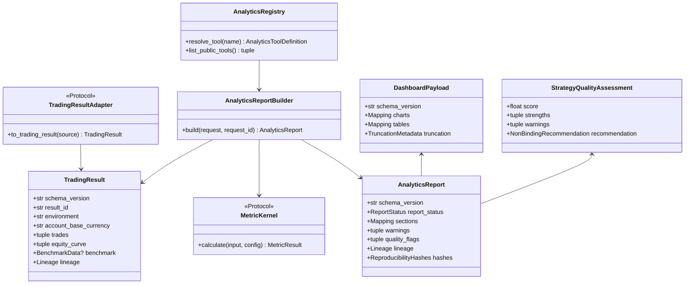
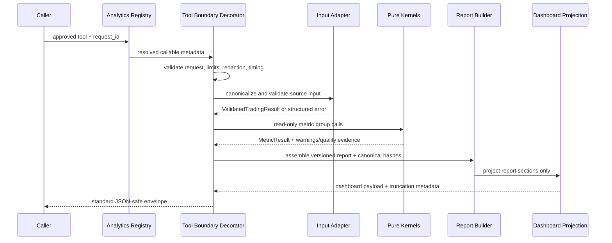

# Analytics Service - Architecture Requirements Document

## Document Purpose and Source Boundary

This document translates only `06-analytics-service.md` into a clean Python architecture. It treats the source IDs as authoritative labels even though almost every source requirement is named `ANL-NFR`; requirements are classified below by their actual behavior: **functional/behavioural**, **cross-cutting non-functional**, or **scope declaration**.

**Scope boundary.** `app/services/analytics/` derives read-only performance evidence from canonical trading results. It does not own broker calls, network access, data acquisition, persistence, live approval, risk-governor decisions, portfolio allocation decisions, UI rendering, or filesystem report writes. Reports and dashboard payloads are returned in memory as JSON-safe structured data.

### Source Inventory Reconciliation

- The source header reports **465 checkbox tasks**.
- The file contains **454 explicit numbered checkbox entries**: `ANL-NFR-001` through `ANL-NFR-452`, plus `ANL-BR-001` and `ANL-BR-002`.
- This document maps all 454 explicit IDs. The source does not contain eleven additional numbered checkboxes, so none are invented here.
- The source also contains unnumbered testing, example, documentation, and acceptance controls; they are mapped in Section 5.

## 1. System Boundary Diagram (file structure)

```text
app/services/analytics/
├── __init__.py                         # Import gate; approved public exports only
├── tool_api.py                         # High-level read-only agent/API tools
├── contracts/
│   ├── models.py                       # Versioned AnalyticsReport, TradingResult, warnings, quality flags
│   ├── metric_catalog.py               # Formula/unit/default/precision catalog
│   ├── warnings.py                     # Warning/quality flag contract and severity catalog
│   └── serialization.py                # JSON safety, Decimal normalization, canonical serialization
├── registry/
│   ├── analytics_registry.py           # Tool/kernels/aliases/deprecation registry
│   └── tool_boundaries.py              # Decorator boundary for validation/logging/timing/envelopes
├── adapters/
│   ├── protocols.py                    # Upstream canonical result interfaces
│   ├── canonicalize.py                 # Backtest/paper/live/portfolio → TradingResult
│   ├── journal_adapters.py             # Simulation/live journals → TradingResult
│   └── validation.py                   # Provenance/currency/time/result validation
├── metrics/
│   ├── exports.py                      # Explicit collision-free compatibility aliases
│   ├── trade_outcomes.py               # Closed-trade lifecycle, PnL outcomes, streaks
│   ├── position_exposure.py            # Open position and exposure facts
│   ├── r_multiples.py                  # Declared-risk-first R-space calculations
│   ├── costs.py                        # Spread/slippage/commission/swap impact
│   ├── efficiency.py                   # MAE/MFE/capital/exposure/exit efficiency
│   ├── time_analysis.py                # Duration/session/market-presence analysis
│   ├── pnl.py                          # PnL, growth, adjusted/select returns, run-up
│   ├── curves.py                       # Balance/equity curve construction
│   ├── equity_returns.py               # Return series, resampling, equity metrics
│   ├── drawdown.py                     # Underwater/drawdown/recovery/ratios
│   ├── risk.py                         # Volatility, VaR/CVaR/ES, risk of ruin
│   ├── ratios.py                       # Sharpe/Sortino/Omega/profit factor and ratios
│   └── aggregate.py                    # Group-level pure metric composition
├── statistics/
│   ├── multiple_testing.py             # White reality check, PBO, corrections
│   ├── distributions.py                # Moments, tails, outliers, distribution fitting
│   └── resampling.py                   # Seeded bootstrap and permutation
├── benchmarks/
│   ├── alignment.py                    # Strategy/benchmark/FX alignment
│   └── metrics.py                      # Alpha/beta/tracking/information analysis
├── scorecards/
│   ├── quality.py                      # Non-binding strategy-quality scorecard
│   └── labels.py                       # Facts vs warnings/caveats/recommendations/governance
├── reports/
│   ├── sections.py                     # Criticality and partial-report section execution
│   ├── hashes.py                       # Canonical reproducibility hashes
│   ├── builder.py                      # Versioned AnalyticsReport assembly
│   └── formatters.py                   # In-memory JSON/Markdown/row formatting
├── dashboards/
│   ├── overview.py                     # Report-to-dashboard projection
│   └── truncation.py                   # Deterministic payload downsampling
└── boundaries/
    ├── request_validation.py           # Request/schema/size/time/numeric validation
    ├── envelopes.py                    # Standard JSON-safe success/error envelopes
    ├── observability.py                # Redacted logging/tracing/timing
    ├── limits.py                       # Approved workload and response ceilings
    ├── cache.py                        # Optional bounded in-process/read-through cache
    └── redaction.py                    # Sensitive data removal

docs/analytics/
├── architecture.md                     # Boundary, ownership, ADR/limit references
└── catalogs.md                         # Metric/tool/warning/schema-compatibility catalogs

tests/services/analytics/test_requirement_traceability.py
examples/analytics/analytics_examples.py
```

### Execution Tree

```text
caller / agent / API
  → app.services.analytics (approved export)
  → registry.tool_boundaries (request ID, validation, redaction, timing, envelope)
  → tool_api (high-level orchestration only)
  → adapters (canonical TradingResult + provenance + compatibility validation)
  → pure metric / statistics / benchmark kernels
  → reports.sections + reports.hashes + reports.builder
  → dashboards (projection only, no recalculation)
  → JSON-safe ToolEnvelope[AnalyticsReport | DashboardPayload]

No step above opens a broker connection, places a trade, fetches a network resource, writes a database, or writes a report to disk.
```

## 2. Interface Diagrams (Mermaid diagrams)

### 2.1 Contracts and Collaborations



### 2.2 Public Tool Boundary



## 3. Functional Requirements

The following structure maps behavioural requirements to cohesive files. Requirement IDs retain their source names. Every direct calculation remains pure. The only state-mutating boundaries are explicit, bounded local infrastructure helpers (registry initialization, optional cache, or redacted observability sinks); none changes domain trading, portfolio, risk, or persistence state.

### 📂 Module: `app/services/analytics`

Boundary Role: Official Analytics Service public boundary: exposes only approved high-level, read-only analytics capabilities.

#### 📄 File: `__init__.py`

File Boundary: Public import gate; imports only approved stable tool wrappers and defines __all__.

Requirement Title: **5 mapped requirement(s)** — `ANL-NFR-087`, `ANL-NFR-088`, `ANL-NFR-089`, `ANL-NFR-090`, `ANL-NFR-091`

Description: This file is the single cohesion point for the following exact source obligations. Requirements labelled “No file-specific …” are preserved as inherited-scope declarations, not fabricated work items.

Requirements:
- **ANL-NFR-087**: No file-specific non-functional requirements defined.
- **ANL-NFR-088**: No file-specific testing requirements defined.
- **ANL-NFR-089**: No file-specific functional requirements defined. Foundation properties apply.
- **ANL-NFR-090**: No file-specific non-functional requirements defined.
- **ANL-NFR-091**: No file-specific testing requirements defined.

Target Class/Function:
- __all__: tuple[str, ...] — Pure import/export declaration.

#### 📄 File: `tool_api.py`

File Boundary: Official high-level tool wrappers: validate envelopes, invoke read-only services, and return standard envelopes.

Requirement Title: **11 mapped requirement(s)** — `ANL-NFR-046`, `ANL-NFR-109`, `ANL-NFR-247`, `ANL-NFR-248`, `ANL-NFR-249`, `ANL-NFR-250`, `ANL-NFR-251`, `ANL-NFR-252`, `ANL-NFR-253`, `ANL-NFR-424`, `ANL-NFR-452`

Description: This file is the single cohesion point for the following exact source obligations. Requirements labelled “No file-specific …” are preserved as inherited-scope declarations, not fabricated work items.

Requirements:
- **ANL-NFR-046**: `get_analytics_overview` shall calculate comprehensive analytics across all, long, and short subsets.
- **ANL-NFR-109**: ADR Required: `ADR-ANALYTICS-PUBLIC-SURFACE` must approve the initial official high-level tool surface before Builder implementation; candidate tools include `build_analytics_report`, `build_portfolio_analytics_report`, `evaluate_strategy_quality`, `compare_analytics_reports`, `calculate_trade_metrics`, `calculate_equity_metrics`, `calculate_drawdown_metrics`, `calculate_risk_metrics`, `calculate_benchmark_metrics`, `calculate_statistical_validation`, and `calculate_prop_firm_compliance`.
- **ANL-NFR-247**: Official analytics tools must be low-risk, read-only operations.
- **ANL-NFR-248**: Metadata must include tool name, tool version, tool category, tool risk level, request ID, execution time, and side-effect flags.
- **ANL-NFR-249**: R-multiple analytics must prefer explicit initial-risk fields when available and fall back only to documented analytics proxies when risk fields are absent.
- **ANL-NFR-250**: Official analytics tool responses must include metadata, side-effect flags, risk flags, execution timing, and structured errors.
- **ANL-NFR-251**: Metric definitions must document default configuration sources for annualization, risk-free rate, breakeven tolerance, minimum sample size, bootstrap count limits, dashboard limits, FX stale-rate limits, and confidence/alpha levels when those defaults are approved.
- **ANL-NFR-252**: Strategy-quality scorecards must not make final live approval, promotion, prop-firm enforcement, or risk-governor decisions.
- **ANL-NFR-253**: Strategy-quality outputs must not claim final approval, promotion, live-readiness, prop-firm compliance enforcement, risk-limit approval, or portfolio allocation authority.
- **ANL-NFR-424**: `build_analytics_report` latency, statistical-validation runtime, throughput, memory, and payload-size targets must be measurable before Builder handoff.
- **ANL-NFR-452**: Ensure Analytics can run before UI/API exists and can be consumed by UI/API later without changing metric definitions.

Target Class/Function:
- `get_analytics_overview(request: BuildAnalyticsReportRequest, request_id: str) -> ToolEnvelope[AnalyticsReport]` — Pure (no database, network, broker, or filesystem side effects).
- `build_analytics_report(request: BuildAnalyticsReportRequest, request_id: str) -> ToolEnvelope[AnalyticsReport]` — Pure (no database, network, broker, or filesystem side effects).
- build_portfolio_analytics_report(request: BuildPortfolioAnalyticsReportRequest, request_id: str) -> ToolEnvelope[PortfolioAnalyticsReport] — Pure.
- compare_analytics_reports(left: AnalyticsReport, right: AnalyticsReport, request_id: str) -> ToolEnvelope[AnalyticsComparison] — Pure.
- calculate_prop_firm_compliance(report: AnalyticsReport, profile: ComplianceProfile, request_id: str) -> ToolEnvelope[ComplianceEvidence] — Pure; returns evidence only.

### 📂 Module: `app/services/analytics/contracts`

Boundary Role: Typed contract capability: owns versioned analytics models, catalogs, warnings, schemas, and JSON-safe contracts.

#### 📄 File: `models.py`

File Boundary: Versioned canonical analytics dataclasses/models: inputs, reports, metric results, warnings, quality flags, lineage, and metadata.

Requirement Title: **3 mapped requirement(s)** — `ANL-NFR-198`, `ANL-NFR-428`, `ANL-BR-002`

Description: This file is the single cohesion point for the following exact source obligations. Requirements labelled “No file-specific …” are preserved as inherited-scope declarations, not fabricated work items.

Requirements:
- **ANL-NFR-198**: No file-specific non-functional requirements defined.
- **ANL-NFR-428**: `TradingResult`, `AnalyticsReport`, `PortfolioAnalyticsReport`, dashboard payloads, warning objects, quality flags, and error envelopes have versioned schemas.
- **ANL-BR-002**: Analytics outputs used by UI/API must remain backward-compatible or be versioned when payload structure changes.

Target Class/Function:
- validate_schema_version(version: str, matrix: SchemaCompatibilityMatrix) -> SchemaCompatibility — Pure.

#### 📄 File: `metric_catalog.py`

File Boundary: Metric Definition Catalog, formula metadata, units, defaults, samples, tolerances, and schema compatibility declarations.

Requirement Title: **11 mapped requirement(s)** — `ANL-NFR-074`, `ANL-NFR-075`, `ANL-NFR-076`, `ANL-NFR-079`, `ANL-NFR-080`, `ANL-NFR-081`, `ANL-NFR-082`, `ANL-NFR-083`, `ANL-NFR-084`, `ANL-NFR-085`, `ANL-NFR-086`

Description: This file is the single cohesion point for the following exact source obligations. Requirements labelled “No file-specific …” are preserved as inherited-scope declarations, not fabricated work items.

Requirements:
- **ANL-NFR-074**: Undefined or unsupported metric values must be represented as omitted fields or `None` according to the output schema plus structured warnings or skipped-section metadata; they must not be serialized as `NaN`, infinity, fabricated zero, or display-only caps.
- **ANL-NFR-075**: R-multiple fallback proxies must be listed in the Metric Definition Catalog before use; fallback-derived R-multiple values must include warning metadata and mark the affected metric confidence as degraded.
- **ANL-NFR-076**: Every official metric must define formula, units, required inputs, optional inputs, accepted aliases, return scale, annualization basis, sample/population convention, minimum sample size, undefined-result behavior, and golden-fixture expectations.
- **ANL-NFR-079**: Numeric outputs must avoid misleading precision and must handle empty, missing, non-finite, zero-denominator, and insufficient-sample scenarios consistently.
- **ANL-NFR-080**: Documentation must include the Metric Definition Catalog.
- **ANL-NFR-081**: Official Analytics Tool Catalog is approved and maps every official tool to schemas, errors, metadata, side effects, stability, and tests.
- **ANL-NFR-082**: Metric Definition Catalog is approved and no official schema references uncataloged metrics.
- **ANL-NFR-083**: Public/internal export classification is approved, including compatibility aliases and deprecated exports.
- **ANL-NFR-084**: Analytics-owned private canonical metric-kernel model is documented and enforced through public/internal export classification tests.
- **ANL-NFR-085**: Schema compatibility matrix defines accepted, deprecated, legacy-adapted, rejected, and unsupported future versions.
- **ANL-NFR-086**: Decimal monetary precision mandate and deterministic derived-ratio tolerance policy are documented in schemas, metadata, and tests.

Target Class/Function:
- `None(input_value: object, config: MetricConfig) -> MetricResult[object]` — Pure (no database, network, broker, or filesystem side effects).

#### 📄 File: `warnings.py`

File Boundary: Warning and quality-flag models, ordered severities, catalog entries, and non-binding decision labels.

Requirement Title: **5 mapped requirement(s)** — `ANL-NFR-276`, `ANL-NFR-277`, `ANL-NFR-278`, `ANL-NFR-279`, `ANL-NFR-280`

Description: This file is the single cohesion point for the following exact source obligations. Requirements labelled “No file-specific …” are preserved as inherited-scope declarations, not fabricated work items.

Requirements:
- **ANL-NFR-276**: Redaction rules must apply to sensitive keys and sensitive-looking values in inputs, warnings, errors, logs, metadata, and diagnostic details.
- **ANL-NFR-277**: Low-level metric helpers such as individual average, skewness, kurtosis, tail-ratio, tracking-error, ulcer-index, omega-ratio, payoff-ratio, and date helper functions must remain internal/support-only unless explicitly promoted by the Official Analytics Tool Catalog.
- **ANL-NFR-278**: Warnings and quality flags must include code, severity, affected section, source context, and enough bounded detail for downstream review.
- **ANL-NFR-279**: Warning and quality-flag catalogs must define code, severity, affected section, source-backed status, whether the flag blocks promotion, bounded detail rules, and linked test fixtures.
- **ANL-NFR-280**: Explainability outputs must distinguish explained PnL, unexplained PnL, explained variance percentage, sample count, and driver stability when those inputs are supplied.

Target Class/Function:
- build_warning(code: str, severity: WarningSeverity, section: str, detail: Mapping[str, object]) -> AnalyticsWarning — Pure.

#### 📄 File: `serialization.py`

File Boundary: Canonical JSON safety, Decimal normalization, schema-version handling, and deterministic hashing inputs.

Requirement Title: **2 mapped requirement(s)** — `ANL-NFR-432`, `ANL-NFR-433`

Description: This file is the single cohesion point for the following exact source obligations. Requirements labelled “No file-specific …” are preserved as inherited-scope declarations, not fabricated work items.

Requirements:
- **ANL-NFR-432**: No file-specific non-functional requirements defined.
- **ANL-NFR-433**: Final analytics responses must not contain `NaN`, `inf`, `-inf`, invalid JSON values, pandas objects, NumPy objects, raw dataframes, raw series, or other unserializable values.

Target Class/Function:
- to_json_safe(value: object, precision: PrecisionPolicy) -> JsonValue — Pure.
- canonical_json(value: JsonValue) -> str — Pure.

### 📂 Module: `app/services/analytics/registry`

Boundary Role: Public capability governance: owns export classification, tool catalog synchronization, and decorator attachment.

#### 📄 File: `analytics_registry.py`

File Boundary: Registry of official tools, metric kernel visibility, stability, agent/API eligibility, aliases, and deprecation status.

Requirement Title: **6 mapped requirement(s)** — `ANL-NFR-008`, `ANL-NFR-009`, `ANL-NFR-010`, `ANL-NFR-011`, `ANL-NFR-012`, `ANL-NFR-013`

Description: This file is the single cohesion point for the following exact source obligations. Requirements labelled “No file-specific …” are preserved as inherited-scope declarations, not fabricated work items.

Requirements:
- **ANL-NFR-008**: The analytics registry must expose only intentional public analytics tools and must not hide colliding function names; duplicate concepts must use module-qualified aliases where needed.
- **ANL-NFR-009**: Every official exported analytics tool must be callable, documented, and accept a `request_id` parameter for traceability.
- **ANL-NFR-010**: Each official public capability must be labeled as stable, approved experimental, deprecated, or internal-support-only.
- **ANL-NFR-011**: Each official public capability must document whether it is safe for agent/API use.
- **ANL-NFR-012**: The analytics registry must distinguish official tools, internal metric kernels, compatibility aliases, and deprecated exports.
- **ANL-NFR-013**: Agentic workflows must import analytics capabilities from `app.services.analytics` rather than deep module files.

Target Class/Function:
- `request_id(input_value: object, config: MetricConfig) -> MetricResult[object]` — State-mutating (bounded local registry/cache/observability only).

### 📂 Module: `app/services/analytics/adapters`

Boundary Role: Canonical input capability: converts approved upstream result/journal contracts into validated Analytics inputs.

#### 📄 File: `protocols.py`

File Boundary: Typed upstream result contracts and deterministic source-to-canonical adapter protocol.

Requirement Title: **2 mapped requirement(s)** — `ANL-NFR-095`, `ANL-NFR-096`

Description: This file is the single cohesion point for the following exact source obligations. Requirements labelled “No file-specific …” are preserved as inherited-scope declarations, not fabricated work items.

Requirements:
- **ANL-NFR-095**: No file-specific non-functional requirements defined.
- **ANL-NFR-096**: No file-specific testing requirements defined.

Target Class/Function:
- validate_adapter_contract(adapter: TradingResultAdapter) -> None — Pure.

#### 📄 File: `canonicalize.py`

File Boundary: Conversion of backtest, paper, live, portfolio, optimization, and normalized results into canonical TradingResult.

Requirement Title: **3 mapped requirement(s)** — `ANL-NFR-092`, `ANL-NFR-093`, `ANL-NFR-094`

Description: This file is the single cohesion point for the following exact source obligations. Requirements labelled “No file-specific …” are preserved as inherited-scope declarations, not fabricated work items.

Requirements:
- **ANL-NFR-092**: Backtest, paper, live, portfolio, and normalized trading results must either inherit from a canonical `TradingResult` contract or be converted into it through deterministic adapters.
- **ANL-NFR-093**: Deterministic adapters must preserve schema version, result ID, phase/environment, timestamps, account base currency, strategy identifiers, symbols, timeframe, trades, equity curve, optional balance curve, benchmark data, upstream quality metadata, and source metadata without silent field loss.
- **ANL-NFR-094**: Deterministic adapters must define source-to-canonical field mappings, required fields, optional fields, defaulting behavior, unsupported-field behavior, lossless metadata preservation rules, and warning/error behavior for missing or incompatible fields.

Target Class/Function:
- to_trading_result(source: BacktestResult | PaperResult | LiveResult | PortfolioResult | TradingResult) -> TradingResult — Pure.

#### 📄 File: `journal_adapters.py`

File Boundary: Canonical simulation-journal and live-journal translation through one event/result model.

Requirement Title: **4 mapped requirement(s)** — `ANL-NFR-448`, `ANL-NFR-449`, `ANL-NFR-450`, `ANL-NFR-451`

Description: This file is the single cohesion point for the following exact source obligations. Requirements labelled “No file-specific …” are preserved as inherited-scope declarations, not fabricated work items.

Requirements:
- **ANL-NFR-448**: Adopt Phase 1.5 contracts for TradeResult, ExecutionReport, Fill, PortfolioSnapshot, BacktestResult, RiskDecision, and AuditEvent analytics inputs.
- **ANL-NFR-449**: Define analytics adapters that consume simulation journals and live trade journals through the same canonical event/result model.
- **ANL-NFR-450**: Prohibit Analytics from reading raw broker SDK payloads, UI DTOs, or conversation memory as primary metric sources.
- **ANL-NFR-451**: Define metric provenance using run ID, strategy ID, dataset hash, cost model, fill model, risk policy version, and journal reference.

Target Class/Function:
- from_simulation_journal(journal: SimulationJournal) -> TradingResult — Pure.
- from_live_trade_journal(journal: LiveTradeJournal) -> TradingResult — Pure.

### 📂 Module: `app/services/analytics/metrics`

Boundary Role: Deterministic metric calculation capability: derives trade, equity, drawdown, risk, ratio, and efficiency facts.

#### 📄 File: `exports.py`

File Boundary: Explicitly named compatibility aliases that avoid collisions between common, metrics, distributions, benchmark, and ratios namespaces.

Requirement Title: **10 mapped requirement(s)** — `ANL-NFR-016`, `ANL-NFR-017`, `ANL-NFR-020`, `ANL-NFR-029`, `ANL-NFR-281`, `ANL-NFR-283`, `ANL-NFR-284`, `ANL-NFR-288`, `ANL-NFR-318`, `ANL-NFR-339`

Description: This file is the single cohesion point for the following exact source obligations. Requirements labelled “No file-specific …” are preserved as inherited-scope declarations, not fabricated work items.

Requirements:
- **ANL-NFR-016**: `common_avg_loss` shall expose the common-module average-loss function without colliding with metrics exports.
- **ANL-NFR-017**: `common_get_r_multiples` shall expose the common-module R-multiple function without colliding with metrics exports.
- **ANL-NFR-020**: `metrics_get_r_multiples` shall expose metrics-module R-multiple behavior without colliding with common exports.
- **ANL-NFR-029**: `metrics_avg_loss` shall expose metrics-module average-loss behavior without colliding with common exports.
- **ANL-NFR-281**: `benchmark_information_ratio` shall expose benchmark information ratio without colliding with the ratios module export.
- **ANL-NFR-283**: `metrics_win_rate_fraction` shall expose metrics-module win-rate fraction behavior without colliding with ratios exports.
- **ANL-NFR-284**: `metrics_expectancy_r` shall expose metrics-module R-expectancy behavior without colliding with ratios exports.
- **ANL-NFR-288**: `ratios_information_ratio` shall expose ratios-module information ratio without colliding with benchmark exports.
- **ANL-NFR-318**: `distributions_r_multiple_distribution` shall expose distribution-module R-multiple distribution behavior without colliding with metrics exports.
- **ANL-NFR-339**: `metrics_r_multiple_distribution` shall calculate R-multiple distribution statistics.

Target Class/Function:
- `common_avg_loss(input_value: object, config: MetricConfig) -> MetricResult[object]` — Pure (no database, network, broker, or filesystem side effects).
- `common_get_r_multiples(input_value: object, config: MetricConfig) -> MetricResult[object]` — Pure (no database, network, broker, or filesystem side effects).
- `metrics_get_r_multiples(input_value: object, config: MetricConfig) -> MetricResult[object]` — Pure (no database, network, broker, or filesystem side effects).
- `metrics_avg_loss(input_value: object, config: MetricConfig) -> MetricResult[object]` — Pure (no database, network, broker, or filesystem side effects).
- `benchmark_information_ratio(input_value: object, config: MetricConfig) -> MetricResult[object]` — Pure (no database, network, broker, or filesystem side effects).
- `metrics_win_rate_fraction(input_value: object, config: MetricConfig) -> MetricResult[object]` — Pure (no database, network, broker, or filesystem side effects).
- `metrics_expectancy_r(input_value: object, config: MetricConfig) -> MetricResult[object]` — Pure (no database, network, broker, or filesystem side effects).
- `ratios_information_ratio(input_value: object, config: MetricConfig) -> MetricResult[object]` — Pure (no database, network, broker, or filesystem side effects).
- `distributions_r_multiple_distribution(input_value: object, config: MetricConfig) -> MetricResult[object]` — Pure (no database, network, broker, or filesystem side effects).
- `metrics_r_multiple_distribution(input_value: object, config: MetricConfig) -> MetricResult[object]` — Pure (no database, network, broker, or filesystem side effects).

#### 📄 File: `position_exposure.py`

File Boundary: Read-only position-size, gross/net exposure, open-PnL, exposure-duration, and margin-utilization calculations.

Requirement Title: **10 mapped requirement(s)** — `ANL-NFR-018`, `ANL-NFR-019`, `ANL-NFR-025`, `ANL-NFR-026`, `ANL-NFR-027`, `ANL-NFR-028`, `ANL-NFR-031`, `ANL-NFR-032`, `ANL-NFR-033`, `ANL-NFR-034`

Description: This file is the single cohesion point for the following exact source obligations. Requirements labelled “No file-specific …” are preserved as inherited-scope declarations, not fabricated work items.

Requirements:
- **ANL-NFR-018**: `max_gross_size_held` shall calculate the maximum absolute total size held across positions.
- **ANL-NFR-019**: `percent_time_in_market` shall calculate percent of the trading period spent in the market.
- **ANL-NFR-025**: `open_position_pnl` shall calculate total unrealized PnL from open positions.
- **ANL-NFR-026**: `slippage_paid` shall calculate total absolute slippage costs paid.
- **ANL-NFR-027**: `commission_paid` shall calculate total absolute commission costs paid.
- **ANL-NFR-028**: `swap_paid` shall calculate total absolute swap costs paid.
- **ANL-NFR-031**: `max_size_held` shall calculate maximum total contracts held.
- **ANL-NFR-032**: `max_net_size_held` shall calculate maximum net directional size held.
- **ANL-NFR-033**: `max_long_size_held` shall calculate maximum total long contracts held.
- **ANL-NFR-034**: `max_short_size_held` shall calculate maximum total short contracts held.

Target Class/Function:
- `max_gross_size_held(trades: Sequence[TradeRecord], config: MetricConfig) -> MetricResult[Decimal | float | int | Duration | Mapping[str, object]]` — Pure (no database, network, broker, or filesystem side effects).
- `percent_time_in_market(trades: Sequence[TradeRecord], config: MetricConfig) -> MetricResult[Decimal | float | int | Duration | Mapping[str, object]]` — Pure (no database, network, broker, or filesystem side effects).
- `open_position_pnl(trades: Sequence[TradeRecord], config: MetricConfig) -> MetricResult[Decimal | float | int | Duration | Mapping[str, object]]` — Pure (no database, network, broker, or filesystem side effects).
- `slippage_paid(trades: Sequence[TradeRecord], config: MetricConfig) -> MetricResult[Decimal | float | int | Duration | Mapping[str, object]]` — Pure (no database, network, broker, or filesystem side effects).
- `commission_paid(trades: Sequence[TradeRecord], config: MetricConfig) -> MetricResult[Decimal | float | int | Duration | Mapping[str, object]]` — Pure (no database, network, broker, or filesystem side effects).
- `swap_paid(trades: Sequence[TradeRecord], config: MetricConfig) -> MetricResult[Decimal | float | int | Duration | Mapping[str, object]]` — Pure (no database, network, broker, or filesystem side effects).
- `max_size_held(trades: Sequence[TradeRecord], config: MetricConfig) -> MetricResult[Decimal | float | int | Duration | Mapping[str, object]]` — Pure (no database, network, broker, or filesystem side effects).
- `max_net_size_held(trades: Sequence[TradeRecord], config: MetricConfig) -> MetricResult[Decimal | float | int | Duration | Mapping[str, object]]` — Pure (no database, network, broker, or filesystem side effects).
- `max_long_size_held(trades: Sequence[TradeRecord], config: MetricConfig) -> MetricResult[Decimal | float | int | Duration | Mapping[str, object]]` — Pure (no database, network, broker, or filesystem side effects).
- `max_short_size_held(trades: Sequence[TradeRecord], config: MetricConfig) -> MetricResult[Decimal | float | int | Duration | Mapping[str, object]]` — Pure (no database, network, broker, or filesystem side effects).

#### 📄 File: `trade_outcomes.py`

File Boundary: Closed-trade filtering, outcomes, streaks, win/loss rates, PnL summaries, and outcome entropy.

Requirement Title: **38 mapped requirement(s)** — `ANL-NFR-021`, `ANL-NFR-022`, `ANL-NFR-023`, `ANL-NFR-024`, `ANL-NFR-030`, `ANL-NFR-035`, `ANL-NFR-036`, `ANL-NFR-037`, `ANL-NFR-038`, `ANL-NFR-039`, `ANL-NFR-040`, `ANL-NFR-041`, `ANL-NFR-042`, `ANL-NFR-043`, `ANL-NFR-044`, `ANL-NFR-045`, `ANL-NFR-111`, `ANL-NFR-112`, `ANL-NFR-113`, `ANL-NFR-133`, `ANL-NFR-134`, `ANL-NFR-135`, `ANL-NFR-136`, `ANL-NFR-137`, `ANL-NFR-138`, `ANL-NFR-139`, `ANL-NFR-140`, `ANL-NFR-141`, `ANL-NFR-142`, `ANL-NFR-143`, `ANL-NFR-144`, `ANL-NFR-145`, `ANL-NFR-146`, `ANL-NFR-147`, `ANL-NFR-148`, `ANL-NFR-149`, `ANL-NFR-150`, `ANL-NFR-158`

Description: This file is the single cohesion point for the following exact source obligations. Requirements labelled “No file-specific …” are preserved as inherited-scope declarations, not fabricated work items.

Requirements:
- **ANL-NFR-021**: `win_rate_fraction` shall calculate win rate on a 0-to-1 scale.
- **ANL-NFR-022**: `avg_win_loss` shall calculate mean winning and losing outcomes.
- **ANL-NFR-023**: `consecutive_wins_losses` shall calculate maximum consecutive wins and losses from numeric outcomes.
- **ANL-NFR-024**: `t_statistic` shall calculate the t-statistic for mean outcome.
- **ANL-NFR-030**: `expectancy_r` shall calculate R-expectancy.
- **ANL-NFR-035**: `avg_r_multiple` shall calculate average R-multiple.
- **ANL-NFR-036**: `median_r_multiple` shall calculate median R-multiple.
- **ANL-NFR-037**: `r_expectancy` shall calculate R-space expectancy.
- **ANL-NFR-038**: `max_r_multiple` shall calculate maximum R-multiple.
- **ANL-NFR-039**: `min_r_multiple` shall calculate minimum R-multiple.
- **ANL-NFR-040**: `avg_consecutive_wins` shall calculate average length of winning streaks.
- **ANL-NFR-041**: `avg_consecutive_losses` shall calculate average length of losing streaks.
- **ANL-NFR-042**: `r_signal_to_noise` shall calculate mean R relative to R volatility.
- **ANL-NFR-043**: `rolling_expectancy_stability` shall calculate expectancy stability over a rolling window.
- **ANL-NFR-044**: `win_after_win_probability` shall calculate probability that a win follows a win.
- **ANL-NFR-045**: `runs_test_zscore` shall calculate Wald-Wolfowitz runs-test z-score.
- **ANL-NFR-111**: `get_closed_trades` shall filter trade records to realized closed trades.
- **ANL-NFR-112**: `classify_trades` shall classify trades into wins, losses, and breakevens using a consistent threshold.
- **ANL-NFR-113**: `avg_loss` shall calculate the mean loss of losing trades.
- **ANL-NFR-133**: `get_ordered_closed_trades` shall filter closed trades and sort them for sequence-dependent metrics.
- **ANL-NFR-134**: `total_trades` shall count closed trades.
- **ANL-NFR-135**: `winning_trades` shall count closed winning trades.
- **ANL-NFR-136**: `losing_trades` shall count closed losing trades.
- **ANL-NFR-137**: `breakeven_trades` shall count closed breakeven trades.
- **ANL-NFR-138**: `long_trades` shall count closed long trades.
- **ANL-NFR-139**: `short_trades` shall count closed short trades.
- **ANL-NFR-140**: `count_open_trades` shall count currently open trades.
- **ANL-NFR-141**: `win_rate` shall calculate percentage of winning trades.
- **ANL-NFR-142**: `loss_rate` shall calculate percentage of losing trades.
- **ANL-NFR-143**: `avg_win` shall calculate mean profit of winning trades.
- **ANL-NFR-144**: `largest_win` shall calculate maximum single-trade profit.
- **ANL-NFR-145**: `largest_loss` shall calculate maximum single-trade loss.
- **ANL-NFR-146**: `median_win` shall calculate median PnL of winning trades.
- **ANL-NFR-147**: `median_loss` shall calculate median PnL of losing trades.
- **ANL-NFR-148**: `expectancy` shall calculate trade expectancy.
- **ANL-NFR-149**: `max_consecutive_wins` shall calculate maximum consecutive winning trades.
- **ANL-NFR-150**: `max_consecutive_losses` shall calculate maximum consecutive losing trades.
- **ANL-NFR-158**: `trade_outcome_entropy` shall calculate Shannon entropy of trade outcomes.

Target Class/Function:
- `win_rate_fraction(trades: Sequence[TradeRecord], config: MetricConfig) -> MetricResult[Decimal | float | int | Duration | Mapping[str, object]]` — Pure (no database, network, broker, or filesystem side effects).
- `avg_win_loss(trades: Sequence[TradeRecord], config: MetricConfig) -> MetricResult[Decimal | float | int | Duration | Mapping[str, object]]` — Pure (no database, network, broker, or filesystem side effects).
- `consecutive_wins_losses(trades: Sequence[TradeRecord], config: MetricConfig) -> MetricResult[Decimal | float | int | Duration | Mapping[str, object]]` — Pure (no database, network, broker, or filesystem side effects).
- `t_statistic(trades: Sequence[TradeRecord], config: MetricConfig) -> MetricResult[Decimal | float | int | Duration | Mapping[str, object]]` — Pure (no database, network, broker, or filesystem side effects).
- `expectancy_r(trades: Sequence[TradeRecord], config: MetricConfig) -> MetricResult[Decimal | float | int | Duration | Mapping[str, object]]` — Pure (no database, network, broker, or filesystem side effects).
- `avg_r_multiple(trades: Sequence[TradeRecord], config: MetricConfig) -> MetricResult[Decimal | float | int | Duration | Mapping[str, object]]` — Pure (no database, network, broker, or filesystem side effects).
- `median_r_multiple(trades: Sequence[TradeRecord], config: MetricConfig) -> MetricResult[Decimal | float | int | Duration | Mapping[str, object]]` — Pure (no database, network, broker, or filesystem side effects).
- `r_expectancy(trades: Sequence[TradeRecord], config: MetricConfig) -> MetricResult[Decimal | float | int | Duration | Mapping[str, object]]` — Pure (no database, network, broker, or filesystem side effects).
- `max_r_multiple(trades: Sequence[TradeRecord], config: MetricConfig) -> MetricResult[Decimal | float | int | Duration | Mapping[str, object]]` — Pure (no database, network, broker, or filesystem side effects).
- `min_r_multiple(trades: Sequence[TradeRecord], config: MetricConfig) -> MetricResult[Decimal | float | int | Duration | Mapping[str, object]]` — Pure (no database, network, broker, or filesystem side effects).
- `avg_consecutive_wins(trades: Sequence[TradeRecord], config: MetricConfig) -> MetricResult[Decimal | float | int | Duration | Mapping[str, object]]` — Pure (no database, network, broker, or filesystem side effects).
- `avg_consecutive_losses(trades: Sequence[TradeRecord], config: MetricConfig) -> MetricResult[Decimal | float | int | Duration | Mapping[str, object]]` — Pure (no database, network, broker, or filesystem side effects).
- `r_signal_to_noise(trades: Sequence[TradeRecord], config: MetricConfig) -> MetricResult[Decimal | float | int | Duration | Mapping[str, object]]` — Pure (no database, network, broker, or filesystem side effects).
- `rolling_expectancy_stability(trades: Sequence[TradeRecord], config: MetricConfig) -> MetricResult[Decimal | float | int | Duration | Mapping[str, object]]` — Pure (no database, network, broker, or filesystem side effects).
- `win_after_win_probability(trades: Sequence[TradeRecord], config: MetricConfig) -> MetricResult[Decimal | float | int | Duration | Mapping[str, object]]` — Pure (no database, network, broker, or filesystem side effects).
- `runs_test_zscore(trades: Sequence[TradeRecord], config: MetricConfig) -> MetricResult[Decimal | float | int | Duration | Mapping[str, object]]` — Pure (no database, network, broker, or filesystem side effects).
- `get_closed_trades(trades: Sequence[TradeRecord], config: TradeFilterConfig) -> tuple[TradeRecord, ...]` — Pure (no database, network, broker, or filesystem side effects).
- `classify_trades(trades: Sequence[TradeRecord], config: TradeFilterConfig) -> tuple[TradeRecord, ...]` — Pure (no database, network, broker, or filesystem side effects).
- `avg_loss(trades: Sequence[TradeRecord], config: MetricConfig) -> MetricResult[Decimal | float | int | Duration | Mapping[str, object]]` — Pure (no database, network, broker, or filesystem side effects).
- `get_ordered_closed_trades(trades: Sequence[TradeRecord], config: TradeFilterConfig) -> tuple[TradeRecord, ...]` — Pure (no database, network, broker, or filesystem side effects).
- `total_trades(trades: Sequence[TradeRecord], config: MetricConfig) -> MetricResult[Decimal | float | int | Duration | Mapping[str, object]]` — Pure (no database, network, broker, or filesystem side effects).
- `winning_trades(trades: Sequence[TradeRecord], config: MetricConfig) -> MetricResult[Decimal | float | int | Duration | Mapping[str, object]]` — Pure (no database, network, broker, or filesystem side effects).
- `losing_trades(trades: Sequence[TradeRecord], config: MetricConfig) -> MetricResult[Decimal | float | int | Duration | Mapping[str, object]]` — Pure (no database, network, broker, or filesystem side effects).
- `breakeven_trades(trades: Sequence[TradeRecord], config: MetricConfig) -> MetricResult[Decimal | float | int | Duration | Mapping[str, object]]` — Pure (no database, network, broker, or filesystem side effects).
- `long_trades(trades: Sequence[TradeRecord], config: MetricConfig) -> MetricResult[Decimal | float | int | Duration | Mapping[str, object]]` — Pure (no database, network, broker, or filesystem side effects).
- `short_trades(trades: Sequence[TradeRecord], config: MetricConfig) -> MetricResult[Decimal | float | int | Duration | Mapping[str, object]]` — Pure (no database, network, broker, or filesystem side effects).
- `count_open_trades(trades: Sequence[TradeRecord], config: MetricConfig) -> MetricResult[Decimal | float | int | Duration | Mapping[str, object]]` — Pure (no database, network, broker, or filesystem side effects).
- `win_rate(trades: Sequence[TradeRecord], config: MetricConfig) -> MetricResult[Decimal | float | int | Duration | Mapping[str, object]]` — Pure (no database, network, broker, or filesystem side effects).
- `loss_rate(trades: Sequence[TradeRecord], config: MetricConfig) -> MetricResult[Decimal | float | int | Duration | Mapping[str, object]]` — Pure (no database, network, broker, or filesystem side effects).
- `avg_win(trades: Sequence[TradeRecord], config: MetricConfig) -> MetricResult[Decimal | float | int | Duration | Mapping[str, object]]` — Pure (no database, network, broker, or filesystem side effects).
- `largest_win(trades: Sequence[TradeRecord], config: MetricConfig) -> MetricResult[Decimal | float | int | Duration | Mapping[str, object]]` — Pure (no database, network, broker, or filesystem side effects).
- `largest_loss(trades: Sequence[TradeRecord], config: MetricConfig) -> MetricResult[Decimal | float | int | Duration | Mapping[str, object]]` — Pure (no database, network, broker, or filesystem side effects).
- `median_win(trades: Sequence[TradeRecord], config: MetricConfig) -> MetricResult[Decimal | float | int | Duration | Mapping[str, object]]` — Pure (no database, network, broker, or filesystem side effects).
- `median_loss(trades: Sequence[TradeRecord], config: MetricConfig) -> MetricResult[Decimal | float | int | Duration | Mapping[str, object]]` — Pure (no database, network, broker, or filesystem side effects).
- `expectancy(trades: Sequence[TradeRecord], config: MetricConfig) -> MetricResult[Decimal | float | int | Duration | Mapping[str, object]]` — Pure (no database, network, broker, or filesystem side effects).
- `max_consecutive_wins(trades: Sequence[TradeRecord], config: MetricConfig) -> MetricResult[Decimal | float | int | Duration | Mapping[str, object]]` — Pure (no database, network, broker, or filesystem side effects).
- `max_consecutive_losses(trades: Sequence[TradeRecord], config: MetricConfig) -> MetricResult[Decimal | float | int | Duration | Mapping[str, object]]` — Pure (no database, network, broker, or filesystem side effects).
- `trade_outcome_entropy(trades: Sequence[TradeRecord], config: MetricConfig) -> MetricResult[Decimal | float | int | Duration | Mapping[str, object]]` — Pure (no database, network, broker, or filesystem side effects).

#### 📄 File: `r_multiples.py`

File Boundary: R-multiple derivation, declared-risk preference, proxy warning behavior, and R-space metrics.

Requirement Title: **4 mapped requirement(s)** — `ANL-NFR-114`, `ANL-NFR-122`, `ANL-NFR-155`, `ANL-NFR-156`

Description: This file is the single cohesion point for the following exact source obligations. Requirements labelled “No file-specific …” are preserved as inherited-scope declarations, not fabricated work items.

Requirements:
- **ANL-NFR-114**: `get_r_multiples` shall calculate R-multiples for trades.
- **ANL-NFR-122**: `avg_return_per_risk_unit` shall calculate average R-multiple per closed trade.
- **ANL-NFR-155**: `compute_r_trade_metrics` shall calculate trade metrics from R-multiple inputs.
- **ANL-NFR-156**: `compute_trade_metrics` shall calculate trade metrics from numeric R values and optional MAE/MFE arrays.

Target Class/Function:
- `get_r_multiples(trades: Sequence[TradeRecord], config: TradeFilterConfig) -> tuple[TradeRecord, ...]` — Pure (no database, network, broker, or filesystem side effects).
- `avg_return_per_risk_unit(trades: Sequence[TradeRecord], config: MetricConfig) -> MetricResult[Decimal | float | int | Duration | Mapping[str, object]]` — Pure (no database, network, broker, or filesystem side effects).
- `compute_r_trade_metrics(trades: Sequence[TradeRecord], config: MetricConfig) -> MetricResult[Decimal | float | int | Duration | Mapping[str, object]]` — Pure (no database, network, broker, or filesystem side effects).
- `compute_trade_metrics(trades: Sequence[TradeRecord], config: MetricConfig) -> MetricResult[Decimal | float | int | Duration | Mapping[str, object]]` — Pure (no database, network, broker, or filesystem side effects).

#### 📄 File: `costs.py`

File Boundary: Spread, slippage, commission, swap, and transaction-cost impact calculations.

Requirement Title: **3 mapped requirement(s)** — `ANL-NFR-047`, `ANL-NFR-048`, `ANL-NFR-049`

Description: This file is the single cohesion point for the following exact source obligations. Requirements labelled “No file-specific …” are preserved as inherited-scope declarations, not fabricated work items.

Requirements:
- **ANL-NFR-047**: `calculate_spread_cost_impact` shall calculate spread cost drag.
- **ANL-NFR-048**: `calculate_slippage_impact` shall calculate slippage cost drag.
- **ANL-NFR-049**: `calculate_commission_impact` shall calculate commission cost drag.

Target Class/Function:
- `calculate_spread_cost_impact(trades: Sequence[TradeRecord], config: MetricConfig) -> MetricResult[Decimal | float | int | Duration | Mapping[str, object]]` — Pure (no database, network, broker, or filesystem side effects).
- `calculate_slippage_impact(trades: Sequence[TradeRecord], config: MetricConfig) -> MetricResult[Decimal | float | int | Duration | Mapping[str, object]]` — Pure (no database, network, broker, or filesystem side effects).
- `calculate_commission_impact(trades: Sequence[TradeRecord], config: MetricConfig) -> MetricResult[Decimal | float | int | Duration | Mapping[str, object]]` — Pure (no database, network, broker, or filesystem side effects).

#### 📄 File: `efficiency.py`

File Boundary: MAE/MFE, exposure, capital, exit, position-size, and return-efficiency metrics.

Requirement Title: **24 mapped requirement(s)** — `ANL-NFR-121`, `ANL-NFR-123`, `ANL-NFR-124`, `ANL-NFR-125`, `ANL-NFR-126`, `ANL-NFR-127`, `ANL-NFR-128`, `ANL-NFR-129`, `ANL-NFR-130`, `ANL-NFR-131`, `ANL-NFR-132`, `ANL-NFR-157`, `ANL-NFR-159`, `ANL-NFR-368`, `ANL-NFR-369`, `ANL-NFR-370`, `ANL-NFR-371`, `ANL-NFR-372`, `ANL-NFR-373`, `ANL-NFR-374`, `ANL-NFR-375`, `ANL-NFR-376`, `ANL-NFR-377`, `ANL-NFR-378`

Description: This file is the single cohesion point for the following exact source obligations. Requirements labelled “No file-specific …” are preserved as inherited-scope declarations, not fabricated work items.

Requirements:
- **ANL-NFR-121**: `avg_trade_notional_efficiency` shall provide the capital-efficiency metric under a clearer average-trade-notional name.
- **ANL-NFR-123**: `return_per_trade_hour` shall calculate net profit per hour spent in active trades.
- **ANL-NFR-124**: `return_per_market_hour` shall calculate net profit per hour where at least one trade was open.
- **ANL-NFR-125**: `trades_per_day` shall calculate average number of closed trades per calendar day in the test period.
- **ANL-NFR-126**: `profit_per_trade_per_day` shall calculate net profit normalized by both number of trades and calendar days.
- **ANL-NFR-127**: `mfe_efficiency` shall calculate average percentage of MFE captured by winning trades.
- **ANL-NFR-128**: `aggregate_mfe_capture_ratio` shall calculate aggregate MFE capture ratio for winning trades.
- **ANL-NFR-129**: `mae_efficiency` shall calculate realized-loss-to-MAE efficiency for losing trades.
- **ANL-NFR-130**: `aggregate_loss_containment_efficiency` shall calculate aggregate loss containment for losing trades.
- **ANL-NFR-131**: `position_size_efficiency` shall calculate relationship between position size and normalized trade outcome.
- **ANL-NFR-132**: `calculate_efficiency_metrics` shall calculate aggregate MAE/MFE efficiency context from trades.
- **ANL-NFR-157**: `trade_efficiency` shall calculate realized outcome relative to maximum favorable excursion.
- **ANL-NFR-159**: `longest_flat_period_duration` shall calculate longest period without an active trade.
- **ANL-NFR-368**: `capital_efficiency` shall calculate return per unit of nominal capital deployed.
- **ANL-NFR-369**: `return_per_unit_mae` shall calculate total return relative to adverse excursion experienced.
- **ANL-NFR-370**: `return_per_calendar_day` shall calculate net profit per calendar day in the test period.
- **ANL-NFR-371**: `exit_efficiency` shall calculate combined win-capture and loss-containment efficiency.
- **ANL-NFR-372**: `loss_containment_efficiency` shall calculate how well realized losses stayed above their adverse excursion.
- **ANL-NFR-373**: No file-specific non-functional requirements defined.
- **ANL-NFR-374**: No file-specific testing requirements defined.
- **ANL-NFR-375**: `median_mae_mfe` shall calculate median MAE and MFE values.
- **ANL-NFR-376**: `get_mae_mfe_r` shall calculate MAE and MFE normalized to R-space.
- **ANL-NFR-377**: `median_mae_r` shall calculate median MAE in R-multiple terms.
- **ANL-NFR-378**: `median_mfe_r` shall calculate median MFE in R-multiple terms.

Target Class/Function:
- `avg_trade_notional_efficiency(trades: Sequence[TradeRecord], config: MetricConfig) -> MetricResult[Decimal | float | int | Duration | Mapping[str, object]]` — Pure (no database, network, broker, or filesystem side effects).
- `return_per_trade_hour(trades: Sequence[TradeRecord], config: MetricConfig) -> MetricResult[Decimal | float | int | Duration | Mapping[str, object]]` — Pure (no database, network, broker, or filesystem side effects).
- `return_per_market_hour(trades: Sequence[TradeRecord], config: MetricConfig) -> MetricResult[Decimal | float | int | Duration | Mapping[str, object]]` — Pure (no database, network, broker, or filesystem side effects).
- `trades_per_day(trades: Sequence[TradeRecord], config: MetricConfig) -> MetricResult[Decimal | float | int | Duration | Mapping[str, object]]` — Pure (no database, network, broker, or filesystem side effects).
- `profit_per_trade_per_day(trades: Sequence[TradeRecord], config: MetricConfig) -> MetricResult[Decimal | float | int | Duration | Mapping[str, object]]` — Pure (no database, network, broker, or filesystem side effects).
- `mfe_efficiency(trades: Sequence[TradeRecord], config: MetricConfig) -> MetricResult[Decimal | float | int | Duration | Mapping[str, object]]` — Pure (no database, network, broker, or filesystem side effects).
- `aggregate_mfe_capture_ratio(trades: Sequence[TradeRecord], config: MetricConfig) -> MetricResult[Decimal | float | int | Duration | Mapping[str, object]]` — Pure (no database, network, broker, or filesystem side effects).
- `mae_efficiency(trades: Sequence[TradeRecord], config: MetricConfig) -> MetricResult[Decimal | float | int | Duration | Mapping[str, object]]` — Pure (no database, network, broker, or filesystem side effects).
- `aggregate_loss_containment_efficiency(trades: Sequence[TradeRecord], config: MetricConfig) -> MetricResult[Decimal | float | int | Duration | Mapping[str, object]]` — Pure (no database, network, broker, or filesystem side effects).
- `position_size_efficiency(trades: Sequence[TradeRecord], config: MetricConfig) -> MetricResult[Decimal | float | int | Duration | Mapping[str, object]]` — Pure (no database, network, broker, or filesystem side effects).
- `calculate_efficiency_metrics(trades: Sequence[TradeRecord], config: MetricConfig) -> MetricResult[Decimal | float | int | Duration | Mapping[str, object]]` — Pure (no database, network, broker, or filesystem side effects).
- `trade_efficiency(trades: Sequence[TradeRecord], config: MetricConfig) -> MetricResult[Decimal | float | int | Duration | Mapping[str, object]]` — Pure (no database, network, broker, or filesystem side effects).
- `longest_flat_period_duration(trades: Sequence[TradeRecord], config: MetricConfig) -> MetricResult[Decimal | float | int | Duration | Mapping[str, object]]` — Pure (no database, network, broker, or filesystem side effects).
- `capital_efficiency(trades: Sequence[TradeRecord], config: MetricConfig) -> MetricResult[Decimal | float | int | Duration | Mapping[str, object]]` — Pure (no database, network, broker, or filesystem side effects).
- `return_per_unit_mae(trades: Sequence[TradeRecord], config: MetricConfig) -> MetricResult[Decimal | float | int | Duration | Mapping[str, object]]` — Pure (no database, network, broker, or filesystem side effects).
- `return_per_calendar_day(trades: Sequence[TradeRecord], config: MetricConfig) -> MetricResult[Decimal | float | int | Duration | Mapping[str, object]]` — Pure (no database, network, broker, or filesystem side effects).
- `exit_efficiency(trades: Sequence[TradeRecord], config: MetricConfig) -> MetricResult[Decimal | float | int | Duration | Mapping[str, object]]` — Pure (no database, network, broker, or filesystem side effects).
- `loss_containment_efficiency(trades: Sequence[TradeRecord], config: MetricConfig) -> MetricResult[Decimal | float | int | Duration | Mapping[str, object]]` — Pure (no database, network, broker, or filesystem side effects).
- `median_mae_mfe(trades: Sequence[TradeRecord], config: MetricConfig) -> MetricResult[Decimal | float | int | Duration | Mapping[str, object]]` — Pure (no database, network, broker, or filesystem side effects).
- `get_mae_mfe_r(trades: Sequence[TradeRecord], config: TradeFilterConfig) -> tuple[TradeRecord, ...]` — Pure (no database, network, broker, or filesystem side effects).
- `median_mae_r(trades: Sequence[TradeRecord], config: MetricConfig) -> MetricResult[Decimal | float | int | Duration | Mapping[str, object]]` — Pure (no database, network, broker, or filesystem side effects).
- `median_mfe_r(trades: Sequence[TradeRecord], config: MetricConfig) -> MetricResult[Decimal | float | int | Duration | Mapping[str, object]]` — Pure (no database, network, broker, or filesystem side effects).

#### 📄 File: `time_analysis.py`

File Boundary: Trade duration, market-presence, calendar/session bucketing, and time-in-market calculations.

Requirement Title: **9 mapped requirement(s)** — `ANL-NFR-061`, `ANL-NFR-062`, `ANL-NFR-063`, `ANL-NFR-151`, `ANL-NFR-152`, `ANL-NFR-153`, `ANL-NFR-154`, `ANL-NFR-313`, `ANL-NFR-314`

Description: This file is the single cohesion point for the following exact source obligations. Requirements labelled “No file-specific …” are preserved as inherited-scope declarations, not fabricated work items.

Requirements:
- **ANL-NFR-061**: `calculate_period_analysis` shall calculate performance by timestamp bucket.
- **ANL-NFR-062**: `calculate_long_short_split` shall calculate long-versus-short profit split.
- **ANL-NFR-063**: `calculate_session_performance` shall calculate session performance from timestamped records.
- **ANL-NFR-151**: `avg_time_in_trade` shall calculate average trade duration.
- **ANL-NFR-152**: `median_time_in_trade` shall calculate median trade duration.
- **ANL-NFR-153**: `max_time_in_trade` shall calculate maximum trade duration.
- **ANL-NFR-154**: `min_time_in_trade` shall calculate minimum trade duration.
- **ANL-NFR-313**: `time_in_market_duration` shall calculate total duration where at least one position was open.
- **ANL-NFR-314**: `trading_period_duration` shall calculate total duration of the trading period.

Target Class/Function:
- `calculate_period_analysis(trades: Sequence[TradeRecord], config: MetricConfig) -> MetricResult[Decimal | float | int | Duration | Mapping[str, object]]` — Pure (no database, network, broker, or filesystem side effects).
- `calculate_long_short_split(trades: Sequence[TradeRecord], config: MetricConfig) -> MetricResult[Decimal | float | int | Duration | Mapping[str, object]]` — Pure (no database, network, broker, or filesystem side effects).
- `calculate_session_performance(trades: Sequence[TradeRecord], config: MetricConfig) -> MetricResult[Decimal | float | int | Duration | Mapping[str, object]]` — Pure (no database, network, broker, or filesystem side effects).
- `avg_time_in_trade(trades: Sequence[TradeRecord], config: MetricConfig) -> MetricResult[Decimal | float | int | Duration | Mapping[str, object]]` — Pure (no database, network, broker, or filesystem side effects).
- `median_time_in_trade(trades: Sequence[TradeRecord], config: MetricConfig) -> MetricResult[Decimal | float | int | Duration | Mapping[str, object]]` — Pure (no database, network, broker, or filesystem side effects).
- `max_time_in_trade(trades: Sequence[TradeRecord], config: MetricConfig) -> MetricResult[Decimal | float | int | Duration | Mapping[str, object]]` — Pure (no database, network, broker, or filesystem side effects).
- `min_time_in_trade(trades: Sequence[TradeRecord], config: MetricConfig) -> MetricResult[Decimal | float | int | Duration | Mapping[str, object]]` — Pure (no database, network, broker, or filesystem side effects).
- `time_in_market_duration(trades: Sequence[TradeRecord], config: MetricConfig) -> MetricResult[Decimal | float | int | Duration | Mapping[str, object]]` — Pure (no database, network, broker, or filesystem side effects).
- `trading_period_duration(trades: Sequence[TradeRecord], config: MetricConfig) -> MetricResult[Decimal | float | int | Duration | Mapping[str, object]]` — Pure (no database, network, broker, or filesystem side effects).

#### 📄 File: `pnl.py`

File Boundary: Profit/loss, adjusted/select PnL, CAGR/CMGR, run-up, and return-over-drawdown calculations.

Requirement Title: **18 mapped requirement(s)** — `ANL-NFR-050`, `ANL-NFR-051`, `ANL-NFR-052`, `ANL-NFR-053`, `ANL-NFR-054`, `ANL-NFR-055`, `ANL-NFR-056`, `ANL-NFR-057`, `ANL-NFR-058`, `ANL-NFR-059`, `ANL-NFR-060`, `ANL-NFR-077`, `ANL-NFR-078`, `ANL-NFR-162`, `ANL-NFR-163`, `ANL-NFR-164`, `ANL-NFR-165`, `ANL-NFR-166`

Description: This file is the single cohesion point for the following exact source obligations. Requirements labelled “No file-specific …” are preserved as inherited-scope declarations, not fabricated work items.

Requirements:
- **ANL-NFR-050**: `cagr` shall calculate compound annual growth rate.
- **ANL-NFR-051**: `compound_monthly_growth_rate` shall calculate compound monthly growth rate.
- **ANL-NFR-052**: `buy_and_hold_cagr` shall calculate buy-and-hold CAGR from price data.
- **ANL-NFR-053**: `adjusted_gross_profit` shall calculate adjusted gross profit.
- **ANL-NFR-054**: `adjusted_gross_loss` shall calculate adjusted gross loss.
- **ANL-NFR-055**: `adjusted_net_profit` shall calculate adjusted net profit.
- **ANL-NFR-056**: `select_net_profit` shall calculate net profit after outlier selection.
- **ANL-NFR-057**: `select_gross_profit` shall calculate gross profit after outlier selection.
- **ANL-NFR-058**: `select_gross_loss` shall calculate gross loss after outlier selection.
- **ANL-NFR-059**: `max_runup` shall calculate maximum gain from valley to peak.
- **ANL-NFR-060**: `max_runup_date` shall identify the timestamp of maximum runup peak.
- **ANL-NFR-077**: `total_return` shall calculate total return as a percentage of initial capital.
- **ANL-NFR-078**: `return_on_initial_capital` shall calculate net profit as a percentage of initial capital.
- **ANL-NFR-162**: `return_over_drawdown` shall calculate total return relative to maximum trade drawdown.
- **ANL-NFR-163**: `adjusted_net_profit_as_percent_of_max_trade_drawdown` shall calculate adjusted net profit as a percentage of max trade drawdown.
- **ANL-NFR-164**: `net_profit` shall calculate total realized profit or loss from closed trades.
- **ANL-NFR-165**: `gross_profit` shall sum winning closed-trade profit.
- **ANL-NFR-166**: `gross_loss` shall sum losing closed-trade loss.

Target Class/Function:
- `cagr(trades: Sequence[TradeRecord], config: MetricConfig) -> MetricResult[Decimal | float | int | Duration | Mapping[str, object]]` — Pure (no database, network, broker, or filesystem side effects).
- `compound_monthly_growth_rate(trades: Sequence[TradeRecord], config: MetricConfig) -> MetricResult[Decimal | float | int | Duration | Mapping[str, object]]` — Pure (no database, network, broker, or filesystem side effects).
- `buy_and_hold_cagr(trades: Sequence[TradeRecord], config: MetricConfig) -> MetricResult[Decimal | float | int | Duration | Mapping[str, object]]` — Pure (no database, network, broker, or filesystem side effects).
- `adjusted_gross_profit(trades: Sequence[TradeRecord], config: MetricConfig) -> MetricResult[Decimal | float | int | Duration | Mapping[str, object]]` — Pure (no database, network, broker, or filesystem side effects).
- `adjusted_gross_loss(trades: Sequence[TradeRecord], config: MetricConfig) -> MetricResult[Decimal | float | int | Duration | Mapping[str, object]]` — Pure (no database, network, broker, or filesystem side effects).
- `adjusted_net_profit(trades: Sequence[TradeRecord], config: MetricConfig) -> MetricResult[Decimal | float | int | Duration | Mapping[str, object]]` — Pure (no database, network, broker, or filesystem side effects).
- `select_net_profit(trades: Sequence[TradeRecord], config: MetricConfig) -> MetricResult[Decimal | float | int | Duration | Mapping[str, object]]` — Pure (no database, network, broker, or filesystem side effects).
- `select_gross_profit(trades: Sequence[TradeRecord], config: MetricConfig) -> MetricResult[Decimal | float | int | Duration | Mapping[str, object]]` — Pure (no database, network, broker, or filesystem side effects).
- `select_gross_loss(trades: Sequence[TradeRecord], config: MetricConfig) -> MetricResult[Decimal | float | int | Duration | Mapping[str, object]]` — Pure (no database, network, broker, or filesystem side effects).
- `max_runup(trades: Sequence[TradeRecord], config: MetricConfig) -> MetricResult[Decimal | float | int | Duration | Mapping[str, object]]` — Pure (no database, network, broker, or filesystem side effects).
- `max_runup_date(trades: Sequence[TradeRecord], config: MetricConfig) -> MetricResult[Decimal | float | int | Duration | Mapping[str, object]]` — Pure (no database, network, broker, or filesystem side effects).
- `total_return(trades: Sequence[TradeRecord], config: MetricConfig) -> MetricResult[Decimal | float | int | Duration | Mapping[str, object]]` — Pure (no database, network, broker, or filesystem side effects).
- `return_on_initial_capital(trades: Sequence[TradeRecord], config: MetricConfig) -> MetricResult[Decimal | float | int | Duration | Mapping[str, object]]` — Pure (no database, network, broker, or filesystem side effects).
- `return_over_drawdown(trades: Sequence[TradeRecord], config: MetricConfig) -> MetricResult[Decimal | float | int | Duration | Mapping[str, object]]` — Pure (no database, network, broker, or filesystem side effects).
- `adjusted_net_profit_as_percent_of_max_trade_drawdown(trades: Sequence[TradeRecord], config: MetricConfig) -> MetricResult[Decimal | float | int | Duration | Mapping[str, object]]` — Pure (no database, network, broker, or filesystem side effects).
- `net_profit(trades: Sequence[TradeRecord], config: MetricConfig) -> MetricResult[Decimal | float | int | Duration | Mapping[str, object]]` — Pure (no database, network, broker, or filesystem side effects).
- `gross_profit(trades: Sequence[TradeRecord], config: MetricConfig) -> MetricResult[Decimal | float | int | Duration | Mapping[str, object]]` — Pure (no database, network, broker, or filesystem side effects).
- `gross_loss(trades: Sequence[TradeRecord], config: MetricConfig) -> MetricResult[Decimal | float | int | Duration | Mapping[str, object]]` — Pure (no database, network, broker, or filesystem side effects).

#### 📄 File: `curves.py`

File Boundary: Closed-trade balance/equity curve construction and normalized curve utilities.

Requirement Title: **3 mapped requirement(s)** — `ANL-NFR-167`, `ANL-NFR-168`, `ANL-NFR-169`

Description: This file is the single cohesion point for the following exact source obligations. Requirements labelled “No file-specific …” are preserved as inherited-scope declarations, not fabricated work items.

Requirements:
- **ANL-NFR-167**: `balance_curve_from_closed_trades` shall generate a realized balance curve from closed trades.
- **ANL-NFR-168**: `balance_curve` shall expose balance-curve behavior as an alias of closed-trade balance curve generation.
- **ANL-NFR-169**: `equity_curve` shall expose equity-curve behavior for common orchestration using the closed-trade curve.

Target Class/Function:
- `balance_curve_from_closed_trades(input_value: object, config: MetricConfig) -> MetricResult[object]` — Pure (no database, network, broker, or filesystem side effects).
- `balance_curve(input_value: object, config: MetricConfig) -> MetricResult[object]` — Pure (no database, network, broker, or filesystem side effects).
- `equity_curve(input_value: object, config: MetricConfig) -> MetricResult[object]` — Pure (no database, network, broker, or filesystem side effects).

#### 📄 File: `equity_returns.py`

File Boundary: Equity-return transformations, resampling, annualization, period returns, and equity summary metrics.

Requirement Title: **23 mapped requirement(s)** — `ANL-NFR-181`, `ANL-NFR-190`, `ANL-NFR-191`, `ANL-NFR-192`, `ANL-NFR-193`, `ANL-NFR-194`, `ANL-NFR-195`, `ANL-NFR-196`, `ANL-NFR-197`, `ANL-NFR-203`, `ANL-NFR-204`, `ANL-NFR-205`, `ANL-NFR-206`, `ANL-NFR-207`, `ANL-NFR-208`, `ANL-NFR-209`, `ANL-NFR-210`, `ANL-NFR-211`, `ANL-NFR-212`, `ANL-NFR-213`, `ANL-NFR-214`, `ANL-NFR-215`, `ANL-NFR-216`

Description: This file is the single cohesion point for the following exact source obligations. Requirements labelled “No file-specific …” are preserved as inherited-scope declarations, not fabricated work items.

Requirements:
- **ANL-NFR-181**: `benchmark_returns` shall generate a return series from benchmark equity or price values.
- **ANL-NFR-190**: `total_return_usd` shall calculate total return in currency units from an equity curve.
- **ANL-NFR-191**: `returns_series` shall calculate percentage returns between equity points.
- **ANL-NFR-192**: `log_returns_series` shall calculate logarithmic returns between equity points.
- **ANL-NFR-193**: `daily_returns` shall calculate daily percentage returns from an equity curve.
- **ANL-NFR-194**: `weekly_returns` shall calculate weekly percentage returns from an equity curve.
- **ANL-NFR-195**: `monthly_returns` shall calculate monthly percentage returns from an equity curve.
- **ANL-NFR-196**: `annual_returns` shall calculate annual percentage returns from an equity curve.
- **ANL-NFR-197**: `calculate_return_metrics` shall calculate aggregate cumulative and average returns from an equity curve.
- **ANL-NFR-203**: `win_loss_streaks` shall return winning and losing streak sequences.
- **ANL-NFR-204**: `kelly_criterion` shall calculate Kelly criterion percentage from R-multiples or returns.
- **ANL-NFR-205**: `avg_monthly_return` shall calculate arithmetic average monthly return.
- **ANL-NFR-206**: `monthly_return_stddev` shall calculate monthly return volatility.
- **ANL-NFR-207**: `annualized_return` shall calculate geometric annualized return.
- **ANL-NFR-208**: `geometric_mean_return` shall calculate geometric mean return.
- **ANL-NFR-209**: `best_return` shall calculate best single-period return.
- **ANL-NFR-210**: `worst_return` shall calculate worst single-period return.
- **ANL-NFR-211**: `buy_and_hold_return` shall calculate total buy-and-hold return from price data.
- **ANL-NFR-212**: `return_volatility` shall calculate return standard deviation.
- **ANL-NFR-213**: `downside_return_volatility` shall calculate volatility of returns below target.
- **ANL-NFR-214**: `return_skewness` shall calculate return-distribution skewness.
- **ANL-NFR-215**: `return_kurtosis` shall calculate return-distribution excess kurtosis.
- **ANL-NFR-216**: `return_on_account` shall calculate return on required account size.

Target Class/Function:
- `benchmark_returns(equity: Sequence[EquityPoint], config: EquityMetricConfig) -> MetricResult[Decimal | float | tuple[SeriesPoint, ...] | Mapping[str, object]]` — Pure (no database, network, broker, or filesystem side effects).
- `total_return_usd(equity: Sequence[EquityPoint], config: EquityMetricConfig) -> MetricResult[Decimal | float | tuple[SeriesPoint, ...] | Mapping[str, object]]` — Pure (no database, network, broker, or filesystem side effects).
- `returns_series(equity: Sequence[EquityPoint], config: EquityMetricConfig) -> MetricResult[Decimal | float | tuple[SeriesPoint, ...] | Mapping[str, object]]` — Pure (no database, network, broker, or filesystem side effects).
- `log_returns_series(equity: Sequence[EquityPoint], config: EquityMetricConfig) -> MetricResult[Decimal | float | tuple[SeriesPoint, ...] | Mapping[str, object]]` — Pure (no database, network, broker, or filesystem side effects).
- `daily_returns(equity: Sequence[EquityPoint], config: EquityMetricConfig) -> MetricResult[Decimal | float | tuple[SeriesPoint, ...] | Mapping[str, object]]` — Pure (no database, network, broker, or filesystem side effects).
- `weekly_returns(equity: Sequence[EquityPoint], config: EquityMetricConfig) -> MetricResult[Decimal | float | tuple[SeriesPoint, ...] | Mapping[str, object]]` — Pure (no database, network, broker, or filesystem side effects).
- `monthly_returns(equity: Sequence[EquityPoint], config: EquityMetricConfig) -> MetricResult[Decimal | float | tuple[SeriesPoint, ...] | Mapping[str, object]]` — Pure (no database, network, broker, or filesystem side effects).
- `annual_returns(equity: Sequence[EquityPoint], config: EquityMetricConfig) -> MetricResult[Decimal | float | tuple[SeriesPoint, ...] | Mapping[str, object]]` — Pure (no database, network, broker, or filesystem side effects).
- `calculate_return_metrics(equity: Sequence[EquityPoint], config: EquityMetricConfig) -> MetricResult[Decimal | float | tuple[SeriesPoint, ...] | Mapping[str, object]]` — Pure (no database, network, broker, or filesystem side effects).
- `win_loss_streaks(equity: Sequence[EquityPoint], config: EquityMetricConfig) -> MetricResult[Decimal | float | tuple[SeriesPoint, ...] | Mapping[str, object]]` — Pure (no database, network, broker, or filesystem side effects).
- `kelly_criterion(equity: Sequence[EquityPoint], config: EquityMetricConfig) -> MetricResult[Decimal | float | tuple[SeriesPoint, ...] | Mapping[str, object]]` — Pure (no database, network, broker, or filesystem side effects).
- `avg_monthly_return(equity: Sequence[EquityPoint], config: EquityMetricConfig) -> MetricResult[Decimal | float | tuple[SeriesPoint, ...] | Mapping[str, object]]` — Pure (no database, network, broker, or filesystem side effects).
- `monthly_return_stddev(equity: Sequence[EquityPoint], config: EquityMetricConfig) -> MetricResult[Decimal | float | tuple[SeriesPoint, ...] | Mapping[str, object]]` — Pure (no database, network, broker, or filesystem side effects).
- `annualized_return(equity: Sequence[EquityPoint], config: EquityMetricConfig) -> MetricResult[Decimal | float | tuple[SeriesPoint, ...] | Mapping[str, object]]` — Pure (no database, network, broker, or filesystem side effects).
- `geometric_mean_return(equity: Sequence[EquityPoint], config: EquityMetricConfig) -> MetricResult[Decimal | float | tuple[SeriesPoint, ...] | Mapping[str, object]]` — Pure (no database, network, broker, or filesystem side effects).
- `best_return(equity: Sequence[EquityPoint], config: EquityMetricConfig) -> MetricResult[Decimal | float | tuple[SeriesPoint, ...] | Mapping[str, object]]` — Pure (no database, network, broker, or filesystem side effects).
- `worst_return(equity: Sequence[EquityPoint], config: EquityMetricConfig) -> MetricResult[Decimal | float | tuple[SeriesPoint, ...] | Mapping[str, object]]` — Pure (no database, network, broker, or filesystem side effects).
- `buy_and_hold_return(equity: Sequence[EquityPoint], config: EquityMetricConfig) -> MetricResult[Decimal | float | tuple[SeriesPoint, ...] | Mapping[str, object]]` — Pure (no database, network, broker, or filesystem side effects).
- `return_volatility(equity: Sequence[EquityPoint], config: EquityMetricConfig) -> MetricResult[Decimal | float | tuple[SeriesPoint, ...] | Mapping[str, object]]` — Pure (no database, network, broker, or filesystem side effects).
- `downside_return_volatility(equity: Sequence[EquityPoint], config: EquityMetricConfig) -> MetricResult[Decimal | float | tuple[SeriesPoint, ...] | Mapping[str, object]]` — Pure (no database, network, broker, or filesystem side effects).
- `return_skewness(equity: Sequence[EquityPoint], config: EquityMetricConfig) -> MetricResult[Decimal | float | tuple[SeriesPoint, ...] | Mapping[str, object]]` — Pure (no database, network, broker, or filesystem side effects).
- `return_kurtosis(equity: Sequence[EquityPoint], config: EquityMetricConfig) -> MetricResult[Decimal | float | tuple[SeriesPoint, ...] | Mapping[str, object]]` — Pure (no database, network, broker, or filesystem side effects).
- `return_on_account(equity: Sequence[EquityPoint], config: EquityMetricConfig) -> MetricResult[Decimal | float | tuple[SeriesPoint, ...] | Mapping[str, object]]` — Pure (no database, network, broker, or filesystem side effects).

#### 📄 File: `drawdown.py`

File Boundary: Underwater series, drawdown episodes, recovery, duration, and drawdown-based ratio calculations.

Requirement Title: **40 mapped requirement(s)** — `ANL-NFR-115`, `ANL-NFR-116`, `ANL-NFR-117`, `ANL-NFR-118`, `ANL-NFR-119`, `ANL-NFR-120`, `ANL-NFR-182`, `ANL-NFR-183`, `ANL-NFR-184`, `ANL-NFR-185`, `ANL-NFR-186`, `ANL-NFR-187`, `ANL-NFR-188`, `ANL-NFR-220`, `ANL-NFR-221`, `ANL-NFR-222`, `ANL-NFR-223`, `ANL-NFR-224`, `ANL-NFR-225`, `ANL-NFR-226`, `ANL-NFR-227`, `ANL-NFR-228`, `ANL-NFR-229`, `ANL-NFR-230`, `ANL-NFR-231`, `ANL-NFR-232`, `ANL-NFR-233`, `ANL-NFR-234`, `ANL-NFR-235`, `ANL-NFR-236`, `ANL-NFR-237`, `ANL-NFR-238`, `ANL-NFR-239`, `ANL-NFR-240`, `ANL-NFR-241`, `ANL-NFR-242`, `ANL-NFR-243`, `ANL-NFR-244`, `ANL-NFR-245`, `ANL-NFR-246`

Description: This file is the single cohesion point for the following exact source obligations. Requirements labelled “No file-specific …” are preserved as inherited-scope declarations, not fabricated work items.

Requirements:
- **ANL-NFR-115**: `trade_pnl_distribution` shall calculate a statistical summary of realized trade PnL.
- **ANL-NFR-116**: `trade_level_drawdowns` shall calculate cumulative PnL drawdowns at trade close points.
- **ANL-NFR-117**: `max_close_to_close_drawdown` shall calculate maximum trade-level peak-to-valley decline including excursion context where available.
- **ANL-NFR-118**: `avg_trade_drawdown` shall calculate mean trade-level close-to-close drawdown depth.
- **ANL-NFR-119**: `max_consecutive_drawdown_trades` shall calculate maximum number of consecutive trades inside a strategy drawdown.
- **ANL-NFR-120**: `max_close_to_close_drawdown_date` shall identify the timestamp of deepest trade-level valley.
- **ANL-NFR-182**: `relative_drawdown_series` shall generate relative underperformance between strategy and benchmark equity.
- **ANL-NFR-183**: `drawdown_series` shall calculate drawdown values from an equity curve.
- **ANL-NFR-184**: `drawdown_duration_series` shall calculate drawdown duration values from an equity curve.
- **ANL-NFR-185**: `max_drawdown_duration_from_equity` shall calculate maximum drawdown duration from equity values.
- **ANL-NFR-186**: `max_strategy_drawdown_date` shall identify the timestamp of deepest strategy equity valley.
- **ANL-NFR-187**: `avg_underwater_drawdown_percent` shall calculate average drawdown depth while equity is below peak.
- **ANL-NFR-188**: `calculate_drawdown_metrics` shall calculate aggregate drawdown metrics from an equity curve.
- **ANL-NFR-220**: `max_relative_drawdown_percent` shall calculate maximum relative underperformance as a positive percentage.
- **ANL-NFR-221**: `max_strategy_drawdown` shall calculate deepest peak-to-valley decline in currency units.
- **ANL-NFR-222**: `max_strategy_drawdown_percent` shall calculate deepest percentage decline relative to running peak.
- **ANL-NFR-223**: `max_drawdown` shall calculate maximum drawdown from returns.
- **ANL-NFR-224**: `avg_drawdown` shall calculate average drawdown depth.
- **ANL-NFR-225**: `drawdown_distribution` shall calculate detailed drawdown distribution statistics.
- **ANL-NFR-226**: `max_drawdown_duration_from_returns` shall calculate maximum drawdown duration from return values.
- **ANL-NFR-227**: `max_drawdown_duration` shall calculate maximum drawdown duration from the selected input type.
- **ANL-NFR-228**: `avg_drawdown_duration` shall calculate average duration of drawdown episodes.
- **ANL-NFR-229**: `time_to_recovery` shall calculate recovery periods for unique drawdowns.
- **ANL-NFR-230**: `recovery_factor` shall calculate net profit relative to maximum drawdown.
- **ANL-NFR-231**: `max_close_to_close_drawdown_percent` shall calculate close-to-close drawdown as a percentage.
- **ANL-NFR-232**: `account_size_required` shall estimate capital required to withstand max close-to-close dips.
- **ANL-NFR-233**: `avg_yearly_max_drawdown` shall average the maximum drawdown observed in each year.
- **ANL-NFR-234**: `ulcer_index` shall calculate squared-drawdown-based ulcer index.
- **ANL-NFR-235**: `pain_index` shall calculate mean absolute percentage drawdown.
- **ANL-NFR-236**: `pain_ratio` shall calculate return relative to pain index.
- **ANL-NFR-237**: `calmar_ratio` shall calculate annualized return relative to maximum drawdown.
- **ANL-NFR-238**: `fouse_ratio` shall calculate Fouse drawdown-index-style ratio.
- **ANL-NFR-239**: `sterling_ratio` shall calculate CAGR relative to adjusted average yearly maximum drawdown.
- **ANL-NFR-240**: `rina_index` shall calculate select net profit relative to average drawdown and time in market.
- **ANL-NFR-241**: `adjusted_net_profit_as_percent_of_max_strategy_drawdown` shall calculate adjusted net profit as a percentage of max strategy drawdown.
- **ANL-NFR-242**: `return_on_max_strategy_drawdown` shall calculate total return relative to maximum strategy drawdown.
- **ANL-NFR-243**: `return_on_max_close_to_close_drawdown` shall calculate net profit relative to maximum close-to-close drawdown.
- **ANL-NFR-244**: `drawdown_probability` shall calculate probability of drawdown exceeding a threshold.
- **ANL-NFR-245**: No file-specific non-functional requirements defined.
- **ANL-NFR-246**: No file-specific testing requirements defined.

Target Class/Function:
- `trade_pnl_distribution(equity: Sequence[EquityPoint], config: EquityMetricConfig) -> MetricResult[Decimal | float | tuple[SeriesPoint, ...] | Mapping[str, object]]` — Pure (no database, network, broker, or filesystem side effects).
- `trade_level_drawdowns(equity: Sequence[EquityPoint], config: EquityMetricConfig) -> MetricResult[Decimal | float | tuple[SeriesPoint, ...] | Mapping[str, object]]` — Pure (no database, network, broker, or filesystem side effects).
- `max_close_to_close_drawdown(equity: Sequence[EquityPoint], config: EquityMetricConfig) -> MetricResult[Decimal | float | tuple[SeriesPoint, ...] | Mapping[str, object]]` — Pure (no database, network, broker, or filesystem side effects).
- `avg_trade_drawdown(equity: Sequence[EquityPoint], config: EquityMetricConfig) -> MetricResult[Decimal | float | tuple[SeriesPoint, ...] | Mapping[str, object]]` — Pure (no database, network, broker, or filesystem side effects).
- `max_consecutive_drawdown_trades(equity: Sequence[EquityPoint], config: EquityMetricConfig) -> MetricResult[Decimal | float | tuple[SeriesPoint, ...] | Mapping[str, object]]` — Pure (no database, network, broker, or filesystem side effects).
- `max_close_to_close_drawdown_date(equity: Sequence[EquityPoint], config: EquityMetricConfig) -> MetricResult[Decimal | float | tuple[SeriesPoint, ...] | Mapping[str, object]]` — Pure (no database, network, broker, or filesystem side effects).
- `relative_drawdown_series(equity: Sequence[EquityPoint], config: EquityMetricConfig) -> MetricResult[Decimal | float | tuple[SeriesPoint, ...] | Mapping[str, object]]` — Pure (no database, network, broker, or filesystem side effects).
- `drawdown_series(equity: Sequence[EquityPoint], config: EquityMetricConfig) -> MetricResult[Decimal | float | tuple[SeriesPoint, ...] | Mapping[str, object]]` — Pure (no database, network, broker, or filesystem side effects).
- `drawdown_duration_series(equity: Sequence[EquityPoint], config: EquityMetricConfig) -> MetricResult[Decimal | float | tuple[SeriesPoint, ...] | Mapping[str, object]]` — Pure (no database, network, broker, or filesystem side effects).
- `max_drawdown_duration_from_equity(equity: Sequence[EquityPoint], config: EquityMetricConfig) -> MetricResult[Decimal | float | tuple[SeriesPoint, ...] | Mapping[str, object]]` — Pure (no database, network, broker, or filesystem side effects).
- `max_strategy_drawdown_date(equity: Sequence[EquityPoint], config: EquityMetricConfig) -> MetricResult[Decimal | float | tuple[SeriesPoint, ...] | Mapping[str, object]]` — Pure (no database, network, broker, or filesystem side effects).
- `avg_underwater_drawdown_percent(equity: Sequence[EquityPoint], config: EquityMetricConfig) -> MetricResult[Decimal | float | tuple[SeriesPoint, ...] | Mapping[str, object]]` — Pure (no database, network, broker, or filesystem side effects).
- `calculate_drawdown_metrics(equity: Sequence[EquityPoint], config: EquityMetricConfig) -> MetricResult[Decimal | float | tuple[SeriesPoint, ...] | Mapping[str, object]]` — Pure (no database, network, broker, or filesystem side effects).
- `max_relative_drawdown_percent(equity: Sequence[EquityPoint], config: EquityMetricConfig) -> MetricResult[Decimal | float | tuple[SeriesPoint, ...] | Mapping[str, object]]` — Pure (no database, network, broker, or filesystem side effects).
- `max_strategy_drawdown(equity: Sequence[EquityPoint], config: EquityMetricConfig) -> MetricResult[Decimal | float | tuple[SeriesPoint, ...] | Mapping[str, object]]` — Pure (no database, network, broker, or filesystem side effects).
- `max_strategy_drawdown_percent(equity: Sequence[EquityPoint], config: EquityMetricConfig) -> MetricResult[Decimal | float | tuple[SeriesPoint, ...] | Mapping[str, object]]` — Pure (no database, network, broker, or filesystem side effects).
- `max_drawdown(equity: Sequence[EquityPoint], config: EquityMetricConfig) -> MetricResult[Decimal | float | tuple[SeriesPoint, ...] | Mapping[str, object]]` — Pure (no database, network, broker, or filesystem side effects).
- `avg_drawdown(equity: Sequence[EquityPoint], config: EquityMetricConfig) -> MetricResult[Decimal | float | tuple[SeriesPoint, ...] | Mapping[str, object]]` — Pure (no database, network, broker, or filesystem side effects).
- `drawdown_distribution(equity: Sequence[EquityPoint], config: EquityMetricConfig) -> MetricResult[Decimal | float | tuple[SeriesPoint, ...] | Mapping[str, object]]` — Pure (no database, network, broker, or filesystem side effects).
- `max_drawdown_duration_from_returns(equity: Sequence[EquityPoint], config: EquityMetricConfig) -> MetricResult[Decimal | float | tuple[SeriesPoint, ...] | Mapping[str, object]]` — Pure (no database, network, broker, or filesystem side effects).
- `max_drawdown_duration(equity: Sequence[EquityPoint], config: EquityMetricConfig) -> MetricResult[Decimal | float | tuple[SeriesPoint, ...] | Mapping[str, object]]` — Pure (no database, network, broker, or filesystem side effects).
- `avg_drawdown_duration(equity: Sequence[EquityPoint], config: EquityMetricConfig) -> MetricResult[Decimal | float | tuple[SeriesPoint, ...] | Mapping[str, object]]` — Pure (no database, network, broker, or filesystem side effects).
- `time_to_recovery(equity: Sequence[EquityPoint], config: EquityMetricConfig) -> MetricResult[Decimal | float | tuple[SeriesPoint, ...] | Mapping[str, object]]` — Pure (no database, network, broker, or filesystem side effects).
- `recovery_factor(equity: Sequence[EquityPoint], config: EquityMetricConfig) -> MetricResult[Decimal | float | tuple[SeriesPoint, ...] | Mapping[str, object]]` — Pure (no database, network, broker, or filesystem side effects).
- `max_close_to_close_drawdown_percent(equity: Sequence[EquityPoint], config: EquityMetricConfig) -> MetricResult[Decimal | float | tuple[SeriesPoint, ...] | Mapping[str, object]]` — Pure (no database, network, broker, or filesystem side effects).
- `account_size_required(equity: Sequence[EquityPoint], config: EquityMetricConfig) -> MetricResult[Decimal | float | tuple[SeriesPoint, ...] | Mapping[str, object]]` — Pure (no database, network, broker, or filesystem side effects).
- `avg_yearly_max_drawdown(equity: Sequence[EquityPoint], config: EquityMetricConfig) -> MetricResult[Decimal | float | tuple[SeriesPoint, ...] | Mapping[str, object]]` — Pure (no database, network, broker, or filesystem side effects).
- `ulcer_index(equity: Sequence[EquityPoint], config: EquityMetricConfig) -> MetricResult[Decimal | float | tuple[SeriesPoint, ...] | Mapping[str, object]]` — Pure (no database, network, broker, or filesystem side effects).
- `pain_index(equity: Sequence[EquityPoint], config: EquityMetricConfig) -> MetricResult[Decimal | float | tuple[SeriesPoint, ...] | Mapping[str, object]]` — Pure (no database, network, broker, or filesystem side effects).
- `pain_ratio(equity: Sequence[EquityPoint], config: EquityMetricConfig) -> MetricResult[Decimal | float | tuple[SeriesPoint, ...] | Mapping[str, object]]` — Pure (no database, network, broker, or filesystem side effects).
- `calmar_ratio(equity: Sequence[EquityPoint], config: EquityMetricConfig) -> MetricResult[Decimal | float | tuple[SeriesPoint, ...] | Mapping[str, object]]` — Pure (no database, network, broker, or filesystem side effects).
- `fouse_ratio(equity: Sequence[EquityPoint], config: EquityMetricConfig) -> MetricResult[Decimal | float | tuple[SeriesPoint, ...] | Mapping[str, object]]` — Pure (no database, network, broker, or filesystem side effects).
- `sterling_ratio(equity: Sequence[EquityPoint], config: EquityMetricConfig) -> MetricResult[Decimal | float | tuple[SeriesPoint, ...] | Mapping[str, object]]` — Pure (no database, network, broker, or filesystem side effects).
- `rina_index(equity: Sequence[EquityPoint], config: EquityMetricConfig) -> MetricResult[Decimal | float | tuple[SeriesPoint, ...] | Mapping[str, object]]` — Pure (no database, network, broker, or filesystem side effects).
- `adjusted_net_profit_as_percent_of_max_strategy_drawdown(equity: Sequence[EquityPoint], config: EquityMetricConfig) -> MetricResult[Decimal | float | tuple[SeriesPoint, ...] | Mapping[str, object]]` — Pure (no database, network, broker, or filesystem side effects).
- `return_on_max_strategy_drawdown(equity: Sequence[EquityPoint], config: EquityMetricConfig) -> MetricResult[Decimal | float | tuple[SeriesPoint, ...] | Mapping[str, object]]` — Pure (no database, network, broker, or filesystem side effects).
- `return_on_max_close_to_close_drawdown(equity: Sequence[EquityPoint], config: EquityMetricConfig) -> MetricResult[Decimal | float | tuple[SeriesPoint, ...] | Mapping[str, object]]` — Pure (no database, network, broker, or filesystem side effects).
- `drawdown_probability(equity: Sequence[EquityPoint], config: EquityMetricConfig) -> MetricResult[Decimal | float | tuple[SeriesPoint, ...] | Mapping[str, object]]` — Pure (no database, network, broker, or filesystem side effects).

#### 📄 File: `risk.py`

File Boundary: Volatility, downside risk, VaR/CVaR/expected shortfall, exposure, and risk-of-ruin metrics.

Requirement Title: **24 mapped requirement(s)** — `ANL-NFR-170`, `ANL-NFR-171`, `ANL-NFR-172`, `ANL-NFR-173`, `ANL-NFR-174`, `ANL-NFR-175`, `ANL-NFR-254`, `ANL-NFR-255`, `ANL-NFR-256`, `ANL-NFR-257`, `ANL-NFR-258`, `ANL-NFR-259`, `ANL-NFR-260`, `ANL-NFR-261`, `ANL-NFR-262`, `ANL-NFR-263`, `ANL-NFR-264`, `ANL-NFR-265`, `ANL-NFR-266`, `ANL-NFR-267`, `ANL-NFR-268`, `ANL-NFR-269`, `ANL-NFR-270`, `ANL-NFR-271`

Description: This file is the single cohesion point for the following exact source obligations. Requirements labelled “No file-specific …” are preserved as inherited-scope declarations, not fabricated work items.

Requirements:
- **ANL-NFR-170**: `max_loss_probability` shall calculate probability of a single trade loss exceeding a threshold.
- **ANL-NFR-171**: `risk_of_ruin` shall estimate ruin probability through Monte Carlo simulation of trade outcomes.
- **ANL-NFR-172**: `avg_trade_nominal_exposure` shall calculate average nominal exposure per trade.
- **ANL-NFR-173**: `max_single_trade_margin_utilization` shall calculate maximum margin used by a single trade as a percentage of equity.
- **ANL-NFR-174**: `avg_single_trade_margin_utilization` shall calculate average margin used per trade as a percentage of equity.
- **ANL-NFR-175**: `risk_of_ruin_with_custom_horizon` shall estimate ruin probability over a fixed future trade horizon.
- **ANL-NFR-254**: `risk_adjusted_efficiency` shall calculate return relative to total defined initial risk.
- **ANL-NFR-255**: `profit_per_pip_risk` shall calculate reward-to-risk based on profit pips relative to MAE pips.
- **ANL-NFR-256**: `upside_potential_ratio` shall calculate upside potential relative to downside risk.
- **ANL-NFR-257**: `volatility` shall calculate return standard deviation as a positive percentage.
- **ANL-NFR-258**: `annualized_volatility` shall calculate annualized volatility as a positive percentage.
- **ANL-NFR-259**: `downside_volatility` shall calculate downside deviation as a positive percentage.
- **ANL-NFR-260**: `value_at_risk` shall calculate value-at-risk as a positive percentage.
- **ANL-NFR-261**: `conditional_var` shall calculate conditional value-at-risk as a positive percentage.
- **ANL-NFR-262**: `expected_shortfall` shall calculate expected shortfall.
- **ANL-NFR-263**: `max_nominal_exposure_simple` shall calculate maximum nominal exposure held at one time.
- **ANL-NFR-264**: `max_gross_exposure` shall calculate maximum gross nominal exposure.
- **ANL-NFR-265**: `exposure_time_ratio` shall calculate percentage of total period spent in market.
- **ANL-NFR-266**: `time_weighted_avg_exposure` shall calculate time-weighted average notional exposure.
- **ANL-NFR-267**: `portfolio_margin_utilization_curve` shall generate portfolio margin-utilization curve over time.
- **ANL-NFR-268**: `compounding_risk_of_ruin` shall estimate ruin probability with dynamic compounding risk.
- **ANL-NFR-269**: `historical_var_by_symbol` shall calculate historical value-at-risk by symbol.
- **ANL-NFR-270**: `portfolio_var_from_covariance` shall calculate portfolio value-at-risk from covariance and weights.
- **ANL-NFR-271**: `calculate_risk_metrics` shall calculate aggregate risk metrics such as VaR, CVaR, and volatility.

Target Class/Function:
- `max_loss_probability(returns: Sequence[ReturnPoint], config: ReturnMetricConfig) -> MetricResult[float | Mapping[str, object] | tuple[SeriesPoint, ...]]` — Pure (no database, network, broker, or filesystem side effects).
- `risk_of_ruin(returns: Sequence[ReturnPoint], config: ReturnMetricConfig) -> MetricResult[float | Mapping[str, object] | tuple[SeriesPoint, ...]]` — Pure (no database, network, broker, or filesystem side effects).
- `avg_trade_nominal_exposure(returns: Sequence[ReturnPoint], config: ReturnMetricConfig) -> MetricResult[float | Mapping[str, object] | tuple[SeriesPoint, ...]]` — Pure (no database, network, broker, or filesystem side effects).
- `max_single_trade_margin_utilization(returns: Sequence[ReturnPoint], config: ReturnMetricConfig) -> MetricResult[float | Mapping[str, object] | tuple[SeriesPoint, ...]]` — Pure (no database, network, broker, or filesystem side effects).
- `avg_single_trade_margin_utilization(returns: Sequence[ReturnPoint], config: ReturnMetricConfig) -> MetricResult[float | Mapping[str, object] | tuple[SeriesPoint, ...]]` — Pure (no database, network, broker, or filesystem side effects).
- `risk_of_ruin_with_custom_horizon(returns: Sequence[ReturnPoint], config: ReturnMetricConfig) -> MetricResult[float | Mapping[str, object] | tuple[SeriesPoint, ...]]` — Pure (no database, network, broker, or filesystem side effects).
- `risk_adjusted_efficiency(returns: Sequence[ReturnPoint], config: ReturnMetricConfig) -> MetricResult[float | Mapping[str, object] | tuple[SeriesPoint, ...]]` — Pure (no database, network, broker, or filesystem side effects).
- `profit_per_pip_risk(returns: Sequence[ReturnPoint], config: ReturnMetricConfig) -> MetricResult[float | Mapping[str, object] | tuple[SeriesPoint, ...]]` — Pure (no database, network, broker, or filesystem side effects).
- `upside_potential_ratio(returns: Sequence[ReturnPoint], config: ReturnMetricConfig) -> MetricResult[float | Mapping[str, object] | tuple[SeriesPoint, ...]]` — Pure (no database, network, broker, or filesystem side effects).
- `volatility(returns: Sequence[ReturnPoint], config: ReturnMetricConfig) -> MetricResult[float | Mapping[str, object] | tuple[SeriesPoint, ...]]` — Pure (no database, network, broker, or filesystem side effects).
- `annualized_volatility(returns: Sequence[ReturnPoint], config: ReturnMetricConfig) -> MetricResult[float | Mapping[str, object] | tuple[SeriesPoint, ...]]` — Pure (no database, network, broker, or filesystem side effects).
- `downside_volatility(returns: Sequence[ReturnPoint], config: ReturnMetricConfig) -> MetricResult[float | Mapping[str, object] | tuple[SeriesPoint, ...]]` — Pure (no database, network, broker, or filesystem side effects).
- `value_at_risk(returns: Sequence[ReturnPoint], config: ReturnMetricConfig) -> MetricResult[float | Mapping[str, object] | tuple[SeriesPoint, ...]]` — Pure (no database, network, broker, or filesystem side effects).
- `conditional_var(returns: Sequence[ReturnPoint], config: ReturnMetricConfig) -> MetricResult[float | Mapping[str, object] | tuple[SeriesPoint, ...]]` — Pure (no database, network, broker, or filesystem side effects).
- `expected_shortfall(returns: Sequence[ReturnPoint], config: ReturnMetricConfig) -> MetricResult[float | Mapping[str, object] | tuple[SeriesPoint, ...]]` — Pure (no database, network, broker, or filesystem side effects).
- `max_nominal_exposure_simple(returns: Sequence[ReturnPoint], config: ReturnMetricConfig) -> MetricResult[float | Mapping[str, object] | tuple[SeriesPoint, ...]]` — Pure (no database, network, broker, or filesystem side effects).
- `max_gross_exposure(returns: Sequence[ReturnPoint], config: ReturnMetricConfig) -> MetricResult[float | Mapping[str, object] | tuple[SeriesPoint, ...]]` — Pure (no database, network, broker, or filesystem side effects).
- `exposure_time_ratio(returns: Sequence[ReturnPoint], config: ReturnMetricConfig) -> MetricResult[float | Mapping[str, object] | tuple[SeriesPoint, ...]]` — Pure (no database, network, broker, or filesystem side effects).
- `time_weighted_avg_exposure(returns: Sequence[ReturnPoint], config: ReturnMetricConfig) -> MetricResult[float | Mapping[str, object] | tuple[SeriesPoint, ...]]` — Pure (no database, network, broker, or filesystem side effects).
- `portfolio_margin_utilization_curve(returns: Sequence[ReturnPoint], config: ReturnMetricConfig) -> MetricResult[float | Mapping[str, object] | tuple[SeriesPoint, ...]]` — Pure (no database, network, broker, or filesystem side effects).
- `compounding_risk_of_ruin(returns: Sequence[ReturnPoint], config: ReturnMetricConfig) -> MetricResult[float | Mapping[str, object] | tuple[SeriesPoint, ...]]` — Pure (no database, network, broker, or filesystem side effects).
- `historical_var_by_symbol(returns: Sequence[ReturnPoint], config: ReturnMetricConfig) -> MetricResult[float | Mapping[str, object] | tuple[SeriesPoint, ...]]` — Pure (no database, network, broker, or filesystem side effects).
- `portfolio_var_from_covariance(returns: Sequence[ReturnPoint], config: ReturnMetricConfig) -> MetricResult[float | Mapping[str, object] | tuple[SeriesPoint, ...]]` — Pure (no database, network, broker, or filesystem side effects).
- `calculate_risk_metrics(returns: Sequence[ReturnPoint], config: ReturnMetricConfig) -> MetricResult[float | Mapping[str, object] | tuple[SeriesPoint, ...]]` — Pure (no database, network, broker, or filesystem side effects).

#### 📄 File: `ratios.py`

File Boundary: Sharpe, Sortino, Omega, profit factor, payoff, tracking, and other performance ratios.

Requirement Title: **20 mapped requirement(s)** — `ANL-NFR-282`, `ANL-NFR-285`, `ANL-NFR-286`, `ANL-NFR-287`, `ANL-NFR-289`, `ANL-NFR-290`, `ANL-NFR-291`, `ANL-NFR-292`, `ANL-NFR-293`, `ANL-NFR-294`, `ANL-NFR-295`, `ANL-NFR-296`, `ANL-NFR-297`, `ANL-NFR-298`, `ANL-NFR-299`, `ANL-NFR-300`, `ANL-NFR-301`, `ANL-NFR-302`, `ANL-NFR-303`, `ANL-NFR-315`

Description: This file is the single cohesion point for the following exact source obligations. Requirements labelled “No file-specific …” are preserved as inherited-scope declarations, not fabricated work items.

Requirements:
- **ANL-NFR-282**: `up_down_capture` shall calculate up-capture and down-capture ratios.
- **ANL-NFR-285**: `sharpe_ratio` shall calculate excess return per unit of volatility.
- **ANL-NFR-286**: `annualized_sharpe_ratio` shall calculate annualized Sharpe ratio from monthly inputs.
- **ANL-NFR-287**: `sortino_ratio` shall calculate excess return per unit of downside volatility.
- **ANL-NFR-289**: `omega_ratio` shall calculate probability-weighted gains relative to losses.
- **ANL-NFR-290**: `gain_to_pain_ratio` shall calculate gains relative to absolute negative returns.
- **ANL-NFR-291**: `kappa_ratio` shall calculate generalized Sortino-style Kappa ratio.
- **ANL-NFR-292**: `profit_factor` shall calculate gross profit relative to gross loss.
- **ANL-NFR-293**: `payoff_ratio` shall calculate average win relative to average loss.
- **ANL-NFR-294**: `edge_ratio` shall calculate payoff edge adjusted by win rate.
- **ANL-NFR-295**: `profit_to_mae_ratio` shall calculate profit capture relative to adverse excursion.
- **ANL-NFR-296**: `mfe_to_mae_ratio` shall calculate favorable excursion relative to adverse excursion.
- **ANL-NFR-297**: `expectancy_over_std` shall calculate expectancy stability relative to standard deviation.
- **ANL-NFR-298**: `net_profit_as_percent_of_largest_loss` shall calculate net profit as a percentage of largest loss.
- **ANL-NFR-299**: `select_net_profit_as_percent_of_largest_loss` shall calculate selected net profit as a percentage of largest loss.
- **ANL-NFR-300**: `adjusted_net_profit_as_percent_of_largest_loss` shall calculate adjusted net profit as a percentage of largest loss.
- **ANL-NFR-301**: `adjusted_profit_factor` shall calculate adjusted gross profit relative to adjusted gross loss.
- **ANL-NFR-302**: `select_profit_factor` shall calculate selected gross profit relative to selected gross loss.
- **ANL-NFR-303**: `calculate_ratio_metrics` shall calculate aggregate ratio metrics from return values.
- **ANL-NFR-315**: `deflated_sharpe_ratio` shall adjust Sharpe ratio diagnostics for multiple testing and non-normality.

Target Class/Function:
- `up_down_capture(returns: Sequence[ReturnPoint], config: ReturnMetricConfig) -> MetricResult[float | Mapping[str, object] | tuple[SeriesPoint, ...]]` — Pure (no database, network, broker, or filesystem side effects).
- `sharpe_ratio(returns: Sequence[ReturnPoint], config: ReturnMetricConfig) -> MetricResult[float | Mapping[str, object] | tuple[SeriesPoint, ...]]` — Pure (no database, network, broker, or filesystem side effects).
- `annualized_sharpe_ratio(returns: Sequence[ReturnPoint], config: ReturnMetricConfig) -> MetricResult[float | Mapping[str, object] | tuple[SeriesPoint, ...]]` — Pure (no database, network, broker, or filesystem side effects).
- `sortino_ratio(returns: Sequence[ReturnPoint], config: ReturnMetricConfig) -> MetricResult[float | Mapping[str, object] | tuple[SeriesPoint, ...]]` — Pure (no database, network, broker, or filesystem side effects).
- `omega_ratio(returns: Sequence[ReturnPoint], config: ReturnMetricConfig) -> MetricResult[float | Mapping[str, object] | tuple[SeriesPoint, ...]]` — Pure (no database, network, broker, or filesystem side effects).
- `gain_to_pain_ratio(returns: Sequence[ReturnPoint], config: ReturnMetricConfig) -> MetricResult[float | Mapping[str, object] | tuple[SeriesPoint, ...]]` — Pure (no database, network, broker, or filesystem side effects).
- `kappa_ratio(returns: Sequence[ReturnPoint], config: ReturnMetricConfig) -> MetricResult[float | Mapping[str, object] | tuple[SeriesPoint, ...]]` — Pure (no database, network, broker, or filesystem side effects).
- `profit_factor(returns: Sequence[ReturnPoint], config: ReturnMetricConfig) -> MetricResult[float | Mapping[str, object] | tuple[SeriesPoint, ...]]` — Pure (no database, network, broker, or filesystem side effects).
- `payoff_ratio(returns: Sequence[ReturnPoint], config: ReturnMetricConfig) -> MetricResult[float | Mapping[str, object] | tuple[SeriesPoint, ...]]` — Pure (no database, network, broker, or filesystem side effects).
- `edge_ratio(returns: Sequence[ReturnPoint], config: ReturnMetricConfig) -> MetricResult[float | Mapping[str, object] | tuple[SeriesPoint, ...]]` — Pure (no database, network, broker, or filesystem side effects).
- `profit_to_mae_ratio(returns: Sequence[ReturnPoint], config: ReturnMetricConfig) -> MetricResult[float | Mapping[str, object] | tuple[SeriesPoint, ...]]` — Pure (no database, network, broker, or filesystem side effects).
- `mfe_to_mae_ratio(returns: Sequence[ReturnPoint], config: ReturnMetricConfig) -> MetricResult[float | Mapping[str, object] | tuple[SeriesPoint, ...]]` — Pure (no database, network, broker, or filesystem side effects).
- `expectancy_over_std(returns: Sequence[ReturnPoint], config: ReturnMetricConfig) -> MetricResult[float | Mapping[str, object] | tuple[SeriesPoint, ...]]` — Pure (no database, network, broker, or filesystem side effects).
- `net_profit_as_percent_of_largest_loss(returns: Sequence[ReturnPoint], config: ReturnMetricConfig) -> MetricResult[float | Mapping[str, object] | tuple[SeriesPoint, ...]]` — Pure (no database, network, broker, or filesystem side effects).
- `select_net_profit_as_percent_of_largest_loss(returns: Sequence[ReturnPoint], config: ReturnMetricConfig) -> MetricResult[float | Mapping[str, object] | tuple[SeriesPoint, ...]]` — Pure (no database, network, broker, or filesystem side effects).
- `adjusted_net_profit_as_percent_of_largest_loss(returns: Sequence[ReturnPoint], config: ReturnMetricConfig) -> MetricResult[float | Mapping[str, object] | tuple[SeriesPoint, ...]]` — Pure (no database, network, broker, or filesystem side effects).
- `adjusted_profit_factor(returns: Sequence[ReturnPoint], config: ReturnMetricConfig) -> MetricResult[float | Mapping[str, object] | tuple[SeriesPoint, ...]]` — Pure (no database, network, broker, or filesystem side effects).
- `select_profit_factor(returns: Sequence[ReturnPoint], config: ReturnMetricConfig) -> MetricResult[float | Mapping[str, object] | tuple[SeriesPoint, ...]]` — Pure (no database, network, broker, or filesystem side effects).
- `calculate_ratio_metrics(returns: Sequence[ReturnPoint], config: ReturnMetricConfig) -> MetricResult[float | Mapping[str, object] | tuple[SeriesPoint, ...]]` — Pure (no database, network, broker, or filesystem side effects).
- `deflated_sharpe_ratio(returns: Sequence[ReturnPoint], config: ReturnMetricConfig) -> MetricResult[float | Mapping[str, object] | tuple[SeriesPoint, ...]]` — Pure (no database, network, broker, or filesystem side effects).

#### 📄 File: `aggregate.py`

File Boundary: Pure aggregators that compose metric groups from canonical data without persistence or network calls.

Requirement Title: **12 mapped requirement(s)** — `ANL-NFR-100`, `ANL-NFR-101`, `ANL-NFR-102`, `ANL-NFR-103`, `ANL-NFR-104`, `ANL-NFR-105`, `ANL-NFR-106`, `ANL-NFR-107`, `ANL-NFR-108`, `ANL-NFR-160`, `ANL-NFR-161`, `ANL-NFR-189`

Description: This file is the single cohesion point for the following exact source obligations. Requirements labelled “No file-specific …” are preserved as inherited-scope declarations, not fabricated work items.

Requirements:
- **ANL-NFR-100**: Trade-oriented tools must use closed-trade semantics when a metric is defined over realized results.
- **ANL-NFR-101**: Closed-trade filtering must exclude records explicitly marked as still open or end-of-data placeholders and must ignore records without close timestamps when close timestamps are required.
- **ANL-NFR-102**: Trade classification must distinguish wins, losses, and breakevens using a configured `breakeven_epsilon` from the Metric Definition Catalog or numeric policy ADR so near-zero PnL does not become a false win or loss.
- **ANL-NFR-103**: Exposure and time-in-market analytics must merge overlapping trade intervals so simultaneous positions are measured as market presence once for duration metrics.
- **ANL-NFR-104**: Long/short split analytics must classify direction using the supplied trade direction/type fields and must not infer trade direction from PnL.
- **ANL-NFR-105**: Cost-impact analytics must quantify spread, slippage, and commission drag from supplied cost and gross-profit inputs without mutating the source trades.
- **ANL-NFR-106**: Aggregated analytics must preserve source context enough for downstream consumers to know whether inputs came from all trades, long trades, short trades, benchmark comparisons, cost analysis, or statistical validation.
- **ANL-NFR-107**: `AnalyticsReport` output must include summary, trade metrics, equity metrics, return metrics, drawdown metrics, risk metrics, ratio metrics, distribution metrics, benchmark metrics, efficiency metrics, statistical validation, cost breakdown, warnings, quality flags, dashboard payloads, lineage, and metadata when those sections are applicable.
- **ANL-NFR-108**: Report hashes must include deterministic input hash, config hash, report hash, trade ledger hash, equity curve hash, and optional benchmark hash where the source material exists.
- **ANL-NFR-160**: `calculate_trade_metrics` shall calculate aggregate core trade metrics from normalized trade records.
- **ANL-NFR-161**: `calculate_analytics_for_subset` shall calculate all analytics categories for a supplied trade subset.
- **ANL-NFR-189**: `compute_equity_metrics` shall calculate equity metrics from return inputs.

Target Class/Function:
- `breakeven_epsilon(input_value: object, config: MetricConfig) -> MetricResult[object]` — Pure (no database, network, broker, or filesystem side effects).
- `calculate_trade_metrics(input_value: object, config: MetricConfig) -> MetricResult[object]` — Pure (no database, network, broker, or filesystem side effects).
- `calculate_analytics_for_subset(input_value: object, config: MetricConfig) -> MetricResult[object]` — Pure (no database, network, broker, or filesystem side effects).
- `compute_equity_metrics(input_value: object, config: MetricConfig) -> MetricResult[object]` — Pure (no database, network, broker, or filesystem side effects).

### 📂 Module: `app/services/analytics/statistics`

Boundary Role: Statistical evidence capability: derives distributions, resampling uncertainty, multiple-testing, and overfit evidence.

#### 📄 File: `multiple_testing.py`

File Boundary: White’s Reality Check, PBO, walk-forward degradation, and multiple-comparison corrections.

Requirement Title: **7 mapped requirement(s)** — `ANL-NFR-064`, `ANL-NFR-065`, `ANL-NFR-066`, `ANL-NFR-067`, `ANL-NFR-068`, `ANL-NFR-069`, `ANL-NFR-070`

Description: This file is the single cohesion point for the following exact source obligations. Requirements labelled “No file-specific …” are preserved as inherited-scope declarations, not fabricated work items.

Requirements:
- **ANL-NFR-064**: `whites_reality_check` shall assess data-snooping bias with White's Reality Check.
- **ANL-NFR-065**: `probability_of_backtest_overfitting` shall estimate probability of backtest overfitting.
- **ANL-NFR-066**: `walk_forward_degradation_score` shall measure performance decay from in-sample to out-of-sample scores.
- **ANL-NFR-067**: `bonferroni_correction` shall apply Bonferroni correction for multiple hypothesis testing.
- **ANL-NFR-068**: `benjamini_hochberg_correction` shall apply Benjamini-Hochberg false-discovery-rate control.
- **ANL-NFR-069**: `stability_score` shall calculate performance consistency across walk-forward windows.
- **ANL-NFR-070**: `whites_reality_check_backtests` shall run White's Reality Check against backtest result objects.

Target Class/Function:
- `whites_reality_check(values: Sequence[Decimal | float], config: StatisticalConfig) -> MetricResult[float | Mapping[str, object] | tuple[SeriesPoint, ...]]` — Pure (no database, network, broker, or filesystem side effects).
- `probability_of_backtest_overfitting(values: Sequence[Decimal | float], config: StatisticalConfig) -> MetricResult[float | Mapping[str, object] | tuple[SeriesPoint, ...]]` — Pure (no database, network, broker, or filesystem side effects).
- `walk_forward_degradation_score(values: Sequence[Decimal | float], config: StatisticalConfig) -> MetricResult[float | Mapping[str, object] | tuple[SeriesPoint, ...]]` — Pure (no database, network, broker, or filesystem side effects).
- `bonferroni_correction(values: Sequence[Decimal | float], config: StatisticalConfig) -> MetricResult[float | Mapping[str, object] | tuple[SeriesPoint, ...]]` — Pure (no database, network, broker, or filesystem side effects).
- `benjamini_hochberg_correction(values: Sequence[Decimal | float], config: StatisticalConfig) -> MetricResult[float | Mapping[str, object] | tuple[SeriesPoint, ...]]` — Pure (no database, network, broker, or filesystem side effects).
- `stability_score(values: Sequence[Decimal | float], config: StatisticalConfig) -> MetricResult[float | Mapping[str, object] | tuple[SeriesPoint, ...]]` — Pure (no database, network, broker, or filesystem side effects).
- `whites_reality_check_backtests(values: Sequence[Decimal | float], config: StatisticalConfig) -> MetricResult[float | Mapping[str, object] | tuple[SeriesPoint, ...]]` — Pure (no database, network, broker, or filesystem side effects).

#### 📄 File: `distributions.py`

File Boundary: Distribution summaries, moments, tail diagnostics, outliers, histogram, Q-Q, and model-fit data.

Requirement Title: **20 mapped requirement(s)** — `ANL-NFR-316`, `ANL-NFR-317`, `ANL-NFR-319`, `ANL-NFR-320`, `ANL-NFR-321`, `ANL-NFR-322`, `ANL-NFR-323`, `ANL-NFR-324`, `ANL-NFR-325`, `ANL-NFR-326`, `ANL-NFR-327`, `ANL-NFR-328`, `ANL-NFR-329`, `ANL-NFR-330`, `ANL-NFR-331`, `ANL-NFR-332`, `ANL-NFR-333`, `ANL-NFR-334`, `ANL-NFR-335`, `ANL-NFR-336`

Description: This file is the single cohesion point for the following exact source obligations. Requirements labelled “No file-specific …” are preserved as inherited-scope declarations, not fabricated work items.

Requirements:
- **ANL-NFR-316**: `return_distribution` shall calculate a statistical summary of returns.
- **ANL-NFR-317**: `r_multiple_distribution` shall calculate a statistical summary of R-multiple values.
- **ANL-NFR-319**: `percentile_summary` shall return selected percentile values.
- **ANL-NFR-320**: `upside_downside_summary` shall summarize positive and negative outcome distributions.
- **ANL-NFR-321**: `skewness` shall calculate return or value skewness.
- **ANL-NFR-322**: `kurtosis` shall calculate excess kurtosis.
- **ANL-NFR-323**: `higher_moments` shall calculate detailed skewness and kurtosis context.
- **ANL-NFR-324**: `fat_tail_score` shall estimate tail heaviness relative to normal behavior.
- **ANL-NFR-325**: `tail_ratio` shall calculate the ratio between upper-tail and lower-tail percentile magnitudes.
- **ANL-NFR-326**: `jarque_bera_test` shall run a Jarque-Bera normality diagnostic.
- **ANL-NFR-327**: `shapiro_wilk_test` shall run a Shapiro-Wilk normality diagnostic.
- **ANL-NFR-328**: `qq_plot_data` shall generate theoretical and actual quantile data for Q-Q plotting.
- **ANL-NFR-329**: `fit_distribution` shall fit a theoretical distribution and return fit parameters.
- **ANL-NFR-330**: `distribution_fit_quality` shall return fit-quality diagnostics such as likelihood and information criteria.
- **ANL-NFR-331**: `histogram_data` shall generate histogram bin data for plotting.
- **ANL-NFR-332**: `detect_outliers` shall identify outliers with the requested method and threshold.
- **ANL-NFR-333**: `outlier_ratio` shall calculate the percentage of data points flagged as outliers.
- **ANL-NFR-334**: `calculate_distribution_metrics` shall calculate aggregate distribution metrics from numeric values.
- **ANL-NFR-335**: No file-specific non-functional requirements defined.
- **ANL-NFR-336**: No file-specific testing requirements defined.

Target Class/Function:
- `return_distribution(values: Sequence[Decimal | float], config: StatisticalConfig) -> MetricResult[float | Mapping[str, object] | tuple[SeriesPoint, ...]]` — Pure (no database, network, broker, or filesystem side effects).
- `r_multiple_distribution(values: Sequence[Decimal | float], config: StatisticalConfig) -> MetricResult[float | Mapping[str, object] | tuple[SeriesPoint, ...]]` — Pure (no database, network, broker, or filesystem side effects).
- `percentile_summary(values: Sequence[Decimal | float], config: StatisticalConfig) -> MetricResult[float | Mapping[str, object] | tuple[SeriesPoint, ...]]` — Pure (no database, network, broker, or filesystem side effects).
- `upside_downside_summary(values: Sequence[Decimal | float], config: StatisticalConfig) -> MetricResult[float | Mapping[str, object] | tuple[SeriesPoint, ...]]` — Pure (no database, network, broker, or filesystem side effects).
- `skewness(values: Sequence[Decimal | float], config: StatisticalConfig) -> MetricResult[float | Mapping[str, object] | tuple[SeriesPoint, ...]]` — Pure (no database, network, broker, or filesystem side effects).
- `kurtosis(values: Sequence[Decimal | float], config: StatisticalConfig) -> MetricResult[float | Mapping[str, object] | tuple[SeriesPoint, ...]]` — Pure (no database, network, broker, or filesystem side effects).
- `higher_moments(values: Sequence[Decimal | float], config: StatisticalConfig) -> MetricResult[float | Mapping[str, object] | tuple[SeriesPoint, ...]]` — Pure (no database, network, broker, or filesystem side effects).
- `fat_tail_score(values: Sequence[Decimal | float], config: StatisticalConfig) -> MetricResult[float | Mapping[str, object] | tuple[SeriesPoint, ...]]` — Pure (no database, network, broker, or filesystem side effects).
- `tail_ratio(values: Sequence[Decimal | float], config: StatisticalConfig) -> MetricResult[float | Mapping[str, object] | tuple[SeriesPoint, ...]]` — Pure (no database, network, broker, or filesystem side effects).
- `jarque_bera_test(values: Sequence[Decimal | float], config: StatisticalConfig) -> MetricResult[float | Mapping[str, object] | tuple[SeriesPoint, ...]]` — Pure (no database, network, broker, or filesystem side effects).
- `shapiro_wilk_test(values: Sequence[Decimal | float], config: StatisticalConfig) -> MetricResult[float | Mapping[str, object] | tuple[SeriesPoint, ...]]` — Pure (no database, network, broker, or filesystem side effects).
- `qq_plot_data(values: Sequence[Decimal | float], config: StatisticalConfig) -> MetricResult[float | Mapping[str, object] | tuple[SeriesPoint, ...]]` — Pure (no database, network, broker, or filesystem side effects).
- `fit_distribution(values: Sequence[Decimal | float], config: StatisticalConfig) -> MetricResult[float | Mapping[str, object] | tuple[SeriesPoint, ...]]` — Pure (no database, network, broker, or filesystem side effects).
- `distribution_fit_quality(values: Sequence[Decimal | float], config: StatisticalConfig) -> MetricResult[float | Mapping[str, object] | tuple[SeriesPoint, ...]]` — Pure (no database, network, broker, or filesystem side effects).
- `histogram_data(values: Sequence[Decimal | float], config: StatisticalConfig) -> MetricResult[float | Mapping[str, object] | tuple[SeriesPoint, ...]]` — Pure (no database, network, broker, or filesystem side effects).
- `detect_outliers(values: Sequence[Decimal | float], config: StatisticalConfig) -> MetricResult[float | Mapping[str, object] | tuple[SeriesPoint, ...]]` — Pure (no database, network, broker, or filesystem side effects).
- `outlier_ratio(values: Sequence[Decimal | float], config: StatisticalConfig) -> MetricResult[float | Mapping[str, object] | tuple[SeriesPoint, ...]]` — Pure (no database, network, broker, or filesystem side effects).
- `calculate_distribution_metrics(values: Sequence[Decimal | float], config: StatisticalConfig) -> MetricResult[float | Mapping[str, object] | tuple[SeriesPoint, ...]]` — Pure (no database, network, broker, or filesystem side effects).

#### 📄 File: `resampling.py`

File Boundary: Seeded permutation, bootstrap, confidence intervals, and uncertainty/probability calculations.

Requirement Title: **7 mapped requirement(s)** — `ANL-NFR-337`, `ANL-NFR-338`, `ANL-NFR-340`, `ANL-NFR-341`, `ANL-NFR-342`, `ANL-NFR-343`, `ANL-NFR-344`

Description: This file is the single cohesion point for the following exact source obligations. Requirements labelled “No file-specific …” are preserved as inherited-scope declarations, not fabricated work items.

Requirements:
- **ANL-NFR-337**: Analytics behavior must be deterministic for the same inputs except where Monte Carlo, bootstrap, or permutation features intentionally use randomness; those features should support explicit seeds.
- **ANL-NFR-338**: Statistical validation tools must expose deterministic options such as seeds, bootstrap/permutation counts, block sizes, confidence levels, alpha levels, and sample-size thresholds where supported.
- **ANL-NFR-340**: `permutation_test` shall run significance testing through random reshuffling or sign-flipping.
- **ANL-NFR-341**: `bootstrap_confidence_intervals` shall estimate metric uncertainty with non-parametric bootstrap.
- **ANL-NFR-342**: `bootstrap_probability_above_threshold` shall estimate probability that a bootstrapped metric exceeds a threshold.
- **ANL-NFR-343**: `permutation_test_backtest` shall run permutation testing against a backtest result object.
- **ANL-NFR-344**: `bootstrap_confidence_intervals_backtest` shall estimate bootstrap confidence intervals from a backtest result object.

Target Class/Function:
- `permutation_test(values: Sequence[Decimal | float], config: StatisticalConfig) -> MetricResult[float | Mapping[str, object] | tuple[SeriesPoint, ...]]` — Pure (no database, network, broker, or filesystem side effects).
- `bootstrap_confidence_intervals(values: Sequence[Decimal | float], config: StatisticalConfig) -> MetricResult[float | Mapping[str, object] | tuple[SeriesPoint, ...]]` — Pure (no database, network, broker, or filesystem side effects).
- `bootstrap_probability_above_threshold(values: Sequence[Decimal | float], config: StatisticalConfig) -> MetricResult[float | Mapping[str, object] | tuple[SeriesPoint, ...]]` — Pure (no database, network, broker, or filesystem side effects).
- `permutation_test_backtest(values: Sequence[Decimal | float], config: StatisticalConfig) -> MetricResult[float | Mapping[str, object] | tuple[SeriesPoint, ...]]` — Pure (no database, network, broker, or filesystem side effects).
- `bootstrap_confidence_intervals_backtest(values: Sequence[Decimal | float], config: StatisticalConfig) -> MetricResult[float | Mapping[str, object] | tuple[SeriesPoint, ...]]` — Pure (no database, network, broker, or filesystem side effects).

### 📂 Module: `app/services/analytics/benchmarks`

Boundary Role: Benchmark comparison capability: aligns comparable return streams and derives benchmark-relative facts.

#### 📄 File: `alignment.py`

File Boundary: UTC normalization and deterministic alignment of strategy, benchmark, and FX conversion series.

Requirement Title: **10 mapped requirement(s)** — `ANL-NFR-345`, `ANL-NFR-346`, `ANL-NFR-347`, `ANL-NFR-348`, `ANL-NFR-349`, `ANL-NFR-350`, `ANL-NFR-351`, `ANL-NFR-352`, `ANL-NFR-353`, `ANL-NFR-354`

Description: This file is the single cohesion point for the following exact source obligations. Requirements labelled “No file-specific …” are preserved as inherited-scope declarations, not fabricated work items.

Requirements:
- **ANL-NFR-345**: Benchmark analytics must align strategy and benchmark return streams before comparison and must handle missing or non-overlapping periods safely.
- **ANL-NFR-346**: Benchmark metrics must only be calculated after deterministic alignment of strategy and benchmark series.
- **ANL-NFR-347**: Strategy and benchmark timestamps must be normalized to UTC before alignment.
- **ANL-NFR-348**: Benchmark data must be restricted to the strategy analytics window unless explicit lookback is configured and recorded.
- **ANL-NFR-349**: Missing benchmark currency metadata must emit a warning and restrict calculations to currency-neutral metrics unless a validated currency policy exists.
- **ANL-NFR-350**: Portfolio analytics must not sum raw PnL across different profit currencies.
- **ANL-NFR-351**: Portfolio, TCA, and base-currency analytics must require validated FX conversion data when source money values are in different currencies.
- **ANL-NFR-352**: Missing required FX conversion data must produce blocker-level quality evidence for affected multi-currency portfolio or TCA sections.
- **ANL-NFR-353**: Stale FX rates must be identified when FX age limits are configured, and affected converted values must be marked as estimated when stale data is used.
- **ANL-NFR-354**: All money fields must include explicit currency or inherit a validated account base currency with lineage explaining the inheritance.

Target Class/Function:
- bench_alignment_boundary() -> None — Pure architectural boundary declaration.

#### 📄 File: `metrics.py`

File Boundary: Beta, alpha, R-squared, tracking error, information ratio, batting average, and benchmark metrics.

Requirement Title: **7 mapped requirement(s)** — `ANL-NFR-355`, `ANL-NFR-356`, `ANL-NFR-357`, `ANL-NFR-358`, `ANL-NFR-359`, `ANL-NFR-360`, `ANL-NFR-361`

Description: This file is the single cohesion point for the following exact source obligations. Requirements labelled “No file-specific …” are preserved as inherited-scope declarations, not fabricated work items.

Requirements:
- **ANL-NFR-355**: `beta` shall calculate the strategy beta coefficient relative to benchmark returns.
- **ANL-NFR-356**: `alpha` shall calculate annualized Jensen-style alpha relative to benchmark returns.
- **ANL-NFR-357**: `r_squared` shall calculate coefficient of determination between strategy and benchmark returns.
- **ANL-NFR-358**: `tracking_error` shall calculate annualized tracking error between strategy and benchmark returns.
- **ANL-NFR-359**: `information_ratio` shall calculate relative Sharpe-style information ratio.
- **ANL-NFR-360**: `batting_average` shall calculate the percentage of periods where the strategy outperformed the benchmark.
- **ANL-NFR-361**: `calculate_benchmark_metrics` shall calculate combined benchmark-relative metrics such as alpha and beta.

Target Class/Function:
- `beta(strategy_returns: Sequence[ReturnPoint], benchmark_returns: Sequence[ReturnPoint], config: BenchmarkConfig) -> MetricResult[float | Mapping[str, object] | tuple[SeriesPoint, ...]]` — Pure (no database, network, broker, or filesystem side effects).
- `alpha(strategy_returns: Sequence[ReturnPoint], benchmark_returns: Sequence[ReturnPoint], config: BenchmarkConfig) -> MetricResult[float | Mapping[str, object] | tuple[SeriesPoint, ...]]` — Pure (no database, network, broker, or filesystem side effects).
- `r_squared(strategy_returns: Sequence[ReturnPoint], benchmark_returns: Sequence[ReturnPoint], config: BenchmarkConfig) -> MetricResult[float | Mapping[str, object] | tuple[SeriesPoint, ...]]` — Pure (no database, network, broker, or filesystem side effects).
- `tracking_error(strategy_returns: Sequence[ReturnPoint], benchmark_returns: Sequence[ReturnPoint], config: BenchmarkConfig) -> MetricResult[float | Mapping[str, object] | tuple[SeriesPoint, ...]]` — Pure (no database, network, broker, or filesystem side effects).
- `information_ratio(strategy_returns: Sequence[ReturnPoint], benchmark_returns: Sequence[ReturnPoint], config: BenchmarkConfig) -> MetricResult[float | Mapping[str, object] | tuple[SeriesPoint, ...]]` — Pure (no database, network, broker, or filesystem side effects).
- `batting_average(strategy_returns: Sequence[ReturnPoint], benchmark_returns: Sequence[ReturnPoint], config: BenchmarkConfig) -> MetricResult[float | Mapping[str, object] | tuple[SeriesPoint, ...]]` — Pure (no database, network, broker, or filesystem side effects).
- `calculate_benchmark_metrics(strategy_returns: Sequence[ReturnPoint], benchmark_returns: Sequence[ReturnPoint], config: BenchmarkConfig) -> MetricResult[float | Mapping[str, object] | tuple[SeriesPoint, ...]]` — Pure (no database, network, broker, or filesystem side effects).

### 📂 Module: `app/services/analytics/scorecards`

Boundary Role: Non-binding interpretation capability: organizes report evidence into quality context without governance authority.

#### 📄 File: `quality.py`

File Boundary: Non-binding strategy-quality score and assessment computed only from validated AnalyticsReport evidence.

Requirement Title: **3 mapped requirement(s)** — `ANL-NFR-381`, `ANL-NFR-393`, `ANL-NFR-394`

Description: This file is the single cohesion point for the following exact source obligations. Requirements labelled “No file-specific …” are preserved as inherited-scope declarations, not fabricated work items.

Requirements:
- **ANL-NFR-381**: `evaluate_strategy_quality` shall evaluate a supplied analytics report and return strategy-quality decision context, score, strengths, warnings, and recommended action.
- **ANL-NFR-393**: `sqn` shall calculate system quality number.
- **ANL-NFR-394**: `sample_size_warning` shall assess metric reliability based on sample size.

Target Class/Function:
- `evaluate_strategy_quality(report: AnalyticsReport, config: StrategyQualityConfig) -> StrategyQualityAssessment` — Pure (no database, network, broker, or filesystem side effects).
- `sqn(report: AnalyticsReport, config: StrategyQualityConfig) -> StrategyQualityAssessment` — Pure (no database, network, broker, or filesystem side effects).
- `sample_size_warning(report: AnalyticsReport, config: StrategyQualityConfig) -> StrategyQualityAssessment` — Pure (no database, network, broker, or filesystem side effects).

#### 📄 File: `labels.py`

File Boundary: Separation and labeling of facts, warnings, caveats, non-binding recommendations, governance exclusions, and promotion blockers.

Requirement Title: **18 mapped requirement(s)** — `ANL-NFR-217`, `ANL-NFR-218`, `ANL-NFR-219`, `ANL-NFR-379`, `ANL-NFR-380`, `ANL-NFR-382`, `ANL-NFR-383`, `ANL-NFR-384`, `ANL-NFR-385`, `ANL-NFR-386`, `ANL-NFR-387`, `ANL-NFR-388`, `ANL-NFR-389`, `ANL-NFR-390`, `ANL-NFR-391`, `ANL-NFR-392`, `ANL-NFR-395`, `ANL-NFR-396`

Description: This file is the single cohesion point for the following exact source obligations. Requirements labelled “No file-specific …” are preserved as inherited-scope declarations, not fabricated work items.

Requirements:
- **ANL-NFR-217**: Strategy-quality evaluation must rely only on the supplied report payload and must surface warnings for weak profitability, high drawdown, overfitting risk, small sample size, or other observable quality concerns.
- **ANL-NFR-218**: Optional sections such as TCA metrics, attribution, prop-firm compliance evidence, drawdown distribution, tail-risk metrics, dynamic correlation, walk-forward analytics, metric comparisons, live degradation, and explainability must be represented as calculated, skipped, or failed.
- **ANL-NFR-219**: Formula definitions must be explicit for Sharpe, Sortino, Calmar, Jensen alpha, beta, tracking error, information ratio, VaR, CVaR, expected shortfall, SQN, Kelly, drawdown duration, CAGR, profit factor, expectancy, and R-multiple metrics before those metrics are locked as official contracts.
- **ANL-NFR-379**: No metric may be referenced in an official tool schema, report schema, dashboard payload, scorecard rule, warning rule, or quality-flag rule until its Metric Definition Catalog entry is approved.
- **ANL-NFR-380**: Metric definitions must document whether outputs are calculated facts, diagnostic estimates, warning evidence, scorecard inputs, or non-binding review context.
- **ANL-NFR-382**: No file-specific non-functional requirements defined.
- **ANL-NFR-383**: No file-specific testing requirements defined.
- **ANL-NFR-384**: Public registry changes must remain auditable through tests and catalog updates.
- **ANL-NFR-385**: The module must separate calculated facts from warnings, caveats, decisions, and recommended actions.
- **ANL-NFR-386**: Official agent/API-facing analytics tools must be high-level, documented, typed, schema-compliant, traceable, and listed in the Official Analytics Tool Catalog.
- **ANL-NFR-387**: Every official analytics tool must have a documented input schema and output schema, including required fields, optional fields, default values, accepted aliases, units, validation errors, warning codes, and JSON-safe serialization behavior.
- **ANL-NFR-388**: Low-level metric kernels must not be exposed as official agent/API tools unless explicitly approved in the Official Analytics Tool Catalog.
- **ANL-NFR-389**: Official analytics tools must log call start, validation failure, successful completion, controlled warning, and execution failure without logging secrets or full raw private payloads.
- **ANL-NFR-390**: Warning severity must support at least informational, warning, major, critical, and blocker-level meanings.
- **ANL-NFR-391**: Quality flags must separate raw metrics, normalized score inputs, penalty flags, hard blockers, recommendation evidence, and final governance decisions.
- **ANL-NFR-392**: Strategy-quality and prop-firm outputs must be labeled as non-binding analytics evidence or decision context only.
- **ANL-NFR-395**: Documentation must include the Official Analytics Tool Catalog.
- **ANL-NFR-396**: Documentation must include the warning-code and quality-flag catalog.

Target Class/Function:
- scorecards_policy_boundary() -> None — Pure architectural boundary declaration.

### 📂 Module: `app/services/analytics/reports`

Boundary Role: Report composition capability: assembles complete, reproducible, in-memory AnalyticsReport artifacts.

#### 📄 File: `sections.py`

File Boundary: Metric-section orchestration, section criticality, skipped/failed/degraded metadata, and partial-report behavior.

Requirement Title: **16 mapped requirement(s)** — `ANL-NFR-397`, `ANL-NFR-398`, `ANL-NFR-399`, `ANL-NFR-400`, `ANL-NFR-401`, `ANL-NFR-402`, `ANL-NFR-403`, `ANL-NFR-404`, `ANL-NFR-405`, `ANL-NFR-406`, `ANL-NFR-407`, `ANL-NFR-408`, `ANL-NFR-409`, `ANL-NFR-410`, `ANL-NFR-411`, `ANL-NFR-429`

Description: This file is the single cohesion point for the following exact source obligations. Requirements labelled “No file-specific …” are preserved as inherited-scope declarations, not fabricated work items.

Requirements:
- **ANL-NFR-397**: Overview/report tools must combine lower-level analytics into grouped payloads that remain serializable for API and dashboard consumers.
- **ANL-NFR-398**: The module must generate a complete, versioned `AnalyticsReport` from a valid backtest, optimization candidate, out-of-sample, walk-forward, paper, live, or normalized trading result when required inputs are available.
- **ANL-NFR-399**: Report building must validate inputs, normalize result data, run required metric groups, run optional metric groups, collect warnings and quality flags, build dashboard payloads, validate output, compute hashes, and return a standard tool response.
- **ANL-NFR-400**: Missing optional inputs must produce warnings or skipped-section metadata rather than fabricated metric values.
- **ANL-NFR-401**: Critical metric group failures must return an error unless diagnostic partial mode is explicitly configured.
- **ANL-NFR-402**: Partial reports must include `report_status = "partial"`, affected sections, skipped/failed/degraded section metadata, warnings, quality flags, lineage, and JSON-safe values.
- **ANL-NFR-403**: Report generation must define section criticality as required, optional, diagnostic-only, disabled, skipped, failed, or degraded.
- **ANL-NFR-404**: Required-section failure must return an error unless diagnostic partial mode is explicitly enabled.
- **ANL-NFR-405**: Optional-section failure must produce skipped or failed section metadata without fabricating the missing section.
- **ANL-NFR-406**: Partial reports must be marked non-promotable and must not be consumed as final approval evidence.
- **ANL-NFR-407**: Report metadata must preserve `request_id`, optional `workflow_id`, run IDs, strategy identifiers, strategy version, schema version, analytics engine version, annualization settings, optional-section status, source context, and creation time.
- **ANL-NFR-408**: Hashing rules must exclude non-deterministic fields such as generation timestamps unless explicitly documented.
- **ANL-NFR-409**: Hashes must be computed from canonical JSON serialization with deterministic key ordering, documented numeric normalization, and documented exclusion rules for non-deterministic fields.
- **ANL-NFR-410**: Analytics must propagate upstream data-quality and bias evidence into report warnings and quality flags.
- **ANL-NFR-411**: Dashboard payload builders must consume validated `AnalyticsReport` sections and must not recompute core metrics.
- **ANL-NFR-429**: Report section criticality and partial-report non-promotable behavior are approved.

Target Class/Function:
- `request_id(input_value: object, config: MetricConfig) -> MetricResult[object]` — Pure (no database, network, broker, or filesystem side effects).

#### 📄 File: `hashes.py`

File Boundary: Canonical, deterministic report/input/config/ledger/curve/benchmark hash creation and reproducibility lineage.

Requirement Title: **9 mapped requirement(s)** — `ANL-NFR-415`, `ANL-NFR-416`, `ANL-NFR-417`, `ANL-NFR-418`, `ANL-NFR-419`, `ANL-NFR-420`, `ANL-NFR-421`, `ANL-NFR-422`, `ANL-NFR-423`

Description: This file is the single cohesion point for the following exact source obligations. Requirements labelled “No file-specific …” are preserved as inherited-scope declarations, not fabricated work items.

Requirements:
- **ANL-NFR-415**: Report generation must be idempotent for the same input, configuration, and analytics engine version.
- **ANL-NFR-416**: Reports must include reproducibility metadata, input hashes, configuration hashes, report hashes, and lineage.
- **ANL-NFR-417**: Annualized metrics must use explicit annualization settings stored in configuration and report metadata; the module must not silently guess annualization when frequency cannot be inferred safely.
- **ANL-NFR-418**: Cache hits, misses, evictions, and concurrent duplicate requests must not change metric values, warning order, report hashes, dashboard payloads, or quality-flag outcomes.
- **ANL-NFR-419**: Sequential and parallel execution over the same report inputs must not change metric values, warning order, report hashes, dashboard payloads, or quality-flag outcomes.
- **ANL-NFR-420**: Warning and quality-flag ordering must be deterministic where output hashes, dashboard payloads, report comparison, or tests depend on order.
- **ANL-NFR-421**: Architectural Mandate: canonical monetary sums, cost aggregation, and base-currency aggregation must use `Decimal` normalization for hashing and report contracts.
- **ANL-NFR-422**: Report metadata must identify the monetary precision mode used, such as `decimal` or `float64_with_tolerance`.
- **ANL-NFR-423**: The module must define concrete runtime limits for bootstrap, permutation, Monte Carlo, distribution fitting, dashboard downsampling, and report generation before production handoff.

Target Class/Function:
- compute_report_hash(report: AnalyticsReportDraft, policy: HashPolicy) -> str — Pure.

#### 📄 File: `formatters.py`

File Boundary: In-memory report rows, human-readable summaries, Markdown/JSON text payloads; never writes to disk.

Requirement Title: **3 mapped requirement(s)** — `ANL-NFR-412`, `ANL-NFR-413`, `ANL-NFR-414`

Description: This file is the single cohesion point for the following exact source obligations. Requirements labelled “No file-specific …” are preserved as inherited-scope declarations, not fabricated work items.

Requirements:
- **ANL-NFR-412**: `format_summary_as_rows` shall format raw summary data into report/display rows.
- **ANL-NFR-413**: `build_backtest_report` shall build a structured backtest analytics report payload.
- **ANL-NFR-414**: `print_statistical_validation_report` shall package a comprehensive statistical validation report.

Target Class/Function:
- `format_summary_as_rows(input_value: object, config: MetricConfig) -> MetricResult[object]` — Pure (no database, network, broker, or filesystem side effects).
- `build_backtest_report(input_value: object, config: MetricConfig) -> MetricResult[object]` — Pure (no database, network, broker, or filesystem side effects).
- `print_statistical_validation_report(input_value: object, config: MetricConfig) -> MetricResult[object]` — Pure (no database, network, broker, or filesystem side effects).
- serialize_report(report: AnalyticsReport, format: ReportFormat) -> SerializedReport — Pure.

### 📂 Module: `app/services/analytics/dashboards`

Boundary Role: Presentation-payload capability: projects validated report sections into bounded chart/table DTOs.

#### 📄 File: `overview.py`

File Boundary: Build versioned UI/API overview payloads from validated report sections only.

Requirement Title: **9 mapped requirement(s)** — `ANL-NFR-110`, `ANL-NFR-434`, `ANL-NFR-435`, `ANL-NFR-436`, `ANL-NFR-437`, `ANL-NFR-439`, `ANL-NFR-440`, `ANL-NFR-446`, `ANL-NFR-447`

Description: This file is the single cohesion point for the following exact source obligations. Requirements labelled “No file-specific …” are preserved as inherited-scope declarations, not fabricated work items.

Requirements:
- **ANL-NFR-110**: Candidate dashboard payloads include summary cards, equity curve chart, drawdown curve chart, monthly returns heatmap, rolling ratio charts, rolling drawdown chart, trade distribution chart, cost breakdown chart, symbol contribution chart, warning table, and quality flag table when source sections exist.
- **ANL-NFR-434**: Dashboard payloads must include chart/table data, finite numeric values, ISO-8601 timestamps, units, warnings, and metadata sufficient for UI/API consumers.
- **ANL-NFR-435**: If a required source section is missing, failed, skipped, or degraded, the dashboard payload must include section-status metadata and warnings rather than recomputing or fabricating chart/table values.
- **ANL-NFR-436**: Dashboard/UI consumers must not need to recalculate core metrics.
- **ANL-NFR-437**: Dashboard payload support must be classified by chart/table type as required, optional, or future before Builder implementation.
- **ANL-NFR-439**: `build_overview_payload` shall build the API/dashboard analytics overview payload.
- **ANL-NFR-440**: Result payloads must be JSON-safe or convertible to JSON-safe structures for API and dashboard consumers.
- **ANL-NFR-446**: No file-specific non-functional requirements defined.
- **ANL-NFR-447**: No file-specific testing requirements defined.

Target Class/Function:
- `build_overview_payload(report: AnalyticsReport, config: DashboardConfig) -> DashboardPayload` — Pure (no database, network, broker, or filesystem side effects).

#### 📄 File: `truncation.py`

File Boundary: Deterministic chart downsampling/truncation with preserved semantic points and metadata.

Requirement Title: **7 mapped requirement(s)** — `ANL-NFR-180`, `ANL-NFR-438`, `ANL-NFR-441`, `ANL-NFR-442`, `ANL-NFR-443`, `ANL-NFR-444`, `ANL-NFR-445`

Description: This file is the single cohesion point for the following exact source obligations. Requirements labelled “No file-specific …” are preserved as inherited-scope declarations, not fabricated work items.

Requirements:
- **ANL-NFR-180**: Dashboard truncation/downsampling must be deterministic and must preserve first point, last point, local extrema where practical, drawdown troughs, equity highs, and timestamps associated with major, critical, or blocker warnings.
- **ANL-NFR-438**: Truncated payload metadata must include whether truncation occurred, original point count, returned point count, truncation method or algorithm, and truncation reason.
- **ANL-NFR-441**: Dashboard payloads must obey configured size limits and deterministic truncation policies when limits are defined.
- **ANL-NFR-442**: The module must define concrete maximum response payload size and deterministic truncation behavior for dashboard and API payloads before production handoff.
- **ANL-NFR-443**: Documentation must include required, optional, and future dashboard payload classes.
- **ANL-NFR-444**: Documentation must include dashboard truncation examples showing truncation metadata.
- **ANL-NFR-445**: Concrete input-size, runtime, memory, response-size, dashboard truncation, statistical iteration, and performance targets are approved with a hardware/profile context.

Target Class/Function:
- truncate_series(points: Sequence[ChartPoint], policy: TruncationPolicy) -> TruncatedSeries — Pure.

### 📂 Module: `app/services/analytics/boundaries`

Boundary Role: Cross-cutting safety boundary: applies validation, envelopes, observability, limits, caching, and redaction outside metric kernels.

#### 📄 File: `request_validation.py`

File Boundary: Public request IDs, input size, timestamp, numeric, schema, and tool-contract validation before metric work begins.

Requirement Title: **25 mapped requirement(s)** — `ANL-NFR-001`, `ANL-NFR-002`, `ANL-NFR-003`, `ANL-NFR-004`, `ANL-NFR-005`, `ANL-NFR-006`, `ANL-NFR-007`, `ANL-NFR-014`, `ANL-NFR-015`, `ANL-NFR-098`, `ANL-NFR-099`, `ANL-NFR-179`, `ANL-NFR-199`, `ANL-NFR-200`, `ANL-NFR-201`, `ANL-NFR-202`, `ANL-NFR-304`, `ANL-NFR-305`, `ANL-NFR-306`, `ANL-NFR-307`, `ANL-NFR-308`, `ANL-NFR-309`, `ANL-NFR-310`, `ANL-NFR-311`, `ANL-NFR-312`

Description: This file is the single cohesion point for the following exact source obligations. Requirements labelled “No file-specific …” are preserved as inherited-scope declarations, not fabricated work items.

Requirements:
- **ANL-NFR-001**: Analytics functions must be read-only and side-effect free at the domain level.
- **ANL-NFR-002**: Importing the analytics registry should not perform live broker calls, network calls, database mutations, or trading side effects.
- **ANL-NFR-003**: Official tools must be stateless, retry-safe, and safe for parallel optimization or portfolio workflows.
- **ANL-NFR-004**: Metric kernels must not depend on mutable global calculation state.
- **ANL-NFR-005**: Local/read-through caches, if implemented, must define TTL, maximum size, eviction behavior, invalidation keys, lock timeout, stale-read behavior, and single-flight or equivalent thundering-herd prevention before Builder handoff.
- **ANL-NFR-006**: Distributed caching, distributed invalidation services, message queues, and async background workers must not be implemented inside Analytics.
- **ANL-NFR-007**: Portfolio aggregation must fail closed when required base-currency conversion is unavailable.
- **ANL-NFR-014**: Strategy-version mismatch must be handled explicitly during degradation pairing and must not be hidden inside aggregate scores.
- **ANL-NFR-015**: Low-sample explainability drivers must not appear in ranked driver lists.
- **ANL-NFR-098**: Official analytics tools must not write files, modify databases, place trades, or require network access.
- **ANL-NFR-099**: Analytics input conversion must support common developer inputs such as pandas dataframes, pandas series, lists of trade records, and lists of numeric values where the public capability expects them.
- **ANL-NFR-179**: Equity and return analytics must sort and normalize supplied series deterministically; optional `NaN`/`NaT` observations may be filtered only with recorded warning metadata, required `NaN`/`NaT` fields must fail validation unless the Metric Definition Catalog marks them skippable, and `Infinity`/`-Infinity` at official boundaries must return `VALIDATION_FAILED`.
- **ANL-NFR-199**: Official analytics tools must validate `request_id`; missing, empty, malformed, or unsafe request IDs must return a structured validation error envelope.
- **ANL-NFR-200**: Official analytics tools must return the standard tool envelope on success and on controlled validation failure.
- **ANL-NFR-201**: Date/time analytics must parse supplied open/close timestamps, support both datetime-like and numeric timestamp inputs where implemented, and return JSON-safe values for durations and timestamps.
- **ANL-NFR-202**: Live-vs-backtest and paper-vs-backtest degradation comparisons must validate strategy ID, strategy version, symbols, timeframe or return frequency, evaluation window, account base currency, and comparable cost/slippage model metadata before pairing.
- **ANL-NFR-304**: Architectural Mandate: derived ratios may use deterministic `float64` arithmetic only where exact decimal arithmetic is not appropriate, with documented tolerance stored in configuration, tests, and report metadata.
- **ANL-NFR-305**: No file-specific non-functional requirements defined.
- **ANL-NFR-306**: No file-specific testing requirements defined.
- **ANL-NFR-307**: The module must degrade safely when optional acceleration libraries are unavailable.
- **ANL-NFR-308**: Calculations over large datasets must use vectorized operations where feasible and must degrade to bounded chunked processing with warnings when vectorization or memory limits are exceeded.
- **ANL-NFR-309**: Shared caches, if implemented, must be concurrency-safe or read-through and keyed by input hash, configuration hash, and analytics engine version.
- **ANL-NFR-310**: Long-series cumulative operations must use numerically stable methods where feasible and must document any approximation or chunking behavior.
- **ANL-NFR-311**: Duplicate timestamps must be rejected or resolved deterministically according to configuration and recorded in diagnostics.
- **ANL-NFR-312**: Invalid or missing required inputs must fail with a structured error envelope, not an uncaught exception. Custom analytics exceptions and error codes must inherit and reuse exceptions from `app.utils.errors` to prevent duplicate declaration.

Target Class/Function:
- `request_id(input_value: object, config: MetricConfig) -> MetricResult[object]` — Pure (no database, network, broker, or filesystem side effects).
- `float64(input_value: object, config: MetricConfig) -> MetricResult[object]` — Pure (no database, network, broker, or filesystem side effects).
- validate_request(request: object, request_id: str, limits: AnalyticsLimits) -> None — Pure.

#### 📄 File: `envelopes.py`

File Boundary: Standard success/error envelopes, safe structured errors, no non-finite values, and metadata assembly.

Requirement Title: **4 mapped requirement(s)** — `ANL-NFR-272`, `ANL-NFR-273`, `ANL-NFR-274`, `ANL-NFR-275`

Description: This file is the single cohesion point for the following exact source obligations. Requirements labelled “No file-specific …” are preserved as inherited-scope declarations, not fabricated work items.

Requirements:
- **ANL-NFR-272**: Tool metadata must consistently identify the category as `analytics` and risk level as `low`.
- **ANL-NFR-273**: Analytics input and output contracts must remain aligned with Simulation, Optimization, Risk, Portfolio, Trading receipt, and UI/API contracts.
- **ANL-NFR-274**: No file-specific non-functional requirements defined.
- **ANL-NFR-275**: No file-specific testing requirements defined.

Target Class/Function:
- success_envelope(data: JsonValue, metadata: AnalyticsMetadata) -> ToolEnvelope[JsonValue] — Pure.
- error_envelope(error: AnalyticsError, metadata: AnalyticsMetadata) -> ToolEnvelope[None] — Pure.

#### 📄 File: `limits.py`

File Boundary: Configuration-backed limits for data, memory, runtime, statistics, dashboard points, and response size.

Requirement Title: **9 mapped requirement(s)** — `ANL-NFR-176`, `ANL-NFR-177`, `ANL-NFR-178`, `ANL-NFR-362`, `ANL-NFR-363`, `ANL-NFR-364`, `ANL-NFR-365`, `ANL-NFR-366`, `ANL-NFR-367`

Description: This file is the single cohesion point for the following exact source obligations. Requirements labelled “No file-specific …” are preserved as inherited-scope declarations, not fabricated work items.

Requirements:
- **ANL-NFR-176**: The module must define concrete maximum accepted input sizes for trades, equity points, benchmark points, portfolio components, dashboard payloads, and statistical observations before production handoff.
- **ANL-NFR-177**: No file-specific non-functional requirements defined.
- **ANL-NFR-178**: No file-specific testing requirements defined.
- **ANL-NFR-362**: The module must not overstate strategy quality, robustness, or live readiness; report outputs should expose caveats where sample size, overfitting, missing benchmark, or partial data weaken confidence.
- **ANL-NFR-363**: All timestamps must be timezone-aware or explicitly normalized to UTC before metric calculation, benchmark alignment, report hashing, or dashboard payload generation.
- **ANL-NFR-364**: ADR Required: `ADR-ANALYTICS-LIMITS` must record exact maximum input sizes, response payload limits, runtime budgets, memory budgets, statistical iteration limits, dashboard point limits, reference hardware, and benchmark method before Builder handoff.
- **ANL-NFR-365**: Performance benchmark tests must fail the handoff gate until `ADR-ANALYTICS-LIMITS` supplies exact dataset sizes, hardware profile, benchmark method, runtime thresholds, memory thresholds, and statistical-validation iteration limits.
- **ANL-NFR-366**: No file-specific non-functional requirements defined.
- **ANL-NFR-367**: No file-specific testing requirements defined.

Target Class/Function:
- enforce_limits(shape: WorkloadShape, limits: AnalyticsLimits) -> None — Pure.

#### 📄 File: `redaction.py`

File Boundary: Central sensitive-key/value redaction for all public inputs, logs, warnings, errors, and output metadata.

Requirement Title: **1 mapped requirement(s)** — `ANL-BR-001`

Description: This file is the single cohesion point for the following exact source obligations. Requirements labelled “No file-specific …” are preserved as inherited-scope declarations, not fabricated work items.

Requirements:
- **ANL-BR-001**: Analytics output must not include secrets, credentials, broker tokens, authorization headers, or private raw provider payloads.

Target Class/Function:
- redact(value: object, policy: RedactionPolicy) -> object — Pure.

### 📂 Module: `docs/analytics`

Boundary Role: Documentation artifacts: rendered catalogs, contracts, examples, ownership rules, and compatibility policy.

#### 📄 File: `catalogs.md`

File Boundary: Rendered Metric Definition Catalog, Official Analytics Tool Catalog, warning/quality-flag catalog, compatibility policy, and examples.

Requirement Title: **8 mapped requirement(s)** — `ANL-NFR-071`, `ANL-NFR-072`, `ANL-NFR-073`, `ANL-NFR-097`, `ANL-NFR-425`, `ANL-NFR-426`, `ANL-NFR-427`, `ANL-NFR-431`

Description: This file is the single cohesion point for the following exact source obligations. Requirements labelled “No file-specific …” are preserved as inherited-scope declarations, not fabricated work items.

Requirements:
- **ANL-NFR-071**: Documentation must include success examples for each approved official high-level tool.
- **ANL-NFR-072**: Documentation must include validation-failure examples showing the standard error envelope.
- **ANL-NFR-073**: Low-level metric examples must be labeled as internal/developer examples when they are not official agent/API tools.
- **ANL-NFR-097**: Documentation must include adapter field-mapping tables for every supported upstream result type.
- **ANL-NFR-425**: Documentation must include report section criticality and partial-report behavior.
- **ANL-NFR-426**: Documentation must include schema compatibility policy for accepted, deprecated, legacy-adapted, and unsupported report/result versions.
- **ANL-NFR-427**: Documentation must include partial-report examples showing skipped, failed, and degraded section metadata.
- **ANL-NFR-431**: Usage examples cover success, validation failure, partial report, dashboard truncation, and request-ID traceability.

Target Class/Function:
- render_catalog_markdown(catalog: MetricDefinitionCatalog) -> str — Pure.

### 📂 Module: `tests/services/analytics`

Boundary Role: Verification capability: requirement-to-test traceability and public-boundary contract verification.

#### 📄 File: `test_requirement_traceability.py`

File Boundary: Machine-readable requirement-to-test coverage and public-registry/catalog synchronization tests.

Requirement Title: **1 mapped requirement(s)** — `ANL-NFR-430`

Description: This file is the single cohesion point for the following exact source obligations. Requirements labelled “No file-specific …” are preserved as inherited-scope declarations, not fabricated work items.

Requirements:
- **ANL-NFR-430**: Requirement-to-test traceability matrix maps every official tool, report contract, adapter mapping, warning/quality flag, and failure envelope to tests.

Target Class/Function:
- validate_requirement_matrix(matrix: RequirementTestMatrix) -> TraceabilityReport — Pure test helper.

## 4. Non-Functional Requirements (NFR) Architecture Map

This map intentionally places cross-cutting concerns at decorators, adapters, contracts, and module wrappers rather than scattering them through individual calculations. Each entry below reproduces the source requirement text verbatim for the listed IDs.

### Read-only, import safety, and ownership isolation

**NFR-ID / Source Requirement Text:**
- **ANL-NFR-001**: Analytics functions must be read-only and side-effect free at the domain level.
- **ANL-NFR-002**: Importing the analytics registry should not perform live broker calls, network calls, database mutations, or trading side effects.
- **ANL-NFR-003**: Official tools must be stateless, retry-safe, and safe for parallel optimization or portfolio workflows.
- **ANL-NFR-004**: Metric kernels must not depend on mutable global calculation state.
- **ANL-NFR-006**: Distributed caching, distributed invalidation services, message queues, and async background workers must not be implemented inside Analytics.
- **ANL-NFR-007**: Portfolio aggregation must fail closed when required base-currency conversion is unavailable.
- **ANL-NFR-098**: Official analytics tools must not write files, modify databases, place trades, or require network access.
- **ANL-NFR-247**: Official analytics tools must be low-risk, read-only operations.
- **ANL-NFR-252**: Strategy-quality scorecards must not make final live approval, promotion, prop-firm enforcement, or risk-governor decisions.
- **ANL-NFR-253**: Strategy-quality outputs must not claim final approval, promotion, live-readiness, prop-firm compliance enforcement, risk-limit approval, or portfolio allocation authority.
- **ANL-NFR-450**: Prohibit Analytics from reading raw broker SDK payloads, UI DTOs, or conversation memory as primary metric sources.
- **ANL-NFR-452**: Ensure Analytics can run before UI/API exists and can be consumed by UI/API later without changing metric definitions.

**Architectural Pattern:** File/Module Wrapper Boundary

**Implementation Strategy:** Keep all metric kernels pure; prohibit network/database/broker/file writes in Analytics. Enforce ownership exclusions in tool_api.py and scorecard labels. Base-currency aggregation delegates validated conversion evidence to the adapters boundary and fails closed when unavailable.

### Official tool registry, API surface, and export classification

**NFR-ID / Source Requirement Text:**
- **ANL-NFR-008**: The analytics registry must expose only intentional public analytics tools and must not hide colliding function names; duplicate concepts must use module-qualified aliases where needed.
- **ANL-NFR-009**: Every official exported analytics tool must be callable, documented, and accept a `request_id` parameter for traceability.
- **ANL-NFR-010**: Each official public capability must be labeled as stable, approved experimental, deprecated, or internal-support-only.
- **ANL-NFR-011**: Each official public capability must document whether it is safe for agent/API use.
- **ANL-NFR-012**: The analytics registry must distinguish official tools, internal metric kernels, compatibility aliases, and deprecated exports.
- **ANL-NFR-013**: Agentic workflows must import analytics capabilities from `app.services.analytics` rather than deep module files.
- **ANL-NFR-081**: Official Analytics Tool Catalog is approved and maps every official tool to schemas, errors, metadata, side effects, stability, and tests.
- **ANL-NFR-083**: Public/internal export classification is approved, including compatibility aliases and deprecated exports.
- **ANL-NFR-084**: Analytics-owned private canonical metric-kernel model is documented and enforced through public/internal export classification tests.
- **ANL-NFR-109**: ADR Required: `ADR-ANALYTICS-PUBLIC-SURFACE` must approve the initial official high-level tool surface before Builder implementation; candidate tools include `build_analytics_report`, `build_portfolio_analytics_report`, `evaluate_strategy_quality`, `compare_analytics_reports`, `calculate_trade_metrics`, `calculate_equity_metrics`, `calculate_drawdown_metrics`, `calculate_risk_metrics`, `calculate_benchmark_metrics`, `calculate_statistical_validation`, and `calculate_prop_firm_compliance`.
- **ANL-NFR-199**: Official analytics tools must validate `request_id`; missing, empty, malformed, or unsafe request IDs must return a structured validation error envelope.
- **ANL-NFR-200**: Official analytics tools must return the standard tool envelope on success and on controlled validation failure.
- **ANL-NFR-248**: Metadata must include tool name, tool version, tool category, tool risk level, request ID, execution time, and side-effect flags.
- **ANL-NFR-250**: Official analytics tool responses must include metadata, side-effect flags, risk flags, execution timing, and structured errors.
- **ANL-NFR-272**: Tool metadata must consistently identify the category as `analytics` and risk level as `low`.
- **ANL-NFR-273**: Analytics input and output contracts must remain aligned with Simulation, Optimization, Risk, Portfolio, Trading receipt, and UI/API contracts.
- **ANL-NFR-384**: Public registry changes must remain auditable through tests and catalog updates.
- **ANL-NFR-386**: Official agent/API-facing analytics tools must be high-level, documented, typed, schema-compliant, traceable, and listed in the Official Analytics Tool Catalog.
- **ANL-NFR-387**: Every official analytics tool must have a documented input schema and output schema, including required fields, optional fields, default values, accepted aliases, units, validation errors, warning codes, and JSON-safe serialization behavior.
- **ANL-NFR-388**: Low-level metric kernels must not be exposed as official agent/API tools unless explicitly approved in the Official Analytics Tool Catalog.

**Architectural Pattern:** Registry Gate + Decorator Boundary

**Implementation Strategy:** analytics_registry.py is the sole registry of public tool metadata and approved exports; tool_boundaries.py wraps only registry-approved callables with request ID, validation, redacted telemetry, timing, and standard envelopes. __init__.py re-exports only approved wrappers.

### Metric catalog, precision policy, and undefined-result consistency

**NFR-ID / Source Requirement Text:**
- **ANL-NFR-074**: Undefined or unsupported metric values must be represented as omitted fields or `None` according to the output schema plus structured warnings or skipped-section metadata; they must not be serialized as `NaN`, infinity, fabricated zero, or display-only caps.
- **ANL-NFR-075**: R-multiple fallback proxies must be listed in the Metric Definition Catalog before use; fallback-derived R-multiple values must include warning metadata and mark the affected metric confidence as degraded.
- **ANL-NFR-076**: Every official metric must define formula, units, required inputs, optional inputs, accepted aliases, return scale, annualization basis, sample/population convention, minimum sample size, undefined-result behavior, and golden-fixture expectations.
- **ANL-NFR-079**: Numeric outputs must avoid misleading precision and must handle empty, missing, non-finite, zero-denominator, and insufficient-sample scenarios consistently.
- **ANL-NFR-080**: Documentation must include the Metric Definition Catalog.
- **ANL-NFR-082**: Metric Definition Catalog is approved and no official schema references uncataloged metrics.
- **ANL-NFR-085**: Schema compatibility matrix defines accepted, deprecated, legacy-adapted, rejected, and unsupported future versions.
- **ANL-NFR-086**: Decimal monetary precision mandate and deterministic derived-ratio tolerance policy are documented in schemas, metadata, and tests.
- **ANL-NFR-219**: Formula definitions must be explicit for Sharpe, Sortino, Calmar, Jensen alpha, beta, tracking error, information ratio, VaR, CVaR, expected shortfall, SQN, Kelly, drawdown duration, CAGR, profit factor, expectancy, and R-multiple metrics before those metrics are locked as official contracts.
- **ANL-NFR-249**: R-multiple analytics must prefer explicit initial-risk fields when available and fall back only to documented analytics proxies when risk fields are absent.
- **ANL-NFR-251**: Metric definitions must document default configuration sources for annualization, risk-free rate, breakeven tolerance, minimum sample size, bootstrap count limits, dashboard limits, FX stale-rate limits, and confidence/alpha levels when those defaults are approved.
- **ANL-NFR-304**: Architectural Mandate: derived ratios may use deterministic `float64` arithmetic only where exact decimal arithmetic is not appropriate, with documented tolerance stored in configuration, tests, and report metadata.
- **ANL-NFR-417**: Annualized metrics must use explicit annualization settings stored in configuration and report metadata; the module must not silently guess annualization when frequency cannot be inferred safely.
- **ANL-NFR-421**: Architectural Mandate: canonical monetary sums, cost aggregation, and base-currency aggregation must use `Decimal` normalization for hashing and report contracts.
- **ANL-NFR-422**: Report metadata must identify the monetary precision mode used, such as `decimal` or `float64_with_tolerance`.

**Architectural Pattern:** Contract Catalog Boundary

**Implementation Strategy:** metric_catalog.py centralizes formulas, units, annualization, inputs, fallback policy, sample requirements, numeric tolerances, and undefined-result treatment. serialization.py normalizes Decimal values and rejects non-finite/publicly unsafe values before envelopes.

### Canonical input adaptation, provenance, and adapter compatibility

**NFR-ID / Source Requirement Text:**
- **ANL-NFR-092**: Backtest, paper, live, portfolio, and normalized trading results must either inherit from a canonical `TradingResult` contract or be converted into it through deterministic adapters.
- **ANL-NFR-093**: Deterministic adapters must preserve schema version, result ID, phase/environment, timestamps, account base currency, strategy identifiers, symbols, timeframe, trades, equity curve, optional balance curve, benchmark data, upstream quality metadata, and source metadata without silent field loss.
- **ANL-NFR-094**: Deterministic adapters must define source-to-canonical field mappings, required fields, optional fields, defaulting behavior, unsupported-field behavior, lossless metadata preservation rules, and warning/error behavior for missing or incompatible fields.
- **ANL-NFR-097**: Documentation must include adapter field-mapping tables for every supported upstream result type.
- **ANL-NFR-448**: Adopt Phase 1.5 contracts for TradeResult, ExecutionReport, Fill, PortfolioSnapshot, BacktestResult, RiskDecision, and AuditEvent analytics inputs.
- **ANL-NFR-449**: Define analytics adapters that consume simulation journals and live trade journals through the same canonical event/result model.
- **ANL-NFR-451**: Define metric provenance using run ID, strategy ID, dataset hash, cost model, fill model, risk policy version, and journal reference.

**Architectural Pattern:** Adapter Port Boundary

**Implementation Strategy:** Typed protocols accept only canonical cross-domain contracts or deterministic adapters. Canonicalization preserves source metadata and provenance; journal_adapters.py converts simulation/live journals through the same event model without raw SDK/UI/conversation payloads.

### Input validation, time/currency correctness, and fail-closed conversion

**NFR-ID / Source Requirement Text:**
- **ANL-NFR-179**: Equity and return analytics must sort and normalize supplied series deterministically; optional `NaN`/`NaT` observations may be filtered only with recorded warning metadata, required `NaN`/`NaT` fields must fail validation unless the Metric Definition Catalog marks them skippable, and `Infinity`/`-Infinity` at official boundaries must return `VALIDATION_FAILED`.
- **ANL-NFR-201**: Date/time analytics must parse supplied open/close timestamps, support both datetime-like and numeric timestamp inputs where implemented, and return JSON-safe values for durations and timestamps.
- **ANL-NFR-202**: Live-vs-backtest and paper-vs-backtest degradation comparisons must validate strategy ID, strategy version, symbols, timeframe or return frequency, evaluation window, account base currency, and comparable cost/slippage model metadata before pairing.
- **ANL-NFR-311**: Duplicate timestamps must be rejected or resolved deterministically according to configuration and recorded in diagnostics.
- **ANL-NFR-312**: Invalid or missing required inputs must fail with a structured error envelope, not an uncaught exception. Custom analytics exceptions and error codes must inherit and reuse exceptions from `app.utils.errors` to prevent duplicate declaration.
- **ANL-NFR-345**: Benchmark analytics must align strategy and benchmark return streams before comparison and must handle missing or non-overlapping periods safely.
- **ANL-NFR-346**: Benchmark metrics must only be calculated after deterministic alignment of strategy and benchmark series.
- **ANL-NFR-347**: Strategy and benchmark timestamps must be normalized to UTC before alignment.
- **ANL-NFR-348**: Benchmark data must be restricted to the strategy analytics window unless explicit lookback is configured and recorded.
- **ANL-NFR-349**: Missing benchmark currency metadata must emit a warning and restrict calculations to currency-neutral metrics unless a validated currency policy exists.
- **ANL-NFR-350**: Portfolio analytics must not sum raw PnL across different profit currencies.
- **ANL-NFR-351**: Portfolio, TCA, and base-currency analytics must require validated FX conversion data when source money values are in different currencies.
- **ANL-NFR-352**: Missing required FX conversion data must produce blocker-level quality evidence for affected multi-currency portfolio or TCA sections.
- **ANL-NFR-353**: Stale FX rates must be identified when FX age limits are configured, and affected converted values must be marked as estimated when stale data is used.
- **ANL-NFR-354**: All money fields must include explicit currency or inherit a validated account base currency with lineage explaining the inheritance.
- **ANL-NFR-363**: All timestamps must be timezone-aware or explicitly normalized to UTC before metric calculation, benchmark alignment, report hashing, or dashboard payload generation.

**Architectural Pattern:** Validation / Adapter Wrapper Boundary

**Implementation Strategy:** request_validation.py and adapter validation run before all kernels. The alignment module normalizes timestamps to UTC and refuses incomparable/currency-incomplete series; missing required FX conversion produces blocker evidence rather than fabricated base-currency totals.

### Warnings, quality evidence, and non-binding governance posture

**NFR-ID / Source Requirement Text:**
- **ANL-NFR-014**: Strategy-version mismatch must be handled explicitly during degradation pairing and must not be hidden inside aggregate scores.
- **ANL-NFR-015**: Low-sample explainability drivers must not appear in ranked driver lists.
- **ANL-NFR-217**: Strategy-quality evaluation must rely only on the supplied report payload and must surface warnings for weak profitability, high drawdown, overfitting risk, small sample size, or other observable quality concerns.
- **ANL-NFR-218**: Optional sections such as TCA metrics, attribution, prop-firm compliance evidence, drawdown distribution, tail-risk metrics, dynamic correlation, walk-forward analytics, metric comparisons, live degradation, and explainability must be represented as calculated, skipped, or failed.
- **ANL-NFR-276**: Redaction rules must apply to sensitive keys and sensitive-looking values in inputs, warnings, errors, logs, metadata, and diagnostic details.
- **ANL-NFR-278**: Warnings and quality flags must include code, severity, affected section, source context, and enough bounded detail for downstream review.
- **ANL-NFR-279**: Warning and quality-flag catalogs must define code, severity, affected section, source-backed status, whether the flag blocks promotion, bounded detail rules, and linked test fixtures.
- **ANL-NFR-280**: Explainability outputs must distinguish explained PnL, unexplained PnL, explained variance percentage, sample count, and driver stability when those inputs are supplied.
- **ANL-NFR-362**: The module must not overstate strategy quality, robustness, or live readiness; report outputs should expose caveats where sample size, overfitting, missing benchmark, or partial data weaken confidence.
- **ANL-NFR-379**: No metric may be referenced in an official tool schema, report schema, dashboard payload, scorecard rule, warning rule, or quality-flag rule until its Metric Definition Catalog entry is approved.
- **ANL-NFR-380**: Metric definitions must document whether outputs are calculated facts, diagnostic estimates, warning evidence, scorecard inputs, or non-binding review context.
- **ANL-NFR-385**: The module must separate calculated facts from warnings, caveats, decisions, and recommended actions.
- **ANL-NFR-390**: Warning severity must support at least informational, warning, major, critical, and blocker-level meanings.
- **ANL-NFR-391**: Quality flags must separate raw metrics, normalized score inputs, penalty flags, hard blockers, recommendation evidence, and final governance decisions.
- **ANL-NFR-392**: Strategy-quality and prop-firm outputs must be labeled as non-binding analytics evidence or decision context only.

**Architectural Pattern:** Contract + File/Module Wrapper Boundary

**Implementation Strategy:** warnings.py supplies ordered, bounded evidence objects. labels.py separates facts, caveats, non-binding recommendations, and hard promotion blockers. scorecards never make live approval, risk, prop-firm enforcement, allocation, or promotion decisions.

### Observability, redaction, and safe errors

**NFR-ID / Source Requirement Text:**
- **ANL-NFR-248**: Metadata must include tool name, tool version, tool category, tool risk level, request ID, execution time, and side-effect flags.
- **ANL-NFR-250**: Official analytics tool responses must include metadata, side-effect flags, risk flags, execution timing, and structured errors.
- **ANL-NFR-276**: Redaction rules must apply to sensitive keys and sensitive-looking values in inputs, warnings, errors, logs, metadata, and diagnostic details.
- **ANL-NFR-389**: Official analytics tools must log call start, validation failure, successful completion, controlled warning, and execution failure without logging secrets or full raw private payloads.
- **ANL-NFR-433**: Final analytics responses must not contain `NaN`, `inf`, `-inf`, invalid JSON values, pandas objects, NumPy objects, raw dataframes, raw series, or other unserializable values.
- **ANL-BR-001**: Analytics output must not include secrets, credentials, broker tokens, authorization headers, or private raw provider payloads.

**Architectural Pattern:** Decorator Boundary + Redaction Boundary

**Implementation Strategy:** tool_boundaries.py performs lifecycle logging and timing around approved public wrappers; redaction.py scrubs secrets and sensitive-looking values before errors/logs; envelopes.py rejects raw pandas/NumPy/non-finite/unserializable response values.

### Caching, acceleration, resource limits, and deterministic parallelism

**NFR-ID / Source Requirement Text:**
- **ANL-NFR-005**: Local/read-through caches, if implemented, must define TTL, maximum size, eviction behavior, invalidation keys, lock timeout, stale-read behavior, and single-flight or equivalent thundering-herd prevention before Builder handoff.
- **ANL-NFR-006**: Distributed caching, distributed invalidation services, message queues, and async background workers must not be implemented inside Analytics.
- **ANL-NFR-176**: The module must define concrete maximum accepted input sizes for trades, equity points, benchmark points, portfolio components, dashboard payloads, and statistical observations before production handoff.
- **ANL-NFR-180**: Dashboard truncation/downsampling must be deterministic and must preserve first point, last point, local extrema where practical, drawdown troughs, equity highs, and timestamps associated with major, critical, or blocker warnings.
- **ANL-NFR-307**: The module must degrade safely when optional acceleration libraries are unavailable.
- **ANL-NFR-308**: Calculations over large datasets must use vectorized operations where feasible and must degrade to bounded chunked processing with warnings when vectorization or memory limits are exceeded.
- **ANL-NFR-309**: Shared caches, if implemented, must be concurrency-safe or read-through and keyed by input hash, configuration hash, and analytics engine version.
- **ANL-NFR-310**: Long-series cumulative operations must use numerically stable methods where feasible and must document any approximation or chunking behavior.
- **ANL-NFR-337**: Analytics behavior must be deterministic for the same inputs except where Monte Carlo, bootstrap, or permutation features intentionally use randomness; those features should support explicit seeds.
- **ANL-NFR-338**: Statistical validation tools must expose deterministic options such as seeds, bootstrap/permutation counts, block sizes, confidence levels, alpha levels, and sample-size thresholds where supported.
- **ANL-NFR-364**: ADR Required: `ADR-ANALYTICS-LIMITS` must record exact maximum input sizes, response payload limits, runtime budgets, memory budgets, statistical iteration limits, dashboard point limits, reference hardware, and benchmark method before Builder handoff.
- **ANL-NFR-365**: Performance benchmark tests must fail the handoff gate until `ADR-ANALYTICS-LIMITS` supplies exact dataset sizes, hardware profile, benchmark method, runtime thresholds, memory thresholds, and statistical-validation iteration limits.
- **ANL-NFR-418**: Cache hits, misses, evictions, and concurrent duplicate requests must not change metric values, warning order, report hashes, dashboard payloads, or quality-flag outcomes.
- **ANL-NFR-419**: Sequential and parallel execution over the same report inputs must not change metric values, warning order, report hashes, dashboard payloads, or quality-flag outcomes.
- **ANL-NFR-420**: Warning and quality-flag ordering must be deterministic where output hashes, dashboard payloads, report comparison, or tests depend on order.
- **ANL-NFR-423**: The module must define concrete runtime limits for bootstrap, permutation, Monte Carlo, distribution fitting, dashboard downsampling, and report generation before production handoff.
- **ANL-NFR-424**: `build_analytics_report` latency, statistical-validation runtime, throughput, memory, and payload-size targets must be measurable before Builder handoff.
- **ANL-NFR-441**: Dashboard payloads must obey configured size limits and deterministic truncation policies when limits are defined.
- **ANL-NFR-442**: The module must define concrete maximum response payload size and deterministic truncation behavior for dashboard and API payloads before production handoff.
- **ANL-NFR-445**: Concrete input-size, runtime, memory, response-size, dashboard truncation, statistical iteration, and performance targets are approved with a hardware/profile context.

**Architectural Pattern:** Resource-Limit / Cache Wrapper Boundary

**Implementation Strategy:** limits.py validates all approved size/runtime/iteration budgets before work. cache.py is optional, bounded, keyed by hashes, lock-protected, and value-neutral. Seeded statistical calls preserve equivalence in sequential/parallel paths and report deterministic warning order.

### Reports, reproducibility, partial failure, and serialization

**NFR-ID / Source Requirement Text:**
- **ANL-NFR-107**: `AnalyticsReport` output must include summary, trade metrics, equity metrics, return metrics, drawdown metrics, risk metrics, ratio metrics, distribution metrics, benchmark metrics, efficiency metrics, statistical validation, cost breakdown, warnings, quality flags, dashboard payloads, lineage, and metadata when those sections are applicable.
- **ANL-NFR-108**: Report hashes must include deterministic input hash, config hash, report hash, trade ledger hash, equity curve hash, and optional benchmark hash where the source material exists.
- **ANL-NFR-397**: Overview/report tools must combine lower-level analytics into grouped payloads that remain serializable for API and dashboard consumers.
- **ANL-NFR-398**: The module must generate a complete, versioned `AnalyticsReport` from a valid backtest, optimization candidate, out-of-sample, walk-forward, paper, live, or normalized trading result when required inputs are available.
- **ANL-NFR-399**: Report building must validate inputs, normalize result data, run required metric groups, run optional metric groups, collect warnings and quality flags, build dashboard payloads, validate output, compute hashes, and return a standard tool response.
- **ANL-NFR-400**: Missing optional inputs must produce warnings or skipped-section metadata rather than fabricated metric values.
- **ANL-NFR-401**: Critical metric group failures must return an error unless diagnostic partial mode is explicitly configured.
- **ANL-NFR-402**: Partial reports must include `report_status = "partial"`, affected sections, skipped/failed/degraded section metadata, warnings, quality flags, lineage, and JSON-safe values.
- **ANL-NFR-403**: Report generation must define section criticality as required, optional, diagnostic-only, disabled, skipped, failed, or degraded.
- **ANL-NFR-404**: Required-section failure must return an error unless diagnostic partial mode is explicitly enabled.
- **ANL-NFR-405**: Optional-section failure must produce skipped or failed section metadata without fabricating the missing section.
- **ANL-NFR-406**: Partial reports must be marked non-promotable and must not be consumed as final approval evidence.
- **ANL-NFR-407**: Report metadata must preserve `request_id`, optional `workflow_id`, run IDs, strategy identifiers, strategy version, schema version, analytics engine version, annualization settings, optional-section status, source context, and creation time.
- **ANL-NFR-408**: Hashing rules must exclude non-deterministic fields such as generation timestamps unless explicitly documented.
- **ANL-NFR-409**: Hashes must be computed from canonical JSON serialization with deterministic key ordering, documented numeric normalization, and documented exclusion rules for non-deterministic fields.
- **ANL-NFR-410**: Analytics must propagate upstream data-quality and bias evidence into report warnings and quality flags.
- **ANL-NFR-411**: Dashboard payload builders must consume validated `AnalyticsReport` sections and must not recompute core metrics.
- **ANL-NFR-415**: Report generation must be idempotent for the same input, configuration, and analytics engine version.
- **ANL-NFR-416**: Reports must include reproducibility metadata, input hashes, configuration hashes, report hashes, and lineage.
- **ANL-NFR-428**: `TradingResult`, `AnalyticsReport`, `PortfolioAnalyticsReport`, dashboard payloads, warning objects, quality flags, and error envelopes have versioned schemas.
- **ANL-NFR-429**: Report section criticality and partial-report non-promotable behavior are approved.
- **ANL-NFR-433**: Final analytics responses must not contain `NaN`, `inf`, `-inf`, invalid JSON values, pandas objects, NumPy objects, raw dataframes, raw series, or other unserializable values.

**Architectural Pattern:** Report Builder Wrapper Boundary

**Implementation Strategy:** sections.py labels required/optional/diagnostic sections and captures failure without fabrication. builder.py assembles a versioned report only from valid output. hashes.py creates canonical replayable hashes; serialization.py supplies safe API/dashboard data.

### Dashboard composition and truncation

**NFR-ID / Source Requirement Text:**
- **ANL-NFR-110**: Candidate dashboard payloads include summary cards, equity curve chart, drawdown curve chart, monthly returns heatmap, rolling ratio charts, rolling drawdown chart, trade distribution chart, cost breakdown chart, symbol contribution chart, warning table, and quality flag table when source sections exist.
- **ANL-NFR-180**: Dashboard truncation/downsampling must be deterministic and must preserve first point, last point, local extrema where practical, drawdown troughs, equity highs, and timestamps associated with major, critical, or blocker warnings.
- **ANL-NFR-434**: Dashboard payloads must include chart/table data, finite numeric values, ISO-8601 timestamps, units, warnings, and metadata sufficient for UI/API consumers.
- **ANL-NFR-435**: If a required source section is missing, failed, skipped, or degraded, the dashboard payload must include section-status metadata and warnings rather than recomputing or fabricating chart/table values.
- **ANL-NFR-436**: Dashboard/UI consumers must not need to recalculate core metrics.
- **ANL-NFR-437**: Dashboard payload support must be classified by chart/table type as required, optional, or future before Builder implementation.
- **ANL-NFR-438**: Truncated payload metadata must include whether truncation occurred, original point count, returned point count, truncation method or algorithm, and truncation reason.
- **ANL-NFR-440**: Result payloads must be JSON-safe or convertible to JSON-safe structures for API and dashboard consumers.
- **ANL-NFR-441**: Dashboard payloads must obey configured size limits and deterministic truncation policies when limits are defined.
- **ANL-NFR-442**: The module must define concrete maximum response payload size and deterministic truncation behavior for dashboard and API payloads before production handoff.
- **ANL-BR-002**: Analytics outputs used by UI/API must remain backward-compatible or be versioned when payload structure changes.

**Architectural Pattern:** Dashboard Projection Boundary

**Implementation Strategy:** overview.py consumes validated report sections only, never recomputes metrics. truncation.py uses stable downsampling preserving meaningful endpoints/extrema/warning timestamps and emits mandatory truncation metadata.

### Documentation, examples, traceability, and verification gates

**NFR-ID / Source Requirement Text:**
- **ANL-NFR-071**: Documentation must include success examples for each approved official high-level tool.
- **ANL-NFR-072**: Documentation must include validation-failure examples showing the standard error envelope.
- **ANL-NFR-073**: Low-level metric examples must be labeled as internal/developer examples when they are not official agent/API tools.
- **ANL-NFR-080**: Documentation must include the Metric Definition Catalog.
- **ANL-NFR-081**: Official Analytics Tool Catalog is approved and maps every official tool to schemas, errors, metadata, side effects, stability, and tests.
- **ANL-NFR-097**: Documentation must include adapter field-mapping tables for every supported upstream result type.
- **ANL-NFR-395**: Documentation must include the Official Analytics Tool Catalog.
- **ANL-NFR-396**: Documentation must include the warning-code and quality-flag catalog.
- **ANL-NFR-425**: Documentation must include report section criticality and partial-report behavior.
- **ANL-NFR-426**: Documentation must include schema compatibility policy for accepted, deprecated, legacy-adapted, and unsupported report/result versions.
- **ANL-NFR-427**: Documentation must include partial-report examples showing skipped, failed, and degraded section metadata.
- **ANL-NFR-430**: Requirement-to-test traceability matrix maps every official tool, report contract, adapter mapping, warning/quality flag, and failure envelope to tests.
- **ANL-NFR-431**: Usage examples cover success, validation failure, partial report, dashboard truncation, and request-ID traceability.
- **ANL-NFR-443**: Documentation must include required, optional, and future dashboard payload classes.
- **ANL-NFR-444**: Documentation must include dashboard truncation examples showing truncation metadata.

**Architectural Pattern:** Documentation / Test Artifact Boundary

**Implementation Strategy:** catalogs.md and architecture.md are generated/maintained from the same catalog contracts; test_requirement_traceability.py verifies exports, catalog references, schemas, deterministic errors, and the requirement-to-test matrix; examples remain executable without performing side effects.

### Explicit “No File-Specific Requirement” Declarations

These source items are retained to prove they were reviewed. They impose no new implementation beyond the foundations and boundaries already mapped above.

- **ANL-NFR-087**: No file-specific non-functional requirements defined. **Target:** `N/A` — scope declaration only; inherited foundational constraints continue to apply.
- **ANL-NFR-088**: No file-specific testing requirements defined. **Target:** `N/A` — scope declaration only; inherited foundational constraints continue to apply.
- **ANL-NFR-089**: No file-specific functional requirements defined. Foundation properties apply. **Target:** `N/A` — scope declaration only; inherited foundational constraints continue to apply.
- **ANL-NFR-090**: No file-specific non-functional requirements defined. **Target:** `N/A` — scope declaration only; inherited foundational constraints continue to apply.
- **ANL-NFR-091**: No file-specific testing requirements defined. **Target:** `N/A` — scope declaration only; inherited foundational constraints continue to apply.
- **ANL-NFR-095**: No file-specific non-functional requirements defined. **Target:** `N/A` — scope declaration only; inherited foundational constraints continue to apply.
- **ANL-NFR-096**: No file-specific testing requirements defined. **Target:** `N/A` — scope declaration only; inherited foundational constraints continue to apply.
- **ANL-NFR-177**: No file-specific non-functional requirements defined. **Target:** `N/A` — scope declaration only; inherited foundational constraints continue to apply.
- **ANL-NFR-178**: No file-specific testing requirements defined. **Target:** `N/A` — scope declaration only; inherited foundational constraints continue to apply.
- **ANL-NFR-198**: No file-specific non-functional requirements defined. **Target:** `N/A` — scope declaration only; inherited foundational constraints continue to apply.
- **ANL-NFR-245**: No file-specific non-functional requirements defined. **Target:** `N/A` — scope declaration only; inherited foundational constraints continue to apply.
- **ANL-NFR-246**: No file-specific testing requirements defined. **Target:** `N/A` — scope declaration only; inherited foundational constraints continue to apply.
- **ANL-NFR-274**: No file-specific non-functional requirements defined. **Target:** `N/A` — scope declaration only; inherited foundational constraints continue to apply.
- **ANL-NFR-275**: No file-specific testing requirements defined. **Target:** `N/A` — scope declaration only; inherited foundational constraints continue to apply.
- **ANL-NFR-305**: No file-specific non-functional requirements defined. **Target:** `N/A` — scope declaration only; inherited foundational constraints continue to apply.
- **ANL-NFR-306**: No file-specific testing requirements defined. **Target:** `N/A` — scope declaration only; inherited foundational constraints continue to apply.
- **ANL-NFR-335**: No file-specific non-functional requirements defined. **Target:** `N/A` — scope declaration only; inherited foundational constraints continue to apply.
- **ANL-NFR-336**: No file-specific testing requirements defined. **Target:** `N/A` — scope declaration only; inherited foundational constraints continue to apply.
- **ANL-NFR-366**: No file-specific non-functional requirements defined. **Target:** `N/A` — scope declaration only; inherited foundational constraints continue to apply.
- **ANL-NFR-367**: No file-specific testing requirements defined. **Target:** `N/A` — scope declaration only; inherited foundational constraints continue to apply.
- **ANL-NFR-373**: No file-specific non-functional requirements defined. **Target:** `N/A` — scope declaration only; inherited foundational constraints continue to apply.
- **ANL-NFR-374**: No file-specific testing requirements defined. **Target:** `N/A` — scope declaration only; inherited foundational constraints continue to apply.
- **ANL-NFR-382**: No file-specific non-functional requirements defined. **Target:** `N/A` — scope declaration only; inherited foundational constraints continue to apply.
- **ANL-NFR-383**: No file-specific testing requirements defined. **Target:** `N/A` — scope declaration only; inherited foundational constraints continue to apply.
- **ANL-NFR-432**: No file-specific non-functional requirements defined. **Target:** `N/A` — scope declaration only; inherited foundational constraints continue to apply.
- **ANL-NFR-446**: No file-specific non-functional requirements defined. **Target:** `N/A` — scope declaration only; inherited foundational constraints continue to apply.
- **ANL-NFR-447**: No file-specific testing requirements defined. **Target:** `N/A` — scope declaration only; inherited foundational constraints continue to apply.

## 5. Verification, Documentation, and Acceptance Architecture

### 5.1 Required Test Boundary

`tests/services/analytics/` must mirror the service structure (`contracts/`, `registry/`, `adapters/`, `metrics/`, `statistics/`, `benchmarks/`, `scorecards/`, `reports/`, `dashboards/`, and `boundaries/`). Each requirement receives at least one named normal, edge, invalid-input, fail-closed, logging, schema, or regression test as applicable. The package and each affected file must retain at least 80% coverage. Public-boundary suites must verify deterministic error envelopes, JSON safety, request ID behavior, import safety, read-only ownership, and forbidden dependency absence.

### 5.2 Required Executable Examples

`examples/analytics/analytics_examples.py` contains one focused function per required scenario:

- `example_01_trade_and_equity_metrics() -> ExampleResult` — trade summaries, equity curves, returns, and canonical metric definitions; Side effect: none beyond the example runner’s explicit local console output.
- `example_02_drawdown_and_risk_metrics() -> ExampleResult` — drawdown series, max drawdown, recovery, risk ratios, and undefined-result behavior; Side effect: none beyond the example runner’s explicit local console output.
- `example_03_distribution_and_benchmark_metrics() -> ExampleResult` — distribution statistics, benchmark comparison, and missing-benchmark handling; Side effect: none beyond the example runner’s explicit local console output.
- `example_04_efficiency_metrics() -> ExampleResult` — capital efficiency, return per MAE/MFE, exposure efficiency, and warning metadata; Side effect: none beyond the example runner’s explicit local console output.
- `example_05_scorecard_evaluation() -> ExampleResult` — scorecard rules, warning flags, metric-catalog validation, and failed/skipped sections; Side effect: none beyond the example runner’s explicit local console output.
- `example_06_report_generation() -> ExampleResult` — report payload generation, Markdown/JSON serialization, provenance, and reproducibility hashes; Side effect: none beyond the example runner’s explicit local console output.
- `example_07_dashboard_payloads() -> ExampleResult` — dashboard-ready chart/table data and schema-versioned outputs; Side effect: none beyond the example runner’s explicit local console output.
- `example_08_read_only_boundaries() -> ExampleResult` — analytics read-only behavior and absence of trading/risk approval authority; Side effect: none beyond the example runner’s explicit local console output.

### 5.3 Documentation and Handoff Artifacts

- `docs/analytics/catalogs.md`: Metric Definition Catalog, Official Analytics Tool Catalog, warning/quality-flag catalog, schema compatibility matrix, partial-report behavior, and dashboard payload classifications.
- `docs/analytics/architecture.md`: module ownership, canonical input boundary, source/consumer interface rules, non-binding scorecard posture, resource-limit ADR links, and migration/deprecation rules.
- `tests/services/analytics/test_requirement_traceability.py`: maps every explicit `ANL-*` requirement ID to a named test or an explicit owner-approved deferral.
- Every Python module has a file-level docstring, and every public function/class has Google-style documentation covering arguments, return type, side effects, errors, and consumer safety.
- Structured logging emits lifecycle events with redacted metadata only; source reports/dataframes, credentials, broker tokens, authorization headers, and raw provider payloads never enter public logs or output envelopes.

### 5.4 Unnumbered Source Controls

- **Source task count reconciliation:** The source header states “Task inventory: 465 checkbox tasks”, while the numbered checklist actually contains 454 checkbox entries. This architecture document maps all 454 explicit entries and does not fabricate eleven absent items.
- **Unit-test obligation:** Cover every requirement with normal, edge, invalid-input, fail-closed, logging, schema, and regression tests as applicable; preserve at least 80% coverage for each affected file/package; verify envelopes, deterministic error codes, import behavior, and boundaries.
- **Usage-example obligation:** Provide one runnable examples file with the eight named analytics example functions, covering official public capabilities, edge/fail-closed paths, and standard-envelope fields.
- **Documentation/logging obligation:** Every changed module has file-level documentation; public objects use Google-style docs; logs cover lifecycle outcomes with redacted metadata; active docs/changelog are updated.
- **Acceptance obligation:** All listed tasks are implemented or explicitly deferred, scope is preserved, public exports and standard envelope rules hold, tests/type/lint/format/coverage pass, and a rollback path/implementation report exists.

## 6. Complete Requirement Traceability Register

This register is the exhaustive accounting record for all explicit source checklist IDs. “Primary target” identifies the main physical implementation boundary. The exact source language is retained verbatim.

| Requirement ID | Source Section | Classification | Exact Requirement Text | Primary Target | Target Function / Boundary |
|---|---|---|---|---|---|
| ANL-NFR-001 | Analytics Core Performance Metrics Models | Non-functional / governance | Analytics functions must be read-only and side-effect free at the domain level. | `app/services/analytics/boundaries/request_validation.py` | `validate_request` |
| ANL-NFR-002 | Analytics Core Performance Metrics Models | Non-functional / governance | Importing the analytics registry should not perform live broker calls, network calls, database mutations, or trading side effects. | `app/services/analytics/boundaries/request_validation.py` | `validate_request` |
| ANL-NFR-003 | Analytics Core Performance Metrics Models | Non-functional / governance | Official tools must be stateless, retry-safe, and safe for parallel optimization or portfolio workflows. | `app/services/analytics/boundaries/request_validation.py` | `validate_request` |
| ANL-NFR-004 | Analytics Core Performance Metrics Models | Non-functional / governance | Metric kernels must not depend on mutable global calculation state. | `app/services/analytics/boundaries/request_validation.py` | `validate_request` |
| ANL-NFR-005 | Analytics Core Performance Metrics Models | Non-functional / governance | Local/read-through caches, if implemented, must define TTL, maximum size, eviction behavior, invalidation keys, lock timeout, stale-read behavior, and single-flight or equivalent thundering-herd prevention before Builder handoff. | `app/services/analytics/boundaries/request_validation.py` | `validate_request` |
| ANL-NFR-006 | Analytics Core Performance Metrics Models | Non-functional / governance | Distributed caching, distributed invalidation services, message queues, and async background workers must not be implemented inside Analytics. | `app/services/analytics/boundaries/request_validation.py` | `validate_request` |
| ANL-NFR-007 | Analytics Core Performance Metrics Models | Non-functional / governance | Portfolio aggregation must fail closed when required base-currency conversion is unavailable. | `app/services/analytics/boundaries/request_validation.py` | `validate_request` |
| ANL-NFR-008 | Analytics Core Performance Metrics Models | Non-functional / governance | The analytics registry must expose only intentional public analytics tools and must not hide colliding function names; duplicate concepts must use module-qualified aliases where needed. | `app/services/analytics/registry/analytics_registry.py` | `register_tool` |
| ANL-NFR-009 | Analytics Core Performance Metrics Models | Functional / behavioural | Every official exported analytics tool must be callable, documented, and accept a `request_id` parameter for traceability. | `app/services/analytics/registry/analytics_registry.py` | `request_id` |
| ANL-NFR-010 | Analytics Core Performance Metrics Models | Non-functional / governance | Each official public capability must be labeled as stable, approved experimental, deprecated, or internal-support-only. | `app/services/analytics/registry/analytics_registry.py` | `register_tool` |
| ANL-NFR-011 | Analytics Core Performance Metrics Models | Non-functional / governance | Each official public capability must document whether it is safe for agent/API use. | `app/services/analytics/registry/analytics_registry.py` | `register_tool` |
| ANL-NFR-012 | Analytics Core Performance Metrics Models | Non-functional / governance | The analytics registry must distinguish official tools, internal metric kernels, compatibility aliases, and deprecated exports. | `app/services/analytics/registry/analytics_registry.py` | `register_tool` |
| ANL-NFR-013 | Analytics Core Performance Metrics Models | Non-functional / governance | Agentic workflows must import analytics capabilities from `app.services.analytics` rather than deep module files. | `app/services/analytics/registry/analytics_registry.py` | `register_tool` |
| ANL-NFR-014 | Analytics Core Performance Metrics Models | Non-functional / governance | Strategy-version mismatch must be handled explicitly during degradation pairing and must not be hidden inside aggregate scores. | `app/services/analytics/boundaries/request_validation.py` | `validate_request` |
| ANL-NFR-015 | Analytics Core Performance Metrics Models | Non-functional / governance | Low-sample explainability drivers must not appear in ranked driver lists. | `app/services/analytics/boundaries/request_validation.py` | `validate_request` |
| ANL-NFR-016 | Analytics Core Performance Metrics Models | Functional / behavioural | `common_avg_loss` shall expose the common-module average-loss function without colliding with metrics exports. | `app/services/analytics/metrics/exports.py` | `common_avg_loss` |
| ANL-NFR-017 | Analytics Core Performance Metrics Models | Functional / behavioural | `common_get_r_multiples` shall expose the common-module R-multiple function without colliding with metrics exports. | `app/services/analytics/metrics/exports.py` | `common_get_r_multiples` |
| ANL-NFR-018 | Analytics Core Performance Metrics Models | Functional / behavioural | `max_gross_size_held` shall calculate the maximum absolute total size held across positions. | `app/services/analytics/metrics/position_exposure.py` | `max_gross_size_held` |
| ANL-NFR-019 | Analytics Core Performance Metrics Models | Functional / behavioural | `percent_time_in_market` shall calculate percent of the trading period spent in the market. | `app/services/analytics/metrics/position_exposure.py` | `percent_time_in_market` |
| ANL-NFR-020 | Analytics Core Performance Metrics Models | Functional / behavioural | `metrics_get_r_multiples` shall expose metrics-module R-multiple behavior without colliding with common exports. | `app/services/analytics/metrics/exports.py` | `metrics_get_r_multiples` |
| ANL-NFR-021 | Analytics Core Performance Metrics Models | Functional / behavioural | `win_rate_fraction` shall calculate win rate on a 0-to-1 scale. | `app/services/analytics/metrics/trade_outcomes.py` | `win_rate_fraction` |
| ANL-NFR-022 | Analytics Core Performance Metrics Models | Functional / behavioural | `avg_win_loss` shall calculate mean winning and losing outcomes. | `app/services/analytics/metrics/trade_outcomes.py` | `avg_win_loss` |
| ANL-NFR-023 | Analytics Core Performance Metrics Models | Functional / behavioural | `consecutive_wins_losses` shall calculate maximum consecutive wins and losses from numeric outcomes. | `app/services/analytics/metrics/trade_outcomes.py` | `consecutive_wins_losses` |
| ANL-NFR-024 | Analytics Core Performance Metrics Models | Functional / behavioural | `t_statistic` shall calculate the t-statistic for mean outcome. | `app/services/analytics/metrics/trade_outcomes.py` | `t_statistic` |
| ANL-NFR-025 | Analytics Core Performance Metrics Models | Functional / behavioural | `open_position_pnl` shall calculate total unrealized PnL from open positions. | `app/services/analytics/metrics/position_exposure.py` | `open_position_pnl` |
| ANL-NFR-026 | Analytics Core Performance Metrics Models | Functional / behavioural | `slippage_paid` shall calculate total absolute slippage costs paid. | `app/services/analytics/metrics/position_exposure.py` | `slippage_paid` |
| ANL-NFR-027 | Analytics Core Performance Metrics Models | Functional / behavioural | `commission_paid` shall calculate total absolute commission costs paid. | `app/services/analytics/metrics/position_exposure.py` | `commission_paid` |
| ANL-NFR-028 | Analytics Core Performance Metrics Models | Functional / behavioural | `swap_paid` shall calculate total absolute swap costs paid. | `app/services/analytics/metrics/position_exposure.py` | `swap_paid` |
| ANL-NFR-029 | Analytics Core Performance Metrics Models | Functional / behavioural | `metrics_avg_loss` shall expose metrics-module average-loss behavior without colliding with common exports. | `app/services/analytics/metrics/exports.py` | `metrics_avg_loss` |
| ANL-NFR-030 | Analytics Core Performance Metrics Models | Functional / behavioural | `expectancy_r` shall calculate R-expectancy. | `app/services/analytics/metrics/trade_outcomes.py` | `expectancy_r` |
| ANL-NFR-031 | Analytics Core Performance Metrics Models | Functional / behavioural | `max_size_held` shall calculate maximum total contracts held. | `app/services/analytics/metrics/position_exposure.py` | `max_size_held` |
| ANL-NFR-032 | Analytics Core Performance Metrics Models | Functional / behavioural | `max_net_size_held` shall calculate maximum net directional size held. | `app/services/analytics/metrics/position_exposure.py` | `max_net_size_held` |
| ANL-NFR-033 | Analytics Core Performance Metrics Models | Functional / behavioural | `max_long_size_held` shall calculate maximum total long contracts held. | `app/services/analytics/metrics/position_exposure.py` | `max_long_size_held` |
| ANL-NFR-034 | Analytics Core Performance Metrics Models | Functional / behavioural | `max_short_size_held` shall calculate maximum total short contracts held. | `app/services/analytics/metrics/position_exposure.py` | `max_short_size_held` |
| ANL-NFR-035 | Analytics Core Performance Metrics Models | Functional / behavioural | `avg_r_multiple` shall calculate average R-multiple. | `app/services/analytics/metrics/trade_outcomes.py` | `avg_r_multiple` |
| ANL-NFR-036 | Analytics Core Performance Metrics Models | Functional / behavioural | `median_r_multiple` shall calculate median R-multiple. | `app/services/analytics/metrics/trade_outcomes.py` | `median_r_multiple` |
| ANL-NFR-037 | Analytics Core Performance Metrics Models | Functional / behavioural | `r_expectancy` shall calculate R-space expectancy. | `app/services/analytics/metrics/trade_outcomes.py` | `r_expectancy` |
| ANL-NFR-038 | Analytics Core Performance Metrics Models | Functional / behavioural | `max_r_multiple` shall calculate maximum R-multiple. | `app/services/analytics/metrics/trade_outcomes.py` | `max_r_multiple` |
| ANL-NFR-039 | Analytics Core Performance Metrics Models | Functional / behavioural | `min_r_multiple` shall calculate minimum R-multiple. | `app/services/analytics/metrics/trade_outcomes.py` | `min_r_multiple` |
| ANL-NFR-040 | Analytics Core Performance Metrics Models | Functional / behavioural | `avg_consecutive_wins` shall calculate average length of winning streaks. | `app/services/analytics/metrics/trade_outcomes.py` | `avg_consecutive_wins` |
| ANL-NFR-041 | Analytics Core Performance Metrics Models | Functional / behavioural | `avg_consecutive_losses` shall calculate average length of losing streaks. | `app/services/analytics/metrics/trade_outcomes.py` | `avg_consecutive_losses` |
| ANL-NFR-042 | Analytics Core Performance Metrics Models | Functional / behavioural | `r_signal_to_noise` shall calculate mean R relative to R volatility. | `app/services/analytics/metrics/trade_outcomes.py` | `r_signal_to_noise` |
| ANL-NFR-043 | Analytics Core Performance Metrics Models | Functional / behavioural | `rolling_expectancy_stability` shall calculate expectancy stability over a rolling window. | `app/services/analytics/metrics/trade_outcomes.py` | `rolling_expectancy_stability` |
| ANL-NFR-044 | Analytics Core Performance Metrics Models | Functional / behavioural | `win_after_win_probability` shall calculate probability that a win follows a win. | `app/services/analytics/metrics/trade_outcomes.py` | `win_after_win_probability` |
| ANL-NFR-045 | Analytics Core Performance Metrics Models | Functional / behavioural | `runs_test_zscore` shall calculate Wald-Wolfowitz runs-test z-score. | `app/services/analytics/metrics/trade_outcomes.py` | `runs_test_zscore` |
| ANL-NFR-046 | Analytics Core Performance Metrics Models | Functional / behavioural | `get_analytics_overview` shall calculate comprehensive analytics across all, long, and short subsets. | `app/services/analytics/tool_api.py` | `get_analytics_overview` |
| ANL-NFR-047 | Analytics Core Performance Metrics Models | Functional / behavioural | `calculate_spread_cost_impact` shall calculate spread cost drag. | `app/services/analytics/metrics/costs.py` | `calculate_spread_cost_impact` |
| ANL-NFR-048 | Analytics Core Performance Metrics Models | Functional / behavioural | `calculate_slippage_impact` shall calculate slippage cost drag. | `app/services/analytics/metrics/costs.py` | `calculate_slippage_impact` |
| ANL-NFR-049 | Analytics Core Performance Metrics Models | Functional / behavioural | `calculate_commission_impact` shall calculate commission cost drag. | `app/services/analytics/metrics/costs.py` | `calculate_commission_impact` |
| ANL-NFR-050 | Analytics Core Performance Metrics Models | Functional / behavioural | `cagr` shall calculate compound annual growth rate. | `app/services/analytics/metrics/pnl.py` | `cagr` |
| ANL-NFR-051 | Analytics Core Performance Metrics Models | Functional / behavioural | `compound_monthly_growth_rate` shall calculate compound monthly growth rate. | `app/services/analytics/metrics/pnl.py` | `compound_monthly_growth_rate` |
| ANL-NFR-052 | Analytics Core Performance Metrics Models | Functional / behavioural | `buy_and_hold_cagr` shall calculate buy-and-hold CAGR from price data. | `app/services/analytics/metrics/pnl.py` | `buy_and_hold_cagr` |
| ANL-NFR-053 | Analytics Core Performance Metrics Models | Functional / behavioural | `adjusted_gross_profit` shall calculate adjusted gross profit. | `app/services/analytics/metrics/pnl.py` | `adjusted_gross_profit` |
| ANL-NFR-054 | Analytics Core Performance Metrics Models | Functional / behavioural | `adjusted_gross_loss` shall calculate adjusted gross loss. | `app/services/analytics/metrics/pnl.py` | `adjusted_gross_loss` |
| ANL-NFR-055 | Analytics Core Performance Metrics Models | Functional / behavioural | `adjusted_net_profit` shall calculate adjusted net profit. | `app/services/analytics/metrics/pnl.py` | `adjusted_net_profit` |
| ANL-NFR-056 | Analytics Core Performance Metrics Models | Functional / behavioural | `select_net_profit` shall calculate net profit after outlier selection. | `app/services/analytics/metrics/pnl.py` | `select_net_profit` |
| ANL-NFR-057 | Analytics Core Performance Metrics Models | Functional / behavioural | `select_gross_profit` shall calculate gross profit after outlier selection. | `app/services/analytics/metrics/pnl.py` | `select_gross_profit` |
| ANL-NFR-058 | Analytics Core Performance Metrics Models | Functional / behavioural | `select_gross_loss` shall calculate gross loss after outlier selection. | `app/services/analytics/metrics/pnl.py` | `select_gross_loss` |
| ANL-NFR-059 | Analytics Core Performance Metrics Models | Functional / behavioural | `max_runup` shall calculate maximum gain from valley to peak. | `app/services/analytics/metrics/pnl.py` | `max_runup` |
| ANL-NFR-060 | Analytics Core Performance Metrics Models | Functional / behavioural | `max_runup_date` shall identify the timestamp of maximum runup peak. | `app/services/analytics/metrics/pnl.py` | `max_runup_date` |
| ANL-NFR-061 | Analytics Core Performance Metrics Models | Functional / behavioural | `calculate_period_analysis` shall calculate performance by timestamp bucket. | `app/services/analytics/metrics/time_analysis.py` | `calculate_period_analysis` |
| ANL-NFR-062 | Analytics Core Performance Metrics Models | Functional / behavioural | `calculate_long_short_split` shall calculate long-versus-short profit split. | `app/services/analytics/metrics/time_analysis.py` | `calculate_long_short_split` |
| ANL-NFR-063 | Analytics Core Performance Metrics Models | Functional / behavioural | `calculate_session_performance` shall calculate session performance from timestamped records. | `app/services/analytics/metrics/time_analysis.py` | `calculate_session_performance` |
| ANL-NFR-064 | Analytics Core Performance Metrics Models | Functional / behavioural | `whites_reality_check` shall assess data-snooping bias with White's Reality Check. | `app/services/analytics/statistics/multiple_testing.py` | `whites_reality_check` |
| ANL-NFR-065 | Analytics Core Performance Metrics Models | Functional / behavioural | `probability_of_backtest_overfitting` shall estimate probability of backtest overfitting. | `app/services/analytics/statistics/multiple_testing.py` | `probability_of_backtest_overfitting` |
| ANL-NFR-066 | Analytics Core Performance Metrics Models | Functional / behavioural | `walk_forward_degradation_score` shall measure performance decay from in-sample to out-of-sample scores. | `app/services/analytics/statistics/multiple_testing.py` | `walk_forward_degradation_score` |
| ANL-NFR-067 | Analytics Core Performance Metrics Models | Functional / behavioural | `bonferroni_correction` shall apply Bonferroni correction for multiple hypothesis testing. | `app/services/analytics/statistics/multiple_testing.py` | `bonferroni_correction` |
| ANL-NFR-068 | Analytics Core Performance Metrics Models | Functional / behavioural | `benjamini_hochberg_correction` shall apply Benjamini-Hochberg false-discovery-rate control. | `app/services/analytics/statistics/multiple_testing.py` | `benjamini_hochberg_correction` |
| ANL-NFR-069 | Analytics Core Performance Metrics Models | Functional / behavioural | `stability_score` shall calculate performance consistency across walk-forward windows. | `app/services/analytics/statistics/multiple_testing.py` | `stability_score` |
| ANL-NFR-070 | Analytics Core Performance Metrics Models | Functional / behavioural | `whites_reality_check_backtests` shall run White's Reality Check against backtest result objects. | `app/services/analytics/statistics/multiple_testing.py` | `whites_reality_check_backtests` |
| ANL-NFR-071 | Analytics Core Performance Metrics Models | Non-functional / governance | Documentation must include success examples for each approved official high-level tool. | `docs/analytics/catalogs.md` | `render_catalog_markdown` |
| ANL-NFR-072 | Analytics Core Performance Metrics Models | Non-functional / governance | Documentation must include validation-failure examples showing the standard error envelope. | `docs/analytics/catalogs.md` | `render_catalog_markdown` |
| ANL-NFR-073 | Analytics Core Performance Metrics Models | Non-functional / governance | Low-level metric examples must be labeled as internal/developer examples when they are not official agent/API tools. | `docs/analytics/catalogs.md` | `render_catalog_markdown` |
| ANL-NFR-074 | Package Initialization | Functional / behavioural | Undefined or unsupported metric values must be represented as omitted fields or `None` according to the output schema plus structured warnings or skipped-section metadata; they must not be serialized as `NaN`, infinity, fabricated zero, or display-only caps. | `app/services/analytics/contracts/metric_catalog.py` | `None` |
| ANL-NFR-075 | Package Initialization | Non-functional / governance | R-multiple fallback proxies must be listed in the Metric Definition Catalog before use; fallback-derived R-multiple values must include warning metadata and mark the affected metric confidence as degraded. | `app/services/analytics/contracts/metric_catalog.py` | `get_metric_definition` |
| ANL-NFR-076 | Package Initialization | Non-functional / governance | Every official metric must define formula, units, required inputs, optional inputs, accepted aliases, return scale, annualization basis, sample/population convention, minimum sample size, undefined-result behavior, and golden-fixture expectations. | `app/services/analytics/contracts/metric_catalog.py` | `get_metric_definition` |
| ANL-NFR-077 | Package Initialization | Functional / behavioural | `total_return` shall calculate total return as a percentage of initial capital. | `app/services/analytics/metrics/pnl.py` | `total_return` |
| ANL-NFR-078 | Package Initialization | Functional / behavioural | `return_on_initial_capital` shall calculate net profit as a percentage of initial capital. | `app/services/analytics/metrics/pnl.py` | `return_on_initial_capital` |
| ANL-NFR-079 | Package Initialization | Non-functional / governance | Numeric outputs must avoid misleading precision and must handle empty, missing, non-finite, zero-denominator, and insufficient-sample scenarios consistently. | `app/services/analytics/contracts/metric_catalog.py` | `get_metric_definition` |
| ANL-NFR-080 | Package Initialization | Non-functional / governance | Documentation must include the Metric Definition Catalog. | `app/services/analytics/contracts/metric_catalog.py` | `get_metric_definition` |
| ANL-NFR-081 | Package Initialization | Non-functional / governance | Official Analytics Tool Catalog is approved and maps every official tool to schemas, errors, metadata, side effects, stability, and tests. | `app/services/analytics/contracts/metric_catalog.py` | `get_metric_definition` |
| ANL-NFR-082 | Package Initialization | Non-functional / governance | Metric Definition Catalog is approved and no official schema references uncataloged metrics. | `app/services/analytics/contracts/metric_catalog.py` | `get_metric_definition` |
| ANL-NFR-083 | Package Initialization | Non-functional / governance | Public/internal export classification is approved, including compatibility aliases and deprecated exports. | `app/services/analytics/contracts/metric_catalog.py` | `get_metric_definition` |
| ANL-NFR-084 | Package Initialization | Non-functional / governance | Analytics-owned private canonical metric-kernel model is documented and enforced through public/internal export classification tests. | `app/services/analytics/contracts/metric_catalog.py` | `get_metric_definition` |
| ANL-NFR-085 | Package Initialization | Non-functional / governance | Schema compatibility matrix defines accepted, deprecated, legacy-adapted, rejected, and unsupported future versions. | `app/services/analytics/contracts/metric_catalog.py` | `get_metric_definition` |
| ANL-NFR-086 | Package Initialization | Non-functional / governance | Decimal monetary precision mandate and deterministic derived-ratio tolerance policy are documented in schemas, metadata, and tests. | `app/services/analytics/contracts/metric_catalog.py` | `get_metric_definition` |
| ANL-NFR-087 | Package Initialization | Scope declaration | No file-specific non-functional requirements defined. | `app/services/analytics/__init__.py` | `__all__: tuple[str, ...] — Pure import/export declaration.` |
| ANL-NFR-088 | Package Initialization | Scope declaration | No file-specific testing requirements defined. | `app/services/analytics/__init__.py` | `__all__: tuple[str, ...] — Pure import/export declaration.` |
| ANL-NFR-089 | Analytics Package Initialization | Scope declaration | No file-specific functional requirements defined. Foundation properties apply. | `app/services/analytics/__init__.py` | `__all__: tuple[str, ...] — Pure import/export declaration.` |
| ANL-NFR-090 | Analytics Package Initialization | Scope declaration | No file-specific non-functional requirements defined. | `app/services/analytics/__init__.py` | `__all__: tuple[str, ...] — Pure import/export declaration.` |
| ANL-NFR-091 | Analytics Package Initialization | Scope declaration | No file-specific testing requirements defined. | `app/services/analytics/__init__.py` | `__all__: tuple[str, ...] — Pure import/export declaration.` |
| ANL-NFR-092 | Analytics Input Data Adapters | Functional / behavioural | Backtest, paper, live, portfolio, and normalized trading results must either inherit from a canonical `TradingResult` contract or be converted into it through deterministic adapters. | `app/services/analytics/adapters/canonicalize.py` | `to_trading_result` |
| ANL-NFR-093 | Analytics Input Data Adapters | Functional / behavioural | Deterministic adapters must preserve schema version, result ID, phase/environment, timestamps, account base currency, strategy identifiers, symbols, timeframe, trades, equity curve, optional balance curve, benchmark data, upstream quality metadata, and source metadata without silent field loss. | `app/services/analytics/adapters/canonicalize.py` | `to_trading_result` |
| ANL-NFR-094 | Analytics Input Data Adapters | Functional / behavioural | Deterministic adapters must define source-to-canonical field mappings, required fields, optional fields, defaulting behavior, unsupported-field behavior, lossless metadata preservation rules, and warning/error behavior for missing or incompatible fields. | `app/services/analytics/adapters/canonicalize.py` | `to_trading_result` |
| ANL-NFR-095 | Analytics Input Data Adapters | Scope declaration | No file-specific non-functional requirements defined. | `app/services/analytics/adapters/protocols.py` | `validate_adapter_contract` |
| ANL-NFR-096 | Analytics Input Data Adapters | Scope declaration | No file-specific testing requirements defined. | `app/services/analytics/adapters/protocols.py` | `validate_adapter_contract` |
| ANL-NFR-097 | Analytics Input Data Adapters | Non-functional / governance | Documentation must include adapter field-mapping tables for every supported upstream result type. | `docs/analytics/catalogs.md` | `render_catalog_markdown` |
| ANL-NFR-098 | Trade-Level Analytics and Performance Metrics | Non-functional / governance | Official analytics tools must not write files, modify databases, place trades, or require network access. | `app/services/analytics/boundaries/request_validation.py` | `validate_request` |
| ANL-NFR-099 | Trade-Level Analytics and Performance Metrics | Non-functional / governance | Analytics input conversion must support common developer inputs such as pandas dataframes, pandas series, lists of trade records, and lists of numeric values where the public capability expects them. | `app/services/analytics/boundaries/request_validation.py` | `validate_request` |
| ANL-NFR-100 | Trade-Level Analytics and Performance Metrics | Non-functional / governance | Trade-oriented tools must use closed-trade semantics when a metric is defined over realized results. | `app/services/analytics/metrics/aggregate.py` | `metrics_aggregate_boundary` |
| ANL-NFR-101 | Trade-Level Analytics and Performance Metrics | Non-functional / governance | Closed-trade filtering must exclude records explicitly marked as still open or end-of-data placeholders and must ignore records without close timestamps when close timestamps are required. | `app/services/analytics/metrics/aggregate.py` | `metrics_aggregate_boundary` |
| ANL-NFR-102 | Trade-Level Analytics and Performance Metrics | Functional / behavioural | Trade classification must distinguish wins, losses, and breakevens using a configured `breakeven_epsilon` from the Metric Definition Catalog or numeric policy ADR so near-zero PnL does not become a false win or loss. | `app/services/analytics/metrics/aggregate.py` | `breakeven_epsilon` |
| ANL-NFR-103 | Trade-Level Analytics and Performance Metrics | Non-functional / governance | Exposure and time-in-market analytics must merge overlapping trade intervals so simultaneous positions are measured as market presence once for duration metrics. | `app/services/analytics/metrics/aggregate.py` | `metrics_aggregate_boundary` |
| ANL-NFR-104 | Trade-Level Analytics and Performance Metrics | Non-functional / governance | Long/short split analytics must classify direction using the supplied trade direction/type fields and must not infer trade direction from PnL. | `app/services/analytics/metrics/aggregate.py` | `metrics_aggregate_boundary` |
| ANL-NFR-105 | Trade-Level Analytics and Performance Metrics | Non-functional / governance | Cost-impact analytics must quantify spread, slippage, and commission drag from supplied cost and gross-profit inputs without mutating the source trades. | `app/services/analytics/metrics/aggregate.py` | `metrics_aggregate_boundary` |
| ANL-NFR-106 | Trade-Level Analytics and Performance Metrics | Non-functional / governance | Aggregated analytics must preserve source context enough for downstream consumers to know whether inputs came from all trades, long trades, short trades, benchmark comparisons, cost analysis, or statistical validation. | `app/services/analytics/metrics/aggregate.py` | `metrics_aggregate_boundary` |
| ANL-NFR-107 | Trade-Level Analytics and Performance Metrics | Functional / behavioural | `AnalyticsReport` output must include summary, trade metrics, equity metrics, return metrics, drawdown metrics, risk metrics, ratio metrics, distribution metrics, benchmark metrics, efficiency metrics, statistical validation, cost breakdown, warnings, quality flags, dashboard payloads, lineage, and metadata when those sections are applicable. | `app/services/analytics/metrics/aggregate.py` | `metrics_aggregate_boundary` |
| ANL-NFR-108 | Trade-Level Analytics and Performance Metrics | Functional / behavioural | Report hashes must include deterministic input hash, config hash, report hash, trade ledger hash, equity curve hash, and optional benchmark hash where the source material exists. | `app/services/analytics/metrics/aggregate.py` | `metrics_aggregate_boundary` |
| ANL-NFR-109 | Trade-Level Analytics and Performance Metrics | Functional / behavioural | ADR Required: `ADR-ANALYTICS-PUBLIC-SURFACE` must approve the initial official high-level tool surface before Builder implementation; candidate tools include `build_analytics_report`, `build_portfolio_analytics_report`, `evaluate_strategy_quality`, `compare_analytics_reports`, `calculate_trade_metrics`, `calculate_equity_metrics`, `calculate_drawdown_metrics`, `calculate_risk_metrics`, `calculate_benchmark_metrics`, `calculate_statistical_validation`, and `calculate_prop_firm_compliance`. | `app/services/analytics/tool_api.py` | `build_analytics_report` |
| ANL-NFR-110 | Trade-Level Analytics and Performance Metrics | Functional / behavioural | Candidate dashboard payloads include summary cards, equity curve chart, drawdown curve chart, monthly returns heatmap, rolling ratio charts, rolling drawdown chart, trade distribution chart, cost breakdown chart, symbol contribution chart, warning table, and quality flag table when source sections exist. | `app/services/analytics/dashboards/overview.py` | `build_overview_payload` |
| ANL-NFR-111 | Trade-Level Analytics and Performance Metrics | Functional / behavioural | `get_closed_trades` shall filter trade records to realized closed trades. | `app/services/analytics/metrics/trade_outcomes.py` | `get_closed_trades` |
| ANL-NFR-112 | Trade-Level Analytics and Performance Metrics | Functional / behavioural | `classify_trades` shall classify trades into wins, losses, and breakevens using a consistent threshold. | `app/services/analytics/metrics/trade_outcomes.py` | `classify_trades` |
| ANL-NFR-113 | Trade-Level Analytics and Performance Metrics | Functional / behavioural | `avg_loss` shall calculate the mean loss of losing trades. | `app/services/analytics/metrics/trade_outcomes.py` | `avg_loss` |
| ANL-NFR-114 | Trade-Level Analytics and Performance Metrics | Functional / behavioural | `get_r_multiples` shall calculate R-multiples for trades. | `app/services/analytics/metrics/r_multiples.py` | `get_r_multiples` |
| ANL-NFR-115 | Trade-Level Analytics and Performance Metrics | Functional / behavioural | `trade_pnl_distribution` shall calculate a statistical summary of realized trade PnL. | `app/services/analytics/metrics/drawdown.py` | `trade_pnl_distribution` |
| ANL-NFR-116 | Trade-Level Analytics and Performance Metrics | Functional / behavioural | `trade_level_drawdowns` shall calculate cumulative PnL drawdowns at trade close points. | `app/services/analytics/metrics/drawdown.py` | `trade_level_drawdowns` |
| ANL-NFR-117 | Trade-Level Analytics and Performance Metrics | Functional / behavioural | `max_close_to_close_drawdown` shall calculate maximum trade-level peak-to-valley decline including excursion context where available. | `app/services/analytics/metrics/drawdown.py` | `max_close_to_close_drawdown` |
| ANL-NFR-118 | Trade-Level Analytics and Performance Metrics | Functional / behavioural | `avg_trade_drawdown` shall calculate mean trade-level close-to-close drawdown depth. | `app/services/analytics/metrics/drawdown.py` | `avg_trade_drawdown` |
| ANL-NFR-119 | Trade-Level Analytics and Performance Metrics | Functional / behavioural | `max_consecutive_drawdown_trades` shall calculate maximum number of consecutive trades inside a strategy drawdown. | `app/services/analytics/metrics/drawdown.py` | `max_consecutive_drawdown_trades` |
| ANL-NFR-120 | Trade-Level Analytics and Performance Metrics | Functional / behavioural | `max_close_to_close_drawdown_date` shall identify the timestamp of deepest trade-level valley. | `app/services/analytics/metrics/drawdown.py` | `max_close_to_close_drawdown_date` |
| ANL-NFR-121 | Trade-Level Analytics and Performance Metrics | Functional / behavioural | `avg_trade_notional_efficiency` shall provide the capital-efficiency metric under a clearer average-trade-notional name. | `app/services/analytics/metrics/efficiency.py` | `avg_trade_notional_efficiency` |
| ANL-NFR-122 | Trade-Level Analytics and Performance Metrics | Functional / behavioural | `avg_return_per_risk_unit` shall calculate average R-multiple per closed trade. | `app/services/analytics/metrics/r_multiples.py` | `avg_return_per_risk_unit` |
| ANL-NFR-123 | Trade-Level Analytics and Performance Metrics | Functional / behavioural | `return_per_trade_hour` shall calculate net profit per hour spent in active trades. | `app/services/analytics/metrics/efficiency.py` | `return_per_trade_hour` |
| ANL-NFR-124 | Trade-Level Analytics and Performance Metrics | Functional / behavioural | `return_per_market_hour` shall calculate net profit per hour where at least one trade was open. | `app/services/analytics/metrics/efficiency.py` | `return_per_market_hour` |
| ANL-NFR-125 | Trade-Level Analytics and Performance Metrics | Functional / behavioural | `trades_per_day` shall calculate average number of closed trades per calendar day in the test period. | `app/services/analytics/metrics/efficiency.py` | `trades_per_day` |
| ANL-NFR-126 | Trade-Level Analytics and Performance Metrics | Functional / behavioural | `profit_per_trade_per_day` shall calculate net profit normalized by both number of trades and calendar days. | `app/services/analytics/metrics/efficiency.py` | `profit_per_trade_per_day` |
| ANL-NFR-127 | Trade-Level Analytics and Performance Metrics | Functional / behavioural | `mfe_efficiency` shall calculate average percentage of MFE captured by winning trades. | `app/services/analytics/metrics/efficiency.py` | `mfe_efficiency` |
| ANL-NFR-128 | Trade-Level Analytics and Performance Metrics | Functional / behavioural | `aggregate_mfe_capture_ratio` shall calculate aggregate MFE capture ratio for winning trades. | `app/services/analytics/metrics/efficiency.py` | `aggregate_mfe_capture_ratio` |
| ANL-NFR-129 | Trade-Level Analytics and Performance Metrics | Functional / behavioural | `mae_efficiency` shall calculate realized-loss-to-MAE efficiency for losing trades. | `app/services/analytics/metrics/efficiency.py` | `mae_efficiency` |
| ANL-NFR-130 | Trade-Level Analytics and Performance Metrics | Functional / behavioural | `aggregate_loss_containment_efficiency` shall calculate aggregate loss containment for losing trades. | `app/services/analytics/metrics/efficiency.py` | `aggregate_loss_containment_efficiency` |
| ANL-NFR-131 | Trade-Level Analytics and Performance Metrics | Functional / behavioural | `position_size_efficiency` shall calculate relationship between position size and normalized trade outcome. | `app/services/analytics/metrics/efficiency.py` | `position_size_efficiency` |
| ANL-NFR-132 | Trade-Level Analytics and Performance Metrics | Functional / behavioural | `calculate_efficiency_metrics` shall calculate aggregate MAE/MFE efficiency context from trades. | `app/services/analytics/metrics/efficiency.py` | `calculate_efficiency_metrics` |
| ANL-NFR-133 | Trade-Level Analytics and Performance Metrics | Functional / behavioural | `get_ordered_closed_trades` shall filter closed trades and sort them for sequence-dependent metrics. | `app/services/analytics/metrics/trade_outcomes.py` | `get_ordered_closed_trades` |
| ANL-NFR-134 | Trade-Level Analytics and Performance Metrics | Functional / behavioural | `total_trades` shall count closed trades. | `app/services/analytics/metrics/trade_outcomes.py` | `total_trades` |
| ANL-NFR-135 | Trade-Level Analytics and Performance Metrics | Functional / behavioural | `winning_trades` shall count closed winning trades. | `app/services/analytics/metrics/trade_outcomes.py` | `winning_trades` |
| ANL-NFR-136 | Trade-Level Analytics and Performance Metrics | Functional / behavioural | `losing_trades` shall count closed losing trades. | `app/services/analytics/metrics/trade_outcomes.py` | `losing_trades` |
| ANL-NFR-137 | Trade-Level Analytics and Performance Metrics | Functional / behavioural | `breakeven_trades` shall count closed breakeven trades. | `app/services/analytics/metrics/trade_outcomes.py` | `breakeven_trades` |
| ANL-NFR-138 | Trade-Level Analytics and Performance Metrics | Functional / behavioural | `long_trades` shall count closed long trades. | `app/services/analytics/metrics/trade_outcomes.py` | `long_trades` |
| ANL-NFR-139 | Trade-Level Analytics and Performance Metrics | Functional / behavioural | `short_trades` shall count closed short trades. | `app/services/analytics/metrics/trade_outcomes.py` | `short_trades` |
| ANL-NFR-140 | Trade-Level Analytics and Performance Metrics | Functional / behavioural | `count_open_trades` shall count currently open trades. | `app/services/analytics/metrics/trade_outcomes.py` | `count_open_trades` |
| ANL-NFR-141 | Trade-Level Analytics and Performance Metrics | Functional / behavioural | `win_rate` shall calculate percentage of winning trades. | `app/services/analytics/metrics/trade_outcomes.py` | `win_rate` |
| ANL-NFR-142 | Trade-Level Analytics and Performance Metrics | Functional / behavioural | `loss_rate` shall calculate percentage of losing trades. | `app/services/analytics/metrics/trade_outcomes.py` | `loss_rate` |
| ANL-NFR-143 | Trade-Level Analytics and Performance Metrics | Functional / behavioural | `avg_win` shall calculate mean profit of winning trades. | `app/services/analytics/metrics/trade_outcomes.py` | `avg_win` |
| ANL-NFR-144 | Trade-Level Analytics and Performance Metrics | Functional / behavioural | `largest_win` shall calculate maximum single-trade profit. | `app/services/analytics/metrics/trade_outcomes.py` | `largest_win` |
| ANL-NFR-145 | Trade-Level Analytics and Performance Metrics | Functional / behavioural | `largest_loss` shall calculate maximum single-trade loss. | `app/services/analytics/metrics/trade_outcomes.py` | `largest_loss` |
| ANL-NFR-146 | Trade-Level Analytics and Performance Metrics | Functional / behavioural | `median_win` shall calculate median PnL of winning trades. | `app/services/analytics/metrics/trade_outcomes.py` | `median_win` |
| ANL-NFR-147 | Trade-Level Analytics and Performance Metrics | Functional / behavioural | `median_loss` shall calculate median PnL of losing trades. | `app/services/analytics/metrics/trade_outcomes.py` | `median_loss` |
| ANL-NFR-148 | Trade-Level Analytics and Performance Metrics | Functional / behavioural | `expectancy` shall calculate trade expectancy. | `app/services/analytics/metrics/trade_outcomes.py` | `expectancy` |
| ANL-NFR-149 | Trade-Level Analytics and Performance Metrics | Functional / behavioural | `max_consecutive_wins` shall calculate maximum consecutive winning trades. | `app/services/analytics/metrics/trade_outcomes.py` | `max_consecutive_wins` |
| ANL-NFR-150 | Trade-Level Analytics and Performance Metrics | Functional / behavioural | `max_consecutive_losses` shall calculate maximum consecutive losing trades. | `app/services/analytics/metrics/trade_outcomes.py` | `max_consecutive_losses` |
| ANL-NFR-151 | Trade-Level Analytics and Performance Metrics | Functional / behavioural | `avg_time_in_trade` shall calculate average trade duration. | `app/services/analytics/metrics/time_analysis.py` | `avg_time_in_trade` |
| ANL-NFR-152 | Trade-Level Analytics and Performance Metrics | Functional / behavioural | `median_time_in_trade` shall calculate median trade duration. | `app/services/analytics/metrics/time_analysis.py` | `median_time_in_trade` |
| ANL-NFR-153 | Trade-Level Analytics and Performance Metrics | Functional / behavioural | `max_time_in_trade` shall calculate maximum trade duration. | `app/services/analytics/metrics/time_analysis.py` | `max_time_in_trade` |
| ANL-NFR-154 | Trade-Level Analytics and Performance Metrics | Functional / behavioural | `min_time_in_trade` shall calculate minimum trade duration. | `app/services/analytics/metrics/time_analysis.py` | `min_time_in_trade` |
| ANL-NFR-155 | Trade-Level Analytics and Performance Metrics | Functional / behavioural | `compute_r_trade_metrics` shall calculate trade metrics from R-multiple inputs. | `app/services/analytics/metrics/r_multiples.py` | `compute_r_trade_metrics` |
| ANL-NFR-156 | Trade-Level Analytics and Performance Metrics | Functional / behavioural | `compute_trade_metrics` shall calculate trade metrics from numeric R values and optional MAE/MFE arrays. | `app/services/analytics/metrics/r_multiples.py` | `compute_trade_metrics` |
| ANL-NFR-157 | Trade-Level Analytics and Performance Metrics | Functional / behavioural | `trade_efficiency` shall calculate realized outcome relative to maximum favorable excursion. | `app/services/analytics/metrics/efficiency.py` | `trade_efficiency` |
| ANL-NFR-158 | Trade-Level Analytics and Performance Metrics | Functional / behavioural | `trade_outcome_entropy` shall calculate Shannon entropy of trade outcomes. | `app/services/analytics/metrics/trade_outcomes.py` | `trade_outcome_entropy` |
| ANL-NFR-159 | Trade-Level Analytics and Performance Metrics | Functional / behavioural | `longest_flat_period_duration` shall calculate longest period without an active trade. | `app/services/analytics/metrics/efficiency.py` | `longest_flat_period_duration` |
| ANL-NFR-160 | Trade-Level Analytics and Performance Metrics | Functional / behavioural | `calculate_trade_metrics` shall calculate aggregate core trade metrics from normalized trade records. | `app/services/analytics/metrics/aggregate.py` | `calculate_trade_metrics` |
| ANL-NFR-161 | Trade-Level Analytics and Performance Metrics | Functional / behavioural | `calculate_analytics_for_subset` shall calculate all analytics categories for a supplied trade subset. | `app/services/analytics/metrics/aggregate.py` | `calculate_analytics_for_subset` |
| ANL-NFR-162 | Trade-Level Analytics and Performance Metrics | Functional / behavioural | `return_over_drawdown` shall calculate total return relative to maximum trade drawdown. | `app/services/analytics/metrics/pnl.py` | `return_over_drawdown` |
| ANL-NFR-163 | Trade-Level Analytics and Performance Metrics | Functional / behavioural | `adjusted_net_profit_as_percent_of_max_trade_drawdown` shall calculate adjusted net profit as a percentage of max trade drawdown. | `app/services/analytics/metrics/pnl.py` | `adjusted_net_profit_as_percent_of_max_trade_drawdown` |
| ANL-NFR-164 | Trade-Level Analytics and Performance Metrics | Functional / behavioural | `net_profit` shall calculate total realized profit or loss from closed trades. | `app/services/analytics/metrics/pnl.py` | `net_profit` |
| ANL-NFR-165 | Trade-Level Analytics and Performance Metrics | Functional / behavioural | `gross_profit` shall sum winning closed-trade profit. | `app/services/analytics/metrics/pnl.py` | `gross_profit` |
| ANL-NFR-166 | Trade-Level Analytics and Performance Metrics | Functional / behavioural | `gross_loss` shall sum losing closed-trade loss. | `app/services/analytics/metrics/pnl.py` | `gross_loss` |
| ANL-NFR-167 | Trade-Level Analytics and Performance Metrics | Functional / behavioural | `balance_curve_from_closed_trades` shall generate a realized balance curve from closed trades. | `app/services/analytics/metrics/curves.py` | `balance_curve_from_closed_trades` |
| ANL-NFR-168 | Trade-Level Analytics and Performance Metrics | Functional / behavioural | `balance_curve` shall expose balance-curve behavior as an alias of closed-trade balance curve generation. | `app/services/analytics/metrics/curves.py` | `balance_curve` |
| ANL-NFR-169 | Trade-Level Analytics and Performance Metrics | Functional / behavioural | `equity_curve` shall expose equity-curve behavior for common orchestration using the closed-trade curve. | `app/services/analytics/metrics/curves.py` | `equity_curve` |
| ANL-NFR-170 | Trade-Level Analytics and Performance Metrics | Functional / behavioural | `max_loss_probability` shall calculate probability of a single trade loss exceeding a threshold. | `app/services/analytics/metrics/risk.py` | `max_loss_probability` |
| ANL-NFR-171 | Trade-Level Analytics and Performance Metrics | Functional / behavioural | `risk_of_ruin` shall estimate ruin probability through Monte Carlo simulation of trade outcomes. | `app/services/analytics/metrics/risk.py` | `risk_of_ruin` |
| ANL-NFR-172 | Trade-Level Analytics and Performance Metrics | Functional / behavioural | `avg_trade_nominal_exposure` shall calculate average nominal exposure per trade. | `app/services/analytics/metrics/risk.py` | `avg_trade_nominal_exposure` |
| ANL-NFR-173 | Trade-Level Analytics and Performance Metrics | Functional / behavioural | `max_single_trade_margin_utilization` shall calculate maximum margin used by a single trade as a percentage of equity. | `app/services/analytics/metrics/risk.py` | `max_single_trade_margin_utilization` |
| ANL-NFR-174 | Trade-Level Analytics and Performance Metrics | Functional / behavioural | `avg_single_trade_margin_utilization` shall calculate average margin used per trade as a percentage of equity. | `app/services/analytics/metrics/risk.py` | `avg_single_trade_margin_utilization` |
| ANL-NFR-175 | Trade-Level Analytics and Performance Metrics | Functional / behavioural | `risk_of_ruin_with_custom_horizon` shall estimate ruin probability over a fixed future trade horizon. | `app/services/analytics/metrics/risk.py` | `risk_of_ruin_with_custom_horizon` |
| ANL-NFR-176 | Trade-Level Analytics and Performance Metrics | Non-functional / governance | The module must define concrete maximum accepted input sizes for trades, equity points, benchmark points, portfolio components, dashboard payloads, and statistical observations before production handoff. | `app/services/analytics/boundaries/limits.py` | `enforce_limits` |
| ANL-NFR-177 | Trade-Level Analytics and Performance Metrics | Scope declaration | No file-specific non-functional requirements defined. | `app/services/analytics/boundaries/limits.py` | `enforce_limits` |
| ANL-NFR-178 | Trade-Level Analytics and Performance Metrics | Scope declaration | No file-specific testing requirements defined. | `app/services/analytics/boundaries/limits.py` | `enforce_limits` |
| ANL-NFR-179 | Equity Curve Analytics and Net Asset Value Metrics | Functional / behavioural | Equity and return analytics must sort and normalize supplied series deterministically; optional `NaN`/`NaT` observations may be filtered only with recorded warning metadata, required `NaN`/`NaT` fields must fail validation unless the Metric Definition Catalog marks them skippable, and `Infinity`/`-Infinity` at official boundaries must return `VALIDATION_FAILED`. | `app/services/analytics/boundaries/request_validation.py` | `validate_request` |
| ANL-NFR-180 | Equity Curve Analytics and Net Asset Value Metrics | Functional / behavioural | Dashboard truncation/downsampling must be deterministic and must preserve first point, last point, local extrema where practical, drawdown troughs, equity highs, and timestamps associated with major, critical, or blocker warnings. | `app/services/analytics/dashboards/truncation.py` | `truncate_series` |
| ANL-NFR-181 | Equity Curve Analytics and Net Asset Value Metrics | Functional / behavioural | `benchmark_returns` shall generate a return series from benchmark equity or price values. | `app/services/analytics/metrics/equity_returns.py` | `benchmark_returns` |
| ANL-NFR-182 | Equity Curve Analytics and Net Asset Value Metrics | Functional / behavioural | `relative_drawdown_series` shall generate relative underperformance between strategy and benchmark equity. | `app/services/analytics/metrics/drawdown.py` | `relative_drawdown_series` |
| ANL-NFR-183 | Equity Curve Analytics and Net Asset Value Metrics | Functional / behavioural | `drawdown_series` shall calculate drawdown values from an equity curve. | `app/services/analytics/metrics/drawdown.py` | `drawdown_series` |
| ANL-NFR-184 | Equity Curve Analytics and Net Asset Value Metrics | Functional / behavioural | `drawdown_duration_series` shall calculate drawdown duration values from an equity curve. | `app/services/analytics/metrics/drawdown.py` | `drawdown_duration_series` |
| ANL-NFR-185 | Equity Curve Analytics and Net Asset Value Metrics | Functional / behavioural | `max_drawdown_duration_from_equity` shall calculate maximum drawdown duration from equity values. | `app/services/analytics/metrics/drawdown.py` | `max_drawdown_duration_from_equity` |
| ANL-NFR-186 | Equity Curve Analytics and Net Asset Value Metrics | Functional / behavioural | `max_strategy_drawdown_date` shall identify the timestamp of deepest strategy equity valley. | `app/services/analytics/metrics/drawdown.py` | `max_strategy_drawdown_date` |
| ANL-NFR-187 | Equity Curve Analytics and Net Asset Value Metrics | Functional / behavioural | `avg_underwater_drawdown_percent` shall calculate average drawdown depth while equity is below peak. | `app/services/analytics/metrics/drawdown.py` | `avg_underwater_drawdown_percent` |
| ANL-NFR-188 | Equity Curve Analytics and Net Asset Value Metrics | Functional / behavioural | `calculate_drawdown_metrics` shall calculate aggregate drawdown metrics from an equity curve. | `app/services/analytics/metrics/drawdown.py` | `calculate_drawdown_metrics` |
| ANL-NFR-189 | Equity Curve Analytics and Net Asset Value Metrics | Functional / behavioural | `compute_equity_metrics` shall calculate equity metrics from return inputs. | `app/services/analytics/metrics/aggregate.py` | `compute_equity_metrics` |
| ANL-NFR-190 | Equity Curve Analytics and Net Asset Value Metrics | Functional / behavioural | `total_return_usd` shall calculate total return in currency units from an equity curve. | `app/services/analytics/metrics/equity_returns.py` | `total_return_usd` |
| ANL-NFR-191 | Equity Curve Analytics and Net Asset Value Metrics | Functional / behavioural | `returns_series` shall calculate percentage returns between equity points. | `app/services/analytics/metrics/equity_returns.py` | `returns_series` |
| ANL-NFR-192 | Equity Curve Analytics and Net Asset Value Metrics | Functional / behavioural | `log_returns_series` shall calculate logarithmic returns between equity points. | `app/services/analytics/metrics/equity_returns.py` | `log_returns_series` |
| ANL-NFR-193 | Equity Curve Analytics and Net Asset Value Metrics | Functional / behavioural | `daily_returns` shall calculate daily percentage returns from an equity curve. | `app/services/analytics/metrics/equity_returns.py` | `daily_returns` |
| ANL-NFR-194 | Equity Curve Analytics and Net Asset Value Metrics | Functional / behavioural | `weekly_returns` shall calculate weekly percentage returns from an equity curve. | `app/services/analytics/metrics/equity_returns.py` | `weekly_returns` |
| ANL-NFR-195 | Equity Curve Analytics and Net Asset Value Metrics | Functional / behavioural | `monthly_returns` shall calculate monthly percentage returns from an equity curve. | `app/services/analytics/metrics/equity_returns.py` | `monthly_returns` |
| ANL-NFR-196 | Equity Curve Analytics and Net Asset Value Metrics | Functional / behavioural | `annual_returns` shall calculate annual percentage returns from an equity curve. | `app/services/analytics/metrics/equity_returns.py` | `annual_returns` |
| ANL-NFR-197 | Equity Curve Analytics and Net Asset Value Metrics | Functional / behavioural | `calculate_return_metrics` shall calculate aggregate cumulative and average returns from an equity curve. | `app/services/analytics/metrics/equity_returns.py` | `calculate_return_metrics` |
| ANL-NFR-198 | Equity Curve Analytics and Net Asset Value Metrics | Scope declaration | No file-specific non-functional requirements defined. | `app/services/analytics/contracts/models.py` | `validate_schema_version` |
| ANL-NFR-199 | Equity Curve Analytics and Net Asset Value Metrics | Functional / behavioural | Official analytics tools must validate `request_id`; missing, empty, malformed, or unsafe request IDs must return a structured validation error envelope. | `app/services/analytics/boundaries/request_validation.py` | `request_id` |
| ANL-NFR-200 | Equity Curve Analytics and Net Asset Value Metrics | Functional / behavioural | Official analytics tools must return the standard tool envelope on success and on controlled validation failure. | `app/services/analytics/boundaries/request_validation.py` | `validate_request` |
| ANL-NFR-201 | Equity Curve Analytics and Net Asset Value Metrics | Functional / behavioural | Date/time analytics must parse supplied open/close timestamps, support both datetime-like and numeric timestamp inputs where implemented, and return JSON-safe values for durations and timestamps. | `app/services/analytics/boundaries/request_validation.py` | `validate_request` |
| ANL-NFR-202 | Equity Curve Analytics and Net Asset Value Metrics | Functional / behavioural | Live-vs-backtest and paper-vs-backtest degradation comparisons must validate strategy ID, strategy version, symbols, timeframe or return frequency, evaluation window, account base currency, and comparable cost/slippage model metadata before pairing. | `app/services/analytics/boundaries/request_validation.py` | `validate_request` |
| ANL-NFR-203 | Equity Curve Analytics and Net Asset Value Metrics | Functional / behavioural | `win_loss_streaks` shall return winning and losing streak sequences. | `app/services/analytics/metrics/equity_returns.py` | `win_loss_streaks` |
| ANL-NFR-204 | Equity Curve Analytics and Net Asset Value Metrics | Functional / behavioural | `kelly_criterion` shall calculate Kelly criterion percentage from R-multiples or returns. | `app/services/analytics/metrics/equity_returns.py` | `kelly_criterion` |
| ANL-NFR-205 | Equity Curve Analytics and Net Asset Value Metrics | Functional / behavioural | `avg_monthly_return` shall calculate arithmetic average monthly return. | `app/services/analytics/metrics/equity_returns.py` | `avg_monthly_return` |
| ANL-NFR-206 | Equity Curve Analytics and Net Asset Value Metrics | Functional / behavioural | `monthly_return_stddev` shall calculate monthly return volatility. | `app/services/analytics/metrics/equity_returns.py` | `monthly_return_stddev` |
| ANL-NFR-207 | Equity Curve Analytics and Net Asset Value Metrics | Functional / behavioural | `annualized_return` shall calculate geometric annualized return. | `app/services/analytics/metrics/equity_returns.py` | `annualized_return` |
| ANL-NFR-208 | Equity Curve Analytics and Net Asset Value Metrics | Functional / behavioural | `geometric_mean_return` shall calculate geometric mean return. | `app/services/analytics/metrics/equity_returns.py` | `geometric_mean_return` |
| ANL-NFR-209 | Equity Curve Analytics and Net Asset Value Metrics | Functional / behavioural | `best_return` shall calculate best single-period return. | `app/services/analytics/metrics/equity_returns.py` | `best_return` |
| ANL-NFR-210 | Equity Curve Analytics and Net Asset Value Metrics | Functional / behavioural | `worst_return` shall calculate worst single-period return. | `app/services/analytics/metrics/equity_returns.py` | `worst_return` |
| ANL-NFR-211 | Equity Curve Analytics and Net Asset Value Metrics | Functional / behavioural | `buy_and_hold_return` shall calculate total buy-and-hold return from price data. | `app/services/analytics/metrics/equity_returns.py` | `buy_and_hold_return` |
| ANL-NFR-212 | Equity Curve Analytics and Net Asset Value Metrics | Functional / behavioural | `return_volatility` shall calculate return standard deviation. | `app/services/analytics/metrics/equity_returns.py` | `return_volatility` |
| ANL-NFR-213 | Equity Curve Analytics and Net Asset Value Metrics | Functional / behavioural | `downside_return_volatility` shall calculate volatility of returns below target. | `app/services/analytics/metrics/equity_returns.py` | `downside_return_volatility` |
| ANL-NFR-214 | Equity Curve Analytics and Net Asset Value Metrics | Functional / behavioural | `return_skewness` shall calculate return-distribution skewness. | `app/services/analytics/metrics/equity_returns.py` | `return_skewness` |
| ANL-NFR-215 | Equity Curve Analytics and Net Asset Value Metrics | Functional / behavioural | `return_kurtosis` shall calculate return-distribution excess kurtosis. | `app/services/analytics/metrics/equity_returns.py` | `return_kurtosis` |
| ANL-NFR-216 | Equity Curve Analytics and Net Asset Value Metrics | Functional / behavioural | `return_on_account` shall calculate return on required account size. | `app/services/analytics/metrics/equity_returns.py` | `return_on_account` |
| ANL-NFR-217 | Drawdown, Underwater, and Maximum Excursion Analysis | Functional / behavioural | Strategy-quality evaluation must rely only on the supplied report payload and must surface warnings for weak profitability, high drawdown, overfitting risk, small sample size, or other observable quality concerns. | `app/services/analytics/scorecards/labels.py` | `scorecards_policy_boundary` |
| ANL-NFR-218 | Drawdown, Underwater, and Maximum Excursion Analysis | Functional / behavioural | Optional sections such as TCA metrics, attribution, prop-firm compliance evidence, drawdown distribution, tail-risk metrics, dynamic correlation, walk-forward analytics, metric comparisons, live degradation, and explainability must be represented as calculated, skipped, or failed. | `app/services/analytics/scorecards/labels.py` | `scorecards_policy_boundary` |
| ANL-NFR-219 | Drawdown, Underwater, and Maximum Excursion Analysis | Functional / behavioural | Formula definitions must be explicit for Sharpe, Sortino, Calmar, Jensen alpha, beta, tracking error, information ratio, VaR, CVaR, expected shortfall, SQN, Kelly, drawdown duration, CAGR, profit factor, expectancy, and R-multiple metrics before those metrics are locked as official contracts. | `app/services/analytics/scorecards/labels.py` | `scorecards_policy_boundary` |
| ANL-NFR-220 | Drawdown, Underwater, and Maximum Excursion Analysis | Functional / behavioural | `max_relative_drawdown_percent` shall calculate maximum relative underperformance as a positive percentage. | `app/services/analytics/metrics/drawdown.py` | `max_relative_drawdown_percent` |
| ANL-NFR-221 | Drawdown, Underwater, and Maximum Excursion Analysis | Functional / behavioural | `max_strategy_drawdown` shall calculate deepest peak-to-valley decline in currency units. | `app/services/analytics/metrics/drawdown.py` | `max_strategy_drawdown` |
| ANL-NFR-222 | Drawdown, Underwater, and Maximum Excursion Analysis | Functional / behavioural | `max_strategy_drawdown_percent` shall calculate deepest percentage decline relative to running peak. | `app/services/analytics/metrics/drawdown.py` | `max_strategy_drawdown_percent` |
| ANL-NFR-223 | Drawdown, Underwater, and Maximum Excursion Analysis | Functional / behavioural | `max_drawdown` shall calculate maximum drawdown from returns. | `app/services/analytics/metrics/drawdown.py` | `max_drawdown` |
| ANL-NFR-224 | Drawdown, Underwater, and Maximum Excursion Analysis | Functional / behavioural | `avg_drawdown` shall calculate average drawdown depth. | `app/services/analytics/metrics/drawdown.py` | `avg_drawdown` |
| ANL-NFR-225 | Drawdown, Underwater, and Maximum Excursion Analysis | Functional / behavioural | `drawdown_distribution` shall calculate detailed drawdown distribution statistics. | `app/services/analytics/metrics/drawdown.py` | `drawdown_distribution` |
| ANL-NFR-226 | Drawdown, Underwater, and Maximum Excursion Analysis | Functional / behavioural | `max_drawdown_duration_from_returns` shall calculate maximum drawdown duration from return values. | `app/services/analytics/metrics/drawdown.py` | `max_drawdown_duration_from_returns` |
| ANL-NFR-227 | Drawdown, Underwater, and Maximum Excursion Analysis | Functional / behavioural | `max_drawdown_duration` shall calculate maximum drawdown duration from the selected input type. | `app/services/analytics/metrics/drawdown.py` | `max_drawdown_duration` |
| ANL-NFR-228 | Drawdown, Underwater, and Maximum Excursion Analysis | Functional / behavioural | `avg_drawdown_duration` shall calculate average duration of drawdown episodes. | `app/services/analytics/metrics/drawdown.py` | `avg_drawdown_duration` |
| ANL-NFR-229 | Drawdown, Underwater, and Maximum Excursion Analysis | Functional / behavioural | `time_to_recovery` shall calculate recovery periods for unique drawdowns. | `app/services/analytics/metrics/drawdown.py` | `time_to_recovery` |
| ANL-NFR-230 | Drawdown, Underwater, and Maximum Excursion Analysis | Functional / behavioural | `recovery_factor` shall calculate net profit relative to maximum drawdown. | `app/services/analytics/metrics/drawdown.py` | `recovery_factor` |
| ANL-NFR-231 | Drawdown, Underwater, and Maximum Excursion Analysis | Functional / behavioural | `max_close_to_close_drawdown_percent` shall calculate close-to-close drawdown as a percentage. | `app/services/analytics/metrics/drawdown.py` | `max_close_to_close_drawdown_percent` |
| ANL-NFR-232 | Drawdown, Underwater, and Maximum Excursion Analysis | Functional / behavioural | `account_size_required` shall estimate capital required to withstand max close-to-close dips. | `app/services/analytics/metrics/drawdown.py` | `account_size_required` |
| ANL-NFR-233 | Drawdown, Underwater, and Maximum Excursion Analysis | Functional / behavioural | `avg_yearly_max_drawdown` shall average the maximum drawdown observed in each year. | `app/services/analytics/metrics/drawdown.py` | `avg_yearly_max_drawdown` |
| ANL-NFR-234 | Drawdown, Underwater, and Maximum Excursion Analysis | Functional / behavioural | `ulcer_index` shall calculate squared-drawdown-based ulcer index. | `app/services/analytics/metrics/drawdown.py` | `ulcer_index` |
| ANL-NFR-235 | Drawdown, Underwater, and Maximum Excursion Analysis | Functional / behavioural | `pain_index` shall calculate mean absolute percentage drawdown. | `app/services/analytics/metrics/drawdown.py` | `pain_index` |
| ANL-NFR-236 | Drawdown, Underwater, and Maximum Excursion Analysis | Functional / behavioural | `pain_ratio` shall calculate return relative to pain index. | `app/services/analytics/metrics/drawdown.py` | `pain_ratio` |
| ANL-NFR-237 | Drawdown, Underwater, and Maximum Excursion Analysis | Functional / behavioural | `calmar_ratio` shall calculate annualized return relative to maximum drawdown. | `app/services/analytics/metrics/drawdown.py` | `calmar_ratio` |
| ANL-NFR-238 | Drawdown, Underwater, and Maximum Excursion Analysis | Functional / behavioural | `fouse_ratio` shall calculate Fouse drawdown-index-style ratio. | `app/services/analytics/metrics/drawdown.py` | `fouse_ratio` |
| ANL-NFR-239 | Drawdown, Underwater, and Maximum Excursion Analysis | Functional / behavioural | `sterling_ratio` shall calculate CAGR relative to adjusted average yearly maximum drawdown. | `app/services/analytics/metrics/drawdown.py` | `sterling_ratio` |
| ANL-NFR-240 | Drawdown, Underwater, and Maximum Excursion Analysis | Functional / behavioural | `rina_index` shall calculate select net profit relative to average drawdown and time in market. | `app/services/analytics/metrics/drawdown.py` | `rina_index` |
| ANL-NFR-241 | Drawdown, Underwater, and Maximum Excursion Analysis | Functional / behavioural | `adjusted_net_profit_as_percent_of_max_strategy_drawdown` shall calculate adjusted net profit as a percentage of max strategy drawdown. | `app/services/analytics/metrics/drawdown.py` | `adjusted_net_profit_as_percent_of_max_strategy_drawdown` |
| ANL-NFR-242 | Drawdown, Underwater, and Maximum Excursion Analysis | Functional / behavioural | `return_on_max_strategy_drawdown` shall calculate total return relative to maximum strategy drawdown. | `app/services/analytics/metrics/drawdown.py` | `return_on_max_strategy_drawdown` |
| ANL-NFR-243 | Drawdown, Underwater, and Maximum Excursion Analysis | Functional / behavioural | `return_on_max_close_to_close_drawdown` shall calculate net profit relative to maximum close-to-close drawdown. | `app/services/analytics/metrics/drawdown.py` | `return_on_max_close_to_close_drawdown` |
| ANL-NFR-244 | Drawdown, Underwater, and Maximum Excursion Analysis | Functional / behavioural | `drawdown_probability` shall calculate probability of drawdown exceeding a threshold. | `app/services/analytics/metrics/drawdown.py` | `drawdown_probability` |
| ANL-NFR-245 | Drawdown, Underwater, and Maximum Excursion Analysis | Scope declaration | No file-specific non-functional requirements defined. | `app/services/analytics/metrics/drawdown.py` | `metrics_drawdown_boundary` |
| ANL-NFR-246 | Drawdown, Underwater, and Maximum Excursion Analysis | Scope declaration | No file-specific testing requirements defined. | `app/services/analytics/metrics/drawdown.py` | `metrics_drawdown_boundary` |
| ANL-NFR-247 | Risk-Adjusted Performance Metric Engines | Functional / behavioural | Official analytics tools must be low-risk, read-only operations. | `app/services/analytics/tool_api.py` | `build_analytics_report` |
| ANL-NFR-248 | Risk-Adjusted Performance Metric Engines | Functional / behavioural | Metadata must include tool name, tool version, tool category, tool risk level, request ID, execution time, and side-effect flags. | `app/services/analytics/tool_api.py` | `build_analytics_report` |
| ANL-NFR-249 | Risk-Adjusted Performance Metric Engines | Functional / behavioural | R-multiple analytics must prefer explicit initial-risk fields when available and fall back only to documented analytics proxies when risk fields are absent. | `app/services/analytics/tool_api.py` | `build_analytics_report` |
| ANL-NFR-250 | Risk-Adjusted Performance Metric Engines | Functional / behavioural | Official analytics tool responses must include metadata, side-effect flags, risk flags, execution timing, and structured errors. | `app/services/analytics/tool_api.py` | `build_analytics_report` |
| ANL-NFR-251 | Risk-Adjusted Performance Metric Engines | Functional / behavioural | Metric definitions must document default configuration sources for annualization, risk-free rate, breakeven tolerance, minimum sample size, bootstrap count limits, dashboard limits, FX stale-rate limits, and confidence/alpha levels when those defaults are approved. | `app/services/analytics/tool_api.py` | `build_analytics_report` |
| ANL-NFR-252 | Risk-Adjusted Performance Metric Engines | Functional / behavioural | Strategy-quality scorecards must not make final live approval, promotion, prop-firm enforcement, or risk-governor decisions. | `app/services/analytics/tool_api.py` | `build_analytics_report` |
| ANL-NFR-253 | Risk-Adjusted Performance Metric Engines | Functional / behavioural | Strategy-quality outputs must not claim final approval, promotion, live-readiness, prop-firm compliance enforcement, risk-limit approval, or portfolio allocation authority. | `app/services/analytics/tool_api.py` | `build_analytics_report` |
| ANL-NFR-254 | Risk-Adjusted Performance Metric Engines | Functional / behavioural | `risk_adjusted_efficiency` shall calculate return relative to total defined initial risk. | `app/services/analytics/metrics/risk.py` | `risk_adjusted_efficiency` |
| ANL-NFR-255 | Risk-Adjusted Performance Metric Engines | Functional / behavioural | `profit_per_pip_risk` shall calculate reward-to-risk based on profit pips relative to MAE pips. | `app/services/analytics/metrics/risk.py` | `profit_per_pip_risk` |
| ANL-NFR-256 | Risk-Adjusted Performance Metric Engines | Functional / behavioural | `upside_potential_ratio` shall calculate upside potential relative to downside risk. | `app/services/analytics/metrics/risk.py` | `upside_potential_ratio` |
| ANL-NFR-257 | Risk-Adjusted Performance Metric Engines | Functional / behavioural | `volatility` shall calculate return standard deviation as a positive percentage. | `app/services/analytics/metrics/risk.py` | `volatility` |
| ANL-NFR-258 | Risk-Adjusted Performance Metric Engines | Functional / behavioural | `annualized_volatility` shall calculate annualized volatility as a positive percentage. | `app/services/analytics/metrics/risk.py` | `annualized_volatility` |
| ANL-NFR-259 | Risk-Adjusted Performance Metric Engines | Functional / behavioural | `downside_volatility` shall calculate downside deviation as a positive percentage. | `app/services/analytics/metrics/risk.py` | `downside_volatility` |
| ANL-NFR-260 | Risk-Adjusted Performance Metric Engines | Functional / behavioural | `value_at_risk` shall calculate value-at-risk as a positive percentage. | `app/services/analytics/metrics/risk.py` | `value_at_risk` |
| ANL-NFR-261 | Risk-Adjusted Performance Metric Engines | Functional / behavioural | `conditional_var` shall calculate conditional value-at-risk as a positive percentage. | `app/services/analytics/metrics/risk.py` | `conditional_var` |
| ANL-NFR-262 | Risk-Adjusted Performance Metric Engines | Functional / behavioural | `expected_shortfall` shall calculate expected shortfall. | `app/services/analytics/metrics/risk.py` | `expected_shortfall` |
| ANL-NFR-263 | Risk-Adjusted Performance Metric Engines | Functional / behavioural | `max_nominal_exposure_simple` shall calculate maximum nominal exposure held at one time. | `app/services/analytics/metrics/risk.py` | `max_nominal_exposure_simple` |
| ANL-NFR-264 | Risk-Adjusted Performance Metric Engines | Functional / behavioural | `max_gross_exposure` shall calculate maximum gross nominal exposure. | `app/services/analytics/metrics/risk.py` | `max_gross_exposure` |
| ANL-NFR-265 | Risk-Adjusted Performance Metric Engines | Functional / behavioural | `exposure_time_ratio` shall calculate percentage of total period spent in market. | `app/services/analytics/metrics/risk.py` | `exposure_time_ratio` |
| ANL-NFR-266 | Risk-Adjusted Performance Metric Engines | Functional / behavioural | `time_weighted_avg_exposure` shall calculate time-weighted average notional exposure. | `app/services/analytics/metrics/risk.py` | `time_weighted_avg_exposure` |
| ANL-NFR-267 | Risk-Adjusted Performance Metric Engines | Functional / behavioural | `portfolio_margin_utilization_curve` shall generate portfolio margin-utilization curve over time. | `app/services/analytics/metrics/risk.py` | `portfolio_margin_utilization_curve` |
| ANL-NFR-268 | Risk-Adjusted Performance Metric Engines | Functional / behavioural | `compounding_risk_of_ruin` shall estimate ruin probability with dynamic compounding risk. | `app/services/analytics/metrics/risk.py` | `compounding_risk_of_ruin` |
| ANL-NFR-269 | Risk-Adjusted Performance Metric Engines | Functional / behavioural | `historical_var_by_symbol` shall calculate historical value-at-risk by symbol. | `app/services/analytics/metrics/risk.py` | `historical_var_by_symbol` |
| ANL-NFR-270 | Risk-Adjusted Performance Metric Engines | Functional / behavioural | `portfolio_var_from_covariance` shall calculate portfolio value-at-risk from covariance and weights. | `app/services/analytics/metrics/risk.py` | `portfolio_var_from_covariance` |
| ANL-NFR-271 | Risk-Adjusted Performance Metric Engines | Functional / behavioural | `calculate_risk_metrics` shall calculate aggregate risk metrics such as VaR, CVaR, and volatility. | `app/services/analytics/metrics/risk.py` | `calculate_risk_metrics` |
| ANL-NFR-272 | Risk-Adjusted Performance Metric Engines | Functional / behavioural | Tool metadata must consistently identify the category as `analytics` and risk level as `low`. | `app/services/analytics/boundaries/envelopes.py` | `success_envelope` |
| ANL-NFR-273 | Risk-Adjusted Performance Metric Engines | Functional / behavioural | Analytics input and output contracts must remain aligned with Simulation, Optimization, Risk, Portfolio, Trading receipt, and UI/API contracts. | `app/services/analytics/boundaries/envelopes.py` | `success_envelope` |
| ANL-NFR-274 | Risk-Adjusted Performance Metric Engines | Scope declaration | No file-specific non-functional requirements defined. | `app/services/analytics/boundaries/envelopes.py` | `success_envelope` |
| ANL-NFR-275 | Risk-Adjusted Performance Metric Engines | Scope declaration | No file-specific testing requirements defined. | `app/services/analytics/boundaries/envelopes.py` | `success_envelope` |
| ANL-NFR-276 | Risk-Adjusted Performance Metric Engines | Functional / behavioural | Redaction rules must apply to sensitive keys and sensitive-looking values in inputs, warnings, errors, logs, metadata, and diagnostic details. | `app/services/analytics/contracts/warnings.py` | `build_warning` |
| ANL-NFR-277 | Risk-Adjusted Performance Metric Engines | Non-functional / governance | Low-level metric helpers such as individual average, skewness, kurtosis, tail-ratio, tracking-error, ulcer-index, omega-ratio, payoff-ratio, and date helper functions must remain internal/support-only unless explicitly promoted by the Official Analytics Tool Catalog. | `app/services/analytics/contracts/warnings.py` | `build_warning` |
| ANL-NFR-278 | Risk-Adjusted Performance Metric Engines | Functional / behavioural | Warnings and quality flags must include code, severity, affected section, source context, and enough bounded detail for downstream review. | `app/services/analytics/contracts/warnings.py` | `build_warning` |
| ANL-NFR-279 | Risk-Adjusted Performance Metric Engines | Functional / behavioural | Warning and quality-flag catalogs must define code, severity, affected section, source-backed status, whether the flag blocks promotion, bounded detail rules, and linked test fixtures. | `app/services/analytics/contracts/warnings.py` | `build_warning` |
| ANL-NFR-280 | Risk-Adjusted Performance Metric Engines | Functional / behavioural | Explainability outputs must distinguish explained PnL, unexplained PnL, explained variance percentage, sample count, and driver stability when those inputs are supplied. | `app/services/analytics/contracts/warnings.py` | `build_warning` |
| ANL-NFR-281 | Financial Performance Ratios (Sharpe, Sortino, Calmar, etc.) | Functional / behavioural | `benchmark_information_ratio` shall expose benchmark information ratio without colliding with the ratios module export. | `app/services/analytics/metrics/exports.py` | `benchmark_information_ratio` |
| ANL-NFR-282 | Financial Performance Ratios (Sharpe, Sortino, Calmar, etc.) | Functional / behavioural | `up_down_capture` shall calculate up-capture and down-capture ratios. | `app/services/analytics/metrics/ratios.py` | `up_down_capture` |
| ANL-NFR-283 | Financial Performance Ratios (Sharpe, Sortino, Calmar, etc.) | Functional / behavioural | `metrics_win_rate_fraction` shall expose metrics-module win-rate fraction behavior without colliding with ratios exports. | `app/services/analytics/metrics/exports.py` | `metrics_win_rate_fraction` |
| ANL-NFR-284 | Financial Performance Ratios (Sharpe, Sortino, Calmar, etc.) | Functional / behavioural | `metrics_expectancy_r` shall expose metrics-module R-expectancy behavior without colliding with ratios exports. | `app/services/analytics/metrics/exports.py` | `metrics_expectancy_r` |
| ANL-NFR-285 | Financial Performance Ratios (Sharpe, Sortino, Calmar, etc.) | Functional / behavioural | `sharpe_ratio` shall calculate excess return per unit of volatility. | `app/services/analytics/metrics/ratios.py` | `sharpe_ratio` |
| ANL-NFR-286 | Financial Performance Ratios (Sharpe, Sortino, Calmar, etc.) | Functional / behavioural | `annualized_sharpe_ratio` shall calculate annualized Sharpe ratio from monthly inputs. | `app/services/analytics/metrics/ratios.py` | `annualized_sharpe_ratio` |
| ANL-NFR-287 | Financial Performance Ratios (Sharpe, Sortino, Calmar, etc.) | Functional / behavioural | `sortino_ratio` shall calculate excess return per unit of downside volatility. | `app/services/analytics/metrics/ratios.py` | `sortino_ratio` |
| ANL-NFR-288 | Financial Performance Ratios (Sharpe, Sortino, Calmar, etc.) | Functional / behavioural | `ratios_information_ratio` shall expose ratios-module information ratio without colliding with benchmark exports. | `app/services/analytics/metrics/exports.py` | `ratios_information_ratio` |
| ANL-NFR-289 | Financial Performance Ratios (Sharpe, Sortino, Calmar, etc.) | Functional / behavioural | `omega_ratio` shall calculate probability-weighted gains relative to losses. | `app/services/analytics/metrics/ratios.py` | `omega_ratio` |
| ANL-NFR-290 | Financial Performance Ratios (Sharpe, Sortino, Calmar, etc.) | Functional / behavioural | `gain_to_pain_ratio` shall calculate gains relative to absolute negative returns. | `app/services/analytics/metrics/ratios.py` | `gain_to_pain_ratio` |
| ANL-NFR-291 | Financial Performance Ratios (Sharpe, Sortino, Calmar, etc.) | Functional / behavioural | `kappa_ratio` shall calculate generalized Sortino-style Kappa ratio. | `app/services/analytics/metrics/ratios.py` | `kappa_ratio` |
| ANL-NFR-292 | Financial Performance Ratios (Sharpe, Sortino, Calmar, etc.) | Functional / behavioural | `profit_factor` shall calculate gross profit relative to gross loss. | `app/services/analytics/metrics/ratios.py` | `profit_factor` |
| ANL-NFR-293 | Financial Performance Ratios (Sharpe, Sortino, Calmar, etc.) | Functional / behavioural | `payoff_ratio` shall calculate average win relative to average loss. | `app/services/analytics/metrics/ratios.py` | `payoff_ratio` |
| ANL-NFR-294 | Financial Performance Ratios (Sharpe, Sortino, Calmar, etc.) | Functional / behavioural | `edge_ratio` shall calculate payoff edge adjusted by win rate. | `app/services/analytics/metrics/ratios.py` | `edge_ratio` |
| ANL-NFR-295 | Financial Performance Ratios (Sharpe, Sortino, Calmar, etc.) | Functional / behavioural | `profit_to_mae_ratio` shall calculate profit capture relative to adverse excursion. | `app/services/analytics/metrics/ratios.py` | `profit_to_mae_ratio` |
| ANL-NFR-296 | Financial Performance Ratios (Sharpe, Sortino, Calmar, etc.) | Functional / behavioural | `mfe_to_mae_ratio` shall calculate favorable excursion relative to adverse excursion. | `app/services/analytics/metrics/ratios.py` | `mfe_to_mae_ratio` |
| ANL-NFR-297 | Financial Performance Ratios (Sharpe, Sortino, Calmar, etc.) | Functional / behavioural | `expectancy_over_std` shall calculate expectancy stability relative to standard deviation. | `app/services/analytics/metrics/ratios.py` | `expectancy_over_std` |
| ANL-NFR-298 | Financial Performance Ratios (Sharpe, Sortino, Calmar, etc.) | Functional / behavioural | `net_profit_as_percent_of_largest_loss` shall calculate net profit as a percentage of largest loss. | `app/services/analytics/metrics/ratios.py` | `net_profit_as_percent_of_largest_loss` |
| ANL-NFR-299 | Financial Performance Ratios (Sharpe, Sortino, Calmar, etc.) | Functional / behavioural | `select_net_profit_as_percent_of_largest_loss` shall calculate selected net profit as a percentage of largest loss. | `app/services/analytics/metrics/ratios.py` | `select_net_profit_as_percent_of_largest_loss` |
| ANL-NFR-300 | Financial Performance Ratios (Sharpe, Sortino, Calmar, etc.) | Functional / behavioural | `adjusted_net_profit_as_percent_of_largest_loss` shall calculate adjusted net profit as a percentage of largest loss. | `app/services/analytics/metrics/ratios.py` | `adjusted_net_profit_as_percent_of_largest_loss` |
| ANL-NFR-301 | Financial Performance Ratios (Sharpe, Sortino, Calmar, etc.) | Functional / behavioural | `adjusted_profit_factor` shall calculate adjusted gross profit relative to adjusted gross loss. | `app/services/analytics/metrics/ratios.py` | `adjusted_profit_factor` |
| ANL-NFR-302 | Financial Performance Ratios (Sharpe, Sortino, Calmar, etc.) | Functional / behavioural | `select_profit_factor` shall calculate selected gross profit relative to selected gross loss. | `app/services/analytics/metrics/ratios.py` | `select_profit_factor` |
| ANL-NFR-303 | Financial Performance Ratios (Sharpe, Sortino, Calmar, etc.) | Functional / behavioural | `calculate_ratio_metrics` shall calculate aggregate ratio metrics from return values. | `app/services/analytics/metrics/ratios.py` | `calculate_ratio_metrics` |
| ANL-NFR-304 | Financial Performance Ratios (Sharpe, Sortino, Calmar, etc.) | Functional / behavioural | Architectural Mandate: derived ratios may use deterministic `float64` arithmetic only where exact decimal arithmetic is not appropriate, with documented tolerance stored in configuration, tests, and report metadata. | `app/services/analytics/boundaries/request_validation.py` | `float64` |
| ANL-NFR-305 | Financial Performance Ratios (Sharpe, Sortino, Calmar, etc.) | Scope declaration | No file-specific non-functional requirements defined. | `app/services/analytics/boundaries/request_validation.py` | `validate_request` |
| ANL-NFR-306 | Financial Performance Ratios (Sharpe, Sortino, Calmar, etc.) | Scope declaration | No file-specific testing requirements defined. | `app/services/analytics/boundaries/request_validation.py` | `validate_request` |
| ANL-NFR-307 | Financial Performance Ratios (Sharpe, Sortino, Calmar, etc.) | Functional / behavioural | The module must degrade safely when optional acceleration libraries are unavailable. | `app/services/analytics/boundaries/request_validation.py` | `validate_request` |
| ANL-NFR-308 | Financial Performance Ratios (Sharpe, Sortino, Calmar, etc.) | Functional / behavioural | Calculations over large datasets must use vectorized operations where feasible and must degrade to bounded chunked processing with warnings when vectorization or memory limits are exceeded. | `app/services/analytics/boundaries/request_validation.py` | `validate_request` |
| ANL-NFR-309 | Financial Performance Ratios (Sharpe, Sortino, Calmar, etc.) | Functional / behavioural | Shared caches, if implemented, must be concurrency-safe or read-through and keyed by input hash, configuration hash, and analytics engine version. | `app/services/analytics/boundaries/request_validation.py` | `validate_request` |
| ANL-NFR-310 | Financial Performance Ratios (Sharpe, Sortino, Calmar, etc.) | Functional / behavioural | Long-series cumulative operations must use numerically stable methods where feasible and must document any approximation or chunking behavior. | `app/services/analytics/boundaries/request_validation.py` | `validate_request` |
| ANL-NFR-311 | Financial Performance Ratios (Sharpe, Sortino, Calmar, etc.) | Functional / behavioural | Duplicate timestamps must be rejected or resolved deterministically according to configuration and recorded in diagnostics. | `app/services/analytics/boundaries/request_validation.py` | `validate_request` |
| ANL-NFR-312 | Financial Performance Ratios (Sharpe, Sortino, Calmar, etc.) | Functional / behavioural | Invalid or missing required inputs must fail with a structured error envelope, not an uncaught exception. Custom analytics exceptions and error codes must inherit and reuse exceptions from `app.utils.errors` to prevent duplicate declaration. | `app/services/analytics/boundaries/request_validation.py` | `validate_request` |
| ANL-NFR-313 | Financial Performance Ratios (Sharpe, Sortino, Calmar, etc.) | Functional / behavioural | `time_in_market_duration` shall calculate total duration where at least one position was open. | `app/services/analytics/metrics/time_analysis.py` | `time_in_market_duration` |
| ANL-NFR-314 | Financial Performance Ratios (Sharpe, Sortino, Calmar, etc.) | Functional / behavioural | `trading_period_duration` shall calculate total duration of the trading period. | `app/services/analytics/metrics/time_analysis.py` | `trading_period_duration` |
| ANL-NFR-315 | Financial Performance Ratios (Sharpe, Sortino, Calmar, etc.) | Functional / behavioural | `deflated_sharpe_ratio` shall adjust Sharpe ratio diagnostics for multiple testing and non-normality. | `app/services/analytics/metrics/ratios.py` | `deflated_sharpe_ratio` |
| ANL-NFR-316 | Return Distribution, Skewness, and Kurtosis Profiling | Functional / behavioural | `return_distribution` shall calculate a statistical summary of returns. | `app/services/analytics/statistics/distributions.py` | `return_distribution` |
| ANL-NFR-317 | Return Distribution, Skewness, and Kurtosis Profiling | Functional / behavioural | `r_multiple_distribution` shall calculate a statistical summary of R-multiple values. | `app/services/analytics/statistics/distributions.py` | `r_multiple_distribution` |
| ANL-NFR-318 | Return Distribution, Skewness, and Kurtosis Profiling | Functional / behavioural | `distributions_r_multiple_distribution` shall expose distribution-module R-multiple distribution behavior without colliding with metrics exports. | `app/services/analytics/metrics/exports.py` | `distributions_r_multiple_distribution` |
| ANL-NFR-319 | Return Distribution, Skewness, and Kurtosis Profiling | Functional / behavioural | `percentile_summary` shall return selected percentile values. | `app/services/analytics/statistics/distributions.py` | `percentile_summary` |
| ANL-NFR-320 | Return Distribution, Skewness, and Kurtosis Profiling | Functional / behavioural | `upside_downside_summary` shall summarize positive and negative outcome distributions. | `app/services/analytics/statistics/distributions.py` | `upside_downside_summary` |
| ANL-NFR-321 | Return Distribution, Skewness, and Kurtosis Profiling | Functional / behavioural | `skewness` shall calculate return or value skewness. | `app/services/analytics/statistics/distributions.py` | `skewness` |
| ANL-NFR-322 | Return Distribution, Skewness, and Kurtosis Profiling | Functional / behavioural | `kurtosis` shall calculate excess kurtosis. | `app/services/analytics/statistics/distributions.py` | `kurtosis` |
| ANL-NFR-323 | Return Distribution, Skewness, and Kurtosis Profiling | Functional / behavioural | `higher_moments` shall calculate detailed skewness and kurtosis context. | `app/services/analytics/statistics/distributions.py` | `higher_moments` |
| ANL-NFR-324 | Return Distribution, Skewness, and Kurtosis Profiling | Functional / behavioural | `fat_tail_score` shall estimate tail heaviness relative to normal behavior. | `app/services/analytics/statistics/distributions.py` | `fat_tail_score` |
| ANL-NFR-325 | Return Distribution, Skewness, and Kurtosis Profiling | Functional / behavioural | `tail_ratio` shall calculate the ratio between upper-tail and lower-tail percentile magnitudes. | `app/services/analytics/statistics/distributions.py` | `tail_ratio` |
| ANL-NFR-326 | Return Distribution, Skewness, and Kurtosis Profiling | Functional / behavioural | `jarque_bera_test` shall run a Jarque-Bera normality diagnostic. | `app/services/analytics/statistics/distributions.py` | `jarque_bera_test` |
| ANL-NFR-327 | Return Distribution, Skewness, and Kurtosis Profiling | Functional / behavioural | `shapiro_wilk_test` shall run a Shapiro-Wilk normality diagnostic. | `app/services/analytics/statistics/distributions.py` | `shapiro_wilk_test` |
| ANL-NFR-328 | Return Distribution, Skewness, and Kurtosis Profiling | Functional / behavioural | `qq_plot_data` shall generate theoretical and actual quantile data for Q-Q plotting. | `app/services/analytics/statistics/distributions.py` | `qq_plot_data` |
| ANL-NFR-329 | Return Distribution, Skewness, and Kurtosis Profiling | Functional / behavioural | `fit_distribution` shall fit a theoretical distribution and return fit parameters. | `app/services/analytics/statistics/distributions.py` | `fit_distribution` |
| ANL-NFR-330 | Return Distribution, Skewness, and Kurtosis Profiling | Functional / behavioural | `distribution_fit_quality` shall return fit-quality diagnostics such as likelihood and information criteria. | `app/services/analytics/statistics/distributions.py` | `distribution_fit_quality` |
| ANL-NFR-331 | Return Distribution, Skewness, and Kurtosis Profiling | Functional / behavioural | `histogram_data` shall generate histogram bin data for plotting. | `app/services/analytics/statistics/distributions.py` | `histogram_data` |
| ANL-NFR-332 | Return Distribution, Skewness, and Kurtosis Profiling | Functional / behavioural | `detect_outliers` shall identify outliers with the requested method and threshold. | `app/services/analytics/statistics/distributions.py` | `detect_outliers` |
| ANL-NFR-333 | Return Distribution, Skewness, and Kurtosis Profiling | Functional / behavioural | `outlier_ratio` shall calculate the percentage of data points flagged as outliers. | `app/services/analytics/statistics/distributions.py` | `outlier_ratio` |
| ANL-NFR-334 | Return Distribution, Skewness, and Kurtosis Profiling | Functional / behavioural | `calculate_distribution_metrics` shall calculate aggregate distribution metrics from numeric values. | `app/services/analytics/statistics/distributions.py` | `calculate_distribution_metrics` |
| ANL-NFR-335 | Return Distribution, Skewness, and Kurtosis Profiling | Scope declaration | No file-specific non-functional requirements defined. | `app/services/analytics/statistics/distributions.py` | `statistics_distribution_boundary` |
| ANL-NFR-336 | Return Distribution, Skewness, and Kurtosis Profiling | Scope declaration | No file-specific testing requirements defined. | `app/services/analytics/statistics/distributions.py` | `statistics_distribution_boundary` |
| ANL-NFR-337 | Return Distribution, Skewness, and Kurtosis Profiling | Functional / behavioural | Analytics behavior must be deterministic for the same inputs except where Monte Carlo, bootstrap, or permutation features intentionally use randomness; those features should support explicit seeds. | `app/services/analytics/statistics/resampling.py` | `statistics_resampling_boundary` |
| ANL-NFR-338 | Return Distribution, Skewness, and Kurtosis Profiling | Functional / behavioural | Statistical validation tools must expose deterministic options such as seeds, bootstrap/permutation counts, block sizes, confidence levels, alpha levels, and sample-size thresholds where supported. | `app/services/analytics/statistics/resampling.py` | `statistics_resampling_boundary` |
| ANL-NFR-339 | Return Distribution, Skewness, and Kurtosis Profiling | Functional / behavioural | `metrics_r_multiple_distribution` shall calculate R-multiple distribution statistics. | `app/services/analytics/metrics/exports.py` | `metrics_r_multiple_distribution` |
| ANL-NFR-340 | Return Distribution, Skewness, and Kurtosis Profiling | Functional / behavioural | `permutation_test` shall run significance testing through random reshuffling or sign-flipping. | `app/services/analytics/statistics/resampling.py` | `permutation_test` |
| ANL-NFR-341 | Return Distribution, Skewness, and Kurtosis Profiling | Functional / behavioural | `bootstrap_confidence_intervals` shall estimate metric uncertainty with non-parametric bootstrap. | `app/services/analytics/statistics/resampling.py` | `bootstrap_confidence_intervals` |
| ANL-NFR-342 | Return Distribution, Skewness, and Kurtosis Profiling | Functional / behavioural | `bootstrap_probability_above_threshold` shall estimate probability that a bootstrapped metric exceeds a threshold. | `app/services/analytics/statistics/resampling.py` | `bootstrap_probability_above_threshold` |
| ANL-NFR-343 | Return Distribution, Skewness, and Kurtosis Profiling | Functional / behavioural | `permutation_test_backtest` shall run permutation testing against a backtest result object. | `app/services/analytics/statistics/resampling.py` | `permutation_test_backtest` |
| ANL-NFR-344 | Return Distribution, Skewness, and Kurtosis Profiling | Functional / behavioural | `bootstrap_confidence_intervals_backtest` shall estimate bootstrap confidence intervals from a backtest result object. | `app/services/analytics/statistics/resampling.py` | `bootstrap_confidence_intervals_backtest` |
| ANL-NFR-345 | Benchmark Comparison and Alpha/Beta Attribution | Functional / behavioural | Benchmark analytics must align strategy and benchmark return streams before comparison and must handle missing or non-overlapping periods safely. | `app/services/analytics/benchmarks/alignment.py` | `bench_alignment_boundary` |
| ANL-NFR-346 | Benchmark Comparison and Alpha/Beta Attribution | Functional / behavioural | Benchmark metrics must only be calculated after deterministic alignment of strategy and benchmark series. | `app/services/analytics/benchmarks/alignment.py` | `bench_alignment_boundary` |
| ANL-NFR-347 | Benchmark Comparison and Alpha/Beta Attribution | Functional / behavioural | Strategy and benchmark timestamps must be normalized to UTC before alignment. | `app/services/analytics/benchmarks/alignment.py` | `bench_alignment_boundary` |
| ANL-NFR-348 | Benchmark Comparison and Alpha/Beta Attribution | Functional / behavioural | Benchmark data must be restricted to the strategy analytics window unless explicit lookback is configured and recorded. | `app/services/analytics/benchmarks/alignment.py` | `bench_alignment_boundary` |
| ANL-NFR-349 | Benchmark Comparison and Alpha/Beta Attribution | Functional / behavioural | Missing benchmark currency metadata must emit a warning and restrict calculations to currency-neutral metrics unless a validated currency policy exists. | `app/services/analytics/benchmarks/alignment.py` | `bench_alignment_boundary` |
| ANL-NFR-350 | Benchmark Comparison and Alpha/Beta Attribution | Functional / behavioural | Portfolio analytics must not sum raw PnL across different profit currencies. | `app/services/analytics/benchmarks/alignment.py` | `bench_alignment_boundary` |
| ANL-NFR-351 | Benchmark Comparison and Alpha/Beta Attribution | Functional / behavioural | Portfolio, TCA, and base-currency analytics must require validated FX conversion data when source money values are in different currencies. | `app/services/analytics/benchmarks/alignment.py` | `bench_alignment_boundary` |
| ANL-NFR-352 | Benchmark Comparison and Alpha/Beta Attribution | Functional / behavioural | Missing required FX conversion data must produce blocker-level quality evidence for affected multi-currency portfolio or TCA sections. | `app/services/analytics/benchmarks/alignment.py` | `bench_alignment_boundary` |
| ANL-NFR-353 | Benchmark Comparison and Alpha/Beta Attribution | Functional / behavioural | Stale FX rates must be identified when FX age limits are configured, and affected converted values must be marked as estimated when stale data is used. | `app/services/analytics/benchmarks/alignment.py` | `bench_alignment_boundary` |
| ANL-NFR-354 | Benchmark Comparison and Alpha/Beta Attribution | Functional / behavioural | All money fields must include explicit currency or inherit a validated account base currency with lineage explaining the inheritance. | `app/services/analytics/benchmarks/alignment.py` | `bench_alignment_boundary` |
| ANL-NFR-355 | Benchmark Comparison and Alpha/Beta Attribution | Functional / behavioural | `beta` shall calculate the strategy beta coefficient relative to benchmark returns. | `app/services/analytics/benchmarks/metrics.py` | `beta` |
| ANL-NFR-356 | Benchmark Comparison and Alpha/Beta Attribution | Functional / behavioural | `alpha` shall calculate annualized Jensen-style alpha relative to benchmark returns. | `app/services/analytics/benchmarks/metrics.py` | `alpha` |
| ANL-NFR-357 | Benchmark Comparison and Alpha/Beta Attribution | Functional / behavioural | `r_squared` shall calculate coefficient of determination between strategy and benchmark returns. | `app/services/analytics/benchmarks/metrics.py` | `r_squared` |
| ANL-NFR-358 | Benchmark Comparison and Alpha/Beta Attribution | Functional / behavioural | `tracking_error` shall calculate annualized tracking error between strategy and benchmark returns. | `app/services/analytics/benchmarks/metrics.py` | `tracking_error` |
| ANL-NFR-359 | Benchmark Comparison and Alpha/Beta Attribution | Functional / behavioural | `information_ratio` shall calculate relative Sharpe-style information ratio. | `app/services/analytics/benchmarks/metrics.py` | `information_ratio` |
| ANL-NFR-360 | Benchmark Comparison and Alpha/Beta Attribution | Functional / behavioural | `batting_average` shall calculate the percentage of periods where the strategy outperformed the benchmark. | `app/services/analytics/benchmarks/metrics.py` | `batting_average` |
| ANL-NFR-361 | Benchmark Comparison and Alpha/Beta Attribution | Functional / behavioural | `calculate_benchmark_metrics` shall calculate combined benchmark-relative metrics such as alpha and beta. | `app/services/analytics/benchmarks/metrics.py` | `calculate_benchmark_metrics` |
| ANL-NFR-362 | Benchmark Comparison and Alpha/Beta Attribution | Functional / behavioural | The module must not overstate strategy quality, robustness, or live readiness; report outputs should expose caveats where sample size, overfitting, missing benchmark, or partial data weaken confidence. | `app/services/analytics/boundaries/limits.py` | `enforce_limits` |
| ANL-NFR-363 | Benchmark Comparison and Alpha/Beta Attribution | Functional / behavioural | All timestamps must be timezone-aware or explicitly normalized to UTC before metric calculation, benchmark alignment, report hashing, or dashboard payload generation. | `app/services/analytics/boundaries/limits.py` | `enforce_limits` |
| ANL-NFR-364 | Benchmark Comparison and Alpha/Beta Attribution | Non-functional / governance | ADR Required: `ADR-ANALYTICS-LIMITS` must record exact maximum input sizes, response payload limits, runtime budgets, memory budgets, statistical iteration limits, dashboard point limits, reference hardware, and benchmark method before Builder handoff. | `app/services/analytics/boundaries/limits.py` | `enforce_limits` |
| ANL-NFR-365 | Benchmark Comparison and Alpha/Beta Attribution | Non-functional / governance | Performance benchmark tests must fail the handoff gate until `ADR-ANALYTICS-LIMITS` supplies exact dataset sizes, hardware profile, benchmark method, runtime thresholds, memory thresholds, and statistical-validation iteration limits. | `app/services/analytics/boundaries/limits.py` | `enforce_limits` |
| ANL-NFR-366 | Benchmark Comparison and Alpha/Beta Attribution | Scope declaration | No file-specific non-functional requirements defined. | `app/services/analytics/boundaries/limits.py` | `enforce_limits` |
| ANL-NFR-367 | Benchmark Comparison and Alpha/Beta Attribution | Scope declaration | No file-specific testing requirements defined. | `app/services/analytics/boundaries/limits.py` | `enforce_limits` |
| ANL-NFR-368 | Computational Efficiency and Algorithm Performance Profiling | Functional / behavioural | `capital_efficiency` shall calculate return per unit of nominal capital deployed. | `app/services/analytics/metrics/efficiency.py` | `capital_efficiency` |
| ANL-NFR-369 | Computational Efficiency and Algorithm Performance Profiling | Functional / behavioural | `return_per_unit_mae` shall calculate total return relative to adverse excursion experienced. | `app/services/analytics/metrics/efficiency.py` | `return_per_unit_mae` |
| ANL-NFR-370 | Computational Efficiency and Algorithm Performance Profiling | Functional / behavioural | `return_per_calendar_day` shall calculate net profit per calendar day in the test period. | `app/services/analytics/metrics/efficiency.py` | `return_per_calendar_day` |
| ANL-NFR-371 | Computational Efficiency and Algorithm Performance Profiling | Functional / behavioural | `exit_efficiency` shall calculate combined win-capture and loss-containment efficiency. | `app/services/analytics/metrics/efficiency.py` | `exit_efficiency` |
| ANL-NFR-372 | Computational Efficiency and Algorithm Performance Profiling | Functional / behavioural | `loss_containment_efficiency` shall calculate how well realized losses stayed above their adverse excursion. | `app/services/analytics/metrics/efficiency.py` | `loss_containment_efficiency` |
| ANL-NFR-373 | Computational Efficiency and Algorithm Performance Profiling | Scope declaration | No file-specific non-functional requirements defined. | `app/services/analytics/metrics/efficiency.py` | `metrics_efficiency_boundary` |
| ANL-NFR-374 | Computational Efficiency and Algorithm Performance Profiling | Scope declaration | No file-specific testing requirements defined. | `app/services/analytics/metrics/efficiency.py` | `metrics_efficiency_boundary` |
| ANL-NFR-375 | Computational Efficiency and Algorithm Performance Profiling | Functional / behavioural | `median_mae_mfe` shall calculate median MAE and MFE values. | `app/services/analytics/metrics/efficiency.py` | `median_mae_mfe` |
| ANL-NFR-376 | Computational Efficiency and Algorithm Performance Profiling | Functional / behavioural | `get_mae_mfe_r` shall calculate MAE and MFE normalized to R-space. | `app/services/analytics/metrics/efficiency.py` | `get_mae_mfe_r` |
| ANL-NFR-377 | Computational Efficiency and Algorithm Performance Profiling | Functional / behavioural | `median_mae_r` shall calculate median MAE in R-multiple terms. | `app/services/analytics/metrics/efficiency.py` | `median_mae_r` |
| ANL-NFR-378 | Computational Efficiency and Algorithm Performance Profiling | Functional / behavioural | `median_mfe_r` shall calculate median MFE in R-multiple terms. | `app/services/analytics/metrics/efficiency.py` | `median_mfe_r` |
| ANL-NFR-379 | Unified Strategy Performance Scorecard Generator | Functional / behavioural | No metric may be referenced in an official tool schema, report schema, dashboard payload, scorecard rule, warning rule, or quality-flag rule until its Metric Definition Catalog entry is approved. | `app/services/analytics/scorecards/labels.py` | `scorecards_policy_boundary` |
| ANL-NFR-380 | Unified Strategy Performance Scorecard Generator | Functional / behavioural | Metric definitions must document whether outputs are calculated facts, diagnostic estimates, warning evidence, scorecard inputs, or non-binding review context. | `app/services/analytics/scorecards/labels.py` | `scorecards_policy_boundary` |
| ANL-NFR-381 | Unified Strategy Performance Scorecard Generator | Functional / behavioural | `evaluate_strategy_quality` shall evaluate a supplied analytics report and return strategy-quality decision context, score, strengths, warnings, and recommended action. | `app/services/analytics/scorecards/quality.py` | `evaluate_strategy_quality` |
| ANL-NFR-382 | Unified Strategy Performance Scorecard Generator | Scope declaration | No file-specific non-functional requirements defined. | `app/services/analytics/scorecards/labels.py` | `scorecards_policy_boundary` |
| ANL-NFR-383 | Unified Strategy Performance Scorecard Generator | Scope declaration | No file-specific testing requirements defined. | `app/services/analytics/scorecards/labels.py` | `scorecards_policy_boundary` |
| ANL-NFR-384 | Unified Strategy Performance Scorecard Generator | Functional / behavioural | Public registry changes must remain auditable through tests and catalog updates. | `app/services/analytics/scorecards/labels.py` | `scorecards_policy_boundary` |
| ANL-NFR-385 | Unified Strategy Performance Scorecard Generator | Functional / behavioural | The module must separate calculated facts from warnings, caveats, decisions, and recommended actions. | `app/services/analytics/scorecards/labels.py` | `scorecards_policy_boundary` |
| ANL-NFR-386 | Unified Strategy Performance Scorecard Generator | Functional / behavioural | Official agent/API-facing analytics tools must be high-level, documented, typed, schema-compliant, traceable, and listed in the Official Analytics Tool Catalog. | `app/services/analytics/scorecards/labels.py` | `scorecards_policy_boundary` |
| ANL-NFR-387 | Unified Strategy Performance Scorecard Generator | Functional / behavioural | Every official analytics tool must have a documented input schema and output schema, including required fields, optional fields, default values, accepted aliases, units, validation errors, warning codes, and JSON-safe serialization behavior. | `app/services/analytics/scorecards/labels.py` | `scorecards_policy_boundary` |
| ANL-NFR-388 | Unified Strategy Performance Scorecard Generator | Functional / behavioural | Low-level metric kernels must not be exposed as official agent/API tools unless explicitly approved in the Official Analytics Tool Catalog. | `app/services/analytics/scorecards/labels.py` | `scorecards_policy_boundary` |
| ANL-NFR-389 | Unified Strategy Performance Scorecard Generator | Functional / behavioural | Official analytics tools must log call start, validation failure, successful completion, controlled warning, and execution failure without logging secrets or full raw private payloads. | `app/services/analytics/scorecards/labels.py` | `scorecards_policy_boundary` |
| ANL-NFR-390 | Unified Strategy Performance Scorecard Generator | Functional / behavioural | Warning severity must support at least informational, warning, major, critical, and blocker-level meanings. | `app/services/analytics/scorecards/labels.py` | `scorecards_policy_boundary` |
| ANL-NFR-391 | Unified Strategy Performance Scorecard Generator | Functional / behavioural | Quality flags must separate raw metrics, normalized score inputs, penalty flags, hard blockers, recommendation evidence, and final governance decisions. | `app/services/analytics/scorecards/labels.py` | `scorecards_policy_boundary` |
| ANL-NFR-392 | Unified Strategy Performance Scorecard Generator | Functional / behavioural | Strategy-quality and prop-firm outputs must be labeled as non-binding analytics evidence or decision context only. | `app/services/analytics/scorecards/labels.py` | `scorecards_policy_boundary` |
| ANL-NFR-393 | Unified Strategy Performance Scorecard Generator | Functional / behavioural | `sqn` shall calculate system quality number. | `app/services/analytics/scorecards/quality.py` | `sqn` |
| ANL-NFR-394 | Unified Strategy Performance Scorecard Generator | Functional / behavioural | `sample_size_warning` shall assess metric reliability based on sample size. | `app/services/analytics/scorecards/quality.py` | `sample_size_warning` |
| ANL-NFR-395 | Unified Strategy Performance Scorecard Generator | Non-functional / governance | Documentation must include the Official Analytics Tool Catalog. | `app/services/analytics/scorecards/labels.py` | `scorecards_policy_boundary` |
| ANL-NFR-396 | Unified Strategy Performance Scorecard Generator | Non-functional / governance | Documentation must include the warning-code and quality-flag catalog. | `app/services/analytics/scorecards/labels.py` | `scorecards_policy_boundary` |
| ANL-NFR-397 | Analytics Output Reports and Export Primitives | Functional / behavioural | Overview/report tools must combine lower-level analytics into grouped payloads that remain serializable for API and dashboard consumers. | `app/services/analytics/reports/sections.py` | `evaluate_section` |
| ANL-NFR-398 | Analytics Output Reports and Export Primitives | Functional / behavioural | The module must generate a complete, versioned `AnalyticsReport` from a valid backtest, optimization candidate, out-of-sample, walk-forward, paper, live, or normalized trading result when required inputs are available. | `app/services/analytics/reports/sections.py` | `evaluate_section` |
| ANL-NFR-399 | Analytics Output Reports and Export Primitives | Functional / behavioural | Report building must validate inputs, normalize result data, run required metric groups, run optional metric groups, collect warnings and quality flags, build dashboard payloads, validate output, compute hashes, and return a standard tool response. | `app/services/analytics/reports/sections.py` | `evaluate_section` |
| ANL-NFR-400 | Analytics Output Reports and Export Primitives | Functional / behavioural | Missing optional inputs must produce warnings or skipped-section metadata rather than fabricated metric values. | `app/services/analytics/reports/sections.py` | `evaluate_section` |
| ANL-NFR-401 | Analytics Output Reports and Export Primitives | Functional / behavioural | Critical metric group failures must return an error unless diagnostic partial mode is explicitly configured. | `app/services/analytics/reports/sections.py` | `evaluate_section` |
| ANL-NFR-402 | Analytics Output Reports and Export Primitives | Functional / behavioural | Partial reports must include `report_status = "partial"`, affected sections, skipped/failed/degraded section metadata, warnings, quality flags, lineage, and JSON-safe values. | `app/services/analytics/reports/sections.py` | `evaluate_section` |
| ANL-NFR-403 | Analytics Output Reports and Export Primitives | Functional / behavioural | Report generation must define section criticality as required, optional, diagnostic-only, disabled, skipped, failed, or degraded. | `app/services/analytics/reports/sections.py` | `evaluate_section` |
| ANL-NFR-404 | Analytics Output Reports and Export Primitives | Functional / behavioural | Required-section failure must return an error unless diagnostic partial mode is explicitly enabled. | `app/services/analytics/reports/sections.py` | `evaluate_section` |
| ANL-NFR-405 | Analytics Output Reports and Export Primitives | Functional / behavioural | Optional-section failure must produce skipped or failed section metadata without fabricating the missing section. | `app/services/analytics/reports/sections.py` | `evaluate_section` |
| ANL-NFR-406 | Analytics Output Reports and Export Primitives | Functional / behavioural | Partial reports must be marked non-promotable and must not be consumed as final approval evidence. | `app/services/analytics/reports/sections.py` | `evaluate_section` |
| ANL-NFR-407 | Analytics Output Reports and Export Primitives | Functional / behavioural | Report metadata must preserve `request_id`, optional `workflow_id`, run IDs, strategy identifiers, strategy version, schema version, analytics engine version, annualization settings, optional-section status, source context, and creation time. | `app/services/analytics/reports/sections.py` | `request_id` |
| ANL-NFR-408 | Analytics Output Reports and Export Primitives | Functional / behavioural | Hashing rules must exclude non-deterministic fields such as generation timestamps unless explicitly documented. | `app/services/analytics/reports/sections.py` | `evaluate_section` |
| ANL-NFR-409 | Analytics Output Reports and Export Primitives | Functional / behavioural | Hashes must be computed from canonical JSON serialization with deterministic key ordering, documented numeric normalization, and documented exclusion rules for non-deterministic fields. | `app/services/analytics/reports/sections.py` | `evaluate_section` |
| ANL-NFR-410 | Analytics Output Reports and Export Primitives | Functional / behavioural | Analytics must propagate upstream data-quality and bias evidence into report warnings and quality flags. | `app/services/analytics/reports/sections.py` | `evaluate_section` |
| ANL-NFR-411 | Analytics Output Reports and Export Primitives | Functional / behavioural | Dashboard payload builders must consume validated `AnalyticsReport` sections and must not recompute core metrics. | `app/services/analytics/reports/sections.py` | `evaluate_section` |
| ANL-NFR-412 | Analytics Output Reports and Export Primitives | Functional / behavioural | `format_summary_as_rows` shall format raw summary data into report/display rows. | `app/services/analytics/reports/formatters.py` | `format_summary_as_rows` |
| ANL-NFR-413 | Analytics Output Reports and Export Primitives | Functional / behavioural | `build_backtest_report` shall build a structured backtest analytics report payload. | `app/services/analytics/reports/formatters.py` | `build_backtest_report` |
| ANL-NFR-414 | Analytics Output Reports and Export Primitives | Functional / behavioural | `print_statistical_validation_report` shall package a comprehensive statistical validation report. | `app/services/analytics/reports/formatters.py` | `print_statistical_validation_report` |
| ANL-NFR-415 | Analytics Output Reports and Export Primitives | Functional / behavioural | Report generation must be idempotent for the same input, configuration, and analytics engine version. | `app/services/analytics/reports/hashes.py` | `compute_report_hash` |
| ANL-NFR-416 | Analytics Output Reports and Export Primitives | Functional / behavioural | Reports must include reproducibility metadata, input hashes, configuration hashes, report hashes, and lineage. | `app/services/analytics/reports/hashes.py` | `compute_report_hash` |
| ANL-NFR-417 | Analytics Output Reports and Export Primitives | Functional / behavioural | Annualized metrics must use explicit annualization settings stored in configuration and report metadata; the module must not silently guess annualization when frequency cannot be inferred safely. | `app/services/analytics/reports/hashes.py` | `compute_report_hash` |
| ANL-NFR-418 | Analytics Output Reports and Export Primitives | Functional / behavioural | Cache hits, misses, evictions, and concurrent duplicate requests must not change metric values, warning order, report hashes, dashboard payloads, or quality-flag outcomes. | `app/services/analytics/reports/hashes.py` | `compute_report_hash` |
| ANL-NFR-419 | Analytics Output Reports and Export Primitives | Functional / behavioural | Sequential and parallel execution over the same report inputs must not change metric values, warning order, report hashes, dashboard payloads, or quality-flag outcomes. | `app/services/analytics/reports/hashes.py` | `compute_report_hash` |
| ANL-NFR-420 | Analytics Output Reports and Export Primitives | Functional / behavioural | Warning and quality-flag ordering must be deterministic where output hashes, dashboard payloads, report comparison, or tests depend on order. | `app/services/analytics/reports/hashes.py` | `compute_report_hash` |
| ANL-NFR-421 | Analytics Output Reports and Export Primitives | Functional / behavioural | Architectural Mandate: canonical monetary sums, cost aggregation, and base-currency aggregation must use `Decimal` normalization for hashing and report contracts. | `app/services/analytics/reports/hashes.py` | `compute_report_hash` |
| ANL-NFR-422 | Analytics Output Reports and Export Primitives | Functional / behavioural | Report metadata must identify the monetary precision mode used, such as `decimal` or `float64_with_tolerance`. | `app/services/analytics/reports/hashes.py` | `compute_report_hash` |
| ANL-NFR-423 | Analytics Output Reports and Export Primitives | Non-functional / governance | The module must define concrete runtime limits for bootstrap, permutation, Monte Carlo, distribution fitting, dashboard downsampling, and report generation before production handoff. | `app/services/analytics/reports/hashes.py` | `compute_report_hash` |
| ANL-NFR-424 | Analytics Output Reports and Export Primitives | Functional / behavioural | `build_analytics_report` latency, statistical-validation runtime, throughput, memory, and payload-size targets must be measurable before Builder handoff. | `app/services/analytics/tool_api.py` | `build_analytics_report` |
| ANL-NFR-425 | Analytics Output Reports and Export Primitives | Non-functional / governance | Documentation must include report section criticality and partial-report behavior. | `docs/analytics/catalogs.md` | `render_catalog_markdown` |
| ANL-NFR-426 | Analytics Output Reports and Export Primitives | Non-functional / governance | Documentation must include schema compatibility policy for accepted, deprecated, legacy-adapted, and unsupported report/result versions. | `docs/analytics/catalogs.md` | `render_catalog_markdown` |
| ANL-NFR-427 | Analytics Output Reports and Export Primitives | Non-functional / governance | Documentation must include partial-report examples showing skipped, failed, and degraded section metadata. | `docs/analytics/catalogs.md` | `render_catalog_markdown` |
| ANL-NFR-428 | Analytics Output Reports and Export Primitives | Functional / behavioural | `TradingResult`, `AnalyticsReport`, `PortfolioAnalyticsReport`, dashboard payloads, warning objects, quality flags, and error envelopes have versioned schemas. | `app/services/analytics/contracts/models.py` | `validate_schema_version` |
| ANL-NFR-429 | Analytics Output Reports and Export Primitives | Functional / behavioural | Report section criticality and partial-report non-promotable behavior are approved. | `app/services/analytics/reports/sections.py` | `evaluate_section` |
| ANL-NFR-430 | Analytics Output Reports and Export Primitives | Non-functional / governance | Requirement-to-test traceability matrix maps every official tool, report contract, adapter mapping, warning/quality flag, and failure envelope to tests. | `tests/services/analytics/test_requirement_traceability.py` | `validate_requirement_matrix` |
| ANL-NFR-431 | Analytics Output Reports and Export Primitives | Non-functional / governance | Usage examples cover success, validation failure, partial report, dashboard truncation, and request-ID traceability. | `docs/analytics/catalogs.md` | `render_catalog_markdown` |
| ANL-NFR-432 | Analytics Output Reports and Export Primitives | Scope declaration | No file-specific non-functional requirements defined. | `app/services/analytics/contracts/serialization.py` | `to_json_safe` |
| ANL-NFR-433 | Analytics Output Reports and Export Primitives | Functional / behavioural | Final analytics responses must not contain `NaN`, `inf`, `-inf`, invalid JSON values, pandas objects, NumPy objects, raw dataframes, raw series, or other unserializable values. | `app/services/analytics/contracts/serialization.py` | `to_json_safe` |
| ANL-NFR-434 | Performance Visualizations and Dashboard Structure | Functional / behavioural | Dashboard payloads must include chart/table data, finite numeric values, ISO-8601 timestamps, units, warnings, and metadata sufficient for UI/API consumers. | `app/services/analytics/dashboards/overview.py` | `build_overview_payload` |
| ANL-NFR-435 | Performance Visualizations and Dashboard Structure | Functional / behavioural | If a required source section is missing, failed, skipped, or degraded, the dashboard payload must include section-status metadata and warnings rather than recomputing or fabricating chart/table values. | `app/services/analytics/dashboards/overview.py` | `build_overview_payload` |
| ANL-NFR-436 | Performance Visualizations and Dashboard Structure | Functional / behavioural | Dashboard/UI consumers must not need to recalculate core metrics. | `app/services/analytics/dashboards/overview.py` | `build_overview_payload` |
| ANL-NFR-437 | Performance Visualizations and Dashboard Structure | Functional / behavioural | Dashboard payload support must be classified by chart/table type as required, optional, or future before Builder implementation. | `app/services/analytics/dashboards/overview.py` | `build_overview_payload` |
| ANL-NFR-438 | Performance Visualizations and Dashboard Structure | Functional / behavioural | Truncated payload metadata must include whether truncation occurred, original point count, returned point count, truncation method or algorithm, and truncation reason. | `app/services/analytics/dashboards/truncation.py` | `truncate_series` |
| ANL-NFR-439 | Performance Visualizations and Dashboard Structure | Functional / behavioural | `build_overview_payload` shall build the API/dashboard analytics overview payload. | `app/services/analytics/dashboards/overview.py` | `build_overview_payload` |
| ANL-NFR-440 | Performance Visualizations and Dashboard Structure | Functional / behavioural | Result payloads must be JSON-safe or convertible to JSON-safe structures for API and dashboard consumers. | `app/services/analytics/dashboards/overview.py` | `build_overview_payload` |
| ANL-NFR-441 | Performance Visualizations and Dashboard Structure | Functional / behavioural | Dashboard payloads must obey configured size limits and deterministic truncation policies when limits are defined. | `app/services/analytics/dashboards/truncation.py` | `truncate_series` |
| ANL-NFR-442 | Performance Visualizations and Dashboard Structure | Functional / behavioural | The module must define concrete maximum response payload size and deterministic truncation behavior for dashboard and API payloads before production handoff. | `app/services/analytics/dashboards/truncation.py` | `truncate_series` |
| ANL-NFR-443 | Performance Visualizations and Dashboard Structure | Non-functional / governance | Documentation must include required, optional, and future dashboard payload classes. | `app/services/analytics/dashboards/truncation.py` | `truncate_series` |
| ANL-NFR-444 | Performance Visualizations and Dashboard Structure | Non-functional / governance | Documentation must include dashboard truncation examples showing truncation metadata. | `app/services/analytics/dashboards/truncation.py` | `truncate_series` |
| ANL-NFR-445 | Performance Visualizations and Dashboard Structure | Non-functional / governance | Concrete input-size, runtime, memory, response-size, dashboard truncation, statistical iteration, and performance targets are approved with a hardware/profile context. | `app/services/analytics/dashboards/truncation.py` | `truncate_series` |
| ANL-NFR-446 | Performance Visualizations and Dashboard Structure | Scope declaration | No file-specific non-functional requirements defined. | `app/services/analytics/dashboards/overview.py` | `build_overview_payload` |
| ANL-NFR-447 | Performance Visualizations and Dashboard Structure | Scope declaration | No file-specific testing requirements defined. | `app/services/analytics/dashboards/overview.py` | `build_overview_payload` |
| ANL-NFR-448 | Canonical analytics inputs | Functional / behavioural | Adopt Phase 1.5 contracts for TradeResult, ExecutionReport, Fill, PortfolioSnapshot, BacktestResult, RiskDecision, and AuditEvent analytics inputs. | `app/services/analytics/adapters/journal_adapters.py` | `from_simulation_journal` |
| ANL-NFR-449 | Canonical analytics inputs | Functional / behavioural | Define analytics adapters that consume simulation journals and live trade journals through the same canonical event/result model. | `app/services/analytics/adapters/journal_adapters.py` | `from_simulation_journal` |
| ANL-NFR-450 | Canonical analytics inputs | Functional / behavioural | Prohibit Analytics from reading raw broker SDK payloads, UI DTOs, or conversation memory as primary metric sources. | `app/services/analytics/adapters/journal_adapters.py` | `from_simulation_journal` |
| ANL-NFR-451 | Canonical analytics inputs | Functional / behavioural | Define metric provenance using run ID, strategy ID, dataset hash, cost model, fill model, risk policy version, and journal reference. | `app/services/analytics/adapters/journal_adapters.py` | `from_simulation_journal` |
| ANL-NFR-452 | Canonical analytics inputs | Functional / behavioural | Ensure Analytics can run before UI/API exists and can be consumed by UI/API later without changing metric definitions. | `app/services/analytics/tool_api.py` | `build_analytics_report` |
| ANL-BR-001 | Canonical analytics inputs | Non-functional / governance | Analytics output must not include secrets, credentials, broker tokens, authorization headers, or private raw provider payloads. | `app/services/analytics/boundaries/redaction.py` | `redact` |
| ANL-BR-002 | Canonical analytics inputs | Non-functional / governance | Analytics outputs used by UI/API must remain backward-compatible or be versioned when payload structure changes. | `app/services/analytics/contracts/models.py` | `validate_schema_version` |

## 7. Coverage Summary

- Explicit numbered source requirements mapped: **454 / 454**.
- Functional / behavioural: **374**.
- Non-functional / governance: **53**.
- Scope declaration: **27**.
- “No file-specific …” declarations reviewed: **27**.
- Unnumbered source controls mapped: **5** control groups (source-count reconciliation, tests, examples, documentation/logging, acceptance).
- No code has been generated by this document; it is a pre-implementation architecture and traceability artifact.

