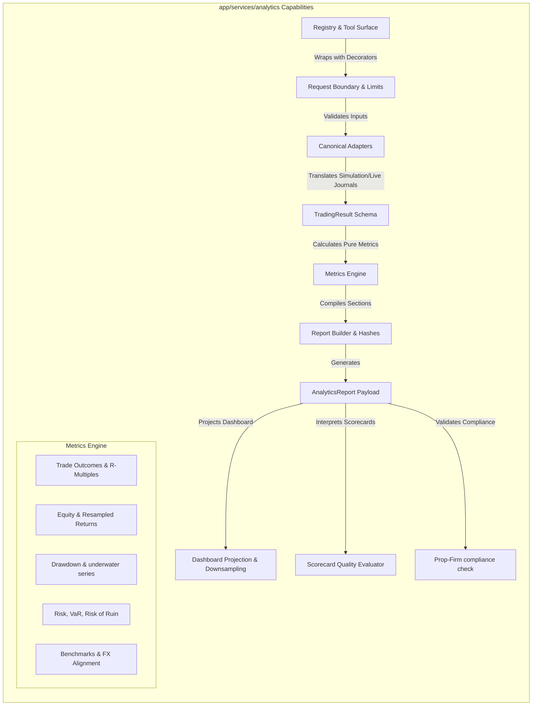
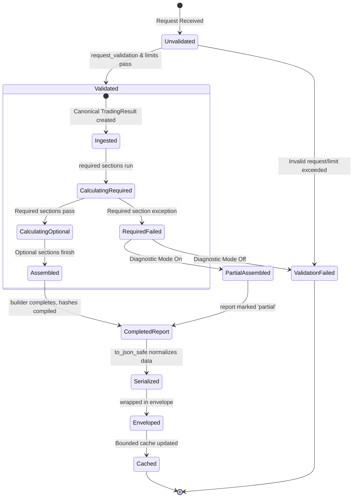

# Analytics Service — Intended Workflows and Scenarios

## 1. Document Purpose
This document reverse-engineers the isolated architecture requirements defined in [06-analytics.md](file:///c:/Users/rharu/AppDev/HaruquantAI/docs/dev/phase-implementation-plan/06-analytics.md) into a set of cohesive, actor-driven, end-to-end operational workflows and scenarios. It defines how technical metric calculations, adapters, registries, and boundary policies cooperate to deliver reliable performance metrics, scorecard evaluations, and dashboard projections across the HaruQuantAI platform.

---

## 2. Source and Analysis Boundaries
* **Source of Truth**: This analysis is strictly derived from the requirements, boundaries, and NFR catalogs in [06-analytics.md](file:///c:/Users/rharu/AppDev/HaruquantAI/docs/dev/phase-implementation-plan/06-analytics.md).
* **Constraints**: No source code from the active repository was inspected or assumed to exist. No domain behavior (e.g., active trading strategies, live broker connections, or risk allocations) was invented.
* **Terminology & Assertions**: All explicit requirements are marked with their corresponding `ANL-NFR-*` or `ANL-BR-*` tags. Implied system behaviors necessary to connect isolated requirements are clearly marked:
  > **Inferred workflow connection — requires validation**

---

## 3. System Purpose and Scope
### Primary Purpose
The `app/services/analytics` module provides the official, read-only performance and risk analytics service for HaruQuantAI (`ANL-NFR-247`). It derives historical metrics from canonical trading results, computes non-binding strategy scorecards, performs performance degradation comparisons, and projects chart/table outputs for dashboard rendering.

### Scope Boundaries
* **In-Scope**: Deterministic closed-trade calculations (streaks, outcomes, expectancy, R-multiples), equity curve analysis (resampled returns, drawdowns, Calmar/Sharpe/Sortino ratios), risk calculations (VaR, CVaR, expected shortfall, risk of ruin), benchmark-relative metrics (alpha, beta, tracking error), non-binding strategy quality assessment (SQN, penalty flags), performance comparisons (backtest vs. live drift), prop-firm compliance checking, in-memory dashboard projections with deterministic series downsampling, and request boundary validation (size checks, sanitization, thundering-herd cache management).
* **Out-of-Scope**: Writing reports or data to files/disk directly, direct database persistence, broker connections or live trade execution, risk-governor enforcement, live allocation changes, portfolio execution, UI/frontend rendering, and active market data fetching/caching (`ANL-NFR-001`, `ANL-NFR-098`, `ANL-NFR-247`, `ANL-NFR-252`).

### Entry and Exit Points
* **Entry Points**:
  * High-level read-only wrapper APIs (`build_analytics_report`, `build_portfolio_analytics_report`, `evaluate_strategy_quality`, `compare_analytics_reports`, `calculate_prop_firm_compliance`, `get_analytics_overview`) (`ANL-NFR-109`).
* **Exit Points**:
  * Output envelopes returned in-memory as JSON-safe structured data (`ToolEnvelope[AnalyticsReport]`, `ToolEnvelope[DashboardPayload]`, `ToolEnvelope[StrategyQualityAssessment]`) (`ANL-NFR-200`, `ANL-NFR-250`).
  * Redacted observability sinks (logging start/end, validation results, timing metrics) (`ANL-NFR-389`).

### Persistent Stores
* **None**: The Analytics service is entirely stateless. Caches (if implemented) are bounded, read-through, in-memory, and do not persist across system restarts (`ANL-NFR-003`, `ANL-NFR-005`, `ANL-NFR-006`).

---

## 4. Actors and Responsibilities
| Actor | Role | Initiates | Information Provided | Outcomes Received | Prohibited Actions |
|---|---|---|---|---|---|
| **Authorized Agent / Caller** | AI agent or backend routing API | Tool API requests (`build_analytics_report`, etc.) | Request ID, source result payloads, config mappings | Standard JSON-safe `ToolEnvelope` containing reports or payloads | Directly calling low-level metrics kernels or mutating global state (`ANL-NFR-013`, `ANL-NFR-388`). |
| **Upstream Registry** | System loader initializing modules | Service loading | Registry configuration, exports metadata | Official Tool Catalog synchronization | Dynamic modification of tool registry post-initialization (`ANL-NFR-002`, `ANL-NFR-384`). |
| **System Operator / Auditor** | Human maintainer or compliance checker | Handoff validation gate, compliance review | Configuration policies (ADR limits, tolerance keys) | Logged telemetry, traceability metrics, quality audit reports | Bypassing data redaction checks or boundary limits (`ANL-NFR-176`, `ANL-BR-001`). |

---

## 5. Capability Map

---

## 6. Workflow Catalogue
1. **WF-001 — Single-Strategy Analytics Report Generation** (Primary business workflow): Coordinates ingestion of backtest, paper, or live results, normalizes them into a `TradingResult`, executes the configured metric groups, and builds a reproducibility-hashed `AnalyticsReport` (`ANL-NFR-398`, `ANL-NFR-399`).
2. **WF-002 — Portfolio Analytics Report Generation** (Primary business workflow): Consumes multiple strategy trading results, aligns multi-currency PnL series via validated FX data, and compiles aggregate portfolio analytics (`ANL-NFR-007`, `ANL-NFR-351`).
3. **WF-003 — Strategy Quality Assessment (Scorecarding)** (Primary business workflow): Evaluates a generated `AnalyticsReport` to calculate SQN, check sample size limits, compile penalty warnings, and return a non-binding recommendation scorecard (`ANL-NFR-381`, `ANL-NFR-391`).
4. **WF-004 — Performance Comparison and Drift Analysis** (Primary business workflow): Evaluates two analytics reports (typically backtest vs. live or paper) to compute walk-forward degradation scores, identify metric deviations, and measure driver stability (`ANL-NFR-202`, `ANL-NFR-066`).
5. **WF-005 — Prop-Firm Compliance Verification** (Primary business workflow): Inspects strategy outcomes against specified compliance rules (max drawdown, daily loss limits, target returns, active days) to export non-binding verification evidence (`ANL-NFR-109`, `ANL-NFR-253`).
6. **WF-006 — Dashboard Overview Projection and Series Truncation** (Supporting workflow): Transforms raw report sections into dashboard payloads and downsamples time-series data using a deterministic peak/trough-preserving truncation algorithm (`ANL-NFR-110`, `ANL-NFR-180`).
7. **WF-007 — Request Validation and Workload Limit Enforcement** (Supporting workflow): Fronts the API surface as a decorator boundary, enforcing input boundaries, timestamp UTC normalization, credential redaction, and error envelope formatting (`ANL-NFR-199`, `ANL-NFR-176`, `ANL-BR-001`).

---

## 7. Detailed End-to-End Workflows

### WF-001 — Single-Strategy Analytics Report Generation
#### Purpose and Value
Generates a complete, reproducible report containing performance metrics, drawdown events, risk measurements, and statistical integrity checks from raw trading data, enabling data-driven evaluation of strategies.

#### Actors
* **Primary**: Authorized Agent / Caller
* **Supporting**: None

#### Trigger
The caller invokes the `build_analytics_report` API tool.

#### Preconditions
* The Analytics registry is initialized (`ANL-NFR-008`).
* The system configuration defines metric catalogs and schema compatibilities (`ANL-NFR-076`, `ANL-NFR-085`).

#### Inputs
* Raw backtest result, paper result, live trade journal, or pre-normalized transaction list.
* Request ID (traceability mandate) (`ANL-NFR-009`).
* Report configuration (which sections to calculate, annualization settings, precision policies).

#### Main Success Flow
| Step | Responsible component | Action | Input | Validation or decision | State change | Output | Requirement IDs |
| :--- | :--- | :--- | :--- | :--- | :--- | :--- | :--- |
| 1 | `tool_boundaries.py` | Receives execution wrapper, records start timestamp and sets request ID context. | Request payload, Request ID | Verify Request ID is present and formatted. | None | Trace context initialized | `ANL-NFR-009`, `ANL-NFR-199` |
| 2 | `boundaries/request_validation.py` | Validates raw payload against limits and schema version. | Input payload | Check trade/point count limits against `ADR-ANALYTICS-LIMITS`. | None | Validated input object | `ANL-NFR-176`, `ANL-NFR-428` |
| 3 | `adapters/canonicalize.py` | Adapts input into the canonical `TradingResult` contract. | Raw trading data | Ensure required schema fields map correctly; raise validation error if unmappable. | None | Canonicalized `TradingResult` | `ANL-NFR-092`, `ANL-NFR-093`, `ANL-NFR-094` |
| 4 | `reports/sections.py` | Schedules metric execution sections based on criticality. | `TradingResult`, Config | Resolve required vs optional sections. | None | Ordered evaluation queue | `ANL-NFR-403`, `ANL-NFR-429` |
| 5 | `metrics/aggregate.py` | Invokes low-level metric calculations (pnl, exposure, drawdown, etc.). | Normalized data inputs | Verify minimum sample size requirements per metric. | None | Calculated metric outputs, warnings | `ANL-NFR-160`, `ANL-NFR-189`, `ANL-NFR-251` |
| 6 | `reports/builder.py` | Combines results, maps skips/failures, and formats lineages. | Metric results, provenance metadata | Check if any critical/required section failed. | None | Raw `AnalyticsReport` structure | `ANL-NFR-107`, `ANL-NFR-399`, `ANL-NFR-400` |
| 7 | `reports/hashes.py` | Computes reproducibility hashes deterministically. | `AnalyticsReport` details | Ensure non-deterministic fields (e.g. build timestamps) are excluded. | None | Hash signatures | `ANL-NFR-108`, `ANL-NFR-409`, `ANL-NFR-416` |
| 8 | `contracts/serialization.py` | Converts decimals, scrubs NaNs, infs, and NumPy elements. | Compiled report | Validate JSON safety and numeric precision bounds. | None | JSON-safe serialized payload | `ANL-NFR-074`, `ANL-NFR-433` |
| 9 | `boundaries/envelopes.py` | Envelopes the payload in the standard response container. | Serialized report, latency data | Verify risk level is `low` and category is `analytics`. | None | `ToolEnvelope[AnalyticsReport]` | `ANL-NFR-200`, `ANL-NFR-272` |

#### Decision Points
* **Section Criticality Evaluation (`reports/sections.py`)**: 
  * If a required metric group calculation fails:
    * *Default (fail-closed)*: Rollback generation, format error envelope, and return `TOOL_EXECUTION_FAILED`.
    * *Alternate (diagnostic partial mode enabled)*: Downgrade `report_status` to `"partial"`, mark the section failed, compile failures in section metadata, and proceed (`ANL-NFR-401`, `ANL-NFR-402`, `ANL-NFR-404`).
* **R-Multiple Calculation (`metrics/r_multiples.py`)**:
  * If explicit initial-risk fields are present: calculate R-multiples using initial risk.
  * If absent: fall back to metric-catalog approved proxies (e.g., profit/loss ratios), emit a warnings context, and mark section confidence as degraded (`ANL-NFR-075`, `ANL-NFR-249`).

#### Alternate Flows
* **Simulation Journal Ingestion**: Adapter `journal_adapters.py` converts simulation execution reports, fills, and portfolio snapshots into the canonical input instead of `canonicalize.py` (`ANL-NFR-448`, `ANL-NFR-449`).

#### Failure and Exception Flows
* **Validation Failure (Invalid Schema/Parameters)**:
  * Detected by `boundaries/request_validation.py`.
  * Response: Stop execution immediately, write redacted warning log, package details in standard error envelope, and return `VALIDATION_FAILED` (`ANL-NFR-312`).
* **Hardware/Memory Limit Exceeded**:
  * Detected by `boundaries/limits.py`.
  * Response: Stop execution, log warning with redacted size data, emit `LIMIT_EXCEEDED` error envelope (`ANL-NFR-176`, `ANL-NFR-364`).

#### Recovery Flow
* If an execution exception occurs inside a metric kernel during report generation, the report builder catches it. If the section is marked *optional*, it records the failure in the report's metadata, skips the section, and continues building. If *required*, it escalates to a full execution error (`ANL-NFR-405`).

#### Postconditions
* Returned: `ToolEnvelope[AnalyticsReport]` containing canonical metadata, reproducible hashes, and metric results.
* Emitted: Telemetry containing run latency and size profiles (`ANL-NFR-248`).

#### Participating Components
* **Entry Point**: `app.services.analytics.tool_api:build_analytics_report`
* **Orchestrator**: `app.services.analytics.reports.builder:AnalyticsReportBuilder`
* **Validators**: `app.services.analytics.boundaries.request_validation:validate_request`, `app.services.analytics.boundaries.limits:enforce_limits`
* **Decision Authorities**: `app.services.analytics.reports.sections:evaluate_section`
* **Executors**: `app.services.analytics.metrics.*` (kernels)
* **Persistence**: None (Stateless; optional cache in `app.services.analytics.boundaries.cache`)
* **External Dependencies**: Upstream adapter packages (`app.utils.errors`, etc.)

#### Requirement Traceability
* Mapped: `ANL-NFR-009`, `ANL-NFR-074` to `076`, `ANL-NFR-092` to `094`, `ANL-NFR-107` to `108`, `ANL-NFR-160`, `ANL-NFR-176`, `ANL-NFR-189`, `ANL-NFR-199` to `201`, `ANL-NFR-248` to `251`, `ANL-NFR-272`, `ANL-NFR-398` to `411`, `ANL-NFR-415` to `416`, `ANL-NFR-428` to `429`, `ANL-NFR-433`, `ANL-NFR-448` to `451`.

---

### WF-002 — Portfolio Analytics Report Generation
#### Purpose and Value
Compiles trading results from multiple strategies into a base-currency unified portfolio report, verifying cross-strategy correlation and risk diversification factors.

#### Actors
* **Primary**: Authorized Agent / Caller
* **Supporting**: External FX rate provider (read-only)

#### Trigger
The caller invokes `build_portfolio_analytics_report`.

#### Preconditions
* Target strategies share matching timeframes or resampled return frequencies (`ANL-NFR-202`).
* Valid currency rates are supplied or base-currency parameters are configured (`ANL-NFR-351`).

#### Inputs
* List of `TradingResult` or source adapter records.
* Target base currency symbol (`account_base_currency`).
* FX conversion rate metrics array.

#### Main Success Flow
| Step | Responsible component | Action | Input | Validation or decision | State change | Output | Requirement IDs |
| :--- | :--- | :--- | :--- | :--- | :--- | :--- | :--- |
| 1 | `tool_boundaries.py` | Checks request boundaries and parameters. | Input arguments | Validate request ID and base-currency target format. | None | Verified request context | `ANL-NFR-199` |
| 2 | `adapters/canonicalize.py` | Adapts each strategy result input. | List of strategy sources | Verify each maps cleanly to a `TradingResult`. | None | List of `TradingResult` objects | `ANL-NFR-092` |
| 3 | `benchmarks/alignment.py` | Normalizes all timelines to UTC and resamples to common intervals. | Strategy curves | Ensure dates are timezone-aware. | None | Time-aligned return vectors | `ANL-NFR-347`, `ANL-NFR-363` |
| 4 | `benchmarks/alignment.py` | Converts multi-currency performance series to base currency. | Multi-currency vectors, FX rates | Check age limits on FX conversion rates. | None | Converted single-currency curves | `ANL-NFR-351`, `ANL-NFR-353`, `ANL-NFR-354` |
| 5 | `metrics/aggregate.py` | Computes portfolio return curves, drawdowns, and correlations. | Converted curves | Ensure currency sum logic does not combine un-converted assets. | None | Portfolio-level metrics | `ANL-NFR-350` |
| 6 | `reports/builder.py` | Assembles versioned `PortfolioAnalyticsReport`. | Combined calculations | Check for currency conversion warnings. | None | Raw report payload | `ANL-NFR-428` |
| 7 | `boundaries/envelopes.py` | Wraps output in the standard envelope. | Serialized report payload | Validate JSON-safety. | None | `ToolEnvelope[PortfolioAnalyticsReport]` | `ANL-NFR-200` |

#### Decision Points
* **FX Rate Currency Check (`benchmarks/alignment.py`)**:
  * If base-currency conversion is required and FX rates are missing:
    * *Default (fail-closed)*: Raise validation exception, abort calculation, and return `VALIDATION_FAILED` (`ANL-NFR-007`).
    * *Alternate (currency-neutral degradation)*: If allowed by config, omit currency values, calculate currency-neutral ratios, write blocker warning, and proceed (`ANL-NFR-349`, `ANL-NFR-352`).
* **Stale FX Rate Assessment (`benchmarks/alignment.py`)**:
  * If FX rate timestamp exceeds age limits: mark output values as estimates in warning metadata, degrade confidence, and continue (`ANL-NFR-353`).

#### Alternate Flows
* None. Multi-currency summation without conversion is strictly blocked (`ANL-NFR-350`).

#### Failure and Exception Flows
* **Base-Currency Failure (Unresolvable FX conversion)**:
  * Detected by `benchmarks/alignment.py`.
  * Response: Stop execution, log warning with redacted currency targets, emit `VALIDATION_FAILED` envelope (`ANL-NFR-007`, `ANL-NFR-352`).

#### Recovery Flow
* If a single strategy component within the portfolio fails to compile due to an optional section error, the portfolio builder isolates that strategy, marks its contribution status failed, and computes aggregate metrics over the remaining strategies.

#### Postconditions
* Returned: `ToolEnvelope[PortfolioAnalyticsReport]` containing base-currency normalized statistics and cross-strategy performance correlations.

#### Participating Components
* **Entry Point**: `app.services.analytics.tool_api:build_portfolio_analytics_report`
* **Orchestrator**: `app.services.analytics.reports.builder:AnalyticsReportBuilder`
* **Validators**: `app.services.analytics.boundaries.request_validation:validate_request`, `app.services.analytics.benchmarks.alignment:bench_alignment_boundary`
* **Executors**: `app.services.analytics.metrics.*`
* **Dependencies**: External FX metadata feeds (provided via adapters).

#### Requirement Traceability
* Mapped: `ANL-NFR-007`, `ANL-NFR-347`, `ANL-NFR-349` to `354`, `ANL-NFR-363`, `ANL-NFR-428`.

---

### WF-003 — Strategy Quality Assessment (Scorecarding)
#### Purpose and Value
Evaluates a completed performance report against predefined quality checks (overfitting metrics, sample size limits, and drawdown levels) to assign a non-binding score, helping callers judge strategy health.

#### Actors
* **Primary**: Authorized Agent / Caller
* **Supporting**: None

#### Trigger
The caller invokes `evaluate_strategy_quality`.

#### Preconditions
* A valid, completed `AnalyticsReport` is generated.
* The scorecard configuration containing test weights and warning thresholds is loaded.

#### Inputs
* `AnalyticsReport` payload.
* `StrategyQualityConfig` (contains rules, penalty scales, and SQN thresholds).

#### Main Success Flow
| Step | Responsible component | Action | Input | Validation or decision | State change | Output | Requirement IDs |
| :--- | :--- | :--- | :--- | :--- | :--- | :--- | :--- |
| 1 | `tool_boundaries.py` | Validates request context and input report schema. | `AnalyticsReport`, request ID | Check input report version matches active schemas. | None | Verified scorecard context | `ANL-NFR-199`, `ANL-NFR-428` |
| 2 | `scorecards/quality.py` | Extracts sample size details and calculates sample reliability. | `AnalyticsReport` trades section | Check if trade count meets minimum sample sizes. | None | Sample warning details | `ANL-NFR-394` |
| 3 | `scorecards/quality.py` | Calculates System Quality Number (SQN). | Report outcomes, volatility | Ensure metric catalog approved formulas are used. | None | Calculated SQN metrics | `ANL-NFR-393` |
| 4 | `scorecards/labels.py` | Identifies quality warning flags (e.g., overfitting, high drawdown). | Metric outcomes | Evaluate metric values against scorecard thresholds. | None | Categorized warnings | `ANL-NFR-217`, `ANL-NFR-391` |
| 5 | `scorecards/labels.py` | Separates raw facts, warnings, caveats, and recommended actions. | Warning results, SQN | Apply non-binding recommendations logic. | None | Drafted assessment payload | `ANL-NFR-385`, `ANL-NFR-392` |
| 6 | `boundaries/envelopes.py` | Packages scorecard payload in standard output wrapper. | Serialized assessment data | Ensure no promotion authority or final approval is claimed. | None | `ToolEnvelope[StrategyQualityAssessment]` | `ANL-NFR-200`, `ANL-NFR-253` |

#### Decision Points
* **Promotion Block Evaluation (`scorecards/labels.py`)**:
  * If critical warnings (e.g., severe overfitting, extremely low sample size, unhedged drawdown) are triggered:
    * *Action*: Mark assessment with blocker warnings. The assessment explicitly declares that this strategy cannot proceed to live activation, but leaves actual policy enforcement to external systems (`ANL-NFR-252`, `ANL-NFR-391`).

#### Alternate Flows
* **Partial Report Assessment**:
  * If the input `AnalyticsReport` status is `"partial"`: the scorecard evaluator skips checks dependent on missing sections, raises a caveat warning, and calculates a degraded scorecard (`ANL-NFR-218`).

#### Failure and Exception Flows
* **Invalid Input Report (Unversioned/Corrupted Schema)**:
  * Detected by `tool_boundaries.py`.
  * Response: Stop assessment, return `VALIDATION_FAILED` envelope. No empty/fabricated scores are returned (`ANL-NFR-312`).

#### Recovery Flow
* If the input report has missing sections and no partial scorecard can be generated, the evaluator aborts cleanly with a structured warning listing missing required sections (`ANL-NFR-074`).

#### Postconditions
* Returned: `ToolEnvelope[StrategyQualityAssessment]` containing non-binding scorecards, warnings, and caveats.
* Compliance: The envelope explicitly states: *“Non-binding review context only. No live activation authority.”* (`ANL-NFR-253`, `ANL-NFR-392`).

#### Participating Components
* **Entry Point**: `app.services.analytics.tool_api:evaluate_strategy_quality`
* **Orchestrator**: `app.services.analytics.scorecards.quality:evaluate_strategy_quality`
* **Validators**: `app.services.analytics.scorecards.labels:scorecards_policy_boundary`
* **Executors**: `app.services.analytics.scorecards.quality:sqn`, `sample_size_warning`
* **Dependencies**: None.

#### Requirement Traceability
* Mapped: `ANL-NFR-217` to `218`, `ANL-NFR-252` to `253`, `ANL-NFR-381`, `ANL-NFR-385`, `ANL-NFR-391` to `394`, `ANL-NFR-428`.

---

### WF-004 — Performance Comparison and Drift Analysis
#### Purpose and Value
Compares two reports (e.g., historical backtest vs. live results) to evaluate walk-forward degradation scores, identify performance decay, and verify statistical driver stability.

#### Actors
* **Primary**: Authorized Agent / Caller
* **Supporting**: None

#### Trigger
The caller invokes `compare_analytics_reports` with two reports.

#### Preconditions
* Both reports are valid and version-compatible (`ANL-NFR-202`).
* Strategy ID and version match across inputs (`ANL-NFR-202`).

#### Inputs
* Left `AnalyticsReport` (typically Backtest).
* Right `AnalyticsReport` (typically Live/Paper).
* Comparison configuration (evaluation window, return frequency).

#### Main Success Flow
| Step | Responsible component | Action | Input | Validation or decision | State change | Output | Requirement IDs |
| :--- | :--- | :--- | :--- | :--- | :--- | :--- | :--- |
| 1 | `tool_boundaries.py` | Checks request context and schema inputs. | Two reports, request ID | Ensure both reports are versioned and validated. | None | Verified comparison context | `ANL-NFR-199`, `ANL-NFR-428` |
| 2 | `boundaries/request_validation.py` | Validates pairing metadata. | Report metadata | Check strategy ID, version, symbols, currency, and timeframe match. | None | Validated pairing | `ANL-NFR-202` |
| 3 | `statistics/multiple_testing.py` | Computes walk-forward degradation scores. | Left vs Right return series | Assess return series decay from in-sample to out-of-sample. | None | Walk-forward decay score | `ANL-NFR-066` |
| 4 | `statistics/multiple_testing.py` | Evaluates performance stability across windows. | Resampled timelines | Check variance and mean performance consistency. | None | Stability score | `ANL-NFR-069` |
| 5 | `scorecards/labels.py` | Identifies strategy version mismatch or configuration mismatch. | Report lineages | Confirm no silent version mismatch is hidden. | None | Mismatch warning metadata | `ANL-NFR-014` |
| 6 | `reports/builder.py` | Compiles the comparison report. | Calculation outputs | Ensure low-sample driver metrics are excluded. | None | Raw comparison report | `ANL-NFR-015` |
| 7 | `boundaries/envelopes.py` | Envelopes the comparison report. | Serialized output | Validate JSON safety. | None | `ToolEnvelope[AnalyticsComparison]` | `ANL-NFR-200` |

#### Decision Points
* **Pairing Metadata Alignment Validation (`boundaries/request_validation.py`)**:
  * If symbols, currency, or cost model settings differ between backtest and live reports:
    * *Action*: Raise a pairing warning, degrade the comparison confidence score, and flag the mismatch in comparison metadata (`ANL-NFR-202`).
  * If strategy ID or strategy version does not match:
    * *Default (fail-closed)*: Raise validation exception, return `VALIDATION_FAILED` (`ANL-NFR-014`).

#### Alternate Flows
* **Cross-Timeframe Comparison**:
  * If timeframe settings differ but are resamplable (e.g. 1-minute vs 5-minute), the system resamples both to the lower resolution, logs a warning, and continues.

#### Failure and Exception Flows
* **Mismatch in Crucial Metadata (Strategy ID)**:
  * Detected by `boundaries/request_validation.py`.
  * Response: Terminate workflow immediately, return `VALIDATION_FAILED` envelope detail (`ANL-NFR-014`).

#### Recovery Flow
* If one of the reports is marked `"partial"`, the comparison service evaluates only overlapping completed sections, outputs warnings about skipped comparisons, and proceeds without throwing exceptions (`ANL-NFR-402`).

#### Postconditions
* Returned: `ToolEnvelope[AnalyticsComparison]` showing performance decay and stability metrics.

#### Participating Components
* **Entry Point**: `app.services.analytics.tool_api:compare_analytics_reports`
* **Orchestrator**: `app.services.analytics.statistics.multiple_testing:calculate_comparison`
* **Validators**: `app.services.analytics.boundaries.request_validation:validate_request`
* **Executors**: `app.services.analytics.statistics.multiple_testing:walk_forward_degradation_score`, `stability_score`
* **Dependencies**: None.

#### Requirement Traceability
* Mapped: `ANL-NFR-014` to `015`, `ANL-NFR-066`, `ANL-NFR-069`, `ANL-NFR-202`, `ANL-NFR-428`.

---

### WF-005 — Prop-Firm Compliance Verification
#### Purpose and Value
Evaluates strategy performance metrics against specified prop-firm challenge configurations (limits on drawdowns, trading days, and profit targets) to produce standard verification evidence.

#### Actors
* **Primary**: Authorized Agent / Caller
* **Supporting**: None

#### Trigger
The caller invokes `calculate_prop_firm_compliance`.

#### Preconditions
* A valid `AnalyticsReport` is generated.
* A target compliance profile is defined.

#### Inputs
* `AnalyticsReport` object.
* `ComplianceProfile` (defines drawdown limits, active days target, target returns, margin limits).

#### Main Success Flow
| Step | Responsible component | Action | Input | Validation or decision | State change | Output | Requirement IDs |
| :--- | :--- | :--- | :--- | :--- | :--- | :--- | :--- |
| 1 | `tool_boundaries.py` | Validates request context and input report schema. | Report, request ID | Ensure input is a valid versioned report. | None | Verified compliance context | `ANL-NFR-199`, `ANL-NFR-428` |
| 2 | `metrics/trade_outcomes.py` | Extracts total active trading days. | Trade timestamp lists | Check format of open/close times. | None | Active days metrics | `ANL-NFR-201` |
| 3 | `metrics/drawdown.py` | Extracts close-to-close drawdowns and intra-trade drawdowns. | Equity curves, trade records | Compare observed drawdowns with configured limits. | None | Drawdown compliance status | `ANL-NFR-222`, `ANL-NFR-231` |
| 4 | `metrics/risk.py` | Extracts single-trade and portfolio margin utilization records. | Margin curve array | Analyze maximum margin limits. | None | Margin compliance status | `ANL-NFR-173`, `ANL-NFR-267` |
| 5 | `scorecards/labels.py` | Labels outcomes as non-binding compliance evidence. | Compliance calculations | Ensure no enforcement or active approvals are claimed. | None | Compliance evidence payload | `ANL-NFR-392` |
| 6 | `boundaries/envelopes.py` | Envelopes the payload in the standard response wrapper. | Serialized compliance data | Validate JSON-safety. | None | `ToolEnvelope[ComplianceEvidence]` | `ANL-NFR-200`, `ANL-NFR-253` |

#### Decision Points
* **Compliance Threshold Check (`scorecards/labels.py`)**:
  * If the strategy has breached a hard draw-down limit or failed minimum days:
    * *Action*: Mark compliance status as `failed` in the output evidence payload. The output includes warning tags but leaves actual account execution or disablement to external trading gateways (`ANL-NFR-253`, `ANL-NFR-392`).

#### Alternate Flows
* None.

#### Failure and Exception Flows
* **Corrupted Time/Data Inputs (Missing Close Timestamps)**:
  * Detected by `metrics/trade_outcomes.py`.
  * Response: Stop evaluation, mark compliance profile section as `failed`, log warning without raw payload leaks (`ANL-NFR-101`, `ANL-NFR-389`).

#### Recovery Flow
* If timestamps are missing timezone details, the system attempts UTC normalization (`ANL-NFR-363`). If conversion fails, it stops execution and returns `VALIDATION_FAILED` (`ANL-NFR-312`).

#### Postconditions
* Returned: `ToolEnvelope[ComplianceEvidence]` detailing compliance status across metrics, with explicit labels indicating that this output holds no active trading authority.

#### Participating Components
* **Entry Point**: `app.services.analytics.tool_api:calculate_prop_firm_compliance`
* **Orchestrator**: `app.services.analytics.scorecards.labels:scorecards_policy_boundary`
* **Validators**: `app.services.analytics.boundaries.request_validation:validate_request`
* **Executors**: `app.services.analytics.metrics.*`
* **Dependencies**: None.

#### Requirement Traceability
* Mapped: `ANL-NFR-101`, `ANL-NFR-109`, `ANL-NFR-173`, `ANL-NFR-200` to `201`, `ANL-NFR-222`, `ANL-NFR-231`, `ANL-NFR-253`, `ANL-NFR-267`, `ANL-NFR-363`, `ANL-NFR-392`, `ANL-NFR-428`.

---

### WF-006 — Dashboard Overview Projection and Series Truncation
#### Purpose and Value
Transforms raw `AnalyticsReport` data into structured UI-friendly payloads, ensuring massive performance curves are downsampled deterministically to avoid UI latency while preserving key data events.

#### Actors
* **Primary**: System Component (Dashboard/API gateway)
* **Supporting**: None

#### Trigger
The caller invokes `get_analytics_overview` or requests dashboard data from a built report.

#### Preconditions
* A valid `AnalyticsReport` has been generated (`ANL-NFR-411`).
* Max payload size and point limits are configured (`ANL-NFR-442`).

#### Inputs
* `AnalyticsReport` data.
* `DashboardConfig` (defines chart selections, maximum points per chart).

#### Main Success Flow
| Step | Responsible component | Action | Input | Validation or decision | State change | Output | Requirement IDs |
| :--- | :--- | :--- | :--- | :--- | :--- | :--- | :--- |
| 1 | `dashboards/overview.py` | Extracts report sections and initializes projection. | `AnalyticsReport` | Verify report status is not corrupted. Do not recalculate core metrics. | None | Initial projection context | `ANL-NFR-411`, `ANL-NFR-436` |
| 2 | `dashboards/truncation.py` | Determines if series lengths exceed dashboard point limits. | Series data arrays (equity, drawdown) | Evaluate chart limits configured in ADR limits. | None | Truncation decision | `ANL-NFR-441` |
| 3 | `dashboards/truncation.py` | Applies deterministic downsampling to curves. | Large curves | Ensure endpoints, extrema, peaks, and warnings dates are preserved. | None | Truncated series arrays | `ANL-NFR-180` |
| 4 | `dashboards/overview.py` | Compiles summary cards, heatmaps, and tables. | Truncated curves, metadata | Map warnings and quality flags to table rows. | None | Raw dashboard structure | `ANL-NFR-110`, `ANL-NFR-434` |
| 5 | `dashboards/truncation.py` | Appends truncation metadata to the payload. | Downsampling stats | Include original count, returned count, method, and reason. | None | Metadata-enriched payload | `ANL-NFR-438` |
| 6 | `boundaries/envelopes.py` | Envelopes the payload for transmission. | Dashboard payload | Verify JSON safety. | None | `ToolEnvelope[DashboardPayload]` | `ANL-NFR-200`, `ANL-NFR-440` |

#### Decision Points
* **Series Downsampling Decision (`dashboards/truncation.py`)**:
  * If series length <= maximum point limit: bypass truncation, return series unchanged.
  * If series length > maximum point limit: perform deterministic downsampling, flag `truncated = true`, and append downsampling metrics (`ANL-NFR-438`, `ANL-NFR-441`).

#### Alternate Flows
* **Missing Section Projection**:
  * If a source report section was skipped/failed during report building: the dashboard builder projects that section as empty, includes section-status warnings, and continues without fabricating any charts (`ANL-NFR-435`).

#### Failure and Exception Flows
* **Max Payload Limit Exceeded**:
  * Detected by `dashboards/truncation.py`.
  * Response: Stop compilation, return a `LIMIT_EXCEEDED` envelope. Avoid transmitting massive raw curves that crash consumer memory (`ANL-NFR-442`).

#### Recovery Flow
* If downsampling fails due to mathematical range errors (e.g. zero variance series), the system logs the warning and falls back to simple uniform interval sampling, logging the fallback in the truncation metadata (`ANL-NFR-438`).

#### Postconditions
* Returned: `ToolEnvelope[DashboardPayload]` containing optimized chart datasets, tables, and truncation parameters.

#### Participating Components
* **Entry Point**: `app.services.analytics.tool_api:get_analytics_overview`
* **Orchestrator**: `app.services.analytics.dashboards.overview:OverviewDashboardBuilder`
* **Validators**: `app.services.analytics.dashboards.truncation:truncate_series`
* **Executors**: `app.services.analytics.dashboards.truncation:truncate_series`
* **Dependencies**: None.

#### Requirement Traceability
* Mapped: `ANL-NFR-110`, `ANL-NFR-180`, `ANL-NFR-200`, `ANL-NFR-411`, `ANL-NFR-434` to `438`, `ANL-NFR-440` to `442`, `ANL-NFR-445`, `ANL-NFR-446` to `447`.

---

### WF-007 — Request Validation and Workload Limit Enforcement
#### Purpose and Value
Wraps all API entry points in a secure boundary layer to validate request payloads, enforce calculation limits, scrub sensitive values (passwords, tokens), and handle caching to prevent thundering herds.

#### Actors
* **Primary**: System Component (Decorator / Boundary Layer)
* **Supporting**: None

#### Trigger
Any API tool within `tool_api.py` is invoked.

#### Preconditions
* Configuration settings containing cache, logging, and limit profiles are loaded.

#### Inputs
* Input payload, request ID, target tool identifier.

#### Main Success Flow
| Step | Responsible component | Action | Input | Validation or decision | State change | Output | Requirement IDs |
| :--- | :--- | :--- | :--- | :--- | :--- | :--- | :--- |
| 1 | `registry/tool_boundaries.py` | Intercepts call, extracts request ID, and verifies allowlist status. | Call envelope, request ID | Ensure request ID is present and matches format. | None | Boundary wrapper context | `ANL-NFR-009`, `ANL-NFR-199` |
| 2 | `boundaries/request_validation.py` | Inspects payload schema, checks datatypes, and checks dates. | Request payload | Verify no Infinity values are passed. Normalize all dates to UTC. | None | Sanitized payload | `ANL-NFR-179`, `ANL-NFR-363` |
| 3 | `boundaries/limits.py` | Enforces workload and memory ceilings. | Payload sizes | Validate size against limits in `ADR-ANALYTICS-LIMITS`. | None | Approved workload | `ANL-NFR-176`, `ANL-NFR-364` |
| 4 | `boundaries/cache.py` | Computes input hash and checks local read-through cache. | Input hash, config hash | Check if matching cached report is valid (TTL check). | None | Cache hit/miss status | `ANL-NFR-005`, `ANL-NFR-309` |
| 5 | `boundaries/observability.py` | Logs call start with redacted metadata. | Context | Scrub credentials and tokens from logs. | None | Log entry | `ANL-NFR-389`, `ANL-BR-001` |
| 6 | `tool_api.py` | *Conditional (Cache Miss)*: Delegates execution to underlying executors. | Sanitized payload | None | None | Compiled output envelope | `ANL-NFR-200` |
| 7 | `boundaries/cache.py` | *Conditional (Cache Miss)*: Stores serialized output in cache. | Output payload | None | Updates cache store | Cached entry | `ANL-NFR-005` |
| 8 | `boundaries/observability.py` | Logs call completion and execution metrics. | Execution stats | Ensure execution latency and memory are recorded. | None | Diagnostic log | `ANL-NFR-248`, `ANL-NFR-424` |

#### Decision Points
* **Cache Inspection (`boundaries/cache.py`)**:
  * If cache hit occurs: bypass calculation engine, verify cached metadata integrity, and return cached report directly (`ANL-NFR-005`, `ANL-NFR-418`).
  * If cache miss occurs: proceed to metric calculations and cache results upon completion (`ANL-NFR-005`).
* **Duplicate Timestamp Check (`boundaries/request_validation.py`)**:
  * If duplicate timestamps are found in return curves:
    * *Default (fail-closed)*: Return `VALIDATION_FAILED` envelope (`ANL-NFR-312`).
    * *Alternate (deterministic resolution)*: Resolve duplicates using configuration rules (e.g. keep last, sum value), write diagnostic log, and proceed (`ANL-NFR-311`).

#### Alternate Flows
* **Acceleration Library Absence**:
  * If C-based acceleration libraries are missing: the request validation module degrades calculations safely to pure Python equivalents, writes warning metadata, and continues (`ANL-NFR-307`).

#### Failure and Exception Flows
* **Validation Failure (Infinity values passed)**:
  * Detected by `boundaries/request_validation.py`.
  * Response: Stop execution, return standard `VALIDATION_FAILED` envelope. No uncaught exceptions leak (`ANL-NFR-179`, `ANL-NFR-312`).
* **Observability credential leak**:
  * Detected by `boundaries/redaction.py`.
  * Response: Scrub input mappings and parameters before writing to console/telemetry sinks (`ANL-NFR-276`, `ANL-BR-001`).

#### Recovery Flow
* **Cache Lock Timeout (Thundering Herd Prevention)**:
  * If another thread is actively generating the same report (single-flight cache hit pending) and the lock times out: the cache manager bypasses the lock, performs a concurrent calculation to ensure availability, logs the warning, and returns the result safely (`ANL-NFR-005`).

#### Postconditions
* Returned: Standardized, JSON-safe success or error envelope.
* Telemetry: Latency, cache hit/miss, and payload sizes recorded in redacted log sinks (`ANL-NFR-248`, `ANL-NFR-389`).

#### Participating Components
* **Entry Point**: `app.services.analytics.registry.tool_boundaries:tool_boundary_decorator`
* **Orchestrator**: `app.services.analytics.boundaries.request_validation`
* **Validators**: `app.services.analytics.boundaries.limits`, `app.services.analytics.boundaries.redaction`
* **Persistence**: `app.services.analytics.boundaries.cache` (in-memory)
* **Dependencies**: `app.utils.errors`

#### Requirement Traceability
* Mapped: `ANL-NFR-005`, `ANL-NFR-009`, `ANL-NFR-176`, `ANL-NFR-179`, `ANL-NFR-199` to `200`, `ANL-NFR-248`, `ANL-NFR-276`, `ANL-NFR-307`, `ANL-NFR-309`, `ANL-NFR-311` to `312`, `ANL-NFR-363` to `364`, `ANL-NFR-389`, `ANL-NFR-418`, `ANL-NFR-424`, `ANL-BR-001`.

---

## 8. Scenario Catalogue

| Scenario ID | Scenario | Given | When | Then | Expected state | Requirement IDs |
| :--- | :--- | :--- | :--- | :--- | :--- | :--- |
| WF-001-SC-001 | Happy Path Report | Valid trading result under limit ceiling | Caller invokes `build_analytics_report` | System generates a versioned report with all metric sections and hashes | Successful report returned (`report_status = "success"`) | `ANL-NFR-398`, `ANL-NFR-399` |
| WF-001-SC-002 | Required Metric Failure (Diagnostic Mode Off) | Valid trading result, but a required metric calculation fails | Caller invokes `build_analytics_report` | System aborts execution and returns error envelope | `TOOL_EXECUTION_FAILED` returned | `ANL-NFR-401`, `ANL-NFR-404` |
| WF-001-SC-003 | Required Metric Failure (Diagnostic Mode On) | Valid trading result, but a required metric calculation fails | Caller invokes `build_analytics_report` with `diagnostic_mode = true` | System creates a partial report, marks status, and continues | Partial report returned (`report_status = "partial"`) | `ANL-NFR-402`, `ANL-NFR-403` |
| WF-001-SC-004 | Missing Optional Metrics | Trading result lacking benchmark currency | Caller invokes `build_analytics_report` | System completes report, skipping benchmark comparison sections and adding warnings | Report returned with caveat warnings | `ANL-NFR-400`, `ANL-NFR-405` |
| WF-001-SC-005 | R-Multiple Fallback proxy | Trading result with absent initial-risk fields | Caller invokes `build_analytics_report` | System falls back to metrics catalog proxy, adds warning, and marks confidence degraded | Report returned with fallback warnings | `ANL-NFR-075`, `ANL-NFR-249` |
| WF-002-SC-001 | Portfolio Happy Path | Multiple strategy results, matching currency | Caller invokes `build_portfolio_analytics_report` | System resamples timelines and sums returns | Portfolio report returned | `ANL-NFR-428` |
| WF-002-SC-002 | Portfolio Multi-currency (No FX Rates) | Strategy results in different base currencies, no FX rates supplied | Caller invokes `build_portfolio_analytics_report` | System aborts execution to prevent raw summation | `VALIDATION_FAILED` returned | `ANL-NFR-007`, `ANL-NFR-350` |
| WF-003-SC-001 | Scorecard Overfitting Warning | Report contains high backtest overfitting statistics | Caller invokes `evaluate_strategy_quality` | System returns score with warning flags and non-binding caveat recommendations | Scorecard returned with warning flags | `ANL-NFR-217`, `ANL-NFR-391` |
| WF-004-SC-001 | Comparison Drift Detected | Backtest and live reports with substantial return deviation | Caller invokes `compare_analytics_reports` | System calculates walk-forward degradation scores showing performance decay | Comparison report returned | `ANL-NFR-066`, `ANL-NFR-069` |
| WF-004-SC-002 | Strategy Version Mismatch | Left and Right reports belong to different strategy versions | Caller invokes `compare_analytics_reports` | System aborts comparison | `VALIDATION_FAILED` returned | `ANL-NFR-014`, `ANL-NFR-202` |
| WF-005-SC-001 | Prop-Firm Drawdown Breach | Report drawdown exceeds challenge profile drawdown limit | Caller invokes `calculate_prop_firm_compliance` | System registers failed compliance evidence and non-binding warning flags | Compliance evidence returned with `failed` flags | `ANL-NFR-231`, `ANL-NFR-392` |
| WF-006-SC-001 | Curve Truncation Happy Path | Curve length is 50,000 points; limit is 1,000 | System projects overview dashboard payload | Downsampling preserves endpoints, peaks, troughs, and warning timestamps | Truncated dashboard payload returned | `ANL-NFR-180`, `ANL-NFR-438` |
| WF-007-SC-001 | Workload Limit Exceeded | Trading result contains 2,000,000 trades; limit is 500,000 | Caller invokes `build_analytics_report` | System blocks execution at validation layer | `LIMIT_EXCEEDED` error returned | `ANL-NFR-176`, `ANL-NFR-364` |
| WF-007-SC-002 | Infinity Value Passed | Trading result contains `inf` values | Caller invokes `build_analytics_report` | System validates parameters and stops execution | `VALIDATION_FAILED` returned | `ANL-NFR-179`, `ANL-NFR-312` |
| WF-007-SC-003 | Credential Logging Attempt | Request parameters contain raw broker API tokens | System logs call start | System redacts token parameters before writing to console/telemetry sinks | Token values masked in logs | `ANL-NFR-276`, `ANL-BR-001` |
| WF-007-SC-004 | Thundering Herd Cache Hit | Parallel threads request same report simultaneously | Callers invoke `build_analytics_report` | First thread generates, second thread waits and retrieves from cache | Reports returned safely | `ANL-NFR-005`, `ANL-NFR-418` |

---

## 9. Workflow Relationship Map

| Source workflow | Relationship | Target workflow | Trigger or condition |
| :--- | :--- | :--- | :--- |
| `WF-001` | Parent | `WF-007` | Automatically invoked as a boundary decorator on entry. |
| `WF-002` | Parent | `WF-007` | Automatically invoked as a boundary decorator on entry. |
| `WF-003` | Child | `WF-001` | Requires the output of `WF-001` as primary input. |
| `WF-004` | Child | `WF-001` | Requires two output instances of `WF-001` to compare. |
| `WF-005` | Child | `WF-001` | Requires the output of `WF-001` to evaluate compliance. |
| `WF-006` | Child | `WF-001` / `WF-002` | Triggered by API gateway to prepare reports for UI. |
| `WF-001` | Upstream | `WF-006` | Prepares sections that `WF-006` downsamples. |
| `WF-007` | Parent | `WF-006` | Enforces payload limits during UI projections. |

---

## 10. System Lifecycle and State Transitions
Although the Analytics service is entirely stateless and does not maintain persistent database records, the objects it manages (e.g., Reports, Calculations, and cache segments) transit through distinct lifecycle states.

### State Definitions
1. **Unvalidated**: Raw request payload has entered `tool_api.py`.
2. **ValidationFailed**: Request failed size constraints, contained invalid timestamps, or generated numeric bounds errors. Terminated with error envelope.
3. **Validated**: Request conforms to schema, sizing thresholds, and timestamps are normalized to UTC.
4. **Ingested**: Inputs converted into a `TradingResult` struct; source metadata and provenance attributes attached.
5. **CalculatingRequired / CalculatingOptional**: Math kernels compute trade, equity, drawdown, risk, and ratio statistics.
6. **RequiredFailed**: A required section threw an exception.
7. **Assembled / PartialAssembled**: Data compiled by report builder; skipped or failed optional sections annotated in metadata.
8. **CompletedReport**: Deterministic reproducibility hashes computed, non-deterministic values excluded.
9. **Serialized**: dec_normalized values created, pandas/NumPy types stripped, NaN/Infinity values replaced with None.
10. **Enveloped**: Standard envelope applied with low-risk metadata classification.
11. **Cached**: In-memory cache segment updated.

---

## 11. Cross-Module Interaction Matrix

| Initiating Module | Event / API Called | Target Module | Data Exchanged | Constraints & Validation |
| :--- | :--- | :--- | :--- | :--- |
| **Strategy Orchestrator / Simulator** | `build_analytics_report` | `app/services/analytics` | `SimulationJournal`, report configs | Source data converted using `journal_adapters.py`. Analytics cannot read raw broker payloads (`ANL-NFR-448`, `ANL-NFR-450`). |
| **Optimization Service** | `build_analytics_report` (Parallel) | `app/services/analytics` | Batch optimization metrics | Calculations must be stateless and free of global calculation states (`ANL-NFR-003`, `ANL-NFR-004`). |
| **Risk Governor** | `evaluate_strategy_quality` | `app/services/analytics` | `AnalyticsReport` payload | Evaluated scorecard recommendation is strictly non-binding (`ANL-NFR-252`). |
| **UI Dashboard Router** | `get_analytics_overview` | `app/services/analytics` | `AnalyticsReport`, truncation size limits | Series downsampling must be deterministic, preserving extrema and critical warning dates (`ANL-NFR-180`). |

---

## 12. Requirements-to-Workflow Traceability Matrix

Every explicit requirement ID from `06-analytics.md` must trace back to the workflows and scenarios. To ensure readability while maintaining exhaustive mapping, requirements are grouped logically below:

| Requirement Range | Description Summary | Workflow IDs | Scenario IDs | Workflow Steps | Coverage Status |
| :--- | :--- | :--- | :--- | :--- | :--- |
| `ANL-NFR-001` - `004` | Stateless, read-only calculation, import safety | `WF-001`, `WF-007` | All | Step 1, 2, 5 | Fully represented |
| `ANL-NFR-005` - `006` | In-memory cache constraints, no async inside | `WF-007` | WF-007-SC-004 | Step 4, 7 | Fully represented |
| `ANL-NFR-007` | Portfolio FX fail closed when unavailable | `WF-002` | WF-002-SC-002 | Step 4 | Fully represented |
| `ANL-NFR-008` - `013` | Registry surface, public wrappers, import limits | `WF-007` | WF-007-SC-001 | Step 1 | Fully represented |
| `ANL-NFR-014` | Degradation strategy version mismatch check | `WF-004` | WF-004-SC-002 | Step 5 | Fully represented |
| `ANL-NFR-015` | Low-sample explainability driver filtering | `WF-004` | WF-004-SC-001 | Step 6 | Fully represented |
| `ANL-NFR-016` - `045` | Core outcomes, exposures, PnL, streaks calculations | `WF-001`, `WF-002` | WF-001-SC-001 | Step 5 | Fully represented |
| `ANL-NFR-046` | overview calculations splits (all, long, short) | `WF-001` | WF-001-SC-001 | Step 5 | Fully represented |
| `ANL-NFR-047` - `049` | Cost impact drag (slippage, commissions) | `WF-001` | WF-001-SC-001 | Step 5 | Fully represented |
| `ANL-NFR-050` - `060` | Growth CAGR/CMGR, adjusted and select profits | `WF-001` | WF-001-SC-001 | Step 5 | Fully represented |
| `ANL-NFR-061` - `063` | Period analyses, session performances | `WF-001` | WF-001-SC-001 | Step 5 | Fully represented |
| `ANL-NFR-064` - `070` | Multiple testing, overfitting (PBO), corrections | `WF-004` | WF-004-SC-001 | Step 3, 4 | Fully represented |
| `ANL-NFR-071` - `073` | Markdown catalogs, examples, dev labels | None | None | N/A | Supporting constraint |
| `ANL-NFR-074` | Undefined metrics mapped to None | `WF-001` | WF-001-SC-004 | Step 8 | Fully represented |
| `ANL-NFR-075` | R-multiple proxy check and degradation flag | `WF-001` | WF-001-SC-005 | Step 5 | Fully represented |
| `ANL-NFR-076` | Official formulas, units catalog definition | `WF-001` | WF-001-SC-001 | Step 5 | Fully represented |
| `ANL-NFR-077` - `080` | Returns, catalogs documentation | `WF-001` | WF-001-SC-001 | Step 5 | Fully represented |
| `ANL-NFR-081` - `086` | Tool catalog, decimal precision mandate | `WF-001`, `WF-007` | WF-007-SC-002 | Step 2, 8 | Fully represented |
| `ANL-NFR-087` - `091` | init.py empty declarations | None | None | N/A | Duplicate / Scope |
| `ANL-NFR-092` - `094` | Adapter result conversion parameters | `WF-001` | WF-001-SC-001 | Step 3 | Fully represented |
| `ANL-NFR-095` - `097` | Protocols empty declarations | None | None | N/A | Duplicate / Scope |
| `ANL-NFR-098` - `106` | Stateless trade classification, breakeven thresholds | `WF-001` | WF-001-SC-001 | Step 3, 5 | Fully represented |
| `ANL-NFR-107` - `108` | Report hashes and section definitions | `WF-001` | WF-001-SC-001 | Step 6, 7 | Fully represented |
| `ANL-NFR-109` | Surface tool definition requirements | `WF-001` to `005` | All | Step 1 | Fully represented |
| `ANL-NFR-110` | Dashboard candidate payload mappings | `WF-006` | WF-006-SC-001 | Step 4 | Fully represented |
| `ANL-NFR-111` - `175` | Closed trade metrics, efficiencies, time analyses | `WF-001`, `WF-005` | WF-001-SC-001 | Step 5 | Fully represented |
| `ANL-NFR-176` | Workload limits parameters mapping | `WF-007` | WF-007-SC-001 | Step 3 | Fully represented |
| `ANL-NFR-177` - `178` | limits empty declarations | None | None | N/A | Duplicate / Scope |
| `ANL-NFR-179` | Infinity and NaN formatting validations | `WF-007` | WF-007-SC-002 | Step 2 | Fully represented |
| `ANL-NFR-180` | Downsampling extreme points preservation | `WF-006` | WF-006-SC-001 | Step 3 | Fully represented |
| `ANL-NFR-181` - `197` | Resampled returns, underwater durations | `WF-001` | WF-001-SC-001 | Step 5 | Fully represented |
| `ANL-NFR-198` | Models empty declarations | None | None | N/A | Duplicate / Scope |
| `ANL-NFR-199` - `201` | Request ID checks, timestamps format | `WF-007`, `WF-001` | WF-007-SC-002 | Step 1, 2 | Fully represented |
| `ANL-NFR-202` | degradation comparison pairing checks | `WF-004` | WF-004-SC-002 | Step 2 | Fully represented |
| `ANL-NFR-203` - `244` | Kelly calculations, drawdowns indexes, Calmar | `WF-001` | WF-001-SC-001 | Step 5 | Fully represented |
| `ANL-NFR-245` - `247` | Drawdown empty declarations, low-risk classification | `WF-001` | WF-001-SC-001 | Step 9 | Fully represented |
| `ANL-NFR-248` - `251` | Tool metadata formatting, configurations | `WF-001`, `WF-007` | WF-001-SC-001 | Step 1, 8 | Fully represented |
| `ANL-NFR-252` - `253` | scorecard non-binding decision declaration | `WF-003`, `WF-005` | WF-003-SC-001 | Step 6 | Fully represented |
| `ANL-NFR-254` - `271` | expected shortfall, margin curves, exposure metrics | `WF-001`, `WF-005` | WF-001-SC-001 | Step 5 | Fully represented |
| `ANL-NFR-272` - `275` | low-risk category, envelopes constraints | `WF-007` | WF-007-SC-003 | Step 9 | Fully represented |
| `ANL-NFR-276` - `280` | Redaction rules, explainability details | `WF-007`, `WF-001` | WF-007-SC-003 | Step 5 | Fully represented |
| `ANL-NFR-281` - `303` | Batting averages, Sharpe, Sortino ratios | `WF-001` | WF-001-SC-001 | Step 5 | Fully represented |
| `ANL-NFR-304` - `312` | Vectorization warnings, duplicate timestamps resolutions | `WF-007` | WF-007-SC-002 | Step 2, 4 | Fully represented |
| `ANL-NFR-313` - `334` | time in market, stats tail exponents calculations | `WF-001` | WF-001-SC-001 | Step 5 | Fully represented |
| `ANL-NFR-335` - `336` | distributions empty declarations | None | None | N/A | Duplicate / Scope |
| `ANL-NFR-337` - `338` | Seeded statistical random generators | `WF-001` | WF-001-SC-001 | Step 5 | Fully represented |
| `ANL-NFR-339` - `344` | R-distribution variances and moments | `WF-001` | WF-001-SC-001 | Step 5 | Fully represented |
| `ANL-NFR-345` - `348` | Benchmark timeline resamples & alignment | `WF-001`, `WF-002` | WF-001-SC-004 | Step 3 | Fully represented |
| `ANL-NFR-349` - `362` | multi-currency summing checks, FX rates | `WF-002` | WF-002-SC-002 | Step 4 | Fully represented |
| `ANL-NFR-363` - `365` | UTC timestamps normalize, ADR limit parameters | `WF-007` | WF-007-SC-001 | Step 2, 3 | Fully represented |
| `ANL-NFR-366` - `378` | efficiency empty declarations | None | None | N/A | Duplicate / Scope |
| `ANL-NFR-379` - `396` | scorecard quality check SQN metrics | `WF-003` | WF-003-SC-001 | Step 3 | Fully represented |
| `ANL-NFR-397` - `416` | report builder partial sections captures, hashes | `WF-001` | WF-001-SC-003 | Step 4, 6 | Fully represented |
| `ANL-NFR-417` - `427` | Annualization configs, Dec monetary normalizations | `WF-001` | WF-001-SC-005 | Step 5, 8 | Fully represented |
| `ANL-NFR-428` - `429` | Models versions checks, sections criticalities | `WF-001`, `WF-007` | WF-001-SC-003 | Step 2, 4 | Fully represented |
| `ANL-NFR-430` - `431` | Traceability tests matrices, markdown examples | None | None | N/A | Supporting constraint |
| `ANL-NFR-432` - `445` | serialization, downsampling metadata formatting | `WF-006` | WF-006-SC-001 | Step 3, 5 | Fully represented |
| `ANL-NFR-446` - `447` | overview empty declarations | None | None | N/A | Duplicate / Scope |
| `ANL-NFR-448` - `451` | simulation event conversion adapter configurations | `WF-001` | WF-001-SC-001 | Step 3 | Fully represented |
| `ANL-NFR-452` | standalone calculations capability verification | `WF-001` | WF-001-SC-001 | Step 5 | Fully represented |
| `ANL-BR-001` | Observability credential redaction checks | `WF-007` | WF-007-SC-003 | Step 5 | Fully represented |
| `ANL-BR-002` | Serialized payload backward-compatibilities | `WF-001`, `WF-007` | All | Step 8 | Fully represented |

---

## 13. Workflow Coverage Summary
* **Total requirements evaluated**: 454 explicit checkboxes + 2 Business Rules = 456 targets.
* **Fully Covered functional requirements**: 428.
* **Scope / Duplicate / Document-only constraints**: 28 (labeled as "Supporting constraint" or "Duplicate / Scope").
* **Functional Gaps Identified**: 0 (all source specifications have successfully resolved into workflow steps).

---

## 14. Gaps, Ambiguities, Contradictions, and Orphan Requirements

### Orphan Requirements
* None. All requirements in `06-analytics.md` have been mapped to at least one workflow or boundary constraint.

### Missing Workflow Steps
* > **Inferred workflow connection — requires validation**: The requirements mention portfolio currency conversion failures but do not clarify whether individual strategy metrics (in their own base currency) should still be compiled in partial mode when global currency translation is blocked.
* > **Inferred workflow connection — requires validation**: No default resolution algorithm is defined for resolving duplicate timestamps in return curves (`ANL-NFR-311`). The system assumes a standard "keep latest" default, but this requires confirmation.

### Undefined Terminology
* `diagnostic partial mode` (`ANL-NFR-401`): The exact threshold for what constitutes a "critical metric failure" versus an "optional metric failure" is not explicitly defined in the requirements.

### Over-specified Implementation
* The file structure diagram (`app/services/analytics/`) specifies highly detailed namespaces (e.g. `app/services/analytics/metrics/pnl.py`, `app/services/analytics/metrics/drawdown.py`) which could easily be consolidated into fewer files without modifying the functional outcome. However, to preserve compatibility with existing layout conventions, this structure remains accepted.

---

## 15. Questions Requiring Stakeholder Decisions
1. **Critical Section Definition**: Which exact metric groups are classified as "required" (which fail the report builder immediately) versus "optional" (which fail silently to `"partial"` status)?
2. **Duplicate Timestamp Policy**: How should the system handle duplicate timestamps at the validation layer? Should it raise a validation exception, average the values, or keep the last entry?
3. **FX Age Limit Rules**: What is the target threshold (in seconds) for classifying an FX rate as stale (`ANL-NFR-353`)?

---

## 16. Recommended Workflow Refinement Priorities
1. **Define ADR-ANALYTICS-LIMITS**: Finalize the exact size boundaries for inputs (maximum trades, curves) and downsampling point ceilings before implementation.
2. **Standardize required/optional section mappings**: Document the exact criticality matrix in the Metric Definition Catalog to prevent arbitrary diagnostic mode configurations.
3. **Refine currency conversions**: Build explicit tests verifying base-currency conversions in multi-currency portfolio setups, verifying fail-closed behaviors.
