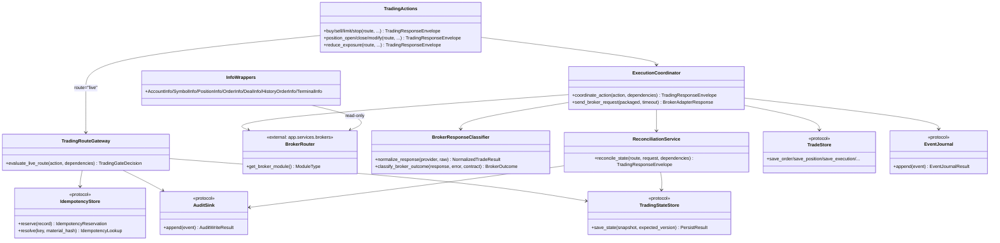
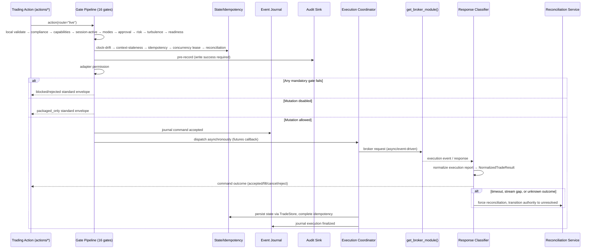
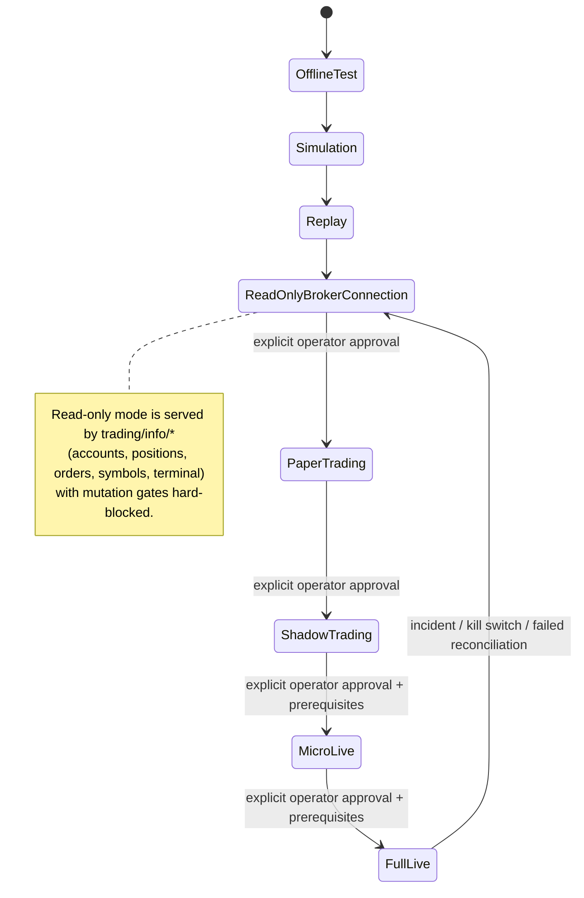

# Trading Runtime - Architecture Requirements Document

## Scope and Traceability

This document defines the canonical architecture and requirement ledger for the Trading Runtime package (`app/services/trading/`). It is a self-contained, independent specification for platform-independent trading actions, read-only information facades, live-route safety gates, coordination, state persistence, reconciliation, monitoring, and security boundaries.

### Architectural Decisions

* **One Package, Route as the Axis:** All trading actions (orders, positions, and controls) live in `app/services/trading/`. Every action accepts a `route` parameter $\in$ {`sim`, `paper`, `shadow`, `live`}. The `live` route is the only route permitted to perform real broker mutations. Non-live routes may perform broker reads only through approved read-only info facades and read-only adapter capabilities, but they must never call broker mutation functions.
* **Platform Independence via the Broker Router:** All broker access (reads and mutations) goes exclusively through `from app.services.brokers import get_broker_module` (and `get_active_broker_name` from `app.services.brokers.router`). No file in the trading package imports a provider SDK (such as `MetaTrader5`, `cTrader`, `Binance`, etc.) directly.
* **All Live Mutation Disabled by Default:** A passing gate pipeline in disabled mode produces a `packaged_only` response, never a broker call.
* **Unknown Broker Outcomes are Not Retries:** Timeouts and malformed success responses transition the authority state to unresolved and force reconciliation before any retry.
* **Ports and Injected Stores:** The package defines state, event journal, idempotency, audit, and trade store protocols in `state/ports.py`. Concrete database implementations live in the infrastructure layer (`app/infrastructure/trading_store/`) and are injected.

### Non-Goals

The following are explicit non-goals for this package to prevent scope creep:
* **No Smart Order Routing:** The package does not perform order routing across different venues or execution path optimization.
* **No Multi-Broker Session Execution:** A single session shall not execute orders concurrently across multiple different brokers.
* **No Strategy/Signal Logic:** Generating trading signals or housing strategy decision models is strictly external to the trading package.
* **No Dynamic Risk Modeling:** Risk exposure calculations and dynamic position sizing are external; trading only enforces static ceilings.
* **No Market-Data Distribution:** Ingesting and publishing historical market data feeds is the responsibility of the data module.
* **No Synthetic Stop Emulation:** Client-side stop-loss and take-profit emulation is excluded from trading runtime capabilities unless synthetic emulation (`TRD-FR-070`) is explicitly configured and authorized.

---

## 1. System Boundary Diagram

### File Structure

```text
app/services/trading/
├── __init__.py                         # Explicit public import gate; no import-time side effects
├── contracts.py                        # Standard request/response/tool contracts & normalized result types
├── tool_registry.py                    # Callable trading-tool registry and catalog
├── actions/                            # Platform-independent shared trading action surface
│   ├── orders.py                       # buy/sell/limit/stop, order_modify, order_delete
│   ├── positions.py                    # position_open/close/modify, reduce_exposure
│   ├── controls.py                     # pause/resume strategy, sync_positions, shutdown, kill switches
│   ├── validation.py                   # volume/price/stops/margin/slippage/session/dealing-mode validation
│   └── emergency.py                    # emergency cancel-all, close-all/flatten operations
├── info/                               # Read-only broker state wrappers (MQL5-parity)
│   ├── account.py
│   ├── symbol.py
│   ├── position.py
│   ├── order.py
│   ├── deal.py
│   ├── history_order.py
│   └── terminal.py
├── config/                             # Validated runtime configuration and safe channels
│   ├── models.py
│   ├── loader.py
│   ├── secrets.py
│   ├── notifications.py
│   └── security_profile.py
├── runtime/                            # Session lifecycle and non-broker runtime controls
│   ├── session_manager.py
│   ├── coordination.py
│   ├── cost_control.py
│   └── signal_processor.py
├── gates/                              # Deterministic route="live" middleware
│   ├── pipeline.py
│   ├── policy_matrix.py
│   ├── approval.py
│   ├── readiness.py
│   ├── kill_switch.py
│   └── audit_and_compensation.py
├── execution/                          # Broker-call coordination via the broker router
│   ├── coordinator.py
│   ├── broker_capability_validation.py
│   ├── response_classifier.py          # Provider retcode normalization
│   ├── rate_limiter.py                 # Client-side token bucket per provider
│   ├── shadow.py
│   ├── state_machine.py                # Order/position lifecycle state machine
│   └── reporting.py
├── state/                              # Trading Projections and persistence ports
│   ├── ports.py                        # TradeStore, TradingStateStore, AuditSink, IdempotencyStore protocols
│   ├── manager.py
│   ├── idempotency.py
│   └── event_journal.py                # Append-only trading command and event journal
├── reconciliation/                     # Broker-truth authority and retry guard
│   ├── service.py
│   ├── snapshots_and_compare.py
│   └── authority_and_retry_guard.py
├── monitoring/                         # Health, stale state, incidents, latency
│   ├── service.py
│   ├── tool_health.py
│   ├── timeouts_and_staleness.py
│   ├── operational_signals.py
│   └── heartbeat_watchdog.py           # Heartbeat watchdog for liveness heartbeats
├── security/                           # Shared-error mapping and redaction boundary
│   ├── error_mapping.py
│   └── redaction_boundary.py
└── promotion/                          # Promotion ladder and preconditions
    ├── ladder.py
    └── preconditions.py
```

### Route Capability Matrix

| Route | Promotion Stage | Mutation Capability | Broker Reads | Broker Mutations | Required Controls |
|---|---|---|---|---|---|
| `sim` | `offline_test`, `simulation`, `replay` | `packaged_only` / `read_only` | Yes (Read-only) | No | Ephemeral mock store, validation, live symbol/metadata reads during calibration |
| `paper` | `paper_trading` | `paper_only` | Yes (Read-only) | No | Paper journal/store, live metadata reads, no real broker mutation |
| `shadow` | `shadow_trading` | `shadow_only` | Yes (Read-only) | No | Live read context, shadow comparison store |
| `live` | `read_only_broker_connection` | `read_only` | Yes (Read-only) | No | Live read context, mutation gates hard-blocked |
| `live` | `micro_live` | `micro_live` | Yes | Yes (Gated) | 16 gates, idempotency, audit, reconciliation, size caps |
| `live` | `full_live` | `full_live` | Yes | Yes (Gated) | 16 gates, idempotency, audit, reconciliation |

---

## 2. Interfaces Diagrams

### 2.1 Component and Port Collaboration



### 2.2 Canonical Mutation Sequencing (route="live")



### 2.3 Promotion Ladder State Relationship



---

## 3. Functional Requirements

### 3.1 Package Facade and Contracts

#### 📄 File: `__init__.py`

- [X] **TRD-FR-001:** Importing `app.services.trading` shall perform no import-time side effects, including broker connections, secret resolution, database connections, socket creation, thread startup, or background scheduling. *Evidence: app/services/trading/__init__.py line 1-45*
- [ ] **TRD-FR-002:** The package shall export the platform-independent action surface, info wrappers, and tool registry through one explicit public gate using `__all__`.
- [X] **TRD-FR-003:** Expose accessors `get_trading_tool_registry() -> TradingToolRegistry` and `get_trading_public_catalog() -> tuple[TradingToolDefinition, ...]` as pure functions. *Evidence: app/services/trading/__init__.py line 48-66*

#### 📄 File: `contracts.py`

- [X] **TRD-FR-004:** Define type-safe enums for routes (`sim`, `paper`, `shadow`, `live`), actions (e.g., `submit_order`, `modify_order`, `cancel_order`, `close_position`, `modify_position`, `reduce_exposure`, `pause_strategy`, `resume_strategy`, `sync_positions`, `reconcile_state`, `trigger_global_kill_switch`, `trigger_strategy_kill_switch`, `trigger_symbol_kill_switch`, `cancel_all_orders`, `close_all_positions`), side effect modes (`none`, `packaged_only`, `broker_mutation_attempted`, `broker_mutation_confirmed`, `broker_mutation_rejected`, `unknown_outcome`, `incident`), and retry safety (`safe_to_retry`, `retry_after_reconciliation`, `retry_after_delay`, `do_not_retry`). *Evidence: app/services/trading/contracts.py line 76-123*
- [X] **TRD-FR-005:** Formally support and validate Time-In-Force (TIF) enums, explicitly requiring `GTC` (Good 'Til Cancelled), `IOC` (Immediate or Cancel), `FOK` (Fill or Kill), `GTD` (Good 'Til Date), and `DAY` configurations to replicate exact broker filling mechanics during backtests and live execution (see TRD-FR-069/070 for expiration mechanics). *Evidence: app/services/trading/contracts.py line 126-133*
- [X] **TRD-FR-006:** Support granular FIX Protocol execution states inside order and position contracts, expanding beyond simple binary metrics to track intermediate states: `Submitted`, `Partially Filled`, `Filled`, `Pending Cancel`, `Cancelled`, `Expired`, `Replaced`, and `Rejected`. *Evidence: app/services/trading/contracts.py line 136-146; app/services/trading/contracts.py line 597-702*
- [X] **TRD-FR-007:** Define `TradingRequestEnvelope` to optionally accept an institutional `AllocationVector` mapping sub-account IDs and volume weights, enabling block-trading execution across parent-child accounts. *Evidence: app/services/trading/contracts.py line 183-229; app/services/trading/contracts.py line 398-429*
- [X] **TRD-FR-008 (Regulatory Tags Payload):** The `TradingRequestEnvelope` and order state contracts must accept a `RegulatoryTags` metadata payload (including MiFID II Algo IDs, Short Sale indicators, and principal/agency capacity flags). The `ExecutionCoordinator` must map and propagate these fields to the broker adapter's regulatory tags. *Evidence: app/services/trading/contracts.py line 294-312; app/services/trading/contracts.py line 522-539; app/services/trading/execution/coordinator.py line 17-34*
- [X] **TRD-FR-009:** Accept optional `oco_group_id` (a unique string grouping related contingent orders) and `linked_order_ids` (a list of sibling order IDs) in the `TradingRequestEnvelope` and order state models to support One-Cancels-Other and bracket orders. *Evidence: app/services/trading/contracts.py line 427-428; app/services/trading/contracts.py line 620-622*
- [X] **TRD-FR-010:** Implement distinct contract event structures to separate trading commands from execution report updates: `TradingCommandAccepted`, `TradingCommandRejected`, `BrokerDispatchEvent`, `BrokerAcknowledgementEvent`, `ExecutionReportEvent`, and `ReconciliationResolutionEvent`. *Evidence: app/services/trading/contracts.py line 705-758*
- [X] **TRD-FR-011:** Enforce that the initial response for async live execution signifies local command acceptance (`TradingCommandAccepted`), not a final broker confirmation. *Evidence: app/services/trading/contracts.py line 668-711; tests/services/trading/test_contracts.py line 185-203*
- [X] **TRD-FR-012:** Every trading envelope and journal event must include a `schema_version` field. The trading module shall reject unknown future major versions and guarantee backward compatibility for minor versions. *Evidence: app/services/trading/contracts.py line 25-73*
- [X] **TRD-FR-013:** Define the `PromotionStage` enum and the `MutationCapability` enum (`read_only`, `packaged_only`, `paper_only`, `shadow_only`, `micro_live`, `full_live`) as required parameters of every request envelope. *Evidence: app/services/trading/contracts.py line 149-170; app/services/trading/contracts.py line 417-420*
- [X] **TRD-FR-014:** For live mutations, the `quote_snapshot` field in `TradingRequestEnvelope` is strictly mandatory. It must contain the bid, ask, spread, timestamp, source, symbol, and freshness age. If it is missing, stale, or mismatched to the requested symbol, the execution fails closed. For `sim`, `paper`, and `shadow` routes, `quote_snapshot` is optional. *Evidence: app/services/trading/contracts.py line 266-323; app/services/trading/contracts.py line 459-472*
- [X] **TRD-FR-015 (PTP Wire Timestamp):** The `quote_snapshot` contract SHALL support an optional `wire_timestamp` field denoting the high-resolution, PTP-synchronized exchange/liquidity-provider transaction generation time. *Evidence: app/services/trading/contracts.py line 266-287*
- [X] **TRD-FR-016:** All response envelopes shall contain a status, message, data, error details, metadata, route, action, side effect mode, retry safety, request ID, correlation ID, audit reference, and optional retry delay. *Evidence: app/services/trading/contracts.py line 326-395; app/services/trading/contracts.py line 538-594*
- [X] **TRD-FR-017:** Define `NormalizedTradeResult` as the single broker-facing normalized result type (containing retcode, deal, order, volume, price, bid, ask, comment, request_id, provider) which must never be exposed raw in public envelopes; it must always be wrapped inside the envelope's structured `data` block. *Evidence: app/services/trading/contracts.py line 475-535*
- [X] **TRD-FR-018:** Enforce that all public envelopes are JSON-safe, redacted, and serializable without holding raw broker SDK objects. *Evidence: app/services/trading/contracts.py line 28-54; app/services/trading/contracts.py line 397-398; app/services/trading/contracts.py line 662-665; tests/services/trading/test_contracts.py line 206-236*

#### 📄 File: `tool_registry.py`

- [ ] **TRD-FR-019:** Maintain a registry of callable trading tools. Each tool registration must declare a name, purpose, route support, input schema, output schema, approval requirements, side effect ceiling, risk level, error codes, and audit metadata.
- [ ] **TRD-FR-020:** AI-facing tools in the registry shall never directly invoke governed broker mutations. They may only produce unexecuted action drafts, run in `packaged_only` mode, or execute read-only queries unless explicitly authorized by backend policy.

---

### 3.2 Actions Submodule (`trading/actions/`)

#### 📄 File: `actions/orders.py`

- [ ] **TRD-FR-021:** `buy(...)` and `sell(...)` shall formulate market order intents with exact parameter parity, supporting volume, stop loss (SL), take profit (TP), deviation, magic number, and comment.
- [ ] **TRD-FR-022:** `buy_limit(...)`, `sell_limit(...)`, `buy_stop(...)`, and `sell_stop(...)` shall formulate pending order intents, including price, expiration, and stop-limit requirements.
- [ ] **TRD-FR-023:** `order_modify(ticket, price, sl, tp)` and `order_delete(ticket)` shall implement pending order mutation and cancellation while preserving order identity, idempotency keys, and side effect classification.
- [ ] **TRD-FR-024:** Support submission of OCO groups and bracket orders (e.g., entry order linked with stop-loss and take-profit pending orders) through actions, validating group parameter consistency before dispatch.
- [ ] **TRD-FR-025:** Order actions shall route through the canonical 16-step execution path:
  1. Local schema validation (`actions/validation.py`).
  2. Pre-trade compliance / restricted-list verification (`gates/pipeline.py` - ComplianceGate).
  3. Route/promotion stage compatibility check (`promotion/ladder.py`).
  4. Session status check (`runtime/session_manager.py`).
  5. Kill-switch / operational mode check (`gates/kill_switch.py`).
  6. Operator approval validation (`gates/approval.py`).
  7. Risk decision signature validation (`gates/approval.py`).
  8. Volatility price-velocity circuit breaker check (`gates/pipeline.py` - MarketTurbulenceGate).
  9. Broker readiness and capability verification (`gates/readiness.py`).
  10. Clock synchronization offset check (`gates/readiness.py`).
  11. Idempotency reservation (`state/idempotency.py`).
  12. Concurrency lease acquisition (`runtime/coordination.py`).
  13. Reconciliation authority state check (`reconciliation/authority_and_retry_guard.py`).
  14. Audit pre-recording (`gates/audit_and_compensation.py` - write success required).
  15. Adapter permission verification (`gates/pipeline.py`).
  16. Async dispatch via coordinator (`execution/coordinator.py`).

#### 📄 File: `actions/positions.py`

- [ ] **TRD-FR-026:** `position_open(...)`, `position_close(...)`, and `position_modify(...)` shall implement position lifecycle controls, supporting Close-By-Symbol, Close-By-Ticket, netting vs. hedging constraints, and SL/TP mutation.
- [ ] **TRD-FR-027:** `reduce_exposure(scope, target, route, deps)` shall package partial close and volume reduction commands across an approved position, symbol, or account scope based on a validated risk decision. It must not generate execution thresholds independently.

#### 📄 File: `actions/controls.py`

- [ ] **TRD-FR-028:** `pause_strategy(...)` and `resume_strategy(...)` shall represent non-broker mutating operational controls that adjust local state and monitoring projections only.
- [ ] **TRD-FR-029:** `sync_positions(route)` shall retrieve current broker state and synchronize local databases without executing new orders or mutations.
- [ ] **TRD-FR-030:** `shutdown(timeout)` shall stop admitting new requests, wait for in-flight requests to complete, flush state and audit logs, and trigger final reconciliation.
- [ ] **TRD-FR-031:** `trigger_global_kill_switch(reason, route, deps)` shall activate the global kill switch, persist the operator/system reason, emit a critical operational event, and block all non-emergency live mutations.
- [ ] **TRD-FR-032:** `trigger_strategy_kill_switch(strategy_id, reason, route, deps)` shall activate a strategy-scoped kill switch and block all non-emergency mutations for that strategy.
- [ ] **TRD-FR-033:** `trigger_symbol_kill_switch(symbol, reason, route, deps)` shall activate a symbol-scoped kill switch and block all non-emergency mutations for that symbol.
- [ ] **TRD-FR-034:** Kill-switch trigger actions must be idempotent, audited, journaled, and routed through the policy matrix.

#### 📄 File: `actions/emergency.py`

- [ ] **TRD-FR-035:** Implement first-class emergency actions: `cancel_all_orders(scope, route, deps)`, `close_all_positions(scope, route, deps)`, `flatten_account(scope, route, deps)`, `flatten_strategy(strategy_id, route, deps)`, and `flatten_symbol(symbol, route, deps)`.
- [ ] **TRD-FR-036:** Emergency actions must consume emergency fail-safe rules from the policy matrix, snapshot broker state before and after execution, tolerate partial completion, return per-child order details, and trigger scope reconciliation lock if any child action results in an unknown outcome.

#### 📄 File: `actions/validation.py`

- [ ] **TRD-FR-037:** Normalizer functions shall enforce that all broker-critical price, volume, size, balance, and margin math utilizes `decimal.Decimal` normalization to dynamic instrument precision (never hardcoding symbol digits or contract steps).
- [ ] **TRD-FR-038:** `validate_volume(...)` shall check min, max, and step volume constraints against dynamically resolved broker symbol metadata.
- [ ] **TRD-FR-039:** Volume normalization must round down unless explicitly authorized by policy. Stop-loss and take-profit rounding must be direction-aware, and price rounding must align with broker tick sizes. Monotonic audit trails must capture both `original_value` and `normalized_value`.
- [ ] **TRD-FR-040:** `validate_stops(...)` shall enforce direction-aware minimum distance and stop-level rules for stop-loss and take-profit geometry.
- [ ] **TRD-FR-041:** `validate_margin(...)` shall check that the account has sufficient free margin to cover the trade intent's margin requirements before dispatching to the broker.
- [ ] **TRD-FR-042:** `validate_market_session(...)` shall check instrument trading session availability and fail closed if session evidence is missing or expired in live-sensitive routes.
- [ ] **TRD-FR-043:** Validate that the Time-In-Force (TIF) constraint specified is valid for the target instrument and broker capability profiles.
- [ ] **TRD-FR-044:** Enforce execution protections: market orders must have defined maximum acceptable slippage, and pending orders must be validated against price collars. Orders outside dynamic price collars must fail closed.
- [ ] **TRD-FR-045:** Enforce a hardcoded, immutable "Fat-Finger Cap" that checks the absolute notional value (Volume $\times$ Price) of any order intent against an un-overrideable system ceiling, failing closed independently of external Risk signatures.
- [ ] **TRD-FR-046:** Combine all parameter validations into `validate_order_request(...)`. Failures must return a structured `VALIDATION_FAILED` or `INVALID_INPUT` error, short-circuiting downstream execution.
- [ ] **TRD-FR-047:** The immutable fat-finger ceiling SHALL be defined in **account currency**. Notional computation for instruments not quoted in account currency requires a conversion-rate evidence input carrying source, timestamp, and freshness age, subject to a configured TTL. Missing, stale, or symbol-mismatched conversion evidence fails the validation closed. The conversion rate used, the computed account-currency notional, and the ceiling MUST all be captured in the validation audit record.
- [ ] **TRD-FR-048:** In the pattern of TRD-FR-045, implement a small set of local, un-overrideable rails evaluated without consulting risk-module signatures: (a) maximum mutation attempts per rolling window per (account, symbol); (b) maximum simultaneous open positions per account; (c) cumulative daily account-currency notional ceiling (resetting at a configured session boundary using the injected `Clock`). These rails are deliberately crude last-line protections; they MUST NOT grow risk logic (position sizing, exposure modeling), which remains exclusively in the risk module. Raising any rail is a dual-control action (TRD-FR-092).
- [ ] **TRD-FR-049 (Short Locate Verification):** `validate_short_locate(...)` must consume a `LocateSnapshot` from the data or risk module. If a short sale request is submitted for a symbol without a valid locate or hard-to-borrow (HTB) authorization, the validation gate must fail closed and reject the order.

---

### 3.3 Info Facades (`trading/info/`)

- [ ] **TRD-FR-050:** Expose MQL5-compatible read-only wrappers for `AccountInfo`, `SymbolInfo`, `PositionInfo`, `OrderInfo`, `DealInfo`, `HistoryOrderInfo`, and `TerminalInfo`.
- [ ] **TRD-FR-051:** Wrappers shall resolve the active broker only via `get_broker_module()` and perform no mutations, orders, or state modifications.
- [ ] **TRD-FR-052:** Info wrappers shall return safe defaults, neutral values, or structured absence errors when broker terminals are disconnected or data is unavailable.
- [ ] **TRD-FR-053:** Exclude raw broker SDK credentials, tokens, or private structures from wrapper payloads; all returned metadata must be filtered by the redaction boundary.

---

### 3.4 Configuration (`trading/config/`)

#### 📄 File: `config/models.py`

- [X] **TRD-FR-054:** Config models shall require parameters for route enablement, live mutation enablement, active broker selection, rate-limit settings, cost budgets, timeout limits, stale states, and secret references. *Evidence: app/services/trading/config/models.py line 74-222*
- [X] **TRD-FR-055:** Live mutation (`ALLOW_LIVE_MUTATIONS=false`) shall be disabled by default. If disabled, a passing gate pipeline must return a `packaged_only` status and block broker communication. *Evidence: app/services/trading/config/models.py line 74-110; app/services/trading/config/models.py line 224-232*
- [X] **TRD-FR-056:** Enforce that broker capability evidence snapshots have a configured Time-To-Live (TTL). Stale capabilities check must fail closed. *Evidence: app/services/trading/config/models.py line 167-185; tests/services/trading/config/test_config_controls.py line 92-104*

#### 📄 File: `config/loader.py`

- [X] **TRD-FR-057:** Enforce strict validation of configuration keys at startup. Config loading must fail closed if any required secret reference is missing or if configuration structure is malformed. *Evidence: app/services/trading/config/loader.py line 44-82; app/services/trading/config/models.py line 187-222; tests/services/trading/config/test_config_controls.py line 106-120*
- [X] **TRD-FR-058:** Effective runtime configuration SHALL be versioned. Every configuration change that takes effect emits a journal event containing the actor, timestamp, and a hash of the effective (redacted) configuration. Reports and incidents reference the config version active at the time. *Evidence: app/services/trading/config/loader.py line 31-39; app/services/trading/config/loader.py line 85-124; tests/services/trading/config/test_config_controls.py line 122-134*
- [X] **TRD-FR-059:** The following keys are immutable while any live session is in `running` state: `ALLOW_LIVE_MUTATIONS`, the fat-finger ceiling, active broker selection, promotion-stage assignments, and store connection targets. Changing them requires session stop, the change, operator approval evidence, and session restart. Hot-reload of all other keys is permitted only through the validated loader path, never by direct mutation. *Evidence: app/services/trading/config/loader.py line 18-29; app/services/trading/config/loader.py line 127-206; tests/services/trading/config/test_config_controls.py line 136-171*

#### 📄 File: `config/secrets.py`

- [X] **TRD-FR-060:** Secrets resolution must retrieve credentials using indirection and references. Under no circumstances shall raw secret values be stored in configuration model properties, written to log files, or returned in public envelopes. *Evidence: app/services/trading/config/models.py line 30-72; app/services/trading/config/secrets.py line 15-87; tests/services/trading/config/test_config_controls.py line 173-181*
- [X] **TRD-FR-061:** Credential/token expiry or rotation mid-session SHALL be handled via the broker adapter's re-authentication path without classifying the interruption as an unknown trade outcome. Failed rotation transitions the session to `read_only` with a high-severity signal; it MUST NOT crash the runtime or silently retry with stale credentials. *Evidence: app/services/trading/config/secrets.py line 25-31; app/services/trading/config/secrets.py line 92-123; tests/services/trading/config/test_config_controls.py line 183-197*

#### 📄 File: `config/notifications.py`

- [X] **TRD-FR-062:** Construct notification payloads with strict redaction. Operational notifications (including executions, incidents, and failures) must route only to configured, approved channels. *Evidence: app/services/trading/config/notifications.py line 17-91; tests/services/trading/config/test_config_controls.py line 199-229*

#### 📄 File: `config/security_profile.py`

- [X] **TRD-FR-063:** Live route mutation requires a valid broker communication security profile verifying encrypted transport expectations, certificate validation rules where supported, logging restrictions, and adapter compliance. *Evidence: app/services/trading/config/security_profile.py line 11-59; tests/services/trading/config/test_config_controls.py line 231-248*

---

### 3.5 Runtime Submodule (`trading/runtime/`)

#### 📄 File: `runtime/session_manager.py`

- [ ] **TRD-FR-064:** Coordinate explicit session states: starting, running, paused, stopped, and recovering. Expose six distinct operational modes: `normal`, `read_only`, `close_only`, `reduce_only`, `emergency_flatten`, and `stopped`.
- [ ] **TRD-FR-065:** Enforce that only one active live session is allowed per configured trading scope.
- [ ] **TRD-FR-066:** Recovery logic must start the session in a paused state if unknown broker outcomes, unreconciled state, or missing audit logs are detected.
- [ ] **TRD-FR-067:** Implement the Cancel-on-Disconnect (CoD) heartbeat connection failsafe: if broker capability check determines CoD is unsupported, session manager must run a local heartbeat that triggers an emergency cancel-all if the adapter connection drops for $>X$ seconds.
- [ ] **TRD-FR-068:** If restoration of kill-switch/mode/lock state fails or is ambiguous (missing records, version mismatch, store unavailable), the session SHALL fail closed into `read_only` mode with a critical operational signal; live mutation remains blocked until an operator resolves state.
- [ ] **TRD-FR-069 (GTD/DAY and Expiry Watchdog):** Validate `GTD` and `DAY` TIF against broker capability. Where the broker lacks native expiration support, the runtime SHALL operate a local expiry watchdog (driven by the injected `Clock`) that cancels expired working orders through the canonical gate pipeline's emergency-safe path; watchdog cancellations are journaled with actor `system:expiry_watchdog`.
- [ ] **TRD-FR-070 (Synthetic Emulation Flag):** If capability validation determines a required protective order type (stop, SL/TP attachment) or OCO order group is not natively supported, the default remains fail-closed (per TRD-FR-115). A policy-gated `synthetic_emulation` capability MAY be enabled per broker profile, activating client-side stop/OCO monitoring with: explicit operator risk acknowledgment evidence, a dedicated operational signal while any synthetic order is active, and automatic transition to `close_only` if the monitoring loop's heartbeat lapses.
- [ ] **TRD-FR-071 (Real-Time Halts State):** Maintain a thread-safe `HaltedSymbols` set in `runtime/session_manager.py` indicating active symbol pauses. Standard order validation and `MarketTurbulenceGate` (TRD-FR-085) must check this set to immediately block mutations and optionally cancel working orders for halted symbols.
- [ ] **TRD-FR-072 (Reconnection Auto-Resync):** Maintain a `BrokerConnectionState` monitor. Upon transition from `Disconnected` to `Connected`, the session manager MUST block all new live mutations and force a full reconciliation (re-synchronizing all open positions, pending orders, balance, and margin) before returning the session back to `normal` mutation mode.

#### 📄 File: `runtime/coordination.py`

- [ ] **TRD-FR-073:** Enforce optimistic concurrency locks. The default conflict key shall be `(account_id, symbol)`, restricting concurrent mutating actions on the same symbol for one account.
- [ ] **TRD-FR-074:** Concurrency controls must specify lock acquisition timeouts and maximum queue capacities. Request overload must trigger immediate backpressure rejection rather than unbounded queueing.
- [ ] **TRD-FR-075:** Enforce strategy ownership constraints. Every order and position record must map to `owner_strategy_id` and `owner_workflow_id`. A strategy cannot close or modify another strategy's positions unless explicitly authorized by the policy matrix. Netting account symbol conflicts must be checked before close/modify.
- [ ] **TRD-FR-076:** Before dispatch, detect when a mutation from strategy A would cross an opposing working order or position owned by strategy B on the same (account, symbol) — particularly on netting accounts where the broker would net them. The policy matrix determines the response per scope: `block`, `warn_and_allow`, or `allow`. Detections are journaled regardless of outcome. Absence of a configured policy fails closed to `block`.

#### 📄 File: `runtime/cost_control.py`

- [ ] **TRD-FR-077:** Evaluate cost budgets per request, workflow, strategy, account, and session.
- [ ] **TRD-FR-078:** If cost budget limits are violated before broker dispatch, block execution. If violated after broker send but before reconciliation, raise a critical cost-budget incident.
- [ ] **TRD-FR-079:** Cost-control decisions must not calculate analytics metrics; they only enforce configured runtime budget ceilings.

#### 📄 File: `runtime/signal_processor.py`

- [ ] **TRD-FR-080:** Transform approved strategy signals into standard `TradingRequestEnvelope` order intents.
- [ ] **TRD-FR-081:** The signal processor must verify route, promotion stage, mutation capability, risk decision reference, and approval evidence before producing an executable intent.
- [ ] **TRD-FR-082:** The signal processor must never bypass the canonical gate pipeline.

---

### 3.6 Gates Submodule (`trading/gates/`)

#### 📄 File: `gates/pipeline.py`

- [ ] **TRD-FR-083:** Enforce the standardized canonical live route gate pipeline containing the following 16 sequential steps:
  1. Local schema validation (`actions/validation.py`).
  2. Pre-trade compliance / restricted-list verification (`gates/pipeline.py` - ComplianceGate).
  3. Route/promotion stage compatibility check (`promotion/ladder.py`).
  4. Session status check (`runtime/session_manager.py`).
  5. Kill-switch / operational mode check (`gates/kill_switch.py`).
  6. Operator approval validation (`gates/approval.py`).
  7. Risk decision signature validation (`gates/approval.py`).
  8. Volatility price-velocity circuit breaker check (`gates/pipeline.py` - MarketTurbulenceGate).
  9. Broker readiness and capability verification (`gates/readiness.py`).
  10. Clock synchronization offset check (`gates/readiness.py`).
  11. Idempotency reservation (`state/idempotency.py`).
  12. Concurrency lease acquisition (`runtime/coordination.py`).
  13. Reconciliation authority state check (`reconciliation/authority_and_retry_guard.py`).
  14. Audit pre-recording (`gates/audit_and_compensation.py` - write success required).
  15. Adapter permission verification (`gates/pipeline.py`).
  16. Async dispatch via coordinator (`execution/coordinator.py`).
- [ ] **TRD-FR-084 (ComplianceGate):** ComplianceGate evaluates early in the pipeline (immediately after local schema validation). It blocks execution and fails closed if the requested symbol is present on the Compliance restricted-symbol list (loaded via configurator or provided by the data module).
- [ ] **TRD-FR-085 (MarketTurbulenceGate):** MarketTurbulenceGate evaluates after risk validation but before broker readiness verification. It maintains a bounded circular buffer of the last N mid-prices (derived from quote snapshots) per symbol. If the absolute price change over a configurable rolling window exceeds the volatility velocity threshold, the gate halts new mutations and suspends the symbol, cancelling existing pending orders for that symbol according to policy.
- [ ] **TRD-FR-086:** A gate failure must short-circuit evaluation. Downstream gates that mutate state, invoke network adapter calls, or consume broker capacity must not run.
- [ ] **TRD-FR-087:** Diagnostic-only gates that execute after a failure must be explicitly marked `diagnostic_after_failure=true`, `mutates_state=false`, `calls_broker=false`, and `requires_network=false`.
- [ ] **TRD-FR-088:** `TradingRequestEnvelope` SHALL carry a `deadline_utc` (defaulted from configuration when absent). Each of the 16 gates has a configured latency budget and stamps its decision latency into the audit record. If cumulative pipeline time exceeds the deadline, or the mandatory `quote_snapshot` ages beyond its freshness TTL mid-pipeline, the pipeline fails closed at that gate with status `DEADLINE_EXCEEDED` / `QUOTE_STALE`. Per-gate latency distributions (p50/p95/p99) are exported to monitoring.

#### 📄 File: `gates/policy_matrix.py`

- [ ] **TRD-FR-089:** Look up permission, approval, emergency, and side-effect rules from the injected policy matrix. If an action is missing from the matrix, fail closed with `TRADING_POLICY_UNDEFINED`.

#### 📄 File: `gates/approval.py`

- [ ] **TRD-FR-090:** Verify operator approval ID, expiration, revoked status, and scope matching (account, strategy, symbol) before executing governed actions.
- [ ] **TRD-FR-091:** Request Binding Verification: Validate that operator approval and risk decision evidence tokens contain a matching `canonical_request_hash` of the incoming order params (symbol, account, side, volume, price, SL, TP, route, strategy), rejecting the command if they differ. Approval tokens must be single-use or explicitly bounded by scope and expiry.
- [ ] **TRD-FR-092:** The following governed actions SHALL require approval evidence from **two distinct authenticated operators** (distinct operator IDs, each independently satisfying TRD-FR-090/091 request binding): clearing a global kill switch, promotion to `full_live`, and raising any hard cap (fat-finger ceiling, defense-in-depth rails per TRD-FR-048). Single-operator approval remains sufficient for all other governed actions. Dual approvals MUST be individually journaled.

#### 📄 File: `gates/readiness.py`

- [ ] **TRD-FR-093:** Check broker connection status, trading allowance, account permissions, and client-side rate limit availability without executing test orders.
- [ ] **TRD-FR-094:** Implement clock synchronization and drift verification against the broker's server time (e.g. via NTP/PTP or heartbeat drift tracking). If the local system clock offset exceeds $50\text{ms}$, trip a warning operational signal and pause live mutations.
- [ ] **TRD-FR-095 (PTP Latency and Drift Gating):** When a `wire_timestamp` is present in the `quote_snapshot` and PTP alignment is active, the clock drift gate (Gate 10) SHALL compare the PTP-aligned local clock time against the quote's wire timestamp, calculating true end-to-end hardware latency and blocking the trade if latency drift exceeds the configured maximum threshold.
- [ ] **TRD-FR-096:** Expose a non-mutating `run_live_readiness_dry_run()` check that verifies connection, account identity, symbol metadata, permissions, clock drift, and stores durability without sending mock orders.

#### 📄 File: `gates/kill_switch.py`

- [ ] **TRD-FR-097:** Active kill switches (global, strategy, or symbol level) must block all non-emergency and risk-increasing live mutations. Emergency risk-reducing actions may execute only through the policy-matrix emergency path. Emergency protective mutations (cancel-all, close-all/flatten) are permitted under an active kill switch only if the policy matrix allows.
- [ ] **TRD-FR-098:** `clear_kill_switch_after_approval` shall require explicit, validated governance approval evidence.
- [ ] **TRD-FR-099:** Flattening and cancellation rules under active kill switches must be determined solely by the policy matrix; no caller-provided flags shall bypass the kill switch.
- [ ] **TRD-FR-100:** Kill-switch state (global, strategy, symbol), the active session operational mode (`normal`, `read_only`, `close_only`, `reduce_only`, `emergency_flatten`, `stopped`), and all active reconciliation authority locks MUST be durably persisted via the injected state store and restored **before** the first gate evaluation after any process restart. A crash or restart MUST NOT clear or downgrade any of these controls.

#### 📄 File: `gates/audit_and_compensation.py`

- [ ] **TRD-FR-101:** Pre-mutation logs must be successfully saved to the audit sink before dispatching to the broker. Audit write failure must immediately block the mutation.

---

### 3.7 Execution Submodule (`trading/execution/`)

#### 📄 File: `execution/coordinator.py`

- [ ] **TRD-FR-102:** Dispatch validated intents to appropriate execution handlers based on the route (`sim` $\rightarrow$ simulator, `paper` $\rightarrow$ paper store, `shadow` $\rightarrow$ shadow comparison, `live` $\rightarrow$ broker router).
- [ ] **TRD-FR-103:** Shift the underlying execution model to be natively asynchronous and event-driven. The coordinator shall dispatch requests asynchronously, register an internal Futures-callback, and return control immediately (eliminating thread-exhaustion risks and head-of-line blocking).
- [ ] **TRD-FR-104:** Every mutation intent must generate or accept a globally unique `client_order_id`, which must be propagated to broker-supported metadata fields (comments, magic number, external ID, etc.). Apply deterministic truncation if fields have length limits, preserving a lookup in `TradeStore`. The `client_order_id` must appear in all audits, journals, idempotency logs, and reports.
- [ ] **TRD-FR-105:** Coordinate multi-account `AllocationVector` targets by either slicing the allocation into separate execution events or transmitting a single block transaction if native allocation is supported by the broker adapter.
- [ ] **TRD-FR-106:** Coordinate two-step SL/TP execution workflows if capability validation determines the broker doesn't support SL/TP attachment on open. Open-then-protect workflows must be atomic from the state perspective. If open succeeds but position modification fails, trigger a critical incident.
- [ ] **TRD-FR-107:** Support residual handling policies for partially filled orders: `leave_remaining`, `cancel_remaining`, `replace_remaining`, `retry_remaining_after_delay`, and `escalate_to_operator`. The policy must be fetched from the policy matrix and capability profile. Volume updates must occur immediately.
- [ ] **TRD-FR-108 (Non-Atomic Modify Safety):** When `broker_capability_validation` (TRD-FR-115) reports that order modification is non-atomic (implemented as a separate cancel followed by a replace order request), the execution coordinator must treat the modify as a stateful two-step process: (1) Reserve the order in TradeStore to block concurrent actions; (2) Cancel the working order and await confirmed cancellation; (3) Replace it by dispatching the new order. If the replace step fails (e.g. due to a price gap or reject), the coordinator MUST immediately journal a critical incident, attempt to re-enter the original order with the new parameters, or raise a critical dead-letter recovery escalation to the operator rather than silently losing the working order.
- [ ] **TRD-FR-109:** The execution coordinator SHALL manage OCO/bracket mutual-cancellation lifecycle: if an execution report indicates a leg in the OCO group is filled or partially filled, trigger cancellation commands for all other sibling orders in the group.
- [ ] **TRD-FR-110:** If the broker adapter natively supports OCO groups, delegate group execution to the adapter. Otherwise, if synthetic emulation (`TRD-FR-070`) is active, operate a client-side OCO watchdog that listens for execution reports and dispatches sibling cancellations. If synthetic emulation is inactive and native OCO is unsupported, fail the submission closed.
- [ ] **TRD-FR-111 (Multi-Leg / Spread Execution & Atomic Rollback):** Introduce a `MultiLegExecutionCoordinator` to manage simultaneous multi-leg orders (e.g. spreads, straddles). If the broker natively supports multi-leg orders, delegate execution. Otherwise, implement a synthetic multi-leg watchdog: if any leg rejects, fails, or partially fills beyond a configurable tolerance threshold, the watchdog MUST immediately dispatch rollback/cancel commands for all filled or working legs to restore the portfolio to its pre-trade state.
- [ ] **TRD-FR-112:** Capture commission, spread, swap, exchange fees, realized slippage, and other transaction cost facts. If cost updates arrive later via deal history events, append a cost-adjustment event.
- [ ] **TRD-FR-113:** Maintain an atomic counter tracking in-flight requests under lock to ensure all requests are completed before shutdown.
- [ ] **TRD-FR-114:** Track state changes post-response using the `TradeStore` protocol, release concurrency leases, and complete the idempotency lease.

#### 📄 File: `execution/broker_capability_validation.py`

- [ ] **TRD-FR-115:** Validate adapter capability contracts (including order types, filling modes, precision limits, and rate limits) before broker execution. Failure to match capabilities must fail closed.
- [ ] **TRD-FR-116:** Verify if the broker adapter natively supports Cancel-on-Disconnect (CoD). If unsupported, the runtime session must run a local heartbeat connection failsafe that triggers an emergency local sweeping action (mass cancel of all working pending orders) if connection drops for more than $X$ seconds (TRD-FR-067).

#### 📄 File: `execution/response_classifier.py`

- [ ] **TRD-FR-117:** Convert provider-specific responses (such as MetaTrader5 codes, cTrader errors, or network timeouts) into a standardized `NormalizedTradeResult`.
- [ ] **TRD-FR-118:** Unknown outcomes (e.g., timeouts, transport disconnects, or malformed success envelopes) must yield a specific unknown outcome status (`10005` equivalent) and trigger immediate state reconciliation, blocking all retry attempts.
- [ ] **TRD-FR-119:** Dynamic Event Classification: Parse and classify execution events pushed dynamically by the broker router's WebSocket or FIX stream, passing execution details to the `ResponseClassifier`.
- [ ] **TRD-FR-120:** Classify deals and executions that were not commanded by this runtime into a first-class `BrokerInitiatedExecutionEvent` type, with sub-classification: `server_side_sl_tp_fill`, `stop_out`, `margin_call_action`, `broker_admin_action`, and `expiration`. These events are authoritative state transitions and MUST be applied to `TradeStore` and journaled like any execution report.
- [ ] **TRD-FR-121 (Corporate Action Classification):** Classify stock splits, reverse splits, or symbol/name changes pushed by the broker or data module as a `CorporateActionEvent`.
- [ ] **TRD-FR-122:** A `stop_out` or `margin_call_action` classification SHALL raise a critical incident, trigger immediate account-scope reconciliation, and auto-transition the session operational mode to `close_only` (or `read_only`, per policy matrix). Resumption to `normal` requires operator approval evidence.

#### 📄 File: `execution/rate_limiter.py`

- [ ] **TRD-FR-123:** Maintain token-bucket rate limiters per broker provider configured from runtime settings.
- [ ] **TRD-FR-124:** Rate exhaustion must trigger an immediate local block before dispatching to the broker, avoiding provider-side penalty limits.

#### 📄 File: `execution/shadow.py`

- [ ] **TRD-FR-125:** Shadow mode execution shall record intents and compare expected fills against live market quotes and balances without dispatching mutations to the broker.

#### 📄 File: `execution/state_machine.py`

- [ ] **TRD-FR-126:** Enforce valid transition paths across the order/position lifecycle (e.g. reject transitions like Filled $\rightarrow$ Submitted or Cancelled $\rightarrow$ PartiallyFilled).
- [ ] **TRD-FR-127:** Require every state transition event to carry event source, timestamp, broker event ID, request ID, correlation ID, and previous state version.
- [ ] **TRD-FR-128:** Apply broker-originated execution reports as authoritative state transition events, persisting every state transition through `TradeStore` before public reporting.
- [ ] **TRD-FR-129 (Version-Gated Amendments):** `order_modify` and `order_delete` requests targeting an order in flight SHALL carry an `expected_state_version`. If the authoritative state has advanced (e.g., the order filled or partially filled while the amend was in transit), the amendment resolves to an explicit terminal outcome — `TOO_LATE_TO_CANCEL`, `TOO_LATE_TO_MODIFY`, or `AMENDED_AFTER_PARTIAL_FILL` — rather than a generic rejection, and the envelope's retry-safety field MUST be `do_not_retry`.
- [ ] **TRD-FR-130:** Modify-while-partially-filled semantics MUST be explicit per action: amendments apply to remaining volume only; SL/TP modifications apply to the resulting position per netting/hedging mode. The state machine SHALL reject any amendment path not enumerated in its transition table.
- [ ] **TRD-FR-131:** Execution reports SHALL be deduplicated idempotently on `broker_event_id` (with a bounded dedup window sized from configuration). Duplicates increment a metrics counter and are dropped without state transition.

#### 📄 File: `execution/reporting.py`

- [ ] **TRD-FR-132:** Construct structured trading reports containing positions, order records, execution latencies, cost entries, and reconciliation discrepancies.

---

### 3.8 State and Idempotency Submodule (`trading/state/`)

#### 📄 File: `state/ports.py`

- [X] **TRD-FR-133:** Declare abstract protocols defining clear signatures for: *Evidence: app/services/trading/state/ports.py line 20-406*
  * `TradingStateStore` (session, status, and recovery context CRUD).
  * `AuditSink` (pre-mutation and post-execution append).
  * `IdempotencyStore` (reservation and completion CRUD).
  * `TradeStore` (order, position, and execution CRUD).
  * `EventJournal` (append-only journal CRUD).
- [X] **TRD-FR-134:** Enforce a strict tenant and database isolation policy. When `route == "sim"` or `route == "paper"` or `route == "shadow"`, the injected stores must use strictly separate namespaces or ephemeral, in-memory virtual storage layers, preventing live production table contamination. *Evidence: app/services/trading/state/ports.py line 124-129; app/services/trading/state/ports.py line 131-238*
- [X] **TRD-FR-135:** Dynamically track `Remaining Volume` inside the `TradeStore` order state when an order is `Partially Filled`, preventing local position states from drifting before the next reconciliation cycle. Position state updates must use filled volume only. *Evidence: app/services/trading/contracts.py line 597-652; app/services/trading/state/ports.py line 178-202*
- [X] **TRD-FR-136:** Enforce that concrete database and adapter implementations live outside the trading package. *Evidence: app/services/trading/state/ports.py line 1-16; app/services/trading/README.md line 8-16*
- [X] **TRD-FR-137:** Declare a `Clock` protocol exposing `now_utc() -> datetime` and `monotonic() -> float`, and an `RNG` protocol exposing seeded pseudo-random draws (for retry jitter and sampling). Both are injected dependencies alongside the existing store ports; concrete implementations (system clock, virtual simulation clock, seeded RNG) live outside the trading package. *Evidence: app/services/trading/state/ports.py line 20-79*
- [X] **TRD-FR-138:** All time reads inside `app/services/trading/` — including staleness checks, quote-snapshot freshness, idempotency TTLs, rate-limiter buckets, lease expiries, and latency measurement — MUST go through the injected `Clock`. Direct calls to `datetime.now()`, `datetime.utcnow()`, `time.time()`, `time.monotonic()`, or equivalents are prohibited and SHALL be enforced by a lint rule scoped to the package. *Evidence: app/services/trading/state/ports.py line 20-48; app/services/trading/contracts.py line 266-287; app/services/trading/README.md line 46-50*
- [X] **TRD-FR-139 (PTP Clock Alignment):** The `Clock` protocol and its concrete implementations SHALL expose a `now_ptp() -> datetime` signature returning the PTP-aligned, hardware-synchronized timestamp for high-frequency or market-making operations. *Evidence: app/services/trading/state/ports.py line 32-39*
- [X] **TRD-FR-140:** All nondeterministic draws (retry jitter, backoff randomization, sampling) MUST use the injected `RNG`. Under `route="sim"`, the simulator injects a seeded RNG so replays are exact. *Evidence: app/services/trading/state/ports.py line 52-79*
- [X] **TRD-FR-141:** `TradeStore` SHALL maintain, in `decimal.Decimal` at dynamic instrument precision, the volume-weighted average fill price (VWAP) per order across partial fills and per resulting position (respecting netting vs. hedging mode). Stored VWAP and cumulative filled volume MUST be reconciled against broker deal history during every reconciliation run; drift beyond configured thresholds is a reconciliation mismatch per TRD-FR-160. *Evidence: app/services/trading/contracts.py line 597-674; app/services/trading/state/ports.py line 124-129; app/services/trading/state/ports.py line 178-202*
- [X] **TRD-FR-142:** TradeStore and state projections must automatically adjust open positions' volumes, average entry prices, and VWAP in response to a classified `CorporateActionEvent`. All adjustments must be atomically applied, audited, and journaled to prevent manual intervention during splits or splits-driven state drifts. *Evidence: app/services/trading/state/ports.py line 204-224; app/services/trading/state/ports.py line 275-298; app/services/trading/state/ports.py line 374-406*

#### 📄 File: `state/idempotency.py`

- [ ] **TRD-FR-143:** Generate idempotency keys using a SHA-256 hash over canonical JSON representation of: account ID, strategy ID, route, promotion stage, broker, symbol, action, type, side, volume, price, stop limit price, SL, TP, deviation, TIF, expiration, magic number, client order ID, risk ID, approval ID, and allocation vector.
- [ ] **TRD-FR-144:** Idempotency records must survive process restart for live routes. In-progress leases must carry explicit TTLs, and expired leases must transition to reconciliation-required rather than auto-retrying.
- [ ] **TRD-FR-145:** In-progress duplicates must be rejected. Completed duplicates must return the cached execution envelope.

#### 📄 File: `state/event_journal.py`

- [ ] **TRD-FR-146:** Implement an append-only, non-mutable journal recording all commands, gate decisions, broker dispatches, broker responses, execution reports, reconciliation events, and operator interventions.
- [ ] **TRD-FR-147:** Every journal event must carry an `event_id`, `previous_event_hash`, `event_hash`, `schema_version`, `timestamp_utc`, `monotonic_timestamp`, `request_id`, `correlation_id`, `route`, `account_id`, `symbol`, and `actor` to support forensic replayability.
- [ ] **TRD-FR-148 (Logical Clocks & Sequence IDs):** Every journal event and execution report event must carry a monotonically increasing `sequence_id` (logical clock sequence). The `state_machine.py` and `TradeStore` projections must utilize this sequence ID as the absolute source of truth for event ordering to prevent physical clock jitter/out-of-order errors.
- [ ] **TRD-FR-149:** On startup, before any session enters `running`, the runtime SHALL scan the event journal for commands that were journaled as accepted (`TradingCommandAccepted` / `BrokerDispatchEvent`) but carry no terminal event (`ExecutionReportEvent` terminal state, `TradingCommandRejected`, or `ReconciliationResolutionEvent`). Every such in-flight command MUST force a per-scope (account, symbol) reconciliation lock; those scopes remain blocked for mutation until the reconciliation service resolves the true broker outcome.
- [ ] **TRD-FR-150:** Implement periodic durable state snapshots (configurable: every N journal events or T minutes). A projection rebuild MUST be reproducible as `snapshot + replay of subsequent journal events`, and a rebuild-from-snapshot routine SHALL be exposed for recovery and for forensic reconstruction.
- [ ] **TRD-FR-151:** Model journal compaction and retention policy as configuration: pre-snapshot segments MAY be compacted/archived after a configured retention window. Retention windows are route-aware (e.g., years for `live` to satisfy audit obligations; days for `sim`/`paper`). Compaction MUST preserve the hash chain across segment boundaries (segment-seal events carrying the terminal hash of the sealed segment).
- [ ] **TRD-FR-152:** A scheduled integrity job SHALL re-verify the `previous_event_hash` chain (full or incremental). A broken chain is a critical incident: emit a critical operational signal, block live mutation, and require documented operator clearance to resume.
- [ ] **TRD-FR-153:** Every session-start event and every journal event SHALL record `software_version`, VCS commit hash, dirty-tree flag, and the active config hash (per TRD-FR-058). The promotion preconditions MAY (policy-configurable) block `full_live` when the runtime is built from a dirty or untagged tree. Forensic replay MUST be able to answer "which exact code and config produced this event."
- [ ] **TRD-FR-154 (Reconstructive Replay Builder):** Expose a `replay_builder` utility in `state/` that accepts a historical state snapshot and a sequence of subsequent journal events, re-materializing the exact `TradeStore` projections (portfolio state, balance, open positions, P&L, and risk exposure) at any specific historical timestamp.
- [ ] **TRD-FR-155 (At-Rest Journal Encryption & Detached Signatures):** Persisted journal segments, snapshots, and audit sinks SHALL be encrypted at rest using an injected `EncryptionProvider` protocol. Periodic integrity validation (TRD-FR-152) SHALL implement a "seal-then-verify" procedure that writes a detached cryptographic signature of each closed journal segment to a separate, tamper-evident monitoring log.
- [ ] **TRD-FR-156 (WORM Audit Compliance):** The `AuditSink` and `EventJournal` storage protocols must enforce WORM (Write Once Read Many) immutability compliance. The `replay_builder` (TRD-FR-154) must be capable of cryptographically verifying the immutable journal hash chain to prove that no historical records have been modified.

---

### 3.9 Reconciliation Submodule (`trading/reconciliation/`)

#### 📄 File: `reconciliation/service.py`

- [ ] **TRD-FR-157:** Support startup, pre-trade, periodic, post-unknown outcome, and shutdown reconciliation runs.
- [ ] **TRD-FR-158:** Reconciliation must compare local state against broker snapshots for open positions, pending orders, balance, and margin. Broker truth is the absolute authority.
- [ ] **TRD-FR-159:** If startup reconciliation detects a mismatch, block live mutation until state is synchronized or operator clearance is provided.
- [ ] **TRD-FR-160:** Mismatches (missing local, extra local, field discrepancies, stale states) must trigger high-severity alerts on configured drift threshold breaches.
- [ ] **TRD-FR-161 (Orphan/External Deal Policy):** Deals or positions discovered at the broker with no matching `client_order_id`, magic number, or `owner_strategy_id` (e.g., manual trades placed directly in the broker terminal) SHALL be handled by an explicit policy-matrix rule with exactly two permitted behaviors: (a) **adopt-quarantine** — assign `owner=external`, exclude from all strategy logic and strategy-scoped actions, and surface prominently in reconciliation reports; or (b) **block** — hold live mutation for the affected scope until an operator classifies the position. Absence of a configured policy fails closed to (b).
- [ ] **TRD-FR-162:** External/broker-initiated events MUST be included in reconciliation drift accounting but MUST NOT be auto-attributed to any strategy's performance records.

#### 📄 File: `reconciliation/snapshots_and_compare.py`

- [ ] **TRD-FR-163:** Mismatch severity: Mismatches must be computed dynamically using absolute price and volume drift thresholds. The reconciliation module must consume thresholds from configuration and must not invent them.

#### 📄 File: `reconciliation/authority_and_retry_guard.py`

- [ ] **TRD-FR-164:** If a broker transaction yields an unknown outcome (such as a socket timeout), the reconciliation authority state must transition to `UNRESOLVED`.
- [ ] **TRD-FR-165:** While in `UNRESOLVED` authority status, all further mutation attempts for the affected account and instrument scope are blocked. The block remains in place until reconciliation service verifies the execution status of the timed-out request.
- [ ] **TRD-FR-166:** Stream Gap Gating: Missing or out-of-order execution events must trigger a stream-gap incident, immediately halting live mutations and forcing a snapshot reconciliation before resumption. Duplicate execution events (identical `broker_event_id`) SHALL be idempotently dropped and counted in operational metrics; they are **not** stream-gap incidents.

---

### 3.10 Monitoring Submodule (`trading/monitoring/`)

#### 📄 File: `monitoring/service.py`

- [ ] **TRD-FR-167:** Aggregate status metrics including tool health, timeouts, stale states, cost budgets, and reconciliation discrepancies into structured status events.
- [ ] **TRD-FR-168:** Implement automatic operational circuit breakers that pause live mutations after:
  * N consecutive broker rejects.
  * N unknown outcomes in a rolling window.
  * Reconciliation drift exceeds thresholds.
  * Broker latency exceeds the p95 threshold for configured durations.
  * Event stream gaps or sequence gaps are detected.
  * Audit sink or trade store durability failures.
- [ ] **TRD-FR-169 (Dynamic Latency Route Downgrade):** The monitoring service must evaluate the broker adapter's p95 execution latency. If the p95 latency exceeds a configured high-latency threshold, the service must automatically downgrade the session mutation capability from `full_live` to `micro_live` (with reduced size caps) or `read_only`, upgrading it back to full capability only when the latency stabilizes.

#### 📄 File: `monitoring/tool_health.py`

- [ ] **TRD-FR-170:** Degrade tool health status dynamically after a configured number of consecutive timeouts or adapter failures.

#### 📄 File: `monitoring/timeouts_and_staleness.py`

- [ ] **TRD-FR-171:** Track execution latency and staleness metrics. Latency summaries must be calculated using bounded samples (e.g., rolling window) to prevent unbounded in-memory history retention.
- [ ] **TRD-FR-172 (Lost-Order Recovery Protocol):** Maintain a global, configurable "life-to-live" time-window for all pending/working orders. If an order remains in an unconfirmed or non-terminal state for longer than the life-to-live threshold without receiving a broker execution report, the monitoring service SHALL raise a stale-order alert, transition the order status to `stale`, and force reconciliation for the affected instrument scope with a special `STALE_ORDER` incident classification.

#### 📄 File: `monitoring/operational_signals.py`

- [ ] **TRD-FR-173 (Escalation Policy):** Operational signals SHALL carry severity tiers (`info`, `warning`, `high`, `critical`). Notification dispatch MUST apply per-incident-class deduplication and rate limiting so an incident storm cannot flood channels into uselessness, and MUST implement a configured escalation chain (e.g., channel → repeat → secondary channel) for `high`/`critical` signals not acknowledged within a configured window.
- [ ] **TRD-FR-174:** Every incident class emitted by the monitoring service SHALL reference a documented operator runbook ID; emitting an incident class with no registered runbook reference is itself a `warning` signal. The incident taxonomy (class → severity → runbook → escalation chain) is a required configuration artifact validated at startup by the config loader.

#### 📄 File: `monitoring/heartbeat_watchdog.py`

- [ ] **TRD-FR-175 (Dead Man's Switch):** The monitoring service SHALL emit a periodic liveness heartbeat to an **external** watchdog endpoint/channel (outside the trading process). The external side alerts on heartbeat silence beyond a threshold. The trading-side requirement is limited to emitting the heartbeat and exposing its configuration; the watchdog implementation is external infrastructure.

---

### 3.11 Security Submodule (`trading/security/`)

#### 📄 File: `security/error_mapping.py`

- [X] **TRD-FR-176:** Inherit all trading exceptions from a standard base exception (`TradingError`).
  *Evidence: app/services/trading/security/error_mapping.py line 21-122*
- [X] **TRD-FR-177:** Map all raw SDK exceptions and network errors into standard error codes (e.g., `VALIDATION_FAILED`, `BROKER_UNAVAILABLE`, `TIMEOUT`, `PERMISSION_DENIED`, `DATABASE_ERROR`) and include request and correlation IDs. Under no circumstances shall raw SDK exception traces or secrets leak in public error messages.
  *Evidence: app/services/trading/security/error_mapping.py line 125-224*

#### 📄 File: `security/redaction_boundary.py`

- [X] **TRD-FR-178:** Implement a recursive redaction boundary. All data exported to logs, notifications, events, report documents, or chat terminals must be parsed and case-insensitively redacted for secrets, private tokens, passwords, and private account details.
  *Evidence: app/services/trading/security/redaction_boundary.py line 394-455*
- [X] **TRD-FR-179:** Expose a durable dead-letter queue. If a critical broker event or audit payload cannot be parsed or persisted, route it to a dead-letter queue, redact/secure the raw payload, block affected live scopes, and alert the operator.
  *Evidence: app/services/trading/security/redaction_boundary.py line 174-267*
- [X] **TRD-FR-180 (Exactly-Once Dead-Letter Recovery):** The dead-letter queue mechanism must guarantee exactly-once processing: any event failing to persist to the primary store must be immediately written to a redundant, crash-resilient write-ahead dead-letter log. On restart, the session manager must block all new strategy inputs and fully replay/reconcile the dead-letter log before enabling mutation capabilities.
  *Evidence: app/services/trading/security/redaction_boundary.py line 269-324*
- [X] **TRD-FR-181 (Poison Pill DLQ Isolation):** Implement a maximum retry threshold ($N$) for DLQ events. If a recovery event repeatedly fails to process $N$ times, the recovery manager must relocate it to a separate `ManualReviewDLQ` and raise a high-severity alert, allowing the session to bypass the poison pill and resume normal execution.
  *Evidence: app/services/trading/security/redaction_boundary.py line 119-359*

---

### 3.12 Promotion Submodule (`trading/promotion/`)

#### 📄 File: `promotion/ladder.py`

- [ ] **TRD-FR-182:** Enforce the mandatory promotion ladder stages and map them to their corresponding routes and capabilities.
- [ ] **TRD-FR-183:** Promotion transitions require explicit, documented operator approval evidence and cannot skip steps.
- [ ] **TRD-FR-184:** Strategies cannot self-promote. Transition checks must verify that all prerequisites (risk policy, reconciliation state, audit sinks) are fully met.

#### 📄 File: `promotion/preconditions.py`

- [ ] **TRD-FR-185:** Validate pre-activation conditions. Production live mutation remains hard-blocked if active kill switches, unresolved reconciliation state, stale context, or missing security profiles exist.
- [ ] **TRD-FR-186:** Enforce that the `sim` route may perform broker read-only metadata lookups only during configuration, calibration, or explicitly enabled live-metadata simulation mode. Deterministic historical backtests must use captured metadata snapshots to preserve reproducibility.

---

### 3.13 Cross-Module Contract Requirements (TRD-XM)

#### 🔗 Simulator (backtester) module

- [ ] **TRD-XM-001 (Validation Parity by Construction):** The simulator SHALL import and execute `trading/actions/validation.py`, `trading/contracts.py`, and `trading/execution/state_machine.py` directly rather than re-implementing order validation, envelopes, or lifecycle transitions. Trading-side obligation: these modules MUST remain import-safe (TRD-FR-001), broker-free, and driven exclusively by injected `Clock`/`RNG` ports (TRD-FR-137..140) so the simulator can execute them deterministically. This is the structural guarantee that backtest fills obey exactly the volume, stop-distance, session, TIF, and collar rules that live validation enforces.
- [ ] **TRD-XM-002 (Paper Fill Engine):** The `paper` route's fill generation SHALL delegate to the simulator module's fill engine evaluated against live quotes (via the read-only info facades), rather than a trading-local ad-hoc fill model. Trading-side obligation: `execution/coordinator.py` exposes a fill-engine injection point for the paper handler; fills returned are processed through the same response classifier and state machine as broker fills.
- [ ] **TRD-XM-007 (Slippage & Market Impact Model Injection):** `execution/coordinator.py` SHALL expose an `ExecutionQualitySimulator` injection interface. In simulation routes, the backtester module injects a custom fill simulator to calculate slippage based on depth, volume, and market impact, matching the live cost-capture metrics.

#### 🔗 Data module

- [ ] **TRD-XM-003 (Session Calendar Evidence):** `validate_market_session` (TRD-FR-040) SHALL consume trading-calendar/session evidence snapshots published by the data module, carrying source, effective period, and freshness TTL. Trading MUST NOT compute session calendars itself and fails closed on missing or expired evidence in live-sensitive routes. Data-side obligation: publish calendar snapshots per instrument class with holiday/rollover awareness and a documented TTL.
- [ ] **TRD-XM-003A (Corporate Action Notifications):** The data module SHALL publish corporate-action notification events containing symbol mappings, split ratios, or name changes. The trading module subscribes to these notifications and applies position adjustments atomically to the active TradeStore state to maintain alignment with broker truth.
- [ ] **TRD-XM-003B (Real-Time Halt Notifications):** The data module SHALL publish low-latency real-time symbol halt and resume notification events. The trading module subscribes to these events to dynamically update the active `HaltedSymbols` set (TRD-FR-071).
- [ ] **TRD-XM-006 (Short Locate Availability Feed):** The data or risk module SHALL expose a `LocateSnapshot` feed (available short shares, HTB status, fee rates). The trading validation module consumes this feed to enforce short-sale compliance (TRD-FR-049).

#### 🔗 Analytics (metrics) module

- [ ] **TRD-XM-004 (Execution-Quality Event Contract):** `execution/reporting.py` SHALL emit standardized, redacted execution-quality events — realized slippage vs. the mandatory `quote_snapshot` (TRD-FR-014), implementation shortfall, fill latency, partial-fill counts, and transaction cost facts (TRD-FR-112) — under a versioned schema (`schema_version` per TRD-FR-012). Events attributed to `owner=external` (TRD-FR-161/162) carry the external flag so analytics excludes them from strategy performance attribution. Analytics-side obligation: consume this contract; trading performs no metric aggregation itself.

#### 🔗 Risk module

- [ ] **TRD-XM-005 (Exposure-Delta Pre-Check at Dispatch):** In addition to validating the risk decision signature (gate 7, TRD-FR-091), the gate SHALL invoke a lightweight risk-module pre-check contract confirming that the signed decision's exposure assumptions (referenced position set / exposure snapshot hash) still hold at dispatch time. If positions have materially changed since signing (threshold defined by the risk module), the gate fails closed with `RISK_EVIDENCE_STALE` and retry safety `retry_after_reconciliation`. Risk-side obligation: expose the pre-check as a pure, fast, non-mutating call with a strict latency budget compatible with TRD-FR-088.
- [ ] **TRD-XM-005A (Post-Trade Risk Breach & Forced Flatten):** The trading module SHALL expose a subscription point for `RiskBreachEvent` published by the risk module. Upon receipt of a breach event, the session manager must immediately trigger the global or strategy-level kill switch and execute emergency flattening actions (TRD-FR-035) for the breached scope.

---

## 4. Non-Functional Requirements (NFR)

- [ ] **TRD-NFR-001 (Safe Promotion):** Transitioning between promotion ladder stages requires explicit, authenticated operator approval. Self-promotion via strategy code, UI client, or AI agent is strictly blocked.
- [ ] **TRD-NFR-002 (Read-Only Mode Enforcement):** The `read_only_broker_connection` stage must permit read operations via the info wrappers but block all mutation actions inside `actions/orders.py` and `actions/positions.py` at the very first gate.
- [ ] **TRD-NFR-003 (Fail-Closed Gate Pipeline):** If any pre-flight gate in `gates/pipeline.py` experiences an error, missing evidence, or latency timeout, it must evaluate to `BLOCKED`.
- [ ] **TRD-NFR-004 (Graceful Session Shutdown):** On shutdown, the `session_manager` must atomically block new incoming trading candidates, verify that in-flight request counters reach zero, flush audit records, and run a final reconciliation snapshot.
- [ ] **TRD-NFR-005 (Safe Idempotency):** Idempotency checks must occur before pre-mutation audit writes and broker requests. Duplicate in-progress keys must be blocked to prevent double-execution under concurrency load.
- [ ] **TRD-NFR-006 (Strict Redaction):** The redaction boundary must apply a denylist-first, case-insensitive scan to all string values before writing to standard streams, external files, or API payloads.
- [ ] **TRD-NFR-007 (Telemetry & Performance Isolation):** Operational metrics, latencies, and tool health evaluations must use bounded circular buffers to avoid unbounded memory leaks under high-frequency signal flow.
- [ ] **TRD-NFR-008 (Platform Independence):** No code within `app/services/trading/` is permitted to import provider-specific modules or SDKs directly. All broker calls must route through the injected broker adapter returned by the broker router.
- [ ] **TRD-NFR-009 (Event-Driven Async Non-Blocking):** The underlying broker adapter dispatch and execution coordinator must operate asynchronously, preventing thread starvation and blocking overhead under high concurrency.
- [ ] **TRD-NFR-010 (Tenant & Non-Live Route Database Isolation):** Ephemeral storage policies must isolate simulation and paper sessions so that `route == "sim"` or `route == "paper"` or `route == "shadow"` environments use strictly decoupled mock stores and memory channels, leaving live production tables unmodified.
- [ ] **TRD-NFR-011 (Deterministic Replay):** Given identical request envelopes, an identical injected clock timeline, an identical RNG seed, and identical adapter responses, the full gate pipeline, state machine, and journal MUST produce byte-identical event sequences (modulo generated UUIDs, which must themselves derive from the injected RNG in deterministic mode).
- [ ] **TRD-NFR-012 (Tiered Coverage):** Package-wide coverage remains ≥ 80%, but `gates/`, `execution/state_machine.py`, `state/idempotency.py`, and `reconciliation/` SHALL meet **100% branch coverage**, enforced as separate `--cov-fail-under` invocations in CI.
- [ ] **TRD-NFR-013 (Fault-Injection Harness):** The test suite SHALL include a chaos broker adapter capable of delaying, dropping, duplicating, reordering, and corrupting responses and stream events on command. Required scenarios: unknown-outcome transition (TRD-FR-118/164), stream-gap halt vs. duplicate dedup (TRD-FR-166, TRD-FR-131), amend/fill race (TRD-FR-129), CoD heartbeat sweep (TRD-FR-067/116), and secret-rotation failure (TRD-FR-061).
- [ ] **TRD-NFR-014 (Property-Based Testing):** Property-based tests SHALL verify (a) no sequence of execution events can drive the order/position state machine into an unenumerated state or illegal transition, and (b) idempotency key canonicalization maps semantically equal requests to equal keys and any material field change to a distinct key.
- [ ] **TRD-NFR-015 (Sim/Live Validation Parity):** Identical request envelopes routed through `route="sim"` and `route="live"` (mutation disabled, `packaged_only`) MUST produce identical validation results, gate decisions, and normalized rejection codes. A parity test suite runs a canonical envelope corpus through both routes and diffs outcomes.
- [ ] **TRD-NFR-016 (Traceability Matrix):** Maintain a requirement→test traceability matrix mapping every TRD-FR/TRD-NFR ID to at least one automated test ID; CI SHALL fail if a safety-critical requirement (see priority tiers below) has no mapped test.
- [ ] **TRD-NFR-017 (Priority Tiers):** Every requirement in the ledger (base document and addenda) SHALL carry a priority tag: **[S] Safety-critical** (fail-closed paths, gates, reconciliation, idempotency, kill switches, redaction), **[M] Must** (core functionality), **[C] Could** (enrichment). [S] requirements are exempt from de-scoping and are the 100%-branch-coverage set (rails per TRD-FR-048).
- [ ] **TRD-NFR-018 (Non-Goals):** The base document includes a Non-Goals section: no smart order routing across venues; no simultaneous multi-broker execution within one session; no strategy or signal-generation logic inside `trading/`; no risk-model computation inside `trading/` (rails per TRD-FR-048 are static ceilings, not risk logic); no market-data distribution (belongs to the data module); synthetic stop emulation excluded unless TRD-FR-070 is activated.
- [ ] **TRD-NFR-019 (Network-Partition Coordination Lease Design Note):** To support high-availability active-passive multi-instance deployments, the runtime design includes a distributed quorum lease using a strongly consistent external lease provider (via the injected `IdempotencyStore` or a distributed lock manager). A network partition must cause any instance losing quorum to drop its lease and immediately transition its active mutation capability to `read_only` (Gate 2/3), preventing dual-leader execution.

---

## 5. Verification and Validation Plan

### Automated Test Execution

Validation is enforced via quality checks and pytest coverage limits. Run the following validation commands to verify compliance:

```bash
# Code Quality & Format Checks
uv run ruff check app/services/trading
uv run ruff format --check app/services/trading

# Strict Type Gating
uv run mypy app/services/trading

# Package Test Execution (Coverage Target >= 80%)
uv run pytest tests/services/trading/ --cov=app/services/trading --cov-fail-under=80

# Gates Branch Coverage (100% Branch target)
uv run pytest tests/services/trading/gates/ --cov=app/services/trading/gates --cov-branch --cov-fail-under=100

# State Machine Branch Coverage (100% Branch target)
uv run pytest tests/services/trading/execution/test_state_machine.py --cov=app/services/trading/execution/state_machine --cov-branch --cov-fail-under=100

# Idempotency Branch Coverage (100% Branch target)
uv run pytest tests/services/trading/state/test_idempotency.py --cov=app/services/trading/state/idempotency --cov-branch --cov-fail-under=100

# Reconciliation Branch Coverage (100% Branch target)
uv run pytest tests/services/trading/reconciliation/ --cov=app/services/trading/reconciliation --cov-branch --cov-fail-under=100
```

### Safety Tests Mapping

Every implementation change must be verified against the following safety test scenarios:

* **Import Safety Verification:** Importing `app.services.trading` must start no background threads, create no network sockets, read no disk secrets, and initialize no broker clients at import time.
* **Live Gating Bypass Test:** Attempting to call the coordinator or dispatch to the broker with `route="live"` when any of the 16 pre-flight gates is manually forced to fail must result in an immediate `BLOCKED` envelope.
* **Redaction Boundary Escape Test:** Simulate responses containing credentials, API keys, or private account IDs. The redaction boundary must successfully remove these strings before logging or exception propagation.
* **Reconciliation Authority Discrepancy Test:** Trigger a simulated network timeout during execution. Verify that the reconciliation authority transitions to `UNRESOLVED` and blocks subsequent orders on that instrument until a reconciliation run completes.
* **Rate Limit Exhaustion test:** Trigger trading requests at a frequency exceeding the provider-specific rate capacity. Verify that the client-side rate limiter blocks excess requests locally before sending them to the broker.
* **Clock Sync Drift Test:** Artificially offset the system clock by $>50\text{ms}$ during test runs and verify that new mutations are rejected at Gate 10 with an operational signal trip.
* **Fat-Finger Caps Test:** Place an order with an absolute notional size exceeding the validated system ceiling and verify that validation fails closed immediately, returning a validation failure status without contacting external risk servers.
* **Tenant Isolation Test:** Initiate non-live runs with `route="sim"`, `route="paper"`, or `route="shadow"`, populate mock/shadow trade actions, and assert that the live trade store and live database tables are completely unmodified.
* **Crash Recovery Replay Test:** Kill the process between `BrokerDispatchEvent` and the execution report; on restart, verify the journal scan (TRD-FR-149) locks the scope and reconciliation resolves it before any new mutation.
* **Kill-Switch Persistence Test:** Trigger a strategy kill switch, hard-kill the process, restart, and verify the switch is active before the first gate evaluation (TRD-FR-100/068).
* **Duplicate Report Dedup Test:** Replay the same `broker_event_id` execution report N times; verify exactly one state transition and N−1 dedup counter increments, with no incident (TRD-FR-131).
* **Amend Race Test:** Fill an order while an `order_modify` is in flight; verify `TOO_LATE_TO_MODIFY` with `do_not_retry` (TRD-FR-129).
* **Currency Cap Test:** Submit an order on a non-account-currency instrument with missing/stale conversion evidence; verify fail-closed validation (TRD-FR-047).
* **Determinism Replay Test:** Run an identical envelope corpus twice under the virtual clock and seeded RNG; diff journals for byte-identity (TRD-NFR-011).
* **Dead Man's Switch Test:** Suspend the monitoring loop; verify heartbeat emission stops and the external watchdog contract detects silence within the configured threshold (TRD-FR-175).
* **Dual-Control Test:** Attempt to clear a global kill switch with one operator approval; verify block. Provide two distinct operator approvals; verify clearance and two journal entries (TRD-FR-092).
* **Orphan Adoption Test:** Inject a broker position with no matching ownership metadata; verify policy-matrix-driven adopt-quarantine or block behavior, and fail-closed block when no policy is configured (TRD-FR-161).
* **OCO Mutual-Cancellation Test:** Submit an OCO pair (TRD-FR-009); fill one order; verify sibling order cancellation is dispatched (either natively or synthetically via watchdog per TRD-FR-109/110) and group state is updated.
* **Trade Reconstruction Test:** Run a CI pipeline job that accepts a production journal segment and a baseline snapshot, invokes the `replay_builder` (TRD-FR-154) to reconstruct the TradeStore at multiple timestamps, and asserts byte-for-byte state projection and P&L equality against corresponding production snapshots.
* **Cancel-and-Replace modify recovery Test:** If non-atomic modify cancel confirms but replace rejects (TRD-FR-108), verify re-entry dispatch or dead-letter escalation.
* **Market Turbulence Gate Test:** Feed quote snapshots exceeding volatility threshold; verify symbol suspension and pending orders cancellation (TRD-FR-085).
* **Compliance restricted list Test:** Attempt mutation on blocklisted symbol; verify early gate reject (TRD-FR-084).
* **Lost-Order watchdog Test:** Simulates order in working state exceeding life-to-live threshold; verify stale transition and STALE_ORDER incident (TRD-FR-172).
* **TAMPER-PROOF DETACHED SIGNATURE Test:** Verify that tampering with a closed journal segment triggers failure during seal-then-verify signature checks (TRD-FR-155).
* **Multi-Leg Rollback Test:** Submit a 2-leg spread order; simulate a reject on Leg 2; verify the coordinator dispatches immediate cancel/rollback commands for Leg 1 (TRD-FR-111).
* **Short Locate Gating Test:** Attempt a short order with locate availability set to 0; verify immediate validation reject (TRD-FR-049).
* **Real-Time Halt Suspension Test:** Simulates a real-time halt notification event; verify new mutations for the symbol are immediately blocked at the volatility gate (TRD-FR-071).
* **Reconnect Auto-Resync Test:** Simulates connection drop and recovery; verify mutation capability is blocked until a full reconciliation completes (TRD-FR-072).
* **Logical Clock Sequence Ordering Test:** Inject events with physical clock time out of order but sequence IDs in order; verify state machine processes them sequentially according to sequence ID (TRD-FR-148).
* **Dynamic Latency Downgrade Test:** Inject high p95 broker latency; verify auto-downgrade to micro-live or read-only, and auto-upgrade when latency returns to normal (TRD-FR-169).
* **Poison Pill Skip Test:** Place a corrupted recovery event in the dead-letter log; verify it is routed to `ManualReviewDLQ` after $N$ attempts and does not block startup (TRD-FR-181).

---

## 6. Final Boundary Checklist

- [ ] **One Consolidated Package:** All actions, info facades, gates, configuration models, execution coordinator, ports, and reconciliation services reside within `app/services/trading/`.
- [ ] **Strict Platform Independence:** No file in the trading package imports provider-specific libraries (`MetaTrader5`, `cTrader`, etc.) directly. All broker routes resolve via `get_broker_module()`.
- [ ] **Gate Enforcement:** Every `route="live"` action evaluates the 16 canonical gates in sequence, short-circuiting on failure.
- [ ] **Default-Deny Mutation:** All live mutations default to disabled. When disabled, the gate pipeline produces a `packaged_only` result and blocks broker send.
- [ ] **Safety-First Reconciliation:** Unknown broker outcomes lock the reconciliation authority state and block subsequent mutations until resolved.
- [ ] **Clean Boundary Protocols:** Persistence state stores, event journals, idempotency, and audit sinks are consumed as protocol ports; database implementation details remain external.
- [ ] **Traceable & Redacted Telemetry:** All public outputs, reports, errors, and log messages pass through the redaction boundary.
- [ ] **Controlled Promotion Ladder:** Promotion stages require operator sign-off and valid preconditions. Self-promotion is structurally blocked.
