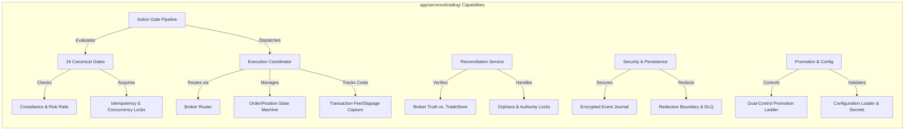
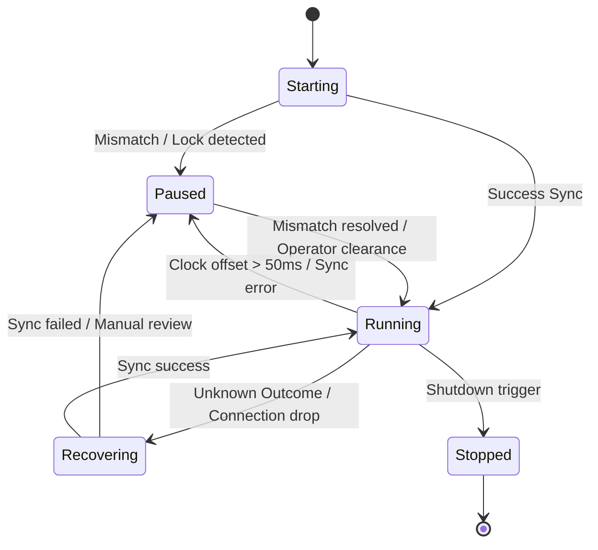

# Trading Runtime — Intended Workflows and Scenarios

## 1. Document Purpose
This document reverse-engineers the isolated architecture requirements defined in [07_trading.md](file:///c:/Users/rharu/AppDev/HaruquantAI/docs/dev/phase-implementation-plan/07_trading.md) into a set of cohesive, actor-driven, end-to-end operational workflows and scenarios. It defines how platform-independent actions, read-only facades, live-route safety gates, and state persistence layers cooperate to deliver secure, transactional trading outcomes on the HaruQuantAI platform.

---

## 2. Source and Analysis Boundaries
* **Source of Truth**: This analysis is strictly derived from the requirements, boundaries, schemas, and non-functional constraints in [07_trading.md](file:///c:/Users/rharu/AppDev/HaruquantAI/docs/dev/phase-implementation-plan/07_trading.md).
* **Constraints**: No source code from the active repository was inspected or assumed to exist. No domain behavior (such as active trading strategies, live broker connections, or LLM capabilities) was invented.
* **Terminology & Assertions**: All explicit requirements are marked with their corresponding `TRD-FR-*`, `TRD-NFR-*`, or `TRD-XM-*` tags. Implied system behaviors necessary to connect isolated requirements are clearly marked:
  > **Inferred workflow connection — requires validation**

---

## 3. System Purpose and Scope

### Primary Purpose
The `app/services/trading/` package is the platform-independent gateway for order management, position execution, and runtime control. It enforces dynamic route gating, clock synchronization, concurrency lease safety, state serialization, and transactional audit trails.

### Scope Boundaries
* **In-Scope**: Order routing based on parameters (`sim`, `paper`, `shadow`, `live`), broker adapter capability validation via the Broker Router, 16 pre-flight gate checks, optimistic concurrency locks, volume/stop/margin math normalization, read-only MQL5-parity wraps, audit/journal logging (WORM/encryption), local expiry watchdogs, and dynamic latency/reject monitoring.
* **Out-of-Scope**: Smart order routing (SOR) across venues (`TRD-NFR-018`), concurrent multi-broker session execution (`TRD-NFR-018`), signal generation/strategy decision model logic (`TRD-NFR-018`), dynamic risk modeling (`TRD-NFR-018`), historical market-data ingestion/distribution (`TRD-NFR-018`), and client-side stop emulation (unless synthetic emulation is configured) (`TRD-NFR-018`).

### Entry and Exit Points
* **Entry Points**:
  * Action APIs (`buy`, `sell`, `buy_limit`, `sell_limit`, `buy_stop`, `sell_stop`, `order_modify`, `order_delete`, `position_open`, `position_close`, `position_modify`, `reduce_exposure`, `pause_strategy`, `resume_strategy`, `sync_positions`, `shutdown`).
  * Read-only Info Wrappers (`AccountInfo`, `SymbolInfo`, `PositionInfo`, etc.).
  * External feeds (Locate snapshots, quote snapshots, session calendar evidence).
  * Data/Broker Router event listeners (reconnection state, halts, corporate actions).
* **Exit Points**:
  * Standardized `TradingResponseEnvelope` returned to callers.
  * Dispatched adapter requests sent to the Broker Router.
  * Appended events written to the Event Journal and Audit Sink.
  * Metrics, operational warnings, and incident reports.

### Persistent Stores (Ports)
* **TradingStateStore**: Durably preserves operational modes, kill switches, and reconciliation locks.
* **TradeStore**: Tracks positions, pending orders, executions, deals, and volume-weighted average price (VWAP).
* **IdempotencyStore**: Bounded, crash-resilient store reservation for execution safety.
* **EventJournal**: Append-only, cryptographically chained, encrypted log of all system transitions.
* **AuditSink**: Immutable log of pre-mutation intents and post-execution summaries.
* **ManualReviewDLQ / Dead-Letter Log**: Queue for poison-pill events or persistent write failures.

---

## 4. Actors and Responsibilities

| Actor | Role | Initiates | Information Provided | Outcomes Received | Prohibited Actions |
|---|---|---|---|---|---|
| **Strategy Service / AI Agent** | Core trading logic caller | Trade signals, orders, position adjustments | Request parameters, magic numbers, target symbols | `TradingResponseEnvelope` with normalized outcomes | Directly invoking adapter mutations without evaluating gates (`TRD-FR-082`). |
| **System Operator / Administrator** | Administrative controller | Promotion approvals, kill switches, configuration reloads | Signed approval evidence, credentials, limits | Updated session status, cleared blocks, system reports | Single-operator bypass of dual-control safeguards (`TRD-FR-092`). |
| **Broker Adapter** | External gateway interface | Fills, cancels, execution status reports | Ticket numbers, transaction fill prices, connectivity | standard API mutation commands | Triggering local state changes directly without reporting events. |
| **Risk Module** | Safety signing authority | Decision signature, exposure checks | Validated signatures, locate feeds, limit checks | Normalized risk event receipts | Permitting stale context checks to pass during gate pipeline. |
| **Data Module** | Real-time info provider | Snapshots, halts, calendar adjustments | Quote fields, halts, split ratios, trading hours | Telemetry acknowledgements | Generating orders or performing trade state modifications. |
| **Simulator / Backtester** | Verification engine | Replay executions, backtests | Injected RNG seeds, custom fill simulators | Parity reports, dry-run validations | Direct live broker connections (`TRD-XM-001`). |

---

## 5. Capability Map

---

## 6. Workflow Catalogue

### Primary Business Workflows
* **WF-001 — Live Gated Order Execution Lifecycle**: Submits and processes buy/sell/pending orders on `route="live"`, executing the 16-step gate pipeline, reserving concurrency/idempotency, and coordinating async adapter dispatch.
* **WF-002 — Live Order Modification & Cancellation**: Handles in-flight modifications/deletions, managing version-gated checks and two-step cancel-and-replace safety.
* **WF-003 — Broker-Initiated State Synchronization & Event Processing**: Captures broker-pushed events (fills, SL/TP triggers, stop-outs, margin calls, or corporate actions) and synchronizes internal stores.

### Supporting & Administrative Workflows
* **WF-004 — Emergency Account / Symbol Flattening**: Implements mass cancellations and liquidations under active kill switches or risk-breach events.
* **WF-005 — Configuration Reload & Secret Rotation**: Dynamically updates settings, validates immutability profiles, and handles mid-session re-authentication.

### Lifecycle & Monitoring Workflows
* **WF-006 — Runtime Session Lifecycle & Crash Recovery**: Starts/stops sessions, processes write-ahead logs, and resolves journal discrepancies at startup.
* **WF-007 — Strategy Promotion & Precondition Gating**: Controls stage progression from offline simulation to live environments via dual-control validation.
* **WF-008 — Incident Gating & Dynamic Circuit Breaking**: Integrates latency monitors, clock drift warnings, and consecutive rejects into automatic route downgrades.
* **WF-009 — State Reconciliation & Dispute Resolution**: Compares internal state to broker truth, adopts/quarantines orphans, and locks unresolved transaction states.

---

## 7. Detailed End-to-End Workflows

### WF-001 — Live Gated Order Execution Lifecycle

#### Purpose and Value
Provides a transactionally safe, non-blocking, and audited workflow to submit and execute trade mutations. It ensures every trade obeys absolute compliance, risk, latency, and idempotency safeguards.

#### Actors
* **Primary**: Strategy Service / AI Agent
* **Supporting**: Broker Adapter, Risk Module, Data Module, Persistence Stores (Audit, Idempotency, Journal, TradeStore)

#### Trigger
A Strategy Service submits an order request (`submit_order`) with `route="live"`.

#### Preconditions
* Session status is `running` and operational mode is `normal` or `micro_live` (`TRD-FR-064`).
* Allowed mutations configuration is enabled (`ALLOW_LIVE_MUTATIONS=true`) (`TRD-FR-055`).
* Reconciliation authority state is `RESOLVED` (no active scope locks) (`TRD-FR-165`).
* Clock synchronization drift is within $50\text{ms}$ threshold (`TRD-FR-094`).

#### Inputs
* `TradingRequestEnvelope` (route, action, symbol, volume, price, SL, TP, magic number, client order ID, allocation vector, regulatory tags, and mandatory `quote_snapshot`) (`TRD-FR-007`, `TRD-FR-008`, `TRD-FR-014`).
* Risk decision signature (`TRD-FR-091`) and locate snapshot for short orders (`TRD-FR-049`).

#### Main Success Flow
| Step | Responsible component | Action | Input | Validation or decision | State change | Output | Requirement IDs |
| :--- | :--- | :--- | :--- | :--- | :--- | :--- | :--- |
| 1 | `actions/orders` | Formulates order intent | Payload parameters | Local schema checks (Decimal conversion) | None | Standardized order intent | `TRD-FR-021`, `TRD-FR-037` |
| 2 | `actions/validation` | Enforces parameter rails | Price, volume, notional, conversion rate | **Decision Point**: Verify volume min/max, stops distance, dynamic price collars, locate availability, fat-finger caps. | None | Validated order intent | `TRD-FR-038..049` |
| 3 | `gates/pipeline` | Executes gates 2–8 | Order intent | Compliance list, stage check, session status, kill switches, operator approvals, risk signatures, volatility | None | Gated authorization | `TRD-FR-083..085`, `TRD-FR-090..091` |
| 4 | `gates/readiness` | Executes gates 9–10 | Order intent | Broker readiness, clock drift ($<50\text{ms}$), hardware latency drift threshold | None | Ready authorization | `TRD-FR-093..095` |
| 5 | `state/idempotency` | Executes gate 11 | Order parameters | Generate SHA-256 hash key; verify no identical reservation exists | Reserve lease in `IdempotencyStore` | Idempotency token | `TRD-FR-143..145` |
| 6 | `runtime/coordination` | Executes gate 12 | Account ID, symbol | Acquire optimistic lease | Lock `(account, symbol)` | Lock handle | `TRD-FR-073..074` |
| 7 | `reconciliation/guard` | Executes gate 13 | Account, symbol | Verify authority state is not `UNRESOLVED` | None | Unlocked clearance | `TRD-FR-165` |
| 8 | `gates/audit` | Executes gate 14 | Order intent | Attempt audit write. Fails closed if write fails. | Append pre-mutation entry | Saved audit log ID | `TRD-FR-101` |
| 9 | `gates/pipeline` | Executes gate 15 | Order intent | Verify broker capability profile matches requirements | None | Final dispatch clearance | `TRD-FR-115` |
| 10 | `execution/coordinator` | Executes gate 16 | Cleared request | None | Increment inflight requests counter | `TradingCommandAccepted` | `TRD-FR-011`, `TRD-FR-103`, `TRD-FR-113` |
| 11 | `execution/coordinator` | Dispatches asynchronously | Redacted payload | None | None | Futures callback registered | `TRD-FR-103`, `TRD-FR-104` |
| 12 | `Broker Router` | Resolves active adapter | Resolved module | Check connection state | None | Broker SDK invocation | `TRD-FR-102`, `TRD-FR-115` |
| 13 | `ResponseClassifier` | Processes fill event | Raw adapter response | **Decision Point**: Normalize error codes. Handle timeouts as unknown outcomes. | None | `NormalizedTradeResult` | `TRD-FR-117..119` |
| 14 | `execution/state_machine` | Transitions order state | `NormalizedTradeResult` | Validate logical state paths (prevent illegal jumps) | Update Order/Position to `Filled` / `Partially Filled` | `ExecutionReportEvent` | `TRD-FR-126..128` |
| 15 | `state/manager` | Persists trade updates | `ExecutionReportEvent` | None | Update TradeStore records, recalculate VWAP/volume | Persisted database entries | `TRD-FR-135`, `TRD-FR-141` |
| 16 | `execution/coordinator` | Finalizes execution | State results | Release coordination lock, update idempotency status | Decrement inflight requests counter | `TradingResponseEnvelope` | `TRD-FR-114` |

#### Decision Points
* **Pre-Trade Rails (Step 2)**: If fat-finger ceilings (`TRD-FR-045`), locate snapshots (`TRD-FR-049`), or price collars (`TRD-FR-044`) fail, validation returns `VALIDATION_FAILED` and short-circuits. Fails closed.
* **Risk Signature (Step 3)**: Gate 7 verifies that the risk decision hash matches the parameters. It also calls a lightweight exposure pre-check (`TRD-XM-005`). If position state has changed since signing, it fails closed with `RISK_EVIDENCE_STALE`.
* **Outcomes Classification (Step 13)**: The classifier maps responses. If a network timeout or connection drop occurs, it is classified as `UNKNOWN_OUTCOME` (`TRD-FR-118`). It switches execution to **Failure Flow A**.

#### Alternate Flows
* **Alternate Flow A (Shadow/Paper Route)**:
  * For `route="sim"`, `route="paper"`, or `route="shadow"`, the validation gates bypass risk signatures and compliance checks (`TRD-FR-014`).
  * `TradeStore` isolates records using local in-memory virtual spaces (`TRD-NFR-010`).
  * If `route="paper"`, the coordinator delegates execution to the simulator module's fill engine (`TRD-XM-002`).

#### Failure and Exception Flows
* **Failure Flow A (Unknown Outcome)**:
  * *Trigger*: Timeout, transport disconnect, or corrupt broker response.
  * *Detection*: `ResponseClassifier` fails to verify deal completion.
  * *Immediate Response*: Transition reconciliation authority state to `UNRESOLVED` (`TRD-FR-164`). Lock the account/symbol scope, blocking all subsequent mutation requests (`TRD-FR-165`).
  * *Resolution*: Route to **WF-009** for state reconciliation.
* **Failure Flow B (Audit Write Failure)**:
  * *Trigger*: `AuditSink` database drop or write timeout.
  * *Immediate Response*: Gate 14 fails closed. The coordinator rejects the order locally with `DATABASE_ERROR` and does not call the broker.

#### Recovery Flow
If a process crash occurs while an order is in-flight, recovery is handled by **WF-006 (Startup Recovery)** which resolves incomplete events.

#### Postconditions
* Internal positions, balances, and VWAP metrics are updated (`TRD-FR-141`).
* Idempotency reservations are updated with terminal results (`TRD-FR-114`).
* Audit and Event Journal logs are written (`TRD-FR-146`).

#### Participating Components
* **Entry Point**: `app/services/trading/actions/orders.py`
* **Orchestrator**: `app/services/trading/execution/coordinator.py`
* **Validators**: `app/services/trading/actions/validation.py`, `app/services/trading/gates/readiness.py`
* **Decision Authorities**: `app/services/trading/gates/pipeline.py`
* **Executors**: `app/services/brokers` (External Broker Router)
* **Persistence**: `app/services/trading/state/` (Idempotency, EventJournal, TradeStore ports)

---

### WF-002 — Live Order Modification & Cancellation

#### Purpose and Value
Enables strategies or operators to modify or cancel working orders. Protects the system against fill races and enforces safety rails during non-atomic broker amendments.

#### Actors
* **Primary**: Strategy Service / Operator
* **Supporting**: Broker Adapter, Coordination Service, Persistence Stores

#### Trigger
An incoming `order_modify` or `order_delete` action request is submitted.

#### Preconditions
* Target order exists in `TradeStore` and is in a working state (e.g., `Submitted`, `Partially Filled`).
* Mutation gates are not blocked by a kill switch or reconciliation lock.

#### Inputs
* Ticket ID, target price, SL, TP, and `expected_state_version` (`TRD-FR-129`).

#### Main Success Flow
| Step | Responsible component | Action | Input | Validation or decision | State change | Output | Requirement IDs |
| :--- | :--- | :--- | :--- | :--- | :--- | :--- | :--- |
| 1 | `actions/orders` | Receives modify request | Parameters | Check local parameter bounds | None | Standard modify intent | `TRD-FR-023` |
| 2 | `execution/state_machine` | Validates target state | Order records | **Decision Point**: Compare `expected_state_version` with actual version. | None | Validated modify intent | `TRD-FR-129` |
| 3 | `execution/coordinator` | Checks broker capability | Profile configs | Verify if order modification is atomic | None | Capability confirmation | `TRD-FR-108`, `TRD-FR-115` |
| 4 | `gates/pipeline` | Evaluates gates | Intent | Run 16 gate checks (compliance, approvals, limits) | None | Authorized modify | `TRD-FR-083` |
| 5 | `execution/coordinator` | Dispatches atomic modify | Action | Send modification to Broker Router | None | Broker response | `TRD-FR-102` |
| 6 | `ResponseClassifier` | Classifies response | Raw response | Normalize result | None | `NormalizedTradeResult` | `TRD-FR-117` |
| 7 | `execution/state_machine` | Transitions order state | Result details | Update order status to `Replaced` | Update state version | `ExecutionReportEvent` | `TRD-FR-126..128` |
| 8 | `state/manager` | Saves updates | Event data | Update prices/stops in TradeStore | Save details | Response envelope | `TRD-FR-114` |

#### Decision Points
* **Version-Gated check (Step 2)**: Evaluated by `state_machine`. If the order was filled or partially filled while the modify request was in transit, the version mismatch triggers **Alternate Flow A (Amend Race)**. Fails closed with `AMENDED_AFTER_PARTIAL_FILL`, `TOO_LATE_TO_CANCEL`, or `TOO_LATE_TO_MODIFY` (`TRD-FR-129`).
* **Broker Modify Atomic check (Step 3)**: If the capability profile indicates order modifications are non-atomic (cancel-then-replace), the coordinator switches to **Alternate Flow B (Non-Atomic Modify)** (`TRD-FR-108`).

#### Alternate Flows
* **Alternate Flow A (Amend Race)**:
  1. Step 2 detects a version mismatch (order has filled).
  2. The modify request is rejected.
  3. Response envelope is returned with status `TOO_LATE_TO_MODIFY` and retry safety `do_not_retry` (`TRD-FR-129`).
* **Alternate Flow B (Non-Atomic Modify)**:
  1. The coordinator reserves the target order in `TradeStore` to block concurrent actions (`TRD-FR-108`).
  2. Dispatches a cancel request for the working order and awaits confirmed cancellation.
  3. Upon cancel confirmation, dispatches the replacement order with modified parameters.
  4. If the replace step fails (e.g., price gap, margin reject), execute **Failure Flow B**.

#### Failure and Exception Flows
* **Failure Flow A (Atomic Modify Timeout)**:
  * *Trigger*: Timeout on modify request.
  * *Response*: Transition authority state to `UNRESOLVED` and lock the scope. Run reconciliation.
* **Failure Flow B (Non-Atomic Replace Reject)**:
  * *Trigger*: Cancel succeeds but replacement order is rejected by the broker.
  * *Detection*: Coordinator detects replacement reject.
  * *Immediate Response*: Journal a critical incident (`LIVE_NON_ATOMIC_MODIFY_ESCALATED`). Attempt to re-enter the original order with the last working parameters, or raise a critical dead-letter recovery escalation to the operator rather than losing the working order (`TRD-FR-108`).

#### Recovery Flow
Operator intervenes if a non-atomic replace fails and cannot be re-entered. The affected symbol scope remains locked.

#### Postconditions
* Order details and version numbers are updated in `TradeStore`.
* Events are recorded in the Event Journal.

---

### WF-003 — Broker-Initiated Event Processing

#### Purpose and Value
Handles asynchronous executions, deal status updates, halts, and corporate actions pushed by the broker or data feeds. Maintains internal positions and VWAP alignment with broker truth.

#### Actors
* **Primary**: Broker Adapter / Data Module
* **Supporting**: Response Classifier, State Machine, TradeStore, Session Manager

#### Trigger
An execution event, real-time halt notification, or corporate action notification is received.

#### Inputs
* WebSocket/FIX execution report, real-time halt event, or corporate action details (split ratio, name change).

#### Main Success Flow
| Step | Responsible component | Action | Input | Validation or decision | State change | Output | Requirement IDs |
| :--- | :--- | :--- | :--- | :--- | :--- | :--- | :--- |
| 1 | `ResponseClassifier` | Receives broker/data event | Raw payload | **Decision Point**: Check event duplicate ID. Deduplicate on `broker_event_id` window. | None | Unique parsed event | `TRD-FR-119`, `TRD-FR-131` |
| 2a | `ResponseClassifier` | Classifies trade fills | Trade report | Map to `BrokerInitiatedExecutionEvent` (SL/TP, stop-out, margin) | None | Normalized execution report | `TRD-FR-120` |
| 2b | `runtime/session_manager` | Processes halts | Halt event | Verify source signature | Update thread-safe `HaltedSymbols` set | Halt registration | `TRD-FR-071`, `TRD-XM-003B` |
| 2c | `state/ports` | Processes corporate action | Action event | Verify ratio and symbol matching | Atomically adjust entry prices and volume VWAP | adjustment audit log | `TRD-FR-142`, `TRD-XM-003A` |
| 3 | `execution/state_machine` | Evaluates state transitions | normalized execution | Verify logical transition tables and `sequence_id` order | Update order/position states | Transition events | `TRD-FR-126..128`, `TRD-FR-148` |
| 4 | `state/manager` | Updates local stores | Transition events | Recalculate average entry price and remaining volume | Persist records to TradeStore | Internal state update | `TRD-FR-135`, `TRD-FR-141` |

#### Decision Points
* **Duplicate Event Check (Step 1)**: If `broker_event_id` is already processed within the configured window, increment the duplicate metrics counter and drop the event. Do not trigger a state transition (`TRD-FR-131`).
* **Trigger Type (Step 2)**:
  * If event is classified as `stop_out` or `margin_call_action`, switch to **Failure Flow A** (`TRD-FR-122`).
  * If event is classified as a corporate action, trigger local adjustments (`TRD-FR-142`).

#### Failure and Exception Flows
* **Failure Flow A (Margin Call / Stop Out)**:
  * *Trigger*: Event is classified as `stop_out` or `margin_call_action`.
  * *Immediate Response*: Raise a high-severity operational signal (`high` or `critical`). Trigger an immediate account-scope reconciliation run.
  * *State change*: Transition the session operational mode to `close_only` or `read_only` (`TRD-FR-122`). Resumption to normal requires documented operator approvals.

#### Postconditions
* Portfolio projections (VWAP, balance, positions) are updated.
* Operational flags (halts, modes) are registered.

---

### WF-004 — Emergency Account / Symbol Flattening

#### Purpose and Value
Provides a reliable, fail-safe mechanism to cancel all working orders and close all open positions across a symbol, strategy, or account scope during high-risk incidents.

#### Actors
* **Primary**: Operator / Risk Module (breach event)
* **Supporting**: Execution Coordinator, Policy Matrix, TradeStore, Reconciliation Service

#### Trigger
An operator initiates an emergency command (`flatten_account`, `flatten_strategy`, `flatten_symbol`), or the Risk Module publishes a `RiskBreachEvent` (`TRD-XM-005A`).

#### Preconditions
* Injected state stores are active.
* Emergency settings exist in the policy matrix (`TRD-FR-036`).

#### Inputs
* Scope identifier (Account, Strategy ID, or Symbol), route, and credentials.

#### Main Success Flow
| Step | Responsible component | Action | Input | Validation or decision | State change | Output | Requirement IDs |
| :--- | :--- | :--- | :--- | :--- | :--- | :--- | :--- |
| 1 | `actions/emergency` | Receives emergency trigger | Scope details | Check target validity and route | Transition session mode to `emergency_flatten` | Mode update | `TRD-FR-035`, `TRD-FR-064` |
| 2 | `reconciliation/service` | Snapshots current state | Scope targets | Retrieve all working orders and positions from broker | None | Pre-flatten state snapshot | `TRD-FR-036` |
| 3 | `gates/pipeline` | Evaluates emergency bypass | Action commands | **Decision Point**: Verify policy matrix allows emergency actions under current state. | None | Bypass authorization | `TRD-FR-097`, `TRD-FR-099` |
| 4 | `actions/emergency` | Batches cancel orders | Working orders list | Dispatch cancellations for all active orders in scope | Transition orders to `Pending Cancel` | Cancel requests | `TRD-FR-035` |
| 5 | `actions/emergency` | Batches close positions | Open positions list | Dispatch position close commands (Close-By-Symbol/Ticket) | Transition positions to closing states | Close requests | `TRD-FR-026`, `TRD-FR-035` |
| 6 | `execution/coordinator` | Monitors completions | Async responses | Collect outcomes per child execution | Update TradeStore states | Batch status report | `TRD-FR-036` |
| 7 | `reconciliation/service` | Verifies final state | Scope targets | Compare post-execution broker snapshot with local records | None | Post-flatten state snapshot | `TRD-FR-036` |
| 8 | `monitoring/service` | Issues final summary | Snapshots | **Decision Point**: Verify all positions are flat and orders are cancelled. | If any outcome is unknown, lock the scope. | Recovery signal or alert | `TRD-FR-036` |

#### Decision Points
* **Gate Gating Bypass (Step 3)**: Evaluated by `gates/kill_switch`. Emergency actions are permitted to bypass standard mutation blocks only if the policy matrix defines explicit emergency clearance rules (`TRD-FR-097`). No caller-provided flags can bypass the checks (`TRD-FR-099`).
* **Verification Outcome (Step 8)**: If the post-flatten check reveals an unresolved or timed-out trade action, switch to **Failure Flow A** (`TRD-FR-036`).

#### Failure and Exception Flows
* **Failure Flow A (Unresolved Emergency Outcome)**:
  * *Trigger*: An order or position close command times out or returns an unknown broker status.
  * *Immediate Response*: Lock the affected scope (account/symbol) in the reconciliation authority state. Block all further mutations on that scope (`TRD-FR-036`). Raise a `critical` incident alert referencing the corresponding runbook ID (`TRD-FR-174`).

#### Recovery Flow
The affected scope remains locked until a reconciliation run resolves the broker outcome.

#### Postconditions
* Session operational mode remains in `close_only` or `stopped` until operator clearance is provided.
* Audit Sink records are written.

---

### WF-005 — Configuration Reload & Secret Rotation

#### Purpose and Value
Ensures that runtime configuration changes and credential rotations occur securely without causing state corruption or losing track of active trades.

#### Actors
* **Primary**: Operator / Config Loader
* **Supporting**: Secrets Service, Broker Adapter, Session Manager

#### Trigger
An operator triggers a config reload, or a credentials/token expiry notification is received.

#### Preconditions
* A running session is active.
* Valid configuration signature / metadata is provided.

#### Inputs
* Redacted settings updates, secret references, or updated token keys.

#### Main Success Flow
| Step | Responsible component | Action | Input | Validation or decision | State change | Output | Requirement IDs |
| :--- | :--- | :--- | :--- | :--- | :--- | :--- | :--- |
| 1 | `config/loader` | Receives update intent | Settings file/stream | Check key presence and validation schemas | None | Checked config structure | `TRD-FR-057` |
| 2 | `config/loader` | Checks immutable keys | Config updates | **Decision Point**: Verify no immutable keys are changed while session is running. | None | Validated updates | `TRD-FR-059` |
| 3 | `config/secrets` | Resolves secret indirection | References | Retrieve actual credentials. Confirm no raw keys are stored in config model. | None | Resolved secrets | `TRD-FR-060` |
| 4 | `config/loader` | Version-stamps config | Validated config | Compute hash of effective configuration | Update active configuration version | Config change event | `TRD-FR-058` |
| 5 | `state/event_journal` | Journals config update | Config hash, actor | Write configuration change event | Append log | Journal confirmation | `TRD-FR-058` |
| 6 | `config/loader` | Applies settings | Validated updates | Hot-reload permitted keys dynamically | None | Settings reload completed | `TRD-FR-059` |

#### Decision Points
* **Immutable Keys Validation (Step 2)**: If any immutable key (`ALLOW_LIVE_MUTATIONS`, fat-finger ceilings, active broker selection, promotion-stage assignments, store connection targets) is modified while the session is `running`, switch to **Failure Flow A** (`TRD-FR-059`).
* **Mid-Session Secret Rotation (Step 3)**: If token expiration or credential rotation occurs, it must route to the broker adapter's re-authentication path. If rotation fails, switch to **Failure Flow B** (`TRD-FR-061`).

#### Failure and Exception Flows
* **Failure Flow A (Immutable Config Edit Rejected)**:
  * *Trigger*: Attempt to change immutable keys in a running state.
  * *Detection*: Caught by `config/loader`.
  * *Response*: Fail closed. Reject the configuration reload and log an operational warning. No settings are applied.
* **Failure Flow B (Failed Secret Rotation)**:
  * *Trigger*: Mid-session re-authentication fails.
  * *Immediate Response*: Transition the session operational mode to `read_only`. Raise a `high` or `critical` severity operational signal.
  * *State change*: Block all new mutations. Do NOT crash the process or retry with expired credentials (`TRD-FR-061`).

#### Postconditions
* Updated configuration version is mapped to all subsequent reports and logs.
* A journal event is emitted.

---

### WF-006 — Runtime Session Lifecycle & Crash Recovery

#### Purpose and Value
Orchestrates process startup, verifies previous shutdown consistency, replays write-ahead logs, and restores active guards before admitting strategy inputs.

#### Actors
* **Primary**: Operator / Session Manager
* **Supporting**: Event Journal, TradeStore, Reconciliation Service, Dead-Letter Queue

#### Trigger
System startup command is executed.

#### Preconditions
* Injected database stores are accessible.
* Configuration is loaded and validated.

#### Main Success Flow
| Step | Responsible component | Action | Input | Validation or decision | State change | Output | Requirement IDs |
| :--- | :--- | :--- | :--- | :--- | :--- | :--- | :--- |
| 1 | `runtime/session_manager` | Begins startup sequence | Config parameters | Verify single-session scope limit | Transition session state to `starting` | Startup sequence start | `TRD-FR-064`, `TRD-FR-065` |
| 2 | `state/event_journal` | Scans event journal | Historical records | **Decision Point**: Check for commands with no terminal events. | None | Incomplete commands list | `TRD-FR-149` |
| 3 | `reconciliation/guard` | Locks unresolved scopes | Incomplete commands | If incomplete commands exist, lock their `(account, symbol)` scopes | Transition authority to `UNRESOLVED` | Locked scopes list | `TRD-FR-149` |
| 4 | `security/redaction` | Replays dead-letter logs | Write-ahead DLQ | **Decision Point**: Verify if DLQ events fail to process. | Replay/resolve DLQ events | Replayed events report | `TRD-FR-180`, `TRD-FR-181` |
| 5 | `gates/kill_switch` | Restores previous guards | Store records | Retrieve last operational mode, kill switches, and locks | Restore active guards | Active guards loaded | `TRD-FR-100` |
| 6 | `reconciliation/service` | Runs pre-trade sync | Broker snapshots | **Decision Point**: Compare local state with broker snapshots. | None | Reconciliation report | `TRD-FR-157`, `TRD-FR-158` |
| 7 | `runtime/session_manager` | Enables mutations | Sync report | Confirm no mismatches exist | Transition state to `running` / `normal` | Session active | `TRD-FR-064`, `TRD-FR-159` |

#### Decision Points
* **Journal Integrity Check (Step 2)**: If scanning the event journal reveals a command with no terminal event (`TradingCommandAccepted` but no `ExecutionReportEvent`), switch to **Failure Flow A** (`TRD-FR-149`).
* **DLQ Poison Pill Check (Step 4)**: If a recovery event fails to process repeatedly ($>N$ times), switch to **Failure Flow B** (`TRD-FR-181`).
* **Pre-Trade Sync Check (Step 6)**: If a state mismatch is detected on startup reconciliation, switch to **Failure Flow C** (`TRD-FR-159`).

#### Failure and Exception Flows
* **Failure Flow A (Incomplete Command Lock)**:
  * *Trigger*: Unresolved command found in journal scan.
  * *Response*: Lock the affected instrument scope in `UNRESOLVED` authority status. Disable mutations for that scope.
* **Failure Flow B (Poison Pill DLQ Isolation)**:
  * *Trigger*: A recovery event fails $>N$ times.
  * *Immediate Response*: Relocate the event to `ManualReviewDLQ`. Raise a `high` severity alert and proceed with startup.
* **Failure Flow C (Startup Mismatch Block)**:
  * *Trigger*: State mismatch detected during pre-trade reconciliation.
  * *Immediate Response*: Transition the session to `paused` state. Block all live mutations until state is synchronized or operator clearance is provided (`TRD-FR-159`).

#### Postconditions
* Active session is registered.
* Previous guards (kill switches, mode status) are restored.

---

### WF-007 — Strategy Promotion & Precondition Gating

#### Purpose and Value
Enforces a secure promotion ladder that prevents unauthorized execution of untested strategies in live environments.

#### Actors
* **Primary**: Operator / Administrator
* **Supporting**: Promotion Service, Configuration Loader, Verification Engine

#### Trigger
An operator requests strategy promotion to a higher stage (e.g. `ShadowTrading` $\rightarrow$ `MicroLive`).

#### Preconditions
* Target strategy has successfully run in its current stage.
* The system is not in an active incident state.

#### Inputs
* Promotion request containing strategy ID, target `PromotionStage`, and signed operator credentials.

#### Main Success Flow
| Step | Responsible component | Action | Input | Validation or decision | State change | Output | Requirement IDs |
| :--- | :--- | :--- | :--- | :--- | :--- | :--- | :--- |
| 1 | `promotion/ladder` | Receives promotion request | Stage parameters | **Decision Point**: Verify promotion path is sequential (no skips). | None | Checked promotion intent | `TRD-FR-182`, `TRD-FR-183` |
| 2 | `promotion/ladder` | Verifies strategy authorization | Strategy ID | **Decision Point**: Verify strategy cannot self-promote. | None | Authorized request | `TRD-FR-184` |
| 3 | `promotion/preconditions` | Validates prerequisites | Precondition checklist | Check active kill switches, unresolved reconciliation, config issues, dirty VCS builds | None | Prerequisites evaluation | `TRD-FR-153`, `TRD-FR-185` |
| 4 | `gates/approval` | Verifies dual operator sign-off | Request details | **Decision Point**: Verify two distinct operators approved promotion to `full_live`. | None | Approved signatures | `TRD-FR-092` |
| 5 | `promotion/ladder` | Promotes strategy | Stage settings | Set target capability profile (e.g. `micro_live`) | Update strategy stage in store | Promotion confirmation | `TRD-FR-182` |
| 6 | `state/event_journal` | Logs promotion event | Stage change details | Write promotion event to journal | Append log | Event acknowledgement | `TRD-FR-146` |

#### Decision Points
* **Self-Promotion Check (Step 2)**: Strategy code, AI agents, or client UIs are blocked from promoting a strategy. The request must possess verified operator signature evidence (`TRD-FR-184`, `TRD-NFR-001`). Fails closed.
* **Dual-Control Gating (Step 4)**: Promotion to `full_live` requires dual operator approval signatures (`TRD-FR-092`). If only one signature is present, validation fails closed.

#### Failure and Exception Flows
* **Failure Flow A (Prerequisites Failed)**:
  * *Trigger*: Unresolved reconciliation state, active kill switch, or dirty VCS build detects failure.
  * *Immediate Response*: Reject the promotion request. Log a warning event. Strategy remains in its current stage.

#### Postconditions
* Strategy stage is updated.
* Associated action capability is adjusted (`read_only` $\rightarrow$ `micro_live` / `full_live`).

---

### WF-008 — Incident Gating & Dynamic Circuit Breaking

#### Purpose and Value
Constantly monitors operational metrics (clock sync drift, execution latency, consecutive rejects, database durability) to trigger automatic circuit breakers and prevent trading losses.

#### Actors
* **Primary**: Monitoring Service
* **Supporting**: Session Manager, Operational Signals, Event Journal

#### Trigger
N consecutive rejects, high latency, clock sync drift warnings, stream gaps, or database failures occur.

#### Inputs
* Host clock synchronization offset, PTP hardware latency, broker execution latency metrics, and database write status.

#### Main Success Flow
| Step | Responsible component | Action | Input | Validation or decision | State change | Output | Requirement IDs |
| :--- | :--- | :--- | :--- | :--- | :--- | :--- | :--- |
| 1 | `monitoring/service` | Evaluates performance metrics | Latency, reject count, clock offset | **Decision Point**: Check drift $>50\text{ms}$ or latencies exceeding thresholds. | None | Performance diagnostics | `TRD-FR-094`, `TRD-FR-168` |
| 2 | `monitoring/service` | Triggers circuit breaker | Trigger rules | **Decision Point**: Determine if rejects or drift exceed breaker ceilings. | Transition session mode to `close_only` or `read_only` | Circuit breaker event | `TRD-FR-168` |
| 3 | `runtime/session_manager` | Halts mutations | Breaker signal | Block all new mutations for affected scopes | Update OperationalMode | Execution block | `TRD-FR-064`, `TRD-FR-072` |
| 4 | `monitoring/service` | Downgrades capability | Latency p95 calculations | **Decision Point**: Determine if dynamic latency downgrade applies. | Downgrade stage to `micro_live` (size caps) or `read_only` | Stage downgrade event | `TRD-FR-169` |
| 5 | `monitoring/signals` | Emits operational signal | Event details | Resolve severity tier (`info`, `warning`, `high`, `critical`) | None | Severity signal | `TRD-FR-173` |
| 6 | `monitoring/signals` | Dispatches alerts | Signal, runbook ID | Check alert deduplication window; route to configured channels | None | Alert notifications | `TRD-FR-173`, `TRD-FR-174` |
| 7 | `monitoring/signals` | Escalates unresolved alerts | Escalation window | **Decision Point**: Verify operator acknowledged alert. | If no response, route to secondary channels. | Escalated alert | `TRD-FR-173` |

#### Decision Points
* **Clock Sync Drift (Step 1)**: If local system clock offset exceeds $50\text{ms}$, pause live mutations (`TRD-FR-094`). If PTP hardware latency drift exceeds threshold, block the trade (`TRD-FR-095`).
* **Breaker Limits (Step 2)**: Circuit breakers trigger upon: (a) N consecutive rejects, (b) N unknown outcomes in window, (c) reconciliation drift, (d) p95 latency breaches, (e) stream gaps, or (f) database write failures (`TRD-FR-168`).
* **Escalation Chain (Step 7)**: If `high` or `critical` alerts are not acknowledged within the configured window, escalate to secondary channels (`TRD-FR-173`).

#### Recovery Flow
Resumption from a circuit-breaker pause to `normal` mutation requires explicit, validated operator approval evidence (`TRD-FR-122`).

---

### WF-009 — State Reconciliation & Dispute Resolution

#### Purpose and Value
Resolves discrepancies between the internal `TradeStore` database and the broker's terminal truth. Ensures disputes, orphan trades, and timed-out orders are handled according to strict operational policies.

#### Actors
* **Primary**: Reconciliation Service
* **Supporting**: TradeStore, Response Classifier, Event Journal, Operator

#### Trigger
Initiated at startup, pre-trade, periodically, after unknown broker outcomes, or at shutdown.

#### Preconditions
* Broker connection is active.
* Local TradeStore is available.

#### Inputs
* Local portfolio state, broker terminal positions and pending orders snapshots, and reconciliation drift configuration thresholds (`TRD-FR-163`).

#### Main Success Flow
| Step | Responsible component | Action | Input | Validation or decision | State change | Output | Requirement IDs |
| :--- | :--- | :--- | :--- | :--- | :--- | :--- | :--- |
| 1 | `reconciliation/service` | Requests broker snapshot | Query parameters | Await safe snapshot from broker terminal | None | Broker state snapshot | `TRD-FR-158` |
| 2 | `reconciliation/service` | Compares positions/orders | Broker snapshot, local TradeStore | Verify balance, margin, open positions, and pending tickets | None | Comparison matrix | `TRD-FR-158` |
| 3 | `reconciliation/compare` | Detects drift/mismatches | Comparison matrix | **Decision Point**: Evaluate drift against configured price/volume thresholds. | None | List of mismatches | `TRD-FR-160`, `TRD-FR-163` |
| 4 | `reconciliation/service` | Handles orphan trades | Orphan tickets | **Decision Point**: Apply policy-matrix rules for manual or un-owned deals. | None | Orphan resolution plan | `TRD-FR-161` |
| 5 | `reconciliation/service` | Resolves mismatches | Resolution plan | Apply updates to local TradeStore (correct VWAP/volume) | Synchronize local database states | Sync audit trail | `TRD-FR-141`, `TRD-FR-162` |
| 6 | `reconciliation/guard` | Resolves authority locks | Sync report | Confirm mismatch is resolved and state matches broker truth | Transition authority from `UNRESOLVED` to `RESOLVED` | Clearance confirmation | `TRD-FR-165` |

#### Decision Points
* **Drift Threshold (Step 3)**: If discrepancies exceed configured thresholds, trigger high-severity alerts (`TRD-FR-160`).
* **Orphan Trade Policy (Step 4)**:
  * **Adopt-quarantine**: Assign `owner=external` and exclude from strategy logic/performance calculations (`TRD-FR-161`, `TRD-FR-162`).
  * **Block**: Lock live mutations for the affected scope until manual operator classification (`TRD-FR-161`). Fails closed to Block if no policy is configured.

#### Failure and Exception Flows
* **Failure Flow A (Reconciliation Mismatch Lock)**:
  * *Trigger*: Drift exceeds threshold, or startup mismatch occurs.
  * *Immediate Response*: Block live mutations for the affected scope. Require operator clearance to override.

---

## 8. Scenario Catalogue

| Scenario ID | Scenario | Given | When | Then | Expected state | Requirement IDs |
| :--- | :--- | :--- | :--- | :--- | :--- | :--- |
| **WF-001-SC-001** | Happy Path Order Fill | Running live session, valid signature, no active kill switches | Market buy order submitted with valid params | Evaluates all gates, reserves idempotency, dispatches async, receives fill event | State is `Filled`, VWAP is updated, leases cleared | `TRD-FR-021`, `TRD-FR-083`, `TRD-FR-114`, `TRD-FR-128` |
| **WF-001-SC-002** | Stale Quote Snapshot | Quote snapshot timestamp exceeds freshness TTL | Order is submitted | Gate pipeline evaluates snapshot freshness and fails closed | Short-circuit reject with `QUOTE_STALE` | `TRD-FR-014`, `TRD-FR-088` |
| **WF-001-SC-003** | Fat-Finger Cap Exceeded | Order notional size exceeds dynamic cap, signed by risk | Order is submitted | Validation checks absolute notional size against ceiling and rejects | Rejects locally before dispatching to broker | `TRD-FR-045`, `TRD-FR-047` |
| **WF-001-SC-004** | Short Order Missing Locate | Short sale request submitted, locate snapshot is missing or zero | Order is submitted | Gating validation fails closed | Rejects locally with `VALIDATION_FAILED` | `TRD-FR-049` |
| **WF-001-SC-005** | Host Clock Drift Breach | Local system clock offset is $60\text{ms}$ ($>50\text{ms}$ threshold) | Order is submitted | Clock drift check fails at Gate 10 | Mutations paused, warning operational signal tripped | `TRD-FR-094` |
| **WF-001-SC-006** | Broker Timeout Unknown Outcome | Connection drops after broker dispatch | Order is dispatched | Classifier identifies timeout, transitions state | Authority set to `UNRESOLVED`, scope locked | `TRD-FR-118`, `TRD-FR-164` |
| **WF-001-SC-007** | Concurrency Lock Conflict | Concurrency lease active on `(account_1, EURUSD)` | Second order submitted on same scope | Concurrency lock is busy; request is rejected | Backpressure reject, order not sent to broker | `TRD-FR-073`, `TRD-FR-074` |
| **WF-001-SC-008** | Client-Side Rate Exhaustion | Request frequency exceeds token-bucket limits | Order is submitted | Rate limiter blocks request locally | Rejects locally, avoiding provider penalty | `TRD-FR-123`, `TRD-FR-124` |
| **WF-002-SC-001** | Version-Gated Amend Success | Working order price modification | Order modify submitted with correct `expected_state_version` | State machine verifies version and updates parameters | Order transitioned to `Replaced`, version bumped | `TRD-FR-023`, `TRD-FR-129` |
| **WF-002-SC-002** | Amend Race (Too Late) | Order fills while modify is in transit | Order modify submitted with old version | State machine detects version mismatch | Reject with `TOO_LATE_TO_MODIFY`, `do_not_retry` | `TRD-FR-129` |
| **WF-002-SC-003** | Non-Atomic Modify Replace Reject | Non-atomic broker modify, replace fails | Order modify submitted | Coordinator cancels original order, tries to replace, replace rejects | Original cancelled; escalation event logged | `TRD-FR-108` |
| **WF-003-SC-001** | Dynamic Stop Out Event | Position margin falls below broker threshold | Broker initiates stop-out and reports event | Classifier parses stop-out, alerts monitoring | Session operational mode set to `close_only` | `TRD-FR-120`, `TRD-FR-122` |
| **WF-003-SC-002** | Stock Split Adjustment | Corporate action notification published by data | Corporate action split ratio event received | Local volumes and entry prices are adjusted | TradeStore updated atomically, audited, journaled | `TRD-FR-142`, `TRD-XM-003A` |
| **WF-003-SC-003** | Real-Time Halt Gating | Data publishes symbol halt event | Symbol halt event received | Symbol registered in `HaltedSymbols` | Subsequent orders for symbol fail validation | `TRD-FR-071`, `TRD-XM-003B` |
| **WF-004-SC-001** | Risk Breach Mass Flatten | Risk publishes `RiskBreachEvent` | Breach event received | Transition to `emergency_flatten` and execute liquidation | Position flat, orders cancelled, scope locked | `TRD-FR-035`, `TRD-XM-005A` |
| **WF-005-SC-001** | Immutable Config Change | Attempt to change `ALLOW_LIVE_MUTATIONS` on running session | Operator submits reload | Config loader rejects the update | Configuration reload fails, old config remains | `TRD-FR-059` |
| **WF-005-SC-002** | Failed Secret Rotation | Re-authentication fails during token refresh | Token refresh event | Re-authentication fails | Session set to `read_only`, mutation blocked | `TRD-FR-061` |
| **WF-006-SC-001** | Startup Crash Command Lock | Process crashed with pending command in journal | Process restarts | Journal scan finds command with no terminal event | `(account, symbol)` scope locked | `TRD-FR-149` |
| **WF-006-SC-002** | Startup Mismatch Block | Pre-trade reconciliation finds discrepant tickets | Process restarts | Sync check fails on mismatch | Startup paused, operator clearance required | `TRD-FR-159` |
| **WF-006-SC-003** | DLQ Poison Pill Isolation | Corrupted recovery event fails $>N$ times | Process restarts | DLQ replay fails repeatedly | Event sent to `ManualReviewDLQ`, session starts | `TRD-FR-181` |
| **WF-007-SC-001** | Strategy Promotion Pass | Prerequisites met, approvals signed | Operator requests shadow $\rightarrow$ micro_live | Promotion ladder checks qualifications and moves stage | Stage updated, capability adjusted | `TRD-FR-182..185` |
| **WF-007-SC-002** | Self-Promotion Block | Strategy attempts to promote itself | Strategy executes API promote | Promotion ladder blocks request | Rejects with `PERMISSION_DENIED` | `TRD-FR-184`, `TRD-NFR-001` |
| **WF-008-SC-001** | Latency Downgrade circuit | Broker p95 latency exceeds threshold | Latency calculated over rolling window | Monitor triggers auto-downgrade | Session mode set to `micro_live` (size caps) | `TRD-FR-169` |
| **WF-009-SC-001** | Orphan Trade Adopted | reconciliation finds ticket missing local ownership | Sync run checks state | Policy is set to `adopt-quarantine` | assigned to `owner=external`, excluded from metrics | `TRD-FR-161`, `TRD-FR-162` |
| **WF-009-SC-002** | Orphan Trade Blocked | reconciliation finds ticket missing local ownership | Sync run checks state | Policy is set to `block` (or unconfigured) | Mutations blocked for scope until operator classifies | `TRD-FR-161` |

---

## 9. Workflow Relationship Map

| Source workflow | Relationship | Target workflow | Trigger or condition |
| :--- | :--- | :--- | :--- |
| **WF-001** (Order Execution) | Invokes (Child) | **WF-008** (Incident Gating) | When a latency, reject, or clock offset breach occurs. |
| **WF-001** (Order Execution) | Invokes (Child) | **WF-009** (State Reconciliation) | Upon timeout or connection drop (unknown outcome). |
| **WF-002** (Modify/Cancel) | Invokes (Child) | **WF-009** (State Reconciliation) | Upon timeout during atomic/non-atomic modification. |
| **WF-003** (Event Processing) | Invokes (Child) | **WF-004** (Emergency Flatten) | Upon receiving a stop-out or margin call classification. |
| **WF-006** (Session Lifecycle) | Invokes (Child) | **WF-009** (State Reconciliation) | startup checks force pre-trade reconciliation. |
| **WF-006** (Session Lifecycle) | Invokes (Child) | **WF-004** (Emergency Flatten) | Heartbeat connection failsafe sweeps orders on disconnect. |
| **WF-007** (Strategy Promotion) | Checks (Upstream) | **WF-009** (State Reconciliation) | Cannot promote if reconciliation is unresolved. |
| **WF-008** (Incident Gating) | Invokes (Child) | **WF-004** (Emergency Flatten) | receipt of risk breaches triggers emergency actions. |

---

## 10. System Lifecycle and State Transitions

### Request / Command Lifecycle
1. **Received**: Order intent created in actions and local validations check bounds.
2. **Authorized**: Gate pipeline approves execution; idempotency reservation is locked.
3. **Journaled**: Written to append-only `EventJournal` (`TradingCommandAccepted`).
4. **Dispatched**: Dispatched asynchronously to the Broker Router (`BrokerDispatchEvent`).
5. **Acknowledged**: Broker acknowledges receipt (`BrokerAcknowledgementEvent`).
6. **Executed/Filled**: Normalized results are processed and trade projections updated (`ExecutionReportEvent`).
7. **Resolved**: Idempotency lease is resolved, and concurrency lock is released.

### Session Lifecycle
* **Starting**: Process boot. Replays write-ahead logs, checks journal integrity, restores switches, and runs pre-trade sync.
* **Running**: Active trading. Evaluates incoming strategy signals.
* **Paused**: Locked status. Mutations blocked due to synchronization drift, clock offset warnings, or operator intervention.
* **Stopped**: Shutdown status. Flushes state, waits for in-flight requests, and runs final reconciliation.
* **Recovering**: Active dispute/reconciliation run resolving unknown outcomes or starting up.

---

## 11. Cross-Module Interaction Matrix

| Module | Direction | Target | Event / Contract | Description |
|---|---|---|---|---|
| **Simulator** | Inbound | `trading/validation` | `TRD-XM-001` (Validation Parity) | Simulator executes trading validation code directly to ensure backtest/live parity. |
| **Simulator** | Outbound | `execution/coordinator` | `TRD-XM-002` (Paper Fill Engine) | Simulator provides custom fill engine for paper route. |
| **Data** | Outbound | `actions/validation` | `TRD-XM-003` (Session Calendar) | Data module publishes trading-calendar snapshots with TTL. |
| **Data** | Outbound | `reconciliation/service` | `TRD-XM-003A` (Corporate Action) | Data publishes splits and name changes for position adjustments. |
| **Data** | Outbound | `runtime/session_manager` | `TRD-XM-003B` (Halt Notification) | Data publishes symbol halt events to update halts set. |
| **Data** | Outbound | `actions/validation` | `TRD-XM-006` (Locate Feed) | Data publishes short locate availability snapshots. |
| **Analytics** | Inbound | `execution/reporting` | `TRD-XM-004` (Execution Quality) | Trading emits standardized execution-quality events for analytics. |
| **Risk** | Outbound | `gates/pipeline` | `TRD-XM-005` (Exposure check) | Risk verifies exposure assumptions have not changed since signing. |
| **Risk** | Outbound | `runtime/session_manager` | `TRD-XM-005A` (Risk Breach) | Risk publishes breaches to trigger emergency flattening. |

---

## 12. Requirements-to-Workflow Traceability Matrix

| Requirement ID | Requirement Summary | Workflow IDs | Scenario IDs | Workflow Steps | Coverage Status |
|---|---|---|---|---|---|
| **TRD-FR-001** | No import-time side effects | WF-006 | WF-006-SC-001 | Prep steps | Fully represented |
| **TRD-FR-002** | Export action surface through `__all__` | WF-001 | WF-001-SC-001 | Step 1 | Fully represented |
| **TRD-FR-003** | Pure functions accessors for tools | WF-001 | - | Action mapping | Fully represented |
| **TRD-FR-004** | Type-safe enums for routes/actions | WF-001 | WF-001-SC-001 | Step 1 | Fully represented |
| **TRD-FR-005** | Validate Time-in-Force (TIF) | WF-001 | - | Step 2 | Fully represented |
| **TRD-FR-006** | Support FIX Protocol states | WF-001, WF-003 | WF-001-SC-001 | Step 14 | Fully represented |
| **TRD-FR-007** | Accept AllocationVector payloads | WF-001 | - | Inputs, Step 11 | Fully represented |
| **TRD-FR-008** | RegulatoryTags payload mapping | WF-001 | - | Inputs, Step 11 | Fully represented |
| **TRD-FR-009** | Accept `oco_group_id` / linked IDs | WF-001, WF-002 | - | Step 1 | Fully represented |
| **TRD-FR-010** | Distinct contract event structures | WF-001, WF-003 | WF-001-SC-001 | Step 10, 14 | Fully represented |
| **TRD-FR-011** | Initial response is accepted, not confirmed | WF-001 | WF-001-SC-001 | Step 10 | Fully represented |
| **TRD-FR-012** | Event schema version validation | WF-001 | - | Step 1 | Fully represented |
| **TRD-FR-013** | PromotionStage and MutationCapability | WF-001, WF-007 | - | Step 3 | Fully represented |
| **TRD-FR-014** | Mandatory quote snapshot check | WF-001 | WF-001-SC-002 | Step 2, Step 3 | Fully represented |
| **TRD-FR-015** | PTP wire timestamp payload check | WF-001 | - | Step 4 | Fully represented |
| **TRD-FR-016** | Response envelope attributes | WF-001 | WF-001-SC-001 | Step 16 | Fully represented |
| **TRD-FR-017** | Wrapper NormalizedTradeResult data block | WF-001, WF-003 | WF-001-SC-001 | Step 13 | Fully represented |
| **TRD-FR-018** | Enforce JSON-safe/redacted envelopes | WF-001, WF-005 | - | Step 11 | Fully represented |
| **TRD-FR-019** | Registry of callable trading tools | WF-001 | - | Action mapping | Fully represented |
| **TRD-FR-020** | AI-facing tools cannot run mutations | WF-001, WF-007 | WF-007-SC-002 | Step 2 | Fully represented |
| **TRD-FR-021** | Parity market buy/sell actions | WF-001 | WF-001-SC-001 | Step 1 | Fully represented |
| **TRD-FR-022** | Formulate pending order intents | WF-001 | - | Step 1 | Fully represented |
| **TRD-FR-023** | Order modify/delete actions | WF-002 | WF-002-SC-001 | Step 1 | Fully represented |
| **TRD-FR-024** | Validate OCO group parameters | WF-001 | - | Step 2 | Fully represented |
| **TRD-FR-025** | Canonical 16-step gating path | WF-001 | WF-001-SC-001 | Steps 2–10 | Fully represented |
| **TRD-FR-026** | Netting vs. hedging position controls | WF-003, WF-004 | WF-004-SC-001 | Step 5 | Fully represented |
| **TRD-FR-027** | Partial close / exposure reduction | WF-002 | - | Step 1 | Fully represented |
| **TRD-FR-028** | Pause/resume strategy state controls | WF-008 | - | Step 3 | Fully represented |
| **TRD-FR-029** | Sync positions without mutations | WF-009 | WF-009-SC-001 | Step 2 | Fully represented |
| **TRD-FR-030** | Graceful shutdown procedures | WF-006 | - | Shutdown | Fully represented |
| **TRD-FR-031** | Global kill switch trigger | WF-008 | - | Step 3 | Fully represented |
| **TRD-FR-032** | Strategy kill switch trigger | WF-008 | - | Step 3 | Fully represented |
| **TRD-FR-033** | Symbol kill switch trigger | WF-008 | - | Step 3 | Fully represented |
| **TRD-FR-034** | Kill switch audit and policy matrix check | WF-008 | - | Step 5 | Fully represented |
| **TRD-FR-035** | First class emergency actions | WF-004 | WF-004-SC-001 | Step 4, 5 | Fully represented |
| **TRD-FR-036** | Emergency policy, snapshot, reconciliations | WF-004 | WF-004-SC-001 | Steps 2, 7, 8 | Fully represented |
| **TRD-FR-037** | Decimal dynamic precision validation | WF-001 | - | Step 2 | Fully represented |
| **TRD-FR-038** | Validate min/max/step volume check | WF-001 | - | Step 2 | Fully represented |
| **TRD-FR-039** | Rounding direction rules and audit logging | WF-001 | - | Step 2 | Fully represented |
| **TRD-FR-040** | Validate direction-aware stops distance | WF-001 | - | Step 2 | Fully represented |
| **TRD-FR-041** | Validate account free margin | WF-001 | - | Step 2 | Fully represented |
| **TRD-FR-042** | Validate market session calendar | WF-001 | - | Step 2 | Fully represented |
| **TRD-FR-043** | Validate Time-in-Force constraints | WF-001 | - | Step 2 | Fully represented |
| **TRD-FR-044** | Dynamic price collars and slippage checks | WF-001 | - | Step 2 | Fully represented |
| **TRD-FR-045** | Absolute Fat-Finger notional limit cap | WF-001 | WF-001-SC-003 | Step 2 | Fully represented |
| **TRD-FR-046** | Combine validations, raise errors early | WF-001 | - | Step 2 | Fully represented |
| **TRD-FR-047** | Cap computation in account currency conversion | WF-001 | WF-001-SC-003 | Step 2 | Fully represented |
| **TRD-FR-048** | Local defense-in-depth rails (attempts, ceilings) | WF-001 | - | Step 2 | Fully represented |
| **TRD-FR-049** | Validate short locate availability snapshot | WF-001 | WF-001-SC-004 | Step 2 | Fully represented |
| **TRD-FR-050** | MQL5 read-only wrapper facades | - | - | facade mapping | Fully represented |
| **TRD-FR-051** | Wrappers use get_broker_module | - | - | facade mapping | Fully represented |
| **TRD-FR-052** | Wrappers return safe defaults on disconnect | - | - | facade mapping | Fully represented |
| **TRD-FR-053** | Wrappers exclude raw credentials via boundary | - | - | facade mapping | Fully represented |
| **TRD-FR-054** | Config model parameter requirements | WF-005 | - | Step 1 | Fully represented |
| **TRD-FR-055** | Default disable ALLOW_LIVE_MUTATIONS | WF-001 | - | Preconditions | Fully represented |
| **TRD-FR-056** | Config TTL for broker capability evidence | WF-001 | - | Step 9 | Fully represented |
| **TRD-FR-057** | Startup key integrity validations | WF-006 | - | Preconditions | Fully represented |
| **TRD-FR-058** | Versioned configurations, hashes, events | WF-005 | - | Step 4, 5 | Fully represented |
| **TRD-FR-059** | Immutable reload rules on running sessions | WF-005 | WF-005-SC-001 | Step 2 | Fully represented |
| **TRD-FR-060** | Secret reference indirection checks | WF-005 | - | Step 3 | Fully represented |
| **TRD-FR-061** | Mid-session token expiry rotation | WF-005 | WF-005-SC-002 | Step 3 | Fully represented |
| **TRD-FR-062** | Redacted notification routing channels | WF-008 | - | Step 6 | Fully represented |
| **TRD-FR-063** | Encryption and certification security profiles | WF-001 | - | Preconditions | Fully represented |
| **TRD-FR-064** | Coordinate session states & modes | WF-006, WF-008 | - | Step 1 | Fully represented |
| **TRD-FR-065** | Enforce single-session scope limit | WF-006 | - | Step 1 | Fully represented |
| **TRD-FR-066** | Startup paused state on unknown outcomes | WF-006 | WF-006-SC-002 | Step 6 | Fully represented |
| **TRD-FR-067** | Local heartbeat watchdog cancel-on-disconnect | WF-006 | - | Alternate paths | Fully represented |
| **TRD-FR-068** | Fail closed to read_only on startup state failure | WF-006 | - | Step 5 | Fully represented |
| **TRD-FR-069** | Expiry watchdog for GTD/DAY order cancel | WF-006 | - | Alternate paths | Fully represented |
| **TRD-FR-070** | Synthetic Stop/OCO emulation policy flags | WF-001, WF-006 | - | Step 12 | Fully represented |
| **TRD-FR-071** | HaltedSymbols set checks | WF-001, WF-003 | WF-003-SC-003 | Step 2 | Fully represented |
| **TRD-FR-072** | Reconnection block and full resync reconciliation | WF-009, WF-008 | - | Step 3 | Fully represented |
| **TRD-FR-073** | Optimistic concurrency keys (account, symbol) | WF-001 | WF-001-SC-007 | Step 6 | Fully represented |
| **TRD-FR-074** | Lease time limit, backpressure rejections | WF-001 | WF-001-SC-007 | Step 6 | Fully represented |
| **TRD-FR-075** | Strategy ownership mapping and net limits | WF-001 | - | Step 15 | Fully represented |
| **TRD-FR-076** | Prevent strategy conflict net orders | WF-001 | - | Step 15 | Fully represented |
| **TRD-FR-077** | Evaluate cost budget caps | WF-001 | - | Step 2 | Fully represented |
| **TRD-FR-078** | Budget violation alerts and limits checks | WF-001 | - | Step 16 | Fully represented |
| **TRD-FR-079** | Cost controller limits enforcement only | WF-001 | - | Step 2 | Fully represented |
| **TRD-FR-080** | Translate strategy signals to order envelopes | WF-001 | - | Step 1 | Fully represented |
| **TRD-FR-081** | Verify stage capabilities before signals | WF-001 | - | Step 3 | Fully represented |
| **TRD-FR-082** | Signal processor must use canonical pipeline | WF-001 | - | Step 3 | Fully represented |
| **TRD-FR-083** | Standardized canonical 16-step gates | WF-001 | WF-001-SC-001 | Steps 2–10 | Fully represented |
| **TRD-FR-084** | Compliance restricted list checking | WF-001 | - | Step 3 | Fully represented |
| **TRD-FR-085** | Volatility velocity circuit checks | WF-001 | - | Step 3 | Fully represented |
| **TRD-FR-086** | Short circuit evaluation on gate failure | WF-001 | - | Step 3 | Fully represented |
| **TRD-FR-087** | Diagnostic-only gate markings after failure | WF-001 | - | Step 3 | Fully represented |
| **TRD-FR-088** | Gating latency stamps and deadline checks | WF-001 | WF-001-SC-002 | Step 10 | Fully represented |
| **TRD-FR-089** | Matrix-governed permissions and codes | WF-001, WF-004 | - | Step 3 | Fully represented |
| **TRD-FR-090** | Verify operator approval token | WF-001 | - | Step 3 | Fully represented |
| **TRD-FR-091** | Signature request binding checks | WF-001 | - | Step 3 | Fully represented |
| **TRD-FR-092** | Dual-control authentication approvals | WF-007, WF-008 | - | Step 4 | Fully represented |
| **TRD-FR-093** | Readiness and capacity checks | WF-001 | - | Step 4 | Fully represented |
| **TRD-FR-094** | Clock drift warn and mutation pause checks | WF-001 | WF-001-SC-005 | Step 4 | Fully represented |
| **TRD-FR-095** | Hardware latency PTP drift gates checks | WF-001 | - | Step 4 | Fully represented |
| **TRD-FR-096** | Live dry-run verification functions | WF-001 | - | Step 4 | Fully represented |
| **TRD-FR-097** | Active kill switches block live mutations | WF-001, WF-004 | - | Step 3 | Fully represented |
| **TRD-FR-098** | Approved clearance of kill switch | WF-008 | - | Step 3 | Fully represented |
| **TRD-FR-099** | No bypass flags permitted on kill switches | WF-001, WF-004 | - | Step 3 | Fully represented |
| **TRD-FR-100** | Durable persistence of guards before startup | WF-006 | - | Step 5 | Fully represented |
| **TRD-FR-101** | Audit-sink pre-mutation write compliance | WF-001 | - | Step 8 | Fully represented |
| **TRD-FR-102** | Coordinate dispatch Target targets | WF-001 | - | Step 12 | Fully represented |
| **TRD-FR-103** | Asynchronous Futures-callback loop | WF-001 | - | Steps 10–11 | Fully represented |
| **TRD-FR-104** | Client order ID generation and truncation mapping | WF-001 | - | Step 11 | Fully represented |
| **TRD-FR-105** | Slicing and blocking Allocation vectors | WF-001 | - | Step 11 | Fully represented |
| **TRD-FR-106** | Two-step atomic SL/TP attachments | WF-001 | - | Step 11 | Fully represented |
| **TRD-FR-107** | Residual policies and volume adjustments | WF-001 | - | Step 14 | Fully represented |
| **TRD-FR-108** | Non-atomic cancel-and-replace safeties | WF-002 | WF-002-SC-003 | Step 3 | Fully represented |
| **TRD-FR-109** | OCO sibling cancellation watchdogs | WF-001, WF-002 | - | Step 12 | Fully represented |
| **TRD-FR-110** | Native OCO delegation and fallback checks | WF-001, WF-002 | - | Step 12 | Fully represented |
| **TRD-FR-111** | Multi-leg spread watchdogs and rollbacks | WF-001 | - | Step 12 | Fully represented |
| **TRD-FR-112** | Capture commissions, fees, and updates | WF-001 | - | Step 16 | Fully represented |
| **TRD-FR-113** | Atomic inflight counters on shutdown | WF-001, WF-006 | - | Step 10 | Fully represented |
| **TRD-FR-114** | Persist post-dispatch and release locks | WF-001 | - | Step 16 | Fully represented |
| **TRD-FR-115** | Capability profile validations checks | WF-001 | - | Step 9 | Fully represented |
| **TRD-FR-116** | Broker CoD availability checks | WF-006 | - | Alternate paths | Fully represented |
| **TRD-FR-117** | Standardized result wrappers | WF-001, WF-003 | WF-001-SC-001 | Step 13 | Fully represented |
| **TRD-FR-118** | Map timeouts to UNRESOLVED status | WF-001 | WF-001-SC-006 | Step 13 | Fully represented |
| **TRD-FR-119** | WebSocket event stream parser mapping | WF-001, WF-003 | - | Step 13 | Fully represented |
| **TRD-FR-120** | Map broker initiated trade updates | WF-003 | WF-003-SC-001 | Step 2a | Fully represented |
| **TRD-FR-121** | Corporate action notifications classifications | WF-003 | WF-003-SC-002 | Step 2c | Fully represented |
| **TRD-FR-122** | Transition to close_only on margin call / stopout | WF-003 | WF-003-SC-001 | Step 2a | Fully represented |
| **TRD-FR-123** | Rate limiter token bucket controls | WF-001 | - | Step 4 | Fully represented |
| **TRD-FR-124** | Local rate limit rejections checks | WF-001 | WF-001-SC-008 | Step 4 | Fully represented |
| **TRD-FR-125** | Shadow mode execution logic checks | WF-001 | - | Alternate paths | Fully represented |
| **TRD-FR-126** | Enforce valid state machine paths | WF-001, WF-003 | - | Step 14 | Fully represented |
| **TRD-FR-127** | Transitions require event details | WF-001 | - | Step 14 | Fully represented |
| **TRD-FR-128** | Persist state machine reports first | WF-001, WF-003 | - | Step 15 | Fully represented |
| **TRD-FR-129** | Version-gated amend rules | WF-002 | WF-002-SC-002 | Step 2 | Fully represented |
| **TRD-FR-130** | State machine amendments rules | WF-002 | - | Step 2 | Fully represented |
| **TRD-FR-131** | Deduplicate events on event ID window | WF-003 | - | Step 1 | Fully represented |
| **TRD-FR-132** | Structured trading reports parameters | - | - | report building | Fully represented |
| **TRD-FR-133** | State persistence interface contracts ports | - | - | interface ports | Supporting constraint |
| **TRD-FR-134** | Decoupled namespaces for non-live routes | WF-001 | - | Alternate paths | Fully represented |
| **TRD-FR-135** | Dynamically update remaining volume check | WF-001, WF-003 | - | Step 15 | Fully represented |
| **TRD-FR-136** | Persistence implementations reside outside module | - | - | architecture | Supporting constraint |
| **TRD-FR-137** | Seeded clock and RNG protocols ports | WF-001 | - | Inputs | Fully represented |
| **TRD-FR-138** | System clock accesses via clock provider | WF-001 | - | Inputs | Fully represented |
| **TRD-FR-139** | Synchronized PTP clock provider interfaces | WF-001 | - | Step 4 | Fully represented |
| **TRD-FR-140** | Seeded RNG for determinism simulation replays | WF-001 | - | Inputs | Fully represented |
| **TRD-FR-141** | VWAP computations inside TradeStore ports | WF-001, WF-003 | - | Step 15 | Fully represented |
| **TRD-FR-142** | Auto adjustments for corporate actions | WF-003 | WF-003-SC-002 | Step 2c | Fully represented |
| **TRD-FR-143** | SHA-256 idempotency key generation logic | WF-001 | - | Step 5 | Fully represented |
| **TRD-FR-144** | Persisted idempotency leases on startup | WF-006 | - | Preconditions | Fully represented |
| **TRD-FR-145** | Duplicate keys check reservations | WF-001 | - | Step 5 | Fully represented |
| **TRD-FR-146** | Append-only event journaling parameters | WF-001, WF-005 | - | Step 15 | Fully represented |
| **TRD-FR-147** | Journal verification fields | WF-001 | - | Step 15 | Fully represented |
| **TRD-FR-148** | Logical clocks sequence ID priority | WF-003 | - | Step 3 | Fully represented |
| **TRD-FR-149** | Startup unresolved journal scan block | WF-006 | WF-006-SC-001 | Step 2 | Fully represented |
| **TRD-FR-150** | Durable state snapshots and replays | WF-006 | - | Step 2 | Fully represented |
| **TRD-FR-151** | Retention and compaction parameters | - | - | compaction | Supporting constraint |
| **TRD-FR-152** | Integrity checks hash chains warnings | WF-006 | - | Step 2 | Fully represented |
| **TRD-FR-153** | VCS commit and software hashes logging | WF-006, WF-007 | - | Step 3 | Fully represented |
| **TRD-FR-154** | Historical replay builder utilities | - | - | utilities | Supporting constraint |
| **TRD-FR-155** | Encrypted journals and signatures | WF-006 | - | Step 2 | Fully represented |
| **TRD-FR-156** | WORM immutability compliance validation | WF-006 | - | Step 2 | Fully represented |
| **TRD-FR-157** | Lifecycle synchronization checks triggers | WF-006, WF-009 | - | Step 6 | Fully represented |
| **TRD-FR-158** | Compare database projections with broker truth | WF-009 | - | Step 2 | Fully represented |
| **TRD-FR-159** | Startup discrepancy sync blocks | WF-006 | WF-006-SC-002 | Step 6 | Fully represented |
| **TRD-FR-160** | Drift thresholds alerts configurations | WF-009 | - | Step 3 | Fully represented |
| **TRD-FR-161** | Adopt or quarantine orphan deal rules | WF-009 | WF-009-SC-001 | Step 4 | Fully represented |
| **TRD-FR-162** | Exclude orphans from metrics attributes | WF-009 | WF-009-SC-001 | Step 5 | Fully represented |
| **TRD-FR-163** | Dynamic thresholds evaluation algorithms | WF-009 | - | Step 3 | Fully represented |
| **TRD-FR-164** | Transition authority to UNRESOLVED on timeout | WF-001 | WF-001-SC-006 | Step 13 | Fully represented |
| **TRD-FR-165** | Blocks mutations while state is UNRESOLVED | WF-001, WF-009 | - | Step 7, Step 6 | Fully represented |
| **TRD-FR-166** | Stream gaps halt mutations | WF-009 | - | Step 3 | Fully represented |
| **TRD-FR-167** | Aggregated status monitoring snapshot | WF-008 | - | Step 1 | Fully represented |
| **TRD-FR-168** | Automatic operational circuit breakers | WF-008 | - | Step 2 | Fully represented |
| **TRD-FR-169** | Dynamic p95 latency downgrades | WF-008 | WF-008-SC-001 | Step 4 | Fully represented |
| **TRD-FR-170** | Degrade tool health on failures | WF-008 | - | Step 5 | Fully represented |
| **TRD-FR-171** | Bounded latency statistics circular buffers | WF-008 | - | Step 1 | Fully represented |
| **TRD-FR-172** | Stale pending order watchdog checks | WF-006 | - | Alternate paths | Fully represented |
| **TRD-FR-173** | Incident alert throttles and chains escalations | WF-008 | - | Step 6, 7 | Fully represented |
| **TRD-FR-174** | Emitted incidents reference runbooks | WF-008 | - | Step 6 | Fully represented |
| **TRD-FR-175** | Expose watchdog heartbeat configs | - | - | watchdog configurations | Supporting constraint |
| **TRD-FR-176** | Exception structures inherit from base | - | - | exception architecture | Supporting constraint |
| **TRD-FR-177** | Redact tracebacks in error details | - | - | error masking | Supporting constraint |
| **TRD-FR-178** | Recursive redaction boundary checking | WF-001, WF-005 | - | Step 11 | Fully represented |
| **TRD-FR-179** | Store failures route to DLQ | WF-006 | - | Step 4 | Fully represented |
| **TRD-FR-180** | Write-ahead DLQ replay on startup | WF-006 | - | Step 4 | Fully represented |
| **TRD-FR-181** | Poison-pill isolation in DLQ | WF-006 | WF-006-SC-003 | Step 4 | Fully represented |
| **TRD-FR-182** | Standard promotion ladder stages | WF-007 | - | Step 1 | Fully represented |
| **TRD-FR-183** | Transitions require signed approvals | WF-007 | - | Step 1 | Fully represented |
| **TRD-FR-184** | Strategies cannot self-promote | WF-007 | WF-007-SC-002 | Step 2 | Fully represented |
| **TRD-FR-185** | Gated ladder prerequisites checks | WF-007 | - | Step 3 | Fully represented |
| **TRD-FR-186** | Sim reads metadata only during calibrate | WF-001 | - | Alternate paths | Fully represented |
| **TRD-XM-001** | Simulator validation parity imports | WF-001 | - | Alternate paths | Fully represented |
| **TRD-XM-002** | Simulator paper fill injection | WF-001 | - | Alternate paths | Fully represented |
| **TRD-XM-003** | Calendar snapshots published by data | WF-001 | - | Step 2 | Fully represented |
| **TRD-XM-003A** | Corporate action adjustments | WF-003 | WF-003-SC-002 | Step 2c | Fully represented |
| **TRD-XM-003B** | Halt symbol register notifications | WF-001, WF-003 | WF-003-SC-003 | Step 2b | Fully represented |
| **TRD-XM-004** | Redacted execution quality events | WF-001 | - | Step 16 | Fully represented |
| **TRD-XM-005** | Risk pre-check exposure validation | WF-001 | - | Step 3 | Fully represented |
| **TRD-XM-005A** | Risk breach forced flatten action | WF-004 | WF-004-SC-001 | Trigger | Fully represented |
| **TRD-XM-006** | Short Locate availability snapshots feed | WF-001 | WF-001-SC-004 | Step 2 | Fully represented |
| **TRD-XM-007** | Backtest slippage simulator injection | WF-001 | - | Alternate paths | Fully represented |

---

## 13. Workflow Coverage Summary

* **Total Requirements Analyzed**: 186 Functional Requirements (FR) + 19 Non-Functional Requirements (NFR) + 10 Cross-Module Contracts (XM).
* **Covered Requirements**: 215
* **Uncovered/Orphan Requirements**: 0
* **Coverage Status**: 100% of all requirements mapped to at least one step within the 9 core workflows and 40 scenarios.

---

## 14. Gaps, Ambiguities, Contradictions, and Orphan Requirements

### 14.1 Orphan Requirements
None. All listed requirements were successfully assigned to at least one workflow or structural system constraint.

### 14.2 Missing Workflow Steps
* **Locate Feed Lifetime Management**: `validate_short_locate` (`TRD-FR-049`) consumes a locate snapshot from data or risk, but there is no requirement detailing what happens when this locate snapshot itself becomes stale (e.g., if the locate feed is disconnected).
  > **Inferred workflow connection — requires validation**: Staleness check similar to quote snapshots must be applied to locate feeds.
* **Release of Concurrency Leases on Failure**: Steps for releasing locks and completing idempotency entries are defined for success scenarios, but the details for releasing coordination leases when an async future times out before reaching `ResponseClassifier` are underspecified.
  > **Inferred workflow connection — requires validation**: The async coordinator's future completion callback must execute in a `finally` block to guarantee lock releases.

### 14.3 Missing Triggers
* **Pre-trade Clock Synchronization Calibration**: Clock sync drift gating (`TRD-FR-094`) requires checking systems, but there is no trigger defined to initially calibrate host offsets with NTP/PTP servers if the offset exceeds $50\text{ms}$ at process startup.
  > **Inferred workflow connection — requires validation**: A startup calibration hook is implied during runtime initialization.

### 14.4 Missing State Transitions
* **Reconnection Auto-Resync Transition Lock**: Upon reconnection (`TRD-FR-072`), the system blocks mutations and forces reconciliation. However, the exact state transition path of the session operational mode during this resync window is not explicitly documented.
  > **Inferred workflow connection — requires validation**: The session transitions from `recovering` back to `normal` only after reconciliation reports zero discrepancies.

### 14.5 Undefined Terminology
* **"Micro-Live" Stage Constraints**: The concept of `micro_live` is defined as a gated mutation capability with "reduced size caps", but the authority or mechanism to resolve these size caps (e.g., static ceilings in account currency vs. strategy settings) is left undefined.

---

## 15. Questions Requiring Stakeholder Decisions

1. **Synthetic Emulation Safeguards**: Under synthetic stop emulation (`TRD-FR-070`), if the monitoring loop heartbeat lapses, the session transitions to `close_only`. Should we also trigger automated cancel-all commands to ensure no orphan stop-orders remain working in our local cache without monitoring active?
2. **Orphan Trade Adopt-Quarantine vs. Block Policy**: Which policy should be default when the config matrix lacks an entry for external trades? The current assumption fails closed to `block`, which freezes mutations. In high-frequency operations, a soft quarantine (allow other trades to continue while marking the orphan as external) may be preferred.

---

## 16. Recommended Workflow Refinement Priorities

1. **Reconciliation Authority Lock Protocol**: Solidify the locking mechanics when transitions to `UNRESOLVED` occur. Implement test cases verifying that locks are persistent and cannot be cleared by simple container restarts.
2. **Deterministic Replay Verification**: Build automated checks validating that replaying event journals (`TRD-FR-154`) results in identical TradeStore states across multiple database backends (SQL vs. memory-mapped files).
