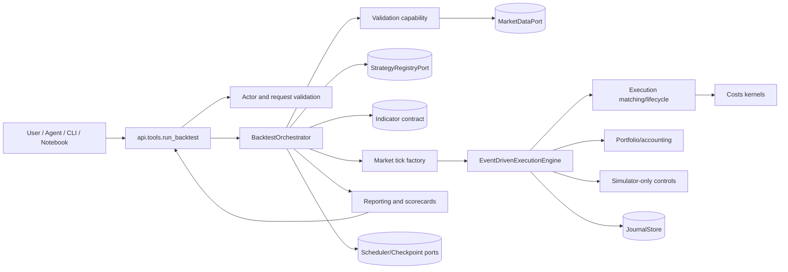
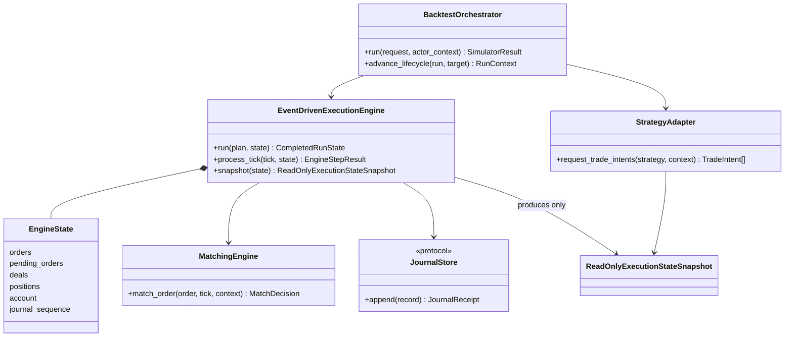

# Simulator Engine - Architecture Requirements Document

**Source boundary:** This document uses only `08-simulator-engine.md`. It converts the source requirements into code-level ownership, typed function contracts, and isolated NFR boundaries. It does not supply implementation code.

**Revision note:** This v2 rewrite fixes the earlier Section 1/Section 3 file-traceability mismatch and adds an explicit 0%→100% incremental build order so dependencies are built before consumers.

## 0. Scope, Traceability, and Source-Inventory Reconciliation

The source declares the Simulator Engine location as `app/services/simulator/`, depends on historical tick/bar data, compiled indicator/strategy parameters, and trader validation controls in simulator mode. This architecture consumes those capabilities through typed ports; it does not duplicate Data, Strategy, Indicator, Trading, Risk policy, or Live broker ownership.

### 0.1 Explicit named-requirement inventory

| Requirement family | Contiguous IDs found | Count |
|---|---:|---:|
| Functional requirements | `SIM-FR-001`–`SIM-FR-832` | 832 |
| Non-functional requirements | `SIM-NFR-001`–`SIM-NFR-582` | 582 |
| Business rules | `SIM-BR-001`–`SIM-BR-033` | 33 |
| Quality standard | `SIM-EX-001` | 1 |
| **Total uniquely identified requirements** | — | **1,448** |

**Source discrepancy retained for governance:** the source title states “Task inventory: 1,450 checkbox tasks”; its Acceptance Checklist states “All 1,662 checkbox tasks”; however, the complete source contains 1,448 uniquely named `SIM-*` checkbox requirements. All 1,448 named requirements are mapped exactly once below. The two higher totals must be reconciled by the source owner before a claim of complete implementation against a single numeric inventory.

### 0.2 Boundary rules carried into the architecture

- **Canonical state:** Only `engine/event_driven_execution.py` mutates authoritative in-memory run state. Strategies receive read-only snapshots; the Tool boundary never performs matching or accounting inline.
- **No live broker reach-through:** `broker_profiles/` models simulator semantics and fixtures only. No Simulator file imports Live broker sessions, credentials, SDKs, or mutating adapters.
- **Pure kernels first:** costs, matching decisions, accounting computations, validation, report metrics, configuration hashes, and replay comparisons are pure. Persistence, scheduling, telemetry, artifact writes, and port calls occur only through explicit wrapper boundaries.
- **Official exports:** `app.services.simulator.__all__` is a deliberate AI-tool registry; all other classes/functions remain internal unless a named wrapper is approved.
- **NFR isolation:** performance, tracing, logging, redaction, quotas, security, durability, and error translation are applied through decorators or module wrappers, not intermixed into cost or matching calculations.

## 1. System Boundary Diagram (file structure)

```text
app/
└── services/
    └── simulator/                                      # deterministic simulation domain
        ├── __init__.py                                  # approved official AI-tool export gate
        ├── api/
        │   ├── tools.py                                 # run_backtest boundary / authorization / delegation
        │   └── envelopes.py                             # safe deterministic response envelopes
        ├── contracts/
        │   ├── enums.py                                 # canonical lifecycle and mode enum strings
        │   ├── errors.py                                # SIM_* typed error contracts
        │   ├── models.py                                # immutable typed requests, results, snapshots
        │   ├── ports.py                                 # Data/Strategy/Indicator/Journal/Scheduler protocols
        │   └── extensions.py                            # deferred enterprise extension contracts
        ├── validation/
        │   ├── request_validator.py                     # request / actor / artifact-root validation
        │   ├── schema_validator.py                      # bounded JSON/schema/path validation
        │   ├── parameters.py                            # broker and simulator parameter checks
        │   ├── config_validator.py                      # config / realism / resume compatibility
        │   ├── strategy_validator.py                    # registry reference and injection defence
        │   └── data_quality.py                          # data authority / quality / survivorship gates
        ├── orchestration/
        │   ├── idempotency.py                           # run and work-unit identity
        │   ├── checkpoints.py                           # checkpoint/resume safety
        │   ├── scheduler.py                             # bounded queue / leases / cancellation
        │   ├── worker_recovery.py                       # poison work / requeue / quarantine
        │   └── backtest_orchestrator.py                 # lifecycle coordinator
        ├── engine/
        │   ├── state.py                                 # authoritative in-memory state containers
        │   ├── event_priority.py                        # same-timestamp deterministic order
        │   ├── no_lookahead.py                          # point-in-time decision guard
        │   ├── sizing.py                                # final volume normalisation
        │   ├── order_lineage.py                         # parent/child/replacement history
        │   ├── tick_batching.py                         # boundary proof for safe batching
        │   └── event_driven_execution.py                # only canonical state mutator
        ├── integration/
        │   ├── indicator_adapter.py                     # availability-safe indicator decision view
        │   └── strategy_adapter.py                      # approved strategy signal/intents only
        ├── market/
        │   ├── data_manifest.py                         # data identity/cache/provenance
        │   ├── calendar.py                              # sessions/halts/gaps/rollovers
        │   ├── fx_conversion.py                         # point-in-time FX rate resolution
        │   ├── order_book.py                            # book snapshots and diagnostics
        │   ├── synthetic_ticks.py                       # deterministic per-bar synthetic ticks
        │   └── tick_factory.py                          # real/M1/timeframe tick streams
        ├── execution/
        │   ├── broker_rules.py                          # profile precision/fill/session rules
        │   ├── orders.py                                # order contracts/lifecycle transitions
        │   ├── lifecycle.py                             # pending/protective/expiry/cancel logic
        │   ├── advanced_orders.py                       # trailing/pegged/stop-limit/OCO
        │   └── matching.py                              # fill and deal decisions
        ├── broker_profiles/
        │   ├── profiles.py                              # versioned broker/symbol profiles
        │   └── mt5_parity.py                            # parity fixture settings
        ├── portfolio/
        │   ├── currency.py                              # conversion and cashflow rounding
        │   ├── accounting.py                            # Decimal balance/equity/PnL/NAV ledger
        │   ├── positions.py                             # netting/hedging position lifecycle
        │   ├── margin.py                                # margin/leverage/stop-out/liquidation
        │   └── corporate_actions.py                     # optional lifecycle effects
        ├── costs/
        │   ├── spread.py                                # spread realism
        │   ├── slippage.py                              # slippage realism
        │   ├── latency.py                               # arrival-time realism
        │   ├── liquidity.py                             # depth/capacity/market impact
        │   ├── commission.py                            # broker/exchange fees
        │   ├── swap.py                                  # carry/swap/funding
        │   └── borrow.py                                # short borrow/recall extension boundary
        ├── controls/
        │   ├── simulated_risk.py                        # injected risk-rule replay only
        │   └── compliance.py                            # halts/regulatory effects only
        ├── journal/
        │   ├── append_only.py                           # immutable chain and receipts
        │   ├── artifacts.py                             # atomic artifacts/checksums
        │   ├── manifest.py                              # journal/run manifests
        │   └── retention.py                             # retention tier / legal hold
        ├── reporting/
        │   ├── metrics.py                               # pure metric aggregation
        │   ├── scorecard.py                             # evidence/realism classification
        │   ├── renderers.py                             # JSON/Markdown/chart payloads
        │   └── realism.py                               # scope/limitation disclosure
        ├── operations/
        │   ├── instrumentation.py                       # logging/metrics/traces decorators
        │   ├── quotas.py                                # resource/deadline wrapper
        │   ├── environment.py                           # benchmark and environment drift
        │   ├── security.py                              # auth/redaction/supply-chain wrapper
        │   └── canary.py                                # optional controlled comparison
        └── verification/
            ├── mt5_parity.py                            # fixture parity comparison
            └── provider_contracts.py                    # injected dependency contracts

docs/
└── simulator/
    ├── design_manual.md
    ├── config_reference.md
    ├── reproducibility.md
    ├── ownership_and_scope.md
    ├── error_taxonomy.md
    ├── traceability.md
    └── vendor_governance.md

tests/
└── simulator/
    ├── test_requirements.py
    └── test_import_safety.py

examples/
└── run_simulator_examples.py                             # executable usage documentation
```

### 1.1 Execution tree

```text
run_backtest (official tool)
  -> api.tools: validate actor + reject raw strategy code + normalize envelope
  -> orchestration.BacktestOrchestrator: validate -> prepare -> execute -> report -> finalize
       -> validation: request/config/strategy/data/schema gates
       -> integration: registered strategy + availability-safe indicator decisions
       -> market: manifest -> ticks/order book/calendar/FX rate view
       -> engine.EventDrivenExecutionEngine: ordered tick/event state transitions
            -> execution: order lifecycle/matching/advanced orders/broker rules
            -> costs: spread -> liquidity -> slippage -> commissions/swap/latency
            -> portfolio: positions -> accounting -> margin -> conversion
            -> controls: injected risk/compliance effects only
            -> journal: append-only records, manifests, artifacts
       -> reporting: metrics -> scorecard -> JSON/Markdown/chart payload
       -> operations wrappers: quota, trace, redaction, environment/performance gates
  -> api.envelopes: success/failed/queued/cancelled/diagnostic_failed response
```

## 2. Interfaces diagrams (Mermaid diagrams)

### 2.1 Domain collaboration



### 2.2 Canonical state ownership



### 2.3 Cross-cutting NFR placement

```mermaid
flowchart TB
    A[Public tool / Orchestrator boundary] --> D1[@instrument_run: logging + metrics + tracing]
    D1 --> D2[@require_role: authorization + redaction]
    D2 --> D3[@enforce_resource_quota: capacity + monotonic deadline]
    D3 --> Core[Pure validation, market, cost, matching, accounting kernels]
    Core --> W1[Journal wrapper: atomic append + hash chain + artifact checksums]
    Core --> W2[Scheduler wrapper: queue limits + cancellation + recovery]
    Core --> W3[Report wrapper: JSON safe + caveat/realism disclosure]
    D1 --> T[Telemetry port]
    W1 --> J[JournalStore port]
    W2 --> S[SchedulerStore port]
```

## 3. Functional Requirements

### 3.0 Incremental Build Order — Base 0% to 100%

The Functional Requirements are now arranged by dependency readiness. Build lower percentages first; a later stage must not import from, mutate through, or depend on files in a later stage. Documentation and tests are intentionally present from the beginning because they define the contract before implementation.

| Build % | Increment | Files introduced | Dependency gate before continuing |
|---:|---|---|---|
| 0% | Contract baseline and scope | `docs/simulator/design_manual.md`, `docs/simulator/config_reference.md`, `docs/simulator/reproducibility.md`, `docs/simulator/ownership_and_scope.md`, `docs/simulator/error_taxonomy.md`, `docs/simulator/traceability.md`, `docs/simulator/vendor_governance.md` | Source inventory, boundary rules, and deferred-scope decisions are frozen. |
| 5% | Public package gate and constants | `app/services/simulator/__init__.py`, `contracts/enums.py`, `contracts/errors.py` | Importing the package performs no filesystem, broker, network, worker, or secret side effects. |
| 10% | Typed contracts and ports | `contracts/models.py`, `contracts/ports.py`, `contracts/extensions.py` | All downstream modules can type against immutable models and injected protocols without concrete adapters. |
| 15% | Validation foundation | `validation/request_validator.py`, `validation/schema_validator.py`, `validation/parameters.py`, `validation/config_validator.py`, `validation/strategy_validator.py`, `validation/data_quality.py` | Invalid requests, schemas, paths, parameters, strategies, and data fail closed before expensive work. |
| 20% | Identity and run lifecycle primitives | `orchestration/idempotency.py`, `orchestration/checkpoints.py`, `orchestration/scheduler.py`, `orchestration/worker_recovery.py` | Runs, queued work, checkpoint compatibility, cancellation, and poison work have deterministic states. |
| 25% | Engine state and deterministic guards | `engine/state.py`, `engine/event_priority.py`, `engine/no_lookahead.py`, `engine/sizing.py`, `engine/order_lineage.py`, `engine/tick_batching.py` | State containers, event order, point-in-time access, sizing, lineage, and safe batching are independently testable. |
| 30% | Market identity and session context | `market/data_manifest.py`, `market/calendar.py`, `market/fx_conversion.py`, `market/order_book.py` | Data identity, trading sessions, point-in-time FX conversion, and book snapshots are available before ticks or fills. |
| 35% | Tick construction | `market/synthetic_ticks.py`, `market/tick_factory.py` | Canonical tick streams are deterministic and carry provenance before execution is enabled. |
| 40% | Broker and order contracts | `broker_profiles/profiles.py`, `broker_profiles/mt5_parity.py`, `execution/broker_rules.py`, `execution/orders.py` | Symbol precision, fill policies, broker fixtures, and order state transitions are validated before matching. |
| 45% | Cost and realism kernels | `costs/spread.py`, `costs/slippage.py`, `costs/latency.py`, `costs/liquidity.py`, `costs/commission.py`, `costs/swap.py`, `costs/borrow.py` | Fill-cost inputs are pure and deterministic before matching mutates state. |
| 50% | Portfolio accounting foundation | `portfolio/currency.py`, `portfolio/accounting.py`, `portfolio/positions.py`, `portfolio/margin.py`, `portfolio/corporate_actions.py` | Account, cashflow, margin, NAV, and position effects are Decimal-safe and auditable. |
| 55% | Execution lifecycle and matching | `execution/lifecycle.py`, `execution/advanced_orders.py`, `execution/matching.py` | Pending-order expiry, protective orders, advanced orders, fill decisions, and deal generation are deterministic. |
| 60% | Strategy and indicator integration | `integration/indicator_adapter.py`, `integration/strategy_adapter.py` | Strategies see only availability-safe indicators and emit timestamped trade intents, never direct state mutations. |
| 65% | Canonical execution engine | `engine/event_driven_execution.py` | The engine becomes the only mutator of orders, deals, positions, and account state. |
| 70% | Simulated controls | `controls/simulated_risk.py`, `controls/compliance.py` | Risk-rule replay, halts, and regulatory diagnostics are simulated without owning external governance. |
| 75% | Journal and artifact persistence | `journal/append_only.py`, `journal/artifacts.py`, `journal/manifest.py`, `journal/retention.py` | Runs have tamper-evident journals, atomic artifacts, manifests, and retention policy. |
| 80% | Reporting and realism disclosure | `reporting/metrics.py`, `reporting/scorecard.py`, `reporting/renderers.py`, `reporting/realism.py` | Metrics, scorecards, JSON/Markdown payloads, and realism labels are derived from recorded evidence. |
| 85% | Operations wrappers | `operations/instrumentation.py`, `operations/quotas.py`, `operations/environment.py`, `operations/security.py`, `operations/canary.py` | Logging, metrics, tracing, quotas, benchmark drift, auth, redaction, and canary checks are outside core math. |
| 90% | Verification suites | `verification/mt5_parity.py`, `verification/provider_contracts.py`, `tests/simulator/test_requirements.py`, `tests/simulator/test_import_safety.py` | Parity, provider-contract, traceability, import-safety, and requirement-coverage tests are mapped. |
| 95% | Orchestrator and official API | `orchestration/backtest_orchestrator.py`, `api/envelopes.py`, `api/tools.py` | The official wrapper only validates, authorizes, delegates, and envelops; it does not simulate inline. |
| 100% | Executable examples and handoff | `examples/run_simulator_examples.py` | Examples prove success and failure envelopes and form executable documentation for the completed slice. |


Functional blocks below preserve every `SIM-FR-*` task verbatim. Each block maps one or more source requirements to the single cohesive file that owns the corresponding behaviour. A function marked **Pure** has no database/network/global-state effects. A function marked **State-mutating** changes only the explicitly named in-memory state or injected persistence/external port.

### 📂 Module: `docs/simulator`

**Boundary Role:** Documentation-only capability that explains simulator behaviour, validity limits, operational procedures, traceability, and migration without executing a backtest.

#### 📄 File: `design_manual.md`

**Full Path:** `docs/simulator/design_manual.md`

**File Boundary:** Architecture and user guide source for scope, realism labels, operating procedures, migration, and runbook rules.

**Requirement Title:** Simulator design manual and operating procedures

**Description:** Simulator design manual and operating procedures. This mapping covers 28 source requirement(s) from **Simulator Engine Design and Validation Manual** and additional source sections where the same cohesive file is the owner.

**Requirements:**

<details>
<summary><strong>Verbatim source requirements (SIM-FR-001, SIM-FR-002, SIM-FR-004, SIM-FR-005, SIM-FR-006, SIM-FR-008, SIM-FR-014, SIM-FR-018, SIM-FR-047, SIM-FR-081, SIM-FR-082, SIM-FR-083, SIM-FR-084, SIM-FR-085, SIM-FR-239, SIM-FR-473, SIM-FR-476, SIM-FR-563, SIM-FR-625, SIM-FR-645, SIM-FR-646, SIM-FR-647, SIM-FR-648, SIM-FR-741, SIM-FR-774, SIM-FR-776, SIM-FR-777, SIM-FR-778)</strong></summary>

- [ ] **SIM-FR-001**: Usage examples shall run as executable documentation tests and assert exact success or failure envelope shape.

- [ ] **SIM-FR-002**: Documentation shall include a formal user guide for interpreting realism labels.

- [ ] **SIM-FR-004**: Documentation shall include a migration guide if earlier simulator versions exist.

- [ ] **SIM-FR-005**: Documentation shall describe memory-safety constraints for optimization, walk-forward, and Monte Carlo runs.

- [ ] **SIM-FR-006**: Documentation shall describe FX cross-rate synthesis rejection behavior and `max_cross_rate_skew_bps`.

- [ ] **SIM-FR-008**: Documentation shall include research-integrity, optimization, and overfitting-control operating procedures.

- [ ] **SIM-FR-014**: The module may simulate configured simulator risk-rule effects for replay and evidence, but external policy definition, live approval authority, and human governance decisions live outside Simulator.

- [ ] **SIM-FR-018**: Documentation shall include execution latency modelling, latency component definitions, and latency diagnostic interpretation.

- [ ] **SIM-FR-047**: Optimization, walk-forward, Monte Carlo, visual replay export, production-promotion manifests, and service-mode lifecycle operations shall be implemented only when their requirements are explicitly tagged for the active release phase.

- [ ] **SIM-FR-081**: Documentation shall state that raw arbitrary Python strategy code is not accepted by `run_backtest`.

- [ ] **SIM-FR-082**: Documentation shall describe IOC remainder cancellation diagnostics.

- [ ] **SIM-FR-083**: Documentation shall include run lifecycle, idempotency, cancellation, checkpoint, and resume behavior.

- [ ] **SIM-FR-084**: Documentation shall include resource quota, scheduler queue, worker heartbeat, checkpoint/resume, preemptible-worker, and backpressure operating procedures.

- [ ] **SIM-FR-085**: Documentation shall include market-halt, limit-up/limit-down, portfolio kill-switch, trailing-stop, pegged-order, and cancel-replace semantics.

- [ ] **SIM-FR-239**: The system may document hidden-order and iceberg support while keeping them disabled until order-book data is available.

- [ ] **SIM-FR-473**: Usage examples shall run end-to-end.

- [ ] **SIM-FR-476**: Documentation shall describe approved strategy input modes, strategy registry behavior, and sandbox/vetting requirements if code-based strategy execution is ever enabled.

- [ ] **SIM-FR-563**: Documentation shall include strategy-capacity diagnostics and production capacity approval procedures.

- [ ] **SIM-FR-625**: Equity, futures, perpetual, and multi-currency examples shall be required before those asset classes are promoted to production-realistic status.

- [ ] **SIM-FR-645**: Release documentation shall include model-validation, research-integrity, calibration, security, and benchmark evidence links for production promotions.

- [ ] **SIM-FR-646**: Documentation shall include a threat model and data-governance guide before any externally accessible simulator tool is enabled.

- [ ] **SIM-FR-647**: Documentation shall include model-governance and model-inventory operating procedures.

- [ ] **SIM-FR-648**: Documentation shall include dynamic model materiality assessment rules and evidence requirements.

- [ ] **SIM-FR-741**: Release readiness examples shall include one FX MT5-parity fixture run, one FX production-realistic single-symbol run, one FX multi-symbol portfolio run, one synthetic-tick research approximation run, one severe-data-quality blocked run, one deterministic replay run, and one JSON plus Markdown report pair.

- [ ] **SIM-FR-774**: The journal shall document per-bar synthetic tick seed derivation metadata when generated ticks are used.

- [ ] **SIM-FR-776**: Documentation shall describe per-bar synthetic tick seed derivation, including SHA-256 inputs, `global_seed`, `symbol_hash`, UTC `bar_open_timestamp`, and replay metadata.

- [ ] **SIM-FR-777**: Documentation shall describe checkpoint and replay behavior for synthetic tick generation.

- [ ] **SIM-FR-778**: Documentation shall describe tick-batching safety boundaries and the Phase 1 boundary-interval proof model.

</details>

**Target Class/Function:**
- `N/A — documentation-only artifact; no runtime function.`

#### 📄 File: `config_reference.md`

**Full Path:** `docs/simulator/config_reference.md`

**File Boundary:** Versioned reference for configuration classes, enums, defaults, bounds, and behavior.

**Requirement Title:** SIM-FR-003

**Description:** Configuration and enum reference. This mapping covers 1 source requirement(s) from **Simulator Engine Design and Validation Manual**.

**Requirements:**

<details>
<summary><strong>Verbatim source requirements (SIM-FR-003)</strong></summary>

- [ ] **SIM-FR-003**: Documentation shall include a configuration reference for every config class and enum.

</details>

**Target Class/Function:**
- `N/A — documentation-only artifact; no runtime function.`

#### 📄 File: `reproducibility.md`

**Full Path:** `docs/simulator/reproducibility.md`

**File Boundary:** Reproducibility, environment-drift, seed, benchmark-profile, cache, and point-in-time documentation.

**Requirement Title:** Reproducibility and point-in-time guide

**Description:** Reproducibility and point-in-time guide. This mapping covers 3 source requirement(s) from **Simulator Engine Design and Validation Manual**.

**Requirements:**

<details>
<summary><strong>Verbatim source requirements (SIM-FR-009, SIM-FR-010, SIM-FR-011)</strong></summary>

- [ ] **SIM-FR-009**: Documentation shall include immutable run-configuration, environment drift detection, and benchmark-profile certification procedures.

- [ ] **SIM-FR-010**: Documentation shall include warm data cache behavior, TTL rules, `DataManifestHash` keys, and checksum validation requirements.

- [ ] **SIM-FR-011**: Documentation shall include feature-store point-in-time retrieval, alternative-data as-of alignment, publication lag, ingestion lag, and no-lookahead rules.

</details>

**Target Class/Function:**
- `N/A — documentation-only artifact; no runtime function.`

#### 📄 File: `ownership_and_scope.md`

**Full Path:** `docs/simulator/ownership_and_scope.md`

**File Boundary:** Explicit Simulator ownership boundaries, non-goals, deferred-scope register, and cross-domain handoff rules.

**Requirement Title:** Ownership, non-goals, and deferred scope

**Description:** Ownership, non-goals, and deferred scope. This mapping covers 2 source requirement(s) from **Simulator Engine Design and Validation Manual** and additional source sections where the same cohesive file is the owner.

**Requirements:**

<details>
<summary><strong>Verbatim source requirements (SIM-FR-012, SIM-FR-043)</strong></summary>

- [ ] **SIM-FR-012**: Documentation shall include FX `production_realistic` V1 non-goals and scope limitations.

- [ ] **SIM-FR-043**: The module does not own strategy logic, strategy lifecycle approval, or strategy-generated signal logic; those belong to `app/services/strategies/`.

</details>

**Target Class/Function:**
- `N/A — documentation-only artifact; no runtime function.`

#### 📄 File: `error_taxonomy.md`

**Full Path:** `docs/simulator/error_taxonomy.md`

**File Boundary:** Human-readable catalogue of deterministic SIM_* codes and diagnostic interpretation.

**Requirement Title:** SIM-FR-007

**Description:** Error and diagnostic-code guide. This mapping covers 1 source requirement(s) from **Simulator Engine Design and Validation Manual**.

**Requirements:**

<details>
<summary><strong>Verbatim source requirements (SIM-FR-007)</strong></summary>

- [ ] **SIM-FR-007**: Documentation shall describe added error and diagnostic codes.

</details>

**Target Class/Function:**
- `N/A — documentation-only artifact; no runtime function.`

#### 📄 File: `traceability.md`

**Full Path:** `docs/simulator/traceability.md`

**File Boundary:** Requirement-to-implementation, test, ticket, release-manifest, and deferral traceability register.

**Requirement Title:** Traceability and required non-implementation declarations

**Description:** Traceability and required non-implementation declarations. This mapping covers 11 source requirement(s) from **Package Initialization** and additional source sections where the same cohesive file is the owner.

**Requirements:**

<details>
<summary><strong>Verbatim source requirements (SIM-FR-020, SIM-FR-022, SIM-FR-023, SIM-FR-029, SIM-FR-134, SIM-FR-162, SIM-FR-524, SIM-FR-564, SIM-FR-565, SIM-FR-781, SIM-FR-824)</strong></summary>

- [ ] **SIM-FR-020**: No file-specific non-functional requirements defined.

- [ ] **SIM-FR-022**: No file-specific functional requirements defined. Foundation properties apply.

- [ ] **SIM-FR-023**: No file-specific non-functional requirements defined.

- [ ] **SIM-FR-029**: No file-specific non-functional requirements defined.

- [ ] **SIM-FR-134**: No file-specific non-functional requirements defined.

- [ ] **SIM-FR-162**: This domain document may be split into smaller requirement files after Phase 1 boundaries are implemented, provided traceability to this baseline is preserved.

- [ ] **SIM-FR-524**: No file-specific non-functional requirements defined.

- [ ] **SIM-FR-564**: No file-specific functional requirements defined. Foundation properties apply.

- [ ] **SIM-FR-565**: No file-specific non-functional requirements defined.

- [ ] **SIM-FR-781**: No file-specific non-functional requirements defined.

- [ ] **SIM-FR-824**: No file-specific non-functional requirements defined.

</details>

**Target Class/Function:**
- `N/A — documentation-only artifact; no runtime function.`

#### 📄 File: `vendor_governance.md`

**Full Path:** `docs/simulator/vendor_governance.md`

**File Boundary:** Third-party data, broker profile, plugin, license, revision, retention, and supplier governance procedures.

**Requirement Title:** SIM-FR-013

**Description:** Vendor and data-governance procedure. This mapping covers 1 source requirement(s) from **Simulator Engine Design and Validation Manual**.

**Requirements:**

<details>
<summary><strong>Verbatim source requirements (SIM-FR-013)</strong></summary>

- [ ] **SIM-FR-013**: Documentation shall include third-party data and vendor-governance procedures.

</details>

**Target Class/Function:**
- `N/A — documentation-only artifact; no runtime function.`

### 📂 Module: `app/services/simulator`

**Boundary Role:** Public package gatekeeper. Exposes only approved official Simulator AI tools and typed support contracts.

#### 📄 File: `__init__.py`

**Full Path:** `app/services/simulator/__init__.py`

**File Boundary:** Public import gate. Contains imports and __all__ only; it must not initialize workers, clients, secrets, market data, or mutable global state.

**Requirement Title:** SIM-FR-017

**Description:** Package export gate and official-tool registry. This mapping covers 1 source requirement(s) from **Package Initialization**.

**Requirements:**

<details>
<summary><strong>Verbatim source requirements (SIM-FR-017)</strong></summary>

- [ ] **SIM-FR-017**: Anything exported from a domain `__init__.py` and listed in `__all__` shall be treated as an official AI Tool.

</details>

**Target Class/Function:**
- `run_backtest(request: BacktestRequest, *, actor_context: ActorContext | None = None) -> ToolEnvelope[SimulatorResult] — State-mutating at the orchestration boundary (may create/schedule a run and persist audit-safe artifacts).`

### 📂 Module: `app/services/simulator/api`

**Boundary Role:** Official callable-tool boundary. Validates public requests, authorizes external invocations, returns standard envelopes, and never embeds simulation mechanics.

#### 📄 File: `tools.py`

**Full Path:** `app/services/simulator/api/tools.py`

**File Boundary:** Tool-wrapper input normalisation, authorization boundary, arbitrary-code rejection, standard envelope production, and delegation to orchestration.

**Requirement Title:** SIM-FR-038

**Description:** Official run_backtest AI-tool boundary. This mapping covers 1 source requirement(s) from **Simulator Runner Orchestration**.

**Requirements:**

<details>
<summary><strong>Verbatim source requirements (SIM-FR-038)</strong></summary>

- [ ] **SIM-FR-038**: The orchestration layer shall explicitly vet and sandbox any code-based strategy path before it can be executed.

</details>

**Target Class/Function:**
- `run_backtest(request: BacktestRequest, *, actor_context: ActorContext | None = None) -> ToolEnvelope[SimulatorResult] — State-mutating.`
- `reject_arbitrary_strategy_code(payload: Mapping[str, JsonValue]) -> ValidationIssue | None — Pure.`
- `validate_actor_context(actor_context: ActorContext | None, surface: InvocationSurface) -> AuthorizationDecision — Pure.`


#### 📄 File: `envelopes.py`

**Full Path:** `app/services/simulator/api/envelopes.py`

**File Boundary:** Standard official tool response envelope construction, metadata injection, SIM_* error shape, and JSON-safe serialization.

**Requirement Title:** Official response envelope contracts

**Description:** Defines deterministic success, failed, queued, cancelled, and diagnostic-failed response shapes for the public simulator boundary.

**Traceability note:** This subsection closes the previous tree-vs-requirements mismatch. The listed source IDs remain part of the named source inventory; where an ID is already present in the primary coverage index, this subsection defines the split file's concrete responsibility rather than creating a new source requirement.


**Requirements:**

<details>
<summary><strong>Verbatim source requirements (SIM-FR-046, SIM-FR-049, SIM-FR-071, SIM-FR-087, SIM-FR-179, SIM-FR-181, SIM-FR-182, SIM-FR-183, SIM-FR-220)</strong></summary>

- [ ] **SIM-FR-046**: `run_backtest` shall define response envelopes for `success`, `failed`, `queued`, `cancelled`, and `diagnostic_failed` statuses before implementation.

- [ ] **SIM-FR-049**: `status` values shall include `success`, `failed`, `queued`, `cancelled`, and `diagnostic_failed` before implementation.

- [ ] **SIM-FR-071**: `queued` envelope example showing run id, queue position or bounded queue metadata where available, retry/cancellation metadata, warnings, and no completed result.

- [ ] **SIM-FR-087**: `metadata` shall include module, operation, tool risk level, side-effect classification, actor/audit references where authorized, engine version, config hash, data manifest hash, execution timing, and created timestamp.

- [ ] **SIM-FR-179**: Official AI Tool exports shall require metadata.

- [ ] **SIM-FR-181**: Official AI Tool exports shall return deterministic error codes.

- [ ] **SIM-FR-182**: Official AI Tool exports shall avoid silent failures.

- [ ] **SIM-FR-183**: Official AI Tool exports shall provide safe errors.

- [ ] **SIM-FR-220**: `error` shall include deterministic `SIM_*` code, safe message, field path where applicable, severity, retryability, and redacted details.

</details>

**Target Class/Function:**
- `build_success_envelope(result: SimulatorResult, metadata: ToolMetadata) -> ToolEnvelope[SimulatorResult] — Pure.`
- `build_error_envelope(error: SimulatorError, metadata: ToolMetadata) -> ToolEnvelope[None] — Pure.`
- `build_queued_envelope(run_id: str, queue: QueueMetadata, metadata: ToolMetadata) -> ToolEnvelope[QueuedRun] — Pure.`
- `serialize_envelope(envelope: ToolEnvelope[Any]) -> dict[str, JsonValue] — Pure.`


### 📂 Module: `app/services/simulator/contracts`

**Boundary Role:** Stable typed contracts, enums, error catalogues, ports, and serialization rules shared by simulator capabilities.

#### 📄 File: `models.py`

**Full Path:** `app/services/simulator/contracts/models.py`

**File Boundary:** Immutable public/internal run, request, result, state-snapshot, broker-profile, order, deal, account, artifact, and evidence models.

**Requirement Title:** Simulator models and immutable configuration

**Description:** Simulator models and immutable configuration. This mapping covers 105 source requirement(s) from **Simulator Runner Orchestration** and additional source sections where the same cohesive file is the owner.

**Requirements:**

<details>
<summary><strong>Verbatim source requirements (SIM-FR-048, SIM-FR-049, SIM-FR-071, SIM-FR-092, SIM-FR-093, SIM-FR-102, SIM-FR-144, SIM-FR-145, SIM-FR-146, SIM-FR-147, SIM-FR-168, SIM-FR-217, SIM-FR-222, SIM-FR-226, SIM-FR-227, SIM-FR-243, SIM-FR-247, SIM-FR-274, SIM-FR-275, SIM-FR-289, SIM-FR-297, SIM-FR-322, SIM-FR-331, SIM-FR-332, SIM-FR-336, SIM-FR-340, SIM-FR-341, SIM-FR-346, SIM-FR-353, SIM-FR-356, SIM-FR-386, SIM-FR-437, SIM-FR-455, SIM-FR-457, SIM-FR-461, SIM-FR-467, SIM-FR-468, SIM-FR-469, SIM-FR-471, SIM-FR-474, SIM-FR-567, SIM-FR-568, SIM-FR-569, SIM-FR-570, SIM-FR-571, SIM-FR-572, SIM-FR-573, SIM-FR-574, SIM-FR-575, SIM-FR-576, SIM-FR-577, SIM-FR-578, SIM-FR-579, SIM-FR-580, SIM-FR-581, SIM-FR-582, SIM-FR-583, SIM-FR-584, SIM-FR-585, SIM-FR-586, SIM-FR-588, SIM-FR-589, SIM-FR-590, SIM-FR-591, SIM-FR-592, SIM-FR-593, SIM-FR-594, SIM-FR-595, SIM-FR-596, SIM-FR-597, SIM-FR-598, SIM-FR-599, SIM-FR-600, SIM-FR-601, SIM-FR-602, SIM-FR-603, SIM-FR-604, SIM-FR-605, SIM-FR-606, SIM-FR-607, SIM-FR-609, SIM-FR-610, SIM-FR-611, SIM-FR-612, SIM-FR-613, SIM-FR-615, SIM-FR-616, SIM-FR-617, SIM-FR-618, SIM-FR-619, SIM-FR-621, SIM-FR-622, SIM-FR-623, SIM-FR-624, SIM-FR-626, SIM-FR-628, SIM-FR-629, SIM-FR-632, SIM-FR-633, SIM-FR-638, SIM-FR-639, SIM-FR-641, SIM-FR-642, SIM-FR-643, SIM-FR-644)</strong></summary>

- [ ] **SIM-FR-048**: `actor_context` shall define authenticated actor identity and roles for any networked, multi-user, or agent-orchestrated invocation.

- [ ] **SIM-FR-049**: `status` values shall include `success`, `failed`, `queued`, `cancelled`, and `diagnostic_failed` before implementation.

- [ ] **SIM-FR-071**: `queued` envelope example showing run id, queue position or bounded queue metadata where available, retry/cancellation metadata, warnings, and no completed result.

- [ ] **SIM-FR-092**: The system shall support configurable execution latency models covering strategy computation delay, broker or network routing delay, venue or exchange gateway delay, and matching-engine delay.

- [ ] **SIM-FR-093**: The default `ambiguous_sl_tp_policy` shall be `conservative_worst_outcome`, meaning the engine selects the lower resulting account equity after applying valid SL-first and TP-first interpretations under the same first-available-tick and cost model.

- [ ] **SIM-FR-102**: Large optimization jobs shall be split into deterministic work units keyed by strategy id, parameter hash, config hash, data hash, engine version, and schema version.

- [ ] **SIM-FR-144**: The same configuration, data, and seed shall produce the same trade intents.

- [ ] **SIM-FR-145**: The same configuration, data, and seed shall produce the same event-priority order.

- [ ] **SIM-FR-146**: The same configuration, data, and seed shall produce the same orders, deals, and positions.

- [ ] **SIM-FR-147**: The same configuration, data, and seed shall produce the same portfolio state.

- [ ] **SIM-FR-168**: Fractional shares and fractional contract quantities shall be allowed only when symbol metadata declares a valid fractional volume step.

- [ ] **SIM-FR-217**: The module does not own raw market-data acquisition, source readiness, external source adapters, or normalized data contracts; those belong to `app/services/data/`.

- [ ] **SIM-FR-222**: The system shall align bar-based signals using the configured signal timing policy.

- [ ] **SIM-FR-226**: The system shall allow simplified realism modes only when explicitly configured.

- [ ] **SIM-FR-227**: Latency diagnostics shall record signal timestamp, request timestamp, eligible execution timestamp, latency components, and latency model id.

- [ ] **SIM-FR-243**: The system shall support market-hours configuration including session start, session end, timezone, weekend closure, holiday calendar, and 24/7 asset flag.

- [ ] **SIM-FR-247**: The system shall prevent market orders outside allowed sessions unless explicitly configured for 24/7 assets.

- [ ] **SIM-FR-274**: The system shall support trailing stops when configured.

- [ ] **SIM-FR-275**: The system shall support pegged orders when configured, including orders pegged to best bid, best ask, mid price, or another approved reference.

- [ ] **SIM-FR-289**: The simulator module shall reject, mask, or downgrade runs when indicator-derived data violates the configured no-lookahead policy.

- [ ] **SIM-FR-297**: Optimization outputs shall include config hash, data hash, parameter hash, random seed, and objective function.

- [ ] **SIM-FR-322**: The system shall derive required realism modules from symbol metadata and simulator config.

- [ ] **SIM-FR-331**: Reverse-split fractional handling shall be explicitly configured.

- [ ] **SIM-FR-332**: Delisting handling shall explicitly realize the configured final economic outcome instead of silently dropping the symbol.

- [ ] **SIM-FR-336**: The system shall support futures contract metadata.

- [ ] **SIM-FR-340**: Futures roll dates shall be deterministic and derived from contract metadata.

- [ ] **SIM-FR-341**: Continuous-adjusted data may support indicator continuity, but execution shall reference tradeable contract prices.

- [ ] **SIM-FR-346**: Funding payment direction shall follow the configured exchange sign convention.

- [ ] **SIM-FR-353**: FX conversion configuration shall expose `max_fx_rate_age_seconds` as the canonical maximum-rate-age field.

- [ ] **SIM-FR-356**: Cross-rate synthesis shall reject highly skewed conversion paths when the synthesized rate differs from an available direct or inverse reference by more than the configured `max_cross_rate_skew_bps`.

- [ ] **SIM-FR-386**: Production-realistic execution models shall define acceptable error bands against observed historical, paper, or live execution data where available.

- [ ] **SIM-FR-437**: Execution-calibration gate shall pass before production-realistic promotion when calibrated execution models are required.

- [ ] **SIM-FR-455**: Phase 1 may preserve future enum values or metadata fields only when they are inert, documented as non-goals, and covered by deterministic unsupported-scope behavior.

- [ ] **SIM-FR-457**: Shared requirement IDs may appear in both tiers only when the Phase 1 requirement has a precise in-scope behavior and the annex references deferred extensions without changing the Phase 1 contract.

- [ ] **SIM-FR-461**: Production realism shortcuts must be explicitly configured.

- [ ] **SIM-FR-467**: FX conversion shall fail closed when rate age exceeds the configured maximum unless diagnostic override is explicitly enabled.

- [ ] **SIM-FR-468**: Feature-store configuration for point-in-time feature retrieval when machine-learning features are used.

- [ ] **SIM-FR-469**: Alternative-data configuration for source timing, publication delay, ingestion delay, as-of alignment, lag policy, and embargo policy when non-price data is used.

- [ ] **SIM-FR-471**: Define required and optional simulator inputs covering market data, manifests, and run configuration.

  - Market data from a provider.
  - OHLCV bar data.
  - Indicator specifications.
  - Optional order-book depth data.
  - Optional feature-store data and point-in-time feature manifests.
  - Optional alternative data such as sentiment, fundamentals, news, options flow, and external signals.
  - Optional market-halt and limit-up/limit-down data.
  - Optional corporate-action data.
  - Optional futures contract-chain data.
  - Optional perpetual funding-rate data.
  - Optional FX conversion-rate data.
  - Optional benchmark data.
  - Optional optimization configuration.
  - Optional Monte Carlo configuration.
  - Required `MarketDataAuthorityManifest` for production-realistic runs.
  - Required broker profile manifest for MT5-parity and production-realistic FX runs.
  - `max_cross_rate_skew_bps` for cross-rate synthesis validation.

- [ ] **SIM-FR-474**: Optional enterprise feature contracts shall be defined early to avoid breaking redesign.

- [ ] **SIM-FR-567**: Asset-class production realism depends on enabled models and available data.

- [ ] **SIM-FR-568**: When Python minor version, dependency lock hash, platform, or decimal/numeric backend differs from the certified profile, official results shall record an environment drift diagnostic and shall not be used for production promotion without compatibility evidence.

- [ ] **SIM-FR-569**: The system shall stop the simulator on accounting invariant violations unless diagnostic mode is configured.

- [ ] **SIM-FR-570**: Diagnostic mode shall mark results `diagnostic_failed`, prevent optimization ranking, prevent benchmark promotion, and exclude the run from canonical performance comparisons.

- [ ] **SIM-FR-571**: Production promotion shall require recorded benchmark results.

- [ ] **SIM-FR-572**: FX conversions shall store source rate precision, conversion timestamp, and converted cashflow rounded to the account currency precision at the accounting boundary.

- [ ] **SIM-FR-573**: Production service mode shall enforce per-user, per-tenant, or per-request resource quotas.

- [ ] **SIM-FR-574**: The complete resolved configuration for a production run shall be serialized into an immutable run-configuration artifact stored alongside results.

- [ ] **SIM-FR-575**: Production service mode shall define maximum request payload size, maximum resolved configuration size, maximum artifact path length, maximum diagnostic payload size, maximum run duration, maximum queue wait, and maximum retry count before implementation.

- [ ] **SIM-FR-576**: Canary divergence shall block promotion or trigger rollback without changing the primary user-facing result for the request.

- [ ] **SIM-FR-577**: Official AI Tool exports shall require or create request id.

- [ ] **SIM-FR-578**: Compliance records shall be created for accepted and rejected trade requests.

- [ ] **SIM-FR-579**: Every official run shall record actor id, auth context, role, request id, and authorization decision in audit metadata.

- [ ] **SIM-FR-580**: External data-provider or broker credentials shall be read only from approved secrets providers or environment bindings and shall never be accepted as plain request payload fields.

- [ ] **SIM-FR-581**: Externally accessible simulator tools shall not be enabled until threat model, data-governance review, RBAC configuration, redaction policy, retention policy, and protected-artifact policy are approved.

- [ ] **SIM-FR-582**: Accounting invariant violation shall stop the simulator unless diagnostic mode is explicitly enabled.

- [ ] **SIM-FR-583**: Missing required model data shall fail fast or be explicitly recorded as an approximation.

- [ ] **SIM-FR-584**: The system shall return `SIM_RUN_ID_CONFLICT` when a run id or request id conflicts with an existing incompatible run.

- [ ] **SIM-FR-585**: The system shall return `SIM_MODEL_GOVERNANCE_EXPIRED` when a required model inventory record or approval is expired.

- [ ] **SIM-FR-586**: The system shall return `SIM_RESOURCE_QUOTA_EXCEEDED` when a request exceeds configured resource quotas.

- [ ] **SIM-FR-588**: The module does not own indicator formula implementation or indicator result contracts; those belong to `app/services/indicators/`.

- [ ] **SIM-FR-589**: The system shall produce a structured `SimulatorResult`.

- [ ] **SIM-FR-590**: Latency models shall support fixed, distribution-based, venue-profile-based, and disabled modes.

- [ ] **SIM-FR-591**: The system shall enforce maximum total positions when configured.

- [ ] **SIM-FR-592**: The system shall enforce maximum positions per symbol when configured.

- [ ] **SIM-FR-593**: The system shall support hedging account behavior when configured.

- [ ] **SIM-FR-594**: The system shall support netting account behavior when configured.

- [ ] **SIM-FR-595**: The system shall support negative-balance-protection configuration.

- [ ] **SIM-FR-596**: The system shall liquidate deterministically during stopout, defaulting to largest losing position first.

- [ ] **SIM-FR-597**: MT5 parity evidence shall record broker profile id, broker server label, account type, MT5 build, capture timestamp, symbol specification hash, and fixture data hash.

- [ ] **SIM-FR-598**: No external broker brand or live account shall be globally authoritative; production parity applies only to approved broker profiles and fixtures.

- [ ] **SIM-FR-599**: The system shall allow strategies to request a sizing mode but not directly finalize official volume.

- [ ] **SIM-FR-600**: The system shall apply deals to positions and account state.

- [ ] **SIM-FR-601**: The system shall recalculate account state.

- [ ] **SIM-FR-602**: The system shall enforce `Equity = Balance + FloatingPnL`.

- [ ] **SIM-FR-603**: The system shall create a compliance or audit record for every accepted trade request.

- [ ] **SIM-FR-604**: Compliance records shall include request id.

- [ ] **SIM-FR-605**: Walk-forward results shall separate in-sample and out-of-sample metrics.

- [ ] **SIM-FR-606**: Optimization caching shall reuse only completed work units whose provenance hash exactly matches the requested run.

- [ ] **SIM-FR-607**: Optimization result ranking shall be deterministic when objective scores tie.

- [ ] **SIM-FR-609**: Benchmark results shall be required before production promotion.

- [ ] **SIM-FR-610**: Benchmark results shall be stored with release notes.

- [ ] **SIM-FR-611**: Benchmark manifests shall record OS, CPU model, logical CPU count, RAM, storage type, Python version, dependency lock hash, git commit, and benchmark dataset hash.

- [ ] **SIM-FR-612**: The system shall support equity.

- [ ] **SIM-FR-613**: The system shall downgrade realism labels when required asset-class models are disabled.

- [ ] **SIM-FR-615**: Long positions shall receive eligible dividend cashflows.

- [ ] **SIM-FR-616**: Short positions shall pay applicable dividend cashflows.

- [ ] **SIM-FR-617**: Dividend cashflows shall be converted to account base currency.

- [ ] **SIM-FR-618**: Cash dividends, stock splits, and reverse splits shall be the first supported corporate-action treatments for equity and ETF production realism.

- [ ] **SIM-FR-619**: The system shall support optional short-locate recall and forced buy-in modelling for equity and ETF short positions.

- [ ] **SIM-FR-621**: Funding shall convert to account base currency.

- [ ] **SIM-FR-622**: Regulatory checks may include position-limit checks.

- [ ] **SIM-FR-623**: Wash-sale diagnostics shall flag loss sales followed by repurchases of substantially identical instruments within the configured window and shall disclose after-tax PnL impact only when tax modelling is enabled.

- [ ] **SIM-FR-624**: Official AI Tools shall require or create request id.

- [ ] **SIM-FR-626**: Every production-candidate simulator model shall have a model inventory record.

- [ ] **SIM-FR-628**: Production promotion shall require independent validation or documented second-party review for material models.

- [ ] **SIM-FR-629**: Every model exception, override, accepted limitation, and temporary approval shall require owner, approver, rationale, expiry date, and audit record.

- [ ] **SIM-FR-632**: Retrying the same request id shall be idempotent unless explicitly configured to create a new run id.

- [ ] **SIM-FR-633**: Handle commission, accounting, and request-validation edge cases deterministically.
  - Unsupported commission model.
  - Position not found.
  - Accounting invariant violation.
  - Malformed request payload.
  - Unknown request field.
  - Missing required request field.
  - Request payload exceeds configured size limit.
  - Secrets, tokens, broker credentials, authorization headers, or provider credentials are supplied in request payload fields.
  - Duplicate request id is submitted concurrently.
  - Duplicate request id is replayed with incompatible material fields.

- [ ] **SIM-FR-638**: Accounting gate shall pass.

- [ ] **SIM-FR-639**: Model-governance gate shall pass before production promotion.

- [ ] **SIM-FR-641**: Failed request that validates `SIM_INVALID_DATE_RANGE` before data access.

- [ ] **SIM-FR-642**: A run shall not be labelled production-realistic unless required asset-class models are enabled or proven unnecessary.

- [ ] **SIM-FR-643**: Produce structured simulator result outputs covering account, curve, and diagnostic artifacts.
  - Structured `SimulatorResult`.
  - Account snapshots.
  - Equity curve.
  - Balance curve.
  - Optimization result set with hashes, random seed, and objective function.
  - Structured error result with deterministic error code on failure.
  - Canary comparison results and synthetic transaction probe results when production monitoring is enabled.
  - Visual trade replay export artifact when requested.

- [ ] **SIM-FR-644**: Benchmark results shall be stored with release notes before production promotion.

</details>

**Target Class/Function:**
- `validate_backtest_request(value: BacktestRequest) -> BacktestRequest — Pure.`
- `build_immutable_run_config(request: BacktestRequest, dependencies: RunDependencies) -> ImmutableRunConfig — Pure.`
- `build_simulator_result(snapshot: CompletedRunSnapshot) -> SimulatorResult — Pure.`
- `serialize_contract(value: SimulatorContract) -> dict[str, JsonValue] — Pure.`

#### 📄 File: `enums.py`

**Full Path:** `app/services/simulator/contracts/enums.py`

**File Boundary:** Canonical string enums for run status, realism, execution mode, fill policy, order type, lifecycle, side-effect, capability, and classification values.

**Requirement Title:** Canonical enums and lifecycle values

**Description:** Canonical enums and lifecycle values. This mapping covers 3 source requirement(s) from **Simulation Models Package**.

**Requirements:**

<details>
<summary><strong>Verbatim source requirements (SIM-FR-620, SIM-FR-627, SIM-FR-631)</strong></summary>

- [ ] **SIM-FR-620**: Recall models shall support deterministic configured recall events and seeded probabilistic recall rates by symbol, borrow status, and date.

- [ ] **SIM-FR-627**: Model inventory records shall include model id, owner, purpose, approved use cases, prohibited use cases, asset-class scope, version, dependencies, validation status, materiality tier, known limitations, and review expiry.

- [ ] **SIM-FR-631**: Expired, unapproved, or materially changed model inventory records shall block production-realistic classification unless an explicit governance override is present.

</details>

**Target Class/Function:**
- `parse_enum(value: str, enum_type: type[StrEnum]) -> StrEnum — Pure.`

#### 📄 File: `errors.py`

**Full Path:** `app/services/simulator/contracts/errors.py`

**File Boundary:** Simulator-specific typed error catalogue and safe redacted structured error contracts.

**Requirement Title:** SIM_* error taxonomy

**Description:** SIM_* error taxonomy. This mapping covers 2 source requirement(s) from **Simulation Models Package**.

**Requirements:**

<details>
<summary><strong>Verbatim source requirements (SIM-FR-587, SIM-FR-630)</strong></summary>

- [ ] **SIM-FR-587**: Support simulator codes/constants: `SIM_UNSUPPORTED_COMMISSION_MODEL`, `SIM_POSITION_NOT_FOUND`, `SIM_MODEL_GOVERNANCE_EXPIRED`, `SIM_ACCOUNT_INVARIANT_BROKEN`

- [ ] **SIM-FR-630**: Production models shall require periodic re-validation after material code, data, broker-profile, dependency, or calibration changes.

</details>

**Target Class/Function:**
- `make_sim_error(code: SimulatorErrorCode, message: str, *, severity: Severity, retryable: bool, field_path: str | None = None) -> SimulatorError — Pure.`
- `validate_error_catalogue() -> tuple[SimulatorErrorCode, ...] — Pure.`


#### 📄 File: `ports.py`

**Full Path:** `app/services/simulator/contracts/ports.py`

**File Boundary:** External dependency protocol declarations and contract validation only; no concrete provider, broker, network, or database implementation.

**Requirement Title:** Injected dependency and service port contracts

**Description:** Defines protocol boundaries for external dependencies so Simulator can consume Data, Strategy, Indicator, Trader-compatible simulation, Journal, Scheduler, and Research evidence without owning those domains.

**Traceability note:** This subsection closes the previous tree-vs-requirements mismatch. The listed source IDs remain part of the named source inventory; where an ID is already present in the primary coverage index, this subsection defines the split file's concrete responsibility rather than creating a new source requirement.


**Requirements:**

<details>
<summary><strong>Verbatim source requirements (SIM-FR-217, SIM-FR-218, SIM-FR-219, SIM-FR-288, SIM-FR-506, SIM-FR-507, SIM-FR-508, SIM-FR-522)</strong></summary>

- [ ] **SIM-FR-217**: The module does not own raw market-data acquisition, source readiness, external source adapters, or normalized data contracts; those belong to `app/services/data/`.

- [ ] **SIM-FR-218**: The module does not own final live broker execution against real accounts.

- [ ] **SIM-FR-219**: The module does not own live adapter implementation, live broker session management, live broker credentials, or imports of live execution modules; those must remain in Live/Trading/execution adapter ownership.

- [ ] **SIM-FR-288**: The simulator module shall consume indicator outputs through the indicator module

- [ ] **SIM-FR-506**: The same Trader protocol shall support both simulator and live adapters where live trading is enabled outside the simulator.

- [ ] **SIM-FR-507**: The simulated Trader protocol shall preserve the same request, response, and query semantics as the live adapter for shared strategy code.

- [ ] **SIM-FR-508**: Shared Trader protocol definitions may be shared across Simulator and Live/Trading, but Simulator shall implement only simulated behavior and shall not import, instantiate, or call live adapter implementation code.

- [ ] **SIM-FR-522**: The simulator shall support live/simulator parity through an MT5-style `SimTrader` protocol.

</details>

**Target Class/Function:**
- `class MarketDataPort(Protocol) — Pure contract.`
- `class StrategyRegistryPort(Protocol) — Pure contract.`
- `class IndicatorResultPort(Protocol) — Pure contract.`
- `class SimTraderProtocol(Protocol) — Pure contract.`
- `class JournalPort(Protocol) — Pure contract with side-effecting implementers.`
- `class SchedulerPort(Protocol) — Pure contract with side-effecting implementers.`
- `validate_port_contracts(ports: SimulatorPorts) -> ValidationReport — Pure.`


#### 📄 File: `extensions.py`

**Full Path:** `app/services/simulator/contracts/extensions.py`

**File Boundary:** Extension-point contracts for deferred enterprise capabilities without making them mandatory Phase 1 dependencies.

**Requirement Title:** SIM-FR-019

**Description:** Deferred extension contracts. This mapping covers 1 source requirement(s) from **Package Initialization**.

**Requirements:**

<details>
<summary><strong>Verbatim source requirements (SIM-FR-019)</strong></summary>

- [ ] **SIM-FR-019**: Optional enterprise features may be disabled initially, but their contracts should be defined to avoid breaking redesign.

</details>

**Target Class/Function:**
- `validate_extension_contract(extension: ExtensionDescriptor) -> ExtensionDescriptor — Pure.`

### 📂 Module: `app/services/simulator/validation`

**Boundary Role:** Fail-closed pre-execution validation of requests, configuration, strategy references, data authority, data quality, and schema compatibility.


#### 📄 File: `request_validator.py`

**Full Path:** `app/services/simulator/validation/request_validator.py`

**File Boundary:** Boundary validation for request fields, actor roles, artifact-root references, payload size, unknown fields, malformed payloads, and raw-code rejection.

**Requirement Title:** Public request, actor, and artifact-root validation

**Description:** Validates the official request envelope before any configuration validation, strategy lookup, scheduler write, or execution work can occur.

**Traceability note:** This subsection closes the previous tree-vs-requirements mismatch. The listed source IDs remain part of the named source inventory; where an ID is already present in the primary coverage index, this subsection defines the split file's concrete responsibility rather than creating a new source requirement.


**Requirements:**

<details>
<summary><strong>Verbatim source requirements (SIM-FR-045, SIM-FR-048, SIM-FR-186, SIM-FR-188, SIM-FR-190, SIM-FR-372, SIM-FR-651)</strong></summary>

- [ ] **SIM-FR-045**: `run_backtest` shall define required fields, optional fields, defaults, enum values, unknown-field behavior, malformed-payload behavior, size limits, path resolution rules, validation order, authorization behavior, and artifact-root behavior before implementation.

- [ ] **SIM-FR-048**: `actor_context` shall define authenticated actor identity and roles for any networked, multi-user, or agent-orchestrated invocation.

- [ ] **SIM-FR-186**: External tool access shall enforce role-based authorization with at least `simulator.viewer`, `simulator.runner`, and `simulator.admin` roles.

- [ ] **SIM-FR-188**: The tool wrapper shall prevent arbitrary code execution through strategy input.

- [ ] **SIM-FR-190**: Rejected code-injection attempts shall be logged with safe redaction.

- [ ] **SIM-FR-372**: Official AI Tools shall perform input validation.

- [ ] **SIM-FR-651**: `SimulatorBacktestRequestV1` fields: `schema_version`, `request_id`, `actor_context`, `strategy_ref`, `strategy_config`, `symbols`, `timeframe`, `start`, `end`, `initial_balance`, `account_currency`, `tick_model`, `spread_model`, `slippage_model`, `commission_model`, `swap_model`, `broker_profile_ref`, `market_data_authority_ref`, `journal_persistence`, `artifact_root_ref`, `realism_profile`, and `metadata`.

</details>

**Target Class/Function:**
- `validate_backtest_request_shape(payload: Mapping[str, JsonValue]) -> ValidationReport — Pure.`
- `validate_actor_context(actor_context: ActorContext | None, surface: InvocationSurface) -> AuthorizationDecision — Pure.`
- `validate_artifact_root_ref(root_ref: str | None, policy: ArtifactRootPolicy) -> ValidationReport — Pure.`
- `reject_raw_strategy_code(payload: Mapping[str, JsonValue]) -> ValidationIssue | None — Pure.`


#### 📄 File: `schema_validator.py`

**Full Path:** `app/services/simulator/validation/schema_validator.py`

**File Boundary:** Versioned schema validation, JSON-safety checks, safe path references, bounded payload checks, and schema compatibility diagnostics.

**Requirement Title:** Schema, JSON, and path-boundary validation

**Description:** Owns bounded schema checks and JSON/path safety so domain validators receive already-sanitized values.

**Traceability note:** This subsection closes the previous tree-vs-requirements mismatch. The listed source IDs remain part of the named source inventory; where an ID is already present in the primary coverage index, this subsection defines the split file's concrete responsibility rather than creating a new source requirement.


**Requirements:**

<details>
<summary><strong>Verbatim source requirements (SIM-FR-046, SIM-FR-117, SIM-FR-651, SIM-FR-707, SIM-FR-757, SIM-FR-787)</strong></summary>

- [ ] **SIM-FR-046**: `run_backtest` shall define response envelopes for `success`, `failed`, `queued`, `cancelled`, and `diagnostic_failed` statuses before implementation.

- [ ] **SIM-FR-117**: `SimulatorResult` shall include `schema_version`, `run_id`, `classification`, `started_at`, `completed_at`, `engine_version`, `config_hash`, `data_manifest_hash`, `broker_profile_id`, `artifact_manifest`, `summary_metrics`, `risk_metrics`, `cost_summary`, `realism_disclosure`, and `data_quality_summary`.

- [ ] **SIM-FR-651**: `SimulatorBacktestRequestV1` fields: `schema_version`, `request_id`, `actor_context`, `strategy_ref`, `strategy_config`, `symbols`, `timeframe`, `start`, `end`, `initial_balance`, `account_currency`, `tick_model`, `spread_model`, `slippage_model`, `commission_model`, `swap_model`, `broker_profile_ref`, `market_data_authority_ref`, `journal_persistence`, `artifact_root_ref`, `realism_profile`, and `metadata`.

- [ ] **SIM-FR-707**: The system shall validate OHLCV and tick schemas.

- [ ] **SIM-FR-757**: Phase 1 shall include only `run_backtest`, deterministic tick execution, approved FX symbol metadata, broker-profile fixtures, registered strategy references with validated configuration, data-quality gates, tick generation, spread/slippage/commission/swap models, journal persistence, JSON reports, Markdown reports, schema validation, replay tests, and no-live-side-effect guarantees.

- [ ] **SIM-FR-787**: Config tests shall cover invalid dates, invalid tick model, invalid spread model, invalid liquidity model, invalid fee/swap config, and missing symbol.

</details>

**Target Class/Function:**
- `validate_json_safe(value: JsonValue, *, max_depth: int, max_size_bytes: int) -> ValidationReport — Pure.`
- `validate_backtest_schema(payload: Mapping[str, JsonValue]) -> ValidationReport — Pure.`
- `validate_result_schema(result: Mapping[str, JsonValue]) -> ValidationReport — Pure.`
- `validate_safe_path_reference(path_ref: str, policy: PathPolicy) -> ValidationReport — Pure.`


#### 📄 File: `parameters.py`

**Full Path:** `app/services/simulator/validation/parameters.py`

**File Boundary:** Low-level simulator and broker-profile parameter checks that are used by higher-level request/config validation.

**Requirement Title:** Simulator and broker parameter validation

**Description:** Owns numeric, broker, symbol, volume, date, fill-policy, spread, fee, swap, tick-model, and liquidity-model parameter checks.

**Traceability note:** This subsection closes the previous tree-vs-requirements mismatch. The listed source IDs remain part of the named source inventory; where an ID is already present in the primary coverage index, this subsection defines the split file's concrete responsibility rather than creating a new source requirement.


**Requirements:**

<details>
<summary><strong>Verbatim source requirements (SIM-FR-206, SIM-FR-216, SIM-FR-254, SIM-FR-266, SIM-FR-267, SIM-FR-357, SIM-FR-787)</strong></summary>

- [ ] **SIM-FR-206**: Unsupported fill policies shall be rejected before matching.

- [ ] **SIM-FR-216**: Support simulator codes/constants: `SIM_DATA_EMPTY`, `SIM_DATA_DUPLICATE_TIMESTAMP`, `SIM_DATA_NON_MONOTONIC_TIME`, `SIM_DATA_PRICE_OUTLIER`, `SIM_LOOKAHEAD_DETECTED`, `SIM_VOLUME_BELOW_MIN`, `SIM_VOLUME_ABOVE_MAX`, `SIM_VOLUME_STEP_MISMATCH`, `SIM_FREEZE_LEVEL_VIOLATION`, `SIM_CORRELATION_LIMIT_EXCEEDED`, `SIM_CONCENTRATION_LIMIT_EXCEEDED`, `SIM_MARKET_CLOSED`, `SIM_GAP_HANDLING_REJECTED`, `SIM_PARTIAL_FILL_REMAINDER`, `SIM_UNSUPPORTED_FILL_POLICY`, `SIM_LIMIT_QUEUE_NOT_FILLED`, `SIM_PENDING_ORDER_EXPIRED`, `SIM_ORDER_NOT_FOUND`, `SIM_SIZING_FAILED`, `SIM_SIZING_REQUIRES_STOP_LOSS`, `SIM_PERSISTENCE_FAILED`, `SIM_ARBITRARY_CODE_REJECTED`, `SIM_COMMISSION_CALCULATION_FAILED`, `SIM_FX_CROSS_RATE_REJECTED`, `SIM_DATA_PARTIAL`, `SIM_RESOURCE_QUOTA_EXCEEDED`, `SIM_QUEUE_LIMIT_EXCEEDED`, `SIM_ENVIRONMENT_DRIFT_WARNING`, `SIM_WORKER_LOST_REQUEUED`, `SIM_CANARY_DIVERGENCE`, `SIM_FEATURE_LOOKAHEAD_DETECTED`, `SIM_MARKET_HALT_ACTIVE`, `SIM_KILL_SWITCH_TRIGGERED`, `SIM_POISON_WORK_UNIT_QUARANTINED`, `SIM_OPTIONAL_SERVICE_DEGRADED`, `SIM_RUN_ID_CONFLICT`, `SIM_CHECKPOINT_INCOMPATIBLE`, `SIM_CALIBRATION_REQUIRED`, `SIM_VENDOR_DATA_POLICY_VIOLATION`, `SIM_PERFORMANCE_GATE_FAILED`, `SIM_MONTE_CARLO_FAILED`, `SIM_OPTIMIZATION_FAILED`, `SIM_INTERNAL_ERROR`

- [ ] **SIM-FR-254**: The system shall support fixed-lot sizing.

- [ ] **SIM-FR-266**: The system shall validate broker maximum orders and positions.

- [ ] **SIM-FR-267**: The system shall validate fill-policy compatibility.

- [ ] **SIM-FR-357**: Phase 1 shall default `max_cross_rate_skew_bps` to 25 basis points for validation fixtures and production-candidate runs.

- [ ] **SIM-FR-787**: Config tests shall cover invalid dates, invalid tick model, invalid spread model, invalid liquidity model, invalid fee/swap config, and missing symbol.

</details>

**Target Class/Function:**
- `validate_symbol_parameters(symbol: str, profile: BrokerProfile) -> ValidationReport — Pure.`
- `validate_volume_parameters(volume: Decimal, profile: SymbolProfile) -> ValidationReport — Pure.`
- `validate_fill_policy(fill_policy: FillPolicy, profile: BrokerProfile) -> ValidationReport — Pure.`
- `validate_model_parameters(config: SimulatorConfig) -> ValidationReport — Pure.`


#### 📄 File: `config_validator.py`

**Full Path:** `app/services/simulator/validation/config_validator.py`

**File Boundary:** Validation and canonicalisation of simulator configuration, realism settings, resource policies, tick models, broker profiles, and resume compatibility.

**Requirement Title:** Simulator, resume, and realism configuration validation

**Description:** Simulator, resume, and realism configuration validation. This mapping covers 9 source requirement(s) from **Realistic Exchange Matching Engine**.

**Requirements:**

<details>
<summary><strong>Verbatim source requirements (SIM-FR-143, SIM-FR-151, SIM-FR-204, SIM-FR-266, SIM-FR-267, SIM-FR-357, SIM-FR-372, SIM-FR-381, SIM-FR-449)</strong></summary>

- [ ] **SIM-FR-143**: Validate simulator configuration, strategy references, data dependencies, broker profiles, market-data authority manifests, realism requirements, and run permissions before execution.

- [ ] **SIM-FR-151**: The system shall return deterministic error codes for rejections, skipped trades, invalid config, invalid data, validation failures, sizing failures, and execution failures.

- [ ] **SIM-FR-204**: Every validation failure shall return a deterministic error code.

- [ ] **SIM-FR-266**: The system shall validate broker maximum orders and positions.

- [ ] **SIM-FR-267**: The system shall validate fill-policy compatibility.

- [ ] **SIM-FR-357**: Phase 1 shall default `max_cross_rate_skew_bps` to 25 basis points for validation fixtures and production-candidate runs.

- [ ] **SIM-FR-372**: Official AI Tools shall perform input validation.

- [ ] **SIM-FR-381**: Time-series validation shall support walk-forward, anchored walk-forward, rolling walk-forward, purged cross-validation, embargo windows, and out-of-time validation.

- [ ] **SIM-FR-449**: Failed request that validates `SIM_ARBITRARY_CODE_REJECTED` before strategy import or execution.

</details>

**Target Class/Function:**
- `validate_simulator_config(config: SimulatorConfig, profile: BrokerProfile) -> ValidationReport — Pure.`
- `canonicalize_config(config: SimulatorConfig) -> CanonicalConfig — Pure.`
- `validate_resume_compatibility(checkpoint: RunCheckpoint, config: ImmutableRunConfig) -> ValidationReport — Pure.`

#### 📄 File: `strategy_validator.py`

**Full Path:** `app/services/simulator/validation/strategy_validator.py`

**File Boundary:** Registered-strategy reference validation, registry/sandbox metadata validation, and strategy input injection defence.

**Requirement Title:** Strategy reference and sandbox eligibility validation

**Description:** Strategy reference and sandbox eligibility validation. This mapping covers 2 source requirement(s) from **Simulator Runner Orchestration**.

**Requirements:**

<details>
<summary><strong>Verbatim source requirements (SIM-FR-074, SIM-FR-076)</strong></summary>

- [ ] **SIM-FR-074**: Code-based strategy execution metadata only when referenced by an approved registry entry with sandbox profile id, vetting artifact hash, approval metadata, and explicit orchestration-layer permission.

- [ ] **SIM-FR-076**: Sandbox and vetting metadata only when code-based strategy execution is explicitly permitted by the orchestration layer.

</details>

**Target Class/Function:**
- `validate_strategy_reference(reference: StrategyReference, registry: StrategyRegistryPort) -> RegisteredStrategy — Side-effecting external registry read.`
- `validate_sandbox_metadata(metadata: SandboxMetadata | None) -> ValidationReport — Pure.`
- `detect_code_injection(value: JsonValue) -> ValidationIssue | None — Pure.`

#### 📄 File: `data_quality.py`

**Full Path:** `app/services/simulator/validation/data_quality.py`

**File Boundary:** Deterministic data-quality, freshness, survivorship, authority, provenance, gap, and point-in-time validation before tick construction.

**Requirement Title:** Dataset quality and data-authority validation

**Description:** Dataset quality and data-authority validation. This mapping covers 4 source requirement(s) from **Realistic Exchange Matching Engine**.

**Requirements:**

<details>
<summary><strong>Verbatim source requirements (SIM-FR-165, SIM-FR-166, SIM-FR-378, SIM-FR-394)</strong></summary>

- [ ] **SIM-FR-165**: Data checks shall be deterministic.

- [ ] **SIM-FR-166**: Data checks shall include survivorship-bias flags where relevant.

- [ ] **SIM-FR-378**: Validation shall cover conceptual soundness, implementation correctness, input-data suitability, outcome analysis, stress behavior, monitoring approach, and known limitations.

- [ ] **SIM-FR-394**: Data manifests shall record whether data is raw, adjusted, back-adjusted, survivorship-bias-free, point-in-time, revised, or vendor-restated.

</details>

**Target Class/Function:**
- `inspect_dataset(data: MarketDataSlice, policy: DataQualityPolicy) -> DataQualityReport — Pure.`
- `validate_data_authority(manifest: DataManifest, policy: DataAuthorityPolicy) -> ValidationReport — Pure.`
- `detect_survivorship_bias(metadata: DatasetMetadata) -> tuple[QualityFlag, ...] — Pure.`

### 📂 Module: `app/services/simulator/orchestration`

**Boundary Role:** Coordinates bounded run lifecycle, scheduling, worker recovery, cancellation, checkpoint/resume, and cross-capability sequencing.


#### 📄 File: `idempotency.py`

**Full Path:** `app/services/simulator/orchestration/idempotency.py`

**File Boundary:** Idempotency keys, deterministic work-unit keys, duplicate request classification, and retry/replay identity boundaries.

**Requirement Title:** Run idempotency and work-unit identity

**Description:** Computes deterministic run/work-unit identities and detects retry semantics before scheduler, checkpoint, journal, or engine work begins.

**Traceability note:** This subsection closes the previous tree-vs-requirements mismatch. The listed source IDs remain part of the named source inventory; where an ID is already present in the primary coverage index, this subsection defines the split file's concrete responsibility rather than creating a new source requirement.


**Requirements:**

<details>
<summary><strong>Verbatim source requirements (SIM-FR-083, SIM-FR-102, SIM-FR-632)</strong></summary>

- [ ] **SIM-FR-083**: Documentation shall include run lifecycle, idempotency, cancellation, checkpoint, and resume behavior.

- [ ] **SIM-FR-102**: Large optimization jobs shall be split into deterministic work units keyed by strategy id, parameter hash, config hash, data hash, engine version, and schema version.

- [ ] **SIM-FR-632**: Retrying the same request id shall be idempotent unless explicitly configured to create a new run id.

</details>

**Target Class/Function:**
- `compute_run_id(request: BacktestRequest, *, namespace: str) -> str — Pure.`
- `compute_work_unit_key(strategy_id: str, parameter_hash: str, config_hash: str, data_hash: str, engine_version: str, schema_version: str) -> str — Pure.`
- `class IdempotencyStorePort(Protocol) — Pure contract with side-effecting implementers.`
- `classify_duplicate_request(existing: RunRecord, request: BacktestRequest) -> IdempotencyDecision — Pure.`

#### 📄 File: `backtest_orchestrator.py`

**Full Path:** `app/services/simulator/orchestration/backtest_orchestrator.py`

**File Boundary:** Coordinates deterministic run stages: validation, data preparation, indicator/signal readiness, tick construction, engine execution, reporting, and final lifecycle state.

**Requirement Title:** SIM-FR-077

**Description:** Backtest lifecycle orchestration. This mapping covers 1 source requirement(s) from **Simulator Runner Orchestration**.

**Requirements:**

<details>
<summary><strong>Verbatim source requirements (SIM-FR-077)</strong></summary>

- [ ] **SIM-FR-077**: Position lifecycle history.

</details>

**Target Class/Function:**
- `BacktestOrchestrator.run(request: BacktestRequest, actor_context: ActorContext | None) -> SimulatorResult — State-mutating (delegates to journal/scheduler ports).`
- `BacktestOrchestrator.validate_dependencies(request: BacktestRequest) -> ValidationReport — Side-effecting external-port reads only.`
- `BacktestOrchestrator.advance_lifecycle(run: RunContext, target: RunLifecycleState) -> RunContext — State-mutating (run-local lifecycle state).`

#### 📄 File: `scheduler.py`

**Full Path:** `app/services/simulator/orchestration/scheduler.py`

**File Boundary:** Bounded queue, worker lease, cancellation, queue aging, persisted status, retry, and preemptible-work scheduling.

**Requirement Title:** Bounded scheduling and worker lifecycle

**Description:** Bounded scheduling and worker lifecycle. This mapping covers 9 source requirement(s) from **Simulator Runner Orchestration** and additional source sections where the same cohesive file is the owner.

**Requirements:**

<details>
<summary><strong>Verbatim source requirements (SIM-FR-034, SIM-FR-035, SIM-FR-073, SIM-FR-212, SIM-FR-236, SIM-FR-237, SIM-FR-240, SIM-FR-241, SIM-FR-300)</strong></summary>

- [ ] **SIM-FR-034**: Queueing shall enforce maximum queue length, maximum queue age, cancellation support, and deterministic rejection when limits are exceeded.

- [ ] **SIM-FR-035**: The scheduler shall persist queued, running, completed, failed, and cancelled states outside worker memory.

- [ ] **SIM-FR-073**: Scheduler configuration for queue backend, queue limits, worker heartbeat timeout, retry policy, cancellation behavior, and preemptible-worker handling.

- [ ] **SIM-FR-212**: The system shall return `SIM_QUEUE_LIMIT_EXCEEDED` when scheduler queue limits are exceeded.

- [ ] **SIM-FR-236**: The system shall support configurable limit-order queue behavior.

- [ ] **SIM-FR-237**: The system shall reduce available fill volume by estimated or configured queue-ahead volume.

- [ ] **SIM-FR-240**: Before Phase 1 Builder handoff, limit-order queue configuration shall explicitly define valid values for `queue_model`, `touch_fill_enabled`, `queue_ahead_volume`, `queue_ahead_estimation_method`, `fill_allocation_method`, `minimum_fill_volume`, and `partial_fill_policy`.

- [ ] **SIM-FR-241**: Phase 1 queue behavior shall be limited to deterministic `touch_fill_enabled=false` rejection or deterministic configured queue-ahead reduction unless the owner approves richer order-book queue realism.

- [ ] **SIM-FR-300**: Optimization and walk-forward jobs shall decompose into independent deterministic work units executable on ephemeral stateless workers.

</details>

**Target Class/Function:**
- `enqueue_run(plan: RunPlan) -> QueueReceipt — State-mutating (scheduler persistence).`
- `claim_work(worker: WorkerIdentity) -> WorkLease | None — State-mutating (scheduler persistence).`
- `cancel_run(run_id: RunId, reason: CancellationReason) -> CancellationReceipt — State-mutating.`
- `requeue_lost_work(lease: WorkLease) -> RequeueReceipt — State-mutating.`

#### 📄 File: `checkpoints.py`

**Full Path:** `app/services/simulator/orchestration/checkpoints.py`

**File Boundary:** Restartable run checkpoint creation, compatibility verification, seed-state restoration, and safe resume decision.

**Requirement Title:** Checkpoint and resume safety

**Description:** Checkpoint and resume safety. This mapping covers 3 source requirement(s) from **Simulator Runner Orchestration**.

**Requirements:**

<details>
<summary><strong>Verbatim source requirements (SIM-FR-054, SIM-FR-055, SIM-FR-072)</strong></summary>

- [ ] **SIM-FR-054**: Long-running optimization, walk-forward, and Monte Carlo jobs shall periodically checkpoint progress to disk in a restartable format.

- [ ] **SIM-FR-055**: A `ResumePolicy` shall define maximum checkpoint age, checkpoint compatibility rules, automatic resume eligibility, and restart-from-scratch behavior.

- [ ] **SIM-FR-072**: `ResumePolicy` for checkpoint age, checkpoint compatibility, automatic resume eligibility, and restart behavior.

</details>

**Target Class/Function:**
- `create_checkpoint(state: EngineState, context: RunContext) -> RunCheckpoint — State-mutating (writes through injected checkpoint store).`
- `verify_checkpoint(checkpoint: RunCheckpoint, config: ImmutableRunConfig) -> ValidationReport — Pure.`
- `restore_checkpoint(checkpoint: RunCheckpoint) -> RestoredRunState — Pure.`

#### 📄 File: `worker_recovery.py`

**Full Path:** `app/services/simulator/orchestration/worker_recovery.py`

**File Boundary:** Poison-work-unit quarantine, bounded retry decision, worker-loss diagnosis, recovery artifacts, and operator alert requests.

**Requirement Title:** Worker failure recovery and poison-pill quarantine

**Description:** Worker failure recovery and poison-pill quarantine. This mapping covers 4 source requirement(s) from **Package Initialization** and additional source sections where the same cohesive file is the owner.

**Requirements:**

<details>
<summary><strong>Verbatim source requirements (SIM-FR-016, SIM-FR-213, SIM-FR-301, SIM-FR-302)</strong></summary>

- [ ] **SIM-FR-016**: Poison-pill detection shall quarantine the work unit, stop infinite requeue loops, emit an alert, and preserve failure artifacts for diagnosis.

- [ ] **SIM-FR-213**: The system shall return `SIM_WORKER_LOST_REQUEUED` as a non-fatal diagnostic when a lost worker causes a work unit to be requeued.

- [ ] **SIM-FR-301**: Worker loss, heartbeat expiry, or preemptible-instance termination shall requeue the affected work unit without marking the entire job `SIM_INTERNAL_ERROR`.

- [ ] **SIM-FR-302**: Distributed schedulers shall detect poison-pill work units that repeatedly fail for the same work-unit hash.

</details>

**Target Class/Function:**
- `classify_work_failure(error: ExceptionInfo, attempts: int, policy: RetryPolicy) -> FailureDisposition — Pure.`
- `quarantine_work_unit(work_unit: WorkUnit, evidence: FailureEvidence) -> QuarantineReceipt — State-mutating.`
- `build_recovery_diagnostic(context: RecoveryContext) -> RecoveryDiagnostic — Pure.`

### 📂 Module: `app/services/simulator/engine`

**Boundary Role:** Deterministic canonical event processing and authoritative in-memory simulation state transitions.


#### 📄 File: `event_priority.py`

**Full Path:** `app/services/simulator/engine/event_priority.py`

**File Boundary:** Pure same-timestamp event ordering, priority-key construction, and replay order validation.

**Requirement Title:** Deterministic event priority and replay ordering

**Description:** Provides pure ordering rules for equal-timestamp events so replay and matching are deterministic before state mutation.

**Traceability note:** This subsection closes the previous tree-vs-requirements mismatch. The listed source IDs remain part of the named source inventory; where an ID is already present in the primary coverage index, this subsection defines the split file's concrete responsibility rather than creating a new source requirement.


**Requirements:**

<details>
<summary><strong>Verbatim source requirements (SIM-FR-065, SIM-FR-132, SIM-FR-145, SIM-FR-148, SIM-FR-451)</strong></summary>

- [ ] **SIM-FR-065**: Advanced-order tests shall cover trailing stops, pegged orders, cancel-replace behavior, queue-priority effects, and deterministic repricing.

- [ ] **SIM-FR-132**: Internal engines shall provide data quality, tick generation, spread, market calendar, gaps, event priority, liquidity, slippage, matching, fees, swap, broker rules, portfolio, accounting, compliance, metrics, optimization, Monte Carlo, and performance services.

- [ ] **SIM-FR-145**: The same configuration, data, and seed shall produce the same event-priority order.

- [ ] **SIM-FR-148**: Event ordering shall be replayable.

- [ ] **SIM-FR-451**: Before Builder handoff, every accepted requirement shall include `requirement_id`, `release_phase`, `priority`, `owner`, `status`, `acceptance_criteria`, `dependencies`, and `verification_method`.

</details>

**Target Class/Function:**
- `sort_events(events: Sequence[SimulationEvent], policy: EventPriorityPolicy) -> tuple[SimulationEvent, ...] — Pure.`
- `priority_key(event: SimulationEvent, policy: EventPriorityPolicy) -> tuple[int, str, str] — Pure.`
- `verify_replay_order(events: Sequence[SimulationEvent], expected_hash: str) -> ValidationReport — Pure.`


#### 📄 File: `no_lookahead.py`

**Full Path:** `app/services/simulator/engine/no_lookahead.py`

**File Boundary:** Availability-time checks, first-tick masking, feature/indicator as-of validation, and SIM_LOOKAHEAD_DETECTED enforcement.

**Requirement Title:** Point-in-time and no-lookahead guard

**Description:** Masks, rejects, or downgrades current-bar/future data before strategies, sizing, or execution can consume it.

**Traceability note:** This subsection closes the previous tree-vs-requirements mismatch. The listed source IDs remain part of the named source inventory; where an ID is already present in the primary coverage index, this subsection defines the split file's concrete responsibility rather than creating a new source requirement.


**Requirements:**

<details>
<summary><strong>Verbatim source requirements (SIM-FR-089, SIM-FR-090, SIM-FR-091, SIM-FR-215, SIM-FR-224, SIM-FR-289, SIM-FR-397, SIM-FR-710)</strong></summary>

- [ ] **SIM-FR-089**: At the first tick of bar `N`, the engine shall mask, drop, or reject any multi-timeframe aligned data point with timestamp greater than or equal to bar `N` open time.

- [ ] **SIM-FR-090**: At the first tick of bar `N`, the engine shall mask, drop, or reject strategy metadata used for sizing or trade decisions when that metadata depends on data with timestamp greater than or equal to bar `N` open time.

- [ ] **SIM-FR-091**: The engine shall raise `SIM_LOOKAHEAD_DETECTED` when a strategy attempts to access prohibited current-bar or future data during first-tick processing for bar `N`.

- [ ] **SIM-FR-215**: The system shall return `SIM_FEATURE_LOOKAHEAD_DETECTED` when feature-store or alternative-data availability violates point-in-time rules.

- [ ] **SIM-FR-224**: The system shall reject or flag lookahead usage in bar-open strategies.

- [ ] **SIM-FR-289**: The simulator module shall reject, mask, or downgrade runs when indicator-derived data violates the configured no-lookahead policy.

- [ ] **SIM-FR-397**: Detect and deterministically reject or flag data-quality edge cases before indicator calculation, signal generation, or execution.

  - Empty data.
  - Duplicate timestamps.
  - Non-monotonic timestamps.
  - Zero or negative prices.
  - Price outliers.
  - Current-bar lookahead detected.
  - Volume below minimum.
  - Volume above maximum.
  - Volume step mismatch.

- [ ] **SIM-FR-710**: Alternative data shall align to the canonical tick clock without lookahead, using explicit as-of joins and configured lag or embargo policies.

</details>

**Target Class/Function:**
- `validate_decision_time(data_view: DecisionDataView, decision_time: datetime) -> ValidationReport — Pure.`
- `mask_unavailable_fields(data_view: DecisionDataView, decision_time: datetime) -> DecisionDataView — Pure.`
- `raise_if_lookahead(issue: LookaheadIssue, mode: LookaheadMode) -> None — Pure exception boundary.`


#### 📄 File: `sizing.py`

**Full Path:** `app/services/simulator/engine/sizing.py`

**File Boundary:** Final position sizing, strategy sizing hint interpretation, floor-to-step normalization, and sizing failure diagnostics.

**Requirement Title:** Final engine-owned sizing normalization

**Description:** Centralizes final volume calculation and rounding so strategies never finalize official executable volume.

**Traceability note:** This subsection closes the previous tree-vs-requirements mismatch. The listed source IDs remain part of the named source inventory; where an ID is already present in the primary coverage index, this subsection defines the split file's concrete responsibility rather than creating a new source requirement.


**Requirements:**

<details>
<summary><strong>Verbatim source requirements (SIM-FR-090, SIM-FR-094, SIM-FR-169, SIM-FR-254, SIM-FR-255, SIM-FR-256, SIM-FR-257, SIM-FR-258)</strong></summary>

- [ ] **SIM-FR-090**: At the first tick of bar `N`, the engine shall mask, drop, or reject strategy metadata used for sizing or trade decisions when that metadata depends on data with timestamp greater than or equal to bar `N` open time.

- [ ] **SIM-FR-094**: The system shall centralize final position sizing in the engine.

- [ ] **SIM-FR-169**: Position sizing shall default to floor-to-step volume rounding, while final fill prices and account cashflows shall follow the execution and accounting rounding rules above.

- [ ] **SIM-FR-254**: The system shall support fixed-lot sizing.

- [ ] **SIM-FR-255**: The system shall support milestone sizing.

- [ ] **SIM-FR-256**: The system shall support Kelly-criterion sizing.

- [ ] **SIM-FR-257**: The system shall support volatility-based sizing.

- [ ] **SIM-FR-258**: The system shall support fixed-fractional sizing.

</details>

**Target Class/Function:**
- `calculate_engine_size(intent: TradeIntent, account: AccountSnapshot, profile: SymbolProfile, policy: SizingPolicy) -> SizingDecision — Pure.`
- `floor_to_volume_step(volume: Decimal, step: Decimal) -> Decimal — Pure.`
- `validate_sizing_decision(decision: SizingDecision, profile: SymbolProfile) -> ValidationReport — Pure.`


#### 📄 File: `order_lineage.py`

**Full Path:** `app/services/simulator/engine/order_lineage.py`

**File Boundary:** Order lineage DAG construction, parent-child links, replacement chains, partial-fill links, and data-lineage reference validation.

**Requirement Title:** Parent-child order and data lineage

**Description:** Preserves parent/child/replacement/decomposition lineage across trade decomposition, partial fills, brackets, OCO chains, and data provenance.

**Traceability note:** This subsection closes the previous tree-vs-requirements mismatch. The listed source IDs remain part of the named source inventory; where an ID is already present in the primary coverage index, this subsection defines the split file's concrete responsibility rather than creating a new source requirement.


**Requirements:**

<details>
<summary><strong>Verbatim source requirements (SIM-FR-149, SIM-FR-184, SIM-FR-363, SIM-FR-364, SIM-FR-365, SIM-FR-366, SIM-FR-427, SIM-FR-709)</strong></summary>

- [ ] **SIM-FR-149**: Parent-child order lineage shall be auditable when order chaining is enabled.

- [ ] **SIM-FR-184**: Parent-child order lineage shall be preserved where enabled for auditability.

- [ ] **SIM-FR-363**: The system shall preserve parent-child order lineage for trade decomposition.

- [ ] **SIM-FR-364**: The system shall preserve parent-child order lineage for partial fills.

- [ ] **SIM-FR-365**: The system shall preserve parent-child order lineage for bracket orders.

- [ ] **SIM-FR-366**: The system shall preserve parent-child order lineage for execution algorithms.

- [ ] **SIM-FR-427**: Order-chaining tests shall cover parent-child lineage, partial-fill child links, decomposition remainder, and bracket/OCO chain integrity.

- [ ] **SIM-FR-709**: Data lineage shall form a directed acyclic graph tracing from journaled deal or account event to generated tick, support point, M1 bar, normalized source row, raw vendor data file, source manifest, and checksum where applicable.

</details>

**Target Class/Function:**
- `create_lineage_node(order: Order, parent_id: str | None, reason: LineageReason) -> OrderLineageNode — Pure.`
- `link_child_order(parent: OrderLineageNode, child_order: Order, reason: LineageReason) -> OrderLineageNode — Pure.`
- `validate_lineage_dag(nodes: Sequence[OrderLineageNode]) -> ValidationReport — Pure.`
- `build_data_lineage_ref(event: JournalEvent, manifest: DataManifest) -> DataLineageRef — Pure.`

#### 📄 File: `event_driven_execution.py`

**Full Path:** `app/services/simulator/engine/event_driven_execution.py`

**File Boundary:** Canonical deterministic tick-event loop; the only component allowed to mutate authoritative simulator state.

**Requirement Title:** Canonical event-driven execution

**Description:** Canonical event-driven execution. This mapping covers 105 source requirement(s) from **Realistic Exchange Matching Engine** and additional source sections where the same cohesive file is the owner.

**Requirements:**

<details>
<summary><strong>Verbatim source requirements (SIM-FR-086, SIM-FR-089, SIM-FR-116, SIM-FR-120, SIM-FR-121, SIM-FR-125, SIM-FR-129, SIM-FR-131, SIM-FR-135, SIM-FR-136, SIM-FR-137, SIM-FR-140, SIM-FR-141, SIM-FR-150, SIM-FR-152, SIM-FR-160, SIM-FR-172, SIM-FR-179, SIM-FR-180, SIM-FR-181, SIM-FR-182, SIM-FR-183, SIM-FR-191, SIM-FR-196, SIM-FR-202, SIM-FR-203, SIM-FR-205, SIM-FR-207, SIM-FR-208, SIM-FR-209, SIM-FR-210, SIM-FR-215, SIM-FR-224, SIM-FR-228, SIM-FR-230, SIM-FR-238, SIM-FR-251, SIM-FR-254, SIM-FR-255, SIM-FR-256, SIM-FR-257, SIM-FR-258, SIM-FR-259, SIM-FR-260, SIM-FR-261, SIM-FR-262, SIM-FR-263, SIM-FR-277, SIM-FR-282, SIM-FR-283, SIM-FR-284, SIM-FR-285, SIM-FR-291, SIM-FR-292, SIM-FR-293, SIM-FR-294, SIM-FR-295, SIM-FR-296, SIM-FR-298, SIM-FR-299, SIM-FR-305, SIM-FR-315, SIM-FR-316, SIM-FR-317, SIM-FR-318, SIM-FR-319, SIM-FR-320, SIM-FR-321, SIM-FR-327, SIM-FR-328, SIM-FR-347, SIM-FR-348, SIM-FR-350, SIM-FR-351, SIM-FR-370, SIM-FR-371, SIM-FR-373, SIM-FR-374, SIM-FR-375, SIM-FR-377, SIM-FR-384, SIM-FR-391, SIM-FR-393, SIM-FR-402, SIM-FR-403, SIM-FR-404, SIM-FR-432, SIM-FR-433, SIM-FR-440, SIM-FR-451, SIM-FR-460, SIM-FR-462, SIM-FR-463, SIM-FR-472, SIM-FR-475, SIM-FR-654, SIM-FR-656, SIM-FR-658, SIM-FR-660, SIM-FR-661, SIM-FR-668, SIM-FR-733, SIM-FR-750, SIM-FR-755, SIM-FR-780)</strong></summary>

- [ ] **SIM-FR-086**: Canonical tick-based execution through `EventDrivenExecutionEngine`.

- [ ] **SIM-FR-089**: At the first tick of bar `N`, the engine shall mask, drop, or reject any multi-timeframe aligned data point with timestamp greater than or equal to bar `N` open time.

- [ ] **SIM-FR-116**: Internal engine services shall not be exported as agent-callable tools unless a deliberate wrapper is created.

- [ ] **SIM-FR-120**: Internal engine services shall remain separate from official AI Tool wrappers.

- [ ] **SIM-FR-121**: Optional enterprise features shall have extension points without forcing a breaking redesign of the core engine.

- [ ] **SIM-FR-125**: Internal engine services shall not be agent-callable unless wrapped deliberately.

- [ ] **SIM-FR-129**: Optimization must use the canonical tick-execution engine.

- [ ] **SIM-FR-131**: The `EventDrivenExecutionEngine` shall own canonical execution.

- [ ] **SIM-FR-135**: The attached Hardened Draft v1.6 specification is the active source of truth.

- [ ] **SIM-FR-136**: The simulator is intended for Python implementation.

- [ ] **SIM-FR-137**: The simulator module is intended to live under `app/services/simulator/`.

- [ ] **SIM-FR-140**: Future improvements shall contain only deferred optional enhancements and shall not contain mandatory business rules, required inputs, required outputs, or production gates.

- [ ] **SIM-FR-141**: Each future improvement shall include rationale, non-goal status for the current phase, promotion trigger, affected requirement sections, and required owner decision before promotion.

- [ ] **SIM-FR-150**: The system shall not silently fail.

- [ ] **SIM-FR-152**: The system shall log all failures.

- [ ] **SIM-FR-160**: The system shall follow a domain-driven architecture.

- [ ] **SIM-FR-172**: Quota violations shall fail fast with `SIM_RESOURCE_QUOTA_EXCEEDED`.

- [ ] **SIM-FR-179**: Official AI Tool exports shall require metadata.

- [ ] **SIM-FR-180**: Official AI Tool exports shall use structured logging.

- [ ] **SIM-FR-181**: Official AI Tool exports shall return deterministic error codes.

- [ ] **SIM-FR-182**: Official AI Tool exports shall avoid silent failures.

- [ ] **SIM-FR-183**: Official AI Tool exports shall provide safe errors.

- [ ] **SIM-FR-191**: Security-relevant rejections shall include deterministic error codes.

- [ ] **SIM-FR-196**: Production releases shall require pinned dependency lockfiles.

- [ ] **SIM-FR-202**: Every rejection shall return a deterministic error code.

- [ ] **SIM-FR-203**: Every skipped trade shall return a deterministic error code.

- [ ] **SIM-FR-205**: Every failure shall be logged.

- [ ] **SIM-FR-207**: Safe errors shall be provided by the exported tool wrapper.

- [ ] **SIM-FR-208**: The system shall support the documented `SIM_*` error-code taxonomy.

- [ ] **SIM-FR-209**: The system shall stop production runs on `SIM_PERSISTENCE_FAILED`.

- [ ] **SIM-FR-210**: The system shall return `SIM_CALIBRATION_REQUIRED` when calibrated execution evidence is required but missing, expired, or invalid.

- [ ] **SIM-FR-215**: The system shall return `SIM_FEATURE_LOOKAHEAD_DETECTED` when feature-store or alternative-data availability violates point-in-time rules.

- [ ] **SIM-FR-224**: The system shall reject or flag lookahead usage in bar-open strategies.

- [ ] **SIM-FR-228**: The system shall support `FOK`.

- [ ] **SIM-FR-230**: The system shall support `RETURN`.

- [ ] **SIM-FR-238**: The system shall resolve FIFO and pro-rata behavior deterministically.

- [ ] **SIM-FR-251**: The system shall enforce stop-out percentage.

- [ ] **SIM-FR-254**: The system shall support fixed-lot sizing.

- [ ] **SIM-FR-255**: The system shall support milestone sizing.

- [ ] **SIM-FR-256**: The system shall support Kelly-criterion sizing.

- [ ] **SIM-FR-257**: The system shall support volatility-based sizing.

- [ ] **SIM-FR-258**: The system shall support fixed-fractional sizing.

- [ ] **SIM-FR-259**: The system shall reject zero or negative stop distance.

- [ ] **SIM-FR-260**: The system shall normalize volume using symbol minimum, maximum, and step constraints.

- [ ] **SIM-FR-261**: The system shall support explicit volume rounding policies.

- [ ] **SIM-FR-262**: The system shall default to floor-to-step rounding.

- [ ] **SIM-FR-263**: The system shall record raw and normalized volume and shall not silently adjust volume.

- [ ] **SIM-FR-277**: The system shall trigger SL/TP.

- [ ] **SIM-FR-282**: Compliance records shall include timestamp.

- [ ] **SIM-FR-283**: Compliance records shall include decision rationale.

- [ ] **SIM-FR-284**: Compliance records shall include pre-trade checks.

- [ ] **SIM-FR-285**: Compliance records shall include optional compliance tag.

- [ ] **SIM-FR-291**: The system shall support grid-search optimization.

- [ ] **SIM-FR-292**: The system shall support random-search optimization.

- [ ] **SIM-FR-293**: The system shall support Bayesian optimization.

- [ ] **SIM-FR-294**: The system shall support genetic optimization.

- [ ] **SIM-FR-295**: Optimization shall reject parameter sets that fail minimum trade count.

- [ ] **SIM-FR-296**: Optimization shall reject parameter sets that fail robustness checks.

- [ ] **SIM-FR-298**: Failed or diagnostic work units shall not poison the optimization cache.

- [ ] **SIM-FR-299**: Optimization jobs shall support resumable execution from persisted work-unit manifests.

- [ ] **SIM-FR-305**: Monte Carlo outputs shall include worst-case streaks.

- [ ] **SIM-FR-315**: The system shall represent asset class in symbol metadata.

- [ ] **SIM-FR-316**: The system shall support FX.

- [ ] **SIM-FR-317**: The system shall support CFD.

- [ ] **SIM-FR-318**: The system shall support ETF.

- [ ] **SIM-FR-319**: The system shall support future.

- [ ] **SIM-FR-320**: The system shall support spot crypto.

- [ ] **SIM-FR-321**: The system shall support index instruments.

- [ ] **SIM-FR-327**: The system shall support mergers.

- [ ] **SIM-FR-328**: The system shall support spinoffs.

- [ ] **SIM-FR-347**: The system shall support fixed-rate conversion.

- [ ] **SIM-FR-348**: The system shall support spot-at-bar-close conversion.

- [ ] **SIM-FR-350**: Direct currency pairs shall be preferred where available.

- [ ] **SIM-FR-351**: Inverse pairs may be used when enabled.

- [ ] **SIM-FR-370**: Official AI Tools shall follow HaruQuant tool standards.

- [ ] **SIM-FR-371**: Official AI Tools shall include metadata.

- [ ] **SIM-FR-373**: Official AI Tools shall use structured logging.

- [ ] **SIM-FR-374**: Official AI Tools shall return deterministic error codes.

- [ ] **SIM-FR-375**: Official AI Tools shall avoid silent failures.

- [ ] **SIM-FR-377**: Unsupported option or option-like instruments shall fail deterministically or run only in explicitly labelled research mode when a future research adapter exists.

- [ ] **SIM-FR-384**: Post-hoc selected strategies shall not be labelled production-realistic without explicit research-integrity approval.

- [ ] **SIM-FR-391**: Every external data source shall have a vendor or source inventory record.

- [ ] **SIM-FR-393**: Production-realistic runs shall require point-in-time data snapshots or an explicit data-revision policy.

- [ ] **SIM-FR-402**: Handle corporate-action and continuous-data edge cases deterministically.

  - Unsupported merger, spinoff, or delisting behavior.
  - Reverse split fractional quantity handling.
  - Continuous-adjusted indicator values used for non-tradeable execution prices.

- [ ] **SIM-FR-403**: Handle infrastructure and sandbox-integrity edge cases deterministically.

  - SQLite sidecar index transaction fails.
  - Sandbox or vetting metadata is missing for code-based strategy execution.
  - FX cross-rate synthesis creates a circular path.

- [ ] **SIM-FR-404**: Handle timezone and DST-boundary edge cases deterministically.

  - Timezone-naive timestamp.
  - Date range crosses a DST or session-boundary ambiguity.
  - Spring-forward local session time gap cannot be mapped to UTC.
  - Fall-back local session duplicate maps to multiple possible UTC instants.

- [ ] **SIM-FR-432**: Determinism gate shall pass.

- [ ] **SIM-FR-433**: Execution realism gate shall pass.

- [ ] **SIM-FR-440**: mypy strict shall pass for public modules.

- [ ] **SIM-FR-451**: Before Builder handoff, every accepted requirement shall include `requirement_id`, `release_phase`, `priority`, `owner`, `status`, `acceptance_criteria`, `dependencies`, and `verification_method`.

- [ ] **SIM-FR-460**: Bar-open trading must use previous closed-bar data by default.

- [ ] **SIM-FR-462**: A shortcut shall never be silently assumed.

- [ ] **SIM-FR-463**: A simulator must declare asset-class realism requirements for selected instruments.

- [ ] **SIM-FR-472**: Produce required simulator outputs covering trade history, exposure, and run diagnostics.

  - Orders history.
  - Deals history.
  - Trade list.
  - Partial-fill history.
  - Exposure curve.
  - Monte Carlo confidence bands when enabled.
  - Environment diagnostic hash and environment drift warning when applicable.
  - Queue, scheduler, worker, quota, and checkpoint metadata for service-mode runs.
  - Latency diagnostics when execution latency modelling is enabled.
  - Feature-store and alternative-data alignment diagnostics when ML or non-price data is used.
  - Step-through replay metadata when debugger mode is used.
  - Rejected FX cross-rate synthesis diagnostics.

- [ ] **SIM-FR-475**: Release notes shall reference the applicable `simulator_promotion_manifest.json`.

- [ ] **SIM-FR-654**: The system shall use tick execution as the only official production execution mode.

- [ ] **SIM-FR-656**: The system shall convert bar-level or vectorized signals into timestamped `TradeIntent` objects before execution.

- [ ] **SIM-FR-658**: The system shall prevent vectorized execution from producing official fills, account state, trade journals, or reports.

- [ ] **SIM-FR-660**: At the first tick of bar `N`, the system shall allow strategies to use only bars up to and including fully closed bar `N-1`.

- [ ] **SIM-FR-661**: At the first tick of bar `N`, the system shall prohibit use of current incomplete bar `N` high, low, close, or volume.

- [ ] **SIM-FR-668**: The system shall represent every execution tick with time, symbol, bid, ask, optional last price, optional volume, source, optional bar time, sequence-in-bar, and bar-open flag.

- [ ] **SIM-FR-733**: The first production FX slice shall cover deterministic tick execution, spreads, slippage, commission, swap, margin, market hours, multi-currency conversion, portfolio checks, journal integrity, and report schemas.

- [ ] **SIM-FR-750**: MT5 parity comparisons shall require execution timestamps to match the fixture tick timestamp for the same eligible tick.

- [ ] **SIM-FR-755**: Every major pipeline stage shall emit an OpenTelemetry-compatible trace span, including validation, data preparation, signal generation, tick generation, execution, reporting, and artifact persistence.

- [ ] **SIM-FR-780**: Tick execution is the canonical production mode.

</details>

**Target Class/Function:**
- `EventDrivenExecutionEngine.run(plan: ExecutionPlan, state: EngineState) -> CompletedRunState — State-mutating (in-memory canonical state; emits journal records through port).`
- `EventDrivenExecutionEngine.process_tick(tick: Tick, state: EngineState) -> EngineStepResult — State-mutating.`
- `EventDrivenExecutionEngine.apply_event(event: SimulationEvent, state: EngineState) -> EngineStepResult — State-mutating.`
- `EventDrivenExecutionEngine.snapshot(state: EngineState) -> ReadOnlyExecutionStateSnapshot — Pure.`

#### 📄 File: `state.py`

**Full Path:** `app/services/simulator/engine/state.py`

**File Boundary:** Authoritative internal orders, deals, positions, account, pending-order, and lineage containers with immutable read-only projections.

**Requirement Title:** Authoritative engine state and read-only snapshots

**Description:** Authoritative engine state and read-only snapshots. This mapping covers 6 source requirement(s) from **Realistic Exchange Matching Engine**.

**Requirements:**

<details>
<summary><strong>Verbatim source requirements (SIM-FR-098, SIM-FR-142, SIM-FR-244, SIM-FR-286, SIM-FR-287, SIM-FR-458)</strong></summary>

- [ ] **SIM-FR-098**: State containers shall be mutated only by the execution engine and shall be exposed to strategies through read-only snapshots.

- [ ] **SIM-FR-142**: The Deferred Scope Register in the Phase 1 Builder Slice section shall be the single source of truth for Simulator deferred-scope status during Phase 1 handoff preparation.

- [ ] **SIM-FR-244**: The system shall detect market open and closed state.

- [ ] **SIM-FR-286**: Advanced stateful strategies and agent-generated strategies shall provide decision rationale.

- [ ] **SIM-FR-287**: The simulator module shall provide approved read-only execution state to advanced strategies when required.

- [ ] **SIM-FR-458**: Strategies may maintain decision state but shall not mutate official trading state.

</details>

**Target Class/Function:**
- `create_engine_state(config: ImmutableRunConfig) -> EngineState — Pure.`
- `apply_state_transition(state: EngineState, transition: StateTransition) -> EngineState — State-mutating (in-memory only).`
- `build_read_only_snapshot(state: EngineState) -> ReadOnlyExecutionStateSnapshot — Pure.`

#### 📄 File: `tick_batching.py`

**Full Path:** `app/services/simulator/engine/tick_batching.py`

**File Boundary:** Conservative proof that a tick interval is free of state-transition boundaries before any batching occurs.

**Requirement Title:** Tick-batching boundary proof

**Description:** Tick-batching boundary proof. This mapping covers 11 source requirement(s) from **Realistic Exchange Matching Engine** and additional source sections where the same cohesive file is the owner.

**Requirements:**

<details>
<summary><strong>Verbatim source requirements (SIM-FR-130, SIM-FR-721, SIM-FR-722, SIM-FR-723, SIM-FR-724, SIM-FR-725, SIM-FR-727, SIM-FR-728, SIM-FR-729, SIM-FR-730, SIM-FR-773)</strong></summary>

- [ ] **SIM-FR-130**: Tick batching shall be allowed only where the engine can prove no state transition or compliance event can occur before the next boundary.

- [ ] **SIM-FR-721**: Tick batching may accelerate pure mark-to-market updates.

- [ ] **SIM-FR-722**: Tick batching shall stop immediately at any tick that may trigger state transitions or compliance events.

- [ ] **SIM-FR-723**: Tick batching shall never reorder ticks.

- [ ] **SIM-FR-724**: Tick batching shall never suppress per-event accounting invariants.

- [ ] **SIM-FR-725**: Tick batching shall be permitted only between known pre-calculated boundary events.

- [ ] **SIM-FR-727**: Tick batching shall stop before the nearest active boundary that may cause a state transition.

- [ ] **SIM-FR-728**: Tick batching shall not evaluate or skip past a tick that may trigger a state change.

- [ ] **SIM-FR-729**: Tick batching shall never infer safety from future bar high, low, close, or volume values unavailable at the current tick.

- [ ] **SIM-FR-730**: Tick-batching safety diagnostics shall be emitted when batching is enabled.

- [ ] **SIM-FR-773**: Reports shall disclose tick-batching safety diagnostics when batching is enabled.

</details>

**Target Class/Function:**
- `prove_batch_safe(interval: TickInterval, state: ReadOnlyExecutionStateSnapshot, boundaries: BoundarySet) -> BatchSafetyDecision — Pure.`
- `next_active_boundary(state: ReadOnlyExecutionStateSnapshot, now: UtcTimestamp) -> UtcTimestamp | None — Pure.`

### 📂 Module: `app/services/simulator/integration`

**Boundary Role:** Adapts approved strategy and indicator outputs into a no-lookahead executable signal timeline; never owns strategy logic.


#### 📄 File: `indicator_adapter.py`

**Full Path:** `app/services/simulator/integration/indicator_adapter.py`

**File Boundary:** Indicator output adaptation, availability filtering, signal conversion, and no-lookahead checks before strategy consumption.

**Requirement Title:** Indicator-result availability adapter

**Description:** Consumes Indicator-domain outputs through typed ports and exposes only availability-safe, no-lookahead decision views to strategies.

**Traceability note:** This subsection closes the previous tree-vs-requirements mismatch. The listed source IDs remain part of the named source inventory; where an ID is already present in the primary coverage index, this subsection defines the split file's concrete responsibility rather than creating a new source requirement.


**Requirements:**

<details>
<summary><strong>Verbatim source requirements (SIM-FR-139, SIM-FR-221, SIM-FR-288, SIM-FR-289, SIM-FR-397, SIM-FR-459)</strong></summary>

- [ ] **SIM-FR-139**: Vectorized processing is acceptable only for indicators and signal generation.

- [ ] **SIM-FR-221**: The system shall build indicator and signal data before constructing the executable signal timeline.

- [ ] **SIM-FR-288**: The simulator module shall consume indicator outputs through the indicator module

- [ ] **SIM-FR-289**: The simulator module shall reject, mask, or downgrade runs when indicator-derived data violates the configured no-lookahead policy.

- [ ] **SIM-FR-397**: Detect and deterministically reject or flag data-quality edge cases before indicator calculation, signal generation, or execution.

  - Empty data.
  - Duplicate timestamps.
  - Non-monotonic timestamps.
  - Zero or negative prices.
  - Price outliers.
  - Current-bar lookahead detected.
  - Volume below minimum.
  - Volume above maximum.
  - Volume step mismatch.

- [ ] **SIM-FR-459**: Vectorized processing is allowed only for indicator and signal generation.

</details>

**Target Class/Function:**
- `build_indicator_decision_view(result: IndicatorResultPort, decision_time: datetime, policy: LookaheadPolicy) -> IndicatorDecisionView — Pure.`
- `validate_indicator_availability(result: IndicatorResultPort, decision_time: datetime) -> ValidationReport — Pure.`
- `convert_indicator_signal(signal: IndicatorSignal, strategy_ref: StrategyReference) -> TradeIntent | None — Pure.`

#### 📄 File: `strategy_adapter.py`

**Full Path:** `app/services/simulator/integration/strategy_adapter.py`

**File Boundary:** Uses approved strategy registry instances and read-only simulator snapshots to produce executable intents; never executes raw code or owns strategy logic.

**Requirement Title:** Approved strategy and signal integration

**Description:** Approved strategy and signal integration. This mapping covers 13 source requirement(s) from **Realistic Exchange Matching Engine**.

**Requirements:**

<details>
<summary><strong>Verbatim source requirements (SIM-FR-090, SIM-FR-091, SIM-FR-139, SIM-FR-161, SIM-FR-188, SIM-FR-221, SIM-FR-223, SIM-FR-225, SIM-FR-288, SIM-FR-290, SIM-FR-397, SIM-FR-450, SIM-FR-459)</strong></summary>

- [ ] **SIM-FR-090**: At the first tick of bar `N`, the engine shall mask, drop, or reject strategy metadata used for sizing or trade decisions when that metadata depends on data with timestamp greater than or equal to bar `N` open time.

- [ ] **SIM-FR-091**: The engine shall raise `SIM_LOOKAHEAD_DETECTED` when a strategy attempts to access prohibited current-bar or future data during first-tick processing for bar `N`.

- [ ] **SIM-FR-139**: Vectorized processing is acceptable only for indicators and signal generation.

- [ ] **SIM-FR-161**: Simulator, indicators, and strategies shall remain in their target domains.

- [ ] **SIM-FR-188**: The tool wrapper shall prevent arbitrary code execution through strategy input.

- [ ] **SIM-FR-221**: The system shall build indicator and signal data before constructing the executable signal timeline.

- [ ] **SIM-FR-223**: The system shall use `BAR_OPEN_PREVIOUS_CLOSE` as the default signal timing policy.

- [ ] **SIM-FR-225**: The system shall require vectorized signal generation to shift current-bar conditions so that bar-open entries are based on previous closed-bar values.

- [ ] **SIM-FR-288**: The simulator module shall consume indicator outputs through the indicator module 

- [ ] **SIM-FR-290**: The simulator module shall convert indicator-derived signals into timestamped trade intents before official execution.

- [ ] **SIM-FR-397**: Detect and deterministically reject or flag data-quality edge cases before indicator calculation, signal generation, or execution.

  - Empty data.
  - Duplicate timestamps.
  - Non-monotonic timestamps.
  - Zero or negative prices.
  - Price outliers.
  - Current-bar lookahead detected.
  - Volume below minimum.
  - Volume above maximum.
  - Volume step mismatch.

- [ ] **SIM-FR-450**: Signals are converted to timestamped `TradeIntent` objects.

- [ ] **SIM-FR-459**: Vectorized processing is allowed only for indicator and signal generation.

</details>

**Target Class/Function:**
- `build_strategy_context(snapshot: ReadOnlyExecutionStateSnapshot, data: DecisionDataView) -> StrategyDecisionContext — Pure.`
- `request_trade_intents(strategy: RegisteredStrategy, context: StrategyDecisionContext) -> tuple[TradeIntent, ...] — Side-effecting external strategy call.`
- `compile_signal_timeline(intents: Sequence[TradeIntent], timing: TimingPolicy) -> SignalTimeline — Pure.`

### 📂 Module: `app/services/simulator/market`

**Boundary Role:** Constructs canonical tick, order-book, calendar, data-manifest, gap, and market-data views from injected Data-domain contracts.


#### 📄 File: `data_manifest.py`

**Full Path:** `app/services/simulator/market/data_manifest.py`

**File Boundary:** DataManifestHash generation, data-authority provenance, warm-cache identity, checksum validation, and vendor-governance diagnostics.

**Requirement Title:** Data manifest identity, provenance, and cache keys

**Description:** Captures market-data authority identity, data hash, cache keys, vendor policy, checksum, and point-in-time provenance before tick construction.

**Traceability note:** This subsection closes the previous tree-vs-requirements mismatch. The listed source IDs remain part of the named source inventory; where an ID is already present in the primary coverage index, this subsection defines the split file's concrete responsibility rather than creating a new source requirement.


**Requirements:**

<details>
<summary><strong>Verbatim source requirements (SIM-FR-010, SIM-FR-011, SIM-FR-100, SIM-FR-122, SIM-FR-123, SIM-FR-173, SIM-FR-201, SIM-FR-709)</strong></summary>

- [ ] **SIM-FR-010**: Documentation shall include warm data cache behavior, TTL rules, `DataManifestHash` keys, and checksum validation requirements.

- [ ] **SIM-FR-011**: Documentation shall include feature-store point-in-time retrieval, alternative-data as-of alignment, publication lag, ingestion lag, and no-lookahead rules.

- [ ] **SIM-FR-100**: Every journal shall include a `journal_manifest.json` containing configuration hash, data manifest hash, engine version, schema version, artifact checksums, and retention tier.

- [ ] **SIM-FR-122**: The immutable run-configuration artifact shall include data authority manifest versions, broker profile versions, strategy version, engine version, dependency lock hash, resource policy, and effective runtime flags.

- [ ] **SIM-FR-123**: Trace and log context shall propagate run id, request id, strategy id, config hash, data manifest hash, and engine version.

- [ ] **SIM-FR-173**: Before a production run starts, the system shall compute and record an environment diagnostic hash covering dependency versions, selected system libraries, relevant environment variables, container image digest where applicable, and benchmark profile id.

- [ ] **SIM-FR-201**: Third-party market-data adapters, broker-profile loaders, and optimization plugins shall be treated as supply-chain dependencies with approval status and version hashes.

- [ ] **SIM-FR-709**: Data lineage shall form a directed acyclic graph tracing from journaled deal or account event to generated tick, support point, M1 bar, normalized source row, raw vendor data file, source manifest, and checksum where applicable.

</details>

**Target Class/Function:**
- `build_data_manifest(source: DataAuthorityRef, window: DataWindow, checksum: str) -> DataManifest — Pure.`
- `compute_data_manifest_hash(manifest: DataManifest) -> str — Pure.`
- `validate_vendor_policy(manifest: DataManifest, policy: VendorPolicy) -> ValidationReport — Pure.`
- `build_warm_cache_key(manifest: DataManifest, config_hash: str) -> str — Pure.`

#### 📄 File: `tick_factory.py`

**Full Path:** `app/services/simulator/market/tick_factory.py`

**File Boundary:** Transforms approved real ticks, timeframe ticks, M1 bars, and synthetic-tick settings into one ordered canonical tick stream.

**Requirement Title:** Canonical tick stream construction

**Description:** Canonical tick stream construction. This mapping covers 72 source requirement(s) from **Realistic Tick/Order-Book Simulator**.

**Requirements:**

<details>
<summary><strong>Verbatim source requirements (SIM-FR-652, SIM-FR-653, SIM-FR-655, SIM-FR-657, SIM-FR-659, SIM-FR-662, SIM-FR-663, SIM-FR-664, SIM-FR-665, SIM-FR-666, SIM-FR-669, SIM-FR-670, SIM-FR-671, SIM-FR-672, SIM-FR-673, SIM-FR-674, SIM-FR-675, SIM-FR-676, SIM-FR-687, SIM-FR-688, SIM-FR-689, SIM-FR-691, SIM-FR-692, SIM-FR-693, SIM-FR-694, SIM-FR-695, SIM-FR-699, SIM-FR-700, SIM-FR-701, SIM-FR-702, SIM-FR-703, SIM-FR-704, SIM-FR-705, SIM-FR-706, SIM-FR-707, SIM-FR-708, SIM-FR-709, SIM-FR-710, SIM-FR-711, SIM-FR-712, SIM-FR-713, SIM-FR-714, SIM-FR-715, SIM-FR-716, SIM-FR-717, SIM-FR-718, SIM-FR-719, SIM-FR-720, SIM-FR-732, SIM-FR-734, SIM-FR-735, SIM-FR-736, SIM-FR-737, SIM-FR-738, SIM-FR-739, SIM-FR-740, SIM-FR-742, SIM-FR-743, SIM-FR-744, SIM-FR-746, SIM-FR-747, SIM-FR-751, SIM-FR-752, SIM-FR-753, SIM-FR-754, SIM-FR-761, SIM-FR-763, SIM-FR-771, SIM-FR-772, SIM-FR-779, SIM-FR-782, SIM-FR-804)</strong></summary>

- [ ] **SIM-FR-652**: The simulator module shall run data-quality checks before indicator calculation, signal generation, or tick generation.

- [ ] **SIM-FR-653**: The system shall build a canonical bid/ask tick stream before official execution.

- [ ] **SIM-FR-655**: The system shall use the canonical bid/ask tick stream as the official execution clock.

- [ ] **SIM-FR-657**: The system shall execute `TradeIntent` objects only when the tick loop reaches an eligible tick.

- [ ] **SIM-FR-659**: The system shall support an optional approximate `FAST_RESEARCH` mode only when the result is clearly marked as non-canonical, non-MT5-parity, and non-production-realistic.

- [ ] **SIM-FR-662**: The system shall enter at the first valid tick of bar `N` when a valid trade intent is emitted from previous-closed-bar data.

- [ ] **SIM-FR-663**: The system shall support `INTRABAR_EVENT` strategies only for event strategies using current tick data.

- [ ] **SIM-FR-664**: The system shall support `TIMEFRAME_TICKS`.

- [ ] **SIM-FR-665**: The system shall support `M1_TICKS`.

- [ ] **SIM-FR-666**: The system shall support `REAL_TICKS`.

- [ ] **SIM-FR-669**: The system shall open buy positions at ask.

- [ ] **SIM-FR-670**: The system shall close buy positions at bid.

- [ ] **SIM-FR-671**: The system shall open sell positions at bid.

- [ ] **SIM-FR-672**: The system shall close sell positions at ask.

- [ ] **SIM-FR-673**: The system shall convert strategy-timeframe OHLC bars into four-tick paths when using `TIMEFRAME_TICKS`.

- [ ] **SIM-FR-674**: The system shall convert M1 OHLC bars into four-tick paths when using `M1_TICKS`.

- [ ] **SIM-FR-675**: The system shall pass broker real ticks through in `REAL_TICKS` mode when bid/ask data is available.

- [ ] **SIM-FR-676**: The system shall merge bar-based signal timelines into the real tick stream in `REAL_TICKS` mode.

- [ ] **SIM-FR-687**: The simulator shall support data modelling modes equivalent to real ticks, simulated ticks, M1 OHLC, trading-timeframe OHLC, and calculation-only research data where explicitly labelled.

- [ ] **SIM-FR-688**: The simulator shall expose MT5-style historical tick accessors `copy_ticks_from` and `copy_ticks_range` for simulator-compatible data providers.

- [ ] **SIM-FR-689**: The simulator shall expose MT5-style historical bar accessors `copy_rates_from`, `copy_rates_from_pos`, and `copy_rates_range` for simulator-compatible data providers.

- [ ] **SIM-FR-691**: The system shall calculate ask for generated ticks as bid plus spread points multiplied by symbol point.

- [ ] **SIM-FR-692**: The system shall record spread source and spread points per tick or journal checkpoint.

- [ ] **SIM-FR-693**: Trade intents shall become eligible for matching only after the configured latency delay has elapsed on the canonical tick clock.

- [ ] **SIM-FR-694**: The system shall estimate available volume from tick volume, M1 volume, or configured symbol liquidity when using volume-dependent liquidity.

- [ ] **SIM-FR-695**: The system shall make liquidity decisions deterministically for the same tick, configuration, seed, and order request.

- [ ] **SIM-FR-699**: The system shall process same-tick events through a deterministic priority queue.

- [ ] **SIM-FR-700**: The system shall order same-tick events by tick time, explicit priority, and monotonic sequence number.

- [ ] **SIM-FR-701**: The system shall process stopout before other same-tick events by default.

- [ ] **SIM-FR-702**: The system shall process expiration before new triggers for the same timestamp.

- [ ] **SIM-FR-703**: The system shall process existing position exits before new signal intents by default.

- [ ] **SIM-FR-704**: The system shall use conservative SL/TP tie-breaking by default unless another mode is explicitly configured.

- [ ] **SIM-FR-705**: The system shall journal priority decisions for replay.

- [ ] **SIM-FR-706**: The system shall support daily end-of-day, tick-by-tick, and on-close-only swap calculation modes.

- [ ] **SIM-FR-707**: The system shall validate OHLCV and tick schemas.

- [ ] **SIM-FR-708**: The `MarketDataAuthorityManifest` shall declare authoritative sources for bars, real ticks, spreads, corporate actions, futures chains, funding rates, FX conversion rates, and benchmark series.

- [ ] **SIM-FR-709**: Data lineage shall form a directed acyclic graph tracing from journaled deal or account event to generated tick, support point, M1 bar, normalized source row, raw vendor data file, source manifest, and checksum where applicable.

- [ ] **SIM-FR-710**: Alternative data shall align to the canonical tick clock without lookahead, using explicit as-of joins and configured lag or embargo policies.

- [ ] **SIM-FR-711**: The system shall reject missing tick value or point value when required for sizing.

- [ ] **SIM-FR-712**: Trailing stops shall update deterministically from eligible tick data and shall never use future bar high, low, close, or volume.

- [ ] **SIM-FR-713**: Pegged-order repricing shall follow explicit tick-size, latency, queue-priority, and market-data availability rules.

- [ ] **SIM-FR-714**: The system shall mark open positions to market on ticks.

- [ ] **SIM-FR-715**: The journal shall record tick model.

- [ ] **SIM-FR-716**: The simulator module shall execute strategy-generated trade intents only when the canonical tick loop reaches an eligible tick.

- [ ] **SIM-FR-717**: The system shall report ticks processed.

- [ ] **SIM-FR-718**: Visual replay exports shall include candles or tick references, strategy signals, order events, fills, position state, equity or balance overlays, drawdown overlays, and annotations for rejections or halts.

- [ ] **SIM-FR-719**: The system shall benchmark tick generation speed.

- [ ] **SIM-FR-720**: The system shall benchmark tick loop speed.

- [ ] **SIM-FR-732**: FX `production_realistic` V1 classification shall require a documented checklist before Builder handoff. At minimum, the checklist shall evaluate data-quality pass status, approved broker profile, approved market-data authority manifest, tick model, spread model, slippage model, commission model, swap model, margin model, currency-conversion model, no-lookahead status, journal persistence status, replayability, and explicit realism downgrades.

- [ ] **SIM-FR-734**: Borrow fees shall be applied daily or tick-by-tick according to configuration.

- [ ] **SIM-FR-735**: Forced buy-ins shall close affected short positions at the first eligible market tick subject to configured latency, liquidity, fees, and market-halt rules.

- [ ] **SIM-FR-736**: Futures contract metadata shall include root symbol, contract symbol, expiry, first notice date, last trade date, contract size, tick size, tick value, margin currency, and settlement currency.

- [ ] **SIM-FR-737**: The system shall support real-time tick funding rate mode.

- [ ] **SIM-FR-738**: The system shall support real-time-tick conversion.

- [ ] **SIM-FR-739**: Maximum FX rate age shall be configurable by conversion context, including intraday tick conversion, bar-close conversion, daily-bar conversion, margin conversion, fee conversion, dividend conversion, funding conversion, and report-only conversion.

- [ ] **SIM-FR-740**: Initial US regulatory checks shall explicitly support SEC Rule 201 alternative uptick-rule restrictions where required data is available.

- [ ] **SIM-FR-742**: Implementation tickets and release manifests shall assign traceability ids such as `SIM-FR-001`, `SIM-NFR-001`, and `SIM-BR-001` to accepted requirements before implementation begins.

- [ ] **SIM-FR-743**: Implementation tickets and release manifests shall include priority, release phase, owner, acceptance criteria, and verification method for each accepted requirement.

- [ ] **SIM-FR-744**: Every official run shall use a deterministic lifecycle state machine: `created`, `validated`, `data_prepared`, `signals_built`, `ticks_built`, `executing`, `reporting`, `completed`, `failed`, and `cancelled`.

- [ ] **SIM-FR-746**: The same configuration, data, and seed shall produce the same tick stream.

- [ ] **SIM-FR-747**: Python tick loop with no trade events should target at least 10,000 ticks per second.

- [ ] **SIM-FR-751**: MT5 parity price comparisons shall tolerate at most one half of the symbol tick size, unless the approved broker fixture documents a stricter tolerance.

- [ ] **SIM-FR-752**: Tradable prices shall be normalized to the symbol tick size.

- [ ] **SIM-FR-753**: Conservative price rounding shall default to adverse rounding: buy-side executable prices round up to the next valid tick and sell-side executable prices round down to the next valid tick when exact normalization is required.

- [ ] **SIM-FR-754**: Telemetry shall include stage duration, tick generation rate, tick loop rate, memory high-water mark, journal flush latency, journal backlog, data-quality failure counts, rejection counts, fill counts, and report-generation duration.

- [ ] **SIM-FR-761**: `SimulatorConfig` with strategy settings, symbols, timeframe, start date, end date, execution mode, tick model, data modelling mode, spread model, signal timing, sizing mode, initial deposit, leverage, margin mode, slippage configuration, optimization configuration, visual mode, progress reporting, terminal verbosity, and random seed.

- [ ] **SIM-FR-763**: Real bid/ask tick data when real-tick mode is used.

- [ ] **SIM-FR-771**: Event strategy shall respond to initialization, bar-open, tick, and trade-transaction events.

- [ ] **SIM-FR-772**: Every report shall disclose tick model.

- [ ] **SIM-FR-779**: The requirements are domain-wide supporting requirements under `docs/source-requirements/`, not a sprint-specific implementation ticket.

- [ ] **SIM-FR-782**: Handle tick model and tick-volume validation edge cases deterministically.
  - Unsupported tick model.
  - Tick volume less than or equal to zero.
  - Synthetic tick generation with tick volume equal to 1.
  - Synthetic tick generation with tick volume greater than 3.
  - Generated ticks exceeding OHLC bounds.
  - Same-tick SL/TP conflict.
  - Stopout and strategy intent on same tick.
  - Pending order expiration and trigger on same tick.

- [ ] **SIM-FR-804**: Official fills are produced only by the canonical tick loop.

</details>

**Target Class/Function:**
- `build_tick_stream(data: MarketDataSlice, config: TickModelConfig, seed: SeedMaterial) -> TickStream — Pure.`
- `validate_tick_order(ticks: Sequence[Tick]) -> ValidationReport — Pure.`
- `normalize_tick_price(price: Decimal, symbol: SymbolSpec, side: Side) -> Decimal — Pure.`

#### 📄 File: `synthetic_ticks.py`

**Full Path:** `app/services/simulator/market/synthetic_ticks.py`

**File Boundary:** MQL5-style synthetic tick generation with per-symbol/per-bar deterministic seed derivation and replay metadata.

**Requirement Title:** Deterministic synthetic tick generation

**Description:** Deterministic synthetic tick generation. This mapping covers 21 source requirement(s) from **Realistic Tick/Order-Book Simulator**.

**Requirements:**

<details>
<summary><strong>Verbatim source requirements (SIM-FR-667, SIM-FR-677, SIM-FR-678, SIM-FR-679, SIM-FR-680, SIM-FR-681, SIM-FR-683, SIM-FR-684, SIM-FR-685, SIM-FR-686, SIM-FR-748, SIM-FR-749, SIM-FR-756, SIM-FR-759, SIM-FR-760, SIM-FR-762, SIM-FR-765, SIM-FR-766, SIM-FR-767, SIM-FR-769, SIM-FR-775)</strong></summary>

- [ ] **SIM-FR-667**: The system shall support `SYNTHETIC_TICKS`.

- [ ] **SIM-FR-677**: The system shall generate `SYNTHETIC_TICKS` from M1 OHLCV bars using an MQL5 Article #75-style support-point algorithm, not a simple four-price path.

- [ ] **SIM-FR-678**: The system shall treat generated OHLC-derived synthetic prices as bid prices and derive ask prices through the spread model.

- [ ] **SIM-FR-679**: The system shall produce deterministic synthetic ticks for identical M1 data, symbol spec, spread config, and random seed.

- [ ] **SIM-FR-680**: Synthetic tick generation shall derive a deterministic per-bar seed instead of relying only on a single mutable global random sequence.

- [ ] **SIM-FR-681**: The per-bar synthetic-tick seed shall be derived with SHA-256 from schema version, `global_seed`, `symbol_hash`, UTC `bar_open_timestamp`, and synthetic tick algorithm version.

- [ ] **SIM-FR-683**: Synthetic tick generation shall remain reproducible when bars are processed out of chronological order.

- [ ] **SIM-FR-684**: Synthetic tick generation shall remain reproducible when bars are processed in date chunks or parallelized by symbol.

- [ ] **SIM-FR-685**: Synthetic tick generation shall remain reproducible when a run resumes from a checkpoint.

- [ ] **SIM-FR-686**: Synthetic tick generation shall journal or expose per-bar seed derivation metadata sufficient to replay a generated bar's tick path.

- [ ] **SIM-FR-748**: Synthetic tick generation should target at least 100,000 generated ticks per second where possible.

- [ ] **SIM-FR-749**: Simple four-tick OHLC generation shall remain separate from MQL5-style synthetic tick generation.

- [ ] **SIM-FR-756**: Support simulator codes/constants: `SIM_UNSUPPORTED_TICK_MODEL`, `SIM_SYNTHETIC_TICK_GENERATION_FAILED`

- [ ] **SIM-FR-759**: A global random seed alone shall not be sufficient for synthetic tick generation in production mode.

- [ ] **SIM-FR-760**: Synthetic tick randomness shall be locally reproducible per symbol and per bar.

- [ ] **SIM-FR-762**: M1 OHLCV data when M1 or synthetic tick generation is used.

- [ ] **SIM-FR-765**: Required `global_seed` for deterministic synthetic tick generation.

- [ ] **SIM-FR-766**: Derived `symbol_hash` for per-symbol synthetic tick seed derivation.

- [ ] **SIM-FR-767**: `bar_open_timestamp` for per-bar synthetic tick seed derivation.

- [ ] **SIM-FR-769**: Per-bar synthetic tick seed derivation metadata or replay metadata.

- [ ] **SIM-FR-775**: External synthetic tick algorithm reference shall be documented as MQL5 Article #75.

</details>

**Target Class/Function:**
- `derive_bar_seed(global_seed: int, symbol_hash: str, bar_open_timestamp: UtcTimestamp) -> int — Pure.`
- `generate_synthetic_ticks(bar: OHLCVBar, spec: SymbolSpec, seed: int, model: SyntheticTickModel) -> tuple[Tick, ...] — Pure.`
- `build_synthetic_tick_metadata(seed_material: SeedMaterial) -> SyntheticTickMetadata — Pure.`

#### 📄 File: `order_book.py`

**Full Path:** `app/services/simulator/market/order_book.py`

**File Boundary:** Read-only order-book snapshots, depth validity, crossing/locking diagnostics, and book-derived executable price inputs.

**Requirement Title:** SIM-FR-185

**Description:** Order-book data view and diagnostics. This mapping covers 1 source requirement(s) from **Realistic Exchange Matching Engine**.

**Requirements:**

<details>
<summary><strong>Verbatim source requirements (SIM-FR-185)</strong></summary>

- [ ] **SIM-FR-185**: Local trusted CLI or notebook usage may run without interactive authentication only when the process uses local filesystem permissions and does not expose a network listener.

</details>

**Target Class/Function:**
- `validate_order_book(book: OrderBookSnapshot, policy: OrderBookPolicy) -> ValidationReport — Pure.`
- `build_order_book_view(book: OrderBookSnapshot, at: UtcTimestamp) -> ReadOnlyOrderBookView — Pure.`

#### 📄 File: `calendar.py`

**Full Path:** `app/services/simulator/market/calendar.py`

**File Boundary:** Market sessions, rollovers, holidays, halts, limit states, data gaps, and tick eligibility policy.

**Requirement Title:** Market calendar, gaps, halts, and session state

**Description:** Market calendar, gaps, halts, and session state. This mapping covers 18 source requirement(s) from **Realistic Exchange Matching Engine** and additional source sections where the same cohesive file is the owner.

**Requirements:**

<details>
<summary><strong>Verbatim source requirements (SIM-FR-245, SIM-FR-248, SIM-FR-249, SIM-FR-250, SIM-FR-278, SIM-FR-338, SIM-FR-339, SIM-FR-399, SIM-FR-649, SIM-FR-682, SIM-FR-696, SIM-FR-697, SIM-FR-698, SIM-FR-726, SIM-FR-731, SIM-FR-764, SIM-FR-768, SIM-FR-770)</strong></summary>

- [ ] **SIM-FR-245**: The system shall detect session breaks, weekends, holidays, and rollover boundaries.

- [ ] **SIM-FR-248**: The system shall support gap handling by rejection.

- [ ] **SIM-FR-249**: The system shall support gap handling by fill at open.

- [ ] **SIM-FR-250**: The system shall use the conservative worse outcome by default when both SL and TP are crossed in the same ambiguous gap.

- [ ] **SIM-FR-278**: The system shall handle gap execution.

- [ ] **SIM-FR-338**: The system shall support continuous-adjusted rollover.

- [ ] **SIM-FR-339**: The system shall support physical close-and-reopen rollover.

- [ ] **SIM-FR-399**: Handle market-session and gap edge cases deterministically.

  - Market closed.
  - Market order submitted outside session.
  - Weekend or session gap.
  - Gap through stop loss.
  - Gap through take profit.
  - Ambiguous same-gap SL/TP hit.

- [ ] **SIM-FR-649**: Tick generation, tick stream construction, spread modelling, slippage modelling, liquidity modelling, matching, partial-fill handling, same-tick event priority, gap handling, commission/fee/swap/funding/borrow-fee accounting, and portfolio-level simulator state.

- [ ] **SIM-FR-682**: `symbol_hash` shall be derived from the canonical JSON representation of the full `SymbolSpec`, including normalized symbol, broker profile id, point, tick size, tick value, contract size, currencies, sessions, and volume constraints.

- [ ] **SIM-FR-696**: The system shall mark the first tick after a session break or weekend as a gap tick.

- [ ] **SIM-FR-697**: The system shall support treating gap-crossed stop losses as market orders at the first available tick.

- [ ] **SIM-FR-698**: Gap ambiguity handling shall journal candidate outcomes, selected outcome, rejected alternative, first available tick, affected order ids, and the deterministic reason code.

- [ ] **SIM-FR-726**: Tick batching shall use active pending-order trigger prices, stop-loss prices, take-profit prices, expiration times, stopout thresholds, bar-open times, session boundaries, gap boundaries, swap rollover times, scheduled intent activations, strategy callback boundaries, and compliance boundaries to determine safe batch ranges.

- [ ] **SIM-FR-731**: Phase 1 tick batching shall use a conservative boundary-interval proof model that batches only across intervals where all active trigger, session, rollover, strategy, and compliance boundaries are known before the batch starts.

- [ ] **SIM-FR-764**: Symbol specifications including point, tick size, tick value, contract size, volume min/max/step, asset class, currencies, sessions, and broker constraints.

- [ ] **SIM-FR-768**: Tick-batching boundary metadata derived from active orders, positions, session boundaries, gap boundaries, rollover boundaries, compliance boundaries, and scheduled strategy events.

- [ ] **SIM-FR-770**: Market-halt, limit-up/limit-down, kill-switch, trailing-stop, pegged-order, cancel-replace, recall, forced-buy-in, wash-sale, and alternative-uptick-rule diagnostics when applicable.

</details>

**Target Class/Function:**
- `market_state_at(symbol: Symbol, at: UtcTimestamp, calendar: MarketCalendar) -> MarketState — Pure.`
- `validate_tick_market_state(tick: Tick, state: MarketState) -> ValidationReport — Pure.`
- `next_session_boundary(symbol: Symbol, at: UtcTimestamp, calendar: MarketCalendar) -> UtcTimestamp | None — Pure.`

#### 📄 File: `fx_conversion.py`

**Full Path:** `app/services/simulator/market/fx_conversion.py`

**File Boundary:** Point-in-time FX cross-rate selection, skew/age rejection, rate lineage, and base-currency conversion inputs.

**Requirement Title:** FX rate resolution and cross-rate safety

**Description:** FX rate resolution and cross-rate safety. This mapping covers 5 source requirement(s) from **Realistic Exchange Matching Engine**.

**Requirements:**

<details>
<summary><strong>Verbatim source requirements (SIM-FR-323, SIM-FR-349, SIM-FR-352, SIM-FR-354, SIM-FR-355)</strong></summary>

- [ ] **SIM-FR-323**: FX shall be the first asset class eligible for `production_realistic` promotion.

- [ ] **SIM-FR-349**: Currency conversion rates shall come from a deterministic FX rate provider.

- [ ] **SIM-FR-352**: Cross-rate synthesis may be used when enabled and all legs are available.

- [ ] **SIM-FR-354**: Intraday conversion shall default to a stricter maximum FX rate age than daily-bar conversion.

- [ ] **SIM-FR-355**: Cross-rate synthesis shall detect triangular arbitrage loops and circular paths in the FX provider graph.

</details>

**Target Class/Function:**
- `resolve_fx_rate(request: FxConversionRequest, rates: FxRateBook) -> FxRateResolution — Pure.`
- `validate_cross_rate_skew(resolution: FxRateResolution, max_skew_bps: Decimal) -> ValidationReport — Pure.`

### 📂 Module: `app/services/simulator/execution`

**Boundary Role:** Applies broker-profile-compatible order lifecycle, matching, fill, advanced-order, and order-lineage semantics in simulator mode.


#### 📄 File: `broker_rules.py`

**Full Path:** `app/services/simulator/execution/broker_rules.py`

**File Boundary:** Broker-compatible order parameter normalization and rule enforcement without performing matching or account mutation.

**Requirement Title:** Broker-profile rule enforcement

**Description:** Applies broker and symbol profile rules for precision, stop/freeze levels, fill policies, session eligibility, order limits, and volume steps before lifecycle/matching.

**Traceability note:** This subsection closes the previous tree-vs-requirements mismatch. The listed source IDs remain part of the named source inventory; where an ID is already present in the primary coverage index, this subsection defines the split file's concrete responsibility rather than creating a new source requirement.


**Requirements:**

<details>
<summary><strong>Verbatim source requirements (SIM-FR-206, SIM-FR-216, SIM-FR-266, SIM-FR-267, SIM-FR-477, SIM-FR-478, SIM-FR-479, SIM-FR-480, SIM-FR-481)</strong></summary>

- [ ] **SIM-FR-206**: Unsupported fill policies shall be rejected before matching.

- [ ] **SIM-FR-216**: Support simulator codes/constants: `SIM_DATA_EMPTY`, `SIM_DATA_DUPLICATE_TIMESTAMP`, `SIM_DATA_NON_MONOTONIC_TIME`, `SIM_DATA_PRICE_OUTLIER`, `SIM_LOOKAHEAD_DETECTED`, `SIM_VOLUME_BELOW_MIN`, `SIM_VOLUME_ABOVE_MAX`, `SIM_VOLUME_STEP_MISMATCH`, `SIM_FREEZE_LEVEL_VIOLATION`, `SIM_CORRELATION_LIMIT_EXCEEDED`, `SIM_CONCENTRATION_LIMIT_EXCEEDED`, `SIM_MARKET_CLOSED`, `SIM_GAP_HANDLING_REJECTED`, `SIM_PARTIAL_FILL_REMAINDER`, `SIM_UNSUPPORTED_FILL_POLICY`, `SIM_LIMIT_QUEUE_NOT_FILLED`, `SIM_PENDING_ORDER_EXPIRED`, `SIM_ORDER_NOT_FOUND`, `SIM_SIZING_FAILED`, `SIM_SIZING_REQUIRES_STOP_LOSS`, `SIM_PERSISTENCE_FAILED`, `SIM_ARBITRARY_CODE_REJECTED`, `SIM_COMMISSION_CALCULATION_FAILED`, `SIM_FX_CROSS_RATE_REJECTED`, `SIM_DATA_PARTIAL`, `SIM_RESOURCE_QUOTA_EXCEEDED`, `SIM_QUEUE_LIMIT_EXCEEDED`, `SIM_ENVIRONMENT_DRIFT_WARNING`, `SIM_WORKER_LOST_REQUEUED`, `SIM_CANARY_DIVERGENCE`, `SIM_FEATURE_LOOKAHEAD_DETECTED`, `SIM_MARKET_HALT_ACTIVE`, `SIM_KILL_SWITCH_TRIGGERED`, `SIM_POISON_WORK_UNIT_QUARANTINED`, `SIM_OPTIONAL_SERVICE_DEGRADED`, `SIM_RUN_ID_CONFLICT`, `SIM_CHECKPOINT_INCOMPATIBLE`, `SIM_CALIBRATION_REQUIRED`, `SIM_VENDOR_DATA_POLICY_VIOLATION`, `SIM_PERFORMANCE_GATE_FAILED`, `SIM_MONTE_CARLO_FAILED`, `SIM_OPTIMIZATION_FAILED`, `SIM_INTERNAL_ERROR`

- [ ] **SIM-FR-266**: The system shall validate broker maximum orders and positions.

- [ ] **SIM-FR-267**: The system shall validate fill-policy compatibility.

- [ ] **SIM-FR-477**: Conversion of timestamped `TradeIntent` objects into sized `TradeRequest` objects.

- [ ] **SIM-FR-478**: Simulator-only trader interface and MT5-style simulated order/query semantics.

- [ ] **SIM-FR-479**: Provide simulator-compatible MT5-style accessors and trader methods for controlled strategy integration, including historical tick/bar accessors, symbol/account accessors, order submission/modification/deletion, position queries, order queries, deal/order history, margin/profit calculation, and terminal-style simulator status.

- [ ] **SIM-FR-480**: Every MT5-style `SimTrader` method exposed to strategies shall define request fields, return fields, mutable-state effects, deterministic rejection codes, and read-only snapshot guarantees before implementation.

- [ ] **SIM-FR-481**: The system shall transform `TradeIntent` into a sized `TradeRequest`.

</details>

**Target Class/Function:**
- `normalize_price(price: Decimal, profile: SymbolProfile) -> Decimal — Pure.`
- `normalize_volume(volume: Decimal, profile: SymbolProfile) -> Decimal — Pure.`
- `validate_stop_freeze_levels(order: OrderRequest, profile: SymbolProfile) -> ValidationReport — Pure.`
- `validate_broker_rule_compatibility(order: OrderRequest, broker: BrokerProfile) -> ValidationReport — Pure.`

#### 📄 File: `orders.py`

**Full Path:** `app/services/simulator/execution/orders.py`

**File Boundary:** Order request normalisation, order status transitions, supported types/fill policies, and broker-profile-aware validation.

**Requirement Title:** Order contracts and lifecycle transitions

**Description:** Order contracts and lifecycle transitions. This mapping covers 8 source requirement(s) from **Mock Broker Connection and Account Simulator**.

**Requirements:**

<details>
<summary><strong>Verbatim source requirements (SIM-FR-488, SIM-FR-490, SIM-FR-492, SIM-FR-496, SIM-FR-498, SIM-FR-500, SIM-FR-516, SIM-FR-526)</strong></summary>

- [ ] **SIM-FR-488**: The system shall support order modification.

- [ ] **SIM-FR-490**: The system shall support order deletion.

- [ ] **SIM-FR-492**: The system shall support atomic cancel-replace operations for pending orders where broker or venue semantics allow them.

- [ ] **SIM-FR-496**: The system shall support querying open orders.

- [ ] **SIM-FR-498**: The system shall support querying historical deals.

- [ ] **SIM-FR-500**: The system shall support querying historical orders.

- [ ] **SIM-FR-516**: Step-through replay shall allow pausing at a configured timestamp, journal sequence, order event, deal event, bar boundary, strategy callback, or error condition.

- [ ] **SIM-FR-526**: Pending: the referenced Hardened Draft v1.6 specification, strategy contracts, indicator contracts, data contracts, broker-profile manifests, and market-data authority manifests must be attached or summarized before Builder handoff.

</details>

**Target Class/Function:**
- `validate_order_request(order: OrderRequest, profile: BrokerProfile, state: ReadOnlyExecutionStateSnapshot) -> ValidationReport — Pure.`
- `create_order(intent: SizedOrderIntent, at: UtcTimestamp) -> SimulatedOrder — Pure.`
- `transition_order(order: SimulatedOrder, event: OrderEvent) -> SimulatedOrder — Pure.`

#### 📄 File: `matching.py`

**Full Path:** `app/services/simulator/execution/matching.py`

**File Boundary:** Pure matching decision and valid fill creation from executable price, liquidity, fill policy, and broker semantics.

**Requirement Title:** Matching, fill policies, and IOC remainder handling

**Description:** Matching, fill policies, and IOC remainder handling. This mapping covers 25 source requirement(s) from **Simulator Runner Orchestration** and additional source sections where the same cohesive file is the owner.

**Requirements:**

<details>
<summary><strong>Verbatim source requirements (SIM-FR-040, SIM-FR-041, SIM-FR-042, SIM-FR-050, SIM-FR-051, SIM-FR-052, SIM-FR-078, SIM-FR-097, SIM-FR-148, SIM-FR-149, SIM-FR-184, SIM-FR-206, SIM-FR-231, SIM-FR-233, SIM-FR-234, SIM-FR-242, SIM-FR-253, SIM-FR-268, SIM-FR-279, SIM-FR-280, SIM-FR-312, SIM-FR-364, SIM-FR-366, SIM-FR-367, SIM-FR-400)</strong></summary>

- [ ] **SIM-FR-040**: `SIM_IOC_REMAINDER_CANCELLED` shall be classified as a non-fatal diagnostic code.

- [ ] **SIM-FR-041**: The system shall return `SIM_CHECKPOINT_INCOMPATIBLE` when a resumed run fails checkpoint compatibility validation.

- [ ] **SIM-FR-042**: `SIM_IOC_REMAINDER_CANCELLED`

- [ ] **SIM-FR-050**: The system shall fill available volume and cancel the remainder for `IOC` orders.

- [ ] **SIM-FR-051**: When an `IOC` order is partially filled, the unfilled remainder shall be cancelled.

- [ ] **SIM-FR-052**: `SIM_IOC_REMAINDER_CANCELLED` shall not be treated as a fatal simulator error when the partial fill itself is valid.

- [ ] **SIM-FR-078**: IOC remainder cancellation diagnostics.

- [ ] **SIM-FR-097**: The engine shall maintain an authoritative deals container for executed deal records.

- [ ] **SIM-FR-148**: Event ordering shall be replayable.

- [ ] **SIM-FR-149**: Parent-child order lineage shall be auditable when order chaining is enabled.

- [ ] **SIM-FR-184**: Parent-child order lineage shall be preserved where enabled for auditability.

- [ ] **SIM-FR-206**: Unsupported fill policies shall be rejected before matching.

- [ ] **SIM-FR-231**: The system shall support explicit partial-fill behavior.

- [ ] **SIM-FR-233**: The system shall keep unfilled `RETURN` remainders pending only when the broker or symbol supports it.

- [ ] **SIM-FR-234**: The system shall create a separate deal record for every partial fill.

- [ ] **SIM-FR-242**: Hidden-order and iceberg reservation behavior shall be `[PHASE2]` and must return deterministic unsupported-scope diagnostics if requested during Phase 1.

- [ ] **SIM-FR-253**: The system shall reject unsupported fill policies with deterministic error codes.

- [ ] **SIM-FR-268**: The system shall execute market orders.

- [ ] **SIM-FR-279**: The system shall enforce fill policies.

- [ ] **SIM-FR-280**: The system shall simulate partial fills.

- [ ] **SIM-FR-312**: Tick batching shall aggressively batch contiguous no-op ticks, quote-only intervals, and other provably transition-free spans without changing deterministic state, event ordering, audit sequence numbers, or replay output.

- [ ] **SIM-FR-364**: The system shall preserve parent-child order lineage for partial fills.

- [ ] **SIM-FR-366**: The system shall preserve parent-child order lineage for execution algorithms.

- [ ] **SIM-FR-367**: The system shall store parent order id, child order ids, fill ids, and linkage metadata when order chaining is enabled.

- [ ] **SIM-FR-400**: Handle order-fill and lookup edge cases deterministically.

  - Unsupported fill policy.
  - Partial-fill remainder.
  - Limit order touched but queue not filled.
  - Order not found.

</details>

**Target Class/Function:**
- `determine_fillable_volume(order: SimulatedOrder, liquidity: LiquiditySnapshot) -> Decimal — Pure.`
- `match_order(order: SimulatedOrder, tick: Tick, context: MatchingContext) -> MatchDecision — Pure.`
- `build_deal(match: MatchDecision, order: SimulatedOrder, at: UtcTimestamp) -> SimulatedDeal — Pure.`

#### 📄 File: `advanced_orders.py`

**Full Path:** `app/services/simulator/execution/advanced_orders.py`

**File Boundary:** Trailing stop, pegged, stop-limit, cancel-replace, OCO/bracket, and expiry mechanics.

**Requirement Title:** Advanced order types and repricing

**Description:** Advanced order types and repricing. This mapping covers 4 source requirement(s) from **Realistic Exchange Matching Engine**.

**Requirements:**

<details>
<summary><strong>Verbatim source requirements (SIM-FR-270, SIM-FR-272, SIM-FR-276, SIM-FR-365)</strong></summary>

- [ ] **SIM-FR-270**: The system shall support buy stop-limit pending orders.

- [ ] **SIM-FR-272**: The system shall support sell stop-limit pending orders.

- [ ] **SIM-FR-276**: The system shall activate stop-limit orders.

- [ ] **SIM-FR-365**: The system shall preserve parent-child order lineage for bracket orders.

</details>

**Target Class/Function:**
- `reprice_pegged_order(order: SimulatedOrder, book: ReadOnlyOrderBookView, policy: PegPolicy) -> RepriceDecision — Pure.`
- `update_trailing_stop(order: SimulatedOrder, tick: Tick) -> SimulatedOrder — Pure.`
- `resolve_stop_limit_trigger(order: SimulatedOrder, tick: Tick) -> TriggerDecision — Pure.`

#### 📄 File: `lifecycle.py`

**Full Path:** `app/services/simulator/execution/lifecycle.py`

**File Boundary:** Pending-order triggering, modification, expiry, cancellation, SL/TP outcomes, partial close, and forced event lifecycle coordination.

**Requirement Title:** Pending and protective order lifecycle

**Description:** Pending and protective order lifecycle. This mapping covers 7 source requirement(s) from **Simulator Runner Orchestration** and additional source sections where the same cohesive file is the owner.

**Requirements:**

<details>
<summary><strong>Verbatim source requirements (SIM-FR-056, SIM-FR-096, SIM-FR-229, SIM-FR-252, SIM-FR-269, SIM-FR-271, SIM-FR-273)</strong></summary>

- [ ] **SIM-FR-056**: Pending orders, SL, TP, and limit prices shall be adjusted or cancelled according to broker/config policy.

- [ ] **SIM-FR-096**: The engine shall maintain an authoritative orders container for active pending orders.

- [ ] **SIM-FR-229**: The system shall support `IOC`.

- [ ] **SIM-FR-252**: The system shall enforce maximum pending orders.

- [ ] **SIM-FR-269**: The system shall trigger pending orders.

- [ ] **SIM-FR-271**: The system shall support buy stop pending orders.

- [ ] **SIM-FR-273**: The system shall support sell stop pending orders.

</details>

**Target Class/Function:**
- `evaluate_pending_orders(tick: Tick, state: ReadOnlyExecutionStateSnapshot) -> tuple[OrderEvent, ...] — Pure.`
- `evaluate_protective_orders(tick: Tick, positions: Sequence[SimulatedPosition], policy: AmbiguousSlTpPolicy) -> tuple[OrderEvent, ...] — Pure.`
- `cancel_order(order: SimulatedOrder, reason: OrderCancellationReason) -> SimulatedOrder — Pure.`

### 📂 Module: `app/services/simulator/broker_profiles`

**Boundary Role:** Defines versioned, immutable broker/symbol profiles and parity fixtures; does not connect to live brokers.

#### 📄 File: `profiles.py`

**Full Path:** `app/services/simulator/broker_profiles/profiles.py`

**File Boundary:** Immutable, versioned broker/symbol rules, cost rules, sessions, fill policies, precision, and parity assumptions.

**Requirement Title:** Versioned broker profile contracts

**Description:** Versioned broker profile contracts. This mapping covers 61 source requirement(s) from **Mock Broker Connection and Account Simulator**.

**Requirements:**

<details>
<summary><strong>Verbatim source requirements (SIM-FR-477, SIM-FR-478, SIM-FR-479, SIM-FR-480, SIM-FR-481, SIM-FR-482, SIM-FR-485, SIM-FR-487, SIM-FR-489, SIM-FR-491, SIM-FR-493, SIM-FR-495, SIM-FR-497, SIM-FR-499, SIM-FR-501, SIM-FR-503, SIM-FR-504, SIM-FR-505, SIM-FR-506, SIM-FR-507, SIM-FR-508, SIM-FR-509, SIM-FR-510, SIM-FR-512, SIM-FR-513, SIM-FR-514, SIM-FR-515, SIM-FR-518, SIM-FR-519, SIM-FR-520, SIM-FR-522, SIM-FR-523, SIM-FR-528, SIM-FR-529, SIM-FR-531, SIM-FR-532, SIM-FR-533, SIM-FR-534, SIM-FR-535, SIM-FR-536, SIM-FR-537, SIM-FR-538, SIM-FR-539, SIM-FR-540, SIM-FR-541, SIM-FR-542, SIM-FR-543, SIM-FR-544, SIM-FR-545, SIM-FR-546, SIM-FR-547, SIM-FR-548, SIM-FR-549, SIM-FR-551, SIM-FR-552, SIM-FR-553, SIM-FR-555, SIM-FR-559, SIM-FR-560, SIM-FR-561, SIM-FR-562)</strong></summary>

- [ ] **SIM-FR-477**: Conversion of timestamped `TradeIntent` objects into sized `TradeRequest` objects.

- [ ] **SIM-FR-478**: Simulator-only trader interface and MT5-style simulated order/query semantics.

- [ ] **SIM-FR-479**: Provide simulator-compatible MT5-style accessors and trader methods for controlled strategy integration, including historical tick/bar accessors, symbol/account accessors, order submission/modification/deletion, position queries, order queries, deal/order history, margin/profit calculation, and terminal-style simulator status.

- [ ] **SIM-FR-480**: Every MT5-style `SimTrader` method exposed to strategies shall define request fields, return fields, mutable-state effects, deterministic rejection codes, and read-only snapshot guarantees before implementation.

- [ ] **SIM-FR-481**: The system shall transform `TradeIntent` into a sized `TradeRequest`.

- [ ] **SIM-FR-482**: The system shall support MT5-style `order_send`.

- [ ] **SIM-FR-485**: The system shall expose MT5-style `position_modify` for stop-loss, take-profit, and supported mutable position fields.

- [ ] **SIM-FR-487**: The system shall expose MT5-style `position_close`.

- [ ] **SIM-FR-489**: The system shall expose MT5-style `order_modify` for pending-order price, stop-limit price, stop loss, take profit, expiration mode, and expiration timestamp.

- [ ] **SIM-FR-491**: The system shall expose MT5-style `order_delete`.

- [ ] **SIM-FR-493**: Cancel-replace operations shall preserve, reset, or recompute queue priority according to configured venue rules and shall journal the chosen behavior.

- [ ] **SIM-FR-495**: The system shall expose MT5-style `positions_get` and `positions_total`.

- [ ] **SIM-FR-497**: The system shall expose MT5-style `orders_get` and `orders_total`.

- [ ] **SIM-FR-499**: The system shall expose MT5-style `history_deals_get` and `deals_total`.

- [ ] **SIM-FR-501**: The system shall expose MT5-style `history_orders_get` and `history_orders_total`.

- [ ] **SIM-FR-503**: The system shall expose MT5-style `account_info`.

- [ ] **SIM-FR-504**: The system shall expose MT5-style `order_calc_margin` for pre-trade margin estimation.

- [ ] **SIM-FR-505**: The system shall expose MT5-style `order_calc_profit` for mark-to-market or hypothetical trade profit estimation.

- [ ] **SIM-FR-506**: The same Trader protocol shall support both simulator and live adapters where live trading is enabled outside the simulator.

- [ ] **SIM-FR-507**: The simulated Trader protocol shall preserve the same request, response, and query semantics as the live adapter for shared strategy code.

- [ ] **SIM-FR-508**: Shared Trader protocol definitions may be shared across Simulator and Live/Trading, but Simulator shall implement only simulated behavior and shall not import, instantiate, or call live adapter implementation code.

- [ ] **SIM-FR-509**: The system shall support `on_tick` callbacks for event-driven strategy execution.

- [ ] **SIM-FR-510**: The system shall support `on_bar` callbacks for bar-boundary strategy execution.

- [ ] **SIM-FR-512**: Terminal-style output shall be controlled by an explicit `verbose` configuration flag.

- [ ] **SIM-FR-513**: Visual simulator mode shall be supported only as a diagnostic or research view and shall not alter canonical execution results.

- [ ] **SIM-FR-514**: Progress reporting shall be available for long-running official simulators, optimizations, walk-forward runs, and Monte Carlo runs.

- [ ] **SIM-FR-515**: The system shall support deterministic step-through replay for debugging.

- [ ] **SIM-FR-518**: Resuming from a debugger pause shall preserve deterministic replay and shall not alter official results unless a diagnostic mutation mode is explicitly enabled.

- [ ] **SIM-FR-519**: The simulator module shall accept timestamped `TradeIntent` objects from approved strategies and shall convert them into sized `TradeRequest` objects before execution.

- [ ] **SIM-FR-520**: Regulatory checks may include pattern day trader checks.

- [ ] **SIM-FR-522**: The simulator shall support live/simulator parity through an MT5-style `SimTrader` protocol.

- [ ] **SIM-FR-523**: The `SimTrader` shall expose MT5-style trading methods to strategies through controlled interfaces.

- [ ] **SIM-FR-528**: Compliance records shall provide evidence of pre-trade checks and risk decisions.

- [ ] **SIM-FR-529**: Unhandled exceptions at controlled tool boundaries MUST be mapped to `SIM_INTERNAL_ERROR`, logged at `ERROR` level with redacted context, and must not expose secrets, raw strategy code, credentials, or private payloads.

- [ ] **SIM-FR-531**: Pre-trade checks and risk-check evidence shall be recorded.

- [ ] **SIM-FR-532**: `simulator.runner` may launch runs only for authorized strategy ids, data scopes, and artifact roots.

- [ ] **SIM-FR-533**: Strategy files, market data paths, broker profiles, and artifact destinations shall be resolved through approved registries or allowlisted roots, not arbitrary user-supplied filesystem paths.

- [ ] **SIM-FR-534**: The tool wrapper shall prevent unregistered or unapproved strategy modules from being invoked.

- [ ] **SIM-FR-535**: Sandbox policy shall define allowed imports, denied imports, filesystem access, network access, subprocess access, environment-variable access, timeouts, memory limits, and prohibited operations before any code-based strategy path is enabled.

- [ ] **SIM-FR-536**: The system shall return `SIM_RESEARCH_PROTOCOL_MISSING` when a production-candidate optimized strategy lacks the required research protocol manifest.

- [ ] **SIM-FR-537**: The system shall not log unsafe raw strategy code bodies in full when rejecting arbitrary-code input.

- [ ] **SIM-FR-538**: Strategy-input rejection diagnostics shall include request id, strategy identifier when present, rejection reason, and deterministic error code.

- [ ] **SIM-FR-539**: `SIM_PORTFOLIO_RISK_REJECTED`

- [ ] **SIM-FR-540**: Mandatory inbound-contract validation for `MarketDataAuthorityManifest` supplied by `app/services/data/` and strategy registry references supplied by `app/services/strategies/` before official runs.

- [ ] **SIM-FR-541**: The module does not own production risk-governor policy, external governance policy, or human approval workflows.

- [ ] **SIM-FR-542**: `strategy_ref` shall be a registered strategy identifier plus version or hash; raw Python code strings are invalid.

- [ ] **SIM-FR-543**: The system shall support fixed-risk sizing.

- [ ] **SIM-FR-544**: The system shall reject fixed-risk sizing when stop loss is missing.

- [ ] **SIM-FR-545**: The system shall validate portfolio risk availability.

- [ ] **SIM-FR-546**: Compliance records shall include risk-check result.

- [ ] **SIM-FR-547**: Compliance records shall include optional strategy name and version.

- [ ] **SIM-FR-548**: The simulator module shall consume strategy outputs through the strategy module 

- [ ] **SIM-FR-549**: Monte Carlo outputs shall include risk of ruin.

- [ ] **SIM-FR-551**: Internal-only fields, secrets, raw credentials, and proprietary strategy source shall not appear in official AI Tool responses.

- [ ] **SIM-FR-552**: Strategy research runs shall record a research protocol manifest before optimization begins.

- [ ] **SIM-FR-553**: Handle strategy-registry and portfolio-risk rejection edge cases deterministically.

  - Portfolio-risk rejection.
  - Strategy identifier does not exist in registry.
  - Strategy identifier resolves to an unapproved module.

- [ ] **SIM-FR-555**: Portfolio risk gate shall pass for multi-symbol runs.

- [ ] **SIM-FR-559**: External contracts required for implementation shall be attached or summarized in this file before Builder handoff, including strategy outputs, indicator manifests, data manifests, broker profiles, market-data authority manifests, and the active source-of-truth baseline.

- [ ] **SIM-FR-560**: Produce strategy-injection inputs and diagnostics outputs for AI Tool boundaries.

  - Registered strategy identifier and validated strategy configuration.
  - Portfolio-risk summary.
  - Rejected strategy-injection diagnostics.

- [ ] **SIM-FR-561**: Strategy developer shall provide vectorized or event-driven strategy logic.

- [ ] **SIM-FR-562**: Vectorized signal strategy shall compute indicators, generate signals, and convert signals to trade intents.

</details>

**Target Class/Function:**
- `load_broker_profile(profile_id: str, repository: BrokerProfileRepository) -> BrokerProfile — Side-effecting repository read.`
- `validate_broker_profile(profile: BrokerProfile) -> ValidationReport — Pure.`
- `hash_broker_profile(profile: BrokerProfile) -> str — Pure.`


#### 📄 File: `mt5_parity.py`

**Full Path:** `app/services/simulator/broker_profiles/mt5_parity.py`

**File Boundary:** Versioned MT5 broker-profile fixture definitions, symbol specification hashes, capture metadata, and tolerance policy.

**Requirement Title:** MT5 parity broker-profile fixtures

**Description:** Defines versioned MT5-style fixture settings and tolerance metadata used by parity verification without importing MT5 or live adapters.

**Traceability note:** This subsection closes the previous tree-vs-requirements mismatch. The listed source IDs remain part of the named source inventory; where an ID is already present in the primary coverage index, this subsection defines the split file's concrete responsibility rather than creating a new source requirement.


**Requirements:**

<details>
<summary><strong>Verbatim source requirements (SIM-FR-015, SIM-FR-032, SIM-FR-434, SIM-FR-597, SIM-FR-750, SIM-FR-751)</strong></summary>

- [ ] **SIM-FR-015**: Initial MT5 parity tests shall use a versioned broker profile .

- [ ] **SIM-FR-032**: MT5 parity comparisons shall require exact match for order count, deal count, position lifecycle count, side, symbol, order type, fill policy, and deterministic event order.

- [ ] **SIM-FR-434**: MT5 parity gate shall pass within documented tolerance for supported semantics.

- [ ] **SIM-FR-597**: MT5 parity evidence shall record broker profile id, broker server label, account type, MT5 build, capture timestamp, symbol specification hash, and fixture data hash.

- [ ] **SIM-FR-750**: MT5 parity comparisons shall require execution timestamps to match the fixture tick timestamp for the same eligible tick.

- [ ] **SIM-FR-751**: MT5 parity price comparisons shall tolerate at most one half of the symbol tick size, unless the approved broker fixture documents a stricter tolerance.

</details>

**Target Class/Function:**
- `load_mt5_parity_profile(profile_id: str) -> BrokerProfile — Pure or side-effecting local fixture read.`
- `build_mt5_fixture_metadata(profile: BrokerProfile, capture: FixtureCapture) -> MT5ParityMetadata — Pure.`
- `validate_mt5_parity_tolerances(profile: BrokerProfile) -> ValidationReport — Pure.`


### 📂 Module: `app/services/simulator/portfolio`

**Boundary Role:** Maintains simulated account, position, balance, equity, conversion, margin, liquidation, corporate-action, and accounting state.


#### 📄 File: `currency.py`

**Full Path:** `app/services/simulator/portfolio/currency.py`

**File Boundary:** Point-in-time conversion, cashflow rounding, account-base currency conversion, and deterministic FX-rate selection.

**Requirement Title:** Currency conversion and cashflow rounding

**Description:** Owns deterministic native/base currency conversion helpers used by accounting, margin, fees, swap, borrow, and reporting.

**Traceability note:** This subsection closes the previous tree-vs-requirements mismatch. The listed source IDs remain part of the named source inventory; where an ID is already present in the primary coverage index, this subsection defines the split file's concrete responsibility rather than creating a new source requirement.


**Requirements:**

<details>
<summary><strong>Verbatim source requirements (SIM-FR-105, SIM-FR-106, SIM-FR-107, SIM-FR-111, SIM-FR-112, SIM-FR-349, SIM-FR-350)</strong></summary>

- [ ] **SIM-FR-105**: The accounting engine shall track native-currency and base-currency unrealized PnL.

- [ ] **SIM-FR-106**: The accounting engine shall track native-currency and base-currency commissions and fees.

- [ ] **SIM-FR-107**: The accounting engine shall track native-currency and base-currency margin.

- [ ] **SIM-FR-111**: The accounting engine shall track native-currency and base-currency cash balances.

- [ ] **SIM-FR-112**: The accounting engine shall track portfolio NAV in base currency.

- [ ] **SIM-FR-349**: Currency conversion rates shall come from a deterministic FX rate provider.

- [ ] **SIM-FR-350**: Direct currency pairs shall be preferred where available.

</details>

**Target Class/Function:**
- `resolve_conversion_rate(pair: CurrencyPair, timestamp: datetime, provider: FxRateProviderPort) -> Decimal — Side-effecting provider read through port.`
- `convert_cashflow(amount: Money, target_currency: str, rate: Decimal, rounding: RoundingPolicy) -> Money — Pure.`
- `round_cashflow(amount: Decimal, currency: str, policy: RoundingPolicy) -> Decimal — Pure.`

#### 📄 File: `accounting.py`

**Full Path:** `app/services/simulator/portfolio/accounting.py`

**File Boundary:** Decimal authoritative balance, equity, PnL, cashflow, fee, funding, dividend, and NAV accounting updates.

**Requirement Title:** Account, balance, equity, and PnL accounting

**Description:** Account, balance, equity, and PnL accounting. This mapping covers 20 source requirement(s) from **Realistic Exchange Matching Engine** and additional source sections where the same cohesive file is the owner.

**Requirements:**

<details>
<summary><strong>Verbatim source requirements (SIM-FR-105, SIM-FR-108, SIM-FR-109, SIM-FR-111, SIM-FR-112, SIM-FR-167, SIM-FR-169, SIM-FR-218, SIM-FR-232, SIM-FR-334, SIM-FR-466, SIM-FR-483, SIM-FR-484, SIM-FR-486, SIM-FR-494, SIM-FR-502, SIM-FR-511, SIM-FR-517, SIM-FR-521, SIM-FR-550)</strong></summary>

- [ ] **SIM-FR-105**: The accounting engine shall track native-currency and base-currency unrealized PnL.

- [ ] **SIM-FR-108**: The accounting engine shall track native-currency and base-currency dividend cashflows.

- [ ] **SIM-FR-109**: The accounting engine shall track native-currency and base-currency futures roll PnL.

- [ ] **SIM-FR-111**: The accounting engine shall track native-currency and base-currency cash balances.

- [ ] **SIM-FR-112**: The accounting engine shall track portfolio NAV in base currency.

- [ ] **SIM-FR-167**: Floating-point types may be used for vectorized indicator research only when the result is not used directly for official accounting or official fill prices.

- [ ] **SIM-FR-169**: Position sizing shall default to floor-to-step volume rounding, while final fill prices and account cashflows shall follow the execution and accounting rounding rules above.

- [ ] **SIM-FR-218**: The module does not own final live broker execution against real accounts.

- [ ] **SIM-FR-232**: The system shall reject `FOK` orders when full requested volume is unavailable.

- [ ] **SIM-FR-334**: Mergers, delistings, spinoffs, rights issues, symbol changes, and special distributions shall block production-realistic equity or ETF labels when they intersect the requested date range, holdings, or pending orders unless explicitly supported.

- [ ] **SIM-FR-466**: A batched range shall never skip a possible execution, risk, accounting, session, rollover, or compliance event.

- [ ] **SIM-FR-483**: `order_send` shall accept action, magic, order, symbol, volume, price, stop-limit price, stop loss, take profit, deviation, order type, fill policy, time policy, expiration, comment, position id, and opposite position id where supported by account mode.

- [ ] **SIM-FR-484**: The system shall support position modification.

- [ ] **SIM-FR-486**: The system shall support position close.

- [ ] **SIM-FR-494**: The system shall support querying open positions.

- [ ] **SIM-FR-502**: The system shall support querying account info.

- [ ] **SIM-FR-511**: The system shall provide a terminal-style interface for simulator status, account state, open positions, pending orders, and trade events.

- [ ] **SIM-FR-517**: Debugger hooks shall expose read-only snapshots of tick state, order book where available, orders, deals, positions, account state, strategy-visible inputs, and selected strategy diagnostics.

- [ ] **SIM-FR-521**: Initial US regulatory checks shall include pattern day trader disclosure, short-sale locate configuration, short-sale restriction support where data exists, and position-limit checks where configured.

- [ ] **SIM-FR-550**: The system shall align benchmark data to the same clock and currency as the strategy.

</details>

**Target Class/Function:**
- `apply_deal_accounting(account: AccountState, deal: SimulatedDeal, costs: DealCosts) -> AccountState — State-mutating (in-memory canonical state).`
- `mark_to_market(account: AccountState, positions: Sequence[SimulatedPosition], prices: PriceBook) -> AccountState — State-mutating.`
- `calculate_nav(account: AccountState) -> Decimal — Pure.`

#### 📄 File: `positions.py`

**Full Path:** `app/services/simulator/portfolio/positions.py`

**File Boundary:** Hedging/netting position construction, update, close, average-price, lifecycle, and open-exposure projections.

**Requirement Title:** Position lifecycle and netting/hedging

**Description:** Position lifecycle and netting/hedging. This mapping covers 8 source requirement(s) from **Realistic Exchange Matching Engine**.

**Requirements:**

<details>
<summary><strong>Verbatim source requirements (SIM-FR-094, SIM-FR-095, SIM-FR-235, SIM-FR-264, SIM-FR-265, SIM-FR-281, SIM-FR-311, SIM-FR-363)</strong></summary>

- [ ] **SIM-FR-094**: The system shall centralize final position sizing in the engine.

- [ ] **SIM-FR-095**: The engine shall maintain an authoritative positions container for open positions.

- [ ] **SIM-FR-235**: The system shall recalculate position average price from actual filled volumes and prices.

- [ ] **SIM-FR-264**: Pending-order records shall include all applicable position record fields plus order price, stop-limit price, expiry date, and expiration mode.

- [ ] **SIM-FR-265**: Deal records shall include all applicable position record fields plus deal reason, deal direction, order id, position id, fill price, filled volume, and execution timestamp.

- [ ] **SIM-FR-281**: The system shall produce orders, deals, position events, and execution diagnostics.

- [ ] **SIM-FR-311**: If active orders or open positions exist, batching shall proceed only up to the nearest known trigger boundary.

- [ ] **SIM-FR-363**: The system shall preserve parent-child order lineage for trade decomposition.

</details>

**Target Class/Function:**
- `apply_fill_to_positions(positions: PositionBook, deal: SimulatedDeal, mode: PositionMode) -> PositionBook — State-mutating (in-memory canonical state).`
- `close_position(position: SimulatedPosition, volume: Decimal, price: Decimal) -> PositionCloseResult — Pure.`
- `snapshot_positions(positions: PositionBook) -> tuple[PositionSnapshot, ...] — Pure.`

#### 📄 File: `margin.py`

**Full Path:** `app/services/simulator/portfolio/margin.py`

**File Boundary:** Margin, leverage, free-margin, stop-out, liquidation order, and symbol-specific requirement computation.

**Requirement Title:** Margin, leverage, and liquidation controls

**Description:** Margin, leverage, and liquidation controls. This mapping covers 2 source requirement(s) from **Realistic Exchange Matching Engine**.

**Requirements:**

<details>
<summary><strong>Verbatim source requirements (SIM-FR-107, SIM-FR-333)</strong></summary>

- [ ] **SIM-FR-107**: The accounting engine shall track native-currency and base-currency margin.

- [ ] **SIM-FR-333**: Delisting outcomes shall support final exchange price, final OTC or pink-sheet price, cash merger consideration, liquidation value, or conservative total-loss treatment where appropriate.

</details>

**Target Class/Function:**
- `calculate_required_margin(order: SizedOrderIntent, account: AccountState, symbol: SymbolSpec, price: Decimal) -> Decimal — Pure.`
- `evaluate_stopout(account: AccountState, policy: MarginPolicy) -> StopoutDecision — Pure.`
- `build_liquidation_plan(account: AccountState, positions: Sequence[SimulatedPosition], policy: LiquidationPolicy) -> LiquidationPlan — Pure.`

#### 📄 File: `corporate_actions.py`

**Full Path:** `app/services/simulator/portfolio/corporate_actions.py`

**File Boundary:** Optional/deferred corporate-action, futures-roll, funding, short-recall, forced-buy-in, tax and regulatory simulation effects.

**Requirement Title:** Corporate-action and optional asset-class lifecycle effects

**Description:** Corporate-action and optional asset-class lifecycle effects. This mapping covers 9 source requirement(s) from **Realistic Exchange Matching Engine**.

**Requirements:**

<details>
<summary><strong>Verbatim source requirements (SIM-FR-163, SIM-FR-313, SIM-FR-324, SIM-FR-325, SIM-FR-326, SIM-FR-329, SIM-FR-330, SIM-FR-335, SIM-FR-337)</strong></summary>

- [ ] **SIM-FR-163**: Any split requirements file shall preserve requirement ids, release phase, acceptance criteria, and verification mapping.

- [ ] **SIM-FR-313**: Tick batching shall split immediately at any possible order trigger, stop/limit boundary, trailing-stop repricing point, compliance/risk check, cashflow timestamp, market-session boundary, or audit-relevant lifecycle transition.

- [ ] **SIM-FR-324**: The system shall support dividends.

- [ ] **SIM-FR-325**: The system shall support stock splits.

- [ ] **SIM-FR-326**: The system shall support reverse splits.

- [ ] **SIM-FR-329**: The system shall support delistings.

- [ ] **SIM-FR-330**: Dividends shall be applied on ex-date according to selected data policy.

- [ ] **SIM-FR-335**: Research-mode handling of unsupported corporate actions shall disclose the unsupported action and the selected conservative approximation.

- [ ] **SIM-FR-337**: The system shall support no futures rollover.

</details>

**Target Class/Function:**
- `apply_split(position: SimulatedPosition, action: SplitAction) -> SimulatedPosition — Pure.`
- `apply_futures_roll(state: EngineState, action: RollAction) -> EngineState — State-mutating (in-memory canonical state).`
- `apply_forced_buy_in(position: SimulatedPosition, tick: Tick, context: ForcedBuyInContext) -> OrderEvent — Pure.`

### 📂 Module: `app/services/simulator/costs`

**Boundary Role:** Pure cost/realism kernels for spreads, liquidity, slippage, latency, commission, swaps, borrow fees, and their deterministic evidence.

#### 📄 File: `spread.py`

**Full Path:** `app/services/simulator/costs/spread.py`

**File Boundary:** Deterministic variable/fixed spread model selection, bid/ask construction, spread validation, and disclosure.

**Requirement Title:** Variable and fixed spread simulation

**Description:** Variable and fixed spread simulation. This mapping covers 22 source requirement(s) from **Realistic Exchange Matching Engine** and additional source sections where the same cohesive file is the owner.

**Requirements:**

<details>
<summary><strong>Verbatim source requirements (SIM-FR-104, SIM-FR-805, SIM-FR-806, SIM-FR-807, SIM-FR-808, SIM-FR-809, SIM-FR-810, SIM-FR-811, SIM-FR-812, SIM-FR-813, SIM-FR-814, SIM-FR-815, SIM-FR-816, SIM-FR-817, SIM-FR-818, SIM-FR-819, SIM-FR-820, SIM-FR-821, SIM-FR-822, SIM-FR-823, SIM-FR-825, SIM-FR-832)</strong></summary>

- [ ] **SIM-FR-104**: The roll engine shall decide whether to close/reopen, adjust the price series, or simulate calendar-spread execution.

- [ ] **SIM-FR-805**: The system shall support `NATIVE_SPREAD`.

- [ ] **SIM-FR-806**: The system shall support `FIXED_SPREAD`.

- [ ] **SIM-FR-807**: The system shall support `VARIABLE_SPREAD`.

- [ ] **SIM-FR-808**: The system shall validate that spreads are non-negative.

- [ ] **SIM-FR-809**: The system shall reject or explicitly repair missing spread data according to configuration.

- [ ] **SIM-FR-810**: The system shall generate variable spreads deterministically using configured min/max spread and random seed.

- [ ] **SIM-FR-811**: The system shall support spread-relative slippage.

- [ ] **SIM-FR-812**: The system shall apply slippage after spread and before final fill-price acceptance.

- [ ] **SIM-FR-813**: The system shall include spread, slippage, commission, fees, swap, borrow fees, dividends, funding, and configured cashflows in net PnL.

- [ ] **SIM-FR-814**: The system shall detect negative spreads.

- [ ] **SIM-FR-815**: The journal shall record spread model.

- [ ] **SIM-FR-816**: The system shall support calendar-spread rollover.

- [ ] **SIM-FR-817**: Simulator models shall include execution models, slippage models, liquidity models, spread models, sizing models, risk models, calibration models, strategy models, benchmark models, and data-adjustment models.

- [ ] **SIM-FR-818**: Production promotion shall require performance to remain acceptable under increased spread, increased slippage, reduced liquidity, delayed execution, missing-data, and gap-stress scenarios.

- [ ] **SIM-FR-819**: Slippage, spread, market-impact, and liquidity models shall declare calibration data sources.

- [ ] **SIM-FR-820**: The same configuration, data, and seed shall produce the same spread values.

- [ ] **SIM-FR-821**: Support simulator codes/constants: `SIM_UNSUPPORTED_SPREAD_MODEL`, `SIM_DATA_NEGATIVE_SPREAD`, `SIM_SPREAD_MISSING`

- [ ] **SIM-FR-822**: Spread data when native spread mode is used.

- [ ] **SIM-FR-823**: Every report shall disclose spread model.

- [ ] **SIM-FR-825**: Handle spread-model edge cases deterministically.
  - Unsupported spread model.
  - Negative spread.
  - Missing spread.

- [ ] **SIM-FR-832**: Severe missing bars, duplicate timestamps, negative spreads, invalid OHLC bars, or lookahead-sensitive feature data block production runs.

</details>

**Target Class/Function:**
- `resolve_spread(tick: Tick, model: SpreadModel, context: SpreadContext) -> SpreadQuote — Pure.`
- `validate_spread(quote: SpreadQuote, policy: SpreadPolicy) -> ValidationReport — Pure.`

#### 📄 File: `slippage.py`

**Full Path:** `app/services/simulator/costs/slippage.py`

**File Boundary:** Slippage calculation, cap/floor validation, adverse-selection policy, partial-fill interaction, and slippage diagnostics.

**Requirement Title:** SIM-FR-099

**Description:** Slippage realism model. This mapping covers 1 source requirement(s) from **Realistic Exchange Matching Engine**.

**Requirements:**

<details>
<summary><strong>Verbatim source requirements (SIM-FR-099)</strong></summary>

- [ ] **SIM-FR-099**: The matching engine shall determine fillable volume from liquidity constraints before applying slippage to filled volume.

</details>

**Target Class/Function:**
- `calculate_slippage(order: SimulatedOrder, executable_price: Decimal, context: SlippageContext) -> SlippageResult — Pure.`
- `validate_slippage_limit(result: SlippageResult, policy: SlippagePolicy) -> ValidationReport — Pure.`


#### 📄 File: `latency.py`

**Full Path:** `app/services/simulator/costs/latency.py`

**File Boundary:** Pure latency component calculation, execution eligibility timing, and latency diagnostics.

**Requirement Title:** Execution latency modelling

**Description:** Models strategy, broker/network, venue gateway, and matching-engine delay before determining eligible execution ticks.

**Traceability note:** This subsection closes the previous tree-vs-requirements mismatch. The listed source IDs remain part of the named source inventory; where an ID is already present in the primary coverage index, this subsection defines the split file's concrete responsibility rather than creating a new source requirement.


**Requirements:**

<details>
<summary><strong>Verbatim source requirements (SIM-FR-018, SIM-FR-092, SIM-FR-227, SIM-FR-417, SIM-FR-472)</strong></summary>

- [ ] **SIM-FR-018**: Documentation shall include execution latency modelling, latency component definitions, and latency diagnostic interpretation.

- [ ] **SIM-FR-092**: The system shall support configurable execution latency models covering strategy computation delay, broker or network routing delay, venue or exchange gateway delay, and matching-engine delay.

- [ ] **SIM-FR-227**: Latency diagnostics shall record signal timestamp, request timestamp, eligible execution timestamp, latency components, and latency model id.

- [ ] **SIM-FR-417**: Latency tests shall cover fixed latency, distribution latency, component latency, delayed eligibility, and latency interaction with missed fills.

- [ ] **SIM-FR-472**: Produce required simulator outputs covering trade history, exposure, and run diagnostics.

  - Orders history.
  - Deals history.
  - Trade list.
  - Partial-fill history.
  - Exposure curve.
  - Monte Carlo confidence bands when enabled.
  - Environment diagnostic hash and environment drift warning when applicable.
  - Queue, scheduler, worker, quota, and checkpoint metadata for service-mode runs.
  - Latency diagnostics when execution latency modelling is enabled.
  - Feature-store and alternative-data alignment diagnostics when ML or non-price data is used.
  - Step-through replay metadata when debugger mode is used.
  - Rejected FX cross-rate synthesis diagnostics.

</details>

**Target Class/Function:**
- `calculate_latency_components(request: OrderRequest, model: LatencyModel, seed: int | None = None) -> LatencyBreakdown — Pure.`
- `eligible_execution_time(signal_time: datetime, latency: LatencyBreakdown) -> datetime — Pure.`
- `build_latency_diagnostics(signal_time: datetime, request_time: datetime, eligible_time: datetime, model_id: str) -> LatencyDiagnostics — Pure.`


#### 📄 File: `liquidity.py`

**Full Path:** `app/services/simulator/costs/liquidity.py`

**File Boundary:** Volume-dependent liquidity decisions, capacity checks, market-impact calculation, and deterministic fillable-volume inputs.

**Requirement Title:** Liquidity, depth, capacity, and impact modelling

**Description:** Determines fillable volume from market depth, tick/M1 volume, configured symbol liquidity, and deterministic impact policy before slippage is applied.

**Traceability note:** This subsection closes the previous tree-vs-requirements mismatch. The listed source IDs remain part of the named source inventory; where an ID is already present in the primary coverage index, this subsection defines the split file's concrete responsibility rather than creating a new source requirement.


**Requirements:**

<details>
<summary><strong>Verbatim source requirements (SIM-FR-099, SIM-FR-132, SIM-FR-694, SIM-FR-695, SIM-FR-735, SIM-FR-787)</strong></summary>

- [ ] **SIM-FR-099**: The matching engine shall determine fillable volume from liquidity constraints before applying slippage to filled volume.

- [ ] **SIM-FR-132**: Internal engines shall provide data quality, tick generation, spread, market calendar, gaps, event priority, liquidity, slippage, matching, fees, swap, broker rules, portfolio, accounting, compliance, metrics, optimization, Monte Carlo, and performance services.

- [ ] **SIM-FR-694**: The system shall estimate available volume from tick volume, M1 volume, or configured symbol liquidity when using volume-dependent liquidity.

- [ ] **SIM-FR-695**: The system shall make liquidity decisions deterministically for the same tick, configuration, seed, and order request.

- [ ] **SIM-FR-735**: Forced buy-ins shall close affected short positions at the first eligible market tick subject to configured latency, liquidity, fees, and market-halt rules.

- [ ] **SIM-FR-787**: Config tests shall cover invalid dates, invalid tick model, invalid spread model, invalid liquidity model, invalid fee/swap config, and missing symbol.

</details>

**Target Class/Function:**
- `estimate_available_volume(tick: Tick, profile: SymbolProfile, model: LiquidityModel) -> Decimal — Pure.`
- `calculate_fillable_volume(requested: Decimal, available: Decimal, policy: LiquidityPolicy) -> Decimal — Pure.`
- `calculate_market_impact(volume: Decimal, available: Decimal, model: ImpactModel) -> Decimal — Pure.`


#### 📄 File: `commission.py`

**Full Path:** `app/services/simulator/costs/commission.py`

**File Boundary:** Commission and pass-through fee schedules applied per actual fill with native/base-currency accounting inputs.

**Requirement Title:** Commission and broker/exchange fee models

**Description:** Commission and broker/exchange fee models. This mapping covers 2 source requirement(s) from **Realistic Exchange Matching Engine**.

**Requirements:**

<details>
<summary><strong>Verbatim source requirements (SIM-FR-106, SIM-FR-401)</strong></summary>

- [ ] **SIM-FR-106**: The accounting engine shall track native-currency and base-currency commissions and fees.

- [ ] **SIM-FR-401**: Handle sizing, commission, and analysis-failure edge cases deterministically.

  - Sizing requires stop loss.
  - Commission calculation failure.
  - Monte Carlo failure.
  - Optimization failure.

</details>

**Target Class/Function:**
- `calculate_commission(deal: SimulatedDeal, schedule: CommissionSchedule) -> CommissionResult — Pure.`
- `calculate_pass_through_fees(deal: SimulatedDeal, schedule: FeeSchedule) -> FeeResult — Pure.`

#### 📄 File: `swap.py`

**Full Path:** `app/services/simulator/costs/swap.py`

**File Boundary:** Rollover, swap, carry, funding, and configuration-specific accrual calculations.

**Requirement Title:** Swap, carry, and funding costs

**Description:** Swap, carry, and funding costs. This mapping covers 5 source requirement(s) from **Realistic Exchange Matching Engine**.

**Requirements:**

<details>
<summary><strong>Verbatim source requirements (SIM-FR-110, SIM-FR-342, SIM-FR-343, SIM-FR-344, SIM-FR-345)</strong></summary>

- [ ] **SIM-FR-110**: The accounting engine shall track native-currency and base-currency perpetual funding.

- [ ] **SIM-FR-342**: The system shall support disabled funding mode.

- [ ] **SIM-FR-343**: The system shall support fixed funding rate mode.

- [ ] **SIM-FR-344**: The system shall support historical funding rate mode.

- [ ] **SIM-FR-345**: Funding shall apply at exchange-defined funding timestamps.

</details>

**Target Class/Function:**
- `calculate_swap(position: SimulatedPosition, at: UtcTimestamp, schedule: SwapSchedule) -> SwapAccrual — Pure.`
- `calculate_funding(position: SimulatedPosition, at: UtcTimestamp, schedule: FundingSchedule) -> FundingAccrual — Pure.`


#### 📄 File: `borrow.py`

**Full Path:** `app/services/simulator/costs/borrow.py`

**File Boundary:** Optional borrow-fee accrual, recall event modelling, base-currency conversion hooks, and report evidence for short borrow effects.

**Requirement Title:** Short borrow and recall extension boundary

**Description:** Models optional borrow-fee and recall effects for future equity/ETF production realism while keeping FX Phase 1 non-goals explicit.

**Traceability note:** This subsection closes the previous tree-vs-requirements mismatch. The listed source IDs remain part of the named source inventory; where an ID is already present in the primary coverage index, this subsection defines the split file's concrete responsibility rather than creating a new source requirement.


**Requirements:**

<details>
<summary><strong>Verbatim source requirements (SIM-FR-126, SIM-FR-620, SIM-FR-734, SIM-FR-800)</strong></summary>

- [ ] **SIM-FR-126**: Phase 1 shall exclude equity/ETF corporate actions, borrow-fee production realism, forced buy-ins, delisting, US regulatory engines, futures rollover production realism, perpetual funding production realism, feature-store integration, alternative-data integration, distributed workers, poison-pill work-unit quarantine, canary analysis, synthetic transaction monitoring, external report distribution, and production promotion workflows unless separately approved.

- [ ] **SIM-FR-620**: Recall models shall support deterministic configured recall events and seeded probabilistic recall rates by symbol, borrow status, and date.

- [ ] **SIM-FR-734**: Borrow fees shall be applied daily or tick-by-tick according to configuration.

- [ ] **SIM-FR-800**: Borrow-fee tests shall verify equity and ETF short borrow fees accrue daily and tick-by-tick when configured, remain distinct from swap and dividends, convert to account base currency, and appear in reports.

</details>

**Target Class/Function:**
- `calculate_borrow_fee(position: PositionSnapshot, rate: BorrowRate, period: BorrowPeriod, fx_rate: Decimal) -> Money — Pure.`
- `generate_recall_event(position: PositionSnapshot, model: RecallModel, seed: int | None = None) -> RecallEvent | None — Pure.`
- `apply_borrow_accrual(account: AccountSnapshot, fee: Money) -> AccountingDelta — Pure.`


### 📂 Module: `app/services/simulator/controls`

**Boundary Role:** Replays injected simulator-only risk, compliance, regulatory, market-halt, and kill-switch effects without owning external policy or approval authority.

#### 📄 File: `simulated_risk.py`

**Full Path:** `app/services/simulator/controls/simulated_risk.py`

**File Boundary:** Simulation of injected risk-rule, position-size, correlation/concentration, portfolio-kill-switch, and risk-evidence effects only.

**Requirement Title:** SIM-FR-398

**Description:** Simulator-only risk-rule replay. This mapping covers 1 source requirement(s) from **Realistic Exchange Matching Engine**.

**Requirements:**

<details>
<summary><strong>Verbatim source requirements (SIM-FR-398)</strong></summary>

- [ ] **SIM-FR-398**: Enforce risk and concentration limit edge cases deterministically during execution.

  - Stops-level violation.
  - Freeze-level violation.
  - Correlation limit exceeded.
  - Concentration limit exceeded.

</details>

**Target Class/Function:**
- `evaluate_simulated_risk_rules(intent: TradeIntent, snapshot: ReadOnlyExecutionStateSnapshot, rules: SimulatorRiskRuleSet) -> SimulatedRiskDecision — Pure.`
- `evaluate_kill_switch(state: ReadOnlyExecutionStateSnapshot, policy: KillSwitchSimulationPolicy) -> KillSwitchDecision — Pure.`

#### 📄 File: `compliance.py`

**Full Path:** `app/services/simulator/controls/compliance.py`

**File Boundary:** Simulation-time market-halt, limit-up/down, optional regulatory, wash-sale, alternative-uptick, and disclosure effects.

**Requirement Title:** Compliance, halt, and regulatory replay effects

**Description:** Compliance, halt, and regulatory replay effects. This mapping covers 5 source requirement(s) from **Realistic Exchange Matching Engine**.

**Requirements:**

<details>
<summary><strong>Verbatim source requirements (SIM-FR-113, SIM-FR-114, SIM-FR-246, SIM-FR-368, SIM-FR-369)</strong></summary>

- [ ] **SIM-FR-113**: The first regulatory engine scope shall be US equities and ETFs.

- [ ] **SIM-FR-114**: The regulatory engine may support optional wash-sale detection and tax-awareness diagnostics for taxable account scenarios.

- [ ] **SIM-FR-246**: The system shall detect market-wide halts, exchange halts, symbol halts, and limit-up/limit-down states when halt data is available.

- [ ] **SIM-FR-368**: The system shall provide optional deterministic regulatory checks.

- [ ] **SIM-FR-369**: Regulatory checks may include short-sale locate checks.

</details>

**Target Class/Function:**
- `evaluate_market_halt(symbol: Symbol, at: UtcTimestamp, market_state: MarketState) -> ComplianceDecision — Pure.`
- `evaluate_regulatory_restrictions(order: OrderRequest, context: ComplianceContext) -> ComplianceDecision — Pure.`

### 📂 Module: `app/services/simulator/journal`

**Boundary Role:** Append-only, tamper-evident run journal, artifact manifest, retention, lineage, and audit-evidence persistence boundary.

#### 📄 File: `append_only.py`

**Full Path:** `app/services/simulator/journal/append_only.py`

**File Boundary:** Canonical append-only journal writer/reader with sequence, integrity, redaction, receipt, and error semantics.

**Requirement Title:** Append-only journal records and integrity

**Description:** Append-only journal records and integrity. This mapping covers 3 source requirement(s) from **Realistic Exchange Matching Engine**.

**Requirements:**

<details>
<summary><strong>Verbatim source requirements (SIM-FR-103, SIM-FR-128, SIM-FR-314)</strong></summary>

- [ ] **SIM-FR-103**: Parallel optimization workers shall run isolated engine instances and shall not share mutable account, order, journal, or strategy state.

- [ ] **SIM-FR-128**: The engine is the single source of truth for orders, deals, positions, pending orders, account state, balance, equity, margin, free margin, margin level, realized PnL, floating PnL, commission, swap, trade history, audit journal, and execution timestamps.

- [ ] **SIM-FR-314**: Performance benchmarks shall measure tick-loop throughput with audit enabled and disabled, including JSONL journal writes, hash-chain calculation, SQLite sidecar indexing, flush policy, and fsync-per-batch durability.

</details>

**Target Class/Function:**
- `append_record(record: JournalRecord, store: JournalStore) -> JournalReceipt — State-mutating persistence.`
- `verify_sequence(records: Iterable[JournalRecord]) -> ValidationReport — Pure.`
- `verify_hash_chain(records: Iterable[JournalRecord]) -> ValidationReport — Pure.`

#### 📄 File: `artifacts.py`

**Full Path:** `app/services/simulator/journal/artifacts.py`

**File Boundary:** Safe artifact paths, atomic writes, checksums, retention tier attachment, failure preservation, and artifact-root controls.

**Requirement Title:** SIM-FR-189

**Description:** Artifact storage and failure-evidence preservation. This mapping covers 1 source requirement(s) from **Realistic Exchange Matching Engine**.

**Requirements:**

<details>
<summary><strong>Verbatim source requirements (SIM-FR-189)</strong></summary>

- [ ] **SIM-FR-189**: Code-based strategy execution approval shall require `simulator.admin` approval, strategy owner approval, sandbox profile id, vetting artifact hash, and recorded approval expiry.

</details>

**Target Class/Function:**
- `write_artifact(artifact: ArtifactPayload, root: SafeArtifactPath, policy: ArtifactPolicy) -> ArtifactReceipt — State-mutating filesystem/persistence.`
- `checksum_artifact(content: bytes) -> str — Pure.`
- `preserve_failure_artifacts(context: FailureContext) -> tuple[ArtifactReceipt, ...] — State-mutating.`

#### 📄 File: `manifest.py`

**Full Path:** `app/services/simulator/journal/manifest.py`

**File Boundary:** Run/journal manifest, configuration hash, data-manifest hash, dependency lock hash, checksum, and provenance evidence creation.

**Requirement Title:** Run and journal manifest evidence

**Description:** Run and journal manifest evidence. This mapping covers 6 source requirement(s) from **Realistic Exchange Matching Engine**.

**Requirements:**

<details>
<summary><strong>Verbatim source requirements (SIM-FR-100, SIM-FR-117, SIM-FR-118, SIM-FR-122, SIM-FR-187, SIM-FR-385)</strong></summary>

- [ ] **SIM-FR-100**: Every journal shall include a `journal_manifest.json` containing configuration hash, data manifest hash, engine version, schema version, artifact checksums, and retention tier.

- [ ] **SIM-FR-117**: `SimulatorResult` shall include `schema_version`, `run_id`, `classification`, `started_at`, `completed_at`, `engine_version`, `config_hash`, `data_manifest_hash`, `broker_profile_id`, `artifact_manifest`, `summary_metrics`, `risk_metrics`, `cost_summary`, `realism_disclosure`, and `data_quality_summary`.

- [ ] **SIM-FR-118**: Resumed runs shall verify config hash, data manifest hash, engine version, journal sequence continuity, random-seed state, and checkpoint compatibility before continuing.

- [ ] **SIM-FR-122**: The immutable run-configuration artifact shall include data authority manifest versions, broker profile versions, strategy version, engine version, dependency lock hash, resource policy, and effective runtime flags.

- [ ] **SIM-FR-187**: `simulator.admin` may manage approved broker profiles, data-authority manifests, retention policies, and benchmark baselines.

- [ ] **SIM-FR-385**: Calibration artifacts shall include symbol, venue or broker profile, date range, account type, order type, order size distribution, data checksum, calibration version, and calibration timestamp.

</details>

**Target Class/Function:**
- `build_journal_manifest(context: RunContext, artifacts: Sequence[ArtifactReceipt]) -> JournalManifest — Pure.`
- `verify_manifest(manifest: JournalManifest, artifacts: Sequence[ArtifactReceipt]) -> ValidationReport — Pure.`

#### 📄 File: `retention.py`

**Full Path:** `app/services/simulator/journal/retention.py`

**File Boundary:** Policy-driven retention, purge eligibility, legal hold, and tiered preservation at the journal/artifact boundary.

**Requirement Title:** Artifact and journal retention

**Description:** Artifact and journal retention. This mapping covers 4 source requirement(s) from **Realistic Exchange Matching Engine**.

**Requirements:**

<details>
<summary><strong>Verbatim source requirements (SIM-FR-192, SIM-FR-193, SIM-FR-211, SIM-FR-392)</strong></summary>

- [ ] **SIM-FR-192**: Research runs shall default to a 180-day retention tier.

- [ ] **SIM-FR-193**: Diagnostic failure logs shall default to a 90-day retention tier unless linked to a production-candidate incident.

- [ ] **SIM-FR-211**: The system shall return `SIM_VENDOR_DATA_POLICY_VIOLATION` when data license, retention, revision, or point-in-time requirements are violated.

- [ ] **SIM-FR-392**: Vendor records shall include provider, dataset, license scope, redistribution rights, retention rights, adjustment policy, timezone policy, revision policy, and support contact.

</details>

**Target Class/Function:**
- `evaluate_retention(record: ArtifactRecord, policy: RetentionPolicy, now: UtcTimestamp) -> RetentionDecision — Pure.`
- `apply_retention(decision: RetentionDecision, store: ArtifactStore) -> RetentionReceipt — State-mutating persistence.`

### 📂 Module: `app/services/simulator/reporting`

**Boundary Role:** Transforms completed run snapshots and journal evidence into metrics, scorecards, realism disclosures, JSON/Markdown report payloads, and visualization data.

#### 📄 File: `metrics.py`

**Full Path:** `app/services/simulator/reporting/metrics.py`

**File Boundary:** Read-only deterministic metric aggregation from completed canonical state, journal evidence, and account histories.

**Requirement Title:** Deterministic run and scorecard metrics

**Description:** Deterministic run and scorecard metrics. This mapping covers 4 source requirement(s) from **Realistic Exchange Matching Engine**.

**Requirements:**

<details>
<summary><strong>Verbatim source requirements (SIM-FR-132, SIM-FR-303, SIM-FR-304, SIM-FR-362)</strong></summary>

- [ ] **SIM-FR-132**: Internal engines shall provide data quality, tick generation, spread, market calendar, gaps, event priority, liquidity, slippage, matching, fees, swap, broker rules, portfolio, accounting, compliance, metrics, optimization, Monte Carlo, and performance services.

- [ ] **SIM-FR-303**: Monte Carlo outputs shall include confidence bands for drawdown.

- [ ] **SIM-FR-304**: Monte Carlo outputs shall include confidence bands for profit factor.

- [ ] **SIM-FR-362**: The system shall calculate benchmark-relative drawdown when benchmark data is provided.

</details>

**Target Class/Function:**
- `calculate_run_metrics(snapshot: CompletedRunSnapshot, config: ReportConfig) -> SimulatorMetrics — Pure.`
- `calculate_drawdown(equity_curve: Sequence[EquityPoint]) -> DrawdownMetrics — Pure.`
- `calculate_trade_statistics(deals: Sequence[SimulatedDeal]) -> TradeStatistics — Pure.`

#### 📄 File: `scorecard.py`

**Full Path:** `app/services/simulator/reporting/scorecard.py`

**File Boundary:** Simulation result classification, confidence/evidence, realism disclosure, warning/caveat, and production-promotion readiness scorecards.

**Requirement Title:** Realism classification and promotion scorecard

**Description:** Realism classification and promotion scorecard. This mapping covers 12 source requirement(s) from **Realistic Exchange Matching Engine**.

**Requirements:**

<details>
<summary><strong>Verbatim source requirements (SIM-FR-115, SIM-FR-127, SIM-FR-133, SIM-FR-157, SIM-FR-379, SIM-FR-382, SIM-FR-383, SIM-FR-389, SIM-FR-390, SIM-FR-395, SIM-FR-435, SIM-FR-436)</strong></summary>

- [ ] **SIM-FR-115**: FX production-realistic promotion shall not require the regulatory engine, but reports shall disclose that regulatory checks were disabled or not applicable.

- [ ] **SIM-FR-127**: `Future Extensions Annex`: future asset classes, enterprise service mode, distributed workers, regulatory engines, feature-store/alternative-data integrations, canary/synthetic monitoring, external report distribution, and production-promotion automation.

- [ ] **SIM-FR-133**: Deferred enterprise and future-scope areas include non-FX production-realistic asset-class expansion, regulatory engines, feature-store integration, alternative-data integration, distributed workers, canary analysis, synthetic transaction monitoring, external-report distribution workflows, and production-promotion automation unless explicitly approved for the active release phase.

- [ ] **SIM-FR-157**: Phase 1 Builder handoff shall either replace provisional `should target` values with approved `MUST meet` thresholds or explicitly mark them non-blocking until production promotion.

- [ ] **SIM-FR-379**: A dynamic materiality upgrade shall require the stricter validation evidence and sign-off associated with the upgraded tier before production promotion.

- [ ] **SIM-FR-382**: Production promotion shall require configured out-of-sample degradation thresholds.

- [ ] **SIM-FR-383**: Production promotion shall require sensitivity analysis around selected parameters.

- [ ] **SIM-FR-389**: Production promotion shall define maximum approved capital, maximum order size, maximum participation rate, and approved instrument universe.

- [ ] **SIM-FR-390**: Strategies that exceed approved capacity limits shall be blocked from production promotion or explicitly downgraded.

- [ ] **SIM-FR-395**: Every production promotion shall produce a `simulator_promotion_manifest.json`.

- [ ] **SIM-FR-435**: Performance gate shall pass before production promotion.

- [ ] **SIM-FR-436**: Research-integrity gate shall pass before production promotion.

</details>

**Target Class/Function:**
- `build_scorecard(result: SimulatorResult, evidence: EvidenceBundle) -> SimulatorScorecard — Pure.`
- `classify_realism(config: ImmutableRunConfig, evidence: EvidenceBundle) -> RealismClassification — Pure.`


#### 📄 File: `renderers.py`

**Full Path:** `app/services/simulator/reporting/renderers.py`

**File Boundary:** Read-only presentation rendering for JSON reports, Markdown reports, chart-ready payloads, and report schema conformance.

**Requirement Title:** JSON, Markdown, and chart-ready rendering

**Description:** Converts evidence-backed results into JSON, Markdown, and chart payloads without recomputing simulation, accounting, or risk decisions.

**Traceability note:** This subsection closes the previous tree-vs-requirements mismatch. The listed source IDs remain part of the named source inventory; where an ID is already present in the primary coverage index, this subsection defines the split file's concrete responsibility rather than creating a new source requirement.


**Requirements:**

<details>
<summary><strong>Verbatim source requirements (SIM-FR-001, SIM-FR-117, SIM-FR-472, SIM-FR-733, SIM-FR-757)</strong></summary>

- [ ] **SIM-FR-001**: Usage examples shall run as executable documentation tests and assert exact success or failure envelope shape.

- [ ] **SIM-FR-117**: `SimulatorResult` shall include `schema_version`, `run_id`, `classification`, `started_at`, `completed_at`, `engine_version`, `config_hash`, `data_manifest_hash`, `broker_profile_id`, `artifact_manifest`, `summary_metrics`, `risk_metrics`, `cost_summary`, `realism_disclosure`, and `data_quality_summary`.

- [ ] **SIM-FR-472**: Produce required simulator outputs covering trade history, exposure, and run diagnostics.

  - Orders history.
  - Deals history.
  - Trade list.
  - Partial-fill history.
  - Exposure curve.
  - Monte Carlo confidence bands when enabled.
  - Environment diagnostic hash and environment drift warning when applicable.
  - Queue, scheduler, worker, quota, and checkpoint metadata for service-mode runs.
  - Latency diagnostics when execution latency modelling is enabled.
  - Feature-store and alternative-data alignment diagnostics when ML or non-price data is used.
  - Step-through replay metadata when debugger mode is used.
  - Rejected FX cross-rate synthesis diagnostics.

- [ ] **SIM-FR-733**: The first production FX slice shall cover deterministic tick execution, spreads, slippage, commission, swap, margin, market hours, multi-currency conversion, portfolio checks, journal integrity, and report schemas.

- [ ] **SIM-FR-757**: Phase 1 shall include only `run_backtest`, deterministic tick execution, approved FX symbol metadata, broker-profile fixtures, registered strategy references with validated configuration, data-quality gates, tick generation, spread/slippage/commission/swap models, journal persistence, JSON reports, Markdown reports, schema validation, replay tests, and no-live-side-effect guarantees.

</details>

**Target Class/Function:**
- `render_json_report(result: SimulatorResult, manifest: ArtifactManifest) -> dict[str, JsonValue] — Pure.`
- `render_markdown_report(result: SimulatorResult, manifest: ArtifactManifest) -> str — Pure.`
- `build_chart_payloads(result: SimulatorResult) -> ChartPayloadBundle — Pure.`


#### 📄 File: `realism.py`

**Full Path:** `app/services/simulator/reporting/realism.py`

**File Boundary:** Explicit realism label and limitation disclosure generation, including disabled/deferred control disclosure.

**Requirement Title:** Realism labels and limitations

**Description:** Realism labels and limitations. This mapping covers 6 source requirement(s) from **Realistic Exchange Matching Engine**.

**Requirements:**

<details>
<summary><strong>Verbatim source requirements (SIM-FR-087, SIM-FR-126, SIM-FR-159, SIM-FR-387, SIM-FR-396, SIM-FR-464)</strong></summary>

- [ ] **SIM-FR-087**: `metadata` shall include module, operation, tool risk level, side-effect classification, actor/audit references where authorized, engine version, config hash, data manifest hash, execution timing, and created timestamp.

- [ ] **SIM-FR-126**: Phase 1 shall exclude equity/ETF corporate actions, borrow-fee production realism, forced buy-ins, delisting, US regulatory engines, futures rollover production realism, perpetual funding production realism, feature-store integration, alternative-data integration, distributed workers, poison-pill work-unit quarantine, canary analysis, synthetic transaction monitoring, external report distribution, and production promotion workflows unless separately approved.

- [ ] **SIM-FR-159**: Once approved, memory-limit breaches shall fail deterministically with `SIM_RESOURCE_QUOTA_EXCEEDED` before the run can claim production-realistic classification.

- [ ] **SIM-FR-387**: Uncalibrated execution models shall downgrade realism classification or require explicit approval.

- [ ] **SIM-FR-396**: Promotion shall require explicit classification: `research_only`, `mt5_parity_candidate`, `production_fx_candidate`, or asset-class-specific production candidate.

- [ ] **SIM-FR-464**: Equities and ETFs require corporate-action treatment for production-realistic classification.

</details>

**Target Class/Function:**
- `build_realism_disclosure(config: ImmutableRunConfig, evidence: EvidenceBundle) -> RealismDisclosure — Pure.`

### 📂 Module: `app/services/simulator/operations`

**Boundary Role:** Cross-cutting operational controls: telemetry, quota enforcement, environment certification, security wrappers, canary checks, and performance evidence.

#### 📄 File: `instrumentation.py`

**Full Path:** `app/services/simulator/operations/instrumentation.py`

**File Boundary:** Decorator and middleware boundary for structured logging, metrics, timing, OpenTelemetry-compatible spans, and redacted diagnostic events.

**Requirement Title:** Observability decorators and run telemetry

**Description:** Observability decorators and run telemetry. This mapping covers 2 source requirement(s) from **Realistic Exchange Matching Engine**.

**Requirements:**

<details>
<summary><strong>Verbatim source requirements (SIM-FR-123, SIM-FR-170)</strong></summary>

- [ ] **SIM-FR-123**: Trace and log context shall propagate run id, request id, strategy id, config hash, data manifest hash, and engine version.

- [ ] **SIM-FR-170**: The simulator shall emit run-level telemetry for every official run.

</details>

**Target Class/Function:**
- `instrument_run(operation: Callable[..., T]) -> Callable[..., T] — Decorator Boundary (logging, metrics, timing, tracing).`
- `record_run_telemetry(event: TelemetryEvent) -> None — Side-effecting telemetry port.`
- `redact_telemetry_fields(value: Mapping[str, JsonValue]) -> Mapping[str, JsonValue] — Pure.`

#### 📄 File: `quotas.py`

**Full Path:** `app/services/simulator/operations/quotas.py`

**File Boundary:** File/module wrapper enforcing resource quotas, bounded concurrency, deadline/cancellation, and fail-fast capacity rejection around orchestration.

**Requirement Title:** Resource quota and deadline enforcement

**Description:** Resource quota and deadline enforcement. This mapping covers 11 source requirement(s) from **Realistic Exchange Matching Engine**.

**Requirements:**

<details>
<summary><strong>Verbatim source requirements (SIM-FR-153, SIM-FR-154, SIM-FR-155, SIM-FR-171, SIM-FR-175, SIM-FR-176, SIM-FR-177, SIM-FR-178, SIM-FR-310, SIM-FR-388, SIM-FR-470)</strong></summary>

- [ ] **SIM-FR-153**: Indicator and signal calculation for 10 years by 10 symbols of M1 bars should target less than 5 seconds after caching or preprocessing.

- [ ] **SIM-FR-154**: Optimization batch of 10,000 parameter sets should target less than 30 minutes after parallel execution is enabled.

- [ ] **SIM-FR-155**: Common 10-symbol research runs should target less than 2 GB memory after chunking and caching.

- [ ] **SIM-FR-171**: Resource quotas shall include maximum concurrent runs, maximum wall-clock seconds per run, maximum temporary storage bytes, maximum queued runs, and maximum worker count where applicable.

- [ ] **SIM-FR-175**: Alerting shall include trend or predictive rules for persistence failures, data-provider failures, queue saturation, and SLO burn rate where the monitoring platform supports them.

- [ ] **SIM-FR-176**: Production service mode shall support synthetic transaction monitoring through a scheduled canonical simulator probe.

- [ ] **SIM-FR-177**: Optional service failures such as warm-cache outage or SQLite sidecar index outage may degrade to slower fallback behavior for non-production runs when configured.

- [ ] **SIM-FR-178**: SQLite sidecar fallback shall use a full canonical JSONL scan and shall disclose the slower degraded mode in diagnostics.

- [ ] **SIM-FR-310**: The memory gate shall fail when peak memory regresses by more than 15 percent against the approved baseline and the absolute memory target is missed.

- [ ] **SIM-FR-388**: Capacity diagnostics shall estimate performance degradation across configured capital, order-size, and participation-rate levels.

- [ ] **SIM-FR-470**: Resource quota configuration for concurrent runs, wall-clock time, temporary storage, queued runs, and worker limits.

</details>

**Target Class/Function:**
- `enforce_resource_quota(request: BacktestRequest, usage: ResourceUsage, policy: ResourceQuotaPolicy) -> QuotaDecision — Pure.`
- `check_deadline(started_at: MonotonicTime, policy: ResourceQuotaPolicy, now: MonotonicTime) -> QuotaDecision — Pure.`

#### 📄 File: `environment.py`

**Full Path:** `app/services/simulator/operations/environment.py`

**File Boundary:** Environment diagnostic hash, dependency lock evidence, benchmark profile certification, drift warning, and performance gate results.

**Requirement Title:** Environment drift and benchmark certification

**Description:** Environment drift and benchmark certification. This mapping covers 14 source requirement(s) from **Realistic Exchange Matching Engine**.

**Requirements:**

<details>
<summary><strong>Verbatim source requirements (SIM-FR-119, SIM-FR-156, SIM-FR-158, SIM-FR-173, SIM-FR-174, SIM-FR-194, SIM-FR-306, SIM-FR-307, SIM-FR-308, SIM-FR-309, SIM-FR-358, SIM-FR-359, SIM-FR-360, SIM-FR-361)</strong></summary>

- [ ] **SIM-FR-119**: The numeric performance values in this section are provisional engineering targets until a Phase 1 benchmark profile and pass/fail gates are approved.

- [ ] **SIM-FR-156**: Production benchmark gates shall define benchmark dataset, hardware profile, dependency lock hash, measurement command, warmup behavior, sample count, pass/fail threshold, allowed variance, median runtime, and p95 runtime before the targets above are used as acceptance gates.

- [ ] **SIM-FR-158**: Phase 1 memory limits shall remain pending owner approval until the benchmark profile defines maximum resident memory, measurement command, reference hardware, dataset shape, and failure behavior.

- [ ] **SIM-FR-173**: Before a production run starts, the system shall compute and record an environment diagnostic hash covering dependency versions, selected system libraries, relevant environment variables, container image digest where applicable, and benchmark profile id.

- [ ] **SIM-FR-174**: The system shall raise `SIM_ENVIRONMENT_DRIFT_WARNING` when the environment diagnostic hash differs from the certified benchmark profile environment.

- [ ] **SIM-FR-194**: Benchmark metadata attached to a release shall be retained for at least three years or the lifetime of the release line, whichever is longer.

- [ ] **SIM-FR-306**: The system shall benchmark memory usage.

- [ ] **SIM-FR-307**: The system shall benchmark optimization throughput when optimization is enabled.

- [ ] **SIM-FR-308**: The production benchmark profile shall be `SIM_BENCHMARK_PROFILE_V1`: Python 3.12, 8 vCPU minimum, 32 GB RAM minimum, NVMe SSD, release build settings, no debugger, and no unrelated heavy background workload.

- [ ] **SIM-FR-309**: The performance gate shall fail when median runtime regresses by more than 10 percent against the approved baseline and the absolute target is missed.

- [ ] **SIM-FR-358**: The system shall calculate alpha when benchmark data is provided.

- [ ] **SIM-FR-359**: The system shall calculate beta when benchmark data is provided.

- [ ] **SIM-FR-360**: The system shall calculate information ratio when benchmark data is provided.

- [ ] **SIM-FR-361**: The system shall calculate tracking error when benchmark data is provided.

</details>

**Target Class/Function:**
- `build_environment_hash(context: EnvironmentContext) -> str — Pure.`
- `compare_benchmark_environment(actual: str, certified: str) -> EnvironmentDriftResult — Pure.`
- `evaluate_performance_gate(measurement: BenchmarkMeasurement, profile: BenchmarkProfile) -> PerformanceGateResult — Pure.`

#### 📄 File: `security.py`

**Full Path:** `app/services/simulator/operations/security.py`

**File Boundary:** Security wrapper for authorization, redaction, secure artifact policy, dependency/supply-chain evidence, and protected tool exposure.

**Requirement Title:** Security, authorization, and redaction wrapper

**Description:** Security, authorization, and redaction wrapper. This mapping covers 12 source requirement(s) from **Realistic Exchange Matching Engine**.

**Requirements:**

<details>
<summary><strong>Verbatim source requirements (SIM-FR-186, SIM-FR-190, SIM-FR-195, SIM-FR-197, SIM-FR-198, SIM-FR-199, SIM-FR-200, SIM-FR-201, SIM-FR-219, SIM-FR-220, SIM-FR-405, SIM-FR-438)</strong></summary>

- [ ] **SIM-FR-186**: External tool access shall enforce role-based authorization with at least `simulator.viewer`, `simulator.runner`, and `simulator.admin` roles.

- [ ] **SIM-FR-190**: Rejected code-injection attempts shall be logged with safe redaction.

- [ ] **SIM-FR-195**: Encryption-at-rest requirements shall define owning module, approved key source, key rotation expectations, failure behavior when encryption is unavailable, metadata redaction, and compatibility with checksum/signature verification.

- [ ] **SIM-FR-197**: Production releases shall generate an SBOM.

- [ ] **SIM-FR-198**: Production releases shall pass dependency vulnerability scanning.

- [ ] **SIM-FR-199**: Production releases shall pass secret scanning.

- [ ] **SIM-FR-200**: Production releases shall pass static security analysis for public modules and official AI Tool wrappers.

- [ ] **SIM-FR-201**: Third-party market-data adapters, broker-profile loaders, and optimization plugins shall be treated as supply-chain dependencies with approval status and version hashes.

- [ ] **SIM-FR-219**: The module does not own live adapter implementation, live broker session management, live broker credentials, or imports of live execution modules; those must remain in Live/Trading/execution adapter ownership.

- [ ] **SIM-FR-220**: `error` shall include deterministic `SIM_*` code, safe message, field path where applicable, severity, retryability, and redacted details.

- [ ] **SIM-FR-405**: Handle authorization and manifest-integrity edge cases deterministically.

  - Unauthorized actor attempts to launch a run.
  - Data manifest checksum mismatch.
  - Broker profile manifest is unavailable or checksum-mismatched.
  - Market-data authority manifest is unavailable, expired, or checksum-mismatched.
  - Concurrent read of `MarketDataAuthorityManifest` by multiple optimization workers.

- [ ] **SIM-FR-438**: Supply-chain gate shall pass before production release.

</details>

**Target Class/Function:**
- `require_role(actor: ActorContext, required: Permission) -> AuthorizationDecision — Pure.`
- `redact_sensitive_metadata(value: Mapping[str, JsonValue]) -> Mapping[str, JsonValue] — Pure.`
- `validate_supply_chain_evidence(evidence: ReleaseSecurityEvidence) -> ValidationReport — Pure.`

#### 📄 File: `canary.py`

**Full Path:** `app/services/simulator/operations/canary.py`

**File Boundary:** Optional controlled old/new engine comparison and divergence decision without altering baseline official results.

**Requirement Title:** Optional canary divergence analysis

**Description:** Optional canary divergence analysis. This mapping covers 3 source requirement(s) from **Realistic Exchange Matching Engine**.

**Requirements:**

<details>
<summary><strong>Verbatim source requirements (SIM-FR-124, SIM-FR-214, SIM-FR-216)</strong></summary>

- [ ] **SIM-FR-124**: Major engine releases shall support canary analysis by running a controlled subset of production requests through old and new engine versions and comparing results for configured statistical equivalence.

- [ ] **SIM-FR-214**: The system shall return `SIM_CANARY_DIVERGENCE` when canary comparison exceeds configured divergence tolerance.

- [ ] **SIM-FR-216**: Support simulator codes/constants: `SIM_DATA_EMPTY`, `SIM_DATA_DUPLICATE_TIMESTAMP`, `SIM_DATA_NON_MONOTONIC_TIME`, `SIM_DATA_PRICE_OUTLIER`, `SIM_LOOKAHEAD_DETECTED`, `SIM_VOLUME_BELOW_MIN`, `SIM_VOLUME_ABOVE_MAX`, `SIM_VOLUME_STEP_MISMATCH`, `SIM_FREEZE_LEVEL_VIOLATION`, `SIM_CORRELATION_LIMIT_EXCEEDED`, `SIM_CONCENTRATION_LIMIT_EXCEEDED`, `SIM_MARKET_CLOSED`, `SIM_GAP_HANDLING_REJECTED`, `SIM_PARTIAL_FILL_REMAINDER`, `SIM_UNSUPPORTED_FILL_POLICY`, `SIM_LIMIT_QUEUE_NOT_FILLED`, `SIM_PENDING_ORDER_EXPIRED`, `SIM_ORDER_NOT_FOUND`, `SIM_SIZING_FAILED`, `SIM_SIZING_REQUIRES_STOP_LOSS`, `SIM_PERSISTENCE_FAILED`, `SIM_ARBITRARY_CODE_REJECTED`, `SIM_COMMISSION_CALCULATION_FAILED`, `SIM_FX_CROSS_RATE_REJECTED`, `SIM_DATA_PARTIAL`, `SIM_RESOURCE_QUOTA_EXCEEDED`, `SIM_QUEUE_LIMIT_EXCEEDED`, `SIM_ENVIRONMENT_DRIFT_WARNING`, `SIM_WORKER_LOST_REQUEUED`, `SIM_CANARY_DIVERGENCE`, `SIM_FEATURE_LOOKAHEAD_DETECTED`, `SIM_MARKET_HALT_ACTIVE`, `SIM_KILL_SWITCH_TRIGGERED`, `SIM_POISON_WORK_UNIT_QUARANTINED`, `SIM_OPTIONAL_SERVICE_DEGRADED`, `SIM_RUN_ID_CONFLICT`, `SIM_CHECKPOINT_INCOMPATIBLE`, `SIM_CALIBRATION_REQUIRED`, `SIM_VENDOR_DATA_POLICY_VIOLATION`, `SIM_PERFORMANCE_GATE_FAILED`, `SIM_MONTE_CARLO_FAILED`, `SIM_OPTIMIZATION_FAILED`, `SIM_INTERNAL_ERROR`

</details>

**Target Class/Function:**
- `select_canary_route(context: CanaryContext, policy: CanaryPolicy) -> CanaryDecision — Pure.`
- `compare_canary_results(baseline: SimulatorResult, candidate: SimulatorResult, policy: CanaryPolicy) -> CanaryComparison — Pure.`

### 📂 Module: `app/services/simulator/verification`

**Boundary Role:** Parity, replay, provider-contract, and promotion-verification adapters and fixtures.

#### 📄 File: `mt5_parity.py`

**Full Path:** `app/services/simulator/verification/mt5_parity.py`

**File Boundary:** Deterministic MT5 fixture comparison of orders, deals, positions, times, price/tick tolerance, and final account state.

**Requirement Title:** MT5 execution parity verification

**Description:** MT5 execution parity verification. This mapping covers 2 source requirement(s) from **Simulator Runner Orchestration** and additional source sections where the same cohesive file is the owner.

**Requirements:**

<details>
<summary><strong>Verbatim source requirements (SIM-FR-032, SIM-FR-434)</strong></summary>

- [ ] **SIM-FR-032**: MT5 parity comparisons shall require exact match for order count, deal count, position lifecycle count, side, symbol, order type, fill policy, and deterministic event order.

- [ ] **SIM-FR-434**: MT5 parity gate shall pass within documented tolerance for supported semantics.

</details>

**Target Class/Function:**
- `compare_mt5_parity(result: SimulatorResult, fixture: Mt5ParityFixture) -> ParityReport — Pure.`
- `assert_mt5_parity(report: ParityReport) -> None — Pure (raises typed verification error).`


#### 📄 File: `provider_contracts.py`

**Full Path:** `app/services/simulator/verification/provider_contracts.py`

**File Boundary:** Contract-test helper functions for dependency ports; no production broker/network ownership.

**Requirement Title:** Injected provider and adapter contract verification

**Description:** Verifies Data, Strategy, Indicator, Journal, Scheduler, and broker-profile loader contracts through injected ports and test fixtures.

**Traceability note:** This subsection closes the previous tree-vs-requirements mismatch. The listed source IDs remain part of the named source inventory; where an ID is already present in the primary coverage index, this subsection defines the split file's concrete responsibility rather than creating a new source requirement.


**Requirements:**

<details>
<summary><strong>Verbatim source requirements (SIM-FR-217, SIM-FR-219, SIM-FR-288, SIM-FR-506, SIM-FR-507, SIM-FR-508)</strong></summary>

- [ ] **SIM-FR-217**: The module does not own raw market-data acquisition, source readiness, external source adapters, or normalized data contracts; those belong to `app/services/data/`.

- [ ] **SIM-FR-219**: The module does not own live adapter implementation, live broker session management, live broker credentials, or imports of live execution modules; those must remain in Live/Trading/execution adapter ownership.

- [ ] **SIM-FR-288**: The simulator module shall consume indicator outputs through the indicator module

- [ ] **SIM-FR-506**: The same Trader protocol shall support both simulator and live adapters where live trading is enabled outside the simulator.

- [ ] **SIM-FR-507**: The simulated Trader protocol shall preserve the same request, response, and query semantics as the live adapter for shared strategy code.

- [ ] **SIM-FR-508**: Shared Trader protocol definitions may be shared across Simulator and Live/Trading, but Simulator shall implement only simulated behavior and shall not import, instantiate, or call live adapter implementation code.

</details>

**Target Class/Function:**
- `verify_market_data_port(port: MarketDataPort, fixture: DataFixture) -> ContractVerificationReport — Side-effecting test/provider read.`
- `verify_strategy_registry_port(port: StrategyRegistryPort, fixture: StrategyFixture) -> ContractVerificationReport — Side-effecting test/provider read.`
- `verify_indicator_port(port: IndicatorResultPort, fixture: IndicatorFixture) -> ContractVerificationReport — Side-effecting test/provider read.`
- `verify_journal_port(port: JournalPort, fixture: JournalFixture) -> ContractVerificationReport — Side-effecting test/provider write in isolated test store.`


### 📂 Module: `examples`

**Boundary Role:** Executable documentation examples showing approved public usage, success envelopes, failure envelopes, and safe edge-case handling.


#### 📄 File: `run_simulator_examples.py`

**Full Path:** `examples/run_simulator_examples.py`

**File Boundary:** Executable documentation only; demonstrates public tool usage and expected envelope shapes without becoming production business logic.

**Requirement Title:** Executable simulator usage examples

**Description:** Provides one example function per major public or implementation boundary so users can run documented success and failure paths.

**Traceability note:** This subsection closes the previous tree-vs-requirements mismatch. The listed source IDs remain part of the named source inventory; where an ID is already present in the primary coverage index, this subsection defines the split file's concrete responsibility rather than creating a new source requirement.


**Requirements:**

<details>
<summary><strong>Verbatim source requirements (SIM-FR-001, SIM-FR-057, SIM-FR-079, SIM-EX-001)</strong></summary>

- [ ] **SIM-FR-001**: Usage examples shall run as executable documentation tests and assert exact success or failure envelope shape.

- [ ] **SIM-FR-057**: The `run_backtest` AI Tool shall not accept raw arbitrary Python strategy code as a string input.

- [ ] **SIM-FR-079**: User, agent, CLI, or notebook shall be able to invoke the `run_backtest` tool wrapper.

- [ ] **SIM-EX-001**: The implementation must pass all CI quality gates (Ruff format, Ruff check, mypy --strict, pytest, and coverage at least 80%).

</details>

**Target Class/Function:**
- `example_01_run_backtest_success() -> ToolEnvelope[SimulatorResult] — Side-effecting local simulator run.`
- `example_02_reject_raw_strategy_code() -> ToolEnvelope[None] — Pure wrapper demonstration.`
- `example_03_queued_backtest_envelope() -> ToolEnvelope[QueuedRun] — Pure/example scheduler metadata demonstration.`
- `example_04_checkpoint_resume_policy() -> ResumeDecision — Pure/example validation demonstration.`
- `main() -> None — Side-effecting console/example execution guard only.`


### 📂 Module: `tests/simulator`

**Boundary Role:** Test-only verification capability. Contains unit, contract, security, parity, performance, and regression tests mapped to requirements.

#### 📄 File: `test_requirements.py`

**Full Path:** `tests/simulator/test_requirements.py`

**File Boundary:** Requirement-to-test traceability and all functional/edge/fail-closed/contract verification suites.

**Requirement Title:** Requirement, contract, and regression test suite

**Description:** Requirement, contract, and regression test suite. This mapping covers 124 source requirement(s) from **Package Initialization** and additional source sections where the same cohesive file is the owner.

**Requirements:**

<details>
<summary><strong>Verbatim source requirements (SIM-FR-015, SIM-FR-024, SIM-FR-025, SIM-FR-026, SIM-FR-027, SIM-FR-028, SIM-FR-030, SIM-FR-031, SIM-FR-033, SIM-FR-036, SIM-FR-037, SIM-FR-039, SIM-FR-044, SIM-FR-045, SIM-FR-046, SIM-FR-053, SIM-FR-057, SIM-FR-058, SIM-FR-059, SIM-FR-060, SIM-FR-061, SIM-FR-062, SIM-FR-063, SIM-FR-064, SIM-FR-065, SIM-FR-066, SIM-FR-067, SIM-FR-068, SIM-FR-069, SIM-FR-070, SIM-FR-075, SIM-FR-079, SIM-FR-080, SIM-FR-088, SIM-FR-101, SIM-FR-138, SIM-FR-376, SIM-FR-380, SIM-FR-407, SIM-FR-408, SIM-FR-409, SIM-FR-410, SIM-FR-412, SIM-FR-413, SIM-FR-414, SIM-FR-415, SIM-FR-416, SIM-FR-417, SIM-FR-418, SIM-FR-419, SIM-FR-420, SIM-FR-421, SIM-FR-422, SIM-FR-423, SIM-FR-424, SIM-FR-425, SIM-FR-426, SIM-FR-427, SIM-FR-428, SIM-FR-429, SIM-FR-430, SIM-FR-431, SIM-FR-439, SIM-FR-441, SIM-FR-442, SIM-FR-443, SIM-FR-444, SIM-FR-445, SIM-FR-446, SIM-FR-447, SIM-FR-448, SIM-FR-452, SIM-FR-453, SIM-FR-454, SIM-FR-456, SIM-FR-465, SIM-FR-525, SIM-FR-527, SIM-FR-530, SIM-FR-554, SIM-FR-556, SIM-FR-557, SIM-FR-558, SIM-FR-566, SIM-FR-608, SIM-FR-614, SIM-FR-634, SIM-FR-635, SIM-FR-636, SIM-FR-637, SIM-FR-640, SIM-FR-650, SIM-FR-651, SIM-FR-690, SIM-FR-745, SIM-FR-757, SIM-FR-758, SIM-FR-783, SIM-FR-784, SIM-FR-785, SIM-FR-786, SIM-FR-787, SIM-FR-788, SIM-FR-789, SIM-FR-790, SIM-FR-791, SIM-FR-792, SIM-FR-793, SIM-FR-794, SIM-FR-795, SIM-FR-796, SIM-FR-797, SIM-FR-798, SIM-FR-799, SIM-FR-800, SIM-FR-801, SIM-FR-802, SIM-FR-803, SIM-FR-826, SIM-FR-827, SIM-FR-828, SIM-FR-829, SIM-FR-830, SIM-FR-831)</strong></summary>

- [ ] **SIM-FR-015**: Initial MT5 parity tests shall use a versioned broker profile .

- [ ] **SIM-FR-024**: No file-specific testing requirements defined.

- [ ] **SIM-FR-025**: Simulator orchestration through `BacktestOrchestrator`.

- [ ] **SIM-FR-026**: The system shall provide a `BacktestOrchestrator` that validates configuration and data dependencies before executing a simulator.

- [ ] **SIM-FR-027**: Phase 1 shall implement `run_backtest`, `BacktestOrchestrator`, `EventDrivenExecutionEngine`, FX symbol metadata, tick generation, spread/slippage/commission/swap models, broker-profile fixtures, data-quality gates, deterministic journal storage, JSON and Markdown reports, schema validation, and replay tests.

- [ ] **SIM-FR-028**: The `BacktestOrchestrator` shall coordinate validation, data quality, signal construction, tick construction, execution, metrics, and reporting.

- [ ] **SIM-FR-030**: No file-specific testing requirements defined.

- [ ] **SIM-FR-031**: Expose the official AI tool boundary for `run_backtest`.

- [ ] **SIM-FR-033**: Production service mode shall queue `run_backtest` requests when workers are saturated and return a run id with `queued` status.

- [ ] **SIM-FR-036**: Any network, multi-user, agent-orchestrated, or externally accessible `run_backtest` surface shall require authenticated actor identity.

- [ ] **SIM-FR-037**: The `run_backtest` AI Tool shall reject raw arbitrary Python strategy code strings before execution.

- [ ] **SIM-FR-039**: The system shall return `SIM_ARBITRARY_CODE_REJECTED` when raw arbitrary strategy code is passed to `run_backtest`.

- [ ] **SIM-FR-044**: The module does not execute arbitrary user-provided Python strategy code through `run_backtest`.

- [ ] **SIM-FR-045**: `run_backtest` shall define required fields, optional fields, defaults, enum values, unknown-field behavior, malformed-payload behavior, size limits, path resolution rules, validation order, authorization behavior, and artifact-root behavior before implementation.

- [ ] **SIM-FR-046**: `run_backtest` shall define response envelopes for `success`, `failed`, `queued`, `cancelled`, and `diagnostic_failed` statuses before implementation.

- [ ] **SIM-FR-053**: The `run_backtest` AI Tool shall enforce the strategy registry and sandbox rules defined in `docs/source-requirements/04-strategy.md`.

- [ ] **SIM-FR-057**: The `run_backtest` AI Tool shall not accept raw arbitrary Python strategy code as a string input.

- [ ] **SIM-FR-058**: The `run_backtest` AI Tool shall reject raw strategy-code injection attempts before execution.

- [ ] **SIM-FR-059**: The `run_backtest` AI Tool shall return `SIM_ARBITRARY_CODE_REJECTED` when raw arbitrary strategy code is rejected.

- [ ] **SIM-FR-060**: Cover rejected-code and partial-fill scenarios in `run_backtest` contract tests.
  - Raw Python strategy code is supplied to `run_backtest`.
  - IOC order partially fills and cancels remainder.

- [ ] **SIM-FR-061**: `run_backtest` contract tests for success, failed, cancelled, queued where supported, and diagnostic-failed envelopes.

- [ ] **SIM-FR-062**: Contract tests shall verify failed, queued, cancelled, and diagnostic-failed responses preserve the same envelope shape and include deterministic `SIM_*` error codes where applicable.

- [ ] **SIM-FR-063**: Security tests shall verify unauthenticated network or agent-orchestrated access is rejected, each RBAC role is enforced, secrets in payloads are rejected and redacted, and rejected raw strategy code is not executed or logged in full.

- [ ] **SIM-FR-064**: Market-halt tests shall cover market-wide halts, symbol halts, limit-up/limit-down states, halted order rejection or deferral, and resumed trading.

- [ ] **SIM-FR-065**: Advanced-order tests shall cover trailing stops, pegged orders, cancel-replace behavior, queue-priority effects, and deterministic repricing.

- [ ] **SIM-FR-066**: Checkpoint and resume tests shall cover checkpoint age limits, checkpoint compatibility, OOM-style restart, worker loss, requeue behavior, and duplicate artifact prevention.

- [ ] **SIM-FR-067**: Service-operations tests shall cover resource quotas, queue backpressure, queued run status, queue limit rejection, cancellation, environment drift warnings, synthetic transaction probes, and canary divergence handling.

- [ ] **SIM-FR-068**: AI Tool strategy security tests shall verify `run_backtest` rejects raw arbitrary Python strategy code, returns `SIM_ARBITRARY_CODE_REJECTED`, does not execute rejected code, and does not log rejected code in full.

- [ ] **SIM-FR-069**: Model-governance, research-integrity, run-lifecycle, vendor-governance, and promotion-manifest tests shall pass before production promotion workflows are enabled.

- [ ] **SIM-FR-070**: Service-mode CI shall include resource-quota, queue, tracing, business-metric, synthetic-probe, canary, data-lineage, checkpoint-resume, and distributed-worker tests before production service deployment.

- [ ] **SIM-FR-075**: Registered strategy identifier or validated strategy configuration for `run_backtest`.

- [ ] **SIM-FR-079**: User, agent, CLI, or notebook shall be able to invoke the `run_backtest` tool wrapper.

- [ ] **SIM-FR-080**: The `run_backtest` tool wrapper shall be the official user-facing tool boundary.

- [ ] **SIM-FR-088**: The system shall execute official backtests through the tick-based `EventDrivenExecutionEngine`.

- [ ] **SIM-FR-101**: Optimization shall use the same canonical tick execution engine as normal backtests.

- [ ] **SIM-FR-138**: The simulator targets deterministic backtesting and simulator, not live order execution against a broker.

- [ ] **SIM-FR-376**: The first implementation slice shall be the Phase 1 FX canonical backtest slice.

- [ ] **SIM-FR-380**: The research protocol manifest shall include hypothesis, parameter search space, train/validation/test split, benchmark, objective function, minimum trade count, and promotion criteria.

- [ ] **SIM-FR-407**: Data authority tests proving `MarketDataAuthorityManifest` presence, checksum, point-in-time status, and authorization are validated before execution.

- [ ] **SIM-FR-408**: Timezone/DST tests proving broker-profile timezone rules map local sessions to UTC and reject unresolved spring-forward gaps or fall-back duplicate ambiguity before execution.

- [ ] **SIM-FR-409**: Concurrent manifest-read tests proving immutable `MarketDataAuthorityManifest` reads are thread-safe for multiple workers and conflicting manifest versions are rejected deterministically.

- [ ] **SIM-FR-410**: No-live-side-effect tests proving Simulator cannot call live broker mutation paths.

- [ ] **SIM-FR-412**: Traceability tests shall verify every accepted implementation requirement has `requirement_id`, `phase`, `priority`, `acceptance_criteria`, `verification_method`, and at least one mapped verification gate.

- [ ] **SIM-FR-413**: Traceability tests shall verify no `future`, `enterprise`, or asset-class-expansion requirement is marked blocking for Phase 1 without owner approval.

- [ ] **SIM-FR-414**: Boundary tests shall verify Simulator does not call live broker execution paths and does not mutate strategy-owned state except through approved callbacks or returned diagnostics.

- [ ] **SIM-FR-415**: Market-calendar and gap tests shall cover market-closed rejection, session open, weekend gap, gap-through SL, gap-through TP, and SL/TP ambiguity.

- [ ] **SIM-FR-416**: Broker-rule tests shall cover supported fill policies, max pending orders, max positions, hedging/netting rules, and stopout thresholds.

- [ ] **SIM-FR-417**: Latency tests shall cover fixed latency, distribution latency, component latency, delayed eligibility, and latency interaction with missed fills.

- [ ] **SIM-FR-418**: Matching tests shall cover market order, pending trigger, stop-limit, SL/TP, gap, partial fill, and order-book fill.

- [ ] **SIM-FR-419**: Strategy tests shall cover EMA trend intents, martingale recovery, decomposition child orders, and partial-fill handling.

- [ ] **SIM-FR-420**: Execution-calibration tests shall cover missing calibration artifacts, stale calibration artifacts, calibration error-band failures, and uncalibrated realism downgrades.

- [ ] **SIM-FR-421**: Capacity tests shall cover capital scaling diagnostics, participation-rate limits, approved-capacity violations, and capacity disclosure.

- [ ] **SIM-FR-422**: Monte Carlo tests shall cover bootstrap reproducibility, confidence interval outputs, and failure handling.

- [ ] **SIM-FR-423**: Optimization tests shall cover grid/random runs, walk-forward IS/OOS split, overfit rejection, and deterministic parameter ranking.

- [ ] **SIM-FR-424**: Optimization-cache tests shall cover provenance hash hits, provenance hash misses, failed work-unit exclusion, resumable manifests, and isolated worker state.

- [ ] **SIM-FR-425**: Performance-gate tests shall cover runtime regression threshold, memory regression threshold, benchmark manifest fields, and benchmark-profile validation.

- [ ] **SIM-FR-426**: Benchmark tests shall cover benchmark alignment, currency conversion, alpha, beta, information ratio, tracking error, and benchmark-relative drawdown.

- [ ] **SIM-FR-427**: Order-chaining tests shall cover parent-child lineage, partial-fill child links, decomposition remainder, and bracket/OCO chain integrity.

- [ ] **SIM-FR-428**: Replay tests shall verify same seed, config, and data produce identical output.

- [ ] **SIM-FR-429**: Distributed-worker tests shall cover deterministic work-unit decomposition, stateless worker execution, shared artifact-store usage, cache checksum validation, worker heartbeat expiry, and preemptible-worker requeue.

- [ ] **SIM-FR-430**: Optional-service degradation tests shall cover warm-cache failure, SQLite sidecar outage, JSONL scan fallback, non-production degraded diagnostics, and production fail-closed behavior.

- [ ] **SIM-FR-431**: Feature-store tests shall cover point-in-time retrieval, availability timestamps, publication lag, microsecond decision timestamps, and feature lookahead rejection.

- [ ] **SIM-FR-439**: CI gate shall pass before production merge.

- [ ] **SIM-FR-441**: `pytest` shall pass.

- [ ] **SIM-FR-442**: Test coverage shall be at least 80%.

- [ ] **SIM-FR-443**: Deterministic replay tests shall pass.

- [ ] **SIM-FR-444**: Broker-profile fixture tests shall pass.

- [ ] **SIM-FR-445**: Rounding and precision tests shall pass.

- [ ] **SIM-FR-446**: Security, redaction, and retention tests shall pass.

- [ ] **SIM-FR-447**: Optimization cache and resumability tests shall pass when optimization is enabled.

- [ ] **SIM-FR-448**: IOC remainder diagnostic tests shall pass.

- [ ] **SIM-FR-452**: Requirement IDs shall use stable prefixes such as `SIM-FR`, `SIM-NFR`, `SIM-SEC`, `SIM-EDGE`, `SIM-TEST`, `SIM-BR`, and `SIM-DOC`.

- [ ] **SIM-FR-453**: The test plan shall include a requirements-to-tests traceability matrix mapping every accepted requirement ID to one or more unit, integration, contract, replay, security, performance, CI, benchmark, or documented manual verification gates.

- [ ] **SIM-FR-454**: The first Builder-ready implementation scope shall be limited to the FX canonical backtest slice unless another phase slice is explicitly approved in `CHANGELOG.md`.

- [ ] **SIM-FR-456**: `Phase 1 Specification`: FX canonical backtest requirements, exact API contracts, exact acceptance criteria, Phase 1 edge/error matrix, Phase 1 test suite, and Phase 1 traceability matrix.

- [ ] **SIM-FR-465**: Production merge requires CI gates to pass with coverage at least 80%.

- [ ] **SIM-FR-525**: No file-specific testing requirements defined.

- [ ] **SIM-FR-527**: MT5 Strategy Tester semantics are an inspiration and parity target for selected controlled cases, not necessarily a guarantee of exact MT5 behavior for every broker-specific case.

- [ ] **SIM-FR-530**: MT5-parity tests shall compare supported behavior against controlled MT5 Strategy Tester scenarios.

- [ ] **SIM-FR-554**: Security tests shall cover local trusted mode, external authentication requirement, RBAC authorization, allowlisted strategy/data/artifact roots, secret rejection, and safe errors.

- [ ] **SIM-FR-556**: Portfolio-risk tests shall pass.

- [ ] **SIM-FR-557**: AI Tool strategy-injection rejection tests shall pass.

- [ ] **SIM-FR-558**: Successful canonical FX backtest using a registered strategy id and approved data/broker manifests.

- [ ] **SIM-FR-566**: No file-specific testing requirements defined.

- [ ] **SIM-FR-608**: Monte Carlo analysis shall not replace the official backtest result.

- [ ] **SIM-FR-614**: The system shall support corporate-action treatment for production-realistic equity and ETF backtests.

- [ ] **SIM-FR-634**: Request validation tests for required fields, unknown fields, malformed payloads, invalid enum casing, invalid date range, missing symbol, oversized payload, path traversal, and secrets in payload fields.

- [ ] **SIM-FR-635**: Model-governance tests shall cover model inventory validation, expired approvals, missing validation evidence, and accepted model exceptions.

- [ ] **SIM-FR-636**: Regulatory-constraint tests shall cover PDT rule, short-sale locate, position limits, and disabled-regulatory disclosure.

- [ ] **SIM-FR-637**: Wash-sale tests shall cover optional taxable-account diagnostics, configured windows, substantially identical instrument mapping, and after-tax disclosure when enabled.

- [ ] **SIM-FR-640**: Accounting invariant tests shall pass.

- [ ] **SIM-FR-650**: Run official tick-based backtests and return standard official tool envelopes.

- [ ] **SIM-FR-651**: `SimulatorBacktestRequestV1` fields: `schema_version`, `request_id`, `actor_context`, `strategy_ref`, `strategy_config`, `symbols`, `timeframe`, `start`, `end`, `initial_balance`, `account_currency`, `tick_model`, `spread_model`, `slippage_model`, `commission_model`, `swap_model`, `broker_profile_ref`, `market_data_authority_ref`, `journal_persistence`, `artifact_root_ref`, `realism_profile`, and `metadata`.

- [ ] **SIM-FR-690**: The simulator shall expose MT5-style `symbol_info_tick` and `symbol_info` accessors for simulator-compatible symbol metadata and latest tick state.

- [ ] **SIM-FR-745**: The promotion manifest shall include requirement ids, implementation tickets, test evidence, benchmark evidence, replay evidence, model-validation evidence, security evidence, known exceptions, approvers, approval timestamp, expiry, and release artifact hashes.

- [ ] **SIM-FR-757**: Phase 1 shall include only `run_backtest`, deterministic tick execution, approved FX symbol metadata, broker-profile fixtures, registered strategy references with validated configuration, data-quality gates, tick generation, spread/slippage/commission/swap models, journal persistence, JSON reports, Markdown reports, schema validation, replay tests, and no-live-side-effect guarantees.

- [ ] **SIM-FR-758**: All official backtests must execute through a tick loop.

- [ ] **SIM-FR-783**: Verify synthetic tick generation remains deterministic across resumed, parallelized, and out-of-order processing edge cases.
  - Synthetic tick generation resumes from checkpoint mid-run.
  - Synthetic tick generation is parallelized by symbol.
  - Synthetic tick generation is parallelized by date chunk.
  - Synthetic tick generation processes bars out of chronological order.

- [ ] **SIM-FR-784**: Verify tick batching stops safely at every boundary edge case.
  - Tick batching approaches active stop loss.
  - Tick batching approaches active take profit.
  - Tick batching approaches pending-order trigger.
  - Tick batching approaches order expiration.
  - Tick batching approaches stopout threshold.
  - Tick batching approaches bar-open signal boundary.
  - Tick batching approaches session boundary.
  - Tick batching approaches gap boundary.
  - Tick batching approaches swap rollover.
  - Tick batching approaches scheduled strategy callback.
  - Tick batching approaches compliance boundary.

- [ ] **SIM-FR-785**: Tick execution tests for canonical bid/ask tick order, signal timing, previous-closed-bar behavior, and no vectorized official fills.

- [ ] **SIM-FR-786**: Synthetic tick determinism tests for per-bar seed derivation under sequential, chunked, out-of-order, and checkpoint-resumed processing.

- [ ] **SIM-FR-787**: Config tests shall cover invalid dates, invalid tick model, invalid spread model, invalid liquidity model, invalid fee/swap config, and missing symbol.

- [ ] **SIM-FR-788**: Signal-timing tests shall cover previous-close-only behavior, shifted signals, no current-bar leakage, and first tick of new bar activation.

- [ ] **SIM-FR-789**: Tick-factory tests shall cover timeframe ticks, M1 ticks, real ticks, synthetic ticks, sequence order, and bar-open flags.

- [ ] **SIM-FR-790**: Synthetic-tick tests shall cover volume 1, volume 2, volume 3, volume greater than 3, support points, determinism, bounds, and MQL5-style behavior.

- [ ] **SIM-FR-791**: Synthetic-tick tests shall verify that per-bar seed derivation produces identical ticks for full sequential runs, chunked runs, out-of-order bar processing, and checkpoint-resumed runs.

- [ ] **SIM-FR-792**: Synthetic-tick tests shall verify that different symbols and different bar-open timestamps produce independent deterministic synthetic tick streams.

- [ ] **SIM-FR-793**: Event-priority tests shall cover same-tick SL/TP conflict, stopout priority, expiration before trigger, and deterministic ordering.

- [ ] **SIM-FR-794**: Performance tests shall cover tick generation benchmark, tick loop benchmark, memory benchmark, and optimization benchmark.

- [ ] **SIM-FR-795**: Tick-batching tests shall verify batching stops before active stop loss, active take profit, pending-order trigger, order expiration, stopout threshold, bar-open signal boundary, scheduled strategy callback, market session boundary, gap boundary, swap rollover boundary, and compliance boundary.

- [ ] **SIM-FR-796**: Tick-batching tests shall verify batching does not use future bar high, low, close, or volume to prove safety.

- [ ] **SIM-FR-797**: Regulatory-constraint tests shall cover SEC Rule 201 alternative uptick-rule restrictions when required data is available.

- [ ] **SIM-FR-798**: Rounding tests shall cover tick-size price normalization, adverse rounding, currency cashflow rounding, FX conversion rounding, point precision, and fractional volume steps.

- [ ] **SIM-FR-799**: Data-lineage tests shall verify lineage from deal and PnL events back to generated ticks, support points, M1 bars, normalized rows, raw vendor files, source manifests, and checksums where applicable.

- [ ] **SIM-FR-800**: Borrow-fee tests shall verify equity and ETF short borrow fees accrue daily and tick-by-tick when configured, remain distinct from swap and dividends, convert to account base currency, and appear in reports.

- [ ] **SIM-FR-801**: Synthetic tick tests shall pass.

- [ ] **SIM-FR-802**: Per-bar synthetic tick seed tests shall pass.

- [ ] **SIM-FR-803**: Tick-batching boundary proof tests shall pass when tick batching is enabled.

- [ ] **SIM-FR-826**: Broker profile fixture tests for approved FX symbol metadata, precision, volume constraints, spread, swap, margin, sessions, and hash stability.

- [ ] **SIM-FR-827**: Spread, slippage, commission, swap, margin, and accounting golden tests for the approved FX fixture set.

- [ ] **SIM-FR-828**: Data-quality tests shall cover missing columns, invalid OHLC, duplicate timestamps, non-monotonic time, negative spreads, price outliers, and missing bars.

- [ ] **SIM-FR-829**: Spread tests shall cover native, fixed, variable, missing spread, negative spread, and deterministic random spread.

- [ ] **SIM-FR-830**: Slippage tests shall cover fixed, spread-relative, volatility-based, volume-dependent, cap exceeded, and deterministic random slippage.

- [ ] **SIM-FR-831**: Futures-rollover tests shall cover contract expiry, roll date selection, continuous adjustment, calendar-spread roll, roll PnL attribution, and missing contract-chain failure.

</details>

**Target Class/Function:**
- `test_requirement_traceability() -> None — Test-only.`
- `test_public_contract_envelopes() -> None — Test-only.`
- `test_deterministic_replay() -> None — Test-only.`

#### 📄 File: `test_import_safety.py`

**Full Path:** `tests/simulator/test_import_safety.py`

**File Boundary:** Import-time side-effect and public-export gate tests.

**Requirement Title:** Import-safety tests

**Description:** Import-safety tests. This mapping covers 4 source requirement(s) from **Package Initialization** and additional source sections where the same cohesive file is the owner.

**Requirements:**

<details>
<summary><strong>Verbatim source requirements (SIM-FR-021, SIM-FR-164, SIM-FR-406, SIM-FR-411)</strong></summary>

- [ ] **SIM-FR-021**: Import-time tests shall verify public module import performs no filesystem writes, network access, worker startup, secret reads, market-data access, broker access, or long-running initialization.

- [ ] **SIM-FR-164**: The simulator shall reproduce important MT5 Strategy Tester execution semantics.

- [ ] **SIM-FR-406**: Registered strategy reference tests proving raw Python strategy-code strings are rejected before import or execution.

- [ ] **SIM-FR-411**: Import-time safety tests proving public Simulator imports perform no network, broker, filesystem write, worker, scheduler, or secret-read side effects.

</details>

**Target Class/Function:**
- `test_public_import_has_no_side_effects() -> None — Test-only.`

## 4. Non-Functional Requirements (NFR) Architecture Map

The source labels 582 requirements as `SIM-NFR-*`. In this architecture they are isolated from core business calculations using **Decorator Boundaries** for observability/authorization/quotas and **File/Module Wrapper Boundaries** for persistence, scheduling, validation, and report presentation. The raw NFR text remains verbatim in the relevant map block.

### 📂 Module: `app/services/simulator/validation`

**Boundary Role:** Fail-closed pre-execution validation of requests, configuration, strategy references, data authority, data quality, and schema compatibility.

#### 📄 File: `data_quality.py`

**Full Path:** `app/services/simulator/validation/data_quality.py`

**Requirement Title:** Dataset quality and data-authority validation

**NFR-ID:** SIM-NFR-183, SIM-NFR-184, SIM-NFR-185, SIM-NFR-186, SIM-NFR-187, SIM-NFR-188, SIM-NFR-189, SIM-NFR-190, SIM-NFR-191, SIM-NFR-192, SIM-NFR-193, SIM-NFR-194, SIM-NFR-195, SIM-NFR-196, SIM-NFR-197, SIM-NFR-198, SIM-NFR-199, SIM-NFR-200, SIM-NFR-201, SIM-NFR-202, SIM-NFR-203, SIM-NFR-204, SIM-NFR-205, SIM-NFR-206, SIM-NFR-207, SIM-NFR-208, SIM-NFR-209, SIM-NFR-210, SIM-NFR-211, SIM-NFR-212, SIM-NFR-213, SIM-NFR-214, SIM-NFR-215, SIM-NFR-216, SIM-NFR-217, SIM-NFR-218, SIM-NFR-219, SIM-NFR-220, SIM-NFR-221, SIM-NFR-222, SIM-NFR-223, SIM-NFR-224, SIM-NFR-225, SIM-NFR-226, SIM-NFR-227, SIM-NFR-228, SIM-NFR-229, SIM-NFR-230, SIM-NFR-231, SIM-NFR-232, SIM-NFR-233, SIM-NFR-234, SIM-NFR-235

**Architectural Pattern:** Decorator Boundary + File/Module Wrapper Boundary

**Implementation Strategy:** Apply validation, authorization, limits, monotonic deadlines, redaction, metrics, and tracing before core execution. Fail before downstream state mutation or external capacity consumption.

**Requirements:**

<details>
<summary><strong>Verbatim source requirements (SIM-NFR-183, SIM-NFR-184, SIM-NFR-185, SIM-NFR-186, SIM-NFR-187, SIM-NFR-188, SIM-NFR-189, SIM-NFR-190, SIM-NFR-191, SIM-NFR-192, SIM-NFR-193, SIM-NFR-194, SIM-NFR-195, SIM-NFR-196, SIM-NFR-197, SIM-NFR-198, SIM-NFR-199, SIM-NFR-200, SIM-NFR-201, SIM-NFR-202, SIM-NFR-203, SIM-NFR-204, SIM-NFR-205, SIM-NFR-206, SIM-NFR-207, SIM-NFR-208, SIM-NFR-209, SIM-NFR-210, SIM-NFR-211, SIM-NFR-212, SIM-NFR-213, SIM-NFR-214, SIM-NFR-215, SIM-NFR-216, SIM-NFR-217, SIM-NFR-218, SIM-NFR-219, SIM-NFR-220, SIM-NFR-221, SIM-NFR-222, SIM-NFR-223, SIM-NFR-224, SIM-NFR-225, SIM-NFR-226, SIM-NFR-227, SIM-NFR-228, SIM-NFR-229, SIM-NFR-230, SIM-NFR-231, SIM-NFR-232, SIM-NFR-233, SIM-NFR-234, SIM-NFR-235)</strong></summary>

- [ ] **SIM-NFR-183**: Simulator-specific data-quality gating, realism classification, asset-class realism disclosures, benchmark manifests, model-governance evidence, research-integrity evidence, and execution-calibration evidence.

- [ ] **SIM-NFR-184**: Reports shall include IOC remainder cancellations in execution-quality diagnostics.

- [ ] **SIM-NFR-185**: The system shall detect missing required columns.

- [ ] **SIM-NFR-186**: The system shall detect missing bars.

- [ ] **SIM-NFR-187**: The system shall detect duplicate timestamps.

- [ ] **SIM-NFR-188**: The system shall detect non-monotonic timestamps.

- [ ] **SIM-NFR-189**: The system shall detect zero or negative prices.

- [ ] **SIM-NFR-190**: The system shall detect price outliers.

- [ ] **SIM-NFR-191**: The system shall detect impossible OHLC bars.

- [ ] **SIM-NFR-192**: The system shall produce a `DataQualityReport`.

- [ ] **SIM-NFR-193**: The system shall block production runs when severe data-quality thresholds fail unless diagnostic mode is explicitly enabled.

- [ ] **SIM-NFR-194**: The system shall include the data-quality report in the final report.

- [ ] **SIM-NFR-195**: Production simulators shall consume normalized data through the data module contract and an approved `MarketDataAuthorityManifest`.

- [ ] **SIM-NFR-196**: Missing or staging-only authoritative data shall block a production-realistic label unless the affected model is proven unnecessary for the selected instruments.

- [ ] **SIM-NFR-197**: The system shall define a `PartialDataPolicy` for incomplete provider files or partial symbol-day data.

- [ ] **SIM-NFR-198**: `PartialDataPolicy` shall support quarantining the affected symbol and date with `SIM_DATA_PARTIAL`, using stale prior data with `SIM_DATA_STALE` and a configurable staleness limit, or failing the entire run.

- [ ] **SIM-NFR-199**: Stale-data recovery shall be unavailable for production-realistic classification unless explicitly approved and disclosed.

- [ ] **SIM-NFR-200**: Data lineage shall be queryable for audit, replay, model validation, and production-promotion evidence.

- [ ] **SIM-NFR-201**: The market-data authority client shall support a warm cache for frequently read immutable or rarely changed datasets.

- [ ] **SIM-NFR-202**: Warm data cache keys shall include `DataManifestHash`, provider id, dataset id, symbol, timeframe, date range, adjustment mode, and schema version.

- [ ] **SIM-NFR-203**: Cache hits shall skip network transfer only after validating the cached artifact checksum against the authoritative manifest.

- [ ] **SIM-NFR-204**: Cache entries shall expire according to a configured TTL and shall never override point-in-time data snapshot requirements.

- [ ] **SIM-NFR-205**: The simulator shall support optional feature-store integration for machine-learning features.

- [ ] **SIM-NFR-206**: Feature-store integration shall default to disabled in Phase 1. If enabled in a later approved phase, it MUST enforce point-in-time correctness, feature availability timestamps, publication lag, ingestion lag, and deterministic `SIM_FEATURE_LOOKAHEAD_DETECTED` rejection before any feature can influence a decision.

- [ ] **SIM-NFR-207**: Feature-store retrieval shall enforce point-in-time correctness at the canonical decision timestamp, including sub-second or microsecond availability timestamps where provided.

- [ ] **SIM-NFR-208**: Feature-store retrieval shall reject or mask any feature whose computation or publication time is later than the strategy decision time.

- [ ] **SIM-NFR-209**: Alternative data inputs such as sentiment, fundamentals, news, options flow, and external signals shall include event time, ingestion time, publication time, source id, and availability timestamp.

- [ ] **SIM-NFR-210**: The journal shall record data-quality report.

- [ ] **SIM-NFR-211**: The system shall produce data-quality summary.

- [ ] **SIM-NFR-212**: The system shall calculate data-quality metrics.

- [ ] **SIM-NFR-213**: The system shall calculate MT5-style history quality.

- [ ] **SIM-NFR-214**: Production-realistic reports shall attach confidence intervals to every material performance, risk, drawdown, cost, and execution-quality metric when Monte Carlo or bootstrap evidence is available.

- [ ] **SIM-NFR-215**: The system shall calculate execution-quality metrics.

- [ ] **SIM-NFR-216**: Optimization shall reject parameter sets that fail data-quality checks.

- [ ] **SIM-NFR-217**: Equity and ETF runs shall include a corporate-action quality report.

- [ ] **SIM-NFR-218**: Severe data-quality failures shall block production runs unless diagnostic mode is configured.

- [ ] **SIM-NFR-219**: Diagnostic mode shall never produce a `production_realistic` or `mt5_parity_oriented` classification after severe data-quality failure or accounting invariant violation.

- [ ] **SIM-NFR-220**: Public simulator modules shall expose only approved AI Tool wrappers and stable protocol types; internal execution, accounting, journal, data-quality, and reporting services shall remain non-agent-callable and shall be protected by import-boundary tests.

- [ ] **SIM-NFR-221**: Required data-quality gates shall run before calculations and execution.

- [ ] **SIM-NFR-222**: History-quality metadata shall be exposed.

- [ ] **SIM-NFR-223**: The simulator shall emit business-level time-series metrics suitable for dashboards, including run status counts, lookahead violation counts, execution latency, data-quality failure counts, persistence failure counts, queue depth, and quota rejection counts.

- [ ] **SIM-NFR-224**: `SIM_DATA_QUALITY_FAILED`

- [ ] **SIM-NFR-225**: Data-quality report.

- [ ] **SIM-NFR-226**: Every report shall disclose data-quality status.

- [ ] **SIM-NFR-227**: No file-specific non-functional requirements defined.

- [ ] **SIM-NFR-228**: Report tests for canonical JSON report, required Markdown report, realism disclosure, data-quality summary, cost summary, and artifact manifest.

- [ ] **SIM-NFR-229**: Usage examples shall include canonical FX backtest, severe data-quality blocked run, optimization with streaming journal persistence, and raw Python strategy-code rejection.

- [ ] **SIM-NFR-230**: IOC remainder tests shall verify partial-fill remainder cancellation journals `SIM_IOC_REMAINDER_CANCELLED`, does not fail a valid partial-fill simulator, and appears in execution-quality diagnostics.

- [ ] **SIM-NFR-231**: Data-quality tests shall pass.

- [ ] **SIM-NFR-232**: Severe data-quality blocked run that returns `diagnostic_failed` and does not claim `production_realistic` or `mt5_parity_oriented`.

- [ ] **SIM-NFR-233**: The tool validates config, data quality, strategy registry, broker profile, and market-data authority requirements.

- [ ] **SIM-NFR-234**: The response returns a deterministic `SIM_*` error code, bounded diagnostics, and any safe partial artifacts.

- [ ] **SIM-NFR-235**: The run is not labelled `production_realistic` or `mt5_parity_oriented` after severe data-quality failure.

</details>

**Boundary Functions / Contracts:**
- `inspect_dataset(data: MarketDataSlice, policy: DataQualityPolicy) -> DataQualityReport — Pure.`
- `validate_data_authority(manifest: DataManifest, policy: DataAuthorityPolicy) -> ValidationReport — Pure.`
- `detect_survivorship_bias(metadata: DatasetMetadata) -> tuple[QualityFlag, ...] — Pure.`

#### 📄 File: `schema_validator.py`

**Full Path:** `app/services/simulator/validation/schema_validator.py`

**Requirement Title:** Input schema and payload safety validation

**NFR-ID:** SIM-NFR-236, SIM-NFR-237, SIM-NFR-238, SIM-NFR-239, SIM-NFR-240, SIM-NFR-241, SIM-NFR-242, SIM-NFR-243, SIM-NFR-244, SIM-NFR-245, SIM-NFR-246, SIM-NFR-247, SIM-NFR-248, SIM-NFR-249, SIM-NFR-250, SIM-NFR-251, SIM-NFR-252, SIM-NFR-253, SIM-NFR-254, SIM-NFR-255, SIM-NFR-256, SIM-NFR-257, SIM-NFR-258, SIM-NFR-259, SIM-NFR-260, SIM-NFR-261, SIM-NFR-262, SIM-NFR-263, SIM-NFR-264, SIM-NFR-265, SIM-NFR-266, SIM-NFR-267, SIM-NFR-268, SIM-NFR-269, SIM-NFR-270, SIM-NFR-271, SIM-NFR-272, SIM-NFR-273, SIM-NFR-274, SIM-NFR-275, SIM-NFR-276, SIM-NFR-277, SIM-NFR-278, SIM-NFR-279, SIM-NFR-280, SIM-NFR-281, SIM-NFR-282, SIM-NFR-283, SIM-NFR-284, SIM-NFR-285, SIM-NFR-286, SIM-NFR-287, SIM-NFR-288, SIM-NFR-289, SIM-NFR-290, SIM-NFR-291, SIM-NFR-292, SIM-NFR-293, SIM-NFR-294, SIM-NFR-295, SIM-NFR-296, SIM-NFR-297, SIM-NFR-298, SIM-NFR-299, SIM-NFR-300, SIM-NFR-301, SIM-NFR-302, SIM-NFR-303, SIM-NFR-304, SIM-NFR-305, SIM-NFR-306, SIM-NFR-307, SIM-NFR-308, SIM-NFR-309, SIM-NFR-310

**Architectural Pattern:** Decorator Boundary + File/Module Wrapper Boundary

**Implementation Strategy:** Apply validation, authorization, limits, monotonic deadlines, redaction, metrics, and tracing before core execution. Fail before downstream state mutation or external capacity consumption.

**Requirements:**

<details>
<summary><strong>Verbatim source requirements (SIM-NFR-236, SIM-NFR-237, SIM-NFR-238, SIM-NFR-239, SIM-NFR-240, SIM-NFR-241, SIM-NFR-242, SIM-NFR-243, SIM-NFR-244, SIM-NFR-245, SIM-NFR-246, SIM-NFR-247, SIM-NFR-248, SIM-NFR-249, SIM-NFR-250, SIM-NFR-251, SIM-NFR-252, SIM-NFR-253, SIM-NFR-254, SIM-NFR-255, SIM-NFR-256, SIM-NFR-257, SIM-NFR-258, SIM-NFR-259, SIM-NFR-260, SIM-NFR-261, SIM-NFR-262, SIM-NFR-263, SIM-NFR-264, SIM-NFR-265, SIM-NFR-266, SIM-NFR-267, SIM-NFR-268, SIM-NFR-269, SIM-NFR-270, SIM-NFR-271, SIM-NFR-272, SIM-NFR-273, SIM-NFR-274, SIM-NFR-275, SIM-NFR-276, SIM-NFR-277, SIM-NFR-278, SIM-NFR-279, SIM-NFR-280, SIM-NFR-281, SIM-NFR-282, SIM-NFR-283, SIM-NFR-284, SIM-NFR-285, SIM-NFR-286, SIM-NFR-287, SIM-NFR-288, SIM-NFR-289, SIM-NFR-290, SIM-NFR-291, SIM-NFR-292, SIM-NFR-293, SIM-NFR-294, SIM-NFR-295, SIM-NFR-296, SIM-NFR-297, SIM-NFR-298, SIM-NFR-299, SIM-NFR-300, SIM-NFR-301, SIM-NFR-302, SIM-NFR-303, SIM-NFR-304, SIM-NFR-305, SIM-NFR-306, SIM-NFR-307, SIM-NFR-308, SIM-NFR-309, SIM-NFR-310)</strong></summary>

- [ ] **SIM-NFR-236**: Before Builder handoff, each public simulator capability shall define name, purpose, caller type, stability level, official/internal status, request schema, response schema, deterministic error codes, side effects, required permissions, artifact behavior, network behavior, persistence behavior, compatibility guarantees, and at least one success and one deterministic-error example.

- [ ] **SIM-NFR-237**: `SimulatorResult`, official tool envelopes, artifact manifests, journal events, report JSON, broker profiles, and market-data authority manifests shall have schema references before Builder handoff.

- [ ] **SIM-NFR-238**: `SimulatorToolEnvelopeV1` fields: `schema_version`, `request_id`, `status`, `result`, `error`, `warnings`, `metadata`, and `artifacts`.

- [ ] **SIM-NFR-239**: Every journal event shall include schema version, run id, monotonic sequence number, event timestamp, event type, payload, previous event hash, and event hash.

- [ ] **SIM-NFR-240**: The simulator module shall consume indicator result manifests containing input checksum, parameter hash, implementation version, output schema version, and timing metadata.

- [ ] **SIM-NFR-241**: Visual replay exports shall use a documented JSON schema suitable for charting libraries without becoming the canonical report artifact.

- [ ] **SIM-NFR-242**: Report schema validation shall run before a report is marked complete.

- [ ] **SIM-NFR-243**: Official AI Tools shall use a standard return schema.

- [ ] **SIM-NFR-244**: Official AI Tool responses shall use an envelope containing `schema_version`, `request_id`, `status`, `result`, `error`, `warnings`, `metadata`, and `artifacts`.

- [ ] **SIM-NFR-245**: Official response schemas shall be versioned and backward-compatible within a major schema version.

- [ ] **SIM-NFR-246**: The `run_backtest` AI Tool shall accept only registered strategy identifiers, validated strategy configuration schemas, or code explicitly vetted and sandboxed by the orchestration layer.

- [ ] **SIM-NFR-247**: Determinism guarantees shall be evaluated under the same pinned `requirements.txt` or lockfile, same approved dependency versions, same simulator schema version, and same Python minor version unless a cross-version reproducibility profile is explicitly certified.

- [ ] **SIM-NFR-248**: Public response schemas shall remain backward-compatible within a major schema version, and breaking changes shall require a new major schema version.

- [ ] **SIM-NFR-249**: Alerting shall cover journal persistence failures, schema validation failures, repeated accounting invariant failures, abnormal rejection spikes, data-provider failures, and performance regressions.

- [ ] **SIM-NFR-250**: Official AI Tool exports shall use a standard return schema.

- [ ] **SIM-NFR-251**: The `run_backtest` AI Tool shall require registered strategy identifiers or validated strategy configuration schemas.

- [ ] **SIM-NFR-252**: The strategy registry shall be an explicit allowlist of approved strategy ids, module paths, version hashes, configuration schemas, and permitted execution modes.

- [ ] **SIM-NFR-253**: Any Phase 1 code or schema introduced to accommodate future scope shall be inert by default, guarded by an explicit feature flag or scope tag, and fully tested for deterministic unsupported-scope rejection.

- [ ] **SIM-NFR-254**: Strategy execution shall occur only through registered strategies, validated schemas, or explicitly sandboxed and vetted orchestration paths.

- [ ] **SIM-NFR-255**: Artifact manifest containing paths, media types, schema versions, hashes, sizes, retention tier, and created timestamps.

- [ ] **SIM-NFR-256**: Documentation shall include a schema reference for `SimulatorResult`, official AI Tool envelopes, journal events, report JSON, artifact manifests, broker profiles, and market-data authority manifests.

- [ ] **SIM-NFR-257**: Documentation shall include execution-model calibration requirements and calibration artifact schemas.

- [ ] **SIM-NFR-258**: Documentation shall include end-to-end data-lineage graph schema and audit query examples.

- [ ] **SIM-NFR-259**: Documentation shall include deterministic step-through replay and visual trade replay export schema.

- [ ] **SIM-NFR-260**: Documentation shall include the schema and approval workflow for `simulator_promotion_manifest.json`.

- [ ] **SIM-NFR-261**: No file-specific non-functional requirements defined.

- [ ] **SIM-NFR-262**: Contract tests shall verify `run_backtest` success envelopes include `schema_version`, `request_id`, `status`, `result`, `error`, `warnings`, `metadata`, and `artifacts`.

- [ ] **SIM-NFR-263**: Contract tests shall verify public schema backward compatibility within a major schema version.

- [ ] **SIM-NFR-264**: Schema tests shall cover `SimulatorResult`, official AI Tool response envelopes, report JSON, report Markdown metadata, artifact manifests, and backward-compatible schema versioning.

- [ ] **SIM-NFR-265**: Visual-replay-export tests shall cover schema validation, signals, fills, order events, equity overlays, drawdown overlays, halt annotations, and derivation from canonical journal artifacts.

- [ ] **SIM-NFR-266**: AI Tool strategy security tests shall verify registered strategy identifiers succeed when schemas are valid, unregistered strategy identifiers are rejected, unapproved modules are rejected, and invalid strategy configuration schemas are rejected.

- [ ] **SIM-NFR-267**: No official tool shall be exported without metadata/schema tests.

- [ ] **SIM-NFR-268**: Response schema and artifact manifest tests shall pass.

- [ ] **SIM-NFR-269**: MT5 parity shall fail when a difference is explained only by an undocumented broker rule, missing symbol metadata, or non-deterministic rounding.

- [ ] **SIM-NFR-270**: Official AI Tool exports shall validate inputs.

- [ ] **SIM-NFR-271**: Every invalid configuration shall return a deterministic error code.

- [ ] **SIM-NFR-272**: Every invalid data condition shall return a deterministic error code.

- [ ] **SIM-NFR-273**: Stale FX conversion rates shall fail or be explicitly recorded according to configuration.

- [ ] **SIM-NFR-274**: The system shall return `SIM_FX_RATE_STALE` when a required FX conversion rate exceeds configured maximum age.

- [ ] **SIM-NFR-275**: The system shall return `SIM_PROMOTION_EVIDENCE_MISSING` when a production promotion manifest lacks required evidence.

- [ ] **SIM-NFR-276**: Support simulator codes/constants: `SIM_INVALID_CONFIG`, `SIM_INVALID_DATE_RANGE`, `SIM_MISSING_SYMBOL`, `SIM_DATA_MISSING_COLUMN`, `SIM_DATA_INVALID_OHLC`, `SIM_INVALID_VOLUME`, `SIM_INVALID_STOPS_LEVEL`, `SIM_INVALID_PRICE`, `SIM_SIZING_INVALID_ATR`, `SIM_SIZING_INVALID_KELLY_INPUTS`, `SIM_FX_RATE_STALE`, `SIM_DATA_STALE`, `SIM_RESEARCH_PROTOCOL_MISSING`, `SIM_PROMOTION_EVIDENCE_MISSING`

- [ ] **SIM-NFR-277**: `market_data_authority_ref` shall reference an approved `MarketDataAuthorityManifest`; inline raw provider credentials are invalid.

- [ ] **SIM-NFR-278**: `broker_profile_ref` shall reference an approved broker profile manifest; inline broker credentials are invalid.

- [ ] **SIM-NFR-279**: The system shall reject missing or invalid Kelly inputs.

- [ ] **SIM-NFR-280**: The system shall reject missing, zero, negative, or misaligned ATR values for volatility sizing.

- [ ] **SIM-NFR-281**: The system shall validate symbol availability.

- [ ] **SIM-NFR-282**: The system shall validate market session availability.

- [ ] **SIM-NFR-283**: The system shall validate volume minimum, maximum, and step.

- [ ] **SIM-NFR-284**: The system shall validate price correctness.

- [ ] **SIM-NFR-285**: The system shall validate stop-loss and take-profit direction.

- [ ] **SIM-NFR-286**: The system shall validate stops level.

- [ ] **SIM-NFR-287**: The system shall validate freeze level.

- [ ] **SIM-NFR-288**: The system shall validate expiration and time policy.

- [ ] **SIM-NFR-289**: The system shall fail fast or explicitly record an approximation when required asset-class data is missing.

- [ ] **SIM-NFR-290**: FX conversion precedence shall be direct pair first, inverse pair second when inverse conversion is enabled, and cross-rate synthesis third when cross-rate synthesis is enabled and all legs pass skew/staleness validation.

- [ ] **SIM-NFR-291**: Phase 1 shall document the exact fallback-chain setting and default before implementation; the default shall fail closed when no approved non-stale direct or enabled inverse rate is available unless the owner approves cross-rate synthesis for the active fixture.

- [ ] **SIM-NFR-292**: `stale_rate_tolerance_seconds` may be accepted only as a backward-compatible alias for `max_fx_rate_age_seconds`.

- [ ] **SIM-NFR-293**: If a required conversion rate exceeds the configured maximum age, conversion shall fail closed with `SIM_FX_RATE_STALE` unless diagnostic mode explicitly overrides it.

- [ ] **SIM-NFR-294**: Cross-rate synthesis shall reject mathematically invalid conversion paths.

- [ ] **SIM-NFR-295**: Stale, duplicated, or conflicting run ids shall fail with deterministic error codes.

- [ ] **SIM-NFR-296**: Promotion shall fail when any required evidence artifact is missing, expired, unverifiable, or hash-mismatched.

- [ ] **SIM-NFR-297**: Handle config, schema, and data-validation edge cases deterministically.
  - Invalid date range.
  - Missing symbol.
  - Missing required data columns.
  - Invalid OHLC bars.
  - Missing bars beyond threshold.
  - Invalid volume.
  - Invalid enum casing.

- [ ] **SIM-NFR-298**: Handle position-sizing input edge cases deterministically.
  - Invalid stop-loss or take-profit direction.
  - Invalid ATR sizing input.
  - Invalid Kelly sizing input.

- [ ] **SIM-NFR-299**: Handle missing asset-class data edge cases deterministically.
  - Missing corporate-action data when required.
  - Missing futures contract chain when required.
  - Missing perpetual funding rate when required.

- [ ] **SIM-NFR-300**: Handle FX conversion-rate edge cases deterministically.
  - Missing, stale, or unusable FX conversion rate.
  - FX rate is present but stale.
  - FX stale-rate diagnostic override is enabled.
  - FX cross-rate synthesis produces a skewed or invalid conversion rate.
  - Broker-profile timezone rules are missing for a local session calendar.

- [ ] **SIM-NFR-301**: FX conversion tests for direct, inverse, stale, and rejected cross-rate paths according to approved Phase 1 settings.

- [ ] **SIM-NFR-302**: Contract tests shall verify unknown fields, malformed payloads, invalid enum casing, missing required fields, timezone-naive dates, oversized payloads, and path traversal attempts.

- [ ] **SIM-NFR-303**: Partial-data tests shall cover symbol-day quarantine, stale-data fallback, stale-data age limits, whole-run failure, and production-realism downgrade behavior.

- [ ] **SIM-NFR-304**: Research-integrity tests shall cover missing protocol manifests, post-hoc selection disclosure, out-of-sample degradation thresholds, and parameter-sensitivity evidence.

- [ ] **SIM-NFR-305**: Perpetual-funding tests shall cover funding interval, long/short funding direction, funding currency conversion, and missing funding-rate behavior.

- [ ] **SIM-NFR-306**: Promotion-manifest tests shall cover required evidence artifacts, expired approvals, hash mismatches, missing classification, and manifest retention.

- [ ] **SIM-NFR-307**: FX staleness and cross-rate rejection tests shall pass.

- [ ] **SIM-NFR-308**: `PartialDataPolicy` for incomplete provider files, partial symbol-day data, stale-data fallback, quarantine behavior, and fail-fast behavior.

- [ ] **SIM-NFR-309**: `max_fx_rate_age_seconds` or equivalent context-specific FX stale-rate tolerance configuration.

- [ ] **SIM-NFR-310**: FX stale-rate override disclosures.

</details>

**Boundary Functions / Contracts:**
- `validate_input_schema(payload: Mapping[str, JsonValue], schema: SchemaVersion) -> ValidationReport — Pure.`
- `validate_size_limits(payload: Mapping[str, JsonValue], limits: InputLimits) -> ValidationReport — Pure.`
- `validate_safe_path(value: str, policy: PathPolicy) -> SafeArtifactPath — Pure.`

#### 📄 File: `parameters.py`

**Full Path:** `app/services/simulator/validation/parameters.py`

**Requirement Title:** Simulator parameter validation

**NFR-ID:** SIM-NFR-180, SIM-NFR-181, SIM-NFR-182

**Architectural Pattern:** Decorator Boundary + File/Module Wrapper Boundary

**Implementation Strategy:** Apply validation, authorization, limits, monotonic deadlines, redaction, metrics, and tracing before core execution. Fail before downstream state mutation or external capacity consumption.

**Requirements:**

<details>
<summary><strong>Verbatim source requirements (SIM-NFR-180, SIM-NFR-181, SIM-NFR-182)</strong></summary>

- [ ] **SIM-NFR-180**: No file-specific functional requirements defined. Foundation properties apply.

- [ ] **SIM-NFR-181**: No file-specific non-functional requirements defined.

- [ ] **SIM-NFR-182**: No file-specific testing requirements defined.

</details>

**Boundary Functions / Contracts:**
- `validate_parameters(parameters: Mapping[str, JsonValue], limits: ParameterLimits) -> ValidationReport — Pure.`
- `validate_symbol_precision(order: OrderRequest, symbol: SymbolSpec) -> ValidationReport — Pure.`

### 📂 Module: `app/services/simulator/portfolio`

**Boundary Role:** Maintains simulated account, position, balance, equity, conversion, margin, liquidation, corporate-action, and accounting state.

#### 📄 File: `accounting.py`

**Full Path:** `app/services/simulator/portfolio/accounting.py`

**Requirement Title:** Account, balance, equity, and PnL accounting

**NFR-ID:** SIM-NFR-582

**Architectural Pattern:** Pure Accounting Kernel + Engine State-Mutation Boundary

**Implementation Strategy:** Calculate Decimal financial values purely; allow only the canonical engine to apply the resulting ledger transitions. Expose read-only snapshots to report and strategy consumers.

**Requirements:**

<details>
<summary><strong>Verbatim source requirements (SIM-NFR-582)</strong></summary>

- [ ] **SIM-NFR-582**: Decimal arithmetic shall remain mandatory for externally visible financial cashflows and ledger state, while any optimized internal representation must prove exact reconciliation back to Decimal ledger outputs before acceptance.

</details>

**Boundary Functions / Contracts:**
- `apply_deal_accounting(account: AccountState, deal: SimulatedDeal, costs: DealCosts) -> AccountState — State-mutating (in-memory canonical state).`
- `mark_to_market(account: AccountState, positions: Sequence[SimulatedPosition], prices: PriceBook) -> AccountState — State-mutating.`
- `calculate_nav(account: AccountState) -> Decimal — Pure.`

#### 📄 File: `margin.py`

**Full Path:** `app/services/simulator/portfolio/margin.py`

**Requirement Title:** Margin, leverage, and liquidation controls

**NFR-ID:** SIM-NFR-140, SIM-NFR-141, SIM-NFR-142, SIM-NFR-143, SIM-NFR-144, SIM-NFR-145, SIM-NFR-146, SIM-NFR-147, SIM-NFR-148, SIM-NFR-149, SIM-NFR-150, SIM-NFR-151, SIM-NFR-152, SIM-NFR-153, SIM-NFR-154, SIM-NFR-155, SIM-NFR-156, SIM-NFR-157, SIM-NFR-158, SIM-NFR-159, SIM-NFR-160, SIM-NFR-161, SIM-NFR-162, SIM-NFR-163, SIM-NFR-164, SIM-NFR-165, SIM-NFR-166, SIM-NFR-167, SIM-NFR-168, SIM-NFR-169, SIM-NFR-170, SIM-NFR-171, SIM-NFR-172, SIM-NFR-173, SIM-NFR-174, SIM-NFR-175, SIM-NFR-176, SIM-NFR-177, SIM-NFR-178, SIM-NFR-179

**Architectural Pattern:** Pure Accounting Kernel + Engine State-Mutation Boundary

**Implementation Strategy:** Calculate Decimal financial values purely; allow only the canonical engine to apply the resulting ledger transitions. Expose read-only snapshots to report and strategy consumers.

**Requirements:**

<details>
<summary><strong>Verbatim source requirements (SIM-NFR-140, SIM-NFR-141, SIM-NFR-142, SIM-NFR-143, SIM-NFR-144, SIM-NFR-145, SIM-NFR-146, SIM-NFR-147, SIM-NFR-148, SIM-NFR-149, SIM-NFR-150, SIM-NFR-151, SIM-NFR-152, SIM-NFR-153, SIM-NFR-154, SIM-NFR-155, SIM-NFR-156, SIM-NFR-157, SIM-NFR-158, SIM-NFR-159, SIM-NFR-160, SIM-NFR-161, SIM-NFR-162, SIM-NFR-163, SIM-NFR-164, SIM-NFR-165, SIM-NFR-166, SIM-NFR-167, SIM-NFR-168, SIM-NFR-169, SIM-NFR-170, SIM-NFR-171, SIM-NFR-172, SIM-NFR-173, SIM-NFR-174, SIM-NFR-175, SIM-NFR-176, SIM-NFR-177, SIM-NFR-178, SIM-NFR-179)</strong></summary>

- [ ] **SIM-NFR-140**: Official simulated orders, deals, positions, pending orders, account state, balance, equity, margin, free margin, margin level, realized PnL, floating PnL, execution timestamps, and immutable simulator journal.

- [ ] **SIM-NFR-141**: The system shall update margin, exposure, commission, and risk immediately after partial fills.

- [ ] **SIM-NFR-142**: The system shall enforce margin-call percentage.

- [ ] **SIM-NFR-143**: The system shall maintain portfolio-level state for multi-symbol backtests.

- [ ] **SIM-NFR-144**: The system shall calculate gross exposure.

- [ ] **SIM-NFR-145**: The system shall calculate net exposure.

- [ ] **SIM-NFR-146**: The system shall calculate currency exposure.

- [ ] **SIM-NFR-147**: The system shall calculate margin contribution by symbol.

- [ ] **SIM-NFR-148**: The system shall calculate concentration.

- [ ] **SIM-NFR-149**: The system shall support optional VaR values.

- [ ] **SIM-NFR-150**: The system shall validate portfolio risk after sizing and before matching.

- [ ] **SIM-NFR-151**: The system shall support independent-symbol margin.

- [ ] **SIM-NFR-152**: The system shall support netted FX margin.

- [ ] **SIM-NFR-153**: The system shall support cross-margin.

- [ ] **SIM-NFR-154**: The system shall support SPAN-like margin mode.

- [ ] **SIM-NFR-155**: The system shall enforce correlation limits when enabled.

- [ ] **SIM-NFR-156**: The system shall enforce concentration limits when enabled.

- [ ] **SIM-NFR-157**: The system shall enforce gross, symbol, and cluster exposure limits when enabled.

- [ ] **SIM-NFR-158**: The system shall evaluate pair, basket, grid, and martingale strategies at portfolio level.

- [ ] **SIM-NFR-159**: The system shall support portfolio-level kill switches that halt new trading when configured drawdown, loss, exposure, margin, volatility, or error thresholds are breached.

- [ ] **SIM-NFR-160**: Kill-switch events shall liquidate, block new orders, cancel pending orders, or enter monitor-only mode according to configuration.

- [ ] **SIM-NFR-161**: Kill-switch decisions shall be journaled with threshold, observed value, action, and actor or policy id.

- [ ] **SIM-NFR-162**: The system shall validate margin availability.

- [ ] **SIM-NFR-163**: The system shall enforce `FreeMargin = Equity - Margin`.

- [ ] **SIM-NFR-164**: The system shall enforce `MarginLevel = Equity / Margin * 100` when margin is greater than zero.

- [ ] **SIM-NFR-165**: The journal shall record every margin event.

- [ ] **SIM-NFR-166**: The simulator module shall enforce that strategies cannot mutate official account, order, deal, position, margin, equity, journal, or execution timestamp state.

- [ ] **SIM-NFR-167**: The system shall produce equity, balance, margin, and exposure curves.

- [ ] **SIM-NFR-168**: Options and option-like contracts shall remain out of scope beyond reserved enum or metadata mentions until an options-specific requirements document defines contract specs, Greeks, exercise/assignment, expiry, corporate actions, margin, pricing, and settlement.

- [ ] **SIM-NFR-169**: Strategies shall not directly mutate official account, order, deal, position, margin, equity, or journal state.

- [ ] **SIM-NFR-170**: `SIM_INSUFFICIENT_MARGIN`

- [ ] **SIM-NFR-171**: Futures require contract metadata, expiry, rollover policy, margin model, and roll-adjustment disclosure for production-realistic classification.

- [ ] **SIM-NFR-172**: Margin curve.

- [ ] **SIM-NFR-173**: Every report shall disclose margin model.

- [ ] **SIM-NFR-174**: No file-specific non-functional requirements defined.

- [ ] **SIM-NFR-175**: Handle insufficient-margin edge cases deterministically.
  - Insufficient margin.

- [ ] **SIM-NFR-176**: Position-sizing tests shall cover all sizing modes, invalid inputs, volume normalization, and margin failure.

- [ ] **SIM-NFR-177**: Portfolio-risk tests shall cover exposure, concentration, correlation, portfolio margin, and multi-symbol margin aggregation.

- [ ] **SIM-NFR-178**: Kill-switch tests shall cover drawdown, loss, exposure, margin, volatility, and error-triggered trading halt behavior.

- [ ] **SIM-NFR-179**: Validation tests shall cover volume, stops, freeze, price, margin, portfolio, max positions/orders, and unsupported fill policy.

</details>

**Boundary Functions / Contracts:**
- `calculate_required_margin(order: SizedOrderIntent, account: AccountState, symbol: SymbolSpec, price: Decimal) -> Decimal — Pure.`
- `evaluate_stopout(account: AccountState, policy: MarginPolicy) -> StopoutDecision — Pure.`
- `build_liquidation_plan(account: AccountState, positions: Sequence[SimulatedPosition], policy: LiquidationPolicy) -> LiquidationPlan — Pure.`

### 📂 Module: `app/services/simulator/costs`

**Boundary Role:** Pure cost/realism kernels for spreads, liquidity, slippage, latency, commission, swaps, borrow fees, and their deterministic evidence.

#### 📄 File: `slippage.py`

**Full Path:** `app/services/simulator/costs/slippage.py`

**Requirement Title:** Slippage realism model

**NFR-ID:** SIM-NFR-002, SIM-NFR-003, SIM-NFR-004, SIM-NFR-005, SIM-NFR-006, SIM-NFR-007, SIM-NFR-008, SIM-NFR-009, SIM-NFR-010, SIM-NFR-011, SIM-NFR-012, SIM-NFR-013, SIM-NFR-014, SIM-NFR-015, SIM-NFR-016, SIM-NFR-017, SIM-NFR-018, SIM-NFR-019, SIM-NFR-020, SIM-NFR-021, SIM-NFR-022, SIM-NFR-023, SIM-NFR-024, SIM-NFR-025, SIM-NFR-026, SIM-NFR-027, SIM-NFR-029, SIM-NFR-030, SIM-NFR-031, SIM-NFR-032, SIM-NFR-034, SIM-NFR-035, SIM-NFR-036, SIM-NFR-037, SIM-NFR-038, SIM-NFR-039, SIM-NFR-040

**Architectural Pattern:** Pure Kernel + Decorator Boundary

**Implementation Strategy:** Keep pricing/cost arithmetic deterministic and free of I/O. Apply run timing, structured telemetry, diagnostics, error-envelope translation, and quota enforcement outside the kernel at engine/orchestrator boundaries.

**Requirements:**

<details>
<summary><strong>Verbatim source requirements (SIM-NFR-002, SIM-NFR-003, SIM-NFR-004, SIM-NFR-005, SIM-NFR-006, SIM-NFR-007, SIM-NFR-008, SIM-NFR-009, SIM-NFR-010, SIM-NFR-011, SIM-NFR-012, SIM-NFR-013, SIM-NFR-014, SIM-NFR-015, SIM-NFR-016, SIM-NFR-017, SIM-NFR-018, SIM-NFR-019, SIM-NFR-020, SIM-NFR-021, SIM-NFR-022, SIM-NFR-023, SIM-NFR-024, SIM-NFR-025, SIM-NFR-026, SIM-NFR-027, SIM-NFR-029, SIM-NFR-030, SIM-NFR-031, SIM-NFR-032, SIM-NFR-034, SIM-NFR-035, SIM-NFR-036, SIM-NFR-037, SIM-NFR-038, SIM-NFR-039, SIM-NFR-040)</strong></summary>

- [ ] **SIM-NFR-002**: The system shall prevent production-realistic labelling when infinite liquidity, no slippage, no commission, no swap, or disabled portfolio checks are used without appropriate disclosure.

- [ ] **SIM-NFR-003**: The system shall support fixed-slippage liquidity mode.

- [ ] **SIM-NFR-004**: The system shall produce diagnostics for requested volume, filled volume, unfilled volume, VWAP, slippage points, and market impact.

- [ ] **SIM-NFR-005**: When volume-dependent liquidity and slippage models are both active, liquidity constraints shall be evaluated before slippage.

- [ ] **SIM-NFR-006**: Partial-fill diagnostics shall separately record requested volume, filled volume, unfilled volume, liquidity impact, slippage impact, and cancelled or pending remainder.

- [ ] **SIM-NFR-007**: Execution-quality metrics shall distinguish liquidity shortfall from slippage cost.

- [ ] **SIM-NFR-008**: The system shall support no slippage.

- [ ] **SIM-NFR-009**: The system shall support fixed-point slippage.

- [ ] **SIM-NFR-010**: The system shall support volatility-based slippage.

- [ ] **SIM-NFR-011**: The system shall support volume-dependent slippage.

- [ ] **SIM-NFR-012**: The system shall support queue-position slippage.

- [ ] **SIM-NFR-013**: The system shall apply slippage directionally so that it worsens execution price according to order direction.

- [ ] **SIM-NFR-014**: The system shall cap slippage when a maximum slippage is configured.

- [ ] **SIM-NFR-015**: The system shall use deterministic seeded randomness when randomized slippage is enabled.

- [ ] **SIM-NFR-016**: The system shall journal expected price, executable bid/ask, slippage points, and final fill price.

- [ ] **SIM-NFR-017**: Slippage shall apply only to actually filled volume after liquidity constraints determine fillable quantity.

- [ ] **SIM-NFR-018**: Slippage shall not be charged, journaled as cost, or attributed to an unfilled remainder.

- [ ] **SIM-NFR-019**: The system shall support gap handling by fill with slippage.

- [ ] **SIM-NFR-020**: Before Phase 1 Builder handoff, gap configuration shall explicitly define `gap_policy`, `ambiguous_sl_tp_policy`, `fill_price_source`, `gap_slippage_model`, `max_gap_fill_slippage_points`, and `session_calendar_ref`.

- [ ] **SIM-NFR-021**: The system shall validate slippage and deviation rules.

- [ ] **SIM-NFR-022**: The system shall apply liquidity and slippage results.

- [ ] **SIM-NFR-023**: The journal shall record slippage model.

- [ ] **SIM-NFR-024**: The system shall produce liquidity and slippage diagnostics.

- [ ] **SIM-NFR-025**: FX `production_realistic` V1 shall explicitly exclude broker last-look behavior, broker bias, asymmetric slippage manipulation, news-event volatility-surface expansion, counterparty default risk, and broker solvency modelling.

- [ ] **SIM-NFR-026**: Roll events shall be journaled with old contract, new contract, roll price, adjustment amount, realized roll PnL where applicable, and slippage/fees when simulated.

- [ ] **SIM-NFR-027**: Dynamic materiality reassessment shall be able to upgrade slippage, liquidity, sizing, risk, benchmark, and data-adjustment models to a stricter validation tier for a specific run.

- [ ] **SIM-NFR-029**: Capacity reports shall include turnover, average participation rate, maximum participation rate, liquidity utilization, slippage sensitivity, and market-impact sensitivity.

- [ ] **SIM-NFR-030**: The same configuration, data, and seed shall produce the same slippage values.

- [ ] **SIM-NFR-031**: Every trade path shall be journaled from validation through sizing, liquidity, slippage, fills, fees, swap, accounting, and compliance checks.

- [ ] **SIM-NFR-032**: Support simulator codes/constants: `SIM_UNSUPPORTED_SLIPPAGE_MODEL`, `SIM_SLIPPAGE_EXCEEDED`

- [ ] **SIM-NFR-034**: Slippage diagnostics.

- [ ] **SIM-NFR-035**: Every report shall disclose slippage model.

- [ ] **SIM-NFR-036**: No file-specific non-functional requirements defined.

- [ ] **SIM-NFR-037**: Handle slippage-model edge cases deterministically.
  - Unsupported slippage model.
  - Slippage cap exceeded.

- [ ] **SIM-NFR-038**: Gap-handling tests for rejection, fill-at-open, fill-with-slippage, and ambiguous SL/TP conservative outcome.

- [ ] **SIM-NFR-039**: Liquidity and slippage tests shall verify that liquidity constraints are evaluated before slippage and that slippage applies only to actually filled volume.

- [ ] **SIM-NFR-040**: Execution-quality tests shall verify that liquidity shortfall is distinguished from slippage cost.

</details>

**Boundary Functions / Contracts:**
- `calculate_slippage(order: SimulatedOrder, executable_price: Decimal, context: SlippageContext) -> SlippageResult — Pure.`
- `validate_slippage_limit(result: SlippageResult, policy: SlippagePolicy) -> ValidationReport — Pure.`

#### 📄 File: `latency.py`

**Full Path:** `app/services/simulator/costs/latency.py`

**Requirement Title:** Execution latency model

**NFR-ID:** SIM-NFR-001, SIM-NFR-028, SIM-NFR-033

**Architectural Pattern:** Pure Kernel + Decorator Boundary

**Implementation Strategy:** Keep pricing/cost arithmetic deterministic and free of I/O. Apply run timing, structured telemetry, diagnostics, error-envelope translation, and quota enforcement outside the kernel at engine/orchestrator boundaries.

**Requirements:**

<details>
<summary><strong>Verbatim source requirements (SIM-NFR-001, SIM-NFR-028, SIM-NFR-033)</strong></summary>

- [ ] **SIM-NFR-001**: The system shall provide an `ExecutionRealismConfig` containing liquidity, slippage, latency, commission, swap, borrow-fee, market-hours, gap-handling, broker-rules, portfolio-risk, data-quality, corporate-action, futures-rollover, perpetual-funding, and currency-conversion configuration.

- [ ] **SIM-NFR-028**: Execution-model validation shall compare expected fill price, realized fill price, slippage distribution, rejection rate, partial-fill rate, and latency assumptions.

- [ ] **SIM-NFR-033**: Execution-realism configuration for liquidity, slippage, latency, commission, pass-through fees, swap, borrow fees, recall risk, market hours, market halts, gap handling, broker rules, portfolio risk, kill switches, data quality, corporate actions, futures rollover, perpetual funding, currency conversion, benchmark, and regulatory checks.

</details>

**Boundary Functions / Contracts:**
- `calculate_arrival_time(submitted_at: UtcTimestamp, model: LatencyModel, seed: int) -> UtcTimestamp — Pure.`
- `build_latency_diagnostic(model: LatencyModel, result: LatencyResult) -> LatencyDiagnostic — Pure.`

#### 📄 File: `liquidity.py`

**Full Path:** `app/services/simulator/costs/liquidity.py`

**Requirement Title:** Liquidity depth, market impact, and capacity

**NFR-ID:** SIM-NFR-041, SIM-NFR-042, SIM-NFR-043, SIM-NFR-044, SIM-NFR-045, SIM-NFR-046, SIM-NFR-047, SIM-NFR-048, SIM-NFR-049, SIM-NFR-050, SIM-NFR-051, SIM-NFR-052, SIM-NFR-053, SIM-NFR-054, SIM-NFR-055, SIM-NFR-056, SIM-NFR-057, SIM-NFR-058, SIM-NFR-059, SIM-NFR-060, SIM-NFR-061

**Architectural Pattern:** Pure Kernel + Decorator Boundary

**Implementation Strategy:** Keep pricing/cost arithmetic deterministic and free of I/O. Apply run timing, structured telemetry, diagnostics, error-envelope translation, and quota enforcement outside the kernel at engine/orchestrator boundaries.

**Requirements:**

<details>
<summary><strong>Verbatim source requirements (SIM-NFR-041, SIM-NFR-042, SIM-NFR-043, SIM-NFR-044, SIM-NFR-045, SIM-NFR-046, SIM-NFR-047, SIM-NFR-048, SIM-NFR-049, SIM-NFR-050, SIM-NFR-051, SIM-NFR-052, SIM-NFR-053, SIM-NFR-054, SIM-NFR-055, SIM-NFR-056, SIM-NFR-057, SIM-NFR-058, SIM-NFR-059, SIM-NFR-060, SIM-NFR-061)</strong></summary>

- [ ] **SIM-NFR-041**: The system shall support infinite liquidity for MT5-parity or early research use only.

- [ ] **SIM-NFR-042**: The system shall support volume-dependent liquidity mode.

- [ ] **SIM-NFR-043**: The system shall support order-book liquidity mode where depth data is available.

- [ ] **SIM-NFR-044**: The system shall walk order-book levels and calculate VWAP execution price when using order-book liquidity.

- [ ] **SIM-NFR-045**: The system shall not guarantee a limit-order fill merely because price touches the limit unless touch-fill is enabled and liquidity is available.

- [ ] **SIM-NFR-046**: The system shall validate liquidity-model compatibility.

- [ ] **SIM-NFR-047**: The journal shall record liquidity model.

- [ ] **SIM-NFR-048**: The system shall calculate liquidity metrics.

- [ ] **SIM-NFR-049**: Model materiality shall be reassessed dynamically per run based on configured exposure, capital, instrument universe, strategy criticality, liquidity usage, and report distribution mode.

- [ ] **SIM-NFR-050**: Reports shall include capacity diagnostics when liquidity or market-impact models are enabled.

- [ ] **SIM-NFR-051**: The same configuration, data, and seed shall produce the same liquidity decisions.

- [ ] **SIM-NFR-052**: Support simulator codes/constants: `SIM_UNSUPPORTED_LIQUIDITY_MODEL`, `SIM_LIQUIDITY_UNAVAILABLE`

- [ ] **SIM-NFR-053**: Liquidity diagnostics.

- [ ] **SIM-NFR-054**: Every report shall disclose liquidity model.

- [ ] **SIM-NFR-055**: Reports shall disclose capacity diagnostics and approved capacity limits when liquidity or market-impact models are enabled.

- [ ] **SIM-NFR-056**: No file-specific non-functional requirements defined.

- [ ] **SIM-NFR-057**: Handle liquidity-model edge cases deterministically.
  - Unsupported liquidity model.
  - Insufficient liquidity.

- [ ] **SIM-NFR-058**: Liquidity tests shall cover infinite liquidity, volume-dependent liquidity, order-book walking, insufficient liquidity, partial fills, and market impact.

- [ ] **SIM-NFR-059**: Dynamic-materiality tests shall cover run-level materiality upgrades from exposure, capital, liquidity usage, instrument universe, and external distribution mode.

- [ ] **SIM-NFR-060**: Short-recall tests shall cover deterministic recall events, seeded probabilistic recall, forced buy-ins, market-halt interaction, liquidity, fees, and journal attribution.

- [ ] **SIM-NFR-061**: Liquidity and partial-fill tests shall pass.

</details>

**Boundary Functions / Contracts:**
- `resolve_available_liquidity(order: SimulatedOrder, market: MarketLiquidityView, model: LiquidityModel) -> LiquiditySnapshot — Pure.`
- `walk_order_book(order: SimulatedOrder, book: ReadOnlyOrderBookView) -> LiquidityFillPlan — Pure.`
- `calculate_capacity_diagnostics(plan: LiquidityFillPlan) -> CapacityDiagnostics — Pure.`

#### 📄 File: `commission.py`

**Full Path:** `app/services/simulator/costs/commission.py`

**Requirement Title:** Commission and broker/exchange fee models

**NFR-ID:** SIM-NFR-062, SIM-NFR-063, SIM-NFR-064, SIM-NFR-065, SIM-NFR-066, SIM-NFR-067, SIM-NFR-068, SIM-NFR-069, SIM-NFR-070, SIM-NFR-071, SIM-NFR-072, SIM-NFR-073, SIM-NFR-074, SIM-NFR-075, SIM-NFR-076, SIM-NFR-077, SIM-NFR-078, SIM-NFR-079, SIM-NFR-080, SIM-NFR-081, SIM-NFR-082, SIM-NFR-083, SIM-NFR-084, SIM-NFR-085, SIM-NFR-086, SIM-NFR-087, SIM-NFR-088, SIM-NFR-089, SIM-NFR-090, SIM-NFR-091, SIM-NFR-092, SIM-NFR-093, SIM-NFR-094, SIM-NFR-095, SIM-NFR-096, SIM-NFR-097, SIM-NFR-098, SIM-NFR-099, SIM-NFR-100, SIM-NFR-101, SIM-NFR-102, SIM-NFR-103, SIM-NFR-104, SIM-NFR-105, SIM-NFR-106, SIM-NFR-107, SIM-NFR-108, SIM-NFR-109

**Architectural Pattern:** Pure Kernel + Decorator Boundary

**Implementation Strategy:** Keep pricing/cost arithmetic deterministic and free of I/O. Apply run timing, structured telemetry, diagnostics, error-envelope translation, and quota enforcement outside the kernel at engine/orchestrator boundaries.

**Requirements:**

<details>
<summary><strong>Verbatim source requirements (SIM-NFR-062, SIM-NFR-063, SIM-NFR-064, SIM-NFR-065, SIM-NFR-066, SIM-NFR-067, SIM-NFR-068, SIM-NFR-069, SIM-NFR-070, SIM-NFR-071, SIM-NFR-072, SIM-NFR-073, SIM-NFR-074, SIM-NFR-075, SIM-NFR-076, SIM-NFR-077, SIM-NFR-078, SIM-NFR-079, SIM-NFR-080, SIM-NFR-081, SIM-NFR-082, SIM-NFR-083, SIM-NFR-084, SIM-NFR-085, SIM-NFR-086, SIM-NFR-087, SIM-NFR-088, SIM-NFR-089, SIM-NFR-090, SIM-NFR-091, SIM-NFR-092, SIM-NFR-093, SIM-NFR-094, SIM-NFR-095, SIM-NFR-096, SIM-NFR-097, SIM-NFR-098, SIM-NFR-099, SIM-NFR-100, SIM-NFR-101, SIM-NFR-102, SIM-NFR-103, SIM-NFR-104, SIM-NFR-105, SIM-NFR-106, SIM-NFR-107, SIM-NFR-108, SIM-NFR-109)</strong></summary>

- [ ] **SIM-NFR-062**: The system shall support no commission.

- [ ] **SIM-NFR-063**: The system shall support per-lot commission.

- [ ] **SIM-NFR-064**: The system shall support per-trade commission.

- [ ] **SIM-NFR-065**: The system shall support percent-notional commission.

- [ ] **SIM-NFR-066**: The system shall support tiered commission.

- [ ] **SIM-NFR-067**: The system shall support maker/taker commission.

- [ ] **SIM-NFR-068**: The system shall support pass-through regulatory, exchange, clearing, transaction, activity, and rebate fee models when configured.

- [ ] **SIM-NFR-069**: US equity and ETF fee models may include SEC Section 31 fees, FINRA TAF, exchange-specific maker/taker fees or rebates, and payment-for-order-flow disclosure where relevant.

- [ ] **SIM-NFR-070**: The system shall apply minimum and maximum commission limits when configured.

- [ ] **SIM-NFR-071**: The system shall calculate commission per actual fill, not only per requested order.

- [ ] **SIM-NFR-072**: The system shall support commission currency conversion when account currency differs.

- [ ] **SIM-NFR-073**: The system shall report gross PnL, total costs, and net PnL.

- [ ] **SIM-NFR-074**: Broker profiles shall capture symbol rules, sessions, swap rules, margin rules, fee rules, fill policies, precision, and supported order types.

- [ ] **SIM-NFR-075**: The system shall record queryable data lineage for every data point used in fill-price, mark-to-market, margin, fee, swap, funding, dividend, benchmark, and PnL calculations.

- [ ] **SIM-NFR-076**: Position records shall include time, id, magic, symbol, side or type, volume, open price, current price, stop loss, take profit, commission, margin required, fee, swap, profit, and comment.

- [ ] **SIM-NFR-077**: The system shall apply borrow-fee events for equity and ETF short positions when configured.

- [ ] **SIM-NFR-078**: The system shall change balance only from closed realized PnL, commission, fee, swap, borrow-fee, dividend, funding, and configured cashflow events.

- [ ] **SIM-NFR-079**: The journal shall record fee and commission model.

- [ ] **SIM-NFR-080**: The system shall produce commission, fee, and swap summaries.

- [ ] **SIM-NFR-081**: Splits shall adjust open position volume and average price without changing economic value before fees or taxes.

- [ ] **SIM-NFR-082**: The system shall support configurable hard-to-borrow borrow fee rates for equity and ETF short positions.

- [ ] **SIM-NFR-083**: Borrow fees shall be distinct from standard swap, dividends, commission, and trade PnL.

- [ ] **SIM-NFR-084**: Borrow-fee cashflows shall be journaled separately from dividends, swap, commission, and trade PnL.

- [ ] **SIM-NFR-085**: Borrow-fee cashflows shall convert to account base currency when the borrow-fee currency differs from account currency.

- [ ] **SIM-NFR-086**: Reports shall disclose total borrow fees paid and the borrow-fee model status.

- [ ] **SIM-NFR-087**: Production-realistic equity or ETF short backtests shall require borrow-fee treatment or shall disclose a realism downgrade or approximation.

- [ ] **SIM-NFR-088**: The system shall support instruments whose profit currency, margin currency, commission currency, dividend currency, borrow-fee currency, funding currency, and account base currency differ.

- [ ] **SIM-NFR-089**: Internal simulator math shall use `Decimal` or equivalent fixed-precision decimal arithmetic for prices, points, fees, FX conversions, margins, cashflows, and account balances.

- [ ] **SIM-NFR-090**: Commission, fees, swap, dividends, funding, realized PnL, and cash ledger entries shall round at each cashflow boundary to the relevant currency precision using the broker profile rule or `ROUND_HALF_UP` when no broker-specific rule exists.

- [ ] **SIM-NFR-091**: Perpetual swaps require funding-rate treatment, funding timestamps, funding currency, and exchange-fee model for production-realistic classification.

- [ ] **SIM-NFR-092**: Equity and ETF short production-realistic runs shall include borrow-fee treatment or disclose downgrade or approximation.

- [ ] **SIM-NFR-093**: Equity and ETF borrow-fee configuration for short-selling runs.

- [ ] **SIM-NFR-094**: Commission, fee, swap, and borrow-fee summary.

- [ ] **SIM-NFR-095**: Borrow-fee totals and borrow-fee cashflow history for equity and ETF short runs.

- [ ] **SIM-NFR-096**: Reports shall disclose total borrow fees paid for equity and ETF short runs.

- [ ] **SIM-NFR-097**: Reports shall disclose pass-through regulatory and exchange fees separately from broker commission when configured.

- [ ] **SIM-NFR-098**: External reports shall disclose major assumptions, limitations, model simplifications, data limitations, fees and costs treatment, optimization status, and whether live trading evidence exists.

- [ ] **SIM-NFR-099**: The journal shall document borrow-fee accruals separately from dividends, swap, commission, and trade PnL.

- [ ] **SIM-NFR-100**: The journal shall document delisting outcomes, recall events, forced buy-ins, pass-through regulatory fees, exchange fees, SEC Rule 201 checks, and wash-sale diagnostics when applicable.

- [ ] **SIM-NFR-101**: Documentation shall describe equity and ETF short borrow-fee behavior.

- [ ] **SIM-NFR-102**: Documentation shall include pass-through regulatory and exchange fee models, including US equity examples for SEC Section 31 and FINRA TAF where supported.

- [ ] **SIM-NFR-103**: Documentation shall include delisting, survivorship-bias, recall-risk, forced-buy-in, borrow-fee, SEC Rule 201, and optional wash-sale diagnostic behavior.

- [ ] **SIM-NFR-104**: No file-specific non-functional requirements defined.

- [ ] **SIM-NFR-105**: Handle borrow-fee edge cases deterministically.
  - Equity short position spans a borrow-fee accrual boundary.
  - Borrow-fee data is missing for hard-to-borrow equity.
  - Borrow-fee currency differs from account currency.

- [ ] **SIM-NFR-106**: Fee and commission tests shall cover per-lot, per-trade, percent-notional, tiered, maker/taker, min/max commission, and currency conversion.

- [ ] **SIM-NFR-107**: Pass-through fee tests shall cover regulatory, exchange, clearing, transaction, activity, rebate, SEC Section 31, FINRA TAF, and maker/taker fee attribution where configured.

- [ ] **SIM-NFR-108**: Multi-currency-accounting tests shall cover realized PnL conversion, floating PnL conversion, margin conversion, fee/swap/dividend/funding conversion, and stale FX-rate rejection.

- [ ] **SIM-NFR-109**: Borrow-fee tests shall pass before equity or ETF short-selling runs are production-promoted.

</details>

**Boundary Functions / Contracts:**
- `calculate_commission(deal: SimulatedDeal, schedule: CommissionSchedule) -> CommissionResult — Pure.`
- `calculate_pass_through_fees(deal: SimulatedDeal, schedule: FeeSchedule) -> FeeResult — Pure.`

#### 📄 File: `swap.py`

**Full Path:** `app/services/simulator/costs/swap.py`

**Requirement Title:** Swap, carry, and funding costs

**NFR-ID:** SIM-NFR-110, SIM-NFR-111, SIM-NFR-112, SIM-NFR-113, SIM-NFR-114, SIM-NFR-115, SIM-NFR-116, SIM-NFR-117, SIM-NFR-118, SIM-NFR-119, SIM-NFR-120, SIM-NFR-121, SIM-NFR-122, SIM-NFR-123, SIM-NFR-124, SIM-NFR-125, SIM-NFR-126, SIM-NFR-127, SIM-NFR-128, SIM-NFR-129, SIM-NFR-130, SIM-NFR-131, SIM-NFR-132, SIM-NFR-133, SIM-NFR-134, SIM-NFR-135, SIM-NFR-136, SIM-NFR-137, SIM-NFR-138, SIM-NFR-139

**Architectural Pattern:** Pure Kernel + Decorator Boundary

**Implementation Strategy:** Keep pricing/cost arithmetic deterministic and free of I/O. Apply run timing, structured telemetry, diagnostics, error-envelope translation, and quota enforcement outside the kernel at engine/orchestrator boundaries.

**Requirements:**

<details>
<summary><strong>Verbatim source requirements (SIM-NFR-110, SIM-NFR-111, SIM-NFR-112, SIM-NFR-113, SIM-NFR-114, SIM-NFR-115, SIM-NFR-116, SIM-NFR-117, SIM-NFR-118, SIM-NFR-119, SIM-NFR-120, SIM-NFR-121, SIM-NFR-122, SIM-NFR-123, SIM-NFR-124, SIM-NFR-125, SIM-NFR-126, SIM-NFR-127, SIM-NFR-128, SIM-NFR-129, SIM-NFR-130, SIM-NFR-131, SIM-NFR-132, SIM-NFR-133, SIM-NFR-134, SIM-NFR-135, SIM-NFR-136, SIM-NFR-137, SIM-NFR-138, SIM-NFR-139)</strong></summary>

- [ ] **SIM-NFR-110**: The system shall support swap types in points, money, percent, and interest.

- [ ] **SIM-NFR-111**: The system shall apply swap only to positions open across the configured rollover boundary.

- [ ] **SIM-NFR-112**: The system shall support configurable triple-swap day per symbol.

- [ ] **SIM-NFR-113**: The system shall journal swap charges and credits.

- [ ] **SIM-NFR-114**: The system shall reflect swap in account balance and equity.

- [ ] **SIM-NFR-115**: The system shall label overnight backtests with disabled swap as cost-incomplete.

- [ ] **SIM-NFR-116**: The system shall apply swap events.

- [ ] **SIM-NFR-117**: The journal shall record swap model.

- [ ] **SIM-NFR-118**: The journal shall record every swap event.

- [ ] **SIM-NFR-119**: Distributed locks or compare-and-swap commits shall prevent duplicate journal sequences or duplicate checkpoint commits when workers restart mid-batch.

- [ ] **SIM-NFR-120**: If no active orders or open positions exist, batching may proceed only up to the next bar open, session boundary, gap boundary, swap rollover boundary, scheduled intent activation, or strategy callback boundary.

- [ ] **SIM-NFR-121**: The system shall support perpetual swap.

- [ ] **SIM-NFR-122**: Equity, ETF, futures, perpetual swap, spot crypto, CFD, and index instruments shall remain `research_approximation` or explicitly downgraded until their asset-class-specific data, cost, margin, and corporate-action or lifecycle models pass production gates.

- [ ] **SIM-NFR-123**: Funding cashflows shall remain distinct from swap and commission.

- [ ] **SIM-NFR-124**: Phase 1 shall exclude production-realistic labels for equity, ETF, futures, perpetual swap, spot crypto, CFD, index, option, and option-like instruments.

- [ ] **SIM-NFR-125**: The same configuration, data, and seed shall produce the same commission and swap events.

- [ ] **SIM-NFR-126**: MT5 parity money comparisons shall tolerate at most the larger of one account-currency cent or 0.01 percent of the compared value for realized PnL, balance, equity, margin, commission, and swap.

- [ ] **SIM-NFR-127**: Support simulator codes/constants: `SIM_UNSUPPORTED_SWAP_MODEL`, `SIM_SWAP_CALCULATION_FAILED`

- [ ] **SIM-NFR-128**: Multi-currency strategies require base-currency conversion for realized PnL, floating PnL, margin, commission, swap, dividends, funding, and cash balances.

- [ ] **SIM-NFR-129**: Funding summary for perpetual swap runs.

- [ ] **SIM-NFR-130**: Every report shall disclose swap model.

- [ ] **SIM-NFR-131**: The journal shall document poison-pill work-unit quarantine, idempotent write decisions, distributed-lock ownership, compare-and-swap commit outcomes, and optional service degradation events.

- [ ] **SIM-NFR-132**: Documentation shall include poison-pill work-unit quarantine, idempotent queue semantics, distributed locks, compare-and-swap commits, and optional-service degradation behavior.

- [ ] **SIM-NFR-133**: No file-specific non-functional requirements defined.

- [ ] **SIM-NFR-134**: Handle swap-model edge cases deterministically.
  - Unsupported swap model.
  - Swap calculation failure.

- [ ] **SIM-NFR-135**: Swap tests shall cover daily rollover, triple-swap day, long/short swap, and disabled-swap disclosure.

- [ ] **SIM-NFR-136**: Accounting tests shall cover equity, margin, free margin, margin level, realized/floating PnL, commission, swap, and stopout.

- [ ] **SIM-NFR-137**: Broker-profile tests shall cover `mt5_demo_reference_fx_v1` metadata, symbol spec hashes, session rules, swap rules, margin rules, and fixture provenance.

- [ ] **SIM-NFR-138**: Distributed-worker tests shall cover poison-pill work-unit quarantine, idempotent journal writes, distributed-lock or compare-and-swap commits, and duplicate checkpoint prevention.

- [ ] **SIM-NFR-139**: Swap and gap tests shall pass.

</details>

**Boundary Functions / Contracts:**
- `calculate_swap(position: SimulatedPosition, at: UtcTimestamp, schedule: SwapSchedule) -> SwapAccrual — Pure.`
- `calculate_funding(position: SimulatedPosition, at: UtcTimestamp, schedule: FundingSchedule) -> FundingAccrual — Pure.`

### 📂 Module: `app/services/simulator/journal`

**Boundary Role:** Append-only, tamper-evident run journal, artifact manifest, retention, lineage, and audit-evidence persistence boundary.

#### 📄 File: `append_only.py`

**Full Path:** `app/services/simulator/journal/append_only.py`

**Requirement Title:** Append-only journal records and integrity

**NFR-ID:** SIM-NFR-313, SIM-NFR-314, SIM-NFR-315, SIM-NFR-318, SIM-NFR-319, SIM-NFR-320, SIM-NFR-321, SIM-NFR-322, SIM-NFR-323, SIM-NFR-324, SIM-NFR-325, SIM-NFR-326, SIM-NFR-327, SIM-NFR-330, SIM-NFR-331, SIM-NFR-333, SIM-NFR-335, SIM-NFR-336, SIM-NFR-337, SIM-NFR-338, SIM-NFR-339, SIM-NFR-340, SIM-NFR-341, SIM-NFR-342, SIM-NFR-344, SIM-NFR-349, SIM-NFR-350, SIM-NFR-351, SIM-NFR-352, SIM-NFR-353, SIM-NFR-355, SIM-NFR-356, SIM-NFR-357, SIM-NFR-358, SIM-NFR-359, SIM-NFR-360, SIM-NFR-361, SIM-NFR-363, SIM-NFR-364, SIM-NFR-365, SIM-NFR-369, SIM-NFR-370, SIM-NFR-376, SIM-NFR-377, SIM-NFR-378, SIM-NFR-379, SIM-NFR-380, SIM-NFR-381, SIM-NFR-382, SIM-NFR-383, SIM-NFR-384, SIM-NFR-385, SIM-NFR-386, SIM-NFR-387, SIM-NFR-388, SIM-NFR-389, SIM-NFR-390, SIM-NFR-391, SIM-NFR-392, SIM-NFR-393, SIM-NFR-394, SIM-NFR-395, SIM-NFR-396, SIM-NFR-398, SIM-NFR-399, SIM-NFR-400, SIM-NFR-401, SIM-NFR-402, SIM-NFR-403, SIM-NFR-404, SIM-NFR-405, SIM-NFR-406, SIM-NFR-409, SIM-NFR-410, SIM-NFR-411, SIM-NFR-412, SIM-NFR-413, SIM-NFR-414, SIM-NFR-416, SIM-NFR-417, SIM-NFR-419, SIM-NFR-420, SIM-NFR-423, SIM-NFR-424, SIM-NFR-426, SIM-NFR-427, SIM-NFR-429, SIM-NFR-431, SIM-NFR-435, SIM-NFR-436, SIM-NFR-437, SIM-NFR-438, SIM-NFR-439, SIM-NFR-440, SIM-NFR-441, SIM-NFR-442, SIM-NFR-443, SIM-NFR-445, SIM-NFR-446, SIM-NFR-448, SIM-NFR-449, SIM-NFR-450, SIM-NFR-451, SIM-NFR-452, SIM-NFR-453, SIM-NFR-454, SIM-NFR-455, SIM-NFR-456, SIM-NFR-457, SIM-NFR-458, SIM-NFR-459, SIM-NFR-460, SIM-NFR-461, SIM-NFR-462

**Architectural Pattern:** File/Module Wrapper Boundary

**Implementation Strategy:** Keep engine transitions in memory and route durable append, manifest, checksum, locking, retention, retry, and persistence-failure policy through the isolated journal boundary.

**Requirements:**

<details>
<summary><strong>Verbatim source requirements (SIM-NFR-313, SIM-NFR-314, SIM-NFR-315, SIM-NFR-318, SIM-NFR-319, SIM-NFR-320, SIM-NFR-321, SIM-NFR-322, SIM-NFR-323, SIM-NFR-324, SIM-NFR-325, SIM-NFR-326, SIM-NFR-327, SIM-NFR-330, SIM-NFR-331, SIM-NFR-333, SIM-NFR-335, SIM-NFR-336, SIM-NFR-337, SIM-NFR-338, SIM-NFR-339, SIM-NFR-340, SIM-NFR-341, SIM-NFR-342, SIM-NFR-344, SIM-NFR-349, SIM-NFR-350, SIM-NFR-351, SIM-NFR-352, SIM-NFR-353, SIM-NFR-355, SIM-NFR-356, SIM-NFR-357, SIM-NFR-358, SIM-NFR-359, SIM-NFR-360, SIM-NFR-361, SIM-NFR-363, SIM-NFR-364, SIM-NFR-365, SIM-NFR-369, SIM-NFR-370, SIM-NFR-376, SIM-NFR-377, SIM-NFR-378, SIM-NFR-379, SIM-NFR-380, SIM-NFR-381, SIM-NFR-382, SIM-NFR-383, SIM-NFR-384, SIM-NFR-385, SIM-NFR-386, SIM-NFR-387, SIM-NFR-388, SIM-NFR-389, SIM-NFR-390, SIM-NFR-391, SIM-NFR-392, SIM-NFR-393, SIM-NFR-394, SIM-NFR-395, SIM-NFR-396, SIM-NFR-398, SIM-NFR-399, SIM-NFR-400, SIM-NFR-401, SIM-NFR-402, SIM-NFR-403, SIM-NFR-404, SIM-NFR-405, SIM-NFR-406, SIM-NFR-409, SIM-NFR-410, SIM-NFR-411, SIM-NFR-412, SIM-NFR-413, SIM-NFR-414, SIM-NFR-416, SIM-NFR-417, SIM-NFR-419, SIM-NFR-420, SIM-NFR-423, SIM-NFR-424, SIM-NFR-426, SIM-NFR-427, SIM-NFR-429, SIM-NFR-431, SIM-NFR-435, SIM-NFR-436, SIM-NFR-437, SIM-NFR-438, SIM-NFR-439, SIM-NFR-440, SIM-NFR-441, SIM-NFR-442, SIM-NFR-443, SIM-NFR-445, SIM-NFR-446, SIM-NFR-448, SIM-NFR-449, SIM-NFR-450, SIM-NFR-451, SIM-NFR-452, SIM-NFR-453, SIM-NFR-454, SIM-NFR-455, SIM-NFR-456, SIM-NFR-457, SIM-NFR-458, SIM-NFR-459, SIM-NFR-460, SIM-NFR-461, SIM-NFR-462)</strong></summary>

- [ ] **SIM-NFR-313**: The system shall produce a report from the immutable journal and computed metrics.

- [ ] **SIM-NFR-314**: When an `IOC` order remainder is cancelled, the system shall journal `SIM_IOC_REMAINDER_CANCELLED` as a non-fatal diagnostic event.

- [ ] **SIM-NFR-315**: The system shall maintain an immutable trade journal.

- [ ] **SIM-NFR-318**: The journal shall record sizing model.

- [ ] **SIM-NFR-319**: The journal shall record signal timing policy.

- [ ] **SIM-NFR-320**: The journal shall record every event priority decision.

- [ ] **SIM-NFR-321**: The journal shall record every order state transition.

- [ ] **SIM-NFR-322**: The journal shall record every deal and partial fill.

- [ ] **SIM-NFR-323**: The journal shall record every position update.

- [ ] **SIM-NFR-324**: The journal shall record every account snapshot.

- [ ] **SIM-NFR-325**: The journal shall record every rejection and error.

- [ ] **SIM-NFR-326**: The journal shall document every compliance record.

- [ ] **SIM-NFR-327**: The canonical journal storage format shall be append-only JSON Lines with one event per line.

- [ ] **SIM-NFR-330**: The immutable journal shall support streaming append-to-disk persistence.

- [ ] **SIM-NFR-331**: Append-only journal storage shall support long optimization, walk-forward, and Monte Carlo runs without materializing every run journal in process memory.

- [ ] **SIM-NFR-333**: Journal persistence failures shall fail closed with `SIM_PERSISTENCE_FAILED`.

- [ ] **SIM-NFR-335**: The report shall disclose the journal storage backend and durability mode used for the run.

- [ ] **SIM-NFR-336**: `JournalPersistenceConfig` shall include backend selection, durability mode, flush batch size, maximum in-memory buffer size, and sidecar index configuration.

- [ ] **SIM-NFR-337**: Phase 1 shall use append-only JSON Lines as the mandatory canonical streaming journal backend.

- [ ] **SIM-NFR-338**: Phase 1 shall use a SQLite sidecar index as the initial random-access journal query format for report generation and diagnostics.

- [ ] **SIM-NFR-339**: Phase 1 journal durability shall default to fsync per batch, with a maximum batch of 1,000 events, five seconds, or 16 MB before flush, whichever occurs first.

- [ ] **SIM-NFR-340**: Production journal persistence shall fsync before marking a run complete or before emitting final reports.

- [ ] **SIM-NFR-341**: If a journal write, flush, fsync, sidecar transaction, or commit fails, the run shall stop in production mode and return `SIM_PERSISTENCE_FAILED`.

- [ ] **SIM-NFR-342**: After persistence failure, diagnostics shall include journal backend, run id, failed operation, and last committed sequence number.

- [ ] **SIM-NFR-344**: The simulator module shall prevent vectorized indicator or signal generation from producing official fills, account state, trade journals, or reports.

- [ ] **SIM-NFR-349**: The system shall support Monte Carlo analysis after a canonical journal exists.

- [ ] **SIM-NFR-350**: The system shall support bootstrap robustness analysis from the immutable journal.

- [ ] **SIM-NFR-351**: The system shall include asset-class realism decisions in the immutable journal and final report header.

- [ ] **SIM-NFR-352**: Split adjustment events shall be journaled with before/after volume, price, SL, TP, and pending-order state.

- [ ] **SIM-NFR-353**: Recall and forced-buy-in events shall be journaled separately from strategy-initiated exits.

- [ ] **SIM-NFR-355**: Every conversion shall be journaled with rate, source, timestamp, and age.

- [ ] **SIM-NFR-356**: FX stale-rate diagnostic overrides shall be journaled and disclosed in the report.

- [ ] **SIM-NFR-357**: Rejected cross-rate paths shall return or journal `SIM_FX_CROSS_RATE_REJECTED`.

- [ ] **SIM-NFR-358**: Rejected cross-rate paths shall be journaled with failed currency graph, requested conversion pair, candidate path, computed rate, reference rate when available, skew, and rejection reason.

- [ ] **SIM-NFR-359**: Regulatory checks shall be fully journaled when enabled.

- [ ] **SIM-NFR-360**: The `run_backtest` AI Tool shall journal rejected strategy-injection attempts without logging unsafe code bodies in full.

- [ ] **SIM-NFR-361**: Capacity assumptions shall be journaled and included in the realism disclosure.

- [ ] **SIM-NFR-363**: Run lifecycle transitions shall be journaled with actor, request id, timestamp, previous state, next state, and transition reason.

- [ ] **SIM-NFR-364**: The same configuration, data, and seed shall produce the same journal.

- [ ] **SIM-NFR-365**: Every shortcut shall be recorded in configuration, journal, and final report.

- [ ] **SIM-NFR-369**: The immutable journal shall preserve audit evidence.

- [ ] **SIM-NFR-370**: `simulator.viewer` may read authorized reports and metadata but shall not launch runs or read protected journals.

- [ ] **SIM-NFR-376**: The system shall return `SIM_PERSISTENCE_FAILED` when the journal cannot be written, flushed, fsynced, committed, indexed, or otherwise persisted.

- [ ] **SIM-NFR-377**: The system shall journal `SIM_IOC_REMAINDER_CANCELLED` when an IOC order remainder is cancelled after a valid partial fill.

- [ ] **SIM-NFR-378**: The system shall return or journal `SIM_FX_CROSS_RATE_REJECTED` when FX cross-rate synthesis is rejected due to invalid, circular, or skewed conversion paths.

- [ ] **SIM-NFR-379**: The system shall return or journal `SIM_DATA_PARTIAL` when partial data is quarantined according to `PartialDataPolicy`.

- [ ] **SIM-NFR-380**: The system shall return or journal `SIM_DATA_STALE` when stale data is used under an explicit stale-data policy.

- [ ] **SIM-NFR-381**: The system shall journal `SIM_ENVIRONMENT_DRIFT_WARNING` when runtime environment differs from the certified benchmark profile.

- [ ] **SIM-NFR-382**: The system shall return or journal `SIM_MARKET_HALT_ACTIVE` when trading is blocked or deferred by a halt or limit-up/limit-down state.

- [ ] **SIM-NFR-383**: The system shall return or journal `SIM_KILL_SWITCH_TRIGGERED` when portfolio kill-switch policy blocks or alters trading.

- [ ] **SIM-NFR-384**: The system shall return or journal `SIM_POISON_WORK_UNIT_QUARANTINED` when a repeated-failure work unit is quarantined.

- [ ] **SIM-NFR-385**: The system shall return or journal `SIM_OPTIONAL_SERVICE_DEGRADED` when a non-production run falls back after optional cache or sidecar service failure.

- [ ] **SIM-NFR-386**: Risk rejections must be journaled.

- [ ] **SIM-NFR-387**: Streaming journal persistence shall be mandatory for optimization, walk-forward, and Monte Carlo production runs.

- [ ] **SIM-NFR-388**: Production runs shall fail closed when journal persistence fails.

- [ ] **SIM-NFR-389**: `IOC` remainder cancellation shall be a journaled diagnostic, not a silent side effect.

- [ ] **SIM-NFR-390**: Journal persistence configuration for streaming append-to-disk storage.

- [ ] **SIM-NFR-391**: Journal backend selection with Phase 1 support for canonical JSONL and SQLite sidecar index.

- [ ] **SIM-NFR-392**: Immutable journal.

- [ ] **SIM-NFR-393**: Journal persistence backend and durability metadata.

- [ ] **SIM-NFR-394**: Persistence-failure diagnostics when journal writes, flushes, fsyncs, sidecar transactions, or commits fail.

- [ ] **SIM-NFR-395**: The immutable journal shall act as the audit and replay source.

- [ ] **SIM-NFR-396**: Reports shall disclose journal storage backend, durability mode, and sidecar index usage.

- [ ] **SIM-NFR-398**: The journal shall document model choices used in the run.

- [ ] **SIM-NFR-399**: The journal shall document every state transition and rejection.

- [ ] **SIM-NFR-400**: The journal shall document currency conversion rate, source, timestamp, and age for every conversion.

- [ ] **SIM-NFR-401**: The journal shall document asset-class realism decisions.

- [ ] **SIM-NFR-402**: The journal shall document persistence backend, durability mode, flush policy, sidecar index configuration, and last committed sequence.

- [ ] **SIM-NFR-403**: The journal shall document strategy-input rejection attempts without logging unsafe code bodies in full.

- [ ] **SIM-NFR-404**: The journal shall document IOC remainder cancellations as non-fatal diagnostics.

- [ ] **SIM-NFR-405**: The journal shall document FX stale-rate overrides and rejected cross-rate synthesis paths.

- [ ] **SIM-NFR-406**: The journal shall document model inventory ids, model validation evidence ids, governance overrides, and model exception expiry.

- [ ] **SIM-NFR-409**: The journal shall document latency model id, latency components, delayed eligibility time, and latency-affected fill decisions.

- [ ] **SIM-NFR-410**: The journal shall document capacity assumptions, approved limits, and capacity-limit violations.

- [ ] **SIM-NFR-411**: The journal shall document market halts, limit-up/limit-down states, kill-switch triggers, trailing-stop updates, pegged-order repricing, and cancel-replace operations.

- [ ] **SIM-NFR-412**: The journal shall document feature-store retrieval timestamps, feature availability timestamps, alternative-data as-of alignment, and rejected feature lookahead events.

- [ ] **SIM-NFR-413**: The journal shall document run lifecycle transitions, idempotency decisions, cancellations, and checkpoint compatibility checks.

- [ ] **SIM-NFR-414**: The journal shall document vendor/source inventory ids, point-in-time snapshot ids, and material vendor-data limitations.

- [ ] **SIM-NFR-416**: The journal shall document resource quota checks, queue transitions, worker assignment, worker heartbeat loss, requeue decisions, retry attempts, and resume checkpoints.

- [ ] **SIM-NFR-417**: The journal shall document partial-data policy decisions, quarantined symbol-date ranges, stale-data use, and stale-data age.

- [ ] **SIM-NFR-419**: The journal shall document trace ids, span ids, synthetic transaction probe ids, and canary comparison ids when applicable.

- [ ] **SIM-NFR-420**: Documentation shall describe streaming journal persistence requirements, supported journal storage backends, SQLite sidecar indexing, fsync-per-batch durability, and maximum in-memory journal buffer limits.

- [ ] **SIM-NFR-423**: Journal persistence shall enforce bounded in-memory buffers, backpressure behavior, and fail-closed handling when the writer falls behind, the sidecar transaction fails, or the durable sink cannot confirm the last committed sequence.

- [ ] **SIM-NFR-424**: Documentation shall describe Phase 1 defaults for MT5 parity tolerance, JSONL journal storage, SQLite sidecar indexing, canonical JSON report format, and required Markdown report format.

- [ ] **SIM-NFR-426**: No file-specific non-functional requirements defined.

- [ ] **SIM-NFR-427**: Handle journal-durability and access-permission edge cases deterministically.
  - Optimization run produces too many journal events for memory.
  - Walk-forward run produces too many journal events for memory.
  - Monte Carlo run attempts to materialize all journals in memory.
  - Journal append-to-disk write fails.
  - Journal backend becomes unavailable mid-run.
  - Journal write succeeds but flush or commit fails.
  - Authorized actor lacks access to requested strategy id, data scope, broker profile, journal, or artifact root.
  - Filesystem permission is denied for journal, sidecar index, report, or artifact root.

- [ ] **SIM-NFR-429**: Canonical journal exists but the SQLite sidecar index is corrupted.

- [ ] **SIM-NFR-431**: Protected journal access is denied to a viewer or unauthorized service account.

- [ ] **SIM-NFR-435**: Reporting tests shall verify metrics are reproducible from the journal and include realism disclosure, cost diagnostics, and portfolio diagnostics.

- [ ] **SIM-NFR-436**: Journal persistence tests shall cover streaming append behavior, journal replay from append-only storage, SQLite sidecar indexing, and report generation from persisted journals.

- [ ] **SIM-NFR-437**: Journal persistence tests shall verify optimization, walk-forward, and Monte Carlo runs do not retain all journals in memory.

- [ ] **SIM-NFR-438**: Journal persistence tests shall verify journal write, flush, fsync, sidecar transaction, and commit failures return `SIM_PERSISTENCE_FAILED`.

- [ ] **SIM-NFR-439**: Journal persistence tests shall verify last committed journal sequence is recoverable after persistence failure.

- [ ] **SIM-NFR-440**: Performance tests shall include memory profiles for optimization, walk-forward, and Monte Carlo runs with streaming journal persistence enabled.

- [ ] **SIM-NFR-441**: Corporate-action tests shall cover dividend cashflow, split adjustment, reverse split, merger/delisting policy, adjusted/unadjusted price modes, and journal disclosure.

- [ ] **SIM-NFR-442**: FX staleness tests shall verify stale rates return `SIM_FX_RATE_STALE`, diagnostic overrides require explicit configuration, and stale-rate overrides are journaled and disclosed.

- [ ] **SIM-NFR-443**: FX cross-rate tests shall verify circular paths, mathematically invalid rates, and skewed rates outside configured tolerance return or journal `SIM_FX_CROSS_RATE_REJECTED`.

- [ ] **SIM-NFR-445**: Debug-replay tests shall cover pause by timestamp, journal sequence, event, bar boundary, strategy callback, and error condition with deterministic resume.

- [ ] **SIM-NFR-446**: Streaming journal persistence and failure tests shall pass.

- [ ] **SIM-NFR-448**: Work units are deterministic and resumable.

- [ ] **SIM-NFR-449**: Journals are streamed to disk instead of held fully in memory.

- [ ] **SIM-NFR-450**: Ranking is deterministic when objective scores tie.

- [ ] **SIM-NFR-451**: Controlled tool boundaries MUST return a deterministic `SIM_*` error code and safe redacted error envelope for all handled failures. Custom simulator exceptions and error codes must inherit and reuse exceptions from `app.utils.errors` to prevent duplicate declaration.

- [ ] **SIM-NFR-452**: Diagnostic mode shall require an explicit configuration flag, actor id, rationale, and audit record.

- [ ] **SIM-NFR-453**: `SIM_EVENT_PRIORITY_CONFLICT`

- [ ] **SIM-NFR-454**: The system shall prevent or defer trading during market halts and limit-up/limit-down states according to exchange and broker policy.

- [ ] **SIM-NFR-455**: The system shall apply commission events.

- [ ] **SIM-NFR-456**: Dividend events shall be recorded separately from trade PnL.

- [ ] **SIM-NFR-457**: The system shall support spot-at-event-time conversion.

- [ ] **SIM-NFR-458**: Handle event-priority conflict edge cases deterministically.
  - Event-priority conflict.

- [ ] **SIM-NFR-459**: Delisting tests shall cover final exchange price, OTC price, cash consideration, liquidation value, total-loss treatment, and prevention of silent symbol dropping.

- [ ] **SIM-NFR-460**: Alternative-data tests shall cover irregular event times, delayed publication, ingestion timestamps, as-of alignment, lag policy, embargo policy, and no-lookahead behavior.

- [ ] **SIM-NFR-461**: Event-priority tests shall pass.

- [ ] **SIM-NFR-462**: Futures roll events and roll PnL attribution for futures runs.

</details>

**Boundary Functions / Contracts:**
- `append_record(record: JournalRecord, store: JournalStore) -> JournalReceipt — State-mutating persistence.`
- `verify_sequence(records: Iterable[JournalRecord]) -> ValidationReport — Pure.`
- `verify_hash_chain(records: Iterable[JournalRecord]) -> ValidationReport — Pure.`

#### 📄 File: `artifacts.py`

**Full Path:** `app/services/simulator/journal/artifacts.py`

**Requirement Title:** Artifact storage and failure-evidence preservation

**NFR-ID:** SIM-NFR-311, SIM-NFR-312, SIM-NFR-328, SIM-NFR-329, SIM-NFR-345, SIM-NFR-346, SIM-NFR-347, SIM-NFR-348, SIM-NFR-362, SIM-NFR-366, SIM-NFR-367, SIM-NFR-368, SIM-NFR-371, SIM-NFR-372, SIM-NFR-374, SIM-NFR-375, SIM-NFR-408, SIM-NFR-415, SIM-NFR-418, SIM-NFR-425, SIM-NFR-428, SIM-NFR-433, SIM-NFR-434, SIM-NFR-444, SIM-NFR-447, SIM-NFR-463

**Architectural Pattern:** File/Module Wrapper Boundary

**Implementation Strategy:** Keep engine transitions in memory and route durable append, manifest, checksum, locking, retention, retry, and persistence-failure policy through the isolated journal boundary.

**Requirements:**

<details>
<summary><strong>Verbatim source requirements (SIM-NFR-311, SIM-NFR-312, SIM-NFR-328, SIM-NFR-329, SIM-NFR-345, SIM-NFR-346, SIM-NFR-347, SIM-NFR-348, SIM-NFR-362, SIM-NFR-366, SIM-NFR-367, SIM-NFR-368, SIM-NFR-371, SIM-NFR-372, SIM-NFR-374, SIM-NFR-375, SIM-NFR-408, SIM-NFR-415, SIM-NFR-418, SIM-NFR-425, SIM-NFR-428, SIM-NFR-433, SIM-NFR-434, SIM-NFR-444, SIM-NFR-447, SIM-NFR-463)</strong></summary>

- [ ] **SIM-NFR-311**: Simulator reports, metrics, artifact manifests, replay metadata, journal persistence, run lifecycle, run idempotency, optimization/walk-forward/Monte Carlo execution evidence, and production-promotion evidence.

- [ ] **SIM-NFR-312**: Produce `SimulatorResult`, immutable journal artifacts, canonical JSON reports, required Markdown reports, derived CSV/HTML/visual replay artifacts where configured, and structured error responses.

- [ ] **SIM-NFR-328**: Optional Parquet and CSV journal exports may be generated for analysis, but they shall be derived artifacts and not the canonical replay source.

- [ ] **SIM-NFR-329**: Artifact integrity checks shall fail when journal hashes, manifest checksums, or sequence continuity are invalid.

- [ ] **SIM-NFR-345**: Visual trade replay export shall be supported as a derived artifact from the canonical journal and report JSON.

- [ ] **SIM-NFR-346**: If JSON and human-readable report artifacts disagree, the run shall fail report validation until the derived artifact is regenerated from canonical JSON and journal data.

- [ ] **SIM-NFR-347**: Requeued work units shall preserve deterministic provenance hashes and shall not duplicate completed journal or report artifacts.

- [ ] **SIM-NFR-348**: Task queues and worker leases shall provide exactly-once effects or idempotent execution for journal writes, checkpoint commits, sidecar index updates, and artifact publication.

- [ ] **SIM-NFR-362**: A cancelled run shall produce a structured cancelled result, partial artifact manifest, final journal flush attempt, and cancellation diagnostic.

- [ ] **SIM-NFR-366**: Production service mode shall expose health checks for data access, artifact storage, journal backend, sidecar index, secrets provider, and worker capacity.

- [ ] **SIM-NFR-367**: Production service mode shall define SLOs for run startup latency, successful completion rate, journal durability, artifact availability, and report-generation latency.

- [ ] **SIM-NFR-368**: Operational runbooks shall cover failed runs, corrupted sidecar index, journal replay recovery, data-source outage, artifact restore, stuck worker, and rollback after bad release.

- [ ] **SIM-NFR-371**: Logs, reports, and journals may include run id, request id, actor id or pseudonymous actor id, strategy id, strategy version, symbol, timeframe, non-secret configuration, checksums, aggregate metrics, diagnostics, and artifact references.

- [ ] **SIM-NFR-372**: Logs, reports, and journals shall not include API keys, tokens, passwords, private keys, full broker credentials, raw personal identifiers, payment data, unrestricted account identifiers, proprietary strategy source code, or raw proprietary market data payloads unless an explicit protected-artifact policy allows it.

- [ ] **SIM-NFR-374**: Artifact export shall include checksums for reports, journals, tables, and benchmark files.

- [ ] **SIM-NFR-375**: Protected journals, artifact manifests, report bundles, and replay evidence shall define encryption-at-rest requirements before any externally accessible or production-candidate simulator surface is enabled.

- [ ] **SIM-NFR-408**: The journal shall document execution-calibration artifact ids and calibration status for execution realism models.

- [ ] **SIM-NFR-415**: The journal shall document immutable run-configuration artifact id, environment diagnostic hash, and environment drift warnings.

- [ ] **SIM-NFR-418**: The journal shall document data-lineage artifact ids for fill-price, mark-to-market, and PnL events.

- [ ] **SIM-NFR-425**: Reports and journals are required artifacts, not optional diagnostics.

- [ ] **SIM-NFR-428**: Disk becomes full during journal append, report generation, sidecar index write, or artifact manifest write.

- [ ] **SIM-NFR-433**: Fault-injection tests for disk-full during journal append, disk-full during report generation, flush failure, fsync failure, SQLite sidecar transaction failure, and artifact manifest write failure.

- [ ] **SIM-NFR-434**: Run-lifecycle tests shall cover idempotent retries, duplicate run ids, cancellation artifacts, checkpoint compatibility, and lifecycle transition journaling.

- [ ] **SIM-NFR-444**: Chaos and fault-injection tests shall simulate disk-full, permission-denied, journal flush failure, sidecar transaction failure, artifact-store outage, and worker heartbeat loss with deterministic error envelopes and no silent artifact promotion.

- [ ] **SIM-NFR-447**: The result includes a `SimulatorResult`, journal artifact, JSON report, Markdown report, artifact manifest, metrics, and realism disclosure.

- [ ] **SIM-NFR-463**: Data-lineage graph or lineage artifact references for audited data points.

</details>

**Boundary Functions / Contracts:**
- `write_artifact(artifact: ArtifactPayload, root: SafeArtifactPath, policy: ArtifactPolicy) -> ArtifactReceipt — State-mutating filesystem/persistence.`
- `checksum_artifact(content: bytes) -> str — Pure.`
- `preserve_failure_artifacts(context: FailureContext) -> tuple[ArtifactReceipt, ...] — State-mutating.`

#### 📄 File: `manifest.py`

**Full Path:** `app/services/simulator/journal/manifest.py`

**Requirement Title:** Run and journal manifest evidence

**NFR-ID:** SIM-NFR-316, SIM-NFR-317, SIM-NFR-334, SIM-NFR-343, SIM-NFR-354, SIM-NFR-397, SIM-NFR-407, SIM-NFR-421, SIM-NFR-422, SIM-NFR-430, SIM-NFR-432

**Architectural Pattern:** File/Module Wrapper Boundary

**Implementation Strategy:** Keep engine transitions in memory and route durable append, manifest, checksum, locking, retention, retry, and persistence-failure policy through the isolated journal boundary.

**Requirements:**

<details>
<summary><strong>Verbatim source requirements (SIM-NFR-316, SIM-NFR-317, SIM-NFR-334, SIM-NFR-343, SIM-NFR-354, SIM-NFR-397, SIM-NFR-407, SIM-NFR-421, SIM-NFR-422, SIM-NFR-430, SIM-NFR-432)</strong></summary>

- [ ] **SIM-NFR-316**: The journal shall record config hash.

- [ ] **SIM-NFR-317**: The journal shall record data checksum.

- [ ] **SIM-NFR-334**: Streaming journal writes shall preserve event ordering, replayability, config hash, data checksum, parameter hash, random seed, and objective metadata for each run.

- [ ] **SIM-NFR-343**: The simulator module shall journal strategy id, strategy version, configuration hash, rationale where provided, and strategy-input rejection diagnostics.

- [ ] **SIM-NFR-354**: If a higher-precedence rate exists but is stale, invalid, or checksum-mismatched, the fallback chain shall follow explicit configuration: either fail closed immediately or continue to the next enabled source with a journaled diagnostic.

- [ ] **SIM-NFR-397**: The journal shall document configuration hash and data checksum.

- [ ] **SIM-NFR-407**: The journal shall document research protocol manifest id, selected-parameter lineage, and out-of-sample validation evidence.

- [ ] **SIM-NFR-421**: Journal persistence shall use asynchronous or otherwise non-blocking I/O boundaries so JSONL serialization, hash-chain persistence, sidecar indexing, flush, and fsync operations do not block the canonical tick-matching event loop per tick.

- [ ] **SIM-NFR-422**: Journal persistence shall group durable writes by approved batch, sequence range, or transaction boundary while preserving a replay-verifiable per-event audit trail and hash-chain continuity.

- [ ] **SIM-NFR-430**: Canonical journal hash chain or sequence validation fails.

- [ ] **SIM-NFR-432**: Journal persistence tests for append-only JSONL, SQLite sidecar indexing, hash-chain/sequence validation, replay, and fail-closed persistence errors.

</details>

**Boundary Functions / Contracts:**
- `build_journal_manifest(context: RunContext, artifacts: Sequence[ArtifactReceipt]) -> JournalManifest — Pure.`
- `verify_manifest(manifest: JournalManifest, artifacts: Sequence[ArtifactReceipt]) -> ValidationReport — Pure.`

#### 📄 File: `retention.py`

**Full Path:** `app/services/simulator/journal/retention.py`

**Requirement Title:** Artifact and journal retention

**NFR-ID:** SIM-NFR-332, SIM-NFR-373

**Architectural Pattern:** File/Module Wrapper Boundary

**Implementation Strategy:** Keep engine transitions in memory and route durable append, manifest, checksum, locking, retention, retry, and persistence-failure policy through the isolated journal boundary.

**Requirements:**

<details>
<summary><strong>Verbatim source requirements (SIM-NFR-332, SIM-NFR-373)</strong></summary>

- [ ] **SIM-NFR-332**: Holding all optimization, walk-forward, or Monte Carlo journals in memory shall be forbidden for production runs.

- [ ] **SIM-NFR-373**: Production-candidate and validation journals, reports, and benchmark metadata shall default to a seven-year retention tier.

</details>

**Boundary Functions / Contracts:**
- `evaluate_retention(record: ArtifactRecord, policy: RetentionPolicy, now: UtcTimestamp) -> RetentionDecision — Pure.`
- `apply_retention(decision: RetentionDecision, store: ArtifactStore) -> RetentionReceipt — State-mutating persistence.`

### 📂 Module: `app/services/simulator/reporting`

**Boundary Role:** Transforms completed run snapshots and journal evidence into metrics, scorecards, realism disclosures, JSON/Markdown report payloads, and visualization data.

#### 📄 File: `metrics.py`

**Full Path:** `app/services/simulator/reporting/metrics.py`

**Requirement Title:** Deterministic run and scorecard metrics

**NFR-ID:** SIM-NFR-464, SIM-NFR-465, SIM-NFR-468, SIM-NFR-469, SIM-NFR-470, SIM-NFR-471, SIM-NFR-472, SIM-NFR-473, SIM-NFR-474, SIM-NFR-476, SIM-NFR-477, SIM-NFR-478, SIM-NFR-479, SIM-NFR-480, SIM-NFR-481, SIM-NFR-482, SIM-NFR-483, SIM-NFR-484, SIM-NFR-485, SIM-NFR-486, SIM-NFR-487, SIM-NFR-488, SIM-NFR-489, SIM-NFR-490, SIM-NFR-491, SIM-NFR-492, SIM-NFR-494, SIM-NFR-495, SIM-NFR-499, SIM-NFR-500, SIM-NFR-504, SIM-NFR-505, SIM-NFR-506, SIM-NFR-507, SIM-NFR-508, SIM-NFR-509, SIM-NFR-510, SIM-NFR-511, SIM-NFR-512, SIM-NFR-513, SIM-NFR-514, SIM-NFR-515, SIM-NFR-516, SIM-NFR-517, SIM-NFR-518, SIM-NFR-519, SIM-NFR-520, SIM-NFR-521, SIM-NFR-522, SIM-NFR-523, SIM-NFR-524, SIM-NFR-526, SIM-NFR-528, SIM-NFR-529, SIM-NFR-530, SIM-NFR-531, SIM-NFR-532, SIM-NFR-533, SIM-NFR-534, SIM-NFR-535, SIM-NFR-536, SIM-NFR-537, SIM-NFR-540, SIM-NFR-541, SIM-NFR-542, SIM-NFR-543, SIM-NFR-544, SIM-NFR-545, SIM-NFR-546, SIM-NFR-547, SIM-NFR-548, SIM-NFR-549, SIM-NFR-550, SIM-NFR-551, SIM-NFR-552, SIM-NFR-553, SIM-NFR-554, SIM-NFR-556, SIM-NFR-557, SIM-NFR-558, SIM-NFR-560, SIM-NFR-561, SIM-NFR-563, SIM-NFR-564, SIM-NFR-565, SIM-NFR-567, SIM-NFR-569, SIM-NFR-570, SIM-NFR-571

**Architectural Pattern:** Read-only Projection Boundary

**Implementation Strategy:** Compute report/metric projections from completed immutable snapshots and journal evidence. Render safe JSON/Markdown separately, retaining caveats and never altering execution state.

**Requirements:**

<details>
<summary><strong>Verbatim source requirements (SIM-NFR-464, SIM-NFR-465, SIM-NFR-468, SIM-NFR-469, SIM-NFR-470, SIM-NFR-471, SIM-NFR-472, SIM-NFR-473, SIM-NFR-474, SIM-NFR-476, SIM-NFR-477, SIM-NFR-478, SIM-NFR-479, SIM-NFR-480, SIM-NFR-481, SIM-NFR-482, SIM-NFR-483, SIM-NFR-484, SIM-NFR-485, SIM-NFR-486, SIM-NFR-487, SIM-NFR-488, SIM-NFR-489, SIM-NFR-490, SIM-NFR-491, SIM-NFR-492, SIM-NFR-494, SIM-NFR-495, SIM-NFR-499, SIM-NFR-500, SIM-NFR-504, SIM-NFR-505, SIM-NFR-506, SIM-NFR-507, SIM-NFR-508, SIM-NFR-509, SIM-NFR-510, SIM-NFR-511, SIM-NFR-512, SIM-NFR-513, SIM-NFR-514, SIM-NFR-515, SIM-NFR-516, SIM-NFR-517, SIM-NFR-518, SIM-NFR-519, SIM-NFR-520, SIM-NFR-521, SIM-NFR-522, SIM-NFR-523, SIM-NFR-524, SIM-NFR-526, SIM-NFR-528, SIM-NFR-529, SIM-NFR-530, SIM-NFR-531, SIM-NFR-532, SIM-NFR-533, SIM-NFR-534, SIM-NFR-535, SIM-NFR-536, SIM-NFR-537, SIM-NFR-540, SIM-NFR-541, SIM-NFR-542, SIM-NFR-543, SIM-NFR-544, SIM-NFR-545, SIM-NFR-546, SIM-NFR-547, SIM-NFR-548, SIM-NFR-549, SIM-NFR-550, SIM-NFR-551, SIM-NFR-552, SIM-NFR-553, SIM-NFR-554, SIM-NFR-556, SIM-NFR-557, SIM-NFR-558, SIM-NFR-560, SIM-NFR-561, SIM-NFR-563, SIM-NFR-564, SIM-NFR-565, SIM-NFR-567, SIM-NFR-569, SIM-NFR-570, SIM-NFR-571)</strong></summary>

- [ ] **SIM-NFR-464**: The module does not treat research approximation, visual mode, notebook objects, or derived exports as canonical execution or reporting artifacts.

- [ ] **SIM-NFR-465**: The module does not own OS-level resource management such as process pools, thread-pool orchestration, global memory management, or platform scheduler policy beyond enforcing configured Simulator resource quotas and reporting quota diagnostics.

- [ ] **SIM-NFR-468**: The system shall record gap-handling rules in the report.

- [ ] **SIM-NFR-469**: The system shall produce a trades list.

- [ ] **SIM-NFR-470**: The system shall produce orders history.

- [ ] **SIM-NFR-471**: The system shall produce deals history.

- [ ] **SIM-NFR-472**: The system shall produce partial-fill history.

- [ ] **SIM-NFR-473**: The system shall produce position lifecycle history.

- [ ] **SIM-NFR-474**: The system shall produce portfolio-risk summary.

- [ ] **SIM-NFR-476**: The system shall calculate PnL metrics.

- [ ] **SIM-NFR-477**: The system shall calculate cost metrics.

- [ ] **SIM-NFR-478**: The system shall calculate trade statistics.

- [ ] **SIM-NFR-479**: The system shall calculate streak statistics.

- [ ] **SIM-NFR-480**: The system shall calculate regression metrics.

- [ ] **SIM-NFR-481**: The system shall calculate return metrics.

- [ ] **SIM-NFR-482**: The system shall calculate drawdown metrics.

- [ ] **SIM-NFR-483**: The system shall report bars processed.

- [ ] **SIM-NFR-484**: The system shall report symbols involved.

- [ ] **SIM-NFR-485**: The system shall calculate total net profit, gross profit, gross loss, profit factor, expected payoff, recovery factor, and Sharpe ratio.

- [ ] **SIM-NFR-486**: The system shall calculate Z-score for win/loss sequence randomness.

- [ ] **SIM-NFR-487**: The system shall calculate AHPR and GHPR when return series and trade count are sufficient.

- [ ] **SIM-NFR-488**: The system shall calculate linear-regression correlation and linear-regression standard error for the equity curve.

- [ ] **SIM-NFR-489**: The system shall calculate total trades, total deals, short trades and win percentage, long trades and win percentage, profit trades and percentage, and loss trades and percentage.

- [ ] **SIM-NFR-490**: The system shall calculate largest profit trade, largest loss trade, average profit trade, and average loss trade.

- [ ] **SIM-NFR-491**: The system shall calculate maximum consecutive wins, maximum consecutive losses, maximal consecutive profit, maximal consecutive loss, average consecutive wins, and average consecutive losses.

- [ ] **SIM-NFR-492**: The system shall calculate balance drawdown absolute, equity drawdown absolute, balance drawdown maximal, equity drawdown maximal, balance drawdown relative, and equity drawdown relative.

- [ ] **SIM-NFR-494**: The system shall calculate portfolio metrics.

- [ ] **SIM-NFR-495**: The system shall include robustness metrics when Monte Carlo or walk-forward analysis is enabled.

- [ ] **SIM-NFR-499**: CSV exports shall be supported for tabular report sections such as orders, deals, trades, positions, account snapshots, and diagnostics.

- [ ] **SIM-NFR-500**: Notebook objects may consume official artifacts but shall not be a required production report format.

- [ ] **SIM-NFR-504**: Reports using FX `production_realistic` V1 shall disclose these non-goals when they are material to interpretation.

- [ ] **SIM-NFR-505**: Reports shall disclose when dividend income is ignored.

- [ ] **SIM-NFR-506**: Delisting losses, including possible negative 100 percent returns for equity holdings, shall be reflected in realized PnL, equity curve, drawdown, and reports.

- [ ] **SIM-NFR-507**: Production-equity reports shall disclose unsupported corporate-action behavior.

- [ ] **SIM-NFR-508**: Reports shall separate trade PnL from roll yield where possible.

- [ ] **SIM-NFR-509**: Reports shall disclose total funding paid or received.

- [ ] **SIM-NFR-510**: Reports shall disclose net trading PnL excluding funding.

- [ ] **SIM-NFR-511**: Portfolio reports shall include currency exposure and currency PnL attribution.

- [ ] **SIM-NFR-512**: The system shall support optional benchmark-relative reports.

- [ ] **SIM-NFR-513**: Reports shall clearly omit benchmark metrics when benchmark data is not provided.

- [ ] **SIM-NFR-514**: Disabled regulatory checks shall be disclosed for regulated asset-class reports.

- [ ] **SIM-NFR-515**: Optimization reports shall disclose total parameter combinations tested, rejected combinations, failed combinations, and final selected parameter lineage.

- [ ] **SIM-NFR-516**: Reports shall disclose whether a result is single-run, optimized, walk-forward selected, or post-hoc selected.

- [ ] **SIM-NFR-517**: Reports shall warn when the same dataset was used for strategy discovery, parameter selection, and final evaluation.

- [ ] **SIM-NFR-518**: Reports shall disclose execution-model calibration status and whether execution models are broker-calibrated, venue-calibrated, generic, synthetic, or uncalibrated.

- [ ] **SIM-NFR-519**: Reports shall disclose material vendor-data limitations.

- [ ] **SIM-NFR-520**: Data-source license or retention conflicts shall block external report export unless explicitly approved.

- [ ] **SIM-NFR-521**: Point calculations shall preserve decimal precision internally and shall be rounded only at configured reporting or validation boundaries.

- [ ] **SIM-NFR-522**: Production runs shall fail closed or require explicit diagnostic override when optional service degradation would weaken durability, replayability, auditability, or report correctness.

- [ ] **SIM-NFR-523**: Sensitive identifiers shall be redacted, hashed, or pseudonymized before appearing in standard logs or reports.

- [ ] **SIM-NFR-524**: A generated traceability report shall fail CI when an accepted implementation requirement lacks mapped verification or when a future requirement is marked blocking for Phase 1 without owner approval.

- [ ] **SIM-NFR-526**: Benchmark-relative reports require benchmark data aligned to the same clock and currency as the strategy.

- [ ] **SIM-NFR-528**: Multi-currency cash ledgers and currency exposure report.

- [ ] **SIM-NFR-529**: Every report shall disclose commission model.

- [ ] **SIM-NFR-530**: Every report shall disclose market-hours and gap policy.

- [ ] **SIM-NFR-531**: Every report shall disclose portfolio-risk model.

- [ ] **SIM-NFR-532**: Every report shall disclose corporate-action model.

- [ ] **SIM-NFR-533**: Every report shall disclose futures-rollover model.

- [ ] **SIM-NFR-534**: Every report shall disclose perpetual-funding model.

- [ ] **SIM-NFR-535**: Every report shall disclose currency-conversion model.

- [ ] **SIM-NFR-536**: Every report shall disclose benchmark model.

- [ ] **SIM-NFR-537**: Every report shall disclose regulatory-constraint model.

- [ ] **SIM-NFR-540**: Equity reports shall disclose corporate-action adjustment method.

- [ ] **SIM-NFR-541**: Futures reports shall disclose rollover policy and roll PnL attribution where possible.

- [ ] **SIM-NFR-542**: Perpetual reports shall disclose total funding paid/received and net trading PnL excluding funding.

- [ ] **SIM-NFR-543**: Multi-currency reports shall reconcile native and base-currency ledgers.

- [ ] **SIM-NFR-544**: Reports shall disclose IOC remainder cancellation diagnostics.

- [ ] **SIM-NFR-545**: Reports shall disclose FX stale-rate diagnostic overrides.

- [ ] **SIM-NFR-546**: Reports shall disclose rejected FX cross-rate synthesis diagnostics when they affect a run.

- [ ] **SIM-NFR-547**: Reports shall disclose model inventory ids, validation status, material model exceptions, and approval expiry for production-candidate runs.

- [ ] **SIM-NFR-548**: Reports shall disclose research protocol id, selection method, optimization status, out-of-sample degradation, and parameter-sensitivity status when strategy research or optimization influenced the result.

- [ ] **SIM-NFR-549**: Reports shall disclose execution latency model, latency assumptions, and latency diagnostics when latency modelling is enabled.

- [ ] **SIM-NFR-550**: Reports shall disclose market-halt, limit-up/limit-down, portfolio kill-switch, trailing-stop, pegged-order, and cancel-replace behavior when encountered.

- [ ] **SIM-NFR-551**: Equity and ETF reports shall disclose delisting treatment, recall-risk model, forced buy-ins, and borrow availability assumptions when applicable.

- [ ] **SIM-NFR-552**: Regulated asset reports shall disclose SEC Rule 201, wash-sale diagnostics, and disabled tax-aware or regulatory modules where applicable.

- [ ] **SIM-NFR-553**: ML or alternative-data reports shall disclose feature-store point-in-time status, alternative-data alignment policies, lag assumptions, and rejected feature lookahead diagnostics.

- [ ] **SIM-NFR-554**: Reports shall disclose vendor-data limitations, data revision policy, and point-in-time snapshot status when external data sources are used.

- [ ] **SIM-NFR-556**: Reports shall disclose metric confidence intervals for material production-realistic metrics or explicitly disclose why intervals are unavailable.

- [ ] **SIM-NFR-557**: Reports shall disclose immutable run-configuration artifact id, environment diagnostic hash, and environment drift warnings when applicable.

- [ ] **SIM-NFR-558**: Reports shall disclose queue wait time, execution worker id, retry count, resume source, and checkpoint id for service-mode runs.

- [ ] **SIM-NFR-560**: Reports shall disclose FX `production_realistic` V1 non-goals where material.

- [ ] **SIM-NFR-561**: Reports shall declare distribution mode: `internal_research`, `internal_production_review`, `client_facing`, `investor_facing`, or `public`.

- [ ] **SIM-NFR-563**: External report generation shall support a compliance approval workflow before export.

- [ ] **SIM-NFR-564**: External reports shall prevent unsupported performance claims and shall include configured legal or compliance disclaimers.

- [ ] **SIM-NFR-565**: Documentation shall include report examples for FX, equity, futures, perpetual, and multi-currency portfolios before those scopes are production-promoted.

- [ ] **SIM-NFR-567**: Documentation shall include confidence interval methodology for reported metrics and downgrade behavior when intervals are unavailable.

- [ ] **SIM-NFR-569**: No file-specific non-functional requirements defined.

- [ ] **SIM-NFR-570**: Handle corrupted-artifact-manifest edge cases deterministically.
  - Corrupted artifact manifest is encountered during replay or report generation.

- [ ] **SIM-NFR-571**: Requirement-to-test traceability report for all accepted Phase 1 requirements.

</details>

**Boundary Functions / Contracts:**
- `calculate_run_metrics(snapshot: CompletedRunSnapshot, config: ReportConfig) -> SimulatorMetrics — Pure.`
- `calculate_drawdown(equity_curve: Sequence[EquityPoint]) -> DrawdownMetrics — Pure.`
- `calculate_trade_statistics(deals: Sequence[SimulatedDeal]) -> TradeStatistics — Pure.`

#### 📄 File: `scorecard.py`

**Full Path:** `app/services/simulator/reporting/scorecard.py`

**Requirement Title:** Realism classification and promotion scorecard

**NFR-ID:** SIM-NFR-466, SIM-NFR-493, SIM-NFR-502, SIM-NFR-559

**Architectural Pattern:** Read-only Projection Boundary

**Implementation Strategy:** Compute report/metric projections from completed immutable snapshots and journal evidence. Render safe JSON/Markdown separately, retaining caveats and never altering execution state.

**Requirements:**

<details>
<summary><strong>Verbatim source requirements (SIM-NFR-466, SIM-NFR-493, SIM-NFR-502, SIM-NFR-559)</strong></summary>

- [ ] **SIM-NFR-466**: Support optimization, walk-forward, Monte Carlo, bootstrap, deterministic replay, step-through replay, visual replay export, benchmark reporting, production-promotion manifests, and service-mode run lifecycle operations where enabled.

- [ ] **SIM-NFR-493**: Metrics without confidence intervals in production-realistic reports shall disclose why interval evidence is unavailable and whether the omission downgrades the result.

- [ ] **SIM-NFR-502**: The official Markdown report shall be the required human-review report artifact for Phase 1 CI and release evidence.

- [ ] **SIM-NFR-559**: Reports shall disclose canary comparison and synthetic transaction probe evidence when used for release or service-health validation.

</details>

**Boundary Functions / Contracts:**
- `build_scorecard(result: SimulatorResult, evidence: EvidenceBundle) -> SimulatorScorecard — Pure.`
- `classify_realism(config: ImmutableRunConfig, evidence: EvidenceBundle) -> RealismClassification — Pure.`

#### 📄 File: `renderers.py`

**Full Path:** `app/services/simulator/reporting/renderers.py`

**Requirement Title:** JSON/Markdown reports and visualization payloads

**NFR-ID:** SIM-NFR-497, SIM-NFR-498, SIM-NFR-501

**Architectural Pattern:** Read-only Projection Boundary

**Implementation Strategy:** Compute report/metric projections from completed immutable snapshots and journal evidence. Render safe JSON/Markdown separately, retaining caveats and never altering execution state.

**Requirements:**

<details>
<summary><strong>Verbatim source requirements (SIM-NFR-497, SIM-NFR-498, SIM-NFR-501)</strong></summary>

- [ ] **SIM-NFR-497**: The official report formats shall be JSON and Markdown.

- [ ] **SIM-NFR-498**: HTML reports may be generated from the official JSON and Markdown artifacts.

- [ ] **SIM-NFR-501**: The official JSON report shall be the canonical machine-readable report artifact.

</details>

**Boundary Functions / Contracts:**
- `render_json_report(report: SimulatorReport) -> dict[str, JsonValue] — Pure.`
- `render_markdown_report(report: SimulatorReport) -> str — Pure.`
- `build_visualization_payload(report: SimulatorReport) -> VisualizationPayload — Pure.`

#### 📄 File: `realism.py`

**Full Path:** `app/services/simulator/reporting/realism.py`

**Requirement Title:** Realism labels and limitations

**NFR-ID:** SIM-NFR-467, SIM-NFR-475, SIM-NFR-496, SIM-NFR-503, SIM-NFR-525, SIM-NFR-527, SIM-NFR-538, SIM-NFR-539, SIM-NFR-555, SIM-NFR-562, SIM-NFR-566, SIM-NFR-568, SIM-NFR-572

**Architectural Pattern:** Read-only Projection Boundary

**Implementation Strategy:** Compute report/metric projections from completed immutable snapshots and journal evidence. Render safe JSON/Markdown separately, retaining caveats and never altering execution state.

**Requirements:**

<details>
<summary><strong>Verbatim source requirements (SIM-NFR-467, SIM-NFR-475, SIM-NFR-496, SIM-NFR-503, SIM-NFR-525, SIM-NFR-527, SIM-NFR-538, SIM-NFR-539, SIM-NFR-555, SIM-NFR-562, SIM-NFR-566, SIM-NFR-568, SIM-NFR-572)</strong></summary>

- [ ] **SIM-NFR-467**: The system shall disclose every enabled, disabled, or simplified realism model in the final report.

- [ ] **SIM-NFR-475**: The system shall produce realism-disclosure summary.

- [ ] **SIM-NFR-496**: Every report shall state whether the run used full production realism, MT5-parity settings, or research approximation settings.

- [ ] **SIM-NFR-503**: A run shall not receive `production_realistic` classification unless every required checklist item is true or explicitly marked not applicable by an approved owner decision recorded in the report.

- [ ] **SIM-NFR-525**: Production realism shortcuts must be disclosed in the report.

- [ ] **SIM-NFR-527**: A required model may be disabled only if the report records the disablement and downgrades the realism label where relevant.

- [ ] **SIM-NFR-538**: Every report shall disclose the run classification: `production_realistic`, asset-class-specific production-realistic label, `mt5_parity_oriented`, or `research_approximation`.

- [ ] **SIM-NFR-539**: Every report shall disclose disabled required models and any realism-label downgrade.

- [ ] **SIM-NFR-555**: Reports shall disclose partial-data handling decisions, quarantined symbol-date ranges, stale-data fallback usage, and any resulting realism downgrade.

- [ ] **SIM-NFR-562**: Client-facing, investor-facing, or public reports shall include hypothetical-performance disclosures when results are simulated.

- [ ] **SIM-NFR-566**: Documentation shall describe FX stale-rate behavior, `max_fx_rate_age_seconds`, diagnostic overrides, and report disclosures.

- [ ] **SIM-NFR-568**: Documentation shall include external-report distribution modes, hypothetical-performance disclosures, compliance approval workflow, and unsupported-claim controls.

- [ ] **SIM-NFR-572**: Report-confidence-interval tests shall verify material production-realistic metrics include confidence intervals or explicit omission disclosure and downgrade behavior.

</details>

**Boundary Functions / Contracts:**
- `build_realism_disclosure(config: ImmutableRunConfig, evidence: EvidenceBundle) -> RealismDisclosure — Pure.`

### 📂 Module: `app/services/simulator/operations`

**Boundary Role:** Cross-cutting operational controls: telemetry, quota enforcement, environment certification, security wrappers, canary checks, and performance evidence.

#### 📄 File: `environment.py`

**Full Path:** `app/services/simulator/operations/environment.py`

**Requirement Title:** Environment drift and benchmark certification

**NFR-ID:** SIM-NFR-579, SIM-NFR-580, SIM-NFR-581

**Architectural Pattern:** Decorator Boundary + File/Module Wrapper Boundary

**Implementation Strategy:** Apply validation, authorization, limits, monotonic deadlines, redaction, metrics, and tracing before core execution. Fail before downstream state mutation or external capacity consumption.

**Requirements:**

<details>
<summary><strong>Verbatim source requirements (SIM-NFR-579, SIM-NFR-580, SIM-NFR-581)</strong></summary>

- [ ] **SIM-NFR-579**: Simulator shall use `asyncio` or an approved asynchronous writer boundary for journal, report, artifact, and sidecar I/O while keeping the canonical state transition order deterministic.

- [ ] **SIM-NFR-580**: CPU-bound tick matching, fill calculation, and accounting loops shall be isolated behind approved execution backends that may include local sequential execution, multiprocessing, or optional accelerated implementations such as Cython or Numba.

- [ ] **SIM-NFR-581**: Optional accelerated backends shall be feature-flagged, parity-tested against the canonical Python backend, and disabled by default when dependencies are missing or unsupported.

</details>

**Boundary Functions / Contracts:**
- `build_environment_hash(context: EnvironmentContext) -> str — Pure.`
- `compare_benchmark_environment(actual: str, certified: str) -> EnvironmentDriftResult — Pure.`
- `evaluate_performance_gate(measurement: BenchmarkMeasurement, profile: BenchmarkProfile) -> PerformanceGateResult — Pure.`

### 📂 Module: `app/services/simulator/verification`

**Boundary Role:** Parity, replay, provider-contract, and promotion-verification adapters and fixtures.

#### 📄 File: `provider_contracts.py`

**Full Path:** `app/services/simulator/verification/provider_contracts.py`

**Requirement Title:** Dependency provider contract verification

**NFR-ID:** SIM-NFR-573, SIM-NFR-574, SIM-NFR-575, SIM-NFR-576, SIM-NFR-577, SIM-NFR-578

**Architectural Pattern:** Verification Adapter Boundary

**Implementation Strategy:** Run parity/contract assertions against fixtures and injected ports outside the production execution loop, producing bounded evidence instead of changing engine behavior.

**Requirements:**

<details>
<summary><strong>Verbatim source requirements (SIM-NFR-573, SIM-NFR-574, SIM-NFR-575, SIM-NFR-576, SIM-NFR-577, SIM-NFR-578)</strong></summary>

- [ ] **SIM-NFR-573**: Split Phase 8 implementation into approved sprint packs before editing code: 08A models/config/journal, 08B replay clock/data feed, 08C order lifecycle/fill engine, 08D portfolio/account/equity, 08E reports/analytics integration, and 08F spread/slippage/latency/partial-fill realism.

- [ ] **SIM-NFR-574**: Each Phase 8 sprint pack must have its own dry run, approval, tests, rollback plan, and implementation report.

- [ ] **SIM-NFR-575**: Implement the simulator as an `ExecutionProvider` compatible adapter instead of calling live broker execution code directly.

- [ ] **SIM-NFR-576**: Adopt Phase 1.5 contracts for BacktestConfig, BacktestResult, TradeResult, ExecutionReport, Fill, Position, AccountSnapshot, PortfolioSnapshot, and AuditEvent.

- [ ] **SIM-NFR-577**: Ensure simulated execution and live execution share canonical request/result contracts but have separate provider implementations.

- [ ] **SIM-NFR-578**: Add tests proving Simulator can run without MT5, cTrader, Binance, network clients, broker credentials, or live account configuration installed.

</details>

**Boundary Functions / Contracts:**
- `validate_port_contract(port: object, contract: type[Protocol]) -> ValidationReport — Pure.`
- `run_provider_contract_suite(fixture: ProviderFixture) -> ProviderContractReport — Side-effecting fixture interactions only.`

## 5. Business Rules, Quality Standard, and Unnumbered Source Requirements

### 5.1 Business-rule architecture map

`SIM-BR-*` tasks are behavioural gates. They are mapped separately so they remain visible in acceptance reviews and cannot be mistaken for optional documentation.

#### 📂 Module: `docs/simulator`

**Boundary Role:** Documentation-only capability that explains simulator behaviour, validity limits, operational procedures, traceability, and migration without executing a backtest.

##### 📄 File: `design_manual.md`

**Full Path:** `docs/simulator/design_manual.md`

**Requirement Title:** Simulator design manual and operating procedures

**Requirements:**

<details>
<summary><strong>Verbatim source requirements (SIM-BR-030, SIM-BR-031, SIM-BR-032, SIM-BR-033)</strong></summary>

- [ ] **SIM-BR-030**: Documentation shall include retention, redaction, and protected-artifact operating procedures.

- [ ] **SIM-BR-031**: Documentation shall include observability metrics, alerting expectations, SLOs, and operational runbooks.

- [ ] **SIM-BR-032**: Documentation shall include OpenTelemetry tracing, business metrics, predictive alerting, synthetic transaction monitoring, and canary analysis procedures.

- [ ] **SIM-BR-033**: Documentation shall include secure-SDLC and software supply-chain procedures, including SBOM, dependency scanning, secret scanning, release signing, and artifact checksum verification.

</details>

**Target Class/Function:**
- `N/A — documentation-only artifact; no runtime function.`

#### 📂 Module: `app/services/simulator/journal`

**Boundary Role:** Append-only, tamper-evident run journal, artifact manifest, retention, lineage, and audit-evidence persistence boundary.

##### 📄 File: `artifacts.py`

**Full Path:** `app/services/simulator/journal/artifacts.py`

**Requirement Title:** Artifact storage and failure-evidence preservation

**Requirements:**

<details>
<summary><strong>Verbatim source requirements (SIM-BR-002, SIM-BR-005, SIM-BR-007, SIM-BR-008, SIM-BR-009, SIM-BR-011, SIM-BR-012, SIM-BR-013, SIM-BR-014, SIM-BR-015, SIM-BR-017, SIM-BR-018, SIM-BR-026)</strong></summary>

- [ ] **SIM-BR-002**: Diagnostic mode may continue only far enough to emit bounded diagnostics, partial artifacts, failed invariant details, and safe remediation hints.

- [ ] **SIM-BR-005**: Synthetic transaction probes shall alert when the canonical simulator fails, produces non-deterministic output, violates expected metrics tolerance, or cannot produce required artifacts.

- [ ] **SIM-BR-007**: Protected artifacts shall be readable only by authorized roles and approved service identities.

- [ ] **SIM-BR-008**: Phase 1 local-only research artifacts may remain unencrypted only when explicitly classified as local research, stored outside protected artifact roots, and excluded from production-candidate evidence.

- [ ] **SIM-BR-009**: Production artifacts shall record git commit, dependency lock hash, container image digest when applicable, build timestamp, builder identity, and release signature.

- [ ] **SIM-BR-011**: `artifact_root_ref` shall resolve through an allowlisted root or registry entry, not an arbitrary filesystem path.

- [ ] **SIM-BR-012**: Distributed work units shall pull inputs from and write outputs to a shared versioned artifact store; local worker disk shall never be the sole source of truth for shared artifacts.

- [ ] **SIM-BR-013**: Failed runs shall return the same envelope with `status=failed`, deterministic error code, safe error message, and any completed diagnostic artifacts.

- [ ] **SIM-BR-014**: Calibration artifacts shall be immutable once attached to a production-candidate run.

- [ ] **SIM-BR-015**: Vendor data changes after a completed production run shall not mutate historical run artifacts.

- [ ] **SIM-BR-017**: Artifact path attempts directory traversal or resolves outside allowlisted roots.

- [ ] **SIM-BR-018**: Artifact store is unavailable before run start.

- [ ] **SIM-BR-026**: `diagnostic_failed` envelope example showing bounded diagnostics, warnings, safe error details, artifacts, and non-promotable classification.

</details>

**Target Class/Function:**
- `write_artifact(artifact: ArtifactPayload, root: SafeArtifactPath, policy: ArtifactPolicy) -> ArtifactReceipt — State-mutating filesystem/persistence.`
- `checksum_artifact(content: bytes) -> str — Pure.`
- `preserve_failure_artifacts(context: FailureContext) -> tuple[ArtifactReceipt, ...] — State-mutating.`

##### 📄 File: `manifest.py`

**Full Path:** `app/services/simulator/journal/manifest.py`

**Requirement Title:** Run and journal manifest evidence

**Requirements:**

<details>
<summary><strong>Verbatim source requirements (SIM-BR-004, SIM-BR-006, SIM-BR-010, SIM-BR-016, SIM-BR-019, SIM-BR-025)</strong></summary>

- [ ] **SIM-BR-004**: Production run-configuration artifacts shall be signed or checksum-verified and shall be the single source of truth for replay.

- [ ] **SIM-BR-006**: Retention tier, deletion eligibility, and legal-hold status shall be stored in the artifact manifest.

- [ ] **SIM-BR-010**: Official release artifacts shall be signed or checksum-verified before deployment.

- [ ] **SIM-BR-016**: Promotion manifests shall be retained with the release artifacts they approve.

- [ ] **SIM-BR-019**: External dependency timeout occurs during data manifest, broker profile, artifact store, secrets-provider, scheduler, worker heartbeat, or optional service access.

- [ ] **SIM-BR-025**: Dependency lock, SBOM, vulnerability scan, secret scan, static security analysis, and artifact checksum checks shall pass before production release workflows are enabled.

</details>

**Target Class/Function:**
- `build_journal_manifest(context: RunContext, artifacts: Sequence[ArtifactReceipt]) -> JournalManifest — Pure.`
- `verify_manifest(manifest: JournalManifest, artifacts: Sequence[ArtifactReceipt]) -> ValidationReport — Pure.`

##### 📄 File: `retention.py`

**Full Path:** `app/services/simulator/journal/retention.py`

**Requirement Title:** Artifact and journal retention

**Requirements:**

<details>
<summary><strong>Verbatim source requirements (SIM-BR-027, SIM-BR-029)</strong></summary>

- [ ] **SIM-BR-027**: Poison-pill policy for repeated work-unit failure thresholds, quarantine behavior, alert routing, and diagnostic artifact retention.

- [ ] **SIM-BR-029**: Produce production-run governance artifacts covering configuration, retention, disclosure, and observability metadata.
  - Immutable run-configuration artifact for production runs.
  - Required artifact retention tier for every official run.
  - Realism-disclosure summary.
  - Benchmark-relative metrics when benchmark data is provided.
  - Walk-forward in-sample and out-of-sample metrics when enabled.
  - Immutable run-configuration artifact and checksum or signature.
  - OpenTelemetry trace identifiers and business-metric export metadata when observability is enabled.

</details>

**Target Class/Function:**
- `evaluate_retention(record: ArtifactRecord, policy: RetentionPolicy, now: UtcTimestamp) -> RetentionDecision — Pure.`
- `apply_retention(decision: RetentionDecision, store: ArtifactStore) -> RetentionReceipt — State-mutating persistence.`

#### 📂 Module: `app/services/simulator/reporting`

**Boundary Role:** Transforms completed run snapshots and journal evidence into metrics, scorecards, realism disclosures, JSON/Markdown report payloads, and visualization data.

##### 📄 File: `metrics.py`

**Full Path:** `app/services/simulator/reporting/metrics.py`

**Requirement Title:** Deterministic run and scorecard metrics

**Requirements:**

<details>
<summary><strong>Verbatim source requirements (SIM-BR-001, SIM-BR-028)</strong></summary>

- [ ] **SIM-BR-001**: The same configuration, data, and seed shall produce the same metrics.

- [ ] **SIM-BR-028**: Observability configuration for tracing, metrics export, SLO thresholds, synthetic probes, canary analysis, and alert routing.

</details>

**Target Class/Function:**
- `calculate_run_metrics(snapshot: CompletedRunSnapshot, config: ReportConfig) -> SimulatorMetrics — Pure.`
- `calculate_drawdown(equity_curve: Sequence[EquityPoint]) -> DrawdownMetrics — Pure.`
- `calculate_trade_statistics(deals: Sequence[SimulatedDeal]) -> TradeStatistics — Pure.`

#### 📂 Module: `tests/simulator`

**Boundary Role:** Test-only verification capability. Contains unit, contract, security, parity, performance, and regression tests mapped to requirements.

##### 📄 File: `test_requirements.py`

**Full Path:** `tests/simulator/test_requirements.py`

**Requirement Title:** Requirement, contract, and regression test suite

**Requirements:**

<details>
<summary><strong>Verbatim source requirements (SIM-BR-020, SIM-BR-021, SIM-BR-022, SIM-BR-023, SIM-BR-024)</strong></summary>

- [ ] **SIM-BR-020**: Fault-injection tests shall verify `SIM_PERSISTENCE_FAILED` is returned, the run halts cleanly, the last committed JSONL sequence remains recoverable, and corrupted partial artifacts are not promoted.

- [ ] **SIM-BR-021**: Secure-SDLC tests shall cover dependency lock validation, SBOM generation, vulnerability scan evidence, secret scan evidence, release artifact checksums, and release signatures where enabled.

- [ ] **SIM-BR-022**: Observability tests shall cover trace context propagation, required pipeline spans, business metrics export, SLO burn-rate alert inputs, and predictive alert rule configuration where supported.

- [ ] **SIM-BR-023**: Vendor-governance tests shall cover vendor inventory records, license conflicts, point-in-time snapshot requirements, vendor restatement policy, and immutable historical artifacts.

- [ ] **SIM-BR-024**: Retention and redaction tests shall cover retention tiers, legal-hold metadata, artifact checksums, disallowed secret fields, pseudonymized actors, and protected artifact access.

</details>

**Target Class/Function:**
- `test_requirement_traceability() -> None — Test-only.`
- `test_public_contract_envelopes() -> None — Test-only.`
- `test_deterministic_replay() -> None — Test-only.`

##### 📄 File: `test_import_safety.py`

**Full Path:** `tests/simulator/test_import_safety.py`

**Requirement Title:** Import-safety tests

**Requirements:**

<details>
<summary><strong>Verbatim source requirements (SIM-BR-003)</strong></summary>

- [ ] **SIM-BR-003**: Importing public simulator modules shall not start workers, open network connections, read secrets, write artifacts, register global mutable state, access market data, contact brokers, or launch background schedulers.

</details>

**Target Class/Function:**
- `test_public_import_has_no_side_effects() -> None — Test-only.`

### 5.2 Quality standard and executable examples

#### 📄 File: `examples/run_simulator_examples.py`

**File Boundary:** Runnable, focused example functions demonstrating only public simulator capabilities and standard envelopes.

**Requirements:**

<details>
<summary><strong>Verbatim source requirements (SIM-EX-001)</strong></summary>

- [ ] **SIM-EX-001**: The implementation must pass all CI quality gates (Ruff format, Ruff check, mypy --strict, pytest, and coverage at least 80%).

</details>

**Target Functions:**
- `example_01_run_backtest() -> None — Test/documentation-only.`
- `example_02_tick_engine_and_orders() -> None — Test/documentation-only.`
- `example_03_execution_costs_and_slippage() -> None — Test/documentation-only.`
- `example_04_positions_and_accounting() -> None — Test/documentation-only.`
- `example_05_journal_and_event_log() -> None — Test/documentation-only.`
- `example_06_strategy_adapter() -> None — Test/documentation-only.`
- `example_07_metrics_and_reports() -> None — Test/documentation-only.`
- `example_08_resume_cancel_and_resource_limits() -> None — Test/documentation-only.`

### 5.3 Unit Tests Required

**Target Artifact:** `tests/simulator/test_requirements.py`

**Boundary Mapping:** Requirement-to-test traceability and all functional/edge/fail-closed/contract verification suites.

<details>
<summary><strong>Verbatim unnumbered source content</strong></summary>

Test coverage:

- Cover every requirement in this phase with normal, edge, invalid-input, fail-closed, logging, schema, and regression tests as applicable.
- Preserve the project gate of at least 80% coverage for each affected file and package.
- Verify standard envelopes, deterministic error codes, import behavior, and ownership boundaries.

</details>

### 5.4 Usage Examples Required

**Target Artifact:** `examples/run_simulator_examples.py`

**Boundary Mapping:** Runnable, focused example functions demonstrating only public simulator capabilities and standard envelopes.

<details>
<summary><strong>Verbatim unnumbered source content</strong></summary>

Usage examples must show:

- `example_01_run_backtest`: Demonstrate canonical backtest request, run lifecycle, standard result, and reproducible run IDs.
- `example_02_tick_engine_and_orders`: Demonstrate market, limit, stop, stop-limit, trailing-stop, and pegged order behavior.
- `example_03_execution_costs_and_slippage`: Demonstrate spreads, commissions, swaps, slippage caps, and liquidity walk behavior.
- `example_04_positions_and_accounting`: Demonstrate hedging/netting positions, margin, PnL, equity, and balance accounting.
- `example_05_journal_and_event_log`: Demonstrate deterministic journals, event logs, receipts, and audit metadata.
- `example_06_strategy_adapter`: Demonstrate strategy signal ingestion, risk/trading boundaries, and blocked broker mutation.
- `example_07_metrics_and_reports`: Demonstrate simulator summary, equity curve, drawdown, trade stats, and artifact references.
- `example_08_resume_cancel_and_resource_limits`: Demonstrate progress, cancellation, resume safety, quotas, and fail-closed invalid input paths.
- The single usage file must be runnable as a script and organize separate examples as focused functions.
- Examples must extensively cover the phase's official public capabilities, important edge cases, fail-closed paths, and standard envelope fields where applicable.

</details>

### 5.5 Documentation and Logging Requirements

**Target Artifact:** `docs/simulator/design_manual.md`

**Boundary Mapping:** Architecture and user guide source for scope, realism labels, operating procedures, migration, and runbook rules.

<details>
<summary><strong>Verbatim unnumbered source content</strong></summary>

- Every created or changed Python module must have a file-level docstring describing purpose, exports, and side effects.
- Every public function/class must have a Google-style docstring with args, returns, and raised or structured errors.
- Log calls, validation failures, success, exception paths, and governed/fail-closed decisions with redacted metadata only.
- Update module README or active docs when architecture, API, data models, security, testing, or observability meaning changes.

</details>

### 5.6 Acceptance Checklist

**Target Artifact:** `docs/simulator/traceability.md`

**Boundary Mapping:** Requirement-to-implementation, test, ticket, release-manifest, and deferral traceability register.

<details>
<summary><strong>Verbatim unnumbered source content</strong></summary>

- Done criterion: All 1,662 checkbox tasks are implemented or explicitly deferred with a documented reason.
- Done criterion: Scope stayed within this phase and approved dependency surfaces.
- Done criterion: Public exports match the phase registry rules and do not expose unapproved helpers.
- Done criterion: Standard envelopes, metadata, request IDs, error codes, logging, and redaction rules are satisfied where applicable.
- Done criterion: Unit tests, usage examples, static typing, linting, formatting, and coverage gates pass.
- Done criterion: Active docs and changelog are updated for any implemented project meaning changes.
- Done criterion: Rollback path and implementation report are recorded before handoff.

- [ ] **SIM-BR-001**: The same configuration, data, and seed shall produce the same metrics.
- [ ] **SIM-BR-002**: Diagnostic mode may continue only far enough to emit bounded diagnostics, partial artifacts, failed invariant details, and safe remediation hints.
- [ ] **SIM-BR-003**: Importing public simulator modules shall not start workers, open network connections, read secrets, write artifacts, register global mutable state, access market data, contact brokers, or launch background schedulers.
- [ ] **SIM-BR-004**: Production run-configuration artifacts shall be signed or checksum-verified and shall be the single source of truth for replay.
- [ ] **SIM-BR-005**: Synthetic transaction probes shall alert when the canonical simulator fails, produces non-deterministic output, violates expected metrics tolerance, or cannot produce required artifacts.
- [ ] **SIM-BR-006**: Retention tier, deletion eligibility, and legal-hold status shall be stored in the artifact manifest.
- [ ] **SIM-BR-007**: Protected artifacts shall be readable only by authorized roles and approved service identities.
- [ ] **SIM-BR-008**: Phase 1 local-only research artifacts may remain unencrypted only when explicitly classified as local research, stored outside protected artifact roots, and excluded from production-candidate evidence.
- [ ] **SIM-BR-009**: Production artifacts shall record git commit, dependency lock hash, container image digest when applicable, build timestamp, builder identity, and release signature.
- [ ] **SIM-BR-010**: Official release artifacts shall be signed or checksum-verified before deployment.
- [ ] **SIM-BR-011**: `artifact_root_ref` shall resolve through an allowlisted root or registry entry, not an arbitrary filesystem path.
- [ ] **SIM-BR-012**: Distributed work units shall pull inputs from and write outputs to a shared versioned artifact store; local worker disk shall never be the sole source of truth for shared artifacts.
- [ ] **SIM-BR-013**: Failed runs shall return the same envelope with `status=failed`, deterministic error code, safe error message, and any completed diagnostic artifacts.
- [ ] **SIM-BR-014**: Calibration artifacts shall be immutable once attached to a production-candidate run.
- [ ] **SIM-BR-015**: Vendor data changes after a completed production run shall not mutate historical run artifacts.
- [ ] **SIM-BR-016**: Promotion manifests shall be retained with the release artifacts they approve.
- [ ] **SIM-BR-017**: Artifact path attempts directory traversal or resolves outside allowlisted roots.
- [ ] **SIM-BR-018**: Artifact store is unavailable before run start.
- [ ] **SIM-BR-019**: External dependency timeout occurs during data manifest, broker profile, artifact store, secrets-provider, scheduler, worker heartbeat, or optional service access.
- [ ] **SIM-BR-020**: Fault-injection tests shall verify `SIM_PERSISTENCE_FAILED` is returned, the run halts cleanly, the last committed JSONL sequence remains recoverable, and corrupted partial artifacts are not promoted.
- [ ] **SIM-BR-021**: Secure-SDLC tests shall cover dependency lock validation, SBOM generation, vulnerability scan evidence, secret scan evidence, release artifact checksums, and release signatures where enabled.
- [ ] **SIM-BR-022**: Observability tests shall cover trace context propagation, required pipeline spans, business metrics export, SLO burn-rate alert inputs, and predictive alert rule configuration where supported.
- [ ] **SIM-BR-023**: Vendor-governance tests shall cover vendor inventory records, license conflicts, point-in-time snapshot requirements, vendor restatement policy, and immutable historical artifacts.
- [ ] **SIM-BR-024**: Retention and redaction tests shall cover retention tiers, legal-hold metadata, artifact checksums, disallowed secret fields, pseudonymized actors, and protected artifact access.
- [ ] **SIM-BR-025**: Dependency lock, SBOM, vulnerability scan, secret scan, static security analysis, and artifact checksum checks shall pass before production release workflows are enabled.
- [ ] **SIM-BR-026**: `diagnostic_failed` envelope example showing bounded diagnostics, warnings, safe error details, artifacts, and non-promotable classification.
- [ ] **SIM-BR-027**: Poison-pill policy for repeated work-unit failure thresholds, quarantine behavior, alert routing, and diagnostic artifact retention.
- [ ] **SIM-BR-028**: Observability configuration for tracing, metrics export, SLO thresholds, synthetic probes, canary analysis, and alert routing.
- [ ] **SIM-BR-029**: Produce production-run governance artifacts covering configuration, retention, disclosure, and observability metadata.
  - Immutable run-configuration artifact for production runs.
  - Required artifact retention tier for every official run.
  - Realism-disclosure summary.
  - Benchmark-relative metrics when benchmark data is provided.
  - Walk-forward in-sample and out-of-sample metrics when enabled.
  - Immutable run-configuration artifact and checksum or signature.
  - OpenTelemetry trace identifiers and business-metric export metadata when observability is enabled.
- [ ] **SIM-BR-030**: Documentation shall include retention, redaction, and protected-artifact operating procedures.
- [ ] **SIM-BR-031**: Documentation shall include observability metrics, alerting expectations, SLOs, and operational runbooks.
- [ ] **SIM-BR-032**: Documentation shall include OpenTelemetry tracing, business metrics, predictive alerting, synthetic transaction monitoring, and canary analysis procedures.
- [ ] **SIM-BR-033**: Documentation shall include secure-SDLC and software supply-chain procedures, including SBOM, dependency scanning, secret scanning, release signing, and artifact checksum verification.

</details>

## 6. Requirement Coverage Manifest

### 6.1 Coverage assertion

- Named requirements parsed from source: **1448**
- Named requirements mapped exactly once in this document: **1448**
- Missing named IDs: **none**
- Duplicate named IDs: **none**
- ID continuity: `SIM-FR-001…832`, `SIM-NFR-001…582`, `SIM-BR-001…033`, and `SIM-EX-001` are all present.


### 6.1.1 File-subsection parity assertion

- Section 1 tree files and Section 3 Functional Requirements file subsections now reconcile to the same concrete file set.
- All previously tree-only files now have explicit Functional Requirements subsections.
- Documentation and test files that already had Functional Requirements subsections are now listed individually in the Section 1 tree.
- Some split-file subsections reuse source requirement IDs that were previously grouped under broader files. The Coverage Manifest remains the primary ownership index; the added subsections define file-level responsibilities and dependency order so implementation can proceed incrementally without lone files.

### 6.2 Mapping index by target file

| Target file | Requirement IDs mapped |
|---|---|
| `docs/simulator/design_manual.md` | SIM-FR-001, SIM-FR-002, SIM-FR-004, SIM-FR-005, SIM-FR-006, SIM-FR-008, SIM-FR-014, SIM-FR-018, SIM-FR-047, SIM-FR-081, SIM-FR-082, SIM-FR-083, SIM-FR-084, SIM-FR-085, SIM-FR-239, SIM-FR-473, SIM-FR-476, SIM-FR-563, SIM-FR-625, SIM-FR-645, SIM-FR-646, SIM-FR-647, SIM-FR-648, SIM-FR-741, SIM-FR-774, SIM-FR-776, SIM-FR-777, SIM-FR-778, SIM-BR-030, SIM-BR-031, SIM-BR-032, SIM-BR-033 |
| `docs/simulator/config_reference.md` | SIM-FR-003 |
| `docs/simulator/reproducibility.md` | SIM-FR-009, SIM-FR-010, SIM-FR-011 |
| `docs/simulator/ownership_and_scope.md` | SIM-FR-012, SIM-FR-043 |
| `docs/simulator/error_taxonomy.md` | SIM-FR-007 |
| `docs/simulator/traceability.md` | SIM-FR-020, SIM-FR-022, SIM-FR-023, SIM-FR-029, SIM-FR-134, SIM-FR-162, SIM-FR-524, SIM-FR-564, SIM-FR-565, SIM-FR-781, SIM-FR-824 |
| `docs/simulator/vendor_governance.md` | SIM-FR-013 |
| `app/services/simulator/__init__.py` | SIM-FR-017 |
| `app/services/simulator/api/tools.py` | SIM-FR-038 |
| `app/services/simulator/contracts/models.py` | SIM-FR-048, SIM-FR-049, SIM-FR-071, SIM-FR-092, SIM-FR-093, SIM-FR-102, SIM-FR-144, SIM-FR-145, SIM-FR-146, SIM-FR-147, SIM-FR-168, SIM-FR-217, SIM-FR-222, SIM-FR-226, SIM-FR-227, SIM-FR-243, SIM-FR-247, SIM-FR-274, SIM-FR-275, SIM-FR-289, SIM-FR-297, SIM-FR-322, SIM-FR-331, SIM-FR-332, SIM-FR-336, SIM-FR-340, SIM-FR-341, SIM-FR-346, SIM-FR-353, SIM-FR-356, SIM-FR-386, SIM-FR-437, SIM-FR-455, SIM-FR-457, SIM-FR-461, SIM-FR-467, SIM-FR-468, SIM-FR-469, SIM-FR-471, SIM-FR-474, SIM-FR-567, SIM-FR-568, SIM-FR-569, SIM-FR-570, SIM-FR-571, SIM-FR-572, SIM-FR-573, SIM-FR-574, SIM-FR-575, SIM-FR-576, SIM-FR-577, SIM-FR-578, SIM-FR-579, SIM-FR-580, SIM-FR-581, SIM-FR-582, SIM-FR-583, SIM-FR-584, SIM-FR-585, SIM-FR-586, SIM-FR-588, SIM-FR-589, SIM-FR-590, SIM-FR-591, SIM-FR-592, SIM-FR-593, SIM-FR-594, SIM-FR-595, SIM-FR-596, SIM-FR-597, SIM-FR-598, SIM-FR-599, SIM-FR-600, SIM-FR-601, SIM-FR-602, SIM-FR-603, SIM-FR-604, SIM-FR-605, SIM-FR-606, SIM-FR-607, SIM-FR-609, SIM-FR-610, SIM-FR-611, SIM-FR-612, SIM-FR-613, SIM-FR-615, SIM-FR-616, SIM-FR-617, SIM-FR-618, SIM-FR-619, SIM-FR-621, SIM-FR-622, SIM-FR-623, SIM-FR-624, SIM-FR-626, SIM-FR-628, SIM-FR-629, SIM-FR-632, SIM-FR-633, SIM-FR-638, SIM-FR-639, SIM-FR-641, SIM-FR-642, SIM-FR-643, SIM-FR-644 |
| `app/services/simulator/contracts/enums.py` | SIM-FR-620, SIM-FR-627, SIM-FR-631 |
| `app/services/simulator/contracts/errors.py` | SIM-FR-587, SIM-FR-630 |
| `app/services/simulator/contracts/extensions.py` | SIM-FR-019 |
| `app/services/simulator/validation/config_validator.py` | SIM-FR-143, SIM-FR-151, SIM-FR-204, SIM-FR-266, SIM-FR-267, SIM-FR-357, SIM-FR-372, SIM-FR-381, SIM-FR-449 |
| `app/services/simulator/validation/strategy_validator.py` | SIM-FR-074, SIM-FR-076 |
| `app/services/simulator/validation/data_quality.py` | SIM-FR-165, SIM-FR-166, SIM-FR-378, SIM-FR-394, SIM-NFR-183, SIM-NFR-184, SIM-NFR-185, SIM-NFR-186, SIM-NFR-187, SIM-NFR-188, SIM-NFR-189, SIM-NFR-190, SIM-NFR-191, SIM-NFR-192, SIM-NFR-193, SIM-NFR-194, SIM-NFR-195, SIM-NFR-196, SIM-NFR-197, SIM-NFR-198, SIM-NFR-199, SIM-NFR-200, SIM-NFR-201, SIM-NFR-202, SIM-NFR-203, SIM-NFR-204, SIM-NFR-205, SIM-NFR-206, SIM-NFR-207, SIM-NFR-208, SIM-NFR-209, SIM-NFR-210, SIM-NFR-211, SIM-NFR-212, SIM-NFR-213, SIM-NFR-214, SIM-NFR-215, SIM-NFR-216, SIM-NFR-217, SIM-NFR-218, SIM-NFR-219, SIM-NFR-220, SIM-NFR-221, SIM-NFR-222, SIM-NFR-223, SIM-NFR-224, SIM-NFR-225, SIM-NFR-226, SIM-NFR-227, SIM-NFR-228, SIM-NFR-229, SIM-NFR-230, SIM-NFR-231, SIM-NFR-232, SIM-NFR-233, SIM-NFR-234, SIM-NFR-235 |
| `app/services/simulator/validation/schema_validator.py` | SIM-NFR-236, SIM-NFR-237, SIM-NFR-238, SIM-NFR-239, SIM-NFR-240, SIM-NFR-241, SIM-NFR-242, SIM-NFR-243, SIM-NFR-244, SIM-NFR-245, SIM-NFR-246, SIM-NFR-247, SIM-NFR-248, SIM-NFR-249, SIM-NFR-250, SIM-NFR-251, SIM-NFR-252, SIM-NFR-253, SIM-NFR-254, SIM-NFR-255, SIM-NFR-256, SIM-NFR-257, SIM-NFR-258, SIM-NFR-259, SIM-NFR-260, SIM-NFR-261, SIM-NFR-262, SIM-NFR-263, SIM-NFR-264, SIM-NFR-265, SIM-NFR-266, SIM-NFR-267, SIM-NFR-268, SIM-NFR-269, SIM-NFR-270, SIM-NFR-271, SIM-NFR-272, SIM-NFR-273, SIM-NFR-274, SIM-NFR-275, SIM-NFR-276, SIM-NFR-277, SIM-NFR-278, SIM-NFR-279, SIM-NFR-280, SIM-NFR-281, SIM-NFR-282, SIM-NFR-283, SIM-NFR-284, SIM-NFR-285, SIM-NFR-286, SIM-NFR-287, SIM-NFR-288, SIM-NFR-289, SIM-NFR-290, SIM-NFR-291, SIM-NFR-292, SIM-NFR-293, SIM-NFR-294, SIM-NFR-295, SIM-NFR-296, SIM-NFR-297, SIM-NFR-298, SIM-NFR-299, SIM-NFR-300, SIM-NFR-301, SIM-NFR-302, SIM-NFR-303, SIM-NFR-304, SIM-NFR-305, SIM-NFR-306, SIM-NFR-307, SIM-NFR-308, SIM-NFR-309, SIM-NFR-310 |
| `app/services/simulator/validation/parameters.py` | SIM-NFR-180, SIM-NFR-181, SIM-NFR-182 |
| `app/services/simulator/orchestration/backtest_orchestrator.py` | SIM-FR-077 |
| `app/services/simulator/orchestration/scheduler.py` | SIM-FR-034, SIM-FR-035, SIM-FR-073, SIM-FR-212, SIM-FR-236, SIM-FR-237, SIM-FR-240, SIM-FR-241, SIM-FR-300 |
| `app/services/simulator/orchestration/checkpoints.py` | SIM-FR-054, SIM-FR-055, SIM-FR-072 |
| `app/services/simulator/orchestration/worker_recovery.py` | SIM-FR-016, SIM-FR-213, SIM-FR-301, SIM-FR-302 |
| `app/services/simulator/engine/event_driven_execution.py` | SIM-FR-086, SIM-FR-089, SIM-FR-116, SIM-FR-120, SIM-FR-121, SIM-FR-125, SIM-FR-129, SIM-FR-131, SIM-FR-135, SIM-FR-136, SIM-FR-137, SIM-FR-140, SIM-FR-141, SIM-FR-150, SIM-FR-152, SIM-FR-160, SIM-FR-172, SIM-FR-179, SIM-FR-180, SIM-FR-181, SIM-FR-182, SIM-FR-183, SIM-FR-191, SIM-FR-196, SIM-FR-202, SIM-FR-203, SIM-FR-205, SIM-FR-207, SIM-FR-208, SIM-FR-209, SIM-FR-210, SIM-FR-215, SIM-FR-224, SIM-FR-228, SIM-FR-230, SIM-FR-238, SIM-FR-251, SIM-FR-254, SIM-FR-255, SIM-FR-256, SIM-FR-257, SIM-FR-258, SIM-FR-259, SIM-FR-260, SIM-FR-261, SIM-FR-262, SIM-FR-263, SIM-FR-277, SIM-FR-282, SIM-FR-283, SIM-FR-284, SIM-FR-285, SIM-FR-291, SIM-FR-292, SIM-FR-293, SIM-FR-294, SIM-FR-295, SIM-FR-296, SIM-FR-298, SIM-FR-299, SIM-FR-305, SIM-FR-315, SIM-FR-316, SIM-FR-317, SIM-FR-318, SIM-FR-319, SIM-FR-320, SIM-FR-321, SIM-FR-327, SIM-FR-328, SIM-FR-347, SIM-FR-348, SIM-FR-350, SIM-FR-351, SIM-FR-370, SIM-FR-371, SIM-FR-373, SIM-FR-374, SIM-FR-375, SIM-FR-377, SIM-FR-384, SIM-FR-391, SIM-FR-393, SIM-FR-402, SIM-FR-403, SIM-FR-404, SIM-FR-432, SIM-FR-433, SIM-FR-440, SIM-FR-451, SIM-FR-460, SIM-FR-462, SIM-FR-463, SIM-FR-472, SIM-FR-475, SIM-FR-654, SIM-FR-656, SIM-FR-658, SIM-FR-660, SIM-FR-661, SIM-FR-668, SIM-FR-733, SIM-FR-750, SIM-FR-755, SIM-FR-780 |
| `app/services/simulator/engine/state.py` | SIM-FR-098, SIM-FR-142, SIM-FR-244, SIM-FR-286, SIM-FR-287, SIM-FR-458 |
| `app/services/simulator/engine/tick_batching.py` | SIM-FR-130, SIM-FR-721, SIM-FR-722, SIM-FR-723, SIM-FR-724, SIM-FR-725, SIM-FR-727, SIM-FR-728, SIM-FR-729, SIM-FR-730, SIM-FR-773 |
| `app/services/simulator/integration/strategy_adapter.py` | SIM-FR-090, SIM-FR-091, SIM-FR-139, SIM-FR-161, SIM-FR-188, SIM-FR-221, SIM-FR-223, SIM-FR-225, SIM-FR-288, SIM-FR-290, SIM-FR-397, SIM-FR-450, SIM-FR-459 |
| `app/services/simulator/market/tick_factory.py` | SIM-FR-652, SIM-FR-653, SIM-FR-655, SIM-FR-657, SIM-FR-659, SIM-FR-662, SIM-FR-663, SIM-FR-664, SIM-FR-665, SIM-FR-666, SIM-FR-669, SIM-FR-670, SIM-FR-671, SIM-FR-672, SIM-FR-673, SIM-FR-674, SIM-FR-675, SIM-FR-676, SIM-FR-687, SIM-FR-688, SIM-FR-689, SIM-FR-691, SIM-FR-692, SIM-FR-693, SIM-FR-694, SIM-FR-695, SIM-FR-699, SIM-FR-700, SIM-FR-701, SIM-FR-702, SIM-FR-703, SIM-FR-704, SIM-FR-705, SIM-FR-706, SIM-FR-707, SIM-FR-708, SIM-FR-709, SIM-FR-710, SIM-FR-711, SIM-FR-712, SIM-FR-713, SIM-FR-714, SIM-FR-715, SIM-FR-716, SIM-FR-717, SIM-FR-718, SIM-FR-719, SIM-FR-720, SIM-FR-732, SIM-FR-734, SIM-FR-735, SIM-FR-736, SIM-FR-737, SIM-FR-738, SIM-FR-739, SIM-FR-740, SIM-FR-742, SIM-FR-743, SIM-FR-744, SIM-FR-746, SIM-FR-747, SIM-FR-751, SIM-FR-752, SIM-FR-753, SIM-FR-754, SIM-FR-761, SIM-FR-763, SIM-FR-771, SIM-FR-772, SIM-FR-779, SIM-FR-782, SIM-FR-804 |
| `app/services/simulator/market/synthetic_ticks.py` | SIM-FR-667, SIM-FR-677, SIM-FR-678, SIM-FR-679, SIM-FR-680, SIM-FR-681, SIM-FR-683, SIM-FR-684, SIM-FR-685, SIM-FR-686, SIM-FR-748, SIM-FR-749, SIM-FR-756, SIM-FR-759, SIM-FR-760, SIM-FR-762, SIM-FR-765, SIM-FR-766, SIM-FR-767, SIM-FR-769, SIM-FR-775 |
| `app/services/simulator/market/order_book.py` | SIM-FR-185 |
| `app/services/simulator/market/calendar.py` | SIM-FR-245, SIM-FR-248, SIM-FR-249, SIM-FR-250, SIM-FR-278, SIM-FR-338, SIM-FR-339, SIM-FR-399, SIM-FR-649, SIM-FR-682, SIM-FR-696, SIM-FR-697, SIM-FR-698, SIM-FR-726, SIM-FR-731, SIM-FR-764, SIM-FR-768, SIM-FR-770 |
| `app/services/simulator/market/fx_conversion.py` | SIM-FR-323, SIM-FR-349, SIM-FR-352, SIM-FR-354, SIM-FR-355 |
| `app/services/simulator/execution/orders.py` | SIM-FR-488, SIM-FR-490, SIM-FR-492, SIM-FR-496, SIM-FR-498, SIM-FR-500, SIM-FR-516, SIM-FR-526 |
| `app/services/simulator/execution/matching.py` | SIM-FR-040, SIM-FR-041, SIM-FR-042, SIM-FR-050, SIM-FR-051, SIM-FR-052, SIM-FR-078, SIM-FR-097, SIM-FR-148, SIM-FR-149, SIM-FR-184, SIM-FR-206, SIM-FR-231, SIM-FR-233, SIM-FR-234, SIM-FR-242, SIM-FR-253, SIM-FR-268, SIM-FR-279, SIM-FR-280, SIM-FR-312, SIM-FR-364, SIM-FR-366, SIM-FR-367, SIM-FR-400 |
| `app/services/simulator/execution/advanced_orders.py` | SIM-FR-270, SIM-FR-272, SIM-FR-276, SIM-FR-365 |
| `app/services/simulator/execution/lifecycle.py` | SIM-FR-056, SIM-FR-096, SIM-FR-229, SIM-FR-252, SIM-FR-269, SIM-FR-271, SIM-FR-273 |
| `app/services/simulator/broker_profiles/profiles.py` | SIM-FR-477, SIM-FR-478, SIM-FR-479, SIM-FR-480, SIM-FR-481, SIM-FR-482, SIM-FR-485, SIM-FR-487, SIM-FR-489, SIM-FR-491, SIM-FR-493, SIM-FR-495, SIM-FR-497, SIM-FR-499, SIM-FR-501, SIM-FR-503, SIM-FR-504, SIM-FR-505, SIM-FR-506, SIM-FR-507, SIM-FR-508, SIM-FR-509, SIM-FR-510, SIM-FR-512, SIM-FR-513, SIM-FR-514, SIM-FR-515, SIM-FR-518, SIM-FR-519, SIM-FR-520, SIM-FR-522, SIM-FR-523, SIM-FR-528, SIM-FR-529, SIM-FR-531, SIM-FR-532, SIM-FR-533, SIM-FR-534, SIM-FR-535, SIM-FR-536, SIM-FR-537, SIM-FR-538, SIM-FR-539, SIM-FR-540, SIM-FR-541, SIM-FR-542, SIM-FR-543, SIM-FR-544, SIM-FR-545, SIM-FR-546, SIM-FR-547, SIM-FR-548, SIM-FR-549, SIM-FR-551, SIM-FR-552, SIM-FR-553, SIM-FR-555, SIM-FR-559, SIM-FR-560, SIM-FR-561, SIM-FR-562 |
| `app/services/simulator/portfolio/accounting.py` | SIM-FR-105, SIM-FR-108, SIM-FR-109, SIM-FR-111, SIM-FR-112, SIM-FR-167, SIM-FR-169, SIM-FR-218, SIM-FR-232, SIM-FR-334, SIM-FR-466, SIM-FR-483, SIM-FR-484, SIM-FR-486, SIM-FR-494, SIM-FR-502, SIM-FR-511, SIM-FR-517, SIM-FR-521, SIM-FR-550, SIM-NFR-582 |
| `app/services/simulator/portfolio/positions.py` | SIM-FR-094, SIM-FR-095, SIM-FR-235, SIM-FR-264, SIM-FR-265, SIM-FR-281, SIM-FR-311, SIM-FR-363 |
| `app/services/simulator/portfolio/margin.py` | SIM-FR-107, SIM-FR-333, SIM-NFR-140, SIM-NFR-141, SIM-NFR-142, SIM-NFR-143, SIM-NFR-144, SIM-NFR-145, SIM-NFR-146, SIM-NFR-147, SIM-NFR-148, SIM-NFR-149, SIM-NFR-150, SIM-NFR-151, SIM-NFR-152, SIM-NFR-153, SIM-NFR-154, SIM-NFR-155, SIM-NFR-156, SIM-NFR-157, SIM-NFR-158, SIM-NFR-159, SIM-NFR-160, SIM-NFR-161, SIM-NFR-162, SIM-NFR-163, SIM-NFR-164, SIM-NFR-165, SIM-NFR-166, SIM-NFR-167, SIM-NFR-168, SIM-NFR-169, SIM-NFR-170, SIM-NFR-171, SIM-NFR-172, SIM-NFR-173, SIM-NFR-174, SIM-NFR-175, SIM-NFR-176, SIM-NFR-177, SIM-NFR-178, SIM-NFR-179 |
| `app/services/simulator/portfolio/corporate_actions.py` | SIM-FR-163, SIM-FR-313, SIM-FR-324, SIM-FR-325, SIM-FR-326, SIM-FR-329, SIM-FR-330, SIM-FR-335, SIM-FR-337 |
| `app/services/simulator/costs/spread.py` | SIM-FR-104, SIM-FR-805, SIM-FR-806, SIM-FR-807, SIM-FR-808, SIM-FR-809, SIM-FR-810, SIM-FR-811, SIM-FR-812, SIM-FR-813, SIM-FR-814, SIM-FR-815, SIM-FR-816, SIM-FR-817, SIM-FR-818, SIM-FR-819, SIM-FR-820, SIM-FR-821, SIM-FR-822, SIM-FR-823, SIM-FR-825, SIM-FR-832 |
| `app/services/simulator/costs/slippage.py` | SIM-FR-099, SIM-NFR-002, SIM-NFR-003, SIM-NFR-004, SIM-NFR-005, SIM-NFR-006, SIM-NFR-007, SIM-NFR-008, SIM-NFR-009, SIM-NFR-010, SIM-NFR-011, SIM-NFR-012, SIM-NFR-013, SIM-NFR-014, SIM-NFR-015, SIM-NFR-016, SIM-NFR-017, SIM-NFR-018, SIM-NFR-019, SIM-NFR-020, SIM-NFR-021, SIM-NFR-022, SIM-NFR-023, SIM-NFR-024, SIM-NFR-025, SIM-NFR-026, SIM-NFR-027, SIM-NFR-029, SIM-NFR-030, SIM-NFR-031, SIM-NFR-032, SIM-NFR-034, SIM-NFR-035, SIM-NFR-036, SIM-NFR-037, SIM-NFR-038, SIM-NFR-039, SIM-NFR-040 |
| `app/services/simulator/costs/latency.py` | SIM-NFR-001, SIM-NFR-028, SIM-NFR-033 |
| `app/services/simulator/costs/liquidity.py` | SIM-NFR-041, SIM-NFR-042, SIM-NFR-043, SIM-NFR-044, SIM-NFR-045, SIM-NFR-046, SIM-NFR-047, SIM-NFR-048, SIM-NFR-049, SIM-NFR-050, SIM-NFR-051, SIM-NFR-052, SIM-NFR-053, SIM-NFR-054, SIM-NFR-055, SIM-NFR-056, SIM-NFR-057, SIM-NFR-058, SIM-NFR-059, SIM-NFR-060, SIM-NFR-061 |
| `app/services/simulator/costs/commission.py` | SIM-FR-106, SIM-FR-401, SIM-NFR-062, SIM-NFR-063, SIM-NFR-064, SIM-NFR-065, SIM-NFR-066, SIM-NFR-067, SIM-NFR-068, SIM-NFR-069, SIM-NFR-070, SIM-NFR-071, SIM-NFR-072, SIM-NFR-073, SIM-NFR-074, SIM-NFR-075, SIM-NFR-076, SIM-NFR-077, SIM-NFR-078, SIM-NFR-079, SIM-NFR-080, SIM-NFR-081, SIM-NFR-082, SIM-NFR-083, SIM-NFR-084, SIM-NFR-085, SIM-NFR-086, SIM-NFR-087, SIM-NFR-088, SIM-NFR-089, SIM-NFR-090, SIM-NFR-091, SIM-NFR-092, SIM-NFR-093, SIM-NFR-094, SIM-NFR-095, SIM-NFR-096, SIM-NFR-097, SIM-NFR-098, SIM-NFR-099, SIM-NFR-100, SIM-NFR-101, SIM-NFR-102, SIM-NFR-103, SIM-NFR-104, SIM-NFR-105, SIM-NFR-106, SIM-NFR-107, SIM-NFR-108, SIM-NFR-109 |
| `app/services/simulator/costs/swap.py` | SIM-FR-110, SIM-FR-342, SIM-FR-343, SIM-FR-344, SIM-FR-345, SIM-NFR-110, SIM-NFR-111, SIM-NFR-112, SIM-NFR-113, SIM-NFR-114, SIM-NFR-115, SIM-NFR-116, SIM-NFR-117, SIM-NFR-118, SIM-NFR-119, SIM-NFR-120, SIM-NFR-121, SIM-NFR-122, SIM-NFR-123, SIM-NFR-124, SIM-NFR-125, SIM-NFR-126, SIM-NFR-127, SIM-NFR-128, SIM-NFR-129, SIM-NFR-130, SIM-NFR-131, SIM-NFR-132, SIM-NFR-133, SIM-NFR-134, SIM-NFR-135, SIM-NFR-136, SIM-NFR-137, SIM-NFR-138, SIM-NFR-139 |
| `app/services/simulator/controls/simulated_risk.py` | SIM-FR-398 |
| `app/services/simulator/controls/compliance.py` | SIM-FR-113, SIM-FR-114, SIM-FR-246, SIM-FR-368, SIM-FR-369 |
| `app/services/simulator/journal/append_only.py` | SIM-FR-103, SIM-FR-128, SIM-FR-314, SIM-NFR-313, SIM-NFR-314, SIM-NFR-315, SIM-NFR-318, SIM-NFR-319, SIM-NFR-320, SIM-NFR-321, SIM-NFR-322, SIM-NFR-323, SIM-NFR-324, SIM-NFR-325, SIM-NFR-326, SIM-NFR-327, SIM-NFR-330, SIM-NFR-331, SIM-NFR-333, SIM-NFR-335, SIM-NFR-336, SIM-NFR-337, SIM-NFR-338, SIM-NFR-339, SIM-NFR-340, SIM-NFR-341, SIM-NFR-342, SIM-NFR-344, SIM-NFR-349, SIM-NFR-350, SIM-NFR-351, SIM-NFR-352, SIM-NFR-353, SIM-NFR-355, SIM-NFR-356, SIM-NFR-357, SIM-NFR-358, SIM-NFR-359, SIM-NFR-360, SIM-NFR-361, SIM-NFR-363, SIM-NFR-364, SIM-NFR-365, SIM-NFR-369, SIM-NFR-370, SIM-NFR-376, SIM-NFR-377, SIM-NFR-378, SIM-NFR-379, SIM-NFR-380, SIM-NFR-381, SIM-NFR-382, SIM-NFR-383, SIM-NFR-384, SIM-NFR-385, SIM-NFR-386, SIM-NFR-387, SIM-NFR-388, SIM-NFR-389, SIM-NFR-390, SIM-NFR-391, SIM-NFR-392, SIM-NFR-393, SIM-NFR-394, SIM-NFR-395, SIM-NFR-396, SIM-NFR-398, SIM-NFR-399, SIM-NFR-400, SIM-NFR-401, SIM-NFR-402, SIM-NFR-403, SIM-NFR-404, SIM-NFR-405, SIM-NFR-406, SIM-NFR-409, SIM-NFR-410, SIM-NFR-411, SIM-NFR-412, SIM-NFR-413, SIM-NFR-414, SIM-NFR-416, SIM-NFR-417, SIM-NFR-419, SIM-NFR-420, SIM-NFR-423, SIM-NFR-424, SIM-NFR-426, SIM-NFR-427, SIM-NFR-429, SIM-NFR-431, SIM-NFR-435, SIM-NFR-436, SIM-NFR-437, SIM-NFR-438, SIM-NFR-439, SIM-NFR-440, SIM-NFR-441, SIM-NFR-442, SIM-NFR-443, SIM-NFR-445, SIM-NFR-446, SIM-NFR-448, SIM-NFR-449, SIM-NFR-450, SIM-NFR-451, SIM-NFR-452, SIM-NFR-453, SIM-NFR-454, SIM-NFR-455, SIM-NFR-456, SIM-NFR-457, SIM-NFR-458, SIM-NFR-459, SIM-NFR-460, SIM-NFR-461, SIM-NFR-462 |
| `app/services/simulator/journal/artifacts.py` | SIM-FR-189, SIM-NFR-311, SIM-NFR-312, SIM-NFR-328, SIM-NFR-329, SIM-NFR-345, SIM-NFR-346, SIM-NFR-347, SIM-NFR-348, SIM-NFR-362, SIM-NFR-366, SIM-NFR-367, SIM-NFR-368, SIM-NFR-371, SIM-NFR-372, SIM-NFR-374, SIM-NFR-375, SIM-NFR-408, SIM-NFR-415, SIM-NFR-418, SIM-NFR-425, SIM-NFR-428, SIM-NFR-433, SIM-NFR-434, SIM-NFR-444, SIM-NFR-447, SIM-NFR-463, SIM-BR-002, SIM-BR-005, SIM-BR-007, SIM-BR-008, SIM-BR-009, SIM-BR-011, SIM-BR-012, SIM-BR-013, SIM-BR-014, SIM-BR-015, SIM-BR-017, SIM-BR-018, SIM-BR-026 |
| `app/services/simulator/journal/manifest.py` | SIM-FR-100, SIM-FR-117, SIM-FR-118, SIM-FR-122, SIM-FR-187, SIM-FR-385, SIM-NFR-316, SIM-NFR-317, SIM-NFR-334, SIM-NFR-343, SIM-NFR-354, SIM-NFR-397, SIM-NFR-407, SIM-NFR-421, SIM-NFR-422, SIM-NFR-430, SIM-NFR-432, SIM-BR-004, SIM-BR-006, SIM-BR-010, SIM-BR-016, SIM-BR-019, SIM-BR-025 |
| `app/services/simulator/journal/retention.py` | SIM-FR-192, SIM-FR-193, SIM-FR-211, SIM-FR-392, SIM-NFR-332, SIM-NFR-373, SIM-BR-027, SIM-BR-029 |
| `app/services/simulator/reporting/metrics.py` | SIM-FR-132, SIM-FR-303, SIM-FR-304, SIM-FR-362, SIM-NFR-464, SIM-NFR-465, SIM-NFR-468, SIM-NFR-469, SIM-NFR-470, SIM-NFR-471, SIM-NFR-472, SIM-NFR-473, SIM-NFR-474, SIM-NFR-476, SIM-NFR-477, SIM-NFR-478, SIM-NFR-479, SIM-NFR-480, SIM-NFR-481, SIM-NFR-482, SIM-NFR-483, SIM-NFR-484, SIM-NFR-485, SIM-NFR-486, SIM-NFR-487, SIM-NFR-488, SIM-NFR-489, SIM-NFR-490, SIM-NFR-491, SIM-NFR-492, SIM-NFR-494, SIM-NFR-495, SIM-NFR-499, SIM-NFR-500, SIM-NFR-504, SIM-NFR-505, SIM-NFR-506, SIM-NFR-507, SIM-NFR-508, SIM-NFR-509, SIM-NFR-510, SIM-NFR-511, SIM-NFR-512, SIM-NFR-513, SIM-NFR-514, SIM-NFR-515, SIM-NFR-516, SIM-NFR-517, SIM-NFR-518, SIM-NFR-519, SIM-NFR-520, SIM-NFR-521, SIM-NFR-522, SIM-NFR-523, SIM-NFR-524, SIM-NFR-526, SIM-NFR-528, SIM-NFR-529, SIM-NFR-530, SIM-NFR-531, SIM-NFR-532, SIM-NFR-533, SIM-NFR-534, SIM-NFR-535, SIM-NFR-536, SIM-NFR-537, SIM-NFR-540, SIM-NFR-541, SIM-NFR-542, SIM-NFR-543, SIM-NFR-544, SIM-NFR-545, SIM-NFR-546, SIM-NFR-547, SIM-NFR-548, SIM-NFR-549, SIM-NFR-550, SIM-NFR-551, SIM-NFR-552, SIM-NFR-553, SIM-NFR-554, SIM-NFR-556, SIM-NFR-557, SIM-NFR-558, SIM-NFR-560, SIM-NFR-561, SIM-NFR-563, SIM-NFR-564, SIM-NFR-565, SIM-NFR-567, SIM-NFR-569, SIM-NFR-570, SIM-NFR-571, SIM-BR-001, SIM-BR-028 |
| `app/services/simulator/reporting/scorecard.py` | SIM-FR-115, SIM-FR-127, SIM-FR-133, SIM-FR-157, SIM-FR-379, SIM-FR-382, SIM-FR-383, SIM-FR-389, SIM-FR-390, SIM-FR-395, SIM-FR-435, SIM-FR-436, SIM-NFR-466, SIM-NFR-493, SIM-NFR-502, SIM-NFR-559 |
| `app/services/simulator/reporting/renderers.py` | SIM-NFR-497, SIM-NFR-498, SIM-NFR-501 |
| `app/services/simulator/reporting/realism.py` | SIM-FR-087, SIM-FR-126, SIM-FR-159, SIM-FR-387, SIM-FR-396, SIM-FR-464, SIM-NFR-467, SIM-NFR-475, SIM-NFR-496, SIM-NFR-503, SIM-NFR-525, SIM-NFR-527, SIM-NFR-538, SIM-NFR-539, SIM-NFR-555, SIM-NFR-562, SIM-NFR-566, SIM-NFR-568, SIM-NFR-572 |
| `app/services/simulator/operations/instrumentation.py` | SIM-FR-123, SIM-FR-170 |
| `app/services/simulator/operations/quotas.py` | SIM-FR-153, SIM-FR-154, SIM-FR-155, SIM-FR-171, SIM-FR-175, SIM-FR-176, SIM-FR-177, SIM-FR-178, SIM-FR-310, SIM-FR-388, SIM-FR-470 |
| `app/services/simulator/operations/environment.py` | SIM-FR-119, SIM-FR-156, SIM-FR-158, SIM-FR-173, SIM-FR-174, SIM-FR-194, SIM-FR-306, SIM-FR-307, SIM-FR-308, SIM-FR-309, SIM-FR-358, SIM-FR-359, SIM-FR-360, SIM-FR-361, SIM-NFR-579, SIM-NFR-580, SIM-NFR-581 |
| `app/services/simulator/operations/security.py` | SIM-FR-186, SIM-FR-190, SIM-FR-195, SIM-FR-197, SIM-FR-198, SIM-FR-199, SIM-FR-200, SIM-FR-201, SIM-FR-219, SIM-FR-220, SIM-FR-405, SIM-FR-438 |
| `app/services/simulator/operations/canary.py` | SIM-FR-124, SIM-FR-214, SIM-FR-216 |
| `app/services/simulator/verification/mt5_parity.py` | SIM-FR-032, SIM-FR-434 |
| `app/services/simulator/verification/provider_contracts.py` | SIM-NFR-573, SIM-NFR-574, SIM-NFR-575, SIM-NFR-576, SIM-NFR-577, SIM-NFR-578 |
| `tests/simulator/test_requirements.py` | SIM-FR-015, SIM-FR-024, SIM-FR-025, SIM-FR-026, SIM-FR-027, SIM-FR-028, SIM-FR-030, SIM-FR-031, SIM-FR-033, SIM-FR-036, SIM-FR-037, SIM-FR-039, SIM-FR-044, SIM-FR-045, SIM-FR-046, SIM-FR-053, SIM-FR-057, SIM-FR-058, SIM-FR-059, SIM-FR-060, SIM-FR-061, SIM-FR-062, SIM-FR-063, SIM-FR-064, SIM-FR-065, SIM-FR-066, SIM-FR-067, SIM-FR-068, SIM-FR-069, SIM-FR-070, SIM-FR-075, SIM-FR-079, SIM-FR-080, SIM-FR-088, SIM-FR-101, SIM-FR-138, SIM-FR-376, SIM-FR-380, SIM-FR-407, SIM-FR-408, SIM-FR-409, SIM-FR-410, SIM-FR-412, SIM-FR-413, SIM-FR-414, SIM-FR-415, SIM-FR-416, SIM-FR-417, SIM-FR-418, SIM-FR-419, SIM-FR-420, SIM-FR-421, SIM-FR-422, SIM-FR-423, SIM-FR-424, SIM-FR-425, SIM-FR-426, SIM-FR-427, SIM-FR-428, SIM-FR-429, SIM-FR-430, SIM-FR-431, SIM-FR-439, SIM-FR-441, SIM-FR-442, SIM-FR-443, SIM-FR-444, SIM-FR-445, SIM-FR-446, SIM-FR-447, SIM-FR-448, SIM-FR-452, SIM-FR-453, SIM-FR-454, SIM-FR-456, SIM-FR-465, SIM-FR-525, SIM-FR-527, SIM-FR-530, SIM-FR-554, SIM-FR-556, SIM-FR-557, SIM-FR-558, SIM-FR-566, SIM-FR-608, SIM-FR-614, SIM-FR-634, SIM-FR-635, SIM-FR-636, SIM-FR-637, SIM-FR-640, SIM-FR-650, SIM-FR-651, SIM-FR-690, SIM-FR-745, SIM-FR-757, SIM-FR-758, SIM-FR-783, SIM-FR-784, SIM-FR-785, SIM-FR-786, SIM-FR-787, SIM-FR-788, SIM-FR-789, SIM-FR-790, SIM-FR-791, SIM-FR-792, SIM-FR-793, SIM-FR-794, SIM-FR-795, SIM-FR-796, SIM-FR-797, SIM-FR-798, SIM-FR-799, SIM-FR-800, SIM-FR-801, SIM-FR-802, SIM-FR-803, SIM-FR-826, SIM-FR-827, SIM-FR-828, SIM-FR-829, SIM-FR-830, SIM-FR-831, SIM-BR-020, SIM-BR-021, SIM-BR-022, SIM-BR-023, SIM-BR-024 |
| `tests/simulator/test_import_safety.py` | SIM-FR-021, SIM-FR-164, SIM-FR-406, SIM-FR-411, SIM-BR-003 |
| `examples/run_simulator_examples.py` | SIM-EX-001 |

### 6.3 Pre-implementation verification checklist

- [ ] **Single responsibility:** every listed function stays within the file boundary declared above.
- [ ] **Predictable returns:** pure kernels return immutable result/decision models; side-effecting functions declare the state or port they affect.
- [ ] **Canonical execution:** only `EventDrivenExecutionEngine` mutates orders, deals, positions, and account state.
- [ ] **No lookahead:** decision data is filtered through the first-tick and availability guards before strategies can read it.
- [ ] **Import safety:** package import performs no work except safe symbol definition.
- [ ] **NFR isolation:** decorators/wrappers implement telemetry, quotas, authorization, persistence reliability, and redaction outside financial math.
- [ ] **Public API discipline:** only names listed in `app.services.simulator.__all__` become official AI tools.
- [ ] **Tests and examples:** all source-mandated tests, executable examples, and coverage gates are mapped before Builder handoff.

