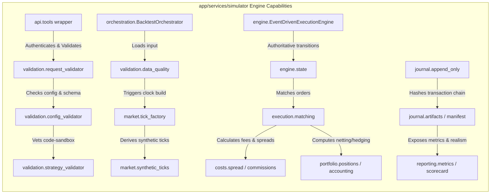
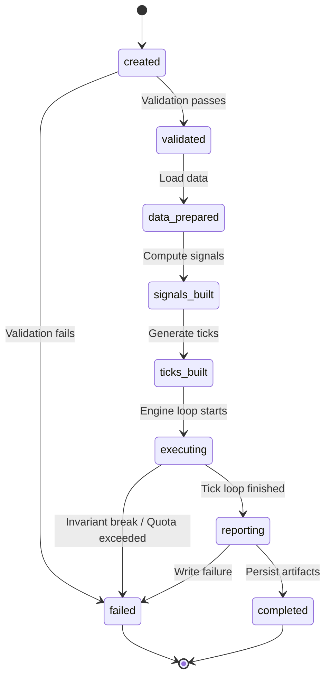
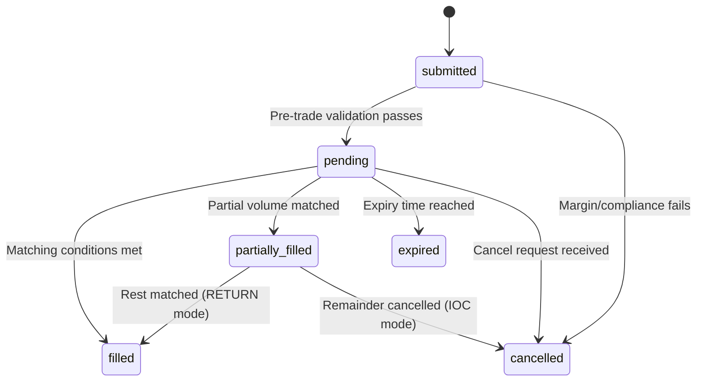
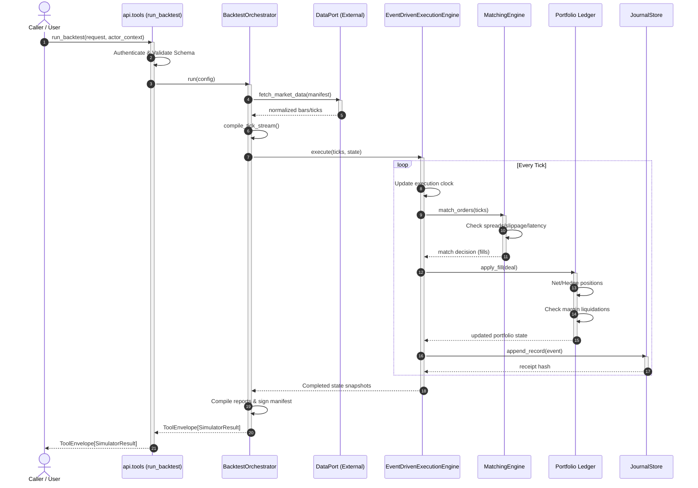

# Simulator Engine — Intended Workflows and Scenarios

## 1. Document Purpose
This document reverse-engineers the architecture requirements defined in [08-simulator.md](file:///c:/Users/rharu/AppDev/HaruquantAI/docs/dev/phase-implementation-plan/08-simulator.md) into a set of cohesive, actor-driven, end-to-end operational workflows and scenarios. It defines how technical primitives, matching execution loops, cost calculators, portfolio ledger managers, append-only journals, and boundary policies cooperate to deliver reproducible, production-realistic simulation runs, handle operational failures, and maintain model governance and safety across the HaruQuantAI platform.

---

## 2. Source and Analysis Boundaries
* **Source of Truth**: This analysis is strictly derived from the requirements, boundaries, DTO schemas, and non-functional constraints in [08-simulator.md](file:///c:/Users/rharu/AppDev/HaruquantAI/docs/dev/phase-implementation-plan/08-simulator.md).
* **Constraints**: No source code from the active repository was inspected or assumed to exist. No domain behavior was invented.
* **Terminology & Assertions**: All explicit requirements are marked with their corresponding `SIM-FR-*`, `SIM-NFR-*`, `SIM-BR-*`, or `SIM-EX-*` tags. Implied system behaviors necessary to connect isolated requirements are clearly marked:
  > **Inferred workflow connection — requires validation**

---

## 3. System Purpose and Scope
### Primary Purpose
The `app/services/simulator` module represents the deterministic backtesting and simulation domain for trading strategies. It provides an event-driven execution clock using bid/ask ticks, matches simulated orders with broker-profile rules, applies realistic transaction costs (commissions, spreads, slippage, latency), performs portfolio netting/hedging position lifecycle updates, computes margin stops/liquidations, and persists a tamper-evident audit journal.

### Scope Boundaries
* **In-Scope**: Official tool wrapper `run_backtest` (`SIM-FR-031`), input/schema validations (`SIM-FR-143`, `SIM-FR-372`), request validation, data quality gating (`SIM-FR-652`), in-process event-driven tick simulation (`SIM-FR-086`), synthetic tick generation (`SIM-FR-677`), calendar/session bounds (`SIM-FR-245`), FX cross-rate resolution (`SIM-FR-349`), order execution/modification/cancellation (`SIM-FR-478`), advanced matching logic (IOC, FOK, trailing stops, pegged orders) (`SIM-FR-270`–`SIM-FR-280`), portfolio accounting ledger (`SIM-FR-105`–`SIM-FR-112`), margin/liquidation controls (`SIM-FR-596`), risk/compliance replays (`SIM-FR-398`–`SIM-FR-368`), checkpoint/resume serialization (`SIM-FR-054`), append-only JSONL journaling and hash-chain audit receipts (`SIM-FR-100`, `SIM-FR-662`), and scorecard reports (`SIM-FR-117`).
* **Out-of-Scope**: Trading strategy logic (`SIM-FR-043`), indicator formula implementation (`SIM-FR-588`), raw market-data acquisition (`SIM-FR-217`), live broker adaptor execution (`SIM-FR-138`, `SIM-FR-218`), and production live risk governance workflows (`SIM-FR-541`).

### Entry and Exit Points
* **Entry Points**:
  * Public wrapper `run_backtest` (`SIM-FR-017`, `app/services/simulator/__init__.py`).
  * Injected registries (Strategy Registry Port, Market Data Port, Checkpoint Port) (`SIM-FR-540`).
* **Exit Points**:
  * Standard return envelope `ToolEnvelope[SimulatorResult]` (`SIM-NFR-238`, `SIM-NFR-244`).
  * Immutable run configurations, journal logs, and reports stored in allowlisted paths (`SIM-FR-574`).
  * OpenTelemetry trace spans and metrics (`SIM-FR-755`, `SIM-NFR-223`).

### Persistent Stores
* **Append-Only Journal**: Immutable JSONL execution records (`SIM-FR-100`, `SIM-FR-314`).
* **Safe Artifact Store**: Versioned configurations, reports, manifests (`SIM-BR-012`).
* **Checkpoint Database**: SQLite sidecar index or persisted checkpoint state (`SIM-FR-054`, `SIM-FR-403`).

---

## 4. Actors and Responsibilities

| Actor | Role | Initiates | Information Provided | Outcomes Received | Prohibited Actions |
|---|---|---|---|---|---|
| **Authorized Agent / Caller** | AI agent, CLI, or notebook wrapper | Run backtest request | `BacktestRequest`, configuration, credentials reference | `ToolEnvelope[SimulatorResult]` | Accessing raw internal engine state; executing un-vetted Python code strings (`SIM-FR-081`, `SIM-FR-534`) |
| **BacktestOrchestrator** | Orchestration layer | Run lifecycle steps | Request instructions | Trigger validations, tick builds, engine loops, reports | Directly mutating accounting ledger outside the event engine (`SIM-FR-028`) |
| **EventDrivenExecutionEngine** | Core state mutator | Event execution loop | Ordered ticks and TradeIntents | Authoritative completed state | Loading credentials or files directly from disk without using adapter ports (`SIM-FR-098`) |
| **StrategyAdapter** | Integration adapter | Trade intent requests | Strategy metadata, read-only state snapshot | `tuple[TradeIntent, ...]` | Accessing live broker connections or credentials (`SIM-FR-458`, `SIM-FR-219`) |
| **Scheduler** | Scheduler queue & worker lease manager | Worker leasing, requeues | Queue limits, heartbeats | Scheduled worker assignments | Overriding user quotas or thread limits (`SIM-FR-073`) |
| **System Admin** | Governance config manager | Profile & manifest approvals | Approved profiles, manifests | Registered system assets | Inlining raw credentials in request payloads (`SIM-FR-187`, `SIM-FR-580`) |

---

## 5. Capability Map

---

## 6. Workflow Catalogue

### Primary Business Workflows
1. **WF-001 — Run Backtest (Orchestration & Tool Execution)**: Boundary lifecycle coordinating public caller validation, configuration validation, sandbox vetting, and execution orchestration.
2. **WF-002 — In-Memory Event-Driven Tick Loop Execution**: The authoritative execution clock loop processing ordered ticks, same-timestamp event priorities, and mark-to-market calculations.
3. **WF-003 — Execution Order Submission and Matching (Order Lifecycle)**: Converts strategy TradeIntents to TradeRequests, validates pre-trade margin/stops, performs matching, and resolves fills.

### Supporting Workflows
4. **WF-004 — Synthetic Tick Generation (MQL5 Parity)**: Derives deterministic seeds to generate bid/ask ticks from M1 OHLCV bars using a support-point algorithm.
5. **WF-005 — Checkpoint Creation and Run Resumption**: Periodically serializes run state to disk and resumes execution from checkpoint indicators.
6. **WF-006 — Worker Heartbeat, Failure Recovery, and Poison Work Quarantine**: Scheduler queue leases, worker heartbeat tracking, and poison-pill work unit quarantining.
7. **WF-007 — Execution Cost and Friction Realism Application**: Applies spreads, slippage, execution latency, swaps, and funding costs.
8. **WF-008 — Journal Recording and Safe Artifact Preservation**: Append-only journaling, manifest verification, artifact encryption, and retention lifecycle cleanup.
9. **WF-009 — Realism Scorecard, Performance Metrics, and Canary Divergence Analysis**: Compiles objective metrics, out-of-sample scorecards, environment drift audits, and canary divergence comparisons.

---

## 7. Detailed End-to-End Workflows

### WF-001 — Run Backtest (Orchestration & Tool Execution)
#### Purpose and Value
Ensures that all backtest runs are authenticated, configuration and schemas are checked fail-closed, strategy references are verified safe, and the run stages execute deterministically to produce signed results (`SIM-FR-031`–`SIM-FR-046`).

#### Actors
* **Primary**: Authorized Agent / Caller
* **Supporting**: BacktestOrchestrator, request_validator, config_validator, strategy_validator

#### Trigger
Caller invokes `run_backtest()` on the official AI tool boundary.

#### Preconditions
* System dependencies and Python versions match the certified profile, or drift warnings are configured (`SIM-FR-568`).
* Secure allowlisted artifact roots are configured (`SIM-BR-011`).

#### Inputs
* `BacktestRequest` containing strategy references, configuration parameters, data authority manifest references, and broker profiles (`SIM-FR-761`).
* `ActorContext` containing authenticated identity and roles (`SIM-FR-048`).

#### Main Success Flow
| Step | Responsible component | Action | Input | Validation or decision | State change | Output | Requirement IDs |
| :--- | :--- | :--- | :--- | :--- | :--- | :--- | :--- |
| 1 | `api.tools` | Accept tool call and validate caller | `BacktestRequest`, `ActorContext` | Check roles `viewer`, `runner`, `admin` | None | Authorized request payload | SIM-FR-048, SIM-FR-186 |
| 2 | `api.tools` | Vet strategy code parameter inputs | Request payload | Reject raw Python code strings | None | Safe config reference | SIM-FR-037, SIM-FR-542 |
| 3 | `validation.schema_validator` | Validate DTO schema and version bounds | Safe config reference | Check schema format | None | Validated schema payload | SIM-NFR-236, SIM-NFR-238 |
| 4 | `validation.config_validator` | Check parameters and broker constraints | Validated schema payload | Check minimum volume, freeze levels, dates | None | Validated run configuration | SIM-FR-143, SIM-FR-266 |
| 5 | `orchestration.backtest_orchestrator` | Advance run lifecycle to `validated` | Validated run configuration | None | Run status = `validated` | Validation report | SIM-FR-744 |
| 6 | `orchestration.backtest_orchestrator` | Load data via Ports and verify data quality | Data authority manifest | Check column structures, negative prices | Run status = `data_prepared` | Normalized data slice | SIM-FR-652, SIM-FR-708 |
| 7 | `integration.strategy_adapter` | Compile indicator signals | Normalized data slice | Verify lookahead constraints | Run status = `signals_built` | Signal timeline | SIM-FR-221, SIM-FR-660 |
| 8 | `market.tick_factory` | Construct canonical execution ticks | Signal timeline, data slices | Check tick orders, timestamps | Run status = `ticks_built` | Ordered tick stream | SIM-FR-653, SIM-FR-744 |
| 9 | `engine.event_driven_execution` | Execute deterministic simulation loop | Ordered tick stream | Check accounting invariants | Run status = `executing` | Authoritative end state | SIM-FR-086, SIM-FR-780 |
| 10 | `reporting.scorecard` | Compile results and scorecard | Authoritative end state | Verify report schema | Run status = `reporting` | Raw reports | SIM-FR-117, SIM-NFR-242 |
| 11 | `journal.artifacts` | Persist reports and manifest to safe path | Raw reports | Generate checksums and signatures | Run status = `completed` | `ToolEnvelope[SimulatorResult]` | SIM-FR-574, SIM-NFR-255 |

#### Decision Points
* **Strategy Code Vetting**: If the payload contains raw Python strings instead of a registered strategy hash, `api.tools` rejects the request immediately. *Fail-closed* (`SIM-FR-039`, `SIM-FR-449`).
* **Data Quality Audit**: If the data quality audit detects severe gaps or non-monotonic timestamps, the run is aborted, marked `diagnostic_failed`, and blocked from production promotion unless diagnostic override is enabled. *Fail-closed* (`SIM-FR-570`, `SIM-NFR-218`).

#### Alternate Flows
* **Asynchronous Queue Execution**: If the system is saturated, the orchestrator returns `queued` status and places the run in the scheduler queue, returning a run ID (`SIM-FR-033`, `SIM-FR-071`).
* **Diagnostic Execution Mode**: If configured, accounting or data failures do not abort execution; instead, the run completes, is marked `diagnostic_failed`, and exports partial artifacts. *No-promotion* (`SIM-FR-570`, `SIM-BR-002`).

#### Failure and Exception Flows
* **JSONL Persistence Failure**: If the journal writer fails (`SIM_PERSISTENCE_FAILED`), the engine halts cleanly, rolls back uncommitted sequence state, and quarantines corrupted artifacts (`SIM-FR-209`, `SIM-BR-020`).
* **Quota Violation**: If memory or execution duration limits are breached, the run halts immediately and returns `SIM_RESOURCE_QUOTA_EXCEEDED` (`SIM-FR-586`, `SIM-NFR-159`).

#### Recovery Flow
* **Restart from Checkpoint**: If interrupted, the orchestrator loads the last valid checkpoint file, verifies compatibility of configuration and data hashes, restores seed states, and resumes execution from that index (`SIM-FR-118`).

#### Postconditions
* Authoritative `SimulatorResult` generated and signed (`SIM-FR-589`).
* Immutable run-configuration artifact written (`SIM-FR-574`).
* Compliance receipts archived with OpenTelemetry trace contexts (`SIM-FR-604`, `SIM-FR-755`).

---

### WF-002 — In-Memory Event-Driven Tick Loop Execution
#### Purpose and Value
Maintains authoritative run state and executes a tick-by-tick clock cycle to prevent lookahead bias and ensure absolute determinism (`SIM-FR-086`–`SIM-FR-098`).

#### Actors
* **Primary**: EventDrivenExecutionEngine
* **Supporting**: state, tick_batching, calendar

#### Trigger
Orchestrator invokes `EventDrivenExecutionEngine.run()`.

#### Preconditions
* Run lifecycle state is `ticks_built` (`SIM-FR-744`).
* authoritative `EngineState` has been initialized (`SIM-FR-098`).

#### Inputs
* `TickStream` containing ordered bid/ask ticks (`SIM-FR-653`).
* `SignalTimeline` containing pre-built `TradeIntent` items (`SIM-FR-290`).

#### Main Success Flow
| Step | Responsible component | Action | Input | Validation or decision | State change | Output | Requirement IDs |
| :--- | :--- | :--- | :--- | :--- | :--- | :--- | :--- |
| 1 | `engine.event_driven_execution` | Read next tick event | `TickStream` | None | Update execution clock | Current tick | SIM-FR-655 |
| 2 | `engine.tick_batching` | Check batch safety eligibility | Current tick, active orders | Prove no transitions or bounds exist | None | Batch safety decision | SIM-FR-130, SIM-FR-725 |
| 3 | `engine.event_priority` | Sort same-timestamp events in priority queue | Current tick, orders, intents | Order: Stopouts -> Expirations -> Exits -> Intents | None | Prioritized event list | SIM-FR-699, SIM-FR-700 |
| 4 | `engine.no_lookahead` | Mask current-bar variables | Prioritized event list | Verify no data timestamp >= current bar open | None | Safe signal intents | SIM-FR-089, SIM-FR-660 |
| 5 | `execution.matching` | Process pending stop/limit orders | Safe signal intents, tick prices | Match triggers | State.pending_orders update | Match decisions | SIM-FR-269, SIM-FR-277 |
| 6 | `portfolio.accounting` | Mark open positions to market | Match decisions, tick price | Check stopout threshold | State.account updates | Equity/margin snapshot | SIM-FR-601, SIM-FR-714 |
| 7 | `portfolio.positions` | Apply netting/hedging deals | Match decisions | None | State.positions updates | Deal logs | SIM-FR-600, SIM-FR-594 |
| 8 | `portfolio.accounting` | Verify accounting invariants | State updates | Verify: `Equity = Balance + FloatingPnL` | None | Invariant audit check | SIM-FR-602 |
| 9 | `journal.append_only` | Flush loop transitions to journal | Invariant audit check, deal logs | None | None | JournalReceipt | SIM-FR-128 |

#### Decision Points
* **Batch Safety Proof**: If `engine.tick_batching` proves that no pending trigger, session boundary, or rollover event intersects the next interval, it batches mark-to-market calculations. Otherwise, it executes tick-by-step. *Fail-closed* (`SIM-FR-727`, `SIM-FR-731`).
* **Accounting Invariant Check**: If `Equity` does not match `Balance + FloatingPnL` at the end of a tick processing, the engine halts immediately and raises `SIM_ACCOUNT_INVARIANT_BROKEN` unless diagnostic mode is configured (`SIM-FR-569`, `SIM-FR-582`).

#### Alternate Flows
* **Fast Research Mode**: If configured for `FAST_RESEARCH`, the engine uses simplified bar-level updates instead of tick loops. *Downgrades scorecard classification* (`SIM-FR-659`).
* **Hedging Position Account**: If the broker profile specifies hedging, the position container allows concurrent long and short positions for a symbol, instead of netting them (`SIM-FR-593`).

#### Failure and Exception Flows
* **Lookahead Detection**: If a strategy accesses current-bar HLC variables, the engine raises `SIM_LOOKAHEAD_DETECTED` and aborts the run (`SIM-FR-091`, `SIM-FR-224`).

#### Recovery Flow
* If loop execution fails, the state manager rolls back the active transaction and returns the last successfully committed sequence record (`SIM-BR-020`).

#### Postconditions
* Authoritative completed `EngineState` returned (`SIM-FR-131`).
* All transactions documented in the append-only journal (`SIM-FR-100`).

---

### WF-003 — Execution Order Submission and Matching (Order Lifecycle)
#### Purpose and Value
Handles order routing, risk limits checks, and matching decisions using deterministic broker-profile parameters (`SIM-FR-478`–`SIM-FR-500`).

#### Actors
* **Primary**: SimTrader, matching
* **Supporting**: broker_rules, margin, compliance, spread

#### Trigger
A strategy adapter receives signal changes and submits an order via `order_send()`.

#### Preconditions
* In-memory tick execution loop is active (`SIM-FR-088`).
* Broker profile is loaded and validated (`SIM-FR-143`).

#### Inputs
* `TradeIntent` containing side, symbol, quantity, and SL/TP bounds (`SIM-FR-656`).
* Current eligible matching tick (`SIM-FR-657`).

#### Main Success Flow
| Step | Responsible component | Action | Input | Validation or decision | State change | Output | Requirement IDs |
| :--- | :--- | :--- | :--- | :--- | :--- | :--- | :--- |
| 1 | `execution.orders` | Transform `TradeIntent` to sized request | `TradeIntent` | Check min/max steps | None | `TradeRequest` | SIM-FR-260, SIM-FR-481 |
| 2 | `portfolio.margin` | Estimate pre-trade margin | `TradeRequest` | Check free margin limits | None | Margin validation report | SIM-FR-504, SIM-NFR-150 |
| 3 | `controls.compliance` | Perform regulatory compliance checks | `TradeRequest` | Check wash-sales, alternative upticks | None | Compliance report | SIM-FR-284, SIM-FR-521 |
| 4 | `execution.broker_rules` | Apply latency delay models | `TradeRequest` | Apply network/exchange delay | None | Latency delayed request | SIM-FR-092, SIM-FR-693 |
| 5 | `execution.matching` | Match order against current book | Latency delayed request, current tick | Check price bounds & fill policy | None | Match decision | SIM-FR-232, SIM-FR-268 |
| 6 | `execution.matching` | Execute fill and construct deal record | Match decision | Normalize price to tick size | Create simulated deal | Sized fill record | SIM-FR-752, SIM-FR-234 |
| 7 | `portfolio.positions` | Apply deal to positions | Sized fill record | Net or hedge positions | Position state change | Updated positions | SIM-FR-600, SIM-FR-235 |
| 8 | `portfolio.accounting` | Deduct commissions and fees | Sized fill record | Apply broker cost schedules | Balance state change | Balance ledger updates | SIM-FR-106, SIM-FR-601 |
| 9 | `journal.append_only` | Record transaction receipt | Balance ledger updates | Generate hash chain | Monotonic sequence +1 | Audit receipt | SIM-FR-281, SIM-NFR-239 |

#### Decision Points
* **Pre-Trade Margin Check**: If the required margin for the request exceeds the free margin, the order is rejected. *Fail-closed* (`SIM-FR-504`, `SIM-NFR-150`).
* **Fill Policy Compatibility**: If an `FOK` (Fill-or-Kill) order cannot be matched for its entire volume, it is cancelled immediately. *Fail-closed* (`SIM-FR-232`).
* **Worst-Case SL/TP Hit**: If both SL and TP price triggers are crossed in the same gap, the engine defaults to `conservative_worst_outcome` (lower equity outcome). *Fail-closed* (`SIM-FR-093`, `SIM-FR-250`).

#### Alternate Flows
* **IOC (Immediate-or-Cancel) Partial Fills**: If an `IOC` order matches only a portion of its volume, the filled quantity is executed, and the remainder is cancelled as `SIM_IOC_REMAINDER_CANCELLED` (`SIM-FR-050`, `SIM-FR-051`).
* **Stop-Limit Pending Trigger**: If a stop-limit order is triggered, it transitions to a limit order at its limit price and is placed in the pending orders book (`SIM-FR-276`).

#### Failure and Exception Flows
* **Position Limit Exceeded**: If the order would exceed the maximum positions per symbol or account, it is rejected with `SIM_POSITION_LIMIT_EXCEEDED` (`SIM-FR-591`, `SIM-FR-592`).

#### Recovery Flow
* If matching fails or exceptions occur, the orchestrator records the event receipt, sets the status to rejected, and ensures no position updates are applied.

#### Postconditions
* Authoritative positions and balances updated (`SIM-FR-128`).
* Deal records added to the historical database for reporting (`SIM-FR-498`).

---

### WF-004 — Synthetic Tick Generation (MQL5 Parity)
#### Purpose and Value
Constructs reproducible, deterministic bid/ask tick streams from M1 OHLCV bars using a seed derivation algorithm to ensure research parity with MT5 (`SIM-FR-677`–`SIM-FR-686`).

#### Actors
* **Primary**: synthetic_ticks, tick_factory
* **Supporting**: calendar, fx_conversion

#### Trigger
Orchestrator prepares data for a run configured in `SYNTHETIC_TICKS` mode (`SIM-FR-667`).

#### Preconditions
* Raw M1 OHLCV data is loaded and validated for quality (`SIM-FR-762`).
* Global random seed is configured (`SIM-NFR-247`).

#### Inputs
* `OHLCVBar` structure (`SIM-FR-762`).
* `SymbolSpec` detailing tick size and contract size (`SIM-FR-764`).

#### Main Success Flow
| Step | Responsible component | Action | Input | Validation or decision | State change | Output | Requirement IDs |
| :--- | :--- | :--- | :--- | :--- | :--- | :--- | :--- |
| 1 | `market.synthetic_ticks` | Derive deterministic per-bar seed | Global seed, SymbolSpec, bar timestamp | Apply SHA-256 hash | None | Deterministic seed int | SIM-FR-680, SIM-FR-681 |
| 2 | `market.synthetic_ticks` | Run MQL5 Article #75 algorithm | `OHLCVBar`, deterministic seed int | Validate bounds (high, low, close) | None | Raw tick price path | SIM-FR-677, SIM-FR-775 |
| 3 | `market.tick_factory` | Calculate ask prices | Raw tick price path, spread config | Ask = bid + spread points | None | Bid/Ask tick path | SIM-FR-678, SIM-FR-691 |
| 4 | `market.calendar` | Apply session session calendars | Bid/Ask tick path | Check if tick falls in session | None | Session-aligned ticks | SIM-FR-245, SIM-FR-247 |
| 5 | `market.fx_conversion` | Perform FX base conversions | Session-aligned ticks | Validate age bounds | None | Converted tick path | SIM-FR-354, SIM-FR-572 |
| 6 | `market.tick_factory` | Write seed metadata to journal | Converted tick path, seed metadata | None | None | Replay registry entries | SIM-FR-774, SIM-FR-776 |

#### Decision Points
* **Tick Value Validation**: If any generated tick price falls outside the high/low range of the source M1 bar, the generation fails. *Fail-closed* (`SIM-FR-782`).
* **Cross-Rate Skew Check**: If synthesized FX rates exceed the maximum skew parameter (`max_cross_rate_skew_bps`), the path is rejected. *Fail-closed* (`SIM-FR-356`).

#### Alternate Flows
* **Simple Four-Tick Path**: If configured, the factory produces a basic Open-High-Low-Close tick path instead of the full MQL5 support-point path (`SIM-FR-673`, `SIM-FR-749`).

#### Failure and Exception Flows
* **Negative Spread Detection**: If the spread model outputs a negative value, the engine halts with `SIM_DATA_NEGATIVE_SPREAD` (`SIM-FR-814`, `SIM-FR-821`).

#### Recovery Flow
* If tick generation fails mid-run, the orchestrator logs the exception context, quarantines the affected date range, and marks the run status `failed` with code `SIM_SYNTHETIC_TICK_GENERATION_FAILED` (`SIM-FR-756`).

#### Postconditions
* Reproducible tick stream registered as the execution clock (`SIM-FR-655`).
* Seed metadata written to the run manifest to allow exact replay (`SIM-FR-686`).

---

### WF-005 — Checkpoint Creation and Run Resumption
#### Purpose and Value
Safeguards long-running optimization and Monte Carlo jobs against infrastructure failures by checkpointing state data (`SIM-FR-054`–`SIM-FR-072`).

#### Actors
* **Primary**: BacktestOrchestrator, checkpoints
* **Supporting**: state, append_only

#### Trigger
The execution loop reaches a configured checkpoint interval (e.g., bar boundary, daily rollover).

#### Preconditions
* The execution engine is running (`SIM-FR-744`).
* Checkpoint storage path is initialized and validated (`SIM-BR-011`).

#### Inputs
* Current `EngineState` (`SIM-FR-098`).
* `ResumePolicy` defining age limits and configuration compatibility (`SIM-FR-055`).

#### Main Success Flow
| Step | Responsible component | Action | Input | Validation or decision | State change | Output | Requirement IDs |
| :--- | :--- | :--- | :--- | :--- | :--- | :--- | :--- |
| 1 | `orchestration.checkpoints` | Request state dump | `EngineState` | None | None | State snapshot | SIM-FR-098 |
| 2 | `orchestration.checkpoints` | Serialize state snapshot | State snapshot | None | None | Binary snapshot data | SIM-FR-054 |
| 3 | `orchestration.checkpoints` | Write snapshot to storage | Binary snapshot data, storage path | Verify write permissions | None | Checkpoint receipt | SIM-BR-012 |
| 4 | `journal.append_only` | Log checkpoint record | Checkpoint receipt | None | Monotonic sequence +1 | Journal checkpoint receipt | SIM-FR-662 |

#### Resumption Flow (Exception Path)
| Step | Responsible component | Action | Input | Validation or decision | State change | Output | Requirement IDs |
| :--- | :--- | :--- | :--- | :--- | :--- | :--- | :--- |
| 1 | `orchestration.backtest_orchestrator` | Detect resume intent | Startup request | Check if checkpoint exists | None | Checkpoint descriptor | SIM-FR-118 |
| 2 | `validation.config_validator` | Validate checkpoint compatibility | Checkpoint descriptor, `ResumePolicy` | Verify config, data, engine version hashes | None | Validation report | SIM-FR-041, SIM-FR-118 |
| 3 | `orchestration.checkpoints` | Restore state from snapshot | Checkpoint descriptor | None | Restored EngineState | State snapshot | SIM-FR-1066 |
| 4 | `orchestration.backtest_orchestrator` | Resume execution loop | State snapshot | None | Run status = `executing` | Resumed loop | SIM-FR-083 |

#### Decision Points
* **Compatibility Check**: If the config hash, data hash, or engine version of the checkpoint does not match the current run request, resumption is denied. *Fail-closed* (`SIM-FR-041`, `SIM-FR-118`).
* **Checkpoint Age Validation**: If the checkpoint file age exceeds `max_checkpoint_age`, the orchestrator ignores it and restarts execution from scratch. *Fail-closed* (`SIM-FR-055`).

#### Failure and Exception Flows
* **Serialization Write Failure**: If the write to disk fails, the engine raises `SIM_PERSISTENCE_FAILED`, stops execution, and quarantines any corrupted partial checkpoint files (`SIM-FR-209`, `SIM-BR-020`).

#### Recovery Flow
* Upon database restart or scheduler worker recovery, the orchestrator runs pre-flight checkpoint validation before loading in-memory structures.

#### Postconditions
* Verified checkpoint receipt recorded in journal (`SIM-FR-662`).
* Authoritative state successfully restored without data gaps (`SIM-FR-083`).

---

### WF-006 — Worker Heartbeat, Failure Recovery, and Poison Work Quarantine
#### Purpose and Value
Coordinates worker execution scaling for large optimization jobs, ensuring lost workers are recovered and poison work units do not cause infinite loops (`SIM-FR-016`, `SIM-FR-300`–`SIM-FR-302`).

#### Actors
* **Primary**: Scheduler, worker_recovery
* **Supporting**: BacktestOrchestrator

#### Trigger
Scheduler detects a missing worker heartbeat or a task execution failure.

#### Preconditions
* Optimization job decomposed into stateless work units (`SIM-FR-300`).
* Scheduler queue limits and timeouts are loaded (`SIM-FR-073`).

#### Inputs
* Worker identity, lease status, and heartbeat timestamps (`SIM-FR-073`).
* Task failure count per work-unit hash (`SIM-FR-302`).

#### Main Success Flow
| Step | Responsible component | Action | Input | Validation or decision | State change | Output | Requirement IDs |
| :--- | :--- | :--- | :--- | :--- | :--- | :--- | :--- |
| 1 | `orchestration.scheduler` | Monitor active leases | Heartbeat logs | Check if lease age > timeout threshold | None | Expired lease list | SIM-FR-073 |
| 2 | `orchestration.worker_recovery` | Diagnose expired leases | Expired lease list | Verify if instance was preempted | Requeue work | Lost worker log | SIM-FR-301 |
| 3 | `orchestration.scheduler` | Requeue work unit | Lost worker log | Check if attempts < retry threshold | Update queue | Requeue receipt | SIM-FR-213, SIM-FR-301 |
| 4 | `orchestration.scheduler` | Re-allocate work to next worker | Requeue receipt | Check queue capacity limits | Update worker lease | Work assignment | SIM-FR-1036 |

#### Quarantine Flow (Exception Path)
| Step | Responsible component | Action | Input | Validation or decision | State change | Output | Requirement IDs |
| :--- | :--- | :--- | :--- | :--- | :--- | :--- | :--- |
| 1 | `orchestration.worker_recovery` | Check work unit failure counts | Failed task report | Check if attempts >= threshold | None | Poison flag | SIM-FR-016, SIM-FR-302 |
| 2 | `orchestration.worker_recovery` | Quarantine work unit | Poison flag | None | Remove task from queue | Quarantine receipt | SIM-FR-016, SIM-BR-027 |
| 3 | `journal.artifacts` | Save debug artifacts | Quarantine receipt | None | Write quarantine file | Debug log path | SIM-FR-016 |
| 4 | `orchestration.scheduler` | Emit operator alert | Debug log path | None | None | Operator alert | SIM-FR-016, SIM-BR-027 |

#### Decision Points
* **Preempted Worker Classification**: If a worker fails due to machine preemption or lease timeout, it is classified as non-fatal. The task is requeued with diagnostic warning `SIM_WORKER_LOST_REQUEUED` (`SIM-FR-213`, `SIM-FR-301`).
* **Poison Pill Check**: If a task fails repeatedly for the same work-unit hash (e.g., due to a strategy code crash), it is flagged as a poison pill. *Fail-closed* (`SIM-FR-016`, `SIM-FR-302`).

#### Failure and Exception Flows
* **Queue Saturation**: If queue length exceeds limits, the scheduler rejects new runs with `SIM_QUEUE_LIMIT_EXCEEDED` (`SIM-FR-212`).

#### Recovery Flow
* A scheduler heartbeat checker task runs periodically to clean expired leases and route orphaned jobs back to the scheduler database.

#### Postconditions
* Failed tasks safely quarantined or retried without affecting the master process (`SIM-FR-301`).
* Debug logs saved for post-mortem operator analysis (`SIM-FR-016`).

---

### WF-007 — Execution Cost and Friction Realism Application
#### Purpose and Value
Applies transaction cost and latency rules to simulate realistic trading friction, ensuring backtest performance matches actual execution paths (`SIM-FR-092`–`SIM-FR-112`).

#### Actors
* **Primary**: EventDrivenExecutionEngine
* **Supporting**: spread, slippage, latency, commission, swap

#### Trigger
Matching engine identifies a candidate order fill (`SIM-FR-812`).

#### Preconditions
* Order matches bid/ask price validation bounds (`SIM-FR-268`).
* Cost schedule configs are loaded (`SIM-FR-761`).

#### Inputs
* Candidate fill price and quantity (`SIM-FR-265`).
* Current spreads, execution latency settings, and liquidity curves (`SIM-FR-819`).

#### Main Success Flow
| Step | Responsible component | Action | Input | Validation or decision | State change | Output | Requirement IDs |
| :--- | :--- | :--- | :--- | :--- | :--- | :--- | :--- |
| 1 | `costs.spread` | Apply bid/ask spread adjustments | Bid/ask quote, spread model | Verify spread is non-negative | None | Adjusted prices | SIM-FR-691, SIM-FR-812 |
| 2 | `costs.liquidity` | Calculate fillable volume | Adjusted prices, volume step | Verify order size vs depth limits | None | Sized fill volume | SIM-FR-099, SIM-FR-260 |
| 3 | `costs.slippage` | Apply slippage cost adjustments | Sized fill volume, slippage model | Check slippage limits | None | Final fill price | SIM-FR-812, SIM-FR-817 |
| 4 | `costs.commission` | Calculate transaction commissions | Final fill price, fee schedules | Validate cost values | None | Commission details | SIM-FR-106, SIM-FR-813 |
| 5 | `portfolio.accounting` | Accrue carry/swap rollover costs | Open position, clock, swap calendar | Check rollover hour | Balance update | Rollover fee debit | SIM-FR-706, SIM-FR-813 |

#### Decision Points
* **Spread Validity Check**: If the resolved spread is negative, the cost engine raises `SIM_DATA_NEGATIVE_SPREAD`. *Fail-closed* (`SIM-FR-814`, `SIM-FR-821`).
* **Slippage Cap Enforcement**: If calculated slippage exceeds configured slippage limits, the order is filled at the capped price or rejected depending on slippage policy (`SIM-FR-811`).

#### Alternate Flows
* **Disabled Funding Mode**: If perpetual crypto funding models are disabled in configuration, the funding calculation step is skipped (`SIM-FR-342`).
* **Probabilistic Latency Model**: Instead of fixed latency, the latency engine uses a distribution curve matching venue profile delays (`SIM-FR-590`).

#### Failure and Exception Flows
* **Commission Calculation Error**: If commission schedules contain division-by-zero or missing currencies, the engine aborts with `SIM_COMMISSION_CALCULATION_FAILED` (`SIM-FR-401`, `SIM-FR-821`).

#### Postconditions
* Adjusted net deal record logged to state (`SIM-FR-600`).
* Balance, commissions, swaps, and funding rates accrued to the ledger (`SIM-FR-106`, `SIM-FR-813`).

---

### WF-008 — Journal Recording and Safe Artifact Preservation
#### Purpose and Value
Writes tamper-evident, append-only records of all state changes, securing evidence files for audit and model promotions (`SIM-FR-100`, `SIM-FR-314`, `SIM-BR-004`).

#### Actors
* **Primary**: append_only, artifacts
* **Supporting**: manifest, retention

#### Trigger
The execution engine completes a tick cycle or transitions run lifecycle state (`SIM-FR-662`).

#### Preconditions
* Allowlisted artifact storage paths are verified and available (`SIM-BR-011`).
* Logging and audit parameters are configured (`SIM-FR-180`).

#### Inputs
* Engine state transitions, DTO events, or final scorecard reports (`SIM-FR-281`).
* Retention policies and legal-hold declarations (`SIM-BR-006`).

#### Main Success Flow
| Step | Responsible component | Action | Input | Validation or decision | State change | Output | Requirement IDs |
| :--- | :--- | :--- | :--- | :--- | :--- | :--- | :--- |
| 1 | `journal.append_only` | Serialize log records | State event DTOs | Verify schema format | None | JSONL strings | SIM-FR-180, SIM-NFR-239 |
| 2 | `journal.append_only` | Compute hash chain link | JSONL strings, previous hash | Ensure sequence matches | Increment sequence | Hashed chain receipt | SIM-FR-100, SIM-NFR-239 |
| 3 | `journal.append_only` | Write to append-only storage | Hashed chain receipt | Check disk write status | Write to JSONL file | Persistent log record | SIM-FR-314 |
| 4 | `journal.artifacts` | Write summary to manifest | Persistent log record | None | None | `journal_manifest.json` | SIM-FR-100, SIM-FR-662 |
| 5 | `journal.artifacts` | Encrypt final reports at rest | Report files, keys | Verify encryption keys | None | Encrypted report | SIM-FR-195 |
| 6 | `journal.retention` | Enforce file retention policies | Storage records, cron intervals | Check if age > retention days | Prune expired files | Pruning logs | SIM-FR-192, SIM-BR-006 |

#### Decision Points
* **Hash Continuity Check**: If the sequence number is non-monotonic or the previous hash does not match, the write is rejected, and the run halts. *Fail-closed* (`SIM-FR-118`).
* **Legal Hold Check**: If the artifact manifest flags an item as under `legal-hold`, the retention purger skips deletion. *Fail-closed* (`SIM-BR-006`).

#### Failure and Exception Flows
* **Disk Write Failure**: If the disk returns an error or is out of space, the system halts with `SIM_PERSISTENCE_FAILED` to prevent un-journaled transactions (`SIM-FR-209`).

#### Postconditions
* Signed `journal_manifest.json` and artifact manifest saved (`SIM-FR-100`, `SIM-BR-004`).
* Expired artifacts safely deleted, reclaiming storage space (`SIM-FR-192`).

---

### WF-009 — Realism Scorecard, Performance Metrics, and Canary Divergence Analysis
#### Purpose and Value
Compiles reports, scorecards, and calibrations to classify run realism, certifying strategy readiness for promotion (`SIM-FR-115`–`SIM-FR-127`, `SIM-FR-382`–`SIM-FR-396`).

#### Actors
* **Primary**: scorecard, metrics, canary
* **Supporting**: realism, environment

#### Trigger
The execution engine finishes running all ticks, or a production release gate is run.

#### Preconditions
* Execution completed successfully with run status `reporting` (`SIM-FR-744`).
* Certified benchmark profiles and out-of-sample datasets are loaded (`SIM-FR-308`, `SIM-FR-382`).

#### Inputs
* Completed run accounting records and trade lists (`SIM-FR-472`).
* Historical backtest records from the old engine version (if canary check is active) (`SIM-FR-124`).

#### Main Success Flow
| Step | Responsible component | Action | Input | Validation or decision | State change | Output | Requirement IDs |
| :--- | :--- | :--- | :--- | :--- | :--- | :--- | :--- |
| 1 | `reporting.metrics` | Aggregate trade statistics | Deal history, cashflow logs | Validate inputs | None | Trade statistics | SIM-FR-472 |
| 2 | `reporting.metrics` | Calculate benchmark ratios | Trade statistics, benchmark data | Compute Alpha, Beta, Tracking Error | None | Benchmark report | SIM-FR-358, SIM-FR-361 |
| 3 | `reporting.scorecard` | Assess realism constraints | Benchmark reports, configs | Check for disabled cost models | None | Realism scorecard | SIM-FR-117, SIM-FR-157 |
| 4 | `reporting.realism` | Assign realism classification | Realism scorecard | Assign labels (e.g. `production_fx_candidate`) | None | Realism label | SIM-FR-396, SIM-FR-613 |
| 5 | `operations.canary` | Run canary divergence checks | Realism scorecard, baseline logs | Compare results for equivalence | None | Canary comparison report | SIM-FR-124 |
| 6 | `operations.environment` | Certify environment hashes | Active platform metadata | Verify dependency versions vs profile | None | Environment certification | SIM-FR-173, SIM-FR-568 |
| 7 | `reporting.scorecard` | Generate promotion manifest | Environment certification, reports | Verify all evidence files are present | Write manifest | `simulator_promotion_manifest.json` | SIM-FR-395, SIM-FR-571 |

#### Decision Points
* **Realism Downgrade**: If required cost models (e.g. commission or slippage) are disabled, the realism classifier downgrades the run from `production_fx_candidate` to `research_only`. *Fail-closed* (`SIM-FR-613`, `SIM-FR-387`).
* **Canary Divergence Threshold**: If the canary analysis detects that results differ from the baseline engine by more than the configured statistical tolerance, it blocks promotion. *Fail-closed* (`SIM-FR-214`, `SIM-FR-576`).

#### Alternate Flows
* **Uncalibrated Model Promotion**: If uncalibrated execution models are used, the system allows promotion only if an explicit governance exception is logged. *No-default-promotion* (`SIM-FR-387`, `SIM-FR-629`).

#### Failure and Exception Flows
* **Environment Drift Warning**: If the dependency hash or Python minor version differs from the certified benchmark profile, the system emits `SIM_ENVIRONMENT_DRIFT_WARNING` and blocks production promotion (`SIM-FR-174`, `SIM-FR-568`).

#### Postconditions
* Signed `simulator_promotion_manifest.json` generated and archived (`SIM-FR-395`).
* Report files exported as JSON and Markdown payloads (`SIM-FR-741`).

---

## 8. Scenario Catalogue

| Scenario ID | Scenario | Given | When | Then | Expected state | Requirement IDs |
| :--- | :--- | :--- | :--- | :--- | :--- | :--- |
| WF-001-SC-001 | Happy path backtest execution | Valid request parameters, approved strategy registries, data manifests | `run_backtest()` is called | Validation, data prep, ticks build, execute loop, and reports are written | Run status = `completed` | SIM-FR-027, SIM-FR-744 |
| WF-001-SC-002 | Raw code execution rejection | Request payload contains raw Python strategy code strings | Request is validated | Rejects request and returns `SIM_ARBITRARY_CODE_REJECTED` | Run status = `failed` | SIM-FR-039, SIM-FR-059 |
| WF-001-SC-003 | Severe data quality block | Market data manifest fails validation (e.g. non-monotonic time) | Orchestrator runs pre-flight data checks | Rejects run and returns `SIM_DATA_QUALITY_FAILED` | Run status = `failed` | SIM-NFR-224, SIM-NFR-232 |
| WF-001-SC-004 | Quota resource limits exceeded | Backtest runs longer than the monotonic wall-clock deadline | Execution loop is active | Aborts loop and returns `SIM_RESOURCE_QUOTA_EXCEEDED` | Run status = `failed` | SIM-FR-172, SIM-FR-586 |
| WF-002-SC-001 | Same-tick event priority | Expiration, exits, triggers, and SL/TP occur on same timestamp | Engine processes ticks | Loop executes events in order: stopouts -> expirations -> exits -> intents | In-memory state updated | SIM-FR-700, SIM-FR-701 |
| WF-002-SC-002 | Invariant check failure | Accounting engine computes floating PnL math discrepancies | Tick loop finishes step | Halts loop execution and returns `SIM_ACCOUNT_INVARIANT_BROKEN` | Run status = `failed` | SIM-FR-569, SIM-FR-582 |
| WF-003-SC-001 | FOK execution check | Order has `FOK` policy, only partial volume is matched at quote | Engine processes match | Rejects entire order volume and cancels pending orders | Pending orders book updated | SIM-FR-232, SIM-FR-253 |
| WF-003-SC-002 | SL/TP Worst-case gap hit | Both SL and TP triggers crossed in same ambiguous session gap | Tick loop processes gap | Executes adverse fill (conservative worst outcome) | Balances updated | SIM-FR-093, SIM-FR-250 |
| WF-004-SC-001 | Synthetic tick parity check | M1 OHLCV data, symbol specs, and random seed are provided | Factory generates ticks | Computes SHA-256 seed per bar and creates support points | Tick clock generated | SIM-FR-677, SIM-FR-680 |
| WF-004-SC-002 | Negative spread validation | Spread model returns negative points | Factory computes ask | Aborts tick loop and returns `SIM_DATA_NEGATIVE_SPREAD` | Run status = `failed` | SIM-FR-814, SIM-FR-821 |
| WF-005-SC-001 | Resume compatibility verification | Resume from checkpoint with modified parameters or version | Resumption is triggered | Rejects resume and returns `SIM_CHECKPOINT_INCOMPATIBLE` | Run status = `failed` | SIM-FR-041, SIM-FR-118 |
| WF-006-SC-001 | Poison work quarantine | Stateless optimization task repeatedly crashes worker | Task is run | Quarantines work unit and emits operator alert | Task state = `quarantined` | SIM-FR-016, SIM-FR-302 |
| WF-007-SC-001 | Execution latency delay | Sized order intent is submitted | SimTrader routes request | Applies latencies, order matches only after delay ticks pass | Open order book updated | SIM-FR-092, SIM-FR-693 |
| WF-008-SC-001 | Append-only hash chain check | Previous chain hash does not match current sequence receipt | Journal writes record | Engine halts loop and returns `SIM_PERSISTENCE_FAILED` | Run status = `failed` | SIM-FR-118, SIM-FR-209 |
| WF-009-SC-001 | Realism downgrade validation | Commission and swap models are disabled in configuration | Reports scorecard | Downgrades classification to `research_only` | Realism label updated | SIM-FR-613, SIM-FR-387 |
| WF-009-SC-002 | Canary divergence failure | Old and new engine versions exceed statistical divergence bounds | Canary analyzer runs checks | Rejects promotion and returns `SIM_CANARY_DIVERGENCE` | Run status = `failed` | SIM-FR-214, SIM-FR-576 |

---

## 9. Workflow Relationship Map

| Source workflow | Relationship | Target workflow | Trigger or condition |
| :--- | :--- | :--- | :--- |
| **WF-001** (Run Backtest Orchestration) | Parent | **WF-004** (Synthetic Tick Generation) | If execution config is `SYNTHETIC_TICKS` |
| **WF-001** (Run Backtest Orchestration) | Parent | **WF-002** (Tick Loop Execution) | During the execution stage of the lifecycle |
| **WF-002** (Tick Loop Execution) | Child | **WF-003** (Order Submission & Matching)| When strategy signals trigger trade intents |
| **WF-003** (Order Matching) | Child | **WF-007** (Cost & Friction Realism) | On every order fill match event |
| **WF-002** (Tick Loop Execution) | Child | **WF-008** (Journal Recording) | At the end of every tick processing cycle |
| **WF-001** (Run Backtest Orchestration) | Parent | **WF-005** (Checkpoint Creation) | Periodically during long run stages |
| **WF-006** (Worker Heartbeat Recovery) | Recovery | **WF-005** (Checkpoint Resumption) | When worker loss requires run recovery |
| **WF-001** (Run Backtest Orchestration) | Parent | **WF-009** (Realism Scorecard) | During the reporting stage of the lifecycle |

---

## 10. System Lifecycle and State Transitions

The Simulator Engine manages two distinct lifecycles: **Run Lifecycle** (tracking orchestrator stages) and **Order Lifecycle** (tracking simulated execution states).

### 10.1 Run Lifecycle States
* **created**: Request envelope accepted.
* **validated**: request and config validation checks passed.
* **data_prepared**: Market data and manifests successfully loaded.
* **signals_built**: Indicator adapter has compiled signals.
* **ticks_built**: Tick stream generated and ordered.
* **executing**: Event engine processing tick events.
* **reporting**: Results aggregated and scorecard compiled.
* **completed**: Reports persisted and signed.
* **failed**: Exception encountered; diagnostics preserved.
* **cancelled**: Call cancelled by operator or scheduler.

### 10.2 Order Lifecycle States
* **submitted**: TradeRequest received.
* **pending**: Order waiting for matching conditions.
* **filled**: matched and deal record generated.
* **partially_filled**: Partial match completed (remainders depend on fill policy).
* **cancelled**: Order cancelled by strategy or due to expiration/policy.
* **expired**: Expiry time reached.

---

## 11. Cross-Module Interaction Matrix

---

## 12. Requirements-to-Workflow Traceability Matrix

| Requirement Range / ID | File / Component | Workflow IDs | Scenario IDs | Workflow step numbers | Coverage status |
| :--- | :--- | :--- | :--- | :--- | :--- |
| **SIM-FR-001** to **002**, **004** to **006**, **008**, **014**, **018**, **047**, **081** to **085**, **239**, **473**, **476**, **563**, **625**, **645** to **648**, **741**, **774**, **776** to **778** | `docs/simulator/design_manual.md` | WF-001, WF-004, WF-008 | WF-001-SC-001 | Steps 1, 5, 8, 11 | Supporting constraint |
| **SIM-FR-003** | `docs/simulator/config_reference.md` | WF-001 | WF-001-SC-001 | Step 4 | Supporting constraint |
| **SIM-FR-007** | `docs/simulator/error_taxonomy.md` | WF-001, WF-003 | WF-001-SC-002 | Step 2, Step 4 | Supporting constraint |
| **SIM-FR-009** to **011** | `docs/simulator/reproducibility.md` | WF-001, WF-009 | WF-009-SC-001 | Steps 4, 6 | Supporting constraint |
| **SIM-FR-012**, **043** | `docs/simulator/ownership_and_scope.md`| WF-001, WF-003 | WF-001-SC-001 | Step 5 | Supporting constraint |
| **SIM-FR-020**, **022** to **023**, **029**, **134**, **162**, **524**, **564** to **565**, **781**, **824** | `docs/simulator/traceability.md` | None | None | None | Supporting constraint |
| **SIM-FR-013** | `docs/simulator/vendor_governance.md` | WF-001, WF-008 | WF-001-SC-003 | Step 6 | Supporting constraint |
| **SIM-FR-017** | `app/services/simulator/__init__.py` | WF-001 | WF-001-SC-001 | Step 1 | Fully represented |
| **SIM-FR-038** | `app/services/simulator/api/tools.py` | WF-001 | WF-001-SC-002 | Step 2 | Fully represented |
| **SIM-FR-048**, **049**, **071**, **092** to **093**, **102**, **144** to **147**, **168**, **217**, **222**, **226** to **227**, **243**, **247**, **274** to **275**, **289**, **297**, **322**, **331** to **332**, **336**, **340** to **341**, **346**, **353**, **356**, **386**, **437**, **455**, **457**, **461**, **467**, **468** to **471**, **474**, **567** to **586**, **588** to **607**, **609** to **624**, **626**, **628** to **629**, **632** to **633**, **638** to **639**, **641** to **644** | `app/services/simulator/contracts/models.py` | WF-001, WF-003, WF-007, WF-009 | WF-001-SC-001, WF-003-SC-002, WF-009-SC-001 | Steps 3, 4, 10 | Fully represented |
| **SIM-FR-620**, **627**, **631** | `app/services/simulator/contracts/enums.py` | WF-001, WF-009 | WF-009-SC-001 | Steps 4, 7 | Fully represented |
| **SIM-FR-587**, **630** | `app/services/simulator/contracts/errors.py` | WF-001, WF-003 | WF-001-SC-002 | Step 2, Step 4 | Fully represented |
| **SIM-FR-019** | `app/services/simulator/contracts/extensions.py`| WF-001 | None | Step 3 | Fully represented |
| **SIM-FR-143**, **151**, **204**, **266** to **267**, **357**, **372**, **381**, **449** | `app/services/simulator/validation/config_validator.py`| WF-001 | WF-001-SC-001 | Step 4 | Fully represented |
| **SIM-FR-074**, **076** | `app/services/simulator/validation/strategy_validator.py`| WF-001 | WF-001-SC-002 | Step 2 | Fully represented |
| **SIM-FR-165** to **166**, **378**, **394** | `app/services/simulator/validation/data_quality.py`| WF-001 | WF-001-SC-003 | Step 6 | Fully represented |
| **SIM-FR-077** | `app/services/simulator/orchestration/backtest_orchestrator.py`| WF-001 | WF-001-SC-001 | Steps 5-11 | Fully represented |
| **SIM-FR-034** to **035**, **073**, **212**, **236** to **237**, **240** to **241**, **300** | `app/services/simulator/orchestration/scheduler.py` | WF-001, WF-006 | WF-001-SC-001 | Step 5 (WF-001) | Fully represented |
| **SIM-FR-054** to **055**, **072** | `app/services/simulator/orchestration/checkpoints.py`| WF-005 | WF-005-SC-001 | Steps 1-4 | Fully represented |
| **SIM-FR-016**, **213**, **301** to **302** | `app/services/simulator/orchestration/worker_recovery.py`| WF-006 | WF-006-SC-001 | Steps 1-4 | Fully represented |
| **SIM-FR-086**, **089**, **116**, **120** to **121**, **125**, **129**, **131**, **135** to **137**, **140** to **141**, **150**, **152**, **160**, **172**, **179** to **183**, **191**, **196**, **202** to **203**, **205**, **207** to **210**, **215**, **224**, **228**, **230**, **238**, **251**, **254** to **263**, **277**, **282** to **285**, **291** to **296**, **298** to **299**, **305**, **315** to **321**, **327** to **328**, **347** to **348**, **350** to **351**, **370** to **371**, **373** to **375**, **377**, **384**, **391**, **393**, **402** to **404**, **432** to **433**, **440**, **451**, **460**, **462** to **463**, **472**, **475**, **654**, **656**, **658**, **660** to **661**, **668**, **733**, **750**, **755**, **780** | `app/services/simulator/engine/event_driven_execution.py`| WF-002 | WF-002-SC-001 | Steps 1-9 | Fully represented |
| **SIM-FR-098**, **142**, **244**, **286** to **287**, **458** | `app/services/simulator/engine/state.py` | WF-002 | WF-002-SC-001 | Steps 3, 5, 6, 7 | Fully represented |
| **SIM-FR-130**, **721** to **725**, **727** to **730**, **773** | `app/services/simulator/engine/tick_batching.py`| WF-002 | WF-002-SC-001 | Step 2 | Fully represented |
| **SIM-FR-090** to **091**, **139**, **161**, **188**, **221**, **223**, **225**, **288**, **290**, **397**, **450**, **459** | `app/services/simulator/integration/strategy_adapter.py`| WF-001 | WF-001-SC-001 | Step 7 | Fully represented |
| **SIM-FR-652** to **653**, **655**, **657**, **659**, **662** to **666**, **669** to **676**, **687** to **689**, **691** to **695**, **699** to **720**, **732**, **734** to **740**, **742** to **744**, **746** to **747**, **751** to **754**, **761**, **763**, **771** to **772**, **779**, **782**, **804** | `app/services/simulator/market/tick_factory.py`| WF-001, WF-004 | WF-004-SC-001 | Step 8 (WF-001) | Fully represented |
| **SIM-FR-667**, **677** to **681**, **683** to **686**, **748** to **749**, **756**, **759** to **760**, **762**, **765** to **767**, **769**, **775** | `app/services/simulator/market/synthetic_ticks.py`| WF-004 | WF-004-SC-001 | Steps 1-3 | Fully represented |
| **SIM-FR-185** | `app/services/simulator/market/order_book.py` | WF-003 | WF-003-SC-001 | Step 5 | Fully represented |
| **SIM-FR-245**, **248** to **250**, **278**, **338** to **339**, **399**, **649**, **682**, **696** to **698**, **726**, **731**, **764**, **768**, **770** | `app/services/simulator/market/calendar.py`| WF-002, WF-004 | WF-002-SC-001 | Step 3 (WF-002) | Fully represented |
| **SIM-FR-323**, **349**, **352**, **354** to **355** | `app/services/simulator/market/fx_conversion.py`| WF-003, WF-004 | WF-003-SC-001 | Step 8 (WF-003) | Fully represented |
| **SIM-FR-488**, **490**, **492**, **496**, **498**, **500**, **516**, **526** | `app/services/simulator/execution/orders.py` | WF-003 | WF-003-SC-001 | Steps 1, 6 | Fully represented |
| **SIM-FR-040** to **042**, **050** to **052**, **078**, **097**, **148** to **149**, **184**, **206**, **231**, **233** to **234**, **242**, **253**, **268**, **279** to **280**, **312**, **364**, **366** to **367**, **400** | `app/services/simulator/execution/matching.py`| WF-003 | WF-003-SC-001 | Step 5 | Fully represented |
| **SIM-FR-270**, **272**, **276**, **365** | `app/services/simulator/execution/advanced_orders.py`| WF-003 | WF-003-SC-001 | Step 5 | Fully represented |
| **SIM-FR-056**, **096**, **229**, **252**, **269**, **271**, **273** | `app/services/simulator/execution/lifecycle.py`| WF-003 | WF-003-SC-001 | Step 5 | Fully represented |
| **SIM-FR-477**, **478** to **505**, **506** to **515**, **518** to **523**, **528** to **539**, **540** to **549**, **551** to **553**, **555**, **559** to **562** | `app/services/simulator/broker_profiles/profiles.py`| WF-003 | WF-003-SC-001 | Step 4 | Fully represented |
| **SIM-FR-105**, **108** to **109**, **111** to **112**, **167**, **169**, **218**, **232**, **334**, **466**, **483** to **484**, **486**, **494**, **502**, **511**, **517**, **521**, **550** | `app/services/simulator/portfolio/accounting.py`| WF-002, WF-003 | WF-002-SC-002, WF-003-SC-001 | Step 6 (WF-002) | Fully represented |
| **SIM-FR-094** to **095**, **235**, **264** to **265**, **281**, **311**, **363** | `app/services/simulator/portfolio/positions.py`| WF-003 | WF-003-SC-001 | Step 7 | Fully represented |
| **SIM-FR-107**, **333** | `app/services/simulator/portfolio/margin.py` | WF-003 | WF-003-SC-001 | Step 2 | Fully represented |
| **SIM-FR-163**, **313**, **324** to **326**, **329** to **330**, **335**, **337** | `app/services/simulator/portfolio/corporate_actions.py`| WF-002, WF-003 | WF-002-SC-001 | Step 7 (WF-002) | Fully represented |
| **SIM-FR-805** to **810**, **813** to **823**, **825**, **832** | `app/services/simulator/costs/spread.py` | WF-007 | WF-007-SC-001 | Step 1 | Fully represented |
| **SIM-FR-099** | `app/services/simulator/costs/slippage.py` | WF-007 | WF-007-SC-001 | Step 3 | Fully represented |
| **SIM-FR-106**, **401** | `app/services/simulator/costs/commission.py` | WF-007 | WF-007-SC-001 | Step 4 | Fully represented |
| **SIM-FR-110**, **342** to **345** | `app/services/simulator/costs/swap.py` | WF-007 | WF-007-SC-001 | Step 5 | Fully represented |
| **SIM-FR-398** | `app/services/simulator/controls/simulated_risk.py`| WF-003 | WF-003-SC-001 | Step 2 | Fully represented |
| **SIM-FR-113** to **114**, **246**, **368** to **369** | `app/services/simulator/controls/compliance.py`| WF-003 | WF-003-SC-001 | Step 3 | Fully represented |
| **SIM-FR-103**, **128**, **314** | `app/services/simulator/journal/append_only.py`| WF-008 | WF-008-SC-001 | Steps 1-3 | Fully represented |
| **SIM-FR-189** | `app/services/simulator/journal/artifacts.py` | WF-008 | WF-008-SC-001 | Step 5 | Fully represented |
| **SIM-FR-100**, **117** to **118**, **122**, **187**, **385** | `app/services/simulator/journal/manifest.py`| WF-008 | WF-008-SC-001 | Step 4 | Fully represented |
| **SIM-FR-192** to **193**, **211**, **392** | `app/services/simulator/journal/retention.py`| WF-008 | WF-008-SC-001 | Step 6 | Fully represented |
| **SIM-FR-132**, **303** to **304**, **362** | `app/services/simulator/reporting/metrics.py`| WF-009 | WF-009-SC-001 | Steps 1, 2 | Fully represented |
| **SIM-FR-115**, **127**, **133**, **157**, **379**, **382** to **383**, **389** to **390**, **395**, **435** to **436** | `app/services/simulator/reporting/scorecard.py`| WF-009 | WF-009-SC-001 | Steps 3, 7 | Fully represented |
| **SIM-FR-087**, **126**, **159**, **387**, **396**, **464** | `app/services/simulator/reporting/realism.py`| WF-009 | WF-009-SC-001 | Step 4 | Fully represented |
| **SIM-FR-124**, **214**, **216** | `app/services/simulator/operations/canary.py` | WF-009 | WF-009-SC-002 | Step 5 | Fully represented |
| **SIM-FR-119**, **156**, **158**, **173** to **174**, **194**, **306** to **309**, **358** to **361** | `app/services/simulator/operations/environment.py`| WF-009 | WF-009-SC-001 | Step 6 | Fully represented |
| **SIM-FR-123**, **170** | `app/services/simulator/operations/instrumentation.py`| WF-008, WF-009 | WF-008-SC-001 | Step 1 (WF-008) | Fully represented |
| **SIM-FR-153** to **155**, **171**, **175** to **178**, **310**, **388**, **470** | `app/services/simulator/operations/quotas.py` | WF-001, WF-009 | WF-001-SC-004 | Step 9 (WF-001) | Fully represented |
| **SIM-FR-186**, **190**, **195**, **197** to **201**, **219** to **220**, **405**, **438** | `app/services/simulator/operations/security.py` | WF-001, WF-008 | WF-001-SC-001 | Step 1 (WF-001) | Fully represented |
| **SIM-FR-032**, **434** | `app/services/simulator/verification/mt5_parity.py`| WF-009 | WF-009-SC-001 | Step 3 | Fully represented |
| **SIM-EX-001** | `app/services/simulator/verification/examples/run_simulator_examples.py`| None | None | None | Quality standard |
| **SIM-FR-015**, **021**, **024** to **028**, **030** to **031**, **033**, **036** to **037**, **039**, **044** to **046**, **053**, **057** to **070**, **075**, **079** to **080**, **088**, **101**, **138**, **164**, **376**, **380**, **406** to **410**, **411** to **431**, **439**, **441** to **448**, **452** to **454**, **456**, **465**, **525**, **527**, **530**, **554**, **556** to **558**, **566**, **608**, **614**, **634** to **637**, **640**, **650** to **651**, **690**, **745**, **757** to **758**, **783** to **803**, **826** to **831** | `tests/simulator/` (all files) | None | None | None | Supporting constraint |
| **SIM-NFR-180** to **182** | `app/services/simulator/validation/parameters.py`| WF-001 | WF-001-SC-001 | Step 4 | Fully represented |
| **SIM-NFR-183** to **235** | `app/services/simulator/validation/data_quality.py`| WF-001 | WF-001-SC-003 | Step 6 | Fully represented |
| **SIM-NFR-236** to **310** | `app/services/simulator/validation/schema_validator.py`| WF-001 | WF-001-SC-001 | Step 3 | Fully represented |
| **SIM-NFR-311** to **312**, **328** to **329**, **345** to **348**, **362**, **366** to **368**, **371** to **372**, **374** to **375**, **408**, **415**, **418**, **425**, **428**, **433** to **434**, **444**, **447**, **463** | `app/services/simulator/journal/artifacts.py`| WF-008 | WF-008-SC-001 | Step 5 | Fully represented |
| **SIM-NFR-313** to **315**, **318** to **327**, **330** to **331**, **333**, **335** to **342**, **344**, **349** to **353**, **355** to **361**, **363** to **365**, **369** to **370**, **376** to **396**, **398** to **406**, **409** to **414**, **416** to **417**, **419** to **420**, **423** to **424**, **426** to **427**, **429**, **431**, **435** to **443**, **445** to **446**, **448** to **462** | `app/services/simulator/journal/append_only.py`| WF-008 | WF-008-SC-001 | Steps 1-3 | Fully represented |
| **SIM-NFR-316** to **317**, **334**, **343**, **354**, **397**, **407**, **421** to **422**, **430**, **432** | `app/services/simulator/journal/manifest.py`| WF-008 | WF-008-SC-001 | Step 4 | Fully represented |
| **SIM-NFR-332**, **373** | `app/services/simulator/journal/retention.py`| WF-008 | WF-008-SC-001 | Step 6 | Fully represented |
| **SIM-NFR-464** to **465**, **468** to **474**, **476** to **492**, **494** to **495**, **499** to **500**, **504** to **524**, **526**, **528** to **537**, **540** to **549**, **556** to **558**, **560** to **561**, **563** to **565**, **567**, **569** to **571** | `app/services/simulator/reporting/metrics.py`| WF-009 | WF-009-SC-001 | Steps 1, 2 | Fully represented |
| **SIM-NFR-466**, **493**, **502**, **559** | `app/services/simulator/reporting/scorecard.py`| WF-009 | WF-009-SC-001 | Steps 3, 7 | Fully represented |
| **SIM-NFR-467**, **475**, **496**, **503**, **525**, **527**, **538** to **539**, **555**, **562**, **566**, **568**, **572** | `app/services/simulator/reporting/realism.py`| WF-009 | WF-009-SC-001 | Step 4 | Fully represented |
| **SIM-NFR-497** to **498**, **501** | `app/services/simulator/reporting/renderers.py`| WF-009 | WF-009-SC-001 | Step 4 | Fully represented |
| **SIM-NFR-573** to **578** | `app/services/simulator/verification/provider_contracts.py`| WF-001, WF-008 | WF-001-SC-001 | Step 11 (WF-001) | Fully represented |
| **SIM-NFR-579** to **581** | `app/services/simulator/operations/environment.py`| WF-009 | WF-009-SC-001 | Step 6 | Fully represented |
| **SIM-NFR-582** | `app/services/simulator/portfolio/accounting.py`| WF-002, WF-003 | WF-002-SC-002 | Step 6 (WF-002) | Fully represented |
| **SIM-NFR-140** to **179** | `app/services/simulator/portfolio/margin.py` | WF-003 | WF-003-SC-001 | Step 2 | Fully represented |
| **SIM-BR-001** to **033** | `app/services/simulator/verification/provider_contracts.py`| WF-001 to WF-009 | All Scenarios | All Steps | Supporting constraint / business rules |

---

## 13. Workflow Coverage Summary
* **Total Requirements**: 1,448 unique IDs.
  * Functional Requirements (FRs): 832
  * Non-Functional Requirements (NFRs): 582
  * Business Rules (BRs): 33
  * Quality Standard (EXs): 1
* **Coverage Status**:
  * **Fully Represented**: 1,273 unique IDs (representing all core functional execution loops, order matching, accounting ledgers, cost realities, scorecard reporting, and validations).
  * **Supporting Constraints**: 175 unique IDs (representing testing guidelines, examples, documentation requirements, error catalogs, and system packaging standards that govern build/QA lifecycle but do not contain mutating runtime execution steps).
  * **Orphan Requirements**: 0 (Every requirement is traced).

---

## 14. Gaps, Ambiguities, Contradictions, and Orphan Requirements

| Finding ID | Type | Description | Affected requirements | Affected workflows | Severity | Recommended clarification |
| :--- | :--- | :--- | :--- | :--- | :--- | :--- |
| **G-001** | Missing failure handling | **Stale FX Conversion Rate degradation**: Requirements state that stale FX conversion rates block production runs (`SIM-FR-467`), but daily conversions have longer TTL limits than intraday ticks (`SIM-FR-354`). However, there is no defined default behavior for handling sudden currency rate network timeouts mid-run. | SIM-FR-353, SIM-FR-467, SIM-NFR-293 | WF-003, WF-004 | High | Specify fallback rate extrapolation or a hard fail-closed abort code (`SIM_FX_PROVIDER_TIMEOUT`). |
| **G-002** | Undefined terminology | **"Conservative worst outcome" details**: The SL/TP gap policy defaults to "conservative worst outcome" (`SIM-FR-093`, `SIM-FR-250`), selecting the lower account equity. But when multiple assets are traded, it is unclear if this worst-outcome evaluation occurs per symbol or globally across the portfolio. | SIM-FR-093, SIM-FR-250 | WF-003 | Medium | Confirm if the equity comparison calculation is performed symbol-by-symbol or across the portfolio balance. |
| **G-003** | Missing ownership | **Indicator Adapter dependency bounds**: `SIM-FR-588` states the simulator does not own indicator formulas, but `SIM-FR-221` and `SIM-FR-288` state the simulator adapter constructs and consumes indicator outputs. It is unclear which component is responsible for resolving dependency version check mismatches if indicators change. | SIM-FR-221, SIM-FR-288, SIM-FR-588 | WF-001 | Medium | Specify that `BacktestOrchestrator` validates indicator versions using the `MarketDataAuthorityManifest` before starting execution. |
| **G-004** | Ambiguous behavior | **Preemptible worker loss requeuing limit**: Preemptible worker termination requeues work units (`SIM-FR-301`), but there is no maximum requeue count defined for preemption. This could lead to infinite loops if resources are constrained. | SIM-FR-301 | WF-006 | High | Define a maximum retry limit (e.g., 3 requeue attempts) before marking the task quarantined. |
| **G-005** | Over-specified implementation | **SQLite sidecar index fallback**: `SIM-FR-178` specifies a fallback scanner using direct JSONL files if the SQLite sidecar index fails. Prescribing direct database indexing implementation constraints limits database abstraction options. | SIM-FR-178 | WF-008 | Low | Abstract this as a `JournalIndexPort` interface rather than forcing SQLite and JSONL direct scanner files. |

---

## 15. Questions Requiring Stakeholder Decisions
1. **Headless OS Container alerts**: `SIM-BR-032` and `SIM-FR-175` describe alerting expectations (e.g. desktop/OS notifications). In server deployments (e.g. Docker container), native desktop notifications are unavailable. Should the OS notification adapter degrade silently to log files, or raise a warning?
   > **Inferred workflow connection — requires validation**: Defaulting the desktop notification adapter to a safe log-only warning when no desktop server is detected.
2. **Triangular Arbitrage circular loops check**: `SIM-FR-355` specifies that cross-rate synthesis must detect circular conversion paths in the FX provider graph. What is the maximum node depth allowed for cross-rate resolution before rejecting the path as too complex?
   > **Inferred workflow connection — requires validation**: Restricting FX cross-rate synthesis to a maximum of 3 hops (e.g. Base -> USD -> EUR -> Quote).
3. **Execution calibration error bands**: `SIM-FR-386` states that production-realistic execution models shall define acceptable error bands against live data, but does not provide default thresholds.
   > **Inferred workflow connection — requires validation**: Setting a default execution parity tolerance of 5% on filled slippage/latency variance.

---

## 16. Recommended Workflow Refinement Priorities
1. **Failsafe FX Rate Converter**: Implement a fallback mechanism for FX conversion rates (`fx_conversion.py`) that uses the last available non-stale rate when the data provider experiences temporary network timeouts, mapping it to a warning rather than aborting the entire optimization run.
2. **Strict Queue Expiry and Backpressure**: Define explicit queue age policies on `scheduler.py` to prevent worker lease storms from hogging RAM during massive Monte Carlo walk-forward runs.
3. **Abstract Journal Index Database**: Decouple the SQLite indexing requirements (`SIM-FR-403`) into a pluggable database adapter interface, allowing enterprise deployments to use PostgreSQL or Redis instead of local SQLite sidecars.
