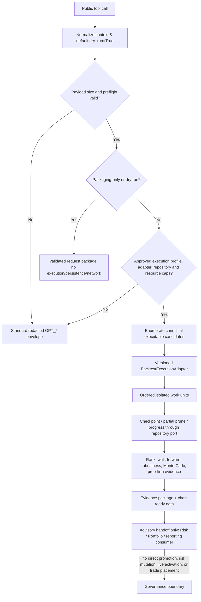

# Optimization Service - Architecture Requirements Document

## Scope and Traceability Basis

This architecture maps the Optimization Service specification to `app/services/optimization/` using focused module, file, and function boundaries. It treats pure calculation kernels as separate from candidate execution, repository writes, task scheduling, and public tool envelopes.

**Source-count note:** the source header reports **278 checkbox tasks**, while the tagged identifiers contained in that same source are **254 `OPT-FR` + 7 `OPT-NFR` + 24 `OPT-BR` = 285 tagged requirements**. This document maps all 285 tagged identifiers exactly once. The source’s unnumbered test, examples, documentation, and acceptance obligations are also mapped in Section 5.

**Scope boundary:** Optimization produces validated candidates, reproducible evidence packages, advisory recommendations, and downstream handoff data. It does not own production database provisioning, migrations, credentials, live broker gateways, trade placement, strategy promotion, risk-limit mutation, human approval, or live activation.

## 1. System Boundary Diagram (file structure)

```text
app/services/optimization/
├── __init__.py                              # public registry only; lazy/import-safe
├── api/
│   └── tool_boundary.py                      # standard envelope, context, dry-run/package boundary
├── contracts/
│   ├── __init__.py
│   ├── models.py                             # typed requests/results/evidence contracts
│   ├── ports.py                              # repository, execution adapter, orchestrator protocols
│   └── errors.py                             # OPT_* typed error taxonomy
├── config/
│   └── execution_profiles.py                 # resource caps, monotonic timeout, overrides
├── validation/
│   └── preflight.py                          # request/data/objective/constraint/evidence validation
├── core/
│   ├── canonicalization.py                   # canonical JSON, SHA-256, candidate identity
│   ├── candidates.py                         # candidate construction/ranking/stability
│   ├── scoring.py                             # pure objective and Pareto scoring
│   └── anti_overfit.py                        # pure evidence gates and caveats
├── algorithms/
│   ├── __init__.py
│   ├── runner.py                              # algorithm-neutral run coordination
│   ├── grid.py                                # memory-bounded grid iterator/search
│   ├── random_search.py                       # seeded random/Sobol/LHS sampling
│   ├── bayesian.py                            # optional Bayesian backend wrapper
│   └── genetic.py                             # seeded evolutionary search
├── time_series/
│   ├── splits.py                              # rolling/expanding/CPCV, purge and embargo
│   └── walk_forward.py                        # fold execution and WFE/OOS evidence
├── robustness/
│   ├── __init__.py
│   ├── requests.py                            # stress/OOS/MC request packaging
│   ├── monte_carlo.py                         # bootstrap and uncertainty simulations
│   ├── scenario_simulations.py                # parametric/loss/target/multi-entry kernels
│   └── prop_firm.py                           # versioned compliance evidence
├── execution/
│   ├── __init__.py
│   ├── strategy_loader.py                     # strategy class/factory/path resolution
│   ├── backtest_adapter.py                    # versioned single-candidate backtest adapter
│   ├── orchestrator.py                        # tasks, isolated work units, pruning
│   └── progress.py                            # synchronized progress and workload estimates
├── persistence/
│   ├── repository.py                          # repository-facing lifecycle/idempotency behavior
│   ├── checkpoints.py                         # recovery/atomic artifact durability
│   └── candidate_cache.py                     # lineage-driven invalidation
├── evidence/
│   ├── packages.py                            # complete advisory evidence and handoffs
│   └── reports.py                             # evidence-only report formatting
├── portfolio/
│   └── periodic.py                             # periodic weights and non-UI inspection payload
├── examples/
│   └── usage_examples.py                      # runnable, focused examples only
└── tests/                                     # unit/contract/regression/coverage evidence
```

### Execution Relations

1. The public tool boundary only normalizes context, validates, packages, and returns standard envelopes. It defaults `dry_run=True` unless explicitly overridden under an approved execution profile.
2. Pure core and algorithm files derive candidates, hashes, rankings, splits, scores, simulations, and evidence from explicit inputs.
3. Candidate execution crosses only the versioned `BacktestExecutionAdapter` port. Task dispatch crosses only the `ExecutionOrchestrator` port. Durable state crosses only the `OptimizationRepository` port.
4. Evidence and reporting consume completed results; they do not recompute hidden metrics, render UI, or make governance decisions.

## 2. Interfaces diagrams (Mermaid diagrams)

### 2.1 Contract collaboration diagram

```mermaid
classDiagram
    direction LR
    class OptimizationToolBoundary {
      +package_optimization_request(request, context) OptimizationRequestPackage
      +optimization_tool_result(tool_name, outcome, context) OptimizationEnvelope
    }
    class PreflightValidator {
      +validate_optimization_request(request) ValidationResult
      +validate_parameter_space(space) ValidationResult
    }
    class CandidateFactory {
      +build_executable_candidate(space, values, lineage) OptimizationCandidate
      +candidate_hash(lineage, parameters) str
    }
    class ScoringEngine {
      +score(metrics, objective) ScoreResult
      +select_pareto_front(candidates, policy) ParetoSelection
    }
    class BacktestExecutionAdapter {
      <<Protocol>>
      +execute(request) EngineOptimizationResult
    }
    class ExecutionOrchestrator {
      <<Protocol>>
      +submit(work) TaskReference
      +map_ordered(work_units) WorkUnitOutcome*
    }
    class OptimizationRepository {
      <<Protocol>>
      +save_run(run) SaveReceipt
      +load_checkpoint(run_id) CheckpointArtifact
    }
    class EvidenceAssembler {
      +build_evidence_package(summary, assessments) EvidencePackage
      +build_risk_handoff(package) RiskGovernorHandoffPackage
    }
    OptimizationToolBoundary --> PreflightValidator : validates
    PreflightValidator --> CandidateFactory : allows
    CandidateFactory --> ScoringEngine : supplies candidates
    ScoringEngine --> BacktestExecutionAdapter : evaluates only via
    BacktestExecutionAdapter --> ExecutionOrchestrator : scheduled through
    ExecutionOrchestrator --> OptimizationRepository : checkpoint/progress/audit
    OptimizationRepository --> EvidenceAssembler : persisted evidence
    ScoringEngine --> EvidenceAssembler : derived assessments
```



### 2.2 Safe public-tool and execution flow



### 2.3 Required interface contracts

| Contract | Required responsibility | Ownership boundary |
|---|---|---|
| `BacktestExecutionAdapter` | Execute exactly one validated candidate using a versioned synchronous backtest/simulator pathway. | Optimization owns the protocol; simulator/backtest implementation remains injected. |
| `ExecutionOrchestrator` | Submit isolated serializable work units, preserve deterministic aggregation order, expose early-stop/prune hooks. | Optimization owns the protocol; no direct multiprocessing inside core service logic. |
| `OptimizationRepository` | Persist run state, candidates, results, checkpoints, evidence, audit data; support idempotent resume/cancel/progress operations. | Optimization owns contract/payload semantics; persistence deployment ownership stays external unless assigned. |
| `OptimizerBackend` | Provide optional approved search backend behavior (such as Bayesian backend) behind a stable contract. | Optional dependencies are isolated and version-pinned. |
| `MonotonicClock` | Provide monotonic elapsed-time reads for deadline enforcement. | Injected/standard-library support; never uses wall-clock arithmetic for timeout logic. |

## 3. Functional Requirements

### 📂 Module: `optimization`

**Boundary Role:** Optimization domain package and intentional public tool registry.

#### 📄 File: `__init__.py`

**File Boundary:** Public package gatekeeper. It exposes only intentional, callable, documented optimization tool wrappers and performs no initialization with external side effects.

**Requirement Title:** Import-safe public registry and foundation declarations

**Description:** Keeps package imports side-effect free, resolves lower-level attributes lazily, and maintains a deliberately narrow public service tool registry.

**Requirements (verbatim):**

- **OPT-FR-005**: The module shall perform no broker, database, network, multiprocessing, or heavy dependency initialization at import time.
- **OPT-FR-008**: No file-specific non-functional requirements defined.
- **OPT-FR-009**: No file-specific testing requirements defined.
- **OPT-FR-010**: No file-specific functional requirements defined. Foundation properties apply.
- **OPT-FR-011**: No file-specific non-functional requirements defined.
- **OPT-FR-012**: No file-specific testing requirements defined.
- **OPT-FR-013**: No file-specific functional requirements defined. Foundation properties apply.
- **OPT-FR-014**: No file-specific non-functional requirements defined.
- **OPT-FR-015**: No file-specific testing requirements defined.
- **OPT-FR-109**: No file-specific functional requirements defined. Foundation properties apply.
- **OPT-FR-110**: No file-specific non-functional requirements defined.
- **OPT-FR-111**: No file-specific testing requirements defined.
- **OPT-FR-142**: No file-specific functional requirements defined. Foundation properties apply.
- **OPT-FR-143**: No file-specific non-functional requirements defined.
- **OPT-FR-144**: No file-specific testing requirements defined.
- **OPT-FR-179**: Lazy attribute resolution shall resolve lower-level optimization service attributes without putting business logic in the package initializer.
- **OPT-FR-211**: The optimization registry must expose only intentional public service tools through `app.services.optimization.__all__`.
- **OPT-FR-212**: The optimization registry must keep exports unique, callable, documented, and synchronized with tests and catalog entries.

**Target Class/Function:**
- `__getattr__(name: str) -> object` — Lazy resolution; may import an approved internal attribute only when requested, but performs no business computation.
- `list_optimization_tools() -> tuple[ToolDescriptor, ...]` — Pure; returns the immutable official-tool catalog derived from explicit exports.
- `validate_public_registry() -> RegistryValidationResult` — Pure; checks unique, callable, documented registry entries and catalog synchronization metadata.

### 📂 Module: `optimization/api`

**Boundary Role:** Official AI/API optimization tool boundary.

#### 📄 File: `tool_boundary.py`

**File Boundary:** Agent/API-facing optimization tool boundary. It normalizes standard context, applies default dry-run behavior, constructs a standard envelope, and never exposes backend-specific objects.

**Requirement Title:** Official optimization tool envelopes and request packaging

**Description:** Separates safe request packaging from compute-capable workflows, enforces JSON-safe response material, attaches side-effect metadata, and retains business fields separately from standard context.

**Requirements (verbatim):**

- **OPT-FR-007**: Public result payloads shall be JSON-safe before envelope return. `NaN`, `Infinity`, and `-Infinity` shall serialize as `null` with a warning; `datetime` values shall serialize as UTC ISO-8601 strings; `Decimal` values shall serialize as normalized strings unless a schema declares a numeric representation; unsupported objects shall fail closed with `OPT_JSON_SERIALIZATION_FAILED`.
- **OPT-FR-024**: `compare_optimization_runs` shall package candidate optimization run IDs or result payloads for comparison.
- **OPT-FR-175**: `optimization_tool_result` shall build the standard HaruQuant optimization result envelope.
- **OPT-FR-176**: `optimization_tool_context` shall extract request ID, agent name, environment, and dry-run context from tool keyword arguments.
- **OPT-FR-177**: `optimization_business_payload` shall remove standard context fields and retain only business request fields.
- **OPT-FR-178**: `package_optimization_request` shall create deterministic request packages without running compute-heavy optimization jobs.
- **OPT-FR-200**: Error responses must be structured, traceable, and safe for API/agent consumption.
- **OPT-FR-203**: Registry changes must remain covered by tests and catalog updates.
- **OPT-FR-207**: Error codes shall use deterministic enum-style values and optimization-specific errors shall use the `OPT_` prefix. Custom optimization exceptions and error codes must inherit and reuse exceptions from `app.utils.errors` to prevent duplicate declaration.
- **OPT-FR-208**: Each requirement shall include a stable requirement ID, priority, scope tier, owner, acceptance criteria, and one or more mapped tests before Builder handoff.
- **OPT-FR-209**: Requirement priorities shall distinguish `P0 safety`, `P0 contract`, `P1 current public tool`, `P2 internal rebuild`, and `P3 future`.
- **OPT-FR-210**: Confirmed requirements, assumptions, proposed decisions, pending decisions, and future improvements shall remain separated.
- **OPT-FR-213**: Public service tools that package work must not execute live broker actions or mutate production strategy state.
- **OPT-FR-214**: When a caller omits `dry_run`, public optimization tools shall default to `dry_run=True`.
- **OPT-FR-215**: Official optimization tools shall never place trades, close broker positions, access live broker gateways, or return `approved_for_live_trading`.
- **OPT-FR-216**: Official optimization tools shall include side-effect metadata with `places_trade=False`.
- **OPT-FR-220**: Optional backend-specific objects shall not leak into official tool responses.

**Target Class/Function:**
- `optimization_tool_context(kwargs: Mapping[str, object]) -> OptimizationToolContext` — Pure; extracts request ID, agent name, environment, approval, and dry-run context.
- `optimization_business_payload(kwargs: Mapping[str, object]) -> Mapping[str, object]` — Pure; removes standard tool context fields while preserving business request fields.
- `package_optimization_request(request: OptimizationRequest, context: OptimizationToolContext) -> OptimizationRequestPackage` — Pure; validates and packages work without candidate execution, persistence, networking, or background jobs.
- `optimization_tool_result(tool_name: str, outcome: ToolOutcome, context: OptimizationToolContext) -> OptimizationEnvelope` — Pure; builds the documented, JSON-safe standard envelope.
- `sanitize_public_payload(value: object) -> JsonSafePayload` — Pure; converts finite values, UTC datetimes, and decimals according to schema policy; fails closed on unsupported values.

### 📂 Module: `optimization/contracts`

**Boundary Role:** Typed domain contracts, ports, and errors.

#### 📄 File: `models.py`

**File Boundary:** Typed immutable contracts for requests, candidates, results, simulation responses, summaries, and evidence-facing metadata.

**Requirement Title:** Optimization domain models and canonical result contracts

**Description:** Defines versioned optimization inputs and results without running algorithms, accessing repositories, or mutating strategy and trading state.

**Requirements (verbatim):**

- **OPT-FR-001**: Optimization workflows shall record reproducibility context including `strategy_id`, parameter-space definition including constraints, objective, data window start/end, engine type, engine version, seed, cost model hash, simulator realism profile hash, module version, parameter-space hash, candidate hashes, and all candidate results required to reproduce ranking and report outputs.
- **OPT-FR-017**: Optimization outputs shall include objective, executable parameters, candidate score, data slice, algorithm name and version, seed, engine type and version, cost model hash, simulator realism profile hash, parameter-space hash, candidate hash, warnings, and caveats.
- **OPT-FR-023**: Final optimization output states shall use the canonical enum `ready_for_risk_review`, `validation_needed`, `research_only`, `rejected`, `failed`, or `cancelled`; all requirements, schemas, tests, examples, and reports shall use these exact values.
- **OPT-FR-062**: `RobustnessRequest`, `RobustnessStats`, and `RobustnessResponse` shall model robustness simulation inputs and outputs.
- **OPT-FR-071**: `MonteCarloResult` shall hold Monte Carlo simulation outputs and provide summary/statistics behavior.
- **OPT-FR-131**: `ManualPairInput`, `RandomWinRateRequest`, `RandomWinRatePair`, `DistributionStats`, `RandomWinRateResult`, and `RandomWinRateResponse` shall model random win-rate simulation inputs and outputs.
- **OPT-FR-184**: `EngineOptimizationResult` shall expose a small optimization-facing result contract built from engine outputs.
- **OPT-FR-238**: `OptimizationResult` shall represent one candidate optimization result with parameters, score, metrics, and metadata.
- **OPT-FR-239**: `OptimizationSummary` shall represent an optimization run summary and expose top-N and dataframe conversion behavior.
- **OPT-FR-240**: `UnsupervisedConfigRequest`, `UnsupervisedRunSummary`, and `UnsupervisedAnalysisRequest` shall model unsupervised-analysis configuration and output attached to optimization flows.
- **OPT-FR-241**: `ParameterRange` shall model a named parameter range for optimization requests.
- **OPT-FR-242**: `OptimizationRequest`, `OptimizationResponse`, `OptimizationRunDetails`, and `OptimizationResultItem` shall model optimization request, response, run detail, and result item payloads.
- **OPT-FR-243**: `PositionSizingRequest` shall model position-sizing simulation requests.
- **OPT-FR-244**: `WalkForwardRequest`, `WalkForwardWindow`, and `WalkForwardResponse` shall model walk-forward analysis inputs and outputs.
- **OPT-FR-245**: `MonteCarloRequest`, `ParametricMonteCarloRequest`, and `MonteCarloResponse` shall model Monte Carlo inputs and outputs.
- **OPT-FR-246**: `ConsecutiveLosingRequest`, `ConsecutiveLosingScenario`, and `ConsecutiveLosingResponse` shall model consecutive-loss simulation inputs and outputs.
- **OPT-FR-247**: `ProfitTargetRequest`, `ProfitTargetResult`, and `ProfitTargetResponse` shall model profit-target simulation inputs and outputs.
- **OPT-FR-248**: `MultiEntryRequest`, `MultiEntryScenarioResult`, and `MultiEntryResponse` shall model multi-entry simulation inputs and outputs.

**Target Class/Function:**
- `OptimizationRequest.validate() -> ValidationResult` — Pure; validates request shape and declares deterministic field errors.
- `OptimizationResult.to_record() -> Mapping[str, JsonValue]` — Pure; emits one JSON-safe candidate result with parameters, score, metrics, and metadata.
- `OptimizationSummary.top_n(limit: int) -> tuple[OptimizationResult, ...]` — Pure; returns a deterministic ranked prefix.
- `OptimizationSummary.to_dataframe_payload() -> TabularPayload` — Pure; returns a serializable tabular payload rather than a raw dataframe.
- `MonteCarloResult.summary() -> MonteCarloStatistics` — Pure; derives simulation statistics from stored outcomes.

#### 📄 File: `ports.py`

**File Boundary:** Dependency-inversion contracts for persistence, candidate execution, optimization orchestration, and optional optimizer backends.

**Requirement Title:** Repository, execution adapter, and orchestration interfaces

**Description:** Defines interfaces owned by Optimization while leaving database provisioning, migrations, credentials, and concrete deployment operations outside the core module.

**Requirements (verbatim):**

- **OPT-FR-157**: Optional Optuna and scikit-optimize backends shall sit behind a stable optimizer backend interface and shall require dependency approval, version pinning, repository policy approval, and contract tests before production use.
- **OPT-FR-158**: Future Ray, Dask, or Celery adapters shall remain deferred until repository idempotency, retry behavior, and resource accounting are production-mature.
- **OPT-FR-159**: The module shall own repository contracts and payload schemas, but shall not own production database provisioning, migrations, credentials, or operations unless explicitly assigned by architecture decision.
- **OPT-FR-160**: Concrete repository adapters shall be owned by the approved persistence layer unless explicitly assigned to this module by architecture decision.
- **OPT-FR-161**: Repository implementations shall be passed into execution-capable workflows through Dependency Injection rather than imported or constructed by optimization core code.
- **OPT-FR-162**: Repository backend support for in-memory fixtures, JSONL fixtures, SQLite, DuckDB/Parquet, PostgreSQL, or managed PostgreSQL-compatible databases shall require deployment-tier approval before production use.
- **OPT-FR-187**: Candidate execution shall occur only through a versioned `BacktestExecutionAdapter`.
- **OPT-FR-188**: The backtest adapter shall validate required data columns, strategy compatibility, cost model, engine type, deterministic seed behavior, and adapter version before execution.
- **OPT-FR-189**: Backtest adapter version mismatch shall fail closed before execution.
- **OPT-FR-233**: The service layer shall depend on an `ExecutionOrchestrator` abstraction rather than direct multiprocessing.
- **OPT-FR-234**: Local sequential and local multiprocessing orchestration shall preserve deterministic aggregation order and equivalent failure isolation.
- **OPT-FR-235**: The `ExecutionOrchestrator` shall support backend-neutral early-stopping and pruning hooks.

**Target Class/Function:**
- `BacktestExecutionAdapter.execute(request: CandidateExecutionRequest) -> EngineOptimizationResult` — Side-effect boundary; executes one approved candidate through the versioned simulator/backtest adapter.
- `OptimizationRepository.save_run(run: OptimizationRunRecord) -> SaveReceipt` — Side-effect boundary; persists only through an injected approved repository implementation.
- `OptimizationRepository.load_checkpoint(run_id: str) -> CheckpointArtifact | None` — Side-effect boundary; reads checkpoint state through an approved repository.
- `ExecutionOrchestrator.submit(work: OptimizationWorkUnit) -> TaskReference` — Side-effect boundary; delegates scheduling without direct multiprocessing in service code.
- `ExecutionOrchestrator.map_ordered(work_units: Iterable[OptimizationWorkUnit]) -> Iterable[WorkUnitOutcome]` — Side-effect boundary; preserves deterministic aggregate ordering and isolates work-unit failures.

#### 📄 File: `errors.py`

**File Boundary:** Optimization-specific typed error catalog and structured error conversion, reusing shared error foundations rather than creating a duplicate cross-domain hierarchy.

**Requirement Title:** Deterministic optimization error taxonomy

**Description:** Maps candidate, adapter, dependency, checkpoint, noisy-objective, and serialization failures to safe `OPT_*` error results.

**Requirements (verbatim):**

- **OPT-FR-152**: The module shall include `OPT_ATOMIC_WRITE_FAILED`, `OPT_CHECKPOINT_CORRUPTED`, `OPT_INTRADAY_RULE_DATA_UNAVAILABLE`, `OPT_PROP_FIRM_INTRADAY_EVALUATION_REQUIRED`, `OPT_TRIAL_COUNT_METHOD_UNSUPPORTED`, `OPT_PRUNED_BY_HARD_GATE`, `OPT_PBO_THRESHOLD_FAILED`, and `OPT_NOISY_OBJECTIVE_NOT_ALLOWED` with subtype `STOCHASTIC_REALISM_CONFLICT` where applicable.
- **OPT-FR-186**: Execution helpers shall return or raise structured `OptimizationExecutionError` results with deterministic `OPT_EXECUTION_FAILED`, `OPT_STRATEGY_LOAD_FAILED`, `OPT_ENGINE_CREATION_FAILED`, `OPT_SYMBOL_SETUP_FAILED`, or `OPT_CANDIDATE_EXECUTION_FAILED` codes when strategy loading, engine creation, symbol setup, or candidate execution fails.
- **OPT-FR-190**: Unsupported simulator realism shocks shall return structured unsupported-feature errors and shall not be silently ignored.
- **OPT-FR-191**: Deterministic-only noisy-objective mode shall fail closed with `OPT_NOISY_OBJECTIVE_NOT_ALLOWED` when stochastic simulator realism is active, and failure details shall include conflict subtype `STOCHASTIC_REALISM_CONFLICT`.
- **OPT-FR-201**: Optional lower-level dependencies shall either use a documented fallback or return a structured dependency error such as `OPT_SAMPLER_UNAVAILABLE`, `OPT_OPTIMIZER_BACKEND_UNAVAILABLE`, or `OPT_DEPENDENCY_UNAVAILABLE`; unhandled `ImportError` or backend-specific exceptions shall not cross public tool boundaries.
- **OPT-FR-202**: Logs, traces, reports, and errors shall redact secrets, credentials, authorization headers, private trade payloads, sensitive file paths, and environment variables.

**Target Class/Function:**
- `optimization_error(code: OptimizationErrorCode, message: str, details: Mapping[str, JsonValue] | None = None) -> OptimizationError` — Pure; constructs a typed, redacted domain error.
- `map_execution_failure(error: Exception, phase: ExecutionPhase) -> OptimizationExecutionError` — Pure; maps approved failure classes to deterministic `OPT_*` codes.
- `dependency_unavailable(feature: str, dependency: str) -> OptimizationError` — Pure; returns a structured optional-dependency error without leaking backend exceptions.

### 📂 Module: `optimization/config`

**Boundary Role:** Validated execution configuration and resource policy.

#### 📄 File: `execution_profiles.py`

**File Boundary:** Validated resource, timeout, retry, and safety configuration. It establishes caps before work reaches algorithms or infrastructure adapters.

**Requirement Title:** Resource caps, monotonic timeouts, and execution profiles

**Description:** Centralizes maximum candidate, iteration, population, bootstrap, simulation, worker, payload, and timeout policies. Core algorithms receive validated values only.

**Requirements (verbatim):**

- **OPT-FR-006**: Timeout enforcement shall use a monotonic clock source such as `time.monotonic()` or `time.perf_counter()` so NTP adjustments or wall-clock changes cannot cause premature timeout or infinite hangs.
- **OPT-FR-016**: Parameter spaces, iteration counts, population sizes, bootstrap counts, simulation counts, and worker counts must be bounded before production use.
- **OPT-FR-117**: Strict iterator mode shall stay within an owner-approved memory budget regardless of grid size; the budget value remains pending owner/architect approval.
- **OPT-FR-196**: Proposed engineering baseline: public packaging responses should complete in `<= 200 ms` under owner-approved payload-size limits, subject to owner finalization and benchmark validation.
- **OPT-FR-205**: Resource caps shall fail closed by default unless an explicitly approved override is present.

**Target Class/Function:**
- `validate_execution_profile(profile: ExecutionProfile) -> ValidationResult` — Pure; rejects unbounded or invalid resource settings.
- `monotonic_deadline(timeout_seconds: float, clock: MonotonicClock) -> Deadline` — Pure; derives a deadline from monotonic time.
- `assert_resource_caps(request: OptimizationRequest, profile: ExecutionProfile) -> None` — Pure; fails closed when requested work exceeds approved caps.
- `estimate_packaging_latency(request: OptimizationRequest) -> LatencyEstimate` — Pure; supports the approved packaging-latency target without executing work.

### 📂 Module: `optimization/validation`

**Boundary Role:** Pre-execution safety and input validation.

#### 📄 File: `preflight.py`

**File Boundary:** Pre-execution request, strategy-compatibility, data-quality, objective, parameter-space, and evidence-package validation.

**Requirement Title:** Preflight validation and safe constraint evaluation

**Description:** Validates all expensive-work inputs before candidate execution or durable persistence and blocks unsafe constraint expressions.

**Requirements (verbatim):**

- **OPT-FR-002**: The module shall validate optimization requests, strategy compatibility, market data quality, parameter spaces, objective definitions, and evidence-package shape before running expensive work or persisting artifacts.
- **OPT-FR-020**: Request-packaging tools shall not trigger candidate execution, persistence writes, external network calls, or background jobs unless explicitly documented and approved.
- **OPT-FR-021**: The module shall support float, integer, categorical, boolean, fixed, conditional, and constrained parameter spaces.
- **OPT-FR-022**: Parameter constraints shall be evaluated before candidate execution, and unsafe constraint expressions shall be blocked.

**Target Class/Function:**
- `validate_optimization_request(request: OptimizationRequest) -> ValidationResult` — Pure; validates request, objective, input sizes, strategy compatibility, and market-data prerequisites.
- `validate_parameter_space(space: ParameterSpace) -> ValidationResult` — Pure; validates float, integer, categorical, boolean, fixed, conditional, and constrained definitions.
- `evaluate_constraint(constraint: ConstraintDefinition, values: Mapping[str, ScalarValue]) -> ConstraintOutcome` — Pure; evaluates only approved parsed constraints and blocks unsafe expressions.
- `validate_evidence_package_shape(package: EvidencePackage) -> ValidationResult` — Pure; validates schema and required evidence fields before persistence or handoff.

### 📂 Module: `optimization/core`

**Boundary Role:** Pure optimization identity, ranking, scoring, and assessment kernels.

#### 📄 File: `canonicalization.py`

**File Boundary:** Canonical, deterministic normalization and hashing of parameter spaces and executable candidates.

**Requirement Title:** Canonical parameter-space and candidate hashing

**Description:** Makes hashes order-invariant by normalizing decimals, sorting keys, retaining constraints, and excluding inactive conditional parameters from executable identities.

**Requirements (verbatim):**

- **OPT-FR-004**: `parameter_space_hash` shall be order-invariant, shall sort dictionary keys, shall canonicalize parameter definitions, and shall include constraints after canonical sorting and normalization.
- **OPT-FR-039**: `candidate_hash` shall be the source of truth for candidate deduplication and shall deterministically combine strategy hash, data hash, cost model hash, simulator realism profile hash, objective hash, engine type, module version, and canonicalized sorted executable parameter values.
- **OPT-FR-040**: `candidate_hash` shall exclude inactive conditional parameters and shall use canonical JSON with sorted keys and normalized decimals.
- **OPT-FR-204**: Hashing shall use SHA-256 over canonical JSON with sorted keys and normalized decimals, with decimals quantized to eight decimal places by default unless field-specific precision is declared.

**Target Class/Function:**
- `canonicalize_parameter_space(space: ParameterSpace) -> CanonicalParameterSpace` — Pure; canonicalizes parameter definitions and sorted normalized constraints.
- `parameter_space_hash(space: ParameterSpace) -> str` — Pure; computes SHA-256 over canonical parameter-space JSON.
- `canonicalize_executable_parameters(space: ParameterSpace, values: Mapping[str, ScalarValue]) -> Mapping[str, ScalarValue]` — Pure; removes inactive conditional values and normalizes decimals.
- `candidate_hash(lineage: CandidateLineage, parameters: Mapping[str, ScalarValue]) -> str` — Pure; computes the deduplication identity from versioned lineage plus canonical executable parameters.

#### 📄 File: `candidates.py`

**File Boundary:** Candidate formation, deterministic ranking, parameter stability, overfit-gap analysis, and cache-safe constraint rejection representation.

**Requirement Title:** Candidate lifecycle, ranking, and stability analysis

**Description:** Keeps candidate result construction and deterministic rank ordering pure; execution and durable storage remain outside this file.

**Requirements (verbatim):**

- **OPT-FR-025**: `calculate_parameter_stability` shall calculate standard-deviation-style stability by parameter across selected candidates.
- **OPT-FR-026**: `detect_overfit_parameters` shall detect overfit risk from the gap between in-sample and out-of-sample scores.
- **OPT-FR-027**: `rank_parameter_sets` shall rank optimization parameter candidates deterministically from highest score to lowest score.
- **OPT-FR-028**: `rank_parameter_sets` tie-breaking shall sort tied scores by `trade_count` descending when available, then by `candidate_hash` ascending; missing `trade_count` shall sort after present `trade_count` for the same score.
- **OPT-FR-088**: Inactive conditional parameters shall be excluded from executable candidate parameters, candidate hashes, backtest adapter payloads, scoring, and strategy invocation, while remaining available only in metadata or audit records.
- **OPT-FR-102**: `nominal_trial_count` shall be calculated from unique executable candidate hashes after canonical normalization, inactive conditional exclusion, constraint rejection, and cache deduplication.
- **OPT-FR-103**: If topology-adjusted or effective-trial estimation is enabled, evidence shall include `effective_trial_count`, `trial_count_method`, and any required method metadata.
- **OPT-FR-104**: Evidence shall include `trial_count_independence_warning` when nominal counts may overstate independence in highly correlated, Bayesian, exploitative, or highly constrained parameter spaces.
- **OPT-FR-105**: `nominal_trial_count` shall not be presented as a statistically independent trial count unless the configured method explicitly supports that interpretation.
- **OPT-FR-171**: Constraint violations shall be persisted or represented in audit-ready evidence and shall not be sent to the backtest adapter for execution.

**Target Class/Function:**
- `build_executable_candidate(space: ParameterSpace, proposed_values: Mapping[str, ScalarValue], lineage: CandidateLineage) -> OptimizationCandidate` — Pure; filters inactive values, applies constraints, and creates canonical identity.
- `rank_parameter_sets(candidates: Sequence[OptimizationResult]) -> tuple[OptimizationResult, ...]` — Pure; ranks score descending, trade count descending when present, then candidate hash ascending.
- `calculate_parameter_stability(candidates: Sequence[OptimizationResult]) -> ParameterStabilityReport` — Pure; calculates standard-deviation-style stability per parameter.
- `detect_overfit_parameters(candidates: Sequence[OptimizationResult]) -> OverfitParameterReport` — Pure; detects risk from in-sample versus out-of-sample score gaps.
- `nominal_trial_count(candidates: Iterable[OptimizationCandidate]) -> int` — Pure; counts unique valid executable candidate hashes after normalization, rejections, and deduplication.

#### 📄 File: `scoring.py`

**File Boundary:** Pure objective and fitness calculations over normalized candidate metrics.

**Requirement Title:** Objective scoring, multi-objective fitness, and deterministic Pareto selection

**Description:** Scores candidate results without persistence, backtest calls, or mutation, including deterministic missing-metric fallback behavior.

**Requirements (verbatim):**

- **OPT-FR-090**: `sharpe_score` shall score results using Sharpe ratio.
- **OPT-FR-091**: `sortino_score` shall score results using Sortino ratio.
- **OPT-FR-092**: `calmar_score` shall score results using Calmar ratio.
- **OPT-FR-093**: `profit_factor_score` shall score results using profit factor.
- **OPT-FR-094**: `total_return_score` shall score results using total return percentage.
- **OPT-FR-095**: `custom_score` shall calculate a weighted composite from return, Sharpe, and drawdown components.
- **OPT-FR-096**: `optimization_get_scoring_func` shall resolve supported objective names to scoring functions.
- **OPT-FR-097**: Scoring helpers shall handle missing metrics with deterministic fallback behavior.
- **OPT-FR-098**: Candidate scoring shall support single-objective, weighted multi-objective, constraint-based, and Pareto-ready scoring.
- **OPT-FR-099**: Pareto selection shall be deterministic and shall record fallback behavior for knee-point selection when used.

**Target Class/Function:**
- `sharpe_score(metrics: CandidateMetrics) -> ScoreResult` — Pure; derives an objective score from Sharpe ratio.
- `sortino_score(metrics: CandidateMetrics) -> ScoreResult` — Pure; derives an objective score from Sortino ratio.
- `calmar_score(metrics: CandidateMetrics) -> ScoreResult` — Pure; derives an objective score from Calmar ratio.
- `profit_factor_score(metrics: CandidateMetrics) -> ScoreResult` — Pure; derives an objective score from profit factor.
- `total_return_score(metrics: CandidateMetrics) -> ScoreResult` — Pure; derives an objective score from total return percent.
- `custom_score(metrics: CandidateMetrics, weights: CompositeWeights) -> ScoreResult` — Pure; calculates weighted return, Sharpe, and drawdown components.
- `optimization_get_scoring_func(objective: ObjectiveDefinition) -> ScoringFunction` — Pure; resolves a supported objective to a typed scoring function.
- `select_pareto_front(candidates: Sequence[OptimizationResult], policy: ParetoPolicy) -> ParetoSelection` — Pure; provides deterministic Pareto and knee-point fallback selection.

#### 📄 File: `anti_overfit.py`

**File Boundary:** Pure anti-overfitting assessment and candidate caveat generation.

**Requirement Title:** Anti-overfitting gates and advisory readiness caveats

**Description:** Evaluates chronological degradation, stability, concentration, realistic-cost survival, DSR, multiple testing, topology, leakage, and capacity without granting live readiness.

**Requirements (verbatim):**

- **OPT-FR-041**: Optimization workflows must warn about overfitting, parameter instability, and robustness weaknesses instead of presenting candidate scores as live readiness.
- **OPT-FR-061**: Candidate scoring shall support return, net profit, Sharpe, Sortino, Calmar, profit factor, expectancy, win rate, drawdown, trade count, exposure, turnover, cost-adjusted return, OOS retention, fold consistency, robustness survival, Monte Carlo p5 outcome, and prop-firm breach probability.
- **OPT-FR-100**: Anti-overfitting gates shall evaluate in-sample versus out-of-sample degradation, walk-forward consistency, parameter neighborhood smoothness, top-candidate clustering, profit concentration, trade count adequacy, cost sensitivity, Monte Carlo survival, regime dependency, Deflated Sharpe Ratio, multiple-testing correction, topology stability, leakage prevention, and capacity degradation.
- **OPT-FR-101**: Every scored candidate shall include raw Sharpe, deflated Sharpe, multiple-testing method, nominal or effective trial count metadata, Sharpe variance estimate, MTB pass status, and MTB rejection reason.
- **OPT-FR-106**: PBO threshold enforcement shall remain blocked until the designated risk owner approves production, strict-capital, research-only, and exploratory-validation thresholds.

**Target Class/Function:**
- `evaluate_anti_overfit_gates(evidence: CandidateEvidence, policy: OverfitPolicy) -> AntiOverfitAssessment` — Pure; evaluates all configured overfit gates.
- `calculate_deflated_sharpe(inputs: DeflatedSharpeInputs) -> DeflatedSharpeResult` — Pure; calculates raw/deflated Sharpe evidence and variance metadata.
- `build_trial_count_disclosure(evidence: TrialCountEvidence) -> TrialCountDisclosure` — Pure; records nominal/effective counts, methods, and independence warnings.
- `readiness_caveats(evidence: CandidateEvidence) -> tuple[WarningRecord, ...]` — Pure; emits no-live-readiness caveats for sample, OOS, robustness, or instability weaknesses.

### 📂 Module: `optimization/algorithms`

**Boundary Role:** Candidate search methods and algorithm-neutral coordination.

#### 📄 File: `runner.py`

**File Boundary:** Algorithm-neutral orchestration of validated candidate enumeration, objective use, reproducibility context, and summary formation.

**Requirement Title:** Search-run coordination and algorithm-neutral summaries

**Description:** Coordinates validated search inputs and returns a deterministic summary while delegating actual candidate execution to the injected adapter and orchestration port.

**Requirements (verbatim):**

- **OPT-FR-019**: Repeated deterministic runs with the same inputs shall produce the same candidate ordering, same candidate hashes, same parameter-space hash, and same evidence when backtest execution is deterministic.
- **OPT-FR-029**: Search methods shall return optimization summaries containing candidate results, best parameters, best score, objective, runtime, and total-run metadata.
- **OPT-FR-089**: Search methods shall support objective/scoring functions, initial balance, symbol, engine type, max workers, verbosity, progress callbacks, and reproducibility controls where implemented.
- **OPT-FR-112**: `run_parameter_sweep` shall package a grid or random parameter search request for downstream optimization execution.
- **OPT-FR-113**: `run_parameter_sweep` shall require `search_method` with approved values `grid`, `random`, `latin_hypercube`, or `sobol`; distribution-based methods shall include validated distribution definitions instead of grid-only parameter lists.

**Target Class/Function:**
- `run_search(request: SearchRequest, adapter: BacktestExecutionAdapter, orchestrator: ExecutionOrchestrator) -> OptimizationSummary` — Side-effect boundary; coordinates approved candidate work and aggregates deterministic results.
- `run_parameter_sweep(request: ParameterSweepRequest, context: OptimizationToolContext) -> OptimizationRequestPackage` — Pure; packages a grid/random/Latin-Hypercube/Sobol request without execution.
- `build_search_summary(results: Sequence[OptimizationResult], metadata: SearchRunMetadata) -> OptimizationSummary` — Pure; constructs summary, best parameters, best score, runtime, and total-run metadata.

#### 📄 File: `grid.py`

**File Boundary:** Memory-bounded deterministic grid and distribution-aware sweep enumeration.

**Requirement Title:** Grid search and strict iterator expansion

**Description:** Provides exhaustive search without materializing an oversized Cartesian product and supports ordered parallel evaluation through the orchestration boundary.

**Requirements (verbatim):**

- **OPT-FR-114**: `grid_search` shall evaluate an exhaustive parameter grid over a supplied strategy/backtest context.
- **OPT-FR-115**: `optimization_grid_search` shall expose a user-facing wrapper for exhaustive parameter grid search.
- **OPT-FR-116**: Grid expansion shall support `100,000+` combinations through strict iterator mode that yields one candidate at a time and never materializes the full Cartesian product in memory.
- **OPT-FR-118**: `parallel_grid_search` shall run parameter-grid candidate evaluations across multiple workers.
- **OPT-FR-119**: No file-specific non-functional requirements defined.
- **OPT-FR-120**: No file-specific testing requirements defined.

**Target Class/Function:**
- `iter_grid_candidates(space: ParameterSpace) -> Iterator[OptimizationCandidate]` — Pure; yields one deterministic grid candidate at a time.
- `grid_search(request: GridSearchRequest, adapter: BacktestExecutionAdapter, orchestrator: ExecutionOrchestrator) -> OptimizationSummary` — Side-effect boundary; evaluates the strict iterator through approved execution.
- `optimization_grid_search(request: GridSearchRequest, context: OptimizationToolContext) -> OptimizationEnvelope` — Side-effect boundary; user-facing wrapper that respects dry-run and execution profile gates.
- `parallel_grid_search(request: GridSearchRequest, adapter: BacktestExecutionAdapter, orchestrator: ExecutionOrchestrator) -> OptimizationSummary` — Side-effect boundary; dispatches isolated work units while preserving deterministic aggregation.

#### 📄 File: `random_search.py`

**File Boundary:** Seed-controlled sampling and random-search algorithm behavior.

**Requirement Title:** Random, Sobol, and Latin Hypercube search

**Description:** Produces reproducible sampled candidates with pseudo-random fallback and explicit evidence for unavailable sampling backends.

**Requirements (verbatim):**

- **OPT-FR-121**: `random_search` shall sample parameter combinations from distributions and evaluate candidates.
- **OPT-FR-122**: `optimization_random_search` shall expose a user-facing wrapper for randomized parameter search.
- **OPT-FR-123**: Seeded random search shall support pseudo-random, Sobol sequence, and Latin Hypercube sampling contracts.
- **OPT-FR-124**: Pseudo-random sampling shall be the always-available deterministic fallback.
- **OPT-FR-128**: Monte Carlo and scenario simulations shall support reproducibility controls and must not claim certainty from randomized outputs.
- **OPT-FR-129**: Monte Carlo random number generation shall derive deterministic seeds from run seed, candidate ID, and phase-specific offsets.
- **OPT-FR-130**: `parallel_random_search` shall run sampled parameter candidate evaluations across multiple workers.
- **OPT-FR-132**: Random, Monte Carlo, Bayesian, and genetic workflows must support seed or random-state controls where practical.
- **OPT-FR-133**: No file-specific non-functional requirements defined.
- **OPT-FR-134**: No file-specific testing requirements defined.

**Target Class/Function:**
- `sample_candidates(space: ParameterSpace, sampler: SamplerPolicy, seed: int, count: int) -> tuple[OptimizationCandidate, ...]` — Pure; generates reproducible candidate samples or typed sampler-unavailable result.
- `random_search(request: RandomSearchRequest, adapter: BacktestExecutionAdapter, orchestrator: ExecutionOrchestrator) -> OptimizationSummary` — Side-effect boundary; evaluates sampled candidates.
- `optimization_random_search(request: RandomSearchRequest, context: OptimizationToolContext) -> OptimizationEnvelope` — Side-effect boundary; public wrapper with dry-run default.
- `derive_phase_seed(run_seed: int, candidate_id: str, phase_offset: int) -> int` — Pure; deterministically derives phase-specific random seeds.
- `parallel_random_search(request: RandomSearchRequest, adapter: BacktestExecutionAdapter, orchestrator: ExecutionOrchestrator) -> OptimizationSummary` — Side-effect boundary; dispatches sampled work in deterministic order.

#### 📄 File: `bayesian.py`

**File Boundary:** Optional Gaussian-process-style Bayesian optimization through a backend-neutral optimizer contract.

**Requirement Title:** Bayesian parameter optimization

**Description:** Provides a guarded Bayesian search wrapper whose optional backend is version-pinned and whose unavailability is structured rather than leaked.

**Requirements (verbatim):**

- **OPT-FR-135**: `bayesian_optimization` shall run Gaussian-process-style Bayesian optimization over a parameter space.
- **OPT-FR-136**: `optimization_bayesian` shall expose a user-facing wrapper for Bayesian parameter optimization.
- **OPT-FR-137**: No file-specific non-functional requirements defined.

**Target Class/Function:**
- `bayesian_optimization(request: BayesianOptimizationRequest, backend: OptimizerBackend, adapter: BacktestExecutionAdapter) -> OptimizationSummary` — Side-effect boundary; runs approved Bayesian search via the adapter.
- `optimization_bayesian(request: BayesianOptimizationRequest, context: OptimizationToolContext) -> OptimizationEnvelope` — Side-effect boundary; exposes user-facing packaging/execution behavior.

#### 📄 File: `genetic.py`

**File Boundary:** Seed-controlled evolutionary candidate generation and ranking.

**Requirement Title:** Genetic/evolutionary algorithm search

**Description:** Owns population initialization, selection, crossover, mutation, elitism, and deterministic result ranking while execution remains adapter-mediated.

**Requirements (verbatim):**

- **OPT-FR-138**: `genetic_algorithm` shall evolve parameter candidates through population, selection, crossover, mutation, and elitism behavior.
- **OPT-FR-139**: `optimization_genetic` shall expose a user-facing wrapper for genetic algorithm parameter optimization.
- **OPT-FR-140**: No file-specific non-functional requirements defined.
- **OPT-FR-141**: No file-specific testing requirements defined.

**Target Class/Function:**
- `genetic_algorithm(request: GeneticOptimizationRequest, adapter: BacktestExecutionAdapter, orchestrator: ExecutionOrchestrator) -> OptimizationSummary` — Side-effect boundary; evolves and evaluates isolated candidates.
- `initialize_population(space: ParameterSpace, seed: int, size: int) -> tuple[OptimizationCandidate, ...]` — Pure; deterministically produces initial candidates.
- `evolve_population(population: Sequence[OptimizationResult], policy: EvolutionPolicy, seed: int) -> tuple[OptimizationCandidate, ...]` — Pure; applies selection, crossover, mutation, and elitism.
- `optimization_genetic(request: GeneticOptimizationRequest, context: OptimizationToolContext) -> OptimizationEnvelope` — Side-effect boundary; public wrapper with tool context.

### 📂 Module: `optimization/time_series`

**Boundary Role:** Chronological validation splits and walk-forward analysis.

#### 📄 File: `splits.py`

**File Boundary:** Chronological split creation, purging, embargo enforcement, and deterministic CPCV path generation.

**Requirement Title:** Leakage-resistant time-series splitting

**Description:** Generates chronological train/validation/test windows and exposes split inspection data without executing optimization or mutating input data.

**Requirements (verbatim):**

- **OPT-FR-074**: No file-specific functional requirements defined. Foundation properties apply.
- **OPT-FR-075**: No file-specific non-functional requirements defined.
- **OPT-FR-076**: No file-specific testing requirements defined.
- **OPT-FR-078**: `run_walk_forward_matrix` shall package a matrix of walk-forward train/test combinations.
- **OPT-FR-079**: `splitter_from_rolling` shall create deterministic rolling time-series train/test windows.
- **OPT-FR-080**: `splitter_from_expanding` shall create deterministic expanding time-series train/test windows.
- **OPT-FR-081**: `splitter_rolling_split` shall split tabular data into rolling train/test or train/validation/test slices.
- **OPT-FR-082**: `SplitterResult` shall hold split windows and support plotting/inspection behavior.
- **OPT-FR-083**: Walk-forward validation shall support rolling, anchored, expanding, and custom fold modes.
- **OPT-FR-084**: Walk-forward and cross-validation splits shall enforce configurable purging and embargo periods between training and validation sets when required.
- **OPT-FR-085**: Evidence shall include embargo configuration, effective embargo bars, and leakage-prevention status for walk-forward and CPCV runs.
- **OPT-FR-221**: CPCV validation shall support deterministic path generation when enabled and shall enforce purging and embargo on every path.

**Target Class/Function:**
- `splitter_from_rolling(config: RollingSplitConfig) -> TimeSeriesSplitter` — Pure; builds deterministic rolling windows.
- `splitter_from_expanding(config: ExpandingSplitConfig) -> TimeSeriesSplitter` — Pure; builds deterministic expanding windows.
- `splitter_rolling_split(data: TabularDataRef, config: SplitConfig) -> SplitterResult` — Pure; creates rolling train/test or train/validation/test slices.
- `apply_purge_and_embargo(windows: Sequence[WalkForwardWindow], policy: EmbargoPolicy) -> tuple[WalkForwardWindow, ...]` — Pure; enforces gap controls and records effective embargo bars.
- `generate_cpcv_paths(config: CpcvConfig) -> tuple[CpcvPath, ...]` — Pure; deterministically creates purged, embargoed combinatorial paths.
- `build_split_evidence(result: SplitterResult) -> SplitEvidence` — Pure; returns embargo and leakage-prevention disclosure.

#### 📄 File: `walk_forward.py`

**File Boundary:** Walk-forward request packaging, fold optimization coordination, result analysis, and deterministic OOS evidence.

**Requirement Title:** Walk-forward optimization and fold analysis

**Description:** Coordinates rolling training/OOS evaluation only through approved adapters and persists complete fold context through the repository boundary.

**Requirements (verbatim):**

- **OPT-FR-030**: `walk_forward` shall optimize parameters on rolling training windows and test them on out-of-sample windows.
- **OPT-FR-031**: `optimization_walk_forward` shall expose a user-facing wrapper around walk-forward parameter optimization.
- **OPT-FR-033**: Walk-forward results shall preserve train window, test window, selected parameters, train score, test score, and degradation context.
- **OPT-FR-034**: Walk-forward evidence shall include fold results, best parameters per fold, OOS results per fold, fold pass rate, parameter drift score, OOS retention score, walk-forward score, Walk-Forward Efficiency, and walk-forward status.
- **OPT-FR-035**: `parallel_walk_forward` shall run walk-forward optimization across windows and/or candidates in parallel.
- **OPT-FR-077**: `run_walk_forward_optimization` shall package rolling train/test walk-forward optimization details.
- **OPT-FR-086**: `analyze_walk_forward_results` shall summarize walk-forward optimization results.
- **OPT-FR-087**: `run_walk_forward_task` shall coordinate a background walk-forward analysis run and report progress.

**Target Class/Function:**
- `walk_forward(request: WalkForwardRequest, adapter: BacktestExecutionAdapter, splitter: TimeSeriesSplitter) -> WalkForwardResponse` — Side-effect boundary; optimizes each training window and evaluates OOS windows.
- `optimization_walk_forward(request: WalkForwardRequest, context: OptimizationToolContext) -> OptimizationEnvelope` — Side-effect boundary; user-facing wrapper.
- `run_walk_forward_optimization(request: WalkForwardRequest, context: OptimizationToolContext) -> OptimizationRequestPackage` — Pure; packages rolling train/test work.
- `parallel_walk_forward(request: WalkForwardRequest, orchestrator: ExecutionOrchestrator) -> WalkForwardResponse` — Side-effect boundary; evaluates windows/candidates in isolated parallel work units.
- `analyze_walk_forward_results(response: WalkForwardResponse) -> WalkForwardEvidence` — Pure; derives fold pass rate, drift, OOS retention, WFE, score, and status.
- `run_walk_forward_task(request: WalkForwardRequest, orchestrator: ExecutionOrchestrator) -> TaskReference` — Side-effect boundary; creates a background analysis task with progress reference.

### 📂 Module: `optimization/robustness`

**Boundary Role:** Robustness, Monte Carlo, scenario, and compliance evidence.

#### 📄 File: `requests.py`

**File Boundary:** Pure construction of stress-test, OOS, cross-market, cross-timeframe, and Monte Carlo request packages.

**Requirement Title:** Robustness request packaging

**Description:** Creates validated inputs for controlled robustness tests without running simulations or writing artifacts.

**Requirements (verbatim):**

- **OPT-FR-043**: `run_spread_stress_test` shall package wider-spread stress-test inputs.
- **OPT-FR-044**: `run_slippage_stress_test` shall package slippage stress-test inputs.
- **OPT-FR-045**: `run_commission_stress_test` shall package commission stress-test inputs.
- **OPT-FR-046**: `run_randomize_trade_order_mc` shall package shuffled-trade-order Monte Carlo inputs.
- **OPT-FR-047**: `run_resample_trades_mc` shall package resampled-trade Monte Carlo inputs.
- **OPT-FR-048**: `run_skip_trades_mc` shall package skipped-trade Monte Carlo inputs.
- **OPT-FR-049**: `run_randomize_parameters_mc` shall package randomized-parameter Monte Carlo inputs.
- **OPT-FR-050**: `run_randomize_history_mc` shall package randomized-history Monte Carlo inputs.
- **OPT-FR-051**: `run_combined_monte_carlo` shall package combined Monte Carlo stress inputs.
- **OPT-FR-052**: `run_cross_market_test` shall package cross-market robustness-test inputs.
- **OPT-FR-053**: `run_cross_timeframe_test` shall package cross-timeframe robustness-test inputs.
- **OPT-FR-054**: `run_second_oos_test` shall package second out-of-sample validation inputs.
- **OPT-FR-055**: `run_third_oos_test` shall package third out-of-sample validation inputs.
- **OPT-FR-056**: `calculate_robustness_score` shall calculate a deterministic robustness percentage from pass/fail checks.
- **OPT-FR-057**: `build_robustness_report` shall package robustness report creation inputs.

**Target Class/Function:**
- `run_spread_stress_test(request: RobustnessRequest) -> RobustnessWorkPackage` — Pure; packages wider-spread stress inputs.
- `run_slippage_stress_test(request: RobustnessRequest) -> RobustnessWorkPackage` — Pure; packages slippage stress inputs.
- `run_commission_stress_test(request: RobustnessRequest) -> RobustnessWorkPackage` — Pure; packages commission stress inputs.
- `run_randomize_trade_order_mc(request: RobustnessRequest) -> RobustnessWorkPackage` — Pure; packages shuffled-trade-order inputs.
- `run_resample_trades_mc(request: RobustnessRequest) -> RobustnessWorkPackage` — Pure; packages resampled-trade inputs.
- `run_skip_trades_mc(request: RobustnessRequest) -> RobustnessWorkPackage` — Pure; packages skipped-trade inputs.
- `run_randomize_parameters_mc(request: RobustnessRequest) -> RobustnessWorkPackage` — Pure; packages randomized-parameter inputs.
- `run_randomize_history_mc(request: RobustnessRequest) -> RobustnessWorkPackage` — Pure; packages randomized-history inputs.
- `run_combined_monte_carlo(request: RobustnessRequest) -> RobustnessWorkPackage` — Pure; packages combined stress inputs.
- `run_cross_market_test(request: RobustnessRequest) -> RobustnessWorkPackage` — Pure; packages cross-market validation.
- `run_cross_timeframe_test(request: RobustnessRequest) -> RobustnessWorkPackage` — Pure; packages cross-timeframe validation.
- `run_second_oos_test(request: RobustnessRequest) -> RobustnessWorkPackage` — Pure; packages second OOS validation.
- `run_third_oos_test(request: RobustnessRequest) -> RobustnessWorkPackage` — Pure; packages third OOS validation.
- `build_robustness_report(request: RobustnessReportRequest) -> RobustnessReportPackage` — Pure; packages report construction inputs.

#### 📄 File: `monte_carlo.py`

**File Boundary:** Pure Monte Carlo kernels and controlled simulation coordination for trade-sequence and block-bootstrap methods.

**Requirement Title:** Monte Carlo simulation, bootstrap, and uncertainty evidence

**Description:** Implements reproducible Monte Carlo methods and generates complete risk-distribution evidence. Background execution is isolated at the orchestrator boundary.

**Requirements (verbatim):**

- **OPT-FR-058**: `assess_strategy_robustness` shall produce a comprehensive Monte Carlo robustness assessment.
- **OPT-FR-059**: `robustness_simulation` shall simulate robustness with skipped trades, deterioration, and selected Monte Carlo mode.
- **OPT-FR-060**: `optimization_monte_carlo` shall expose a user-facing wrapper around Monte Carlo robustness simulation over trade results.
- **OPT-FR-069**: `bootstrap_simulation` shall use block bootstrap to preserve short-term temporal structure.
- **OPT-FR-070**: `compare_simulation_methods` shall run multiple Monte Carlo methods and compare their results.
- **OPT-FR-072**: Monte Carlo evidence shall include ruin probability, daily-loss breach probability, total-loss breach probability, profit-target probability, equity percentiles, drawdown percentiles, losing-streak distribution, and return distribution.
- **OPT-FR-073**: `run_monte_carlo_task` shall coordinate a background Monte Carlo simulation run.
- **OPT-FR-125**: `monte_carlo_analysis` shall run Monte Carlo analysis against a backtest result with selected simulation type and random seed.
- **OPT-FR-126**: `shuffle_trades_simulation` shall randomize trade order while preserving individual trade outcomes.
- **OPT-FR-222**: `resample_returns_simulation` shall sample returns with replacement from the empirical return distribution.
- **OPT-FR-223**: `calculate_confidence_intervals` shall calculate confidence intervals for selected metrics.

**Target Class/Function:**
- `calculate_robustness_score(checks: Sequence[RobustnessCheck]) -> float` — Pure; calculates deterministic pass/fail robustness percentage.
- `robustness_simulation(request: RobustnessRequest, rng: DeterministicRandom) -> RobustnessResponse` — Pure; simulates skipped trades, deterioration, and selected mode.
- `assess_strategy_robustness(request: RobustnessRequest, rng: DeterministicRandom) -> RobustnessAssessment` — Pure; produces comprehensive Monte Carlo robustness evidence.
- `optimization_monte_carlo(request: MonteCarloRequest, context: OptimizationToolContext) -> OptimizationEnvelope` — Side-effect boundary; user-facing wrapper with dry-run semantics.
- `bootstrap_simulation(returns: Sequence[Decimal], request: MonteCarloRequest, rng: DeterministicRandom) -> MonteCarloResult` — Pure; uses block bootstrap to preserve short-term temporal structure.
- `compare_simulation_methods(request: MonteCarloRequest, methods: Sequence[MonteCarloMethod]) -> SimulationMethodComparison` — Pure; compares multiple methods.
- `monte_carlo_analysis(result: BacktestResult, simulation_type: MonteCarloMethod, seed: int) -> MonteCarloResult` — Pure; runs selected Monte Carlo analysis against a completed backtest result.
- `shuffle_trades_simulation(trades: Sequence[TradeResult], seed: int) -> MonteCarloResult` — Pure; randomizes trade order while preserving individual outcomes.
- `resample_returns_simulation(returns: Sequence[Decimal], rng: DeterministicRandom) -> MonteCarloResult` — Pure; samples empirical returns with replacement.
- `calculate_confidence_intervals(values: Sequence[Decimal], level: Decimal) -> ConfidenceIntervals` — Pure; derives selected metric intervals.
- `run_monte_carlo_task(request: MonteCarloRequest, orchestrator: ExecutionOrchestrator) -> TaskReference` — Side-effect boundary; submits a background Monte Carlo task.

#### 📄 File: `scenario_simulations.py`

**File Boundary:** Pure closed-form and seeded scenario simulation kernels.

**Requirement Title:** Parametric and account-path scenario simulations

**Description:** Calculates parametric, win-rate, position-sizing, loss-streak, profit-target, and multi-entry scenarios without broker, live, or persistence side effects.

**Requirements (verbatim):**

- **OPT-FR-003**: `parametric_simulation` shall simulate outcomes from win rate, reward/risk ratio, risk per trade, trade count, simulation count, and initial balance.
- **OPT-FR-127**: `random_win_rate_simulation` shall simulate trading with random win-rate/reward-risk pairs.
- **OPT-FR-224**: `position_sizing_simulation` shall compare linear and compounding position-sizing equity curves.
- **OPT-FR-225**: `consecutive_losing_simulation` shall simulate maximum consecutive losses for win-rate and reward/risk pairs.
- **OPT-FR-226**: `profit_target_simulation` shall estimate probability of reaching a target balance.
- **OPT-FR-227**: `multi_entry_simulation` shall simulate multi-entry strategy scenarios.

**Target Class/Function:**
- `parametric_simulation(win_rate: Decimal, reward_risk_ratio: Decimal, risk_per_trade: Decimal, trade_count: int, simulation_count: int, initial_balance: Decimal, seed: int) -> ParametricSimulationResult` — Pure; simulates account outcomes.
- `random_win_rate_simulation(request: RandomWinRateRequest, rng: DeterministicRandom) -> RandomWinRateResponse` — Pure; simulates random win-rate/reward-risk pairs.
- `position_sizing_simulation(request: PositionSizingRequest) -> PositionSizingResult` — Pure; compares linear and compounding equity paths.
- `consecutive_losing_simulation(request: ConsecutiveLosingRequest, rng: DeterministicRandom) -> ConsecutiveLosingResponse` — Pure; models maximum consecutive losses.
- `profit_target_simulation(request: ProfitTargetRequest, rng: DeterministicRandom) -> ProfitTargetResponse` — Pure; estimates probability of target balance.
- `multi_entry_simulation(request: MultiEntryRequest, rng: DeterministicRandom) -> MultiEntryResponse` — Pure; simulates multi-entry scenarios.

#### 📄 File: `prop_firm.py`

**File Boundary:** Pure evaluation of versioned prop-firm constraints from supplied trade and equity evidence.

**Requirement Title:** Prop-firm compliance evidence

**Description:** Evaluates configured loss, target, consistency, restriction, exposure, correlation, and forbidden-behavior gates without giving risk approval or live execution authority.

**Requirements (verbatim):**

- **OPT-FR-228**: Prop-firm compliance gates shall support max daily loss, max total loss, monthly target, best-day consistency, news restrictions, weekend restrictions, overnight restrictions, exposure limits, correlated exposure limits, and forbidden behavior flags.
- **OPT-FR-229**: End-of-day-only prop-firm evaluation shall be allowed only when the specific versioned prop-firm profile explicitly permits it.

**Target Class/Function:**
- `evaluate_prop_firm_compliance(evidence: CandidateEvidence, profile: PropFirmProfile) -> PropFirmComplianceEvidence` — Pure; evaluates all selected profile gates at required frequency.
- `validate_prop_firm_profile(profile: PropFirmProfile) -> ValidationResult` — Pure; verifies versioning and allowed evaluation frequency.
- `requires_intraday_evidence(profile: PropFirmProfile) -> bool` — Pure; determines whether intraday evidence is mandatory.

### 📂 Module: `optimization/execution`

**Boundary Role:** Adapter-mediated candidate execution, task dispatch, and progress.

#### 📄 File: `strategy_loader.py`

**File Boundary:** Strategy-class normalization and controlled path loading for backtest-only candidate execution.

**Requirement Title:** Strategy-class resolution

**Description:** Normalizes an injected concrete strategy class or factory and maps controlled load failures to typed optimization errors.

**Requirements (verbatim):**

- **OPT-FR-174**: `service_strategy_class` shall normalize either a concrete strategy class or a callable strategy-class factory.
- **OPT-FR-180**: `load_strategy_from_path` shall dynamically load a strategy class from a file path and class name.
- **OPT-FR-183**: `run_strategy_backtest_from_path` shall load a strategy class from disk and run one optimization candidate through the backtest path.

**Target Class/Function:**
- `service_strategy_class(value: type[Strategy] | StrategyFactory) -> type[Strategy]` — Pure; normalizes a concrete class or supported factory.
- `load_strategy_from_path(path: StrategyPathRef, class_name: str) -> type[Strategy]` — Side-effect boundary; performs controlled module loading for a candidate backtest path.
- `run_strategy_backtest_from_path(request: CandidateExecutionRequest, path: StrategyPathRef, class_name: str, adapter: BacktestExecutionAdapter) -> EngineOptimizationResult` — Side-effect boundary; loads then executes one candidate.

#### 📄 File: `backtest_adapter.py`

**File Boundary:** Versioned adapter translating one canonical optimization candidate into one approved synchronous simulator/backtest run.

**Requirement Title:** Single-candidate backtest execution adapter

**Description:** Validates strategy/data/cost/engine/seed/adapter version before invoking the simulator and converts engine outputs into an optimization result contract.

**Requirements (verbatim):**

- **OPT-FR-181**: `normalize_engine_type` shall normalize legacy engine labels to supported execution engine names.
- **OPT-FR-182**: `run_strategy_backtest` shall run one optimization candidate through the trading/backtest engine with supplied strategy, data, symbol, parameters, balance, engine type, and position size.
- **OPT-FR-185**: Execution helpers shall convert engine trades, equity points, processed tick counts, and analytics into optimization-ready result objects.
- **OPT-FR-195**: Optimization behavior must be reproducible for the same inputs where deterministic algorithms are used.
- **OPT-FR-197**: Optimization must control compute load and warn about overfitting risks.
- **OPT-FR-198**: Optimization must not mutate production strategy state without governance.
- **OPT-FR-199**: Optimization must not place trades, call live brokers, or bypass risk/trading/live safety gates.
- **OPT-FR-206**: Official optimization tools shall not possess live broker credentials, live broker gateway network access, or permission to place or close trades.

**Target Class/Function:**
- `normalize_engine_type(value: str) -> EngineType` — Pure; maps legacy labels to supported engine names.
- `run_strategy_backtest(request: CandidateExecutionRequest, adapter: BacktestExecutionAdapter) -> EngineOptimizationResult` — Side-effect boundary; executes exactly one candidate through the versioned adapter.
- `to_engine_optimization_result(engine_result: BacktestResult) -> EngineOptimizationResult` — Pure; converts trades, equity points, ticks, and analytics to optimization-facing output.
- `validate_adapter_request(request: CandidateExecutionRequest, adapter_version: str) -> ValidationResult` — Pure; validates columns, strategy compatibility, costs, engine, seed, and adapter version.
- `validate_no_live_capability(context: ExecutionContext) -> ValidationResult` — Pure; rejects live broker credentials, gateways, trade permissions, and production strategy mutation.

#### 📄 File: `orchestrator.py`

**File Boundary:** Execution-capable coordination through a backend-neutral `ExecutionOrchestrator` abstraction, with deterministic task ordering and failure isolation.

**Requirement Title:** Background tasks, isolated work units, pruning, and deterministic parallel aggregation

**Description:** Separates scheduling, early stopping, worker serialization, and background task references from pure algorithm logic and from direct multiprocessing.

**Requirements (verbatim):**

- **OPT-FR-037**: `run_optimization_task` shall coordinate a background parameter optimization run and report progress.
- **OPT-FR-192**: Background tasks shall isolate database/progress-manager side effects from low-level deterministic optimization helpers.

**Target Class/Function:**
- `run_optimization_task(request: OptimizationRequest, orchestrator: ExecutionOrchestrator) -> TaskReference` — Side-effect boundary; coordinates a background optimization run and exposes progress reference.
- `submit_work_units(units: Sequence[OptimizationWorkUnit], orchestrator: ExecutionOrchestrator) -> TaskReference` — Side-effect boundary; submits serializable isolated units.
- `aggregate_work_unit_outcomes(outcomes: Iterable[WorkUnitOutcome]) -> tuple[WorkUnitOutcome, ...]` — Pure; restores canonical deterministic aggregate order.
- `analyze_parallel_results(outcomes: Sequence[WorkUnitOutcome]) -> TabularPayload` — Pure; converts parallel results to tabular analysis output.
- `should_prune(snapshot: IntermediateMetricSnapshot, policy: PruningPolicy) -> PruneDecision` — Pure; applies backend-neutral early-stop/prune hooks.

#### 📄 File: `progress.py`

**File Boundary:** Thread-safe progress and workload-estimation support for execution-capable workflows.

**Requirement Title:** Progress tracking and parallel performance analysis

**Description:** Tracks lifecycle progress without owning a repository or running candidates directly, and supplies deterministic workload estimates.

**Requirements (verbatim):**

- **OPT-FR-018**: Metrics shall include request count, validation failures, runtime failures, resource-cap rejections, execution duration, queue time, candidate count, and cancellation count.
- **OPT-FR-172**: `ProgressTracker` shall track progress for parallel optimization work in a thread-safe manner.
- **OPT-FR-173**: Background task entry points shall return a `task_id` and polling/progress reference, not block the calling thread until optimization completion.
- **OPT-FR-230**: `compare_parallel_speedup` shall compare optimization runtime across different worker counts.
- **OPT-FR-231**: `get_optimal_n_jobs` shall recommend a worker count based on available CPU capacity.
- **OPT-FR-232**: `estimate_completion_time` shall estimate total execution time from single-run time, run count, and worker count.

**Target Class/Function:**
- `ProgressTracker.start(total: int) -> ProgressSnapshot` — State-mutating (in-memory synchronized state); initializes bounded progress state.
- `ProgressTracker.advance(delta: int, event: ProgressEvent) -> ProgressSnapshot` — State-mutating (in-memory synchronized state); atomically records progress.
- `ProgressTracker.cancel(reason: str) -> ProgressSnapshot` — State-mutating (in-memory synchronized state); records cancellation state.
- `compare_parallel_speedup(samples: Sequence[WorkerRuntimeSample]) -> ParallelSpeedupReport` — Pure; compares runtime across worker counts.
- `get_optimal_n_jobs(cpu: CpuCapacity, policy: WorkerPolicy) -> int` — Pure; recommends a bounded worker count.
- `estimate_completion_time(single_run_seconds: float, run_count: int, workers: int) -> DurationEstimate` — Pure; estimates total execution duration.

### 📂 Module: `optimization/persistence`

**Boundary Role:** Repository-mediated state, checkpoints, cache, and artifact durability.

#### 📄 File: `repository.py`

**File Boundary:** Repository-facing run, candidate, result, progress, cancellation, and audit persistence semantics through injected approved implementations.

**Requirement Title:** Run-state repository contract and idempotent workflow persistence

**Description:** Defines idempotent operations, resource/profile preconditions, retry/backpressure policy, and separation of request packaging from durable storage.

**Requirements (verbatim):**

- **OPT-FR-145**: The module shall write optimization runs, candidates, candidate results, checkpoints, evidence packages, and audit records only through an approved repository interface.
- **OPT-FR-154**: Execution-capable workflows shall require an approved execution profile with resource caps, timeout policy, repository policy, and safety gates.
- **OPT-FR-155**: Repository-backed workflows shall be idempotent for repeated resume, cancel, and progress requests.
- **OPT-FR-156**: Production implementation shall be blocked until owner-approved limits exist for max candidates, max parameter-space expansion, max runtime, max worker count, max Monte Carlo simulations, objective whitelist, repository backend, artifact root, report schema version, and resource override approver.
- **OPT-FR-163**: Proposed engineering baseline: repository writes over network-backed repositories should retry safe transient failures with exponential backoff up to `3` attempts before surfacing a persistent structured error.
- **OPT-FR-164**: Candidate hash generation shall benchmark at `10,000 candidates/sec` locally for simple parameters, parameter validation shall benchmark at `5,000 candidates/sec` for simple numeric parameters, repository write throughput shall benchmark `1,000` candidate records, and resume scan shall benchmark `10,000` candidate hash checks.
- **OPT-FR-165**: No file-specific non-functional requirements defined.
- **OPT-FR-166**: No file-specific testing requirements defined.
- **OPT-FR-167**: Each execution-capable workflow shall enforce configured timeout, retry, cancellation, and backpressure policies.
- **OPT-FR-168**: Parallel workflows must avoid race conditions in progress tracking and result aggregation.
- **OPT-FR-169**: Persist/package tools must distinguish request packaging from actual durable storage.
- **OPT-FR-170**: Dry-run behavior shall be defined per capability type: packaging tools return a validated request envelope without execution, background jobs, persistence writes, or external calls; lightweight calculation tools still perform the deterministic calculation but skip any logging, persistence, or external side-effect writes.

**Target Class/Function:**
- `validate_execution_capability(profile: ExecutionProfile, repository: OptimizationRepository) -> ValidationResult` — Pure; checks resource, timeout, repository, and safety gates.
- `save_run(repository: OptimizationRepository, run: OptimizationRunRecord) -> SaveReceipt` — Side-effect boundary; persists a run through dependency injection.
- `get_progress(repository: OptimizationRepository, run_id: str, idempotency_key: str) -> ProgressSnapshot` — Side-effect boundary; performs idempotent progress lookup.
- `cancel_run(repository: OptimizationRepository, run_id: str, idempotency_key: str) -> CancelReceipt` — Side-effect boundary; records idempotent cancellation.
- `retry_repository_operation(operation: RepositoryOperation, policy: RetryPolicy) -> RepositoryOutcome` — Side-effect boundary; retries only safe transient repository failures under policy.
- `dry_run_behavior(capability: CapabilityType) -> DryRunPolicy` — Pure; distinguishes packaging tools from lightweight calculation tools.

#### 📄 File: `checkpoints.py`

**File Boundary:** Checkpoint and artifact durability semantics, recovery validation, atomic file writing, and partial-evidence preservation.

**Requirement Title:** Checkpoint, recovery, and atomic artifact lifecycle

**Description:** Writes only through repository ports, validates resume compatibility, supports earlier valid recovery, and preserves prune/cancel/recoverable-error evidence.

**Requirements (verbatim):**

- **OPT-FR-036**: Pruned candidates shall remain persisted with partial evidence, including prune reason, prune phase, intermediate metric snapshot, backend name, and retryable flag.
- **OPT-FR-065**: The module shall support checkpointing after configured candidate intervals, state transitions, before long robustness or Monte Carlo phases, on cancellation, and on recoverable errors.
- **OPT-FR-146**: Resume logic shall reject corrupted, partial, or schema-invalid checkpoint artifacts rather than silently resuming.
- **OPT-FR-147**: If the latest checkpoint is corrupted but an earlier valid checkpoint exists, the run may resume from the earlier checkpoint with an audit warning.
- **OPT-FR-148**: File-backed checkpoint and candidate-result writes shall use atomic rename semantics by writing to a uniquely named temporary file, flushing and fsyncing where supported, then replacing the target artifact.
- **OPT-FR-149**: Atomic write failure shall produce a structured repository or checkpoint error with artifact type, temporary path reference, target path reference, run ID, and phase.
- **OPT-FR-150**: Atomic write temporary files shall be created only under approved artifact directories and shall not be treated as valid evidence packages or checkpoints.
- **OPT-FR-151**: File-backed checkpoint writes shall prevent path traversal through both temporary and final artifact paths.
- **OPT-FR-153**: No file-specific non-functional requirements defined.

**Target Class/Function:**
- `checkpoint_due(state: OptimizationRunState, policy: CheckpointPolicy) -> bool` — Pure; determines configured candidate/state/phase/cancellation/recoverable-error checkpoint eligibility.
- `save_checkpoint(repository: OptimizationRepository, checkpoint: CheckpointArtifact) -> SaveReceipt` — Side-effect boundary; writes a checkpoint via the approved repository.
- `validate_checkpoint(checkpoint: CheckpointArtifact, expected: CheckpointCompatibility) -> ValidationResult` — Pure; rejects corrupt, partial, or schema-invalid artifacts.
- `select_resume_checkpoint(checkpoints: Sequence[CheckpointArtifact]) -> ResumeSelection` — Pure; selects latest valid or earlier valid checkpoint with audit warning.
- `atomic_write_artifact(artifact: ArtifactWriteRequest) -> ArtifactWriteReceipt` — Side-effect boundary; performs approved temporary write, flush/fsync, and atomic replace semantics.
- `record_pruned_candidate(repository: OptimizationRepository, evidence: PrunedCandidateEvidence) -> SaveReceipt` — Side-effect boundary; persists partial evidence with reason, phase, snapshot, backend, and retryability.

#### 📄 File: `candidate_cache.py`

**File Boundary:** Candidate result cache identity, invalidation, and cache lookup semantics.

**Requirement Title:** Candidate cache invalidation

**Description:** Uses canonical candidate identity and versioned lineage keys so stale strategy, data, cost, profile, objective, engine, module, or parameter-space results cannot be reused.

**Requirements (verbatim):**

- **OPT-FR-038**: Candidate cache entries shall be invalidated automatically when strategy hash, data hash, cost model hash, simulator realism profile hash, objective hash, engine type, module version, or parameter-space hash changes.

**Target Class/Function:**
- `candidate_cache_key(lineage: CandidateLineage, candidate_hash: str) -> CandidateCacheKey` — Pure; builds the full invalidation key.
- `is_cache_valid(entry: CandidateCacheEntry, lineage: CandidateLineage) -> bool` — Pure; invalidates when any governed lineage component changes.
- `load_cached_candidate(repository: OptimizationRepository, key: CandidateCacheKey) -> OptimizationResult | None` — Side-effect boundary; reads cached candidate evidence.

### 📂 Module: `optimization/evidence`

**Boundary Role:** Evidence composition, handoffs, chart-ready payloads, and reporting.

#### 📄 File: `packages.py`

**File Boundary:** Assembly of complete, reproducible advisory evidence and downstream handoff payloads.

**Requirement Title:** Evidence packages, capacity disclosure, and handoff payloads

**Description:** Composes complete evidence from already-calculated results and never recomputes metrics, promotes strategies, changes risk, or activates live trading.

**Requirements (verbatim):**

- **OPT-FR-042**: Risk Governor handoff packages shall include the full evidence package, final decision, best candidate, top candidates, rejected-candidate summary, production gates, walk-forward evidence, robustness evidence, Monte Carlo evidence, prop-firm compliance evidence, warnings, audit references, and institutional evidence fields.
- **OPT-FR-063**: Evidence packages shall include best candidate, top candidates, rejected candidate summary, optimization summary, walk-forward evidence, parameter stability evidence, robustness evidence, Monte Carlo evidence, prop-firm compliance evidence, production gates, final decision, warnings, audit references, and visualization data.
- **OPT-FR-064**: Chart-ready data shall support equity curves, drawdown curves, candidate scatter plots, parameter heatmaps, Pareto front, walk-forward fold results, Monte Carlo cone, final equity distribution, drawdown distribution, regime performance, robustness degradation, DSR versus raw Sharpe, topology visualization, capacity ladder, embargo table, and execution-realism stress table.
- **OPT-FR-217**: Portfolio Manager handoff packages shall include capacity estimates, exposure assumptions, cross-symbol validation, cross-timeframe validation, regime evidence, intended deployment AUM, estimated capacity in deployment base currency, and portfolio-impact warnings.
- **OPT-FR-218**: UI/reporting handoff packages shall provide chart-ready data without requiring recomputation and shall not render charts inside this module.
- **OPT-FR-249**: Evidence packages shall include institutional fields for raw Sharpe, Deflated Sharpe Ratio, multiple-testing method, purging and embargo data, leakage prevention status, parameter plateau score, isolation penalty, estimated capacity, simulator realism profiles, orchestrator backend, and resource quota.
- **OPT-FR-250**: Evidence packages shall include advanced research fields for PBO, CPCV, sensitivity, noisy-objective handling, repeated score statistics, and compute cost when applicable.
- **OPT-FR-251**: Capacity evidence shall include `deployment_base_currency`, `intended_deployment_aum`, and `estimated_capacity_in_base_currency`.

**Target Class/Function:**
- `build_evidence_package(summary: OptimizationSummary, assessments: EvidenceAssessments) -> EvidencePackage` — Pure; composes full optimization, walk-forward, robustness, Monte Carlo, prop-firm, decision, warning, and visualization evidence.
- `build_risk_handoff(package: EvidencePackage) -> RiskGovernorHandoffPackage` — Pure; packages advisory evidence for Risk Governor without granting approval.
- `build_portfolio_handoff(package: EvidencePackage) -> PortfolioHandoffPackage` — Pure; includes capacity, exposure assumptions, cross-market/timeframe/regime evidence, AUM, and warnings.
- `build_chart_ready_payload(package: EvidencePackage) -> VisualizationPayload` — Pure; supplies curves, distributions, heatmaps, Pareto, folds, cones, topology, capacity, embargo, and realism-stress data without rendering.
- `capacity_evidence(inputs: CapacityInputs) -> CapacityEvidence` — Pure; produces required deployment base currency, intended AUM, and estimated capacity fields.

#### 📄 File: `reports.py`

**File Boundary:** Formatting and report-input packaging from immutable evidence only.

**Requirement Title:** Evidence-only optimization reporting

**Description:** Formats top-candidate and full evidence reports without recomputing statistics or rendering UI charts.

**Requirements (verbatim):**

- **OPT-FR-032**: `print_optimization_report` shall print or format a top-candidate optimization report for inspection.
- **OPT-FR-066**: Metrics and reports must not overstate live readiness or hide sample-size, out-of-sample, robustness, or overfit caveats.
- **OPT-FR-219**: `build_optimization_report` shall package optimization report creation inputs for downstream reporting.
- **OPT-FR-252**: Reports shall be generated from evidence without recomputation and shall include constraint violations, WFE summary, sampler policy, Pareto selection method, PBO when enabled, pruning/partial-evidence behavior, and production/research threshold context.

**Target Class/Function:**
- `print_optimization_report(summary: OptimizationSummary, limit: int = 10) -> str` — Pure; formats a top-candidate inspection report; output printing is caller-owned.
- `build_optimization_report(package: EvidencePackage) -> OptimizationReportPackage` — Pure; packages report creation for downstream consumers.
- `render_evidence_report(package: EvidencePackage, format: ReportFormat) -> ReportPayload` — Pure; renders JSON/Markdown-ready content from evidence only.
- `validate_report_caveats(package: EvidencePackage) -> tuple[WarningRecord, ...]` — Pure; ensures reports disclose sample, OOS, robustness, and overfit caveats.

### 📂 Module: `optimization/portfolio`

**Boundary Role:** Periodic portfolio optimization support without allocation mutation.

#### 📄 File: `periodic.py`

**File Boundary:** Periodic portfolio-allocation optimization result computation and non-UI inspection serialization.

**Requirement Title:** Periodic portfolio optimization support

**Description:** Runs a deterministic supplied allocation callback and packages weights/inspection information without applying allocations or mutating portfolio state.

**Requirements (verbatim):**

- **OPT-FR-236**: `pfo_from_optimize_func` shall periodically optimize portfolio allocation weights from a deterministic callback.
- **OPT-FR-237**: `pfo_plot` shall package periodic allocation-weight data for inspection and may provide non-UI diagnostic serialization; UI chart rendering shall remain outside the Optimization module.

**Target Class/Function:**
- `pfo_from_optimize_func(callback: PortfolioOptimizationCallback, schedule: PeriodicOptimizationSchedule) -> PortfolioOptimizerResult` — Side-effect boundary; invokes the supplied deterministic callback on schedule semantics.
- `pfo_plot(result: PortfolioOptimizerResult) -> NonUiInspectionPayload` — Pure; packages allocation-weight data for inspection without UI rendering.

### 📂 Module: `optimization/robustness`

**Boundary Role:** Robustness, Monte Carlo, scenario, and compliance evidence.

#### 📄 File: `__init__.py`

**File Boundary:** Import-safe robustness subpackage boundary.

**Requirement Title:** Robustness package foundation declaration

**Description:** Carries only package-boundary foundation requirements; business logic is in focused child components.

**Requirements (verbatim):**

- **OPT-FR-067**: No file-specific non-functional requirements defined.
- **OPT-FR-068**: No file-specific testing requirements defined.

**Target Class/Function:**
- `__all__: tuple[str, ...]` — Pure declaration; controls intentional subpackage exports.

### 📂 Module: `optimization/algorithms`

**Boundary Role:** Candidate search methods and algorithm-neutral coordination.

#### 📄 File: `__init__.py`

**File Boundary:** Import-safe algorithm subpackage boundary.

**Requirement Title:** Algorithms package foundation declaration

**Description:** Carries only package-boundary foundation requirements; search logic is separated by algorithm file.

**Requirements (verbatim):**

- **OPT-FR-107**: No file-specific non-functional requirements defined.
- **OPT-FR-108**: No file-specific testing requirements defined.

**Target Class/Function:**
- `__all__: tuple[str, ...]` — Pure declaration; controls intentional subpackage exports.

### 📂 Module: `optimization/execution`

**Boundary Role:** Adapter-mediated candidate execution, task dispatch, and progress.

#### 📄 File: `__init__.py`

**File Boundary:** Import-safe execution subpackage boundary.

**Requirement Title:** Execution package foundation declaration

**Description:** Carries only package-boundary foundation requirements; execution behavior is isolated in adapter/orchestrator files.

**Requirements (verbatim):**

- **OPT-FR-193**: No file-specific non-functional requirements defined.
- **OPT-FR-194**: No file-specific testing requirements defined.

**Target Class/Function:**
- `__all__: tuple[str, ...]` — Pure declaration; controls intentional subpackage exports.

### 📂 Module: `optimization/contracts`

**Boundary Role:** Typed domain contracts, ports, and errors.

#### 📄 File: `__init__.py`

**File Boundary:** Import-safe contracts subpackage boundary.

**Requirement Title:** Contracts package foundation declaration

**Description:** Carries only package-boundary foundation requirements; schemas, ports, and errors remain separated.

**Requirements (verbatim):**

- **OPT-FR-253**: No file-specific non-functional requirements defined.
- **OPT-FR-254**: No file-specific testing requirements defined.

**Target Class/Function:**
- `__all__: tuple[str, ...]` — Pure declaration; controls intentional subpackage exports.

## 4. Non-Functional Requirements (NFR) Architecture Map

The following requirements are implemented at decorators, public-tool wrappers, protocol boundaries, and dedicated policy/evidence files. They do not belong inside scoring formulas, candidate-hash kernels, split calculations, or simulation math.

### Canonical contracts and promotion-governance boundary

**Requirement Title:** Canonical contracts and promotion-governance boundary

**NFR-ID / Business Rule-ID (verbatim):**

- **OPT-NFR-001**: Adopt the Phase 1.5 `OptimizationCandidate` and `BacktestResult` contracts for all optimization outputs and evidence.
- **OPT-NFR-002**: Require walk-forward or equivalent chronological validation for promotion-eligible optimization candidates.
- **OPT-NFR-003**: Require IS/OOS split metadata, minimum trade count, robustness score, stability score, cost sensitivity, and slippage/spread sensitivity for promotion-eligible candidates.
- **OPT-NFR-006**: Ensure Optimization produces candidates, evidence packs, and recommendations only; it must not promote strategies, modify risk limits, or activate live trading directly.
- **OPT-NFR-007**: Add tests proving optimization results cannot bypass Risk, Strategy Lifecycle, or human approval governance.

**Architectural Pattern:** File/Module Wrapper Boundary — `optimization/evidence/`, `optimization/time_series/`, and public tool boundary.

**Implementation Strategy:** The evidence package can only express candidates, recommendations, caveats, and handoff data. Chronological validation and promotion-evidence completeness are validated before a handoff payload is marked ready for Risk review. No function in Optimization receives authority to change strategy lifecycle, Risk limits, approvals, or live state.

**Boundary Target Class/Function:**
- `validate_promotion_evidence(package: EvidencePackage) -> ValidationResult` — Pure; checks canonical contracts, chronological validation, required promotion evidence, and advisory-only scope.
- `assert_advisory_only(package: EvidencePackage) -> None` — Pure; rejects promotion, risk-limit, or live-activation authority fields.

### Anti-overfitting, multiple-testing, and execution-realism integrity

**Requirement Title:** Anti-overfitting, multiple-testing, and execution-realism integrity

**NFR-ID / Business Rule-ID (verbatim):**

- **OPT-NFR-004**: Add multiple-comparison and data-snooping risk diagnostics where large parameter searches or strategy searches are performed.
- **OPT-NFR-005**: Reject or flag candidates whose edge disappears after realistic costs, spread, slippage, latency, or execution constraints.

**Architectural Pattern:** Decorator Boundary on candidate execution plus pure `core/anti_overfit.py` evaluator.

**Implementation Strategy:** A post-execution evidence decorator records trial count, DSR, multiple-comparison diagnostics, cost/slippage/spread/latency sensitivity, and realism survival. The pure evaluator produces warnings/rejections, which the report and handoff formatter must preserve rather than conceal.

**Boundary Target Class/Function:**
- `decorate_execution_evidence(result: EngineOptimizationResult, context: CandidateExecutionContext) -> CandidateEvidence` — Pure; attaches DSR, trial-count, realism, and sensitivity evidence after execution output exists.
- `evaluate_anti_overfit_gates(evidence: CandidateEvidence, policy: OverfitPolicy) -> AntiOverfitAssessment` — Pure; produces warnings/rejections without decision authority.

### Bounded public packaging and payload safety

**Requirement Title:** Bounded public packaging and payload safety

**NFR-ID / Business Rule-ID (verbatim):**

- **OPT-BR-001**: Public service tools must not perform unbounded compute directly when their documented behavior is request packaging.
- **OPT-BR-002**: Public request-packaging API responses shall complete within an approved latency budget.
- **OPT-BR-003**: Proposed engineering baseline: execution-capable workflows should use a configurable default timeout of `30 minutes`, with overrides allowed only through approved resource profiles.
- **OPT-BR-004**: Large request payloads shall be rejected before expensive validation or execution with `OPT_PAYLOAD_TOO_LARGE` when they exceed configured size limits.

**Architectural Pattern:** API Tool Boundary + validated `ExecutionProfile` wrapper.

**Implementation Strategy:** The public boundary first limits payload size, validates packaging-only calls, defaults `dry_run=True`, and uses monotonic deadlines only for execution-capable paths. Expensive work is delegated only after a valid resource profile permits it.

**Boundary Target Class/Function:**
- `validate_payload_size(payload: Mapping[str, object], policy: PayloadPolicy) -> ValidationResult` — Pure; rejects oversized payloads before expensive work.
- `assert_resource_caps(request: OptimizationRequest, profile: ExecutionProfile) -> None` — Pure; enforces bounded compute and monotonic timeout policy.

### Redaction, audited overrides, and production signoff

**Requirement Title:** Redaction, audited overrides, and production signoff

**NFR-ID / Business Rule-ID (verbatim):**

- **OPT-BR-005**: Generated reports, saved results, and logs must not expose secrets, credentials, broker tokens, private trade payloads, or authorization headers.
- **OPT-BR-006**: Resource overrides shall include approver, reason, requested cap, approved cap, timestamp, request ID, and workflow trust context in audit metadata.
- **OPT-BR-007**: Production signoff shall be blocked when required institutional evidence fields are missing or when performance benchmarks exceed configured limits without approved exception.

**Architectural Pattern:** Decorator Boundary for redacted logging/metrics/audit plus `evidence/` production-readiness wrapper.

**Implementation Strategy:** A redaction decorator runs before logs, reports, errors, and persistence records. A separate signoff validator rejects evidence packages missing institutional fields or approved performance exceptions. Resource override audits are recorded only through the repository port.

**Boundary Target Class/Function:**
- `redact_optimization_event(event: OptimizationAuditEvent) -> OptimizationAuditEvent` — Pure; removes protected values before sinks receive the event.
- `validate_production_signoff(package: EvidencePackage, profile: ProductionSignoffProfile) -> ValidationResult` — Pure; blocks incomplete institutional evidence or unapproved benchmark exceptions.
- `record_resource_override(repository: OptimizationRepository, override: ResourceOverrideAudit) -> SaveReceipt` — Side-effect boundary; saves approved override audit metadata only through the repository port.

### Standard tool envelope and context separation

**Requirement Title:** Standard tool envelope and context separation

**NFR-ID / Business Rule-ID (verbatim):**

- **OPT-BR-008**: Public service tools shall return the documented standard optimization envelope containing `tool_name`, `status`, `request_id`, `data`, `errors`, `warnings`, `audit`, and `side_effects`; unit tests shall verify conformance to this contract.
- **OPT-BR-009**: Public service tools must include request/audit context including request ID, tool name, risk level, and approval requirement.
- **OPT-BR-010**: Public service tools must preserve business request payloads separately from standard context fields.
- **OPT-BR-011**: `dry_run` requested on a calculation-only public tool shall follow that tool contract and shall not change the calculation result except for side-effect metadata and audit context.
- **OPT-BR-012**: Public service tools must surface validation and runtime errors in structured result fields rather than uncaught exceptions.

**Architectural Pattern:** File/Module Wrapper Boundary — `api/tool_boundary.py`.

**Implementation Strategy:** All public wrappers normalize request/audit context, retain business payload separately, obey calculation-only dry-run semantics, and translate expected/unexpected errors into the standard envelope rather than allowing uncaught exceptions across the tool boundary.

**Boundary Target Class/Function:**
- `optimization_tool_context(kwargs: Mapping[str, object]) -> OptimizationToolContext` — Pure; isolates standard request and audit context.
- `optimization_business_payload(kwargs: Mapping[str, object]) -> Mapping[str, object]` — Pure; retains business fields without standard context.
- `optimization_tool_result(tool_name: str, outcome: ToolOutcome, context: OptimizationToolContext) -> OptimizationEnvelope` — Pure; returns structured errors instead of uncaught exceptions.

### Versioned evidence, persistence packaging, and sampler fallback

**Requirement Title:** Versioned evidence, persistence packaging, and sampler fallback

**NFR-ID / Business Rule-ID (verbatim):**

- **OPT-BR-013**: Evidence package schemas shall be versioned and backward-compatible according to a documented compatibility policy.
- **OPT-BR-014**: `save_optimization_result` shall package optimization result metadata for downstream storage.
- **OPT-BR-015**: Sobol or Latin Hypercube unavailability shall be explicit and shall either return `OPT_SAMPLER_UNAVAILABLE` or use an approved configured fallback with sampler method, seed, scramble setting, fallback usage, and fallback reason recorded in evidence.

**Architectural Pattern:** Schema versioning wrapper + optional-dependency adapter boundary.

**Implementation Strategy:** Evidence schemas are versioned and compatibility-validated. `save_optimization_result` packages metadata for an injected repository. Sampler adapter unavailability becomes a structured error or configured fallback, with method, seed, scramble setting, fallback usage, and reason retained in evidence.

**Boundary Target Class/Function:**
- `validate_evidence_schema_version(package: EvidencePackage) -> ValidationResult` — Pure; enforces documented compatibility policy.
- `save_optimization_result(result: OptimizationResult, context: OptimizationToolContext) -> OptimizationStoragePackage` — Pure; packages result metadata for downstream storage.
- `resolve_sampler(policy: SamplerPolicy) -> ResolvedSampler` — Pure; returns approved sampler or structured fallback evidence.

### Chronological leakage controls and PBO gate

**Requirement Title:** Chronological leakage controls and PBO gate

**NFR-ID / Business Rule-ID (verbatim):**

- **OPT-BR-016**: If average trade duration is known, effective embargo shall be at least the average trade duration in bars unless a stricter value is configured.
- **OPT-BR-017**: PBO shall be calculated when CPCV is enabled, and PBO above the configured threshold shall flag or reject overfit risk according to the workflow profile.

**Architectural Pattern:** Pure `time_series/splits.py` policy boundary.

**Implementation Strategy:** Split creation applies effective embargo floors from trade duration and enforces purge/embargo on every CPCV path. A pure PBO evaluator runs whenever CPCV is enabled and produces profile-directed flag/reject evidence.

**Boundary Target Class/Function:**
- `effective_embargo_bars(average_trade_duration_bars: int | None, policy: EmbargoPolicy) -> int` — Pure; applies the minimum embargo floor.
- `calculate_pbo(cpcv: CpcvEvidence, policy: PboPolicy) -> PboAssessment` — Pure; calculates PBO and emits profile-directed flag/reject result.

### Scenario simulation models and ruin analysis

**Requirement Title:** Scenario simulation models and ruin analysis

**NFR-ID / Business Rule-ID (verbatim):**

- **OPT-BR-018**: `calculate_probability_of_ruin` shall estimate probability that drawdown exceeds the configured ruin threshold.
- **OPT-BR-019**: `ParametricSimulationResult`, `PositionSizingResult`, `ConsecutiveLosingScenarioResult`, and `ProfitTargetScenarioResult` shall hold scenario-specific simulation results.

**Architectural Pattern:** Pure calculation module boundary — `robustness/scenario_simulations.py`.

**Implementation Strategy:** Scenario calculations accept explicit request models and deterministic RNG state, return typed result models, and remain free of persistence, broker, and approval side effects.

**Boundary Target Class/Function:**
- `calculate_probability_of_ruin(returns: Sequence[Decimal], ruin_threshold: Decimal) -> Decimal` — Pure; estimates configured-threshold breach probability.
- `parametric_simulation(...) -> ParametricSimulationResult` — Pure; returns the typed scenario result contract.

### Prop-firm profile frequency and intraday evidence

**Requirement Title:** Prop-firm profile frequency and intraday evidence

**NFR-ID / Business Rule-ID (verbatim):**

- **OPT-BR-020**: Prop-firm profiles shall be versioned configuration profiles and shall define rule-evaluation frequency as one of `per_tick`, `per_bar_close`, `per_trade_event`, `session_close`, or `end_of_day`.
- **OPT-BR-021**: Prop-firm compliance checks shall evaluate max daily loss, max exposure, and max correlated exposure at the configured intraday frequency when the selected profile requires intraday evidence.

**Architectural Pattern:** Pure profile-validation and compliance-evaluation boundary — `robustness/prop_firm.py`.

**Implementation Strategy:** Versioned profiles define the only allowed evaluation frequency values. The evaluator fails closed for a profile requiring intraday data when sufficient intraday evidence is unavailable.

**Boundary Target Class/Function:**
- `validate_prop_firm_profile(profile: PropFirmProfile) -> ValidationResult` — Pure; validates versioned frequency values.
- `evaluate_prop_firm_compliance(evidence: CandidateEvidence, profile: PropFirmProfile) -> PropFirmComplianceEvidence` — Pure; requires intraday evidence whenever the profile does.

### Serializable parallel work and non-UI portfolio inspection

**Requirement Title:** Serializable parallel work and non-UI portfolio inspection

**NFR-ID / Business Rule-ID (verbatim):**

- **OPT-BR-022**: `analyze_parallel_results` shall convert parallel optimization results into tabular analysis output.
- **OPT-BR-023**: Parallel processing must keep worker inputs serializable and preserve deterministic aggregation of results.
- **OPT-BR-024**: `PortfolioOptimizerResult` shall hold periodic portfolio weights and non-UI inspection metadata.

**Architectural Pattern:** Execution orchestrator wrapper + pure portfolio inspection file.

**Implementation Strategy:** The orchestrator accepts only serializable work-unit contracts and restores deterministic aggregation order. Parallel result analysis and periodic portfolio result inspection stay pure and do not render UI or apply allocation changes.

**Boundary Target Class/Function:**
- `analyze_parallel_results(outcomes: Sequence[WorkUnitOutcome]) -> TabularPayload` — Pure; converts ordered parallel outcomes into analysis payload.
- `validate_serializable_work_unit(unit: OptimizationWorkUnit) -> ValidationResult` — Pure; rejects non-serializable worker input.
- `pfo_plot(result: PortfolioOptimizerResult) -> NonUiInspectionPayload` — Pure; produces inspection metadata without UI rendering.

## 5. Required Verification, Examples, Documentation, and Acceptance Boundaries

### 5.1 Test Architecture

The source requires every Phase 9 requirement to be covered by normal-path, edge-case, invalid-input, fail-closed, logging, schema, and regression tests as applicable. The test architecture is therefore separated by the same execution boundaries:

| Test area | Target boundary | Evidence required |
|---|---|---|
| Import and registry tests | `optimization/__init__.py` | No broker/database/network/multiprocessing/heavy dependency initialization at import; intentional unique callable exports and catalog synchronization. |
| Pure-kernel tests | `core/`, `time_series/splits.py`, `robustness/scenario_simulations.py` | Deterministic hashes, rank tie-breaks, constraint safety, scores, PBO/DSR calculations, splits, purge/embargo, scenario output, and no mutation. |
| Adapter contract tests | `execution/backtest_adapter.py`, `contracts/ports.py` | One-candidate execution validation, version mismatch fail-closed behavior, deterministic error mapping, simulator-realism unsupported-feature handling, live-capability rejection. |
| Persistence fault-injection tests | `persistence/` | Atomic-write failures, corrupt checkpoint rejection, recovery to earlier valid checkpoint, idempotent resume/cancel/progress, path-safety, partial prune evidence. |
| Orchestration/concurrency tests | `execution/orchestrator.py`, `execution/progress.py` | Serializable work units, deterministic aggregate order, equivalent failure isolation, thread-safe progress, cancellation, queue/task references, early stopping/pruning. |
| Evidence/governance tests | `evidence/`, `core/anti_overfit.py`, `robustness/prop_firm.py` | Required caveats, evidence completeness, no risk/strategy/live bypass, cost sensitivity, chronological validation, prop-firm frequency requirements. |
| Public-tool envelope tests | `api/tool_boundary.py` | Standard envelope shape, request/audit context, `dry_run` semantics, JSON safety, redaction, no uncaught exceptions, and `places_trade=False`. |

**Coverage gate:** preserve at least **80% coverage for each affected file and package**, and verify standard envelopes, deterministic error codes, import behavior, and ownership boundaries.

### 5.2 Usage Examples File

Create one runnable script at `app/services/optimization/examples/usage_examples.py`. It must organize the following focused functions:

- `example_01_parameter_space`: Parameter definitions, conditional parameters, validation, and candidate hashing.
- `example_02_grid_and_random_search`: Grid/random sweeps, scoring functions, reproducibility, and progress callbacks.
- `example_03_bayesian_optimization`: Bayesian search wrapper, candidate ranking, and failure metadata.
- `example_04_genetic_algorithm`: Population initialization, selection, crossover, mutation, elitism, and result ranking.
- `example_05_walk_forward_splits`: Chronological, rolling, and expanding splits without leakage.
- `example_06_robustness_and_monte_carlo`: Robustness checks, Monte Carlo runs, sensitivity summaries, and uncertainty metadata.
- `example_07_repository_and_resume`: Optimization run persistence, resume, cancel, and idempotent progress lookup.
- `example_08_evidence_package`: Reproducible optimization evidence packages and advisory-only boundaries.

### 5.3 Documentation and Logging Boundary

- Every created or changed Python module requires a file-level docstring describing purpose, exports, and side effects.
- Every public function and class requires a Google-style docstring covering arguments, return value, and raised or structured errors.
- Logging occurs at tool, execution, repository, and orchestration boundaries—not inside pure math—covering calls, validation failures, success, exceptions, governed/fail-closed decisions, and redacted metadata only.
- Active module documentation and changelog must be updated whenever architecture, API, data models, security, testing, or observability meaning changes.

### 5.4 Acceptance Checklist

- All source tasks are implemented or explicitly deferred with documented rationale; this document retains traceability for all 285 tagged identifiers despite the source header’s 278-task figure.
- Scope remains inside Optimization and approved dependency surfaces.
- Public exports follow registry rules and do not expose unapproved helpers.
- Envelopes, metadata, request IDs, error codes, logging, redaction, static typing, linting, formatting, runnable usage examples, and coverage gates pass.
- An implementation report and rollback path are recorded before Builder handoff.

## 6. Complete Identifier-to-Architecture Ledger

This ledger is an audit aid. Each identifier appears once in the relevant mapping above; the ledger repeats only its destination file for rapid traceability review.

| Requirement ID | Target file |
|---|---|
| `OPT-FR-005` | `app/services/optimization/__init__.py` |
| `OPT-FR-008` | `app/services/optimization/__init__.py` |
| `OPT-FR-009` | `app/services/optimization/__init__.py` |
| `OPT-FR-010` | `app/services/optimization/__init__.py` |
| `OPT-FR-011` | `app/services/optimization/__init__.py` |
| `OPT-FR-012` | `app/services/optimization/__init__.py` |
| `OPT-FR-013` | `app/services/optimization/__init__.py` |
| `OPT-FR-014` | `app/services/optimization/__init__.py` |
| `OPT-FR-015` | `app/services/optimization/__init__.py` |
| `OPT-FR-109` | `app/services/optimization/__init__.py` |
| `OPT-FR-110` | `app/services/optimization/__init__.py` |
| `OPT-FR-111` | `app/services/optimization/__init__.py` |
| `OPT-FR-142` | `app/services/optimization/__init__.py` |
| `OPT-FR-143` | `app/services/optimization/__init__.py` |
| `OPT-FR-144` | `app/services/optimization/__init__.py` |
| `OPT-FR-179` | `app/services/optimization/__init__.py` |
| `OPT-FR-211` | `app/services/optimization/__init__.py` |
| `OPT-FR-212` | `app/services/optimization/__init__.py` |
| `OPT-FR-007` | `app/services/optimization/api/tool_boundary.py` |
| `OPT-FR-024` | `app/services/optimization/api/tool_boundary.py` |
| `OPT-FR-175` | `app/services/optimization/api/tool_boundary.py` |
| `OPT-FR-176` | `app/services/optimization/api/tool_boundary.py` |
| `OPT-FR-177` | `app/services/optimization/api/tool_boundary.py` |
| `OPT-FR-178` | `app/services/optimization/api/tool_boundary.py` |
| `OPT-FR-200` | `app/services/optimization/api/tool_boundary.py` |
| `OPT-FR-203` | `app/services/optimization/api/tool_boundary.py` |
| `OPT-FR-207` | `app/services/optimization/api/tool_boundary.py` |
| `OPT-FR-208` | `app/services/optimization/api/tool_boundary.py` |
| `OPT-FR-209` | `app/services/optimization/api/tool_boundary.py` |
| `OPT-FR-210` | `app/services/optimization/api/tool_boundary.py` |
| `OPT-FR-213` | `app/services/optimization/api/tool_boundary.py` |
| `OPT-FR-214` | `app/services/optimization/api/tool_boundary.py` |
| `OPT-FR-215` | `app/services/optimization/api/tool_boundary.py` |
| `OPT-FR-216` | `app/services/optimization/api/tool_boundary.py` |
| `OPT-FR-220` | `app/services/optimization/api/tool_boundary.py` |
| `OPT-FR-001` | `app/services/optimization/contracts/models.py` |
| `OPT-FR-017` | `app/services/optimization/contracts/models.py` |
| `OPT-FR-023` | `app/services/optimization/contracts/models.py` |
| `OPT-FR-062` | `app/services/optimization/contracts/models.py` |
| `OPT-FR-071` | `app/services/optimization/contracts/models.py` |
| `OPT-FR-131` | `app/services/optimization/contracts/models.py` |
| `OPT-FR-184` | `app/services/optimization/contracts/models.py` |
| `OPT-FR-238` | `app/services/optimization/contracts/models.py` |
| `OPT-FR-239` | `app/services/optimization/contracts/models.py` |
| `OPT-FR-240` | `app/services/optimization/contracts/models.py` |
| `OPT-FR-241` | `app/services/optimization/contracts/models.py` |
| `OPT-FR-242` | `app/services/optimization/contracts/models.py` |
| `OPT-FR-243` | `app/services/optimization/contracts/models.py` |
| `OPT-FR-244` | `app/services/optimization/contracts/models.py` |
| `OPT-FR-245` | `app/services/optimization/contracts/models.py` |
| `OPT-FR-246` | `app/services/optimization/contracts/models.py` |
| `OPT-FR-247` | `app/services/optimization/contracts/models.py` |
| `OPT-FR-248` | `app/services/optimization/contracts/models.py` |
| `OPT-FR-157` | `app/services/optimization/contracts/ports.py` |
| `OPT-FR-158` | `app/services/optimization/contracts/ports.py` |
| `OPT-FR-159` | `app/services/optimization/contracts/ports.py` |
| `OPT-FR-160` | `app/services/optimization/contracts/ports.py` |
| `OPT-FR-161` | `app/services/optimization/contracts/ports.py` |
| `OPT-FR-162` | `app/services/optimization/contracts/ports.py` |
| `OPT-FR-187` | `app/services/optimization/contracts/ports.py` |
| `OPT-FR-188` | `app/services/optimization/contracts/ports.py` |
| `OPT-FR-189` | `app/services/optimization/contracts/ports.py` |
| `OPT-FR-233` | `app/services/optimization/contracts/ports.py` |
| `OPT-FR-234` | `app/services/optimization/contracts/ports.py` |
| `OPT-FR-235` | `app/services/optimization/contracts/ports.py` |
| `OPT-FR-152` | `app/services/optimization/contracts/errors.py` |
| `OPT-FR-186` | `app/services/optimization/contracts/errors.py` |
| `OPT-FR-190` | `app/services/optimization/contracts/errors.py` |
| `OPT-FR-191` | `app/services/optimization/contracts/errors.py` |
| `OPT-FR-201` | `app/services/optimization/contracts/errors.py` |
| `OPT-FR-202` | `app/services/optimization/contracts/errors.py` |
| `OPT-FR-006` | `app/services/optimization/config/execution_profiles.py` |
| `OPT-FR-016` | `app/services/optimization/config/execution_profiles.py` |
| `OPT-FR-117` | `app/services/optimization/config/execution_profiles.py` |
| `OPT-FR-196` | `app/services/optimization/config/execution_profiles.py` |
| `OPT-FR-205` | `app/services/optimization/config/execution_profiles.py` |
| `OPT-FR-002` | `app/services/optimization/validation/preflight.py` |
| `OPT-FR-020` | `app/services/optimization/validation/preflight.py` |
| `OPT-FR-021` | `app/services/optimization/validation/preflight.py` |
| `OPT-FR-022` | `app/services/optimization/validation/preflight.py` |
| `OPT-FR-004` | `app/services/optimization/core/canonicalization.py` |
| `OPT-FR-039` | `app/services/optimization/core/canonicalization.py` |
| `OPT-FR-040` | `app/services/optimization/core/canonicalization.py` |
| `OPT-FR-204` | `app/services/optimization/core/canonicalization.py` |
| `OPT-FR-025` | `app/services/optimization/core/candidates.py` |
| `OPT-FR-026` | `app/services/optimization/core/candidates.py` |
| `OPT-FR-027` | `app/services/optimization/core/candidates.py` |
| `OPT-FR-028` | `app/services/optimization/core/candidates.py` |
| `OPT-FR-088` | `app/services/optimization/core/candidates.py` |
| `OPT-FR-102` | `app/services/optimization/core/candidates.py` |
| `OPT-FR-103` | `app/services/optimization/core/candidates.py` |
| `OPT-FR-104` | `app/services/optimization/core/candidates.py` |
| `OPT-FR-105` | `app/services/optimization/core/candidates.py` |
| `OPT-FR-171` | `app/services/optimization/core/candidates.py` |
| `OPT-FR-090` | `app/services/optimization/core/scoring.py` |
| `OPT-FR-091` | `app/services/optimization/core/scoring.py` |
| `OPT-FR-092` | `app/services/optimization/core/scoring.py` |
| `OPT-FR-093` | `app/services/optimization/core/scoring.py` |
| `OPT-FR-094` | `app/services/optimization/core/scoring.py` |
| `OPT-FR-095` | `app/services/optimization/core/scoring.py` |
| `OPT-FR-096` | `app/services/optimization/core/scoring.py` |
| `OPT-FR-097` | `app/services/optimization/core/scoring.py` |
| `OPT-FR-098` | `app/services/optimization/core/scoring.py` |
| `OPT-FR-099` | `app/services/optimization/core/scoring.py` |
| `OPT-FR-041` | `app/services/optimization/core/anti_overfit.py` |
| `OPT-FR-061` | `app/services/optimization/core/anti_overfit.py` |
| `OPT-FR-100` | `app/services/optimization/core/anti_overfit.py` |
| `OPT-FR-101` | `app/services/optimization/core/anti_overfit.py` |
| `OPT-FR-106` | `app/services/optimization/core/anti_overfit.py` |
| `OPT-FR-019` | `app/services/optimization/algorithms/runner.py` |
| `OPT-FR-029` | `app/services/optimization/algorithms/runner.py` |
| `OPT-FR-089` | `app/services/optimization/algorithms/runner.py` |
| `OPT-FR-112` | `app/services/optimization/algorithms/runner.py` |
| `OPT-FR-113` | `app/services/optimization/algorithms/runner.py` |
| `OPT-FR-114` | `app/services/optimization/algorithms/grid.py` |
| `OPT-FR-115` | `app/services/optimization/algorithms/grid.py` |
| `OPT-FR-116` | `app/services/optimization/algorithms/grid.py` |
| `OPT-FR-118` | `app/services/optimization/algorithms/grid.py` |
| `OPT-FR-119` | `app/services/optimization/algorithms/grid.py` |
| `OPT-FR-120` | `app/services/optimization/algorithms/grid.py` |
| `OPT-FR-121` | `app/services/optimization/algorithms/random_search.py` |
| `OPT-FR-122` | `app/services/optimization/algorithms/random_search.py` |
| `OPT-FR-123` | `app/services/optimization/algorithms/random_search.py` |
| `OPT-FR-124` | `app/services/optimization/algorithms/random_search.py` |
| `OPT-FR-128` | `app/services/optimization/algorithms/random_search.py` |
| `OPT-FR-129` | `app/services/optimization/algorithms/random_search.py` |
| `OPT-FR-130` | `app/services/optimization/algorithms/random_search.py` |
| `OPT-FR-132` | `app/services/optimization/algorithms/random_search.py` |
| `OPT-FR-133` | `app/services/optimization/algorithms/random_search.py` |
| `OPT-FR-134` | `app/services/optimization/algorithms/random_search.py` |
| `OPT-FR-135` | `app/services/optimization/algorithms/bayesian.py` |
| `OPT-FR-136` | `app/services/optimization/algorithms/bayesian.py` |
| `OPT-FR-137` | `app/services/optimization/algorithms/bayesian.py` |
| `OPT-FR-138` | `app/services/optimization/algorithms/genetic.py` |
| `OPT-FR-139` | `app/services/optimization/algorithms/genetic.py` |
| `OPT-FR-140` | `app/services/optimization/algorithms/genetic.py` |
| `OPT-FR-141` | `app/services/optimization/algorithms/genetic.py` |
| `OPT-FR-074` | `app/services/optimization/time_series/splits.py` |
| `OPT-FR-075` | `app/services/optimization/time_series/splits.py` |
| `OPT-FR-076` | `app/services/optimization/time_series/splits.py` |
| `OPT-FR-078` | `app/services/optimization/time_series/splits.py` |
| `OPT-FR-079` | `app/services/optimization/time_series/splits.py` |
| `OPT-FR-080` | `app/services/optimization/time_series/splits.py` |
| `OPT-FR-081` | `app/services/optimization/time_series/splits.py` |
| `OPT-FR-082` | `app/services/optimization/time_series/splits.py` |
| `OPT-FR-083` | `app/services/optimization/time_series/splits.py` |
| `OPT-FR-084` | `app/services/optimization/time_series/splits.py` |
| `OPT-FR-085` | `app/services/optimization/time_series/splits.py` |
| `OPT-FR-221` | `app/services/optimization/time_series/splits.py` |
| `OPT-FR-030` | `app/services/optimization/time_series/walk_forward.py` |
| `OPT-FR-031` | `app/services/optimization/time_series/walk_forward.py` |
| `OPT-FR-033` | `app/services/optimization/time_series/walk_forward.py` |
| `OPT-FR-034` | `app/services/optimization/time_series/walk_forward.py` |
| `OPT-FR-035` | `app/services/optimization/time_series/walk_forward.py` |
| `OPT-FR-077` | `app/services/optimization/time_series/walk_forward.py` |
| `OPT-FR-086` | `app/services/optimization/time_series/walk_forward.py` |
| `OPT-FR-087` | `app/services/optimization/time_series/walk_forward.py` |
| `OPT-FR-043` | `app/services/optimization/robustness/requests.py` |
| `OPT-FR-044` | `app/services/optimization/robustness/requests.py` |
| `OPT-FR-045` | `app/services/optimization/robustness/requests.py` |
| `OPT-FR-046` | `app/services/optimization/robustness/requests.py` |
| `OPT-FR-047` | `app/services/optimization/robustness/requests.py` |
| `OPT-FR-048` | `app/services/optimization/robustness/requests.py` |
| `OPT-FR-049` | `app/services/optimization/robustness/requests.py` |
| `OPT-FR-050` | `app/services/optimization/robustness/requests.py` |
| `OPT-FR-051` | `app/services/optimization/robustness/requests.py` |
| `OPT-FR-052` | `app/services/optimization/robustness/requests.py` |
| `OPT-FR-053` | `app/services/optimization/robustness/requests.py` |
| `OPT-FR-054` | `app/services/optimization/robustness/requests.py` |
| `OPT-FR-055` | `app/services/optimization/robustness/requests.py` |
| `OPT-FR-056` | `app/services/optimization/robustness/requests.py` |
| `OPT-FR-057` | `app/services/optimization/robustness/requests.py` |
| `OPT-FR-058` | `app/services/optimization/robustness/monte_carlo.py` |
| `OPT-FR-059` | `app/services/optimization/robustness/monte_carlo.py` |
| `OPT-FR-060` | `app/services/optimization/robustness/monte_carlo.py` |
| `OPT-FR-069` | `app/services/optimization/robustness/monte_carlo.py` |
| `OPT-FR-070` | `app/services/optimization/robustness/monte_carlo.py` |
| `OPT-FR-072` | `app/services/optimization/robustness/monte_carlo.py` |
| `OPT-FR-073` | `app/services/optimization/robustness/monte_carlo.py` |
| `OPT-FR-125` | `app/services/optimization/robustness/monte_carlo.py` |
| `OPT-FR-126` | `app/services/optimization/robustness/monte_carlo.py` |
| `OPT-FR-222` | `app/services/optimization/robustness/monte_carlo.py` |
| `OPT-FR-223` | `app/services/optimization/robustness/monte_carlo.py` |
| `OPT-FR-003` | `app/services/optimization/robustness/scenario_simulations.py` |
| `OPT-FR-127` | `app/services/optimization/robustness/scenario_simulations.py` |
| `OPT-FR-224` | `app/services/optimization/robustness/scenario_simulations.py` |
| `OPT-FR-225` | `app/services/optimization/robustness/scenario_simulations.py` |
| `OPT-FR-226` | `app/services/optimization/robustness/scenario_simulations.py` |
| `OPT-FR-227` | `app/services/optimization/robustness/scenario_simulations.py` |
| `OPT-FR-228` | `app/services/optimization/robustness/prop_firm.py` |
| `OPT-FR-229` | `app/services/optimization/robustness/prop_firm.py` |
| `OPT-FR-174` | `app/services/optimization/execution/strategy_loader.py` |
| `OPT-FR-180` | `app/services/optimization/execution/strategy_loader.py` |
| `OPT-FR-183` | `app/services/optimization/execution/strategy_loader.py` |
| `OPT-FR-181` | `app/services/optimization/execution/backtest_adapter.py` |
| `OPT-FR-182` | `app/services/optimization/execution/backtest_adapter.py` |
| `OPT-FR-185` | `app/services/optimization/execution/backtest_adapter.py` |
| `OPT-FR-195` | `app/services/optimization/execution/backtest_adapter.py` |
| `OPT-FR-197` | `app/services/optimization/execution/backtest_adapter.py` |
| `OPT-FR-198` | `app/services/optimization/execution/backtest_adapter.py` |
| `OPT-FR-199` | `app/services/optimization/execution/backtest_adapter.py` |
| `OPT-FR-206` | `app/services/optimization/execution/backtest_adapter.py` |
| `OPT-FR-037` | `app/services/optimization/execution/orchestrator.py` |
| `OPT-FR-192` | `app/services/optimization/execution/orchestrator.py` |
| `OPT-FR-018` | `app/services/optimization/execution/progress.py` |
| `OPT-FR-172` | `app/services/optimization/execution/progress.py` |
| `OPT-FR-173` | `app/services/optimization/execution/progress.py` |
| `OPT-FR-230` | `app/services/optimization/execution/progress.py` |
| `OPT-FR-231` | `app/services/optimization/execution/progress.py` |
| `OPT-FR-232` | `app/services/optimization/execution/progress.py` |
| `OPT-FR-145` | `app/services/optimization/persistence/repository.py` |
| `OPT-FR-154` | `app/services/optimization/persistence/repository.py` |
| `OPT-FR-155` | `app/services/optimization/persistence/repository.py` |
| `OPT-FR-156` | `app/services/optimization/persistence/repository.py` |
| `OPT-FR-163` | `app/services/optimization/persistence/repository.py` |
| `OPT-FR-164` | `app/services/optimization/persistence/repository.py` |
| `OPT-FR-165` | `app/services/optimization/persistence/repository.py` |
| `OPT-FR-166` | `app/services/optimization/persistence/repository.py` |
| `OPT-FR-167` | `app/services/optimization/persistence/repository.py` |
| `OPT-FR-168` | `app/services/optimization/persistence/repository.py` |
| `OPT-FR-169` | `app/services/optimization/persistence/repository.py` |
| `OPT-FR-170` | `app/services/optimization/persistence/repository.py` |
| `OPT-FR-036` | `app/services/optimization/persistence/checkpoints.py` |
| `OPT-FR-065` | `app/services/optimization/persistence/checkpoints.py` |
| `OPT-FR-146` | `app/services/optimization/persistence/checkpoints.py` |
| `OPT-FR-147` | `app/services/optimization/persistence/checkpoints.py` |
| `OPT-FR-148` | `app/services/optimization/persistence/checkpoints.py` |
| `OPT-FR-149` | `app/services/optimization/persistence/checkpoints.py` |
| `OPT-FR-150` | `app/services/optimization/persistence/checkpoints.py` |
| `OPT-FR-151` | `app/services/optimization/persistence/checkpoints.py` |
| `OPT-FR-153` | `app/services/optimization/persistence/checkpoints.py` |
| `OPT-FR-038` | `app/services/optimization/persistence/candidate_cache.py` |
| `OPT-FR-042` | `app/services/optimization/evidence/packages.py` |
| `OPT-FR-063` | `app/services/optimization/evidence/packages.py` |
| `OPT-FR-064` | `app/services/optimization/evidence/packages.py` |
| `OPT-FR-217` | `app/services/optimization/evidence/packages.py` |
| `OPT-FR-218` | `app/services/optimization/evidence/packages.py` |
| `OPT-FR-249` | `app/services/optimization/evidence/packages.py` |
| `OPT-FR-250` | `app/services/optimization/evidence/packages.py` |
| `OPT-FR-251` | `app/services/optimization/evidence/packages.py` |
| `OPT-FR-032` | `app/services/optimization/evidence/reports.py` |
| `OPT-FR-066` | `app/services/optimization/evidence/reports.py` |
| `OPT-FR-219` | `app/services/optimization/evidence/reports.py` |
| `OPT-FR-252` | `app/services/optimization/evidence/reports.py` |
| `OPT-FR-236` | `app/services/optimization/portfolio/periodic.py` |
| `OPT-FR-237` | `app/services/optimization/portfolio/periodic.py` |
| `OPT-FR-067` | `app/services/optimization/robustness/__init__.py` |
| `OPT-FR-068` | `app/services/optimization/robustness/__init__.py` |
| `OPT-FR-107` | `app/services/optimization/algorithms/__init__.py` |
| `OPT-FR-108` | `app/services/optimization/algorithms/__init__.py` |
| `OPT-FR-193` | `app/services/optimization/execution/__init__.py` |
| `OPT-FR-194` | `app/services/optimization/execution/__init__.py` |
| `OPT-FR-253` | `app/services/optimization/contracts/__init__.py` |
| `OPT-FR-254` | `app/services/optimization/contracts/__init__.py` |
| `OPT-NFR-001` | `app/services/optimization/contracts/models.py; time_series/walk_forward.py; evidence/packages.py` |
| `OPT-NFR-002` | `app/services/optimization/contracts/models.py; time_series/walk_forward.py; evidence/packages.py` |
| `OPT-NFR-003` | `app/services/optimization/contracts/models.py; time_series/walk_forward.py; evidence/packages.py` |
| `OPT-NFR-006` | `app/services/optimization/contracts/models.py; time_series/walk_forward.py; evidence/packages.py` |
| `OPT-NFR-007` | `app/services/optimization/contracts/models.py; time_series/walk_forward.py; evidence/packages.py` |
| `OPT-NFR-004` | `app/services/optimization/core/anti_overfit.py; execution/backtest_adapter.py` |
| `OPT-NFR-005` | `app/services/optimization/core/anti_overfit.py; execution/backtest_adapter.py` |
| `OPT-BR-001` | `app/services/optimization/api/tool_boundary.py; config/execution_profiles.py` |
| `OPT-BR-002` | `app/services/optimization/api/tool_boundary.py; config/execution_profiles.py` |
| `OPT-BR-003` | `app/services/optimization/api/tool_boundary.py; config/execution_profiles.py` |
| `OPT-BR-004` | `app/services/optimization/api/tool_boundary.py; config/execution_profiles.py` |
| `OPT-BR-005` | `app/services/optimization/api/tool_boundary.py; evidence/packages.py; persistence/repository.py` |
| `OPT-BR-006` | `app/services/optimization/api/tool_boundary.py; evidence/packages.py; persistence/repository.py` |
| `OPT-BR-007` | `app/services/optimization/api/tool_boundary.py; evidence/packages.py; persistence/repository.py` |
| `OPT-BR-008` | `app/services/optimization/api/tool_boundary.py` |
| `OPT-BR-009` | `app/services/optimization/api/tool_boundary.py` |
| `OPT-BR-010` | `app/services/optimization/api/tool_boundary.py` |
| `OPT-BR-011` | `app/services/optimization/api/tool_boundary.py` |
| `OPT-BR-012` | `app/services/optimization/api/tool_boundary.py` |
| `OPT-BR-013` | `app/services/optimization/evidence/packages.py; persistence/repository.py; algorithms/random_search.py` |
| `OPT-BR-014` | `app/services/optimization/evidence/packages.py; persistence/repository.py; algorithms/random_search.py` |
| `OPT-BR-015` | `app/services/optimization/evidence/packages.py; persistence/repository.py; algorithms/random_search.py` |
| `OPT-BR-016` | `app/services/optimization/time_series/splits.py; core/anti_overfit.py` |
| `OPT-BR-017` | `app/services/optimization/time_series/splits.py; core/anti_overfit.py` |
| `OPT-BR-018` | `app/services/optimization/robustness/scenario_simulations.py; robustness/monte_carlo.py` |
| `OPT-BR-019` | `app/services/optimization/robustness/scenario_simulations.py; robustness/monte_carlo.py` |
| `OPT-BR-020` | `app/services/optimization/robustness/prop_firm.py` |
| `OPT-BR-021` | `app/services/optimization/robustness/prop_firm.py` |
| `OPT-BR-022` | `app/services/optimization/execution/orchestrator.py; portfolio/periodic.py` |
| `OPT-BR-023` | `app/services/optimization/execution/orchestrator.py; portfolio/periodic.py` |
| `OPT-BR-024` | `app/services/optimization/execution/orchestrator.py; portfolio/periodic.py` |

---

**Traceability validation:** `254/254 OPT-FR`, `7/7 OPT-NFR`, and `24/24 OPT-BR` identifiers are represented exactly once in the primary architecture mapping.
