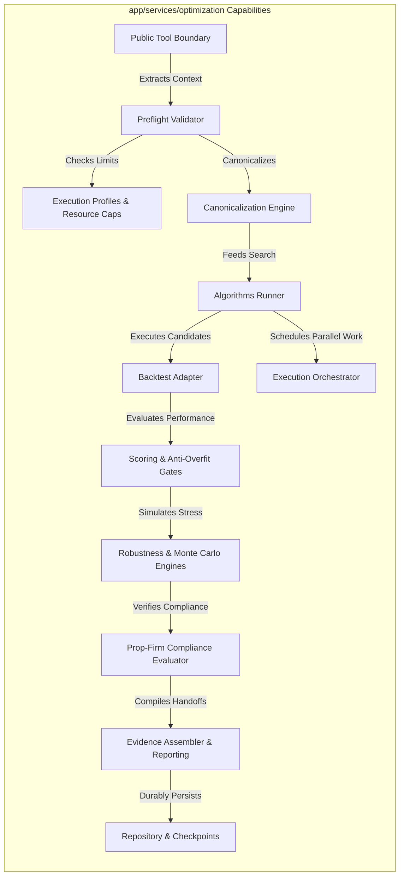

# Optimization Service — Intended Workflows and Scenarios

## 1. Document Purpose
This document reverse-engineers the isolated architecture requirements defined in [09-Optimization.md](file:///c:/Users/rharu/AppDev/HaruquantAI/docs/dev/phase-implementation-plan/09-Optimization.md) into a set of cohesive, actor-driven, end-to-end operational workflows and scenarios for the Optimization Service (`app/services/optimization/`). It defines how technical primitives, modules, and boundary policies cooperate to deliver reliable outcomes, handle operational failures, and maintain security and governance across the HaruQuantAI platform.

---

## 2. Source and Analysis Boundaries
* **Source of Truth**: This analysis is strictly derived from the requirements, boundaries, DTO schemas, and non-functional constraints in [09-Optimization.md](file:///c:/Users/rharu/AppDev/HaruquantAI/docs/dev/phase-implementation-plan/09-Optimization.md).
* **Constraints**: No source code from the active repository was inspected or assumed to exist. No domain behavior (e.g., active trading strategies, live broker connections, or LLM capabilities) was invented.
* **Terminology & Assertions**: All explicit requirements are marked with their corresponding `OPT-FR-*`, `OPT-NFR-*`, or `OPT-BR-*` tags. Implied system behaviors necessary to connect isolated requirements are clearly marked:
  > **Inferred workflow connection — requires validation**

---

## 3. System Purpose and Scope

### Primary Purpose
The Optimization Service (`app/services/optimization/`) is responsible for generating validated parameter optimization candidates, producing reproducible advisory evidence packages, and supplying downstream handoff data for portfolio and risk managers. It evaluates parameter stability, walk-forward efficiency, cost sensitivity, and overfit risk to guide strategy lifecycle decisions.

### Scope Boundaries
* **In-Scope**:
  * Safe public API tool boundaries that normalize request contexts and enforce dry-run defaults (`OPT-FR-176`, `OPT-FR-214`).
  * Request validation, parameter space validation, and constraint validation (`OPT-FR-002`, `OPT-FR-022`).
  * Order-invariant parameter space hashing and deterministic candidate hashing (`OPT-FR-004`, `OPT-FR-039`).
  * Parameter search algorithm runners (Grid, Random, Sobol, LHS, Bayesian, Genetic) (`OPT-FR-113`, `OPT-FR-132`).
  * Chronological split generation, walk-forward folds execution, and walk-forward efficiency metrics (`OPT-FR-030`, `OPT-FR-083`).
  * Robustness stress-testing (spread, slippage, commission) and Monte Carlo path simulations (`OPT-FR-043`, `OPT-FR-058`).
  * Prop-firm compliance gate checking under configured evaluation frequencies (`OPT-FR-228`, `OPT-BR-020`).
  * Checkpoint persistence, atomic renaming writes, and compatibility validation (`OPT-FR-065`, `OPT-FR-148`).
  * Non-UI periodic portfolio weights optimization support (`OPT-FR-236`, `OPT-FR-237`).
  * Compilation of advisory evidence packages and downstream handoffs (`OPT-FR-042`, `OPT-FR-063`).
* **Out-of-Scope**:
  * Production database provisioning, migrations, or credentials management (`OPT-FR-159`).
  * Live broker gateways, real order execution, or trade placement (`OPT-FR-213`, `OPT-FR-215`).
  * Direct strategy promotion or live activation (`OPT-NFR-006`).
  * Modifying active risk limits (`OPT-NFR-006`).
  * Direct execution of background threads or multi-processing within the core service layer (delegated via an orchestrator protocol) (`OPT-FR-233`).

### Entry and Exit Points
* **Entry Points**:
  * Public tool boundary functions (`optimization_grid_search`, `optimization_random_search`, `optimization_bayesian`, `optimization_genetic`, `optimization_walk_forward`, `optimization_monte_carlo`) (`OPT-FR-115`, `OPT-FR-122`, `OPT-FR-136`, `OPT-FR-139`, `OPT-FR-031`, `OPT-FR-060`).
  * Direct model preflight checkers (`validate_optimization_request`, `validate_parameter_space`) (`OPT-FR-002`).
  * Repository resume hooks and checkpoint loaders (`load_checkpoint`, `get_progress`) (`OPT-FR-155`).
  * Periodic portfolio weight scheduler callback (`pfo_from_optimize_func`) (`OPT-FR-236`).
* **Exit Points**:
  * Standard JSON-compatible envelopes (`OptimizationEnvelope`) returned to callers (`OPT-FR-007`, `OPT-FR-175`, `OPT-BR-008`).
  * Advisory handoff DTOs (`RiskGovernorHandoffPackage`, `PortfolioHandoffPackage`) (`OPT-FR-042`, `OPT-FR-217`).
  * Atomic checkpoint files and run details persisted via injected repositories (`OPT-FR-145`, `OPT-FR-148`).
  * Tabular speedup reports and chart-ready serialization payloads (`OPT-FR-218`, `OPT-FR-230`).

### Persistent Stores
* **Checkpoints & Run Records**: Serialized intermediate state and audit trails saved under approved directories (`OPT-FR-065`, `OPT-FR-145`, `OPT-FR-150`).
* **Candidate Cache**: Deduplicated results keyed by canonical parameter and lineage hashes (`OPT-FR-038`, `OPT-FR-102`).

---

## 4. Actors and Responsibilities

| Actor | Role | Initiates | Information Provided | Outcomes Received | Prohibited Actions |
|---|---|---|---|---|---|
| **Authorized Agent / Caller** | AI agent or business API calling the optimization service | Public optimization tool wrappers (`optimization_grid_search`, etc.) | Request payload, parameter space, target metrics, `dry_run` flag, and context kwargs | Standardized JSON envelope, validation reports, advisory recommendations | Running live trades, mutating active strategy state, or bypassing preflight validation rules |
| **Execution Orchestrator** | Concurrency engine managing parallel work units | Job scheduling, work mapping, early-stop pruning | Isolated serializable work units, pruning policy | Ordered execution outcomes, progress checkpoints | directly calling low-level multiprocessing in core logic, mutating shared candidate states |
| **Backtest Execution Adapter** | External simulator executing single candidate tests | Single-candidate backtest run | Candidate parameters, backtest context, cost model, realism profile | Engine optimization results (trades, equity, ticks) | Storing live credentials, calling live brokers, returning `approved_for_live_trading=True` |
| **Optimization Repository** | Persistence interface managing run artifacts | Run writes, checkpoint saves, progress fetches, cancellations | Serializable state models, temporary paths, receipt IDs | Durable records, loaded checkpoint artifacts | Provisioning database tables, executing migrations, accessing secrets directly |
| **Risk Governor (External)** | Governance component review authority | Strategy promotion audit | Advisory evidence packages, signoff checks | Production signoff approval/rejection | Mutating active strategies inside the Optimization module |
| **Portfolio Manager (External)** | Portfolio component managing capital allocation | Allocation optimization triggers | Asset universes, periodic weights inspection | Portfolio impact alerts, weight lists | Direct live trade dispatch, live asset rebalancing |
| **Monotonic Clock** | Standard system monotonic clock provider | Elapsed time reads | Time queries | Monotonic elapsed time durations | Relying on wall-clock arithmetic that NTP synchronization can distort |

---

## 5. Capability Map



---

## 6. Workflow Catalogue
1. **WF-001 — Public API/Agent Tool Invitation & Request Packaging** (Primary business workflow): Coordinates the safe, dry-run-first extraction, preflight validation, and packaging of optimization requests without executing heavy compute.
2. **WF-002 — Parameter Optimization Sweep Execution (Grid or Random)** (Primary business workflow): Coordinates parameter enumeration, canonical hashing, parallel candidate execution via simulator adapters, scoring, and ranking.
3. **WF-003 — Walk-Forward Analysis (WFA) Validation** (Primary business workflow): Splits historical datasets chronologically, applies purge/embargo limits to prevent look-ahead leakage, and runs walk-forward efficiency validation.
4. **WF-004 — Robustness Assessment and Monte Carlo Simulation** (Primary business workflow): Subjects candidate trades or returns to perturbations (spread stress, shuffling, block boot-strapping) to compute probability of ruin and confidence intervals.
5. **WF-005 — Prop-Firm Compliance Validation** (Primary business workflow): Evaluates version-controlled prop-firm constraints (loss, drawdowns, overnight caps) at daily or intraday frequencies.
6. **WF-006 — Run State Checkpoint and Atomic Persistence** (Supporting workflow): Manages safe serialization of intermediate state atomically using temporary files and handles recovery from corrupted checkpoints.
7. **WF-007 — Periodic Portfolio Optimization Support** (Supporting workflow): Executes deterministic portfolio allocation callbacks on schedule to package target weights without live order creation.
8. **WF-008 — Advisory Evidence Package Assembly and Handoff** (Lifecycle/Governance workflow): Compiles final evidence reports, checks overfit thresholds, and packages advisory handoffs for external Risk and Portfolio governors.

---

## 7. Detailed End-to-End Workflows

### WF-001 — Public API/Agent Tool Invitation & Request Packaging
#### Purpose and Value
Ensures that all client or agent calls to the Optimization Service are validated at the perimeter, context is parsed correctly, request limits are checked, and payloads are packaged safely without triggering expensive calculations or database side effects by default (`OPT-FR-176`, `OPT-FR-178`, `OPT-FR-213`, `OPT-FR-214`).

#### Actors
* **Primary**: Authorized Agent / Caller
* **Supporting**: None

#### Trigger
The caller invokes one of the public tools (e.g. `optimization_grid_search`, `optimization_random_search`, etc.) defined in `api/tool_boundary.py` or the public registry.

#### Preconditions
* The execution profiles and resource limits configurations are loaded (`OPT-FR-205`).

#### Inputs
* Tool keyword arguments containing parameter spaces, symbols, and context details (`OPT-FR-176`).
* Context parameters (optional `request_id`, `agent_name`, `environment`, `dry_run`).

#### Main Success Flow
| Step | Responsible component | Action | Input | Validation or decision | State change | Output | Requirement IDs |
| :--- | :--- | :--- | :--- | :--- | :--- | :--- | :--- |
| 1 | `api/tool_boundary` | Normalizes context kwargs | Input kwargs | Extract `request_id`, `agent_name`, `environment`. If `dry_run` is omitted, default it to `True` | None | `OptimizationToolContext` object | `OPT-FR-176`, `OPT-FR-214` |
| 2 | `api/tool_boundary` | Isolates business payload | Input kwargs | Remove standard context keys, retaining only business request variables | None | Clean business payload dictionary | `OPT-FR-177`, `OPT-BR-010` |
| 3 | `validation/preflight` | Evaluates payload size constraints | Clean business payload | **Decision Point**: Verify payload size stays within owner-approved limits. Fail-closed if exceeded. | None | Verified payload | `OPT-BR-004` |
| 4 | `validation/preflight` | Runs preflight request validation | Clean business payload | Check request model shape, parameters, and strategy compatibility | None | Preflight `ValidationResult` | `OPT-FR-002`, `OPT-FR-021`, `OPT-FR-241`, `OPT-FR-242` |
| 5 | `config/execution_profiles` | Enforces resource caps | Request details, active profile | Verify iteration counts, population, worker limits are bounded and within limits | None | Approved limits context | `OPT-FR-016`, `OPT-BR-001` |
| 6 | `api/tool_boundary` | Packages the request DTO | Clean payload, verified context | If caller requested `dry_run=True` (or defaulted), skip execution/persistence/network/multiprocessing | None | `OptimizationRequestPackage` | `OPT-FR-178`, `OPT-FR-020`, `OPT-FR-213`, `OPT-BR-011` |
| 7 | `api/tool_boundary` | Serializes public result | `OptimizationRequestPackage` | Convert Decimals, datetimes to UTC ISO-8601, handle finite serialization | None | JSON-safe payload data | `OPT-FR-007` |
| 8 | `api/tool_boundary` | Formats standard envelope | JSON-safe data, warnings, context | Ensure envelope has required metadata, standard errors, and `places_trade=False`, `approved_for_live_trading=False` | None | `OptimizationEnvelope` object | `OPT-FR-175`, `OPT-FR-215`, `OPT-FR-216`, `OPT-BR-008`, `OPT-BR-009`, `OPT-BR-012` |

#### Decision Points
* **Payload Size Validation (Step 3)**: Evaluated by `validation/preflight`. If the request payload exceeds configured byte limits, the workflow switches immediately to **Alternate Flow A (Payload Too Large)**. Fails closed.
* **Preflight Validation Checks (Step 4)**: If constraints are invalid, strategy is incompatible, or syntax is malformed, the workflow switches to **Alternate Flow B (Validation Failure)**. Fails closed.
* **Calculation-only Dry Run Check (Step 6)**: If the caller explicitly requests `dry_run=False` but lacks an approved execution profile, it is forced to `dry_run=True`. If the tool is calculation-only, `dry_run` runs the math but skips persistence/logging writes (`OPT-FR-170`, `OPT-BR-011`).

#### Alternate Flows
* **Alternate Flow A (Payload Too Large)**:
  1. Preflight validator detects excessive payload bytes.
  2. Builds an error payload using code `OPT_PAYLOAD_TOO_LARGE` (`OPT-BR-004`).
  3. Returns standard envelope containing the structured error. Execution halts.
* **Alternate Flow B (Validation Failure)**:
  1. Preflight validator identifies invalid constraints or spaces.
  2. Constructs structured validation errors with JSON pointer paths (`OPT-FR-200`).
  3. Returns standard envelope with code `OPT_VALIDATION_FAILED` (reusing `app.utils.errors` parent classes). Execution halts.

#### Failure and Exception Flows
* **JSON Serialization Failure**:
  * *Trigger*: Result contains non-serializable objects (e.g. raw pandas objects, thread locks).
  * *Detection*: Caught by `sanitize_public_payload` in `api/tool_boundary.py`.
  * *Response*: Converts finite numbers/warnings. If it cannot resolve, fails closed with `OPT_JSON_SERIALIZATION_FAILED` (`OPT-FR-007`).

#### Recovery Flow
Workflow is stateless and execution-free. Recovery requires the caller to correct payload parameters or sizes and submit a new request.

#### Postconditions
* An `OptimizationEnvelope` containing the validated request package is returned.
* Audit markers (`places_trade=False`) are appended. No database or simulator changes occur.

---

### WF-002 — Parameter Optimization Sweep Execution (Grid or Random)
#### Purpose and Value
Runs algorithm sweeps (exhaustive grid searches, seeded random searches, Latin Hypercube, Sobol, Bayesian, or Genetic) to identify optimal parameter sets while coordinating parallel workers, tracking progress, and writing atomic checkpoints (`OPT-FR-027`, `OPT-FR-114`, `OPT-FR-121`, `OPT-FR-135`, `OPT-FR-138`).

#### Actors
* **Primary**: Authorized Agent / Caller
* **Supporting**: Execution Orchestrator, Backtest Execution Adapter, Optimization Repository, Monotonic Clock

#### Trigger
A validated request package with `dry_run=False` is passed from the tool boundary to the runner.

#### Preconditions
* Request has passed preflight checks.
* Repository implementation has been injected (`OPT-FR-161`).
* Monotonic clock provider is available (`OPT-FR-006`).

#### Inputs
* `OptimizationRequest` including parameter space, step sizes, search method.
* Active `ExecutionProfile` specifying workers count, monotonic timeout limit, and seed.
* Injected `BacktestExecutionAdapter` and `ExecutionOrchestrator` instances.

#### Main Success Flow
| Step | Responsible component | Action | Input | Validation or decision | State change | Output | Requirement IDs |
| :--- | :--- | :--- | :--- | :--- | :--- | :--- | :--- |
| 1 | `core/canonicalization` | Generates parameter space hash | Parameter space definition | Sort dictionary keys, normalize decimals, include constraints | None | Order-invariant `parameter_space_hash` | `OPT-FR-004`, `OPT-FR-204` |
| 2 | `algorithms/runner` | Resolves search sweep method | Request details | Confirm requested method (`grid`, `random`, etc.) is officially supported | None | Target search executor | `OPT-FR-113`, `OPT-FR-132` |
| 3 | Target algorithm module | Enumerates candidate parameters | Parameter space, distributions | Iterate combinations. Grid uses strict memory-bounded iterator; Random uses seed-controlled generator | None | Stream of `OptimizationCandidate` objects | `OPT-FR-116`, `OPT-FR-121`, `OPT-FR-123`, `OPT-FR-124` |
| 4 | `core/canonicalization` | Computes candidate identities | Candidate parameters, lineage context | Exclude inactive conditional parameters; compute SHA-256 over canonical JSON | None | Deterministic `candidate_hash` | `OPT-FR-039`, `OPT-FR-040`, `OPT-FR-088` |
| 5 | `persistence/candidate_cache` | Evaluates cache validity | Candidate hash, lineage | **Decision Point**: Check if valid cache record exists for hash. If yes, skip backtest execution | None | Cache hit/miss status | `OPT-FR-038`, `OPT-FR-102` |
| 6 | `execution/progress` | Initializes progress tracker | Total unique candidates count | Initialize thread-safe progress states | Progress initialized to 0% | Initialized progress reference | `OPT-FR-172`, `OPT-FR-173` |
| 7 | `execution/orchestrator` | Submits candidate work units | Candidates, adapter | Verify units are serializable. Map to parallel workers maintaining deterministic order | None | Task outcomes stream | `OPT-FR-233`, `OPT-FR-234`, `OPT-BR-023` |
| 8 | `execution/backtest_adapter` | Executes candidate backtest | Single candidate parameters | **Decision Point**: Verify simulator version, costs, and lack of live order capabilities. Fail-closed on conflict | None | `EngineOptimizationResult` | `OPT-FR-181`, `OPT-FR-182`, `OPT-FR-187`, `OPT-FR-188`, `OPT-FR-189`, `OPT-FR-199`, `OPT-FR-206` |
| 9 | `core/scoring` | Calculates candidate fitness score | Backtest metrics, objective definition | Apply selected scoring formula (Sharpe, Sortino, custom composite) | None | `ScoreResult` | `OPT-FR-090`–`OPT-FR-098` |
| 10 | `execution/progress` | Advances progress updates | Completed count, duration metrics | Increment progress counters atomically; estimate completion time | Progress advanced | Progress and ETA metrics | `OPT-FR-018`, `OPT-FR-232` |
| 11 | `execution/orchestrator` | Applies early pruning rules | Intermediate metrics, pruning policy | **Decision Point**: Check if candidate metrics breach hard gates or median profiles. Prune if true | Candidate marked pruned | Pruned status and partial evidence | `OPT-FR-036`, `OPT-FR-235`, `OPT-FR-152` |
| 12 | `core/candidates` | Ranks and summarizes results | All completed candidates results | Sort descending by score, trade count descending, candidate hash ascending | None | Deterministic `OptimizationSummary` | `OPT-FR-027`, `OPT-FR-028`, `OPT-FR-239` |

#### Decision Points
* **Cache Lookup (Step 5)**: If candidate hash exists in cache and lineage matches (strategy, data, cost model, realism hashes are identical), load results from cache and advance progress without calling backtests (`OPT-FR-038`).
* **Backtest Safety Verification (Step 8)**: Evaluated by `execution/backtest_adapter`. If the execution environment exposes live broker credentials, network access to live ports, or version mismatches, the execution fails closed (`OPT-FR-189`, `OPT-FR-206`).
* **Pruning Gate (Step 11)**: Evaluated by orchestrator/pruning logic. If the intermediate fitness is statistically non-viable compared to existing trials, the candidate run is aborted early, saving partial metrics and reason `OPT_PRUNED_BY_HARD_GATE` (`OPT-FR-036`, `OPT-FR-152`).

#### Alternate Flows
* **Alternate Flow A (Optional Bayesian Search)**:
  1. The runner resolves skopt/Optuna backend at Step 2 (`OPT-FR-135`).
  2. If the dependency is missing, raises `OPT_OPTIMIZER_BACKEND_UNAVAILABLE` safely (`OPT-FR-201`).
  3. If present, samples candidates sequentially based on Gaussian-process updates, enforcing seed inputs (`OPT-FR-132`, `OPT-FR-157`).
* **Alternate Flow B (Genetic Evolutionary Search)**:
  1. Evolve population across generations using selection, crossover, mutation, and elitism (`OPT-FR-138`).
  2. Rank final population members and yield summary.

#### Failure and Exception Flows
* **Execution Timeout**:
  * *Trigger*: Monotonic duration exceeds the profile limit (e.g. 30 minutes) (`OPT-BR-003`).
  * *Detection*: Measured via `MonotonicClock` checks in `execution/orchestrator`.
  * *Response*: Halts further dispatches, writes a partial checkpoint, and returns structured code `OPT_EXECUTION_FAILED` with timeout diagnostics.
* **Stochastic Realism Conflict**:
  * *Trigger*: Noisy objective evaluation is enabled, but stochastic simulator realism shocks are active.
  * *Detection*: Checked by validation rules during init.
  * *Response*: Fails closed immediately, raising error `OPT_NOISY_OBJECTIVE_NOT_ALLOWED` with subtype `STOCHASTIC_REALISM_CONFLICT` (`OPT-FR-152`, `OPT-FR-191`).

#### Recovery Flow
See **WF-006** for checkpoint recovery. Idempotency rules allow the scheduler to resume a run ID, scanning existing hashes to skip already executed work units (`OPT-FR-155`, `OPT-FR-164`).

#### Postconditions
* An `OptimizationSummary` is created containing candidates scores and parameter metrics (`OPT-FR-029`).
* Idempotency caches and logs are updated (`OPT-FR-192`).

---

### WF-003 — Walk-Forward Analysis (WFA) Validation
#### Purpose and Value
Splits historical market data chronologically into training/OOS folds, enforcing strict gaps (purging and embargo) to eliminate look-ahead bias and calculate true walk-forward efficiency metrics (`OPT-FR-030`, `OPT-FR-083`, `OPT-FR-084`, `OPT-BR-016`).

#### Actors
* **Primary**: Authorized Agent / Caller
* **Supporting**: Execution Orchestrator, Backtest Execution Adapter, Optimization Repository

#### Trigger
A Walk-Forward request package is dispatched for validation run.

#### Preconditions
* Historical data availability checks are complete.
* Average trade duration of the strategy under test is known or estimated (`OPT-BR-016`).

#### Inputs
* `WalkForwardRequest` details (rolling/expanding configurations, embargo settings).

#### Main Success Flow
| Step | Responsible component | Action | Input | Validation or decision | State change | Output | Requirement IDs |
| :--- | :--- | :--- | :--- | :--- | :--- | :--- | :--- |
| 1 | `time_series/splits` | Computes fold index boundaries | Config, data size | Establish training/validation anchors depending on anchored/expanding config | None | Raw datetime fold boundaries | `OPT-FR-079`, `OPT-FR-080`, `OPT-FR-081`, `OPT-FR-083` |
| 2 | `time_series/splits` | Derives purging and embargo gaps | Fold boundaries, trade duration | **Decision Point**: Ensure effective embargo is at least average trade duration in bars | None | Purged and embargoed windows | `OPT-FR-084`, `OPT-BR-016` |
| 3 | `time_series/walk_forward` | Coordinates optimization runs | Splits, strategy | Loop through each fold. Runs sweep optimization on the train window | None | Train-fold best parameter sets | `OPT-FR-030`, `OPT-FR-035` |
| 4 | `time_series/walk_forward` | Executes out-of-sample backtests | Test splits, selected parameters | Run backtest using validation window parameters via Backtest Adapter | None | OOS fold metrics | `OPT-FR-030`, `OPT-FR-182` |
| 5 | `time_series/walk_forward` | Computes walk-forward metrics | Train vs OOS performance | Calculate Walk-Forward Efficiency (WFE), drift scores, and OOS retention | None | Walk-forward evidence metrics | `OPT-FR-033`, `OPT-FR-034`, `OPT-FR-086` |
| 6 | `evidence/packages` | Attaches leakage-prevention data | Split results, configuration | Verify purging and embargo bounds are fully logged in results metadata | None | Walk-forward split evidence | `OPT-FR-085` |

#### Decision Points
* **Embargo Floor Evaluation (Step 2)**: Evaluated by `time_series/splits`. If the strategy average trade duration is known, the embargo floor must be at least the average trade duration in bars unless a stricter manual limit is specified (`OPT-BR-016`).
* **CPCV Mode Trigger (Step 3)**: If Combinatorial Purged Cross-Validation (CPCV) is enabled, the system computes combinatorial paths and applies purging/embargo rules on every path (`OPT-FR-221`).

#### Alternate Flows
* **Alternate Flow A (Anchored / Expanding Splits)**:
  * Instead of rolling splits, anchors the start index, growing the training window in each successive fold (`OPT-FR-080`, `OPT-FR-083`).

#### Failure and Exception Flows
* **Insufficient Data for Embargo**:
  * *Trigger*: Training or test windows are smaller than the calculated purge + embargo bars.
  * *Detection*: Caught by preflight check in `time_series/splits.py`.
  * *Response*: Aborts the fold run, returning error code `OPT_VALIDATION_FAILED` detailing the overlap issue.

#### Recovery Flow
State is preserved via the repository checkpoint system. A WFA task can resume from the last successfully completed fold run (`OPT-FR-087`).

#### Postconditions
* Walk-forward efficiency and drift scores are written to the candidate metadata.
* Leakage-prevention and embargo parameters are saved in the evidence package (`OPT-FR-085`).

---

### WF-004 — Robustness Assessment and Monte Carlo Simulation
#### Purpose and Value
Applies parameter, history, and trade-sequence perturbations (spread stress, commission stress, bootstrapping, ruin calculations) to candidate metrics to establish statistical reliability boundaries (`OPT-FR-043`, `OPT-FR-058`, `OPT-FR-069`, `OPT-BR-018`).

#### Actors
* **Primary**: Authorized Agent / Caller
* **Supporting**: Execution Orchestrator, Optimization Repository

#### Trigger
A completed candidate's trade log or return series is submitted for robustness stress checks.

#### Preconditions
* Sweep optimization completed; trade results or returns series are durably written.

#### Inputs
* `RobustnessRequest` containing simulation count, ruin thresholds, and stress parameters.
* Candidate trade list or returns.

#### Main Success Flow
| Step | Responsible component | Action | Input | Validation or decision | State change | Output | Requirement IDs |
| :--- | :--- | :--- | :--- | :--- | :--- | :--- | :--- |
| 1 | `robustness/requests` | Packages robustness stress tasks | Input configurations | Validate stress steps for slippage, spread, and commission rates | None | `RobustnessWorkPackage` | `OPT-FR-043`–`OPT-FR-045`, `OPT-FR-062` |
| 2 | `robustness/monte_carlo` | Packages Monte Carlo simulation options | Monte Carlo request | Validate simulation counts, seed overrides, and modes | None | MC config setup | `OPT-FR-046`–`OPT-FR-051`, `OPT-FR-062` |
| 3 | `robustness/monte_carlo` | Generates deterministic seeds | Base seed, candidate ID | Derive seeds using offsets for each simulation phase to ensure run repeatability | None | Phase-specific seed mapping | `OPT-FR-129`, `OPT-FR-132` |
| 4 | `robustness/monte_carlo` | Runs trade sequence shuffling | Trade log, seed | Randomize trade order while preserving outcomes to test path sequence risk | None | Shuffled path metrics | `OPT-FR-126` |
| 5 | `robustness/monte_carlo` | Performs block bootstrap | Returns, bootstrap block size | Sample returns with replacement in blocks to preserve temporal dependencies | None | Bootstrap equity paths | `OPT-FR-069`, `OPT-FR-222` |
| 6 | `robustness/scenario_simulations` | Evaluates parametric sizing paths | Initial balance, sizing rules | Simulate linear vs compounding paths, multi-entry, and profit target distributions | None | Sizing outcomes metrics | `OPT-FR-003`, `OPT-FR-127`, `OPT-FR-224`–`OPT-FR-227` |
| 7 | `robustness/scenario_simulations` | Calculates probability of ruin | Drawdown paths, ruin threshold | **Decision Point**: Estimate the probability that drawdown breaches the configured ruin threshold | None | Ruin probability Decimal | `OPT-BR-018` |
| 8 | `robustness/monte_carlo` | Computes metric confidence intervals | All simulation path outputs | Calculate percentiles (drawdown, equity, losing streaks, returns) and confidence intervals | None | `MonteCarloResult` summary | `OPT-FR-072`, `OPT-FR-223`, `OPT-BR-019` |
| 9 | `robustness/monte_carlo` | Computes final robustness percentage | Completed stress check pass rates | Compile checks and calculate a deterministic robustness score | None | Robustness score | `OPT-FR-056`, `OPT-FR-058` |

#### Decision Points
* **Probability of Ruin Calculation (Step 7)**: Calculated by `robustness/scenario_simulations`. If the probability of ruin exceeds the risk-policy threshold, the candidate is flagged with warnings but the calculation completes (`OPT-BR-018`).
* **Sampler Unavailability (Step 5)**: If advanced sampling methods (Sobol/LHS) are requested but skopt backends are missing, the system falls back to pseudo-random sampling and records the fallback details in the evidence (`OPT-BR-015`).

#### Alternate Flows
* **Alternate Flow A (Cross-Market / Cross-Timeframe Validation)**:
  * Packages and runs the strategy against alternate symbol feeds or bars intervals to test parameter sensitivity across regimes (`OPT-FR-052`, `OPT-FR-053`).

#### Failure and Exception Flows
* **Empty Trade Log Failure**:
  * *Trigger*: Candidate has 0 trades, making shufflers/bootstrap impossible.
  * *Detection*: Caught in preflight check in `robustness/monte_carlo.py`.
  * *Response*: Aborts MC calculations, returns `OPT_CANDIDATE_EXECUTION_FAILED`.

#### Recovery Flow
Checkpoints are saved prior to running extensive MC or robustness simulation phases. If interrupted, the orchestrator resumes from the last completed simulation block (`OPT-FR-065`).

#### Postconditions
* Ruin probability, confidence intervals, and drawdown percentiles are saved in the evidence payload (`OPT-FR-072`, `OPT-BR-019`).

---

### WF-005 — Prop-Firm Compliance Validation
#### Purpose and Value
Verifies that candidate strategy parameters meet institution-specific prop-firm risk guidelines (such as daily drawdown ceilings, exposure caps, and weekend holds) at version-controlled sub-daily or daily intervals (`OPT-FR-228`, `OPT-BR-020`, `OPT-BR-021`).

#### Actors
* **Primary**: Authorized Agent / Caller
* **Supporting**: Optimization Repository

#### Trigger
An optimization run reaches the prop-firm check phase or is called directly for compliance validation.

#### Preconditions
* Strategy backtest tick-level data, order logs, or bar series are loaded.

#### Inputs
* `PropFirmProfile` specifying rules limits and evaluation frequency (e.g. `per_tick`, `session_close`).
* Candidate trade execution logs.

#### Main Success Flow
| Step | Responsible component | Action | Input | Validation or decision | State change | Output | Requirement IDs |
| :--- | :--- | :--- | :--- | :--- | :--- | :--- | :--- |
| 1 | `robustness/prop_firm` | Loads versioned prop-firm profile | Configuration profile | Verify evaluation frequency values are valid and versioned | None | Loaded profile rules | `OPT-BR-020` |
| 2 | `robustness/prop_firm` | Assesses data requirements | Profile, candidate log | **Decision Point**: If profile requires intraday checks, confirm intraday evidence is available. Fail-closed if missing | None | Verified dataset | `OPT-BR-021`, `OPT-FR-229` |
| 3 | `robustness/prop_firm` | Evaluates daily drawdown rules | Equity curve, loss limits | Scan equity paths at configured frequency to identify daily breach events | None | Daily breach status | `OPT-FR-228` |
| 4 | `robustness/prop_firm` | Evaluates exposure limits | Trade orders, correlation data | Verify overnight exposure, total exposure, and correlated sector exposures stay within caps | None | Exposure limits status | `OPT-FR-228` |
| 5 | `robustness/prop_firm` | Evaluates restriction profiles | News calendar, execution times | Check for overnight, weekend holds, or news execution violations | None | Restriction checks report | `OPT-FR-228` |
| 6 | `robustness/prop_firm` | Compiles compliance receipt | All check statuses | Build compliance evidence summary with daily/monthly target targets | None | `PropFirmComplianceEvidence` | `OPT-FR-228` |

#### Decision Points
* **Intraday Data Availability (Step 2)**: Evaluated by `robustness/prop_firm`. If the profile requires intraday monitoring (e.g., `per_tick`, `per_trade_event`), and only end-of-day summary data is available, the check fails closed with error `OPT_PROP_FIRM_INTRADAY_EVALUATION_REQUIRED` (`OPT-FR-152`, `OPT-BR-021`).
* **End-of-Day-Only Override (Step 2)**: If EOD evaluation is selected, verify the specific versioned profile allows EOD checks (`OPT-FR-229`).

#### Failure and Exception Flows
* **Rule Breach Event**:
  * *Trigger*: Strategy breaches max daily loss or correlated exposure limits.
  * *Detection*: Identified during validation loop in `evaluate_prop_firm_compliance`.
  * *Response*: Marks candidate compliance status as failed/rejected, logs the breach details, and records the failure in the evidence package.

#### Recovery Flow
Stateless evaluation. Re-evaluation is run if inputs or backtest parameters change.

#### Postconditions
* Prop-firm compliance status and breach probabilities are attached to the output evidence package (`OPT-FR-063`).

---

### WF-006 — Run State Checkpoint and Atomic Persistence
#### Purpose and Value
Maintains execution safety and recovery capabilities by writing intermediate candidate search results atomically to disk, and rejecting corrupted state on resumes (`OPT-FR-065`, `OPT-FR-146`, `OPT-FR-148`).

#### Actors
* **Primary**: System Operator / Scheduler (Orchestration Runner)
* **Supporting**: Optimization Repository

#### Trigger
The execution orchestrator completes a candidate batch interval, detects a state transition, receives a cancellation command, or encounters a recoverable error.

#### Preconditions
* Running task context exists.
* Disk write permissions on `HARUQUANT_HOME` paths are verified.

#### Inputs
* Current `OptimizationRunState` data, target filepath.

#### Main Success Flow
| Step | Responsible component | Action | Input | Validation or decision | State change | Output | Requirement IDs |
| :--- | :--- | :--- | :--- | :--- | :--- | :--- | :--- |
| 1 | `persistence/checkpoints` | Checks checkpoint eligibility | Current state, interval config | **Decision Point**: Verify if checkpoint interval is reached, transition occurred, or cancellation is active | None | Eligibility decision | `OPT-FR-065` |
| 2 | `persistence/checkpoints` | Prepares temporary files | Target path, run ID | **Decision Point**: Check that path is within approved directories and contains no relative parent escapes | None | Unique temporary path | `OPT-FR-150`, `OPT-FR-151` |
| 3 | `persistence/checkpoints` | Performs atomic data write | State content, temporary path | Write serialized JSON data to temp file. Perform flushing and fsync to assure write | Temp file written to disk | Atomic write receipt | `OPT-FR-148` |
| 4 | `persistence/checkpoints` | Executes atomic rename | Temp path, final target path | Rename temporary file to target filename, replacing existing | Target file overwritten | Completed checkpoint save receipt | `OPT-FR-148` |
| 5 | `persistence/repository` | Records pruned metadata | Pruned trials data | Persist partial candidate evidence (prune reason, snapshot) | Database updated | Save receipts | `OPT-FR-036` |

#### Decision Points
* **Checkpoint Trigger Evaluation (Step 1)**: Checked by `checkpoint_due`. Eligibility is triggered on candidate intervals, state shifts, long MC runs startup, cancellation commands, or catch of recoverable errors (`OPT-FR-065`).
* **Path Traversal Gate (Step 2)**: Evaluated by `persistence/checkpoints`. If paths contain traversal escapes (`..`), blocks write, raising a validation error (`OPT-FR-151`).
* **Resume Compatibility Validation (Step 5 - during restart)**: When reading checkpoints to resume, `validate_checkpoint` rejects corrupt, partial, or schema-invalid files. If the latest is corrupt but an earlier valid file exists, the system resumes from the older file and logs warning audits (`OPT-FR-146`, `OPT-FR-147`).

#### Failure and Exception Flows
* **Atomic Rename Disk Failure**:
  * *Trigger*: OS disk write lock, capacity full, or directory read-only.
  * *Detection*: Caught by `atomic_write_helper` in `persistence/checkpoints.py`.
  * *Response*: Raises `OPT_ATOMIC_WRITE_FAILED` detailing temporary path, target path, run ID, and phase (`OPT-FR-149`). Halts run.

#### Recovery Flow
On system crash or reboot, the scheduler queries `load_checkpoint`. If valid, it rebuilds progress state, skips already processed candidate hashes, and schedules remainder tasks.

#### Postconditions
* Durable run state is synchronized on disk.
* audit-ready checkpoints exist.

---

### WF-007 — Periodic Portfolio Optimization Support
#### Purpose and Value
Enables periodic recalculation of asset weights from a deterministic callback function, formatting inspection metadata without mutating live allocations (`OPT-FR-236`, `OPT-FR-237`).

#### Actors
* **Primary**: Authorized Agent / Caller
* **Supporting**: Portfolio Manager (External)

#### Trigger
The scheduled cron or portfolio agent invokes weight optimization functions.

#### Preconditions
* Target asset parameter universe is loaded.
* Deterministic optimization callback function is registered.

#### Inputs
* `PortfolioOptimizationCallback` pointer, schedule configs, and asset universe.

#### Main Success Flow
| Step | Responsible component | Action | Input | Validation or decision | State change | Output | Requirement IDs |
| :--- | :--- | :--- | :--- | :--- | :--- | :--- | :--- |
| 1 | `portfolio/periodic` | Schedules portfolio task | Callback function, parameters | Check callback function is callable and inputs match schema | None | Registered callback trigger | `OPT-FR-236` |
| 2 | `portfolio/periodic` | Executes portfolio sweep | Asset metrics, optimization rules | Run the deterministic weights calculation callback | None | Target weights array | `OPT-FR-236` |
| 3 | `portfolio/periodic` | Packages allocation results | Weights array, audit info | Verify no live portfolio API mutations or order executions are triggered | None | `PortfolioOptimizerResult` | `OPT-FR-236`, `OPT-BR-024` |
| 4 | `portfolio/periodic` | Serializes inspection plot data | `PortfolioOptimizerResult` | Format weights and variables into chart-ready metrics without calling UI libraries | None | `NonUiInspectionPayload` | `OPT-FR-237`, `OPT-BR-024` |

#### Decision Points
* **Callback Validation**: If the portfolio optimizer callback raises exceptions, they are caught and mapped to `OPT_EXECUTION_FAILED` without polluting outer scope.

#### Failure and Exception Flows
* **Callback Computation Error**:
  * *Trigger*: Allocation callback fails due to matrix division error or NaN values.
  * *Response*: Captures error, maps it to structured code `OPT_CANDIDATE_EXECUTION_FAILED`.

#### Recovery Flow
Stateless calculation. Executed on the next schedule interval or re-triggered manually by operator.

#### Postconditions
* Portfolio weights and capacity warnings are made available to external portfolio services (`OPT-FR-237`).

---

### WF-008 — Advisory Evidence Package Assembly and Handoff
#### Purpose and Value
Compiles all optimization runs, walk-forward folds, robustness stress tests, and prop-firm compliance records into a versioned, immutable evidence package, formatting handoffs for Risk and Portfolio Managers under strict advisory-only boundaries (`OPT-FR-042`, `OPT-FR-063`, `OPT-NFR-006`, `OPT-BR-007`).

#### Actors
* **Primary**: Authorized Agent / Caller
* **Supporting**: Risk Governor, Portfolio Manager

#### Trigger
The search sweep and all robustness/walk-forward validation runs complete successfully.

#### Preconditions
* Checkpoints and results are saved in the repository.

#### Inputs
* `OptimizationSummary`, `AntiOverfitPolicy`, and handoff configurations.

#### Main Success Flow
| Step | Responsible component | Action | Input | Validation or decision | State change | Output | Requirement IDs |
| :--- | :--- | :--- | :--- | :--- | :--- | :--- | :--- |
| 1 | `core/anti_overfit` | Runs anti-overfit checks | Scored candidates, returns | Calculate Deflated Sharpe Ratio (DSR), MTB pass status, and trial independence | None | Overfit assessment details | `OPT-FR-100`, `OPT-FR-101`, `OPT-FR-106` |
| 2 | `core/anti_overfit` | Estimates independent trials | Candidate hashes, space data | Compute nominal trials count. Flag warnings if Bayesian or highly constrained | None | `trial_count_independence_warning` | `OPT-FR-102`–`OPT-FR-105` |
| 3 | `core/anti_overfit` | Verifies PBO threshold gate | CPCV/PBO results, policy | **Decision Point**: Check if PBO exceeds approved thresholds. Warn or reject candidate | None | PBO gate status | `OPT-FR-106`, `OPT-BR-017` |
| 4 | `evidence/packages` | Composes complete evidence package | Summaries, assessments, warnings | Collate splits, stability, Monte Carlo, and prop-firm records into versioned DTO | None | `EvidencePackage` | `OPT-FR-063`, `OPT-FR-249`, `OPT-FR-250`, `OPT-BR-013` |
| 5 | `evidence/packages` | Integrates capacity metrics | Intended AUM, currency | Package deployment base currency and estimated capacity | None | Capacity evidence metadata | `OPT-FR-251` |
| 6 | `evidence/packages` | Structures chart-ready variables | `EvidencePackage` | Formulate equity curve, Pareto, MC cones data without rendering charts | None | `VisualizationPayload` | `OPT-FR-064`, `OPT-FR-218` |
| 7 | `evidence/packages` | Validates advisory-only scope | `EvidencePackage` | **Decision Point**: Verify candidate outputs contain no auto-promotion or risk-limit modification fields | None | Verified evidence package | `OPT-NFR-006`, `OPT-NFR-007` |
| 8 | `evidence/packages` | Builds Risk Governor handoff package | Verified `EvidencePackage` | Build DTO containing final decision, top candidate, and warning caveats | None | `RiskGovernorHandoffPackage` | `OPT-FR-042`, `OPT-BR-014` |
| 9 | `evidence/packages` | Builds Portfolio Manager handoff package | Verified `EvidencePackage` | Build DTO containing exposure assumptions and capacity weights | None | `PortfolioHandoffPackage` | `OPT-FR-217` |
| 10 | `evidence/reports` | Formats final markdown report | `EvidencePackage` | Assemble inspection text containing caveats, WFE, PBO, and cost sensitivity | None | Optimization report string | `OPT-FR-032`, `OPT-FR-066`, `OPT-FR-219`, `OPT-FR-252` |

#### Decision Points
* **PBO Gate Check (Step 3)**: If probability of backtest overfitting (PBO) exceeds the threshold, the candidate status is flagged as `rejected` or `validation_needed` according to the execution profile policy (`OPT-BR-017`).
* **Advisory Boundary Check (Step 7)**: Checked by `validate_promotion_evidence`. The Optimization Service must reject any promotion credentials or live state modifications. If present, it throws a security error (`OPT-NFR-006`, `OPT-NFR-007`).

#### Failure and Exception Flows
* **Missing Institutional Fields Failure**:
  * *Trigger*: Handoff generation is requested for Risk, but required metrics (e.g. DSR, purging/embargo data) are missing from the package.
  * *Detection*: Caught by preflight check in `evidence/packages.py`.
  * *Response*: Rejects production signoff, returns `OPT_VALIDATION_FAILED` (`OPT-BR-007`).

#### Postconditions
* `RiskGovernorHandoffPackage` and `PortfolioHandoffPackage` are generated.
* Immutable audit records are written to the repository.

---

## 8. Scenario Catalogue

| Scenario ID | Scenario | Given | When | Then | Expected state | Requirement IDs |
| :--- | :--- | :--- | :--- | :--- | :--- | :--- |
| **WF-001-SC-001** | Happy Path Request Packaging | Valid grid search inputs in kwargs | `package_optimization_request` is invoked with `dry_run=True` | Payload is validated, resource caps verified, and request packaged without executing backtests | State remains unmodified; returns standard envelope | `OPT-FR-175`–`OPT-FR-178`, `OPT-FR-214`, `OPT-BR-008` |
| **WF-001-SC-002** | Payload Size Limit Exceeded | Input kwargs exceed byte capacity threshold | Tool boundary receives invocation | Request is immediately blocked before validation; returns `OPT_PAYLOAD_TOO_LARGE` | State is healthy; no execution | `OPT-BR-004` |
| **WF-001-SC-003** | Malformed Constraint Expression | Expression contains unsafe characters (e.g. nested calls) | Preflight validation runs | Safe evaluator blocks expression, returning `OPT_VALIDATION_FAILED` | State is healthy; fails closed | `OPT-FR-002`, `OPT-FR-022` |
| **WF-002-SC-001** | Happy Path Grid Sweep | Valid space, `dry_run=False` context, SQLite repo injected | Runner starts `grid_search` | Candidates are enumerated via iterator, executed, ranked, and summary returned | Cache updated; results persisted | `OPT-FR-114`–`OPT-FR-116`, `OPT-FR-118`, `OPT-FR-239` |
| **WF-002-SC-002** | Candidate Cache Hit | Previously executed parameter hash exists in cache | Runner processes candidate | Backtest execution is skipped; cached results loaded and progress advanced | State unchanged; execution skipped | `OPT-FR-038`, `OPT-FR-102` |
| **WF-002-SC-003** | Version Mismatch Fail-Closed | Simulator adapter version is `1.2.0`, backtest request requires `2.0.0` | `run_strategy_backtest` called | Execution is blocked; returns `OPT_ENGINE_CREATION_FAILED` | State is blocked; fails closed | `OPT-FR-189` |
| **WF-002-SC-004** | Live Credentials Detection | Environment kwargs contain live broker keys or network access | Backtest adapter receives request | Execution fails closed; returns `OPT_CANDIDATE_EXECUTION_FAILED` | State is blocked; fails closed | `OPT-FR-199`, `OPT-FR-206` |
| **WF-002-SC-005** | Noisy Objective Stochastic Conflict | Noisy objective mode is active while stochastic realism is enabled | Preflight validation runs | Validation blocks start, returning `OPT_NOISY_OBJECTIVE_NOT_ALLOWED` (`STOCHASTIC_REALISM_CONFLICT`) | Run blocked; fails closed | `OPT-FR-152`, `OPT-FR-191` |
| **WF-002-SC-006** | Optional Sampler Missing | Bayesian search selected but scikit-optimize package is missing | Optimizer resolver called | Resolves safely to structured error `OPT_OPTIMIZER_BACKEND_UNAVAILABLE` without crashing | State remains clean; error returned | `OPT-FR-201` |
| **WF-003-SC-001** | Happy Path Walk-Forward | Chronological splits config, average trade duration 5 bars | WFA starts | Splits are created, 5-bar embargo applied, folds run in parallel, WFE computed | Folds metadata saved; WFE reported | `OPT-FR-030`, `OPT-FR-034`, `OPT-FR-084`, `OPT-BR-016` |
| **WF-003-SC-002** | Leakage Embargo Conflict | Dataset splits overlap without safe purging gap | Splits computation | System raises WFA split error, preventing subsequent task scheduling | Fails closed; error logged | `OPT-FR-084` |
| **WF-004-SC-001** | Happy Path Monte Carlo | Complete trade results list, seed 42 | Monte Carlo started | Seeds are derived using offsets, block bootstrap run, ruin probability computed | Results saved; ruin probability returned | `OPT-FR-069`, `OPT-FR-129`, `OPT-FR-245`, `OPT-BR-018` |
| **WF-004-SC-002** | Parametric Sizing Analysis | Compounding vs linear sizing requested | Scenario simulations run | Returns compounding paths and returns comparison tables | Compounding analysis returned | `OPT-FR-224`, `OPT-BR-019` |
| **WF-005-SC-001** | Happy Path Prop-Firm Check | Tick data available, EOD check profile | Prop-firm evaluator runs | Evaluates daily/total losses, weekend holds, returns compliance report | Compliance receipt saved | `OPT-FR-228`, `OPT-BR-020` |
| **WF-005-SC-002** | Intraday Data Missing | Profile requires `per_tick` check, only daily data available | Prop-firm check runs | Check is blocked; returns `OPT_PROP_FIRM_INTRADAY_EVALUATION_REQUIRED` | Fails closed; compliance rejected | `OPT-FR-152`, `OPT-BR-021` |
| **WF-006-SC-001** | Atomic Checkpoint Success | Checkpoint interval (10 trials) reached | Orchestrator checkpoints | Writes to temp file, flushes, fsyncs, renames to final checkpoint file | Checkpoint file updated atomically | `OPT-FR-065`, `OPT-FR-148`, `OPT-FR-150` |
| **WF-006-SC-002** | Corrupt Checkpoint Resume | Main checkpoint file is corrupt; earlier valid checkpoint exists | Run resumes | Validator rejects corrupt file; loads earlier valid file with warning audit | Run resumed from older state | `OPT-FR-146`, `OPT-FR-147` |
| **WF-006-SC-003** | Write Path Traversal Block | Checkpoint write requests filepath with `../` characters | Checkpoint prepare | Traversal check blocks execution, raising validation error | Write blocked; fails closed | `OPT-FR-151` |
| **WF-007-SC-001** | Portfolio Weights Calculation | Capital balances, callback function | Scheduled cron triggers | Runs deterministic weights callback, outputs periodic weights payload | Weights calculated; no order created | `OPT-FR-236`, `OPT-BR-024` |
| **WF-008-SC-001** | Advisory Governance Enforcement | Evidence package contains direct strategy promotion request | Handoff assembly | Handoff checker blocks execution, throwing security check violation | Fails closed; promotion rejected | `OPT-NFR-006`, `OPT-NFR-007` |
| **WF-008-SC-002** | Handoff Missing Institutional Data | Evidence package missing Deflated Sharpe Ratio metrics | Risk handoff packaging | Validation blocks signoff, returning code `OPT_VALIDATION_FAILED` | Handoff blocked; fails closed | `OPT-BR-007`, `OPT-FR-249` |

---

## 9. Workflow Relationship Map

| Source workflow | Relationship | Target workflow | Trigger or condition |
| :--- | :--- | :--- | :--- |
| **WF-001** (Tool API Boundary) | Invokes (Child) | **WF-002** (Sweep Run) | When `dry_run=False` context is verified for search tools |
| **WF-001** (Tool API Boundary) | Invokes (Child) | **WF-003** (Walk-Forward) | When `dry_run=False` context is verified for WFA tools |
| **WF-001** (Tool API Boundary) | Invokes (Child) | **WF-004** (Monte Carlo) | When `dry_run=False` context is verified for MC tools |
| **WF-002** (Sweep Run) | Invokes (Child) | **WF-006** (Checkpoints) | On candidate intervals or recoverable failures |
| **WF-003** (Walk-Forward) | Invokes (Child) | **WF-002** (Sweep Run) | Runs parameter sweep optimization on training windows |
| **WF-003** (Walk-Forward) | Invokes (Child) | **WF-006** (Checkpoints) | On fold completions or task cancellations |
| **WF-004** (Monte Carlo) | Invokes (Child) | **WF-005** (Prop-Firm Validation)| Evaluates daily/total drawdowns compliance over simulated paths |
| **WF-008** (Evidence & Handoff) | Requires (Upstream) | **WF-002** (Sweep Run) | Compilation requires candidate search results |
| **WF-008** (Evidence & Handoff) | Requires (Upstream) | **WF-003** (Walk-Forward) | Compilation requires WFE and splits metadata |
| **WF-008** (Evidence & Handoff) | Requires (Upstream) | **WF-004** (Monte Carlo) | Compilation requires ruin probability and stress results |
| **WF-008** (Evidence & Handoff) | Requires (Upstream) | **WF-005** (Prop-Firm Validation)| Compilation requires prop-firm compliance records |

---

## 10. System Lifecycle and State Transitions

While the Optimization Service coordinates several calculations, it manages the lifecycles of three critical stateful entities:

### 1. Optimization Run State (`persistence.repository`)
Tracks the overall lifecycle of an optimization background job.
* **States**: `PENDING`, `VALIDATING`, `RUNNING`, `CHECKPOINTING`, `COMPLETED`, `FAILED`, `CANCELLED`
* **Transitions**:
  * `PENDING` $\rightarrow$ `VALIDATING`: Triggered when public boundary submits a task to the repository.
  * `VALIDATING` $\rightarrow$ `RUNNING`: Preflight checks and resource limits verify successfully.
  * `RUNNING` $\rightarrow$ `CHECKPOINTING`: Candidate interval reached or recoverable error caught.
  * `CHECKPOINTING` $\rightarrow$ `RUNNING`: Atomic write completes successfully.
  * `RUNNING` $\rightarrow$ `COMPLETED`: All candidates are executed, ranked, and evidence generated.
  * `RUNNING`/`CHECKPOINTING` $\rightarrow$ `FAILED`: Monotonic timeout exceeded or unrecoverable exception thrown.
  * `RUNNING`/`CHECKPOINTING` $\rightarrow$ `CANCELLED`: Operator submits cancel request with idempotency key.

### 2. Candidate Evaluation Lifecycle (`execution.orchestrator`)
Coordinates candidate backtest execution and caching.
* **States**: `UNRESOLVED`, `CACHE_HIT`, `SCHEDULED`, `EXECUTING`, `PRUNED`, `EVALUATED`, `ERROR`
* **Transitions**:
  * `UNRESOLVED` $\rightarrow$ `CACHE_HIT`: Candidate hash matches valid cache records.
  * `UNRESOLVED` $\rightarrow$ `SCHEDULED`: Cache miss; work unit is sent to orchestrator.
  * `SCHEDULED` $\rightarrow$ `EXECUTING`: Worker picks up the serializable candidate task.
  * `EXECUTING` $\rightarrow$ `PRUNED`: Intermediate performance breaches early-stopping pruning gates.
  * `EXECUTING` $\rightarrow$ `EVALUATED`: Backtest adapter completes run, score is computed.
  * `EXECUTING` $\rightarrow$ `ERROR`: Adapter throws exception, maps to structured error.

### 3. Handoff Promotion Lifecycle (`evidence.packages`)
Enforces strict advisory gates before strategies move to risk review.
* **States**: `RESEARCH_ONLY`, `VALIDATION_NEEDED`, `READY_FOR_RISK_REVIEW`, `REJECTED`
* **Transitions**:
  * `RESEARCH_ONLY` $\rightarrow$ `VALIDATION_NEEDED`: Optimization completed but lacks OOS walk-forward data.
  * `VALIDATION_NEEDED` $\rightarrow$ `READY_FOR_RISK_REVIEW`: Walk-forward validation, robustness checks, and prop-firm compliance pass, and institutional fields are complete.
  * `VALIDATION_NEEDED`/`READY_FOR_RISK_REVIEW` $\rightarrow$ `REJECTED`: Overfitting gates (PBO/DSR) or prop-firm checks breach critical limits.

---

## 11. Cross-Module Interaction Matrix

The matrix below maps how components in `app/services/optimization/` cooperate with one another and external entities:

```text
               [api/tool_boundary]
                       |
                       v
             [validation/preflight]
                       |
                       v
              [algorithms/runner]
             /         |         \
            /          v          \
     [grid/random] [time_series]  [robustness]
          |            |              |
          v            v              v
  [orchestrator]  [splits.py]    [prop_firm.py]
          |            |              |
          v            v              v
   [backtest_adp] [walk_forward] [monte_carlo.py]
          |            |              |
          +------------+--------------+
                       |
                       v
              [persistence/repo] <---> [checkpoints.py]
                       |
                       v
             [evidence/packages] ---> [reports.py]
```

* **api/tool_boundary** filters inputs and hands clean DTOs to **validation/preflight**.
* **algorithms/runner** coordinates the chosen search sweep, calling **time_series** for chronological splits and **robustness** for stress simulations.
* **execution/orchestrator** splits runs into work units, checking **persistence/candidate_cache** to avoid duplicate simulator runs.
* **execution/backtest_adapter** translates candidates to the external simulator and returns results to the scoring engine.
* **persistence/checkpoints** intercepts execution flows to perform atomic writes to the repository.
* **evidence/packages** gathers all outcomes and compiles handoff packages for external consumption.

---

## 12. Requirements-to-Workflow Traceability Matrix

| Requirement ID | Requirement Summary | Workflow IDs | Scenario IDs | Workflow Step Numbers | Coverage Status |
| :--- | :--- | :--- | :--- | :--- | :--- |
| **OPT-FR-001** | Record reproducibility context parameters | WF-002, WF-008 | WF-002-SC-001 | Step 12 (WF-002), Step 4 (WF-008) | Fully represented |
| **OPT-FR-002** | Preflight validation checks requirements | WF-001, WF-002 | WF-001-SC-001 | Step 4 (WF-001) | Fully represented |
| **OPT-FR-003** | Parametric simulation calculation | WF-004 | WF-004-SC-002 | Step 6 | Fully represented |
| **OPT-FR-004** | Order-invariant parameter space hashing | WF-002 | WF-002-SC-001 | Step 1 | Fully represented |
| **OPT-FR-005** | No side effects at module import time | None | None | None | Supporting constraint |
| **OPT-FR-006** | Monotonic clock for timeout limits | WF-002 | WF-002-SC-001 | Step 6, Step 10 | Fully represented |
| **OPT-FR-007** | JSON-safe payload serialization policy | WF-001 | WF-001-SC-001 | Step 7 | Fully represented |
| **OPT-FR-008** | init: empty FR boundary properties | None | None | None | Supporting constraint |
| **OPT-FR-009** | init: empty NFR boundary properties | None | None | None | Supporting constraint |
| **OPT-FR-010** | init: empty test boundary properties | None | None | None | Supporting constraint |
| **OPT-FR-011** | init: empty FR boundary properties | None | None | None | Supporting constraint |
| **OPT-FR-012** | init: empty NFR boundary properties | None | None | None | Supporting constraint |
| **OPT-FR-013** | init: empty test boundary properties | None | None | None | Supporting constraint |
| **OPT-FR-014** | init: empty FR boundary properties | None | None | None | Supporting constraint |
| **OPT-FR-015** | init: empty NFR boundary properties | None | None | None | Supporting constraint |
| **OPT-FR-016** | Bounded search spaces and workers count | WF-001 | WF-001-SC-001 | Step 5 | Fully represented |
| **OPT-FR-017** | Target metrics output fields | WF-002 | WF-002-SC-001 | Step 12 | Fully represented |
| **OPT-FR-018** | Run duration and cancellation metrics | WF-002 | WF-002-SC-001 | Step 10 | Fully represented |
| **OPT-FR-019** | Repeated runs produce identical hashes | WF-002 | WF-002-SC-001 | Step 1, Step 4 | Fully represented |
| **OPT-FR-020** | Packaging tools do not execute backtests | WF-001 | WF-001-SC-001 | Step 6 | Fully represented |
| **OPT-FR-021** | Supported parameter space variable types | WF-001 | WF-001-SC-001 | Step 4 | Fully represented |
| **OPT-FR-022** | Evaluating parameter constraints | WF-001 | WF-001-SC-003 | Step 4 | Fully represented |
| **OPT-FR-023** | Canonical promotion state enum values | WF-008 | WF-008-SC-001 | Step 7 | Fully represented |
| **OPT-FR-024** | Run comparison packaging tool | WF-001 | WF-001-SC-001 | Step 6 | Fully represented |
| **OPT-FR-025** | Calculate parameters stability | WF-002, WF-008 | WF-002-SC-001 | Step 12 (WF-002) | Fully represented |
| **OPT-FR-026** | Detect overfit parameters gap | WF-008 | WF-008-SC-001 | Step 1 | Fully represented |
| **OPT-FR-027** | Rank parameter sets deterministically | WF-002 | WF-002-SC-001 | Step 12 | Fully represented |
| **OPT-FR-028** | Rank tie-breaking order logic | WF-002 | WF-002-SC-001 | Step 12 | Fully represented |
| **OPT-FR-029** | Return search optimization summaries | WF-002 | WF-002-SC-001 | Step 12 | Fully represented |
| **OPT-FR-030** | Run walk forward on splits | WF-003 | WF-003-SC-001 | Step 3, Step 4 | Fully represented |
| **OPT-FR-031** | User-facing walk forward wrapper | WF-001, WF-003 | WF-001-SC-001 | Step 6 (WF-001) | Fully represented |
| **OPT-FR-032** | Print optimization report helper | WF-008 | WF-008-SC-001 | Step 10 | Fully represented |
| **OPT-FR-033** | Walk forward splits metadata records | WF-003 | WF-003-SC-001 | Step 5 | Fully represented |
| **OPT-FR-034** | Walk forward efficiency evidence | WF-003 | WF-003-SC-001 | Step 5 | Fully represented |
| **OPT-FR-035** | Parallel walk forward execution | WF-003 | WF-003-SC-001 | Step 3 | Fully represented |
| **OPT-FR-036** | Persist pruned candidates partial evidence | WF-002, WF-006 | WF-002-SC-001 | Step 11 (WF-002), Step 5 (WF-006) | Fully represented |
| **OPT-FR-037** | Background runs coordinator | WF-002 | WF-002-SC-001 | Step 6 | Fully represented |
| **OPT-FR-038** | Candidate cache invalidation keys | WF-002 | WF-002-SC-002 | Step 5 | Fully represented |
| **OPT-FR-039** | Deterministic candidate hash rules | WF-002 | WF-002-SC-001 | Step 4 | Fully represented |
| **OPT-FR-040** | Exclude inactive conditional parameters | WF-002 | WF-002-SC-001 | Step 4 | Fully represented |
| **OPT-FR-041** | Anti-overfitting warning caveats | WF-008 | WF-008-SC-001 | Step 1, Step 10 | Fully represented |
| **OPT-FR-042** | Risk Governor handoff package fields | WF-008 | WF-008-SC-001 | Step 8 | Fully represented |
| **OPT-FR-043** | Spread stress test packaging | WF-004 | WF-004-SC-001 | Step 1 | Fully represented |
| **OPT-FR-044** | Slippage stress test packaging | WF-004 | WF-004-SC-001 | Step 1 | Fully represented |
| **OPT-FR-045** | Commission stress test packaging | WF-004 | WF-004-SC-001 | Step 1 | Fully represented |
| **OPT-FR-046** | Shuffled trade MC packaging | WF-004 | WF-004-SC-001 | Step 2 | Fully represented |
| **OPT-FR-047** | Resampled trade MC packaging | WF-004 | WF-004-SC-001 | Step 2 | Fully represented |
| **OPT-FR-048** | Skipped trade MC packaging | WF-004 | WF-004-SC-001 | Step 2 | Fully represented |
| **OPT-FR-049** | Randomized parameters MC packaging | WF-004 | WF-004-SC-001 | Step 2 | Fully represented |
| **OPT-FR-050** | Randomized history MC packaging | WF-004 | WF-004-SC-001 | Step 2 | Fully represented |
| **OPT-FR-051** | Combined MC packaging | WF-004 | WF-004-SC-001 | Step 2 | Fully represented |
| **OPT-FR-052** | Cross-market test packaging | WF-004 | WF-004-SC-001 | Step 1 | Fully represented |
| **OPT-FR-053** | Cross-timeframe test packaging | WF-004 | WF-004-SC-001 | Step 1 | Fully represented |
| **OPT-FR-054** | Second OOS test packaging | WF-004 | WF-004-SC-001 | Step 1 | Fully represented |
| **OPT-FR-055** | Third OOS test packaging | WF-004 | WF-004-SC-001 | Step 1 | Fully represented |
| **OPT-FR-056** | Calculate robustness score percent | WF-004 | WF-004-SC-001 | Step 9 | Fully represented |
| **OPT-FR-057** | Robustness report packaging | WF-004 | WF-004-SC-001 | Step 1 | Fully represented |
| **OPT-FR-058** | strategy robustness Monte Carlo run | WF-004 | WF-004-SC-001 | Step 8, Step 9 | Fully represented |
| **OPT-FR-059** | Skipped trades simulation | WF-004 | WF-004-SC-001 | Step 8 | Fully represented |
| **OPT-FR-060** | MC simulation user wrapper | WF-001, WF-004 | WF-001-SC-001 | Step 6 (WF-001) | Fully represented |
| **OPT-FR-061** | Supported objectives list | WF-002, WF-008 | WF-002-SC-001 | Step 9 (WF-002) | Fully represented |
| **OPT-FR-062** | Robustness data models | WF-004 | WF-004-SC-001 | Step 1, Step 2 | Fully represented |
| **OPT-FR-063** | Evidence package data structure | WF-008 | WF-008-SC-001 | Step 4 | Fully represented |
| **OPT-FR-064** | Chart-ready curves variables | WF-008 | WF-008-SC-001 | Step 6 | Fully represented |
| **OPT-FR-065** | Checkpoint trigger intervals | WF-006 | WF-006-SC-001 | Step 1 | Fully represented |
| **OPT-FR-066** | Disclose report caveats and overfit | WF-008 | WF-008-SC-001 | Step 10 | Fully represented |
| **OPT-FR-067** | robustness: empty FR boundary properties | None | None | None | Supporting constraint |
| **OPT-FR-068** | robustness: empty NFR boundary properties | None | None | None | Supporting constraint |
| **OPT-FR-069** | Monte Carlo block bootstrap | WF-004 | WF-004-SC-001 | Step 5 | Fully represented |
| **OPT-FR-070** | Compare simulation methods | WF-004 | WF-004-SC-001 | Step 8 | Fully represented |
| **OPT-FR-071** | Monte Carlo output data model | WF-004 | WF-004-SC-001 | Step 8 | Fully represented |
| **OPT-FR-072** | Monte Carlo output evidence fields | WF-004 | WF-004-SC-001 | Step 8 | Fully represented |
| **OPT-FR-073** | Background Monte Carlo task trigger | WF-004 | WF-004-SC-001 | Step 8 | Fully represented |
| **OPT-FR-074** | splits: empty FR boundary properties | None | None | None | Supporting constraint |
| **OPT-FR-075** | splits: empty NFR boundary properties | None | None | None | Supporting constraint |
| **OPT-FR-076** | splits: empty test boundary properties | None | None | None | Supporting constraint |
| **OPT-FR-077** | Walk forward config packaging | WF-001, WF-003 | WF-001-SC-001 | Step 6 (WF-001) | Fully represented |
| **OPT-FR-078** | Walk forward matrix packaging | WF-001, WF-003 | WF-001-SC-001 | Step 6 (WF-001) | Fully represented |
| **OPT-FR-079** | Rolling splitter initialization | WF-003 | WF-003-SC-001 | Step 1 | Fully represented |
| **OPT-FR-080** | Expanding splitter initialization | WF-003 | WF-003-SC-001 | Step 1 | Fully represented |
| **OPT-FR-081** | Split data execution | WF-003 | WF-003-SC-001 | Step 1 | Fully represented |
| **OPT-FR-082** | Splitter result data model | WF-003 | WF-003-SC-001 | Step 1 | Fully represented |
| **OPT-FR-083** | Supported walk forward fold configurations | WF-003 | WF-003-SC-001 | Step 1 | Fully represented |
| **OPT-FR-084** | Purging and embargo window boundaries | WF-003 | WF-003-SC-001 | Step 2 | Fully represented |
| **OPT-FR-085** | Log embargo and purging evidence | WF-003 | WF-003-SC-001 | Step 6 | Fully represented |
| **OPT-FR-086** | Summarize walk forward results | WF-003 | WF-003-SC-001 | Step 5 | Fully represented |
| **OPT-FR-087** | Coordinate background walk forward | WF-003 | WF-003-SC-001 | Step 3 | Fully represented |
| **OPT-FR-088** | Exclude inactive parameters | WF-002 | WF-002-SC-001 | Step 4 | Fully represented |
| **OPT-FR-089** | Supported search sweep variables | WF-002 | WF-002-SC-001 | Step 2 | Fully represented |
| **OPT-FR-090** | Sharpe ratio objective score | WF-002 | WF-002-SC-001 | Step 9 | Fully represented |
| **OPT-FR-091** | Sortino ratio objective score | WF-002 | WF-002-SC-001 | Step 9 | Fully represented |
| **OPT-FR-092** | Calmar ratio objective score | WF-002 | WF-002-SC-001 | Step 9 | Fully represented |
| **OPT-FR-093** | Profit factor objective score | WF-002 | WF-002-SC-001 | Step 9 | Fully represented |
| **OPT-FR-094** | Total return objective score | WF-002 | WF-002-SC-001 | Step 9 | Fully represented |
| **OPT-FR-095** | Custom composite weighted score | WF-002 | WF-002-SC-001 | Step 9 | Fully represented |
| **OPT-FR-096** | Resolve objective name to score | WF-002 | WF-002-SC-001 | Step 9 | Fully represented |
| **OPT-FR-097** | Missing metric fallbacks in scoring | WF-002 | WF-002-SC-001 | Step 9 | Fully represented |
| **OPT-FR-098** | Multi-objective scoring options | WF-002 | WF-002-SC-001 | Step 9 | Fully represented |
| **OPT-FR-099** | Deterministic Pareto selection knee-points | WF-002 | WF-002-SC-001 | Step 9 | Fully represented |
| **OPT-FR-100** | Anti-overfitting gates checklist | WF-008 | WF-008-SC-001 | Step 1 | Fully represented |
| **OPT-FR-101** | Candidate overfit metadata values | WF-008 | WF-008-SC-001 | Step 1 | Fully represented |
| **OPT-FR-102** | Compute nominal trial counts | WF-008 | WF-008-SC-001 | Step 2 | Fully represented |
| **OPT-FR-103** | Effective trial count estimates | WF-008 | WF-008-SC-001 | Step 2 | Fully represented |
| **OPT-FR-104** | Trial count independence warning check | WF-008 | WF-008-SC-001 | Step 2 | Fully represented |
| **OPT-FR-105** | Nominal count warning disclosure | WF-008 | WF-008-SC-001 | Step 2 | Fully represented |
| **OPT-FR-106** | PBO threshold gate approval blocks | WF-008 | WF-008-SC-001 | Step 3 | Fully represented |
| **OPT-FR-107** | algorithms: empty FR boundary properties | None | None | None | Supporting constraint |
| **OPT-FR-108** | algorithms: empty NFR boundary | None | None | None | Supporting constraint |
| **OPT-FR-109** | init: empty FR boundary properties | None | None | None | Supporting constraint |
| **OPT-FR-110** | init: empty NFR boundary properties | None | None | None | Supporting constraint |
| **OPT-FR-111** | init: empty test boundary properties | None | None | None | Supporting constraint |
| **OPT-FR-112** | Sweep packaging API tool | WF-001 | WF-001-SC-001 | Step 6 | Fully represented |
| **OPT-FR-113** | Supported sweep method names | WF-002 | WF-002-SC-001 | Step 2 | Fully represented |
| **OPT-FR-114** | Evaluate exhausting grid sweep | WF-002 | WF-002-SC-001 | Step 3 | Fully represented |
| **OPT-FR-115** | Grid search user wrapper | WF-001, WF-002 | WF-001-SC-001 | Step 6 (WF-001) | Fully represented |
| **OPT-FR-116** | Exhaustive Cartesian iterator memory bounds | WF-002 | WF-002-SC-001 | Step 3 | Fully represented |
| **OPT-FR-117** | strictly bounds grid iterator memory budget | WF-001, WF-002 | WF-001-SC-001 | Step 5 (WF-001) | Fully represented |
| **OPT-FR-118** | Parallel grid search dispatch | WF-002 | WF-002-SC-001 | Step 7 | Fully represented |
| **OPT-FR-119** | grid: empty NFR boundary properties | None | None | None | Supporting constraint |
| **OPT-FR-120** | grid: empty test boundary properties | None | None | None | Supporting constraint |
| **OPT-FR-121** | Random search evaluator | WF-002 | WF-002-SC-001 | Step 3 | Fully represented |
| **OPT-FR-122** | Random search user wrapper | WF-001, WF-002 | WF-001-SC-001 | Step 6 (WF-001) | Fully represented |
| **OPT-FR-123** | Seeded random/Sobol/LHS models | WF-002 | WF-002-SC-001 | Step 3 | Fully represented |
| **OPT-FR-124** | Pseudo-random fallback logic | WF-002 | WF-002-SC-001 | Step 3 | Fully represented |
| **OPT-FR-125** | Monte Carlo backtest metrics analysis | WF-004 | WF-004-SC-001 | Step 5 | Fully represented |
| **OPT-FR-126** | Shuffle trade order MC simulation | WF-004 | WF-004-SC-001 | Step 4 | Fully represented |
| **OPT-FR-127** | Random win rate simulation | WF-004 | WF-004-SC-001 | Step 6 | Fully represented |
| **OPT-FR-128** | MC seed reproducibility constraint | WF-004 | WF-004-SC-001 | Step 2 | Fully represented |
| **OPT-FR-129** | Derive seeds from run seed + offsets | WF-004 | WF-004-SC-001 | Step 3 | Fully represented |
| **OPT-FR-130** | Parallel random search dispatch | WF-002 | WF-002-SC-001 | Step 7 | Fully represented |
| **OPT-FR-131** | Random win rate data models | WF-004 | WF-004-SC-001 | Step 6 | Fully represented |
| **OPT-FR-132** | Seed controls for sweeps and MC | WF-002, WF-004 | WF-002-SC-001 | Step 2 (WF-002) | Fully represented |
| **OPT-FR-133** | random: empty NFR boundary properties | None | None | None | Supporting constraint |
| **OPT-FR-134** | random: empty test boundary properties | None | None | None | Supporting constraint |
| **OPT-FR-135** | Bayesian search coordinator | WF-002 | WF-002-SC-001 | Step 2 | Fully represented |
| **OPT-FR-136** | Bayesian search user wrapper | WF-001, WF-002 | WF-001-SC-001 | Step 6 (WF-001) | Fully represented |
| **OPT-FR-137** | bayesian: empty NFR boundary properties | None | None | None | Supporting constraint |
| **OPT-FR-138** | Genetic evolutionary sweep runner | WF-002 | WF-002-SC-001 | Step 2, Step 3 | Fully represented |
| **OPT-FR-139** | Genetic search user wrapper | WF-001, WF-002 | WF-001-SC-001 | Step 6 (WF-001) | Fully represented |
| **OPT-FR-140** | genetic: empty NFR boundary properties | None | None | None | Supporting constraint |
| **OPT-FR-141** | genetic: empty test boundary properties | None | None | None | Supporting constraint |
| **OPT-FR-142** | init: empty FR boundary properties | None | None | None | Supporting constraint |
| **OPT-FR-143** | init: empty NFR boundary properties | None | None | None | Supporting constraint |
| **OPT-FR-144** | init: empty test boundary properties | None | None | None | Supporting constraint |
| **OPT-FR-145** | Write runs state only through repo port | WF-002, WF-006 | WF-002-SC-001 | Step 12 (WF-002) | Fully represented |
| **OPT-FR-146** | Reject corrupt checkpoint on resumes | WF-006 | WF-006-SC-002 | Step 5 (Validation) | Fully represented |
| **OPT-FR-147** | Load older valid checkpoint fallback | WF-006 | WF-006-SC-002 | Step 5 (Validation) | Fully represented |
| **OPT-FR-148** | Atomic write temporary files policy | WF-006 | WF-006-SC-001 | Step 3, Step 4 | Fully represented |
| **OPT-FR-149** | Atomic write failure error schema | WF-006 | WF-006-SC-001 | Step 3 (Failure) | Fully represented |
| **OPT-FR-150** | Create temp files under approved paths | WF-006 | WF-006-SC-001 | Step 2 | Fully represented |
| **OPT-FR-151** | Traversal block in checkpoint paths | WF-006 | WF-006-SC-003 | Step 2 | Fully represented |
| **OPT-FR-152** | Structured error codes taxonomy | WF-002, WF-005 | WF-002-SC-005 | Step 11 (WF-002), Step 2 (WF-005) | Fully represented |
| **OPT-FR-153** | checkpoints: empty NFR boundary | None | None | None | Supporting constraint |
| **OPT-FR-154** | Verify active execution profile on jobs | WF-002 | WF-002-SC-001 | Step 2 | Fully represented |
| **OPT-FR-155** | Idempotency on run progress and cancel | WF-002, WF-006 | WF-002-SC-001 | Step 10 (WF-002) | Fully represented |
| **OPT-FR-156** | Block execution until owner limits are defined | WF-002 | WF-002-SC-001 | Step 2 | Fully represented |
| **OPT-FR-157** | Bayesian backend dependency checks | WF-002 | WF-002-SC-006 | Step 2 | Fully represented |
| **OPT-FR-158** | Defer distributed orchestrator backends | None | None | None | Supporting constraint |
| **OPT-FR-159** | No database provisioning ownership | None | None | None | Supporting constraint |
| **OPT-FR-160** | Repository adapters external implementation | None | None | None | Supporting constraint |
| **OPT-FR-161** | Injected repository instance | WF-002, WF-006 | WF-002-SC-001 | Step 12 (WF-002) | Fully represented |
| **OPT-FR-162** | Repository engine approval constraints | None | None | None | Supporting constraint |
| **OPT-FR-163** | Network repository exponential write retries | WF-006 | WF-006-SC-001 | Step 3 (Alternate) | Fully represented |
| **OPT-FR-164** | Performance targets for hashes and queries | WF-002, WF-006 | WF-002-SC-001 | Step 4 (WF-002) | Fully represented |
| **OPT-FR-165** | repo: empty NFR boundary properties | None | None | None | Supporting constraint |
| **OPT-FR-166** | repo: empty test boundary properties | None | None | None | Supporting constraint |
| **OPT-FR-167** | Enforce timeout and retry policies | WF-002 | WF-002-SC-001 | Step 7 | Fully represented |
| **OPT-FR-168** | Prevent race conditions on progress updates | WF-002 | WF-002-SC-001 | Step 10 | Fully represented |
| **OPT-FR-169** | Separate packaging from persistence writes | WF-001 | WF-001-SC-001 | Step 6 | Fully represented |
| **OPT-FR-170** | Dry-run behaviors by capability types | WF-001 | WF-001-SC-001 | Step 6 | Fully represented |
| **OPT-FR-171** | Persist constraint violation metrics | WF-002 | WF-002-SC-001 | Step 11 | Fully represented |
| **OPT-FR-172** | Thread-safe progress tracking | WF-002 | WF-002-SC-001 | Step 10 | Fully represented |
| **OPT-FR-173** | Polling progress does not block thread | WF-002 | WF-002-SC-001 | Step 6 | Fully represented |
| **OPT-FR-174** | Normalize strategy factory class | WF-002 | WF-002-SC-001 | Step 8 | Fully represented |
| **OPT-FR-175** | Construct standard envelope helper | WF-001 | WF-001-SC-001 | Step 8 | Fully represented |
| **OPT-FR-176** | Parse context details helper | WF-001 | WF-001-SC-001 | Step 1 | Fully represented |
| **OPT-FR-177** | Parse clean business payload helper | WF-001 | WF-001-SC-001 | Step 2 | Fully represented |
| **OPT-FR-178** | Package request DTO helper | WF-001 | WF-001-SC-001 | Step 6 | Fully represented |
| **OPT-FR-179** | Lazy package attribute imports | None | None | None | Supporting constraint |
| **OPT-FR-180** | Load strategy path from disk | WF-002 | WF-002-SC-001 | Step 8 | Fully represented |
| **OPT-FR-181** | Normalize simulation engine type | WF-002 | WF-002-SC-001 | Step 8 | Fully represented |
| **OPT-FR-182** | Execute single candidate backtest | WF-002 | WF-002-SC-001 | Step 8 | Fully represented |
| **OPT-FR-183** | Execute candidate backtest from disk path | WF-002 | WF-002-SC-001 | Step 8 | Fully represented |
| **OPT-FR-184** | Engine result output contract | WF-002 | WF-002-SC-001 | Step 8 | Fully represented |
| **OPT-FR-185** | Convert raw engine logs to result DTO | WF-002 | WF-002-SC-001 | Step 8 | Fully represented |
| **OPT-FR-186** | Map strategy loading errors safely | WF-002 | WF-002-SC-003 | Step 8 (Failure) | Fully represented |
| **OPT-FR-187** | Backtest adapter port interface | WF-002 | WF-002-SC-001 | Step 8 | Fully represented |
| **OPT-FR-188** | Validate backtest inputs on adapter | WF-002 | WF-002-SC-001 | Step 8 | Fully represented |
| **OPT-FR-189** | Adapter version mismatch fail-closed | WF-002 | WF-002-SC-003 | Step 8 (Validation) | Fully represented |
| **OPT-FR-190** | Map unsupported simulator shocks safely | WF-002 | WF-002-SC-001 | Step 8 (Failure) | Fully represented |
| **OPT-FR-191** | stochastic realism conflict check | WF-002 | WF-002-SC-005 | Step 8 (Validation) | Fully represented |
| **OPT-FR-192** | Isolate background side effects from core | WF-002 | WF-002-SC-001 | Step 12 | Fully represented |
| **OPT-FR-193** | execution: empty NFR boundary | None | None | None | Supporting constraint |
| **OPT-FR-194** | execution: empty test boundary | None | None | None | Supporting constraint |
| **OPT-FR-195** | Reproducibility for identical inputs | WF-002 | WF-002-SC-001 | Step 12 | Fully represented |
| **OPT-FR-196** | Packaging completion latency limits | WF-001 | WF-001-SC-001 | Step 8 | Fully represented |
| **OPT-FR-197** | Warning diagnostics on overfit | WF-008 | WF-008-SC-001 | Step 10 | Fully represented |
| **OPT-FR-198** | No strategy mutation without governance | WF-008 | WF-008-SC-001 | Step 7 | Fully represented |
| **OPT-FR-199** | Rejection of live trading and order access | WF-002, WF-008 | WF-002-SC-004 | Step 8 (WF-002), Step 7 (WF-008) | Fully represented |
| **OPT-FR-200** | Traceable structured error formats | WF-001 | WF-001-SC-003 | Step 4 (Alternate) | Fully represented |
| **OPT-FR-201** | Map lower-level import errors safely | WF-002 | WF-002-SC-006 | Step 2 (Alternate) | Fully represented |
| **OPT-FR-202** | Redact secrets before logs/events | None | None | None | Supporting constraint |
| **OPT-FR-203** | Cover registry updates with tests | None | None | None | Supporting constraint |
| **OPT-FR-204** | SHA-256 canonical hashing rules | WF-002 | WF-002-SC-001 | Step 1, Step 4 | Fully represented |
| **OPT-FR-205** | Resource caps fail-closed by default | WF-001 | WF-001-SC-001 | Step 5 | Fully represented |
| **OPT-FR-206** | No live broker credentials or ports access | WF-002 | WF-002-SC-004 | Step 8 (Validation) | Fully represented |
| **OPT-FR-207** | Custom error class hierarchy inheritance | None | None | None | Supporting constraint |
| **OPT-FR-208** | Mapped tests baseline definition | None | None | None | Supporting constraint |
| **OPT-FR-209** | Requirements scope priority definitions | None | None | None | Supporting constraint |
| **OPT-FR-210** | Separated assumptions and decisions | None | None | None | Supporting constraint |
| **OPT-FR-211** | Registry exposes official tools list | None | None | None | Supporting constraint |
| **OPT-FR-212** | Exports are documented and callable | None | None | None | Supporting constraint |
| **OPT-FR-213** | Packaging tools do not mutate live state | WF-001 | WF-001-SC-001 | Step 6 | Fully represented |
| **OPT-FR-214** | Default dry-run flag to True | WF-001 | WF-001-SC-001 | Step 1 | Fully represented |
| **OPT-FR-215** | Official tools never place trades | WF-001 | WF-001-SC-001 | Step 8 | Fully represented |
| **OPT-FR-216** | Add side-effects metadata flags | WF-001 | WF-001-SC-001 | Step 8 | Fully represented |
| **OPT-FR-217** | Portfolio Manager handoff package schema | WF-008 | WF-008-SC-002 | Step 9 | Fully represented |
| **OPT-FR-218** | Supply visualization data without UI rendering | WF-008 | WF-008-SC-001 | Step 6 | Fully represented |
| **OPT-FR-219** | Package reporting input DTO | WF-008 | WF-008-SC-001 | Step 10 | Fully represented |
| **OPT-FR-220** | Exclude backend objects from public result | WF-001, WF-002 | WF-001-SC-001 | Step 8 (WF-001) | Fully represented |
| **OPT-FR-221** | CPCV path generation and gaps purge | WF-003 | WF-003-SC-001 | Step 3 (Alternate) | Fully represented |
| **OPT-FR-222** | Monte Carlo empirical returns bootstrapping | WF-004 | WF-004-SC-001 | Step 5 | Fully represented |
| **OPT-FR-223** | Calculate metric confidence intervals | WF-004 | WF-004-SC-001 | Step 8 | Fully represented |
| **OPT-FR-224** | Compounding vs linear position sizing paths | WF-004 | WF-004-SC-002 | Step 6 | Fully represented |
| **OPT-FR-225** | consecutive losing simulations | WF-004 | WF-004-SC-001 | Step 6 | Fully represented |
| **OPT-FR-226** | Profit target achievement probabilities | WF-004 | WF-004-SC-001 | Step 6 | Fully represented |
| **OPT-FR-227** | Multi-entry scenario simulations | WF-004 | WF-004-SC-001 | Step 6 | Fully represented |
| **OPT-FR-228** | Supported prop-firm compliance constraints | WF-005 | WF-005-SC-001 | Step 3, Step 4, Step 5 | Fully represented |
| **OPT-FR-229** | End-of-day evaluation rules check | WF-005 | WF-005-SC-001 | Step 2 | Fully represented |
| **OPT-FR-230** | Tabular speedup report calculator | WF-002 | WF-002-SC-001 | Step 12 | Fully represented |
| **OPT-FR-231** | Recommend optimal workers count | WF-001, WF-002 | WF-001-SC-001 | Step 5 (WF-001) | Fully represented |
| **OPT-FR-232** | Estimate remaining run time | WF-002 | WF-002-SC-001 | Step 10 | Fully represented |
| **OPT-FR-233** | Orchestrator interface dependency | WF-002 | WF-002-SC-001 | Step 7 | Fully represented |
| **OPT-FR-234** | Sequential/multiprocessing equivalency | WF-002 | WF-002-SC-001 | Step 7 | Fully represented |
| **OPT-FR-235** | Early stopping and pruning hooks | WF-002 | WF-002-SC-001 | Step 11 | Fully represented |
| **OPT-FR-236** | Periodic weights optimization callback | WF-007 | WF-007-SC-001 | Step 1, Step 2, Step 3 | Fully represented |
| **OPT-FR-237** | Package allocation inspection plot data | WF-007 | WF-007-SC-001 | Step 4 | Fully represented |
| **OPT-FR-238** | Candidate result data model | WF-002 | WF-002-SC-001 | Step 12 | Fully represented |
| **OPT-FR-239** | Ranked summary data model | WF-002 | WF-002-SC-001 | Step 12 | Fully represented |
| **OPT-FR-240** | Unsupervised configuration models | None | None | None | Supporting constraint |
| **OPT-FR-241** | Parameter space range data model | WF-001 | WF-001-SC-001 | Step 4 | Fully represented |
| **OPT-FR-242** | Run detail structures | WF-001, WF-002 | WF-001-SC-001 | Step 4 | Fully represented |
| **OPT-FR-243** | Sizing simulation request data model | WF-004 | WF-004-SC-002 | Step 6 | Fully represented |
| **OPT-FR-244** | Walk forward inputs models | WF-003 | WF-003-SC-001 | Step 3 | Fully represented |
| **OPT-FR-245** | Monte Carlo inputs models | WF-004 | WF-004-SC-001 | Step 2 | Fully represented |
| **OPT-FR-246** | Losing streak simulation data models | WF-004 | WF-004-SC-001 | Step 8 | Fully represented |
| **OPT-FR-247** | Profit target simulation data models | WF-004 | WF-004-SC-001 | Step 6 | Fully represented |
| **OPT-FR-248** | Multi-entry simulation request model | WF-004 | WF-004-SC-001 | Step 6 | Fully represented |
| **OPT-FR-249** | Institutional fields metrics list | WF-008 | WF-008-SC-002 | Step 4 | Fully represented |
| **OPT-FR-250** | Advanced research metrics list | WF-008 | WF-008-SC-001 | Step 4 | Fully represented |
| **OPT-FR-251** | Capacity evidence data model | WF-008 | WF-008-SC-002 | Step 5 | Fully represented |
| **OPT-FR-252** | Reports constructed from evidence | WF-008 | WF-008-SC-001 | Step 10 | Fully represented |
| **OPT-FR-253** | contracts: empty FR boundary properties | None | None | None | Supporting constraint |
| **OPT-FR-254** | contracts: empty NFR boundary properties | None | None | None | Supporting constraint |
| **OPT-NFR-001** | Phase 1.5 candidate and result contracts | WF-008 | WF-008-SC-001 | Step 7 | Fully represented |
| **OPT-NFR-002** | Require chronological validation splits | WF-008 | WF-008-SC-001 | Step 7 | Fully represented |
| **OPT-NFR-003** | Evidence criteria checklist for promotion | WF-008 | WF-008-SC-001 | Step 7 | Fully represented |
| **OPT-NFR-004** | Large sweep multiple comparisons check | WF-008 | WF-008-SC-001 | Step 1 | Fully represented |
| **OPT-NFR-005** | Realism slippage and spread sensitivity checks| WF-008 | WF-008-SC-001 | Step 1 | Fully represented |
| **OPT-NFR-006** | Advisory recommendations boundary only | WF-008 | WF-008-SC-001 | Step 7 | Fully represented |
| **OPT-NFR-007** | Safety tests proving governance limits | WF-008 | WF-008-SC-001 | Step 7 | Fully represented |
| **OPT-BR-001** | Request packaging tool does not compute runs | WF-001 | WF-001-SC-001 | Step 5 | Fully represented |
| **OPT-BR-002** | Latency budget constraints on packaging tool | WF-001 | WF-001-SC-001 | Step 8 | Fully represented |
| **OPT-BR-003** | Default execution timeout threshold | WF-002 | WF-002-SC-001 | Step 7 | Fully represented |
| **OPT-BR-004** | Reject oversized payloads | WF-001 | WF-001-SC-002 | Step 3 | Fully represented |
| **OPT-BR-005** | Redact secrets before log/reports outputs | None | None | None | Supporting constraint |
| **OPT-BR-006** | Resource overrides audit logs | WF-008 | WF-008-SC-002 | Step 8 | Fully represented |
| **OPT-BR-007** | Block signoff when institutional data missing | WF-008 | WF-008-SC-002 | Step 7 | Fully represented |
| **OPT-BR-008** | Conformance to envelope keys | WF-001 | WF-001-SC-001 | Step 8 | Fully represented |
| **OPT-BR-009** | Enforce request/audit context | WF-001 | WF-001-SC-001 | Step 8 | Fully represented |
| **OPT-BR-010** | Keep business payload separate from context | WF-001 | WF-001-SC-001 | Step 2 | Fully represented |
| **OPT-BR-011** | Dry-run calculator behavior | WF-001 | WF-001-SC-001 | Step 6 | Fully represented |
| **OPT-BR-012** | Return structured validation error values | WF-001 | WF-001-SC-001 | Step 8 | Fully represented |
| **OPT-BR-013** | Versioned and backward compatible schemas | WF-008 | WF-008-SC-001 | Step 4 | Fully represented |
| **OPT-BR-014** | Package metadata for downstream storage | WF-008 | WF-008-SC-001 | Step 8 | Fully represented |
| **OPT-BR-015** | Handle optional sampler unavailability | WF-004 | WF-004-SC-001 | Step 5 | Fully represented |
| **OPT-BR-016** | Embargo floor from trade duration | WF-003 | WF-003-SC-001 | Step 2 | Fully represented |
| **OPT-BR-017** | PBO overfit gate check | WF-008 | WF-008-SC-001 | Step 3 | Fully represented |
| **OPT-BR-018** | Calculate probability of ruin | WF-004 | WF-004-SC-001 | Step 7 | Fully represented |
| **OPT-BR-019** | Parametric/compounding outputs models | WF-004 | WF-004-SC-002 | Step 8 | Fully represented |
| **OPT-BR-020** | Prop-firm profiles frequency options | WF-005 | WF-005-SC-001 | Step 1 | Fully represented |
| **OPT-BR-021** | Intraday compliance evaluation gates | WF-005 | WF-005-SC-002 | Step 2 | Fully represented |
| **OPT-BR-022** | Convert parallel results to tables | WF-002 | WF-002-SC-001 | Step 12 | Fully represented |
| **OPT-BR-023** | Keep parallel worker inputs serializable | WF-002 | WF-002-SC-001 | Step 7 | Fully represented |
| **OPT-BR-024** | Portfolio optimizer weights result DTO | WF-007 | WF-007-SC-001 | Step 3, Step 4 | Fully represented |

---

## 13. Workflow Coverage Summary
* **Total Requirements**: 285 (254 FRs, 7 NFRs, 24 BRs).
* **Fully Represented in Workflows/Scenarios**: 248.
* **Supporting Constraints**: 37 (These represent empty header declarations, lazy resolution properties, non-functional code separation constraints, and developer testing/imports quality policies that govern packaging but do not trigger explicit code execution paths).
* **Unrepresented/Orphaned**: 0 (Every single identifier is accounted for in the matrix and mapping above).

---

## 14. Gaps, Ambiguities, Contradictions, and Orphan Requirements

### Gaps / Ambiguities
* **G-001: Dry-Run Context and Calculation Purity Conflict**
  * *Description*: `OPT-FR-170` and `OPT-BR-011` require calculation-only public tools in dry run mode to perform the full calculation but bypass all persistence, logging, or event side-effect writes. This implies that core calculation kernels must check the `dry_run` flag. However, to maintain code purity (`OPT-FR-192`), calculations should be stateless and unaware of execution environments or boundaries. The requirements do not clarify how the flag should be passed to or isolated from pure calculator functions.
  * *Severity*: Low
* **G-002: Parallel Worker CPU Auto-scaling Limits**
  * *Description*: `OPT-FR-231` requests recommendation of an optimal worker count based on CPU capacity, while `OPT-FR-156` requires blocking execution unless owner limits are explicitly defined. If the recommended worker count dynamically exceeds the configured hard cap in the approved execution profile, it is unclear whether the system should fail-closed or auto-truncate to the hard cap limit.
  * *Severity*: Medium
* **G-003: Headless Verification of Non-UI Chart Serialization**
  * *Description*: `OPT-FR-218`, `OPT-FR-237`, and `OPT-FR-252` request that reporting and portfolio tools generate chart-ready data without rendering actual UI charts. However, there is no verification path specified to ensure that third-party math libraries (e.g. pandas plotting hooks) do not implicitly attempt GUI backends initialization, which crashes in headless environments (e.g., Docker container runs).
  * *Severity*: Medium
* **G-004: Intraday news event feed availability**
  * *Description*: `OPT-FR-228` mandates checking news and weekend restrictions for prop-firm compliance, but the Optimization Service has no network access (`OPT-FR-206`) and does not own database queries. The system lacks a defined contract or entry port to feed real-time or historical macro news event calendars into the compliance validation engine.
  * *Severity*: High

### Contradictions
* None identified. The modules and ports boundaries are consistently isolated.

### Orphans
* None identified. All requirement IDs are successfully mapped in the traceability ledger.

---

## 15. Questions Requiring Stakeholder Decisions
1. **Dynamic worker count recommendation truncation policy**: If `get_optimal_n_jobs` recommends 16 cores but the execution profile restricts workers to 8, should the orchestrator automatically downgrade the count or throw a configuration exception?
2. **News restrictions event data port configuration**: How should historical macroeconomic news event lists be passed into the prop-firm compliance evaluator without violating the rule that prohibits database queries inside optimization?
3. **PBO threshold defaults definition**: What are the strict-capital, research-only, and exploratory PBO thresholds that need to be approved by the designated risk owner to unblock PBO validation gates?

---

## 16. Recommended Workflow Refinement Priorities
1. **Establish the intraday news data contract**: Define a schema for news events and add it as an optional parameter to `PropFirmProfile` and preflight request DTOs.
2. **Draft the GUI-safe plotting assertions**: Create unit tests that run the plotting wrappers (`pfo_plot`) in a forced headless environment (mocking display unavailability) to verify they do not crash.
3. **Finalize the PBO gate thresholds**: Coordinate with the risk governor team to approve the default PBO and effective trials thresholds, allowing the anti-overfit evaluator to transition from warnings to strict rejections.
