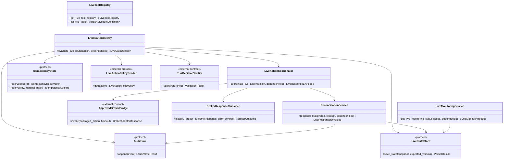
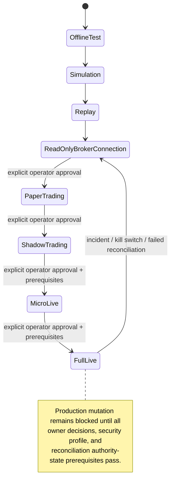

# Live Runtime - Architecture Requirements Document

## Source Scope and Traceability

This architecture document uses **only** `10-live-runtime.md` as its source. It translates the specified Live Runtime requirements into a clean Python package structure under `app/services/live/`. It does not invent a broker adapter, governance policy matrix, persistence implementation, API/UI layer, market-data pipeline, strategy logic, or risk decision engine.

### Source inventory reconciliation

- The source header says **234 checkbox tasks**. The source text itself contains **230 LIVE-FR identifiers**, **9 LIVE-NFR identifiers**, and **1 LIVE-BR identifier**: **240 uniquely identified requirements**.
- The coverage ledger maps every identifiable requirement to one primary target exactly once. Section 3 contains functional and business-rule mappings; Section 4 contains the `LIVE-NFR-*` mappings. Related functional constraints may be repeated in Section 4 only to show their cross-cutting architecture pattern, not to create duplicate ownership.
- Requirements described by the source as “No file-specific … requirements defined” are retained as scope markers and mapped to traceability verification rather than turned into artificial business logic.

### Architectural decisions enforced by this document

- **Live is a strict middleware and operational-runtime layer.** It evaluates readiness and governance gates around shared Trading actions using `route="live"`; it does not reimplement order/position behavior.
- **Broker adapters remain external.** Live validates an externally owned capability contract and classifies responses; it never implements or defines the adapter interface itself.
- **All mutation is disabled by default.** A passing gate in disabled mode produces a `packaged_only` result, never a broker call.
- **Unknown broker outcomes are not retries.** They create/reuse an authority-state and reconciliation path until broker truth resolves the result.
- **Policy, approval, risk, and persistence are consumed through explicit ports.** Live validates evidence and records results, but does not become the policy author or storage owner.

## 1. System Boundary Diagram (file structure)

```text
app/services/live/
├── __init__.py                         # Explicit public import gate; no import-time work
├── contracts.py                        # Standard live request/response/tool contracts
├── tool_registry.py                    # Intentional callable live-tool registry/catalog
├── config/                             # Validated runtime configuration and safe channels
│   ├── models.py
│   ├── loader.py
│   ├── secrets.py
│   ├── notifications.py
│   └── security_profile.py
├── runtime/                            # Session lifecycle and non-broker runtime controls
│   ├── session_manager.py
│   ├── coordination.py
│   ├── cost_control.py
│   └── signal_processor.py
├── gates/                              # Deterministic route="live" middleware
│   ├── pipeline.py
│   ├── policy_matrix.py
│   ├── approval.py
│   ├── readiness.py
│   ├── kill_switch.py
│   └── audit_and_compensation.py
├── execution/                          # Shared-action coordination, not a broker adapter
│   ├── coordinator.py
│   ├── broker_capability_validation.py
│   ├── response_classifier.py
│   ├── shadow.py
│   └── reporting.py
├── state/                              # Live projections and persistence ports
│   ├── ports.py
│   ├── manager.py
│   └── idempotency.py
├── reconciliation/                     # Broker-truth authority and retry guard
│   ├── service.py
│   ├── snapshots_and_compare.py
│   └── authority_and_retry_guard.py
├── monitoring/                         # Health, stale state, incidents, latency
│   ├── service.py
│   ├── tool_health.py
│   ├── timeouts_and_staleness.py
│   └── operational_signals.py
├── security/                           # Shared-error mapping and redaction wrapper
│   ├── error_mapping.py
│   └── redaction_boundary.py
└── promotion/                          # Promotion ladder and activation blockers
    ├── ladder.py
    └── preconditions.py

tests/services/live/
├── test_requirement_traceability.py
└── test_live_contracts_and_safety.py

examples/
└── live_runtime_examples.py
```

### Execution and ownership tree

```text
Shared Trading function called with route="live"
    -> LiveRouteGateway / gate pipeline
        -> governance-owned policy + approval evidence
        -> risk-owned decision evidence
        -> Live state / idempotency / reconciliation authority
        -> audit pre-record
        -> external Trading-owned approved broker bridge (only if mutation enabled)
        -> response classification
        -> reconciliation on unknown outcome
        -> Live state, incident, audit, monitoring, report package

Explicitly outside Live: broker adapter implementation, trading order semantics, strategy generation, risk calculations/policy authorship, persistence schema/migrations, market-data ingestion/normalization, API authentication/UI/websocket transport, and financial advice.
```

### Required externally owned ports consumed by Live

| External owner/capability | Live consumes | Live must not implement |
|---|---|---|
| Shared Trading | Route-aware action requests/results and approved broker bridge invocation | Order/position business behavior or broker adapter implementation |
| Governance | Live action policy matrix and approval-policy results | Policy matrix values, approval creation/voting/override workflow |
| Risk | Valid risk decision package/reference | Sizing, exposure, or threshold decisions |
| Data | Freshness evidence where market context is required | Ingestion, normalization, storage, historical reconstruction |
| Utils | Standard errors, response primitives, redaction, logging, tracing/time helpers | Duplicate base exception taxonomy or unsafe logging primitives |
| Persistence implementation | `LiveStateStore`, `AuditSink`, `IdempotencyStore` behavior | Database clients, migrations, schema ownership |
| UI/API | Authenticated caller and operator workflow | Authentication, rendering, websocket connection lifecycle |

## 2. Interfaces diagrams (Mermaid diagrams)

### 2.1 Component and port collaboration



### 2.2 Canonical mutation sequencing

```mermaid
sequenceDiagram
    participant T as Shared Trading Action
    participant G as Live Gate Pipeline
    participant S as State/Idempotency
    participant A as Audit Sink
    participant B as Approved Broker Bridge
    participant R as Response Classifier
    participant C as Reconciliation Service

    T->>G: action(route="live")
    G->>G: enablement → schema → approval → risk → readiness
    G->>S: staleness → idempotency → reconciliation authority
    G->>G: kill switch → audit-pre-record → adapter permission
    alt Any mandatory gate fails
        G-->>T: blocked/rejected standard envelope
    else Mutation disabled
        G-->>T: packaged_only standard envelope
    else Mutation allowed
        G->>A: persist pre-mutation evidence
        A-->>G: write success required
        G->>B: invoke approved adapter
        B-->>R: provider response/timeout/error
        R-->>T: confirmed/rejected/unknown result
        alt unknown outcome or malformed success
            R->>C: force reconciliation; block blind retry
        end
    end
```

### 2.3 Promotion ladder state relationship



## 3. Functional Requirements

### 📂 Module: `live (package facade)`

**Boundary Role:** Expose only intentional, documented live-domain callable metadata and route integrations while preventing import-time side effects and ownership leakage.

#### 📄 File: `__init__.py`

**File Boundary:** Public import gate; imports only approved public contracts and registry accessors. It performs no secret resolution, broker SDK setup, socket opening, session start, state mutation, background scheduling, or data/broker access.

**Requirement Title:** Package scope, import safety, and explicit public boundary

**Description:** Preserves the Live domain’s narrow ownership: live readiness and route enforcement around shared Trading actions. The package does not own broker adapters, market-data processing, persistence implementations, governance-policy creation, UI/API, authentication, strategy selection, risk policy, or financial advice.

**Requirements:**
- **LIVE-FR-003**: No file-specific non-functional requirements defined.
- **LIVE-FR-004**: No file-specific testing requirements defined.
- **LIVE-FR-009**: The module does not own market-data ingestion, provider data normalization, or historical data storage.
- **LIVE-FR-042**: No file-specific non-functional requirements defined.
- **LIVE-FR-012**: The module does not own API authentication, UI rendering, websocket connection management, or frontend workflow policy.
- **LIVE-FR-013**: The module does not provide financial advice, trading recommendations, or owner-approved live threshold decisions.
- **LIVE-FR-026**: UI/dashboard rendering and websocket connection management are strictly out of scope for Live. Live may emit structured JSON events for approved consumers; rendering, websocket transport, and dashboard orchestration belong to API/UI or other consumer modules.
- **LIVE-FR-060**: Importing live modules shall not start broker sessions, start background workers, mutate state, or resolve raw secret values.
- **LIVE-FR-061**: Importing live modules shall not resolve secrets, open sockets, spawn threads, start async tasks, or initialize broker SDK sessions.
- **LIVE-FR-062**: No file-specific non-functional requirements defined.
- **LIVE-FR-086**: Live is an operational runtime around `route="live"` trading functions, not a separate implementation of order and position behavior.
- **LIVE-FR-087**: Dashboard/runtime helper orchestration can remain future work if the runtime can operate safely without dashboard hints.
- **LIVE-FR-099**: No file-specific non-functional requirements defined.
- **LIVE-FR-109**: The module does not own strategy signal generation, strategy lifecycle promotion, or strategy approval.
- **LIVE-FR-110**: The module does not own risk policy, position sizing approval, exposure limits, portfolio allocation policy, or kill-switch policy ownership outside live enforcement.
- **LIVE-FR-111**: The module does not own strategy selection, financial advice, risk-policy creation, approval-policy creation, or broker-adapter policy decisions.
- **LIVE-FR-136**: No file-specific non-functional requirements defined.
- **LIVE-FR-137**: No file-specific testing requirements defined.
- **LIVE-FR-175**: The Live module shall be consumed only by approved shared trading tools, live runtime orchestration, operator workflows, monitoring, reconciliation, audit, and reporting consumers.
- **LIVE-FR-178**: The module does not own shared order, position, validation, route, bridge, receipt, simulator, or reconciliation function contracts; those belong to `07_trading.md`.
- **LIVE-FR-201**: No file-specific non-functional requirements defined.
- **LIVE-FR-222**: No file-specific non-functional requirements defined.
- **LIVE-FR-229**: No file-specific non-functional requirements defined.

**Target Class/Function:**
- `get_live_tool_registry() -> LiveToolRegistry` — Pure (returns the configured registry object; it does not start runtime infrastructure).
- `get_live_public_catalog() -> tuple[LiveToolDefinition, ...]` — Pure (No side effects).

### 📂 Module: `live (package facade)`

**Boundary Role:** Define Live-owned public boundary types while importing shared cross-domain enumerations rather than duplicating them.

#### 📄 File: `contracts.py`

**File Boundary:** Typed request, response, metadata, result-state, tool-definition, and gate-decision contracts. This file imports the shared side-effect-mode and retry-safety enumerations from Terminology And Data Definitions.

**Requirement Title:** Standard envelope, tool contract, traceability, and side-effect classification

**Description:** Makes every callable result structured, JSON-safe, redacted, traceable, and explicit about side effects and retry safety. It distinguishes packaging, confirmed broker mutation, rejection, unknown outcome, reconciliation, and incident results.

**Requirements:**
- **LIVE-FR-002**: Each exported live tool contract shall reference the shared side-effect mode and retry-safety enumerations from Terminology And Data Definitions rather than redefining them.
- **LIVE-FR-007**: Live outputs shall be structured, traceable, redacted, and JSON-safe.
- **LIVE-FR-031**: `retry_after_seconds` shall be present for `retry_after_reconciliation`, broker rate-limit, and configured retry-delay scenarios, and shall be `null` or omitted only when no retry delay is applicable.
- **LIVE-FR-102**: Each exported live tool shall define a stable public contract including tool name, purpose, input schema, output schema, approval requirement, side-effect classification, risk level, error codes, warning codes, audit metadata, idempotency behavior, and stability status.
- **LIVE-FR-105**: Live tools shall preserve clear side-effect flags and approval requirements.
- **LIVE-FR-113**: Each gate failure shall return a standard error code, human-readable operator message, request ID, correlation ID, failed gate name, retry-safety classification, and audit metadata.
- **LIVE-FR-154**: Every live result envelope shall include `side_effect_mode` with one of `none`, `packaged_only`, `broker_mutation_attempted`, `broker_mutation_confirmed`, `broker_mutation_rejected`, `unknown_outcome`, or `incident`.
- **LIVE-FR-225**: Each exported live tool shall return a standard envelope containing tool name, status, request ID, correlation ID, side-effect mode, data, errors, warnings, audit metadata, incident reference, and `retry_after_seconds` where applicable.

**Target Class/Function:**
- `validate_live_request_envelope(request: LiveRequestEnvelope) -> ValidationResult` — Pure (No side effects).
- `build_live_response(tool_name: str, status: LiveStatus, request_id: str, correlation_id: str | None, side_effect_mode: SideEffectMode, data: JsonValue | None, errors: tuple[LiveErrorDetail, ...], warnings: tuple[LiveWarning, ...], audit: AuditMetadata, incident_reference: str | None = None, retry_after_seconds: int | None = None) -> LiveResponseEnvelope` — Pure (No side effects).
- `classify_side_effect_state(result: LiveExecutionEvidence) -> SideEffectMode` — Pure (No side effects).
- `serialize_live_response(response: LiveResponseEnvelope) -> JsonValue` — Pure (No side effects).

### 📂 Module: `live (package facade)`

**Boundary Role:** Maintain the deliberate catalog of agent/API-callable Live capabilities without implementing a separate trading-action surface.

#### 📄 File: `tool_registry.py`

**File Boundary:** Registry and catalog validation for callable Live tools. Registered callables may proxy the shared Trading action surface only; helpers remain unexported.

**Requirement Title:** Intentional live tool registry and contract catalog

**Description:** Ensures every exported Live capability is unique, callable, classified, documented, and tracked in catalog and test assets. Registry changes require synchronized validation.

**Requirements:**
- **LIVE-FR-005**: Expose a registry of callable live tools through the live tool registry, with each callable live tool accepting a standard request envelope and returning a standard response envelope.
- **LIVE-FR-006**: Each exported live tool shall document whether it is public API, internal helper, or official callable tool.
- **LIVE-FR-008**: Public registry changes shall remain covered by tests and catalog updates.
- **LIVE-FR-021**: Callable/docstring tests shall cover every exported live service tool.
- **LIVE-FR-028**: Public registry and catalog updates shall be mandatory when live tools are added, renamed, or removed.
- **LIVE-FR-082**: Live registry tests shall prove the approved live runtime and governance surface is exported intentionally.

**Target Class/Function:**
- `register_live_tool(definition: LiveToolDefinition, callable_ref: LiveToolCallable) -> None` — State-mutating (mutates the in-process registry during explicit composition only).
- `get_live_tool(tool_name: str) -> RegisteredLiveTool` — Pure (No side effects).
- `list_live_tools() -> tuple[LiveToolDefinition, ...]` — Pure (No side effects).
- `validate_live_tool_catalog(registry: LiveToolRegistry, catalog: LiveToolCatalog) -> ValidationResult` — Pure (No side effects).

### 📂 Module: `live/state`

**Boundary Role:** Declare persistence contracts and persistence-related safety requirements without owning schemas, migrations, database clients, or repository implementations.

#### 📄 File: `ports.py`

**File Boundary:** Protocols for Live state, audit, and idempotency persistence. The contracts define required fields, version compatibility, error behavior, and transactional expectations; adapters live outside this module.

**Requirement Title:** Persistence ports and fail-closed persistence prerequisites

**Description:** Allows Live to require durable state, audit evidence, idempotency records, reconciliation evidence, and recovery context while preserving external ownership of databases and migrations.

**Requirements:**
- **LIVE-FR-010**: The module does not own durable database schema/migration ownership, but it shall define required persistence ports such as `LiveStateStore`, `AuditSink`, and `IdempotencyStore`, including exact method signatures, required fields, failure behavior, and schema-version compatibility expectations before Builder handoff.
- **LIVE-FR-114**: Live gate decision records shall persist the requested action, gate order, gate inputs by reference, gate outcomes, final decision, side-effect mode, and audit reference when persistence is available.

**Target Class/Function:**
- `LiveStateStore.save_state(snapshot: LiveRuntimeState, expected_version: int | None) -> PersistResult` — State-mutating (external persistence through an injected port).
- `AuditSink.append(event: LiveAuditEvent) -> AuditWriteResult` — State-mutating.
- `IdempotencyStore.reserve(record: IdempotencyRecord) -> IdempotencyReservation` — State-mutating.
- `IdempotencyStore.resolve(key: str, material_hash: str) -> IdempotencyLookup` — State-mutating (may update access/expiry metadata through the injected store).

### 📂 Module: `live/config`

**Boundary Role:** Load, validate, and expose live runtime settings and secret references without exposing resolved secrets or enabling live mutation by default.

#### 📄 File: `models.py`

**File Boundary:** Immutable typed configuration models for enablement, staleness, timeout, notifications, logging, state, queue, cost, safety, and approved-secret-reference settings.

**Requirement Title:** Validated fail-closed live configuration model

**Description:** Defines the configuration shape that must be valid before Live can start. The default result is package-only/no broker mutation unless explicitly enabled under an approved configuration.

**Requirements:**
- **LIVE-FR-029**: Live runtime configuration, including trading enablement flags, safety settings, notification settings, logging settings, state settings, and secret-reference resolution.
- **LIVE-FR-033**: Live runtime shall fail closed unless live mode is explicitly enabled by approved runtime configuration.
- **LIVE-FR-048**: Live runtime shall keep live broker mutations disabled by default unless explicitly enabled and governed.
- **LIVE-FR-049**: Live runtime shall run in package-only mode unless live broker mutation is explicitly enabled.

**Target Class/Function:**
- `validate_live_runtime_config(config: LiveRuntimeConfig) -> ValidationResult` — Pure (No side effects).
- `is_live_mutation_enabled(config: LiveRuntimeConfig) -> bool` — Pure (No side effects).
- `staleness_limit_for(context_type: LiveContextType, config: LiveRuntimeConfig) -> timedelta` — Pure (No side effects).
- `workflow_timeout_for(config: LiveRuntimeConfig) -> timedelta` — Pure (No side effects).

### 📂 Module: `live/config`

**Boundary Role:** Convert raw settings input into a validated Live configuration without leaking protected information.

#### 📄 File: `loader.py`

**File Boundary:** Configuration parsing, allowed-key validation, raw-secret prohibition, structured validation result creation, and startup validation orchestration.

**Requirement Title:** Configuration parsing and startup validation

**Description:** Rejects invalid provider, strategy, trading, safety, notification, logging, state, and secret-reference configuration before live trading can be considered ready.

**Requirements:**
- **LIVE-FR-032**: Validate live runtime configuration and resolve secret references without exposing secret values.
- **LIVE-FR-035**: Live configuration shall be validated at startup. Any invalid configured broker provider, strategy reference, trading setting, safety setting, notification route, logging setting, state setting, or secret reference shall prevent live trading until corrected.
- **LIVE-FR-036**: Live config parsing shall resolve only approved secret references, reject raw secret values where prohibited, and return structured validation errors without exposing secret values.

**Target Class/Function:**
- `parse_live_config(raw_config: Mapping[str, JsonValue]) -> LiveRuntimeConfig` — Pure (No side effects).
- `validate_startup_configuration(config: LiveRuntimeConfig, dependencies: LiveStartupDependencies) -> StartupValidationResult` — State-mutating (calls injected validation ports but never brokers).
- `redact_config_validation_error(error: ConfigurationError) -> LiveErrorDetail` — Pure (No side effects).

### 📂 Module: `live/config`

**Boundary Role:** Resolve approved secret references at explicit runtime boundaries without storing or logging raw secret values.

#### 📄 File: `secrets.py`

**File Boundary:** Secret-reference validation and injected secret-provider mediation. It does not expose secret-loader helpers publicly.

**Requirement Title:** Secret-reference resolution and prohibited raw-secret handling

**Description:** Converts only approved secret references into ephemeral runtime credentials for an approved adapter boundary and guarantees redaction on all error paths.

**Requirements:**
- **LIVE-FR-037**: Live secrets helpers shall resolve configured secret references without logging secret values.

**Target Class/Function:**
- `validate_secret_reference(reference: SecretReference) -> ValidationResult` — Pure (No side effects).
- `resolve_secret_reference(reference: SecretReference, provider: SecretProvider) -> ResolvedSecretHandle` — State-mutating (reads from injected secret provider; value must not be logged or returned in public envelopes).
- `discard_resolved_secret(handle: ResolvedSecretHandle) -> None` — State-mutating (clears ephemeral runtime handle where supported).

### 📂 Module: `live/config`

**Boundary Role:** Send safe operational notifications through injected channel adapters.

#### 📄 File: `notifications.py`

**File Boundary:** Notification request construction, recipient/channel routing through configuration, redaction, and delivery outcome recording.

**Requirement Title:** Safe live notifications

**Description:** Supports execution success/failure and operational notifications without leaking secret values, credentials, raw broker data, or private payloads.

**Requirements:**
- **LIVE-FR-030**: Live notifications through configured safe channels without leaking secrets or private broker data.
- **LIVE-FR-038**: Notification adapter shall send live execution success/failure notifications through configured safe channels.

**Target Class/Function:**
- `build_live_notification(event: LiveNotificationEvent, config: LiveRuntimeConfig) -> NotificationRequest` — Pure (No side effects).
- `send_live_notification(request: NotificationRequest, adapter: NotificationPort) -> NotificationDeliveryResult` — State-mutating (network/provider call through injected adapter).

### 📂 Module: `live/config`

**Boundary Role:** Enforce broker communication security only through an owner/architect-approved profile.

#### 📄 File: `security_profile.py`

**File Boundary:** Security-profile validation and adapter compliance evidence evaluation; it does not implement transport or broker clients.

**Requirement Title:** Mandatory broker communication security gate

**Description:** Blocks production broker mutation when the approved profile is absent, unsupported, incomplete, or non-compliant. The profile covers encrypted transport, certificate validation/pinning where supported, credential handling, logging restrictions, evidence, and failure behavior.

**Requirements:**
- **LIVE-FR-045**: Broker communication security shall be enforced through an owner/architect-approved security profile before production broker mutation can be enabled.
- **LIVE-FR-046**: The approved broker communication security profile shall define minimum encrypted transport version, certificate validation or pinning requirements where supported, credential handling, adapter compliance evidence, and failure behavior.
- **LIVE-FR-052**: Broker communication security is a mandatory pre-production gate. Live shall not allow production broker mutation until the approved security profile defines encrypted transport, certificate validation requirements, credential handling, logging restrictions, and adapter compliance tests.
- **LIVE-FR-055**: Broker communication security is not a deferrable pending decision for production; production broker mutation shall remain disabled until the mandatory broker communication security profile is approved and enforced.

**Target Class/Function:**
- `validate_broker_security_profile(profile: BrokerCommunicationSecurityProfile) -> ValidationResult` — Pure (No side effects).
- `evaluate_adapter_security_compliance(capability: BrokerAdapterCapabilityContract, profile: BrokerCommunicationSecurityProfile) -> GateOutcome` — Pure (No side effects).
- `assert_production_broker_security(profile: BrokerCommunicationSecurityProfile | None, evidence: AdapterSecurityEvidence | None) -> GateOutcome` — Pure (No side effects).

### 📂 Module: `live/runtime`

**Boundary Role:** Own the safe Live session lifecycle, runtime status, shutdown ordering, recovery diagnostics, and consumer-facing structured runtime events.

#### 📄 File: `session_manager.py`

**File Boundary:** Session/run lifecycle coordination around injected dependencies. It starts no work at import time and stops mutation admission before state/audit finalization.

**Requirement Title:** Safe session startup, shutdown, recovery, and runtime events

**Description:** Coordinates explicit lifecycle actions: validate startup dependencies, establish a live run, accept or stop accepting action requests, emit redacted status events, preserve state, flush audit evidence, and report unresolved work.

**Requirements:**
- **LIVE-FR-056**: Live session, live run, startup, shutdown, signal handling, recovery diagnostics, and runtime status/event emission for approved consumers.
- **LIVE-FR-057**: Start and stop live sessions safely.
- **LIVE-FR-058**: Live engine/session/run helpers shall orchestrate live runtime startup, shutdown, signal handling, and structured runtime status/event emission.
- **LIVE-FR-065**: Live runtime components shall support safe startup, safe shutdown, signal handling, and recovery diagnostics.
- **LIVE-FR-078**: Live shutdown shall stop accepting new live mutation requests before preserving state, flushing audit evidence, and reporting unresolved live work.

**Target Class/Function:**
- `start_live_session(request: StartLiveSessionRequest, dependencies: LiveRuntimeDependencies) -> LiveSessionStartResult` — State-mutating (validates and persists session state; it must not mutate a broker until route gates subsequently pass).
- `stop_live_session(session_id: str, reason: ShutdownReason, dependencies: LiveRuntimeDependencies) -> LiveSessionStopResult` — State-mutating.
- `handle_runtime_signal(signal: RuntimeSignal, session_id: str, dependencies: LiveRuntimeDependencies) -> LiveStatusEvent` — State-mutating.
- `collect_recovery_diagnostics(session_id: str, state_store: LiveStateStore) -> RecoveryDiagnostics` — State-mutating (reads state through an injected port).

### 📂 Module: `live/runtime`

**Boundary Role:** Protect execution capacity with explicit queue limits and safe coordination of conflicting live requests.

#### 📄 File: `coordination.py`

**File Boundary:** Conflict-key construction, lock/lease orchestration, queue admission, stale-lock recovery, optimistic-version handling, and coordination audit evidence.

**Requirement Title:** Bounded queue and conflict coordination contract

**Description:** Prevents interleaved conflicting actions affecting the same account, strategy, symbol, order, or position. The approved implementation mechanism is configurable, but contract behavior must be deterministic.

**Requirements:**
- **LIVE-FR-066**: Live runtime shall enforce bounded queue sizes or explicit rejection behavior under request overload.
- **LIVE-FR-067**: Live runtime shall serialize or otherwise safely coordinate conflicting actions for the same account, strategy, symbol, order, or position.
- **LIVE-FR-080**: Live runtime shall define a concurrency coordination contract before Builder handoff.
- **LIVE-FR-081**: The coordination contract shall define lock acquisition timeout, stale lock recovery, conflict error code, idempotency interaction, and audit evidence.
- **LIVE-FR-162**: The concurrency coordination contract shall specify whether coordination uses per-account locks, per-symbol locks, per-order/position locks, optimistic version checks, or another approved mechanism.
- **LIVE-FR-163**: Conflicting actions for the same account, strategy, symbol, order, or position shall be serialized, rejected with a deterministic conflict error, or coordinated through an approved optimistic concurrency rule.

**Target Class/Function:**
- `build_conflict_key(action: LiveActionContext) -> ConflictKey` — Pure (No side effects).
- `admit_live_request(request: LiveRequestEnvelope, queue: LiveRequestQueue) -> QueueAdmissionResult` — State-mutating.
- `acquire_action_lease(key: ConflictKey, policy: CoordinationPolicy, store: LiveStateStore) -> LeaseAcquireResult` — State-mutating.
- `recover_stale_lease(key: ConflictKey, now: datetime, policy: CoordinationPolicy, store: LiveStateStore) -> LeaseRecoveryResult` — State-mutating.
- `release_action_lease(lease: ActionLease, store: LiveStateStore) -> None` — State-mutating.

### 📂 Module: `live/runtime`

**Boundary Role:** Apply cost budgets at request, workflow, and session level without embedding cost accounting into broker-mutation logic.

#### 📄 File: `cost_control.py`

**File Boundary:** Pure budget evaluation plus stateful reservation/recording wrapper. It differentiates before-send block from after-send incident handling.

**Requirement Title:** Request, workflow, and session cost budgets

**Description:** Blocks a broker mutation if a cost budget is exceeded before send. If a budget is exceeded after a broker call, it records an incident and requires reconciliation rather than inventing a safe outcome.

**Requirements:**
- **LIVE-FR-059**: Cost enforcement shall enforce per-request, workflow, and session cost budgets and record cost entries.
- **LIVE-FR-197**: Live runtime shall record an incident when cost budget is exceeded after broker send but before reconciliation completion.
- **LIVE-FR-219**: Live runtime shall prevent broker mutation when cost budget is exceeded before broker send.
- **LIVE-FR-220**: If cost budget is exceeded after gate approval but before broker send, the runtime shall block mutation and record a cost-budget incident.

**Target Class/Function:**
- `evaluate_cost_budget(request: LiveActionContext, budgets: CostBudgetSnapshot) -> CostBudgetDecision` — Pure (No side effects).
- `reserve_cost_budget(request: LiveActionContext, store: LiveStateStore) -> CostReservationResult` — State-mutating.
- `record_cost_entry(entry: CostEntry, store: LiveStateStore) -> PersistResult` — State-mutating.
- `record_after_send_cost_incident(context: LiveActionContext, evidence: BrokerAttemptEvidence, incident_sink: AuditSink) -> IncidentRecord` — State-mutating.

### 📂 Module: `live/runtime`

**Boundary Role:** Transform only already-approved strategy signals into Live trading candidates; it does not generate strategy signals or make risk decisions.

#### 📄 File: `signal_processor.py`

**File Boundary:** Signal-to-live-candidate adaptation and context attachment before the canonical gate pipeline.

**Requirement Title:** Approved signal-to-live-candidate transformation

**Description:** Prepares a shared Trading action request from a strategy signal only when the upstream strategy/risk/governance evidence is present and valid.

**Requirements:**
- **LIVE-FR-079**: Signal processor shall transform strategy signals into live trading candidates only through approved runtime checks.

**Target Class/Function:**
- `build_live_candidate(signal: StrategySignal, context: ApprovedSignalContext) -> LiveTradingCandidate` — Pure (No side effects).
- `validate_live_candidate(candidate: LiveTradingCandidate) -> ValidationResult` — Pure (No side effects).

### 📂 Module: `live/gates`

**Boundary Role:** Serve as strict middleware for `route="live"` shared Trading actions by evaluating deterministic, fail-closed pre-flight gates in the exact approved order.

#### 📄 File: `pipeline.py`

**File Boundary:** Gate sequencing, short-circuiting, diagnostic-after-failure restriction, and final route decision packaging. It does not calculate risk, approve actions, implement broker behavior, or execute strategy logic.

**Requirement Title:** Canonical live route gate order and fail-closed behavior

**Description:** Enforces: live enablement; schema; approval; risk decision; broker readiness; stale context; idempotency; reconciliation authority; kill switch; audit pre-record; and broker-adapter permission. A mandatory failure stops all downstream state-changing, broker-calling, or capacity-consuming gates.

**Requirements:**
- **LIVE-FR-064**: Gate shared trading functions such as `submit_order`, `modify_order`, `cancel_order`, `close_position`, `modify_position`, `reduce_exposure`, `pause_strategy`, `resume_strategy`, `sync_positions`, `reconcile_state`, and `build_trading_report` when called with `route="live"`.
- **LIVE-FR-068**: Live runtime shall not overstate readiness or safety when context is partial or stale.
- **LIVE-FR-069**: Live runtime shall treat shared trading functions as the only live trading action surface.
- **LIVE-FR-071**: A failed mandatory gate shall stop evaluation before any downstream gate that could mutate broker state, mutate durable state beyond audit-safe diagnostics, or consume external broker capacity.
- **LIVE-FR-089**: Live runtime shall reject any direct live broker mutation that bypasses shared trading, risk, approval, idempotency, reconciliation, audit, or kill-switch gates.
- **LIVE-FR-090**: Live route gating shall evaluate gates in a deterministic order: live enablement, request schema validation, approval validation, risk decision validation, broker readiness, stale-context validation, idempotency validation, reconciliation authority validation, kill-switch validation, audit pre-recording, and broker adapter permission.
- **LIVE-FR-091**: Diagnostic-only gates may run after a mandatory gate failure only when the gate contract marks `diagnostic_after_failure=true`, `mutates_state=false`, `calls_broker=false`, and `requires_network=false`.
- **LIVE-FR-092**: Initially approved diagnostic-only gates are limited to local tool-contract metadata validation and local redaction validation; every other gate is mandatory until explicitly approved otherwise.
- **LIVE-FR-093**: When live broker mutation is enabled, live trading actions may call an approved broker adapter only after all mandatory live gates pass.
- **LIVE-FR-107**: The Live module shall act as a strict middleware/gateway for live-route requests and shall not implement strategy, risk, approval, broker, UI, or business-policy logic.
- **LIVE-FR-115**: Package-only success shall not be treated as broker acceptance, live readiness, risk approval, or execution evidence.

**Target Class/Function:**
- `evaluate_live_route(action: LiveActionContext, dependencies: LiveGateDependencies) -> LiveGateDecision` — State-mutating (reads/writes only audit-safe gate records through injected ports; it must not call a broker adapter).
- `run_mandatory_gates(action: LiveActionContext, dependencies: LiveGateDependencies) -> tuple[GateOutcome, ...]` — State-mutating (may query injected state/approval/readiness ports).
- `may_run_diagnostic_after_failure(gate: GateDefinition, prior_outcome: GateOutcome) -> bool` — Pure (No side effects).
- `build_blocked_live_response(decision: LiveGateDecision) -> LiveResponseEnvelope` — Pure (No side effects).

### 📂 Module: `live/gates`

**Boundary Role:** Consume and validate the governance-owned live action policy matrix without creating or self-classifying policy.

#### 📄 File: `policy_matrix.py`

**File Boundary:** Policy-reader port, required-action inventory validation, action-entry validation, and emergency-classification lookup.

**Requirement Title:** Governance-owned action policy matrix consumption

**Description:** Requires a policy entry for every action. Each entry must define ownership, permission, approval, emergency eligibility, idempotency, audit events, side-effect ceiling, retry default, and operator review. Emergency status is never inferred from text, channel, role, or caller.

**Requirements:**
- **LIVE-FR-011**: The module does not own the live action policy matrix unless a later governance decision assigns it to Live; until then, Live shall consume the approved matrix from the owning governance module.
- **LIVE-FR-014**: The live action policy matrix shall define every action mentioned in this file before Builder handoff.
- **LIVE-FR-015**: Emergency fail-safe classification shall come only from the approved live action policy matrix.
- **LIVE-FR-072**: Live runtime shall enforce the live action policy matrix and shall return `LIVE_POLICY_UNDEFINED` for any live action missing from the matrix.
- **LIVE-FR-073**: `disable_new_orders` behavior shall be dictated by the live action policy matrix. The functional requirement is enforcement of the matrix, not self-classification by the runtime.
- **LIVE-FR-104**: Critical live and kill-switch actions shall require explicit approval context unless classified as emergency fail-safe actions by the approved live action policy matrix.
- **LIVE-FR-116**: Each live action policy entry shall define action name, owning module, required permissions, approval requirement, emergency fail-safe eligibility, idempotency requirement, required audit events, side-effect ceiling, retry-safety default, and operator-review requirement.
- **LIVE-FR-123**: Kill-switch trigger tools shall consume emergency fail-safe classification only from the approved live action policy matrix and shall not infer emergency status from request text, user role, chat instruction, UI input, or API route.

**Target Class/Function:**
- `list_required_live_actions() -> tuple[LiveActionName, ...]` — Pure (No side effects).
- `validate_action_policy_coverage(matrix: LiveActionPolicyMatrix) -> ValidationResult` — Pure (No side effects).
- `get_action_policy(action: LiveActionName, reader: LiveActionPolicyReader) -> LiveActionPolicyEntry` — State-mutating (reads injected governance-owned policy).
- `is_emergency_fail_safe(action: LiveActionName, policy: LiveActionPolicyEntry) -> bool` — Pure (No side effects).

### 📂 Module: `live/gates`

**Boundary Role:** Validate approval evidence against the governance-owned approval policy and scopes.

#### 📄 File: `approval.py`

**File Boundary:** Approval context model checking, action/account/strategy/symbol scope validation, expiry/revocation checks, and approval-to-audit linkage checks.

**Requirement Title:** Approval context validation

**Description:** Requires valid approval only for actions classified as approval-required by the policy matrix. It blocks expired, revoked, malformed, wrong-action, out-of-scope, missing-audit, or non-approved contexts.

**Requirements:**
- **LIVE-FR-074**: Live runtime shall require valid approval context for each action classified as approval-required in the live action policy matrix.
- **LIVE-FR-075**: Live runtime shall reject approval context that is expired, revoked, not approved, outside action scope, outside account scope, outside strategy or symbol scope, or missing required audit metadata.
- **LIVE-FR-088**: Live-only approval gates for broker mutation, kill-switch action, pause, resume, exposure reduction, mass cancel, mass close, and recovery.
- **LIVE-FR-112**: The module does not own approval policy creation, but it shall validate approval context against the approved approval-policy contract.
- **LIVE-FR-117**: Approval context shall include approval ID, approved action type, approved account scope, strategy scope where applicable, symbol scope where applicable, risk decision reference where applicable, approver identity reference, approval timestamp, expiration timestamp, approval state, and audit metadata.
- **LIVE-FR-118**: Approval expiry between gate evaluation and broker send shall block mutation or produce an unknown/incident state only if a broker send already occurred.

**Target Class/Function:**
- `validate_approval_context(action: LiveActionContext, approval: ApprovalContext | None, policy: LiveActionPolicyEntry) -> GateOutcome` — Pure (No side effects).
- `validate_approval_scope(action: LiveActionContext, approval: ApprovalContext) -> ValidationResult` — Pure (No side effects).
- `validate_approval_expiry(approval: ApprovalContext, at: datetime) -> ValidationResult` — Pure (No side effects).

### 📂 Module: `live/gates`

**Boundary Role:** Enforce staleness, broker capability/readiness, current reconciliation authority, idempotency, and explicit live enablement before a broker-mutation path.

#### 📄 File: `readiness.py`

**File Boundary:** Readiness sub-gates that inspect injected snapshots and broker capability evidence. It does not create or manage broker connections.

**Requirement Title:** Readiness, freshness, and state-authority validation

**Description:** Requires internal positions/orders to match broker truth within configured staleness limits, validates broker capability/API/version/schema prerequisites, and blocks stale/partial/unknown authority states.

**Requirements:**
- **LIVE-FR-034**: The runtime must verify that its internal position/order view matches broker truth within configured `max_staleness_seconds` or narrower approved context-specific staleness thresholds before any broker mutation.
- **LIVE-FR-040**: Live readiness stale thresholds shall be configurable per context type and shall be enforced deterministically.
- **LIVE-FR-127**: Broker adapter readiness shall fail closed on unsupported API version, deprecated endpoint use, missing capability declaration, stale symbol metadata, missing account snapshot, or incompatible response schema version.
- **LIVE-FR-138**: Evaluate live readiness before `route="live"` trading functions can mutate broker state.
- **LIVE-FR-146**: Live broker readiness and broker-truth synchronization before live mutation.
- **LIVE-FR-152**: Broker readiness shall include broker API/version compatibility checks once the broker adapter contract is approved.

**Target Class/Function:**
- `evaluate_live_enablement(config: LiveRuntimeConfig) -> GateOutcome` — Pure (No side effects).
- `evaluate_context_freshness(context: LiveContextSnapshot, config: LiveRuntimeConfig) -> GateOutcome` — Pure (No side effects).
- `evaluate_broker_readiness(capability: BrokerAdapterCapabilityContract, snapshot: BrokerTruthSnapshot) -> GateOutcome` — Pure (No side effects).
- `evaluate_reconciliation_authority(authority: LiveAuthorityState) -> GateOutcome` — Pure (No side effects).

### 📂 Module: `live/gates`

**Boundary Role:** Enforce approved kill-switch actions and the non-bypassable active-kill-switch trading halt.

#### 📄 File: `kill_switch.py`

**File Boundary:** Kill-switch request packaging, condition checking, state enforcement, policy-driven disable/cancel/close actions, event evidence, and approval-cleared recovery packaging.

**Requirement Title:** Governed kill-switch enforcement and recovery

**Description:** Packages global and strategy kill switches, checks conditions, blocks all live actions when active, and ensures only governance policy defines emergency and re-enable behavior.

**Requirements:**
- **LIVE-FR-044**: Package kill-switch trigger, condition check, order-disable, mass-cancel, mass-close, event-record, re-enable-approval, and approval-cleared recovery requests.
- **LIVE-FR-047**: Live kill-switch enforcement, live order disablement, live mass-cancel/mass-close request packaging, re-enable approval, and approval-cleared recovery.
- **LIVE-FR-051**: `require_reenable_approval` shall require approval before trading can be re-enabled.
- **LIVE-FR-094**: `trigger_global_kill_switch` shall package global trading kill-switch activation only after approval gates unless explicitly classified as an emergency fail-safe action.
- **LIVE-FR-095**: `trigger_strategy_kill_switch` shall package strategy-level kill-switch activation only after approval gates unless explicitly classified as an emergency fail-safe action.
- **LIVE-FR-096**: `cancel_all_orders` shall package cancellation of all pending orders only after approval gates.
- **LIVE-FR-097**: `close_all_positions` shall package closing all positions only after approval gates.
- **LIVE-FR-098**: `clear_kill_switch_after_approval` shall package kill-switch clearing only after approval gates.
- **LIVE-FR-124**: `check_kill_switch_conditions` shall package kill-switch trigger-condition evaluation.
- **LIVE-FR-125**: `record_kill_switch_event` shall package durable kill-switch event recording.
- **LIVE-FR-126**: Active kill switch shall block live trading requests regardless of route request text, UI input, API input, or chat instruction.
- **LIVE-FR-156**: `disable_new_orders` shall package or perform disabling new order submission according to the live action policy matrix.

**Target Class/Function:**
- `check_kill_switch_conditions(context: KillSwitchConditionContext) -> KillSwitchConditionResult` — Pure (No side effects).
- `trigger_global_kill_switch(request: KillSwitchRequest, dependencies: KillSwitchDependencies) -> LiveResponseEnvelope` — State-mutating.
- `trigger_strategy_kill_switch(request: KillSwitchRequest, dependencies: KillSwitchDependencies) -> LiveResponseEnvelope` — State-mutating.
- `record_kill_switch_event(event: KillSwitchEvent, audit_sink: AuditSink) -> AuditWriteResult` — State-mutating.
- `clear_kill_switch_after_approval(request: KillSwitchClearRequest, dependencies: KillSwitchDependencies) -> LiveResponseEnvelope` — State-mutating.
- `disable_new_orders(request: DisableOrdersRequest, dependencies: KillSwitchDependencies) -> LiveResponseEnvelope` — State-mutating.

### 📂 Module: `live/gates`

**Boundary Role:** Record pre-mutation audit evidence and hold compensation definitions at a dedicated governance boundary.

#### 📄 File: `audit_and_compensation.py`

**File Boundary:** Audit pre-record orchestration, gate decision evidence persistence, and validation of governance-approved compensation plans. It does not invent compensating actions.

**Requirement Title:** Pre-mutation evidence and controlled compensation boundary

**Description:** Requires audit pre-event persistence before broker send; failure blocks mutation. Compensation is unavailable until each action class is explicitly approved with scope, timeout, evidence, retry, and terminal-failure rules.

**Requirements:**
- **LIVE-FR-106**: Compensation behavior shall be allowed only for approved compensation action classes. Each compensation action shall define preconditions, maximum scope, approval requirement, timeout, audit evidence, retry policy, and terminal failure behavior.
- **LIVE-FR-108**: Live gate decision records for every live-route request, including gate inputs, gate outcomes, final decision, side-effect mode, and audit reference.
- **LIVE-FR-150**: Audit pre-event evidence shall be recorded before broker mutation and audit post-event evidence after broker response, rejection, timeout, or unknown outcome.
- **LIVE-FR-151**: Audit-write failure before broker mutation shall always block broker mutation.

**Target Class/Function:**
- `record_live_gate_decision(record: LiveGateDecisionRecord, audit_sink: AuditSink) -> AuditWriteResult` — State-mutating.
- `record_pre_mutation_evidence(action: LiveActionContext, audit_sink: AuditSink) -> AuditWriteResult` — State-mutating.
- `validate_compensation_plan(plan: CompensationPlan, policy: CompensationPolicy) -> ValidationResult` — Pure (No side effects).
- `package_compensation_action(plan: CompensationPlan) -> CompensationActionRequest` — Pure (No side effects).

### 📂 Module: `live/execution`

**Boundary Role:** Coordinate a gate-approved shared Trading action without implementing separate order/position business behavior or an adapter implementation.

#### 📄 File: `coordinator.py`

**File Boundary:** Package-only behavior, approved adapter invocation delegation, side-effect recording, action scope preservation, and response construction. Actual order semantics remain owned by shared Trading.

**Requirement Title:** Live action coordination through shared Trading contracts

**Description:** Routes approved submit/modify/cancel/close/reduce/pause/resume/sync/report requests. With mutation disabled, it returns only a validated package and never calls an adapter. With mutation enabled, it records pre/post evidence and delegates only after all gates pass.

**Requirements:**
- **LIVE-FR-050**: `submit_order(route="live")` shall return a blocked result unless the canonical live route gate passes. If the gate passes and live mutation is disabled, it shall return a packaged-only submit request. If the gate passes and live mutation is enabled, it may call an approved broker adapter and shall record the resulting side-effect state.
- **LIVE-FR-076**: `modify_position(route="live")` shall follow the canonical live route gate and shall preserve stop-loss or take-profit mutation scope, broker constraints, idempotency material, and side-effect mode.
- **LIVE-FR-077**: `pause_strategy(route="live")` and `resume_strategy(route="live")` shall be operational live controls only and shall not replace strategy lifecycle promotion or approval.
- **LIVE-FR-119**: `modify_order(route="live")` shall follow the canonical live route gate and shall preserve order identity, approved mutation scope, idempotency material, and side-effect mode.
- **LIVE-FR-120**: `cancel_order(route="live")` shall follow the canonical live route gate and shall preserve order identity, cancel reason, idempotency material, and side-effect mode.
- **LIVE-FR-121**: `close_position(route="live")` shall follow the canonical live route gate and shall preserve position identity, close scope, risk/approval references, idempotency material, and side-effect mode.
- **LIVE-FR-122**: `reduce_exposure(route="live")` shall follow the canonical live route gate and shall preserve the approved reduction scope, position/symbol/account scope, idempotency material, and side-effect mode.
- **LIVE-FR-135**: Trade executor shall enforce live execution safety checks before broker mutation.
- **LIVE-FR-140**: Live mutations shall be disabled by default.
- **LIVE-FR-149**: The module does not grant AI chat, UI, API, backtest, or optimization workflows authority to execute live broker mutations.
- **LIVE-FR-153**: When live broker mutation is disabled, live trading actions shall only package validated broker-mutation requests or return structured blocks and shall not call any broker adapter.
- **LIVE-FR-155**: `sync_positions(route="live")` shall package live position synchronization from broker state and shall not mutate broker orders or positions.

**Target Class/Function:**
- `coordinate_live_action(action: LiveActionContext, dependencies: LiveExecutionDependencies) -> LiveResponseEnvelope` — State-mutating (may delegate an approved broker mutation through the shared Trading-owned adapter boundary only after gate approval).
- `package_live_action(action: LiveActionContext, decision: LiveGateDecision) -> PackagedLiveAction` — Pure (No side effects).
- `prepare_modify_order_action(request: SharedModifyOrderRequest, context: LiveActionContext) -> LiveActionContext` — Pure (No side effects).
- `prepare_cancel_order_action(request: SharedCancelOrderRequest, context: LiveActionContext) -> LiveActionContext` — Pure (No side effects).
- `prepare_close_position_action(request: SharedClosePositionRequest, context: LiveActionContext) -> LiveActionContext` — Pure (No side effects).
- `prepare_reduce_exposure_action(request: SharedReduceExposureRequest, context: LiveActionContext) -> LiveActionContext` — Pure (No side effects).
- `prepare_modify_position_action(request: SharedModifyPositionRequest, context: LiveActionContext) -> LiveActionContext` — Pure (No side effects).
- `prepare_pause_resume_action(request: StrategyOperationalControlRequest, context: LiveActionContext) -> LiveActionContext` — Pure (No side effects).
- `package_position_sync_request(request: SharedSyncPositionsRequest, context: LiveActionContext) -> PackagedLiveAction` — Pure (No side effects).

### 📂 Module: `live/execution`

**Boundary Role:** Validate and classify approved broker adapter capability and response evidence without defining or implementing adapter interfaces.

#### 📄 File: `broker_capability_validation.py`

**File Boundary:** Adapter-capability evidence validation, version/schema/readiness checks, timeout/rate-limit policy application, malformed-success detection, and safe broker bridge invocation through an injected external contract.

**Requirement Title:** Approved broker capability, response validation, and retry-safe mapping

**Description:** Consumes externally owned adapter capability contracts. It fails closed on missing capability, unsupported API version, deprecated endpoint, stale symbols, missing account snapshot, schema incompatibility, unproven no-mutation rate limits, or malformed success evidence.

**Requirements:**
- **LIVE-FR-001**: The module does not own broker adapter implementation or interface definition; it owns live readiness validation, response classification, and error-mapping requirements for approved broker adapters before live use.
- **LIVE-FR-041**: Live broker adapter calls shall have configured timeout limits and shall classify timeout as unknown outcome unless broker truth proves otherwise.
- **LIVE-FR-141**: Broker calls shall be isolated behind approved adapters or bridges.
- **LIVE-FR-142**: Raw broker payloads shall be stored only as redacted evidence references unless explicitly classified safe.
- **LIVE-FR-157**: Each approved broker adapter shall expose a documented capability contract before Live can use it for broker mutation.
- **LIVE-FR-158**: Broker adapter contracts shall define provider ID, API/version compatibility, supported actions, symbol metadata access, account/order/position snapshot access, readiness checks, request schema, response schema, timeout behavior, rate-limit behavior, malformed-response handling, error mapping, retry-safety classification, and redaction rules.
- **LIVE-FR-159**: Broker-side rate limiting, including HTTP 429 or provider-equivalent rate-limit responses, shall not be retried blindly.
- **LIVE-FR-160**: Broker rate-limit responses shall include `retry_after_seconds` when the provider supplies or the approved rate-limit policy derives a retry delay.

**Target Class/Function:**
- `validate_adapter_capability(capability: BrokerAdapterCapabilityContract, action: LiveActionName) -> GateOutcome` — Pure (No side effects).
- `validate_broker_response(response: BrokerAdapterResponse, contract: BrokerAdapterCapabilityContract) -> ValidationResult` — Pure (No side effects).
- `invoke_approved_broker_bridge(action: PackagedLiveAction, bridge: ApprovedBrokerBridge, timeout: timedelta) -> BrokerAdapterResponse` — State-mutating (external broker interaction through the injected bridge).
- `derive_rate_limit_retry(response: BrokerAdapterResponse, capability: BrokerAdapterCapabilityContract) -> RetryDirective` — Pure (No side effects).
- `build_broker_timeout_outcome(action: LiveActionContext) -> BrokerOutcome` — Pure (No side effects).

### 📂 Module: `live/execution`

**Boundary Role:** Classify broker outcomes deterministically and separate confirmation from rejection, unknown outcomes, reconciliation, and incident states.

#### 📄 File: `response_classifier.py`

**File Boundary:** Pure response/error classification, retry-safety assignment, side-effect mapping, and unknown-outcome escalation signals.

**Requirement Title:** Broker response and side-effect outcome classification

**Description:** Treats timeouts, malformed HTTP-success payloads, and ambiguous responses as unknown outcomes until broker truth resolves them. Broker rejection, validation rejection, confirmed acceptance, and incident are separate states.

**Requirements:**
- **LIVE-FR-070**: Live runtime shall classify unknown broker outcomes separately from broker rejections, validation rejections, and successful broker acknowledgements.
- **LIVE-FR-145**: Live side-effect state classification for each request: no side effect, packaged only, broker mutation attempted, broker mutation accepted, broker mutation rejected, unknown outcome, reconciled, or incident.
- **LIVE-FR-195**: Malformed broker success responses, including HTTP 200 or equivalent success status with missing required fields or invalid data types, shall be classified as `unknown_outcome`, shall trigger reconciliation, and shall not be treated as confirmed broker mutation.
- **LIVE-FR-196**: Broker rate-limit responses shall return `retry_safety="safe_to_retry"` only when the adapter contract proves no broker mutation occurred; otherwise they shall return `retry_safety="retry_after_reconciliation"` or `do_not_retry`.

**Target Class/Function:**
- `classify_broker_outcome(response: BrokerAdapterResponse | None, error: Exception | None, contract: BrokerAdapterCapabilityContract) -> BrokerOutcome` — Pure (No side effects).
- `classify_retry_safety(outcome: BrokerOutcome) -> RetrySafety` — Pure (No side effects).
- `requires_reconciliation(outcome: BrokerOutcome) -> bool` — Pure (No side effects).

### 📂 Module: `live/execution`

**Boundary Role:** Run production-like shadow workflows and comparison reporting without any real broker mutation.

#### 📄 File: `shadow.py`

**File Boundary:** Shadow feed packaging, shadow execution request building, live-reference rejection, expected-versus-realized comparison construction, and explicit future/deferred evidence flags.

**Requirement Title:** Shadow execution and expected-versus-realized evidence

**Description:** Ensures shadow mode never receives live account references or live broker adapters and never constitutes broker acceptance, live approval, or readiness proof by itself.

**Requirements:**
- **LIVE-FR-019**: Shadow data feeds shall package production-like account, portfolio, market, and environment snapshots.
- **LIVE-FR-020**: Shadow comparison reports shall compare expected and realized fill/PnL outcomes.
- **LIVE-FR-024**: Optional shadow expected-versus-realized PnL reporting can remain future work unless required before live launch.
- **LIVE-FR-128**: Shadow execution shall not be treated as live broker approval or live readiness by itself.
- **LIVE-FR-139**: Support shadow execution and expected-versus-realized reporting without real broker mutation.
- **LIVE-FR-144**: Paper, simulation, and shadow trading shall remain separate from live broker mutation.
- **LIVE-FR-148**: Live-compatible shadow execution and production-like comparison reports when real broker mutation is disabled.
- **LIVE-FR-165**: Shadow execution shall execute production-like workflows without real broker mutation.
- **LIVE-FR-166**: Shadow execution shall fail closed if it receives a live account reference or live broker adapter reference.

**Target Class/Function:**
- `build_shadow_feed_snapshot(account: ShadowAccountSnapshot, portfolio: ShadowPortfolioSnapshot, market: ShadowMarketSnapshot, environment: ShadowEnvironmentSnapshot) -> ShadowFeed` — Pure (No side effects).
- `validate_shadow_request(request: ShadowExecutionRequest) -> ValidationResult` — Pure (No side effects).
- `run_shadow_execution(request: ShadowExecutionRequest, executor: ShadowExecutionPort) -> ShadowExecutionResult` — State-mutating (records shadow evidence only; broker mutation is prohibited).
- `compare_expected_and_realized(expected: ExpectedExecutionEvidence, realized: RealizedExecutionEvidence) -> ShadowComparisonReport` — Pure (No side effects).

### 📂 Module: `live/execution`

**Boundary Role:** Package reports from existing evidence without fabricating, recomputing, or rendering execution results.

#### 📄 File: `reporting.py`

**File Boundary:** Live execution/reconciliation/performance report request assembly and JSON-safe report payload construction for downstream reporting consumers.

**Requirement Title:** Evidence-only live report packaging

**Description:** Builds reports containing approval, risk, route, broker evidence, receipts, reconciliation state, incidents, warnings, and unresolved actions. It does not calculate financial results or produce dashboard UI.

**Requirements:**
- **LIVE-FR-016**: `build_trading_report(route="live")` shall package a live execution result report request without recomputing or fabricating execution evidence.
- **LIVE-FR-147**: Live performance reports, live execution reports, broker-truth snapshots, and live audit evidence.
- **LIVE-FR-180**: Produce live execution, reconciliation, incident, and performance reports with audit evidence.
- **LIVE-FR-198**: Live reports shall include approvals, risk decisions, route, broker evidence, receipts, reconciliation state, incidents, warnings, and unresolved actions.

**Target Class/Function:**
- `build_trading_report(route: Literal["live"], evidence: LiveExecutionEvidenceBundle) -> LiveReportRequest` — Pure (No side effects).
- `build_live_execution_report(evidence: LiveExecutionEvidenceBundle) -> LiveExecutionReportPayload` — Pure (No side effects).
- `build_live_reconciliation_report(result: ReconciliationResult) -> LiveReconciliationReportPayload` — Pure (No side effects).

### 📂 Module: `live/state`

**Boundary Role:** Maintain the minimal authoritative in-process/projection state required for Live decisions, recovery, and monitoring through injected persistence ports.

#### 📄 File: `manager.py`

**File Boundary:** Live position/order/receipt/reconciliation/run/incident/recovery views, versioned state transitions, and state reads for decision gates.

**Requirement Title:** Live runtime state and position views

**Description:** Maintains Live’s current position view and recovery context while respecting shared Trading ownership of the canonical order/position contracts and broker truth precedence.

**Requirements:**
- **LIVE-FR-017**: Position manager shall maintain live position views used by trading decisions.
- **LIVE-FR-177**: Live state management for positions, orders, broker receipts, reconciliation status, run status, incidents, and recovery context.
- **LIVE-FR-210**: Live state manager shall preserve runtime state needed for live execution recovery and monitoring.

**Target Class/Function:**
- `get_live_position_view(account_id: str, strategy_id: str | None = None) -> LivePositionView` — State-mutating (reads injected state store).
- `apply_broker_receipt(receipt: BrokerReceipt, store: LiveStateStore) -> StateTransitionResult` — State-mutating.
- `record_runtime_state(state: LiveRuntimeState, store: LiveStateStore) -> PersistResult` — State-mutating.
- `load_recovery_context(session_id: str, store: LiveStateStore) -> RecoveryContext` — State-mutating.

### 📂 Module: `live/state`

**Boundary Role:** Prevent unsafe duplicate request processing while explicitly not claiming exactly-once broker semantics.

#### 📄 File: `idempotency.py`

**File Boundary:** Canonical material hashing, duplicate classification, record reservation/persistence, concurrency interaction, and durable duplicate result retrieval.

**Requirement Title:** Live idempotency before mutation

**Description:** Rejects duplicate same/different-material requests appropriately, handles simultaneous requests deterministically, writes records before a mutation attempt where persistence is required, and fails closed if required storage is unavailable.

**Requirements:**
- **LIVE-FR-022**: Idempotency tests shall cover duplicate same-material, duplicate different-material, and simultaneous duplicate live requests.
- **LIVE-FR-143**: Idempotency shall prevent unsafe duplicate live execution and shall not be mistaken for exactly-once broker semantics.
- **LIVE-FR-194**: Live runtime shall persist idempotency records before any broker mutation attempt where persistence is available and shall fail closed if required idempotency persistence cannot be written.

**Target Class/Function:**
- `build_idempotency_material(action: LiveActionContext) -> IdempotencyMaterial` — Pure (No side effects).
- `reserve_live_idempotency_key(material: IdempotencyMaterial, store: IdempotencyStore) -> IdempotencyReservation` — State-mutating.
- `resolve_duplicate_live_request(material: IdempotencyMaterial, store: IdempotencyStore) -> DuplicateRequestResolution` — State-mutating.

### 📂 Module: `live/reconciliation`

**Boundary Role:** Reconcile internal Live projections against normalized broker truth and govern the authority state after mismatches or unknown outcomes.

#### 📄 File: `service.py`

**File Boundary:** Startup, pre-trade, periodic, shutdown, and explicit reconciliation orchestration; persistence of runs/mismatches/incidents; action packaging for shared `reconcile_state(route="live")`.

**Requirement Title:** Broker-truth reconciliation lifecycle

**Description:** Runs readiness/reconciliation before startup recovery or mutation, blocks mutation until success or an approved operator-cleared recovery state, and packages structured mismatch/unknown-outcome/incident evidence.

**Requirements:**
- **LIVE-FR-176**: Live reconciliation authority state, startup reconciliation, retry guard, unknown-outcome handling, and live discrepancy incidents.
- **LIVE-FR-179**: Package live submit, cancel, modify, close, pause, resume, reduce exposure, position sync, broker reconciliation, and live report requests through shared trading contracts.
- **LIVE-FR-182**: Live runtime shall return structured rejections or blocks for invalid orders, disabled live mode, unsupported broker, failed readiness checks, stale context, active kill switch, reconciliation mismatch, missing approval, or unsafe live conditions.
- **LIVE-FR-183**: `reconcile_state(route="live")` shall package reconciliation of internal state against broker truth and shall record mismatch, unknown-outcome, and incident states.
- **LIVE-FR-184**: Live startup shall run broker readiness and startup reconciliation before live recovery or live mutation workflows.
- **LIVE-FR-185**: Live startup shall not permit live mutation until startup reconciliation completes successfully or produces an approved operator-cleared recovery state.
- **LIVE-FR-188**: Live reconciliation persistence shall preserve reconciliation runs, mismatches, incidents, and evidence references through the approved persistence interface.
- **LIVE-FR-199**: Live shall fail closed on missing approval, missing risk context, stale broker/account state, active kill switch, reconciliation mismatch, idempotency conflict, disabled live flag, or unknown broker result.
- **LIVE-FR-200**: Unknown broker outcomes shall block blind retries until reconciliation resolves state.

**Target Class/Function:**
- `reconcile_state(route: Literal["live"], request: ReconciliationRequest, dependencies: ReconciliationDependencies) -> LiveResponseEnvelope` — State-mutating (reads broker truth via approved Trading-owned adapter and persists reconciliation/audit evidence).
- `run_startup_reconciliation(session_id: str, dependencies: ReconciliationDependencies) -> ReconciliationResult` — State-mutating.
- `run_shutdown_reconciliation(session_id: str, dependencies: ReconciliationDependencies) -> ReconciliationResult` — State-mutating.
- `schedule_periodic_reconciliation(policy: ReconciliationSchedulePolicy, runtime: LiveRuntimeScheduler) -> None` — State-mutating (registers bounded lifecycle work through injected runtime scheduler).

### 📂 Module: `live/reconciliation`

**Boundary Role:** Normalize broker-truth snapshots and calculate deterministic state differences without deciding broker behavior.

#### 📄 File: `snapshots_and_compare.py`

**File Boundary:** Broker snapshot normalization, internal-state normalization, missing/extra/mismatched/stale detection, and evidence reference assembly.

**Requirement Title:** Broker truth normalization and discrepancy comparison

**Description:** Normalizes positions, orders, account, and time evidence. It detects missing, extra, mismatched, and stale records and provides deterministic reconciliation facts to the authority-state layer.

**Requirements:**
- **LIVE-FR-186**: Broker-truth snapshots shall normalize broker positions, orders, account, and timestamp evidence.
- **LIVE-FR-187**: Live reconciliation comparison shall detect missing, extra, mismatched, and stale broker/internal records.
- **LIVE-FR-193**: Reconciliation shall prefer broker truth when determining live authority state.

**Target Class/Function:**
- `normalize_broker_truth_snapshot(raw: BrokerStateSnapshot) -> BrokerTruthSnapshot` — Pure (No side effects).
- `compare_live_state(internal: LiveRuntimeState, broker_truth: BrokerTruthSnapshot) -> ReconciliationDiff` — Pure (No side effects).
- `select_authoritative_state(diff: ReconciliationDiff, broker_truth: BrokerTruthSnapshot) -> AuthorityEvidence` — Pure (No side effects).

### 📂 Module: `live/reconciliation`

**Boundary Role:** Prevent blind retries and retain unresolved live authority states until broker truth resolves them.

#### 📄 File: `authority_and_retry_guard.py`

**File Boundary:** Authority-state model, unknown-outcome guard, operator-cleared recovery validation, retry directive creation, and discrepancy incident packaging.

**Requirement Title:** Unknown-outcome authority state and retry guard

**Description:** Blocks blind retry following an unknown result, preserves the unresolved state across restart, requires reconciliation before retry safety can change, and treats malformed success responses as unknown rather than confirmed execution.

**Requirements:**
- **LIVE-FR-190**: Retry guard behavior shall prevent unsafe blind retries after unknown broker outcomes.
- **LIVE-FR-191**: Unknown broker outcomes shall block blind retry until broker truth resolves the live authority state.
- **LIVE-FR-192**: Live reconciliation incidents shall package discrepancy severity, evidence, action requirement, and audit context.

**Target Class/Function:**
- `transition_live_authority(current: LiveAuthorityState, evidence: AuthorityEvidence) -> AuthorityTransitionResult` — Pure (No side effects).
- `guard_retry_after_unknown_outcome(outcome: BrokerOutcome, authority: LiveAuthorityState) -> RetryDirective` — Pure (No side effects).
- `build_reconciliation_incident(diff: ReconciliationDiff, context: LiveActionContext) -> IncidentRecord` — Pure (No side effects).
- `validate_operator_cleared_recovery(recovery: OperatorClearedRecovery, approval: ApprovalContext) -> ValidationResult` — Pure (No side effects).

### 📂 Module: `live/monitoring`

**Boundary Role:** Observe Live health and safety evidence without implementing dashboards, websockets, or UI workflows.

#### 📄 File: `service.py`

**File Boundary:** Aggregates structured monitoring views for stale context, ingestion, tool health, workflow timeouts, incidents, latency, cost, notifications, readiness, and optional recent snapshots.

**Requirement Title:** Live operational monitoring aggregation

**Description:** Provides structured JSON event/status payloads for approved consumers. UI rendering and websocket transport remain out of scope.

**Requirements:**
- **LIVE-FR-103**: Monitor live stale state, ingestion, tool health, workflow timeout, operational status, incidents, cost, latency, and notification outcomes.
- **LIVE-FR-209**: Live monitoring for stale state, ingestion health, tool health, workflow timeout, operational incidents, latency, cost, notification failures, and live readiness.
- **LIVE-FR-221**: Monitoring shall expose stale state, timeouts, health failures, incidents, latency, and cost-budget conditions.

**Target Class/Function:**
- `get_live_monitoring_status(scope: MonitoringScope, dependencies: MonitoringDependencies) -> LiveMonitoringStatus` — State-mutating (reads injected stores and health ports).
- `emit_runtime_status_event(event: LiveStatusEvent, sink: LiveEventSink) -> EmitResult` — State-mutating.
- `build_operator_monitoring_payload(status: LiveMonitoringStatus) -> JsonValue` — Pure (No side effects).

### 📂 Module: `live/monitoring`

**Boundary Role:** Track callable tool health and dependency health for every exported Live tool.

#### 📄 File: `tool_health.py`

**File Boundary:** Tool-health state transitions based on successful calls, failures, timeouts, dependencies, and consecutive failure counts.

**Requirement Title:** Exported live tool health monitoring

**Description:** Records last success, last failure, consecutive failure count, timeout count, dependency status, and current health state per exported tool.

**Requirements:**
- **LIVE-FR-211**: Tool health monitoring shall track last successful call time, last failure time, consecutive failure count, timeout count, dependency status, and current health state for each exported live tool.

**Target Class/Function:**
- `record_tool_success(tool_name: str, at: datetime, store: LiveStateStore) -> PersistResult` — State-mutating.
- `record_tool_failure(tool_name: str, failure: LiveErrorDetail, at: datetime, store: LiveStateStore) -> PersistResult` — State-mutating.
- `evaluate_tool_health(record: ToolHealthRecord) -> ToolHealthState` — Pure (No side effects).

### 📂 Module: `live/monitoring`

**Boundary Role:** Detect overdue workflows and context freshness hazards deterministically.

#### 📄 File: `timeouts_and_staleness.py`

**File Boundary:** Workflow deadline checks, stale account/broker/order/position/market/approval/risk checks, and market-data freshness dependency enforcement.

**Requirement Title:** Workflow timeout and stale-state monitoring

**Description:** Raises/records `WORKFLOW_TIMEOUT` incidents and determines stale state relative to approved freshness thresholds before any dependent broker mutation.

**Requirements:**
- **LIVE-FR-039**: Workflows exceeding configured `live_workflow_timeout_seconds` shall trigger a `WORKFLOW_TIMEOUT` incident.
- **LIVE-FR-212**: Workflow timeout monitoring shall detect stale or overdue live workflows.
- **LIVE-FR-213**: Stale-state monitoring shall identify stale market, account, broker, approval, or risk state.
- **LIVE-FR-214**: Stale-state monitoring shall tie broker/account/order/position freshness checks to approved market-data freshness thresholds where broker mutation depends on current market state.

**Target Class/Function:**
- `detect_workflow_timeout(workflow: LiveWorkflowRecord, timeout: timedelta, now: datetime) -> TimeoutCheckResult` — Pure (No side effects).
- `evaluate_stale_live_context(context: LiveContextSnapshot, thresholds: FreshnessThresholds, now: datetime) -> StalenessReport` — Pure (No side effects).
- `record_workflow_timeout_incident(workflow: LiveWorkflowRecord, sink: AuditSink) -> IncidentRecord` — State-mutating.

### 📂 Module: `live/monitoring`

**Boundary Role:** Track required live input ingestion, incident severity/action needs, latency diagnostics, and optional performance snapshots.

#### 📄 File: `operational_signals.py`

**File Boundary:** Input-arrival health, incident classification, latency record construction, and bounded snapshot-cache interface.

**Requirement Title:** Ingestion, incidents, latency, and snapshot signals

**Description:** Makes feed/input health, operational incidents, timing evidence, and recent performance snapshots available to approved consumers without making snapshots a required live-readiness dependency unless explicitly promoted.

**Requirements:**
- **LIVE-FR-027**: Snapshot cache behavior can remain future work unless required for live readiness or audit.
- **LIVE-FR-215**: Ingestion monitoring shall track whether required live inputs are arriving.
- **LIVE-FR-216**: Incident classification shall classify live incidents by severity and action need.
- **LIVE-FR-217**: Latency helpers shall record live trading timing and latency diagnostics.
- **LIVE-FR-218**: Snapshot caches shall preserve recent live performance snapshots.

**Target Class/Function:**
- `evaluate_ingestion_health(inputs: tuple[LiveInputHeartbeat, ...], policy: IngestionHealthPolicy, now: datetime) -> IngestionHealthReport` — Pure (No side effects).
- `classify_live_incident(event: LiveOperationalEvent) -> IncidentClassification` — Pure (No side effects).
- `record_live_latency(sample: LiveLatencySample, store: LiveStateStore) -> PersistResult` — State-mutating.
- `store_performance_snapshot(snapshot: LivePerformanceSnapshot, cache: LiveSnapshotCache) -> SnapshotStoreResult` — State-mutating.
- `get_recent_performance_snapshot(scope: SnapshotScope, cache: LiveSnapshotCache) -> LivePerformanceSnapshot | None` — State-mutating (cache read).

### 📂 Module: `live/security`

**Boundary Role:** Map only finite, shared error taxonomy values into structured Live errors without duplicating base exceptions.

#### 📄 File: `error_mapping.py`

**File Boundary:** Live-specific error mapping and error-envelope detail creation. It imports standard base exceptions and codes from `app.utils.errors`.

**Requirement Title:** Shared error inheritance and finite Live error taxonomy

**Description:** Ensures every public failure carries request/correlation IDs, failed gate when applicable, retry-safety, operator action hint, and audit reference without raw exception leakage.

**Requirements:**
- **LIVE-FR-224**: All standard system exceptions and error codes shall be imported and reused from `app.utils.errors` to prevent duplicate declaration. Custom live exceptions must inherit from `app.utils.errors.Error` or `HaruQuantError`.
- **LIVE-FR-226**: Live errors shall use documented error codes from a finite taxonomy and shall include request ID, correlation ID, failed gate where applicable, retry-safety classification, operator action hint, and audit reference when available.

**Target Class/Function:**
- `map_live_error(error: Error | Exception, context: LiveErrorContext) -> LiveErrorDetail` — Pure (No side effects).
- `build_gate_error(outcome: GateOutcome, context: LiveErrorContext) -> LiveErrorDetail` — Pure (No side effects).
- `build_operator_action_hint(error: LiveErrorDetail) -> OperatorActionHint` — Pure (No side effects).

### 📂 Module: `live/security`

**Boundary Role:** Guarantee recursive redaction of secrets and restricted broker/governance payloads before anything leaves a Live boundary.

#### 📄 File: `redaction_boundary.py`

**File Boundary:** Live-specific wrapper around shared Utils redaction. It recursively scrubs sensitive field names and blocks unsafe raw payload propagation.

**Requirement Title:** Recursive secret and private-payload redaction

**Description:** Applies redaction before logs, errors, notifications, metrics, reports, events, or chat-facing output. Raw broker payloads may only be represented by safe evidence references unless explicitly classified safe.

**Requirements:**
- **LIVE-FR-181**: Live runtime shall propagate, log, and persist request ID, correlation ID, approval ID, risk decision reference, idempotency material, broker provider, route, account, strategy, symbol, and audit metadata through every gate, package, broker-attempt, reconciliation, and report boundary.
- **LIVE-FR-227**: Secrets, credentials, tokens, authorization headers, private broker payloads, and raw approval packets shall not leak through logs, errors, notifications, metrics, reports, or chat.
- **LIVE-FR-228**: Loggers and redaction helpers shall recursively scrub fields whose names contain `secret`, `token`, `key`, `authorization`, `password`, `credential`, or `api_key`, case-insensitively, before logs, errors, reports, notifications, metrics, or chat output are emitted.
- **LIVE-BR-001**: Secrets redaction tests shall inject fake values such as `password: secret123` and prove no log line, error message, notification, metric, report, or chat response contains `secret123`.

**Target Class/Function:**
- `redact_live_payload(value: JsonValue | Mapping[str, object]) -> JsonValue` — Pure (No side effects).
- `build_safe_broker_evidence_reference(payload: BrokerAdapterResponse) -> BrokerEvidenceReference` — State-mutating (may write a safe/redacted reference through an injected audit store).
- `assert_no_sensitive_value_leak(rendered_output: str, forbidden_values: tuple[str, ...]) -> ValidationResult` — Pure (No side effects).

### 📂 Module: `live/promotion`

**Boundary Role:** Centralize unresolved owner-decision and production-activation blockers so absence of an approved decision fails closed.

#### 📄 File: `preconditions.py`

**File Boundary:** Owner-decision registry validation, production activation readiness evaluation, mandatory reconciliation/state-machine checks, and policy-driven emergency behavior prerequisites.

**Requirement Title:** Production activation preconditions and mandatory operational policy evidence

**Description:** Treats source-marked Proposed Decisions, unapproved performance targets, unapproved backoff policy, and an unapproved reconciliation authority state machine as hard blockers for production broker mutation—not as silent defaults.

**Requirements:**
- **LIVE-FR-018**: Performance tests shall use approved values from this table or later owner-approved replacements.
- **LIVE-FR-025**: Proposed Decision: shadow expected-versus-realized PnL reporting should be accepted for production only after an owner-approved paper-trading validation window and correlation threshold are defined.
- **LIVE-FR-161**: Broker rate-limit backoff policy shall be approved before production live mutation. Proposed Decision: exponential backoff with jitter and at most three attempts before incident escalation.
- **LIVE-FR-164**: Production live broker mutation is strictly blocked until all `Proposed Decision` statuses in this table are updated to `Decision: Approved` by the owner/architect or replaced by approved values.
- **LIVE-FR-174**: Production live broker mutation shall remain disabled until the decisions above are approved and referenced by version.
- **LIVE-FR-189**: Live authority-state transitions shall remain pending until the reconciliation state machine is approved; until then, production live broker mutation shall remain disabled.
- **LIVE-FR-206**: Performance tests shall include approved concrete targets, including readiness latency, gate latency, reconciliation loop interval, adapter timeout, request throughput, queue-depth rejection, and shutdown audit flush once the owner approves those values.

**Target Class/Function:**
- `evaluate_production_activation_preconditions(evidence: ProductionActivationEvidence) -> GateOutcome` — Pure (No side effects).
- `validate_required_owner_decisions(decisions: OwnerDecisionRegistry) -> ValidationResult` — Pure (No side effects).
- `validate_reconciliation_operating_policy(policy: ReconciliationOperatingPolicy) -> ValidationResult` — Pure (No side effects).
- `validate_emergency_operating_policy(policy: EmergencyLivePolicy) -> ValidationResult` — Pure (No side effects).

### 📂 Module: `tests/services/live`

**Boundary Role:** Verify every Live requirement through isolated normal, edge, invalid, fail-closed, schema, logging, regression, concurrency, and boundary tests.

#### 📄 File: `test_requirement_traceability.py`

**File Boundary:** Requirement-to-test mapping and enforcement for every functional `shall` clause, non-actionable source marker, public registry change, and documented deferral.

**Requirement Title:** Requirement traceability and coverage enforcement

**Description:** Prevents completion claims without a named test or an explicitly approved deferral; keeps the source’s inherited/no-file-specific markers visible rather than silently discarded.

**Requirements:**
- **LIVE-FR-023**: Requirement traceability tests shall map every functional `shall` requirement to at least one named test or explicitly approved deferral.

**Target Class/Function:**
- `test_every_live_requirement_has_verification_or_approved_deferral() -> None` — Test-only (No production side effects).
- `test_no_file_specific_markers_are_retained_in_traceability() -> None` — Test-only (No production side effects).

### 📂 Module: `tests/services/live`

**Boundary Role:** Protect public contract, registry, configuration, lifecycle, gate, coordination, adapter, reconciliation, monitoring, and security behavior from regression.

#### 📄 File: `test_live_contracts_and_safety.py`

**File Boundary:** Focused test suites grouped by behavior; test functions depend on fakes/mocks only and never use real broker credentials or live accounts.

**Requirement Title:** Mandatory Live contract, safety, resilience, and redaction tests

**Description:** Contains the concrete test targets cited by the functional requirements, including every exported tool, policy/gate semantics, no-adapter package-only behavior, concurrency races, mocks, chaos failures, and secrets redaction.

**Requirements:**
- **LIVE-FR-043**: Live runtime tests with mocks shall cover config parsing, secret resolution, state manager, signal processor, trade executor, position manager, notifications, startup, shutdown, and safe recovery.
- **LIVE-FR-053**: Kill-switch tests shall cover global, strategy, symbol, disable orders, cancel all, close all, record event, require re-enable approval, and clear after approval.
- **LIVE-FR-054**: Broker communication security tests shall prove production mutation is blocked when the approved transport/security profile is missing, unsupported, or failed.
- **LIVE-FR-063**: Cost enforcement tests shall cover per-request, workflow, session budget, before-send failure, and after-send incident behavior.
- **LIVE-FR-083**: Live gate tests shall prove each gate returns deterministic pass/block/error results and that gate failures stop unsafe downstream actions.
- **LIVE-FR-084**: Concurrency tests shall cover simultaneous submit/cancel, close/reduce exposure, pause/resume, duplicate idempotency keys, and kill-switch racing with live submit.
- **LIVE-FR-085**: Import-time safety tests shall prove importing live modules performs no broker connection, mutation, background start, or raw secret logging.
- **LIVE-FR-100**: Diagnostic-only gate tests shall prove only approved local diagnostic gates run after mandatory gate failure and that they do not mutate state, call broker adapters, or require network access.
- **LIVE-FR-101**: Mutation-enabled tests with mocks shall prove adapter calls occur only after all mandatory gates pass.
- **LIVE-FR-129**: Contract tests shall cover every exported public tool input schema, result-envelope schema, risk level, approval requirement, side-effect flag, stability, and documentation reference.
- **LIVE-FR-130**: Critical live-route tests shall prove shared trading functions block without approval ID when approval is required.
- **LIVE-FR-131**: Policy matrix consistency tests shall prove every action mentioned in functional requirements has a defined matrix entry with approval class, emergency flag, idempotency requirement, side-effect ceiling, and audit requirement.
- **LIVE-FR-132**: Approval context tests shall reject expired, revoked, out-of-scope, malformed, missing-audit, and wrong-action approvals.
- **LIVE-FR-133**: Approval packet completeness, state-machine, creation, voting, override, and distinct-approver tests shall cover live governance only after ownership is approved by the governance module.
- **LIVE-FR-134**: Usage-example tests shall prove examples remain executable against documented signatures and include blocked live mode, missing approval, active kill switch, package-only mode, and unknown outcome.
- **LIVE-FR-167**: Standard-envelope snapshot tests shall cover success, blocked, rejected, packaged-only, mutation-attempted, mutation-confirmed, unknown-outcome, and incident states.
- **LIVE-FR-168**: Package-only tests shall prove no broker adapter call occurs when live mutation is disabled.
- **LIVE-FR-169**: Broker bridge tests shall cover approved broker adapters, response classification, error mapping, timeout mapping, and fail-closed live behavior.
- **LIVE-FR-170**: Broker adapter contract tests shall cover capability discovery, readiness, API/version compatibility, malformed success responses, response schema validation, error mapping, and retry-safety classification.
- **LIVE-FR-171**: Broker rate-limit tests shall cover HTTP 429 or provider-equivalent responses, `retry_after_seconds`, retry-safety classification, approved backoff limits, and incident escalation after backoff exhaustion.
- **LIVE-FR-172**: Shadow execution tests shall cover feed building, no-live-mutation execution, live-reference rejection, and expected-versus-realized reporting.
- **LIVE-FR-173**: Compensation tests shall cover order, position, registry, validation, execution, missing-plan, and audit-log behavior after compensation ownership is approved.
- **LIVE-FR-202**: Live execution tests with mocks shall prove submit, modify, cancel, close, pause, resume, exposure reduction, sync, reconciliation, and reports require approval and fail closed when context is missing.
- **LIVE-FR-203**: Reconciliation tests shall cover matched, missing, extra, mismatched, stale, unknown-outcome, startup, persistence, retry guard, restart recovery, and incident paths.
- **LIVE-FR-204**: Restart tests shall cover persisted unknown outcomes, in-flight approvals, in-flight reconciliation, pending compensation, and startup mismatch blocking.
- **LIVE-FR-205**: Performance and reliability tests shall cover readiness latency budget, reconciliation timeout, broker adapter timeout, bounded queue behavior, shutdown audit flush, and monitoring signal emission.
- **LIVE-FR-207**: Chaos/network partition tests shall prove the runtime fails closed and records incidents when broker connection, audit sink, receipt read, or reconciliation persistence fails mid-mutation.
- **LIVE-FR-208**: Unknown-outcome retry tests shall prove clients receive `retry_after_reconciliation` and cannot blindly retry before reconciliation.
- **LIVE-FR-223**: Monitoring tests shall cover stale state, ingestion health, workflow timeout, tool health, incident classification, latency, and snapshot cache behavior.
- **LIVE-FR-230**: Security tests shall prove secrets, private broker payloads, and raw approval packets are redacted from errors, logs, reports, notifications, metrics, and chat.

**Target Class/Function:**
- `test_live_config_and_secret_resolution_redacts_values() -> None` — Test-only (No production side effects).
- `test_kill_switch_actions_are_policy_gated_and_fail_closed() -> None` — Test-only (No production side effects).
- `test_broker_security_profile_blocks_production_mutation_when_invalid() -> None` — Test-only (No production side effects).
- `test_cost_budget_blocks_before_send_and_incidents_after_send() -> None` — Test-only (No production side effects).
- `test_gate_pipeline_short_circuits_unsafe_downstream_steps() -> None` — Test-only (No production side effects).
- `test_concurrent_conflicting_actions_are_serialized_or_rejected() -> None` — Test-only (No production side effects).
- `test_package_only_mode_never_calls_broker_adapter() -> None` — Test-only (No production side effects).
- `test_broker_response_and_rate_limit_mapping_is_retry_safe() -> None` — Test-only (No production side effects).
- `test_shadow_execution_rejects_live_references_and_never_mutates_broker() -> None` — Test-only (No production side effects).
- `test_reconciliation_and_unknown_outcome_restart_recovery_fail_closed() -> None` — Test-only (No production side effects).
- `test_chaos_failures_create_incidents_and_stop_mutation() -> None` — Test-only (No production side effects).
- `test_monitoring_status_covers_stale_timeout_health_latency_and_cache() -> None` — Test-only (No production side effects).
- `test_recursive_redaction_blocks_fake_secret_from_all_outputs() -> None` — Test-only (No production side effects).

## 4. Non-Functional Requirements (NFR) Architecture Map

The source explicitly identifies the following `LIVE-NFR-*` hardening amendments. The functional requirements also contain operational quality constraints; those are isolated through the boundaries below rather than mixed into order/action behavior.

### Mandatory promotion ladder and controlled activation

**NFR-ID / related source requirements:**
- **LIVE-NFR-001**: Enforce the live-promotion ladder: offline test, simulation, replay, read-only broker connection, paper trading, shadow trading, micro-live, and full-live.
- **LIVE-NFR-002**: Require explicit operator approval before moving from read-only to paper, paper to shadow, shadow to micro-live, and micro-live to full-live.
- **LIVE-NFR-003**: Implement read-only live mode where broker account, positions, orders, symbols, and market data can be inspected but no orders can be placed.
- **LIVE-NFR-004**: Implement paper trading mode using live-like market data and canonical execution contracts without touching a real broker account.
- **LIVE-NFR-005**: Implement shadow trading mode that records intended orders and compares them against market conditions without broker mutation.
- **LIVE-NFR-006**: Implement micro-live controls with reduced size, strict daily loss limits, strict trade count limits, and enhanced monitoring.
- **LIVE-NFR-009**: Add tests proving full-live cannot activate directly from simulation, optimization, UI/API, or conversation commands.

**Architectural Pattern:** File/Module Wrapper Boundary

**Implementation Strategy:** `app/services/live/promotion/ladder.py` is the sole stage-transition wrapper. It compares requested transition, explicit operator approval, and evidence prerequisites before changing a runtime promotion state. Trading functions cannot self-promote through UI/API/chat/simulation/optimization input.

**Target File/Function:** `app/services/live/promotion/ladder.py` — `validate_promotion_transition(...)`, `validate_read_only_mode(...)`, `build_paper_execution_request(...)`, `validate_shadow_mode_boundary(...)`, and `evaluate_micro_live_limits(...)`.

### Reconciliation-driven live authority and emergency operation policy

**NFR-ID / related source requirements:**
- **LIVE-NFR-007**: Require startup reconciliation, pre-trade reconciliation, periodic reconciliation, shutdown reconciliation, and operator-visible reconciliation status.
- **LIVE-NFR-008**: Define emergency flatten policy, broker-disconnection behavior, stale-data behavior, news/session gate behavior, and daily-loss guard behavior.

**Architectural Pattern:** File/Module Wrapper Boundary

**Implementation Strategy:** `app/services/live/promotion/preconditions.py`, `reconciliation/service.py`, and `gates/kill_switch.py` consume approved operating policy and reconciliation evidence. They do not decide the policy thresholds; they block mutation when required evidence is missing, stale, or unresolved.

**Target File/Function:** `app/services/live/promotion/preconditions.py` — `evaluate_production_activation_preconditions(...)`; `app/services/live/reconciliation/service.py` — `run_startup_reconciliation(...)`, `schedule_periodic_reconciliation(...)`; `app/services/live/gates/kill_switch.py` — governed emergency action packagers.

### Default-deny live mutation and package-only mode

**NFR-ID / related source requirements:**
- **LIVE-FR-033**: Live runtime shall fail closed unless live mode is explicitly enabled by approved runtime configuration.
- **LIVE-FR-048**: Live runtime shall keep live broker mutations disabled by default unless explicitly enabled and governed.
- **LIVE-FR-049**: Live runtime shall run in package-only mode unless live broker mutation is explicitly enabled.
- **LIVE-FR-050**: `submit_order(route="live")` shall return a blocked result unless the canonical live route gate passes. If the gate passes and live mutation is disabled, it shall return a packaged-only submit request. If the gate passes and live mutation is enabled, it may call an approved broker adapter and shall record the resulting side-effect state.
- **LIVE-FR-140**: Live mutations shall be disabled by default.
- **LIVE-FR-153**: When live broker mutation is disabled, live trading actions shall only package validated broker-mutation requests or return structured blocks and shall not call any broker adapter.

**Architectural Pattern:** Middleware / Gate Boundary

**Implementation Strategy:** The first gate checks explicit enablement. The coordinator can only produce `packaged_only` after a passing gate while mutation remains disabled. The broker bridge is unavailable to package-only paths.

**Target File/Function:** Refer to the primary requirement mapping in Section 3 and the single-owner coverage ledger in Section 6.

### Fault tolerance, unknown outcomes, reconciliation before retry

**NFR-ID / related source requirements:**
- **LIVE-FR-041**: Live broker adapter calls shall have configured timeout limits and shall classify timeout as unknown outcome unless broker truth proves otherwise.
- **LIVE-FR-070**: Live runtime shall classify unknown broker outcomes separately from broker rejections, validation rejections, and successful broker acknowledgements.
- **LIVE-FR-190**: Retry guard behavior shall prevent unsafe blind retries after unknown broker outcomes.
- **LIVE-FR-191**: Unknown broker outcomes shall block blind retry until broker truth resolves the live authority state.
- **LIVE-FR-195**: Malformed broker success responses, including HTTP 200 or equivalent success status with missing required fields or invalid data types, shall be classified as `unknown_outcome`, shall trigger reconciliation, and shall not be treated as confirmed broker mutation.
- **LIVE-FR-196**: Broker rate-limit responses shall return `retry_safety="safe_to_retry"` only when the adapter contract proves no broker mutation occurred; otherwise they shall return `retry_safety="retry_after_reconciliation"` or `do_not_retry`.
- **LIVE-FR-200**: Unknown broker outcomes shall block blind retries until reconciliation resolves state.
- **LIVE-FR-208**: Unknown-outcome retry tests shall prove clients receive `retry_after_reconciliation` and cannot blindly retry before reconciliation.

**Architectural Pattern:** File/Module Wrapper Boundary

**Implementation Strategy:** `execution/response_classifier.py` classifies ambiguous results without retrying. `reconciliation/authority_and_retry_guard.py` converts unknown outcomes into explicit authority states and retry directives. No core action packager contains retry loops.

**Target File/Function:** Refer to the primary requirement mapping in Section 3 and the single-owner coverage ledger in Section 6.

### Concurrency, capacity, and shutdown safety

**NFR-ID / related source requirements:**
- **LIVE-FR-066**: Live runtime shall enforce bounded queue sizes or explicit rejection behavior under request overload.
- **LIVE-FR-067**: Live runtime shall serialize or otherwise safely coordinate conflicting actions for the same account, strategy, symbol, order, or position.
- **LIVE-FR-078**: Live shutdown shall stop accepting new live mutation requests before preserving state, flushing audit evidence, and reporting unresolved live work.
- **LIVE-FR-080**: Live runtime shall define a concurrency coordination contract before Builder handoff.
- **LIVE-FR-081**: The coordination contract shall define lock acquisition timeout, stale lock recovery, conflict error code, idempotency interaction, and audit evidence.
- **LIVE-FR-162**: The concurrency coordination contract shall specify whether coordination uses per-account locks, per-symbol locks, per-order/position locks, optimistic version checks, or another approved mechanism.
- **LIVE-FR-163**: Conflicting actions for the same account, strategy, symbol, order, or position shall be serialized, rejected with a deterministic conflict error, or coordinated through an approved optimistic concurrency rule.

**Architectural Pattern:** File/Module Wrapper Boundary

**Implementation Strategy:** `runtime/coordination.py` owns bounded admission and action leases. `runtime/session_manager.py` stops mutation admission before audit/state finalization. Core action-preparation functions remain pure.

**Target File/Function:** Refer to the primary requirement mapping in Section 3 and the single-owner coverage ledger in Section 6.

### Audit, idempotency, and non-repudiation evidence

**NFR-ID / related source requirements:**
- **LIVE-FR-022**: Idempotency tests shall cover duplicate same-material, duplicate different-material, and simultaneous duplicate live requests.
- **LIVE-FR-108**: Live gate decision records for every live-route request, including gate inputs, gate outcomes, final decision, side-effect mode, and audit reference.
- **LIVE-FR-114**: Live gate decision records shall persist the requested action, gate order, gate inputs by reference, gate outcomes, final decision, side-effect mode, and audit reference when persistence is available.
- **LIVE-FR-143**: Idempotency shall prevent unsafe duplicate live execution and shall not be mistaken for exactly-once broker semantics.
- **LIVE-FR-150**: Audit pre-event evidence shall be recorded before broker mutation and audit post-event evidence after broker response, rejection, timeout, or unknown outcome.
- **LIVE-FR-151**: Audit-write failure before broker mutation shall always block broker mutation.
- **LIVE-FR-181**: Live runtime shall propagate, log, and persist request ID, correlation ID, approval ID, risk decision reference, idempotency material, broker provider, route, account, strategy, symbol, and audit metadata through every gate, package, broker-attempt, reconciliation, and report boundary.
- **LIVE-FR-194**: Live runtime shall persist idempotency records before any broker mutation attempt where persistence is available and shall fail closed if required idempotency persistence cannot be written.

**Architectural Pattern:** File/Module Wrapper Boundary

**Implementation Strategy:** `state/idempotency.py`, `gates/audit_and_compensation.py`, and injected persistence ports centralize durable evidence. A pre-audit or required idempotency persistence failure blocks broker mutation rather than being handled inside a trading operation.

**Target File/Function:** Refer to the primary requirement mapping in Section 3 and the single-owner coverage ledger in Section 6.

### Security, broker transport compliance, and output redaction

**NFR-ID / related source requirements:**
- **LIVE-FR-045**: Broker communication security shall be enforced through an owner/architect-approved security profile before production broker mutation can be enabled.
- **LIVE-FR-046**: The approved broker communication security profile shall define minimum encrypted transport version, certificate validation or pinning requirements where supported, credential handling, adapter compliance evidence, and failure behavior.
- **LIVE-FR-052**: Broker communication security is a mandatory pre-production gate. Live shall not allow production broker mutation until the approved security profile defines encrypted transport, certificate validation requirements, credential handling, logging restrictions, and adapter compliance tests.
- **LIVE-FR-055**: Broker communication security is not a deferrable pending decision for production; production broker mutation shall remain disabled until the mandatory broker communication security profile is approved and enforced.
- **LIVE-FR-142**: Raw broker payloads shall be stored only as redacted evidence references unless explicitly classified safe.
- **LIVE-FR-227**: Secrets, credentials, tokens, authorization headers, private broker payloads, and raw approval packets shall not leak through logs, errors, notifications, metrics, reports, or chat.
- **LIVE-FR-228**: Loggers and redaction helpers shall recursively scrub fields whose names contain `secret`, `token`, `key`, `authorization`, `password`, `credential`, or `api_key`, case-insensitively, before logs, errors, reports, notifications, metrics, or chat output are emitted.
- **LIVE-FR-230**: Security tests shall prove secrets, private broker payloads, and raw approval packets are redacted from errors, logs, reports, notifications, metrics, and chat.
- **LIVE-BR-001**: Secrets redaction tests shall inject fake values such as `password: secret123` and prove no log line, error message, notification, metric, report, or chat response contains `secret123`.

**Architectural Pattern:** Decorator Boundary + File/Module Wrapper Boundary

**Implementation Strategy:** All public output, logging, monitoring, notification, report, and chat-emission boundaries call `security/redaction_boundary.py`. The broker security profile is evaluated in `config/security_profile.py` before the broker bridge can be invoked.

**Target File/Function:** Refer to the primary requirement mapping in Section 3 and the single-owner coverage ledger in Section 6.

### Observability, latency, health, stale state, timeout, and incident visibility

**NFR-ID / related source requirements:**
- **LIVE-FR-039**: Workflows exceeding configured `live_workflow_timeout_seconds` shall trigger a `WORKFLOW_TIMEOUT` incident.
- **LIVE-FR-103**: Monitor live stale state, ingestion, tool health, workflow timeout, operational status, incidents, cost, latency, and notification outcomes.
- **LIVE-FR-209**: Live monitoring for stale state, ingestion health, tool health, workflow timeout, operational incidents, latency, cost, notification failures, and live readiness.
- **LIVE-FR-211**: Tool health monitoring shall track last successful call time, last failure time, consecutive failure count, timeout count, dependency status, and current health state for each exported live tool.
- **LIVE-FR-212**: Workflow timeout monitoring shall detect stale or overdue live workflows.
- **LIVE-FR-213**: Stale-state monitoring shall identify stale market, account, broker, approval, or risk state.
- **LIVE-FR-214**: Stale-state monitoring shall tie broker/account/order/position freshness checks to approved market-data freshness thresholds where broker mutation depends on current market state.
- **LIVE-FR-215**: Ingestion monitoring shall track whether required live inputs are arriving.
- **LIVE-FR-216**: Incident classification shall classify live incidents by severity and action need.
- **LIVE-FR-217**: Latency helpers shall record live trading timing and latency diagnostics.
- **LIVE-FR-221**: Monitoring shall expose stale state, timeouts, health failures, incidents, latency, and cost-budget conditions.

**Architectural Pattern:** Decorator Boundary

**Implementation Strategy:** A reusable live-operation observability decorator/wrapper records request/correlation IDs, outcome class, latency, timeout status, and sanitized diagnostics at tool and workflow boundaries. Monitoring modules aggregate the records; business action preparation is not polluted with telemetry statements.

**Target File/Function:** Refer to the primary requirement mapping in Section 3 and the single-owner coverage ledger in Section 6.

### Contract stability, JSON safety, and deterministic errors

**NFR-ID / related source requirements:**
- **LIVE-FR-002**: Each exported live tool contract shall reference the shared side-effect mode and retry-safety enumerations from Terminology And Data Definitions rather than redefining them.
- **LIVE-FR-005**: Expose a registry of callable live tools through the live tool registry, with each callable live tool accepting a standard request envelope and returning a standard response envelope.
- **LIVE-FR-007**: Live outputs shall be structured, traceable, redacted, and JSON-safe.
- **LIVE-FR-102**: Each exported live tool shall define a stable public contract including tool name, purpose, input schema, output schema, approval requirement, side-effect classification, risk level, error codes, warning codes, audit metadata, idempotency behavior, and stability status.
- **LIVE-FR-105**: Live tools shall preserve clear side-effect flags and approval requirements.
- **LIVE-FR-113**: Each gate failure shall return a standard error code, human-readable operator message, request ID, correlation ID, failed gate name, retry-safety classification, and audit metadata.
- **LIVE-FR-154**: Every live result envelope shall include `side_effect_mode` with one of `none`, `packaged_only`, `broker_mutation_attempted`, `broker_mutation_confirmed`, `broker_mutation_rejected`, `unknown_outcome`, or `incident`.
- **LIVE-FR-224**: All standard system exceptions and error codes shall be imported and reused from `app.utils.errors` to prevent duplicate declaration. Custom live exceptions must inherit from `app.utils.errors.Error` or `HaruQuantError`.
- **LIVE-FR-225**: Each exported live tool shall return a standard envelope containing tool name, status, request ID, correlation ID, side-effect mode, data, errors, warnings, audit metadata, incident reference, and `retry_after_seconds` where applicable.
- **LIVE-FR-226**: Live errors shall use documented error codes from a finite taxonomy and shall include request ID, correlation ID, failed gate where applicable, retry-safety classification, operator action hint, and audit reference when available.

**Architectural Pattern:** Decorator Boundary + Contract Boundary

**Implementation Strategy:** `contracts.py` owns schema validation/serialization and `security/error_mapping.py` owns safe error mapping. Tool functions return a single standard envelope rather than leaking exceptions or provider-specific types.

**Target File/Function:** Refer to the primary requirement mapping in Section 3 and the single-owner coverage ledger in Section 6.

## 5. Verification, examples, documentation, and handoff artifacts

### Required executable examples

**File:** `examples/live_runtime_examples.py`

**File Boundary:** Runnable, focused examples that exercise public Live contracts using fake ports only; no real broker credential, adapter, or mutation may be used.

**Target Functions:**
- `example_01_live_config_and_readiness() -> None` — Test/example-only. Demonstrates validated configuration, readiness, and disabled-by-default mutation.
- `example_02_session_lifecycle() -> None` — Test/example-only. Demonstrates start, pause, resume, stop, recovery diagnostics, and status events.
- `example_03_live_gates() -> None` — Test/example-only. Demonstrates approval, kill-switch, stale-state, and fail-closed decisions.
- `example_04_shadow_and_dry_run_execution() -> None` — Test/example-only. Demonstrates package-only and shadow paths without broker mutation.
- `example_05_live_executor_boundary() -> None` — Test/example-only. Demonstrates safety checks and rejection of direct broker mutation bypasses.
- `example_06_reconciliation_and_incidents() -> None` — Test/example-only. Demonstrates startup reconciliation, mismatches, incidents, and alerts.
- `example_07_monitoring_and_health() -> None` — Test/example-only. Demonstrates latency, ingestion, tool health, cost, notifications, and readiness monitoring.
- `example_08_emergency_actions() -> None` — Test/example-only. Demonstrates governed pause, mass cancel, mass close, exposure reduction, and audit requirements.

### Documentation and logging controls

| Artifact | Required content |
|---|---|
| `app/services/live/README.md` | Live ownership boundary, required external ports, policy-matrix integration requirements, operator recovery notes, promotion ladder, package-only semantics, unknown-outcome behavior, and deferred/proposed-decision blockers. |
| Every changed `.py` file | File-level docstring: purpose, exports, and side effects. |
| Every public function/class | Google-style documentation: arguments, return/result envelope, raised/structured errors, side-effect mode, approval behavior where relevant. |
| Logging boundary | Redacted call, validation failure, success, exception, block/reject, unknown outcome, reconciliation, and incident records. |
| `docs/implementation-reports/live-runtime.md` | Requirement traceability outcome, deferrals, test gates, public catalog change, rollback path, and handoff report. |

### Acceptance-gate design

- At least 80% coverage is required for each affected file and package, with normal, edge, invalid-input, fail-closed, logging, schema, and regression coverage where applicable.
- Unit suites must verify standard envelopes, finite deterministic error codes, import safety, ownership boundaries, and redaction.
- A completion report must state whether every identifier in the coverage ledger is implemented or explicitly deferred with an approved reason.
- Production mutation remains blocked until all required owner/architect decisions and security/reconciliation prerequisites are approved and version-referenced.

## 6. Requirement Coverage Ledger

Every row identifies the primary physical target for one source requirement. “Traceability test” targets indicate a source marker or verification-only requirement rather than a runtime business function.

| Requirement ID | Primary target | Primary function / verification |
|---|---|---|
| `LIVE-BR-001` | `app/services/live/security/redaction_boundary.py` | `redact_live_payload(value: JsonValue | Mapping[str, object]) -> JsonValue` |
| `LIVE-FR-001` | `app/services/live/execution/broker_capability_validation.py` | `validate_adapter_capability(capability: BrokerAdapterCapabilityContract, action: LiveActionName) -> GateOutcome` |
| `LIVE-FR-002` | `app/services/live/contracts.py` | `validate_live_request_envelope(request: LiveRequestEnvelope) -> ValidationResult` |
| `LIVE-FR-003` | `app/services/live/__init__.py` | `get_live_tool_registry() -> LiveToolRegistry` |
| `LIVE-FR-004` | `app/services/live/__init__.py` | `get_live_tool_registry() -> LiveToolRegistry` |
| `LIVE-FR-005` | `app/services/live/tool_registry.py` | `register_live_tool(definition: LiveToolDefinition, callable_ref: LiveToolCallable) -> None` |
| `LIVE-FR-006` | `app/services/live/tool_registry.py` | `register_live_tool(definition: LiveToolDefinition, callable_ref: LiveToolCallable) -> None` |
| `LIVE-FR-007` | `app/services/live/contracts.py` | `validate_live_request_envelope(request: LiveRequestEnvelope) -> ValidationResult` |
| `LIVE-FR-008` | `app/services/live/tool_registry.py` | `register_live_tool(definition: LiveToolDefinition, callable_ref: LiveToolCallable) -> None` |
| `LIVE-FR-009` | `app/services/live/__init__.py` | `get_live_tool_registry() -> LiveToolRegistry` |
| `LIVE-FR-010` | `app/services/live/state/ports.py` | `LiveStateStore.save_state(snapshot: LiveRuntimeState, expected_version: int | None) -> PersistResult` |
| `LIVE-FR-011` | `app/services/live/gates/policy_matrix.py` | `list_required_live_actions() -> tuple[LiveActionName, ...]` |
| `LIVE-FR-012` | `app/services/live/__init__.py` | `get_live_tool_registry() -> LiveToolRegistry` |
| `LIVE-FR-013` | `app/services/live/__init__.py` | `get_live_tool_registry() -> LiveToolRegistry` |
| `LIVE-FR-014` | `app/services/live/gates/policy_matrix.py` | `list_required_live_actions() -> tuple[LiveActionName, ...]` |
| `LIVE-FR-015` | `app/services/live/gates/policy_matrix.py` | `list_required_live_actions() -> tuple[LiveActionName, ...]` |
| `LIVE-FR-016` | `app/services/live/execution/reporting.py` | `build_trading_report(route: Literal["live"], evidence: LiveExecutionEvidenceBundle) -> LiveReportRequest` |
| `LIVE-FR-017` | `app/services/live/state/manager.py` | `get_live_position_view(account_id: str, strategy_id: str | None = None) -> LivePositionView` |
| `LIVE-FR-018` | `app/services/live/promotion/preconditions.py` | `evaluate_production_activation_preconditions(evidence: ProductionActivationEvidence) -> GateOutcome` |
| `LIVE-FR-019` | `app/services/live/execution/shadow.py` | `build_shadow_feed_snapshot(account: ShadowAccountSnapshot, portfolio: ShadowPortfolioSnapshot, market: ShadowMarketSnapshot, environment: ShadowEnvironmentSnapshot) -> ShadowFeed` |
| `LIVE-FR-020` | `app/services/live/execution/shadow.py` | `build_shadow_feed_snapshot(account: ShadowAccountSnapshot, portfolio: ShadowPortfolioSnapshot, market: ShadowMarketSnapshot, environment: ShadowEnvironmentSnapshot) -> ShadowFeed` |
| `LIVE-FR-021` | `app/services/live/tool_registry.py` | `register_live_tool(definition: LiveToolDefinition, callable_ref: LiveToolCallable) -> None` |
| `LIVE-FR-022` | `app/services/live/state/idempotency.py` | `build_idempotency_material(action: LiveActionContext) -> IdempotencyMaterial` |
| `LIVE-FR-023` | `tests/services/live/test_requirement_traceability.py` | `test_every_live_requirement_has_verification_or_approved_deferral() -> None` |
| `LIVE-FR-024` | `app/services/live/execution/shadow.py` | `build_shadow_feed_snapshot(account: ShadowAccountSnapshot, portfolio: ShadowPortfolioSnapshot, market: ShadowMarketSnapshot, environment: ShadowEnvironmentSnapshot) -> ShadowFeed` |
| `LIVE-FR-025` | `app/services/live/promotion/preconditions.py` | `evaluate_production_activation_preconditions(evidence: ProductionActivationEvidence) -> GateOutcome` |
| `LIVE-FR-026` | `app/services/live/__init__.py` | `get_live_tool_registry() -> LiveToolRegistry` |
| `LIVE-FR-027` | `app/services/live/monitoring/operational_signals.py` | `evaluate_ingestion_health(inputs: tuple[LiveInputHeartbeat, ...], policy: IngestionHealthPolicy, now: datetime) -> IngestionHealthReport` |
| `LIVE-FR-028` | `app/services/live/tool_registry.py` | `register_live_tool(definition: LiveToolDefinition, callable_ref: LiveToolCallable) -> None` |
| `LIVE-FR-029` | `app/services/live/config/models.py` | `validate_live_runtime_config(config: LiveRuntimeConfig) -> ValidationResult` |
| `LIVE-FR-030` | `app/services/live/config/notifications.py` | `build_live_notification(event: LiveNotificationEvent, config: LiveRuntimeConfig) -> NotificationRequest` |
| `LIVE-FR-031` | `app/services/live/contracts.py` | `validate_live_request_envelope(request: LiveRequestEnvelope) -> ValidationResult` |
| `LIVE-FR-032` | `app/services/live/config/loader.py` | `parse_live_config(raw_config: Mapping[str, JsonValue]) -> LiveRuntimeConfig` |
| `LIVE-FR-033` | `app/services/live/config/models.py` | `validate_live_runtime_config(config: LiveRuntimeConfig) -> ValidationResult` |
| `LIVE-FR-034` | `app/services/live/gates/readiness.py` | `evaluate_live_enablement(config: LiveRuntimeConfig) -> GateOutcome` |
| `LIVE-FR-035` | `app/services/live/config/loader.py` | `parse_live_config(raw_config: Mapping[str, JsonValue]) -> LiveRuntimeConfig` |
| `LIVE-FR-036` | `app/services/live/config/loader.py` | `parse_live_config(raw_config: Mapping[str, JsonValue]) -> LiveRuntimeConfig` |
| `LIVE-FR-037` | `app/services/live/config/secrets.py` | `validate_secret_reference(reference: SecretReference) -> ValidationResult` |
| `LIVE-FR-038` | `app/services/live/config/notifications.py` | `build_live_notification(event: LiveNotificationEvent, config: LiveRuntimeConfig) -> NotificationRequest` |
| `LIVE-FR-039` | `app/services/live/monitoring/timeouts_and_staleness.py` | `detect_workflow_timeout(workflow: LiveWorkflowRecord, timeout: timedelta, now: datetime) -> TimeoutCheckResult` |
| `LIVE-FR-040` | `app/services/live/gates/readiness.py` | `evaluate_live_enablement(config: LiveRuntimeConfig) -> GateOutcome` |
| `LIVE-FR-041` | `app/services/live/execution/broker_capability_validation.py` | `validate_adapter_capability(capability: BrokerAdapterCapabilityContract, action: LiveActionName) -> GateOutcome` |
| `LIVE-FR-042` | `app/services/live/__init__.py` | `get_live_tool_registry() -> LiveToolRegistry` |
| `LIVE-FR-043` | `tests/services/live/test_live_contracts_and_safety.py` | `test_live_config_and_secret_resolution_redacts_values() -> None` |
| `LIVE-FR-044` | `app/services/live/gates/kill_switch.py` | `check_kill_switch_conditions(context: KillSwitchConditionContext) -> KillSwitchConditionResult` |
| `LIVE-FR-045` | `app/services/live/config/security_profile.py` | `validate_broker_security_profile(profile: BrokerCommunicationSecurityProfile) -> ValidationResult` |
| `LIVE-FR-046` | `app/services/live/config/security_profile.py` | `validate_broker_security_profile(profile: BrokerCommunicationSecurityProfile) -> ValidationResult` |
| `LIVE-FR-047` | `app/services/live/gates/kill_switch.py` | `check_kill_switch_conditions(context: KillSwitchConditionContext) -> KillSwitchConditionResult` |
| `LIVE-FR-048` | `app/services/live/config/models.py` | `validate_live_runtime_config(config: LiveRuntimeConfig) -> ValidationResult` |
| `LIVE-FR-049` | `app/services/live/config/models.py` | `validate_live_runtime_config(config: LiveRuntimeConfig) -> ValidationResult` |
| `LIVE-FR-050` | `app/services/live/execution/coordinator.py` | `coordinate_live_action(action: LiveActionContext, dependencies: LiveExecutionDependencies) -> LiveResponseEnvelope` |
| `LIVE-FR-051` | `app/services/live/gates/kill_switch.py` | `check_kill_switch_conditions(context: KillSwitchConditionContext) -> KillSwitchConditionResult` |
| `LIVE-FR-052` | `app/services/live/config/security_profile.py` | `validate_broker_security_profile(profile: BrokerCommunicationSecurityProfile) -> ValidationResult` |
| `LIVE-FR-053` | `tests/services/live/test_live_contracts_and_safety.py` | `test_live_config_and_secret_resolution_redacts_values() -> None` |
| `LIVE-FR-054` | `tests/services/live/test_live_contracts_and_safety.py` | `test_live_config_and_secret_resolution_redacts_values() -> None` |
| `LIVE-FR-055` | `app/services/live/config/security_profile.py` | `validate_broker_security_profile(profile: BrokerCommunicationSecurityProfile) -> ValidationResult` |
| `LIVE-FR-056` | `app/services/live/runtime/session_manager.py` | `start_live_session(request: StartLiveSessionRequest, dependencies: LiveRuntimeDependencies) -> LiveSessionStartResult` |
| `LIVE-FR-057` | `app/services/live/runtime/session_manager.py` | `start_live_session(request: StartLiveSessionRequest, dependencies: LiveRuntimeDependencies) -> LiveSessionStartResult` |
| `LIVE-FR-058` | `app/services/live/runtime/session_manager.py` | `start_live_session(request: StartLiveSessionRequest, dependencies: LiveRuntimeDependencies) -> LiveSessionStartResult` |
| `LIVE-FR-059` | `app/services/live/runtime/cost_control.py` | `evaluate_cost_budget(request: LiveActionContext, budgets: CostBudgetSnapshot) -> CostBudgetDecision` |
| `LIVE-FR-060` | `app/services/live/__init__.py` | `get_live_tool_registry() -> LiveToolRegistry` |
| `LIVE-FR-061` | `app/services/live/__init__.py` | `get_live_tool_registry() -> LiveToolRegistry` |
| `LIVE-FR-062` | `app/services/live/__init__.py` | `get_live_tool_registry() -> LiveToolRegistry` |
| `LIVE-FR-063` | `tests/services/live/test_live_contracts_and_safety.py` | `test_live_config_and_secret_resolution_redacts_values() -> None` |
| `LIVE-FR-064` | `app/services/live/gates/pipeline.py` | `evaluate_live_route(action: LiveActionContext, dependencies: LiveGateDependencies) -> LiveGateDecision` |
| `LIVE-FR-065` | `app/services/live/runtime/session_manager.py` | `start_live_session(request: StartLiveSessionRequest, dependencies: LiveRuntimeDependencies) -> LiveSessionStartResult` |
| `LIVE-FR-066` | `app/services/live/runtime/coordination.py` | `build_conflict_key(action: LiveActionContext) -> ConflictKey` |
| `LIVE-FR-067` | `app/services/live/runtime/coordination.py` | `build_conflict_key(action: LiveActionContext) -> ConflictKey` |
| `LIVE-FR-068` | `app/services/live/gates/pipeline.py` | `evaluate_live_route(action: LiveActionContext, dependencies: LiveGateDependencies) -> LiveGateDecision` |
| `LIVE-FR-069` | `app/services/live/gates/pipeline.py` | `evaluate_live_route(action: LiveActionContext, dependencies: LiveGateDependencies) -> LiveGateDecision` |
| `LIVE-FR-070` | `app/services/live/execution/response_classifier.py` | `classify_broker_outcome(response: BrokerAdapterResponse | None, error: Exception | None, contract: BrokerAdapterCapabilityContract) -> BrokerOutcome` |
| `LIVE-FR-071` | `app/services/live/gates/pipeline.py` | `evaluate_live_route(action: LiveActionContext, dependencies: LiveGateDependencies) -> LiveGateDecision` |
| `LIVE-FR-072` | `app/services/live/gates/policy_matrix.py` | `list_required_live_actions() -> tuple[LiveActionName, ...]` |
| `LIVE-FR-073` | `app/services/live/gates/policy_matrix.py` | `list_required_live_actions() -> tuple[LiveActionName, ...]` |
| `LIVE-FR-074` | `app/services/live/gates/approval.py` | `validate_approval_context(action: LiveActionContext, approval: ApprovalContext | None, policy: LiveActionPolicyEntry) -> GateOutcome` |
| `LIVE-FR-075` | `app/services/live/gates/approval.py` | `validate_approval_context(action: LiveActionContext, approval: ApprovalContext | None, policy: LiveActionPolicyEntry) -> GateOutcome` |
| `LIVE-FR-076` | `app/services/live/execution/coordinator.py` | `coordinate_live_action(action: LiveActionContext, dependencies: LiveExecutionDependencies) -> LiveResponseEnvelope` |
| `LIVE-FR-077` | `app/services/live/execution/coordinator.py` | `coordinate_live_action(action: LiveActionContext, dependencies: LiveExecutionDependencies) -> LiveResponseEnvelope` |
| `LIVE-FR-078` | `app/services/live/runtime/session_manager.py` | `start_live_session(request: StartLiveSessionRequest, dependencies: LiveRuntimeDependencies) -> LiveSessionStartResult` |
| `LIVE-FR-079` | `app/services/live/runtime/signal_processor.py` | `build_live_candidate(signal: StrategySignal, context: ApprovedSignalContext) -> LiveTradingCandidate` |
| `LIVE-FR-080` | `app/services/live/runtime/coordination.py` | `build_conflict_key(action: LiveActionContext) -> ConflictKey` |
| `LIVE-FR-081` | `app/services/live/runtime/coordination.py` | `build_conflict_key(action: LiveActionContext) -> ConflictKey` |
| `LIVE-FR-082` | `app/services/live/tool_registry.py` | `register_live_tool(definition: LiveToolDefinition, callable_ref: LiveToolCallable) -> None` |
| `LIVE-FR-083` | `tests/services/live/test_live_contracts_and_safety.py` | `test_live_config_and_secret_resolution_redacts_values() -> None` |
| `LIVE-FR-084` | `tests/services/live/test_live_contracts_and_safety.py` | `test_live_config_and_secret_resolution_redacts_values() -> None` |
| `LIVE-FR-085` | `tests/services/live/test_live_contracts_and_safety.py` | `test_live_config_and_secret_resolution_redacts_values() -> None` |
| `LIVE-FR-086` | `app/services/live/__init__.py` | `get_live_tool_registry() -> LiveToolRegistry` |
| `LIVE-FR-087` | `app/services/live/__init__.py` | `get_live_tool_registry() -> LiveToolRegistry` |
| `LIVE-FR-088` | `app/services/live/gates/approval.py` | `validate_approval_context(action: LiveActionContext, approval: ApprovalContext | None, policy: LiveActionPolicyEntry) -> GateOutcome` |
| `LIVE-FR-089` | `app/services/live/gates/pipeline.py` | `evaluate_live_route(action: LiveActionContext, dependencies: LiveGateDependencies) -> LiveGateDecision` |
| `LIVE-FR-090` | `app/services/live/gates/pipeline.py` | `evaluate_live_route(action: LiveActionContext, dependencies: LiveGateDependencies) -> LiveGateDecision` |
| `LIVE-FR-091` | `app/services/live/gates/pipeline.py` | `evaluate_live_route(action: LiveActionContext, dependencies: LiveGateDependencies) -> LiveGateDecision` |
| `LIVE-FR-092` | `app/services/live/gates/pipeline.py` | `evaluate_live_route(action: LiveActionContext, dependencies: LiveGateDependencies) -> LiveGateDecision` |
| `LIVE-FR-093` | `app/services/live/gates/pipeline.py` | `evaluate_live_route(action: LiveActionContext, dependencies: LiveGateDependencies) -> LiveGateDecision` |
| `LIVE-FR-094` | `app/services/live/gates/kill_switch.py` | `check_kill_switch_conditions(context: KillSwitchConditionContext) -> KillSwitchConditionResult` |
| `LIVE-FR-095` | `app/services/live/gates/kill_switch.py` | `check_kill_switch_conditions(context: KillSwitchConditionContext) -> KillSwitchConditionResult` |
| `LIVE-FR-096` | `app/services/live/gates/kill_switch.py` | `check_kill_switch_conditions(context: KillSwitchConditionContext) -> KillSwitchConditionResult` |
| `LIVE-FR-097` | `app/services/live/gates/kill_switch.py` | `check_kill_switch_conditions(context: KillSwitchConditionContext) -> KillSwitchConditionResult` |
| `LIVE-FR-098` | `app/services/live/gates/kill_switch.py` | `check_kill_switch_conditions(context: KillSwitchConditionContext) -> KillSwitchConditionResult` |
| `LIVE-FR-099` | `app/services/live/__init__.py` | `get_live_tool_registry() -> LiveToolRegistry` |
| `LIVE-FR-100` | `tests/services/live/test_live_contracts_and_safety.py` | `test_live_config_and_secret_resolution_redacts_values() -> None` |
| `LIVE-FR-101` | `tests/services/live/test_live_contracts_and_safety.py` | `test_live_config_and_secret_resolution_redacts_values() -> None` |
| `LIVE-FR-102` | `app/services/live/contracts.py` | `validate_live_request_envelope(request: LiveRequestEnvelope) -> ValidationResult` |
| `LIVE-FR-103` | `app/services/live/monitoring/service.py` | `get_live_monitoring_status(scope: MonitoringScope, dependencies: MonitoringDependencies) -> LiveMonitoringStatus` |
| `LIVE-FR-104` | `app/services/live/gates/policy_matrix.py` | `list_required_live_actions() -> tuple[LiveActionName, ...]` |
| `LIVE-FR-105` | `app/services/live/contracts.py` | `validate_live_request_envelope(request: LiveRequestEnvelope) -> ValidationResult` |
| `LIVE-FR-106` | `app/services/live/gates/audit_and_compensation.py` | `record_live_gate_decision(record: LiveGateDecisionRecord, audit_sink: AuditSink) -> AuditWriteResult` |
| `LIVE-FR-107` | `app/services/live/gates/pipeline.py` | `evaluate_live_route(action: LiveActionContext, dependencies: LiveGateDependencies) -> LiveGateDecision` |
| `LIVE-FR-108` | `app/services/live/gates/audit_and_compensation.py` | `record_live_gate_decision(record: LiveGateDecisionRecord, audit_sink: AuditSink) -> AuditWriteResult` |
| `LIVE-FR-109` | `app/services/live/__init__.py` | `get_live_tool_registry() -> LiveToolRegistry` |
| `LIVE-FR-110` | `app/services/live/__init__.py` | `get_live_tool_registry() -> LiveToolRegistry` |
| `LIVE-FR-111` | `app/services/live/__init__.py` | `get_live_tool_registry() -> LiveToolRegistry` |
| `LIVE-FR-112` | `app/services/live/gates/approval.py` | `validate_approval_context(action: LiveActionContext, approval: ApprovalContext | None, policy: LiveActionPolicyEntry) -> GateOutcome` |
| `LIVE-FR-113` | `app/services/live/contracts.py` | `validate_live_request_envelope(request: LiveRequestEnvelope) -> ValidationResult` |
| `LIVE-FR-114` | `app/services/live/state/ports.py` | `LiveStateStore.save_state(snapshot: LiveRuntimeState, expected_version: int | None) -> PersistResult` |
| `LIVE-FR-115` | `app/services/live/gates/pipeline.py` | `evaluate_live_route(action: LiveActionContext, dependencies: LiveGateDependencies) -> LiveGateDecision` |
| `LIVE-FR-116` | `app/services/live/gates/policy_matrix.py` | `list_required_live_actions() -> tuple[LiveActionName, ...]` |
| `LIVE-FR-117` | `app/services/live/gates/approval.py` | `validate_approval_context(action: LiveActionContext, approval: ApprovalContext | None, policy: LiveActionPolicyEntry) -> GateOutcome` |
| `LIVE-FR-118` | `app/services/live/gates/approval.py` | `validate_approval_context(action: LiveActionContext, approval: ApprovalContext | None, policy: LiveActionPolicyEntry) -> GateOutcome` |
| `LIVE-FR-119` | `app/services/live/execution/coordinator.py` | `coordinate_live_action(action: LiveActionContext, dependencies: LiveExecutionDependencies) -> LiveResponseEnvelope` |
| `LIVE-FR-120` | `app/services/live/execution/coordinator.py` | `coordinate_live_action(action: LiveActionContext, dependencies: LiveExecutionDependencies) -> LiveResponseEnvelope` |
| `LIVE-FR-121` | `app/services/live/execution/coordinator.py` | `coordinate_live_action(action: LiveActionContext, dependencies: LiveExecutionDependencies) -> LiveResponseEnvelope` |
| `LIVE-FR-122` | `app/services/live/execution/coordinator.py` | `coordinate_live_action(action: LiveActionContext, dependencies: LiveExecutionDependencies) -> LiveResponseEnvelope` |
| `LIVE-FR-123` | `app/services/live/gates/policy_matrix.py` | `list_required_live_actions() -> tuple[LiveActionName, ...]` |
| `LIVE-FR-124` | `app/services/live/gates/kill_switch.py` | `check_kill_switch_conditions(context: KillSwitchConditionContext) -> KillSwitchConditionResult` |
| `LIVE-FR-125` | `app/services/live/gates/kill_switch.py` | `check_kill_switch_conditions(context: KillSwitchConditionContext) -> KillSwitchConditionResult` |
| `LIVE-FR-126` | `app/services/live/gates/kill_switch.py` | `check_kill_switch_conditions(context: KillSwitchConditionContext) -> KillSwitchConditionResult` |
| `LIVE-FR-127` | `app/services/live/gates/readiness.py` | `evaluate_live_enablement(config: LiveRuntimeConfig) -> GateOutcome` |
| `LIVE-FR-128` | `app/services/live/execution/shadow.py` | `build_shadow_feed_snapshot(account: ShadowAccountSnapshot, portfolio: ShadowPortfolioSnapshot, market: ShadowMarketSnapshot, environment: ShadowEnvironmentSnapshot) -> ShadowFeed` |
| `LIVE-FR-129` | `tests/services/live/test_live_contracts_and_safety.py` | `test_live_config_and_secret_resolution_redacts_values() -> None` |
| `LIVE-FR-130` | `tests/services/live/test_live_contracts_and_safety.py` | `test_live_config_and_secret_resolution_redacts_values() -> None` |
| `LIVE-FR-131` | `tests/services/live/test_live_contracts_and_safety.py` | `test_live_config_and_secret_resolution_redacts_values() -> None` |
| `LIVE-FR-132` | `tests/services/live/test_live_contracts_and_safety.py` | `test_live_config_and_secret_resolution_redacts_values() -> None` |
| `LIVE-FR-133` | `tests/services/live/test_live_contracts_and_safety.py` | `test_live_config_and_secret_resolution_redacts_values() -> None` |
| `LIVE-FR-134` | `tests/services/live/test_live_contracts_and_safety.py` | `test_live_config_and_secret_resolution_redacts_values() -> None` |
| `LIVE-FR-135` | `app/services/live/execution/coordinator.py` | `coordinate_live_action(action: LiveActionContext, dependencies: LiveExecutionDependencies) -> LiveResponseEnvelope` |
| `LIVE-FR-136` | `app/services/live/__init__.py` | `get_live_tool_registry() -> LiveToolRegistry` |
| `LIVE-FR-137` | `app/services/live/__init__.py` | `get_live_tool_registry() -> LiveToolRegistry` |
| `LIVE-FR-138` | `app/services/live/gates/readiness.py` | `evaluate_live_enablement(config: LiveRuntimeConfig) -> GateOutcome` |
| `LIVE-FR-139` | `app/services/live/execution/shadow.py` | `build_shadow_feed_snapshot(account: ShadowAccountSnapshot, portfolio: ShadowPortfolioSnapshot, market: ShadowMarketSnapshot, environment: ShadowEnvironmentSnapshot) -> ShadowFeed` |
| `LIVE-FR-140` | `app/services/live/execution/coordinator.py` | `coordinate_live_action(action: LiveActionContext, dependencies: LiveExecutionDependencies) -> LiveResponseEnvelope` |
| `LIVE-FR-141` | `app/services/live/execution/broker_capability_validation.py` | `validate_adapter_capability(capability: BrokerAdapterCapabilityContract, action: LiveActionName) -> GateOutcome` |
| `LIVE-FR-142` | `app/services/live/execution/broker_capability_validation.py` | `validate_adapter_capability(capability: BrokerAdapterCapabilityContract, action: LiveActionName) -> GateOutcome` |
| `LIVE-FR-143` | `app/services/live/state/idempotency.py` | `build_idempotency_material(action: LiveActionContext) -> IdempotencyMaterial` |
| `LIVE-FR-144` | `app/services/live/execution/shadow.py` | `build_shadow_feed_snapshot(account: ShadowAccountSnapshot, portfolio: ShadowPortfolioSnapshot, market: ShadowMarketSnapshot, environment: ShadowEnvironmentSnapshot) -> ShadowFeed` |
| `LIVE-FR-145` | `app/services/live/execution/response_classifier.py` | `classify_broker_outcome(response: BrokerAdapterResponse | None, error: Exception | None, contract: BrokerAdapterCapabilityContract) -> BrokerOutcome` |
| `LIVE-FR-146` | `app/services/live/gates/readiness.py` | `evaluate_live_enablement(config: LiveRuntimeConfig) -> GateOutcome` |
| `LIVE-FR-147` | `app/services/live/execution/reporting.py` | `build_trading_report(route: Literal["live"], evidence: LiveExecutionEvidenceBundle) -> LiveReportRequest` |
| `LIVE-FR-148` | `app/services/live/execution/shadow.py` | `build_shadow_feed_snapshot(account: ShadowAccountSnapshot, portfolio: ShadowPortfolioSnapshot, market: ShadowMarketSnapshot, environment: ShadowEnvironmentSnapshot) -> ShadowFeed` |
| `LIVE-FR-149` | `app/services/live/execution/coordinator.py` | `coordinate_live_action(action: LiveActionContext, dependencies: LiveExecutionDependencies) -> LiveResponseEnvelope` |
| `LIVE-FR-150` | `app/services/live/gates/audit_and_compensation.py` | `record_live_gate_decision(record: LiveGateDecisionRecord, audit_sink: AuditSink) -> AuditWriteResult` |
| `LIVE-FR-151` | `app/services/live/gates/audit_and_compensation.py` | `record_live_gate_decision(record: LiveGateDecisionRecord, audit_sink: AuditSink) -> AuditWriteResult` |
| `LIVE-FR-152` | `app/services/live/gates/readiness.py` | `evaluate_live_enablement(config: LiveRuntimeConfig) -> GateOutcome` |
| `LIVE-FR-153` | `app/services/live/execution/coordinator.py` | `coordinate_live_action(action: LiveActionContext, dependencies: LiveExecutionDependencies) -> LiveResponseEnvelope` |
| `LIVE-FR-154` | `app/services/live/contracts.py` | `validate_live_request_envelope(request: LiveRequestEnvelope) -> ValidationResult` |
| `LIVE-FR-155` | `app/services/live/execution/coordinator.py` | `coordinate_live_action(action: LiveActionContext, dependencies: LiveExecutionDependencies) -> LiveResponseEnvelope` |
| `LIVE-FR-156` | `app/services/live/gates/kill_switch.py` | `check_kill_switch_conditions(context: KillSwitchConditionContext) -> KillSwitchConditionResult` |
| `LIVE-FR-157` | `app/services/live/execution/broker_capability_validation.py` | `validate_adapter_capability(capability: BrokerAdapterCapabilityContract, action: LiveActionName) -> GateOutcome` |
| `LIVE-FR-158` | `app/services/live/execution/broker_capability_validation.py` | `validate_adapter_capability(capability: BrokerAdapterCapabilityContract, action: LiveActionName) -> GateOutcome` |
| `LIVE-FR-159` | `app/services/live/execution/broker_capability_validation.py` | `validate_adapter_capability(capability: BrokerAdapterCapabilityContract, action: LiveActionName) -> GateOutcome` |
| `LIVE-FR-160` | `app/services/live/execution/broker_capability_validation.py` | `validate_adapter_capability(capability: BrokerAdapterCapabilityContract, action: LiveActionName) -> GateOutcome` |
| `LIVE-FR-161` | `app/services/live/promotion/preconditions.py` | `evaluate_production_activation_preconditions(evidence: ProductionActivationEvidence) -> GateOutcome` |
| `LIVE-FR-162` | `app/services/live/runtime/coordination.py` | `build_conflict_key(action: LiveActionContext) -> ConflictKey` |
| `LIVE-FR-163` | `app/services/live/runtime/coordination.py` | `build_conflict_key(action: LiveActionContext) -> ConflictKey` |
| `LIVE-FR-164` | `app/services/live/promotion/preconditions.py` | `evaluate_production_activation_preconditions(evidence: ProductionActivationEvidence) -> GateOutcome` |
| `LIVE-FR-165` | `app/services/live/execution/shadow.py` | `build_shadow_feed_snapshot(account: ShadowAccountSnapshot, portfolio: ShadowPortfolioSnapshot, market: ShadowMarketSnapshot, environment: ShadowEnvironmentSnapshot) -> ShadowFeed` |
| `LIVE-FR-166` | `app/services/live/execution/shadow.py` | `build_shadow_feed_snapshot(account: ShadowAccountSnapshot, portfolio: ShadowPortfolioSnapshot, market: ShadowMarketSnapshot, environment: ShadowEnvironmentSnapshot) -> ShadowFeed` |
| `LIVE-FR-167` | `tests/services/live/test_live_contracts_and_safety.py` | `test_live_config_and_secret_resolution_redacts_values() -> None` |
| `LIVE-FR-168` | `tests/services/live/test_live_contracts_and_safety.py` | `test_live_config_and_secret_resolution_redacts_values() -> None` |
| `LIVE-FR-169` | `tests/services/live/test_live_contracts_and_safety.py` | `test_live_config_and_secret_resolution_redacts_values() -> None` |
| `LIVE-FR-170` | `tests/services/live/test_live_contracts_and_safety.py` | `test_live_config_and_secret_resolution_redacts_values() -> None` |
| `LIVE-FR-171` | `tests/services/live/test_live_contracts_and_safety.py` | `test_live_config_and_secret_resolution_redacts_values() -> None` |
| `LIVE-FR-172` | `tests/services/live/test_live_contracts_and_safety.py` | `test_live_config_and_secret_resolution_redacts_values() -> None` |
| `LIVE-FR-173` | `tests/services/live/test_live_contracts_and_safety.py` | `test_live_config_and_secret_resolution_redacts_values() -> None` |
| `LIVE-FR-174` | `app/services/live/promotion/preconditions.py` | `evaluate_production_activation_preconditions(evidence: ProductionActivationEvidence) -> GateOutcome` |
| `LIVE-FR-175` | `app/services/live/__init__.py` | `get_live_tool_registry() -> LiveToolRegistry` |
| `LIVE-FR-176` | `app/services/live/reconciliation/service.py` | `reconcile_state(route: Literal["live"], request: ReconciliationRequest, dependencies: ReconciliationDependencies) -> LiveResponseEnvelope` |
| `LIVE-FR-177` | `app/services/live/state/manager.py` | `get_live_position_view(account_id: str, strategy_id: str | None = None) -> LivePositionView` |
| `LIVE-FR-178` | `app/services/live/__init__.py` | `get_live_tool_registry() -> LiveToolRegistry` |
| `LIVE-FR-179` | `app/services/live/reconciliation/service.py` | `reconcile_state(route: Literal["live"], request: ReconciliationRequest, dependencies: ReconciliationDependencies) -> LiveResponseEnvelope` |
| `LIVE-FR-180` | `app/services/live/execution/reporting.py` | `build_trading_report(route: Literal["live"], evidence: LiveExecutionEvidenceBundle) -> LiveReportRequest` |
| `LIVE-FR-181` | `app/services/live/security/redaction_boundary.py` | `redact_live_payload(value: JsonValue | Mapping[str, object]) -> JsonValue` |
| `LIVE-FR-182` | `app/services/live/reconciliation/service.py` | `reconcile_state(route: Literal["live"], request: ReconciliationRequest, dependencies: ReconciliationDependencies) -> LiveResponseEnvelope` |
| `LIVE-FR-183` | `app/services/live/reconciliation/service.py` | `reconcile_state(route: Literal["live"], request: ReconciliationRequest, dependencies: ReconciliationDependencies) -> LiveResponseEnvelope` |
| `LIVE-FR-184` | `app/services/live/reconciliation/service.py` | `reconcile_state(route: Literal["live"], request: ReconciliationRequest, dependencies: ReconciliationDependencies) -> LiveResponseEnvelope` |
| `LIVE-FR-185` | `app/services/live/reconciliation/service.py` | `reconcile_state(route: Literal["live"], request: ReconciliationRequest, dependencies: ReconciliationDependencies) -> LiveResponseEnvelope` |
| `LIVE-FR-186` | `app/services/live/reconciliation/snapshots_and_compare.py` | `normalize_broker_truth_snapshot(raw: BrokerStateSnapshot) -> BrokerTruthSnapshot` |
| `LIVE-FR-187` | `app/services/live/reconciliation/snapshots_and_compare.py` | `normalize_broker_truth_snapshot(raw: BrokerStateSnapshot) -> BrokerTruthSnapshot` |
| `LIVE-FR-188` | `app/services/live/reconciliation/service.py` | `reconcile_state(route: Literal["live"], request: ReconciliationRequest, dependencies: ReconciliationDependencies) -> LiveResponseEnvelope` |
| `LIVE-FR-189` | `app/services/live/promotion/preconditions.py` | `evaluate_production_activation_preconditions(evidence: ProductionActivationEvidence) -> GateOutcome` |
| `LIVE-FR-190` | `app/services/live/reconciliation/authority_and_retry_guard.py` | `transition_live_authority(current: LiveAuthorityState, evidence: AuthorityEvidence) -> AuthorityTransitionResult` |
| `LIVE-FR-191` | `app/services/live/reconciliation/authority_and_retry_guard.py` | `transition_live_authority(current: LiveAuthorityState, evidence: AuthorityEvidence) -> AuthorityTransitionResult` |
| `LIVE-FR-192` | `app/services/live/reconciliation/authority_and_retry_guard.py` | `transition_live_authority(current: LiveAuthorityState, evidence: AuthorityEvidence) -> AuthorityTransitionResult` |
| `LIVE-FR-193` | `app/services/live/reconciliation/snapshots_and_compare.py` | `normalize_broker_truth_snapshot(raw: BrokerStateSnapshot) -> BrokerTruthSnapshot` |
| `LIVE-FR-194` | `app/services/live/state/idempotency.py` | `build_idempotency_material(action: LiveActionContext) -> IdempotencyMaterial` |
| `LIVE-FR-195` | `app/services/live/execution/response_classifier.py` | `classify_broker_outcome(response: BrokerAdapterResponse | None, error: Exception | None, contract: BrokerAdapterCapabilityContract) -> BrokerOutcome` |
| `LIVE-FR-196` | `app/services/live/execution/response_classifier.py` | `classify_broker_outcome(response: BrokerAdapterResponse | None, error: Exception | None, contract: BrokerAdapterCapabilityContract) -> BrokerOutcome` |
| `LIVE-FR-197` | `app/services/live/runtime/cost_control.py` | `evaluate_cost_budget(request: LiveActionContext, budgets: CostBudgetSnapshot) -> CostBudgetDecision` |
| `LIVE-FR-198` | `app/services/live/execution/reporting.py` | `build_trading_report(route: Literal["live"], evidence: LiveExecutionEvidenceBundle) -> LiveReportRequest` |
| `LIVE-FR-199` | `app/services/live/reconciliation/service.py` | `reconcile_state(route: Literal["live"], request: ReconciliationRequest, dependencies: ReconciliationDependencies) -> LiveResponseEnvelope` |
| `LIVE-FR-200` | `app/services/live/reconciliation/service.py` | `reconcile_state(route: Literal["live"], request: ReconciliationRequest, dependencies: ReconciliationDependencies) -> LiveResponseEnvelope` |
| `LIVE-FR-201` | `app/services/live/__init__.py` | `get_live_tool_registry() -> LiveToolRegistry` |
| `LIVE-FR-202` | `tests/services/live/test_live_contracts_and_safety.py` | `test_live_config_and_secret_resolution_redacts_values() -> None` |
| `LIVE-FR-203` | `tests/services/live/test_live_contracts_and_safety.py` | `test_live_config_and_secret_resolution_redacts_values() -> None` |
| `LIVE-FR-204` | `tests/services/live/test_live_contracts_and_safety.py` | `test_live_config_and_secret_resolution_redacts_values() -> None` |
| `LIVE-FR-205` | `tests/services/live/test_live_contracts_and_safety.py` | `test_live_config_and_secret_resolution_redacts_values() -> None` |
| `LIVE-FR-206` | `app/services/live/promotion/preconditions.py` | `evaluate_production_activation_preconditions(evidence: ProductionActivationEvidence) -> GateOutcome` |
| `LIVE-FR-207` | `tests/services/live/test_live_contracts_and_safety.py` | `test_live_config_and_secret_resolution_redacts_values() -> None` |
| `LIVE-FR-208` | `tests/services/live/test_live_contracts_and_safety.py` | `test_live_config_and_secret_resolution_redacts_values() -> None` |
| `LIVE-FR-209` | `app/services/live/monitoring/service.py` | `get_live_monitoring_status(scope: MonitoringScope, dependencies: MonitoringDependencies) -> LiveMonitoringStatus` |
| `LIVE-FR-210` | `app/services/live/state/manager.py` | `get_live_position_view(account_id: str, strategy_id: str | None = None) -> LivePositionView` |
| `LIVE-FR-211` | `app/services/live/monitoring/tool_health.py` | `record_tool_success(tool_name: str, at: datetime, store: LiveStateStore) -> PersistResult` |
| `LIVE-FR-212` | `app/services/live/monitoring/timeouts_and_staleness.py` | `detect_workflow_timeout(workflow: LiveWorkflowRecord, timeout: timedelta, now: datetime) -> TimeoutCheckResult` |
| `LIVE-FR-213` | `app/services/live/monitoring/timeouts_and_staleness.py` | `detect_workflow_timeout(workflow: LiveWorkflowRecord, timeout: timedelta, now: datetime) -> TimeoutCheckResult` |
| `LIVE-FR-214` | `app/services/live/monitoring/timeouts_and_staleness.py` | `detect_workflow_timeout(workflow: LiveWorkflowRecord, timeout: timedelta, now: datetime) -> TimeoutCheckResult` |
| `LIVE-FR-215` | `app/services/live/monitoring/operational_signals.py` | `evaluate_ingestion_health(inputs: tuple[LiveInputHeartbeat, ...], policy: IngestionHealthPolicy, now: datetime) -> IngestionHealthReport` |
| `LIVE-FR-216` | `app/services/live/monitoring/operational_signals.py` | `evaluate_ingestion_health(inputs: tuple[LiveInputHeartbeat, ...], policy: IngestionHealthPolicy, now: datetime) -> IngestionHealthReport` |
| `LIVE-FR-217` | `app/services/live/monitoring/operational_signals.py` | `evaluate_ingestion_health(inputs: tuple[LiveInputHeartbeat, ...], policy: IngestionHealthPolicy, now: datetime) -> IngestionHealthReport` |
| `LIVE-FR-218` | `app/services/live/monitoring/operational_signals.py` | `evaluate_ingestion_health(inputs: tuple[LiveInputHeartbeat, ...], policy: IngestionHealthPolicy, now: datetime) -> IngestionHealthReport` |
| `LIVE-FR-219` | `app/services/live/runtime/cost_control.py` | `evaluate_cost_budget(request: LiveActionContext, budgets: CostBudgetSnapshot) -> CostBudgetDecision` |
| `LIVE-FR-220` | `app/services/live/runtime/cost_control.py` | `evaluate_cost_budget(request: LiveActionContext, budgets: CostBudgetSnapshot) -> CostBudgetDecision` |
| `LIVE-FR-221` | `app/services/live/monitoring/service.py` | `get_live_monitoring_status(scope: MonitoringScope, dependencies: MonitoringDependencies) -> LiveMonitoringStatus` |
| `LIVE-FR-222` | `app/services/live/__init__.py` | `get_live_tool_registry() -> LiveToolRegistry` |
| `LIVE-FR-223` | `tests/services/live/test_live_contracts_and_safety.py` | `test_live_config_and_secret_resolution_redacts_values() -> None` |
| `LIVE-FR-224` | `app/services/live/security/error_mapping.py` | `map_live_error(error: Error | Exception, context: LiveErrorContext) -> LiveErrorDetail` |
| `LIVE-FR-225` | `app/services/live/contracts.py` | `validate_live_request_envelope(request: LiveRequestEnvelope) -> ValidationResult` |
| `LIVE-FR-226` | `app/services/live/security/error_mapping.py` | `map_live_error(error: Error | Exception, context: LiveErrorContext) -> LiveErrorDetail` |
| `LIVE-FR-227` | `app/services/live/security/redaction_boundary.py` | `redact_live_payload(value: JsonValue | Mapping[str, object]) -> JsonValue` |
| `LIVE-FR-228` | `app/services/live/security/redaction_boundary.py` | `redact_live_payload(value: JsonValue | Mapping[str, object]) -> JsonValue` |
| `LIVE-FR-229` | `app/services/live/__init__.py` | `get_live_tool_registry() -> LiveToolRegistry` |
| `LIVE-FR-230` | `tests/services/live/test_live_contracts_and_safety.py` | `test_live_config_and_secret_resolution_redacts_values() -> None` |
| `LIVE-NFR-001` | `app/services/live/promotion/ladder.py` | `validate_promotion_transition(request: PromotionTransitionRequest, approvals: PromotionApprovalEvidence, prerequisites: PromotionPrerequisites) -> PromotionDecision` |
| `LIVE-NFR-002` | `app/services/live/promotion/ladder.py` | `validate_promotion_transition(request: PromotionTransitionRequest, approvals: PromotionApprovalEvidence, prerequisites: PromotionPrerequisites) -> PromotionDecision` |
| `LIVE-NFR-003` | `app/services/live/promotion/ladder.py` | `validate_promotion_transition(request: PromotionTransitionRequest, approvals: PromotionApprovalEvidence, prerequisites: PromotionPrerequisites) -> PromotionDecision` |
| `LIVE-NFR-004` | `app/services/live/promotion/ladder.py` | `validate_promotion_transition(request: PromotionTransitionRequest, approvals: PromotionApprovalEvidence, prerequisites: PromotionPrerequisites) -> PromotionDecision` |
| `LIVE-NFR-005` | `app/services/live/promotion/ladder.py` | `validate_promotion_transition(request: PromotionTransitionRequest, approvals: PromotionApprovalEvidence, prerequisites: PromotionPrerequisites) -> PromotionDecision` |
| `LIVE-NFR-006` | `app/services/live/promotion/ladder.py` | `validate_promotion_transition(request: PromotionTransitionRequest, approvals: PromotionApprovalEvidence, prerequisites: PromotionPrerequisites) -> PromotionDecision` |
| `LIVE-NFR-007` | `app/services/live/promotion/preconditions.py` | `evaluate_production_activation_preconditions(evidence: ProductionActivationEvidence) -> GateOutcome` |
| `LIVE-NFR-008` | `app/services/live/promotion/preconditions.py` | `evaluate_production_activation_preconditions(evidence: ProductionActivationEvidence) -> GateOutcome` |
| `LIVE-NFR-009` | `app/services/live/promotion/ladder.py` | `validate_promotion_transition(request: PromotionTransitionRequest, approvals: PromotionApprovalEvidence, prerequisites: PromotionPrerequisites) -> PromotionDecision` |

## 7. Final Boundary Checklist

- **No separate Live trade engine:** Live gates and coordinates `route="live"` shared Trading actions only.
- **No direct broker adapter ownership:** Live consumes capability evidence and calls only an approved external bridge after mandatory gates.
- **No policy authorship:** action policy, approval policy, emergency classification, risk decisions, and thresholds are externally owned and injected.
- **No implicit mutation:** mutation is disabled by default, package-only mode is explicit, and every allowed send is pre-audited and idempotency-protected.
- **No blind retry after ambiguity:** unknown outcome creates reconciliation work and blocks retry until broker truth resolves authority.
- **No unsafe output:** every public envelope, notification, log, report, metric, and chat-facing payload passes through the Live redaction boundary.
- **No untracked source requirement:** all identified `LIVE-FR`, `LIVE-NFR`, and `LIVE-BR` entries are in the coverage ledger.
