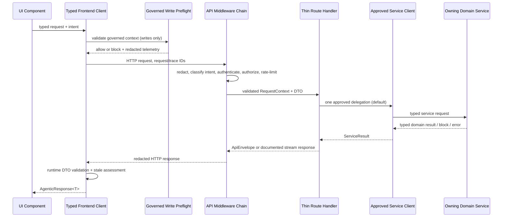
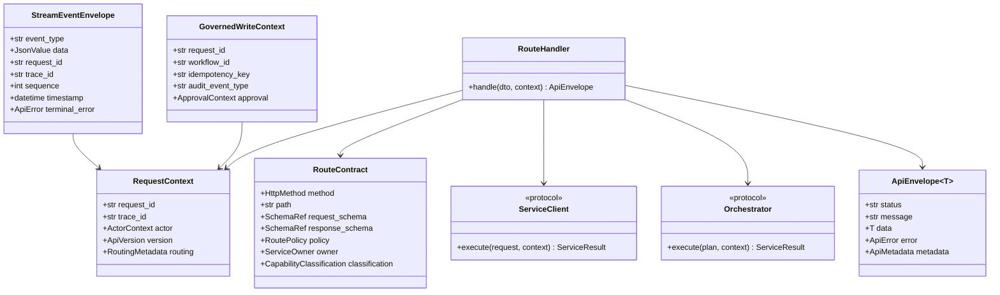
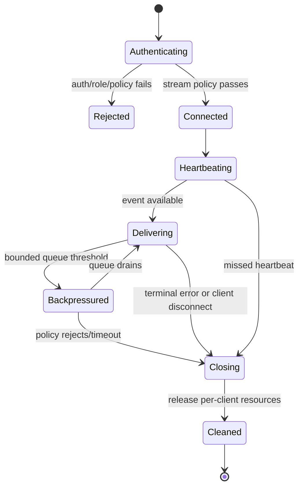
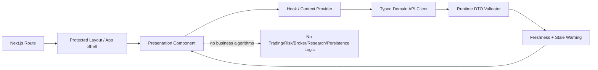

# UI and API Gateway - Architecture Requirements Document

> **Source scope:** This document derives exclusively from `11-ui-and-api-gateway.md`. It converts the source requirements into a code-level architecture and does not specify the implementation of owning domain-service algorithms.

## 0. Source Inventory and Architectural Rules

- **Source task statement:** 365 checkbox tasks (as stated in the source).
- **Enumerated source requirements actually present:** 335 — 327 functional requirements (`UIAPI-FR-001` through `UIAPI-FR-327`) and 8 hardening non-functional requirements (`UIAPI-NFR-001` through `UIAPI-NFR-008`).
- **Traceability decision:** Every enumerated ID is mapped exactly once below. The 365-versus-335 discrepancy is a pre-handoff traceability blocker; no missing requirements or identifiers are invented.
- **Required dependency boundary:** Live sessions/logs are read through Live; simulation work through Simulator; risk thresholds through Risk; routes map HTTP parameters to approved service-tool contracts.
- **Architectural ownership rule:** API/UI validates, authorizes, packages, delegates, renders, and observes. It does not implement trading, risk, broker, simulation, optimization, research, or persistence algorithms.

### Architecture Contract Vocabulary

| Contract | Meaning | Boundary |
|---|---|---|
| `ApiEnvelope[T]` | Standard non-streaming response with `status`, `message`, `data`, `error`, and `metadata`. | API transport contract; reused from shared Utils primitives. |
| `RequestContext` | Request, trace/correlation, actor, permission, API-version, and route metadata. | Built once at middleware/dependency boundaries. |
| `GovernedWriteContext` | Request/workflow/approval/audit/idempotency/CSRF context for governed or financial writes. | Preflight + authoritative backend enforcement. |
| `RouteContract` | Method/path/schema/status/error/idempotency/audit/rate-limit/ownership/stability metadata. | Cataloged before route implementation. |
| `ServiceClient` / `Orchestrator` | Approved typed service delegation port. | Routes never call unknown internal APIs directly. |
| `StreamEventEnvelope` | Typed event name/data/request/trace/sequence/timestamp/terminal-error envelope. | Shared stream transport contract. |
| `AgenticResponse[T]` | Browser-side typed response including data, request ID, trace ID, stale flag, and stale warning. | UI transport boundary. |


## 1. System Boundary Diagram (file structure)

```text

api/                                      # HTTP gateway domain boundary

├── __init__.py                            # explicit public API gateway exports

├── main.py                                # canonical api.main:app ASGI entry point

├── app.py                                 # app factory, CORS, router/middleware composition

├── lifespan.py                            # startup/shutdown orchestration

├── config/
│   └── settings.py                         # bounded gateway configuration

├── contracts/
│   ├── dtos.py                             # typed HTTP DTOs and standard envelopes
│   ├── route_catalog.py                    # route/capability/stability/ownership metadata
│   ├── streaming.py                        # WebSocket/SSE event and policy contracts
│   ├── versioning.py                       # compatibility and deprecation policy
│   ├── pagination.py                       # cursor pagination and response bounds
│   └── errors.py                           # deterministic error translation

├── clients/
│   └── protocols.py                        # approved service clients and orchestrators

├── dependencies/
│   └── operator.py                         # operator DI container

├── governance/
│   └── writes.py                            # mutation context and backend gate integration

├── idempotency/
│   └── repository.py                        # reservation/replay persistence port

├── middleware/
│   ├── __init__.py
│   ├── redaction.py                         # secret-safe logs/errors
│   ├── intent.py                            # route intent and routing metadata
│   └── operator_auth.py                     # protected operator-route policy

├── security/
│   └── authentication.py                   # token/session/user/operator identity services

├── streaming/
│   └── manager.py                           # heartbeat/backpressure/disconnect lifecycle

└── routes/
    ├── __init__.py
    ├── health.py
    ├── operator.py
    ├── operator_stream.py
    ├── risk.py
    ├── chat.py
    ├── sqx.py
    ├── backtests.py
    ├── optimization.py
    ├── edge_lab.py
    ├── dashboard.py
    ├── docs.py
    ├── data.py
    ├── auth.py
    ├── settings.py
    ├── strategies.py
    ├── simulator.py
    └── live.py


ui/                                       # Next.js/TypeScript presentation boundary

└── src/
    ├── app/route-manifest.ts                  # required page surface and page ownership
    ├── lib/
    │   ├── contracts.ts                       # runtime DTO validators/adapters
    │   ├── api/agentic-api.ts                 # shared typed fetch client
    │   ├── api/domain-clients.ts              # named domain clients
    │   ├── governance/governed-write.ts       # browser preflight only
    │   └── telemetry/api-telemetry.ts          # redacted client telemetry
    ├── context/page-context.ts                # bounded/redacted page context
    └── components/
        ├── layout/app-shell.tsx
        ├── docs/documentation.tsx
        ├── strategies/strategy-workspace.tsx
        ├── edge-lab/edge-lab-workspace.tsx
        ├── performance/performance-workspace.tsx
        ├── operator/operator-controls.tsx
        ├── chat/ai-chat.tsx
        ├── dashboard/dashboard.tsx
        ├── simulator/simulator-workspace.tsx
        ├── live/live-workspace.tsx
        ├── auth/auth-forms.tsx
        └── boundaries.ts

tests/ and ui tests/                        # contract, route, security, UI, stream, and traceability tests
docs/                                       # route catalog, examples, operational documentation, changelog
```

**Execution flow:** Browser UI → typed frontend client/preflight → API middleware → request/auth/governance context → route DTO validation → approved service client or orchestrator → standard envelope/stream envelope → frontend runtime validation → accessible presentation.

## 2. Interface diagrams (Mermaid diagrams)

### 2.1 HTTP request, governed-write, and response collaboration



### 2.2 Backend class and protocol contract



### 2.3 Streaming state machine



### 2.4 UI presentation boundary



## 3. Functional Requirements

### Requirement-to-structure mapping rules

- A requirement is listed under exactly one primary implementation location. Dependencies may consume the resulting contract but do not own the requirement.
- **Pure** target functions create/validate/transform contract data only. **State-mutating** targets perform HTTP, browser, persistence, scheduler, module-import, or service-client interaction; none implements domain algorithms owned by another phase.
- “No file-specific” requirements are retained in their relevant package/file section; they indicate foundation inheritance rather than permission to omit baseline controls.

### 📂 Module: `api`

**Boundary Role:** HTTP gateway composition, typed boundary contracts, governance-aware delegation, and transport concerns; it does not own trading, risk, research, optimization, broker, or persistence algorithms.

#### 📄 File: `__init__.py`

**File Boundary:** Package boundary and explicit public gateway export surface.

**Requirement Title:** API package readiness gate

**Description:** Records the pre-handoff policy decision gate and keeps the package-level foundation explicit.

**Requirements:**

- **UIAPI-FR-021:** Every pending policy in the Pre-handoff Blockers table is resolved or explicitly deferred by owner decision.
- **UIAPI-FR-022:** No file-specific non-functional requirements defined.
- **UIAPI-FR-023:** No file-specific testing requirements defined.

**Target Class/Function:**

- `__all__: tuple[str, ...] — Pure (public export declaration only).`
- `assert_pre_handoff_policy_state(blockers: Sequence[PolicyBlocker]) -> PolicyReadiness — Pure.`


#### 📄 File: `main.py`

**File Boundary:** Canonical ASGI application export and Uvicorn-facing entry point.

**Requirement Title:** Canonical application entry point

**Description:** Exposes only the canonical FastAPI application and preserves foundation requirements without duplicating domain logic.

**Requirements:**

- **UIAPI-FR-032:** `api.main:app` shall be the canonical backend FastAPI entry point.
- **UIAPI-FR-040:** No file-specific non-functional requirements defined.
- **UIAPI-FR-041:** No file-specific testing requirements defined.

**Target Class/Function:**

- `get_app() -> FastAPI — State-mutating (returns the already constructed ASGI application).`
- `app: FastAPI — State-mutating (application object exposed to Uvicorn).`


#### 📄 File: `app.py`

**File Boundary:** Application factory, middleware ordering, CORS installation, route registration, and protected/public surface composition.

**Requirement Title:** Gateway composition and optional route safety

**Description:** Builds the API process without requiring unrelated optional providers, establishes public/private operator boundaries, and composes only approved routers and middleware.

**Requirements:**

- **UIAPI-FR-008:** The canonical API shall configure CORS for local frontend origins and allow credentials.
- **UIAPI-FR-049:** `api.app.create_app` shall build the migration-era operator API with dependency injection, CORS, operator auth middleware, operator metadata routes, health routes, approval routes, and event-stream routes.
- **UIAPI-FR-094:** Optional backend route import failures shall degrade route availability without blocking unrelated API startup.
- **UIAPI-FR-095:** API startup shall not require unavailable optional providers for unrelated routes.
- **UIAPI-FR-114:** `_optional_import` shall load optional route modules and log startup warnings instead of failing the whole API when an optional route cannot import.
- **UIAPI-FR-115:** `_include_optional_router` shall include a router only when its module was imported successfully.

**Target Class/Function:**

- `create_app(settings: ApiSettings, dependencies: ApiDependencies) -> FastAPI — State-mutating (constructs ASGI application and registers middleware/routes).`
- `_optional_import(module_path: str) -> ModuleType | None — State-mutating (module import; logs sanitized startup warning on optional failure).`
- `_include_optional_router(app: FastAPI, module: ModuleType | None) -> None — State-mutating (registers available router only).`
- `configure_cors(app: FastAPI, origins: Sequence[str], allow_credentials: bool) -> None — State-mutating (middleware installation).`


#### 📄 File: `lifespan.py`

**File Boundary:** Startup/shutdown orchestration separated from route handlers.

**Requirement Title:** Application lifecycle and safe resource coordination

**Description:** Coordinates approved startup migrations, stale simulator lease cleanup, scheduler start, and scheduler shutdown.

**Requirements:**

- **UIAPI-FR-048:** `lifespan` shall initialize the database, apply pending migrations, clean stale simulator leases when simulator routes are available, start the scheduler, and shut the scheduler down on application shutdown.

**Target Class/Function:**

- `lifespan(app: FastAPI) -> AsyncIterator[None] — State-mutating (database/scheduler lifecycle calls).`
- `initialize_runtime(dependencies: ApiDependencies) -> None — State-mutating (approved startup operations).`
- `shutdown_runtime(dependencies: ApiDependencies) -> None — State-mutating (scheduler shutdown and cleanup).`


### 📂 Module: `api/contracts`

**Boundary Role:** Versioned request/response/stream DTOs, catalog metadata, and deterministic transport error mappings.

#### 📄 File: `route_catalog.py`

**File Boundary:** Machine-readable route contracts, capability classification, ownership, stability, and traceability metadata.

**Requirement Title:** Route catalog and public capability classification

**Description:** Makes every API/client capability explicit before implementation, including ownership and test mapping. It preserves the UI/API boundary rather than re-describing domain service internals.

**Requirements:**

- **UIAPI-FR-024:** Each public HTTP route shall define method, path, auth requirement, role or permission requirement, request schema, response schema, status codes, standard error envelope, side effects, idempotency behavior, audit requirement where applicable, rate-limit class, observability fields, and owning backend/domain service.
- **UIAPI-FR-025:** UI/API requirements define boundary contracts, not domain-service implementation.
- **UIAPI-FR-031:** Requirement ID ranges shall use `UIAPI-CAP-*`, `UIAPI-FR-*`, `UIAPI-NFR-*`, `UIAPI-EDGE-*`, `UIAPI-TEST-*`, and `UIAPI-EX-*`. Existing unnumbered checkboxes remain provisional and are not Builder-ready until IDs are assigned.
- **UIAPI-FR-088:** Every public route group has a concrete route contract table with method, path, auth, schema refs, status codes, error codes, idempotency behavior, pagination behavior where applicable, rate-limit class, observability fields, side effects, stability, and owning service.
- **UIAPI-FR-092:** Each public HTTP route, WebSocket/SSE stream, frontend client, and official callable capability shall identify whether it is public API, protected API, internal helper, migration-compatibility surface, official frontend client capability, or optional/deferred capability.
- **UIAPI-FR-124:** Each public capability shall declare stability as stable, experimental, deprecated, migration-only, or optional/deferred.

**Target Class/Function:**

- `build_route_contract(method: HttpMethod, path: str, request_schema: type[BaseModel], response_schema: type[BaseModel], owner: ServiceOwner, policy: RoutePolicy) -> RouteContract — Pure.`
- `validate_route_catalog(catalog: Sequence[RouteContract]) -> CatalogValidationResult — Pure.`
- `classify_capability(contract: RouteContract) -> CapabilityClassification — Pure.`
- `map_client_capability(client_name: str, operation: str, contract: RouteContract | None) -> ClientCapabilityMap — Pure.`


#### 📄 File: `dtos.py`

**File Boundary:** Pydantic/typed transport DTOs, standard envelopes, validation schemas, and bounded metadata.

**Requirement Title:** Boundary DTO validation and standard response envelopes

**Description:** Defines typed request, response, governed-write, and metadata DTOs. The module imports the shared standard envelope/error primitives rather than re-declaring them.

**Requirements:**

- **UIAPI-FR-026:** API route handlers shall validate path, query, header, and body inputs using boundary schemas before calling domain services.
- **UIAPI-FR-044:** Error envelopes shall include deterministic code, human-readable message, bounded details, request id, trace or correlation id, and retryability where applicable.
- **UIAPI-FR-085:** API responses shall use standard envelopes unless streaming has a documented approved event format.
- **UIAPI-FR-103:** API route handlers shall translate validation failures into the standard validation error envelope with HTTP 422.
- **UIAPI-FR-104:** Non-streaming API responses shall use a standard response envelope with `status`, `message`, `data`, `error`, and `metadata` fields. Metadata shall include request id, correlation or trace id, API version, route group or module, operation, side-effect class, execution time, and creation timestamp where available. This standard response envelope must be imported and reused from `app.utils.standard` or `app.utils.errors` to prevent duplicate declaration.
- **UIAPI-FR-105:** HTTP 204 responses shall never carry a body. Endpoints that need metadata, warnings, or audit details shall return a standard envelope with a non-204 status.

**Target Class/Function:**

- `validate_request_payload(payload: Mapping[str, object], schema: type[RequestDto]) -> RequestDto — Pure.`
- `to_api_envelope(result: ServiceResult[T], context: RequestContext) -> ApiEnvelope[T] — Pure.`
- `to_validation_error_envelope(error: ValidationError, context: RequestContext) -> ApiEnvelope[None] — Pure.`
- `validate_no_content_response(status_code: int, body: object | None) -> None — Pure.`


#### 📄 File: `streaming.py`

**File Boundary:** Typed WebSocket/SSE event contracts and lifecycle-policy definitions.

**Requirement Title:** Stream envelopes, heartbeat, backpressure, and cleanup contract

**Description:** Defines event schemas and stream policies before transports are created. Public health streaming remains absent unless separately approved.

**Requirements:**

- **UIAPI-FR-045:** Streaming endpoints shall use a documented stream event envelope containing event name or type, data, request id, trace or correlation id, sequence, timestamp, and terminal-error fields where applicable.

**Target Class/Function:**

- `build_stream_event(event_type: str, data: JsonValue, context: RequestContext, sequence: int, terminal_error: ApiError | None = None) -> StreamEventEnvelope — Pure.`
- `validate_stream_policy(policy: StreamPolicy) -> StreamPolicy — Pure.`
- `classify_public_stream(request: HttpRequest) -> PublicStreamDecision — Pure.`


#### 📄 File: `versioning.py`

**File Boundary:** API-version compatibility, deprecation metadata, and expected-version validation.

**Requirement Title:** Version and deprecation compatibility policy

**Description:** Centralizes stable-major compatibility and the draft API version contract so individual routes do not implement version policy ad hoc.

**Requirements:**

- **UIAPI-FR-046:** Proposed Decision: Backward compatibility shall be preserved within an approved stable major API version. Deprecations require documentation, frontend migration notes, and an owner-approved removal window before stable-route removal.
- **UIAPI-FR-107:** Proposed Decision: API versioning shall default to `v0-draft` during pre-implementation work. Frontend clients shall send the expected API version when a route contract requires it. Version mismatch shall return `409` with `CONTRACT_VERSION_MISMATCH` for incompatible contracts or a documented warning metadata field for compatible minor changes.

**Target Class/Function:**

- `validate_expected_api_version(expected: str | None, supported: ApiVersionPolicy) -> VersionCompatibility — Pure.`
- `build_deprecation_notice(contract: RouteContract, now: datetime) -> DeprecationNotice | None — Pure.`


#### 📄 File: `pagination.py`

**File Boundary:** Cursor pagination, response-size bounds, deterministic ordering, filtering, and sorting conventions.

**Requirement Title:** Pagination and response-boundary policy

**Description:** Prevents each list route from inventing pagination or oversized-response behavior.

**Requirements:**

- **UIAPI-FR-097:** Proposed Decision: Default response size limit shall be 2 MB for standard JSON endpoints unless the route contract defines pagination, streaming, artifact download, or truncation behavior.
- **UIAPI-FR-106:** Proposed Decision: List endpoints shall use cursor-based pagination by default, with `limit` defaulting to 50, maximum `limit` 200, opaque cursor strings, stable deterministic ordering, and empty results returned as an empty list plus null next cursor unless a route contract states otherwise.

**Target Class/Function:**

- `validate_page_request(limit: int | None, cursor: str | None, policy: PaginationPolicy) -> PageRequest — Pure.`
- `build_page_response(items: Sequence[T], next_cursor: str | None) -> CursorPage[T] — Pure.`
- `enforce_response_size(payload: JsonValue, policy: ResponseSizePolicy) -> SizedPayload — Pure.`


#### 📄 File: `errors.py`

**File Boundary:** Route-appropriate mapping of typed service failures to shared standard error envelopes.

**Requirement Title:** Deterministic transport error translation

**Description:** Maps domain blocks, upstream failures, validation errors, authentication/authorization failures, and unexpected failures into deterministic HTTP envelopes using shared Utils errors.

**Requirements:**

- **UIAPI-FR-027:** API route handlers shall translate domain blocks, idempotency conflicts, dependency failures, and internal failures into documented standard envelopes with route-appropriate status codes.
- **UIAPI-FR-101:** Proposed Decision: Rate-limit responses shall return HTTP 429 with `RATE_LIMITED`, retry metadata where safe, request id, and trace or correlation id.
- **UIAPI-FR-102:** Proposed Decision: Backend non-JSON upstream responses shall be translated to HTTP 502 with `UPSTREAM_NON_JSON_RESPONSE`, bounded sanitized details, request id, and trace or correlation id.
- **UIAPI-FR-186:** API route handlers shall translate authentication failures into the standard 401 error envelope.
- **UIAPI-FR-187:** API route handlers shall translate authorization failures into the standard 403 error envelope.
- **UIAPI-FR-188:** Standard error codes shall include `VALIDATION_FAILED`, `AUTHENTICATION_REQUIRED`, `AUTHORIZATION_FAILED`, `CSRF_REQUIRED`, `CSRF_INVALID`, `RATE_LIMITED`, `IDEMPOTENCY_KEY_REQUIRED`, `DUPLICATE_IDEMPOTENCY_KEY`, `IDEMPOTENCY_CONFLICT`, `GOVERNANCE_REQUIRED`, `STALE_DATA`, `UPSTREAM_UNAVAILABLE`, `UPSTREAM_NON_JSON_RESPONSE`, `UPSTREAM_TIMEOUT`, `CONTRACT_VERSION_MISMATCH`, `PAYLOAD_TOO_LARGE`, `UNSUPPORTED_MEDIA_TYPE`, `OPERATOR_STREAM_FORBIDDEN`, `DEPENDENCY_UNAVAILABLE`, `INTERNAL_ERROR`, and `NOT_IMPLEMENTED`. Custom API gateway exceptions and error codes must inherit and reuse exceptions from `app.utils.errors` to prevent duplicate declaration.

**Target Class/Function:**

- `translate_service_error(error: Exception, context: RequestContext) -> HttpErrorResponse — Pure.`
- `translate_authentication_error(error: AuthenticationError, context: RequestContext) -> HttpErrorResponse — Pure.`
- `translate_authorization_error(error: AuthorizationError, context: RequestContext) -> HttpErrorResponse — Pure.`
- `error_code_registry() -> Mapping[str, ErrorDefinition] — Pure.`


### 📂 Module: `api/clients`

**Boundary Role:** HTTP gateway composition, typed boundary contracts, governance-aware delegation, and transport concerns; it does not own trading, risk, research, optimization, broker, or persistence algorithms.

#### 📄 File: `protocols.py`

**File Boundary:** Approved service-client and orchestrator interfaces used by route handlers.

**Requirement Title:** Service delegation boundary

**Description:** Keeps routing serial by default and moves any approved multi-service workflow into an explicit orchestrator instead of a route handler.

**Requirements:**

- **UIAPI-FR-028:** Domain-facing route handlers shall validate and authorize requests, call the approved owning domain service, translate service results into boundary DTOs, and shall not implement trading, risk, broker, simulation, optimization, research, or persistence algorithms inline.
- **UIAPI-FR-029:** Domain-facing route handlers shall use an approved service-client interface with explicit service discovery, timeout, auth context forwarding, service-account fallback rules, request/correlation ID propagation, and typed error translation before implementation.
- **UIAPI-FR-042:** The gateway shall not call unknown internal service APIs directly from route handlers. Every delegated call shall go through an approved client or orchestrator abstraction.
- **UIAPI-FR-043:** Delegation shall be serial by default: validate request, authorize actor, call one approved service client, translate result. Multi-service workflows require an approved orchestrator abstraction and must not accumulate business rules in route handlers.

**Target Class/Function:**

- `resolve_service_client(owner: ServiceOwner, context: RequestContext) -> ServiceClient — State-mutating (service discovery/client resolution).`
- `delegate_serially(request: RequestDto, client: ServiceClient, context: RequestContext) -> ServiceResult[JsonValue] — State-mutating (service call).`
- `run_orchestrated_workflow(plan: OrchestrationPlan, context: RequestContext) -> ServiceResult[JsonValue] — State-mutating (approved multi-service calls).`


### 📂 Module: `api/dependencies`

**Boundary Role:** HTTP gateway composition, typed boundary contracts, governance-aware delegation, and transport concerns; it does not own trading, risk, research, optimization, broker, or persistence algorithms.

#### 📄 File: `operator.py`

**File Boundary:** Dependency-injection container for operator routes and middleware.

**Requirement Title:** Operator dependency registry

**Description:** Exposes a typed dependency container; no business decision or direct broker capability is held in a route module.

**Requirements:**

- **UIAPI-FR-121:** `get_operator_api_dependencies` shall expose the operator dependency container to route handlers.
- **UIAPI-FR-122:** No file-specific non-functional requirements defined.
- **UIAPI-FR-123:** No file-specific testing requirements defined.

**Target Class/Function:**

- `get_operator_api_dependencies(request: HttpRequest) -> OperatorApiDependencies — State-mutating (request-scoped dependency resolution).`


### 📂 Module: `api/config`

**Boundary Role:** HTTP gateway composition, typed boundary contracts, governance-aware delegation, and transport concerns; it does not own trading, risk, research, optimization, broker, or persistence algorithms.

#### 📄 File: `settings.py`

**File Boundary:** Validated gateway limits, timeouts, CORS, rate-limit classes, response limits, and stream limits.

**Requirement Title:** Gateway configuration and bounded-resource policy

**Description:** Moves body/response limits, route timeouts, rate classes, latency targets, and streaming connection defaults into validated configuration instead of handlers.

**Requirements:**

- **UIAPI-FR-086:** Proposed Decision: Default request body size limit shall be 1 MB for standard JSON endpoints, 10 MB for approved import endpoints, and route-specific for explicitly approved artifact uploads. Oversized payloads return HTTP 413 with `PAYLOAD_TOO_LARGE`.
- **UIAPI-FR-087:** Proposed Decision: Default maximum streaming connections shall be 5 per authenticated actor/session per stream class and 50 process-wide per stream class until production capacity tests approve higher limits.
- **UIAPI-FR-096:** Proposed Decision: All API endpoints shall complete or return a structured error within 30 seconds unless the route contract documents a longer-running job, streaming flow, or accepted async run model.
- **UIAPI-FR-098:** API routes shall define timeout behavior and retry eligibility.
- **UIAPI-FR-099:** Proposed Decision: WebSocket/SSE routes shall use a 15-second client-to-server ping interval where supported, a 30-second server expectation window, and terminal cleanup after missed heartbeat policy is triggered.
- **UIAPI-FR-209:** Proposed Decision: Non-streaming authenticated read endpoints shall target p95 latency under 200 ms in lab/local contract tests and under 500 ms in production-like tests, excluding explicitly documented long-running analysis endpoints.
- **UIAPI-FR-210:** Proposed Decision: Initial rate-limit classes shall include `health` 120/minute, `standard-read` 300/minute, `standard-write` 60/minute, `auth` 10/minute, `ai-chat` 50/minute, `operator` 30/minute, `live-mutation` 5/minute, `import` 10/minute, and `analysis` 20/minute per actor/session or stricter route-specific scope.
- **UIAPI-FR-090:** No file-specific non-functional requirements defined.
- **UIAPI-FR-091:** No file-specific testing requirements defined.

**Target Class/Function:**

- `load_api_settings(source: SettingsSource) -> ApiSettings — State-mutating (configuration read).`
- `validate_api_settings(settings: ApiSettings) -> ApiSettings — Pure.`
- `rate_limit_for(route: RouteContract, actor: ActorContext | None, settings: ApiSettings) -> RateLimitPolicy — Pure.`
- `timeout_for(route: RouteContract, settings: ApiSettings) -> TimeoutPolicy — Pure.`


### 📂 Module: `api/governance`

**Boundary Role:** HTTP gateway composition, typed boundary contracts, governance-aware delegation, and transport concerns; it does not own trading, risk, research, optimization, broker, or persistence algorithms.

#### 📄 File: `writes.py`

**File Boundary:** Gateway-side governed-write request validation, idempotency policy lookup, backend gate invocation, and audit-intent propagation.

**Requirement Title:** Governed mutation transport preconditions

**Description:** Defines transport-level mutation requirements only. It delegates final risk, live readiness, reconciliation, approval, and kill-switch decisions to approved backend services.

**Requirements:**

- **UIAPI-FR-004:** Mutating endpoints shall define retry eligibility, idempotency policy, audit-log requirement, and expected 4xx/5xx failure behavior.
- **UIAPI-FR-037:** Live trading mutations shall remain disabled unless explicit live flags, risk approval, broker readiness, reconciliation, idempotency, audit, and kill-switch requirements are satisfied by backend services.
- **UIAPI-FR-047:** Mutating governed endpoints shall require request id, trace or correlation id, actor identity, required permission, approval context where applicable, audit event type, and an idempotency key for governed or financial mutations.
- **UIAPI-FR-212:** Every governed mutation has a concrete idempotency, audit, authorization, CSRF, duplicate-submit, and stale-data policy.
- **UIAPI-FR-215:** Mutating endpoints shall require role/action checks and governed write context where financial or operational side effects are possible.
- **UIAPI-FR-030:** Idempotency keys shall be non-empty, string-safe, bounded-length values supplied through a documented header or request field; exact key format remains blocked by UIAPI-BLK-004.

**Target Class/Function:**

- `validate_governed_write_context(context: GovernedWriteContext, route: RouteContract) -> GovernedWriteValidation — Pure.`
- `require_idempotency_key(request: HttpRequest, policy: IdempotencyPolicy) -> str — Pure.`
- `build_idempotency_material(request: HttpRequest, actor: ActorContext) -> IdempotencyMaterial — Pure.`
- `replay_completed_response(record: IdempotencyRecord) -> HttpResponse — Pure.`
- `enforce_live_mutation_gate(result: LiveGateResult) -> None — Pure.`


### 📂 Module: `api/idempotency`

**Boundary Role:** HTTP gateway composition, typed boundary contracts, governance-aware delegation, and transport concerns; it does not own trading, risk, research, optimization, broker, or persistence algorithms.

#### 📄 File: `repository.py`

**File Boundary:** Port and adapter boundary for governed-write idempotency records and replay lookup.

**Requirement Title:** Idempotency storage and conflict-safe replay

**Description:** Provides a typed store contract; storage unavailability fails closed for governed/financial mutations.

**Requirements:**

- **UIAPI-FR-108:** Governed and financial mutation endpoints shall store idempotency material, request hash, response status, response headers, response body, actor, route, operation, created timestamp, expiry timestamp, and terminal state where storage is available.
- **UIAPI-FR-109:** Proposed Decision: Duplicate idempotency keys with different material shall return HTTP 409 with `IDEMPOTENCY_CONFLICT`.
- **UIAPI-FR-110:** Proposed Decision: Duplicate idempotency keys for an unknown, in-progress, or terminal-failed previous attempt shall return HTTP 409 with `DUPLICATE_IDEMPOTENCY_KEY` unless the route contract defines a safer reconciliation response.
- **UIAPI-FR-111:** Proposed Decision: Idempotency storage unavailable shall fail closed by default with HTTP 503 and `DEPENDENCY_UNAVAILABLE` for governed and financial mutations.
- **UIAPI-FR-126:** Proposed Decision: Duplicate idempotency keys for completed successful operations shall return the stored original response, including status, headers, body, and metadata, with `metadata.retryable=false` and `metadata.idempotency_replay=true`.

**Target Class/Function:**

- `get_or_reserve(material: IdempotencyMaterial) -> IdempotencyReservation — State-mutating (persistence call).`
- `complete_reservation(reservation: IdempotencyReservation, response: StoredResponse) -> None — State-mutating (persistence write).`
- `lookup_completed(material: IdempotencyMaterial) -> StoredResponse | None — State-mutating (persistence read).`


### 📂 Module: `api/middleware`

**Boundary Role:** Authentication, authorization, role enforcement, session-token lifecycle, CSRF policy integration, and redaction at the gateway boundary.

#### 📄 File: `__init__.py`

**File Boundary:** Explicit middleware package boundary and import-safe registry.

**Requirement Title:** Middleware foundation properties

**Description:** Provides only middleware registration/export semantics; cross-cutting behavior is implemented in focused files.

**Requirements:**

- **UIAPI-FR-171:** No file-specific functional requirements defined. Foundation properties apply.
- **UIAPI-FR-172:** No file-specific non-functional requirements defined.
- **UIAPI-FR-173:** No file-specific testing requirements defined.

**Target Class/Function:**

- `middleware_registry() -> tuple[type[BaseHTTPMiddleware], ...] — Pure.`


#### 📄 File: `redaction.py`

**File Boundary:** Request/log secret redaction before debug logging and error/telemetry emission.

**Requirement Title:** Secret redaction middleware

**Description:** Ensures sensitive headers, query parameters, credentials, and broker-private values do not cross logging/telemetry boundaries.

**Requirements:**

- **UIAPI-FR-174:** The canonical API shall install `SecretRedactionMiddleware`.
- **UIAPI-FR-175:** `SecretRedactionMiddleware` shall redact request headers and query parameters before debug logging.
- **UIAPI-FR-176:** No file-specific non-functional requirements defined.
- **UIAPI-FR-177:** No file-specific testing requirements defined.
- **UIAPI-FR-178:** API errors and logs shall redact secrets and avoid exposing credentials or private broker data.
- **UIAPI-FR-129:** API request logs shall include sanitized method, path, headers, and query metadata.

**Target Class/Function:**

- `redact_request_metadata(request: HttpRequest) -> SanitizedRequestMetadata — Pure.`
- `redact_error_details(details: Mapping[str, object]) -> Mapping[str, object] — Pure.`
- `SecretRedactionMiddleware.dispatch(request: HttpRequest, call_next: RequestHandler) -> HttpResponse — State-mutating (HTTP middleware).`


#### 📄 File: `intent.py`

**File Boundary:** Request-path intent classification and routing metadata attachment.

**Requirement Title:** Operator intent classification middleware

**Description:** Classifies intent without making financial decisions and adds sanitized routing metadata used by logs and downstream policy checks.

**Requirements:**

- **UIAPI-FR-179:** `IntentClassificationMiddleware` shall classify every request path and attach intent, priority, session id, and user id metadata to request state.
- **UIAPI-FR-180:** `IntentClassifier` shall classify request intent from the URL path and optional session header.
- **UIAPI-FR-181:** Routing metadata shall include intent, priority, session id, and user id fields.
- **UIAPI-FR-182:** API logs, traces, and telemetry shall include request id, trace or correlation id, route group, route intent, actor id where available, session id where available, status code, duration, and sanitized error code.
- **UIAPI-FR-183:** No file-specific non-functional requirements defined.
- **UIAPI-FR-184:** No file-specific testing requirements defined.

**Target Class/Function:**

- `IntentClassifier.classify(path: str, session_id: str | None) -> RoutingMetadata — Pure.`
- `IntentClassificationMiddleware.dispatch(request: HttpRequest, call_next: RequestHandler) -> HttpResponse — State-mutating (request-state mutation).`


#### 📄 File: `operator_auth.py`

**File Boundary:** Operator path protection, public-exception policy, and backend safety-gate integration.

**Requirement Title:** Operator authorization and protected route enforcement

**Description:** Protects operator routes and keeps frontend preflight non-authoritative; backend safety gates/audit remain mandatory.

**Requirements:**

- **UIAPI-FR-084:** Protected API endpoints shall require authenticated user or service-account context where applicable.
- **UIAPI-FR-192:** `OperatorAuthMiddleware` shall protect all `/api/operator` routes except explicitly public documentation and health routes.

**Target Class/Function:**

- `OperatorAuthMiddleware.dispatch(request: HttpRequest, call_next: RequestHandler) -> HttpResponse — State-mutating (authorization boundary).`
- `is_operator_route_public(path: str, policy: OperatorPublicRoutePolicy) -> bool — Pure.`


### 📂 Module: `api/security`

**Boundary Role:** Authentication, authorization, role enforcement, session-token lifecycle, CSRF policy integration, and redaction at the gateway boundary.

#### 📄 File: `authentication.py`

**File Boundary:** Credential validation and user/operator identity extraction with standardized failures.

**Requirement Title:** User authentication and operator-role enforcement

**Description:** Implements token/session lifecycle with redacted diagnostics. It consumes a session-store port rather than exposing raw records.

**Requirements:**

- **UIAPI-FR-190:** `authenticate_user` shall authenticate username/password, reject invalid or inactive users, distinguish unverified users, update last login for verified users, and return user metadata.
- **UIAPI-FR-191:** `get_user_id_from_token` shall require an Authorization header, accept optional Bearer prefix, verify the token, and raise 401 for missing, invalid, or expired tokens.
- **UIAPI-FR-194:** `get_operator_principal` shall return the authenticated operator principal or raise 401.
- **UIAPI-FR-195:** `require_operator_role` shall enforce allowed operator roles and raise 403 when unauthorized.
- **UIAPI-FR-207:** Authentication tokens shall be treated as secrets and shall not be logged or exposed in telemetry.
- **UIAPI-FR-216:** `generate_token` shall create a single active user session token, invalidate existing sessions for that user, and set a 24-hour duration.
- **UIAPI-FR-217:** `verify_token` shall validate stored sessions, parse expiration timestamps, delete expired sessions, and return the user id only for valid sessions.
- **UIAPI-FR-218:** `invalidate_token` shall delete a stored session token.
- **UIAPI-FR-213:** No file-specific non-functional requirements defined.
- **UIAPI-FR-214:** No file-specific testing requirements defined.

**Target Class/Function:**

- `authenticate_user(credentials: LoginRequest, auth_store: AuthStore) -> AuthenticatedUser — State-mutating (credential/session store calls).`
- `get_user_id_from_token(authorization: str | None, token_service: TokenService) -> str — State-mutating (session/token validation).`
- `get_operator_principal(request: HttpRequest, token_service: TokenService) -> OperatorPrincipal — State-mutating (authentication read).`
- `require_operator_role(principal: OperatorPrincipal, allowed: Collection[OperatorRole]) -> OperatorPrincipal — Pure.`
- `generate_token(user_id: str, now: datetime, sessions: SessionStore) -> SessionToken — State-mutating (invalidates/replaces stored session).`
- `verify_token(token: str, now: datetime, sessions: SessionStore) -> str — State-mutating (session read/delete expired).`
- `invalidate_token(token: str, sessions: SessionStore) -> None — State-mutating (session deletion).`


### 📂 Module: `api/streaming`

**Boundary Role:** HTTP gateway composition, typed boundary contracts, governance-aware delegation, and transport concerns; it does not own trading, risk, research, optimization, broker, or persistence algorithms.

#### 📄 File: `manager.py`

**File Boundary:** Per-client stream registration, heartbeat, sequence, bounded delivery, disconnect cleanup, and terminal error emission.

**Requirement Title:** Shared streaming runtime behavior

**Description:** Owns only delivery lifecycle and never authoritative domain session state. Per-client work is stopped and released on disconnect.

**Requirements:**

- **UIAPI-FR-116:** `WEBSOCKET /api/backtest/ws/{backtest_id}/logs` shall stream backtest logs.
- **UIAPI-FR-117:** `WEBSOCKET /api/optimization/ws/{optimization_id}` shall stream optimization progress.
- **UIAPI-FR-185:** Each WebSocket, SSE, or streaming capability shall define auth, event schema, heartbeat interval, reconnect behavior, disconnect cleanup, backpressure behavior, terminal error event, sequence behavior, and maximum connection policy.
- **UIAPI-FR-206:** WebSocket and streaming routes shall detect client disconnects, stop per-client delivery work, release per-client resources, preserve authoritative session state, emit no further events to the disconnected client, and record sanitized disconnect metadata.
- **UIAPI-FR-211:** Every streaming surface has a concrete event contract with auth, event envelope, heartbeat, reconnect, backpressure, disconnect cleanup, terminal-error behavior, and maximum connection policy.

**Target Class/Function:**

- `open_stream(stream: StreamDescriptor, principal: ActorContext, manager: StreamManager) -> StreamSession — State-mutating (connection registration).`
- `publish_stream_event(session: StreamSession, event: StreamEventEnvelope) -> DeliveryResult — State-mutating (network delivery).`
- `handle_disconnect(session_id: str, reason: DisconnectReason) -> None — State-mutating (resource release and telemetry).`
- `enforce_stream_backpressure(session: StreamSession, policy: StreamPolicy) -> BackpressureDecision — State-mutating (queue/connection state).`


### 📂 Module: `api/routes`

**Boundary Role:** Thin HTTP/WebSocket adapters that validate, authorize, delegate through approved clients/orchestrators, and translate results; they never contain domain algorithms.

#### 📄 File: `__init__.py`

**File Boundary:** Router registration boundary with no hidden domain logic.

**Requirement Title:** Routing package foundation

**Description:** Holds intentional router exports and registration ordering only.

**Requirements:**

- **UIAPI-FR-219:** No file-specific functional requirements defined. Foundation properties apply.
- **UIAPI-FR-220:** No file-specific non-functional requirements defined.
- **UIAPI-FR-221:** No file-specific testing requirements defined.

**Target Class/Function:**

- `router_registry() -> tuple[APIRouter, ...] — State-mutating (router construction/registration only).`


#### 📄 File: `health.py`

**File Boundary:** Minimal public health/readiness endpoints and aggregate health delegation.

**Requirement Title:** Health endpoints

**Description:** Provides the minimal unauthenticated health response and authenticated operator aggregate health through approved dependency clients.

**Requirements:**

- **UIAPI-FR-053:** `GET /api/operator/health` shall return aggregate app, database, Redis, and schema-registry health.
- **UIAPI-FR-189:** `GET /api/health` shall be unauthenticated and shall return HTTP 200 with a minimal service status payload when the API process is accepting requests. It shall not expose secrets, credentials, broker account data, or private dependency details.

**Target Class/Function:**

- `get_health(request: HttpRequest) -> ApiEnvelope[HealthStatusDto] — State-mutating (process health read).`
- `get_operator_health(context: OperatorRequestContext, client: OperatorHealthClient) -> ApiEnvelope[AggregateHealthDto] — State-mutating (service reads).`


#### 📄 File: `operator.py`

**File Boundary:** Protected operator approvals, emergency controls, manual trade intents, administrative metadata, and component health delegation.

**Requirement Title:** Governed operator command surface

**Description:** Routes do not call Conversation/LLM paths for emergency/manual controls and delegate all governed action execution to approved backend services.

**Requirements:**

- **UIAPI-FR-050:** Public operator routes shall be limited to documentation and health endpoints and shall never expose approval, policy, actor, live-execution, broker, incident, or private system data.
- **UIAPI-FR-052:** Operator roles shall be limited to `operator`, `approver`, and `admin`.
- **UIAPI-FR-054:** `POST /api/operator/live-execution` shall create a live-execution approval request.
- **UIAPI-FR-055:** `POST /api/operator/policy-change` shall create a policy-change approval request.
- **UIAPI-FR-056:** `POST /api/operator/override` shall create an override approval request.
- **UIAPI-FR-057:** `POST /api/operator/kill-switch-recovery` shall create a kill-switch recovery approval request.
- **UIAPI-FR-058:** `POST /api/operator/emergency-kill-switch` shall trigger the approved emergency kill-switch workflow through governed backend services without calling Conversation, LLM providers, planner routing, or chat tools.
- **UIAPI-FR-059:** `POST /api/operator/manual-trade-intents` shall submit manually entered operator trade intents through the same governed Risk, Trading, Live, approval, idempotency, reconciliation, audit, and kill-switch gates used by non-chat workflows.
- **UIAPI-FR-060:** `POST /api/operator/positions/{position_id}/close` shall request position close or flatten behavior through the approved governed backend service without depending on Conversation or LLM availability.
- **UIAPI-FR-061:** `POST /api/operator/orders/mass-cancel` shall request governed mass-cancel behavior through the approved backend service without depending on Conversation or LLM availability.
- **UIAPI-FR-062:** `POST /api/operator/live-execution/{approval_id}/votes` shall record a vote on a live-execution approval.
- **UIAPI-FR-321:** `OperatorPrincipal` shall represent token, actor id, and role extracted from operator request headers.
- **UIAPI-FR-322:** `GET /api/operator` shall return operator API metadata, environment, schema registry contract count, policy bundle count, actor id, and role.
- **UIAPI-FR-323:** `GET /api/operator/health/db` shall return database health.
- **UIAPI-FR-324:** `GET /api/operator/health/redis` shall return Redis health.
- **UIAPI-FR-325:** `GET /api/operator/health/schema-registry` shall return schema-registry health.
- **UIAPI-FR-326:** No file-specific non-functional requirements defined.
- **UIAPI-FR-327:** No file-specific testing requirements defined.

**Target Class/Function:**

- `create_live_execution_approval(request: LiveExecutionApprovalRequest, context: OperatorRequestContext) -> ApiEnvelope[ApprovalDto] — State-mutating (approval service call).`
- `create_policy_change_approval(request: PolicyChangeApprovalRequest, context: OperatorRequestContext) -> ApiEnvelope[ApprovalDto] — State-mutating.`
- `create_override_approval(request: OverrideApprovalRequest, context: OperatorRequestContext) -> ApiEnvelope[ApprovalDto] — State-mutating.`
- `create_kill_switch_recovery_approval(request: KillSwitchRecoveryRequest, context: OperatorRequestContext) -> ApiEnvelope[ApprovalDto] — State-mutating.`
- `trigger_emergency_kill_switch(request: EmergencyKillSwitchRequest, context: OperatorRequestContext) -> ApiEnvelope[ActionReceiptDto] — State-mutating (governed backend call).`
- `submit_manual_trade_intent(request: ManualTradeIntentRequest, context: OperatorRequestContext) -> ApiEnvelope[ActionReceiptDto] — State-mutating.`
- `request_position_close(position_id: str, request: PositionCloseRequest, context: OperatorRequestContext) -> ApiEnvelope[ActionReceiptDto] — State-mutating.`
- `request_mass_cancel(request: MassCancelRequest, context: OperatorRequestContext) -> ApiEnvelope[ActionReceiptDto] — State-mutating.`
- `record_live_execution_vote(approval_id: str, request: VoteRequest, context: OperatorRequestContext) -> ApiEnvelope[VoteDto] — State-mutating.`
- `get_operator_metadata(context: OperatorRequestContext) -> ApiEnvelope[OperatorMetadataDto] — State-mutating (approved metadata client reads).`
- `get_operator_component_health(component: OperatorHealthComponent, context: OperatorRequestContext) -> ApiEnvelope[ComponentHealthDto] — State-mutating (health client read).`


#### 📄 File: `operator_stream.py`

**File Boundary:** Protected operator event stream endpoint built on the shared streaming manager.

**Requirement Title:** Operator event stream route

**Description:** Exposes only the approved protected operator stream; a redacted public alternative requires separate approval and path.

**Requirements:**

- **UIAPI-FR-051:** A redacted public health-only stream shall not exist unless approved by owner/security decision. If approved, it may expose only static service name, coarse health state, heartbeat timestamp, and public schema version, and must not reuse the protected operator event stream path unless explicitly documented.
- **UIAPI-FR-063:** `GET /api/operator/events/stream` shall stream operator events only through the approved operator stream contract, auth policy, redaction policy, heartbeat policy, and disconnect cleanup policy.
- **UIAPI-FR-193:** `GET /api/operator/events/stream` shall require an authenticated operator principal with an allowed operator role unless a separately documented redacted public health-only stream is explicitly configured.

**Target Class/Function:**

- `stream_operator_events(request: WebSocketRequest, principal: OperatorPrincipal) -> None — State-mutating (WebSocket lifecycle).`


#### 📄 File: `risk.py`

**File Boundary:** Thin risk-domain HTTP adapters for read/evaluation/sizing requests.

**Requirement Title:** Risk service delegation

**Description:** Validates and authorizes transport requests, delegates to Risk, and never calculates position sizes or governance decisions.

**Requirements:**

- **UIAPI-FR-033:** `POST /api/risk/position-sizing` shall validate and authorize the request, delegate risk-based position sizing to the approved risk-domain service, and return the service result through the documented API response schema without implementing risk calculation logic in the UI/API layer.
- **UIAPI-FR-034:** `POST /api/risk/governance` shall validate and authorize the request, delegate risk governance evaluation to the approved risk-domain service, and return the service result through the documented API response schema.

**Target Class/Function:**

- `calculate_position_sizing(request: PositionSizingRequestDto, context: RequestContext) -> ApiEnvelope[PositionSizingResponseDto] — State-mutating (risk service call).`
- `evaluate_risk_governance(request: RiskGovernanceRequestDto, context: RequestContext) -> ApiEnvelope[RiskGovernanceResponseDto] — State-mutating (risk service call).`


#### 📄 File: `chat.py`

**File Boundary:** Conversation and action-draft route adapters, page-context entry points, and client-safe chat response transport.

**Requirement Title:** AI chat, retention, action-draft, and page-context routes

**Description:** Delegates durable chat and governed action-draft actions to Conversation/approved paper paths; it never claims or performs live execution from chat.

**Requirements:**

- **UIAPI-FR-064:** `POST /api/ai-chat/threads/{thread_id}/action-drafts/{draft_id}/request-approval` shall request approval for an action draft.
- **UIAPI-FR-065:** `POST /api/ai-chat/threads/{thread_id}/action-drafts/{draft_id}/paper-execute` shall execute an action draft only in the approved paper path.
- **UIAPI-FR-230:** `GET /api/ai-chat/threads` shall list AI chat threads.
- **UIAPI-FR-231:** `POST /api/ai-chat/threads/{thread_id}/archive` shall archive a thread.
- **UIAPI-FR-232:** `GET /api/ai-chat/threads/{thread_id}/retention` shall return thread retention detail.
- **UIAPI-FR-233:** `PATCH /api/ai-chat/threads/{thread_id}` shall rename a thread.
- **UIAPI-FR-234:** `PATCH /api/ai-chat/threads/{thread_id}/context` shall update thread page context.
- **UIAPI-FR-235:** `DELETE /api/ai-chat/threads/{thread_id}` shall delete a thread.
- **UIAPI-FR-236:** `POST /api/ai-chat/threads/{thread_id}/purge` shall purge a thread where allowed.
- **UIAPI-FR-237:** `PATCH /api/ai-chat/threads/{thread_id}/retention` shall update thread retention class.
- **UIAPI-FR-238:** `POST /api/ai-chat/retention/lifecycle-run` shall run retention lifecycle processing.
- **UIAPI-FR-239:** `GET /api/ai-chat/threads/{thread_id}/export` shall export a thread.
- **UIAPI-FR-240:** `POST /api/ai-chat/threads/{thread_id}/messages` shall create a chat message.
- **UIAPI-FR-241:** `GET /api/ai-chat/tools` shall list AI chat tools.
- **UIAPI-FR-242:** `POST /api/ai-chat/context/resolve` shall resolve page context.
- **UIAPI-FR-243:** `GET /api/ai-chat/threads/{thread_id}/signal-proposals` shall list signal proposals linked to a thread.
- **UIAPI-FR-244:** `POST /api/ai-chat/threads/{thread_id}/signal-proposals/{proposal_id}/watchlist` shall save a signal proposal to the watchlist.
- **UIAPI-FR-245:** `POST /api/ai-chat/threads/{thread_id}/signal-proposals/{proposal_id}/review-queue` shall queue a signal proposal for review.
- **UIAPI-FR-246:** `GET /api/ai-chat/threads/{thread_id}/action-drafts` shall list action drafts linked to a thread.
- **UIAPI-FR-247:** `POST /api/ai-chat/threads/{thread_id}/responses/regenerate` shall regenerate an AI chat response.
- **UIAPI-FR-253:** No file-specific non-functional requirements defined.
- **UIAPI-FR-254:** No file-specific testing requirements defined.

**Target Class/Function:**

- `list_threads(context: RequestContext) -> ApiEnvelope[CursorPage[ChatThreadDto]] — State-mutating (conversation service read).`
- `archive_thread(thread_id: str, request: ArchiveThreadRequest, context: RequestContext) -> ApiEnvelope[ChatThreadDto] — State-mutating.`
- `get_retention(thread_id: str, context: RequestContext) -> ApiEnvelope[RetentionDto] — State-mutating.`
- `rename_thread(thread_id: str, request: RenameThreadRequest, context: RequestContext) -> ApiEnvelope[ChatThreadDto] — State-mutating.`
- `update_thread_context(thread_id: str, request: PageContextDto, context: RequestContext) -> ApiEnvelope[ChatThreadDto] — State-mutating.`
- `delete_thread(thread_id: str, context: RequestContext) -> ApiEnvelope[DeleteReceiptDto] — State-mutating.`
- `purge_thread(thread_id: str, context: RequestContext) -> ApiEnvelope[PurgeReceiptDto] — State-mutating.`
- `update_retention(thread_id: str, request: RetentionUpdateRequest, context: RequestContext) -> ApiEnvelope[RetentionDto] — State-mutating.`
- `run_retention_lifecycle(context: RequestContext) -> ApiEnvelope[LifecycleRunDto] — State-mutating.`
- `export_thread(thread_id: str, query: ExportQuery, context: RequestContext) -> ApiEnvelope[ThreadExportDto] — State-mutating.`
- `create_message(thread_id: str, request: ChatMessageRequest, context: RequestContext) -> ApiEnvelope[ChatMessageDto] — State-mutating.`
- `list_chat_tools(context: RequestContext) -> ApiEnvelope[list[ChatToolDto]] — State-mutating (approved service read).`
- `resolve_page_context(request: ResolveContextRequest, context: RequestContext) -> ApiEnvelope[PageContextDto] — State-mutating.`
- `list_signal_proposals(thread_id: str, context: RequestContext) -> ApiEnvelope[list[SignalProposalDto]] — State-mutating.`
- `add_proposal_to_watchlist(thread_id: str, proposal_id: str, context: RequestContext) -> ApiEnvelope[WatchlistReceiptDto] — State-mutating.`
- `queue_proposal_for_review(thread_id: str, proposal_id: str, context: RequestContext) -> ApiEnvelope[ReviewQueueReceiptDto] — State-mutating.`
- `list_action_drafts(thread_id: str, context: RequestContext) -> ApiEnvelope[list[ActionDraftDto]] — State-mutating.`
- `regenerate_response(thread_id: str, request: RegenerateResponseRequest, context: RequestContext) -> ApiEnvelope[ChatMessageDto] — State-mutating.`
- `request_action_draft_approval(thread_id: str, draft_id: str, context: RequestContext) -> ApiEnvelope[ApprovalDto] — State-mutating.`
- `paper_execute_action_draft(thread_id: str, draft_id: str, context: RequestContext) -> ApiEnvelope[ExecutionReceiptDto] — State-mutating (approved paper path only).`


#### 📄 File: `sqx.py`

**File Boundary:** SQX import/catalog/scoring adapters delegating to approved Strategy/Analytics services.

**Requirement Title:** SQX routes

**Description:** Keeps SQX computation and strategy import rules in their owning service.

**Requirements:**

- **UIAPI-FR-066:** `POST /api/sqx/calculate-scores` shall validate and authorize the request, delegate SQX score calculation to the approved strategy or analytics service, and return the service result.
- **UIAPI-FR-266:** `POST /api/sqx/import` shall import SQX strategies.
- **UIAPI-FR-267:** `GET /api/sqx/strategies` shall list imported SQX strategies.

**Target Class/Function:**

- `calculate_sqx_scores(request: SqxScoreRequest, context: RequestContext) -> ApiEnvelope[SqxScoreResponse] — State-mutating (service call).`
- `import_sqx_strategy(request: SqxImportRequest, context: RequestContext) -> ApiEnvelope[StrategyImportResponse] — State-mutating.`
- `list_sqx_strategies(context: RequestContext) -> ApiEnvelope[list[SqxStrategyDto]] — State-mutating.`


#### 📄 File: `backtests.py`

**File Boundary:** Backtest/portfolio-run request adapters and backtest metadata endpoints.

**Requirement Title:** Backtest routes

**Description:** Delegates simulation and analytics behavior; route code only performs contract-level validation, authorization, and response translation.

**Requirements:**

- **UIAPI-FR-067:** `POST /api/backtest/portfolio/run/{strategy_id}` shall validate and authorize the request, delegate portfolio backtest execution to the approved simulation or analytics service, and return the service result.
- **UIAPI-FR-130:** `GET /api/backtest/{backtest_id}/overview` shall return a backtest overview.
- **UIAPI-FR-131:** `GET /api/backtest/` shall list all backtests.
- **UIAPI-FR-132:** `PUT /api/backtest/{backtest_id}` shall update backtest metadata.
- **UIAPI-FR-133:** `DELETE /api/backtest/{backtest_id}` shall delete a backtest.
- **UIAPI-FR-274:** `GET /api/backtest/strategy/{strategy_id}` shall list backtests for a strategy.

**Target Class/Function:**

- `run_portfolio_backtest(strategy_id: str, request: PortfolioBacktestRequest, context: RequestContext) -> ApiEnvelope[BacktestRunDto] — State-mutating (simulation/analytics service call).`
- `get_backtest_overview(backtest_id: str, context: RequestContext) -> ApiEnvelope[BacktestOverviewDto] — State-mutating (service read).`
- `list_backtests(query: BacktestListQuery, context: RequestContext) -> ApiEnvelope[CursorPage[BacktestDto]] — State-mutating.`
- `update_backtest(backtest_id: str, request: BacktestUpdateRequest, context: RequestContext) -> ApiEnvelope[BacktestDto] — State-mutating.`
- `delete_backtest(backtest_id: str, context: RequestContext) -> ApiEnvelope[DeleteReceiptDto] — State-mutating.`
- `list_strategy_backtests(strategy_id: str, query: BacktestListQuery, context: RequestContext) -> ApiEnvelope[CursorPage[BacktestDto]] — State-mutating.`


#### 📄 File: `optimization.py`

**File Boundary:** Optimization run creation, cancellation, results, unsupervised analysis, Monte Carlo, and progress-query adapters.

**Requirement Title:** Optimization routes

**Description:** Delegates bounded run lifecycle and analysis to the approved Optimization/Risk/Research services.

**Requirements:**

- **UIAPI-FR-068:** `POST /api/optimization/runs` shall validate and authorize the request, delegate bounded run creation to the approved optimization service, and return the run contract without implementing optimization algorithms in the UI/API layer.
- **UIAPI-FR-069:** `POST /api/optimization/unsupervised-analysis` shall validate and authorize the request, delegate unsupervised analysis to the approved optimization or research service, and return the service result.
- **UIAPI-FR-070:** `POST /api/optimization/monte-carlo/position-sizing` shall validate and authorize the request, delegate position-sizing simulation to the approved optimization or risk service, and return the service result.
- **UIAPI-FR-134:** `GET /api/optimization/runs/{optimization_id}/results` shall return optimization results.
- **UIAPI-FR-135:** `DELETE /api/optimization/runs/{optimization_id}` shall cancel an optimization run.
- **UIAPI-FR-136:** `GET /api/optimization/runs/{optimization_id}/unsupervised-report` shall return an unsupervised report.
- **UIAPI-FR-285:** `GET /api/optimization/monte-carlo/{simulation_id}` shall return a Monte Carlo result.

**Target Class/Function:**

- `create_optimization_run(request: OptimizationRunRequest, context: RequestContext) -> ApiEnvelope[OptimizationRunDto] — State-mutating.`
- `run_unsupervised_analysis(request: UnsupervisedAnalysisRequest, context: RequestContext) -> ApiEnvelope[UnsupervisedReportDto] — State-mutating.`
- `run_position_sizing_monte_carlo(request: MonteCarloSizingRequest, context: RequestContext) -> ApiEnvelope[MonteCarloResultDto] — State-mutating.`
- `get_optimization_results(optimization_id: str, context: RequestContext) -> ApiEnvelope[OptimizationResultsDto] — State-mutating.`
- `cancel_optimization_run(optimization_id: str, context: RequestContext) -> ApiEnvelope[CancellationReceiptDto] — State-mutating.`
- `get_unsupervised_report(optimization_id: str, context: RequestContext) -> ApiEnvelope[UnsupervisedReportDto] — State-mutating.`
- `get_monte_carlo_result(simulation_id: str, context: RequestContext) -> ApiEnvelope[MonteCarloResultDto] — State-mutating.`


#### 📄 File: `edge_lab.py`

**File Boundary:** Edge Lab data preparation, analysis, automation, evidence, run, calibration, evaluation, snapshot, and export adapters.

**Requirement Title:** Edge Lab routes

**Description:** All research calculations and persistence rules are delegated to approved Edge Lab/Research/Analytics services.

**Requirements:**

- **UIAPI-FR-075:** `POST /api/edge-lab/dataset/prepare` shall validate and authorize the request, delegate Edge Lab-specific dataset preparation to the approved Edge Lab or data service, and return the service result.
- **UIAPI-FR-076:** `POST /api/edge-lab/run` shall validate and authorize the request, delegate Edge Lab analysis to approved Edge Lab or research services, and return the service result without implementing research algorithms in the UI/API layer.
- **UIAPI-FR-077:** `POST /api/edge-lab/unsupervised-structure/run` shall validate and authorize the request, delegate unsupervised-structure analysis to the approved research service, and return the service result.
- **UIAPI-FR-078:** `POST /api/edge-lab/core-metrics/run` shall validate and authorize the request, delegate core metric calculation to the approved research or analytics service, and return the service result.
- **UIAPI-FR-079:** `POST /api/edge-lab/automation/batch` shall validate and authorize the request, delegate Edge Lab automation batch work to the approved orchestration service, and return the service result.
- **UIAPI-FR-147:** `GET /api/edge-lab/market-structure/runs` shall list market-structure runs.
- **UIAPI-FR-148:** `GET /api/edge-lab/runs/count` shall count Edge Lab runs.
- **UIAPI-FR-149:** `GET /api/edge-lab/runs/summary` shall return Edge Lab run summary.
- **UIAPI-FR-150:** `GET /api/edge-lab/runs/{run_id}/stats` shall return Edge Lab run statistics.
- **UIAPI-FR-151:** `GET /api/edge-lab/runs/{run_id}/trades` shall return Edge Lab run trades.
- **UIAPI-FR-152:** `DELETE /api/edge-lab/market-structure/runs/{run_id}` shall delete a market-structure run.
- **UIAPI-FR-153:** `GET /api/edge-lab/core-metrics/runs/{run_id}` shall return a core metric run.
- **UIAPI-FR-154:** `DELETE /api/edge-lab/core-metrics/runs/{run_id}` shall delete a core metric run.
- **UIAPI-FR-155:** `GET /api/edge-lab/market-structure/runs/{run_id}` shall return a market-structure run.
- **UIAPI-FR-156:** `GET /api/edge-lab/market-structure/calibration` shall return market-structure calibration.
- **UIAPI-FR-157:** `GET /api/edge-lab/market-structure/evaluations` shall list market-structure evaluations.
- **UIAPI-FR-158:** `POST /api/edge-lab/market-structure/evaluations/refresh` shall refresh market-structure evaluations.
- **UIAPI-FR-159:** `GET /api/edge-lab/market-structure/profile-calibration` shall return profile calibration.
- **UIAPI-FR-160:** `POST /api/edge-lab/automation/refresh` shall refresh Edge Lab automation schedule.
- **UIAPI-FR-161:** `POST /api/edge-lab/scorecard/snapshots` shall save a scorecard snapshot.
- **UIAPI-FR-162:** `GET /api/edge-lab/scorecard/snapshots/compare` shall compare scorecard snapshots.
- **UIAPI-FR-163:** `GET /api/edge-lab/scorecard/snapshots/{snapshot_id}/report` shall return a scorecard snapshot report.
- **UIAPI-FR-164:** `POST /api/edge-lab/scorecard/snapshots/{snapshot_id}/export-parquet` shall export a scorecard snapshot to Parquet.
- **UIAPI-FR-165:** `POST /api/edge-lab/scorecard/snapshots/compare/export-markdown` shall export scorecard snapshot comparison Markdown.

**Target Class/Function:**

- `prepare_dataset(request: DatasetPreparationRequest, context: RequestContext) -> ApiEnvelope[PreparedDatasetDto] — State-mutating.`
- `run_edge_lab(request: EdgeLabRunRequest, context: RequestContext) -> ApiEnvelope[EdgeLabRunDto] — State-mutating.`
- `run_unsupervised_structure(request: UnsupervisedStructureRequest, context: RequestContext) -> ApiEnvelope[UnsupervisedStructureDto] — State-mutating.`
- `run_core_metrics(request: CoreMetricsRequest, context: RequestContext) -> ApiEnvelope[CoreMetricsRunDto] — State-mutating.`
- `run_automation_batch(request: AutomationBatchRequest, context: RequestContext) -> ApiEnvelope[AutomationBatchDto] — State-mutating.`
- `list_market_structure_runs(query: RunListQuery, context: RequestContext) -> ApiEnvelope[CursorPage[MarketStructureRunDto]] — State-mutating.`
- `get_edge_lab_run_summary(context: RequestContext) -> ApiEnvelope[EdgeLabSummaryDto] — State-mutating.`
- `get_edge_lab_run_stats(run_id: str, context: RequestContext) -> ApiEnvelope[EdgeLabStatsDto] — State-mutating.`
- `get_edge_lab_run_trades(run_id: str, context: RequestContext) -> ApiEnvelope[CursorPage[TradeDto]] — State-mutating.`
- `delete_market_structure_run(run_id: str, context: RequestContext) -> ApiEnvelope[DeleteReceiptDto] — State-mutating.`
- `get_core_metric_run(run_id: str, context: RequestContext) -> ApiEnvelope[CoreMetricsRunDto] — State-mutating.`
- `delete_core_metric_run(run_id: str, context: RequestContext) -> ApiEnvelope[DeleteReceiptDto] — State-mutating.`
- `get_market_structure_run(run_id: str, context: RequestContext) -> ApiEnvelope[MarketStructureRunDto] — State-mutating.`
- `get_market_structure_calibration(context: RequestContext) -> ApiEnvelope[CalibrationDto] — State-mutating.`
- `list_market_structure_evaluations(context: RequestContext) -> ApiEnvelope[list[EvaluationDto]] — State-mutating.`
- `refresh_market_structure_evaluations(context: RequestContext) -> ApiEnvelope[RefreshReceiptDto] — State-mutating.`
- `get_profile_calibration(context: RequestContext) -> ApiEnvelope[ProfileCalibrationDto] — State-mutating.`
- `refresh_automation_schedule(context: RequestContext) -> ApiEnvelope[RefreshReceiptDto] — State-mutating.`
- `save_scorecard_snapshot(request: ScorecardSnapshotRequest, context: RequestContext) -> ApiEnvelope[ScorecardSnapshotDto] — State-mutating.`
- `compare_scorecard_snapshots(query: ScorecardComparisonQuery, context: RequestContext) -> ApiEnvelope[ScorecardComparisonDto] — State-mutating.`
- `get_scorecard_snapshot_report(snapshot_id: str, context: RequestContext) -> ApiEnvelope[ScorecardReportDto] — State-mutating.`
- `export_scorecard_parquet(snapshot_id: str, context: RequestContext) -> ApiEnvelope[ArtifactExportDto] — State-mutating.`
- `export_scorecard_comparison_markdown(request: ScorecardComparisonExportRequest, context: RequestContext) -> ApiEnvelope[ArtifactExportDto] — State-mutating.`


#### 📄 File: `dashboard.py`

**File Boundary:** Read-only dashboard DTO aggregation by approved services and explicit deferred currency-strength surface.

**Requirement Title:** Dashboard routes

**Description:** Returns only backend-produced dashboard values and preserves optional/deferred status where the source contract is incomplete.

**Requirements:**

- **UIAPI-FR-009:** `GET /api/dashboard/equity-curve` shall return dashboard equity curve data.
- **UIAPI-FR-035:** `GET /api/dashboard/currency-strength` shall remain optional/deferred until its schema, source service, stale-data behavior, and frontend contract are finalized.
- **UIAPI-FR-137:** `GET /api/dashboard/system/status` shall return system status.
- **UIAPI-FR-138:** `GET /api/dashboard/summary` shall return dashboard summary data.
- **UIAPI-FR-139:** `GET /api/dashboard/system/resources` shall return resource usage.
- **UIAPI-FR-140:** `GET /api/dashboard/market-hours` shall return market-hours data.
- **UIAPI-FR-141:** `GET /api/dashboard/forex-calendar` shall return forex-calendar data.

**Target Class/Function:**

- `get_equity_curve(query: DashboardQuery, context: RequestContext) -> ApiEnvelope[EquityCurveDto] — State-mutating (service read).`
- `get_currency_strength(context: RequestContext) -> ApiEnvelope[CurrencyStrengthDto] — State-mutating (optional/deferred route guard).`
- `get_system_status(context: RequestContext) -> ApiEnvelope[SystemStatusDto] — State-mutating.`
- `get_dashboard_summary(context: RequestContext) -> ApiEnvelope[DashboardSummaryDto] — State-mutating.`
- `get_system_resources(context: RequestContext) -> ApiEnvelope[ResourceUsageDto] — State-mutating.`
- `get_market_hours(context: RequestContext) -> ApiEnvelope[MarketHoursDto] — State-mutating.`
- `get_forex_calendar(context: RequestContext) -> ApiEnvelope[ForexCalendarDto] — State-mutating.`


#### 📄 File: `docs.py`

**File Boundary:** Documentation file-tree/content/editing and import/export boundary with safe-root enforcement.

**Requirement Title:** Documentation and import safety routes

**Description:** Routes validate permitted types, normalized paths, symlink containment, partial-failure cleanup, and delegate document storage/edit mechanics to an approved service.

**Requirements:**

- **UIAPI-FR-125:** Import and documentation endpoints shall define allowed content types, cleanup behavior, and path-safety behavior.
- **UIAPI-FR-127:** Documentation save/delete endpoints shall enforce a configured documentation root, normalize paths, reject traversal, reject symlink escape outside the root, and return explicit validation errors.
- **UIAPI-FR-128:** Import endpoints shall define accepted file or content types, maximum size, parse-error behavior, duplicate import behavior, and cleanup behavior after partial failure.
- **UIAPI-FR-142:** `GET /api/docs/files` shall return documentation file tree data.
- **UIAPI-FR-143:** `GET /api/docs/content` shall return documentation file content.
- **UIAPI-FR-144:** `POST /api/docs/save` shall save documentation content.
- **UIAPI-FR-145:** `DELETE /api/docs/delete` shall delete documentation content.

**Target Class/Function:**

- `list_document_files(context: RequestContext) -> ApiEnvelope[DocumentTreeDto] — State-mutating (documentation service read).`
- `get_document_content(query: DocumentContentQuery, context: RequestContext) -> ApiEnvelope[DocumentContentDto] — State-mutating.`
- `save_document(request: DocumentSaveRequest, context: RequestContext) -> ApiEnvelope[DocumentContentDto] — State-mutating.`
- `delete_document(request: DocumentDeleteRequest, context: RequestContext) -> ApiEnvelope[DeleteReceiptDto] — State-mutating.`
- `validate_document_path(path: str, root: Path) -> Path — Pure.`
- `validate_import_request(request: ImportRequest, policy: ImportPolicy) -> ImportRequest — Pure.`


#### 📄 File: `data.py`

**File Boundary:** Typed read-only market-data discovery route.

**Requirement Title:** Market-data symbol route

**Description:** Delegates symbol discovery to the Data service through an approved client.

**Requirements:**

- **UIAPI-FR-146:** `GET /api/data/symbols` shall return available market-data symbols.

**Target Class/Function:**

- `list_symbols(query: SymbolListQuery, context: RequestContext) -> ApiEnvelope[CursorPage[SymbolDto]] — State-mutating (data service read).`


#### 📄 File: `auth.py`

**File Boundary:** Authentication route surface; auth business rules live behind the approved security/auth service.

**Requirement Title:** Authentication routes foundation

**Description:** Exposes registration/login/logout using typed request/response contracts.

**Requirements:**

- **UIAPI-FR-196:** `POST /api/auth/register` shall register a user account.
- **UIAPI-FR-197:** `POST /api/auth/login` shall authenticate a user and return an auth response.
- **UIAPI-FR-198:** `POST /api/auth/logout` shall invalidate the caller's session token.
- **UIAPI-FR-222:** No file-specific functional requirements defined. Foundation properties apply.
- **UIAPI-FR-223:** No file-specific non-functional requirements defined.
- **UIAPI-FR-224:** No file-specific testing requirements defined.

**Target Class/Function:**

- `register_user(request: RegistrationRequest, context: RequestContext) -> ApiEnvelope[UserDto] — State-mutating.`
- `login_user(request: LoginRequest, context: RequestContext) -> ApiEnvelope[AuthResponseDto] — State-mutating.`
- `logout_user(context: AuthenticatedRequestContext) -> ApiEnvelope[LogoutReceiptDto] — State-mutating.`


#### 📄 File: `settings.py`

**File Boundary:** Authenticated user-settings route surface, including slash-compatible GET behavior.

**Requirement Title:** Settings management routes

**Description:** Delegates settings persistence and validation to approved settings services.

**Requirements:**

- **UIAPI-FR-199:** `GET /api/settings/` shall return settings for the authenticated user.
- **UIAPI-FR-200:** `PUT /api/settings/` shall update settings for the authenticated user.
- **UIAPI-FR-225:** `GET /api/settings` shall return settings without requiring a trailing slash.
- **UIAPI-FR-227:** No file-specific non-functional requirements defined.
- **UIAPI-FR-228:** No file-specific testing requirements defined.

**Target Class/Function:**

- `get_settings(context: AuthenticatedRequestContext) -> ApiEnvelope[UserSettingsDto] — State-mutating (settings service read).`
- `update_settings(request: UserSettingsUpdateRequest, context: AuthenticatedRequestContext) -> ApiEnvelope[UserSettingsDto] — State-mutating.`


#### 📄 File: `strategies.py`

**File Boundary:** Strategy catalog, version history, import/export, and live-session strategy assignment adapters.

**Requirement Title:** Strategy catalog and live-session strategy routes

**Description:** Delegates all strategy validation/lifecycle rules to Strategy/Live services; routes merely provide typed, governed access.

**Requirements:**

- **UIAPI-FR-255:** `GET /api/strategies/templates/{template_name}` shall return a strategy template.
- **UIAPI-FR-256:** `POST /api/strategies/` shall create a strategy.
- **UIAPI-FR-257:** `GET /api/strategies/` shall list strategies.
- **UIAPI-FR-258:** `GET /api/strategies/{strategy_id}` shall return one strategy.
- **UIAPI-FR-259:** `PUT /api/strategies/{strategy_id}` shall update a strategy.
- **UIAPI-FR-260:** `DELETE /api/strategies/{strategy_id}` shall delete a strategy.
- **UIAPI-FR-261:** `GET /api/strategies/{strategy_id}/versions` shall list strategy versions.
- **UIAPI-FR-262:** `GET /api/strategies/{strategy_id}/versions/{version_id}/code` shall return version code.
- **UIAPI-FR-263:** `POST /api/strategies/{strategy_id}/versions/{version_id}/rollback` shall roll a strategy back to a version.
- **UIAPI-FR-264:** `POST /api/strategies/{strategy_id}/export` shall export a strategy.
- **UIAPI-FR-265:** `POST /api/strategies/{strategy_id}/import` shall import a strategy.
- **UIAPI-FR-268:** `POST /api/live/sessions/{session_id}/strategies` shall add a strategy to a live session.
- **UIAPI-FR-269:** `DELETE /api/live/sessions/{session_id}/strategies/{strategy_config_id}` shall remove a strategy from a live session.
- **UIAPI-FR-270:** `GET /api/live/sessions/{session_id}/strategies` shall list live session strategies.
- **UIAPI-FR-272:** No file-specific non-functional requirements defined.
- **UIAPI-FR-273:** No file-specific testing requirements defined.

**Target Class/Function:**

- `get_strategy_template(template_name: str, context: RequestContext) -> ApiEnvelope[StrategyTemplateDto] — State-mutating (service read).`
- `create_strategy(request: StrategyCreateRequest, context: RequestContext) -> ApiEnvelope[StrategyDto] — State-mutating.`
- `list_strategies(query: StrategyListQuery, context: RequestContext) -> ApiEnvelope[CursorPage[StrategyDto]] — State-mutating.`
- `get_strategy(strategy_id: str, context: RequestContext) -> ApiEnvelope[StrategyDto] — State-mutating.`
- `update_strategy(strategy_id: str, request: StrategyUpdateRequest, context: RequestContext) -> ApiEnvelope[StrategyDto] — State-mutating.`
- `delete_strategy(strategy_id: str, context: RequestContext) -> ApiEnvelope[DeleteReceiptDto] — State-mutating.`
- `list_strategy_versions(strategy_id: str, context: RequestContext) -> ApiEnvelope[list[StrategyVersionDto]] — State-mutating.`
- `get_strategy_version_code(strategy_id: str, version_id: str, context: RequestContext) -> ApiEnvelope[StrategyCodeDto] — State-mutating.`
- `rollback_strategy(strategy_id: str, version_id: str, context: RequestContext) -> ApiEnvelope[StrategyDto] — State-mutating.`
- `export_strategy(strategy_id: str, request: StrategyExportRequest, context: RequestContext) -> ApiEnvelope[ArtifactExportDto] — State-mutating.`
- `import_strategy(strategy_id: str, request: StrategyImportRequest, context: RequestContext) -> ApiEnvelope[StrategyImportResponse] — State-mutating.`
- `add_live_session_strategy(session_id: str, request: LiveSessionStrategyRequest, context: RequestContext) -> ApiEnvelope[LiveSessionStrategyDto] — State-mutating.`
- `remove_live_session_strategy(session_id: str, strategy_config_id: str, context: RequestContext) -> ApiEnvelope[DeleteReceiptDto] — State-mutating.`
- `list_live_session_strategies(session_id: str, context: RequestContext) -> ApiEnvelope[list[LiveSessionStrategyDto]] — State-mutating.`


#### 📄 File: `simulator.py`

**File Boundary:** Simulation-session lifecycle, replay, execution-control, and what-if HTTP adapters.

**Requirement Title:** Simulator routes

**Description:** Routes delegate simulation behavior to the Simulator engine and never embed matching, risk, or accounting algorithms.

**Requirements:**

- **UIAPI-FR-275:** `POST /api/simulator/start` shall start a simulation session.
- **UIAPI-FR-276:** `GET /api/simulator/paused` shall list paused simulation sessions.
- **UIAPI-FR-277:** `GET /api/simulator/{session_id}/bar/{bar_index}` shall return one bar from a simulation session.
- **UIAPI-FR-278:** `PUT /api/simulator/{session_id}` shall update a simulation session.
- **UIAPI-FR-279:** `POST /api/simulator/{session_id}/advance` shall advance a simulation by bars.
- **UIAPI-FR-280:** `POST /api/simulator/{session_id}/what-if` shall evaluate a simulation what-if action.
- **UIAPI-FR-281:** `POST /api/simulator/{session_id}/resume` shall resume a simulation session.
- **UIAPI-FR-282:** `GET /api/simulator/{session_id}/trades` shall list simulation trades.
- **UIAPI-FR-283:** `DELETE /api/simulator/{session_id}` shall delete a simulation session.
- **UIAPI-FR-284:** `POST /api/simulator/{session_id}/stop-and-save` shall stop and save a simulation session.
- **UIAPI-FR-288:** No file-specific non-functional requirements defined.
- **UIAPI-FR-289:** No file-specific testing requirements defined.
- **UIAPI-FR-290:** `GET /api/simulator/{session_id}/positions` shall return session positions.
- **UIAPI-FR-291:** `POST /api/simulator/{session_id}/trade/preview` shall preview a simulated trade.
- **UIAPI-FR-292:** `POST /api/simulator/{session_id}/order/pending` shall place a simulated pending order.
- **UIAPI-FR-293:** `PATCH /api/simulator/{session_id}/positions/{position_id}` shall modify a simulated position.
- **UIAPI-FR-294:** `DELETE /api/simulator/{session_id}/positions/{position_id}` shall close a simulated position.
- **UIAPI-FR-295:** `POST /api/simulator/{session_id}/positions/{position_id}/partial` shall partially close a simulated position.
- **UIAPI-FR-296:** `PATCH /api/simulator/{session_id}/orders/{order_id}` shall modify a simulated order.
- **UIAPI-FR-297:** `DELETE /api/simulator/{session_id}/orders/{order_id}` shall delete a simulated order.
- **UIAPI-FR-298:** `POST /api/simulator/{session_id}/seek-trade` shall seek to a trade.

**Target Class/Function:**

- `start_simulation(request: SimulationStartRequest, context: RequestContext) -> ApiEnvelope[SimulationSessionDto] — State-mutating.`
- `list_paused_simulations(context: RequestContext) -> ApiEnvelope[CursorPage[SimulationSessionDto]] — State-mutating.`
- `get_simulation_bar(session_id: str, bar_index: int, context: RequestContext) -> ApiEnvelope[SimulationBarDto] — State-mutating.`
- `update_simulation(session_id: str, request: SimulationUpdateRequest, context: RequestContext) -> ApiEnvelope[SimulationSessionDto] — State-mutating.`
- `advance_simulation(session_id: str, request: AdvanceSimulationRequest, context: RequestContext) -> ApiEnvelope[SimulationSessionDto] — State-mutating.`
- `run_simulation_what_if(session_id: str, request: WhatIfRequest, context: RequestContext) -> ApiEnvelope[WhatIfResultDto] — State-mutating.`
- `resume_simulation(session_id: str, context: RequestContext) -> ApiEnvelope[SimulationSessionDto] — State-mutating.`
- `list_simulation_trades(session_id: str, query: TradeListQuery, context: RequestContext) -> ApiEnvelope[CursorPage[TradeDto]] — State-mutating.`
- `delete_simulation(session_id: str, context: RequestContext) -> ApiEnvelope[DeleteReceiptDto] — State-mutating.`
- `stop_and_save_simulation(session_id: str, context: RequestContext) -> ApiEnvelope[SimulationSessionDto] — State-mutating.`
- `get_simulation_positions(session_id: str, context: RequestContext) -> ApiEnvelope[list[PositionDto]] — State-mutating.`
- `preview_simulated_trade(session_id: str, request: SimulatedTradePreviewRequest, context: RequestContext) -> ApiEnvelope[TradePreviewDto] — State-mutating.`
- `place_pending_simulated_order(session_id: str, request: PendingOrderRequest, context: RequestContext) -> ApiEnvelope[OrderDto] — State-mutating.`
- `modify_simulated_position(session_id: str, position_id: str, request: PositionModifyRequest, context: RequestContext) -> ApiEnvelope[PositionDto] — State-mutating.`
- `close_simulated_position(session_id: str, position_id: str, context: RequestContext) -> ApiEnvelope[CloseReceiptDto] — State-mutating.`
- `partially_close_simulated_position(session_id: str, position_id: str, request: PartialCloseRequest, context: RequestContext) -> ApiEnvelope[CloseReceiptDto] — State-mutating.`
- `modify_simulated_order(session_id: str, order_id: str, request: OrderModifyRequest, context: RequestContext) -> ApiEnvelope[OrderDto] — State-mutating.`
- `delete_simulated_order(session_id: str, order_id: str, context: RequestContext) -> ApiEnvelope[DeleteReceiptDto] — State-mutating.`
- `seek_simulation_trade(session_id: str, request: SeekTradeRequest, context: RequestContext) -> ApiEnvelope[SimulationCursorDto] — State-mutating.`


#### 📄 File: `live.py`

**File Boundary:** Live-session lifecycle/control and live mutation request adapters guarded by the authoritative Live/Risk/Trading services.

**Requirement Title:** Live execution control routes

**Description:** Routes must not bypass live readiness, approval, reconciliation, idempotency, audit, or kill-switch governance gates.

**Requirements:**

- **UIAPI-FR-304:** `POST /api/live/sessions` shall create a live session.
- **UIAPI-FR-305:** `GET /api/live/sessions` shall list live sessions.
- **UIAPI-FR-306:** `GET /api/live/sessions/{session_id}/statistics` shall return live session statistics.
- **UIAPI-FR-307:** `PUT /api/live/sessions/{session_id}` shall update a live session.
- **UIAPI-FR-308:** `DELETE /api/live/sessions/{session_id}` shall delete a live session.
- **UIAPI-FR-309:** `POST /api/live/sessions/{session_id}/start` shall start a live session only through live-session controls.
- **UIAPI-FR-310:** `POST /api/live/sessions/{session_id}/resume` shall resume a live session.
- **UIAPI-FR-311:** `GET /api/live/sessions/{session_id}/market-data` shall return live session market data.
- **UIAPI-FR-312:** `PUT /api/live/sessions/{session_id}/positions/{position_id}` shall request live position modification through the live route.
- **UIAPI-FR-313:** `POST /api/live/sessions/{session_id}/orders/pending` shall request pending live order creation through the live route.
- **UIAPI-FR-314:** `DELETE /api/live/sessions/{session_id}/orders/{ticket}` shall request live order cancellation through the live route.
- **UIAPI-FR-315:** `DELETE /api/live/sessions/{session_id}/positions/{position_id}` shall request live position closure through the live route.
- **UIAPI-FR-316:** `POST /api/live/sessions/{session_id}/positions/close-all` shall request closing all live positions through the live route.
- **UIAPI-FR-317:** `WEBSOCKET /api/live/sessions/{session_id}/ws` shall stream live session events.
- **UIAPI-FR-319:** No file-specific non-functional requirements defined.
- **UIAPI-FR-320:** No file-specific testing requirements defined.

**Target Class/Function:**

- `create_live_session(request: LiveSessionCreateRequest, context: RequestContext) -> ApiEnvelope[LiveSessionDto] — State-mutating.`
- `list_live_sessions(query: LiveSessionListQuery, context: RequestContext) -> ApiEnvelope[CursorPage[LiveSessionDto]] — State-mutating.`
- `get_live_session_statistics(session_id: str, context: RequestContext) -> ApiEnvelope[LiveSessionStatisticsDto] — State-mutating.`
- `update_live_session(session_id: str, request: LiveSessionUpdateRequest, context: RequestContext) -> ApiEnvelope[LiveSessionDto] — State-mutating.`
- `delete_live_session(session_id: str, context: RequestContext) -> ApiEnvelope[DeleteReceiptDto] — State-mutating.`
- `start_live_session(session_id: str, request: StartLiveSessionRequest, context: RequestContext) -> ApiEnvelope[LiveSessionDto] — State-mutating.`
- `resume_live_session(session_id: str, request: ResumeLiveSessionRequest, context: RequestContext) -> ApiEnvelope[LiveSessionDto] — State-mutating.`
- `get_live_session_market_data(session_id: str, context: RequestContext) -> ApiEnvelope[LiveMarketDataDto] — State-mutating.`
- `modify_live_position(session_id: str, position_id: str, request: LivePositionModifyRequest, context: RequestContext) -> ApiEnvelope[PositionDto] — State-mutating.`
- `create_live_pending_order(session_id: str, request: LivePendingOrderRequest, context: RequestContext) -> ApiEnvelope[OrderDto] — State-mutating.`
- `cancel_live_order(session_id: str, ticket: str, context: RequestContext) -> ApiEnvelope[CancellationReceiptDto] — State-mutating.`
- `close_live_position(session_id: str, position_id: str, context: RequestContext) -> ApiEnvelope[CloseReceiptDto] — State-mutating.`
- `close_all_live_positions(session_id: str, request: CloseAllPositionsRequest, context: RequestContext) -> ApiEnvelope[CloseReceiptDto] — State-mutating.`
- `stream_live_session_events(session_id: str, request: WebSocketRequest, principal: ActorContext) -> None — State-mutating (WebSocket lifecycle).`


### 📂 Module: `ui/src/lib`

**Boundary Role:** Typed browser-side API access, freshness awareness, governed-write preflight, observability, and route-to-contract mapping; backend remains authoritative for security and governance.

#### 📄 File: `contracts.ts`

**File Boundary:** Generated/maintained TypeScript DTOs, runtime validators, route contract metadata, and canonical-contract adapters.

**Requirement Title:** UI contract drift prevention

**Description:** Prevents UI trust in unvalidated payloads and maps each client capability to a backend contract or an explicit non-backend status.

**Requirements:**

- **UIAPI-FR-001:** API and UI shall prevent contract drift through typed DTOs, validators, and contract tests.
- **UIAPI-FR-017:** Frontend contract validators shall validate agentic and generic API contracts before data is trusted by UI workflows.
- **UIAPI-FR-093:** Each frontend API client capability shall map to a documented backend route contract or be marked as frontend-only, mocked, optional/deferred, or migration-only.

**Target Class/Function:**

- `validateApiEnvelope<T>(payload: unknown, schema: RuntimeSchema<T>) -> AgenticResponse<T> — Pure.`
- `validateClientContract(operation: string, contract: ApiRouteContract) -> ContractValidationResult — Pure.`
- `adaptCanonicalDto<T>(payload: CanonicalPayload) -> T — Pure.`


### 📂 Module: `ui/src/lib/api`

**Boundary Role:** Typed browser-side API access, freshness awareness, governed-write preflight, observability, and route-to-contract mapping; backend remains authoritative for security and governance.

#### 📄 File: `agentic-api.ts`

**File Boundary:** Shared typed fetch client, trace/header propagation, read-only retry policy, stale-response evaluation, envelope parsing, and failure representation.

**Requirement Title:** Agentic API client boundary

**Description:** Centralizes frontend access to all required domain clients. It validates contracts before UI workflows trust data and does not act as final governance authority.

**Requirements:**

- **UIAPI-FR-002:** Frontend API clients shall attach request and trace identifiers for observability.
- **UIAPI-FR-003:** UI workflows shall display stale or unavailable data clearly and shall not use stale data for governed decisions without refresh.
- **UIAPI-FR-166:** `agenticApiRequest` shall create request and trace ids, attach headers, validate governed writes before sending, execute the fetch, parse payloads, validate contracts when a schema is supplied, track telemetry, and return an envelope with data, request id, trace id, stale flag, and stale warning.
- **UIAPI-FR-167:** `agenticApiData` shall return only the data portion of `agenticApiRequest`.
- **UIAPI-FR-168:** `AgenticApiError` shall carry message, request id, trace id, and status for failed API calls.
- **UIAPI-FR-169:** Read-only GET requests may retry once when enabled and not governed.
- **UIAPI-FR-170:** Stale API responses shall emit telemetry and include a stale warning.
- **UIAPI-FR-202:** `request` shall call the configured API URL, attach JSON content type, attach the local auth bearer token when present, parse JSON error details, support 204 responses, and return parsed JSON data.

**Target Class/Function:**

- `agenticApiRequest<T>(request: AgenticApiRequest<T>) -> Promise<AgenticResponse<T>> — State-mutating (browser network/telemetry side effects).`
- `agenticApiData<T>(request: AgenticApiRequest<T>) -> Promise<T> — State-mutating (browser network side effects).`
- `request<T>(request: LegacyApiRequest) -> Promise<T> — State-mutating (browser network/auth-token use).`
- `shouldRetryRead(request: AgenticApiRequest<unknown>, response: AgenticResponse<unknown> | AgenticApiError) -> boolean — Pure.`
- `evaluateStaleness(metadata: ApiMetadata, thresholdSeconds: number) -> FreshnessState — Pure.`
- `AgenticApiError(message: string, requestId: string, traceId: string, status: number) — State-mutating (error object construction only).`


#### 📄 File: `domain-clients.ts`

**File Boundary:** Domain-named typed clients that wrap the shared agentic client and preserve backend route ownership.

**Requirement Title:** Frontend domain client registry

**Description:** Provides `backtestApi`, `marketDataApi`, `edgeLabApi`, `optimizationApi`, `simulatorApi`, `strategyApi`, `tradesApi`, `riskApi`, and `LiveTradingAPI` as typed transport wrappers, not business-logic modules.

**Requirements:**

- **UIAPI-FR-010:** `backtestApi` shall expose frontend backtest operations.
- **UIAPI-FR-011:** `marketDataApi` shall expose frontend market-data operations.
- **UIAPI-FR-012:** `edgeLabApi` shall expose frontend Edge Lab operations.
- **UIAPI-FR-013:** `optimizationApi` shall expose frontend optimization operations.
- **UIAPI-FR-014:** `simulatorApi` shall expose frontend simulator operations.
- **UIAPI-FR-015:** `strategyApi` shall expose frontend strategy operations.
- **UIAPI-FR-016:** `tradesApi` shall expose frontend trade-data operations.
- **UIAPI-FR-036:** Frontend API clients shall expose typed access for AI chat, backtest, data, docs, Edge Lab, live, optimization, risk, simulator, strategies, trades, audit, board, cost, evidence, execution, portfolio, research, settings, and workflow domains.
- **UIAPI-FR-299:** `riskApi` shall expose frontend risk operations.
- **UIAPI-FR-318:** `LiveTradingAPI` shall expose frontend live-trading operations.
- **UIAPI-FR-302:** No file-specific non-functional requirements defined.
- **UIAPI-FR-303:** No file-specific testing requirements defined.

**Target Class/Function:**

- `backtestApi: BacktestApiClient — State-mutating (network wrapper).`
- `marketDataApi: MarketDataApiClient — State-mutating (network wrapper).`
- `edgeLabApi: EdgeLabApiClient — State-mutating (network wrapper).`
- `optimizationApi: OptimizationApiClient — State-mutating (network wrapper).`
- `simulatorApi: SimulatorApiClient — State-mutating (network wrapper).`
- `strategyApi: StrategyApiClient — State-mutating (network wrapper).`
- `tradesApi: TradesApiClient — State-mutating (network wrapper).`
- `riskApi: RiskApiClient — State-mutating (network wrapper).`
- `LiveTradingAPI: LiveTradingApiClient — State-mutating (network wrapper).`


### 📂 Module: `ui/src/lib/governance`

**Boundary Role:** Typed browser-side API access, freshness awareness, governed-write preflight, observability, and route-to-contract mapping; backend remains authoritative for security and governance.

#### 📄 File: `governed-write.ts`

**File Boundary:** Browser-side preflight builder/validator and telemetry emission for governed mutation requests.

**Requirement Title:** Governed write preflight

**Description:** Blocks incomplete writes before network submission, but explicitly treats server-side authorization and safety gates as authoritative.

**Requirements:**

- **UIAPI-FR-080:** `governedWriteContext` shall construct governed write options with workflow id, approval id, required permission, audit event type, and optional board or critical-incident approval ids.
- **UIAPI-FR-081:** Governed frontend writes shall be blocked before request when required request id, workflow id, approval id, server permission check, CSRF token, audit intent, or required approval context is missing.
- **UIAPI-FR-113:** Governed frontend write preflight shall emit a warning telemetry event when it blocks a request, including sanitized route, required permission, missing context type, request id, trace id, and actor/session metadata where available.
- **UIAPI-FR-205:** Governed and financial endpoints shall require backend safety gates and audit; frontend checks are preflight only and shall not be treated as final authorization.

**Target Class/Function:**

- `governedWriteContext(input: GovernedWriteInput) -> GovernedWriteOptions — Pure.`
- `validateGovernedWritePreflight(options: GovernedWriteOptions, policy: FrontendGovernedWritePolicy) -> PreflightResult — Pure.`
- `emitBlockedWriteTelemetry(result: PreflightResult, context: TelemetryContext) -> void — State-mutating (frontend telemetry).`


### 📂 Module: `ui/src/lib/telemetry`

**Boundary Role:** Typed browser-side API access, freshness awareness, governed-write preflight, observability, and route-to-contract mapping; backend remains authoritative for security and governance.

#### 📄 File: `api-telemetry.ts`

**File Boundary:** Redacted request/trace/stale/preflight telemetry from frontend API workflows.

**Requirement Title:** Frontend observability and stale-data signaling

**Description:** Records only bounded, redacted route and actor/session context; never records secrets, tokens, credentials, or private broker data.

**Requirements:**

- **UIAPI-FR-112:** Frontend stale-warning threshold shall default to 30 seconds for dashboard/governed-decision context unless the route contract defines a stricter or looser threshold.
- **UIAPI-FR-208:** API logs, traces, telemetry, and frontend telemetry shall not include auth tokens, broker credentials, API provider credentials, passwords, raw secrets, authorization headers, CSRF tokens, or private broker account data.

**Target Class/Function:**

- `emitApiTelemetry(event: ApiTelemetryEvent) -> void — State-mutating (telemetry sink).`
- `buildStaleWarning(freshness: FreshnessState) -> StaleWarning | null — Pure.`
- `sanitizeFrontendTelemetry(event: ApiTelemetryEvent) -> ApiTelemetryEvent — Pure.`


### 📂 Module: `ui/src/context`

**Boundary Role:** Typed browser-side API access, freshness awareness, governed-write preflight, observability, and route-to-contract mapping; backend remains authoritative for security and governance.

#### 📄 File: `page-context.ts`

**File Boundary:** Bounded and redacted page-context registration for AI chat and route-aware workflows.

**Requirement Title:** Page context providers and hooks

**Description:** Prevents secrets and oversized DOM/page payloads from being sent to chat or route-aware flows.

**Requirements:**

- **UIAPI-FR-229:** Frontend page context providers shall redact secrets and bound context payload size before sending context to AI chat or route-aware workflows.
- **UIAPI-FR-251:** Page context providers and hooks shall register current page context and actions for AI chat and route-aware workflows.

**Target Class/Function:**

- `sanitizePageContext(input: RawPageContext, policy: PageContextPolicy) -> PageContextPayload — Pure.`
- `usePageContextRegistration(context: PageContextPayload, actions: readonly PageAction[]) -> void — State-mutating (browser context registration).`


### 📂 Module: `ui/src/components/layout`

**Boundary Role:** Accessible presentation and local interaction state for approved backend data; contains no trading, risk, broker, research, or persistence business rules.

#### 📄 File: `app-shell.tsx`

**File Boundary:** App shell, navigation, offline state, theme, error boundary, and shared UI primitives.

**Requirement Title:** Accessible base layout

**Description:** Keeps primary controls visible/reachable at supported widths and prevents unauthenticated use of protected workflows.

**Requirements:**

- **UIAPI-FR-038:** Primary UI workflow controls shall remain visible or reachable without horizontal scrolling at documented supported viewport widths, shall not overlap critical content, shall provide accessible labels, and shall satisfy the declared accessibility target.
- **UIAPI-FR-082:** Layout components shall provide app shell, sidebar, navbar, offline banner, theme provider, error boundary, and shared UI primitives.
- **UIAPI-FR-203:** Protected dashboard layouts shall prevent unauthenticated use of protected workflows.

**Target Class/Function:**

- `AppShell(props: AppShellProps) -> ReactElement — State-mutating (browser render/state).`
- `ProtectedLayout(props: ProtectedLayoutProps) -> ReactElement — State-mutating (browser auth redirect/render).`
- `OfflineBanner(props: OfflineBannerProps) -> ReactElement — Pure (presentation).`


### 📂 Module: `ui/src/components/docs`

**Boundary Role:** Accessible presentation and local interaction state for approved backend data; contains no trading, risk, broker, research, or persistence business rules.

#### 📄 File: `documentation.tsx`

**File Boundary:** Documentation navigation, TOC, safe Markdown rendering, wrapper, and editing presentation.

**Requirement Title:** Documentation UI components

**Description:** Renders/document-edits through typed APIs; file safety is enforced by backend route/service boundaries.

**Requirements:**

- **UIAPI-FR-083:** Documentation components shall support navigation, table of contents, Markdown rendering, document wrapping, and document editing.

**Target Class/Function:**

- `DocumentationNavigation(props: DocumentationNavigationProps) -> ReactElement — Pure.`
- `MarkdownDocument(props: MarkdownDocumentProps) -> ReactElement — Pure.`
- `DocumentEditor(props: DocumentEditorProps) -> ReactElement — State-mutating (browser edit state/network actions).`


### 📂 Module: `ui/src/components/strategies`

**Boundary Role:** Accessible presentation and local interaction state for approved backend data; contains no trading, risk, broker, research, or persistence business rules.

#### 📄 File: `strategy-workspace.tsx`

**File Boundary:** Strategy list/cards/editing/history/diff/config-preview presentation.

**Requirement Title:** Strategy UI workflow

**Description:** Displays backend-owned strategy artifacts and invokes typed client actions without implementing strategy execution/lifecycle rules.

**Requirements:**

- **UIAPI-FR-018:** Strategy components shall support strategy listing, strategy cards, strategy creation, metadata editing, code editing, version history, diff viewing, and config preview.

**Target Class/Function:**

- `StrategyList(props: StrategyListProps) -> ReactElement — Pure.`
- `StrategyEditor(props: StrategyEditorProps) -> ReactElement — State-mutating (browser form state).`
- `VersionDiffViewer(props: VersionDiffViewerProps) -> ReactElement — Pure.`


### 📂 Module: `ui/src/components/edge-lab`

**Boundary Role:** Accessible presentation and local interaction state for approved backend data; contains no trading, risk, broker, research, or persistence business rules.

#### 📄 File: `edge-lab-workspace.tsx`

**File Boundary:** Edge Lab prerequisite/navigation/dataset/collection/control/evidence/charting presentation.

**Requirement Title:** Edge Lab UI workflow

**Description:** Displays evidence and research output; no research algorithm or persistence policy is embedded in UI.

**Requirements:**

- **UIAPI-FR-019:** Edge Lab components shall support prerequisite state, navigation, dataset summary, collection state, controls, scorecard evidence, indicator charting, core metric unsupervised views, and EDS evidence.

**Target Class/Function:**

- `EdgeLabWorkspace(props: EdgeLabWorkspaceProps) -> ReactElement — State-mutating (browser view/state).`
- `ScorecardEvidencePanel(props: ScorecardEvidencePanelProps) -> ReactElement — Pure.`
- `IndicatorChart(props: IndicatorChartProps) -> ReactElement — Pure.`


### 📂 Module: `ui/src/components/performance`

**Boundary Role:** Accessible presentation and local interaction state for approved backend data; contains no trading, risk, broker, research, or persistence business rules.

#### 📄 File: `performance-workspace.tsx`

**File Boundary:** Trade/performance charts, statistics, calendar, comparison, grids, distributions, scatter/series views, and actions.

**Requirement Title:** Performance UI workflow

**Description:** Renders backend analytics outputs rather than recalculating core performance metrics.

**Requirements:**

- **UIAPI-FR-020:** Performance components shall support trade detail, trade chart, statistics, calendars, comparative charts, metric grids, distributions, scatter charts, series charts, and page-level actions.

**Target Class/Function:**

- `PerformanceWorkspace(props: PerformanceWorkspaceProps) -> ReactElement — State-mutating (browser view/state).`
- `TradeDetailPanel(props: TradeDetailProps) -> ReactElement — Pure.`
- `PerformanceChart(props: PerformanceChartProps) -> ReactElement — Pure.`


### 📂 Module: `ui/src/components/operator`

**Boundary Role:** Accessible presentation and local interaction state for approved backend data; contains no trading, risk, broker, research, or persistence business rules.

#### 📄 File: `operator-controls.tsx`

**File Boundary:** Emergency kill-switch and manual trade panels with state visibility, confirmation, and direct governed API calls.

**Requirement Title:** Operator emergency and manual controls

**Description:** Remains available when LLM/chat/conversation functions are unavailable and always uses the direct governed operator route surface.

**Requirements:**

- **UIAPI-FR-071:** Operator UI shall provide a one-click emergency kill-switch control that invokes direct governed API routes and remains usable when LLM providers, chat streaming, planner routing, or conversation storage are unavailable.
- **UIAPI-FR-072:** Operator UI shall provide a manual trade execution panel for authorized operators that submits governed trade intents directly to backend services, not through the Conversation AI layer.
- **UIAPI-FR-073:** Emergency and manual operator controls shall display current live mode, broker readiness, kill-switch state, reconciliation state, approval requirement, idempotency key status, and last audited action result before submission where available.
- **UIAPI-FR-074:** Emergency and manual operator controls shall require explicit operator confirmation, role or permission checks, request IDs, idempotency keys, audit intent, and route-specific approval context unless the approved policy matrix classifies the action as an emergency fail-safe.

**Target Class/Function:**

- `EmergencyKillSwitchControl(props: EmergencyKillSwitchProps) -> ReactElement — State-mutating (browser confirmation/network trigger).`
- `ManualTradeIntentPanel(props: ManualTradeIntentProps) -> ReactElement — State-mutating (browser form/network submit).`
- `LiveReadinessSummary(props: LiveReadinessSummaryProps) -> ReactElement — Pure.`


### 📂 Module: `ui/src/components/chat`

**Boundary Role:** Accessible presentation and local interaction state for approved backend data; contains no trading, risk, broker, research, or persistence business rules.

#### 📄 File: `ai-chat.tsx`

**File Boundary:** AI chat launcher/panel/messages/action-plan/CEO status/page intelligence and streaming-client presentation.

**Requirement Title:** AI chat components and client hooks

**Description:** Renders chat service output and action drafts; it cannot perform irreversible actions independently.

**Requirements:**

- **UIAPI-FR-248:** The frontend shall provide live, simulation, risk, strategy, Edge Lab, dashboard, documentation, AI chat, and performance components that render backend data without owning backend business rules.
- **UIAPI-FR-249:** `listAiChatThreads` shall list AI chat threads through the frontend AI chat client.
- **UIAPI-FR-250:** `streamAiChatResponse` shall stream AI chat responses through the frontend AI chat client.
- **UIAPI-FR-252:** AI chat UI shall include launcher, panel, header, input, message list, action-plan preview, CEO status badge, route labels, page-intelligence blocks, and semantic snapshot support.

**Target Class/Function:**

- `listAiChatThreads(options: ListThreadsOptions) -> Promise<ChatThread[]> — State-mutating (network client).`
- `streamAiChatResponse(request: StreamChatRequest) -> AsyncIterable<ChatStreamEvent> — State-mutating (stream connection).`
- `AiChatPanel(props: AiChatPanelProps) -> ReactElement — State-mutating (browser state/streaming).`


### 📂 Module: `ui/src/components/dashboard`

**Boundary Role:** Accessible presentation and local interaction state for approved backend data; contains no trading, risk, broker, research, or persistence business rules.

#### 📄 File: `dashboard.tsx`

**File Boundary:** System/broker/market/resource/activity/strategy/equity/PnL/win-rate/currency-strength views.

**Requirement Title:** Dashboard components

**Description:** Shows backend data with explicit stale/unavailable indicators rather than embedding data interpretation logic.

**Requirements:**

- **UIAPI-FR-271:** Dashboard components shall render system status, broker status, market hours, resource usage, recent activity, quick actions, active strategies, equity curve, daily PnL, win rate, and currency-strength views.

**Target Class/Function:**

- `DashboardOverview(props: DashboardOverviewProps) -> ReactElement — State-mutating (browser view state).`
- `EquityCurvePanel(props: EquityCurvePanelProps) -> ReactElement — Pure.`


### 📂 Module: `ui/src/components/simulator`

**Boundary Role:** Accessible presentation and local interaction state for approved backend data; contains no trading, risk, broker, research, or persistence business rules.

#### 📄 File: `simulator-workspace.tsx`

**File Boundary:** Backtest/simulation configuration, execution/results charts, sessions, positions/orders, risk panels, speed/skip controls, and dialogs.

**Requirement Title:** Simulation UI workflow

**Description:** Uses simulator client contracts and contains no matching/risk/accounting behavior.

**Requirements:**

- **UIAPI-FR-287:** Backtest and simulation components shall support configuration, execution view, results, charts, trade lists, sessions, positions, orders, risk panels, speed/skip controls, and trading dialogs.

**Target Class/Function:**

- `SimulatorWorkspace(props: SimulatorWorkspaceProps) -> ReactElement — State-mutating (browser view/state).`
- `SimulationTradeDialog(props: SimulationTradeDialogProps) -> ReactElement — State-mutating (browser form state).`


### 📂 Module: `ui/src/components/live`

**Boundary Role:** Accessible presentation and local interaction state for approved backend data; contains no trading, risk, broker, research, or persistence business rules.

#### 📄 File: `live-workspace.tsx`

**File Boundary:** Live session/status/strategy/position/order/manual-control/risk/chart/log presentation.

**Requirement Title:** Live UI workflow

**Description:** Manual/live actions enter only through governed backend clients and are displayed with readiness/approval status.

**Requirements:**

- **UIAPI-FR-300:** Live components shall support live status, sessions, strategy runner, session strategy manager, positions, orders, manual order controls, risk monitoring, candle charts, and logs.

**Target Class/Function:**

- `LiveWorkspace(props: LiveWorkspaceProps) -> ReactElement — State-mutating (browser view/state).`
- `LiveOrderControl(props: LiveOrderControlProps) -> ReactElement — State-mutating (browser form/network preflight).`


### 📂 Module: `ui/src/components/auth`

**Boundary Role:** Accessible presentation and local interaction state for approved backend data; contains no trading, risk, broker, research, or persistence business rules.

#### 📄 File: `auth-forms.tsx`

**File Boundary:** Login and registration presentation/forms.

**Requirement Title:** Authentication components

**Description:** Uses the typed auth client and never handles tokens in logs/telemetry.

**Requirements:**

- **UIAPI-FR-204:** Auth components shall support login and registration flows.

**Target Class/Function:**

- `LoginForm(props: LoginFormProps) -> ReactElement — State-mutating (browser form/network).`
- `RegistrationForm(props: RegistrationFormProps) -> ReactElement — State-mutating (browser form/network).`


### 📂 Module: `ui/src/app`

**Boundary Role:** Accessible presentation and local interaction state for approved backend data; contains no trading, risk, broker, research, or persistence business rules.

#### 📄 File: `route-manifest.ts`

**File Boundary:** Next.js route manifest / route ownership map for all mandatory UI surfaces.

**Requirement Title:** Frontend route hierarchy

**Description:** Defines route composition only; pages render components and call typed clients rather than embed domain logic.

**Requirements:**

- **UIAPI-FR-118:** The frontend shall provide documentation routes under `/documentation`, `/documentation/manage`, `/documentation/fundamentals/*`, `/documentation/development/*`, and `/documentation/robustness/*`.
- **UIAPI-FR-119:** The frontend shall provide Edge Lab routes under `/edge-lab`, including automation, core metric, discovery, edge profile, market structure, Monte Carlo lab, scorecard, seasonality, SQX import, and unsupervised structure.
- **UIAPI-FR-120:** The frontend shall provide performance routes under `/performance`, including overview, metaparams, chart analysis, strategy analysis, trade analysis, trades calendar, and periodical analysis pages.
- **UIAPI-FR-201:** The frontend shall provide authentication routes `/login` and `/register`.
- **UIAPI-FR-226:** The frontend shall provide dashboard-level routes for `/`, `/agents`, `/ai-ceo`, `/audit`, `/backtests`, `/board-room`, `/chart/[[...slug]]`, `/costs`, `/execution`, `/live`, `/optimization`, `/portfolio`, `/research`, `/risk-center`, `/settings`, `/strategies`, `/strategies/[id]`, `/strategy-lab`, `/tools`, and `/tools/currency-strength`.
- **UIAPI-FR-286:** The frontend shall provide simulation routes under `/simulation`, including batch auto, manual, replay, visual auto, replay backtest detail, and replay trade detail.

**Target Class/Function:**

- `routeManifest() -> readonly FrontendRouteContract[] — Pure.`
- `resolveRoute(pathname: string) -> FrontendRouteContract | null — Pure.`


### 📂 Module: `ui/src/components`

**Boundary Role:** Accessible presentation and local interaction state for approved backend data; contains no trading, risk, broker, research, or persistence business rules.

#### 📄 File: `boundaries.ts`

**File Boundary:** Static component-to-backend boundary declarations preventing domain logic in UI.

**Requirement Title:** No-domain-logic UI boundary

**Description:** Makes presentation-only scope explicit across dashboard, data, strategy, simulation, risk, live, Edge Lab, documentation, AI chat, and performance components.

**Requirements:**

- **UIAPI-FR-301:** Frontend code shall not embed backend business logic for trading, risk, broker execution, research algorithms, or persistence rules.

**Target Class/Function:**

- `assertPresentationOnly(component: ComponentContract) -> BoundaryValidationResult — Pure.`


### 📂 Module: `ui`

**Boundary Role:** Traceability, contract verification, CI gates, examples, documentation, and release evidence; tests prove boundaries rather than implementing domain behavior.

#### 📄 File: `package.json and tests/`

**File Boundary:** Frontend CI scripts, accessibility, build/lint/typecheck/contract/security gates, and requirements-to-test traceability.

**Requirement Title:** UI quality gates and traceability

**Description:** Provides runnable production gates, route/DTO snapshots, accessibility checks, and a complete requirement-to-test/manual-verification mapping.

**Requirements:**

- **UIAPI-FR-005:** Frontend primary workflows shall meet a declared accessibility target, preferably WCAG 2.1 AA for core workflows, before production handoff.
- **UIAPI-FR-006:** Build, lint, typecheck, contract validation, and security test gates shall be runnable in CI once implementation begins.
- **UIAPI-FR-007:** Requirement IDs shall be added before production handoff for all functional and non-functional requirements, and each requirement shall map to at least one test case or an explicit manual-verification note.
- **UIAPI-FR-039:** Frontend build, lint, and agentic-firm contract tests shall remain runnable through package scripts.
- **UIAPI-FR-089:** Every functional and non-functional requirement has a requirement ID and mapped test type.
- **UIAPI-FR-100:** API and UI compatibility shall be tested through OpenAPI or equivalent route snapshots and TypeScript DTO/validator drift checks before production handoff.

**Target Class/Function:**

- `run_contract_validation() -> ProcessResult — State-mutating (CI process).`
- `run_accessibility_tests() -> ProcessResult — State-mutating (test runner).`
- `validate_requirement_traceability(matrix: RequirementTestMatrix) -> TraceabilityResult — Pure.`


## 4. Non-Functional Requirements (NFR) Architecture Map

### API versioning

**NFR-ID:** **UIAPI-NFR-001** — Define API versioning rules for public HTTP, WebSocket, streaming, and internal operator endpoints.

**Architectural Pattern:** File/Module Wrapper Boundary

**Implementation Location:** `api/contracts/versioning.py`

**Implementation Strategy:** Centralize HTTP, WebSocket, streaming, and operator endpoint version policy; individual routes receive the resolved compatibility decision instead of implementing version logic.

### OpenAPI synchronization

**NFR-ID:** **UIAPI-NFR-002** — Export an OpenAPI contract for the FastAPI gateway and keep it synchronized with route behavior.

**Architectural Pattern:** File/Module Wrapper Boundary

**Implementation Location:** `api/contracts/openapi.py and tests/api/contracts/`

**Implementation Strategy:** Generate/export OpenAPI from the FastAPI application and verify it with route snapshots and contract tests so source-of-truth route behavior remains synchronized.

### Typed frontend client

**NFR-ID:** **UIAPI-NFR-003** — Generate or maintain a typed frontend client from the API contract or equivalent typed schema source.

**Architectural Pattern:** File/Module Wrapper Boundary

**Implementation Location:** `ui/src/lib/contracts.ts and ui/src/lib/api/`

**Implementation Strategy:** Generate or maintain typed frontend APIs from OpenAPI/equivalent schemas; browser code must validate transport payloads before UI consumption.

### Endpoint consistency standards

**NFR-ID:** **UIAPI-NFR-004** — Define pagination, filtering, sorting, error-envelope, request-ID, correlation-ID, and rate-limit standards for API endpoints.

**Architectural Pattern:** Middleware + File/Module Wrapper Boundary

**Implementation Location:** `api/contracts/pagination.py, api/contracts/dtos.py, api/config/settings.py`

**Implementation Strategy:** Centralize pagination, filters, sorting, error envelope, request/trace IDs, and rate-limit classes in contracts/config rather than route-specific ad hoc branches.

### Gateway security policy

**NFR-ID:** **UIAPI-NFR-005** — Define CORS, CSRF, authentication, authorization, operator-role, and admin-only route policy.

**Architectural Pattern:** Middleware

**Implementation Location:** `api/app.py, api/middleware/operator_auth.py, api/security/authentication.py, api/middleware/redaction.py`

**Implementation Strategy:** Apply CORS, CSRF integration, authentication, authorization, operator-role and admin-only policy in middleware/security boundaries before routes invoke clients.

### Canonical contract adaptation

**NFR-ID:** **UIAPI-NFR-006** — Ensure UI/API DTOs wrap or adapt canonical contracts but do not replace domain contracts.

**Architectural Pattern:** File/Module Wrapper Boundary

**Implementation Location:** `api/contracts/dtos.py and ui/src/lib/contracts.ts`

**Implementation Strategy:** Use adapters/wrappers around canonical domain contracts; prohibit UI/API DTOs from redefining or replacing the owning domain models.

### Streaming resilience

**NFR-ID:** **UIAPI-NFR-007** — Add WebSocket reconnect, backpressure, heartbeat, timeout, and redacted error behavior.

**Architectural Pattern:** Middleware + File/Module Wrapper Boundary

**Implementation Location:** `api/contracts/streaming.py and api/streaming/manager.py`

**Implementation Strategy:** Apply reconnect, heartbeat, timeout, backpressure, disconnect cleanup, sequencing, and redacted terminal errors in the shared streaming layer, not individual event producers.

### Operator audit trail

**NFR-ID:** **UIAPI-NFR-008** — Add operator audit trail entries for every guarded write, approval action, live-mode transition, and kill-switch action.

**Architectural Pattern:** Decorator Boundary + File/Module Wrapper Boundary

**Implementation Location:** `api/governance/writes.py and api/routes/operator.py`

**Implementation Strategy:** A governed-write/audit decorator captures audit metadata for every guarded write, approval action, live transition, and kill-switch route before/after delegation while core route code stays thin.

## 5. Verification, Documentation, and Handoff Architecture

### 📂 Module: `tests/` and `ui/tests/`

**Boundary Role:** Prove API/UI contracts, failure behavior, security/governance boundaries, streaming lifecycle, accessibility, and requirement traceability without duplicating domain-service tests.

#### 📄 File groups: `tests/api/`, `tests/contracts/`, `tests/security/`, `tests/streams/`, `ui/tests/`, `tests/traceability/`

**File Boundary:** Each suite tests one boundary: route contract, middleware, auth/security, idempotency/replay, stream lifecycle, typed client/validator, UI accessibility, or requirement coverage.

**Required unnumbered source obligations:**

- The source declares a task inventory of 365 checkbox tasks, but the supplied content contains 335 enumerated checkbox requirements: 327 UIAPI-FR IDs and 8 UIAPI-NFR IDs. The architecture therefore traces the 335 actual IDs and treats the stated 365 figure as a source-count discrepancy requiring owner correction before a Builder can claim complete checkbox coverage.
- The source also requires normal, edge, invalid-input, fail-closed, logging, schema, and regression tests; at least 80% coverage for each affected file and package; verification of standard envelopes, deterministic error codes, import behavior, and ownership boundaries.
- The source requires eight runnable usage examples: health/metadata; auth/operator context; route validation; guarded write preflight; streaming; frontend clients; UI workflows; and no-domain-logic boundary.
- Every created/changed module needs a file-level docstring; public functions/classes need Google-style docstrings; logs must cover calls, validation, success, exceptions, and governed/fail-closed decisions using redacted metadata; active documentation/changelog must be updated when system meaning changes.
- Acceptance requires all sourced tasks implemented or explicitly deferred; phase boundaries respected; public exports controlled; standard envelopes/metadata/request IDs/error codes/logging/redaction satisfied; tests/type/lint/format/coverage passed; docs/changelog updated; and rollback/implementation report recorded before handoff.

**Target Test/Verification Functions:**

- `test_route_contract_catalog_matches_openapi() -> None` — State-mutating (test process/API schema generation).
- `test_governed_write_fails_closed_without_required_context() -> None` — State-mutating (integration test).
- `test_stream_heartbeat_backpressure_and_disconnect_cleanup() -> None` — State-mutating (stream integration test).
- `test_frontend_runtime_validator_rejects_contract_drift() -> None` — State-mutating (frontend test runner).
- `test_secret_redaction_covers_headers_query_tokens_and_credentials() -> None` — State-mutating (security test).
- `test_requirement_traceability_is_complete() -> None` — Pure (matrix validation).

### 📂 Module: `docs/`

**Boundary Role:** Publish route contracts, examples, API-version/deprecation guidance, stream policies, governance preflight behavior, operational runbooks, and handoff/rollback evidence.

#### 📄 File: `docs/ui-api-gateway/route-contract-catalog.md`

**File Boundary:** Human-readable derivative of the machine-readable `RouteContract` catalog, including method/path/auth/schema/error/idempotency/audit/rate-limit/observability/owner/stability fields.

**Target Documentation Artifacts:**

- `route-contract-catalog.md` — static contract document generated/validated from the catalog.
- `streaming-operational-guide.md` — heartbeat, reconnect, backpressure, disconnect cleanup, terminal-error behavior, connection limits.
- `governed-write-guide.md` — frontend preflight vs authoritative backend gate, idempotency/replay/conflict behavior, audit context.
- `ui-api-examples.md` — the eight required executable usage-example scenarios.
- `implementation-report.md` and `rollback-plan.md` — final handoff evidence.

## 6. Coverage Ledger

**Enumerated source IDs mapped:** 327 functional + 8 non-functional = 335.

| Requirement range | Primary architecture locations | Count |
|---|---:|---:|
| UIAPI-FR-021–023 | `api/__init__.py` | 3 |
| UIAPI-FR-032, UIAPI-FR-040–041 | `api/main.py` | 3 |
| UIAPI-FR-008, UIAPI-FR-049, UIAPI-FR-094–095, UIAPI-FR-114–115 | `api/app.py` | 6 |
| UIAPI-FR-048 | `api/lifespan.py` | 1 |
| UIAPI-FR-024–025, UIAPI-FR-031, UIAPI-FR-088, UIAPI-FR-092, UIAPI-FR-124 | `api/contracts/route_catalog.py` | 6 |
| UIAPI-FR-026, UIAPI-FR-044, UIAPI-FR-085, UIAPI-FR-103–105 | `api/contracts/dtos.py` | 6 |
| UIAPI-FR-045 | `api/contracts/streaming.py` | 1 |
| UIAPI-FR-046, UIAPI-FR-107 | `api/contracts/versioning.py` | 2 |
| UIAPI-FR-097, UIAPI-FR-106 | `api/contracts/pagination.py` | 2 |
| UIAPI-FR-027, UIAPI-FR-101–102, UIAPI-FR-186–188 | `api/contracts/errors.py` | 6 |
| UIAPI-FR-028–029, UIAPI-FR-042–043 | `api/clients/protocols.py` | 4 |
| UIAPI-FR-121–123 | `api/dependencies/operator.py` | 3 |
| UIAPI-FR-086–087, UIAPI-FR-090–091, UIAPI-FR-096, UIAPI-FR-098–099, UIAPI-FR-209–210 | `api/config/settings.py` | 9 |
| UIAPI-FR-004, UIAPI-FR-030, UIAPI-FR-037, UIAPI-FR-047, UIAPI-FR-212, UIAPI-FR-215 | `api/governance/writes.py` | 6 |
| UIAPI-FR-108–111, UIAPI-FR-126 | `api/idempotency/repository.py` | 5 |
| UIAPI-FR-171–173 | `api/middleware/__init__.py` | 3 |
| UIAPI-FR-129, UIAPI-FR-174–178 | `api/middleware/redaction.py` | 6 |
| UIAPI-FR-179–184 | `api/middleware/intent.py` | 6 |
| UIAPI-FR-084, UIAPI-FR-192 | `api/middleware/operator_auth.py` | 2 |
| UIAPI-FR-190–191, UIAPI-FR-194–195, UIAPI-FR-207, UIAPI-FR-213–214, UIAPI-FR-216–218 | `api/security/authentication.py` | 10 |
| UIAPI-FR-116–117, UIAPI-FR-185, UIAPI-FR-206, UIAPI-FR-211 | `api/streaming/manager.py` | 5 |
| UIAPI-FR-219–221 | `api/routes/__init__.py` | 3 |
| UIAPI-FR-053, UIAPI-FR-189 | `api/routes/health.py` | 2 |
| UIAPI-FR-050, UIAPI-FR-052, UIAPI-FR-054–062, UIAPI-FR-321–327 | `api/routes/operator.py` | 18 |
| UIAPI-FR-051, UIAPI-FR-063, UIAPI-FR-193 | `api/routes/operator_stream.py` | 3 |
| UIAPI-FR-033–034 | `api/routes/risk.py` | 2 |
| UIAPI-FR-064–065, UIAPI-FR-230–247, UIAPI-FR-253–254 | `api/routes/chat.py` | 22 |
| UIAPI-FR-066, UIAPI-FR-266–267 | `api/routes/sqx.py` | 3 |
| UIAPI-FR-067, UIAPI-FR-130–133, UIAPI-FR-274 | `api/routes/backtests.py` | 6 |
| UIAPI-FR-068–070, UIAPI-FR-134–136, UIAPI-FR-285 | `api/routes/optimization.py` | 7 |
| UIAPI-FR-075–079, UIAPI-FR-147–165 | `api/routes/edge_lab.py` | 24 |
| UIAPI-FR-009, UIAPI-FR-035, UIAPI-FR-137–141 | `api/routes/dashboard.py` | 7 |
| UIAPI-FR-125, UIAPI-FR-127–128, UIAPI-FR-142–145 | `api/routes/docs.py` | 7 |
| UIAPI-FR-146 | `api/routes/data.py` | 1 |
| UIAPI-FR-196–198, UIAPI-FR-222–224 | `api/routes/auth.py` | 6 |
| UIAPI-FR-199–200, UIAPI-FR-225, UIAPI-FR-227–228 | `api/routes/settings.py` | 5 |
| UIAPI-FR-255–265, UIAPI-FR-268–270, UIAPI-FR-272–273 | `api/routes/strategies.py` | 16 |
| UIAPI-FR-275–284, UIAPI-FR-288–298 | `api/routes/simulator.py` | 21 |
| UIAPI-FR-304–317, UIAPI-FR-319–320 | `api/routes/live.py` | 16 |
| UIAPI-FR-001, UIAPI-FR-017, UIAPI-FR-093 | `ui/src/lib/contracts.ts` | 3 |
| UIAPI-FR-002–003, UIAPI-FR-166–170, UIAPI-FR-202 | `ui/src/lib/api/agentic-api.ts` | 8 |
| UIAPI-FR-010–016, UIAPI-FR-036, UIAPI-FR-299, UIAPI-FR-302–303, UIAPI-FR-318 | `ui/src/lib/api/domain-clients.ts` | 12 |
| UIAPI-FR-080–081, UIAPI-FR-113, UIAPI-FR-205 | `ui/src/lib/governance/governed-write.ts` | 4 |
| UIAPI-FR-112, UIAPI-FR-208 | `ui/src/lib/telemetry/api-telemetry.ts` | 2 |
| UIAPI-FR-229, UIAPI-FR-251 | `ui/src/context/page-context.ts` | 2 |
| UIAPI-FR-038, UIAPI-FR-082, UIAPI-FR-203 | `ui/src/components/layout/app-shell.tsx` | 3 |
| UIAPI-FR-083 | `ui/src/components/docs/documentation.tsx` | 1 |
| UIAPI-FR-018 | `ui/src/components/strategies/strategy-workspace.tsx` | 1 |
| UIAPI-FR-019 | `ui/src/components/edge-lab/edge-lab-workspace.tsx` | 1 |
| UIAPI-FR-020 | `ui/src/components/performance/performance-workspace.tsx` | 1 |
| UIAPI-FR-071–074 | `ui/src/components/operator/operator-controls.tsx` | 4 |
| UIAPI-FR-248–250, UIAPI-FR-252 | `ui/src/components/chat/ai-chat.tsx` | 4 |
| UIAPI-FR-271 | `ui/src/components/dashboard/dashboard.tsx` | 1 |
| UIAPI-FR-287 | `ui/src/components/simulator/simulator-workspace.tsx` | 1 |
| UIAPI-FR-300 | `ui/src/components/live/live-workspace.tsx` | 1 |
| UIAPI-FR-204 | `ui/src/components/auth/auth-forms.tsx` | 1 |
| UIAPI-FR-118–120, UIAPI-FR-201, UIAPI-FR-226, UIAPI-FR-286 | `ui/src/app/route-manifest.ts` | 6 |
| UIAPI-FR-301 | `ui/src/components/boundaries.ts` | 1 |
| UIAPI-FR-005–007, UIAPI-FR-039, UIAPI-FR-089, UIAPI-FR-100 | `ui/package.json and tests/` | 6 |

**Completeness rule:** The build handoff is blocked until the source’s task-count discrepancy is corrected or formally deferred by the owner, and until the route catalog/test matrix reports every mapped requirement as implemented, tested, manually verified, or explicitly deferred.
