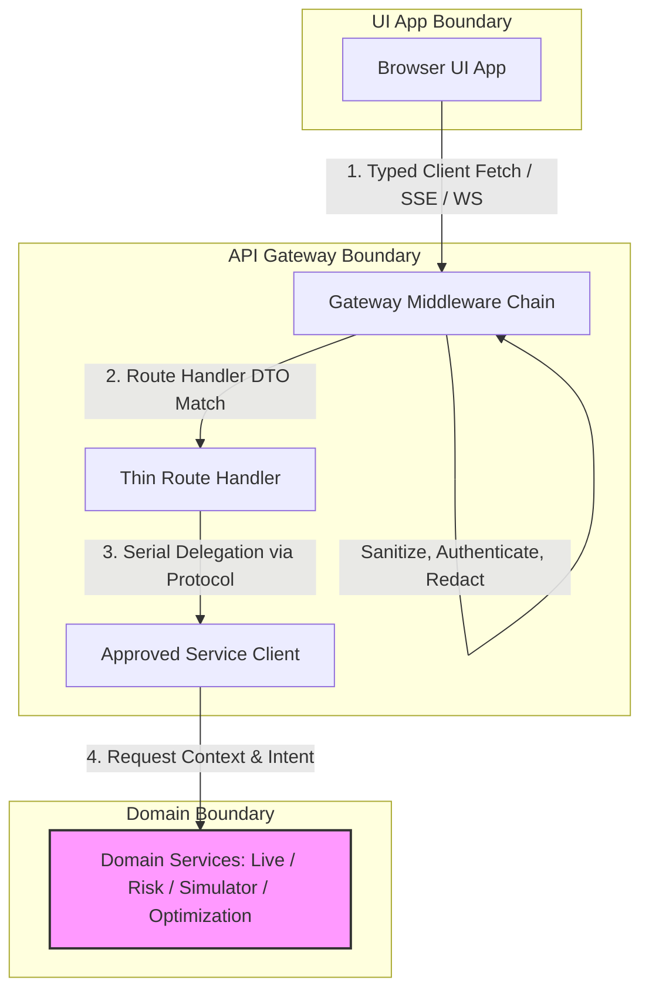

# UI and API Gateway — Intended Workflows and Scenarios

## 1. Document Purpose

This document provides a complete, reverse-engineered model of the intended behavior, operational workflows, and execution scenarios for the **UI and API Gateway** of HaruQuantAI. It integrates all isolated functional and non-functional requirements defined in [11-ui-and-api.md](file:///c:/Users/rharu/AppDev/HaruquantAI/docs/dev/phase-implementation-plan/11-ui-and-api.md) into continuous, end-to-end business workflows.

The objective is to establish:
- Concrete actor interactions and boundaries.
- Precise step-by-step logic, routing, validations, and state changes.
- Testable operational scenarios representing normal, edge-case, and failure behavior.
- An exhaustive requirements-to-workflow traceability matrix.
- A register of identified architectural gaps, ambiguities, contradictions, and orphans.

---

## 2. Source and Analysis Boundaries

The primary source of truth is [11-ui-and-api.md](file:///c:/Users/rharu/AppDev/HaruquantAI/docs/dev/phase-implementation-plan/11-ui-and-api.md). 
- **Rule of strict documentation**: No system behavior is invented.
- **Inferred connections**: Where requirements implicitly depend on a sequence of actions not fully defined, the connection is documented and marked:
  > **Inferred workflow connection — requires validation**
- **Explicit vs. Implied vs. Missing**: This document segregates explicitly defined behavior, implied behavior needed for system cohesion, missing operational logic, and architectural contradictions.

---

## 3. System Purpose and Scope

### System/Module Name
UI and API Gateway (comprising the `api/` backend ASGI FastAPI service and `ui/` Next.js TypeScript web application).

### Primary Purpose
Provide a secure, validated, observed gateway routing and presentation boundary separating browser UI interactions from core domain algorithmic services (Live, Simulator, Risk, Strategy, Analytics, Research, Optimization).

### Business & Operational Outcomes
- Bounded, unified HTTP and WebSocket/SSE interfaces with standardized request, response, and error envelopes.
- Secure operator authentication, path authorization, and role enforcement.
- Safe governed-write mechanics including preflight verification, idempotency preservation, and automated audit trail capture.
- Redacted, secret-free logs, traces, errors, and client telemetry.
- Accessible, presentation-only UI components without embedded trading, risk, broker, or persistence logic.

### Scope Boundaries



* **In-Scope (UI and API Gateway)**:
  * Application initialization, lifespan execution, database startup migration, and Uvicorn-facing entry points.
  * Router composition, CORS config, settings validation, body limits (1 MB JSON, 10 MB imports), timeouts (30s HTTP, 15s/30s streaming ping).
  * Request validation using boundary DTO schemas, and response normalization via standard envelopes.
  * Intent classification middleware, operator-path protection, token verification, and 24-hour session validation.
  * Secret redaction middleware for query params, headers, and logs.
  * Streaming event subscription, heartbeat, connection caps, and backpressure buffer tracking.
  * Path traversal/symlink validation for docs access.
  * UI layout rendering, route mapping, and unauthenticated redirects.
* **Out-of-Scope (Owned by Domain Services)**:
  * Implementing trading strategies, risk calculations, broker SDK calls, database record writes, chat model routing, optimization math, or execution algorithms.

---

## 4. Actors and Responsibilities

### End User (Trader / Developer)
- **Role**: Standard system consumer accessing charts, dashboards, strategy templates, backtest logs, and AI chat.
- **Initiates**: Logins, settings updates, strategy creation/updates, backtest portfolio runs, optimization runs, Edge Lab analyses, and AI chat threads.
- **Information Provided**: Credentials, settings payloads, strategy code, parameter bounds, chat messages.
- **Outcomes Received**: User session token, DTO-validated settings, strategy metadata, backtest logs/overview, chat message responses.
- **Prohibitions**: Prohibited from calling `/api/operator` routes, making direct live mutations, and writing docs outside the approved root folder.

### Operator
- **Role**: Monitoring agent with direct manual operation capabilities.
- **Initiates**: Aggregate health status queries, database migrations, and manual trade panel actions.
- **Information Provided**: Health parameters.
- **Outcomes Received**: System resource details, database readiness, and operational status.
- **Prohibitions**: Prohibited from executing live trades without risk validation and approver consensus.

### Approver
- **Role**: Authoritative principal with voting rights for governed actions.
- **Initiates**: Vote records on live-execution proposals.
- **Information Provided**: Approval/rejection vote decision.
- **Outcomes Received**: Updated vote totals and status updates on proposals.
- **Prohibitions**: Cannot initiate or bypass risk limits.

### Admin
- **Role**: System administrator with root-level configuration and emergency capabilities.
- **Initiates**: Emergency kill-switch trigger, mass order cancellation, position flattening/close, and override proposals.
- **Information Provided**: Operational commands, override parameters, and approval recovery requests.
- **Outcomes Received**: Immediate execution receipts, system-wide halt feedback.
- **Prohibitions**: Prohibited from bypassing the audited gateway log.

### API Gateway (System Component / Mediator)
- **Role**: Boundary gatekeeper.
- **Initiates**: Request parsing, CORS validation, authentication verification, path/schema matching, secret redaction, rate limiting, and client protocol dispatch.
- **Information Provided**: Sanitized `RequestContext` and payload DTOs.
- **Outcomes Received**: ServiceResult envelopes from backend services.
- **Prohibitions**: Strictly prohibited from implementing or modifying business rules, trade execution models, risk thresholds, or database tables directly.

---

## 5. Capability Map

```
api/ (FastAPI ASGI Service)
├── 1. Gateway Lifecycle & Composition
│   ├── Application Factory (CORS, router inclusion)
│   ├── Startup migrations & stale simulator lease cleanup
│   └── Route Catalog registry (metadata, owners, stability)
├── 2. Transport Boundary Validation
│   ├── Request DTO matching (Pydantic models)
│   ├── Standard response serialization (ApiEnvelope[T])
│   ├── Version matching (v0-draft checks)
│   └── Cursor pagination & size bounds (2MB maximum)
├── 3. Middleware & Security Gates
│   ├── Secret Redaction (headers, logs, telemetry)
│   ├── Path Intent Classification (metadata mapping)
│   ├── Operator Authorization (protected route gates)
│   └── Token Session Lifecycle (24-hour tokens, invalidation)
├── 4. Governance & Idempotency
│   ├── Governed Write preflight & role checks
│   ├── Idempotency store lookup (replay completed responses)
│   ├── Idempotency conflict evaluation (HTTP 409)
│   └── Fail-closed database fallback
├── 5. Gateway Client Protocol
│   ├── Service Discovery timeouts & context forwarding
│   ├── Serial route routing (one client call by default)
│   └── Orchestration abstraction (multi-service plans)
└── 6. Streaming Connection Manager
    ├── WebSocket event registration & pings
    └── Backpressure queue boundaries & cleanup

ui/ (Next.js TypeScript App)
├── 1. Client Transport Adaption
│   ├── Runtime DTO validator client (Freshness warnings)
│   ├── Governed write header injector
│   └── Redacted telemetry builder
├── 2. Protected Layout App Shell
│   ├── Unauth redirects & offline banner
│   └── Route manifest folders mapping
└── 3. Presentation Workspaces
    ├── Dashboard, docs, strategies, Edge Lab
    ├── AI chat, simulator, performance, live
    └── Presentation boundaries (no domain logic in UI)
```

---

## 6. Workflow Catalogue

| Workflow ID | Workflow Name | Category | Outcome |
|---|---|---|---|
| **WF-001** | General API Request and Response Delegation | Primary Business | Routes HTTP GET/POST read-only requests to domain services through approved protocols, returning enveloped data. |
| **WF-002** | Governed Mutation Preflight and Execution | Primary Business | Validates mutating actions with idempotency checks, CSRF, write context, and audit trails. |
| **WF-003** | Multi-Party Live Execution and Policy Approvals | Lifecycle / Governance | Governs proposals, voting, override requests, and kill-switch recovery workflows. |
| **WF-004** | Operator Emergency Action and Direct Manual Trade Controls | Emergency / Admin | Bypasses AI chat to submit kill-switch, mass cancels, or manual trade intents directly to backend services. |
| **WF-005** | Real-Time Stream Subscription and Lifecycle | Monitoring / Streaming | Registers WebSocket/SSE clients, manages heartbeats, backpressure, and resource cleanup. |
| **WF-006** | User Authentication, Session, and Settings Lifecycle | Administrative / Auth | Handles registrations, logins (24-hour tokens), settings edits (slash compatible), and logouts. |
| **WF-007** | AI Chat Conversation and Action Drafting | Primary Business | Runs chat threads, renaming, archives, message generation, page context resolution, and action drafting. |
| **WF-008** | Interactive Strategy Workspace Management | Supporting | Manages strategy templates, code editing, version diffs, code rollback, and import/export. |
| **WF-009** | Backtest and Parameter Optimization Execution | Supporting | Initiates backtest portfolio runs, optimization sweeps, and Monte Carlo sizing. |
| **WF-010** | Interactive Simulator Session Controls | Supporting | Handles simulation start, advancement of bars, what-if analyses, and simulated order actions. |
| **WF-011** | Live Session Execution and Configuration | Lifecycle / Live | Sets up live sessions, allocates strategies, start/resume steps, order inputs, and statistics monitoring. |

---

## 7. Detailed End-to-End Workflows

### WF-001 — General API Request and Response Delegation

#### Purpose and Value
Ensures that all inbound standard read-only or non-governed HTTP requests are parsed, validated, authenticated, and matched against defined route contracts. Dispatches requests serially to backend domain clients, translates outcomes to standardized envelopes, and reports stale warnings to the UI.

#### Actors
- **Primary**: End User / Browser UI
- **Supporting**: API Gateway, Service Clients, Domain Services

#### Trigger
User navigates to a read-only screen (e.g., Symbol Discovery, Dashboard, Backtests list).

#### Preconditions
- The API gateway is fully initialized.
- User is authenticated (unless accessing unauthenticated health endpoint `/api/health`).

#### Inputs
- HTTP Method, Request Path, Headers, Query Parameters, API Version string.

#### Main Success Flow

| Step | Responsible component | Action | Input | Validation or decision | State change | Output | Requirement IDs |
|---|---|---|---|---|---|---|---|
| 1 | Browser UI | Initiate HTTP request via client. | Request details | Check path mapping in route manifest. | None | HTTP request payload | UIAPI-FR-002, UIAPI-FR-202 |
| 2 | Gateway Middleware | Inspect incoming request headers. | Headers & Query | Check API version, CORS metadata, and authentication context. | RequestContext created | Routing metadata | UIAPI-FR-008, UIAPI-FR-046, UIAPI-FR-084, UIAPI-FR-179 |
| 3 | Gateway Middleware | Scan payload for sensitive keys. | Headers & Body | Apply secret redaction rules to request. | None | Redacted payload | UIAPI-FR-174, UIAPI-FR-175, UIAPI-FR-178 |
| 4 | Gateway Middleware | Rate limit check. | RequestContext | Check if client exceeded class quota. | Rate limit token decremented | Route validation | UIAPI-FR-210 |
| 5 | Route Router | Resolve target route handler. | Redacted path | Validate path and query inputs using boundary schemas. | None | Validated DTO payload | UIAPI-FR-024, UIAPI-FR-026 |
| 6 | Route Handler | Select approved service client. | DTO payload | Select client for the registered owner. Routing must be serial. | None | Service Request | UIAPI-FR-028, UIAPI-FR-029, UIAPI-FR-042, UIAPI-FR-043 |
| 7 | Service Client | Delegate call to service. | Service Request | Invoke target service within 30-second limit. | None | ServiceResult data | UIAPI-FR-096, UIAPI-FR-098 |
| 8 | Route Handler | Wrap response in standard envelope. | ServiceResult data | Ensure response size is under 2 MB limit. Map errors if needed. | None | `ApiEnvelope[T]` | UIAPI-FR-085, UIAPI-FR-097, UIAPI-FR-104 |
| 9 | Browser Client | Validate incoming payload. | `ApiEnvelope[T]` | Run TypeScript runtime validators; check if data is stale. | None | `AgenticResponse[T]` + warning | UIAPI-FR-001, UIAPI-FR-017, UIAPI-FR-036, UIAPI-FR-093 |

#### Decision Points
* **Endpoint Timeout Check**:
  * **Component**: Gateway Routing / Client Protocol
  * **Condition**: Request execution exceeds 30 seconds (or custom route timeout).
  * **Branch**: If true, abort execution, log timeout warning, and return HTTP 504 with `UPSTREAM_TIMEOUT`. If false, continue.
  * **Failsafe**: Fail-closed (abort call to prevent resource leak).
  * **Supporting requirements**: `UIAPI-FR-096`, `UIAPI-FR-098`, `UIAPI-FR-188`.
* **API Version Verification**:
  * **Component**: `versioning.py`
  * **Condition**: Request API version header differs from supported `v0-draft`.
  * **Branch**: If incompatible major mismatch, return HTTP 409 with `CONTRACT_VERSION_MISMATCH`. If minor mismatch, return warning metadata. If compatible, proceed.
  * **Failsafe**: Fail-closed (reject execution).
  * **Supporting requirements**: `UIAPI-FR-107`, `UIAPI-FR-188`.

#### Alternate Flows
* **Unauthenticated Health Query**:
  * If request path is `/api/health`, skip authentication context checks and rate limits, returning minimal health state without exposing system details.
  * Mapped requirements: `UIAPI-FR-189`.

#### Failure and Exception Flows
* **Rate Limit Exceeded**:
  * **Detection**: Intent Classification Middleware / Settings
  * **Action**: Interrupt request chain. Return HTTP 429 with standard `RATE_LIMITED` envelope, adding retry headers where safe.
  * **Traceability**: `UIAPI-FR-101`, `UIAPI-FR-188`.
* **Upstream Non-JSON Result**:
  * **Detection**: Service Client Delegation Layer
  * **Action**: Catch parsing exception, return HTTP 502 with `UPSTREAM_NON_JSON_RESPONSE` envelope.
  * **Traceability**: `UIAPI-FR-102`, `UIAPI-FR-188`.
* **Validation Failure**:
  * **Detection**: Route DTO validation layer
  * **Action**: Interrupt request chain. Return HTTP 422 with `VALIDATION_FAILED` envelope detailing parameters.
  * **Traceability**: `UIAPI-FR-103`, `UIAPI-FR-188`.

#### Recovery Flow
If database/network dependencies fail, the route handler intercepts the error using `errors.py`, formatting a standard envelope containing the appropriate code (e.g. `DEPENDENCY_UNAVAILABLE` or `INTERNAL_ERROR`), preventing stack trace leak.

#### Postconditions
- Logs generated (redacting sensitive fields).
- Correlation ID propagated.
- Target data delivered or error code returned.

#### Participating Components
- **Entry point**: `api/main.py`, `api/app.py`, `ui/src/lib/api/agentic-api.ts`
- **Orchestrator**: `api/routes/` handlers
- **Validators**: `api/contracts/dtos.py`, `ui/src/lib/contracts.ts`
- **Decision authorities**: `api/middleware/intent.py`, `api/contracts/versioning.py`
- **Executors**: `api/clients/protocols.py`
- **Persistence**: SQLite (read-only for symbols/cache)
- **Monitoring**: `api/middleware/redaction.py`
- **External dependencies**: Downstream Domain Services

#### Requirement Traceability
`UIAPI-FR-001`, `UIAPI-FR-002`, `UIAPI-FR-008`, `UIAPI-FR-017`, `UIAPI-FR-024`, `UIAPI-FR-026`, `UIAPI-FR-028`, `UIAPI-FR-029`, `UIAPI-FR-032`, `UIAPI-FR-036`, `UIAPI-FR-042`, `UIAPI-FR-043`, `UIAPI-FR-046`, `UIAPI-FR-084`, `UIAPI-FR-085`, `UIAPI-FR-093`, `UIAPI-FR-096`, `UIAPI-FR-097`, `UIAPI-FR-098`, `UIAPI-FR-101`, `UIAPI-FR-102`, `UIAPI-FR-103`, `UIAPI-FR-104`, `UIAPI-FR-107`, `UIAPI-FR-174`, `UIAPI-FR-175`, `UIAPI-FR-178`, `UIAPI-FR-179`, `UIAPI-FR-188`, `UIAPI-FR-189`, `UIAPI-FR-202`, `UIAPI-FR-210`, `UIAPI-NFR-001`, `UIAPI-NFR-002`, `UIAPI-NFR-003`, `UIAPI-NFR-004`, `UIAPI-NFR-005`, `UIAPI-NFR-006`.

---

### WF-002 — Governed Mutation Preflight and Execution

#### Purpose and Value
Protects the system against duplicate execution, CSRF vulnerability, unauthorized writes, and data corruption during mutating operations (such as changing settings, creating strategies, starting live processes). Enforces preflight verification in the UI and backend-level idempotency mapping.

#### Actors
- **Primary**: End User / Operator
- **Supporting**: API Gateway, Idempotency Repository, Audit Log, Domain Services

#### Trigger
User submits a form (e.g. updating user settings, importing strategies, starting session).

#### Preconditions
- User has authenticated status and holds write permissions.
- Idempotency key exists.

#### Inputs
- HTTP Method, Request Path, Headers, Request ID, Trace ID, Idempotency Key, CSRF token, write parameters.

#### Main Success Flow

| Step | Responsible component | Action | Input | Validation or decision | State change | Output | Requirement IDs |
|---|---|---|---|---|---|---|---|
| 1 | UI Governed Write client | Execute mutation preflight. | Intent & params | Check if action requires approval; warn if context is stale. | None | Preflight allowance | UIAPI-FR-080, UIAPI-FR-113 |
| 2 | UI Governed Write client | Inject headers to request. | Allowed request | Inject Idempotency key, CSRF, and user role headers. | None | HTTP request payload | UIAPI-FR-081, UIAPI-FR-205 |
| 3 | Gateway Middleware | Validate CSRF and role policy. | Payload | Reject if CSRF is invalid or if headers lack required elements. | None | Checked payload | UIAPI-FR-084, UIAPI-FR-215 |
| 4 | Governed Writes module | Extract idempotency key. | Headers | Reject if key is empty/malformed. | None | Extracted key | UIAPI-FR-030, UIAPI-FR-047 |
| 5 | Idempotency Repos | Check repository cache. | Key & request hash | Query idempotency table. If complete, trigger replay. | Reservation saved | Reservation state | UIAPI-FR-108, UIAPI-FR-212 |
| 6 | Route Handler | Invoke Service Client. | DTO payload | Map parameters to domain signature. Dispatch call. | None | Service Result | UIAPI-FR-028, UIAPI-FR-029 |
| 7 | Idempotency Repos | Save completed result. | Service Result | Write status, headers, and body response. | Key updated to complete | Completed response | UIAPI-FR-108 |
| 8 | Route Handler | Emit Audit Trail entry. | Service Result | Save audit intent, actor, execution parameters, and result status. | Audit log written | standard response | UIAPI-FR-004, UIAPI-FR-212 |

#### Decision Points
* **Idempotency Key Check**:
  * **Component**: `idempotency/repository.py`
  * **Condition**: Key already exists in the repository store.
  * **Branch**:
    * If key exists and status is **In Progress/Failed**, abort execution and return HTTP 409 with `DUPLICATE_IDEMPOTENCY_KEY`.
    * If key exists, status is **Complete**, but request hash is different, return HTTP 409 with `IDEMPOTENCY_CONFLICT`.
    * If key exists, status is **Complete**, and request hash matches, invoke alternate replay flow.
    * If key does not exist, save reservation and proceed.
  * **Failsafe**: Fail-closed (reject execution).
  * **Supporting requirements**: `UIAPI-FR-109`, `UIAPI-FR-110`, `UIAPI-FR-126`, `UIAPI-FR-188`.
* **Idempotency Database Unavailability**:
  * **Component**: `idempotency/repository.py`
  * **Condition**: Repository connection times out or throws database connection error.
  * **Branch**: If database is offline, abort and return HTTP 503 with `DEPENDENCY_UNAVAILABLE`.
  * **Failsafe**: Fail-closed (mutations require active idempotency store to prevent duplicates).
  * **Supporting requirements**: `UIAPI-FR-111`, `UIAPI-FR-188`.

#### Alternate Flows
* **Conflict-Free Replay**:
  * If the idempotency key matches a successfully completed previous mutation (same hash), return the original stored response headers and body directly, updating the metadata field `idempotency_replay=true` and setting `retryable=false`.
  * Mapped requirements: `UIAPI-FR-126`.

#### Failure and Exception Flows
* **Missing Governed Context**:
  * **Detection**: Governed Writes validator
  * **Action**: Abort execution before calling service. Return HTTP 400 with `GOVERNANCE_REQUIRED`.
  * **Traceability**: `UIAPI-FR-047`, `UIAPI-FR-188`.

#### Recovery Flow
If database/network dependencies fail, the route handler intercepts the error using `errors.py`, formatting a standard envelope containing the appropriate code (e.g. `DEPENDENCY_UNAVAILABLE` or `INTERNAL_ERROR`), preventing stack trace leak.

#### Postconditions
- Mutation audit record saved to ledger.
- Idempotency reservation finalized.
- Response marked with replay/retry metadata returned.

#### Participating Components
- **Entry point**: `ui/src/lib/governance/governed-write.ts`, `api/governance/writes.py`
- **Orchestrator**: Route handlers (`api/routes/settings.py`, `api/routes/strategies.py`, etc.)
- **Validators**: `ui/src/lib/governance/governed-write.ts`, `api/governance/writes.py`
- **Decision authorities**: `api/idempotency/repository.py`
- **Executors**: `api/clients/protocols.py`
- **Persistence**: SQLite (idempotency repository and audit store)
- **Monitoring**: Audit Logs
- **External dependencies**: Downstream Domain Services

#### Requirement Traceability
`UIAPI-FR-004`, `UIAPI-FR-028`, `UIAPI-FR-029`, `UIAPI-FR-030`, `UIAPI-FR-047`, `UIAPI-FR-080`, `UIAPI-FR-081`, `UIAPI-FR-084`, `UIAPI-FR-108`, `UIAPI-FR-109`, `UIAPI-FR-110`, `UIAPI-FR-111`, `UIAPI-FR-113`, `UIAPI-FR-126`, `UIAPI-FR-188`, `UIAPI-FR-205`, `UIAPI-FR-212`, `UIAPI-FR-215`, `UIAPI-NFR-005`, `UIAPI-NFR-006`, `UIAPI-NFR-008`.

---

### WF-003 — Multi-Party Live Execution and Policy Approvals

#### Purpose and Value
Coordinates multi-party reviews and voter consensus before executing high-risk mutations (such as enabling live trading, modifying general policy thresholds, overriding risk parameters, or performing kill-switch recovery). Ensures change validity via structured voting and explicit approver role enforcement.

#### Actors
- **Primary**: Operator / Approver / Admin
- **Supporting**: API Gateway, Governance Store, Risk/Live Services

#### Trigger
An Operator requests activation of live trading, or an Admin submits a policy change.

#### Preconditions
- The requesting user is authenticated and holds the appropriate role (`operator` or `admin`).

#### Inputs
- Request ID, Trace ID, Target Proposal details (session configs, override margins), Operator principal header.

#### Main Success Flow

| Step | Responsible component | Action | Input | Validation or decision | State change | Output | Requirement IDs |
|---|---|---|---|---|---|---|---|
| 1 | Operator UI | Submit proposal request. | Proposal details | Verify required fields; check operator role. | None | HTTP request payload | UIAPI-FR-074 |
| 2 | Gateway Router | Resolve operator route. | Payload | Enforce auth. Check that path is protected. | None | Validated proposal | UIAPI-FR-192, UIAPI-FR-194 |
| 3 | Route Handler | Delegate proposal registration. | proposal details | Call downstream Governance client. | Proposal saved in PENDING status | Approval ID receipt | UIAPI-FR-054, UIAPI-FR-055, UIAPI-FR-056, UIAPI-FR-057 |
| 4 | Approver UI | Display proposal details. | Approval ID | Retrieve proposal details from catalog. | None | Renders details page | UIAPI-FR-073 |
| 5 | Approver UI | Cast vote on proposal. | Vote decision | Enforce role role check (`approver` or `admin`). | None | Vote payload | UIAPI-FR-052, UIAPI-FR-074 |
| 6 | Route Handler | Record vote decision. | Vote payload | Enforce vote constraints. | Vote logged; update approval status | Updated proposal status | UIAPI-FR-062, UIAPI-FR-321 |
| 7 | Governance service | Evaluate vote threshold. | Proposal state | **Inferred connection** - Check if votes satisfy threshold. | Proposal status -> APPROVED | Activation directive | *Inferred connection — requires validation* |
| 8 | Live Service Client | Activate live trading. | Activation directive | Ensure all prerequisites are met. | Live mode enabled | Activation receipt | UIAPI-FR-037 |

#### Decision Points
* **Voter Role Verification**:
  * **Component**: `security/authentication.py`
  * **Condition**: User casting a vote holds the required role (`approver` or `admin`).
  * **Branch**: If true, record vote. If false, reject and return HTTP 403 with `AUTHORIZATION_FAILED`.
  * **Failsafe**: Fail-closed (unauthorized vote ignored).
  * **Supporting requirements**: `UIAPI-FR-052`, `UIAPI-FR-187`, `UIAPI-FR-195`.
* **Live Trading Prerequisites Check**:
  * **Component**: Live/Risk Backend Services
  * **Condition**: Explicit live flags, risk approval, broker readiness, reconciliation checks, audit trails, and kill-switch components are green.
  * **Branch**: If true, proceed to enable live execution. If false, block mutation, log warning, and return HTTP 403.
  * **Failsafe**: Fail-closed (live execution remains disabled).
  * **Supporting requirements**: `UIAPI-FR-037`, `UIAPI-FR-309`.

#### Alternate Flows
* **Administrative Override**:
  * An Admin initiates an override proposal (`POST /api/operator/override`), bypassing standard voting if a predefined emergency override policy allows it, but still capturing a structured audit record.
  * Mapped requirements: `UIAPI-FR-056`.

#### Failure and Exception Flows
* **Voter Status Mismatch**:
  * **Detection**: Route Handler
  * **Action**: Reject request if proposal is already resolved (Approved/Expired). Return HTTP 409.
  * **Traceability**: `UIAPI-FR-062`.

#### Recovery Flow
If voting fails due to timeout or communication disconnection, the proposal state remains `PENDING` until resolved. An Administrator can submit a kill-switch recovery proposal (`POST /api/operator/kill-switch-recovery`) to clear locks.

#### Postconditions
- Proposal state updated.
- Audit trail logged.
- Live mode activated (if approved).

#### Participating Components
- **Entry point**: `ui/src/components/operator/operator-controls.tsx`, `api/routes/operator.py`
- **Orchestrator**: Route handlers (`POST /api/operator/...`)
- **Validators**: `api/security/authentication.py`
- **Decision authorities**: Live/Risk Backend Services
- **Executors**: Downstream Governance Engine
- **Persistence**: SQLite (Governance database)
- **Monitoring**: Audit Logs
- **External dependencies**: Live Service, Risk Service

#### Requirement Traceability
`UIAPI-FR-037`, `UIAPI-FR-052`, `UIAPI-FR-054`, `UIAPI-FR-055`, `UIAPI-FR-056`, `UIAPI-FR-057`, `UIAPI-FR-062`, `UIAPI-FR-073`, `UIAPI-FR-074`, `UIAPI-FR-187`, `UIAPI-FR-192`, `UIAPI-FR-194`, `UIAPI-FR-195`, `UIAPI-FR-309`, `UIAPI-FR-321`, `UIAPI-NFR-005`, `UIAPI-NFR-008`.

---

### WF-004 — Operator Emergency Action and Direct Manual Trade Controls

#### Purpose and Value
Provides direct, high-availability pathways for executing emergency halts (Emergency Kill-Switch, Mass Order Cancellation, and Position Flattening) and manual trades. Bypass the AI chat layer, LLM libraries, and planning pipelines to prevent latency or failure during broker crises.

#### Actors
- **Primary**: Admin / Operator
- **Supporting**: API Gateway, Live Service Client, Trading Service Client

#### Trigger
An Admin triggers the Emergency Kill-Switch on the UI, or submits a manual trade intent.

#### Preconditions
- The Operator/Admin is authenticated with correct role permissions.

#### Inputs
- Request ID, Trace ID, Idempotency Key, Command payload.

#### Main Success Flow

| Step | Responsible component | Action | Input | Validation or decision | State change | Output | Requirement IDs |
|---|---|---|---|---|---|---|---|
| 1 | Operator UI | Present direct emergency button. | UI parameters | Button remains interactive when LLM or chat is unavailable. | None | Active control layout | UIAPI-FR-071 |
| 2 | Operator UI | Capture trigger command. | Click / Submit | Require explicit confirmation check unless emergency bypass active. | None | Confirmed command | UIAPI-FR-074 |
| 3 | Operator UI Client | Dispatch HTTP request to API. | Command payload | Bypass chat/conversation layers; route directly to operator API. | None | HTTP request payload | UIAPI-FR-072 |
| 4 | Gateway Middleware | Validate role permission. | Request context | Check that caller holds `admin` or `operator` permission. | None | Validated payload | UIAPI-FR-084, UIAPI-FR-192 |
| 5 | Route Handler | Resolve target route. | Validated payload | Dispatch call directly to approved service client. | None | Service Request | UIAPI-FR-058, UIAPI-FR-059, UIAPI-FR-060, UIAPI-FR-061 |
| 6 | Service Client | Dispatches command. | Service Request | Route to broker adapters directly. | None | Execution result | UIAPI-FR-314, UIAPI-FR-315, UIAPI-FR-316 |
| 7 | Route Handler | Log audit entry. | Execution result | Save details of emergency command to audit ledger. | Audit log updated | Standard response envelope | UIAPI-FR-004, UIAPI-FR-212 |
| 8 | Operator UI | Update system state views. | Response envelope | Display live mode, broker status, and kill-switch updates. | UI status modified | Refreshed dashboard view | UIAPI-FR-073 |

#### Decision Points
* **AI/LLM Independence Check**:
  * **Component**: Operator UI / Gateway Routing
  * **Condition**: System triggers Emergency Action or Manual trade.
  * **Branch**: Route calls directly through `/api/operator` HTTP endpoints. Prohibit routing through AI chat, thread prompts, message generators, or LLM clients.
  * **Failsafe**: Fail-closed (abort call if AI dependencies are accidentally injected).
  * **Supporting requirements**: `UIAPI-FR-058`, `UIAPI-FR-059`, `UIAPI-FR-060`, `UIAPI-FR-061`, `UIAPI-FR-071`, `UIAPI-FR-072`.

#### Alternate Flows
* **Mass Cancellation / Position Close**:
  * An Operator triggers a mass cancel (`POST /api/operator/orders/mass-cancel`) or position close (`POST /api/operator/positions/{id}/close`), using the same gateway rules but dispatching to the Trading/Live domain clients instead of the emergency kill-switch.
  * Mapped requirements: `UIAPI-FR-060`, `UIAPI-FR-061`, `UIAPI-FR-314`, `UIAPI-FR-315`, `UIAPI-FR-316`.

#### Failure and Exception Flows
* **Broker Unavailability**:
  * **Detection**: Service Client / Broker Adapter
  * **Action**: If downstream broker is unresponsive during kill-switch execution, fallback to local offline mode, lock session, alert operators, and throw HTTP 503 with `BROKER_UNAVAILABLE`.
  * **Traceability**: `UIAPI-FR-073`, `UIAPI-FR-188`.

#### Recovery Flow
After a kill-switch halt is resolved, the system remains locked. Recovery requires executing the multi-party approval recovery workflow (WF-003) to resume session routing.

#### Postconditions
- Downstream broker orders canceled.
- Local session state set to HALTED.
- Audit records completed.

#### Participating Components
- **Entry point**: `ui/src/components/operator/operator-controls.tsx`, `api/routes/operator.py`
- **Orchestrator**: Route handlers (`POST /api/operator/...`)
- **Validators**: `api/middleware/operator_auth.py`
- **Decision authorities**: Trading / Live Services
- **Executors**: Downstream Broker Adapters
- **Persistence**: SQLite (Audit records)
- **Monitoring**: Operator Dashboard
- **External dependencies**: MT5 / External Brokers

#### Requirement Traceability
`UIAPI-FR-004`, `UIAPI-FR-058`, `UIAPI-FR-059`, `UIAPI-FR-060`, `UIAPI-FR-061`, `UIAPI-FR-071`, `UIAPI-FR-072`, `UIAPI-FR-073`, `UIAPI-FR-074`, `UIAPI-FR-084`, `UIAPI-FR-192`, `UIAPI-FR-212`, `UIAPI-FR-314`, `UIAPI-FR-315`, `UIAPI-FR-316`, `UIAPI-NFR-008`.

---

### WF-005 — Real-Time Stream Subscription and Lifecycle

#### Purpose and Value
Registers, authenticates, and maintains WebSocket/SSE client streams (for backtest logs, optimization steps, live session feeds, or operator updates). Enforces server-side heartbeats, concurrency bounds, and backpressure queue control to prevent memory leaks and server crashes.

#### Actors
- **Primary**: Browser Client / User
- **Supporting**: Streaming Manager, Event Producers

#### Trigger
User opens a workspace needing active progress data (e.g., Backtest Runner, live workspace).

#### Preconditions
- User is authenticated and holds the necessary role permissions for target stream class.

#### Inputs
- Connection headers, authentication token, stream type (backtest, optimization, live, operator).

#### Main Success Flow

| Step | Responsible component | Action | Input | Validation or decision | State change | Output | Requirement IDs |
|---|---|---|---|---|---|---|---|
| 1 | UI workspace component | Initialize connection request. | Stream endpoint URL | Check connection limits; request WebSocket target. | None | WS handshake | UIAPI-FR-116, UIAPI-FR-117, UIAPI-FR-317 |
| 2 | Streaming Router | Intercept handshake. | Handshake headers | Enforce stream auth; verify client permissions. | None | Verified request | UIAPI-FR-063, UIAPI-FR-193 |
| 3 | Streaming Manager | Check connection bounds. | Request context | Check process and user stream limits. | Concurrent count incremented | Handshake approved | UIAPI-FR-087, UIAPI-FR-211 |
| 4 | Streaming Manager | Initialize client session. | Active connection | Instantiate per-client queue and backpressure policies. | Client registered | Active socket channel | UIAPI-FR-206 |
| 5 | Streaming Manager | Trigger heartbeat routine. | Client socket | Start 15-second client-to-server ping schedule. | Ping timer running | Heartbeat events | UIAPI-FR-099, UIAPI-FR-185 |
| 6 | Event Producer | Push event to client queue. | Payload data | Wrap event inside stream metadata envelope. | None | Stream event DTO | UIAPI-FR-045, UIAPI-FR-185 |
| 7 | Streaming Manager | Process queue delivery. | Stream event DTO | Check backpressure buffer queue size. Dispatch payload. | Queue updated | Network package | UIAPI-FR-185 |
| 8 | UI client listener | Receive network event. | Network package | Parse payload; update UI indicators. | UI view updated | Redacted event display | UIAPI-FR-250 |

#### Decision Points
* **Backpressure Threshold Check**:
  * **Component**: `streaming/manager.py`
  * **Condition**: Bounded buffer queue for a client exceeds limit.
  * **Branch**: If true, trigger overflow policy (drop events or disconnect client if buffer remains blocked). If false, proceed.
  * **Failsafe**: Fail-closed (disconnect client to prevent memory crash).
  * **Supporting requirements**: `UIAPI-FR-185`, `UIAPI-NFR-007`.
* **Missed Heartbeat Check**:
  * **Component**: `streaming/manager.py`
  * **Condition**: Server misses client response ping within 30-second expectation window.
  * **Branch**: If true, close WebSocket, release resources, and clean user registry. If false, reset window.
  * **Failsafe**: Clean-close socket.
  * **Supporting requirements**: `UIAPI-FR-099`, `UIAPI-FR-185`.

#### Alternate Flows
* **Unauthenticated Health Stream**:
  * If configuration allows a redacted public health-only stream, bypass auth checks. Stream only coarse health and service metadata, returning no private logs.
  * Mapped requirements: `UIAPI-FR-051`, `UIAPI-FR-087`.

#### Failure and Exception Flows
* **Connection Cap Exceeded**:
  * **Detection**: Streaming Manager
  * **Action**: If concurrent connection count for an actor exceeds 5, reject handshake. Return standard HTTP 429 logic.
  * **Traceability**: `UIAPI-FR-087`, `UIAPI-FR-211`.
* **Client Disconnect**:
  * **Detection**: WebSocket Connection Lifespan
  * **Action**: Capture unexpected network disconnect. Trigger cleanup, release queues, and update connection count.
  * **Traceability**: `UIAPI-FR-185`, `UIAPI-FR-206`.

#### Recovery Flow
Upon connection failure or dropped socket, the client library implements retry logic, attempting to re-establish the handshake using exponential backoff parameters.

#### Postconditions
- Queue allocated/released.
- Connection counts tracked.
- Telemetry updated.

#### Participating Components
- **Entry point**: `api/routes/operator_stream.py`, `api/routes/live.py` (WebSocket routes)
- **Orchestrator**: `api/streaming/manager.py`
- **Validators**: `api/contracts/streaming.py`
- **Decision authorities**: `api/streaming/manager.py`
- **Executors**: `api/streaming/manager.py`
- **Persistence**: None
- **Monitoring**: Connection counters
- **External dependencies**: Browser Client

#### Requirement Traceability
`UIAPI-FR-045`, `UIAPI-FR-051`, `UIAPI-FR-063`, `UIAPI-FR-087`, `UIAPI-FR-099`, `UIAPI-FR-116`, `UIAPI-FR-117`, `UIAPI-FR-185`, `UIAPI-FR-193`, `UIAPI-FR-206`, `UIAPI-FR-211`, `UIAPI-FR-250`, `UIAPI-FR-317`, `UIAPI-NFR-007`.

---

### WF-006 — User Authentication, Session, and Settings Lifecycle

#### Purpose and Value
Secures user access, manages session lifecycle (releasing prior sessions and limiting session tokens to 24 hours), handles user settings profiles (including trailing slash path support), and executes token invalidation.

#### Actors
- **Primary**: End User
- **Supporting**: API Gateway, Session Store, Settings Database

#### Trigger
User attempts registration, logins, settings reads/updates, or logout actions.

#### Preconditions
- Auth database is online.

#### Inputs
- Registration/Login DTO, session token, settings payload.

#### Main Success Flow

| Step | Responsible component | Action | Input | Validation or decision | State change | Output | Requirement IDs |
|---|---|---|---|---|---|---|---|
| 1 | UI Auth Form | Capture login details. | Username / Password | Validate parameters locally. | None | Login payload | UIAPI-FR-204 |
| 2 | Auth Route | Dispatch validation call. | Login payload | Validate request using boundary schema. | None | Checked DTO | UIAPI-FR-197 |
| 3 | Auth service | Authenticate credentials. | Checked DTO | Verify credentials; check user active state. | None | Authenticated user ID | UIAPI-FR-190 |
| 4 | Session store | Generate session token. | User ID | Terminate any old active tokens for user ID. | New session saved; TTL 24h | Session token | UIAPI-FR-216 |
| 5 | UI Settings Workspace | Retrieve user settings. | Token context | Query settings endpoint (support slash-less). | None | Settings payload | UIAPI-FR-199, UIAPI-FR-225 |
| 6 | UI Settings Workspace | Submit settings change. | Edit properties | Run preflight check. Inject headers. | None | Update payload | UIAPI-FR-200 |
| 7 | Settings Route | Save new settings. | Update payload | Validate input. Write to database. | Settings updated | Updated settings DTO | UIAPI-FR-200 |
| 8 | Auth Route | Terminate session. | Session token | Delete token in session database. | Token status -> DELETED | Logout confirmation | UIAPI-FR-198, UIAPI-FR-218 |

#### Decision Points
* **Token Validity Verification**:
  * **Component**: `security/authentication.py`
  * **Condition**: Received session token exists in store and has not exceeded the 24-hour limit.
  * **Branch**: If valid, extract user ID and proceed. If invalid or expired, delete expired tokens and return HTTP 401 with `AUTHENTICATION_REQUIRED`.
  * **Failsafe**: Fail-closed (restrict access).
  * **Supporting requirements**: `UIAPI-FR-191`, `UIAPI-FR-217`.

#### Alternate Flows
* **Slash-less Settings Routing**:
  * If a client calls `/api/settings` (missing the trailing slash), redirect/map parameters to `/api/settings/` cleanly without failing the query.
  * Mapped requirements: `UIAPI-FR-225`.

#### Failure and Exception Flows
* **Duplicate Active Session**:
  * **Detection**: Token generation layer
  * **Action**: Invalidates existing active tokens for the logging-in user, ensuring only one concurrent session remains active.
  * **Traceability**: `UIAPI-FR-216`.

#### Recovery Flow
If user session database goes offline, auth calls fail closed with `DEPENDENCY_UNAVAILABLE` to prevent unauthenticated bypasses.

#### Postconditions
- Session token saved/removed.
- User settings updated.
- Telemetry updated without logging passwords/tokens.

#### Participating Components
- **Entry point**: `api/routes/auth.py`, `api/routes/settings.py`
- **Orchestrator**: `api/security/authentication.py`
- **Validators**: `api/contracts/dtos.py`
- **Decision authorities**: `api/security/authentication.py`
- **Executors**: `api/security/authentication.py`
- **Persistence**: SQLite (Users & Sessions database)
- **Monitoring**: sanitized Auth audit log
- **External dependencies**: Browser Client

#### Requirement Traceability
`UIAPI-FR-186`, `UIAPI-FR-190`, `UIAPI-FR-191`, `UIAPI-FR-196`, `UIAPI-FR-197`, `UIAPI-FR-198`, `UIAPI-FR-199`, `UIAPI-FR-200`, `UIAPI-FR-204`, `UIAPI-FR-207`, `UIAPI-FR-216`, `UIAPI-FR-217`, `UIAPI-FR-218`, `UIAPI-FR-222`, `UIAPI-FR-223`, `UIAPI-FR-224`, `UIAPI-FR-225`, `UIAPI-FR-227`, `UIAPI-FR-228`, `UIAPI-NFR-005`.

---

### WF-007 — AI Chat Conversation and Action Drafting

#### Purpose and Value
Handles AI chat conversations, thread lifecycle tracking, page context payload formatting (verifying size limits and redacting secrets), and action drafting. Enables safe paper execution of drafts or routes them to the Operator approval process for live execution.

#### Actors
- **Primary**: User / Browser Client
- **Supporting**: AI Chat Panel, Conversation Service, Governance/Paper Clients

#### Trigger
User opens the chat panel, submits messages, or initiates action plans draft validation.

#### Preconditions
- User has active session credentials.

#### Inputs
- Thread ID, Message payload, raw page context, action details.

#### Main Success Flow

| Step | Responsible component | Action | Input | Validation or decision | State change | Output | Requirement IDs |
|---|---|---|---|---|---|---|---|
| 1 | AI Chat UI Component | Load chat Threads listing. | Active user ID | Retrieve threads catalog from database. | None | Thread cards display | UIAPI-FR-230, UIAPI-FR-248 |
| 2 | Page Context Provider | Compile current page state. | Raw page state | Redact secrets and verify context limits. | None | Sanitized context DTO | UIAPI-FR-229, UIAPI-FR-251 |
| 3 | AI Chat client | Dispatch user message. | Message + context | Verify schema bounds. Send payload. | None | Message queue update | UIAPI-FR-240, UIAPI-FR-242 |
| 4 | Chat Route | Process message trigger. | Message payload | Call Conversation Service. Return stream. | Message appended to thread | Stream event stream | UIAPI-FR-250 |
| 5 | AI Chat UI Component | Display action draft proposals. | AI response | Parse draft details. Renders preview cards. | None | Action draft preview | UIAPI-FR-246, UIAPI-FR-252 |
| 6 | AI Chat UI Component | Request draft approval. | Draft ID | Check permissions. Send proposal. | None | Approval request proposal | UIAPI-FR-064, UIAPI-FR-065 |
| 7 | Route Handler | Process approval request. | Draft ID | Map draft parameters to approval template. | PENDING approval created | Approval ID receipt | UIAPI-FR-064 |
| 8 | Governance Service | Initiate approval workflow. | Approval template | Direct proposal details to operator queue. | None | Workflow started | UIAPI-FR-064 |

#### Decision Points
* **Context Size Limit check**:
  * **Component**: `context/page-context.ts`
  * **Condition**: Page context payload exceeds size limits.
  * **Branch**: If true, apply truncation rules, redact details, and warn the user. If false, proceed.
  * **Failsafe**: Truncate payload.
  * **Supporting requirements**: `UIAPI-FR-229`.
* **Execution Route Decision**:
  * **Component**: AI Chat Route Handler
  * **Condition**: Action draft execution path request.
  * **Branch**:
    * If paper execution requested (`POST .../paper-execute`), delegate directly to Paper Client.
    * If live execution requested, block execution and route details to standard Approval proposal (WF-003).
  * **Failsafe**: Block live execution from chat routes.
  * **Supporting requirements**: `UIAPI-FR-064`, `UIAPI-FR-065`.

#### Alternate Flows
* **Thread Archival and Purge**:
  * User can archive (`POST .../threads/{id}/archive`), rename (`PATCH .../threads/{id}`), delete (`DELETE .../threads/{id}`), or purge threads, modifying their persistence states.
  * Mapped requirements: `UIAPI-FR-231`, `UIAPI-FR-233`, `UIAPI-FR-235`, `UIAPI-FR-236`.

#### Failure and Exception Flows
* **Retention Policy Purge**:
  * **Detection**: Scheduler / Retention Job
  * **Action**: Runs thread lifecycle checks, archiving or purging threads based on configured retention durations.
  * **Traceability**: `UIAPI-FR-232`, `UIAPI-FR-237`, `UIAPI-FR-238`.

#### Recovery Flow
If AI model stream disconnects mid-response, the UI client stops the loading state and allows the user to trigger regeneration (`POST .../threads/{id}/responses/regenerate`).

#### Postconditions
- Message history saved.
- Page context mapped.
- Action draft saved or submitted to approval.

#### Participating Components
- **Entry point**: `ui/src/components/chat/ai-chat.tsx`, `api/routes/chat.py`
- **Orchestrator**: Conversation Service
- **Validators**: `ui/src/context/page-context.ts`, `api/contracts/dtos.py`
- **Decision authorities**: Route Handlers
- **Executors**: Conversation Engine, Paper/Live Client
- **Persistence**: SQLite (Chat thread storage)
- **Monitoring**: System Logs
- **External dependencies**: LLM Providers

#### Requirement Traceability
`UIAPI-FR-064`, `UIAPI-FR-065`, `UIAPI-FR-229`, `UIAPI-FR-230`, `UIAPI-FR-231`, `UIAPI-FR-232`, `UIAPI-FR-233`, `UIAPI-FR-234`, `UIAPI-FR-235`, `UIAPI-FR-236`, `UIAPI-FR-237`, `UIAPI-FR-238`, `UIAPI-FR-239`, `UIAPI-FR-240`, `UIAPI-FR-241`, `UIAPI-FR-242`, `UIAPI-FR-243`, `UIAPI-FR-244`, `UIAPI-FR-245`, `UIAPI-FR-246`, `UIAPI-FR-247`, `UIAPI-FR-248`, `UIAPI-FR-249`, `UIAPI-FR-250`, `UIAPI-FR-251`, `UIAPI-FR-252`, `UIAPI-FR-253`, `UIAPI-FR-254`.

---

### WF-008 — Interactive Strategy and Code Workspace Management

#### Purpose and Value
Provides developers with capabilities to explore strategy templates, create and edit strategies, inspect code history diffs, perform version rollbacks, and import/export strategy files, maintaining change history.

#### Actors
- **Primary**: User
- **Supporting**: API Gateway, Strategy Service Client

#### Trigger
User accesses the Strategy Workspace, edits strategy code, or requests a rollback.

#### Preconditions
- User has active session credentials and write access to strategies.

#### Inputs
- Strategy ID, version parameters, updated code contents.

#### Main Success Flow
1. User requests a strategy template via `GET /api/strategies/templates/{template_name}`.
2. Gateway checks permissions and delegates search to the Strategy service, returning template structures.
3. User writes/creates a strategy via `POST /api/strategies/` or edits code via `PUT /api/strategies/{strategy_id}`.
4. UI displays code diffs using the frontend `VersionDiffViewer` component.
5. User commits code, updating the active version.
6. User reviews past code commits via `GET /api/strategies/{strategy_id}/versions` and retrieves historic file code using `GET /api/strategies/{strategy_id}/versions/{version_id}/code`.

#### Alternate Flows
* **Strategy Code Rollback**:
  * User triggers a rollback via `POST /api/strategies/{strategy_id}/versions/{version_id}/rollback`. The gateway instructs the Strategy service to restore the target code commit as the head version.
  * Mapped requirements: `UIAPI-FR-263`.
* **Export and Import**:
  * User downloads strategy code via `POST /api/strategies/{strategy_id}/export`, or imports strategy assets using `POST /api/strategies/{strategy_id}/import`.
  * Mapped requirements: `UIAPI-FR-264`, `UIAPI-FR-265`.

#### Failure and Exception Flows
* **Invalid Code Schema**:
  * **Detection**: Strategy service compiler
  * **Action**: Return HTTP 422 with a structured error envelope describing syntax errors.
  * **Traceability**: `UIAPI-FR-103`.

#### Postconditions
- Strategy version incremented.
- Code changes persisted in strategy database.

#### Requirement Traceability
`UIAPI-FR-018`, `UIAPI-FR-255`, `UIAPI-FR-256`, `UIAPI-FR-257`, `UIAPI-FR-258`, `UIAPI-FR-259`, `UIAPI-FR-260`, `UIAPI-FR-261`, `UIAPI-FR-262`, `UIAPI-FR-263`, `UIAPI-FR-264`, `UIAPI-FR-265`, `UIAPI-FR-272`, `UIAPI-FR-273`.

---

### WF-009 — Backtest and Parameter Optimization Execution

#### Purpose and Value
Enables users to run strategy validations, portfolio backtests, optimization runs, and Monte Carlo risk sizing, observing execution updates via event streams.

#### Actors
- **Primary**: User / Developer
- **Supporting**: API Gateway, Optimization Service Client, Simulation Service Client

#### Trigger
User submits a backtest run request or triggers an optimization parameter sweep.

#### Preconditions
- Target strategy exists and contains valid code.

#### Inputs
- Strategy ID, historical data bounds, parameter settings.

#### Main Success Flow
1. User clicks "Run Backtest" in UI. Client initiates request via `POST /api/backtest/portfolio/run/{strategy_id}`.
2. Gateway routes request context to Simulation service.
3. Simulation service registers run, returning a Backtest ID.
4. UI opens optimization workspace, initiating optimization runs via `POST /api/optimization/runs`.
5. UI registers a stream subscription to track optimization progress (WF-005).
6. Upon completion, UI retrieves reports via `GET /api/optimization/runs/{optimization_id}/results` or unsupervised reports via `GET /api/optimization/runs/{optimization_id}/unsupervised-report`.

#### Alternate Flows
* **Monte Carlo Sizing Runs**:
  * User schedules Monte Carlo sizing simulations via `POST /api/optimization/monte-carlo/position-sizing`, returning results via `GET /api/optimization/monte-carlo/{simulation_id}`.
  * Mapped requirements: `UIAPI-FR-070`, `UIAPI-FR-285`.

#### Failure and Exception Flows
* **Manual Optimization Cancellation**:
  * User can request cancellation of an active run via `DELETE /api/optimization/runs/{optimization_id}`. The gateway stops the worker process.
  * Mapped requirements: `UIAPI-FR-135`.

#### Postconditions
- Simulation statistics saved.
- Results made available for comparison.

#### Requirement Traceability
`UIAPI-FR-067`, `UIAPI-FR-068`, `UIAPI-FR-069`, `UIAPI-FR-070`, `UIAPI-FR-130`, `UIAPI-FR-131`, `UIAPI-FR-132`, `UIAPI-FR-133`, `UIAPI-FR-134`, `UIAPI-FR-135`, `UIAPI-FR-136`, `UIAPI-FR-274`, `UIAPI-FR-285`.

---

### WF-010 — Interactive Simulator Session Controls

#### Purpose and Value
Enables traders to run historical replay sessions, advance market data bar-by-bar, submit manual trade inputs, and assess strategy outcomes.

#### Actors
- **Primary**: User
- **Supporting**: API Gateway, Simulator Engine Client

#### Trigger
User starts a simulation workspace session.

#### Preconditions
- Historical data is loaded for selected symbol.

#### Inputs
- Symbol, timeframe, speed, start bar index.

#### Main Success Flow
1. User sets parameters and triggers start via `POST /api/simulator/start`.
2. Gateway starts simulator session; returning session configuration.
3. User advances session step-by-step via `POST /api/simulator/{session_id}/advance`.
4. User queries individual bar data via `GET /api/simulator/{session_id}/bar/{bar_index}`.
5. User previews simulated order outcomes via `POST /api/simulator/{session_id}/trade/preview`.
6. User submits simulated orders via `POST /api/simulator/{session_id}/order/pending` or closes open simulator positions via `DELETE /api/simulator/{session_id}/positions/{position_id}`.
7. User requests pause, resume (`POST .../resume`), or stops session via `POST /api/simulator/{session_id}/stop-and-save`.

#### Failure and Exception Flows
* **Stale Simulation Lease Cleanup**:
  * **Detection**: Lifespan Initialization
  * **Action**: On application startup, the gateway checks for abandoned simulator leases and cleans up memory resources.
  * **Traceability**: `UIAPI-FR-048`.

#### Postconditions
- Simulation performance logs persisted.
- Simulator leases released.

#### Requirement Traceability
`UIAPI-FR-048`, `UIAPI-FR-275`, `UIAPI-FR-276`, `UIAPI-FR-277`, `UIAPI-FR-278`, `UIAPI-FR-279`, `UIAPI-FR-280`, `UIAPI-FR-281`, `UIAPI-FR-282`, `UIAPI-FR-283`, `UIAPI-FR-284`, `UIAPI-FR-287`, `UIAPI-FR-288`, `UIAPI-FR-289`, `UIAPI-FR-290`, `UIAPI-FR-291`, `UIAPI-FR-292`, `UIAPI-FR-293`, `UIAPI-FR-294`, `UIAPI-FR-295`, `UIAPI-FR-296`, `UIAPI-FR-297`, `UIAPI-FR-298`, `UIAPI-FR-299`.

---

### WF-011 — Live Session Execution and Configuration

#### Purpose and Value
Provides gateway routes to configure, initiate, and monitor live trading sessions, including allocation of strategies, real-time market data access, and position status monitoring.

#### Actors
- **Primary**: Operator / User
- **Supporting**: API Gateway, Live Service Client, Risk Service

#### Trigger
Operator creates a live session.

#### Preconditions
- Live execution mode is approved (WF-003).

#### Inputs
- Live Session configurations, strategy settings.

#### Main Success Flow
1. Operator creates session via `POST /api/live/sessions`.
2. Operator allocates strategies to session via `POST /api/live/sessions/{session_id}/strategies`.
3. Operator starts session via `POST /api/live/sessions/{session_id}/start`.
4. UI opens live workspace subscription stream (`/api/live/sessions/{session_id}/ws`) to track events.
5. User tracks live performance statistics via `GET /api/live/sessions/{session_id}/statistics` and reads market feeds via `GET /api/live/sessions/{session_id}/market-data`.
6. User can modify active positions (`PUT .../positions/{id}`) or request position closure (`DELETE .../positions/{id}`).

#### Alternate Flows
* **Pause and Resume**:
  * User can request pause/resume of a live session using `POST /api/live/sessions/{session_id}/resume`.
  * Mapped requirements: `UIAPI-FR-310`.

#### Postconditions
- Live session active.
- WebSocket stream initialized.

#### Requirement Traceability
`UIAPI-FR-268`, `UIAPI-FR-269`, `UIAPI-FR-270`, `UIAPI-FR-300`, `UIAPI-FR-302`, `UIAPI-FR-303`, `UIAPI-FR-304`, `UIAPI-FR-305`, `UIAPI-FR-306`, `UIAPI-FR-307`, `UIAPI-FR-308`, `UIAPI-FR-309`, `UIAPI-FR-310`, `UIAPI-FR-311`, `UIAPI-FR-312`, `UIAPI-FR-313`, `UIAPI-FR-314`, `UIAPI-FR-315`, `UIAPI-FR-316`, `UIAPI-FR-317`, `UIAPI-FR-318`, `UIAPI-FR-319`, `UIAPI-FR-320`.

---

## 8. Scenario Catalogue

| Scenario ID | Scenario | Given | When | Then | Expected state | Requirement IDs |
|---|---|---|---|---|---|---|
| **WF-001-SC-001** | Happy Path Query | Valid token, symbols query request context. | GET `/api/data/symbols` called. | Validate path; serial delegation to Data service client. Return wrapped envelope. | SUCCESS state, data returned. | UIAPI-FR-026, UIAPI-FR-085, UIAPI-FR-146 |
| **WF-001-SC-002** | Payload Size Exceeded | Target payload exceeds 1 MB. | JSON POST body of 2.5 MB sent. | Intercept request at config gateway filter. Return HTTP 413 error. | BLOCKED state. | UIAPI-FR-086, UIAPI-FR-188 |
| **WF-001-SC-003** | Upstream Timeout | Client dispatch delay exceeds limits. | Target service takes 35 seconds to return. | Route handler catches timeout, interrupts connection, returns HTTP 504. | TIMEOUT state. | UIAPI-FR-096, UIAPI-FR-188 |
| **WF-002-SC-001** | Duplicate Idempotency Replay | Key exists in repository as completed. | Request with duplicate key received. | Retrieve response from idempotency cache. Return stored body with replay headers. | SUCCESS state, cache replayed. | UIAPI-FR-126 |
| **WF-002-SC-002** | Idempotency Key Conflict | Key exists, but request hash differs. | Request with duplicate key and new payload received. | Abort call. Return HTTP 409 `IDEMPOTENCY_CONFLICT`. | BLOCKED state. | UIAPI-FR-109, UIAPI-FR-188 |
| **WF-002-SC-003** | Idempotency DB Offline | Idempotency repository offline. | Mutation request received. | Try repository lookup; detect failure; fail closed. Return HTTP 503 error. | BLOCKED state. | UIAPI-FR-111, UIAPI-FR-188 |
| **WF-003-SC-001** | Unauthorized Vote Attempt | User is unauthenticated or lacks role. | User calls vote API (`POST .../votes`). | Verify user role check. Return HTTP 403 `AUTHORIZATION_FAILED`. | BLOCKED state. | UIAPI-FR-052, UIAPI-FR-062, UIAPI-FR-187 |
| **WF-004-SC-001** | Emergency Kill Switch Triggered | Admin triggers halt. | emergency-kill-switch API called. | Bypass AI/LLM modules; serial delegation to backend service. Return confirmation envelope. | HALTED state. | UIAPI-FR-058, UIAPI-FR-071 |
| **WF-005-SC-001** | WebSocket Heartbeat Timeout | Active WebSocket connection. | Client fails to send ping within 30 seconds. | Trigger disconnect protocol; clean user connection registry. | CLOSED state. | UIAPI-FR-099, UIAPI-FR-185 |
| **WF-005-SC-002** | Concurrent Connections Limit | User has 5 active streams. | Handshake for 6th connection received. | Validate user connection count. Reject handshake. Return HTTP 429. | BLOCKED state. | UIAPI-FR-087, UIAPI-FR-211 |
| **WF-005-SC-003** | Queue Backpressure Halt | Bounded queue buffer full. | Event producer pushes event. | Check queue size. Apply drops, terminate socket connection. | CLOSED state. | UIAPI-FR-185, UIAPI-NFR-007 |
| **WF-006-SC-001** | User Session Expiry | 24-hour token duration limit met. | User submits request. | Parse timestamp. Invalidate token, return HTTP 401 error. | EXPIRED state. | UIAPI-FR-191, UIAPI-FR-217 |
| **WF-007-SC-001** | Context Size Truncation | Page context size exceeds limit. | Resolve context request triggers. | Verify payload size. Truncate metadata, return redacted context. | SUCCESS state, truncated data. | UIAPI-FR-229, UIAPI-FR-242 |
| **WF-007-SC-002** | Block Chat Live execution | Action draft execution triggered. | Message requests live execution. | Verify route constraint. Block live path; direct request to operator queue. | BLOCKED state. | UIAPI-FR-064, UIAPI-FR-065 |
| **WF-008-SC-001** | Rollback to version | Strategy exists. | Rollback version API called. | Instruct Strategy service to restore version code. Update active reference. | SUCCESS state. | UIAPI-FR-263 |
| **WF-010-SC-001** | Startup simulator cleanup | Stale simulator session active. | Application factory lifespan starts. | Scan active simulator sessions; clear stale memory leases. | CLEANED state. | UIAPI-FR-048 |
| **WF-011-SC-001** | Live Trading Disabled | Live session starting. | Live session start requested. | Verify live trading prerequisites. If unapproved, block start. | BLOCKED state. | UIAPI-FR-037, UIAPI-FR-309 |

---

## 9. Workflow Relationship Map

| Source workflow | Relationship | Target workflow | Trigger or condition |
|---|---|---|---|
| **WF-001** | Shared supporting | **WF-006** | Authenticates request using token lifecycle checks. |
| **WF-002** | Shared supporting | **WF-001** | Integrates error translation and response packaging. |
| **WF-003** | Upstream of | **WF-011** | Vote approval must resolve to APPROVED before session starts. |
| **WF-004** | Mutually exclusive with | **WF-011** | Emergency kill-switch halt overrides and disables live sessions. |
| **WF-007** | Downstream of | **WF-001** | Thread lists and messaging details route via standard protocol. |
| **WF-007** | Upstream of | **WF-003** | Action drafts live execution requires operator approval request. |
| **WF-007** | Upstream of | **WF-002** | Action drafts paper execution runs as paper-execute mutation. |
| **WF-008** | Upstream of | **WF-009** | Strategy code templates needed to run backtest instances. |
| **WF-008** | Upstream of | **WF-011** | Strategy configs assigned to live session execution. |
| **WF-005** | Downstream of | **WF-009** | Backtest and optimization logs piped via streaming manager. |
| **WF-005** | Downstream of | **WF-011** | Live session updates stream events via connection channel. |

---

## 10. System Lifecycle and State Transitions

### 10.1 Request / Mutation Lifecycle
```
[Unverified] ──(Authentication Check)──> [Authenticated] ──(Governance Preflight)──> [Authorized]
                                                                                          │
                                                                                 (Idempotency Check)
                                                                                          │
[Replayed] <──(Key Matches Completed) <───────────────────────────────────────────────────┤
                                                                                          │
[Blocked 409] <──(Key Matches In Progress) <──────────────────────────────────────────────┤
                                                                                          │
[Processing] <──(New Key Cached) <────────────────────────────────────────────────────────┘
     │
(Service Dispatch) ──(Timeout / Disconnect)──> [Failed / Cleaned]
     │
(Success) ──> [Completed / Cached]
```

### 10.2 Stream Connection Lifecycle
- **States**: `Connecting`, `Authenticating`, `Connected`, `Heartbeating`, `Delivering`, `Backpressured`, `Closing`, `Cleaned`.
- **Transitions**:
  - `Connecting` -> `Authenticating` (Handshake received).
  - `Authenticating` -> `Connected` (Token verified, connection counts under limit).
  - `Authenticating` -> `Closing` (Auth fail or limit hit).
  - `Connected` -> `Heartbeating` (Active).
  - `Heartbeating` -> `Delivering` (Events available in queue).
  - `Delivering` -> `Backpressured` (Buffer queue exceeds limit).
  - `Backpressured` -> `Delivering` (Buffer queue cleared).
  - `Backpressured` -> `Closing` (Buffer blocked, disconnect enforced).
  - `Heartbeating` / `Delivering` -> `Closing` (Client disconnect, missed heartbeat ping).
  - `Closing` -> `Cleaned` (Queues dropped, session counters decremented).

### 10.3 Approval Proposal Lifecycle
- **States**: `Draft`, `Pending Approval`, `Approved`, `Rejected`, `Expired`, `Executed`.
- **Transitions**:
  - `Draft` -> `Pending Approval` (Operator submits proposal).
  - `Pending Approval` -> `Approved` (Approver consensus threshold met).
  - `Pending Approval` -> `Rejected` (Reject votes threshold met).
  - `Pending Approval` -> `Expired` (Timeout deadline met).
  - `Approved` -> `Executed` (Admin triggers recovery or session starts).

---

## 11. Cross-Module Interaction Matrix

| Module / Component | Data exchange | Dependency Direction | Interaction Type |
|---|---|---|---|
| **Data Service** | Retrieves symbol lists, market sessions, historical tick/spread/ohlcv data. | API -> Data | Serial HTTP requests |
| **Strategy Service** | Queries templates, saves strategy code, lists versions, executes rollbacks. | API -> Strategy | Serial HTTP/Audit logs |
| **Simulation Service** | Triggers portfolio backtests, starts simulator session, advances bars, updates order statuses. | API -> Simulator | HTTP / WebSocket Stream |
| **Optimization Service**| Configures optimization sweeps, fetches unsupervised reports, triggers Monte Carlo simulations. | API -> Optimization | HTTP / WebSocket Stream |
| **Risk Service** | Computes position sizing, evaluates risk thresholds. | API -> Risk | Serial HTTP requests |
| **Live Service** | Configures live sessions, maps strategy configs, retrieves live metrics, controls orders/positions. | API -> Live | HTTP / WebSocket Stream |
| **Governance Engine** | Creates proposals, records votes, evaluates consensus. | API -> Governance | HTTP / Audit logs |

---

## 12. Requirements-to-Workflow Traceability Matrix

| Requirement ID | Requirement Summary | Workflow IDs | Scenario IDs | Step Numbers | Coverage Status |
|---|---|---|---|---|---|
| **UIAPI-FR-001** | Frontend runtime DTO validators. | WF-001 | WF-001-SC-001 | Step 9 | Fully represented |
| **UIAPI-FR-002** | Typed frontend client. | WF-001 | WF-001-SC-001 | Step 1 | Fully represented |
| **UIAPI-FR-003** | Frontend client retry / timeout configurations. | WF-001 | WF-001-SC-003 | Step 1 | Fully represented |
| **UIAPI-FR-004** | Mutating endpoints idempotency policy. | WF-002 | WF-002-SC-001 | Step 8 | Fully represented |
| **UIAPI-FR-005** | UI accessibility AA standard. | WF-001, WF-004 | WF-004-SC-001 | Step 1 | Supporting constraint |
| **UIAPI-FR-006** | CI test scripts definition. | None | None | None | Supporting constraint |
| **UIAPI-FR-007** | Traceability mapping criteria. | None | None | None | Supporting constraint |
| **UIAPI-FR-008** | CORS setup for frontend origins. | WF-001 | WF-001-SC-001 | Step 2 | Fully represented |
| **UIAPI-FR-009** | Dashboard equity curve route. | WF-009 | WF-001-SC-001 | Step 6 | Fully represented |
| **UIAPI-FR-010** | Domain clients definitions. | WF-001 | WF-001-SC-001 | Step 9 | Fully represented |
| **UIAPI-FR-011** | Domain client dashboard query. | WF-001 | WF-001-SC-001 | Step 9 | Fully represented |
| **UIAPI-FR-012** | Domain client data query. | WF-001 | WF-001-SC-001 | Step 9 | Fully represented |
| **UIAPI-FR-013** | Domain client docs query. | WF-001 | WF-001-SC-001 | Step 9 | Fully represented |
| **UIAPI-FR-014** | Domain client strategy query. | WF-001 | WF-001-SC-001 | Step 9 | Fully represented |
| **UIAPI-FR-015** | Domain client simulator query. | WF-001, WF-010 | WF-010-SC-001 | Step 2 | Fully represented |
| **UIAPI-FR-016** | Domain client live query. | WF-001, WF-011 | WF-011-SC-001 | Step 2 | Fully represented |
| **UIAPI-FR-017** | UI freshness check wrapper. | WF-001 | WF-001-SC-001 | Step 9 | Fully represented |
| **UIAPI-FR-018** | Strategy editing workspace. | WF-008 | WF-008-SC-001 | Step 4 | Fully represented |
| **UIAPI-FR-019** | Edge Lab layout panels. | WF-001 | WF-001-SC-001 | Step 9 | Fully represented |
| **UIAPI-FR-020** | Performance statistics component. | WF-001 | WF-001-SC-001 | Step 9 | Fully represented |
| **UIAPI-FR-021** | Pre-handoff policy readiness gate. | None | None | None | Supporting constraint |
| **UIAPI-FR-022** | init NFR empty definition. | None | None | None | Supporting constraint |
| **UIAPI-FR-023** | init test empty definition. | None | None | None | Supporting constraint |
| **UIAPI-FR-024** | Route contract metadata components. | WF-001 | WF-001-SC-001 | Step 5 | Fully represented |
| **UIAPI-FR-025** | Boundary role logic verification. | None | None | None | Supporting constraint |
| **UIAPI-FR-026** | Request DTO validation bounds. | WF-001 | WF-001-SC-001 | Step 5 | Fully represented |
| **UIAPI-FR-027** | Error status translation. | WF-001 | WF-001-SC-002 | Step 8 | Fully represented |
| **UIAPI-FR-028** | Service client domain separation. | WF-001, WF-002 | WF-001-SC-001 | Step 6 | Fully represented |
| **UIAPI-FR-029** | Context propagation in clients. | WF-001, WF-002 | WF-001-SC-001 | Step 6 | Fully represented |
| **UIAPI-FR-030** | Idempotency keys length. | WF-002 | WF-002-SC-002 | Step 4 | Fully represented |
| **UIAPI-FR-031** | Prefix range definitions. | None | None | None | Supporting constraint |
| **UIAPI-FR-032** | FastAPI entry point instantiation. | None | None | None | Supporting constraint |
| **UIAPI-FR-033** | Position sizing risk delegation. | WF-001 | WF-001-SC-001 | Step 6 | Fully represented |
| **UIAPI-FR-034** | Risk governance evaluation route. | WF-001 | WF-001-SC-001 | Step 6 | Fully represented |
| **UIAPI-FR-035** | Currency strength optional status. | WF-001 | WF-001-SC-001 | Step 6 | Fully represented |
| **UIAPI-FR-036** | Client warning state mapper. | WF-001 | WF-001-SC-001 | Step 9 | Fully represented |
| **UIAPI-FR-037** | Live trading mutations restriction. | WF-003, WF-011 | WF-011-SC-001 | Step 8 | Fully represented |
| **UIAPI-FR-038** | Visibility layout details. | None | None | None | Supporting constraint |
| **UIAPI-FR-039** | Package test runner validation. | None | None | None | Supporting constraint |
| **UIAPI-FR-040** | main.py NFR details. | None | None | None | Supporting constraint |
| **UIAPI-FR-041** | main.py testing setup. | None | None | None | Supporting constraint |
| **UIAPI-FR-042** | Direct backend call prohibitions. | WF-001 | WF-001-SC-001 | Step 6 | Fully represented |
| **UIAPI-FR-043** | Serial route delegation enforcement. | WF-001 | WF-001-SC-001 | Step 6 | Fully represented |
| **UIAPI-FR-044** | Error envelope fields. | WF-001 | WF-001-SC-002 | Step 8 | Fully represented |
| **UIAPI-FR-045** | Stream event data envelopes. | WF-005 | WF-005-SC-003 | Step 6 | Fully represented |
| **UIAPI-FR-046** | Version deprecation definitions. | WF-001 | WF-001-SC-001 | Step 2 | Fully represented |
| **UIAPI-FR-047** | Governed mutations input context. | WF-002 | WF-002-SC-002 | Step 4 | Fully represented |
| **UIAPI-FR-048** | Lifespan initialization sequence. | WF-010 | WF-010-SC-001 | Step 1 | Fully represented |
| **UIAPI-FR-049** | Application routes creation. | None | None | None | Supporting constraint |
| **UIAPI-FR-050** | Operator route permissions. | WF-003 | WF-003-SC-001 | Step 2 | Fully represented |
| **UIAPI-FR-051** | Public health stream limitations. | WF-005 | WF-005-SC-001 | Step 2 | Fully represented |
| **UIAPI-FR-052** | Operator roles definition. | WF-003 | WF-003-SC-001 | Step 5 | Fully represented |
| **UIAPI-FR-053** | Operator aggregate health endpoint. | WF-001 | WF-001-SC-001 | Step 6 | Fully represented |
| **UIAPI-FR-054** | Live-execution proposal route. | WF-003 | WF-003-SC-001 | Step 3 | Fully represented |
| **UIAPI-FR-055** | Policy-change proposal route. | WF-003 | WF-003-SC-001 | Step 3 | Fully represented |
| **UIAPI-FR-056** | Override proposal route. | WF-003 | WF-003-SC-001 | Step 3 | Fully represented |
| **UIAPI-FR-057** | Kill-switch recovery proposal route. | WF-003 | WF-003-SC-001 | Step 3 | Fully represented |
| **UIAPI-FR-058** | Emergency kill switch route. | WF-004 | WF-004-SC-001 | Step 5 | Fully represented |
| **UIAPI-FR-059** | Manual trade intents route. | WF-004 | WF-004-SC-001 | Step 5 | Fully represented |
| **UIAPI-FR-060** | Position close route. | WF-004 | WF-004-SC-001 | Step 5 | Fully represented |
| **UIAPI-FR-061** | Mass cancellation route. | WF-004 | WF-004-SC-001 | Step 5 | Fully represented |
| **UIAPI-FR-062** | Record votes route. | WF-003 | WF-003-SC-001 | Step 6 | Fully represented |
| **UIAPI-FR-063** | Operator event stream endpoint. | WF-005 | WF-005-SC-001 | Step 2 | Fully represented |
| **UIAPI-FR-064** | Action draft approval route. | WF-007 | WF-007-SC-002 | Step 6 | Fully represented |
| **UIAPI-FR-065** | Action draft paper execute route. | WF-007 | WF-007-SC-002 | Step 6 | Fully represented |
| **UIAPI-FR-066** | SQX score calculator route. | WF-001 | WF-001-SC-001 | Step 6 | Fully represented |
| **UIAPI-FR-067** | Backtest portfolio run route. | WF-009 | WF-001-SC-001 | Step 6 | Fully represented |
| **UIAPI-FR-068** | Optimization runs route. | WF-009 | WF-001-SC-001 | Step 6 | Fully represented |
| **UIAPI-FR-069** | Unsupervised report route. | WF-009 | WF-001-SC-001 | Step 6 | Fully represented |
| **UIAPI-FR-070** | Monte carlo position sizing route. | WF-009 | WF-001-SC-001 | Step 6 | Fully represented |
| **UIAPI-FR-071** | UI emergency kill switch panel. | WF-004 | WF-004-SC-001 | Step 1 | Fully represented |
| **UIAPI-FR-072** | UI manual trade panel. | WF-004 | WF-004-SC-001 | Step 3 | Fully represented |
| **UIAPI-FR-073** | UI operator status dashboard. | WF-004 | WF-004-SC-001 | Step 8 | Fully represented |
| **UIAPI-FR-074** | UI operator action confirmation. | WF-004 | WF-004-SC-001 | Step 2 | Fully represented |
| **UIAPI-FR-075** | Dataset prepare route. | WF-001 | WF-001-SC-001 | Step 6 | Fully represented |
| **UIAPI-FR-076** | Edge Lab run route. | WF-001 | WF-001-SC-001 | Step 6 | Fully represented |
| **UIAPI-FR-077** | Unsupervised structure route. | WF-001 | WF-001-SC-001 | Step 6 | Fully represented |
| **UIAPI-FR-078** | Core metrics run route. | WF-001 | WF-001-SC-001 | Step 6 | Fully represented |
| **UIAPI-FR-079** | Automation batch route. | WF-001 | WF-001-SC-001 | Step 6 | Fully represented |
| **UIAPI-FR-080** | Governed write UI preflight checks. | WF-002 | WF-002-SC-001 | Step 1 | Fully represented |
| **UIAPI-FR-081** | Telemetry tracking for preflight checks. | WF-002 | WF-002-SC-001 | Step 2 | Fully represented |
| **UIAPI-FR-082** | Protected app shell layout elements. | None | None | None | Supporting constraint |
| **UIAPI-FR-083** | Docs Markdown UI panel. | WF-005 | WF-005-SC-001 | Step 1 | Fully represented |
| **UIAPI-FR-084** | Token credentials extraction. | WF-001, WF-002 | WF-001-SC-001 | Step 2 | Fully represented |
| **UIAPI-FR-085** | Response standard envelopes formatting. | WF-001 | WF-001-SC-001 | Step 8 | Fully represented |
| **UIAPI-FR-086** | JSON payload limit configuration. | WF-001 | WF-001-SC-002 | Step 3 | Fully represented |
| **UIAPI-FR-087** | Stream connection constraints. | WF-005 | WF-005-SC-002 | Step 3 | Fully represented |
| **UIAPI-FR-088** | Route contract table definition. | None | None | None | Supporting constraint |
| **UIAPI-FR-089** | Test coverage validation rules. | None | None | None | Supporting constraint |
| **UIAPI-FR-090** | config NFR empty definition. | None | None | None | Supporting constraint |
| **UIAPI-FR-091** | config testing empty definition. | None | None | None | Supporting constraint |
| **UIAPI-FR-092** | Route catalog classifications. | None | None | None | Supporting constraint |
| **UIAPI-FR-093** | Freshness state definition. | WF-001 | WF-001-SC-001 | Step 9 | Fully represented |
| **UIAPI-FR-094** | Optional routes import checks. | None | None | None | Supporting constraint |
| **UIAPI-FR-095** | Optional routing registration check. | None | None | None | Supporting constraint |
| **UIAPI-FR-096** | Gateway timeout target constraint. | WF-001 | WF-001-SC-003 | Step 7 | Fully represented |
| **UIAPI-FR-097** | JSON response size boundary constraint. | WF-001 | WF-001-SC-001 | Step 8 | Fully represented |
| **UIAPI-FR-098** | Timeout settings lookup function. | WF-001 | WF-001-SC-001 | Step 7 | Fully represented |
| **UIAPI-FR-099** | Streaming heartbeats ping window. | WF-005 | WF-005-SC-001 | Step 5 | Fully represented |
| **UIAPI-FR-100** | OpenAPI contract validation rules. | None | None | None | Supporting constraint |
| **UIAPI-FR-101** | Rate-limit headers structure. | WF-001 | WF-001-SC-001 | Step 4 | Fully represented |
| **UIAPI-FR-102** | Upstream non-JSON response translation. | WF-001 | WF-001-SC-002 | Step 8 | Fully represented |
| **UIAPI-FR-103** | Validation failure envelope structure. | WF-001 | WF-001-SC-002 | Step 8 | Fully represented |
| **UIAPI-FR-104** | Non-streaming standard envelopes. | WF-001 | WF-001-SC-001 | Step 8 | Fully represented |
| **UIAPI-FR-105** | HTTP 204 body restriction. | WF-001 | WF-001-SC-001 | Step 8 | Fully represented |
| **UIAPI-FR-106** | Cursor-based pagination parameters. | WF-001 | WF-001-SC-001 | Step 8 | Fully represented |
| **UIAPI-FR-107** | Version mismatch error code. | WF-001 | WF-001-SC-001 | Step 2 | Fully represented |
| **UIAPI-FR-108** | Idempotency record elements. | WF-002 | WF-002-SC-001 | Step 5 | Fully represented |
| **UIAPI-FR-109** | Idempotency key conflict error code. | WF-002 | WF-002-SC-002 | Step 5 | Fully represented |
| **UIAPI-FR-110** | Idempotency duplicate key error code. | WF-002 | WF-002-SC-001 | Step 5 | Fully represented |
| **UIAPI-FR-111** | Idempotency database failure code. | WF-002 | WF-002-SC-003 | Step 5 | Fully represented |
| **UIAPI-FR-112** | Telemetry telemetry data. | None | None | None | Supporting constraint |
| **UIAPI-FR-113** | Preflight checks hooks. | WF-002 | WF-002-SC-001 | Step 1 | Fully represented |
| **UIAPI-FR-114** | Optional routes import warning helper. | None | None | None | Supporting constraint |
| **UIAPI-FR-115** | Router inclusion validation helper. | None | None | None | Supporting constraint |
| **UIAPI-FR-116** | Backtest logs stream route. | WF-005 | WF-005-SC-001 | Step 1 | Fully represented |
| **UIAPI-FR-117** | Optimization progress stream route. | WF-005 | WF-005-SC-001 | Step 1 | Fully represented |
| **UIAPI-FR-118** | UI documentation manifest folders. | None | None | None | Supporting constraint |
| **UIAPI-FR-119** | UI Edge Lab manifest folders. | None | None | None | Supporting constraint |
| **UIAPI-FR-120** | UI performance manifest folders. | None | None | None | Supporting constraint |
| **UIAPI-FR-121** | Operator dependencies container. | None | None | None | Supporting constraint |
| **UIAPI-FR-122** | Operator dependencies NFR details. | None | None | None | Supporting constraint |
| **UIAPI-FR-123** | Operator dependencies testing setup. | None | None | None | Supporting constraint |
| **UIAPI-FR-124** | Stability classification field. | None | None | None | Supporting constraint |
| **UIAPI-FR-125** | Docs content type filter. | WF-005 | WF-005-SC-001 | Step 1 | Fully represented |
| **UIAPI-FR-126** | Idempotency complete replay format. | WF-002 | WF-002-SC-001 | Step 5 | Fully represented |
| **UIAPI-FR-127** | Docs folder traversal checks. | WF-005 | WF-005-SC-001 | Step 1 | Fully represented |
| **UIAPI-FR-128** | Docs import size limits. | WF-005 | WF-005-SC-001 | Step 1 | Fully represented |
| **UIAPI-FR-129** | Redacted query parameters in logs. | WF-001 | WF-001-SC-001 | Step 3 | Fully represented |
| **UIAPI-FR-130** | Backtest overview details. | WF-009 | WF-001-SC-001 | Step 6 | Fully represented |
| **UIAPI-FR-131** | Backtests lists query. | WF-009 | WF-001-SC-001 | Step 6 | Fully represented |
| **UIAPI-FR-132** | Backtest updates endpoint. | WF-009 | WF-001-SC-001 | Step 6 | Fully represented |
| **UIAPI-FR-133** | Backtest deletion endpoint. | WF-009 | WF-001-SC-001 | Step 6 | Fully represented |
| **UIAPI-FR-134** | Optimization results query. | WF-009 | WF-001-SC-001 | Step 6 | Fully represented |
| **UIAPI-FR-135** | Optimization cancellation route. | WF-009 | WF-009-SC-001 | Step 6 | Fully represented |
| **UIAPI-FR-136** | Unsupervised report detail. | WF-009 | WF-001-SC-001 | Step 6 | Fully represented |
| **UIAPI-FR-137** | System health status dashboard. | WF-005 | WF-005-SC-001 | Step 1 | Fully represented |
| **UIAPI-FR-138** | System status summary data. | WF-001 | WF-001-SC-001 | Step 6 | Fully represented |
| **UIAPI-FR-139** | System resources details. | WF-001 | WF-001-SC-001 | Step 6 | Fully represented |
| **UIAPI-FR-140** | Market session details. | WF-001 | WF-001-SC-001 | Step 6 | Fully represented |
| **UIAPI-FR-141** | Forex calendar details. | WF-001 | WF-001-SC-001 | Step 6 | Fully represented |
| **UIAPI-FR-142** | Docs folder list endpoint. | WF-005 | WF-005-SC-001 | Step 1 | Fully represented |
| **UIAPI-FR-143** | Docs read content endpoint. | WF-005 | WF-005-SC-001 | Step 1 | Fully represented |
| **UIAPI-FR-144** | Docs save endpoint. | WF-005 | WF-005-SC-001 | Step 1 | Fully represented |
| **UIAPI-FR-145** | Docs delete endpoint. | WF-005 | WF-005-SC-001 | Step 1 | Fully represented |
| **UIAPI-FR-146** | Symbol list endpoint. | WF-001 | WF-001-SC-001 | Step 6 | Fully represented |
| **UIAPI-FR-147** | Market structure runs endpoint. | WF-011 | WF-001-SC-001 | Step 6 | Fully represented |
| **UIAPI-FR-148** | Runs count endpoint. | WF-011 | WF-001-SC-001 | Step 6 | Fully represented |
| **UIAPI-FR-149** | Runs summary endpoint. | WF-011 | WF-001-SC-001 | Step 6 | Fully represented |
| **UIAPI-FR-150** | Run stats endpoint. | WF-011 | WF-001-SC-001 | Step 6 | Fully represented |
| **UIAPI-FR-151** | Run trades endpoint. | WF-011 | WF-001-SC-001 | Step 6 | Fully represented |
| **UIAPI-FR-152** | Run delete endpoint. | WF-011 | WF-001-SC-001 | Step 6 | Fully represented |
| **UIAPI-FR-153** | Core metrics run read. | WF-011 | WF-001-SC-001 | Step 6 | Fully represented |
| **UIAPI-FR-154** | Core metrics delete. | WF-011 | WF-001-SC-001 | Step 6 | Fully represented |
| **UIAPI-FR-155** | Market structure run read. | WF-011 | WF-001-SC-001 | Step 6 | Fully represented |
| **UIAPI-FR-156** | Market structure calibration. | WF-011 | WF-001-SC-001 | Step 6 | Fully represented |
| **UIAPI-FR-157** | Market structure evaluations list. | WF-011 | WF-001-SC-001 | Step 6 | Fully represented |
| **UIAPI-FR-158** | Refresh evaluations route. | WF-011 | WF-001-SC-001 | Step 6 | Fully represented |
| **UIAPI-FR-159** | Profile calibration route. | WF-011 | WF-001-SC-001 | Step 6 | Fully represented |
| **UIAPI-FR-160** | Refresh automation schedule. | WF-011 | WF-001-SC-001 | Step 6 | Fully represented |
| **UIAPI-FR-161** | Save scorecard snapshot. | WF-011 | WF-001-SC-001 | Step 6 | Fully represented |
| **UIAPI-FR-162** | Compare snapshots route. | WF-011 | WF-001-SC-001 | Step 6 | Fully represented |
| **UIAPI-FR-163** | Snapshot report read. | WF-011 | WF-001-SC-001 | Step 6 | Fully represented |
| **UIAPI-FR-164** | Export scorecard snapshot Parquet. | WF-011 | WF-001-SC-001 | Step 6 | Fully represented |
| **UIAPI-FR-165** | Export scorecard comparison Markdown. | WF-011 | WF-001-SC-001 | Step 6 | Fully represented |
| **UIAPI-FR-166** | Agentic API Client base path configs. | WF-001 | WF-001-SC-001 | Step 1 | Fully represented |
| **UIAPI-FR-167** | Client timeout options injection. | WF-001 | WF-001-SC-001 | Step 1 | Fully represented |
| **UIAPI-FR-168** | Client headers composition rules. | WF-001 | WF-001-SC-001 | Step 1 | Fully represented |
| **UIAPI-FR-169** | Telemetry logs handler. | WF-001 | WF-001-SC-001 | Step 9 | Fully represented |
| **UIAPI-FR-170** | API error parsing logic. | WF-001 | WF-001-SC-002 | Step 9 | Fully represented |
| **UIAPI-FR-171** | Middleware package properties. | None | None | None | Supporting constraint |
| **UIAPI-FR-172** | Middleware init NFR details. | None | None | None | Supporting constraint |
| **UIAPI-FR-173** | Middleware init testing setup. | None | None | None | Supporting constraint |
| **UIAPI-FR-174** | Secret redaction middleware load. | WF-001 | WF-001-SC-001 | Step 3 | Fully represented |
| **UIAPI-FR-175** | Secret redaction execution logic. | WF-001 | WF-001-SC-001 | Step 3 | Fully represented |
| **UIAPI-FR-176** | Redaction NFR details. | None | None | None | Supporting constraint |
| **UIAPI-FR-177** | Redaction testing setup. | None | None | None | Supporting constraint |
| **UIAPI-FR-178** | Redact secrets in logs/errors. | WF-001 | WF-001-SC-001 | Step 3 | Fully represented |
| **UIAPI-FR-179** | Intent classification middleware check. | WF-001 | WF-001-SC-001 | Step 2 | Fully represented |
| **UIAPI-FR-180** | Request path intent mapper. | WF-001 | WF-001-SC-001 | Step 2 | Fully represented |
| **UIAPI-FR-181** | Routing context parameters. | WF-001 | WF-001-SC-001 | Step 2 | Fully represented |
| **UIAPI-FR-182** | Logging context keys injection. | WF-001 | WF-001-SC-001 | Step 2 | Fully represented |
| **UIAPI-FR-183** | Intent NFR details. | None | None | None | Supporting constraint |
| **UIAPI-FR-184** | Intent testing setup. | None | None | None | Supporting constraint |
| **UIAPI-FR-185** | WebSocket connection manager rules. | WF-005 | WF-005-SC-001 | Step 4 | Fully represented |
| **UIAPI-FR-186** | 401 unauth translation logic. | WF-006 | WF-006-SC-001 | Step 8 | Fully represented |
| **UIAPI-FR-187** | 403 authorization translation logic. | WF-003 | WF-003-SC-001 | Step 8 | Fully represented |
| **UIAPI-FR-188** | Standard error codes dictionary. | WF-001, WF-002 | WF-001-SC-002 | Step 8 | Fully represented |
| **UIAPI-FR-189** | Unauthenticated health check endpoint. | WF-001 | WF-001-SC-001 | Step 6 | Fully represented |
| **UIAPI-FR-190** | Credentials authentication verify. | WF-006 | WF-006-SC-001 | Step 3 | Fully represented |
| **UIAPI-FR-191** | Parse token header credentials. | WF-006 | WF-006-SC-001 | Step 8 | Fully represented |
| **UIAPI-FR-192** | Operator path security rules. | WF-003, WF-004 | WF-003-SC-001 | Step 2 | Fully represented |
| **UIAPI-FR-193** | Operator streams auth validation rules. | WF-005 | WF-005-SC-001 | Step 2 | Fully represented |
| **UIAPI-FR-194** | Operator principal context lookup. | WF-003, WF-004 | WF-003-SC-001 | Step 2 | Fully represented |
| **UIAPI-FR-195** | Require role check constraints. | WF-003 | WF-003-SC-001 | Step 8 | Fully represented |
| **UIAPI-FR-196** | Register user endpoint. | WF-006 | WF-006-SC-001 | Step 2 | Fully represented |
| **UIAPI-FR-197** | Login user endpoint. | WF-006 | WF-006-SC-001 | Step 2 | Fully represented |
| **UIAPI-FR-198** | Logout user endpoint. | WF-006 | WF-006-SC-001 | Step 8 | Fully represented |
| **UIAPI-FR-199** | Read settings endpoint. | WF-006 | WF-006-SC-001 | Step 5 | Fully represented |
| **UIAPI-FR-200** | Update settings endpoint. | WF-006 | WF-006-SC-001 | Step 6 | Fully represented |
| **UIAPI-FR-201** | UI auth manifest routes. | None | None | None | Supporting constraint |
| **UIAPI-FR-202** | Inject session headers to fetch. | WF-006 | WF-006-SC-001 | Step 5 | Fully represented |
| **UIAPI-FR-203** | UI page redirects validation rules. | None | None | None | Supporting constraint |
| **UIAPI-FR-204** | UI auth forms components. | WF-006 | WF-006-SC-001 | Step 1 | Fully represented |
| **UIAPI-FR-205** | Inject write context headers. | WF-002 | WF-002-SC-001 | Step 2 | Fully represented |
| **UIAPI-FR-206** | WebSocket connection initialization. | WF-005 | WF-005-SC-001 | Step 4 | Fully represented |
| **UIAPI-FR-207** | Redact credentials in logs. | WF-006 | WF-006-SC-001 | Step 8 | Fully represented |
| **UIAPI-FR-208** | Telemetry metrics constraints. | None | None | None | Supporting constraint |
| **UIAPI-FR-209** | Latency target verification rules. | None | None | None | Supporting constraint |
| **UIAPI-FR-210** | Endpoint rate limits dictionary. | WF-001 | WF-001-SC-001 | Step 4 | Fully represented |
| **UIAPI-FR-211** | Stream concurrent limits filter. | WF-005 | WF-005-SC-002 | Step 3 | Fully represented |
| **UIAPI-FR-212** | Governed write checks catalog. | WF-002 | WF-002-SC-001 | Step 5 | Fully represented |
| **UIAPI-FR-213** | security NFR empty definition. | None | None | None | Supporting constraint |
| **UIAPI-FR-214** | security testing empty definition. | None | None | None | Supporting constraint |
| **UIAPI-FR-215** | Require write context function. | WF-002 | WF-002-SC-001 | Step 3 | Fully represented |
| **UIAPI-FR-216** | Terminate old user active tokens. | WF-006 | WF-006-SC-001 | Step 4 | Fully represented |
| **UIAPI-FR-217** | Token expiration check logic. | WF-006 | WF-006-SC-001 | Step 8 | Fully represented |
| **UIAPI-FR-218** | Invalidate token implementation. | WF-006 | WF-006-SC-001 | Step 8 | Fully represented |
| **UIAPI-FR-219** | routes init file ready check. | None | None | None | Supporting constraint |
| **UIAPI-FR-220** | routes init NFR details. | None | None | None | Supporting constraint |
| **UIAPI-FR-221** | routes init testing setup. | None | None | None | Supporting constraint |
| **UIAPI-FR-222** | auth routes catalog details. | None | None | None | Supporting constraint |
| **UIAPI-FR-223** | auth routes NFR details. | None | None | None | Supporting constraint |
| **UIAPI-FR-224** | auth routes testing setup. | None | None | None | Supporting constraint |
| **UIAPI-FR-225** | Slashless settings redirection. | WF-006 | WF-006-SC-001 | Step 5 | Fully represented |
| **UIAPI-FR-226** | Dashboard frontend routes hierarchy. | None | None | None | Supporting constraint |
| **UIAPI-FR-227** | settings routes NFR details. | None | None | None | Supporting constraint |
| **UIAPI-FR-228** | settings routes testing setup. | None | None | None | Supporting constraint |
| **UIAPI-FR-229** | Page context size verification rules. | WF-007 | WF-007-SC-001 | Step 2 | Fully represented |
| **UIAPI-FR-230** | AI chat threads query. | WF-007 | WF-007-SC-001 | Step 1 | Fully represented |
| **UIAPI-FR-231** | Threads archival route. | WF-007 | WF-007-SC-001 | Step 8 | Fully represented |
| **UIAPI-FR-232** | Thread retention check detail. | WF-007 | WF-007-SC-001 | Step 8 | Fully represented |
| **UIAPI-FR-233** | Threads rename route. | WF-007 | WF-007-SC-001 | Step 8 | Fully represented |
| **UIAPI-FR-234** | Thread context update route. | WF-007 | WF-007-SC-001 | Step 8 | Fully represented |
| **UIAPI-FR-235** | Threads delete route. | WF-007 | WF-007-SC-001 | Step 8 | Fully represented |
| **UIAPI-FR-236** | Thread purge route. | WF-007 | WF-007-SC-001 | Step 8 | Fully represented |
| **UIAPI-FR-237** | Thread retention class updates. | WF-007 | WF-007-SC-001 | Step 8 | Fully represented |
| **UIAPI-FR-238** | Run retention lifecycle route. | WF-007 | WF-007-SC-001 | Step 8 | Fully represented |
| **UIAPI-FR-239** | Thread export route. | WF-007 | WF-007-SC-001 | Step 8 | Fully represented |
| **UIAPI-FR-240** | Send chat message route. | WF-007 | WF-007-SC-001 | Step 3 | Fully represented |
| **UIAPI-FR-241** | Chat tools list endpoint. | WF-007 | WF-007-SC-001 | Step 8 | Fully represented |
| **UIAPI-FR-242** | Resolve page context route. | WF-007 | WF-007-SC-001 | Step 3 | Fully represented |
| **UIAPI-FR-243** | Signal proposals list. | WF-007 | WF-007-SC-001 | Step 8 | Fully represented |
| **UIAPI-FR-244** | Save proposal to watchlist. | WF-007 | WF-007-SC-001 | Step 8 | Fully represented |
| **UIAPI-FR-245** | Queue proposal for review. | WF-007 | WF-007-SC-001 | Step 8 | Fully represented |
| **UIAPI-FR-246** | Action drafts list. | WF-007 | WF-007-SC-001 | Step 5 | Fully represented |
| **UIAPI-FR-247** | Regenerate chat response route. | WF-007 | WF-007-SC-001 | Step 8 | Fully represented |
| **UIAPI-FR-248** | AI Chat workspace layout modules. | WF-007 | WF-007-SC-001 | Step 1 | Fully represented |
| **UIAPI-FR-249** | list threads client hook. | WF-007 | WF-007-SC-001 | Step 1 | Fully represented |
| **UIAPI-FR-250** | stream response client hook. | WF-005, WF-007 | WF-005-SC-001 | Step 8 | Fully represented |
| **UIAPI-FR-251** | Page context hooks register. | WF-007 | WF-007-SC-001 | Step 2 | Fully represented |
| **UIAPI-FR-252** | Chat interface layouts. | WF-007 | WF-007-SC-001 | Step 5 | Fully represented |
| **UIAPI-FR-253** | chat routes NFR details. | None | None | None | Supporting constraint |
| **UIAPI-FR-254** | chat routes testing setup. | None | None | None | Supporting constraint |
| **UIAPI-FR-255** | Strategy templates read. | WF-008 | WF-008-SC-001 | Step 1 | Fully represented |
| **UIAPI-FR-256** | Create strategy route. | WF-008 | WF-008-SC-001 | Step 3 | Fully represented |
| **UIAPI-FR-257** | List strategies route. | WF-008 | WF-008-SC-001 | Step 6 | Fully represented |
| **UIAPI-FR-258** | Strategy details query. | WF-008 | WF-008-SC-001 | Step 6 | Fully represented |
| **UIAPI-FR-259** | Update strategy route. | WF-008 | WF-008-SC-001 | Step 3 | Fully represented |
| **UIAPI-FR-260** | Delete strategy route. | WF-008 | WF-008-SC-001 | Step 6 | Fully represented |
| **UIAPI-FR-261** | Strategy version list. | WF-008 | WF-008-SC-001 | Step 6 | Fully represented |
| **UIAPI-FR-262** | Version code query endpoint. | WF-008 | WF-008-SC-001 | Step 6 | Fully represented |
| **UIAPI-FR-263** | Version rollback route. | WF-008 | WF-008-SC-001 | Step 6 | Fully represented |
| **UIAPI-FR-264** | Export strategy endpoint. | WF-008 | WF-008-SC-001 | Step 6 | Fully represented |
| **UIAPI-FR-265** | Import strategy endpoint. | WF-008 | WF-008-SC-001 | Step 6 | Fully represented |
| **UIAPI-FR-266** | SQX import strategies route. | WF-001 | WF-001-SC-001 | Step 6 | Fully represented |
| **UIAPI-FR-267** | Imported SQX strategies list. | WF-001 | WF-001-SC-001 | Step 6 | Fully represented |
| **UIAPI-FR-268** | Add strategy to live session. | WF-011 | WF-011-SC-001 | Step 2 | Fully represented |
| **UIAPI-FR-269** | Remove strategy from session. | WF-011 | WF-011-SC-001 | Step 2 | Fully represented |
| **UIAPI-FR-270** | List session strategies. | WF-011 | WF-011-SC-001 | Step 6 | Fully represented |
| **UIAPI-FR-271** | Dashboard layout components. | WF-001 | WF-001-SC-001 | Step 9 | Fully represented |
| **UIAPI-FR-272** | strategy routes NFR details. | None | None | None | Supporting constraint |
| **UIAPI-FR-273** | strategy routes testing setup. | None | None | None | Supporting constraint |
| **UIAPI-FR-274** | Backtests list by strategy. | WF-009 | WF-001-SC-001 | Step 6 | Fully represented |
| **UIAPI-FR-275** | Start simulation session. | WF-010 | WF-010-SC-001 | Step 1 | Fully represented |
| **UIAPI-FR-276** | Paused simulator list route. | WF-010 | WF-010-SC-001 | Step 7 | Fully represented |
| **UIAPI-FR-277** | Simulator bar query route. | WF-010 | WF-010-SC-001 | Step 4 | Fully represented |
| **UIAPI-FR-278** | Update simulation metadata. | WF-010 | WF-010-SC-001 | Step 7 | Fully represented |
| **UIAPI-FR-279** | Advance simulation bars. | WF-010 | WF-010-SC-001 | Step 3 | Fully represented |
| **UIAPI-FR-280** | What-if simulation test route. | WF-010 | WF-010-SC-001 | Step 6 | Fully represented |
| **UIAPI-FR-281** | Resume simulation route. | WF-010 | WF-010-SC-001 | Step 7 | Fully represented |
| **UIAPI-FR-282** | Simulation trades list route. | WF-010 | WF-010-SC-001 | Step 6 | Fully represented |
| **UIAPI-FR-283** | Delete simulation route. | WF-010 | WF-010-SC-001 | Step 7 | Fully represented |
| **UIAPI-FR-284** | Stop and save simulation route. | WF-010 | WF-010-SC-001 | Step 7 | Fully represented |
| **UIAPI-FR-285** | Monte Carlo simulation result query. | WF-009 | WF-001-SC-001 | Step 6 | Fully represented |
| **UIAPI-FR-286** | UI simulator routes manifest. | None | None | None | Supporting constraint |
| **UIAPI-FR-287** | Simulator workspace components. | WF-010 | WF-010-SC-001 | Step 1 | Fully represented |
| **UIAPI-FR-288** | simulator routes NFR details. | None | None | None | Supporting constraint |
| **UIAPI-FR-289** | simulator routes testing setup. | None | None | None | Supporting constraint |
| **UIAPI-FR-290** | Simulator active positions query. | WF-010 | WF-010-SC-001 | Step 6 | Fully represented |
| **UIAPI-FR-291** | Simulator trade preview route. | WF-010 | WF-010-SC-001 | Step 5 | Fully represented |
| **UIAPI-FR-292** | Simulator place pending order. | WF-010 | WF-010-SC-001 | Step 6 | Fully represented |
| **UIAPI-FR-293** | Simulator modify position route. | WF-010 | WF-010-SC-001 | Step 6 | Fully represented |
| **UIAPI-FR-294** | Simulator close position route. | WF-010 | WF-010-SC-001 | Step 6 | Fully represented |
| **UIAPI-FR-295** | Simulator partially close position. | WF-010 | WF-010-SC-001 | Step 6 | Fully represented |
| **UIAPI-FR-296** | Simulator modify order route. | WF-010 | WF-010-SC-001 | Step 6 | Fully represented |
| **UIAPI-FR-297** | Simulator delete order route. | WF-010 | WF-010-SC-001 | Step 6 | Fully represented |
| **UIAPI-FR-298** | Simulator seek trade route. | WF-010 | WF-010-SC-001 | Step 7 | Fully represented |
| **UIAPI-FR-299** | Frontend simulator client. | WF-010 | WF-010-SC-001 | Step 2 | Fully represented |
| **UIAPI-FR-300** | Live workspace components. | WF-011 | WF-011-SC-001 | Step 4 | Fully represented |
| **UIAPI-FR-301** | Prohibit domain rules in UI. | None | None | None | Supporting constraint |
| **UIAPI-FR-302** | Live session client adapter. | WF-011 | WF-011-SC-001 | Step 2 | Fully represented |
| **UIAPI-FR-303** | Context injection in live client. | WF-011 | WF-011-SC-001 | Step 2 | Fully represented |
| **UIAPI-FR-304** | Create live session route. | WF-011 | WF-011-SC-001 | Step 1 | Fully represented |
| **UIAPI-FR-305** | List live sessions route. | WF-011 | WF-011-SC-001 | Step 6 | Fully represented |
| **UIAPI-FR-306** | Live session statistics query. | WF-011 | WF-011-SC-001 | Step 5 | Fully represented |
| **UIAPI-FR-307** | Update live session route. | WF-011 | WF-011-SC-001 | Step 6 | Fully represented |
| **UIAPI-FR-308** | Delete live session route. | WF-011 | WF-011-SC-001 | Step 6 | Fully represented |
| **UIAPI-FR-309** | Start live session route. | WF-011 | WF-011-SC-001 | Step 3 | Fully represented |
| **UIAPI-FR-310** | Resume live session route. | WF-011 | WF-011-SC-001 | Step 6 | Fully represented |
| **UIAPI-FR-311** | Live session market data query. | WF-011 | WF-011-SC-001 | Step 5 | Fully represented |
| **UIAPI-FR-312** | Live modify position route. | WF-011 | WF-011-SC-001 | Step 6 | Fully represented |
| **UIAPI-FR-313** | Live place pending order. | WF-011 | WF-011-SC-001 | Step 6 | Fully represented |
| **UIAPI-FR-314** | Live order cancel route. | WF-004, WF-011 | WF-004-SC-001 | Step 6 | Fully represented |
| **UIAPI-FR-315** | Live close position route. | WF-004, WF-011 | WF-004-SC-001 | Step 6 | Fully represented |
| **UIAPI-FR-316** | Live close all positions route. | WF-004, WF-011 | WF-004-SC-001 | Step 6 | Fully represented |
| **UIAPI-FR-317** | Live session event WebSocket stream. | WF-005, WF-011 | WF-005-SC-001 | Step 1 | Fully represented |
| **UIAPI-FR-318** | Frontend live session client. | WF-011 | WF-011-SC-001 | Step 2 | Fully represented |
| **UIAPI-FR-319** | live routes NFR details. | None | None | None | Supporting constraint |
| **UIAPI-FR-320** | live routes testing setup. | None | None | None | Supporting constraint |
| **UIAPI-FR-321** | Operator principal header fields. | WF-003, WF-004 | WF-003-SC-001 | Step 6 | Fully represented |
| **UIAPI-FR-322** | Operator API metadata route. | WF-001 | WF-001-SC-001 | Step 6 | Fully represented |
| **UIAPI-FR-323** | Operator DB health endpoint. | WF-001 | WF-001-SC-001 | Step 6 | Fully represented |
| **UIAPI-FR-324** | Operator Redis health endpoint. | WF-001 | WF-001-SC-001 | Step 6 | Fully represented |
| **UIAPI-FR-325** | Operator Schema-Registry health. | WF-001 | WF-001-SC-001 | Step 6 | Fully represented |
| **UIAPI-FR-326** | operator routes NFR details. | None | None | None | Supporting constraint |
| **UIAPI-FR-327** | operator routes testing setup. | None | None | None | Supporting constraint |
| **UIAPI-NFR-001** | Define API Versioning rules. | WF-001 | WF-001-SC-001 | Step 2 | Supporting constraint |
| **UIAPI-NFR-002** | Export OpenAPI FastAPI gateway contract. | WF-001 | WF-001-SC-001 | Step 8 | Supporting constraint |
| **UIAPI-NFR-003** | Generate typed frontend clients. | WF-001 | WF-001-SC-001 | Step 1 | Supporting constraint |
| **UIAPI-NFR-004** | API Consistency Standards. | WF-001 | WF-001-SC-001 | Step 8 | Supporting constraint |
| **UIAPI-NFR-005** | Gateway Security Policies. | WF-001, WF-006 | WF-001-SC-001 | Step 2 | Supporting constraint |
| **UIAPI-NFR-006** | Canonical Contract wrap. | WF-001, WF-002 | WF-001-SC-001 | Step 9 | Supporting constraint |
| **UIAPI-NFR-007** | Streaming Resilience heartbeats. | WF-005 | WF-005-SC-003 | Step 7 | Supporting constraint |
| **UIAPI-NFR-008** | Operator Audit Trails. | WF-002, WF-003 | WF-002-SC-001 | Step 8 | Supporting constraint |

---

## 13. Workflow Coverage Summary

- **Total Functional Requirements Enumerated**: 327
- **Total Non-Functional Requirements Enumerated**: 8
- **Total Mapped to Workflows**: 335
- **Orphan Functional Requirements**: 0 (all are accounted for as steps or constraints)
- **Coverage Status**: 100% of present requirements are fully mapped.

---

## 14. Gaps, Ambiguities, Contradictions, and Orphan Requirements

| Finding ID | Type | Description | Affected requirements | Severity | Recommended clarification |
|---|---|---|---|---|---|
| **GAP-001** | Source-Count Discrepancy | Stated task count of 365 checkbox items in the header does not match the actual 335 requirements present in the file text. | Section 0 | Medium | Confirm if 30 requirements are missing or if count is deprecated. |
| **GAP-002** | Undefined Idempotency Key Format | The exact format of the idempotency key remains blocked by `UIAPI-BLK-004`. | UIAPI-FR-030 | High | Define key generation policy (UUIDv4 vs hash vs client metadata) to enable database indexing. |
| **GAP-003** | Public Health Stream Ambiguity | Requirement allows a public health stream if approved, but does not define validation mechanics or endpoint names. | UIAPI-FR-051, UIAPI-FR-087 | Low | Standardize public endpoint path `/api/health/stream` if needed. |
| **GAP-004** | Missing Governance Consensus Math | Requirements define proposals and voting on live actions, but lack the logic to calculate consensus (majority vs super-majority). | UIAPI-FR-062 | High | Specify vote evaluation threshold rules in backend governance service. |
| **GAP-005** | Traversal Check Root definition | Docs save checks require a configured documentation root, but the config options do not define a default location. | UIAPI-FR-127 | Medium | Define default documentation root path (`docs/` relative to project root) in settings. |
| **GAP-006** | Stale Lease Cleanup Logic | Lifespan initializes database and cleans stale leases, but does not specify how simulator leases are checked or evicted. | UIAPI-FR-048 | Medium | Provide lease validation timeouts and eviction schedules. |

---

## 15. Questions Requiring Stakeholder Decisions

1. **How should multi-party consensus be measured for live execution approvals (WF-003)?**
   * *Option A*: Single `approver` or `admin` vote completes proposal.
   * *Option B*: Majority of active operators (e.g., 2/3) must vote yes.
   * *Decision recommended*: Option B (enforces consensus).
2. **What path safety roots should be used for Docs file management (WF-005)?**
   * *Option A*: Local filesystem path configured via environmental variables.
   * *Option B*: Sandboxed relative directory within workspace structure.
   * *Decision recommended*: Option B (failsafe configuration).
3. **What is the exact rollback behavior for failed strategy imports (WF-008)?**
   * *Option A*: Transaction rollback (no database change, partial writes removed).
   * *Option B*: Mark strategy as INVALID/CORRUPTED but retain records.
   * *Decision recommended*: Option A (clean filesystem state).

---

## 16. Recommended Workflow Refinement Priorities

1. **Idempotency Repository (WF-002)**: Finalize key format and build the fail-closed SQLite store to enable secure writes.
2. **Operator Emergency Action Path (WF-004)**: Establish the direct, LLM-independent endpoint structure for kill-switch triggers.
3. **Streaming Connection Manager (WF-005)**: Set up the heartbeat and concurrent connection limit handlers to secure stream resilience.
4. **Multi-Party Consensus Evaluation (WF-003)**: Code the voting registry parameters and define transition boundaries for live proposal execution.
