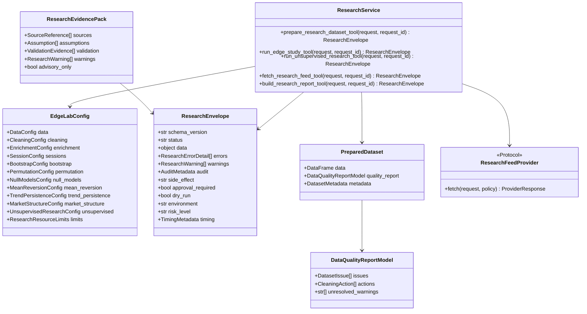
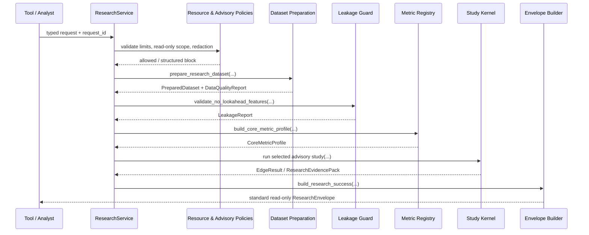
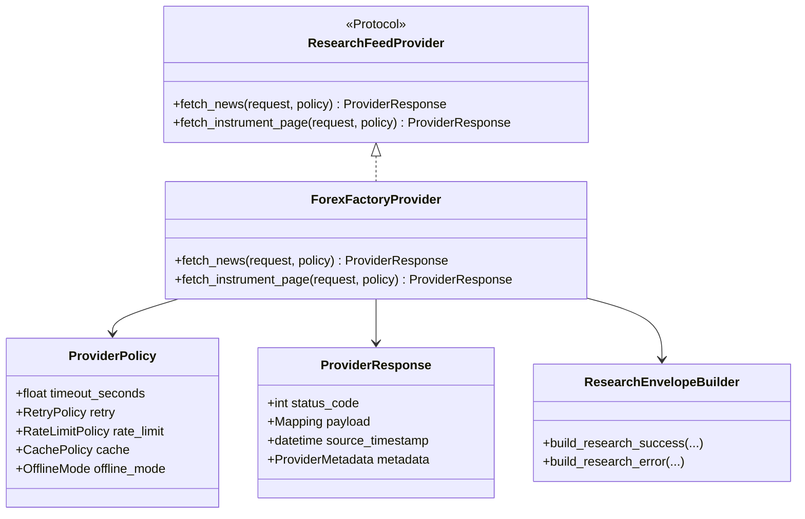

# Research Edge Lab - Architecture Requirements Document

**Source boundary:** This document uses only `12-research-edge-lab.md`. It translates the source requirements into a clean Python architecture under `app/services/research/`; it does not introduce trading, risk-governance, broker-execution, UI, or API implementation responsibilities.

**Traceability accounting note:** The source declares an inventory of **290 checkbox tasks**, yet its numbered requirement IDs enumerate **295 entries**: **134 `RES-FR-*`**, **159 `RES-NFR-*`**, and **2 `RES-BR-*`**. This document maps all 295 numbered entries exactly once as their **primary implementation location**. IDs stating “No file-specific … requirements defined” are intentionally mapped to the relevant structural file rather than converted into new functionality.

**Interpretation note:** Several requirements labelled `RES-NFR-*` in the source are concrete functions, classes, or data models. Their source IDs are preserved verbatim, but they appear in the functional architecture map because they require explicit code-level capability. Actual cross-cutting NFR behaviour is isolated in Section 4.

**Domain rule:** Research outputs are advisory evidence. They must not place, modify, cancel, route, or authorize live orders; approve risk; mutate risk limits; promote a strategy; or activate execution. Those decisions remain in their owning governed domains.

## 1. System Boundary Diagram (file structure)

```text
app/
└── services/
    └── research/                                   # Read-only research domain
        ├── __init__.py                              # Explicit lazy public API gate
        ├── service.py                               # Official tool façade; no study algorithms
        ├── test_plan.py                             # Requirement-to-test registry
        ├── contracts/                               # Versioned public models and boundary contracts
        │   ├── config.py
        │   ├── models.py
        │   ├── envelopes.py
        │   ├── errors.py
        │   └── catalog.py
        ├── policies/                                # Cross-cutting NFR boundaries
        │   ├── resource_limits.py
        │   ├── advisory_guard.py
        │   ├── redaction.py
        │   ├── observability.py
        │   └── reproducibility.py
        ├── governance/
        │   └── layers.py                            # Research Core versus full Edge Lab boundary
        ├── core/                                    # Deterministic preparation and features
        │   ├── preparation.py
        │   ├── enrichment.py
        │   ├── leakage.py
        │   ├── sessions.py
        │   ├── metrics/
        │   │   ├── models.py
        │   │   ├── calculators.py
        │   │   └── registry.py
        │   └── features/
        │       ├── returns.py
        │       ├── volatility.py
        │       └── market_structure.py
        ├── studies/                                 # Advisory study execution
        │   ├── eds.py
        │   ├── null_hypothesis.py
        │   ├── session_strategies.py
        │   ├── market_structure/
        │   │   ├── classification.py
        │   │   ├── calibration.py
        │   │   └── profiles.py
        │   └── unsupervised/
        │       ├── service.py
        │       ├── pca.py
        │       ├── clustering.py
        │       └── insights.py
        ├── providers/                               # Optional network boundary
        │   ├── protocols.py
        │   └── forexfactory.py
        ├── interactive/                             # Notebook/analyst helpers
        │   ├── calendar.py
        │   └── analysis.py
        ├── adapters/
        │   └── analytics.py                         # Thin documented Analytics adapters
        └── reports/
            ├── rendering.py
            └── persistence.py

tests/
└── services/research/
    ├── contracts/
    ├── core/
    ├── studies/
    ├── providers/
    ├── reports/
    ├── test_import_safety.py
    ├── test_advisory_boundary.py
    ├── test_traceability.py
    └── test_examples.py

examples/
└── research_edge_lab_examples.py                    # Eight named runnable examples

docs/
└── research/
    ├── README.md
    ├── contracts.md
    ├── error-behavior.md
    ├── resource-profile.md
    └── research-core-boundary.md
```

### Execution Flow


**Boundary assertions**

- `research/__init__.py` is the only package export gate. It exposes only approved, documented public functions through lazy resolution.
- `contracts/` owns versioned models and boundary validation; it owns no dataset computation, network access, or persistence.
- `core/` owns deterministic research dataset preparation, feature generation, leakage controls, and core metrics.
- `studies/` owns advisory study logic only; it cannot approve promotion, alter strategy runtime state, or create live controls.
- `providers/` is the only location allowed to contain optional network-backed feed adapters.
- `reports/persistence.py` is the only location allowed to write research report/artifact files.
- `policies/` contains cross-cutting requirements such as resource caps, masking, observability, reproducibility, and read-only enforcement so kernels remain pure.
- `adapters/analytics.py` calls only documented Analytics public contracts; it does not reimplement Analytics or reach into private modules.

## 2. Interfaces diagrams (Mermaid diagrams)

### 2.1 Contract and workflow collaboration



### 2.2 Deterministic research-core path



### 2.3 Optional external-feed wrapper



## 3. Functional Requirements

The mappings below are **primary** physical locations. A function may consume model types defined in another file through the documented contract, but it must not access private state across file boundaries.

### 📂 Module: `app/services/research`

**Boundary Role:** Public, import-safe research façade and controlled export boundary.

#### 📄 File: `__init__.py`

**File Boundary:** Lazy namespace resolution and explicit `__all__` gate; no I/O, provider creation, credential access, live-state access, or heavy computation.

**Requirement Title:** Import Safety, Lazy Namespace, and Public Export Gate

**Description:** Implements the source requirements listed below through one cohesive component. All public callables retain typed inputs, deterministic output shapes, and documented error behaviour.

**Requirements (verbatim):**
- **RES-FR-001**: Importing `app.services.research` shall not perform network calls, disk writes, provider initialization, credential reads, live trading state access, or heavy model execution.
- **RES-FR-002**: No file-specific non-functional requirements defined.
- **RES-FR-003**: No file-specific testing requirements defined.
- **RES-FR-018**: `research_modeling_module` shall return the research modeling service module through the shared lazy-resolution utility.
- **RES-FR-019**: Each public export in `app.services.research.__all__` shall have a documented contract specifying API status, input types, required fields, output type, error behavior, side effects, determinism guarantees, network/heavy dependency status, and stability level.
- **RES-NFR-114**: Public exports shall remain unique and resolvable through the lazy namespace.

**Target Class/Function:**
- `__getattr__(name: str) -> object` — State-mutating only in the import cache; must lazily resolve approved public names and never initialize providers.
- `__dir__() -> list[str]` — Pure; returns the approved exported names deterministically.
- `research_modeling_module() -> ModuleType` — Side-effect-free until invocation; delegates to the shared lazy resolver.


### 📂 Module: `app/services/research/contracts`

**Boundary Role:** Versioned, immutable data contracts used across the research service boundary.

#### 📄 File: `config.py`

**File Boundary:** Typed research configuration and validated defaults; no execution or I/O.

**Requirement Title:** Research Workflow, Data, Cleaning, and Resource Configuration

**Description:** Implements the source requirements listed below through one cohesive component. All public callables retain typed inputs, deterministic output shapes, and documented error behaviour.

**Requirements (verbatim):**
- **RES-FR-004**: `create_config` shall create an Edge Lab configuration object with common defaults for research workflows.
- **RES-FR-005**: `DataConfig` shall describe source, symbol, timeframe, and date-range data inputs for research workflows.
- **RES-FR-006**: `SessionConfig` shall describe trading-session windows and related session settings.
- **RES-FR-007**: `BootstrapConfig` shall describe bootstrap resampling settings.
- **RES-FR-008**: `PermutationConfig` shall describe permutation-test settings.
- **RES-FR-009**: `NullModelsConfig` shall describe null-model settings and acceptance criteria.
- **RES-FR-010**: `MeanReversionConfig` shall describe mean-reversion edge-discovery settings.
- **RES-FR-011**: `TrendPersistenceConfig` shall describe trend-persistence edge-discovery settings.
- **RES-FR-012**: `MarketStructureConfig` shall describe market-structure research settings.
- **RES-FR-013**: `SessionEdgeConfig` shall describe session-edge research settings.
- **RES-FR-014**: `EdgeLabConfig` shall aggregate the module's research configuration sections into one workflow-level configuration.
- **RES-FR-033**: `CleaningConfig` shall describe data-cleaning behavior for timezone normalization, missing bars, non-trading periods, and spread anomalies.
- **RES-FR-034**: `CleaningConfig` shall define `missing_bar_strategy` with approved values such as `drop`, `forward_fill`, `interpolate`, and `none`, with deterministic behavior documented for each value.
- **RES-FR-035**: `CleaningConfig.missing_bar_strategy` default must be owner-approved before implementation. No Builder may infer a default or silently fill/drop bars without an approved default and explicit quality-report action.
- **RES-FR-036**: `CleaningConfig` shall define `non_trading_period_strategy` with approved values and shall document weekend, holiday, synthetic-bar, and provider-gap behavior.
- **RES-FR-038**: `EnrichmentConfig` shall describe enrichment settings for pip metadata, bar geometry, returns, labels, calendar fields, and sessions.
- **RES-FR-050**: `UnsupervisedResearchConfig` shall describe unsupervised research settings.
- **RES-FR-051**: `UnsupervisedResearchConfig` shall include a `seed` field used by non-deterministic algorithms.
- **RES-NFR-116**: `ResearchResourceLimits` shall define `max_duration_seconds`, `max_memory_mb`, `max_rows`, and behavior when a limit is exceeded.
- **RES-NFR-117**: Before production Builder handoff, the owner shall approve measurable resource targets for the first implementation slice, including maximum rows, runtime budget, memory budget, and reference hardware.

**Target Class/Function:**
- `create_config(overrides: Mapping[str, object] | None = None) -> EdgeLabConfig` — Pure; validates, merges approved defaults, and refuses unapproved cleaning defaults.
- `validate_edge_lab_config(config: EdgeLabConfig) -> EdgeLabConfig` — Pure; returns a validated immutable configuration or raises a typed configuration error.
- `validate_resource_limits(limits: ResearchResourceLimits) -> ResearchResourceLimits` — Pure; rejects unbounded or unapproved limits.


### 📂 Module: `app/services/research/contracts`

**Boundary Role:** Versioned, immutable data contracts used across the research service boundary.

#### 📄 File: `models.py`

**File Boundary:** Research-domain records, schemas, typed evidence payloads, and deterministic serialization metadata.

**Requirement Title:** Core Models, Dataset Contracts, Metrics, and Research Result Types

**Description:** Implements the source requirements listed below through one cohesive component. All public callables retain typed inputs, deterministic output shapes, and documented error behaviour.

**Requirements (verbatim):**
- **RES-FR-015**: `TradeSample` shall represent a normalized trade sample for edge-result reporting.
- **RES-FR-016**: `EdgeStats` shall represent summary statistics for an edge result.
- **RES-FR-017**: `EdgeResult` shall represent a complete edge-study result suitable for summaries and reports.
- **RES-FR-020**: Core model contracts shall define required fields, optional fields, schema versions, validation behavior, serialization behavior, and example payloads for `PreparedDataset`, `DataQualityReportModel`, `EdgeResult`, `CoreMetricProfile`, `MarketStructureProfile`, `UnsupervisedResearchResult`, `UnsupervisedInsightReport`, and report payloads.
- **RES-FR-064**: `CanonicalOHLCVSSchema` shall define the canonical research dataset schema for OHLCV data with spread support.
- **RES-FR-065**: `DatasetIssue` shall represent a detected dataset quality issue.
- **RES-FR-066**: `CleaningAction` shall represent a cleaning action applied to research data.
- **RES-FR-067**: `DataQualityReportModel` shall summarize validation issues and cleaning actions for a dataset.
- **RES-FR-068**: `PreparedDataset` shall carry cleaned, validated, enriched data with its quality report and metadata.
- **RES-FR-071**: `DataSource` shall represent the shared data-source descriptor used by research dataset validation.
- **RES-FR-072**: `OHLCVSchema` shall represent the shared OHLCV schema descriptor used by research dataset validation.
- **RES-FR-073**: `LeakageReport` shall define `suspected_columns`, `severity`, `evidence`, `recommendation`, `allowed_forward_columns`, `target_column`, and request/source metadata.
- **RES-FR-074**: `MetricValue` shall represent one normalized metric value with metadata.
- **RES-FR-075**: `MetricContext` shall provide the dataset and metadata needed by metric calculators.
- **RES-FR-076**: `CoreMetricProfile` shall represent a normalized profile of core dataset metrics.
- **RES-FR-078**: Metric profile output shall define units, sample size, source dataset identity, warnings, undefined-value behavior, and reproducibility metadata.
- **RES-FR-081**: `ClusterModelResult` shall represent clustering labels and cluster metadata.
- **RES-FR-082**: `InvestmentDataSummary` shall represent descriptive statistics for investment data.
- **RES-FR-083**: `summarize_investment_data` shall return key descriptive statistics for investment data.
- **RES-FR-084**: Unsupervised modeling outputs shall include preprocessing metadata, selected feature columns, dropped columns, scaler behavior, seed, model parameters, and cluster/component diagnostics.
- **RES-FR-123**: `FeatureSetFrame` shall represent the feature frame used by unsupervised modeling.
- **RES-FR-129**: `TimeSplitResult` shall represent deterministic chronological train, validation, and test partitions.
- **RES-NFR-039**: `TrendSwingPoint` shall represent a detected swing point used in market-structure analysis.
- **RES-NFR-040**: `TrendLeg` shall represent a directional leg between swing points.
- **RES-NFR-041**: `TrendScoreRow` shall represent one market-structure score row.
- **RES-NFR-042**: `MarketStructureProfile` shall represent a reproducible directional structure profile.
- **RES-NFR-043**: `MarketStructureCalibrationCandidate` shall represent one calibration candidate for market-structure classification.
- **RES-NFR-047**: `MarketStructureMetricCalibrationCandidate` shall represent one metric-calibration candidate.
- **RES-NFR-067**: `ClassificationResult` shall represent the result of classifying a symbol's edge profile.
- **RES-NFR-068**: `UnsupervisedResearchRequest` shall represent one unsupervised research request.
- **RES-NFR-069**: `UnsupervisedResearchResult` shall represent a complete unsupervised research result.
- **RES-NFR-071**: `PcaModelResult` shall represent PCA scores, loadings, and explained variance.
- **RES-NFR-075**: `PcaRiskFactor` shall represent an interpreted PCA loading or risk factor.
- **RES-NFR-076**: `ClusterOutperformance` shall represent forward-return evidence by cluster.
- **RES-NFR-077**: `SignalAdaptationResult` shall represent signal-suppression or signal-adaptation recommendations by cluster.
- **RES-NFR-078**: `UnsupervisedInsightReport` shall represent a complete unsupervised insight report for trading workflows.
- **RES-NFR-120**: `EdgeClass` shall represent the classification category assigned to an edge.
- **RES-NFR-121**: `EdgeSummary` shall summarize mean-reversion and trend-persistence evidence for a symbol.
- **RES-NFR-123**: `SeasonalityFilters` shall describe calendar, session, or symbol filters for seasonality analysis.

**Target Class/Function:**
- `canonicalize_research_model(value: ResearchSerializable) -> dict[str, object]` — Pure; emits JSON-safe, schema-versioned fields in canonical order.
- `validate_model_schema(value: ResearchSerializable, expected_schema_version: str) -> None` — Pure; raises typed validation errors only.
- `build_reproducibility_metadata(dataset_hash: str, config_hash: str, seed: int | None, dependency_versions: Mapping[str, str]) -> ReproducibilityMetadata` — Pure.


### 📂 Module: `app/services/research/contracts`

**Boundary Role:** Versioned, immutable data contracts used across the research service boundary.

#### 📄 File: `envelopes.py`

**File Boundary:** Research standard-envelope construction and validation, isolated from study logic.

**Requirement Title:** Standard Research Envelope and Public Failure Semantics

**Description:** Implements the source requirements listed below through one cohesive component. All public callables retain typed inputs, deterministic output shapes, and documented error behaviour.

**Requirements (verbatim):**
- **RES-FR-022**: Public library functions shall either raise typed research exceptions or return structured result objects with warnings according to their documented contract; standard research tools shall return errors through the standard HaruQuant envelope.
- **RES-FR-023**: Each public callable contract shall explicitly choose one failure pattern: typed exception, structured result with warnings/errors, or standard research envelope. Mixed behavior is not allowed unless every branch is documented.
- **RES-FR-024**: The standard research envelope shall define at least `status`, `data`, `errors`, `warnings`, `audit`, `side_effect`, `approval_required`, `dry_run`, `environment`, `risk_level`, and `timing`.
- **RES-FR-025**: Standard research envelope `errors` and `warnings` shall use machine-readable codes, human-readable messages, optional field paths, severity, retryability, and bounded details.
- **RES-FR-026**: Standard research envelope `audit` shall include request ID, correlation ID where available, tool/capability name, schema version, source references where applicable, created-at timestamp, and redaction/provenance metadata.
- **RES-FR-027**: Standard research envelope schema must be frozen for the approved first implementation slice before any network-backed, standard helper, evidence-pack, or agent-facing research helper is implemented.
- **RES-FR-028**: Each public callable in the approved implementation slice shall have a behavior/error table that maps invalid input, insufficient data, unsupported config, provider unavailable, rate limit, serialization failure, resource limit, and permission failure to one exact typed exception, structured result warning/error, or standard envelope error.
- **RES-NFR-112**: Standard tool envelopes shall include side-effect, approval-required, dry-run, environment, risk-level, and timing audit fields.
- **RES-NFR-113**: The standard research envelope schema shall be versioned and referenced by every network-backed helper, standard helper, evidence-pack helper, and future agent-facing research tool.

**Target Class/Function:**
- `build_research_success(data: ResearchPayload, audit: AuditMetadata, timing: TimingMetadata) -> ResearchEnvelope` — Pure; constructs a schema-versioned read-only success envelope.
- `build_research_error(error: ResearchErrorDetail, audit: AuditMetadata, timing: TimingMetadata) -> ResearchEnvelope` — Pure; constructs a redacted deterministic error envelope.
- `validate_research_envelope(envelope: ResearchEnvelope) -> None` — Pure; fails closed on malformed or unversioned public payloads.


### 📂 Module: `app/services/research/contracts`

**Boundary Role:** Versioned, immutable data contracts used across the research service boundary.

#### 📄 File: `errors.py`

**File Boundary:** Research error classification and reuse of standard application error classes without duplicate system error declarations.

**Requirement Title:** Research Error Taxonomy and Insufficient-Sample Policy

**Description:** Implements the source requirements listed below through one cohesive component. All public callables retain typed inputs, deterministic output shapes, and documented error behaviour.

**Requirements (verbatim):**
- **RES-FR-021**: The module shall define a canonical research error taxonomy covering validation errors, configuration errors, insufficient-data errors, statistical-invalidity errors, external-provider errors, serialization errors, resource-limit errors, and permission errors.
- **RES-FR-029**: Provisional insufficient-sample behavior: research calculations should fail with a typed validation error or standard-envelope error code such as `ERR_INSUFFICIENT_SAMPLES` when the approved minimum sample size is not met; final code names and thresholds remain pending owner/architect approval.
- **RES-NFR-150**: All standard system exceptions and error codes shall be imported and reused from `errors` to prevent duplicate declaration.
- **RES-NFR-151**: No file-specific non-functional requirements defined.
- **RES-NFR-152**: No file-specific testing requirements defined.

**Target Class/Function:**
- `classify_research_error(error: Exception, context: ErrorContext) -> ResearchErrorDetail` — Pure; maps only approved typed errors to deterministic research codes.
- `require_minimum_sample_size(actual: int, minimum: int, context: SampleContext) -> None` — Pure; raises the documented insufficient-sample typed error.
- `is_retryable_error(code: str) -> bool` — Pure.


### 📂 Module: `app/services/research/contracts`

**Boundary Role:** Versioned, immutable data contracts used across the research service boundary.

#### 📄 File: `catalog.py`

**File Boundary:** Machine-readable public capability catalog, behavior/error table, glossary, and contract-first build gate.

**Requirement Title:** Public Capability Catalog, Contract-First Gate, and Builder Handoff Controls

**Description:** Implements the source requirements listed below through one cohesive component. All public callables retain typed inputs, deterministic output shapes, and documented error behaviour.

**Requirements (verbatim):**
- **RES-FR-030**: The first implementation slice shall be explicitly approved before Builder handoff; proposed initial slice is data preparation plus core metrics unless the owner approves a different slice.
- **RES-FR-031**: A contract-first checklist shall block coding until every public callable in the approved slice has input/output types, error model, determinism guarantee, side-effect classification, envelope/result shape, examples, and mapped tests.
- **RES-FR-032**: The module glossary shall define `Edge Lab`, `null baseline`, `profile snapshot`, `research envelope`, `advisory evidence`, `leakage report`, and `research artifact`.
- **RES-NFR-115**: The module shall remain interoperable with analytics, optimization, risk, and execution modules only through documented public contracts.
- **RES-NFR-153**: Split Research into an earlier lightweight Research Core and the later full Research Edge Lab when implementation begins.
- **RES-NFR-154**: Implement Research Core before Strategy/Optimization promotion workflows depend on research evidence.
- **RES-NFR-157**: Research Core must use canonical DataSlice, IndicatorResult, StrategySignal, BacktestResult, OptimizationCandidate, and AuditEvent contracts where applicable.

**Target Class/Function:**
- `validate_contract_first_readiness(catalog: CapabilityCatalog, approved_slice: ImplementationSlice) -> ContractReadinessReport` — Pure; fails closed when a public capability lacks schemas, error behavior, examples, or tests.
- `get_capability_contract(name: str) -> CapabilityContract` — Pure; resolves one public contract deterministically.
- `build_research_glossary() -> dict[str, str]` — Pure.


### 📂 Module: `app/services/research/policies`

**Boundary Role:** Cross-cutting policy boundaries that constrain research without contaminating mathematical kernels.

#### 📄 File: `resource_limits.py`

**File Boundary:** Execution-budget validation and monotonic budget checks for long-running research workflows.

**Requirement Title:** Bounded Research Resource Use and Performance Claims

**Description:** Implements the source requirements listed below through one cohesive component. All public callables retain typed inputs, deterministic output shapes, and documented error behaviour.

**Requirements (verbatim):**
- **RES-FR-062**: Long-running workflows shall expose duration metadata and shall support configured resource limits or fail with a typed resource-limit error.
- **RES-FR-095**: Proposed benchmark placeholder: `prepare_research_dataset` should process up to 1,000,000 rows in no more than 30 seconds on approved reference hardware; this remains pending until owner approval.
- **RES-BR-002**: Until resource limits and reference hardware are approved, Research may not claim production-grade performance; oversized or long-running workflows must fail with a typed resource-limit error or standard-envelope resource-limit error instead of attempting unbounded work.

**Target Class/Function:**
- `validate_workload_size(rows: int, limits: ResearchResourceLimits) -> None` — Pure; rejects oversized requests before expensive work.
- `check_execution_budget(start_monotonic: float, limits: ResearchResourceLimits) -> None` — Pure; raises a typed resource-limit error on expiry.
- `build_resource_limit_error(limit: str, observed: int | float, allowed: int | float) -> ResearchErrorDetail` — Pure.


### 📂 Module: `app/services/research/policies`

**Boundary Role:** Cross-cutting policy boundaries that constrain research without contaminating mathematical kernels.

#### 📄 File: `advisory_guard.py`

**File Boundary:** Read-only scope enforcement and clear research/advisory disclosure policy.

**Requirement Title:** Read-Only Advisory Boundary and Governed-Action Blocking

**Description:** Implements the source requirements listed below through one cohesive component. All public callables retain typed inputs, deterministic output shapes, and documented error behaviour.

**Requirements (verbatim):**
- **RES-NFR-110**: The module shall be sandboxed and shall not place, modify, cancel, or route live orders.
- **RES-NFR-111**: Research outputs shall clearly distinguish observations, assumptions, warnings, and validation evidence from approved trading decisions.
- **RES-NFR-158**: Full Research Edge Lab must remain read-only with respect to broker accounts, live trading, risk limit mutation, and execution activation.
- **RES-NFR-159**: Add tests proving research evidence cannot promote strategies, approve risk, or activate live trading without governed lifecycle approvals.
- **RES-BR-001**: The module shall fail closed when a workflow attempts to mutate live trading state or bypass governance.

**Target Class/Function:**
- `assert_research_action_is_read_only(action: str) -> None` — Pure; rejects any live-trading, risk-mutation, or execution-routing action.
- `decorate_advisory_evidence(payload: EvidencePayload) -> AdvisoryEvidencePayload` — Pure; labels observations, assumptions, warnings, and non-approval status.
- `verify_governed_promotion_boundary(evidence: EvidencePayload, action: str) -> GovernanceBoundaryResult` — Pure; always requires external governed approval for promotion or activation.


### 📂 Module: `app/services/research/policies`

**Boundary Role:** Cross-cutting policy boundaries that constrain research without contaminating mathematical kernels.

#### 📄 File: `redaction.py`

**File Boundary:** Sensitive-field masking policy for artifacts, reports, logs, and public envelopes.

**Requirement Title:** Artifact Masking, Secret Avoidance, and Safe Serialization

**Description:** Implements the source requirements listed below through one cohesive component. All public callables retain typed inputs, deterministic output shapes, and documented error behaviour.

**Requirements (verbatim):**
- **RES-FR-061**: Report and artifact serialization shall prevent path traversal, accidental overwrite unless configured, and leakage of masked fields.
- **RES-FR-094**: The module shall avoid storing real secrets, credentials, private broker data, or unredacted private artifacts.
- **RES-FR-131**: `mask_research_artifact` shall remove or redact sensitive fields from research artifacts before persistence or sharing.
- **RES-FR-132**: `dump_masked_research_json` shall serialize a masked research artifact to JSON.
- **RES-NFR-107**: Serialization helpers shall support masked JSON or Markdown output without leaking sensitive source details.

**Target Class/Function:**
- `mask_research_artifact(artifact: Mapping[str, object], policy: MaskingPolicy) -> dict[str, object]` — Pure; does not mutate the caller-owned artifact.
- `dump_masked_research_json(artifact: Mapping[str, object], policy: MaskingPolicy) -> str` — Pure; returns safe JSON only.
- `validate_safe_artifact_payload(artifact: Mapping[str, object]) -> None` — Pure; rejects secret-like fields and unsafe paths.


### 📂 Module: `app/services/research/policies`

**Boundary Role:** Cross-cutting policy boundaries that constrain research without contaminating mathematical kernels.

#### 📄 File: `observability.py`

**File Boundary:** Redacted log-event and timing metadata construction; no study calculation.

**Requirement Title:** Research Observability, Redacted Logging, and Failure Events

**Description:** Implements the source requirements listed below through one cohesive component. All public callables retain typed inputs, deterministic output shapes, and documented error behaviour.

**Requirements (verbatim):**
- **RES-NFR-064**: The module shall emit structured warnings or logs for validation failures, dropped rows, masking actions, provider failures, statistical insufficiency, and partial report generation.

**Target Class/Function:**
- `build_research_log_event(event: str, context: ResearchLogContext) -> dict[str, object]` — Pure; removes sensitive payload fields.
- `record_research_outcome(event: ResearchLogEvent) -> None` — State-mutating; emits a structured redacted log/metric event through shared utilities.


### 📂 Module: `app/services/research/core`

**Boundary Role:** Deterministic preparation of trustworthy research datasets from canonical data inputs.

#### 📄 File: `preparation.py`

**File Boundary:** Dataset validation, cleaning orchestration, deterministic enrichment sequencing, and quality-report assembly.

**Requirement Title:** Dataset Validation, Cleaning, Preparation, Provenance, and Atomic Research Inputs

**Description:** Implements the source requirements listed below through one cohesive component. All public callables retain typed inputs, deterministic output shapes, and documented error behaviour.

**Requirements (verbatim):**
- **RES-FR-037**: `clean_dataset` shall normalize timestamps to the configured timezone, resolve duplicate or non-monotonic timestamps according to `CleaningConfig`, apply configured missing-bar and non-trading-period handling, detect spread anomalies, and return both cleaned data and a `DataQualityReportModel` containing machine-readable cleaning actions and unresolved warnings.
- **RES-FR-039**: `prepare_research_dataset` shall accept either in-memory raw OHLCV/OHLCVS data or a configured research data source, apply cleaning, validation, and enrichment in deterministic order, and return a `PreparedDataset` containing prepared data, metadata, and a quality report. It shall fail with a typed validation or configuration error when fatal issues prevent safe research use.
- **RES-FR-070**: `validate_dataset` shall validate schema, continuity, OHLC consistency, duplicate timestamps, spread quality, and volume fields while distinguishing fatal validation errors from warnings through machine-readable issue codes.
- **RES-FR-090**: Research artifacts shall preserve source references, assumptions, warnings, and enough metadata to reproduce the result.
- **RES-FR-091**: Data preparation and feature pipelines shall avoid lookahead bias and shall support explicit chronological split validation.

**Target Class/Function:**
- `validate_dataset(data: pd.DataFrame, schema: CanonicalOHLCVSSchema, source: DataSource) -> DataQualityReportModel` — Pure; returns issues separated into fatal errors and warnings.
- `clean_dataset(data: pd.DataFrame, config: CleaningConfig) -> tuple[pd.DataFrame, DataQualityReportModel]` — Pure; returns a new frame and deterministic cleaning actions.
- `prepare_research_dataset(raw: pd.DataFrame | DataSource, config: EdgeLabConfig) -> PreparedDataset` — State-mutating only when the configured DataGateway is invoked; otherwise pure orchestration.


### 📂 Module: `app/services/research/core`

**Boundary Role:** Deterministic preparation of trustworthy research datasets from canonical data inputs.

#### 📄 File: `enrichment.py`

**File Boundary:** Derived dataset enrichment that is distinct from validation and never writes source data.

**Requirement Title:** Research Dataset Enrichment and Session Tagging

**Description:** Implements the source requirements listed below through one cohesive component. All public callables retain typed inputs, deterministic output shapes, and documented error behaviour.

**Requirements (verbatim):**
- **RES-FR-069**: `enrich_dataset` shall add research features such as pip metadata, bar geometry, return labels, calendar fields, and session fields.
- **RES-FR-085**: `tag_sessions` shall tag each market-data row with its trading session.

**Target Class/Function:**
- `enrich_dataset(data: pd.DataFrame, config: EnrichmentConfig) -> pd.DataFrame` — Pure; returns a new enriched frame.
- `tag_sessions(data: pd.DataFrame, sessions: SessionConfig) -> pd.Series` — Pure; preserves input row order and index.
- `build_enrichment_metadata(config: EnrichmentConfig) -> dict[str, object]` — Pure.


### 📂 Module: `app/services/research/core`

**Boundary Role:** Deterministic preparation of trustworthy research datasets from canonical data inputs.

#### 📄 File: `leakage.py`

**File Boundary:** Chronological splitting, lookahead detection, forward-column controls, leakage reporting, and data-snooping diagnostics.

**Requirement Title:** Leakage Prevention, Chronological Splits, and Data-Snooping Diagnostics

**Description:** Implements the source requirements listed below through one cohesive component. All public callables retain typed inputs, deterministic output shapes, and documented error behaviour.

**Requirements (verbatim):**
- **RES-FR-043**: `validate_no_lookahead_features` shall inspect declared feature metadata, column naming conventions, target/horizon columns, and configured allowed-forward columns, then return a structured leakage report identifying suspected lookahead fields, severity, evidence, and recommended action without mutating the input frame.
- **RES-FR-088**: `check_data_snooping_risk` shall assess data-snooping risk.
- **RES-FR-130**: `enforce_time_split` shall enforce deterministic chronological train, validation, and test splits.
- **RES-NFR-103**: `check_lookahead_bias_risk` shall assess lookahead-bias risk.
- **RES-NFR-155**: Research Core must include leakage checks, chronological split helpers, null baselines, simple feature studies, and statistical evidence summaries.

**Target Class/Function:**
- `validate_no_lookahead_features(data: pd.DataFrame, metadata: FeatureMetadata, policy: LeakagePolicy) -> LeakageReport` — Pure; never changes the input frame.
- `enforce_time_split(data: pd.DataFrame, spec: TimeSplitSpec) -> TimeSplitResult` — Pure; builds chronological train/validation/test partitions.
- `check_data_snooping_risk(study: StudyDefinition, trial_count: int) -> DataSnoopingAssessment` — Pure.


### 📂 Module: `app/services/research/core/metrics`

**Boundary Role:** Deterministic calculation of normalized core research metrics.

#### 📄 File: `models.py`

**File Boundary:** Metric context/value/profile contracts and calculator protocol.

**Requirement Title:** Core Metric Contracts and Calculator Protocol

**Description:** Implements the source requirements listed below through one cohesive component. All public callables retain typed inputs, deterministic output shapes, and documented error behaviour.

**Requirements (verbatim):**
- **RES-NFR-001**: `MetricCalculator` shall define the calculator interface for research core metrics.

**Target Class/Function:**
- `class MetricCalculator(Protocol)` — Contract only; defines a pure calculation interface.
- `validate_metric_context(context: MetricContext) -> None` — Pure.
- `normalize_metric_value(name: str, value: float | None, metadata: Mapping[str, object]) -> MetricValue` — Pure.


### 📂 Module: `app/services/research/core/metrics`

**Boundary Role:** Deterministic calculation of normalized core research metrics.

#### 📄 File: `calculators.py`

**File Boundary:** Cohesive pure kernels for returns, ROC, candles, ranges, volatility, spread, and volume/activity metrics.

**Requirement Title:** Core Research Metric Calculators

**Description:** Implements the source requirements listed below through one cohesive component. All public callables retain typed inputs, deterministic output shapes, and documented error behaviour.

**Requirements (verbatim):**
- **RES-FR-040**: `sma` shall compute simple moving averages over a configured window.
- **RES-FR-041**: `ema` shall compute exponential moving averages over a configured span.
- **RES-FR-042**: `std` shall compute rolling standard deviation over a configured window.
- **RES-FR-077**: `build_core_metric_profile` shall build a normalized core metric profile from a prepared dataset.
- **RES-NFR-003**: `ReturnsCalculator` shall calculate return-related core metrics.
- **RES-NFR-004**: `RocCalculator` shall calculate rate-of-change core metrics.
- **RES-NFR-005**: `CandlesCalculator` shall calculate candle-geometry core metrics.
- **RES-NFR-006**: `RangesCalculator` shall calculate range-related core metrics.
- **RES-NFR-007**: `VolatilityCalculator` shall calculate volatility core metrics.
- **RES-NFR-008**: `SpreadCalculator` shall calculate spread-quality core metrics.
- **RES-NFR-009**: `VolumeActivityCalculator` shall calculate volume or activity core metrics.

**Target Class/Function:**
- `build_core_metric_profile(dataset: PreparedDataset, config: CoreMetricConfig) -> CoreMetricProfile` — Pure.
- `calculate_returns_metrics(context: MetricContext) -> Mapping[str, MetricValue]` — Pure.
- `calculate_roc_metrics(context: MetricContext) -> Mapping[str, MetricValue]` — Pure.
- `calculate_candle_metrics(context: MetricContext) -> Mapping[str, MetricValue]` — Pure.
- `calculate_range_metrics(context: MetricContext) -> Mapping[str, MetricValue]` — Pure.
- `calculate_volatility_metrics(context: MetricContext) -> Mapping[str, MetricValue]` — Pure.
- `calculate_spread_metrics(context: MetricContext) -> Mapping[str, MetricValue]` — Pure.
- `calculate_volume_activity_metrics(context: MetricContext) -> Mapping[str, MetricValue]` — Pure.


### 📂 Module: `app/services/research/core/metrics`

**Boundary Role:** Deterministic calculation of normalized core research metrics.

#### 📄 File: `registry.py`

**File Boundary:** Explicit registration and resolution of metric calculators.

**Requirement Title:** Metric Registry

**Description:** Implements the source requirements listed below through one cohesive component. All public callables retain typed inputs, deterministic output shapes, and documented error behaviour.

**Requirements (verbatim):**
- **RES-NFR-002**: `MetricRegistry` shall register and resolve named metric calculators.
- **RES-NFR-010**: `build_default_registry` shall build the default registry of research metric calculators.
- **RES-NFR-011**: No file-specific non-functional requirements defined.
- **RES-NFR-012**: No file-specific testing requirements defined.

**Target Class/Function:**
- `build_default_registry() -> MetricRegistry` — Pure; builds a deterministic registry with no external work.
- `resolve_metric_calculator(name: str, registry: MetricRegistry) -> MetricCalculator` — Pure.
- `validate_metric_registry(registry: MetricRegistry) -> None` — Pure.


### 📂 Module: `app/services/research/core/features`

**Boundary Role:** Pure feature engineering primitives used for research evidence and never as hidden execution controls.

#### 📄 File: `returns.py`

**File Boundary:** Close-price and horizon-aligned return features, including explicitly labelled forward research columns.

**Requirement Title:** Returns, Momentum, and Forward Research Labels

**Description:** Implements the source requirements listed below through one cohesive component. All public callables retain typed inputs, deterministic output shapes, and documented error behaviour.

**Requirements (verbatim):**
- **RES-FR-097**: `log_returns` shall compute log returns from close prices.
- **RES-FR-098**: `simple_returns` shall compute arithmetic returns from close prices.
- **RES-FR-107**: `rsi` shall compute Relative Strength Index.
- **RES-FR-108**: `rate_of_change` shall compute rate of change as a momentum measure.
- **RES-FR-109**: `momentum` shall compute simple price-difference momentum.
- **RES-FR-115**: `forward_returns` shall compute horizon-aligned forward log returns.
- **RES-FR-116**: `forward_max_favorable_excursion` shall compute maximum favorable price excursion over a forward horizon.
- **RES-FR-117**: `forward_max_adverse_excursion` shall compute maximum adverse price excursion over a forward horizon.
- **RES-FR-121**: Feature functions shall define warm-up-period behavior, NaN handling, minimum window behavior, numeric precision expectations, and input mutation behavior.
- **RES-FR-122**: Forward-looking feature functions shall clearly label forward columns as research-only and shall be detectable by leakage checks.

**Target Class/Function:**
- `log_returns(close: pd.Series) -> pd.Series` — Pure.
- `simple_returns(close: pd.Series) -> pd.Series` — Pure.
- `rsi(close: pd.Series, period: int) -> pd.Series` — Pure.
- `rate_of_change(close: pd.Series, period: int) -> pd.Series` — Pure.
- `momentum(close: pd.Series, period: int) -> pd.Series` — Pure.
- `forward_returns(close: pd.Series, horizon: int) -> pd.Series` — Pure; output must carry research-only forward metadata.
- `forward_max_favorable_excursion(high: pd.Series, entry: pd.Series, horizon: int) -> pd.Series` — Pure.
- `forward_max_adverse_excursion(low: pd.Series, entry: pd.Series, horizon: int) -> pd.Series` — Pure.


### 📂 Module: `app/services/research/core/features`

**Boundary Role:** Pure feature engineering primitives used for research evidence and never as hidden execution controls.

#### 📄 File: `volatility.py`

**File Boundary:** Rolling dispersion, ATR, percent-rank, and Bollinger-style features with deterministic warmup/null semantics.

**Requirement Title:** Volatility, Range, and Bollinger-Style Features

**Description:** Implements the source requirements listed below through one cohesive component. All public callables retain typed inputs, deterministic output shapes, and documented error behaviour.

**Requirements (verbatim):**
- **RES-FR-099**: `zscore` shall compute a close-price z-score relative to a moving average and standard deviation.
- **RES-FR-100**: `percent_rank` shall compute rolling percentile rank values.
- **RES-FR-101**: `atr` shall compute Average True Range.
- **RES-FR-102**: `atr_percent` shall compute ATR as a percentage of close price.
- **RES-FR-103**: `bollinger_bands` shall compute Bollinger-style upper, middle, and lower bands.
- **RES-FR-104**: `bb_width` shall compute Bollinger Band width.
- **RES-FR-105**: `bb_percent_b` shall compute Bollinger Band percent-B.
- **RES-FR-106**: `rolling_percentile_rank` shall compute rolling percentile rank for a supplied series.

**Target Class/Function:**
- `zscore(close: pd.Series, window: int) -> pd.Series` — Pure.
- `percent_rank(values: pd.Series, window: int) -> pd.Series` — Pure.
- `atr(high: pd.Series, low: pd.Series, close: pd.Series, period: int) -> pd.Series` — Pure.
- `atr_percent(atr_values: pd.Series, close: pd.Series) -> pd.Series` — Pure.
- `bollinger_bands(close: pd.Series, window: int, deviations: float) -> BollingerBands` — Pure.
- `bb_width(bands: BollingerBands) -> pd.Series` — Pure.
- `bb_percent_b(close: pd.Series, bands: BollingerBands) -> pd.Series` — Pure.
- `rolling_percentile_rank(values: pd.Series, window: int) -> pd.Series` — Pure.


### 📂 Module: `app/services/research/core/features`

**Boundary Role:** Pure feature engineering primitives used for research evidence and never as hidden execution controls.

#### 📄 File: `market_structure.py`

**File Boundary:** Directional, range, Hurst, pivot, channel, and market-regime feature calculations.

**Requirement Title:** Market-Structure and Regime Feature Engineering

**Description:** Implements the source requirements listed below through one cohesive component. All public callables retain typed inputs, deterministic output shapes, and documented error behaviour.

**Requirements (verbatim):**
- **RES-FR-110**: `donchian_channel` shall compute Donchian breakout levels.
- **RES-FR-111**: `hurst_exponent` shall estimate Hurst exponent for mean-reversion versus trend detection.
- **RES-FR-112**: `rolling_hurst` shall compute Hurst exponent over rolling windows.
- **RES-FR-113**: `pivot_points` shall compute pivot, support, and resistance levels.
- **RES-FR-114**: `adr` shall compute Average Daily Range.
- **RES-FR-118**: `detect_volatility_regime` shall classify volatility regime using ATR percentile or equivalent volatility evidence.
- **RES-FR-119**: `detect_trend_regime` shall classify trend regime from moving-average relationships.
- **RES-FR-120**: `build_market_regime_feature_frame` shall build timestamp-aligned feature rows for PCA and clustering regime research.
- **RES-FR-124**: `calculate_regime_features` shall calculate regime feature rows.
- **RES-FR-125**: `detect_market_regime` shall classify market regime from supplied research features.
- **RES-FR-126**: No file-specific non-functional requirements defined.

**Target Class/Function:**
- `donchian_channel(high: pd.Series, low: pd.Series, window: int) -> DonchianChannel` — Pure.
- `hurst_exponent(values: pd.Series, min_samples: int) -> float | None` — Pure.
- `rolling_hurst(values: pd.Series, window: int) -> pd.Series` — Pure.
- `pivot_points(high: pd.Series, low: pd.Series, close: pd.Series) -> PivotLevels` — Pure.
- `adr(data: pd.DataFrame, window: int) -> pd.Series` — Pure.
- `detect_volatility_regime(data: pd.DataFrame, config: RegimeFeatureConfig) -> pd.Series` — Pure.
- `detect_trend_regime(data: pd.DataFrame, config: RegimeFeatureConfig) -> pd.Series` — Pure.
- `build_market_regime_feature_frame(data: pd.DataFrame, config: RegimeFeatureConfig) -> FeatureSetFrame` — Pure.
- `calculate_regime_features(data: pd.DataFrame, config: RegimeFeatureConfig) -> FeatureSetFrame` — Pure.
- `detect_market_regime(features: FeatureSetFrame, config: RegimeFeatureConfig) -> pd.Series` — Pure.


### 📂 Module: `app/services/research/core`

**Boundary Role:** Deterministic preparation of trustworthy research datasets from canonical data inputs.

#### 📄 File: `sessions.py`

**File Boundary:** Session metadata, hourly classification, and seasonality kernels.

**Requirement Title:** Session Hours, Session Labels, and Seasonality

**Description:** Implements the source requirements listed below through one cohesive component. All public callables retain typed inputs, deterministic output shapes, and documented error behaviour.

**Requirements (verbatim):**
- **RES-FR-044**: `compute_session_statistics` shall calculate detailed statistics for a configured trading session.
- **RES-FR-053**: `session_hours_payload` shall return a machine-readable payload describing configured session hours.
- **RES-FR-086**: `run_seasonality` shall calculate seasonality statistics for the provided dataset and filters.
- **RES-FR-127**: `active_sessions_for_hour` shall return the active trading sessions for a given hour.
- **RES-FR-128**: `session_label_for_hour` shall return the session label for a given hour.

**Target Class/Function:**
- `compute_session_statistics(data: pd.DataFrame, session: SessionWindow) -> SessionStatistics` — Pure.
- `session_hours_payload(config: SessionConfig) -> dict[str, object]` — Pure.
- `run_seasonality(data: PreparedDataset, filters: SeasonalityFilters) -> SeasonalityResult` — Pure.
- `active_sessions_for_hour(hour_utc: int, config: SessionConfig) -> tuple[str, ...]` — Pure.
- `session_label_for_hour(hour_utc: int, config: SessionConfig) -> str` — Pure.


### 📂 Module: `app/services/research/studies`

**Boundary Role:** Evidence-generating study orchestration using pure kernels; outputs remain advisory.

#### 📄 File: `eds.py`

**File Boundary:** Event Dependency Study execution and study-level evidence assembly.

**Requirement Title:** Event Dependency Studies and Session Edge Discovery

**Description:** Implements the source requirements listed below through one cohesive component. All public callables retain typed inputs, deterministic output shapes, and documented error behaviour.

**Requirements (verbatim):**
- **RES-FR-045**: `run_eds_session` shall run session-edge discovery across configured session studies.
- **RES-FR-046**: Edge-discovery results shall include sample size, evaluated rule/config, source dataset identity, split identifiers, uncertainty metadata, warnings, and an advisory-only disclaimer.
- **RES-NFR-013**: No file-specific functional requirements defined. Foundation properties apply.
- **RES-NFR-014**: No file-specific non-functional requirements defined.
- **RES-NFR-015**: No file-specific testing requirements defined.
- **RES-NFR-016**: `run_eds_null_baseline` shall establish null-model baselines for edge-discovery studies.
- **RES-NFR-017**: `run_eds_mean_reversion` shall evaluate a mean-reversion detector based on compression and z-score fade behavior.
- **RES-NFR-018**: `run_eds_trend_persistence` shall evaluate a trend-persistence detector based on high-ATR breakout follow-through behavior.
- **RES-NFR-019**: Null-model functions shall define behavior for invalid sample sizes, non-finite statistics, empty distributions, random seeds, replacement/block settings, and multiple-comparison correction applicability.
- **RES-NFR-020**: Null-model behavior/error tables shall dictate exact outcomes for invalid sample sizes, non-finite statistics, empty distributions, invalid random seeds, invalid replacement/block settings, and inapplicable multiple-comparison corrections; these cases may not be left to Builder interpretation.
- **RES-NFR-021**: No file-specific non-functional requirements defined.
- **RES-NFR-022**: No file-specific testing requirements defined.

**Target Class/Function:**
- `run_eds_session(dataset: PreparedDataset, config: SessionEdgeConfig) -> EdgeResult` — Pure.
- `run_eds_null_baseline(dataset: PreparedDataset, config: NullModelsConfig, seed: int) -> NullBaselineResult` — Pure.
- `run_eds_mean_reversion(dataset: PreparedDataset, config: MeanReversionConfig, seed: int) -> EdgeResult` — Pure.
- `run_eds_trend_persistence(dataset: PreparedDataset, config: TrendPersistenceConfig, seed: int) -> EdgeResult` — Pure.
- `validate_null_model_request(request: NullModelRequest) -> None` — Pure.


### 📂 Module: `app/services/research/studies`

**Boundary Role:** Evidence-generating study orchestration using pure kernels; outputs remain advisory.

#### 📄 File: `null_hypothesis.py`

**File Boundary:** Bootstrap, permutation, randomized null distributions, thresholds, and multiple-comparison corrections.

**Requirement Title:** Null Hypothesis Testing, Bootstrap, Permutation, and Random Shuffling

**Description:** Implements the source requirements listed below through one cohesive component. All public callables retain typed inputs, deterministic output shapes, and documented error behaviour.

**Requirements (verbatim):**
- **RES-FR-047**: `exceeds_null_threshold` shall determine whether an observed value exceeds a configured null-distribution threshold.
- **RES-FR-048**: Bootstrap, permutation, and null-generation functions shall accept an explicit `seed` parameter or source one from a documented configuration object; returned results shall record the effective seed.
- **RES-FR-092**: Statistical results shall expose uncertainty where applicable, including p-values, confidence intervals, null percentiles, or comparable validation metadata.
- **RES-NFR-023**: `compare_to_null` shall compare observed expectancy or performance against a null distribution.
- **RES-NFR-024**: `get_acceptance_criteria` shall extract acceptance criteria from a null baseline.
- **RES-NFR-025**: `block_bootstrap_ci` shall compute a confidence interval using block bootstrap resampling.
- **RES-NFR-026**: `block_bootstrap_distribution` shall generate a bootstrap distribution for a statistic.
- **RES-NFR-027**: `permutation_test` shall compute a permutation-test p-value.
- **RES-NFR-028**: `random_entry_null` shall generate a null distribution from random entries in log-return space.
- **RES-NFR-029**: `r_space_null` shall generate a null distribution in R-multiple space.
- **RES-NFR-030**: `session_randomized_null` shall generate a null distribution by shuffling entries within the same session.
- **RES-NFR-031**: `shuffle_returns_null` shall generate a null distribution by shuffling return blocks.
- **RES-NFR-032**: `benjamini_hochberg` shall apply Benjamini-Hochberg false-discovery-rate correction.
- **RES-NFR-033**: `holm_bonferroni` shall apply Holm-Bonferroni multiple-comparison correction.
- **RES-NFR-034**: `compute_null_percentile` shall compute the percentile of an observed value within a null distribution.
- **RES-NFR-035**: `null_distribution_stats` shall compute summary statistics for a null distribution.
- **RES-NFR-036**: No file-specific non-functional requirements defined.
- **RES-NFR-037**: No file-specific testing requirements defined.
- **RES-NFR-038**: Multiple-comparison checks shall be available when evaluating many hypotheses or candidates.

**Target Class/Function:**
- `compare_to_null(observed: float, null_distribution: np.ndarray) -> NullComparison` — Pure.
- `get_acceptance_criteria(baseline: NullBaselineResult) -> AcceptanceCriteria` — Pure.
- `block_bootstrap_ci(values: np.ndarray, statistic: StatisticFn, config: BootstrapConfig, seed: int) -> ConfidenceInterval` — Pure.
- `block_bootstrap_distribution(values: np.ndarray, statistic: StatisticFn, config: BootstrapConfig, seed: int) -> np.ndarray` — Pure.
- `permutation_test(observed: np.ndarray, labels: np.ndarray, statistic: StatisticFn, config: PermutationConfig, seed: int) -> PermutationResult` — Pure.
- `random_entry_null(returns: np.ndarray, config: NullModelsConfig, seed: int) -> NullDistribution` — Pure.
- `r_space_null(r_multiples: np.ndarray, config: NullModelsConfig, seed: int) -> NullDistribution` — Pure.
- `session_randomized_null(data: pd.DataFrame, config: NullModelsConfig, seed: int) -> NullDistribution` — Pure.
- `shuffle_returns_null(returns: np.ndarray, block_size: int, seed: int) -> NullDistribution` — Pure.
- `benjamini_hochberg(p_values: Sequence[float], alpha: float) -> MultipleComparisonResult` — Pure.
- `holm_bonferroni(p_values: Sequence[float], alpha: float) -> MultipleComparisonResult` — Pure.
- `compute_null_percentile(observed: float, null_distribution: np.ndarray) -> float` — Pure.
- `null_distribution_stats(null_distribution: np.ndarray) -> NullDistributionStats` — Pure.
- `exceeds_null_threshold(observed: float, threshold: float) -> bool` — Pure.


### 📂 Module: `app/services/research/studies`

**Boundary Role:** Evidence-generating study orchestration using pure kernels; outputs remain advisory.

#### 📄 File: `session_strategies.py`

**File Boundary:** Research-only session breakout/fade studies and evidence classification.

**Requirement Title:** Session Breakout, Session Fade, and Edge Classification

**Description:** Implements the source requirements listed below through one cohesive component. All public callables retain typed inputs, deterministic output shapes, and documented error behaviour.

**Requirements (verbatim):**
- **RES-NFR-118**: `run_session_breakout_strategy` shall evaluate an opening-range breakout strategy for a session.
- **RES-NFR-119**: `run_session_fade_strategy` shall evaluate a mean-reversion fade strategy within a session.
- **RES-NFR-122**: `classify_symbol` shall classify a symbol based on mean-reversion and trend-persistence evidence.

**Target Class/Function:**
- `run_session_breakout_strategy(dataset: PreparedDataset, config: SessionEdgeConfig) -> EdgeResult` — Pure; evaluates only and never emits trade orders.
- `run_session_fade_strategy(dataset: PreparedDataset, config: SessionEdgeConfig) -> EdgeResult` — Pure; evaluates only and never emits trade orders.
- `classify_symbol(summary: EdgeSummary) -> EdgeClass` — Pure.


### 📂 Module: `app/services/research/studies/market_structure`

**Boundary Role:** Reproducible directional market-structure research, calibration, and advisory fit evidence.

#### 📄 File: `classification.py`

**File Boundary:** Pure swing, leg, trend, timeframe, symbol-class, and realized-behavior classification.

**Requirement Title:** Market-Structure Classification and Resolution

**Description:** Implements the source requirements listed below through one cohesive component. All public callables retain typed inputs, deterministic output shapes, and documented error behaviour.

**Requirements (verbatim):**
- **RES-FR-079**: `build_market_structure_profile` shall build a directional market-structure profile from a prepared dataset.
- **RES-NFR-044**: `classify_with_candidate` shall classify market structure using one calibration candidate.
- **RES-NFR-051**: `timeframe_bucket` shall map a timeframe into a market-structure profile bucket.
- **RES-NFR-052**: `symbol_class` shall map a symbol into a market-structure symbol class.
- **RES-NFR-053**: `resolve_market_structure_profile` shall resolve the applicable market-structure profile for a symbol and timeframe.
- **RES-NFR-054**: `resolve_market_structure_profile_overrides` shall resolve profile overrides for a symbol, timeframe, or profile class.
- **RES-NFR-055**: `confidence_bucket` shall convert validation evidence into a confidence bucket.
- **RES-NFR-056**: `label_realized_market_behavior` shall classify realized future behavior as trend, reversion, or mixed.

**Target Class/Function:**
- `classify_with_candidate(dataset: PreparedDataset, candidate: MarketStructureCalibrationCandidate) -> ClassificationResult` — Pure.
- `timeframe_bucket(timeframe: str) -> str` — Pure.
- `symbol_class(symbol: str) -> str` — Pure.
- `resolve_market_structure_profile(symbol: str, timeframe: str, registry: MarketStructureProfileRegistry) -> MarketStructureProfile` — Pure.
- `resolve_market_structure_profile_overrides(profile: MarketStructureProfile, overrides: Sequence[ProfileOverride]) -> MarketStructureProfile` — Pure.
- `confidence_bucket(validation: ValidationEvidence) -> str` — Pure.
- `label_realized_market_behavior(data: pd.DataFrame, horizon: int) -> pd.Series` — Pure.


### 📂 Module: `app/services/research/studies/market_structure`

**Boundary Role:** Reproducible directional market-structure research, calibration, and advisory fit evidence.

#### 📄 File: `calibration.py`

**File Boundary:** Candidate-grid generation and deterministic calibration evidence evaluation.

**Requirement Title:** Market-Structure Calibration and Ranking

**Description:** Implements the source requirements listed below through one cohesive component. All public callables retain typed inputs, deterministic output shapes, and documented error behaviour.

**Requirements (verbatim):**
- **RES-NFR-045**: `build_calibration_grid` shall build candidate parameter grids for market-structure calibration.
- **RES-NFR-046**: `evaluate_calibration_candidates` shall evaluate market-structure calibration candidates against realized evidence.
- **RES-NFR-048**: `build_metric_calibration_grid` shall build candidate grids for market-structure metric calibration.
- **RES-NFR-049**: `evaluate_metric_calibration_candidates` shall evaluate metric-calibration candidates against target behavior.
- **RES-NFR-050**: `evaluate_profile_calibration` shall evaluate profile-level calibration behavior.
- **RES-NFR-060**: Market-structure calibration outputs shall include candidate parameters, ranking criteria, validation window, stability evidence, and warnings for unstable rankings.

**Target Class/Function:**
- `build_calibration_grid(config: MarketStructureConfig) -> tuple[MarketStructureCalibrationCandidate, ...]` — Pure.
- `evaluate_calibration_candidates(dataset: PreparedDataset, candidates: Sequence[MarketStructureCalibrationCandidate]) -> CalibrationEvaluation` — Pure.
- `build_metric_calibration_grid(config: MarketStructureConfig) -> tuple[MarketStructureMetricCalibrationCandidate, ...]` — Pure.
- `evaluate_metric_calibration_candidates(dataset: PreparedDataset, candidates: Sequence[MarketStructureMetricCalibrationCandidate]) -> MetricCalibrationEvaluation` — Pure.
- `evaluate_profile_calibration(profile: MarketStructureProfile, evidence: ValidationEvidence) -> ProfileCalibrationResult` — Pure.


### 📂 Module: `app/services/research/studies/market_structure`

**Boundary Role:** Reproducible directional market-structure research, calibration, and advisory fit evidence.

#### 📄 File: `profiles.py`

**File Boundary:** Profile construction, robustness/stability reporting, evidence packs, strategy-fit advice, and transparency metadata.

**Requirement Title:** Market-Structure Profiles, Stability, Robustness, and Advisory Evidence

**Description:** Implements the source requirements listed below through one cohesive component. All public callables retain typed inputs, deterministic output shapes, and documented error behaviour.

**Requirements (verbatim):**
- **RES-FR-049**: `build_market_structure_research_profile` shall build a `MarketStructureProfile` plus configured research-only validation layers, including calibration evidence, stability summary, robustness summary, warnings, runtime metadata, and quality-adjusted confidence fields.
- **RES-FR-080**: `build_market_structure_robustness_report` shall report robustness of market-structure behavior across parameter or data variations.
- **RES-NFR-057**: `build_validation_summary` shall summarize market-structure validation evidence.
- **RES-NFR-058**: `build_market_structure_stability_report` shall report stability of market-structure behavior across samples or windows.
- **RES-NFR-059**: `build_strategy_fit` shall assess advisory strategy-fit evidence from market-structure research and shall not approve strategy promotion, mutate strategy runtime state, or authorize execution changes.
- **RES-NFR-061**: `parse_news_items` shall normalize raw news items into structured research records.
- **RES-NFR-062**: `generate_research_hypothesis` shall generate a structured research hypothesis from inputs and evidence.
- **RES-NFR-063**: `build_research_evidence_pack` shall build a structured research evidence pack containing source references, assumptions, warnings, and validation notes.
- **RES-NFR-065**: No file-specific non-functional requirements defined.
- **RES-NFR-066**: No file-specific testing requirements defined.

**Target Class/Function:**
- `build_market_structure_profile(dataset: PreparedDataset, config: MarketStructureConfig) -> MarketStructureProfile` — Pure.
- `build_market_structure_research_profile(dataset: PreparedDataset, config: MarketStructureConfig) -> MarketStructureProfile` — Pure.
- `build_market_structure_robustness_report(profile: MarketStructureProfile, variants: Sequence[PreparedDataset]) -> RobustnessReport` — Pure.
- `build_validation_summary(evidence: Sequence[ValidationEvidence]) -> ValidationSummary` — Pure.
- `build_market_structure_stability_report(profiles: Sequence[MarketStructureProfile]) -> StabilityReport` — Pure.
- `build_strategy_fit(profile: MarketStructureProfile, strategy_metadata: Mapping[str, object]) -> StrategyFitAdvisory` — Pure; explicitly non-approving.
- `parse_news_items(items: Sequence[Mapping[str, object]]) -> tuple[NewsItem, ...]` — Pure.
- `generate_research_hypothesis(inputs: HypothesisInputs) -> ResearchHypothesis` — Pure.
- `build_research_evidence_pack(inputs: EvidencePackInputs) -> ResearchEvidencePack` — Pure.


### 📂 Module: `app/services/research/studies/unsupervised`

**Boundary Role:** Reproducible unsupervised exploratory research with labelled outputs and advisory-only interpretations.

#### 📄 File: `service.py`

**File Boundary:** Orchestrates model preparation, PCA, clustering, and report construction without mutating source data.

**Requirement Title:** Unsupervised Research Orchestration

**Description:** Implements the source requirements listed below through one cohesive component. All public callables retain typed inputs, deterministic output shapes, and documented error behaviour.

**Requirements (verbatim):**
- **RES-FR-052**: `cluster_feature_space` shall consume `UnsupervisedResearchConfig.seed` or an explicit seed parameter so K-Means output is reproducible for fixed inputs and dependency versions.
- **RES-NFR-070**: `UnsupervisedResearchService` shall orchestrate unsupervised research workflows.
- **RES-NFR-084**: No file-specific non-functional requirements defined.

**Target Class/Function:**
- `run_unsupervised_research(request: UnsupervisedResearchRequest) -> UnsupervisedResearchResult` — Pure; invokes deterministic seeded computation only.
- `validate_unsupervised_request(request: UnsupervisedResearchRequest) -> None` — Pure.
- `build_unsupervised_metadata(request: UnsupervisedResearchRequest) -> UnsupervisedRunMetadata` — Pure.


### 📂 Module: `app/services/research/studies/unsupervised`

**Boundary Role:** Reproducible unsupervised exploratory research with labelled outputs and advisory-only interpretations.

#### 📄 File: `pca.py`

**File Boundary:** PCA calculation and interpretable loading/risk-factor extraction.

**Requirement Title:** Principal Component Analysis and Interpretable Risk Factors

**Description:** Implements the source requirements listed below through one cohesive component. All public callables retain typed inputs, deterministic output shapes, and documented error behaviour.

**Requirements (verbatim):**
- **RES-NFR-072**: `run_pca` shall run PCA on numeric feature columns and return component scores and loadings.
- **RES-NFR-079**: `identify_pca_risk_factors` shall extract the largest PCA loadings as interpretable risk factors.

**Target Class/Function:**
- `run_pca(features: FeatureSetFrame, config: UnsupervisedResearchConfig) -> PcaModelResult` — Pure; uses the request seed where applicable.
- `identify_pca_risk_factors(result: PcaModelResult, top_n: int) -> tuple[PcaRiskFactor, ...]` — Pure.


### 📂 Module: `app/services/research/studies/unsupervised`

**Boundary Role:** Reproducible unsupervised exploratory research with labelled outputs and advisory-only interpretations.

#### 📄 File: `clustering.py`

**File Boundary:** Deterministic K-Means clustering, non-mutating label attachment, forward-return scoring, and advisory adaptation.

**Requirement Title:** Feature-Space Clustering, Cluster Outcomes, and Advisory Signal Adaptation

**Description:** Implements the source requirements listed below through one cohesive component. All public callables retain typed inputs, deterministic output shapes, and documented error behaviour.

**Requirements (verbatim):**
- **RES-NFR-073**: `cluster_feature_space` shall cluster numeric feature rows using deterministic K-Means labels.
- **RES-NFR-074**: `attach_cluster_labels` shall attach cluster labels to a feature frame without mutating the input.
- **RES-NFR-080**: `compute_forward_returns` shall compute horizon-aligned forward returns from a price column.
- **RES-NFR-081**: `analyze_cluster_outperformance` shall score clusters by future returns and assign semantic regime names.
- **RES-NFR-082**: `adapt_signals_by_cluster` shall produce advisory signal-adaptation recommendations identifying clusters where forward-return evidence is weak; it shall not mutate strategy runtime state, block live entries, or authorize execution changes.

**Target Class/Function:**
- `cluster_feature_space(features: FeatureSetFrame, config: UnsupervisedResearchConfig, seed: int | None = None) -> ClusterModelResult` — Pure.
- `attach_cluster_labels(features: FeatureSetFrame, labels: pd.Series) -> FeatureSetFrame` — Pure; returns a copy.
- `compute_forward_returns(close: pd.Series, horizon: int) -> pd.Series` — Pure; labels the result research-only.
- `analyze_cluster_outperformance(features: FeatureSetFrame, labels: pd.Series, forward_returns: pd.Series) -> tuple[ClusterOutperformance, ...]` — Pure.
- `adapt_signals_by_cluster(outcomes: Sequence[ClusterOutperformance]) -> SignalAdaptationResult` — Pure; advisory only.


### 📂 Module: `app/services/research/studies/unsupervised`

**Boundary Role:** Reproducible unsupervised exploratory research with labelled outputs and advisory-only interpretations.

#### 📄 File: `insights.py`

**File Boundary:** Creates schema-versioned research insight reports from PCA and clustering outputs.

**Requirement Title:** Unsupervised Insight Reports

**Description:** Implements the source requirements listed below through one cohesive component. All public callables retain typed inputs, deterministic output shapes, and documented error behaviour.

**Requirements (verbatim):**
- **RES-NFR-083**: `build_unsupervised_insight_report` shall build a complete unsupervised insight report for trading workflows.

**Target Class/Function:**
- `build_unsupervised_insight_report(result: UnsupervisedResearchResult) -> UnsupervisedInsightReport` — Pure.


### 📂 Module: `app/services/research/providers`

**Boundary Role:** Optional external research-feed integration isolated from deterministic research kernels.

#### 📄 File: `protocols.py`

**File Boundary:** Provider and cache interfaces, provider metadata, timeout/retry/rate-limit behavior contracts, and offline test modes.

**Requirement Title:** Optional External Provider Contract

**Description:** Implements the source requirements listed below through one cohesive component. All public callables retain typed inputs, deterministic output shapes, and documented error behaviour.

**Requirements (verbatim):**
- **RES-FR-056**: ForexFactory and other external-feed helpers shall be optional-provider capabilities. Missing provider adapters shall return a deterministic provider-unavailable envelope or documented typed configuration error without breaking import or unrelated research workflows.
- **RES-FR-059**: Network-backed research helpers shall enforce configured timeout, retry, rate-limit, cache, stale-data, and provider-layout-change behavior and shall return partial or failed results only through the standard research envelope with warnings and audit metadata.
- **RES-FR-087**: External-feed helpers shall handle HTTP 429 responses, including missing or invalid `Retry-After` headers, through deterministic rate-limit errors or warnings with bounded retry metadata.
- **RES-NFR-106**: Network-backed research helpers shall be isolated from core deterministic calculations and shall be skippable in offline or heavy-environment tests.

**Target Class/Function:**
- `class ResearchFeedProvider(Protocol)` — Contract only; isolates external I/O behind an injectable boundary.
- `validate_provider_policy(policy: ProviderPolicy) -> ProviderPolicy` — Pure.
- `classify_http_rate_limit(status_code: int, retry_after: str | None) -> RateLimitOutcome` — Pure.


### 📂 Module: `app/services/research/providers`

**Boundary Role:** Optional external research-feed integration isolated from deterministic research kernels.

#### 📄 File: `forexfactory.py`

**File Boundary:** Isolated ForexFactory adapter implementation returning only normalised standard research envelopes.

**Requirement Title:** ForexFactory News and Instrument Page Retrieval

**Description:** Implements the source requirements listed below through one cohesive component. All public callables retain typed inputs, deterministic output shapes, and documented error behaviour.

**Requirements (verbatim):**
- **RES-FR-054**: `fetch_forexfactory_news` shall retrieve ForexFactory news data through an isolated provider adapter using configured timeout, retry, rate-limit, cache, and offline-test behavior, then return a standard research envelope containing status, normalized data, provider metadata, source timestamp, warnings, errors, and audit metadata.
- **RES-FR-055**: `fetch_forexfactory_instrument_page` shall retrieve a symbol-specific ForexFactory page through an isolated provider adapter using configured timeout, retry, rate-limit, cache, stale-data, and offline-test behavior, then return it through the standard research envelope.

**Target Class/Function:**
- `fetch_forexfactory_news(request: ForexFactoryNewsRequest, provider: ResearchFeedProvider) -> ResearchEnvelope` — State-mutating only through external HTTP/cache I/O; must be retry/rate-limit bounded.
- `fetch_forexfactory_instrument_page(request: ForexFactoryInstrumentRequest, provider: ResearchFeedProvider) -> ResearchEnvelope` — State-mutating only through external HTTP/cache I/O.
- `normalize_forexfactory_payload(payload: Mapping[str, object]) -> tuple[NewsItem, ...]` — Pure.


### 📂 Module: `app/services/research/interactive`

**Boundary Role:** Notebook and analyst convenience helpers built on core contracts, with no external trading authority.

#### 📄 File: `calendar.py`

**File Boundary:** Economic-calendar and sentiment normalization plus advisory black-out-window analysis.

**Requirement Title:** Interactive Calendar, Sentiment, and Advisory News Windows

**Description:** Implements the source requirements listed below through one cohesive component. All public callables retain typed inputs, deterministic output shapes, and documented error behaviour.

**Requirements (verbatim):**
- **RES-NFR-085**: `parse_calendar_events` shall normalize economic calendar events.
- **RES-NFR-086**: `parse_sentiment_snapshot` shall normalize sentiment-positioning snapshots.
- **RES-NFR-087**: `filter_events_by_symbol` shall filter calendar events by the currencies or instruments relevant to a symbol.
- **RES-NFR-088**: `classify_news_impact` shall classify the impact level of economic news.
- **RES-NFR-089**: `create_news_blackout_windows` shall create advisory research blackout-window recommendations around news events and shall not create live no-trade controls or mutate risk/execution policy.

**Target Class/Function:**
- `parse_calendar_events(items: Sequence[Mapping[str, object]]) -> tuple[CalendarEvent, ...]` — Pure.
- `parse_sentiment_snapshot(payload: Mapping[str, object]) -> SentimentSnapshot` — Pure.
- `filter_events_by_symbol(events: Sequence[CalendarEvent], symbol: str) -> tuple[CalendarEvent, ...]` — Pure.
- `classify_news_impact(event: CalendarEvent) -> str` — Pure.
- `create_news_blackout_windows(events: Sequence[CalendarEvent], policy: NewsWindowPolicy) -> tuple[AdvisoryBlackoutWindow, ...]` — Pure; produces no live control.


### 📂 Module: `app/services/research/interactive`

**Boundary Role:** Notebook and analyst convenience helpers built on core contracts, with no external trading authority.

#### 📄 File: `analysis.py`

**File Boundary:** Read-only common metrics, diagnostic conditions, and research-hypothesis validation helpers.

**Requirement Title:** Interactive Research Metrics and Hypothesis Diagnostics

**Description:** Implements the source requirements listed below through one cohesive component. All public callables retain typed inputs, deterministic output shapes, and documented error behaviour.

**Requirements (verbatim):**
- **RES-NFR-090**: `calculate_returns` shall calculate price returns for standard research tooling.
- **RES-NFR-091**: `calculate_volatility` shall calculate rolling annualized volatility.
- **RES-NFR-092**: `calculate_atr` shall calculate Average True Range.
- **RES-NFR-093**: `calculate_adr` shall calculate Average Daily Range.
- **RES-NFR-094**: `calculate_spread_statistics` shall calculate spread distribution statistics.
- **RES-NFR-095**: `calculate_session_statistics` shall calculate session return statistics.
- **RES-NFR-096**: `calculate_seasonality_statistics` shall calculate calendar seasonality statistics.
- **RES-NFR-097**: `calculate_correlation_matrix` shall calculate a correlation matrix for research inputs.
- **RES-NFR-098**: `detect_trend_strength` shall detect trend strength from moving-average evidence.
- **RES-NFR-099**: `detect_mean_reversion_conditions` shall detect mean-reversion conditions.
- **RES-NFR-100**: `detect_breakout_conditions` shall detect breakout conditions.
- **RES-NFR-101**: `score_research_hypothesis` shall score research evidence quality.
- **RES-NFR-102**: `check_sample_size` shall validate whether a sample is large enough for the intended research claim.
- **RES-NFR-104**: `check_hypothesis_testability` shall assess whether a hypothesis is testable.
- **RES-NFR-105**: `check_contradictory_evidence` shall assess whether evidence contradicts the proposed hypothesis.

**Target Class/Function:**
- `calculate_returns(prices: pd.Series) -> pd.Series` — Pure.
- `calculate_volatility(returns: pd.Series, window: int, annualization: int) -> pd.Series` — Pure.
- `calculate_atr(data: pd.DataFrame, period: int) -> pd.Series` — Pure.
- `calculate_adr(data: pd.DataFrame, window: int) -> pd.Series` — Pure.
- `calculate_spread_statistics(spread: pd.Series) -> SpreadStatistics` — Pure.
- `calculate_session_statistics(data: pd.DataFrame, sessions: SessionConfig) -> Mapping[str, SessionStatistics]` — Pure.
- `calculate_seasonality_statistics(data: pd.DataFrame, filters: SeasonalityFilters) -> SeasonalityResult` — Pure.
- `calculate_correlation_matrix(data: pd.DataFrame) -> pd.DataFrame` — Pure.
- `detect_trend_strength(data: pd.DataFrame, config: TrendStrengthConfig) -> TrendStrengthResult` — Pure.
- `detect_mean_reversion_conditions(data: pd.DataFrame, config: MeanReversionConfig) -> ConditionResult` — Pure.
- `detect_breakout_conditions(data: pd.DataFrame, config: BreakoutConfig) -> ConditionResult` — Pure.
- `score_research_hypothesis(evidence: ResearchEvidencePack) -> HypothesisScore` — Pure.
- `check_sample_size(actual: int, requirement: SampleSizeRequirement) -> SampleSizeAssessment` — Pure.
- `check_lookahead_bias_risk(metadata: FeatureMetadata) -> LeakageReport` — Pure.
- `check_hypothesis_testability(hypothesis: ResearchHypothesis) -> TestabilityAssessment` — Pure.
- `check_contradictory_evidence(evidence: ResearchEvidencePack) -> ContradictionAssessment` — Pure.


### 📂 Module: `app/services/research/adapters`

**Boundary Role:** Documented public-contract adapters to other domains; not a duplicate analytics implementation.

#### 📄 File: `analytics.py`

**File Boundary:** Thin typed adapters exposing approved Analytics calculations to research workflows.

**Requirement Title:** Analytics Metric Adapters for Research

**Description:** Implements the source requirements listed below through one cohesive component. All public callables retain typed inputs, deterministic output shapes, and documented error behaviour.

**Requirements (verbatim):**
- **RES-NFR-124**: `calmar_ratio` shall expose the analytics Calmar ratio for research workflows.
- **RES-NFR-125**: `expectancy` shall expose the analytics expectancy calculation for research workflows.
- **RES-NFR-126**: `max_drawdown` shall expose the analytics maximum drawdown calculation for research workflows.
- **RES-NFR-127**: `median_mae_mfe` shall expose the analytics median MAE/MFE calculation for research workflows.
- **RES-NFR-128**: `profit_factor` shall expose the analytics profit-factor calculation for research workflows.
- **RES-NFR-129**: `sharpe_ratio` shall expose the analytics Sharpe ratio calculation for research workflows.
- **RES-NFR-130**: `sortino_ratio` shall expose the analytics Sortino ratio calculation for research workflows.
- **RES-NFR-131**: `win_rate` shall expose the analytics win-rate calculation for research workflows.

**Target Class/Function:**
- `calmar_ratio(result: TradingResult) -> float | None` — Pure; delegates to the documented Analytics public contract.
- `expectancy(result: TradingResult) -> float | None` — Pure.
- `max_drawdown(result: TradingResult) -> float | None` — Pure.
- `median_mae_mfe(result: TradingResult) -> MAEMFEStatistics | None` — Pure.
- `profit_factor(result: TradingResult) -> float | None` — Pure.
- `sharpe_ratio(result: TradingResult) -> float | None` — Pure.
- `sortino_ratio(result: TradingResult) -> float | None` — Pure.
- `win_rate(result: TradingResult) -> float | None` — Pure.


### 📂 Module: `app/services/research/reports`

**Boundary Role:** Report compilation, profile-scorecard construction, masking, and controlled artifact export.

#### 📄 File: `rendering.py`

**File Boundary:** Pure Markdown, JSON-ready, comparison, summary, and scorecard rendering.

**Requirement Title:** Research Report Rendering and Edge-Lab Scorecard Compilation

**Description:** Implements the source requirements listed below through one cohesive component. All public callables retain typed inputs, deterministic output shapes, and documented error behaviour.

**Requirements (verbatim):**
- **RES-NFR-132**: `result_to_markdown` shall convert an edge result into a Markdown report.
- **RES-NFR-133**: `result_to_summary` shall generate a concise summary dictionary from an edge result.
- **RES-NFR-136**: `generate_multi_symbol_report` shall generate a combined report for multiple symbols.
- **RES-NFR-137**: `print_result_summary` shall print a concise result summary to console.
- **RES-NFR-138**: `build_edge_profile_snapshot` shall build a normalized snapshot payload from progressive Edge Lab tab results.
- **RES-NFR-139**: `build_profile_summary` shall build a concise dashboard-ready summary from one profile snapshot.
- **RES-NFR-140**: `build_dashboard_summary` shall build a UI or dashboard summary block from one profile snapshot.
- **RES-NFR-141**: `snapshot_report_json` shall build a machine-readable profile snapshot report.
- **RES-NFR-142**: `snapshot_report_markdown` shall render a human-readable profile snapshot report.
- **RES-NFR-143**: `comparison_report_markdown` shall render a Markdown comparison report from two profile snapshots.
- **RES-NFR-146**: `build_edge_lab_scorecard_report` shall build a deterministic backend scorecard report from progressive Edge Lab outputs.

**Target Class/Function:**
- `result_to_markdown(result: EdgeResult) -> str` — Pure.
- `result_to_summary(result: EdgeResult) -> dict[str, object]` — Pure.
- `generate_multi_symbol_report(results: Sequence[EdgeResult]) -> str` — Pure.
- `print_result_summary(result: EdgeResult) -> str` — Pure; returns printable text rather than calling `print()` in production logic.
- `build_edge_profile_snapshot(tabs: ProgressiveEdgeLabResults) -> EdgeProfileSnapshot` — Pure.
- `build_profile_summary(snapshot: EdgeProfileSnapshot) -> dict[str, object]` — Pure.
- `build_dashboard_summary(snapshot: EdgeProfileSnapshot) -> dict[str, object]` — Pure.
- `snapshot_report_json(snapshot: EdgeProfileSnapshot) -> dict[str, object]` — Pure.
- `snapshot_report_markdown(snapshot: EdgeProfileSnapshot) -> str` — Pure.
- `comparison_report_markdown(left: EdgeProfileSnapshot, right: EdgeProfileSnapshot) -> str` — Pure.
- `build_edge_lab_scorecard_report(results: ProgressiveEdgeLabResults) -> EdgeLabScorecardReport` — Pure.


### 📂 Module: `app/services/research/reports`

**Boundary Role:** Report compilation, profile-scorecard construction, masking, and controlled artifact export.

#### 📄 File: `persistence.py`

**File Boundary:** Safe, atomic artifact and report file persistence behind an explicit output policy.

**Requirement Title:** Artifact Persistence, Hashing, Atomic Writes, and Report Export

**Description:** Implements the source requirements listed below through one cohesive component. All public callables retain typed inputs, deterministic output shapes, and documented error behaviour.

**Requirements (verbatim):**
- **RES-FR-057**: Persisted research artifacts shall include artifact schema version, module version, config hash, dataset identity or data hash, random seed, generated-at timestamp, timezone, source references, and dependency/version metadata required to reproduce the result.
- **RES-FR-058**: Persisted research artifacts shall include SHA-256 hashes of the input dataset identity or canonical data snapshot and the effective configuration used to generate the artifact.
- **RES-FR-089**: Report persistence functions shall write to a temporary file and atomically rename where the platform supports it; unsupported atomic behavior shall be disclosed in the result metadata or typed error.
- **RES-NFR-134**: `save_markdown` shall persist an edge result report as Markdown and shall expose an `overwrite: bool` contract.
- **RES-NFR-135**: `save_json` shall persist an edge result report as JSON and shall expose an `overwrite: bool` contract.
- **RES-NFR-144**: `save_json_report` shall save one complete JSON profile report.
- **RES-NFR-145**: `save_markdown_report` shall save one complete Markdown profile report.
- **RES-NFR-147**: Report persistence functions shall define allowed output paths, overwrite behavior, atomic write behavior, encoding, masking behavior, permission-failure behavior, and return value.
- **RES-NFR-148**: No file-specific non-functional requirements defined.
- **RES-NFR-149**: No file-specific testing requirements defined.

**Target Class/Function:**
- `build_artifact_manifest(payload: Mapping[str, object], context: ArtifactContext) -> ResearchArtifactManifest` — Pure; includes required hashes, versions, sources, seed, timezone, and assumptions.
- `save_markdown(result: EdgeResult, path: SafeOutputPath, overwrite: bool) -> PersistedArtifact` — State-mutating; writes temp then atomically renames where supported.
- `save_json(result: EdgeResult, path: SafeOutputPath, overwrite: bool) -> PersistedArtifact` — State-mutating; writes masked JSON only.
- `save_json_report(report: Mapping[str, object], path: SafeOutputPath, overwrite: bool) -> PersistedArtifact` — State-mutating.
- `save_markdown_report(report: str, path: SafeOutputPath, overwrite: bool) -> PersistedArtifact` — State-mutating.
- `validate_output_path(path: Path, policy: OutputPolicy) -> SafeOutputPath` — Pure; rejects traversal, disallowed roots, and accidental overwrite.


### 📂 Module: `app/services/research/governance`

**Boundary Role:** Defines the incremental implementation boundary between lightweight Research Core and full Edge Lab.

#### 📄 File: `layers.py`

**File Boundary:** Core-vs-workbench capability classification and downstream evidence compatibility assertions.

**Requirement Title:** Lightweight Research Core Dependency and Full Edge Lab Boundary

**Description:** Implements the source requirements listed below through one cohesive component. All public callables retain typed inputs, deterministic output shapes, and documented error behaviour.

**Requirements (verbatim):**
- **RES-NFR-156**: Research Core must produce evidence packs that Strategy, Analytics, and Optimization can consume without requiring the full Research Edge Lab UI/workbench.

**Target Class/Function:**
- `classify_research_capability(name: str) -> ResearchLayer` — Pure; classifies capabilities as `core` or `edge_lab`.
- `validate_research_core_evidence_pack(pack: ResearchEvidencePack) -> None` — Pure; checks canonical contracts before downstream consumption.
- `assert_edge_lab_read_only() -> None` — Pure; validates declared side-effect policy.


### 📂 Module: `app/services/research`

**Boundary Role:** Public, import-safe research façade and controlled export boundary.

#### 📄 File: `service.py`

**File Boundary:** Thin official-tool façade that validates boundary requests, applies policies/decorators, delegates to owning modules, and returns standard envelopes.

**Requirement Title:** Official Research Service Tools and Read-Only Workflow Coordination

**Description:** Implements the source requirements listed below through one cohesive component. All public callables retain typed inputs, deterministic output shapes, and documented error behaviour.

**Requirements (verbatim):**
- **RES-FR-093**: Public standard tools shall return the standard HaruQuant envelope containing status, tool metadata, request metadata, data, errors, warnings, and audit metadata.

**Target Class/Function:**
- `prepare_research_dataset_tool(request: PrepareDatasetRequest, request_id: str) -> ResearchEnvelope` — State-mutating only when the configured data gateway is called; otherwise read-only.
- `run_edge_study_tool(request: EdgeStudyRequest, request_id: str) -> ResearchEnvelope` — Pure computation coordinated at a tool boundary; no trade/risk mutation.
- `run_unsupervised_research_tool(request: UnsupervisedResearchRequest, request_id: str) -> ResearchEnvelope` — Pure computation coordinated at a tool boundary.
- `fetch_research_feed_tool(request: ExternalResearchRequest, request_id: str) -> ResearchEnvelope` — Side-effecting external provider access only through an approved adapter.
- `build_research_report_tool(request: ResearchReportRequest, request_id: str) -> ResearchEnvelope` — Read-only unless a separate explicit persistence tool is selected.


### 📂 Module: `app/services/research`

**Boundary Role:** Public, import-safe research façade and controlled export boundary.

#### 📄 File: `test_plan.py`

**File Boundary:** Declarative requirement-to-test registry and explicit test/coverage gating; executed only by test tooling.

**Requirement Title:** Requirement Traceability, Test Gate, Documentation, and Usage-Example Obligations

**Description:** Implements the source requirements listed below through one cohesive component. All public callables retain typed inputs, deterministic output shapes, and documented error behaviour.

**Requirements (verbatim):**
- **RES-FR-096**: No file-specific non-functional requirements defined.
- **RES-FR-133**: No file-specific non-functional requirements defined.
- **RES-FR-134**: No file-specific testing requirements defined.
- **RES-NFR-108**: No file-specific non-functional requirements defined.
- **RES-NFR-109**: No file-specific testing requirements defined.
- **RES-FR-063**: No file-specific non-functional requirements defined.

**Target Class/Function:**
- `build_requirement_test_matrix() -> RequirementTestMatrix` — Pure; maps each source ID to named tests or an approved deferral.
- `validate_coverage_gate(summary: CoverageSummary, minimum: float = 0.80) -> None` — Pure; rejects insufficient package/file coverage.


### 📂 Module: `app/services/research/policies`

**Boundary Role:** Cross-cutting policy boundaries that constrain research without contaminating mathematical kernels.

#### 📄 File: `reproducibility.py`

**File Boundary:** Canonical hash, seed, dependency-version, and source-lineage metadata rules for reproducible research artifacts.

**Requirement Title:** Reproducibility Metadata and Deterministic Seed Policy

**Description:** Implements the source requirements listed below through one cohesive component. All public callables retain typed inputs, deterministic output shapes, and documented error behaviour.

**Requirements (verbatim):**
- **RES-FR-060**: Seeded research workflows shall produce equivalent outputs for fixed input data, configuration, random seed, dependency versions, and artifact schema version.

**Target Class/Function:**
- `resolve_effective_seed(explicit_seed: int | None, config_seed: int | None) -> int` — Pure; selects and records a deterministic seed.
- `build_research_reproducibility_manifest(context: ReproducibilityContext) -> ReproducibilityMetadata` — Pure.
- `hash_research_inputs(data_identity: str, config: Mapping[str, object]) -> str` — Pure.

## 4. Non-Functional Requirements (NFR) Architecture Map

This section prevents quality requirements from being scattered inside numerical kernels. Requirements whose source IDs are named `RES-NFR-*` but specify explicit models or calculations remain mapped in Section 3; the table below isolates **cross-cutting behaviour** at decorators, wrappers, policy files, or package gates.

| Requirement Title | NFR-ID and source requirement text | Architectural Pattern | Implementation Strategy |
|---|---|---|---|
| Import safety and optional dependency isolation | **RES-FR-001** — Importing `app.services.research` shall not perform network calls, disk writes, provider initialization, credential reads, live trading state access, or heavy model execution. **RES-FR-018** — `research_modeling_module` shall return the research modeling service module through the shared lazy-resolution utility. **RES-FR-056** — missing optional provider adapters must not break import or unrelated workflows. **RES-NFR-106** — network-backed helpers shall be isolated from core deterministic calculations and skippable in offline/heavy-environment tests. **RES-NFR-114** — public exports shall remain unique and resolvable through the lazy namespace. | File/Module Wrapper Boundary | `research/__init__.py` contains only lazy export resolution. `providers/` is imported only when a provider-backed function is invoked. The optional-provider wrapper returns a deterministic provider-unavailable envelope or documented typed configuration error. |
| Versioned contract integrity | **RES-FR-019** — every public export must have a documented contract. **RES-FR-020** — core model contracts require fields, schema versions, validation, serialization, and examples. **RES-FR-027** — envelope schema is frozen before the approved slice. **RES-NFR-113** — standard research envelope schema is versioned and referenced by public helpers. **RES-NFR-115** — other domains interact only through documented public contracts. | File/Module Wrapper Boundary | `contracts/models.py`, `contracts/envelopes.py`, and `contracts/catalog.py` define all public schemas. `service.py` only accepts/returns these contracts and uses no deep imports from Analytics, Optimization, Risk, or Execution. |
| Deterministic error handling | **RES-FR-021** through **RES-FR-029** — canonical taxonomy, one documented failure pattern per callable, standard envelope error fields, and deterministic insufficient-sample behaviour. **RES-NFR-150** — reuse standard system exceptions and error codes from `errors`. | File/Module Wrapper Boundary | `contracts/errors.py` maps typed domain errors at the service boundary. Pure kernels raise only typed validation/statistical errors; `service.py` converts documented tool failures to `ResearchEnvelope`. Raw exceptions are never returned. |
| Resource caps and non-overstated performance | **RES-FR-062** — long-running workflows expose duration metadata and support resource limits. **RES-FR-095** — benchmark is provisional pending owner approval. **RES-NFR-116** — `ResearchResourceLimits` defines duration, memory, rows, and limit-exceeded behaviour. **RES-NFR-117** — owner approval is required for measurable targets. **RES-BR-002** — no production-grade performance claim or unbounded work before approved limits/hardware. | Decorator Boundary + File/Module Wrapper Boundary | `@enforce_research_limits` is applied only at service/study orchestration boundaries. It checks `max_rows` before calculation and monotonic elapsed time during long orchestration. `policies/resource_limits.py` owns policy validation and returns typed resource-limit errors; math kernels remain free of timing checks. |
| Reproducibility and evidence lineage | **RES-FR-048**, **RES-FR-057**, **RES-FR-058**, **RES-FR-060**, **RES-FR-078**, **RES-FR-090**, **RES-FR-092** — explicit/effective seed recording, config/data hashes, sources, assumptions, dependency metadata, uncertainty, and reproducible artifacts. | Decorator Boundary + Manifest Builder | `policies/reproducibility.py` resolves seeds and builds canonical manifests. `reports/persistence.py` attaches schema/module/config/data hashes and source references. Pure studies receive `seed` as an explicit argument; they never read process-global randomness. |
| Leakage, forward-label, and data-snooping controls | **RES-FR-043**, **RES-FR-073**, **RES-FR-088**, **RES-FR-091**, **RES-FR-122**, **RES-FR-129**, **RES-FR-130**, **RES-NFR-103**, **RES-NFR-155** — structured leakage reports, forward-column labelling, chronological splits, and Research Core leakage checks. | File/Module Wrapper Boundary | `core/leakage.py` runs before study invocation. It is pure, returns `LeakageReport`, and blocks governed/reusable evidence-pack construction when the policy marks a risk as fatal. Forward features remain research-only and are never passed to execution-oriented consumers. |
| Provider resilience and rate limits | **RES-FR-054**, **RES-FR-055**, **RES-FR-056**, **RES-FR-059**, **RES-FR-087**, **RES-NFR-106** — isolated provider adapters with timeout, retry, cache, stale data, offline tests, and deterministic HTTP 429 handling. | File/Module Wrapper Boundary | `providers/protocols.py` defines provider and policy contracts. `providers/forexfactory.py` handles HTTP only. A `@provider_resilience` decorator applies timeouts, bounded retry metadata, and rate-limit parsing outside normalization functions. |
| Safe serialization, masking, atomic output | **RES-FR-061**, **RES-FR-089**, **RES-FR-094**, **RES-FR-131**, **RES-FR-132**, **RES-NFR-107**, **RES-NFR-147** — traversal protection, masked output, secret avoidance, atomic-write disclosure, overwrite/encoding/permission policy. | File/Module Wrapper Boundary | `policies/redaction.py` masks before all log/report/persistence paths. `reports/persistence.py` validates `SafeOutputPath`, writes a temporary file, then atomically renames where supported. It returns a typed failure or disclosure metadata if atomicity cannot be guaranteed. |
| Read-only research and advisory-only semantics | **RES-NFR-110**, **RES-NFR-111**, **RES-NFR-158**, **RES-NFR-159**, **RES-BR-001** — no live-order actions, clear evidence/assumption/warning separation, and tests proving that research cannot promote/approve/activate without governance. | Middleware / Policy Gate | `policies/advisory_guard.py` is invoked by every official tool façade. It rejects mutation-shaped actions and forces `advisory_only`, `approval_required`, and `side_effect="none"` metadata. No study module imports trading or execution modules. |
| Structured observability with redaction | **RES-NFR-064** and the source’s unnumbered Documentation and Logging Requirements — log calls, validation failures, success, exception paths, governed/fail-closed decisions with redacted metadata only. | Decorator Boundary | `@observe_research_operation` surrounds tool and provider boundaries; it records request/correlation IDs, timings, capability name, safe error code, and outcome. It cannot see raw secret-bearing payloads because `redaction.py` runs first. |
| Research Core before Edge Lab promotion dependencies | **RES-NFR-153** through **RES-NFR-157** — split Research Core from full Edge Lab; Core supplies leakage/splits/nulls/features/statistics/evidence packs and canonical contracts. | File/Module Wrapper Boundary | `governance/layers.py` classifies capabilities as `core` or `edge_lab`. The Core includes preparation, leakage, core metrics, simple features, nulls, and evidence-pack creation; the workbench-facing studies/reports remain optional later layers. |
| Testability, examples, documentation, and traceability | **RES-NFR-159** plus the source’s unnumbered Unit Tests Required, Usage Examples Required, Documentation and Logging Requirements, and Acceptance Checklist. | Test/Documentation Boundary | `test_plan.py` owns a requirement-to-test matrix. Tests are located outside production modules. The single examples file exposes the eight required functions. Documentation is separate from runtime code; no production callable uses `print()` or test-only behaviour. |

## 5. Complete Requirement Traceability Register

**Primary mappings:** Every numbered requirement in the source maps to one primary module/file. The target names below are abbreviated to the owning function/class boundary; the full signatures appear in Section 3.

| Requirement ID | Primary implementation path | Primary boundary |
|---|---|---|
| `RES-FR-001` | `app/services/research/__init__.py` | `__getattr__, __dir__, research_modeling_module` |
| `RES-FR-002` | `app/services/research/__init__.py` | `__getattr__, __dir__, research_modeling_module` |
| `RES-FR-003` | `app/services/research/__init__.py` | `__getattr__, __dir__, research_modeling_module` |
| `RES-FR-004` | `app/services/research/contracts/config.py` | `create_config, validate_edge_lab_config, validate_resource_limits` |
| `RES-FR-005` | `app/services/research/contracts/config.py` | `create_config, validate_edge_lab_config, validate_resource_limits` |
| `RES-FR-006` | `app/services/research/contracts/config.py` | `create_config, validate_edge_lab_config, validate_resource_limits` |
| `RES-FR-007` | `app/services/research/contracts/config.py` | `create_config, validate_edge_lab_config, validate_resource_limits` |
| `RES-FR-008` | `app/services/research/contracts/config.py` | `create_config, validate_edge_lab_config, validate_resource_limits` |
| `RES-FR-009` | `app/services/research/contracts/config.py` | `create_config, validate_edge_lab_config, validate_resource_limits` |
| `RES-FR-010` | `app/services/research/contracts/config.py` | `create_config, validate_edge_lab_config, validate_resource_limits` |
| `RES-FR-011` | `app/services/research/contracts/config.py` | `create_config, validate_edge_lab_config, validate_resource_limits` |
| `RES-FR-012` | `app/services/research/contracts/config.py` | `create_config, validate_edge_lab_config, validate_resource_limits` |
| `RES-FR-013` | `app/services/research/contracts/config.py` | `create_config, validate_edge_lab_config, validate_resource_limits` |
| `RES-FR-014` | `app/services/research/contracts/config.py` | `create_config, validate_edge_lab_config, validate_resource_limits` |
| `RES-FR-015` | `app/services/research/contracts/models.py` | `canonicalize_research_model, validate_model_schema, build_reproducibility_metadata` |
| `RES-FR-016` | `app/services/research/contracts/models.py` | `canonicalize_research_model, validate_model_schema, build_reproducibility_metadata` |
| `RES-FR-017` | `app/services/research/contracts/models.py` | `canonicalize_research_model, validate_model_schema, build_reproducibility_metadata` |
| `RES-FR-018` | `app/services/research/__init__.py` | `__getattr__, __dir__, research_modeling_module` |
| `RES-FR-019` | `app/services/research/__init__.py` | `__getattr__, __dir__, research_modeling_module` |
| `RES-FR-020` | `app/services/research/contracts/models.py` | `canonicalize_research_model, validate_model_schema, build_reproducibility_metadata` |
| `RES-FR-021` | `app/services/research/contracts/errors.py` | `classify_research_error, require_minimum_sample_size, is_retryable_error` |
| `RES-FR-022` | `app/services/research/contracts/envelopes.py` | `build_research_success, build_research_error, validate_research_envelope` |
| `RES-FR-023` | `app/services/research/contracts/envelopes.py` | `build_research_success, build_research_error, validate_research_envelope` |
| `RES-FR-024` | `app/services/research/contracts/envelopes.py` | `build_research_success, build_research_error, validate_research_envelope` |
| `RES-FR-025` | `app/services/research/contracts/envelopes.py` | `build_research_success, build_research_error, validate_research_envelope` |
| `RES-FR-026` | `app/services/research/contracts/envelopes.py` | `build_research_success, build_research_error, validate_research_envelope` |
| `RES-FR-027` | `app/services/research/contracts/envelopes.py` | `build_research_success, build_research_error, validate_research_envelope` |
| `RES-FR-028` | `app/services/research/contracts/envelopes.py` | `build_research_success, build_research_error, validate_research_envelope` |
| `RES-FR-029` | `app/services/research/contracts/errors.py` | `classify_research_error, require_minimum_sample_size, is_retryable_error` |
| `RES-FR-030` | `app/services/research/contracts/catalog.py` | `validate_contract_first_readiness, get_capability_contract, build_research_glossary` |
| `RES-FR-031` | `app/services/research/contracts/catalog.py` | `validate_contract_first_readiness, get_capability_contract, build_research_glossary` |
| `RES-FR-032` | `app/services/research/contracts/catalog.py` | `validate_contract_first_readiness, get_capability_contract, build_research_glossary` |
| `RES-FR-033` | `app/services/research/contracts/config.py` | `create_config, validate_edge_lab_config, validate_resource_limits` |
| `RES-FR-034` | `app/services/research/contracts/config.py` | `create_config, validate_edge_lab_config, validate_resource_limits` |
| `RES-FR-035` | `app/services/research/contracts/config.py` | `create_config, validate_edge_lab_config, validate_resource_limits` |
| `RES-FR-036` | `app/services/research/contracts/config.py` | `create_config, validate_edge_lab_config, validate_resource_limits` |
| `RES-FR-037` | `app/services/research/core/preparation.py` | `validate_dataset, clean_dataset, prepare_research_dataset` |
| `RES-FR-038` | `app/services/research/contracts/config.py` | `create_config, validate_edge_lab_config, validate_resource_limits` |
| `RES-FR-039` | `app/services/research/core/preparation.py` | `validate_dataset, clean_dataset, prepare_research_dataset` |
| `RES-FR-040` | `app/services/research/core/metrics/calculators.py` | `build_core_metric_profile, calculate_returns_metrics, calculate_roc_metrics` |
| `RES-FR-041` | `app/services/research/core/metrics/calculators.py` | `build_core_metric_profile, calculate_returns_metrics, calculate_roc_metrics` |
| `RES-FR-042` | `app/services/research/core/metrics/calculators.py` | `build_core_metric_profile, calculate_returns_metrics, calculate_roc_metrics` |
| `RES-FR-043` | `app/services/research/core/leakage.py` | `validate_no_lookahead_features, enforce_time_split, check_data_snooping_risk` |
| `RES-FR-044` | `app/services/research/core/sessions.py` | `compute_session_statistics, session_hours_payload, run_seasonality` |
| `RES-FR-045` | `app/services/research/studies/eds.py` | `run_eds_session, run_eds_null_baseline, run_eds_mean_reversion` |
| `RES-FR-046` | `app/services/research/studies/eds.py` | `run_eds_session, run_eds_null_baseline, run_eds_mean_reversion` |
| `RES-FR-047` | `app/services/research/studies/null_hypothesis.py` | `compare_to_null, get_acceptance_criteria, block_bootstrap_ci` |
| `RES-FR-048` | `app/services/research/studies/null_hypothesis.py` | `compare_to_null, get_acceptance_criteria, block_bootstrap_ci` |
| `RES-FR-049` | `app/services/research/studies/market_structure/profiles.py` | `build_market_structure_profile, build_market_structure_research_profile, build_market_structure_robustness_report` |
| `RES-FR-050` | `app/services/research/contracts/config.py` | `create_config, validate_edge_lab_config, validate_resource_limits` |
| `RES-FR-051` | `app/services/research/contracts/config.py` | `create_config, validate_edge_lab_config, validate_resource_limits` |
| `RES-FR-052` | `app/services/research/studies/unsupervised/service.py` | `run_unsupervised_research, validate_unsupervised_request, build_unsupervised_metadata` |
| `RES-FR-053` | `app/services/research/core/sessions.py` | `compute_session_statistics, session_hours_payload, run_seasonality` |
| `RES-FR-054` | `app/services/research/providers/forexfactory.py` | `fetch_forexfactory_news, fetch_forexfactory_instrument_page, normalize_forexfactory_payload` |
| `RES-FR-055` | `app/services/research/providers/forexfactory.py` | `fetch_forexfactory_news, fetch_forexfactory_instrument_page, normalize_forexfactory_payload` |
| `RES-FR-056` | `app/services/research/providers/protocols.py` | `class ResearchFeedProvider, validate_provider_policy, classify_http_rate_limit` |
| `RES-FR-057` | `app/services/research/reports/persistence.py` | `build_artifact_manifest, save_markdown, save_json` |
| `RES-FR-058` | `app/services/research/reports/persistence.py` | `build_artifact_manifest, save_markdown, save_json` |
| `RES-FR-059` | `app/services/research/providers/protocols.py` | `class ResearchFeedProvider, validate_provider_policy, classify_http_rate_limit` |
| `RES-FR-060` | `app/services/research/policies/reproducibility.py` | `resolve_effective_seed, build_research_reproducibility_manifest, hash_research_inputs` |
| `RES-FR-061` | `app/services/research/policies/redaction.py` | `mask_research_artifact, dump_masked_research_json, validate_safe_artifact_payload` |
| `RES-FR-062` | `app/services/research/policies/resource_limits.py` | `validate_workload_size, check_execution_budget, build_resource_limit_error` |
| `RES-FR-063` | `app/services/research/test_plan.py` | `build_requirement_test_matrix, validate_coverage_gate` |
| `RES-FR-064` | `app/services/research/contracts/models.py` | `canonicalize_research_model, validate_model_schema, build_reproducibility_metadata` |
| `RES-FR-065` | `app/services/research/contracts/models.py` | `canonicalize_research_model, validate_model_schema, build_reproducibility_metadata` |
| `RES-FR-066` | `app/services/research/contracts/models.py` | `canonicalize_research_model, validate_model_schema, build_reproducibility_metadata` |
| `RES-FR-067` | `app/services/research/contracts/models.py` | `canonicalize_research_model, validate_model_schema, build_reproducibility_metadata` |
| `RES-FR-068` | `app/services/research/contracts/models.py` | `canonicalize_research_model, validate_model_schema, build_reproducibility_metadata` |
| `RES-FR-069` | `app/services/research/core/enrichment.py` | `enrich_dataset, tag_sessions, build_enrichment_metadata` |
| `RES-FR-070` | `app/services/research/core/preparation.py` | `validate_dataset, clean_dataset, prepare_research_dataset` |
| `RES-FR-071` | `app/services/research/contracts/models.py` | `canonicalize_research_model, validate_model_schema, build_reproducibility_metadata` |
| `RES-FR-072` | `app/services/research/contracts/models.py` | `canonicalize_research_model, validate_model_schema, build_reproducibility_metadata` |
| `RES-FR-073` | `app/services/research/contracts/models.py` | `canonicalize_research_model, validate_model_schema, build_reproducibility_metadata` |
| `RES-FR-074` | `app/services/research/contracts/models.py` | `canonicalize_research_model, validate_model_schema, build_reproducibility_metadata` |
| `RES-FR-075` | `app/services/research/contracts/models.py` | `canonicalize_research_model, validate_model_schema, build_reproducibility_metadata` |
| `RES-FR-076` | `app/services/research/contracts/models.py` | `canonicalize_research_model, validate_model_schema, build_reproducibility_metadata` |
| `RES-FR-077` | `app/services/research/core/metrics/calculators.py` | `build_core_metric_profile, calculate_returns_metrics, calculate_roc_metrics` |
| `RES-FR-078` | `app/services/research/contracts/models.py` | `canonicalize_research_model, validate_model_schema, build_reproducibility_metadata` |
| `RES-FR-079` | `app/services/research/studies/market_structure/classification.py` | `classify_with_candidate, timeframe_bucket, symbol_class` |
| `RES-FR-080` | `app/services/research/studies/market_structure/profiles.py` | `build_market_structure_profile, build_market_structure_research_profile, build_market_structure_robustness_report` |
| `RES-FR-081` | `app/services/research/contracts/models.py` | `canonicalize_research_model, validate_model_schema, build_reproducibility_metadata` |
| `RES-FR-082` | `app/services/research/contracts/models.py` | `canonicalize_research_model, validate_model_schema, build_reproducibility_metadata` |
| `RES-FR-083` | `app/services/research/contracts/models.py` | `canonicalize_research_model, validate_model_schema, build_reproducibility_metadata` |
| `RES-FR-084` | `app/services/research/contracts/models.py` | `canonicalize_research_model, validate_model_schema, build_reproducibility_metadata` |
| `RES-FR-085` | `app/services/research/core/enrichment.py` | `enrich_dataset, tag_sessions, build_enrichment_metadata` |
| `RES-FR-086` | `app/services/research/core/sessions.py` | `compute_session_statistics, session_hours_payload, run_seasonality` |
| `RES-FR-087` | `app/services/research/providers/protocols.py` | `class ResearchFeedProvider, validate_provider_policy, classify_http_rate_limit` |
| `RES-FR-088` | `app/services/research/core/leakage.py` | `validate_no_lookahead_features, enforce_time_split, check_data_snooping_risk` |
| `RES-FR-089` | `app/services/research/reports/persistence.py` | `build_artifact_manifest, save_markdown, save_json` |
| `RES-FR-090` | `app/services/research/core/preparation.py` | `validate_dataset, clean_dataset, prepare_research_dataset` |
| `RES-FR-091` | `app/services/research/core/preparation.py` | `validate_dataset, clean_dataset, prepare_research_dataset` |
| `RES-FR-092` | `app/services/research/studies/null_hypothesis.py` | `compare_to_null, get_acceptance_criteria, block_bootstrap_ci` |
| `RES-FR-093` | `app/services/research/service.py` | `prepare_research_dataset_tool, run_edge_study_tool, run_unsupervised_research_tool` |
| `RES-FR-094` | `app/services/research/policies/redaction.py` | `mask_research_artifact, dump_masked_research_json, validate_safe_artifact_payload` |
| `RES-FR-095` | `app/services/research/policies/resource_limits.py` | `validate_workload_size, check_execution_budget, build_resource_limit_error` |
| `RES-FR-096` | `app/services/research/test_plan.py` | `build_requirement_test_matrix, validate_coverage_gate` |
| `RES-FR-097` | `app/services/research/core/features/returns.py` | `log_returns, simple_returns, rsi` |
| `RES-FR-098` | `app/services/research/core/features/returns.py` | `log_returns, simple_returns, rsi` |
| `RES-FR-099` | `app/services/research/core/features/volatility.py` | `zscore, percent_rank, atr` |
| `RES-FR-100` | `app/services/research/core/features/volatility.py` | `zscore, percent_rank, atr` |
| `RES-FR-101` | `app/services/research/core/features/volatility.py` | `zscore, percent_rank, atr` |
| `RES-FR-102` | `app/services/research/core/features/volatility.py` | `zscore, percent_rank, atr` |
| `RES-FR-103` | `app/services/research/core/features/volatility.py` | `zscore, percent_rank, atr` |
| `RES-FR-104` | `app/services/research/core/features/volatility.py` | `zscore, percent_rank, atr` |
| `RES-FR-105` | `app/services/research/core/features/volatility.py` | `zscore, percent_rank, atr` |
| `RES-FR-106` | `app/services/research/core/features/volatility.py` | `zscore, percent_rank, atr` |
| `RES-FR-107` | `app/services/research/core/features/returns.py` | `log_returns, simple_returns, rsi` |
| `RES-FR-108` | `app/services/research/core/features/returns.py` | `log_returns, simple_returns, rsi` |
| `RES-FR-109` | `app/services/research/core/features/returns.py` | `log_returns, simple_returns, rsi` |
| `RES-FR-110` | `app/services/research/core/features/market_structure.py` | `donchian_channel, hurst_exponent, rolling_hurst` |
| `RES-FR-111` | `app/services/research/core/features/market_structure.py` | `donchian_channel, hurst_exponent, rolling_hurst` |
| `RES-FR-112` | `app/services/research/core/features/market_structure.py` | `donchian_channel, hurst_exponent, rolling_hurst` |
| `RES-FR-113` | `app/services/research/core/features/market_structure.py` | `donchian_channel, hurst_exponent, rolling_hurst` |
| `RES-FR-114` | `app/services/research/core/features/market_structure.py` | `donchian_channel, hurst_exponent, rolling_hurst` |
| `RES-FR-115` | `app/services/research/core/features/returns.py` | `log_returns, simple_returns, rsi` |
| `RES-FR-116` | `app/services/research/core/features/returns.py` | `log_returns, simple_returns, rsi` |
| `RES-FR-117` | `app/services/research/core/features/returns.py` | `log_returns, simple_returns, rsi` |
| `RES-FR-118` | `app/services/research/core/features/market_structure.py` | `donchian_channel, hurst_exponent, rolling_hurst` |
| `RES-FR-119` | `app/services/research/core/features/market_structure.py` | `donchian_channel, hurst_exponent, rolling_hurst` |
| `RES-FR-120` | `app/services/research/core/features/market_structure.py` | `donchian_channel, hurst_exponent, rolling_hurst` |
| `RES-FR-121` | `app/services/research/core/features/returns.py` | `log_returns, simple_returns, rsi` |
| `RES-FR-122` | `app/services/research/core/features/returns.py` | `log_returns, simple_returns, rsi` |
| `RES-FR-123` | `app/services/research/contracts/models.py` | `canonicalize_research_model, validate_model_schema, build_reproducibility_metadata` |
| `RES-FR-124` | `app/services/research/core/features/market_structure.py` | `donchian_channel, hurst_exponent, rolling_hurst` |
| `RES-FR-125` | `app/services/research/core/features/market_structure.py` | `donchian_channel, hurst_exponent, rolling_hurst` |
| `RES-FR-126` | `app/services/research/core/features/market_structure.py` | `donchian_channel, hurst_exponent, rolling_hurst` |
| `RES-FR-127` | `app/services/research/core/sessions.py` | `compute_session_statistics, session_hours_payload, run_seasonality` |
| `RES-FR-128` | `app/services/research/core/sessions.py` | `compute_session_statistics, session_hours_payload, run_seasonality` |
| `RES-FR-129` | `app/services/research/contracts/models.py` | `canonicalize_research_model, validate_model_schema, build_reproducibility_metadata` |
| `RES-FR-130` | `app/services/research/core/leakage.py` | `validate_no_lookahead_features, enforce_time_split, check_data_snooping_risk` |
| `RES-FR-131` | `app/services/research/policies/redaction.py` | `mask_research_artifact, dump_masked_research_json, validate_safe_artifact_payload` |
| `RES-FR-132` | `app/services/research/policies/redaction.py` | `mask_research_artifact, dump_masked_research_json, validate_safe_artifact_payload` |
| `RES-FR-133` | `app/services/research/test_plan.py` | `build_requirement_test_matrix, validate_coverage_gate` |
| `RES-FR-134` | `app/services/research/test_plan.py` | `build_requirement_test_matrix, validate_coverage_gate` |
| `RES-NFR-001` | `app/services/research/core/metrics/models.py` | `class MetricCalculator, validate_metric_context, normalize_metric_value` |
| `RES-NFR-002` | `app/services/research/core/metrics/registry.py` | `build_default_registry, resolve_metric_calculator, validate_metric_registry` |
| `RES-NFR-003` | `app/services/research/core/metrics/calculators.py` | `build_core_metric_profile, calculate_returns_metrics, calculate_roc_metrics` |
| `RES-NFR-004` | `app/services/research/core/metrics/calculators.py` | `build_core_metric_profile, calculate_returns_metrics, calculate_roc_metrics` |
| `RES-NFR-005` | `app/services/research/core/metrics/calculators.py` | `build_core_metric_profile, calculate_returns_metrics, calculate_roc_metrics` |
| `RES-NFR-006` | `app/services/research/core/metrics/calculators.py` | `build_core_metric_profile, calculate_returns_metrics, calculate_roc_metrics` |
| `RES-NFR-007` | `app/services/research/core/metrics/calculators.py` | `build_core_metric_profile, calculate_returns_metrics, calculate_roc_metrics` |
| `RES-NFR-008` | `app/services/research/core/metrics/calculators.py` | `build_core_metric_profile, calculate_returns_metrics, calculate_roc_metrics` |
| `RES-NFR-009` | `app/services/research/core/metrics/calculators.py` | `build_core_metric_profile, calculate_returns_metrics, calculate_roc_metrics` |
| `RES-NFR-010` | `app/services/research/core/metrics/registry.py` | `build_default_registry, resolve_metric_calculator, validate_metric_registry` |
| `RES-NFR-011` | `app/services/research/core/metrics/registry.py` | `build_default_registry, resolve_metric_calculator, validate_metric_registry` |
| `RES-NFR-012` | `app/services/research/core/metrics/registry.py` | `build_default_registry, resolve_metric_calculator, validate_metric_registry` |
| `RES-NFR-013` | `app/services/research/studies/eds.py` | `run_eds_session, run_eds_null_baseline, run_eds_mean_reversion` |
| `RES-NFR-014` | `app/services/research/studies/eds.py` | `run_eds_session, run_eds_null_baseline, run_eds_mean_reversion` |
| `RES-NFR-015` | `app/services/research/studies/eds.py` | `run_eds_session, run_eds_null_baseline, run_eds_mean_reversion` |
| `RES-NFR-016` | `app/services/research/studies/eds.py` | `run_eds_session, run_eds_null_baseline, run_eds_mean_reversion` |
| `RES-NFR-017` | `app/services/research/studies/eds.py` | `run_eds_session, run_eds_null_baseline, run_eds_mean_reversion` |
| `RES-NFR-018` | `app/services/research/studies/eds.py` | `run_eds_session, run_eds_null_baseline, run_eds_mean_reversion` |
| `RES-NFR-019` | `app/services/research/studies/eds.py` | `run_eds_session, run_eds_null_baseline, run_eds_mean_reversion` |
| `RES-NFR-020` | `app/services/research/studies/eds.py` | `run_eds_session, run_eds_null_baseline, run_eds_mean_reversion` |
| `RES-NFR-021` | `app/services/research/studies/eds.py` | `run_eds_session, run_eds_null_baseline, run_eds_mean_reversion` |
| `RES-NFR-022` | `app/services/research/studies/eds.py` | `run_eds_session, run_eds_null_baseline, run_eds_mean_reversion` |
| `RES-NFR-023` | `app/services/research/studies/null_hypothesis.py` | `compare_to_null, get_acceptance_criteria, block_bootstrap_ci` |
| `RES-NFR-024` | `app/services/research/studies/null_hypothesis.py` | `compare_to_null, get_acceptance_criteria, block_bootstrap_ci` |
| `RES-NFR-025` | `app/services/research/studies/null_hypothesis.py` | `compare_to_null, get_acceptance_criteria, block_bootstrap_ci` |
| `RES-NFR-026` | `app/services/research/studies/null_hypothesis.py` | `compare_to_null, get_acceptance_criteria, block_bootstrap_ci` |
| `RES-NFR-027` | `app/services/research/studies/null_hypothesis.py` | `compare_to_null, get_acceptance_criteria, block_bootstrap_ci` |
| `RES-NFR-028` | `app/services/research/studies/null_hypothesis.py` | `compare_to_null, get_acceptance_criteria, block_bootstrap_ci` |
| `RES-NFR-029` | `app/services/research/studies/null_hypothesis.py` | `compare_to_null, get_acceptance_criteria, block_bootstrap_ci` |
| `RES-NFR-030` | `app/services/research/studies/null_hypothesis.py` | `compare_to_null, get_acceptance_criteria, block_bootstrap_ci` |
| `RES-NFR-031` | `app/services/research/studies/null_hypothesis.py` | `compare_to_null, get_acceptance_criteria, block_bootstrap_ci` |
| `RES-NFR-032` | `app/services/research/studies/null_hypothesis.py` | `compare_to_null, get_acceptance_criteria, block_bootstrap_ci` |
| `RES-NFR-033` | `app/services/research/studies/null_hypothesis.py` | `compare_to_null, get_acceptance_criteria, block_bootstrap_ci` |
| `RES-NFR-034` | `app/services/research/studies/null_hypothesis.py` | `compare_to_null, get_acceptance_criteria, block_bootstrap_ci` |
| `RES-NFR-035` | `app/services/research/studies/null_hypothesis.py` | `compare_to_null, get_acceptance_criteria, block_bootstrap_ci` |
| `RES-NFR-036` | `app/services/research/studies/null_hypothesis.py` | `compare_to_null, get_acceptance_criteria, block_bootstrap_ci` |
| `RES-NFR-037` | `app/services/research/studies/null_hypothesis.py` | `compare_to_null, get_acceptance_criteria, block_bootstrap_ci` |
| `RES-NFR-038` | `app/services/research/studies/null_hypothesis.py` | `compare_to_null, get_acceptance_criteria, block_bootstrap_ci` |
| `RES-NFR-039` | `app/services/research/contracts/models.py` | `canonicalize_research_model, validate_model_schema, build_reproducibility_metadata` |
| `RES-NFR-040` | `app/services/research/contracts/models.py` | `canonicalize_research_model, validate_model_schema, build_reproducibility_metadata` |
| `RES-NFR-041` | `app/services/research/contracts/models.py` | `canonicalize_research_model, validate_model_schema, build_reproducibility_metadata` |
| `RES-NFR-042` | `app/services/research/contracts/models.py` | `canonicalize_research_model, validate_model_schema, build_reproducibility_metadata` |
| `RES-NFR-043` | `app/services/research/contracts/models.py` | `canonicalize_research_model, validate_model_schema, build_reproducibility_metadata` |
| `RES-NFR-044` | `app/services/research/studies/market_structure/classification.py` | `classify_with_candidate, timeframe_bucket, symbol_class` |
| `RES-NFR-045` | `app/services/research/studies/market_structure/calibration.py` | `build_calibration_grid, evaluate_calibration_candidates, build_metric_calibration_grid` |
| `RES-NFR-046` | `app/services/research/studies/market_structure/calibration.py` | `build_calibration_grid, evaluate_calibration_candidates, build_metric_calibration_grid` |
| `RES-NFR-047` | `app/services/research/contracts/models.py` | `canonicalize_research_model, validate_model_schema, build_reproducibility_metadata` |
| `RES-NFR-048` | `app/services/research/studies/market_structure/calibration.py` | `build_calibration_grid, evaluate_calibration_candidates, build_metric_calibration_grid` |
| `RES-NFR-049` | `app/services/research/studies/market_structure/calibration.py` | `build_calibration_grid, evaluate_calibration_candidates, build_metric_calibration_grid` |
| `RES-NFR-050` | `app/services/research/studies/market_structure/calibration.py` | `build_calibration_grid, evaluate_calibration_candidates, build_metric_calibration_grid` |
| `RES-NFR-051` | `app/services/research/studies/market_structure/classification.py` | `classify_with_candidate, timeframe_bucket, symbol_class` |
| `RES-NFR-052` | `app/services/research/studies/market_structure/classification.py` | `classify_with_candidate, timeframe_bucket, symbol_class` |
| `RES-NFR-053` | `app/services/research/studies/market_structure/classification.py` | `classify_with_candidate, timeframe_bucket, symbol_class` |
| `RES-NFR-054` | `app/services/research/studies/market_structure/classification.py` | `classify_with_candidate, timeframe_bucket, symbol_class` |
| `RES-NFR-055` | `app/services/research/studies/market_structure/classification.py` | `classify_with_candidate, timeframe_bucket, symbol_class` |
| `RES-NFR-056` | `app/services/research/studies/market_structure/classification.py` | `classify_with_candidate, timeframe_bucket, symbol_class` |
| `RES-NFR-057` | `app/services/research/studies/market_structure/profiles.py` | `build_market_structure_profile, build_market_structure_research_profile, build_market_structure_robustness_report` |
| `RES-NFR-058` | `app/services/research/studies/market_structure/profiles.py` | `build_market_structure_profile, build_market_structure_research_profile, build_market_structure_robustness_report` |
| `RES-NFR-059` | `app/services/research/studies/market_structure/profiles.py` | `build_market_structure_profile, build_market_structure_research_profile, build_market_structure_robustness_report` |
| `RES-NFR-060` | `app/services/research/studies/market_structure/calibration.py` | `build_calibration_grid, evaluate_calibration_candidates, build_metric_calibration_grid` |
| `RES-NFR-061` | `app/services/research/studies/market_structure/profiles.py` | `build_market_structure_profile, build_market_structure_research_profile, build_market_structure_robustness_report` |
| `RES-NFR-062` | `app/services/research/studies/market_structure/profiles.py` | `build_market_structure_profile, build_market_structure_research_profile, build_market_structure_robustness_report` |
| `RES-NFR-063` | `app/services/research/studies/market_structure/profiles.py` | `build_market_structure_profile, build_market_structure_research_profile, build_market_structure_robustness_report` |
| `RES-NFR-064` | `app/services/research/policies/observability.py` | `build_research_log_event, record_research_outcome` |
| `RES-NFR-065` | `app/services/research/studies/market_structure/profiles.py` | `build_market_structure_profile, build_market_structure_research_profile, build_market_structure_robustness_report` |
| `RES-NFR-066` | `app/services/research/studies/market_structure/profiles.py` | `build_market_structure_profile, build_market_structure_research_profile, build_market_structure_robustness_report` |
| `RES-NFR-067` | `app/services/research/contracts/models.py` | `canonicalize_research_model, validate_model_schema, build_reproducibility_metadata` |
| `RES-NFR-068` | `app/services/research/contracts/models.py` | `canonicalize_research_model, validate_model_schema, build_reproducibility_metadata` |
| `RES-NFR-069` | `app/services/research/contracts/models.py` | `canonicalize_research_model, validate_model_schema, build_reproducibility_metadata` |
| `RES-NFR-070` | `app/services/research/studies/unsupervised/service.py` | `run_unsupervised_research, validate_unsupervised_request, build_unsupervised_metadata` |
| `RES-NFR-071` | `app/services/research/contracts/models.py` | `canonicalize_research_model, validate_model_schema, build_reproducibility_metadata` |
| `RES-NFR-072` | `app/services/research/studies/unsupervised/pca.py` | `run_pca, identify_pca_risk_factors` |
| `RES-NFR-073` | `app/services/research/studies/unsupervised/clustering.py` | `cluster_feature_space, attach_cluster_labels, compute_forward_returns` |
| `RES-NFR-074` | `app/services/research/studies/unsupervised/clustering.py` | `cluster_feature_space, attach_cluster_labels, compute_forward_returns` |
| `RES-NFR-075` | `app/services/research/contracts/models.py` | `canonicalize_research_model, validate_model_schema, build_reproducibility_metadata` |
| `RES-NFR-076` | `app/services/research/contracts/models.py` | `canonicalize_research_model, validate_model_schema, build_reproducibility_metadata` |
| `RES-NFR-077` | `app/services/research/contracts/models.py` | `canonicalize_research_model, validate_model_schema, build_reproducibility_metadata` |
| `RES-NFR-078` | `app/services/research/contracts/models.py` | `canonicalize_research_model, validate_model_schema, build_reproducibility_metadata` |
| `RES-NFR-079` | `app/services/research/studies/unsupervised/pca.py` | `run_pca, identify_pca_risk_factors` |
| `RES-NFR-080` | `app/services/research/studies/unsupervised/clustering.py` | `cluster_feature_space, attach_cluster_labels, compute_forward_returns` |
| `RES-NFR-081` | `app/services/research/studies/unsupervised/clustering.py` | `cluster_feature_space, attach_cluster_labels, compute_forward_returns` |
| `RES-NFR-082` | `app/services/research/studies/unsupervised/clustering.py` | `cluster_feature_space, attach_cluster_labels, compute_forward_returns` |
| `RES-NFR-083` | `app/services/research/studies/unsupervised/insights.py` | `build_unsupervised_insight_report` |
| `RES-NFR-084` | `app/services/research/studies/unsupervised/service.py` | `run_unsupervised_research, validate_unsupervised_request, build_unsupervised_metadata` |
| `RES-NFR-085` | `app/services/research/interactive/calendar.py` | `parse_calendar_events, parse_sentiment_snapshot, filter_events_by_symbol` |
| `RES-NFR-086` | `app/services/research/interactive/calendar.py` | `parse_calendar_events, parse_sentiment_snapshot, filter_events_by_symbol` |
| `RES-NFR-087` | `app/services/research/interactive/calendar.py` | `parse_calendar_events, parse_sentiment_snapshot, filter_events_by_symbol` |
| `RES-NFR-088` | `app/services/research/interactive/calendar.py` | `parse_calendar_events, parse_sentiment_snapshot, filter_events_by_symbol` |
| `RES-NFR-089` | `app/services/research/interactive/calendar.py` | `parse_calendar_events, parse_sentiment_snapshot, filter_events_by_symbol` |
| `RES-NFR-090` | `app/services/research/interactive/analysis.py` | `calculate_returns, calculate_volatility, calculate_atr` |
| `RES-NFR-091` | `app/services/research/interactive/analysis.py` | `calculate_returns, calculate_volatility, calculate_atr` |
| `RES-NFR-092` | `app/services/research/interactive/analysis.py` | `calculate_returns, calculate_volatility, calculate_atr` |
| `RES-NFR-093` | `app/services/research/interactive/analysis.py` | `calculate_returns, calculate_volatility, calculate_atr` |
| `RES-NFR-094` | `app/services/research/interactive/analysis.py` | `calculate_returns, calculate_volatility, calculate_atr` |
| `RES-NFR-095` | `app/services/research/interactive/analysis.py` | `calculate_returns, calculate_volatility, calculate_atr` |
| `RES-NFR-096` | `app/services/research/interactive/analysis.py` | `calculate_returns, calculate_volatility, calculate_atr` |
| `RES-NFR-097` | `app/services/research/interactive/analysis.py` | `calculate_returns, calculate_volatility, calculate_atr` |
| `RES-NFR-098` | `app/services/research/interactive/analysis.py` | `calculate_returns, calculate_volatility, calculate_atr` |
| `RES-NFR-099` | `app/services/research/interactive/analysis.py` | `calculate_returns, calculate_volatility, calculate_atr` |
| `RES-NFR-100` | `app/services/research/interactive/analysis.py` | `calculate_returns, calculate_volatility, calculate_atr` |
| `RES-NFR-101` | `app/services/research/interactive/analysis.py` | `calculate_returns, calculate_volatility, calculate_atr` |
| `RES-NFR-102` | `app/services/research/interactive/analysis.py` | `calculate_returns, calculate_volatility, calculate_atr` |
| `RES-NFR-103` | `app/services/research/core/leakage.py` | `validate_no_lookahead_features, enforce_time_split, check_data_snooping_risk` |
| `RES-NFR-104` | `app/services/research/interactive/analysis.py` | `calculate_returns, calculate_volatility, calculate_atr` |
| `RES-NFR-105` | `app/services/research/interactive/analysis.py` | `calculate_returns, calculate_volatility, calculate_atr` |
| `RES-NFR-106` | `app/services/research/providers/protocols.py` | `class ResearchFeedProvider, validate_provider_policy, classify_http_rate_limit` |
| `RES-NFR-107` | `app/services/research/policies/redaction.py` | `mask_research_artifact, dump_masked_research_json, validate_safe_artifact_payload` |
| `RES-NFR-108` | `app/services/research/test_plan.py` | `build_requirement_test_matrix, validate_coverage_gate` |
| `RES-NFR-109` | `app/services/research/test_plan.py` | `build_requirement_test_matrix, validate_coverage_gate` |
| `RES-NFR-110` | `app/services/research/policies/advisory_guard.py` | `assert_research_action_is_read_only, decorate_advisory_evidence, verify_governed_promotion_boundary` |
| `RES-NFR-111` | `app/services/research/policies/advisory_guard.py` | `assert_research_action_is_read_only, decorate_advisory_evidence, verify_governed_promotion_boundary` |
| `RES-NFR-112` | `app/services/research/contracts/envelopes.py` | `build_research_success, build_research_error, validate_research_envelope` |
| `RES-NFR-113` | `app/services/research/contracts/envelopes.py` | `build_research_success, build_research_error, validate_research_envelope` |
| `RES-NFR-114` | `app/services/research/__init__.py` | `__getattr__, __dir__, research_modeling_module` |
| `RES-NFR-115` | `app/services/research/contracts/catalog.py` | `validate_contract_first_readiness, get_capability_contract, build_research_glossary` |
| `RES-NFR-116` | `app/services/research/contracts/config.py` | `create_config, validate_edge_lab_config, validate_resource_limits` |
| `RES-NFR-117` | `app/services/research/contracts/config.py` | `create_config, validate_edge_lab_config, validate_resource_limits` |
| `RES-NFR-118` | `app/services/research/studies/session_strategies.py` | `run_session_breakout_strategy, run_session_fade_strategy, classify_symbol` |
| `RES-NFR-119` | `app/services/research/studies/session_strategies.py` | `run_session_breakout_strategy, run_session_fade_strategy, classify_symbol` |
| `RES-NFR-120` | `app/services/research/contracts/models.py` | `canonicalize_research_model, validate_model_schema, build_reproducibility_metadata` |
| `RES-NFR-121` | `app/services/research/contracts/models.py` | `canonicalize_research_model, validate_model_schema, build_reproducibility_metadata` |
| `RES-NFR-122` | `app/services/research/studies/session_strategies.py` | `run_session_breakout_strategy, run_session_fade_strategy, classify_symbol` |
| `RES-NFR-123` | `app/services/research/contracts/models.py` | `canonicalize_research_model, validate_model_schema, build_reproducibility_metadata` |
| `RES-NFR-124` | `app/services/research/adapters/analytics.py` | `calmar_ratio, expectancy, max_drawdown` |
| `RES-NFR-125` | `app/services/research/adapters/analytics.py` | `calmar_ratio, expectancy, max_drawdown` |
| `RES-NFR-126` | `app/services/research/adapters/analytics.py` | `calmar_ratio, expectancy, max_drawdown` |
| `RES-NFR-127` | `app/services/research/adapters/analytics.py` | `calmar_ratio, expectancy, max_drawdown` |
| `RES-NFR-128` | `app/services/research/adapters/analytics.py` | `calmar_ratio, expectancy, max_drawdown` |
| `RES-NFR-129` | `app/services/research/adapters/analytics.py` | `calmar_ratio, expectancy, max_drawdown` |
| `RES-NFR-130` | `app/services/research/adapters/analytics.py` | `calmar_ratio, expectancy, max_drawdown` |
| `RES-NFR-131` | `app/services/research/adapters/analytics.py` | `calmar_ratio, expectancy, max_drawdown` |
| `RES-NFR-132` | `app/services/research/reports/rendering.py` | `result_to_markdown, result_to_summary, generate_multi_symbol_report` |
| `RES-NFR-133` | `app/services/research/reports/rendering.py` | `result_to_markdown, result_to_summary, generate_multi_symbol_report` |
| `RES-NFR-134` | `app/services/research/reports/persistence.py` | `build_artifact_manifest, save_markdown, save_json` |
| `RES-NFR-135` | `app/services/research/reports/persistence.py` | `build_artifact_manifest, save_markdown, save_json` |
| `RES-NFR-136` | `app/services/research/reports/rendering.py` | `result_to_markdown, result_to_summary, generate_multi_symbol_report` |
| `RES-NFR-137` | `app/services/research/reports/rendering.py` | `result_to_markdown, result_to_summary, generate_multi_symbol_report` |
| `RES-NFR-138` | `app/services/research/reports/rendering.py` | `result_to_markdown, result_to_summary, generate_multi_symbol_report` |
| `RES-NFR-139` | `app/services/research/reports/rendering.py` | `result_to_markdown, result_to_summary, generate_multi_symbol_report` |
| `RES-NFR-140` | `app/services/research/reports/rendering.py` | `result_to_markdown, result_to_summary, generate_multi_symbol_report` |
| `RES-NFR-141` | `app/services/research/reports/rendering.py` | `result_to_markdown, result_to_summary, generate_multi_symbol_report` |
| `RES-NFR-142` | `app/services/research/reports/rendering.py` | `result_to_markdown, result_to_summary, generate_multi_symbol_report` |
| `RES-NFR-143` | `app/services/research/reports/rendering.py` | `result_to_markdown, result_to_summary, generate_multi_symbol_report` |
| `RES-NFR-144` | `app/services/research/reports/persistence.py` | `build_artifact_manifest, save_markdown, save_json` |
| `RES-NFR-145` | `app/services/research/reports/persistence.py` | `build_artifact_manifest, save_markdown, save_json` |
| `RES-NFR-146` | `app/services/research/reports/rendering.py` | `result_to_markdown, result_to_summary, generate_multi_symbol_report` |
| `RES-NFR-147` | `app/services/research/reports/persistence.py` | `build_artifact_manifest, save_markdown, save_json` |
| `RES-NFR-148` | `app/services/research/reports/persistence.py` | `build_artifact_manifest, save_markdown, save_json` |
| `RES-NFR-149` | `app/services/research/reports/persistence.py` | `build_artifact_manifest, save_markdown, save_json` |
| `RES-NFR-150` | `app/services/research/contracts/errors.py` | `classify_research_error, require_minimum_sample_size, is_retryable_error` |
| `RES-NFR-151` | `app/services/research/contracts/errors.py` | `classify_research_error, require_minimum_sample_size, is_retryable_error` |
| `RES-NFR-152` | `app/services/research/contracts/errors.py` | `classify_research_error, require_minimum_sample_size, is_retryable_error` |
| `RES-NFR-153` | `app/services/research/contracts/catalog.py` | `validate_contract_first_readiness, get_capability_contract, build_research_glossary` |
| `RES-NFR-154` | `app/services/research/contracts/catalog.py` | `validate_contract_first_readiness, get_capability_contract, build_research_glossary` |
| `RES-NFR-155` | `app/services/research/core/leakage.py` | `validate_no_lookahead_features, enforce_time_split, check_data_snooping_risk` |
| `RES-NFR-156` | `app/services/research/governance/layers.py` | `classify_research_capability, validate_research_core_evidence_pack, assert_edge_lab_read_only` |
| `RES-NFR-157` | `app/services/research/contracts/catalog.py` | `validate_contract_first_readiness, get_capability_contract, build_research_glossary` |
| `RES-NFR-158` | `app/services/research/policies/advisory_guard.py` | `assert_research_action_is_read_only, decorate_advisory_evidence, verify_governed_promotion_boundary` |
| `RES-NFR-159` | `app/services/research/policies/advisory_guard.py` | `assert_research_action_is_read_only, decorate_advisory_evidence, verify_governed_promotion_boundary` |
| `RES-BR-001` | `app/services/research/policies/advisory_guard.py` | `assert_research_action_is_read_only, decorate_advisory_evidence, verify_governed_promotion_boundary` |
| `RES-BR-002` | `app/services/research/policies/resource_limits.py` | `validate_workload_size, check_execution_budget, build_resource_limit_error` |

## 6. Verification, Examples, and Documentation Architecture

### Required test boundary

`tests/services/research/` must cover every mapped source requirement with normal, edge, invalid-input, fail-closed, logging, schema, and regression tests as applicable. The package and every affected file must meet the source’s **at least 80% coverage** gate. Tests must verify standard envelopes, deterministic error codes, import safety, and ownership boundaries.

Named test responsibilities:

- `test_import_safety.py`: verifies package import never opens network connections, writes disk, reads credentials, accesses live state, or runs heavy models.
- `test_contracts.py`: validates every public model, error envelope, schema version, capability catalog entry, and behaviour/error mapping.
- `test_preparation.py`: validates schema, cleaning, quality reports, provenance, no-lookahead preparation sequence, and chronological splits.
- `test_features.py`: validates warmup, nulls, non-mutation, forward-label detection, and deterministic numerical output.
- `test_metrics.py`: validates calculator registry resolution and all normalized core metrics.
- `test_null_hypothesis.py`: validates seeds, empty/invalid samples, bootstrap/permutation/null models, uncertainty, and multiple comparison methods.
- `test_market_structure.py`: validates classification, calibration, stability/robustness reports, advisory fit, and no approval authority.
- `test_unsupervised.py`: validates reproducible PCA/K-Means results, non-mutating label attachment, and advisory-only adaptation outputs.
- `test_providers.py`: validates offline mode, missing provider, timeout, bounded retry metadata, HTTP 429 including invalid `Retry-After`, cache/stale handling, and redaction.
- `test_reports.py`: validates masking, safe paths, overwrite policy, atomic-write metadata, report/rendering determinism, and no secret leakage.
- `test_advisory_boundary.py`: proves research cannot execute orders, mutate risk, authorize promotion, or activate live execution.
- `test_traceability.py`: enforces that every source ID in Section 5 maps to at least one named test or documented approved deferral.

### Required runnable usage examples

`examples/research_edge_lab_examples.py` must contain focused functions:

1. `example_01_research_config_and_data_prep()`
2. `example_02_feature_engineering()`
3. `example_03_leakage_controls()`
4. `example_04_edge_studies()`
5. `example_05_statistical_validation()`
6. `example_06_market_structure()`
7. `example_07_unsupervised_analysis()`
8. `example_08_research_reports()`

The file must run as a script and demonstrate public capabilities, meaningful edge/fail-closed cases, and standard-envelope fields where applicable. It may use synthetic datasets only.

### Mandatory documentation boundary

Every created or changed production module has a file-level docstring describing purpose, exports, and side effects. Every public function/class has a Google-style docstring describing arguments, return values, and raised or structured errors. `docs/research/README.md` documents the public API, Core/Edge Lab split, advisory-only status, resource policy, error taxonomy, masking, output persistence, test traceability, and reproducibility record.

## 7. Architecture Decisions Required Before Builder Handoff

1. **First implementation slice:** explicitly approve the proposed Data Preparation + Core Metrics slice or replace it with another approved slice.
2. **Cleaning default:** approve `CleaningConfig.missing_bar_strategy`; no implicit drop/fill/interpolation is permitted before this decision.
3. **Resource baseline:** approve maximum rows, runtime, memory, reference hardware, and deterministic failure behaviour before any production-grade performance claim.
4. **External provider posture:** approve source adapters, cache/stale policy, timeout/retry/rate-limit limits, and offline-test strategy before enabling network-backed helpers.
5. **Output policy:** approve allowed artifact roots, retention, overwrite policy, encoding, and atomic-write behaviour for each supported platform.
6. **Research Core consumer contracts:** approve the canonical `DataSlice`, `IndicatorResult`, `StrategySignal`, `BacktestResult`, `OptimizationCandidate`, and `AuditEvent` contract adapters used by evidence packs.

## 8. Completion Criteria

The architecture is complete only when the code and tests satisfy every primary mapping in Section 5, preserve the read-only research boundary, use only documented public dependency contracts, and either implement or explicitly defer each source requirement with an owner-approved reason.
