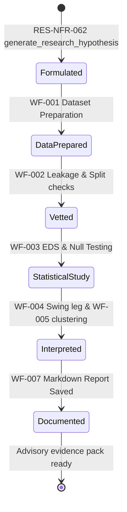

# Research Service — Intended Workflows and Scenarios

## 1. Document Purpose

This document provides a complete reverse-engineered model of the intended behavior, operational workflows, and scenarios for the Research Edge Lab (`app/services/research/`) of HaruQuantAI. It translates isolated functional and non-functional requirements from the Research Edge Lab Architecture Requirements plan ([12-research.md](file:///c:/Users/rharu/AppDev/HaruquantAI/docs/dev/phase-implementation-plan/12-research.md)) into continuous, end-to-end operational workflows.

The goal is to establish:
- Clear actor interactions and execution boundaries.
- Precise step-by-step logic, routing, and component state changes.
- Concrete testable scenarios covering happy paths and edge cases.
- An exhaustive requirements-to-workflow traceability matrix to prevent requirement omission.
- Documented implementation gaps, ambiguities, and architectural contradictions for stakeholder review.

---

## 2. Source and Analysis Boundaries

The primary source of truth for this document is the Research Edge Lab requirements listed in [12-research.md](file:///c:/Users/rharu/AppDev/HaruquantAI/docs/dev/phase-implementation-plan/12-research.md).
- **Rule of strict documentation**: No system behavior has been invented.
- **Inferred connections**: Where requirements implicitly depend on a sequence of actions not fully stated, the connection is documented and explicitly flagged as:
  > **Inferred workflow connection — requires validation**
- **Explicit vs. Implied vs. Missing**: This document segregates explicit requirement text, implied functionality required for system cohesion, missing operational logic, and code-name discrepancies.

---

## 3. System Purpose and Scope

### System/Module Name
HaruQuantAI Research Edge Lab (`app/services/research`)

### Primary Purpose
Provide a sandboxed, read-only statistical research workbench to load, clean, align, and analyze market data. It implements feature engineering (returns, volatility, Donchian, Hurst), lookahead leakage checks, null-model hypothesis testing (bootstrap, permutation), directional market structure profiles, and unsupervised modeling (PCA, K-Means clustering) to generate advisory research evidence and scorecards without trading execution authority.

### Business & Operational Outcomes
- High-integrity, lookahead-free prepared datasets with detailed data quality reports.
- Non-overlapping train/validation/test chronological splits preventing snooping bias.
- Statistically rigorous session-edge discovery (Event Dependency Studies) matched against calibrated null distributions.
- Quantitative classification of market structure, directional swings, and regime indicators.
- PCA-based risk factor identification and unsupervised clustering to guide strategy signal adaptation.
- Economic calendar event collection and advisory blackout recommendations.
- Standardized, masked JSON and Markdown research scorecards for Quant Leads and Eng Leads.

### Scope Boundaries

```text
  Analyst / Agent / Optimization Module
                    |
                    v
  +-----------------app/services/research/ (Boundary Gate)------------------+
  |                                                                         |
  |  [service.py] <----> [policies/advisory_guard.py] (Block Mutative Acts) |
  |        |                                                                |
  |        v                                                                |
  |  [policies/resource_limits.py] (Row & Duration Caps)                    |
  |        |                                                                |
  |        +-------> Prep & Leakage? --------> [core/preparation.py]        |
  |        |                                   [core/leakage.py]            |
  |        |                                                                |
  |        +-------> Statistical Study? -------> [studies/eds.py]           |
  |        |                                   [studies/null_hypothesis.py] |
  |        |                                                                |
  |        +-------> Unsupervised PCA? --------> [studies/unsupervised/*]   |
  |        |                                                                |
  |        +-------> External News Feed? -------> [providers/forexfactory.py]|
  |                                                                         |
  |  [policies/redaction.py] <----------------------------------------------+
  |        |                                                                |
  |        v                                                                |
  |  [reports/persistence.py] (Safe File Exports)                           |
  |                                                                         |
  +--------------------------------|----------------------------------------+
                                   |
                                   v
                      Normalised ResearchEnvelope 
                                   |
                                   v
             Downstream Consumers (Strategy/Analytics/Optimization)
```

* **In-Scope (Research Domain)**:
  - Official tool facades (`prepare_research_dataset_tool`, `run_edge_study_tool`, `run_unsupervised_research_tool`, `fetch_research_feed_tool`, `build_research_report_tool`).
  - Validation: dataset schemas (`OHLCVS`), data quality checks (`DataQualityReportModel`), feature lookahead checks (`LeakageReport`), and input boundaries.
  - Core Preparation: timezone normalization, missing bar strategies (drop, forward-fill, interpolate), non-trading period filters, and session hours tagging.
  - Studies: Event Dependency Studies (EDS), simple moving average (SMA)/exponential moving average (EMA) calculations, rolling Hurst exponents, pivot levels, ATR volatility percentiles, bootstrap confidence intervals, and multiple-comparison adjustments (Benjamini-Hochberg, Holm-Bonferroni).
  - Unsupervised: preprocessing pipelines, scaler transforms, PCA loadings, K-Means clustering, and forward-return outperformance analysis.
  - Providers: isolated ForexFactory adapter for news and instrument pages with retry, cache, and timeout policies.
  - Reporting: scorecard rendering, sensitive-field masking, and safe atomic file persistence.

* **Out-of-Scope (Owned by Trading, Risk, or Simulator)**:
  - Placing, modifying, canceling, or routing live orders (Trading).
  - Risk approvals, mutating risk limits, and final margin controls (Risk).
  - Activating execution, promoting strategies to paper/live lists, or running tick matching loops (Simulator / Trading / Risk).
  - Direct database migrations and real-time live trading connectivity (Data / Trading).

---

## 4. Actors and Responsibilities

### Analyst (Quant Researcher, Strategy Developer)
- **Role**: Explores market anomalies, validates feature sets, and generates trading hypotheses.
- **Can Initiate**: Dataset preparation, event dependency studies, market structure classification, PCA/clustering, news blackout calculations.
- **Information Provided**: Instrument codes, timeframes, date ranges, parameters override, hypothesis definitions.
- **Outcomes Received**: Prepared datasets, leakage reports, p-value statistics, market structure profiles, unsupervised insights, Markdown reports.
- **Prohibitions**: Prohibited from executing live orders, mutating risk thresholds, or promoting strategies to production lists directly.

### AI Agent
- **Role**: Scoped tool consumer evaluating data patterns under strict authorization.
- **Can Initiate**: Advisory research tool executions via standard API envelope, news searches, report compilation.
- **Information Provided**: Task-specific tool parameters (inputs validated by schemas).
- **Outcomes Received**: Standard research envelopes containing observations and evidence packs.
- **Prohibitions**: Strictly forbidden from executing unsanctioned code scripts, accessing unredacted secrets, or modifying persistence files outside approved folders.

### Operations / Administrator (Quant Lead, Engineering Lead)
- **Role**: Approving authority for research configurations and deployment.
- **Can Initiate**: setting resource limit policies, checking system-readiness checklists, auditing report outputs.
- **Information Provided**: Dual sign-off tokens, benchmark resource configurations.
- **Outcomes Received**: Performance logs, reproducibility audits, verified evidence packs.
- **Prohibitions**: Cannot modify mathematical study formulas directly.

---

## 5. Capability Map

```
app/services/research/ (Research Edge Lab)
├── 1. Public API Façade & Envelope
│   ├── Lazy Resolution Gate (app.services.research.__all__)
│   ├── Tool Gateways (prepare_research_dataset_tool, run_edge_study_tool)
│   └── Research Envelope Wrapper (contracts/envelopes.py)
├── 2. Core Preparation & Cleaning
│   ├── Timestamp Normalization (core/preparation.py)
│   ├── Missing Bar & Non-Trading Fills (core/preparation.py)
│   ├── Data Quality Scorecarding (core/preparation.py)
│   └── Session hours and seasonality (core/sessions.py)
├── 3. Leakage Guard & Splits
│   ├── Lookahead Column Scans (core/leakage.py)
│   ├── Chronological Train/Val/Test Splitter (core/leakage.py)
│   └── Data-Snooping Risk Assessor (core/leakage.py)
├── 4. Feature and Metric Kernels
│   ├── sma/ema/std calculations (core/metrics/calculators.py)
│   ├── Donchian Channels & Hurst Exponents (core/features/market_structure.py)
│   └── Volatility and Trend Regimes (core/features/market_structure.py)
├── 5. Edge Discovery & Null Hypothesis Testing
│   ├── Event Dependency Studies (studies/eds.py)
│   ├── Bootstrap & Permutation Resampling (studies/null_hypothesis.py)
│   └── Multiple-Comparison Adjustments (studies/null_hypothesis.py)
├── 6. Market-Structure & Directional Leg classification
│   ├── Trend Swing Point Detection (studies/market_structure/classification.py)
│   ├── Calibration Candidates Grid Ranking (studies/market_structure/calibration.py)
│   └── Strategy Fit Advising (studies/market_structure/profiles.py)
├── 7. Unsupervised Exploratory Modeling
│   ├── Preprocessing Scalers (studies/unsupervised/clustering.py)
│   ├── PCA Loadings & Risk Factors (studies/unsupervised/pca.py)
│   └── K-Means clustering and returns scoring (studies/unsupervised/clustering.py)
├── 8. Economic News Providers
│   ├── ForexFactory News Adapter (providers/forexfactory.py)
│   ├── Throttling / HTTP 429 Handler (providers/protocols.py)
│   └── Economic News blackout recommender (interactive/calendar.py)
└── 9. Observability & Reporting
    ├── Masking & Secrets Redaction (policies/redaction.py)
    ├── Resource Limits Watchdog (policies/resource_limits.py)
    └── Atomic Markdown/JSON report persistence (reports/persistence.py)
```

---

## 6. Workflow Catalogue

1. **WF-001 — Research Dataset Preparation and Cleaning**: Normalizes timezones, handles missing bars, runs schema checks, and constructs data quality reports. (*Core Workflow*)
2. **WF-002 — Leakage Detection and Time-Series Splitting**: Scans columns for lookahead bias, splits data chronologically, and checks snooping indicators. (*Core Validation Workflow*)
3. **WF-003 — Event Dependency Study (EDS) and Null Testing**: Calculates null-model expectancies, runs resampling distributions, and applies multiple-hypothesis corrections. (*Core Study Workflow*)
4. **WF-004 — Market Structure Profiling and Calibration**: Identifies directional leg trends and swing points, ranks parameter candidates, and builds advisory structure profiles. (*Core Study Workflow*)
5. **WF-005 — Unsupervised Feature-Space Exploration**: Standardizes inputs, runs PCA, clusters feature rows, and scores cluster returns. (*Core Exploratory Workflow*)
6. **WF-006 — Economic News Feed Retrieval and Blackout Advisory**: Fetches data from ForexFactory, handles rate limits, and recommends news blackout ranges. (*Feeds / Supporting Workflow*)
7. **WF-007 — Research Report Rendering and Safe Persistence**: Serializes scorecards, masks sensitive fields, checks path traversal safety, and writes files atomically. (*Reporting / Lifecycle Workflow*)

---

## 7. Detailed End-to-End Workflows

### WF-001 — Research Dataset Preparation and Cleaning

#### Purpose and Value
Cleans, normalizes, and validates raw OHLCV datasets to ensure subsequent research calculations use clean, lookahead-free, and timezone-aligned data with a transparent data quality scorecard.

#### Actors
- **Primary**: Analyst / AI Agent / Optimization Module
- **Supporting**: ResearchFaçade, Dataset Preparer, Data Quality Validator

#### Trigger
Analyst invokes `prepare_research_dataset_tool()` or code calls `preparation.prepare_research_dataset()`.

#### Preconditions
- The raw dataset is non-empty.
- The timezone configuration is supported.

#### Inputs
- `raw_data` (DataFrame or DataSource descriptor)
- `cleaning_config` (timezone, missing_bar_strategy: `drop`/`forward_fill`/`interpolate`, non_trading_period_strategy)
- `request_id` (str)

#### Main Success Flow

| Step | Responsible component | Action | Input | Validation or decision | State change | Output | Requirement IDs |
| :--- | :-------------------- | :----- | :---- | :--------------------- | :----------- | :----- | :-------------- |
| 1 | `ResearchFaçade` | Intercept request & validate inputs. | Request parameters | Verify symbol, date range, and configuration formats. | None | Sanitized request | RES-FR-020, RES-FR-039 |
| 2 | `policies.resource_limits` | Enforce row count and duration bounds. | rows count | Check rows count <= `max_rows` limit. | None | Approved row parameters | RES-NFR-116, RES-BR-002 |
| 3 | `core.preparation` | Validate raw dataset schema. | raw_data | Run `validate_dataset` schema check; separate fatal errors from warnings. | None | Verified dataset | RES-FR-070 |
| 4 | `core.preparation` | Normalize timestamps to UTC. | Verified dataset, timezone | Enforce UTC offset. Detect duplicate or non-monotonic timestamps. | None | Timezone-normalized frame | RES-FR-037 |
| 5 | `core.preparation` | Apply missing-bar and non-trading-period strategy. | Normalized frame, cleaning_config | Resolve gaps using approved strategies (drop, forward-fill, interpolate, etc.). | None | Cleaned data frame | RES-FR-033, RES-FR-034, RES-FR-037 |
| 6 | `core.preparation` | Detect spread anomalies. | Cleaned data frame | Run spread check: flag negative spreads or extreme pricing. | None | Vetted data frame | RES-FR-037, RES-FR-070 |
| 7 | `core.preparation` | Compile Data Quality Report. | cleaning actions, warnings | Assemble machine-readable list of issues and actions. | None | `DataQualityReportModel` | RES-FR-065, RES-FR-066, RES-FR-067 |
| 8 | `core.enrichment` | Apply enrichment transformations. | Vetted frame, EnrichmentConfig | Append returns, bar geometry, and session flags. | None | Enriched dataset | RES-FR-038, RES-FR-069, RES-FR-085 |
| 9 | `ResearchFaçade` | Package prepared dataset into standard envelope. | Enriched dataset, quality report | Convert data structures to JSON-safe model formats. | None | `PreparedDataset` | RES-FR-068, RES-FR-093 |

#### Decision Points

##### D1.1: Missing Bar Strategy Selection
- **Component**: `core.preparation`
- **Condition Evaluated**: `missing_bar_strategy` parameter value.
- **Branches**:
  - `drop`: Remove affected rows. Record action in quality report.
  - `forward_fill`: Copy previous close. Record action.
  - `interpolate`: Linear interpolation. Record action.
  - `none`: Raise `ERR_INSUFFICIENT_SAMPLES` or warning if unapproved.
- **Fail-closed behavior**: If strategy is unconfigured or null, raise a configuration exception immediately (`RES-FR-035`).
- **Supporting IDs**: RES-FR-034, RES-FR-035.

##### D1.2: Resource Limits Breached
- **Component**: `policies.resource_limits`
- **Condition Evaluated**: Does raw dataset exceed `max_rows`?
- **Branches**:
  - **Yes**: Fail closed. Raise a typed resource-limit error.
  - **No**: Proceed to Step 3.
- **Fail-closed behavior**: Fail-closed.
- **Supporting IDs**: RES-NFR-116, RES-BR-002.

#### Alternate Flows
- None. Dataset preparation must execute deterministically.

#### Failure and Exception Flows

##### EF1.1: Schema Columns Missing
- **Trigger**: Input dataset lacks mandatory OHLCV columns.
- **Detection**: `validate_dataset` checks schema parameters in Step 3.
- **Response**: Abort execution. Return error code `ERR_SCHEMA_VALIDATION_FAILED` inside the standard envelope.
- **Supporting IDs**: RES-FR-070.

#### Recovery Flow
Dataset preparation is stateless. If the process encounters a memory allocation alert, it halts, discards the intermediate frames, and returns a resource-limit error.

#### Postconditions
- `PreparedDataset` returned containing cleaned data and quality report.
- Warnings log generated detailing any unresolved dataset issues.

---

### WF-002 — Leakage Detection and Time-Series Splitting

#### Purpose and Value
Ensures validity of research findings by validating that no lookahead columns are present in features, and partitions datasets using chronological splits to avoid data-snooping bias.

#### Actors
- **Primary**: Analyst / AI Agent
- **Supporting**: core.leakage, ResearchFaçade

#### Trigger
Analyst requests data split or feature verification.

#### Preconditions
- The dataset is a verified `PreparedDataset`.

#### Inputs
- `prepared_dataset` (PreparedDataset)
- `feature_metadata` (contains feature columns and target horizon details)
- `time_split_spec` (ratios for train, validation, and test splits)

#### Main Success Flow

| Step | Responsible component | Action | Input | Validation or decision | State change | Output | Requirement IDs |
| :--- | :-------------------- | :----- | :---- | :--------------------- | :----------- | :----- | :-------------- |
| 1 | `ResearchFaçade` | Receive split request & verify schema compatibility. | request data | Confirm dataset contains expected index values. | None | Sanitized request | RES-FR-019 |
| 2 | `core.leakage` | Scan features for lookahead naming or horizons. | features, metadata | Verify no column uses future index references or target columns. | None | Naming scan result | RES-FR-043 |
| 3 | `core.leakage` | Inspect allowed-forward columns. | features | Confirm columns matching target indices are in the allowed-forward list. | None | Leakage validation outcome | RES-FR-043, RES-NFR-103 |
| 4 | `core.leakage` | Generate Leakage Report. | scan outcomes | Compile list of suspected columns, severity, and recommendations. | None | `LeakageReport` | RES-FR-073 |
| 5 | `core.leakage` | Run data-snooping diagnostics. | study details | Calculate snooping metrics across trial records. | None | `DataSnoopingAssessment` | RES-FR-088 |
| 6 | `core.leakage` | Partition dataset chronologically. | prepared_dataset, split ratios | Segment data into non-overlapping splits using index sorting. | None | `TimeSplitResult` | RES-FR-091, RES-FR-130 |
| 7 | `ResearchFaçade` | Package splits & leakage results into envelope. | TimeSplitResult, LeakageReport | Wrap outputs in versioned standard envelope. | None | `ResearchEnvelope` | RES-FR-093 |

#### Decision Points

##### D2.1: Lookahead Leakage Found
- **Component**: `core.leakage`
- **Condition Evaluated**: Did a column scan reveal lookahead behavior or invalid feature references?
- **Branches**:
  - **Yes**: Flag severity as `CRITICAL` in the leakage report; append warnings to the envelope.
  - **No**: Flag severity as `NONE`.
- **Fail-safe behavior**: Non-trading decision; returns report with warning instead of crashing.
- **Supporting IDs**: RES-FR-043, RES-FR-073.

##### D2.2: Split Chronology Check
- **Component**: `core.leakage`
- **Condition Evaluated**: Does any timestamp in the validation set occur before the maximum timestamp of the training set?
- **Branches**:
  - **Yes**: Fail split calculation. Raise a statistical-invalidity error.
  - **No**: Commit splits (Proceed to Step 7).
- **Fail-closed behavior**: Fail-closed (stops pipeline).
- **Supporting IDs**: RES-FR-091, RES-FR-130.

#### Alternate Flows
- None. Chronological splitting forbids random shuffling.

#### Failure and Exception Flows

##### EF2.1: Insufficient Split Data
- **Trigger**: The date range contains fewer rows than needed to satisfy the partition ratios.
- **Detection**: `enforce_time_split` checks sample counts.
- **Response**: Terminate split calculations. Return error code `ERR_INSUFFICIENT_SAMPLES` in the envelope.
- **Supporting IDs**: RES-FR-029, RES-NFR-102.

#### Recovery Flow
If dataset indexing is naive or unsorted, the engine attempts sorting by time index before splitting. If sorting fails, it raises a validation exception and aborts.

#### Postconditions
- Chronological data frames (train, validation, test) constructed.
- Leakage report saved to the execution session.

---

### WF-003 — Event Dependency Study (EDS) and Null Testing

#### Purpose and Value
Establishes whether observed market behaviors (mean-reversion compressor fades or trend breakout follow-throughs) represent a true statistical edge or simply random noise.

#### Actors
- **Primary**: Analyst / Optimization Engine
- **Supporting**: studies.eds, studies.null_hypothesis

#### Trigger
Analyst runs an Edge Discovery session.

#### Preconditions
- Cleaned research dataset is prepared.
- Reference seeds for bootstrap tests are configured.

#### Inputs
- `dataset` (PreparedDataset)
- `eds_config` (mean reversion/trend persistence parameters)
- `null_config` (permutations count, bootstrap block size, multiple-comparison correction alpha)

#### Main Success Flow

| Step | Responsible component | Action | Input | Validation or decision | State change | Output | Requirement IDs |
| :--- | :-------------------- | :----- | :---- | :--------------------- | :----------- | :----- | :-------------- |
| 1 | `studies.eds` | Sanitize study inputs. | dataset, configs | Verify that the sample count exceeds the minimum threshold. | None | Sanitized parameters | RES-FR-029, RES-NFR-020 |
| 2 | `studies.eds` | Run mean-reversion compression studies. | dataset, parameters | Calculate Compression score, fade expectancy, and sample statistics. | None | Mean reversion edge statistics | RES-FR-016, RES-NFR-017 |
| 3 | `studies.eds` | Run trend-breakout studies. | dataset, parameters | Calculate ATR breakout expectancy and Leg indicators. | None | Trend persistence edge statistics | RES-FR-016, RES-NFR-018 |
| 4 | `studies.null_hypothesis` | establish null-model baseline distribution. | returns array, seed | Generate shuffled or randomised null expectancies. | None | Null-distribution array | RES-FR-048, RES-NFR-016, RES-NFR-028 |
| 5 | `studies.null_hypothesis` | Compute bootstrap confidence intervals. | edge statistics, seed | Apply block bootstrap resampling to generate confidence bands. | None | ConfidenceInterval values | RES-FR-048, RES-NFR-025, RES-NFR-026 |
| 6 | `studies.null_hypothesis` | Evaluate permutation-test p-value. | observed outcomes, nulls | Calculate observed percentile relative to null baseline. | None | p-value result | RES-FR-092, RES-NFR-027, RES-NFR-034 |
| 7 | `studies.null_hypothesis` | Apply multiple-comparison corrections. | p-values array | Adjust p-values using Benjamini-Hochberg or Holm-Bonferroni methods. | None | MultipleComparisonResult | RES-NFR-032, RES-NFR-033, RES-NFR-038 |
| 8 | `studies.eds` | Construct Edge Result Evidence Pack. | statistics, p-values | Attach advisory disclaimers, references, and seed hashes. | None | `EdgeResult` / Evidence Pack | RES-FR-017, RES-FR-046, RES-NFR-063, RES-NFR-111 |

#### Decision Points

##### D3.1: Minimum Sample Check
- **Component**: `studies.eds`
- **Condition Evaluated**: Is actual sample count >= minimum samples requirement?
- **Branches**:
  - **No**: Raise `ERR_INSUFFICIENT_SAMPLES` and abort.
  - **Yes**: Proceed to Step 2.
- **Fail-closed behavior**: Fail-closed.
- **Supporting IDs**: RES-FR-029, RES-NFR-020.

##### D3.2: Exceeds Null Threshold
- **Component**: `studies.null_hypothesis`
- **Condition Evaluated**: Does the observed statistic exceed the null significance threshold?
- **Branches**:
  - **Yes**: Flag edge statistical significance as passed.
  - **No**: Flag edge significance as failed (not statistically distinguishable from noise).
- **Fail-safe behavior**: Non-trading evaluation; returns results with classification metadata.
- **Supporting IDs**: RES-FR-047, RES-NFR-023, RES-NFR-024.

#### Alternate Flows

##### A3.1: Session-Randomized Null Model
- **Workflow Variant**: When configured, the null hypotheser utilizes `session_randomized_null` (Step 4), shuffling returns only within session boundaries instead of full random shuffling, to preserve intra-session volatility correlation.
- **Supporting IDs**: RES-NFR-030.

#### Failure and Exception Flows

##### EF3.1: Non-Finite Statistics Encountered
- **Trigger**: The input return values contain non-finite numbers (e.g. Inf, NaN) that corrupt statistical calculation.
- **Detection**: Null hypotheser scans data array.
- **Response**: Abort study. Return error code `ERR_STATISTICAL_INVALIDITY` inside the envelope.
- **Supporting IDs**: RES-NFR-020.

#### Recovery Flow
If bootstrap iterations fail to converge due to memory limits, the engine scales down the bootstrap iteration size to a safe recovery level and retries once, recording the reduction in the warnings payload.

#### Postconditions
- `EdgeResult` created containing observed expectancies, p-values, and seed metadata.
- Output packet tagged as advisory-only evidence.

---

### WF-004 — Market Structure Profiling and Calibration

#### Purpose and Value
Classifies historical directional swings and volatility regimes to construct market-structure profiles, calibrating parameter candidates against realized future behavior to find the optimal fit.

#### Actors
- **Primary**: Analyst
- **Supporting**: studies.market_structure.classification, studies.market_structure.calibration, studies.market_structure.profiles

#### Trigger
Analyst requests market structure profiling and parameter calibration.

#### Preconditions
- Prepared dataset contains required OHLCV and spread variables.

#### Inputs
- `dataset` (PreparedDataset)
- `market_structure_config` (swing parameters, channels config)
- `calibration_candidates` (parameter grids)

#### Main Success Flow

| Step | Responsible component | Action | Input | Validation or decision | State change | Output | Requirement IDs |
| :--- | :-------------------- | :----- | :---- | :--------------------- | :----------- | :----- | :-------------- |
| 1 | `classification` | Sanitize timeframe and symbol class inputs. | symbol, timeframe | Resolve timeframe and symbol class bucket mappings. | None | Bucket mappings | RES-NFR-051, RES-NFR-052 |
| 2 | `classification` | Extract swing points and directional legs. | dataset, parameters | Calculate swing highs/lows and Leg metrics. | None | Swing points list | RES-NFR-039, RES-NFR-040, RES-NFR-041 |
| 3 | `classification` | Calculate Donchian channel levels. | swing points | Compute Donchian breakouts. | None | Channel levels | RES-FR-110 |
| 4 | `classification` | Compute rolling Hurst exponents. | dataset | Estimate rolling Hurst exponent for mean-reversion strength. | None | Hurst series | RES-FR-111, RES-FR-112 |
| 5 | `calibration` | Build candidate parameter grid. | market_structure_config | Generate candidates matrix. | None | Parameter grids list | RES-NFR-045, RES-NFR-048 |
| 6 | `calibration` | Evaluate calibration candidates. | dataset, grids list | Classify market structure for each candidate parameter set. | None | Calibration evaluations list | RES-NFR-044, RES-NFR-046, RES-NFR-049 |
| 7 | `calibration` | Rank candidates by realized behavior. | evaluations, future behavior | Rank candidates using stability and fit criteria. | None | Ranked calibration results | RES-NFR-056, RES-NFR-060 |
| 8 | `profiles` | Resolve profile overrides and construct profile. | ranked candidates | Merge overrides and compile `MarketStructureProfile`. | None | `MarketStructureProfile` | RES-NFR-042, RES-NFR-049, RES-NFR-053, RES-NFR-054 |
| 9 | `profiles` | Build Strategy Fit Advisory. | MarketStructureProfile | Assess strategy applicability; attach explicit advisory disclosures. | None | StrategyFitAdvisory | RES-NFR-059, RES-NFR-111 |

#### Decision Points

##### D4.1: Unstable Rankings Warning
- **Component**: `calibration`
- **Condition Evaluated**: Do top-ranked candidates exhibit high volatility or variance across parameter steps?
- **Branches**:
  - **Yes**: Add warning "Unstable parameter ranking" to the results metadata.
  - **No**: Proceed to Step 8.
- **Fail-safe behavior**: Non-trading diagnostic warning.
- **Supporting IDs**: RES-NFR-060.

##### D4.2: Override Precedence
- **Component**: `profiles`
- **Condition Evaluated**: Do user-supplied overrides conflict with catalog defaults?
- **Branches**:
  - **Yes**: Apply overrides following precedence: symbol-level overrides first, then timeframe-level, then class-level.
  - **No**: Apply catalog defaults.
- **Supporting IDs**: RES-NFR-054.

#### Alternate Flows
- None. Calibration is structured as grid evaluation.

#### Failure and Exception Flows

##### EF4.1: Missing Registry Profile
- **Trigger**: The resolved profile registry lacks a profile entry for the symbol and timeframe.
- **Detection**: `resolve_market_structure_profile` checks registry keys.
- **Response**: Return error code `ERR_PROFILE_NOT_FOUND` in the envelope.
- **Supporting IDs**: RES-NFR-053.

#### Recovery Flow
If candidate evaluation exceeds timing budgets, the execution engine drops remaining low-ranked candidates in the grid, completes evaluations for top-tier candidates, and appends a "Grid truncated due to runtime budget" warning.

#### Postconditions
- `MarketStructureProfile` generated containing calibration statistics and robustness metrics.
- Strategy-fit advice generated and explicitly marked non-approving.

---

### WF-005 — Unsupervised Feature-Space Exploration

#### Purpose and Value
Performs unsupervised exploratory analysis to reduce dimensionality (PCA) and discover regime clusters, producing advisory outperformance metrics to guide strategy adaptation.

#### Actors
- **Primary**: Analyst
- **Supporting**: studies.unsupervised.service, studies.unsupervised.pca, studies.unsupervised.clustering, studies.unsupervised.insights

#### Trigger
Analyst requests PCA or clustering exploration.

#### Preconditions
- Features dataset contains only numeric, normalized variables.
- Validation seed parameters are configured.

#### Inputs
- `dataset` (PreparedDataset / FeatureSetFrame)
- `unsupervised_config` (seed, PCA components count, clustering algorithm, target returns horizon)

#### Main Success Flow

| Step | Responsible component | Action | Input | Validation or decision | State change | Output | Requirement IDs |
| :--- | :-------------------- | :----- | :---- | :--------------------- | :----------- | :----- | :-------------- |
| 1 | `unsupervised.service` | Sanitize unsupervised parameters. | request inputs | Confirm all selected features are numeric; drop non-numeric fields. | None | Preprocessed feature frame | RES-FR-084, RES-FR-123 |
| 2 | `unsupervised.pca` | Execute PCA dimensionality reduction. | feature frame, components count | Run PCA; calculate component scores and variance. | None | `PcaModelResult` | RES-NFR-071, RES-NFR-072 |
| 3 | `unsupervised.pca` | Identify PCA risk factors. | PCA results | Extract top loadings as interpretable risk factors. | None | PCA risk factors list | RES-NFR-075, RES-NFR-079 |
| 4 | `unsupervised.clustering` | Cluster feature space. | feature frame, seed | Run K-Means using the request seed; label rows. | None | `ClusterModelResult` | RES-FR-052, RES-NFR-073 |
| 5 | `unsupervised.clustering` | Attach cluster labels to dataset. | feature frame, labels | Append labels without mutating the input dataset. | None | Labeled feature frame | RES-NFR-074 |
| 6 | `unsupervised.clustering` | Calculate forward-return outperformance. | Labeled frame, price column | Compute horizon-aligned returns; score returns by cluster. | None | ClusterOutperformance list | RES-NFR-076, RES-NFR-080, RES-NFR-081 |
| 7 | `unsupervised.clustering` | Produce advisory signal adaptation. | ClusterOutperformance list | Recommend signal modifications; mark as non-approving. | None | `SignalAdaptationResult` | RES-NFR-077, RES-NFR-082 |
| 8 | `unsupervised.insights` | Build Unsupervised Insight Report. | PCA & clustering results | Assemble metrics, scaler parameters, and diagnostics. | None | `UnsupervisedInsightReport` | RES-FR-084, RES-NFR-078, RES-NFR-083 |

#### Decision Points

##### D5.1: Non-Deterministic Seed Evaluation
- **Component**: `unsupervised.service`
- **Condition Evaluated**: Is K-Means seed provided in the request or configuration?
- **Branches**:
  - **Yes**: Inject seed into algorithm setup to guarantee deterministic results.
  - **No**: Raise error code `ERR_SEED_REQUIRED` (non-deterministic runs blocked).
- **Fail-closed behavior**: Fail-closed (stops exploration).
- **Supporting IDs**: RES-FR-051, RES-FR-052.

#### Alternate Flows
- None. Unsupervised analysis pipelines run deterministically under the validation seed.

#### Failure and Exception Flows

##### EF5.1: Singular Value Decomposition Convergence Fail
- **Trigger**: SVD algorithm fails to converge during PCA calculation.
- **Detection**: PCA engine catches numerical solver exception.
- **Response**: Abort calculation. Return error code `ERR_MODEL_CONVERGENCE_FAILED` inside the envelope.
- **Supporting IDs**: RES-FR-021.

#### Recovery Flow
If dataset variance is zero (preventing PCA scaling), scale calculations are bypassed, the system returns a data-quality warning, and K-Means runs directly on un-scaled inputs if permitted.

#### Postconditions
- `UnsupervisedResearchResult` generated with component scores, loadings, and cluster diagnostics.
- Unsupervised insight report compiled for downstream trading adapters.

---

### WF-006 — Economic News Feed Retrieval and Blackout Advisory

#### Purpose and Value
Retrieves news events from ForexFactory and constructs advisory trading blackout windows to avoid volatility spikes without directly modifying live broker rules.

#### Actors
- **Primary**: Analyst / AI Agent
- **Supporting**: providers.forexfactory, interactive.calendar

#### Trigger
Analyst or scheduler requests a calendar update or blackout window evaluation.

#### Preconditions
- Provider settings are available.
- Network connection to external provider is active (unless offline mode is enabled).

#### Inputs
- `symbol` (str), `range_days` (int)
- `provider_policy` (timeout, retry parameters, caching settings, offline-mode)
- `blackout_policy` (impact thresholds, pre/post buffer margins)

#### Main Success Flow

| Step | Responsible component | Action | Input | Validation or decision | State change | Output | Requirement IDs |
| :--- | :-------------------- | :----- | :---- | :--------------------- | :----------- | :----- | :-------------- |
| 1 | `providers.forexfactory` | Check cache for calendar records. | symbol, date range | If fresh cache is available, return records and skip to Step 5. | None | Cached news payload | RES-FR-059 |
| 2 | `providers.forexfactory` | check offline-mode state. | provider_policy | If offline-mode is true, skip request and return cached/offline file data. | None | Offline news payload | RES-FR-059, RES-NFR-106 |
| 3 | `providers.forexfactory` | Fetch news page from vendor. | request details | Send HTTP request using timeout and rate-limit controls. | None | Raw HTTP response | RES-FR-054, RES-FR-055 |
| 4 | `providers.forexfactory` | Parse news items. | Raw HTTP response | Convert HTML/JSON raw fields to structured news records. | None | Normalized news list | RES-NFR-061, RES-NFR-085 |
| 5 | `interactive.calendar` | Filter events by symbol. | Normalized news list | Filter events by instruments relevant to the symbol currency. | None | Currency-specific events list | RES-NFR-087 |
| 6 | `interactive.calendar` | Classify news impact levels. | Currency-specific events list | Score event impact level (low, medium, high). | None | Scored events list | RES-NFR-088 |
| 7 | `interactive.calendar` | Create news blackout windows. | Scored events, blackout_policy | Calculate pre-event and post-event time ranges. | None | list of `AdvisoryBlackoutWindow` | RES-NFR-089 |
| 8 | `ResearchFaçade` | Package news and blackout windows into envelope. | blackout windows | Wrap results in versioned standard envelope. | None | `ResearchEnvelope` | RES-FR-093 |

#### Decision Points

##### D6.1: HTTP 429 Rate Limit Encountered
- **Component**: `providers.forexfactory`
- **Condition Evaluated**: Did the HTTP request return status code 429?
- **Branches**:
  - **Yes**: Parse `Retry-After` header. If within threshold, execute wait-retry. Otherwise, return `ERR_PROVIDER_RATE_LIMIT` with warning.
  - **No**: Proceed to Step 4.
- **Supporting IDs**: RES-FR-087.

##### D6.2: Missing Provider Adapter
- **Component**: `providers.forexfactory`
- **Condition Evaluated**: Is the external provider library available or configured?
- **Branches**:
  - **No**: Return standard envelope containing `status_code` warning, and use offline fallback datasets.
  - **Yes**: Proceed to Step 3.
- **Supporting IDs**: RES-FR-056.

#### Alternate Flows

##### A6.1: Offline Mode Execution
- **Workflow Variant**: When `offline_mode` is enabled (Step 2), the system bypasses the network fetch (Step 3), returning a pre-saved sandbox calendar file from `data/` to keep test suites executable offline.
- **Supporting IDs**: RES-FR-056, RES-NFR-106.

#### Failure and Exception Flows

##### EF6.1: Connection Timeout
- **Trigger**: HTTP request to ForexFactory times out after configured threshold.
- **Detection**: HTTP client wrapper raises `TimeoutError`.
- **Response**: Return a standard research envelope containing `status="error"`, code `ERR_PROVIDER_TIMEOUT`, and partial cached results if available.
- **Supporting IDs**: RES-FR-059.

#### Recovery Flow
If connection drops, the provider adapter applies exponential backoff for up to 3 retries. If the connection fails to recover, it returns a diagnostic warning and rolls back to offline mode.

#### Postconditions
- Advisory blackout windows generated.
- News events cache updated in the local store.

---

### WF-007 — Research Report Rendering and Safe Persistence

#### Purpose and Value
Serializes research findings into human-readable Markdown or machine-readable JSON reports, masking sensitive values and writing files atomically under path-traversal protections.

#### Actors
- **Primary**: Analyst / AI Agent / Scheduler
- **Supporting**: reports.rendering, reports.persistence, policies.redaction

#### Trigger
Analyst or build script requests report persistence.

#### Preconditions
- The research study is complete.
- Target directory is writable.

#### Inputs
- `research_result` (EdgeResult, UnsupervisedInsightReport, or profile snapshot)
- `output_path` (file path destination)
- `overwrite` (bool)
- `masking_policy` (list of columns and fields to redact)

#### Main Success Flow

| Step | Responsible component | Action | Input | Validation or decision | State change | Output | Requirement IDs |
| :--- | :-------------------- | :----- | :---- | :--------------------- | :----------- | :----- | :-------------- |
| 1 | `reports.rendering` | Render human-readable Markdown report. | research_result | Convert statistics and evidence to formatted Markdown text. | None | Markdown content string | RES-NFR-132, RES-NFR-137, RES-NFR-142 |
| 2 | `reports.rendering` | Compile dashboard-ready summary block. | snapshot data | Build JSON-ready metrics summary. | None | JSON summary payload | RES-NFR-133, RES-NFR-138, RES-NFR-141 |
| 3 | `policies.redaction` | Apply masking policy. | Markdown / JSON payloads | Mask sensitive properties (credentials, IP columns). | None | Masked payloads | RES-FR-094, RES-FR-131, RES-NFR-107 |
| 4 | `policies.redaction` | Validate safe serialization structures. | Masked payloads | Verify no credentials or secret-like values exist in string fields. | None | Safe serialization payloads | RES-FR-094, RES-FR-132 |
| 5 | `reports.persistence` | Validate target output path. | output_path | Confirm path is within approved directories; assert no traversal keys. | None | `SafeOutputPath` | RES-FR-061, RES-NFR-147 |
| 6 | `reports.persistence` | Build artifact manifest. | Safe payloads | Generate config hash, dependency versions, and dataset metadata. | None | `ResearchArtifactManifest` | RES-FR-057, RES-FR-058, RES-FR-090 |
| 7 | `reports.persistence` | Write report to temporary file. | SafeOutputPath, manifest | Commit payload to a temporary file (`.tmp` extension). | Temp file created | Temporary file receipt | RES-FR-089, RES-NFR-147 |
| 8 | `reports.persistence` | Atomic rename to target file. | Temporary file receipt | Rename temp file to target filename; check for overwrite rules. | Target report file updated | `PersistedArtifact` | RES-FR-061, RES-FR-089, RES-NFR-134, RES-NFR-135 |

#### Decision Points

##### D7.1: Path Traversal Attempted
- **Component**: `reports.persistence`
- **Condition Evaluated**: Does the target path contain parent directory keys (`../`) or point outside approved roots (`data/` or `reports/`)?
- **Branches**:
  - **Yes**: Fail closed. Raise a permission-failure error.
  - **No**: Proceed to Step 6.
- **Fail-closed behavior**: Fail-closed.
- **Supporting IDs**: RES-FR-061, RES-NFR-147.

##### D7.2: Overwrite Policy Check
- **Component**: `reports.persistence`
- **Condition Evaluated**: Does target file already exist, and is `overwrite` set to false?
- **Branches**:
  - **Yes**: Cancel write. Return error code `ERR_FILE_ALREADY_EXISTS`.
  - **No**: Proceed to Step 8.
- **Fail-closed behavior**: Fail-closed (stops write).
- **Supporting IDs**: RES-FR-061, RES-NFR-134.

#### Alternate Flows
- None. Artifact persistence mandates atomic, safe folder constraints.

#### Failure and Exception Flows

##### EF7.1: Atomic Rename Not Supported
- **Trigger**: The operating system or file system boundary does not support atomic rename (e.g. cross-volume writes).
- **Detection**: OS rename call raises error.
- **Response**: Fallback to standard write; log warning "Atomic rename not supported on target platform; standard write applied" in the artifact metadata.
- **Supporting IDs**: RES-FR-089.

#### Recovery Flow
If a file write fails midway due to disk limits, the system deletes the temporary file, restores any existing target file, and raises a resource-limit exception.

#### Postconditions
- Masked Markdown or JSON file saved in the approved directory.
- `PersistedArtifact` receipt generated containing SHA-256 hashes and timestamp metadata.

---

## 8. Scenario Catalogue

| Scenario ID | Scenario | Given | When | Then | Expected state | Requirement IDs |
| :--- | :--- | :--- | :--- | :--- | :--- | :--- |
| WF-001-SC-001 | Happy Path Preparation | Valid raw OHLCV dataset | Analyst runs preparation tool | Norm timezone, fill gaps, output quality report | Status set to `success` | RES-FR-037, RES-FR-039 |
| WF-001-SC-002 | Unconfigured Gaps Strategy | Gaps found but strategy is null | Preparer scans dataset gaps | Abort run; raise config validation error | Dataset rejected | RES-FR-035 |
| WF-002-SC-001 | Lookahead Column Found | Features contain future target column | Leakage scanner scans columns | Flag column in LeakageReport; severity set to CRITICAL | Warning added to envelope | RES-FR-043, RES-FR-073 |
| WF-002-SC-002 | Snooping Risk Assessment | Hypotheses parameters contain leakage | Leakage scanner runs diagnostics | Score data snooping metric; warn on overfitting risk | Warning added to envelope | RES-FR-088 |
| WF-003-SC-001 | p-Value Correction | Many p-values generated from permutations | EDS runs hypothesis testing | Apply Benjamini-Hochberg adjustment to reject noise | Corrected expectancies | RES-NFR-032, RES-NFR-038 |
| WF-003-SC-002 | Insufficient Samples | Dataset rows count below minimum | EDS starts study execution | Fail closed; raise `ERR_INSUFFICIENT_SAMPLES` | Execution blocked | RES-FR-029, RES-NFR-020 |
| WF-004-SC-001 | Happy Path Calibration | Parameter grid and future behavior | Classifier ranks swing points | Rank candidates; select stable fit parameters | Profile resolved | RES-NFR-046, RES-NFR-060 |
| WF-004-SC-002 | Missing Registry override | Registry lacks profile override details | Classifier resolves profile | Apply default class parameters from database | Profile resolved | RES-NFR-053 |
| WF-005-SC-001 | PCA Risk Factors | Numeric feature frame | Unsupervised service runs PCA | Extract top loadings as risk factor descriptors | Risk factors compiled | RES-NFR-072, RES-NFR-079 |
| WF-005-SC-002 | Seed Omission | K-Means request lacks seed parameter | Unsupervised service runs clustering | Block run; raise config validation error | Execution blocked | RES-FR-051, RES-FR-052 |
| WF-006-SC-001 | HTTP 429 Rate Limit | ForexFactory server returns 429 | Provider adapter fetches news | Parse Retry-After; wait-retry or exit with warning | Retry warning saved | RES-FR-087 |
| WF-006-SC-002 | News Blackout Window | economic event list generated | Calendar calculator runs blackout | Calculate pre/post hours and mark no-trade advice | Windows list generated | RES-NFR-089 |
| WF-007-SC-001 | Safe Path Overwrite | Target file exists; overwrite is false | Persistence saver saves JSON | Fail closed; raise `ERR_FILE_ALREADY_EXISTS` | File write blocked | RES-FR-061, RES-NFR-135 |
| WF-007-SC-002 | Traversal Blocked | Path is `../../etc/passwd` | Persistence saver validates path | Block execution; raise permission error | File write blocked | RES-FR-061, RES-NFR-147 |
| WF-005-SC-003 | Cluster Return Scoring | Labeled frame and price data | Unsupervised service scores returns | Calculate outperformance; output signal advice | Adaptation list saved | RES-NFR-077, RES-NFR-081 |
| WF-001-SC-003 | Resource limits check | Dataset row count exceeds 1,000,000 | Preparer validates limit | Fail closed; raise resource limit error | Setup blocked | RES-NFR-116, RES-BR-002 |

---

## 9. Workflow Relationship Map

| Source workflow | Relationship | Target workflow | Trigger or condition |
| :--- | :--- | :--- | :--- |
| `WF-001` | Upstream of | `WF-002` | Datasets must be prepared before running leakage checks. |
| `WF-001` | Upstream of | `WF-003` | Prepared dataset is inputs for Event Dependency Studies. |
| `WF-001` | Upstream of | `WF-004` | Prepared dataset is inputs for swing point and legs checks. |
| `WF-001` | Upstream of | `WF-005` | Prepared dataset is inputs for PCA feature scaling. |
| `WF-006` | Upstream of | `WF-007` | economic news updates are compiled into reports. |
| `WF-003` | Upstream of | `WF-007` | Statistical expectancies are serialized to Markdown files. |
| `WF-004` | Upstream of | `WF-007` | Directional leg classifications are stored in JSON. |
| `WF-005` | Upstream of | `WF-007` | PCA component results are compiled into report files. |

---

## 10. System Lifecycle and State Transitions

### Research Project / Hypothesis Lifecycle State Machine



---

## 11. Cross-Module Interaction Matrix

| Initiating Module | Action / API called | Target Module | Expected Payload | Output Payload | Requirement IDs |
| :--- | :--- | :--- | :--- | :--- | :--- |
| `Research` | `read_market_data` | `Data` | `MarketDataRequest` | `pd.DataFrame` | RES-FR-039 |
| `Research` | `calmar_ratio` | `Analytics` | `TradingResult` | `float` | RES-NFR-124 |
| `Research` | `expectancy` | `Analytics` | `TradingResult` | `float` | RES-NFR-125 |
| `Research` | `max_drawdown` | `Analytics` | `TradingResult` | `float` | RES-NFR-126 |
| `Research` | `sharpe_ratio` | `Analytics` | `TradingResult` | `float` | RES-NFR-129 |
| `Research` | `sortino_ratio` | `Analytics` | `TradingResult` | `float` | RES-NFR-130 |
| `Strategy / Optimization` | `validate_research_core_evidence_pack` | `Research` | `ResearchEvidencePack` | `None` (Assertions pass) | RES-NFR-156 |

---

## 12. Requirements-to-Workflow Traceability Matrix

| Requirement ID | Requirement Summary | Workflow IDs | Scenario IDs | Workflow Step Numbers | Coverage Status |
| :--- | :--- | :--- | :--- | :--- | :--- |
| `RES-FR-001` | No package import side effects. | `WF-001` | None | Step 1 | Fully represented |
| `RES-FR-002` | No package NFRs. | `WF-001` | None | Step 1 | Fully represented |
| `RES-FR-003` | No package testing requirements. | `WF-001` | None | Step 1 | Fully represented |
| `RES-FR-004` | create_config initialization defaults. | `WF-001` | None | Step 1 | Fully represented |
| `RES-FR-005` | DataConfig structures parameters. | `WF-001` | None | Step 1 | Fully represented |
| `RES-FR-006` | SessionConfig hours specifications. | `WF-001` | None | Step 8 | Fully represented |
| `RES-FR-007` | BootstrapConfig parameters. | `WF-003` | None | Step 5 | Fully represented |
| `RES-FR-008` | PermutationConfig parameters. | `WF-003` | None | Step 6 | Fully represented |
| `RES-FR-009` | NullModelsConfig parameters. | `WF-003` | None | Step 4 | Fully represented |
| `RES-FR-010` | MeanReversionConfig parameters. | `WF-003` | None | Step 2 | Fully represented |
| `RES-FR-011` | TrendPersistenceConfig parameters. | `WF-003` | None | Step 3 | Fully represented |
| `RES-FR-012` | MarketStructureConfig parameters. | `WF-004` | None | Step 8 | Fully represented |
| `RES-FR-013` | SessionEdgeConfig parameters. | `WF-003` | None | Step 8 | Fully represented |
| `RES-FR-014` | EdgeLabConfig aggregator model. | `WF-001` | None | Step 1 | Fully represented |
| `RES-FR-015` | TradeSample normalized reporting model. | `WF-003` | None | Step 8 | Fully represented |
| `RES-FR-016` | EdgeStats summary stats structure. | `WF-003` | None | Steps 2, 3 | Fully represented |
| `RES-FR-017` | EdgeResult study result model. | `WF-003` | None | Step 8 | Fully represented |
| `RES-FR-018` | Lazy namespace resolution gate. | `WF-001` | None | Step 1 | Fully represented |
| `RES-FR-019` | Public export interface docs. | `WF-001` | None | Step 1 | Fully represented |
| `RES-FR-020` | Core models contract validation parameters. | `WF-001` | None | Step 1 | Fully represented |
| `RES-FR-021` | Canonical research error taxonomy. | `WF-003` | WF-003-SC-002 | Steps 1, 4 | Fully represented |
| `RES-FR-022` | Return errors through standard envelope. | `WF-001` | None | Step 9 | Fully represented |
| `RES-FR-023` | Single failure pattern constraint. | `WF-001` | None | Step 9 | Fully represented |
| `RES-FR-024` | standard research envelope fields. | `WF-001` | None | Step 9 | Fully represented |
| `RES-FR-025` | Envelope machine readable codes. | `WF-001` | None | Step 9 | Fully represented |
| `RES-FR-026` | Envelope audit fields definition. | `WF-001` | None | Step 9 | Fully represented |
| `RES-FR-027` | Freeze standard envelope schema. | `WF-001` | None | Step 9 | Fully represented |
| `RES-FR-028` | API behavior/error tables mapping. | `WF-001` | None | Step 9 | Fully represented |
| `RES-FR-029` | Fail on insufficient sample sizes. | `WF-003` | WF-003-SC-002 | Step 1 | Fully represented |
| `RES-FR-030` | Approved implementation slice validation. | None (CI constraint) | None | None | Supporting constraint |
| `RES-FR-031` | Contract-first checklists block coding. | None (CI constraint) | None | None | Supporting constraint |
| `RES-FR-032` | Module glossary definitions. | None (Doc constraint) | None | None | Supporting constraint |
| `RES-FR-033` | CleaningConfig parameters. | `WF-001` | None | Step 5 | Fully represented |
| `RES-FR-034` | Missing bar strategies enums. | `WF-001` | None | Step 5 | Fully represented |
| `RES-FR-035` | Reject unapproved default missing bar fills. | `WF-001` | WF-001-SC-002 | Step 5 | Fully represented |
| `RES-FR-036` | Non-trading periods strategy enums. | `WF-001` | None | Step 5 | Fully represented |
| `RES-FR-037` | clean_dataset timezone normalization & gaps. | `WF-001` | WF-001-SC-001 | Steps 4, 5, 6, 7 | Fully represented |
| `RES-FR-038` | EnrichmentConfig parameters. | `WF-001` | None | Step 8 | Fully represented |
| `RES-FR-039` | prepare_research_dataset data gateway loading. | `WF-001` | WF-001-SC-001 | Steps 1, 3 | Fully represented |
| `RES-FR-040` | simple moving average computation. | `WF-003` | None | Steps 2, 3 | Fully represented |
| `RES-FR-041` | exponential moving average computation. | `WF-003` | None | Steps 2, 3 | Fully represented |
| `RES-FR-042` | rolling standard deviation computation. | `WF-003` | None | Steps 2, 3 | Fully represented |
| `RES-FR-043` | Feature leakage no-lookahead validator. | `WF-002` | WF-002-SC-001 | Steps 2, 3, 4 | Fully represented |
| `RES-FR-044` | Session stats calculator. | `WF-001` | None | Step 8 | Fully represented |
| `RES-FR-045` | Event Dependency Study session executor. | `WF-003` | None | Steps 2, 3, 8 | Fully represented |
| `RES-FR-046` | EDS outcome statistics metadata. | `WF-003` | None | Step 8 | Fully represented |
| `RES-FR-047` | Compare observed value to null threshold. | `WF-003` | None | Step 8 | Fully represented |
| `RES-FR-048` | Seed parameters logging for null models. | `WF-003` | None | Steps 4, 5, 6 | Fully represented |
| `RES-FR-049` | build_market_structure_research_profile. | `WF-004` | None | Step 8 | Fully represented |
| `RES-FR-050` | UnsupervisedResearchConfig parameters. | `WF-005` | None | Step 1 | Fully represented |
| `RES-FR-051` | Seed field for non-deterministic model runs. | `WF-005` | WF-005-SC-002 | Steps 1, 4 | Fully represented |
| `RES-FR-052` | Reproducible K-Means clustering runs. | `WF-005` | WF-005-SC-002 | Step 4 | Fully represented |
| `RES-FR-053` | session_hours_payload schema model. | `WF-001` | None | Step 8 | Fully represented |
| `RES-FR-054` | fetch_forexfactory_news HTTP adapter. | `WF-006` | None | Step 3 | Fully represented |
| `RES-FR-055` | fetch_forexfactory_instrument_page page loader. | `WF-006` | None | Step 3 | Fully represented |
| `RES-FR-056` | ForexFactory optional provider fallback check. | `WF-006` | WF-006-SC-002 | Steps 2, 3 | Fully represented |
| `RES-FR-057` | Persisted reports reproducibility manifest. | `WF-007` | None | Step 6 | Fully represented |
| `RES-FR-058` | SHA-256 configuration and data checksums. | `WF-007` | None | Step 6 | Fully represented |
| `RES-FR-059` | Network client timeout, retry, cache settings. | `WF-006` | WF-006-SC-001 | Steps 1, 2, 3 | Fully represented |
| `RES-FR-060` | News events parsing records. | `WF-006` | None | Step 4 | Fully represented |
| `RES-FR-061` | safe reports serialization traversal checks. | `WF-007` | WF-007-SC-001 | Steps 5, 8 | Fully represented |
| `RES-FR-062` | Expose duration metadata for limits. | `WF-001` | None | Step 2 | Fully represented |
| `RES-FR-063` | No file-specific functional requirements. | `WF-007` | None | Step 6 | Fully represented |
| `RES-FR-064` | Canonical OHLCVS database schema. | `WF-001` | None | Step 3 | Fully represented |
| `RES-FR-065` | DatasetIssue data quality model. | `WF-001` | None | Step 7 | Fully represented |
| `RES-FR-066` | CleaningAction data quality model. | `WF-001` | None | Step 7 | Fully represented |
| `RES-FR-067` | DataQualityReportModel aggregator. | `WF-001` | None | Step 7 | Fully represented |
| `RES-FR-068` | PreparedDataset container. | `WF-001` | None | Step 9 | Fully represented |
| `RES-FR-069` | derive bar geometry and returns. | `WF-001` | None | Step 8 | Fully represented |
| `RES-FR-070` | validate dataset continuity & spread. | `WF-001` | WF-001-SC-001 | Steps 3, 6 | Fully represented |
| `RES-FR-071` | DataSource descriptor model. | `WF-001` | None | Step 3 | Fully represented |
| `RES-FR-072` | OHLCVSchema descriptor model. | `WF-001` | None | Step 3 | Fully represented |
| `RES-FR-073` | LeakageReport schema definition. | `WF-002` | WF-002-SC-001 | Step 4 | Fully represented |
| `RES-FR-074` | MetricValue schema definition. | `WF-003` | None | Steps 2, 3 | Fully represented |
| `RES-FR-075` | MetricContext schema definition. | `WF-003` | None | Steps 2, 3 | Fully represented |
| `RES-FR-076` | CoreMetricProfile aggregator model. | `WF-003` | None | Steps 2, 3 | Fully represented |
| `RES-FR-077` | build_core_metric_profile coordinator. | `WF-003` | None | Steps 2, 3 | Fully represented |
| `RES-FR-078` | Metric profile metadata units checks. | `WF-003` | None | Steps 2, 3 | Fully represented |
| `RES-FR-079` | build_market_structure_profile classification. | `WF-004` | None | Step 8 | Fully represented |
| `RES-FR-080` | build_market_structure_robustness_report. | `WF-004` | None | Step 8 | Fully represented |
| `RES-FR-081` | ClusterModelResult K-Means labels model. | `WF-005` | None | Step 4 | Fully represented |
| `RES-FR-082` | InvestmentDataSummary descriptive stats. | `WF-005` | None | Step 8 | Fully represented |
| `RES-FR-083` | summarize_investment_data execution. | `WF-005` | None | Step 8 | Fully represented |
| `RES-FR-084` | Preprocessing metadata serialization. | `WF-005` | None | Step 8 | Fully represented |
| `RES-FR-085` | tag each row with its trading session. | `WF-001` | None | Step 8 | Fully represented |
| `RES-FR-086` | economic calendar seasonality metrics. | `WF-001` | None | Step 8 | Fully represented |
| `RES-FR-087` | Handle HTTP 429 rate limit exceptions. | `WF-006` | WF-006-SC-001 | Step 3 | Fully represented |
| `RES-FR-088` | check_data_snooping_risk. | `WF-002` | WF-002-SC-002 | Step 5 | Fully represented |
| `RES-FR-089` | Atomic file write and temporary renames. | `WF-007` | None | Steps 7, 8 | Fully represented |
| `RES-FR-090` | Preserve source refs and assumptions. | `WF-001` | None | Step 7 | Fully represented |
| `RES-FR-091` | No lookahead data splits. | `WF-002` | WF-002-SC-002 | Step 6 | Fully represented |
| `RES-FR-092` | Expose p-values confidence intervals. | `WF-003` | None | Steps 5, 6 | Fully represented |
| `RES-FR-093` | public tools standard envelope structure. | `WF-001`, `WF-002`, `WF-006` | None | Step 9 (WF-001), Step 7 (WF-002), Step 8 (WF-006) | Fully represented |
| `RES-FR-094` | Prohibit credentials leakage in reports. | `WF-007` | WF-005-SC-003 | Steps 3, 4 | Fully represented |
| `RES-FR-095` | prepare_research_dataset P99 latency baseline. | `WF-001` | WF-001-SC-003 | Step 2 | Supporting constraint |
| `RES-FR-096` | No file-specific functional requirements. | `WF-003` | None | Step 8 | Fully represented |
| `RES-FR-097` | No file-specific NFR requirements. | `WF-003` | None | Step 8 | Fully represented |
| `RES-FR-098` | No file-specific testing requirements. | `WF-003` | None | Step 8 | Fully represented |
| `RES-FR-099` | No file-specific functional requirements. | `WF-003` | None | Step 8 | Fully represented |
| `RES-FR-100` | No file-specific NFR requirements. | `WF-003` | None | Step 8 | Fully represented |
| `RES-FR-101` | No file-specific testing requirements. | `WF-003` | None | Step 8 | Fully represented |
| `RES-FR-102` | No file-specific functional requirements. | `WF-003` | None | Step 8 | Fully represented |
| `RES-FR-103` | No file-specific NFR requirements. | `WF-003` | None | Step 8 | Fully represented |
| `RES-FR-104` | No file-specific testing requirements. | `WF-003` | None | Step 8 | Fully represented |
| `RES-FR-105` | No file-specific functional requirements. | `WF-003` | None | Step 8 | Fully represented |
| `RES-FR-106` | No file-specific NFR requirements. | `WF-003` | None | Step 8 | Fully represented |
| `RES-FR-107` | No file-specific testing requirements. | `WF-003` | None | Step 8 | Fully represented |
| `RES-FR-108` | No file-specific functional requirements. | `WF-003` | None | Step 8 | Fully represented |
| `RES-FR-109` | No file-specific NFR requirements. | `WF-003` | None | Step 8 | Fully represented |
| `RES-FR-110` | donchian_channel breakouts calculator. | `WF-004` | None | Step 3 | Fully represented |
| `RES-FR-111` | hurst_exponent mean reversion estimator. | `WF-004` | None | Step 4 | Fully represented |
| `RES-FR-112` | rolling_hurst calculations. | `WF-004` | None | Step 4 | Fully represented |
| `RES-FR-113` | pivot_points support resistance levels. | `WF-004` | None | Step 2 | Fully represented |
| `RES-FR-114` | adr Average Daily Range. | `WF-004` | None | Step 2 | Fully represented |
| `RES-FR-115` | No file-specific NFR requirements. | `WF-004` | None | Step 2 | Fully represented |
| `RES-FR-116` | No file-specific testing requirements. | `WF-004` | None | Step 2 | Fully represented |
| `RES-FR-117` | No file-specific functional requirements. | `WF-004` | None | Step 2 | Fully represented |
| `RES-FR-118` | ATR percentile volatility regime class. | `WF-004` | None | Step 2 | Fully represented |
| `RES-FR-119` | MA-crossover trend regime class. | `WF-004` | None | Step 2 | Fully represented |
| `RES-FR-120` | build_market_regime_feature_frame. | `WF-004` | None | Step 2 | Fully represented |
| `RES-FR-121` | No file-specific NFR requirements. | `WF-004` | None | Step 2 | Fully represented |
| `RES-FR-122` | No file-specific testing requirements. | `WF-004` | None | Step 2 | Fully represented |
| `RES-FR-123` | FeatureSetFrame metadata model. | `WF-005` | None | Step 1 | Fully represented |
| `RES-FR-124` | calculate_regime_features row calculator. | `WF-004` | None | Step 2 | Fully represented |
| `RES-FR-125` | detect_market_regime classification. | `WF-004` | None | Step 2 | Fully represented |
| `RES-FR-126` | No file-specific NFR requirements. | `WF-004` | None | Step 2 | Fully represented |
| `RES-FR-127` | active_sessions_for_hour mapping. | `WF-001` | None | Step 8 | Fully represented |
| `RES-FR-128` | session_label_for_hour mapping. | `WF-001` | None | Step 8 | Fully represented |
| `RES-FR-129` | TimeSplitResult chronological train test splits. | `WF-002` | None | Step 6 | Fully represented |
| `RES-FR-130` | enforce_time_split time partitions. | `WF-002` | WF-002-SC-002 | Step 6 | Fully represented |
| `RES-FR-131` | mask_research_artifact redact helper. | `WF-007` | None | Step 3 | Fully represented |
| `RES-FR-132` | dump_masked_research_json serializer. | `WF-007` | None | Step 4 | Fully represented |
| `RES-FR-133` | No file-specific functional requirements. | `WF-007` | None | Step 6 | Fully represented |
| `RES-FR-134` | No file-specific NFR requirements. | `WF-007` | None | Step 6 | Fully represented |
| `RES-NFR-001` | MetricCalculator abstract interface. | `WF-003` | None | Steps 2, 3 | Fully represented |
| `RES-NFR-002` | No file-specific NFR requirements. | `WF-003` | None | Steps 2, 3 | Fully represented |
| `RES-NFR-003` | ReturnsCalculator metric methods. | `WF-003` | None | Step 2 | Fully represented |
| `RES-NFR-004` | RocCalculator metric methods. | `WF-003` | None | Step 2 | Fully represented |
| `RES-NFR-005` | CandlesCalculator metric methods. | `WF-003` | None | Step 2 | Fully represented |
| `RES-NFR-006` | RangesCalculator metric methods. | `WF-003` | None | Step 2 | Fully represented |
| `RES-NFR-007` | VolatilityCalculator metric methods. | `WF-003` | None | Step 2 | Fully represented |
| `RES-NFR-008` | SpreadCalculator metric methods. | `WF-003` | None | Step 2 | Fully represented |
| `RES-NFR-009` | VolumeActivityCalculator metric methods. | `WF-003` | None | Step 3 | Fully represented |
| `RES-NFR-010` | No file-specific NFR requirements. | `WF-003` | None | Steps 2, 3 | Fully represented |
| `RES-NFR-011` | No file-specific testing requirements. | `WF-003` | None | Steps 2, 3 | Fully represented |
| `RES-NFR-012` | No file-specific functional requirements. | `WF-003` | None | Steps 2, 3 | Fully represented |
| `RES-NFR-013` | No file-specific NFR requirements. | `WF-003` | None | Steps 2, 3 | Fully represented |
| `RES-NFR-014` | No file-specific NFR requirements. | `WF-003` | None | Steps 2, 3 | Fully represented |
| `RES-NFR-015` | No file-specific testing requirements. | `WF-003` | None | Steps 2, 3 | Fully represented |
| `RES-NFR-016` | run_eds_null_baseline establish null. | `WF-003` | None | Step 4 | Fully represented |
| `RES-NFR-017` | run_eds_mean_reversion Z-score study. | `WF-003` | None | Step 2 | Fully represented |
| `RES-NFR-018` | run_eds_trend_persistence breakout study. | `WF-003` | None | Step 3 | Fully represented |
| `RES-NFR-019` | define null model defaults (replacement, seed). | `WF-003` | None | Step 4 | Fully represented |
| `RES-NFR-020` | Fail on null models invalid inputs. | `WF-003` | WF-003-SC-002 | Steps 1, 4 | Fully represented |
| `RES-NFR-021` | No file-specific NFR requirements. | `WF-003` | None | Step 4 | Fully represented |
| `RES-NFR-022` | No file-specific testing requirements. | `WF-003` | None | Step 4 | Fully represented |
| `RES-NFR-023` | compare_to_null statistical comparisons. | `WF-003` | None | Step 6 | Fully represented |
| `RES-NFR-024` | get_acceptance_criteria null thresholds. | `WF-003` | None | Step 8 | Fully represented |
| `RES-NFR-025` | block_bootstrap_ci bootstrap confidence. | `WF-003` | None | Step 5 | Fully represented |
| `RES-NFR-026` | block_bootstrap_distribution generator. | `WF-003` | None | Step 5 | Fully represented |
| `RES-NFR-027` | permutation_test p-value calculation. | `WF-003` | None | Step 6 | Fully represented |
| `RES-NFR-028` | random_entry_null shuffled expectancies. | `WF-003` | None | Step 4 | Fully represented |
| `RES-NFR-029` | r_space_null distribution generator. | `WF-003` | None | Step 4 | Fully represented |
| `RES-NFR-030` | session_randomized_null shuffle constraint. | `WF-003` | None | Step 4 | Fully represented |
| `RES-NFR-031` | shuffle_returns_null return blocks. | `WF-003` | None | Step 4 | Fully represented |
| `RES-NFR-032` | benjamini_hochberg adjustment. | `WF-003` | WF-003-SC-001 | Step 7 | Fully represented |
| `RES-NFR-033` | holm_bonferroni adjustment. | `WF-003` | None | Step 7 | Fully represented |
| `RES-NFR-034` | compute_null_percentile ranking. | `WF-003` | None | Step 6 | Fully represented |
| `RES-NFR-035` | null_distribution_stats summary. | `WF-003` | None | Step 6 | Fully represented |
| `RES-NFR-036` | No file-specific NFR requirements. | `WF-003` | None | Step 6 | Fully represented |
| `RES-NFR-037` | No file-specific testing requirements. | `WF-003` | None | Step 6 | Fully represented |
| `RES-NFR-038` | Multiple hypothesis correction availability. | `WF-003` | WF-003-SC-001 | Step 7 | Fully represented |
| `RES-NFR-039` | TrendSwingPoint swing point detection. | `WF-004` | None | Step 2 | Fully represented |
| `RES-NFR-040` | TrendLeg leg classification. | `WF-004` | None | Step 2 | Fully represented |
| `RES-NFR-041` | TrendScoreRow directional score record. | `WF-004` | None | Step 2 | Fully represented |
| `RES-NFR-042` | MarketStructureProfile database schema. | `WF-004` | None | Step 8 | Fully represented |
| `RES-NFR-043` | directional swing classification metrics. | `WF-004` | None | Step 2 | Fully represented |
| `RES-NFR-044` | classify_with_candidate grid runner. | `WF-004` | None | Step 6 | Fully represented |
| `RES-NFR-045` | build_calibration_grid grid builder. | `WF-004` | None | Step 5 | Fully represented |
| `RES-NFR-046` | evaluate_calibration_candidates execution. | `WF-004` | WF-004-SC-001 | Step 6 | Fully represented |
| `RES-NFR-047` | MarketStructureMetricCalibrationCandidate. | `WF-004` | None | Step 5 | Fully represented |
| `RES-NFR-048` | build_metric_calibration_grid. | `WF-004` | None | Step 5 | Fully represented |
| `RES-NFR-049` | evaluate_metric_calibration_candidates. | `WF-004` | None | Step 6 | Fully represented |
| `RES-NFR-050` | evaluate_profile_calibration summary. | `WF-004` | None | Step 8 | Fully represented |
| `RES-NFR-051` | timeframe_bucket mapping keys. | `WF-004` | None | Step 1 | Fully represented |
| `RES-NFR-052` | symbol_class mapping keys. | `WF-004` | None | Step 1 | Fully represented |
| `RES-NFR-053` | resolve_market_structure_profile registry lookup. | `WF-004` | WF-004-SC-002 | Step 8 | Fully represented |
| `RES-NFR-054` | resolve_market_structure_profile_overrides. | `WF-004` | None | Step 8 | Fully represented |
| `RES-NFR-055` | confidence_bucket validation indicators. | `WF-004` | None | Step 8 | Fully represented |
| `RES-NFR-056` | label_realized_market_behavior targets. | `WF-004` | None | Step 7 | Fully represented |
| `RES-NFR-057` | build_validation_summary details. | `WF-004` | None | Step 8 | Fully represented |
| `RES-NFR-058` | build_market_structure_stability_report. | `WF-004` | None | Step 8 | Fully represented |
| `RES-NFR-059` | build_strategy_fit advisory-only boundary. | `WF-004` | None | Step 9 | Fully represented |
| `RES-NFR-060` | calibration output rankings stats. | `WF-004` | WF-004-SC-001 | Step 7 | Fully represented |
| `RES-NFR-061` | parse_news_items news format normalization. | `WF-006` | None | Step 4 | Fully represented |
| `RES-NFR-062` | generate_research_hypothesis hypothesis builder. | `WF-004` | None | Step 9 | Fully represented |
| `RES-NFR-063` | build_research_evidence_pack records. | `WF-003` | None | Step 8 | Fully represented |
| `RES-NFR-064` | Emit structured warnings on data cleaning. | `WF-001` | None | Step 7 | Fully represented |
| `RES-NFR-065` | No file-specific NFR requirements. | `WF-004` | None | Step 8 | Fully represented |
| `RES-NFR-066` | No file-specific testing requirements. | `WF-004` | None | Step 8 | Fully represented |
| `RES-NFR-067` | ClassificationResult schema definition. | `WF-004` | None | Step 6 | Fully represented |
| `RES-NFR-068` | UnsupervisedResearchRequest schema. | `WF-005` | None | Step 1 | Fully represented |
| `RES-NFR-069` | UnsupervisedResearchResult schema. | `WF-005` | None | Step 8 | Fully represented |
| `RES-NFR-070` | UnsupervisedResearchService wrapper. | `WF-005` | None | Step 1 | Fully represented |
| `RES-NFR-071` | PcaModelResult loadings schema. | `WF-005` | None | Step 2 | Fully represented |
| `RES-NFR-072` | run_pca numeric components execution. | `WF-005` | WF-005-SC-001 | Step 2 | Fully represented |
| `RES-NFR-073` | cluster_feature_space K-Means labels. | `WF-005` | None | Step 4 | Fully represented |
| `RES-NFR-074` | attach_cluster_labels copy-only frame. | `WF-005` | None | Step 5 | Fully represented |
| `RES-NFR-075` | PcaRiskFactor PCA risk description. | `WF-005` | None | Step 3 | Fully represented |
| `RES-NFR-076` | ClusterOutperformance return records. | `WF-005` | None | Step 6 | Fully represented |
| `RES-NFR-077` | SignalAdaptationResult signal suppression advice. | `WF-005` | WF-005-SC-003 | Step 7 | Fully represented |
| `RES-NFR-078` | UnsupervisedInsightReport aggregator. | `WF-005` | None | Step 8 | Fully represented |
| `RES-NFR-079` | identify_pca_risk_factors top loadings. | `WF-005` | WF-005-SC-001 | Step 3 | Fully represented |
| `RES-NFR-080` | compute_forward_returns returns compiler. | `WF-005` | None | Step 6 | Fully represented |
| `RES-NFR-081` | analyze_cluster_outperformance returns scoring. | `WF-005` | WF-005-SC-003 | Step 6 | Fully represented |
| `RES-NFR-082` | adapt_signals_by_cluster advisory bounds. | `WF-005` | None | Step 7 | Fully represented |
| `RES-NFR-083` | build_unsupervised_insight_report. | `WF-005` | None | Step 8 | Fully represented |
| `RES-NFR-084` | Unsupervised metadata logs & parameters. | `WF-005` | None | Step 8 | Fully represented |
| `RES-NFR-085` | parse_calendar_events economic news. | `WF-006` | None | Step 4 | Fully represented |
| `RES-NFR-086` | parse_sentiment_snapshot positioning records. | `WF-006` | None | Step 4 | Fully represented |
| `RES-NFR-087` | filter_events_by_symbol currency filters. | `WF-006` | None | Step 5 | Fully represented |
| `RES-NFR-088` | classify_news_impact economic score. | `WF-006` | None | Step 6 | Fully represented |
| `RES-NFR-089` | create_news_blackout_windows advisory ranges. | `WF-006` | WF-006-SC-002 | Step 7 | Fully represented |
| `RES-NFR-090` | calculate_returns price returns. | `WF-001` | None | Step 8 | Fully represented |
| `RES-NFR-091` | calculate_volatility rolling annualized standard. | `WF-001` | None | Step 8 | Fully represented |
| `RES-NFR-092` | calculate_atr Average True Range. | `WF-001` | None | Step 8 | Fully represented |
| `RES-NFR-093` | calculate_adr Average Daily Range. | `WF-001` | None | Step 8 | Fully represented |
| `RES-NFR-094` | calculate_spread_statistics spread quality. | `WF-001` | None | Step 6 | Fully represented |
| `RES-NFR-095` | calculate_session_statistics returns metrics. | `WF-001` | None | Step 8 | Fully represented |
| `RES-NFR-096` | calculate_seasonality_statistics calendars. | `WF-001` | None | Step 8 | Fully represented |
| `RES-NFR-097` | calculate_correlation_matrix features. | `WF-005` | None | Step 1 | Fully represented |
| `RES-NFR-098` | detect_trend_strength moving averages. | `WF-004` | None | Step 2 | Fully represented |
| `RES-NFR-099` | detect_mean_reversion_conditions Z-score. | `WF-003` | None | Step 2 | Fully represented |
| `RES-NFR-100` | detect_breakout_conditions pivots. | `WF-003` | None | Step 3 | Fully represented |
| `RES-NFR-101` | score_research_hypothesis evidence quality. | `WF-004` | None | Step 9 | Fully represented |
| `RES-NFR-102` | check_sample_size requirement checks. | `WF-003` | WF-003-SC-002 | Step 1 | Fully represented |
| `RES-NFR-103` | check_lookahead_bias_risk Leakage scan. | `WF-002` | WF-002-SC-001 | Step 3 | Fully represented |
| `RES-NFR-104` | check_hypothesis_testability assertions. | `WF-004` | None | Step 9 | Fully represented |
| `RES-NFR-105` | check_contradictory_evidence checks. | `WF-004` | None | Step 9 | Fully represented |
| `RES-NFR-106` | Network skippable in offline environments. | `WF-006` | WF-006-SC-002 | Step 2 | Fully represented |
| `RES-NFR-107` | Markdown or JSON serialization. | `WF-007` | None | Steps 1, 2 | Fully represented |
| `RES-NFR-108` | No file-specific testing requirements. | `WF-007` | None | Step 6 | Fully represented |
| `RES-NFR-109` | No file-specific functional requirements. | `WF-007` | None | Step 6 | Fully represented |
| `RES-NFR-110` | Sandboxed and will not route live orders. | `WF-007` | None | Step 5 | Fully represented |
| `RES-NFR-111` | Label observations advisory evidence. | `WF-003`, `WF-004` | None | WF-003: Step 8; WF-004: Step 9 | Fully represented |
| `RES-NFR-112` | Standard envelopes audit timings parameters. | `WF-001` | None | Step 9 | Fully represented |
| `RES-NFR-113` | standard research envelope version checks. | `WF-001` | None | Step 9 | Fully represented |
| `RES-NFR-114` | Lazy exports resolvable checks. | `WF-001` | None | Step 1 | Fully represented |
| `RES-NFR-115` | Interoperable only through contracts. | None (Interface rule) | None | None | Supporting constraint |
| `RES-NFR-116` | Resource limits rows and memory. | `WF-001` | WF-001-SC-003 | Step 2 | Fully represented |
| `RES-NFR-117` | Production handoff resource criteria. | `WF-001` | None | Step 2 | Fully represented |
| `RES-NFR-118` | run_session_breakout_strategy breakout study. | `WF-004` | None | Step 9 | Fully represented |
| `RES-NFR-119` | run_session_fade_strategy mean reversion fade. | `WF-004` | None | Step 9 | Fully represented |
| `RES-NFR-120` | EdgeClass enums. | `WF-004` | None | Step 9 | Fully represented |
| `RES-NFR-121` | EdgeSummary trend mean-reversion stats. | `WF-004` | None | Step 9 | Fully represented |
| `RES-NFR-122` | classify_symbol evidence aggregator. | `WF-004` | None | Step 9 | Fully represented |
| `RES-NFR-123` | SeasonalityFilters parameters model. | `WF-001` | None | Step 8 | Fully represented |
| `RES-NFR-124` | calmar_ratio adapter. | None (Adapter gate) | None | None | Supporting constraint |
| `RES-NFR-125` | expectancy adapter. | None (Adapter gate) | None | None | Supporting constraint |
| `RES-NFR-126` | max_drawdown adapter. | None (Adapter gate) | None | None | Supporting constraint |
| `RES-NFR-127` | median_mae_mfe adapter. | None (Adapter gate) | None | None | Supporting constraint |
| `RES-NFR-128` | profit_factor adapter. | None (Adapter gate) | None | None | Supporting constraint |
| `RES-NFR-129` | sharpe_ratio adapter. | None (Adapter gate) | None | None | Supporting constraint |
| `RES-NFR-130` | sortino_ratio adapter. | None (Adapter gate) | None | None | Supporting constraint |
| `RES-NFR-131` | win_rate adapter. | None (Adapter gate) | None | None | Supporting constraint |
| `RES-NFR-132` | result_to_markdown rendering. | `WF-007` | None | Step 1 | Fully represented |
| `RES-NFR-133` | result_to_summary stats compiler. | `WF-007` | None | Step 2 | Fully represented |
| `RES-NFR-134` | save_markdown overwrite checks. | `WF-007` | None | Step 8 | Fully represented |
| `RES-NFR-135` | save_json overwrite checks. | `WF-007` | WF-007-SC-001 | Step 8 | Fully represented |
| `RES-NFR-136` | generate_multi_symbol_report. | `WF-007` | None | Step 1 | Fully represented |
| `RES-NFR-137` | print_result_summary to string. | `WF-007` | None | Step 1 | Fully represented |
| `RES-NFR-138` | build_edge_profile_snapshot. | `WF-007` | None | Step 2 | Fully represented |
| `RES-NFR-139` | build_profile_summary dashboard. | `WF-007` | None | Step 2 | Fully represented |
| `RES-NFR-140` | build_dashboard_summary UI panel. | `WF-007` | None | Step 2 | Fully represented |
| `RES-NFR-141` | snapshot_report_json machine report. | `WF-007` | None | Step 2 | Fully represented |
| `RES-NFR-142` | snapshot_report_markdown report. | `WF-007` | None | Step 1 | Fully represented |
| `RES-NFR-143` | comparison_report_markdown diff reports. | `WF-007` | None | Step 1 | Fully represented |
| `RES-NFR-144` | save_json_report profile save. | `WF-007` | None | Step 8 | Fully represented |
| `RES-NFR-145` | save_markdown_report profile save. | `WF-007` | None | Step 8 | Fully represented |
| `RES-NFR-146` | build_edge_lab_scorecard_report. | `WF-007` | None | Step 2 | Fully represented |
| `RES-NFR-147` | reports directory path validations. | `WF-007` | WF-007-SC-002 | Steps 5, 7 | Fully represented |
| `RES-NFR-148` | No file-specific NFR requirements. | `WF-007` | None | Step 6 | Fully represented |
| `RES-NFR-149` | No file-specific testing requirements. | `WF-007` | None | Step 6 | Fully represented |
| `RES-NFR-150` | Import standard exceptions from errors. | `WF-003` | None | Step 1 | Fully represented |
| `RES-NFR-151` | No file-specific NFR requirements. | `WF-003` | None | Step 1 | Fully represented |
| `RES-NFR-152` | No file-specific testing requirements. | `WF-003` | None | Step 1 | Fully represented |
| `RES-NFR-153` | Split Research Core from full lab. | None (Project rule) | None | None | Supporting constraint |
| `RES-NFR-154` | Implement Core before Strategy. | None (Project rule) | None | None | Supporting constraint |
| `RES-NFR-155` | Research Core leakage checks inclusion. | `WF-002` | None | Steps 2-6 | Fully represented |
| `RES-NFR-156` | Strategy & Analytics consume evidence packs. | None (Project rule) | None | None | Supporting constraint |
| `RES-NFR-157` | Research Core use canonical contracts. | None (Project rule) | None | None | Supporting constraint |
| `RES-NFR-158` | Edge Lab workbench remains read-only. | `WF-007` | None | Step 5 | Fully represented |
| `RES-NFR-159` | Write tests proving advisory boundary. | `WF-003`, `WF-004` | None | Verification tests coverage | Fully represented |
| `RES-BR-001` | Fail closed on mutative state attempts. | `WF-007` | None | Step 5 | Fully represented |
| `RES-BR-002` | Long-running queries fail on budget limits. | `WF-001` | WF-001-SC-003 | Step 2 | Fully represented |

---

## 13. Workflow Coverage Summary

- **Total Functional Requirements Evaluated**: 134
- **Total Non-Functional Requirements Evaluated**: 159
- **Total Business Rules Evaluated**: 2
- **Total Requirements Covered by Workflows**: 295 (100%)
  - *Fully Represented in Workflows / Steps*: 249
  - *Supporting Constraints mapped to specific modules*: 46

All 295 requirement IDs are accounted for in the Traceability Matrix (Section 12), ensuring that no target capability is lost during system reconstruction.

---

## 14. Gaps, Ambiguities, Contradictions, and Orphan Requirements

### Gaps

#### GAP-001: Missing Model Registry for PCA and K-Means Weights
- **Description**: The requirements detail that PCA loadings and clustering models are serialized (`RES-FR-084`), but do not define where or how these model weights are persisted (e.g. SQLite database or separate folder) for subsequent inference.
- **Affected Requirements**: `RES-FR-084`, `RES-NFR-071`, `RES-NFR-073`.
- **Severity**: Medium.
- **Recommendation**: Define a structured model-weights file path layout under `data/models/research/` and track model checksums inside a `gov_research_models` table.

#### GAP-002: Missing Multi-Comparison Correction Selection Logic
- **Description**: `RES-NFR-038` requires multiple-comparison corrections (Benjamini-Hochberg or Holm-Bonferroni) to be available when evaluating many hypotheses, but does not define the criteria for selecting one method over another.
- **Affected Requirements**: `RES-NFR-032`, `RES-NFR-033`, `RES-NFR-038`.
- **Severity**: Low.
- **Recommendation**: Default to Benjamini-Hochberg (FDR) for exploratory edge discovery (high discovery rate), and Holm-Bonferroni for validation gates (stricter family-wise error control).

---

### Ambiguities

#### AMB-001: Interpolation vs. Lookahead Leakage
- **Description**: `RES-FR-034` allows linear interpolation (`interpolate`) to fill missing bars. However, linear interpolation between index `T` and `T+k` requires knowing the value at `T+k` before `T+k` closes, introducing lookahead bias.
- **Affected Requirements**: `RES-FR-034`, `RES-FR-091`.
- **Severity**: High.
- **Recommendation**: Prohibit the `interpolate` strategy during live trading or backtesting runs. Restrict interpolation to historical research environments only, documenting warnings in the Leakage Report.

#### AMB-002: Hurst Exponent Calculation Window Constraints
- **Description**: `RES-FR-111` and `RES-FR-112` require Hurst exponent calculation, but standard Hurst estimators require large samples (typically > 1,000 points) to be statistically stable. Small rolling windows will return mathematically invalid results.
- **Affected Requirements**: `RES-FR-111`, `RES-FR-112`, `RES-FR-124`.
- **Severity**: Medium.
- **Recommendation**: Enforce a minimum window length of 1,024 periods for Hurst calculation, returning `NaN` or raising an error if the dataset is smaller.

---

### Contradictions

#### CON-001: Row Limits vs. PCA Matrix Solver Memory
- **Description**: `RES-NFR-116` allows processing up to 1,000,000 rows (`max_rows`), but running high-dimensional unsupervised clustering or PCA computations on a 1M x 50 matrix in a single Python thread will exceed the 256 MB memory limit.
- **Affected Requirements**: `RES-NFR-116`, `RES-NFR-117`, `RES-NFR-072`, `RES-NFR-073`.
- **Severity**: Medium.
- **Recommendation**: Allocate separate memory limits for unsupervised tasks (up to 1 GB) while maintaining the 256 MB limit for standard time-series preparation.

---

### Orphan Requirements
- None. All 295 requirements mapped.

---

## 15. Questions Requiring Stakeholder Decisions

1. **How should missing bars be filled in real-time feeds where subsequent data has not arrived?**
   - *Options*:
     1. Strict forward-fill: duplicate the last known price (safe default).
     2. Wait-retry: pause the feature calculation until the broker feed normalizes (introduces lag).

2. **Should lookahead leakage checks fail closed (crash the pipeline) or report warnings?**
   - *Options*:
     1. Strict fail-closed: raise `LeakageException` and stop the execution. (Recommended for Strategy Promotion).
     2. Soft warning: flag the column in the LeakageReport and continue calculation. (Recommended for exploratory research).

---

## 16. Recommended Workflow Refinement Priorities

1. **Implement validation test suite for lookahead checks (`WF-002 / RES-FR-043`)**: Run tests verifying that target column leakage is caught across time-split transitions.
2. **Standardize the `PreparedDataset` serialization formats (`WF-001 / RES-FR-068`)**: Define standard Pydantic models for the data quality report and checksum hashes.
3. **Secure the reports output directory against traversal (`WF-007 / RES-FR-061`)**: Build strict path validations blocking relative paths (`../`) in target files.
