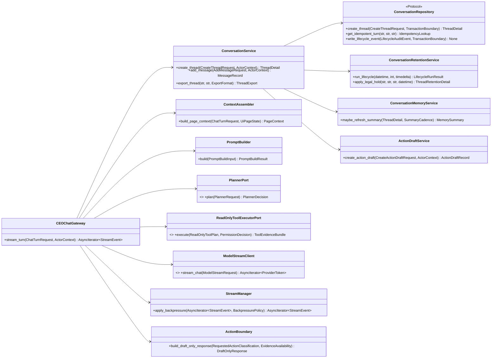
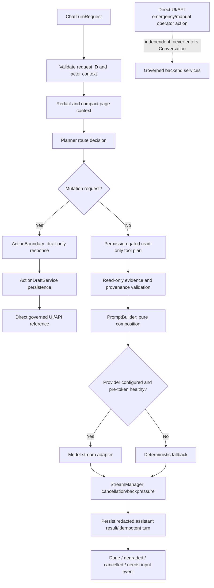
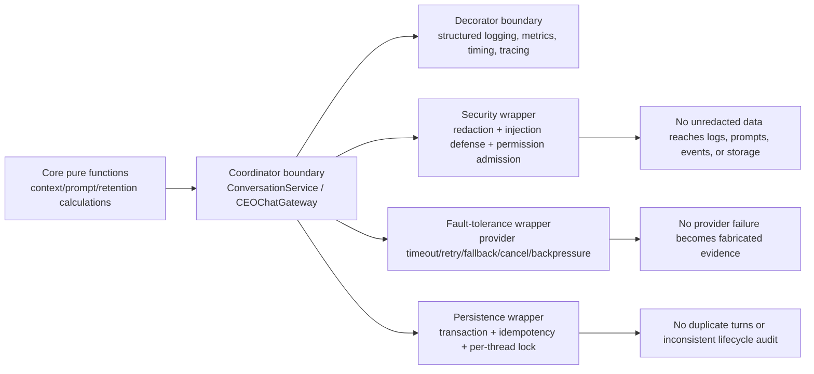

# Conversation AI Layer - Architecture Requirements Document

## Scope and Traceability Statement

This document converts the Phase 13 Conversation AI Layer specification into a clean Python architecture for `app/services/conversation/`. It uses only the supplied Phase 13 source material. It maps all **249 `CONV-FR-*` requirements** to one target file and one or more typed functions, and maps all **14 `CONV-NFR-*` hardening requirements** to isolated architectural boundaries. No Python implementation is included.

### Ownership Constraints

- Conversation owns durable conversation records, redaction-before-persistence, deterministic memory summaries, ephemeral page context, prompt construction, provider streaming coordination, and draft-only action artifacts.
- Conversation does **not** own authentication, final authorization, risk decisions, broker execution, direct operator UI/API routes, live execution, strategy approval, or kill-switch activation.
- Every tool/evidence call is read-only and must pass explicit permission and provenance admission before it can enter a prompt.
- `app.services.conversation.__all__` is the package-level function-tool registry. It may remain empty even while `ConversationService` is importable as a class.

### Functional Traceability Coverage

- Functional requirements mapped: **249/249**.
- Hardening NFRs mapped: **14/14**.
- Requirements stating “No file-specific functional/non-functional/testing requirements defined” are retained verbatim in their assigned file group to preserve source traceability.

## 1. System Boundary Diagram (file structure)

```text
app/services/conversation/
├── __init__.py                         # Public import gate; empty __all__ is permitted
├── catalog.py                          # Capability contracts, examples, requirement-test map
├── contracts/
│   ├── models.py                       # Thread/action/prompt/retention models
│   ├── errors.py                       # Utils-derived error taxonomy
│   ├── ports.py                        # Repository, planner, auth, read-tool, model protocols
│   └── events.py                       # Versioned stream envelopes
├── config/
│   ├── models.py                       # Validated limits/policies/configuration
│   └── loader.py                       # Runtime environment/reference loading
├── security/
│   ├── redaction.py                    # Pre-persistence/log/telemetry sanitation
│   ├── tool_permissions.py             # Read-only evidence permission admission
│   └── prompt_injection.py             # Untrusted content quarantine
├── persistence/
│   ├── sqlite_repository.py             # Atomic durable SQLite implementation
│   └── time_codec.py                   # UTC/SQLite timestamp conversion
├── services/
│   ├── conversation_service.py          # Thread/message/export/context API
│   ├── retention_service.py             # Lifecycle/legal hold/archive/purge
│   ├── memory_service.py                # Deterministic summaries/pinned facts
│   └── action_drafts.py                 # Draft-only governed action artifacts
├── context/
│   ├── __init__.py                     # Context import gate
│   ├── page_context.py                 # DOM/UI state compaction
│   ├── assembler.py                    # Route/page-type context dispatch
│   ├── system_context.py               # Highest-authority governance layer
│   └── prompt_builder.py               # Pure layered prompt composition
├── orchestration/
│   ├── readonly_tools.py               # Planned read-only evidence execution
│   └── ceo_gateway.py                  # End-to-end turn coordination
├── governance/
│   └── action_boundary.py              # Draft-only/direct-operator routing
├── providers/
│   ├── protocol.py                     # Provider interfaces
│   └── openai_compatible.py            # OpenAI/Gemini/Ollama streaming adapter
├── streaming/
│   ├── fallback.py                     # Deterministic fallback generation
│   └── manager.py                      # Backpressure/cancel/final result
└── observability/
    └── boundaries.py                   # Logging, metrics, audit decorators

tests/services/conversation/
├── test_package_imports.py
├── test_contracts_and_catalog.py
├── test_redaction_and_prompt_injection.py
├── test_repository_transactions.py
├── test_thread_retention_memory.py
├── test_page_context_and_prompt_builder.py
├── test_provider_streaming_and_fallback.py
├── test_ceo_gateway_stream_contract.py
└── test_governance_and_operator_independence.py
```

### Execution Tree

```text
UI/API caller (authentication + final authorization owner)
  -> ConversationService / CEOChatGateway
     -> Redaction boundary
     -> ContextAssembler -> PromptBuilder (pure)
     -> PlannerPort -> read-only ToolExecutorPort -> permission/provenance admission
     -> ModelStreamClient OR deterministic fallback
     -> StreamManager -> versioned StreamEvent envelopes
     -> ConversationRepository transaction -> redacted messages / summaries / drafts / lifecycle audit

Requested mutation in chat
  -> ActionBoundary -> ActionDraftService -> draft-only response + direct governed UI/API path
  -> Never -> Risk/Trading/Live broker mutation
```

## 2. Interfaces diagrams (Mermaid diagrams)

### 2.1 Class and Port Collaboration



### 2.2 Stream Turn and Direct-Operator Separation



### 2.3 NFR Wrapper Boundaries



## 3. Functional Requirements

### 📂 Module: `app/services/conversation`

**Boundary Role:** Public domain gate: exposes the approved Conversation service surface, capability metadata, and no accidental function tools.

#### 📄 File: `__init__.py`

**File Boundary:** Import-only public API gate. It creates no provider clients, database connections, migrations, background tasks, or live side-effecting tools.

**Requirement Title:** Package export boundary and import safety

**Description:** Separates importable classes and domain metadata from the `__all__` function-tool registry. `ConversationService` is importable, while `__all__` can remain empty until an explicit conversation function tool is approved.

**Requirements:**
- **CONV-FR-001**: Package initialization shall standardize conversation domain export metadata with tool category `conversation`.
- **CONV-FR-002**: `list_ceo_chat_tools` shall list chat tool definitions available to the CEO chat workflow.
- **CONV-FR-003**: No file-specific non-functional requirements defined.
- **CONV-FR-004**: No file-specific testing requirements defined.
- **CONV-FR-006**: Package initialization shall make `ConversationService` importable from `app.services.conversation`.
- **CONV-FR-017**: No file-specific non-functional requirements defined.
- **CONV-FR-018**: No file-specific testing requirements defined.
- **CONV-FR-019**: Each public capability shall document whether it is a stable public API, internal helper, official callable tool, or experimental export.
- **CONV-FR-023**: The package-level domain registry shall remain explicit about no exposed conversation function tools when `__all__` is empty.
- **CONV-FR-024**: `app.services.conversation.__all__` shall remain the package-level exposed function-tool registry for the conversation domain.
- **CONV-FR-025**: `app.services.conversation.__all__` shall be allowed to be empty when no conversation functions are registered as external tools.
- **CONV-FR-081**: Import-time behavior shall not configure providers, open databases, run migrations, load `.env`, contact networks, start background tasks, or register live side-effecting tools.
- **CONV-FR-100**: Importing `app.services.conversation` shall not require provider credentials, network access, database access, optional provider SDKs, or model availability.

**Target Class/Function:**
- `domain_export_metadata() -> ConversationDomainMetadata` — Pure (no I/O; returns immutable metadata with `tool_category="conversation"`).
- `list_ceo_chat_tools() -> tuple[ChatToolDefinition, ...]` — Pure (reads an injected/declared catalog only; no execution or persistence).
- `get_public_service_exports() -> Mapping[str, PublicCapability]` — Pure (describes stable/importable APIs without registering external function tools).

#### 📄 File: `catalog.py`

**File Boundary:** Machine-readable public-capability catalog and documentation source; it contains no domain operations or provider calls.

**Requirement Title:** Capability documentation, usage contracts, and traceability catalog

**Description:** Defines stable capability classification, contract metadata, examples, and requirement-to-test traceability without duplicating execution logic.

**Requirements:**
- **CONV-FR-057**: Usage examples shall include expected return shape or representative output for each public capability shown.
- **CONV-FR-088**: Requirement-to-test traceability shall map every accepted public contract, configuration value, event type, error code, concurrency rule, and retention rule to tests.
- **CONV-FR-106**: Usage examples shall include at least one invalid-input example and one provider-disabled fallback example.
- **CONV-FR-136**: Public conversation exports shall be documented in a capability contract table before Builder handoff.
- **CONV-FR-156**: Public capability contracts shall be approved before Builder handoff, including machine-readable error codes rather than only exception class names.
- **CONV-FR-168**: Usage examples shall include an action draft creation example that demonstrates draft-only side-effect status and human approval requirement.
- **CONV-FR-247**: Each public capability shall document intended consumers, input schema, output schema, documented errors, side effects, authorization expectations, idempotency behavior, risk level, network behavior, persistence behavior, and stability.

**Target Class/Function:**
- `build_capability_catalog(capabilities: Sequence[PublicCapability]) -> CapabilityCatalog` — Pure.
- `validate_capability_contract(contract: PublicCapabilityContract) -> ValidationResult` — Pure.
- `lookup_requirement_tests(requirement_id: str, matrix: RequirementTestMatrix) -> tuple[TestReference, ...]` — Pure.
- `build_usage_example_manifest(capability: str) -> UsageExampleManifest` — Pure.

### 📂 Module: `app/services/conversation/contracts`

**Boundary Role:** Typed cross-component contracts: models, ports, errors, and stream envelopes that let the domain remain implementation-agnostic.

#### 📄 File: `models.py`

**File Boundary:** Versioned domain dataclasses/Pydantic models and serialization helpers. No repositories, network clients, or secret resolution.

**Requirement Title:** Conversation, action-draft, retention, and prompt result models

**Description:** Holds canonical structures needed by service, context, persistence, and streaming boundaries.

**Requirements:**
- **CONV-FR-043**: `ActionDraftRecord` shall represent draft id, thread id, user id, request id, draft type, title, description, payload, risk precheck status, approval id, status, human approval requirement, side-effect status, governed workflow id, execution intent id, execution receipt id, and timestamps.
- **CONV-FR-102**: `ActionDraftRecord.model_dump` shall expose `model_dump` behavior that returns a dictionary copy suitable for API serialization.
- **CONV-FR-119**: `RetentionDecision` shall represent one retention lifecycle decision with action, thread id, and reason.

**Target Class/Function:**
- `ActionDraftRecord.model_dump(self) -> dict[str, JsonValue]` — Pure (returns a defensive dictionary copy for API serialization).
- `RetentionDecision(action: RetentionAction, thread_id: str, reason: str) -> RetentionDecision` — Pure construction/validation.
- `PromptBuildResult(messages: tuple[PromptMessage, ...], composition_log: PromptCompositionLog) -> PromptBuildResult` — Pure construction/validation.
- `validate_model_schema(model: VersionedModel) -> ValidationResult` — Pure.

#### 📄 File: `errors.py`

**File Boundary:** Conversation error taxonomy that imports and extends shared Utils errors; it does not create a duplicate platform error framework.

**Requirement Title:** Documented conversation error contracts

**Description:** Provides typed, deterministic error shapes for lookup, validation, configuration, provider, concurrency, cancellation, and persistence failures.

**Requirements:**
- **CONV-FR-062**: Each public capability shall document machine-readable error codes for validation, authorization, idempotency, concurrency, provider, persistence, configuration, cancellation, and internal failure paths.
- **CONV-FR-070**: `ModelConfigurationError` shall represent missing or invalid model runtime configuration.
- **CONV-FR-071**: `ModelRuntimeError` shall represent configured provider runtime failure.
- **CONV-FR-246**: All standard system exceptions and error codes shall be imported and reused from `app.utils.errors` to prevent duplicate declaration. Custom conversation exceptions must inherit from `app.utils.errors.Error` or `HaruQuantError`.
- **CONV-FR-248**: No file-specific non-functional requirements defined.
- **CONV-FR-249**: No file-specific testing requirements defined.

**Target Class/Function:**
- `ModelConfigurationError(code: str, message: str, details: Mapping[str, JsonValue] | None = None) -> ModelConfigurationError` — Pure construction.
- `ModelRuntimeError(code: str, message: str, retryable: bool, details: Mapping[str, JsonValue] | None = None) -> ModelRuntimeError` — Pure construction.
- `map_conversation_error(error: Error | Exception) -> ConversationErrorEnvelope` — Pure (redacts bounded detail; never returns raw exception objects).
- `validate_request_id(request_id: str | None, limits: RequestIdLimits) -> str` — Pure (raises documented validation error for malformed/unsafe IDs).

#### 📄 File: `ports.py`

**File Boundary:** Protocols for persistence, authorization evidence, planning, read-only tools, audit sinks, and model streaming. Protocols own signatures, not integrations.

**Requirement Title:** Persistence and external-collaboration ports

**Description:** Defines explicit contracts so domain logic never reaches directly into raw SQLite rows, identity systems, provider SDKs, or other services.

**Requirements:**
- **CONV-FR-015**: The API/UI Gateway or an approved authorization service shall own authentication, identity validation, and final permission authority for read-only tool evidence. Conversation owns only permission result consumption, evidence inclusion rules, and prompt/audit handling.
- **CONV-FR-016**: The repository contract shall define how SQLite launch persistence maps thread IDs, user IDs, request IDs, lifecycle events, JSON metadata, booleans, timestamps, and version fields without exposing raw database rows at public service boundaries.
- **CONV-FR-058**: Repository behavior shall define transactional boundaries, isolation expectations, conflict detection, optimistic version or per-thread lock behavior, idempotency lookup/write behavior, partial-failure handling, retryability, and machine-readable persistence error codes.
- **CONV-FR-060**: `ConversationRepository` shall be defined as a Python protocol, abstract base class, or companion persistence contract before implementation.
- **CONV-FR-110**: Repository operations used by thread creation, message persistence, action draft creation, retention escalation, export audit logging, and lifecycle updates shall return explicit failure results or raise documented exceptions on partial failure.
- **CONV-FR-130**: A `ConversationRepository` contract or companion persistence specification shall be approved before implementation. The contract shall define thread, message, memory summary, pinned fact, action draft, retention policy, lifecycle audit, export audit, idempotency, and locking/version operations.
- **CONV-FR-131**: The repository contract shall define method signatures or operation records for creating, reading, listing, renaming, archiving, restoring, soft-deleting, exporting, and retention-updating threads.
- **CONV-FR-132**: The repository contract shall define transaction scopes for operations that must update multiple records, including thread creation with retention policy, message persistence with title update or retention escalation, action draft creation with retention escalation, export with lifecycle audit event, and legal-hold changes.
- **CONV-FR-133**: The repository contract shall define conflict signals for version mismatch, active-turn lock conflict, duplicate request replay, duplicate request material mismatch, retention race, lifecycle race, and partial persistence failure.
- **CONV-FR-177**: The repository contract shall define method signatures or operation records for adding messages, reading messages, detecting duplicate request IDs, storing message metadata, storing action drafts, reading action drafts, listing action drafts, storing memory summaries, listing pinned facts, and writing lifecycle audit events.
- **CONV-FR-234**: The repository contract shall define whether conflict and failure behavior is surfaced as typed exceptions, standard result objects, or gateway stream events at each boundary.

**Target Class/Function:**
- `ConversationRepository.create_thread(request: CreateThreadRequest, tx: TransactionBoundary) -> ThreadDetail` — State-mutating (durable store through injected port).
- `ConversationRepository.get_idempotent_turn(user_id: str, thread_id: str, request_id: str) -> IdempotencyLookup` — Side-effecting (read-only durable I/O).
- `ConversationRepository.write_lifecycle_event(event: LifecycleAuditEvent, tx: TransactionBoundary) -> None` — State-mutating (durable audit write).
- `AuthorizationEvidencePort.check_read_evidence_access(request: EvidencePermissionRequest) -> PermissionDecision` — Side-effecting (read-only authorization I/O through injected port).
- `PlannerPort.plan(request: PlannerRequest) -> PlannerDecision` — Side-effecting (external/internal planning call; no conversation persistence).
- `ReadOnlyToolExecutorPort.execute(plan: ReadOnlyToolPlan, permission: PermissionDecision) -> ToolEvidenceBundle` — Side-effecting (read-only external I/O only).
- `ModelStreamClient.stream_chat(request: ModelStreamRequest) -> AsyncIterator[ProviderToken]` — Side-effecting (provider network I/O).

#### 📄 File: `events.py`

**File Boundary:** Versioned stream-event and terminal-result schemas; no queue ownership and no provider behavior.

**Requirement Title:** Stream event envelope contracts

**Description:** Defines stable progress, metadata, token, error, cancellation, backpressure, conflict, and terminal event payloads for UI/API consumers.

**Requirements:**
- **CONV-FR-206**: `CEOChatGateway.stream_turn` shall document stable event names, event ordering, required payload fields, terminal event behavior, cancellation behavior, degraded-provider behavior, and error event behavior.
- **CONV-FR-233**: The stream event contract shall be approved before UI integration or gateway implementation. The contract shall define event names, payload fields, ordering, heartbeats if applicable, terminal events, cancellation, provider-degraded events, backpressure events, and error events.
- **CONV-FR-235**: The stream contract shall define canonical event names for request receipt, context assembly, planner route selection, tool planning, evidence completion, needs-input, response composition, metadata, token, provider-degraded, cancellation, error, backpressure, conflict, and done.
- **CONV-FR-236**: Every stream event payload shall include `event_type`, `schema_version`, `request_id`, `thread_id`, `user_id` or redacted actor reference, `timestamp`, `correlation_id` where available, and event-specific payload fields.
- **CONV-FR-237**: Token events shall define text chunk field names, ordering index behavior, provider/fallback source metadata, and whether empty chunks are allowed.
- **CONV-FR-238**: Metadata events shall define planner metadata, CEO memo metadata, model/provider metadata, tool evidence status, prompt composition summary, usage metadata, latency metadata, and redaction status.
- **CONV-FR-239**: Terminal events shall be mutually exclusive and shall include success, needs-input, cancelled, provider-degraded-complete, failed, and conflict terminal states.
- **CONV-FR-240**: Error events shall include a machine-readable error code, severity, retryability, user-safe message, redacted details, and persistence state where available.
- **CONV-FR-241**: Cancellation events shall define behavior before first token, after partial tokens, and during final persistence.
- **CONV-FR-242**: Backpressure events shall define whether events are buffered, dropped, coalesced, or fail-fast; exact limits are Pending until NFR targets are approved.
- **CONV-FR-244**: No file-specific non-functional requirements defined.
- **CONV-FR-245**: No file-specific testing requirements defined.

**Target Class/Function:**
- `validate_stream_event(event: StreamEvent) -> ValidationResult` — Pure.
- `make_progress_event(stage: ProgressStage, context: StreamEventContext) -> StreamEvent` — Pure.
- `make_terminal_event(state: TerminalState, context: StreamEventContext, result: TurnResult | None = None) -> StreamEvent` — Pure.
- `make_error_event(error: ConversationErrorEnvelope, context: StreamEventContext) -> StreamEvent` — Pure.

### 📂 Module: `app/services/conversation/config`

**Boundary Role:** Validated runtime configuration: all limits, retention rules, provider behavior, and observability settings are injected rather than hard-coded.

#### 📄 File: `models.py`

**File Boundary:** Configuration schema and policy objects only. It validates values but never loads credentials, opens clients, or accesses durable state.

**Requirement Title:** Conversation configuration and retention policy schemas

**Description:** Makes every variable policy explicit and test-injectable, including settings still pending owner approval.

**Requirements:**
- **CONV-FR-059**: Concrete non-functional targets shall be approved or explicitly deferred from release scope before production-readiness claims are made.
- **CONV-FR-063**: `list_threads` and `get_thread` shall define default limits, maximum limits, and behavior when requested limits exceed configured maximums.
- **CONV-FR-065**: Retention durations, archive thresholds, purge delays, and legal-hold release behavior shall be loaded from a validated retention policy configuration with documented local-development defaults and explicit production overrides.
- **CONV-FR-066**: The retention policy configuration schema and local-development defaults shall be committed with this specification or a referenced companion specification before lifecycle tests are accepted.
- **CONV-FR-086**: The retention policy configuration schema shall be approved before lifecycle implementation. The schema shall define retention classes, durations, archive thresholds, purge delays, legal-hold release behavior, local-development defaults, production override requirements, and validation errors.
- **CONV-FR-087**: The Conversation configuration reference shall be approved before implementation. The reference shall enumerate prompt budgets, context budgets, provider timeouts, stream buffering limits, active-stream memory limits, import-time expectations, lifecycle batch limits, summary cadence, and fallback behavior.
- **CONV-FR-091**: Conversation configuration shall define names, types, default values, validation rules, environment override behavior, and failure behavior for every runtime-configurable value.
- **CONV-FR-092**: Retention configuration values shall include standard retention duration, ephemeral retention duration, regulated retention duration or no-expiry behavior, archive inactivity thresholds, deleted-thread purge delay, legal-hold release behavior, lifecycle batch size, and lifecycle time budget. Concrete values are Pending owner approval.
- **CONV-FR-093**: Prompt and context configuration values shall include maximum page-context characters, DOM snapshot characters, page-intelligence characters, tool-evidence characters, memory summary characters, pinned fact count, recent message count, per-message characters, total prompt budget, and truncation strategy. Concrete values are Pending owner approval.
- **CONV-FR-094**: Streaming configuration values shall include provider timeout, retry count, no-retry conditions, fallback chunk size, fallback delay, outgoing event buffer limit, backpressure policy, active-stream memory budget, and cancellation persistence behavior. Concrete values are Pending owner approval.
- **CONV-FR-095**: Import-time configuration expectations shall define the maximum allowed side effects and optional dependency behavior; concrete timing targets are Pending benchmark approval.
- **CONV-FR-096**: Observability configuration values shall include telemetry field names, audit sink expectations, redaction-before-log requirements, prompt composition log sampling or retention, provider degradation metadata, and security-sensitive log exclusions.
- **CONV-FR-097**: Developers MUST NOT implement retention durations, prompt budgets, stream buffer limits, provider timeouts, or lifecycle limits as hardcoded constants; they MUST be loaded from the approved configuration schema with injectable test overrides.
- **CONV-FR-098**: No file-specific non-functional requirements defined.
- **CONV-FR-099**: No file-specific testing requirements defined.
- **CONV-FR-174**: Concrete NFR targets for prompt composition latency, import-time latency, stream startup latency, active-stream memory, event buffer limits, lifecycle batch duration, and export size shall be approved before production-readiness claims.

**Target Class/Function:**
- `ConversationConfig.validate(self) -> ValidationResult` — Pure.
- `RetentionPolicyConfig.validate(self) -> ValidationResult` — Pure.
- `PromptBudgetConfig.validate(self) -> ValidationResult` — Pure.
- `StreamingPolicyConfig.validate(self) -> ValidationResult` — Pure.
- `resolve_page_limit(requested: int | None, policy: PaginationPolicy) -> int` — Pure.

#### 📄 File: `loader.py`

**File Boundary:** Explicit configuration loading and environment-reference resolution. It may read approved environment configuration only at runtime construction, never at import time.

**Requirement Title:** Environment-driven model configuration

**Description:** Loads provider labels, reference names, and non-secret runtime configuration without hard-coding secrets or leaking resolved values.

**Requirements:**
- **CONV-FR-085**: Model-provider configuration shall be environment-driven and shall not require hardcoded secrets.

**Target Class/Function:**
- `load_conversation_config(source: Mapping[str, str], overrides: Mapping[str, JsonValue] | None = None) -> ConversationConfig` — Side-effecting (reads injected environment mapping only).
- `resolve_provider_config(config: ConversationConfig, environment: Mapping[str, str]) -> ProviderRuntimeConfig` — Side-effecting (reads approved environment references; returns redacted configuration).

### 📂 Module: `app/services/conversation/security`

**Boundary Role:** Security boundary: redaction, prompt-injection defense, tool permissions, and draft-only action policy before any persistence, telemetry, or prompt inclusion.

#### 📄 File: `redaction.py`

**File Boundary:** Pure text and nested-payload sanitation. It is invoked at every persistence/logging/telemetry/stream metadata boundary, never after the data has escaped.

**Requirement Title:** Payload redaction and normalization

**Description:** Prevents secrets and sensitive identifiers from reaching durable messages, telemetry, audit records, stream metadata, or security-sensitive logs.

**Requirements:**
- **CONV-FR-020**: Conversation persistence shall redact secrets before storing user or assistant message content.
- **CONV-FR-022**: Security-sensitive logs shall never include unredacted message text, secrets, provider keys, action draft payload secrets, or raw tool evidence containing credentials.
- **CONV-FR-068**: `redact_sensitive_text` shall redact configured secret patterns, email addresses, and long numeric identifiers from persisted text.
- **CONV-FR-069**: `normalize_text` shall collapse whitespace and truncate text to a configured limit.
- **CONV-FR-232**: Redaction shall occur before persistence, audit logging, telemetry, stream metadata, dead-letter diagnostics, and security-sensitive logs.

**Target Class/Function:**
- `redact_sensitive_text(text: str, policy: RedactionPolicy) -> RedactedText` — Pure.
- `redact_payload(value: JsonValue, policy: RedactionPolicy) -> JsonValue` — Pure.
- `normalize_text(text: str, max_characters: int) -> str` — Pure.
- `assert_safe_for_persistence(value: JsonValue, policy: RedactionPolicy) -> JsonValue` — Pure (raises deterministic validation error when sanitization is impossible).

#### 📄 File: `tool_permissions.py`

**File Boundary:** Pure policy classification and permission-result validation. Final identity verification remains in UI/API or the approved authorization service.

**Requirement Title:** Tool permission registry and read-only evidence admission

**Description:** Classifies tool risk and admits only explicitly authorized, fresh, provenance-carrying read-only evidence to prompt composition.

**Requirements:**
- **CONV-FR-014**: Tool plans shall be read-only unless routed through separate governed services outside the conversation module.
- **CONV-FR-145**: `PromptBuilder.build` shall include read-only tool evidence when supplied and instruct the model not to guess when tools are unavailable.
- **CONV-FR-146**: Prompt building shall reject or quarantine tool evidence that lacks required provenance, permission status, freshness metadata, retrieval timestamp, or read-only classification.
- **CONV-FR-151**: Read-only tool attachment and evidence inclusion shall require an explicit permission check for the requesting user, thread, route, and target data scope before tool hints or evidence are included in prompt composition.
- **CONV-FR-155**: Authorization context and read-only evidence permission contracts shall be approved before tool evidence can be included in prompts. The contract shall define how principal identity, roles, permissions, scopes, route, thread, and target data scope are passed and denied.
- **CONV-FR-166**: Tool evidence rejection or quarantine shall have a documented result shape, excluded-layer composition log entry, and security/audit metadata before implementation.

**Target Class/Function:**
- `classify_tool(tool: ChatToolDefinition, registry: ToolPermissionRegistry) -> ToolPermissionClass` — Pure.
- `validate_evidence_permission(request: EvidencePermissionRequest, decision: PermissionDecision) -> ValidationResult` — Pure.
- `validate_read_only_evidence(evidence: ToolEvidenceBundle, policy: EvidenceAdmissionPolicy) -> EvidenceAdmissionResult` — Pure.
- `quarantine_evidence(evidence: ToolEvidenceBundle, reason: EvidenceRejectionReason) -> QuarantinedEvidence` — Pure.

#### 📄 File: `prompt_injection.py`

**File Boundary:** Pure untrusted-content classifier and system-instruction guard. It never follows instructions contained in evidence or user-provided text.

**Requirement Title:** Prompt-injection defense and retrieval boundary

**Description:** Marks retrieved or user-provided content as untrusted, strips instruction-like attacks, and limits durable memory to summaries, references, and redacted snippets.

**Requirements:** No standalone `CONV-FR-*` is assigned here. This structural file implements the controls mapped in **CONV-NFR-003** and **CONV-NFR-005** in Section 4.

**Target Class/Function:**
- `classify_untrusted_content(content: UntrustedContent, policy: PromptInjectionPolicy) -> ContentSafetyAssessment` — Pure.
- `sanitize_retrieved_evidence(evidence: ToolEvidenceBundle, policy: PromptInjectionPolicy) -> ToolEvidenceBundle` — Pure.
- `build_memory_safe_excerpt(text: str, policy: RedactionPolicy) -> MemoryExcerpt` — Pure.

### 📂 Module: `app/services/conversation/persistence`

**Boundary Role:** Durable conversation storage boundary: repository contracts, SQLite implementation, atomic transactions, locks, idempotency, and lifecycle audit persistence.

#### 📄 File: `sqlite_repository.py`

**File Boundary:** Concrete SQLite mapping behind `ConversationRepository`. Raw rows remain private and all multi-record workflows use explicit transaction/lock boundaries.

**Requirement Title:** Atomic SQLite persistence and concurrency control

**Description:** Implements the approved repository port, normalizes timestamps/JSON/booleans/version fields, and returns documented persistence conflicts or failures.

**Requirements:**
- **CONV-FR-109**: Conversation mutations that affect thread state, message state, action draft state, retention state, or lifecycle audit state shall be atomic where consistency is required.
- **CONV-FR-111**: Concurrent conversation mutations shall preserve consistent thread, message, retention, and audit state or return a documented conflict/failure result.

**Target Class/Function:**
- `SQLiteConversationRepository.in_transaction(operation: Callable[[TransactionBoundary], T]) -> T` — State-mutating (transactional durable I/O).
- `SQLiteConversationRepository.acquire_thread_turn_lock(user_id: str, thread_id: str, request_id: str) -> TurnLockLease` — State-mutating (durable/per-thread lock coordination).
- `SQLiteConversationRepository.commit_idempotent_turn(result: PersistedTurn, lease: TurnLockLease) -> PersistedTurn` — State-mutating.

#### 📄 File: `time_codec.py`

**File Boundary:** UTC timestamp helpers used by persistence and lifecycle policies. No clock reads occur in conversion helpers.

**Requirement Title:** UTC time encoding for persistence

**Description:** Makes SQLite timestamp encoding deterministic and isolates injectable current-time acquisition.

**Requirements:**
- **CONV-FR-044**: `utc_now` shall return the current UTC timestamp.
- **CONV-FR-045**: `to_sqlite_timestamp` shall convert datetimes to UTC SQLite-compatible timestamp strings without microseconds.

**Target Class/Function:**
- `utc_now(clock: Clock = system_utc_clock) -> datetime` — Side-effecting (reads injected clock only).
- `to_sqlite_timestamp(value: datetime) -> str` — Pure.
- `from_sqlite_timestamp(value: str) -> datetime` — Pure.

### 📂 Module: `app/services/conversation/services`

**Boundary Role:** Business services: durable thread, message, retention, memory, and action-draft operations orchestrated through injected ports.

#### 📄 File: `conversation_service.py`

**File Boundary:** UI/API and CEO-gateway durable conversation façade. It coordinates ownership checks, repository transactions, redaction and lifecycle events; it does not call model providers or execute governed actions.

**Requirement Title:** Thread lifecycle, message persistence, export, and ownership-aware API

**Description:** Provides the stable durable conversation API used by UI/API and CEO gateway callers.

**Requirements:**
- **CONV-FR-005**: `ConversationService` public methods shall document whether they mutate persistent state, emit audit events, require user ownership checks, or trigger retention escalation.
- **CONV-FR-007**: `ConversationService` shall provide durable chat operations used by the UI API and CEO gateway.
- **CONV-FR-008**: `ConversationService` shall provide the durable conversation API for UI API and CEO gateway callers, including thread lifecycle, redacted message persistence, retention detail, context metadata update, export, memory summary retrieval, pinned fact retrieval, and governed action draft operations.
- **CONV-FR-009**: Request IDs shall be generated by the API/UI gateway or service caller using the approved Utils identity helper once available; missing request IDs may be generated by `stream_turn`, but malformed, oversized, or unsafe request IDs shall return a documented validation error.
- **CONV-FR-026**: Duplicate chat turn requests shall be idempotent by `(user_id, thread_id, request_id)` and shall not create duplicate user messages, duplicate assistant messages, duplicate action drafts, or duplicate lifecycle events.
- **CONV-FR-027**: `list_threads` shall list a user's threads, optionally include archived threads, apply a limit, and filter by case-insensitive title query when supplied.
- **CONV-FR-028**: `rename_thread` shall trim a supplied title, fall back to the default title when the result is empty, persist the title, and return updated thread detail.
- **CONV-FR-029**: `delete_thread` shall soft-delete a user's thread and return whether the operation succeeded.
- **CONV-FR-030**: `archive_thread` shall archive a user's thread with a lifecycle reason and return updated thread detail.
- **CONV-FR-031**: `restore_thread` shall restore an archived thread with a lifecycle reason and return updated thread detail.
- **CONV-FR-032**: `update_context` shall persist the current route, page type, and active context revision for a thread.
- **CONV-FR-033**: `add_message` shall persist a redacted chat message with role, request id, context revision, tool calls, linked signal proposal, linked action draft, metadata, and latency.
- **CONV-FR-034**: `add_message` on archived or deleted threads shall return a documented machine-readable error or exception shape before implementation.
- **CONV-FR-035**: `add_message` shall mark a thread regulated when a message links to a signal proposal or action draft.
- **CONV-FR-036**: `export_thread` shall export a thread as JSON when requested and record an export lifecycle event.
- **CONV-FR-037**: `export_thread` shall export a thread as Markdown by default and record an export lifecycle event.
- **CONV-FR-038**: `export_thread` shall include CEO workflow metadata for assistant messages when response metadata is available.
- **CONV-FR-112**: `create_thread` shall create a thread for a user, assign a generated thread id, default the title when absent, persist route/page/context metadata, initialize retention policy, and return full thread detail.
- **CONV-FR-113**: Archived thread behavior shall be explicitly defined for message addition, context update, export, retention changes, and action draft creation.
- **CONV-FR-114**: Deleted thread behavior shall be explicitly defined for read, restore, export, retention detail, message addition, action draft creation, and lifecycle purge.
- **CONV-FR-115**: `retention_detail` shall return retention policy detail and lifecycle audit events for a user's thread, including deleted threads, and shall raise a lookup error when missing.
- **CONV-FR-116**: `set_thread_retention_class` shall support `ephemeral`, `regulated`, `legal_hold`, and `standard` retention classes.
- **CONV-FR-117**: `set_thread_retention_class` shall define whether changing to the current retention class is a no-op, lifecycle event, or validation error before implementation.
- **CONV-FR-118**: `set_thread_retention_class` shall reject unsupported retention classes with a value error.
- **CONV-FR-137**: `add_message` shall auto-title default conversation threads from the first user prompt.
- **CONV-FR-138**: `add_message` shall define the fallback title format for empty, whitespace-only, redacted-empty, or too-short first prompts before implementation.
- **CONV-FR-139**: `generate_thread_title` shall generate a compact thread title from the prompt and use a fallback when the prompt is empty.
- **CONV-FR-164**: `get_action_draft` shall return one action draft for a user and shall raise a lookup error when missing.
- **CONV-FR-186**: `update_context` shall record a lifecycle audit event when the active context revision changes.

**Target Class/Function:**
- `ConversationService.create_thread(request: CreateThreadRequest, actor: ActorContext) -> ThreadDetail` — State-mutating (ownership-checked persistence and retention initialization).
- `ConversationService.list_threads(user_id: str, include_archived: bool = False, limit: int | None = None, title_query: str | None = None) -> ThreadList` — Side-effecting (read-only durable I/O).
- `ConversationService.get_thread(user_id: str, thread_id: str) -> ThreadDetail` — Side-effecting (read-only durable I/O; raises documented lookup error).
- `ConversationService.rename_thread(user_id: str, thread_id: str, title: str) -> ThreadDetail` — State-mutating.
- `ConversationService.archive_thread(user_id: str, thread_id: str, reason: str) -> ThreadDetail` — State-mutating.
- `ConversationService.restore_thread(user_id: str, thread_id: str, reason: str) -> ThreadDetail` — State-mutating.
- `ConversationService.delete_thread(user_id: str, thread_id: str, reason: str | None = None) -> DeleteThreadResult` — State-mutating (soft delete only).
- `ConversationService.update_context(user_id: str, thread_id: str, update: ThreadContextUpdate) -> ThreadDetail` — State-mutating (persists revision and lifecycle audit on change).
- `ConversationService.add_message(request: AddMessageRequest, actor: ActorContext) -> MessageRecord` — State-mutating (redacts, idempotency-checks, persists, may title or regulate thread).
- `ConversationService.export_thread(user_id: str, thread_id: str, format: ExportFormat = ExportFormat.MARKDOWN) -> ThreadExport` — State-mutating (read/export plus lifecycle audit event).
- `ConversationService.retention_detail(user_id: str, thread_id: str) -> ThreadRetentionDetail` — Side-effecting (read-only durable I/O).
- `ConversationService.set_thread_retention_class(user_id: str, thread_id: str, retention_class: RetentionClass) -> ThreadRetentionDetail` — State-mutating.
- `ConversationService.get_action_draft(user_id: str, draft_id: str) -> ActionDraftRecord` — Side-effecting (read-only durable I/O).

#### 📄 File: `retention_service.py`

**File Boundary:** Retention-policy calculation and repository-driven lifecycle operations. It never makes final legal decisions; it applies the configured/approved retention policy deterministically.

**Requirement Title:** Retention lifecycle, legal hold, archival, and purge rules

**Description:** Separates retention rules from ordinary thread/message operations and makes all lifecycle outcomes clock-injectable and auditable.

**Requirements:**
- **CONV-FR-010**: `ConversationRetentionService` shall apply lifecycle, archival, legal-hold, and purge rules through the repository.
- **CONV-FR-021**: Standard and regulated inactive conversations shall be archived rather than immediately purged.
- **CONV-FR-046**: `apply_legal_hold` shall place a thread on legal hold, clear expiry and purge dates, and store legal-hold reason and optional end date.
- **CONV-FR-047**: `run_lifecycle` shall skip legal-hold threads, purge deleted threads past purge date, purge expired ephemeral threads, and archive inactive standard or regulated threads past the archive threshold.
- **CONV-FR-083**: All retention lifecycle decisions shall be deterministic for a supplied clock and retention policy configuration.
- **CONV-FR-084**: Deleted conversations shall only purge after the configured purge delay unless retention class blocks purging.
- **CONV-FR-108**: Conversation mutations shall enforce user ownership before reading, writing, exporting, deleting, archiving, restoring, updating retention, creating action drafts, or listing action drafts.
- **CONV-FR-120**: `retention_expiry_for` shall calculate expiration timestamps only for supported retention classes and shall either reject unknown retention classes with a documented error or treat them according to an explicitly documented fail-closed default.
- **CONV-FR-121**: `purge_after_for` shall return no purge date for regulated or legal-hold threads and otherwise align purge timing with retention expiry.
- **CONV-FR-122**: `initialize_thread_policy` shall initialize thread retention with class, expiry, purge date, and lifecycle reason.
- **CONV-FR-123**: `mark_regulated` shall upgrade non-regulated threads to regulated retention and preserve already regulated or legal-hold threads.
- **CONV-FR-124**: `set_ephemeral` shall set ephemeral retention for eligible threads and shall not downgrade regulated or legal-hold threads.
- **CONV-FR-125**: `release_legal_hold` shall return a legal-hold thread to regulated retention and clear legal-hold fields.
- **CONV-FR-126**: Regulated chat artifacts shall trigger regulated retention handling.
- **CONV-FR-127**: Conversation shall preserve user ownership boundaries for threads, messages, retention detail, pinned facts, and action drafts.
- **CONV-FR-128**: Retention lifecycle actions shall be auditable and shall respect legal hold before archive, delete, or purge behavior.
- **CONV-FR-129**: Regulated and legal-hold retention classes shall not be downgraded by ephemeral retention requests.
- **CONV-FR-134**: No file-specific non-functional requirements defined.
- **CONV-FR-135**: No file-specific testing requirements defined.

**Target Class/Function:**
- `ConversationRetentionService.initialize_thread_policy(thread: ThreadRecord, policy: RetentionPolicy, now: datetime) -> ThreadRetentionDetail` — State-mutating (writes through repository).
- `ConversationRetentionService.apply_legal_hold(user_id: str, thread_id: str, reason: str, ends_at: datetime | None = None) -> ThreadRetentionDetail` — State-mutating.
- `ConversationRetentionService.release_legal_hold(user_id: str, thread_id: str, reason: str) -> ThreadRetentionDetail` — State-mutating.
- `ConversationRetentionService.mark_regulated(thread: ThreadRecord, reason: str, now: datetime) -> ThreadRetentionDetail` — State-mutating.
- `ConversationRetentionService.set_ephemeral(thread: ThreadRecord, reason: str, now: datetime) -> ThreadRetentionDetail` — State-mutating.
- `ConversationRetentionService.run_lifecycle(now: datetime, batch_limit: int, time_budget: timedelta) -> LifecycleRunResult` — State-mutating (archive/purge writes and lifecycle audit events).
- `retention_expiry_for(retention_class: RetentionClass, created_at: datetime, policy: RetentionPolicy) -> datetime | None` — Pure.
- `purge_after_for(retention: ThreadRetentionDetail, policy: RetentionPolicy) -> datetime | None` — Pure.

#### 📄 File: `memory_service.py`

**File Boundary:** Durable rolling summaries and pinned-fact retrieval. It deliberately excludes page context and does not call an LLM.

**Requirement Title:** Deterministic durable memory summaries

**Description:** Keeps bounded durable memory separate from transient page context and refreshes summaries according to configured cadence.

**Requirements:**
- **CONV-FR-011**: `ConversationMemoryService` shall keep durable memory separate from ephemeral page context.
- **CONV-FR-048**: `maybe_refresh_summary` shall return the latest existing summary until the message-count cadence is reached.
- **CONV-FR-049**: `maybe_refresh_summary` shall create a new deterministic rolling summary when the cadence threshold is met.
- **CONV-FR-050**: `list_pinned_facts` shall return pinned facts for a user's thread.
- **CONV-FR-051**: `build_rolling_summary` shall create a compact deterministic summary from recent user and assistant turns without requiring an LLM provider.
- **CONV-FR-064**: `add_message` shall refresh durable memory summaries on the configured cadence.
- **CONV-FR-169**: `get_thread` shall return a user's thread detail with thread fields, messages, latest memory summary, and pinned facts, and shall raise a lookup error when the thread is missing.
- **CONV-FR-171**: `PromptBuilder.build` shall include memory summary and pinned facts only when available.
- **CONV-FR-178**: No file-specific non-functional requirements defined.
- **CONV-FR-179**: No file-specific testing requirements defined.

**Target Class/Function:**
- `ConversationMemoryService.maybe_refresh_summary(thread: ThreadDetail, cadence: SummaryCadence) -> MemorySummary` — State-mutating only when cadence is reached (otherwise read-only).
- `ConversationMemoryService.list_pinned_facts(user_id: str, thread_id: str) -> tuple[PinnedFact, ...]` — Side-effecting (read-only durable I/O).
- `build_rolling_summary(messages: Sequence[MessageRecord], budget: SummaryBudget) -> MemorySummaryDraft` — Pure.
- `select_recent_messages(messages: Sequence[MessageRecord], max_messages: int) -> tuple[MessageRecord, ...]` — Pure.

#### 📄 File: `action_drafts.py`

**File Boundary:** Governed proposal persistence. It can create/list/read drafts but cannot send an executable request to Risk, Trading, Live, or broker adapters.

**Requirement Title:** Draft-only governed action artifacts

**Description:** Validates versioned draft schemas, persists governed proposals, and preserves human-approval and draft-only side-effect status.

**Requirements:**
- **CONV-FR-039**: `create_action_draft` shall create a governed action draft with generated draft id, request id, draft type, title, description, payload, risk precheck status, risk notes, and required human approval.
- **CONV-FR-040**: `create_action_draft` shall validate payloads against a versioned schema for each supported draft type before persistence.
- **CONV-FR-041**: `create_action_draft` shall mark the conversation regulated because action drafts are governed artifacts.
- **CONV-FR-042**: `list_action_drafts` shall list a user's action drafts, optionally filtered by thread id and status.
- **CONV-FR-165**: Action drafts shall remain proposals and shall not execute directly from the conversation module.
- **CONV-FR-167**: Action drafts shall require human approval and shall preserve side-effect status as draft-only unless external governance changes it.

**Target Class/Function:**
- `ActionDraftService.create_action_draft(request: CreateActionDraftRequest, actor: ActorContext) -> ActionDraftRecord` — State-mutating (schema validation, persistence, retention escalation, audit).
- `ActionDraftService.list_action_drafts(user_id: str, thread_id: str | None = None, status: ActionDraftStatus | None = None) -> ActionDraftList` — Side-effecting (read-only durable I/O).
- `validate_action_draft_payload(draft_type: ActionDraftType, payload: Mapping[str, JsonValue], schema_registry: DraftSchemaRegistry) -> ValidatedDraftPayload` — Pure.
- `as_draft_only_status(draft: ActionDraftRecord) -> DraftOnlyStatus` — Pure.

### 📂 Module: `app/services/conversation/context`

**Boundary Role:** Ephemeral page and system context: route-aware UI context construction and compact, auditable prompt layers with no durable-memory writes.

#### 📄 File: `__init__.py`

**File Boundary:** Import-only gate for context contracts and builders. No DOM parsing, persistence, or service calls at import time.

**Requirement Title:** Conversation context package foundation

**Description:** Supplies the explicit context-subpackage boundary and its side-effect-safe imports.

**Requirements:**
- **CONV-FR-180**: No file-specific functional requirements defined. Foundation properties apply.
- **CONV-FR-181**: No file-specific non-functional requirements defined.
- **CONV-FR-182**: No file-specific testing requirements defined.

**Target Class/Function:**
- `get_context_exports() -> Mapping[str, PublicCapability]` — Pure.

#### 📄 File: `page_context.py`

**File Boundary:** Pure page-context data compaction from request/UI state. It may receive DOM snapshots but never persists them as memory.

**Requirement Title:** Compact page context and DOM/state extraction

**Description:** Normalizes chat-request page context, DOM summaries, entity references, and ephemeral freshness/authority metadata under configured limits.

**Requirements:**
- **CONV-FR-012**: `PageContextService` shall build compact page context without persisting it as durable memory.
- **CONV-FR-013**: `PageContextService.from_chat_request` shall expose `from_chat_request` behavior that builds page context from a chat request's route, page title, session id, symbol, timeframe, DOM snapshot, and page intelligence.
- **CONV-FR-052**: `compact_dom_snapshot` shall compact DOM title, headings, text excerpt, tables, semantic blocks, and actionable elements within fixed limits.
- **CONV-FR-053**: `entity_refs_from_state` shall create entity references for session, symbol, timeframe, and selected UI entities.
- **CONV-FR-054**: `build_compact_context` shall create a bounded `PageContext` with schema version, route, page type, page title, entity refs, context revision, freshness, authority, summary, and payload.
- **CONV-FR-176**: Page context shall remain ephemeral and shall not become durable memory unless explicitly persisted through thread context metadata.
- **CONV-FR-189**: `compact_page_intelligence` shall compact page identity, selected entities, visible metrics, visible tables, visible charts, filters, user selection, action affordances, and freshness metadata.
- **CONV-FR-190**: `freshness_payload` shall describe the freshness and source of context data.

**Target Class/Function:**
- `PageContextService.from_chat_request(request: ChatTurnRequest, limits: PageContextLimits) -> PageContext` — Pure.
- `compact_dom_snapshot(snapshot: DomSnapshot, limits: DomSnapshotLimits) -> CompactDomSnapshot` — Pure.
- `entity_refs_from_state(state: UiPageState) -> tuple[EntityReference, ...]` — Pure.
- `build_compact_context(input: PageContextInput, limits: PageContextLimits) -> PageContext` — Pure.
- `compact_page_intelligence(intelligence: PageIntelligence, limits: PageIntelligenceLimits) -> CompactPageIntelligence` — Pure.
- `freshness_payload(freshness: ContextFreshness) -> FreshnessPayload` — Pure.

#### 📄 File: `assembler.py`

**File Boundary:** Route/page-type dispatcher for specialized pure context builders. It does not fetch market data or call external services.

**Requirement Title:** Canonical context-provider aggregation

**Description:** Provides the named `ContextAssembler` alias for all route-aware page-context construction.

**Requirements:**
- **CONV-FR-140**: `get_context_builder` shall resolve the context builder for a page type or route.
- **CONV-FR-141**: `build_page_context` shall route page-context creation to the appropriate specialized builder.
- **CONV-FR-183**: No file-specific functional requirements defined. Foundation properties apply.
- **CONV-FR-184**: No file-specific non-functional requirements defined.
- **CONV-FR-185**: No file-specific testing requirements defined.
- **CONV-FR-187**: `ContextAssembler` shall act as the canonical page-context assembler alias for routes and chat tools.
- **CONV-FR-188**: `infer_page_type` shall infer page type from explicit hint or route text.
- **CONV-FR-191**: `build_dashboard_context` shall build context for dashboard pages.
- **CONV-FR-192**: `build_data_workspace_context` shall build context for data workspace pages.
- **CONV-FR-193**: `build_strategy_detail_context` shall build context for strategy detail pages.
- **CONV-FR-194**: `build_backtest_detail_context` shall build context for backtest or simulation detail pages.
- **CONV-FR-195**: `build_optimization_context` shall build context for optimization pages.
- **CONV-FR-196**: `build_portfolio_risk_context` shall build context for portfolio risk pages.
- **CONV-FR-197**: `build_live_trading_context` shall build context for live trading pages.
- **CONV-FR-198**: `build_operator_workflow_context` shall build context for operator workflow pages.
- **CONV-FR-199**: `build_generic_context` shall build fallback context for unrecognized pages.

**Target Class/Function:**
- `ContextAssembler.get_context_builder(page_type: PageType | None, route: str) -> PageContextBuilder` — Pure.
- `ContextAssembler.build_page_context(request: ChatTurnRequest, state: UiPageState) -> PageContext` — Pure.
- `infer_page_type(route: str, explicit_hint: PageType | None = None) -> PageType` — Pure.
- `build_dashboard_context(state: UiPageState) -> PageContext` — Pure.
- `build_data_workspace_context(state: UiPageState) -> PageContext` — Pure.
- `build_strategy_detail_context(state: UiPageState) -> PageContext` — Pure.
- `build_backtest_detail_context(state: UiPageState) -> PageContext` — Pure.
- `build_optimization_context(state: UiPageState) -> PageContext` — Pure.
- `build_portfolio_risk_context(state: UiPageState) -> PageContext` — Pure.
- `build_live_trading_context(state: UiPageState) -> PageContext` — Pure.
- `build_operator_workflow_context(state: UiPageState) -> PageContext` — Pure.
- `build_generic_context(state: UiPageState) -> PageContext` — Pure.

#### 📄 File: `system_context.py`

**File Boundary:** Static, versioned high-authority governance system context. It has no live market or execution authority and contains no user/tool data.

**Requirement Title:** Structured governance system context

**Description:** Keeps authoritative instruction content distinct from untrusted user, provider, page, and retrieved evidence layers.

**Requirements:**
- **CONV-FR-200**: No file-specific functional requirements defined. Foundation properties apply.
- **CONV-FR-201**: No file-specific non-functional requirements defined.
- **CONV-FR-202**: No file-specific testing requirements defined.

**Target Class/Function:**
- `build_governance_system_context(policy_version: str) -> PromptMessage` — Pure.
- `validate_system_context_contract(context: PromptMessage) -> ValidationResult` — Pure.

#### 📄 File: `prompt_builder.py`

**File Boundary:** Pure prompt composition and budget/truncation logic. It accepts already-authorized/validated evidence and never calls tools or providers itself.

**Requirement Title:** Layered, auditable prompt composition

**Description:** Builds bounded prompts in authority order, compacts context, records every inclusion/truncation decision, and appends the user prompt last.

**Requirements:**
- **CONV-FR-061**: Deterministic fallback responses shall use a documented schema, not free-form implicit text.
- **CONV-FR-067**: `PromptBuilder.build` shall include only the configured maximum number of recent user/assistant messages.
- **CONV-FR-104**: Short follow-up detection and pending research context merge rules shall be explicitly defined before implementation, including token/sentence limits, accepted answer shapes, and conflict behavior when the follow-up is ambiguous.
- **CONV-FR-142**: `PromptBuildResult` shall contain the composed chat messages and prompt-composition audit log.
- **CONV-FR-143**: `PromptBuilder.build` shall expose `build` behavior that includes the highest-authority governance system prompt first.
- **CONV-FR-144**: `PromptBuilder.build` shall include user-attached read-only tool hints when supplied.
- **CONV-FR-147**: `PromptBuilder.build` shall append the current user prompt last.
- **CONV-FR-148**: `PromptBuilder.build` shall return a composition log with layer authority, inclusion state, character counts, token estimates, message count, route, and truncation state.
- **CONV-FR-149**: Prompt composition shall compact oversized page context to a bounded representation.
- **CONV-FR-152**: Conversation context shall be compacted to bounded payload sizes before prompt inclusion.
- **CONV-FR-154**: Prompt composition shall produce auditable layer metadata for governance and debugging.
- **CONV-FR-170**: `PromptBuilder` shall build layered, auditable prompts from thread, memory, pinned facts, page context, route decision, tool evidence, recent messages, and the current user prompt.
- **CONV-FR-172**: `PromptBuilder.build` shall always include current page context and shall prefer it over stale thread memory for page-specific questions.
- **CONV-FR-173**: Page context, tool evidence, memory summary, pinned facts, and recent-message layers shall each have documented maximum character or token budgets.
- **CONV-FR-157**: No file-specific non-functional requirements defined.
- **CONV-FR-158**: No file-specific testing requirements defined.

**Target Class/Function:**
- `PromptBuilder.build(input: PromptBuildInput) -> PromptBuildResult` — Pure.
- `truncate_prompt_layers(layers: Sequence[PromptLayer], budget: PromptBudgetConfig) -> tuple[PromptLayer, ...]` — Pure.
- `merge_pending_research_context(thread: ThreadDetail, prompt: str, rules: FollowUpRules) -> PendingResearchMergeResult` — Pure.
- `estimate_tokens(messages: Sequence[PromptMessage]) -> int` — Pure.
- `build_composition_log(layers: Sequence[PromptLayer], route: str) -> PromptCompositionLog` — Pure.

### 📂 Module: `app/services/conversation/orchestration`

**Boundary Role:** Conversation turn coordination: CEO workflow sequencing, planner delegation, read-only tool evidence, and no-mutation decision boundaries.

#### 📄 File: `readonly_tools.py`

**File Boundary:** Executes only pre-planned read-only tool calls via an injected port after evidence permission admission. It has no action execution interface.

**Requirement Title:** Read-only tool planning and evidence execution

**Description:** Limits conversation evidence gathering to approved read-only plans and preserves provenance and non-authority for side effects.

**Requirements:**
- **CONV-FR-163**: Read-only tool evidence shall include provenance where available and shall not silently become authority for side effects.
- **CONV-FR-223**: `stream_turn` shall execute only planned read-only tool calls through the read-only tool executor.

**Target Class/Function:**
- `ReadOnlyToolExecutor.execute(plan: ReadOnlyToolPlan, permission: PermissionDecision) -> ToolEvidenceBundle` — Side-effecting (read-only external I/O through port).
- `validate_tool_plan_read_only(plan: ToolPlan, registry: ToolPermissionRegistry) -> ReadOnlyToolPlan` — Pure.
- `attach_tool_evidence(evidence: ToolEvidenceBundle, prompt_input: PromptBuildInput) -> PromptBuildInput` — Pure.

#### 📄 File: `ceo_gateway.py`

**File Boundary:** Coordinates an end-to-end chat turn via explicit ports. It may persist conversation state and call a configured model/read-only evidence port, but never executes trading, risk, approvals, or live mutations.

**Requirement Title:** CEO chat gateway and deterministic turn workflow

**Description:** Runs context assembly, planner routing, read-only evidence, prompt composition, model/fallback generation, event emission, and final persistence.

**Requirements:**
- **CONV-FR-055**: Conversation shall not present unsupported live market conditions, strategy suitability, volatility, regime, or price-action claims as facts.
- **CONV-FR-056**: Conversation shall not claim to execute trades or irreversible actions from chat.
- **CONV-FR-079**: `stream_turn` shall use model streaming only when chat is enabled, a model is selected, and the provider is configured.
- **CONV-FR-080**: `stream_turn` shall degrade to fallback responses when the model is disabled, not configured, blocked, or unavailable before tokens are produced.
- **CONV-FR-150**: `CEOChatGateway` shall run chat turns through context assembly, planner routing, read-only evidence tools, CEO memo creation, prompt building, model/fallback response generation, metadata creation, and message persistence.
- **CONV-FR-159**: `CEOChatGateway` shall record telemetry, usage/cost metadata when available, deterministic-decision metadata, planner metadata, CEO memo metadata, page context, attached tools, tool results, generation source, and provider name.
- **CONV-FR-160**: CEO gateway events shall support streaming UI consumption through progress, metadata, token, and completion events.
- **CONV-FR-161**: No file-specific non-functional requirements defined.
- **CONV-FR-162**: No file-specific testing requirements defined.
- **CONV-FR-207**: Concurrent `stream_turn` calls for the same `(user_id, thread_id)` shall use an approved serialization mechanism, optimistic version check, or documented conflict event such as `concurrent_turn_in_progress`; the final mechanism is Pending.
- **CONV-FR-217**: `stream_turn` shall emit progress events for request receipt, context assembly, planner route selection, tool planning, evidence completion, response composition, streaming, and completion.
- **CONV-FR-218**: `stream_turn` shall generate a request id when the request does not provide one.
- **CONV-FR-219**: `stream_turn` shall update thread page context before reading thread state.
- **CONV-FR-220**: `stream_turn` shall avoid duplicate user-message persistence when a request id already exists in the thread.
- **CONV-FR-221**: `stream_turn` shall merge pending research context when a short follow-up appears to answer a prior data-window clarification.
- **CONV-FR-222**: `stream_turn` shall route through the planner and derive CEO route decisions from the plan, request, and page context.
- **CONV-FR-224**: `stream_turn` shall return deterministic needs-input progress when required clarification or market evidence is missing.
- **CONV-FR-225**: `stream_turn` shall run the research workflow only when the planner intent is research and successful market-data evidence is available.
- **CONV-FR-226**: `stream_turn` shall run direct news sentiment specialist handling only through approved routing conditions.
- **CONV-FR-227**: `stream_turn` shall block deterministic direct specialist or live-execution requests instead of invoking live mutations.
- **CONV-FR-228**: `stream_turn` shall persist assistant responses with metadata, latency, context revision, and tool-call metadata.
- **CONV-FR-229**: `stream_turn` shall emit `meta`, `token`, progress, and `done` events for UI consumption.
- **CONV-FR-230**: `stream_turn` shall emit events using a documented schema with stable event names, required payload fields, ordering guarantees, terminal event rules, cancellation event rules, error event rules, degraded-provider event rules, and backward-compatibility expectations for UI consumers.
- **CONV-FR-231**: `stream_turn` shall emit a documented conflict/error event when a same-thread concurrent turn cannot be serialized safely.

**Target Class/Function:**
- `CEOChatGateway.stream_turn(request: ChatTurnRequest, actor: ActorContext) -> AsyncIterator[StreamEvent]` — State-mutating and external-I/O coordinating boundary (idempotent persistence; model/read-only evidence calls through ports).
- `CEOChatGateway.build_turn_metadata(input: TurnMetadataInput) -> TurnMetadata` — Pure.
- `CEOChatGateway.needs_input_event(reason: NeedsInputReason, context: StreamEventContext) -> StreamEvent` — Pure.
- `CEOChatGateway.persist_completed_turn(result: CompletedTurn, actor: ActorContext) -> TurnResult` — State-mutating.
- `CEOChatGateway.reject_direct_specialist_or_live_request(request: ChatTurnRequest) -> DraftOnlyResponse` — Pure.

### 📂 Module: `app/services/conversation/governance`

**Boundary Role:** Conversation-only action boundary: turns chat requests into draft-only governed proposals and points users to direct UI/API execution paths.

#### 📄 File: `action_boundary.py`

**File Boundary:** Pure classification and response shaping. It cannot import broker, live, trading, risk, approval, or UI route implementation modules.

**Requirement Title:** Draft-only governed-action boundary

**Description:** Ensures chat never becomes the critical path or confirmation mechanism for emergency/manual operator actions.

**Requirements:** No standalone `CONV-FR-*` is assigned here. This structural file implements the direct-operator separation controls mapped in **CONV-NFR-007** through **CONV-NFR-014** in Section 4.

**Target Class/Function:**
- `classify_requested_action(prompt: str, policy: ConversationActionPolicy) -> RequestedActionClassification` — Pure.
- `build_draft_only_response(action: RequestedActionClassification, evidence: EvidenceAvailability) -> DraftOnlyResponse` — Pure.
- `direct_operator_path_for(action: RequestedActionType) -> OperatorControlReference` — Pure.
- `assert_conversation_cannot_execute(action: RequestedActionType) -> None` — Pure (raises deterministic policy error for prohibited execution attempts).

### 📂 Module: `app/services/conversation/providers`

**Boundary Role:** Provider boundary: typed model-stream capability contracts and runtime provider selection behind a stable internal interface.

#### 📄 File: `protocol.py`

**File Boundary:** Provider interface and provider-neutral request/result contracts. No SDK import, credential resolution, or network work at import time.

**Requirement Title:** AI model provider client interface

**Description:** Provides the Protocol required for OpenAI-compatible, Google/Gemini, and local provider implementations.

**Requirements:**
- **CONV-FR-203**: No file-specific functional requirements defined. Foundation properties apply.
- **CONV-FR-204**: No file-specific non-functional requirements defined.
- **CONV-FR-205**: No file-specific testing requirements defined.

**Target Class/Function:**
- `ModelStreamClient.stream_chat(request: ModelStreamRequest) -> AsyncIterator[ProviderToken]` — Protocol declaration; external-I/O behavior belongs to implementations.
- `ModelStreamClient.is_configured_for(model: str) -> bool` — Protocol declaration; read-only configuration check.

#### 📄 File: `openai_compatible.py`

**File Boundary:** Runtime-only provider adapter. It selects OpenAI-compatible, Gemini, or Ollama transports and uses configured credentials/references without logging them.

**Requirement Title:** OpenAI-compatible, Gemini, and Ollama streaming adapter

**Description:** Centralizes provider inference, configuration checks, provider-specific SDK handling, bounded timeout/retry policy, and usage capture.

**Requirements:**
- **CONV-FR-072**: `OpenAICompatibleStreamClient` shall select providers based on model names and configured environment variables.
- **CONV-FR-073**: `OpenAICompatibleStreamClient.is_configured` shall expose `is_configured` behavior that reports whether any supported provider credentials are available.
- **CONV-FR-074**: `OpenAICompatibleStreamClient.is_configured_for` shall expose `is_configured_for` behavior that reports whether a specific model can be served by its inferred provider.
- **CONV-FR-075**: OpenAI streaming shall require a configured API key and stream chat-completion deltas.
- **CONV-FR-076**: Google/Gemini streaming shall require a configured API key and installed provider SDK.
- **CONV-FR-077**: Ollama streaming shall use the configured local Ollama base URL and report configuration/runtime errors when unreachable or failing.
- **CONV-FR-103**: Provider calls shall use documented timeout, retry, and no-retry conditions.
- **CONV-FR-209**: `OpenAICompatibleStreamClient.provider_for_model` shall expose `provider_for_model` behavior that infers `ollama`, `openai`, or `google` from model prefixes or names.
- **CONV-FR-210**: `OpenAICompatibleStreamClient.provider_label_for_model` shall expose `provider_label_for_model` behavior that returns a user-facing provider label.
- **CONV-FR-211**: `OpenAICompatibleStreamClient.stream_chat` shall expose `stream_chat` behavior that streams chat tokens through Ollama, Google/Gemini, or OpenAI-compatible APIs according to provider selection.
- **CONV-FR-212**: Streaming shall collect provider usage metadata when available.

**Target Class/Function:**
- `OpenAICompatibleStreamClient.provider_for_model(model: str) -> ProviderKind` — Pure.
- `OpenAICompatibleStreamClient.provider_label_for_model(model: str) -> str` — Pure.
- `OpenAICompatibleStreamClient.is_configured() -> bool` — Side-effecting (reads injected runtime configuration only).
- `OpenAICompatibleStreamClient.is_configured_for(model: str) -> bool` — Side-effecting (reads injected runtime configuration only).
- `OpenAICompatibleStreamClient.stream_chat(request: ModelStreamRequest) -> AsyncIterator[ProviderToken]` — Side-effecting (HTTPS/local network stream).
- `OpenAICompatibleStreamClient.collect_usage(stream: AsyncIterator[ProviderToken]) -> AsyncIterator[ProviderToken]` — Side-effecting (consumes provider stream; records in-memory usage metadata only).

### 📂 Module: `app/services/conversation/streaming`

**Boundary Role:** Streaming boundary: event shaping, deterministic fallback, backpressure, cancellation, and final turn completion semantics.

#### 📄 File: `fallback.py`

**File Boundary:** Pure deterministic response construction from a documented schema. It never fabricates market, risk, backtest, owner, or provider facts.

**Requirement Title:** Provider-disabled and pre-token deterministic fallback

**Description:** Produces bounded fallback text and metadata when a selected provider is disabled, unconfigured, blocked, or fails before first token.

**Requirements:**
- **CONV-FR-078**: Provider failure after partial token streaming shall emit a documented degraded terminal event and shall not replace already-streamed content with deterministic fallback text unless explicitly configured.
- **CONV-FR-082**: Provider streaming shall fail over to deterministic fallback text when model configuration or provider runtime fails before output is produced.
- **CONV-FR-089**: Fallback metadata shall include `generation_source`, `fallback_reason`, `model_requested`, `provider_label`, `provider_configured`, `tokens_started`, `request_id`, `thread_id`, and redacted tool/evidence availability state.
- **CONV-FR-090**: Fallback text shall be bounded by configuration and shall not invent market data, risk approval, backtest results, owner decisions, or provider behavior.
- **CONV-FR-101**: Chat shall remain usable when LLM providers are disabled or unavailable.
- **CONV-FR-105**: Conversation shall describe unavailable evidence as pending instead of inventing market data, backtest results, risk approvals, owner decisions, or provider behavior.
- **CONV-FR-107**: Provider-disabled fallback shall emit a metadata event before token events and a terminal `done` event with `generation_source="deterministic_fallback"`.
- **CONV-FR-243**: Provider failure before first token may use deterministic fallback text; provider failure after partial tokens shall emit a degraded terminal event and shall not replace already-streamed content unless an approved policy explicitly permits replacement.

**Target Class/Function:**
- `build_deterministic_fallback(request: ChatTurnRequest, reason: FallbackReason, policy: FallbackPolicy) -> FallbackResponse` — Pure.
- `build_fallback_metadata(context: FallbackContext) -> FallbackMetadata` — Pure.
- `fallback_events(response: FallbackResponse, context: StreamEventContext) -> tuple[StreamEvent, ...]` — Pure (metadata before tokens; terminal done after chunks).
- `validate_no_invented_evidence(text: str) -> ValidationResult` — Pure.

#### 📄 File: `manager.py`

**File Boundary:** Bounded stream consumption, cancellation propagation, deterministic fallback token chunking, and terminal result extraction.

**Requirement Title:** Stream management, cancellation, and final result handling

**Description:** Prevents unbounded event memory for slow consumers and distinguishes cancellation from provider failure and completion.

**Requirements:**
- **CONV-FR-175**: Streaming shall support backpressure or bounded buffering so slow UI consumers do not cause unbounded memory growth.
- **CONV-FR-208**: `StreamCancelled` shall represent a cancelled response stream.
- **CONV-FR-213**: Stream cancellation shall stop provider streaming, persist cancellation metadata when appropriate, and emit a documented terminal cancellation event.
- **CONV-FR-214**: `StreamManager.text_tokens` shall expose `text_tokens` behavior that splits fallback text into deterministic chunks and optionally delays between chunks.
- **CONV-FR-215**: `handle_turn` shall consume the streaming workflow and return the final chat turn result from the completed event.
- **CONV-FR-216**: `handle_turn` shall raise a runtime error if the streaming workflow never completes.

**Target Class/Function:**
- `StreamManager.text_tokens(text: str, chunk_size: int, delay: timedelta | None = None) -> AsyncIterator[str]` — Side-effecting only when configured delay waits; otherwise deterministic/pure iteration.
- `StreamManager.apply_backpressure(events: AsyncIterator[StreamEvent], policy: BackpressurePolicy) -> AsyncIterator[StreamEvent]` — State-mutating (bounded in-memory buffer).
- `StreamManager.cancel(stream_id: str, reason: str) -> CancellationResult` — State-mutating (cancels active stream and persists supplied metadata through callback).
- `handle_turn(events: AsyncIterator[StreamEvent]) -> TurnResult` — Side-effecting (consumes stream; raises documented runtime error if no terminal event exists).

### 📂 Module: `app/services/conversation/observability`

**Boundary Role:** Cross-cutting observability boundary: redacted metrics/audit/latency collection around coordination and provider calls without contaminating core business logic.

#### 📄 File: `boundaries.py`

**File Boundary:** Decorator and wrapper boundary using shared Utils logging, timing, tracing, and audit interfaces. It owns no model/provider/business rules.

**Requirement Title:** Telemetry, audit, latency, and redaction wrappers

**Description:** Attaches structured observability to public/coordinator execution boundaries while keeping sensitive payloads out of logs and metrics.

**Requirements:**
- **CONV-FR-153**: Prompt composition shall complete within a documented latency budget for normal bounded inputs.

**Target Class/Function:**
- `record_prompt_composition_metrics(result: PromptBuildResult, context: TraceContext) -> None` — Side-effecting (redacted telemetry/audit sink I/O).
- `record_turn_metadata(metadata: TurnMetadata, context: TraceContext) -> None` — Side-effecting (redacted telemetry/audit sink I/O).
- `observe_conversation_operation(operation: str) -> Callable[[Callable[..., T]], Callable[..., T]]` — Decorator boundary; side effects are structured logs/metrics only.

## 4. Non-Functional Requirements (NFR) Architecture Map

The hardening NFRs are intentionally enforced at policy, wrapper, and module boundaries rather than copied into individual persistence, prompt, or provider functions.

### Requirement Title: Tool permissions, prompt-injection defense, and retrieval minimization

**NFR-ID:** CONV-NFR-001, CONV-NFR-002, CONV-NFR-003, CONV-NFR-005, CONV-NFR-006

**Requirements:**
- **CONV-NFR-001**: Define a conversation tool-permission registry that classifies tools as read-only, draft-only, approval-required, side-effecting, sensitive, or prohibited.
- **CONV-NFR-002**: Ensure Conversation can draft or request governed actions but cannot directly execute trades, change risk limits, activate live trading, approve strategies, or bypass kill switches.
- **CONV-NFR-003**: Add prompt-injection defense rules for retrieved documents, user-provided instructions, broker/account text, strategy descriptions, and web/API content.
- **CONV-NFR-005**: Define retrieval boundaries so conversation memory stores summaries, references, and redacted snippets rather than raw sensitive canonical payloads.
- **CONV-NFR-006**: Add tests proving conversation commands cannot bypass Risk, Trading, Live, UI/API, approval, or tool-allowlist governance.

**Architectural Pattern:** File/Module Wrapper Boundary + Policy Registry + Input Quarantine

**Implementation Strategy:** Place classification in `security/tool_permissions.py`, untrusted-content filtering in `security/prompt_injection.py`, and direct-action prohibition in `governance/action_boundary.py`. `CEOChatGateway` receives only admitted read-only evidence and can persist only draft artifacts. Contract tests enforce that no Conversation call reaches Risk/Trading/Live mutation ports.

**Structural Location:** `security/tool_permissions.py`, `security/prompt_injection.py`, `governance/action_boundary.py`, and `tests/services/conversation/test_governance_boundaries.py`.

### Requirement Title: Provider fallback, timeout, cancellation, and partial-response recovery

**NFR-ID:** CONV-NFR-004

**Requirements:**
- **CONV-NFR-004**: Define model fallback policy, provider failure behavior, timeout behavior, streaming cancellation, and partial-response recovery.

**Architectural Pattern:** File/Module Wrapper Boundary + Async Stream Manager

**Implementation Strategy:** Keep provider transport behavior in `providers/openai_compatible.py`; put pre-token fallback in `streaming/fallback.py`; put cancellation, bounded buffering, and terminal extraction in `streaming/manager.py`. The core `PromptBuilder` stays pure and the gateway only coordinates documented event outcomes.

**Structural Location:** `providers/openai_compatible.py`, `streaming/fallback.py`, `streaming/manager.py`, `contracts/events.py`.

### Requirement Title: Direct governed operator controls remain independent of LLM/chat availability

**NFR-ID:** CONV-NFR-007, CONV-NFR-008, CONV-NFR-009, CONV-NFR-010, CONV-NFR-011, CONV-NFR-012, CONV-NFR-013, CONV-NFR-014

**Requirements:**
- **CONV-NFR-007**: Conversation shall never be the required path for emergency kill-switch activation, manual trade submission, position close, mass cancel, exposure reduction, or other time-critical operator actions.
- **CONV-NFR-008**: When a user asks chat to close a position, flatten exposure, cancel orders, trigger a kill switch, or perform a similar governed mutation, Conversation shall create or explain an action draft only and shall direct the operator to the direct governed UI/API control for execution.
- **CONV-NFR-009**: Conversation planner routing, evidence gathering, prompt building, LLM streaming, provider fallback, and message persistence shall not be prerequisites for emergency operator controls to render, validate, submit, or receive backend responses.
- **CONV-NFR-010**: Conversation shall not hide, delay, intercept, transform, or retry direct governed operator actions submitted through the UI/API emergency or manual execution routes.
- **CONV-NFR-011**: Conversation UX may link to the relevant governed operator page or draft approval workflow, but it shall not present chat-generated text as execution confirmation.
- **CONV-NFR-012**: Conversation responses for requested emergency or manual trade actions shall clearly state draft-only status, required direct operator path, and missing evidence or approval state without inventing broker results.
- **CONV-NFR-013**: Tests shall prove emergency kill-switch and manual execution UI/API routes work when LLM providers are disabled, planner routing fails, chat storage is degraded, or model response latency exceeds the configured budget.
- **CONV-NFR-014**: Usage examples shall demonstrate a chat request to close a position producing a draft-only response while the direct operator API route remains the governed execution path.

**Architectural Pattern:** Module Ownership Boundary + File/Module Wrapper Boundary

**Implementation Strategy:** Conversation recognizes governed mutation language, creates/explains draft-only artifacts, and returns a direct operator-control reference. It never imports or calls direct operator route implementations. UI/API owns emergency/manual execution routes. Cross-domain tests assert direct routes work when conversation components are disabled/degraded.

**Structural Location:** `governance/action_boundary.py`, `services/action_drafts.py`, `orchestration/ceo_gateway.py`, `tests/services/conversation/test_direct_operator_independence.py`, and UI/API integration contract tests.

## 5. Cross-Cutting Implementation Rules

### 5.1 Import-time and dependency discipline

- Package and subpackage imports only declare types, metadata, protocols, and explicit exports. Provider SDKs are lazy/runtime-resolved only when a selected provider is used.
- No module import opens SQLite, runs migrations, contacts a network, loads `.env`, reads provider credentials, starts a task, or registers live side-effecting tools.
- Optional provider SDK absence produces a documented configuration/runtime error only when the relevant provider is selected.

### 5.2 Persistence and concurrency discipline

- The repository protocol specifies atomic transaction scopes for thread creation + retention initialization, message persistence + escalation/title update, action-draft persistence + escalation, export + audit, and legal-hold changes.
- `(user_id, thread_id, request_id)` is the idempotency scope for chat turns. Material mismatch is a conflict, not an overwrite.
- Same-thread active turns use one approved serialization mechanism, optimistic version check, or explicit conflict event. The selected mechanism must be fixed and tested before implementation.

### 5.3 Prompt and model safety discipline

- The governance system prompt is the first/most authoritative layer; the current user prompt is appended last.
- Page context is ephemeral. Durable memory is limited to deterministic summaries, pinned facts, references, and redacted snippets.
- Missing/stale/unavailable evidence is described as pending. Neither model text nor deterministic fallback may invent market conditions, approvals, results, owner decisions, or execution confirmation.

### 5.4 Public capability and tool discipline

- Every public capability has one catalog record covering consumer, schema, errors, side effects, authorization, idempotency, risk level, network behavior, persistence behavior, stability, examples, and tests.
- `ConversationService` is an importable class API. No function is exported as an external agent tool unless explicitly approved in the package-level `__all__` registry.
- Conversation tools are read-only/draft-only. Any risk/trading/live action must leave the module through an external governed workflow; it cannot be executed here.

## 6. Verification Architecture

### Required test slices

| Test module | Mandatory verification focus |
| --- | --- |
| `test_package_imports.py` | Import safety; empty/non-empty `__all__` rules; no SDK/database/network/credential work at import. |
| `test_contracts_and_catalog.py` | Models, error shapes, capability contracts, examples, requirement-to-test coverage, stream event validation. |
| `test_redaction_and_prompt_injection.py` | Secret/email/long-number redaction; evidence quarantine; no raw sensitive canonical payload in memory/prompt/audit. |
| `test_repository_transactions.py` | Atomic lifecycle writes, SQLite mapping, idempotency replay/mismatch, locks/version conflicts, partial failures. |
| `test_thread_retention_memory.py` | Ownership, archived/deleted behavior, lifecycle, legal hold, retention upgrades, summary cadence, deterministic clock. |
| `test_page_context_and_prompt_builder.py` | Route builders, DOM compaction, layer order, budgets, current context precedence, no-lookahead/invented-evidence guard. |
| `test_provider_streaming_and_fallback.py` | Provider selection, configuration errors, timeout/no-retry, pre-token fallback, post-token degradation, cancellation, usage metadata. |
| `test_ceo_gateway_stream_contract.py` | Event ordering, required fields, terminal exclusivity, needs-input, same-thread conflict, persistence metadata. |
| `test_governance_and_operator_independence.py` | Draft-only mutation response; no Risk/Trading/Live bypass; direct operator actions work while conversation/provider/storage is degraded. |

### Mandatory quality/documentation gates

- Cover every requirement with normal, edge, invalid-input, fail-closed, logging, schema, and regression tests where applicable.
- Preserve the project gate of at least 80% coverage for every affected file and the package.
- Verify standard envelopes, deterministic errors, import behavior, ownership boundaries, structured redacted logging, type checking, linting, formatting, docs, examples, rollback plan, and implementation report before handoff.
- The single usage module should contain the eight source-required examples: thread lifecycle; memory/retention; redaction; page context; prompt builder; provider streaming; CEO gateway; and action drafts/boundaries.

## 7. Requirement Coverage Index

This index proves the one-to-one placement of each `CONV-FR-*` requirement within the proposed architecture. NFR placement is in Section 4.

| Requirement IDs | Target file |
| --- | --- |
| CONV-FR-001, CONV-FR-002, CONV-FR-003, CONV-FR-004, CONV-FR-006, CONV-FR-017, CONV-FR-018, CONV-FR-019, CONV-FR-023, CONV-FR-024, CONV-FR-025, CONV-FR-081, CONV-FR-100 | `app/services/conversation/__init__.py` |
| CONV-FR-057, CONV-FR-088, CONV-FR-106, CONV-FR-136, CONV-FR-156, CONV-FR-168, CONV-FR-247 | `app/services/conversation/catalog.py` |
| CONV-FR-043, CONV-FR-102, CONV-FR-119 | `app/services/conversation/contracts/models.py` |
| CONV-FR-062, CONV-FR-070, CONV-FR-071, CONV-FR-246, CONV-FR-248, CONV-FR-249 | `app/services/conversation/contracts/errors.py` |
| CONV-FR-015, CONV-FR-016, CONV-FR-058, CONV-FR-060, CONV-FR-110, CONV-FR-130, CONV-FR-131, CONV-FR-132, CONV-FR-133, CONV-FR-177, CONV-FR-234 | `app/services/conversation/contracts/ports.py` |
| CONV-FR-206, CONV-FR-233, CONV-FR-235, CONV-FR-236, CONV-FR-237, CONV-FR-238, CONV-FR-239, CONV-FR-240, CONV-FR-241, CONV-FR-242, CONV-FR-244, CONV-FR-245 | `app/services/conversation/contracts/events.py` |
| CONV-FR-059, CONV-FR-063, CONV-FR-065, CONV-FR-066, CONV-FR-086, CONV-FR-087, CONV-FR-091, CONV-FR-092, CONV-FR-093, CONV-FR-094, CONV-FR-095, CONV-FR-096, CONV-FR-097, CONV-FR-098, CONV-FR-099, CONV-FR-174 | `app/services/conversation/config/models.py` |
| CONV-FR-085 | `app/services/conversation/config/loader.py` |
| CONV-FR-020, CONV-FR-022, CONV-FR-068, CONV-FR-069, CONV-FR-232 | `app/services/conversation/security/redaction.py` |
| CONV-FR-014, CONV-FR-145, CONV-FR-146, CONV-FR-151, CONV-FR-155, CONV-FR-166 | `app/services/conversation/security/tool_permissions.py` |
| CONV-FR-109, CONV-FR-111 | `app/services/conversation/persistence/sqlite_repository.py` |
| CONV-FR-044, CONV-FR-045 | `app/services/conversation/persistence/time_codec.py` |
| CONV-FR-005, CONV-FR-007, CONV-FR-008, CONV-FR-009, CONV-FR-026, CONV-FR-027, CONV-FR-028, CONV-FR-029, CONV-FR-030, CONV-FR-031, CONV-FR-032, CONV-FR-033, CONV-FR-034, CONV-FR-035, CONV-FR-036, CONV-FR-037, CONV-FR-038, CONV-FR-112, CONV-FR-113, CONV-FR-114, CONV-FR-115, CONV-FR-116, CONV-FR-117, CONV-FR-118, CONV-FR-137, CONV-FR-138, CONV-FR-139, CONV-FR-164, CONV-FR-186 | `app/services/conversation/services/conversation_service.py` |
| CONV-FR-010, CONV-FR-021, CONV-FR-046, CONV-FR-047, CONV-FR-083, CONV-FR-084, CONV-FR-108, CONV-FR-120, CONV-FR-121, CONV-FR-122, CONV-FR-123, CONV-FR-124, CONV-FR-125, CONV-FR-126, CONV-FR-127, CONV-FR-128, CONV-FR-129, CONV-FR-134, CONV-FR-135 | `app/services/conversation/services/retention_service.py` |
| CONV-FR-011, CONV-FR-048, CONV-FR-049, CONV-FR-050, CONV-FR-051, CONV-FR-064, CONV-FR-169, CONV-FR-171, CONV-FR-178, CONV-FR-179 | `app/services/conversation/services/memory_service.py` |
| CONV-FR-039, CONV-FR-040, CONV-FR-041, CONV-FR-042, CONV-FR-165, CONV-FR-167 | `app/services/conversation/services/action_drafts.py` |
| CONV-FR-180, CONV-FR-181, CONV-FR-182 | `app/services/conversation/context/__init__.py` |
| CONV-FR-012, CONV-FR-013, CONV-FR-052, CONV-FR-053, CONV-FR-054, CONV-FR-176, CONV-FR-189, CONV-FR-190 | `app/services/conversation/context/page_context.py` |
| CONV-FR-140, CONV-FR-141, CONV-FR-183, CONV-FR-184, CONV-FR-185, CONV-FR-187, CONV-FR-188, CONV-FR-191, CONV-FR-192, CONV-FR-193, CONV-FR-194, CONV-FR-195, CONV-FR-196, CONV-FR-197, CONV-FR-198, CONV-FR-199 | `app/services/conversation/context/assembler.py` |
| CONV-FR-200, CONV-FR-201, CONV-FR-202 | `app/services/conversation/context/system_context.py` |
| CONV-FR-061, CONV-FR-067, CONV-FR-104, CONV-FR-142, CONV-FR-143, CONV-FR-144, CONV-FR-147, CONV-FR-148, CONV-FR-149, CONV-FR-152, CONV-FR-154, CONV-FR-170, CONV-FR-172, CONV-FR-173, CONV-FR-157, CONV-FR-158 | `app/services/conversation/context/prompt_builder.py` |
| CONV-FR-163, CONV-FR-223 | `app/services/conversation/orchestration/readonly_tools.py` |
| CONV-FR-055, CONV-FR-056, CONV-FR-079, CONV-FR-080, CONV-FR-150, CONV-FR-159, CONV-FR-160, CONV-FR-161, CONV-FR-162, CONV-FR-207, CONV-FR-217, CONV-FR-218, CONV-FR-219, CONV-FR-220, CONV-FR-221, CONV-FR-222, CONV-FR-224, CONV-FR-225, CONV-FR-226, CONV-FR-227, CONV-FR-228, CONV-FR-229, CONV-FR-230, CONV-FR-231 | `app/services/conversation/orchestration/ceo_gateway.py` |
| CONV-FR-203, CONV-FR-204, CONV-FR-205 | `app/services/conversation/providers/protocol.py` |
| CONV-FR-072, CONV-FR-073, CONV-FR-074, CONV-FR-075, CONV-FR-076, CONV-FR-077, CONV-FR-103, CONV-FR-209, CONV-FR-210, CONV-FR-211, CONV-FR-212 | `app/services/conversation/providers/openai_compatible.py` |
| CONV-FR-078, CONV-FR-082, CONV-FR-089, CONV-FR-090, CONV-FR-101, CONV-FR-105, CONV-FR-107, CONV-FR-243 | `app/services/conversation/streaming/fallback.py` |
| CONV-FR-175, CONV-FR-208, CONV-FR-213, CONV-FR-214, CONV-FR-215, CONV-FR-216 | `app/services/conversation/streaming/manager.py` |
| CONV-FR-153 | `app/services/conversation/observability/boundaries.py` |

## 8. Handoff Notes

- Items described as Pending owner approval remain explicit configuration/schema decisions. They must not become hard-coded defaults or production-readiness claims.
- Final authorization, direct operator controls, broker execution, Risk decision packages, and Live state changes remain outside Conversation ownership and must be consumed only through approved external contracts.
- Before Builder handoff, approve the repository contract, retention schema, public capability catalog, tool-permission registry, authorization/evidence contract, stream event contract, provider configuration reference, and concrete NFR targets.
