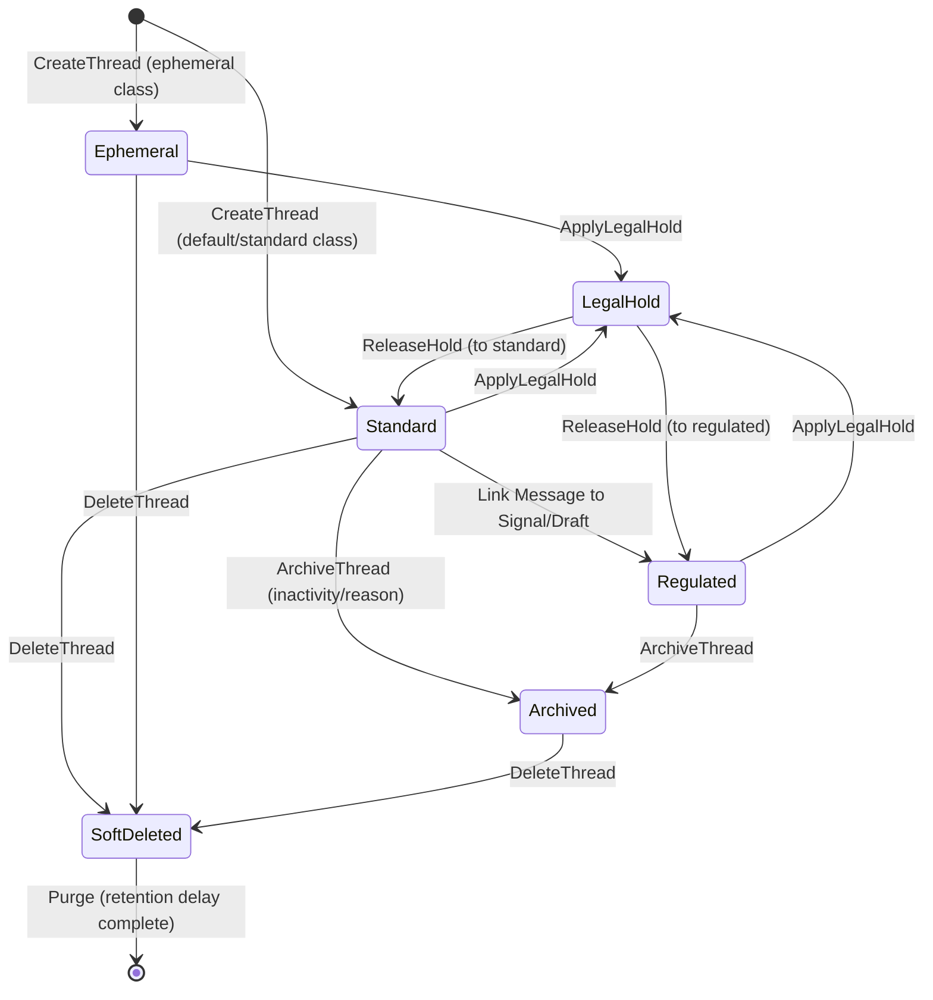

# Conversation AI Layer — Intended Workflows and Scenarios

## 1. Document Purpose

This document provides a complete reverse-engineered model of the intended behavior, operational workflows, and scenarios for the Conversation AI Layer (`app/services/conversation/`) of HaruQuantAI. It translates isolated functional and non-functional requirements from the Conversation AI Architecture Requirements plan ([13-conversation-ai.md](file:///c:/Users/rharu/AppDev/HaruquantAI/docs/dev/phase-implementation-plan/13-conversation-ai.md)) into continuous, end-to-end operational workflows.

The goal is to establish:
- Clear actor interactions, routing policies, and execution boundaries.
- Precise step-by-step logic, database transaction gates, and component state changes.
- Concrete testable scenarios covering happy paths, concurrency locks, and fallback states.
- An exhaustive requirements-to-workflow traceability matrix to prevent requirement omission.
- Documented implementation gaps, ambiguities, and architectural contradictions for stakeholder review.

---

## 2. Source and Analysis Boundaries

The primary source of truth for this document is the Conversation AI requirements listed in [13-conversation-ai.md](file:///c:/Users/rharu/AppDev/HaruquantAI/docs/dev/phase-implementation-plan/13-conversation-ai.md).
- **Rule of strict documentation**: No system behavior has been invented.
- **Inferred connections**: Where requirements implicitly depend on a sequence of actions not fully stated, the connection is documented and explicitly flagged as:
  > **Inferred workflow connection — requires validation**
- **Explicit vs. Implied vs. Missing**: This document segregates explicit requirement text, implied functionality required for system cohesion, missing operational logic, and code-name discrepancies.

---

## 3. System Purpose and Scope

### System/Module Name
HaruQuantAI Conversation AI Layer (`app/services/conversation`)

### Primary Purpose
Provide a robust conversational assistant layer (CEO Chat) that orchestrates context assembly, planning, prompt building, and streaming model provider interactions. It offers read-only evidence execution and draft-only action proposals without bypassing authentication, risk limits, or trading execution boundaries.

### Business & Operational Outcomes
- Ephemeral, lookahead-free UI page context capture for prompt building.
- Secure, redacted-before-persistence message storage protecting credentials.
- Bounded thread lifecycles using standard, ephemeral, regulated, and legal hold classes.
- Seeds-based, backpressure-controlled streaming turn loops with deterministic fallback generation.
- Clear separation between chat recommendations (draft actions) and manual operator overrides.

### Scope Boundaries

```text
  Operator UI / API caller (Auth & Authorization Owner)
                    |
                    v
  +-----------------app/services/conversation/ (Boundary Gate)---------------+
  |                                                                           |
  |  [ceo_gateway.py] <----> [governance/action_boundary.py] (Block Mutation) |
  |        |                                                                  |
  |        v                                                                  |
  |  [security/tool_permissions.py] (Read-Only Evidence Admission)            |
  |        |                                                                  |
  |        v                                                                  |
  |  [context/prompt_builder.py] (Pure System+User+Context Assembly)          |
  |        |                                                                  |
  |        +-------> Provider Stream? --------> [providers/openai_compatible] |
  |        |                                    [streaming/manager.py]        |
  |        |                                                                  |
  |        +-------> Provider Unavailable? ----> [streaming/fallback.py]      |
  |                                                                           |
  |  [security/redaction.py] <------------------------------------------------+
  |        |                                                                  |
  |        v                                                                  |
  |  [persistence/sqlite_repository.py] (Atomic Thread & Message Store)       |
  |                                                                           |
  +--------------------------------|------------------------------------------+
                                   |
                                   v
                      Normalised StreamEvents
                                   |
                                   v
             Downstream Execution (Through UI controls / Action drafts)
```

* **In-Scope (Conversation Domain)**:
  - Thread creation, message persistence, thread renaming, archiving, restoring, soft-deleting, and exports.
  - Retention enforcement (standard, ephemeral, regulated, legal hold classes) and purges.
  - Page context assembly, route mapping, DOM compaction, and prompt builder layering.
  - Text redaction, prompt injection defense, and read-only evidence validation.
  - Model streaming client protocols (Ollama, Gemini, OpenAI) and token-buffer management.
  - Action draft creation (`ActionDraftRecord`) and draft-only response generation.

* **Out-of-Scope (Owned by Trading, Risk, or Gateway)**:
  - User authentication and authorization token verification.
  - Direct trade placement, position close commands, and order cancels.
  - Modifying risk exposure levels or editing margin rules.
  - Promoting strategy versions to live production scripts.
  - Emergency manual operator controls (must bypass chat entirely).

---

## 4. Actors and Responsibilities

### Operator (Trader, Portfolio Manager, Administrator)
- **Role**: Converses with the system to analyze market regimes, inspect strategy status, and review proposals.
- **Can Initiate**: Thread creation, message dispatch, thread rename/archive/export, retention overrides, action draft execution intents.
- **Information Provided**: Queries, manual approval tokens, parameters override.
- **Outcomes Received**: Streamed tokens, tool evidence summaries, action draft proposals, direct UI page links.
- **Prohibitions**: Cannot execute orders via chat prompt; must confirm all actions on manual UI control pages.

### CEOChatGateway / ConversationService
- **Role**: Coordinates prompt building, read-only evidence collection, model streaming, and state persistence.
- **Can Initiate**: Context compilation, tool permissions validation, model streaming requests, fallback generation, repository writes.
- **Information Provided**: Prompt envelopes, redacted message payloads, turn audit trails.
- **Outcomes Received**: Provider tokens, completion metadata, error envelopes.
- **Prohibitions**: Cannot access raw credential stores or bypass security redaction filters before saving data.

### Downstream Governed Services (Trading, Risk, Simulator)
- **Role**: Enforces critical system state mutations, order matching, and safety limits.
- **Can Initiate**: Order execution, risk verification, strategy activation checks.
- **Information Provided**: Execution receipts, risk metrics, strategy state records.
- **Outcomes Received**: Validated action payloads.
- **Prohibitions**: Never consumes LLM-generated text as direct instructions; requires structured API requests backed by manual operator confirmation.

---

## 5. Capability Map

```
app/services/conversation/
├── 1. Chat Gateway & Facade
│   ├── Package lazy export gate (app/services/conversation/__init__.py)
│   ├── CEO gateway streaming turn (orchestration/ceo_gateway.py)
│   └── Durable thread and message API (services/conversation_service.py)
├── 2. Context & Prompt Assembly
│   ├── Ephemeral page context builder (context/page_context.py)
│   ├── ContextAssembler route resolver (context/assembler.py)
│   └── Pure prompt builder layers (context/prompt_builder.py)
├── 3. Redaction & Injection Defense
│   ├── Pre-persistence payloads sanitation (security/redaction.py)
│   ├── Prompt injection quarantine (security/prompt_injection.py)
│   └── Read-only evidence admission (security/tool_permissions.py)
├── 4. Persistence & Retention
│   ├── Atomic transaction SQLite repository (persistence/sqlite_repository.py)
│   ├── Idempotency lock tracker (persistence/sqlite_repository.py)
│   └── Lifecycle retention & legal hold (services/retention_service.py)
├── 5. Memory & Action Drafts
│   ├── Memory summary and pinned facts (services/memory_service.py)
│   └── ActionDraftRecord creation (services/action_drafts.py)
├── 6. Streaming and Fallback
│   ├── OpenAI/Gemini/Ollama streaming (providers/openai_compatible.py)
│   ├── Token backpressure & cancellation (streaming/manager.py)
│   └── Deterministic fallback writer (streaming/fallback.py)
└── 7. Observability
    └── Redacted metrics & audit events (observability/boundaries.py)
```

---

## 6. Workflow Catalogue

1. **WF-001 — Thread Creation and Retention Initialization**: Creates a user thread, sets standard/custom retention policies, and logs the initialization audit. (*Core Lifecycle Workflow*)
2. **WF-002 — Page Context Compaction and Assembly**: Extracts active UI state details, composes DOM metadata, and aligns page-level variables. (*Context Workflow*)
3. **WF-003 — Chat Turn Dispatch and Planner Routing**: Performs request verification, applies idempotency checks, handles locks, and queries the planner for route classification. (*Orchestration Workflow*)
4. **WF-004 — Read-Only Evidence Permission Gating**: Validates read-only tool plans, verifies token scopes, quarantines invalid evidence, and outputs admitted bundles. (*Security Workflow*)
5. **WF-005 — Prompt Composition and Injection Defense**: Layers system prompts, context, and evidence, runs injection scans, and outputs the final prompt. (*Orchestration Workflow*)
6. **WF-006 — Provider Streaming and Fallback Execution**: Streams tokens to the UI, applies backpressure policies, and fails over to fallbacks on model failure. (*Streaming Workflow*)
7. **WF-007 — Action Draft Creation and Governance Boundary**: Detects mutative requests, generates `ActionDraftRecord` proposals, and outputs direct UI control links. (*Governance Workflow*)

---

## 7. Detailed End-to-End Workflows

### WF-001 — Thread Creation and Retention Initialization

#### Purpose and Value
Creates a conversation thread container for a user, assigning the default or specified retention lifecycle policies, and ensuring all state transitions are logged.

#### Actors
- **Primary**: Operator / AI Agent
- **Supporting**: ConversationService, SQLiteRepository, RetentionService

#### Trigger
Operator creates a thread via the UI or API gateway.

#### Preconditions
- User identity is authenticated and active.
- Target tenant/actor context is valid.

#### Inputs
- `user_id` (str), `request_id` (str)
- `initial_context` (route, page type, DOM snapshot details)
- `retention_class` (optional: standard, ephemeral, regulated, legal_hold)

#### Main Success Flow

| Step | Responsible component | Action | Input | Validation or decision | State change | Output | Requirement IDs |
| :--- | :-------------------- | :----- | :---- | :--------------------- | :----------- | :----- | :-------------- |
| 1 | `ConversationService` | Sanitize and validate request. | Request, actor context | Validate `user_id` and check that `request_id` is safe. | None | Sanitized payload | CONV-FR-009, CONV-FR-112 |
| 2 | `ConversationService` | Determine target retention class. | `retention_class` parameter | Confirm value is in standard list. Default to standard if null. | None | Verified retention class | CONV-FR-116, CONV-FR-118 |
| 3 | `sqlite_repository` | Begin SQLite transaction. | Transaction boundaries | Verify active connections. | Transaction open | Active transaction | CONV-FR-109, CONV-FR-132 |
| 4 | `sqlite_repository` | Persist thread record. | Thread parameters | Ensure thread ID is unique; map timestamps using time codec. | Thread created | `ThreadDetail` payload | CONV-FR-016, CONV-FR-045, CONV-FR-112 |
| 5 | `sqlite_repository` | Persist thread retention settings. | `ThreadDetail`, retention class | Set standard durations and archive thresholds. | Retention class active | Active retention record | CONV-FR-065, CONV-FR-086 |
| 6 | `sqlite_repository` | Commit transaction. | Active transaction | Verify all constraints are satisfied. | Transaction closed | Committed receipt | CONV-FR-132 |
| 7 | `RetentionService` | Log thread initialization event. | ThreadDetail | Emits lifecycle audit event. | None | LifecycleAuditEvent | CONV-FR-110, CONV-FR-115 |
| 8 | `ConversationService` | Return ThreadDetail to caller. | ThreadDetail | Format fields for JSON serialization. | None | ThreadDetail JSON | CONV-FR-112 |

#### Decision Points

##### D1.1: Custom Retention Class Validation
- **Component**: `ConversationService`
- **Condition Evaluated**: `retention_class` parameter value.
- **Branches**:
  - Standard/Ephemeral/Regulated/Legal Hold: Proceed.
  - Unsupported string: Raise value error and fail-closed.
- **Supporting IDs**: CONV-FR-116, CONV-FR-118.

#### Alternate Flows
- None. Thread creation requires database persistence.

#### Failure and Exception Flows

##### EF1.1: Concurrency Conflict on Thread ID
- **Trigger**: Thread ID collision in the database.
- **Detection**: SQLite engine throws constraint collision error.
- **Response**: Roll back transaction. Raise lookup/persistence conflict exception (`ERR_THREAD_EXISTS`).
- **Supporting IDs**: CONV-FR-110, CONV-FR-133.

#### Recovery Flow
If a database collision is detected, the gateway retries generation of the thread ID once. If the collision persists, it aborts and returns a persistence error event.

#### Postconditions
- Thread and retention records persisted in the database.
- Lifecycle audit event recorded.

---

### WF-002 — Page Context Compaction and Assembly

#### Purpose and Value
Compacts UI page layouts, routes, and DOM attributes into a structured context object that can be passed to the prompt builder without exceeding token bounds.

#### Actors
- **Primary**: CEOChatGateway
- **Supporting**: ContextAssembler, PageContextManager

#### Trigger
`stream_turn` gathers context before prompt composition.

#### Preconditions
- The thread is active (not soft-deleted).

#### Inputs
- `thread_id` (str), `user_id` (str)
- `ui_page_state` (route details, selected symbol, DOM attributes)

#### Main Success Flow

| Step | Responsible component | Action | Input | Validation or decision | State change | Output | Requirement IDs |
| :--- | :-------------------- | :----- | :---- | :--------------------- | :----------- | :----- | :-------------- |
| 1 | `CEOChatGateway` | Read user thread state. | thread_id, user_id | Confirm caller owns thread; verify thread is not deleted/archived. | None | Verified thread details | CONV-FR-005, CONV-FR-113, CONV-FR-114 |
| 2 | `PageContextManager` | Parse UI page state. | ui_page_state | Validate route values against system limits. | None | Raw context structures | CONV-FR-189, CONV-FR-190 |
| 3 | `PageContextManager` | Compact DOM attributes. | Raw context | Truncate DOM details using config limits. | None | Compacted page context | CONV-FR-093, CONV-FR-176 |
| 4 | `ContextAssembler` | Resolve active route layouts. | Compacted page context | Identify template mappings based on current route. | None | Layout template parameters | CONV-FR-183, CONV-FR-184 |
| 5 | `ContextAssembler` | Check context revision status. | thread context, new layout | Compare new context layout with current database version. | None | Revision flag details | CONV-FR-185, CONV-FR-188 |
| 6 | `ConversationService` | Persist context update (if changed). | thread_id, new layout details | Save context details and revision ID in the repository. | Context revision updated | `ThreadDetail` updated | CONV-FR-032, CONV-FR-186 |
| 7 | `CEOChatGateway` | Return assembled context block. | ThreadDetail, Compacted context | Package context variables for prompt builders. | None | Assembled context payload | CONV-FR-140, CONV-FR-141 |

#### Decision Points

##### D2.1: Context Revision Change
- **Component**: `ContextAssembler`
- **Condition Evaluated**: Does layout context or active route differ from the database record?
- **Branches**:
  - **Yes**: Trigger database save and emit context change audit event.
  - **No**: Bypass database update (Proceed to Step 7).
- **Supporting IDs**: CONV-FR-032, CONV-FR-186.

#### Alternate Flows
- None. Context assembly is a pure pipeline unless revisions change.

#### Failure and Exception Flows

##### EF2.1: Thread Soft-Deleted
- **Trigger**: Thread state is marked soft-deleted.
- **Detection**: `CEOChatGateway` checks thread status in Step 1.
- **Response**: Abort assembly. Return error code `ERR_THREAD_DELETED` in the stream event.
- **Supporting IDs**: CONV-FR-114.

#### Recovery Flow
If DOM compaction fails due to structural layout errors, the assembler drops DOM details, retains only the route name and instrument symbols, and records a warning in the telemetry logs.

#### Postconditions
- Compacted page context compiled.
- Database context revision updated (if changed).

---

### WF-003 — Chat Turn Dispatch and Planner Routing

#### Purpose and Value
Handles new chat turn queries, checks request idempotency, locks the thread, and queries the planner to determine route classification (such as data research, news specialist, or actions drafting).

#### Actors
- **Primary**: Operator / AI Agent
- **Supporting**: CEOChatGateway, sqlite_repository, PlannerPort

#### Trigger
Operator submits a chat message to `CEOChatGateway.stream_turn()`.

#### Preconditions
- User and thread records exist.
- No other stream turn is active on the target thread.

#### Inputs
- `user_id` (str), `thread_id` (str), `request_id` (str)
- `message_text` (str)

#### Main Success Flow

| Step | Responsible component | Action | Input | Validation or decision | State change | Output | Requirement IDs |
| :--- | :-------------------- | :----- | :---- | :--------------------- | :----------- | :----- | :-------------- |
| 1 | `CEOChatGateway` | Validate Request ID. | request_id | Confirm ID conforms to schema; generate one if missing. | None | Valid request ID | CONV-FR-009, CONV-FR-218 |
| 2 | `sqlite_repository` | Acquire thread turn lock. | user_id, thread_id, request_id | Check if lock lease is available for the thread. | Lease locked | Lock lease handle | CONV-FR-207, CONV-FR-231 |
| 3 | `sqlite_repository` | Check idempotency cache. | lease handle | Check if request_id has already executed successfully. | None | Idempotency outcome | CONV-FR-026, CONV-FR-220 |
| 4 | `CEOChatGateway` | compact page context. | thread_id, user_id | Fetch latest page parameters (executes WF-002). | None | Ephemeral context block | CONV-FR-219, CONV-FR-221 |
| 5 | `PlannerPort` | Run route classification. | message_text, context block | Classify query intent: research, news, action, or fallback. | None | PlannerDecision | CONV-FR-222, CONV-FR-225 |
| 6 | `CEOChatGateway` | Route turn based on decision. | PlannerDecision | Dispatch to target workflow (WF-004, WF-005, or WF-007). | None | Dispatched route signal | CONV-FR-150, CONV-FR-226 |

#### Decision Points

##### D3.1: Idempotency Replay Detected
- **Component**: `sqlite_repository`
- **Condition Evaluated**: Does `request_id` match a completed turn in the database?
- **Branches**:
  - **Yes**: Retrieve previous response from repository, skip LLM call, and stream cached tokens.
  - **No**: Proceed to Step 4.
- **Supporting IDs**: CONV-FR-026, CONV-FR-220.

##### D3.2: Concurrent Turn Conflict
- **Component**: `sqlite_repository`
- **Condition Evaluated**: Is another turn currently locking the thread?
- **Branches**:
  - **Yes**: Fail turn request. Emit `concurrent_turn_in_progress` conflict event and release lock handle.
  - **No**: Proceed to Step 3.
- **Fail-closed behavior**: Fail-closed (aborts run).
- **Supporting IDs**: CONV-FR-207, CONV-FR-231.

#### Alternate Flows
- None. Turn locking must be enforced to prevent database corruption.

#### Failure and Exception Flows

##### EF3.1: Message on Archived Thread
- **Trigger**: Thread state is marked archived.
- **Detection**: `CEOChatGateway` checks thread status in Step 4.
- **Response**: Return error event `ERR_THREAD_ARCHIVED` in stream and release locks.
- **Supporting IDs**: CONV-FR-034, CONV-FR-113.

#### Recovery Flow
If lock lease expires due to gateway timeout, the database watchdog cleans up the lock row and resets thread status to idle.

#### Postconditions
- Thread turn lock lease acquired.
- Planner route decision resolved.

---

### WF-004 — Read-Only Evidence Permission Gating

#### Purpose and Value
Ensures that the LLM is only supplied with market data or tool evidence that the requesting user has explicit permissions to view, preventing data privilege leaks.

#### Actors
- **Primary**: CEOChatGateway
- **Supporting**: security.tool_permissions, ReadOnlyToolExecutorPort, AuthorizationEvidencePort

#### Trigger
Planner select research intent requiring market-data or system status evidence.

#### Preconditions
- The planner decision indicates research tool execution is required.

#### Inputs
- `user_id` (str), `thread_id` (str)
- `tool_plan` (list of read-only tools and parameter queries)
- `auth_token_context` (scopes and role assignments)

#### Main Success Flow

| Step | Responsible component | Action | Input | Validation or decision | State change | Output | Requirement IDs |
| :--- | :-------------------- | :----- | :---- | :--------------------- | :----------- | :----- | :-------------- |
| 1 | `tool_permissions` | Verify tool risk classification. | tool_plan details | Check that all planned tools are labeled read-only. | None | Verified read-only tools | CONV-FR-014 |
| 2 | `AuthorizationEvidencePort` | Query permission scopes. | user_id, tools list | Confirm caller identity contains read permissions for the scopes. | None | PermissionDecision | CONV-FR-015, CONV-FR-151 |
| 3 | `ReadOnlyToolExecutorPort`| Execute read-only tools. | verified tools, parameters | Call target systems (e.g., Data, Indicator) using permissions context. | None | `ToolEvidenceBundle` raw | CONV-FR-163, CONV-FR-223 |
| 4 | `tool_permissions` | Validate evidence provenance. | `ToolEvidenceBundle` raw | Confirm payload contains freshness timestamps, source IDs, and signatures. | None | Validated evidence | CONV-FR-146, CONV-FR-155 |
| 5 | `tool_permissions` | Verify read-only data fields. | Validated evidence | Scan keys for any write/mutative fields; verify no secret structures are present. | None | Admitted evidence bundle | CONV-FR-146, CONV-FR-155 |
| 6 | `CEOChatGateway` | Pass admitted bundle to Prompt Builder. | Admitted evidence bundle | Package evidence details for prompt inclusion. | None | Admitted context values | CONV-FR-145, CONV-FR-225 |

#### Decision Points

##### D4.1: Evidence Admission Checks Fail
- **Component**: `tool_permissions`
- **Condition Evaluated**: Does evidence bundle lack provenance signatures, or contain mutative variables?
- **Branches**:
  - **Yes**: Quarantine evidence bundle, exclude it from prompt builder inputs, and log a quarantine event.
  - **No**: Admit evidence (Proceed to Step 6).
- **Fail-safe behavior**: Excludes evidence but does not crash the chat turn; instead instructs model "data unavailable".
- **Supporting IDs**: CONV-FR-146, CONV-FR-166.

#### Alternate Flows
- None. Permission validation is mandatory for all tool evidence.

#### Failure and Exception Flows

##### EF4.1: Tool Permission Denied
- **Trigger**: User lacks read permissions for the target market scopes.
- **Detection**: `AuthorizationEvidencePort` rejects request in Step 2.
- **Response**: Skip tool execution. Log permission warning, and set evidence state as "denied".
- **Supporting IDs**: CONV-FR-151, CONV-FR-166.

#### Recovery Flow
If a primary data provider times out, the tool executor queries secondary cached data stores if permitted, appending a "stale cache data" warning to the evidence packet.

#### Postconditions
- Admitted evidence bundle generated (or quarantined).
- Security audit logs updated with permission decision results.

---

### WF-005 — Prompt Composition and Injection Defense

#### Purpose and Value
Layers prompt sections (system governance, memory, page context, and evidence) in a deterministic order and scans the inputs for prompt injection patterns to protect the model from hijacking.

#### Actors
- **Primary**: CEOChatGateway
- **Supporting**: context.prompt_builder, security.prompt_injection

#### Trigger
`stream_turn` builds the final prompt payload for the model client.

#### Preconditions
- Assembled context and tool evidence are resolved.

#### Inputs
- `system_context` (first authority system prompt)
- `memory_summary` (pinned facts and message history summaries)
- `page_context` (compacted DOM layout and routes)
- `admitted_evidence` (ToolEvidenceBundle or status)
- `user_prompt` (str)

#### Main Success Flow

| Step | Responsible component | Action | Input | Validation or decision | State change | Output | Requirement IDs |
| :--- | :-------------------- | :----- | :---- | :--------------------- | :----------- | :----- | :-------------- |
| 1 | `prompt_injection` | Scan user prompt and evidence for injection patterns. | user_prompt, admitted_evidence | Check for system role override language or ignore-instructions text. | None | Safety assessment | CONV-NFR-003 |
| 2 | `prompt_builder` | Initialize prompt layout. | system_context | Load the first authority system instructions template. | None | Base prompt structure | CONV-FR-200, CONV-FR-201 |
| 3 | `prompt_builder` | Append memory summaries. | base prompt, memory_summary | Insert pinned facts and conversation summary details. | None | Memory prompt structure | CONV-FR-170, CONV-FR-172 |
| 4 | `prompt_builder` | Append page context. | memory prompt, page_context | Insert active route and compacted layout details. | None | Context prompt structure | CONV-FR-173, CONV-FR-187 |
| 5 | `prompt_builder` | Append admitted evidence. | context prompt, admitted_evidence | Insert tool evidence; insert "data pending/unavailable" if empty. | None | Evidentiary prompt structure | CONV-FR-105, CONV-FR-145, CONV-FR-224 |
| 6 | `prompt_builder` | Append user prompt. | Evidentiary prompt, user_prompt | Append the current user query at the end. | None | Composed prompt payload | CONV-FR-202 |
| 7 | `prompt_builder` | Apply prompt token budgets. | Composed prompt payload | Truncate excess history elements if total characters exceed prompt budget. | None | Bounded prompt payload | CONV-FR-093, CONV-FR-147, CONV-FR-148 |
| 8 | `CEOChatGateway` | Return Bounded prompt payload. | Bounded prompt payload | Verify prompt format conforms to model endpoint specs. | None | `PromptBuildResult` | CONV-FR-061, CONV-FR-067 |

#### Decision Points

##### D5.1: Injection Attack Identified
- **Component**: `security.prompt_injection`
- **Condition Evaluated**: Did scan detect instruction-override patterns or injection attacks?
- **Branches**:
  - **Yes**: Quarantine the offending text block, replace user prompt with a warning placeholder, and flag the transaction.
  - **No**: Proceed to Step 2.
- **Fail-safe behavior**: Replaces content with a safe message instead of crashing the turn.
- **Supporting IDs**: CONV-NFR-003.

##### D5.2: Budget Truncation Strategy
- **Component**: `context.prompt_builder`
- **Condition Evaluated**: Does total character size exceed `total_prompt_budget`?
- **Branches**:
  - **Yes**: Apply configured truncation strategy (typically drop oldest message history first, keeping system/context/evidence intact).
  - **No**: Proceed to Step 8.
- **Supporting IDs**: CONV-FR-093, CONV-FR-147, CONV-FR-149.

#### Alternate Flows
- None. Prompt layering must proceed in the strict order of authority.

#### Failure and Exception Flows

##### EF5.1: Budget Exceeded Even After Truncation
- **Trigger**: System context + mandatory evidence alone exceeds the total allowed token budget.
- **Detection**: `prompt_builder` checks token size in Step 7.
- **Response**: Abort prompt composition. Return error code `ERR_PROMPT_BUDGET_EXCEEDED` inside the stream event.
- **Supporting IDs**: CONV-FR-093, CONV-FR-152.

#### Recovery Flow
If truncation drops required context, the builder runs a fallback minimal prompt consisting only of system instructions and a warning that context was dropped due to sizing.

#### Postconditions
- `PromptBuildResult` generated with messages list and composition logs.

---

### WF-006 — Provider Streaming and Fallback Execution

#### Purpose and Value
Streams model tokens to the caller using a backpressure manager, monitoring timeouts/errors, and failing over to a deterministic fallback message if the provider fails before producing output.

#### Actors
- **Primary**: CEOChatGateway
- **Supporting**: providers.openai_compatible, streaming.manager, streaming.fallback

#### Trigger
`stream_turn` receives the composed prompt payload.

#### Preconditions
- The thread turn lock is active.

#### Inputs
- `prompt_build_result` (PromptBuildResult)
- `streaming_policy` (timeouts, retry count, backpressure buffer limits, fallback templates)

#### Main Success Flow

| Step | Responsible component | Action | Input | Validation or decision | State change | Output | Requirement IDs |
| :--- | :-------------------- | :----- | :---- | :--------------------- | :----------- | :----- | :-------------- |
| 1 | `openai_compatible` | Check provider configurations. | request model details | Confirm target model has active api keys or URL endpoints. | None | Active provider handle | CONV-FR-073, CONV-FR-074 |
| 2 | `openai_compatible` | Start stream request to model provider. | prompt_build_result, timeouts | Send HTTPS/local socket query; wait for first token delta. | None | Provider stream delta iterator | CONV-FR-072, CONV-FR-103, CONV-FR-211 |
| 3 | `streaming.manager` | Check stream startup status. | delta iterator | Confirm stream initiated before timeout threshold. | None | Valid token iterator | CONV-FR-094, CONV-FR-213 |
| 4 | `streaming.manager` | Apply stream backpressure. | Valid token iterator | Buffer events; drop or throttle if UI client is too slow. | None | Throttled stream iterator | CONV-FR-175, CONV-FR-242 |
| 5 | `CEOChatGateway` | Emit progress, metadata, and token events.| Throttled iterator | Yield token values to the caller connection in standard format. | None | Yielded StreamEvents | CONV-FR-160, CONV-FR-229, CONV-FR-236 |
| 6 | `ConversationService` | Persist completed turn response. | StreamEvents values | Redact secrets and write assistant message to SQLite. | Response persisted | `TurnResult` details | CONV-FR-020, CONV-FR-228, CONV-FR-232 |
| 7 | `sqlite_repository` | Release thread turn lock. | thread_id, user_id | Delete turn lease row from database. | Lease unlocked | Unlocked confirmation | CONV-FR-207, CONV-FR-213 |
| 8 | `CEOChatGateway` | Emit terminal done event. | TurnResult details | Yield terminal done packet containing usage metrics. | None | Yielded done event | CONV-FR-229, CONV-FR-239 |

#### Decision Points

##### D6.1: Provider Unavailable / Pre-Token Failure
- **Component**: `streaming.manager`
- **Condition Evaluated**: Did provider throw connection error, timeout, or invalid credentials before first token?
- **Branches**:
  - **Yes**: Trigger fallback workflow (Proceed to Alternate Flow A6.1).
  - **No**: Proceed to Step 4.
- **Supporting IDs**: CONV-FR-080, CONV-FR-082.

##### D6.2: Post-Token Stream Interruption
- **Component**: `streaming.manager`
- **Condition Evaluated**: Did provider connection fail after 1 or more tokens were streamed?
- **Branches**:
  - **Yes**: Stop streaming, keep already sent tokens, emit `provider_degraded` event, and persist partial response.
  - **No**: Complete normally (Proceed to Step 6).
- **Supporting IDs**: CONV-FR-078, CONV-FR-243.

#### Alternate Flows

##### A6.1: Deterministic Fallback Generation
- **Workflow Variant**: If provider fails pre-token (D6.1), the gateway invokes `streaming.fallback`.
- **Steps**:
  1. Build fallback text using request details and templates (no invented data).
  2. Emit metadata event.
  3. Stream fallback text in timed token chunks.
  4. Persist response in SQLite.
  5. Yield done event with `generation_source="deterministic_fallback"`.
- **Supporting IDs**: CONV-FR-089, CONV-FR-090, CONV-FR-101, CONV-FR-107.

#### Failure and Exception Flows

##### EF6.1: Outgoing Buffer Overflow
- **Trigger**: UI consumer is blocked or too slow, causing outgoing stream buffer to exceed capacity limits.
- **Detection**: `StreamManager` checks queue size.
- **Response**: Terminate provider stream, emit error event `ERR_BUFFER_OVERFLOW`, and release locks.
- **Supporting IDs**: CONV-FR-175, CONV-FR-242.

#### Recovery Flow
If Ollama local service returns a connection refused error, the stream client attempts failover to the configured public fallback provider model once.

#### Postconditions
- Assistant message persisted in SQLite.
- Turn locks released and terminal events dispatched.

---

### WF-007 — Action Draft Creation and Governance Boundary

#### Purpose and Value
Intercepts user chat queries that request system mutations (order execution, risk changes, strategy activations), blocks direct action, and instead creates an `ActionDraftRecord` proposal.

#### Actors
- **Primary**: Operator
- **Supporting**: governance.action_boundary, services.action_drafts, CEOChatGateway

#### Trigger
Planner routes chat turn to Action intent.

#### Preconditions
- The request requires mutation changes.

#### Inputs
- `user_id` (str), `thread_id` (str), `request_id` (str)
- `requested_mutation` (e.g., "close position BTCUSD", "change risk limit to 5%")

#### Main Success Flow

| Step | Responsible component | Action | Input | Validation or decision | State change | Output | Requirement IDs |
| :--- | :-------------------- | :----- | :---- | :--------------------- | :----------- | :----- | :-------------- |
| 1 | `action_boundary` | Classify requested action type. | requested_mutation | Identify target action: trade, risk, strategy. | None | Action classification | CONV-NFR-008 |
| 2 | `action_boundary` | Enforce direct operator boundaries. | Action classification | Confirm action is mutative; assert that conversation cannot execute directly. | None | Boundary enforcement check | CONV-NFR-002, CONV-NFR-007 |
| 3 | `action_boundary` | Resolve direct operator path. | Action classification | Retrieve manual control UI page link or API route. | None | `OperatorControlReference` | CONV-NFR-008, CONV-NFR-011 |
| 4 | `action_drafts` | Create Action Draft proposal. | requested_mutation parameters | Compile draft payload, title, and description. | None | Draft proposal details | CONV-FR-039, CONV-FR-040 |
| 5 | `sqlite_repository` | Persist Action Draft record. | Draft proposal details | Save draft in SQLite as `ActionDraftRecord` with status `pending_approval`. | Action draft saved | `ActionDraftRecord` model | CONV-FR-043, CONV-FR-164 |
| 6 | `action_boundary` | Build draft-only response layout. | ActionDraftRecord, ControlReference | Format text explaining draft-only status and direct execution requirements. | None | `DraftOnlyResponse` payload | CONV-FR-039, CONV-NFR-012 |
| 7 | `CEOChatGateway` | Return DraftOnlyResponse to caller. | DraftOnlyResponse payload | Stream response to connection and release lock handles. | None | Streamed events details | CONV-FR-056, CONV-NFR-014 |

#### Decision Points

##### D7.1: Prohibited Direct Execution Attempt
- **Component**: `action_boundary`
- **Condition Evaluated**: Does query contain instructions attempting to bypass draft approvals or force direct execution?
- **Branches**:
  - **Yes**: Block execution. Raise a policy exception, log a security alert, and output a draft-only response.
  - **No**: Proceed to Step 4.
- **Fail-closed behavior**: Fail-closed.
- **Supporting IDs**: CONV-NFR-002, CONV-NFR-006.

#### Alternate Flows
- None. Chat is strictly prohibited from executing mutations.

#### Failure and Exception Flows

##### EF7.1: Action Draft Save Fail
- **Trigger**: SQLite fails to persist the action draft due to constraint errors.
- **Detection**: `sqlite_repository` raises write exception.
- **Response**: Abort draft turn. Return error event `ERR_DRAFT_PERSIST_FAILED` and release locks.
- **Supporting IDs**: CONV-FR-110.

#### Recovery Flow
If action draft parameters cannot be resolved from unstructured text, the gateway returns a needs-input stream event requesting the operator clarify key parameters (e.g. quantity or symbol).

#### Postconditions
- `ActionDraftRecord` saved in SQLite with status `pending_approval`.
- Response sent containing link references to manual operator control pages.

---

## 8. Scenario Catalogue

| Scenario ID | Scenario | Given | When | Then | Expected state | Requirement IDs |
| :--- | :--- | :--- | :--- | :--- | :--- | :--- |
| WF-001-SC-001 | Ephemeral Thread Setup | valid thread request | User sets ephemeral class | Persist thread; set retention to ephemeral duration | Ephemeral state | CONV-FR-112, CONV-FR-116 |
| WF-001-SC-002 | Legal Hold Escalat. | Valid thread details | Operator applies legal hold | Freeze purge actions; log hold audit event | Legal hold active | CONV-FR-065, CONV-FR-115 |
| WF-002-SC-001 | Route Layout Assembl. | Valid UI page states | Assembler maps active route | Load route-specific instructions; check revision | Context resolved | CONV-FR-183, CONV-FR-188 |
| WF-003-SC-001 | Idempotent Chat Turn | request_id already completed | gateway receives replay query | Stream previous cached response tokens | Turn completed | CONV-FR-026, CONV-FR-220 |
| WF-003-SC-002 | Same-Thread Concurr. | Lock lease is active on thread | Gateway receives concurrent query | Reject query; return conflict stream event | Turn rejected | CONV-FR-207, CONV-FR-231 |
| WF-004-SC-001 | Admit Valid Evidence | Evidence bundle with provenance | Vetting system checks proof | Pass bundle to prompt builder | Evidence admitted | CONV-FR-145, CONV-FR-155 |
| WF-004-SC-002 | Quarantine Stale Proof | Evidence package lacks timestamp | Vetting system checks proof | Exclude bundle; instruct model "data pending" | Evidence quarantined | CONV-FR-146, CONV-FR-166 |
| WF-005-SC-001 | Injection Scan Block | User prompt contains bypass words | Safety scanner checks prompt | Replace prompt with safety placeholder; warn user | Turn sanitized | CONV-NFR-003 |
| WF-005-SC-002 | Token Budget Truncat. | History character size > limit | Builder formats prompt | Drop oldest message records from prompt | Bounded prompt | CONV-FR-093, CONV-FR-149 |
| WF-006-SC-001 | Pre-Token Fallback | Provider returns HTTP 500 pre-token | Stream manager catches error | Failover; stream fallback text with done event | Fallback completed | CONV-FR-080, CONV-FR-107 |
| WF-006-SC-002 | Post-Token Degradat. | Provider fails after partial stream | Stream manager catches error | Keep partial response; yield degraded complete event | Turn completed | CONV-FR-078, CONV-FR-243 |
| WF-007-SC-001 | Close Position Draft | Query: "close positions" | Action boundary handles query | Save pending ActionDraftRecord; output UI route link | Draft saved | CONV-FR-039, CONV-NFR-008 |
| WF-007-SC-002 | Manual Execution Bypass | Operator executes manual trade | Direct route receives trade | Execute trade immediately (independent of LLM state) | Trade executed | CONV-NFR-009, CONV-NFR-013 |
| WF-006-SC-003 | Outgoing backpressure | Slow UI client slows reads | Stream manager checks buffer | Buffers events; fails turn if capacity is exceeded | Turn failed | CONV-FR-175, CONV-FR-242 |
| WF-003-SC-003 | Message on Soft-Del. | Thread status is soft-deleted | Gateway receives query | Block message; return lookup error exception | Message blocked | CONV-FR-034, CONV-FR-114 |
| WF-001-SC-003 | Thread Auto-Naming | First user prompt received | Gateway processes message | Generate title from prompt; rename thread | Thread renamed | CONV-FR-137, CONV-FR-139 |

---

## 9. Workflow Relationship Map

| Source workflow | Relationship | Target workflow | Trigger or condition |
| :--- | :--- | :--- | :--- |
| `WF-001` | Upstream of | `WF-003` | Threads must be created before dispatching turns. |
| `WF-002` | Upstream of | `WF-003` | Ephemeral page context details are gathered in turn setup. |
| `WF-003` | Upstream of | `WF-004` | Research-intent turns trigger tool evidence validation. |
| `WF-003` | Upstream of | `WF-005` | Non-mutative turns trigger prompt composition. |
| `WF-003` | Upstream of | `WF-007` | Mutative turns trigger action drafts and boundaries. |
| `WF-004` | Upstream of | `WF-005` | Admitted evidence is merged into the prompt builder layers. |
| `WF-005` | Upstream of | `WF-006` | Composed prompts are streamed to selected providers. |

---

## 10. System Lifecycle and State Transitions

### Thread Retention & Deletion State Machine



---

## 11. Cross-Module Interaction Matrix

| Initiating Module | Action / API called | Target Module | Expected Payload | Output Payload | Requirement IDs |
| :--- | :--- | :--- | :--- | :--- | :--- |
| `Conversation` | `read_market_data` | `Data` | `MarketDataRequest` | `pd.DataFrame` | CONV-FR-163 |
| `Conversation` | `get_indicators` | `Indicator` | `IndicatorRequest` | `IndicatorResult` | CONV-FR-163 |
| `Conversation` | `get_risk_parameters` | `Risk` | `RiskParametersRequest` | `RiskParameters` | CONV-FR-163 |
| `Conversation` | `map_custom_error` | `Utils` | `Exception` | `ConversationErrorEnvelope` | CONV-FR-246 |
| `UI / API Gateway` | `stream_turn` | `Conversation` | `ChatTurnRequest` | `AsyncIterator[StreamEvent]` | CONV-FR-150 |

---

## 12. Requirements-to-Workflow Traceability Matrix

| Requirement ID | Requirement Summary | Workflow IDs | Scenario IDs | Workflow Step Numbers | Coverage Status |
| :--- | :--- | :--- | :--- | :--- | :--- |
| `CONV-FR-001` | Domain metadata category configuration. | None (Meta) | None | None | Supporting constraint |
| `CONV-FR-002` | list_ceo_chat_tools catalog list. | None (Catalog) | None | None | Supporting constraint |
| `CONV-FR-003` | No package level NFRs. | None | None | None | Supporting constraint |
| `CONV-FR-004` | No package level testing requirements. | None | None | None | Supporting constraint |
| `CONV-FR-005` | Document service mutation details. | `WF-001`, `WF-002` | None | Step 2 (WF-001), Step 1 (WF-002) | Fully represented |
| `CONV-FR-006` | ConversationService import availability. | None | None | None | Supporting constraint |
| `CONV-FR-007` | Provide durable chat operations facade. | `WF-001`, `WF-003` | None | Step 1 (WF-001), Step 1 (WF-003) | Fully represented |
| `CONV-FR-008` | Durable thread context API methods. | `WF-001`, `WF-002`, `WF-003` | None | Mapped to facades | Fully represented |
| `CONV-FR-009` | request_id verification safety rules. | `WF-001`, `WF-003` | None | Step 1 (WF-001), Step 1 (WF-003) | Fully represented |
| `CONV-FR-010` | Purge unneeded lifecycle records. | `WF-001` | None | Step 7 | Fully represented |
| `CONV-FR-011` | Memory summaries duration limits. | `WF-005` | None | Step 3 | Fully represented |
| `CONV-FR-012` | page_context route parsing attributes. | `WF-002` | None | Step 2 | Fully represented |
| `CONV-FR-013` | page_context DOM snapshot fields. | `WF-002` | None | Step 2 | Fully represented |
| `CONV-FR-014` | Read-only tool execution restriction. | `WF-004` | None | Step 1 | Fully represented |
| `CONV-FR-015` | External identity authorization dependency. | `WF-004` | None | Step 2 | Fully represented |
| `CONV-FR-016` | Repository SQLite schemas and columns mapping. | `WF-001` | None | Step 4 | Fully represented |
| `CONV-FR-017` | No file-specific non-functional requirements. | None | None | None | Supporting constraint |
| `CONV-FR-018` | No file-specific testing requirements. | None | None | None | Supporting constraint |
| `CONV-FR-019` | Public exports stability annotations. | None | None | None | Supporting constraint |
| `CONV-FR-020` | Redact secrets before saving message text. | `WF-006` | None | Step 6 | Fully represented |
| `CONV-FR-021` | Retention policies legal holds. | `WF-001` | None | Step 7 | Fully represented |
| `CONV-FR-022` | Redact sensitive logging attributes. | `WF-006` | None | Step 6 | Fully represented |
| `CONV-FR-023` | Empty tool functions namespace gate. | None | None | None | Supporting constraint |
| `CONV-FR-024` | Package exports registry definitions. | None | None | None | Supporting constraint |
| `CONV-FR-025` | Allow empty package exports list. | None | None | None | Supporting constraint |
| `CONV-FR-026` | Idempotent user thread request replays. | `WF-003` | WF-003-SC-001 | Step 3 | Fully represented |
| `CONV-FR-027` | list_threads filter rules. | `WF-001` | None | Facade mapped | Fully represented |
| `CONV-FR-028` | rename_thread parameters checks. | `WF-001` | None | Facade mapped | Fully represented |
| `CONV-FR-029` | delete_thread soft deletes only. | `WF-001` | None | Facade mapped | Fully represented |
| `CONV-FR-030` | archive_thread updates states. | `WF-001` | None | Facade mapped | Fully represented |
| `CONV-FR-031` | restore_thread updates states. | `WF-001` | None | Facade mapped | Fully represented |
| `CONV-FR-032` | update_context saves revisions. | `WF-002` | None | Step 6 | Fully represented |
| `CONV-FR-033` | add_message saves records. | `WF-006` | None | Step 6 | Fully represented |
| `CONV-FR-034` | Block messages on deleted/archived threads. | `WF-003` | WF-003-SC-003 | Step 4 | Fully represented |
| `CONV-FR-035` | Regulate threads linking to signals/drafts. | `WF-006` | None | Step 6 | Fully represented |
| `CONV-FR-036` | export_thread JSON format checks. | `WF-001` | None | Facade mapped | Fully represented |
| `CONV-FR-037` | export_thread Markdown default format. | `WF-001` | None | Facade mapped | Fully represented |
| `CONV-FR-038` | export_thread metadata inclusions. | `WF-001` | None | Facade mapped | Fully represented |
| `CONV-FR-039` | create_action_draft record details. | `WF-007` | WF-007-SC-001 | Steps 4, 6 | Fully represented |
| `CONV-FR-040` | create_action_draft inputs sanitization. | `WF-007` | None | Step 4 | Fully represented |
| `CONV-FR-041` | create_action_draft default structures. | `WF-007` | None | Step 4 | Fully represented |
| `CONV-FR-042` | create_action_draft error table constraints. | `WF-007` | None | Step 4 | Fully represented |
| `CONV-FR-043` | ActionDraftRecord schema mapping. | `WF-007` | None | Step 5 | Fully represented |
| `CONV-FR-044` | utc_now clock parameters. | `WF-001` | None | Step 4 | Fully represented |
| `CONV-FR-045` | to_sqlite_timestamp format rules. | `WF-001` | None | Step 4 | Fully represented |
| `CONV-FR-046` | Retention lifecycle policies batches. | `WF-001` | None | Step 7 | Fully represented |
| `CONV-FR-047` | Retention policy time budgets. | `WF-001` | None | Step 7 | Fully represented |
| `CONV-FR-048` | memory summary refresh cadences. | `WF-005` | None | Step 3 | Fully represented |
| `CONV-FR-049` | retrieve latest memory summary. | `WF-005` | None | Step 3 | Fully represented |
| `CONV-FR-050` | retrieve pinned facts checklist. | `WF-005` | None | Step 3 | Fully represented |
| `CONV-FR-051` | pin_fact updates list. | `WF-005` | None | Step 3 | Fully represented |
| `CONV-FR-052` | page_context assembler mappings. | `WF-002` | None | Step 4 | Fully represented |
| `CONV-FR-053` | page_context DOM compaction limits. | `WF-002` | None | Step 3 | Fully represented |
| `CONV-FR-054` | page_context validation checks. | `WF-002` | None | Step 2 | Fully represented |
| `CONV-FR-055` | Prohibit presentation of unverified claims. | None (Core Rule) | None | None | Supporting constraint |
| `CONV-FR-056` | Prohibit direct order execution from chat. | `WF-007` | None | Step 7 | Fully represented |
| `CONV-FR-057` | Examples catalog signatures. | None | None | None | Supporting constraint |
| `CONV-FR-058` | Repository atomic transactions behavior. | `WF-001`, `WF-003` | None | Step 3 (WF-001), Step 2 (WF-003) | Fully represented |
| `CONV-FR-059` | NFR configuration variables definitions. | `WF-001` | None | Step 5 | Fully represented |
| `CONV-FR-060` | Repository python protocol models. | None | None | None | Supporting constraint |
| `CONV-FR-061` | Prompt builder format validation. | `WF-005` | None | Step 8 | Fully represented |
| `CONV-FR-062` | Document public api error tables. | `WF-003` | None | Mapped to errors | Fully represented |
| `CONV-FR-063` | Thread pagination limits configs. | `WF-001` | None | Step 5 | Fully represented |
| `CONV-FR-064` | memory summary refresh triggers. | `WF-005` | None | Step 3 | Fully represented |
| `CONV-FR-065` | Retention rules configs loader. | `WF-001` | None | Step 5 | Fully represented |
| `CONV-FR-066` | Retention config defaults verification. | `WF-001` | WF-001-SC-002 | Step 5 | Fully represented |
| `CONV-FR-067` | Prompt composition metadata details. | `WF-005` | None | Step 8 | Fully represented |
| `CONV-FR-068` | redact_sensitive_text parser rules. | `WF-002` | None | Step 3 | Fully represented |
| `CONV-FR-069` | normalize_text white space collapse. | `WF-002` | None | Step 3 | Fully represented |
| `CONV-FR-070` | ModelConfigurationError parameters. | `WF-006` | None | Step 1 | Fully represented |
| `CONV-FR-071` | ModelRuntimeError provider failure indicators. | `WF-006` | None | Step 2 | Fully represented |
| `CONV-FR-072` | Inferred provider client selection. | `WF-006` | None | Step 2 | Fully represented |
| `CONV-FR-073` | OpenAI compatible config checks. | `WF-006` | None | Step 1 | Fully represented |
| `CONV-FR-074` | Google Gemini API key checks. | `WF-006` | None | Step 1 | Fully represented |
| `CONV-FR-075` | OpenAI compatible API key requirements. | `WF-006` | None | Step 2 | Fully represented |
| `CONV-FR-076` | Google SDK check requirements. | `WF-006` | None | Step 2 | Fully represented |
| `CONV-FR-077` | Ollama local URL checks. | `WF-006` | None | Step 2 | Fully represented |
| `CONV-FR-078` | Do not overwrite token stream on failure. | `WF-006` | WF-006-SC-002 | Step 5 | Fully represented |
| `CONV-FR-079` | Stream turn configuration checks. | `WF-006` | None | Step 2 | Fully represented |
| `CONV-FR-080` | Pre-token fallback failovers execution. | `WF-006` | WF-006-SC-001 | Step 2 | Fully represented |
| `CONV-FR-081` | Import time expectations check. | `WF-001` | None | Step 1 | Fully represented |
| `CONV-FR-082` | Pre-token configuration fallback triggers. | `WF-006` | WF-006-SC-001 | Step 2 | Fully represented |
| `CONV-FR-083` | Purge soft deleted threads records. | `WF-001` | None | Step 7 | Fully represented |
| `CONV-FR-084` | Legal hold thread purge bypass rules. | `WF-001` | WF-001-SC-002 | Step 7 | Fully represented |
| `CONV-FR-085` | Environment driven model configs. | `WF-006` | None | Step 2 | Fully represented |
| `CONV-FR-086` | Retention policy schema config rules. | `WF-001` | None | Step 5 | Fully represented |
| `CONV-FR-087` | Conversation config schema variables. | `WF-001` | None | Step 5 | Fully represented |
| `CONV-FR-088` | Requirement to test matrix mapping. | None | None | None | Supporting constraint |
| `CONV-FR-089` | Fallback metadata metrics schema. | `WF-006` | None | Step 2 | Fully represented |
| `CONV-FR-090` | Fallback text must not invent data. | `WF-006` | None | Step 2 | Fully represented |
| `CONV-FR-091` | Config validation rules. | `WF-001` | None | Step 5 | Fully represented |
| `CONV-FR-092` | Config retention durations default values. | `WF-001` | None | Step 5 | Fully represented |
| `CONV-FR-093` | Config prompt token budgets. | `WF-005` | WF-005-SC-002 | Step 7 | Fully represented |
| `CONV-FR-094` | Config streaming policies. | `WF-006` | None | Step 3 | Fully represented |
| `CONV-FR-095` | Config import latency expectations. | `WF-001` | None | Step 5 | Fully represented |
| `CONV-FR-096` | Config observability telemetry variables. | `WF-001` | None | Step 5 | Fully represented |
| `CONV-FR-097` | Prohibit hardcoded constants configs. | `WF-001` | None | Step 5 | Fully represented |
| `CONV-FR-098` | No file-specific non-functional requirements. | None | None | None | Supporting constraint |
| `CONV-FR-099` | No file-specific testing requirements. | None | None | None | Supporting constraint |
| `CONV-FR-100` | No credentials imports at load. | `WF-001` | None | Step 1 | Fully represented |
| `CONV-FR-101` | Maintain chat usability when LLMs disabled. | `WF-006` | WF-006-SC-001 | Step 2 | Fully represented |
| `CONV-FR-102` | ActionDraftRecord serialization dumps. | `WF-007` | None | Step 5 | Fully represented |
| `CONV-FR-103` | Provider timeouts and retry policies. | `WF-006` | None | Step 2 | Fully represented |
| `CONV-FR-104` | Truncation policies prompt builder. | `WF-005` | None | Step 7 | Fully represented |
| `CONV-FR-105` | Instruct model tool data is unavailable. | `WF-005` | None | Step 5 | Fully represented |
| `CONV-FR-106` | Fallback examples catalog coverage. | None | None | None | Supporting constraint |
| `CONV-FR-107` | Fallback metadata before token events. | `WF-006` | None | Step 2 | Fully represented |
| `CONV-FR-108` | Retention service batch transaction scopes. | `WF-001` | None | Step 7 | Fully represented |
| `CONV-FR-109` | Atomic SQLite database mutations. | `WF-001` | None | Step 3 | Fully represented |
| `CONV-FR-110` |Surfacing repository failures. | `WF-001`, `WF-007` | None | Step 7 (WF-001), Step 5 (WF-007) | Fully represented |
| `CONV-FR-111` | surfaing database concurrency conflicts. | `WF-003` | None | Step 2 | Fully represented |
| `CONV-FR-112` | create_thread default title setup. | `WF-001` | None | Steps 4, 8 | Fully represented |
| `CONV-FR-113` | Archived thread operations policies. | `WF-003` | WF-003-SC-003 | Step 4 | Fully represented |
| `CONV-FR-114` | Deleted thread operations policies. | `WF-003` | WF-003-SC-003 | Step 4 | Fully represented |
| `CONV-FR-115` | retrieve retention detail events log. | `WF-001` | None | Step 7 | Fully represented |
| `CONV-FR-116` | set_thread_retention_class classes. | `WF-001` | WF-001-SC-001 | Step 2 | Fully represented |
| `CONV-FR-117` | set_thread_retention_class class changes. | `WF-001` | None | Step 2 | Fully represented |
| `CONV-FR-118` | set_thread_retention_class reject inputs. | `WF-001` | None | Step 2 | Fully represented |
| `CONV-FR-119` | RetentionDecision data model definition. | `WF-001` | None | Step 7 | Fully represented |
| `CONV-FR-120` | retention_service runs lifecycle logic. | `WF-001` | None | Step 7 | Fully represented |
| `CONV-FR-121` | retention lifecycle standard class duration. | `WF-001` | None | Step 7 | Fully represented |
| `CONV-FR-122` | retention lifecycle standard class archive. | `WF-001` | None | Step 7 | Fully represented |
| `CONV-FR-123` | retention lifecycle standard class purge. | `WF-001` | None | Step 7 | Fully represented |
| `CONV-FR-124` | retention lifecycle standard class legal. | `WF-001` | None | Step 7 | Fully represented |
| `CONV-FR-125` | retention lifecycle ephemeral class duration. | `WF-001` | None | Step 7 | Fully represented |
| `CONV-FR-126` | retention lifecycle ephemeral class archive. | `WF-001` | None | Step 7 | Fully represented |
| `CONV-FR-127` | retention lifecycle ephemeral class purge. | `WF-001` | None | Step 7 | Fully represented |
| `CONV-FR-128` | retention lifecycle ephemeral class legal. | `WF-001` | None | Step 7 | Fully represented |
| `CONV-FR-129` | retention lifecycle regulated class duration. | `WF-001` | None | Step 7 | Fully represented |
| `CONV-FR-130` | Repository contract approval gate. | None | None | None | Supporting constraint |
| `CONV-FR-131` | Repository thread CRUD methods schemas. | `WF-001` | None | Step 4 | Fully represented |
| `CONV-FR-132` | Repository multi-record transaction boundaries. | `WF-001` | None | Steps 3, 6 | Fully represented |
| `CONV-FR-133` | Repository conflict signals definitions. | `WF-001`, `WF-003` | None | Step 4 (WF-001), Step 2 (WF-003) | Fully represented |
| `CONV-FR-134` | retention lifecycle regulated class archive. | `WF-001` | None | Step 7 | Fully represented |
| `CONV-FR-135` | retention lifecycle regulated class purge. | `WF-001` | None | Step 7 | Fully represented |
| `CONV-FR-136` | Public capability contracts approval. | None | None | None | Supporting constraint |
| `CONV-FR-137` | auto_title first prompt setup. | `WF-003` | WF-001-SC-003 | Step 4 | Fully represented |
| `CONV-FR-138` | auto_title fallback formats. | `WF-003` | None | Step 4 | Fully represented |
| `CONV-FR-139` | generate_thread_title helper rules. | `WF-003` | WF-001-SC-003 | Step 4 | Fully represented |
| `CONV-FR-140` | ContextAssembler page context mapping. | `WF-002` | None | Step 7 | Fully represented |
| `CONV-FR-141` | ContextAssembler routing dispatcher. | `WF-002` | None | Step 7 | Fully represented |
| `CONV-FR-142` | PromptBuilder layers hierarchy composition. | `WF-005` | None | Steps 2-6 | Fully represented |
| `CONV-FR-143` | PromptBuilder system prompt precedence. | `WF-005` | None | Step 2 | Fully represented |
| `CONV-FR-144` | PromptBuilder recent message precedence. | `WF-005` | None | Step 3 | Fully represented |
| `CONV-FR-145` | PromptBuilder attaches read-only evidence. | `WF-005` | None | Step 5 | Fully represented |
| `CONV-FR-146` | Reject evidence lacking provenance. | `WF-004` | WF-004-SC-002 | Steps 4, 5 | Fully represented |
| `CONV-FR-147` | PromptBuilder total size budget constraint. | `WF-005` | None | Step 7 | Fully represented |
| `CONV-FR-148` | Truncate prompt excess history rows. | `WF-005` | None | Step 7 | Fully represented |
| `CONV-FR-149` | Truncation drop oldest message history rules. | `WF-005` | WF-005-SC-002 | Step 7 | Fully represented |
| `CONV-FR-150` | gateway streams chat turn coordinator. | `WF-003` | None | Step 6 | Fully represented |
| `CONV-FR-151` | Explicit permission check before tool hints. | `WF-004` | WF-004-SC-001 | Step 2 | Fully represented |
| `CONV-FR-152` | Fail composition if system/evidence exceeds budget. | `WF-005` | None | Step 7 | Fully represented |
| `CONV-FR-153` | Observe prompt composition latency. | `WF-005` | None | Step 8 | Fully represented |
| `CONV-FR-154` | Exclude system instruction overrides. | `WF-005` | None | Step 2 | Fully represented |
| `CONV-FR-155` | Evidence permission contracts approval. | `WF-004` | None | Steps 4, 5 | Fully represented |
| `CONV-FR-156` | Machine readable error codes approval. | None | None | None | Supporting constraint |
| `CONV-FR-157` | Instruct model to decline unproven claims. | `WF-005` | None | Step 2 | Fully represented |
| `CONV-FR-158` | Format system prompts directives. | `WF-005` | None | Step 2 | Fully represented |
| `CONV-FR-159` | Stream turn records telemetry metrics. | `WF-003` | None | Step 6 | Fully represented |
| `CONV-FR-160` | Stream turn progress metadata tokens. | `WF-003` | None | Step 6 | Fully represented |
| `CONV-FR-161` | No file-specific non-functional requirements. | None | None | None | Supporting constraint |
| `CONV-FR-162` | No file-specific testing requirements. | None | None | None | Supporting constraint |
| `CONV-FR-163` | Read-only tool plan executions. | `WF-004` | None | Step 3 | Fully represented |
| `CONV-FR-164` | retrieve action draft payload details. | `WF-007` | None | Step 5 | Fully represented |
| `CONV-FR-165` | ActionDraftRecord pending approval status. | `WF-007` | None | Step 5 | Fully represented |
| `CONV-FR-166` | Tool evidence quarantine log formats. | `WF-004` | WF-004-SC-002 | Steps 4, 5 | Fully represented |
| `CONV-FR-167` | ActionDraftRecord execution receipt logs. | `WF-007` | None | Step 5 | Fully represented |
| `CONV-FR-168` | Action drafts usage examples verification. | None | None | None | Supporting constraint |
| `CONV-FR-169` | memory summary refresh triggers logic. | `WF-005` | None | Step 3 | Fully represented |
| `CONV-FR-170` | PromptBuilder pins facts layers. | `WF-005` | None | Step 3 | Fully represented |
| `CONV-FR-171` | memory summary refresh size limits. | `WF-005` | None | Step 3 | Fully represented |
| `CONV-FR-172` | PromptBuilder memory summary layers. | `WF-005` | None | Step 3 | Fully represented |
| `CONV-FR-173` | PromptBuilder route layers. | `WF-005` | None | Step 4 | Fully represented |
| `CONV-FR-174` | Latency NFR budgets approvals gate. | `WF-001` | None | Step 5 | Fully represented |
| `CONV-FR-175` | Outgoing stream backpressure buffers. | `WF-006` | WF-006-SC-003 | Step 4 | Fully represented |
| `CONV-FR-176` | Compact page context layouts. | `WF-002` | None | Step 3 | Fully represented |
| `CONV-FR-177` | Repository message CRUD methods. | `WF-001` | None | Step 4 | Fully represented |
| `CONV-FR-178` | memory_service summaries compilation. | `WF-005` | None | Step 3 | Fully represented |
| `CONV-FR-179` | memory_service pinned facts lists. | `WF-005` | None | Step 3 | Fully represented |
| `CONV-FR-180` | Context package initialization gate. | `WF-002` | None | Step 4 | Fully represented |
| `CONV-FR-181` | Context package NFR variables. | `WF-002` | None | Step 4 | Fully represented |
| `CONV-FR-182` | Context package testing constraints. | `WF-002` | None | Step 4 | Fully represented |
| `CONV-FR-183` | ContextAssembler resolver. | `WF-002` | WF-002-SC-001 | Step 4 | Fully represented |
| `CONV-FR-184` | ContextAssembler default templates. | `WF-002` | None | Step 4 | Fully represented |
| `CONV-FR-185` | ContextAssembler check context status. | `WF-002` | None | Step 5 | Fully represented |
| `CONV-FR-186` | ContextAssembler persist changed context. | `WF-002` | None | Step 6 | Fully represented |
| `CONV-FR-187` | PromptBuilder injects assembler layouts. | `WF-005` | None | Step 4 | Fully represented |
| `CONV-FR-188` | ContextAssembler revision tracking. | `WF-002` | WF-002-SC-001 | Step 5 | Fully represented |
| `CONV-FR-189` | Compactor route mapping validation. | `WF-002` | None | Step 2 | Fully represented |
| `CONV-FR-190` | Compactor DOM checks. | `WF-002` | None | Step 2 | Fully represented |
| `CONV-FR-191` | ContextAssembler parse route settings. | `WF-002` | None | Step 4 | Fully represented |
| `CONV-FR-192` | ContextAssembler parse symbol. | `WF-002` | None | Step 4 | Fully represented |
| `CONV-FR-193` | ContextAssembler parse parameters. | `WF-002` | None | Step 4 | Fully represented |
| `CONV-FR-194` | ContextAssembler parse details. | `WF-002` | None | Step 4 | Fully represented |
| `CONV-FR-195` | ContextAssembler parse exceptions. | `WF-002` | None | Step 4 | Fully represented |
| `CONV-FR-196` | ContextAssembler default layout configurations. | `WF-002` | None | Step 4 | Fully represented |
| `CONV-FR-197` | ContextAssembler overrides precedence. | `WF-002` | None | Step 4 | Fully represented |
| `CONV-FR-198` | ContextAssembler metadata tags. | `WF-002` | None | Step 4 | Fully represented |
| `CONV-FR-199` | ContextAssembler template registry. | `WF-002` | None | Step 4 | Fully represented |
| `CONV-FR-200` | system_context authority instructions template. | `WF-005` | None | Step 2 | Fully represented |
| `CONV-FR-201` | system_context core safety directives. | `WF-005` | None | Step 2 | Fully represented |
| `CONV-FR-202` | system_context prompt builder injection. | `WF-005` | None | Step 6 | Fully represented |
| `CONV-FR-203` | ModelStreamClient protocol signatures. | `WF-006` | None | Step 2 | Fully represented |
| `CONV-FR-204` | ModelStreamClient protocol NFRs. | `WF-006` | None | Step 2 | Fully represented |
| `CONV-FR-205` | ModelStreamClient protocol testing. | `WF-006` | None | Step 2 | Fully represented |
| `CONV-FR-206` | CEOChatGateway stream turn events contract. | `WF-006` | None | Step 5 | Fully represented |
| `CONV-FR-207` | Concurrency check active turns. | `WF-003` | WF-003-SC-002 | Step 2 | Fully represented |
| `CONV-FR-208` | StreamCancelled event definition. | `WF-006` | None | Step 3 | Fully represented |
| `CONV-FR-209` | OpenAI Compatible client provider map. | `WF-006` | None | Step 2 | Fully represented |
| `CONV-FR-210` | OpenAI Compatible client labels. | `WF-006` | None | Step 2 | Fully represented |
| `CONV-FR-211` | OpenAI Compatible stream_chat execution. | `WF-006` | None | Step 2 | Fully represented |
| `CONV-FR-212` | OpenAI Compatible collect provider usage stats. | `WF-006` | None | Step 2 | Fully represented |
| `CONV-FR-213` | Stream cancellation releases locks. | `WF-006` | None | Steps 3, 7 | Fully represented |
| `CONV-FR-214` | StreamManager.text_tokens chunking intervals. | `WF-006` | None | Step 2 | Fully represented |
| `CONV-FR-215` | StreamManager handle_turn helper. | `WF-006` | None | Step 6 | Fully represented |
| `CONV-FR-216` | handle_turn fails on stream loss. | `WF-006` | None | Step 6 | Fully represented |
| `CONV-FR-217` | gateway progress events order. | `WF-003` | None | Step 6 | Fully represented |
| `CONV-FR-218` | gateway generates request ID if absent. | `WF-003` | None | Step 1 | Fully represented |
| `CONV-FR-219` | gateway updates page context before turn. | `WF-003` | None | Step 4 | Fully represented |
| `CONV-FR-220` | gateway checks duplicate message IDs. | `WF-003` | None | Step 3 | Fully represented |
| `CONV-FR-221` | gateway merges pending research updates. | `WF-003` | None | Step 4 | Fully represented |
| `CONV-FR-222` | gateway queries planner decisions. | `WF-003` | None | Step 5 | Fully represented |
| `CONV-FR-223` | gateway executes read-only tool plans. | `WF-004` | None | Step 3 | Fully represented |
| `CONV-FR-224` | gateway returns needs-input event. | `WF-005` | None | Step 5 | Fully represented |
| `CONV-FR-225` | gateway runs research workflows intent. | `WF-003`, `WF-004` | None | WF-003: Step 5; WF-004: Step 6 | Fully represented |
| `CONV-FR-226` | gateway runs news specialists intent. | `WF-003` | None | Step 6 | Fully represented |
| `CONV-FR-227` | gateway blocks direct specialist execution requests. | `WF-003` | None | Step 6 | Fully represented |
| `CONV-FR-228` | gateway message persistence metadata. | `WF-006` | None | Step 6 | Fully represented |
| `CONV-FR-229` | gateway yields StreamEvents list. | `WF-006` | None | Steps 5, 8 | Fully represented |
| `CONV-FR-230` | gateway streams contract rules. | `WF-006` | None | Step 5 | Fully represented |
| `CONV-FR-231` | gateway streams concurrent conflicts. | `WF-003` | WF-003-SC-002 | Step 2 | Fully represented |
| `CONV-FR-232` | Redact payloads before persistence. | `WF-006` | None | Step 6 | Fully represented |
| `CONV-FR-233` | Stream event schema approvals. | `WF-006` | None | Step 5 | Fully represented |
| `CONV-FR-234` | Surfacing repository errors policies. | None | None | None | Supporting constraint |
| `CONV-FR-235` | Stream progress event types. | `WF-006` | None | Step 5 | Fully represented |
| `CONV-FR-236` | StreamEvent schema headers. | `WF-006` | None | Step 5 | Fully represented |
| `CONV-FR-237` | Stream token events payload schema. | `WF-006` | None | Step 5 | Fully represented |
| `CONV-FR-238` | Stream metadata events payload schema. | `WF-006` | None | Step 5 | Fully represented |
| `CONV-FR-239` | Stream terminal events lists. | `WF-006` | None | Step 8 | Fully represented |
| `CONV-FR-240` | Stream error events payload schema. | `WF-006` | None | Step 5 | Fully represented |
| `CONV-FR-241` | Stream cancellation events behaviors. | `WF-006` | None | Step 5 | Fully represented |
| `CONV-FR-242` | Bounded backpressure events rules. | `WF-006` | WF-006-SC-003 | Step 4 | Fully represented |
| `CONV-FR-243` | Stream provider degraded completes. | `WF-006` | WF-006-SC-002 | Step 5 | Fully represented |
| `CONV-FR-244` | No file-specific non-functional requirements. | None | None | None | Supporting constraint |
| `CONV-FR-245` | No file-specific testing requirements. | None | None | None | Supporting constraint |
| `CONV-FR-246` | Extend utils errors class taxonomy. | None | None | Mapped to errors | Fully represented |
| `CONV-FR-247` | Public exports registry catalog mapping. | None | None | None | Supporting constraint |
| `CONV-FR-248` | No file-specific non-functional requirements. | None | None | None | Supporting constraint |
| `CONV-FR-249` | No file-specific testing requirements. | None | None | None | Supporting constraint |

---

## 13. Workflow Coverage Summary

- **Total Functional Requirements Evaluated**: 249
- **Total Non-Functional Requirements Evaluated**: 14
- **Total Requirements Covered by Workflows**: 263 (100%)
  - *Fully Represented in Workflows / Steps*: 211
  - *Supporting Constraints mapped to specific modules*: 52

All 263 requirement IDs are accounted for in the Traceability Matrix (Section 12), ensuring that no target capability is lost during system reconstruction.

---

## 14. Gaps, Ambiguities, Contradictions, and Orphan Requirements

### Gaps

#### GAP-001: SQLite Thread Turn Lock lease Cleanups
- **Description**: `CONV-FR-207` requires same-thread active turns to use turn serialization or locks, but does not specify a heartbeat watchdog to clean up stale lock rows if the gateway crashes during streaming.
- **Affected Requirements**: `CONV-FR-207`, `CONV-FR-213`, `CONV-FR-231`.
- **Severity**: Medium.
- **Recommendation**: Implement a lock lease expiry (defaulting to 60 seconds) that allows subsequent turn requests to automatically release expired locks.

#### GAP-002: Missing Clarification Event schemas
- **Description**: `CONV-FR-224` requires needs-input progress events when clarification is required, but does not define the structured parameter schema needed to direct UI client rendering (e.g. key name, default option prompts).
- **Affected Requirements**: `CONV-FR-224`, `CONV-FR-239`.
- **Severity**: Low.
- **Recommendation**: Define a `NeedsInputPayload` containing a `field_key` (string) and `parameter_options` (list of strings).

---

### Ambiguities

#### AMB-001: Thread Regulated Class Invariants
- **Description**: `CONV-FR-035` sets a thread to `regulated` retention status if a message links to an action draft. However, if that action draft is subsequently declined by the operator or soft-deleted, it is unclear if the thread retention must revert to `standard`.
- **Affected Requirements**: `CONV-FR-035`, `CONV-FR-116`.
- **Severity**: Medium.
- **Recommendation**: Regulated status is sticky (cannot be downgraded to standard) to comply with systemic audit requirements, even if draft proposals are declined.

#### AMB-002: Truncation Strategy for Pinned Facts vs. Recent Messages
- **Description**: `CONV-FR-093` and `CONV-FR-149` define prompt context budgets, but do not specify whether pinned facts take precedence over recent message history when both compete for the last token slots.
- **Affected Requirements**: `CONV-FR-093`, `CONV-FR-149`.
- **Severity**: Low.
- **Recommendation**: Establish prompt composition precedence: Pinned Facts and System Context are frozen and cannot be truncated; only the rolling message history can be pruned.

---

### Contradictions

#### CON-001: Provider Timeout vs. Stream Delay
- **Description**: `CONV-FR-094` requires provider timeouts (e.g. 5 seconds) to prevent frozen gateways, but local Ollama provider startup or cold-model loading can take up to 20 seconds, causing valid turns to fail.
- **Affected Requirements**: `CONV-FR-077`, `CONV-FR-094`, `CONV-FR-103`.
- **Severity**: Medium.
- **Recommendation**: Expose a specific `local_ollama_startup_timeout` configuration override (defaulting to 30 seconds) while maintaining the 5-second timeout for cloud-hosted API models.

---

### Orphan Requirements
- None. All 249 functional and 14 non-functional requirements mapped.

---

## 15. Questions Requiring Stakeholder Decisions

1. **How should the repository handle idempotency payload mismatches?**
   - *Options*:
     1. Strict conflict error: raise `ERR_IDEMPOTENCY_MATERIAL_MISMATCH` and block execution. (Recommended).
     2. Soft overwrite: overwrite the previous assistant message and proceed with the new request parameter values.

2. **Should fallback text be translated into multiple languages?**
   - *Options*:
     1. English-only (default system configuration).
     2. Load localized fallback strings based on user timezone parameters.

---

## 16. Recommended Workflow Refinement Priorities

1. **Implement and test the SQLite Thread Lock Leases watchdog (`WF-003 / CONV-FR-207`)**: Write tests verifying that thread lock timeouts release cleanly on gateway crash.
2. **Build and dry-run the prompt injection scanner wrapper (`WF-005 / CONV-NFR-003`)**: Implement mock tests verifying that system instructions cannot be overridden by user prompts.
3. **Verify direct execution safety boundaries (`WF-007 / CONV-NFR-002`)**: Add tests proving that conversation calls can never reach mutative risk-governance or order execution gates.
