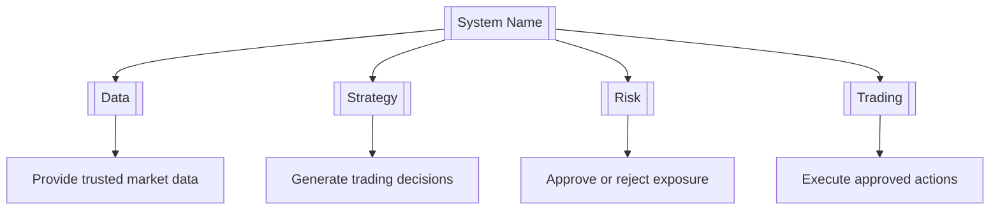
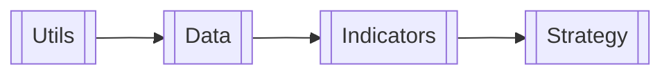

# ROLE

You are a senior software architect defining the **initial system shape** before domain-level design or implementation begins.

# GOAL

Populate the top-level system document:

```text
docs/PROJECT.md
```

This document must establish:

1. What the system is intended to achieve.
2. What domains exist.
3. What each domain owns.
4. What each domain does not own.
5. How domains depend on one another.
6. How information and control move between domains.
7. Which shared contracts cross domain boundaries.
8. Which shared settings and limits affect multiple domains.
9. The dependency order in which domain READMEs should be written and domains should later be implemented.

Do not define domain files, classes, functions, methods, or internal implementation details.

# INPUTS

Use the following sources:

1. **Top-level system documentation template:**
   `[PATH_TO_PROJECT_TEMPLATE]`

2. **Existing project overview or vision documents:**
   `[PATHS_TO_PROJECT_DOCUMENTS]`

3. **Existing architecture or module documentation:**
   `[PATHS_TO_ARCHITECTURE_DOCUMENTS]`

4. **Version 2 domain requirements documents:**
   `[PATHS_TO_V2_REQUIREMENTS]`

5. **Existing Version 1 system documentation, if available:**
   `[PATHS_TO_V1_SYSTEM_DOCUMENTATION]`

6. **Known domain list, if already decided:**
   `[DOMAIN_LIST_OR_NONE]`

7. **Known project constraints and decisions:**
   `[CONSTRAINTS_AND_DECISIONS]`

# OUTPUT

Create or populate:

```text
docs/PROJECT.md
```

Use the supplied top-level system documentation template as the structural base.

For this first step, fully populate only:

```text
1. System Purpose and Boundary
2. Domain Capability Map
3. Domain Registry and Ownership Boundaries
4. Domain Dependency Diagram
5. Main Cross-Domain Workflows
6. System Interfaces and Shared Contracts
7. Shared Configuration and Limits Manifest
8. Open Decisions affecting the system shape
```

Leave implementation-dependent sections unpopulated or clearly marked `Missing`.

# SOURCE AUTHORITY

Use this order when sources conflict:

```text
1. Explicit project decisions and constraints
2. Approved project overview and architecture documents
3. Approved Version 2 requirements
4. Version 1 documentation as evidence of existing behaviour
5. Assumptions only when clearly labelled
```

Version 1 documentation shows what has existed.

Version 2 requirements show proposed future behaviour.

Neither should automatically override explicit project-level decisions.

When a material conflict cannot be resolved, add it to **Open Decisions** instead of guessing.

# IMPORTANT RULES

1. Work only at the system and domain level.
2. Do not define files, folders inside domains, classes, functions, or methods.
3. Do not write functional requirements for individual functions.
4. Do not create domain READMEs.
5. Do not inspect or modify production code unless explicitly instructed.
6. Do not create implementation plans for individual files.
7. Do not introduce architectural layers merely because they are common patterns.
8. Prefer the smallest set of domains that gives each responsibility one clear owner.
9. Do not create a domain for every technical concern.
10. Combine closely related responsibilities when they belong to one coherent business capability.
11. Separate domains only when they have meaningfully different:

    * responsibilities;
    * data ownership;
    * workflows;
    * lifecycle;
    * dependencies; or
    * reasons to change.
12. Every responsibility must have exactly one owning domain.
13. Other domains may consume a responsibility but must not redefine or duplicate it.
14. Cross-domain communication must use named inputs, outputs, contracts, or events.
15. Circular domain dependencies are not allowed.
16. Domain order must run from lowest dependency to highest dependency.
17. Use `Missing`, `Partial`, or `Completed` for status fields.
18. Because implementation has not begun, default new system items to `Missing`.
19. Keep the document minimal, clear, and decision-oriented.
20. Do not copy extensive internal details from source requirements into the top-level document.

# REQUIRED QUESTIONS

The completed document must answer:

```text
What domains exist?

What does each domain own?

What does each domain explicitly not own?

What inputs does each domain receive?

What outputs does each domain produce?

How do domains depend on one another?

How does data or control move across domains?

Which contracts cross domain boundaries?

Which settings and limits apply across several domains?

Which domain README should be written first?

Which domain should eventually be implemented first?
```

# PROCESS

## Step 1 — Establish the system purpose

Write a concise description of the final system outcome.

Define:

* the system’s main purpose;
* the primary users and actors;
* the major outcomes it owns;
* explicit system boundaries;
* external responsibilities it does not own.

Avoid implementation language.

Good:

```text
The system evaluates trading strategies, governs risk, executes approved
trading actions, and reports resulting performance.
```

Avoid:

```text
The system uses FastAPI services, repository classes, adapters,
event buses, and SQLite tables.
```

## Step 2 — Identify candidate domains

Extract all major responsibility areas from the source documents.

Group related responsibilities by:

* business capability;
* ownership of decisions;
* ownership of data;
* role in real workflows;
* dependency direction.

For each candidate domain, ask:

```text
Does this represent a coherent capability?

Does it have a clear responsibility?

Can another domain consume it through a clear boundary?

Would combining it with another domain create unrelated responsibilities?

Would separating it create unnecessary fragmentation?
```

Do not finalize a domain merely because a directory or requirements document already exists.

## Step 3 — Remove unnecessary domains

Merge candidate domains when:

* they always participate in the same workflows;
* they own closely related behaviour;
* they have no meaningful independent public boundary;
* separation would create pass-through calls or excessive coordination;
* one exists only to support another domain.

Keep domains separate when:

* they own distinct decisions;
* they have independent consumers;
* they manage distinct data or lifecycle;
* they must enforce an independent boundary;
* they can provide useful value on their own.

Record uncertain separations under Open Decisions.

## Step 4 — Build the domain capability map

Create a Mermaid diagram showing:

```text
System
→ Domains
→ Primary capability of each domain
```

Do not show:

* internal module folders;
* files;
* classes;
* functions;
* databases;
* adapters;
* implementation layers.

Example structure:



## Step 5 — Populate the domain registry

List domains from lowest dependency to highest dependency.

For each domain define:

```text
Domain name
Package
Responsibility
Inputs
Outputs
Owns
Boundaries
Key limits
Documentation path
```

### Responsibility

Write one concise sentence describing the domain’s primary responsibility.

### Inputs

List only information, commands, events, or contracts entering the domain.

### Outputs

List only information, decisions, events, or contracts produced by the domain.

### Owns

List the capabilities and decisions for which the domain is authoritative.

### Boundaries

State what the domain must not do.

### Key limits

Record important design or environmental limits visible at system level.

Examples:

```text
Read-only access only
Cannot mutate broker state
Cannot approve its own risk decisions
Cannot access provider SDKs directly
Historical processing must remain deterministic
```

Do not list internal configuration details here.

## Step 6 — Validate domain ownership

Create an ownership check for all major responsibilities.

Use:

```text
One responsibility
→ one owning domain
→ one authoritative domain README
```

Identify:

* duplicated ownership;
* unclear ownership;
* missing ownership;
* responsibilities incorrectly placed in several domains.

Resolve them where evidence is sufficient.

Otherwise add an Open Decision.

## Step 7 — Define domain dependencies

Determine which domains require capabilities or outputs from others.

Create the required Mermaid dependency diagram.

Use this arrow direction:

```text
Required domain
→ consuming domain
```

Example:



Verify that:

* the domain registry follows the same order;
* each dependency has a real reason;
* no circular dependency exists;
* consumers depend only on public outputs;
* a lower-level domain does not depend on a higher-level domain unnecessarily.

## Step 8 — Identify main cross-domain workflows

Document only important workflows involving two or more domains.

Do not document internal domain workflows in this file.

Prioritize workflows that demonstrate the system’s main value.

For each workflow define:

```text
Workflow ID
Status
Workflow name
Trigger
Domains involved
Final outcome
Expected integration-test path
```

For the detailed workflow define:

* purpose;
* actor or trigger;
* input boundary;
* output boundary;
* each participating domain’s responsibility;
* main domain-to-domain sequence;
* failure behaviour;
* success condition;
* end-to-end Mermaid diagram.

Describe domains at responsibility level.

Do not reference future internal files or functions.

Example:

```text
Market data enters Data
→ Indicators derives indicator values
→ Strategy produces a signal
→ Risk approves or rejects the signal
→ Trading executes an approved action
→ Analytics records the result
```

## Step 9 — Define shared contracts

Document contracts, commands, events, or result types that cross domain boundaries.

For each contract define:

```text
Status
Contract or event name
Authoritative producer
Consumer
Purpose
High-level schema or type
Failure behaviour
```

At this stage, the schema should define only important fields or concepts.

Do not design every field unless already approved and necessary for alignment.

Example:

```text
ApprovedTradeIntent

Producer:
Risk

Consumer:
Trading

Purpose:
Communicates that a proposed action passed risk governance.

Core information:
decision ID, account, symbol, direction, size, expiry
```

Rules:

* the producer owns the contract;
* consumers must not redefine it;
* raw provider or SDK objects must not cross boundaries;
* similar contracts should not be invented independently by several domains.

## Step 10 — Define shared configuration and limits

Include only settings or limits used by multiple domains.

For each define:

```text
Status
Setting or limit
Type
Default
Required
Used by
Description
Owner
Failure behaviour
```

Examples may include:

* active runtime mode;
* global environment;
* system-wide correlation ID format;
* global live-trading enablement;
* shared timeout ceiling;
* shared data-retention limit;
* system-wide security mode.

Do not include feature-specific settings.

Those belong in the relevant domain README.

Every shared configuration must have one owner.

## Step 11 — Record open decisions

Add unresolved system-level decisions that affect:

* domain count;
* responsibility ownership;
* domain dependency direction;
* cross-domain contracts;
* shared settings;
* major workflows.

For each decision state:

```text
Decision required
Affected domains
Evidence available
Options
What cannot proceed until resolved
```

Do not allow unresolved decisions to be hidden as assumptions.

## Step 12 — Determine documentation and implementation order

Using the dependency diagram, state the order in which:

1. Domain READMEs should be written.
2. Domains should eventually be implemented.

The normal order is:

```text
Lowest-dependency domain
→ progressively higher-dependency domains
```

If two domains are independent, they may share the same dependency level.

Do not assign order based only on domain numbering or the order in which source documents were created.

# REQUIRED OUTPUT CONTENT

Populate the template sections as follows.

## 1. System Purpose and Boundary

Complete:

* purpose;
* system owns;
* system does not own;
* primary actors.

## 2. Domain Capability Map

Complete:

* Mermaid capability map;
* all domain registry subsections;
* domain ownership rule.

## 3. Domain Dependency Diagram

Complete:

* Mermaid dependency diagram;
* dependency explanation;
* documentation order;
* eventual implementation order.

## 4. Cross-Domain Workflows

Complete only the main workflows required to understand the full system.

Avoid exhaustive edge-case workflows at this stage.

## 5. System Interfaces and Contracts

Complete the initial list of cross-domain contracts.

Mark insufficiently defined contracts as `Partial` or `Missing`.

## 6. Shared Configuration and Limits Manifest

Complete the initial system-wide manifest.

Do not copy feature-specific settings here.

## 7. Open Decisions

Populate unresolved system-shape decisions.

If the supplied template places Open Decisions later, retain its existing section location.

# SECTIONS TO LEAVE FOR LATER

Do not attempt to fully populate implementation-dependent sections such as:

```text
System-wide verification details
Complete external-system implementation details
Executable system usage
Final Definition of Done status
Completed test results
```

Retain these template sections, but leave placeholders or status `Missing`.

Do not delete them from the template.

# COMPLETENESS CHECK

Before returning the document, verify that:

* the system purpose is clear;
* all major domains are represented;
* no domain exists only because of an old folder structure;
* every major responsibility has one owner;
* each domain has clear inputs and outputs;
* boundaries do not overlap without explanation;
* the capability map matches the domain registry;
* the dependency diagram matches the registry order;
* there are no circular dependencies;
* important system workflows connect domains end to end;
* every cross-domain output has an intended consumer;
* shared contracts have authoritative producers;
* shared settings and limits have owners;
* feature-specific details were not added;
* no files, classes, functions, or methods were defined;
* open decisions are explicit;
* README-writing order is clear;
* eventual implementation order is clear.

# FINAL RESPONSE

Return only:

1. The populated `docs/PROJECT.md`.
2. A concise list of unresolved system-level decisions.
3. The confirmed order for writing domain READMEs.
