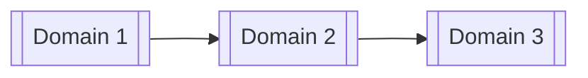

# ROLE

You are a senior software architect performing a **cross-domain alignment review** before implementation begins.

# PURPOSE

The top-level system document and all domain READMEs have already been written.

Your task is to verify that they collectively describe one coherent system.

Review:

* domain boundaries;
* responsibility ownership;
* domain dependencies;
* public inputs and outputs;
* shared contracts;
* internal and cross-domain workflows;
* shared configuration and limits;
* terminology;
* implementation order.

Do not review production code in this step.

# INPUT DOCUMENTS

## Top-level system document

`[PATH_TO_TOP_LEVEL_SYSTEM_DOCUMENT]`

## Domain READMEs

Provide all domain README paths in dependency order:

```text
[PATH_TO_DOMAIN_01_README]
[PATH_TO_DOMAIN_02_README]
[PATH_TO_DOMAIN_03_README]
...
```

## Optional supporting documents

Use only when needed:

```text
[PATH_TO_RECONCILIATION_DOCUMENTS]
[PATH_TO_SHARED_CONTRACT_DOCUMENTS]
```

# GOAL

Determine whether the top-level system document and domain READMEs align sufficiently for implementation to begin.

The review must verify that:

1. Domain boundaries still match.
2. Every responsibility has one clear owner.
3. Public inputs and outputs align.
4. Cross-domain workflows connect end to end.
5. Shared contracts are consistent.
6. Domain dependencies are correct and acyclic.
7. Shared configurations and limits have clear owners.
8. Terminology and identifiers are consistent.
9. No responsibility or business logic is duplicated.
10. No required capability falls between domains.
11. Domain implementation order remains valid.
12. No domain README contradicts the top-level system document.

# AUTHORITY ORDER

Use this authority order:

```text
1. Top-level system document
   → Defines system boundaries, domain ownership,
     domain dependencies, and cross-domain workflows.

2. Domain README
   → Defines the approved internal design and public
     behaviour of the individual domain.

3. Reconciliation documents
   → Explain why final domain decisions were made.
```

The documents should agree.

When they disagree, do not silently select one. Record the conflict and recommend which document should change.

# IMPORTANT RULES

1. Do not modify any source document during the review.
2. Create a separate alignment review report.
3. Do not inspect or redesign production code.
4. Do not introduce new architecture without a demonstrated alignment problem.
5. Keep recommendations minimal.
6. Prefer correcting documentation over adding new structural layers.
7. Do not duplicate internal domain details in the top-level document.
8. Do not place cross-domain ownership inside several domain READMEs.
9. Every responsibility must have one authoritative owner.
10. A consumer may reference another domain’s capability but must not redefine it.
11. Every cross-domain input must match a corresponding output.
12. Every shared contract must have one authoritative owner and one authoritative definition — the receiver for commands/requests, the producer for events/results, the lowest common shared domain for context/envelope contracts.
13. Every shared configuration or limit must have one owner.
14. Circular domain dependencies are not allowed.
15. Clearly distinguish confirmed conflicts from possible ambiguities.

# REVIEW PROCESS

## Step 1 — Build the domain registry

From the top-level document and all domain READMEs, extract:

* domain name;
* package path;
* purpose;
* owned responsibilities;
* excluded responsibilities;
* upstream dependencies;
* downstream consumers;
* public inputs;
* public outputs;
* shared contracts;
* cross-domain workflows.

Create one consolidated registry.

## Step 2 — Validate domain boundaries

For every domain, compare its README against the top-level system document.

Verify that:

* its purpose matches;
* its owned responsibilities match;
* its exclusions match;
* it does not claim another domain’s responsibilities;
* the top-level document does not assign its responsibility elsewhere.

Classify each boundary as:

```text
Aligned
Partial
Conflict
Missing
```

## Step 3 — Validate responsibility ownership

Create a responsibility ownership map.

Every responsibility must have exactly one owner.

Identify:

* duplicated ownership;
* unclear ownership;
* missing ownership;
* responsibilities assigned at different abstraction levels;
* responsibilities implemented by one domain but documented as owned by another.

Use this rule:

```text
One responsibility
→ one owning domain
→ one authoritative domain README
```

Other domains may consume the responsibility through public boundaries.

## Step 4 — Validate domain dependencies

Compare:

* the top-level dependency diagram;
* domain README dependency diagrams;
* domain file dependencies where cross-domain imports are planned;
* domain implementation order.

Verify:

* dependency directions agree;
* no circular dependency exists;
* no lower-level domain depends on a higher-level domain unnecessarily;
* every cross-domain dependency is justified by a workflow or contract;
* domain implementation order remains possible.

## Step 5 — Validate public inputs and outputs

For every cross-domain interaction, compare the producer’s output with the consumer’s input.

Check:

* contract or event name;
* data type;
* required fields;
* optional fields;
* identifiers;
* units;
* timestamps;
* status values;
* error behaviour;
* side effects;
* sync or async behaviour.

Classify each connection as:

```text
Aligned
Partially aligned
Incompatible
Undefined
```

Example:

```text
Strategy output:
ApprovedSignal

Trading input:
TradingSignal

Result:
Potential mismatch — confirm whether these are the same
contract or require an explicit conversion.
```

## Step 6 — Validate shared contracts

For every shared contract or event, determine:

* authoritative owner (per the ownership rules in the top-level system document);
* producer / submitter;
* consumers;
* canonical name;
* canonical type or schema;
* version;
* error behaviour;
* compatibility expectations.

Every contract must carry an explicit version. Verify that the version in each README's owned-contracts table matches the top-level system document's contract table.

Identify:

* duplicate contract definitions;
* different names for the same contract;
* same name with different fields;
* contracts missing a version, or version mismatches between documents;
* raw provider objects crossing boundaries;
* contracts without an owner;
* consumers expecting fields the producer does not provide.

## Step 7 — Validate cross-domain workflows

For every cross-domain workflow in the top-level document:

1. Find the participating workflow section in each domain README, and verify the `SYS-WF-*` citations both ways: every README cross-domain workflow cites a real `SYS-WF-*` ID, and every domain listed in a `SYS-WF-*` chain has a matching `WF-[DOM]-*` entry.
2. Verify the input boundary.
3. Verify the domain’s documented responsibilities.
4. Verify the output boundary.
5. Verify the next domain accepts that output.
6. Continue until the final system outcome is reached.
7. Verify failure paths and ownership of recovery behaviour.

Check that:

```text
Domain A output
= Domain B input

Domain B output
= Domain C input
```

Identify:

* missing workflow steps;
* disconnected outputs;
* undocumented consumers;
* duplicate processing;
* incompatible contracts;
* unclear error ownership;
* unclear retry ownership;
* missing final outcomes.

## Step 8 — Validate internal versus cross-domain scope

Confirm that:

* internal workflows are fully documented only in the owning domain README;
* cross-domain workflows are summarized in the top-level document;
* domain READMEs describe only their own part of cross-domain workflows;
* another domain’s internal functions are not duplicated;
* top-level documentation does not contain file or function details.

## Step 9 — Validate shared configuration, limits, and data ownership

### Data ownership

Cross-check every persisted or long-lived state:

* every state in the top-level data ownership table has exactly one owning domain, and that domain's README declares it under Persisted state;
* every README Persisted state entry appears in the top-level data ownership table;
* no domain README plans to write state owned by another domain;
* cross-domain reads go through the owner's documented contract, not direct store access.

### Shared configuration and limits

For each shared setting or limit, check:

* authoritative owner;
* consuming domains;
* name;
* type;
* default;
* required status;
* validation responsibility;
* failure behaviour;
* whether it is duplicated in module-level manifests.

Classify each as:

```text
Aligned
Duplicated
Conflicting
Unowned
Missing
```

Feature-specific configuration must remain in the owning domain README.

System-wide configuration belongs in the top-level document.

## Step 10 — Validate terminology and identifiers

Check consistency of:

* domain names;
* module names;
* workflow IDs;
* requirement IDs;
* contract names;
* event names;
* route names;
* status values;
* modes;
* errors;
* units;
* timestamps;
* actor names.

Identify cases where different terms appear to describe the same concept.

Do not automatically merge them. Recommend one canonical term.

## Step 11 — Detect duplicated responsibility

Look for domains that independently define or perform the same behaviour.

Examples:

* both Strategy and Trading validating risk approval;
* both Data and Analytics normalizing market data;
* both Trading and Live owning broker execution;
* several domains defining the same contract;
* several domains enforcing the same global limit.

Differentiate:

```text
Valid defensive validation
≠ duplicated business ownership
```

A consumer may validate that an input satisfies its contract, but it must not independently own and recreate another domain’s business decision.

## Step 12 — Detect missing responsibility

Identify requirements or workflow steps that:

* appear in the top-level document but no domain owns;
* appear in a domain output but no consumer accepts;
* are needed between two domains but are documented nowhere;
* are referenced by several domains but have no authoritative owner;
* are required for failure recovery but have not been assigned.

## Step 13 — Assess implementation readiness

Assign one final readiness result:

| Result                           | Meaning                                                                              |
| -------------------------------- | ------------------------------------------------------------------------------------ |
| **Ready**                        | No material cross-domain conflicts remain                                            |
| **Ready with minor corrections** | Small documentation corrections are required but implementation order is still clear |
| **Not ready**                    | Contract, ownership, workflow, or dependency conflicts must be resolved first        |

Do not mark the system ready if:

* domain ownership conflicts remain;
* shared contracts are incompatible;
* important workflows are disconnected;
* circular dependencies exist;
* open decisions require the implementing agent to guess.

# REQUIRED OUTPUT

Create:

```text
docs/dev/reviews/cross-domain-alignment-review.md
```

Use the following structure.

---

# Cross-Domain Alignment Review

## 1. Review Scope

* Top-level system document:
* Domain READMEs reviewed:
* Supporting documents:
* Documents unavailable:
* Review limitations:

## 2. Executive Summary

State:

* overall readiness;
* number of domains reviewed;
* number of cross-domain workflows reviewed;
* number of aligned items;
* number of conflicts;
* number of missing or unclear items;
* the most important corrections required.

## 3. Domain Registry

| Domain | Package | Purpose | Owns | Inputs | Outputs | Depends on |
| ------ | ------- | ------- | ---- | ------ | ------- | ---------- |

## 4. Domain Boundary Alignment

| Domain | Top-level boundary | README boundary | Status | Finding | Required correction |
| ------ | ------------------ | --------------- | ------ | ------- | ------------------- |

## 5. Responsibility Ownership Matrix

| Responsibility | Owning domain | Referencing domains | Status | Finding |
| -------------- | ------------- | ------------------- | ------ | ------- |

Status:

```text
Aligned
Duplicated
Unowned
Conflict
```

## 6. Domain Dependency Review

| Source domain | Target domain | Reason | Top-level documented? | Domain README documented? | Status |
| ------------- | ------------- | ------ | --------------------- | ------------------------- | ------ |

### Dependency diagram

Create the corrected or confirmed dependency diagram:



Clearly label the diagram as:

```text
Confirmed
```

or:

```text
Proposed correction
```

## 7. Public Input and Output Alignment

| Producer | Output | Consumer | Expected input | Status | Mismatch / action |
| -------- | ------ | -------- | -------------- | ------ | ----------------- |

## 8. Shared Contract Alignment

| Contract / Event | Version | Owner | Producer / Submitter | Consumer(s) | Status | Conflict / correction |
| ---------------- | ------- | ----- | -------------------- | ----------- | ------ | --------------------- |

## 9. Cross-Domain Workflow Alignment

| Workflow ID | Domains | Input boundary | Output boundary | Status | Finding |
| ----------- | ------- | -------------- | --------------- | ------ | ------- |

### `[SYS-WF-001]` — [Workflow Name]

**Expected system flow:**

```text
Domain A
→ Contract A
→ Domain B
→ Contract B
→ Domain C
→ Final outcome
```

**Alignment findings:**

| Step | Producer | Output | Consumer | Expected input | Status |
| ---: | -------- | ------ | -------- | -------------- | ------ |

**Failure-path ownership:**

| Failure | Detecting domain | Handling domain | Recovery outcome | Status |
| ------- | ---------------- | --------------- | ---------------- | ------ |

**Required corrections:**

* [Correction]
* [Correction]

Repeat for every important cross-domain workflow.

## 10. Shared Configuration, Limits, and Data Ownership Alignment

| Setting / Limit | Owner | Used by | Status | Finding | Required correction |
| --------------- | ----- | ------- | ------ | ------- | ------------------- |

### Data ownership alignment

| State / Store | Owner (top-level) | Owner (README) | Writers found | Status | Finding / correction |
| ------------- | ----------------- | -------------- | ------------- | ------ | -------------------- |

## 11. Terminology and Identifier Alignment

| Concept | Terms currently used | Canonical term recommended | Documents to update |
| ------- | -------------------- | -------------------------- | ------------------- |

## 12. Duplicated Responsibilities

| Responsibility | Domains involved | Evidence | Correct owner | Required correction |
| -------------- | ---------------- | -------- | ------------- | ------------------- |

## 13. Missing or Unowned Responsibilities

| Responsibility / workflow step | Why required | Proposed owner | Affected workflow |
| ------------------------------ | ------------ | -------------- | ----------------- |

Do not invent a proposed owner when the correct ownership requires a human decision. Mark it as `Open Decision`.

## 14. Conflicts Requiring Resolution

| Priority | Conflict ID | Conflict   | Affected documents | Required decision |
| -------: | ----------- | ---------- | ------------------ | ----------------- |
|        1 | `ALIGN-001` | [Conflict] | [Documents]        | [Decision]        |

Priority:

```text
Critical
High
Medium
Low
```

## 15. Required Documentation Corrections

### Top-level system document

* [Correction]
* [Correction]

### `[Domain A]` README

* [Correction]
* [Correction]

### `[Domain B]` README

* [Correction]
* [Correction]

Only recommend the smallest corrections needed for alignment.

## 16. Confirmed Implementation Order

List the final domain order only when dependencies are aligned:

```text
1. [Domain]
2. [Domain]
3. [Domain]
```

If the order is not yet valid, state:

```text
Implementation order cannot be confirmed until ALIGN-XXX is resolved.
```

## 17. Open Decisions

| Status | Decision            | Affected domains | Options / Notes |
| ------ | ------------------- | ---------------- | --------------- |
| Open   | [Decision required] | [Domains]        | [Options]       |

Decisions affecting more than one domain that were discovered during this review must also be recorded in the top-level system document's Open Decisions section (where they are resolved with an ADR) — not only in this report.

## 18. Readiness Assessment

### Result

`[Ready | Ready with minor corrections | Not ready]`

### Reason

[Concise explanation.]

### Blocking items

* `[ALIGN-XXX]`
* `[ALIGN-XXX]`

### Non-blocking corrections

* [Correction]
* [Correction]

## 19. Final Validation Checklist

Confirm that:

* every domain README was reviewed;
* every top-level domain has a matching README;
* every README domain appears in the top-level registry;
* every responsibility has one owner;
* every domain dependency is documented;
* no circular dependency exists;
* every cross-domain output has a matching input;
* every shared contract has one authoritative owner and an explicit version consistent across documents;
* every cross-domain workflow connects end to end;
* `SYS-WF-*` citations match between the top-level document and domain READMEs;
* failure and recovery ownership is clear;
* shared configurations have one owner;
* every persisted state has one owning domain and no foreign writers;
* every resolved cross-domain decision has a linked ADR;
* every domain is assigned to a runtime unit in the deployment topology;
* terminology is consistent;
* duplicated responsibilities are identified;
* missing responsibilities are identified;
* implementation order is confirmed or explicitly blocked;
* no source document was modified;
* no code was changed.

# FINAL RESPONSE

Return only:

1. The completed `cross-domain-alignment-review.md`.
2. The final readiness result.
3. The list of blocking alignment issues, if any.
