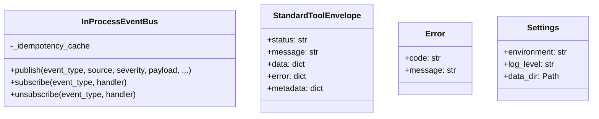

# 01-utils.md - Requirements

## 1. Purpose

The `app/services/utils/` module must be the shared production-grade utility foundation for HaruQuantAI.

It must provide stable, typed, documented, deterministic, logged, testable, and secure primitives used by higher-level domains including data, research, simulation, risk, portfolio, execution, analytics, governance, and agentic workflows.

The module must remain a utility foundation. It may validate, normalize, redact, serialize, route events, report diagnostics, emit telemetry, and provide safe adapters. It must not own strategy logic, broker execution, portfolio allocation, risk-governor decisions, application orchestration, database repositories, UI behavior, or live trading decisions.

---

Source: transformed from the uploaded `01-utils.md` consolidated Utils requirements document.

This is a domain-level baseline and Builder handoff requirements document, not a single sprint-sized implementation ticket. Each implementation ticket must explicitly name which requirement classes are in scope.

Requirement classes:

- `Core Required`: needed for the first accepted Utils foundation implementation.
- `Production Required`: needed before production/live-readiness acceptance, but may be delivered after the first core slice when explicitly tracked.
- `Optional Adapter`: provider-specific or infrastructure-specific adapter work that requires explicit approval before implementation.
- `Future Improvement`: useful later work that is not required for the baseline handoff.

### 1.1 Assumptions

- [ ] This is a domain-level requirements document, not a sprint-specific requirements document.
- [ ] The implementation is expected to be fresh and clean, with no backward-compatibility shims.
- [ ] Support helpers remain native unless explicitly classified as official AI tools.
- [ ] Conditional AI tools remain support helpers unless direct agent use is approved.
- [ ] `app.services.data` will own repair, resampling, enrichment, persistence, and cleaning workflows for market data.
- [ ] Data-quality market-calendar gap handling depends on session rules being supplied by a caller or future domain module.
- [ ] Optional dependencies may or may not be installed; importability must remain intact either way.
- [ ] The default OHLCV scoring model applies unless a later module-specific specification replaces it.
- [ ] Strict schema-version enforcement occurs only when a caller or schema requires a version.
- [ ] No UI, broker runtime, database repository, or LLM framework dependency is required inside `app.services.utils`.
- [ ] The utils module will provide auth primitives and validation helpers, but the application or infrastructure layer will own external identity-provider integration.
- [ ] The utils module will provide Event Bus contracts and an in-process implementation, while production broker-backed adapters may live in infrastructure modules or optional adapters.
- [ ] The Event Bus is intended for utility, workflow, alert, and error-routing events, not direct trading execution.
- [ ] Notification helpers will provide routing contracts and adapter boundaries, not hard-coded provider credentials.
- [ ] Email, Telegram, and desktop notification providers will be configured explicitly per environment.
- [ ] Prometheus metrics export may be provided by application runtime, while utils provides metric registration and recording helpers.
- [ ] Grafana dashboards may be maintained as documentation or version-controlled dashboard definitions.
- [ ] Sensitive runtime settings and provider credentials are supplied through secure environment/configuration mechanisms.
- [ ] No notification channel is enabled in production without explicit configuration.
- [ ] Metrics and logs are operational telemetry and must not contain raw market payloads, secrets, or approval-packet contents.

### 1.2 Open Questions

| Question | Owner | Decision required | Blocking status | Target decision date |
|---|---|---|---|---|
| Which exact `Core Required` and `Production Required` items are in the first Builder implementation slice? | Owner/Architect | Approve implementation slice. | Blocking for direct Builder handoff. | Pending |
| Should real email, Telegram, and desktop delivery adapters live under `app.services.utils` optional adapters or outside utils in infrastructure modules? | Owner/Architect | Classify provider adapter ownership. | Blocking only for real delivery implementation. | Pending |
| Should external pub/sub broker adapters live under `app.services.utils` optional adapters or outside utils in infrastructure modules? | Owner/Architect | Classify external pub/sub adapter ownership. | Blocking only for external broker adapter implementation. | Pending |
| What benchmark thresholds apply to OHLCV validation, schema validation, logging overhead, metrics overhead, and health checks? | Owner/Architect | Approve benchmark profile and thresholds. | Blocking for production acceptance. | Pending |
| Which agent-safe input modes are approved for dataframe-like official AI tools: pandas DataFrames, JSON records, artifact references, or a subset? | Owner/Architect | Approve agent-safe input modes. | Blocking for agent attachment. | Pending |

Builder handoff requires zero open questions marked blocking for the approved implementation slice.

## 2. Ownership

### 2.1 Owns

- Owns the shared `app/services/utils/` utility foundation for HaruQuantAI.
- Owns structured logging primitives and logger configuration helpers.
- Owns standard HaruQuant tool response envelopes, metadata, timing, and response schema validation.
- Owns deterministic error types, error codes, and exception-to-envelope mapping support.
- Owns request, workflow, correlation, causation, event, version, and idempotency helper primitives.
- Owns UTC-first timestamp normalization, stale-data checks, and monotonic execution timing helpers.
- Owns safe path handling and deterministic canonical JSON serialization.
- Owns dataframe helper utilities and diagnostic-only OHLCV data-quality validation.
- Owns schema, payload, numeric range, freshness, evidence, approval, registry, handoff, and artifact-reference validation helpers.
- Owns security utilities for redaction, password hashing/verification, encryption/decryption boundaries, and secret-version selection.
- Owns runtime settings loading and injection with deterministic source precedence.
- Owns auth-context validation and authorization support helpers, including deny-by-default behavior and tool allowlists.
- Owns Event Bus and pub/sub primitives for utility, workflow, alert, and error-routing events.
- Owns error-routing and alert-routing primitives.
- Owns notification routing primitives for email, Telegram, and desktop channels.
- Owns observability primitives for logs, metrics, health snapshots, trace correlation, Prometheus-compatible metrics, and Grafana dashboard expectations.
- Owns provider-neutral contracts, DTOs, fake/test adapters, and in-process implementations unless an approved implementation ticket explicitly includes external providers.

### 2.2 Does Not Own

- Does not own trading strategy logic.
- Does not own broker execution logic or live account mutation.
- Does not own risk-governor decisions, portfolio allocation decisions, or strategy promotion decisions.
- Does not approve, reject, place, close, modify, or cancel trades or orders.
- Does not activate live systems or override kill switches.
- Does not own application orchestration, UI behavior, database repositories, or backtest engines.
- Does not repair, resample, enrich, persist, or clean market data; those workflows belong to `app.services.data`.
- Does not act as an external identity provider or validate external identity-provider tokens unless an explicit adapter is supplied by the application layer.
- Does not hard-code notification provider credentials or initialize external clients during import.
- Does not own production external provider/client implementations unless they are approved as optional adapters for `app.services.utils`.
- Does not expose every internal helper as an agent-callable tool.
- Does not hide dependency behavior behind unclear compatibility shims, fallback modules, aliases, or duplicate wrapper modules.

## 3. API

### 3.1 Public Capabilities

**Official AI tools**

- [ ] `validate_ohlcv_quality`
- [ ] `validate_input_schema`
- [ ] `validate_output_schema`
- [ ] `validate_handoff_payload`
- [ ] `validate_evidence_pack`
- [ ] `validate_approval_packet`
- [ ] `validate_registry_entry`
- [ ] `validate_data_freshness`
- [ ] `redact_text_tool`, only for approved audit/log-redaction workflows.
- [ ] `redact_mapping_tool`, only for approved audit/log-redaction workflows.

**Support helpers and public support objects**

- [ ] Project-wide `logger`, `get_logger`, and `configure_logging`.
- [ ] Standard response builders, metadata helpers, and `validate_tool_response_schema`.
- [ ] `Error` and shared deterministic exception classes.
- [ ] ID, request, workflow, correlation, causation, event, and version helpers.
- [ ] UTC timestamp, timezone, stale-data, and monotonic execution timing helpers.
- [ ] Safe path helpers such as `normalize_path`, `ensure_dir`, and `ensure_parent_dir`.
- [ ] Dataframe helpers such as datetime alignment, bar-to-record conversion, chunking, comparison, and dataframe-record serialization.
- [ ] Schema validation support helpers such as `validate_numeric_range` and `validate_required_fields`.
- [ ] Security helpers such as `redact_text_value`, `redact_mapping_value`, password hashing/verification, encryption/decryption, key loading, and secret-version selection.
- [ ] Runtime settings loaders and injection helpers.
- [ ] Auth-context validation and authorization helpers.
- [ ] Event Bus publish/subscribe, event envelope, idempotency, retry, dead-letter, queue, and diagnostic helpers.
- [ ] Error-routing and notification-routing helpers.
- [ ] Observability helpers for metrics, health checks, trace correlation, Prometheus-compatible metrics, and Grafana expectations.

**Public API rules**

- [ ] `app/services/utils/__init__.py` is the public registry.
- [ ] Only intentionally imported names listed in `__all__` may be public.
- [ ] Public names must be classified as official AI tools or support helpers.
- [ ] Official AI tools must return standard HaruQuant envelopes.
- [ ] Support helpers may return native Python values.
- [ ] Sensitive helpers such as `load_runtime_settings`, `encrypt_data`, and `decrypt_data` remain support helpers and must not be attached to agents by default.
- [ ] Native helpers and official AI tool wrappers must not share the same public name when their return shapes differ.

### 3.2 Public API Contracts

- [ ] Every public capability must have a contract entry before Builder handoff.
- [ ] Every contract entry must define callable name, module path, requirement class, public classification, stability status, accepted input types, required fields, optional fields, return shape, error behavior, side effects, risk level, network/filesystem/database/trading flags, and default agent-attachment status.
- [ ] Official AI tool contracts must include at least one success envelope example and one error envelope example.
- [ ] Support helper contracts must state whether the helper returns a native value, returns a native validation result, mutates an explicitly supplied target, or raises a typed HaruQuant exception.
- [ ] Official AI tools that accept dataframe-like data must document whether they accept pandas DataFrames, JSON-serializable records, artifact references, or multiple input modes.
- [ ] Official AI tools must reject non-agent-safe input modes when invoked through an agent attachment.
- [ ] Official AI tools must document schema version and compatibility policy.
- [ ] Official AI tools must document whether the output `data` payload is stable, experimental, or diagnostic-only.

**Official AI tool contract matrix**

| Tool | Module path | Requirement class | Inputs | Return shape | Risk/side effects | Agent attachment |
|---|---|---|---|---|---|---|
| `validate_ohlcv_quality` | `app.services.utils.data_quality` | Core Required | DataFrame, JSON records, or artifact reference as explicitly documented by the implementation contract; `symbol`; `timeframe`; `request_id` | Standard envelope with diagnostic quality data | Low risk; read-only; no file, database, network, or trading side effects | Allowed only through approved read-only validation attachment |
| `validate_input_schema` | `app.services.utils.schema_validation` | Core Required | JSON-safe payload, schema, optional schema version, `request_id` | Standard envelope with bounded validation diagnostics | Low risk; read-only; no file, database, network, or trading side effects | Allowed only through approved read-only validation attachment |
| `validate_output_schema` | `app.services.utils.schema_validation` | Core Required | JSON-safe payload, schema, optional schema version, `request_id` | Standard envelope with bounded validation diagnostics | Low risk; read-only; no file, database, network, or trading side effects | Allowed only through approved read-only validation attachment |
| `validate_handoff_payload` | `app.services.utils.schema_validation` | Core Required | JSON-safe handoff payload, handoff schema or policy, `request_id` | Standard envelope with bounded validation diagnostics | Low risk; read-only; no file, database, network, or trading side effects | Allowed only through approved read-only validation attachment |
| `validate_evidence_pack` | `app.services.utils.schema_validation` | Core Required | JSON-safe evidence pack, evidence policy, `request_id` | Standard envelope with bounded validation diagnostics | Low risk; read-only; no file, database, network, or trading side effects | Allowed only through approved read-only validation attachment |
| `validate_approval_packet` | `app.services.utils.schema_validation` | Core Required | JSON-safe approval packet, approval policy, `request_id` | Standard envelope with bounded validation diagnostics | Low risk; read-only; no file, database, network, or trading side effects | Allowed only through approved read-only validation attachment |
| `validate_registry_entry` | `app.services.utils.schema_validation` | Core Required | JSON-safe registry entry, registry policy, `request_id` | Standard envelope with bounded validation diagnostics | Low risk; read-only; no file, database, network, or trading side effects | Allowed only through approved read-only validation attachment |
| `validate_data_freshness` | `app.services.utils.schema_validation` | Core Required | Timestamp payload, freshness window, optional injected `now`, `request_id` | Standard envelope with freshness result and bounded diagnostics | Low risk; read-only; no file, database, network, or trading side effects | Allowed only through approved read-only validation attachment |
| `redact_text_tool` | `app.services.utils.security` | Core Required | Text, redaction policy, `request_id` | Standard envelope with redacted text and redaction diagnostics | Low risk; read-only; no file, database, network, or trading side effects | Allowed only for approved audit/log-redaction workflows |
| `redact_mapping_tool` | `app.services.utils.security` | Core Required | JSON-safe mapping, redaction policy, `request_id` | Standard envelope with redacted mapping and redaction diagnostics | Low risk; read-only; no file, database, network, or trading side effects | Allowed only for approved audit/log-redaction workflows |

**Support helper contract summary**

| Helper group | Requirement class | Return behavior | Side-effect policy |
|---|---|---|---|
| Logging helpers | Core Required | Logger objects or native configuration status | Import-safe; configuration only through explicit calls |
| Standard response helpers | Core Required | Native envelope mappings or native validation results | Pure except timing reads |
| Error helpers | Core Required | Typed exceptions, native code names/messages, or mapped error dictionaries | Pure |
| Identity/time helpers | Core Required | Native strings, datetimes, durations, and validation results | Pure except entropy/clock reads |
| Path helpers | Core Required | `Path` objects or typed exceptions | Directory creation only through explicit `ensure_*` helpers |
| Dataframe helpers | Core Required | Native records, comparisons, or validation results | Must not mutate caller-owned data unless documented |
| Native redaction helpers | Core Required | Native redacted values from `redact_text_value` and `redact_mapping_value` | Pure and read-only |
| Hashing/encryption helpers | Production Required | Native hashes, encrypted bytes/text, decrypted bytes/text, or typed exceptions | Restricted support helpers; not agent-attached by default |
| Settings helpers | Core Required | Native settings objects, diagnostics, or typed exceptions | Must not read `.env` or mutate environment at import time |
| Auth helpers | Core Required | Native authorization/validation results or typed exceptions | Deny by default; no external identity-provider calls |
| Event Bus in-process helpers | Production Required | Native event/result objects or diagnostics | In-process side effects only; bounded and observable |
| External Event Bus adapters | Optional Adapter | Adapter-specific result objects or standard diagnostics | Lazy-loaded, circuit-breaker protected, explicitly configured |
| Notification routing helpers | Production Required | Native routing status or diagnostics | No real sends unless an approved adapter is configured and called |
| Real notification providers | Optional Adapter | Provider delivery status or deterministic failure diagnostics | Lazy-loaded, circuit-breaker protected, explicitly configured |
| Observability helpers | Production Required | Native metric/health snapshots or no-op diagnostics | No network/export side effects unless explicitly configured |

### 3.3 Configuration Defaults

#### Configuration Defaults

These defaults are baseline Utils configuration values for implementation and validation planning. They are not trading risk thresholds and do not approve live trading. Owner review may tune them before production acceptance, but any implementation must centralize the active values in a documented configuration profile.

| Setting | Baseline default | Requirement class | Notes |
|---|---:|---|---|
| `MAX_PAYLOAD_SIZE_BYTES` | `5242880` | Core Required | Maximum JSON-safe validation payload size, 5 MB. |
| `MAX_VALIDATION_DEPTH` | `20` | Core Required | Maximum nested validation depth. |
| `MAX_FIELD_COUNT` | `500` | Core Required | Maximum fields inspected in a single validation payload. |
| `MAX_ISSUE_COUNT` | `100` | Core Required | Maximum issues returned by a validator. |
| `MAX_SAMPLE_COUNT` | `20` | Core Required | Maximum samples returned across diagnostics. |
| `MAX_RESPONSE_SIZE_BYTES` | `1048576` | Core Required | Maximum official tool response payload size, 1 MB. |
| `MAX_REDACTION_DEPTH` | `10` | Core Required | Maximum nested depth for redaction traversal. |
| `MAX_STRING_LENGTH` | `10000` | Core Required | Maximum string length inspected or returned without truncation. |
| `IDEMPOTENCY_TTL_SECONDS` | `300` | Production Required | Default in-process Event Bus idempotency TTL. |
| `MAX_IDEMPOTENCY_CACHE_ENTRIES` | `10000` | Production Required | Maximum in-process idempotency entries before eviction. |
| `EVENT_BUS_QUEUE_SIZE` | `1000` | Production Required | Default in-process Event Bus queue size. |
| `EVENT_HANDLER_TIMEOUT_MS` | `5000` | Production Required | Per-handler timeout for in-process delivery when timeouts are enabled. |
| `ERROR_DEDUP_WINDOW_SECONDS` | `300` | Production Required | Default error-routing deduplication window. |
| `NOTIFICATION_THROTTLE_WINDOW_SECONDS` | `300` | Production Required | Default notification throttle window. |
| `METRIC_LABEL_MAX_DISTINCT_VALUES` | `10` | Production Required | Maximum approved values per metric label in a bounded process window unless a stricter allowlist applies. |
| `CLOCK_DRIFT_WARNING_SECONDS` | `1` | Production Required | Clock-drift warning threshold where drift source exists. |
| `CLOCK_DRIFT_CRITICAL_SECONDS` | `5` | Production Required | Clock-drift critical threshold where drift source exists. |

- [ ] The implementation must expose these values through a single configuration profile or settings object.
- [ ] Environment overrides must be validated against safe minimum and maximum ranges.
- [ ] Production acceptance must either approve these defaults or document approved replacement values.
- [ ] Tests must assert behavior against the active configuration profile rather than hard-coded duplicate constants.
- [ ] Official AI tools must return bounded diagnostics when these limits are reached.

## 4. Functional Requirements

**Module Foundation and Scope**
- [ ] The system must implement `app/services/utils/` as the shared utility foundation for HaruQuantAI.
- [ ] The module must support higher-level domains including data, research, simulation, risk, portfolio, execution, analytics, governance, and agentic workflows.
- [ ] The module must provide project-wide structured logging.
- [ ] The module must provide standard HaruQuant tool response envelopes.
- [ ] The module must provide deterministic error codes and exception mapping.
- [ ] The module must provide request, workflow, generic ID, version, correlation ID, causation ID, and idempotency helpers.
- [ ] The module must provide shared status, severity, risk-level, environment-mode, auth, event, notification, and health-state constants.
- [ ] The module must provide timestamp and timezone normalization using a UTC-first policy.
- [ ] The module must provide safe path handling.
- [ ] The module must provide canonical JSON serialization for audit, hashing, caching, reproducible tests, and comparison workflows.
- [ ] The module must provide dataframe and OHLCV helper utilities.
- [ ] The module must provide OHLCV data-quality validation with bounded diagnostics and deterministic scoring.
- [ ] The module must provide schema, payload, risk-level, numeric-range, and contract validation.
- [ ] The module must provide security helpers for redaction, hashing, encryption, decryption, and secret-version selection.
- [ ] The module must provide runtime settings loading and injection with deterministic source precedence.
- [ ] The module must provide standard execution timing helpers for consistent `execution_ms` values.
- [ ] The module must provide explicit tool-response schema validation constants.
- [ ] The module must provide schema-version compatibility checks for validation contracts.
- [ ] The module must provide resource-limit controls for large validation workloads.
- [ ] The module must support lazy loading for pandas and other heavy optional dependencies.
- [ ] The module must preserve a stateless, diagnostic-only data-quality boundary.
- [ ] The module must support string-serializable constants and enum-friendly canonicalization.
- [ ] The module must support extensible domain error mapping through `Error` and compatible `code` attributes.
- [ ] The module must provide auth context validation and authorization support helpers.
- [ ] The module must provide Event Bus and pub/sub primitives.
- [ ] The module must provide early alert routing and error routing so the rest of the system can report issues consistently.
- [ ] The module must provide notification routing primitives for email, Telegram, and desktop channels.
- [ ] The module must provide observability primitives for logs, metrics, health snapshots, and trace correlation.
- [ ] The module must provide Prometheus-compatible system-health metrics.
- [ ] The module must define Grafana dashboard expectations for operational health.

**Public API and Registry**
- [ ] `app/services/utils/__init__.py` must act as the public registry for the utility domain.
- [ ] Only intentionally imported names listed in `__all__` may be public.
- [ ] Public names must be classified as either official AI tools or support objects/helpers.
- [ ] Official AI tools must return the standard HaruQuant tool envelope.
- [ ] Support helpers may return native Python values when they are not agent-callable tools.
- [ ] The logger must be exported as a support object and must not be treated as an official AI tool.
- [ ] Auth, Event Bus, notification, and observability primitives must be support helpers by default unless explicitly promoted to official AI tools.
- [ ] Internal helpers must remain private unless explicitly intended for public import.
- [ ] No accidental public exports may exist.
- [ ] No compatibility shims, aliases, fallback import modules, or duplicate wrapper modules may exist.
- [ ] New public exports must be justified by real cross-domain reuse.
- [ ] Public exports may not be renamed or removed after v8 acceptance without a new versioned specification and registry review.

**Official AI Tools**
- [ ] `validate_ohlcv_quality` must be implemented as a low-risk, read-only official AI tool.
- [ ] `validate_input_schema` must be implemented as a low-risk, read-only official AI tool.
- [ ] `validate_output_schema` must be implemented as a low-risk, read-only official AI tool.
- [ ] `validate_handoff_payload` must be implemented as a low-risk, read-only official AI tool.
- [ ] `validate_evidence_pack` must be implemented as a low-risk, read-only official AI tool.
- [ ] `validate_approval_packet` must be implemented as a low-risk, read-only official AI tool.
- [ ] `validate_registry_entry` must be implemented as a low-risk, read-only official AI tool.
- [ ] `validate_data_freshness` must be implemented as a low-risk, read-only official AI tool.
- [ ] `redact_text_tool` must be classified as a low-risk, read-only official AI tool only for approved audit/log-redaction workflows.
- [ ] `redact_mapping_tool` must be classified as a low-risk, read-only official AI tool only for approved audit/log-redaction workflows.
- [ ] Native redaction helpers such as `redact_text_value` and `redact_mapping_value` must return native redacted values and remain support helpers.
- [ ] Native redaction helpers must not be attached to agents by default unless wrapped by an approved official AI tool.
- [ ] Native helper names and official AI tool wrapper names must not collide when return shapes differ.
- [ ] `load_runtime_settings` must remain a support helper and must not be attached to agents by default.
- [ ] `encrypt_data` must remain a restricted support helper and must not be attached to agents by default.
- [ ] `decrypt_data` must remain a restricted support helper and must not be attached to agents by default.
- [ ] Agent access to encryption or decryption must require explicit security approval, permission checks, and audit logging.
- [ ] Official AI tools must include `request_id: str | None = None`.
- [ ] Official AI tools must include tool metadata.
- [ ] Official AI tools must include risk and side-effect flags.
- [ ] Official AI tools must validate inputs.
- [ ] Official AI tools must measure execution timing.
- [ ] Official AI tools must use structured logging.
- [ ] Official AI tools must return the standard response schema.
- [ ] Official AI tools must use deterministic error codes.
- [ ] Official AI tools must not fail silently.
- [ ] Agents may call only approved official AI tools through approved tool attachment.

**Standard Tool Response**
- [ ] Every official AI tool must return the top-level keys `status`, `message`, `data`, `error`, and `metadata`.
- [ ] `status` must be either `success` or `error`.
- [ ] `message` must be a string.
- [ ] `error` must be either `None` or a mapping with `code` and `details`.
- [ ] `metadata` must include `tool_name`, `tool_version`, `tool_category`, `tool_risk_level`, `request_id`, `execution_ms`, `read_only`, `writes_file`, `modifies_database`, `places_trade`, and `requires_network`.
- [ ] Standard response validation must reject missing top-level keys.
- [ ] Standard response validation must reject missing metadata keys.
- [ ] Standard response validation must reject invalid statuses.
- [ ] Standard response validation must reject malformed errors.
- [ ] Standard response validation should validate error codes against the approved error-code set where practical.
- [ ] `get_execution_ms(start_time)` must calculate execution duration consistently for official tools.
- [ ] `get_execution_ms(start_time)` must use a monotonic clock source such as `time.perf_counter()`.
- [ ] `get_execution_ms(start_time)` must return milliseconds rounded to three decimals.

**Logging**
- [ ] The module must expose a project-wide `logger`.
- [ ] The module must expose `get_logger(name: str | None = None)`.
- [ ] The module must expose `configure_logging(level: str | int = "INFO")`.
- [ ] Logging must use Python `logging`.
- [ ] Logging must use structured JSON-compatible output for production runtime events.
- [ ] Production logging must use a JSON-compatible structured formatter.
- [ ] Local development console logging must support colorized human-readable output.
- [ ] Human-readable console log lines must use the format `datetime | level | module.submodule.filename:function:line | message`.
- [ ] Human-readable console timestamps must use the format `YYYY-MM-DD HH:MM:SS`.
- [ ] Logging must include `timestamp`, `level`, `logger_name`, `message`, `event_name`, `module`, `function`, `request_id`, `workflow_id`, `correlation_id`, and `error_code` where available.
- [ ] Human-readable console logging must include source line numbers where available.
- [ ] Logging must support child loggers per module while preserving a stable root logger name.
- [ ] Logging configuration must avoid duplicate handlers.
- [ ] Logging configuration must happen only through an explicit configuration function.
- [ ] Importing logger utilities must not force application-level logging configuration.
- [ ] File logging must be opt-in and configured explicitly through runtime settings or `configure_logging`.
- [ ] File logging must write only to configured log directories that are normalized through safe path handling.
- [ ] File logging must use rotating log files when enabled.
- [ ] Log rotation must support configurable maximum file size and maximum retained file count.
- [ ] Log retention must support configurable deletion of old rotated log files.
- [ ] Log retention deletion must be bounded to configured log directories and must not delete arbitrary files.
- [ ] Log file writes, rotation, and retention deletion must degrade safely if the filesystem or logging sink fails.
- [ ] Logging must avoid writing secrets.
- [ ] Log-level configuration must be controlled by runtime settings.
- [ ] Production files must log function/tool calls, validation failures, successful completions, recoverable warnings, and execution failures where applicable.
- [ ] Official AI tool logs must distinguish start, completion, validation failure, recoverable warning, and execution failure lifecycle events.
- [ ] Official AI tool logs must include request and workflow trace identifiers where available.
- [ ] Event Bus logs must include publish, subscribe, delivery failure, retry, dead-letter, queue-full, and dropped-event events.
- [ ] Notification logs must include routing decisions and delivery outcomes without exposing sensitive message bodies.
- [ ] Auth logs must include sanitized auth validation and authorization decisions.
- [ ] Observability logs must include metrics/export/health-check failures where detectable.
- [ ] Production files must never log passwords, API keys, broker credentials, encryption keys, tokens, raw private payloads, full approval packets, notification provider credentials, authorization headers, or Telegram bot tokens.

**Time and Clock Handling**
- [ ] The module must define `DEFAULT_TIMEZONE = "UTC"`.
- [ ] The module must provide datetime parsing.
- [ ] The module must provide timestamp normalization.
- [ ] The module must provide UTC conversion.
- [ ] The module must provide naive UTC conversion.
- [ ] The module must provide UTC timestamp formatting with trailing `Z`.
- [ ] The module must provide timezone normalization for pandas-like series or timestamp columns.
- [ ] The module must provide stale-data checks.
- [ ] Timezone behavior must be explicit.
- [ ] Naive datetimes must be handled deterministically using an explicit assumed timezone.
- [ ] ISO strings must parse consistently.
- [ ] Time-dependent helpers must support injected `now` values or injected clock objects where practical.
- [ ] Invalid datetimes must fail clearly.
- [ ] Helpers must not use the local machine timezone implicitly.
- [ ] Wall-clock timestamps must be UTC-aware.
- [ ] Execution timing must use monotonic timers.
- [ ] The system must distinguish wall-clock timestamps from monotonic durations.
- [ ] Distributed workflow timestamp validation must surface clock-drift risk where relevant.
- [ ] Event envelopes must include event creation time and event processing time where applicable.
- [ ] Notification diagnostics must include created, routed, sent, and failed timestamps where applicable.
- [ ] Health checks should include clock-drift status where supported by runtime environment.

**Authentication and Authorization**
- [ ] The module must define a shared authentication context model for internal tools, agents, workflows, and services.
- [ ] The auth context must support principal ID, principal type, roles, permissions, scopes, tenant or environment context where applicable, request ID, workflow ID, and correlation ID.
- [ ] The module must provide validation helpers for authenticated principal context.
- [ ] The module must provide authorization helper checks for required roles, permissions, scopes, and tool names.
- [ ] Authorization helpers must deny by default when identity, permission, role, scope, or tool context is missing.
- [ ] Agents must be authorized through an explicit tool allowlist before accessing official AI tools.
- [ ] Side-effecting or sensitive utilities must require explicit permission checks before execution.
- [ ] Auth helpers must return deterministic validation results or standard tool error envelopes at official tool boundaries.
- [ ] Auth helpers must not validate external identity-provider tokens unless an explicit adapter is supplied by the application layer.
- [ ] Auth helpers must not contact external identity providers at import time.
- [ ] Auth context must be redacted before logging, events, metrics, or error reporting.
- [ ] Auth failures must use deterministic error codes such as `PERMISSION_DENIED`, `INVALID_AUTH_CONTEXT`, or `AUTHORIZATION_FAILED`.
- [ ] Authentication and authorization events must be observable through logs, metrics, and sanitized audit events.

**Error Utilities**
- [ ] The module must define `Error`.
- [ ] The module must define `ValidationError`.
- [ ] The module must define `ConfigurationError`.
- [ ] The module must define `SecurityError`.
- [ ] The module must define `DataError`.
- [ ] The module must define `ExternalServiceError`.
- [ ] Every shared exception must carry a deterministic `code` attribute.
- [ ] Error messages must be human-readable.
- [ ] `error_name(code)` must return deterministic names.
- [ ] `message_for(code, default)` must return useful fallback messages.
- [ ] Unknown codes must resolve safely to `UNKNOWN_ERROR` or a provided default.
- [ ] Future domain-specific errors must inherit from `Error` or expose a compatible `code: str` attribute.
- [ ] Standard response builders must map `Error` subclasses generically without requiring every future domain error to be hardcoded.
- [ ] Unknown non-HaruQuant exceptions must map safely to `UNKNOWN_ERROR` or `TOOL_EXECUTION_FAILED` at controlled tool boundaries.

**Identity and Traceability**
- [ ] The module must provide `generate_id`.
- [ ] The module must provide `generate_prefixed_id`.
- [ ] The module must provide `generate_request_id`.
- [ ] The module must provide `generate_workflow_id`.
- [ ] The module must provide `generate_correlation_id` or equivalent correlation ID support.
- [ ] The module must provide `generate_event_id` or equivalent event ID support.
- [ ] The module must provide `validate_request_id`.
- [ ] The module must provide `validate_workflow_id`.
- [ ] The module must provide `ensure_version`.
- [ ] IDs must be string-safe.
- [ ] IDs must be safe for logs, filenames where practical, audit records, tool metadata, events, notifications, and metrics after cardinality controls.
- [ ] IDs must not contain secrets or raw user-provided text.
- [ ] Prefix validation must reject empty or unsafe prefixes.
- [ ] Generated IDs must be collision-resistant.
- [ ] Generated IDs must use UUID4, ULID-like generation, or an equivalently collision-resistant approach unless deterministic IDs are explicitly required.
- [ ] Request IDs and workflow IDs must be suitable for logs, audit records, tool responses, and agent handoffs.
- [ ] ID validation must be deterministic and must not perform external lookups.
- [ ] `ensure_version(None)` must return the configured default.

**Path Utilities**
- [ ] The module must provide `normalize_path`.
- [ ] The module must provide `ensure_dir`.
- [ ] The module must provide `ensure_parent_dir`.
- [ ] Path inputs must be validated.
- [ ] Directory creation helpers must be explicit side-effect helpers.
- [ ] `normalize_path` must have no side effects.
- [ ] `ensure_dir` must create a directory when missing.
- [ ] `ensure_parent_dir` must create a parent directory when missing.
- [ ] Path traversal outside `base_dir` must be rejected when a base directory is supplied.
- [ ] Path helpers must return `Path` objects.
- [ ] File and directory permissions must use platform-safe defaults.

**Dataframe Utilities**
- [ ] The module must provide datetime alignment for dataframes.
- [ ] The module must provide bar-to-record conversion.
- [ ] The module must provide chunking for sequences.
- [ ] The module must provide parameter-combination helpers.
- [ ] The module must provide dataframe comparison helpers.
- [ ] The module must provide OHLC and OHLCV comparison helpers.
- [ ] The module must provide dataframe-record serialization.
- [ ] Dataframe helpers may return native Python objects.
- [ ] Dataframe columns must be validated where required.
- [ ] Dataframe helpers must not mutate caller-owned dataframes unless explicitly documented.
- [ ] Dataframe helpers must document copy, view, or transformed-data behavior.
- [ ] Serialization must handle timestamps safely.
- [ ] `serialize_dataframe_records` must emit UTC ISO timestamp strings ending in `Z`.
- [ ] `compare_dataframes` must align by comparable indexes or fail with a clear validation error when deterministic alignment is impossible.
- [ ] `chunked` must reject `size <= 0` with a clear validation error.
- [ ] Comparisons must support tolerance.
- [ ] Empty dataframes must be handled deterministically.
- [ ] Importing `app.services.utils` must not eagerly import pandas.
- [ ] Missing pandas must fail only when a dataframe helper is called.

**OHLCV Data Quality**
- [ ] Public OHLCV helper names must not imply repair, resampling, enrichment, cleaning, persistence, or mutation.
- [ ] `prepare_ohlcv_data` must not be part of the public Utils registry because the name implies transformation or cleaning.
- [ ] If diagnostic structural inspection is needed, it must use a private helper name such as `_inspect_ohlcv_structure`.
- [ ] `_inspect_ohlcv_structure`, if implemented, must be constrained to diagnostic inspection for validation only and must not mutate caller-owned data.
- [ ] The module must provide `validate_ohlcv_quality`.
- [ ] `validate_ohlcv_quality` must be stateless and diagnostic-only.
- [ ] `validate_ohlcv_quality` must not repair, enrich, persist, resample, clean, or mutate input data.
- [ ] `validate_ohlcv_quality` may inspect, profile, score, report issues, and provide descriptive remediation recommendations.
- [ ] Data repair, resampling, enrichment, persistence, and cleaning workflows must be reserved for `app.services.data`.
- [ ] Caller-owned dataframes must not be mutated.
- [ ] Validation must verify the input is a pandas DataFrame.
- [ ] Validation must verify mandatory OHLC columns exist.
- [ ] Missing mandatory columns must produce structured `INVALID_INPUT` details.
- [ ] Extra columns must be ignored by default and must not fail validation unless they create ambiguity.
- [ ] Validation must verify datetime column or datetime-compatible index availability.
- [ ] Validation must verify datetimes are parseable.
- [ ] Validation must report timestamp monotonicity.
- [ ] Validation must detect duplicate timestamps.
- [ ] Validation must detect duplicate OHLC/OHLCV rows.
- [ ] Validation must detect missing timestamps or inferred gaps when timeframe is known.
- [ ] Validation must distinguish market-calendar gaps from unexpected gaps where session rules are supplied.
- [ ] Validation must verify OHLC values are numeric.
- [ ] Validation must flag negative prices.
- [ ] Validation must flag zero prices.
- [ ] Validation must validate high-low relationships.
- [ ] Validation must verify OHLC values are within candle high/low range.
- [ ] Validation must flag zero volume when volume is supplied.
- [ ] Validation must flag negative volume when volume is supplied.
- [ ] Validation must verify spread is numeric and non-negative when supplied.
- [ ] Validation must detect extreme spikes using configurable thresholds.
- [ ] Validation must detect flatline candles.
- [ ] Validation must detect numeric infinities and NaN values.
- [ ] Validation must report timezone awareness.
- [ ] Validation must produce session-level statistics where possible.
- [ ] Validation must calculate a deterministic quality score.
- [ ] Validation must assign severity levels consistently.
- [ ] Validation must bound issue samples by `max_issue_samples`.
- [ ] Validation must bound issue list length by `max_issues_returned`.
- [ ] Validation must avoid oversized tool responses for large datasets.
- [ ] Validation must report symbol mismatches as `SYMBOL_MISMATCH` when `symbol` is provided and a dataframe `symbol` column exists.
- [ ] Validation must mark symbol verification as `not_available` in summary when `symbol` is provided and no dataframe `symbol` column exists.
- [ ] Validation must report timeframe mismatches as `TIMEFRAME_MISMATCH` or `UNEXPECTED_TIME_GAP` when timeframe checks fail.
- [ ] Successful validation responses must include `symbol`, `timeframe`, `rows_checked`, `quality_score`, `passed`, `severity`, `issues`, `summary`, `profile`, and `remediation`.
- [ ] Each issue must include `code`, `severity`, `message`, `column`, `row_count`, and `sample`.
- [ ] The default quality score penalty model must be: critical `-40`, error `-20`, warning `-5`, info `-1`, bounded from `0` to `100`.
- [ ] OHLCV validation must use a default quality pass threshold of `90.0`.
- [ ] OHLCV `passed=True` must require no critical issues, no error issues, and `quality_score >= quality_pass_threshold`.
- [ ] Warning and info issues may still produce `passed=True` only when the quality score remains above threshold.
- [ ] Overall severity must aggregate deterministically: any critical issue means `critical`; otherwise any error means `error`; otherwise any warning means `warning`; otherwise `info`.
- [ ] Issue truncation must be explicit through `summary["issues_truncated"]` and `summary["samples_truncated"]` when limits are reached.

**Schema Validation**
- [ ] The module must provide reusable validation helpers for agent, workflow, tool, registry, evidence, approval, freshness, artifact, and payload contracts.
- [ ] `validate_numeric_range` must be a support helper returning a native validation result.
- [ ] `validate_required_fields` must be a support helper returning a native validation result.
- [ ] Native validation results must include at minimum `valid`, `message`, `code`, and `details`.
- [ ] Official validators may wrap native validation results in standard tool envelopes.
- [ ] Numeric validation must support risk values, prices, volumes, spreads, scores, thresholds, and allocation limits.
- [ ] Numeric validation must reject non-numeric values with deterministic details.
- [ ] Numeric validation must reject `NaN`, positive infinity, and negative infinity unless a future specialized function explicitly allows them.
- [ ] Numeric validation bounds must be inclusive unless documented otherwise.
- [ ] Numeric validation messages must include the logical field name.
- [ ] Missing required fields must be explicit.
- [ ] Unknown extra fields must be rejected by default for official schema validators.
- [ ] Schemas may explicitly allow extra fields through a documented schema policy.
- [ ] Input and output schema validators must support optional schema-version checks.
- [ ] Version mismatches must return `VALIDATION_FAILED` with a clear compatibility message.
- [ ] Schema compatibility must follow semantic-version rules.
- [ ] Schema compatibility must require the same major version.
- [ ] Schema compatibility may accept payload minor versions less than or equal to the schema minor version when no breaking change is declared.
- [ ] Schema compatibility may be overridden by an explicit compatible-version allowlist in the schema.
- [ ] Schema validation errors must return the specific path to the invalid field.
- [ ] Official schema validator errors must include `invalid_fields` as a bounded list of `{path, code, message}` objects where practical.
- [ ] Invalid-field paths must use a deterministic format such as JSON Pointer.
- [ ] Dot-path strings may be allowed for human-readable display when documented.
- [ ] Nested validation errors must include the nearest valid parent path when the exact path cannot be determined.
- [ ] Schema validation error details must remain bounded and redacted.
- [ ] Evidence validation must require source, timestamp, and evidence type.
- [ ] Approval packet validation must require action, reason, evidence, risk class, and approval status.
- [ ] Registry entry validation must require name, version, category or domain, risk level, and status.
- [ ] Risk-level validation must use the central `VALID_RISK_LEVELS` model.
- [ ] Environment validation must use the central `VALID_ENVIRONMENT_MODES` model unless a stricter allowlist is supplied.
- [ ] Blocked action validation must require an `action` field.
- [ ] Blocked action validation must fail closed when `payload["action"]` appears in `blocked_actions`.
- [ ] Freshness validation must require a timestamp field with default `as_of`.
- [ ] Freshness validation must support a configurable timestamp field.
- [ ] Freshness validation must compare against injected timestamps where supported.
- [ ] Artifact reference validation must require `artifact_id`, `version`, and at least one location field such as `storage_path`, `uri`, or `content_hash`.
- [ ] Schema validation helpers must enforce configured maximum depth, maximum field count, maximum issue count, maximum sample count, and maximum payload size.
- [ ] Resource-limit failures must return bounded diagnostics.
- [ ] Resource-limit failures must include the relevant path or validation area where available.
- [ ] Schema validation helpers must avoid dumping entire payloads in errors.

**Security Utilities**
- [ ] The module must provide sensitive-key detection.
- [ ] The module must provide scalar redaction.
- [ ] The module must provide text redaction.
- [ ] The module must provide mapping redaction.
- [ ] The module must provide password hashing.
- [ ] The module must provide password verification.
- [ ] The module must provide encryption key loading.
- [ ] The module must provide encryption.
- [ ] The module must provide decryption.
- [ ] The module must provide active secret-version selection.
- [ ] Secret-like keys must be detected case-insensitively.
- [ ] Redaction must use a denylist-first strategy.
- [ ] The denylist must include password, passwd, token, secret, key, credential, authorization, auth, API key, private key, access key, login, session, cookie, bearer, broker, and encryption-related patterns.
- [ ] Denylist matching must be case-insensitive.
- [ ] Denylist matching must support partial-key matching for common sensitive names.
- [ ] Redaction helpers must provide an explicit allowlist mechanism for fields that are safe to log despite matching denylist patterns.
- [ ] Redaction allowlist entries must be audited through configuration, tests, or documented approval.
- [ ] Redaction allowlist decisions must be narrow and field-specific.
- [ ] Redaction allowlist decisions must not allow broad wildcard exposure of secrets.
- [ ] Redaction helpers must expose diagnostics showing which fields were redacted without exposing redacted values.
- [ ] Redaction must preserve non-sensitive fields.
- [ ] Redaction must handle nested dictionaries and lists.
- [ ] Redaction must stop safely at `MAX_REDACTION_DEPTH` and mark truncated structures.
- [ ] Redaction must be applied before sensitive values appear in logs, error responses, metadata, remediation text, tool responses, events, notifications, metrics, health checks, dead-letter diagnostics, or canonical JSON payloads.
- [ ] Canonical JSON serialization must redact sensitive values by default unless a caller explicitly disables redaction in a trusted internal context.
- [ ] Canonical JSON serialization must expose redaction configuration through documented options.
- [ ] Password hashing must use Argon2id as the preferred production algorithm.
- [ ] If Argon2id is unavailable, the implementation must fail clearly unless a separately approved fallback is configured.
- [ ] Password verification must use constant-time comparison where relevant.
- [ ] Encryption features must use `cryptography.fernet.Fernet` for phase 1 symmetric encryption when encryption is enabled.
- [ ] Missing `cryptography` must not break module import, but encryption/decryption calls must fail with a clear configuration error.
- [ ] Encryption key loading must never log key material.
- [ ] Environment-based encryption keys must use `ENCRYPTION_KEY`.
- [ ] `ENCRYPTION_KEY` must be a 32-byte URL-safe base64-encoded Fernet key when environment-based key loading is used.
- [ ] Encryption and decryption failures must not expose plaintext or key material.
- [ ] Secret version selection must choose the active item with the highest numeric version.
- [ ] If no active secret version exists, the function must raise `SecurityError` or return a structured `SECRET_VERSION_NOT_FOUND` error at the tool boundary.
- [ ] Duplicate active secret versions with the same numeric version must fail closed with `SECRET_VERSION_CONFLICT`.

**Runtime Settings**
- [ ] The module must define immutable typed runtime settings.
- [ ] Runtime settings must include environment, log level, data directory, cache directory, audit directory, timezone, and strict validation.
- [ ] Runtime settings must include logging configuration.
- [ ] Logging configuration must include optional log directory, file logging enablement, rotation maximum size, retained file count, and retention deletion policy.
- [ ] Logging configuration must include human-readable console format selection and color enablement or disablement.
- [ ] Runtime settings must include auth configuration.
- [ ] Runtime settings must include Event Bus configuration.
- [ ] Runtime settings must include notification configuration.
- [ ] Runtime settings must include observability configuration.
- [ ] The module must load runtime settings from explicit calls only.
- [ ] The module must load runtime settings from mappings.
- [ ] The module must inject runtime settings into an explicitly supplied mutable target mapping.
- [ ] Required settings must have deterministic defaults where safe.
- [ ] Sensitive settings must not be logged.
- [ ] Environment names must be validated.
- [ ] Path settings must use `Path` objects.
- [ ] `.env` loading must be optional and dependency-aware.
- [ ] Settings source precedence must be explicit mapping/function arguments, then environment variables, then `.env` file, then safe defaults.
- [ ] Importing `app.services.utils` must not read `.env`.
- [ ] Optional dependency absence must not break import.
- [ ] Optional dependency absence must fail only when the requested feature requires the dependency.
- [ ] Invalid settings must fail clearly with configuration errors.
- [ ] `strict_validation=True` must escalate non-critical validation warnings to failures where the caller asks settings to enforce strict behavior.
- [ ] `strict_validation=False` must allow warnings to be returned or logged without failing settings load.
- [ ] `inject_runtime_settings` must mutate only the provided target mapping and return that mapping.
- [ ] Default runtime paths must resolve under `HARUQUANT_HOME` when configured.
- [ ] When `HARUQUANT_HOME` is not configured, local/test defaults must resolve under a deterministic `.haruquant` directory beneath the current working directory.
- [ ] Production deployments must configure `HARUQUANT_HOME` explicitly.
- [ ] Default directories must be `data`, `cache`, and `audit` under the resolved HaruQuant home directory.

**Event Bus and Pub/Sub**
- [ ] The system must provide a shared Event Bus abstraction for internal utility, workflow, alert, and error-routing events.
- [ ] The system must provide an in-process pub/sub mechanism suitable for local development, unit tests, and deterministic workflow tests.
- [ ] The Event Bus must support disabled or no-op adapter behavior for tests and local development where event delivery is intentionally suppressed.
- [ ] The system must define a standard event envelope.
- [ ] The standard event envelope must include `event_id`, `event_type`, `event_version`, `source`, `severity`, `timestamp`, `request_id`, `workflow_id`, `correlation_id`, `causation_id`, `idempotency_key`, `payload`, and `metadata`.
- [ ] Event payloads must be JSON-serializable or fail validation clearly.
- [ ] Event payloads must be redacted before logging, metrics labeling, notification routing, audit serialization, or dead-letter forwarding.
- [ ] The Event Bus must support publish and subscribe operations.
- [ ] The Event Bus must support topic or event-type subscriptions.
- [ ] The Event Bus must support handler registration and unregistration.
- [ ] The in-process Event Bus must guarantee deterministic, ordered handler execution per event type to ensure reproducible test outcomes.
- [ ] Distributed broker adapters are not required to guarantee global ordering unless the adapter explicitly documents that guarantee.
- [ ] The Event Bus must support error isolation so one failing subscriber does not silently prevent other subscribers from receiving the event.
- [ ] The Event Bus must route subscriber failures to the error-routing mechanism.
- [ ] The Event Bus must support retry policy metadata for delivery failures.
- [ ] The Event Bus must support dead-letter routing for events that exceed retry limits.
- [ ] The Event Bus must support idempotency keys to reduce duplicate event processing.
- [ ] Idempotency keys must have both a configurable TTL and a configurable maximum cache size.
- [ ] The default idempotency TTL must come from `IDEMPOTENCY_TTL_SECONDS`.
- [ ] Idempotency entries must store compact metadata rather than full event payloads by default.
- [ ] Idempotency entries must store only `event_id`, `idempotency_key`, sanitized canonical payload hash, creation timestamp, expiry timestamp, and compact delivery status metadata.
- [ ] Idempotency entries must never store raw payloads, credentials, tokens, approval packets, notification bodies, or broker/private data.
- [ ] Idempotency duplicate detection may use hashes of sanitized canonical event payloads and must not retain full sensitive payloads.
- [ ] Idempotency hashing must use a documented collision-resistant hash algorithm.
- [ ] If an idempotency key matches but the sanitized canonical payload hash differs, the Event Bus must return deterministic `IDEMPOTENCY_CONFLICT` diagnostics and must not deliver the conflicting event.
- [ ] If a true hash collision is suspected because distinct canonical payloads produce the same hash, the behavior must fail closed with `IDEMPOTENCY_HASH_COLLISION_SUSPECTED` unless a later approved design stores additional non-sensitive disambiguation metadata.
- [ ] Idempotency-key storage must not grow without bound in long-running processes.
- [ ] Expired idempotency keys must be evicted deterministically.
- [ ] The default idempotency cache eviction policy must evict expired entries first, then oldest entries.
- [ ] Idempotency cache eviction must be observable through logs and metrics.
- [ ] Idempotency cache state must not expose sensitive payloads, raw event bodies, tokens, credentials, approval packets, or private data.
- [ ] Duplicate idempotency keys with different payload hashes must fail safely or emit deterministic conflict diagnostics.
- [ ] Idempotency tracking must be testable with injected clocks or deterministic time controls.
- [ ] The Event Bus must support correlation IDs across tool calls, logs, notifications, and metrics.
- [ ] The Event Bus must expose bounded queue depth or handler backlog diagnostics.
- [ ] Event Bus delivery diagnostics must include delivered, failed, retried, dead-lettered, dropped counts, and queue depth where applicable.
- [ ] When the Event Bus queue is full, publish operations must immediately return a deterministic `QUEUE_FULL` or `BACKPRESSURE_EXCEEDED` error code.
- [ ] Queue-full behavior must return `BACKPRESSURE_EXCEEDED` when the caller can retry later.
- [ ] Queue-full behavior may return `QUEUE_FULL` for lower-level queue diagnostics.
- [ ] Event publishers must receive enough structured queue-full detail to implement retry, degradation, or fail-closed behavior.
- [ ] Event Bus queue policies must be explicit modes such as fail-fast, bounded wait, or lossy-drop.
- [ ] Production Event Bus queue policy must default to fail-fast for critical workflows.
- [ ] Queue-full behavior must not silently drop events unless the caller explicitly selected a lossy policy.
- [ ] Lossy-drop behavior must be allowed only for explicitly configured low-severity telemetry events.
- [ ] Dropped events must be counted in metrics.
- [ ] Dropped events must be logged with sanitized metadata.
- [ ] Queue-full diagnostics must include event type, source, severity, queue name or topic, queue depth, configured queue limit, request ID, workflow ID, and correlation ID where available.
- [ ] Queue-full diagnostics must not include raw event payloads by default.
- [ ] In-process Event Bus delivery must enforce `EVENT_HANDLER_TIMEOUT_MS` per handler when timeout enforcement is enabled.
- [ ] A subscriber that exceeds the configured handler timeout must be isolated, counted, routed to error handling, and must not block delivery to unrelated subscribers.
- [ ] The Event Bus must not open network connections during module import.
- [ ] Production external broker adapters must be dependency-aware and lazy-loaded.
- [ ] Production external broker adapters must fail clearly when required optional dependencies are missing.
- [ ] Production external broker adapters must implement circuit breakers.
- [ ] Event Bus support must not approve trades, place orders, mutate broker state, or make risk decisions.

**Error Routing and Alerts**
- [ ] The system must provide a standard error event model.
- [ ] The error event model must include error code, severity, source module, source function or tool, request ID, workflow ID, correlation ID, sanitized message, sanitized details, and timestamp.
- [ ] Expected validation failures must be routable as warning or error events depending on severity.
- [ ] Unexpected execution failures must be routable as error or critical events.
- [ ] Critical system failures must be routable to notifications.
- [ ] Error routing must deduplicate repeated identical errors within a configurable time window.
- [ ] Error routing must prevent recursive alert storms.
- [ ] Error routing must redact secrets before publishing events, logging, metrics, or notifications.
- [ ] Error routing must preserve enough diagnostic context for troubleshooting without exposing sensitive payloads.
- [ ] Error routing must support severity-based routing rules.
- [ ] Error routing must support environment-specific routing rules.
- [ ] Error routing must support suppression rules for known noisy non-critical errors.
- [ ] Error routing must expose metrics for routed, suppressed, retried, failed, and dead-lettered error events.
- [ ] Error routing failures must not recursively trigger infinite error routing.
- [ ] Error routing must preserve the original error code and attach routing failure code separately when both exist.

**Notifications**
- [ ] The system must provide notification routing primitives for email, Telegram, and desktop channels.
- [ ] Notification routing must support severity-based routing.
- [ ] Notification routing must support environment-specific routing.
- [ ] Notification routing must support channel enablement and disablement through runtime settings.
- [ ] Notification routing must support per-channel recipient configuration.
- [ ] Notification routing must support safe templates for alert title, summary, severity, source, timestamp, request ID, workflow ID, and correlation ID.
- [ ] Notification templates must render from sanitized data transfer objects rather than raw event payloads.
- [ ] Notification templates must support markdown and plain-text fallbacks to ensure readability across email, Telegram, and desktop clients.
- [ ] Notification rendering must degrade to plain text when a channel does not support markdown.
- [ ] Notification template rendering failures must return deterministic notification failure diagnostics without exposing raw payloads.
- [ ] Notification routing must not include raw sensitive payloads.
- [ ] Notification routing must redact secrets before message construction.
- [ ] Notification markdown rendering must escape or sanitize unsafe user-controlled content where applicable.
- [ ] Notification sanitization must strip HTML tags, escape Markdown control characters where the channel requires it, normalize control characters, truncate fields using `MAX_STRING_LENGTH`, and reject or redact unsafe links where applicable.
- [ ] Notification templates must never render raw event payloads, raw exception strings, credentials, tokens, recipient lists, or approval packet contents.
- [ ] Notification routing must support rate limiting or throttling to avoid alert storms.
- [ ] Notification routing must support deduplication of repeated alerts.
- [ ] Notification routing must support test mode with fake adapters.
- [ ] Notification routing must produce delivery status results.
- [ ] Notification routing must publish notification success and failure events to the Event Bus.
- [ ] Notification routing must expose metrics for sent, failed, suppressed, throttled, and deduplicated notifications.
- [ ] Email notifications must support configurable SMTP or provider adapter settings without logging credentials.
- [ ] Telegram notifications must support bot-token and chat-recipient configuration without logging credentials.
- [ ] Desktop notifications must be disabled by default in production unless explicitly enabled.
- [ ] Notification adapters must be lazy-loaded and must not initialize network clients at import time.
- [ ] External notification adapters must implement circuit breakers.
- [ ] Notification delivery failures must not fail the original business operation unless the caller explicitly requires fail-closed alerting.

**Observability, Metrics, and Health**
- [ ] The system must provide observability helpers for logs, metrics, health checks, and trace correlation.
- [ ] The system must expose Prometheus-compatible metrics for system health.
- [ ] The system must support Grafana dashboards for operational visibility.
- [ ] Metrics must cover official AI tool call counts.
- [ ] Metrics must cover official AI tool success and error counts.
- [ ] Metrics must cover tool execution latency.
- [ ] Metrics must cover validation failure counts by error code and source.
- [ ] Metrics must cover Event Bus events published, delivered, failed, retried, dead-lettered, dropped, and backpressured.
- [ ] Metrics must cover Event Bus queue depth or backlog where applicable.
- [ ] Metrics must cover Event Bus idempotency cache size, eviction count, duplicate count, and conflict count.
- [ ] Metrics must cover notification sent, failed, suppressed, throttled, and deduplicated counts.
- [ ] Metrics must cover notification delivery latency.
- [ ] Metrics must cover logging error counts where detectable.
- [ ] Metrics must cover settings load failures.
- [ ] Metrics must cover security redaction failures.
- [ ] Metrics must cover encryption and decryption failures without exposing plaintext or key material.
- [ ] Metrics must cover auth validation and authorization failures.
- [ ] Metrics must cover circuit-breaker state transitions and current state.
- [ ] Metrics must cover clock-drift status where available.
- [ ] Metrics must include system-health metrics, not only business alerts.
- [ ] Prometheus-compatible metric names must follow `<component>_<metric>_<unit_or_suffix>`.
- [ ] Counter metric names must end with `_total`.
- [ ] Duration metric names must include `_seconds`.
- [ ] Gauge metric names must describe the current state without `_total`.
- [ ] Prometheus-compatible alerts must cover circuit-open state, queue saturation, dead-letter growth, notification failure rate, and clock drift where alerting is implemented.
- [ ] Grafana dashboards must include panels for idempotency cache size, backpressure count, retry count, circuit-breaker state, and clock drift where dashboards are implemented.
- [ ] Metrics labels must be bounded and must not include high-cardinality raw IDs unless explicitly approved.
- [ ] Metric labels must allow no more than `METRIC_LABEL_MAX_DISTINCT_VALUES` distinct values per label in the configured process window unless the label uses a reviewed static allowlist.
- [ ] Metric labels must be selected from approved low-cardinality dimensions such as component, status, severity, error_code, channel, and health_state.
- [ ] Request IDs, workflow IDs, correlation IDs, event IDs, idempotency keys, user strings, notification recipients, symbols, raw paths, exception strings, and payload-derived values must not be metric labels.
- [ ] Metrics labels must not include secrets, raw payloads, tokens, API keys, personal data, notification recipients, or approval packet contents.
- [ ] Observability helpers must support no-op operation when Prometheus dependencies are not installed.
- [ ] Missing Prometheus dependencies must fail only when Prometheus-specific export features are used.
- [ ] Grafana dashboard documentation must include panels for system health, tool health, Event Bus health, notification health, error routing, auth failures, and data-quality validation health.
- [ ] Health snapshots must include component status, last error timestamp, last successful event timestamp, degraded status, and critical status where applicable.
- [ ] Production health checks must include wall-clock drift monitoring when the runtime environment provides a reliable offset source.
- [ ] Clock drift monitoring must detect significant NTP or system-clock offset beyond configured thresholds.
- [ ] Clock drift thresholds must be configurable by environment.
- [ ] Clock drift warnings must be emitted as observability events.
- [ ] Critical clock drift must produce degraded or critical health status depending on threshold.
- [ ] Clock drift diagnostics must include measured offset, threshold, timestamp, source, and component status where available.
- [ ] Clock drift monitoring may be no-op when the runtime environment cannot provide an offset source.
- [ ] Clock drift no-op behavior must be explicit and observable as unsupported or not configured.

**Circuit Breakers**
- [ ] External notification adapters must implement a circuit-breaker pattern.
- [ ] External pub/sub adapters must implement a circuit-breaker pattern.
- [ ] Circuit breakers must open after a configurable threshold of consecutive failures, timeouts, or provider errors.
- [ ] Open circuits must fail fast without repeatedly consuming threads, sockets, or connection-pool capacity.
- [ ] Circuit breakers must support half-open recovery attempts after a configurable cooldown interval.
- [ ] Circuit breakers must close after successful recovery attempts.
- [ ] Circuit-breaker state transitions must be logged with sanitized metadata.
- [ ] Circuit-breaker state transitions must be exposed through Prometheus-compatible metrics.
- [ ] Circuit-breaker state must be included in component health snapshots.
- [ ] Circuit-breaker failures must not expose credentials, tokens, message bodies, or sensitive payloads.

---

## 5. Non-Functional Requirements

**Code Quality**
- [ ] Every Python file must have a file-level docstring.
- [ ] Every public function and class must have a useful docstring.
- [ ] All public functions and methods must be typed.
- [ ] Inputs must be validated where appropriate.
- [ ] Output shapes must be explicit where applicable.
- [ ] Error behavior must be deterministic.
- [ ] Important events and recoverable failures must use structured logging.
- [ ] Production logic must not use `print()`.
- [ ] Official tools must not return unstructured `None`.
- [ ] Production code must not leak secrets in logs, errors, events, notifications, metrics, or health snapshots.
- [ ] The implementation must avoid avoidable circular imports.
- [ ] The implementation must be compatible with Black, isort, Flake8, mypy, pytest, and coverage.

**Import-Time Performance and Side Effects**
- [ ] Importing `app.services.utils` must be lightweight.
- [ ] `app/services/utils/__init__.py` must not eagerly import pandas, cryptography, dotenv, broker SDKs, network clients, notification clients, Prometheus exporters, or other heavy optional dependencies unless absolutely necessary.
- [ ] Heavy dependencies must be imported inside the specific submodule or function that needs them.
- [ ] Dataframe helpers must use lazy pandas imports or `TYPE_CHECKING` guards.
- [ ] Importing `app.services.utils` must be safe in tests, CLI scripts, FastAPI startup, and agent runtime initialization.
- [ ] Importing any `app.services.utils` module must not create files or directories.
- [ ] Importing any `app.services.utils` module must not read `.env` files.
- [ ] Importing any `app.services.utils` module must not configure global logging handlers unexpectedly.
- [ ] Importing any `app.services.utils` module must not open network connections.
- [ ] Importing any `app.services.utils` module must not initialize broker clients.
- [ ] Importing any `app.services.utils` module must not initialize notification clients.
- [ ] Importing any `app.services.utils` module must not initialize external pub/sub clients.
- [ ] Importing any `app.services.utils` module must not mutate environment variables.
- [ ] Importing any `app.services.utils` module must not run validation jobs.
- [ ] Importing any `app.services.utils` module must not execute expensive dataframe operations.

**Determinism, Concurrency, and Shared State**
- [ ] Utility functions must be safe for concurrent use unless explicitly documented otherwise.
- [ ] Mutable module-level state must be avoided.
- [ ] Immutable constants and logger objects are allowed.
- [ ] Caller-owned inputs must not be mutated unless documented in the function name and docstring.
- [ ] Shared caches are allowed only when explicitly specified, bounded, and tested.
- [ ] Time-dependent helpers must support deterministic testing where practical.
- [ ] Time handling must be deterministic and timezone-safe across supported runtime environments.
- [ ] Wall-clock timestamp serialization must be UTC-first and safe for logs, events, notifications, metrics, health snapshots, and audit metadata.
- [ ] ID-dependent and randomness-dependent helpers must support deterministic testing where practical.
- [ ] Canonical JSON output must be deterministic across equivalent payloads.
- [ ] Logging output must be deterministic enough for unit testing where log fields are asserted.
- [ ] Auth helpers must avoid hidden global mutable state.
- [ ] The in-process Event Bus must be thread-safe for synchronous callers.
- [ ] Async Event Bus APIs, if implemented, must be async-safe and must not share unsafe mutable state with synchronous APIs.
- [ ] Event Bus handler registration, unregistration, publishing, retry, dead-letter handling, and idempotency tracking must state whether each API is thread-safe, async-safe, or both.
- [ ] Event Bus handlers must not share mutable event payloads unless payloads are explicitly copied or treated as immutable by contract.
- [ ] Event Bus event versioning must support forward compatibility for event consumers.
- [ ] Event Bus delivery diagnostics must remain consistent under concurrent publishing.
- [ ] Notification routing, deduplication, throttling, rate-limit counters, and circuit-breaker state must be thread-safe for synchronous callers.
- [ ] Async notification APIs, if implemented, must be async-safe and must document interaction with synchronous routing state.
- [ ] Notification delivery diagnostics must remain consistent under concurrent alert bursts.
- [ ] Logging must be thread-safe under concurrent tool execution.
- [ ] Idempotency cache reads, writes, eviction, and conflict checks must be thread-safe for the in-process Event Bus.
- [ ] Concurrency guarantees and limitations must be documented per component using the exact terms `thread-safe`, `async-safe`, `both`, or `not concurrent-safe`.

**Optional Dependencies**
- [ ] Optional dependencies must not break importability.
- [ ] Missing optional dependencies must fail only when the relevant feature is used.
- [ ] Missing optional dependency failures must be explicit.
- [ ] Missing optional dependency failures must use `ConfigurationError`, `CONFIGURATION_ERROR`, or the standard tool error envelope where applicable.
- [ ] Optional dependency error messages must identify the missing dependency and required feature.
- [ ] Optional dependency behavior must list the dependency name, feature requiring it, failure code, and install extra where applicable.
- [ ] Optional Event Bus broker dependencies must be lazy-loaded.
- [ ] Optional notification provider dependencies must be lazy-loaded.
- [ ] Optional Prometheus dependencies must be lazy-loaded.

**Compatibility**
- [ ] The module must define supported Python versions before Builder handoff.
- [ ] The module must define supported operating-system assumptions for paths, desktop notifications, file permissions, console colors, and line endings.
- [ ] The module must document package compatibility assumptions for optional dataframe, cryptography, notification, pub/sub, and Prometheus/exporter features.
- [ ] Compatibility requirements must distinguish required runtime support from optional adapter support.

**Memory, Response Size, and Backpressure**
- [ ] Utilities must be safe with large datasets.
- [ ] Utilities must avoid unnecessary deep copies.
- [ ] Dataframe helpers must document copy, view, and transformed-data behavior.
- [ ] Official AI tool responses must not return whole dataframes.
- [ ] Agent-facing diagnostics must prefer summaries, counts, and compact samples.
- [ ] Returned issue lists and samples must be bounded.
- [ ] Event Bus diagnostics must remain bounded to avoid oversized logs and metrics.
- [ ] Event Bus idempotency storage must be bounded by TTL and maximum cache size.
- [ ] Event Bus queues must have explicit limits.
- [ ] Queue-full behavior must fail fast or follow a documented bounded policy.
- [ ] Lossy-drop behavior may be allowed only when explicitly configured for low-severity telemetry events.
- [ ] Backpressure diagnostics must be bounded and redacted.

**Performance**
- [ ] Performance requirements must use measurable thresholds or a named benchmark profile before production acceptance.
- [ ] `validate_ohlcv_quality` must validate 1,000 OHLCV rows within the documented fast-path benchmark threshold for the project-standard local test profile.
- [ ] `validate_ohlcv_quality` must validate 100,000 OHLCV rows within the documented large-validation benchmark threshold for the project-standard local test profile.
- [ ] The benchmark profile must document hardware class, Python version, dependency versions, configured validation options, allowed variance, and whether the run is an acceptance gate or baseline-recording check.
- [ ] Subjective performance adjectives must be replaced with measurable targets before production acceptance.
- [ ] Resource-limit settings must define default maximum payload size, maximum validation depth, maximum field count, maximum issue count, maximum sample count, maximum string length, and maximum response size.
- [ ] Large validation behavior must define whether the tool fails closed, truncates diagnostics, samples records, or returns a partial diagnostic result.
- [ ] Large data-quality validations must avoid unnecessary deep copies.
- [ ] Dataframe helpers must avoid repeated full-dataframe scans where possible.
- [ ] Schema validation helpers must meet the documented schema-validation benchmark or baseline profile.
- [ ] Schema validation helpers must not perform blocking I/O.
- [ ] Schema validation helpers must not perform network calls.
- [ ] Schema validation helpers must not introduce unbounded CPU spikes during normal market-data processing.
- [ ] Security helpers must avoid expensive redaction recursion loops.
- [ ] Security helpers must use recursion depth protection for nested structures.
- [ ] Security helpers must avoid logging sensitive payloads during failure.
- [ ] Logging overhead must meet the documented normal tool execution benchmark or baseline profile.
- [ ] Metrics collection overhead must meet the documented observability benchmark or baseline profile.
- [ ] Health checks must be deterministic and must meet the documented health-check benchmark or baseline profile.

**Reliability and Degradation**
- [ ] Logging must degrade safely if a logging sink fails.
- [ ] Logging sink failure behavior must cover disk full, permission denied, path missing, rotation failure, retention deletion failure, and network filesystem dropout where applicable.
- [ ] Logging sink failures must not raise unhandled exceptions into official AI tool callers.
- [ ] Logging sink failures must increment logging error metrics where metrics are available.
- [ ] Logging sink failures must fall back to an available safe sink or no-op logging, without exposing secrets or recursively logging the same failure indefinitely.
- [ ] Metrics recording failures must not fail the original operation unless explicitly configured to fail closed.
- [ ] Notification delivery failures must be isolated from core utility functions unless explicitly configured otherwise.
- [ ] Notification routing must remain safe under repeated error bursts.
- [ ] Notification messages must be concise and actionable.
- [ ] External Event Bus broker outages must be isolated through circuit breakers and deterministic error codes.
- [ ] External notification provider outages must be isolated through circuit breakers and deterministic error codes.
- [ ] Component health checks must distinguish healthy, degraded, critical, unsupported, and not-configured states.

**Observability Non-Functional Requirements**
- [ ] Metrics labels must be bounded-cardinality.
- [ ] Metrics must be safe to expose to Prometheus without leaking secrets.
- [ ] Observability helpers must be import-safe without Prometheus dependencies.
- [ ] Logging output must be machine-parseable in production and human-readable enough for local development.
- [ ] Notification delivery must be observable through logs, metrics, or sanitized events.
- [ ] Grafana dashboard definitions must be version-controlled if implemented as files.
- [ ] Observability must support local/test no-op behavior.
- [ ] Health checks must distinguish healthy, degraded, and critical states.
- [ ] System-health observability must not be limited to trading or business alerts.

---

### 5.1 Security Requirements

- [ ] Sensitive values must be redacted before logging.
- [ ] Sensitive values must be redacted before appearing in error responses.
- [ ] Sensitive values must be redacted before appearing in metadata.
- [ ] Sensitive values must be redacted before appearing in remediation messages.
- [ ] Sensitive values must be redacted before canonical JSON serialization where configured.
- [ ] Sensitive values must be redacted before appearing in exception text exposed to callers.
- [ ] Sensitive values must be redacted before appearing in Event Bus payload logs.
- [ ] Sensitive values must be redacted before appearing in notification templates.
- [ ] Sensitive values must be redacted before appearing in Prometheus metrics or Grafana variables.
- [ ] Encryption keys must never be logged.
- [ ] Password hashes must never be treated as plaintext.
- [ ] Approval packets must not leak secrets through error messages.
- [ ] Path helpers must defend against unsafe traversal when `base_dir` is supplied.
- [ ] Official AI tools must declare side effects correctly.
- [ ] Side-effecting utilities must not be attached to agents without explicit approval.
- [ ] Validation tools must fail closed when blocked actions are detected.
- [ ] Unknown environment modes must fail validation.
- [ ] Invalid freshness evidence must be surfaced, not ignored.
- [ ] Redaction must handle nested mappings, lists, string payloads, exception messages, metadata, and returned error details.
- [ ] Security regression tests must prove common secret patterns do not leak.
- [ ] Encryption and decryption failures must not expose plaintext or key material.
- [ ] Secret selection must be deterministic.
- [ ] Auth context must be redacted before logging.
- [ ] Authorization headers must never appear in logs, metrics, events, or notifications.
- [ ] Notification recipient lists must be treated as sensitive configuration.
- [ ] Email credentials must never appear in logs, metrics, events, or notifications.
- [ ] Telegram bot tokens must never appear in logs, metrics, events, or notifications.
- [ ] Desktop notification content must not include secrets.
- [ ] Event payloads must be redacted before publication when they contain sensitive fields.
- [ ] Event metadata must not include secrets.
- [ ] Metrics labels must not include secrets, tokens, raw payloads, full exception strings, or user-provided arbitrary values.
- [ ] Prometheus metrics must avoid high-cardinality sensitive identifiers.
- [ ] Grafana dashboard variables must not expose secrets.
- [ ] Error routing must sanitize exception text before alerting.
- [ ] Dead-letter event storage, if configured outside utils, must receive redacted payloads by default.
- [ ] Agent tool authorization must use explicit allowlists.
- [ ] Side-effecting notification and event adapter actions must require explicit configuration.
- [ ] External notification and pub/sub adapters must be lazy-loaded.
- [ ] External notification and pub/sub adapters must fail closed when credentials are missing or malformed.
- [ ] Idempotency keys must not encode raw secrets or raw payloads.
- [ ] Event IDs, request IDs, workflow IDs, and correlation IDs must be safe for logs and metrics.
- [ ] Event payload hashes, if used for idempotency conflict detection, must not allow reconstruction of sensitive payloads.
- [ ] Queue diagnostics must not include raw payloads.
- [ ] Circuit-breaker diagnostics must not include credentials, provider tokens, message bodies, or raw event payloads.
- [ ] Clock-drift diagnostics must not expose infrastructure secrets.
- [ ] Redaction allowlist configuration must be reviewed and tested.
- [ ] Redaction allowlist entries must be narrow and auditable.
- [ ] Redaction denylist patterns must be extendable through configuration without code changes.
- [ ] Redaction allowlist changes must require security review, owner approval, reason, reviewer, timestamp, scope, expiration or review date, and regression tests.
- [ ] Redaction false-positive remediation must prefer narrow field-path allowlist entries over broad pattern exemptions.
- [ ] Redaction allowlist entries must never allow values from known secret fields such as passwords, API keys, broker credentials, tokens, private keys, authorization headers, Telegram bot tokens, or notification credentials.
- [ ] Redaction denylist and allowlist conflicts must fail closed unless a documented security-reviewed override exists.
- [ ] Metric labels must reject raw IDs, arbitrary user strings, exception strings, notification recipients, provider tokens, and event payload values.
- [ ] Dead-letter payloads must be redacted by default before storage or forwarding.
- [ ] Notification markdown rendering must escape or sanitize unsafe user-controlled content where applicable.
- [ ] Auth and notification provider credentials must be excluded from Event Bus payloads by default.

---

### 5.1 Error Handling Expectations

- [ ] Support helpers may raise typed HaruQuant exceptions for programmer or validation errors.
- [ ] Official AI tools must not raise expected validation errors to callers.
- [ ] Official AI tools must return standard error envelopes for expected validation failures.
- [ ] Expected validation failures should use deterministic codes such as `INVALID_INPUT` or `VALIDATION_FAILED`.
- [ ] Unexpected execution failures must return `TOOL_EXECUTION_FAILED` or another safe deterministic error code.
- [ ] Raw exception objects must never be returned in `data`.
- [ ] Raw exception objects must never be returned in `error`.
- [ ] Error details must not expose secrets.
- [ ] Unknown non-HaruQuant exceptions must map safely to `UNKNOWN_ERROR` or `TOOL_EXECUTION_FAILED`.
- [ ] Domain-specific errors must be mappable through `Error` inheritance or a compatible `code` attribute.
- [ ] Error helpers must not raise for unknown codes unless explicitly requested.
- [ ] Error messages must be human-readable and actionable.
- [ ] Auth failures must map to `PERMISSION_DENIED`, `INVALID_AUTH_CONTEXT`, or `AUTHORIZATION_FAILED`.
- [ ] Event validation failures must map to `INVALID_EVENT`.
- [ ] Event publish failures must map to `EVENT_PUBLISH_FAILED`.
- [ ] Event subscriber failures must map to `EVENT_HANDLER_FAILED`.
- [ ] Dead-letter routing failures must map to `EVENT_DEAD_LETTER_FAILED`.
- [ ] Queue-full errors must be returned immediately to publishers.
- [ ] Queue-full errors must include sanitized queue diagnostics.
- [ ] Backpressure errors must be distinct from subscriber execution errors.
- [ ] Subscriber execution errors must not be misclassified as publish failures unless publish requires synchronous all-handler success.
- [ ] Notification routing failures must map to `NOTIFICATION_FAILED`.
- [ ] Notification configuration failures must map to `CONFIGURATION_ERROR`.
- [ ] Notification failures must distinguish configuration failure, provider timeout, provider rejection, circuit-open state, throttling, and suppression.
- [ ] Observability export failures must map to `OBSERVABILITY_ERROR` or `CONFIGURATION_ERROR`.
- [ ] Metrics recording failures must not fail the original operation unless explicitly configured to fail closed.
- [ ] Circuit-open failures must return `CIRCUIT_OPEN` or provider-specific deterministic details.
- [ ] Circuit-open failures must be observable through logs and metrics.
- [ ] Clock-drift health failures must return `CLOCK_DRIFT_DETECTED` where the error boundary requires a deterministic code.
- [ ] Schema validation errors must include invalid-field path, error code, sanitized message, and bounded details.
- [ ] Redaction allowlist misuse must return `SECURITY_ERROR` or a more specific deterministic security code.
- [ ] Error routing failures must not recursively trigger infinite error routing.
- [ ] Error events must include sanitized details only.
- [ ] Alert failures must be logged and measured without exposing secrets.
- [ ] Unknown Event Bus or notification provider errors must map safely to deterministic error codes.
- [ ] Error routing must preserve original error code and attach routing failure code separately when both exist.

**Approved Error-Code Registry Additions**
- [ ] `INVALID_AUTH_CONTEXT`
- [ ] `AUTHORIZATION_FAILED`
- [ ] `INVALID_EVENT`
- [ ] `EVENT_PUBLISH_FAILED`
- [ ] `EVENT_HANDLER_FAILED`
- [ ] `EVENT_DEAD_LETTER_FAILED`
- [ ] `QUEUE_FULL`
- [ ] `BACKPRESSURE_EXCEEDED`
- [ ] `NOTIFICATION_FAILED`
- [ ] `NOTIFICATION_SUPPRESSED`
- [ ] `NOTIFICATION_THROTTLED`
- [ ] `OBSERVABILITY_ERROR`
- [ ] `METRICS_EXPORT_FAILED`
- [ ] `CLOCK_DRIFT_DETECTED`
- [ ] `CIRCUIT_OPEN`
- [ ] `SECRET_VERSION_CONFLICT`

---

## 6. Testing

### 6.1 Edge Cases

- [ ] Empty or unsafe ID prefixes must fail validation.
- [ ] `ensure_version(None)` must return the default.
- [ ] Invalid datetime inputs must fail clearly.
- [ ] Naive datetimes must be normalized using the explicit assumed timezone.
- [ ] Stale checks must be deterministic when `now` is injected.
- [ ] Empty paths must fail validation.
- [ ] Unsafe path traversal outside `base_dir` must be rejected.
- [ ] Missing pandas must fail only when dataframe helpers are called.
- [ ] Missing required dataframe columns must fail clearly.
- [ ] Empty dataframes must be handled deterministically.
- [ ] Dataframe index mismatch must fail clearly when deterministic alignment is impossible.
- [ ] `chunked(size <= 0)` must fail clearly.
- [ ] Invalid OHLCV input type must return `INVALID_INPUT`.
- [ ] Missing mandatory OHLC columns must return structured `INVALID_INPUT`.
- [ ] Extra OHLCV columns must not fail validation unless they create ambiguity.
- [ ] Unparseable datetimes must be reported.
- [ ] Non-monotonic timestamps must be reported.
- [ ] Duplicate timestamps must be reported.
- [ ] Duplicate OHLC/OHLCV rows must be reported.
- [ ] Missing timestamps or inferred gaps must be reported when timeframe is known.
- [ ] Market-calendar gaps must be distinguished from unexpected gaps where session rules are supplied.
- [ ] Non-numeric OHLC values must be reported.
- [ ] Negative prices must be reported.
- [ ] Zero prices must be reported.
- [ ] Invalid high-low relationships must be reported.
- [ ] OHLC values outside high/low range must be reported.
- [ ] Zero volume must be reported when volume is supplied.
- [ ] Negative volume must be reported when volume is supplied.
- [ ] Non-numeric or negative spread must be reported when spread is supplied.
- [ ] Spikes must be detected using configurable thresholds.
- [ ] Flatline candles must be detected.
- [ ] NaN and infinity values must be detected.
- [ ] Symbol mismatches must be reported when symbol verification is available.
- [ ] Symbol verification must be marked `not_available` when no symbol column exists.
- [ ] Timeframe mismatches must be reported when timeframe is supplied.
- [ ] Issue lists and issue samples must truncate when limits are reached.
- [ ] Missing required payload fields must fail explicitly.
- [ ] Schema version mismatches must fail with `VALIDATION_FAILED`.
- [ ] Schema validation of deeply nested payloads must stop at configured depth.
- [ ] Schema validation of oversized payloads must fail with bounded diagnostics.
- [ ] Schema validation errors for nested fields must include deterministic field paths.
- [ ] Blocked-action payloads without `action` must fail clearly.
- [ ] Blocked actions must fail closed.
- [ ] Missing freshness metadata must fail.
- [ ] Stale data must fail deterministically.
- [ ] Invalid environment modes must fail.
- [ ] Artifact references missing identity, version, or location/hash must fail.
- [ ] Sensitive nested mappings and lists must be redacted without mutating input.
- [ ] Redaction helpers must not mutate the original input object.
- [ ] Excessively deep redaction structures must stop at `MAX_REDACTION_DEPTH`.
- [ ] Invalid encryption input must fail safely.
- [ ] Missing or malformed encryption keys must fail without leaking key material.
- [ ] Missing active secret versions must fail with `SecurityError` or `SECRET_VERSION_NOT_FOUND`.
- [ ] Duplicate active secret versions with the same numeric version must fail with `SECRET_VERSION_CONFLICT`.
- [ ] Unknown error codes must resolve safely.
- [ ] Unknown non-HaruQuant exceptions must map safely at controlled tool boundaries.
- [ ] Missing auth context must deny access.
- [ ] Malformed auth context must deny access with a deterministic error.
- [ ] Missing required role, permission, or scope must deny access.
- [ ] Unknown tool name in authorization checks must deny access.
- [ ] Event publishing with missing event type must fail validation.
- [ ] Event publishing with unserializable payload must fail validation.
- [ ] Event publishing with sensitive payload must redact before logging or notification routing.
- [ ] Duplicate event IDs must be handled idempotently where idempotency keys are supplied.
- [ ] Idempotency cache TTL expiration must not break valid future event processing.
- [ ] Idempotency cache eviction must not expose old event payloads.
- [ ] Concurrent publish calls for the same idempotency key must not double-deliver an event.
- [ ] Idempotency hash collisions or suspected collisions must fail closed with deterministic diagnostics.
- [ ] Subscriber failure must not prevent other subscribers from receiving the event.
- [ ] Subscriber timeout or indefinite blocking must be isolated using configured handler timeout behavior.
- [ ] Concurrent subscriber registration and publishing must not corrupt handler lists.
- [ ] Concurrent subscriber unregistration during publishing must have deterministic behavior.
- [ ] Repeated subscriber failures must route to dead-letter handling after configured retry limits.
- [ ] Event Bus queue overflow must return `QUEUE_FULL` or `BACKPRESSURE_EXCEEDED` and must not block indefinitely.
- [ ] Logging sink failures such as disk full, permission denied, path missing, rotation failure, retention deletion failure, and network filesystem dropout must not create unhandled exceptions in callers.
- [ ] Notification channel disabled must return disabled or suppressed status without error.
- [ ] Notification credentials missing must fail safely without leaking configuration details.
- [ ] Notification provider timeout must return failed status and emit metrics.
- [ ] Repeated identical alerts must be deduplicated or throttled.
- [ ] Notification markdown rendering failure must fall back to plain text.
- [ ] Unsupported notification formatting must not fail the original operation unless fail-closed alerting is explicitly configured.
- [ ] Prometheus dependency missing must not break module import.
- [ ] Prometheus exporter unavailable must degrade to no-op metrics or explicit configuration error depending on caller mode.
- [ ] High-cardinality metric labels must be rejected or normalized.
- [ ] Health check failures must not expose secrets.
- [ ] Recursive error routing must be detected and suppressed.
- [ ] External pub/sub adapter outage must open the circuit after the configured threshold.
- [ ] Notification adapter outage must open the circuit after the configured threshold.
- [ ] Open circuit state must fail fast.
- [ ] Half-open circuit recovery must not create duplicate event delivery.
- [ ] Clock drift unavailable must be reported as unsupported, not healthy.
- [ ] Clock drift above warning threshold must produce degraded health.
- [ ] Clock drift above critical threshold must produce critical health.
- [ ] Redaction allowlist conflicts with denylist must fail closed unless explicitly approved.
- [ ] Sensitive metric labels must be rejected before metrics emission.

---

### 6.2 Tests Required

- [ ] Unit tests must exist for every utility module.
- [ ] Usage examples must exist for official AI tools.
- [ ] Minimum line coverage must be at least 80% for `app.services.utils`.
- [ ] Branch coverage must be meaningful for validators and security helpers.
- [ ] Tests must cover success paths.
- [ ] Tests must cover invalid inputs.
- [ ] Tests must cover edge cases.
- [ ] Tests must cover failure paths.
- [ ] Official AI tool tests must verify standard return schema compliance.
- [ ] Official AI tool tests must verify metadata correctness.
- [ ] Official AI tool tests must verify request ID propagation.
- [ ] Official AI tool tests must verify `execution_ms` existence.
- [ ] Official AI tool tests must verify deterministic error codes.
- [ ] Official AI tool tests must verify no secret leakage where relevant.
- [ ] Contract tests must verify every official AI tool listed in Public Capabilities has a contract entry.
- [ ] Contract tests must verify every public support helper listed in the registry has a contract entry or documented exception.
- [ ] Contract tests must verify official AI tools return `status`, `message`, `data`, `error`, and `metadata`.
- [ ] Contract tests must verify official AI tool metadata includes all required side-effect flags.
- [ ] Contract tests must verify native support helpers do not return standard envelopes unless explicitly documented.
- [ ] Contract tests must verify native helper names and official AI tool wrapper names do not collide when return shapes differ.
- [ ] Registry tests must verify every name exported from `app/services/utils/__init__.py` appears in the public registry.
- [ ] Registry tests must verify every public registry item is classified as official AI tool, support helper, support object, or restricted helper.
- [ ] Registry tests must verify restricted helpers are not agent-attachable by default.
- [ ] Registry tests must verify no fallback aliases, duplicate wrapper modules, or compatibility shims are exported.
- [ ] Logger tests must verify duplicate handler prevention.
- [ ] Logger tests must verify log emission does not leak passwords, tokens, API keys, broker credentials, encryption keys, private payloads, full approval packets, notification provider credentials, authorization headers, or Telegram bot tokens.
- [ ] Logger tests must verify file logging writes only to configured safe log directories.
- [ ] Logger tests must verify log rotation by maximum file size or equivalent configured policy.
- [ ] Logger tests must verify old rotated log files are deleted according to configured retention limits without deleting unrelated files.
- [ ] Logger tests must simulate logging sink failures including disk full, permission denied, invalid path, rotation failure, retention deletion failure, and network filesystem dropout where practical.
- [ ] Logger tests must prove logging sink failures do not raise unhandled exceptions into official AI tool callers.
- [ ] Logger tests must prove logging sink failures increment logging error metrics or produce bounded fallback diagnostics where metrics are unavailable.
- [ ] Logger tests must verify human-readable console formatting includes datetime, level, module path, function name, line number, and message.
- [ ] Logger tests must verify colorized console output can be enabled and disabled deterministically.
- [ ] Standard response tests must verify success envelope, error envelope, metadata, invalid schema, missing keys, execution timing, schema constants, and error code validation.
- [ ] Error tests must verify exception attributes, known codes, unknown codes, and fallback messages.
- [ ] Identity tests must verify ID uniqueness, prefix validation, and version defaulting.
- [ ] Normalization tests must verify ISO parsing, naive timezone assumptions, UTC conversion, and stale checks.
- [ ] Path tests must verify safe normalization, unsafe traversal, directory creation, and parent creation.
- [ ] Dataframe tests must verify alignment, serialization, UTC timestamp output, comparison, index mismatch behavior, missing columns, chunk-size validation, and no input mutation.
- [ ] Data-quality tests must verify clean OHLCV data, missing columns, extra columns, symbol mismatch, timeframe mismatch, duplicates, gaps, bad OHLC, zero/negative values, spread, volume, spikes, flatlines, truncation limits, and schema compliance.
- [ ] Data-quality tests must cover at least 15 distinct data-quality cases.
- [ ] Data-quality tests must verify 10,000 bad rows return no more than configured issue and sample limits.
- [ ] Schema-validation tests must verify native helper results, required fields, input/output schemas, schema versioning, handoffs, evidence, approvals, registry entries, blocked actions, freshness, and artifact references.
- [ ] Schema-validation tests must verify invalid-field paths for flat and nested payloads.
- [ ] Schema-validation tests must verify payload-size, depth, field-count, issue-count, and sample-count limits.
- [ ] Schema-validation tests must verify low-latency behavior with representative market-data payloads.
- [ ] Schema-validation tests must verify no blocking I/O or network access occurs.
- [ ] Security tests must verify redaction, nested redaction, password hashing, password verification, Fernet key behavior, encryption round trip, invalid tokens, secret selection, and `SECRET_VERSION_NOT_FOUND`.
- [ ] Security tests must verify native redaction helper output shape separately from official redaction tool wrapper output shape.
- [ ] Security tests must verify `redact_text_value` and `redact_mapping_value` return native values.
- [ ] Security tests must verify `redact_text_tool` and `redact_mapping_tool` return standard envelopes.
- [ ] Security tests must verify redaction denylist matching.
- [ ] Security tests must verify audited allowlist exceptions.
- [ ] Security tests must verify denylist/allowlist conflict behavior.
- [ ] Security tests must verify redaction diagnostics reveal field paths redacted but never redacted values.
- [ ] Security tests must verify long strings, deeply nested objects, lists of mappings, exception strings, and metadata are redacted consistently.
- [ ] Security tests must verify redaction helpers do not mutate the original input object.
- [ ] Security tests must verify redaction denylist extensions can be loaded from configuration with audit metadata.
- [ ] Security tests must verify redaction false-positive allowlist entries are narrow, reviewed, and cannot expose known secret fields.
- [ ] Security tests must verify metric labels reject sensitive or high-cardinality values.
- [ ] Settings tests must verify defaults, mapping load, invalid environments, `strict_validation`, path normalization, and injection.
- [ ] Auth tests must cover valid auth context.
- [ ] Auth tests must cover missing auth context.
- [ ] Auth tests must cover malformed auth context.
- [ ] Auth tests must cover missing role, permission, and scope.
- [ ] Auth tests must cover denied-by-default behavior.
- [ ] Auth tests must verify no token or credential leakage.
- [ ] Event Bus tests must cover publish success.
- [ ] Event Bus tests must cover subscription and unsubscription.
- [ ] Event Bus tests must verify deterministic ordered handler execution per event type for the in-process bus.
- [ ] Event Bus tests must cover subscriber failure isolation.
- [ ] Event Bus tests must cover retry and dead-letter behavior.
- [ ] Event Bus tests must cover idempotency keys.
- [ ] Event Bus tests must verify idempotency TTL expiration.
- [ ] Event Bus tests must verify maximum idempotency cache size enforcement.
- [ ] Event Bus tests must verify idempotency cache eviction under load.
- [ ] Event Bus tests must verify duplicate idempotency key handling.
- [ ] Event Bus tests must verify idempotency entries store only approved compact metadata and never raw payloads.
- [ ] Event Bus tests must verify idempotency hash mismatch returns deterministic conflict diagnostics.
- [ ] Event Bus tests must verify suspected idempotency hash collisions fail closed or follow the approved non-sensitive disambiguation design.
- [ ] Event Bus tests must verify concurrent publish behavior.
- [ ] Event Bus tests must verify concurrent subscribe and unsubscribe behavior.
- [ ] Event Bus tests must verify concurrent retry and dead-letter behavior where supported.
- [ ] Event Bus tests must cover payload serialization failure.
- [ ] Event Bus tests must verify queue-full behavior returns `QUEUE_FULL` or `BACKPRESSURE_EXCEEDED`.
- [ ] Event Bus tests must verify a subscriber that blocks past `EVENT_HANDLER_TIMEOUT_MS` is isolated and does not block unrelated subscribers.
- [ ] Event Bus tests must cover deterministic backpressure behavior.
- [ ] Event Bus tests must verify dropped-event metrics.
- [ ] Event Bus tests must cover queue limit or backlog diagnostics.
- [ ] Event Bus tests must verify external adapter circuit-breaker closed, open, and half-open states with fake adapters.
- [ ] Event Bus tests must verify no secret leakage in event logs.
- [ ] Event Bus tests must use fake clock and fake queue implementations where needed for deterministic time and queue behavior.
- [ ] Event Bus tests must cover disabled or no-op adapter behavior.
- [ ] Error-routing tests must cover validation error routing.
- [ ] Error-routing tests must cover unexpected exception routing.
- [ ] Error-routing tests must cover deduplication and throttling.
- [ ] Error-routing tests must cover recursive error suppression.
- [ ] Error-routing tests must verify recursive alert suppression under circuit-open and notification-failure scenarios.
- [ ] Notification tests must cover email routing with fake adapter.
- [ ] Notification tests must cover Telegram routing with fake adapter.
- [ ] Notification tests must cover desktop routing with fake adapter.
- [ ] Notification tests must cover disabled channel behavior.
- [ ] Notification tests must cover missing credentials.
- [ ] Notification tests must cover provider failure and timeout behavior.
- [ ] Notification tests must verify throttling and deduplication.
- [ ] Notification tests must verify concurrent routing behavior.
- [ ] Notification tests must verify concurrent suppression, throttling, deduplication, and adapter-failure behavior.
- [ ] Notification tests must verify thread-safe or async-safe throttling and deduplication state.
- [ ] Notification tests must verify markdown rendering.
- [ ] Notification tests must verify plain-text fallback rendering.
- [ ] Notification tests must verify provider circuit-breaker closed, open, and half-open states with fake adapters.
- [ ] Notification tests must verify notification content does not leak secrets after template rendering.
- [ ] Observability tests must cover metrics registration.
- [ ] Observability tests must cover tool-call counters and latency histograms.
- [ ] Observability tests must cover Event Bus metrics.
- [ ] Observability tests must cover notification metrics.
- [ ] Observability tests must cover auth failure metrics.
- [ ] Observability tests must cover no-op behavior when Prometheus dependencies are unavailable.
- [ ] Observability tests must use fake Prometheus exporters where exporter behavior must be exercised without external services.
- [ ] Observability tests must reject high-cardinality or sensitive metric labels.
- [ ] Observability tests must verify metric names follow `<component>_<metric>_<unit_or_suffix>`.
- [ ] Observability tests must verify metric label cardinality gates reject values beyond `METRIC_LABEL_MAX_DISTINCT_VALUES`.
- [ ] Observability tests must verify clock-drift healthy, degraded, critical, unsupported, and not-configured states.
- [ ] Observability tests must verify circuit-breaker metrics.
- [ ] Observability tests must verify queue-depth metrics.
- [ ] Health-check tests must cover healthy, degraded, critical, unsupported, and not-configured states.
- [ ] Grafana documentation tests or review checks must confirm dashboards cover system health, tool health, Event Bus, notifications, errors, and auth failures.
- [ ] Performance tests must benchmark `validate_ohlcv_quality` against the documented 1,000-row threshold.
- [ ] Performance tests must benchmark `validate_ohlcv_quality` against the documented 100,000-row threshold.
- [ ] Performance tests must verify schema validation maximum payload size, maximum depth, maximum field count, and maximum issue count.
- [ ] Performance tests must verify redaction maximum depth and maximum string length behavior.
- [ ] Import-safety tests must verify importing `app.services.utils` does not import pandas, cryptography, dotenv, notification clients, pub/sub clients, Prometheus exporters, broker SDKs, or network clients.
- [ ] Import-safety tests must verify fake notification and Event Bus adapters do not require external credentials.
- [ ] Import-safety tests must verify production adapter classes lazy-load dependencies only when used.
- [ ] Import-safety tests must verify missing optional dependencies fail with deterministic configuration errors only when the dependent feature is called.
- [ ] Usage-example tests must execute every usage example as documentation.
- [ ] Usage-example tests must cover one success and one failure example for each official AI tool.
- [ ] Usage-example tests must verify examples avoid production-disallowed `print()` unless explicitly labeled illustrative.
- [ ] Usage-example tests must verify examples show expected output shapes, not only invocation.
- [ ] Documentation review must verify every requirement has at least one mapped test, documented exception, or future-work classification.
- [ ] Documentation review must verify every Future Improvement is optional and not required for baseline production readiness.
- [ ] Documentation review must verify every Open Question is either non-blocking or resolved before Builder handoff.
- [ ] A concurrency stress test suite must exist outside the fast unit-test path.
- [ ] A chaos-test profile must cover notification provider failures, pub/sub adapter outages, sink timeout injection, circuit-breaker open/half-open transitions, queue saturation, and dropped-event accounting.
- [ ] CI must pass Black, isort, Flake8, mypy, pytest, and the coverage gate.

---

**CI Quality Gates**

```bash
black tools tests
isort tools tests
flake8 tools tests
mypy tools tests
pytest tests/unit/app/services/utils tests/usage/app/services/utils --cov=app.services.utils --cov-fail-under=80
```

Required full-project gate:

```bash
black .
isort .
flake8 .
mypy tools tests
pytest --cov=tools --cov-fail-under=80
```

---

### 6.3 Usage Examples

Usage examples must be executable documentation. They should use assertions, returned values, or structured logging placeholders instead of `print()`, unless explicitly labeled as non-production illustrative snippets.

```python
from app.services.utils.data_quality import validate_ohlcv_quality

result = validate_ohlcv_quality(
    df=ohlcv_df,
    symbol="EURUSD",
    timeframe="M1",
    request_id="req_001",
)

if result["status"] == "success" and result["data"]["passed"]:
    quality_score = result["data"]["quality_score"]
    assert quality_score >= 90.0
else:
    diagnostic = result["error"]["code"] if result["error"] else result["data"]["issues"]
    assert diagnostic
```

```python
from app.services.utils.schema_validation import validate_input_schema

response = validate_input_schema(
    payload={"action": "approve_strategy", "risk_class": "medium"},
    schema={
        "schema_version": "1.0.0",
        "required": ["action", "risk_class"],
        "properties": {
            "action": {"type": "string"},
            "risk_class": {"type": "string"},
        },
    },
    request_id="req_schema_001",
)

assert response["status"] in {"success", "error"}
assert set(response) == {"status", "message", "data", "error", "metadata"}
```

```python
from app.services.utils.schema_validation import validate_input_schema

response = validate_input_schema(
    payload={"action": "approve_strategy"},
    schema={
        "schema_version": "1.0.0",
        "required": ["action", "risk_class"],
        "properties": {
            "action": {"type": "string"},
            "risk_class": {"type": "string"},
        },
    },
    request_id="req_schema_error_001",
)

assert response["status"] == "error"
assert response["error"]["code"] == "VALIDATION_FAILED"
assert "details" in response["error"]
assert response["metadata"]["request_id"] == "req_schema_error_001"
```

```python
from app.services.utils.security import redact_mapping_value

safe_payload = redact_mapping_value({
    "broker": "demo",
    "api_key": "placeholder-redacted-input",
    "account_id": "acct_001",
})

assert safe_payload["api_key"] != "placeholder-redacted-input"
```

```python
from app.services.utils.security import redact_mapping_tool

response = redact_mapping_tool(
    payload={
        "broker": "demo",
        "api_key": "placeholder-redacted-input",
        "account_id": "acct_001",
    },
    request_id="req_redact_001",
)

assert response["status"] == "success"
assert response["data"]["redacted"]["api_key"] != "placeholder-redacted-input"
```

```python
from app.services.utils.event_bus import InProcessEventBus

bus = InProcessEventBus()
seen_event_types = []

bus.subscribe("system.error", lambda event: seen_event_types.append(event.event_type))
result = bus.publish(
    event_type="system.error",
    source="app.services.utils",
    severity="error",
    payload={"code": "VALIDATION_FAILED"},
    request_id="req_event_001",
    correlation_id="corr_001",
)

assert result.success is True
assert seen_event_types == ["system.error"]
```

```python
from app.services.utils.auth import authorize_tool_call

allowed = authorize_tool_call(
    auth_context={
        "principal_id": "agent.risk_reviewer",
        "principal_type": "agent",
        "roles": ["reviewer"],
        "permissions": ["utils.validate"],
        "scopes": ["read"],
    },
    tool_name="validate_evidence_pack",
    required_permissions=["utils.validate"],
)

assert allowed.valid is True
```

```python
from app.services.utils.notifications import route_notification

status = route_notification(
    severity="critical",
    title="Event Bus Backpressure",
    summary="Queue limit reached for critical workflow events.",
    channels=["email", "telegram"],
    request_id="req_notify_001",
)

assert status.code in {"ROUTED", "NOTIFICATION_SUPPRESSED", "CONFIGURATION_ERROR"}
```

## 7. Module Architecture

### 7.1 Target Folder Structure

The following structure is the expected implementation layout unless an approved implementation ticket narrows the slice.

```text
tools/
    __init__.py

    utils/
        __init__.py
        logger.py
        standard.py
        errors.py
        identity.py
        normalization.py
        paths.py
        dataframe_tools.py
        data_quality.py
        schema_validation.py
        security.py
        settings.py
        auth.py
        event_bus.py
        error_routing.py
        notifications.py
        observability.py

tests/
    unit/
        tools/
            utils/
                test_utils_registry.py
                test_logger.py
                test_standard.py
                test_errors.py
                test_identity.py
                test_normalization.py
                test_paths.py
                test_dataframe_tools.py
                test_data_quality.py
                test_schema_validation.py
                test_security.py
                test_settings.py
                test_auth.py
                test_event_bus.py
                test_error_routing.py
                test_notifications.py
                test_observability.py

    usage/
        tools/
            utils/
                standard.py
                data_quality.py
                schema_validation.py
                security.py
                settings.py
                auth.py
                event_bus.py
                notifications.py
                observability.py
```

### 7.2 Class Diagrams

No class diagrams are defined for the baseline utilities module. The architectural relationships are linear and flat. A visual representation of the core utility classes is shown below:



## 8. Acceptance

### 8.1 Builder Handoff Checklist

- [ ] The implementation slice lists each included requirement as `Core Required`, `Production Required`, `Optional Adapter`, or `Future Improvement`.
- [ ] Every included public capability has a contract entry.
- [ ] Every included official AI tool has success and error envelope examples.
- [ ] Every included support helper has native return/raise behavior documented.
- [ ] Native helper names do not collide with official AI tool wrapper names.
- [ ] Redaction wrapper/helper behavior is resolved before implementation.
- [ ] Agent-safe input modes are resolved before agent attachment.
- [ ] Optional external adapters are explicitly approved before implementation.
- [ ] Benchmark profile and thresholds are approved before production acceptance.
- [ ] All blocking open questions for the implementation slice are resolved.
- [ ] No live trading, broker mutation, real notification send, dependency change, or production data mutation is included unless separately approved.

### 8.5 Additional Details

#### Target Folder Structure

The following structure is the expected implementation layout unless an approved implementation ticket narrows the slice.

```text
tools/
    __init__.py

    utils/
        __init__.py
        logger.py
        standard.py
        errors.py
        identity.py
        normalization.py
        paths.py
        dataframe_tools.py
        data_quality.py
        schema_validation.py
        security.py
        settings.py
        auth.py
        event_bus.py
        error_routing.py
        notifications.py
        observability.py

tests/
    unit/
        tools/
            utils/
                test_utils_registry.py
                test_logger.py
                test_standard.py
                test_errors.py
                test_identity.py
                test_normalization.py
                test_paths.py
                test_dataframe_tools.py
                test_data_quality.py
                test_schema_validation.py
                test_security.py
                test_settings.py
                test_auth.py
                test_event_bus.py
                test_error_routing.py
                test_notifications.py
                test_observability.py

    usage/
        tools/
            utils/
                standard.py
                data_quality.py
                schema_validation.py
                security.py
                settings.py
                auth.py
                event_bus.py
                notifications.py
                observability.py
```

#### Known Limitations

- [ ] This document does not approve live trading, live broker calls, production data mutation, or real notification sends.
- [ ] This document does not approve new dependencies; dependency changes require separate approval and manifest/lockfile updates.
- [ ] This document does not define numeric trading risk thresholds.
- [ ] This document does not make old HaruQuant implementation files authoritative for Sprint 001.
- [ ] This document does not require production external Event Bus or notification adapters in the first core implementation slice.
- [ ] This document does not require version-controlled Grafana dashboard JSON unless a production observability ticket explicitly includes it.
- [ ] Benchmark thresholds are required before production acceptance, but exact threshold values remain pending.

#### Implementation Priority Order

- [ ] Implement `tools/__init__.py` first to establish a clean side-effect-free package.
- [ ] Implement `app/services/utils/logger.py` before modules that need production logging.
- [ ] Implement `app/services/utils/standard.py` before official AI tools.
- [ ] Implement `app/services/utils/errors.py` before deterministic failure behavior is needed.
- [ ] Implement `app/services/utils/identity.py` before request/workflow/event trace helpers are needed.
- [ ] Implement `app/services/utils/normalization.py` before data quality, settings, freshness checks, and event timestamp validation.
- [ ] Implement `app/services/utils/paths.py` before settings and artifact helpers.
- [ ] Implement `app/services/utils/security.py` before logging, settings, events, notifications, and audit-safe behavior are finalized.
- [ ] Implement `app/services/utils/settings.py` before adapters and runtime configuration consumers.
- [ ] Implement `app/services/utils/auth.py` before tool allowlists and side-effect permission checks.
- [ ] Implement `app/services/utils/event_bus.py` before error routing and notification routing.
- [ ] Implement `app/services/utils/error_routing.py` before notification routing.
- [ ] Implement `app/services/utils/notifications.py` before alert delivery is attached to workflows.
- [ ] Implement `app/services/utils/observability.py` before production health gates are accepted.
- [ ] Implement `app/services/utils/dataframe_tools.py` after normalization and errors.
- [ ] Implement `app/services/utils/schema_validation.py` after standard, errors, normalization, security, auth, and observability foundations.
- [ ] Implement `app/services/utils/data_quality.py` after standard, errors, normalization, dataframe tools, and schema validation.
- [ ] Implement `app/services/utils/__init__.py` only after modules exist and public names are finalized.
- [ ] Implement unit tests for every module.
- [ ] Implement usage examples for official AI tools and production primitives.
- [ ] Run CI quality gates before accepting the implementation.

#### Definition of Done

- [ ] The target folder structure exists.
- [ ] `tools/__init__.py` exists and is side-effect free.
- [ ] `app/services/utils/__init__.py` exposes only approved public names.
- [ ] Public registry documentation classifies every official AI tool and support helper.
- [ ] Internal helpers are not accidentally exported.
- [ ] No compatibility shims, aliases, fallback import modules, or duplicate wrapper modules exist.
- [ ] Every Python file has a file-level docstring.
- [ ] Every public function/class has a useful docstring.
- [ ] Public functions and methods are typed.
- [ ] Inputs are validated where appropriate.
- [ ] Errors are explicit and deterministic.
- [ ] Official tools return standard envelopes.
- [ ] Support helpers return clear native values or raise typed exceptions.
- [ ] No production `print()` calls exist.
- [ ] No secrets are logged.
- [ ] File logging is explicit, safely scoped, rotating, and retention-limited when enabled.
- [ ] Local development logging supports colorized human-readable console output in the approved format.
- [ ] Official tools include metadata constants.
- [ ] Official tools include side-effect flags.
- [ ] Official tools accept `request_id`.
- [ ] Official tools include `execution_ms`.
- [ ] Official tools use deterministic error codes.
- [ ] Official tools pass `validate_tool_response_schema`.
- [ ] Importing `app.services.utils` does not import pandas, cryptography, dotenv, broker SDKs, notification clients, pub/sub clients, Prometheus exporters, or network clients unless the specific feature is used.
- [ ] Dataframe helpers use lazy pandas imports or `TYPE_CHECKING` guards.
- [ ] Missing pandas fails only when dataframe helpers are called, with a clear configuration/dependency error.
- [ ] `validate_ohlcv_quality` is stateless, diagnostic-only, and does not repair, resample, persist, enrich, or mutate input data.
- [ ] Data repair and cleaning workflows are explicitly excluded from `app.services.utils` and reserved for `app.services.data`.
- [ ] Validators accept supported enum values and strings where practical, then normalize to canonical JSON-safe strings.
- [ ] Public responses, metadata, audit records, logs, and serialized payloads never expose enum objects directly.
- [ ] Future domain-specific errors inherit from `Error` or expose a compatible `code` attribute.
- [ ] Standard response builders can map `Error` subclasses generically without hardcoding every future domain error.
- [ ] Auth helpers deny by default and enforce tool allowlists.
- [ ] Event Bus idempotency storage is bounded by TTL and maximum cache size.
- [ ] Event Bus idempotency storage uses compact metadata rather than full event payloads by default.
- [ ] Event Bus queue policies are explicit and production critical workflows default to fail-fast behavior.
- [ ] Event Bus publish, subscribe, unsubscribe, retry, and dead-letter paths document exact concurrency guarantees as `thread-safe`, `async-safe`, `both`, or `not concurrent-safe`.
- [ ] Notification routing, throttling, deduplication, and circuit-breaker state document exact concurrency guarantees as `thread-safe`, `async-safe`, `both`, or `not concurrent-safe`.
- [ ] Queue-full publishing returns deterministic `QUEUE_FULL` or `BACKPRESSURE_EXCEEDED` diagnostics.
- [ ] External notification adapters have circuit breakers.
- [ ] External pub/sub adapters have circuit breakers.
- [ ] Prometheus-compatible metrics include circuit-breaker state, queue depth, idempotency cache size, backpressure count, notification failures, and clock drift.
- [ ] Health checks include clock-drift monitoring or explicit no-op status.
- [ ] Schema validation errors include deterministic invalid-field paths.
- [ ] Official schema validation errors include bounded `invalid_fields` diagnostics where practical.
- [ ] Schema validation resource limits prevent unbounded CPU, memory, and response sizes.
- [ ] Redaction denylist and audited allowlist behavior is implemented and tested.
- [ ] Notification templates support markdown and plain-text fallback rendering.
- [ ] Notification templates render from sanitized data transfer objects rather than raw event payloads.
- [ ] Tests prove no sensitive values leak through logs, events, notifications, metrics, dead-letter diagnostics, schema errors, or health checks.
- [ ] Unit tests exist for every module.
- [ ] Official tools have schema compliance tests.
- [ ] Official tools have metadata tests.
- [ ] Invalid input tests exist.
- [ ] Edge case tests exist.
- [ ] Security tests verify redaction and no secret leakage.
- [ ] Data-quality tests cover realistic OHLCV defects.
- [ ] Coverage is at least 80%.
- [ ] Usage examples exist for official AI tools.
- [ ] Usage examples use realistic inputs.
- [ ] Usage examples show success and error handling.
- [ ] Usage examples use `request_id` where applicable.
- [ ] Usage examples avoid `print()` unless explicitly labeled as illustrative non-production snippets.
- [ ] Black passes.
- [ ] isort passes.
- [ ] Flake8 passes.
- [ ] mypy passes.
- [ ] pytest passes.
- [ ] Coverage gate passes.
- [ ] Full-project quality gate passes.
- [ ] Documentation covers Event Bus backpressure, idempotency, circuit breakers, clock drift, schema field paths, and redaction allowlist governance.
- [ ] Documentation includes production readiness checklists, operational runbooks, dashboard review checklists, and compatibility review notes.
- [ ] No unresolved open questions remain for the baseline production-ready utils module.

#### Glossary

| Term | Meaning |
|---|---|
| Official AI tool | A public callable approved for agent/workflow attachment that returns the standard HaruQuant envelope and declares risk and side-effect metadata. |
| Support helper | A public callable or object intended for application or module code, usually returning native values or raising typed exceptions. |
| Restricted helper | A support helper that is sensitive or side-effecting and must not be agent-attached by default. |
| Standard envelope | The mapping shape with `status`, `message`, `data`, `error`, and `metadata`. |
| Agent-callable | Approved for invocation by an AI agent through a controlled tool attachment and authorization path. |
| Adapter | A boundary object that connects provider-neutral contracts to a specific implementation or external service. |
| Provider | An external or environment-specific service such as email, Telegram, desktop notification runtime, Prometheus exporter, or pub/sub broker. |
| Fail closed | Reject, block, or return a deterministic failure when required safety, security, validation, or governance context is missing. |
| No-op | A deliberate implementation that records unsupported/not-configured behavior without performing an external side effect. |
| Unsupported | The runtime cannot provide the capability in the current environment. |
| Not configured | The capability could work, but required configuration is absent or disabled. |
| Degraded | The component can still run with reduced capability or increased risk. |
| Critical | The component cannot safely perform its required function. |
| Risk level | Canonical risk metadata values are `LOW`, `MEDIUM`, `HIGH`, and `CRITICAL`; public responses must serialize them as strings. |
| Metric cardinality | The number of distinct values observed for one metric label in the configured process window. |
| Idempotency conflict | A duplicate idempotency key with different sanitized canonical payload material, requiring deterministic fail-closed diagnostics. |

#### Future Improvements

- [ ] Production external Event Bus broker adapters may be added after adapter ownership and dependencies are approved.
- [ ] Real provider delivery clients for email, Telegram, and desktop notifications may be added after provider ownership and dependencies are approved.
- [ ] Version-controlled Grafana dashboard JSON may be added after observability artifact ownership is approved.
- [ ] Clock-drift monitoring may integrate with a real offset source after the runtime environment and dependency policy are approved.
- [ ] Property-based or mutation tests may be added for redaction, path normalization, schema validation, and event-envelope validation.
- [ ] Chaos-test profiles may expand once external provider adapters exist.

#### Final Implementation Guidance

Build the module in small slices. Keep low-level helpers native, typed, deterministic, documented, and easy to test. Use official AI tool envelopes only where agent/workflow calls need standardized responses and metadata. Keep external dependencies lazy and adapter-based. Treat auth, redaction, event routing, notifications, metrics, and health snapshots as production infrastructure that must fail safely, expose bounded diagnostics, and never leak secrets.

