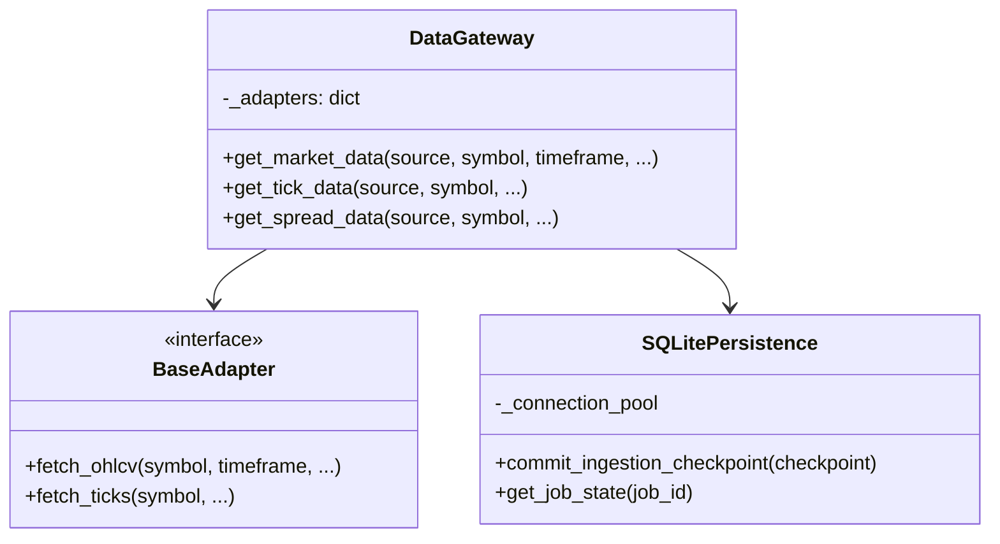

# 02-data.md - Data Requirements

## 1. Purpose

**Out of Scope:** Trade execution, strategy logic, and public-facing streaming APIs.

The `app/services/data/` module exists to provide HaruQuantAI with a contract-driven, auditable, resilient, agent-safe market data service.

Its primary goal is to provide normalized historical, real-time, local, synthetic, broker, and external market data through one internal gateway that can route to many external adapters while keeping official AI tool boundaries stable, safe, and JSON-serializable.

The module is a greenfield rebuild. It preserves current data-domain capabilities at the capability level, but it does not preserve old function names or legacy compatibility aliases. It is intended to be the canonical data access layer used by research, strategy creation, simulation, optimization, analytics, risk, portfolio, execution-preparation, and agentic workflows.

This document is a supporting domain-level requirements and Builder handoff specification. The active product truth remains the lean active documentation set: `docs/PROJECT.md`, `docs/ARCHITECTURE.md`, `docs/PROJECT.md`, and `docs/ROADMAP.md`.

This is not a single implementation ticket. Builder implementation must be split into approved phase slices and must not attempt the entire data domain in one broad change.


### 1.1 Assumptions and Resolved Decisions


- [ ] This requirements document belongs in `docs/planning/DOMAIN.md` because it covers the full data module rather than one sprint.
- [ ] The v8 specification remains the authoritative baseline, with this final document acting as the production-hardening closure layer.
- [ ] The HaruQuantAI Tool Function Standard, Code Quality Standard, Agent Standard, and Agentic AI Playbook exist outside this source-requirements document and may define cross-cutting details not repeated in the data module specification.
- [ ] Backward compatibility remains out of scope.
- [ ] Public streaming subscription tools remain out of Phase 1.
- [ ] Internal real-time feed support, feed state, and feed status are in scope for production readiness.
- [ ] `get_data_update_job_status` is the canonical scheduler status tool.
- [ ] `get_feed_status` is the canonical feed observability tool.
- [ ] `get_update_job_status`, `create_update_job`, `start_update_job`, and `stop_update_job` are not official exports.
- [ ] `VALIDATION_FAILED`, `BUFFER_OVERFLOW`, and `DATA_DROPPED` are included in the deterministic error-code list.
- [ ] Source readiness starts conservative: local and synthetic sources may be production; external/broker sources are staging until mocked and live validation passes.
- [ ] SQLite is sufficient for single-node local state persistence.
- [ ] The persistence abstraction must be TSDB-ready for future high-frequency tick and spread storage.
- [ ] The broker/data gateway is internal and routes one internal contract to many external APIs.
- [ ] Historical market-hours reconstruction is deferred until a market-calendar provider is approved.
- [ ] GBM synthetic generation is enough for Phase 1.
- [ ] `get_historical_volume` may be direct or derived if its response contract remains stable and tested.
- [ ] Baseline database pool, timeout, performance, throughput, memory, and feed health score thresholds are engineering baselines measured against the Data engineering benchmark profile until replaced by approved production benchmarks.
- [ ] Downstream modules shall adapt to the new contracts rather than relying on aliases.
- [ ] Phase 1 may proceed without complete external source adapter implementations when disabled or unavailable adapters fail safely and deterministically and contracts, responses, validation, timeframes, registry, exports, and tests meet Phase 1 acceptance.

---

### 1.2 Open Questions


- [ ] No blocking open questions remain for Phase 1 implementation based on the current source material.
- [ ] Pending: select the future `MarketCalendarProvider` implementation for historical holidays, daylight-saving, and broker-session reconstruction.
- [ ] Pending: select the future high-frequency tick/spread TSDB backend after the TSDB-ready persistence interface is validated.
- [ ] Pending: collect source-specific promotion evidence packages for MT5, cTrader, Dukascopy, Binance symbol discovery, or real-time feed gateway before moving any of them from `staging` to `production`.
- [ ] Pending: define any future public streaming subscription tool surface before export.
- [ ] Pending: track future-phase decisions as implementation planning issues rather than treating them as Phase 1 blockers.
- [ ] No developer shall implement solutions for `Pending` open questions without an approved, versioned RFC or an explicit owner-approved update to the active docs.

---

### 1.3 Phase 1 Implementation Slices


- [ ] Contracts and export surface: official tool names, `app/services/data/__init__.py`, standard envelope alignment, metadata, side-effect flags, deterministic errors, enum manifests, and contract tests.
- [ ] Local CSV/Parquet sources: local loading, normalized records, source metadata, path safety, quality validation, and no raw object leakage.
- [ ] Synthetic generation and transforms: deterministic bars/ticks, resampling, tick aggregation, multi-timeframe alignment, labeling, and no-lookahead defaults.
- [ ] Cache and storage: approved roots, cache TTL/invalidation, atomic writes, manifests, safe cache clear, and persistence references for large payloads.
- [ ] SQLite persistence and scheduler state: job definitions, idempotency, leases, checkpoints, crash recovery, and status inspection.
- [ ] Gateway and adapter boundaries: source registry, readiness checks, capability declarations, optional dependency behavior, fake adapters, and staging external adapters.
- [ ] Real-time feed observability: internal feed state, heartbeat, bounded buffers, gap visibility, circuit-breaker state, and `get_feed_status`.
- [ ] External/broker adapters: MT5, cTrader, Dukascopy, Binance symbol discovery, and live feed gateway remain staging until source promotion evidence is approved.

Phase 1 may ship without complete external/broker adapter implementations only when incomplete adapters are marked `staging`, `experimental`, or `not_available`; disabled or unavailable adapters fail with deterministic errors; and contracts, responses, validation, timeframes, registry, export-surface tests, and local/synthetic source tests pass.


### 1.4 Terminology Hierarchy


- [ ] Ingestion means the normalization, validation, persistence, manifest, and audit flow that accepts source data into the Data module.
- [ ] An update job means a scheduler-controlled job definition or run that performs ingestion, cache refresh, or feed/backfill maintenance.
- [ ] A backfill is a type of update job that ingests historical ranges for one or more source, symbol, data-kind, and timeframe combinations.
- [ ] A chunk is the smallest committed unit of a backfill and is the unit used for checkpointing, idempotency, retry, and recovery.


## 2. Ownership

### 2.1 Owns


- Market data retrieval contracts for OHLCV, tick, spread, volume, symbol metadata, sessions, market hours, and data availability.
- Normalized historical data access through `get_market_data`, `get_tick_data`, and `get_spread_data`.
- Internal real-time feed state and observability through `get_feed_status`.
- One internal broker/data gateway that routes a single internal request contract to many source adapters.
- Source adapters for CSV, Parquet, MT5, cTrader, Dukascopy, Binance symbol discovery, synthetic generation, real-time feed providers, and future approved providers.
- Source readiness declarations and adapter capability declarations.
- Data normalization, timestamp normalization, precision policy, schema versioning, normalization versioning, and source metadata preservation.
- Data quality validation before data crosses official tool boundaries.
- Cache keys, cache TTL policy, stale-cache behavior, cache invalidation, and cache clearing.
- Storage workflows for validated normalized CSV/Parquet datasets under approved storage roots.
- SQLite-backed persistence abstraction for scheduler state, feed state, cache metadata, source revisions, license metadata, manifests, checkpoints, idempotency keys, circuit breaker state, and audit events.
- Crash recovery, resumable backfills, checkpointing, lease handling, stale-lock recovery, and idempotent ingestion state.
- Scheduler lifecycle tools for data update jobs as an internal component of the data module, not a cross-cutting platform scheduler.
- Synthetic tick/bar generation and deterministic labeling.
- Resampling, multi-timeframe alignment, tick aggregation, and anti-lookahead alignment defaults.
- Deterministic data-domain error mapping, request bounds, source fallback rules, license enforcement, and precision-safe serialization policies.
- Data-module audit logs, request IDs, quality reports, side-effect metadata, feed diagnostics, and production sign-off requirements.


### 2.2 Does Not Own


- The module does not place trades, close positions, modify orders, mutate broker account state, change terminal settings, override risk settings, or perform execution actions. Execution actions are owned by Trading/Live modules through approved order-intent and broker-adapter contracts.
- The module does not own trading strategy logic, which is owned by `tools/strategies/`.
- The module does not own backtesting engine logic, which is owned by `app/services/simulation/`.
- The module does not own analytics scoring, which is owned by the Analytics module.
- The module does not own risk approval or portfolio allocation, which are owned by the Risk module and future explicit portfolio ownership.
- The module does not own strategy promotion, live activation, or governance approval, which are owned by Strategy lifecycle, Live readiness, API/Governance, and Roadmap-approved governance contracts.
- The module does not expose raw pandas DataFrames, NumPy arrays, SDK clients, sockets, stream handles, broker clients, database clients, credential loaders, or internal cache/persistence helpers through official AI tools.
- The module does not silently fallback to another source. Fallback is allowed only when explicit `fallback_sources` are supplied and validated.
- The module does not silently use stale cache entries, silently repair gaps, or silently interpolate/forward-fill missing data for backtest, validation, risk, or execution-bound workflows.
- The module does not own external identity-provider integration or secret storage. Credentials are resolved internally through approved configuration/environment mechanisms and must never be logged or returned.
- The module does not own a general-purpose platform scheduler outside data update, feed ingestion, cache, and persistence workflows.
- The module does not expose public streaming subscription tools in Phase 1.
- The module does not reconstruct historical market hours until a future approved `MarketCalendarProvider` exists.
- The module does not treat external/broker adapters as production-ready until live validation, license review, readiness review, and operational sign-off are completed.


## 3. API

### 3.1 Public Capabilities


Official exports from `app/services/data/__init__.py` are limited to:

- `get_market_data` — fetch normalized historical OHLCV bar data.
- `get_tick_data` — fetch normalized historical tick data.
- `get_spread_data` — fetch or derive normalized spread data.
- `get_symbol_metadata` — retrieve normalized symbol and asset metadata.
- `list_symbols` — list symbols from approved sources, including symbol-discovery-only sources.
- `get_data_availability` — inspect available ranges, gaps, completeness, record counts, readiness, and metadata.
- `get_market_hours` — return timezone-aware market hours, with Phase 1 limited to current configured hours.
- `get_trading_sessions` — return normalized session windows and labels.
- `get_historical_volume` — return volume time-series records, aggregate buckets, or summary statistics according to `volume_response_mode`; allowed values are `records`, `buckets`, and `summary`.
- `save_market_data` — save validated normalized records to approved CSV/Parquet storage paths.
- `load_local_dataset` — load CSV/Parquet local datasets into normalized records.
- `resample_ohlcv` — resample normalized OHLCV records into higher timeframes.
- `align_multitimeframe_data` — align multiple timeframes without lookahead by default.
- `generate_synthetic_ticks` — generate deterministic synthetic tick data when a seed is supplied.
- `generate_synthetic_bars` — generate deterministic synthetic OHLCV bars, with GBM supported in Phase 1.
- `aggregate_ticks_to_bars` — aggregate normalized ticks into OHLCV bars.
- `label_market_data` — generate deterministic historical labels without claiming predictive value.
- `create_data_update_job` — create persisted update job definitions.
- `start_data_update_job` — start recurring execution for a valid existing job or schedule.
- `stop_data_update_job` — stop or disable scheduled execution.
- `run_data_update_job_once` — execute one immediate update run without creating a recurring schedule.
- `get_data_update_job_status` — inspect scheduler job state without mutating it.
- `get_feed_status` — inspect real-time feed health and buffer/gap/circuit-breaker state.
- `clear_data_cache` — dry-run or clear approved cache namespaces safely.

Public capabilities are agent-safe orchestration surfaces. Internal adapters, registries, clients, cache helpers, persistence objects, and raw source fetchers are not public AI tools.


### 3.2 Public API Contracts


- [ ] Every official tool must declare whether it is read-only, writes files, modifies persistence state, requires network, may call external adapters, or can affect trading. No data tool may place trades.
- [ ] Every official tool must define required inputs, optional inputs, default values, accepted enum values, output schema, metadata additions, deterministic errors, side effects, risk level, network behavior, and stability status.
- [ ] Every official tool must include at least one success response example and one deterministic error response example before Builder handoff.
- [ ] Every public tool must reject unknown parameters unless an approved forward-compatibility policy is documented.
- [ ] `list_symbols` must support `limit`, `cursor` or equivalent pagination, and deterministic ordering before Builder handoff.
- [ ] `list_symbols` default limit shall be 1,000 symbols and maximum limit shall be 10,000 symbols unless the limits manifest approves a different value.
- [ ] `get_historical_volume` must support an explicit `volume_response_mode` enum with `records`, `buckets`, and `summary` values before Builder handoff.
- [ ] `volume_response_mode="records"` shall return timestamped volume records; `buckets` shall return aggregate windows with bucket start/end; `summary` shall return bounded statistics such as total, average, min, max, and record count.
- [ ] `app/services/data/__init__.py` must export only the official tools listed in Public Capabilities unless a future approved specification changes the export surface.
- [ ] Deprecated names such as `create_update_job`, `start_update_job`, `stop_update_job`, and `get_update_job_status` must not be exported.

**Official tool contract matrix**

| Tool | Primary purpose | Risk / side effects | Network behavior | Output data contract status |
|---|---|---|---|---|
| `get_market_data` | Fetch normalized OHLCV bars. | Low to medium; read-only unless cache refresh/persist is explicitly enabled. | May call source adapters. | Requires full contract before handoff. |
| `get_tick_data` | Fetch normalized historical ticks. | Low to medium; read-only unless cache refresh/persist is explicitly enabled. | May call source adapters. | Requires full contract before handoff. |
| `get_spread_data` | Fetch or derive normalized spread data. | Low to medium; read-only unless cache refresh/persist is explicitly enabled. | May call source adapters. | Requires full contract before handoff. |
| `get_symbol_metadata` | Retrieve symbol and asset metadata. | Low; read-only. | May call source adapters. | Requires full contract before handoff. |
| `list_symbols` | List source symbols with pagination or bounded limit. | Low; read-only. | May call source adapters. | Requires full contract before handoff. |
| `get_data_availability` | Inspect ranges, gaps, completeness, and readiness. | Low; read-only. | Local by default; source probing must be explicit. | Requires full contract before handoff. |
| `get_market_hours` | Return configured market hours. | Low; read-only. | Local by default in Phase 1. | Requires full contract before handoff. |
| `get_trading_sessions` | Return normalized session windows. | Low; read-only. | Local by default in Phase 1. | Requires full contract before handoff. |
| `get_historical_volume` | Return volume time-series records, aggregate buckets, or summary statistics selected by `volume_response_mode`. | Low to medium; read-only unless cache refresh/persist is explicitly enabled. | May call source adapters. | Requires full contract before handoff. |
| `save_market_data` | Save validated normalized records. | Medium; writes files and metadata manifests. | No network unless source metadata validation explicitly requires it. | Requires full contract before handoff. |
| `load_local_dataset` | Load local CSV/Parquet datasets. | Low; reads files only. | No network. | Requires full contract before handoff. |
| `resample_ohlcv` | Resample normalized OHLCV records. | Low; read-only transformation. | No network. | Requires full contract before handoff. |
| `align_multitimeframe_data` | Align multiple timeframes without lookahead. | Low; read-only transformation. | No network. | Requires full contract before handoff. |
| `generate_synthetic_ticks` | Generate deterministic synthetic ticks. | Low; read-only unless persistence is explicitly requested. | No network. | Requires full contract before handoff. |
| `generate_synthetic_bars` | Generate deterministic synthetic bars. | Low; read-only unless persistence is explicitly requested. | No network. | Requires full contract before handoff. |
| `aggregate_ticks_to_bars` | Aggregate normalized ticks into bars. | Low; read-only transformation. | No network. | Requires full contract before handoff. |
| `label_market_data` | Create deterministic historical labels. | Low; read-only transformation. | No network. | Requires full contract before handoff. |
| `create_data_update_job` | Create persisted update job definitions. | Medium; modifies scheduler persistence. | No source network during definition validation unless explicitly documented. | Requires full contract before handoff. |
| `start_data_update_job` | Start recurring execution for a job. | Medium; modifies scheduler state and may later call sources. | May call sources when the scheduler runs. | Requires full contract before handoff. |
| `stop_data_update_job` | Stop or disable a scheduled job. | Medium; modifies scheduler state. | No network. | Requires full contract before handoff. |
| `run_data_update_job_once` | Execute one immediate update run. | Medium; modifies scheduler/persistence and may write files/database. | May call source adapters. | Requires full contract before handoff. |
| `get_data_update_job_status` | Inspect scheduler job state. | Low; read-only. | Local by default; optional source-health lookup must be explicit. | Requires full contract before handoff. |
| `get_feed_status` | Inspect real-time feed health. | Low; read-only. | Local feed state by default. | Requires full contract before handoff. |
| `clear_data_cache` | Dry-run or clear approved cache namespaces. | Medium; writes/deletes cache entries only when not dry-run. | No network. | Requires full contract before handoff. |

**Enum and Manifest Contracts**

- [ ] The implementation shall define exact enum manifests before Builder handoff for `data_kind`, `timeframe`, `workflow_context`, `stale_data_behavior`, `quality_failure_behavior`, `gap_resolution_policy`, `overlap_policy`, `precision_policy`, `overflow_policy`, scheduler state, source readiness, storage format, cache status, license status, and source capability.
- [ ] Enum inputs shall normalize approved casing where documented and reject unsupported values with deterministic validation errors.
- [ ] Public responses shall serialize enum values as JSON-safe strings, not Python enum objects.
- [ ] `volume_response_mode` values are `records`, `buckets`, and `summary`.
- [ ] `workflow_context` values are `research`, `backtest`, `validation`, `risk`, and `execution_bound`.
- [ ] `precision_policy` values are `decimal_string`, `float_research_only`, `source_native_decimal`, and `reject_on_missing_metadata`.
- [ ] Source readiness values are `production`, `staging`, `experimental`, and `not_available`.
- [ ] Storage format values include `csv` and `parquet` for Phase 1.
- [ ] The source readiness manifest shall include source name, readiness status, supported capabilities, credentials required, network required, writes allowed, license status, promotion criteria, and owner/operator sign-off state.
- [ ] Initial source readiness shall be `production` for `csv`, `parquet`, and `synthetic`.
- [ ] Initial source readiness shall be `staging` for `mt5`, `ctrader`, `dukascopy`, `binance` symbol discovery, and `real_time_feed_gateway`.
- [ ] A source shall not move from `staging` to `production` unless it has a documented evidence package covering mocked tests, live validation where applicable, normalization evidence, quality-validation evidence, timeout behavior, rate-limit behavior, license review, credential redaction evidence, no-secret-leakage tests, operator sign-off, and linked validation artifacts.
- [ ] The source license manifest shall include source name, license status, permitted workflow contexts, export restrictions, retention restrictions where known, attribution requirements where known, and enforcement behavior.
- [ ] Missing license metadata shall fail closed with `LICENSE_RESTRICTION` for storage, scheduler, export, validation, risk, and execution-bound workflows.
- [ ] The limits manifest shall define maximum records, maximum date range, maximum cache TTL, maximum synthetic generation size, maximum backfill chunk size, maximum feed buffer depth, maximum scheduler frequency, and payload-size limits.
- [ ] Backfill chunks shall not exceed 10,000 normalized records or 1 calendar day of source time, whichever is smaller, unless a later owner-approved benchmark profile raises the limit with tests.

**Precision Policy Contract**

- [ ] `precision_policy` shall define exact behavior before implementation and shall not rely on source defaults.
- [ ] Supported `precision_policy` values shall include `decimal_string`, `float_research_only`, `source_native_decimal`, and `reject_on_missing_metadata`.
- [ ] `decimal_string` shall be the default for `backtest`, `validation`, `risk`, and `execution_bound` workflows.
- [ ] `float_research_only` shall be allowed only for `research` workflows and must be disclosed in response metadata.
- [ ] Precision quantization shall use `ROUND_HALF_EVEN` unless a per-source or per-symbol contract explicitly approves a different rounding mode.
- [ ] FX-like symbols shall use symbol metadata `digits` when present and otherwise fail with `MISSING_ASSET_METADATA` for validation, risk, and execution-bound workflows.
- [ ] Price fields shall quantize to symbol digits; volume fields shall quantize to lot step or source volume precision; spread points and pips shall declare their unit and decimal scale in metadata.
- [ ] Truncation is forbidden unless a named source contract explicitly requires it and response metadata discloses `precision_truncated=true`.
- [ ] Precision mismatch shall return `PRECISION_MISMATCH`; missing precision metadata in strict workflows shall return `MISSING_ASSET_METADATA`.

**Versioned Schema Contracts**

- [ ] Public response, OHLCV record, tick record, spread record, quality report, scheduler job, backfill checkpoint, feed status, cache manifest, source readiness manifest, source license manifest, and storage manifest contracts shall have versioned JSON schema identifiers before Builder handoff.
- [ ] Schema identifiers shall be stable strings such as `haruquant.data.ohlcv_record.v1` and shall appear in response metadata where applicable.
- [ ] Planned schema identifiers and file paths are listed below, including paths such as `schemas/data/ohlcv_record.v1.json`, `schemas/data/tick_record.v1.json`, and `schemas/data/response.v1.json`.
- [ ] Backward-compatible schema changes may increment a minor schema version; breaking changes require a new major schema identifier and migration guidance.
- [ ] Per-tool contract rows shall link to the exact versioned schema identifiers they return before implementation starts.

| Contract | Schema identifier | Planned schema path |
|---|---|---|
| Standard data response | `haruquant.data.response.v1` | `schemas/data/response.v1.json` |
| OHLCV record | `haruquant.data.ohlcv_record.v1` | `schemas/data/ohlcv_record.v1.json` |
| Tick record | `haruquant.data.tick_record.v1` | `schemas/data/tick_record.v1.json` |
| Spread record | `haruquant.data.spread_record.v1` | `schemas/data/spread_record.v1.json` |
| Quality report | `haruquant.data.quality_report.v1` | `schemas/data/quality_report.v1.json` |
| Scheduler job | `haruquant.data.scheduler_job.v1` | `schemas/data/scheduler_job.v1.json` |
| Backfill checkpoint | `haruquant.data.backfill_checkpoint.v1` | `schemas/data/backfill_checkpoint.v1.json` |
| Feed status | `haruquant.data.feed_status.v1` | `schemas/data/feed_status.v1.json` |
| Cache manifest | `haruquant.data.cache_manifest.v1` | `schemas/data/cache_manifest.v1.json` |
| Source readiness manifest | `haruquant.data.source_readiness_manifest.v1` | `schemas/data/source_readiness_manifest.v1.json` |
| Source license manifest | `haruquant.data.source_license_manifest.v1` | `schemas/data/source_license_manifest.v1.json` |
| Storage manifest | `haruquant.data.storage_manifest.v1` | `schemas/data/storage_manifest.v1.json` |


### 3.3 Configuration Defaults

#### Bounded Request Limits


- [ ] A central limits manifest shall define default and maximum values by data kind, source, workflow context, and response mode.
- [ ] Direct official-tool responses shall use safe default limits to avoid large agent payloads.
- [ ] Large historical datasets shall be persisted and referenced by metadata instead of returned inline when response limits are exceeded.
- [ ] The default direct-response limit for OHLCV bars shall be 5,000 records.
- [ ] The maximum direct-response limit for OHLCV bars shall be 50,000 records.
- [ ] The default direct-response limit for ticks shall be 10,000 records.
- [ ] The maximum direct-response limit for ticks shall be 250,000 records.
- [ ] The default direct-response limit for spread records shall be 10,000 records.
- [ ] The maximum direct-response limit for spread records shall be 250,000 records.
- [ ] The maximum direct-response limit for synthetic bars shall be 100,000 records.
- [ ] The maximum direct-response limit for synthetic ticks shall be 250,000 records.
- [ ] The maximum persisted synthetic generation size shall be 1,000,000 records unless explicitly raised by configuration and covered by performance tests.
- [ ] Backfill chunks shall not exceed 10,000 normalized records or 1 calendar day of source time, whichever is smaller, unless a later owner-approved benchmark profile raises the limit with tests.
- [ ] The same 10,000-record or 1-day maximum applies to OHLCV bars, ticks, spreads, and derived historical volume chunks unless a source-specific manifest defines a stricter limit.
- [ ] Data availability tools shall not materialize more than 1,000,000 records solely for counts unless an operator explicitly enables a bounded audit mode.
- [ ] Scheduler jobs shall default to a maximum of 500 symbols per job and 20 timeframes per job unless configuration and tests approve larger workloads.
- [ ] Scheduler frequency shall not be more frequent than once per minute unless a dedicated live-feed ingestion mechanism is used.
- [ ] Any request exceeding configured limits shall return `LIMIT_EXCEEDED`.


#### Cache TTL and Expiry Defaults


- [ ] The maximum request-level cache TTL override shall be 7 days unless a source declares a stricter maximum.
- [ ] Historical daily-or-higher data shall default to a cache TTL of 86,400 seconds.
- [ ] Intraday bar data shall default to a cache TTL of 3,600 seconds.
- [ ] Tick data shall default to a cache TTL of 900 seconds unless the source declares a stricter freshness policy.
- [ ] Streaming and live data shall default to cache TTL `0` and shall not be persistently cached unless explicitly stored through a persistence workflow.
- [ ] Local immutable datasets shall have no time-based expiry when their file hash and modified timestamp remain unchanged.
- [ ] Cache entries shall automatically invalidate when `schema_version`, `normalization_version`, or `raw_data_hash` changes, regardless of TTL.
- [ ] Stale cache shall not be returned silently.
- [ ] Stale cache behavior shall be governed by the `stale_data_behavior` input parameter, defaulting to `refresh_and_return` for execution-bound workflows and `return_with_warning` for research workflows.


#### Approved Storage Roots


- [ ] The approved Phase 1 storage roots shall be `data/raw/`, `data/processed/`, `data/cache/`, and `artifacts/data/`.
- [ ] Approved storage roots shall be configurable only through HaruQuant settings.
- [ ] Absolute paths outside approved roots shall be rejected.
- [ ] Parent traversal with `..` shall be rejected.
- [ ] Hidden or system directories shall be rejected unless explicitly allowed by configuration.


### 3.4 Inputs and Outputs


**Common Inputs**

- [ ] Every official tool shall accept `request_id`.
- [ ] Data retrieval tools shall accept source, symbol, data kind, timeframe where applicable, date range, limit, cache controls, source timezone override, stale-data behavior, quality failure behavior, workflow context, fallback sources, and request ID.
- [ ] `workflow_context` shall accept only `research`, `backtest`, `validation`, `risk`, and `execution_bound`.
- [ ] `fallback_sources` shall be optional and shall default to empty.
- [ ] `fallback_sources` shall be validated against source readiness, capability declarations, and license policy before use.
- [ ] Start and end timestamps shall be UTC ISO 8601 when provided.
- [ ] Start shall be before end.
- [ ] Limit shall be positive and within configured maximums.
- [ ] Source timezone override shall be a valid IANA timezone.
- [ ] Cache TTL override shall be non-negative and within configured maximum TTL.
- [ ] Either date range or limit shall be provided unless the source has a safe default.

**Historical and Backfill Inputs**

- [ ] Historical requests shall support chunk size, backfill mode, gap resolution policy, overlap policy, data version policy, precision policy, workflow context, and persistence target where applicable.
- [ ] Backfill jobs shall include source, symbols, timeframes, data kinds, start, end, chunk policy, destination, schedule or one-time mode, recovery policy, request ID, and metadata options.
- [ ] Backfill idempotency keys shall be derived from source, symbol, data kind, timeframe, start time, end time, schema version, and normalization version.

**Real-Time Feed Inputs**

- [ ] Feed configuration shall include source, symbol, data kind, optional timeframe, buffer capacity, overflow policy, heartbeat timeout, reconnect policy, backfill-on-gap flag, persistence target, and request ID.
- [ ] Overflow policy shall accept only `halt`, `drop_and_reconcile`, or `backpressure`.
- [ ] Reconnect policy shall include maximum retries, exponential backoff, jitter, maximum backoff, and circuit breaker cooldown.
- [ ] Feed status requests shall accept feed ID, source, symbol, data kind, and request ID.

**Storage and Persistence Inputs**

- [ ] Storage requests shall include path, format, overwrite flag, create-parents flag, include-metadata flag, and request ID.
- [ ] Storage paths shall resolve under approved storage roots.
- [ ] Database persistence requests shall include entity type, idempotency key, schema version, normalization version, transaction metadata, and request ID where applicable.
- [ ] Database migrations shall include migration ID, source schema version, target schema version, compatibility result, and rollback policy.

**Common Outputs**

- [ ] Every official tool shall return status, message, data, error, and metadata.
- [ ] The authoritative standard response envelope is defined in `docs/ARCHITECTURE.md` under "API And Interface Contracts" and the Utils standard response contract in `docs/PROJECT.md`.
- [ ] If implementation starts before those active-doc contracts are versioned, this file shall use the minimal required envelope: `status`, `message`, `data`, `error`, and `metadata`, and shall mark the contract `schema_version="data.response.v0-draft"`.
- [ ] Production handoff requires a version-locked response envelope schema identifier and a compatibility policy linking this file, `docs/ARCHITECTURE.md`, and the Utils response contract.
- [ ] `status` shall be `success` or `error`.
- [ ] `error` shall be `null` on success or an object containing deterministic `code`, safe `details`, retryability where known, and safe operator/user action where applicable.
- [ ] Metadata shall include tool identity, category, risk level, request ID, execution time, side-effect flags, trade flag, network flag, source readiness where applicable, precision policy where applicable, and persistence flags where applicable.
- [ ] Response metadata shall include data-specific fields where applicable: requested source, actual source, source capability declaration, schema version, normalization version, workflow context, cache status, and license status.
- [ ] The deterministic error-code manifest shall define code, category, retryability, severity, safe user message, safe details shape, and operator action.
- [ ] Validation errors shall distinguish missing required field, invalid type, invalid enum, invalid range, malformed timestamp, unsafe path, unsupported source, unsupported timeframe, and unsupported operation.

**Quality Report Contract**

- [ ] `quality_report` shall define required fields before Builder handoff: `quality_status`, `quality_score`, `issues`, `warnings`, `record_count`, `checked_count`, `truncated`, `sample_limit`, `schema_version`, and `generated_at`.
- [ ] Every quality issue shall include code, severity, message, field or column where applicable, affected row count where known, bounded samples where safe, and whether the issue blocks validation, risk, or execution-bound workflows.
- [ ] Quality statuses shall be explicit enum values such as `passed`, `passed_with_warnings`, `failed`, and `not_checked`.
- [ ] Quality diagnostics shall be bounded, redacted, JSON-serializable, and free of raw private provider payloads.

**Data Outputs**

- [ ] OHLCV outputs shall include records, record count, symbol, timeframe, source, start, end, timestamp timezone, source timezone, schema version, normalization version, quality report, source metadata, license metadata, and precision metadata.
- [ ] Tick outputs shall include records, record count, symbol, source, start, end, timestamp timezone, source timezone, schema version, normalization version, quality report, source metadata, license metadata, and precision metadata.
- [ ] Spread outputs shall include records or summaries, record count, symbol, source, start, end, quality report, source metadata, license metadata, and precision metadata.
- [ ] Availability outputs shall include available ranges, gaps, completeness, record count, source readiness, and source metadata.
- [ ] Job status outputs shall include job ID, state, enabled flag, last run status, last checkpoint, last error, next scheduled run, lease status, recovery state, and request ID.
- [ ] Feed status outputs shall include feed ID, state, heartbeat timestamp, last event timestamp, buffer depth, dropped count, gap count, reconnect count, circuit breaker state, and last error.

---


## 4. Functional Requirements

### 4.1 Module Scope and Boundary


- [ ] The data module shall be rebuilt as a clean, contract-driven, agent-safe, testable, maintainable domain under `app/services/data/`.
- [ ] The module shall provide reliable, normalized, auditable access to historical, real-time, local, synthetic, broker, and external market data.
- [ ] The module shall preserve current data-domain capabilities at the capability level, not by preserving old function names.
- [ ] The module shall expose only safe, intentional, agent-callable tools from `app/services/data/__init__.py`.
- [ ] Official tools shall remain thin orchestration functions that validate inputs, call internal services/adapters, and return standard responses.
- [ ] Internal adapters may use pandas, NumPy, broker SDKs, HTTP clients, MCP clients, sockets, database clients, and file-system objects, but those objects shall not cross the official AI-tool boundary.
- [ ] The module shall not place trades, close positions, modify broker account state, modify terminal settings, modify risk settings, or perform execution actions.
- [ ] The module shall include internal layers for contracts, responses, validation, normalization, quality, timeframes, cache, registry, gateway routing, source adapters, storage, persistence, transforms, generators, labeling, scheduler, feed state, versioning, precision, rate limits, licensing, and audit logging.
- [ ] The module shall explicitly define its concurrency model: `asyncio` for real-time feed ingestion and network I/O, and `multiprocessing` or chunked batch processing for heavy synthetic generation and large historical backfills to prevent event-loop blocking and GIL contention.
- [ ] Chunked batch processing shall mean processing and committing at most 10,000 normalized records or 1 calendar day of source time per chunk, whichever is smaller, unless a later owner-approved benchmark profile raises the limit with tests.


### 4.2 Official AI Tool Surface


- [ ] `app/services/data/__init__.py` shall export only the following official tools:
  - [ ] `get_market_data`
  - [ ] `get_tick_data`
  - [ ] `get_spread_data`
  - [ ] `get_symbol_metadata`
  - [ ] `list_symbols`
  - [ ] `get_data_availability`
  - [ ] `get_market_hours`
  - [ ] `get_trading_sessions`
  - [ ] `get_historical_volume`
  - [ ] `save_market_data`
  - [ ] `load_local_dataset`
  - [ ] `resample_ohlcv`
  - [ ] `align_multitimeframe_data`
  - [ ] `generate_synthetic_ticks`
  - [ ] `generate_synthetic_bars`
  - [ ] `aggregate_ticks_to_bars`
  - [ ] `label_market_data`
  - [ ] `create_data_update_job`
  - [ ] `start_data_update_job`
  - [ ] `stop_data_update_job`
  - [ ] `run_data_update_job_once`
  - [ ] `get_data_update_job_status`
  - [ ] `get_feed_status`
  - [ ] `clear_data_cache`
- [ ] `get_data_update_job_status` shall be read-only and shall not mutate scheduler state.
- [ ] `get_data_update_job_status` shall read local scheduler state by default; any source-health lookup must require explicit `include_source_health=True` and disclose network behavior in metadata.
- [ ] `get_feed_status` shall be read-only and shall not expose raw stream handles, sockets, clients, credentials, or connection strings.
- [ ] Any future official tool addition shall require an explicit specification update.


### 4.3 Historical Data


- [ ] `get_market_data` shall fetch normalized historical OHLCV bar data.
- [ ] `get_tick_data` shall fetch normalized historical tick data.
- [ ] `get_spread_data` shall fetch or derive normalized historical spread data.
- [ ] Historical requests shall support source, symbol, data kind, timeframe where applicable, start, end, limit, cache policy, source timezone, workflow context, fallback sources, and request ID.
- [ ] Historical tick retrieval shall require explicit date ranges or bounded limits.
- [ ] Historical data shall preserve source revision metadata where available.
- [ ] Historical data shall include raw data hash in cache identity when available.
- [ ] Historical data providers that revise old data shall trigger cache invalidation or strict failure according to `DataVersionPolicy`.
- [ ] Historical data shall never silently use stale cache entries.
- [ ] Historical backfill jobs shall be chunked, resumable, checkpointed, idempotent, and safe to retry.
- [ ] Historical backfill checkpoints shall be committed per source, symbol, data kind, timeframe, chunk start timestamp, chunk end timestamp, schema version, normalization version, source revision, chunk ID, and idempotency key.
- [ ] Historical backfill jobs shall not mark a chunk complete until records, metadata, quality report, source revision metadata, license metadata, and persistence manifest are committed.
- [ ] Historical backfill jobs shall detect gaps before and after ingestion.
- [ ] Historical data shall not silently interpolate, forward-fill, or repair gaps for backtest, validation, risk, or execution-bound workflows.
- [ ] Historical data shall expose gaps, overlaps, completeness, quality status, source readiness, license metadata, and precision policy in metadata.


### 4.4 Real-Time Feeds and Live Data


- [ ] The module shall support an internal real-time feed layer for live tick, spread, and bar-oriented data where source adapters declare live or streaming capability.
- [ ] Public streaming subscription tools shall remain out of Phase 1.
- [ ] Real-time feed state shall be observable through `get_feed_status`.
- [ ] `get_feed_status` shall report source, symbol, data kind, connection state, feed readiness, last heartbeat timestamp, last event timestamp, buffer depth, configured buffer capacity, dropped event count, gap count, reconnect count, circuit breaker state, and last error code.
- [ ] Real-time records shall normalize to the same OHLCV, tick, and spread contracts used by historical data.
- [ ] Real-time timestamps shall normalize to UTC before crossing any official boundary.
- [ ] Real-time feeds shall maintain heartbeat tracking.
- [ ] Real-time feeds shall detect heartbeat timeouts and return or log `FEED_HEARTBEAT_TIMEOUT`.
- [ ] Real-time feeds shall use bounded buffers.
- [ ] Real-time buffer overflow shall follow an explicit policy: `halt`, `drop_and_reconcile`, or `backpressure`.
- [ ] `backpressure` overflow behavior shall stop accepting new in-process feed events before the configured buffer limit is exceeded, apply source-level pause or rate-limit controls where the adapter supports them, and return or log `BACKPRESSURE_APPLIED` while keeping memory bounded.
- [ ] If a source cannot be slowed by adapter controls, `backpressure` shall degrade to `drop_and_reconcile` or `halt` according to the configured workflow policy and disclose the degradation in feed status metadata.
- [ ] If the overflow policy is `drop_and_reconcile`, the system shall immediately flag a data gap, update feed gap-count metadata, emit `DATA_DROPPED` or `BUFFER_OVERFLOW`, and trigger historical backfill for the missing time window when supported by the source.
- [ ] Real-time feed gaps shall be visible to downstream consumers.
- [ ] Real-time feed gaps shall not be hidden by synthetic fills.
- [ ] Real-time feed timestamp validation shall compare source event timestamps, normalized UTC wall-clock timestamps, and monotonic ingestion durations.
- [ ] Feed clock drift beyond the configured threshold shall return or log `FEED_CLOCK_DRIFT`, increment gap or degraded-health diagnostics where applicable, and disclose drift duration in `get_feed_status`.
- [ ] Real-time reconnection shall use exponential backoff with randomized jitter.
- [ ] Real-time reconnection shall avoid thundering-herd behavior after crashes, restarts, network partitions, and source throttling.
- [ ] Real-time feed state shall persist feed leases, heartbeat state, buffer metadata, last processed timestamp, last committed checkpoint, gap windows, reconnect count, and circuit breaker state.
- [ ] Live data shall not use persistent cache by default.
- [ ] Live data shall be persisted only through explicit persistence, scheduler, feed-ingestion, or storage workflows.


### 4.5 Normalization


- [ ] The module shall normalize all source-specific market data into canonical internal contracts before returning or persisting records.
- [ ] OHLCV records shall normalize timestamp, open, high, low, close, volume, tick volume, real volume, spread, source, symbol, and timeframe.
- [ ] Tick records shall normalize timestamp, bid, ask, last, volume, spread, source, and symbol.
- [ ] Tick records shall validate that at least one of bid, ask, or last exists.
- [ ] Tick records shall validate `ask >= bid` when both bid and ask are present.
- [ ] Spread records shall normalize timestamp, symbol, bid, ask, spread points, spread pips, and source.
- [ ] Symbol metadata shall normalize asset class, base currency, quote currency, contract size, tick size, tick value, point, digits, lot limits, lot step, margin currency, profit currency, trading hours, and source metadata.
- [ ] Symbol metadata shall support asset-specific extensions for futures, options, bonds, and crypto where required by the asset class or workflow.
- [ ] Missing required asset-specific metadata shall return or emit `MISSING_ASSET_METADATA` when the asset class and workflow require those fields.
- [ ] All timestamps crossing the official AI-tool boundary shall be UTC ISO 8601 strings.
- [ ] Source timezone and broker timezone shall be preserved in metadata when known.
- [ ] Naive timestamps shall exist only inside source adapters before normalization.
- [ ] Naive local CSV/Parquet timestamps shall require source timezone detection or request-level `source_timezone` override.
- [ ] Adapters shall resolve DST ambiguities using explicit broker timezone mapping or the Python `fold` attribute before normalization to UTC.
- [ ] Data quality validation shall run after normalization and before return to downstream workflows.
- [ ] Precision quantization shall run before records cross official boundaries when symbol metadata provides required precision.
- [ ] Normalization decisions, gap decisions, overlap decisions, and precision policy shall appear in metadata or the quality report.
- [ ] Schema migrations shall enforce backward compatibility checks.
- [ ] A new `schema_version` shall read data written by the previous minor version or trigger mandatory cache invalidation and re-ingestion.
- [ ] If a requested `schema_version` is older than the current canonical version, the system shall either perform an on-the-fly safe migration or return `DATA_SCHEMA_DRIFT` with a recommendation to re-fetch.
- [ ] If an on-the-fly safe migration is attempted and fails, the system shall return `SCHEMA_MIGRATION_FAILED` and must not expose partially migrated records.


### 4.6 Broker/Data Gateway and Source Adapters


- [ ] The module shall provide one internal broker/data gateway interface that routes one internal request contract to many external source APIs.
- [ ] The gateway shall route requests to adapters for CSV, Parquet, MT5, cTrader, Dukascopy, Binance symbol discovery, synthetic generation, real-time feed providers, and future approved providers.
- [ ] The gateway shall use adapter capability declarations before execution.
- [ ] The gateway shall enforce source readiness before execution.
- [ ] The gateway shall enforce no-silent-fallback behavior.
- [ ] The gateway shall enforce credential policy, source readiness, rate limits, retry policy, circuit breaker policy, license policy, source revision policy, normalization policy, quality policy, and precision policy consistently across adapters.
- [ ] The gateway shall maintain a global, thread/async-safe rate-limit token bucket or counter per source to prevent concurrent scheduler jobs, feeds, and agent requests from collectively breaching external API rate limits.
- [ ] The module shall not rely on process-shared mutable state for correctness.
- [ ] Cross-process coordination shall use SQLite/persistence records or filesystem locks/manifests scoped to approved roots.
- [ ] Real-time ingestion shall use `asyncio`-compatible boundaries where implemented, and heavy batch transformations shall run in chunked batch workers or isolated processes when needed.
- [ ] Real-time ingestion and heavy batch work shall interact only through persisted state, bounded queues, or explicit internal contracts.
- [ ] Every source adapter shall implement a common internal source protocol.
- [ ] Every source adapter shall validate source-specific requirements.
- [ ] Every source adapter shall fetch or load raw source data.
- [ ] Every source adapter shall convert raw fields into normalized records.
- [ ] Every source adapter shall preserve source metadata.
- [ ] Every source adapter shall avoid logging secrets.
- [ ] Every source adapter shall map source errors to deterministic internal errors.
- [ ] Every source adapter shall avoid returning raw SDK, client, stream, socket, or database objects.
- [ ] Source adapters shall expose no direct official AI tool functions.
- [ ] Source adapters shall declare capabilities for OHLCV, ticks, spread, symbol metadata, market hours, streaming, writes, credentials, and network requirements.
- [ ] Source adapters shall implement the common internal source protocol in `app/services/data/sources/base.py` or a future explicitly versioned replacement path.
- [ ] Missing optional adapter dependencies shall not break importing `app.services.data` or using local CSV, Parquet, synthetic, transform, scheduler-status, cache-status, or read-only status tools.
- [ ] Optional adapter dependencies shall be lazy-loaded only when the affected source is requested.
- [ ] Optional adapter dependency failures shall return deterministic source-unavailable or dependency-unavailable errors without exposing import stack traces, credential material, client handles, sockets, or raw provider payloads.
- [ ] The source registry shall provide internal adapter lookup and registration.
- [ ] The source registry shall not be exported as an official AI tool unless a future requirement explicitly approves it.
- [ ] Source adapters shall support circuit breaker state.
- [ ] If an adapter trips a circuit breaker, the degraded state shall be persisted.
- [ ] On restart, a source with a persisted open circuit breaker shall remain open or half-open for the configured cooldown period and shall not immediately hammer the failing external source.
- [ ] Broker adapters shall remain read-only in the data module.
- [ ] Broker adapters shall never place trades, close positions, modify account state, or change terminal settings.


### 4.7 Source-Specific Capabilities


- [ ] CSV source shall support loading OHLCV records.
- [ ] CSV source shall support loading tick records when columns allow.
- [ ] CSV source shall support saving normalized records through the storage layer.
- [ ] CSV source shall support configurable timestamp column, delimiter, column alias mapping, strict path safety, date filtering, and validation after load.
- [ ] Parquet source shall support loading OHLCV and tick records.
- [ ] Parquet source shall support saving normalized records.
- [ ] Parquet source shall preserve schema metadata where possible.
- [ ] Parquet source shall support date filtering, safe path validation, and validation after load.
- [ ] Parquet shall be the preferred local storage format for larger datasets.
- [ ] MT5 source shall support secure credential resolution from environment/config.
- [ ] MT5 source shall support terminal path handling, connection lifecycle management, symbol listing, OHLCV bars, tick data where available, symbol metadata/details, timeframe mapping, UTC timestamp normalization, broker timezone metadata, and broker-unavailable errors.
- [ ] MT5 adapter shall remain read-only and shall not place orders or modify broker state.
- [ ] cTrader source shall use the approved cTrader adapter/MCP boundary.
- [ ] cTrader source shall support symbol listing, bar loading, cTrader bar normalization, timeframe mapping, source metadata preservation, and deterministic network/client errors.
- [ ] Raw cTrader client construction shall remain internal.
- [ ] Dukascopy source shall support instrument discovery, internal instrument metadata lookup, historical OHLCV or tick fetch where implemented, source interval mapping, live or stream-oriented fetch where supported, normalization, HTTP/network handling, retry/timeouts, and source metadata preservation.
- [ ] Dukascopy implementation shall be split into smaller client, instruments, normalization, source, and live modules if it becomes oversized.
- [ ] Binance or equivalent exchange support shall be symbol-discovery oriented through `list_symbols(source="binance")`.
- [ ] Binance support shall not become a trading or execution adapter inside the data module.
- [ ] Synthetic generation shall use dedicated official tools rather than a normal external adapter unless future design requires source-like behavior.


### 4.8 Storage, Databases, and Persistence


- [ ] `save_market_data` shall save validated normalized records to CSV or Parquet.
- [ ] `load_local_dataset` shall load CSV or Parquet datasets into normalized records.
- [ ] Storage requests shall validate path safety and default to `overwrite=False`.
- [ ] Storage writes shall use temp artifact plus atomic final commit/rename semantics.
- [ ] Storage writes shall acquire an exclusive path-scoped file lock before creating the temp artifact or committing the final path.
- [ ] Two concurrent write attempts to the exact same normalized storage path shall not both proceed; one may succeed and the others shall return `CONCURRENT_WRITE_LOCKED` or an equivalent deterministic locked-path error without corrupting committed data.
- [ ] Storage writes shall quarantine partial artifacts from failed writes.
- [ ] Storage writes shall include metadata manifests when `include_metadata=True`.
- [ ] The module shall define a persistence abstraction for scheduler state, feed state, cache metadata, source revisions, license metadata, data manifests, checkpoints, idempotency keys, circuit breaker state, and audit events.
- [ ] SQLite shall be the default single-node ACID-capable persistence backend.
- [ ] The persistence abstraction shall support append-optimized TSDB backends in future phases without rewriting gateway routing logic.
- [ ] The persistence abstraction shall support append-only ingestion metadata.
- [ ] Persistence writes shall use transactions for atomic state changes.
- [ ] Database writes shall include deterministic idempotency keys.
- [ ] Data ingestion idempotency keys shall be derived from a hash of source, symbol, data kind, timeframe, start time, end time, schema version, and normalization version.
- [ ] Database writes shall be idempotent under retry.
- [ ] Database writes shall distinguish insert, update, no-op duplicate, and conflict.
- [ ] Database conflicts shall return deterministic errors and shall not silently overwrite committed data.
- [ ] The persistence layer shall enforce connection pool limits, connection timeouts, and automatic leak detection.
- [ ] SQLite launch baseline shall default to no more than 10 open database connections per process unless configuration and load tests approve a different value.
- [ ] Database connection acquisition timeout shall default to 5 seconds.
- [ ] Idle database connections shall be closed or recycled after 60 seconds by default where the backend supports it.
- [ ] Connection leak detection shall run at least every 60 seconds during scheduler, feed, or backfill workflows.
- [ ] Database pool, timeout, idle, and leak-detection settings shall be configurable and reported in production sign-off.
- [ ] Long-running real-time feed ingestion shall not exhaust database connection pools.
- [ ] Database migrations shall be versioned, auditable, and reversible where practical.
- [ ] Schema migrations shall enforce backward compatibility or mandatory invalidation and re-ingestion.
- [ ] Persisted data requested with an older `schema_version` than the current canonical version shall either be safely migrated on read or rejected with `DATA_SCHEMA_DRIFT` and re-fetch guidance.


### 4.9 System State Persistence and Crash Recovery


- [ ] The module shall persist scheduler job state.
- [ ] The module shall persist feed state.
- [ ] The module shall persist backfill checkpoints.
- [ ] The module shall persist ingestion idempotency keys.
- [ ] The module shall persist source circuit breaker state.
- [ ] The module shall persist source revision and raw hash metadata.
- [ ] The module shall persist data license and attribution metadata.
- [ ] State writes shall be atomic.
- [ ] File writes shall use temp files plus atomic rename or equivalent safe commit semantics.
- [ ] Partial artifacts created during failed writes shall be quarantined.
- [ ] Jobs left in `running` state after a crash shall idempotently transition to `recovering` or `failed` according to recovery policy.
- [ ] Crash recovery shall log the lease-expiration reason.
- [ ] Recovery shall resume from the last committed checkpoint, not the last attempted record.
- [ ] Recovery shall not duplicate committed chunks.
- [ ] Recovery shall not mark incomplete jobs as completed.
- [ ] Stale locks shall expire according to configured lease timeout.
- [ ] Stale lock recovery shall be auditable.
- [ ] Corrupted state shall return `STATE_RECOVERY_FAILED` or `CHECKPOINT_CORRUPTED`.
- [ ] Crash recovery shall never bypass validation, path policy, license policy, cache policy, source readiness policy, precision policy, or gateway policy.


### 4.10 Market Hours, Sessions, and Historical Volume


- [ ] `get_market_hours` shall return timezone-aware market hours.
- [ ] `get_market_hours` Phase 1 may return current configured hours only.
- [ ] Historical market-hour reconstruction shall return `UNSUPPORTED_OPERATION` unless an approved calendar provider supports it.
- [ ] `get_trading_sessions` shall return normalized trading session windows and labels.
- [ ] Session start and end values shall be UTC ISO 8601 strings.
- [ ] Original source timezone or broker timezone shall be preserved in metadata.
- [ ] `get_historical_volume` shall return volume time-series records, aggregate buckets, or summary statistics according to `volume_response_mode`.
- [ ] `get_historical_volume` may derive volume from OHLCV, tick records, or source-native volume data if the public response contract remains stable and tested.
- [ ] When a source provides both tick volume and real volume, both shall be preserved.
- [ ] The primary volume value shall be disclosed through `volume_kind`.


### 4.11 Resampling, Alignment, Aggregation, Synthetic Generation, and Labeling


- [ ] `resample_ohlcv` shall accept normalized OHLCV records.
- [ ] `resample_ohlcv` shall validate source timeframe and target timeframe.
- [ ] `resample_ohlcv` shall aggregate open as first open, high as max high, low as min low, close as last close, and volume as sum.
- [ ] `resample_ohlcv` shall aggregate spread according to explicit `spread_policy`.
- [ ] The default `spread_policy` shall be `average`.
- [ ] `align_multitimeframe_data` shall prevent lookahead leakage by default with `allow_lookahead=False` and `alignment_method="last_known_closed_bar"`.
- [ ] With default no-lookahead alignment, a lower-timeframe row may use only higher-timeframe bars whose close timestamp is less than or equal to the lower-timeframe timestamp; higher-timeframe values must become available only after the higher-timeframe bar has closed.
- [ ] Implementations may represent this by shifting higher-timeframe availability forward by one full higher-timeframe bar or by computing an explicit `available_at` timestamp equal to the bar close; the chosen mechanism must be documented in metadata.
- [ ] `aggregate_ticks_to_bars` shall convert normalized tick records into OHLCV bars.
- [ ] Tick aggregation shall reject invalid or unsorted ticks unless repair is explicitly enabled.
- [ ] Synthetic tick and bar generation shall be deterministic when a seed is supplied.
- [ ] `generate_synthetic_ticks` shall support symbol, start timestamp, number of ticks, start price, average spread, volatility, volume behavior, and seed.
- [ ] `generate_synthetic_bars` shall support symbol, timeframe, start timestamp, number of bars, start price, drift, volatility, spread behavior, volume behavior, method, and seed.
- [ ] `generate_synthetic_bars` shall support GBM in Phase 1.
- [ ] `mean_reverting`, `trend`, and `seasonal` synthetic processes shall be Phase 2 extensions.
- [ ] `label_market_data` shall generate deterministic historical labels.
- [ ] `label_market_data` shall support LEXLB-style labels or an equivalent current deterministic labeling method.
- [ ] `label_market_data` shall support configurable lookahead horizon and configurable threshold.
- [ ] `label_market_data` shall validate horizon and threshold inputs.
- [ ] Labels shall align to input timestamps.
- [ ] Labeling metadata shall describe the label method and parameters.
- [ ] Labeling shall prevent lookahead leakage beyond the declared horizon.
- [ ] `label_market_data` shall not claim predictive value.


### 4.12 Scheduler and Jobs


- [ ] `create_data_update_job` shall create persisted update job definitions.
- [ ] `start_data_update_job` shall start recurring execution for a valid existing job or valid schedule.
- [ ] `start_data_update_job` shall not behave as a one-time run when schedule is omitted.
- [ ] `run_data_update_job_once` shall execute one immediate update run and shall not create a recurring schedule.
- [ ] `stop_data_update_job` shall stop or disable scheduled execution.
- [ ] `get_data_update_job_status` shall inspect job state without mutating scheduler state.
- [ ] `get_data_update_job_status` shall read only local persisted scheduler state by default.
- [ ] If `include_source_health=True` is explicitly supplied, `get_data_update_job_status` may perform a bounded source-health lookup and shall disclose `requires_network=True`, timeout, source queried, source readiness, and any source-health error in metadata.
- [ ] Scheduler state shall include `created`, `running`, `stopped`, `failed`, `completed`, and `recovering`.
- [ ] Scheduler job requests shall include job name, source, symbol or symbols, optional timeframe or timeframes, schedule, storage target, data kind, and request ID.
- [ ] Data update job definitions shall include job ID, job name, source, symbols, timeframes, data kind, storage format, storage path, optional start/end, optional schedule, enabled flag, created timestamp, and updated timestamp.
- [ ] Job names shall be stable, non-empty, and safe for file and database keys.
- [ ] Schedules shall be parseable and bounded.
- [ ] Duplicate job creation with an identical normalized job definition and idempotency key shall return the existing job definition with `status="success"` and `metadata.idempotent_replay=true`.
- [ ] Duplicate job creation with the same job name or idempotency key but a conflicting normalized definition shall return `DUPLICATE_JOB_CONFLICT`.
- [ ] Starting an already running job shall return `JOB_ALREADY_RUNNING` with the existing job ID, current state, lease owner where safe, and next scheduled run where known; it must not create duplicate workers.
- [ ] Scheduler jobs shall use checkpointing, idempotency, lease-based locks, retry policy, cache policy, path policy, license policy, and crash recovery policy.
- [ ] Scheduler tools shall be medium-risk except `get_data_update_job_status`, which shall be low-risk and read-only.


### 4.13 Cache Management


- [ ] The cache shall support key creation, reads, writes, stale detection, source revision detection, and safe clearing.
- [ ] Cache keys shall include source, data kind, symbol, timeframe, start, end, schema version, normalization version, request flags, source revision metadata, and raw data hash where available.
- [ ] Stale cache shall not be returned silently.
- [ ] Stale cache behavior shall be governed by `stale_data_behavior`, with `refresh_and_return` forcing a source refresh before return and `return_with_warning` returning stale data only with explicit warning metadata.
- [ ] Missing cache entries shall be treated as cache misses that trigger source fetch or deterministic failure; stale-cache behavior shall not be applied to missing entries.
- [ ] Cache reads, writes, misses, stale decisions, invalidation, and clear operations shall propagate request ID in logs.
- [ ] Cache write failures shall not corrupt successful source fetches.
- [ ] If source fetch succeeds but cache write fails, the response shall return source data with a warning and log the cache failure.
- [ ] `clear_data_cache` shall default to dry-run.
- [ ] `clear_data_cache` shall validate namespace, source filter, symbol filter, dry-run option, and allowed cache root.
- [ ] Concurrent cache reads, writes, and clears for the same namespace shall be serialized by a cache lock or shall return a deterministic `CACHE_OPERATION_CONFLICT`.
- [ ] `clear_data_cache` shall support `dry_run=True` results that enumerate affected namespaces and estimated entries without deleting data.
- [ ] If a cache clear races with `get_market_data`, the response shall either use the pre-clear cache generation with warning metadata or refresh after clear; it shall not return partially deleted cache data.
- [ ] Interrupted cache clear operations shall leave a recoverable marker and must not corrupt cache metadata.

---


### 4.14 Decisions and Resolved Questions

#### Production Decisions and Resolved Open Questions


The prior open questions are resolved below. These are confirmed requirements, not suggestions.


#### Official Tool Naming and Export Surface


- [ ] The authoritative scheduler lifecycle tool names shall be `create_data_update_job`, `start_data_update_job`, `stop_data_update_job`, and `run_data_update_job_once`.
- [ ] The names `create_update_job`, `start_update_job`, and `stop_update_job` shall not be exported as official tools.
- [ ] The module shall expose one low-risk, read-only scheduler status tool named `get_data_update_job_status`.
- [ ] The name `get_update_job_status` shall not be exported as an official tool.
- [ ] The module shall expose one low-risk, read-only real-time feed observability tool named `get_feed_status`.
- [ ] `app/services/data/__init__.py` shall export only the official tools listed in Public Capabilities unless a future approved specification explicitly changes the export surface.


#### Real-Time Feed Scope


- [ ] Public streaming subscription tools shall remain out of Phase 1.
- [ ] Internal real-time feed support shall be in scope for Phase 1 hardening where a source declares live or streaming capability.
- [ ] Internal feed state shall be observable through `get_feed_status` so operators can monitor heartbeat, buffer health, dropped data, gap reconciliation, reconnects, and circuit-breaker state.
- [ ] Unsupported public streaming operations shall fail closed with `UNSUPPORTED_OPERATION`.


#### Error Code Decisions


- [ ] The deterministic error-code list shall include `VALIDATION_FAILED`.
- [ ] The deterministic error-code list shall include `BUFFER_OVERFLOW`.
- [ ] The deterministic error-code list shall include `DATA_DROPPED`.
- [ ] The deterministic error-code list shall include `DATABASE_ERROR`.
- [ ] The deterministic error-code list shall include `DB_CONNECTION_ERROR`.
- [ ] The deterministic error-code list shall include `DB_WRITE_FAILED`.
- [ ] The deterministic error-code list shall include `STATE_RECOVERY_FAILED`.
- [ ] The deterministic error-code list shall include `CHECKPOINT_CORRUPTED`.
- [ ] The deterministic error-code list shall include `CIRCUIT_BREAKER_OPEN`.
- [ ] The deterministic error-code list shall include `FEED_HEARTBEAT_TIMEOUT`.
- [ ] The deterministic error-code list shall include `FEED_RECONCILIATION_FAILED`.
- [ ] The deterministic error-code list shall include `CREDENTIALS_MISSING`.
- [ ] The deterministic error-code list shall include `AUTHENTICATION_FAILED`.
- [ ] The deterministic error-code list shall include `PERMISSION_DENIED`.
- [ ] The deterministic error-code list shall include `JOB_NOT_FOUND`.
- [ ] The deterministic error-code list shall include `SCHEDULER_ERROR`.
- [ ] The deterministic error-code list shall include `MISSING_ASSET_METADATA`.
- [ ] The deterministic error-code list shall include `FILE_CORRUPTED`.
- [ ] The deterministic error-code list shall include `CONCURRENT_WRITE_LOCKED`.
- [ ] The deterministic error-code list shall include `SCHEMA_MIGRATION_FAILED`.
- [ ] `VALIDATION_FAILED` shall be used for input, contract, or request validation failures.
- [ ] `DATA_QUALITY_FAILED` shall be used for data-content validation failures.
- [ ] `UNKNOWN_ERROR` shall be reserved only for unexpected failures after deterministic error mapping has been exhausted.


#### Workflow Context and Precision Serialization


- [ ] `workflow_context` shall be an explicit input wherever precision, validation strictness, storage, or downstream risk differs.
- [ ] Allowed `workflow_context` values shall be exhaustive: `research`, `backtest`, `validation`, `risk`, and `execution_bound`.
- [ ] Any unsupported `workflow_context` shall return `INVALID_INPUT`.
- [ ] Numeric output shall default to `decimal_string` for `backtest`, `validation`, `risk`, and `execution_bound` workflows.
- [ ] Numeric output may use `float` only for `research` workflows and only when metadata discloses the precision policy.
- [ ] Exploratory backtests may opt into `float` only when explicitly marked non-validation.
- [ ] Execution-bound workflows shall fail closed on precision mismatch.


#### Source Fallback


- [ ] `fallback_sources` shall be represented as an explicit optional list in data retrieval requests.
- [ ] `fallback_sources` shall default to an empty list.
- [ ] Fallback shall never occur unless `fallback_sources` is supplied by the caller.
- [ ] Fallback shall validate source readiness, capability declarations, license policy, and workflow context before use.
- [ ] Fallback metadata shall include requested source, actual source, fallback used, fallback reason, and attempted fallback chain.


#### Source Readiness


- [ ] Source readiness shall be declared in a central source readiness manifest.
- [ ] Initial source readiness shall be `production` for `csv`.
- [ ] Initial source readiness shall be `production` for `parquet`.
- [ ] Initial source readiness shall be `production` for `synthetic`.
- [ ] Initial source readiness shall be `staging` for `mt5` until live credential, broker, timeout, and data validation tests pass.
- [ ] Initial source readiness shall be `staging` for `ctrader` until client-boundary, network, and normalization tests pass.
- [ ] Initial source readiness shall be `staging` for `dukascopy` until historical/live capability, rate-limit, and normalization tests pass.
- [ ] Initial source readiness shall be `staging` for `binance` symbol discovery only.
- [ ] Initial source readiness shall be `staging` for `real_time_feed_gateway` until buffer, heartbeat, recovery, gap reconciliation, and circuit-breaker tests pass.
- [ ] Source readiness shall be included in source-specific response metadata.
- [ ] A source shall not move from `staging` to `production` unless it has a documented evidence package covering mocked tests, live validation where applicable, normalization evidence, quality-validation evidence, timeout behavior, rate-limit behavior, license review, credential redaction evidence, no-secret-leakage tests, operator sign-off, and linked validation artifacts.
- [ ] Source readiness shall be enforced by workflow context, with stricter behavior for validation, risk, and execution-bound workflows.
- [ ] Production readiness for a source must be reversible by configuration if later evidence shows data quality, licensing, credential, timeout, rate-limit, or operational risk.


#### Source Metadata and Licensing


- [ ] Required source metadata shall include source, requested source, actual source, source readiness, source capability declaration, schema version, normalization version, timestamp timezone, request ID, and license metadata where applicable.
- [ ] Source timezone and broker timezone shall be included when known.
- [ ] Optional source metadata may include source version, source update timestamp, raw data hash, vendor response time, remaining rate-limit quota, terminal path, and adapter version.
- [ ] External or vendor data sources shall include license metadata before data is stored, exported, scheduled, or used in validation, risk, or execution-bound workflows.
- [ ] Missing license metadata shall fail closed with `LICENSE_RESTRICTION` for storage, scheduler, export, validation, risk, and execution-bound workflows.


#### Historical Market Hours


- [ ] Phase 1 may return current configured market hours only.
- [ ] Historical holiday, daylight-saving, and broker-session reconstruction shall be provided through a future `MarketCalendarProvider` abstraction.
- [ ] The future market-calendar implementation shall use IANA timezones and exchange/broker calendar datasets behind an internal provider interface.
- [ ] Until a historical calendar provider is approved, historical market-hour reconstruction shall return `UNSUPPORTED_OPERATION` and disclose `historical_hours_supported=false` in metadata.


#### Database and TSDB Direction


- [ ] SQLite shall be the default ACID-capable single-node persistence backend for scheduler state, feed state, cache metadata, checkpoints, idempotency keys, and audit state.
- [ ] Parquet shall remain the preferred local file format for large persisted datasets in Phase 1.
- [ ] The persistence interface shall be append-optimized and TSDB-ready.
- [ ] TimescaleDB shall be the preferred future relational time-series backend for high-frequency tick and spread persistence when multi-node or high-throughput persistence becomes required.
- [ ] InfluxDB or equivalent metrics-oriented TSDBs may be considered later for telemetry or high-frequency observational data, but they shall not replace the canonical persistence abstraction.


#### Dukascopy Live Scope


- [ ] Dukascopy live or stream-oriented access shall be represented as an internal adapter capability where supported.
- [ ] Public Dukascopy streaming subscription tools shall remain deferred until a later specification explicitly approves public streaming tools.

---


## 5. Non-Functional Requirements

### 5.1 Contract and Serialization


- [ ] Every official AI tool shall return the standard HaruQuantAI response schema.
- [ ] Official tools shall never return raw pandas objects, NumPy arrays, raw SDK objects, sockets, stream handles, database clients, `None`, or unstructured exceptions.
- [ ] All market data crossing the official AI-tool boundary shall be JSON-serializable and contract-compliant.
- [ ] Response metadata shall include tool name, tool version, tool category, risk level, request ID, execution time, read-only flag, writes-file flag, modifies-database flag, places-trade flag, and requires-network flag.
- [ ] Tools that mutate persisted state shall set `modifies_database=True` when persistence state changes.
- [ ] Retrieval tools that only read local state shall keep `modifies_database=False`.
- [ ] Numeric serialization policy shall be disclosed in metadata.
- [ ] Precision policy shall be disclosed in metadata.


### 5.2 Reliability and Data Quality


- [ ] Data validation, normalization, quality scoring, timestamp handling, cache handling, source metadata, and persistence behavior shall be deterministic and documented.
- [ ] Quality reports shall be included for fetched, loaded, generated, resampled, aggregated, and backfilled data.
- [ ] Missing, stale, partial, conflicting, dropped, revised, or license-restricted data shall be flagged.
- [ ] Bad data shall not be silently normalized without visible warnings or errors.
- [ ] Real-time gaps shall be reconciled through historical backfill where supported and configured.
- [ ] Historical backfills shall be resumable and idempotent.
- [ ] Source revisions shall invalidate cache or fail according to `DataVersionPolicy`.
- [ ] Precision mismatches shall fail closed for risk and execution-bound workflows.


### 5.3 Observability and Auditability


- [ ] Every official tool shall support `request_id`.
- [ ] The same `request_id` shall appear in logs, response metadata, adapter logs, cache logs, scheduler logs, feed logs, and persistence audit records where feasible.
- [ ] Every official tool shall log call start, validation failure, source failure, cache hit/miss/stale status, persistence failure, successful completion, execution time, and error code on failure.
- [ ] Scheduler and cache tools shall include side-effect metadata.
- [ ] Feed status shall expose heartbeat health, buffer health, gap health, reconnect health, circuit breaker state, and last error.
- [ ] Feed status shall include a bounded `health_score` from 0 to 100 derived from heartbeat, buffer depth, gap count, reconnect state, circuit breaker state, clock drift, and last error severity.
- [ ] `health_score` must be diagnostic only and must not hide the underlying raw counters or error codes.
- [ ] Backfill and recovery events shall be auditable.
- [ ] Circuit breaker transitions shall be auditable.
- [ ] Schema migration and cache invalidation events shall be auditable.


### 5.4 Performance and Scalability


- [ ] The Data engineering benchmark profile is: 4 vCPU, 8 GiB RAM, local SSD or CI ephemeral SSD, Ubuntu 22.04 LTS or standard GitHub Actions `ubuntu-22.04` runner, Python 3.11 unless the sprint architecture baseline changes it, local cached CSV/Parquet fixtures, no live broker or external network dependency, warm process after import, isolated benchmark job, p95 reported where latency is measured, and peak resident memory recorded for load/stress tests.
- [ ] Targets measured outside the Data engineering benchmark profile shall be reported as exploratory and shall not replace the accepted baseline without owner approval.
- [ ] Validation of 10,000 OHLCV records must complete under 500 ms on the Data engineering benchmark profile or be recorded as a failed performance gate.
- [ ] Loading 100,000 local Parquet records must complete under 2 seconds on the Data engineering benchmark profile.
- [ ] Converting 100,000 DataFrame rows to records must complete under 3 seconds on the Data engineering benchmark profile.
- [ ] Resampling 100,000 M1 bars to H1 must complete under 3 seconds on the Data engineering benchmark profile.
- [ ] Generating 100,000 synthetic ticks must complete under 3 seconds on the Data engineering benchmark profile.
- [ ] `get_market_data` for 100 cached local OHLCV bars must meet p95 latency below 200 ms on the Data engineering benchmark profile.
- [ ] Sustained OHLCV retrieval load testing must demonstrate 50 requests per second for the approved local/cached benchmark scenario before production sign-off or record a failed production-readiness gate.
- [ ] Performance regressions above 20 percent from the last accepted benchmark baseline shall fail the performance gate unless the owner approves a revised baseline.
- [ ] Sustained load of 10 concurrent local data requests shall not add more than 500 MB resident memory above idle baseline on the Data engineering benchmark profile.
- [ ] Official tool payload sizes shall be configurable and bounded.
- [ ] Large historical data shall be stored locally and referenced through metadata where direct response payloads would be unsafe.
- [ ] For responses approaching maximum limits, the module shall support generator/yield patterns or chunked iteration to prevent Out-Of-Memory conditions during serialization and agent payload construction.
- [ ] Real-time feed ingestion shall use bounded queues and shall not allow unbounded memory growth.
- [ ] Database connection pools shall use strict limits and timeouts.
- [ ] Retry and reconnection shall use exponential backoff with randomized jitter.


### 5.5 Resilience and Degradation


- [ ] Disk-full or no-space-left errors during atomic storage writes shall return `STORAGE_ERROR`, clean up or quarantine the temp artifact, and leave committed files untouched.
- [ ] A local Parquet or CSV file that fails schema validation, checksum/CRC validation where available, or manifest hash validation during `load_local_dataset` shall return `FILE_CORRUPTED`.
- [ ] Concurrent writes to the same final storage path that cannot acquire the path-scoped lock shall return `CONCURRENT_WRITE_LOCKED`.
- [ ] Failed safe migration of older `schema_version` data shall return `SCHEMA_MIGRATION_FAILED`.
- [ ] Memory-pressure safeguards shall stop large serialization or generation work before out-of-memory conditions where practical and return `RESOURCE_LIMIT_EXCEEDED`.
- [ ] Gradual degradation shall prefer bounded partial diagnostics, artifact references, or explicit retryable errors over unbounded memory growth.
- [ ] Missing timezone database or timezone provider failure shall return `MISSING_TZ_DATA`, not a raw runtime exception.
- [ ] Network partition, broker unavailability during backfill, source throttling, disk-full, database lock contention, and feed clock drift shall have deterministic degraded or failed states.


### 5.6 Maintainability


- [ ] The module shall be implemented as a greenfield professional production module.
- [ ] Backward compatibility aliases shall not be included unless a future implementation phase explicitly approves a temporary migration shim.
- [ ] Production files shall contain module-level docstrings.
- [ ] Public functions and classes shall contain useful docstrings.
- [ ] Official tools shall be typed.
- [ ] Production logic shall not use `print()`.
- [ ] Implementation files shall remain small and single-responsibility.
- [ ] Oversized source adapters shall be split into focused client, instrument, normalization, and live-feed modules where needed.
- [ ] Generated artifacts, local credentials, notebooks, temp files, `__pycache__`, and `.pyc` files shall not be committed.


### 5.7 Production Readiness


- [ ] CI gates shall pass before production sign-off: `black`, `isort`, `flake8`, `mypy`, `pytest`, and coverage above 80%.
- [ ] The package path shall be `app/services/data/`.
- [ ] `app/services/data/__init__.py` shall contain only imports and `__all__`.
- [ ] Official exports shall match this requirements document.
- [ ] Source adapters may be marked `production`, `staging`, `experimental`, or `not_available`, but unavailable adapters shall fail safely and deterministically.
- [ ] The module shall not be marked production-ready until a production sign-off artifact is produced.
- [ ] Production sign-off shall include implemented spec version, test command output summary, coverage percentage, exported tool list, known limitations, enabled source adapters, required environment variables, source readiness manifest, license manifest, persistence backend, and downstream modules validated.

---


### 5.8 Error Handling Expectations


- [ ] Official data tools shall use deterministic error codes.
- [ ] Official tools shall convert adapter, gateway, cache, persistence, scheduler, and feed exceptions into standard error responses.
- [ ] Official tools shall not expose raw exceptions.
- [ ] Official tools shall not use `UNKNOWN_ERROR` for expected unsupported capabilities.
- [ ] Error responses shall include status, message, error code, details, request ID, and metadata.
- [ ] Adapter errors shall preserve safe source context and request ID.
- [ ] Broker/data gateway errors shall preserve requested source, actual source where known, adapter readiness, capability declaration, and circuit breaker state.
- [ ] Cache errors shall not corrupt successful source fetches.
- [ ] Persistence errors shall not mark jobs or chunks as complete.
- [ ] Network retry exhaustion shall return deterministic error codes and include retry metadata.
- [ ] HTTP 429 or source throttling shall return or log `RATE_LIMIT_EXCEEDED`.
- [ ] Immediate retry after throttling shall be forbidden.
- [ ] Reconnection shall use exponential backoff with randomized jitter.
- [ ] Feed overflow with `drop_and_reconcile` shall record a gap and attempt historical backfill if supported.
- [ ] Feed overflow with `halt` shall stop feed ingestion and require operator or scheduler recovery policy.
- [ ] Feed overflow with `backpressure` shall slow ingestion without unbounded memory growth.
- [ ] Circuit breaker open state shall persist across restarts.
- [ ] Crash recovery shall be idempotent and auditable.

---


### 5.9 Security Requirements


- [ ] Credentials shall be resolved internally from approved configuration or environment variables.
- [ ] Official AI tools shall not accept raw passwords unless a future explicit security design approves it.
- [ ] Official AI tools shall not expose credential loaders.
- [ ] MT5 credential resolution shall remain inside the adapter/client layer.
- [ ] cTrader client construction shall remain internal.
- [ ] Dukascopy client internals shall remain internal.
- [ ] Passwords, access tokens, API keys, account secrets, broker secrets, and raw credential payloads shall never be logged or returned.
- [ ] Errors and logs shall redact secret-like values.
- [ ] Local file operations shall enforce approved storage roots and path validation.
- [ ] Parent traversal using `..` shall be rejected.
- [ ] Absolute paths outside approved roots shall be rejected.
- [ ] Unsupported extensions shall be rejected.
- [ ] Hidden/system directories shall be rejected unless explicitly allowed.
- [ ] Overwrite operations shall require explicit `overwrite=True`.
- [ ] External source calls shall use explicit timeouts, bounded retries, rate limits, and circuit breakers.
- [ ] Broker adapters shall never place trades, close positions, modify account state, or change terminal settings.
- [ ] License metadata shall be enforced before storage, scheduler export, or artifact generation.
- [ ] Redistribution-restricted data shall not be exported outside approved internal paths.
- [ ] Database state shall not store plaintext secrets.
- [ ] Feed status shall not expose raw connection handles, socket details, client objects, or credential-bearing connection strings.

---


## 6. Testing

### 6.1 Edge Cases


- [ ] Unsupported source shall return `UNSUPPORTED_SOURCE`.
- [ ] Disabled or unconfigured source shall return `SOURCE_NOT_CONFIGURED`.
- [ ] Unsupported timeframe shall return `UNSUPPORTED_TIMEFRAME`.
- [ ] Unsupported valid-source capability shall return `UNSUPPORTED_OPERATION`.
- [ ] Empty source result shall return `EMPTY_RESULT` or `DATA_NOT_FOUND` according to context.
- [ ] Excessive request limit shall return `LIMIT_EXCEEDED`.
- [ ] Invalid workflow context shall return `INVALID_INPUT`.
- [ ] Missing source license metadata shall return `LICENSE_RESTRICTION` for storage, scheduler, validation, risk, and execution-bound workflows.
- [ ] Existing local file with `overwrite=False` shall return `FILE_ALREADY_EXISTS`.
- [ ] Unsafe path shall return `PATH_NOT_ALLOWED`.
- [ ] Missing local file shall return `FILE_NOT_FOUND`.
- [ ] Cache miss shall return or log `CACHE_MISS`.
- [ ] Cache stale shall return or log `CACHE_STALE`.
- [ ] Cache write failure shall return data with warning if source fetch succeeded.
- [ ] Source revision mismatch shall return or log `DATA_SOURCE_REVISION_DETECTED`.
- [ ] Schema drift shall return `DATA_SCHEMA_DRIFT`.
- [ ] Precision mismatch shall return `PRECISION_MISMATCH`.
- [ ] Execution-bound precision mismatch shall fail closed.
- [ ] Timestamp overlap with no safe policy shall return `TIMESTAMP_OVERLAP`.
- [ ] Input validation failure shall return `VALIDATION_FAILED` or `INVALID_INPUT` according to context.
- [ ] Data content validation failure shall return `DATA_QUALITY_FAILED`.
- [ ] Network timeout shall return `TIMEOUT`.
- [ ] Network failure shall return `NETWORK_ERROR`.
- [ ] Broker unavailable shall return `BROKER_UNAVAILABLE`.
- [ ] Missing credentials shall return `CREDENTIALS_MISSING`.
- [ ] Authentication failure shall return `AUTHENTICATION_FAILED`.
- [ ] Permission failure shall return `PERMISSION_DENIED`.
- [ ] Missing scheduler job shall return `JOB_NOT_FOUND`.
- [ ] Scheduler errors shall return `SCHEDULER_ERROR`.
- [ ] Missing required asset metadata shall return `MISSING_ASSET_METADATA`.
- [ ] Rate limit shall return or log `RATE_LIMIT_EXCEEDED`.
- [ ] Open circuit breaker shall return `CIRCUIT_BREAKER_OPEN`.
- [ ] Feed heartbeat timeout shall return or log `FEED_HEARTBEAT_TIMEOUT`.
- [ ] Feed buffer overflow shall return or log `BUFFER_OVERFLOW`.
- [ ] Dropped feed records shall return or log `DATA_DROPPED`.
- [ ] Failed feed gap reconciliation shall return `FEED_RECONCILIATION_FAILED`.
- [ ] Database connection failure shall return `DB_CONNECTION_ERROR`.
- [ ] Database write failure shall return `DB_WRITE_FAILED`.
- [ ] Persistence failure shall return `DATABASE_ERROR`.
- [ ] Disk full or atomic storage failure shall return `STORAGE_ERROR`.
- [ ] Corrupted local CSV/Parquet files shall return `FILE_CORRUPTED`.
- [ ] Missing timezone database or timezone provider failure shall return `MISSING_TZ_DATA`.
- [ ] Concurrent writes to the same final storage path shall return `CONCURRENT_WRITE_LOCKED` when the path lock cannot be acquired.
- [ ] Failed on-the-fly safe schema migration shall return `SCHEMA_MIGRATION_FAILED`.
- [ ] Starting an already running scheduler job shall return `JOB_ALREADY_RUNNING`.
- [ ] Cache read/write/clear races that cannot be serialized shall return `CACHE_OPERATION_CONFLICT`.
- [ ] Feed clock drift beyond threshold shall return or log `FEED_CLOCK_DRIFT`.
- [ ] Resource limit or memory-pressure protection shall return `RESOURCE_LIMIT_EXCEEDED`.
- [ ] Corrupted checkpoint shall return `CHECKPOINT_CORRUPTED`.
- [ ] Failed crash recovery shall return `STATE_RECOVERY_FAILED`.
- [ ] A running job found after crash shall transition idempotently to `recovering` or `failed`, not remain indefinitely `running`.
- [ ] Duplicate timestamps, out-of-order records, missing timestamps, OHLC inconsistencies, negative volume, negative spread, stale data, partial data, and tick ask-bid violations shall be detected by quality validation.

---


### 6.2 Tests Required


**Core Tool Tests**

- [ ] Test coverage shall remain above 80%.
- [ ] Contract snapshot tests shall cover every official tool.
- [ ] Import-surface tests shall verify importing `app.services.data` succeeds without optional broker/vendor SDKs installed.
- [ ] Import-surface tests shall verify `app/services/data/__init__.py` exports only the approved official tool list.
- [ ] Import-surface tests shall verify deprecated names such as `create_update_job`, `start_update_job`, `stop_update_job`, and `get_update_job_status` are not exported.
- [ ] Error-response shape tests shall cover every deterministic error code.
- [ ] Every official tool shall test successful call.
- [ ] Every official tool shall test invalid input.
- [ ] Every official tool shall reject unknown parameters unless an approved forward-compatibility policy is documented.
- [ ] Every official tool shall test unsupported source where applicable.
- [ ] Every official tool shall test unsupported timeframe where applicable.
- [ ] Every official tool shall test empty result.
- [ ] Every official tool shall test source failure.
- [ ] Every official tool shall test quality failure.
- [ ] Every official tool shall test standard return schema.
- [ ] Every official tool shall test metadata correctness.
- [ ] Every official tool shall test request ID propagation.
- [ ] Every official tool shall test deterministic error code mapping.
- [ ] Every official tool shall test logging footprint.
- [ ] Every official tool shall test cache hit, miss, stale, and invalidation behavior where applicable.
- [ ] Every official tool shall test path safety where applicable.
- [ ] Every official tool shall test dry-run behavior for cache, scheduler, and file operations where applicable.
- [ ] Every official tool shall test side-effect flags and read-only classification where applicable.
- [ ] Every official tool shall test that raw DataFrame, NumPy, SDK, stream, socket, client, and database objects do not cross the official boundary.
- [ ] Usage-example tests shall verify documented examples match current public signatures and include at least one success and one deterministic error example for each major tool group.

**Data Quality Tests**

- [ ] Data quality tests shall cover valid OHLCV pass.
- [ ] Data quality tests shall cover duplicate timestamps as warning or failure according to configured policy.
- [ ] Data quality tests shall cover out-of-order timestamps.
- [ ] Data quality tests shall cover missing timestamps and inferred gaps.
- [ ] Data quality tests shall cover OHLC inconsistency.
- [ ] Data quality tests shall cover negative volume.
- [ ] Data quality tests shall cover negative spread.
- [ ] Data quality tests shall cover stale data.
- [ ] Data quality tests shall cover partial data.
- [ ] Data quality tests shall cover tick ask-bid violations.
- [ ] Data quality tests shall cover adversarial market conditions, including zero-volume bars, extreme spread widening such as `>1000` pips, NaN/Inf values from source APIs, and flash-crash price anomalies.

**Historical Data and Backfill Tests**

- [ ] Historical OHLCV retrieval shall be tested.
- [ ] Historical tick retrieval shall be tested.
- [ ] Historical spread retrieval or derivation shall be tested.
- [ ] Historical data availability and gap detection shall be tested.
- [ ] Backfill chunking shall be tested.
- [ ] Backfill idempotency shall be tested.
- [ ] Backfill checkpoint resume shall be tested.
- [ ] Scheduler chaos tests shall simulate process termination or `SIGKILL` during a backfill chunk and verify the job resumes from the exact last committed checkpoint without duplicated records, partial commits, or corrupted state.
- [ ] Backfill source revision handling shall be tested.
- [ ] Backfill cache invalidation shall be tested.
- [ ] Backfill license enforcement shall be tested.

**Real-Time Feed Tests**

- [ ] Feed heartbeat tracking shall be tested.
- [ ] Feed heartbeat timeout shall be tested.
- [ ] Feed clock drift beyond threshold shall be tested.
- [ ] Feed buffer limit behavior shall be tested.
- [ ] Feed overflow with `halt` shall be tested.
- [ ] Feed overflow with `drop_and_reconcile` shall be tested.
- [ ] Feed overflow with `backpressure` shall be tested.
- [ ] Dropped data gap creation shall be tested.
- [ ] Automatic historical backfill after dropped data shall be tested where source supports backfill.
- [ ] Feed reconnect with exponential backoff and jitter shall be tested.
- [ ] Circuit breaker open, half-open, and closed transitions shall be tested.
- [ ] Circuit breaker state persistence across restart shall be tested.
- [ ] `get_feed_status` schema shall be tested.
- [ ] Real-time feed soak tests shall run for at least 1 hour in a non-fast test profile without unbounded memory growth, buffer growth, or connection leaks.

**Database and Persistence Tests**

- [ ] SQLite or default persistence backend initialization shall be tested.
- [ ] Persistence transactions shall be tested.
- [ ] Database connection timeout handling shall be tested.
- [ ] Connection pool limit behavior shall be tested.
- [ ] Connection leak detection shall be tested.
- [ ] Database idempotency keys shall be tested.
- [ ] Duplicate ingestion no-op behavior shall be tested.
- [ ] Conflicting ingestion key behavior shall be tested.
- [ ] Schema migration compatibility checks shall be tested.
- [ ] Cache invalidation on schema version change shall be tested.
- [ ] Cache invalidation on normalization version change shall be tested.
- [ ] Recovery from stale locks shall be tested.
- [ ] Recovery from corrupted checkpoints shall be tested.
- [ ] Quarantine of partial artifacts shall be tested.
- [ ] Disk-full or simulated no-space-left storage failure shall be tested.
- [ ] Database lock contention and gradual degradation behavior shall be tested.
- [ ] Storage concurrency tests shall verify that 10 concurrent `save_market_data` calls to the same normalized path produce 1 success and 9 deterministic `CONCURRENT_WRITE_LOCKED` errors, or the equivalent single-writer outcome if the implementation serializes and explicitly rejects the remaining attempts.

**Adapter and Gateway Tests**

- [ ] The internal gateway shall route one internal request format to many source adapters.
- [ ] Adapter capability declarations shall be tested.
- [ ] Adapter readiness levels shall be tested.
- [ ] Source registry lookup and registration behavior shall be tested.
- [ ] Source registry non-export as an official AI tool shall be tested.
- [ ] Every source adapter shall test source-specific normalization.
- [ ] Every source adapter shall test source-specific deterministic error mapping.
- [ ] Every source adapter shall test missing optional dependency behavior.
- [ ] Every source adapter shall test mocked network or client failure behavior where applicable.
- [ ] Every source adapter shall test no secret leakage.
- [ ] No-silent-fallback behavior shall be tested.
- [ ] Explicit fallback source behavior shall be tested.
- [ ] MT5 credential redaction shall be tested.
- [ ] cTrader client-boundary behavior shall be tested.
- [ ] Dukascopy historical/live capability representation shall be tested.
- [ ] Binance symbol-discovery-only behavior shall be tested.
- [ ] Network timeout, HTTP 429, retry, and circuit breaker behavior shall be tested with mocks.
- [ ] No raw SDK, stream, socket, client, or database object leakage shall be tested.
- [ ] Source promotion tests or review checks shall verify staging sources cannot be marked production without the required evidence package.

**Integration and Acceptance Tests**

- [ ] Downstream contract alignment shall be tested for strategy, simulation, optimization, analytics, risk, portfolio, execution, and agentic workflows.
- [ ] Precision behavior shall be tested for research, backtest, validation, risk, and execution-bound workflows.
- [ ] Numeric serialization shall be tested for `decimal_string` and `float` policy.
- [ ] License restriction enforcement shall be tested for storage and scheduler exports.
- [ ] Storage tests shall cover valid save and load.
- [ ] Storage tests shall cover overwrite blocked by default.
- [ ] Storage tests shall cover unsafe path rejection.
- [ ] Storage tests shall cover unsupported extension rejection.
- [ ] Storage tests shall cover metadata preservation.
- [ ] Scheduler tests shall cover create job, start job, stop job, and run once.
- [ ] Scheduler tests shall cover duplicate start behavior.
- [ ] Scheduler tests shall cover duplicate job creation behavior.
- [ ] Scheduler tests shall cover missing job behavior.
- [ ] Scheduler tests shall cover invalid source, symbol, timeframe, and schedule.
- [ ] Scheduler tests shall cover state persistence.
- [ ] Production tests shall cover source revision detection and cache invalidation.
- [ ] Production tests shall cover raw data hash propagation.
- [ ] Production tests shall cover precision quantization.
- [ ] Production tests shall cover execution-bound precision mismatch failure behavior.
- [ ] Production tests shall cover timestamp gap and overlap defaults.
- [ ] Production tests shall cover rejection or logging of interpolation and forward-fill outside research workflows.
- [ ] Production tests shall cover rate-limit tracking, HTTP 429 handling, and no-immediate-retry behavior.
- [ ] Production tests shall cover asset-specific metadata validation.
- [ ] Production tests shall cover license restriction enforcement.
- [ ] Production tests shall cover downstream contract alignment.
- [ ] Usage examples shall show realistic workflows and handle both success and error responses.
- [ ] Performance tests shall measure every documented performance target under the Data engineering benchmark profile.
- [ ] Load tests shall demonstrate the documented sustained OHLCV retrieval throughput or block production sign-off.
- [ ] Stress tests shall cover 10 concurrent local data requests and assert the documented memory budget.
- [ ] Chaos tests shall cover network partitions, broker unavailability during backfill, disk-full storage failures, database contention, and source throttling.
- [ ] Regression tests shall fail when accepted performance baselines degrade by more than 20 percent unless the owner approves a new baseline.
- [ ] Production sign-off commands shall pass.
- [ ] Coverage shall remain above 80%.

---


### 6.3 Usage Examples


**Example: Fetch normalized OHLCV data**

```python
from app.services.data import get_market_data

response = get_market_data(
    source="csv",
    symbol="EURUSD",
    timeframe="M5",
    start="2026-01-01T00:00:00Z",
    end="2026-01-31T23:59:59Z",
    workflow_context="backtest",
    request_id="req_data_backtest_001",
)

if response["status"] == "success":
    records = response["data"]["records"]
    quality_report = response["data"]["quality_report"]
elif response["error"].get("retryable"):
    # Retry only through the approved retry policy and preserve request/idempotency material.
    retry_code = response["error"]["code"]
    assert retry_code
else:
    raise RuntimeError(response["error"]["code"])
```

**Example: Use explicit fallback without silent source switching**

```python
from app.services.data import get_market_data

response = get_market_data(
    source="mt5",
    fallback_sources=["parquet"],
    symbol="XAUUSD",
    timeframe="H1",
    start="2026-02-01T00:00:00Z",
    end="2026-02-15T00:00:00Z",
    workflow_context="research",
    request_id="req_research_fallback_001",
)

metadata = response["metadata"]
assert metadata["requested_source"] == "mt5"
assert metadata["actual_source"] in {"mt5", "parquet"}
assert "fallback_used" in metadata
if metadata["fallback_used"]:
    assert metadata["fallback_reason"] == "PRIMARY_TIMEOUT"
    assert metadata["fallback_chain"] == ["mt5", "parquet"]
```

**Example: Inspect a scheduled update job**

```python
from app.services.data import get_data_update_job_status

response = get_data_update_job_status(
    job_id="data_job_eurusd_m5",
    request_id="req_job_status_001",
)

state = response["data"]["state"]
last_checkpoint = response["data"]["last_checkpoint"]
```

**Example: Inspect real-time feed health**

```python
from app.services.data import get_feed_status

response = get_feed_status(
    source="real_time_feed_gateway",
    symbol="EURUSD",
    data_kind="tick",
    request_id="req_feed_status_001",
)

feed = response["data"]
heartbeat = feed["last_heartbeat_timestamp"]
buffer_depth = feed["buffer_depth"]
gap_count = feed["gap_count"]
```

**Example: Generate synthetic bars for tests**

```python
from app.services.data import generate_synthetic_bars

response = generate_synthetic_bars(
    symbol="EURUSD",
    timeframe="M1",
    start="2026-01-01T00:00:00Z",
    number_of_bars=10_000,
    start_price="1.10000",
    drift="0.0",
    volatility="0.0005",
    method="gbm",
    seed=42,
    workflow_context="validation",
    request_id="req_synth_bars_001",
)
```

**Example: Deterministic invalid-input error**

```python
from app.services.data import get_market_data

response = get_market_data(
    source="csv",
    symbol="EURUSD",
    timeframe="INVALID",
    start="2026-01-01T00:00:00Z",
    end="2026-01-02T00:00:00Z",
    workflow_context="backtest",
    request_id="req_invalid_timeframe_001",
)

assert response["status"] == "error"
assert response["error"]["code"] == "UNSUPPORTED_TIMEFRAME"
assert response["metadata"]["request_id"] == "req_invalid_timeframe_001"
```

**Example: Error response shape**

```json
{
  "status": "error",
  "message": "Unsupported timeframe.",
  "data": null,
  "error": {
    "code": "UNSUPPORTED_TIMEFRAME",
    "details": {
      "field": "timeframe",
      "received": "INVALID",
      "allowed_values_ref": "data.timeframe"
    },
    "retryable": false,
    "operator_action": "Use an approved timeframe enum value."
  },
  "metadata": {
    "tool_name": "get_market_data",
    "tool_category": "data",
    "tool_risk_level": "low",
    "request_id": "req_invalid_timeframe_001",
    "read_only": true,
    "writes_file": false,
    "modifies_database": false,
    "places_trade": false,
    "requires_network": false
  }
}
```

**Example: Save normalized data safely**

```python
from app.services.data import save_market_data

response = save_market_data(
    records=records,
    path="data/processed/EURUSD/M5/2026-01.parquet",
    format="parquet",
    overwrite=False,
    include_metadata=True,
    request_id="req_save_data_001",
)

 # Paths must resolve under approved storage roots and use atomic write semantics.
```


## 7. Module Architecture

### 7.1 Target Folder Structure

```text
tools/
    __init__.py
    data/
        __init__.py
        gateway.py
        cache.py
        storage.py
        persistence.py
        scheduler.py
        transforms.py
        validation.py
        adapters/
            __init__.py
            csv.py
            parquet.py
            mt5.py
            ctrader.py
            dukascopy.py
            synthetic.py

tests/
    unit/
        tools/
            data/
                test_gateway.py
                test_cache.py
                test_storage.py
                test_persistence.py
                test_scheduler.py
                test_transforms.py
                test_validation.py
                test_csv_adapter.py
                test_parquet_adapter.py
                test_mt5_adapter.py
                test_ctrader_adapter.py
                test_dukascopy_adapter.py
                test_synthetic_adapter.py
    usage/
        tools/
            data/
                test_data_usage.py
```

### 7.2 Class Diagrams

No class diagrams are defined for the baseline data module. A visual representation of the core data module classes and their gateway relationships is outlined below:



## 8. Acceptance

### 8.1 Builder Handoff Checklist


Status: Needs revision before direct implementation.

This file is safe as a domain-level architecture and production-hardening specification. It is not yet safe as a single Builder implementation ticket until each approved phase slice defines exact per-tool contracts, schemas, enum values, examples, acceptance criteria, dependency boundaries, and tests.

Required before direct Builder handoff:

- [ ] Each official tool must have a dedicated public contract entry with purpose, stability, risk level, side effects, required inputs, optional inputs, enum values, default values, output data schema, metadata additions, deterministic error codes, and at least one success and one error example.
- [ ] The authoritative standard response schema must be referenced by active-doc path or defined inline in this file.
- [ ] Mandatory documentation requirements must remain outside future-work notes.
- [ ] Phase 1 implementation slices must be listed and approved before code work starts.
- [ ] Source promotion criteria must be defined before any staging source becomes production-ready.
- [ ] Ambiguous behavior choices, including duplicate job handling and scheduler status network behavior, must be resolved.
- [ ] Optional dependency and import-time safety behavior must be explicit.


### 8.2 Documentation Requirements


- [ ] Documentation shall include a data module README or docs section.
- [ ] Documentation shall include the official tool catalog.
- [ ] Documentation shall include a cross-referenced glossary for error codes, cache invalidation terms, storage roots, response schema identifiers, record schema identifiers, precision policies, scheduler states, source readiness, and feed status terms.
- [ ] Documentation shall include the final `__all__` export list.
- [ ] Documentation shall explain why `get_data_update_job_status` and `get_feed_status` are included.
- [ ] Documentation shall include a source adapter catalog.
- [ ] Documentation shall keep enum manifests, source readiness, source license, limits, schema identifiers, planned schema paths, and the Data engineering benchmark profile in this Data requirements document.
- [ ] Documentation shall include the source readiness manifest.
- [ ] Documentation shall include the source license manifest.
- [ ] Documentation shall include approved storage roots.
- [ ] Documentation shall include environment variable reference.
- [ ] Documentation shall include usage examples for market data, local storage, symbols, synthetic generation, labeling, scheduler, job status, and feed status.
- [ ] Documentation shall include an error-code reference with all deterministic error codes.
- [ ] Documentation shall include troubleshooting for MT5, cTrader, Dukascopy, Binance symbol discovery, local storage, cache, database persistence, scheduler, crash recovery, and feed health.
- [ ] Documentation shall include cache TTL and invalidation policy.
- [ ] Documentation shall state that schema version, normalization version, and raw data hash changes invalidate matching cache entries regardless of TTL.
- [ ] Documentation shall include precision and numeric serialization policy by workflow context.
- [ ] Documentation shall include real-time feed limitations for Phase 1.
- [ ] Documentation shall include crash recovery runbook.
- [ ] Documentation shall include circuit breaker behavior and recovery procedure.
- [ ] Documentation shall include database migration procedure.
- [ ] Documentation shall include production sign-off template.
- [ ] Documentation shall include a load-test report template covering benchmark profile, throughput, p95 latency, memory budget, concurrency level, data size, cache mode, source mode, and regression comparison.

---


### 8.3 Confirmed Phase 1 Production Requirements


The following items are confirmed Phase 1 production requirements.

- [ ] The scheduler naming conflict shall be resolved by exporting only `create_data_update_job`, `start_data_update_job`, `stop_data_update_job`, `run_data_update_job_once`, and `get_data_update_job_status` for scheduler lifecycle/status.
- [ ] Status inspection shall be added through `get_data_update_job_status`.
- [ ] Feed inspection shall be added through `get_feed_status`.
- [ ] `VALIDATION_FAILED` shall be added to deterministic error codes.
- [ ] `BUFFER_OVERFLOW` and `DATA_DROPPED` shall be added to deterministic error codes.
- [ ] `FILE_CORRUPTED`, `CONCURRENT_WRITE_LOCKED`, and `SCHEMA_MIGRATION_FAILED` shall be added to deterministic error codes.
- [ ] A central limits manifest shall define maximum records, maximum date range, maximum cache TTL, maximum synthetic generation size, maximum backfill chunk size, maximum feed buffer depth, and maximum scheduler frequency.
- [ ] Backfill chunks shall not exceed 10,000 normalized records or 1 calendar day of source time, whichever is smaller, unless a later owner-approved benchmark profile raises the limit with tests.
- [ ] Approved storage roots shall be fixed to `data/raw/`, `data/processed/`, `data/cache/`, and `artifacts/data/` for Phase 1.
- [ ] A source readiness manifest shall be maintained.
- [ ] A source license manifest shall be maintained.
- [ ] Precision serialization shall be workflow-aware.
- [ ] Response examples shall be documented for OHLCV, tick, spread, market hours, trading sessions, availability, historical volume, scheduler status, feed status, and error responses.
- [ ] Real-time buffer overflow shall flag gaps and trigger backfill when configured and supported.
- [ ] Idempotency keys shall be deterministically derived from source, symbol, data kind, timeframe, start, end, schema version, and normalization version.
- [ ] Reconnect and retry logic shall use exponential backoff with randomized jitter.
- [ ] Database persistence shall enforce connection limits, timeouts, and leak detection.
- [ ] Performance and load-test reports shall be produced before production sign-off.
- [ ] Circuit breaker state shall persist across restarts.
- [ ] Persistence shall support a future append-optimized TSDB backend.
- [ ] Schema evolution shall enforce backward compatibility or explicit invalidation and re-ingestion.
- [ ] Changing schema version, normalization version, or raw data hash shall invalidate matching cache entries regardless of TTL.

---


### 8.4 Production Acceptance Checklist


- [ ] Package path is `app/services/data/`.
- [ ] `app/services/data/__init__.py` contains only imports and `__all__`.
- [ ] Official exports match this requirements document.
- [ ] Every official tool returns the standard response schema.
- [ ] Every official tool supports `request_id`.
- [ ] Every official tool has metadata and side-effect flags.
- [ ] Every official tool validates inputs.
- [ ] Every official tool logs structured events.
- [ ] Every official tool handles errors deterministically.
- [ ] Every official tool has unit tests.
- [ ] Every official tool has usage examples where applicable.
- [ ] No DataFrame, NumPy array, SDK object, stream handle, socket, or database client crosses the official tool boundary.
- [ ] OHLCV, tick, spread, metadata, sessions, availability, and volume outputs use normalized contracts.
- [ ] Data quality validation runs before returning market data.
- [ ] Timezone normalization uses UTC at the official boundary.
- [ ] Source timezone and broker timezone metadata are preserved.
- [ ] Cache keys include schema version, normalization version, and raw data hash where available.
- [ ] Stale cache is not returned silently.
- [ ] Local paths are validated against approved storage roots.
- [ ] Credentials are not exposed or logged.
- [ ] cTrader and Dukascopy clients are internal.
- [ ] Broker adapters never place trades.
- [ ] Scheduler lifecycle is explicit, idempotent, and crash-recoverable.
- [ ] Real-time feed state is observable and resilient.
- [ ] Database persistence is transactional, bounded, idempotent, and recovery-aware.
- [ ] Synthetic generation is deterministic when seed is supplied.
- [ ] Multi-timeframe alignment prevents lookahead by default.
- [ ] Downstream modules import only through `app.services.data`.
- [ ] Downstream contract alignment tests pass.
- [ ] Test coverage is above 80%.
- [ ] Load-test report is complete and accepted.
- [ ] Soak-test report is complete for real-time feed ingestion when feed support is in scope.
- [ ] CI quality gates pass.
- [ ] Production sign-off artifact is created before release.
