# 06_analytics.md - Requirements

## 1. Purpose

The Analytics module provides read-only measurement and reporting tools for trading research, backtests, simulations, paper results, and historical/live result analysis. It converts trade records, equity curves, return streams, benchmark series, and report payloads into standardized analytics envelopes that can be consumed by API routes, dashboards, research workflows, optimization, simulation, and strategy-quality review.

The module exists to answer observable performance questions such as profitability, win/loss behavior, drawdown depth and duration, return distribution, benchmark-relative performance, risk exposure, statistical robustness, cost drag, efficiency, and strategy quality. It does not approve strategies, place trades, mutate live state, claim live-readiness, or emit a final promotable/live-ready verdict in any output. Analytics evidence is non-binding; agentic workflows must not auto-approve, auto-promote, auto-allocate, or auto-execute strategies from Analytics output without a separate governance/human approval loop.

The module should produce canonical, versioned analytics evidence such as `AnalyticsReport`, `PortfolioAnalyticsReport`, and dashboard payloads from normalized trading results. It is an evidence layer for Simulation, Optimization, Risk review, Portfolio review, Dashboard/UI, Agentic workflows, and Governance/Audit, not a governance or execution authority.

## 2. Ownership

### 2.1 Owns

- The approved public analytics tool registry exposed by `app.services.analytics.__all__` after official/internal classification is complete.
- Standard analytics tool responses for analytics functions, including success/error status, data payloads, error details, and tool metadata.
- Read-only analytics calculations for trades, returns, equity curves, benchmark curves, distributions, drawdowns, risk statistics, ratios, efficiency, statistical validation, and overview/report payloads.
- Analytics-specific normalization of common caller inputs, such as lists of trade dictionaries into tabular trade inputs and numeric lists into series-like return inputs.
- Closed-trade filtering, trade classification, R-multiple extraction, exposure/time-in-market primitives, and other analytics-only helper behavior.
- Dashboard-ready and report-ready analytics payload composition.
- Strategy-quality scorecard output based on supplied analytics report material.
- Metric caveats, warnings, and diagnostics that are observable in result payloads.
- Canonical analytics report schemas, portfolio analytics report schemas, dashboard payload schemas, metric warning objects, quality flag objects, report lineage, and reproducibility hashes.
- Deterministic analytics adapters that convert `BacktestResult`, `PaperTradingResult`, `LiveTradingResult`, portfolio results, and other normalized caller outputs into a canonical `TradingResult` view without silent field loss; adapters must fail closed with structured errors when required fields, schema versions, or compatibility mappings are missing or incompatible.
- An Official Analytics Tool Catalog that defines each public tool name, callable path, stability level, input schema, output schema, error behavior, side-effect policy, risk level, and support status.
- A Metric Definition Catalog for every official metric exposed through official tools, canonical reports, dashboard payloads, or scorecard evidence.
- Warning-code and quality-flag catalogs used by analytics reports, portfolio reports, dashboard payloads, and strategy-quality evidence.

### 2.2 Does Not Own

- Market-data ingestion, provider adapters, broker account reads, or raw market-data normalization.
- Strategy signal generation, strategy lifecycle promotion, or strategy governance decisions.
- Risk approval, position sizing policy approval, kill-switch behavior, or live-trading authorization.
- Trading order-intent creation, idempotency records, broker submission, paper fills, or execution receipts.
- Simulation runtime, fill modeling, replay orchestration, or optimization run orchestration.
- Durable persistence, migrations, repositories, or local database mutation.
- UI layout, chart rendering, frontend state, or API authentication/authorization.
- Live-readiness certification or claims that a strategy is safe for production trading.
- Financial advice or owner decisions about acceptable thresholds.
- Strategy promotion approval, prop-firm rule enforcement, final portfolio allocation decisions, benchmark/FX source authority, or execution evidence generation.
- Generating, certifying, or repairing missing execution evidence; Analytics may validate, summarize, and warn about supplied evidence only.
- Running simulations, executing backtests, orchestrating optimization searches, or reaching into unstable upstream implementation details.
- Arbitrary file loading, parser selection, file-system traversal, or report-file ingestion inside analytics core; future file loading belongs at adapter boundaries with path safety, file hashes, parser versions, size limits, and schema validation.
- Distributed state management, distributed cache invalidation, message queues, or async/background job orchestration; those belong to orchestration and infrastructure layers.

## 3. API

### 3.1 Public Capabilities

Only approved Official High-Level Tools are public agent/API-facing capabilities. Internal metric kernels, compatibility aliases, helper functions, and implementation-specific module exports are not public capabilities unless explicitly promoted in the Official Analytics Tool Catalog.

**Official High-Level Tools**

- Build canonical analytics reports from validated trading results.
- Build portfolio analytics reports from validated portfolio result inputs.
- Evaluate supplied analytics reports into non-binding strategy-quality evidence.
- Compare supplied analytics reports without mutating source reports.
- Calculate approved trade, equity, drawdown, risk, benchmark, statistical-validation, and prop-firm evidence groups when those tool contracts are approved.
- Build dashboard/report payloads from validated report sections without recomputing or fabricating core metrics.
- Return official tool results in the standard response envelope with `status`, `message`, `data`, `error`, and `metadata`.

**Internal Analytics Registry**

- Internal/support-only functions may calculate trade counts, return streams, drawdowns, ratios, risk statistics, distribution diagnostics, benchmark-relative measures, efficiency metrics, statistical diagnostics, and helper transformations required by official tools.
- Internal/support-only functions may exist for developer reuse and tests, but they are not agent/API-facing and do not define the public contract.
- Compatibility aliases may exist only when approved in the Official Analytics Tool Catalog or Metric Definition Catalog with stability, deprecation, and collision behavior.
- The official/public contract is the approved high-level tool catalog, not the existence of low-level functions in source files or `__all__`.

The module must maintain a public capability contract table before Builder implementation. Each entry must include tool name, callable path, official/internal status, stability, required inputs, optional inputs, defaults, units, output schema, warning schema, error codes, side effects, risk level, and whether the tool is agent/API-facing. The Official Analytics Tool Catalog is the definitive source of truth for public Analytics surface; until an export appears there, it is not public.

## 4. Functional Requirements

**Canonical Analytics Error Envelope**

All official Analytics validation and controlled execution failures must return this envelope shape, with bounded details and redacted metadata:

```json
{
  "status": "error",
  "message": "Analytics validation failed.",
  "data": null,
  "error": {
    "type": "AnalyticsValidationError",
    "code": "VALIDATION_FAILED",
    "message": "Required analytics input is missing or invalid.",
    "field_path": "trades[0].open_time",
    "retryable": false,
    "severity": "error",
    "details": {
      "reason": "missing_required_field"
    }
  },
  "metadata": {
    "tool_category": "analytics",
    "tool_name": "build_analytics_report",
    "request_id": "req_example",
    "read_only": true,
    "places_trade": false,
    "schema_version": "analytics-envelope.v1"
  }
}
```

- [ ] The analytics registry must expose only intentional public analytics tools and must not hide colliding function names; duplicate concepts must use module-qualified aliases where needed.
- [ ] Every official exported analytics tool must be callable, documented, and accept a `request_id` parameter for traceability.
- [ ] Official analytics tools must validate `request_id`; missing, empty, malformed, or unsafe request IDs must return a structured validation error envelope.
- [ ] Official analytics tools must be low-risk, read-only operations.
- [ ] Official analytics tools must not write files, modify databases, place trades, or require network access.
- [ ] Official analytics tools must return the standard tool envelope on success and on controlled validation failure.
- [ ] Metadata must include tool name, tool version, tool category, tool risk level, request ID, execution time, and side-effect flags.
- [ ] Invalid or missing required inputs must fail with a structured error envelope, not an uncaught exception.
- [ ] Analytics input conversion must support common developer inputs such as pandas dataframes, pandas series, lists of trade records, and lists of numeric values where the public capability expects them.
- [ ] Trade-oriented tools must use closed-trade semantics when a metric is defined over realized results.
- [ ] Closed-trade filtering must exclude records explicitly marked as still open or end-of-data placeholders and must ignore records without close timestamps when close timestamps are required.
- [ ] Trade classification must distinguish wins, losses, and breakevens using a configured `breakeven_epsilon` from the Metric Definition Catalog or numeric policy ADR so near-zero PnL does not become a false win or loss.
- [ ] R-multiple analytics must prefer explicit initial-risk fields when available and fall back only to documented analytics proxies when risk fields are absent.
- [ ] Equity and return analytics must sort and normalize supplied series deterministically; optional `NaN`/`NaT` observations may be filtered only with recorded warning metadata, required `NaN`/`NaT` fields must fail validation unless the Metric Definition Catalog marks them skippable, and `Infinity`/`-Infinity` at official boundaries must return `VALIDATION_FAILED`.
- [ ] Date/time analytics must parse supplied open/close timestamps, support both datetime-like and numeric timestamp inputs where implemented, and return JSON-safe values for durations and timestamps.
- [ ] Exposure and time-in-market analytics must merge overlapping trade intervals so simultaneous positions are measured as market presence once for duration metrics.
- [ ] Long/short split analytics must classify direction using the supplied trade direction/type fields and must not infer trade direction from PnL.
- [ ] Cost-impact analytics must quantify spread, slippage, and commission drag from supplied cost and gross-profit inputs without mutating the source trades.
- [ ] Benchmark analytics must align strategy and benchmark return streams before comparison and must handle missing or non-overlapping periods safely.
- [ ] Statistical validation tools must expose deterministic options such as seeds, bootstrap/permutation counts, block sizes, confidence levels, alpha levels, and sample-size thresholds where supported.
- [ ] Overview/report tools must combine lower-level analytics into grouped payloads that remain serializable for API and dashboard consumers.
- [ ] Strategy-quality evaluation must rely only on the supplied report payload and must surface warnings for weak profitability, high drawdown, overfitting risk, small sample size, or other observable quality concerns.
- [ ] Aggregated analytics must preserve source context enough for downstream consumers to know whether inputs came from all trades, long trades, short trades, benchmark comparisons, cost analysis, or statistical validation.
- [ ] The module must separate calculated facts from warnings, caveats, decisions, and recommended actions.
- [ ] Undefined or unsupported metric values must be represented as omitted fields or `None` according to the output schema plus structured warnings or skipped-section metadata; they must not be serialized as `NaN`, infinity, fabricated zero, or display-only caps.
- [ ] R-multiple fallback proxies must be listed in the Metric Definition Catalog before use; fallback-derived R-multiple values must include warning metadata and mark the affected metric confidence as degraded.

**Canonical Reports And Contracts**

- [ ] The module must generate a complete, versioned `AnalyticsReport` from a valid backtest, optimization candidate, out-of-sample, walk-forward, paper, live, or normalized trading result when required inputs are available.
- [ ] Backtest, paper, live, portfolio, and normalized trading results must either inherit from a canonical `TradingResult` contract or be converted into it through deterministic adapters.
- [ ] Deterministic adapters must preserve schema version, result ID, phase/environment, timestamps, account base currency, strategy identifiers, symbols, timeframe, trades, equity curve, optional balance curve, benchmark data, upstream quality metadata, and source metadata without silent field loss.
- [ ] Report building must validate inputs, normalize result data, run required metric groups, run optional metric groups, collect warnings and quality flags, build dashboard payloads, validate output, compute hashes, and return a standard tool response.
- [ ] `AnalyticsReport` output must include summary, trade metrics, equity metrics, return metrics, drawdown metrics, risk metrics, ratio metrics, distribution metrics, benchmark metrics, efficiency metrics, statistical validation, cost breakdown, warnings, quality flags, dashboard payloads, lineage, and metadata when those sections are applicable.
- [ ] Optional sections such as TCA metrics, attribution, prop-firm compliance evidence, drawdown distribution, tail-risk metrics, dynamic correlation, walk-forward analytics, metric comparisons, live degradation, and explainability must be represented as calculated, skipped, or failed.
- [ ] Missing optional inputs must produce warnings or skipped-section metadata rather than fabricated metric values.
- [ ] Critical metric group failures must return an error unless diagnostic partial mode is explicitly configured.
- [ ] Partial reports must include `report_status = "partial"`, affected sections, skipped/failed/degraded section metadata, warnings, quality flags, lineage, and JSON-safe values.
- [ ] Report generation must define section criticality as required, optional, diagnostic-only, disabled, skipped, failed, or degraded.
- [ ] Required-section failure must return an error unless diagnostic partial mode is explicitly enabled.
- [ ] Optional-section failure must produce skipped or failed section metadata without fabricating the missing section.
- [ ] Partial reports must be marked non-promotable and must not be consumed as final approval evidence.
- [ ] Report metadata must preserve `request_id`, optional `workflow_id`, run IDs, strategy identifiers, strategy version, schema version, analytics engine version, annualization settings, optional-section status, source context, and creation time.
- [ ] Report hashes must include deterministic input hash, config hash, report hash, trade ledger hash, equity curve hash, and optional benchmark hash where the source material exists.
- [ ] Hashing rules must exclude non-deterministic fields such as generation timestamps unless explicitly documented.
- [ ] Hashes must be computed from canonical JSON serialization with deterministic key ordering, documented numeric normalization, and documented exclusion rules for non-deterministic fields.
- [ ] Deterministic adapters must define source-to-canonical field mappings, required fields, optional fields, defaulting behavior, unsupported-field behavior, lossless metadata preservation rules, and warning/error behavior for missing or incompatible fields.

**Official Tool Surface**

- [ ] Official agent/API-facing analytics tools must be high-level, documented, typed, schema-compliant, traceable, and listed in the Official Analytics Tool Catalog.
- [ ] ADR Required: `ADR-ANALYTICS-PUBLIC-SURFACE` must approve the initial official high-level tool surface before Builder implementation; candidate tools include `build_analytics_report`, `build_portfolio_analytics_report`, `evaluate_strategy_quality`, `compare_analytics_reports`, `calculate_trade_metrics`, `calculate_equity_metrics`, `calculate_drawdown_metrics`, `calculate_risk_metrics`, `calculate_benchmark_metrics`, `calculate_statistical_validation`, and `calculate_prop_firm_compliance`.
- [ ] Each official public capability must be labeled as stable, approved experimental, deprecated, or internal-support-only.
- [ ] Each official public capability must document whether it is safe for agent/API use.
- [ ] Every official analytics tool must have a documented input schema and output schema, including required fields, optional fields, default values, accepted aliases, units, validation errors, warning codes, and JSON-safe serialization behavior.
- [ ] Low-level metric helpers such as individual average, skewness, kurtosis, tail-ratio, tracking-error, ulcer-index, omega-ratio, payoff-ratio, and date helper functions must remain internal/support-only unless explicitly promoted by the Official Analytics Tool Catalog.
- [ ] Low-level metric kernels must not be exposed as official agent/API tools unless explicitly approved in the Official Analytics Tool Catalog.
- [ ] The analytics registry must distinguish official tools, internal metric kernels, compatibility aliases, and deprecated exports.
- [ ] Agentic workflows must import analytics capabilities from `app.services.analytics` rather than deep module files.
- [ ] Official analytics tools must log call start, validation failure, successful completion, controlled warning, and execution failure without logging secrets or full raw private payloads.
- [ ] Official analytics tool responses must include metadata, side-effect flags, risk flags, execution timing, and structured errors.

**Metric Definition Catalog**

- [ ] Every official metric must define formula, units, required inputs, optional inputs, accepted aliases, return scale, annualization basis, sample/population convention, minimum sample size, undefined-result behavior, and golden-fixture expectations.
- [ ] No metric may be referenced in an official tool schema, report schema, dashboard payload, scorecard rule, warning rule, or quality-flag rule until its Metric Definition Catalog entry is approved.
- [ ] Formula definitions must be explicit for Sharpe, Sortino, Calmar, Jensen alpha, beta, tracking error, information ratio, VaR, CVaR, expected shortfall, SQN, Kelly, drawdown duration, CAGR, profit factor, expectancy, and R-multiple metrics before those metrics are locked as official contracts.
- [ ] Metric definitions must document whether outputs are calculated facts, diagnostic estimates, warning evidence, scorecard inputs, or non-binding review context.
- [ ] Metric definitions must document default configuration sources for annualization, risk-free rate, breakeven tolerance, minimum sample size, bootstrap count limits, dashboard limits, FX stale-rate limits, and confidence/alpha levels when those defaults are approved.

**Warnings, Quality Flags, And Governance Evidence**

- [ ] Warnings and quality flags must include code, severity, affected section, source context, and enough bounded detail for downstream review.
- [ ] Warning severity must support at least informational, warning, major, critical, and blocker-level meanings.
- [ ] Quality flags must separate raw metrics, normalized score inputs, penalty flags, hard blockers, recommendation evidence, and final governance decisions.
- [ ] Strategy-quality scorecards must not make final live approval, promotion, prop-firm enforcement, or risk-governor decisions.
- [ ] Strategy-quality and prop-firm outputs must be labeled as non-binding analytics evidence or decision context only.
- [ ] Strategy-quality outputs must not claim final approval, promotion, live-readiness, prop-firm compliance enforcement, risk-limit approval, or portfolio allocation authority.
- [ ] Warning and quality-flag catalogs must define code, severity, affected section, source-backed status, whether the flag blocks promotion, bounded detail rules, and linked test fixtures.
- [ ] Analytics must propagate upstream data-quality and bias evidence into report warnings and quality flags.
- [ ] Live-vs-backtest and paper-vs-backtest degradation comparisons must validate strategy ID, strategy version, symbols, timeframe or return frequency, evaluation window, account base currency, and comparable cost/slippage model metadata before pairing.
- [ ] Strategy-version mismatch must be handled explicitly during degradation pairing and must not be hidden inside aggregate scores.
- [ ] Low-sample explainability drivers must not appear in ranked driver lists.
- [ ] Explainability outputs must distinguish explained PnL, unexplained PnL, explained variance percentage, sample count, and driver stability when those inputs are supplied.

**Dashboard And API Payloads**

- [ ] Dashboard payloads must include chart/table data, finite numeric values, ISO-8601 timestamps, units, warnings, and metadata sufficient for UI/API consumers.
- [ ] Dashboard payload builders must consume validated `AnalyticsReport` sections and must not recompute core metrics.
- [ ] If a required source section is missing, failed, skipped, or degraded, the dashboard payload must include section-status metadata and warnings rather than recomputing or fabricating chart/table values.
- [ ] Dashboard/UI consumers must not need to recalculate core metrics.
- [ ] Dashboard payload support must be classified by chart/table type as required, optional, or future before Builder implementation.
- [ ] Candidate dashboard payloads include summary cards, equity curve chart, drawdown curve chart, monthly returns heatmap, rolling ratio charts, rolling drawdown chart, trade distribution chart, cost breakdown chart, symbol contribution chart, warning table, and quality flag table when source sections exist.
- [ ] Dashboard truncation/downsampling must be deterministic and must preserve first point, last point, local extrema where practical, drawdown troughs, equity highs, and timestamps associated with major, critical, or blocker warnings.
- [ ] Truncated payload metadata must include whether truncation occurred, original point count, returned point count, truncation method or algorithm, and truncation reason.

**Currency, Benchmark, And Evidence Handling**

- [ ] Benchmark metrics must only be calculated after deterministic alignment of strategy and benchmark series.
- [ ] Strategy and benchmark timestamps must be normalized to UTC before alignment.
- [ ] Benchmark data must be restricted to the strategy analytics window unless explicit lookback is configured and recorded.
- [ ] Missing benchmark currency metadata must emit a warning and restrict calculations to currency-neutral metrics unless a validated currency policy exists.
- [ ] Portfolio analytics must not sum raw PnL across different profit currencies.
- [ ] Portfolio, TCA, and base-currency analytics must require validated FX conversion data when source money values are in different currencies.
- [ ] Missing required FX conversion data must produce blocker-level quality evidence for affected multi-currency portfolio or TCA sections.
- [ ] Stale FX rates must be identified when FX age limits are configured, and affected converted values must be marked as estimated when stale data is used.
- [ ] All money fields must include explicit currency or inherit a validated account base currency with lineage explaining the inheritance.

**Historical Metric Inventory For Catalog Extraction**

The following metric inventory is reference-only source material for the future Metric Definition Catalog. Items in this inventory are not official public tools, not agent/API-facing requirements, and not stable export commitments unless each item is explicitly promoted through the Official Analytics Tool Catalog or Metric Definition Catalog. Builder implementation must not treat these names as approved public surface by default.

**Benchmark**

- [ ] `benchmark_returns` shall generate a return series from benchmark equity or price values.
- [ ] `beta` shall calculate the strategy beta coefficient relative to benchmark returns.
- [ ] `alpha` shall calculate annualized Jensen-style alpha relative to benchmark returns.
- [ ] `r_squared` shall calculate coefficient of determination between strategy and benchmark returns.
- [ ] `tracking_error` shall calculate annualized tracking error between strategy and benchmark returns.
- [ ] `information_ratio` shall calculate relative Sharpe-style information ratio.
- [ ] `benchmark_information_ratio` shall expose benchmark information ratio without colliding with the ratios module export.
- [ ] `relative_drawdown_series` shall generate relative underperformance between strategy and benchmark equity.
- [ ] `max_relative_drawdown_percent` shall calculate maximum relative underperformance as a positive percentage.
- [ ] `batting_average` shall calculate the percentage of periods where the strategy outperformed the benchmark.
- [ ] `up_down_capture` shall calculate up-capture and down-capture ratios.
- [ ] `calculate_benchmark_metrics` shall calculate combined benchmark-relative metrics such as alpha and beta.

**Common**

- [ ] `get_closed_trades` shall filter trade records to realized closed trades.
- [ ] `classify_trades` shall classify trades into wins, losses, and breakevens using a consistent threshold.
- [ ] `avg_loss` shall calculate the mean loss of losing trades.
- [ ] `common_avg_loss` shall expose the common-module average-loss function without colliding with metrics exports.
- [ ] `get_r_multiples` shall calculate R-multiples for trades.
- [ ] `common_get_r_multiples` shall expose the common-module R-multiple function without colliding with metrics exports.
- [ ] `max_gross_size_held` shall calculate the maximum absolute total size held across positions.
- [ ] `time_in_market_duration` shall calculate total duration where at least one position was open.
- [ ] `percent_time_in_market` shall calculate percent of the trading period spent in the market.

**Decision Scorecard**

- [ ] `evaluate_strategy_quality` shall evaluate a supplied analytics report and return strategy-quality decision context, score, strengths, warnings, and recommended action.

**Distributions**

- [ ] `return_distribution` shall calculate a statistical summary of returns.
- [ ] `trade_pnl_distribution` shall calculate a statistical summary of realized trade PnL.
- [ ] `r_multiple_distribution` shall calculate a statistical summary of R-multiple values.
- [ ] `distributions_r_multiple_distribution` shall expose distribution-module R-multiple distribution behavior without colliding with metrics exports.
- [ ] `percentile_summary` shall return selected percentile values.
- [ ] `upside_downside_summary` shall summarize positive and negative outcome distributions.
- [ ] `skewness` shall calculate return or value skewness.
- [ ] `kurtosis` shall calculate excess kurtosis.
- [ ] `higher_moments` shall calculate detailed skewness and kurtosis context.
- [ ] `fat_tail_score` shall estimate tail heaviness relative to normal behavior.
- [ ] `tail_ratio` shall calculate the ratio between upper-tail and lower-tail percentile magnitudes.
- [ ] `jarque_bera_test` shall run a Jarque-Bera normality diagnostic.
- [ ] `shapiro_wilk_test` shall run a Shapiro-Wilk normality diagnostic.
- [ ] `qq_plot_data` shall generate theoretical and actual quantile data for Q-Q plotting.
- [ ] `fit_distribution` shall fit a theoretical distribution and return fit parameters.
- [ ] `distribution_fit_quality` shall return fit-quality diagnostics such as likelihood and information criteria.
- [ ] `histogram_data` shall generate histogram bin data for plotting.
- [ ] `detect_outliers` shall identify outliers with the requested method and threshold.
- [ ] `outlier_ratio` shall calculate the percentage of data points flagged as outliers.
- [ ] `calculate_distribution_metrics` shall calculate aggregate distribution metrics from numeric values.

**Drawdowns**

- [ ] `drawdown_series` shall calculate drawdown values from an equity curve.
- [ ] `drawdown_duration_series` shall calculate drawdown duration values from an equity curve.
- [ ] `max_strategy_drawdown` shall calculate deepest peak-to-valley decline in currency units.
- [ ] `max_strategy_drawdown_percent` shall calculate deepest percentage decline relative to running peak.
- [ ] `max_drawdown` shall calculate maximum drawdown from returns.
- [ ] `avg_drawdown` shall calculate average drawdown depth.
- [ ] `drawdown_distribution` shall calculate detailed drawdown distribution statistics.
- [ ] `max_drawdown_duration_from_equity` shall calculate maximum drawdown duration from equity values.
- [ ] `max_drawdown_duration_from_returns` shall calculate maximum drawdown duration from return values.
- [ ] `max_drawdown_duration` shall calculate maximum drawdown duration from the selected input type.
- [ ] `avg_drawdown_duration` shall calculate average duration of drawdown episodes.
- [ ] `time_to_recovery` shall calculate recovery periods for unique drawdowns.
- [ ] `recovery_factor` shall calculate net profit relative to maximum drawdown.
- [ ] `trade_level_drawdowns` shall calculate cumulative PnL drawdowns at trade close points.
- [ ] `max_close_to_close_drawdown` shall calculate maximum trade-level peak-to-valley decline including excursion context where available.
- [ ] `max_close_to_close_drawdown_percent` shall calculate close-to-close drawdown as a percentage.
- [ ] `avg_trade_drawdown` shall calculate mean trade-level close-to-close drawdown depth.
- [ ] `account_size_required` shall estimate capital required to withstand max close-to-close dips.
- [ ] `max_consecutive_drawdown_trades` shall calculate maximum number of consecutive trades inside a strategy drawdown.
- [ ] `avg_yearly_max_drawdown` shall average the maximum drawdown observed in each year.
- [ ] `max_strategy_drawdown_date` shall identify the timestamp of deepest strategy equity valley.
- [ ] `max_close_to_close_drawdown_date` shall identify the timestamp of deepest trade-level valley.
- [ ] `ulcer_index` shall calculate squared-drawdown-based ulcer index.
- [ ] `pain_index` shall calculate mean absolute percentage drawdown.
- [ ] `avg_underwater_drawdown_percent` shall calculate average drawdown depth while equity is below peak.
- [ ] `pain_ratio` shall calculate return relative to pain index.
- [ ] `calculate_drawdown_metrics` shall calculate aggregate drawdown metrics from an equity curve.

**Efficiency**

- [ ] `capital_efficiency` shall calculate return per unit of nominal capital deployed.
- [ ] `avg_trade_notional_efficiency` shall provide the capital-efficiency metric under a clearer average-trade-notional name.
- [ ] `return_per_unit_mae` shall calculate total return relative to adverse excursion experienced.
- [ ] `risk_adjusted_efficiency` shall calculate return relative to total defined initial risk.
- [ ] `avg_return_per_risk_unit` shall calculate average R-multiple per closed trade.
- [ ] `return_per_trade_hour` shall calculate net profit per hour spent in active trades.
- [ ] `return_per_market_hour` shall calculate net profit per hour where at least one trade was open.
- [ ] `trades_per_day` shall calculate average number of closed trades per calendar day in the test period.
- [ ] `return_per_calendar_day` shall calculate net profit per calendar day in the test period.
- [ ] `profit_per_trade_per_day` shall calculate net profit normalized by both number of trades and calendar days.
- [ ] `mfe_efficiency` shall calculate average percentage of MFE captured by winning trades.
- [ ] `aggregate_mfe_capture_ratio` shall calculate aggregate MFE capture ratio for winning trades.
- [ ] `profit_per_pip_risk` shall calculate reward-to-risk based on profit pips relative to MAE pips.
- [ ] `mae_efficiency` shall calculate realized-loss-to-MAE efficiency for losing trades.
- [ ] `exit_efficiency` shall calculate combined win-capture and loss-containment efficiency.
- [ ] `loss_containment_efficiency` shall calculate how well realized losses stayed above their adverse excursion.
- [ ] `aggregate_loss_containment_efficiency` shall calculate aggregate loss containment for losing trades.
- [ ] `position_size_efficiency` shall calculate relationship between position size and normalized trade outcome.
- [ ] `calculate_efficiency_metrics` shall calculate aggregate MAE/MFE efficiency context from trades.

**Metrics**

- [ ] `metrics_get_r_multiples` shall expose metrics-module R-multiple behavior without colliding with common exports.
- [ ] `get_ordered_closed_trades` shall filter closed trades and sort them for sequence-dependent metrics.
- [ ] `win_rate_fraction` shall calculate win rate on a 0-to-1 scale.
- [ ] `metrics_win_rate_fraction` shall expose metrics-module win-rate fraction behavior without colliding with ratios exports.
- [ ] `avg_win_loss` shall calculate mean winning and losing outcomes.
- [ ] `consecutive_wins_losses` shall calculate maximum consecutive wins and losses from numeric outcomes.
- [ ] `median_mae_mfe` shall calculate median MAE and MFE values.
- [ ] `get_mae_mfe_r` shall calculate MAE and MFE normalized to R-space.
- [ ] `t_statistic` shall calculate the t-statistic for mean outcome.
- [ ] `open_position_pnl` shall calculate total unrealized PnL from open positions.
- [ ] `total_trades` shall count closed trades.
- [ ] `winning_trades` shall count closed winning trades.
- [ ] `losing_trades` shall count closed losing trades.
- [ ] `breakeven_trades` shall count closed breakeven trades.
- [ ] `long_trades` shall count closed long trades.
- [ ] `short_trades` shall count closed short trades.
- [ ] `count_open_trades` shall count currently open trades.
- [ ] `slippage_paid` shall calculate total absolute slippage costs paid.
- [ ] `commission_paid` shall calculate total absolute commission costs paid.
- [ ] `swap_paid` shall calculate total absolute swap costs paid.
- [ ] `win_rate` shall calculate percentage of winning trades.
- [ ] `loss_rate` shall calculate percentage of losing trades.
- [ ] `avg_win` shall calculate mean profit of winning trades.
- [ ] `metrics_avg_loss` shall expose metrics-module average-loss behavior without colliding with common exports.
- [ ] `largest_win` shall calculate maximum single-trade profit.
- [ ] `largest_loss` shall calculate maximum single-trade loss.
- [ ] `median_win` shall calculate median PnL of winning trades.
- [ ] `median_loss` shall calculate median PnL of losing trades.
- [ ] `expectancy` shall calculate trade expectancy.
- [ ] `metrics_expectancy` shall expose metrics-module expectancy behavior without colliding with ratios exports.
- [ ] `expectancy_r` shall calculate R-expectancy.
- [ ] `metrics_expectancy_r` shall expose metrics-module R-expectancy behavior without colliding with ratios exports.
- [ ] `max_size_held` shall calculate maximum total contracts held.
- [ ] `max_net_size_held` shall calculate maximum net directional size held.
- [ ] `max_long_size_held` shall calculate maximum total long contracts held.
- [ ] `max_short_size_held` shall calculate maximum total short contracts held.
- [ ] `avg_r_multiple` shall calculate average R-multiple.
- [ ] `median_r_multiple` shall calculate median R-multiple.
- [ ] `metrics_r_multiple_distribution` shall calculate R-multiple distribution statistics.
- [ ] `r_expectancy` shall calculate R-space expectancy.
- [ ] `max_r_multiple` shall calculate maximum R-multiple.
- [ ] `min_r_multiple` shall calculate minimum R-multiple.
- [ ] `median_mae_r` shall calculate median MAE in R-multiple terms.
- [ ] `median_mfe_r` shall calculate median MFE in R-multiple terms.
- [ ] `max_consecutive_wins` shall calculate maximum consecutive winning trades.
- [ ] `max_consecutive_losses` shall calculate maximum consecutive losing trades.
- [ ] `avg_consecutive_wins` shall calculate average length of winning streaks.
- [ ] `avg_consecutive_losses` shall calculate average length of losing streaks.
- [ ] `win_loss_streaks` shall return winning and losing streak sequences.
- [ ] `avg_time_in_trade` shall calculate average trade duration.
- [ ] `median_time_in_trade` shall calculate median trade duration.
- [ ] `max_time_in_trade` shall calculate maximum trade duration.
- [ ] `min_time_in_trade` shall calculate minimum trade duration.
- [ ] `sqn` shall calculate system quality number.
- [ ] `kelly_criterion` shall calculate Kelly criterion percentage from R-multiples or returns.
- [ ] `compute_r_trade_metrics` shall calculate trade metrics from R-multiple inputs.
- [ ] `compute_trade_metrics` shall calculate trade metrics from numeric R values and optional MAE/MFE arrays.
- [ ] `compute_equity_metrics` shall calculate equity metrics from return inputs.
- [ ] `trade_efficiency` shall calculate realized outcome relative to maximum favorable excursion.
- [ ] `r_signal_to_noise` shall calculate mean R relative to R volatility.
- [ ] `rolling_expectancy_stability` shall calculate expectancy stability over a rolling window.
- [ ] `win_after_win_probability` shall calculate probability that a win follows a win.
- [ ] `runs_test_zscore` shall calculate Wald-Wolfowitz runs-test z-score.
- [ ] `trading_period_duration` shall calculate total duration of the trading period.
- [ ] `trade_outcome_entropy` shall calculate Shannon entropy of trade outcomes.
- [ ] `longest_flat_period_duration` shall calculate longest period without an active trade.
- [ ] `calculate_trade_metrics` shall calculate aggregate core trade metrics from normalized trade records.

**Overview**

- [ ] `calculate_analytics_for_subset` shall calculate all analytics categories for a supplied trade subset.
- [ ] `get_analytics_overview` shall calculate comprehensive analytics across all, long, and short subsets.
- [ ] `format_summary_as_rows` shall format raw summary data into report/display rows.
- [ ] `build_overview_payload` shall build the API/dashboard analytics overview payload.
- [ ] `calculate_spread_cost_impact` shall calculate spread cost drag.
- [ ] `calculate_slippage_impact` shall calculate slippage cost drag.
- [ ] `calculate_commission_impact` shall calculate commission cost drag.
- [ ] `build_backtest_report` shall build a structured backtest analytics report payload.

**Ratios**

- [ ] `ratios_win_rate_fraction` shall expose ratios-module win-rate fraction behavior without colliding with metrics exports.
- [ ] `sharpe_ratio` shall calculate excess return per unit of volatility.
- [ ] `annualized_sharpe_ratio` shall calculate annualized Sharpe ratio from monthly inputs.
- [ ] `sortino_ratio` shall calculate excess return per unit of downside volatility.
- [ ] `calmar_ratio` shall calculate annualized return relative to maximum drawdown.
- [ ] `ratios_information_ratio` shall expose ratios-module information ratio without colliding with benchmark exports.
- [ ] `fouse_ratio` shall calculate Fouse drawdown-index-style ratio.
- [ ] `upside_potential_ratio` shall calculate upside potential relative to downside risk.
- [ ] `omega_ratio` shall calculate probability-weighted gains relative to losses.
- [ ] `gain_to_pain_ratio` shall calculate gains relative to absolute negative returns.
- [ ] `kappa_ratio` shall calculate generalized Sortino-style Kappa ratio.
- [ ] `sterling_ratio` shall calculate CAGR relative to adjusted average yearly maximum drawdown.
- [ ] `rina_index` shall calculate select net profit relative to average drawdown and time in market.
- [ ] `profit_factor` shall calculate gross profit relative to gross loss.
- [ ] `payoff_ratio` shall calculate average win relative to average loss.
- [ ] `edge_ratio` shall calculate payoff edge adjusted by win rate.
- [ ] `profit_to_mae_ratio` shall calculate profit capture relative to adverse excursion.
- [ ] `mfe_to_mae_ratio` shall calculate favorable excursion relative to adverse excursion.
- [ ] `return_over_drawdown` shall calculate total return relative to maximum trade drawdown.
- [ ] `expectancy_over_std` shall calculate expectancy stability relative to standard deviation.
- [ ] `net_profit_as_percent_of_largest_loss` shall calculate net profit as a percentage of largest loss.
- [ ] `net_profit_as_percent_of_max_trade_drawdown` shall calculate net profit as a percentage of max trade drawdown.
- [ ] `net_profit_as_percent_of_max_strategy_drawdown` shall calculate net profit as a percentage of max strategy drawdown.
- [ ] `select_net_profit_as_percent_of_largest_loss` shall calculate selected net profit as a percentage of largest loss.
- [ ] `select_net_profit_as_percent_of_max_trade_drawdown` shall calculate selected net profit as a percentage of max trade drawdown.
- [ ] `select_net_profit_as_percent_of_max_strategy_drawdown` shall calculate selected net profit as a percentage of max strategy drawdown.
- [ ] `adjusted_net_profit_as_percent_of_largest_loss` shall calculate adjusted net profit as a percentage of largest loss.
- [ ] `adjusted_net_profit_as_percent_of_max_trade_drawdown` shall calculate adjusted net profit as a percentage of max trade drawdown.
- [ ] `adjusted_net_profit_as_percent_of_max_strategy_drawdown` shall calculate adjusted net profit as a percentage of max strategy drawdown.
- [ ] `adjusted_profit_factor` shall calculate adjusted gross profit relative to adjusted gross loss.
- [ ] `select_profit_factor` shall calculate selected gross profit relative to selected gross loss.
- [ ] `ratios_expectancy` shall expose ratios-module expectancy behavior without colliding with metrics exports.
- [ ] `ratios_expectancy_r` shall expose ratios-module R-expectancy behavior without colliding with metrics exports.
- [ ] `calculate_ratio_metrics` shall calculate aggregate ratio metrics from return values.

**Returns**

- [ ] `total_return_usd` shall calculate total return in currency units from an equity curve.
- [ ] `total_return` shall calculate total return as a percentage of initial capital.
- [ ] `net_profit` shall calculate total realized profit or loss from closed trades.
- [ ] `gross_profit` shall sum winning closed-trade profit.
- [ ] `gross_loss` shall sum losing closed-trade loss.
- [ ] `balance_curve_from_closed_trades` shall generate a realized balance curve from closed trades.
- [ ] `balance_curve` shall expose balance-curve behavior as an alias of closed-trade balance curve generation.
- [ ] `equity_curve` shall expose equity-curve behavior for common orchestration using the closed-trade curve.
- [ ] `returns_series` shall calculate percentage returns between equity points.
- [ ] `log_returns_series` shall calculate logarithmic returns between equity points.
- [ ] `daily_returns` shall calculate daily percentage returns from an equity curve.
- [ ] `weekly_returns` shall calculate weekly percentage returns from an equity curve.
- [ ] `monthly_returns` shall calculate monthly percentage returns from an equity curve.
- [ ] `annual_returns` shall calculate annual percentage returns from an equity curve.
- [ ] `cagr` shall calculate compound annual growth rate.
- [ ] `compound_monthly_growth_rate` shall calculate compound monthly growth rate.
- [ ] `avg_monthly_return` shall calculate arithmetic average monthly return.
- [ ] `monthly_return_stddev` shall calculate monthly return volatility.
- [ ] `annualized_return` shall calculate geometric annualized return.
- [ ] `geometric_mean_return` shall calculate geometric mean return.
- [ ] `best_return` shall calculate best single-period return.
- [ ] `worst_return` shall calculate worst single-period return.
- [ ] `buy_and_hold_return` shall calculate total buy-and-hold return from price data.
- [ ] `buy_and_hold_cagr` shall calculate buy-and-hold CAGR from price data.
- [ ] `return_volatility` shall calculate return standard deviation.
- [ ] `downside_return_volatility` shall calculate volatility of returns below target.
- [ ] `return_skewness` shall calculate return-distribution skewness.
- [ ] `return_kurtosis` shall calculate return-distribution excess kurtosis.
- [ ] `adjusted_gross_profit` shall calculate adjusted gross profit.
- [ ] `adjusted_gross_loss` shall calculate adjusted gross loss.
- [ ] `adjusted_net_profit` shall calculate adjusted net profit.
- [ ] `select_net_profit` shall calculate net profit after outlier selection.
- [ ] `select_gross_profit` shall calculate gross profit after outlier selection.
- [ ] `select_gross_loss` shall calculate gross loss after outlier selection.
- [ ] `return_on_max_strategy_drawdown` shall calculate total return relative to maximum strategy drawdown.
- [ ] `return_on_max_close_to_close_drawdown` shall calculate net profit relative to maximum close-to-close drawdown.
- [ ] `return_on_account` shall calculate return on required account size.
- [ ] `return_on_initial_capital` shall calculate net profit as a percentage of initial capital.
- [ ] `max_runup` shall calculate maximum gain from valley to peak.
- [ ] `max_runup_date` shall identify the timestamp of maximum runup peak.
- [ ] `calculate_return_metrics` shall calculate aggregate cumulative and average returns from an equity curve.
- [ ] `calculate_period_analysis` shall calculate performance by timestamp bucket.
- [ ] `calculate_long_short_split` shall calculate long-versus-short profit split.
- [ ] `calculate_session_performance` shall calculate session performance from timestamped records.

**Risks**

- [ ] `volatility` shall calculate return standard deviation as a positive percentage.
- [ ] `annualized_volatility` shall calculate annualized volatility as a positive percentage.
- [ ] `downside_volatility` shall calculate downside deviation as a positive percentage.
- [ ] `value_at_risk` shall calculate value-at-risk as a positive percentage.
- [ ] `conditional_var` shall calculate conditional value-at-risk as a positive percentage.
- [ ] `expected_shortfall` shall calculate expected shortfall.
- [ ] `max_loss_probability` shall calculate probability of a single trade loss exceeding a threshold.
- [ ] `drawdown_probability` shall calculate probability of drawdown exceeding a threshold.
- [ ] `risk_of_ruin` shall estimate ruin probability through Monte Carlo simulation of trade outcomes.
- [ ] `max_nominal_exposure_simple` shall calculate maximum nominal exposure held at one time.
- [ ] `max_gross_exposure` shall calculate maximum gross nominal exposure.
- [ ] `avg_trade_nominal_exposure` shall calculate average nominal exposure per trade.
- [ ] `exposure_time_ratio` shall calculate percentage of total period spent in market.
- [ ] `max_single_trade_margin_utilization` shall calculate maximum margin used by a single trade as a percentage of equity.
- [ ] `avg_single_trade_margin_utilization` shall calculate average margin used per trade as a percentage of equity.
- [ ] `time_weighted_avg_exposure` shall calculate time-weighted average notional exposure.
- [ ] `portfolio_margin_utilization_curve` shall generate portfolio margin-utilization curve over time.
- [ ] `compounding_risk_of_ruin` shall estimate ruin probability with dynamic compounding risk.
- [ ] `risk_of_ruin_with_custom_horizon` shall estimate ruin probability over a fixed future trade horizon.
- [ ] `historical_var_by_symbol` shall calculate historical value-at-risk by symbol.
- [ ] `portfolio_var_from_covariance` shall calculate portfolio value-at-risk from covariance and weights.
- [ ] `calculate_risk_metrics` shall calculate aggregate risk metrics such as VaR, CVaR, and volatility.

**Statistical Tests**

- [ ] `whites_reality_check` shall assess data-snooping bias with White's Reality Check.
- [ ] `permutation_test` shall run significance testing through random reshuffling or sign-flipping.
- [ ] `bootstrap_confidence_intervals` shall estimate metric uncertainty with non-parametric bootstrap.
- [ ] `deflated_sharpe_ratio` shall adjust Sharpe ratio diagnostics for multiple testing and non-normality.
- [ ] `probability_of_backtest_overfitting` shall estimate probability of backtest overfitting.
- [ ] `walk_forward_degradation_score` shall measure performance decay from in-sample to out-of-sample scores.
- [ ] `bootstrap_probability_above_threshold` shall estimate probability that a bootstrapped metric exceeds a threshold.
- [ ] `bonferroni_correction` shall apply Bonferroni correction for multiple hypothesis testing.
- [ ] `benjamini_hochberg_correction` shall apply Benjamini-Hochberg false-discovery-rate control.
- [ ] `sample_size_warning` shall assess metric reliability based on sample size.
- [ ] `stability_score` shall calculate performance consistency across walk-forward windows.
- [ ] `whites_reality_check_backtests` shall run White's Reality Check against backtest result objects.
- [ ] `permutation_test_backtest` shall run permutation testing against a backtest result object.
- [ ] `bootstrap_confidence_intervals_backtest` shall estimate bootstrap confidence intervals from a backtest result object.
- [ ] `print_statistical_validation_report` shall package a comprehensive statistical validation report.

## 5. Non-Functional Requirements

- [ ] Analytics behavior must be deterministic for the same inputs except where Monte Carlo, bootstrap, or permutation features intentionally use randomness; those features should support explicit seeds.
- [ ] Analytics functions must be read-only and side-effect free at the domain level.
- [ ] Result payloads must be JSON-safe or convertible to JSON-safe structures for API and dashboard consumers.
- [ ] Numeric outputs must avoid misleading precision and must handle empty, missing, non-finite, zero-denominator, and insufficient-sample scenarios consistently.
- [ ] The module must degrade safely when optional acceleration libraries are unavailable.
- [ ] Calculations over large datasets must use vectorized operations where feasible and must degrade to bounded chunked processing with warnings when vectorization or memory limits are exceeded.
- [ ] Tool metadata must consistently identify the category as `analytics` and risk level as `low`.
- [ ] Analytics output must not include secrets, credentials, broker tokens, authorization headers, or private raw provider payloads.
- [ ] The module must not overstate strategy quality, robustness, or live readiness; report outputs should expose caveats where sample size, overfitting, missing benchmark, or partial data weaken confidence.
- [ ] Public registry changes must remain auditable through tests and catalog updates.
- [ ] Analytics outputs used by UI/API must remain backward-compatible or be versioned when payload structure changes.
- [ ] Importing the analytics registry should not perform live broker calls, network calls, database mutations, or trading side effects.
- [ ] Report generation must be idempotent for the same input, configuration, and analytics engine version.
- [ ] Reports must include reproducibility metadata, input hashes, configuration hashes, report hashes, and lineage.
- [ ] Final analytics responses must not contain `NaN`, `inf`, `-inf`, invalid JSON values, pandas objects, NumPy objects, raw dataframes, raw series, or other unserializable values.
- [ ] All timestamps must be timezone-aware or explicitly normalized to UTC before metric calculation, benchmark alignment, report hashing, or dashboard payload generation.
- [ ] Annualized metrics must use explicit annualization settings stored in configuration and report metadata; the module must not silently guess annualization when frequency cannot be inferred safely.
- [ ] Official tools must be stateless, retry-safe, and safe for parallel optimization or portfolio workflows.
- [ ] Metric kernels must not depend on mutable global calculation state.
- [ ] Shared caches, if implemented, must be concurrency-safe or read-through and keyed by input hash, configuration hash, and analytics engine version.
- [ ] Local/read-through caches, if implemented, must define TTL, maximum size, eviction behavior, invalidation keys, lock timeout, stale-read behavior, and single-flight or equivalent thundering-herd prevention before Builder handoff.
- [ ] Cache hits, misses, evictions, and concurrent duplicate requests must not change metric values, warning order, report hashes, dashboard payloads, or quality-flag outcomes.
- [ ] Distributed caching, distributed invalidation services, message queues, and async background workers must not be implemented inside Analytics.
- [ ] Sequential and parallel execution over the same report inputs must not change metric values, warning order, report hashes, dashboard payloads, or quality-flag outcomes.
- [ ] Warning and quality-flag ordering must be deterministic where output hashes, dashboard payloads, report comparison, or tests depend on order.
- [ ] Long-series cumulative operations must use numerically stable methods where feasible and must document any approximation or chunking behavior.
- [ ] Architectural Mandate: canonical monetary sums, cost aggregation, and base-currency aggregation must use `Decimal` normalization for hashing and report contracts.
- [ ] Architectural Mandate: derived ratios may use deterministic `float64` arithmetic only where exact decimal arithmetic is not appropriate, with documented tolerance stored in configuration, tests, and report metadata.
- [ ] Report metadata must identify the monetary precision mode used, such as `decimal` or `float64_with_tolerance`.
- [ ] Dashboard payloads must obey configured size limits and deterministic truncation policies when limits are defined.
- [ ] Duplicate timestamps must be rejected or resolved deterministically according to configuration and recorded in diagnostics.
- [ ] Portfolio aggregation must fail closed when required base-currency conversion is unavailable.
- [ ] Analytics input and output contracts must remain aligned with Simulation, Optimization, Risk, Portfolio, Trading receipt, and UI/API contracts.
- [ ] Redaction rules must apply to sensitive keys and sensitive-looking values in inputs, warnings, errors, logs, metadata, and diagnostic details.
- [ ] The module must define concrete maximum accepted input sizes for trades, equity points, benchmark points, portfolio components, dashboard payloads, and statistical observations before production handoff.
- [ ] The module must define concrete runtime limits for bootstrap, permutation, Monte Carlo, distribution fitting, dashboard downsampling, and report generation before production handoff.
- [ ] The module must define concrete maximum response payload size and deterministic truncation behavior for dashboard and API payloads before production handoff.
- [ ] ADR Required: `ADR-ANALYTICS-LIMITS` must record exact maximum input sizes, response payload limits, runtime budgets, memory budgets, statistical iteration limits, dashboard point limits, reference hardware, and benchmark method before Builder handoff.
- [ ] `build_analytics_report` latency, statistical-validation runtime, throughput, memory, and payload-size targets must be measurable before Builder handoff.
- [ ] Performance benchmark tests must fail the handoff gate until `ADR-ANALYTICS-LIMITS` supplies exact dataset sizes, hardware profile, benchmark method, runtime thresholds, memory thresholds, and statistical-validation iteration limits.

## 6. Testing

### 6.1 Edge Cases

- Empty trade records, empty return arrays, empty equity curves, and empty benchmark series.
- Missing required columns such as `profit_loss`, `open_time`, `close_time`, trade direction, size/quantity/volume, cost fields, MAE/MFE fields, or initial-risk fields.
- Open trades mixed with closed trades.
- End-of-data placeholder exits mixed with true closed exits.
- Zero gross loss, zero gross profit, zero drawdown, zero volatility, zero benchmark variance, zero account equity, or zero initial capital.
- Negative or non-positive equity values in percent-return and drawdown calculations.
- Duplicate timestamps, unsorted timestamps, overlapping trade intervals, simultaneous open/close events, and close timestamps before open timestamps.
- NaN, infinity, strings in numeric fields, malformed timestamps, and partially missing rows.
- Trade records with different size field names.
- All winning trades, all losing trades, all breakeven trades, or no trades after closed-trade filtering.
- Non-overlapping strategy and benchmark return indexes.
- Benchmark supplied as equity/prices instead of returns.
- Very small sample sizes for statistical tests or scorecard decisions.
- Bootstrap/permutation counts that are too small to support meaningful inference or too large for practical runtime.
- Multiple-testing inputs with invalid p-values or mismatched score arrays.
- Distribution fitting on constant data, very short samples, heavy outliers, or unsupported distribution names.
- Mixed long/short direction labels or missing direction labels.
- Cost-impact calculations where gross profit is zero or negative.
- Report payloads missing expected summary, ratio, drawdown, metric, or statistical-validation sections.
- Values that serialize poorly, such as pandas timestamps, timedeltas, series, dataframes, NumPy scalars, or arrays.
- Empty trade ledger with configured minimum trades set to zero.
- Empty trade ledger with configured minimum trades greater than zero.
- Equity curve with only one point.
- Flat equity curve where volatility-dependent ratios become undefined.
- Profit factor when gross profit is positive and gross loss is zero.
- Profit factor when gross profit and gross loss are both zero, including zero trades and all-breakeven trades.
- Critical required report sections failing while optional sections remain available.
- Optional report sections missing input data, failing independently, or being configured as required.
- Partial report outputs that must remain non-promotable and JSON-safe.
- Benchmark series with partial coverage, excessive gaps, duplicate timestamps, unknown currency metadata, or mismatched frequency.
- Multi-currency portfolio, benchmark, or TCA analytics with missing FX conversion rates.
- Stale FX rates used for paper/live valuation or base-currency aggregation.
- Paper/live result inputs missing order, fill, slippage, rejection, latency, broker-health, position, money, margin, or kill-switch evidence.
- Live analytics with missing, unknown, active, historical, or unverifiable kill-switch state.
- Strategy-version mismatch, failed result pairing, mismatched symbols, mismatched timeframe, or incompatible cost/slippage models during live-vs-backtest degradation comparison.
- Dashboard time-series payloads larger than configured point limits.
- Dashboard truncation that must preserve first/last points, important extrema, drawdown troughs, equity highs, and major warning timestamps.
- Explainability metadata coverage below the configured threshold or driver samples below the configured minimum.
- Legacy report schemas accepted through adapters and reports with missing, unsupported, or future schema versions.
- Duplicate trade IDs or duplicate result IDs.
- Negative trade size, zero trade size, or mixed signed/absolute size conventions.
- Conflicting PnL field names with inconsistent values, such as `profit_loss` and `net_pnl`.
- Conflicting currency metadata between trade records, equity curves, benchmark data, and account base currency.
- Invalid ISO currency codes.
- Ambiguous local timestamps without timezone.
- Clock drift or timezone mismatches between strategy timestamps such as `open_time`/`close_time` and benchmark, equity, paper, or live data sources.
- Daylight-saving-time boundary timestamps.
- Extremely large payloads that exceed configured memory, runtime, or response-size limits.
- Unsupported future schema versions that cannot be safely downgraded.
- Legacy schema versions that can be adapted only with degraded confidence.
- Missing, empty, malformed, duplicate, or unsafe `request_id` values.
- Negative slippage, negative commission, rebates, or mixed cost sign conventions.
- Flat benchmark series with zero variance where beta, alpha, R-squared, tracking error, or information ratio may be undefined.
- Input dataframes with unsupported indexes such as MultiIndex, non-unique indexes, or index-carried timestamps that conflict with timestamp columns.
- Cache stampede/thundering-herd scenarios for highly requested identical report hashes, input hashes, or request IDs.

### 6.2 Tests Required

- Registry tests proving `app.services.analytics.__all__` contains only approved official tools, approved support helpers, or explicitly classified compatibility exports.
- Official Tool Catalog tests proving every official tool has schema, stability status, risk level, side-effect metadata, support status, and request ID support.
- Public/internal boundary tests proving internal kernels are not exposed as official agent/API tools unless explicitly approved.
- Signature tests proving every exported analytics tool accepts `request_id`.
- Request ID validation tests proving official tools reject missing, empty, malformed, duplicate-in-context, or unsafe request IDs with structured errors.
- Standard-envelope snapshot tests for success, validation failure, controlled warning, partial report, skipped section, failed section, and critical failure.
- Golden-file tests for every official high-level tool proving exact output schema, metadata, warning shape, and error-envelope shape.
- Invalid-input tests proving missing required inputs return structured error envelopes with traceable metadata.
- Catalog-backed smoke tests for approved common, benchmark, decision scorecard, distribution, drawdown, efficiency, metric, overview, ratio, return, risk, and statistical-validation metrics after those metrics are classified.
- Golden-fixture tests for core trade metrics, return metrics, drawdown metrics, ratio metrics, risk metrics, benchmark metrics, distribution metrics, and efficiency metrics.
- Formula golden tests proving exact expected values for every official metric, including Sharpe, Sortino, Calmar, beta, alpha, tracking error, information ratio, VaR, CVaR, profit factor, expectancy, SQN, Kelly, drawdown duration, and CAGR.
- Metric convention tests proving annualization, return scale, risk-free rate, and sample/population standard deviation behavior.
- Requirement-to-test traceability tests proving each official public tool and canonical report contract has coverage.
- Empty-input and partial-input tests for every public category.
- Closed-trade filtering tests for open trades, missing close timestamps, and end-of-data placeholder exits.
- Trade classification tests around the breakeven tolerance.
- R-multiple tests covering explicit initial risk, zero risk, missing risk, fallback behavior, and no-loss fallback.
- Time-in-market and exposure tests covering overlapping intervals, simultaneous events, open trades with supplied end time, invalid intervals, and multiple size field names.
- Date/time tests covering strings, pandas timestamps, numeric timestamps, unsorted rows, and malformed values.
- Divide-by-zero and non-finite-value tests for ratios, volatility, drawdowns, benchmark variance, cost impacts, and account/equity denominators.
- Benchmark alignment tests for matched, partially overlapping, and non-overlapping return streams.
- Statistical validation tests with fixed seeds for bootstrap, permutation, Monte Carlo, and overfitting diagnostics.
- Sample-size and caveat tests proving warnings are surfaced rather than hidden.
- Overview/report contract tests proving all expected categories are present and JSON-safe.
- Strategy scorecard tests covering pass, reject, warning-heavy, missing-section, small-sample, high-drawdown, and overfitting-risk scenarios.
- Serialization tests proving outputs do not leak pandas/NumPy objects that API responses cannot encode.
- Security tests proving analytics payloads and error messages do not expose secrets or credentials when sensitive-looking fields are present in input records.
- Integration tests with simulation/backtest callers proving analytics can consume the expected trade/equity outputs without live side effects.
- Canonical `TradingResult` adapter tests covering backtest, optimization, out-of-sample, walk-forward, paper, live, and portfolio result inputs.
- `AnalyticsReport` and `PortfolioAnalyticsReport` contract tests covering schema version, metadata, warnings, quality flags, optional-section status, lineage, and deterministic hashes.
- Hash reproducibility tests proving stable input/config/report hashes for repeated runs and changed hashes for material input changes.
- Partial-report tests proving skipped, failed, degraded, and affected sections are represented explicitly and remain JSON-safe.
- Warning and quality-flag severity tests covering informational, warning, major, critical, and blocker-level evidence.
- Warning and quality-flag schema tests covering code, severity, affected section, source context, bounded detail, and deterministic ordering.
- Dashboard payload contract tests covering chart/table metadata, finite values, ISO timestamps, units, warnings, and no metric recomputation.
- Dashboard truncation/downsampling golden tests proving deterministic output and preservation of first/last points, extrema, drawdown troughs, equity highs, and warning timestamps.
- Multi-currency and FX tests covering required conversion, missing conversion blockers, stale-rate warnings, estimated converted values, and currency lineage.
- Benchmark metadata and alignment tests covering UTC normalization, missing benchmark currency, partial coverage, duplicate timestamps, and non-overlapping windows.
- Live-vs-backtest and paper-vs-backtest degradation tests covering strategy-version mismatch, failed pairing, cost degradation, drawdown expansion, trade-frequency drift, and insufficient observation windows.
- Execution-evidence tests covering missing or malformed order events, fill events, slippage observations, rejected orders, latency observations, broker-health summaries, position snapshots, money series, margin snapshots, and kill-switch state.
- Tests proving Analytics validates and summarizes supplied execution evidence but does not generate, certify, repair, or enforce execution evidence.
- Profit-factor edge-case fixtures covering all-win, all-loss, all-breakeven, zero-trade, zero-gross-profit, zero-gross-loss, and mixed breakeven cases.
- Parallel-determinism tests proving sequential and parallel analytics produce equivalent report content, warning order, dashboard payloads, and hashes.
- Monetary precision tests comparing accepted precision modes within documented tolerances.
- Explainability tests covering sufficient metadata coverage, insufficient metadata coverage, exact threshold coverage, low driver sample exclusion, and driver stability output.
- Schema compatibility tests covering accepted minor-compatible reports, legacy adapters, downgrade warnings, missing schema version, and unsupported future schema versions.
- Performance benchmark tests using the exact fixture, hardware profile, dataset sizes, memory limits, runtime thresholds, and statistical iteration limits recorded in `ADR-ANALYTICS-LIMITS`.
- Placeholder stress tests must exercise owner-approved maximum input sizes once those limits exist and must fail safely on memory explosion, timeout, oversized response, or deterministic truncation failure.
- Concurrency tests proving parallel requests for the same `request_id`, input hash, configuration hash, or report hash yield identical deterministic outputs without race conditions or cache stampedes.
- Cache tests, when any local/read-through cache is implemented, proving TTL, eviction, lock timeout, single-flight behavior, and stale-read rules do not alter analytics outputs.
- Usage-example tests proving all documented success, validation-failure, partial-report, and dashboard-truncation examples match public contracts.
- Redaction tests for sensitive key names such as token, secret, password, authorization, broker_key, api_key, and account credentials.

### 6.3 Usage Examples

The examples below are illustrative until the Official Analytics Tool Catalog is approved. Low-level metric examples are internal/developer examples and must not be treated as agent/API-facing public contracts.

**Internal/developer metric example**

```python
import pandas as pd
from app.services.analytics import total_trades, win_rate, profit_factor

trades = pd.DataFrame(
    [
        {"open_time": "2026-01-01", "close_time": "2026-01-02", "type": "buy", "profit_loss": 120.0},
        {"open_time": "2026-01-03", "close_time": "2026-01-04", "type": "sell", "profit_loss": -40.0},
    ]
)

trade_count = total_trades(trades, request_id="req_analytics_example")
win_rate_result = win_rate(trades, request_id="req_analytics_example")
profit_factor_result = profit_factor(trades, request_id="req_analytics_example")

assert trade_count["metadata"]["tool_category"] == "analytics"
assert win_rate_result["status"] in {"success", "error"}
assert profit_factor_result["metadata"]["read_only"] is True
```

**Internal/developer overview example**

```python
import pandas as pd
from app.services.analytics import get_analytics_overview

trades = pd.DataFrame(
    [
        {
            "open_time": "2026-01-01T00:00:00Z",
            "close_time": "2026-01-01T04:00:00Z",
            "type": "buy",
            "profit_loss": 100.0,
            "initial_risk": 50.0,
            "mae": -20.0,
            "mfe": 140.0,
            "size": 1.0,
        }
    ]
)

overview = get_analytics_overview(
    trades,
    initial_balance=10000.0,
    start_time="2026-01-01T00:00:00Z",
    end_time="2026-01-02T00:00:00Z",
    request_id="req_analytics_overview",
)

if overview["status"] == "success":
    payload = overview["data"]
else:
    error = overview["error"]
```

**Internal/developer statistical helper example**

```python
from app.services.analytics import sample_size_warning, bootstrap_probability_above_threshold

returns = [0.01, -0.005, 0.012, 0.004, -0.003]

sample_warning = sample_size_warning(
    len(returns),
    min_recommended=100,
    request_id="req_analytics_stats",
)

probability = bootstrap_probability_above_threshold(
    returns,
    threshold=0.0,
    seed=42,
    request_id="req_analytics_stats",
)
```

**Candidate official report example**

```python
from app.services.analytics import build_analytics_report, evaluate_strategy_quality

trading_result = {
    "schema_version": "1.3.1",
    "result_id": "bt_run_example",
    "phase": "backtest",
    "strategy_id": "strategy_demo",
    "strategy_version": "v1",
    "account_base_currency": "USD",
    "start_time": "2026-01-01T00:00:00Z",
    "end_time": "2026-01-31T23:59:59Z",
    "symbols": ["EURUSD"],
    "timeframe": "H1",
    "trades": [
        {
            "trade_id": "t1",
            "symbol": "EURUSD",
            "direction": "long",
            "open_time": "2026-01-02T00:00:00Z",
            "close_time": "2026-01-02T04:00:00Z",
            "net_pnl": 100.0,
            "currency": "USD",
        }
    ],
    "equity_curve": [
        {"timestamp": "2026-01-01T00:00:00Z", "equity": 10000.0, "currency": "USD"},
        {"timestamp": "2026-01-02T04:00:00Z", "equity": 10100.0, "currency": "USD"},
    ],
    "metadata": {"data_quality_status": "passed"},
}

report_response = build_analytics_report(
    trading_result,
    request_id="req_analytics_report",
)

if report_response["status"] == "success":
    scorecard = evaluate_strategy_quality(
        report_response["data"],
        request_id="req_analytics_scorecard",
    )
```

**Candidate official portfolio/comparison example**

```python
from app.services.analytics import build_portfolio_analytics_report, compare_analytics_reports

portfolio_response = build_portfolio_analytics_report(
    {
        "schema_version": "1.3.1",
        "portfolio_run_id": "portfolio_run_example",
        "account_base_currency": "USD",
        "component_results": [],
        "fx_rates": [],
    },
    request_id="req_portfolio_analytics",
)

comparison_response = compare_analytics_reports(
    reference_report={"schema_version": "1.3.1", "report_id": "reference"},
    candidate_report={"schema_version": "1.3.1", "report_id": "candidate"},
    request_id="req_report_compare",
)
```

**Candidate validation-failure envelope example**

```python
from app.services.analytics import build_analytics_report

response = build_analytics_report(
    {"schema_version": "1.3.1", "result_id": "missing_required_sections"},
    request_id="req_analytics_validation_failure",
)

assert response["status"] == "error"
assert response["error"]["code"] in {"VALIDATION_FAILED", "INVALID_INPUT"}
assert response["metadata"]["request_id"] == "req_analytics_validation_failure"
assert response["metadata"]["tool_category"] == "analytics"
assert response["metadata"]["read_only"] is True
assert response["metadata"]["places_trade"] is False
```

**Candidate partial-report response example**

```python
from app.services.analytics import build_analytics_report

response = build_analytics_report(
    {
        "schema_version": "1.3.1",
        "result_id": "bt_run_partial_example",
        "phase": "backtest",
        "strategy_id": "strategy_demo",
        "strategy_version": "v1",
        "account_base_currency": "USD",
        "trades": [],
        "equity_curve": [
            {"timestamp": "2026-01-01T00:00:00Z", "equity": 10000.0, "currency": "USD"}
        ],
    },
    diagnostic_partial_mode=True,
    request_id="req_analytics_partial",
)

assert response["status"] == "success"
assert response["data"]["report_status"] == "partial"
assert response["data"]["sections"]["benchmark_metrics"]["status"] == "skipped"
assert response["data"]["sections"]["benchmark_metrics"]["skipped"]["reason"] == "missing_benchmark_data"
assert response["data"]["warnings"][0]["code"] == "ANALYTICS_SECTION_SKIPPED"
assert response["data"]["quality_flags"][0]["blocks_promotion"] is True
assert response["metadata"]["request_id"] == "req_analytics_partial"
```

## 7. Module Architecture

### 7.1 Target Folder Structure

```text
tools/
    __init__.py
    analytics/
        __init__.py
        adapters.py
        metrics/
            __init__.py
            trade.py
            equity.py
            drawdown.py
            risk.py
            ratios.py
            distributions.py
            benchmark.py
            efficiency.py
        scorecard.py
        report.py
        dashboard.py
tests/
    unit/
        tools/
            analytics/
                test_metrics.py
                test_report.py
                test_scorecard.py
    usage/
        tools/
            analytics/
                test_analytics_usage.py
```

### 7.2 Class Diagrams

```mermaid
classDiagram
    class TradingResultAdapter {
        +to_canonical(source_payload) TradingResult
    }
    class MetricKernel {
        <<interface>>
        +calculate(series) float
    }
    class AnalyticsReportBuilder {
        +build_report(trading_result) AnalyticsReport
    }
    class StrategyQualityScorecard {
        +evaluate(report) ScorecardResult
    }
    AnalyticsReportBuilder --> TradingResultAdapter : uses
    AnalyticsReportBuilder --> MetricKernel : runs
    StrategyQualityScorecard --> AnalyticsReportBuilder : consumes
```



---

## 8. Acceptance

### 8.2 Documentation Requirements

- [ ] Documentation must include the Official Analytics Tool Catalog.
- [ ] Documentation must include the Metric Definition Catalog.
- [ ] Documentation must include the warning-code and quality-flag catalog.
- [ ] Documentation must include report section criticality and partial-report behavior.
- [ ] Documentation must include adapter field-mapping tables for every supported upstream result type.
- [ ] Documentation must include schema compatibility policy for accepted, deprecated, legacy-adapted, and unsupported report/result versions.
- [ ] Documentation must include required, optional, and future dashboard payload classes.
- [ ] Documentation must include success examples for each approved official high-level tool.
- [ ] Documentation must include validation-failure examples showing the standard error envelope.
- [ ] Documentation must include partial-report examples showing skipped, failed, and degraded section metadata.
- [ ] Documentation must include dashboard truncation examples showing truncation metadata.
- [ ] Low-level metric examples must be labeled as internal/developer examples when they are not official agent/API tools.

### 8.5 Additional Details

#### Metric Ownership And Dependency Model

- Architectural Mandate: Analytics owns canonical metric kernels as private/internal implementation details consumed by official high-level tools and canonical report builders.
- Metric kernels are exposed only through stable, versioned official tool/report interfaces and must not be treated as agent/API-facing just because they exist in source files, imports, or historical examples.
- ADR Required: `ADR-ANALYTICS-PUBLIC-SURFACE` must classify existing `app.services.analytics` metric functions as official high-level tools, internal kernels, compatibility exports, deprecated exports, or reference-only historical names before Builder handoff.
- Metric kernels must not be treated as agent/API-facing just because they exist in the repository or appear in historical examples.
- Upstream result schemas from Simulation, Backtesting, Paper, Live, Optimization, Trading receipts, and Portfolio must be versioned and mapped through a schema compatibility matrix.
- Adapter logic from approved upstream result schemas into canonical `TradingResult` is Analytics responsibility; breaking upstream schema changes must be recorded through the compatibility matrix before Analytics can safely consume them.

#### ADRs Required Before Builder Handoff

- ADR Required: `ADR-ANALYTICS-PUBLIC-SURFACE` must approve the Official Analytics Tool Catalog, including official names, callable paths, public/internal status, stability, input schemas, output schemas, warning schemas, deterministic errors, side-effect flags, risk levels, and agent/API exposure.
- ADR Required: `ADR-ANALYTICS-PUBLIC-SURFACE` must resolve export classification by recording which current exports are official high-level tools, internal kernels, compatibility aliases, deprecated exports, or reference-only historical names.
- Architectural Mandate: Analytics owns canonical metric kernels as private/internal implementation details; no separate metric-ownership ADR may choose a different model without updating this source requirement and `docs/ROADMAP.md`.
- ADR Required: `ADR-ANALYTICS-METRIC-CATALOG` must approve the Metric Definition Catalog for all official metrics, including formulas, units, annualization basis, return scale, sample/population convention, minimum sample size, undefined-result behavior, `breakeven_epsilon`, non-finite handling, and golden-fixture expectations.
- ADR Required: `ADR-ANALYTICS-REPORT-CONTRACTS` must approve report section criticality for `AnalyticsReport`, `PortfolioAnalyticsReport`, dashboard payloads, prop-firm evidence, live degradation, and diagnostic partial mode.
- ADR Required: `ADR-ANALYTICS-THRESHOLDS` must approve minimum thresholds for trade count, return observations, tail-risk observations, benchmark coverage, explainability samples, dashboard point counts, and promotion-blocking quality flags.
- ADR Required: `ADR-ANALYTICS-LIMITS` must approve maximum accepted input sizes, response payload sizes, runtime budgets, memory budgets, statistical iteration limits, reference hardware profile, and performance benchmark method.
- Architectural Mandate: canonical monetary sums, cost aggregation, and base-currency aggregation use `Decimal`; derived ratios use deterministic `float64` tolerance only where exact decimal arithmetic is not appropriate.
- ADR Required: `ADR-ANALYTICS-FX` must approve authoritative FX conversion source, stale-rate age limits, currency override workflow, and blocker behavior for missing multi-currency conversion.
- ADR Required: `ADR-ANALYTICS-SCHEMA-COMPATIBILITY` must approve accepted, deprecated, legacy-adapted, and unsupported analytics/report schema versions for Risk Governor, Portfolio Manager, UI/API, Strategy Reviewer, Simulation, Optimization, and Trading receipts.
- ADR Required: `ADR-ANALYTICS-DASHBOARD` must approve dashboard required/optional/future payload classes and deterministic downsampling/truncation method.
- ADR Required: `ADR-ANALYTICS-WARNINGS` must approve the warning-code and quality-flag catalog, including severity meanings, promotion-blocking behavior, source-backed status, bounded detail limits, and linked test fixtures.
- ADR Required: `ADR-ANALYTICS-TRACEABILITY` must approve requirement-to-test traceability matrix coverage for every official public tool, canonical report contract, dashboard payload, adapter mapping, and failure envelope.

#### Builder Handoff Definition Of Done

- [ ] Official Analytics Tool Catalog is approved and maps every official tool to schemas, errors, metadata, side effects, stability, and tests.
- [ ] Metric Definition Catalog is approved and no official schema references uncataloged metrics.
- [ ] Public/internal export classification is approved, including compatibility aliases and deprecated exports.
- [ ] Analytics-owned private canonical metric-kernel model is documented and enforced through public/internal export classification tests.
- [ ] `TradingResult`, `AnalyticsReport`, `PortfolioAnalyticsReport`, dashboard payloads, warning objects, quality flags, and error envelopes have versioned schemas.
- [ ] Schema compatibility matrix defines accepted, deprecated, legacy-adapted, rejected, and unsupported future versions.
- [ ] Concrete input-size, runtime, memory, response-size, dashboard truncation, statistical iteration, and performance targets are approved with a hardware/profile context.
- [ ] Decimal monetary precision mandate and deterministic derived-ratio tolerance policy are documented in schemas, metadata, and tests.
- [ ] Report section criticality and partial-report non-promotable behavior are approved.
- [ ] Requirement-to-test traceability matrix maps every official tool, report contract, adapter mapping, warning/quality flag, and failure envelope to tests.
- [ ] Usage examples cover success, validation failure, partial report, dashboard truncation, and request-ID traceability.

#### Notes / Future Improvements

- The current implementation exposes a large analytics registry; future work should keep catalog generation and registry tests synchronized whenever public tools change.
- Some analytics tools provide broad wrappers around pandas/NumPy objects; API-facing calls must not be treated as production-ready until stricter input schemas are approved in the Official Analytics Tool Catalog.
- Analytics should carry explicit environment/source labels for simulated, paper, live, and historical data so mixed-environment results cannot be misread.
- Statistical and Monte Carlo helpers must document runtime limits, default seeds, and reproducibility expectations before production handoff.
- Strategy-quality score thresholds are implementation-derived observations and should not be treated as approved production promotion rules until owner/governance approval records them.
- The module should continue to avoid live side effects and should remain downstream of Simulation, Trading receipts, Data, and Risk rather than owning those workflows.
- Do not implement distributed caching, message queues, or async background workers in Analytics; those belong to orchestration and infrastructure layers.
- Architectural Mandate: represent zero-activity profit factor as `None` with a warning rather than serializing infinity or a display-only cap.
- ADR Required: `ADR-ANALYTICS-DASHBOARD` must select a deterministic, auditable dashboard downsampling algorithm before production handoff.
- Architectural Mandate: maintain a warning and quality-flag catalog with code, severity, affected sections, blocks-promotion status, source-backed/recommended status, and linked test fixture.
- Architectural Mandate: maintain a requirement-to-test traceability matrix for Analytics once the official tool surface and schema contracts are approved.
