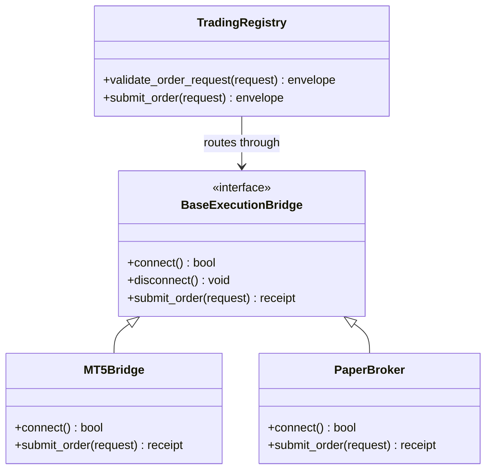

# 07_trading.md - Requirements

## 1. Purpose

The Trading module provides the dedicated trading boundary for HaruQuantAI. It owns the shared trading function surface used by both simulation/backtest workflows and live workflows.

The module exists to keep trading behavior DRY: order, position, reconciliation, broker-readiness, validation, receipt, compensation, and reporting functions shall have one public trading contract. Runtime behavior shall be selected by an explicit route, normally `sim` or `live`, while preserving the same function names, request shapes, result envelopes, validation rules, idempotency semantics, audit metadata, and safety gates.

Trading is a route-aware trading contract and execution-safety boundary. It does not own strategy signal generation, risk policy creation, final live-runtime authorization, broker secret resolution, or financial advice.

## 2. Ownership

### 2.1 Owns

- [ ] The public trading tool registry exposed by `app.services.trading.__all__`.
- [ ] The canonical trading route contract, including `route="sim"` and `route="live"`.
- [ ] Standard trading tool envelopes for agent-facing trading tools.
- [ ] Shared broker/connectivity request packaging for account, symbol, quote, spread, market, margin, lot, stop-distance, permission, and broker-time checks.
- [ ] Shared execution-readiness validation for environments, strategy runtime config, broker symbol mapping, order requests, price, size, stop loss, take profit, slippage, transaction cost, and execution plan construction.
- [ ] Shared order, pending-order, position, pause, resume, exposure-reduction, synchronization, reconciliation, receipt, and report request functions.
- [ ] Simulation-compatible trading behavior, including simulated order placement, pending-order processing, fill records, account snapshots, equity points, trade records, and JSON-safe result containers.
- [ ] Live-compatible trading request packaging before live runtime and broker mutation gates are applied.
- [ ] Construction and validation of trading request packages while consuming approval, risk, kill-switch, authorization, and live-runtime enablement verdicts from their owning modules.
- [ ] Simulator-state mutation for `route="sim"` without production broker mutation.
- [ ] Execution intent assembly, idempotency material, authority-state propagation, pre-send validation, send-attempt evidence payloads, receipts, compensation plan packages, and retry guard inputs.
- [ ] Persistence event payloads and repository interfaces for send attempts, receipts, reconciliation evidence, and compensation records, while database schema and migration ownership remain outside Trading.
- [ ] Broker bridge boundaries for MT5, cTrader, paper broker, simulator, and other approved trading adapters.
- [ ] Trading validation rules for symbols, volume, price, order type, magic/expert identifiers, slippage, expiration, timeframe, date ranges, stop loss, take profit, credentials, margin, tickets, max orders, and symbol volume.
- [ ] Trading monitoring inputs for stale state, ingestion health, tool health, workflow timeout, incident classification, latency, cost, and operational status.
- [ ] Shadow-trading feeds and expected-versus-realized reporting when no live broker mutation occurs.

### 2.2 Does Not Own

- [ ] The module does not own strategy signal generation, strategy lifecycle promotion, or strategy approval.
- [ ] The module does not own risk policy, position sizing approval, exposure limits, portfolio allocation policy, or kill-switch policy ownership.
- [ ] The module does not own rate-limiting policy enforcement; it consumes rate-limit verdicts from API Gateway, Live, or another approved policy owner where applicable.
- [ ] The module does not own market-data ingestion, provider data normalization, or historical data storage.
- [ ] The module does not own final live runtime enablement, live session orchestration, live secret resolution, or production broker mutation policy; those belong to `10_live.md`.
- [ ] The module does not initiate live credential discovery, live secret lookup, credential rotation, or live broker login flows on its own.
- [ ] The module does not own durable database schema/migration ownership.
- [ ] The module does not own approval voting policy, final approval-state authority, override policy, or strategy-promotion governance.
- [ ] The module does not independently authorize production broker mutation.
- [ ] The module does not execute live compensation actions unless the same external live-runtime, approval, risk, kill-switch, idempotency, and reconciliation gates required for live mutation are satisfied.
- [ ] The module does not own API authentication, UI rendering, websocket connection management, or frontend workflow policy.
- [ ] The module does not grant AI chat, UI, API, backtest, or optimization workflows authority to bypass risk, approval, idempotency, reconciliation, audit, or kill-switch controls.
- [ ] The module does not provide financial advice, trading recommendations, or owner-approved live threshold decisions.

## 3. API

### 3.1 Public Capabilities

- [ ] Export approved shared trading service tools through `app.services.trading.__all__`.
- [ ] Validate `app.services.trading.__all__` against the approved public contract matrix during registry validation so internal helpers cannot leak into the public namespace.
- [ ] Return standard trading result envelopes with tool name, status, request ID, data, errors, warnings, and audit metadata.
- [ ] Accept an explicit trading route for every trading action that can run in simulation or live mode.
- [ ] Package broker connectivity checks for MT5, cTrader-style providers, paper brokers, and simulator bridges.
- [ ] Package account, symbol, bid/ask, spread, trade-permission, broker-time, market-open, lot-rule, stop-distance, and free-margin checks.
- [ ] Validate trading environment, strategy runtime config, broker symbol mapping, order request, order price, order size, and stop-loss/take-profit geometry.
- [ ] Estimate slippage and transaction cost with the same contract for simulation and live routes.
- [ ] Build deterministic trading plans from validated order requests.
- [ ] Aggregate readiness checks before a trading request is accepted.
- [ ] Start, stop, submit, modify, cancel, close, fill, synchronize, reconcile, compare, and report trading workflows using route-aware functions.
- [ ] Provide lower-level rebuild support for approval packets, broker bridges, paper broker, simulator state, validation rules, order routing, idempotency, reconciliation, receipts, attempts, compensation, monitoring, shadow trading, and performance helpers.
- [ ] Declare whether each exported trading name is a public agent-facing API, internal helper, bridge adapter, or experimental/internal rebuild support.
- [ ] Declare supported routes, side-effect class, approval requirement, idempotency requirement, stability level, required inputs, optional inputs, output `data` schema, possible `status` values, possible error codes, and audit metadata fields for each exported trading tool.

## 4. Functional Requirements

- [ ] Every functional and non-functional requirement shall receive a stable requirement ID before implementation handoff, using prefixes such as `TRD-FR`, `TRD-NFR`, `TRD-EDGE`, and `TRD-TST`.
- [ ] Every requirement ID shall map to at least one corresponding test ID before implementation handoff.
- [ ] The trading registry shall expose only intentional agent-facing trading tools through `app.services.trading.__all__`.
- [ ] The trading registry shall keep exports unique, callable, documented, and synchronized with tests and catalog entries.
- [ ] Agent-facing trading tools shall return `StandardTradingEnvelope v1` as defined in this requirements document, and tests shall verify every exported tool against that schema.
- [ ] Trading tool results shall include tool name, status, tool call ID, request ID, data, errors, warnings, and audit metadata.
- [ ] Audit metadata shall include route, approval requirement, risk level, and side-effect classification.
- [ ] Trading workflows shall distinguish request packaging from broker or simulator mutation.
- [ ] For each route-aware trading action, the document shall define whether the action is non-mutating packaging, simulator-state mutation, paper-broker mutation, or live-broker mutation.
- [ ] For each route-aware trading action, the document shall define the exact status returned for accepted, rejected, blocked, pending, sent, partially filled, filled, cancelled, failed, and unknown-outcome states where those states apply.
- [ ] Trading workflows shall include `request_id`, `correlation_id`, `tool_call_id` where applicable, `route`, `provider`, `strategy_id` where applicable, `idempotency_key` where applicable, and UTC timestamps in every accepted, rejected, blocked, sent, unknown-outcome, and error envelope.
- [ ] Trading workflows shall return structured rejections or blocks for invalid orders, unsupported environments, failed readiness checks, unknown routes, or unsafe live conditions.
- [ ] Trading functions shall keep the same public names for simulation/backtest and live workflows; the route shall decide whether the request is simulated or live.
- [ ] Trading functions shall support only approved route values and shall reject unknown routes deterministically.
- [ ] Trading shall consume approval, risk, kill-switch, live-runtime, and authorization verdicts from their owning modules and shall not create final policy decisions, approve strategy promotion, resolve live secrets, or independently authorize production broker mutation.
- [ ] Trading shall consume rate-limit verdicts from their owning modules and shall not independently define user, account, provider, or API rate-limit policy.
- [ ] Trading rejection envelopes shall include machine-readable error codes, human-readable messages, affected field paths where applicable, retryability, severity, route, provider, request ID, and correlation ID.
- [ ] Idempotency keys shall be supplied by the caller or owning workflow as part of the request for mutating or broker-impacting actions.
- [ ] Trading shall validate the supplied idempotency key against canonical stored material and shall not silently generate a new key for a request that requires caller-controlled idempotency.
- [ ] Idempotency material shall be derived from canonical JSON serialization of route, action, account, strategy, symbol, side, quantity, price, stops, target, approval reference, and request payload version.
- [ ] Idempotency serialization shall use UTF-8 canonical JSON with sorted keys, no insignificant whitespace, stable field ordering, UTC timestamps formatted as `YYYY-MM-DDTHH:MM:SS.ssssssZ`, Decimal values serialized as canonical strings, and no binary, object, float, NaN, Infinity, or locale-dependent values in broker-critical material.
- [ ] Idempotency material hashing shall use an approved cryptographic hash such as SHA-256 over the canonical UTF-8 JSON bytes and shall record the payload schema version used for hashing.
- [ ] Trading shall reject idempotency reuse when the same idempotency key is submitted with materially different canonical payload fields.
- [ ] Trading shall preserve all timestamps in timezone-aware UTC and shall include broker-time evidence separately from system-time evidence.
- [ ] Broker-time evidence shall be parsed into timezone-aware UTC objects before validation, hashing, reporting, or persistence; naive broker timestamps shall require an explicitly documented broker timezone assumption or be rejected for governed/live workflows.
- [ ] Trading shall normalize price, volume, commission, spread, slippage, margin, PnL, equity, and balance using Python `decimal.Decimal` before validation, hashing, reporting, or persistence.
- [ ] Decimal normalization shall use `ROUND_HALF_EVEN` by default, at least 28 digits of working precision, and a minimum quantization scale of 8 decimal places for broker-critical price, quantity, margin, PnL, equity, balance, and cost material unless a documented instrument or provider contract requires a stricter scale.
- [ ] Decimal context, quantization scale, and rounding mode shall be recorded in audit metadata or deterministic validation diagnostics where they affect idempotency material, simulator results, or live request packages.
- [ ] Readiness failure shall produce `status="rejected"` with `code="READINESS_FAILED"` and a bounded list of failed readiness checks.
- [ ] Concurrent mutation rejection shall produce `status="blocked"` or `status="rejected"` with `code="TRADING_CONCURRENCY_CONFLICT"` and the documented concurrency scope.
- [ ] Every configurable trading threshold shall document its default, allowed range, unit, owning configuration key, and consequence of violation.

**StandardTradingEnvelope v1**

- [ ] `StandardTradingEnvelope v1` shall define exact fields for `status`, `message`, `data`, `errors`, `warnings`, and `audit_metadata`.
- [ ] `status` shall use a documented enum including `success`, `rejected`, `blocked`, `pending_approval`, `packaged`, `sent`, `partial`, `filled`, `cancelled`, `unknown_outcome`, and `error` where applicable.
- [ ] `packaged` shall mean a request was built and validated but not submitted to a broker or simulator.
- [ ] `pending_approval` shall mean a request cannot proceed until external approval state changes.
- [ ] `sent` shall mean a request was submitted to the route authority but final acknowledgment is not yet available.
- [ ] `unknown_outcome` shall mean the route authority may have accepted a request but authoritative state is unresolved and blind retry is blocked until reconciliation.
- [ ] Error objects shall include `code`, `message`, `field_path` where applicable, `severity`, `retryable`, `route`, `provider`, `request_id`, and `correlation_id`.
- [ ] Warning objects shall include `code`, `message`, `severity`, and affected context where applicable.
- [ ] Audit metadata shall include `tool_name`, `tool_call_id`, `request_id`, `correlation_id`, `route`, `provider`, `approval_requirement`, `approval_reference`, `risk_decision_reference`, `side_effect_class`, `idempotency_key`, `payload_version`, `created_at_utc`, and redaction status.

**Route-Aware Trading Contract**

- [ ] `trading_connect` shall connect and hold one active trading/data bridge for the requested route and provider.
- [ ] `trading_connect(route="live")` shall accept a pre-authorized Live-owned connection/session handle or an injected `ICredentialProvider` interface and shall not independently resolve secrets, read raw credential fields, or initiate live broker login outside the Live-owned session boundary.
- [ ] `trading_connect(route="live")` shall verify external live-runtime enablement and session authority before creating or binding an active bridge.
- [ ] `trading_disconnect` shall disconnect and clear the active trading/data bridge for the requested route and provider.
- [ ] `trading_is_connected` shall report active bridge connection status for the requested route.
- [ ] `submit_order` shall use the same request shape for `sim` and `live` routes. For `route="sim"`, it may mutate simulator state according to simulator rules. For `route="live"`, it shall package a live-compatible request and shall not mutate a production broker unless an external live-runtime authority explicitly authorizes mutation and all approval, risk, kill-switch, idempotency, readiness, and reconciliation gates pass.
- [ ] `modify_order` shall modify an existing order using the same request shape for `sim` and `live` routes.
- [ ] `cancel_order` shall cancel a pending order using the same request shape for `sim` and `live` routes.
- [ ] `close_position` shall close an open position fully or partially using the same request shape for `sim` and `live` routes.
- [ ] `modify_position` shall modify stop loss or take profit on an open position using the same request shape for `sim` and `live` routes.
- [ ] `reduce_exposure` shall reduce exposure using the same request shape for `sim` and `live` routes.
- [ ] `pause_strategy` shall pause strategy trading activity using the same request shape for `sim` and `live` routes.
- [ ] `resume_strategy` shall resume strategy trading activity using the same request shape for `sim` and `live` routes.
- [ ] `sync_positions` shall synchronize route-specific position state from the active authority source.
- [ ] `reconcile_state` shall compare internal trading state against the route authority source.
- [ ] `build_trading_report` shall package route-specific trading results, readiness, receipts, reconciliation evidence, and warnings.
- [ ] `record_fill` shall package a fill record for simulated or observed execution.
- [ ] `calculate_slippage` shall calculate simulated or observed slippage through the same public contract.
- [ ] `compare_route_vs_backtest` shall package comparison of route behavior against backtest expectations.

**Broker Connectivity**

- [ ] `check_broker_connection` shall package a broker connection status check for the selected route.
- [ ] `get_account_info` shall package account balance, equity, margin, and leverage context retrieval for the selected route.
- [ ] `get_symbol_info` shall package broker or simulator metadata retrieval for one symbol.
- [ ] `get_current_bid_ask` shall package current bid and ask retrieval for a trading decision.
- [ ] `get_current_spread` shall package current spread retrieval for one symbol.
- [ ] `get_trade_permissions` shall package account and symbol trading-permission retrieval.
- [ ] `get_broker_time` shall package broker, paper-broker, or simulator timestamp retrieval for freshness checks.
- [ ] `check_market_open` shall package a market-open check for a symbol.
- [ ] `check_min_lot` shall package broker or simulator minimum-lot validation.
- [ ] `check_max_lot` shall package broker or simulator maximum-lot validation.
- [ ] `check_lot_step` shall package broker or simulator lot-step validation.
- [ ] `check_stop_distance` shall package broker or simulator minimum stop-distance validation.
- [ ] `check_free_margin` shall package free-margin availability validation before trading.

**Trading Readiness**

- [ ] `validate_execution_environment` shall validate that trading targets an allowed environment and route.
- [ ] `validate_strategy_runtime_config` shall validate strategy runtime configuration before trading-plan construction.
- [ ] `validate_broker_symbol_mapping` shall validate internal symbol to broker/simulator symbol mapping.
- [ ] `validate_order_request` shall validate a proposed order request before trading-plan construction.
- [ ] `validate_order_price` shall validate that a proposed order price is positive.
- [ ] `validate_order_size` shall validate that a proposed order volume is positive.
- [ ] `validate_stop_loss_take_profit` shall validate stop-loss and take-profit placement relative to side and price.
- [ ] `estimate_slippage` shall estimate expected slippage from spread and volatility inputs.
- [ ] `estimate_transaction_cost` shall estimate spread, commission, and slippage cost.
- [ ] `build_execution_plan` shall build a deterministic trading plan from a validated order request.
- [ ] `run_execution_readiness_check` shall aggregate readiness checks and block when any required check fails.

**Shared Helpers And Request Packaging**

- [ ] `trading_tool_result` shall build the standard HaruQuant result envelope for trading tools.
- [ ] `trading_tool_context` shall extract standard trading tool context fields from keyword arguments.
- [ ] `package_trading_request` shall package deterministic trading requests without live side effects.
- [ ] Repository and persistence dependencies shall flow through dependency injection: Trading defines repository/interface contracts and persistence event payload schemas, while Infrastructure, Data, Live, or another approved owner provides concrete implementations.
- [ ] Trading shall not import concrete database engines, open database connections, run migrations, or select persistence backends at import time.
- [ ] Lazy trading attribute resolution shall expose approved lower-level trading service attributes without moving business logic into the package initializer.
- [ ] Importing `app.services.trading` shall not connect to brokers, resolve secrets, perform network calls, perform database writes, start background workers, or mutate simulator/live state.

**Approval And Governance Inputs**

- [ ] `ApprovalPacket` shall represent a full approval packet and report completeness/missing fields.
- [ ] `ApprovalRequest` shall model an approval request.
- [ ] `ApprovalPacketBuilder` shall build approval packets from action, reason, evidence, confidence, uncertainty, policy checks, risk class, alternatives, expected impact, rollback plan, and escalation triggers.
- [ ] Trading shall consume externally owned approval verdicts and approval references.
- [ ] Trading may package local approval evidence DTOs for execution requests but shall not own approval voting policy, approval-state authority, or approval persistence schema.
- [ ] `ApprovalCreationService`, `ApprovalVoteService`, `ApprovalStateMachine`, and `OverrideRequestService` requirements shall be treated as external governance-module dependencies unless a later approved decision narrows them to Trading-owned DTO or adapter behavior.
- [ ] Trade action governance shall consume externally owned approval state, risk decision, readiness, and kill-switch state before any route mutation.
- [ ] AI chat order drafts shall become governed route-aware trading requests only through approved governance and execution boundaries; Trading shall not grant Conversation direct execution authority.

**Intent Assembly, Routing, And Idempotency**

- [ ] `assemble_execution_intent` shall build a canonical trading intent linked to approved proposal and risk decision.
- [ ] Trading intent assembly shall include route, idempotency material, proposal/risk references, action, symbol, side, quantity, price, stops, target, and trace metadata.
- [ ] Order routing shall choose an eligible route adapter only after policy, broker, readiness, and safety context are available.
- [ ] Idempotency helpers shall produce stable material and detect conflicts between duplicate keys and differing payloads.
- [ ] Pre-send validation shall verify that a trading request is still valid immediately before route submission.
- [ ] Readiness services shall fail closed when required market/account/broker/risk context is missing or stale.
- [ ] Route adapters shall document the serialization scope used for conflicting requests, such as route plus account plus strategy plus symbol, route plus order ticket, route plus position ticket, or idempotency key.

**Broker Bridges And Low-Level Trading**

- [ ] `BaseExecutionBridge` shall define heartbeat and place-order bridge behavior for route adapters.
- [ ] `MT5Bridge` shall provide MT5 connectivity, account info, symbol info, tick reads, positions, orders, and fail-closed mutation methods.
- [ ] `CTraderBridge` shall provide cTrader symbol/status normalization and fail-closed bridge behavior.
- [ ] `PaperBroker` shall provide deterministic paper order placement, pending-order processing, and account snapshots.
- [ ] `Trade` shall retain low-level MT5/simulator order request, check, send, result, open, modify, delete, close, and partial-close behavior.
- [ ] `trading_place_order` shall submit a broker or simulator order through a fail-closed route bridge.
- [ ] `place_market_order` shall place a market order through the active route bridge when allowed.
- [ ] `place_pending_order` shall place a pending order through the active route bridge or simulator mode when allowed.
- [ ] `modify_pending_order` shall modify price, stop loss, take profit, or expiration on a pending order only when bridge support and gates allow it.
- [ ] `cancel_pending_order` shall cancel a pending order through the active route bridge when allowed.
- [ ] Trading snapshot functions shall return JSON-safe account, position, order, history, symbol, terminal, margin, profit, and deal-history information.

**Validation**

- [ ] `validate_action_type` shall validate request action and order type compatibility.
- [ ] `validate_submission_inputs` shall validate symbol, volume, symbol metadata, bid, and ask inputs.
- [ ] `validate_trade_request` shall validate a full trade request against account and symbol metadata.
- [ ] `validate_symbol` shall validate symbol availability in trading context.
- [ ] `validate_volume_basic` shall validate basic volume positivity.
- [ ] `validate_volume_symbol_limits` shall validate volume against symbol min/max rules.
- [ ] `validate_volume_step` shall validate broker volume step alignment.
- [ ] `validate_volume_format` shall validate volume text formatting.
- [ ] `validate_price_format` shall validate price text formatting.
- [ ] `validate_volume` shall validate volume using context and rule settings.
- [ ] `validate_price` shall validate price using context and rule settings.
- [ ] `validate_order_type` shall validate supported order type tokens.
- [ ] `validate_magic` shall validate expert/magic number rules.
- [ ] `validate_slippage` shall validate allowed slippage relative to requested price and order type.
- [ ] `validate_expiration_unix` shall validate expiration timestamp against current time.
- [ ] `validate_expiration_mode` shall validate order expiration mode.
- [ ] `validate_timeframe` shall validate timeframe tokens.
- [ ] `validate_date_range_unix` shall validate date-range bounds.
- [ ] `validate_stop_loss` shall validate stop-loss geometry and broker distance/freeze rules.
- [ ] `validate_take_profit` shall validate take-profit geometry and broker distance/freeze rules.
- [ ] `validate_trade_request_payload` shall validate canonical trade request payloads.
- [ ] `validate_credentials` shall validate credential payload completeness without exposing secrets.
- [ ] `validate_margin` shall validate available margin against required margin.
- [ ] `validate_ticket` shall validate broker ticket identifiers.
- [ ] `validate_max_orders` shall validate open/pending order count against limits.
- [ ] `validate_symbol_volume` shall validate total symbol volume against limits.
- [ ] Open, modify, delete, close, and partial-close validation helpers shall enforce operation-specific preconditions.

**Simulator Core And Receipts**

- [ ] Simulator state shall own simulated account, position, order, history, symbol, margin, equity, balance, and trade-record state.
- [ ] `order_send` shall process simulated trade requests and update simulator state.
- [ ] `monitor_positions` shall update open positions and auto-close on stop loss or take profit when allowed.
- [ ] `monitor_pending_orders` shall expire and trigger pending orders when allowed.
- [ ] `monitor_account` shall update account aggregates from open positions.
- [ ] Trade records, equity points, run results, and backtest result containers shall serialize to JSON-safe dictionaries.
- [ ] Receipt builders shall preserve broker/order/deal identifiers, requested and filled values, status, timestamps, provider, route, and trace metadata.
- [ ] Authority-state propagation shall identify whether broker receipt state, simulator state, or reconciliation state is currently authoritative.
- [ ] Send-attempt persistence shall hash submitted payloads and preserve retry/audit context.

**Reconciliation**

- [ ] Broker-truth and simulator-truth snapshots shall normalize positions, orders, account, and timestamp evidence.
- [ ] Reconciliation comparison shall detect missing, extra, mismatched, and stale authority/internal records.
- [ ] Reconciliation persistence event payloads shall preserve reconciliation runs, mismatches, incidents, and evidence references through externally owned persistence interfaces.
- [ ] Startup reconciliation inputs shall be available before live recovery or live mutation workflows.
- [ ] Retry guard behavior shall prevent unsafe blind retries after unknown route outcomes.
- [ ] Reconciliation incidents shall package discrepancy severity, evidence, action requirement, and audit context.

**Monitoring, Performance, Cost, And Compensation**

- [ ] Tool health monitoring shall track trading tool availability and failure status.
- [ ] Workflow timeout monitoring shall detect stale or overdue trading workflows.
- [ ] Stale-state monitoring shall identify stale market, account, broker, approval, or risk state.
- [ ] Ingestion monitoring shall track whether required trading inputs are arriving.
- [ ] Incident classification shall classify trading incidents by severity and action need.
- [ ] Latency helpers shall record trading timing and latency diagnostics.
- [ ] Snapshot caches shall preserve recent trading performance snapshots.
- [ ] Cost enforcement shall consume externally owned per-request, workflow, and session budget verdicts and package cost entries for persistence or monitoring.
- [ ] Trading shall validate and package compensation plans for partial or failed side-effect paths.
- [ ] Execution of any compensation step that can mutate live broker state shall require the same external live-runtime, approval, risk, kill-switch, idempotency, and reconciliation gates as any other live mutation.
- [ ] Order compensation shall support pending-order cancellation or offsetting-order style remediation packages where configured.
- [ ] Position compensation shall support position close or size adjustment remediation packages where configured.
- [ ] Compensation registry shall map action classes to compensation plans and report registered compensation coverage.

## 5. Non-Functional Requirements

- [ ] Trading shall fail closed on missing risk context, stale broker/account state, active kill switch, reconciliation mismatch, idempotency conflict, disabled live flag, unknown route, or unknown route result.
- [ ] Live mutations shall be disabled by default even when trading functions support `route="live"`.
- [ ] Critical live and kill-switch actions shall require explicit approval context before the live route can mutate broker state.
- [ ] Broker calls shall be isolated behind approved adapters or bridges.
- [ ] Trading outputs shall be structured, traceable, redacted, and JSON-safe.
- [ ] Trading errors shall use documented machine-readable error codes, stable status values, deterministic field paths where applicable, retryability flags, severity, route, provider, request ID, correlation ID, and redacted diagnostic context.
- [ ] Secrets, credentials, tokens, authorization headers, private broker payloads, and raw approval packets shall not leak through logs, errors, notifications, metrics, reports, or chat.
- [ ] Idempotency shall prevent unsafe duplicate trading and shall not be mistaken for exactly-once broker semantics.
- [ ] Unknown broker or simulator outcomes shall block blind retries until reconciliation resolves state.
- [ ] Reconciliation shall prefer the configured authority source when determining route state.
- [ ] Simulation, shadow, and live routes shall remain separate even when they share the same function names.
- [ ] Trading tools shall preserve clear side-effect flags and approval requirements.
- [ ] Trading monitoring shall emit structured events for stale state, timeout, health failure, incident, latency, and cost-budget conditions. Each event shall include route, provider, request ID, correlation ID, tool name, status, severity, side-effect class, latency duration where applicable, and redacted diagnostic context.
- [ ] Compensation behavior shall be explicit, validated, auditable, and bounded.
- [ ] Trading shall report readiness as failed whenever any required readiness check is failed, missing, stale, or unsupported; successful readiness may be reported only when all required checks pass and none are unknown.
- [ ] Public registry changes shall remain covered by tests and catalog updates.
- [ ] Trading functions shall reject market/account/broker/risk context older than the documented freshness threshold and shall include the stale field name, observed timestamp, threshold, route, and provider in the rejection envelope.
- [ ] Trading shall enforce documented timeout budgets for broker checks, readiness aggregation, send attempts, reconciliation, compensation, and report generation.
- [ ] Trading shall enforce documented maximum payload size, maximum batch size, maximum readiness-check count, and maximum reconciliation snapshot size.
- [ ] Trading shall use a documented concurrency guard or return `TRADING_CONCURRENCY_CONFLICT` for concurrent mutating requests that target the same route, account, strategy, symbol, order ticket, position ticket, or idempotency key when concurrent execution could create duplicate or conflicting exposure.
- [ ] Trading shall reject retry exhaustion with deterministic failure status and audit metadata.
- [ ] Redaction behavior shall cover nested exceptions, nested broker payloads, serialized approval evidence, logs, metrics, reports, notifications, chat responses, and audit metadata.
- [ ] Default broker operation timeout shall be 10 seconds unless an approved module-specific contract overrides it.
- [ ] Default broker check timeout shall be 5 seconds unless an approved module-specific contract overrides it.
- [ ] Default market data freshness threshold shall be 5 seconds unless an approved module-specific contract overrides it.
- [ ] Default maximum request payload size shall be 1 MiB unless an approved module-specific contract overrides it.
- [ ] Default maximum readiness check count shall be 20 unless an approved module-specific contract overrides it.
- [ ] Default maximum reconciliation snapshot size shall be 10,000 records or 5 MiB, whichever limit is reached first, unless an approved module-specific contract overrides it.
- [ ] Proposed readiness aggregation engineering baseline: p99 readiness aggregation target is less than 50 ms under the approved normal-load benchmark profile; this target remains Pending until the benchmark profile and reference hardware are approved.
- [ ] Default concurrency scope for order submission shall be route plus account plus strategy plus symbol plus side plus idempotency key until a more specific route contract is approved.

## 6. Testing

### 6.1 Edge Cases

- Empty request payload.
- Malformed JSON or non-dictionary request payload.
- Required field present with invalid type.
- Oversized request payload.
- Unknown, missing, or misspelled trading route.
- Missing approval ID for a live route action that requires approval.
- Live mutation flag disabled while a shared trading function is called with `route="live"`.
- Live-route credential, token, or session handle expires mid-session; Trading shall return `TRADING_CREDENTIAL_EXPIRED` without leaking secrets.
- Multiple concurrent `trading_connect` calls target the same live route and provider.
- Active global, strategy, or symbol kill switch.
- Broker disconnected, stale broker time, stale quote, stale account snapshot, stale permissions, or stale symbol metadata.
- Daylight Saving Time transition or timezone rule change creates artificial clock skew between system time and broker time.
- Unknown broker or simulator result after a send attempt.
- Broker call times out after the broker may have accepted the request.
- Duplicate idempotency key with different material fields.
- Duplicate request submitted concurrently with the same idempotency key.
- Duplicate request submitted concurrently with different idempotency keys but identical broker-impacting material.
- Existing send attempt with no authoritative receipt.
- Network partition occurs after send-attempt persistence but before broker transmission.
- Persistence succeeds before broker send but fails after broker response.
- Broker receipt received without matching send-attempt record.
- Reconciliation mismatch between authority source and internal state.
- Missing or unsupported route provider.
- Symbol mapping absent, alias collision, or broker symbol disabled.
- Market closed, trade permission disabled, invalid account mode, insufficient margin, or margin level below policy.
- Volume below minimum, above maximum, not aligned to step, malformed, or exceeding symbol exposure limits.
- Invalid side, unsupported order type, invalid price, malformed ticket, invalid magic number, invalid timeframe, or invalid expiration.
- Stop loss or take profit on the wrong side of entry price, too close to market, or inside broker freeze distance.
- Price, volume, spread, slippage, commission, bid, ask, or account values missing, non-finite, zero, or negative where invalid.
- Clock skew between system time and broker time exceeds configured tolerance.
- Decimal rounding changes volume, price, stop distance, margin, or idempotency material.
- Partial fills, partial closes, pending-order expiry, pending-order trigger, or IOC-like remainder behavior.
- Simulated fills diverging from backtest expectations.
- Shadow expected fill/PnL diverging from realized market behavior.
- Simulator resource exhaustion during high-frequency simulated order generation.
- Compensation plan missing for an action class.
- Cost budget exceeded before a governed action completes.
- Workflow timeout while approval, send, receipt, reconciliation, or compensation remains pending.
- Secret-reference resolution failure or accidental raw secret in config input.
- Redaction failure caused by nested exception, nested broker payload, or serialized approval evidence.

### 6.2 Tests Required

- [ ] Requirement-to-test mapping shall prove every `TRD-FR`, `TRD-NFR`, and `TRD-EDGE` requirement has at least one test ID before Builder handoff.
- [ ] Public tool contract tests shall prove every exported trading tool matches the documented public tool contract matrix.
- [ ] Public tool contract tests shall prove every exported public tool returns only documented status values.
- [ ] Public tool contract tests shall prove internal helpers are not accidentally exported through `app.services.trading.__all__`.
- [ ] Public tool contract tests shall be generated from, or mechanically checked against, the public tool contract matrix.
- [ ] API signature tests shall verify exact documented signatures, required fields, optional fields, defaults, enum values, and `data` schemas for public agent-facing tools.
- [ ] Registry tests shall prove `app.services.trading.__all__` matches the approved agent-facing tool surface.
- [ ] Callable/docstring tests shall cover every exported trading service tool.
- [ ] Standard-envelope tests shall cover every exported trading service tool and `StandardTradingEnvelope v1` serialization for success, rejected, blocked, pending approval, packaged, sent, partial, unknown outcome, and error statuses.
- [ ] Rejection-envelope tests shall prove every rejection contains error code, message, field path when applicable, severity, retryability, route, provider, request ID, and correlation ID.
- [ ] Route tests shall prove all shared trading verbs accept `route="sim"` and `route="live"` where applicable and reject unknown routes.
- [ ] Critical live-route tests shall prove shared trading functions block without approval ID when the live action requires approval.
- [ ] Order-request validation tests shall cover missing symbol, invalid side, zero/negative volume, invalid price, invalid stops, invalid environment, unsupported route, and unsupported broker mapping.
- [ ] Readiness aggregation tests shall prove failed checks block trading.
- [ ] Broker-connectivity packaging tests shall cover account, symbol, quote, spread, permissions, broker time, market open, lot rules, stop distance, and margin.
- [ ] Simulation route tests shall cover start, stop, submit, modify, cancel, close, fill record, slippage, route/backtest comparison, and report packaging.
- [ ] Live route tests with mocks shall prove submit, modify, cancel, close, pause, resume, exposure reduction, sync, reconciliation, and reports require approval and fail closed when context is missing.
- [ ] Approval packet completeness, state-machine, creation, voting, override, and distinct-approver tests shall cover governance inputs consumed by trading.
- [ ] Trading intent assembly tests shall cover approved proposal/risk-decision linkage and idempotency material.
- [ ] Idempotency tests shall cover duplicate same-material requests, duplicate different-material requests, stable canonical material across dictionary key ordering, and equivalent numeric formatting.
- [ ] Decimal-safe validation tests shall cover volume step, price precision, stop distance, commission, slippage, margin, and PnL fields.
- [ ] Property-based tests shall cover canonical payload serialization, idempotency material stability, Decimal quantization and rounding edge cases, timestamp normalization, and concurrency conflict detection.
- [ ] If Python `hypothesis` or another property-based testing library is used, the dependency shall require explicit dependency approval and documentation before being added.
- [ ] UTC timestamp normalization and broker-time skew rejection tests shall cover system-time and broker-time evidence.
- [ ] Import-time safety tests shall prove `import app.services.trading` performs no broker connections, network calls, secret resolution, database writes, background worker starts, or simulator/live state mutation.
- [ ] Concurrency tests shall cover two concurrent submissions with the same idempotency key and same material, the same idempotency key and different material, two concurrent live-route submissions targeting the same account/strategy/symbol/side, and concurrent close/modify operations against the same position ticket.
- [ ] Broker bridge tests shall cover MT5, cTrader, paper broker, simulator bridge, and fail-closed behavior.
- [ ] Live connection boundary tests shall prove `trading_connect(route="live")` consumes only an approved credential/session interface and does not independently resolve secrets.
- [ ] Credential-expiry tests shall prove expired live session material returns `TRADING_CREDENTIAL_EXPIRED` with redacted diagnostics.
- [ ] Trade validator tests shall cover symbol, volume, price, order type, magic, slippage, expiration, timeframe, date range, stop loss, take profit, credentials, margin, tickets, max orders, and symbol volume.
- [ ] Simulator core tests shall cover order send, position monitoring, pending-order monitoring, account monitoring, trade records, equity points, and JSON serialization.
- [ ] Reconciliation tests shall cover matched, missing, extra, mismatched, stale, unknown-outcome, startup, persistence event payloads, retry guard, and incident paths.
- [ ] Failure-path integration tests shall cover broker timeout after send attempt, broker disconnect mid-call, persistence failure before send, persistence failure after send, receipt missing, reconciliation mismatch, and compensation missing.
- [ ] Failure-path integration tests shall cover network partition after send-attempt persistence but before broker transmission.
- [ ] Failure-path integration tests shall run against a broker simulator capable of injecting network timeouts, disconnects, delayed responses, missing receipts, partial fills, and unknown outcomes.
- [ ] Performance and resource tests shall cover readiness aggregation timeout budgets, reconciliation maximum snapshot size, large payload rejection before expensive validation or broker calls, and retry exhaustion.
- [ ] Simulator resource tests shall cover high-frequency simulated order generation, bounded memory behavior, and deterministic resource-exhaustion envelopes.
- [ ] Monitoring tests shall cover stale state, ingestion health, workflow timeout, tool health, incident classification, latency, and snapshot cache behavior.
- [ ] Cost enforcement tests shall cover per-request, workflow, and session budget checks.
- [ ] Shadow trading tests shall cover feed building, no-live-mutation execution, and expected-versus-realized reporting.
- [ ] Compensation tests shall cover order, position, registry, validation, packaging, gated execution, missing-plan, and audit-log behavior.
- [ ] Security tests shall prove secrets and private broker/approval payloads are redacted from errors, logs, reports, notifications, metrics, chat responses, nested exceptions, and audit metadata.
- [ ] Documentation and usage-example tests shall execute all usage examples and verify exact envelope shapes for success and failure paths.

### 6.3 Usage Examples

```python
from app.services.trading import validate_order_request, build_execution_plan

request = {
    "route": "sim",
    "symbol": "EURUSD",
    "side": "buy",
    "volume": 0.1,
    "price": 1.1,
    "stop_loss": 1.09,
    "take_profit": 1.12,
    "request_id": "req_trading_validate",
}

validation = validate_order_request(**request)

if validation["status"] == "success":
    plan = build_execution_plan(**request)
else:
    errors = validation["errors"]
```

```python
from app.services.trading import run_execution_readiness_check, submit_order

readiness = run_execution_readiness_check(
    route="sim",
    checks=[
        {"name": "market_open", "passed": True},
        {"name": "free_margin", "passed": True},
        {"name": "kill_switch", "passed": True},
    ],
    request_id="req_trading_readiness",
)

if readiness["data"]["passed"]:
    order = submit_order(
        route="sim",
        strategy_id="strategy_alpha",
        symbol="EURUSD",
        side="buy",
        volume=0.1,
        price=1.1,
        request_id="req_trading_sim",
    )
```

```python
from app.services.trading import submit_order

live_order_request = submit_order(
    route="live",
    approval_id="approval_123",
    strategy_id="strategy_alpha",
    symbol="EURUSD",
    side="buy",
    volume=0.1,
    price=1.1,
    request_id="req_trading_live",
)
```

Validation rejection example with field-level errors:

```json
{
  "status": "rejected",
  "message": "Order request validation failed.",
  "data": null,
  "errors": [
    {
      "code": "INVALID_ORDER_VOLUME",
      "message": "Volume must be greater than zero.",
      "field_path": "volume",
      "severity": "error",
      "retryable": false,
      "route": "sim",
      "provider": "simulator",
      "request_id": "req_trading_invalid_volume",
      "correlation_id": "corr_trading_example"
    }
  ],
  "warnings": [],
  "audit_metadata": {
    "tool_name": "validate_order_request",
    "route": "sim",
    "side_effect_class": "none",
    "request_id": "req_trading_invalid_volume",
    "correlation_id": "corr_trading_example",
    "redaction_status": "applied"
  }
}
```

Live-route block due to missing approval. This packages nothing for broker mutation and performs no live broker call:

```json
{
  "status": "blocked",
  "message": "Live trading request requires approval.",
  "data": null,
  "errors": [
    {
      "code": "APPROVAL_REQUIRED",
      "message": "approval_id is required for this live route action.",
      "field_path": "approval_id",
      "severity": "critical",
      "retryable": false,
      "route": "live",
      "provider": "mt5",
      "request_id": "req_trading_live_blocked",
      "correlation_id": "corr_trading_example"
    }
  ],
  "warnings": [],
  "audit_metadata": {
    "tool_name": "submit_order",
    "route": "live",
    "side_effect_class": "none",
    "approval_requirement": "required",
    "request_id": "req_trading_live_blocked",
    "correlation_id": "corr_trading_example",
    "redaction_status": "applied"
  }
}
```

Idempotency conflict example for duplicate key with different material:

```json
{
  "status": "rejected",
  "message": "Idempotency key was reused with different trading material.",
  "data": null,
  "errors": [
    {
      "code": "IDEMPOTENCY_CONFLICT",
      "message": "The supplied idempotency key does not match stored canonical material.",
      "field_path": "idempotency_key",
      "severity": "critical",
      "retryable": false,
      "route": "live",
      "provider": "mt5",
      "request_id": "req_trading_idempotency_conflict",
      "correlation_id": "corr_trading_example"
    }
  ],
  "warnings": [],
  "audit_metadata": {
    "tool_name": "submit_order",
    "route": "live",
    "side_effect_class": "none",
    "idempotency_key": "idem_order_123",
    "request_id": "req_trading_idempotency_conflict",
    "correlation_id": "corr_trading_example",
    "redaction_status": "applied"
  }
}
```

Unknown outcome example after a broker timeout. Blind retry is blocked until reconciliation:

```json
{
  "status": "unknown_outcome",
  "message": "Broker request timed out after submission; reconciliation is required before retry.",
  "data": {
    "send_attempt_id": "attempt_123",
    "reconciliation_required": true
  },
  "errors": [
    {
      "code": "BROKER_TIMEOUT_UNKNOWN_OUTCOME",
      "message": "The broker may have accepted the request before timeout.",
      "field_path": null,
      "severity": "critical",
      "retryable": false,
      "route": "live",
      "provider": "mt5",
      "request_id": "req_trading_timeout",
      "correlation_id": "corr_trading_example"
    }
  ],
  "warnings": [],
  "audit_metadata": {
    "tool_name": "submit_order",
    "route": "live",
    "side_effect_class": "broker_mutation_attempted",
    "request_id": "req_trading_timeout",
    "correlation_id": "corr_trading_example",
    "redaction_status": "applied"
  }
}
```

Unknown outcome follow-up example. Reconciliation is required before retry or compensation:

```python
from app.services.trading import reconcile_state

reconciliation = reconcile_state(
    route="live",
    provider="mt5",
    send_attempt_id="attempt_123",
    request_id="req_trading_reconcile_after_timeout",
    correlation_id="corr_trading_example",
)

if reconciliation["status"] == "success" and reconciliation["data"]["authority_resolved"]:
    resolved_state = reconciliation["data"]["authority_state"]
else:
    incident = reconciliation["errors"]
```

Redacted error example for a secret leakage attempt:

```json
{
  "status": "rejected",
  "message": "Request contained prohibited secret material.",
  "data": null,
  "errors": [
    {
      "code": "SECRET_MATERIAL_REDACTED",
      "message": "Sensitive credential material was removed from diagnostics.",
      "field_path": "credentials.password",
      "severity": "critical",
      "retryable": false,
      "route": "live",
      "provider": "mt5",
      "request_id": "req_trading_secret_redacted",
      "correlation_id": "corr_trading_example"
    }
  ],
  "warnings": [],
  "audit_metadata": {
    "tool_name": "trading_connect",
    "route": "live",
    "side_effect_class": "none",
    "request_id": "req_trading_secret_redacted",
    "correlation_id": "corr_trading_example",
    "redaction_status": "applied"
  }
}
```

## 7. Module Architecture

### 7.1 Target Folder Structure

```text
tools/
    __init__.py
    trading/
        __init__.py
        bridge/
            __init__.py
            base.py
            mt5.py
            ctrader.py
        simulator/
            __init__.py
            broker.py
            state.py
        validation.py
        registry.py
        reconciliation.py
        monitoring.py
        compensation.py
tests/
    unit/
        tools/
            trading/
                test_bridge.py
                test_validation.py
                test_reconciliation.py
                test_simulator.py
    usage/
        tools/
            trading/
                test_trading_usage.py
```

### 7.2 Class Diagrams



---

## 8. Acceptance

### 8.5 Additional Details

#### Consumes And Coordinates With

- [ ] Trading consumes approval verdicts, approval references, and approval completeness evidence from the owning governance or approval module.
- [ ] Trading consumes risk decisions, risk constraints, kill-switch state, and exposure verdicts from the Risk module.
- [ ] Trading consumes broker readiness, live runtime enablement, session orchestration, secret-resolution status, and production broker mutation authorization from the Live module and related policy modules.
- [ ] Trading consumes live credential/session material only through an approved external credential/session interface, such as an injected `ICredentialProvider`, pre-authorized connection handle, or Live-owned session reference.
- [ ] Trading consumes an injected `RedactionService` or Utils-owned redaction helper for logs, errors, envelopes, reports, notifications, and audit metadata.
- [ ] Trading consumes market, account, portfolio, symbol, and broker state from Data, broker adapters, or approved state repositories.
- [ ] Trading coordinates with persistence through documented repository interfaces or event payloads but does not own durable schema or migration definitions.
- [ ] Trading coordinates with API, UI, Research, Optimization, Simulation, Live, and Conversation through documented request and response contracts only.

#### Public Tool Contract Matrix Requirements

- [ ] Before Builder handoff, every exported name in `app.services.trading.__all__` shall have a documented public contract.
- [ ] Each contract shall include tool name, public/internal classification, stability level, route support, required inputs, optional inputs, input schema version, standard envelope output schema, `data` schema, status values, error codes, warning codes where applicable, side-effect classification, approval requirement, idempotency requirement, audit metadata fields, network behavior, persistence behavior, and usage examples.
- [ ] The actual public tool contract matrix shall be present in this document or an explicitly referenced appendix before Builder handoff; this process requirement alone is not sufficient for implementation.
- [ ] Each public contract shall define exact callable signature, parameter types, required and optional fields, constraints, default values, enum values, failure behavior, and return schema.
- [ ] Public agent-facing tools shall be separate from lower-level helpers, adapters, DTOs, repository interfaces, and experimental rebuild support.
- [ ] Contract tests shall be automatically generated from, or mechanically checked against, the public tool contract matrix to prevent drift.

#### Interface Definition Appendix Requirements

- [ ] Before Builder handoff, this document shall include an Interface Definition Appendix with exact contracts for every public agent-facing Trading function.
- [ ] The appendix shall include at minimum `trading_connect`, `trading_disconnect`, `trading_is_connected`, `validate_order_request`, `build_execution_plan`, `run_execution_readiness_check`, `submit_order`, `modify_order`, `cancel_order`, `close_position`, `sync_positions`, `reconcile_state`, and `build_trading_report`.
- [ ] Each entry shall include a Python-style signature, schema version, JSON-safe input schema, JSON-safe `data` schema, exact status values, exact error and warning codes, side-effect class, approval requirement, idempotency requirement, concurrency scope, timeout behavior, freshness behavior, and usage examples.
- [ ] Lower-level validation helpers may be represented in a validation table instead of long prose, but the table shall include function name, input fields, validation rule, error code, and requirement/test IDs.

#### Notes / Future Improvements

- [ ] The trading module shall be built as one route-aware public contract rather than separate execution, paper, and live API families.
- [ ] Exact route names beyond `sim` and `live` are not approved by this document.
- [ ] Live broker mutation remains governed by `10_live.md`, risk, approval, kill switch, reconciliation, idempotency, and runtime enablement gates.
- [ ] Secret storage, rotation, live credential resolution, and live credentials lifecycle remain outside the Trading module and are handled by Secrets, Live, or another approved owner.
- [ ] Shadow-trading behavior is strictly read-only with respect to live state and is mathematically prohibited from mutating live broker, account, position, order, approval, risk, or kill-switch state.
- [ ] Full cTrader bridge behavior, automatic live compensation execution, and shadow-trading expected-versus-realized reporting may be staged after the first Trading implementation slice unless explicitly approved earlier.
- [ ] Public registry and catalog updates are mandatory when trading tools are added, renamed, or removed.
