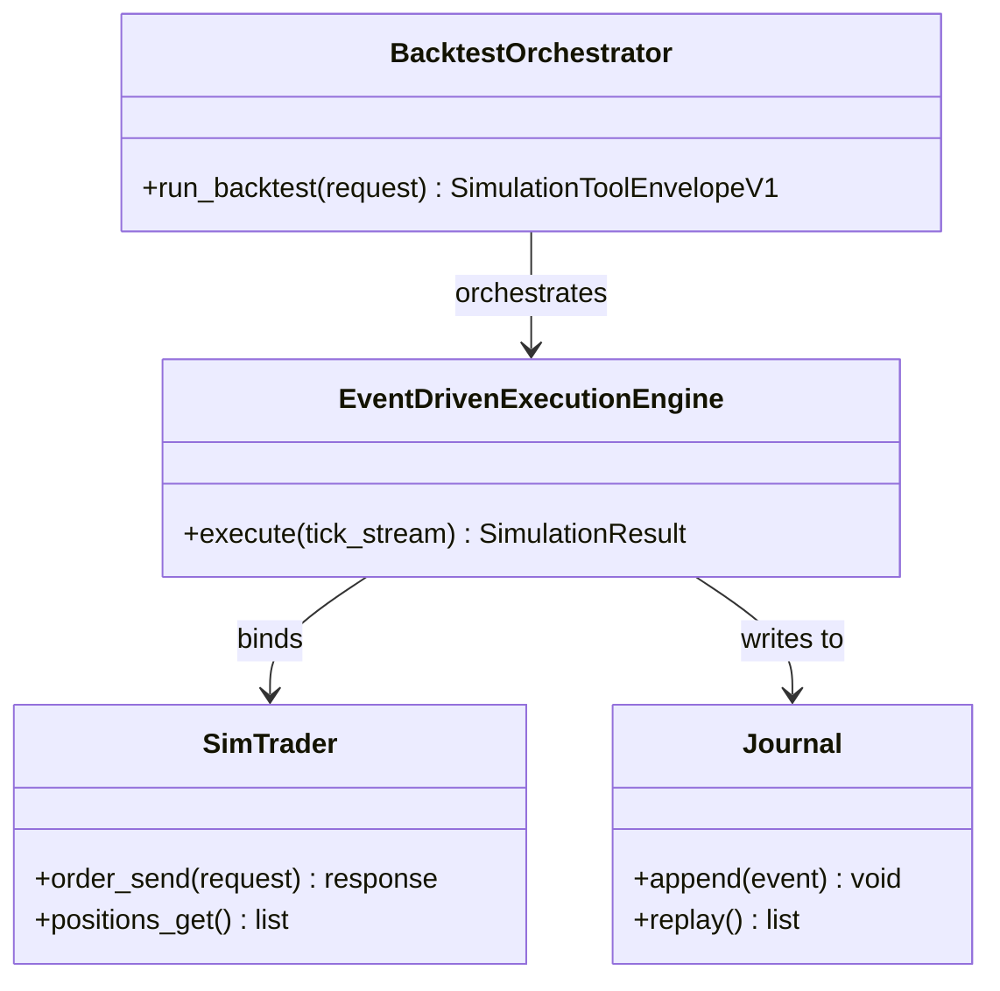

# 08-simulation.md - Requirements

## 1. Purpose

The Simulation module provides the canonical deterministic backtesting and simulation engine for HaruQuant. Its primary goal is to convert approved strategy outputs into tick-accurate simulated execution, accounting, journal, metrics, reports, and replayable evidence.

The module exists to answer: **what would have happened if a strategy had traded under the configured data, broker, cost, liquidity, risk, realism, and market assumptions?** It must do this in a deterministic, auditable, production-grade way.

### Out of Scope for Phase 1

Phase 1 is limited to the approved FX canonical backtest slice. The following are out of scope for Phase 1 unless explicitly promoted by `docs/ROADMAP.md`: equity and ETF production-realistic classification, corporate-action execution, borrow-fee production realism, recall or forced-buy-in simulation, US regulatory engines, futures rollover production realism, perpetual funding production realism, spot crypto/CFD/index/option production realism, feature-store integration, alternative-data integration, distributed workers, canary analysis, synthetic transaction monitoring, external report distribution, production promotion automation, and arbitrary raw Python strategy-code execution.

## 2. Ownership

### 2.1 Owns

- [ ] Simulation orchestration through `BacktestOrchestrator`.
- [ ] Canonical tick-based execution through `EventDrivenExecutionEngine`.
- [ ] Conversion of timestamped `TradeIntent` objects into sized `TradeRequest` objects.
- [ ] Simulation-only trader interface and MT5-style simulated order/query semantics.
- [ ] Official simulated orders, deals, positions, pending orders, account state, balance, equity, margin, free margin, margin level, realized PnL, floating PnL, execution timestamps, and immutable simulation journal.
- [ ] Tick generation, tick stream construction, spread modelling, slippage modelling, liquidity modelling, matching, partial-fill handling, same-tick event priority, gap handling, commission/fee/swap/funding/borrow-fee accounting, and portfolio-level simulation state.
- [ ] Simulation reports, metrics, artifact manifests, replay metadata, journal persistence, run lifecycle, run idempotency, optimization/walk-forward/Monte Carlo execution evidence, and production-promotion evidence.
- [ ] Simulation-specific data-quality gating, realism classification, asset-class realism disclosures, benchmark manifests, model-governance evidence, research-integrity evidence, and execution-calibration evidence.
- [ ] Mandatory inbound-contract validation for `MarketDataAuthorityManifest` supplied by `app/services/data/` and strategy registry references supplied by `tools/strategies/` before official runs.

### 2.2 Does Not Own

- [ ] The module does not own strategy logic, strategy lifecycle approval, or strategy-generated signal logic; those belong to `tools/strategies/`.
- [ ] The module does not own indicator formula implementation or indicator result contracts; those belong to `tools/indicators/`.
- [ ] The module does not own raw market-data acquisition, source readiness, external source adapters, or normalized data contracts; those belong to `app/services/data/`.
- [ ] The module does not own final live broker execution against real accounts.
- [ ] The module does not own production risk-governor policy, external governance policy, or human approval workflows.
- [ ] The module may simulate configured simulation risk-rule effects for replay and evidence, but external policy definition, live approval authority, and human governance decisions live outside Simulation.
- [ ] The module does not execute arbitrary user-provided Python strategy code through `run_backtest`.
- [ ] The module does not treat research approximation, visual mode, notebook objects, or derived exports as canonical execution or reporting artifacts.
- [ ] The module does not own live adapter implementation, live broker session management, live broker credentials, or imports of live execution modules; those must remain in Live/Trading/execution adapter ownership.
- [ ] The module does not own OS-level resource management such as process pools, thread-pool orchestration, global memory management, or platform scheduler policy beyond enforcing configured Simulation resource quotas and reporting quota diagnostics.

## 3. API

### 3.1 Public Capabilities

Public capabilities are contract placeholders until their exact Python names, request schemas, response schemas, authorization behavior, artifact behavior, and compatibility guarantees are approved. Builders shall not invent API shapes from descriptive bullets.

- [ ] Expose the official AI tool boundary for `run_backtest`.
- [ ] Validate simulation configuration, strategy references, data dependencies, broker profiles, market-data authority manifests, realism requirements, and run permissions before execution.
- [ ] Run official tick-based backtests and return standard official tool envelopes.
- [ ] Produce `SimulationResult`, immutable journal artifacts, canonical JSON reports, required Markdown reports, derived CSV/HTML/visual replay artifacts where configured, and structured error responses.
- [ ] Provide simulation-compatible MT5-style accessors and trader methods for controlled strategy integration, including historical tick/bar accessors, symbol/account accessors, order submission/modification/deletion, position queries, order queries, deal/order history, margin/profit calculation, and terminal-style simulation status.
- [ ] Support optimization, walk-forward, Monte Carlo, bootstrap, deterministic replay, step-through replay, visual replay export, benchmark reporting, production-promotion manifests, and service-mode run lifecycle operations where enabled.

### Public Capability Contract Requirements

- [ ] Before Builder handoff, each public simulator capability shall define name, purpose, caller type, stability level, official/internal status, request schema, response schema, deterministic error codes, side effects, required permissions, artifact behavior, network behavior, persistence behavior, compatibility guarantees, and at least one success and one deterministic-error example.
- [ ] `run_backtest` shall define required fields, optional fields, defaults, enum values, unknown-field behavior, malformed-payload behavior, size limits, path resolution rules, validation order, authorization behavior, and artifact-root behavior before implementation.
- [ ] `run_backtest` shall define response envelopes for `success`, `failed`, `queued`, `cancelled`, and `diagnostic_failed` statuses before implementation.
- [ ] `SimulationResult`, official tool envelopes, artifact manifests, journal events, report JSON, broker profiles, and market-data authority manifests shall have schema references before Builder handoff.
- [ ] Every MT5-style `SimTrader` method exposed to strategies shall define request fields, return fields, mutable-state effects, deterministic rejection codes, and read-only snapshot guarantees before implementation.
- [ ] Optimization, walk-forward, Monte Carlo, visual replay export, production-promotion manifests, and service-mode lifecycle operations shall be implemented only when their requirements are explicitly tagged for the active release phase.

### Draft `run_backtest` Contract Scaffold

Status: Pending owner approval. This scaffold documents the minimum contract surface that must be completed before Builder implementation; it is not an approved callable signature.

```python
def run_backtest(request: "SimulationBacktestRequestV1") -> "SimulationToolEnvelopeV1":
    """Run an approved simulation request through the official Simulation tool boundary."""
```

Required schema decisions before handoff:

- [ ] `SimulationBacktestRequestV1` fields: `schema_version`, `request_id`, `actor_context`, `strategy_ref`, `strategy_config`, `symbols`, `timeframe`, `start`, `end`, `initial_balance`, `account_currency`, `tick_model`, `spread_model`, `slippage_model`, `commission_model`, `swap_model`, `broker_profile_ref`, `market_data_authority_ref`, `journal_persistence`, `artifact_root_ref`, `realism_profile`, and `metadata`.
- [ ] `strategy_ref` shall be a registered strategy identifier plus version or hash; raw Python code strings are invalid.
- [ ] `actor_context` shall define authenticated actor identity and roles for any networked, multi-user, or agent-orchestrated invocation.
- [ ] `market_data_authority_ref` shall reference an approved `MarketDataAuthorityManifest`; inline raw provider credentials are invalid.
- [ ] `broker_profile_ref` shall reference an approved broker profile manifest; inline broker credentials are invalid.
- [ ] `artifact_root_ref` shall resolve through an allowlisted root or registry entry, not an arbitrary filesystem path.
- [ ] `SimulationToolEnvelopeV1` fields: `schema_version`, `request_id`, `status`, `result`, `error`, `warnings`, `metadata`, and `artifacts`.
- [ ] `status` values shall include `success`, `failed`, `queued`, `cancelled`, and `diagnostic_failed` before implementation.
- [ ] `error` shall include deterministic `SIM_*` code, safe message, field path where applicable, severity, retryability, and redacted details.
- [ ] `metadata` shall include module, operation, tool risk level, side-effect classification, actor/audit references where authorized, engine version, config hash, data manifest hash, execution timing, and created timestamp.

### Draft `SimTrader` Protocol Scaffold

Status: Pending owner approval. These methods are candidate protocol areas only; each method requires request/return schemas, state-mutation rules, and deterministic rejection codes before Builder handoff.

| Capability area | Candidate methods | Phase 1 status | Required contract fields |
|---|---|---|---|
| Historical bars | `copy_rates_from`, `copy_rates_from_pos`, `copy_rates_range` | Phase 1 candidate | symbol, timeframe, range/position, max records, timezone, return schema, data authority |
| Historical ticks | `copy_ticks_from`, `copy_ticks_range` | Phase 1 candidate | symbol, time range, flags, max records, ordering, bid/ask requirements |
| Symbol/account snapshots | `symbol_info`, `symbol_info_tick`, `account_info`, `terminal_info` | Phase 1 candidate | snapshot timestamp, source, immutable read-only behavior |
| Order submission | `order_send` or approved equivalent | Phase 1 candidate | request schema, mutation semantics, validation order, fill policy, error codes |
| Order modification/deletion | `order_modify_v1`, `order_delete_v1` | Deferred unless approved | pending-order state rules, idempotency, event journaling |
| Position/order/deal queries | `positions_get_v1`, `orders_get_v1`, `history_deals_get_v1`, `history_orders_get_v1` | Phase 1 candidate for read-only queries | filters, snapshot consistency, ordering, pagination/limits |
| Margin/profit calculation | `order_calc_margin_v1`, `order_calc_profit_v1` | Phase 1 candidate | Decimal precision, broker profile, currency conversion, rejection codes |

The shared Trader protocol may define common request, response, and query semantics for strategy compatibility, but Simulation owns only the simulated implementation. Simulation MUST NOT import live execution adapters, live broker SDK wrappers, live credential resolvers, or live broker session state.

## 4. Functional Requirements

#### 1.1 Simulation Orchestration

- [ ] The system shall provide a `BacktestOrchestrator` that validates configuration and data dependencies before executing a simulation.
- [ ] The system shall run data-quality checks before indicator calculation, signal generation, or tick generation.
- [ ] The system shall build indicator and signal data before constructing the executable signal timeline.
- [ ] The system shall align bar-based signals using the configured signal timing policy.
- [ ] The system shall build a canonical bid/ask tick stream before official execution.
- [ ] The system shall execute official backtests through the tick-based `EventDrivenExecutionEngine`.
- [ ] The system shall produce a structured `SimulationResult`.
- [ ] The system shall produce a report from the immutable journal and computed metrics.

#### 1.2 Canonical Tick-Based Execution

- [ ] The system shall use tick execution as the only official production execution mode.
- [ ] The system shall use the canonical bid/ask tick stream as the official execution clock.
- [ ] The system shall convert bar-level or vectorized signals into timestamped `TradeIntent` objects before execution.
- [ ] The system shall execute `TradeIntent` objects only when the tick loop reaches an eligible tick.
- [ ] The system shall prevent vectorized execution from producing official fills, account state, trade journals, or reports.
- [ ] The system shall support an optional approximate `FAST_RESEARCH` mode only when the result is clearly marked as non-canonical, non-MT5-parity, and non-production-realistic.

#### 1.3 Signal Timing and No-Lookahead

- [ ] The system shall use `BAR_OPEN_PREVIOUS_CLOSE` as the default signal timing policy.
- [ ] At the first tick of bar `N`, the system shall allow strategies to use only bars up to and including fully closed bar `N-1`.
- [ ] At the first tick of bar `N`, the system shall prohibit use of current incomplete bar `N` high, low, close, or volume.
- [ ] The system shall enter at the first valid tick of bar `N` when a valid trade intent is emitted from previous-closed-bar data.
- [ ] The system shall reject or flag lookahead usage in bar-open strategies.
- [ ] The system shall require vectorized signal generation to shift current-bar conditions so that bar-open entries are based on previous closed-bar values.
- [ ] The system shall support `INTRABAR_EVENT` strategies only for event strategies using current tick data.
- [ ] At the first tick of bar `N`, the engine shall mask, drop, or reject any raw OHLCV data point with timestamp greater than or equal to bar `N` open time.
- [ ] At the first tick of bar `N`, the engine shall mask, drop, or reject any indicator-derived data point with timestamp greater than or equal to bar `N` open time.
- [ ] At the first tick of bar `N`, the engine shall mask, drop, or reject any multi-timeframe aligned data point with timestamp greater than or equal to bar `N` open time.
- [ ] At the first tick of bar `N`, the engine shall mask, drop, or reject strategy metadata used for sizing or trade decisions when that metadata depends on data with timestamp greater than or equal to bar `N` open time.
- [ ] The engine shall raise `SIM_LOOKAHEAD_DETECTED` when a strategy attempts to access prohibited current-bar or future data during first-tick processing for bar `N`.

#### 1.4 Tick Models

- [ ] The system shall support `TIMEFRAME_TICKS`.
- [ ] The system shall support `M1_TICKS`.
- [ ] The system shall support `REAL_TICKS`.
- [ ] The system shall support `SYNTHETIC_TICKS`.
- [ ] The system shall represent every execution tick with time, symbol, bid, ask, optional last price, optional volume, source, optional bar time, sequence-in-bar, and bar-open flag.
- [ ] The system shall open buy positions at ask.
- [ ] The system shall close buy positions at bid.
- [ ] The system shall open sell positions at bid.
- [ ] The system shall close sell positions at ask.
- [ ] The system shall convert strategy-timeframe OHLC bars into four-tick paths when using `TIMEFRAME_TICKS`.
- [ ] The system shall convert M1 OHLC bars into four-tick paths when using `M1_TICKS`.
- [ ] The system shall pass broker real ticks through in `REAL_TICKS` mode when bid/ask data is available.
- [ ] The system shall merge bar-based signal timelines into the real tick stream in `REAL_TICKS` mode.
- [ ] The system shall generate `SYNTHETIC_TICKS` from M1 OHLCV bars using an MQL5 Article #75-style support-point algorithm, not a simple four-price path.
- [ ] The system shall treat generated OHLC-derived synthetic prices as bid prices and derive ask prices through the spread model.
- [ ] The system shall produce deterministic synthetic ticks for identical M1 data, symbol spec, spread config, and random seed.
- [ ] Synthetic tick generation shall derive a deterministic per-bar seed instead of relying only on a single mutable global random sequence.
- [ ] The per-bar synthetic-tick seed shall be derived with SHA-256 from schema version, `global_seed`, `symbol_hash`, UTC `bar_open_timestamp`, and synthetic tick algorithm version.
- [ ] `symbol_hash` shall be derived from the canonical JSON representation of the full `SymbolSpec`, including normalized symbol, broker profile id, point, tick size, tick value, contract size, currencies, sessions, and volume constraints.
- [ ] Synthetic tick generation shall remain reproducible when bars are processed out of chronological order.
- [ ] Synthetic tick generation shall remain reproducible when bars are processed in date chunks or parallelized by symbol.
- [ ] Synthetic tick generation shall remain reproducible when a run resumes from a checkpoint.
- [ ] Synthetic tick generation shall journal or expose per-bar seed derivation metadata sufficient to replay a generated bar's tick path.
- [ ] The simulator shall support data modelling modes equivalent to real ticks, simulated ticks, M1 OHLC, trading-timeframe OHLC, and calculation-only research data where explicitly labelled.
- [ ] The simulator shall expose MT5-style historical tick accessors `copy_ticks_from` and `copy_ticks_range` for simulation-compatible data providers.
- [ ] The simulator shall expose MT5-style historical bar accessors `copy_rates_from`, `copy_rates_from_pos`, and `copy_rates_range` for simulation-compatible data providers.
- [ ] The simulator shall expose MT5-style `symbol_info_tick` and `symbol_info` accessors for simulation-compatible symbol metadata and latest tick state.

#### 1.5 Spread Models

- [ ] The system shall support `NATIVE_SPREAD`.
- [ ] The system shall support `FIXED_SPREAD`.
- [ ] The system shall support `VARIABLE_SPREAD`.
- [ ] The system shall calculate ask for generated ticks as bid plus spread points multiplied by symbol point.
- [ ] The system shall validate that spreads are non-negative.
- [ ] The system shall reject or explicitly repair missing spread data according to configuration.
- [ ] The system shall generate variable spreads deterministically using configured min/max spread and random seed.
- [ ] The system shall record spread source and spread points per tick or journal checkpoint.

#### 1.6 Execution Realism

- [ ] The system shall provide an `ExecutionRealismConfig` containing liquidity, slippage, latency, commission, swap, borrow-fee, market-hours, gap-handling, broker-rules, portfolio-risk, data-quality, corporate-action, futures-rollover, perpetual-funding, and currency-conversion configuration.
- [ ] The system shall allow simplified realism modes only when explicitly configured.
- [ ] The system shall prevent production-realistic labelling when infinite liquidity, no slippage, no commission, no swap, or disabled portfolio checks are used without appropriate disclosure.
- [ ] The system shall disclose every enabled, disabled, or simplified realism model in the final report.
- [ ] The system shall support configurable execution latency models covering strategy computation delay, broker or network routing delay, venue or exchange gateway delay, and matching-engine delay.
- [ ] Latency models shall support fixed, distribution-based, venue-profile-based, and disabled modes.
- [ ] Trade intents shall become eligible for matching only after the configured latency delay has elapsed on the canonical tick clock.
- [ ] Latency diagnostics shall record signal timestamp, request timestamp, eligible execution timestamp, latency components, and latency model id.

#### 1.7 Liquidity and Order Book

- [ ] The system shall support infinite liquidity for MT5-parity or early research use only.
- [ ] The system shall support fixed-slippage liquidity mode.
- [ ] The system shall support volume-dependent liquidity mode.
- [ ] The system shall support order-book liquidity mode where depth data is available.
- [ ] The system shall estimate available volume from tick volume, M1 volume, or configured symbol liquidity when using volume-dependent liquidity.
- [ ] The system shall walk order-book levels and calculate VWAP execution price when using order-book liquidity.
- [ ] The system shall produce diagnostics for requested volume, filled volume, unfilled volume, VWAP, slippage points, and market impact.
- [ ] The system shall make liquidity decisions deterministically for the same tick, configuration, seed, and order request.
- [ ] When volume-dependent liquidity and slippage models are both active, liquidity constraints shall be evaluated before slippage.
- [ ] Partial-fill diagnostics shall separately record requested volume, filled volume, unfilled volume, liquidity impact, slippage impact, and cancelled or pending remainder.
- [ ] Execution-quality metrics shall distinguish liquidity shortfall from slippage cost.

#### 1.8 Slippage

- [ ] The system shall support no slippage.
- [ ] The system shall support fixed-point slippage.
- [ ] The system shall support spread-relative slippage.
- [ ] The system shall support volatility-based slippage.
- [ ] The system shall support volume-dependent slippage.
- [ ] The system shall support queue-position slippage.
- [ ] The system shall apply slippage after spread and before final fill-price acceptance.
- [ ] The system shall apply slippage directionally so that it worsens execution price according to order direction.
- [ ] The system shall cap slippage when a maximum slippage is configured.
- [ ] The system shall use deterministic seeded randomness when randomized slippage is enabled.
- [ ] The system shall journal expected price, executable bid/ask, slippage points, and final fill price.
- [ ] Slippage shall apply only to actually filled volume after liquidity constraints determine fillable quantity.
- [ ] Slippage shall not be charged, journaled as cost, or attributed to an unfilled remainder.

#### 1.9 Fill Policies and Partial Fills

- [ ] The system shall support `FOK`.
- [ ] The system shall support `IOC`.
- [ ] The system shall support `RETURN`.
- [ ] The system shall support explicit partial-fill behavior.
- [ ] The system shall reject `FOK` orders when full requested volume is unavailable.
- [ ] The system shall fill available volume and cancel the remainder for `IOC` orders.
- [ ] The system shall keep unfilled `RETURN` remainders pending only when the broker or symbol supports it.
- [ ] The system shall create a separate deal record for every partial fill.
- [ ] The system shall recalculate position average price from actual filled volumes and prices.
- [ ] The system shall update margin, exposure, commission, and risk immediately after partial fills.
- [ ] When an `IOC` order is partially filled, the unfilled remainder shall be cancelled.
- [ ] When an `IOC` order remainder is cancelled, the system shall journal `SIM_IOC_REMAINDER_CANCELLED` as a non-fatal diagnostic event.
- [ ] `SIM_IOC_REMAINDER_CANCELLED` shall not be treated as a fatal simulation error when the partial fill itself is valid.
- [ ] Reports shall include IOC remainder cancellations in execution-quality diagnostics.

#### 1.10 Limit Order Queue Handling

- [ ] The system shall support configurable limit-order queue behavior.
- [ ] The system shall not guarantee a limit-order fill merely because price touches the limit unless touch-fill is enabled and liquidity is available.
- [ ] The system shall reduce available fill volume by estimated or configured queue-ahead volume.
- [ ] The system shall resolve FIFO and pro-rata behavior deterministically.
- [ ] The system may document hidden-order and iceberg support while keeping them disabled until order-book data is available.
- [ ] Before Phase 1 Builder handoff, limit-order queue configuration shall explicitly define valid values for `queue_model`, `touch_fill_enabled`, `queue_ahead_volume`, `queue_ahead_estimation_method`, `fill_allocation_method`, `minimum_fill_volume`, and `partial_fill_policy`.
- [ ] Phase 1 queue behavior shall be limited to deterministic `touch_fill_enabled=false` rejection or deterministic configured queue-ahead reduction unless the owner approves richer order-book queue realism.
- [ ] Hidden-order and iceberg reservation behavior shall be `[PHASE2]` and must return deterministic unsupported-scope diagnostics if requested during Phase 1.

#### 1.11 Market Hours, Weekends, and Gaps

- [ ] The system shall support market-hours configuration including session start, session end, timezone, weekend closure, holiday calendar, and 24/7 asset flag.
- [ ] The system shall detect market open and closed state.
- [ ] The system shall detect session breaks, weekends, holidays, and rollover boundaries.
- [ ] The system shall detect market-wide halts, exchange halts, symbol halts, and limit-up/limit-down states when halt data is available.
- [ ] The system shall mark the first tick after a session break or weekend as a gap tick.
- [ ] The system shall prevent market orders outside allowed sessions unless explicitly configured for 24/7 assets.
- [ ] The system shall prevent or defer trading during market halts and limit-up/limit-down states according to exchange and broker policy.
- [ ] The system shall support gap handling by rejection.
- [ ] The system shall support gap handling by fill at open.
- [ ] The system shall support gap handling by fill with slippage.
- [ ] The system shall support treating gap-crossed stop losses as market orders at the first available tick.
- [ ] The system shall use the conservative worse outcome by default when both SL and TP are crossed in the same ambiguous gap.
- [ ] The system shall record gap-handling rules in the report.
- [ ] Before Phase 1 Builder handoff, gap configuration shall explicitly define `gap_policy`, `ambiguous_sl_tp_policy`, `fill_price_source`, `gap_slippage_model`, `max_gap_fill_slippage_points`, and `session_calendar_ref`.
- [ ] The default `ambiguous_sl_tp_policy` shall be `conservative_worst_outcome`, meaning the engine selects the lower resulting account equity after applying valid SL-first and TP-first interpretations under the same first-available-tick and cost model.
- [ ] Gap ambiguity handling shall journal candidate outcomes, selected outcome, rejected alternative, first available tick, affected order ids, and the deterministic reason code.

#### 1.12 Same-Tick Event Priority

- [ ] The system shall process same-tick events through a deterministic priority queue.
- [ ] The system shall order same-tick events by tick time, explicit priority, and monotonic sequence number.
- [ ] The system shall process stopout before other same-tick events by default.
- [ ] The system shall process expiration before new triggers for the same timestamp.
- [ ] The system shall process existing position exits before new signal intents by default.
- [ ] The system shall use conservative SL/TP tie-breaking by default unless another mode is explicitly configured.
- [ ] The system shall journal priority decisions for replay.

#### 1.13 Commission, Fees, and Rebates

- [ ] The system shall support no commission.
- [ ] The system shall support per-lot commission.
- [ ] The system shall support per-trade commission.
- [ ] The system shall support percent-notional commission.
- [ ] The system shall support tiered commission.
- [ ] The system shall support maker/taker commission.
- [ ] The system shall support pass-through regulatory, exchange, clearing, transaction, activity, and rebate fee models when configured.
- [ ] US equity and ETF fee models may include SEC Section 31 fees, FINRA TAF, exchange-specific maker/taker fees or rebates, and payment-for-order-flow disclosure where relevant.
- [ ] The system shall apply minimum and maximum commission limits when configured.
- [ ] The system shall calculate commission per actual fill, not only per requested order.
- [ ] The system shall support commission currency conversion when account currency differs.
- [ ] The system shall include spread, slippage, commission, fees, swap, borrow fees, dividends, funding, and configured cashflows in net PnL.
- [ ] The system shall report gross PnL, total costs, and net PnL.

#### 1.14 Swap and Rollover

- [ ] The system shall support swap types in points, money, percent, and interest.
- [ ] The system shall support daily end-of-day, tick-by-tick, and on-close-only swap calculation modes.
- [ ] The system shall apply swap only to positions open across the configured rollover boundary.
- [ ] The system shall support configurable triple-swap day per symbol.
- [ ] The system shall journal swap charges and credits.
- [ ] The system shall reflect swap in account balance and equity.
- [ ] The system shall label overnight backtests with disabled swap as cost-incomplete.

#### 1.15 Broker Rules

- [ ] The system shall enforce margin-call percentage.
- [ ] The system shall enforce stop-out percentage.
- [ ] The system shall enforce maximum pending orders.
- [ ] The system shall enforce maximum total positions when configured.
- [ ] The system shall enforce maximum positions per symbol when configured.
- [ ] The system shall reject unsupported fill policies with deterministic error codes.
- [ ] The system shall support hedging account behavior when configured.
- [ ] The system shall support netting account behavior when configured.
- [ ] The system shall support negative-balance-protection configuration.
- [ ] The system shall liquidate deterministically during stopout, defaulting to largest losing position first.
- [ ] Initial MT5 parity tests shall use a versioned broker profile named `mt5_demo_reference_fx_v1`.
- [ ] Broker profiles shall capture symbol rules, sessions, swap rules, margin rules, fee rules, fill policies, precision, and supported order types.
- [ ] MT5 parity evidence shall record broker profile id, broker server label, account type, MT5 build, capture timestamp, symbol specification hash, and fixture data hash.
- [ ] No external broker brand or live account shall be globally authoritative; production parity applies only to approved broker profiles and fixtures.

#### 1.16 Portfolio Risk and Margin

- [ ] The system shall maintain portfolio-level state for multi-symbol backtests.
- [ ] The system shall calculate gross exposure.
- [ ] The system shall calculate net exposure.
- [ ] The system shall calculate currency exposure.
- [ ] The system shall calculate margin contribution by symbol.
- [ ] The system shall calculate concentration.
- [ ] The system shall support optional VaR values.
- [ ] The system shall validate portfolio risk after sizing and before matching.
- [ ] The system shall support independent-symbol margin.
- [ ] The system shall support netted FX margin.
- [ ] The system shall support cross-margin.
- [ ] The system shall support SPAN-like margin mode.
- [ ] The system shall enforce correlation limits when enabled.
- [ ] The system shall enforce concentration limits when enabled.
- [ ] The system shall enforce gross, symbol, and cluster exposure limits when enabled.
- [ ] The system shall evaluate pair, basket, grid, and martingale strategies at portfolio level.
- [ ] The system shall support portfolio-level kill switches that halt new trading when configured drawdown, loss, exposure, margin, volatility, or error thresholds are breached.
- [ ] Kill-switch events shall liquidate, block new orders, cancel pending orders, or enter monitor-only mode according to configuration.
- [ ] Kill-switch decisions shall be journaled with threshold, observed value, action, and actor or policy id.

#### 1.17 Data Quality

- [ ] The system shall validate OHLCV and tick schemas.
- [ ] The system shall detect missing required columns.
- [ ] The system shall detect missing bars.
- [ ] The system shall detect duplicate timestamps.
- [ ] The system shall detect non-monotonic timestamps.
- [ ] The system shall detect negative spreads.
- [ ] The system shall detect zero or negative prices.
- [ ] The system shall detect price outliers.
- [ ] The system shall detect impossible OHLC bars.
- [ ] The system shall produce a `DataQualityReport`.
- [ ] The system shall block production runs when severe data-quality thresholds fail unless diagnostic mode is explicitly enabled.
- [ ] The system shall include the data-quality report in the final report.
- [ ] Production simulations shall consume normalized data through the data module contract and an approved `MarketDataAuthorityManifest`.
- [ ] The `MarketDataAuthorityManifest` shall declare authoritative sources for bars, real ticks, spreads, corporate actions, futures chains, funding rates, FX conversion rates, and benchmark series.
- [ ] Missing or staging-only authoritative data shall block a production-realistic label unless the affected model is proven unnecessary for the selected instruments.
- [ ] The system shall define a `PartialDataPolicy` for incomplete provider files or partial symbol-day data.
- [ ] `PartialDataPolicy` shall support quarantining the affected symbol and date with `SIM_DATA_PARTIAL`, using stale prior data with `SIM_DATA_STALE` and a configurable staleness limit, or failing the entire run.
- [ ] Stale-data recovery shall be unavailable for production-realistic classification unless explicitly approved and disclosed.
- [ ] The system shall record queryable data lineage for every data point used in fill-price, mark-to-market, margin, fee, swap, funding, dividend, benchmark, and PnL calculations.
- [ ] Data lineage shall form a directed acyclic graph tracing from journaled deal or account event to generated tick, support point, M1 bar, normalized source row, raw vendor data file, source manifest, and checksum where applicable.
- [ ] Data lineage shall be queryable for audit, replay, model validation, and production-promotion evidence.
- [ ] The market-data authority client shall support a warm cache for frequently read immutable or rarely changed datasets.
- [ ] Warm data cache keys shall include `DataManifestHash`, provider id, dataset id, symbol, timeframe, date range, adjustment mode, and schema version.
- [ ] Cache hits shall skip network transfer only after validating the cached artifact checksum against the authoritative manifest.
- [ ] Cache entries shall expire according to a configured TTL and shall never override point-in-time data snapshot requirements.
- [ ] The simulator shall support optional feature-store integration for machine-learning features.
- [ ] Feature-store integration shall default to disabled in Phase 1. If enabled in a later approved phase, it MUST enforce point-in-time correctness, feature availability timestamps, publication lag, ingestion lag, and deterministic `SIM_FEATURE_LOOKAHEAD_DETECTED` rejection before any feature can influence a decision.
- [ ] Feature-store retrieval shall enforce point-in-time correctness at the canonical decision timestamp, including sub-second or microsecond availability timestamps where provided.
- [ ] Feature-store retrieval shall reject or mask any feature whose computation or publication time is later than the strategy decision time.
- [ ] Alternative data inputs such as sentiment, fundamentals, news, options flow, and external signals shall include event time, ingestion time, publication time, source id, and availability timestamp.
- [ ] Alternative data shall align to the canonical tick clock without lookahead, using explicit as-of joins and configured lag or embargo policies.

#### 1.18 Position Sizing

- [ ] The system shall centralize final position sizing in the engine.
- [ ] The system shall allow strategies to request a sizing mode but not directly finalize official volume.
- [ ] The system shall support fixed-lot sizing.
- [ ] The system shall support fixed-risk sizing.
- [ ] The system shall support milestone sizing.
- [ ] The system shall support Kelly-criterion sizing.
- [ ] The system shall support volatility-based sizing.
- [ ] The system shall support fixed-fractional sizing.
- [ ] The system shall reject fixed-risk sizing when stop loss is missing.
- [ ] The system shall reject zero or negative stop distance.
- [ ] The system shall reject missing tick value or point value when required for sizing.
- [ ] The system shall reject missing or invalid Kelly inputs.
- [ ] The system shall reject missing, zero, negative, or misaligned ATR values for volatility sizing.
- [ ] The system shall normalize volume using symbol minimum, maximum, and step constraints.
- [ ] The system shall support explicit volume rounding policies.
- [ ] The system shall default to floor-to-step rounding.
- [ ] The system shall record raw and normalized volume and shall not silently adjust volume.

#### 1.19 Trade Requests and Trader Interface

- [ ] The system shall transform `TradeIntent` into a sized `TradeRequest`.
- [ ] The system shall support MT5-style `order_send`.
- [ ] `order_send` shall accept action, magic, order, symbol, volume, price, stop-limit price, stop loss, take profit, deviation, order type, fill policy, time policy, expiration, comment, position id, and opposite position id where supported by account mode.
- [ ] The system shall support position modification.
- [ ] The system shall expose MT5-style `position_modify` for stop-loss, take-profit, and supported mutable position fields.
- [ ] The system shall support position close.
- [ ] The system shall expose MT5-style `position_close`.
- [ ] The system shall support order modification.
- [ ] The system shall expose MT5-style `order_modify` for pending-order price, stop-limit price, stop loss, take profit, expiration mode, and expiration timestamp.
- [ ] The system shall support order deletion.
- [ ] The system shall expose MT5-style `order_delete`.
- [ ] The system shall support atomic cancel-replace operations for pending orders where broker or venue semantics allow them.
- [ ] Cancel-replace operations shall preserve, reset, or recompute queue priority according to configured venue rules and shall journal the chosen behavior.
- [ ] The system shall support querying open positions.
- [ ] The system shall expose MT5-style `positions_get` and `positions_total`.
- [ ] The system shall support querying open orders.
- [ ] The system shall expose MT5-style `orders_get` and `orders_total`.
- [ ] The system shall support querying historical deals.
- [ ] The system shall expose MT5-style `history_deals_get` and `deals_total`.
- [ ] The system shall support querying historical orders.
- [ ] The system shall expose MT5-style `history_orders_get` and `history_orders_total`.
- [ ] The system shall support querying account info.
- [ ] The system shall expose MT5-style `account_info`.
- [ ] The system shall expose MT5-style `order_calc_margin` for pre-trade margin estimation.
- [ ] The system shall expose MT5-style `order_calc_profit` for mark-to-market or hypothetical trade profit estimation.
- [ ] The same Trader protocol shall support both simulation and live adapters where live trading is enabled outside the simulator.
- [ ] The simulated Trader protocol shall preserve the same request, response, and query semantics as the live adapter for shared strategy code.
- [ ] Shared Trader protocol definitions may be shared across Simulation and Live/Trading, but Simulation shall implement only simulated behavior and shall not import, instantiate, or call live adapter implementation code.
- [ ] The system shall support `on_tick` callbacks for event-driven strategy execution.
- [ ] The system shall support `on_bar` callbacks for bar-boundary strategy execution.
- [ ] The system shall provide a terminal-style interface for simulation status, account state, open positions, pending orders, and trade events.
- [ ] Terminal-style output shall be controlled by an explicit `verbose` configuration flag.
- [ ] Visual simulation mode shall be supported only as a diagnostic or research view and shall not alter canonical execution results.
- [ ] Progress reporting shall be available for long-running official simulations, optimizations, walk-forward runs, and Monte Carlo runs.
- [ ] The system shall support deterministic step-through replay for debugging.
- [ ] Step-through replay shall allow pausing at a configured timestamp, journal sequence, order event, deal event, bar boundary, strategy callback, or error condition.
- [ ] Debugger hooks shall expose read-only snapshots of tick state, order book where available, orders, deals, positions, account state, strategy-visible inputs, and selected strategy diagnostics.
- [ ] Resuming from a debugger pause shall preserve deterministic replay and shall not alter official results unless a diagnostic mutation mode is explicitly enabled.

#### 1.20 State Containers and Trade Objects

- [ ] The engine shall maintain an authoritative positions container for open positions.
- [ ] The engine shall maintain an authoritative orders container for active pending orders.
- [ ] The engine shall maintain an authoritative deals container for executed deal records.
- [ ] Position records shall include time, id, magic, symbol, side or type, volume, open price, current price, stop loss, take profit, commission, margin required, fee, swap, profit, and comment.
- [ ] Pending-order records shall include all applicable position record fields plus order price, stop-limit price, expiry date, and expiration mode.
- [ ] Deal records shall include all applicable position record fields plus deal reason, deal direction, order id, position id, fill price, filled volume, and execution timestamp.
- [ ] Trade-info snapshots shall include time, id, magic, symbol, side or type, volume, price, stop loss, take profit, commission, fee, swap, profit, comment, and margin required.
- [ ] State containers shall be mutated only by the execution engine and shall be exposed to strategies through read-only snapshots.

#### 1.21 Validation

- [ ] The system shall validate symbol availability.
- [ ] The system shall validate market session availability.
- [ ] The system shall validate volume minimum, maximum, and step.
- [ ] The system shall validate margin availability.
- [ ] The system shall validate portfolio risk availability.
- [ ] The system shall validate price correctness.
- [ ] The system shall validate slippage and deviation rules.
- [ ] The system shall validate stop-loss and take-profit direction.
- [ ] The system shall validate stops level.
- [ ] The system shall validate freeze level.
- [ ] The system shall validate broker maximum orders and positions.
- [ ] The system shall validate fill-policy compatibility.
- [ ] The system shall validate expiration and time policy.
- [ ] The system shall validate liquidity-model compatibility.

#### 1.22 Matching

- [ ] The system shall execute market orders.
- [ ] The system shall trigger pending orders.
- [ ] The system shall support buy limit pending orders.
- [ ] The system shall support buy stop pending orders.
- [ ] The system shall support sell limit pending orders.
- [ ] The system shall support sell stop pending orders.
- [ ] The system shall support buy stop-limit pending orders.
- [ ] The system shall support sell stop-limit pending orders.
- [ ] The system shall support trailing stops when configured.
- [ ] Trailing stops shall update deterministically from eligible tick data and shall never use future bar high, low, close, or volume.
- [ ] The system shall support pegged orders when configured, including orders pegged to best bid, best ask, mid price, or another approved reference.
- [ ] Pegged-order repricing shall follow explicit tick-size, latency, queue-priority, and market-data availability rules.
- [ ] The system shall activate stop-limit orders.
- [ ] The system shall trigger SL/TP.
- [ ] The system shall handle gap execution.
- [ ] The system shall enforce fill policies.
- [ ] The system shall simulate partial fills.
- [ ] The system shall apply liquidity and slippage results.
- [ ] The matching engine shall determine fillable volume from liquidity constraints before applying slippage to filled volume.
- [ ] The system shall produce orders, deals, position events, and execution diagnostics.

#### 1.23 Accounting

- [ ] The system shall mark open positions to market on ticks.
- [ ] The system shall apply deals to positions and account state.
- [ ] The system shall apply commission events.
- [ ] The system shall apply swap events.
- [ ] The system shall apply borrow-fee events for equity and ETF short positions when configured.
- [ ] The system shall recalculate account state.
- [ ] The system shall enforce `Equity = Balance + FloatingPnL`.
- [ ] The system shall enforce `FreeMargin = Equity - Margin`.
- [ ] The system shall enforce `MarginLevel = Equity / Margin * 100` when margin is greater than zero.
- [ ] The system shall change balance only from closed realized PnL, commission, fee, swap, borrow-fee, dividend, funding, and configured cashflow events.

#### 1.24 Journal and Audit Trail

- [ ] The system shall maintain an immutable trade journal.
- [ ] The journal shall record config hash.
- [ ] The journal shall record data checksum.
- [ ] The journal shall record tick model.
- [ ] The journal shall record spread model.
- [ ] The journal shall record liquidity model.
- [ ] The journal shall record slippage model.
- [ ] The journal shall record fee and commission model.
- [ ] The journal shall record swap model.
- [ ] The journal shall record sizing model.
- [ ] The journal shall record signal timing policy.
- [ ] The journal shall record data-quality report.
- [ ] The journal shall record every event priority decision.
- [ ] The journal shall record every order state transition.
- [ ] The journal shall record every deal and partial fill.
- [ ] The journal shall record every position update.
- [ ] The journal shall record every account snapshot.
- [ ] The journal shall record every rejection and error.
- [ ] The journal shall record every margin event.
- [ ] The journal shall record every swap event.
- [ ] The journal shall record every compliance record.
- [ ] The canonical journal storage format shall be append-only JSON Lines with one event per line.
- [ ] Every journal event shall include schema version, run id, monotonic sequence number, event timestamp, event type, payload, previous event hash, and event hash.
- [ ] Every journal shall include a `journal_manifest.json` containing configuration hash, data manifest hash, engine version, schema version, artifact checksums, and retention tier.
- [ ] Optional Parquet and CSV journal exports may be generated for analysis, but they shall be derived artifacts and not the canonical replay source.
- [ ] Artifact integrity checks shall fail when journal hashes, manifest checksums, or sequence continuity are invalid.
- [ ] The immutable journal shall support streaming append-to-disk persistence.
- [ ] Append-only journal storage shall support long optimization, walk-forward, and Monte Carlo runs without materializing every run journal in process memory.
- [ ] Holding all optimization, walk-forward, or Monte Carlo journals in memory shall be forbidden for production runs.
- [ ] Journal persistence failures shall fail closed with `SIM_PERSISTENCE_FAILED`.
- [ ] Streaming journal writes shall preserve event ordering, replayability, config hash, data checksum, parameter hash, random seed, and objective metadata for each run.
- [ ] The report shall disclose the journal storage backend and durability mode used for the run.
- [ ] `JournalPersistenceConfig` shall include backend selection, durability mode, flush batch size, maximum in-memory buffer size, and sidecar index configuration.
- [ ] Phase 1 shall use append-only JSON Lines as the mandatory canonical streaming journal backend.
- [ ] Phase 1 shall use a SQLite sidecar index as the initial random-access journal query format for report generation and diagnostics.
- [ ] Phase 1 journal durability shall default to fsync per batch, with a maximum batch of 1,000 events, five seconds, or 16 MB before flush, whichever occurs first.
- [ ] Production journal persistence shall fsync before marking a run complete or before emitting final reports.
- [ ] If a journal write, flush, fsync, sidecar transaction, or commit fails, the run shall stop in production mode and return `SIM_PERSISTENCE_FAILED`.
- [ ] After persistence failure, diagnostics shall include journal backend, run id, failed operation, and last committed sequence number.

#### 1.25 Compliance Records

- [ ] The system shall create a compliance or audit record for every accepted trade request.
- [ ] The system shall create a compliance or audit record for every rejected trade request.
- [ ] Compliance records shall include request id.
- [ ] Compliance records shall include timestamp.
- [ ] Compliance records shall include decision rationale.
- [ ] Compliance records shall include risk-check result.
- [ ] Compliance records shall include pre-trade checks.
- [ ] Compliance records shall include optional compliance tag.
- [ ] Compliance records shall include optional strategy name and version.
- [ ] Advanced stateful strategies and agent-generated strategies shall provide decision rationale.

#### 1.26 Strategy Integration Boundary

- [ ] The simulation module shall consume strategy outputs through the strategy module contract defined in `docs/source-requirements/04-strategy.md`.
- [ ] The simulation module shall accept timestamped `TradeIntent` objects from approved strategies and shall convert them into sized `TradeRequest` objects before execution.
- [ ] The simulation module shall execute strategy-generated trade intents only when the canonical tick loop reaches an eligible tick.
- [ ] The simulation module shall enforce that strategies cannot mutate official account, order, deal, position, margin, equity, journal, or execution timestamp state.
- [ ] The simulation module shall provide approved read-only execution state to advanced strategies when required.
- [ ] The simulation module shall journal strategy id, strategy version, configuration hash, rationale where provided, and strategy-input rejection diagnostics.
- [ ] The `run_backtest` AI Tool shall enforce the strategy registry and sandbox rules defined in `docs/source-requirements/04-strategy.md`.

#### 1.27 Indicator Integration Boundary

- [ ] The simulation module shall consume indicator outputs through the indicator module contract defined in `docs/source-requirements/03-indicator.md`.
- [ ] The simulation module shall run data-quality checks before indicator calculation, signal generation, or tick generation.
- [ ] The simulation module shall consume indicator result manifests containing input checksum, parameter hash, implementation version, output schema version, and timing metadata.
- [ ] The simulation module shall reject, mask, or downgrade runs when indicator-derived data violates the configured no-lookahead policy.
- [ ] The simulation module shall convert indicator-derived signals into timestamped trade intents before official execution.
- [ ] The simulation module shall prevent vectorized indicator or signal generation from producing official fills, account state, trade journals, or reports.

#### 1.28 Metrics and Reporting

- [ ] The system shall produce a trades list.
- [ ] The system shall produce orders history.
- [ ] The system shall produce deals history.
- [ ] The system shall produce partial-fill history.
- [ ] The system shall produce position lifecycle history.
- [ ] The system shall produce equity, balance, margin, and exposure curves.
- [ ] The system shall produce liquidity and slippage diagnostics.
- [ ] The system shall produce commission, fee, and swap summaries.
- [ ] The system shall produce portfolio-risk summary.
- [ ] The system shall produce data-quality summary.
- [ ] The system shall produce realism-disclosure summary.
- [ ] The system shall calculate data-quality metrics.
- [ ] The system shall calculate PnL metrics.
- [ ] The system shall calculate cost metrics.
- [ ] The system shall calculate trade statistics.
- [ ] The system shall calculate streak statistics.
- [ ] The system shall calculate regression metrics.
- [ ] The system shall calculate return metrics.
- [ ] The system shall calculate drawdown metrics.
- [ ] The system shall calculate MT5-style history quality.
- [ ] The system shall report bars processed.
- [ ] The system shall report ticks processed.
- [ ] The system shall report symbols involved.
- [ ] The system shall calculate total net profit, gross profit, gross loss, profit factor, expected payoff, recovery factor, and Sharpe ratio.
- [ ] The system shall calculate Z-score for win/loss sequence randomness.
- [ ] The system shall calculate AHPR and GHPR when return series and trade count are sufficient.
- [ ] The system shall calculate linear-regression correlation and linear-regression standard error for the equity curve.
- [ ] The system shall calculate total trades, total deals, short trades and win percentage, long trades and win percentage, profit trades and percentage, and loss trades and percentage.
- [ ] The system shall calculate largest profit trade, largest loss trade, average profit trade, and average loss trade.
- [ ] The system shall calculate maximum consecutive wins, maximum consecutive losses, maximal consecutive profit, maximal consecutive loss, average consecutive wins, and average consecutive losses.
- [ ] The system shall calculate balance drawdown absolute, equity drawdown absolute, balance drawdown maximal, equity drawdown maximal, balance drawdown relative, and equity drawdown relative.
- [ ] Production-realistic reports shall attach confidence intervals to every material performance, risk, drawdown, cost, and execution-quality metric when Monte Carlo or bootstrap evidence is available.
- [ ] Metrics without confidence intervals in production-realistic reports shall disclose why interval evidence is unavailable and whether the omission downgrades the result.
- [ ] The system shall calculate liquidity metrics.
- [ ] The system shall calculate execution-quality metrics.
- [ ] The system shall calculate portfolio metrics.
- [ ] The system shall include robustness metrics when Monte Carlo or walk-forward analysis is enabled.
- [ ] Every report shall state whether the run used full production realism, MT5-parity settings, or research approximation settings.
- [ ] The official report formats shall be JSON and Markdown.
- [ ] HTML reports may be generated from the official JSON and Markdown artifacts.
- [ ] CSV exports shall be supported for tabular report sections such as orders, deals, trades, positions, account snapshots, and diagnostics.
- [ ] Visual trade replay export shall be supported as a derived artifact from the canonical journal and report JSON.
- [ ] Visual replay exports shall include candles or tick references, strategy signals, order events, fills, position state, equity or balance overlays, drawdown overlays, and annotations for rejections or halts.
- [ ] Visual replay exports shall use a documented JSON schema suitable for charting libraries without becoming the canonical report artifact.
- [ ] Notebook objects may consume official artifacts but shall not be a required production report format.
- [ ] Report schema validation shall run before a report is marked complete.
- [ ] The official JSON report shall be the canonical machine-readable report artifact.
- [ ] The official Markdown report shall be the required human-review report artifact for Phase 1 CI and release evidence.
- [ ] If JSON and human-readable report artifacts disagree, the run shall fail report validation until the derived artifact is regenerated from canonical JSON and journal data.

#### 1.29 Optimization and Walk-Forward

- [ ] The system shall support grid-search optimization.
- [ ] The system shall support random-search optimization.
- [ ] The system shall support Bayesian optimization.
- [ ] The system shall support genetic optimization.
- [ ] Optimization shall use the same canonical tick execution engine as normal backtests.
- [ ] Walk-forward results shall separate in-sample and out-of-sample metrics.
- [ ] Optimization shall reject parameter sets that fail minimum trade count.
- [ ] Optimization shall reject parameter sets that fail data-quality checks.
- [ ] Optimization shall reject parameter sets that fail robustness checks.
- [ ] Optimization outputs shall include config hash, data hash, parameter hash, random seed, and objective function.
- [ ] Large optimization jobs shall be split into deterministic work units keyed by strategy id, parameter hash, config hash, data hash, engine version, and schema version.
- [ ] Parallel optimization workers shall run isolated engine instances and shall not share mutable account, order, journal, or strategy state.
- [ ] Optimization caching shall reuse only completed work units whose provenance hash exactly matches the requested run.
- [ ] Failed or diagnostic work units shall not poison the optimization cache.
- [ ] Optimization result ranking shall be deterministic when objective scores tie.
- [ ] Optimization jobs shall support resumable execution from persisted work-unit manifests.
- [ ] Long-running optimization, walk-forward, and Monte Carlo jobs shall periodically checkpoint progress to disk in a restartable format.
- [ ] A `ResumePolicy` shall define maximum checkpoint age, checkpoint compatibility rules, automatic resume eligibility, and restart-from-scratch behavior.
- [ ] Optimization and walk-forward jobs shall decompose into independent deterministic work units executable on ephemeral stateless workers.
- [ ] Distributed work units shall pull inputs from and write outputs to a shared versioned artifact store; local worker disk shall never be the sole source of truth for shared artifacts.
- [ ] Worker loss, heartbeat expiry, or preemptible-instance termination shall requeue the affected work unit without marking the entire job `SIM_INTERNAL_ERROR`.
- [ ] Requeued work units shall preserve deterministic provenance hashes and shall not duplicate completed journal or report artifacts.
- [ ] Distributed schedulers shall detect poison-pill work units that repeatedly fail for the same work-unit hash.
- [ ] Poison-pill detection shall quarantine the work unit, stop infinite requeue loops, emit an alert, and preserve failure artifacts for diagnosis.
- [ ] Task queues and worker leases shall provide exactly-once effects or idempotent execution for journal writes, checkpoint commits, sidecar index updates, and artifact publication.
- [ ] Distributed locks or compare-and-swap commits shall prevent duplicate journal sequences or duplicate checkpoint commits when workers restart mid-batch.

#### 1.30 Monte Carlo and Bootstrap

- [ ] The system shall support Monte Carlo analysis after a canonical journal exists.
- [ ] The system shall support bootstrap robustness analysis from the immutable journal.
- [ ] Monte Carlo analysis shall not replace the official backtest result.
- [ ] Monte Carlo outputs shall include confidence bands for drawdown.
- [ ] Monte Carlo outputs shall include confidence bands for net profit.
- [ ] Monte Carlo outputs shall include confidence bands for profit factor.
- [ ] Monte Carlo outputs shall include risk of ruin.
- [ ] Monte Carlo outputs shall include worst-case streaks.

#### 1.31 Performance Benchmarking

- [ ] The system shall benchmark tick generation speed.
- [ ] The system shall benchmark tick loop speed.
- [ ] The system shall benchmark memory usage.
- [ ] The system shall benchmark optimization throughput when optimization is enabled.
- [ ] Benchmark results shall be required before production promotion.
- [ ] Benchmark results shall be stored with release notes.
- [ ] The production benchmark profile shall be `SIM_BENCHMARK_PROFILE_V1`: Python 3.12, 8 vCPU minimum, 32 GB RAM minimum, NVMe SSD, release build settings, no debugger, and no unrelated heavy background workload.
- [ ] Benchmark manifests shall record OS, CPU model, logical CPU count, RAM, storage type, Python version, dependency lock hash, git commit, and benchmark dataset hash.
- [ ] The performance gate shall fail when median runtime regresses by more than 10 percent against the approved baseline and the absolute target is missed.
- [ ] The memory gate shall fail when peak memory regresses by more than 15 percent against the approved baseline and the absolute memory target is missed.
- [ ] Tick batching may accelerate pure mark-to-market updates.
- [ ] Tick batching shall stop immediately at any tick that may trigger state transitions or compliance events.
- [ ] Tick batching shall never reorder ticks.
- [ ] Tick batching shall never suppress per-event accounting invariants.
- [ ] Tick batching shall be permitted only between known pre-calculated boundary events.
- [ ] Tick batching shall use active pending-order trigger prices, stop-loss prices, take-profit prices, expiration times, stopout thresholds, bar-open times, session boundaries, gap boundaries, swap rollover times, scheduled intent activations, strategy callback boundaries, and compliance boundaries to determine safe batch ranges.
- [ ] Tick batching shall stop before the nearest active boundary that may cause a state transition.
- [ ] Tick batching shall not evaluate or skip past a tick that may trigger a state change.
- [ ] If active orders or open positions exist, batching shall proceed only up to the nearest known trigger boundary.
- [ ] If no active orders or open positions exist, batching may proceed only up to the next bar open, session boundary, gap boundary, swap rollover boundary, scheduled intent activation, or strategy callback boundary.
- [ ] Tick batching shall never infer safety from future bar high, low, close, or volume values unavailable at the current tick.
- [ ] Tick-batching safety diagnostics shall be emitted when batching is enabled.
- [ ] Phase 1 tick batching shall use a conservative boundary-interval proof model that batches only across intervals where all active trigger, session, rollover, strategy, and compliance boundaries are known before the batch starts.

#### 1.32 Asset-Class Realism

- [ ] The system shall represent asset class in symbol metadata.
- [ ] The system shall support FX.
- [ ] The system shall support CFD.
- [ ] The system shall support equity.
- [ ] The system shall support ETF.
- [ ] The system shall support future.
- [ ] The system shall support perpetual swap.
- [ ] The system shall support spot crypto.
- [ ] The system shall support index instruments.
- [ ] The system shall derive required realism modules from symbol metadata and simulation config.
- [ ] The system shall downgrade realism labels when required asset-class models are disabled.
- [ ] The system shall fail fast or explicitly record an approximation when required asset-class data is missing.
- [ ] The system shall include asset-class realism decisions in the immutable journal and final report header.
- [ ] FX shall be the first asset class eligible for `production_realistic` promotion.
- [ ] FX `production_realistic` V1 classification shall require a documented checklist before Builder handoff. At minimum, the checklist shall evaluate data-quality pass status, approved broker profile, approved market-data authority manifest, tick model, spread model, slippage model, commission model, swap model, margin model, currency-conversion model, no-lookahead status, journal persistence status, replayability, and explicit realism downgrades.
- [ ] A run shall not receive `production_realistic` classification unless every required checklist item is true or explicitly marked not applicable by an approved owner decision recorded in the report.
- [ ] Equity, ETF, futures, perpetual swap, spot crypto, CFD, and index instruments shall remain `research_approximation` or explicitly downgraded until their asset-class-specific data, cost, margin, and corporate-action or lifecycle models pass production gates.
- [ ] FX `production_realistic` V1 shall explicitly exclude broker last-look behavior, broker bias, asymmetric slippage manipulation, news-event volatility-surface expansion, counterparty default risk, and broker solvency modelling.
- [ ] Reports using FX `production_realistic` V1 shall disclose these non-goals when they are material to interpretation.
- [ ] The first production FX slice shall cover deterministic tick execution, spreads, slippage, commission, swap, margin, market hours, multi-currency conversion, portfolio checks, journal integrity, and report schemas.

#### 1.33 Corporate Actions and Dividends

- [ ] The system shall support corporate-action treatment for production-realistic equity and ETF backtests.
- [ ] The system shall support dividends.
- [ ] The system shall support stock splits.
- [ ] The system shall support reverse splits.
- [ ] The system shall support mergers.
- [ ] The system shall support spinoffs.
- [ ] The system shall support delistings.
- [ ] Dividends shall be applied on ex-date according to selected data policy.
- [ ] Long positions shall receive eligible dividend cashflows.
- [ ] Short positions shall pay applicable dividend cashflows.
- [ ] Dividend cashflows shall be converted to account base currency.
- [ ] Dividend events shall be recorded separately from trade PnL.
- [ ] Reports shall disclose when dividend income is ignored.
- [ ] Splits shall adjust open position volume and average price without changing economic value before fees or taxes.
- [ ] Reverse-split fractional handling shall be explicitly configured.
- [ ] Pending orders, SL, TP, and limit prices shall be adjusted or cancelled according to broker/config policy.
- [ ] Split adjustment events shall be journaled with before/after volume, price, SL, TP, and pending-order state.
- [ ] Delisting handling shall explicitly realize the configured final economic outcome instead of silently dropping the symbol.
- [ ] Delisting outcomes shall support final exchange price, final OTC or pink-sheet price, cash merger consideration, liquidation value, or conservative total-loss treatment where appropriate.
- [ ] Delisting losses, including possible negative 100 percent returns for equity holdings, shall be reflected in realized PnL, equity curve, drawdown, and reports.
- [ ] Production-equity reports shall disclose unsupported corporate-action behavior.
- [ ] Equity and ETF runs shall include a corporate-action quality report.
- [ ] Cash dividends, stock splits, and reverse splits shall be the first supported corporate-action treatments for equity and ETF production realism.
- [ ] Mergers, delistings, spinoffs, rights issues, symbol changes, and special distributions shall block production-realistic equity or ETF labels when they intersect the requested date range, holdings, or pending orders unless explicitly supported.
- [ ] Research-mode handling of unsupported corporate actions shall disclose the unsupported action and the selected conservative approximation.
- [ ] The system shall support configurable hard-to-borrow borrow fee rates for equity and ETF short positions.
- [ ] Borrow fees shall be distinct from standard swap, dividends, commission, and trade PnL.
- [ ] Borrow fees shall be applied daily or tick-by-tick according to configuration.
- [ ] Borrow-fee cashflows shall be journaled separately from dividends, swap, commission, and trade PnL.
- [ ] Borrow-fee cashflows shall convert to account base currency when the borrow-fee currency differs from account currency.
- [ ] Reports shall disclose total borrow fees paid and the borrow-fee model status.
- [ ] Production-realistic equity or ETF short backtests shall require borrow-fee treatment or shall disclose a realism downgrade or approximation.
- [ ] The system shall support optional short-locate recall and forced buy-in modelling for equity and ETF short positions.
- [ ] Recall models shall support deterministic configured recall events and seeded probabilistic recall rates by symbol, borrow status, and date.
- [ ] Forced buy-ins shall close affected short positions at the first eligible market tick subject to configured latency, liquidity, fees, and market-halt rules.
- [ ] Recall and forced-buy-in events shall be journaled separately from strategy-initiated exits.

#### 1.34 Futures Rollover

- [ ] The system shall support futures contract metadata.
- [ ] Futures contract metadata shall include root symbol, contract symbol, expiry, first notice date, last trade date, contract size, tick size, tick value, margin currency, and settlement currency.
- [ ] The system shall support no futures rollover.
- [ ] The system shall support continuous-adjusted rollover.
- [ ] The system shall support calendar-spread rollover.
- [ ] The system shall support physical close-and-reopen rollover.
- [ ] Futures roll dates shall be deterministic and derived from contract metadata.
- [ ] The roll engine shall decide whether to close/reopen, adjust the price series, or simulate calendar-spread execution.
- [ ] Roll events shall be journaled with old contract, new contract, roll price, adjustment amount, realized roll PnL where applicable, and slippage/fees when simulated.
- [ ] Reports shall separate trade PnL from roll yield where possible.
- [ ] Continuous-adjusted data may support indicator continuity, but execution shall reference tradeable contract prices.

#### 1.35 Perpetual Funding

- [ ] The system shall support disabled funding mode.
- [ ] The system shall support fixed funding rate mode.
- [ ] The system shall support historical funding rate mode.
- [ ] The system shall support real-time tick funding rate mode.
- [ ] Funding shall apply at exchange-defined funding timestamps.
- [ ] Funding payment direction shall follow the configured exchange sign convention.
- [ ] Funding cashflows shall remain distinct from swap and commission.
- [ ] Funding shall convert to account base currency.
- [ ] Reports shall disclose total funding paid or received.
- [ ] Reports shall disclose net trading PnL excluding funding.

#### 1.36 Multi-Currency Accounting

- [ ] The system shall support instruments whose profit currency, margin currency, commission currency, dividend currency, borrow-fee currency, funding currency, and account base currency differ.
- [ ] The system shall support fixed-rate conversion.
- [ ] The system shall support spot-at-event-time conversion.
- [ ] The system shall support spot-at-bar-close conversion.
- [ ] The system shall support real-time-tick conversion.
- [ ] The accounting engine shall track native-currency and base-currency realized PnL.
- [ ] The accounting engine shall track native-currency and base-currency unrealized PnL.
- [ ] The accounting engine shall track native-currency and base-currency commissions and fees.
- [ ] The accounting engine shall track native-currency and base-currency swap.
- [ ] The accounting engine shall track native-currency and base-currency borrow fees.
- [ ] The accounting engine shall track native-currency and base-currency dividend cashflows.
- [ ] The accounting engine shall track native-currency and base-currency futures roll PnL.
- [ ] The accounting engine shall track native-currency and base-currency perpetual funding.
- [ ] The accounting engine shall track native-currency and base-currency margin.
- [ ] The accounting engine shall track native-currency and base-currency cash balances.
- [ ] The accounting engine shall track portfolio NAV in base currency.
- [ ] Currency conversion rates shall come from a deterministic FX rate provider.
- [ ] Direct currency pairs shall be preferred where available.
- [ ] Inverse pairs may be used when enabled.
- [ ] Cross-rate synthesis may be used when enabled and all legs are available.
- [ ] FX conversion precedence shall be direct pair first, inverse pair second when inverse conversion is enabled, and cross-rate synthesis third when cross-rate synthesis is enabled and all legs pass skew/staleness validation.
- [ ] If a higher-precedence rate exists but is stale, invalid, or checksum-mismatched, the fallback chain shall follow explicit configuration: either fail closed immediately or continue to the next enabled source with a journaled diagnostic.
- [ ] Phase 1 shall document the exact fallback-chain setting and default before implementation; the default shall fail closed when no approved non-stale direct or enabled inverse rate is available unless the owner approves cross-rate synthesis for the active fixture.
- [ ] Stale FX rates shall fail or be explicitly recorded according to configuration.
- [ ] Every conversion shall be journaled with rate, source, timestamp, and age.
- [ ] Portfolio reports shall include currency exposure and currency PnL attribution.
- [ ] FX conversion configuration shall expose `max_fx_rate_age_seconds` as the canonical maximum-rate-age field.
- [ ] `stale_rate_tolerance_seconds` may be accepted only as a backward-compatible alias for `max_fx_rate_age_seconds`.
- [ ] Maximum FX rate age shall be configurable by conversion context, including intraday tick conversion, bar-close conversion, daily-bar conversion, margin conversion, fee conversion, dividend conversion, funding conversion, and report-only conversion.
- [ ] Intraday conversion shall default to a stricter maximum FX rate age than daily-bar conversion.
- [ ] If a required conversion rate exceeds the configured maximum age, conversion shall fail closed with `SIM_FX_RATE_STALE` unless diagnostic mode explicitly overrides it.
- [ ] FX stale-rate diagnostic overrides shall be journaled and disclosed in the report.
- [ ] Cross-rate synthesis shall detect triangular arbitrage loops and circular paths in the FX provider graph.
- [ ] Cross-rate synthesis shall reject mathematically invalid conversion paths.
- [ ] Cross-rate synthesis shall reject highly skewed conversion paths when the synthesized rate differs from an available direct or inverse reference by more than the configured `max_cross_rate_skew_bps`.
- [ ] Phase 1 shall default `max_cross_rate_skew_bps` to 25 basis points for validation fixtures and production-candidate runs.
- [ ] Rejected cross-rate paths shall return or journal `SIM_FX_CROSS_RATE_REJECTED`.
- [ ] Rejected cross-rate paths shall be journaled with failed currency graph, requested conversion pair, candidate path, computed rate, reference rate when available, skew, and rejection reason.

#### 1.37 Benchmark Metrics

- [ ] The system shall support optional benchmark-relative reports.
- [ ] The system shall align benchmark data to the same clock and currency as the strategy.
- [ ] The system shall calculate alpha when benchmark data is provided.
- [ ] The system shall calculate beta when benchmark data is provided.
- [ ] The system shall calculate information ratio when benchmark data is provided.
- [ ] The system shall calculate tracking error when benchmark data is provided.
- [ ] The system shall calculate benchmark-relative drawdown when benchmark data is provided.
- [ ] Reports shall clearly omit benchmark metrics when benchmark data is not provided.

#### 1.38 Order Chaining

- [ ] The system shall preserve parent-child order lineage for trade decomposition.
- [ ] The system shall preserve parent-child order lineage for partial fills.
- [ ] The system shall preserve parent-child order lineage for bracket orders.
- [ ] The system shall preserve parent-child order lineage for execution algorithms.
- [ ] The system shall store parent order id, child order ids, fill ids, and linkage metadata when order chaining is enabled.

#### 1.39 Regulatory Constraints

- [ ] The system shall provide optional deterministic regulatory checks.
- [ ] Regulatory checks may include pattern day trader checks.
- [ ] Regulatory checks may include short-sale locate checks.
- [ ] Regulatory checks may include position-limit checks.
- [ ] Regulatory checks shall be fully journaled when enabled.
- [ ] Disabled regulatory checks shall be disclosed for regulated asset-class reports.
- [ ] The first regulatory engine scope shall be US equities and ETFs.
- [ ] Initial US regulatory checks shall include pattern day trader disclosure, short-sale locate configuration, short-sale restriction support where data exists, and position-limit checks where configured.
- [ ] Initial US regulatory checks shall explicitly support SEC Rule 201 alternative uptick-rule restrictions where required data is available.
- [ ] The regulatory engine may support optional wash-sale detection and tax-awareness diagnostics for taxable account scenarios.
- [ ] Wash-sale diagnostics shall flag loss sales followed by repurchases of substantially identical instruments within the configured window and shall disclose after-tax PnL impact only when tax modelling is enabled.
- [ ] FX production-realistic promotion shall not require the regulatory engine, but reports shall disclose that regulatory checks were disabled or not applicable.

#### 1.40 AI Tool Boundary

- [ ] Anything exported from a domain `__init__.py` and listed in `__all__` shall be treated as an official AI Tool.
- [ ] Official AI Tools shall follow HaruQuant tool standards.
- [ ] Official AI Tools shall include metadata.
- [ ] Official AI Tools shall require or create request id.
- [ ] Official AI Tools shall perform input validation.
- [ ] Official AI Tools shall use structured logging.
- [ ] Official AI Tools shall return deterministic error codes.
- [ ] Official AI Tools shall avoid silent failures.
- [ ] Official AI Tools shall use a standard return schema.
- [ ] Internal engine services shall not be exported as agent-callable tools unless a deliberate wrapper is created.
- [ ] Official AI Tool responses shall use an envelope containing `schema_version`, `request_id`, `status`, `result`, `error`, `warnings`, `metadata`, and `artifacts`.
- [ ] `SimulationResult` shall include `schema_version`, `run_id`, `classification`, `started_at`, `completed_at`, `engine_version`, `config_hash`, `data_manifest_hash`, `broker_profile_id`, `artifact_manifest`, `summary_metrics`, `risk_metrics`, `cost_summary`, `realism_disclosure`, and `data_quality_summary`.
- [ ] Failed runs shall return the same envelope with `status=failed`, deterministic error code, safe error message, and any completed diagnostic artifacts.
- [ ] Official response schemas shall be versioned and backward-compatible within a major schema version.
- [ ] Internal-only fields, secrets, raw credentials, and proprietary strategy source shall not appear in official AI Tool responses.
- [ ] The `run_backtest` AI Tool shall not accept raw arbitrary Python strategy code as a string input.
- [ ] The `run_backtest` AI Tool shall accept only registered strategy identifiers, validated strategy configuration schemas, or code explicitly vetted and sandboxed by the orchestration layer.
- [ ] The `run_backtest` AI Tool shall reject raw strategy-code injection attempts before execution.
- [ ] The `run_backtest` AI Tool shall return `SIM_ARBITRARY_CODE_REJECTED` when raw arbitrary strategy code is rejected.
- [ ] The `run_backtest` AI Tool shall journal rejected strategy-injection attempts without logging unsafe code bodies in full.
- [ ] Rejected strategy-input diagnostics shall include request id, strategy identifier when present, rejection reason, and deterministic error code.

#### 1.41 Release Phasing and Examples

- [ ] The first implementation slice shall be the Phase 1 FX canonical backtest slice.
- [ ] Phase 1 shall implement `run_backtest`, `BacktestOrchestrator`, `EventDrivenExecutionEngine`, FX symbol metadata, tick generation, spread/slippage/commission/swap models, broker-profile fixtures, data-quality gates, deterministic journal storage, JSON and Markdown reports, schema validation, and replay tests.
- [ ] Phase 1 shall exclude production-realistic labels for equity, ETF, futures, perpetual swap, spot crypto, CFD, index, option, and option-like instruments.
- [ ] Options and option-like contracts shall remain out of scope beyond reserved enum or metadata mentions until an options-specific requirements document defines contract specs, Greeks, exercise/assignment, expiry, corporate actions, margin, pricing, and settlement.
- [ ] Unsupported option or option-like instruments shall fail deterministically or run only in explicitly labelled research mode when a future research adapter exists.
- [ ] Release readiness examples shall include one FX MT5-parity fixture run, one FX production-realistic single-symbol run, one FX multi-symbol portfolio run, one synthetic-tick research approximation run, one severe-data-quality blocked run, one deterministic replay run, and one JSON plus Markdown report pair.
- [ ] Equity, futures, perpetual, and multi-currency examples shall be required before those asset classes are promoted to production-realistic status.
- [ ] Implementation tickets and release manifests shall assign traceability ids such as `SIM-FR-001`, `SIM-NFR-001`, and `SIM-BR-001` to accepted requirements before implementation begins.
- [ ] Implementation tickets and release manifests shall include priority, release phase, owner, acceptance criteria, and verification method for each accepted requirement.

#### 1.42 Model Governance and Validation

- [ ] Every production-candidate simulator model shall have a model inventory record.
- [ ] Model inventory records shall include model id, owner, purpose, approved use cases, prohibited use cases, asset-class scope, version, dependencies, validation status, materiality tier, known limitations, and review expiry.
- [ ] Simulator models shall include execution models, slippage models, liquidity models, spread models, sizing models, risk models, calibration models, strategy models, benchmark models, and data-adjustment models.
- [ ] Production promotion shall require independent validation or documented second-party review for material models.
- [ ] Validation shall cover conceptual soundness, implementation correctness, input-data suitability, outcome analysis, stress behavior, monitoring approach, and known limitations.
- [ ] Every model exception, override, accepted limitation, and temporary approval shall require owner, approver, rationale, expiry date, and audit record.
- [ ] Production models shall require periodic re-validation after material code, data, broker-profile, dependency, or calibration changes.
- [ ] Expired, unapproved, or materially changed model inventory records shall block production-realistic classification unless an explicit governance override is present.
- [ ] Model materiality shall be reassessed dynamically per run based on configured exposure, capital, instrument universe, strategy criticality, liquidity usage, and report distribution mode.
- [ ] Dynamic materiality reassessment shall be able to upgrade slippage, liquidity, sizing, risk, benchmark, and data-adjustment models to a stricter validation tier for a specific run.
- [ ] A dynamic materiality upgrade shall require the stricter validation evidence and sign-off associated with the upgraded tier before production promotion.

#### 1.43 Research Integrity and Overfitting Controls

- [ ] Strategy research runs shall record a research protocol manifest before optimization begins.
- [ ] The research protocol manifest shall include hypothesis, parameter search space, train/validation/test split, benchmark, objective function, minimum trade count, and promotion criteria.
- [ ] Time-series validation shall support walk-forward, anchored walk-forward, rolling walk-forward, purged cross-validation, embargo windows, and out-of-time validation.
- [ ] Optimization reports shall disclose total parameter combinations tested, rejected combinations, failed combinations, and final selected parameter lineage.
- [ ] Production promotion shall require configured out-of-sample degradation thresholds.
- [ ] Production promotion shall require sensitivity analysis around selected parameters.
- [ ] Production promotion shall require performance to remain acceptable under increased spread, increased slippage, reduced liquidity, delayed execution, missing-data, and gap-stress scenarios.
- [ ] Reports shall disclose whether a result is single-run, optimized, walk-forward selected, or post-hoc selected.
- [ ] Reports shall warn when the same dataset was used for strategy discovery, parameter selection, and final evaluation.
- [ ] Post-hoc selected strategies shall not be labelled production-realistic without explicit research-integrity approval.

#### 1.44 Execution Model Calibration

- [ ] Slippage, spread, market-impact, and liquidity models shall declare calibration data sources.
- [ ] Calibration artifacts shall include symbol, venue or broker profile, date range, account type, order type, order size distribution, data checksum, calibration version, and calibration timestamp.
- [ ] Production-realistic execution models shall define acceptable error bands against observed historical, paper, or live execution data where available.
- [ ] Execution-model validation shall compare expected fill price, realized fill price, slippage distribution, rejection rate, partial-fill rate, and latency assumptions.
- [ ] Reports shall disclose whether execution models are broker-calibrated, venue-calibrated, generic, synthetic, or uncalibrated.
- [ ] Uncalibrated execution models shall downgrade realism classification or require explicit approval.
- [ ] Calibration artifacts shall be immutable once attached to a production-candidate run.

#### 1.45 Strategy Capacity and Scalability

- [ ] Reports shall include capacity diagnostics when liquidity or market-impact models are enabled.
- [ ] Capacity diagnostics shall estimate performance degradation across configured capital, order-size, and participation-rate levels.
- [ ] Capacity reports shall include turnover, average participation rate, maximum participation rate, liquidity utilization, slippage sensitivity, and market-impact sensitivity.
- [ ] Production promotion shall define maximum approved capital, maximum order size, maximum participation rate, and approved instrument universe.
- [ ] Capacity assumptions shall be journaled and included in the realism disclosure.
- [ ] Strategies that exceed approved capacity limits shall be blocked from production promotion or explicitly downgraded.

#### 1.46 Run Lifecycle and Idempotency

- [ ] Every official run shall use a deterministic lifecycle state machine: `created`, `validated`, `data_prepared`, `signals_built`, `ticks_built`, `executing`, `reporting`, `completed`, `failed`, and `cancelled`.
- [ ] Retrying the same request id shall be idempotent unless explicitly configured to create a new run id.
- [ ] A cancelled run shall produce a structured cancelled result, partial artifact manifest, final journal flush attempt, and cancellation diagnostic.
- [ ] Resumed runs shall verify config hash, data manifest hash, engine version, journal sequence continuity, random-seed state, and checkpoint compatibility before continuing.
- [ ] Stale, duplicated, or conflicting run ids shall fail with deterministic error codes.
- [ ] Run lifecycle transitions shall be journaled with actor, request id, timestamp, previous state, next state, and transition reason.

#### 1.47 Third-Party Data and Vendor Governance

- [ ] Every external data source shall have a vendor or source inventory record.
- [ ] Vendor records shall include provider, dataset, license scope, redistribution rights, retention rights, adjustment policy, timezone policy, revision policy, and support contact.
- [ ] Production-realistic runs shall require point-in-time data snapshots or an explicit data-revision policy.
- [ ] Data manifests shall record whether data is raw, adjusted, back-adjusted, survivorship-bias-free, point-in-time, revised, or vendor-restated.
- [ ] Vendor data changes after a completed production run shall not mutate historical run artifacts.
- [ ] Reports shall disclose material vendor-data limitations.
- [ ] Data-source license or retention conflicts shall block external report export unless explicitly approved.

#### 1.48 Production Promotion Manifest

- [ ] Every production promotion shall produce a `simulation_promotion_manifest.json`.
- [ ] The promotion manifest shall include requirement ids, implementation tickets, test evidence, benchmark evidence, replay evidence, model-validation evidence, security evidence, known exceptions, approvers, approval timestamp, expiry, and release artifact hashes.
- [ ] Promotion shall fail when any required evidence artifact is missing, expired, unverifiable, or hash-mismatched.
- [ ] Promotion shall require explicit classification: `research_only`, `mt5_parity_candidate`, `production_fx_candidate`, or asset-class-specific production candidate.
- [ ] Promotion manifests shall be retained with the release artifacts they approve.

---

## 5. Non-Functional Requirements

#### 2.1 Determinism and Reproducibility

- [ ] The same configuration, data, and seed shall produce the same tick stream.
- [ ] The same configuration, data, and seed shall produce the same spread values.
- [ ] The same configuration, data, and seed shall produce the same liquidity decisions.
- [ ] The same configuration, data, and seed shall produce the same slippage values.
- [ ] The same configuration, data, and seed shall produce the same trade intents.
- [ ] The same configuration, data, and seed shall produce the same event-priority order.
- [ ] The same configuration, data, and seed shall produce the same orders, deals, and positions.
- [ ] The same configuration, data, and seed shall produce the same commission and swap events.
- [ ] The same configuration, data, and seed shall produce the same portfolio state.
- [ ] The same configuration, data, and seed shall produce the same journal.
- [ ] The same configuration, data, and seed shall produce the same metrics.
- [ ] Determinism guarantees shall be evaluated under the same pinned `requirements.txt` or lockfile, same approved dependency versions, same simulation schema version, and same Python minor version unless a cross-version reproducibility profile is explicitly certified.
- [ ] When Python minor version, dependency lock hash, platform, or decimal/numeric backend differs from the certified profile, official results shall record an environment drift diagnostic and shall not be used for production promotion without compatibility evidence.

#### 2.2 Auditability

- [ ] Every trade path shall be journaled from validation through sizing, liquidity, slippage, fills, fees, swap, accounting, and compliance checks.
- [ ] Every shortcut shall be recorded in configuration, journal, and final report.
- [ ] Event ordering shall be replayable.
- [ ] Compliance records shall provide evidence of pre-trade checks and risk decisions.
- [ ] Parent-child order lineage shall be auditable when order chaining is enabled.

#### 2.3 Reliability

- [ ] The system shall not silently fail.
- [ ] Controlled tool boundaries MUST return a deterministic `SIM_*` error code and safe redacted error envelope for all handled failures.
- [ ] Unhandled exceptions at controlled tool boundaries MUST be mapped to `SIM_INTERNAL_ERROR`, logged at `ERROR` level with redacted context, and must not expose secrets, raw strategy code, credentials, or private payloads.
- [ ] The system shall return deterministic error codes for rejections, skipped trades, invalid config, invalid data, validation failures, sizing failures, and execution failures.
- [ ] The system shall log all failures.
- [ ] The system shall stop the simulation on accounting invariant violations unless diagnostic mode is configured.
- [ ] Severe data-quality failures shall block production runs unless diagnostic mode is configured.
- [ ] Diagnostic mode shall never produce a `production_realistic` or `mt5_parity_oriented` classification after severe data-quality failure or accounting invariant violation.
- [ ] Diagnostic mode may continue only far enough to emit bounded diagnostics, partial artifacts, failed invariant details, and safe remediation hints.
- [ ] Diagnostic mode shall mark results `diagnostic_failed`, prevent optimization ranking, prevent benchmark promotion, and exclude the run from canonical performance comparisons.
- [ ] Diagnostic mode shall require an explicit configuration flag, actor id, rationale, and audit record.

#### 2.4 Performance

- [ ] The numeric performance values in this section are provisional engineering targets until a Phase 1 benchmark profile and pass/fail gates are approved.
- [ ] Indicator and signal calculation for 10 years by 10 symbols of M1 bars should target less than 5 seconds after caching or preprocessing.
- [ ] Python tick loop with no trade events should target at least 10,000 ticks per second.
- [ ] Synthetic tick generation should target at least 100,000 generated ticks per second where possible.
- [ ] Optimization batch of 10,000 parameter sets should target less than 30 minutes after parallel execution is enabled.
- [ ] Common 10-symbol research runs should target less than 2 GB memory after chunking and caching.
- [ ] Production promotion shall require recorded benchmark results.
- [ ] Production benchmark gates shall define benchmark dataset, hardware profile, dependency lock hash, measurement command, warmup behavior, sample count, pass/fail threshold, allowed variance, median runtime, and p95 runtime before the targets above are used as acceptance gates.
- [ ] Phase 1 Builder handoff shall either replace provisional `should target` values with approved `MUST meet` thresholds or explicitly mark them non-blocking until production promotion.
- [ ] Phase 1 memory limits shall remain pending owner approval until the benchmark profile defines maximum resident memory, measurement command, reference hardware, dataset shape, and failure behavior.
- [ ] Once approved, memory-limit breaches shall fail deterministically with `SIM_RESOURCE_QUOTA_EXCEEDED` before the run can claim production-realistic classification.

#### 2.5 Maintainability and Architecture

- [ ] The system shall follow a domain-driven architecture.
- [ ] Simulation, indicators, and strategies shall remain in their target domains.
- [ ] Internal engine services shall remain separate from official AI Tool wrappers.
- [ ] Simple four-tick OHLC generation shall remain separate from MQL5-style synthetic tick generation.
- [ ] Optional enterprise features shall have extension points without forcing a breaking redesign of the core engine.
- [ ] This domain document may be split into smaller requirement files after Phase 1 boundaries are implemented, provided traceability to this baseline is preserved.
- [ ] Any split requirements file shall preserve requirement ids, release phase, acceptance criteria, and verification mapping.
- [ ] Public simulation modules shall expose only approved AI Tool wrappers and stable protocol types; internal execution, accounting, journal, data-quality, and reporting services shall remain non-agent-callable and shall be protected by import-boundary tests.
- [ ] Importing public simulation modules shall not start workers, open network connections, read secrets, write artifacts, register global mutable state, access market data, contact brokers, or launch background schedulers.

#### 2.6 Compatibility

- [ ] The simulator shall reproduce important MT5 Strategy Tester execution semantics.
- [ ] MT5-parity tests shall compare supported behavior against controlled MT5 Strategy Tester scenarios.
- [ ] The simulator shall support live/simulation parity through an MT5-style `SimTrader` protocol.
- [ ] MT5 parity comparisons shall require exact match for order count, deal count, position lifecycle count, side, symbol, order type, fill policy, and deterministic event order.
- [ ] MT5 parity comparisons shall require execution timestamps to match the fixture tick timestamp for the same eligible tick.
- [ ] MT5 parity price comparisons shall tolerate at most one half of the symbol tick size, unless the approved broker fixture documents a stricter tolerance.
- [ ] MT5 parity money comparisons shall tolerate at most the larger of one account-currency cent or 0.01 percent of the compared value for realized PnL, balance, equity, margin, commission, and swap.
- [ ] MT5 parity shall fail when a difference is explained only by an undocumented broker rule, missing symbol metadata, or non-deterministic rounding.
- [ ] Public response schemas shall remain backward-compatible within a major schema version, and breaking changes shall require a new major schema version.

#### 2.7 Data Integrity

- [ ] Required data-quality gates shall run before calculations and execution.
- [ ] Data checks shall be deterministic.
- [ ] History-quality metadata shall be exposed.
- [ ] Data checks shall include survivorship-bias flags where relevant.

#### 2.8 Precision and Rounding

- [ ] Internal simulation math shall use `Decimal` or equivalent fixed-precision decimal arithmetic for prices, points, fees, FX conversions, margins, cashflows, and account balances.
- [ ] Floating-point types may be used for vectorized indicator research only when the result is not used directly for official accounting or official fill prices.
- [ ] Tradable prices shall be normalized to the symbol tick size.
- [ ] Conservative price rounding shall default to adverse rounding: buy-side executable prices round up to the next valid tick and sell-side executable prices round down to the next valid tick when exact normalization is required.
- [ ] Point calculations shall preserve decimal precision internally and shall be rounded only at configured reporting or validation boundaries.
- [ ] Commission, fees, swap, dividends, funding, realized PnL, and cash ledger entries shall round at each cashflow boundary to the relevant currency precision using the broker profile rule or `ROUND_HALF_UP` when no broker-specific rule exists.
- [ ] FX conversions shall store source rate precision, conversion timestamp, and converted cashflow rounded to the account currency precision at the accounting boundary.
- [ ] Fractional shares and fractional contract quantities shall be allowed only when symbol metadata declares a valid fractional volume step.
- [ ] Position sizing shall default to floor-to-step volume rounding, while final fill prices and account cashflows shall follow the execution and accounting rounding rules above.

#### 2.9 Observability and Operations

- [ ] The simulator shall emit run-level telemetry for every official run.
- [ ] Telemetry shall include stage duration, tick generation rate, tick loop rate, memory high-water mark, journal flush latency, journal backlog, data-quality failure counts, rejection counts, fill counts, and report-generation duration.
- [ ] Production service mode shall expose health checks for data access, artifact storage, journal backend, sidecar index, secrets provider, and worker capacity.
- [ ] Production service mode shall define SLOs for run startup latency, successful completion rate, journal durability, artifact availability, and report-generation latency.
- [ ] Alerting shall cover journal persistence failures, schema validation failures, repeated accounting invariant failures, abnormal rejection spikes, data-provider failures, and performance regressions.
- [ ] Operational runbooks shall cover failed runs, corrupted sidecar index, journal replay recovery, data-source outage, artifact restore, stuck worker, and rollback after bad release.
- [ ] Production service mode shall enforce per-user, per-tenant, or per-request resource quotas.
- [ ] Resource quotas shall include maximum concurrent runs, maximum wall-clock seconds per run, maximum temporary storage bytes, maximum queued runs, and maximum worker count where applicable.
- [ ] Quota violations shall fail fast with `SIM_RESOURCE_QUOTA_EXCEEDED`.
- [ ] Production service mode shall queue `run_backtest` requests when workers are saturated and return a run id with `queued` status.
- [ ] Queueing shall enforce maximum queue length, maximum queue age, cancellation support, and deterministic rejection when limits are exceeded.
- [ ] The scheduler shall persist queued, running, completed, failed, and cancelled states outside worker memory.
- [ ] The complete resolved configuration for a production run shall be serialized into an immutable run-configuration artifact stored alongside results.
- [ ] The immutable run-configuration artifact shall include data authority manifest versions, broker profile versions, strategy version, engine version, dependency lock hash, resource policy, and effective runtime flags.
- [ ] Production run-configuration artifacts shall be signed or checksum-verified and shall be the single source of truth for replay.
- [ ] Before a production run starts, the system shall compute and record an environment diagnostic hash covering dependency versions, selected system libraries, relevant environment variables, container image digest where applicable, and benchmark profile id.
- [ ] The system shall raise `SIM_ENVIRONMENT_DRIFT_WARNING` when the environment diagnostic hash differs from the certified benchmark profile environment.
- [ ] Every major pipeline stage shall emit an OpenTelemetry-compatible trace span, including validation, data preparation, signal generation, tick generation, execution, reporting, and artifact persistence.
- [ ] Trace and log context shall propagate run id, request id, strategy id, config hash, data manifest hash, and engine version.
- [ ] The simulator shall emit business-level time-series metrics suitable for dashboards, including run status counts, lookahead violation counts, execution latency, data-quality failure counts, persistence failure counts, queue depth, and quota rejection counts.
- [ ] Alerting shall include trend or predictive rules for persistence failures, data-provider failures, queue saturation, and SLO burn rate where the monitoring platform supports them.
- [ ] Production service mode shall define maximum request payload size, maximum resolved configuration size, maximum artifact path length, maximum diagnostic payload size, maximum run duration, maximum queue wait, and maximum retry count before implementation.
- [ ] Production service mode shall support synthetic transaction monitoring through a scheduled canonical simulation probe.
- [ ] Synthetic transaction probes shall alert when the canonical simulation fails, produces non-deterministic output, violates expected metrics tolerance, or cannot produce required artifacts.
- [ ] Major engine releases shall support canary analysis by running a controlled subset of production requests through old and new engine versions and comparing results for configured statistical equivalence.
- [ ] Canary divergence shall block promotion or trigger rollback without changing the primary user-facing result for the request.
- [ ] Optional service failures such as warm-cache outage or SQLite sidecar index outage may degrade to slower fallback behavior for non-production runs when configured.
- [ ] Production runs shall fail closed or require explicit diagnostic override when optional service degradation would weaken durability, replayability, auditability, or report correctness.
- [ ] SQLite sidecar fallback shall use a full canonical JSONL scan and shall disclose the slower degraded mode in diagnostics.

---

### Security, Governance, and Safe Tool Boundary

#### 8.1 Confirmed Security-Related Requirements

The production baseline includes audit, integrity, validation, safe-tool-boundary controls, and the following security requirements for any official simulator tool surface.

- [ ] Official AI Tool exports shall require metadata.
- [ ] Official AI Tool exports shall require or create request id.
- [ ] Official AI Tool exports shall validate inputs.
- [ ] Official AI Tool exports shall use structured logging.
- [ ] Official AI Tool exports shall return deterministic error codes.
- [ ] Official AI Tool exports shall avoid silent failures.
- [ ] Official AI Tool exports shall use a standard return schema.
- [ ] Official AI Tool exports shall provide safe errors.
- [ ] Internal engine services shall not be agent-callable unless wrapped deliberately.
- [ ] Strategies shall not directly mutate official account, order, deal, position, margin, equity, or journal state.
- [ ] The immutable journal shall preserve audit evidence.
- [ ] Compliance records shall be created for accepted and rejected trade requests.
- [ ] Pre-trade checks and risk-check evidence shall be recorded.
- [ ] Parent-child order lineage shall be preserved where enabled for auditability.
- [ ] Local trusted CLI or notebook usage may run without interactive authentication only when the process uses local filesystem permissions and does not expose a network listener.
- [ ] Any network, multi-user, agent-orchestrated, or externally accessible `run_backtest` surface shall require authenticated actor identity.
- [ ] External tool access shall enforce role-based authorization with at least `simulation.viewer`, `simulation.runner`, and `simulation.admin` roles.
- [ ] `simulation.viewer` may read authorized reports and metadata but shall not launch runs or read protected journals.
- [ ] `simulation.runner` may launch runs only for authorized strategy ids, data scopes, and artifact roots.
- [ ] `simulation.admin` may manage approved broker profiles, data-authority manifests, retention policies, and benchmark baselines.
- [ ] Every official run shall record actor id, auth context, role, request id, and authorization decision in audit metadata.
- [ ] Strategy files, market data paths, broker profiles, and artifact destinations shall be resolved through approved registries or allowlisted roots, not arbitrary user-supplied filesystem paths.
- [ ] External data-provider or broker credentials shall be read only from approved secrets providers or environment bindings and shall never be accepted as plain request payload fields.
- [ ] Externally accessible simulator tools shall not be enabled until threat model, data-governance review, RBAC configuration, redaction policy, retention policy, and protected-artifact policy are approved.
- [ ] The `run_backtest` AI Tool shall reject raw arbitrary Python strategy code strings before execution.
- [ ] The `run_backtest` AI Tool shall require registered strategy identifiers or validated strategy configuration schemas.
- [ ] The orchestration layer shall explicitly vet and sandbox any code-based strategy path before it can be executed.
- [ ] The tool wrapper shall prevent arbitrary code execution through strategy input.
- [ ] The tool wrapper shall prevent unregistered or unapproved strategy modules from being invoked.
- [ ] The strategy registry shall be an explicit allowlist of approved strategy ids, module paths, version hashes, configuration schemas, and permitted execution modes.
- [ ] Sandbox policy shall define allowed imports, denied imports, filesystem access, network access, subprocess access, environment-variable access, timeouts, memory limits, and prohibited operations before any code-based strategy path is enabled.
- [ ] Code-based strategy execution approval shall require `simulation.admin` approval, strategy owner approval, sandbox profile id, vetting artifact hash, and recorded approval expiry.
- [ ] Rejected code-injection attempts shall be logged with safe redaction.
- [ ] Security-relevant rejections shall include deterministic error codes.

#### 8.2 Data Governance, Redaction, and Retention

- [ ] Logs, reports, and journals may include run id, request id, actor id or pseudonymous actor id, strategy id, strategy version, symbol, timeframe, non-secret configuration, checksums, aggregate metrics, diagnostics, and artifact references.
- [ ] Logs, reports, and journals shall not include API keys, tokens, passwords, private keys, full broker credentials, raw personal identifiers, payment data, unrestricted account identifiers, proprietary strategy source code, or raw proprietary market data payloads unless an explicit protected-artifact policy allows it.
- [ ] Sensitive identifiers shall be redacted, hashed, or pseudonymized before appearing in standard logs or reports.
- [ ] Production-candidate and validation journals, reports, and benchmark metadata shall default to a seven-year retention tier.
- [ ] Research runs shall default to a 180-day retention tier.
- [ ] Diagnostic failure logs shall default to a 90-day retention tier unless linked to a production-candidate incident.
- [ ] Benchmark metadata attached to a release shall be retained for at least three years or the lifetime of the release line, whichever is longer.
- [ ] Retention tier, deletion eligibility, and legal-hold status shall be stored in the artifact manifest.
- [ ] Artifact export shall include checksums for reports, journals, tables, and benchmark files.
- [ ] Protected artifacts shall be readable only by authorized roles and approved service identities.
- [ ] Protected journals, artifact manifests, report bundles, and replay evidence shall define encryption-at-rest requirements before any externally accessible or production-candidate simulator surface is enabled.
- [ ] Encryption-at-rest requirements shall define owning module, approved key source, key rotation expectations, failure behavior when encryption is unavailable, metadata redaction, and compatibility with checksum/signature verification.
- [ ] Phase 1 local-only research artifacts may remain unencrypted only when explicitly classified as local research, stored outside protected artifact roots, and excluded from production-candidate evidence.

#### 8.3 Secure SDLC and Supply Chain

- [ ] Production releases shall require pinned dependency lockfiles.
- [ ] Production releases shall generate an SBOM.
- [ ] Production releases shall pass dependency vulnerability scanning.
- [ ] Production releases shall pass secret scanning.
- [ ] Production releases shall pass static security analysis for public modules and official AI Tool wrappers.
- [ ] Production artifacts shall record git commit, dependency lock hash, container image digest when applicable, build timestamp, builder identity, and release signature.
- [ ] Official release artifacts shall be signed or checksum-verified before deployment.
- [ ] Third-party market-data adapters, broker-profile loaders, and optimization plugins shall be treated as supply-chain dependencies with approval status and version hashes.

---

### Error Handling Expectations

- [ ] Every rejection shall return a deterministic error code.
- [ ] Every skipped trade shall return a deterministic error code.
- [ ] Every invalid configuration shall return a deterministic error code.
- [ ] Every invalid data condition shall return a deterministic error code.
- [ ] Every validation failure shall return a deterministic error code.
- [ ] Every sizing failure shall return a deterministic error code.
- [ ] Every execution failure shall return a deterministic error code.
- [ ] Every failure shall be logged.
- [ ] Severe data-quality failure shall block production runs unless diagnostic mode is explicitly enabled.
- [ ] Accounting invariant violation shall stop the simulation unless diagnostic mode is explicitly enabled.
- [ ] Unsupported fill policies shall be rejected before matching.
- [ ] Missing required model data shall fail fast or be explicitly recorded as an approximation.
- [ ] Stale FX conversion rates shall fail or be explicitly recorded according to configuration.
- [ ] Safe errors shall be provided by the exported tool wrapper.
- [ ] The system shall support the documented `SIM_*` error-code taxonomy.
- [ ] The system shall return `SIM_PERSISTENCE_FAILED` when the journal cannot be written, flushed, fsynced, committed, indexed, or otherwise persisted.
- [ ] The system shall stop production runs on `SIM_PERSISTENCE_FAILED`.
- [ ] The system shall return `SIM_ARBITRARY_CODE_REJECTED` when raw arbitrary strategy code is passed to `run_backtest`.
- [ ] The system shall return `SIM_FX_RATE_STALE` when a required FX conversion rate exceeds configured maximum age.
- [ ] The system shall journal `SIM_IOC_REMAINDER_CANCELLED` when an IOC order remainder is cancelled after a valid partial fill.
- [ ] `SIM_IOC_REMAINDER_CANCELLED` shall be classified as a non-fatal diagnostic code.
- [ ] The system shall return or journal `SIM_FX_CROSS_RATE_REJECTED` when FX cross-rate synthesis is rejected due to invalid, circular, or skewed conversion paths.
- [ ] The system shall return `SIM_RUN_ID_CONFLICT` when a run id or request id conflicts with an existing incompatible run.
- [ ] The system shall return `SIM_CHECKPOINT_INCOMPATIBLE` when a resumed run fails checkpoint compatibility validation.
- [ ] The system shall return `SIM_MODEL_GOVERNANCE_EXPIRED` when a required model inventory record or approval is expired.
- [ ] The system shall return `SIM_RESEARCH_PROTOCOL_MISSING` when a production-candidate optimized strategy lacks the required research protocol manifest.
- [ ] The system shall return `SIM_CALIBRATION_REQUIRED` when calibrated execution evidence is required but missing, expired, or invalid.
- [ ] The system shall return `SIM_VENDOR_DATA_POLICY_VIOLATION` when data license, retention, revision, or point-in-time requirements are violated.
- [ ] The system shall return `SIM_PROMOTION_EVIDENCE_MISSING` when a production promotion manifest lacks required evidence.
- [ ] The system shall return or journal `SIM_DATA_PARTIAL` when partial data is quarantined according to `PartialDataPolicy`.
- [ ] The system shall return or journal `SIM_DATA_STALE` when stale data is used under an explicit stale-data policy.
- [ ] The system shall return `SIM_RESOURCE_QUOTA_EXCEEDED` when a request exceeds configured resource quotas.
- [ ] The system shall return `SIM_QUEUE_LIMIT_EXCEEDED` when scheduler queue limits are exceeded.
- [ ] The system shall journal `SIM_ENVIRONMENT_DRIFT_WARNING` when runtime environment differs from the certified benchmark profile.
- [ ] The system shall return `SIM_WORKER_LOST_REQUEUED` as a non-fatal diagnostic when a lost worker causes a work unit to be requeued.
- [ ] The system shall return `SIM_CANARY_DIVERGENCE` when canary comparison exceeds configured divergence tolerance.
- [ ] The system shall return `SIM_FEATURE_LOOKAHEAD_DETECTED` when feature-store or alternative-data availability violates point-in-time rules.
- [ ] The system shall return or journal `SIM_MARKET_HALT_ACTIVE` when trading is blocked or deferred by a halt or limit-up/limit-down state.
- [ ] The system shall return or journal `SIM_KILL_SWITCH_TRIGGERED` when portfolio kill-switch policy blocks or alters trading.
- [ ] The system shall return or journal `SIM_POISON_WORK_UNIT_QUARANTINED` when a repeated-failure work unit is quarantined.
- [ ] The system shall return or journal `SIM_OPTIONAL_SERVICE_DEGRADED` when a non-production run falls back after optional cache or sidecar service failure.
- [ ] The system shall not log unsafe raw strategy code bodies in full when rejecting arbitrary-code input.
- [ ] Strategy-input rejection diagnostics shall include request id, strategy identifier when present, rejection reason, and deterministic error code.
- [ ] Persistence-failure diagnostics shall include journal backend, run id, failed operation, and last committed sequence number.

#### Confirmed Error and Diagnostic Codes

Before Builder handoff, this list shall become an error-code appendix sorted by `SIM_*` code and cross-referenced to triggering requirements, Phase 1 edge cases, expected envelope status, fatal/non-fatal classification, retryability, and verification tests.

- [ ] `SIM_INVALID_CONFIG`
- [ ] `SIM_INVALID_DATE_RANGE`
- [ ] `SIM_MISSING_SYMBOL`
- [ ] `SIM_UNSUPPORTED_TICK_MODEL`
- [ ] `SIM_UNSUPPORTED_SPREAD_MODEL`
- [ ] `SIM_UNSUPPORTED_LIQUIDITY_MODEL`
- [ ] `SIM_UNSUPPORTED_SLIPPAGE_MODEL`
- [ ] `SIM_UNSUPPORTED_COMMISSION_MODEL`
- [ ] `SIM_UNSUPPORTED_SWAP_MODEL`
- [ ] `SIM_DATA_EMPTY`
- [ ] `SIM_DATA_MISSING_COLUMN`
- [ ] `SIM_DATA_DUPLICATE_TIMESTAMP`
- [ ] `SIM_DATA_NON_MONOTONIC_TIME`
- [ ] `SIM_DATA_NEGATIVE_SPREAD`
- [ ] `SIM_DATA_INVALID_OHLC`
- [ ] `SIM_DATA_PRICE_OUTLIER`
- [ ] `SIM_DATA_QUALITY_FAILED`
- [ ] `SIM_LOOKAHEAD_DETECTED`
- [ ] `SIM_INVALID_VOLUME`
- [ ] `SIM_VOLUME_BELOW_MIN`
- [ ] `SIM_VOLUME_ABOVE_MAX`
- [ ] `SIM_VOLUME_STEP_MISMATCH`
- [ ] `SIM_INVALID_STOPS_LEVEL`
- [ ] `SIM_FREEZE_LEVEL_VIOLATION`
- [ ] `SIM_INSUFFICIENT_MARGIN`
- [ ] `SIM_PORTFOLIO_RISK_REJECTED`
- [ ] `SIM_CORRELATION_LIMIT_EXCEEDED`
- [ ] `SIM_CONCENTRATION_LIMIT_EXCEEDED`
- [ ] `SIM_MARKET_CLOSED`
- [ ] `SIM_GAP_HANDLING_REJECTED`
- [ ] `SIM_INVALID_PRICE`
- [ ] `SIM_SLIPPAGE_EXCEEDED`
- [ ] `SIM_LIQUIDITY_UNAVAILABLE`
- [ ] `SIM_PARTIAL_FILL_REMAINDER`
- [ ] `SIM_UNSUPPORTED_FILL_POLICY`
- [ ] `SIM_LIMIT_QUEUE_NOT_FILLED`
- [ ] `SIM_PENDING_ORDER_EXPIRED`
- [ ] `SIM_POSITION_NOT_FOUND`
- [ ] `SIM_ORDER_NOT_FOUND`
- [ ] `SIM_SIZING_FAILED`
- [ ] `SIM_SIZING_REQUIRES_STOP_LOSS`
- [ ] `SIM_SIZING_INVALID_ATR`
- [ ] `SIM_SIZING_INVALID_KELLY_INPUTS`
- [ ] `SIM_SYNTHETIC_TICK_GENERATION_FAILED`
- [ ] `SIM_PERSISTENCE_FAILED`
- [ ] `SIM_ARBITRARY_CODE_REJECTED`
- [ ] `SIM_SPREAD_MISSING`
- [ ] `SIM_COMMISSION_CALCULATION_FAILED`
- [ ] `SIM_SWAP_CALCULATION_FAILED`
- [ ] `SIM_FX_RATE_STALE`
- [ ] `SIM_FX_CROSS_RATE_REJECTED`
- [ ] `SIM_IOC_REMAINDER_CANCELLED`
- [ ] `SIM_DATA_PARTIAL`
- [ ] `SIM_DATA_STALE`
- [ ] `SIM_RESOURCE_QUOTA_EXCEEDED`
- [ ] `SIM_QUEUE_LIMIT_EXCEEDED`
- [ ] `SIM_ENVIRONMENT_DRIFT_WARNING`
- [ ] `SIM_WORKER_LOST_REQUEUED`
- [ ] `SIM_CANARY_DIVERGENCE`
- [ ] `SIM_FEATURE_LOOKAHEAD_DETECTED`
- [ ] `SIM_MARKET_HALT_ACTIVE`
- [ ] `SIM_KILL_SWITCH_TRIGGERED`
- [ ] `SIM_POISON_WORK_UNIT_QUARANTINED`
- [ ] `SIM_OPTIONAL_SERVICE_DEGRADED`
- [ ] `SIM_RUN_ID_CONFLICT`
- [ ] `SIM_CHECKPOINT_INCOMPATIBLE`
- [ ] `SIM_MODEL_GOVERNANCE_EXPIRED`
- [ ] `SIM_RESEARCH_PROTOCOL_MISSING`
- [ ] `SIM_CALIBRATION_REQUIRED`
- [ ] `SIM_VENDOR_DATA_POLICY_VIOLATION`
- [ ] `SIM_PROMOTION_EVIDENCE_MISSING`
- [ ] `SIM_EVENT_PRIORITY_CONFLICT`
- [ ] `SIM_ACCOUNT_INVARIANT_BROKEN`
- [ ] `SIM_PERFORMANCE_GATE_FAILED`
- [ ] `SIM_MONTE_CARLO_FAILED`
- [ ] `SIM_OPTIMIZATION_FAILED`
- [ ] `SIM_INTERNAL_ERROR`

---

## 6. Testing

### 6.1 Edge Cases

### Phase 1 Edge and Error Matrix

| Edge case | Expected Phase 1 behavior | Error or diagnostic code | Side effects allowed before rejection |
|---|---|---|---|
| Invalid date range | Reject during request validation before data access. | `SIM_INVALID_DATE_RANGE` | None |
| Missing symbol | Reject during request validation before data access. | `SIM_MISSING_SYMBOL` | None |
| Unsupported tick model | Reject during config validation. | `SIM_UNSUPPORTED_TICK_MODEL` | None |
| Empty data window | Reject after data manifest resolution and before tick generation. | `SIM_DATA_EMPTY` | Bounded diagnostic artifact only |
| Duplicate timestamps | Reject or quarantine according to approved data-quality policy before execution. | `SIM_DATA_DUPLICATE_TIMESTAMP` | Bounded diagnostic artifact only |
| Current-bar lookahead | Stop official execution and return failed or diagnostic-failed envelope. | `SIM_LOOKAHEAD_DETECTED` | Journaled rejection only |
| Invalid volume | Reject before sizing or matching mutates simulated state. | `SIM_INVALID_VOLUME` | Journaled rejection only |
| Insufficient margin | Reject the trade request and continue or fail according to configured severity. | `SIM_INSUFFICIENT_MARGIN` | Journaled rejection only |
| Market closed | Reject or defer according to approved session/gap policy. | `SIM_MARKET_CLOSED` | Journaled rejection only |
| Gap ambiguity | Apply approved `ambiguous_sl_tp_policy`, journal candidate outcomes, and disclose selected path. | `SIM_GAP_HANDLING_REJECTED` when rejected; otherwise diagnostic | Journaled candidate outcomes |
| Journal persistence failure | Stop production run fail-closed. | `SIM_PERSISTENCE_FAILED` | Partial failed-run diagnostics only |
| Raw Python strategy code | Reject before execution or import. | `SIM_ARBITRARY_CODE_REJECTED` | Redacted security diagnostic only |
| Stale FX rate | Fail closed unless explicit diagnostic override is enabled. | `SIM_FX_RATE_STALE` | Journaled stale-rate diagnostic only |
| Cross-rate rejection | Reject conversion path and fail or downgrade according to approved context. | `SIM_FX_CROSS_RATE_REJECTED` | Journaled conversion diagnostic only |
| Duplicate request id conflict | Return conflict envelope without starting a second incompatible run. | `SIM_RUN_ID_CONFLICT` | Existing run lookup only |
| Artifact path traversal | Reject during request validation. | `SIM_INVALID_CONFIG` or dedicated approved path error | None |
| Unauthorized actor | Reject before data, strategy, broker profile, or artifact access. | `SIM_PERMISSION_DENIED` pending taxonomy approval | None |
| DST/session ambiguity | Convert internal time to UTC, resolve local sessions through broker-profile timezone rules, and reject unresolved spring-forward gaps or fall-back duplicate ambiguity before execution. | `SIM_INVALID_DATE_RANGE` or dedicated approved time error | None |
| Concurrent manifest reads | Allow thread-safe immutable `MarketDataAuthorityManifest` reads by multiple workers without mutation; conflicting manifest versions fail before execution. | `SIM_VENDOR_DATA_POLICY_VIOLATION` or dedicated manifest error | Manifest lookup only |

Every Phase 1 edge case shall be mapped to one deterministic error or diagnostic code, fatal/non-fatal classification, expected envelope status, and at least one verification gate before Builder handoff.

- [ ] Invalid date range.
- [ ] Missing symbol.
- [ ] Unsupported tick model.
- [ ] Unsupported spread model.
- [ ] Unsupported liquidity model.
- [ ] Unsupported slippage model.
- [ ] Unsupported commission model.
- [ ] Unsupported swap model.
- [ ] Empty data.
- [ ] Missing required data columns.
- [ ] Duplicate timestamps.
- [ ] Non-monotonic timestamps.
- [ ] Negative spread.
- [ ] Missing spread.
- [ ] Zero or negative prices.
- [ ] Invalid OHLC bars.
- [ ] Price outliers.
- [ ] Missing bars beyond threshold.
- [ ] Tick volume less than or equal to zero.
- [ ] Synthetic tick generation with tick volume equal to 1.
- [ ] Synthetic tick generation with tick volume equal to 2.
- [ ] Synthetic tick generation with tick volume equal to 3.
- [ ] Synthetic tick generation with tick volume greater than 3.
- [ ] Generated ticks exceeding OHLC bounds.
- [ ] Current-bar lookahead detected.
- [ ] Invalid volume.
- [ ] Volume below minimum.
- [ ] Volume above maximum.
- [ ] Volume step mismatch.
- [ ] Invalid stop-loss or take-profit direction.
- [ ] Stops-level violation.
- [ ] Freeze-level violation.
- [ ] Insufficient margin.
- [ ] Portfolio-risk rejection.
- [ ] Correlation limit exceeded.
- [ ] Concentration limit exceeded.
- [ ] Market closed.
- [ ] Market order submitted outside session.
- [ ] Weekend or session gap.
- [ ] Gap through stop loss.
- [ ] Gap through take profit.
- [ ] Ambiguous same-gap SL/TP hit.
- [ ] Same-tick SL/TP conflict.
- [ ] Stopout and strategy intent on same tick.
- [ ] Pending order expiration and trigger on same tick.
- [ ] Unsupported fill policy.
- [ ] Insufficient liquidity.
- [ ] Partial-fill remainder.
- [ ] Limit order touched but queue not filled.
- [ ] Slippage cap exceeded.
- [ ] Position not found.
- [ ] Order not found.
- [ ] Sizing requires stop loss.
- [ ] Invalid ATR sizing input.
- [ ] Invalid Kelly sizing input.
- [ ] Commission calculation failure.
- [ ] Swap calculation failure.
- [ ] Event-priority conflict.
- [ ] Accounting invariant violation.
- [ ] Monte Carlo failure.
- [ ] Optimization failure.
- [ ] Missing corporate-action data when required.
- [ ] Unsupported merger, spinoff, or delisting behavior.
- [ ] Reverse split fractional quantity handling.
- [ ] Missing futures contract chain when required.
- [ ] Continuous-adjusted indicator values used for non-tradeable execution prices.
- [ ] Missing perpetual funding rate when required.
- [ ] Missing, stale, or unusable FX conversion rate.
- [ ] Disabled regulatory checks for regulated asset-class reports.
- [ ] Synthetic tick generation resumes from checkpoint mid-run.
- [ ] Synthetic tick generation is parallelized by symbol.
- [ ] Synthetic tick generation is parallelized by date chunk.
- [ ] Synthetic tick generation processes bars out of chronological order.
- [ ] Optimization run produces too many journal events for memory.
- [ ] Walk-forward run produces too many journal events for memory.
- [ ] Monte Carlo run attempts to materialize all journals in memory.
- [ ] Journal append-to-disk write fails.
- [ ] Journal backend becomes unavailable mid-run.
- [ ] Journal write succeeds but flush or commit fails.
- [ ] SQLite sidecar index transaction fails.
- [ ] Raw Python strategy code is supplied to `run_backtest`.
- [ ] Strategy identifier does not exist in registry.
- [ ] Strategy identifier resolves to an unapproved module.
- [ ] Sandbox or vetting metadata is missing for code-based strategy execution.
- [ ] Tick batching approaches active stop loss.
- [ ] Tick batching approaches active take profit.
- [ ] Tick batching approaches pending-order trigger.
- [ ] Tick batching approaches order expiration.
- [ ] Tick batching approaches stopout threshold.
- [ ] Tick batching approaches bar-open signal boundary.
- [ ] Tick batching approaches session boundary.
- [ ] Tick batching approaches gap boundary.
- [ ] Tick batching approaches swap rollover.
- [ ] Tick batching approaches scheduled strategy callback.
- [ ] Tick batching approaches compliance boundary.
- [ ] IOC order partially fills and cancels remainder.
- [ ] FX rate is present but stale.
- [ ] FX stale-rate diagnostic override is enabled.
- [ ] FX cross-rate synthesis creates a circular path.
- [ ] FX cross-rate synthesis produces a skewed or invalid conversion rate.
- [ ] Equity short position spans a borrow-fee accrual boundary.
- [ ] Borrow-fee data is missing for hard-to-borrow equity.
- [ ] Borrow-fee currency differs from account currency.
- [ ] Malformed request payload.
- [ ] Unknown request field.
- [ ] Invalid enum casing.
- [ ] Missing required request field.
- [ ] Request payload exceeds configured size limit.
- [ ] Timezone-naive timestamp.
- [ ] Date range crosses a DST or session-boundary ambiguity.
- [ ] Broker-profile timezone rules are missing for a local session calendar.
- [ ] Spring-forward local session time gap cannot be mapped to UTC.
- [ ] Fall-back local session duplicate maps to multiple possible UTC instants.
- [ ] Unauthorized actor attempts to launch a run.
- [ ] Authorized actor lacks access to requested strategy id, data scope, broker profile, journal, or artifact root.
- [ ] Artifact path attempts directory traversal or resolves outside allowlisted roots.
- [ ] Secrets, tokens, broker credentials, authorization headers, or provider credentials are supplied in request payload fields.
- [ ] Data manifest checksum mismatch.
- [ ] Broker profile manifest is unavailable or checksum-mismatched.
- [ ] Market-data authority manifest is unavailable, expired, or checksum-mismatched.
- [ ] Artifact store is unavailable before run start.
- [ ] Filesystem permission is denied for journal, sidecar index, report, or artifact root.
- [ ] Disk becomes full during journal append, report generation, sidecar index write, or artifact manifest write.
- [ ] Canonical journal exists but the SQLite sidecar index is corrupted.
- [ ] Canonical journal hash chain or sequence validation fails.
- [ ] Duplicate request id is submitted concurrently.
- [ ] Duplicate request id is replayed with incompatible material fields.
- [ ] External dependency timeout occurs during data manifest, broker profile, artifact store, secrets-provider, scheduler, worker heartbeat, or optional service access.
- [ ] Concurrent read of `MarketDataAuthorityManifest` by multiple optimization workers.
- [ ] Corrupted artifact manifest is encountered during replay or report generation.
- [ ] Protected journal access is denied to a viewer or unauthorized service account.

---

### 6.2 Tests Required

#### Phase 1 Test Suite

The Phase 1 test suite shall cover only the approved FX canonical backtest slice and shall be completed before Builder handoff.

- [ ] `run_backtest` contract tests for success, failed, cancelled, queued where supported, and diagnostic-failed envelopes.
- [ ] Request validation tests for required fields, unknown fields, malformed payloads, invalid enum casing, invalid date range, missing symbol, oversized payload, path traversal, and secrets in payload fields.
- [ ] Registered strategy reference tests proving raw Python strategy-code strings are rejected before import or execution.
- [ ] Data authority tests proving `MarketDataAuthorityManifest` presence, checksum, point-in-time status, and authorization are validated before execution.
- [ ] Broker profile fixture tests for approved FX symbol metadata, precision, volume constraints, spread, swap, margin, sessions, and hash stability.
- [ ] Tick execution tests for canonical bid/ask tick order, signal timing, previous-closed-bar behavior, and no vectorized official fills.
- [ ] Synthetic tick determinism tests for per-bar seed derivation under sequential, chunked, out-of-order, and checkpoint-resumed processing.
- [ ] Spread, slippage, commission, swap, margin, and accounting golden tests for the approved FX fixture set.
- [ ] Gap-handling tests for rejection, fill-at-open, fill-with-slippage, and ambiguous SL/TP conservative outcome.
- [ ] FX conversion tests for direct, inverse, stale, and rejected cross-rate paths according to approved Phase 1 settings.
- [ ] Journal persistence tests for append-only JSONL, SQLite sidecar indexing, hash-chain/sequence validation, replay, and fail-closed persistence errors.
- [ ] Fault-injection tests for disk-full during journal append, disk-full during report generation, flush failure, fsync failure, SQLite sidecar transaction failure, and artifact manifest write failure.
- [ ] Fault-injection tests shall verify `SIM_PERSISTENCE_FAILED` is returned, the run halts cleanly, the last committed JSONL sequence remains recoverable, and corrupted partial artifacts are not promoted.
- [ ] Timezone/DST tests proving broker-profile timezone rules map local sessions to UTC and reject unresolved spring-forward gaps or fall-back duplicate ambiguity before execution.
- [ ] Concurrent manifest-read tests proving immutable `MarketDataAuthorityManifest` reads are thread-safe for multiple workers and conflicting manifest versions are rejected deterministically.
- [ ] Report tests for canonical JSON report, required Markdown report, realism disclosure, data-quality summary, cost summary, and artifact manifest.
- [ ] No-live-side-effect tests proving Simulation cannot call live broker mutation paths.
- [ ] Import-time safety tests proving public Simulation imports perform no network, broker, filesystem write, worker, scheduler, or secret-read side effects.
- [ ] Requirement-to-test traceability report for all accepted Phase 1 requirements.

Future-asset, regulatory, distributed-worker, model-governance expansion, feature-store, alternative-data, canary, synthetic-monitoring, external-report, and production-promotion tests shall remain in the Future Extensions Annex until those scopes are promoted.

#### 9.0 Contract, Traceability, and Import-Safety Gates

- [ ] Contract tests shall verify `run_backtest` success envelopes include `schema_version`, `request_id`, `status`, `result`, `error`, `warnings`, `metadata`, and `artifacts`.
- [ ] Contract tests shall verify failed, queued, cancelled, and diagnostic-failed responses preserve the same envelope shape and include deterministic `SIM_*` error codes where applicable.
- [ ] Contract tests shall verify unknown fields, malformed payloads, invalid enum casing, missing required fields, timezone-naive dates, oversized payloads, and path traversal attempts.
- [ ] Contract tests shall verify public schema backward compatibility within a major schema version.
- [ ] Traceability tests shall verify every accepted implementation requirement has `requirement_id`, `phase`, `priority`, `acceptance_criteria`, `verification_method`, and at least one mapped verification gate.
- [ ] Traceability tests shall verify no `future`, `enterprise`, or asset-class-expansion requirement is marked blocking for Phase 1 without owner approval.
- [ ] Usage examples shall run as executable documentation tests and assert exact success or failure envelope shape.
- [ ] Usage examples shall include canonical FX backtest, severe data-quality blocked run, optimization with streaming journal persistence, and raw Python strategy-code rejection.
- [ ] Import-time tests shall verify public module import performs no filesystem writes, network access, worker startup, secret reads, market-data access, broker access, or long-running initialization.
- [ ] Boundary tests shall verify Simulation does not call live broker execution paths and does not mutate strategy-owned state except through approved callbacks or returned diagnostics.
- [ ] Security tests shall verify unauthenticated network or agent-orchestrated access is rejected, each RBAC role is enforced, secrets in payloads are rejected and redacted, and rejected raw strategy code is not executed or logged in full.

#### 9.1 Unit and Integration Test Areas

- [ ] Config tests shall cover invalid dates, invalid tick model, invalid spread model, invalid liquidity model, invalid fee/swap config, and missing symbol.
- [ ] Data-quality tests shall cover missing columns, invalid OHLC, duplicate timestamps, non-monotonic time, negative spreads, price outliers, and missing bars.
- [ ] Partial-data tests shall cover symbol-day quarantine, stale-data fallback, stale-data age limits, whole-run failure, and production-realism downgrade behavior.
- [ ] Signal-timing tests shall cover previous-close-only behavior, shifted signals, no current-bar leakage, and first tick of new bar activation.
- [ ] Tick-factory tests shall cover timeframe ticks, M1 ticks, real ticks, synthetic ticks, sequence order, and bar-open flags.
- [ ] Synthetic-tick tests shall cover volume 1, volume 2, volume 3, volume greater than 3, support points, determinism, bounds, and MQL5-style behavior.
- [ ] Synthetic-tick tests shall verify that per-bar seed derivation produces identical ticks for full sequential runs, chunked runs, out-of-order bar processing, and checkpoint-resumed runs.
- [ ] Synthetic-tick tests shall verify that different symbols and different bar-open timestamps produce independent deterministic synthetic tick streams.
- [ ] Spread tests shall cover native, fixed, variable, missing spread, negative spread, and deterministic random spread.
- [ ] Market-calendar and gap tests shall cover market-closed rejection, session open, weekend gap, gap-through SL, gap-through TP, and SL/TP ambiguity.
- [ ] Market-halt tests shall cover market-wide halts, symbol halts, limit-up/limit-down states, halted order rejection or deferral, and resumed trading.
- [ ] Event-priority tests shall cover same-tick SL/TP conflict, stopout priority, expiration before trigger, and deterministic ordering.
- [ ] Position-sizing tests shall cover all sizing modes, invalid inputs, volume normalization, and margin failure.
- [ ] Broker-rule tests shall cover supported fill policies, max pending orders, max positions, hedging/netting rules, and stopout thresholds.
- [ ] Portfolio-risk tests shall cover exposure, concentration, correlation, portfolio margin, and multi-symbol margin aggregation.
- [ ] Kill-switch tests shall cover drawdown, loss, exposure, margin, volatility, and error-triggered trading halt behavior.
- [ ] Liquidity tests shall cover infinite liquidity, volume-dependent liquidity, order-book walking, insufficient liquidity, partial fills, and market impact.
- [ ] Slippage tests shall cover fixed, spread-relative, volatility-based, volume-dependent, cap exceeded, and deterministic random slippage.
- [ ] Liquidity and slippage tests shall verify that liquidity constraints are evaluated before slippage and that slippage applies only to actually filled volume.
- [ ] Latency tests shall cover fixed latency, distribution latency, component latency, delayed eligibility, and latency interaction with missed fills.
- [ ] Execution-quality tests shall verify that liquidity shortfall is distinguished from slippage cost.
- [ ] Fee and commission tests shall cover per-lot, per-trade, percent-notional, tiered, maker/taker, min/max commission, and currency conversion.
- [ ] Pass-through fee tests shall cover regulatory, exchange, clearing, transaction, activity, rebate, SEC Section 31, FINRA TAF, and maker/taker fee attribution where configured.
- [ ] Swap tests shall cover daily rollover, triple-swap day, long/short swap, and disabled-swap disclosure.
- [ ] Validation tests shall cover volume, stops, freeze, price, margin, portfolio, max positions/orders, and unsupported fill policy.
- [ ] Matching tests shall cover market order, pending trigger, stop-limit, SL/TP, gap, partial fill, and order-book fill.
- [ ] Advanced-order tests shall cover trailing stops, pegged orders, cancel-replace behavior, queue-priority effects, and deterministic repricing.
- [ ] Accounting tests shall cover equity, margin, free margin, margin level, realized/floating PnL, commission, swap, and stopout.
- [ ] Strategy tests shall cover EMA trend intents, martingale recovery, decomposition child orders, and partial-fill handling.
- [ ] Model-governance tests shall cover model inventory validation, expired approvals, missing validation evidence, and accepted model exceptions.
- [ ] Dynamic-materiality tests shall cover run-level materiality upgrades from exposure, capital, liquidity usage, instrument universe, and external distribution mode.
- [ ] Research-integrity tests shall cover missing protocol manifests, post-hoc selection disclosure, out-of-sample degradation thresholds, and parameter-sensitivity evidence.
- [ ] Execution-calibration tests shall cover missing calibration artifacts, stale calibration artifacts, calibration error-band failures, and uncalibrated realism downgrades.
- [ ] Capacity tests shall cover capital scaling diagnostics, participation-rate limits, approved-capacity violations, and capacity disclosure.
- [ ] Run-lifecycle tests shall cover idempotent retries, duplicate run ids, cancellation artifacts, checkpoint compatibility, and lifecycle transition journaling.
- [ ] Reporting tests shall verify metrics are reproducible from the journal and include realism disclosure, cost diagnostics, and portfolio diagnostics.
- [ ] Monte Carlo tests shall cover bootstrap reproducibility, confidence interval outputs, and failure handling.
- [ ] Optimization tests shall cover grid/random runs, walk-forward IS/OOS split, overfit rejection, and deterministic parameter ranking.
- [ ] Optimization-cache tests shall cover provenance hash hits, provenance hash misses, failed work-unit exclusion, resumable manifests, and isolated worker state.
- [ ] Journal persistence tests shall cover streaming append behavior, journal replay from append-only storage, SQLite sidecar indexing, and report generation from persisted journals.
- [ ] Journal persistence tests shall verify optimization, walk-forward, and Monte Carlo runs do not retain all journals in memory.
- [ ] Journal persistence tests shall verify journal write, flush, fsync, sidecar transaction, and commit failures return `SIM_PERSISTENCE_FAILED`.
- [ ] Journal persistence tests shall verify last committed journal sequence is recoverable after persistence failure.
- [ ] Checkpoint and resume tests shall cover checkpoint age limits, checkpoint compatibility, OOM-style restart, worker loss, requeue behavior, and duplicate artifact prevention.
- [ ] Performance tests shall cover tick generation benchmark, tick loop benchmark, memory benchmark, and optimization benchmark.
- [ ] Performance tests shall include memory profiles for optimization, walk-forward, and Monte Carlo runs with streaming journal persistence enabled.
- [ ] Tick-batching tests shall verify batching stops before active stop loss, active take profit, pending-order trigger, order expiration, stopout threshold, bar-open signal boundary, scheduled strategy callback, market session boundary, gap boundary, swap rollover boundary, and compliance boundary.
- [ ] Tick-batching tests shall verify batching does not use future bar high, low, close, or volume to prove safety.
- [ ] Performance-gate tests shall cover runtime regression threshold, memory regression threshold, benchmark manifest fields, and benchmark-profile validation.
- [ ] Corporate-action tests shall cover dividend cashflow, split adjustment, reverse split, merger/delisting policy, adjusted/unadjusted price modes, and journal disclosure.
- [ ] Delisting tests shall cover final exchange price, OTC price, cash consideration, liquidation value, total-loss treatment, and prevention of silent symbol dropping.
- [ ] Short-recall tests shall cover deterministic recall events, seeded probabilistic recall, forced buy-ins, market-halt interaction, liquidity, fees, and journal attribution.
- [ ] Futures-rollover tests shall cover contract expiry, roll date selection, continuous adjustment, calendar-spread roll, roll PnL attribution, and missing contract-chain failure.
- [ ] Perpetual-funding tests shall cover funding interval, long/short funding direction, funding currency conversion, and missing funding-rate behavior.
- [ ] Multi-currency-accounting tests shall cover realized PnL conversion, floating PnL conversion, margin conversion, fee/swap/dividend/funding conversion, and stale FX-rate rejection.
- [ ] FX staleness tests shall verify stale rates return `SIM_FX_RATE_STALE`, diagnostic overrides require explicit configuration, and stale-rate overrides are journaled and disclosed.
- [ ] FX cross-rate tests shall verify circular paths, mathematically invalid rates, and skewed rates outside configured tolerance return or journal `SIM_FX_CROSS_RATE_REJECTED`.
- [ ] Benchmark tests shall cover benchmark alignment, currency conversion, alpha, beta, information ratio, tracking error, and benchmark-relative drawdown.
- [ ] Order-chaining tests shall cover parent-child lineage, partial-fill child links, decomposition remainder, and bracket/OCO chain integrity.
- [ ] Regulatory-constraint tests shall cover PDT rule, short-sale locate, position limits, and disabled-regulatory disclosure.
- [ ] Regulatory-constraint tests shall cover SEC Rule 201 alternative uptick-rule restrictions when required data is available.
- [ ] Wash-sale tests shall cover optional taxable-account diagnostics, configured windows, substantially identical instrument mapping, and after-tax disclosure when enabled.
- [ ] Replay tests shall verify same seed, config, and data produce identical output.
- [ ] Broker-profile tests shall cover `mt5_demo_reference_fx_v1` metadata, symbol spec hashes, session rules, swap rules, margin rules, and fixture provenance.
- [ ] Rounding tests shall cover tick-size price normalization, adverse rounding, currency cashflow rounding, FX conversion rounding, point precision, and fractional volume steps.
- [ ] Schema tests shall cover `SimulationResult`, official AI Tool response envelopes, report JSON, report Markdown metadata, artifact manifests, and backward-compatible schema versioning.
- [ ] Security tests shall cover local trusted mode, external authentication requirement, RBAC authorization, allowlisted strategy/data/artifact roots, secret rejection, and safe errors.
- [ ] Secure-SDLC tests shall cover dependency lock validation, SBOM generation, vulnerability scan evidence, secret scan evidence, release artifact checksums, and release signatures where enabled.
- [ ] Service-operations tests shall cover resource quotas, queue backpressure, queued run status, queue limit rejection, cancellation, environment drift warnings, synthetic transaction probes, and canary divergence handling.
- [ ] Chaos and fault-injection tests shall simulate disk-full, permission-denied, journal flush failure, sidecar transaction failure, artifact-store outage, and worker heartbeat loss with deterministic error envelopes and no silent artifact promotion.
- [ ] Observability tests shall cover trace context propagation, required pipeline spans, business metrics export, SLO burn-rate alert inputs, and predictive alert rule configuration where supported.
- [ ] Data-lineage tests shall verify lineage from deal and PnL events back to generated ticks, support points, M1 bars, normalized rows, raw vendor files, source manifests, and checksums where applicable.
- [ ] Distributed-worker tests shall cover deterministic work-unit decomposition, stateless worker execution, shared artifact-store usage, cache checksum validation, worker heartbeat expiry, and preemptible-worker requeue.
- [ ] Distributed-worker tests shall cover poison-pill work-unit quarantine, idempotent journal writes, distributed-lock or compare-and-swap commits, and duplicate checkpoint prevention.
- [ ] Optional-service degradation tests shall cover warm-cache failure, SQLite sidecar outage, JSONL scan fallback, non-production degraded diagnostics, and production fail-closed behavior.
- [ ] Feature-store tests shall cover point-in-time retrieval, availability timestamps, publication lag, microsecond decision timestamps, and feature lookahead rejection.
- [ ] Alternative-data tests shall cover irregular event times, delayed publication, ingestion timestamps, as-of alignment, lag policy, embargo policy, and no-lookahead behavior.
- [ ] Debug-replay tests shall cover pause by timestamp, journal sequence, event, bar boundary, strategy callback, and error condition with deterministic resume.
- [ ] Visual-replay-export tests shall cover schema validation, signals, fills, order events, equity overlays, drawdown overlays, halt annotations, and derivation from canonical journal artifacts.
- [ ] Report-confidence-interval tests shall verify material production-realistic metrics include confidence intervals or explicit omission disclosure and downgrade behavior.
- [ ] Vendor-governance tests shall cover vendor inventory records, license conflicts, point-in-time snapshot requirements, vendor restatement policy, and immutable historical artifacts.
- [ ] Promotion-manifest tests shall cover required evidence artifacts, expired approvals, hash mismatches, missing classification, and manifest retention.
- [ ] Retention and redaction tests shall cover retention tiers, legal-hold metadata, artifact checksums, disallowed secret fields, pseudonymized actors, and protected artifact access.
- [ ] AI Tool strategy security tests shall verify `run_backtest` rejects raw arbitrary Python strategy code, returns `SIM_ARBITRARY_CODE_REJECTED`, does not execute rejected code, and does not log rejected code in full.
- [ ] AI Tool strategy security tests shall verify registered strategy identifiers succeed when schemas are valid, unregistered strategy identifiers are rejected, unapproved modules are rejected, and invalid strategy configuration schemas are rejected.
- [ ] IOC remainder tests shall verify partial-fill remainder cancellation journals `SIM_IOC_REMAINDER_CANCELLED`, does not fail a valid partial-fill simulation, and appears in execution-quality diagnostics.
- [ ] Borrow-fee tests shall verify equity and ETF short borrow fees accrue daily and tick-by-tick when configured, remain distinct from swap and dividends, convert to account base currency, and appear in reports.

#### 9.2 Production Hardening Gates

- [ ] Determinism gate shall pass.
- [ ] Accounting gate shall pass.
- [ ] Execution realism gate shall pass.
- [ ] Portfolio risk gate shall pass for multi-symbol runs.
- [ ] MT5 parity gate shall pass within documented tolerance for supported semantics.
- [ ] Performance gate shall pass before production promotion.
- [ ] Model-governance gate shall pass before production promotion.
- [ ] Research-integrity gate shall pass before production promotion.
- [ ] Execution-calibration gate shall pass before production-realistic promotion when calibrated execution models are required.
- [ ] Supply-chain gate shall pass before production release.
- [ ] CI gate shall pass before production merge.

#### 9.3 CI Requirements

- [ ] `ruff` shall pass.
- [ ] `black` shall pass.
- [ ] `mypy` shall pass for public modules.
- [ ] `pytest` shall pass.
- [ ] Test coverage shall be at least 80%.
- [ ] No official tool shall be exported without metadata/schema tests.
- [ ] Deterministic replay tests shall pass.
- [ ] Synthetic tick tests shall pass.
- [ ] Accounting invariant tests shall pass.
- [ ] Liquidity and partial-fill tests shall pass.
- [ ] Event-priority tests shall pass.
- [ ] Portfolio-risk tests shall pass.
- [ ] Swap and gap tests shall pass.
- [ ] Data-quality tests shall pass.
- [ ] Response schema and artifact manifest tests shall pass.
- [ ] Broker-profile fixture tests shall pass.
- [ ] Rounding and precision tests shall pass.
- [ ] Security, redaction, and retention tests shall pass.
- [ ] Optimization cache and resumability tests shall pass when optimization is enabled.
- [ ] Per-bar synthetic tick seed tests shall pass.
- [ ] Streaming journal persistence and failure tests shall pass.
- [ ] AI Tool strategy-injection rejection tests shall pass.
- [ ] Tick-batching boundary proof tests shall pass when tick batching is enabled.
- [ ] IOC remainder diagnostic tests shall pass.
- [ ] FX staleness and cross-rate rejection tests shall pass.
- [ ] Borrow-fee tests shall pass before equity or ETF short-selling runs are production-promoted.
- [ ] Model-governance, research-integrity, run-lifecycle, vendor-governance, and promotion-manifest tests shall pass before production promotion workflows are enabled.
- [ ] Dependency lock, SBOM, vulnerability scan, secret scan, static security analysis, and artifact checksum checks shall pass before production release workflows are enabled.
- [ ] Service-mode CI shall include resource-quota, queue, tracing, business-metric, synthetic-probe, canary, data-lineage, checkpoint-resume, and distributed-worker tests before production service deployment.

---

### 6.3 Usage Examples

Usage examples are illustrative until the public contract is approved. Before Builder handoff, every Phase 1 usage example shall import the actual approved module path, call the approved `run_backtest` signature, and assert the exact `SimulationToolEnvelopeV1` shape, including success and `SIM_*` error cases.

Minimum executable usage examples before Phase 1 implementation:

- [ ] Successful canonical FX backtest using a registered strategy id and approved data/broker manifests.
- [ ] Failed request that validates `SIM_INVALID_DATE_RANGE` before data access.
- [ ] Failed request that validates `SIM_ARBITRARY_CODE_REJECTED` before strategy import or execution.
- [ ] Severe data-quality blocked run that returns `diagnostic_failed` and does not claim `production_realistic` or `mt5_parity_oriented`.
- [ ] `diagnostic_failed` envelope example showing bounded diagnostics, warnings, safe error details, artifacts, and non-promotable classification.
- [ ] `queued` envelope example showing run id, queue position or bounded queue metadata where available, retry/cancellation metadata, warnings, and no completed result.

### Example 1 — Canonical FX backtest request

```python
result = run_backtest(
    strategy_id="ema_cross_fx_v1",
    strategy_config={"fast_period": 20, "slow_period": 50},
    symbols=["EURUSD"],
    timeframe="M1",
    start="2024-01-01T00:00:00Z",
    end="2024-12-31T23:59:59Z",
    tick_model="M1_TICKS",
    spread_model="NATIVE_SPREAD",
    signal_timing="BAR_OPEN_PREVIOUS_CLOSE",
    broker_profile_id="mt5_demo_reference_fx_v1",
    classification_target="mt5_parity_oriented",
    request_id="req_sim_fx_001",
)
```

Expected behavior:

- [ ] The tool validates config, data quality, strategy registry, broker profile, and market-data authority requirements.
- [ ] Signals are converted to timestamped `TradeIntent` objects.
- [ ] Official fills are produced only by the canonical tick loop.
- [ ] The result includes a `SimulationResult`, journal artifact, JSON report, Markdown report, artifact manifest, metrics, and realism disclosure.

### Example 2 — Severe data-quality blocked run

```python
result = run_backtest(
    strategy_id="ema_cross_fx_v1",
    strategy_config={"fast_period": 20, "slow_period": 50},
    symbols=["EURUSD"],
    timeframe="M1",
    start="2024-01-01T00:00:00Z",
    end="2024-01-31T23:59:59Z",
    tick_model="REAL_TICKS",
    data_quality_policy="block_on_severe",
    request_id="req_sim_bad_data_001",
)
```

Expected behavior:

- [ ] Severe missing bars, duplicate timestamps, negative spreads, invalid OHLC bars, or lookahead-sensitive feature data block production runs.
- [ ] The response returns a deterministic `SIM_*` error code, bounded diagnostics, and any safe partial artifacts.
- [ ] The run is not labelled `production_realistic` or `mt5_parity_oriented` after severe data-quality failure.

### Example 3 — Optimization with streaming journal persistence

```python
result = run_backtest(
    strategy_id="ema_cross_fx_v1",
    strategy_config={"fast_period": [10, 20, 30], "slow_period": [50, 100]},
    symbols=["EURUSD", "GBPUSD"],
    timeframe="M1",
    start="2020-01-01T00:00:00Z",
    end="2024-12-31T23:59:59Z",
    mode="optimization",
    optimization_method="grid_search",
    journal_persistence={"backend": "jsonl", "sidecar_index": "sqlite"},
    request_id="req_sim_opt_001",
)
```

Expected behavior:

- [ ] Optimization uses the same canonical tick execution engine as normal backtests.
- [ ] Work units are deterministic and resumable.
- [ ] Journals are streamed to disk instead of held fully in memory.
- [ ] Ranking is deterministic when objective scores tie.

## 7. Module Architecture

### 7.1 Target Folder Structure

```text
tools/
    __init__.py
    simulation/
        __init__.py
        orchestrator.py
        engine.py
        trader.py
        models/
            __init__.py
            tick.py
            spread.py
            slippage.py
            liquidity.py
            fee.py
            swap.py
            margin.py
        validation/
            __init__.py
            quality.py
            schema.py
        journal.py
        report.py
tests/
    unit/
        tools/
            simulation/
                test_orchestrator.py
                test_engine.py
                test_models.py
                test_validation.py
    integration/
        tools/
            simulation/
                test_simulation_integration.py
    usage/
        tools/
            simulation/
                test_simulation_usage.py
```

### 7.2 Class Diagrams



---

## 8. Acceptance

### 8.5 Additional Details

#### Document Version

| Field | Value |
|---|---|
| Document version | `SIM-REQ-DRAFT-0.2` |
| Phase 1 scope freeze date | Pending owner approval |
| Last amended | 2026-06-08 |
| Builder handoff status | Not ready |
| Governing roadmap item | `docs/ROADMAP.md` Simulation pre-implementation action |

#### Readiness Note

This document is a strong simulation-domain baseline, but it is not Builder-ready as a single implementation handoff. It is approved for planning, documentation refinement, and phase-slice preparation only until the Phase 1 scope, public contracts, requirement metadata, external interface dependencies, acceptance criteria, and requirement-to-test traceability matrix are completed.

Before implementation begins, the owner must approve a narrowed Phase 1 Builder slice. Requirements tagged or understood as future, enterprise, asset-class expansion, regulatory expansion, distributed service mode, model governance expansion, feature-store integration, alternative-data integration, canary monitoring, or external-report workflow must not be treated as Phase 1 blockers unless explicitly promoted by `docs/ROADMAP.md`.

Contract-level Simulation requirements should use strict RFC 2119/8174 language (`MUST`, `MUST NOT`, `SHOULD`, `MAY`) when promoted into the Builder-ready Phase 1 specification. This baseline currently preserves existing wording to avoid broad mechanical churn during documentation consolidation.

Pending or draft schema items are hard blockers for Builder handoff. If `SimulationBacktestRequestV1`, `SimulationToolEnvelopeV1`, `SimulationResult`, `SimTrader`, benchmark thresholds, edge/error mappings, or traceability entries remain pending, the affected capability must either be removed from the Phase 1 specification or retained only as deferred scope with deterministic unsupported behavior.

#### Requirement Metadata And Traceability

- [ ] Before Builder handoff, every accepted requirement shall include `requirement_id`, `release_phase`, `priority`, `owner`, `status`, `acceptance_criteria`, `dependencies`, and `verification_method`.
- [ ] Requirement IDs shall use stable prefixes such as `SIM-FR`, `SIM-NFR`, `SIM-SEC`, `SIM-EDGE`, `SIM-TEST`, `SIM-BR`, and `SIM-DOC`.
- [ ] The test plan shall include a requirements-to-tests traceability matrix mapping every accepted requirement ID to one or more unit, integration, contract, replay, security, performance, CI, benchmark, or documented manual verification gates.
- [ ] A generated traceability report shall fail CI when an accepted implementation requirement lacks mapped verification or when a future requirement is marked blocking for Phase 1 without owner approval.
- [ ] External contracts required for implementation shall be attached or summarized in this file before Builder handoff, including strategy outputs, indicator manifests, data manifests, broker profiles, market-data authority manifests, and the active source-of-truth baseline.

#### Phase 1 Builder Slice

- [ ] The first Builder-ready implementation scope shall be limited to the FX canonical backtest slice unless another phase slice is explicitly approved in `docs/ROADMAP.md`.
- [ ] Phase 1 shall include only `run_backtest`, deterministic tick execution, approved FX symbol metadata, broker-profile fixtures, registered strategy references with validated configuration, data-quality gates, tick generation, spread/slippage/commission/swap models, journal persistence, JSON reports, Markdown reports, schema validation, replay tests, and no-live-side-effect guarantees.
- [ ] Phase 1 shall exclude equity/ETF corporate actions, borrow-fee production realism, forced buy-ins, delisting, US regulatory engines, futures rollover production realism, perpetual funding production realism, feature-store integration, alternative-data integration, distributed workers, poison-pill work-unit quarantine, canary analysis, synthetic transaction monitoring, external report distribution, and production promotion workflows unless separately approved.
- [ ] Phase 1 may preserve future enum values or metadata fields only when they are inert, documented as non-goals, and covered by deterministic unsupported-scope behavior.
- [ ] Any Phase 1 code or schema introduced to accommodate future scope shall be inert by default, guarded by an explicit feature flag or scope tag, and fully tested for deterministic unsupported-scope rejection.

### Phase 1 Specification Gate

Before Builder implementation, this baseline shall be split logically into:

- [ ] `Phase 1 Specification`: FX canonical backtest requirements, exact API contracts, exact acceptance criteria, Phase 1 edge/error matrix, Phase 1 test suite, and Phase 1 traceability matrix.
- [ ] `Future Extensions Annex`: future asset classes, enterprise service mode, distributed workers, regulatory engines, feature-store/alternative-data integrations, canary/synthetic monitoring, external report distribution, and production-promotion automation.
- [ ] Shared requirement IDs may appear in both tiers only when the Phase 1 requirement has a precise in-scope behavior and the annex references deferred extensions without changing the Phase 1 contract.

### Deferred Scope Register

| Scope item | Current status | Promotion trigger | Governing reference |
|---|---|---|---|
| Equity/ETF production realism | Deferred | Owner approves corporate-action, borrow-fee, recall, forced-buy-in, delisting, and regulatory contracts | `docs/ROADMAP.md` |
| Futures production realism | Deferred | Owner approves contract-chain, expiry, rollover, margin, and roll-PnL contracts | `docs/ROADMAP.md` |
| Perpetual funding production realism | Deferred | Owner approves funding-rate, timestamp, exchange-fee, and currency-conversion contracts | `docs/ROADMAP.md` |
| Options and option-like instruments | Deferred | Owner approves options-specific requirements for specs, Greeks, exercise/assignment, expiry, margin, pricing, and settlement | `docs/ROADMAP.md` |
| Feature-store and alternative-data integration | Deferred | Owner approves point-in-time feature and external-data alignment contracts | `docs/ROADMAP.md` |
| Distributed workers and service-mode scheduling | Deferred | Owner approves queue, worker, checkpoint, retry, quota, and poison-work-unit contracts | `docs/ROADMAP.md` |
| Canary analysis and synthetic transaction monitoring | Deferred | Owner approves production observability, SLO, probe, and rollback contracts | `docs/ROADMAP.md` |
| External report distribution | Deferred | Owner approves distribution modes, disclosures, compliance review, and unsupported-claim controls | `docs/ROADMAP.md` |
| Production promotion automation | Deferred | Owner approves model governance, research integrity, benchmark, artifact-signing, and promotion-manifest contracts | `docs/ROADMAP.md` |

### Simulation Decision Log

| ID | Status | Decision or omission | Rationale |
|---|---|---|---|
| SIM-DEC-DRAFT-001 | Pending owner approval | Phase 1 is FX canonical backtest only. | Prevents broad multi-asset baseline from becoming one implementation task. |
| SIM-DEC-DRAFT-002 | Pending owner approval | Raw Python strategy-code strings are rejected by `run_backtest`. | Prevents arbitrary code execution through agent/API boundaries. |
| SIM-DEC-DRAFT-003 | Pending owner approval | Last-look, broker-specific rejection windows, and venue microstructure beyond documented slippage/liquidity models are deferred. | Requires broker/venue-specific realism evidence not approved for Phase 1. |
| SIM-DEC-DRAFT-004 | Pending owner approval | External report distribution is deferred. | Requires compliance/disclosure approval outside the FX engine core. |
| SIM-DEC-DRAFT-005 | Pending owner approval | Shared Trader interface definitions may exist, but live adapter implementation and imports are outside Simulation. | Prevents live/simulation code leakage and broker-side effects from simulator code. |

#### Business Rules, Inputs, Outputs, Actors, and Documentation

### Business Rules

- [ ] The engine is the single source of truth for orders, deals, positions, pending orders, account state, balance, equity, margin, free margin, margin level, realized PnL, floating PnL, commission, swap, trade history, audit journal, and execution timestamps.
- [ ] Strategies may maintain decision state but shall not mutate official trading state.
- [ ] All official backtests must execute through a tick loop.
- [ ] Vectorized processing is allowed only for indicator and signal generation.
- [ ] Bar-open trading must use previous closed-bar data by default.
- [ ] Production realism shortcuts must be explicitly configured.
- [ ] Production realism shortcuts must be disclosed in the report.
- [ ] A shortcut shall never be silently assumed.
- [ ] A simulation must declare asset-class realism requirements for selected instruments.
- [ ] A run shall not be labelled production-realistic unless required asset-class models are enabled or proven unnecessary.
- [ ] Equities and ETFs require corporate-action treatment for production-realistic classification.
- [ ] Futures require contract metadata, expiry, rollover policy, margin model, and roll-adjustment disclosure for production-realistic classification.
- [ ] Perpetual swaps require funding-rate treatment, funding timestamps, funding currency, and exchange-fee model for production-realistic classification.
- [ ] Multi-currency strategies require base-currency conversion for realized PnL, floating PnL, margin, commission, swap, dividends, funding, and cash balances.
- [ ] Benchmark-relative reports require benchmark data aligned to the same clock and currency as the strategy.
- [ ] A required model may be disabled only if the report records the disablement and downgrades the realism label where relevant.
- [ ] Optimization must use the canonical tick-execution engine.
- [ ] Monte Carlo analysis must not replace the official backtest result.
- [ ] Balance may change only from closed realized PnL, commission, fee, swap, borrow-fee, dividend, funding, and configured cashflow events.
- [ ] Risk rejections must be journaled.
- [ ] Production merge requires CI gates to pass with coverage at least 80%.
- [ ] A global random seed alone shall not be sufficient for synthetic tick generation in production mode.
- [ ] Synthetic tick randomness shall be locally reproducible per symbol and per bar.
- [ ] Streaming journal persistence shall be mandatory for optimization, walk-forward, and Monte Carlo production runs.
- [ ] Production runs shall fail closed when journal persistence fails.
- [ ] `run_backtest` shall not execute arbitrary user-provided Python code strings.
- [ ] Strategy execution shall occur only through registered strategies, validated schemas, or explicitly sandboxed and vetted orchestration paths.
- [ ] Tick batching shall be allowed only where the engine can prove no state transition or compliance event can occur before the next boundary.
- [ ] A batched range shall never skip a possible execution, risk, accounting, session, rollover, or compliance event.
- [ ] `IOC` remainder cancellation shall be a journaled diagnostic, not a silent side effect.
- [ ] FX conversion shall fail closed when rate age exceeds the configured maximum unless diagnostic override is explicitly enabled.
- [ ] Equity and ETF short production-realistic runs shall include borrow-fee treatment or disclose downgrade or approximation.

---

### Inputs and Outputs

#### 4.1 Inputs

- [ ] `SimulationConfig` with strategy settings, symbols, timeframe, start date, end date, execution mode, tick model, data modelling mode, spread model, signal timing, sizing mode, initial deposit, leverage, margin mode, slippage configuration, optimization configuration, visual mode, progress reporting, terminal verbosity, and random seed.
- [ ] Execution-realism configuration for liquidity, slippage, latency, commission, pass-through fees, swap, borrow fees, recall risk, market hours, market halts, gap handling, broker rules, portfolio risk, kill switches, data quality, corporate actions, futures rollover, perpetual funding, currency conversion, benchmark, and regulatory checks.
- [ ] Feature-store configuration for point-in-time feature retrieval when machine-learning features are used.
- [ ] Alternative-data configuration for source timing, publication delay, ingestion delay, as-of alignment, lag policy, and embargo policy when non-price data is used.
- [ ] `PartialDataPolicy` for incomplete provider files, partial symbol-day data, stale-data fallback, quarantine behavior, and fail-fast behavior.
- [ ] `ResumePolicy` for checkpoint age, checkpoint compatibility, automatic resume eligibility, and restart behavior.
- [ ] Resource quota configuration for concurrent runs, wall-clock time, temporary storage, queued runs, and worker limits.
- [ ] Scheduler configuration for queue backend, queue limits, worker heartbeat timeout, retry policy, cancellation behavior, and preemptible-worker handling.
- [ ] Poison-pill policy for repeated work-unit failure thresholds, quarantine behavior, alert routing, and diagnostic artifact retention.
- [ ] Observability configuration for tracing, metrics export, SLO thresholds, synthetic probes, canary analysis, and alert routing.
- [ ] Market data from a provider.
- [ ] OHLCV bar data.
- [ ] M1 OHLCV data when M1 or synthetic tick generation is used.
- [ ] Real bid/ask tick data when real-tick mode is used.
- [ ] Spread data when native spread mode is used.
- [ ] Symbol specifications including point, tick size, tick value, contract size, volume min/max/step, asset class, currencies, sessions, and broker constraints.
- [ ] Registered strategy identifier and validated strategy configuration.
- [ ] Code-based strategy execution metadata only when referenced by an approved registry entry with sandbox profile id, vetting artifact hash, approval metadata, and explicit orchestration-layer permission.
- [ ] Indicator specifications.
- [ ] Optional order-book depth data.
- [ ] Optional feature-store data and point-in-time feature manifests.
- [ ] Optional alternative data such as sentiment, fundamentals, news, options flow, and external signals.
- [ ] Optional market-halt and limit-up/limit-down data.
- [ ] Optional corporate-action data.
- [ ] Optional futures contract-chain data.
- [ ] Optional perpetual funding-rate data.
- [ ] Optional FX conversion-rate data.
- [ ] Optional benchmark data.
- [ ] Optional optimization configuration.
- [ ] Optional Monte Carlo configuration.
- [ ] Required `MarketDataAuthorityManifest` for production-realistic runs.
- [ ] Required broker profile manifest for MT5-parity and production-realistic FX runs.
- [ ] Immutable run-configuration artifact for production runs.
- [ ] Required artifact retention tier for every official run.
- [ ] Required `global_seed` for deterministic synthetic tick generation.
- [ ] Derived `symbol_hash` for per-symbol synthetic tick seed derivation.
- [ ] `bar_open_timestamp` for per-bar synthetic tick seed derivation.
- [ ] Journal persistence configuration for streaming append-to-disk storage.
- [ ] Journal backend selection with Phase 1 support for canonical JSONL and SQLite sidecar index.
- [ ] Registered strategy identifier or validated strategy configuration for `run_backtest`.
- [ ] Sandbox and vetting metadata only when code-based strategy execution is explicitly permitted by the orchestration layer.
- [ ] Tick-batching boundary metadata derived from active orders, positions, session boundaries, gap boundaries, rollover boundaries, compliance boundaries, and scheduled strategy events.
- [ ] Equity and ETF borrow-fee configuration for short-selling runs.
- [ ] `max_fx_rate_age_seconds` or equivalent context-specific FX stale-rate tolerance configuration.
- [ ] `max_cross_rate_skew_bps` for cross-rate synthesis validation.

#### 4.2 Outputs

- [ ] Structured `SimulationResult`.
- [ ] Immutable journal.
- [ ] Orders history.
- [ ] Deals history.
- [ ] Trade list.
- [ ] Partial-fill history.
- [ ] Position lifecycle history.
- [ ] Account snapshots.
- [ ] Equity curve.
- [ ] Balance curve.
- [ ] Margin curve.
- [ ] Exposure curve.
- [ ] Data-quality report.
- [ ] Corporate-action quality report for equity/ETF runs.
- [ ] Liquidity diagnostics.
- [ ] Slippage diagnostics.
- [ ] Commission, fee, swap, and borrow-fee summary.
- [ ] Funding summary for perpetual swap runs.
- [ ] Futures roll events and roll PnL attribution for futures runs.
- [ ] Multi-currency cash ledgers and currency exposure report.
- [ ] Portfolio-risk summary.
- [ ] Realism-disclosure summary.
- [ ] Benchmark-relative metrics when benchmark data is provided.
- [ ] Monte Carlo confidence bands when enabled.
- [ ] Walk-forward in-sample and out-of-sample metrics when enabled.
- [ ] Optimization result set with hashes, random seed, and objective function.
- [ ] Structured error result with deterministic error code on failure.
- [ ] Artifact manifest containing paths, media types, schema versions, hashes, sizes, retention tier, and created timestamps.
- [ ] Per-bar synthetic tick seed derivation metadata or replay metadata.
- [ ] Journal persistence backend and durability metadata.
- [ ] Immutable run-configuration artifact and checksum or signature.
- [ ] Environment diagnostic hash and environment drift warning when applicable.
- [ ] Queue, scheduler, worker, quota, and checkpoint metadata for service-mode runs.
- [ ] Data-lineage graph or lineage artifact references for audited data points.
- [ ] OpenTelemetry trace identifiers and business-metric export metadata when observability is enabled.
- [ ] Canary comparison results and synthetic transaction probe results when production monitoring is enabled.
- [ ] Latency diagnostics when execution latency modelling is enabled.
- [ ] Market-halt, limit-up/limit-down, kill-switch, trailing-stop, pegged-order, cancel-replace, recall, forced-buy-in, wash-sale, and alternative-uptick-rule diagnostics when applicable.
- [ ] Feature-store and alternative-data alignment diagnostics when ML or non-price data is used.
- [ ] Visual trade replay export artifact when requested.
- [ ] Step-through replay metadata when debugger mode is used.
- [ ] Persistence-failure diagnostics when journal writes, flushes, fsyncs, sidecar transactions, or commits fail.
- [ ] Rejected strategy-injection diagnostics.
- [ ] Tick-batching safety diagnostics when batching is enabled.
- [ ] IOC remainder cancellation diagnostics.
- [ ] Borrow-fee totals and borrow-fee cashflow history for equity and ETF short runs.
- [ ] FX stale-rate override disclosures.
- [ ] Rejected FX cross-rate synthesis diagnostics.

---

### User Roles and System Actors

The source defines actors more than human personas.

- [ ] User, agent, CLI, or notebook shall be able to invoke the `run_backtest` tool wrapper.
- [ ] Strategy developer shall provide vectorized or event-driven strategy logic.
- [ ] Vectorized signal strategy shall compute indicators, generate signals, and convert signals to trade intents.
- [ ] Event strategy shall respond to initialization, bar-open, tick, and trade-transaction events.
- [ ] The `run_backtest` tool wrapper shall be the official user-facing tool boundary.
- [ ] The `BacktestOrchestrator` shall coordinate validation, data quality, signal construction, tick construction, execution, metrics, and reporting.
- [ ] The `EventDrivenExecutionEngine` shall own canonical execution.
- [ ] The `SimTrader` shall expose MT5-style trading methods to strategies through controlled interfaces.
- [ ] Internal engines shall provide data quality, tick generation, spread, market calendar, gaps, event priority, liquidity, slippage, matching, fees, swap, broker rules, portfolio, accounting, compliance, metrics, optimization, Monte Carlo, and performance services.
- [ ] The immutable journal shall act as the audit and replay source.

---

### Documentation Requirements

#### 10.1 Report Documentation

- [ ] Every report shall disclose tick model.
- [ ] Every report shall disclose spread model.
- [ ] Every report shall disclose liquidity model.
- [ ] Every report shall disclose slippage model.
- [ ] Every report shall disclose commission model.
- [ ] Every report shall disclose swap model.
- [ ] Every report shall disclose market-hours and gap policy.
- [ ] Every report shall disclose margin model.
- [ ] Every report shall disclose portfolio-risk model.
- [ ] Every report shall disclose corporate-action model.
- [ ] Every report shall disclose futures-rollover model.
- [ ] Every report shall disclose perpetual-funding model.
- [ ] Every report shall disclose currency-conversion model.
- [ ] Every report shall disclose benchmark model.
- [ ] Every report shall disclose regulatory-constraint model.
- [ ] Every report shall disclose data-quality status.
- [ ] Every report shall disclose the run classification: `production_realistic`, asset-class-specific production-realistic label, `mt5_parity_oriented`, or `research_approximation`.
- [ ] Every report shall disclose disabled required models and any realism-label downgrade.
- [ ] Equity reports shall disclose corporate-action adjustment method.
- [ ] Futures reports shall disclose rollover policy and roll PnL attribution where possible.
- [ ] Perpetual reports shall disclose total funding paid/received and net trading PnL excluding funding.
- [ ] Multi-currency reports shall reconcile native and base-currency ledgers.
- [ ] Reports shall disclose journal storage backend, durability mode, and sidecar index usage.
- [ ] Reports shall disclose IOC remainder cancellation diagnostics.
- [ ] Reports shall disclose total borrow fees paid for equity and ETF short runs.
- [ ] Reports shall disclose FX stale-rate diagnostic overrides.
- [ ] Reports shall disclose rejected FX cross-rate synthesis diagnostics when they affect a run.
- [ ] Reports shall disclose tick-batching safety diagnostics when batching is enabled.
- [ ] Reports shall disclose model inventory ids, validation status, material model exceptions, and approval expiry for production-candidate runs.
- [ ] Reports shall disclose research protocol id, selection method, optimization status, out-of-sample degradation, and parameter-sensitivity status when strategy research or optimization influenced the result.
- [ ] Reports shall disclose execution-model calibration status and whether execution models are broker-calibrated, venue-calibrated, generic, synthetic, or uncalibrated.
- [ ] Reports shall disclose execution latency model, latency assumptions, and latency diagnostics when latency modelling is enabled.
- [ ] Reports shall disclose capacity diagnostics and approved capacity limits when liquidity or market-impact models are enabled.
- [ ] Reports shall disclose market-halt, limit-up/limit-down, portfolio kill-switch, trailing-stop, pegged-order, and cancel-replace behavior when encountered.
- [ ] Reports shall disclose pass-through regulatory and exchange fees separately from broker commission when configured.
- [ ] Equity and ETF reports shall disclose delisting treatment, recall-risk model, forced buy-ins, and borrow availability assumptions when applicable.
- [ ] Regulated asset reports shall disclose SEC Rule 201, wash-sale diagnostics, and disabled tax-aware or regulatory modules where applicable.
- [ ] ML or alternative-data reports shall disclose feature-store point-in-time status, alternative-data alignment policies, lag assumptions, and rejected feature lookahead diagnostics.
- [ ] Reports shall disclose vendor-data limitations, data revision policy, and point-in-time snapshot status when external data sources are used.
- [ ] Reports shall disclose partial-data handling decisions, quarantined symbol-date ranges, stale-data fallback usage, and any resulting realism downgrade.
- [ ] Reports shall disclose metric confidence intervals for material production-realistic metrics or explicitly disclose why intervals are unavailable.
- [ ] Reports shall disclose immutable run-configuration artifact id, environment diagnostic hash, and environment drift warnings when applicable.
- [ ] Reports shall disclose queue wait time, execution worker id, retry count, resume source, and checkpoint id for service-mode runs.
- [ ] Reports shall disclose canary comparison and synthetic transaction probe evidence when used for release or service-health validation.
- [ ] Reports shall disclose FX `production_realistic` V1 non-goals where material.
- [ ] Reports shall declare distribution mode: `internal_research`, `internal_production_review`, `client_facing`, `investor_facing`, or `public`.
- [ ] Client-facing, investor-facing, or public reports shall include hypothetical-performance disclosures when results are simulated.
- [ ] External reports shall disclose major assumptions, limitations, model simplifications, data limitations, fees and costs treatment, optimization status, and whether live trading evidence exists.
- [ ] External report generation shall support a compliance approval workflow before export.
- [ ] External reports shall prevent unsupported performance claims and shall include configured legal or compliance disclaimers.

#### 10.2 Journal Documentation

- [ ] The journal shall document configuration hash and data checksum.
- [ ] The journal shall document model choices used in the run.
- [ ] The journal shall document every state transition and rejection.
- [ ] The journal shall document every compliance record.
- [ ] The journal shall document currency conversion rate, source, timestamp, and age for every conversion.
- [ ] The journal shall document asset-class realism decisions.
- [ ] The journal shall document per-bar synthetic tick seed derivation metadata when generated ticks are used.
- [ ] The journal shall document persistence backend, durability mode, flush policy, sidecar index configuration, and last committed sequence.
- [ ] The journal shall document strategy-input rejection attempts without logging unsafe code bodies in full.
- [ ] The journal shall document IOC remainder cancellations as non-fatal diagnostics.
- [ ] The journal shall document borrow-fee accruals separately from dividends, swap, commission, and trade PnL.
- [ ] The journal shall document FX stale-rate overrides and rejected cross-rate synthesis paths.
- [ ] The journal shall document model inventory ids, model validation evidence ids, governance overrides, and model exception expiry.
- [ ] The journal shall document research protocol manifest id, selected-parameter lineage, and out-of-sample validation evidence.
- [ ] The journal shall document execution-calibration artifact ids and calibration status for execution realism models.
- [ ] The journal shall document latency model id, latency components, delayed eligibility time, and latency-affected fill decisions.
- [ ] The journal shall document capacity assumptions, approved limits, and capacity-limit violations.
- [ ] The journal shall document market halts, limit-up/limit-down states, kill-switch triggers, trailing-stop updates, pegged-order repricing, and cancel-replace operations.
- [ ] The journal shall document delisting outcomes, recall events, forced buy-ins, pass-through regulatory fees, exchange fees, SEC Rule 201 checks, and wash-sale diagnostics when applicable.
- [ ] The journal shall document feature-store retrieval timestamps, feature availability timestamps, alternative-data as-of alignment, and rejected feature lookahead events.
- [ ] The journal shall document run lifecycle transitions, idempotency decisions, cancellations, and checkpoint compatibility checks.
- [ ] The journal shall document vendor/source inventory ids, point-in-time snapshot ids, and material vendor-data limitations.
- [ ] The journal shall document immutable run-configuration artifact id, environment diagnostic hash, and environment drift warnings.
- [ ] The journal shall document resource quota checks, queue transitions, worker assignment, worker heartbeat loss, requeue decisions, retry attempts, and resume checkpoints.
- [ ] The journal shall document poison-pill work-unit quarantine, idempotent write decisions, distributed-lock ownership, compare-and-swap commit outcomes, and optional service degradation events.
- [ ] The journal shall document partial-data policy decisions, quarantined symbol-date ranges, stale-data use, and stale-data age.
- [ ] The journal shall document data-lineage artifact ids for fill-price, mark-to-market, and PnL events.
- [ ] The journal shall document trace ids, span ids, synthetic transaction probe ids, and canary comparison ids when applicable.

#### 10.3 Developer and Release Documentation

- [ ] Benchmark results shall be stored with release notes before production promotion.
- [ ] Usage examples shall run end-to-end.
- [ ] Optional enterprise feature contracts shall be defined early to avoid breaking redesign.
- [ ] External synthetic tick algorithm reference shall be documented as MQL5 Article #75.
- [ ] Release notes shall reference the applicable `simulation_promotion_manifest.json`.
- [ ] Release documentation shall include model-validation, research-integrity, calibration, security, and benchmark evidence links for production promotions.

#### 10.4 Production Documentation

- [ ] Documentation shall include a formal user guide for interpreting realism labels.
- [ ] Documentation shall include a configuration reference for every config class and enum.
- [ ] Documentation shall include a migration guide if earlier simulator versions exist.
- [ ] Documentation shall include report examples for FX, equity, futures, perpetual, and multi-currency portfolios before those scopes are production-promoted.
- [ ] Documentation shall include a schema reference for `SimulationResult`, official AI Tool envelopes, journal events, report JSON, artifact manifests, broker profiles, and market-data authority manifests.
- [ ] Documentation shall include a threat model and data-governance guide before any externally accessible simulator tool is enabled.
- [ ] Documentation shall include retention, redaction, and protected-artifact operating procedures.
- [ ] Documentation shall describe per-bar synthetic tick seed derivation, including SHA-256 inputs, `global_seed`, `symbol_hash`, UTC `bar_open_timestamp`, and replay metadata.
- [ ] Documentation shall describe checkpoint and replay behavior for synthetic tick generation.
- [ ] Documentation shall describe streaming journal persistence requirements, supported journal storage backends, SQLite sidecar indexing, fsync-per-batch durability, and maximum in-memory journal buffer limits.
- [ ] Documentation shall describe memory-safety constraints for optimization, walk-forward, and Monte Carlo runs.
- [ ] Documentation shall state that raw arbitrary Python strategy code is not accepted by `run_backtest`.
- [ ] Documentation shall describe approved strategy input modes, strategy registry behavior, and sandbox/vetting requirements if code-based strategy execution is ever enabled.
- [ ] Documentation shall describe tick-batching safety boundaries and the Phase 1 boundary-interval proof model.
- [ ] Documentation shall describe IOC remainder cancellation diagnostics.
- [ ] Documentation shall describe FX stale-rate behavior, `max_fx_rate_age_seconds`, diagnostic overrides, and report disclosures.
- [ ] Documentation shall describe FX cross-rate synthesis rejection behavior and `max_cross_rate_skew_bps`.
- [ ] Documentation shall describe equity and ETF short borrow-fee behavior.
- [ ] Documentation shall describe added error and diagnostic codes.
- [ ] Documentation shall describe Phase 1 defaults for MT5 parity tolerance, JSONL journal storage, SQLite sidecar indexing, canonical JSON report format, and required Markdown report format.
- [ ] Documentation shall include model-governance and model-inventory operating procedures.
- [ ] Documentation shall include dynamic model materiality assessment rules and evidence requirements.
- [ ] Documentation shall include research-integrity, optimization, and overfitting-control operating procedures.
- [ ] Documentation shall include execution-model calibration requirements and calibration artifact schemas.
- [ ] Documentation shall include execution latency modelling, latency component definitions, and latency diagnostic interpretation.
- [ ] Documentation shall include strategy-capacity diagnostics and production capacity approval procedures.
- [ ] Documentation shall include run lifecycle, idempotency, cancellation, checkpoint, and resume behavior.
- [ ] Documentation shall include observability metrics, alerting expectations, SLOs, and operational runbooks.
- [ ] Documentation shall include resource quota, scheduler queue, worker heartbeat, checkpoint/resume, preemptible-worker, and backpressure operating procedures.
- [ ] Documentation shall include immutable run-configuration, environment drift detection, and benchmark-profile certification procedures.
- [ ] Documentation shall include OpenTelemetry tracing, business metrics, predictive alerting, synthetic transaction monitoring, and canary analysis procedures.
- [ ] Documentation shall include end-to-end data-lineage graph schema and audit query examples.
- [ ] Documentation shall include warm data cache behavior, TTL rules, `DataManifestHash` keys, and checksum validation requirements.
- [ ] Documentation shall include confidence interval methodology for reported metrics and downgrade behavior when intervals are unavailable.
- [ ] Documentation shall include market-halt, limit-up/limit-down, portfolio kill-switch, trailing-stop, pegged-order, and cancel-replace semantics.
- [ ] Documentation shall include pass-through regulatory and exchange fee models, including US equity examples for SEC Section 31 and FINRA TAF where supported.
- [ ] Documentation shall include delisting, survivorship-bias, recall-risk, forced-buy-in, borrow-fee, SEC Rule 201, and optional wash-sale diagnostic behavior.
- [ ] Documentation shall include feature-store point-in-time retrieval, alternative-data as-of alignment, publication lag, ingestion lag, and no-lookahead rules.
- [ ] Documentation shall include poison-pill work-unit quarantine, idempotent queue semantics, distributed locks, compare-and-swap commits, and optional-service degradation behavior.
- [ ] Documentation shall include deterministic step-through replay and visual trade replay export schema.
- [ ] Documentation shall include FX `production_realistic` V1 non-goals and scope limitations.
- [ ] Documentation shall include secure-SDLC and software supply-chain procedures, including SBOM, dependency scanning, secret scanning, release signing, and artifact checksum verification.
- [ ] Documentation shall include third-party data and vendor-governance procedures.
- [ ] Documentation shall include external-report distribution modes, hypothetical-performance disclosures, compliance approval workflow, and unsupported-claim controls.
- [ ] Documentation shall include the schema and approval workflow for `simulation_promotion_manifest.json`.

---

### Assumptions

- [ ] The attached Hardened Draft v1.6 specification is the active source of truth.
- [ ] Pending: the referenced Hardened Draft v1.6 specification, strategy contracts, indicator contracts, data contracts, broker-profile manifests, and market-data authority manifests must be attached or summarized before Builder handoff.
- [ ] The requirements are domain-wide supporting requirements under `docs/source-requirements/`, not a sprint-specific implementation ticket.
- [ ] The simulator is intended for Python implementation.
- [ ] The simulation module is intended to live under `app/services/simulation/`.
- [ ] Indicator implementation requirements live in `docs/source-requirements/03-indicator.md`.
- [ ] Strategy implementation requirements live in `docs/source-requirements/04-strategy.md`.
- [ ] The simulator targets deterministic backtesting and simulation, not live order execution against a broker.
- [ ] MT5 Strategy Tester semantics are an inspiration and parity target for selected controlled cases, not necessarily a guarantee of exact MT5 behavior for every broker-specific case.
- [ ] Tick execution is the canonical production mode.
- [ ] Vectorized processing is acceptable only for indicators and signal generation.
- [ ] Asset-class production realism depends on enabled models and available data.
- [ ] Reports and journals are required artifacts, not optional diagnostics.
- [ ] Optional enterprise features may be disabled initially, but their contracts should be defined to avoid breaking redesign.

#### Future Improvements

- [ ] Future improvements shall contain only deferred optional enhancements and shall not contain mandatory business rules, required inputs, required outputs, or production gates.
- [ ] Each future improvement shall include rationale, non-goal status for the current phase, promotion trigger, affected requirement sections, and required owner decision before promotion.
- [ ] Deferred enterprise and future-scope areas include non-FX production-realistic asset-class expansion, regulatory engines, feature-store integration, alternative-data integration, distributed workers, canary analysis, synthetic transaction monitoring, external-report distribution workflows, and production-promotion automation unless explicitly approved for the active release phase.
- [ ] The Deferred Scope Register in the Phase 1 Builder Slice section shall be the single source of truth for Simulation deferred-scope status during Phase 1 handoff preparation.

