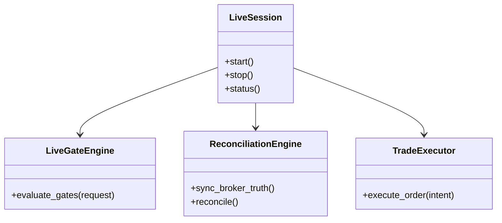

# 10_live.md - Requirements

## 1. Purpose

The Live module provides the live trading runtime and governed live-mutation boundary for HaruQuantAI. It consumes the shared trading function surface from `07_trading.md` and applies live-only controls before any real broker-facing action can be packaged or performed.

The module exists to ensure that `route="live"` cannot bypass live enablement, risk approval, broker readiness, idempotency, reconciliation, audit, kill-switch controls, operator approval, safe startup, safe shutdown, or incident handling. Live is an operational mode around the shared trading functions, not a separate trading implementation.

- [ ] The Live module shall be consumed only by approved shared trading tools, live runtime orchestration, operator workflows, monitoring, reconciliation, audit, and reporting consumers.
- [ ] The Live module shall act as a strict middleware/gateway for live-route requests and shall not implement strategy, risk, approval, broker, UI, or business-policy logic.

## 2. Ownership

### 2.1 Owns

- [ ] Live runtime configuration, including trading enablement flags, safety settings, notification settings, logging settings, state settings, and secret-reference resolution.
- [ ] Live session, live run, startup, shutdown, signal handling, recovery diagnostics, and runtime status/event emission for approved consumers.
- [ ] Live-only approval gates for broker mutation, kill-switch action, pause, resume, exposure reduction, mass cancel, mass close, and recovery.
- [ ] Live gate decision records for every live-route request, including gate inputs, gate outcomes, final decision, side-effect mode, and audit reference.
- [ ] Live side-effect state classification for each request: no side effect, packaged only, broker mutation attempted, broker mutation accepted, broker mutation rejected, unknown outcome, reconciled, or incident.
- [ ] Live broker readiness and broker-truth synchronization before live mutation.
- [ ] Live reconciliation authority state, startup reconciliation, retry guard, unknown-outcome handling, and live discrepancy incidents.
- [ ] Live kill-switch enforcement, live order disablement, live mass-cancel/mass-close request packaging, re-enable approval, and approval-cleared recovery.
- [ ] Live state management for positions, orders, broker receipts, reconciliation status, run status, incidents, and recovery context.
- [ ] Live monitoring for stale state, ingestion health, tool health, workflow timeout, operational incidents, latency, cost, notification failures, and live readiness.
- [ ] Live performance reports, live execution reports, broker-truth snapshots, and live audit evidence.
- [ ] Live notifications through configured safe channels without leaking secrets or private broker data.
- [ ] Live-compatible shadow execution and production-like comparison reports when real broker mutation is disabled.

### 2.2 Does Not Own

- [ ] The module does not own shared order, position, validation, route, bridge, receipt, simulator, or reconciliation function contracts; those belong to `07_trading.md`.
- [ ] The module does not own strategy signal generation, strategy lifecycle promotion, or strategy approval.
- [ ] The module does not own risk policy, position sizing approval, exposure limits, portfolio allocation policy, or kill-switch policy ownership outside live enforcement.
- [ ] The module does not own strategy selection, financial advice, risk-policy creation, approval-policy creation, or broker-adapter policy decisions.
- [ ] The module does not own market-data ingestion, provider data normalization, or historical data storage.
- [ ] The module does not own durable database schema/migration ownership, but it shall define required persistence ports such as `LiveStateStore`, `AuditSink`, and `IdempotencyStore`, including exact method signatures, required fields, failure behavior, and schema-version compatibility expectations before Builder handoff.
- [ ] The module does not own approval policy creation, but it shall validate approval context against the approved approval-policy contract.
- [ ] The module does not own the live action policy matrix unless a later governance decision assigns it to Live; until then, Live shall consume the approved matrix from the owning governance module.
- [ ] The module does not own broker adapter implementation or interface definition; it owns live readiness validation, response classification, and error-mapping requirements for approved broker adapters before live use.
- [ ] The module does not own API authentication, UI rendering, websocket connection management, or frontend workflow policy.
- [ ] The module does not grant AI chat, UI, API, backtest, or optimization workflows authority to execute live broker mutations.
- [ ] The module does not provide financial advice, trading recommendations, or owner-approved live threshold decisions.

## 3. API

### 3.1 Public Capabilities

- [ ] Expose a registry of callable live tools through the live tool registry, with each callable live tool accepting a standard request envelope and returning a standard response envelope.
- [ ] Each exported live tool shall document whether it is public API, internal helper, or official callable tool.
- [ ] Each exported live tool shall define a stable public contract including tool name, purpose, input schema, output schema, approval requirement, side-effect classification, risk level, error codes, warning codes, audit metadata, idempotency behavior, and stability status.
- [ ] Each exported live tool shall return a standard envelope containing tool name, status, request ID, correlation ID, side-effect mode, data, errors, warnings, audit metadata, incident reference, and `retry_after_seconds` where applicable.
- [ ] `retry_after_seconds` shall be present for `retry_after_reconciliation`, broker rate-limit, and configured retry-delay scenarios, and shall be `null` or omitted only when no retry delay is applicable.
- [ ] Each exported live tool contract shall reference the shared side-effect mode and retry-safety enumerations from Terminology And Data Definitions rather than redefining them.
- [ ] Validate live runtime configuration and resolve secret references without exposing secret values.
- [ ] Start and stop live sessions safely.
- [ ] Evaluate live readiness before `route="live"` trading functions can mutate broker state.
- [ ] Gate shared trading functions such as `submit_order`, `modify_order`, `cancel_order`, `close_position`, `modify_position`, `reduce_exposure`, `pause_strategy`, `resume_strategy`, `sync_positions`, `reconcile_state`, and `build_trading_report` when called with `route="live"`.
- [ ] Package live submit, cancel, modify, close, pause, resume, reduce exposure, position sync, broker reconciliation, and live report requests through shared trading contracts.
- [ ] Package kill-switch trigger, condition check, order-disable, mass-cancel, mass-close, event-record, re-enable-approval, and approval-cleared recovery requests.
- [ ] Monitor live stale state, ingestion, tool health, workflow timeout, operational status, incidents, cost, latency, and notification outcomes.
- [ ] Produce live execution, reconciliation, incident, and performance reports with audit evidence.
- [ ] Support shadow execution and expected-versus-realized reporting without real broker mutation.

## 4. Functional Requirements

- [ ] Live runtime shall fail closed unless live mode is explicitly enabled by approved runtime configuration.
- [ ] Live runtime shall treat shared trading functions as the only live trading action surface.
- [ ] Live runtime shall reject any direct live broker mutation that bypasses shared trading, risk, approval, idempotency, reconciliation, audit, or kill-switch gates.
- [ ] Live runtime shall propagate, log, and persist request ID, correlation ID, approval ID, risk decision reference, idempotency material, broker provider, route, account, strategy, symbol, and audit metadata through every gate, package, broker-attempt, reconciliation, and report boundary.
- [ ] Live runtime shall return structured rejections or blocks for invalid orders, disabled live mode, unsupported broker, failed readiness checks, stale context, active kill switch, reconciliation mismatch, missing approval, or unsafe live conditions.
- [ ] Live runtime shall keep live broker mutations disabled by default unless explicitly enabled and governed.
- [ ] Live runtime shall classify unknown broker outcomes separately from broker rejections, validation rejections, and successful broker acknowledgements.

**Live Gate Contract**

- [ ] Live route gating shall evaluate gates in a deterministic order: live enablement, request schema validation, approval validation, risk decision validation, broker readiness, stale-context validation, idempotency validation, reconciliation authority validation, kill-switch validation, audit pre-recording, and broker adapter permission.
- [ ] A failed mandatory gate shall stop evaluation before any downstream gate that could mutate broker state, mutate durable state beyond audit-safe diagnostics, or consume external broker capacity.
- [ ] Diagnostic-only gates may run after a mandatory gate failure only when the gate contract marks `diagnostic_after_failure=true`, `mutates_state=false`, `calls_broker=false`, and `requires_network=false`.
- [ ] Initially approved diagnostic-only gates are limited to local tool-contract metadata validation and local redaction validation; every other gate is mandatory until explicitly approved otherwise.
- [ ] Each gate failure shall return a standard error code, human-readable operator message, request ID, correlation ID, failed gate name, retry-safety classification, and audit metadata.
- [ ] Live gate decision records shall persist the requested action, gate order, gate inputs by reference, gate outcomes, final decision, side-effect mode, and audit reference when persistence is available.
- [ ] Audit pre-event evidence shall be recorded before broker mutation and audit post-event evidence after broker response, rejection, timeout, or unknown outcome.
- [ ] Audit-write failure before broker mutation shall always block broker mutation.
- [ ] The runtime must verify that its internal position/order view matches broker truth within configured `max_staleness_seconds` or narrower approved context-specific staleness thresholds before any broker mutation.
- [ ] Broker readiness shall include broker API/version compatibility checks once the broker adapter contract is approved.

**Package-Only And Mutation-Enabled Modes**

- [ ] Live runtime shall run in package-only mode unless live broker mutation is explicitly enabled.
- [ ] When live broker mutation is disabled, live trading actions shall only package validated broker-mutation requests or return structured blocks and shall not call any broker adapter.
- [ ] When live broker mutation is enabled, live trading actions may call an approved broker adapter only after all mandatory live gates pass.
- [ ] Every live result envelope shall include `side_effect_mode` with one of `none`, `packaged_only`, `broker_mutation_attempted`, `broker_mutation_confirmed`, `broker_mutation_rejected`, `unknown_outcome`, or `incident`.
- [ ] Package-only success shall not be treated as broker acceptance, live readiness, risk approval, or execution evidence.

**Policy Requirements**

- [ ] The live action policy matrix shall define every action mentioned in this file before Builder handoff.
- [ ] Each live action policy entry shall define action name, owning module, required permissions, approval requirement, emergency fail-safe eligibility, idempotency requirement, required audit events, side-effect ceiling, retry-safety default, and operator-review requirement.
- [ ] Live runtime shall enforce the live action policy matrix and shall return `LIVE_POLICY_UNDEFINED` for any live action missing from the matrix.
- [ ] Emergency fail-safe classification shall come only from the approved live action policy matrix.
- [ ] `disable_new_orders` behavior shall be dictated by the live action policy matrix. The functional requirement is enforcement of the matrix, not self-classification by the runtime.

**Approval Context**

- [ ] Live runtime shall require valid approval context for each action classified as approval-required in the live action policy matrix.
- [ ] Approval context shall include approval ID, approved action type, approved account scope, strategy scope where applicable, symbol scope where applicable, risk decision reference where applicable, approver identity reference, approval timestamp, expiration timestamp, approval state, and audit metadata.
- [ ] Live runtime shall reject approval context that is expired, revoked, not approved, outside action scope, outside account scope, outside strategy or symbol scope, or missing required audit metadata.
- [ ] Approval expiry between gate evaluation and broker send shall block mutation or produce an unknown/incident state only if a broker send already occurred.

**Live Route Gate**

- [ ] `submit_order(route="live")` shall return a blocked result unless the canonical live route gate passes. If the gate passes and live mutation is disabled, it shall return a packaged-only submit request. If the gate passes and live mutation is enabled, it may call an approved broker adapter and shall record the resulting side-effect state.
- [ ] `modify_order(route="live")` shall follow the canonical live route gate and shall preserve order identity, approved mutation scope, idempotency material, and side-effect mode.
- [ ] `cancel_order(route="live")` shall follow the canonical live route gate and shall preserve order identity, cancel reason, idempotency material, and side-effect mode.
- [ ] `close_position(route="live")` shall follow the canonical live route gate and shall preserve position identity, close scope, risk/approval references, idempotency material, and side-effect mode.
- [ ] `modify_position(route="live")` shall follow the canonical live route gate and shall preserve stop-loss or take-profit mutation scope, broker constraints, idempotency material, and side-effect mode.
- [ ] `reduce_exposure(route="live")` shall follow the canonical live route gate and shall preserve the approved reduction scope, position/symbol/account scope, idempotency material, and side-effect mode.
- [ ] `pause_strategy(route="live")` and `resume_strategy(route="live")` shall be operational live controls only and shall not replace strategy lifecycle promotion or approval.
- [ ] `sync_positions(route="live")` shall package live position synchronization from broker state and shall not mutate broker orders or positions.
- [ ] `reconcile_state(route="live")` shall package reconciliation of internal state against broker truth and shall record mismatch, unknown-outcome, and incident states.
- [ ] `build_trading_report(route="live")` shall package a live execution result report request without recomputing or fabricating execution evidence.

**Live Runtime**

- [ ] Live configuration shall be validated at startup. Any invalid configured broker provider, strategy reference, trading setting, safety setting, notification route, logging setting, state setting, or secret reference shall prevent live trading until corrected.
- [ ] Live config parsing shall resolve only approved secret references, reject raw secret values where prohibited, and return structured validation errors without exposing secret values.
- [ ] Live secrets helpers shall resolve configured secret references without logging secret values.
- [ ] Live engine/session/run helpers shall orchestrate live runtime startup, shutdown, signal handling, and structured runtime status/event emission.
- [ ] Live startup shall run broker readiness and startup reconciliation before live recovery or live mutation workflows.
- [ ] Live startup shall not permit live mutation until startup reconciliation completes successfully or produces an approved operator-cleared recovery state.
- [ ] Live shutdown shall stop accepting new live mutation requests before preserving state, flushing audit evidence, and reporting unresolved live work.
- [ ] Live state manager shall preserve runtime state needed for live execution recovery and monitoring.
- [ ] Signal processor shall transform strategy signals into live trading candidates only through approved runtime checks.
- [ ] Trade executor shall enforce live execution safety checks before broker mutation.
- [ ] Position manager shall maintain live position views used by trading decisions.
- [ ] Notification adapter shall send live execution success/failure notifications through configured safe channels.

**Kill Switch**

- [ ] `trigger_global_kill_switch` shall package global trading kill-switch activation only after approval gates unless explicitly classified as an emergency fail-safe action.
- [ ] `trigger_strategy_kill_switch` shall package strategy-level kill-switch activation only after approval gates unless explicitly classified as an emergency fail-safe action.
- [ ] `trigger_symbol_kill_switch` shall package symbol-level kill-switch activation only after approval gates unless explicitly classified as an emergency fail-safe action.
- [ ] Kill-switch trigger tools shall consume emergency fail-safe classification only from the approved live action policy matrix and shall not infer emergency status from request text, user role, chat instruction, UI input, or API route.
- [ ] `check_kill_switch_conditions` shall package kill-switch trigger-condition evaluation.
- [ ] `disable_new_orders` shall package or perform disabling new order submission according to the live action policy matrix.
- [ ] `cancel_all_orders` shall package cancellation of all pending orders only after approval gates.
- [ ] `close_all_positions` shall package closing all positions only after approval gates.
- [ ] `record_kill_switch_event` shall package durable kill-switch event recording.
- [ ] `require_reenable_approval` shall require approval before trading can be re-enabled.
- [ ] `clear_kill_switch_after_approval` shall package kill-switch clearing only after approval gates.
- [ ] Active kill switch shall block live trading requests regardless of route request text, UI input, API input, or chat instruction.

**Reconciliation And Authority**

- [ ] Broker-truth snapshots shall normalize broker positions, orders, account, and timestamp evidence.
- [ ] Live reconciliation comparison shall detect missing, extra, mismatched, and stale broker/internal records.
- [ ] Live reconciliation persistence shall preserve reconciliation runs, mismatches, incidents, and evidence references through the approved persistence interface.
- [ ] Live authority-state transitions shall remain pending until the reconciliation state machine is approved; until then, production live broker mutation shall remain disabled.
- [ ] Startup reconciliation shall run before live recovery or live mutation workflows.
- [ ] Retry guard behavior shall prevent unsafe blind retries after unknown broker outcomes.
- [ ] Unknown broker outcomes shall block blind retry until broker truth resolves the live authority state.
- [ ] Live reconciliation incidents shall package discrepancy severity, evidence, action requirement, and audit context.
- [ ] Reconciliation shall prefer broker truth when determining live authority state.
- [ ] Live runtime shall persist idempotency records before any broker mutation attempt where persistence is available and shall fail closed if required idempotency persistence cannot be written.

**Broker Adapter Contract**

- [ ] Each approved broker adapter shall expose a documented capability contract before Live can use it for broker mutation.
- [ ] Broker adapter contracts shall define provider ID, API/version compatibility, supported actions, symbol metadata access, account/order/position snapshot access, readiness checks, request schema, response schema, timeout behavior, rate-limit behavior, malformed-response handling, error mapping, retry-safety classification, and redaction rules.
- [ ] Malformed broker success responses, including HTTP 200 or equivalent success status with missing required fields or invalid data types, shall be classified as `unknown_outcome`, shall trigger reconciliation, and shall not be treated as confirmed broker mutation.
- [ ] Broker adapter readiness shall fail closed on unsupported API version, deprecated endpoint use, missing capability declaration, stale symbol metadata, missing account snapshot, or incompatible response schema version.
- [ ] Broker-side rate limiting, including HTTP 429 or provider-equivalent rate-limit responses, shall not be retried blindly.
- [ ] Broker rate-limit responses shall return `retry_safety="safe_to_retry"` only when the adapter contract proves no broker mutation occurred; otherwise they shall return `retry_safety="retry_after_reconciliation"` or `do_not_retry`.
- [ ] Broker rate-limit responses shall include `retry_after_seconds` when the provider supplies or the approved rate-limit policy derives a retry delay.
- [ ] Broker rate-limit backoff policy shall be approved before production live mutation. Proposed Decision: exponential backoff with jitter and at most three attempts before incident escalation.
- [ ] Broker communication security is a mandatory pre-production gate. Live shall not allow production broker mutation until the approved security profile defines encrypted transport, certificate validation requirements, credential handling, logging restrictions, and adapter compliance tests.

**Concurrency And Coordination**

- [ ] Live runtime shall define a concurrency coordination contract before Builder handoff.
- [ ] The concurrency coordination contract shall specify whether coordination uses per-account locks, per-symbol locks, per-order/position locks, optimistic version checks, or another approved mechanism.
- [ ] Conflicting actions for the same account, strategy, symbol, order, or position shall be serialized, rejected with a deterministic conflict error, or coordinated through an approved optimistic concurrency rule.
- [ ] The coordination contract shall define lock acquisition timeout, stale lock recovery, conflict error code, idempotency interaction, and audit evidence.

**Monitoring, Performance, Cost, And Reporting**

- [ ] Tool health monitoring shall track last successful call time, last failure time, consecutive failure count, timeout count, dependency status, and current health state for each exported live tool.
- [ ] Workflow timeout monitoring shall detect stale or overdue live workflows.
- [ ] Workflows exceeding configured `live_workflow_timeout_seconds` shall trigger a `WORKFLOW_TIMEOUT` incident.
- [ ] Stale-state monitoring shall identify stale market, account, broker, approval, or risk state.
- [ ] Stale-state monitoring shall tie broker/account/order/position freshness checks to approved market-data freshness thresholds where broker mutation depends on current market state.
- [ ] Live readiness stale thresholds shall be configurable per context type and shall be enforced deterministically.
- [ ] Live broker adapter calls shall have configured timeout limits and shall classify timeout as unknown outcome unless broker truth proves otherwise.
- [ ] Ingestion monitoring shall track whether required live inputs are arriving.
- [ ] Incident classification shall classify live incidents by severity and action need.
- [ ] Latency helpers shall record live trading timing and latency diagnostics.
- [ ] Snapshot caches shall preserve recent live performance snapshots.
- [ ] Cost enforcement shall enforce per-request, workflow, and session cost budgets and record cost entries.
- [ ] Live runtime shall prevent broker mutation when cost budget is exceeded before broker send.
- [ ] If cost budget is exceeded after gate approval but before broker send, the runtime shall block mutation and record a cost-budget incident.
- [ ] Live runtime shall record an incident when cost budget is exceeded after broker send but before reconciliation completion.
- [ ] Live reports shall include approvals, risk decisions, route, broker evidence, receipts, reconciliation state, incidents, warnings, and unresolved actions.

**Proposed Non-Functional Targets Pending Approval**

The following values are proposed engineering targets, not approved production SLOs, until accepted by the owner/architect:

| Target | Proposed value | Status |
|---|---:|---|
| Gate evaluation latency p95 | 50 ms | Proposed Decision |
| Gate evaluation latency p99 | 100 ms | Proposed Decision |
| Readiness check latency p95 | 200 ms | Proposed Decision |
| Live order request throughput | 100 requests/sec/node | Proposed Decision |
| Reconciliation loop interval | 30 seconds or less | Proposed Decision |
| Broker adapter timeout default | 5 seconds | Proposed Decision |
| Broker rate-limit retry attempts | 3 attempts with exponential backoff and jitter | Proposed Decision |
| Live workflow timeout default | 60 seconds | Proposed Decision |
| Live request queue depth limit | 10,000 | Proposed Decision |
| Shutdown audit flush timeout | 10 seconds | Proposed Decision |

- [ ] Performance tests shall use approved values from this table or later owner-approved replacements.
- [ ] Production live broker mutation is strictly blocked until all `Proposed Decision` statuses in this table are updated to `Decision: Approved` by the owner/architect or replaced by approved values.

**Shadow Execution**

- [ ] Shadow data feeds shall package production-like account, portfolio, market, and environment snapshots.
- [ ] Shadow execution shall execute production-like workflows without real broker mutation.
- [ ] Shadow comparison reports shall compare expected and realized fill/PnL outcomes.
- [ ] Shadow execution shall not be treated as live broker approval or live readiness by itself.
- [ ] Shadow execution shall fail closed if it receives a live account reference or live broker adapter reference.

## 5. Non-Functional Requirements

- [ ] Live shall fail closed on missing approval, missing risk context, stale broker/account state, active kill switch, reconciliation mismatch, idempotency conflict, disabled live flag, or unknown broker result.
- [ ] Live mutations shall be disabled by default.
- [ ] Critical live and kill-switch actions shall require explicit approval context unless classified as emergency fail-safe actions by the approved live action policy matrix.
- [ ] Broker calls shall be isolated behind approved adapters or bridges.
- [ ] Live outputs shall be structured, traceable, redacted, and JSON-safe.
- [ ] Live errors shall use documented error codes from a finite taxonomy and shall include request ID, correlation ID, failed gate where applicable, retry-safety classification, operator action hint, and audit reference when available.
- [ ] Secrets, credentials, tokens, authorization headers, private broker payloads, and raw approval packets shall not leak through logs, errors, notifications, metrics, reports, or chat.
- [ ] Loggers and redaction helpers shall recursively scrub fields whose names contain `secret`, `token`, `key`, `authorization`, `password`, `credential`, or `api_key`, case-insensitively, before logs, errors, reports, notifications, metrics, or chat output are emitted.
- [ ] Raw broker payloads shall be stored only as redacted evidence references unless explicitly classified safe.
- [ ] Idempotency shall prevent unsafe duplicate live execution and shall not be mistaken for exactly-once broker semantics.
- [ ] Unknown broker outcomes shall block blind retries until reconciliation resolves state.
- [ ] Reconciliation shall prefer broker truth when determining live authority state.
- [ ] Paper, simulation, and shadow trading shall remain separate from live broker mutation.
- [ ] Live tools shall preserve clear side-effect flags and approval requirements.
- [ ] Live runtime components shall support safe startup, safe shutdown, signal handling, and recovery diagnostics.
- [ ] Live runtime shall enforce bounded queue sizes or explicit rejection behavior under request overload.
- [ ] Live runtime shall serialize or otherwise safely coordinate conflicting actions for the same account, strategy, symbol, order, or position.
- [ ] Importing live modules shall not start broker sessions, start background workers, mutate state, or resolve raw secret values.
- [ ] Importing live modules shall not resolve secrets, open sockets, spawn threads, start async tasks, or initialize broker SDK sessions.
- [ ] Broker communication security shall be enforced through an owner/architect-approved security profile before production broker mutation can be enabled.
- [ ] The approved broker communication security profile shall define minimum encrypted transport version, certificate validation or pinning requirements where supported, credential handling, adapter compliance evidence, and failure behavior.
- [ ] Monitoring shall expose stale state, timeouts, health failures, incidents, latency, and cost-budget conditions.
- [ ] Compensation behavior shall be allowed only for approved compensation action classes. Each compensation action shall define preconditions, maximum scope, approval requirement, timeout, audit evidence, retry policy, and terminal failure behavior.
- [ ] Live runtime shall not overstate readiness or safety when context is partial or stale.
- [ ] Public registry changes shall remain covered by tests and catalog updates.

## 6. Testing

### 6.1 Edge Cases

- Empty request payload or malformed payload.
- Missing request ID or duplicate request ID.
- Missing correlation ID where required.
- Missing approval ID for live or kill-switch action.
- Approval expires between gate evaluation and broker send.
- Approval is revoked or falls outside account, strategy, symbol, or action scope.
- Live mutation flag disabled.
- Active global, strategy, or symbol kill switch.
- Kill switch activates while a live request is in flight.
- Operator sends kill-switch trigger while live request is in flight; kill-switch activation must supersede the in-flight request and force block, incident, or reconciliation according to the approved state machine.
- Broker disconnected, stale broker time, stale quote, stale account snapshot, stale permissions, or stale symbol metadata.
- Broker API version skew or deprecated endpoint returned during readiness check.
- Malformed broker response, including success status with missing required fields or wrong data types.
- Broker rate limiting, including HTTP 429 or provider-equivalent rate-limit response.
- Broker rate-limit backoff exhaustion before request acceptance is proven.
- Broker adapter timeout after broker accepted the request but before receipt is received.
- Unknown broker result after a send attempt.
- Duplicate idempotency key with different material fields.
- Duplicate idempotency keys arriving simultaneously.
- Existing send attempt with no authoritative receipt.
- Persistence write failure before idempotency record is committed.
- Audit sink failure before broker mutation.
- Audit sink failure after broker mutation.
- Partial network partition where audit write succeeds but broker send fails.
- Partial network partition where broker send may have succeeded but audit post-write, receipt read, or reconciliation write fails.
- Reconciliation mismatch between broker and internal state.
- Reconciliation authority state is missing, unsupported, stale, or in an unapproved transition.
- Runtime restart with in-flight unknown broker outcome.
- Missing or unsupported broker provider.
- Symbol mapping absent, alias collision, or broker symbol disabled.
- Market closed, trade permission disabled, invalid account mode, insufficient margin, or margin level below policy.
- Volume below minimum, above maximum, not aligned to step, malformed, or exceeding symbol exposure limits.
- Invalid side, unsupported order type, invalid price, malformed ticket, invalid magic number, invalid timeframe, or invalid expiration.
- Stop loss or take profit on the wrong side of entry price, too close to market, or inside broker freeze distance.
- Price, volume, spread, slippage, commission, bid, ask, or account values missing, non-finite, zero, or negative where invalid.
- Partial fills, partial closes, pending-order expiry, pending-order trigger, or IOC-like remainder behavior.
- Concurrent submit and cancel for the same order intent.
- Concurrent close and reduce exposure for the same position.
- Concurrent pause and resume for the same strategy.
- Shadow expected fill/PnL diverging from realized market behavior.
- Shadow execution accidentally receives a live account or live broker adapter reference.
- Notification adapter failure during live execution event.
- Compensation plan missing for an action class.
- Cost budget exceeded before broker send.
- Cost budget exceeded after broker send but before reconciliation completion.
- Workflow timeout while approval, send, receipt, reconciliation, or compensation remains pending.
- Clock skew between runtime, broker, approval service, and audit store.
- System clock drift exceeds approved NTP or clock-health thresholds and could invalidate approval expiry or timestamp validation.
- Timezone mismatch in approval expiry, broker timestamps, and reconciliation evidence.
- Secret-reference resolution failure or accidental raw secret in config input.
- Live config YAML/JSON parse error containing raw secret-like text.
- Broker adapter contract version missing or incompatible.

### 6.2 Tests Required

- [ ] Live registry tests shall prove the approved live runtime and governance surface is exported intentionally.
- [ ] Callable/docstring tests shall cover every exported live service tool.
- [ ] Contract tests shall cover every exported public tool input schema, result-envelope schema, risk level, approval requirement, side-effect flag, stability, and documentation reference.
- [ ] Standard-envelope snapshot tests shall cover success, blocked, rejected, packaged-only, mutation-attempted, mutation-confirmed, unknown-outcome, and incident states.
- [ ] Live gate tests shall prove each gate returns deterministic pass/block/error results and that gate failures stop unsafe downstream actions.
- [ ] Diagnostic-only gate tests shall prove only approved local diagnostic gates run after mandatory gate failure and that they do not mutate state, call broker adapters, or require network access.
- [ ] Critical live-route tests shall prove shared trading functions block without approval ID when approval is required.
- [ ] Policy matrix consistency tests shall prove every action mentioned in functional requirements has a defined matrix entry with approval class, emergency flag, idempotency requirement, side-effect ceiling, and audit requirement.
- [ ] Package-only tests shall prove no broker adapter call occurs when live mutation is disabled.
- [ ] Mutation-enabled tests with mocks shall prove adapter calls occur only after all mandatory gates pass.
- [ ] Live execution tests with mocks shall prove submit, modify, cancel, close, pause, resume, exposure reduction, sync, reconciliation, and reports require approval and fail closed when context is missing.
- [ ] Kill-switch tests shall cover global, strategy, symbol, disable orders, cancel all, close all, record event, require re-enable approval, and clear after approval.
- [ ] Approval context tests shall reject expired, revoked, out-of-scope, malformed, missing-audit, and wrong-action approvals.
- [ ] Approval packet completeness, state-machine, creation, voting, override, and distinct-approver tests shall cover live governance only after ownership is approved by the governance module.
- [ ] Idempotency tests shall cover duplicate same-material, duplicate different-material, and simultaneous duplicate live requests.
- [ ] Broker bridge tests shall cover approved broker adapters, response classification, error mapping, timeout mapping, and fail-closed live behavior.
- [ ] Broker adapter contract tests shall cover capability discovery, readiness, API/version compatibility, malformed success responses, response schema validation, error mapping, and retry-safety classification.
- [ ] Broker rate-limit tests shall cover HTTP 429 or provider-equivalent responses, `retry_after_seconds`, retry-safety classification, approved backoff limits, and incident escalation after backoff exhaustion.
- [ ] Reconciliation tests shall cover matched, missing, extra, mismatched, stale, unknown-outcome, startup, persistence, retry guard, restart recovery, and incident paths.
- [ ] Monitoring tests shall cover stale state, ingestion health, workflow timeout, tool health, incident classification, latency, and snapshot cache behavior.
- [ ] Cost enforcement tests shall cover per-request, workflow, session budget, before-send failure, and after-send incident behavior.
- [ ] Live runtime tests with mocks shall cover config parsing, secret resolution, state manager, signal processor, trade executor, position manager, notifications, startup, shutdown, and safe recovery.
- [ ] Shadow execution tests shall cover feed building, no-live-mutation execution, live-reference rejection, and expected-versus-realized reporting.
- [ ] Compensation tests shall cover order, position, registry, validation, execution, missing-plan, and audit-log behavior after compensation ownership is approved.
- [ ] Concurrency tests shall cover simultaneous submit/cancel, close/reduce exposure, pause/resume, duplicate idempotency keys, and kill-switch racing with live submit.
- [ ] Restart tests shall cover persisted unknown outcomes, in-flight approvals, in-flight reconciliation, pending compensation, and startup mismatch blocking.
- [ ] Performance and reliability tests shall cover readiness latency budget, reconciliation timeout, broker adapter timeout, bounded queue behavior, shutdown audit flush, and monitoring signal emission.
- [ ] Performance tests shall include approved concrete targets, including readiness latency, gate latency, reconciliation loop interval, adapter timeout, request throughput, queue-depth rejection, and shutdown audit flush once the owner approves those values.
- [ ] Chaos/network partition tests shall prove the runtime fails closed and records incidents when broker connection, audit sink, receipt read, or reconciliation persistence fails mid-mutation.
- [ ] Broker communication security tests shall prove production mutation is blocked when the approved transport/security profile is missing, unsupported, or failed.
- [ ] Security tests shall prove secrets, private broker payloads, and raw approval packets are redacted from errors, logs, reports, notifications, metrics, and chat.
- [ ] Secrets redaction tests shall inject fake values such as `password: secret123` and prove no log line, error message, notification, metric, report, or chat response contains `secret123`.
- [ ] Import-time safety tests shall prove importing live modules performs no broker connection, mutation, background start, or raw secret logging.
- [ ] Usage-example tests shall prove examples remain executable against documented signatures and include blocked live mode, missing approval, active kill switch, package-only mode, and unknown outcome.
- [ ] Unknown-outcome retry tests shall prove clients receive `retry_after_reconciliation` and cannot blindly retry before reconciliation.
- [ ] Requirement traceability tests shall map every functional `shall` requirement to at least one named test or explicitly approved deferral.

### 6.3 Usage Examples


## 7. Module Architecture

### 7.1 Target Folder Structure

```text
tools/
  live/
    __init__.py          # Live module entry point and public tool registry
    config.py            # Configuration validation, settings mapping & secret resolution
    session.py           # Live session lifecycle & signal processing
    gates.py             # Live gate implementation (mandatory & diagnostic)
    executor.py          # TradeExecutor, PositionManager & shadow execution
    reconciliation.py    # Reconciliation engine & authority state transition machine
    monitoring.py        # Health, staleness, workflow timeout, cost monitoring
    errors.py            # Mapped error classes & code definitions
```

### 7.2 Class Diagrams



## 8. Acceptance

### 8.5 Additional Details

#### Terminology And Data Definitions

| Term | Definition |
|---|---|
| Live gate | Deterministic validation and authorization sequence that decides whether a `route="live"` request is blocked, packaged only, or allowed to attempt broker mutation. |
| Canonical live route gate | The single approved gate sequence used by all live-route mutation-capable actions. |
| Package-only mode | Mode where the runtime validates and packages a live-compatible broker request but does not call a broker adapter. |
| Mutation-enabled mode | Mode where broker adapter calls may occur only after live mutation is explicitly enabled and every mandatory gate passes. |
| Broker truth | The latest validated broker-provided account, order, position, execution, and timestamp evidence accepted for reconciliation. |
| Live action policy matrix | Approved governance table that classifies each live action by approval requirement, emergency fail-safe eligibility, permissions, audit requirements, idempotency requirement, and side-effect ceiling. |
| Emergency fail-safe action | A concrete action-policy label from the approved live action policy matrix; live tools must not self-classify an action as emergency fail-safe. |

Side-effect modes:

```text
none
packaged_only
broker_mutation_attempted
broker_mutation_confirmed
broker_mutation_rejected
unknown_outcome
incident
```

Retry-safety classifications:

```text
safe_to_retry
unsafe_retry
retry_after_reconciliation
do_not_retry
```

#### Usage Examples

```python
from app.services.trading import submit_order

blocked_or_packaged = submit_order(
    route="live",
    approval_id="approval_123",
    strategy_id="strategy_alpha",
    symbol="EURUSD",
    side="buy",
    volume=0.1,
    price=1.1,
    request_id="req_live_submit",
)

assert blocked_or_packaged["metadata"]["side_effect_mode"] in {
    "packaged_only",
    "none",
}
```

```python
from app.services.trading import reconcile_state, build_trading_report

reconciliation = reconcile_state(
    route="live",
    account_id="account_primary",
    request_id="req_live_reconcile",
)

report = build_trading_report(
    route="live",
    reconciliation_id=reconciliation["data"].get("reconciliation_id"),
    request_id="req_live_report",
)
```

```python
from app.services.live import trigger_global_kill_switch

kill_switch_request = trigger_global_kill_switch(
    route="live",
    approval_id="approval_123",
    reason="operator requested emergency stop",
    request_id="req_live_kill_switch",
)
```

`trigger_global_kill_switch` is a Live-owned operational control, not a Trading order function. It must still use the live tool registry, standard envelopes, auth, policy-matrix enforcement, audit, and redaction rules.

```python
from app.services.trading import submit_order

blocked = submit_order(
    route="live",
    strategy_id="strategy_alpha",
    symbol="EURUSD",
    side="buy",
    volume=0.1,
    request_id="req_live_missing_approval",
)

assert blocked["status"] in {"blocked", "error"}
assert blocked["error"]["code"] in {
    "MISSING_APPROVAL",
    "LIVE_GATE_FAILED",
}
```

```python
from app.services.trading import submit_order
from app.services.trading import reconcile_state

attempt = submit_order(
    route="live",
    approval_id="approval_123",
    strategy_id="strategy_alpha",
    symbol="EURUSD",
    side="buy",
    volume=0.1,
    request_id="req_live_unknown_outcome",
)

if attempt["metadata"]["side_effect_mode"] == "unknown_outcome":
    assert attempt["error"]["retry_safety"] == "retry_after_reconciliation"
    reconciliation = reconcile_state(
        route="live",
        account_id="account_primary",
        request_id="req_live_reconcile_after_unknown",
    )
```

#### Pre-Production Required Decisions

| ID | Pending item | Required acceptance before production broker mutation | Owner |
|---|---|---|---|
| LIVE-PEND-001 | Exact live execution schema. | Versioned request/response schema, statuses, errors, side-effect modes, audit metadata, examples, and tests are approved. | Owner/Architect |
| LIVE-PEND-002 | Idempotency material fields, idempotency storage, duplicate behavior, and retention policy. | Store interface, material fields per action, duplicate same/different-material behavior, retention, and tests are approved. | Owner/Architect |
| LIVE-PEND-003 | Reconciliation persistence interface, evidence fields, mismatch states, authority-state transitions, and broker-truth precedence. | State machine, persistence ports, transition table, mismatch severity, unknown-outcome recovery, and tests are approved. | Owner/Architect |
| LIVE-PEND-004 | Approval quorum, approval action policy matrix, emergency fail-safe classification, and approval expiry behavior. | Matrix owner, entries for every live action, quorum rules, expiry/revocation behavior, emergency labels, and tests are approved. | Owner/Architect |
| LIVE-PEND-005 | Kill-switch policy, scope hierarchy, re-enable rules, and mass-cancel/mass-close authority. | Scope hierarchy, trigger/clear/re-enable behavior, authority requirements, in-flight handling, and tests are approved. | Owner/Architect |
| LIVE-PEND-006 | Broker adapter contracts, supported launch broker set, capability discovery, response classification, timeout behavior, rate-limit behavior, malformed-response behavior, and broker-specific order constraints. | Adapter interface, launch providers, capability/version checks, response/error mapping, timeout and rate-limit handling, and tests are approved. | Owner/Architect |
| LIVE-PEND-007 | Stale thresholds, timeout limits, queue limits, concurrency behavior, audit durability expectations, and restart/recovery objectives. | Concrete SLO/limit table, coordination mechanism, audit durability behavior, restart recovery behavior, and tests are approved. | Owner/Architect |
| LIVE-PEND-008 | Compensation action classes, preconditions, maximum scope, approval requirements, retry policy, and terminal failure behavior. | Approved compensation catalog, preconditions, approval model, retry/no-retry rules, terminal states, and tests are approved. | Owner/Architect |
- [ ] Production live broker mutation shall remain disabled until the decisions above are approved and referenced by version.
- [ ] Broker communication security is not a deferrable pending decision for production; production broker mutation shall remain disabled until the mandatory broker communication security profile is approved and enforced.

#### Notes / Future Improvements

- [ ] Live is an operational runtime around `route="live"` trading functions, not a separate implementation of order and position behavior.
- [ ] Optional shadow expected-versus-realized PnL reporting can remain future work unless required before live launch.
- [ ] Proposed Decision: shadow expected-versus-realized PnL reporting should be accepted for production only after an owner-approved paper-trading validation window and correlation threshold are defined.
- [ ] Dashboard/runtime helper orchestration can remain future work if the runtime can operate safely without dashboard hints.
- [ ] UI/dashboard rendering and websocket connection management are strictly out of scope for Live. Live may emit structured JSON events for approved consumers; rendering, websocket transport, and dashboard orchestration belong to API/UI or other consumer modules.
- [ ] Snapshot cache behavior can remain future work unless required for live readiness or audit.
- [ ] Public registry and catalog updates shall be mandatory when live tools are added, renamed, or removed.

