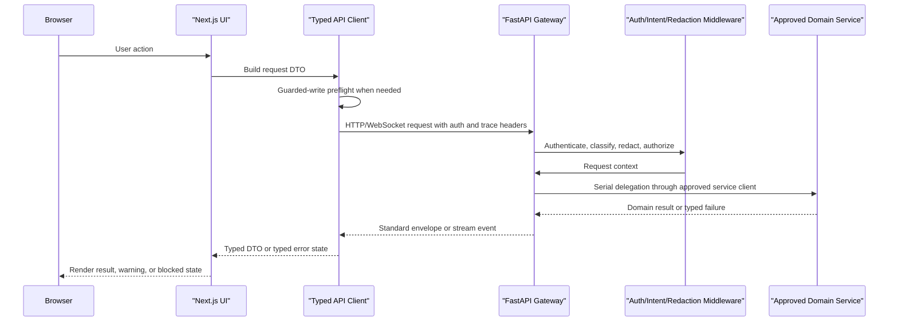

# 11_ui_api.md - Requirements

## 1. Purpose

The UI/API Gateway exposes a unified, secure entry point for the HaruQuant platform, handling authentication, contract validation, delegation to backend services, and serving the frontend application without embedding domain logic.

The combined surface exists to let users interact with approved backend capabilities through typed clients, validated contracts, protected routes, bounded page context, standard error handling, and governed write controls without moving trading, risk, broker, research, or persistence business logic into the frontend.

Handoff status: Needs Revision before Builder implementation. The route inventory is useful, but production handoff remains blocked until route contracts, response envelopes, stream contracts, auth/authorization rules, idempotency behavior, pagination/filtering policy, measurable non-functional requirements, and requirement-to-test traceability are documented for the public surface.

## 2. Ownership

### 2.1 Owns

- FastAPI application composition, route registration, middleware setup, lifecycle startup/shutdown, CORS configuration, and health endpoint exposure.
- API route groups for authentication, settings, AI chat, strategies, SQX import, backtest, simulator, risk, live sessions, optimization, dashboard, docs, Edge Lab, data, operator approvals, and operator events.
- API request/response Pydantic models used at the HTTP boundary.
- API authentication helpers, token verification, token invalidation, operator-principal extraction, and operator role enforcement.
- API middleware for intent classification and secret-safe request metadata logging.
- API WebSocket managers for backtest logs, live trading, and optimization progress.
- Frontend Next.js app routes, layouts, protected dashboard pages, authentication pages, and workflow pages.
- Frontend API clients, request helpers, typed DTOs, validators, page-context providers, chat widget store, hooks, and UI interaction state.
- Frontend guarded-write preflight checks, request/trace headers, local auth-token attachment, stale-response warnings, contract validation, and telemetry hooks.
- Frontend guarded-write preflight checks as user-experience safeguards only; backend authorization, idempotency, risk, approval, audit, and safety-gate enforcement remain authoritative.
- Shared frontend components, charts, forms, workflow panels, tables, settings screens, documentation screens, and AI chat UI.
- HTTP, WebSocket, and SSE contract documentation for the UI/API boundary.
- Route-level API stability labels and public/internal/migration-only classification.
- Frontend/API contract drift detection through typed DTOs, validators, snapshots, and tests.

### 2.2 Does Not Own

- Trading algorithms, strategy signal generation, risk calculations, portfolio decisions, broker execution logic, live reconciliation, or kill-switch policy.
- Persistence business rules owned by database repositories and domain services.
- Broker credentials, AI provider credentials, notification provider credentials, or secret storage.
- Research, analytics, optimization, simulation, live, execution, risk, strategy, or data domain algorithms beyond exposing their approved APIs and rendering their outputs.
- Direct frontend database writes or direct frontend broker calls.
- Durable project scope, architecture, roadmap, or owner decisions outside active documentation.
- Inline implementation of domain algorithms. Route handlers may validate, authorize, orchestrate, delegate to approved services, and translate DTOs, but must not implement trading, broker, risk, simulation, optimization, research, or persistence algorithms.
- Service orchestration logic beyond serial delegation with error translation. Complex workflow orchestration requires an approved orchestrator abstraction outside ordinary route handlers.
- Lifecycle ownership of domain services, brokers, databases, AI providers, or notification providers it calls. The gateway manages only its own startup, shutdown, middleware, routes, and frontend application surface.

## 3. API

### 3.1 Public Capabilities

**Pre-handoff completion required: each checkbox below must be satisfied with concrete contract documents before Builder implementation.**

- Backend canonical entry point: `api.main:app`. Classification: public runtime surface. Stability: stable unless changed by an approved architecture decision.
- Migration-era operator API factory and app: `api.app.create_app` and `api.app.app`. Classification: migration-compatibility surface. Stability: migration-only until the owner approves support, deprecation, or removal.
- Public health endpoint: `GET /api/health`. Classification: public API. Stability: stable once its response contract is approved.
- FastAPI route groups under `/api/auth`, `/api/settings`, `/api/ai-chat`, `/api/strategies`, `/api/sqx`, `/api/backtest`, `/api/simulator`, `/api/risk`, `/api/live`, `/api/optimization`, `/api/dashboard`, `/api/docs`, `/api/edge-lab`, and `/api/data`. Classification: public API unless a route is explicitly marked internal, migration-only, experimental, deprecated, or optional/deferred.
- Operator API route group under `/api/operator`, including approvals and event streaming. Classification: protected operator API. Stability: experimental until the operator auth, approval, and event contracts are approved.
- WebSocket and streaming endpoints for backtest logs, live sessions, optimization progress, AI chat responses, and operator events. Classification: public or protected stream only when each stream declares auth, event schema, heartbeat, reconnect, backpressure, terminal error, and cleanup behavior.
- Frontend workspace: `ui/`, implemented with Next.js, React, TypeScript, Tailwind CSS, Radix UI, and typed API clients. Classification: official frontend surface.
- Frontend development scripts: `dev`, `build`, `start`, `lint`, and `test:agentic-firm`. Classification: developer support surface.
- Frontend API base URL configured by `NEXT_PUBLIC_API_URL`, defaulting to `http://127.0.0.1:8000`. Classification: frontend runtime configuration.
- Frontend auth token storage key: `hq_auth_token`. Classification: sensitive client runtime storage; tokens are secrets and must be redacted from logs, telemetry, errors, examples, and screenshots.
- Frontend route groups for auth, dashboard, agents, AI CEO, audit, backtests, board room, chart, documentation, Edge Lab, execution, live, optimization, performance, portfolio, research, risk center, settings, simulation, strategies, strategy lab, and tools. Classification: official frontend routes unless explicitly marked optional/deferred.
- [ ] Each public HTTP route, WebSocket/SSE stream, frontend client, and official callable capability shall identify whether it is public API, protected API, internal helper, migration-compatibility surface, official frontend client capability, or optional/deferred capability.
- [ ] Each public capability shall declare stability as stable, experimental, deprecated, migration-only, or optional/deferred.
- [ ] Each public HTTP route shall define method, path, auth requirement, role or permission requirement, request schema, response schema, status codes, standard error envelope, side effects, idempotency behavior, audit requirement where applicable, rate-limit class, observability fields, and owning backend/domain service.
- [ ] Each WebSocket, SSE, or streaming capability shall define auth, event schema, heartbeat interval, reconnect behavior, disconnect cleanup, backpressure behavior, terminal error event, sequence behavior, and maximum connection policy.
- [ ] Each frontend API client capability shall map to a documented backend route contract or be marked as frontend-only, mocked, optional/deferred, or migration-only.

Route group contract placeholders:

| Route group | Methods/paths | Auth | Schema refs | Stability | Idempotency | Pagination | Rate limit class | Owning service | Status |
|---|---|---|---|---|---|---|---|---|---|
| Health | Pending route table | Public | Pending | Stable once approved | None | None | health | UI/API Gateway | Pending |
| Auth | Pending route table | Public/session | Pending | Experimental | Login/logout specific | None | auth | Auth service | Pending |
| Settings | Pending route table | Authenticated | Pending | Experimental | PUT requires key if mutating durable settings | List policy if listing | standard-write | Settings service | Pending |
| AI chat | Pending route table | Authenticated | Pending | Experimental | Mutations require key where durable | Cursor list | ai-chat | Conversation service | Pending |
| Strategies/SQX | Pending route table | Authenticated | Pending | Experimental | Mutations/imports require key | Cursor list | standard-write/import | Strategy service | Pending |
| Backtest/Simulator | Pending route table | Authenticated | Pending | Experimental | Run/start/mutations require key | Cursor list | analysis | Simulation service | Pending |
| Risk | Pending route table | Authenticated and permissioned | Pending | Experimental | Governed mutations require key | None unless listing | governed | Risk service | Pending |
| Live | Pending route table | Authenticated and permissioned | Pending | Experimental | Required for all governed/live mutations | Cursor list | live-mutation | Live service | Pending |
| Optimization | Pending route table | Authenticated | Pending | Experimental | Run/cancel require key | Cursor list | analysis | Optimization service | Pending |
| Dashboard/Data/Docs | Pending route table | Mixed public/authenticated | Pending | Experimental | Docs save/delete and imports require key | Cursor list | standard-read/import | Data, Docs, Analytics services | Pending |
| Edge Lab/Research | Pending route table | Authenticated | Pending | Experimental | Runs, saves, exports require key | Cursor list | analysis | Research service | Pending |
| Operator | Pending route table | Operator principal and role | Pending | Experimental | Approvals/votes require key | Cursor list | operator | Operator/governance service | Pending |
| Streams | Pending route table | Route-specific | Pending | Experimental | Not applicable to stream delivery; initial command may require key | Not applicable | stream | Owning route service | Pending |

## 4. Functional Requirements

Boundary contracts and delegation:

- [ ] UI/API requirements define boundary contracts, not domain-service implementation.
- [ ] API route handlers shall validate path, query, header, and body inputs using boundary schemas before calling domain services.
- [ ] API route handlers shall translate validation failures into the standard validation error envelope with HTTP 422.
- [ ] API route handlers shall translate authentication failures into the standard 401 error envelope.
- [ ] API route handlers shall translate authorization failures into the standard 403 error envelope.
- [ ] API route handlers shall translate domain blocks, idempotency conflicts, dependency failures, and internal failures into documented standard envelopes with route-appropriate status codes.
- [ ] Domain-facing route handlers shall validate and authorize requests, call the approved owning domain service, translate service results into boundary DTOs, and shall not implement trading, risk, broker, simulation, optimization, research, or persistence algorithms inline.
- [ ] Domain-facing route handlers shall use an approved service-client interface with explicit service discovery, timeout, auth context forwarding, service-account fallback rules, request/correlation ID propagation, and typed error translation before implementation.
- [ ] The gateway shall not call unknown internal service APIs directly from route handlers. Every delegated call shall go through an approved client or orchestrator abstraction.
- [ ] Delegation shall be serial by default: validate request, authorize actor, call one approved service client, translate result. Multi-service workflows require an approved orchestrator abstraction and must not accumulate business rules in route handlers.
- [ ] Non-streaming API responses shall use a standard response envelope with `status`, `message`, `data`, `error`, and `metadata` fields. Metadata shall include request id, correlation or trace id, API version, route group or module, operation, side-effect class, execution time, and creation timestamp where available.
- [ ] Error envelopes shall include deterministic code, human-readable message, bounded details, request id, trace or correlation id, and retryability where applicable.
- [ ] Standard error codes shall include `VALIDATION_FAILED`, `AUTHENTICATION_REQUIRED`, `AUTHORIZATION_FAILED`, `CSRF_REQUIRED`, `CSRF_INVALID`, `RATE_LIMITED`, `IDEMPOTENCY_KEY_REQUIRED`, `DUPLICATE_IDEMPOTENCY_KEY`, `IDEMPOTENCY_CONFLICT`, `GOVERNANCE_REQUIRED`, `STALE_DATA`, `UPSTREAM_UNAVAILABLE`, `UPSTREAM_NON_JSON_RESPONSE`, `UPSTREAM_TIMEOUT`, `CONTRACT_VERSION_MISMATCH`, `PAYLOAD_TOO_LARGE`, `UNSUPPORTED_MEDIA_TYPE`, `OPERATOR_STREAM_FORBIDDEN`, `DEPENDENCY_UNAVAILABLE`, `INTERNAL_ERROR`, and `NOT_IMPLEMENTED`.
- [ ] HTTP 204 responses shall never carry a body. Endpoints that need metadata, warnings, or audit details shall return a standard envelope with a non-204 status.
- [ ] Streaming endpoints shall use a documented stream event envelope containing event name or type, data, request id, trace or correlation id, sequence, timestamp, and terminal-error fields where applicable.
- [ ] Proposed Decision: List endpoints shall use cursor-based pagination by default, with `limit` defaulting to 50, maximum `limit` 200, opaque cursor strings, stable deterministic ordering, and empty results returned as an empty list plus null next cursor unless a route contract states otherwise.
- [ ] Proposed Decision: API versioning shall default to `v0-draft` during pre-implementation work. Frontend clients shall send the expected API version when a route contract requires it. Version mismatch shall return `409` with `CONTRACT_VERSION_MISMATCH` for incompatible contracts or a documented warning metadata field for compatible minor changes.
- [ ] Proposed Decision: Backward compatibility shall be preserved within an approved stable major API version. Deprecations require documentation, frontend migration notes, and an owner-approved removal window before stable-route removal.
- [ ] Mutating governed endpoints shall require request id, trace or correlation id, actor identity, required permission, approval context where applicable, audit event type, and an idempotency key for governed or financial mutations.
- [ ] Idempotency keys shall be non-empty, string-safe, bounded-length values supplied through a documented header or request field; exact key format remains blocked by UIAPI-BLK-004.
- [ ] Governed and financial mutation endpoints shall store idempotency material, request hash, response status, response headers, response body, actor, route, operation, created timestamp, expiry timestamp, and terminal state where storage is available.
- [ ] Proposed Decision: Duplicate idempotency keys for completed successful operations shall return the stored original response, including status, headers, body, and metadata, with `metadata.retryable=false` and `metadata.idempotency_replay=true`.
- [ ] Proposed Decision: Duplicate idempotency keys with different material shall return HTTP 409 with `IDEMPOTENCY_CONFLICT`.
- [ ] Proposed Decision: Duplicate idempotency keys for an unknown, in-progress, or terminal-failed previous attempt shall return HTTP 409 with `DUPLICATE_IDEMPOTENCY_KEY` unless the route contract defines a safer reconciliation response.
- [ ] Proposed Decision: Idempotency storage unavailable shall fail closed by default with HTTP 503 and `DEPENDENCY_UNAVAILABLE` for governed and financial mutations.
- [ ] Documentation save/delete endpoints shall enforce a configured documentation root, normalize paths, reject traversal, reject symlink escape outside the root, and return explicit validation errors.
- [ ] Import endpoints shall define accepted file or content types, maximum size, parse-error behavior, duplicate import behavior, and cleanup behavior after partial failure.
- [ ] Frontend page context providers shall redact secrets and bound context payload size before sending context to AI chat or route-aware workflows.
- [ ] Frontend stale-warning threshold shall default to 30 seconds for dashboard/governed-decision context unless the route contract defines a stricter or looser threshold.
- [ ] Governed frontend write preflight shall emit a warning telemetry event when it blocks a request, including sanitized route, required permission, missing context type, request id, trace id, and actor/session metadata where available.
- [ ] Requirement IDs shall be added before production handoff for all functional and non-functional requirements, and each requirement shall map to at least one test case or an explicit manual-verification note.
- [ ] Requirement ID ranges shall use `UIAPI-CAP-*`, `UIAPI-FR-*`, `UIAPI-NFR-*`, `UIAPI-EDGE-*`, `UIAPI-TEST-*`, and `UIAPI-EX-*`. Existing unnumbered checkboxes remain provisional and are not Builder-ready until IDs are assigned.

Backend application composition:

- [ ] `api.main:app` shall be the canonical backend FastAPI entry point.
- [ ] `lifespan` shall initialize the database, apply pending migrations, clean stale simulator leases when simulator routes are available, start the scheduler, and shut the scheduler down on application shutdown.
- [ ] `_optional_import` shall load optional route modules and log startup warnings instead of failing the whole API when an optional route cannot import.
- [ ] `_include_optional_router` shall include a router only when its module was imported successfully.
- [ ] The canonical API shall configure CORS for local frontend origins and allow credentials.
- [ ] The canonical API shall install `SecretRedactionMiddleware`.
- [ ] `IntentClassificationMiddleware` shall classify every request path and attach intent, priority, session id, and user id metadata to request state.
- [ ] `GET /api/health` shall be unauthenticated and shall return HTTP 200 with a minimal service status payload when the API process is accepting requests. It shall not expose secrets, credentials, broker account data, or private dependency details.
- [ ] `api.app.create_app` shall build the migration-era operator API with dependency injection, CORS, operator auth middleware, operator metadata routes, health routes, approval routes, and event-stream routes.
- [ ] `get_operator_api_dependencies` shall expose the operator dependency container to route handlers.

Authentication and authorization:

- [ ] `generate_token` shall create a single active user session token, invalidate existing sessions for that user, and set a 24-hour duration.
- [ ] `verify_token` shall validate stored sessions, parse expiration timestamps, delete expired sessions, and return the user id only for valid sessions.
- [ ] `invalidate_token` shall delete a stored session token.
- [ ] `authenticate_user` shall authenticate username/password, reject invalid or inactive users, distinguish unverified users, update last login for verified users, and return user metadata.
- [ ] `get_user_id_from_token` shall require an Authorization header, accept optional Bearer prefix, verify the token, and raise 401 for missing, invalid, or expired tokens.
- [ ] `OperatorAuthMiddleware` shall protect all `/api/operator` routes except explicitly public documentation and health routes.
- [ ] `GET /api/operator/events/stream` shall require an authenticated operator principal with an allowed operator role unless a separately documented redacted public health-only stream is explicitly configured.
- [ ] Public operator routes shall be limited to documentation and health endpoints and shall never expose approval, policy, actor, live-execution, broker, incident, or private system data.
- [ ] A redacted public health-only stream shall not exist unless approved by owner/security decision. If approved, it may expose only static service name, coarse health state, heartbeat timestamp, and public schema version, and must not reuse the protected operator event stream path unless explicitly documented.
- [ ] `OperatorPrincipal` shall represent token, actor id, and role extracted from operator request headers.
- [ ] `get_operator_principal` shall return the authenticated operator principal or raise 401.
- [ ] `require_operator_role` shall enforce allowed operator roles and raise 403 when unauthorized.
- [ ] Operator roles shall be limited to `operator`, `approver`, and `admin`.

Security middleware and routing metadata:

- [ ] `SecretRedactionMiddleware` shall redact request headers and query parameters before debug logging.
- [ ] API request logs shall include sanitized method, path, headers, and query metadata.
- [ ] `IntentClassifier` shall classify request intent from the URL path and optional session header.
- [ ] Routing metadata shall include intent, priority, session id, and user id fields.

Operator API and approvals:

- [ ] `GET /api/operator` shall return operator API metadata, environment, schema registry contract count, policy bundle count, actor id, and role.
- [ ] `GET /api/operator/health` shall return aggregate app, database, Redis, and schema-registry health.
- [ ] `GET /api/operator/health/db` shall return database health.
- [ ] `GET /api/operator/health/redis` shall return Redis health.
- [ ] `GET /api/operator/health/schema-registry` shall return schema-registry health.
- [ ] `POST /api/operator/live-execution` shall create a live-execution approval request.
- [ ] `POST /api/operator/policy-change` shall create a policy-change approval request.
- [ ] `POST /api/operator/override` shall create an override approval request.
- [ ] `POST /api/operator/kill-switch-recovery` shall create a kill-switch recovery approval request.
- [ ] `POST /api/operator/live-execution/{approval_id}/votes` shall record a vote on a live-execution approval.
- [ ] `GET /api/operator/events/stream` shall stream operator events only through the approved operator stream contract, auth policy, redaction policy, heartbeat policy, and disconnect cleanup policy.

Authentication API:

- [ ] `POST /api/auth/register` shall register a user account.
- [ ] `POST /api/auth/login` shall authenticate a user and return an auth response.
- [ ] `POST /api/auth/logout` shall invalidate the caller's session token.

Settings API:

- [ ] `GET /api/settings/` shall return settings for the authenticated user.
- [ ] `GET /api/settings` shall return settings without requiring a trailing slash.
- [ ] `PUT /api/settings/` shall update settings for the authenticated user.

AI chat API:

- [ ] `GET /api/ai-chat/threads` shall list AI chat threads.
- [ ] `POST /api/ai-chat/threads` shall create an AI chat thread.
- [ ] `GET /api/ai-chat/threads/{thread_id}` shall return thread detail.
- [ ] `PATCH /api/ai-chat/threads/{thread_id}` shall rename a thread.
- [ ] `PATCH /api/ai-chat/threads/{thread_id}/context` shall update thread page context.
- [ ] `DELETE /api/ai-chat/threads/{thread_id}` shall delete a thread.
- [ ] `POST /api/ai-chat/threads/{thread_id}/archive` shall archive a thread.
- [ ] `POST /api/ai-chat/threads/{thread_id}/restore` shall restore a thread.
- [ ] `POST /api/ai-chat/threads/{thread_id}/purge` shall purge a thread where allowed.
- [ ] `GET /api/ai-chat/threads/{thread_id}/retention` shall return thread retention detail.
- [ ] `PATCH /api/ai-chat/threads/{thread_id}/retention` shall update thread retention class.
- [ ] `POST /api/ai-chat/retention/lifecycle-run` shall run retention lifecycle processing.
- [ ] `GET /api/ai-chat/threads/{thread_id}/export` shall export a thread.
- [ ] `POST /api/ai-chat/threads/{thread_id}/messages` shall create a chat message.
- [ ] `GET /api/ai-chat/tools` shall list AI chat tools.
- [ ] `POST /api/ai-chat/context/resolve` shall resolve page context.
- [ ] `GET /api/ai-chat/threads/{thread_id}/signal-proposals` shall list signal proposals linked to a thread.
- [ ] `POST /api/ai-chat/threads/{thread_id}/signal-proposals/{proposal_id}/watchlist` shall save a signal proposal to the watchlist.
- [ ] `POST /api/ai-chat/threads/{thread_id}/signal-proposals/{proposal_id}/review-queue` shall queue a signal proposal for review.
- [ ] `GET /api/ai-chat/threads/{thread_id}/action-drafts` shall list action drafts linked to a thread.
- [ ] `POST /api/ai-chat/threads/{thread_id}/action-drafts/{draft_id}/request-approval` shall request approval for an action draft.
- [ ] `POST /api/ai-chat/threads/{thread_id}/action-drafts/{draft_id}/paper-execute` shall execute an action draft only in the approved paper path.
- [ ] `POST /api/ai-chat/threads/{thread_id}/responses/stream` shall stream an AI chat response.
- [ ] `POST /api/ai-chat/threads/{thread_id}/responses/regenerate` shall regenerate an AI chat response.

Strategy and SQX APIs:

- [ ] `GET /api/strategies/templates/{template_name}` shall return a strategy template.
- [ ] `POST /api/strategies/` shall create a strategy.
- [ ] `GET /api/strategies/` shall list strategies.
- [ ] `GET /api/strategies/{strategy_id}` shall return one strategy.
- [ ] `PUT /api/strategies/{strategy_id}` shall update a strategy.
- [ ] `DELETE /api/strategies/{strategy_id}` shall delete a strategy.
- [ ] `GET /api/strategies/{strategy_id}/versions` shall list strategy versions.
- [ ] `GET /api/strategies/{strategy_id}/versions/{version_id}/code` shall return version code.
- [ ] `POST /api/strategies/{strategy_id}/versions/{version_id}/rollback` shall roll a strategy back to a version.
- [ ] `POST /api/strategies/{strategy_id}/export` shall export a strategy.
- [ ] `POST /api/strategies/{strategy_id}/import` shall import a strategy.
- [ ] `POST /api/sqx/import` shall import SQX strategies.
- [ ] `POST /api/sqx/calculate-scores` shall validate and authorize the request, delegate SQX score calculation to the approved strategy or analytics service, and return the service result.
- [ ] `GET /api/sqx/strategies` shall list imported SQX strategies.

Backtest API:

- [ ] `POST /api/backtest/run/{strategy_id}` shall validate and authorize the request, delegate backtest execution to the approved simulation service, and return the service result.
- [ ] `GET /api/backtest/strategy/{strategy_id}` shall list backtests for a strategy.
- [ ] `GET /api/backtest/{backtest_id}` shall return a backtest.
- [ ] `GET /api/backtest/{backtest_id}/overview` shall return a backtest overview.
- [ ] `GET /api/backtest/` shall list all backtests.
- [ ] `PUT /api/backtest/{backtest_id}` shall update backtest metadata.
- [ ] `DELETE /api/backtest/{backtest_id}` shall delete a backtest.
- [ ] `POST /api/backtest/portfolio/run/{strategy_id}` shall validate and authorize the request, delegate portfolio backtest execution to the approved simulation or analytics service, and return the service result.
- [ ] `WEBSOCKET /api/backtest/ws/{backtest_id}/logs` shall stream backtest logs.

Simulator API:

- [ ] `POST /api/simulator/start` shall start a simulation session.
- [ ] `GET /api/simulator/sessions` shall list simulation sessions.
- [ ] `GET /api/simulator/paused` shall list paused simulation sessions.
- [ ] `GET /api/simulator/{session_id}` shall return one simulation session.
- [ ] `PUT /api/simulator/{session_id}` shall update a simulation session.
- [ ] `GET /api/simulator/{session_id}/bar/{bar_index}` shall return one bar from a simulation session.
- [ ] `POST /api/simulator/{session_id}/advance` shall advance a simulation by bars.
- [ ] `GET /api/simulator/{session_id}/positions` shall return session positions.
- [ ] `POST /api/simulator/{session_id}/trade` shall execute a simulated trade.
- [ ] `POST /api/simulator/{session_id}/trade/preview` shall preview a simulated trade.
- [ ] `POST /api/simulator/{session_id}/order/pending` shall place a simulated pending order.
- [ ] `POST /api/simulator/{session_id}/what-if` shall evaluate a simulation what-if action.
- [ ] `PATCH /api/simulator/{session_id}/positions/{position_id}` shall modify a simulated position.
- [ ] `DELETE /api/simulator/{session_id}/positions/{position_id}` shall close a simulated position.
- [ ] `POST /api/simulator/{session_id}/positions/{position_id}/partial` shall partially close a simulated position.
- [ ] `PATCH /api/simulator/{session_id}/orders/{order_id}` shall modify a simulated order.
- [ ] `DELETE /api/simulator/{session_id}/orders/{order_id}` shall delete a simulated order.
- [ ] `POST /api/simulator/{session_id}/resume` shall resume a simulation session.
- [ ] `POST /api/simulator/{session_id}/seek` shall seek a simulation session.
- [ ] `GET /api/simulator/{session_id}/trades` shall list simulation trades.
- [ ] `POST /api/simulator/{session_id}/seek-trade` shall seek to a trade.
- [ ] `DELETE /api/simulator/{session_id}` shall delete a simulation session.
- [ ] `POST /api/simulator/{session_id}/stop-and-save` shall stop and save a simulation session.

Risk API:

- [ ] `POST /api/risk/position-sizing` shall validate and authorize the request, delegate risk-based position sizing to the approved risk-domain service, and return the service result through the documented API response schema without implementing risk calculation logic in the UI/API layer.
- [ ] `POST /api/risk/regime-detection` shall validate and authorize the request, delegate regime detection to the approved risk-domain service, and return the service result through the documented API response schema.
- [ ] `POST /api/risk/allocation` shall validate and authorize the request, delegate risk allocation to the approved risk-domain service, and return the service result through the documented API response schema.
- [ ] `POST /api/risk/governance` shall validate and authorize the request, delegate risk governance evaluation to the approved risk-domain service, and return the service result through the documented API response schema.

Live API:

- [ ] `POST /api/live/sessions` shall create a live session.
- [ ] `GET /api/live/sessions` shall list live sessions.
- [ ] `GET /api/live/sessions/{session_id}` shall return one live session.
- [ ] `PUT /api/live/sessions/{session_id}` shall update a live session.
- [ ] `DELETE /api/live/sessions/{session_id}` shall delete a live session.
- [ ] `POST /api/live/sessions/{session_id}/start` shall start a live session only through live-session controls.
- [ ] `POST /api/live/sessions/{session_id}/stop` shall stop a live session.
- [ ] `POST /api/live/sessions/{session_id}/pause` shall pause a live session.
- [ ] `POST /api/live/sessions/{session_id}/resume` shall resume a live session.
- [ ] `GET /api/live/sessions/{session_id}/status` shall return live session status.
- [ ] `GET /api/live/sessions/{session_id}/statistics` shall return live session statistics.
- [ ] `GET /api/live/sessions/{session_id}/market-data` shall return live session market data.
- [ ] `GET /api/live/sessions/{session_id}/signals` shall return live session signals.
- [ ] `GET /api/live/sessions/{session_id}/positions` shall return live session positions.
- [ ] `GET /api/live/sessions/{session_id}/logs` shall return live session logs.
- [ ] `POST /api/live/sessions/{session_id}/strategies` shall add a strategy to a live session.
- [ ] `DELETE /api/live/sessions/{session_id}/strategies/{strategy_config_id}` shall remove a strategy from a live session.
- [ ] `GET /api/live/sessions/{session_id}/strategies` shall list live session strategies.
- [ ] `PUT /api/live/sessions/{session_id}/positions/{position_id}` shall request live position modification through the live route.
- [ ] `POST /api/live/sessions/{session_id}/orders` shall request manual live order creation through the live route.
- [ ] `GET /api/live/sessions/{session_id}/orders` shall return live session orders.
- [ ] `DELETE /api/live/sessions/{session_id}/orders/{ticket}` shall request live order cancellation through the live route.
- [ ] `POST /api/live/sessions/{session_id}/orders/pending` shall request pending live order creation through the live route.
- [ ] `DELETE /api/live/sessions/{session_id}/positions/{position_id}` shall request live position closure through the live route.
- [ ] `POST /api/live/sessions/{session_id}/positions/close-all` shall request closing all live positions through the live route.
- [ ] `WEBSOCKET /api/live/sessions/{session_id}/ws` shall stream live session events.

Optimization API:

- [ ] `POST /api/optimization/runs` shall validate and authorize the request, delegate bounded run creation to the approved optimization service, and return the run contract without implementing optimization algorithms in the UI/API layer.
- [ ] `GET /api/optimization/runs/{optimization_id}` shall return optimization run detail.
- [ ] `GET /api/optimization/runs/{optimization_id}/results` shall return optimization results.
- [ ] `DELETE /api/optimization/runs/{optimization_id}` shall cancel an optimization run.
- [ ] `POST /api/optimization/walk-forward` shall validate and authorize the request, delegate walk-forward analysis to the approved optimization service, and return the service result.
- [ ] `POST /api/optimization/unsupervised-analysis` shall validate and authorize the request, delegate unsupervised analysis to the approved optimization or research service, and return the service result.
- [ ] `GET /api/optimization/runs/{optimization_id}/unsupervised-report` shall return an unsupervised report.
- [ ] `POST /api/optimization/monte-carlo` shall validate and authorize the request, delegate Monte Carlo simulation to the approved optimization service, and return the service result.
- [ ] `GET /api/optimization/monte-carlo/{simulation_id}` shall return a Monte Carlo result.
- [ ] `POST /api/optimization/monte-carlo/parametric` shall validate and authorize the request, delegate parametric Monte Carlo to the approved optimization service, and return the service result.
- [ ] `POST /api/optimization/monte-carlo/position-sizing` shall validate and authorize the request, delegate position-sizing simulation to the approved optimization or risk service, and return the service result.
- [ ] `POST /api/optimization/monte-carlo/consecutive-losing` shall validate and authorize the request, delegate consecutive-losing simulation to the approved optimization service, and return the service result.
- [ ] `POST /api/optimization/monte-carlo/profit-target` shall validate and authorize the request, delegate profit-target simulation to the approved optimization service, and return the service result.
- [ ] `POST /api/optimization/monte-carlo/random-win-rate` shall validate and authorize the request, delegate random-win-rate simulation to the approved optimization service, and return the service result.
- [ ] `POST /api/optimization/monte-carlo/robustness` shall validate and authorize the request, delegate robustness simulation to the approved optimization service, and return the service result.
- [ ] `POST /api/optimization/monte-carlo/multi-entry` shall validate and authorize the request, delegate multi-entry simulation to the approved optimization service, and return the service result.
- [ ] `WEBSOCKET /api/optimization/ws/{optimization_id}` shall stream optimization progress.

Dashboard, docs, and data APIs:

- [ ] `GET /api/dashboard/broker` shall return broker status.
- [ ] `GET /api/dashboard/equity-curve` shall return dashboard equity curve data.
- [ ] `GET /api/dashboard/summary` shall return dashboard summary data.
- [ ] `GET /api/dashboard/system/status` shall return system status.
- [ ] `GET /api/dashboard/system/resources` shall return resource usage.
- [ ] `GET /api/dashboard/market-hours` shall return market-hours data.
- [ ] `GET /api/dashboard/currency-strength` shall remain optional/deferred until its schema, source service, stale-data behavior, and frontend contract are finalized.
- [ ] `GET /api/dashboard/forex-calendar` shall return forex-calendar data.
- [ ] `GET /api/docs/files` shall return documentation file tree data.
- [ ] `GET /api/docs/content` shall return documentation file content.
- [ ] `POST /api/docs/save` shall save documentation content.
- [ ] `DELETE /api/docs/delete` shall delete documentation content.
- [ ] `GET /api/data/symbols` shall return available market-data symbols.
- [ ] `POST /api/data/dataset/prepare` shall validate and authorize the request, delegate generic dataset preparation to the approved data or research service, and return the service result.

Edge Lab and research-adjacent API:

- [ ] `POST /api/edge-lab/run` shall validate and authorize the request, delegate Edge Lab analysis to approved Edge Lab or research services, and return the service result without implementing research algorithms in the UI/API layer.
- [ ] `GET /api/edge-lab/runs` shall list Edge Lab runs.
- [ ] `GET /api/edge-lab/runs/count` shall count Edge Lab runs.
- [ ] `GET /api/edge-lab/runs/summary` shall return Edge Lab run summary.
- [ ] `POST /api/edge-lab/dataset/prepare` shall validate and authorize the request, delegate Edge Lab-specific dataset preparation to the approved Edge Lab or data service, and return the service result.
- [ ] `POST /api/edge-lab/seasonality` shall validate and authorize the request, delegate seasonality analysis to the approved research service, and return the service result.
- [ ] `GET /api/edge-lab/runs/{run_id}` shall return an Edge Lab run.
- [ ] `GET /api/edge-lab/runs/{run_id}/stats` shall return Edge Lab run statistics.
- [ ] `GET /api/edge-lab/runs/{run_id}/trades` shall return Edge Lab run trades.
- [ ] `DELETE /api/edge-lab/runs/{run_id}` shall delete an Edge Lab run.
- [ ] `POST /api/edge-lab/core-metrics/run` shall validate and authorize the request, delegate core metric calculation to the approved research or analytics service, and return the service result.
- [ ] `GET /api/edge-lab/core-metrics/runs` shall list core metric runs.
- [ ] `GET /api/edge-lab/core-metrics/runs/{run_id}` shall return a core metric run.
- [ ] `DELETE /api/edge-lab/core-metrics/runs/{run_id}` shall delete a core metric run.
- [ ] `POST /api/edge-lab/market-structure/run` shall validate and authorize the request, delegate market-structure analysis to the approved research service, and return the service result.
- [ ] `POST /api/edge-lab/unsupervised-structure/run` shall validate and authorize the request, delegate unsupervised-structure analysis to the approved research service, and return the service result.
- [ ] `GET /api/edge-lab/market-structure/runs` shall list market-structure runs.
- [ ] `GET /api/edge-lab/market-structure/runs/{run_id}` shall return a market-structure run.
- [ ] `DELETE /api/edge-lab/market-structure/runs/{run_id}` shall delete a market-structure run.
- [ ] `GET /api/edge-lab/market-structure/validation` shall return market-structure validation.
- [ ] `GET /api/edge-lab/market-structure/evaluations` shall list market-structure evaluations.
- [ ] `POST /api/edge-lab/market-structure/evaluations/refresh` shall refresh market-structure evaluations.
- [ ] `GET /api/edge-lab/market-structure/calibration` shall return market-structure calibration.
- [ ] `GET /api/edge-lab/market-structure/profile-calibration` shall return profile calibration.
- [ ] `GET /api/edge-lab/market-structure/metric-calibration` shall return metric calibration.
- [ ] `POST /api/edge-lab/market-structure/stability` shall validate and authorize the request, delegate stability analysis to the approved research service, and return the service result.
- [ ] `POST /api/edge-lab/market-structure/robustness` shall validate and authorize the request, delegate robustness analysis to the approved research service, and return the service result.
- [ ] `POST /api/edge-lab/automation/run` shall validate and authorize the request, delegate Edge Lab automation to the approved orchestration service, and return the service result.
- [ ] `POST /api/edge-lab/automation/batch` shall validate and authorize the request, delegate Edge Lab automation batch work to the approved orchestration service, and return the service result.
- [ ] `POST /api/edge-lab/automation/refresh` shall refresh Edge Lab automation schedule.
- [ ] `POST /api/edge-lab/scorecard/snapshots` shall save a scorecard snapshot.
- [ ] `GET /api/edge-lab/scorecard/snapshots` shall list scorecard snapshots.
- [ ] `GET /api/edge-lab/scorecard/snapshots/{snapshot_id}` shall return a scorecard snapshot.
- [ ] `GET /api/edge-lab/scorecard/snapshots/compare` shall compare scorecard snapshots.
- [ ] `POST /api/edge-lab/scorecard/snapshots/{snapshot_id}/export-parquet` shall export a scorecard snapshot to Parquet.
- [ ] `GET /api/edge-lab/scorecard/snapshots/{snapshot_id}/report` shall return a scorecard snapshot report.
- [ ] `POST /api/edge-lab/scorecard/snapshots/{snapshot_id}/export-report` shall export a scorecard snapshot report.
- [ ] `POST /api/edge-lab/scorecard/snapshots/compare/export-markdown` shall export scorecard snapshot comparison Markdown.

Frontend route coverage:

- [ ] The frontend shall provide authentication routes `/login` and `/register`.
- [ ] The frontend shall provide dashboard-level routes for `/`, `/agents`, `/ai-ceo`, `/audit`, `/backtests`, `/board-room`, `/chart/[[...slug]]`, `/costs`, `/execution`, `/live`, `/optimization`, `/portfolio`, `/research`, `/risk-center`, `/settings`, `/strategies`, `/strategies/[id]`, `/strategy-lab`, `/tools`, and `/tools/currency-strength`.
- [ ] The frontend shall provide documentation routes under `/documentation`, `/documentation/manage`, `/documentation/fundamentals/*`, `/documentation/development/*`, and `/documentation/robustness/*`.
- [ ] The frontend shall provide Edge Lab routes under `/edge-lab`, including automation, core metric, discovery, edge profile, market structure, Monte Carlo lab, scorecard, seasonality, SQX import, and unsupervised structure.
- [ ] The frontend shall provide simulation routes under `/simulation`, including batch auto, manual, replay, visual auto, replay backtest detail, and replay trade detail.
- [ ] The frontend shall provide performance routes under `/performance`, including overview, metaparams, chart analysis, strategy analysis, trade analysis, trades calendar, and periodical analysis pages.
- [ ] The frontend shall provide live, simulation, risk, strategy, Edge Lab, dashboard, documentation, AI chat, and performance components that render backend data without owning backend business rules.

Frontend API clients and request behavior:

- [ ] `request` shall call the configured API URL, attach JSON content type, attach the local auth bearer token when present, parse JSON error details, support 204 responses, and return parsed JSON data.
- [ ] `agenticApiRequest` shall create request and trace ids, attach headers, validate governed writes before sending, execute the fetch, parse payloads, validate contracts when a schema is supplied, track telemetry, and return an envelope with data, request id, trace id, stale flag, and stale warning.
- [ ] `agenticApiData` shall return only the data portion of `agenticApiRequest`.
- [ ] `governedWriteContext` shall construct governed write options with workflow id, approval id, required permission, audit event type, and optional board or critical-incident approval ids.
- [ ] `AgenticApiError` shall carry message, request id, trace id, and status for failed API calls.
- [ ] Governed frontend writes shall be blocked before request when required request id, workflow id, approval id, server permission check, CSRF token, audit intent, or required approval context is missing.
- [ ] Read-only GET requests may retry once when enabled and not governed.
- [ ] Stale API responses shall emit telemetry and include a stale warning.
- [ ] Frontend API clients shall expose typed access for AI chat, backtest, data, docs, Edge Lab, live, optimization, risk, simulator, strategies, trades, audit, board, cost, evidence, execution, portfolio, research, settings, and workflow domains.
- [ ] `listAiChatThreads` shall list AI chat threads through the frontend AI chat client.
- [ ] `streamAiChatResponse` shall stream AI chat responses through the frontend AI chat client.
- [ ] `backtestApi` shall expose frontend backtest operations.
- [ ] `marketDataApi` shall expose frontend market-data operations.
- [ ] `edgeLabApi` shall expose frontend Edge Lab operations.
- [ ] `LiveTradingAPI` shall expose frontend live-trading operations.
- [ ] `optimizationApi` shall expose frontend optimization operations.
- [ ] `riskApi` shall expose frontend risk operations.
- [ ] `simulatorApi` shall expose frontend simulator operations.
- [ ] `strategyApi` shall expose frontend strategy operations.
- [ ] `tradesApi` shall expose frontend trade-data operations.
- [ ] Frontend contract validators shall validate agentic and generic API contracts before data is trusted by UI workflows.

Frontend context, chat, layout, and interaction:

- [ ] Page context providers and hooks shall register current page context and actions for AI chat and route-aware workflows.
- [ ] AI chat UI shall include launcher, panel, header, input, message list, action-plan preview, CEO status badge, route labels, page-intelligence blocks, and semantic snapshot support.
- [ ] Protected dashboard layouts shall prevent unauthenticated use of protected workflows.
- [ ] Auth components shall support login and registration flows.
- [ ] Layout components shall provide app shell, sidebar, navbar, offline banner, theme provider, error boundary, and shared UI primitives.
- [ ] Dashboard components shall render system status, broker status, market hours, resource usage, recent activity, quick actions, active strategies, equity curve, daily PnL, win rate, and currency-strength views.
- [ ] Strategy components shall support strategy listing, strategy cards, strategy creation, metadata editing, code editing, version history, diff viewing, and config preview.
- [ ] Backtest and simulation components shall support configuration, execution view, results, charts, trade lists, sessions, positions, orders, risk panels, speed/skip controls, and trading dialogs.
- [ ] Live components shall support live status, sessions, strategy runner, session strategy manager, positions, orders, manual order controls, risk monitoring, candle charts, and logs.
- [ ] Edge Lab components shall support prerequisite state, navigation, dataset summary, collection state, controls, scorecard evidence, indicator charting, core metric unsupervised views, and EDS evidence.
- [ ] Performance components shall support trade detail, trade chart, statistics, calendars, comparative charts, metric grids, distributions, scatter charts, series charts, and page-level actions.
- [ ] Documentation components shall support navigation, table of contents, Markdown rendering, document wrapping, and document editing.

## 5. Non-Functional Requirements

- [ ] Protected API endpoints shall require authenticated user or service-account context where applicable.
- [ ] Mutating endpoints shall require role/action checks and governed write context where financial or operational side effects are possible.
- [ ] Governed and financial endpoints shall require backend safety gates and audit; frontend checks are preflight only and shall not be treated as final authorization.
- [ ] Live trading mutations shall remain disabled unless explicit live flags, risk approval, broker readiness, reconciliation, idempotency, audit, and kill-switch requirements are satisfied by backend services.
- [ ] API responses shall use standard envelopes unless streaming has a documented approved event format.
- [ ] API and UI shall prevent contract drift through typed DTOs, validators, and contract tests.
- [ ] API errors and logs shall redact secrets and avoid exposing credentials or private broker data.
- [ ] Frontend code shall not embed backend business logic for trading, risk, broker execution, research algorithms, or persistence rules.
- [ ] Optional backend route import failures shall degrade route availability without blocking unrelated API startup.
- [ ] WebSocket and streaming routes shall detect client disconnects, stop per-client delivery work, release per-client resources, preserve authoritative session state, emit no further events to the disconnected client, and record sanitized disconnect metadata.
- [ ] API startup shall not require unavailable optional providers for unrelated routes.
- [ ] Frontend API clients shall attach request and trace identifiers for observability.
- [ ] UI workflows shall display stale or unavailable data clearly and shall not use stale data for governed decisions without refresh.
- [ ] Primary UI workflow controls shall remain visible or reachable without horizontal scrolling at documented supported viewport widths, shall not overlap critical content, shall provide accessible labels, and shall satisfy the declared accessibility target.
- [ ] Authentication tokens shall be treated as secrets and shall not be logged or exposed in telemetry.
- [ ] Frontend build, lint, and agentic-firm contract tests shall remain runnable through package scripts.
- [ ] API logs, traces, and telemetry shall include request id, trace or correlation id, route group, route intent, actor id where available, session id where available, status code, duration, and sanitized error code.
- [ ] API logs, traces, telemetry, and frontend telemetry shall not include auth tokens, broker credentials, API provider credentials, passwords, raw secrets, authorization headers, CSRF tokens, or private broker account data.
- [ ] Proposed Decision: Non-streaming authenticated read endpoints shall target p95 latency under 200 ms in lab/local contract tests and under 500 ms in production-like tests, excluding explicitly documented long-running analysis endpoints.
- [ ] Proposed Decision: All API endpoints shall complete or return a structured error within 30 seconds unless the route contract documents a longer-running job, streaming flow, or accepted async run model.
- [ ] Proposed Decision: Default request body size limit shall be 1 MB for standard JSON endpoints, 10 MB for approved import endpoints, and route-specific for explicitly approved artifact uploads. Oversized payloads return HTTP 413 with `PAYLOAD_TOO_LARGE`.
- [ ] Proposed Decision: Default response size limit shall be 2 MB for standard JSON endpoints unless the route contract defines pagination, streaming, artifact download, or truncation behavior.
- [ ] Mutating endpoints shall define retry eligibility, idempotency policy, audit-log requirement, and expected 4xx/5xx failure behavior.
- [ ] API routes shall define timeout behavior and retry eligibility.
- [ ] Proposed Decision: WebSocket/SSE routes shall use a 15-second client-to-server ping interval where supported, a 30-second server expectation window, and terminal cleanup after missed heartbeat policy is triggered.
- [ ] Proposed Decision: Default maximum streaming connections shall be 5 per authenticated actor/session per stream class and 50 process-wide per stream class until production capacity tests approve higher limits.
- [ ] Import and documentation endpoints shall define allowed content types, cleanup behavior, and path-safety behavior.
- [ ] API and UI compatibility shall be tested through OpenAPI or equivalent route snapshots and TypeScript DTO/validator drift checks before production handoff.
- [ ] Frontend primary workflows shall meet a declared accessibility target, preferably WCAG 2.1 AA for core workflows, before production handoff.
- [ ] Build, lint, typecheck, contract validation, and security test gates shall be runnable in CI once implementation begins.
- [ ] Proposed Decision: Initial rate-limit classes shall include `health` 120/minute, `standard-read` 300/minute, `standard-write` 60/minute, `auth` 10/minute, `ai-chat` 50/minute, `operator` 30/minute, `live-mutation` 5/minute, `import` 10/minute, and `analysis` 20/minute per actor/session or stricter route-specific scope.
- [ ] Proposed Decision: Rate-limit responses shall return HTTP 429 with `RATE_LIMITED`, retry metadata where safe, request id, and trace or correlation id.
- [ ] Proposed Decision: Backend non-JSON upstream responses shall be translated to HTTP 502 with `UPSTREAM_NON_JSON_RESPONSE`, bounded sanitized details, request id, and trace or correlation id.

## 6. Testing

### 6.1 Edge Cases

- Unauthenticated request to a protected endpoint.
- Expired, missing, malformed, or invalid auth token.
- User account is deactivated by an admin after a token is issued; the token must be invalidated or rejected on next verification.
- User logs in again and older session token becomes invalid.
- Inactive user, unverified user, invalid password, or missing user.
- Unsupported operator role or missing operator bearer token.
- Permission profile changes between UI preflight and backend mutation.
- Governed write attempted without request id, workflow id, approval id, required permission, CSRF token, or audit event type.
- Live-order or live-activation request missing board approval.
- Kill-switch reset request missing critical incident approval.
- Optional backend route fails to import at startup.
- Database initialization, migration, scheduler startup, Redis health, or schema registry health fails.
- Client disconnects from WebSocket, AI chat stream, operator event stream, optimization progress stream, or backtest log stream.
- Malformed JSON payload, malformed validation error payload, empty response body, text response body, or 204 response.
- Backend service returns a non-JSON response and the gateway must translate it to HTTP 502 with `UPSTREAM_NON_JSON_RESPONSE`.
- Backend returns 500 on retryable read-only GET request.
- Slow response exceeds stale threshold.
- API error detail is an array or object rather than a string.
- Route path maps to unknown intent metadata.
- UI page route exists without matching API client behavior.
- API endpoint changes without updating frontend DTOs or validators.
- Documentation save/delete attempts path traversal or invalid file paths.
- Dashboard currency-strength endpoint remains deferred or unavailable.
- Frontend runs without `NEXT_PUBLIC_API_URL` and must use the local default.
- Browser has no auth token in local storage.
- Browser localStorage is unavailable, disabled, corrupted, or cleared during an active session.
- Provider-backed AI chat or research workflow is unavailable.
- Live session mutation requested while backend safety gates are closed.
- Simulation session, live session, strategy, backtest, optimization run, Edge Lab run, or scorecard snapshot id is missing or stale.
- Payload exceeds the documented maximum request size.
- Response exceeds the documented maximum response size or frontend context budget.
- Import file has unsupported type, corrupt content, duplicate records, or partial parse failure.
- Duplicate governed mutation arrives with the same idempotency key.
- Duplicate governed mutation arrives without an idempotency key.
- CSRF token is missing, expired, malformed, replayed, or belongs to another session.
- Stream reconnect occurs after missed events.
- Stream client is slow and triggers backpressure behavior.
- Stream heartbeat is missed or terminal error is emitted.
- Market-hours or time-sensitive endpoint crosses timezone, DST, weekend, holiday, or broker-session boundary.
- API contract version expected by frontend does not match backend route schema.
- Rate limit is exceeded by user, session, IP, or route group.
- Backend dependency partially fails after a mutation has begun.
- CORS origin is denied for browser-origin requests.
- Operator event stream is requested by unauthenticated or underprivileged callers.
- Public health-only stream, if configured, attempts to include approval, actor, broker, incident, policy, or live-execution data.
- Idempotency key storage backend, such as Redis, is temporarily unavailable; governed and financial mutations fail closed by default with HTTP 503.
- Idempotency replay attempts to return a stored response whose schema version no longer matches the current gateway contract.
- Domain service client is unavailable, not registered, or returns an unsupported typed error.
- Complex governed workflow requires more than serial delegation and no approved orchestrator abstraction exists.

### 6.2 Tests Required

Contract definition tests:

- Contract definition tests shall fail Builder handoff when any public HTTP route lacks method, path, auth, roles/permissions, request schema, response schema, status codes, error codes, side effects, idempotency behavior, rate-limit class, observability fields, stability, or owning service.
- Contract definition tests shall fail Builder handoff when any stream lacks auth, event schema, heartbeat, reconnect, backpressure, disconnect cleanup, terminal-error behavior, sequence behavior, and maximum connection policy.
- Contract definition tests shall fail Builder handoff when any requirement lacks an ID, test mapping, or documented manual-verification reason.
- Contract definition tests shall fail Builder handoff when any governed mutation lacks idempotency, audit, CSRF, duplicate-submit, stale-data, authorization, and replay behavior.
- Contract definition tests shall validate that route contracts and TypeScript client schemas use the same approved API version.

- API startup tests for canonical `api.main:app`, optional route import degradation, middleware installation, CORS settings, and health endpoint.
- Operator API tests for dependency injection, metadata route, component health routes, operator auth middleware, role enforcement, approvals, and event stream access.
- Auth tests for registration, login, logout, token generation, single-session behavior, token verification, token expiration, invalid credentials, inactive users, unverified users, and missing Authorization headers.
- Security middleware tests proving headers and query parameters are redacted before logging.
- Intent-classifier tests for route-to-intent metadata and session header handling.
- Contract tests for every API route group: auth, settings, AI chat, strategies, SQX, backtest, simulator, risk, live, optimization, dashboard, docs, Edge Lab, data, operator approvals, and streams.
- Permission and governance tests proving protected endpoints reject unauthenticated access and governed writes require backend authorization.
- Live safety tests proving UI/API cannot bypass risk, approval, idempotency, reconciliation, audit, kill-switch, or explicit live-enable controls.
- WebSocket and streaming tests for connect, event delivery, disconnect, cancellation, and cleanup.
- Frontend request-helper tests for auth header attachment, error parsing, 204 responses, JSON parsing, retry behavior, stale warning behavior, and telemetry.
- Frontend governed-write tests proving missing approval, permission, CSRF, workflow, request, board, or critical-incident context blocks requests before fetch.
- Frontend API client contract tests for typed request/response behavior across AI chat, backtest, data, docs, Edge Lab, live, optimization, risk, simulator, strategies, trades, and agentic clients.
- Frontend route smoke tests for auth routes, dashboard routes, documentation routes, Edge Lab routes, simulation routes, live routes, optimization routes, performance routes, strategy routes, and AI CEO routes.
- Protected-route tests proving unauthenticated users cannot access dashboard workflows.
- UI integration tests for dashboard, strategy editor, backtest, simulation, live, Edge Lab, performance, docs, settings, and AI chat workflows.
- Accessibility and responsive-layout tests for primary UI workflows.
- Build/lint gates using `npm --prefix ui run lint`, `npm --prefix ui run build`, and `npm --prefix ui run test:agentic-firm` when dependencies are installed.
- Backend validation gates using relevant Python tests and API contract tests when the test suite is available.
- Route contract metadata tests proving every public HTTP and streaming capability declares classification, stability, auth, schemas, status codes, error envelope, side effects, idempotency behavior, audit requirement where applicable, and owning service.
- Standard error-envelope tests for 400, 401, 403, 404, 409, 422, 429, 500, and 503 responses.
- OpenAPI or maintained contract snapshot tests for every HTTP route group.
- TypeScript DTO and validator drift tests against backend response schemas or approved contract snapshots.
- Pagination, filtering, sorting, default-limit, maximum-limit, and empty-result tests for every list endpoint with finalized list semantics.
- Streaming contract tests for auth, heartbeat, reconnect, disconnect cleanup, missed-event behavior, slow-client backpressure, cancellation, terminal error, and malformed event payloads.
- Operator event stream tests proving unauthenticated and underprivileged callers are rejected unless an explicitly configured redacted public health-only stream is in use.
- CSRF failure tests for browser-origin mutating requests.
- Token, credential, CSRF, and broker-data redaction tests for backend logs, frontend telemetry, error envelopes, and usage examples.
- Path traversal, symlink escape, invalid path, unsupported content, and maximum-size tests for documentation save/delete and import endpoints.
- Rate-limit behavior tests for auth, AI chat, operator approvals, live mutations, imports, and expensive analysis endpoints.
- Duplicate governed mutation tests for same idempotency key, different material under same idempotency key, and missing idempotency key.
- Partial dependency failure tests proving mutations either roll back, return explicit compensating failure behavior, or record a documented pending-reconciliation state.
- Performance and reliability tests for p95 latency targets, maximum concurrent stream connections, optional provider startup degradation, and scheduler startup/shutdown observability when those targets are approved.
- E2E tests for login, protected-route access, logout, expired-token redirect, invalid-token recovery, governed-write rejection, mocked governed-write success, stale data warnings, and blocked governed decisions from stale data.
- Documentation/example tests proving TypeScript examples compile, HTTP examples match the standard envelope, and streaming examples follow the approved event contract.
- Requirement-to-test traceability matrix proving every functional and non-functional requirement has at least one mapped test or a documented manual-verification reason.

### 6.3 Usage Examples

```bash
uvicorn api.main:app --reload
```

```bash
npm --prefix ui run dev
```

```ts
import { request } from "@/lib/api/request"

const settings = await request<UserSettingsResponse>("/api/settings/")
```

```http
GET /api/settings/?limit=50&cursor=cursor_abc
Authorization: Bearer <redacted-token>
X-Request-ID: req_example
X-Correlation-ID: corr_example
```

```json
{
  "status": "error",
  "message": "Validation failed.",
  "data": null,
  "error": {
    "code": "VALIDATION_FAILED",
    "details": {
      "invalid_fields": ["body.symbol"]
    }
  },
  "metadata": {
    "request_id": "req_example",
    "correlation_id": "corr_example",
    "api_version": "v0-draft",
    "module": "ui-api",
    "operation": "validate_request"
  }
}
```

```ts
import { agenticApiData, governedWriteContext } from "@/clients/agenticApi"

const options = governedWriteContext(context, workflowId, approvalId, {
  requiredPermission: "live.session.start",
  auditEventType: "live_session_start_requested",
  governedAction: "live_activation",
  boardApprovalId,
})

const result = await agenticApiData("/api/live/sessions/1/start", {
  method: "POST",
  headers: {
    "Idempotency-Key": idempotencyKey,
    "X-CSRF-Token": csrfToken,
  },
  ...options,
})
```

```ts
import { governedWriteContext } from "@/clients/agenticApi"

try {
  governedWriteContext(context, workflowId, undefined, {
    requiredPermission: "live.session.start",
    auditEventType: "live_session_start_requested",
    governedAction: "live_activation",
  })
} catch (error) {
  showUiError({
    title: "Approval required",
    message: "This request was blocked before it reached the API.",
    code: "GOVERNED_PREFLIGHT_BLOCKED",
  })
}
```

```json
{
  "status": "success",
  "message": "Original response replayed for duplicate idempotency key.",
  "data": {
    "session_id": "live_session_123",
    "state": "start_requested"
  },
  "error": null,
  "metadata": {
    "request_id": "req_original",
    "correlation_id": "corr_example",
    "api_version": "v0-draft",
    "module": "live",
    "operation": "start_session",
    "idempotency_key": "idem_example",
    "idempotency_replay": true,
    "retryable": false
  }
}
```

```ts
import { streamAiChatResponse } from "@/lib/api/ai-chat"

await streamAiChatResponse(threadId, {
  prompt: "Summarize the current page.",
  context_route: "/dashboard",
})
```

```json
{
  "event": "message.delta",
  "data": {
    "text": "Partial response text"
  },
  "request_id": "req_example",
  "trace_id": "trace_example",
  "sequence": 1,
  "timestamp": "2026-06-07T00:00:00Z"
}
```

## 7. Module Architecture

### 7.1 Target Folder Structure

```text
api/                     # FastAPI Gateway application workspace
  __init__.py
  main.py                # Main FastAPI entry point
  app.py                 # Operator API factory and configurations
  dependencies.py        # Gateway DI configuration and dependencies
  middleware/
    __init__.py
    redaction.py         # SecretRedactionMiddleware
    intent.py            # IntentClassificationMiddleware
    auth.py              # OperatorAuthMiddleware
  routes/
    __init__.py
    auth.py              # User authentication endpoints
    settings.py          # Preference management routes
    chat.py              # AI thread & message handlers
    strategies.py        # Strategy builder and SQX endpoints
    simulation.py        # Backtest & Simulator sessions routes
    risk.py              # Position sizing and regime checks
    live.py              # Live trading and execution endpoints
    operator.py          # Protected operator approvals & event stream
ui/                      # Next.js Frontend workspace
  src/
    app/                 # Next.js Pages and App Routing layout
    components/          # Radix UI and Tailwind CSS components
    lib/
      api/               # Typed API client wrappers
      validators/        # Client contract validation schemas
```

### 7.2 Class Diagrams

#### Gateway Request Flow



## 8. Acceptance

### 8.5 Additional Details

#### CRITICAL: Handoff status - Needs Revision before Builder implementation.

This document is not yet a ready-to-implement Builder handoff. It is a pre-implementation draft and route inventory. Builder handoff is blocked until the contract-definition checklist and pre-handoff blockers below are complete.

#### Contract-Definition Checklist

- [ ] Every public route group has a concrete route contract table with method, path, auth, schema refs, status codes, error codes, idempotency behavior, pagination behavior where applicable, rate-limit class, observability fields, side effects, stability, and owning service.
- [ ] Every streaming surface has a concrete event contract with auth, event envelope, heartbeat, reconnect, backpressure, disconnect cleanup, terminal-error behavior, and maximum connection policy.
- [ ] Every governed mutation has a concrete idempotency, audit, authorization, CSRF, duplicate-submit, and stale-data policy.
- [ ] Every functional and non-functional requirement has a requirement ID and mapped test type.
- [ ] Every pending policy in the Pre-handoff Blockers table is resolved or explicitly deferred by owner decision.

#### Pre-handoff Blockers

| ID | Blocker | Owner | Deadline | Impact |
|---|---|---|---|---|
| UIAPI-BLK-001 | Route-by-route request/response schemas, status codes, error codes, and schema references are not complete. | Architect | Before Builder handoff | Blocks implementation and contract tests. |
| UIAPI-BLK-002 | Concrete latency, timeout, request-size, response-size, stream quota, and rate-limit targets need approval as release baselines. | Owner/Architect | Before Builder handoff | Blocks performance, load, and resilience test scope. |
| UIAPI-BLK-003 | Delegation protocol between gateway and domain services is not fully specified. | Architect | Before Builder handoff | Risks gateway coupling to unknown internal APIs. |
| UIAPI-BLK-004 | Idempotency key format, storage lifecycle, conflict behavior, and duplicate response shape need final approval. | Architect | Before governed mutation implementation | Blocks governed and financial mutation safety. |
| UIAPI-BLK-005 | API versioning, compatibility, frontend mismatch behavior, and deprecation policy need final approval. | Architect | Before frontend/API contract implementation | Blocks stable client behavior. |
| UIAPI-BLK-006 | Requirement IDs and requirement-to-test matrix are missing for the current route inventory. | Builder/Architect | Before Builder handoff | Blocks traceability and acceptance review. |
| UIAPI-BLK-007 | Public redacted health-only operator stream policy, if any, is not approved. | Owner/Security | Before operator stream implementation | Blocks safe operator event-stream exposure. |
| UIAPI-BLK-008 | Gateway orchestration boundary needs final service-client and orchestrator abstraction approval. | Architect | Before complex governed workflow implementation | Prevents route handlers from accumulating business rules. |

#### Glossary

| Term | Meaning |
|---|---|
| Governed write | A frontend or API request that may change operational, financial, approval, or durable state and therefore requires backend authorization and audit. |
| Governed mutation | A backend mutation that requires permission, approval context where applicable, idempotency, audit, and safety gates. |
| Boundary DTO | A request or response object owned by the UI/API boundary, separate from internal domain models. |
| Standard envelope | The non-streaming API wrapper with `status`, `message`, `data`, `error`, and `metadata`. |
| Idempotency key | A client or gateway supplied key used to detect duplicate governed mutations and return deterministic duplicate behavior. |
| Preflight | A frontend user-experience safeguard that blocks obviously unsafe requests before fetch; backend enforcement remains authoritative. |
| Stale threshold | The maximum allowed age of data before UI warnings or governed-decision blocking apply. |
| Route contract | A route-level contract table defining schemas, auth, status codes, errors, side effects, rate limits, observability, stability, and owning service. |

#### Request Flow


#### Notes / Future Improvements

- `/api/dashboard/currency-strength` is documented as deferred in roadmap decisions and should remain treated as optional until its schema is finalized.
- Existing repository code is reference/current material until owner decisions determine adoption status for future sprints.
- The combined UI/API surface is large; automatic route and DTO contract documentation generation may remain future work only if manual route contracts are complete before Builder handoff.
- Frontend governed-write checks are useful user-side protection, but backend authorization and safety gates must remain authoritative.
- Future improvements may add deeper end-to-end workflow coverage after the minimum route contract, OpenAPI snapshot, WebSocket lifecycle, and frontend/API drift checks are documented and accepted.
- Known limitation: the current document is a route inventory plus strengthened handoff requirements, not yet a complete route-by-route schema appendix.
