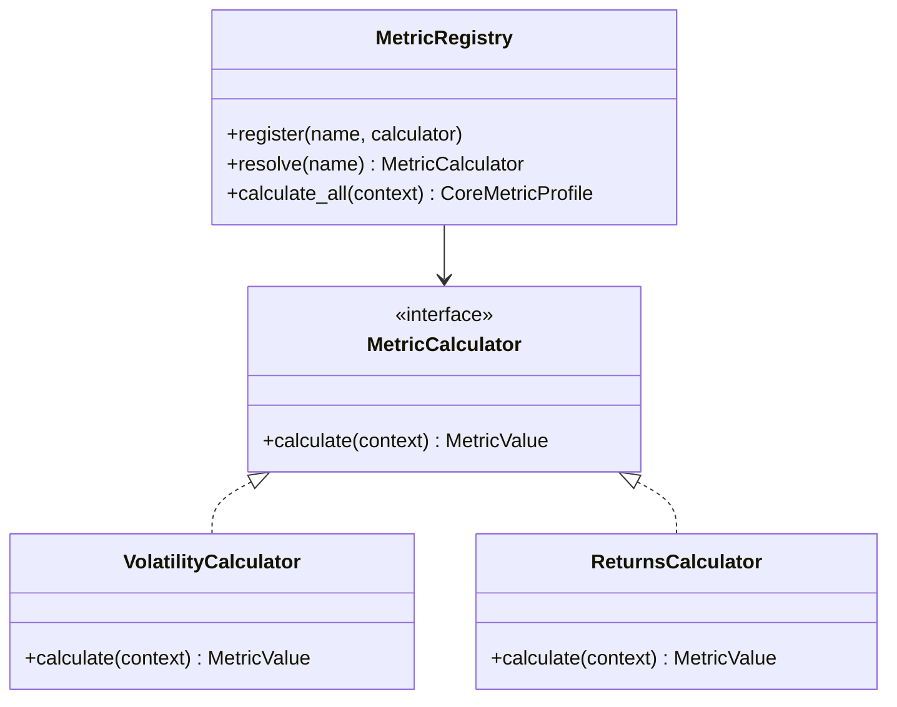

# 12_research.md - Requirements

## 1. Purpose

The research module provides sandboxed market-research, edge-discovery, feature-engineering, statistical-validation, market-structure, and report-generation capabilities for HaruQuant. It converts OHLCV/OHLCVS market data and research inputs into reproducible evidence artifacts, hypotheses, profiles, scorecards, summaries, and model-insight outputs without mutating live trading state or bypassing governance.

The module exists to help developers and analysts explore whether observed market behavior is statistically meaningful, reproducible, free from obvious leakage, and suitable for later promotion into strategy, risk, optimization, or execution workflows. Research outputs are advisory evidence only and cannot be consumed as execution authorization, risk approval, or live signal-control policy.

**Handoff Status**

Status: revision required before Builder handoff.

The requirements inventory is strong enough to describe the intended research domain, but implementation is blocked until public API overlaps are resolved, public API contracts, model schemas, standard envelope schema, exact behavior/error tables, reproducibility metadata, network-helper behavior, artifact persistence rules, measurable resource limits, usage failure paths, and requirement-to-test traceability are defined for the first approved implementation slice.

## 2. Ownership

### 2.1 Owns

- Research configuration models for data preparation, bootstrap/permutation/null-model settings, market-structure settings, mean-reversion settings, trend-persistence settings, session-edge settings, and overall Edge Lab configuration.
- Research-only data cleaning, enrichment, validation, preparation, and data-quality report models.
- Research feature calculations for returns, moving averages, volatility, range, momentum, Bollinger-style statistics, Hurst statistics, pivot levels, forward returns, MAE/MFE, and simple regime labels.
- Leakage controls for chronological splits, lookahead validation, and masking of research artifacts before persistence.
- Core metric calculator contracts, metric registry behavior, and normalized core metric profile creation.
- Edge-discovery studies for mean reversion, trend persistence, session behavior, and null baselines.
- Null-model generation, bootstrap distributions, permutation testing, multiple-comparison corrections, null percentiles, and null-threshold checks.
- Market-structure profiles, calibration candidates, profile overrides, validation summaries, stability reports, robustness reports, and strategy-fit reports.
- Unsupervised research contracts, PCA outputs, clustering outputs, cluster labels, cluster outperformance analysis, PCA risk-factor summaries, signal adaptation results, and unsupervised insight reports.
- Seasonality analysis filters and seasonality result generation.
- Research reporting, profile snapshots, dashboard summaries, scorecard reports, Markdown/JSON serialization, and multi-symbol reports.
- Standard research tool envelopes for external research helpers, including news/calendar parsing, research-hypothesis generation, evidence scoring, and evidence-pack construction.
- Public lazy-export registry for research capabilities.
- Optional external-feed helper contracts. External-feed helper exports may be absent or disabled when the corresponding provider adapter is not installed; importing `app.services.research` must not fail because of a missing optional adapter.

### 2.2 Does Not Own

- Live trading execution, broker adapters, order placement, order modification, order cancellation, reconciliation, or kill-switch controls.
- Portfolio risk enforcement, position sizing, exposure limits, or final trade approval.
- Strategy runtime orchestration or production signal execution.
- Backtest engine ownership, production optimization orchestration, or analytics module ownership for reused analytics ratios.
- Market-data provider contracts beyond research-ready input preparation and optional external research-feed helpers.
- Broad market-data provider adapter ownership. Research may own optional external-feed helper interfaces for research evidence only, but Data owns production market-data ingestion/provider contracts unless an explicit roadmap decision changes ownership.
- Persistent secrets, broker credentials, API credentials, Telegram/email credentials, or private production artifacts.
- AI provider execution policy, model-provider governance, or unbounded autonomous research actions.
- Durable product, roadmap, or architecture decisions outside the active documentation set.

## 3. API

### 3.1 Public Capabilities

- Importable service namespace: `app.services.research`.
- Lazy public exports declared through `app.services.research.__all__`.
- Standardized domain export metadata registered for the `research` tool category.
- Public configuration and model objects for research setup, data quality, core metrics, edge results, market structure, and unsupervised modeling.
- Public functional API groups for data preparation, feature engineering, leakage checks, core metric profiling, edge discovery, null-model analysis, market-structure analysis, unsupervised modeling, seasonality, standard research helpers, and reporting.
- Re-exported dataset validator types from shared validators: `DataSource`, `OHLCVSchema`.
- Re-exported analytics functions used by research workflows: `calmar_ratio`, `expectancy`, `max_drawdown`, `median_mae_mfe`, `profit_factor`, `sharpe_ratio`, `sortino_ratio`, `win_rate`.
- Each public export must be classified as stable public API, internal-support contract, compatibility re-export, experimental capability, or network-backed helper before Builder implementation.
- Each item in `app.services.research.__all__` must carry a documented classification label such as `stable`, `internal-support`, `compatibility-re-export`, `experimental`, `network-backed`, or `optional-provider`.
- `internal-support` and `compatibility-re-export` items must be excluded from agent-facing stable tool catalogs by default and must be documented as subject to breaking changes unless explicitly promoted through a versioned contract.
- Network-backed exports must be marked as `network-backed` and `optional-provider` in the lazy registry and must define provider-missing behavior.
- Each public callable must document input type, required fields, optional fields, output type, error behavior, side effects, determinism behavior, dependency behavior, and whether it may perform disk or network I/O.
- DataFrame-returning functions must document required input columns, output columns, index behavior, timezone expectations, row alignment, NaN behavior, and whether the input is mutated.
- Re-exported analytics functions must preserve upstream analytics contracts and must be covered by research compatibility tests.

## 4. Functional Requirements

### 4.1 Configuration and contracts

- [ ] `create_config` shall create an Edge Lab configuration object with common defaults for research workflows.
- [ ] `DataConfig` shall describe source, symbol, timeframe, and date-range data inputs for research workflows.
- [ ] `SessionConfig` shall describe trading-session windows and related session settings.
- [ ] `BootstrapConfig` shall describe bootstrap resampling settings.
- [ ] `PermutationConfig` shall describe permutation-test settings.
- [ ] `NullModelsConfig` shall describe null-model settings and acceptance criteria.
- [ ] `MeanReversionConfig` shall describe mean-reversion edge-discovery settings.
- [ ] `TrendPersistenceConfig` shall describe trend-persistence edge-discovery settings.
- [ ] `MarketStructureConfig` shall describe market-structure research settings.
- [ ] `SessionEdgeConfig` shall describe session-edge research settings.
- [ ] `EdgeLabConfig` shall aggregate the module's research configuration sections into one workflow-level configuration.
- [ ] `TradeSample` shall represent a normalized trade sample for edge-result reporting.
- [ ] `EdgeStats` shall represent summary statistics for an edge result.
- [ ] `EdgeResult` shall represent a complete edge-study result suitable for summaries and reports.
- [ ] `research_modeling_module` shall return the research modeling service module through the shared lazy-resolution utility.
- [ ] Each public export in `app.services.research.__all__` shall have a documented contract specifying API status, input types, required fields, output type, error behavior, side effects, determinism guarantees, network/heavy dependency status, and stability level.
- [ ] Core model contracts shall define required fields, optional fields, schema versions, validation behavior, serialization behavior, and example payloads for `PreparedDataset`, `DataQualityReportModel`, `EdgeResult`, `CoreMetricProfile`, `MarketStructureProfile`, `UnsupervisedResearchResult`, `UnsupervisedInsightReport`, and report payloads.
- [ ] The module shall define a canonical research error taxonomy covering validation errors, configuration errors, insufficient-data errors, statistical-invalidity errors, external-provider errors, serialization errors, resource-limit errors, and permission errors.
- [ ] Public library functions shall either raise typed research exceptions or return structured result objects with warnings according to their documented contract; standard research tools shall return errors through the standard HaruQuant envelope.
- [ ] Each public callable contract shall explicitly choose one failure pattern: typed exception, structured result with warnings/errors, or standard research envelope. Mixed behavior is not allowed unless every branch is documented.
- [ ] The standard research envelope shall define at least `status`, `data`, `errors`, `warnings`, `audit`, `side_effect`, `approval_required`, `dry_run`, `environment`, `risk_level`, and `timing`.
- [ ] Standard research envelope `errors` and `warnings` shall use machine-readable codes, human-readable messages, optional field paths, severity, retryability, and bounded details.
- [ ] Standard research envelope `audit` shall include request ID, correlation ID where available, tool/capability name, schema version, source references where applicable, created-at timestamp, and redaction/provenance metadata.
- [ ] Standard research envelope schema must be frozen for the approved first implementation slice before any network-backed, standard helper, evidence-pack, or agent-facing research helper is implemented.
- [ ] Each public callable in the approved implementation slice shall have a behavior/error table that maps invalid input, insufficient data, unsupported config, provider unavailable, rate limit, serialization failure, resource limit, and permission failure to one exact typed exception, structured result warning/error, or standard envelope error.
- [ ] Provisional insufficient-sample behavior: research calculations should fail with a typed validation error or standard-envelope error code such as `ERR_INSUFFICIENT_SAMPLES` when the approved minimum sample size is not met; final code names and thresholds remain pending owner/architect approval.
- [ ] The first implementation slice shall be explicitly approved before Builder handoff; proposed initial slice is data preparation plus core metrics unless the owner approves a different slice.
- [ ] A contract-first checklist shall block coding until every public callable in the approved slice has input/output types, error model, determinism guarantee, side-effect classification, envelope/result shape, examples, and mapped tests.
- [ ] The module glossary shall define `Edge Lab`, `null baseline`, `profile snapshot`, `research envelope`, `advisory evidence`, `leakage report`, and `research artifact`.

### 4.2 Data preparation, cleaning, validation, and enrichment

- [ ] `CanonicalOHLCVSSchema` shall define the canonical research dataset schema for OHLCV data with spread support.
- [ ] `DatasetIssue` shall represent a detected dataset quality issue.
- [ ] `CleaningAction` shall represent a cleaning action applied to research data.
- [ ] `DataQualityReportModel` shall summarize validation issues and cleaning actions for a dataset.
- [ ] `PreparedDataset` shall carry cleaned, validated, enriched data with its quality report and metadata.
- [ ] `CleaningConfig` shall describe data-cleaning behavior for timezone normalization, missing bars, non-trading periods, and spread anomalies.
- [ ] `CleaningConfig` shall define `missing_bar_strategy` with approved values such as `drop`, `forward_fill`, `interpolate`, and `none`, with deterministic behavior documented for each value.
- [ ] `CleaningConfig.missing_bar_strategy` default must be owner-approved before implementation. No Builder may infer a default or silently fill/drop bars without an approved default and explicit quality-report action.
- [ ] `CleaningConfig` shall define `non_trading_period_strategy` with approved values and shall document weekend, holiday, synthetic-bar, and provider-gap behavior.
- [ ] `clean_dataset` shall normalize timestamps to the configured timezone, resolve duplicate or non-monotonic timestamps according to `CleaningConfig`, apply configured missing-bar and non-trading-period handling, detect spread anomalies, and return both cleaned data and a `DataQualityReportModel` containing machine-readable cleaning actions and unresolved warnings.
- [ ] `EnrichmentConfig` shall describe enrichment settings for pip metadata, bar geometry, returns, labels, calendar fields, and sessions.
- [ ] `enrich_dataset` shall add research features such as pip metadata, bar geometry, return labels, calendar fields, and session fields.
- [ ] `validate_dataset` shall validate schema, continuity, OHLC consistency, duplicate timestamps, spread quality, and volume fields while distinguishing fatal validation errors from warnings through machine-readable issue codes.
- [ ] `prepare_research_dataset` shall accept either in-memory raw OHLCV/OHLCVS data or a configured research data source, apply cleaning, validation, and enrichment in deterministic order, and return a `PreparedDataset` containing prepared data, metadata, and a quality report. It shall fail with a typed validation or configuration error when fatal issues prevent safe research use.
- [ ] `DataSource` shall represent the shared data-source descriptor used by research dataset validation.
- [ ] `OHLCVSchema` shall represent the shared OHLCV schema descriptor used by research dataset validation.

### 4.3 Feature calculations and market features

- [ ] `log_returns` shall compute log returns from close prices.
- [ ] `simple_returns` shall compute arithmetic returns from close prices.
- [ ] `sma` shall compute simple moving averages over a configured window.
- [ ] `ema` shall compute exponential moving averages over a configured span.
- [ ] `std` shall compute rolling standard deviation over a configured window.
- [ ] `zscore` shall compute a close-price z-score relative to a moving average and standard deviation.
- [ ] `percent_rank` shall compute rolling percentile rank values.
- [ ] `atr` shall compute Average True Range.
- [ ] `atr_percent` shall compute ATR as a percentage of close price.
- [ ] `bollinger_bands` shall compute Bollinger-style upper, middle, and lower bands.
- [ ] `bb_width` shall compute Bollinger Band width.
- [ ] `bb_percent_b` shall compute Bollinger Band percent-B.
- [ ] `rolling_percentile_rank` shall compute rolling percentile rank for a supplied series.
- [ ] `rsi` shall compute Relative Strength Index.
- [ ] `rate_of_change` shall compute rate of change as a momentum measure.
- [ ] `momentum` shall compute simple price-difference momentum.
- [ ] `donchian_channel` shall compute Donchian breakout levels.
- [ ] `hurst_exponent` shall estimate Hurst exponent for mean-reversion versus trend detection.
- [ ] `rolling_hurst` shall compute Hurst exponent over rolling windows.
- [ ] `pivot_points` shall compute pivot, support, and resistance levels.
- [ ] `adr` shall compute Average Daily Range.
- [ ] `forward_returns` shall compute horizon-aligned forward log returns.
- [ ] `forward_max_favorable_excursion` shall compute maximum favorable price excursion over a forward horizon.
- [ ] `forward_max_adverse_excursion` shall compute maximum adverse price excursion over a forward horizon.
- [ ] `detect_volatility_regime` shall classify volatility regime using ATR percentile or equivalent volatility evidence.
- [ ] `detect_trend_regime` shall classify trend regime from moving-average relationships.
- [ ] `build_market_regime_feature_frame` shall build timestamp-aligned feature rows for PCA and clustering regime research.
- [ ] Feature functions shall define warm-up-period behavior, NaN handling, minimum window behavior, numeric precision expectations, and input mutation behavior.
- [ ] Forward-looking feature functions shall clearly label forward columns as research-only and shall be detectable by leakage checks.

### 4.4 Leakage controls and artifact masking

- [ ] `TimeSplitResult` shall represent deterministic chronological train, validation, and test partitions.
- [ ] `LeakageReport` shall define `suspected_columns`, `severity`, `evidence`, `recommendation`, `allowed_forward_columns`, `target_column`, and request/source metadata.
- [ ] `validate_no_lookahead_features` shall inspect declared feature metadata, column naming conventions, target/horizon columns, and configured allowed-forward columns, then return a structured leakage report identifying suspected lookahead fields, severity, evidence, and recommended action without mutating the input frame.
- [ ] `enforce_time_split` shall enforce deterministic chronological train, validation, and test splits.
- [ ] `mask_research_artifact` shall remove or redact sensitive fields from research artifacts before persistence or sharing.
- [ ] `dump_masked_research_json` shall serialize a masked research artifact to JSON.

### 4.5 Core metrics

- [ ] `MetricValue` shall represent one normalized metric value with metadata.
- [ ] `MetricContext` shall provide the dataset and metadata needed by metric calculators.
- [ ] `MetricCalculator` shall define the calculator interface for research core metrics.
- [ ] `MetricRegistry` shall register and resolve named metric calculators.
- [ ] `CoreMetricProfile` shall represent a normalized profile of core dataset metrics.
- [ ] `ReturnsCalculator` shall calculate return-related core metrics.
- [ ] `RocCalculator` shall calculate rate-of-change core metrics.
- [ ] `CandlesCalculator` shall calculate candle-geometry core metrics.
- [ ] `RangesCalculator` shall calculate range-related core metrics.
- [ ] `VolatilityCalculator` shall calculate volatility core metrics.
- [ ] `SpreadCalculator` shall calculate spread-quality core metrics.
- [ ] `VolumeActivityCalculator` shall calculate volume or activity core metrics.
- [ ] `build_default_registry` shall build the default registry of research metric calculators.
- [ ] `build_core_metric_profile` shall build a normalized core metric profile from a prepared dataset.
- [ ] Metric profile output shall define units, sample size, source dataset identity, warnings, undefined-value behavior, and reproducibility metadata.

### 4.6 Edge discovery studies

- [ ] `run_eds_null_baseline` shall establish null-model baselines for edge-discovery studies.
- [ ] `compare_to_null` shall compare observed expectancy or performance against a null distribution.
- [ ] `get_acceptance_criteria` shall extract acceptance criteria from a null baseline.
- [ ] `run_eds_mean_reversion` shall evaluate a mean-reversion detector based on compression and z-score fade behavior.
- [ ] `run_eds_trend_persistence` shall evaluate a trend-persistence detector based on high-ATR breakout follow-through behavior.
- [ ] `compute_session_statistics` shall calculate detailed statistics for a configured trading session.
- [ ] `run_session_breakout_strategy` shall evaluate an opening-range breakout strategy for a session.
- [ ] `run_session_fade_strategy` shall evaluate a mean-reversion fade strategy within a session.
- [ ] `run_eds_session` shall run session-edge discovery across configured session studies.
- [ ] `EdgeClass` shall represent the classification category assigned to an edge.
- [ ] `EdgeSummary` shall summarize mean-reversion and trend-persistence evidence for a symbol.
- [ ] `ClassificationResult` shall represent the result of classifying a symbol's edge profile.
- [ ] `classify_symbol` shall classify a symbol based on mean-reversion and trend-persistence evidence.
- [ ] Edge-discovery results shall include sample size, evaluated rule/config, source dataset identity, split identifiers, uncertainty metadata, warnings, and an advisory-only disclaimer.

### 4.7 Null models and statistical validation

- [ ] `block_bootstrap_ci` shall compute a confidence interval using block bootstrap resampling.
- [ ] `block_bootstrap_distribution` shall generate a bootstrap distribution for a statistic.
- [ ] `permutation_test` shall compute a permutation-test p-value.
- [ ] `random_entry_null` shall generate a null distribution from random entries in log-return space.
- [ ] `r_space_null` shall generate a null distribution in R-multiple space.
- [ ] `session_randomized_null` shall generate a null distribution by shuffling entries within the same session.
- [ ] `shuffle_returns_null` shall generate a null distribution by shuffling return blocks.
- [ ] `benjamini_hochberg` shall apply Benjamini-Hochberg false-discovery-rate correction.
- [ ] `holm_bonferroni` shall apply Holm-Bonferroni multiple-comparison correction.
- [ ] `compute_null_percentile` shall compute the percentile of an observed value within a null distribution.
- [ ] `null_distribution_stats` shall compute summary statistics for a null distribution.
- [ ] `exceeds_null_threshold` shall determine whether an observed value exceeds a configured null-distribution threshold.
- [ ] Null-model functions shall define behavior for invalid sample sizes, non-finite statistics, empty distributions, random seeds, replacement/block settings, and multiple-comparison correction applicability.
- [ ] Null-model behavior/error tables shall dictate exact outcomes for invalid sample sizes, non-finite statistics, empty distributions, invalid random seeds, invalid replacement/block settings, and inapplicable multiple-comparison corrections; these cases may not be left to Builder interpretation.
- [ ] Bootstrap, permutation, and null-generation functions shall accept an explicit `seed` parameter or source one from a documented configuration object; returned results shall record the effective seed.

### 4.8 Market structure profiles, calibration, validation, and fit

- [ ] `TrendSwingPoint` shall represent a detected swing point used in market-structure analysis.
- [ ] `TrendLeg` shall represent a directional leg between swing points.
- [ ] `TrendScoreRow` shall represent one market-structure score row.
- [ ] `MarketStructureProfile` shall represent a reproducible directional structure profile.
- [ ] `build_market_structure_profile` shall build a directional market-structure profile from a prepared dataset.
- [ ] `build_market_structure_research_profile` shall build a `MarketStructureProfile` plus configured research-only validation layers, including calibration evidence, stability summary, robustness summary, warnings, runtime metadata, and quality-adjusted confidence fields.
- [ ] `MarketStructureCalibrationCandidate` shall represent one calibration candidate for market-structure classification.
- [ ] `classify_with_candidate` shall classify market structure using one calibration candidate.
- [ ] `build_calibration_grid` shall build candidate parameter grids for market-structure calibration.
- [ ] `evaluate_calibration_candidates` shall evaluate market-structure calibration candidates against realized evidence.
- [ ] `MarketStructureMetricCalibrationCandidate` shall represent one metric-calibration candidate.
- [ ] `build_metric_calibration_grid` shall build candidate grids for market-structure metric calibration.
- [ ] `evaluate_metric_calibration_candidates` shall evaluate metric-calibration candidates against target behavior.
- [ ] `evaluate_profile_calibration` shall evaluate profile-level calibration behavior.
- [ ] `timeframe_bucket` shall map a timeframe into a market-structure profile bucket.
- [ ] `symbol_class` shall map a symbol into a market-structure symbol class.
- [ ] `resolve_market_structure_profile` shall resolve the applicable market-structure profile for a symbol and timeframe.
- [ ] `resolve_market_structure_profile_overrides` shall resolve profile overrides for a symbol, timeframe, or profile class.
- [ ] `confidence_bucket` shall convert validation evidence into a confidence bucket.
- [ ] `label_realized_market_behavior` shall classify realized future behavior as trend, reversion, or mixed.
- [ ] `build_validation_summary` shall summarize market-structure validation evidence.
- [ ] `build_market_structure_stability_report` shall report stability of market-structure behavior across samples or windows.
- [ ] `build_market_structure_robustness_report` shall report robustness of market-structure behavior across parameter or data variations.
- [ ] `build_strategy_fit` shall assess advisory strategy-fit evidence from market-structure research and shall not approve strategy promotion, mutate strategy runtime state, or authorize execution changes.
- [ ] Market-structure calibration outputs shall include candidate parameters, ranking criteria, validation window, stability evidence, and warnings for unstable rankings.

### 4.9 Unsupervised modeling and insight generation

- [ ] `UnsupervisedResearchConfig` shall describe unsupervised research settings.
- [ ] `UnsupervisedResearchConfig` shall include a `seed` field used by non-deterministic algorithms.
- [ ] `UnsupervisedResearchRequest` shall represent one unsupervised research request.
- [ ] `UnsupervisedResearchResult` shall represent a complete unsupervised research result.
- [ ] `UnsupervisedResearchService` shall orchestrate unsupervised research workflows.
- [ ] `FeatureSetFrame` shall represent the feature frame used by unsupervised modeling.
- [ ] `PcaModelResult` shall represent PCA scores, loadings, and explained variance.
- [ ] `ClusterModelResult` shall represent clustering labels and cluster metadata.
- [ ] `run_pca` shall run PCA on numeric feature columns and return component scores and loadings.
- [ ] `cluster_feature_space` shall cluster numeric feature rows using deterministic K-Means labels.
- [ ] `cluster_feature_space` shall consume `UnsupervisedResearchConfig.seed` or an explicit seed parameter so K-Means output is reproducible for fixed inputs and dependency versions.
- [ ] `attach_cluster_labels` shall attach cluster labels to a feature frame without mutating the input.
- [ ] `InvestmentDataSummary` shall represent descriptive statistics for investment data.
- [ ] `PcaRiskFactor` shall represent an interpreted PCA loading or risk factor.
- [ ] `ClusterOutperformance` shall represent forward-return evidence by cluster.
- [ ] `SignalAdaptationResult` shall represent signal-suppression or signal-adaptation recommendations by cluster.
- [ ] `UnsupervisedInsightReport` shall represent a complete unsupervised insight report for trading workflows.
- [ ] `summarize_investment_data` shall return key descriptive statistics for investment data.
- [ ] `identify_pca_risk_factors` shall extract the largest PCA loadings as interpretable risk factors.
- [ ] `compute_forward_returns` shall compute horizon-aligned forward returns from a price column.
- [ ] `analyze_cluster_outperformance` shall score clusters by future returns and assign semantic regime names.
- [ ] `adapt_signals_by_cluster` shall produce advisory signal-adaptation recommendations identifying clusters where forward-return evidence is weak; it shall not mutate strategy runtime state, block live entries, or authorize execution changes.
- [ ] `build_unsupervised_insight_report` shall build a complete unsupervised insight report for trading workflows.
- [ ] Unsupervised modeling outputs shall include preprocessing metadata, selected feature columns, dropped columns, scaler behavior, seed, model parameters, and cluster/component diagnostics.

### 4.10 Session and seasonality

- [ ] `active_sessions_for_hour` shall return the active trading sessions for a given hour.
- [ ] `session_label_for_hour` shall return the session label for a given hour.
- [ ] `session_hours_payload` shall return a machine-readable payload describing configured session hours.
- [ ] `tag_sessions` shall tag each market-data row with its trading session.
- [ ] `SeasonalityFilters` shall describe calendar, session, or symbol filters for seasonality analysis.
- [ ] `run_seasonality` shall calculate seasonality statistics for the provided dataset and filters.

### 4.11 Research standard tools and evidence helpers

- [ ] `fetch_forexfactory_news` shall retrieve ForexFactory news data through an isolated provider adapter using configured timeout, retry, rate-limit, cache, and offline-test behavior, then return a standard research envelope containing status, normalized data, provider metadata, source timestamp, warnings, errors, and audit metadata.
- [ ] `fetch_forexfactory_calendar` shall retrieve ForexFactory economic calendar data through an isolated provider adapter using configured timeout, retry, rate-limit, cache, stale-data, and offline-test behavior, then return it through the standard research envelope.
- [ ] `fetch_forexfactory_sentiment` shall retrieve ForexFactory sentiment data through an isolated provider adapter using configured timeout, retry, rate-limit, cache, stale-data, and offline-test behavior, then return it through the standard research envelope.
- [ ] `fetch_forexfactory_instrument_page` shall retrieve a symbol-specific ForexFactory page through an isolated provider adapter using configured timeout, retry, rate-limit, cache, stale-data, and offline-test behavior, then return it through the standard research envelope.
- [ ] ForexFactory and other external-feed helpers shall be optional-provider capabilities. Missing provider adapters shall return a deterministic provider-unavailable envelope or documented typed configuration error without breaking import or unrelated research workflows.
- [ ] External-feed helpers shall handle HTTP 429 responses, including missing or invalid `Retry-After` headers, through deterministic rate-limit errors or warnings with bounded retry metadata.
- [ ] `parse_news_items` shall normalize raw news items into structured research records.
- [ ] `parse_calendar_events` shall normalize economic calendar events.
- [ ] `parse_sentiment_snapshot` shall normalize sentiment-positioning snapshots.
- [ ] `filter_events_by_symbol` shall filter calendar events by the currencies or instruments relevant to a symbol.
- [ ] `classify_news_impact` shall classify the impact level of economic news.
- [ ] `create_news_blackout_windows` shall create advisory research blackout-window recommendations around news events and shall not create live no-trade controls or mutate risk/execution policy.
- [ ] `calculate_returns` shall calculate price returns for standard research tooling.
- [ ] `calculate_volatility` shall calculate rolling annualized volatility.
- [ ] `calculate_atr` shall calculate Average True Range.
- [ ] `calculate_adr` shall calculate Average Daily Range.
- [ ] `calculate_spread_statistics` shall calculate spread distribution statistics.
- [ ] `calculate_session_statistics` shall calculate session return statistics.
- [ ] `calculate_seasonality_statistics` shall calculate calendar seasonality statistics.
- [ ] `calculate_regime_features` shall calculate regime feature rows.
- [ ] `calculate_correlation_matrix` shall calculate a correlation matrix for research inputs.
- [ ] `detect_trend_strength` shall detect trend strength from moving-average evidence.
- [ ] `detect_market_regime` shall classify market regime from supplied research features.
- [ ] `detect_mean_reversion_conditions` shall detect mean-reversion conditions.
- [ ] `detect_breakout_conditions` shall detect breakout conditions.
- [ ] `generate_research_hypothesis` shall generate a structured research hypothesis from inputs and evidence.
- [ ] `score_research_hypothesis` shall score research evidence quality.
- [ ] `check_sample_size` shall validate whether a sample is large enough for the intended research claim.
- [ ] `check_data_snooping_risk` shall assess data-snooping risk.
- [ ] `check_lookahead_bias_risk` shall assess lookahead-bias risk.
- [ ] `check_hypothesis_testability` shall assess whether a hypothesis is testable.
- [ ] `check_contradictory_evidence` shall assess whether evidence contradicts the proposed hypothesis.
- [ ] `build_research_evidence_pack` shall build a structured research evidence pack containing source references, assumptions, warnings, and validation notes.

### 4.12 Reporting, profile snapshots, and scorecards

- [ ] `result_to_markdown` shall convert an edge result into a Markdown report.
- [ ] `result_to_summary` shall generate a concise summary dictionary from an edge result.
- [ ] `save_markdown` shall persist an edge result report as Markdown and shall expose an `overwrite: bool` contract.
- [ ] `save_json` shall persist an edge result report as JSON and shall expose an `overwrite: bool` contract.
- [ ] `generate_multi_symbol_report` shall generate a combined report for multiple symbols.
- [ ] `print_result_summary` shall print a concise result summary to console.
- [ ] `build_edge_profile_snapshot` shall build a normalized snapshot payload from progressive Edge Lab tab results.
- [ ] `build_profile_summary` shall build a concise dashboard-ready summary from one profile snapshot.
- [ ] `build_dashboard_summary` shall build a UI or dashboard summary block from one profile snapshot.
- [ ] `snapshot_report_json` shall build a machine-readable profile snapshot report.
- [ ] `snapshot_report_markdown` shall render a human-readable profile snapshot report.
- [ ] `comparison_report_markdown` shall render a Markdown comparison report from two profile snapshots.
- [ ] `save_json_report` shall save one complete JSON profile report.
- [ ] `save_markdown_report` shall save one complete Markdown profile report.
- [ ] `build_edge_lab_scorecard_report` shall build a deterministic backend scorecard report from progressive Edge Lab outputs.
- [ ] Report persistence functions shall define allowed output paths, overwrite behavior, atomic write behavior, encoding, masking behavior, permission-failure behavior, and return value.
- [ ] Report persistence functions shall write to a temporary file and atomically rename where the platform supports it; unsupported atomic behavior shall be disclosed in the result metadata or typed error.

### 4.13 Analytics compatibility exports

- [ ] `calmar_ratio` shall expose the analytics Calmar ratio for research workflows.
- [ ] `expectancy` shall expose the analytics expectancy calculation for research workflows.
- [ ] `max_drawdown` shall expose the analytics maximum drawdown calculation for research workflows.
- [ ] `median_mae_mfe` shall expose the analytics median MAE/MFE calculation for research workflows.
- [ ] `profit_factor` shall expose the analytics profit-factor calculation for research workflows.
- [ ] `sharpe_ratio` shall expose the analytics Sharpe ratio calculation for research workflows.
- [ ] `sortino_ratio` shall expose the analytics Sortino ratio calculation for research workflows.
- [ ] `win_rate` shall expose the analytics win-rate calculation for research workflows.

## 5. Non-Functional Requirements

- [ ] The module shall be sandboxed and shall not place, modify, cancel, or route live orders.
- [ ] The module shall fail closed when a workflow attempts to mutate live trading state or bypass governance.
- [ ] Research artifacts shall preserve source references, assumptions, warnings, and enough metadata to reproduce the result.
- [ ] Persisted research artifacts shall include artifact schema version, module version, config hash, dataset identity or data hash, random seed, generated-at timestamp, timezone, source references, and dependency/version metadata required to reproduce the result.
- [ ] Persisted research artifacts shall include SHA-256 hashes of the input dataset identity or canonical data snapshot and the effective configuration used to generate the artifact.
- [ ] Research outputs shall clearly distinguish observations, assumptions, warnings, and validation evidence from approved trading decisions.
- [ ] Data preparation and feature pipelines shall avoid lookahead bias and shall support explicit chronological split validation.
- [ ] Statistical results shall expose uncertainty where applicable, including p-values, confidence intervals, null percentiles, or comparable validation metadata.
- [ ] Multiple-comparison checks shall be available when evaluating many hypotheses or candidates.
- [ ] Public standard tools shall return the standard HaruQuant envelope containing status, tool metadata, request metadata, data, errors, warnings, and audit metadata.
- [ ] Standard tool envelopes shall include side-effect, approval-required, dry-run, environment, risk-level, and timing audit fields.
- [ ] The standard research envelope schema shall be versioned and referenced by every network-backed helper, standard helper, evidence-pack helper, and future agent-facing research tool.
- [ ] Network-backed research helpers shall be isolated from core deterministic calculations and shall be skippable in offline or heavy-environment tests.
- [ ] Network-backed research helpers shall enforce configured timeout, retry, rate-limit, cache, stale-data, and provider-layout-change behavior and shall return partial or failed results only through the standard research envelope with warnings and audit metadata.
- [ ] Serialization helpers shall support masked JSON or Markdown output without leaking sensitive source details.
- [ ] Public exports shall remain unique and resolvable through the lazy namespace.
- [ ] Seeded research workflows shall produce equivalent outputs for fixed input data, configuration, random seed, dependency versions, and artifact schema version.
- [ ] The module shall avoid storing real secrets, credentials, private broker data, or unredacted private artifacts.
- [ ] The module shall remain interoperable with analytics, optimization, risk, and execution modules only through documented public contracts.
- [ ] Importing `app.services.research` shall not perform network calls, disk writes, provider initialization, credential reads, live trading state access, or heavy model execution.
- [ ] Report and artifact serialization shall prevent path traversal, accidental overwrite unless configured, and leakage of masked fields.
- [ ] Long-running workflows shall expose duration metadata and shall support configured resource limits or fail with a typed resource-limit error.
- [ ] `ResearchResourceLimits` shall define `max_duration_seconds`, `max_memory_mb`, `max_rows`, and behavior when a limit is exceeded.
- [ ] Before production Builder handoff, the owner shall approve measurable resource targets for the first implementation slice, including maximum rows, runtime budget, memory budget, and reference hardware.
- [ ] Proposed benchmark placeholder: `prepare_research_dataset` should process up to 1,000,000 rows in no more than 30 seconds on approved reference hardware; this remains pending until owner approval.
- [ ] Until resource limits and reference hardware are approved, Research may not claim production-grade performance; oversized or long-running workflows must fail with a typed resource-limit error or standard-envelope resource-limit error instead of attempting unbounded work.
- [ ] The module shall emit structured warnings or logs for validation failures, dropped rows, masking actions, provider failures, statistical insufficiency, and partial report generation.

## 6. Testing

### 6.1 Edge Cases

- Empty datasets, single-row datasets, or datasets too small for requested windows or statistical tests.
- Missing required OHLCV/OHLCVS columns.
- Non-monotonic timestamps, duplicate timestamps, timezone-naive timestamps, mixed timezones, clock drift, out-of-order timestamps from merging distributed data sources, or gaps around daylight-saving transitions.
- Invalid OHLC relationships such as high below low, close outside high/low, or negative prices.
- Missing, zero, negative, or extreme spread and volume values.
- Datasets containing weekends, holidays, synthetic bars, or provider-specific missing-bar patterns.
- Rolling windows larger than available history.
- Forward-return, MAE, or MFE horizons extending beyond the available dataset.
- Constant-price series, all-zero returns, all-winning samples, all-losing samples, or division-by-zero metric denominators.
- Null distributions with too few samples, non-finite values, or observed values outside the sampled range.
- Bootstrap block sizes larger than the available sample.
- Permutation requests with invalid labels, empty groups, or unbalanced samples.
- Multiple-comparison corrections with empty p-value lists or invalid p-values.
- PCA or clustering inputs with non-numeric columns, constant columns, missing values, too few rows, or too many requested components/clusters.
- Session tagging across midnight, overlapping sessions, or instruments whose trading hours do not match configured sessions.
- Market-structure calibration candidates that produce no signals, all signals, contradictory labels, or unstable candidate rankings.
- Hypotheses that are untestable, underspecified, contradicted by evidence, or based on data-snooping.
- Research artifacts containing sensitive fields that must be masked before persistence.
- External research-feed fetch failures, malformed HTML, empty news feeds, HTTP 429 with missing or invalid `Retry-After`, rate limits, or provider layout changes.
- Oversized reports or artifacts that need summarization, truncation, or external storage.
- Attempts to use research outputs as direct execution approval.
- Corrupted or partially missing configuration objects.
- Unknown symbol, unsupported timeframe, malformed date range, or end date before start date.
- DataFrame inputs with duplicate column names, object-typed numeric columns, mixed numeric/string values, NaN/Inf values, or unsorted indexes.
- NaT timestamps, columns that are entirely NaN after cleaning, and all-identical feature values used in PCA or clustering.
- Multi-symbol workflows where one symbol fails and others succeed.
- Report output path is missing, unwritable, already exists, points outside allowed directories, or contains path traversal segments.
- Concurrent calls attempt to write the same report or mutate the same registry.
- Cached external feed exists but is stale, corrupted, or from a prior provider schema version.
- External helper returns partial data with warnings.
- Masking configuration misses a sensitive nested field.
- Artifact schema version is unknown or incompatible.

### 6.2 Tests Required

- Unit tests proving `app.services.research.__init__` contains only lazy export exposure and no business implementation.
- Unit tests proving `app.services.research.__all__` is unique, complete, and resolvable for public functions.
- Unit tests proving each research file has a module docstring and public member docstrings.
- Unit tests proving standard research tools include the required documentation template fields.
- Unit tests proving standard research tools return the standard envelope keys and audit keys.
- Unit tests proving exported functions have usage-example coverage or are explicitly skipped for external/heavy dependencies.
- Contract tests proving each public function documents input type, output type, error behavior, side effects, and determinism status.
- Contract tests proving each `app.services.research.__all__` export resolves to the documented callable or model.
- Contract tests for standard envelope shape for every network-backed helper.
- Contract tests for output schema of `PreparedDataset`, `DataQualityReportModel`, `EdgeResult`, `CoreMetricProfile`, `MarketStructureProfile`, `UnsupervisedResearchResult`, and report payloads.
- Requirement-to-test traceability proving that each public capability, high-risk edge case, and non-functional safety requirement has at least one verifying test.
- Data validation tests for missing columns, invalid OHLC values, duplicate timestamps, gaps, spreads, volume, and timezone handling.
- Cleaning and enrichment tests for missing bars, weekend/holiday behavior, bar geometry, returns, labels, and session fields.
- Feature calculation tests for returns, moving averages, volatility, ATR/ADR, Bollinger statistics, RSI, momentum, Hurst, pivots, forward returns, MAE, and MFE.
- Leakage tests for lookahead detection, chronological split enforcement, and masked artifact serialization.
- Core metric registry tests for calculator registration, duplicate names, missing calculators, and profile output shape.
- Edge-discovery tests for mean-reversion, trend-persistence, session breakout, session fade, and null-baseline workflows.
- Null-model tests for bootstrap, permutation, random-entry, R-space, session-randomized, shuffled-return, percentile, threshold, and multiple-comparison behavior.
- Market-structure tests for swing points, legs, score rows, profile construction, calibration grids, candidate evaluation, profile overrides, validation summaries, stability reports, robustness reports, and strategy-fit reports.
- Unsupervised modeling tests for feature-frame construction, PCA, clustering, label attachment without mutation, risk-factor extraction, cluster outperformance, signal adaptation, and insight reports.
- Seasonality and session tests for calendar filters, cross-midnight sessions, overlapping sessions, and sparse calendar buckets.
- Reporting tests for Markdown output, JSON output, multi-symbol reports, snapshot reports, comparison reports, dashboard summaries, profile summaries, and scorecard determinism.
- Standard helper tests for news/calendar/sentiment parsing, symbol filtering, impact classification, blackout-window creation, hypothesis generation, evidence scoring, sample-size checks, snooping-risk checks, lookahead-risk checks, testability checks, contradictory-evidence checks, and evidence-pack construction.
- Integration tests proving research artifacts cannot mutate live trading state and cannot bypass risk, approval, idempotency, reconciliation, audit, or kill-switch controls.
- Failure-path tests for external provider timeout, rate limit, malformed response, empty response, partial response, and layout-change behavior.
- Failure-path tests for serialization failure due to permission denied, missing directory, overwrite disabled, invalid path, path traversal, and non-serializable values.
- Security tests proving secrets, credentials, broker identifiers, account identifiers, and private artifact fields are masked before JSON or Markdown persistence.
- Import-time safety tests proving `app.services.research` does not read secrets, access live trading state, call providers, write files, or perform heavy model execution at import time.
- Concurrency tests for concurrent metric registry reads, report generation, same-path artifact writes, and deterministic seeded workflows under parallel execution.
- Performance/resource tests for maximum supported dataset size, bootstrap/permutation resource behavior, oversized report behavior, and network-helper timeout budgets.
- Observability tests proving validation reports include machine-readable issue codes, masking actions are auditable without exposing masked values, and partial failures include warnings and traceable audit metadata.
- Documentation/example tests proving valid examples execute against minimal fixtures and invalid-input examples produce documented error or warning shapes.
- Tests proving the documented error-handling pattern for each public callable is exercised by usage examples or dedicated failure-path examples.
- Tests proving missing optional provider adapters do not break `app.services.research` import or unrelated deterministic research functions.
- Property-based rolling-window and feature-calculation tests shall verify timestamp alignment and absence of lookahead behavior where a property-based test dependency is approved; otherwise equivalent deterministic generated-case tests are required.
- Masking robustness tests shall verify nested sensitive fields do not leak through `mask_research_artifact`, serialized JSON, Markdown reports, warnings, or audit metadata. Mutation-testing tooling is optional and requires dependency approval.

**Known Contract Clarifications Required**

- `forward_returns` and `compute_forward_returns` overlap; before Builder handoff, clarify whether they are separate APIs, aliases, or domain-specific variants.
- `atr` and `calculate_atr` overlap; before Builder handoff, clarify whether one returns a Series and the other returns an envelope-compatible output.
- `adr` and `calculate_adr` overlap; before Builder handoff, clarify the function-level distinction.
- `compute_session_statistics` and `calculate_session_statistics` overlap; before Builder handoff, clarify whether one is edge-discovery specific and the other is a standard helper.
- `detect_volatility_regime`, `detect_trend_regime`, `detect_market_regime`, `calculate_regime_features`, and `build_market_regime_feature_frame` must have documented boundaries.
- The overlap resolutions above must be moved into Functional Requirements before Builder handoff; this section cannot remain the only record of API responsibility.
- ForexFactory helper ownership must be explicitly scoped as optional external research-feed helper behavior, not broad market-data provider ownership.
- Standard research envelope schema, canonical error taxonomy, and audit fields must be frozen before any network-backed or agent-facing research helper is implemented.
- `CleaningConfig` strategy enums and exact cleaning actions must be approved before data-preparation implementation.
- `CleaningConfig` defaults, including `missing_bar_strategy`, must be approved before implementation.
- Seed source and propagation rules must be approved for bootstrap, permutation, null-model, clustering, and unsupervised workflows.
- Measurable resource targets and reference hardware must be approved before claiming production-grade performance.

### 6.3 Usage Examples

```python
from app.services.research import prepare_research_dataset, build_core_metric_profile

prepared = prepare_research_dataset(raw_data, config=config.data)
if getattr(prepared, "errors", None):
    raise RuntimeError("Research dataset preparation failed.")
profile = build_core_metric_profile(prepared)
```

```python
from app.services.research import validate_no_lookahead_features, enforce_time_split

split = enforce_time_split(feature_frame, train_fraction=0.6, validation_fraction=0.2)
leakage_report = validate_no_lookahead_features(feature_frame, target_column="future_return")
if leakage_report.severity in {"high", "critical"}:
    raise RuntimeError("Lookahead risk must be resolved before research continues.")
```

```python
from app.services.research import run_eds_mean_reversion, run_eds_null_baseline, compare_to_null

observed = run_eds_mean_reversion(prepared_dataset, config=config.mean_reversion)
baseline = run_eds_null_baseline(prepared_dataset, config=config.null_models)
comparison = compare_to_null(observed, baseline)
if comparison.warnings:
    review_warnings(comparison.warnings)
```

```python
from app.services.research import build_market_structure_profile, build_validation_summary

structure = build_market_structure_profile(prepared_dataset, config=config.market_structure)
validation = build_validation_summary(structure, realized_behavior)
```

```python
from app.services.research import build_research_evidence_pack, score_research_hypothesis

evidence_pack = build_research_evidence_pack(hypothesis=hypothesis, datasets=[prepared_dataset])
score = score_research_hypothesis(evidence_pack)
```

```python
from app.services.research import fetch_forexfactory_calendar

calendar_response = fetch_forexfactory_calendar(symbol="EURUSD", request_id="req_example")
if calendar_response.get("status") == "error" or calendar_response.get("errors"):
    handle_provider_error(calendar_response.get("errors", []))
```

## 7. Module Architecture

### 7.1 Target Folder Structure

```text
tools/
  research/
    __init__.py          # Lazy export definitions
    config.py            # Configuration schemas (EdgeLabConfig, DataConfig)
    data.py              # Data cleaning, normalization, enrichment
    features.py          # Technical indicators and returns calculations
    leakage.py           # Lookahead validators and time partitions
    metrics.py           # MetricRegistry and metric calculators
    studies/
      __init__.py
      eds.py             # Mean reversion and trend persistence EDS
      null_models.py     # Resampling, bootstraps, and permutations
      structure.py       # Directional swing legs and market structures
      unsupervised.py    # PCA and clustering algorithms
    helpers.py           # Standard news/sentiment/calendar evidence helpers
    reporting.py         # Markdown reports and scorecards persistence
    errors.py            # Mapped error codes and exception classes
```

### 7.2 Class Diagrams



## 8. Acceptance

### 8.5 Additional Details

#### Notes / Future Improvements

- The public namespace exposes both the active `__all__` contract and additional local research classes that may be used internally; rebuild planning should treat `__all__` as the externally visible minimum and local public classes as important implementation-support contracts.
- Future provider adapters may support multiple economic calendar/news providers behind the same standard research envelope.
- Research outputs should continue to be treated as evidence, not approval to trade.
- Statistical evidence can be sensitive to sample size, market regime, timeframe, and multiple testing; reports should keep uncertainty and caveats visible.
- Future research promotion workflows may integrate with strategy/risk review, but promotion and approval remain outside this module.

**Standard Research Envelope Schema**

The standard research envelope is required for network-backed helpers, standard helpers, evidence-pack helpers, and future agent-facing research tools. It is not optional once a callable is classified as an envelope-returning public capability.

Minimum envelope shape:

```json
{
  "status": "success | error | partial",
  "data": {},
  "errors": [],
  "warnings": [],
  "audit": {
    "request_id": "req_...",
    "correlation_id": "corr_...",
    "capability": "research_capability_name",
    "schema_version": "research-envelope-v1",
    "created_at": "2026-06-08T00:00:00Z",
    "source_refs": [],
    "redaction_applied": true,
    "provenance": {}
  },
  "side_effect": "none | reads_network | writes_artifact",
  "approval_required": false,
  "dry_run": false,
  "environment": "research",
  "risk_level": "low",
  "timing": {
    "execution_ms": 0.0
  }
}
```

`errors` and `warnings` entries must include `code`, `message`, `severity`, optional `field_path`, optional `retryable`, and bounded `details`. Envelope schema version, exact status enum, allowed side-effect enum, and canonical error-code names remain pending approval before Builder handoff.
