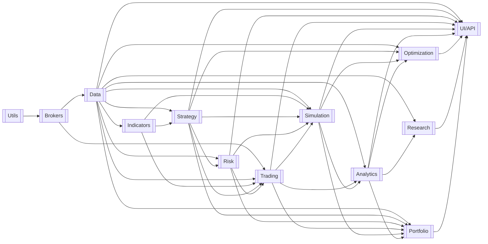

# Cross-Domain Alignment Review

> **Review date:** 2026-07-14
> **Reviewer:** Automated senior-architect alignment review (documentation only)
> **Verdict:** `Ready with minor corrections`

---

## 1. Review Scope

* **Top-level system document:** `docs/PROJECT.md` (last updated 2026-07-13)
* **Domain READMEs reviewed (13):** `app/utils`, `app/services/brokers`, `app/services/data`, `app/services/indicators`, `app/services/strategy`, `app/services/risk`, `app/services/trading`, `app/services/simulator` (Simulation), `app/services/analytics`, `app/services/optimization`, `app/services/research`, `app/services/portfolio`, `app/services/api` (UI/API)
* **Supporting documents:** `docs/dev/reconciliation/*` available; not needed to resolve any finding (no conflict required rationale lookup).
* **Documents unavailable:** None.
* **Review limitations:**
  * The review instruction listed 12 READMEs and omitted `app/services/portfolio/README.md`. PROJECT.md registers 13 domains including Portfolio, and the README exists, so it was reviewed. The review-input list should be corrected for future runs.
  * No production code was inspected or modified, per the review rules.

---

## 2. Executive Summary

* **Overall readiness:** `Ready with minor corrections`.
* **Domains reviewed:** 13 (all registered domains have a README; every README domain is in the top-level registry).
* **Cross-domain workflows reviewed:** 8 (`SYS-WF-001` … `SYS-WF-008`), all traced end to end.
* **Aligned items:** All 13 domain boundaries align with PROJECT.md (11 fully, 2 with minor wording/citation gaps). All 38 registered shared contracts carry `v1` consistently in owner and consumer documents. The dependency graph is acyclic and matches domain READMEs. Every persisted state has exactly one owner and no foreign writers. All shared settings except one have a single owner.
* **Conflicts:** 3 confirmed documentation conflicts (ALIGN-001, ALIGN-003, ALIGN-005), none structural.
* **Missing / unclear items:** 1 unowned capability (notification/observability transport, ALIGN-002), 1 unregistered shared setting (`METRICS_ENABLED`, ALIGN-006), several missing `SYS-WF-*` citations (ALIGN-007), and 4 low-priority consistency gaps.
* **Most important corrections:**
  1. Assign an owner for notification/observability transport or defer it explicitly (ALIGN-002) — resolve before Trading implementation.
  2. Fix the two "UI/API-owned `ApprovalAttestation`" phrases in the Risk README (ALIGN-001).
  3. Clarify that `PortfolioRiskSnapshot` does not cross the Risk boundary, or register it (ALIGN-003).
  4. Clarify Trading's reference-only relationship to Portfolio-owned contracts to keep the no-cycle guarantee unambiguous (ALIGN-005).

No conflict changes domain ownership, contract shape, or implementation order. Implementation may begin with Utils.

---

## 3. Domain Registry

| Domain | Package | Purpose | Owns | Inputs | Outputs | Depends on |
| ------ | ------- | ------- | ---- | ------ | ------- | ---------- |
| Utils | `app/utils` | Business-neutral shared infrastructure | Logging, UTC policy, `AuthContext`/`AuditEvent`, base errors, IDs, canonical JSON, settings/secret resolution, redaction | Log records, errors, audit payloads, env settings | Structured logs, mapped errors, IDs, canonical JSON, shared contracts, loaded settings | — |
| Brokers | `app/services/brokers` | Sole passthrough to broker/provider platforms | Adapters, registry/factory, session lifecycle, canonical DTO/error mapping, capability discovery, transport flow control | Canonical broker requests, `BrokerConnectionConfig` | `BrokerResult`/`BrokerError`, events, capability reports | Utils |
| Data | `app/services/data` | Trusted market/account data and shared persistence infra | Storage, audit store, DB/locking/migration execution, normalization, alignment, source policy, feeds, jobs | Broker reads (via Brokers), files, backfill commands | `MarketDataset`, `AccountStateSnapshot`, `MarketContextEvidence`, `FXConversionEvidence`, `AuditEventPage` | Utils, Brokers |
| Indicators | `app/services/indicators` | Deterministic pure-function indicators | Formula library, validation, registry/capability matrix | `MarketDataset`, params | `IndicatorSeries` | Utils, Data |
| Strategy | `app/services/strategy` | Signals and trade intents | Registry/versioning, parameter schemas, checkpoints, evaluation, intent generation | Datasets, indicator series, params, commands, snapshots | `TradeIntent`, registry records | Utils, Data, Indicators |
| Risk | `app/services/risk` | Master gate for all trading proposals | Interception, approved size, limits, exposure/drawdown, tokens, kill switch, eligibility/allocation decisions, audit chain | `TradeIntent`, snapshots, evidence, attestations, policies | `RiskDecision`, `ActionPolicyVerdict`, `KillSwitchState`, eligibility/allocation decisions | Utils, Data, Strategy |
| Trading | `app/services/trading` | Live/paper orchestration and execution | Runtime loops, `OrderIntent`, idempotency, gates, dispatch, reconciliation, emergency controls, execution state | Triggers, `RiskDecision`s, verdicts, `KillSwitchState`, rebalance requests | `OrderIntent`, `ExecutionReceipt`/`TradeRecord`, reconciliation results | Utils, Brokers, Data, Indicators, Strategy, Risk |
| Simulation | `app/services/simulator` | Deterministic historical backtesting | Backtest orchestration, tick replay, fill models, simulated state, journals, results/artifacts | Historical datasets, `OrderIntent`(sim), registry refs, backtest requests | `SimulationResult`, `PortfolioSimulationResult`, manifests, reports | Utils, Data, Indicators, Strategy, Risk, Trading |
| Analytics | `app/services/analytics` | Read-only performance evidence | Report/scorecard/dashboard schemas, metric kernels, caveat catalogs | `TradeRecord`s, `SimulationResult`s, benchmarks, FX evidence | `PerformanceReport`, `DashboardPayload`, `PortfolioAllocationEvidence` | Utils, Data, Trading, Simulation |
| Optimization | `app/services/optimization` | Bounded parameter search via simulation | Sweeps, splits/walk-forward, overfit diagnostics, checkpoints, results | Datasets, registry refs/schemas, simulation results, search config | `OptimizationResult` (`places_trade=False`) | Utils, Data, Strategy, Simulation, Analytics |
| Research | `app/services/research` | Sandboxed, leakage-gated advisory research | Cleaning, labeling, leakage gates, edge studies, statistics, artifacts | Datasets, Analytics metric contracts | `ResearchReport` (advisory only) | Utils, Data, Analytics |
| Portfolio | `app/services/portfolio` | Multi-strategy allocation construction/governance | Definitions, construction methods, versions, activation state, drift, reduce-only plans | Strategy refs, Risk decisions, Data/Analytics/Simulation evidence | `PortfolioConstructionResult`, `ActivePortfolioAllocation`, `PortfolioRebalancePlan`; receiver-owned requests to Risk/Simulation/Trading | Utils, Data, Strategy, Risk, Trading, Simulation, Analytics |
| UI/API | `app/services/api` + `ui/` | Authenticated presentation/delegation boundary | Routes, auth/authz, `AuthContext` production, DTOs, preflight, user/session/idempotency state | HTTP/WS requests, payloads, principals | Responses, broadcasts, views, `AuthContext`, submitted commands | All domains (public APIs only) |

---

## 4. Domain Boundary Alignment

| Domain | Top-level boundary | README boundary | Status | Finding | Required correction |
| ------ | ------------------ | --------------- | ------ | ------- | ------------------- |
| Utils | §2.1.1 | §1 | Aligned | Ownership, exclusions, and the two-consumer minimality rule match; every retained capability lists ≥2 consuming domains (goal 13 satisfied) | None |
| Brokers | §2.1.2 | §1 | Aligned | Pure passthrough, read/write trait split, no persistence — matches | None |
| Data | §2.1.3 | §1 | Aligned | Normalization, storage, shared DB/migration infra, read-only broker access — matches; labeling correctly transferred to Research | None |
| Indicators | §2.1.4 | §1 | Aligned | Pure functions, `available_at`, no I/O — matches; `values` DataFrame payload uses the documented owner-registered tabular exception | None |
| Strategy | §2.1.5 | §1 | Aligned | Proposals only; sizing proposals vs Risk-final size correctly split | None |
| Risk | §2.1.6 | §1 | Partial | Boundary matches, but WF-RISK-008/009 call `ApprovalAttestation` "UI/API-owned" (ALIGN-001) and WF-RISK-001 returns internal `PortfolioRiskSnapshot` across the boundary (ALIGN-003) | Fix wording; clarify snapshot exposure |
| Trading | §2.1.7 | §1 | Partial | Boundary matches; consumed-contracts table lists Portfolio-owned contracts, in tension with PROJECT.md's "receiver-owned request only" no-cycle rule (ALIGN-005); notifier target unowned (ALIGN-002) | Clarify reference-only semantics; resolve notifier owner |
| Simulation | §2.1.8 | §1 | Aligned | Sim-route authority, no live side effects — matches. README's Phase-1 FX-only scope is narrower than the asset-neutral top-level text; disclosed, not conflicting | Optionally note FX-only Phase 1 in PROJECT.md §2.1.8 |
| Analytics | §2.1.9 | §1 | Aligned | Read-only, no persistence, `PortfolioPerformanceReport` internal — matches | None |
| Optimization | §2.1.10 | §1 | Aligned | Backtest-adapter port correctly documented as internal (dependency inversion), matching PROJECT.md contract rules | None |
| Research | §2.1.11 | §1 | Aligned | Advisory-only, leakage-gated, owns labeling — matches | None |
| Portfolio | §2.1.12 | §1 | Partial | Boundary matches; cross-domain workflows omit the promised `SYS-WF-*` citations (ALIGN-007) | Add citations |
| UI/API | §2.1.13 | §1 | Aligned | Pure delegation, `AuthContext` production, external envelope family documented per PROJECT.md rule | None |

No domain claims another domain's responsibility, and the top-level document assigns no responsibility outside its owner.

---

## 5. Responsibility Ownership Matrix

| Responsibility | Owning domain | Referencing domains | Status | Finding |
| -------------- | ------------- | ------------------- | ------ | ------- |
| Broker/provider connectivity, sessions, adapters | Brokers | Data (read), Trading (mutation) | Aligned | Trait-scoped split consistently stated in all three docs |
| Market/account data normalization and truth | Data | All consumers | Aligned | Indicators/Strategy/Risk/Trading defer explicitly |
| Multi-timeframe alignment | Data | Indicators (WF-INDI-004) | Aligned | Indicators explicitly consumes pre-aligned input |
| Historical labeling | Research | Data (retired WF-DATA-006) | Aligned | Cleanly transferred; both sides agree |
| Indicator formulas | Indicators | Strategy, Trading, Simulation | Aligned | — |
| Signal/intent generation | Strategy | Risk, Trading, Simulation | Aligned | — |
| Strategy technical registration | Strategy | UI/API (submits), Risk (references) | Aligned | Registration ≠ eligibility stated on both sides |
| Operational eligibility | Risk | Strategy, Portfolio, Trading, UI/API | Aligned | — |
| Final approved position size | Risk | Strategy (proposes), Trading (executes exactly) | Aligned | — |
| Approval tokens, attestation validation | Risk | UI/API (produces attestations), Trading (validates via Risk) | Aligned | Wording defect only (ALIGN-001) |
| Kill-switch policy and canonical state | Risk | UI/API (commands), Trading (enforces) | Aligned | — |
| Order formulation, dispatch, reconciliation | Trading | Simulation (sim authority), Brokers (transport) | Aligned | — |
| Simulated fills and simulated state | Simulation | Trading (sim route) | Aligned | — |
| Performance metrics and reports | Analytics | Optimization, Research, Portfolio, UI/API | Aligned | Consumers reference, never recompute |
| Parameter search, ranking, overfit diagnostics | Optimization | Simulation (executes), Analytics (scores) | Aligned | Candidate expansion explicitly kept out of Utils |
| Portfolio construction, versions, drift, plans | Portfolio | Risk, Simulation, Trading, UI/API | Aligned | Capital weights (Portfolio) vs risk-budget projection (Risk) split is consistent |
| Authoritative risk-budget projection | Risk | Portfolio (references) | Aligned | — |
| Authentication, authz, password hashing | UI/API | Utils (explicitly excludes) | Aligned | — |
| Audit envelope schema | Utils | All emitters; Data persists | Aligned | — |
| Durable audit storage and query | Data | UI/API, Risk | Aligned | — |
| Secret resolution at composition root | Utils | Brokers (schema owner of `BrokerConnectionConfig`) | Aligned | Consistent in Utils, Brokers, Data, Trading |
| Notification / observability transport | **Unowned** | Trading (WF-TRD-010 targets "Utils notifier"); topology lists SMTP/Telegram/Desktop | **Unowned** | ALIGN-002: Utils explicitly excludes notification delivery; no domain owns it |

No duplicated business ownership was found. Defensive validation (e.g., Trading revalidating Risk verdict expiry, Simulation verifying route/volume) references owner contracts and does not recreate owner decisions.

---

## 6. Domain Dependency Review

| Source domain | Target domain | Reason | Top-level documented? | Domain README documented? | Status |
| ------------- | ------------- | ------ | --------------------- | ------------------------- | ------ |
| Utils | Brokers (and all) | Shared contracts, time, IDs, settings, redaction | Yes | Yes | Aligned |
| Brokers | Data | Read traits for acquisition/normalization | Yes | Yes | Aligned |
| Brokers | Trading | Mutation + execution-read traits | Yes | Yes | Aligned |
| Data | Indicators, Strategy, Risk, Trading, Simulation, Analytics, Optimization, Research, Portfolio, UI/API | Datasets, snapshots, evidence | Yes | Yes | Aligned |
| Indicators | Strategy, Trading, Simulation | `IndicatorSeries` | Yes | Yes | Aligned |
| Strategy | Risk, Trading, Simulation, Optimization, Portfolio, UI/API | Intents, registry references | Yes | Yes | Aligned |
| Risk | Trading, Simulation, Portfolio, UI/API | Decisions, verdicts, kill switch, eligibility, allocation decisions | Yes | Yes | Aligned |
| Trading | Simulation, Analytics, Portfolio, UI/API | `OrderIntent`(sim), records, execution outcomes | Yes | Yes | Aligned |
| Simulation | Analytics, Optimization, Portfolio, UI/API | Results | Yes | Yes | Aligned |
| Analytics | Optimization, Research, Portfolio, UI/API | Reports, evidence | Yes | Yes | Aligned |
| Optimization / Research / Portfolio | UI/API | Results/reports/allocations | Yes | Yes | Aligned |
| Portfolio | Risk / Simulation / Trading | Receiver-owned request submission only (no import of Portfolio by receivers) | Yes | Yes (Risk, Simulation) / Partial (Trading) | See ALIGN-005 |

**ALIGN-005 detail:** PROJECT.md states Risk/Trading/Simulation "receive only their own receiver-owned request contracts, so none imports Portfolio and no cycle is introduced," and its consumer lists for `ActivePortfolioAllocation` (Portfolio, UI/API) and `PortfolioRebalancePlan` (Risk, UI/API) exclude Trading. The Trading README, however, lists "`ActivePortfolioAllocation` / `PortfolioRebalancePlan` references" in its consumed-contracts table. The README's own wording ("bind an execution request to one immutable target and plan without importing Portfolio internals") indicates these are identifier/hash references carried inside the Trading-owned `PortfolioRebalanceExecutionRequest`, not contract consumption — but as written, the table contradicts the top-level consumer lists and blurs the no-cycle guarantee. Recommended resolution: keep PROJECT.md as authoritative; reword the Trading README row to "allocation/plan identifiers and hashes carried inside `PortfolioRebalanceExecutionRequest v1`" and remove the Portfolio owner attribution from the consumed-contracts table.

No circular dependency exists under the reference-only reading. No lower-level domain depends on a higher-level domain.

### Dependency diagram

```text
Confirmed
```



(Utils feeds every domain; only the Utils → Brokers edge is drawn, matching PROJECT.md convention.)

---

## 7. Public Input and Output Alignment

| Producer | Output | Consumer | Expected input | Status | Mismatch / action |
| -------- | ------ | -------- | -------------- | ------ | ----------------- |
| Data | `MarketDataset v1` | Indicators, Strategy, Trading, Simulation, Analytics, Optimization, Research, Portfolio, UI/API | `MarketDataset v1` | Aligned | Consumer lists identical in both documents, incl. the Risk exclusion note |
| Data | `AccountStateSnapshot v1` | Strategy, Risk, Trading, Portfolio | Same | Aligned | — |
| Data | `MarketContextEvidence v1` | Risk (interpreter), Trading (carrier only), UI/API (views) | Same | Aligned | Carrier-only role stated identically in Data, Trading, Risk |
| Data | `FXConversionEvidence v1` | Risk, Simulation, Analytics, Portfolio | Same | Aligned | — |
| Brokers | `BrokerResult`/`BrokerError`, DTOs, events | Data (read), Trading (read+mutation) | Same | Aligned | Trait scoping consistent |
| Indicators | `IndicatorSeries v1` | Strategy; Trading/Simulation as orchestrators | Same | Aligned | — |
| Strategy | `TradeIntent v1` | Risk; Trading/Simulation post-approval lineage | Same | Aligned | No `ApprovedSignal`-style rename anywhere |
| Risk | `RiskDecision v1` (`RiskDecisionPackage`) | Trading, UI/API, Simulation | Same | Aligned | Concrete package name documented by owner |
| Risk | `ActionPolicyVerdict v1`, `KillSwitchState v1` | Trading, UI/API | Same | Aligned | — |
| Risk | `PortfolioRiskSnapshot` (WF-RISK-001) | "Trading, Simulation, or UI/API" | Not a registered contract | **Undefined** | ALIGN-003: PROJECT.md forbids Risk-internal results crossing directly; register it or scope it to Risk-internal / `RiskDecision` embedding |
| Trading | `OrderIntent v1` | Simulation (sim); Brokers (paper/live); UI/API views | Same | Aligned | — |
| Trading | `TradeRecord`/`ExecutionReceipt v1` | Analytics, Portfolio, UI/API | Same | Partially aligned | ALIGN-004: Trading README counterparty column and PROJECT.md data-ownership row omit Portfolio; PROJECT.md §5 contract table includes it |
| Simulation | `SimulationResult v1` | Analytics, Optimization, UI/API | Same | Aligned | — |
| Simulation | `PortfolioSimulationResult v1` | Portfolio, Analytics, UI/API | Same | Aligned | Add to Simulation persisted-state read-access row (minor) |
| UI/API, Optimization | `SimulationBacktestRequestV1` | Simulation | Same | Aligned | Adapter-port pattern identical in both READMEs and PROJECT.md |
| Portfolio | `PortfolioBacktestRequestV1` | Simulation | Same | Aligned | — |
| Portfolio | Construction/allocation/plan contracts | Risk, Simulation, UI/API (per contract) | Same | Aligned | — |
| Portfolio | `AllocationReviewRequest`, `AllocationBudgetActivationRequest`, `PortfolioRebalanceExecutionRequest` | Risk / Risk / Trading (receivers own) | Same | Aligned | Receiver ownership consistent |
| Analytics | `PerformanceReport v1` | UI/API, Research, Optimization, Portfolio | Same | Aligned | — |
| Analytics | `DashboardPayload v1`, `PortfolioAllocationEvidence v1` | UI/API / Portfolio, Risk, UI/API | Same | Aligned | — |
| Optimization | `OptimizationResult v1` | UI/API | Same | Aligned | — |
| Research | `ResearchReport v1` | UI/API | Same | Aligned | — |
| UI/API | `StrategyRegistrationRequest`, `StrategyParameterUpdateRequest` | Strategy (owner/receiver) | Same | Aligned | — |
| UI/API | `KillSwitchCommand`, `ApprovalAttestation` | Risk (owner/receiver) | Same | Aligned | Wording defect in Risk workflow text (ALIGN-001) |
| UI/API | `AuthContext v1` (Utils-owned schema) | All governed domains | Same | Aligned | Producer/owner split documented identically |
| All emitters | `AuditEvent v1` (Utils-owned) | Data (persistence) | Same | Aligned | — |
| UI/API, Risk | `AuditEventQuery` → Data → `AuditEventPage` | Data (owner) | Same | Aligned | — |

Every cross-domain output has a documented accepting consumer; no consumer expects a field family the producer does not document at this (pre-implementation) level of detail.

---

## 8. Shared Contract Alignment

All 38 contracts in PROJECT.md §5 were checked against the owner README and each consumer README. All carry `contract_version="v1"` plus a separate namespaced `schema_id`, and every owner README repeats the version. Ownership follows the stated rules (receiver owns commands/requests; producer owns events/results; Utils owns shared envelopes).

| Contract / Event | Version | Owner | Producer / Submitter | Consumer(s) | Status | Conflict / correction |
| ---------------- | ------- | ----- | -------------------- | ----------- | ------ | --------------------- |
| `MarketDataset`, `AccountStateSnapshot`, `MarketContextEvidence`, `FXConversionEvidence`, `AuditEventQuery`/`AuditEventPage` | v1 | Data | Data | Per §7 | Aligned | — |
| `BrokerAdapter` + traits, `BrokerResult`/`BrokerError`, `BrokerConnectionConfig`, DTO family, `BrokerFeatureFlags`, connection/subscription events | v1 | Brokers | Brokers / composition root | Data, Trading | Aligned | Brokers README registers the DTO/event/feature-flag families not individually listed in PROJECT.md §5; they are covered by the `BrokerAdapter`/`BrokerResult` rows — acceptable, optionally cross-reference |
| `IndicatorSeries` | v1 | Indicators | Indicators | Strategy; Trading/Simulation orchestrators | Aligned | — |
| `TradeIntent`, `StrategyRegistrationRequest`, `StrategyParameterUpdateRequest` | v1 | Strategy | Strategy / UI/API | Per §7 | Aligned | — |
| `RiskDecision`, `ActionPolicyVerdict`, `KillSwitchCommand`, `KillSwitchState`, `ApprovalAttestation`, `StrategyOperationalEligibilityRequest`/`Decision`, `AllocationReviewRequest`, `AllocationRiskDecision`, `AllocationBudgetActivationRequest` | v1 | Risk | Risk / UI-API / Portfolio | Per §7 | Aligned (1 wording defect) | ALIGN-001: Risk WF-RISK-008/009 say "UI/API-owned `ApprovalAttestation`"; the contract is Risk-owned, UI/API-produced |
| `OrderIntent`, `ExecutionReceipt`, `TradeRecord`, `PortfolioRebalanceExecutionRequest` | v1 | Trading | Trading / Portfolio | Per §7 | Partially aligned | ALIGN-004 consumer-list omissions (Portfolio) |
| `SimulationResult`, `SimulationBacktestRequestV1`, `PortfolioBacktestRequestV1`, `PortfolioSimulationResult` | v1 | Simulation | Sim / UI-API+Opt / Portfolio | Per §7 | Aligned | — |
| `PerformanceReport`, `DashboardPayload`, `PortfolioAllocationEvidence` | v1 | Analytics | Analytics | Per §7 | Aligned | `AnalyticsReport` legacy name explicitly normalized to `PerformanceReport` in the Analytics README |
| `OptimizationResult` | v1 | Optimization | Optimization | UI/API | Aligned | — |
| `ResearchReport` | v1 | Research | Research | UI/API | Aligned | — |
| `PortfolioConstructionRequest`/`Result`, `ActivePortfolioAllocation`, `PortfolioRebalancePlan` | v1 | Portfolio | UI/API / Portfolio | Per §7 | Aligned | Portfolio README should adopt the standard owned-contracts table format with explicit Status/Version columns (cosmetic) |
| `AuthContext`, `AuditEvent` | v1 | Utils | UI/API / all emitters | All governed domains / Data | Aligned | — |
| UI/API external envelope family (`ApiResponse[T]`, `ApiError`, `ApiMetadata`, `StreamEvent[T]`, `RouteContract`, `GovernedRequestContext`, `PageContext`) | v1 | UI/API | UI/API | External clients | Aligned | Correctly documented in the UI/API README only, per PROJECT.md rule |

**Checks passed:** no duplicate definitions; no same-name/different-fields collisions; no raw provider objects crossing boundaries (the `IndicatorSeries.values` tabular payload uses the documented owner exception); no unowned contract; no contract missing a version; no version mismatch between owner and consumer documents. Internal ports (`BacktestExecutionAdapter`) and internal types (`PositionSizingResult`, `RegimeAssessment`, `PortfolioPerformanceReport`, `StandardTradingEnvelope`) are consistently declared non-cross-domain — with the single `PortfolioRiskSnapshot` exception (ALIGN-003).

---

## 9. Cross-Domain Workflow Alignment

| Workflow ID | Domains | Input boundary | Output boundary | Status | Finding |
| ----------- | ------- | -------------- | --------------- | ------ | ------- |
| `SYS-WF-001` Historical backtest | Data→Ind→Strat→Risk→Trading(sim)→Sim→Analytics | Backtest config | `SimulationResult` + `PerformanceReport` | Aligned | All 7 participants cite it; every hop's output = next input |
| `SYS-WF-002` Signal to live execution | Data→Ind→Strat→Risk→Trading(live)→Brokers→Analytics | Market state | Reconciled receipt or audited rejection | Aligned | Full contract chain verified incl. token/verdict/kill-switch gates |
| `SYS-WF-003` Parameter optimization | Data→Opt→Strat→Sim→Analytics→Opt | Search config | Optimized params + diagnostics | Partially aligned | Strategy's parameter-validation step maps to internal `WF-STR-001` with no citation; post-optimization parameter-adoption leg (UI/API → `StrategyParameterUpdateRequest` → Strategy, `WF-STR-008`) is registered as a contract but absent from the SYS-WF-003 chain (ALIGN-010) |
| `SYS-WF-004` Research to strategy candidate | Data→Research→UI/API→Strategy | Research request | Registration accepted/rejected | Aligned | Citations present both ways |
| `SYS-WF-005` Kill switch | UI/API→Risk→Trading | `KillSwitchCommand` | Halted execution, audited state | Aligned | Hierarchy/clearance semantics identical in Risk and Trading |
| `SYS-WF-006` Strategy operational eligibility | UI/API→Risk→Portfolio/Trading (+Strategy truth) | Eligibility request | Scoped eligibility decision | Partially aligned | Risk (WF-RISK-006) and UI/API (WF-API-017) cite it; Portfolio and Trading consume the decision but have no citing workflow entry (ALIGN-007) |
| `SYS-WF-007` Portfolio construction/activation | Data→Strat→Analytics→Portfolio→Sim→Risk→Portfolio | Construction request | `ActivePortfolioAllocation` | Partially aligned | Data/Analytics/Simulation/Risk/UI-API cite it; Portfolio's own workflows carry no `SYS-WF-*` citations despite its README promising them (ALIGN-007) |
| `SYS-WF-008` Governed rebalance | Data→Portfolio→Risk→Trading→Brokers→Analytics | Drift/schedule trigger | Reconciled reduce-only outcome | Partially aligned | Trading (WF-TRD-013), Risk, Data, Analytics cite it; Portfolio citations missing; Brokers cites it in the register row of `WF-BRK-004` but not in that workflow's detail section (ALIGN-007) |

### `SYS-WF-001` — Historical Backtest

**Expected system flow:**

```text
Data → MarketDataset → Indicators → IndicatorSeries → Strategy
→ TradeIntent → Risk → RiskDecision → Trading(sim) → OrderIntent
→ Simulation → SimulationResult → Analytics → PerformanceReport
```

**Alignment findings:**

| Step | Producer | Output | Consumer | Expected input | Status |
| ---: | -------- | ------ | -------- | -------------- | ------ |
| 1 | Data (`WF-DATA-001/012`) | `MarketDataset v1` | Indicators (`WF-INDI-002/004`) | `MarketDataset v1` | Aligned |
| 2 | Indicators | `IndicatorSeries v1` | Strategy (`WF-STR-002`) | `IndicatorSeries v1` | Aligned |
| 3 | Strategy | `TradeIntent v1` | Risk (`WF-RISK-004`) | `TradeIntent v1` | Aligned |
| 4 | Risk | `RiskDecision v1` | Trading (`WF-TRD-002`) | Approved `RiskDecision` | Aligned |
| 5 | Trading | `OrderIntent v1` (route=sim) | Simulation (`WF-SIM-002`) | `OrderIntent` route=sim | Aligned |
| 6 | Simulation (`WF-SIM-001`) | `SimulationResult v1` | Analytics (`WF-ANLT-001/006`) | `SimulationResult v1` | Aligned |
| 7 | Analytics | `PerformanceReport v1` | UI/API (`WF-API-006`) | `PerformanceReport v1` | Aligned |

**Failure-path ownership:**

| Failure | Detecting domain | Handling domain | Recovery outcome | Status |
| ------- | ---------------- | --------------- | ---------------- | ------ |
| Data gap/misalignment | Data / Simulation (`WF-SIM-004`) | Simulation | Structured abort, no partial publication | Aligned |
| Lookahead/clock drift | Strategy | Strategy | Atomic batch failure | Aligned |
| Risk rejection | Risk | Simulation (journals, continues) | Rejection recorded as result | Aligned |
| Persistence/invariant failure | Simulation | Simulation | Run aborted, result unpublished | Aligned |

**Required corrections:** None.

### `SYS-WF-002` — Signal to Live Execution

**Expected system flow:**

```text
Data → MarketDataset/AccountStateSnapshot/MarketContextEvidence → Indicators
→ IndicatorSeries → Strategy → TradeIntent → Risk
→ RiskDecision + ActionPolicyVerdict + approval token → Trading
→ OrderIntent → Brokers → BrokerResult → Trading (reconcile)
→ TradeRecord → Analytics → updated reports
```

**Alignment findings:**

| Step | Producer | Output | Consumer | Expected input | Status |
| ---: | -------- | ------ | -------- | -------------- | ------ |
| 1 | Data (`WF-DATA-001/008/013/014`) | Dataset, snapshot, context evidence | Trading orchestrator; Risk (evidence interpreter) | Same contracts | Aligned |
| 2 | Indicators (`WF-INDI-002`) | `IndicatorSeries v1` | Strategy (`WF-STR-007`) | Same | Aligned |
| 3 | Strategy | `TradeIntent v1` or no action | Risk (`WF-RISK-004/008`) | Same | Aligned |
| 4 | Risk | `RiskDecision` + `ActionPolicyVerdict` + token (atomic reservation) | Trading (`WF-TRD-004/012`) | Same, plus `KillSwitchState` | Aligned |
| 5 | Trading | Canonical mutation via `BrokerAdapter` | Brokers (`WF-BRK-004`) | Single-target approved mutation | Aligned |
| 6 | Brokers | `BrokerResult` (provider truth) | Trading (reconciliation, `WF-TRD-005`) | Same | Aligned |
| 7 | Trading | `TradeRecord v1` | Analytics (`WF-ANLT-001`) | Same | Aligned |

**Failure-path ownership:**

| Failure | Detecting domain | Handling domain | Recovery outcome | Status |
| ------- | ---------------- | --------------- | ---------------- | ------ |
| Unverifiable account state | Risk | Risk | Fail-closed rejection + audit | Aligned |
| Kill switch active | Risk | Trading | Instant rejection; cancel pending only | Aligned |
| Gate failure / `ALLOW_LIVE_MUTATIONS=false` | Trading | Trading | No dispatch; incident logged | Aligned |
| `BROKER_UNKNOWN_OUTCOME` | Brokers | Trading | Freeze scope; no blind retry; reconcile | Aligned |

**Required corrections:** Note (Low): PROJECT.md's sequence diagram shows Trading pushing `TradeRecord` to Analytics, while Analytics is stateless/pull-based (reports computed on request). Clarify the invocation direction in PROJECT.md §4 (`SYS-WF-002` step 4) when convenient.

### `SYS-WF-003` — Parameter Optimization

**Expected system flow:**

```text
Data → MarketDataset → Optimization (candidates)
→ Strategy (parameter validation) → Simulation (SimulationBacktestRequestV1 per candidate)
→ SimulationResult → Analytics → PerformanceReport → Optimization (rank + diagnostics)
→ OptimizationResult → UI/API
```

**Alignment findings:** All hops aligned (`WF-OPT-001/002/004/006`, `WF-SIM-003`, `WF-ANLT-001/006`, `WF-API-009`). The adapter-port pattern is documented identically on both sides.

**Failure-path ownership:** Unbounded ranges and oversized payloads rejected by Optimization; candidate failure recorded without score-zero substitution; leakage aborts — all consistently owned by Optimization. Aligned.

**Required corrections:**

* ALIGN-010: The optimized-parameter adoption leg (UI/API presents `OptimizationResult`, human approves, `StrategyParameterUpdateRequest` → Strategy, `WF-STR-008`) is fully specified at contract level but belongs to no `SYS-WF-*` chain. Extend `SYS-WF-003`'s output boundary note (or add a short follow-on paragraph) so the citation in `WF-STR-008` resolves.
* Strategy's step-2 role ("validate parameters against schemas") has no citing `WF-STR-*` cross-domain entry; either cite `SYS-WF-003` from `WF-STR-001` context or note the step is served by Strategy's public validation API.

### `SYS-WF-004` — Research to Strategy Candidate

**Expected system flow:**

```text
Data → MarketDataset → Research → ResearchReport (advisory)
→ UI/API (human approval) → StrategyRegistrationRequest → Strategy
→ immutable registered version or structured rejection
```

**Alignment findings:** `WF-RES-001/011`, `WF-API-005/011`, `WF-STR-008/009` all cite `SYS-WF-004`; boundaries match; registration explicitly does not confer eligibility on both sides. Aligned.

**Failure-path ownership:** Leakage gate (Research), authorization (UI/API), validation/provenance (Strategy) — each failure owned exactly once. Aligned.

**Required corrections:** None.

### `SYS-WF-005` — Operator Monitoring and Kill Switch

**Expected system flow:**

```text
UI/API → KillSwitchCommand → Risk → KillSwitchState
→ Trading (halt/cancel per emergency controls) → UI/API (state + audit view)
```

**Alignment findings:** `WF-API-013` → `WF-RISK-009/012` → `WF-TRD-007/009` all cite it; scope hierarchy (`global > portfolio > strategy > symbol`), clearance-by-attestation, and resume-after-reconciliation semantics are identical in Risk and Trading. Aligned.

**Failure-path ownership:** Unauthorized command (Risk rejects), missing/stale state (Trading blocks), partial emergency outcomes (Trading reports explicitly). Aligned.

**Required corrections:** None (ALIGN-001 wording fix touches WF-RISK-009's clearance sentence).

### `SYS-WF-006` — Strategy Operational Eligibility

**Alignment findings:** Request/decision contracts, fail-closed semantics, and the registration-vs-eligibility split align across Strategy, Risk, Portfolio, Trading, and UI/API. Citations: Risk ✓ (`WF-RISK-006`), UI/API ✓ (`WF-API-017`), Strategy ✓ (in `WF-STR-008` text); Portfolio and Trading consume the decision but have no workflow entry citing `SYS-WF-006`.

**Required corrections:** Add `SYS-WF-006` citations to Portfolio (eligibility validation inside `WF-PORT-001/002`) and Trading (eligibility revalidation inside `WF-TRD-013` or gate documentation) — part of ALIGN-007.

### `SYS-WF-007` — Portfolio Construction and Activation

**Alignment findings:** Contract chain (`PortfolioConstructionRequest` → construction → `PortfolioBacktestRequestV1` → `PortfolioSimulationResult` → `AllocationReviewRequest` → `AllocationRiskDecision` → `AllocationBudgetActivationRequest` → `ActivePortfolioAllocation`) matches across Portfolio, Simulation (`WF-SIM-009`), Risk (`WF-RISK-007`), Analytics (`WF-ANLT-013`), Data (`WF-DATA-015`), and UI/API (`WF-API-017`). Portfolio's own workflow details omit the `SYS-WF-*` IDs its README promises to record.

**Failure-path ownership:** Stale evidence, version drift, eligibility expiry, failed simulation, Risk rejection, kill switch, and concurrency conflict each block activation with one owner. Aligned.

**Required corrections:** Add `SYS-WF-007` citations to `WF-PORT-001…004` (ALIGN-007).

### `SYS-WF-008` — Portfolio Drift Review and Rebalance

**Alignment findings:** Reduce-only policy, "never open to match a weight," and unknown-outcome handling are stated identically in PROJECT.md, Portfolio, Risk, and Trading. Citations: Trading ✓ (`WF-TRD-013`), Risk ✓ (`WF-RISK-007`), Data ✓ (`WF-DATA-015`), Analytics ✓ (`WF-ANLT-013`); Portfolio ✗; Brokers cites it in the `WF-BRK-004` register row but not the detail section.

**Required corrections:** Add `SYS-WF-008` citations to `WF-PORT-005/006` and to the `WF-BRK-004` detail section (ALIGN-007).

---

## 10. Shared Configuration, Limits, and Data Ownership Alignment

| Setting / Limit | Owner | Used by | Status | Finding | Required correction |
| --------------- | ----- | ------- | ------ | ------- | ------------------- |
| `ENVIRONMENT` | Utils | All domains | Aligned | — | — |
| `RUNTIME_PROFILE` | Utils | Strategy, Risk, Trading, Simulation, Portfolio, UI/API | Aligned | Consumers consistently defer to Utils; route compatibility deferred to Trading | — |
| `EXECUTION_ROUTE` | Trading | Risk, Trading, Simulation, Portfolio, UI/API | Aligned | Risk and Simulation explicitly mark it Trading-owned | — |
| `ALLOW_LIVE_MUTATIONS` | Trading | Risk, Trading, Portfolio, UI/API | Aligned | — | — |
| `DATABASE_URL` / `DATA_DIR` | Data | Data, Trading, Simulation, Optimization, Research, Portfolio (+ UI/API) | Duplicated (list gap) | UI/API owns tables on the shared infrastructure but is missing from PROJECT.md's Used-by list (ALIGN-009) | Add UI/API to the Used-by column |
| `MT5_ENABLED` (+ per-platform toggles) | Brokers | Brokers, Data, Trading | Aligned | Data README correctly marks it Brokers-owned | — |
| UTC-first time policy | Utils | All domains | Aligned | — | — |
| Correlation/trace ID format | Utils | All domains | Conflicting (minor) | Utils and PROJECT.md define "prefixed UUID4"; Data, Strategy, Risk, Trading, Simulation READMEs say "prefixed UUID4/ULID" (ALIGN-008) | Canonicalize: either Utils adds ULID support or consumer READMEs drop "ULID" |
| Decimal precision standard | Utils | Data, Risk, Trading, Simulation, Analytics | Aligned | Domain-specific quantization documented by each owner | — |
| Secret redaction policy | Utils | All domains | Aligned | — | — |
| `LOG_LEVEL` | Utils | All domains | Aligned | — | — |
| `METRICS_ENABLED` | **Unowned** | Research (claims it is "consumed from `docs/PROJECT.md`") | **Unowned** | Not present in PROJECT.md §6 (ALIGN-006) | Add to PROJECT.md §6 (owner Utils) or delete the reference from the Research README |
| Boundary limits (payload, pagination, timeout) | Enforcing domain | Per domain | Aligned | UI/API's pagination/timeout ratification note matches PROJECT.md §6 rule | — |
| Profile/route compatibility matrix | PROJECT.md §6 | Trading, Risk, Simulation, Portfolio, UI/API | Aligned | Identical `research/none`, `simulation/sim`, `paper/paper`, `live/live` everywhere | — |

### Data ownership alignment

| State / Store | Owner (top-level) | Owner (README) | Writers found | Status | Finding / correction |
| ------------- | ----------------- | -------------- | ------------- | ------ | -------------------- |
| Market/account tables, historical storage, operational state | Data | Data | Data only | Aligned | — |
| Durable audit storage | Data | Data | Emitters via `AuditEvent`; Data persists | Aligned | — |
| Orders, fills, execution state, idempotency, `TradeRecord` | Trading | Trading | Trading only | Aligned | PROJECT.md read-access column omits Portfolio while §5 grants it `TradeRecord` access (ALIGN-004) |
| Strategy registry, schemas, checkpoints | Strategy | Strategy | Strategy only | Aligned | — |
| Risk policies, kill switch, tokens, eligibility/allocation decisions, budget projection, audit chain | Risk | Risk | Risk only | Aligned | — |
| Portfolio definitions, results, allocations, plans | Portfolio | Portfolio | Portfolio only | Aligned | — |
| Simulation results and artifacts | Simulation | Simulation | Simulation only | Aligned | README persisted-state read-access rows omit Portfolio (`PortfolioSimulationResult`); add it (minor) |
| Optimization checkpoints/results | Optimization | Optimization | Optimization only | Aligned | Deferred persistence activation clearly disclosed |
| Research artifacts | Research | Research | Research only | Aligned | — |
| Analytics persisted state | None | None | — | Aligned | — |
| Brokers persisted state | None | None | — | Aligned | — |
| User/session/settings; HTTP idempotency | UI/API | UI/API | UI/API only | Aligned | — |

No domain plans to write state owned by another domain; all cross-domain reads route through owner contracts.

---

## 11. Terminology and Identifier Alignment

| Concept | Terms currently used | Canonical term recommended | Documents to update |
| ------- | -------------------- | -------------------------- | ------------------- |
| Approval attestation ownership | "Risk-owned" (PROJECT.md, Risk §1) vs "UI/API-owned" (Risk WF-RISK-008/009) | Risk-owned, UI/API-produced | `app/services/risk/README.md` |
| Trace ID format | "prefixed UUID4" (Utils, PROJECT.md) vs "prefixed UUID4/ULID" (Data, Strategy, Risk, Trading, Simulation) | Prefixed UUID4 (Utils is owner) unless Utils explicitly adds ULID | Five consumer READMEs or Utils+PROJECT.md |
| Simulation domain vs package | Domain "Simulation", package `app/services/simulator`, IDs `WF-SIM-*`/`SIM_*` | Keep as documented (already registered consistently) | None |
| Backtest request naming | `SimulationBacktestRequestV1` / `PortfolioBacktestRequestV1` embed the version in the name; all other contracts use `Name` + `v1` | Keep (registered as-is); do not introduce a third style for future contracts | None (convention note) |
| Notification target | "Utils notifier/observability contracts" (Trading WF-TRD-010) vs Utils "does not own notification delivery" | Depends on ALIGN-002 resolution | `app/services/trading/README.md`, `app/utils/README.md` or PROJECT.md |
| Workflow ID numbering | Gaps: `WF-RISK-013`, `WF-SIM-008` absent | Acceptable (IDs retired, not reused) | None (cosmetic) |
| Analytics report name | Legacy `AnalyticsReport` normalized to `PerformanceReport` | `PerformanceReport` (already done) | None |

Status values (`Missing/Partial/Completed`), route/profile enums, error-code prefixes (`BROKER_*`, `SIM_*`, `OPT_*`, `IND_*`, `SIM_*`, `DataError` codes), actor names, and UTC `Z` formatting are used consistently across all documents.

---

## 12. Duplicated Responsibilities

| Responsibility | Domains involved | Evidence | Correct owner | Required correction |
| -------------- | ---------------- | -------- | ------------- | ------------------- |
| — | — | No duplicated business ownership found | — | — |

Checked candidates, all resolved as valid consumer-side validation rather than duplication: Trading revalidating Risk verdict/token expiry (defensive check against Risk-owned contracts); Simulation verifying route and approved volume (contract validation, no resizing); Portfolio validating eligibility freshness (references Risk decisions, never re-decides); Analytics/Research both computing statistics (different owned scopes — performance metrics vs research studies — Research explicitly consumes Analytics contracts without re-exporting); Data vs Research cleaning (production normalization vs research-only cleaning, with labeling explicitly transferred to Research and retired from Data).

---

## 13. Missing or Unowned Responsibilities

| Responsibility / workflow step | Why required | Proposed owner | Affected workflow |
| ------------------------------ | ------------ | -------------- | ----------------- |
| Notification / observability transport (SMTP / Telegram / Desktop) | Trading `WF-TRD-010` emits monitoring/incident evidence to "Utils observability/notifier contracts"; PROJECT.md topology shows a NOTIF unit; Utils explicitly excludes notification delivery | `Open Decision` (candidates: a small Utils-owned notifier contract with UI/API- or Trading-owned delivery, or an explicit deferral) | `SYS-WF-002`, `SYS-WF-005` (monitoring/incident paths) |
| `METRICS_ENABLED` shared setting | Research lists it among settings "consumed from `docs/PROJECT.md`", but PROJECT.md §6 does not define it | `Open Decision` (add with owner Utils, or remove the reference) | Observability across domains |
| Post-optimization parameter adoption leg in a `SYS-WF-*` chain | `StrategyParameterUpdateRequest` and `WF-STR-008` exist but no system workflow covers UI/API-approved adoption of optimized parameters | PROJECT.md §4 (extend `SYS-WF-003` narrative; no new domain ownership needed) | `SYS-WF-003` |

No orphaned top-level requirement was found: every `SYS-NFR-*` maps to owner NFRs in the READMEs, and every workflow step has an executing domain.

---

## 14. Conflicts Requiring Resolution

| Priority | Conflict ID | Conflict | Affected documents | Required decision |
| -------: | ----------- | -------- | ------------------ | ----------------- |
| High | `ALIGN-002` | Notification/observability transport is unowned: Trading targets "Utils notifier contracts" that Utils explicitly refuses to own; deployment topology shows SMTP/Telegram/Desktop with no owning domain | `docs/PROJECT.md` §9/§12, `app/services/trading/README.md`, `app/utils/README.md` | Assign an owner (or explicitly defer notifications from the initial build) and record it in PROJECT.md Open Decisions with an ADR; resolve before Trading implementation |
| Medium | `ALIGN-001` | Risk README workflow text calls `ApprovalAttestation` "UI/API-owned" (WF-RISK-008/009); PROJECT.md and Risk's own contract table make Risk the owner and UI/API the producer/submitter | `app/services/risk/README.md` | Reword to "UI/API-produced, Risk-owned" (PROJECT.md is correct; contract ownership rules say receiver owns requests) |
| Medium | `ALIGN-003` | `PortfolioRiskSnapshot` is documented as "returned to Trading, Simulation, or UI/API" (WF-RISK-001) but is not a registered contract, and PROJECT.md §5 states Risk-internal result types never cross the boundary directly | `app/services/risk/README.md` (or `docs/PROJECT.md` §5) | Either scope the snapshot as Risk-internal (outcomes exposed via `RiskDecision v1`/UI-API views) or register it as a versioned contract; recommend the former (smaller change) |
| Medium | `ALIGN-005` | Trading README's consumed-contracts table lists Portfolio-owned `ActivePortfolioAllocation`/`PortfolioRebalancePlan`; PROJECT.md's consumer lists exclude Trading and assert receivers get only their own receiver-owned request (no-cycle rule) | `app/services/trading/README.md` | Reword the row to "identifiers/hashes carried inside `PortfolioRebalanceExecutionRequest v1`"; PROJECT.md stays authoritative |
| Medium | `ALIGN-007` | `SYS-WF-*` citations incomplete: Portfolio workflows cite none (despite the README promising them); Trading lacks a `SYS-WF-006` citation; `WF-BRK-004` detail omits `SYS-WF-008`; Strategy's `SYS-WF-003` validation step has no citing workflow | `app/services/portfolio/README.md`, `app/services/trading/README.md`, `app/services/brokers/README.md`, `app/services/strategy/README.md` | Add the missing citations (no behavior change) |
| Low | `ALIGN-004` | `TradeRecord`/`ExecutionReceipt` consumer lists inconsistent: PROJECT.md §5 includes Portfolio; PROJECT.md §5 data-ownership row and Trading README counterparty column omit it | `docs/PROJECT.md`, `app/services/trading/README.md` | Add Portfolio to both omitting locations (contract table is correct) |
| Low | `ALIGN-006` | Research references shared setting `METRICS_ENABLED` that PROJECT.md §6 does not define | `docs/PROJECT.md` §6 or `app/services/research/README.md` | Register it (owner Utils) or remove the reference |
| Low | `ALIGN-008` | Trace-ID format: owner (Utils) says prefixed UUID4; five consumer READMEs say "UUID4/ULID" | Utils/PROJECT.md or Data, Strategy, Risk, Trading, Simulation READMEs | Canonicalize on the owner's definition |
| Low | `ALIGN-009` | PROJECT.md §6 `DATABASE_URL`/`DATA_DIR` Used-by list omits UI/API, which owns tables on the shared infrastructure | `docs/PROJECT.md` §6 | Add UI/API |
| Low | `ALIGN-010` | Optimized-parameter adoption leg absent from any `SYS-WF-*` chain although its contract and workflows exist | `docs/PROJECT.md` §4 | Extend the `SYS-WF-003` narrative/output note |

---

## 15. Required Documentation Corrections

### Top-level system document (`docs/PROJECT.md`)

* Record ALIGN-002 (notification transport owner) in §12 Open Decisions and resolve with an ADR; update §9 topology once decided.
* §5 data-ownership row for Trading state: add Portfolio to read access (ALIGN-004).
* §6: add UI/API to the `DATABASE_URL`/`DATA_DIR` Used-by list (ALIGN-009); register or reject `METRICS_ENABLED` (ALIGN-006).
* §4 `SYS-WF-003`: add the post-optimization parameter-adoption note (ALIGN-010); optionally clarify the Analytics invocation direction in `SYS-WF-002`.

### `Risk` README

* WF-RISK-008 and WF-RISK-009: replace "UI/API-owned `ApprovalAttestation`" with "UI/API-produced, Risk-owned `ApprovalAttestation`" (ALIGN-001).
* WF-RISK-001: state that `PortfolioRiskSnapshot` is Risk-internal and reaches consumers only inside `RiskDecision v1` or UI/API views — or propose registering it (ALIGN-003).

### `Trading` README

* Consumed-contracts table: reword the `ActivePortfolioAllocation`/`PortfolioRebalancePlan` row as identifier/hash references inside `PortfolioRebalanceExecutionRequest v1` (ALIGN-005).
* Add Portfolio to the `ExecutionReceipt`/`TradeRecord` counterparty column (ALIGN-004).
* WF-TRD-010: replace "Utils observability/notifier contracts" with the resolved owner from ALIGN-002.
* Add a `SYS-WF-006` citation where eligibility decisions are enforced (ALIGN-007).

### `Portfolio` README

* Add `SYS-WF-006`/`SYS-WF-007`/`SYS-WF-008` citations to `WF-PORT-001…006` details, as the README's own scope note promises (ALIGN-007).
* Cosmetic: adopt the standard owned-contracts table format (Status/Version columns).

### `Brokers` README

* Add `SYS-WF-008` to the `WF-BRK-004` detail section to match its register row (ALIGN-007).

### `Strategy` README

* Note which workflow (or public validation API) serves Strategy's `SYS-WF-003` parameter-validation step (ALIGN-007/010).

### `Data`, `Strategy`, `Risk`, `Trading`, `Simulation` READMEs

* Trace-ID wording: align "UUID4/ULID" with the Utils-owned "prefixed UUID4" policy (ALIGN-008).

### `Simulation` README

* Persisted-state table: add Portfolio read access via `PortfolioSimulationResult`.

### `Research` README

* Remove or re-anchor the `METRICS_ENABLED` reference per ALIGN-006.

No other corrections are needed; recommendations are intentionally minimal and documentation-only.

---

## 16. Confirmed Implementation Order

Dependencies are aligned; the order in PROJECT.md §3 remains valid:

```text
1. Utils
2. Brokers
3. Data
4. Indicators
5. Strategy
6. Risk
7. Trading        ← resolve ALIGN-002 (notification owner) before starting its monitoring module
8. Simulation
9. Analytics
10. Optimization, Research, Portfolio (parallel once prerequisites are stable)
11. UI/API
```

---

## 17. Open Decisions

| Status | Decision | Affected domains | Options / Notes |
| ------ | ------------------- | ---------------- | --------------- |
| Open | Owner of notification/observability transport (SMTP / Telegram / Desktop) referenced by Trading `WF-TRD-010` and the deployment topology | Utils, Trading, UI/API (candidates) | (a) Utils owns a minimal notifier contract, delivery implemented at composition root; (b) Trading owns its own incident-notification delivery; (c) UI/API owns operator notification; (d) defer notifications from the initial build. Must be recorded in PROJECT.md §12 and resolved with an ADR. |
| Open | Register `METRICS_ENABLED` as a shared setting or remove the Research reference | Utils, Research | Trivial either way; PROJECT.md §6 currently omits it while Research claims to consume it. |

Per PROJECT.md's change process, both cross-domain decisions must be added to PROJECT.md §12 (currently "No open decisions"), not only recorded here.

---

## 18. Readiness Assessment

### Result

`Ready with minor corrections`

### Reason

Domain boundaries, responsibility ownership, dependency directions, contract names/versions/owners, persisted-state ownership, and all eight cross-domain workflow chains are mutually consistent between PROJECT.md and the 13 domain READMEs. The findings are documentation defects — wording, citation gaps, consumer-list omissions, and one unowned auxiliary capability — none of which changes a boundary, a contract schema, or the implementation order. The dependency graph is acyclic; no domain redefines another's contract; the fail-closed model is stated identically at every boundary.

### Blocking items

* None for starting implementation (Utils → Risk are unaffected by any finding).
* `ALIGN-002` must be resolved before implementing Trading's monitoring/notification workflow (`WF-TRD-010`), otherwise the implementing agent would have to guess an owner.

### Non-blocking corrections

* `ALIGN-001` — Risk README attestation-ownership wording.
* `ALIGN-003` — `PortfolioRiskSnapshot` boundary clarification.
* `ALIGN-004` — `TradeRecord`/`ExecutionReceipt` consumer-list harmonization.
* `ALIGN-005` — Trading→Portfolio reference-only wording.
* `ALIGN-006` — `METRICS_ENABLED` registration or removal.
* `ALIGN-007` — Missing `SYS-WF-*` citations (Portfolio, Trading, Brokers, Strategy).
* `ALIGN-008` — Trace-ID format canonicalization.
* `ALIGN-009` — `DATABASE_URL` Used-by list.
* `ALIGN-010` — `SYS-WF-003` parameter-adoption leg.

---

## 19. Final Validation Checklist

* [x] Every domain README was reviewed (13, including Portfolio, which the review-input list omitted).
* [x] Every top-level domain has a matching README.
* [x] Every README domain appears in the top-level registry.
* [x] Every responsibility has one owner (one exception recorded: notification transport → Open Decision, ALIGN-002).
* [x] Every domain dependency is documented on both sides (one wording clarification: ALIGN-005).
* [x] No circular dependency exists.
* [x] Every cross-domain output has a matching input (one unregistered exposure flagged: ALIGN-003).
* [x] Every shared contract has one authoritative owner and an explicit `v1` consistent across documents.
* [x] Every cross-domain workflow connects end to end (SYS-WF-001…008 traced).
* [x] `SYS-WF-*` citations checked both ways — gaps recorded in ALIGN-007, none structural.
* [x] Failure and recovery ownership is clear in every workflow.
* [x] Shared configurations have one owner (one unregistered setting: ALIGN-006).
* [x] Every persisted state has one owning domain and no foreign writers.
* [x] Resolved cross-domain decisions: PROJECT.md §12 lists none; the two decisions discovered here are recorded in §17 and must be added there (no existing resolved decision lacks representation).
* [x] Every domain is assigned to a runtime unit in the deployment topology (§9: backend process, Trading worker, frontend).
* [x] Terminology is consistent (minor items in §11).
* [x] Duplicated responsibilities were checked — none found (§12).
* [x] Missing responsibilities were identified (§13).
* [x] Implementation order is confirmed (§16), with one pre-Trading condition.
* [x] No source document was modified — this report is the only file created.
* [x] No code was inspected or changed.
